<div align="center">


</div>

# PMax24h Station (Rain): 26125300

Maximum Precipitation in 24 hours (PMax24h) is the greatest amount of rainfall for a specific duration that is meteorologically possible for a given location, acting as a "worst-case" scenario for extreme storms, crucial for designing safety-critical infrastructure like bridges, river deviations, dams, spillways, and nuclear plants to prevent catastrophic failure. The PMax24h is related with the Probable Maximum Precipitation (PMP) and it is calculated by hydrologists using meteorological data to determine the upper limit of extreme rainfall, often leading to the Probable Maximum Flood (PMF) for flood control design, and is increasingly being studied for climate change impacts. Probable Maximum Precipitation (PMP) is the theoretical upper limit of rainfall, a deterministic estimate for extreme events, while probability distributions (like GEV, Gumbel) describe the likelihood and frequency of various precipitation amounts, including rare ones, showing how often events occur, with PMP representing the extreme end of these distributions, used for critical infrastructure design to ensure safety against the worst conceivable weather, unlike standard statistical forecasts which cover typical probabilities.

The most common probability distributions in hydrology, used for analyzing floods, rainfall, and streamflow, include the Normal, Log-Normal, Gumbel, Gamma (including Log-Pearson Type III), and Generalized Extreme Value (GEV) distributions, often chosen based on the data´s skewness and whether modeling extremes or general conditions, with Gumbel and GEV popular for extreme events like floods, while the Normal distribution serves as a baseline, though often requiring transformations for skewed hydrological data. These distributions help in designing water infrastructure, managing water resources, and forecasting hydrologic events.

> Hydrological data often isn´t perfectly normal (it´s skewed), so different distributions are needed for different applications, such as: **Flood Frequency Analysis**: Using Gumbel, GEV, or Log-Pearson Type III for predicting extreme flood magnitudes and their return periods, **Rainfall Analysis**: Normal for annual totals, but Log-Normal, Weibull, or GEV for intensity or extreme daily rainfall, **Streamflow Modeling**: Gamma and Log-Normal for maximum flows, GEV for minimum flows, and Kappa for daily flows.

<div align="center">

</img>

</div>


## A. General information


### 1. General running parameters

• app_version: _v20260312_. • runtime: _2026-03-12 07:15:23.203550_. • Python version: _3.14.0_. • SciPy version: _1.16.3_. • Pandas version: _2.3.3_. • NumPy version: _2.3.5_. • Stations dataset (station_dataset_file): _dataset/pmax24h_in/automatic_colombia_2003_2025.csv_. • Stations catalog (station_catalog_file): _dataset/CNE.xls_. • Minimum year to eval til year_max (date_min): _1900_. • Maximum year to eval since year_min (date_max): _2025_. • Creates, save and include plots into reports (create_plot): _True_. • Plot only fit distributions with Δo > Δ (plot_only_fit): _True_. • Plot only simple graphs avoiding multiple CDFs and multiple Extreme values plots (plot_only_simple): _True_. • Eval low extreme values, if False, evaluates high extreme values (low_extreme): _False_. • Eval every SciPy distribution as logarithmic (pdist_logarithmic_on): _True_. • Standard deviation normalized (ddof): _1.0_. • Return periods to eval in years (Tr): _[2, 2.33, 5, 10, 15, 20, 25, 50, 75, 100, 200, 250, 500, 750, 1000]_. • Minimum data sample per station, 0 means any (minimum_sample): _5_. • Z-Score maximum threshold to adjust a value, 0 means disable (zscore_max): _3.5_. • Z-Score minimum threshold to adjust a value, 0 means disable (zscore_min): _-2.5_. • Avoid zeros, e.g. rain = 0 (avoid_zeros): _True_. • Avoid null values (avoid_nans): _True_. 

:file_folder:Table: [dataset.csv](../../dataset/pmax24h_in/automatic_colombia_2003_2025.csv)

> Delta Degrees of Freedom (DDOF): is a parameter used in the formulas for calculating variance and standard deviation. When ddof=0, the divisor is $N$ (the total number of observations) and this is used when your data set is the entire population. When ddof=1, the divisor is $N-1$ and this is used when your data set is a sample drawn from a larger population. Using $N-1$ provides an unbiased estimate of the population variance (known as Bessel´s correction).


### 2. Station info and location

|   id |   CODIGO | NOMBRE                   | CATEGORIA               | TECNOLOGIA                | ESTADO   | FECHA_INSTALACION   |   FECHA_SUSPENSION |   ALTITUD |   LATITUD |   LONGITUD | DEPARTAMENTO   | MUNICIPIO   | AREA_OPERATIVA                         | ENTIDAD                                                     | AREA_HIDROGRAFICA   | ZONA_HIDROGRAFICA   | SUBZONA_HIDROGRAFICA   |   CORRIENTE | Catalogo   |   Version |
|-----:|---------:|:-------------------------|:------------------------|:--------------------------|:---------|:--------------------|-------------------:|----------:|----------:|-----------:|:---------------|:------------|:---------------------------------------|:------------------------------------------------------------|:--------------------|:--------------------|:-----------------------|------------:|:-----------|----------:|
|    0 | 26125300 | CALARCA - AUT [26125300] | Climatológica Principal | Automática con Telemetría | Activa   | 04/10/2004          |                nan |      2255 |   4.52831 |   -75.5964 | Quindío        | Calarcá     | Area Operativa 09 - Cauca-Valle-Caldas | INSTITUTO DE HIDROLOGIA METEOROLOGIA Y ESTUDIOS AMBIENTALES | Magdalena Cauca     | Cauca               | Río La Vieja           |         nan | CNE_IDEAM  |  20251226 |

<div align="center">

Dynamic map: [:earth_americas:Google](http://maps.google.com/maps?q=4.528305556,-75.59638889) [:earth_americas:OSM](https://www.openstreetmap.org/#map=18/4.528305556/-75.59638889&layers=P) [:earth_americas:Bing](https://www.bing.com/maps?cp=4.528305556~-75.59638889&lvl=18) [:earth_americas:Apple](https://maps.apple.com/frame?center=4.528305556%2C-75.59638889&span=0.003%2C0.006)

</div>


<div align="center">

```geojson
{
  "type": "Feature",
  "geometry": {
    "type": "Point", 
    "coordinates": [-75.59638889, 4.528305556]
  }, 
  "properties": {
    "Name": "26125300"
  }
}
```

</div>


### 3. Discrete values table and plot

<div align="center">

|               |          0 |          1 |           2 |           3 |           4 |           5 |          6 |          7 |          8 |         9 |
|:--------------|-----------:|-----------:|------------:|------------:|------------:|------------:|-----------:|-----------:|-----------:|----------:|
| Date          | 2016       | 2017       | 2018        | 2019        | 2020        | 2021        | 2022       | 2023       | 2024       | 2025      |
| Value         |    2.6     |   75.2     |   38.1      |   68.4      |   61.9      |   61.4      |    0.3     |    1.4     |  143.8     |   81.2    |
| Value_initial |    2.6     |   75.2     |   38.1      |   68.4      |   61.9      |   61.4      |    0.3     |    1.4     |  143.8     |   81.2    |
| count         |   10       |   10       |   10        |   10        |   10        |   10        |   10       |   10       |   10       |   10      |
| mean          |   53.43    |   53.43    |   53.43     |   53.43     |   53.43     |   53.43     |   53.43    |   53.43    |   53.43    |   53.43   |
| std           |   44.87    |   44.87    |   44.87     |   44.87     |   44.87     |   44.87     |   44.87    |   44.87    |   44.87    |   44.87   |
| zscore        |   -1.13283 |    0.48518 |   -0.341654 |    0.333631 |    0.188768 |    0.177624 |   -1.18409 |   -1.15957 |    2.01404 |    0.6189 |


</div>


<div align="center">

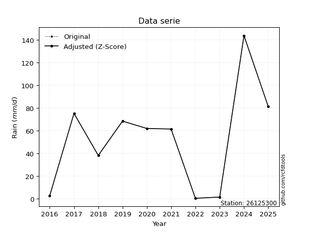</img>

</div>


> The initial value (value_initial) correspond to the initial obtained or null completed value, and value (value) is adjusted only when the initial value is outside the valid range (outlier) definite through the Z-Score value. If Z-Score is active, values out of range or outliers are replaced with the station mean value. A Z-Score (or standard score) measures how many standard deviations a data point is from the mean of a dataset, indicating its relative position; positive scores mean above the mean, negative mean below, and a score of zero is exactly at the mean, allowing for comparison of values from different distributions. It´s calculated using the formula $z=(x–μ)/σ$, where $x$ is the data point, $μ$ is the mean, and $σ$ is the standard deviation, helping identify outliers and understand probability.
>
> <sub>**Note**: In this study, "completing" (filling gaps in) and "extending" (forecasting or lengthening the historical record) rainfall data series are avoided for certain critical analyses because they introduce artificial bias and uncertainty, which can distort the statistics of rare events (extremes), alter day-to-day variability, and compromise the integrity and homogeneity of the original data. Some reasons against Completing/Extending rainfall data are: **Distortion of Extremes and Variability**: The primary issue is that most gap-filling or extension methods rely on averaging or regression with nearby stations, which inherently smooths the data. Rainfall is highly variable in space and time, with a large percentage of zero values and occasional large storms. Infilling methods often underestimate the highest values and overestimate the lowest (zero) values, which severely distorts analyses focused on flood frequency, drought severity, and intensity-duration-frequency (IDF) curves, **Loss of Data Homogeneity**: Infilled or extended data are synthetic estimates, not actual measurements. Combining these estimates with observed data can violate the assumption of data homogeneity, which requires that the data properties do not change over time. Inhomogeneity can lead to incorrect conclusions about long-term trends or changes in climate patterns, **Propagation of Errors**: Errors and biases from the original data (e.g., wind-induced undercatch, instrument errors, site changes) or the data used for imputation can propagate through the analysis, leading to unreliable hydrological models and inaccurate predictions, **Compromised Statistical Integrity**: For statistical analyses, especially those involving the frequency of events, using artificial data can introduce time bias or autocorrelation that doesn´t exist in reality, making it difficult to assess the true probability of events, **Difficulty in Validation**: It is difficult to accurately validate the quality of filled or extended data, especially for past periods where ground-truth measurements are unavailable. The reliability of imputation techniques heavily depends on the density of the surrounding station network and the complexity of the local topography.</sub>


### 4. Active continuous probability distributions from SciPy (80 of 104 available)

A Probability Density Function (PDF) describes the relative likelihood of a continuous random variable falling within a specific range, where the total area under its curve equals 1, and the area over any interval gives the actual probability for that range. Unlike discrete probabilities (like rolling a die), a PDF shows density, not direct probability for a single point (which is zero), with higher points indicating higher likelihood, often visualized as a bell curve for normal distributions.

A log of a probability density function (log-PDF) is simply the logarithm of the PDF´s value, denoted as $log(f(x))$, useful for converting multiplication of probabilities into addition, improving numerical stability with tiny numbers, and connecting to information theory concepts like entropy. Instead of dealing with very small probabilities (e.g., 0.000001), log-PDFs use negative numbers (e.g., $log(0.00001) ≈ -11.51$ that are easier for computers to handle, preventing underflow errors and simplifying complex calculations. In this study, each active probability distribution from SciPy is also evaluated in the $log$ form.

[scipy.stats](https://docs.scipy.org/doc/scipy/reference/stats.html) is a Python´s powerful submodule within the SciPy library for comprehensive statistical analysis, offering over 130 probability distributions (like Normal, Poisson, etc.), functions for descriptive stats (mean, variance), hypothesis testing (t-tests, chi-square), random variable generation, and statistical tests, making it essential for data science, modeling, and research. It provides tools to explore, model, and draw conclusions from data efficiently, working seamlessly with [NumPy](https://numpy.org/).

<div align="center">

|   id | p_dist           |   n_parameter | fit_method   | label                                                                       | active   | ref                                                                                                      |
|-----:|:-----------------|--------------:|:-------------|:----------------------------------------------------------------------------|:---------|:---------------------------------------------------------------------------------------------------------|
|    0 | alpha            |             3 | MLE          | Alpha                                                                       | True     | [:mortar_board:](https://docs.scipy.org/doc/scipy/reference/generated/scipy.stats.alpha.html)            |
|    1 | anglit           |             2 | MM           | Anglit                                                                      | True     | [:mortar_board:](https://docs.scipy.org/doc/scipy/reference/generated/scipy.stats.anglit.html)           |
|    2 | arcsine          |             2 | MM           | Arcsine                                                                     | True     | [:mortar_board:](https://docs.scipy.org/doc/scipy/reference/generated/scipy.stats.arcsine.html)          |
|    3 | argus            |             3 | MLE          | Argus                                                                       | True     | [:mortar_board:](https://docs.scipy.org/doc/scipy/reference/generated/scipy.stats.argus.html)            |
|    4 | beta             |             4 | MLE          | Beta                                                                        | True     | [:mortar_board:](https://docs.scipy.org/doc/scipy/reference/generated/scipy.stats.beta.html)             |
|    5 | betaprime        |             4 | MLE          | Beta prime                                                                  | True     | [:mortar_board:](https://docs.scipy.org/doc/scipy/reference/generated/scipy.stats.betaprime.html)        |
|    6 | bradford         |             3 | MLE          | Bradford                                                                    | True     | [:mortar_board:](https://docs.scipy.org/doc/scipy/reference/generated/scipy.stats.bradford.html)         |
|    7 | burr             |             4 | MLE          | Burr (Type III)                                                             | True     | [:mortar_board:](https://docs.scipy.org/doc/scipy/reference/generated/scipy.stats.burr.html)             |
|    8 | burr12           |             4 | MLE          | Burr (Type III) 12                                                          | True     | [:mortar_board:](https://docs.scipy.org/doc/scipy/reference/generated/scipy.stats.burr12.html)           |
|    9 | cosine           |             2 | MLE          | Cosine                                                                      | True     | [:mortar_board:](https://docs.scipy.org/doc/scipy/reference/generated/scipy.stats.cosine.html)           |
|   10 | crystalball      |             4 | MLE          | Crystalball                                                                 | True     | [:mortar_board:](https://docs.scipy.org/doc/scipy/reference/generated/scipy.stats.crystalball.html)      |
|   11 | dgamma           |             3 | MLE          | Double gamma                                                                | True     | [:mortar_board:](https://docs.scipy.org/doc/scipy/reference/generated/scipy.stats.dgamma.html)           |
|   12 | dweibull         |             3 | MLE          | Double Weibull                                                              | True     | [:mortar_board:](https://docs.scipy.org/doc/scipy/reference/generated/scipy.stats.dweibull.html)         |
|   13 | erlang           |             3 | MLE          | Erlang                                                                      | True     | [:mortar_board:](https://docs.scipy.org/doc/scipy/reference/generated/scipy.stats.erlang.html)           |
|   14 | exponnorm        |             3 | MLE          | Exponentially modified Normal                                               | True     | [:mortar_board:](https://docs.scipy.org/doc/scipy/reference/generated/scipy.stats.exponnorm.html)        |
|   15 | exponpow         |             3 | MLE          | Exponential power                                                           | True     | [:mortar_board:](https://docs.scipy.org/doc/scipy/reference/generated/scipy.stats.exponpow.html)         |
|   16 | exponweib        |             4 | MLE          | Exponentiated Weibull                                                       | True     | [:mortar_board:](https://docs.scipy.org/doc/scipy/reference/generated/scipy.stats.exponweib.html)        |
|   17 | f                |             4 | MLE          | F                                                                           | True     | [:mortar_board:](https://docs.scipy.org/doc/scipy/reference/generated/scipy.stats.f.html)                |
|   18 | fatiguelife      |             3 | MLE          | Fatigue-life (Birnbaum-Saunders)                                            | True     | [:mortar_board:](https://docs.scipy.org/doc/scipy/reference/generated/scipy.stats.fatiguelife.html)      |
|   19 | foldnorm         |             3 | MM           | Fold Normal                                                                 | True     | [:mortar_board:](https://docs.scipy.org/doc/scipy/reference/generated/scipy.stats.foldnorm.html)         |
|   20 | gamma            |             3 | MLE          | Gamma                                                                       | True     | [:mortar_board:](https://docs.scipy.org/doc/scipy/reference/generated/scipy.stats.gamma.html)            |
|   21 | gausshyper       |             6 | MLE          | Gauss hypergeometric                                                        | True     | [:mortar_board:](https://docs.scipy.org/doc/scipy/reference/generated/scipy.stats.gausshyper.html)       |
|   22 | genexpon         |             5 | MLE          | Generalized exponential                                                     | True     | [:mortar_board:](https://docs.scipy.org/doc/scipy/reference/generated/scipy.stats.genexpon.html)         |
|   23 | genextreme       |             3 | MLE          | Generalized exponential                                                     | True     | [:mortar_board:](https://docs.scipy.org/doc/scipy/reference/generated/scipy.stats.genextreme.html)       |
|   24 | gengamma         |             4 | MLE          | Generalized gamma                                                           | True     | [:mortar_board:](https://docs.scipy.org/doc/scipy/reference/generated/scipy.stats.gengamma.html)         |
|   25 | genhalflogistic  |             3 | MLE          | Generalized half-logistic                                                   | True     | [:mortar_board:](https://docs.scipy.org/doc/scipy/reference/generated/scipy.stats.genhalflogistic.html)  |
|   26 | genlogistic      |             3 | MLE          | Generalized logistic                                                        | True     | [:mortar_board:](https://docs.scipy.org/doc/scipy/reference/generated/scipy.stats.genlogistic.html)      |
|   27 | gennorm          |             3 | MLE          | Generalized Normal                                                          | True     | [:mortar_board:](https://docs.scipy.org/doc/scipy/reference/generated/scipy.stats.gennorm.html)          |
|   28 | genpareto        |             3 | MLE          | Generalized Pareto                                                          | True     | [:mortar_board:](https://docs.scipy.org/doc/scipy/reference/generated/scipy.stats.genpareto.html)        |
|   29 | gompertz         |             3 | MLE          | Gompertz (or truncated Gumbel)                                              | True     | [:mortar_board:](https://docs.scipy.org/doc/scipy/reference/generated/scipy.stats.gompertz.html)         |
|   30 | gumbel_l         |             2 | MM           | Gumbel Left Skew                                                            | True     | [:mortar_board:](https://docs.scipy.org/doc/scipy/reference/generated/scipy.stats.gumbel_l.html)         |
|   31 | gumbel_r         |             2 | MM           | Gumbel Right Skew                                                           | True     | [:mortar_board:](https://docs.scipy.org/doc/scipy/reference/generated/scipy.stats.gumbel_r.html)         |
|   32 | halfgennorm      |             3 | MLE          | Upper half of a generalized normal                                          | True     | [:mortar_board:](https://docs.scipy.org/doc/scipy/reference/generated/scipy.stats.halfgennorm.html)      |
|   33 | halflogistic     |             2 | MM           | Half-logistic                                                               | True     | [:mortar_board:](https://docs.scipy.org/doc/scipy/reference/generated/scipy.stats.halflogistic.html)     |
|   34 | halfnorm         |             2 | MM           | Half Normal                                                                 | True     | [:mortar_board:](https://docs.scipy.org/doc/scipy/reference/generated/scipy.stats.halfnorm.html)         |
|   35 | hypsecant        |             2 | MM           | hyperbolic secant                                                           | True     | [:mortar_board:](https://docs.scipy.org/doc/scipy/reference/generated/scipy.stats.hypsecant.html)        |
|   36 | invgamma         |             3 | MLE          | Inverted gamma                                                              | True     | [:mortar_board:](https://docs.scipy.org/doc/scipy/reference/generated/scipy.stats.invgamma.html)         |
|   37 | invgauss         |             3 | MLE          | Inverse Gaussian                                                            | True     | [:mortar_board:](https://docs.scipy.org/doc/scipy/reference/generated/scipy.stats.invgauss.html)         |
|   38 | invweibull       |             3 | MLE          | Inverted Weibull                                                            | True     | [:mortar_board:](https://docs.scipy.org/doc/scipy/reference/generated/scipy.stats.invweibull.html)       |
|   39 | johnsonsb        |             4 | MLE          | Johnson SB                                                                  | True     | [:mortar_board:](https://docs.scipy.org/doc/scipy/reference/generated/scipy.stats.johnsonsb.html)        |
|   40 | johnsonsu        |             4 | MLE          | Johnson Su                                                                  | True     | [:mortar_board:](https://docs.scipy.org/doc/scipy/reference/generated/scipy.stats.johnsonsu.html)        |
|   41 | kappa3           |             3 | MLE          | Kappa 3                                                                     | True     | [:mortar_board:](https://docs.scipy.org/doc/scipy/reference/generated/scipy.stats.kappa3.html)           |
|   42 | kappa4           |             4 | MLE          | Kappa 4                                                                     | True     | [:mortar_board:](https://docs.scipy.org/doc/scipy/reference/generated/scipy.stats.kappa4.html)           |
|   43 | ksone            |             3 | MLE          | Kolmogorov-Smirnov one-sided test statistic distribution                    | True     | [:mortar_board:](https://docs.scipy.org/doc/scipy/reference/generated/scipy.stats.ksone.html)            |
|   44 | kstwobign        |             2 | MLE          | Limiting distribution of scaled Kolmogorov-Smirnov two-sided test statistic | True     | [:mortar_board:](https://docs.scipy.org/doc/scipy/reference/generated/scipy.stats.kstwobign.html)        |
|   45 | laplace          |             2 | MM           | Laplace                                                                     | True     | [:mortar_board:](https://docs.scipy.org/doc/scipy/reference/generated/scipy.stats.laplace.html)          |
|   46 | levy_l           |             2 | MLE          | Left-skewed Levy                                                            | True     | [:mortar_board:](https://docs.scipy.org/doc/scipy/reference/generated/scipy.stats.levy_l.html)           |
|   47 | loggamma         |             3 | MLE          | Log gamma                                                                   | True     | [:mortar_board:](https://docs.scipy.org/doc/scipy/reference/generated/scipy.stats.loggamma.html)         |
|   48 | logistic         |             2 | MM           | Logistic (or Sech-squared)                                                  | True     | [:mortar_board:](https://docs.scipy.org/doc/scipy/reference/generated/scipy.stats.logistic.html)         |
|   49 | loglaplace       |             3 | MLE          | Log-Laplace                                                                 | True     | [:mortar_board:](https://docs.scipy.org/doc/scipy/reference/generated/scipy.stats.loglaplace.html)       |
|   50 | lomax            |             3 | MLE          | Lomax (Pareto of the second kind)                                           | True     | [:mortar_board:](https://docs.scipy.org/doc/scipy/reference/generated/scipy.stats.lomax.html)            |
|   51 | maxwell          |             2 | MM           | Maxwell                                                                     | True     | [:mortar_board:](https://docs.scipy.org/doc/scipy/reference/generated/scipy.stats.maxwell.html)          |
|   52 | mielke           |             4 | MLE          | Mielke Beta-Kappa / Dagum                                                   | True     | [:mortar_board:](https://docs.scipy.org/doc/scipy/reference/generated/scipy.stats.mielke.html)           |
|   53 | moyal            |             2 | MM           | Moyal                                                                       | True     | [:mortar_board:](https://docs.scipy.org/doc/scipy/reference/generated/scipy.stats.moyal.html)            |
|   54 | nakagami         |             3 | MLE          | Nakagami                                                                    | True     | [:mortar_board:](https://docs.scipy.org/doc/scipy/reference/generated/scipy.stats.nakagami.html)         |
|   55 | ncf              |             5 | MLE          | Non-central F distribution                                                  | True     | [:mortar_board:](https://docs.scipy.org/doc/scipy/reference/generated/scipy.stats.ncf.html)              |
|   56 | nct              |             4 | MLE          | Non-central Student’s t                                                     | True     | [:mortar_board:](https://docs.scipy.org/doc/scipy/reference/generated/scipy.stats.nct.html)              |
|   57 | norm             |             2 | MM           | Normal                                                                      | True     | [:mortar_board:](https://docs.scipy.org/doc/scipy/reference/generated/scipy.stats.norm.html)             |
|   58 | pearson3         |             3 | MM           | Pearson type III                                                            | True     | [:mortar_board:](https://docs.scipy.org/doc/scipy/reference/generated/scipy.stats.pearson3.html)         |
|   59 | powerlaw         |             3 | MLE          | Power-function                                                              | True     | [:mortar_board:](https://docs.scipy.org/doc/scipy/reference/generated/scipy.stats.powerlaw.html)         |
|   60 | rayleigh         |             2 | MM           | Rayleigh                                                                    | True     | [:mortar_board:](https://docs.scipy.org/doc/scipy/reference/generated/scipy.stats.rayleigh.html)         |
|   61 | rdist            |             3 | MLE          | R-distributed (symmetric beta)                                              | True     | [:mortar_board:](https://docs.scipy.org/doc/scipy/reference/generated/scipy.stats.rdist.html)            |
|   62 | rice             |             3 | MLE          | Rice                                                                        | True     | [:mortar_board:](https://docs.scipy.org/doc/scipy/reference/generated/scipy.stats.rice.html)             |
|   63 | semicircular     |             2 | MM           | Semicircular                                                                | True     | [:mortar_board:](https://docs.scipy.org/doc/scipy/reference/generated/scipy.stats.semicircular.html)     |
|   64 | skewnorm         |             3 | MLE          | Skew normal                                                                 | True     | [:mortar_board:](https://docs.scipy.org/doc/scipy/reference/generated/scipy.stats.skewnorm.html)         |
|   65 | t                |             3 | MLE          | Student’s t                                                                 | True     | [:mortar_board:](https://docs.scipy.org/doc/scipy/reference/generated/scipy.stats.t.html)                |
|   66 | trapezoid        |             4 | MLE          | Trapezoid                                                                   | True     | [:mortar_board:](https://docs.scipy.org/doc/scipy/reference/generated/scipy.stats.trapezoid.html)        |
|   67 | triang           |             3 | MLE          | Triangular                                                                  | True     | [:mortar_board:](https://docs.scipy.org/doc/scipy/reference/generated/scipy.stats.triang.html)           |
|   68 | truncexpon       |             3 | MLE          | Truncated exponential                                                       | True     | [:mortar_board:](https://docs.scipy.org/doc/scipy/reference/generated/scipy.stats.truncexpon.html)       |
|   69 | truncnorm        |             4 | MLE          | Truncated normal                                                            | True     | [:mortar_board:](https://docs.scipy.org/doc/scipy/reference/generated/scipy.stats.truncnorm.html)        |
|   70 | truncpareto      |             4 | MLE          | Upper truncated Pareto                                                      | True     | [:mortar_board:](https://docs.scipy.org/doc/scipy/reference/generated/scipy.stats.truncpareto.html)      |
|   71 | truncweibull_min |             5 | MLE          | Doubly truncated Weibull minimum                                            | True     | [:mortar_board:](https://docs.scipy.org/doc/scipy/reference/generated/scipy.stats.truncweibull_min.html) |
|   72 | tukeylambda      |             3 | MLE          | Tukey-Lamdba                                                                | True     | [:mortar_board:](https://docs.scipy.org/doc/scipy/reference/generated/scipy.stats.tukeylambda.html)      |
|   73 | uniform          |             2 | MLE          | Uniform                                                                     | True     | [:mortar_board:](https://docs.scipy.org/doc/scipy/reference/generated/scipy.stats.uniform.html)          |
|   74 | vonmises         |             3 | MLE          | Von Mises                                                                   | True     | [:mortar_board:](https://docs.scipy.org/doc/scipy/reference/generated/scipy.stats.vonmises.html)         |
|   75 | vonmises_line    |             3 | MLE          | Von Mises line                                                              | True     | [:mortar_board:](https://docs.scipy.org/doc/scipy/reference/generated/scipy.stats.vonmises_line.html)    |
|   76 | wald             |             2 | MM           | Wald                                                                        | True     | [:mortar_board:](https://docs.scipy.org/doc/scipy/reference/generated/scipy.stats.wald.html)             |
|   77 | weibull_max      |             3 | MLE          | Weibull maximum                                                             | True     | [:mortar_board:](https://docs.scipy.org/doc/scipy/reference/generated/scipy.stats.weibull_max.html)      |
|   78 | weibull_min      |             3 | MLE          | Weibull minimum                                                             | True     | [:mortar_board:](https://docs.scipy.org/doc/scipy/reference/generated/scipy.stats.weibull_min.html)      |
|   79 | wrapcauchy       |             3 | MLE          | Wrapped  Cauchy                                                             | True     | [:mortar_board:](https://docs.scipy.org/doc/scipy/reference/generated/scipy.stats.wrapcauchy.html)       |

</div>

> **n_parameter:** # arguments & localization & scale.
>
> **Fit methods:** (MLE) maximum likelihood, (MM) L-moments.
>
>**Inactive** (With the only purpose of prevent loops, zero divisions, infinite values, over high estimated values or horizontal trending for recurrence intervals estimations, the follow distributions were disabled.)**:** lognorm, norminvgauss, powernorm, powerlognorm, cauchy, halfcauchy, foldcauchy, skewcauchy, chi2, expon, fisk, genhyperbolic, geninvgauss, gibrat, kstwo, laplace_asymmetric, levy, levy_stable, ncx2, pareto, rel_breitwigner, recipinvgauss, studentized_range, loguniform, 


## B. Probability (PDF) vs. Empirical (EDF) distributions functions

A continuous probability distribution (CPD) describes probabilities for variables that can take any value within a range (like rain any time), unlike discrete variables with specific outcomes (like temperature). It uses a Probability Density Function (PDF), a curve where the total area under it equals 1, and the probability of the variable falling within an interval (a to b) is found by calculating the area under the curve between those points. A key feature is that the probability of hitting any single exact value is zero, so probabilities are always expressed for ranges, e.g., $P(a ≤ X ≤ b)$.

<div align="center">

Distributions parameters from station values
|     |   station | p_dist              |   n |              loc |           scale | shape                  | shape1                 | shape2                 | shape3             |
|----:|----------:|:--------------------|----:|-----------------:|----------------:|:-----------------------|:-----------------------|:-----------------------|:-------------------|
|   0 |  26125300 | alpha               |  10 |      0.00214158  |     0.919737    | 1.919323130575336e-08  |                        |                        |                    |
|   1 |  26125300 | anglit              |  10 |     53.43        |   124.527       |                        |                        |                        |                    |
|   2 |  26125300 | arcsine             |  10 |     -6.76938     |   120.399       |                        |                        |                        |                    |
|   3 |  26125300 | argus               |  10 |    -50.109       |   199.639       | 1.2528629494687748e-06 |                        |                        |                    |
|   4 |  26125300 | beta                |  10 |      0.3         |   525.621       | 0.21467310354704205    | 8.777825343971912      |                        |                    |
|   5 |  26125300 | betaprime           |  10 |      0.3         |   151.013       | 0.7756789531506376     | 2.0018218031764397     |                        |                    |
|   6 |  26125300 | bradford            |  10 |      0.299998    |   143.523       | 1.094607865815374      |                        |                        |                    |
|   7 |  26125300 | burr                |  10 |      0.3         |   138.243       | 3.7169543844643402     | 0.1077169791313297     |                        |                    |
|   8 |  26125300 | burr12              |  10 |      0.3         |   123.022       | 0.9323441620751971     | 3.1281515322534617     |                        |                    |
|   9 |  26125300 | cosine              |  10 |     57.6494      |    37.2854      |                        |                        |                        |                    |
|  10 |  26125300 | crystalball         |  10 |     53.43        |    42.5674      | 13458.634350506389     | 9542.900025625617      |                        |                    |
|  11 |  26125300 | dgamma              |  10 |     47.5887      |    14.6595      | 2.417011394137936      |                        |                        |                    |
|  12 |  26125300 | dweibull            |  10 |     61.4         |    36.2482      | 0.7355033728516485     |                        |                        |                    |
|  13 |  26125300 | erlang              |  10 |      0.3         |    58.4487      | 0.47402496151696527    |                        |                        |                    |
|  14 |  26125300 | exponnorm           |  10 |     24.2914      |    31.8424      | 0.9150876651141715     |                        |                        |                    |
|  15 |  26125300 | exponpow            |  10 |      0.3         |    93.2764      | 0.46097271928504985    |                        |                        |                    |
|  16 |  26125300 | exponweib           |  10 |      0.3         |     3.92242     | 2.527339522892362      | 0.11045992348802838    |                        |                    |
|  17 |  26125300 | f                   |  10 |      0.3         |    47.2078      | 1.1948058030207127     | 12.539212185403912     |                        |                    |
|  18 |  26125300 | fatiguelife         |  10 |      0.3         |     0.000462778 | 293.2664306241845      |                        |                        |                    |
|  19 |  26125300 | foldnorm            |  10 |    -17.4636      |    47.7975      | 1.4117472508826374     |                        |                        |                    |
|  20 |  26125300 | gamma               |  10 |      0.3         |    44.5512      | 0.44840268257895743    |                        |                        |                    |
|  21 |  26125300 | gausshyper          |  10 |    -15.2564      |   159.056       | 1.0725456812070695     | 0.6731561060196622     | 1.3153346569512778     | 0.9692646688934403 |
|  22 |  26125300 | genexpon            |  10 |      0.299962    |     2.43587     | 0.045845319500873595   | 5.28568234841664e-06   | 2.464624805826436      |                    |
|  23 |  26125300 | genextreme          |  10 |      8.08525     |    16.4155      | -1.9393079611193307    |                        |                        |                    |
|  24 |  26125300 | gengamma            |  10 |      0.3         |     5.27369     | 0.7659210261084826     | 0.3347882758228823     |                        |                    |
|  25 |  26125300 | genhalflogistic     |  10 |    -14.0853      |   166.971       | 1.0575479002707895     |                        |                        |                    |
|  26 |  26125300 | genlogistic         |  10 |   -191.619       |    35.8661      | 526.1739787652041      |                        |                        |                    |
|  27 |  26125300 | gennorm             |  10 |     61.4         |     8.22073     | 0.5389374046392208     |                        |                        |                    |
|  28 |  26125300 | genpareto           |  10 |      0.3         |    79.68        | -0.46020018152520303   |                        |                        |                    |
|  29 |  26125300 | gompertz            |  10 |      0.299991    |   127.153       | 1.64406993203239       |                        |                        |                    |
|  30 |  26125300 | gumbel_l            |  10 |     72.5876      |    33.1897      |                        |                        |                        |                    |
|  31 |  26125300 | gumbel_r            |  10 |     34.2724      |    33.1897      |                        |                        |                        |                    |
|  32 |  26125300 | halfgennorm         |  10 |      0.3         |     3.71836     | 0.36917527558980157    |                        |                        |                    |
|  33 |  26125300 | halflogistic        |  10 |      2.97777     |    36.3936      |                        |                        |                        |                    |
|  34 |  26125300 | halfnorm            |  10 |     -2.91253     |    70.6149      |                        |                        |                        |                    |
|  35 |  26125300 | hypsecant           |  10 |     53.43        |    27.0992      |                        |                        |                        |                    |
|  36 |  26125300 | invgamma            |  10 |   -163.309       |  5563.22        | 26.659487494646932     |                        |                        |                    |
|  37 |  26125300 | invgauss            |  10 |    -55.829       |   603.524       | 0.18077055527627373    |                        |                        |                    |
|  38 |  26125300 | invweibull          |  10 |     -0.379374    |     8.46474     | 0.5156514722364206     |                        |                        |                    |
|  39 |  26125300 | johnsonsb           |  10 |      0.3         |   143.5         | 0.9108207155600545     | 0.17761498958963917    |                        |                    |
|  40 |  26125300 | johnsonsu           |  10 |    705.155       |  3687.39        | 15.482792470279932     | 88.03852250572902      |                        |                    |
|  41 |  26125300 | kappa3              |  10 |      0.3         |    71.8612      | 5.1627387475893975     |                        |                        |                    |
|  42 |  26125300 | kappa4              |  10 |    -13.2518      |   163.432       | 1.0904591432111341     | 1.009827314073676      |                        |                    |
|  43 |  26125300 | ksone               |  10 |    -14.05        |   172.2         | 1.0                    |                        |                        |                    |
|  44 |  26125300 | kstwobign           |  10 |    -91.571       |   165.961       |                        |                        |                        |                    |
|  45 |  26125300 | laplace             |  10 |     53.43        |    30.0997      |                        |                        |                        |                    |
|  46 |  26125300 | levy_l              |  10 |    154.208       |    54.3649      |                        |                        |                        |                    |
|  47 |  26125300 | loggamma            |  10 |  -9920.71        |  1429.02        | 1074.9678011286705     |                        |                        |                    |
|  48 |  26125300 | logistic            |  10 |     53.43        |    23.4686      |                        |                        |                        |                    |
|  49 |  26125300 | loglaplace          |  10 |     -0.1568      |    61.5568      | 0.7344838559687917     |                        |                        |                    |
|  50 |  26125300 | lomax               |  10 |      0.299971    |     1.22673e+06 | 23237.399588426666     |                        |                        |                    |
|  51 |  26125300 | maxwell             |  10 |    -47.4368      |    63.2089      |                        |                        |                        |                    |
|  52 |  26125300 | mielke              |  10 |      0.3         |   182.136       | 0.4057414924893682     | 18.320901442072028     |                        |                    |
|  53 |  26125300 | moyal               |  10 |     29.0872      |    19.1621      |                        |                        |                        |                    |
|  54 |  26125300 | nakagami            |  10 |      0.3         |    88.7913      | 0.189199329239804      |                        |                        |                    |
|  55 |  26125300 | ncf                 |  10 |      0.3         |     2.77693     | 0.1676487662825814     | 8.016424481700689      | 2.7038492308216098     |                    |
|  56 |  26125300 | nct                 |  10 |     -0.380385    |     0.0359265   | 0.31325943416690105    | 54.73619291728542      |                        |                    |
|  57 |  26125300 | norm                |  10 |     53.43        |    42.5674      |                        |                        |                        |                    |
|  58 |  26125300 | pearson3            |  10 |     53.43        |    42.5674      | 0.45178705814100134    |                        |                        |                    |
|  59 |  26125300 | powerlaw            |  10 |      0.3         |   143.5         | 0.1772957979778        |                        |                        |                    |
|  60 |  26125300 | rayleigh            |  10 |    -28.0039      |    64.9748      |                        |                        |                        |                    |
|  61 |  26125300 | rdist               |  10 |    -13.4172      |    88.6172      | 1.037805723742242      |                        |                        |                    |
|  62 |  26125300 | rice                |  10 |    -22.989       |    61.8537      | 0.004224299532798554   |                        |                        |                    |
|  63 |  26125300 | semicircular        |  10 |     53.43        |    85.1348      |                        |                        |                        |                    |
|  64 |  26125300 | skewnorm            |  10 |      0.299962    |    68.0697      | 8952165.841888227      |                        |                        |                    |
|  65 |  26125300 | t                   |  10 |     53.4287      |    42.5676      | 5026163.211765587      |                        |                        |                    |
|  66 |  26125300 | trapezoid           |  10 |    -14.7525      |   172.2         | 1.0                    | 1.0                    |                        |                    |
|  67 |  26125300 | triang              |  10 |    -14.645       |   158.445       | 0.9999975978889037     |                        |                        |                    |
|  68 |  26125300 | truncexpon          |  10 |      0.3         |   190.746       | 0.7523092204936788     |                        |                        |                    |
|  69 |  26125300 | truncnorm           |  10 |    -22.4672      |    76.0754      | 0.2992721857539762     | 153.81871805995047     |                        |                    |
|  70 |  26125300 | truncpareto         |  10 |      0.298594    |     0.0014058   | 0.11136262742176194    | 102077.80625383828     |                        |                    |
|  71 |  26125300 | truncweibull_min    |  10 |     -4.9166      |   112.272       | 1.1275376679355278     | 9.674661019497523e-08  | 1.3246064317461903     |                    |
|  72 |  26125300 | tukeylambda         |  10 |     -8.31042     |   104.974       | 1.2570191062686011     |                        |                        |                    |
|  73 |  26125300 | uniform             |  10 |      0.3         |   143.5         |                        |                        |                        |                    |
|  74 |  26125300 | vonmises            |  10 |     -0.288977    |     1           | 1.3368494093881509     |                        |                        |                    |
|  75 |  26125300 | vonmises_line       |  10 |     70.3832      |    23.3693      | 0.2738359187022372     |                        |                        |                    |
|  76 |  26125300 | wald                |  10 |     10.8626      |    42.5674      |                        |                        |                        |                    |
|  77 |  26125300 | weibull_max         |  10 |    143.8         |     1.67441     | 0.1841712672676243     |                        |                        |                    |
|  78 |  26125300 | weibull_min         |  10 |      0.3         |    54.7925      | 0.21944869235620384    |                        |                        |                    |
|  79 |  26125300 | wrapcauchy          |  10 |      0.297129    |    22.8393      | 1.7198174286906542e-05 |                        |                        |                    |
|  80 |  26125300 | logalpha            |  10 |     -1.89341     |     1.57109     | 6.16557028609838e-08   |                        |                        |                    |
|  81 |  26125300 | loganglit           |  10 |      2.9882      |     5.91929     |                        |                        |                        |                    |
|  82 |  26125300 | logarcsine          |  10 |      0.126696    |     5.72303     |                        |                        |                        |                    |
|  83 |  26125300 | logargus            |  10 |     -3.43026     |     8.51536     | 2.5462856553801023     |                        |                        |                    |
|  84 |  26125300 | logbeta             |  10 |     -1.94316     |     6.91158     | 0.4347279518725807     | 0.16676934369845864    |                        |                    |
|  85 |  26125300 | logbetaprime        |  10 |     -1.20397     |     3.94391     | 0.8297493762618154     | 1.181090237349743      |                        |                    |
|  86 |  26125300 | logbradford         |  10 |     -1.204       |     6.17242     | 1.033709238259965      |                        |                        |                    |
|  87 |  26125300 | logburr             |  10 | -14516.3         | 14490.1         | 7032.8925613759975     | 755011.9703610262      |                        |                    |
|  88 |  26125300 | logburr12           |  10 | -19073.9         | 19088.3         | 14662.53230582879      | 3178.0366453130373     |                        |                    |
|  89 |  26125300 | logcosine           |  10 |      2.68276     |     1.71189     |                        |                        |                        |                    |
|  90 |  26125300 | logcrystalball      |  10 |      2.9882      |     2.02341     | 80.22206857455812      | 21.468615914868504     |                        |                    |
|  91 |  26125300 | logdgamma           |  10 |      4.11741     |     2.07424     | 0.5387866643405079     |                        |                        |                    |
|  92 |  26125300 | logdweibull         |  10 |      4.22537     |     1.34772     | 0.6061113200195695     |                        |                        |                    |
|  93 |  26125300 | logerlang           |  10 |    -32.1064      |     0.121717    | 288.29551965497905     |                        |                        |                    |
|  94 |  26125300 | logexponnorm        |  10 |      2.98679     |     2.02341     | 0.0006969625914615333  |                        |                        |                    |
|  95 |  26125300 | logexponpow         |  10 |     -1.20397     |     1.72437     | 0.33320065481498407    |                        |                        |                    |
|  96 |  26125300 | logexponweib        |  10 |    -65.6374      |    50.0723      | 275.78296045948684     | 5.726509965877714      |                        |                    |
|  97 |  26125300 | logf                |  10 |     -1.20397     |     1.20626     | 1.0937210808847768     | 1.071702484706011      |                        |                    |
|  98 |  26125300 | logfatiguelife      |  10 |   -542.424       |   545.416       | 0.0037063217847201815  |                        |                        |                    |
|  99 |  26125300 | logfoldnorm         |  10 |    -10.3551      |     1.73959     | 7.7107191217077435     |                        |                        |                    |
| 100 |  26125300 | loggamma            |  10 |    -30.8424      |     0.131374    | 257.39248606599585     |                        |                        |                    |
| 101 |  26125300 | loggausshyper       |  10 |     -1.79255     |     6.76098     | 1.128994159328197      | 0.8407997403848109     | 1.0716212664137488     | 0.9794159865213525 |
| 102 |  26125300 | loggenexpon         |  10 |     -1.28627     |     0.15633     | 0.009126291002772024   | 11.360871513176036     | 0.00014451052316222202 |                    |
| 103 |  26125300 | loggenextreme       |  10 |      2.53855     |     2.8558      | 1.1752861208982188     |                        |                        |                    |
| 104 |  26125300 | loggengamma         |  10 |     -1.20397     |     1.82805     | 1.6799212303899163     | 0.18246883030115366    |                        |                    |
| 105 |  26125300 | loggenhalflogistic  |  10 |     -1.26239     |     7.11222     | 1.1414583796572333     |                        |                        |                    |
| 106 |  26125300 | loggenlogistic      |  10 |      4.96851     |     7.18935e-06 | 3.6461246634562872e-06 |                        |                        |                    |
| 107 |  26125300 | loggennorm          |  10 |      4.11741     |     1.01246e-09 | 0.11239108125949135    |                        |                        |                    |
| 108 |  26125300 | loggenpareto        |  10 |     -1.20397     |     1.30221     | 0.6687590904633942     |                        |                        |                    |
| 109 |  26125300 | loggompertz         |  10 |     -1.20397     |     2.07196     | 0.10593836778466868    |                        |                        |                    |
| 110 |  26125300 | loggumbel_l         |  10 |      3.89885     |     1.57765     |                        |                        |                        |                    |
| 111 |  26125300 | loggumbel_r         |  10 |      2.07756     |     1.57765     |                        |                        |                        |                    |
| 112 |  26125300 | loghalfgennorm      |  10 |     -1.20397     |     1.96903     | 0.6854553517865312     |                        |                        |                    |
| 113 |  26125300 | loghalflogistic     |  10 |      0.589972    |     1.72996     |                        |                        |                        |                    |
| 114 |  26125300 | loghalfnorm         |  10 |      0.309969    |     3.35665     |                        |                        |                        |                    |
| 115 |  26125300 | loghypsecant        |  10 |      2.9882      |     1.28814     |                        |                        |                        |                    |
| 116 |  26125300 | loginvgamma         |  10 |    -35.3787      | 12793.4         | 334.6393357117977      |                        |                        |                    |
| 117 |  26125300 | loginvgauss         |  10 |    -16.0981      |  1379.12        | 0.013785330837762046   |                        |                        |                    |
| 118 |  26125300 | loginvweibull       |  10 |     -1.28898e+08 |     1.28898e+08 | 57616558.10811336      |                        |                        |                    |
| 119 |  26125300 | logjohnsonsb        |  10 |     -1.20397     |     6.1724      | -0.2769862969399457    | 0.20194945215933907    |                        |                    |
| 120 |  26125300 | logjohnsonsu        |  10 |      4.32016     |     0.111322    | 0.7217125756130213     | 0.4558749945076944     |                        |                    |
| 121 |  26125300 | logkappa3           |  10 |     -1.20397     |     1.18901     | 1.0809965143685707     |                        |                        |                    |
| 122 |  26125300 | logkappa4           |  10 |     -1.71981     |     7.03509     | 1.079291813093373      | 1.0515456008895212     |                        |                    |
| 123 |  26125300 | logksone            |  10 |     -1.82121     |     7.40688     | 1.0                    |                        |                        |                    |
| 124 |  26125300 | logkstwobign        |  10 |     -5.97091     |    10.2216      |                        |                        |                        |                    |
| 125 |  26125300 | loglaplace          |  10 |      2.9882      |     1.43077     |                        |                        |                        |                    |
| 126 |  26125300 | loglevy_l           |  10 |      5.09944     |     0.674625    |                        |                        |                        |                    |
| 127 |  26125300 | logloggamma         |  10 |      4.96845     |     2.88765e-06 | 1.458204788453602e-06  |                        |                        |                    |
| 128 |  26125300 | loglogistic         |  10 |      2.9882      |     1.11557     |                        |                        |                        |                    |
| 129 |  26125300 | logloglaplace       |  10 |     -1.20397     |     1.59041     | 0.5473377696075357     |                        |                        |                    |
| 130 |  26125300 | loglomax            |  10 |     -1.20397     |     2.4126e+11  | 58552478346.75025      |                        |                        |                    |
| 131 |  26125300 | logmaxwell          |  10 |     -1.80644     |     3.00459     |                        |                        |                        |                    |
| 132 |  26125300 | logmielke           |  10 |     -3.30336e+07 |     3.30336e+07 | 16655158.692500167     | 456727159.90065026     |                        |                    |
| 133 |  26125300 | logmoyal            |  10 |      1.83108     |     0.910856    |                        |                        |                        |                    |
| 134 |  26125300 | lognakagami         |  10 |  -1308.66        |  1311.65        | 104394.04667175675     |                        |                        |                    |
| 135 |  26125300 | logncf              |  10 |     -1.20397     |     1.04766     | 1.0443270914525913     | 1.1484492202557974     | 1.1229968302344122     |                    |
| 136 |  26125300 | lognct              |  10 |   -125.038       |     1.99767     | 72537.92288869         | 64.08672290041943      |                        |                    |
| 137 |  26125300 | lognorm             |  10 |      2.9882      |     2.02341     |                        |                        |                        |                    |
| 138 |  26125300 | logpearson3         |  10 |      2.98821     |     2.02339     | -0.998411770240828     |                        |                        |                    |
| 139 |  26125300 | logpowerlaw         |  10 |     -1.20397     |     6.1724      | 0.24286074638792396    |                        |                        |                    |
| 140 |  26125300 | lograyleigh         |  10 |     -0.882727    |     3.08854     |                        |                        |                        |                    |
| 141 |  26125300 | logrdist            |  10 |     -0.929138    |     1.88465     | 1.2995030331638993     |                        |                        |                    |
| 142 |  26125300 | logrice             |  10 |   -881.618       |     2.02343     | 437.1811763600018      |                        |                        |                    |
| 143 |  26125300 | logsemicircular     |  10 |      2.98822     |     4.04681     |                        |                        |                        |                    |
| 144 |  26125300 | logskewnorm         |  10 |      4.96842     |     2.83118     | -22371394.378602654    |                        |                        |                    |
| 145 |  26125300 | logt                |  10 |      2.9882      |     2.02342     | 2193399583.1877813     |                        |                        |                    |
| 146 |  26125300 | logtrapezoid        |  10 |     -2.87162     |     8.58461     | 1.0                    | 1.0                    |                        |                    |
| 147 |  26125300 | logtriang           |  10 |     -3.07864     |     8.04709     | 0.9999975295957888     |                        |                        |                    |
| 148 |  26125300 | logtruncexpon       |  10 |     -1.20398     |     7.99471     | 0.7720608206144499     |                        |                        |                    |
| 149 |  26125300 | logtruncnorm        |  10 |      1.98356     |     6.61494     | -0.48190998559624193   | 0.4512302514877344     |                        |                    |
| 150 |  26125300 | logtruncpareto      |  10 |     -1.20433     |     0.000194936 | 2.404726180435216e-10  | 31665.570376959062     |                        |                    |
| 151 |  26125300 | logtruncweibull_min |  10 |     -1.41375     |     9.42983     | 1.5301017255126128     | 0.00023790853224515642 | 0.6768063346560615     |                    |
| 152 |  26125300 | logtukeylambda      |  10 |     -0.299834    |     1.2882      | 1.0261747632499145     |                        |                        |                    |
| 153 |  26125300 | loguniform          |  10 |     -1.20397     |     6.1724      |                        |                        |                        |                    |
| 154 |  26125300 | logvonmises         |  10 |     -1.74935     |     1           | 1.4145567620053805     |                        |                        |                    |
| 155 |  26125300 | logvonmises_line    |  10 |      3.38365     |     1.46028     | 0.8561257081598814     |                        |                        |                    |
| 156 |  26125300 | logwald             |  10 |      0.964842    |     2.02338     |                        |                        |                        |                    |
| 157 |  26125300 | logweibull_max      |  10 |      4.96842     |     2.54534     | 0.5809687395117873     |                        |                        |                    |
| 158 |  26125300 | logweibull_min      |  10 |     -1.29078e+08 |     1.29078e+08 | 99921344.0994136       |                        |                        |                    |
| 159 |  26125300 | logwrapcauchy       |  10 |     -1.20425     |     0.982411    | 0.42310961071340236    |                        |                        |                    |

</div>

> **loc** (Location parameter): This shifts the distribution along the x-axis. For many common distributions, like the normal (Gaussian) distribution, loc represents the mean $μ$. For others, like the uniform distribution, it might represent the minimum value, or for the beta distribution, the left end of the support interval.
>
> **scale** (Scale parameter): This determines the width or spread of the distribution. For the normal distribution, scale represents the standard deviation $σ$. For a uniform distribution, it defines the length of the interval (from $loc$ to $loc + scale$).
>
> **shape** (Shape parameters): Refers to parameters that define the specific form of a probability distribution, distinct from its location (loc) and scale (scale). These parameters are required arguments for most distribution functions. For example, a normal (Gaussian) distribution is fully defined by its location (mean) and scale (standard deviation), so it has no specific shape parameters beyond loc and scale. However, other distributions have intrinsic properties that need specification, as Gamma distribution that takes a shape parameter, often named $a$ or $alpha$.


### 0. Cumulative distribution values - CDF (160 evaluated)

Cumulative Distribution Function (CDF), denoted as $F$<sub>$X$</sub>$(x)$, is a function that gives the probability that a random variable $X$ will take a value less than or equal to a specific value, $x$ (i.e., $(P(X≥x)$. It essentially "accumulates" probabilities from a given point up to the far right (positive infinity), providing a complete picture of the distribution´s probabilities for both discrete (like rain) and continuous (like temperature) variables, helping to find probabilities over ranges or above certain values. Each station is evaluated separately ordering the $x$ values ascending, calculating the CDF and PDF values for the activated distributions and their logarithmic forms.

<div align="center">

CDF ordered by x ascending and calculating $log(f(x))$ separately
|   id |   Station |   date |     x |   count |   mean |   std |    zscore |   Value_initial |   station |   m |      alpha |   alpha_pdf |   anglit |   anglit_pdf |   arcsine |   arcsine_pdf |     argus |   argus_pdf |        beta |    beta_pdf |   betaprime |   betaprime_pdf |    bradford |   bradford_pdf |        burr |    burr_pdf |     burr12 |   burr12_pdf |    cosine |   cosine_pdf |   crystalball |   crystalball_pdf |   dgamma |   dgamma_pdf |   dweibull |   dweibull_pdf |      erlang |   erlang_pdf |   exponnorm |   exponnorm_pdf |    exponpow |   exponpow_pdf |   exponweib |   exponweib_pdf |           f |           f_pdf |   fatiguelife |   fatiguelife_pdf |   foldnorm |   foldnorm_pdf |       gamma |   gamma_pdf |   gausshyper |   gausshyper_pdf |    genexpon |   genexpon_pdf |   genextreme |   genextreme_pdf |    gengamma |   gengamma_pdf |   genhalflogistic |   genhalflogistic_pdf |   genlogistic |   genlogistic_pdf |   gennorm |   gennorm_pdf |   genpareto |   genpareto_pdf |    gompertz |   gompertz_pdf |   gumbel_l |   gumbel_l_pdf |   gumbel_r |   gumbel_r_pdf |   halfgennorm |   halfgennorm_pdf |   halflogistic |   halflogistic_pdf |   halfnorm |   halfnorm_pdf |   hypsecant |   hypsecant_pdf |   invgamma |   invgamma_pdf |   invgauss |   invgauss_pdf |   invweibull |   invweibull_pdf |   johnsonsb |   johnsonsb_pdf |   johnsonsu |   johnsonsu_pdf |      kappa3 |   kappa3_pdf |      kappa4 |   kappa4_pdf |     ksone |   ksone_pdf |   kstwobign |   kstwobign_pdf |   laplace |   laplace_pdf |   levy_l |   levy_l_pdf |   loggamma |   loggamma_pdf |   logistic |   logistic_pdf |   loglaplace |   loglaplace_pdf |       lomax |   lomax_pdf |   maxwell |   maxwell_pdf |      mielke |   mielke_pdf |     moyal |   moyal_pdf |    nakagami |   nakagami_pdf |        ncf |    ncf_pdf |       nct |     nct_pdf |     norm |    norm_pdf |   pearson3 |   pearson3_pdf |    powerlaw |   powerlaw_pdf |   rayleigh |   rayleigh_pdf |    rdist |      rdist_pdf |      rice |   rice_pdf |   semicircular |   semicircular_pdf |   skewnorm |   skewnorm_pdf |        t |      t_pdf |   trapezoid |   trapezoid_pdf |    triang |   triang_pdf |   truncexpon |   truncexpon_pdf |   truncnorm |   truncnorm_pdf |   truncpareto |   truncpareto_pdf |   truncweibull_min |   truncweibull_min_pdf |   tukeylambda |   tukeylambda_pdf |    uniform |   uniform_pdf |   vonmises |   vonmises_pdf |   vonmises_line |   vonmises_line_pdf |     wald |    wald_pdf |   weibull_max |   weibull_max_pdf |   weibull_min |   weibull_min_pdf |   wrapcauchy |   wrapcauchy_pdf |   logalpha |   logalpha_pdf |   loganglit |   loganglit_pdf |   logarcsine |   logarcsine_pdf |   logargus |   logargus_pdf |   logbeta |   logbeta_pdf |   logbetaprime |   logbetaprime_pdf |   logbradford |   logbradford_pdf |   logburr |   logburr_pdf |   logburr12 |   logburr12_pdf |   logcosine |   logcosine_pdf |   logcrystalball |   logcrystalball_pdf |   logdgamma |   logdgamma_pdf |   logdweibull |   logdweibull_pdf |   logerlang |   logerlang_pdf |   logexponnorm |   logexponnorm_pdf |   logexponpow |   logexponpow_pdf |   logexponweib |   logexponweib_pdf |        logf |    logf_pdf |   logfatiguelife |   logfatiguelife_pdf |   logfoldnorm |   logfoldnorm_pdf |   loggausshyper |   loggausshyper_pdf |   loggenexpon |   loggenexpon_pdf |   loggenextreme |   loggenextreme_pdf |   loggengamma |   loggengamma_pdf |   loggenhalflogistic |   loggenhalflogistic_pdf |   loggenlogistic |   loggenlogistic_pdf |   loggennorm |   loggennorm_pdf |   loggenpareto |   loggenpareto_pdf |   loggompertz |   loggompertz_pdf |   loggumbel_l |   loggumbel_l_pdf |   loggumbel_r |   loggumbel_r_pdf |   loghalfgennorm |   loghalfgennorm_pdf |   loghalflogistic |   loghalflogistic_pdf |   loghalfnorm |   loghalfnorm_pdf |   loghypsecant |   loghypsecant_pdf |   loginvgamma |   loginvgamma_pdf |   loginvgauss |   loginvgauss_pdf |   loginvweibull |   loginvweibull_pdf |   logjohnsonsb |   logjohnsonsb_pdf |   logjohnsonsu |   logjohnsonsu_pdf |   logkappa3 |   logkappa3_pdf |   logkappa4 |   logkappa4_pdf |   logksone |   logksone_pdf |   logkstwobign |   logkstwobign_pdf |   loglevy_l |   loglevy_l_pdf |   logloggamma |   logloggamma_pdf |   loglogistic |   loglogistic_pdf |   logloglaplace |   logloglaplace_pdf |    loglomax |   loglomax_pdf |   logmaxwell |   logmaxwell_pdf |   logmielke |   logmielke_pdf |    logmoyal |   logmoyal_pdf |   lognakagami |   lognakagami_pdf |      logncf |   logncf_pdf |    lognct |   lognct_pdf |   lognorm |   lognorm_pdf |   logpearson3 |   logpearson3_pdf |   logpowerlaw |   logpowerlaw_pdf |   lograyleigh |   lograyleigh_pdf |   logrdist |   logrdist_pdf |   logrice |   logrice_pdf |   logsemicircular |   logsemicircular_pdf |   logskewnorm |   logskewnorm_pdf |      logt |   logt_pdf |   logtrapezoid |   logtrapezoid_pdf |   logtriang |   logtriang_pdf |   logtruncexpon |   logtruncexpon_pdf |   logtruncnorm |   logtruncnorm_pdf |   logtruncpareto |   logtruncpareto_pdf |   logtruncweibull_min |   logtruncweibull_min_pdf |   logtukeylambda |   logtukeylambda_pdf |   loguniform |   loguniform_pdf |   logvonmises |   logvonmises_pdf |   logvonmises_line |   logvonmises_line_pdf |   logwald |   logwald_pdf |   logweibull_max |   logweibull_max_pdf |   logweibull_min |   logweibull_min_pdf |   logwrapcauchy |   logwrapcauchy_pdf |
|-----:|----------:|-------:|------:|--------:|-------:|------:|----------:|----------------:|----------:|----:|-----------:|------------:|---------:|-------------:|----------:|--------------:|----------:|------------:|------------:|------------:|------------:|----------------:|------------:|---------------:|------------:|------------:|-----------:|-------------:|----------:|-------------:|--------------:|------------------:|---------:|-------------:|-----------:|---------------:|------------:|-------------:|------------:|----------------:|------------:|---------------:|------------:|----------------:|------------:|----------------:|--------------:|------------------:|-----------:|---------------:|------------:|------------:|-------------:|-----------------:|------------:|---------------:|-------------:|-----------------:|------------:|---------------:|------------------:|----------------------:|--------------:|------------------:|----------:|--------------:|------------:|----------------:|------------:|---------------:|-----------:|---------------:|-----------:|---------------:|--------------:|------------------:|---------------:|-------------------:|-----------:|---------------:|------------:|----------------:|-----------:|---------------:|-----------:|---------------:|-------------:|-----------------:|------------:|----------------:|------------:|----------------:|------------:|-------------:|------------:|-------------:|----------:|------------:|------------:|----------------:|----------:|--------------:|---------:|-------------:|-----------:|---------------:|-----------:|---------------:|-------------:|-----------------:|------------:|------------:|----------:|--------------:|------------:|-------------:|----------:|------------:|------------:|---------------:|-----------:|-----------:|----------:|------------:|---------:|------------:|-----------:|---------------:|------------:|---------------:|-----------:|---------------:|---------:|---------------:|----------:|-----------:|---------------:|-------------------:|-----------:|---------------:|---------:|-----------:|------------:|----------------:|----------:|-------------:|-------------:|-----------------:|------------:|----------------:|--------------:|------------------:|-------------------:|-----------------------:|--------------:|------------------:|-----------:|--------------:|-----------:|---------------:|----------------:|--------------------:|---------:|------------:|--------------:|------------------:|--------------:|------------------:|-------------:|-----------------:|-----------:|---------------:|------------:|----------------:|-------------:|-----------------:|-----------:|---------------:|----------:|--------------:|---------------:|-------------------:|--------------:|------------------:|----------:|--------------:|------------:|----------------:|------------:|----------------:|-----------------:|---------------------:|------------:|----------------:|--------------:|------------------:|------------:|----------------:|---------------:|-------------------:|--------------:|------------------:|---------------:|-------------------:|------------:|------------:|-----------------:|---------------------:|--------------:|------------------:|----------------:|--------------------:|--------------:|------------------:|----------------:|--------------------:|--------------:|------------------:|---------------------:|-------------------------:|-----------------:|---------------------:|-------------:|-----------------:|---------------:|-------------------:|--------------:|------------------:|--------------:|------------------:|--------------:|------------------:|-----------------:|---------------------:|------------------:|----------------------:|--------------:|------------------:|---------------:|-------------------:|--------------:|------------------:|--------------:|------------------:|----------------:|--------------------:|---------------:|-------------------:|---------------:|-------------------:|------------:|----------------:|------------:|----------------:|-----------:|---------------:|---------------:|-------------------:|------------:|----------------:|--------------:|------------------:|--------------:|------------------:|----------------:|--------------------:|------------:|---------------:|-------------:|-----------------:|------------:|----------------:|------------:|---------------:|--------------:|------------------:|------------:|-------------:|----------:|-------------:|----------:|--------------:|--------------:|------------------:|--------------:|------------------:|--------------:|------------------:|-----------:|---------------:|----------:|--------------:|------------------:|----------------------:|--------------:|------------------:|----------:|-----------:|---------------:|-------------------:|------------:|----------------:|----------------:|--------------------:|---------------:|-------------------:|-----------------:|---------------------:|----------------------:|--------------------------:|-----------------:|---------------------:|-------------:|-----------------:|--------------:|------------------:|-------------------:|-----------------------:|----------:|--------------:|-----------------:|---------------------:|-----------------:|---------------------:|----------------:|--------------------:|
|    0 |  26125300 |   2022 |   0.3 |      10 |  53.43 | 44.87 | -1.18409  |             0.3 |  26125300 |   1 | 0.00201621 | 0.0703309   | 0.123269 |   0.00527993 |  0.155813 |    0.0112457  | 0.0940939 |  0.0036714  | 0.000145702 | 5.63461e+11 | 8.91926e-15 |    124.632      | 1.75699e-08 |     0.0103152  | 2.08064e-07 | 2.94251e+07 | 4.6939e-17 |  0.394185    | 0.0961308 |   0.00440802 |      0.10599  |       0.00430081  | 0.123755 |  0.00567037  |   0.115172 |     0.0020355  | 3.23343e-09 |  2.76112e+07 |   0.0913686 |      0.0046064  | 3.96818e-09 |    3.29524e+07 |  1.9439e-05 |     9.70888e+10 | 1.56995e-11 | 168956          |     0.0584639 |       4.17989e+07 |   0.111884 |     0.00656115 | 5.88698e-08 | 1.03377e+07 |    0.091437  |       0.00605489 | 7.20848e-07 |     0.0188209  |    0.0254268 |      0.070867    | 4.80228e-05 |    2.2183e+11  |         0.0451369 |            0.003288   |     0.0829089 |        0.00574237 | 0.0893246 |    0.00181526 | 1.81467e-09 |      0.0125502  | 1.14854e-07 |     0.0129299  |   0.107087 |    0.00304724  |  0.0618432 |     0.00518593 |   5.68781e-13 |        0.0638243  |       0        |         0          |  0.0362862 |     0.0112874  |   0.0890369 |     0.00324291  |  0.0849365 |     0.00532587 |  0.0774799 |     0.00656252 |    0.0254264 |      0.0708649   | 8.99101e-09 | 636651          |    0.106529 |     0.00430901  | 8.40813e-10 |  0.0101257   | 2.33843e-15 |   0.128988   | 0.0833333 |   0.0058072 |   0.0808133 |      0.00620307 | 0.0855819 |   0.00284328  | 0.447709 |   0.00129114 |  0.0202575 |      0.0253655 |  0.0941595 |    0.00363436  |    0.0266981 |        0.01866   | 5.41729e-07 |  0.0189425  | 0.0968175 |    0.00541327 | 6.74141e-07 |   2.4345e+06 | 0.0340533 |  0.00466936 | 1.02451e-07 |    6.98372e+08 | 0.00865207 | 1.3065e+13 | 0.0249899 | 0.139469    | 0.10599  | 0.00430081  |  0.0947193 |     0.00494928 | 0.000543934 |    1.73726e+12 |  0.0905174 |     0.00609748 | 0.550747 |     0.00372848 | 0.0684279 | 0.00567062 |       0.130261 |         0.00584291 |  0         |     0.0117216  | 0.105997 | 0.00430098 |  0.00764101 |      0.00101525 | 0.0088968 |   0.00119061 |  2.13403e-09 |       0.00991554 | 1.11029e-14 |      0.0131141  |      0        |     109.538       |          0.0414195 |             0.0088127  |      0.549025 |        0.00569716 | 0          |    0.00696864 |   0.721114 |      0.322634  |       0.0169611 |          0.00509746 | 0        | 0           |      0.103325 |       0.000301008 |   0.000112497 |       4.44702e+11 |  2.00081e-05 |       0.00696872 |   0.022678 |      0.196567  |  0.00594425 |       0.0259725 |     0        |         0        |  0.0212692 |      0.0209369 |  0.117357 |   0.0737264   |    3.80766e-14 |        142.287     |   5.46544e-06 |          0.235922 | 0.0139433 |     0.0288661 |   0.0200105 |       0.0152285 |   0.0168835 |       0.0331029 |        0.0191404 |            0.0230526 |   0.0132454 |     0.00728094  |     0.0487967 |         0.012676  |   0.0181556 |       0.0234941 |      0.0191406 |          0.0230529 |   5.07432e-06 |       7.61454e+09 |      0.0181061 |          0.0275553 | 1.63509e-09 | 4.02696e+06 |        0.0185975 |            0.0226913 |    0.00713917 |         0.0113983 |       0.0785199 |            0.145599 |    0.00501949 |         0.0635861 |        0.109648 |           0.0334111 |    8.6913e-06 |       1.19928e+10 |            0.0041264 |                0.0709657 |         0        |            0.0221626 |    0.0625502 |       0.00724125 |    1.65428e-09 |          0.767925  |   8.57271e-08 |         0.0511295 |     0.0386166 |         0.0239985 |   0.000333928 |        0.00169427 |      3.00779e-09 |            0.393084  |          0        |             0         |    0          |         0         |      0.0245631 |          0.0190497 |     0.0174864 |         0.0240049 |     0.0212173 |         0.0293788 |        0.018344 |           0.0327858 |    6.03618e-07 |        695.602     |      0.0846798 |          0.0128026 | 4.49903e-09 |       0.782572  | 1.65021e-15 |        2.12113  |  0.0833333 |        0.13501 |      0.0184873 |          0.0401196 |    0.256443 |       0.0196262 |     0.0442923 |         0.0223667 |     0.0228009 |         0.0199728 |     1.04928e-09 |         2.58647e+06 | 3.76685e-14 |      0.242695  |   0.00211847 |        0.0104644 |   0.0435266 |       0.0219456 | 1.21508e-07 |    1.93001e-06 |     0.0194246 |         0.0232948 | 2.45808e-09 |  5.78045e+06 | 0.0191927 |    0.0231199 | 0.0191405 |     0.0230527 |     0.0384255 |         0.0258545 |   0.000101483 |       1.10997e+11 |     0         |          0        |   0.444441 |       0.203175 | 0.0191406 |     0.0230528 |          0        |              0        |     0.0292462 |         0.0261733 | 0.0191406 |  0.0230528 |      0.0377368 |          0.0452576 |   0.0542713 |       0.0578998 |      7.7666e-07 |            0.232522 |    4.10951e-05 |           0.149514 |        0.0594895 |          267.23      |            0.00697424 |                 0.0508443 |         0.141704 |             0.398877 |     0        |         0.162012 |      0.713185 |         0.340512  |        5.71246e-10 |              0.0388478 |  0        |     0         |         0.187678 |            0.0295539 |        0.0194286 |            0.0148929 |     0.000110235 |           0.399643  |
|    1 |  26125300 |   2023 |   1.4 |      10 |  53.43 | 44.87 | -1.15957  |             1.4 |  26125300 |   2 | 0.510563   | 0.302462    | 0.129135 |   0.00538599 |  0.167765 |    0.0105124  | 0.0981734 |  0.00374588 | 0.457879    | 0.0881668   | 0.0387041   |      0.0269844  | 0.0112994   |     0.0102294  | 0.144379    | 0.0525513   | 0.0375282  |  0.0310139   | 0.101049  |   0.00453381 |      0.110798 |       0.0044403   | 0.130125 |  0.00591173  |   0.117439 |     0.00208555 | 0.1707      |  0.0726256   |   0.0965363 |      0.00478975 | 0.128773    |    0.05365     |  0.25309    |     0.0403157   | 0.0849765   |      0.0457119  |     0.56599   |       0.0297455   |   0.119127 |     0.0066087  | 0.21312     | 0.0854051   |    0.0980957 |       0.00605152 | 0.0204918   |     0.0184366  |    0.106996  |      0.0692992   | 0.569551    |    0.0935275   |         0.048767  |            0.00331227 |     0.0893694 |        0.00600373 | 0.0913503 |    0.00186815 | 0.0137538   |      0.0124567  | 0.0141831   |     0.0128572  |   0.110489 |    0.00313792  |  0.0677166 |     0.00549333 |   0.0444527   |        0.0337281  |       0        |         0          |  0.0486975 |     0.011278   |   0.0926745 |     0.00337171  |  0.0909198 |     0.00555291 |  0.0848706 |     0.00687376 |    0.106994  |      0.0692982   | 0.518752    |      0.0648424  |    0.111345 |     0.00444844  | 0.0111382   |  0.0101257   | 0.0110426   |   0.00920633 | 0.0897213 |   0.0058072 |   0.0877896 |      0.00647998 | 0.0887673 |   0.00294911  | 0.449136 |   0.00130345 |  0.103164  |      0.0899181 |  0.098234  |    0.00377458  |    0.0783549 |        0.0547642 | 0.0206217   |  0.0185519  | 0.10287   |    0.0055908  | 0.125793    |   0.0463997  | 0.0394491 |  0.00514293 | 0.150412    |    0.0517404   | 0.208913   | 0.0230506  | 0.191491  | 0.12047     | 0.110798 | 0.0044403   |  0.100264  |     0.00513161 | 0.421636    |    0.0679585   |  0.0973293 |     0.006287   | 0.554853 |     0.00373584 | 0.0747911 | 0.0058979  |       0.136731 |         0.00591879 |  0.0128936 |     0.01172    | 0.110804 | 0.00444048 |  0.00879859 |      0.00108944 | 0.0102547 |   0.00127824 |  0.0108757   |       0.00985852 | 0.0143938   |      0.0130561  |      0.724412 |       0.0665668   |          0.0511995 |             0.00896235 |      0.555292 |        0.0056986  | 0.00766551 |    0.00696864 |   0.933792 |      0.0906762 |       0.022574  |          0.00510834 | 0        | 0           |      0.103658 |       0.000303879 |   0.345677    |       0.0553677   |  0.0076856   |       0.00696872 |   0.481082 |      0.196691  |  0.109595   |       0.105548  |     0.122641 |         0.295984 |  0.0729983 |      0.049732  |  0.205223 |   0.0495494   |    0.393603    |          0.147313  |   0.323319    |          0.18754  | 0.131901  |     0.129447  |   0.0639239 |       0.0475331 |   0.125889  |       0.11146   |        0.0950092 |            0.0835374 |   0.031357  |     0.0179133   |     0.0747206 |         0.0221368 |   0.0976434 |       0.0879366 |      0.0950099 |          0.0835377 |   0.802071    |       0.108025    |      0.114883  |          0.105098  | 0.53839     | 0.108239    |        0.0939593 |            0.0833406 |    0.0588312  |         0.0674298 |       0.307037  |            0.147234 |    0.167347   |         0.13931   |        0.17704  |           0.0563061 |    0.35057    |       0.0471165   |            0.129165  |                0.0929906 |         0        |            0.0484074 |    0.0765955 |       0.011543   |    0.581683    |          0.179351  |   0.110303    |         0.0956753 |     0.0992761 |         0.0596943 |   0.0490464   |        0.0937309  |      0.376177    |            0.16883   |          0        |             0         |    0.00629974 |         0.237695  |      0.0808192 |          0.0620689 |     0.100727  |         0.0924436 |     0.117931  |         0.102859  |        0.134203 |           0.12048   |    0.308779    |          0.061526  |      0.110236  |          0.0215427 | 0.575525    |       0.167998  | 0.265352    |        0.160781 |  0.291308  |        0.13501 |      0.159087  |          0.13822   |    0.293344 |       0.0293675 |     0.0964191 |         0.0486896 |     0.0849414 |         0.0696744 |     0.49134     |         0.174579    | 0.311925    |      0.166991  |   0.0830173  |        0.104745  |   0.0946368 |       0.0477148 | 0.0231162   |    0.0753962   |     0.0957424 |         0.0838041 | 0.424826    |  0.113323    | 0.0952344 |    0.0836797 | 0.0950094 |     0.0835375 |     0.103785  |         0.0637191 |   0.713841    |       0.112542    |     0.0749555 |          0.118231 |   0.771993 |       0.248773 | 0.0950094 |     0.083537  |          0.114996 |              0.118834 |     0.101829  |         0.0739167 | 0.0950098 |  0.0835376 |      0.139653  |          0.0870633 |   0.180108  |       0.105477  |      0.325793   |            0.191771 |    0.241533    |           0.162795 |        0.866077  |            0.0626278 |            0.172936   |                 0.14552   |         0.75179  |             0.396718 |     0.24957  |         0.162012 |      0.965748 |         0.0506202 |        0.0701546   |              0.0599454 |  0        |     0         |         0.242684 |            0.0431014 |        0.0626067 |            0.0469152 |     0.377133    |           0.113009  |
|    2 |  26125300 |   2016 |   2.6 |      10 |  53.43 | 44.87 | -1.13283  |             2.6 |  26125300 |   3 | 0.723311   | 0.10213     | 0.135667 |   0.00549978 |  0.17998  |    0.00986906 | 0.102717  |  0.0038267  | 0.534768    | 0.0485289   | 0.0679364   |      0.0223757  | 0.0235192   |     0.0101373  | 0.193981    | 0.0337678   | 0.0728413  |  0.0280841   | 0.106572  |   0.00467076 |      0.116218 |       0.00459415  | 0.13738  |  0.0061811   |   0.119975 |     0.00214201 | 0.240566    |  0.0482708   |   0.102405  |      0.00499215 | 0.180404    |    0.035734    |  0.287243   |     0.0209755   | 0.131216    |      0.0334091  |     0.594967  |       0.0202587   |   0.12709  |     0.0066629  | 0.294225    | 0.0553465   |    0.105354  |       0.00604613 | 0.0423681   |     0.0180254  |    0.180267  |      0.0534545   | 0.646592    |    0.0457896   |         0.0527578 |            0.00333906 |     0.0967437 |        0.00628622 | 0.0936278 |    0.00192814 | 0.0286407   |      0.0123549  | 0.0295636   |     0.0127766  |   0.114315 |    0.00323946  |  0.0745105 |     0.00582983 |   0.0808616   |        0.0276242  |       0        |         0          |  0.0622234 |     0.0112647  |   0.0968075 |     0.00351752  |  0.0977316 |     0.00579987 |  0.0933176 |     0.00720268 |    0.180264  |      0.0534542   | 0.57124     |      0.0308092  |    0.116775 |     0.00460221  | 0.023289    |  0.0101257   | 0.0217195   |   0.00866057 | 0.0966899 |   0.0058072 |   0.0957432 |      0.00677457 | 0.0923777 |   0.00306906  | 0.450708 |   0.0013171  |  0.169609  |      0.124901  |  0.102858  |    0.00393197  |    0.120773  |        0.084411  | 0.0426329   |  0.0181349  | 0.109694  |    0.00578243 | 0.16968     |   0.0299332  | 0.0459355 |  0.00566918 | 0.198834    |    0.0327089   | 0.231259   | 0.0158781  | 0.301032  | 0.0692498   | 0.116218 | 0.00459415  |  0.106541  |     0.00533083 | 0.480543    |    0.0370427   |  0.104995  |     0.00648801 | 0.559341 |     0.00374459 | 0.0820143 | 0.00613978 |       0.143881 |         0.00599869 |  0.0269549 |     0.0117149  | 0.116225 | 0.00459432 |  0.0101545  |      0.00117038 | 0.0118459 |   0.00137384 |  0.0226688   |       0.0097967  | 0.0300218   |      0.01299    |      0.776284 |       0.0293475   |          0.0620321 |             0.00908633 |      0.562132 |        0.00570037 | 0.0160279  |    0.00696864 |   0.992855 |      0.029093  |       0.0287129 |          0.00512371 | 0        | 0           |      0.104025 |       0.000307067 |   0.392667    |       0.028897    |  0.0160481   |       0.00696872 |   0.581312 |      0.132661  |  0.182966   |       0.130637  |     0.248533 |         0.158045 |  0.10952   |      0.0693508 |  0.235522 |   0.04875     |    0.473142    |          0.112168  |   0.434878    |          0.173261 | 0.222945  |     0.162099  |   0.100857  |       0.0734776 |   0.204727  |       0.142499  |        0.157548  |            0.119037  |   0.0448372 |     0.026218    |     0.0903213 |         0.0286499 |   0.163184  |       0.124083  |      0.157549  |          0.119037  |   0.856061    |       0.0703395   |      0.190895  |          0.139555  | 0.593817    | 0.0743989   |        0.156437  |            0.119042  |    0.113368   |         0.11045   |       0.397491  |            0.145002 |    0.258855   |         0.154766  |        0.21601  |           0.0701862 |    0.375616   |       0.0350491   |            0.19038   |                0.1052    |         0        |            0.0662611 |    0.0846332 |       0.0146287  |    0.672357    |          0.1193    |   0.176718    |         0.11936   |     0.14341   |         0.0840471 |   0.130489    |        0.168439   |      0.4698      |            0.135462  |          0.105258 |             0.285822  |    0.152506   |         0.233347  |      0.129571  |          0.0978326 |     0.169342  |         0.12926   |     0.192349  |         0.136997  |        0.218073 |           0.14845   |    0.343796    |          0.0529277 |      0.125419  |          0.0279409 | 0.659961    |       0.110595  | 0.363913    |        0.15791  |  0.374885  |        0.13501 |      0.251916  |          0.159066  |    0.313407 |       0.0358073 |     0.131803  |         0.0665576 |     0.13918   |         0.107398  |     0.577077    |         0.107193    | 0.407909    |      0.143698  |   0.161325   |        0.14707   |   0.129303  |       0.0651932 | 0.105857    |    0.191583    |     0.158404  |         0.119147  | 0.484799    |  0.0830947   | 0.157856  |    0.119154  | 0.157548  |     0.119037  |     0.150405  |         0.0878383 |   0.774873    |       0.087144    |     0.16232   |          0.161426 |   1        |   48061.8      | 0.157548  |     0.119036  |          0.194235 |              0.136028 |     0.156366  |         0.103209  | 0.157549  |  0.119037  |      0.198749  |          0.103863  |   0.25132   |       0.124596  |      0.440027   |            0.177482 |    0.343343    |           0.165905 |        0.898667  |            0.0446779 |            0.268882   |                 0.163374  |         1        |             0.544275 |     0.349862 |         0.162012 |      0.988715 |         0.0281999 |        0.114271    |              0.0845326 |  0        |     0         |         0.27178  |            0.0512597 |        0.0991356 |            0.0728064 |     0.435112    |           0.0793594 |
|    3 |  26125300 |   2018 |  38.1 |      10 |  53.43 | 44.87 | -0.341654 |            38.1 |  26125300 |   4 | 0.98074    | 0.000505448 | 0.378134 |   0.00778824 |  0.418039 |    0.00546786 | 0.278042  |  0.00595635 | 0.896007    | 0.0031185   | 0.465616    |      0.0066961  | 0.342611    |     0.00800688 | 0.594498    | 0.00624655  | 0.592884   |  0.00784345  | 0.336876  |   0.00796371 |      0.359373 |       0.00878354  | 0.46322  |  0.00767388  |   0.24277  |     0.00553679 | 0.759136    |  0.00603178  |   0.379405  |      0.00989495 | 0.6069      |    0.00611284  |  0.440813   |     0.00160061  | 0.590441    |      0.00674431 |     0.835101  |       0.00319865  |   0.396553 |     0.00839496 | 0.830623    | 0.00532619  |    0.313924  |       0.00569188 | 0.509098    |     0.00924028 |    0.632525  |      0.00388242  | 0.905469    |    0.00176174  |         0.187471  |            0.00431576 |     0.419253  |        0.010153   | 0.215941  |    0.00599368 | 0.414458    |      0.0094011  | 0.434001    |     0.00985181 |   0.297964 |    0.00748305  |  0.410214  |     0.0110134  |   0.492209    |        0.00606273 |       0.44827  |         0.0109779  |  0.438619  |     0.00954544 |   0.328833  |     0.0100884   |  0.401851  |     0.0100239  |  0.438548  |     0.0101177  |    0.632524  |      0.00388245  | 0.766748    |      0.00195224 |    0.360198 |     0.00879128  | 0.382232    |  0.0100414   | 0.283317    |   0.00688373 | 0.302846  |   0.0058072 |   0.425211  |      0.00997428 | 0.300456  |   0.00998202  | 0.506195 |   0.00186037 |  0.6314    |      0.176582  |  0.342266  |    0.00959238  |    0.683     |        0.221559  | 0.511305    |  0.00925683 | 0.391844  |    0.00925249 | 0.528345    |   0.0056712  | 0.429274  |  0.012041   | 0.570413    |    0.00554765  | 0.545301   | 0.00634694 | 0.683503  | 0.00257562  | 0.359373 | 0.00878354  |  0.384195  |     0.00948521 | 0.789372    |    0.00370244  |  0.404008  |     0.00933205 | 0.70209  |     0.00449404 | 0.385968  | 0.00980433 |       0.385988 |         0.00735556 |  0.42132   |     0.0100467  | 0.359385 | 0.0087836  |  0.094203   |      0.00356475 | 0.110816  |   0.00420197 |  0.340006    |       0.00813303 | 0.443013    |      0.00998959 |      0.938695 |       0.00130826  |          0.3851    |             0.00847956 |      0.766769 |        0.00587347 | 0.263415   |    0.00696864 |   6.75242  |      0.297695  |       0.237224  |          0.00703811 | 0.475388 | 0.0165457   |      0.116998 |       0.000437396 |   0.602182    |       0.00212884  |  0.263434    |       0.00696846 |   0.776474 |      0.0393205 |  0.609262   |       0.164856  |     0.573171 |         0.114243 |  0.526858  |      0.287503  |  0.392965 |   0.084558    |    0.668008    |          0.0469645 |   0.836824    |          0.130252 | 0.664431  |     0.13157   |   0.566988  |       0.278515  |   0.673462  |       0.171775  |        0.626362  |            0.187188  |   0.264111  |     0.228814    |     0.273556  |         0.170889  |   0.631221  |       0.180242  |      0.626363  |          0.187188  |   0.954919    |       0.0179331   |      0.637409  |          0.152414  | 0.713019    | 0.0272449   |        0.625732  |            0.187244  |    0.630995   |         0.216854  |       0.780667  |            0.145137 |    0.667652   |         0.129142  |        0.549832 |           0.210681  |    0.439533   |       0.0169921   |            0.589606  |                0.215146  |         0        |            0.25857   |    0.193219  |       0.136669   |    0.845572    |          0.0340014 |   0.629019    |         0.196513  |     0.572071  |         0.230232  |   0.689773    |        0.162379   |      0.717316    |            0.0615919 |          0.707217 |             0.144467  |    0.678867   |         0.145308  |      0.654648  |          0.218513  |     0.638284  |         0.17448   |     0.647492  |         0.16054   |        0.632119 |           0.1296    |    0.493747    |          0.0772798 |      0.336423  |          0.241447  | 0.821518    |       0.0324695 | 0.782777    |        0.156874 |  0.737346  |        0.13501 |      0.66043   |          0.123077  |    0.503456 |       0.147525  |     0.511335  |         0.258214  |     0.642095  |         0.206002  |     0.728221    |         0.030708    | 0.691385    |      0.0748989 |   0.650425   |        0.168758  |   0.500574  |       0.252384  | 0.711063    |    0.151485    |     0.626215  |         0.186593  | 0.626382    |  0.0341577   | 0.626411  |    0.186911  | 0.626362  |     0.187188  |     0.568199  |         0.217118  |   0.942851    |       0.0472693   |     0.65777   |          0.162268 |   1        |       0        | 0.626359  |     0.187188  |          0.602122 |              0.155259 |     0.638972  |         0.252453  | 0.626362  |  0.187188  |      0.575393  |          0.176722  |   0.69713   |       0.207515  |      0.84476    |            0.126857 |    0.790587    |           0.162736 |        0.97662   |            0.0199187 |            0.755154   |                 0.187427  |         1        |             0        |     0.784815 |         0.162012 |      1.18439  |         0.246524  |        0.55499     |              0.212454  |  0.770807 |     0.124687  |         0.503933 |            0.151059  |        0.565793  |            0.280409  |     0.64896     |           0.133625  |
|    4 |  26125300 |   2021 |  61.4 |      10 |  53.43 | 44.87 |  0.177624 |            61.4 |  26125300 |   5 | 0.988048   | 0.000194647 | 0.563828 |   0.00796471 |  0.542266 |    0.00533455 | 0.42931   |  0.00696209 | 0.946267    | 0.00146166  | 0.591431    |      0.00435189 | 0.517377    |     0.00703631 | 0.717511    | 0.00448605  | 0.730533   |  0.00440447  | 0.531993  |   0.00851554 |      0.574261 |       0.00920918  | 0.574838 |  0.00972677  |   0.5      |   144.844      | 0.861384    |  0.00314504  |   0.609141  |      0.00922923 | 0.721103    |    0.00394212  |  0.470204   |     0.00101234  | 0.713755    |      0.00414409 |     0.892326  |       0.00187746  |   0.593038 |     0.00818995 | 0.915594    | 0.00242241  |    0.444557  |       0.00554465 | 0.683391    |     0.00595955 |    0.698502  |      0.00209195  | 0.934386    |    0.000879847 |         0.298114  |            0.00522784 |     0.634989  |        0.00803695 | 0.5       |    0.0346026  | 0.611615    |      0.00753242 | 0.63733     |     0.00758219 |   0.510246 |    0.0105338   |  0.643007  |     0.00855543 |   0.604321    |        0.00384035 |       0.665512 |         0.00765372 |  0.637573  |     0.00746324 |   0.592295  |     0.0112558   |  0.622673  |     0.00850965 |  0.647333  |     0.00761198 |    0.698501  |      0.00209196  | 0.804471    |      0.00139807 |    0.575261 |     0.00921559  | 0.609107    |  0.00919797  | 0.440472    |   0.00662962 | 0.438153  |   0.0058072 |   0.636563  |      0.00792508 | 0.616315  |   0.0127471   | 0.555943 |   0.00245465 |  0.711576  |      0.158422  |  0.584094  |    0.0103512   |    0.772903  |        0.158724  | 0.685685    |  0.00595362 | 0.602915  |    0.00849883 | 0.641999    |   0.00426327 | 0.666937  |  0.00816729 | 0.678224    |    0.00389455  | 0.66924    | 0.00441246 | 0.727118  | 0.00138347  | 0.574261 | 0.00920918  |  0.602485  |     0.00880221 | 0.859522    |    0.0024941   |  0.611964  |     0.00821747 | 0.825936 |     0.00671629 | 0.605719  | 0.00869673 |       0.559511 |         0.00744495 |  0.630606  |     0.00783484 | 0.574272 | 0.00920908 |  0.19557    |      0.00513627 | 0.230347  |   0.00605818 |  0.518389    |       0.00719785 | 0.646572    |      0.00746929 |      0.961818 |       0.000767231 |          0.56839   |             0.00723961 |      0.907383 |        0.00627606 | 0.425784   |    0.00696864 |  10.1388   |      0.184875  |       0.421561  |          0.00861624 | 0.733401 | 0.00713868  |      0.12881  |       0.000590031 |   0.640916    |       0.00132091  |  0.425796    |       0.00696826 |   0.793802 |      0.0335305 |  0.686173   |       0.156791  |     0.629123 |         0.121063 |  0.678912  |      0.348296  |  0.439969 |   0.11698     |    0.68909     |          0.0415571 |   0.897647    |          0.124748 | 0.72292   |     0.113606  |   0.701129  |       0.277365  |   0.751687  |       0.155159  |        0.711602  |            0.168732  |   0.5       |     1.79126e+06 |     0.402657  |         0.48946   |   0.712987  |       0.161358  |      0.711602  |          0.168731  |   0.962649    |       0.0145962   |      0.706025  |          0.134773  | 0.725229    | 0.0240415   |        0.710979  |            0.168716  |    0.728673   |         0.190537  |       0.851178  |            0.15122  |    0.725996   |         0.115213  |        0.663948 |           0.271871  |    0.447298   |       0.0155948   |            0.702418  |                0.260763  |         0        |            0.329369  |    0.499469  |     151.867      |    0.860483    |          0.0287017 |   0.720809    |         0.186193  |     0.682918  |         0.230849  |   0.759987    |        0.132211   |      0.744959    |            0.0544474 |          0.769669 |             0.117809  |    0.74333    |         0.124924  |      0.748927  |          0.175319  |     0.717108  |         0.154987  |     0.719859  |         0.142164  |        0.690341 |           0.11435   |    0.537127    |          0.109335  |      0.540379  |          0.782251  | 0.835824    |       0.0276801 | 0.858118    |        0.159164 |  0.801772  |        0.13501 |      0.715761  |          0.108824  |    0.592802 |       0.238824  |     0.650668  |         0.328574  |     0.733456  |         0.175246  |     0.741843    |         0.026553    | 0.725134    |      0.0667088 |   0.726094   |        0.147808  |   0.636734  |       0.321033  | 0.775595    |    0.119883    |     0.711198  |         0.168264  | 0.641764    |  0.0304278   | 0.711522  |    0.168476  | 0.711602  |     0.168732  |     0.673293  |         0.220836  |   0.964612    |       0.0440236   |     0.730306  |          0.141366 |   1        |       0        | 0.711599  |     0.168732  |          0.675305 |              0.151066 |     0.76373   |         0.269372  | 0.711602  |  0.168731  |      0.662815  |          0.189673  |   0.799671  |       0.222253  |      0.903524   |            0.119506 |    0.86748     |           0.159407 |        0.985685  |            0.0181326 |            0.844236   |                 0.185715  |         1        |             0        |     0.862126 |         0.162012 |      1.33271  |         0.370471  |        0.652514    |              0.193655  |  0.821952 |     0.0917375 |         0.589112 |            0.212806  |        0.700916  |            0.27946   |     0.729109    |           0.210801  |
|    5 |  26125300 |   2020 |  61.9 |      10 |  53.43 | 44.87 |  0.188768 |            61.9 |  26125300 |   6 | 0.988145   | 0.000191516 | 0.567808 |   0.00795622 |  0.544935 |    0.00534072 | 0.432795  |  0.00697904 | 0.946992    | 0.00144022  | 0.593598    |      0.00431563 | 0.520891    |     0.00701806 | 0.719747    | 0.00445721  | 0.732723   |  0.00435489  | 0.536249  |   0.00850941 |      0.57886  |       0.00918831  | 0.579742 |  0.00988646  |   0.520962 |     0.0301798  | 0.862947    |  0.00310492  |   0.613743  |      0.00917931 | 0.723066    |    0.0039093   |  0.470708   |     0.00100446  | 0.715817    |      0.00410512 |     0.89326   |       0.00185812  |   0.597128 |     0.00816688 | 0.916796    | 0.00238463  |    0.447329  |       0.00554316 | 0.686357    |     0.00590373 |    0.699542  |      0.00206962  | 0.934823    |    0.000869121 |         0.300734  |            0.0052507  |     0.638992  |        0.00797575 | 0.515007  |    0.0277376  | 0.615371    |      0.00749301 | 0.641108    |     0.00753275 |   0.515524 |    0.0105784   |  0.647266  |     0.00848334 |   0.606233    |        0.00380796 |       0.669322 |         0.00758386 |  0.641293  |     0.00741508 |   0.597908  |     0.0111948   |  0.626914  |     0.00845442 |  0.651124  |     0.00755036 |    0.699542  |      0.00206964  | 0.805169    |      0.00139216 |    0.579864 |     0.00919463  | 0.613696    |  0.0091616   | 0.443786    |   0.0066255  | 0.441057  |   0.0058072 |   0.640512  |      0.00786947 | 0.622636  |   0.0125371   | 0.557174 |   0.00247069 |  0.712859  |      0.158065  |  0.58926   |    0.010313    |    0.774187  |        0.157826  | 0.688648    |  0.0058975  | 0.607155  |    0.0084608  | 0.644126    |   0.00424267 | 0.670999  |  0.00808068 | 0.680164    |    0.00386917  | 0.671438   | 0.00437844 | 0.727806  | 0.0013689   | 0.57886  | 0.00918831  |  0.606876  |     0.00876079 | 0.860765    |    0.00247743  |  0.616062  |     0.00817615 | 0.829322 |     0.00682656 | 0.610056  | 0.00865202 |       0.563232 |         0.00744069 |  0.634511  |     0.00778314 | 0.578872 | 0.00918822 |  0.198146   |      0.00516999 | 0.233386  |   0.00609801 |  0.521983    |       0.007179   | 0.650293    |      0.00741521 |      0.9622   |       0.000760313 |          0.572004  |             0.00721259 |      0.910525 |        0.00629233 | 0.429268   |    0.00696864 |  10.2618   |      0.309481  |       0.425874  |          0.00863468 | 0.736941 | 0.00702175  |      0.129106 |       0.000594331 |   0.641574    |       0.00131013  |  0.429281    |       0.00696826 |   0.794073 |      0.0334432 |  0.687444   |       0.156619  |     0.630105 |         0.121224 |  0.681741  |      0.349201  |  0.440921 |   0.117828    |    0.689427    |          0.0414733 |   0.898659    |          0.124659 | 0.72384   |     0.113305  |   0.703377  |       0.276999  |   0.752944  |       0.154831  |        0.712969  |            0.168353  |   0.528354  |     1.87883     |     0.406708  |         0.509828  |   0.714294  |       0.160985  |      0.712969  |          0.168353  |   0.962767    |       0.014546    |      0.707117  |          0.134456  | 0.725424    | 0.0239925   |        0.712346  |            0.168337  |    0.730217   |         0.189995  |       0.852405  |            0.151375 |    0.726929   |         0.114969  |        0.666158 |           0.273166  |    0.447424   |       0.0155731   |            0.704537  |                0.261723  |         0        |            0.330727  |    0.57919   |       4.38092    |    0.860716    |          0.0286219 |   0.722318    |         0.185913  |     0.684789  |         0.230669  |   0.761057    |        0.131718   |      0.7454      |            0.0543351 |          0.770623 |             0.117384  |    0.744342   |         0.124582  |      0.750346  |          0.174541  |     0.718364  |         0.154613  |     0.721011  |         0.141824  |        0.691267 |           0.114089  |    0.538018    |          0.110196  |      0.546817  |          0.805501  | 0.836049    |       0.0276079 | 0.859409    |        0.15922  |  0.802867  |        0.13501 |      0.716643  |          0.108583  |    0.594748 |       0.241123  |     0.653338  |         0.329922  |     0.734875  |         0.17465   |     0.742058    |         0.0264905   | 0.725675    |      0.0665771 |   0.727291   |        0.147426  |   0.639343  |       0.322348  | 0.776566    |    0.119393    |     0.712561  |         0.167889  | 0.64201     |  0.0303702   | 0.712887  |    0.168099  | 0.712969  |     0.168353  |     0.675083  |         0.220762  |   0.964969    |       0.0439729   |     0.731451  |          0.140994 |   1        |       0        | 0.712966  |     0.168353  |          0.676529 |              0.150974 |     0.765915  |         0.269603  | 0.712969  |  0.168353  |      0.664354  |          0.189893  |   0.801475  |       0.222503  |      0.904493   |            0.119385 |    0.868773    |           0.159344 |        0.985832  |            0.0181051 |            0.845742   |                 0.185675  |         1        |             0        |     0.86344  |         0.162012 |      1.33572  |         0.372178  |        0.654083    |              0.19321   |  0.822694 |     0.0912768 |         0.590844 |            0.21429   |        0.703181  |            0.27909   |     0.730826    |           0.212589  |
|    6 |  26125300 |   2019 |  68.4 |      10 |  53.43 | 44.87 |  0.333631 |            68.4 |  26125300 |   7 | 0.989271   | 0.000156848 | 0.61906  |   0.00779942 |  0.579995 |    0.00545908 | 0.478829  |  0.00717862 | 0.95552     | 0.00119279  | 0.620201    |      0.00388102 | 0.565756    |     0.00678908 | 0.747541    | 0.00409999  | 0.759076   |  0.00377171  | 0.591146  |   0.00836091 |      0.63746  |       0.00881002  | 0.648008 |  0.0107872   |   0.628976 |     0.0116306  | 0.881552    |  0.00263535  |   0.671089  |      0.00843958 | 0.747166    |    0.00351601  |  0.476927   |     0.000912142 | 0.740951    |      0.00364072 |     0.90457   |       0.00162865  |   0.649086 |     0.00779991 | 0.93083     | 0.00194997  |    0.483314  |       0.00553168 | 0.722476    |     0.00522385 |    0.712128  |      0.00181255  | 0.940058    |    0.000746293 |         0.335863  |            0.00556312 |     0.688216  |        0.00716728 | 0.636954  |    0.0138312  | 0.662417    |      0.00698346 | 0.687987    |     0.0068923  |   0.585824 |    0.0109999   |  0.699333  |     0.00753553 |   0.629701    |        0.00342375 |       0.71572  |         0.00670096 |  0.687447  |     0.00678554 |   0.667523  |     0.0101566   |  0.679437  |     0.0076956  |  0.697608  |     0.00675515 |    0.712128  |      0.00181256  | 0.814       |      0.00132942 |    0.638499 |     0.00881459  | 0.671509    |  0.00859875  | 0.486686    |   0.00657541 | 0.478804  |   0.0058072 |   0.689287  |      0.0071361  | 0.695929  |   0.0101021   | 0.573948 |   0.00269587 |  0.728419  |      0.153552  |  0.654272  |    0.0096384   |    0.789409  |        0.147187  | 0.724716    |  0.00521429 | 0.660408  |    0.00790722 | 0.670884    |   0.00399714 | 0.719961  |  0.00699939 | 0.704295    |    0.00356247  | 0.698516   | 0.00396076 | 0.736139  | 0.00120162  | 0.63746  | 0.00881002  |  0.661909  |     0.00815218 | 0.876211    |    0.00228118  |  0.667362  |     0.00759585 | 0.880252 |     0.00925212 | 0.664286  | 0.00801914 |       0.611363 |         0.00736128 |  0.682905  |     0.00710633 | 0.637471 | 0.00880989 |  0.233176   |      0.0056084  | 0.274706  |   0.00661584 |  0.567861    |       0.00693849 | 0.696225    |      0.00672027 |      0.966872 |       0.000680104 |          0.617748  |             0.00686339 |      0.95229  |        0.00659249 | 0.474564   |    0.00696864 |  11.3345   |      0.358616  |       0.482573  |          0.0087815  | 0.778092 | 0.00569711  |      0.133163 |       0.000655789 |   0.649667    |       0.0011841   |  0.474574    |       0.00696824 |   0.79736  |      0.0323963 |  0.702973   |       0.154393  |     0.642314 |         0.123364 |  0.717139  |      0.359545  |  0.453255 |   0.129678    |    0.693517    |          0.0404616 |   0.911052    |          0.123567 | 0.734969  |     0.109615  |   0.730776  |       0.271457  |   0.768199  |       0.15068   |        0.729542  |            0.163549  |   0.612478  |     0.542585    |     0.5       |    214578         |   0.730135  |       0.156276  |      0.729542  |          0.163548  |   0.96419     |       0.0139438   |      0.720347  |          0.13052   | 0.72779     | 0.0234027   |        0.728917  |            0.163523  |    0.748848   |         0.183119  |       0.867623  |            0.153496 |    0.738259   |         0.111946  |        0.694264 |           0.290095  |    0.448966   |       0.0153106   |            0.731285  |                0.274254  |         0        |            0.347906  |    0.709566  |       0.58355    |    0.863525    |          0.0276649 |   0.7407      |         0.182178  |     0.707692  |         0.227886  |   0.773909    |        0.125727   |      0.750758    |            0.0529756 |          0.782086 |             0.11224   |    0.756572   |         0.120386  |      0.767297  |          0.164983  |     0.733569  |         0.149925  |     0.734962  |         0.137582  |        0.702499 |           0.110881  |    0.549601    |          0.122311  |      0.644166  |          1.16176   | 0.838762    |       0.0267415 | 0.875344    |        0.159971 |  0.816348  |        0.13501 |      0.727337  |          0.105619  |    0.620345 |       0.272598  |     0.687126  |         0.346985  |     0.751944  |         0.167201  |     0.744666    |         0.0257405   | 0.732243    |      0.0649831 |   0.741776   |        0.142671  |   0.672355  |       0.338987  | 0.788191    |    0.113499    |     0.729089  |         0.16312   | 0.645008    |  0.0296761   | 0.729435  |    0.163304  | 0.729542  |     0.163548  |     0.697067  |         0.219414  |   0.969329    |       0.0433592   |     0.7453    |          0.136389 |   1        |       0        | 0.729539  |     0.163549  |          0.691546 |              0.149782 |     0.792972  |         0.27228   | 0.729542  |  0.163548  |      0.68345   |          0.192603  |   0.823846  |       0.225587  |      0.91634    |            0.117903 |    0.884645    |           0.158549 |        0.987623  |            0.0177721 |            0.864257   |                 0.185154  |         1        |             0        |     0.879617 |         0.162012 |      1.37386  |         0.391074  |        0.673093    |              0.187462  |  0.831533 |     0.0858301 |         0.613218 |            0.234471  |        0.730785  |            0.273477  |     0.753201    |           0.236016  |
|    7 |  26125300 |   2017 |  75.2 |      10 |  53.43 | 44.87 |  0.48518  |            75.2 |  26125300 |   8 | 0.990241   | 0.000129766 | 0.671282 |   0.00754453 |  0.61778  |    0.00567143 | 0.528229  |  0.0073427  | 0.962899    | 0.000985193 | 0.645229    |      0.00348986 | 0.611151    |     0.00656499 | 0.774231    | 0.00375391  | 0.782948   |  0.0032654   | 0.647096  |   0.0080729  |      0.695473 |       0.00822313  | 0.719764 |  0.0101263   |   0.694146 |     0.00801206 | 0.898055    |  0.00223136  |   0.725461  |      0.00753648 | 0.769839    |    0.00316094  |  0.482849   |     0.000832226 | 0.764263    |      0.00322683 |     0.914936  |       0.00142581  |   0.700473 |     0.00729512 | 0.942813    | 0.00158833  |    0.520936  |       0.00553692 | 0.755819    |     0.00459623 |    0.723693  |      0.00159672  | 0.944773    |    0.000644261 |         0.374896  |            0.00592336 |     0.734078  |        0.00632537 | 0.713483  |    0.00922485 | 0.708108    |      0.00645621 | 0.7326      |     0.00623129 |   0.661046 |    0.011049    |  0.747235  |     0.00656005 |   0.651794    |        0.00308366 |       0.758315 |         0.00583837 |  0.73135   |     0.00612825 |   0.731953  |     0.00876304  |  0.728926  |     0.00685602 |  0.740794  |     0.00595381 |    0.723693  |      0.00159673  | 0.822888    |      0.00128844 |    0.696535 |     0.00822517  | 0.727476    |  0.00783356  | 0.531238    |   0.00652914 | 0.518293  |   0.0058072 |   0.735195  |      0.00636841 | 0.757417  |   0.00805933  | 0.593185 |   0.00296922 |  0.742762  |      0.149101  |  0.716592  |    0.00865358  |    0.802907  |        0.137753  | 0.757984    |  0.00458411 | 0.711935  |    0.00723499 | 0.697298    |   0.00377734 | 0.764007  |  0.00597502 | 0.727541    |    0.00328037  | 0.724094   | 0.00356934 | 0.743817  | 0.00106171  | 0.695473 | 0.00822313  |  0.714864  |     0.00740862 | 0.891122    |    0.00210937  |  0.716758  |     0.00692409 | 1        | 64224          | 0.716337  | 0.00727997 |       0.661    |         0.00722917 |  0.728817  |     0.00639844 | 0.695483 | 0.00822298 |  0.272873   |      0.00606704 | 0.321536  |   0.00715757 |  0.614211    |       0.00669549 | 0.739511    |      0.00601568 |      0.971257 |       0.000611841 |          0.663194  |             0.00650429 |      1        |        0.00952174 | 0.521951   |    0.00696864 |  12.5366   |      0.401925  |       0.542258  |          0.00873935 | 0.813034 | 0.00462568  |      0.137878 |       0.000733435 |   0.657337    |       0.00107525  |  0.521958    |       0.00696824 |   0.800385 |      0.0314469 |  0.717499   |       0.152118  |     0.654114 |         0.125684 |  0.751614  |      0.367581  |  0.466198 |   0.144046    |    0.697308    |          0.0395346 |   0.922715    |          0.122548 | 0.745194  |     0.106152  |   0.756183  |       0.264404  |   0.782286  |       0.146558  |        0.744817  |            0.158757  |   0.655489  |     0.387618    |     0.59067   |         0.523764  |   0.744728  |       0.151629  |      0.744818  |          0.158756  |   0.965485    |       0.0133982   |      0.732538  |          0.126744  | 0.729983    | 0.0228648   |        0.74419   |            0.158725  |    0.765882   |         0.176285  |       0.882284  |            0.155957 |    0.748732   |         0.109058  |        0.722596 |           0.308142  |    0.450406   |       0.0150697   |            0.757897  |                0.287572  |         0        |            0.365038  |    0.750295  |       0.324768   |    0.866106    |          0.0267975 |   0.757779    |         0.178144  |     0.729126  |         0.224251  |   0.785561    |        0.120179   |      0.755719    |            0.0517236 |          0.792498 |             0.107502  |    0.767794   |         0.116439  |      0.782507  |          0.156008  |     0.747563  |         0.14534   |     0.747807  |         0.133476  |        0.712864 |           0.10785   |    0.561867    |          0.13719   |      0.764754  |          1.25916   | 0.841259    |       0.0259556 | 0.890545    |        0.160822 |  0.829144  |        0.13501 |      0.737215  |          0.102823  |    0.647848 |       0.308964  |     0.720813  |         0.363995  |     0.76745   |         0.159982  |     0.747073    |         0.0250604   | 0.738331    |      0.0635056 |   0.755081   |        0.13809   |   0.705263  |       0.355561  | 0.798692    |    0.10813     |     0.744326  |         0.158364  | 0.64779     |  0.0290411   | 0.744688  |    0.158524  | 0.744817  |     0.158757  |     0.717772  |         0.217381  |   0.973411    |       0.0427947   |     0.758019  |          0.131983 |   1        |       0        | 0.744814  |     0.158757  |          0.705684 |              0.148549 |     0.818887  |         0.274529  | 0.744817  |  0.158756  |      0.701827  |          0.195175  |   0.845366  |       0.228515  |      0.927448   |            0.116514 |    0.899635    |           0.157765 |        0.989293  |            0.0174672 |            0.88178    |                 0.184613  |         1        |             0        |     0.894972 |         0.162012 |      1.41162  |         0.404839  |        0.690585    |              0.181599  |  0.839437 |     0.081023  |         0.636505 |            0.257696  |        0.75638   |            0.266318  |     0.776717    |           0.260557  |
|    8 |  26125300 |   2025 |  81.2 |      10 |  53.43 | 44.87 |  0.6189   |            81.2 |  26125300 |   9 | 0.990962   | 0.000111298 | 0.715684 |   0.00724484 |  0.652617 |    0.00595957 | 0.572613  |  0.007445   | 0.968347    | 0.000835547 | 0.665247    |      0.0031892  | 0.649978    |     0.00637921 | 0.795883    | 0.00346583  | 0.801383   |  0.00288937  | 0.694502  |   0.00771357 |      0.742921 |       0.00757558  | 0.776981 |  0.00888601  |   0.736611 |     0.00627132 | 0.910525    |  0.00193368  |   0.768147  |      0.0066887  | 0.787964    |    0.00288634  |  0.487659   |     0.000772557 | 0.782657    |      0.00291133 |     0.92302   |       0.00127231  |   0.742691 |     0.00676617 | 0.951544    | 0.00133042  |    0.554214  |       0.00555872 | 0.781896    |     0.00410538 |    0.73279   |      0.00144002  | 0.948412    |    0.000570931 |         0.411472  |            0.00627387 |     0.769872  |        0.0056124  | 0.761479  |    0.00694451 | 0.745463    |      0.00599619 | 0.76827     |     0.005661   |   0.72645  |    0.0106839   |  0.784124  |     0.00574544 |   0.669504    |        0.00282548 |       0.791214 |         0.00513799 |  0.766403  |     0.0055584  |   0.780641  |     0.007469    |  0.767825  |     0.00611226 |  0.7745    |     0.00528883 |    0.73279   |      0.00144003  | 0.830557    |      0.00127089 |    0.743988 |     0.00757489  | 0.772124    |  0.00703289  | 0.570302    |   0.00649276 | 0.553136  |   0.0058072 |   0.771417  |      0.00570955 | 0.801258  |   0.00660279  | 0.611821 |   0.00324948 |  0.754066  |      0.145392  |  0.765537  |    0.00764808  |    0.813203  |        0.130557  | 0.783984    |  0.00409163 | 0.753431  |    0.00659154 | 0.719445    |   0.00360826 | 0.797399  |  0.0051714  | 0.746544    |    0.00305757  | 0.744563   | 0.00325888 | 0.749875  | 0.000960378 | 0.742921 | 0.00757558  |  0.757205  |     0.00669959 | 0.90338     |    0.0019798   |  0.75644   |     0.00630018 | 1        |     0          | 0.757961  | 0.0065913  |       0.703915 |         0.00706879 |  0.765359  |     0.00578449 | 0.74293  | 0.00757541 |  0.310489   |      0.00647172 | 0.365915  |   0.00763556 |  0.653759    |       0.00648816 | 0.773804    |      0.00541951 |      0.974774 |       0.000561624 |          0.701287  |             0.00619464 |      1        |        0          | 0.563763   |    0.00696864 |  13.4229   |      0.394291  |       0.594169  |          0.00854049 | 0.838468 | 0.00387918  |      0.142521 |       0.00081691  |   0.663539    |       0.000994159 |  0.563768    |       0.00696826 |   0.80277  |      0.0307079 |  0.729102   |       0.150161  |     0.663842 |         0.127797 |  0.780024  |      0.372315  |  0.477803 |   0.158898    |    0.700315    |          0.0388066 |   0.932091    |          0.121735 | 0.753236  |     0.103381  |   0.776219  |       0.257417  |   0.793404  |       0.143099  |        0.75685   |            0.15473   |   0.682546  |     0.322119    |     0.624623  |         0.380225  |   0.756219  |       0.147755  |      0.756851  |          0.154729  |   0.966497    |       0.012974    |      0.74215   |          0.123665  | 0.731722    | 0.022444    |        0.75622   |            0.154695  |    0.779196   |         0.170565  |       0.894346  |            0.158373 |    0.757014   |         0.10671   |        0.746868 |           0.324535  |    0.451555   |       0.0148802   |            0.780427  |                0.299634  |         0        |            0.37953   |    0.771522  |       0.237023   |    0.868137    |          0.0261226 |   0.771317    |         0.174535  |     0.746204  |         0.220589  |   0.794618    |        0.115791   |      0.759651    |            0.0507361 |          0.800607 |             0.103768  |    0.776611   |         0.113271  |      0.794208  |          0.14886   |     0.758575  |         0.141548  |     0.757924  |         0.130104  |        0.721049 |           0.105409  |    0.572971    |          0.15275   |      0.845021  |          0.803288  | 0.843228    |       0.0253438 | 0.902921    |        0.161639 |  0.839508  |        0.13501 |      0.745022  |          0.100573  |    0.672884 |       0.344289  |     0.749303  |         0.378383  |     0.779504  |         0.154072  |     0.748976    |         0.0245309   | 0.743161    |      0.0623334 |   0.765538   |        0.134341  |   0.73309   |       0.369542  | 0.806831    |    0.103941    |     0.75633   |         0.154367  | 0.650001    |  0.0285429   | 0.756703  |    0.154507  | 0.75685   |     0.15473   |     0.734377  |         0.215173  |   0.976679    |       0.0423499   |     0.768013  |          0.128399 |   1        |       0        | 0.756847  |     0.15473   |          0.717047 |              0.147475 |     0.840024  |         0.276137  | 0.75685   |  0.15473   |      0.716889  |          0.197258  |   0.862999  |       0.230886  |      0.93635    |            0.1154   |    0.91172     |           0.157109 |        0.990625  |            0.0172278 |            0.895934   |                 0.184142  |         1        |             0        |     0.907409 |         0.162012 |      1.44301  |         0.412577  |        0.704335    |              0.176609  |  0.845516 |     0.0773682 |         0.657134 |            0.280476  |        0.776558  |            0.259214  |     0.797527    |           0.281785  |
|    9 |  26125300 |   2024 | 143.8 |      10 |  53.43 | 44.87 |  2.01404  |           143.8 |  26125300 |  10 | 0.994897   | 3.54887e-05 | 0.996441 |   0.00095639 |  1        |    0          | 0.986541  |  0.00347189 | 0.99397     | 0.000163698 | 0.800503    |      0.00144411 | 0.999885    |     0.00492505 | 0.934774    | 0.00121374  | 0.909359   |  0.000987103 | 0.985294  |   0.00139102 |      0.983123 |       0.000984316 | 0.990071 |  0.000551266 |   0.919746 |     0.0013105  | 0.975436    |  0.000490149 |   0.969962  |      0.00102788 | 0.908006    |    0.00122043  |  0.523777   |     0.000442205 | 0.898872    |      0.00113859 |     0.971204  |       0.000435119 |   0.975126 |     0.00121764 | 0.990694    | 0.000237935 |    1         |     418.448      | 0.932869    |     0.00126361 |    0.793117  |      0.000657464 | 0.970613    |    0.000219961 |         1         |            0.0884258  |     0.95536   |        0.00121637 | 0.940709  |    0.00108402 | 0.978401    |      0.00158336 | 0.967874    |     0.00128404 |   0.999806 |    4.99762e-05 |  0.963791  |     0.00107099 |   0.792056    |        0.0013554  |       0.959113 |         0.00110051 |  0.962258  |     0.00130529 |   0.977332  |     0.000835787 |  0.964697  |     0.00115386 |  0.953035  |     0.00122715 |    0.793117  |      0.000657468 | 1           |     20.9755     |    0.98347  |     0.000971557 | 0.974067    |  0.000861069 | 0.969332    |   0.00634988 | 0.916667  |   0.0058072 |   0.964193  |      0.00122394 | 0.975165  |   0.000825089 | 0.977712 |   0.00643126 |  0.828871  |      0.116047  |  0.979177  |    0.000868779 |    0.874716  |        0.087564  | 0.934       |  0.00125007 | 0.972682  |    0.00118876 | 0.907542    |   0.00253392 | 0.960022  |  0.00104227 | 0.884398    |    0.00152845  | 0.878305   | 0.00133509 | 0.79074   | 0.000454646 | 0.983123 | 0.000984316 |  0.973073  |     0.00112833 | 1           |    0.00123551  |  0.969675  |     0.00123407 | 1        |     0          | 0.97363   | 0.00114957 |       1        |         0          |  0.964981  |     0.00127038 | 0.983123 | 0.00098427 |  0.847774   |      0.0106939  | 0.999997  |   0.0126226  |  1           |       0.00467297 | 0.962277    |      0.00125877 |      1        |       0.000297048 |          1         |             0.00353222 |      1        |        0          | 1          |    0.00696864 |  23.3351   |      0.358967  |       1         |          0.0050833  | 0.957766 | 0.000825263 |      0.997094 |       1.88031e+10 |   0.709241    |       0.000549254 |  0.999996    |       0.00696872 |   0.818899 |      0.0259345 |  0.81013    |       0.132515  |     0.743278 |         0.154095 |  0.979439  |      0.253326  |  0.998284 |   3.73049e+11 |    0.721062    |          0.0339576 |   1           |          0.116006 | 0.806656  |     0.0839404 |   0.901965  |       0.174912  |   0.867257  |       0.114674  |        0.836125  |            0.122138  |   0.803982  |     0.146332    |     0.750976  |         0.141594  |   0.832011  |       0.117136  |      0.836125  |          0.122138  |   0.9731      |       0.0102512   |      0.806265  |          0.100802  | 0.743729    | 0.0196762   |        0.835477  |            0.122125  |    0.8639     |         0.125506  |       1         |           35.8015   |    0.813      |         0.089263  |        1        |          83.906     |    0.459685   |       0.0136087   |            1         |               26.6834    |         0.999957 |            0.507131  |    0.843609  |       0.0725044  |    0.881771    |          0.0217731 |   0.861612    |         0.139167  |     0.860522  |         0.174152  |   0.852118    |        0.0864357  |      0.786686    |            0.0440638 |          0.852568 |             0.0789408 |    0.83481    |         0.0907391 |      0.865199  |          0.101548  |     0.831134  |         0.112208  |     0.824981  |         0.104534  |        0.776221 |           0.0878926 |    0.999995    |       9424.32      |      0.967424  |          0.0504831 | 0.856535    |       0.02139   | 0.999554    |        0.21158  |  0.916667  |        0.13501 |      0.797826  |          0.0844085 |    0.97674  |       0.526429  |     0.999988  |         0.504891  |     0.855089  |         0.111076  |     0.761977    |         0.0211067   | 0.776425    |      0.0542607 |   0.834271   |        0.106254  |   0.962592  |       0.314727  | 0.858194    |    0.0770175   |     0.835464  |         0.122011  | 0.665336    |  0.0252362   | 0.835876  |    0.122011  | 0.836125  |     0.122138  |     0.849284  |         0.18194   |   1           |       0.0393463   |     0.833791  |          0.10195  |   1        |       0        | 0.836122  |     0.122138  |          0.798592 |              0.137194 |     1         |         0.281821  | 0.836124  |  0.122138  |      0.834056  |          0.212768  |   0.999996  |       0.248537  |      1          |            0.107439 |    1           |           0.151667 |        1         |            0.0156328 |            1          |                 0.179802  |         1        |             0        |     1        |         0.162012 |      1.67398  |         0.366562  |        0.793886    |              0.136363  |  0.883103 |     0.0556116 |         1        |       684661         |        0.902949  |            0.175239  |     1           |           0.399643  |


</div>

An Empirical Distribution Function (EDF) is a step-function estimate of a true cumulative distribution function (CDF) based on observed sample data, representing the proportion of data points less than or equal to a given value. It is calculated by ordering your data and jumping up by $1/n$ (where $n$ is sample size) at each unique data point, allowing analysis without assuming an underlying population distribution, and it gets closer to the true CDF as the sample size grows. For the empirical probability calculations, the parameter $m$ correspond to the order number which means the position of the $x$ values in an ascending order list.

The Kolmogorov-Smirnov (K-S) test is a non-parametric statistical test used to determine if a sample data set comes from a specific theoretical distribution (one-sample) or if two different samples come from the same underlying distribution (two-sample), by comparing their cumulative distribution functions (CDFs). It calculates the maximum vertical difference (D statistic) between these functions, with a small p-value indicating a significant difference and rejection of the null hypothesis (that the data/samples match).


### 1. EDF California (1923)

California´s estimates the true probability distribution of water-related data (like rainfall, streamflow) using observed samples, crucial for risk assessment.

<div align="center">


$P=m/n$


</div>


**1.1. Empirical values**

<div align="center">

|                | 0                  | 1              | 2                  | 3                  | 4              | 5              | 6                 | 7                 | 8                  | 9              |
|:---------------|:-------------------|:---------------|:-------------------|:-------------------|:---------------|:---------------|:------------------|:------------------|:-------------------|:---------------|
| date           | 2022               | 2023           | 2016               | 2018               | 2021           | 2020           | 2019              | 2017              | 2025               | 2024           |
| x              | 0.3                | 1.4            | 2.6                | 38.1               | 61.4           | 61.9           | 68.4              | 75.2              | 81.2               | 143.8          |
| m              | 1                  | 2              | 3                  | 4                  | 5              | 6              | 7                 | 8                 | 9                  | 10             |
| empirical_dist | edf_california     | edf_california | edf_california     | edf_california     | edf_california | edf_california | edf_california    | edf_california    | edf_california     | edf_california |
| empirical      | 0.1                | 0.2            | 0.3                | 0.4                | 0.5            | 0.6            | 0.7               | 0.8               | 0.9                | 1.0            |
| empirical_tr   | 1.1111111111111112 | 1.25           | 1.4285714285714286 | 1.6666666666666667 | 2.0            | 2.5            | 3.333333333333333 | 5.000000000000001 | 10.000000000000002 | inf            |

</div>


**1.2. Kolmogorov-Smirnov fit test (sorted by Δ)**


<div align="center">

|                | 0                   | 1                   | 2                   | 3                  | 4                   | 5                  | 6                   | 7                   | 8                   | 9                   | 10                 | 11                  | 12                  | 13                  | 14                  | 15                  | 16                 | 17                  | 18                  | 19                  | 20                  | 21                  | 22                  | 23                  | 24                  | 25                  | 26                  | 27                  | 28                  | 29                 | 30                  | 31                  | 32                  | 33                  | 34                  | 35                  | 36                  | 37                  | 38                 | 39                  | 40                  | 41                  | 42                 | 43                  | 44                  | 45                  | 46                 | 47                  | 48                  | 49                  | 50                  | 51                  | 52                  | 53                  | 54                  | 55                  | 56                 | 57                  | 58                  | 59                  | 60                  | 61                  | 62                 | 63                  | 64                  | 65                  | 66                  | 67                 | 68                  | 69                  | 70                 | 71                  | 72                  | 73                 | 74                 | 75                 | 76                  | 77                  | 78                 | 79                  | 80                 | 81                  | 82                 | 83                 | 84                 | 85                  | 86                 | 87                 | 88                 | 89                 | 90                  | 91                  | 92                 | 93                 | 94                 | 95                  | 96                 | 97                  | 98                  | 99                  | 100                 | 101                | 102                | 103                | 104                 | 105                | 106                | 107                | 108                 | 109                | 110                | 111                 | 112                 | 113                 | 114                | 115                | 116                 | 117                | 118                 | 119                | 120                 | 121                | 122                | 123                 | 124                | 125                 | 126                | 127                | 128                | 129                | 130                | 131                 | 132                | 133                | 134                | 135                | 136                | 137                | 138                 | 139                | 140                 | 141                 | 142                | 143                | 144                | 145                | 146                | 147                | 148                | 149                | 150                | 151                | 152                | 153                | 154                | 155                | 156                | 157                | 158                | 159                |
|:---------------|:--------------------|:--------------------|:--------------------|:-------------------|:--------------------|:-------------------|:--------------------|:--------------------|:--------------------|:--------------------|:-------------------|:--------------------|:--------------------|:--------------------|:--------------------|:--------------------|:-------------------|:--------------------|:--------------------|:--------------------|:--------------------|:--------------------|:--------------------|:--------------------|:--------------------|:--------------------|:--------------------|:--------------------|:--------------------|:-------------------|:--------------------|:--------------------|:--------------------|:--------------------|:--------------------|:--------------------|:--------------------|:--------------------|:-------------------|:--------------------|:--------------------|:--------------------|:-------------------|:--------------------|:--------------------|:--------------------|:-------------------|:--------------------|:--------------------|:--------------------|:--------------------|:--------------------|:--------------------|:--------------------|:--------------------|:--------------------|:-------------------|:--------------------|:--------------------|:--------------------|:--------------------|:--------------------|:-------------------|:--------------------|:--------------------|:--------------------|:--------------------|:-------------------|:--------------------|:--------------------|:-------------------|:--------------------|:--------------------|:-------------------|:-------------------|:-------------------|:--------------------|:--------------------|:-------------------|:--------------------|:-------------------|:--------------------|:-------------------|:-------------------|:-------------------|:--------------------|:-------------------|:-------------------|:-------------------|:-------------------|:--------------------|:--------------------|:-------------------|:-------------------|:-------------------|:--------------------|:-------------------|:--------------------|:--------------------|:--------------------|:--------------------|:-------------------|:-------------------|:-------------------|:--------------------|:-------------------|:-------------------|:-------------------|:--------------------|:-------------------|:-------------------|:--------------------|:--------------------|:--------------------|:-------------------|:-------------------|:--------------------|:-------------------|:--------------------|:-------------------|:--------------------|:-------------------|:-------------------|:--------------------|:-------------------|:--------------------|:-------------------|:-------------------|:-------------------|:-------------------|:-------------------|:--------------------|:-------------------|:-------------------|:-------------------|:-------------------|:-------------------|:-------------------|:--------------------|:-------------------|:--------------------|:--------------------|:-------------------|:-------------------|:-------------------|:-------------------|:-------------------|:-------------------|:-------------------|:-------------------|:-------------------|:-------------------|:-------------------|:-------------------|:-------------------|:-------------------|:-------------------|:-------------------|:-------------------|:-------------------|
| station        | 26125300            | 26125300            | 26125300            | 26125300           | 26125300            | 26125300           | 26125300            | 26125300            | 26125300            | 26125300            | 26125300           | 26125300            | 26125300            | 26125300            | 26125300            | 26125300            | 26125300           | 26125300            | 26125300            | 26125300            | 26125300            | 26125300            | 26125300            | 26125300            | 26125300            | 26125300            | 26125300            | 26125300            | 26125300            | 26125300           | 26125300            | 26125300            | 26125300            | 26125300            | 26125300            | 26125300            | 26125300            | 26125300            | 26125300           | 26125300            | 26125300            | 26125300            | 26125300           | 26125300            | 26125300            | 26125300            | 26125300           | 26125300            | 26125300            | 26125300            | 26125300            | 26125300            | 26125300            | 26125300            | 26125300            | 26125300            | 26125300           | 26125300            | 26125300            | 26125300            | 26125300            | 26125300            | 26125300           | 26125300            | 26125300            | 26125300            | 26125300            | 26125300           | 26125300            | 26125300            | 26125300           | 26125300            | 26125300            | 26125300           | 26125300           | 26125300           | 26125300            | 26125300            | 26125300           | 26125300            | 26125300           | 26125300            | 26125300           | 26125300           | 26125300           | 26125300            | 26125300           | 26125300           | 26125300           | 26125300           | 26125300            | 26125300            | 26125300           | 26125300           | 26125300           | 26125300            | 26125300           | 26125300            | 26125300            | 26125300            | 26125300            | 26125300           | 26125300           | 26125300           | 26125300            | 26125300           | 26125300           | 26125300           | 26125300            | 26125300           | 26125300           | 26125300            | 26125300            | 26125300            | 26125300           | 26125300           | 26125300            | 26125300           | 26125300            | 26125300           | 26125300            | 26125300           | 26125300           | 26125300            | 26125300           | 26125300            | 26125300           | 26125300           | 26125300           | 26125300           | 26125300           | 26125300            | 26125300           | 26125300           | 26125300           | 26125300           | 26125300           | 26125300           | 26125300            | 26125300           | 26125300            | 26125300            | 26125300           | 26125300           | 26125300           | 26125300           | 26125300           | 26125300           | 26125300           | 26125300           | 26125300           | 26125300           | 26125300           | 26125300           | 26125300           | 26125300           | 26125300           | 26125300           | 26125300           | 26125300           |
| empirical_dist | edf_california      | edf_california      | edf_california      | edf_california     | edf_california      | edf_california     | edf_california      | edf_california      | edf_california      | edf_california      | edf_california     | edf_california      | edf_california      | edf_california      | edf_california      | edf_california      | edf_california     | edf_california      | edf_california      | edf_california      | edf_california      | edf_california      | edf_california      | edf_california      | edf_california      | edf_california      | edf_california      | edf_california      | edf_california      | edf_california     | edf_california      | edf_california      | edf_california      | edf_california      | edf_california      | edf_california      | edf_california      | edf_california      | edf_california     | edf_california      | edf_california      | edf_california      | edf_california     | edf_california      | edf_california      | edf_california      | edf_california     | edf_california      | edf_california      | edf_california      | edf_california      | edf_california      | edf_california      | edf_california      | edf_california      | edf_california      | edf_california     | edf_california      | edf_california      | edf_california      | edf_california      | edf_california      | edf_california     | edf_california      | edf_california      | edf_california      | edf_california      | edf_california     | edf_california      | edf_california      | edf_california     | edf_california      | edf_california      | edf_california     | edf_california     | edf_california     | edf_california      | edf_california      | edf_california     | edf_california      | edf_california     | edf_california      | edf_california     | edf_california     | edf_california     | edf_california      | edf_california     | edf_california     | edf_california     | edf_california     | edf_california      | edf_california      | edf_california     | edf_california     | edf_california     | edf_california      | edf_california     | edf_california      | edf_california      | edf_california      | edf_california      | edf_california     | edf_california     | edf_california     | edf_california      | edf_california     | edf_california     | edf_california     | edf_california      | edf_california     | edf_california     | edf_california      | edf_california      | edf_california      | edf_california     | edf_california     | edf_california      | edf_california     | edf_california      | edf_california     | edf_california      | edf_california     | edf_california     | edf_california      | edf_california     | edf_california      | edf_california     | edf_california     | edf_california     | edf_california     | edf_california     | edf_california      | edf_california     | edf_california     | edf_california     | edf_california     | edf_california     | edf_california     | edf_california      | edf_california     | edf_california      | edf_california      | edf_california     | edf_california     | edf_california     | edf_california     | edf_california     | edf_california     | edf_california     | edf_california     | edf_california     | edf_california     | edf_california     | edf_california     | edf_california     | edf_california     | edf_california     | edf_california     | edf_california     | edf_california     |
| p_dist         | dgamma              | loggenextreme       | logloggamma         | ncf                | logmielke           | foldnorm           | logpearson3         | logjohnsonsu        | nakagami            | dweibull            | mielke             | loggumbel_l         | logtrapezoid        | johnsonsu           | t                   | norm                | crystalball        | anglit              | gumbel_l            | maxwell             | logargus            | pearson3            | rayleigh            | semicircular        | logistic            | exponnorm           | logweibull_min      | logburr12           | logsemicircular     | invgamma           | loggenhalflogistic  | hypsecant           | genlogistic         | kstwobign           | cosine              | logvonmises_line    | gennorm             | invgauss            | laplace            | loganglit           | f                   | loggennorm          | burr               | rice                | exponpow            | gumbel_r            | logfatiguelife     | lognakagami         | logrice             | logt                | logcrystalball      | lognorm             | logexponnorm        | lognct              | loglevy_l           | loggompertz         | halfgennorm        | burr12              | logfoldnorm         | logerlang           | loggamma            | loggamma            | loginvweibull      | invweibull          | genextreme          | betaprime           | logexponweib        | halfnorm           | truncweibull_min    | loginvgamma         | loglogistic        | logweibull_max      | arcsine             | loginvgauss        | logwrapcauchy      | logmaxwell         | moyal               | loghypsecant        | logdgamma          | logarcsine          | lomax              | genexpon            | lograyleigh        | logkstwobign       | logskewnorm        | logburr             | loggenexpon        | truncnorm          | gompertz           | genpareto          | skewnorm            | logcosine           | logdweibull        | bradford           | kappa3             | truncexpon          | loghalfnorm        | logbetaprime        | loglaplace          | loglaplace          | nct                 | loggumbel_r        | weibull_min        | loglomax           | logtriang           | halflogistic       | wald               | vonmises_line      | loghalflogistic     | logmoyal           | loghalfgennorm     | logjohnsonsb        | argus               | logloglaplace       | kappa4             | logncf             | wrapcauchy          | uniform            | logksone            | logf               | gausshyper          | ksone              | levy_l             | logtruncweibull_min | erlang             | johnsonsb           | logwald            | logalpha           | loggausshyper      | logkappa4          | loguniform         | powerlaw            | logtruncnorm       | logkappa3          | logbeta            | gamma              | fatiguelife        | logbradford        | logtruncexpon       | loggenpareto       | tukeylambda         | rdist               | exponweib          | genhalflogistic    | beta               | gengamma           | triang             | truncpareto        | loggengamma        | logpowerlaw        | alpha              | trapezoid          | logexponpow        | logtruncpareto     | logrdist           | logtukeylambda     | weibull_max        | logvonmises        | loggenlogistic     | vonmises           |
| delta          | 0.16262023561363084 | 0.16394763637942034 | 0.16819726925388587 | 0.1692404820079607 | 0.17069687608046014 | 0.1729098316207609 | 0.17329273882114682 | 0.17458148633684878 | 0.17822351375016932 | 0.18002506626074896 | 0.1805554852358856 | 0.18291762368151032 | 0.18311080603822893 | 0.18322474773560704 | 0.18377494679881118 | 0.18378189602004003 | 0.183781896682866  | 0.18431572319766965 | 0.18568528216845115 | 0.19030598678097904 | 0.19047974010936258 | 0.19345883796954627 | 0.19500511138922666 | 0.19608538384024532 | 0.19714249178372212 | 0.19759479583564543 | 0.20091638571309955 | 0.20112917043108103 | 0.20212234960096154 | 0.2022683751234037 | 0.20241796308509086 | 0.20319251743611516 | 0.20325629865015837 | 0.20425684998399735 | 0.20549769881393842 | 0.20611424192666428 | 0.20637216630518537 | 0.20668236553437613 | 0.2076222527665422 | 0.20926164611752185 | 0.21375513278767266 | 0.21536675650670709 | 0.2175107343238859 | 0.21798566775137868 | 0.22110309278204898 | 0.22548949636908017 | 0.2257316008749506 | 0.22621457994293948 | 0.22635907532469812 | 0.22636214166028912 | 0.22636214560072432 | 0.22636231581512667 | 0.22636274112795074 | 0.22641123143337016 | 0.22711598338890593 | 0.22901896728508464 | 0.230495987440821  | 0.23053321801429671 | 0.23099534658808352 | 0.23122123253102944 | 0.23139977268558065 | 0.23139977268558065 | 0.2321194832184933 | 0.23252431197686618 | 0.23252508863562615 | 0.23475270650080404 | 0.23740929467788674 | 0.237776559388726  | 0.23796786042462043 | 0.23828376694290154 | 0.242094836641356  | 0.24286582279526825 | 0.24738297571507817 | 0.2474915178708318 | 0.2489598826855629 | 0.2504251368979534 | 0.25406445655308785 | 0.25464758653838115 | 0.2551628469144165 | 0.25672243319622134 | 0.2573671383928571 | 0.25763189747605425 | 0.2577696237197774 | 0.2604299418122341 | 0.2637296973137815 | 0.26443138804202215 | 0.2676522568007833 | 0.2699782054881626 | 0.2704364342516597 | 0.2713592578383263 | 0.27304505873145785 | 0.27346170039448336 | 0.2753774260626588 | 0.2764807680806408 | 0.2767109616778341 | 0.27733120400553185 | 0.2788669909502025 | 0.27893798206533715 | 0.28300046955406066 | 0.28300046955406066 | 0.28350256325380163 | 0.2897734355278323 | 0.2907592517335056 | 0.291384531234239  | 0.29967125346808343 | 0.3                | 0.3                | 0.3058307660249925 | 0.30721725609099415 | 0.3110628723274622 | 0.3173158313184944 | 0.32702890553802455 | 0.32738723495242616 | 0.32822050027632776 | 0.3296982661453767 | 0.3346636334991654 | 0.33623236063542183 | 0.3362369337979094 | 0.33734555302872404 | 0.3383904083084481 | 0.34578567112214265 | 0.3468641114982578 | 0.3477090853080146 | 0.35515410925147284 | 0.3613840661846799 | 0.36674828710319074 | 0.3708072791713177 | 0.3764737346768423 | 0.3806669900588924 | 0.3827773919990888 | 0.3848146636344688 | 0.38937231110802706 | 0.390587106081802  | 0.4215175842665623 | 0.4221969455060856 | 0.430622927046287  | 0.4351013184446091 | 0.43682362208586   | 0.44475987238272463 | 0.4455723338655705 | 0.44902475827967836 | 0.45074745498599356 | 0.4762225313778623 | 0.4885284869179074 | 0.4960066753727258 | 0.5054691184094492 | 0.5340846658288085 | 0.5386948697514833 | 0.5403148635012687 | 0.5428509902242573 | 0.5807397832371664 | 0.5895109454524423 | 0.6020706579738957 | 0.66607721227611   | 0.6999999999690456 | 0.6999999999999929 | 0.7574792098768568 | 0.8327107868508299 | 0.9                | 22.335108295517276 |
| deltao         | 0.3942745923300002  | 0.3942745923300002  | 0.3942745923300002  | 0.3942745923300002 | 0.3942745923300002  | 0.3942745923300002 | 0.3942745923300002  | 0.3942745923300002  | 0.3942745923300002  | 0.3942745923300002  | 0.3942745923300002 | 0.3942745923300002  | 0.3942745923300002  | 0.3942745923300002  | 0.3942745923300002  | 0.3942745923300002  | 0.3942745923300002 | 0.3942745923300002  | 0.3942745923300002  | 0.3942745923300002  | 0.3942745923300002  | 0.3942745923300002  | 0.3942745923300002  | 0.3942745923300002  | 0.3942745923300002  | 0.3942745923300002  | 0.3942745923300002  | 0.3942745923300002  | 0.3942745923300002  | 0.3942745923300002 | 0.3942745923300002  | 0.3942745923300002  | 0.3942745923300002  | 0.3942745923300002  | 0.3942745923300002  | 0.3942745923300002  | 0.3942745923300002  | 0.3942745923300002  | 0.3942745923300002 | 0.3942745923300002  | 0.3942745923300002  | 0.3942745923300002  | 0.3942745923300002 | 0.3942745923300002  | 0.3942745923300002  | 0.3942745923300002  | 0.3942745923300002 | 0.3942745923300002  | 0.3942745923300002  | 0.3942745923300002  | 0.3942745923300002  | 0.3942745923300002  | 0.3942745923300002  | 0.3942745923300002  | 0.3942745923300002  | 0.3942745923300002  | 0.3942745923300002 | 0.3942745923300002  | 0.3942745923300002  | 0.3942745923300002  | 0.3942745923300002  | 0.3942745923300002  | 0.3942745923300002 | 0.3942745923300002  | 0.3942745923300002  | 0.3942745923300002  | 0.3942745923300002  | 0.3942745923300002 | 0.3942745923300002  | 0.3942745923300002  | 0.3942745923300002 | 0.3942745923300002  | 0.3942745923300002  | 0.3942745923300002 | 0.3942745923300002 | 0.3942745923300002 | 0.3942745923300002  | 0.3942745923300002  | 0.3942745923300002 | 0.3942745923300002  | 0.3942745923300002 | 0.3942745923300002  | 0.3942745923300002 | 0.3942745923300002 | 0.3942745923300002 | 0.3942745923300002  | 0.3942745923300002 | 0.3942745923300002 | 0.3942745923300002 | 0.3942745923300002 | 0.3942745923300002  | 0.3942745923300002  | 0.3942745923300002 | 0.3942745923300002 | 0.3942745923300002 | 0.3942745923300002  | 0.3942745923300002 | 0.3942745923300002  | 0.3942745923300002  | 0.3942745923300002  | 0.3942745923300002  | 0.3942745923300002 | 0.3942745923300002 | 0.3942745923300002 | 0.3942745923300002  | 0.3942745923300002 | 0.3942745923300002 | 0.3942745923300002 | 0.3942745923300002  | 0.3942745923300002 | 0.3942745923300002 | 0.3942745923300002  | 0.3942745923300002  | 0.3942745923300002  | 0.3942745923300002 | 0.3942745923300002 | 0.3942745923300002  | 0.3942745923300002 | 0.3942745923300002  | 0.3942745923300002 | 0.3942745923300002  | 0.3942745923300002 | 0.3942745923300002 | 0.3942745923300002  | 0.3942745923300002 | 0.3942745923300002  | 0.3942745923300002 | 0.3942745923300002 | 0.3942745923300002 | 0.3942745923300002 | 0.3942745923300002 | 0.3942745923300002  | 0.3942745923300002 | 0.3942745923300002 | 0.3942745923300002 | 0.3942745923300002 | 0.3942745923300002 | 0.3942745923300002 | 0.3942745923300002  | 0.3942745923300002 | 0.3942745923300002  | 0.3942745923300002  | 0.3942745923300002 | 0.3942745923300002 | 0.3942745923300002 | 0.3942745923300002 | 0.3942745923300002 | 0.3942745923300002 | 0.3942745923300002 | 0.3942745923300002 | 0.3942745923300002 | 0.3942745923300002 | 0.3942745923300002 | 0.3942745923300002 | 0.3942745923300002 | 0.3942745923300002 | 0.3942745923300002 | 0.3942745923300002 | 0.3942745923300002 | 0.3942745923300002 |
| eval           | Δo > Δ              | Δo > Δ              | Δo > Δ              | Δo > Δ             | Δo > Δ              | Δo > Δ             | Δo > Δ              | Δo > Δ              | Δo > Δ              | Δo > Δ              | Δo > Δ             | Δo > Δ              | Δo > Δ              | Δo > Δ              | Δo > Δ              | Δo > Δ              | Δo > Δ             | Δo > Δ              | Δo > Δ              | Δo > Δ              | Δo > Δ              | Δo > Δ              | Δo > Δ              | Δo > Δ              | Δo > Δ              | Δo > Δ              | Δo > Δ              | Δo > Δ              | Δo > Δ              | Δo > Δ             | Δo > Δ              | Δo > Δ              | Δo > Δ              | Δo > Δ              | Δo > Δ              | Δo > Δ              | Δo > Δ              | Δo > Δ              | Δo > Δ             | Δo > Δ              | Δo > Δ              | Δo > Δ              | Δo > Δ             | Δo > Δ              | Δo > Δ              | Δo > Δ              | Δo > Δ             | Δo > Δ              | Δo > Δ              | Δo > Δ              | Δo > Δ              | Δo > Δ              | Δo > Δ              | Δo > Δ              | Δo > Δ              | Δo > Δ              | Δo > Δ             | Δo > Δ              | Δo > Δ              | Δo > Δ              | Δo > Δ              | Δo > Δ              | Δo > Δ             | Δo > Δ              | Δo > Δ              | Δo > Δ              | Δo > Δ              | Δo > Δ             | Δo > Δ              | Δo > Δ              | Δo > Δ             | Δo > Δ              | Δo > Δ              | Δo > Δ             | Δo > Δ             | Δo > Δ             | Δo > Δ              | Δo > Δ              | Δo > Δ             | Δo > Δ              | Δo > Δ             | Δo > Δ              | Δo > Δ             | Δo > Δ             | Δo > Δ             | Δo > Δ              | Δo > Δ             | Δo > Δ             | Δo > Δ             | Δo > Δ             | Δo > Δ              | Δo > Δ              | Δo > Δ             | Δo > Δ             | Δo > Δ             | Δo > Δ              | Δo > Δ             | Δo > Δ              | Δo > Δ              | Δo > Δ              | Δo > Δ              | Δo > Δ             | Δo > Δ             | Δo > Δ             | Δo > Δ              | Δo > Δ             | Δo > Δ             | Δo > Δ             | Δo > Δ              | Δo > Δ             | Δo > Δ             | Δo > Δ              | Δo > Δ              | Δo > Δ              | Δo > Δ             | Δo > Δ             | Δo > Δ              | Δo > Δ             | Δo > Δ              | Δo > Δ             | Δo > Δ              | Δo > Δ             | Δo > Δ             | Δo > Δ              | Δo > Δ             | Δo > Δ              | Δo > Δ             | Δo > Δ             | Δo > Δ             | Δo > Δ             | Δo > Δ             | Δo > Δ              | Δo > Δ             | Δo <= Δ            | Δo <= Δ            | Δo <= Δ            | Δo <= Δ            | Δo <= Δ            | Δo <= Δ             | Δo <= Δ            | Δo <= Δ             | Δo <= Δ             | Δo <= Δ            | Δo <= Δ            | Δo <= Δ            | Δo <= Δ            | Δo <= Δ            | Δo <= Δ            | Δo <= Δ            | Δo <= Δ            | Δo <= Δ            | Δo <= Δ            | Δo <= Δ            | Δo <= Δ            | Δo <= Δ            | Δo <= Δ            | Δo <= Δ            | Δo <= Δ            | Δo <= Δ            | Δo <= Δ            |
| fit            | 1                   | 1                   | 1                   | 1                  | 1                   | 1                  | 1                   | 1                   | 1                   | 1                   | 1                  | 1                   | 1                   | 1                   | 1                   | 1                   | 1                  | 1                   | 1                   | 1                   | 1                   | 1                   | 1                   | 1                   | 1                   | 1                   | 1                   | 1                   | 1                   | 1                  | 1                   | 1                   | 1                   | 1                   | 1                   | 1                   | 1                   | 1                   | 1                  | 1                   | 1                   | 1                   | 1                  | 1                   | 1                   | 1                   | 1                  | 1                   | 1                   | 1                   | 1                   | 1                   | 1                   | 1                   | 1                   | 1                   | 1                  | 1                   | 1                   | 1                   | 1                   | 1                   | 1                  | 1                   | 1                   | 1                   | 1                   | 1                  | 1                   | 1                   | 1                  | 1                   | 1                   | 1                  | 1                  | 1                  | 1                   | 1                   | 1                  | 1                   | 1                  | 1                   | 1                  | 1                  | 1                  | 1                   | 1                  | 1                  | 1                  | 1                  | 1                   | 1                   | 1                  | 1                  | 1                  | 1                   | 1                  | 1                   | 1                   | 1                   | 1                   | 1                  | 1                  | 1                  | 1                   | 1                  | 1                  | 1                  | 1                   | 1                  | 1                  | 1                   | 1                   | 1                   | 1                  | 1                  | 1                   | 1                  | 1                   | 1                  | 1                   | 1                  | 1                  | 1                   | 1                  | 1                   | 1                  | 1                  | 1                  | 1                  | 1                  | 1                   | 1                  | 0                  | 0                  | 0                  | 0                  | 0                  | 0                   | 0                  | 0                   | 0                   | 0                  | 0                  | 0                  | 0                  | 0                  | 0                  | 0                  | 0                  | 0                  | 0                  | 0                  | 0                  | 0                  | 0                  | 0                  | 0                  | 0                  | 0                  |
| n              | 10                  | 10                  | 10                  | 10                 | 10                  | 10                 | 10                  | 10                  | 10                  | 10                  | 10                 | 10                  | 10                  | 10                  | 10                  | 10                  | 10                 | 10                  | 10                  | 10                  | 10                  | 10                  | 10                  | 10                  | 10                  | 10                  | 10                  | 10                  | 10                  | 10                 | 10                  | 10                  | 10                  | 10                  | 10                  | 10                  | 10                  | 10                  | 10                 | 10                  | 10                  | 10                  | 10                 | 10                  | 10                  | 10                  | 10                 | 10                  | 10                  | 10                  | 10                  | 10                  | 10                  | 10                  | 10                  | 10                  | 10                 | 10                  | 10                  | 10                  | 10                  | 10                  | 10                 | 10                  | 10                  | 10                  | 10                  | 10                 | 10                  | 10                  | 10                 | 10                  | 10                  | 10                 | 10                 | 10                 | 10                  | 10                  | 10                 | 10                  | 10                 | 10                  | 10                 | 10                 | 10                 | 10                  | 10                 | 10                 | 10                 | 10                 | 10                  | 10                  | 10                 | 10                 | 10                 | 10                  | 10                 | 10                  | 10                  | 10                  | 10                  | 10                 | 10                 | 10                 | 10                  | 10                 | 10                 | 10                 | 10                  | 10                 | 10                 | 10                  | 10                  | 10                  | 10                 | 10                 | 10                  | 10                 | 10                  | 10                 | 10                  | 10                 | 10                 | 10                  | 10                 | 10                  | 10                 | 10                 | 10                 | 10                 | 10                 | 10                  | 10                 | 10                 | 10                 | 10                 | 10                 | 10                 | 10                  | 10                 | 10                  | 10                  | 10                 | 10                 | 10                 | 10                 | 10                 | 10                 | 10                 | 10                 | 10                 | 10                 | 10                 | 10                 | 10                 | 10                 | 10                 | 10                 | 10                 | 10                 |
| best_fit       | 1                   | 0                   | 0                   | 0                  | 0                   | 0                  | 0                   | 0                   | 0                   | 0                   | 0                  | 0                   | 0                   | 0                   | 0                   | 0                   | 0                  | 0                   | 0                   | 0                   | 0                   | 0                   | 0                   | 0                   | 0                   | 0                   | 0                   | 0                   | 0                   | 0                  | 0                   | 0                   | 0                   | 0                   | 0                   | 0                   | 0                   | 0                   | 0                  | 0                   | 0                   | 0                   | 0                  | 0                   | 0                   | 0                   | 0                  | 0                   | 0                   | 0                   | 0                   | 0                   | 0                   | 0                   | 0                   | 0                   | 0                  | 0                   | 0                   | 0                   | 0                   | 0                   | 0                  | 0                   | 0                   | 0                   | 0                   | 0                  | 0                   | 0                   | 0                  | 0                   | 0                   | 0                  | 0                  | 0                  | 0                   | 0                   | 0                  | 0                   | 0                  | 0                   | 0                  | 0                  | 0                  | 0                   | 0                  | 0                  | 0                  | 0                  | 0                   | 0                   | 0                  | 0                  | 0                  | 0                   | 0                  | 0                   | 0                   | 0                   | 0                   | 0                  | 0                  | 0                  | 0                   | 0                  | 0                  | 0                  | 0                   | 0                  | 0                  | 0                   | 0                   | 0                   | 0                  | 0                  | 0                   | 0                  | 0                   | 0                  | 0                   | 0                  | 0                  | 0                   | 0                  | 0                   | 0                  | 0                  | 0                  | 0                  | 0                  | 0                   | 0                  | 0                  | 0                  | 0                  | 0                  | 0                  | 0                   | 0                  | 0                   | 0                   | 0                  | 0                  | 0                  | 0                  | 0                  | 0                  | 0                  | 0                  | 0                  | 0                  | 0                  | 0                  | 0                  | 0                  | 0                  | 0                  | 0                  | 0                  |
| best_fit_sort  | 1                   | 2                   | 3                   | 4                  | 5                   | 6                  | 7                   | 8                   | 9                   | 10                  | 11                 | 12                  | 13                  | 14                  | 15                  | 16                  | 17                 | 18                  | 19                  | 20                  | 21                  | 22                  | 23                  | 24                  | 25                  | 26                  | 27                  | 28                  | 29                  | 30                 | 31                  | 32                  | 33                  | 34                  | 35                  | 36                  | 37                  | 38                  | 39                 | 40                  | 41                  | 42                  | 43                 | 44                  | 45                  | 46                  | 47                 | 48                  | 49                  | 50                  | 51                  | 52                  | 53                  | 54                  | 55                  | 56                  | 57                 | 58                  | 59                  | 60                  | 61                  | 62                  | 63                 | 64                  | 65                  | 66                  | 67                  | 68                 | 69                  | 70                  | 71                 | 72                  | 73                  | 74                 | 75                 | 76                 | 77                  | 78                  | 79                 | 80                  | 81                 | 82                  | 83                 | 84                 | 85                 | 86                  | 87                 | 88                 | 89                 | 90                 | 91                  | 92                  | 93                 | 94                 | 95                 | 96                  | 97                 | 98                  | 99                  | 100                 | 101                 | 102                | 103                | 104                | 105                 | 106                | 107                | 108                | 109                 | 110                | 111                | 112                 | 113                 | 114                 | 115                | 116                | 117                 | 118                | 119                 | 120                | 121                 | 122                | 123                | 124                 | 125                | 126                 | 127                | 128                | 129                | 130                | 131                | 132                 | 133                | 134                | 135                | 136                | 137                | 138                | 139                 | 140                | 141                 | 142                 | 143                | 144                | 145                | 146                | 147                | 148                | 149                | 150                | 151                | 152                | 153                | 154                | 155                | 156                | 157                | 158                | 159                | 160                |

</div>


**1.3. Best fit**

<div align="center">

|   id |   station | empirical_dist   | p_dist   |   delta |   deltao | eval   |   fit |   n |   best_fit |   best_fit_sort |
|-----:|----------:|:-----------------|:---------|--------:|---------:|:-------|------:|----:|-----------:|----------------:|
|    0 |  26125300 | edf_california   | dgamma   | 0.16262 | 0.394275 | Δo > Δ |     1 |  10 |          1 |               1 |

</div>


<div align="center">

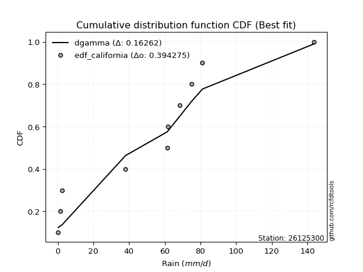</img>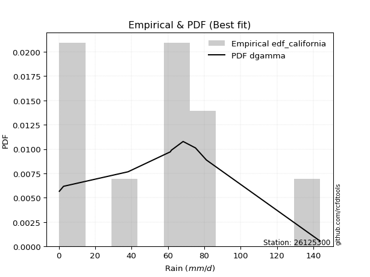</img>

</div>


### 2. EDF Hazen (1930)

Hazen method for plotting positions is a formula used to estimate the empirical cumulative probability distribution of flood events or other hydrological data. This formula often results in biased estimations, particularly when extrapolating to extreme events (high return periods).

<div align="center">


$P=(m-0.5)/n$


</div>


**2.1. Empirical values**

<div align="center">

|                | 0                  | 1                  | 2                  | 3                  | 4                  | 5                  | 6                 | 7         | 8                 | 9                  |
|:---------------|:-------------------|:-------------------|:-------------------|:-------------------|:-------------------|:-------------------|:------------------|:----------|:------------------|:-------------------|
| date           | 2022               | 2023               | 2016               | 2018               | 2021               | 2020               | 2019              | 2017      | 2025              | 2024               |
| x              | 0.3                | 1.4                | 2.6                | 38.1               | 61.4               | 61.9               | 68.4              | 75.2      | 81.2              | 143.8              |
| m              | 1                  | 2                  | 3                  | 4                  | 5                  | 6                  | 7                 | 8         | 9                 | 10                 |
| empirical_dist | edf_hazen          | edf_hazen          | edf_hazen          | edf_hazen          | edf_hazen          | edf_hazen          | edf_hazen         | edf_hazen | edf_hazen         | edf_hazen          |
| empirical      | 0.05               | 0.15               | 0.25               | 0.35               | 0.45               | 0.55               | 0.65              | 0.75      | 0.85              | 0.95               |
| empirical_tr   | 1.0526315789473684 | 1.1764705882352942 | 1.3333333333333333 | 1.5384615384615383 | 1.8181818181818181 | 2.2222222222222223 | 2.857142857142857 | 4.0       | 6.666666666666666 | 19.999999999999982 |

</div>


**2.2. Kolmogorov-Smirnov fit test (sorted by Δ)**


<div align="center">

|                | 0                   | 1                  | 2                   | 3                   | 4                  | 5                   | 6                  | 7                  | 8                   | 9                   | 10                  | 11                  | 12                 | 13                  | 14                  | 15                  | 16                  | 17                  | 18                  | 19                 | 20                 | 21                 | 22                 | 23                  | 24                 | 25                 | 26                 | 27                 | 28                 | 29                  | 30                  | 31                 | 32                  | 33                  | 34                  | 35                  | 36                 | 37                 | 38                 | 39                  | 40                  | 41                 | 42                  | 43                  | 44                  | 45                  | 46                  | 47                 | 48                  | 49                  | 50                  | 51                 | 52                  | 53                 | 54                  | 55                 | 56                  | 57                  | 58                 | 59                  | 60                 | 61                 | 62                 | 63                  | 64                  | 65                 | 66                  | 67                 | 68                  | 69                  | 70                 | 71                  | 72                  | 73                  | 74                 | 75                 | 76                 | 77                 | 78                 | 79                 | 80                  | 81                 | 82                  | 83                 | 84                 | 85                 | 86                  | 87                 | 88                 | 89                 | 90                  | 91                 | 92                 | 93                 | 94                 | 95                  | 96                 | 97                  | 98                  | 99                  | 100                 | 101                | 102                 | 103                 | 104                | 105                | 106                 | 107                 | 108                | 109                 | 110                | 111                | 112                | 113                 | 114                 | 115                | 116                | 117                 | 118                 | 119                 | 120                | 121                | 122                 | 123                | 124                 | 125                | 126                | 127                 | 128                 | 129                 | 130                | 131                | 132                 | 133                 | 134                | 135                 | 136                | 137                 | 138                 | 139                 | 140                 | 141                | 142                | 143                 | 144                 | 145                | 146                | 147                | 148                | 149                | 150                | 151                | 152                | 153                | 154                | 155                | 156                | 157                | 158                | 159                |
|:---------------|:--------------------|:-------------------|:--------------------|:--------------------|:-------------------|:--------------------|:-------------------|:-------------------|:--------------------|:--------------------|:--------------------|:--------------------|:-------------------|:--------------------|:--------------------|:--------------------|:--------------------|:--------------------|:--------------------|:-------------------|:-------------------|:-------------------|:-------------------|:--------------------|:-------------------|:-------------------|:-------------------|:-------------------|:-------------------|:--------------------|:--------------------|:-------------------|:--------------------|:--------------------|:--------------------|:--------------------|:-------------------|:-------------------|:-------------------|:--------------------|:--------------------|:-------------------|:--------------------|:--------------------|:--------------------|:--------------------|:--------------------|:-------------------|:--------------------|:--------------------|:--------------------|:-------------------|:--------------------|:-------------------|:--------------------|:-------------------|:--------------------|:--------------------|:-------------------|:--------------------|:-------------------|:-------------------|:-------------------|:--------------------|:--------------------|:-------------------|:--------------------|:-------------------|:--------------------|:--------------------|:-------------------|:--------------------|:--------------------|:--------------------|:-------------------|:-------------------|:-------------------|:-------------------|:-------------------|:-------------------|:--------------------|:-------------------|:--------------------|:-------------------|:-------------------|:-------------------|:--------------------|:-------------------|:-------------------|:-------------------|:--------------------|:-------------------|:-------------------|:-------------------|:-------------------|:--------------------|:-------------------|:--------------------|:--------------------|:--------------------|:--------------------|:-------------------|:--------------------|:--------------------|:-------------------|:-------------------|:--------------------|:--------------------|:-------------------|:--------------------|:-------------------|:-------------------|:-------------------|:--------------------|:--------------------|:-------------------|:-------------------|:--------------------|:--------------------|:--------------------|:-------------------|:-------------------|:--------------------|:-------------------|:--------------------|:-------------------|:-------------------|:--------------------|:--------------------|:--------------------|:-------------------|:-------------------|:--------------------|:--------------------|:-------------------|:--------------------|:-------------------|:--------------------|:--------------------|:--------------------|:--------------------|:-------------------|:-------------------|:--------------------|:--------------------|:-------------------|:-------------------|:-------------------|:-------------------|:-------------------|:-------------------|:-------------------|:-------------------|:-------------------|:-------------------|:-------------------|:-------------------|:-------------------|:-------------------|:-------------------|
| station        | 26125300            | 26125300           | 26125300            | 26125300            | 26125300           | 26125300            | 26125300           | 26125300           | 26125300            | 26125300            | 26125300            | 26125300            | 26125300           | 26125300            | 26125300            | 26125300            | 26125300            | 26125300            | 26125300            | 26125300           | 26125300           | 26125300           | 26125300           | 26125300            | 26125300           | 26125300           | 26125300           | 26125300           | 26125300           | 26125300            | 26125300            | 26125300           | 26125300            | 26125300            | 26125300            | 26125300            | 26125300           | 26125300           | 26125300           | 26125300            | 26125300            | 26125300           | 26125300            | 26125300            | 26125300            | 26125300            | 26125300            | 26125300           | 26125300            | 26125300            | 26125300            | 26125300           | 26125300            | 26125300           | 26125300            | 26125300           | 26125300            | 26125300            | 26125300           | 26125300            | 26125300           | 26125300           | 26125300           | 26125300            | 26125300            | 26125300           | 26125300            | 26125300           | 26125300            | 26125300            | 26125300           | 26125300            | 26125300            | 26125300            | 26125300           | 26125300           | 26125300           | 26125300           | 26125300           | 26125300           | 26125300            | 26125300           | 26125300            | 26125300           | 26125300           | 26125300           | 26125300            | 26125300           | 26125300           | 26125300           | 26125300            | 26125300           | 26125300           | 26125300           | 26125300           | 26125300            | 26125300           | 26125300            | 26125300            | 26125300            | 26125300            | 26125300           | 26125300            | 26125300            | 26125300           | 26125300           | 26125300            | 26125300            | 26125300           | 26125300            | 26125300           | 26125300           | 26125300           | 26125300            | 26125300            | 26125300           | 26125300           | 26125300            | 26125300            | 26125300            | 26125300           | 26125300           | 26125300            | 26125300           | 26125300            | 26125300           | 26125300           | 26125300            | 26125300            | 26125300            | 26125300           | 26125300           | 26125300            | 26125300            | 26125300           | 26125300            | 26125300           | 26125300            | 26125300            | 26125300            | 26125300            | 26125300           | 26125300           | 26125300            | 26125300            | 26125300           | 26125300           | 26125300           | 26125300           | 26125300           | 26125300           | 26125300           | 26125300           | 26125300           | 26125300           | 26125300           | 26125300           | 26125300           | 26125300           | 26125300           |
| empirical_dist | edf_hazen           | edf_hazen          | edf_hazen           | edf_hazen           | edf_hazen          | edf_hazen           | edf_hazen          | edf_hazen          | edf_hazen           | edf_hazen           | edf_hazen           | edf_hazen           | edf_hazen          | edf_hazen           | edf_hazen           | edf_hazen           | edf_hazen           | edf_hazen           | edf_hazen           | edf_hazen          | edf_hazen          | edf_hazen          | edf_hazen          | edf_hazen           | edf_hazen          | edf_hazen          | edf_hazen          | edf_hazen          | edf_hazen          | edf_hazen           | edf_hazen           | edf_hazen          | edf_hazen           | edf_hazen           | edf_hazen           | edf_hazen           | edf_hazen          | edf_hazen          | edf_hazen          | edf_hazen           | edf_hazen           | edf_hazen          | edf_hazen           | edf_hazen           | edf_hazen           | edf_hazen           | edf_hazen           | edf_hazen          | edf_hazen           | edf_hazen           | edf_hazen           | edf_hazen          | edf_hazen           | edf_hazen          | edf_hazen           | edf_hazen          | edf_hazen           | edf_hazen           | edf_hazen          | edf_hazen           | edf_hazen          | edf_hazen          | edf_hazen          | edf_hazen           | edf_hazen           | edf_hazen          | edf_hazen           | edf_hazen          | edf_hazen           | edf_hazen           | edf_hazen          | edf_hazen           | edf_hazen           | edf_hazen           | edf_hazen          | edf_hazen          | edf_hazen          | edf_hazen          | edf_hazen          | edf_hazen          | edf_hazen           | edf_hazen          | edf_hazen           | edf_hazen          | edf_hazen          | edf_hazen          | edf_hazen           | edf_hazen          | edf_hazen          | edf_hazen          | edf_hazen           | edf_hazen          | edf_hazen          | edf_hazen          | edf_hazen          | edf_hazen           | edf_hazen          | edf_hazen           | edf_hazen           | edf_hazen           | edf_hazen           | edf_hazen          | edf_hazen           | edf_hazen           | edf_hazen          | edf_hazen          | edf_hazen           | edf_hazen           | edf_hazen          | edf_hazen           | edf_hazen          | edf_hazen          | edf_hazen          | edf_hazen           | edf_hazen           | edf_hazen          | edf_hazen          | edf_hazen           | edf_hazen           | edf_hazen           | edf_hazen          | edf_hazen          | edf_hazen           | edf_hazen          | edf_hazen           | edf_hazen          | edf_hazen          | edf_hazen           | edf_hazen           | edf_hazen           | edf_hazen          | edf_hazen          | edf_hazen           | edf_hazen           | edf_hazen          | edf_hazen           | edf_hazen          | edf_hazen           | edf_hazen           | edf_hazen           | edf_hazen           | edf_hazen          | edf_hazen          | edf_hazen           | edf_hazen           | edf_hazen          | edf_hazen          | edf_hazen          | edf_hazen          | edf_hazen          | edf_hazen          | edf_hazen          | edf_hazen          | edf_hazen          | edf_hazen          | edf_hazen          | edf_hazen          | edf_hazen          | edf_hazen          | edf_hazen          |
| p_dist         | logjohnsonsu        | dgamma             | dweibull            | johnsonsu           | t                  | norm                | crystalball        | anglit             | gumbel_l            | foldnorm            | semicircular        | logistic            | pearson3           | maxwell             | hypsecant           | cosine              | gennorm             | exponnorm           | rayleigh            | loggennorm         | laplace            | rice               | invgamma           | halfgennorm         | betaprime          | genlogistic        | kstwobign          | logmielke          | halfnorm           | truncweibull_min    | mielke              | logweibull_max     | gumbel_r            | invgauss            | arcsine             | logloggamma         | logvonmises_line   | logdgamma          | loglevy_l          | loggenextreme       | moyal               | ncf                | truncnorm           | gompertz            | genpareto           | skewnorm            | logarcsine          | logpearson3        | logdweibull         | logtrapezoid        | bradford            | kappa3             | truncexpon          | nakagami           | logargus            | loggumbel_l        | genexpon            | lomax               | halflogistic       | logweibull_min      | logburr12          | logsemicircular    | weibull_min        | loggenhalflogistic  | vonmises_line       | loganglit          | f                   | burr               | exponpow            | logfatiguelife      | lognakagami        | logrice             | logt                | logcrystalball      | lognorm            | logexponnorm       | lognct             | logjohnsonsb       | argus              | loggompertz        | kappa4              | burr12             | logfoldnorm         | logerlang          | loggamma           | loggamma           | loginvweibull       | invweibull         | genextreme         | wald               | logncf              | wrapcauchy         | uniform            | logexponweib       | loginvgamma        | loglogistic         | gausshyper         | ksone               | loginvgauss         | logwrapcauchy       | logmaxwell          | loghypsecant       | lograyleigh         | logkstwobign        | logskewnorm        | logburr            | loggenexpon         | logbetaprime        | logcosine          | loghalfnorm         | loglaplace         | loglaplace         | nct                | loggumbel_r         | loglomax            | logtriang          | loghalflogistic    | logmoyal            | loghalfgennorm      | logbeta             | logloglaplace      | logksone           | logf                | levy_l             | logtruncweibull_min | erlang             | johnsonsb          | logwald             | exponweib           | logalpha            | loggausshyper      | logkappa4          | loguniform          | genhalflogistic     | powerlaw           | logtruncnorm        | logkappa3          | gamma               | triang              | fatiguelife         | logbradford         | loggengamma        | logtruncexpon      | loggenpareto        | tukeylambda         | rdist              | trapezoid          | beta               | gengamma           | truncpareto        | logpowerlaw        | alpha              | logexponpow        | weibull_max        | logtruncpareto     | logrdist           | logtukeylambda     | loggenlogistic     | logvonmises        | vonmises           |
| delta          | 0.12458148633684879 | 0.1248381633985895 | 0.13002506626074897 | 0.13322474773560705 | 0.1337749467988112 | 0.13378189602004004 | 0.133781896682866  | 0.1343157231976696 | 0.13568528216845116 | 0.14303836537667908 | 0.14608538384024528 | 0.14714249178372213 | 0.1524848707211211 | 0.15291549713811742 | 0.15319251743611517 | 0.15549769881393838 | 0.15637216630518538 | 0.15914086386645293 | 0.16196368483834628 | 0.1653667565067071 | 0.1663152406935708 | 0.1679856677513787 | 0.1726726083589551 | 0.18049598744082096 | 0.184752706500804  | 0.1849892046287413 | 0.1865629324221148 | 0.1867344397587542 | 0.187776559388726  | 0.18796786042462044 | 0.19199915232278225 | 0.1928658227952682 | 0.19300677703992303 | 0.19733347404011942 | 0.19738297571507812 | 0.20066781118963456 | 0.2049900060041575 | 0.2051628469144165 | 0.2064434692388773 | 0.21394763637942033 | 0.21693732319549147 | 0.2192404820079607 | 0.21997820548816263 | 0.22043643425165974 | 0.22135925783832633 | 0.22304505873145786 | 0.22317071275069156 | 0.2232927388211468 | 0.22537742606265876 | 0.22539339048333018 | 0.22648076808064085 | 0.2267109616778341 | 0.22733120400553186 | 0.2282235137501693 | 0.22891238079356807 | 0.2329176236815103 | 0.23339088054917329 | 0.23568527180690474 | 0.25               | 0.25091638571309954 | 0.251129170431081  | 0.2521223496009616 | 0.2521822312869014 | 0.25241796308509085 | 0.25583076602499244 | 0.2592616461175219 | 0.26375513278767265 | 0.2675107343238859 | 0.27110309278204897 | 0.27573160087495063 | 0.2762145799429395 | 0.27635907532469817 | 0.27636214166028916 | 0.27636214560072436 | 0.2763623158151267 | 0.2763627411279508 | 0.2764112314333702 | 0.2770289055380245 | 0.2773872349524261 | 0.2790189672850847 | 0.27969826614537663 | 0.2805332180142967 | 0.28099534658808356 | 0.2812212325310295 | 0.2813997726855807 | 0.2813997726855807 | 0.28211948321849334 | 0.2825243119768662 | 0.2825250886356262 | 0.2834006634179223 | 0.28466363349916535 | 0.2862323606354218 | 0.2862369337979094 | 0.2874092946778868 | 0.2882837669429016 | 0.29209483664135605 | 0.2957856711221426 | 0.29686411149825775 | 0.29749151787083183 | 0.29895988268556295 | 0.30042513689795347 | 0.3046475865383812 | 0.30776962371977745 | 0.31042994181223416 | 0.3137296973137815 | 0.3144313880420222 | 0.31765225680078335 | 0.31800786860770924 | 0.3234617003944834 | 0.32886699095020255 | 0.3330004695540607 | 0.3330004695540607 | 0.3335025632538017 | 0.33977343552783235 | 0.34138453123423906 | 0.3496712534680834 | 0.3572172560909942 | 0.36106287232746226 | 0.36731583131849443 | 0.37219694550608556 | 0.3782205002763278 | 0.3873455530287241 | 0.38839040830844807 | 0.3977090853080146 | 0.4051541092514729  | 0.4113840661846799 | 0.4167482871031908 | 0.42080727917131777 | 0.42622253137786226 | 0.42647373467684235 | 0.4306669900588924 | 0.4327773919990888 | 0.43481466363446886 | 0.43852848691790736 | 0.4393723111080271 | 0.44058710608180207 | 0.4715175842665623 | 0.48062292704628706 | 0.48408466582880855 | 0.48510131844460913 | 0.48682362208586005 | 0.4903148635012687 | 0.4947598723827247 | 0.49557233386557054 | 0.49902475827967835 | 0.5007474549859935 | 0.5395109454524423 | 0.5460066753727258 | 0.5554691184094492 | 0.5886948697514833 | 0.5928509902242574 | 0.6307397832371664 | 0.6520706579738956 | 0.7074792098768568 | 0.71607721227611   | 0.7499999999690455 | 0.7499999999999929 | 0.85               | 0.8827107868508299 | 22.385108295517277 |
| deltao         | 0.3942745923300002  | 0.3942745923300002 | 0.3942745923300002  | 0.3942745923300002  | 0.3942745923300002 | 0.3942745923300002  | 0.3942745923300002 | 0.3942745923300002 | 0.3942745923300002  | 0.3942745923300002  | 0.3942745923300002  | 0.3942745923300002  | 0.3942745923300002 | 0.3942745923300002  | 0.3942745923300002  | 0.3942745923300002  | 0.3942745923300002  | 0.3942745923300002  | 0.3942745923300002  | 0.3942745923300002 | 0.3942745923300002 | 0.3942745923300002 | 0.3942745923300002 | 0.3942745923300002  | 0.3942745923300002 | 0.3942745923300002 | 0.3942745923300002 | 0.3942745923300002 | 0.3942745923300002 | 0.3942745923300002  | 0.3942745923300002  | 0.3942745923300002 | 0.3942745923300002  | 0.3942745923300002  | 0.3942745923300002  | 0.3942745923300002  | 0.3942745923300002 | 0.3942745923300002 | 0.3942745923300002 | 0.3942745923300002  | 0.3942745923300002  | 0.3942745923300002 | 0.3942745923300002  | 0.3942745923300002  | 0.3942745923300002  | 0.3942745923300002  | 0.3942745923300002  | 0.3942745923300002 | 0.3942745923300002  | 0.3942745923300002  | 0.3942745923300002  | 0.3942745923300002 | 0.3942745923300002  | 0.3942745923300002 | 0.3942745923300002  | 0.3942745923300002 | 0.3942745923300002  | 0.3942745923300002  | 0.3942745923300002 | 0.3942745923300002  | 0.3942745923300002 | 0.3942745923300002 | 0.3942745923300002 | 0.3942745923300002  | 0.3942745923300002  | 0.3942745923300002 | 0.3942745923300002  | 0.3942745923300002 | 0.3942745923300002  | 0.3942745923300002  | 0.3942745923300002 | 0.3942745923300002  | 0.3942745923300002  | 0.3942745923300002  | 0.3942745923300002 | 0.3942745923300002 | 0.3942745923300002 | 0.3942745923300002 | 0.3942745923300002 | 0.3942745923300002 | 0.3942745923300002  | 0.3942745923300002 | 0.3942745923300002  | 0.3942745923300002 | 0.3942745923300002 | 0.3942745923300002 | 0.3942745923300002  | 0.3942745923300002 | 0.3942745923300002 | 0.3942745923300002 | 0.3942745923300002  | 0.3942745923300002 | 0.3942745923300002 | 0.3942745923300002 | 0.3942745923300002 | 0.3942745923300002  | 0.3942745923300002 | 0.3942745923300002  | 0.3942745923300002  | 0.3942745923300002  | 0.3942745923300002  | 0.3942745923300002 | 0.3942745923300002  | 0.3942745923300002  | 0.3942745923300002 | 0.3942745923300002 | 0.3942745923300002  | 0.3942745923300002  | 0.3942745923300002 | 0.3942745923300002  | 0.3942745923300002 | 0.3942745923300002 | 0.3942745923300002 | 0.3942745923300002  | 0.3942745923300002  | 0.3942745923300002 | 0.3942745923300002 | 0.3942745923300002  | 0.3942745923300002  | 0.3942745923300002  | 0.3942745923300002 | 0.3942745923300002 | 0.3942745923300002  | 0.3942745923300002 | 0.3942745923300002  | 0.3942745923300002 | 0.3942745923300002 | 0.3942745923300002  | 0.3942745923300002  | 0.3942745923300002  | 0.3942745923300002 | 0.3942745923300002 | 0.3942745923300002  | 0.3942745923300002  | 0.3942745923300002 | 0.3942745923300002  | 0.3942745923300002 | 0.3942745923300002  | 0.3942745923300002  | 0.3942745923300002  | 0.3942745923300002  | 0.3942745923300002 | 0.3942745923300002 | 0.3942745923300002  | 0.3942745923300002  | 0.3942745923300002 | 0.3942745923300002 | 0.3942745923300002 | 0.3942745923300002 | 0.3942745923300002 | 0.3942745923300002 | 0.3942745923300002 | 0.3942745923300002 | 0.3942745923300002 | 0.3942745923300002 | 0.3942745923300002 | 0.3942745923300002 | 0.3942745923300002 | 0.3942745923300002 | 0.3942745923300002 |
| eval           | Δo > Δ              | Δo > Δ             | Δo > Δ              | Δo > Δ              | Δo > Δ             | Δo > Δ              | Δo > Δ             | Δo > Δ             | Δo > Δ              | Δo > Δ              | Δo > Δ              | Δo > Δ              | Δo > Δ             | Δo > Δ              | Δo > Δ              | Δo > Δ              | Δo > Δ              | Δo > Δ              | Δo > Δ              | Δo > Δ             | Δo > Δ             | Δo > Δ             | Δo > Δ             | Δo > Δ              | Δo > Δ             | Δo > Δ             | Δo > Δ             | Δo > Δ             | Δo > Δ             | Δo > Δ              | Δo > Δ              | Δo > Δ             | Δo > Δ              | Δo > Δ              | Δo > Δ              | Δo > Δ              | Δo > Δ             | Δo > Δ             | Δo > Δ             | Δo > Δ              | Δo > Δ              | Δo > Δ             | Δo > Δ              | Δo > Δ              | Δo > Δ              | Δo > Δ              | Δo > Δ              | Δo > Δ             | Δo > Δ              | Δo > Δ              | Δo > Δ              | Δo > Δ             | Δo > Δ              | Δo > Δ             | Δo > Δ              | Δo > Δ             | Δo > Δ              | Δo > Δ              | Δo > Δ             | Δo > Δ              | Δo > Δ             | Δo > Δ             | Δo > Δ             | Δo > Δ              | Δo > Δ              | Δo > Δ             | Δo > Δ              | Δo > Δ             | Δo > Δ              | Δo > Δ              | Δo > Δ             | Δo > Δ              | Δo > Δ              | Δo > Δ              | Δo > Δ             | Δo > Δ             | Δo > Δ             | Δo > Δ             | Δo > Δ             | Δo > Δ             | Δo > Δ              | Δo > Δ             | Δo > Δ              | Δo > Δ             | Δo > Δ             | Δo > Δ             | Δo > Δ              | Δo > Δ             | Δo > Δ             | Δo > Δ             | Δo > Δ              | Δo > Δ             | Δo > Δ             | Δo > Δ             | Δo > Δ             | Δo > Δ              | Δo > Δ             | Δo > Δ              | Δo > Δ              | Δo > Δ              | Δo > Δ              | Δo > Δ             | Δo > Δ              | Δo > Δ              | Δo > Δ             | Δo > Δ             | Δo > Δ              | Δo > Δ              | Δo > Δ             | Δo > Δ              | Δo > Δ             | Δo > Δ             | Δo > Δ             | Δo > Δ              | Δo > Δ              | Δo > Δ             | Δo > Δ             | Δo > Δ              | Δo > Δ              | Δo > Δ              | Δo > Δ             | Δo > Δ             | Δo > Δ              | Δo <= Δ            | Δo <= Δ             | Δo <= Δ            | Δo <= Δ            | Δo <= Δ             | Δo <= Δ             | Δo <= Δ             | Δo <= Δ            | Δo <= Δ            | Δo <= Δ             | Δo <= Δ             | Δo <= Δ            | Δo <= Δ             | Δo <= Δ            | Δo <= Δ             | Δo <= Δ             | Δo <= Δ             | Δo <= Δ             | Δo <= Δ            | Δo <= Δ            | Δo <= Δ             | Δo <= Δ             | Δo <= Δ            | Δo <= Δ            | Δo <= Δ            | Δo <= Δ            | Δo <= Δ            | Δo <= Δ            | Δo <= Δ            | Δo <= Δ            | Δo <= Δ            | Δo <= Δ            | Δo <= Δ            | Δo <= Δ            | Δo <= Δ            | Δo <= Δ            | Δo <= Δ            |
| fit            | 1                   | 1                  | 1                   | 1                   | 1                  | 1                   | 1                  | 1                  | 1                   | 1                   | 1                   | 1                   | 1                  | 1                   | 1                   | 1                   | 1                   | 1                   | 1                   | 1                  | 1                  | 1                  | 1                  | 1                   | 1                  | 1                  | 1                  | 1                  | 1                  | 1                   | 1                   | 1                  | 1                   | 1                   | 1                   | 1                   | 1                  | 1                  | 1                  | 1                   | 1                   | 1                  | 1                   | 1                   | 1                   | 1                   | 1                   | 1                  | 1                   | 1                   | 1                   | 1                  | 1                   | 1                  | 1                   | 1                  | 1                   | 1                   | 1                  | 1                   | 1                  | 1                  | 1                  | 1                   | 1                   | 1                  | 1                   | 1                  | 1                   | 1                   | 1                  | 1                   | 1                   | 1                   | 1                  | 1                  | 1                  | 1                  | 1                  | 1                  | 1                   | 1                  | 1                   | 1                  | 1                  | 1                  | 1                   | 1                  | 1                  | 1                  | 1                   | 1                  | 1                  | 1                  | 1                  | 1                   | 1                  | 1                   | 1                   | 1                   | 1                   | 1                  | 1                   | 1                   | 1                  | 1                  | 1                   | 1                   | 1                  | 1                   | 1                  | 1                  | 1                  | 1                   | 1                   | 1                  | 1                  | 1                   | 1                   | 1                   | 1                  | 1                  | 1                   | 0                  | 0                   | 0                  | 0                  | 0                   | 0                   | 0                   | 0                  | 0                  | 0                   | 0                   | 0                  | 0                   | 0                  | 0                   | 0                   | 0                   | 0                   | 0                  | 0                  | 0                   | 0                   | 0                  | 0                  | 0                  | 0                  | 0                  | 0                  | 0                  | 0                  | 0                  | 0                  | 0                  | 0                  | 0                  | 0                  | 0                  |
| n              | 10                  | 10                 | 10                  | 10                  | 10                 | 10                  | 10                 | 10                 | 10                  | 10                  | 10                  | 10                  | 10                 | 10                  | 10                  | 10                  | 10                  | 10                  | 10                  | 10                 | 10                 | 10                 | 10                 | 10                  | 10                 | 10                 | 10                 | 10                 | 10                 | 10                  | 10                  | 10                 | 10                  | 10                  | 10                  | 10                  | 10                 | 10                 | 10                 | 10                  | 10                  | 10                 | 10                  | 10                  | 10                  | 10                  | 10                  | 10                 | 10                  | 10                  | 10                  | 10                 | 10                  | 10                 | 10                  | 10                 | 10                  | 10                  | 10                 | 10                  | 10                 | 10                 | 10                 | 10                  | 10                  | 10                 | 10                  | 10                 | 10                  | 10                  | 10                 | 10                  | 10                  | 10                  | 10                 | 10                 | 10                 | 10                 | 10                 | 10                 | 10                  | 10                 | 10                  | 10                 | 10                 | 10                 | 10                  | 10                 | 10                 | 10                 | 10                  | 10                 | 10                 | 10                 | 10                 | 10                  | 10                 | 10                  | 10                  | 10                  | 10                  | 10                 | 10                  | 10                  | 10                 | 10                 | 10                  | 10                  | 10                 | 10                  | 10                 | 10                 | 10                 | 10                  | 10                  | 10                 | 10                 | 10                  | 10                  | 10                  | 10                 | 10                 | 10                  | 10                 | 10                  | 10                 | 10                 | 10                  | 10                  | 10                  | 10                 | 10                 | 10                  | 10                  | 10                 | 10                  | 10                 | 10                  | 10                  | 10                  | 10                  | 10                 | 10                 | 10                  | 10                  | 10                 | 10                 | 10                 | 10                 | 10                 | 10                 | 10                 | 10                 | 10                 | 10                 | 10                 | 10                 | 10                 | 10                 | 10                 |
| best_fit       | 1                   | 0                  | 0                   | 0                   | 0                  | 0                   | 0                  | 0                  | 0                   | 0                   | 0                   | 0                   | 0                  | 0                   | 0                   | 0                   | 0                   | 0                   | 0                   | 0                  | 0                  | 0                  | 0                  | 0                   | 0                  | 0                  | 0                  | 0                  | 0                  | 0                   | 0                   | 0                  | 0                   | 0                   | 0                   | 0                   | 0                  | 0                  | 0                  | 0                   | 0                   | 0                  | 0                   | 0                   | 0                   | 0                   | 0                   | 0                  | 0                   | 0                   | 0                   | 0                  | 0                   | 0                  | 0                   | 0                  | 0                   | 0                   | 0                  | 0                   | 0                  | 0                  | 0                  | 0                   | 0                   | 0                  | 0                   | 0                  | 0                   | 0                   | 0                  | 0                   | 0                   | 0                   | 0                  | 0                  | 0                  | 0                  | 0                  | 0                  | 0                   | 0                  | 0                   | 0                  | 0                  | 0                  | 0                   | 0                  | 0                  | 0                  | 0                   | 0                  | 0                  | 0                  | 0                  | 0                   | 0                  | 0                   | 0                   | 0                   | 0                   | 0                  | 0                   | 0                   | 0                  | 0                  | 0                   | 0                   | 0                  | 0                   | 0                  | 0                  | 0                  | 0                   | 0                   | 0                  | 0                  | 0                   | 0                   | 0                   | 0                  | 0                  | 0                   | 0                  | 0                   | 0                  | 0                  | 0                   | 0                   | 0                   | 0                  | 0                  | 0                   | 0                   | 0                  | 0                   | 0                  | 0                   | 0                   | 0                   | 0                   | 0                  | 0                  | 0                   | 0                   | 0                  | 0                  | 0                  | 0                  | 0                  | 0                  | 0                  | 0                  | 0                  | 0                  | 0                  | 0                  | 0                  | 0                  | 0                  |
| best_fit_sort  | 1                   | 2                  | 3                   | 4                   | 5                  | 6                   | 7                  | 8                  | 9                   | 10                  | 11                  | 12                  | 13                 | 14                  | 15                  | 16                  | 17                  | 18                  | 19                  | 20                 | 21                 | 22                 | 23                 | 24                  | 25                 | 26                 | 27                 | 28                 | 29                 | 30                  | 31                  | 32                 | 33                  | 34                  | 35                  | 36                  | 37                 | 38                 | 39                 | 40                  | 41                  | 42                 | 43                  | 44                  | 45                  | 46                  | 47                  | 48                 | 49                  | 50                  | 51                  | 52                 | 53                  | 54                 | 55                  | 56                 | 57                  | 58                  | 59                 | 60                  | 61                 | 62                 | 63                 | 64                  | 65                  | 66                 | 67                  | 68                 | 69                  | 70                  | 71                 | 72                  | 73                  | 74                  | 75                 | 76                 | 77                 | 78                 | 79                 | 80                 | 81                  | 82                 | 83                  | 84                 | 85                 | 86                 | 87                  | 88                 | 89                 | 90                 | 91                  | 92                 | 93                 | 94                 | 95                 | 96                  | 97                 | 98                  | 99                  | 100                 | 101                 | 102                | 103                 | 104                 | 105                | 106                | 107                 | 108                 | 109                | 110                 | 111                | 112                | 113                | 114                 | 115                 | 116                | 117                | 118                 | 119                 | 120                 | 121                | 122                | 123                 | 124                | 125                 | 126                | 127                | 128                 | 129                 | 130                 | 131                | 132                | 133                 | 134                 | 135                | 136                 | 137                | 138                 | 139                 | 140                 | 141                 | 142                | 143                | 144                 | 145                 | 146                | 147                | 148                | 149                | 150                | 151                | 152                | 153                | 154                | 155                | 156                | 157                | 158                | 159                | 160                |

</div>


**2.3. Best fit**

<div align="center">

|   id |   station | empirical_dist   | p_dist       |    delta |   deltao | eval   |   fit |   n |   best_fit |   best_fit_sort |
|-----:|----------:|:-----------------|:-------------|---------:|---------:|:-------|------:|----:|-----------:|----------------:|
|    0 |  26125300 | edf_hazen        | logjohnsonsu | 0.124581 | 0.394275 | Δo > Δ |     1 |  10 |          1 |               1 |

</div>


<div align="center">

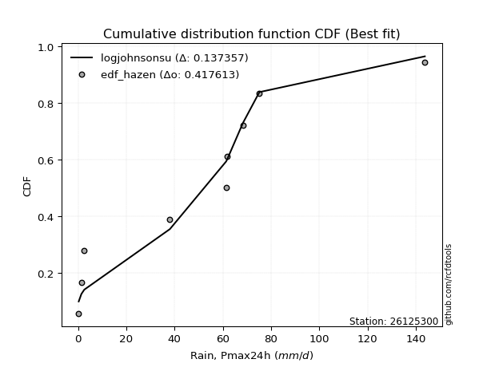</img>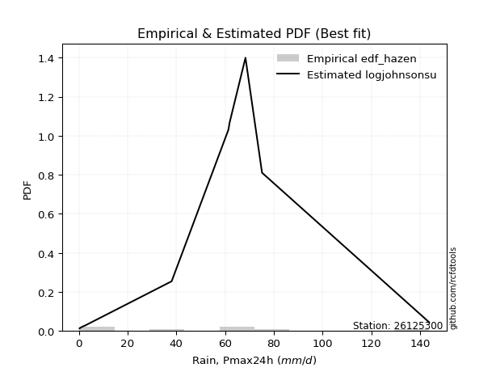</img>

</div>


### 3. EDF Weibull (1939)

Weibull plotting position formula is an empirical method used to estimate the non-exceedance probability or plotting position for a set of observed data, is often recommended or widely used in practice, particularly in flood frequency analysis.

<div align="center">


$P=m/(n+1)$


</div>


**3.1. Empirical values**

<div align="center">

|                | 0                   | 1                   | 2                  | 3                   | 4                   | 5                  | 6                  | 7                  | 8                  | 9                  |
|:---------------|:--------------------|:--------------------|:-------------------|:--------------------|:--------------------|:-------------------|:-------------------|:-------------------|:-------------------|:-------------------|
| date           | 2022                | 2023                | 2016               | 2018                | 2021                | 2020               | 2019               | 2017               | 2025               | 2024               |
| x              | 0.3                 | 1.4                 | 2.6                | 38.1                | 61.4                | 61.9               | 68.4               | 75.2               | 81.2               | 143.8              |
| m              | 1                   | 2                   | 3                  | 4                   | 5                   | 6                  | 7                  | 8                  | 9                  | 10                 |
| empirical_dist | edf_weibull         | edf_weibull         | edf_weibull        | edf_weibull         | edf_weibull         | edf_weibull        | edf_weibull        | edf_weibull        | edf_weibull        | edf_weibull        |
| empirical      | 0.09090909090909091 | 0.18181818181818182 | 0.2727272727272727 | 0.36363636363636365 | 0.45454545454545453 | 0.5454545454545454 | 0.6363636363636364 | 0.7272727272727273 | 0.8181818181818182 | 0.9090909090909091 |
| empirical_tr   | 1.1                 | 1.2222222222222223  | 1.375              | 1.5714285714285714  | 1.8333333333333335  | 2.1999999999999997 | 2.75               | 3.666666666666667  | 5.500000000000002  | 10.999999999999996 |

</div>


**3.2. Kolmogorov-Smirnov fit test (sorted by Δ)**


<div align="center">

|                | 0                  | 1                   | 2                   | 3                   | 4                  | 5                   | 6                   | 7                  | 8                   | 9                  | 10                  | 11                  | 12                  | 13                  | 14                  | 15                 | 16                 | 17                  | 18                  | 19                  | 20                  | 21                  | 22                 | 23                  | 24                  | 25                  | 26                  | 27                  | 28                 | 29                 | 30                  | 31                 | 32                 | 33                  | 34                  | 35                  | 36                  | 37                 | 38                 | 39                 | 40                  | 41                 | 42                  | 43                 | 44                  | 45                  | 46                  | 47                 | 48                 | 49                  | 50                  | 51                 | 52                  | 53                  | 54                  | 55                  | 56                  | 57                  | 58                  | 59                  | 60                  | 61                  | 62                 | 63                  | 64                  | 65                  | 66                  | 67                 | 68                  | 69                 | 70                  | 71                  | 72                  | 73                 | 74                 | 75                 | 76                  | 77                 | 78                 | 79                  | 80                  | 81                  | 82                 | 83                 | 84                  | 85                 | 86                 | 87                 | 88                  | 89                  | 90                  | 91                 | 92                 | 93                 | 94                 | 95                 | 96                 | 97                 | 98                  | 99                 | 100                | 101                | 102                | 103                | 104                 | 105                | 106                | 107                 | 108                 | 109                | 110                 | 111                 | 112                | 113                | 114                | 115                | 116                | 117                | 118                | 119                 | 120                 | 121                | 122                 | 123                | 124                 | 125                 | 126                | 127                | 128                 | 129                | 130                | 131                 | 132                 | 133                | 134                 | 135                | 136                | 137                | 138                 | 139                | 140                | 141                | 142                 | 143                | 144                | 145                 | 146                | 147                | 148                | 149                | 150                | 151                | 152                | 153                | 154                | 155                | 156                | 157                | 158                | 159                |
|:---------------|:-------------------|:--------------------|:--------------------|:--------------------|:-------------------|:--------------------|:--------------------|:-------------------|:--------------------|:-------------------|:--------------------|:--------------------|:--------------------|:--------------------|:--------------------|:-------------------|:-------------------|:--------------------|:--------------------|:--------------------|:--------------------|:--------------------|:-------------------|:--------------------|:--------------------|:--------------------|:--------------------|:--------------------|:-------------------|:-------------------|:--------------------|:-------------------|:-------------------|:--------------------|:--------------------|:--------------------|:--------------------|:-------------------|:-------------------|:-------------------|:--------------------|:-------------------|:--------------------|:-------------------|:--------------------|:--------------------|:--------------------|:-------------------|:-------------------|:--------------------|:--------------------|:-------------------|:--------------------|:--------------------|:--------------------|:--------------------|:--------------------|:--------------------|:--------------------|:--------------------|:--------------------|:--------------------|:-------------------|:--------------------|:--------------------|:--------------------|:--------------------|:-------------------|:--------------------|:-------------------|:--------------------|:--------------------|:--------------------|:-------------------|:-------------------|:-------------------|:--------------------|:-------------------|:-------------------|:--------------------|:--------------------|:--------------------|:-------------------|:-------------------|:--------------------|:-------------------|:-------------------|:-------------------|:--------------------|:--------------------|:--------------------|:-------------------|:-------------------|:-------------------|:-------------------|:-------------------|:-------------------|:-------------------|:--------------------|:-------------------|:-------------------|:-------------------|:-------------------|:-------------------|:--------------------|:-------------------|:-------------------|:--------------------|:--------------------|:-------------------|:--------------------|:--------------------|:-------------------|:-------------------|:-------------------|:-------------------|:-------------------|:-------------------|:-------------------|:--------------------|:--------------------|:-------------------|:--------------------|:-------------------|:--------------------|:--------------------|:-------------------|:-------------------|:--------------------|:-------------------|:-------------------|:--------------------|:--------------------|:-------------------|:--------------------|:-------------------|:-------------------|:-------------------|:--------------------|:-------------------|:-------------------|:-------------------|:--------------------|:-------------------|:-------------------|:--------------------|:-------------------|:-------------------|:-------------------|:-------------------|:-------------------|:-------------------|:-------------------|:-------------------|:-------------------|:-------------------|:-------------------|:-------------------|:-------------------|:-------------------|
| station        | 26125300           | 26125300            | 26125300            | 26125300            | 26125300           | 26125300            | 26125300            | 26125300           | 26125300            | 26125300           | 26125300            | 26125300            | 26125300            | 26125300            | 26125300            | 26125300           | 26125300           | 26125300            | 26125300            | 26125300            | 26125300            | 26125300            | 26125300           | 26125300            | 26125300            | 26125300            | 26125300            | 26125300            | 26125300           | 26125300           | 26125300            | 26125300           | 26125300           | 26125300            | 26125300            | 26125300            | 26125300            | 26125300           | 26125300           | 26125300           | 26125300            | 26125300           | 26125300            | 26125300           | 26125300            | 26125300            | 26125300            | 26125300           | 26125300           | 26125300            | 26125300            | 26125300           | 26125300            | 26125300            | 26125300            | 26125300            | 26125300            | 26125300            | 26125300            | 26125300            | 26125300            | 26125300            | 26125300           | 26125300            | 26125300            | 26125300            | 26125300            | 26125300           | 26125300            | 26125300           | 26125300            | 26125300            | 26125300            | 26125300           | 26125300           | 26125300           | 26125300            | 26125300           | 26125300           | 26125300            | 26125300            | 26125300            | 26125300           | 26125300           | 26125300            | 26125300           | 26125300           | 26125300           | 26125300            | 26125300            | 26125300            | 26125300           | 26125300           | 26125300           | 26125300           | 26125300           | 26125300           | 26125300           | 26125300            | 26125300           | 26125300           | 26125300           | 26125300           | 26125300           | 26125300            | 26125300           | 26125300           | 26125300            | 26125300            | 26125300           | 26125300            | 26125300            | 26125300           | 26125300           | 26125300           | 26125300           | 26125300           | 26125300           | 26125300           | 26125300            | 26125300            | 26125300           | 26125300            | 26125300           | 26125300            | 26125300            | 26125300           | 26125300           | 26125300            | 26125300           | 26125300           | 26125300            | 26125300            | 26125300           | 26125300            | 26125300           | 26125300           | 26125300           | 26125300            | 26125300           | 26125300           | 26125300           | 26125300            | 26125300           | 26125300           | 26125300            | 26125300           | 26125300           | 26125300           | 26125300           | 26125300           | 26125300           | 26125300           | 26125300           | 26125300           | 26125300           | 26125300           | 26125300           | 26125300           | 26125300           |
| empirical_dist | edf_weibull        | edf_weibull         | edf_weibull         | edf_weibull         | edf_weibull        | edf_weibull         | edf_weibull         | edf_weibull        | edf_weibull         | edf_weibull        | edf_weibull         | edf_weibull         | edf_weibull         | edf_weibull         | edf_weibull         | edf_weibull        | edf_weibull        | edf_weibull         | edf_weibull         | edf_weibull         | edf_weibull         | edf_weibull         | edf_weibull        | edf_weibull         | edf_weibull         | edf_weibull         | edf_weibull         | edf_weibull         | edf_weibull        | edf_weibull        | edf_weibull         | edf_weibull        | edf_weibull        | edf_weibull         | edf_weibull         | edf_weibull         | edf_weibull         | edf_weibull        | edf_weibull        | edf_weibull        | edf_weibull         | edf_weibull        | edf_weibull         | edf_weibull        | edf_weibull         | edf_weibull         | edf_weibull         | edf_weibull        | edf_weibull        | edf_weibull         | edf_weibull         | edf_weibull        | edf_weibull         | edf_weibull         | edf_weibull         | edf_weibull         | edf_weibull         | edf_weibull         | edf_weibull         | edf_weibull         | edf_weibull         | edf_weibull         | edf_weibull        | edf_weibull         | edf_weibull         | edf_weibull         | edf_weibull         | edf_weibull        | edf_weibull         | edf_weibull        | edf_weibull         | edf_weibull         | edf_weibull         | edf_weibull        | edf_weibull        | edf_weibull        | edf_weibull         | edf_weibull        | edf_weibull        | edf_weibull         | edf_weibull         | edf_weibull         | edf_weibull        | edf_weibull        | edf_weibull         | edf_weibull        | edf_weibull        | edf_weibull        | edf_weibull         | edf_weibull         | edf_weibull         | edf_weibull        | edf_weibull        | edf_weibull        | edf_weibull        | edf_weibull        | edf_weibull        | edf_weibull        | edf_weibull         | edf_weibull        | edf_weibull        | edf_weibull        | edf_weibull        | edf_weibull        | edf_weibull         | edf_weibull        | edf_weibull        | edf_weibull         | edf_weibull         | edf_weibull        | edf_weibull         | edf_weibull         | edf_weibull        | edf_weibull        | edf_weibull        | edf_weibull        | edf_weibull        | edf_weibull        | edf_weibull        | edf_weibull         | edf_weibull         | edf_weibull        | edf_weibull         | edf_weibull        | edf_weibull         | edf_weibull         | edf_weibull        | edf_weibull        | edf_weibull         | edf_weibull        | edf_weibull        | edf_weibull         | edf_weibull         | edf_weibull        | edf_weibull         | edf_weibull        | edf_weibull        | edf_weibull        | edf_weibull         | edf_weibull        | edf_weibull        | edf_weibull        | edf_weibull         | edf_weibull        | edf_weibull        | edf_weibull         | edf_weibull        | edf_weibull        | edf_weibull        | edf_weibull        | edf_weibull        | edf_weibull        | edf_weibull        | edf_weibull        | edf_weibull        | edf_weibull        | edf_weibull        | edf_weibull        | edf_weibull        | edf_weibull        |
| p_dist         | semicircular       | dgamma              | anglit              | foldnorm            | logjohnsonsu       | dweibull            | johnsonsu           | t                  | norm                | crystalball        | gumbel_l            | logweibull_max      | maxwell             | loglevy_l           | arcsine             | cosine             | pearson3           | rayleigh            | logistic            | exponnorm           | invgamma            | hypsecant           | gennorm            | laplace             | genlogistic         | kstwobign           | logmielke           | mielke              | loggennorm         | rice               | halfgennorm         | invgauss           | logdweibull        | logloggamma         | logvonmises_line    | gumbel_r            | betaprime           | loggenextreme      | logarcsine         | halfnorm           | truncweibull_min    | logtrapezoid       | ncf                 | logpearson3        | nakagami            | logargus            | moyal               | logdgamma          | loggumbel_l        | genexpon            | lomax               | logsemicircular    | weibull_min         | truncnorm           | gompertz            | vonmises_line       | genpareto           | logjohnsonsb        | argus               | loganglit           | skewnorm            | logweibull_min      | logburr12          | loggenhalflogistic  | bradford            | kappa3              | truncexpon          | kappa4             | wrapcauchy          | uniform            | f                   | logfatiguelife      | lognakagami         | logrice            | logt               | logcrystalball     | lognorm             | logexponnorm       | logncf             | lognct              | burr                | gausshyper          | ksone              | loggompertz        | exponpow            | logerlang          | loggamma           | loggamma           | loginvweibull       | invweibull          | genextreme          | halflogistic       | logexponweib       | logfoldnorm        | loginvgamma        | burr12             | wald               | loglogistic        | loginvgauss         | logwrapcauchy      | logmaxwell         | lograyleigh        | loghypsecant       | logkstwobign       | logburr             | loggenexpon        | logbetaprime       | logskewnorm         | logcosine           | loghalfnorm        | loglaplace          | loglaplace          | nct                | loggumbel_r        | loglomax           | logbeta            | loghalflogistic    | logtriang          | logmoyal           | loghalfgennorm      | logf                | levy_l             | logloglaplace       | logksone           | exponweib           | logtruncweibull_min | johnsonsb          | genhalflogistic    | erlang              | logwald            | logalpha           | loggausshyper       | logkappa4           | loguniform         | powerlaw            | logtruncnorm       | loggengamma        | triang             | logkappa3           | tukeylambda        | rdist              | gamma              | fatiguelife         | logbradford        | logtruncexpon      | loggenpareto        | trapezoid          | beta               | gengamma           | truncpareto        | logpowerlaw        | alpha              | logexponpow        | weibull_max        | logtruncpareto     | logrdist           | logtukeylambda     | loggenlogistic     | logvonmises        | vonmises           |
| delta          | 0.1288459617840712 | 0.13534750834090356 | 0.13706018525929908 | 0.14563710434803362 | 0.1473087590641215 | 0.15275233898802168 | 0.15595202046287976 | 0.1565022195260839 | 0.15650916874731274 | 0.1565091694101387 | 0.15841255489572387 | 0.16104764097708646 | 0.16303325950825176 | 0.16553437832978637 | 0.16556479389689638 | 0.1661556521660525 | 0.166186110696819  | 0.16773238411649938 | 0.16986976451099484 | 0.17032206856291815 | 0.17499564785067642 | 0.17591979016338788 | 0.1790994390324581 | 0.18034952549381492 | 0.18044375008328678 | 0.18201747787666028 | 0.18218898521329968 | 0.18745369777732773 | 0.1880940292339798 | 0.1907129404786514 | 0.19186567165554858 | 0.1927880194946649 | 0.193559244244477  | 0.19612235664418004 | 0.19796880423214175 | 0.19821676909635288 | 0.20479084826605792 | 0.2094021818339658 | 0.2095343491143279 | 0.2105038321159987 | 0.21069513315189314 | 0.2117570268469665 | 0.21469502746250618 | 0.2187472842756923 | 0.22367805920471479 | 0.22436692624811355 | 0.22679172928036054 | 0.2278901196416892 | 0.2283721691360558 | 0.23035917020332697 | 0.23113981726145022 | 0.2384859859645979 | 0.23854586765053776 | 0.24270547821543534 | 0.24316370697893244 | 0.24401436857653752 | 0.24408653056559904 | 0.24521072371984276 | 0.24556905313424437 | 0.24562528248115822 | 0.24577233145873056 | 0.24637093116764502 | 0.2465837158856265 | 0.24787250853963633 | 0.24920804080791356 | 0.24943823440510682 | 0.25005847673280457 | 0.251007732734176  | 0.25667921776051067 | 0.2566993981628128 | 0.25920967824221813 | 0.26209523723858696 | 0.26257821630657585 | 0.2627227116883345 | 0.2627257780239255 | 0.2627257819643607 | 0.26272595217876304 | 0.2627263774915871 | 0.262745693546102  | 0.26277486779700654 | 0.26296527977843137 | 0.26396748930396086 | 0.265045929680076  | 0.2662633597867547 | 0.26655763823659445 | 0.2675848688946658 | 0.267763409049217  | 0.267763409049217  | 0.26848311958212967 | 0.26888794834050256 | 0.26888872499926253 | 0.2727272727272727 | 0.2737729310415231 | 0.2741279976142323 | 0.2746474033065379 | 0.2759877634688422 | 0.2788552088724678 | 0.2789106811576065 | 0.28385515423446817 | 0.2853235190491993 | 0.2867887732615898 | 0.2941332600834138 | 0.2943819115827319 | 0.2967935781758705 | 0.30079502440565853 | 0.3040158931644197 | 0.3043715049713456 | 0.30918424276832696 | 0.30982533675811974 | 0.3152306273138389 | 0.31936410591769704 | 0.31936410591769704 | 0.319866199617438  | 0.3261370718914687 | 0.3277481675978754 | 0.3403787636879038 | 0.3435808924546305 | 0.3451257989226289 | 0.3474265086910986 | 0.35367946768213077 | 0.35657222649026626 | 0.3567999943989236 | 0.36458413663996414 | 0.3737091893923604 | 0.38531344046877136 | 0.3915177456151092  | 0.4031119234668271 | 0.4067103050997256 | 0.40683861163922536 | 0.4071709155349541 | 0.4128373710404787 | 0.41703062642252875 | 0.41914102836272515 | 0.4211782999981052 | 0.42573594747166343 | 0.4269507424454384 | 0.4494057725921778 | 0.4522664840106268 | 0.45788122063019865 | 0.4581156673705874 | 0.4598383640769026 | 0.4669865634099234 | 0.47146495480824546 | 0.4731872584494964 | 0.481123508746361  | 0.48193597022920687 | 0.5076927636342605 | 0.5323703117363622 | 0.5418327547730856 | 0.5750585061151197 | 0.5792146265878937 | 0.6171034196008027 | 0.6202524761557138 | 0.675661028058675  | 0.6842590304579281 | 0.7272727272417728 | 0.7272727272727202 | 0.8181818181818182 | 0.8781653323053753 | 22.426017386426366 |
| deltao         | 0.3942745923300002 | 0.3942745923300002  | 0.3942745923300002  | 0.3942745923300002  | 0.3942745923300002 | 0.3942745923300002  | 0.3942745923300002  | 0.3942745923300002 | 0.3942745923300002  | 0.3942745923300002 | 0.3942745923300002  | 0.3942745923300002  | 0.3942745923300002  | 0.3942745923300002  | 0.3942745923300002  | 0.3942745923300002 | 0.3942745923300002 | 0.3942745923300002  | 0.3942745923300002  | 0.3942745923300002  | 0.3942745923300002  | 0.3942745923300002  | 0.3942745923300002 | 0.3942745923300002  | 0.3942745923300002  | 0.3942745923300002  | 0.3942745923300002  | 0.3942745923300002  | 0.3942745923300002 | 0.3942745923300002 | 0.3942745923300002  | 0.3942745923300002 | 0.3942745923300002 | 0.3942745923300002  | 0.3942745923300002  | 0.3942745923300002  | 0.3942745923300002  | 0.3942745923300002 | 0.3942745923300002 | 0.3942745923300002 | 0.3942745923300002  | 0.3942745923300002 | 0.3942745923300002  | 0.3942745923300002 | 0.3942745923300002  | 0.3942745923300002  | 0.3942745923300002  | 0.3942745923300002 | 0.3942745923300002 | 0.3942745923300002  | 0.3942745923300002  | 0.3942745923300002 | 0.3942745923300002  | 0.3942745923300002  | 0.3942745923300002  | 0.3942745923300002  | 0.3942745923300002  | 0.3942745923300002  | 0.3942745923300002  | 0.3942745923300002  | 0.3942745923300002  | 0.3942745923300002  | 0.3942745923300002 | 0.3942745923300002  | 0.3942745923300002  | 0.3942745923300002  | 0.3942745923300002  | 0.3942745923300002 | 0.3942745923300002  | 0.3942745923300002 | 0.3942745923300002  | 0.3942745923300002  | 0.3942745923300002  | 0.3942745923300002 | 0.3942745923300002 | 0.3942745923300002 | 0.3942745923300002  | 0.3942745923300002 | 0.3942745923300002 | 0.3942745923300002  | 0.3942745923300002  | 0.3942745923300002  | 0.3942745923300002 | 0.3942745923300002 | 0.3942745923300002  | 0.3942745923300002 | 0.3942745923300002 | 0.3942745923300002 | 0.3942745923300002  | 0.3942745923300002  | 0.3942745923300002  | 0.3942745923300002 | 0.3942745923300002 | 0.3942745923300002 | 0.3942745923300002 | 0.3942745923300002 | 0.3942745923300002 | 0.3942745923300002 | 0.3942745923300002  | 0.3942745923300002 | 0.3942745923300002 | 0.3942745923300002 | 0.3942745923300002 | 0.3942745923300002 | 0.3942745923300002  | 0.3942745923300002 | 0.3942745923300002 | 0.3942745923300002  | 0.3942745923300002  | 0.3942745923300002 | 0.3942745923300002  | 0.3942745923300002  | 0.3942745923300002 | 0.3942745923300002 | 0.3942745923300002 | 0.3942745923300002 | 0.3942745923300002 | 0.3942745923300002 | 0.3942745923300002 | 0.3942745923300002  | 0.3942745923300002  | 0.3942745923300002 | 0.3942745923300002  | 0.3942745923300002 | 0.3942745923300002  | 0.3942745923300002  | 0.3942745923300002 | 0.3942745923300002 | 0.3942745923300002  | 0.3942745923300002 | 0.3942745923300002 | 0.3942745923300002  | 0.3942745923300002  | 0.3942745923300002 | 0.3942745923300002  | 0.3942745923300002 | 0.3942745923300002 | 0.3942745923300002 | 0.3942745923300002  | 0.3942745923300002 | 0.3942745923300002 | 0.3942745923300002 | 0.3942745923300002  | 0.3942745923300002 | 0.3942745923300002 | 0.3942745923300002  | 0.3942745923300002 | 0.3942745923300002 | 0.3942745923300002 | 0.3942745923300002 | 0.3942745923300002 | 0.3942745923300002 | 0.3942745923300002 | 0.3942745923300002 | 0.3942745923300002 | 0.3942745923300002 | 0.3942745923300002 | 0.3942745923300002 | 0.3942745923300002 | 0.3942745923300002 |
| eval           | Δo > Δ             | Δo > Δ              | Δo > Δ              | Δo > Δ              | Δo > Δ             | Δo > Δ              | Δo > Δ              | Δo > Δ             | Δo > Δ              | Δo > Δ             | Δo > Δ              | Δo > Δ              | Δo > Δ              | Δo > Δ              | Δo > Δ              | Δo > Δ             | Δo > Δ             | Δo > Δ              | Δo > Δ              | Δo > Δ              | Δo > Δ              | Δo > Δ              | Δo > Δ             | Δo > Δ              | Δo > Δ              | Δo > Δ              | Δo > Δ              | Δo > Δ              | Δo > Δ             | Δo > Δ             | Δo > Δ              | Δo > Δ             | Δo > Δ             | Δo > Δ              | Δo > Δ              | Δo > Δ              | Δo > Δ              | Δo > Δ             | Δo > Δ             | Δo > Δ             | Δo > Δ              | Δo > Δ             | Δo > Δ              | Δo > Δ             | Δo > Δ              | Δo > Δ              | Δo > Δ              | Δo > Δ             | Δo > Δ             | Δo > Δ              | Δo > Δ              | Δo > Δ             | Δo > Δ              | Δo > Δ              | Δo > Δ              | Δo > Δ              | Δo > Δ              | Δo > Δ              | Δo > Δ              | Δo > Δ              | Δo > Δ              | Δo > Δ              | Δo > Δ             | Δo > Δ              | Δo > Δ              | Δo > Δ              | Δo > Δ              | Δo > Δ             | Δo > Δ              | Δo > Δ             | Δo > Δ              | Δo > Δ              | Δo > Δ              | Δo > Δ             | Δo > Δ             | Δo > Δ             | Δo > Δ              | Δo > Δ             | Δo > Δ             | Δo > Δ              | Δo > Δ              | Δo > Δ              | Δo > Δ             | Δo > Δ             | Δo > Δ              | Δo > Δ             | Δo > Δ             | Δo > Δ             | Δo > Δ              | Δo > Δ              | Δo > Δ              | Δo > Δ             | Δo > Δ             | Δo > Δ             | Δo > Δ             | Δo > Δ             | Δo > Δ             | Δo > Δ             | Δo > Δ              | Δo > Δ             | Δo > Δ             | Δo > Δ             | Δo > Δ             | Δo > Δ             | Δo > Δ              | Δo > Δ             | Δo > Δ             | Δo > Δ              | Δo > Δ              | Δo > Δ             | Δo > Δ              | Δo > Δ              | Δo > Δ             | Δo > Δ             | Δo > Δ             | Δo > Δ             | Δo > Δ             | Δo > Δ             | Δo > Δ             | Δo > Δ              | Δo > Δ              | Δo > Δ             | Δo > Δ              | Δo > Δ             | Δo > Δ              | Δo > Δ              | Δo <= Δ            | Δo <= Δ            | Δo <= Δ             | Δo <= Δ            | Δo <= Δ            | Δo <= Δ             | Δo <= Δ             | Δo <= Δ            | Δo <= Δ             | Δo <= Δ            | Δo <= Δ            | Δo <= Δ            | Δo <= Δ             | Δo <= Δ            | Δo <= Δ            | Δo <= Δ            | Δo <= Δ             | Δo <= Δ            | Δo <= Δ            | Δo <= Δ             | Δo <= Δ            | Δo <= Δ            | Δo <= Δ            | Δo <= Δ            | Δo <= Δ            | Δo <= Δ            | Δo <= Δ            | Δo <= Δ            | Δo <= Δ            | Δo <= Δ            | Δo <= Δ            | Δo <= Δ            | Δo <= Δ            | Δo <= Δ            |
| fit            | 1                  | 1                   | 1                   | 1                   | 1                  | 1                   | 1                   | 1                  | 1                   | 1                  | 1                   | 1                   | 1                   | 1                   | 1                   | 1                  | 1                  | 1                   | 1                   | 1                   | 1                   | 1                   | 1                  | 1                   | 1                   | 1                   | 1                   | 1                   | 1                  | 1                  | 1                   | 1                  | 1                  | 1                   | 1                   | 1                   | 1                   | 1                  | 1                  | 1                  | 1                   | 1                  | 1                   | 1                  | 1                   | 1                   | 1                   | 1                  | 1                  | 1                   | 1                   | 1                  | 1                   | 1                   | 1                   | 1                   | 1                   | 1                   | 1                   | 1                   | 1                   | 1                   | 1                  | 1                   | 1                   | 1                   | 1                   | 1                  | 1                   | 1                  | 1                   | 1                   | 1                   | 1                  | 1                  | 1                  | 1                   | 1                  | 1                  | 1                   | 1                   | 1                   | 1                  | 1                  | 1                   | 1                  | 1                  | 1                  | 1                   | 1                   | 1                   | 1                  | 1                  | 1                  | 1                  | 1                  | 1                  | 1                  | 1                   | 1                  | 1                  | 1                  | 1                  | 1                  | 1                   | 1                  | 1                  | 1                   | 1                   | 1                  | 1                   | 1                   | 1                  | 1                  | 1                  | 1                  | 1                  | 1                  | 1                  | 1                   | 1                   | 1                  | 1                   | 1                  | 1                   | 1                   | 0                  | 0                  | 0                   | 0                  | 0                  | 0                   | 0                   | 0                  | 0                   | 0                  | 0                  | 0                  | 0                   | 0                  | 0                  | 0                  | 0                   | 0                  | 0                  | 0                   | 0                  | 0                  | 0                  | 0                  | 0                  | 0                  | 0                  | 0                  | 0                  | 0                  | 0                  | 0                  | 0                  | 0                  |
| n              | 10                 | 10                  | 10                  | 10                  | 10                 | 10                  | 10                  | 10                 | 10                  | 10                 | 10                  | 10                  | 10                  | 10                  | 10                  | 10                 | 10                 | 10                  | 10                  | 10                  | 10                  | 10                  | 10                 | 10                  | 10                  | 10                  | 10                  | 10                  | 10                 | 10                 | 10                  | 10                 | 10                 | 10                  | 10                  | 10                  | 10                  | 10                 | 10                 | 10                 | 10                  | 10                 | 10                  | 10                 | 10                  | 10                  | 10                  | 10                 | 10                 | 10                  | 10                  | 10                 | 10                  | 10                  | 10                  | 10                  | 10                  | 10                  | 10                  | 10                  | 10                  | 10                  | 10                 | 10                  | 10                  | 10                  | 10                  | 10                 | 10                  | 10                 | 10                  | 10                  | 10                  | 10                 | 10                 | 10                 | 10                  | 10                 | 10                 | 10                  | 10                  | 10                  | 10                 | 10                 | 10                  | 10                 | 10                 | 10                 | 10                  | 10                  | 10                  | 10                 | 10                 | 10                 | 10                 | 10                 | 10                 | 10                 | 10                  | 10                 | 10                 | 10                 | 10                 | 10                 | 10                  | 10                 | 10                 | 10                  | 10                  | 10                 | 10                  | 10                  | 10                 | 10                 | 10                 | 10                 | 10                 | 10                 | 10                 | 10                  | 10                  | 10                 | 10                  | 10                 | 10                  | 10                  | 10                 | 10                 | 10                  | 10                 | 10                 | 10                  | 10                  | 10                 | 10                  | 10                 | 10                 | 10                 | 10                  | 10                 | 10                 | 10                 | 10                  | 10                 | 10                 | 10                  | 10                 | 10                 | 10                 | 10                 | 10                 | 10                 | 10                 | 10                 | 10                 | 10                 | 10                 | 10                 | 10                 | 10                 |
| best_fit       | 1                  | 0                   | 0                   | 0                   | 0                  | 0                   | 0                   | 0                  | 0                   | 0                  | 0                   | 0                   | 0                   | 0                   | 0                   | 0                  | 0                  | 0                   | 0                   | 0                   | 0                   | 0                   | 0                  | 0                   | 0                   | 0                   | 0                   | 0                   | 0                  | 0                  | 0                   | 0                  | 0                  | 0                   | 0                   | 0                   | 0                   | 0                  | 0                  | 0                  | 0                   | 0                  | 0                   | 0                  | 0                   | 0                   | 0                   | 0                  | 0                  | 0                   | 0                   | 0                  | 0                   | 0                   | 0                   | 0                   | 0                   | 0                   | 0                   | 0                   | 0                   | 0                   | 0                  | 0                   | 0                   | 0                   | 0                   | 0                  | 0                   | 0                  | 0                   | 0                   | 0                   | 0                  | 0                  | 0                  | 0                   | 0                  | 0                  | 0                   | 0                   | 0                   | 0                  | 0                  | 0                   | 0                  | 0                  | 0                  | 0                   | 0                   | 0                   | 0                  | 0                  | 0                  | 0                  | 0                  | 0                  | 0                  | 0                   | 0                  | 0                  | 0                  | 0                  | 0                  | 0                   | 0                  | 0                  | 0                   | 0                   | 0                  | 0                   | 0                   | 0                  | 0                  | 0                  | 0                  | 0                  | 0                  | 0                  | 0                   | 0                   | 0                  | 0                   | 0                  | 0                   | 0                   | 0                  | 0                  | 0                   | 0                  | 0                  | 0                   | 0                   | 0                  | 0                   | 0                  | 0                  | 0                  | 0                   | 0                  | 0                  | 0                  | 0                   | 0                  | 0                  | 0                   | 0                  | 0                  | 0                  | 0                  | 0                  | 0                  | 0                  | 0                  | 0                  | 0                  | 0                  | 0                  | 0                  | 0                  |
| best_fit_sort  | 1                  | 2                   | 3                   | 4                   | 5                  | 6                   | 7                   | 8                  | 9                   | 10                 | 11                  | 12                  | 13                  | 14                  | 15                  | 16                 | 17                 | 18                  | 19                  | 20                  | 21                  | 22                  | 23                 | 24                  | 25                  | 26                  | 27                  | 28                  | 29                 | 30                 | 31                  | 32                 | 33                 | 34                  | 35                  | 36                  | 37                  | 38                 | 39                 | 40                 | 41                  | 42                 | 43                  | 44                 | 45                  | 46                  | 47                  | 48                 | 49                 | 50                  | 51                  | 52                 | 53                  | 54                  | 55                  | 56                  | 57                  | 58                  | 59                  | 60                  | 61                  | 62                  | 63                 | 64                  | 65                  | 66                  | 67                  | 68                 | 69                  | 70                 | 71                  | 72                  | 73                  | 74                 | 75                 | 76                 | 77                  | 78                 | 79                 | 80                  | 81                  | 82                  | 83                 | 84                 | 85                  | 86                 | 87                 | 88                 | 89                  | 90                  | 91                  | 92                 | 93                 | 94                 | 95                 | 96                 | 97                 | 98                 | 99                  | 100                | 101                | 102                | 103                | 104                | 105                 | 106                | 107                | 108                 | 109                 | 110                | 111                 | 112                 | 113                | 114                | 115                | 116                | 117                | 118                | 119                | 120                 | 121                 | 122                | 123                 | 124                | 125                 | 126                 | 127                | 128                | 129                 | 130                | 131                | 132                 | 133                 | 134                | 135                 | 136                | 137                | 138                | 139                 | 140                | 141                | 142                | 143                 | 144                | 145                | 146                 | 147                | 148                | 149                | 150                | 151                | 152                | 153                | 154                | 155                | 156                | 157                | 158                | 159                | 160                |

</div>


**3.3. Best fit**

<div align="center">

|   id |   station | empirical_dist   | p_dist       |    delta |   deltao | eval   |   fit |   n |   best_fit |   best_fit_sort |
|-----:|----------:|:-----------------|:-------------|---------:|---------:|:-------|------:|----:|-----------:|----------------:|
|    0 |  26125300 | edf_weibull      | semicircular | 0.128846 | 0.394275 | Δo > Δ |     1 |  10 |          1 |               1 |

</div>


<div align="center">

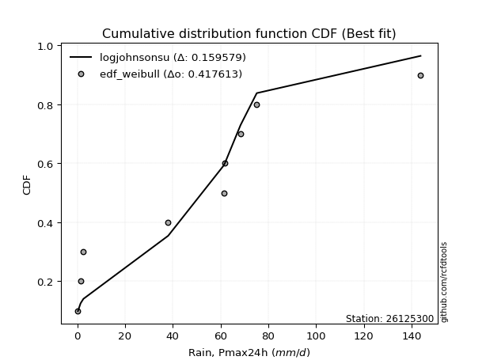</img>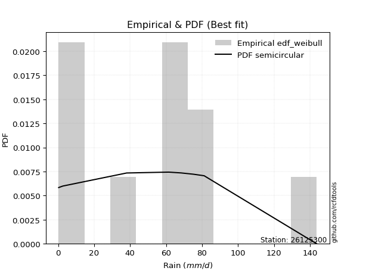</img>

</div>


### 4. EDF Beard (1943)

The Beard formula (or Beard´s plotting position formula) in hydrology is used to estimate the empirical non-exceedance probability _(P)_ of a flood event (or other extreme hydrological data point) within a given dataset.

<div align="center">


$P=(m-0.31)/(n+0.38)$


</div>


**4.1. Empirical values**

<div align="center">

|                | 0                   | 1                   | 2                  | 3                   | 4                   | 5                  | 6                  | 7                  | 8                  | 9                  |
|:---------------|:--------------------|:--------------------|:-------------------|:--------------------|:--------------------|:-------------------|:-------------------|:-------------------|:-------------------|:-------------------|
| date           | 2022                | 2023                | 2016               | 2018                | 2021                | 2020               | 2019               | 2017               | 2025               | 2024               |
| x              | 0.3                 | 1.4                 | 2.6                | 38.1                | 61.4                | 61.9               | 68.4               | 75.2               | 81.2               | 143.8              |
| m              | 1                   | 2                   | 3                  | 4                   | 5                   | 6                  | 7                  | 8                  | 9                  | 10                 |
| empirical_dist | edf_beard           | edf_beard           | edf_beard          | edf_beard           | edf_beard           | edf_beard          | edf_beard          | edf_beard          | edf_beard          | edf_beard          |
| empirical      | 0.06647398843930635 | 0.16281310211946048 | 0.2591522157996146 | 0.35549132947976875 | 0.45183044315992293 | 0.5481695568400771 | 0.6445086705202312 | 0.7408477842003853 | 0.8371868978805393 | 0.9335260115606935 |
| empirical_tr   | 1.0712074303405574  | 1.1944764096662832  | 1.3498049414824447 | 1.5515695067264574  | 1.8242530755711774  | 2.213219616204691  | 2.813008130081301  | 3.8587360594795537 | 6.142011834319521  | 15.043478260869529 |

</div>


**4.2. Kolmogorov-Smirnov fit test (sorted by Δ)**


<div align="center">

|                | 0                   | 1                   | 2                   | 3                  | 4                  | 5                   | 6                   | 7                  | 8                   | 9                  | 10                  | 11                 | 12                 | 13                 | 14                  | 15                 | 16                  | 17                 | 18                 | 19                  | 20                  | 21                 | 22                 | 23                  | 24                  | 25                  | 26                 | 27                  | 28                  | 29                  | 30                  | 31                 | 32                  | 33                 | 34                  | 35                  | 36                  | 37                  | 38                 | 39                  | 40                 | 41                  | 42                  | 43                 | 44                 | 45                  | 46                  | 47                  | 48                  | 49                  | 50                  | 51                 | 52                  | 53                  | 54                  | 55                  | 56                  | 57                  | 58                 | 59                 | 60                  | 61                  | 62                 | 63                 | 64                 | 65                 | 66                  | 67                 | 68                 | 69                  | 70                 | 71                  | 72                  | 73                  | 74                 | 75                 | 76                 | 77                  | 78                 | 79                 | 80                  | 81                  | 82                  | 83                 | 84                 | 85                 | 86                 | 87                  | 88                 | 89                  | 90                  | 91                 | 92                 | 93                 | 94                 | 95                 | 96                 | 97                 | 98                  | 99                 | 100                | 101                 | 102                | 103                | 104                 | 105                 | 106                | 107                | 108                 | 109                | 110                 | 111                 | 112                | 113                | 114                | 115                | 116                | 117                | 118                 | 119                 | 120                 | 121                | 122                | 123                | 124                 | 125                 | 126                | 127                | 128                | 129                | 130                 | 131                | 132                 | 133                | 134                 | 135                | 136                 | 137                | 138                | 139                | 140                 | 141                | 142                | 143                | 144                | 145                 | 146                | 147                | 148                | 149                | 150                | 151                | 152                | 153                | 154                | 155                | 156                | 157                | 158                | 159                |
|:---------------|:--------------------|:--------------------|:--------------------|:-------------------|:-------------------|:--------------------|:--------------------|:-------------------|:--------------------|:-------------------|:--------------------|:-------------------|:-------------------|:-------------------|:--------------------|:-------------------|:--------------------|:-------------------|:-------------------|:--------------------|:--------------------|:-------------------|:-------------------|:--------------------|:--------------------|:--------------------|:-------------------|:--------------------|:--------------------|:--------------------|:--------------------|:-------------------|:--------------------|:-------------------|:--------------------|:--------------------|:--------------------|:--------------------|:-------------------|:--------------------|:-------------------|:--------------------|:--------------------|:-------------------|:-------------------|:--------------------|:--------------------|:--------------------|:--------------------|:--------------------|:--------------------|:-------------------|:--------------------|:--------------------|:--------------------|:--------------------|:--------------------|:--------------------|:-------------------|:-------------------|:--------------------|:--------------------|:-------------------|:-------------------|:-------------------|:-------------------|:--------------------|:-------------------|:-------------------|:--------------------|:-------------------|:--------------------|:--------------------|:--------------------|:-------------------|:-------------------|:-------------------|:--------------------|:-------------------|:-------------------|:--------------------|:--------------------|:--------------------|:-------------------|:-------------------|:-------------------|:-------------------|:--------------------|:-------------------|:--------------------|:--------------------|:-------------------|:-------------------|:-------------------|:-------------------|:-------------------|:-------------------|:-------------------|:--------------------|:-------------------|:-------------------|:--------------------|:-------------------|:-------------------|:--------------------|:--------------------|:-------------------|:-------------------|:--------------------|:-------------------|:--------------------|:--------------------|:-------------------|:-------------------|:-------------------|:-------------------|:-------------------|:-------------------|:--------------------|:--------------------|:--------------------|:-------------------|:-------------------|:-------------------|:--------------------|:--------------------|:-------------------|:-------------------|:-------------------|:-------------------|:--------------------|:-------------------|:--------------------|:-------------------|:--------------------|:-------------------|:--------------------|:-------------------|:-------------------|:-------------------|:--------------------|:-------------------|:-------------------|:-------------------|:-------------------|:--------------------|:-------------------|:-------------------|:-------------------|:-------------------|:-------------------|:-------------------|:-------------------|:-------------------|:-------------------|:-------------------|:-------------------|:-------------------|:-------------------|:-------------------|
| station        | 26125300            | 26125300            | 26125300            | 26125300           | 26125300           | 26125300            | 26125300            | 26125300           | 26125300            | 26125300           | 26125300            | 26125300           | 26125300           | 26125300           | 26125300            | 26125300           | 26125300            | 26125300           | 26125300           | 26125300            | 26125300            | 26125300           | 26125300           | 26125300            | 26125300            | 26125300            | 26125300           | 26125300            | 26125300            | 26125300            | 26125300            | 26125300           | 26125300            | 26125300           | 26125300            | 26125300            | 26125300            | 26125300            | 26125300           | 26125300            | 26125300           | 26125300            | 26125300            | 26125300           | 26125300           | 26125300            | 26125300            | 26125300            | 26125300            | 26125300            | 26125300            | 26125300           | 26125300            | 26125300            | 26125300            | 26125300            | 26125300            | 26125300            | 26125300           | 26125300           | 26125300            | 26125300            | 26125300           | 26125300           | 26125300           | 26125300           | 26125300            | 26125300           | 26125300           | 26125300            | 26125300           | 26125300            | 26125300            | 26125300            | 26125300           | 26125300           | 26125300           | 26125300            | 26125300           | 26125300           | 26125300            | 26125300            | 26125300            | 26125300           | 26125300           | 26125300           | 26125300           | 26125300            | 26125300           | 26125300            | 26125300            | 26125300           | 26125300           | 26125300           | 26125300           | 26125300           | 26125300           | 26125300           | 26125300            | 26125300           | 26125300           | 26125300            | 26125300           | 26125300           | 26125300            | 26125300            | 26125300           | 26125300           | 26125300            | 26125300           | 26125300            | 26125300            | 26125300           | 26125300           | 26125300           | 26125300           | 26125300           | 26125300           | 26125300            | 26125300            | 26125300            | 26125300           | 26125300           | 26125300           | 26125300            | 26125300            | 26125300           | 26125300           | 26125300           | 26125300           | 26125300            | 26125300           | 26125300            | 26125300           | 26125300            | 26125300           | 26125300            | 26125300           | 26125300           | 26125300           | 26125300            | 26125300           | 26125300           | 26125300           | 26125300           | 26125300            | 26125300           | 26125300           | 26125300           | 26125300           | 26125300           | 26125300           | 26125300           | 26125300           | 26125300           | 26125300           | 26125300           | 26125300           | 26125300           | 26125300           |
| empirical_dist | edf_beard           | edf_beard           | edf_beard           | edf_beard          | edf_beard          | edf_beard           | edf_beard           | edf_beard          | edf_beard           | edf_beard          | edf_beard           | edf_beard          | edf_beard          | edf_beard          | edf_beard           | edf_beard          | edf_beard           | edf_beard          | edf_beard          | edf_beard           | edf_beard           | edf_beard          | edf_beard          | edf_beard           | edf_beard           | edf_beard           | edf_beard          | edf_beard           | edf_beard           | edf_beard           | edf_beard           | edf_beard          | edf_beard           | edf_beard          | edf_beard           | edf_beard           | edf_beard           | edf_beard           | edf_beard          | edf_beard           | edf_beard          | edf_beard           | edf_beard           | edf_beard          | edf_beard          | edf_beard           | edf_beard           | edf_beard           | edf_beard           | edf_beard           | edf_beard           | edf_beard          | edf_beard           | edf_beard           | edf_beard           | edf_beard           | edf_beard           | edf_beard           | edf_beard          | edf_beard          | edf_beard           | edf_beard           | edf_beard          | edf_beard          | edf_beard          | edf_beard          | edf_beard           | edf_beard          | edf_beard          | edf_beard           | edf_beard          | edf_beard           | edf_beard           | edf_beard           | edf_beard          | edf_beard          | edf_beard          | edf_beard           | edf_beard          | edf_beard          | edf_beard           | edf_beard           | edf_beard           | edf_beard          | edf_beard          | edf_beard          | edf_beard          | edf_beard           | edf_beard          | edf_beard           | edf_beard           | edf_beard          | edf_beard          | edf_beard          | edf_beard          | edf_beard          | edf_beard          | edf_beard          | edf_beard           | edf_beard          | edf_beard          | edf_beard           | edf_beard          | edf_beard          | edf_beard           | edf_beard           | edf_beard          | edf_beard          | edf_beard           | edf_beard          | edf_beard           | edf_beard           | edf_beard          | edf_beard          | edf_beard          | edf_beard          | edf_beard          | edf_beard          | edf_beard           | edf_beard           | edf_beard           | edf_beard          | edf_beard          | edf_beard          | edf_beard           | edf_beard           | edf_beard          | edf_beard          | edf_beard          | edf_beard          | edf_beard           | edf_beard          | edf_beard           | edf_beard          | edf_beard           | edf_beard          | edf_beard           | edf_beard          | edf_beard          | edf_beard          | edf_beard           | edf_beard          | edf_beard          | edf_beard          | edf_beard          | edf_beard           | edf_beard          | edf_beard          | edf_beard          | edf_beard          | edf_beard          | edf_beard          | edf_beard          | edf_beard          | edf_beard          | edf_beard          | edf_beard          | edf_beard          | edf_beard          | edf_beard          |
| p_dist         | dgamma              | anglit              | semicircular        | logjohnsonsu       | dweibull           | foldnorm            | johnsonsu           | t                  | norm                | crystalball        | gumbel_l            | maxwell            | cosine             | pearson3           | logistic            | exponnorm          | rayleigh            | hypsecant          | gennorm            | laplace             | invgamma            | loggennorm         | rice               | halfgennorm         | logweibull_max      | genlogistic         | arcsine            | kstwobign           | logmielke           | loglevy_l           | mielke              | gumbel_r           | betaprime           | invgauss           | halfnorm            | truncweibull_min    | logloggamma         | logvonmises_line    | loggenextreme      | logdweibull         | logdgamma          | moyal               | ncf                 | logarcsine         | logtrapezoid       | logpearson3         | nakagami            | logargus            | truncnorm           | gompertz            | genpareto           | loggumbel_l        | genexpon            | skewnorm            | lomax               | bradford            | kappa3              | truncexpon          | vonmises_line      | logsemicircular    | weibull_min         | logweibull_min      | logburr12          | loggenhalflogistic | loganglit          | halflogistic       | f                   | logjohnsonsb       | argus              | burr                | kappa4             | exponpow            | logfatiguelife      | lognakagami         | logrice            | logt               | logcrystalball     | lognorm             | logexponnorm       | logncf             | lognct              | wrapcauchy          | uniform             | loggompertz        | logerlang          | loggamma           | loggamma           | loginvweibull       | logfoldnorm        | invweibull          | genextreme          | burr12             | wald               | logexponweib       | loginvgamma        | gausshyper         | ksone              | loglogistic        | loginvgauss         | logwrapcauchy      | logmaxwell         | loghypsecant        | lograyleigh        | logkstwobign       | logburr             | logskewnorm         | loggenexpon        | logbetaprime       | logcosine           | loghalfnorm        | loglaplace          | loglaplace          | nct                | loggumbel_r        | loglomax           | logtriang          | loghalflogistic    | logmoyal           | logbeta             | loghalfgennorm      | logloglaplace       | logf               | levy_l             | logksone           | logtruncweibull_min | erlang              | exponweib          | johnsonsb          | logwald            | logalpha           | loggausshyper       | genhalflogistic    | logkappa4           | loguniform         | powerlaw            | logtruncnorm       | logkappa3           | triang             | loggengamma        | gamma              | fatiguelife         | logbradford        | tukeylambda        | rdist              | logtruncexpon      | loggenpareto        | trapezoid          | beta               | gengamma           | truncpareto        | logpowerlaw        | alpha              | logexponpow        | weibull_max        | logtruncpareto     | logrdist           | logtukeylambda     | loggenlogistic     | logvonmises        | vonmises           |
| delta          | 0.12300772023866657 | 0.12348512833164099 | 0.13327228172078465 | 0.1337337021364634 | 0.1391772820603636 | 0.14120792221675615 | 0.14237696353522167 | 0.1429271625984258 | 0.14293411181965465 | 0.1429341124824806 | 0.14483749796806578 | 0.1510850539781945 | 0.1525805952383944 | 0.1526110537691609 | 0.15629470758333674 | 0.15731042070653   | 0.16013324167842335 | 0.1623447332357298 | 0.1655243821048    | 0.16677446856615682 | 0.17084216519903217 | 0.1745189723063217 | 0.1771378835509933 | 0.17829061472789048 | 0.18005272067580758 | 0.18315876146881838 | 0.1845698735956175 | 0.18473248926219188 | 0.18490399659883128 | 0.18996948079957093 | 0.19016870916285933 | 0.1911763338800001 | 0.19121579133839983 | 0.1955030308801965 | 0.19692877518834062 | 0.19712007622423505 | 0.19883736802971164 | 0.20068381561767334 | 0.2121171932194974 | 0.21256432394319813 | 0.2143150627140311 | 0.21510688003556855 | 0.21741003884803778 | 0.2176793832709228 | 0.2199020610035614 | 0.22146229566122388 | 0.22639307059024638 | 0.22708193763364515 | 0.22913042128777725 | 0.22958865005127435 | 0.23051147363794094 | 0.2310871805215874 | 0.23156043738925036 | 0.23219727453107247 | 0.23385482864698182 | 0.23563298388025547 | 0.23586317747744873 | 0.23648341980514648 | 0.2430176639055318 | 0.2466310201211928 | 0.24669090180713266 | 0.24908594255317662 | 0.2492987272711581 | 0.2505875199251679 | 0.2537703166377531 | 0.2591522157996146 | 0.26192468962774973 | 0.2642158034185639 | 0.2645741328329655 | 0.26568029116396297 | 0.266885164025916  | 0.26927264962212605 | 0.27024027139518186 | 0.27072325046317075 | 0.2708677458449294 | 0.2708708121805204 | 0.2708708161209556 | 0.27087098633535794 | 0.270871411648182  | 0.2708907277026969 | 0.27091990195360144 | 0.27341925851596116 | 0.27342383167844875 | 0.2735276378053159 | 0.2757299030512607 | 0.2759084432058119 | 0.2759084432058119 | 0.27662815373872457 | 0.2768430089997639 | 0.27703298249709746 | 0.27703375915585743 | 0.2787027748543738 | 0.2815702202579994 | 0.281917965198118  | 0.2827924374631328 | 0.282972569002682  | 0.2840510093787971 | 0.2866035071615873 | 0.29200018839106306 | 0.2934685532057942 | 0.2949338074181847 | 0.29915625705861243 | 0.3022782942400087 | 0.3049386123324654 | 0.30894005856225343 | 0.31189925415385855 | 0.3121609273210146 | 0.3125165391279405 | 0.31797037091471464 | 0.3233756614704338 | 0.32750914007429194 | 0.32750914007429194 | 0.3280112337740329 | 0.3342821060480636 | 0.3358932017544703 | 0.3478408103081605 | 0.3517259266112254 | 0.3555715428476935 | 0.35938384338662493 | 0.36182450183872567 | 0.37272917079655904 | 0.3755773061889876 | 0.3812350968687082 | 0.3818542235489553 | 0.3996627797717041  | 0.40955362302475695 | 0.4097485429385558 | 0.411256957623422  | 0.415315949691549  | 0.4209824051970736 | 0.42517566057912365 | 0.4257153847984467 | 0.42728606251932005 | 0.4293233341547001 | 0.43388098162825833 | 0.4350957766020333 | 0.46602625478679355 | 0.4712715637093479 | 0.4738408750619622 | 0.4751315975665183 | 0.47960998896484036 | 0.4813322926060913 | 0.482550769840372  | 0.4842734665466872 | 0.4892685429029559 | 0.49008100438580177 | 0.5266978433329816 | 0.540515345892957  | 0.5499777889296804 | 0.5832035402717146 | 0.5873596607444886 | 0.6252484537573977 | 0.6392575558544351 | 0.6946661077573961 | 0.7032641101566495 | 0.740847784169431  | 0.7408477842003782 | 0.8371868978805393 | 0.880880343690907  | 22.401582283956582 |
| deltao         | 0.3942745923300002  | 0.3942745923300002  | 0.3942745923300002  | 0.3942745923300002 | 0.3942745923300002 | 0.3942745923300002  | 0.3942745923300002  | 0.3942745923300002 | 0.3942745923300002  | 0.3942745923300002 | 0.3942745923300002  | 0.3942745923300002 | 0.3942745923300002 | 0.3942745923300002 | 0.3942745923300002  | 0.3942745923300002 | 0.3942745923300002  | 0.3942745923300002 | 0.3942745923300002 | 0.3942745923300002  | 0.3942745923300002  | 0.3942745923300002 | 0.3942745923300002 | 0.3942745923300002  | 0.3942745923300002  | 0.3942745923300002  | 0.3942745923300002 | 0.3942745923300002  | 0.3942745923300002  | 0.3942745923300002  | 0.3942745923300002  | 0.3942745923300002 | 0.3942745923300002  | 0.3942745923300002 | 0.3942745923300002  | 0.3942745923300002  | 0.3942745923300002  | 0.3942745923300002  | 0.3942745923300002 | 0.3942745923300002  | 0.3942745923300002 | 0.3942745923300002  | 0.3942745923300002  | 0.3942745923300002 | 0.3942745923300002 | 0.3942745923300002  | 0.3942745923300002  | 0.3942745923300002  | 0.3942745923300002  | 0.3942745923300002  | 0.3942745923300002  | 0.3942745923300002 | 0.3942745923300002  | 0.3942745923300002  | 0.3942745923300002  | 0.3942745923300002  | 0.3942745923300002  | 0.3942745923300002  | 0.3942745923300002 | 0.3942745923300002 | 0.3942745923300002  | 0.3942745923300002  | 0.3942745923300002 | 0.3942745923300002 | 0.3942745923300002 | 0.3942745923300002 | 0.3942745923300002  | 0.3942745923300002 | 0.3942745923300002 | 0.3942745923300002  | 0.3942745923300002 | 0.3942745923300002  | 0.3942745923300002  | 0.3942745923300002  | 0.3942745923300002 | 0.3942745923300002 | 0.3942745923300002 | 0.3942745923300002  | 0.3942745923300002 | 0.3942745923300002 | 0.3942745923300002  | 0.3942745923300002  | 0.3942745923300002  | 0.3942745923300002 | 0.3942745923300002 | 0.3942745923300002 | 0.3942745923300002 | 0.3942745923300002  | 0.3942745923300002 | 0.3942745923300002  | 0.3942745923300002  | 0.3942745923300002 | 0.3942745923300002 | 0.3942745923300002 | 0.3942745923300002 | 0.3942745923300002 | 0.3942745923300002 | 0.3942745923300002 | 0.3942745923300002  | 0.3942745923300002 | 0.3942745923300002 | 0.3942745923300002  | 0.3942745923300002 | 0.3942745923300002 | 0.3942745923300002  | 0.3942745923300002  | 0.3942745923300002 | 0.3942745923300002 | 0.3942745923300002  | 0.3942745923300002 | 0.3942745923300002  | 0.3942745923300002  | 0.3942745923300002 | 0.3942745923300002 | 0.3942745923300002 | 0.3942745923300002 | 0.3942745923300002 | 0.3942745923300002 | 0.3942745923300002  | 0.3942745923300002  | 0.3942745923300002  | 0.3942745923300002 | 0.3942745923300002 | 0.3942745923300002 | 0.3942745923300002  | 0.3942745923300002  | 0.3942745923300002 | 0.3942745923300002 | 0.3942745923300002 | 0.3942745923300002 | 0.3942745923300002  | 0.3942745923300002 | 0.3942745923300002  | 0.3942745923300002 | 0.3942745923300002  | 0.3942745923300002 | 0.3942745923300002  | 0.3942745923300002 | 0.3942745923300002 | 0.3942745923300002 | 0.3942745923300002  | 0.3942745923300002 | 0.3942745923300002 | 0.3942745923300002 | 0.3942745923300002 | 0.3942745923300002  | 0.3942745923300002 | 0.3942745923300002 | 0.3942745923300002 | 0.3942745923300002 | 0.3942745923300002 | 0.3942745923300002 | 0.3942745923300002 | 0.3942745923300002 | 0.3942745923300002 | 0.3942745923300002 | 0.3942745923300002 | 0.3942745923300002 | 0.3942745923300002 | 0.3942745923300002 |
| eval           | Δo > Δ              | Δo > Δ              | Δo > Δ              | Δo > Δ             | Δo > Δ             | Δo > Δ              | Δo > Δ              | Δo > Δ             | Δo > Δ              | Δo > Δ             | Δo > Δ              | Δo > Δ             | Δo > Δ             | Δo > Δ             | Δo > Δ              | Δo > Δ             | Δo > Δ              | Δo > Δ             | Δo > Δ             | Δo > Δ              | Δo > Δ              | Δo > Δ             | Δo > Δ             | Δo > Δ              | Δo > Δ              | Δo > Δ              | Δo > Δ             | Δo > Δ              | Δo > Δ              | Δo > Δ              | Δo > Δ              | Δo > Δ             | Δo > Δ              | Δo > Δ             | Δo > Δ              | Δo > Δ              | Δo > Δ              | Δo > Δ              | Δo > Δ             | Δo > Δ              | Δo > Δ             | Δo > Δ              | Δo > Δ              | Δo > Δ             | Δo > Δ             | Δo > Δ              | Δo > Δ              | Δo > Δ              | Δo > Δ              | Δo > Δ              | Δo > Δ              | Δo > Δ             | Δo > Δ              | Δo > Δ              | Δo > Δ              | Δo > Δ              | Δo > Δ              | Δo > Δ              | Δo > Δ             | Δo > Δ             | Δo > Δ              | Δo > Δ              | Δo > Δ             | Δo > Δ             | Δo > Δ             | Δo > Δ             | Δo > Δ              | Δo > Δ             | Δo > Δ             | Δo > Δ              | Δo > Δ             | Δo > Δ              | Δo > Δ              | Δo > Δ              | Δo > Δ             | Δo > Δ             | Δo > Δ             | Δo > Δ              | Δo > Δ             | Δo > Δ             | Δo > Δ              | Δo > Δ              | Δo > Δ              | Δo > Δ             | Δo > Δ             | Δo > Δ             | Δo > Δ             | Δo > Δ              | Δo > Δ             | Δo > Δ              | Δo > Δ              | Δo > Δ             | Δo > Δ             | Δo > Δ             | Δo > Δ             | Δo > Δ             | Δo > Δ             | Δo > Δ             | Δo > Δ              | Δo > Δ             | Δo > Δ             | Δo > Δ              | Δo > Δ             | Δo > Δ             | Δo > Δ              | Δo > Δ              | Δo > Δ             | Δo > Δ             | Δo > Δ              | Δo > Δ             | Δo > Δ              | Δo > Δ              | Δo > Δ             | Δo > Δ             | Δo > Δ             | Δo > Δ             | Δo > Δ             | Δo > Δ             | Δo > Δ              | Δo > Δ              | Δo > Δ              | Δo > Δ             | Δo > Δ             | Δo > Δ             | Δo <= Δ             | Δo <= Δ             | Δo <= Δ            | Δo <= Δ            | Δo <= Δ            | Δo <= Δ            | Δo <= Δ             | Δo <= Δ            | Δo <= Δ             | Δo <= Δ            | Δo <= Δ             | Δo <= Δ            | Δo <= Δ             | Δo <= Δ            | Δo <= Δ            | Δo <= Δ            | Δo <= Δ             | Δo <= Δ            | Δo <= Δ            | Δo <= Δ            | Δo <= Δ            | Δo <= Δ             | Δo <= Δ            | Δo <= Δ            | Δo <= Δ            | Δo <= Δ            | Δo <= Δ            | Δo <= Δ            | Δo <= Δ            | Δo <= Δ            | Δo <= Δ            | Δo <= Δ            | Δo <= Δ            | Δo <= Δ            | Δo <= Δ            | Δo <= Δ            |
| fit            | 1                   | 1                   | 1                   | 1                  | 1                  | 1                   | 1                   | 1                  | 1                   | 1                  | 1                   | 1                  | 1                  | 1                  | 1                   | 1                  | 1                   | 1                  | 1                  | 1                   | 1                   | 1                  | 1                  | 1                   | 1                   | 1                   | 1                  | 1                   | 1                   | 1                   | 1                   | 1                  | 1                   | 1                  | 1                   | 1                   | 1                   | 1                   | 1                  | 1                   | 1                  | 1                   | 1                   | 1                  | 1                  | 1                   | 1                   | 1                   | 1                   | 1                   | 1                   | 1                  | 1                   | 1                   | 1                   | 1                   | 1                   | 1                   | 1                  | 1                  | 1                   | 1                   | 1                  | 1                  | 1                  | 1                  | 1                   | 1                  | 1                  | 1                   | 1                  | 1                   | 1                   | 1                   | 1                  | 1                  | 1                  | 1                   | 1                  | 1                  | 1                   | 1                   | 1                   | 1                  | 1                  | 1                  | 1                  | 1                   | 1                  | 1                   | 1                   | 1                  | 1                  | 1                  | 1                  | 1                  | 1                  | 1                  | 1                   | 1                  | 1                  | 1                   | 1                  | 1                  | 1                   | 1                   | 1                  | 1                  | 1                   | 1                  | 1                   | 1                   | 1                  | 1                  | 1                  | 1                  | 1                  | 1                  | 1                   | 1                   | 1                   | 1                  | 1                  | 1                  | 0                   | 0                   | 0                  | 0                  | 0                  | 0                  | 0                   | 0                  | 0                   | 0                  | 0                   | 0                  | 0                   | 0                  | 0                  | 0                  | 0                   | 0                  | 0                  | 0                  | 0                  | 0                   | 0                  | 0                  | 0                  | 0                  | 0                  | 0                  | 0                  | 0                  | 0                  | 0                  | 0                  | 0                  | 0                  | 0                  |
| n              | 10                  | 10                  | 10                  | 10                 | 10                 | 10                  | 10                  | 10                 | 10                  | 10                 | 10                  | 10                 | 10                 | 10                 | 10                  | 10                 | 10                  | 10                 | 10                 | 10                  | 10                  | 10                 | 10                 | 10                  | 10                  | 10                  | 10                 | 10                  | 10                  | 10                  | 10                  | 10                 | 10                  | 10                 | 10                  | 10                  | 10                  | 10                  | 10                 | 10                  | 10                 | 10                  | 10                  | 10                 | 10                 | 10                  | 10                  | 10                  | 10                  | 10                  | 10                  | 10                 | 10                  | 10                  | 10                  | 10                  | 10                  | 10                  | 10                 | 10                 | 10                  | 10                  | 10                 | 10                 | 10                 | 10                 | 10                  | 10                 | 10                 | 10                  | 10                 | 10                  | 10                  | 10                  | 10                 | 10                 | 10                 | 10                  | 10                 | 10                 | 10                  | 10                  | 10                  | 10                 | 10                 | 10                 | 10                 | 10                  | 10                 | 10                  | 10                  | 10                 | 10                 | 10                 | 10                 | 10                 | 10                 | 10                 | 10                  | 10                 | 10                 | 10                  | 10                 | 10                 | 10                  | 10                  | 10                 | 10                 | 10                  | 10                 | 10                  | 10                  | 10                 | 10                 | 10                 | 10                 | 10                 | 10                 | 10                  | 10                  | 10                  | 10                 | 10                 | 10                 | 10                  | 10                  | 10                 | 10                 | 10                 | 10                 | 10                  | 10                 | 10                  | 10                 | 10                  | 10                 | 10                  | 10                 | 10                 | 10                 | 10                  | 10                 | 10                 | 10                 | 10                 | 10                  | 10                 | 10                 | 10                 | 10                 | 10                 | 10                 | 10                 | 10                 | 10                 | 10                 | 10                 | 10                 | 10                 | 10                 |
| best_fit       | 1                   | 0                   | 0                   | 0                  | 0                  | 0                   | 0                   | 0                  | 0                   | 0                  | 0                   | 0                  | 0                  | 0                  | 0                   | 0                  | 0                   | 0                  | 0                  | 0                   | 0                   | 0                  | 0                  | 0                   | 0                   | 0                   | 0                  | 0                   | 0                   | 0                   | 0                   | 0                  | 0                   | 0                  | 0                   | 0                   | 0                   | 0                   | 0                  | 0                   | 0                  | 0                   | 0                   | 0                  | 0                  | 0                   | 0                   | 0                   | 0                   | 0                   | 0                   | 0                  | 0                   | 0                   | 0                   | 0                   | 0                   | 0                   | 0                  | 0                  | 0                   | 0                   | 0                  | 0                  | 0                  | 0                  | 0                   | 0                  | 0                  | 0                   | 0                  | 0                   | 0                   | 0                   | 0                  | 0                  | 0                  | 0                   | 0                  | 0                  | 0                   | 0                   | 0                   | 0                  | 0                  | 0                  | 0                  | 0                   | 0                  | 0                   | 0                   | 0                  | 0                  | 0                  | 0                  | 0                  | 0                  | 0                  | 0                   | 0                  | 0                  | 0                   | 0                  | 0                  | 0                   | 0                   | 0                  | 0                  | 0                   | 0                  | 0                   | 0                   | 0                  | 0                  | 0                  | 0                  | 0                  | 0                  | 0                   | 0                   | 0                   | 0                  | 0                  | 0                  | 0                   | 0                   | 0                  | 0                  | 0                  | 0                  | 0                   | 0                  | 0                   | 0                  | 0                   | 0                  | 0                   | 0                  | 0                  | 0                  | 0                   | 0                  | 0                  | 0                  | 0                  | 0                   | 0                  | 0                  | 0                  | 0                  | 0                  | 0                  | 0                  | 0                  | 0                  | 0                  | 0                  | 0                  | 0                  | 0                  |
| best_fit_sort  | 1                   | 2                   | 3                   | 4                  | 5                  | 6                   | 7                   | 8                  | 9                   | 10                 | 11                  | 12                 | 13                 | 14                 | 15                  | 16                 | 17                  | 18                 | 19                 | 20                  | 21                  | 22                 | 23                 | 24                  | 25                  | 26                  | 27                 | 28                  | 29                  | 30                  | 31                  | 32                 | 33                  | 34                 | 35                  | 36                  | 37                  | 38                  | 39                 | 40                  | 41                 | 42                  | 43                  | 44                 | 45                 | 46                  | 47                  | 48                  | 49                  | 50                  | 51                  | 52                 | 53                  | 54                  | 55                  | 56                  | 57                  | 58                  | 59                 | 60                 | 61                  | 62                  | 63                 | 64                 | 65                 | 66                 | 67                  | 68                 | 69                 | 70                  | 71                 | 72                  | 73                  | 74                  | 75                 | 76                 | 77                 | 78                  | 79                 | 80                 | 81                  | 82                  | 83                  | 84                 | 85                 | 86                 | 87                 | 88                  | 89                 | 90                  | 91                  | 92                 | 93                 | 94                 | 95                 | 96                 | 97                 | 98                 | 99                  | 100                | 101                | 102                 | 103                | 104                | 105                 | 106                 | 107                | 108                | 109                 | 110                | 111                 | 112                 | 113                | 114                | 115                | 116                | 117                | 118                | 119                 | 120                 | 121                 | 122                | 123                | 124                | 125                 | 126                 | 127                | 128                | 129                | 130                | 131                 | 132                | 133                 | 134                | 135                 | 136                | 137                 | 138                | 139                | 140                | 141                 | 142                | 143                | 144                | 145                | 146                 | 147                | 148                | 149                | 150                | 151                | 152                | 153                | 154                | 155                | 156                | 157                | 158                | 159                | 160                |

</div>


**4.3. Best fit**

<div align="center">

|   id |   station | empirical_dist   | p_dist   |    delta |   deltao | eval   |   fit |   n |   best_fit |   best_fit_sort |
|-----:|----------:|:-----------------|:---------|---------:|---------:|:-------|------:|----:|-----------:|----------------:|
|    0 |  26125300 | edf_beard        | dgamma   | 0.123008 | 0.394275 | Δo > Δ |     1 |  10 |          1 |               1 |

</div>


<div align="center">

</img>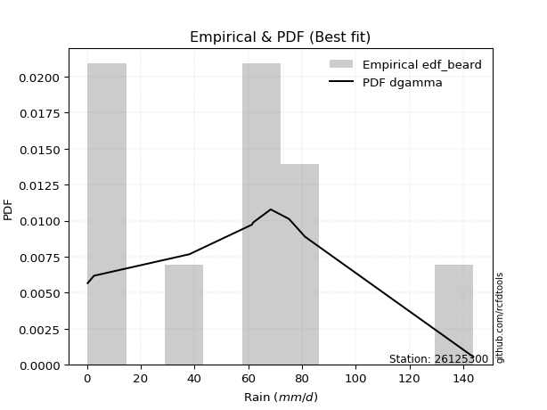</img>

</div>


### 5. EDF Chegodayev (1955)

The Chegodayev formula is an empirical plotting position formula used in hydrological frequency analysis to estimate the exceedance probability or return period of a specific event from a set of observed data. It is primarily used for plotting observed data points on probability paper to fit a theoretical distribution, particularly for analyzing extreme events like maximum flood flows or rainfall intensities. The constant _b_ value in the generalized plotting position formula is 0.3.

<div align="center">


$P=(m-b)/(n+1-2b)$


</div>


**5.1. Empirical values**

<div align="center">

|                | 0                  | 1                   | 2                   | 3                  | 4                  | 5                  | 6                  | 7                  | 8                  | 9                  |
|:---------------|:-------------------|:--------------------|:--------------------|:-------------------|:-------------------|:-------------------|:-------------------|:-------------------|:-------------------|:-------------------|
| date           | 2022               | 2023                | 2016                | 2018               | 2021               | 2020               | 2019               | 2017               | 2025               | 2024               |
| x              | 0.3                | 1.4                 | 2.6                 | 38.1               | 61.4               | 61.9               | 68.4               | 75.2               | 81.2               | 143.8              |
| m              | 1                  | 2                   | 3                   | 4                  | 5                  | 6                  | 7                  | 8                  | 9                  | 10                 |
| empirical_dist | edf_chegodayev     | edf_chegodayev      | edf_chegodayev      | edf_chegodayev     | edf_chegodayev     | edf_chegodayev     | edf_chegodayev     | edf_chegodayev     | edf_chegodayev     | edf_chegodayev     |
| empirical      | 0.0673076923076923 | 0.16346153846153846 | 0.25961538461538464 | 0.3557692307692308 | 0.4519230769230769 | 0.5480769230769231 | 0.6442307692307693 | 0.7403846153846154 | 0.8365384615384615 | 0.9326923076923076 |
| empirical_tr   | 1.0721649484536082 | 1.1954022988505746  | 1.3506493506493507  | 1.5522388059701495 | 1.8245614035087718 | 2.2127659574468086 | 2.810810810810811  | 3.8518518518518525 | 6.117647058823526  | 14.857142857142836 |

</div>


**5.2. Kolmogorov-Smirnov fit test (sorted by Δ)**


<div align="center">

|                | 0                   | 1                   | 2                   | 3                   | 4                  | 5                   | 6                  | 7                   | 8                   | 9                   | 10                 | 11                 | 12                  | 13                  | 14                  | 15                  | 16                  | 17                 | 18                  | 19                  | 20                  | 21                  | 22                  | 23                 | 24                  | 25                  | 26                 | 27                  | 28                  | 29                 | 30                  | 31                 | 32                  | 33                 | 34                  | 35                  | 36                  | 37                  | 38                  | 39                 | 40                  | 41                  | 42                  | 43                  | 44                  | 45                 | 46                 | 47                  | 48                  | 49                  | 50                  | 51                 | 52                  | 53                 | 54                  | 55                 | 56                  | 57                 | 58                  | 59                  | 60                  | 61                  | 62                 | 63                  | 64                 | 65                  | 66                  | 67                 | 68                 | 69                 | 70                 | 71                  | 72                  | 73                 | 74                  | 75                  | 76                  | 77                 | 78                 | 79                  | 80                 | 81                  | 82                  | 83                 | 84                 | 85                 | 86                 | 87                  | 88                 | 89                 | 90                 | 91                 | 92                 | 93                 | 94                 | 95                 | 96                  | 97                  | 98                  | 99                  | 100                 | 101                | 102                 | 103                 | 104                | 105                 | 106                 | 107                 | 108                | 109                 | 110                | 111                | 112                 | 113                 | 114                 | 115                | 116                | 117                 | 118                 | 119                 | 120                | 121                 | 122                | 123                | 124                 | 125                | 126                 | 127                | 128                 | 129                 | 130                | 131                 | 132                | 133                 | 134                | 135                 | 136                | 137                | 138                | 139                 | 140                | 141                 | 142                 | 143                 | 144                 | 145                 | 146                | 147                | 148                | 149                | 150                | 151                | 152                | 153                | 154                | 155                | 156                | 157                | 158                | 159                |
|:---------------|:--------------------|:--------------------|:--------------------|:--------------------|:-------------------|:--------------------|:-------------------|:--------------------|:--------------------|:--------------------|:-------------------|:-------------------|:--------------------|:--------------------|:--------------------|:--------------------|:--------------------|:-------------------|:--------------------|:--------------------|:--------------------|:--------------------|:--------------------|:-------------------|:--------------------|:--------------------|:-------------------|:--------------------|:--------------------|:-------------------|:--------------------|:-------------------|:--------------------|:-------------------|:--------------------|:--------------------|:--------------------|:--------------------|:--------------------|:-------------------|:--------------------|:--------------------|:--------------------|:--------------------|:--------------------|:-------------------|:-------------------|:--------------------|:--------------------|:--------------------|:--------------------|:-------------------|:--------------------|:-------------------|:--------------------|:-------------------|:--------------------|:-------------------|:--------------------|:--------------------|:--------------------|:--------------------|:-------------------|:--------------------|:-------------------|:--------------------|:--------------------|:-------------------|:-------------------|:-------------------|:-------------------|:--------------------|:--------------------|:-------------------|:--------------------|:--------------------|:--------------------|:-------------------|:-------------------|:--------------------|:-------------------|:--------------------|:--------------------|:-------------------|:-------------------|:-------------------|:-------------------|:--------------------|:-------------------|:-------------------|:-------------------|:-------------------|:-------------------|:-------------------|:-------------------|:-------------------|:--------------------|:--------------------|:--------------------|:--------------------|:--------------------|:-------------------|:--------------------|:--------------------|:-------------------|:--------------------|:--------------------|:--------------------|:-------------------|:--------------------|:-------------------|:-------------------|:--------------------|:--------------------|:--------------------|:-------------------|:-------------------|:--------------------|:--------------------|:--------------------|:-------------------|:--------------------|:-------------------|:-------------------|:--------------------|:-------------------|:--------------------|:-------------------|:--------------------|:--------------------|:-------------------|:--------------------|:-------------------|:--------------------|:-------------------|:--------------------|:-------------------|:-------------------|:-------------------|:--------------------|:-------------------|:--------------------|:--------------------|:--------------------|:--------------------|:--------------------|:-------------------|:-------------------|:-------------------|:-------------------|:-------------------|:-------------------|:-------------------|:-------------------|:-------------------|:-------------------|:-------------------|:-------------------|:-------------------|:-------------------|
| station        | 26125300            | 26125300            | 26125300            | 26125300            | 26125300           | 26125300            | 26125300           | 26125300            | 26125300            | 26125300            | 26125300           | 26125300           | 26125300            | 26125300            | 26125300            | 26125300            | 26125300            | 26125300           | 26125300            | 26125300            | 26125300            | 26125300            | 26125300            | 26125300           | 26125300            | 26125300            | 26125300           | 26125300            | 26125300            | 26125300           | 26125300            | 26125300           | 26125300            | 26125300           | 26125300            | 26125300            | 26125300            | 26125300            | 26125300            | 26125300           | 26125300            | 26125300            | 26125300            | 26125300            | 26125300            | 26125300           | 26125300           | 26125300            | 26125300            | 26125300            | 26125300            | 26125300           | 26125300            | 26125300           | 26125300            | 26125300           | 26125300            | 26125300           | 26125300            | 26125300            | 26125300            | 26125300            | 26125300           | 26125300            | 26125300           | 26125300            | 26125300            | 26125300           | 26125300           | 26125300           | 26125300           | 26125300            | 26125300            | 26125300           | 26125300            | 26125300            | 26125300            | 26125300           | 26125300           | 26125300            | 26125300           | 26125300            | 26125300            | 26125300           | 26125300           | 26125300           | 26125300           | 26125300            | 26125300           | 26125300           | 26125300           | 26125300           | 26125300           | 26125300           | 26125300           | 26125300           | 26125300            | 26125300            | 26125300            | 26125300            | 26125300            | 26125300           | 26125300            | 26125300            | 26125300           | 26125300            | 26125300            | 26125300            | 26125300           | 26125300            | 26125300           | 26125300           | 26125300            | 26125300            | 26125300            | 26125300           | 26125300           | 26125300            | 26125300            | 26125300            | 26125300           | 26125300            | 26125300           | 26125300           | 26125300            | 26125300           | 26125300            | 26125300           | 26125300            | 26125300            | 26125300           | 26125300            | 26125300           | 26125300            | 26125300           | 26125300            | 26125300           | 26125300           | 26125300           | 26125300            | 26125300           | 26125300            | 26125300            | 26125300            | 26125300            | 26125300            | 26125300           | 26125300           | 26125300           | 26125300           | 26125300           | 26125300           | 26125300           | 26125300           | 26125300           | 26125300           | 26125300           | 26125300           | 26125300           | 26125300           |
| empirical_dist | edf_chegodayev      | edf_chegodayev      | edf_chegodayev      | edf_chegodayev      | edf_chegodayev     | edf_chegodayev      | edf_chegodayev     | edf_chegodayev      | edf_chegodayev      | edf_chegodayev      | edf_chegodayev     | edf_chegodayev     | edf_chegodayev      | edf_chegodayev      | edf_chegodayev      | edf_chegodayev      | edf_chegodayev      | edf_chegodayev     | edf_chegodayev      | edf_chegodayev      | edf_chegodayev      | edf_chegodayev      | edf_chegodayev      | edf_chegodayev     | edf_chegodayev      | edf_chegodayev      | edf_chegodayev     | edf_chegodayev      | edf_chegodayev      | edf_chegodayev     | edf_chegodayev      | edf_chegodayev     | edf_chegodayev      | edf_chegodayev     | edf_chegodayev      | edf_chegodayev      | edf_chegodayev      | edf_chegodayev      | edf_chegodayev      | edf_chegodayev     | edf_chegodayev      | edf_chegodayev      | edf_chegodayev      | edf_chegodayev      | edf_chegodayev      | edf_chegodayev     | edf_chegodayev     | edf_chegodayev      | edf_chegodayev      | edf_chegodayev      | edf_chegodayev      | edf_chegodayev     | edf_chegodayev      | edf_chegodayev     | edf_chegodayev      | edf_chegodayev     | edf_chegodayev      | edf_chegodayev     | edf_chegodayev      | edf_chegodayev      | edf_chegodayev      | edf_chegodayev      | edf_chegodayev     | edf_chegodayev      | edf_chegodayev     | edf_chegodayev      | edf_chegodayev      | edf_chegodayev     | edf_chegodayev     | edf_chegodayev     | edf_chegodayev     | edf_chegodayev      | edf_chegodayev      | edf_chegodayev     | edf_chegodayev      | edf_chegodayev      | edf_chegodayev      | edf_chegodayev     | edf_chegodayev     | edf_chegodayev      | edf_chegodayev     | edf_chegodayev      | edf_chegodayev      | edf_chegodayev     | edf_chegodayev     | edf_chegodayev     | edf_chegodayev     | edf_chegodayev      | edf_chegodayev     | edf_chegodayev     | edf_chegodayev     | edf_chegodayev     | edf_chegodayev     | edf_chegodayev     | edf_chegodayev     | edf_chegodayev     | edf_chegodayev      | edf_chegodayev      | edf_chegodayev      | edf_chegodayev      | edf_chegodayev      | edf_chegodayev     | edf_chegodayev      | edf_chegodayev      | edf_chegodayev     | edf_chegodayev      | edf_chegodayev      | edf_chegodayev      | edf_chegodayev     | edf_chegodayev      | edf_chegodayev     | edf_chegodayev     | edf_chegodayev      | edf_chegodayev      | edf_chegodayev      | edf_chegodayev     | edf_chegodayev     | edf_chegodayev      | edf_chegodayev      | edf_chegodayev      | edf_chegodayev     | edf_chegodayev      | edf_chegodayev     | edf_chegodayev     | edf_chegodayev      | edf_chegodayev     | edf_chegodayev      | edf_chegodayev     | edf_chegodayev      | edf_chegodayev      | edf_chegodayev     | edf_chegodayev      | edf_chegodayev     | edf_chegodayev      | edf_chegodayev     | edf_chegodayev      | edf_chegodayev     | edf_chegodayev     | edf_chegodayev     | edf_chegodayev      | edf_chegodayev     | edf_chegodayev      | edf_chegodayev      | edf_chegodayev      | edf_chegodayev      | edf_chegodayev      | edf_chegodayev     | edf_chegodayev     | edf_chegodayev     | edf_chegodayev     | edf_chegodayev     | edf_chegodayev     | edf_chegodayev     | edf_chegodayev     | edf_chegodayev     | edf_chegodayev     | edf_chegodayev     | edf_chegodayev     | edf_chegodayev     | edf_chegodayev     |
| p_dist         | dgamma              | anglit              | semicircular        | logjohnsonsu        | dweibull           | foldnorm            | johnsonsu          | t                   | norm                | crystalball         | gumbel_l           | maxwell            | cosine              | pearson3            | logistic            | exponnorm           | rayleigh            | hypsecant          | gennorm             | laplace             | invgamma            | loggennorm          | rice                | halfgennorm        | logweibull_max      | genlogistic         | arcsine            | kstwobign           | logmielke           | loglevy_l          | mielke              | gumbel_r           | betaprime           | invgauss           | halfnorm            | truncweibull_min    | logloggamma         | logvonmises_line    | logdweibull         | loggenextreme      | logdgamma           | moyal               | ncf                 | logarcsine          | logtrapezoid        | logpearson3        | nakagami           | logargus            | truncnorm           | gompertz            | genpareto           | loggumbel_l        | genexpon            | skewnorm           | lomax               | bradford           | kappa3              | truncexpon         | vonmises_line       | logsemicircular     | weibull_min         | logweibull_min      | logburr12          | loggenhalflogistic  | loganglit          | halflogistic        | f                   | logjohnsonsb       | argus              | burr               | kappa4             | exponpow            | logfatiguelife      | lognakagami        | logrice             | logt                | logcrystalball      | lognorm            | logexponnorm       | logncf              | lognct             | wrapcauchy          | uniform             | loggompertz        | logerlang          | loggamma           | loggamma           | loginvweibull       | logfoldnorm        | invweibull         | genextreme         | burr12             | wald               | logexponweib       | gausshyper         | loginvgamma        | ksone               | loglogistic         | loginvgauss         | logwrapcauchy       | logmaxwell          | loghypsecant       | lograyleigh         | logkstwobign        | logburr            | logskewnorm         | loggenexpon         | logbetaprime        | logcosine          | loghalfnorm         | loglaplace         | loglaplace         | nct                 | loggumbel_r         | loglomax            | logtriang          | loghalflogistic    | logmoyal            | logbeta             | loghalfgennorm      | logloglaplace      | logf                | levy_l             | logksone           | logtruncweibull_min | exponweib          | erlang              | johnsonsb          | logwald             | logalpha            | loggausshyper      | genhalflogistic     | logkappa4          | loguniform          | powerlaw           | logtruncnorm        | logkappa3          | triang             | loggengamma        | gamma               | fatiguelife        | logbradford         | tukeylambda         | rdist               | logtruncexpon       | loggenpareto        | trapezoid          | beta               | gengamma           | truncpareto        | logpowerlaw        | alpha              | logexponpow        | weibull_max        | logtruncpareto     | logrdist           | logtukeylambda     | loggenlogistic     | logvonmises        | vonmises           |
| delta          | 0.12291508647551258 | 0.12394829714741101 | 0.13262384537870675 | 0.13419687095223343 | 0.1396404508761336 | 0.14111528845360216 | 0.1428401323509917 | 0.14339033141419583 | 0.14339728063542467 | 0.14339728129825063 | 0.1453006667838358 | 0.1509924202150405 | 0.15304376405416442 | 0.15307422258493092 | 0.15675787639910677 | 0.15721778694337601 | 0.16004060791526936 | 0.1628079020514998 | 0.16598755092057002 | 0.16723763738192685 | 0.17074953143587818 | 0.17498214112209173 | 0.17760105236676332 | 0.1787537835436605 | 0.17940428433372968 | 0.18306612770566438 | 0.1839214372535396 | 0.18463985549903789 | 0.18481136283567728 | 0.189135776931185  | 0.19007607539970534 | 0.1910837001168461 | 0.19167896015416985 | 0.1954103971170425 | 0.19739194400411064 | 0.19758324504000507 | 0.19874473426655764 | 0.20059118185451935 | 0.21191588760112023 | 0.2120245594563434 | 0.21477823152980113 | 0.21501424627241456 | 0.21731740508488379 | 0.21740148198146075 | 0.21962415971409938 | 0.2213696618980699 | 0.2263004368270924 | 0.22698930387049115 | 0.22959359010354727 | 0.23005181886704437 | 0.23097464245371097 | 0.2309945467584334 | 0.23146780362609637 | 0.2326604433468425 | 0.23376219488382782 | 0.2360961526960255 | 0.23632634629321875 | 0.2369465886209165 | 0.24236922756345392 | 0.24635311883173078 | 0.24641300051767062 | 0.24899330879002263 | 0.2492060935080041 | 0.25049488616201393 | 0.2534924153482911 | 0.25961538461538464 | 0.26183205586459574 | 0.263567367076486  | 0.2639256964908876 | 0.265587657400809  | 0.2662367276838381 | 0.26918001585897205 | 0.26996237010571983 | 0.2704453491737087 | 0.27058984455546736 | 0.27059291089105836 | 0.27059291483149356 | 0.2705930850458959 | 0.27059351035872   | 0.27061282641323486 | 0.2706420006641394 | 0.27277082217388327 | 0.27277539533637085 | 0.2732497365158539 | 0.2754520017617987 | 0.2756305419163499 | 0.2756305419163499 | 0.27635025244926253 | 0.2767503752366099 | 0.2767550812076354 | 0.2767558578663954 | 0.2786101410912198 | 0.2814775864948454 | 0.281640063908656  | 0.2823241326606041 | 0.2825145361736708 | 0.28340257303671923 | 0.28632560587212524 | 0.29172228710160103 | 0.29319065191633215 | 0.29465590612872267 | 0.2988783557691504 | 0.30200039295054665 | 0.30466071104300335 | 0.3086621572727914 | 0.31180662039070456 | 0.31188302603155255 | 0.31223863783847844 | 0.3176924696252526 | 0.32309776018097175 | 0.3272312387848299 | 0.3272312387848299 | 0.32773333248457087 | 0.33400420475860154 | 0.33561530046500826 | 0.3477481765450065 | 0.3514480253217634 | 0.35529364155823145 | 0.35873540704454704 | 0.36154660054926363 | 0.372451269507097  | 0.37492886984690965 | 0.3804013930003223 | 0.3815763222594933 | 0.3993848784822421  | 0.4089148390701699 | 0.40946098926160296 | 0.41097905633396   | 0.41503804840208697 | 0.42070450390761155 | 0.4248977592896616 | 0.42506694845636883 | 0.427008161229858  | 0.42904543286523805 | 0.4336030803387963 | 0.43481787531257127 | 0.4657483534973315 | 0.47062312736727   | 0.4730071711935763 | 0.47485369627705626 | 0.4793320876753783 | 0.48105439131662925 | 0.48171706597198605 | 0.48343976267830124 | 0.48899064161349387 | 0.48980310309633973 | 0.5260494069909037 | 0.540237444603495  | 0.5496998876402184 | 0.5829256389822526 | 0.5870817594550266 | 0.6249705524679356 | 0.6386091195123572 | 0.6940176714153182 | 0.7026156738145716 | 0.7403846153536608 | 0.7403846153846083 | 0.8365384615384615 | 0.880787709927753  | 22.40241598782497  |
| deltao         | 0.3942745923300002  | 0.3942745923300002  | 0.3942745923300002  | 0.3942745923300002  | 0.3942745923300002 | 0.3942745923300002  | 0.3942745923300002 | 0.3942745923300002  | 0.3942745923300002  | 0.3942745923300002  | 0.3942745923300002 | 0.3942745923300002 | 0.3942745923300002  | 0.3942745923300002  | 0.3942745923300002  | 0.3942745923300002  | 0.3942745923300002  | 0.3942745923300002 | 0.3942745923300002  | 0.3942745923300002  | 0.3942745923300002  | 0.3942745923300002  | 0.3942745923300002  | 0.3942745923300002 | 0.3942745923300002  | 0.3942745923300002  | 0.3942745923300002 | 0.3942745923300002  | 0.3942745923300002  | 0.3942745923300002 | 0.3942745923300002  | 0.3942745923300002 | 0.3942745923300002  | 0.3942745923300002 | 0.3942745923300002  | 0.3942745923300002  | 0.3942745923300002  | 0.3942745923300002  | 0.3942745923300002  | 0.3942745923300002 | 0.3942745923300002  | 0.3942745923300002  | 0.3942745923300002  | 0.3942745923300002  | 0.3942745923300002  | 0.3942745923300002 | 0.3942745923300002 | 0.3942745923300002  | 0.3942745923300002  | 0.3942745923300002  | 0.3942745923300002  | 0.3942745923300002 | 0.3942745923300002  | 0.3942745923300002 | 0.3942745923300002  | 0.3942745923300002 | 0.3942745923300002  | 0.3942745923300002 | 0.3942745923300002  | 0.3942745923300002  | 0.3942745923300002  | 0.3942745923300002  | 0.3942745923300002 | 0.3942745923300002  | 0.3942745923300002 | 0.3942745923300002  | 0.3942745923300002  | 0.3942745923300002 | 0.3942745923300002 | 0.3942745923300002 | 0.3942745923300002 | 0.3942745923300002  | 0.3942745923300002  | 0.3942745923300002 | 0.3942745923300002  | 0.3942745923300002  | 0.3942745923300002  | 0.3942745923300002 | 0.3942745923300002 | 0.3942745923300002  | 0.3942745923300002 | 0.3942745923300002  | 0.3942745923300002  | 0.3942745923300002 | 0.3942745923300002 | 0.3942745923300002 | 0.3942745923300002 | 0.3942745923300002  | 0.3942745923300002 | 0.3942745923300002 | 0.3942745923300002 | 0.3942745923300002 | 0.3942745923300002 | 0.3942745923300002 | 0.3942745923300002 | 0.3942745923300002 | 0.3942745923300002  | 0.3942745923300002  | 0.3942745923300002  | 0.3942745923300002  | 0.3942745923300002  | 0.3942745923300002 | 0.3942745923300002  | 0.3942745923300002  | 0.3942745923300002 | 0.3942745923300002  | 0.3942745923300002  | 0.3942745923300002  | 0.3942745923300002 | 0.3942745923300002  | 0.3942745923300002 | 0.3942745923300002 | 0.3942745923300002  | 0.3942745923300002  | 0.3942745923300002  | 0.3942745923300002 | 0.3942745923300002 | 0.3942745923300002  | 0.3942745923300002  | 0.3942745923300002  | 0.3942745923300002 | 0.3942745923300002  | 0.3942745923300002 | 0.3942745923300002 | 0.3942745923300002  | 0.3942745923300002 | 0.3942745923300002  | 0.3942745923300002 | 0.3942745923300002  | 0.3942745923300002  | 0.3942745923300002 | 0.3942745923300002  | 0.3942745923300002 | 0.3942745923300002  | 0.3942745923300002 | 0.3942745923300002  | 0.3942745923300002 | 0.3942745923300002 | 0.3942745923300002 | 0.3942745923300002  | 0.3942745923300002 | 0.3942745923300002  | 0.3942745923300002  | 0.3942745923300002  | 0.3942745923300002  | 0.3942745923300002  | 0.3942745923300002 | 0.3942745923300002 | 0.3942745923300002 | 0.3942745923300002 | 0.3942745923300002 | 0.3942745923300002 | 0.3942745923300002 | 0.3942745923300002 | 0.3942745923300002 | 0.3942745923300002 | 0.3942745923300002 | 0.3942745923300002 | 0.3942745923300002 | 0.3942745923300002 |
| eval           | Δo > Δ              | Δo > Δ              | Δo > Δ              | Δo > Δ              | Δo > Δ             | Δo > Δ              | Δo > Δ             | Δo > Δ              | Δo > Δ              | Δo > Δ              | Δo > Δ             | Δo > Δ             | Δo > Δ              | Δo > Δ              | Δo > Δ              | Δo > Δ              | Δo > Δ              | Δo > Δ             | Δo > Δ              | Δo > Δ              | Δo > Δ              | Δo > Δ              | Δo > Δ              | Δo > Δ             | Δo > Δ              | Δo > Δ              | Δo > Δ             | Δo > Δ              | Δo > Δ              | Δo > Δ             | Δo > Δ              | Δo > Δ             | Δo > Δ              | Δo > Δ             | Δo > Δ              | Δo > Δ              | Δo > Δ              | Δo > Δ              | Δo > Δ              | Δo > Δ             | Δo > Δ              | Δo > Δ              | Δo > Δ              | Δo > Δ              | Δo > Δ              | Δo > Δ             | Δo > Δ             | Δo > Δ              | Δo > Δ              | Δo > Δ              | Δo > Δ              | Δo > Δ             | Δo > Δ              | Δo > Δ             | Δo > Δ              | Δo > Δ             | Δo > Δ              | Δo > Δ             | Δo > Δ              | Δo > Δ              | Δo > Δ              | Δo > Δ              | Δo > Δ             | Δo > Δ              | Δo > Δ             | Δo > Δ              | Δo > Δ              | Δo > Δ             | Δo > Δ             | Δo > Δ             | Δo > Δ             | Δo > Δ              | Δo > Δ              | Δo > Δ             | Δo > Δ              | Δo > Δ              | Δo > Δ              | Δo > Δ             | Δo > Δ             | Δo > Δ              | Δo > Δ             | Δo > Δ              | Δo > Δ              | Δo > Δ             | Δo > Δ             | Δo > Δ             | Δo > Δ             | Δo > Δ              | Δo > Δ             | Δo > Δ             | Δo > Δ             | Δo > Δ             | Δo > Δ             | Δo > Δ             | Δo > Δ             | Δo > Δ             | Δo > Δ              | Δo > Δ              | Δo > Δ              | Δo > Δ              | Δo > Δ              | Δo > Δ             | Δo > Δ              | Δo > Δ              | Δo > Δ             | Δo > Δ              | Δo > Δ              | Δo > Δ              | Δo > Δ             | Δo > Δ              | Δo > Δ             | Δo > Δ             | Δo > Δ              | Δo > Δ              | Δo > Δ              | Δo > Δ             | Δo > Δ             | Δo > Δ              | Δo > Δ              | Δo > Δ              | Δo > Δ             | Δo > Δ              | Δo > Δ             | Δo > Δ             | Δo <= Δ             | Δo <= Δ            | Δo <= Δ             | Δo <= Δ            | Δo <= Δ             | Δo <= Δ             | Δo <= Δ            | Δo <= Δ             | Δo <= Δ            | Δo <= Δ             | Δo <= Δ            | Δo <= Δ             | Δo <= Δ            | Δo <= Δ            | Δo <= Δ            | Δo <= Δ             | Δo <= Δ            | Δo <= Δ             | Δo <= Δ             | Δo <= Δ             | Δo <= Δ             | Δo <= Δ             | Δo <= Δ            | Δo <= Δ            | Δo <= Δ            | Δo <= Δ            | Δo <= Δ            | Δo <= Δ            | Δo <= Δ            | Δo <= Δ            | Δo <= Δ            | Δo <= Δ            | Δo <= Δ            | Δo <= Δ            | Δo <= Δ            | Δo <= Δ            |
| fit            | 1                   | 1                   | 1                   | 1                   | 1                  | 1                   | 1                  | 1                   | 1                   | 1                   | 1                  | 1                  | 1                   | 1                   | 1                   | 1                   | 1                   | 1                  | 1                   | 1                   | 1                   | 1                   | 1                   | 1                  | 1                   | 1                   | 1                  | 1                   | 1                   | 1                  | 1                   | 1                  | 1                   | 1                  | 1                   | 1                   | 1                   | 1                   | 1                   | 1                  | 1                   | 1                   | 1                   | 1                   | 1                   | 1                  | 1                  | 1                   | 1                   | 1                   | 1                   | 1                  | 1                   | 1                  | 1                   | 1                  | 1                   | 1                  | 1                   | 1                   | 1                   | 1                   | 1                  | 1                   | 1                  | 1                   | 1                   | 1                  | 1                  | 1                  | 1                  | 1                   | 1                   | 1                  | 1                   | 1                   | 1                   | 1                  | 1                  | 1                   | 1                  | 1                   | 1                   | 1                  | 1                  | 1                  | 1                  | 1                   | 1                  | 1                  | 1                  | 1                  | 1                  | 1                  | 1                  | 1                  | 1                   | 1                   | 1                   | 1                   | 1                   | 1                  | 1                   | 1                   | 1                  | 1                   | 1                   | 1                   | 1                  | 1                   | 1                  | 1                  | 1                   | 1                   | 1                   | 1                  | 1                  | 1                   | 1                   | 1                   | 1                  | 1                   | 1                  | 1                  | 0                   | 0                  | 0                   | 0                  | 0                   | 0                   | 0                  | 0                   | 0                  | 0                   | 0                  | 0                   | 0                  | 0                  | 0                  | 0                   | 0                  | 0                   | 0                   | 0                   | 0                   | 0                   | 0                  | 0                  | 0                  | 0                  | 0                  | 0                  | 0                  | 0                  | 0                  | 0                  | 0                  | 0                  | 0                  | 0                  |
| n              | 10                  | 10                  | 10                  | 10                  | 10                 | 10                  | 10                 | 10                  | 10                  | 10                  | 10                 | 10                 | 10                  | 10                  | 10                  | 10                  | 10                  | 10                 | 10                  | 10                  | 10                  | 10                  | 10                  | 10                 | 10                  | 10                  | 10                 | 10                  | 10                  | 10                 | 10                  | 10                 | 10                  | 10                 | 10                  | 10                  | 10                  | 10                  | 10                  | 10                 | 10                  | 10                  | 10                  | 10                  | 10                  | 10                 | 10                 | 10                  | 10                  | 10                  | 10                  | 10                 | 10                  | 10                 | 10                  | 10                 | 10                  | 10                 | 10                  | 10                  | 10                  | 10                  | 10                 | 10                  | 10                 | 10                  | 10                  | 10                 | 10                 | 10                 | 10                 | 10                  | 10                  | 10                 | 10                  | 10                  | 10                  | 10                 | 10                 | 10                  | 10                 | 10                  | 10                  | 10                 | 10                 | 10                 | 10                 | 10                  | 10                 | 10                 | 10                 | 10                 | 10                 | 10                 | 10                 | 10                 | 10                  | 10                  | 10                  | 10                  | 10                  | 10                 | 10                  | 10                  | 10                 | 10                  | 10                  | 10                  | 10                 | 10                  | 10                 | 10                 | 10                  | 10                  | 10                  | 10                 | 10                 | 10                  | 10                  | 10                  | 10                 | 10                  | 10                 | 10                 | 10                  | 10                 | 10                  | 10                 | 10                  | 10                  | 10                 | 10                  | 10                 | 10                  | 10                 | 10                  | 10                 | 10                 | 10                 | 10                  | 10                 | 10                  | 10                  | 10                  | 10                  | 10                  | 10                 | 10                 | 10                 | 10                 | 10                 | 10                 | 10                 | 10                 | 10                 | 10                 | 10                 | 10                 | 10                 | 10                 |
| best_fit       | 1                   | 0                   | 0                   | 0                   | 0                  | 0                   | 0                  | 0                   | 0                   | 0                   | 0                  | 0                  | 0                   | 0                   | 0                   | 0                   | 0                   | 0                  | 0                   | 0                   | 0                   | 0                   | 0                   | 0                  | 0                   | 0                   | 0                  | 0                   | 0                   | 0                  | 0                   | 0                  | 0                   | 0                  | 0                   | 0                   | 0                   | 0                   | 0                   | 0                  | 0                   | 0                   | 0                   | 0                   | 0                   | 0                  | 0                  | 0                   | 0                   | 0                   | 0                   | 0                  | 0                   | 0                  | 0                   | 0                  | 0                   | 0                  | 0                   | 0                   | 0                   | 0                   | 0                  | 0                   | 0                  | 0                   | 0                   | 0                  | 0                  | 0                  | 0                  | 0                   | 0                   | 0                  | 0                   | 0                   | 0                   | 0                  | 0                  | 0                   | 0                  | 0                   | 0                   | 0                  | 0                  | 0                  | 0                  | 0                   | 0                  | 0                  | 0                  | 0                  | 0                  | 0                  | 0                  | 0                  | 0                   | 0                   | 0                   | 0                   | 0                   | 0                  | 0                   | 0                   | 0                  | 0                   | 0                   | 0                   | 0                  | 0                   | 0                  | 0                  | 0                   | 0                   | 0                   | 0                  | 0                  | 0                   | 0                   | 0                   | 0                  | 0                   | 0                  | 0                  | 0                   | 0                  | 0                   | 0                  | 0                   | 0                   | 0                  | 0                   | 0                  | 0                   | 0                  | 0                   | 0                  | 0                  | 0                  | 0                   | 0                  | 0                   | 0                   | 0                   | 0                   | 0                   | 0                  | 0                  | 0                  | 0                  | 0                  | 0                  | 0                  | 0                  | 0                  | 0                  | 0                  | 0                  | 0                  | 0                  |
| best_fit_sort  | 1                   | 2                   | 3                   | 4                   | 5                  | 6                   | 7                  | 8                   | 9                   | 10                  | 11                 | 12                 | 13                  | 14                  | 15                  | 16                  | 17                  | 18                 | 19                  | 20                  | 21                  | 22                  | 23                  | 24                 | 25                  | 26                  | 27                 | 28                  | 29                  | 30                 | 31                  | 32                 | 33                  | 34                 | 35                  | 36                  | 37                  | 38                  | 39                  | 40                 | 41                  | 42                  | 43                  | 44                  | 45                  | 46                 | 47                 | 48                  | 49                  | 50                  | 51                  | 52                 | 53                  | 54                 | 55                  | 56                 | 57                  | 58                 | 59                  | 60                  | 61                  | 62                  | 63                 | 64                  | 65                 | 66                  | 67                  | 68                 | 69                 | 70                 | 71                 | 72                  | 73                  | 74                 | 75                  | 76                  | 77                  | 78                 | 79                 | 80                  | 81                 | 82                  | 83                  | 84                 | 85                 | 86                 | 87                 | 88                  | 89                 | 90                 | 91                 | 92                 | 93                 | 94                 | 95                 | 96                 | 97                  | 98                  | 99                  | 100                 | 101                 | 102                | 103                 | 104                 | 105                | 106                 | 107                 | 108                 | 109                | 110                 | 111                | 112                | 113                 | 114                 | 115                 | 116                | 117                | 118                 | 119                 | 120                 | 121                | 122                 | 123                | 124                | 125                 | 126                | 127                 | 128                | 129                 | 130                 | 131                | 132                 | 133                | 134                 | 135                | 136                 | 137                | 138                | 139                | 140                 | 141                | 142                 | 143                 | 144                 | 145                 | 146                 | 147                | 148                | 149                | 150                | 151                | 152                | 153                | 154                | 155                | 156                | 157                | 158                | 159                | 160                |

</div>


**5.3. Best fit**

<div align="center">

|   id |   station | empirical_dist   | p_dist   |    delta |   deltao | eval   |   fit |   n |   best_fit |   best_fit_sort |
|-----:|----------:|:-----------------|:---------|---------:|---------:|:-------|------:|----:|-----------:|----------------:|
|    0 |  26125300 | edf_chegodayev   | dgamma   | 0.122915 | 0.394275 | Δo > Δ |     1 |  10 |          1 |               1 |

</div>


<div align="center">

</img>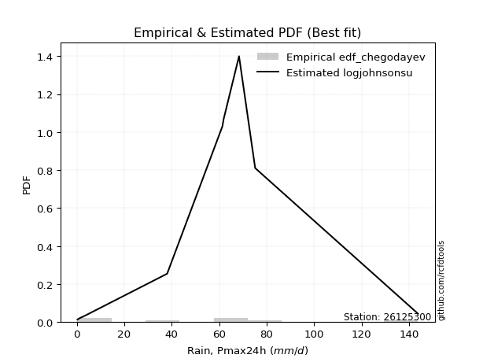</img>

</div>


### 6. EDF Blom (1958)

The Blom formula is a specific "plotting position" formula used in hydrology and statistical analysis to estimate the empirical cumulative probability (or non-exceedance probability) of a data series. It is particularly recommended for data that are approximately normally distributed. The constant _a_ is set to 0.375 (or 3/8).

<div align="center">


$P=(m-a)/(n+1-2a)$


</div>


**6.1. Empirical values**

<div align="center">

|                | 0                   | 1                   | 2                   | 3                   | 4                   | 5                  | 6                  | 7                  | 8                  | 9                  |
|:---------------|:--------------------|:--------------------|:--------------------|:--------------------|:--------------------|:-------------------|:-------------------|:-------------------|:-------------------|:-------------------|
| date           | 2022                | 2023                | 2016                | 2018                | 2021                | 2020               | 2019               | 2017               | 2025               | 2024               |
| x              | 0.3                 | 1.4                 | 2.6                 | 38.1                | 61.4                | 61.9               | 68.4               | 75.2               | 81.2               | 143.8              |
| m              | 1                   | 2                   | 3                   | 4                   | 5                   | 6                  | 7                  | 8                  | 9                  | 10                 |
| empirical_dist | edf_blom            | edf_blom            | edf_blom            | edf_blom            | edf_blom            | edf_blom           | edf_blom           | edf_blom           | edf_blom           | edf_blom           |
| empirical      | 0.06097560975609756 | 0.15853658536585366 | 0.25609756097560976 | 0.35365853658536583 | 0.45121951219512196 | 0.5487804878048781 | 0.6463414634146342 | 0.7439024390243902 | 0.8414634146341463 | 0.9390243902439024 |
| empirical_tr   | 1.064935064935065   | 1.1884057971014492  | 1.3442622950819672  | 1.5471698113207546  | 1.8222222222222222  | 2.2162162162162162 | 2.827586206896552  | 3.9047619047619047 | 6.307692307692307  | 16.399999999999984 |

</div>


**6.2. Kolmogorov-Smirnov fit test (sorted by Δ)**


<div align="center">

|                | 0                   | 1                   | 2                   | 3                   | 4                  | 5                  | 6                   | 7                  | 8                   | 9                   | 10                  | 11                  | 12                  | 13                  | 14                 | 15                  | 16                  | 17                  | 18                  | 19                  | 20                  | 21                  | 22                  | 23                  | 24                  | 25                  | 26                  | 27                  | 28                  | 29                  | 30                 | 31                  | 32                  | 33                 | 34                  | 35                  | 36                 | 37                  | 38                  | 39                  | 40                  | 41                 | 42                  | 43                 | 44                  | 45                  | 46                 | 47                 | 48                  | 49                 | 50                  | 51                  | 52                  | 53                  | 54                  | 55                  | 56                  | 57                 | 58                  | 59                  | 60                  | 61                 | 62                  | 63                 | 64                  | 65                  | 66                 | 67                  | 68                  | 69                  | 70                 | 71                  | 72                 | 73                  | 74                 | 75                 | 76                 | 77                  | 78                 | 79                  | 80                 | 81                  | 82                  | 83                  | 84                 | 85                 | 86                  | 87                  | 88                 | 89                  | 90                  | 91                  | 92                  | 93                 | 94                  | 95                  | 96                 | 97                 | 98                 | 99                 | 100                | 101                 | 102                | 103                | 104                 | 105                | 106                | 107                | 108                 | 109                | 110                 | 111                 | 112                | 113                | 114                | 115                 | 116                 | 117                | 118                | 119                | 120                 | 121                | 122                 | 123                | 124                 | 125                | 126                | 127                | 128                | 129                | 130                 | 131                 | 132                | 133                | 134                 | 135                | 136                 | 137                | 138                | 139                | 140                | 141                | 142                | 143                | 144                | 145                | 146                | 147                | 148                | 149                | 150                | 151                | 152                | 153                | 154                | 155                | 156                | 157                | 158                | 159                |
|:---------------|:--------------------|:--------------------|:--------------------|:--------------------|:-------------------|:-------------------|:--------------------|:-------------------|:--------------------|:--------------------|:--------------------|:--------------------|:--------------------|:--------------------|:-------------------|:--------------------|:--------------------|:--------------------|:--------------------|:--------------------|:--------------------|:--------------------|:--------------------|:--------------------|:--------------------|:--------------------|:--------------------|:--------------------|:--------------------|:--------------------|:-------------------|:--------------------|:--------------------|:-------------------|:--------------------|:--------------------|:-------------------|:--------------------|:--------------------|:--------------------|:--------------------|:-------------------|:--------------------|:-------------------|:--------------------|:--------------------|:-------------------|:-------------------|:--------------------|:-------------------|:--------------------|:--------------------|:--------------------|:--------------------|:--------------------|:--------------------|:--------------------|:-------------------|:--------------------|:--------------------|:--------------------|:-------------------|:--------------------|:-------------------|:--------------------|:--------------------|:-------------------|:--------------------|:--------------------|:--------------------|:-------------------|:--------------------|:-------------------|:--------------------|:-------------------|:-------------------|:-------------------|:--------------------|:-------------------|:--------------------|:-------------------|:--------------------|:--------------------|:--------------------|:-------------------|:-------------------|:--------------------|:--------------------|:-------------------|:--------------------|:--------------------|:--------------------|:--------------------|:-------------------|:--------------------|:--------------------|:-------------------|:-------------------|:-------------------|:-------------------|:-------------------|:--------------------|:-------------------|:-------------------|:--------------------|:-------------------|:-------------------|:-------------------|:--------------------|:-------------------|:--------------------|:--------------------|:-------------------|:-------------------|:-------------------|:--------------------|:--------------------|:-------------------|:-------------------|:-------------------|:--------------------|:-------------------|:--------------------|:-------------------|:--------------------|:-------------------|:-------------------|:-------------------|:-------------------|:-------------------|:--------------------|:--------------------|:-------------------|:-------------------|:--------------------|:-------------------|:--------------------|:-------------------|:-------------------|:-------------------|:-------------------|:-------------------|:-------------------|:-------------------|:-------------------|:-------------------|:-------------------|:-------------------|:-------------------|:-------------------|:-------------------|:-------------------|:-------------------|:-------------------|:-------------------|:-------------------|:-------------------|:-------------------|:-------------------|:-------------------|
| station        | 26125300            | 26125300            | 26125300            | 26125300            | 26125300           | 26125300           | 26125300            | 26125300           | 26125300            | 26125300            | 26125300            | 26125300            | 26125300            | 26125300            | 26125300           | 26125300            | 26125300            | 26125300            | 26125300            | 26125300            | 26125300            | 26125300            | 26125300            | 26125300            | 26125300            | 26125300            | 26125300            | 26125300            | 26125300            | 26125300            | 26125300           | 26125300            | 26125300            | 26125300           | 26125300            | 26125300            | 26125300           | 26125300            | 26125300            | 26125300            | 26125300            | 26125300           | 26125300            | 26125300           | 26125300            | 26125300            | 26125300           | 26125300           | 26125300            | 26125300           | 26125300            | 26125300            | 26125300            | 26125300            | 26125300            | 26125300            | 26125300            | 26125300           | 26125300            | 26125300            | 26125300            | 26125300           | 26125300            | 26125300           | 26125300            | 26125300            | 26125300           | 26125300            | 26125300            | 26125300            | 26125300           | 26125300            | 26125300           | 26125300            | 26125300           | 26125300           | 26125300           | 26125300            | 26125300           | 26125300            | 26125300           | 26125300            | 26125300            | 26125300            | 26125300           | 26125300           | 26125300            | 26125300            | 26125300           | 26125300            | 26125300            | 26125300            | 26125300            | 26125300           | 26125300            | 26125300            | 26125300           | 26125300           | 26125300           | 26125300           | 26125300           | 26125300            | 26125300           | 26125300           | 26125300            | 26125300           | 26125300           | 26125300           | 26125300            | 26125300           | 26125300            | 26125300            | 26125300           | 26125300           | 26125300           | 26125300            | 26125300            | 26125300           | 26125300           | 26125300           | 26125300            | 26125300           | 26125300            | 26125300           | 26125300            | 26125300           | 26125300           | 26125300           | 26125300           | 26125300           | 26125300            | 26125300            | 26125300           | 26125300           | 26125300            | 26125300           | 26125300            | 26125300           | 26125300           | 26125300           | 26125300           | 26125300           | 26125300           | 26125300           | 26125300           | 26125300           | 26125300           | 26125300           | 26125300           | 26125300           | 26125300           | 26125300           | 26125300           | 26125300           | 26125300           | 26125300           | 26125300           | 26125300           | 26125300           | 26125300           |
| empirical_dist | edf_blom            | edf_blom            | edf_blom            | edf_blom            | edf_blom           | edf_blom           | edf_blom            | edf_blom           | edf_blom            | edf_blom            | edf_blom            | edf_blom            | edf_blom            | edf_blom            | edf_blom           | edf_blom            | edf_blom            | edf_blom            | edf_blom            | edf_blom            | edf_blom            | edf_blom            | edf_blom            | edf_blom            | edf_blom            | edf_blom            | edf_blom            | edf_blom            | edf_blom            | edf_blom            | edf_blom           | edf_blom            | edf_blom            | edf_blom           | edf_blom            | edf_blom            | edf_blom           | edf_blom            | edf_blom            | edf_blom            | edf_blom            | edf_blom           | edf_blom            | edf_blom           | edf_blom            | edf_blom            | edf_blom           | edf_blom           | edf_blom            | edf_blom           | edf_blom            | edf_blom            | edf_blom            | edf_blom            | edf_blom            | edf_blom            | edf_blom            | edf_blom           | edf_blom            | edf_blom            | edf_blom            | edf_blom           | edf_blom            | edf_blom           | edf_blom            | edf_blom            | edf_blom           | edf_blom            | edf_blom            | edf_blom            | edf_blom           | edf_blom            | edf_blom           | edf_blom            | edf_blom           | edf_blom           | edf_blom           | edf_blom            | edf_blom           | edf_blom            | edf_blom           | edf_blom            | edf_blom            | edf_blom            | edf_blom           | edf_blom           | edf_blom            | edf_blom            | edf_blom           | edf_blom            | edf_blom            | edf_blom            | edf_blom            | edf_blom           | edf_blom            | edf_blom            | edf_blom           | edf_blom           | edf_blom           | edf_blom           | edf_blom           | edf_blom            | edf_blom           | edf_blom           | edf_blom            | edf_blom           | edf_blom           | edf_blom           | edf_blom            | edf_blom           | edf_blom            | edf_blom            | edf_blom           | edf_blom           | edf_blom           | edf_blom            | edf_blom            | edf_blom           | edf_blom           | edf_blom           | edf_blom            | edf_blom           | edf_blom            | edf_blom           | edf_blom            | edf_blom           | edf_blom           | edf_blom           | edf_blom           | edf_blom           | edf_blom            | edf_blom            | edf_blom           | edf_blom           | edf_blom            | edf_blom           | edf_blom            | edf_blom           | edf_blom           | edf_blom           | edf_blom           | edf_blom           | edf_blom           | edf_blom           | edf_blom           | edf_blom           | edf_blom           | edf_blom           | edf_blom           | edf_blom           | edf_blom           | edf_blom           | edf_blom           | edf_blom           | edf_blom           | edf_blom           | edf_blom           | edf_blom           | edf_blom           | edf_blom           |
| p_dist         | dgamma              | anglit              | logjohnsonsu        | dweibull            | semicircular       | johnsonsu          | t                   | norm               | crystalball         | gumbel_l            | foldnorm            | cosine              | pearson3            | maxwell             | logistic           | exponnorm           | hypsecant           | rayleigh            | gennorm             | laplace             | invgamma            | loggennorm          | rice                | halfgennorm         | genlogistic         | logweibull_max      | kstwobign           | logmielke           | betaprime           | arcsine             | mielke             | gumbel_r            | halfnorm            | truncweibull_min   | loglevy_l           | invgauss            | logloggamma        | logvonmises_line    | logdgamma           | loggenextreme       | moyal               | logdweibull        | ncf                 | logarcsine         | logtrapezoid        | logpearson3         | truncnorm          | gompertz           | nakagami            | genpareto          | logargus            | skewnorm            | loggumbel_l         | genexpon            | bradford            | kappa3              | truncexpon          | lomax              | vonmises_line       | logsemicircular     | weibull_min         | logweibull_min     | logburr12           | loggenhalflogistic | loganglit           | halflogistic        | f                  | burr                | logjohnsonsb        | argus               | exponpow           | kappa4              | logfatiguelife     | lognakagami         | logrice            | logt               | logcrystalball     | lognorm             | logexponnorm       | lognct              | logncf             | loggompertz         | logfoldnorm         | logerlang           | wrapcauchy         | uniform            | loggamma            | loggamma            | loginvweibull      | invweibull          | genextreme          | burr12              | wald                | logexponweib       | loginvgamma         | gausshyper          | ksone              | loglogistic        | loginvgauss        | logwrapcauchy      | logmaxwell         | loghypsecant        | lograyleigh        | logkstwobign       | logburr             | logskewnorm        | loggenexpon        | logbetaprime       | logcosine           | loghalfnorm        | loglaplace          | loglaplace          | nct                | loggumbel_r        | loglomax           | logtriang           | loghalflogistic     | logmoyal           | loghalfgennorm     | logbeta            | logloglaplace       | logf               | logksone            | levy_l             | logtruncweibull_min | erlang             | johnsonsb          | exponweib          | logwald            | logalpha           | loggausshyper       | logkappa4           | genhalflogistic    | loguniform         | powerlaw            | logtruncnorm       | logkappa3           | triang             | gamma              | loggengamma        | fatiguelife        | logbradford        | tukeylambda        | rdist              | logtruncexpon      | loggenpareto       | trapezoid          | beta               | gengamma           | truncpareto        | logpowerlaw        | alpha              | logexponpow        | weibull_max        | logtruncpareto     | logrdist           | logtukeylambda     | loggenlogistic     | logvonmises        | vonmises           |
| delta          | 0.12361865120346754 | 0.12577913783181593 | 0.13067904731245855 | 0.13612262723635873 | 0.1375487984743916 | 0.1393223087112168 | 0.13987250777442095 | 0.1398794569956498 | 0.13987945765847576 | 0.14178284314406092 | 0.14181885318155713 | 0.14952594041438955 | 0.15126535852599915 | 0.15169598494299547 | 0.1532400527593319 | 0.15792135167133098 | 0.15929007841172493 | 0.16074417264322433 | 0.16246972728079515 | 0.16509572849844883 | 0.17145309616383314 | 0.17146431748231686 | 0.17408322872698845 | 0.17523595990388563 | 0.18376969243361935 | 0.18432923742941454 | 0.18534342022699285 | 0.18551492756363225 | 0.18816113651439498 | 0.18884639034922446 | 0.1907796401276603 | 0.19178726484480108 | 0.19387412036433577 | 0.1940654214002302 | 0.19546785948277973 | 0.19611396184499746 | 0.1994482989945126 | 0.20133146941879165 | 0.21126040789002626 | 0.21272812418429837 | 0.21571781100036952 | 0.2168408406968051 | 0.21802096981283875 | 0.2195121761653257 | 0.22173485389796432 | 0.22207322662602486 | 0.2260757664637724 | 0.2265339952272695 | 0.22700400155504735 | 0.2274568188139361 | 0.22769286859844612 | 0.22914261970706762 | 0.23169811148638836 | 0.23217136835405133 | 0.23257832905625062 | 0.23280852265344387 | 0.23342876498114162 | 0.2344657596117828 | 0.24729418065913877 | 0.24846381301559572 | 0.24852369470153557 | 0.2496968735179776 | 0.24990965823595906 | 0.2511984508899689 | 0.25560310953215604 | 0.25609756097560976 | 0.2625356205925507 | 0.26629122212876394 | 0.26849232017217084 | 0.26885064958657245 | 0.269883580586927  | 0.27116168077952296 | 0.2720730642895848 | 0.27255604335757366 | 0.2727005387393323 | 0.2727036050749233 | 0.2727036090153585 | 0.27270377922976086 | 0.2727042045425849 | 0.27275269484800435 | 0.2736880237430678 | 0.27536043069971883 | 0.27745393996456486 | 0.27756269594566363 | 0.2776957752695681 | 0.2777003484320557 | 0.27774123610021484 | 0.27774123610021484 | 0.2784609466331275 | 0.27886577539150037 | 0.27886655205026034 | 0.27931370581917475 | 0.28218115122280035 | 0.2837507580925209 | 0.28462523035753573 | 0.28724908575628894 | 0.2883275261324041 | 0.2884363000559902 | 0.293832981285466  | 0.2953013461001971 | 0.2967666003125876 | 0.30098904995301534 | 0.3041110871344116 | 0.3067714052268683 | 0.31077285145665634 | 0.3125101851186595 | 0.3139937202154175 | 0.3143493320223434 | 0.31980316380911755 | 0.3252084543648367 | 0.32934193296869485 | 0.32934193296869485 | 0.3298440266684358 | 0.3361148989424665 | 0.3377259946488732 | 0.34845174127296147 | 0.35355871950562834 | 0.3574043357420964 | 0.3636572947331286 | 0.3636603601402319 | 0.37456196369096195 | 0.3798538229425944 | 0.38368701644335823 | 0.386733475551917  | 0.401495572666107   | 0.4101645539895579 | 0.4130897505178249 | 0.4152469216217647 | 0.4171487425859519 | 0.4228151980914765 | 0.42700845347352656 | 0.42911885541372297 | 0.4299919015520537 | 0.431156127049103  | 0.43571377452266125 | 0.4369285694964362 | 0.46785904768119646 | 0.4755480804629549 | 0.4769643904609212 | 0.4793392537451711 | 0.4814427818592433 | 0.4831650855004942 | 0.4880491485235808 | 0.489771845229896  | 0.4911013357973588 | 0.4919137972802047 | 0.5309743600865886 | 0.54234813878736   | 0.5518105818240834 | 0.5850363331661175 | 0.5891924536388915 | 0.6270812466518005 | 0.643534072608042  | 0.6989426245110031 | 0.7075406269102563 | 0.7439024389934358 | 0.7439024390243831 | 0.8414634146341463 | 0.881491274655708  | 22.396083905273375 |
| deltao         | 0.3942745923300002  | 0.3942745923300002  | 0.3942745923300002  | 0.3942745923300002  | 0.3942745923300002 | 0.3942745923300002 | 0.3942745923300002  | 0.3942745923300002 | 0.3942745923300002  | 0.3942745923300002  | 0.3942745923300002  | 0.3942745923300002  | 0.3942745923300002  | 0.3942745923300002  | 0.3942745923300002 | 0.3942745923300002  | 0.3942745923300002  | 0.3942745923300002  | 0.3942745923300002  | 0.3942745923300002  | 0.3942745923300002  | 0.3942745923300002  | 0.3942745923300002  | 0.3942745923300002  | 0.3942745923300002  | 0.3942745923300002  | 0.3942745923300002  | 0.3942745923300002  | 0.3942745923300002  | 0.3942745923300002  | 0.3942745923300002 | 0.3942745923300002  | 0.3942745923300002  | 0.3942745923300002 | 0.3942745923300002  | 0.3942745923300002  | 0.3942745923300002 | 0.3942745923300002  | 0.3942745923300002  | 0.3942745923300002  | 0.3942745923300002  | 0.3942745923300002 | 0.3942745923300002  | 0.3942745923300002 | 0.3942745923300002  | 0.3942745923300002  | 0.3942745923300002 | 0.3942745923300002 | 0.3942745923300002  | 0.3942745923300002 | 0.3942745923300002  | 0.3942745923300002  | 0.3942745923300002  | 0.3942745923300002  | 0.3942745923300002  | 0.3942745923300002  | 0.3942745923300002  | 0.3942745923300002 | 0.3942745923300002  | 0.3942745923300002  | 0.3942745923300002  | 0.3942745923300002 | 0.3942745923300002  | 0.3942745923300002 | 0.3942745923300002  | 0.3942745923300002  | 0.3942745923300002 | 0.3942745923300002  | 0.3942745923300002  | 0.3942745923300002  | 0.3942745923300002 | 0.3942745923300002  | 0.3942745923300002 | 0.3942745923300002  | 0.3942745923300002 | 0.3942745923300002 | 0.3942745923300002 | 0.3942745923300002  | 0.3942745923300002 | 0.3942745923300002  | 0.3942745923300002 | 0.3942745923300002  | 0.3942745923300002  | 0.3942745923300002  | 0.3942745923300002 | 0.3942745923300002 | 0.3942745923300002  | 0.3942745923300002  | 0.3942745923300002 | 0.3942745923300002  | 0.3942745923300002  | 0.3942745923300002  | 0.3942745923300002  | 0.3942745923300002 | 0.3942745923300002  | 0.3942745923300002  | 0.3942745923300002 | 0.3942745923300002 | 0.3942745923300002 | 0.3942745923300002 | 0.3942745923300002 | 0.3942745923300002  | 0.3942745923300002 | 0.3942745923300002 | 0.3942745923300002  | 0.3942745923300002 | 0.3942745923300002 | 0.3942745923300002 | 0.3942745923300002  | 0.3942745923300002 | 0.3942745923300002  | 0.3942745923300002  | 0.3942745923300002 | 0.3942745923300002 | 0.3942745923300002 | 0.3942745923300002  | 0.3942745923300002  | 0.3942745923300002 | 0.3942745923300002 | 0.3942745923300002 | 0.3942745923300002  | 0.3942745923300002 | 0.3942745923300002  | 0.3942745923300002 | 0.3942745923300002  | 0.3942745923300002 | 0.3942745923300002 | 0.3942745923300002 | 0.3942745923300002 | 0.3942745923300002 | 0.3942745923300002  | 0.3942745923300002  | 0.3942745923300002 | 0.3942745923300002 | 0.3942745923300002  | 0.3942745923300002 | 0.3942745923300002  | 0.3942745923300002 | 0.3942745923300002 | 0.3942745923300002 | 0.3942745923300002 | 0.3942745923300002 | 0.3942745923300002 | 0.3942745923300002 | 0.3942745923300002 | 0.3942745923300002 | 0.3942745923300002 | 0.3942745923300002 | 0.3942745923300002 | 0.3942745923300002 | 0.3942745923300002 | 0.3942745923300002 | 0.3942745923300002 | 0.3942745923300002 | 0.3942745923300002 | 0.3942745923300002 | 0.3942745923300002 | 0.3942745923300002 | 0.3942745923300002 | 0.3942745923300002 |
| eval           | Δo > Δ              | Δo > Δ              | Δo > Δ              | Δo > Δ              | Δo > Δ             | Δo > Δ             | Δo > Δ              | Δo > Δ             | Δo > Δ              | Δo > Δ              | Δo > Δ              | Δo > Δ              | Δo > Δ              | Δo > Δ              | Δo > Δ             | Δo > Δ              | Δo > Δ              | Δo > Δ              | Δo > Δ              | Δo > Δ              | Δo > Δ              | Δo > Δ              | Δo > Δ              | Δo > Δ              | Δo > Δ              | Δo > Δ              | Δo > Δ              | Δo > Δ              | Δo > Δ              | Δo > Δ              | Δo > Δ             | Δo > Δ              | Δo > Δ              | Δo > Δ             | Δo > Δ              | Δo > Δ              | Δo > Δ             | Δo > Δ              | Δo > Δ              | Δo > Δ              | Δo > Δ              | Δo > Δ             | Δo > Δ              | Δo > Δ             | Δo > Δ              | Δo > Δ              | Δo > Δ             | Δo > Δ             | Δo > Δ              | Δo > Δ             | Δo > Δ              | Δo > Δ              | Δo > Δ              | Δo > Δ              | Δo > Δ              | Δo > Δ              | Δo > Δ              | Δo > Δ             | Δo > Δ              | Δo > Δ              | Δo > Δ              | Δo > Δ             | Δo > Δ              | Δo > Δ             | Δo > Δ              | Δo > Δ              | Δo > Δ             | Δo > Δ              | Δo > Δ              | Δo > Δ              | Δo > Δ             | Δo > Δ              | Δo > Δ             | Δo > Δ              | Δo > Δ             | Δo > Δ             | Δo > Δ             | Δo > Δ              | Δo > Δ             | Δo > Δ              | Δo > Δ             | Δo > Δ              | Δo > Δ              | Δo > Δ              | Δo > Δ             | Δo > Δ             | Δo > Δ              | Δo > Δ              | Δo > Δ             | Δo > Δ              | Δo > Δ              | Δo > Δ              | Δo > Δ              | Δo > Δ             | Δo > Δ              | Δo > Δ              | Δo > Δ             | Δo > Δ             | Δo > Δ             | Δo > Δ             | Δo > Δ             | Δo > Δ              | Δo > Δ             | Δo > Δ             | Δo > Δ              | Δo > Δ             | Δo > Δ             | Δo > Δ             | Δo > Δ              | Δo > Δ             | Δo > Δ              | Δo > Δ              | Δo > Δ             | Δo > Δ             | Δo > Δ             | Δo > Δ              | Δo > Δ              | Δo > Δ             | Δo > Δ             | Δo > Δ             | Δo > Δ              | Δo > Δ             | Δo > Δ              | Δo > Δ             | Δo <= Δ             | Δo <= Δ            | Δo <= Δ            | Δo <= Δ            | Δo <= Δ            | Δo <= Δ            | Δo <= Δ             | Δo <= Δ             | Δo <= Δ            | Δo <= Δ            | Δo <= Δ             | Δo <= Δ            | Δo <= Δ             | Δo <= Δ            | Δo <= Δ            | Δo <= Δ            | Δo <= Δ            | Δo <= Δ            | Δo <= Δ            | Δo <= Δ            | Δo <= Δ            | Δo <= Δ            | Δo <= Δ            | Δo <= Δ            | Δo <= Δ            | Δo <= Δ            | Δo <= Δ            | Δo <= Δ            | Δo <= Δ            | Δo <= Δ            | Δo <= Δ            | Δo <= Δ            | Δo <= Δ            | Δo <= Δ            | Δo <= Δ            | Δo <= Δ            |
| fit            | 1                   | 1                   | 1                   | 1                   | 1                  | 1                  | 1                   | 1                  | 1                   | 1                   | 1                   | 1                   | 1                   | 1                   | 1                  | 1                   | 1                   | 1                   | 1                   | 1                   | 1                   | 1                   | 1                   | 1                   | 1                   | 1                   | 1                   | 1                   | 1                   | 1                   | 1                  | 1                   | 1                   | 1                  | 1                   | 1                   | 1                  | 1                   | 1                   | 1                   | 1                   | 1                  | 1                   | 1                  | 1                   | 1                   | 1                  | 1                  | 1                   | 1                  | 1                   | 1                   | 1                   | 1                   | 1                   | 1                   | 1                   | 1                  | 1                   | 1                   | 1                   | 1                  | 1                   | 1                  | 1                   | 1                   | 1                  | 1                   | 1                   | 1                   | 1                  | 1                   | 1                  | 1                   | 1                  | 1                  | 1                  | 1                   | 1                  | 1                   | 1                  | 1                   | 1                   | 1                   | 1                  | 1                  | 1                   | 1                   | 1                  | 1                   | 1                   | 1                   | 1                   | 1                  | 1                   | 1                   | 1                  | 1                  | 1                  | 1                  | 1                  | 1                   | 1                  | 1                  | 1                   | 1                  | 1                  | 1                  | 1                   | 1                  | 1                   | 1                   | 1                  | 1                  | 1                  | 1                   | 1                   | 1                  | 1                  | 1                  | 1                   | 1                  | 1                   | 1                  | 0                   | 0                  | 0                  | 0                  | 0                  | 0                  | 0                   | 0                   | 0                  | 0                  | 0                   | 0                  | 0                   | 0                  | 0                  | 0                  | 0                  | 0                  | 0                  | 0                  | 0                  | 0                  | 0                  | 0                  | 0                  | 0                  | 0                  | 0                  | 0                  | 0                  | 0                  | 0                  | 0                  | 0                  | 0                  | 0                  |
| n              | 10                  | 10                  | 10                  | 10                  | 10                 | 10                 | 10                  | 10                 | 10                  | 10                  | 10                  | 10                  | 10                  | 10                  | 10                 | 10                  | 10                  | 10                  | 10                  | 10                  | 10                  | 10                  | 10                  | 10                  | 10                  | 10                  | 10                  | 10                  | 10                  | 10                  | 10                 | 10                  | 10                  | 10                 | 10                  | 10                  | 10                 | 10                  | 10                  | 10                  | 10                  | 10                 | 10                  | 10                 | 10                  | 10                  | 10                 | 10                 | 10                  | 10                 | 10                  | 10                  | 10                  | 10                  | 10                  | 10                  | 10                  | 10                 | 10                  | 10                  | 10                  | 10                 | 10                  | 10                 | 10                  | 10                  | 10                 | 10                  | 10                  | 10                  | 10                 | 10                  | 10                 | 10                  | 10                 | 10                 | 10                 | 10                  | 10                 | 10                  | 10                 | 10                  | 10                  | 10                  | 10                 | 10                 | 10                  | 10                  | 10                 | 10                  | 10                  | 10                  | 10                  | 10                 | 10                  | 10                  | 10                 | 10                 | 10                 | 10                 | 10                 | 10                  | 10                 | 10                 | 10                  | 10                 | 10                 | 10                 | 10                  | 10                 | 10                  | 10                  | 10                 | 10                 | 10                 | 10                  | 10                  | 10                 | 10                 | 10                 | 10                  | 10                 | 10                  | 10                 | 10                  | 10                 | 10                 | 10                 | 10                 | 10                 | 10                  | 10                  | 10                 | 10                 | 10                  | 10                 | 10                  | 10                 | 10                 | 10                 | 10                 | 10                 | 10                 | 10                 | 10                 | 10                 | 10                 | 10                 | 10                 | 10                 | 10                 | 10                 | 10                 | 10                 | 10                 | 10                 | 10                 | 10                 | 10                 | 10                 |
| best_fit       | 1                   | 0                   | 0                   | 0                   | 0                  | 0                  | 0                   | 0                  | 0                   | 0                   | 0                   | 0                   | 0                   | 0                   | 0                  | 0                   | 0                   | 0                   | 0                   | 0                   | 0                   | 0                   | 0                   | 0                   | 0                   | 0                   | 0                   | 0                   | 0                   | 0                   | 0                  | 0                   | 0                   | 0                  | 0                   | 0                   | 0                  | 0                   | 0                   | 0                   | 0                   | 0                  | 0                   | 0                  | 0                   | 0                   | 0                  | 0                  | 0                   | 0                  | 0                   | 0                   | 0                   | 0                   | 0                   | 0                   | 0                   | 0                  | 0                   | 0                   | 0                   | 0                  | 0                   | 0                  | 0                   | 0                   | 0                  | 0                   | 0                   | 0                   | 0                  | 0                   | 0                  | 0                   | 0                  | 0                  | 0                  | 0                   | 0                  | 0                   | 0                  | 0                   | 0                   | 0                   | 0                  | 0                  | 0                   | 0                   | 0                  | 0                   | 0                   | 0                   | 0                   | 0                  | 0                   | 0                   | 0                  | 0                  | 0                  | 0                  | 0                  | 0                   | 0                  | 0                  | 0                   | 0                  | 0                  | 0                  | 0                   | 0                  | 0                   | 0                   | 0                  | 0                  | 0                  | 0                   | 0                   | 0                  | 0                  | 0                  | 0                   | 0                  | 0                   | 0                  | 0                   | 0                  | 0                  | 0                  | 0                  | 0                  | 0                   | 0                   | 0                  | 0                  | 0                   | 0                  | 0                   | 0                  | 0                  | 0                  | 0                  | 0                  | 0                  | 0                  | 0                  | 0                  | 0                  | 0                  | 0                  | 0                  | 0                  | 0                  | 0                  | 0                  | 0                  | 0                  | 0                  | 0                  | 0                  | 0                  |
| best_fit_sort  | 1                   | 2                   | 3                   | 4                   | 5                  | 6                  | 7                   | 8                  | 9                   | 10                  | 11                  | 12                  | 13                  | 14                  | 15                 | 16                  | 17                  | 18                  | 19                  | 20                  | 21                  | 22                  | 23                  | 24                  | 25                  | 26                  | 27                  | 28                  | 29                  | 30                  | 31                 | 32                  | 33                  | 34                 | 35                  | 36                  | 37                 | 38                  | 39                  | 40                  | 41                  | 42                 | 43                  | 44                 | 45                  | 46                  | 47                 | 48                 | 49                  | 50                 | 51                  | 52                  | 53                  | 54                  | 55                  | 56                  | 57                  | 58                 | 59                  | 60                  | 61                  | 62                 | 63                  | 64                 | 65                  | 66                  | 67                 | 68                  | 69                  | 70                  | 71                 | 72                  | 73                 | 74                  | 75                 | 76                 | 77                 | 78                  | 79                 | 80                  | 81                 | 82                  | 83                  | 84                  | 85                 | 86                 | 87                  | 88                  | 89                 | 90                  | 91                  | 92                  | 93                  | 94                 | 95                  | 96                  | 97                 | 98                 | 99                 | 100                | 101                | 102                 | 103                | 104                | 105                 | 106                | 107                | 108                | 109                 | 110                | 111                 | 112                 | 113                | 114                | 115                | 116                 | 117                 | 118                | 119                | 120                | 121                 | 122                | 123                 | 124                | 125                 | 126                | 127                | 128                | 129                | 130                | 131                 | 132                 | 133                | 134                | 135                 | 136                | 137                 | 138                | 139                | 140                | 141                | 142                | 143                | 144                | 145                | 146                | 147                | 148                | 149                | 150                | 151                | 152                | 153                | 154                | 155                | 156                | 157                | 158                | 159                | 160                |

</div>


**6.3. Best fit**

<div align="center">

|   id |   station | empirical_dist   | p_dist   |    delta |   deltao | eval   |   fit |   n |   best_fit |   best_fit_sort |
|-----:|----------:|:-----------------|:---------|---------:|---------:|:-------|------:|----:|-----------:|----------------:|
|    0 |  26125300 | edf_blom         | dgamma   | 0.123619 | 0.394275 | Δo > Δ |     1 |  10 |          1 |               1 |

</div>


<div align="center">

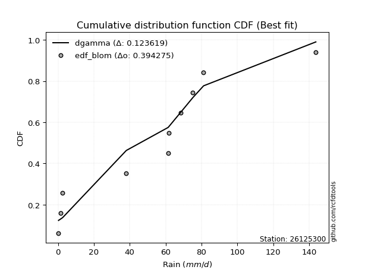</img></img>

</div>


### 7. EDF Tukey (1962)

In hydrology, the Tukey formula is used as a plotting position formula to estimate the empirical probability or frequency of a flood event (or other hydrological data). The formula parameter is given as _c=0.333_ (or 1/3).

<div align="center">


$P=(m-c)/(n+1-2c)$


</div>


**7.1. Empirical values**

<div align="center">

|                | 0                   | 1                   | 2                   | 3                  | 4                   | 5                  | 6                  | 7                  | 8                  | 9                  |
|:---------------|:--------------------|:--------------------|:--------------------|:-------------------|:--------------------|:-------------------|:-------------------|:-------------------|:-------------------|:-------------------|
| date           | 2022                | 2023                | 2016                | 2018               | 2021                | 2020               | 2019               | 2017               | 2025               | 2024               |
| x              | 0.3                 | 1.4                 | 2.6                 | 38.1               | 61.4                | 61.9               | 68.4               | 75.2               | 81.2               | 143.8              |
| m              | 1                   | 2                   | 3                   | 4                  | 5                   | 6                  | 7                  | 8                  | 9                  | 10                 |
| empirical_dist | edf_tukey           | edf_tukey           | edf_tukey           | edf_tukey          | edf_tukey           | edf_tukey          | edf_tukey          | edf_tukey          | edf_tukey          | edf_tukey          |
| empirical      | 0.06451612903225806 | 0.16129032258064516 | 0.25806451612903225 | 0.3548387096774194 | 0.45161290322580644 | 0.5483870967741935 | 0.6451612903225806 | 0.7419354838709677 | 0.8387096774193549 | 0.9354838709677419 |
| empirical_tr   | 1.0689655172413792  | 1.1923076923076923  | 1.3478260869565217  | 1.55               | 1.823529411764706   | 2.214285714285714  | 2.818181818181818  | 3.875              | 6.200000000000001  | 15.499999999999988 |

</div>


**7.2. Kolmogorov-Smirnov fit test (sorted by Δ)**


<div align="center">

|                | 0                  | 1                   | 2                   | 3                   | 4                   | 5                  | 6                   | 7                   | 8                  | 9                   | 10                 | 11                 | 12                  | 13                  | 14                  | 15                 | 16                  | 17                  | 18                  | 19                  | 20                  | 21                  | 22                  | 23                  | 24                 | 25                  | 26                  | 27                  | 28                  | 29                  | 30                  | 31                 | 32                  | 33                 | 34                  | 35                 | 36                  | 37                  | 38                 | 39                  | 40                  | 41                  | 42                  | 43                  | 44                  | 45                  | 46                  | 47                  | 48                  | 49                 | 50                  | 51                 | 52                  | 53                  | 54                 | 55                 | 56                  | 57                 | 58                  | 59                 | 60                  | 61                  | 62                 | 63                 | 64                 | 65                  | 66                 | 67                 | 68                  | 69                 | 70                 | 71                  | 72                  | 73                 | 74                  | 75                  | 76                  | 77                 | 78                 | 79                 | 80                 | 81                 | 82                 | 83                  | 84                 | 85                 | 86                 | 87                 | 88                  | 89                  | 90                 | 91                 | 92                 | 93                 | 94                 | 95                 | 96                  | 97                  | 98                  | 99                  | 100                | 101                | 102                 | 103                 | 104                | 105                 | 106                 | 107                 | 108                | 109                 | 110                | 111                | 112                | 113                 | 114                 | 115                | 116                | 117                 | 118                 | 119                 | 120                | 121                 | 122                | 123                | 124                 | 125                 | 126                | 127                | 128                | 129                 | 130                | 131                 | 132                 | 133                 | 134                | 135                | 136                | 137                 | 138                 | 139                | 140                 | 141                 | 142                | 143                 | 144                | 145                 | 146                | 147                | 148                | 149                | 150                | 151                | 152                | 153                | 154                | 155                | 156                | 157                | 158                | 159                |
|:---------------|:-------------------|:--------------------|:--------------------|:--------------------|:--------------------|:-------------------|:--------------------|:--------------------|:-------------------|:--------------------|:-------------------|:-------------------|:--------------------|:--------------------|:--------------------|:-------------------|:--------------------|:--------------------|:--------------------|:--------------------|:--------------------|:--------------------|:--------------------|:--------------------|:-------------------|:--------------------|:--------------------|:--------------------|:--------------------|:--------------------|:--------------------|:-------------------|:--------------------|:-------------------|:--------------------|:-------------------|:--------------------|:--------------------|:-------------------|:--------------------|:--------------------|:--------------------|:--------------------|:--------------------|:--------------------|:--------------------|:--------------------|:--------------------|:--------------------|:-------------------|:--------------------|:-------------------|:--------------------|:--------------------|:-------------------|:-------------------|:--------------------|:-------------------|:--------------------|:-------------------|:--------------------|:--------------------|:-------------------|:-------------------|:-------------------|:--------------------|:-------------------|:-------------------|:--------------------|:-------------------|:-------------------|:--------------------|:--------------------|:-------------------|:--------------------|:--------------------|:--------------------|:-------------------|:-------------------|:-------------------|:-------------------|:-------------------|:-------------------|:--------------------|:-------------------|:-------------------|:-------------------|:-------------------|:--------------------|:--------------------|:-------------------|:-------------------|:-------------------|:-------------------|:-------------------|:-------------------|:--------------------|:--------------------|:--------------------|:--------------------|:-------------------|:-------------------|:--------------------|:--------------------|:-------------------|:--------------------|:--------------------|:--------------------|:-------------------|:--------------------|:-------------------|:-------------------|:-------------------|:--------------------|:--------------------|:-------------------|:-------------------|:--------------------|:--------------------|:--------------------|:-------------------|:--------------------|:-------------------|:-------------------|:--------------------|:--------------------|:-------------------|:-------------------|:-------------------|:--------------------|:-------------------|:--------------------|:--------------------|:--------------------|:-------------------|:-------------------|:-------------------|:--------------------|:--------------------|:-------------------|:--------------------|:--------------------|:-------------------|:--------------------|:-------------------|:--------------------|:-------------------|:-------------------|:-------------------|:-------------------|:-------------------|:-------------------|:-------------------|:-------------------|:-------------------|:-------------------|:-------------------|:-------------------|:-------------------|:-------------------|
| station        | 26125300           | 26125300            | 26125300            | 26125300            | 26125300            | 26125300           | 26125300            | 26125300            | 26125300           | 26125300            | 26125300           | 26125300           | 26125300            | 26125300            | 26125300            | 26125300           | 26125300            | 26125300            | 26125300            | 26125300            | 26125300            | 26125300            | 26125300            | 26125300            | 26125300           | 26125300            | 26125300            | 26125300            | 26125300            | 26125300            | 26125300            | 26125300           | 26125300            | 26125300           | 26125300            | 26125300           | 26125300            | 26125300            | 26125300           | 26125300            | 26125300            | 26125300            | 26125300            | 26125300            | 26125300            | 26125300            | 26125300            | 26125300            | 26125300            | 26125300           | 26125300            | 26125300           | 26125300            | 26125300            | 26125300           | 26125300           | 26125300            | 26125300           | 26125300            | 26125300           | 26125300            | 26125300            | 26125300           | 26125300           | 26125300           | 26125300            | 26125300           | 26125300           | 26125300            | 26125300           | 26125300           | 26125300            | 26125300            | 26125300           | 26125300            | 26125300            | 26125300            | 26125300           | 26125300           | 26125300           | 26125300           | 26125300           | 26125300           | 26125300            | 26125300           | 26125300           | 26125300           | 26125300           | 26125300            | 26125300            | 26125300           | 26125300           | 26125300           | 26125300           | 26125300           | 26125300           | 26125300            | 26125300            | 26125300            | 26125300            | 26125300           | 26125300           | 26125300            | 26125300            | 26125300           | 26125300            | 26125300            | 26125300            | 26125300           | 26125300            | 26125300           | 26125300           | 26125300           | 26125300            | 26125300            | 26125300           | 26125300           | 26125300            | 26125300            | 26125300            | 26125300           | 26125300            | 26125300           | 26125300           | 26125300            | 26125300            | 26125300           | 26125300           | 26125300           | 26125300            | 26125300           | 26125300            | 26125300            | 26125300            | 26125300           | 26125300           | 26125300           | 26125300            | 26125300            | 26125300           | 26125300            | 26125300            | 26125300           | 26125300            | 26125300           | 26125300            | 26125300           | 26125300           | 26125300           | 26125300           | 26125300           | 26125300           | 26125300           | 26125300           | 26125300           | 26125300           | 26125300           | 26125300           | 26125300           | 26125300           |
| empirical_dist | edf_tukey          | edf_tukey           | edf_tukey           | edf_tukey           | edf_tukey           | edf_tukey          | edf_tukey           | edf_tukey           | edf_tukey          | edf_tukey           | edf_tukey          | edf_tukey          | edf_tukey           | edf_tukey           | edf_tukey           | edf_tukey          | edf_tukey           | edf_tukey           | edf_tukey           | edf_tukey           | edf_tukey           | edf_tukey           | edf_tukey           | edf_tukey           | edf_tukey          | edf_tukey           | edf_tukey           | edf_tukey           | edf_tukey           | edf_tukey           | edf_tukey           | edf_tukey          | edf_tukey           | edf_tukey          | edf_tukey           | edf_tukey          | edf_tukey           | edf_tukey           | edf_tukey          | edf_tukey           | edf_tukey           | edf_tukey           | edf_tukey           | edf_tukey           | edf_tukey           | edf_tukey           | edf_tukey           | edf_tukey           | edf_tukey           | edf_tukey          | edf_tukey           | edf_tukey          | edf_tukey           | edf_tukey           | edf_tukey          | edf_tukey          | edf_tukey           | edf_tukey          | edf_tukey           | edf_tukey          | edf_tukey           | edf_tukey           | edf_tukey          | edf_tukey          | edf_tukey          | edf_tukey           | edf_tukey          | edf_tukey          | edf_tukey           | edf_tukey          | edf_tukey          | edf_tukey           | edf_tukey           | edf_tukey          | edf_tukey           | edf_tukey           | edf_tukey           | edf_tukey          | edf_tukey          | edf_tukey          | edf_tukey          | edf_tukey          | edf_tukey          | edf_tukey           | edf_tukey          | edf_tukey          | edf_tukey          | edf_tukey          | edf_tukey           | edf_tukey           | edf_tukey          | edf_tukey          | edf_tukey          | edf_tukey          | edf_tukey          | edf_tukey          | edf_tukey           | edf_tukey           | edf_tukey           | edf_tukey           | edf_tukey          | edf_tukey          | edf_tukey           | edf_tukey           | edf_tukey          | edf_tukey           | edf_tukey           | edf_tukey           | edf_tukey          | edf_tukey           | edf_tukey          | edf_tukey          | edf_tukey          | edf_tukey           | edf_tukey           | edf_tukey          | edf_tukey          | edf_tukey           | edf_tukey           | edf_tukey           | edf_tukey          | edf_tukey           | edf_tukey          | edf_tukey          | edf_tukey           | edf_tukey           | edf_tukey          | edf_tukey          | edf_tukey          | edf_tukey           | edf_tukey          | edf_tukey           | edf_tukey           | edf_tukey           | edf_tukey          | edf_tukey          | edf_tukey          | edf_tukey           | edf_tukey           | edf_tukey          | edf_tukey           | edf_tukey           | edf_tukey          | edf_tukey           | edf_tukey          | edf_tukey           | edf_tukey          | edf_tukey          | edf_tukey          | edf_tukey          | edf_tukey          | edf_tukey          | edf_tukey          | edf_tukey          | edf_tukey          | edf_tukey          | edf_tukey          | edf_tukey          | edf_tukey          | edf_tukey          |
| p_dist         | anglit             | dgamma              | logjohnsonsu        | semicircular        | dweibull            | johnsonsu          | foldnorm            | t                   | norm               | crystalball         | gumbel_l           | maxwell            | cosine              | pearson3            | logistic            | exponnorm          | rayleigh            | hypsecant           | gennorm             | laplace             | invgamma            | loggennorm          | rice                | halfgennorm         | logweibull_max     | genlogistic         | kstwobign           | logmielke           | arcsine             | betaprime           | mielke              | gumbel_r           | loglevy_l           | invgauss           | halfnorm            | truncweibull_min   | logloggamma         | logvonmises_line    | loggenextreme      | logdgamma           | logdweibull         | moyal               | ncf                 | logarcsine          | logtrapezoid        | logpearson3         | nakagami            | logargus            | truncnorm           | gompertz           | genpareto           | skewnorm           | loggumbel_l         | genexpon            | lomax              | bradford           | kappa3              | truncexpon         | vonmises_line       | logsemicircular    | weibull_min         | logweibull_min      | logburr12          | loggenhalflogistic | loganglit          | halflogistic        | f                  | logjohnsonsb       | burr                | argus              | kappa4             | exponpow            | logfatiguelife      | lognakagami        | logrice             | logt                | logcrystalball      | lognorm            | logexponnorm       | logncf             | lognct             | loggompertz        | wrapcauchy         | uniform             | logerlang          | loggamma           | loggamma           | logfoldnorm        | loginvweibull       | invweibull          | genextreme         | burr12             | wald               | logexponweib       | loginvgamma        | gausshyper         | ksone               | loglogistic         | loginvgauss         | logwrapcauchy       | logmaxwell         | loghypsecant       | lograyleigh         | logkstwobign        | logburr            | logskewnorm         | loggenexpon         | logbetaprime        | logcosine          | loghalfnorm         | loglaplace         | loglaplace         | nct                | loggumbel_r         | loglomax            | logtriang          | loghalflogistic    | logmoyal            | logbeta             | loghalfgennorm      | logloglaplace      | logf                | logksone           | levy_l             | logtruncweibull_min | erlang              | exponweib          | johnsonsb          | logwald            | logalpha            | loggausshyper      | genhalflogistic     | logkappa4           | loguniform          | powerlaw           | logtruncnorm       | logkappa3          | triang              | gamma               | loggengamma        | fatiguelife         | logbradford         | tukeylambda        | rdist               | logtruncexpon      | loggenpareto        | trapezoid          | beta               | gengamma           | truncpareto        | logpowerlaw        | alpha              | logexponpow        | weibull_max        | logtruncpareto     | logrdist           | logtukeylambda     | loggenlogistic     | logvonmises        | vonmises           |
| delta          | 0.1230254006170245 | 0.12322526017278307 | 0.13264600246588104 | 0.13479506125960017 | 0.13808958238978122 | 0.1412892638646393 | 0.14142546215087265 | 0.14183946292784344 | 0.1418464121490723 | 0.14184641281189825 | 0.1437497982974834 | 0.151302593912311  | 0.15149289556781204 | 0.15152335409857853 | 0.15520700791275438 | 0.1575279606406465 | 0.16035078161253985 | 0.16125703356514742 | 0.16443668243421763 | 0.16568676889557446 | 0.17105970513314867 | 0.17343127263573935 | 0.17605018388041094 | 0.17720291505730812 | 0.1815755002146231 | 0.18337630140293487 | 0.18495002919630837 | 0.18512153653294777 | 0.18609265313443302 | 0.19012809166781747 | 0.19038624909697582 | 0.1913938738141166 | 0.19192734020661922 | 0.195720570814313  | 0.19584107551775826 | 0.1960323765536527 | 0.19905490796382813 | 0.20090135555178984 | 0.2123347331536139 | 0.21322736304344875 | 0.21408710348201365 | 0.21532441996968504 | 0.21762757878215427 | 0.21833200307327216 | 0.22055468080591079 | 0.22167983559534038 | 0.22661061052436288 | 0.22729947756776164 | 0.22804272161719488 | 0.228500950380692  | 0.22942377396735858 | 0.2311095748604901 | 0.23130472045570388 | 0.23177797732336686 | 0.2340723685810983 | 0.2345452842096731 | 0.23477547780686636 | 0.2353957201345641 | 0.24454044344434733 | 0.2472836399235422 | 0.24734352160948203 | 0.24930348248729312 | 0.2495162672052746 | 0.2508050598592844 | 0.2544229364401025 | 0.25806451612903225 | 0.2621422295618662 | 0.2657385829573794 | 0.26589783109807946 | 0.266096912371781  | 0.2684079435647315 | 0.26949018955624254 | 0.27089289119753124 | 0.2713758702655201 | 0.27152036564727877 | 0.27152343198286977 | 0.27152343592330497 | 0.2715236061377073 | 0.2715240314505314 | 0.2715433475050463 | 0.2715725217559508 | 0.2741802576076653 | 0.2749420380547767 | 0.27494661121726427 | 0.2763825228536101 | 0.2765610630081613 | 0.2765610630081613 | 0.2770605489338804 | 0.27728077354107394 | 0.27768560229944683 | 0.2776863789582068 | 0.2789203147884903 | 0.2817877601921159 | 0.2825705850004674 | 0.2834450572654822 | 0.2844953485414975 | 0.28557378891761265 | 0.28725612696393665 | 0.29265280819341244 | 0.29412117300814355 | 0.2955864272205341 | 0.2998088768609618 | 0.30293091404235806 | 0.30559123213481476 | 0.3095926783646028 | 0.31211679408797505 | 0.31281354712336396 | 0.31316915893028985 | 0.318622990717064  | 0.32402828127278316 | 0.3281617598766413 | 0.3281617598766413 | 0.3286638535763823 | 0.33493472585041295 | 0.33654582155681967 | 0.348058350242277  | 0.3523785464135748 | 0.35622416265004286 | 0.36090662292544046 | 0.36247712164107504 | 0.3733817905989084 | 0.37710008572780296 | 0.3825068433513047 | 0.3831929562757565 | 0.4003153995740535  | 0.40977116295887345 | 0.4117064023456042 | 0.4119095774257714 | 0.4159685694938984 | 0.42163502499942296 | 0.425828280381473  | 0.42723816433726225 | 0.42793868232166943 | 0.42997595395704946 | 0.4345336014306077 | 0.4357483964043827 | 0.4666788745891429 | 0.47279434324816344 | 0.47578421736886767 | 0.4757987344690106 | 0.48026260876718974 | 0.48198491240844066 | 0.4845086292474203 | 0.48623132595373547 | 0.4899211627053053 | 0.49073362418815114 | 0.5282206228717972 | 0.5411679656953065 | 0.5506304087320298 | 0.5838561600740639 | 0.588012280546838  | 0.625901073559747  | 0.6407803353932505 | 0.6961888872962116 | 0.7047868896954649 | 0.7419354838400133 | 0.7419354838709606 | 0.8387096774193549 | 0.8810978836250234 | 22.399624424549536 |
| deltao         | 0.3942745923300002 | 0.3942745923300002  | 0.3942745923300002  | 0.3942745923300002  | 0.3942745923300002  | 0.3942745923300002 | 0.3942745923300002  | 0.3942745923300002  | 0.3942745923300002 | 0.3942745923300002  | 0.3942745923300002 | 0.3942745923300002 | 0.3942745923300002  | 0.3942745923300002  | 0.3942745923300002  | 0.3942745923300002 | 0.3942745923300002  | 0.3942745923300002  | 0.3942745923300002  | 0.3942745923300002  | 0.3942745923300002  | 0.3942745923300002  | 0.3942745923300002  | 0.3942745923300002  | 0.3942745923300002 | 0.3942745923300002  | 0.3942745923300002  | 0.3942745923300002  | 0.3942745923300002  | 0.3942745923300002  | 0.3942745923300002  | 0.3942745923300002 | 0.3942745923300002  | 0.3942745923300002 | 0.3942745923300002  | 0.3942745923300002 | 0.3942745923300002  | 0.3942745923300002  | 0.3942745923300002 | 0.3942745923300002  | 0.3942745923300002  | 0.3942745923300002  | 0.3942745923300002  | 0.3942745923300002  | 0.3942745923300002  | 0.3942745923300002  | 0.3942745923300002  | 0.3942745923300002  | 0.3942745923300002  | 0.3942745923300002 | 0.3942745923300002  | 0.3942745923300002 | 0.3942745923300002  | 0.3942745923300002  | 0.3942745923300002 | 0.3942745923300002 | 0.3942745923300002  | 0.3942745923300002 | 0.3942745923300002  | 0.3942745923300002 | 0.3942745923300002  | 0.3942745923300002  | 0.3942745923300002 | 0.3942745923300002 | 0.3942745923300002 | 0.3942745923300002  | 0.3942745923300002 | 0.3942745923300002 | 0.3942745923300002  | 0.3942745923300002 | 0.3942745923300002 | 0.3942745923300002  | 0.3942745923300002  | 0.3942745923300002 | 0.3942745923300002  | 0.3942745923300002  | 0.3942745923300002  | 0.3942745923300002 | 0.3942745923300002 | 0.3942745923300002 | 0.3942745923300002 | 0.3942745923300002 | 0.3942745923300002 | 0.3942745923300002  | 0.3942745923300002 | 0.3942745923300002 | 0.3942745923300002 | 0.3942745923300002 | 0.3942745923300002  | 0.3942745923300002  | 0.3942745923300002 | 0.3942745923300002 | 0.3942745923300002 | 0.3942745923300002 | 0.3942745923300002 | 0.3942745923300002 | 0.3942745923300002  | 0.3942745923300002  | 0.3942745923300002  | 0.3942745923300002  | 0.3942745923300002 | 0.3942745923300002 | 0.3942745923300002  | 0.3942745923300002  | 0.3942745923300002 | 0.3942745923300002  | 0.3942745923300002  | 0.3942745923300002  | 0.3942745923300002 | 0.3942745923300002  | 0.3942745923300002 | 0.3942745923300002 | 0.3942745923300002 | 0.3942745923300002  | 0.3942745923300002  | 0.3942745923300002 | 0.3942745923300002 | 0.3942745923300002  | 0.3942745923300002  | 0.3942745923300002  | 0.3942745923300002 | 0.3942745923300002  | 0.3942745923300002 | 0.3942745923300002 | 0.3942745923300002  | 0.3942745923300002  | 0.3942745923300002 | 0.3942745923300002 | 0.3942745923300002 | 0.3942745923300002  | 0.3942745923300002 | 0.3942745923300002  | 0.3942745923300002  | 0.3942745923300002  | 0.3942745923300002 | 0.3942745923300002 | 0.3942745923300002 | 0.3942745923300002  | 0.3942745923300002  | 0.3942745923300002 | 0.3942745923300002  | 0.3942745923300002  | 0.3942745923300002 | 0.3942745923300002  | 0.3942745923300002 | 0.3942745923300002  | 0.3942745923300002 | 0.3942745923300002 | 0.3942745923300002 | 0.3942745923300002 | 0.3942745923300002 | 0.3942745923300002 | 0.3942745923300002 | 0.3942745923300002 | 0.3942745923300002 | 0.3942745923300002 | 0.3942745923300002 | 0.3942745923300002 | 0.3942745923300002 | 0.3942745923300002 |
| eval           | Δo > Δ             | Δo > Δ              | Δo > Δ              | Δo > Δ              | Δo > Δ              | Δo > Δ             | Δo > Δ              | Δo > Δ              | Δo > Δ             | Δo > Δ              | Δo > Δ             | Δo > Δ             | Δo > Δ              | Δo > Δ              | Δo > Δ              | Δo > Δ             | Δo > Δ              | Δo > Δ              | Δo > Δ              | Δo > Δ              | Δo > Δ              | Δo > Δ              | Δo > Δ              | Δo > Δ              | Δo > Δ             | Δo > Δ              | Δo > Δ              | Δo > Δ              | Δo > Δ              | Δo > Δ              | Δo > Δ              | Δo > Δ             | Δo > Δ              | Δo > Δ             | Δo > Δ              | Δo > Δ             | Δo > Δ              | Δo > Δ              | Δo > Δ             | Δo > Δ              | Δo > Δ              | Δo > Δ              | Δo > Δ              | Δo > Δ              | Δo > Δ              | Δo > Δ              | Δo > Δ              | Δo > Δ              | Δo > Δ              | Δo > Δ             | Δo > Δ              | Δo > Δ             | Δo > Δ              | Δo > Δ              | Δo > Δ             | Δo > Δ             | Δo > Δ              | Δo > Δ             | Δo > Δ              | Δo > Δ             | Δo > Δ              | Δo > Δ              | Δo > Δ             | Δo > Δ             | Δo > Δ             | Δo > Δ              | Δo > Δ             | Δo > Δ             | Δo > Δ              | Δo > Δ             | Δo > Δ             | Δo > Δ              | Δo > Δ              | Δo > Δ             | Δo > Δ              | Δo > Δ              | Δo > Δ              | Δo > Δ             | Δo > Δ             | Δo > Δ             | Δo > Δ             | Δo > Δ             | Δo > Δ             | Δo > Δ              | Δo > Δ             | Δo > Δ             | Δo > Δ             | Δo > Δ             | Δo > Δ              | Δo > Δ              | Δo > Δ             | Δo > Δ             | Δo > Δ             | Δo > Δ             | Δo > Δ             | Δo > Δ             | Δo > Δ              | Δo > Δ              | Δo > Δ              | Δo > Δ              | Δo > Δ             | Δo > Δ             | Δo > Δ              | Δo > Δ              | Δo > Δ             | Δo > Δ              | Δo > Δ              | Δo > Δ              | Δo > Δ             | Δo > Δ              | Δo > Δ             | Δo > Δ             | Δo > Δ             | Δo > Δ              | Δo > Δ              | Δo > Δ             | Δo > Δ             | Δo > Δ              | Δo > Δ              | Δo > Δ              | Δo > Δ             | Δo > Δ              | Δo > Δ             | Δo > Δ             | Δo <= Δ             | Δo <= Δ             | Δo <= Δ            | Δo <= Δ            | Δo <= Δ            | Δo <= Δ             | Δo <= Δ            | Δo <= Δ             | Δo <= Δ             | Δo <= Δ             | Δo <= Δ            | Δo <= Δ            | Δo <= Δ            | Δo <= Δ             | Δo <= Δ             | Δo <= Δ            | Δo <= Δ             | Δo <= Δ             | Δo <= Δ            | Δo <= Δ             | Δo <= Δ            | Δo <= Δ             | Δo <= Δ            | Δo <= Δ            | Δo <= Δ            | Δo <= Δ            | Δo <= Δ            | Δo <= Δ            | Δo <= Δ            | Δo <= Δ            | Δo <= Δ            | Δo <= Δ            | Δo <= Δ            | Δo <= Δ            | Δo <= Δ            | Δo <= Δ            |
| fit            | 1                  | 1                   | 1                   | 1                   | 1                   | 1                  | 1                   | 1                   | 1                  | 1                   | 1                  | 1                  | 1                   | 1                   | 1                   | 1                  | 1                   | 1                   | 1                   | 1                   | 1                   | 1                   | 1                   | 1                   | 1                  | 1                   | 1                   | 1                   | 1                   | 1                   | 1                   | 1                  | 1                   | 1                  | 1                   | 1                  | 1                   | 1                   | 1                  | 1                   | 1                   | 1                   | 1                   | 1                   | 1                   | 1                   | 1                   | 1                   | 1                   | 1                  | 1                   | 1                  | 1                   | 1                   | 1                  | 1                  | 1                   | 1                  | 1                   | 1                  | 1                   | 1                   | 1                  | 1                  | 1                  | 1                   | 1                  | 1                  | 1                   | 1                  | 1                  | 1                   | 1                   | 1                  | 1                   | 1                   | 1                   | 1                  | 1                  | 1                  | 1                  | 1                  | 1                  | 1                   | 1                  | 1                  | 1                  | 1                  | 1                   | 1                   | 1                  | 1                  | 1                  | 1                  | 1                  | 1                  | 1                   | 1                   | 1                   | 1                   | 1                  | 1                  | 1                   | 1                   | 1                  | 1                   | 1                   | 1                   | 1                  | 1                   | 1                  | 1                  | 1                  | 1                   | 1                   | 1                  | 1                  | 1                   | 1                   | 1                   | 1                  | 1                   | 1                  | 1                  | 0                   | 0                   | 0                  | 0                  | 0                  | 0                   | 0                  | 0                   | 0                   | 0                   | 0                  | 0                  | 0                  | 0                   | 0                   | 0                  | 0                   | 0                   | 0                  | 0                   | 0                  | 0                   | 0                  | 0                  | 0                  | 0                  | 0                  | 0                  | 0                  | 0                  | 0                  | 0                  | 0                  | 0                  | 0                  | 0                  |
| n              | 10                 | 10                  | 10                  | 10                  | 10                  | 10                 | 10                  | 10                  | 10                 | 10                  | 10                 | 10                 | 10                  | 10                  | 10                  | 10                 | 10                  | 10                  | 10                  | 10                  | 10                  | 10                  | 10                  | 10                  | 10                 | 10                  | 10                  | 10                  | 10                  | 10                  | 10                  | 10                 | 10                  | 10                 | 10                  | 10                 | 10                  | 10                  | 10                 | 10                  | 10                  | 10                  | 10                  | 10                  | 10                  | 10                  | 10                  | 10                  | 10                  | 10                 | 10                  | 10                 | 10                  | 10                  | 10                 | 10                 | 10                  | 10                 | 10                  | 10                 | 10                  | 10                  | 10                 | 10                 | 10                 | 10                  | 10                 | 10                 | 10                  | 10                 | 10                 | 10                  | 10                  | 10                 | 10                  | 10                  | 10                  | 10                 | 10                 | 10                 | 10                 | 10                 | 10                 | 10                  | 10                 | 10                 | 10                 | 10                 | 10                  | 10                  | 10                 | 10                 | 10                 | 10                 | 10                 | 10                 | 10                  | 10                  | 10                  | 10                  | 10                 | 10                 | 10                  | 10                  | 10                 | 10                  | 10                  | 10                  | 10                 | 10                  | 10                 | 10                 | 10                 | 10                  | 10                  | 10                 | 10                 | 10                  | 10                  | 10                  | 10                 | 10                  | 10                 | 10                 | 10                  | 10                  | 10                 | 10                 | 10                 | 10                  | 10                 | 10                  | 10                  | 10                  | 10                 | 10                 | 10                 | 10                  | 10                  | 10                 | 10                  | 10                  | 10                 | 10                  | 10                 | 10                  | 10                 | 10                 | 10                 | 10                 | 10                 | 10                 | 10                 | 10                 | 10                 | 10                 | 10                 | 10                 | 10                 | 10                 |
| best_fit       | 1                  | 0                   | 0                   | 0                   | 0                   | 0                  | 0                   | 0                   | 0                  | 0                   | 0                  | 0                  | 0                   | 0                   | 0                   | 0                  | 0                   | 0                   | 0                   | 0                   | 0                   | 0                   | 0                   | 0                   | 0                  | 0                   | 0                   | 0                   | 0                   | 0                   | 0                   | 0                  | 0                   | 0                  | 0                   | 0                  | 0                   | 0                   | 0                  | 0                   | 0                   | 0                   | 0                   | 0                   | 0                   | 0                   | 0                   | 0                   | 0                   | 0                  | 0                   | 0                  | 0                   | 0                   | 0                  | 0                  | 0                   | 0                  | 0                   | 0                  | 0                   | 0                   | 0                  | 0                  | 0                  | 0                   | 0                  | 0                  | 0                   | 0                  | 0                  | 0                   | 0                   | 0                  | 0                   | 0                   | 0                   | 0                  | 0                  | 0                  | 0                  | 0                  | 0                  | 0                   | 0                  | 0                  | 0                  | 0                  | 0                   | 0                   | 0                  | 0                  | 0                  | 0                  | 0                  | 0                  | 0                   | 0                   | 0                   | 0                   | 0                  | 0                  | 0                   | 0                   | 0                  | 0                   | 0                   | 0                   | 0                  | 0                   | 0                  | 0                  | 0                  | 0                   | 0                   | 0                  | 0                  | 0                   | 0                   | 0                   | 0                  | 0                   | 0                  | 0                  | 0                   | 0                   | 0                  | 0                  | 0                  | 0                   | 0                  | 0                   | 0                   | 0                   | 0                  | 0                  | 0                  | 0                   | 0                   | 0                  | 0                   | 0                   | 0                  | 0                   | 0                  | 0                   | 0                  | 0                  | 0                  | 0                  | 0                  | 0                  | 0                  | 0                  | 0                  | 0                  | 0                  | 0                  | 0                  | 0                  |
| best_fit_sort  | 1                  | 2                   | 3                   | 4                   | 5                   | 6                  | 7                   | 8                   | 9                  | 10                  | 11                 | 12                 | 13                  | 14                  | 15                  | 16                 | 17                  | 18                  | 19                  | 20                  | 21                  | 22                  | 23                  | 24                  | 25                 | 26                  | 27                  | 28                  | 29                  | 30                  | 31                  | 32                 | 33                  | 34                 | 35                  | 36                 | 37                  | 38                  | 39                 | 40                  | 41                  | 42                  | 43                  | 44                  | 45                  | 46                  | 47                  | 48                  | 49                  | 50                 | 51                  | 52                 | 53                  | 54                  | 55                 | 56                 | 57                  | 58                 | 59                  | 60                 | 61                  | 62                  | 63                 | 64                 | 65                 | 66                  | 67                 | 68                 | 69                  | 70                 | 71                 | 72                  | 73                  | 74                 | 75                  | 76                  | 77                  | 78                 | 79                 | 80                 | 81                 | 82                 | 83                 | 84                  | 85                 | 86                 | 87                 | 88                 | 89                  | 90                  | 91                 | 92                 | 93                 | 94                 | 95                 | 96                 | 97                  | 98                  | 99                  | 100                 | 101                | 102                | 103                 | 104                 | 105                | 106                 | 107                 | 108                 | 109                | 110                 | 111                | 112                | 113                | 114                 | 115                 | 116                | 117                | 118                 | 119                 | 120                 | 121                | 122                 | 123                | 124                | 125                 | 126                 | 127                | 128                | 129                | 130                 | 131                | 132                 | 133                 | 134                 | 135                | 136                | 137                | 138                 | 139                 | 140                | 141                 | 142                 | 143                | 144                 | 145                | 146                 | 147                | 148                | 149                | 150                | 151                | 152                | 153                | 154                | 155                | 156                | 157                | 158                | 159                | 160                |

</div>


**7.3. Best fit**

<div align="center">

|   id |   station | empirical_dist   | p_dist   |    delta |   deltao | eval   |   fit |   n |   best_fit |   best_fit_sort |
|-----:|----------:|:-----------------|:---------|---------:|---------:|:-------|------:|----:|-----------:|----------------:|
|    0 |  26125300 | edf_tukey        | anglit   | 0.123025 | 0.394275 | Δo > Δ |     1 |  10 |          1 |               1 |

</div>


<div align="center">

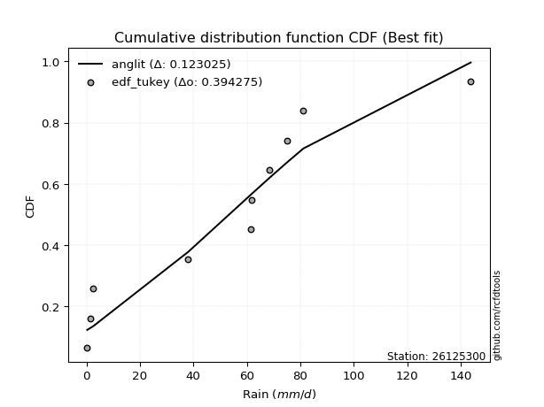</img></img>

</div>


### 8. EDF Gringorten (1963)

Gringorten plotting position formula is essential for estimating the probability and return periods of extreme events like floods and heavy rainfall. The constant _a=0.44_.

<div align="center">


$P=(m-a)/(n+1-2a)$


</div>


**8.1. Empirical values**

<div align="center">

|                | 0                   | 1                   | 2                  | 3                   | 4                  | 5                 | 6                  | 7                  | 8                  | 9                  |
|:---------------|:--------------------|:--------------------|:-------------------|:--------------------|:-------------------|:------------------|:-------------------|:-------------------|:-------------------|:-------------------|
| date           | 2022                | 2023                | 2016               | 2018                | 2021               | 2020              | 2019               | 2017               | 2025               | 2024               |
| x              | 0.3                 | 1.4                 | 2.6                | 38.1                | 61.4               | 61.9              | 68.4               | 75.2               | 81.2               | 143.8              |
| m              | 1                   | 2                   | 3                  | 4                   | 5                  | 6                 | 7                  | 8                  | 9                  | 10                 |
| empirical_dist | edf_gringorten      | edf_gringorten      | edf_gringorten     | edf_gringorten      | edf_gringorten     | edf_gringorten    | edf_gringorten     | edf_gringorten     | edf_gringorten     | edf_gringorten     |
| empirical      | 0.05533596837944665 | 0.15415019762845852 | 0.2529644268774704 | 0.35177865612648224 | 0.4505928853754941 | 0.549407114624506 | 0.6482213438735178 | 0.7470355731225297 | 0.8458498023715416 | 0.9446640316205535 |
| empirical_tr   | 1.0585774058577406  | 1.1822429906542056  | 1.3386243386243388 | 1.542682926829268   | 1.8201438848920866 | 2.219298245614035 | 2.842696629213483  | 3.9531250000000004 | 6.487179487179492  | 18.071428571428605 |

</div>


**8.2. Kolmogorov-Smirnov fit test (sorted by Δ)**


<div align="center">

|                | 0                   | 1                   | 2                   | 3                   | 4                   | 5                   | 6                   | 7                  | 8                   | 9                  | 10                 | 11                  | 12                  | 13                  | 14                  | 15                  | 16                  | 17                  | 18                 | 19                  | 20                 | 21                  | 22                  | 23                 | 24                  | 25                 | 26                  | 27                  | 28                  | 29                 | 30                  | 31                  | 32                  | 33                  | 34                  | 35                 | 36                  | 37                  | 38                 | 39                  | 40                 | 41                  | 42                 | 43                 | 44                  | 45                  | 46                  | 47                  | 48                  | 49                  | 50                  | 51                 | 52                  | 53                 | 54                  | 55                  | 56                  | 57                  | 58                 | 59                 | 60                  | 61                  | 62                 | 63                 | 64                 | 65                  | 66                 | 67                 | 68                 | 69                  | 70                  | 71                 | 72                  | 73                 | 74                 | 75                 | 76                  | 77                 | 78                  | 79                  | 80                 | 81                 | 82                  | 83                 | 84                  | 85                  | 86                  | 87                 | 88                  | 89                  | 90                 | 91                 | 92                  | 93                 | 94                  | 95                 | 96                  | 97                 | 98                 | 99                 | 100                | 101                 | 102                | 103                | 104                 | 105                | 106                | 107                | 108                 | 109                | 110                 | 111                 | 112                | 113                | 114                | 115                 | 116                 | 117                | 118                | 119                | 120                 | 121                | 122                 | 123                | 124                 | 125                | 126                | 127                | 128                 | 129                | 130                 | 131                 | 132                | 133                | 134                 | 135                | 136                 | 137                | 138                | 139                 | 140                | 141                | 142                | 143                | 144                | 145                | 146                | 147                | 148                | 149                | 150                | 151                | 152                | 153                | 154                | 155                | 156                | 157                | 158                | 159                |
|:---------------|:--------------------|:--------------------|:--------------------|:--------------------|:--------------------|:--------------------|:--------------------|:-------------------|:--------------------|:-------------------|:-------------------|:--------------------|:--------------------|:--------------------|:--------------------|:--------------------|:--------------------|:--------------------|:-------------------|:--------------------|:-------------------|:--------------------|:--------------------|:-------------------|:--------------------|:-------------------|:--------------------|:--------------------|:--------------------|:-------------------|:--------------------|:--------------------|:--------------------|:--------------------|:--------------------|:-------------------|:--------------------|:--------------------|:-------------------|:--------------------|:-------------------|:--------------------|:-------------------|:-------------------|:--------------------|:--------------------|:--------------------|:--------------------|:--------------------|:--------------------|:--------------------|:-------------------|:--------------------|:-------------------|:--------------------|:--------------------|:--------------------|:--------------------|:-------------------|:-------------------|:--------------------|:--------------------|:-------------------|:-------------------|:-------------------|:--------------------|:-------------------|:-------------------|:-------------------|:--------------------|:--------------------|:-------------------|:--------------------|:-------------------|:-------------------|:-------------------|:--------------------|:-------------------|:--------------------|:--------------------|:-------------------|:-------------------|:--------------------|:-------------------|:--------------------|:--------------------|:--------------------|:-------------------|:--------------------|:--------------------|:-------------------|:-------------------|:--------------------|:-------------------|:--------------------|:-------------------|:--------------------|:-------------------|:-------------------|:-------------------|:-------------------|:--------------------|:-------------------|:-------------------|:--------------------|:-------------------|:-------------------|:-------------------|:--------------------|:-------------------|:--------------------|:--------------------|:-------------------|:-------------------|:-------------------|:--------------------|:--------------------|:-------------------|:-------------------|:-------------------|:--------------------|:-------------------|:--------------------|:-------------------|:--------------------|:-------------------|:-------------------|:-------------------|:--------------------|:-------------------|:--------------------|:--------------------|:-------------------|:-------------------|:--------------------|:-------------------|:--------------------|:-------------------|:-------------------|:--------------------|:-------------------|:-------------------|:-------------------|:-------------------|:-------------------|:-------------------|:-------------------|:-------------------|:-------------------|:-------------------|:-------------------|:-------------------|:-------------------|:-------------------|:-------------------|:-------------------|:-------------------|:-------------------|:-------------------|:-------------------|
| station        | 26125300            | 26125300            | 26125300            | 26125300            | 26125300            | 26125300            | 26125300            | 26125300           | 26125300            | 26125300           | 26125300           | 26125300            | 26125300            | 26125300            | 26125300            | 26125300            | 26125300            | 26125300            | 26125300           | 26125300            | 26125300           | 26125300            | 26125300            | 26125300           | 26125300            | 26125300           | 26125300            | 26125300            | 26125300            | 26125300           | 26125300            | 26125300            | 26125300            | 26125300            | 26125300            | 26125300           | 26125300            | 26125300            | 26125300           | 26125300            | 26125300           | 26125300            | 26125300           | 26125300           | 26125300            | 26125300            | 26125300            | 26125300            | 26125300            | 26125300            | 26125300            | 26125300           | 26125300            | 26125300           | 26125300            | 26125300            | 26125300            | 26125300            | 26125300           | 26125300           | 26125300            | 26125300            | 26125300           | 26125300           | 26125300           | 26125300            | 26125300           | 26125300           | 26125300           | 26125300            | 26125300            | 26125300           | 26125300            | 26125300           | 26125300           | 26125300           | 26125300            | 26125300           | 26125300            | 26125300            | 26125300           | 26125300           | 26125300            | 26125300           | 26125300            | 26125300            | 26125300            | 26125300           | 26125300            | 26125300            | 26125300           | 26125300           | 26125300            | 26125300           | 26125300            | 26125300           | 26125300            | 26125300           | 26125300           | 26125300           | 26125300           | 26125300            | 26125300           | 26125300           | 26125300            | 26125300           | 26125300           | 26125300           | 26125300            | 26125300           | 26125300            | 26125300            | 26125300           | 26125300           | 26125300           | 26125300            | 26125300            | 26125300           | 26125300           | 26125300           | 26125300            | 26125300           | 26125300            | 26125300           | 26125300            | 26125300           | 26125300           | 26125300           | 26125300            | 26125300           | 26125300            | 26125300            | 26125300           | 26125300           | 26125300            | 26125300           | 26125300            | 26125300           | 26125300           | 26125300            | 26125300           | 26125300           | 26125300           | 26125300           | 26125300           | 26125300           | 26125300           | 26125300           | 26125300           | 26125300           | 26125300           | 26125300           | 26125300           | 26125300           | 26125300           | 26125300           | 26125300           | 26125300           | 26125300           | 26125300           |
| empirical_dist | edf_gringorten      | edf_gringorten      | edf_gringorten      | edf_gringorten      | edf_gringorten      | edf_gringorten      | edf_gringorten      | edf_gringorten     | edf_gringorten      | edf_gringorten     | edf_gringorten     | edf_gringorten      | edf_gringorten      | edf_gringorten      | edf_gringorten      | edf_gringorten      | edf_gringorten      | edf_gringorten      | edf_gringorten     | edf_gringorten      | edf_gringorten     | edf_gringorten      | edf_gringorten      | edf_gringorten     | edf_gringorten      | edf_gringorten     | edf_gringorten      | edf_gringorten      | edf_gringorten      | edf_gringorten     | edf_gringorten      | edf_gringorten      | edf_gringorten      | edf_gringorten      | edf_gringorten      | edf_gringorten     | edf_gringorten      | edf_gringorten      | edf_gringorten     | edf_gringorten      | edf_gringorten     | edf_gringorten      | edf_gringorten     | edf_gringorten     | edf_gringorten      | edf_gringorten      | edf_gringorten      | edf_gringorten      | edf_gringorten      | edf_gringorten      | edf_gringorten      | edf_gringorten     | edf_gringorten      | edf_gringorten     | edf_gringorten      | edf_gringorten      | edf_gringorten      | edf_gringorten      | edf_gringorten     | edf_gringorten     | edf_gringorten      | edf_gringorten      | edf_gringorten     | edf_gringorten     | edf_gringorten     | edf_gringorten      | edf_gringorten     | edf_gringorten     | edf_gringorten     | edf_gringorten      | edf_gringorten      | edf_gringorten     | edf_gringorten      | edf_gringorten     | edf_gringorten     | edf_gringorten     | edf_gringorten      | edf_gringorten     | edf_gringorten      | edf_gringorten      | edf_gringorten     | edf_gringorten     | edf_gringorten      | edf_gringorten     | edf_gringorten      | edf_gringorten      | edf_gringorten      | edf_gringorten     | edf_gringorten      | edf_gringorten      | edf_gringorten     | edf_gringorten     | edf_gringorten      | edf_gringorten     | edf_gringorten      | edf_gringorten     | edf_gringorten      | edf_gringorten     | edf_gringorten     | edf_gringorten     | edf_gringorten     | edf_gringorten      | edf_gringorten     | edf_gringorten     | edf_gringorten      | edf_gringorten     | edf_gringorten     | edf_gringorten     | edf_gringorten      | edf_gringorten     | edf_gringorten      | edf_gringorten      | edf_gringorten     | edf_gringorten     | edf_gringorten     | edf_gringorten      | edf_gringorten      | edf_gringorten     | edf_gringorten     | edf_gringorten     | edf_gringorten      | edf_gringorten     | edf_gringorten      | edf_gringorten     | edf_gringorten      | edf_gringorten     | edf_gringorten     | edf_gringorten     | edf_gringorten      | edf_gringorten     | edf_gringorten      | edf_gringorten      | edf_gringorten     | edf_gringorten     | edf_gringorten      | edf_gringorten     | edf_gringorten      | edf_gringorten     | edf_gringorten     | edf_gringorten      | edf_gringorten     | edf_gringorten     | edf_gringorten     | edf_gringorten     | edf_gringorten     | edf_gringorten     | edf_gringorten     | edf_gringorten     | edf_gringorten     | edf_gringorten     | edf_gringorten     | edf_gringorten     | edf_gringorten     | edf_gringorten     | edf_gringorten     | edf_gringorten     | edf_gringorten     | edf_gringorten     | edf_gringorten     | edf_gringorten     |
| p_dist         | dgamma              | logjohnsonsu        | anglit              | dweibull            | johnsonsu           | t                   | norm                | crystalball        | gumbel_l            | semicircular       | foldnorm           | logistic            | cosine              | pearson3            | maxwell             | hypsecant           | exponnorm           | gennorm             | rayleigh           | laplace             | loggennorm         | rice                | invgamma            | halfgennorm        | genlogistic         | betaprime          | kstwobign           | logmielke           | logweibull_max      | halfnorm           | truncweibull_min    | mielke              | gumbel_r            | arcsine             | invgauss            | logloggamma        | loglevy_l           | logvonmises_line    | logdgamma          | loggenextreme       | moyal              | ncf                 | logdweibull        | logarcsine         | logpearson3         | truncnorm           | gompertz            | logtrapezoid        | genpareto           | skewnorm            | nakagami            | logargus           | bradford            | kappa3             | truncexpon          | loggumbel_l         | genexpon            | lomax               | logweibull_min     | logsemicircular    | weibull_min         | logburr12           | vonmises_line      | loggenhalflogistic | halflogistic       | loganglit           | f                  | burr               | exponpow           | logjohnsonsb        | argus               | logfatiguelife     | lognakagami         | logrice            | logt               | logcrystalball     | lognorm             | logexponnorm       | lognct              | kappa4              | loggompertz        | logfoldnorm        | logncf              | logerlang          | loggamma            | loggamma            | burr12              | loginvweibull      | invweibull          | genextreme          | wrapcauchy         | uniform            | wald                | logexponweib       | loginvgamma         | loglogistic        | gausshyper          | ksone              | loginvgauss        | logwrapcauchy      | logmaxwell         | loghypsecant        | lograyleigh        | logkstwobign       | logburr             | logskewnorm        | loggenexpon        | logbetaprime       | logcosine           | loghalfnorm        | loglaplace          | loglaplace          | nct                | loggumbel_r        | loglomax           | logtriang           | loghalflogistic     | logmoyal           | loghalfgennorm     | logbeta            | logloglaplace       | logf               | logksone            | levy_l             | logtruncweibull_min | erlang             | johnsonsb          | logwald            | exponweib           | logalpha           | loggausshyper       | logkappa4           | loguniform         | genhalflogistic    | powerlaw            | logtruncnorm       | logkappa3           | gamma              | triang             | fatiguelife         | loggengamma        | logbradford        | logtruncexpon      | tukeylambda        | loggenpareto       | rdist              | trapezoid          | beta               | gengamma           | truncpareto        | logpowerlaw        | alpha              | logexponpow        | weibull_max        | logtruncpareto     | logrdist           | logtukeylambda     | loggenlogistic     | logvonmises        | vonmises           |
| delta          | 0.12424527802309543 | 0.12754591321431918 | 0.13016552556921124 | 0.13298949313821937 | 0.13618917461307745 | 0.13673937367628158 | 0.13674632289751043 | 0.1367463235603364 | 0.13864970904592155 | 0.1419351862117869 | 0.142445480001185  | 0.15010691866119252 | 0.15134750118548002 | 0.15189198534562703 | 0.15232261176262335 | 0.15615694431358557 | 0.15854797849095886 | 0.15933659318265578 | 0.1613707994628522 | 0.16572235531807672 | 0.1683311833841775 | 0.17095009462884908 | 0.17207972298346103 | 0.1763457898123626 | 0.18439631925324723 | 0.1850280024162556 | 0.18597004704662073 | 0.18614155438326013 | 0.18871562516680984 | 0.1907409862661964 | 0.19093228730209083 | 0.19140626694728818 | 0.19241389166442896 | 0.19323277808661976 | 0.19674058866462535 | 0.2000749258141405 | 0.20110750085943063 | 0.20321134987767525 | 0.2081272737918869 | 0.21335475100392626 | 0.2163444378199974 | 0.21864759663246663 | 0.2212272284342004 | 0.2213920566242093 | 0.22269985344565274 | 0.22294263236563303 | 0.22340086112913013 | 0.22361473435684792 | 0.22432368471579672 | 0.22600948560892825 | 0.22763062837467524 | 0.228319495418074  | 0.22944519495811125 | 0.2296753885553045 | 0.23029563088300226 | 0.23232473830601624 | 0.23279799517367922 | 0.23509238643141067 | 0.2503235003376055 | 0.2503436934744793 | 0.25040357516041917 | 0.25053628505558695 | 0.2516805683965341 | 0.2518250777095968 | 0.2529644268774704 | 0.25748298999103963 | 0.2631622474121786 | 0.2669178489483918 | 0.2705102074065549 | 0.27287870790956614 | 0.27323703732396776 | 0.2739529447484684 | 0.27443592381645726 | 0.2745804191982159 | 0.2745834855338069 | 0.2745834894742421 | 0.27458365968864445 | 0.2745840850014685 | 0.27463257530688795 | 0.27554806851691827 | 0.2772403111586024 | 0.2792166904616013 | 0.27932766511971885 | 0.2794425764045472 | 0.27962111655909844 | 0.27962111655909844 | 0.27994033263880264 | 0.2803408270920111 | 0.28074565585038397 | 0.28074643250914394 | 0.2820821630069634 | 0.282086736169451  | 0.28280777804242824 | 0.2856306385514045 | 0.28650511081641933 | 0.2903161805148738 | 0.29163547349368424 | 0.2927139138697994 | 0.2957128617443496 | 0.2971812265590807 | 0.2986464807714712 | 0.30286893041189894 | 0.3059909675932952 | 0.3086512856857519 | 0.31265273191553994 | 0.3131368119382874 | 0.3158736006743011 | 0.316229212481227  | 0.32168304426800115 | 0.3270883348237203 | 0.33122181342757845 | 0.33122181342757845 | 0.3317239071273194 | 0.3379947794013501 | 0.3396058751077568 | 0.34907836809258935 | 0.35543859996451194 | 0.35928421620098   | 0.3655371751920122 | 0.3680467478776272 | 0.37644184414984555 | 0.3842402106799896 | 0.38556689690224183 | 0.3923731169285679 | 0.4033754531249906  | 0.4107911808091858 | 0.4149696309767085 | 0.4190286230448355 | 0.42088656299841576 | 0.4246950785503601 | 0.42888833393241016 | 0.43099873587260656 | 0.4330360075079866 | 0.434378289289449  | 0.43759365498154484 | 0.4388084499553198 | 0.46973892814008006 | 0.4788442709198048 | 0.4799344682003502 | 0.48332266231812687 | 0.4849788951218222 | 0.4850449659593778 | 0.4929812162562424 | 0.4936887899002317 | 0.4937936777390883 | 0.4954114866065469 | 0.5353607478239839 | 0.5442280192462436 | 0.553690462282967  | 0.586916213625001  | 0.591072334097775  | 0.6289611271106841 | 0.6479204603454372 | 0.7033290122483984 | 0.7119270146476515 | 0.7470355730915752 | 0.7470355731225224 | 0.8458498023715416 | 0.8821179014753358 | 22.390444263896722 |
| deltao         | 0.3942745923300002  | 0.3942745923300002  | 0.3942745923300002  | 0.3942745923300002  | 0.3942745923300002  | 0.3942745923300002  | 0.3942745923300002  | 0.3942745923300002 | 0.3942745923300002  | 0.3942745923300002 | 0.3942745923300002 | 0.3942745923300002  | 0.3942745923300002  | 0.3942745923300002  | 0.3942745923300002  | 0.3942745923300002  | 0.3942745923300002  | 0.3942745923300002  | 0.3942745923300002 | 0.3942745923300002  | 0.3942745923300002 | 0.3942745923300002  | 0.3942745923300002  | 0.3942745923300002 | 0.3942745923300002  | 0.3942745923300002 | 0.3942745923300002  | 0.3942745923300002  | 0.3942745923300002  | 0.3942745923300002 | 0.3942745923300002  | 0.3942745923300002  | 0.3942745923300002  | 0.3942745923300002  | 0.3942745923300002  | 0.3942745923300002 | 0.3942745923300002  | 0.3942745923300002  | 0.3942745923300002 | 0.3942745923300002  | 0.3942745923300002 | 0.3942745923300002  | 0.3942745923300002 | 0.3942745923300002 | 0.3942745923300002  | 0.3942745923300002  | 0.3942745923300002  | 0.3942745923300002  | 0.3942745923300002  | 0.3942745923300002  | 0.3942745923300002  | 0.3942745923300002 | 0.3942745923300002  | 0.3942745923300002 | 0.3942745923300002  | 0.3942745923300002  | 0.3942745923300002  | 0.3942745923300002  | 0.3942745923300002 | 0.3942745923300002 | 0.3942745923300002  | 0.3942745923300002  | 0.3942745923300002 | 0.3942745923300002 | 0.3942745923300002 | 0.3942745923300002  | 0.3942745923300002 | 0.3942745923300002 | 0.3942745923300002 | 0.3942745923300002  | 0.3942745923300002  | 0.3942745923300002 | 0.3942745923300002  | 0.3942745923300002 | 0.3942745923300002 | 0.3942745923300002 | 0.3942745923300002  | 0.3942745923300002 | 0.3942745923300002  | 0.3942745923300002  | 0.3942745923300002 | 0.3942745923300002 | 0.3942745923300002  | 0.3942745923300002 | 0.3942745923300002  | 0.3942745923300002  | 0.3942745923300002  | 0.3942745923300002 | 0.3942745923300002  | 0.3942745923300002  | 0.3942745923300002 | 0.3942745923300002 | 0.3942745923300002  | 0.3942745923300002 | 0.3942745923300002  | 0.3942745923300002 | 0.3942745923300002  | 0.3942745923300002 | 0.3942745923300002 | 0.3942745923300002 | 0.3942745923300002 | 0.3942745923300002  | 0.3942745923300002 | 0.3942745923300002 | 0.3942745923300002  | 0.3942745923300002 | 0.3942745923300002 | 0.3942745923300002 | 0.3942745923300002  | 0.3942745923300002 | 0.3942745923300002  | 0.3942745923300002  | 0.3942745923300002 | 0.3942745923300002 | 0.3942745923300002 | 0.3942745923300002  | 0.3942745923300002  | 0.3942745923300002 | 0.3942745923300002 | 0.3942745923300002 | 0.3942745923300002  | 0.3942745923300002 | 0.3942745923300002  | 0.3942745923300002 | 0.3942745923300002  | 0.3942745923300002 | 0.3942745923300002 | 0.3942745923300002 | 0.3942745923300002  | 0.3942745923300002 | 0.3942745923300002  | 0.3942745923300002  | 0.3942745923300002 | 0.3942745923300002 | 0.3942745923300002  | 0.3942745923300002 | 0.3942745923300002  | 0.3942745923300002 | 0.3942745923300002 | 0.3942745923300002  | 0.3942745923300002 | 0.3942745923300002 | 0.3942745923300002 | 0.3942745923300002 | 0.3942745923300002 | 0.3942745923300002 | 0.3942745923300002 | 0.3942745923300002 | 0.3942745923300002 | 0.3942745923300002 | 0.3942745923300002 | 0.3942745923300002 | 0.3942745923300002 | 0.3942745923300002 | 0.3942745923300002 | 0.3942745923300002 | 0.3942745923300002 | 0.3942745923300002 | 0.3942745923300002 | 0.3942745923300002 |
| eval           | Δo > Δ              | Δo > Δ              | Δo > Δ              | Δo > Δ              | Δo > Δ              | Δo > Δ              | Δo > Δ              | Δo > Δ             | Δo > Δ              | Δo > Δ             | Δo > Δ             | Δo > Δ              | Δo > Δ              | Δo > Δ              | Δo > Δ              | Δo > Δ              | Δo > Δ              | Δo > Δ              | Δo > Δ             | Δo > Δ              | Δo > Δ             | Δo > Δ              | Δo > Δ              | Δo > Δ             | Δo > Δ              | Δo > Δ             | Δo > Δ              | Δo > Δ              | Δo > Δ              | Δo > Δ             | Δo > Δ              | Δo > Δ              | Δo > Δ              | Δo > Δ              | Δo > Δ              | Δo > Δ             | Δo > Δ              | Δo > Δ              | Δo > Δ             | Δo > Δ              | Δo > Δ             | Δo > Δ              | Δo > Δ             | Δo > Δ             | Δo > Δ              | Δo > Δ              | Δo > Δ              | Δo > Δ              | Δo > Δ              | Δo > Δ              | Δo > Δ              | Δo > Δ             | Δo > Δ              | Δo > Δ             | Δo > Δ              | Δo > Δ              | Δo > Δ              | Δo > Δ              | Δo > Δ             | Δo > Δ             | Δo > Δ              | Δo > Δ              | Δo > Δ             | Δo > Δ             | Δo > Δ             | Δo > Δ              | Δo > Δ             | Δo > Δ             | Δo > Δ             | Δo > Δ              | Δo > Δ              | Δo > Δ             | Δo > Δ              | Δo > Δ             | Δo > Δ             | Δo > Δ             | Δo > Δ              | Δo > Δ             | Δo > Δ              | Δo > Δ              | Δo > Δ             | Δo > Δ             | Δo > Δ              | Δo > Δ             | Δo > Δ              | Δo > Δ              | Δo > Δ              | Δo > Δ             | Δo > Δ              | Δo > Δ              | Δo > Δ             | Δo > Δ             | Δo > Δ              | Δo > Δ             | Δo > Δ              | Δo > Δ             | Δo > Δ              | Δo > Δ             | Δo > Δ             | Δo > Δ             | Δo > Δ             | Δo > Δ              | Δo > Δ             | Δo > Δ             | Δo > Δ              | Δo > Δ             | Δo > Δ             | Δo > Δ             | Δo > Δ              | Δo > Δ             | Δo > Δ              | Δo > Δ              | Δo > Δ             | Δo > Δ             | Δo > Δ             | Δo > Δ              | Δo > Δ              | Δo > Δ             | Δo > Δ             | Δo > Δ             | Δo > Δ              | Δo > Δ             | Δo > Δ              | Δo > Δ             | Δo <= Δ             | Δo <= Δ            | Δo <= Δ            | Δo <= Δ            | Δo <= Δ             | Δo <= Δ            | Δo <= Δ             | Δo <= Δ             | Δo <= Δ            | Δo <= Δ            | Δo <= Δ             | Δo <= Δ            | Δo <= Δ             | Δo <= Δ            | Δo <= Δ            | Δo <= Δ             | Δo <= Δ            | Δo <= Δ            | Δo <= Δ            | Δo <= Δ            | Δo <= Δ            | Δo <= Δ            | Δo <= Δ            | Δo <= Δ            | Δo <= Δ            | Δo <= Δ            | Δo <= Δ            | Δo <= Δ            | Δo <= Δ            | Δo <= Δ            | Δo <= Δ            | Δo <= Δ            | Δo <= Δ            | Δo <= Δ            | Δo <= Δ            | Δo <= Δ            |
| fit            | 1                   | 1                   | 1                   | 1                   | 1                   | 1                   | 1                   | 1                  | 1                   | 1                  | 1                  | 1                   | 1                   | 1                   | 1                   | 1                   | 1                   | 1                   | 1                  | 1                   | 1                  | 1                   | 1                   | 1                  | 1                   | 1                  | 1                   | 1                   | 1                   | 1                  | 1                   | 1                   | 1                   | 1                   | 1                   | 1                  | 1                   | 1                   | 1                  | 1                   | 1                  | 1                   | 1                  | 1                  | 1                   | 1                   | 1                   | 1                   | 1                   | 1                   | 1                   | 1                  | 1                   | 1                  | 1                   | 1                   | 1                   | 1                   | 1                  | 1                  | 1                   | 1                   | 1                  | 1                  | 1                  | 1                   | 1                  | 1                  | 1                  | 1                   | 1                   | 1                  | 1                   | 1                  | 1                  | 1                  | 1                   | 1                  | 1                   | 1                   | 1                  | 1                  | 1                   | 1                  | 1                   | 1                   | 1                   | 1                  | 1                   | 1                   | 1                  | 1                  | 1                   | 1                  | 1                   | 1                  | 1                   | 1                  | 1                  | 1                  | 1                  | 1                   | 1                  | 1                  | 1                   | 1                  | 1                  | 1                  | 1                   | 1                  | 1                   | 1                   | 1                  | 1                  | 1                  | 1                   | 1                   | 1                  | 1                  | 1                  | 1                   | 1                  | 1                   | 1                  | 0                   | 0                  | 0                  | 0                  | 0                   | 0                  | 0                   | 0                   | 0                  | 0                  | 0                   | 0                  | 0                   | 0                  | 0                  | 0                   | 0                  | 0                  | 0                  | 0                  | 0                  | 0                  | 0                  | 0                  | 0                  | 0                  | 0                  | 0                  | 0                  | 0                  | 0                  | 0                  | 0                  | 0                  | 0                  | 0                  |
| n              | 10                  | 10                  | 10                  | 10                  | 10                  | 10                  | 10                  | 10                 | 10                  | 10                 | 10                 | 10                  | 10                  | 10                  | 10                  | 10                  | 10                  | 10                  | 10                 | 10                  | 10                 | 10                  | 10                  | 10                 | 10                  | 10                 | 10                  | 10                  | 10                  | 10                 | 10                  | 10                  | 10                  | 10                  | 10                  | 10                 | 10                  | 10                  | 10                 | 10                  | 10                 | 10                  | 10                 | 10                 | 10                  | 10                  | 10                  | 10                  | 10                  | 10                  | 10                  | 10                 | 10                  | 10                 | 10                  | 10                  | 10                  | 10                  | 10                 | 10                 | 10                  | 10                  | 10                 | 10                 | 10                 | 10                  | 10                 | 10                 | 10                 | 10                  | 10                  | 10                 | 10                  | 10                 | 10                 | 10                 | 10                  | 10                 | 10                  | 10                  | 10                 | 10                 | 10                  | 10                 | 10                  | 10                  | 10                  | 10                 | 10                  | 10                  | 10                 | 10                 | 10                  | 10                 | 10                  | 10                 | 10                  | 10                 | 10                 | 10                 | 10                 | 10                  | 10                 | 10                 | 10                  | 10                 | 10                 | 10                 | 10                  | 10                 | 10                  | 10                  | 10                 | 10                 | 10                 | 10                  | 10                  | 10                 | 10                 | 10                 | 10                  | 10                 | 10                  | 10                 | 10                  | 10                 | 10                 | 10                 | 10                  | 10                 | 10                  | 10                  | 10                 | 10                 | 10                  | 10                 | 10                  | 10                 | 10                 | 10                  | 10                 | 10                 | 10                 | 10                 | 10                 | 10                 | 10                 | 10                 | 10                 | 10                 | 10                 | 10                 | 10                 | 10                 | 10                 | 10                 | 10                 | 10                 | 10                 | 10                 |
| best_fit       | 1                   | 0                   | 0                   | 0                   | 0                   | 0                   | 0                   | 0                  | 0                   | 0                  | 0                  | 0                   | 0                   | 0                   | 0                   | 0                   | 0                   | 0                   | 0                  | 0                   | 0                  | 0                   | 0                   | 0                  | 0                   | 0                  | 0                   | 0                   | 0                   | 0                  | 0                   | 0                   | 0                   | 0                   | 0                   | 0                  | 0                   | 0                   | 0                  | 0                   | 0                  | 0                   | 0                  | 0                  | 0                   | 0                   | 0                   | 0                   | 0                   | 0                   | 0                   | 0                  | 0                   | 0                  | 0                   | 0                   | 0                   | 0                   | 0                  | 0                  | 0                   | 0                   | 0                  | 0                  | 0                  | 0                   | 0                  | 0                  | 0                  | 0                   | 0                   | 0                  | 0                   | 0                  | 0                  | 0                  | 0                   | 0                  | 0                   | 0                   | 0                  | 0                  | 0                   | 0                  | 0                   | 0                   | 0                   | 0                  | 0                   | 0                   | 0                  | 0                  | 0                   | 0                  | 0                   | 0                  | 0                   | 0                  | 0                  | 0                  | 0                  | 0                   | 0                  | 0                  | 0                   | 0                  | 0                  | 0                  | 0                   | 0                  | 0                   | 0                   | 0                  | 0                  | 0                  | 0                   | 0                   | 0                  | 0                  | 0                  | 0                   | 0                  | 0                   | 0                  | 0                   | 0                  | 0                  | 0                  | 0                   | 0                  | 0                   | 0                   | 0                  | 0                  | 0                   | 0                  | 0                   | 0                  | 0                  | 0                   | 0                  | 0                  | 0                  | 0                  | 0                  | 0                  | 0                  | 0                  | 0                  | 0                  | 0                  | 0                  | 0                  | 0                  | 0                  | 0                  | 0                  | 0                  | 0                  | 0                  |
| best_fit_sort  | 1                   | 2                   | 3                   | 4                   | 5                   | 6                   | 7                   | 8                  | 9                   | 10                 | 11                 | 12                  | 13                  | 14                  | 15                  | 16                  | 17                  | 18                  | 19                 | 20                  | 21                 | 22                  | 23                  | 24                 | 25                  | 26                 | 27                  | 28                  | 29                  | 30                 | 31                  | 32                  | 33                  | 34                  | 35                  | 36                 | 37                  | 38                  | 39                 | 40                  | 41                 | 42                  | 43                 | 44                 | 45                  | 46                  | 47                  | 48                  | 49                  | 50                  | 51                  | 52                 | 53                  | 54                 | 55                  | 56                  | 57                  | 58                  | 59                 | 60                 | 61                  | 62                  | 63                 | 64                 | 65                 | 66                  | 67                 | 68                 | 69                 | 70                  | 71                  | 72                 | 73                  | 74                 | 75                 | 76                 | 77                  | 78                 | 79                  | 80                  | 81                 | 82                 | 83                  | 84                 | 85                  | 86                  | 87                  | 88                 | 89                  | 90                  | 91                 | 92                 | 93                  | 94                 | 95                  | 96                 | 97                  | 98                 | 99                 | 100                | 101                | 102                 | 103                | 104                | 105                 | 106                | 107                | 108                | 109                 | 110                | 111                 | 112                 | 113                | 114                | 115                | 116                 | 117                 | 118                | 119                | 120                | 121                 | 122                | 123                 | 124                | 125                 | 126                | 127                | 128                | 129                 | 130                | 131                 | 132                 | 133                | 134                | 135                 | 136                | 137                 | 138                | 139                | 140                 | 141                | 142                | 143                | 144                | 145                | 146                | 147                | 148                | 149                | 150                | 151                | 152                | 153                | 154                | 155                | 156                | 157                | 158                | 159                | 160                |

</div>


**8.3. Best fit**

<div align="center">

|   id |   station | empirical_dist   | p_dist   |    delta |   deltao | eval   |   fit |   n |   best_fit |   best_fit_sort |
|-----:|----------:|:-----------------|:---------|---------:|---------:|:-------|------:|----:|-----------:|----------------:|
|    0 |  26125300 | edf_gringorten   | dgamma   | 0.124245 | 0.394275 | Δo > Δ |     1 |  10 |          1 |               1 |

</div>


<div align="center">

</img></img>

</div>


### 9. EDF Filliben (1975)

The specific values of the constants (0.3175) (often denoted as $alpha$) and (0.365) are derived from a method proposed by James J. Filliben in a 1975 paper. This particular formula is the mean value of the $i$-th order statistic of the normal distribution and is considered a robust and effective plotting position formula for the normal probability plot correlation coefficient test for normality.

<div align="center">


$P=(m-0.3175)/(n+0.365)$


</div>


**9.1. Empirical values**

<div align="center">

|                | 0                   | 1                  | 2                   | 3                  | 4                  | 5                  | 6                  | 7                  | 8                  | 9                  |
|:---------------|:--------------------|:-------------------|:--------------------|:-------------------|:-------------------|:-------------------|:-------------------|:-------------------|:-------------------|:-------------------|
| date           | 2022                | 2023               | 2016                | 2018               | 2021               | 2020               | 2019               | 2017               | 2025               | 2024               |
| x              | 0.3                 | 1.4                | 2.6                 | 38.1               | 61.4               | 61.9               | 68.4               | 75.2               | 81.2               | 143.8              |
| m              | 1                   | 2                  | 3                   | 4                  | 5                  | 6                  | 7                  | 8                  | 9                  | 10                 |
| empirical_dist | edf_filliben        | edf_filliben       | edf_filliben        | edf_filliben       | edf_filliben       | edf_filliben       | edf_filliben       | edf_filliben       | edf_filliben       | edf_filliben       |
| empirical      | 0.06584659913169319 | 0.1623251326579836 | 0.25880366618427403 | 0.3552821997105644 | 0.4517607332368548 | 0.5482392667631452 | 0.6447178002894356 | 0.741196333815726  | 0.8376748673420163 | 0.9341534008683067 |
| empirical_tr   | 1.0704879938032532  | 1.193780593147135  | 1.3491701919947936  | 1.5510662177328844 | 1.8240211174659038 | 2.2135611318739987 | 2.814663951120163  | 3.8639328984156576 | 6.1604754829123305 | 15.186813186813156 |

</div>


**9.2. Kolmogorov-Smirnov fit test (sorted by Δ)**


<div align="center">

|                | 0                   | 1                  | 2                   | 3                   | 4                  | 5                  | 6                   | 7                   | 8                   | 9                   | 10                 | 11                  | 12                 | 13                 | 14                  | 15                  | 16                 | 17                 | 18                 | 19                  | 20                  | 21                  | 22                  | 23                 | 24                  | 25                  | 26                  | 27                  | 28                 | 29                  | 30                 | 31                  | 32                  | 33                  | 34                  | 35                  | 36                 | 37                 | 38                  | 39                  | 40                  | 41                 | 42                  | 43                  | 44                  | 45                  | 46                  | 47                 | 48                  | 49                  | 50                  | 51                  | 52                 | 53                  | 54                  | 55                  | 56                  | 57                 | 58                 | 59                  | 60                 | 61                  | 62                  | 63                 | 64                  | 65                  | 66                 | 67                 | 68                 | 69                 | 70                 | 71                 | 72                 | 73                 | 74                  | 75                  | 76                  | 77                 | 78                  | 79                  | 80                 | 81                  | 82                  | 83                  | 84                  | 85                  | 86                  | 87                 | 88                  | 89                 | 90                  | 91                  | 92                  | 93                  | 94                  | 95                 | 96                 | 97                 | 98                 | 99                 | 100                 | 101                 | 102                | 103                 | 104                 | 105                | 106                | 107                | 108                | 109                | 110                | 111                | 112                 | 113                | 114                 | 115                 | 116                 | 117                 | 118                 | 119                | 120                | 121                | 122                 | 123                 | 124                 | 125                | 126                | 127                 | 128                 | 129                | 130                | 131                 | 132                | 133                 | 134                | 135                 | 136                | 137                | 138                | 139                 | 140                | 141                | 142                | 143                | 144                 | 145                | 146                | 147                | 148                | 149                | 150                | 151                | 152                | 153                | 154                | 155                | 156                | 157                | 158                | 159                |
|:---------------|:--------------------|:-------------------|:--------------------|:--------------------|:-------------------|:-------------------|:--------------------|:--------------------|:--------------------|:--------------------|:-------------------|:--------------------|:-------------------|:-------------------|:--------------------|:--------------------|:-------------------|:-------------------|:-------------------|:--------------------|:--------------------|:--------------------|:--------------------|:-------------------|:--------------------|:--------------------|:--------------------|:--------------------|:-------------------|:--------------------|:-------------------|:--------------------|:--------------------|:--------------------|:--------------------|:--------------------|:-------------------|:-------------------|:--------------------|:--------------------|:--------------------|:-------------------|:--------------------|:--------------------|:--------------------|:--------------------|:--------------------|:-------------------|:--------------------|:--------------------|:--------------------|:--------------------|:-------------------|:--------------------|:--------------------|:--------------------|:--------------------|:-------------------|:-------------------|:--------------------|:-------------------|:--------------------|:--------------------|:-------------------|:--------------------|:--------------------|:-------------------|:-------------------|:-------------------|:-------------------|:-------------------|:-------------------|:-------------------|:-------------------|:--------------------|:--------------------|:--------------------|:-------------------|:--------------------|:--------------------|:-------------------|:--------------------|:--------------------|:--------------------|:--------------------|:--------------------|:--------------------|:-------------------|:--------------------|:-------------------|:--------------------|:--------------------|:--------------------|:--------------------|:--------------------|:-------------------|:-------------------|:-------------------|:-------------------|:-------------------|:--------------------|:--------------------|:-------------------|:--------------------|:--------------------|:-------------------|:-------------------|:-------------------|:-------------------|:-------------------|:-------------------|:-------------------|:--------------------|:-------------------|:--------------------|:--------------------|:--------------------|:--------------------|:--------------------|:-------------------|:-------------------|:-------------------|:--------------------|:--------------------|:--------------------|:-------------------|:-------------------|:--------------------|:--------------------|:-------------------|:-------------------|:--------------------|:-------------------|:--------------------|:-------------------|:--------------------|:-------------------|:-------------------|:-------------------|:--------------------|:-------------------|:-------------------|:-------------------|:-------------------|:--------------------|:-------------------|:-------------------|:-------------------|:-------------------|:-------------------|:-------------------|:-------------------|:-------------------|:-------------------|:-------------------|:-------------------|:-------------------|:-------------------|:-------------------|:-------------------|
| station        | 26125300            | 26125300           | 26125300            | 26125300            | 26125300           | 26125300           | 26125300            | 26125300            | 26125300            | 26125300            | 26125300           | 26125300            | 26125300           | 26125300           | 26125300            | 26125300            | 26125300           | 26125300           | 26125300           | 26125300            | 26125300            | 26125300            | 26125300            | 26125300           | 26125300            | 26125300            | 26125300            | 26125300            | 26125300           | 26125300            | 26125300           | 26125300            | 26125300            | 26125300            | 26125300            | 26125300            | 26125300           | 26125300           | 26125300            | 26125300            | 26125300            | 26125300           | 26125300            | 26125300            | 26125300            | 26125300            | 26125300            | 26125300           | 26125300            | 26125300            | 26125300            | 26125300            | 26125300           | 26125300            | 26125300            | 26125300            | 26125300            | 26125300           | 26125300           | 26125300            | 26125300           | 26125300            | 26125300            | 26125300           | 26125300            | 26125300            | 26125300           | 26125300           | 26125300           | 26125300           | 26125300           | 26125300           | 26125300           | 26125300           | 26125300            | 26125300            | 26125300            | 26125300           | 26125300            | 26125300            | 26125300           | 26125300            | 26125300            | 26125300            | 26125300            | 26125300            | 26125300            | 26125300           | 26125300            | 26125300           | 26125300            | 26125300            | 26125300            | 26125300            | 26125300            | 26125300           | 26125300           | 26125300           | 26125300           | 26125300           | 26125300            | 26125300            | 26125300           | 26125300            | 26125300            | 26125300           | 26125300           | 26125300           | 26125300           | 26125300           | 26125300           | 26125300           | 26125300            | 26125300           | 26125300            | 26125300            | 26125300            | 26125300            | 26125300            | 26125300           | 26125300           | 26125300           | 26125300            | 26125300            | 26125300            | 26125300           | 26125300           | 26125300            | 26125300            | 26125300           | 26125300           | 26125300            | 26125300           | 26125300            | 26125300           | 26125300            | 26125300           | 26125300           | 26125300           | 26125300            | 26125300           | 26125300           | 26125300           | 26125300           | 26125300            | 26125300           | 26125300           | 26125300           | 26125300           | 26125300           | 26125300           | 26125300           | 26125300           | 26125300           | 26125300           | 26125300           | 26125300           | 26125300           | 26125300           | 26125300           |
| empirical_dist | edf_filliben        | edf_filliben       | edf_filliben        | edf_filliben        | edf_filliben       | edf_filliben       | edf_filliben        | edf_filliben        | edf_filliben        | edf_filliben        | edf_filliben       | edf_filliben        | edf_filliben       | edf_filliben       | edf_filliben        | edf_filliben        | edf_filliben       | edf_filliben       | edf_filliben       | edf_filliben        | edf_filliben        | edf_filliben        | edf_filliben        | edf_filliben       | edf_filliben        | edf_filliben        | edf_filliben        | edf_filliben        | edf_filliben       | edf_filliben        | edf_filliben       | edf_filliben        | edf_filliben        | edf_filliben        | edf_filliben        | edf_filliben        | edf_filliben       | edf_filliben       | edf_filliben        | edf_filliben        | edf_filliben        | edf_filliben       | edf_filliben        | edf_filliben        | edf_filliben        | edf_filliben        | edf_filliben        | edf_filliben       | edf_filliben        | edf_filliben        | edf_filliben        | edf_filliben        | edf_filliben       | edf_filliben        | edf_filliben        | edf_filliben        | edf_filliben        | edf_filliben       | edf_filliben       | edf_filliben        | edf_filliben       | edf_filliben        | edf_filliben        | edf_filliben       | edf_filliben        | edf_filliben        | edf_filliben       | edf_filliben       | edf_filliben       | edf_filliben       | edf_filliben       | edf_filliben       | edf_filliben       | edf_filliben       | edf_filliben        | edf_filliben        | edf_filliben        | edf_filliben       | edf_filliben        | edf_filliben        | edf_filliben       | edf_filliben        | edf_filliben        | edf_filliben        | edf_filliben        | edf_filliben        | edf_filliben        | edf_filliben       | edf_filliben        | edf_filliben       | edf_filliben        | edf_filliben        | edf_filliben        | edf_filliben        | edf_filliben        | edf_filliben       | edf_filliben       | edf_filliben       | edf_filliben       | edf_filliben       | edf_filliben        | edf_filliben        | edf_filliben       | edf_filliben        | edf_filliben        | edf_filliben       | edf_filliben       | edf_filliben       | edf_filliben       | edf_filliben       | edf_filliben       | edf_filliben       | edf_filliben        | edf_filliben       | edf_filliben        | edf_filliben        | edf_filliben        | edf_filliben        | edf_filliben        | edf_filliben       | edf_filliben       | edf_filliben       | edf_filliben        | edf_filliben        | edf_filliben        | edf_filliben       | edf_filliben       | edf_filliben        | edf_filliben        | edf_filliben       | edf_filliben       | edf_filliben        | edf_filliben       | edf_filliben        | edf_filliben       | edf_filliben        | edf_filliben       | edf_filliben       | edf_filliben       | edf_filliben        | edf_filliben       | edf_filliben       | edf_filliben       | edf_filliben       | edf_filliben        | edf_filliben       | edf_filliben       | edf_filliben       | edf_filliben       | edf_filliben       | edf_filliben       | edf_filliben       | edf_filliben       | edf_filliben       | edf_filliben       | edf_filliben       | edf_filliben       | edf_filliben       | edf_filliben       | edf_filliben       |
| p_dist         | dgamma              | anglit             | logjohnsonsu        | semicircular        | dweibull           | foldnorm           | johnsonsu           | t                   | norm                | crystalball         | gumbel_l           | maxwell             | cosine             | pearson3           | logistic            | exponnorm           | rayleigh           | hypsecant          | gennorm            | laplace             | invgamma            | loggennorm          | rice                | halfgennorm        | logweibull_max      | genlogistic         | kstwobign           | logmielke           | arcsine            | mielke              | loglevy_l          | betaprime           | gumbel_r            | invgauss            | halfnorm            | truncweibull_min    | logloggamma        | logvonmises_line   | loggenextreme       | logdweibull         | logdgamma           | moyal              | ncf                 | logarcsine          | logtrapezoid        | logpearson3         | nakagami            | logargus           | truncnorm           | gompertz            | genpareto           | loggumbel_l         | genexpon           | skewnorm            | lomax               | bradford            | kappa3              | truncexpon         | vonmises_line      | logsemicircular     | weibull_min        | logweibull_min      | logburr12           | loggenhalflogistic | loganglit           | halflogistic        | f                  | logjohnsonsb       | argus              | burr               | kappa4             | exponpow           | logfatiguelife     | lognakagami        | logrice             | logt                | logcrystalball      | lognorm            | logexponnorm        | logncf              | lognct             | loggompertz         | wrapcauchy          | uniform             | logerlang           | loggamma            | loggamma            | loginvweibull      | logfoldnorm         | invweibull         | genextreme          | burr12              | wald                | logexponweib        | loginvgamma         | gausshyper         | ksone              | loglogistic        | loginvgauss        | logwrapcauchy      | logmaxwell          | loghypsecant        | lograyleigh        | logkstwobign        | logburr             | logskewnorm        | loggenexpon        | logbetaprime       | logcosine          | loghalfnorm        | loglaplace         | loglaplace         | nct                 | loggumbel_r        | loglomax            | logtriang           | loghalflogistic     | logmoyal            | logbeta             | loghalfgennorm     | logloglaplace      | logf               | levy_l              | logksone            | logtruncweibull_min | erlang             | exponweib          | johnsonsb           | logwald             | logalpha           | loggausshyper      | genhalflogistic     | logkappa4          | loguniform          | powerlaw           | logtruncnorm        | logkappa3          | triang             | loggengamma        | gamma               | fatiguelife        | logbradford        | tukeylambda        | rdist              | logtruncexpon       | loggenpareto       | trapezoid          | beta               | gengamma           | truncpareto        | logpowerlaw        | alpha              | logexponpow        | weibull_max        | logtruncpareto     | logrdist           | logtukeylambda     | loggenlogistic     | logvonmises        | vonmises           |
| delta          | 0.12307743016173472 | 0.1231365787163004 | 0.13338515252112282 | 0.13376025118226165 | 0.138828732445023  | 0.1412776321398243 | 0.14202841391988108 | 0.14257861298308522 | 0.14258556220431406 | 0.14258556286714003 | 0.1444889483527252 | 0.15115476390126265 | 0.1522320456230538 | 0.1522625041538203 | 0.15594615796799616 | 0.15738013062959816 | 0.1602029516014915 | 0.1619961836203892 | 0.1651758324894594 | 0.16642591895081624 | 0.17091187512210032 | 0.17417042269098112 | 0.17678933393565271 | 0.1779420651125499 | 0.18054069013728458 | 0.18322847139188653 | 0.18480219918526003 | 0.18497370652189943 | 0.1850578430570945 | 0.19023841908592748 | 0.1905968701071841 | 0.19086724172305924 | 0.19124604380306826 | 0.19557274080326464 | 0.19658022557300003 | 0.19677152660889446 | 0.1989070779527798 | 0.2007535255407415 | 0.21218690314256555 | 0.21305229340467513 | 0.21396651309869053 | 0.2151765899586367 | 0.21747974877110593 | 0.21788851304012713 | 0.22011119077276575 | 0.22153200558429204 | 0.22646278051331453 | 0.2271516475567133 | 0.22878187167243666 | 0.22924010043593376 | 0.23016292402260036 | 0.23115689044465554 | 0.2316301473123185 | 0.23184872491573189 | 0.23392453857004997 | 0.23528443426491488 | 0.23551462786210814 | 0.2361348701898059 | 0.2435056333670088 | 0.24684014989039715 | 0.246900031576337  | 0.24915565247624477 | 0.24936843719422624 | 0.2506572298482361 | 0.25397944640695747 | 0.25880366618427403 | 0.2619943995508179 | 0.2647037728800409 | 0.2650621022944425 | 0.2657500010870311 | 0.267373133487393  | 0.2693423595451942 | 0.2704494011643862 | 0.2709323802323751 | 0.27107687561413374 | 0.27107994194972473 | 0.27107994589015993 | 0.2710801161045623 | 0.27108054141738636 | 0.27109985747190124 | 0.2711290317228058 | 0.27373676757452026 | 0.27390722797743816 | 0.27391180113992575 | 0.27593903282046506 | 0.27611757297501627 | 0.27611757297501627 | 0.2768372835079289 | 0.27691271892283204 | 0.2772421122663018 | 0.27724288892506177 | 0.27877248477744193 | 0.28163993018106753 | 0.28212709496732236 | 0.28300156723233716 | 0.283460538464159  | 0.2845389788402741 | 0.2868126369307916 | 0.2922093181602674 | 0.2936776829749985 | 0.29514293718738904 | 0.29936538682781677 | 0.302487424009213  | 0.30514774210166973 | 0.30914918833145777 | 0.3119689640769267 | 0.3123700570902189 | 0.3127256688971448 | 0.318179500683919  | 0.3235847912396381 | 0.3277182698434963 | 0.3277182698434963 | 0.32822036354323725 | 0.3344912358172679 | 0.33610233152367464 | 0.34791052023122865 | 0.35193505638042977 | 0.35578067261689783 | 0.35987181284810194 | 0.36203363160793   | 0.3729383005657634 | 0.3760652756504645 | 0.38186248617632135 | 0.38206335331815966 | 0.39987190954090845 | 0.4096233329478251 | 0.410375932246169  | 0.41146608739262636 | 0.41552507946075334 | 0.4211915349662779 | 0.425384790348328  | 0.42620335425992373 | 0.4274951922885244 | 0.42953246392390443 | 0.4340901113974627 | 0.43530490637123764 | 0.4662353845559979 | 0.4717595331708249 | 0.4744682643695754 | 0.47534072733572263 | 0.4798191187340447 | 0.4815414223752956 | 0.4831781591479851 | 0.4849008558543003 | 0.48947767267216025 | 0.4902901341550061 | 0.5271858127944586 | 0.5407244756621614 | 0.5501869186988848 | 0.5834126700409189 | 0.5875687905136929 | 0.625457583526602  | 0.6397455253159121 | 0.6951540772188731 | 0.7037520796181265 | 0.7411963337847716 | 0.7411963338157188 | 0.8376748673420163 | 0.8809500536139752 | 22.40095489464897  |
| deltao         | 0.3942745923300002  | 0.3942745923300002 | 0.3942745923300002  | 0.3942745923300002  | 0.3942745923300002 | 0.3942745923300002 | 0.3942745923300002  | 0.3942745923300002  | 0.3942745923300002  | 0.3942745923300002  | 0.3942745923300002 | 0.3942745923300002  | 0.3942745923300002 | 0.3942745923300002 | 0.3942745923300002  | 0.3942745923300002  | 0.3942745923300002 | 0.3942745923300002 | 0.3942745923300002 | 0.3942745923300002  | 0.3942745923300002  | 0.3942745923300002  | 0.3942745923300002  | 0.3942745923300002 | 0.3942745923300002  | 0.3942745923300002  | 0.3942745923300002  | 0.3942745923300002  | 0.3942745923300002 | 0.3942745923300002  | 0.3942745923300002 | 0.3942745923300002  | 0.3942745923300002  | 0.3942745923300002  | 0.3942745923300002  | 0.3942745923300002  | 0.3942745923300002 | 0.3942745923300002 | 0.3942745923300002  | 0.3942745923300002  | 0.3942745923300002  | 0.3942745923300002 | 0.3942745923300002  | 0.3942745923300002  | 0.3942745923300002  | 0.3942745923300002  | 0.3942745923300002  | 0.3942745923300002 | 0.3942745923300002  | 0.3942745923300002  | 0.3942745923300002  | 0.3942745923300002  | 0.3942745923300002 | 0.3942745923300002  | 0.3942745923300002  | 0.3942745923300002  | 0.3942745923300002  | 0.3942745923300002 | 0.3942745923300002 | 0.3942745923300002  | 0.3942745923300002 | 0.3942745923300002  | 0.3942745923300002  | 0.3942745923300002 | 0.3942745923300002  | 0.3942745923300002  | 0.3942745923300002 | 0.3942745923300002 | 0.3942745923300002 | 0.3942745923300002 | 0.3942745923300002 | 0.3942745923300002 | 0.3942745923300002 | 0.3942745923300002 | 0.3942745923300002  | 0.3942745923300002  | 0.3942745923300002  | 0.3942745923300002 | 0.3942745923300002  | 0.3942745923300002  | 0.3942745923300002 | 0.3942745923300002  | 0.3942745923300002  | 0.3942745923300002  | 0.3942745923300002  | 0.3942745923300002  | 0.3942745923300002  | 0.3942745923300002 | 0.3942745923300002  | 0.3942745923300002 | 0.3942745923300002  | 0.3942745923300002  | 0.3942745923300002  | 0.3942745923300002  | 0.3942745923300002  | 0.3942745923300002 | 0.3942745923300002 | 0.3942745923300002 | 0.3942745923300002 | 0.3942745923300002 | 0.3942745923300002  | 0.3942745923300002  | 0.3942745923300002 | 0.3942745923300002  | 0.3942745923300002  | 0.3942745923300002 | 0.3942745923300002 | 0.3942745923300002 | 0.3942745923300002 | 0.3942745923300002 | 0.3942745923300002 | 0.3942745923300002 | 0.3942745923300002  | 0.3942745923300002 | 0.3942745923300002  | 0.3942745923300002  | 0.3942745923300002  | 0.3942745923300002  | 0.3942745923300002  | 0.3942745923300002 | 0.3942745923300002 | 0.3942745923300002 | 0.3942745923300002  | 0.3942745923300002  | 0.3942745923300002  | 0.3942745923300002 | 0.3942745923300002 | 0.3942745923300002  | 0.3942745923300002  | 0.3942745923300002 | 0.3942745923300002 | 0.3942745923300002  | 0.3942745923300002 | 0.3942745923300002  | 0.3942745923300002 | 0.3942745923300002  | 0.3942745923300002 | 0.3942745923300002 | 0.3942745923300002 | 0.3942745923300002  | 0.3942745923300002 | 0.3942745923300002 | 0.3942745923300002 | 0.3942745923300002 | 0.3942745923300002  | 0.3942745923300002 | 0.3942745923300002 | 0.3942745923300002 | 0.3942745923300002 | 0.3942745923300002 | 0.3942745923300002 | 0.3942745923300002 | 0.3942745923300002 | 0.3942745923300002 | 0.3942745923300002 | 0.3942745923300002 | 0.3942745923300002 | 0.3942745923300002 | 0.3942745923300002 | 0.3942745923300002 |
| eval           | Δo > Δ              | Δo > Δ             | Δo > Δ              | Δo > Δ              | Δo > Δ             | Δo > Δ             | Δo > Δ              | Δo > Δ              | Δo > Δ              | Δo > Δ              | Δo > Δ             | Δo > Δ              | Δo > Δ             | Δo > Δ             | Δo > Δ              | Δo > Δ              | Δo > Δ             | Δo > Δ             | Δo > Δ             | Δo > Δ              | Δo > Δ              | Δo > Δ              | Δo > Δ              | Δo > Δ             | Δo > Δ              | Δo > Δ              | Δo > Δ              | Δo > Δ              | Δo > Δ             | Δo > Δ              | Δo > Δ             | Δo > Δ              | Δo > Δ              | Δo > Δ              | Δo > Δ              | Δo > Δ              | Δo > Δ             | Δo > Δ             | Δo > Δ              | Δo > Δ              | Δo > Δ              | Δo > Δ             | Δo > Δ              | Δo > Δ              | Δo > Δ              | Δo > Δ              | Δo > Δ              | Δo > Δ             | Δo > Δ              | Δo > Δ              | Δo > Δ              | Δo > Δ              | Δo > Δ             | Δo > Δ              | Δo > Δ              | Δo > Δ              | Δo > Δ              | Δo > Δ             | Δo > Δ             | Δo > Δ              | Δo > Δ             | Δo > Δ              | Δo > Δ              | Δo > Δ             | Δo > Δ              | Δo > Δ              | Δo > Δ             | Δo > Δ             | Δo > Δ             | Δo > Δ             | Δo > Δ             | Δo > Δ             | Δo > Δ             | Δo > Δ             | Δo > Δ              | Δo > Δ              | Δo > Δ              | Δo > Δ             | Δo > Δ              | Δo > Δ              | Δo > Δ             | Δo > Δ              | Δo > Δ              | Δo > Δ              | Δo > Δ              | Δo > Δ              | Δo > Δ              | Δo > Δ             | Δo > Δ              | Δo > Δ             | Δo > Δ              | Δo > Δ              | Δo > Δ              | Δo > Δ              | Δo > Δ              | Δo > Δ             | Δo > Δ             | Δo > Δ             | Δo > Δ             | Δo > Δ             | Δo > Δ              | Δo > Δ              | Δo > Δ             | Δo > Δ              | Δo > Δ              | Δo > Δ             | Δo > Δ             | Δo > Δ             | Δo > Δ             | Δo > Δ             | Δo > Δ             | Δo > Δ             | Δo > Δ              | Δo > Δ             | Δo > Δ              | Δo > Δ              | Δo > Δ              | Δo > Δ              | Δo > Δ              | Δo > Δ             | Δo > Δ             | Δo > Δ             | Δo > Δ              | Δo > Δ              | Δo <= Δ             | Δo <= Δ            | Δo <= Δ            | Δo <= Δ             | Δo <= Δ             | Δo <= Δ            | Δo <= Δ            | Δo <= Δ             | Δo <= Δ            | Δo <= Δ             | Δo <= Δ            | Δo <= Δ             | Δo <= Δ            | Δo <= Δ            | Δo <= Δ            | Δo <= Δ             | Δo <= Δ            | Δo <= Δ            | Δo <= Δ            | Δo <= Δ            | Δo <= Δ             | Δo <= Δ            | Δo <= Δ            | Δo <= Δ            | Δo <= Δ            | Δo <= Δ            | Δo <= Δ            | Δo <= Δ            | Δo <= Δ            | Δo <= Δ            | Δo <= Δ            | Δo <= Δ            | Δo <= Δ            | Δo <= Δ            | Δo <= Δ            | Δo <= Δ            |
| fit            | 1                   | 1                  | 1                   | 1                   | 1                  | 1                  | 1                   | 1                   | 1                   | 1                   | 1                  | 1                   | 1                  | 1                  | 1                   | 1                   | 1                  | 1                  | 1                  | 1                   | 1                   | 1                   | 1                   | 1                  | 1                   | 1                   | 1                   | 1                   | 1                  | 1                   | 1                  | 1                   | 1                   | 1                   | 1                   | 1                   | 1                  | 1                  | 1                   | 1                   | 1                   | 1                  | 1                   | 1                   | 1                   | 1                   | 1                   | 1                  | 1                   | 1                   | 1                   | 1                   | 1                  | 1                   | 1                   | 1                   | 1                   | 1                  | 1                  | 1                   | 1                  | 1                   | 1                   | 1                  | 1                   | 1                   | 1                  | 1                  | 1                  | 1                  | 1                  | 1                  | 1                  | 1                  | 1                   | 1                   | 1                   | 1                  | 1                   | 1                   | 1                  | 1                   | 1                   | 1                   | 1                   | 1                   | 1                   | 1                  | 1                   | 1                  | 1                   | 1                   | 1                   | 1                   | 1                   | 1                  | 1                  | 1                  | 1                  | 1                  | 1                   | 1                   | 1                  | 1                   | 1                   | 1                  | 1                  | 1                  | 1                  | 1                  | 1                  | 1                  | 1                   | 1                  | 1                   | 1                   | 1                   | 1                   | 1                   | 1                  | 1                  | 1                  | 1                   | 1                   | 0                   | 0                  | 0                  | 0                   | 0                   | 0                  | 0                  | 0                   | 0                  | 0                   | 0                  | 0                   | 0                  | 0                  | 0                  | 0                   | 0                  | 0                  | 0                  | 0                  | 0                   | 0                  | 0                  | 0                  | 0                  | 0                  | 0                  | 0                  | 0                  | 0                  | 0                  | 0                  | 0                  | 0                  | 0                  | 0                  |
| n              | 10                  | 10                 | 10                  | 10                  | 10                 | 10                 | 10                  | 10                  | 10                  | 10                  | 10                 | 10                  | 10                 | 10                 | 10                  | 10                  | 10                 | 10                 | 10                 | 10                  | 10                  | 10                  | 10                  | 10                 | 10                  | 10                  | 10                  | 10                  | 10                 | 10                  | 10                 | 10                  | 10                  | 10                  | 10                  | 10                  | 10                 | 10                 | 10                  | 10                  | 10                  | 10                 | 10                  | 10                  | 10                  | 10                  | 10                  | 10                 | 10                  | 10                  | 10                  | 10                  | 10                 | 10                  | 10                  | 10                  | 10                  | 10                 | 10                 | 10                  | 10                 | 10                  | 10                  | 10                 | 10                  | 10                  | 10                 | 10                 | 10                 | 10                 | 10                 | 10                 | 10                 | 10                 | 10                  | 10                  | 10                  | 10                 | 10                  | 10                  | 10                 | 10                  | 10                  | 10                  | 10                  | 10                  | 10                  | 10                 | 10                  | 10                 | 10                  | 10                  | 10                  | 10                  | 10                  | 10                 | 10                 | 10                 | 10                 | 10                 | 10                  | 10                  | 10                 | 10                  | 10                  | 10                 | 10                 | 10                 | 10                 | 10                 | 10                 | 10                 | 10                  | 10                 | 10                  | 10                  | 10                  | 10                  | 10                  | 10                 | 10                 | 10                 | 10                  | 10                  | 10                  | 10                 | 10                 | 10                  | 10                  | 10                 | 10                 | 10                  | 10                 | 10                  | 10                 | 10                  | 10                 | 10                 | 10                 | 10                  | 10                 | 10                 | 10                 | 10                 | 10                  | 10                 | 10                 | 10                 | 10                 | 10                 | 10                 | 10                 | 10                 | 10                 | 10                 | 10                 | 10                 | 10                 | 10                 | 10                 |
| best_fit       | 1                   | 0                  | 0                   | 0                   | 0                  | 0                  | 0                   | 0                   | 0                   | 0                   | 0                  | 0                   | 0                  | 0                  | 0                   | 0                   | 0                  | 0                  | 0                  | 0                   | 0                   | 0                   | 0                   | 0                  | 0                   | 0                   | 0                   | 0                   | 0                  | 0                   | 0                  | 0                   | 0                   | 0                   | 0                   | 0                   | 0                  | 0                  | 0                   | 0                   | 0                   | 0                  | 0                   | 0                   | 0                   | 0                   | 0                   | 0                  | 0                   | 0                   | 0                   | 0                   | 0                  | 0                   | 0                   | 0                   | 0                   | 0                  | 0                  | 0                   | 0                  | 0                   | 0                   | 0                  | 0                   | 0                   | 0                  | 0                  | 0                  | 0                  | 0                  | 0                  | 0                  | 0                  | 0                   | 0                   | 0                   | 0                  | 0                   | 0                   | 0                  | 0                   | 0                   | 0                   | 0                   | 0                   | 0                   | 0                  | 0                   | 0                  | 0                   | 0                   | 0                   | 0                   | 0                   | 0                  | 0                  | 0                  | 0                  | 0                  | 0                   | 0                   | 0                  | 0                   | 0                   | 0                  | 0                  | 0                  | 0                  | 0                  | 0                  | 0                  | 0                   | 0                  | 0                   | 0                   | 0                   | 0                   | 0                   | 0                  | 0                  | 0                  | 0                   | 0                   | 0                   | 0                  | 0                  | 0                   | 0                   | 0                  | 0                  | 0                   | 0                  | 0                   | 0                  | 0                   | 0                  | 0                  | 0                  | 0                   | 0                  | 0                  | 0                  | 0                  | 0                   | 0                  | 0                  | 0                  | 0                  | 0                  | 0                  | 0                  | 0                  | 0                  | 0                  | 0                  | 0                  | 0                  | 0                  | 0                  |
| best_fit_sort  | 1                   | 2                  | 3                   | 4                   | 5                  | 6                  | 7                   | 8                   | 9                   | 10                  | 11                 | 12                  | 13                 | 14                 | 15                  | 16                  | 17                 | 18                 | 19                 | 20                  | 21                  | 22                  | 23                  | 24                 | 25                  | 26                  | 27                  | 28                  | 29                 | 30                  | 31                 | 32                  | 33                  | 34                  | 35                  | 36                  | 37                 | 38                 | 39                  | 40                  | 41                  | 42                 | 43                  | 44                  | 45                  | 46                  | 47                  | 48                 | 49                  | 50                  | 51                  | 52                  | 53                 | 54                  | 55                  | 56                  | 57                  | 58                 | 59                 | 60                  | 61                 | 62                  | 63                  | 64                 | 65                  | 66                  | 67                 | 68                 | 69                 | 70                 | 71                 | 72                 | 73                 | 74                 | 75                  | 76                  | 77                  | 78                 | 79                  | 80                  | 81                 | 82                  | 83                  | 84                  | 85                  | 86                  | 87                  | 88                 | 89                  | 90                 | 91                  | 92                  | 93                  | 94                  | 95                  | 96                 | 97                 | 98                 | 99                 | 100                | 101                 | 102                 | 103                | 104                 | 105                 | 106                | 107                | 108                | 109                | 110                | 111                | 112                | 113                 | 114                | 115                 | 116                 | 117                 | 118                 | 119                 | 120                | 121                | 122                | 123                 | 124                 | 125                 | 126                | 127                | 128                 | 129                 | 130                | 131                | 132                 | 133                | 134                 | 135                | 136                 | 137                | 138                | 139                | 140                 | 141                | 142                | 143                | 144                | 145                 | 146                | 147                | 148                | 149                | 150                | 151                | 152                | 153                | 154                | 155                | 156                | 157                | 158                | 159                | 160                |

</div>


**9.3. Best fit**

<div align="center">

|   id |   station | empirical_dist   | p_dist   |    delta |   deltao | eval   |   fit |   n |   best_fit |   best_fit_sort |
|-----:|----------:|:-----------------|:---------|---------:|---------:|:-------|------:|----:|-----------:|----------------:|
|    0 |  26125300 | edf_filliben     | dgamma   | 0.123077 | 0.394275 | Δo > Δ |     1 |  10 |          1 |               1 |

</div>


<div align="center">

</img></img>

</div>


### 10. EDF Jenkinson (1977)

The Jenkinson formula in hydrology is an empirical plotting position formula used to estimate the non-exceedance probability _(P)_ or return period _(T)_ of a given ordered observation within a sample. It is a widely used method in the frequency analysis of extreme events such as floods and rainfall, as it provides a distribution-free way to plot data. _a≈0.31_ and _b≈0.38_ are constants derived to approximate the median of the probability distribution for the given rank.

<div align="center">


$P=(m-a)/(n+b)$


</div>


**10.1. Empirical values**

<div align="center">

|                | 0                   | 1                   | 2                  | 3                   | 4                   | 5                  | 6                  | 7                  | 8                  | 9                  |
|:---------------|:--------------------|:--------------------|:-------------------|:--------------------|:--------------------|:-------------------|:-------------------|:-------------------|:-------------------|:-------------------|
| date           | 2022                | 2023                | 2016               | 2018                | 2021                | 2020               | 2019               | 2017               | 2025               | 2024               |
| x              | 0.3                 | 1.4                 | 2.6                | 38.1                | 61.4                | 61.9               | 68.4               | 75.2               | 81.2               | 143.8              |
| m              | 1                   | 2                   | 3                  | 4                   | 5                   | 6                  | 7                  | 8                  | 9                  | 10                 |
| empirical_dist | edf_jenkinson       | edf_jenkinson       | edf_jenkinson      | edf_jenkinson       | edf_jenkinson       | edf_jenkinson      | edf_jenkinson      | edf_jenkinson      | edf_jenkinson      | edf_jenkinson      |
| empirical      | 0.06647398843930635 | 0.16281310211946048 | 0.2591522157996146 | 0.35549132947976875 | 0.45183044315992293 | 0.5481695568400771 | 0.6445086705202312 | 0.7408477842003853 | 0.8371868978805393 | 0.9335260115606935 |
| empirical_tr   | 1.0712074303405574  | 1.1944764096662832  | 1.3498049414824447 | 1.5515695067264574  | 1.8242530755711774  | 2.213219616204691  | 2.813008130081301  | 3.8587360594795537 | 6.142011834319521  | 15.043478260869529 |

</div>


**10.2. Kolmogorov-Smirnov fit test (sorted by Δ)**


<div align="center">

|                | 0                   | 1                   | 2                   | 3                  | 4                  | 5                   | 6                   | 7                  | 8                   | 9                  | 10                  | 11                 | 12                 | 13                 | 14                  | 15                 | 16                  | 17                 | 18                 | 19                  | 20                  | 21                 | 22                 | 23                  | 24                  | 25                  | 26                 | 27                  | 28                  | 29                  | 30                  | 31                 | 32                  | 33                 | 34                  | 35                  | 36                  | 37                  | 38                 | 39                  | 40                 | 41                  | 42                  | 43                 | 44                 | 45                  | 46                  | 47                  | 48                  | 49                  | 50                  | 51                 | 52                  | 53                  | 54                  | 55                  | 56                  | 57                  | 58                 | 59                 | 60                  | 61                  | 62                 | 63                 | 64                 | 65                 | 66                  | 67                 | 68                 | 69                  | 70                 | 71                  | 72                  | 73                  | 74                 | 75                 | 76                 | 77                  | 78                 | 79                 | 80                  | 81                  | 82                  | 83                 | 84                 | 85                 | 86                 | 87                  | 88                 | 89                  | 90                  | 91                 | 92                 | 93                 | 94                 | 95                 | 96                 | 97                 | 98                  | 99                 | 100                | 101                 | 102                | 103                | 104                 | 105                 | 106                | 107                | 108                 | 109                | 110                 | 111                 | 112                | 113                | 114                | 115                | 116                | 117                | 118                 | 119                 | 120                 | 121                | 122                | 123                | 124                 | 125                 | 126                | 127                | 128                | 129                | 130                 | 131                | 132                 | 133                | 134                 | 135                | 136                 | 137                | 138                | 139                | 140                 | 141                | 142                | 143                | 144                | 145                 | 146                | 147                | 148                | 149                | 150                | 151                | 152                | 153                | 154                | 155                | 156                | 157                | 158                | 159                |
|:---------------|:--------------------|:--------------------|:--------------------|:-------------------|:-------------------|:--------------------|:--------------------|:-------------------|:--------------------|:-------------------|:--------------------|:-------------------|:-------------------|:-------------------|:--------------------|:-------------------|:--------------------|:-------------------|:-------------------|:--------------------|:--------------------|:-------------------|:-------------------|:--------------------|:--------------------|:--------------------|:-------------------|:--------------------|:--------------------|:--------------------|:--------------------|:-------------------|:--------------------|:-------------------|:--------------------|:--------------------|:--------------------|:--------------------|:-------------------|:--------------------|:-------------------|:--------------------|:--------------------|:-------------------|:-------------------|:--------------------|:--------------------|:--------------------|:--------------------|:--------------------|:--------------------|:-------------------|:--------------------|:--------------------|:--------------------|:--------------------|:--------------------|:--------------------|:-------------------|:-------------------|:--------------------|:--------------------|:-------------------|:-------------------|:-------------------|:-------------------|:--------------------|:-------------------|:-------------------|:--------------------|:-------------------|:--------------------|:--------------------|:--------------------|:-------------------|:-------------------|:-------------------|:--------------------|:-------------------|:-------------------|:--------------------|:--------------------|:--------------------|:-------------------|:-------------------|:-------------------|:-------------------|:--------------------|:-------------------|:--------------------|:--------------------|:-------------------|:-------------------|:-------------------|:-------------------|:-------------------|:-------------------|:-------------------|:--------------------|:-------------------|:-------------------|:--------------------|:-------------------|:-------------------|:--------------------|:--------------------|:-------------------|:-------------------|:--------------------|:-------------------|:--------------------|:--------------------|:-------------------|:-------------------|:-------------------|:-------------------|:-------------------|:-------------------|:--------------------|:--------------------|:--------------------|:-------------------|:-------------------|:-------------------|:--------------------|:--------------------|:-------------------|:-------------------|:-------------------|:-------------------|:--------------------|:-------------------|:--------------------|:-------------------|:--------------------|:-------------------|:--------------------|:-------------------|:-------------------|:-------------------|:--------------------|:-------------------|:-------------------|:-------------------|:-------------------|:--------------------|:-------------------|:-------------------|:-------------------|:-------------------|:-------------------|:-------------------|:-------------------|:-------------------|:-------------------|:-------------------|:-------------------|:-------------------|:-------------------|:-------------------|
| station        | 26125300            | 26125300            | 26125300            | 26125300           | 26125300           | 26125300            | 26125300            | 26125300           | 26125300            | 26125300           | 26125300            | 26125300           | 26125300           | 26125300           | 26125300            | 26125300           | 26125300            | 26125300           | 26125300           | 26125300            | 26125300            | 26125300           | 26125300           | 26125300            | 26125300            | 26125300            | 26125300           | 26125300            | 26125300            | 26125300            | 26125300            | 26125300           | 26125300            | 26125300           | 26125300            | 26125300            | 26125300            | 26125300            | 26125300           | 26125300            | 26125300           | 26125300            | 26125300            | 26125300           | 26125300           | 26125300            | 26125300            | 26125300            | 26125300            | 26125300            | 26125300            | 26125300           | 26125300            | 26125300            | 26125300            | 26125300            | 26125300            | 26125300            | 26125300           | 26125300           | 26125300            | 26125300            | 26125300           | 26125300           | 26125300           | 26125300           | 26125300            | 26125300           | 26125300           | 26125300            | 26125300           | 26125300            | 26125300            | 26125300            | 26125300           | 26125300           | 26125300           | 26125300            | 26125300           | 26125300           | 26125300            | 26125300            | 26125300            | 26125300           | 26125300           | 26125300           | 26125300           | 26125300            | 26125300           | 26125300            | 26125300            | 26125300           | 26125300           | 26125300           | 26125300           | 26125300           | 26125300           | 26125300           | 26125300            | 26125300           | 26125300           | 26125300            | 26125300           | 26125300           | 26125300            | 26125300            | 26125300           | 26125300           | 26125300            | 26125300           | 26125300            | 26125300            | 26125300           | 26125300           | 26125300           | 26125300           | 26125300           | 26125300           | 26125300            | 26125300            | 26125300            | 26125300           | 26125300           | 26125300           | 26125300            | 26125300            | 26125300           | 26125300           | 26125300           | 26125300           | 26125300            | 26125300           | 26125300            | 26125300           | 26125300            | 26125300           | 26125300            | 26125300           | 26125300           | 26125300           | 26125300            | 26125300           | 26125300           | 26125300           | 26125300           | 26125300            | 26125300           | 26125300           | 26125300           | 26125300           | 26125300           | 26125300           | 26125300           | 26125300           | 26125300           | 26125300           | 26125300           | 26125300           | 26125300           | 26125300           |
| empirical_dist | edf_jenkinson       | edf_jenkinson       | edf_jenkinson       | edf_jenkinson      | edf_jenkinson      | edf_jenkinson       | edf_jenkinson       | edf_jenkinson      | edf_jenkinson       | edf_jenkinson      | edf_jenkinson       | edf_jenkinson      | edf_jenkinson      | edf_jenkinson      | edf_jenkinson       | edf_jenkinson      | edf_jenkinson       | edf_jenkinson      | edf_jenkinson      | edf_jenkinson       | edf_jenkinson       | edf_jenkinson      | edf_jenkinson      | edf_jenkinson       | edf_jenkinson       | edf_jenkinson       | edf_jenkinson      | edf_jenkinson       | edf_jenkinson       | edf_jenkinson       | edf_jenkinson       | edf_jenkinson      | edf_jenkinson       | edf_jenkinson      | edf_jenkinson       | edf_jenkinson       | edf_jenkinson       | edf_jenkinson       | edf_jenkinson      | edf_jenkinson       | edf_jenkinson      | edf_jenkinson       | edf_jenkinson       | edf_jenkinson      | edf_jenkinson      | edf_jenkinson       | edf_jenkinson       | edf_jenkinson       | edf_jenkinson       | edf_jenkinson       | edf_jenkinson       | edf_jenkinson      | edf_jenkinson       | edf_jenkinson       | edf_jenkinson       | edf_jenkinson       | edf_jenkinson       | edf_jenkinson       | edf_jenkinson      | edf_jenkinson      | edf_jenkinson       | edf_jenkinson       | edf_jenkinson      | edf_jenkinson      | edf_jenkinson      | edf_jenkinson      | edf_jenkinson       | edf_jenkinson      | edf_jenkinson      | edf_jenkinson       | edf_jenkinson      | edf_jenkinson       | edf_jenkinson       | edf_jenkinson       | edf_jenkinson      | edf_jenkinson      | edf_jenkinson      | edf_jenkinson       | edf_jenkinson      | edf_jenkinson      | edf_jenkinson       | edf_jenkinson       | edf_jenkinson       | edf_jenkinson      | edf_jenkinson      | edf_jenkinson      | edf_jenkinson      | edf_jenkinson       | edf_jenkinson      | edf_jenkinson       | edf_jenkinson       | edf_jenkinson      | edf_jenkinson      | edf_jenkinson      | edf_jenkinson      | edf_jenkinson      | edf_jenkinson      | edf_jenkinson      | edf_jenkinson       | edf_jenkinson      | edf_jenkinson      | edf_jenkinson       | edf_jenkinson      | edf_jenkinson      | edf_jenkinson       | edf_jenkinson       | edf_jenkinson      | edf_jenkinson      | edf_jenkinson       | edf_jenkinson      | edf_jenkinson       | edf_jenkinson       | edf_jenkinson      | edf_jenkinson      | edf_jenkinson      | edf_jenkinson      | edf_jenkinson      | edf_jenkinson      | edf_jenkinson       | edf_jenkinson       | edf_jenkinson       | edf_jenkinson      | edf_jenkinson      | edf_jenkinson      | edf_jenkinson       | edf_jenkinson       | edf_jenkinson      | edf_jenkinson      | edf_jenkinson      | edf_jenkinson      | edf_jenkinson       | edf_jenkinson      | edf_jenkinson       | edf_jenkinson      | edf_jenkinson       | edf_jenkinson      | edf_jenkinson       | edf_jenkinson      | edf_jenkinson      | edf_jenkinson      | edf_jenkinson       | edf_jenkinson      | edf_jenkinson      | edf_jenkinson      | edf_jenkinson      | edf_jenkinson       | edf_jenkinson      | edf_jenkinson      | edf_jenkinson      | edf_jenkinson      | edf_jenkinson      | edf_jenkinson      | edf_jenkinson      | edf_jenkinson      | edf_jenkinson      | edf_jenkinson      | edf_jenkinson      | edf_jenkinson      | edf_jenkinson      | edf_jenkinson      |
| p_dist         | dgamma              | anglit              | semicircular        | logjohnsonsu       | dweibull           | foldnorm            | johnsonsu           | t                  | norm                | crystalball        | gumbel_l            | maxwell            | cosine             | pearson3           | logistic            | exponnorm          | rayleigh            | hypsecant          | gennorm            | laplace             | invgamma            | loggennorm         | rice               | halfgennorm         | logweibull_max      | genlogistic         | arcsine            | kstwobign           | logmielke           | loglevy_l           | mielke              | gumbel_r           | betaprime           | invgauss           | halfnorm            | truncweibull_min    | logloggamma         | logvonmises_line    | loggenextreme      | logdweibull         | logdgamma          | moyal               | ncf                 | logarcsine         | logtrapezoid       | logpearson3         | nakagami            | logargus            | truncnorm           | gompertz            | genpareto           | loggumbel_l        | genexpon            | skewnorm            | lomax               | bradford            | kappa3              | truncexpon          | vonmises_line      | logsemicircular    | weibull_min         | logweibull_min      | logburr12          | loggenhalflogistic | loganglit          | halflogistic       | f                   | logjohnsonsb       | argus              | burr                | kappa4             | exponpow            | logfatiguelife      | lognakagami         | logrice            | logt               | logcrystalball     | lognorm             | logexponnorm       | logncf             | lognct              | wrapcauchy          | uniform             | loggompertz        | logerlang          | loggamma           | loggamma           | loginvweibull       | logfoldnorm        | invweibull          | genextreme          | burr12             | wald               | logexponweib       | loginvgamma        | gausshyper         | ksone              | loglogistic        | loginvgauss         | logwrapcauchy      | logmaxwell         | loghypsecant        | lograyleigh        | logkstwobign       | logburr             | logskewnorm         | loggenexpon        | logbetaprime       | logcosine           | loghalfnorm        | loglaplace          | loglaplace          | nct                | loggumbel_r        | loglomax           | logtriang          | loghalflogistic    | logmoyal           | logbeta             | loghalfgennorm      | logloglaplace       | logf               | levy_l             | logksone           | logtruncweibull_min | erlang              | exponweib          | johnsonsb          | logwald            | logalpha           | loggausshyper       | genhalflogistic    | logkappa4           | loguniform         | powerlaw            | logtruncnorm       | logkappa3           | triang             | loggengamma        | gamma              | fatiguelife         | logbradford        | tukeylambda        | rdist              | logtruncexpon      | loggenpareto        | trapezoid          | beta               | gengamma           | truncpareto        | logpowerlaw        | alpha              | logexponpow        | weibull_max        | logtruncpareto     | logrdist           | logtukeylambda     | loggenlogistic     | logvonmises        | vonmises           |
| delta          | 0.12300772023866657 | 0.12348512833164099 | 0.13327228172078465 | 0.1337337021364634 | 0.1391772820603636 | 0.14120792221675615 | 0.14237696353522167 | 0.1429271625984258 | 0.14293411181965465 | 0.1429341124824806 | 0.14483749796806578 | 0.1510850539781945 | 0.1525805952383944 | 0.1526110537691609 | 0.15629470758333674 | 0.15731042070653   | 0.16013324167842335 | 0.1623447332357298 | 0.1655243821048    | 0.16677446856615682 | 0.17084216519903217 | 0.1745189723063217 | 0.1771378835509933 | 0.17829061472789048 | 0.18005272067580758 | 0.18315876146881838 | 0.1845698735956175 | 0.18473248926219188 | 0.18490399659883128 | 0.18996948079957093 | 0.19016870916285933 | 0.1911763338800001 | 0.19121579133839983 | 0.1955030308801965 | 0.19692877518834062 | 0.19712007622423505 | 0.19883736802971164 | 0.20068381561767334 | 0.2121171932194974 | 0.21256432394319813 | 0.2143150627140311 | 0.21510688003556855 | 0.21741003884803778 | 0.2176793832709228 | 0.2199020610035614 | 0.22146229566122388 | 0.22639307059024638 | 0.22708193763364515 | 0.22913042128777725 | 0.22958865005127435 | 0.23051147363794094 | 0.2310871805215874 | 0.23156043738925036 | 0.23219727453107247 | 0.23385482864698182 | 0.23563298388025547 | 0.23586317747744873 | 0.23648341980514648 | 0.2430176639055318 | 0.2466310201211928 | 0.24669090180713266 | 0.24908594255317662 | 0.2492987272711581 | 0.2505875199251679 | 0.2537703166377531 | 0.2591522157996146 | 0.26192468962774973 | 0.2642158034185639 | 0.2645741328329655 | 0.26568029116396297 | 0.266885164025916  | 0.26927264962212605 | 0.27024027139518186 | 0.27072325046317075 | 0.2708677458449294 | 0.2708708121805204 | 0.2708708161209556 | 0.27087098633535794 | 0.270871411648182  | 0.2708907277026969 | 0.27091990195360144 | 0.27341925851596116 | 0.27342383167844875 | 0.2735276378053159 | 0.2757299030512607 | 0.2759084432058119 | 0.2759084432058119 | 0.27662815373872457 | 0.2768430089997639 | 0.27703298249709746 | 0.27703375915585743 | 0.2787027748543738 | 0.2815702202579994 | 0.281917965198118  | 0.2827924374631328 | 0.282972569002682  | 0.2840510093787971 | 0.2866035071615873 | 0.29200018839106306 | 0.2934685532057942 | 0.2949338074181847 | 0.29915625705861243 | 0.3022782942400087 | 0.3049386123324654 | 0.30894005856225343 | 0.31189925415385855 | 0.3121609273210146 | 0.3125165391279405 | 0.31797037091471464 | 0.3233756614704338 | 0.32750914007429194 | 0.32750914007429194 | 0.3280112337740329 | 0.3342821060480636 | 0.3358932017544703 | 0.3478408103081605 | 0.3517259266112254 | 0.3555715428476935 | 0.35938384338662493 | 0.36182450183872567 | 0.37272917079655904 | 0.3755773061889876 | 0.3812350968687082 | 0.3818542235489553 | 0.3996627797717041  | 0.40955362302475695 | 0.4097485429385558 | 0.411256957623422  | 0.415315949691549  | 0.4209824051970736 | 0.42517566057912365 | 0.4257153847984467 | 0.42728606251932005 | 0.4293233341547001 | 0.43388098162825833 | 0.4350957766020333 | 0.46602625478679355 | 0.4712715637093479 | 0.4738408750619622 | 0.4751315975665183 | 0.47960998896484036 | 0.4813322926060913 | 0.482550769840372  | 0.4842734665466872 | 0.4892685429029559 | 0.49008100438580177 | 0.5266978433329816 | 0.540515345892957  | 0.5499777889296804 | 0.5832035402717146 | 0.5873596607444886 | 0.6252484537573977 | 0.6392575558544351 | 0.6946661077573961 | 0.7032641101566495 | 0.740847784169431  | 0.7408477842003782 | 0.8371868978805393 | 0.880880343690907  | 22.401582283956582 |
| deltao         | 0.3942745923300002  | 0.3942745923300002  | 0.3942745923300002  | 0.3942745923300002 | 0.3942745923300002 | 0.3942745923300002  | 0.3942745923300002  | 0.3942745923300002 | 0.3942745923300002  | 0.3942745923300002 | 0.3942745923300002  | 0.3942745923300002 | 0.3942745923300002 | 0.3942745923300002 | 0.3942745923300002  | 0.3942745923300002 | 0.3942745923300002  | 0.3942745923300002 | 0.3942745923300002 | 0.3942745923300002  | 0.3942745923300002  | 0.3942745923300002 | 0.3942745923300002 | 0.3942745923300002  | 0.3942745923300002  | 0.3942745923300002  | 0.3942745923300002 | 0.3942745923300002  | 0.3942745923300002  | 0.3942745923300002  | 0.3942745923300002  | 0.3942745923300002 | 0.3942745923300002  | 0.3942745923300002 | 0.3942745923300002  | 0.3942745923300002  | 0.3942745923300002  | 0.3942745923300002  | 0.3942745923300002 | 0.3942745923300002  | 0.3942745923300002 | 0.3942745923300002  | 0.3942745923300002  | 0.3942745923300002 | 0.3942745923300002 | 0.3942745923300002  | 0.3942745923300002  | 0.3942745923300002  | 0.3942745923300002  | 0.3942745923300002  | 0.3942745923300002  | 0.3942745923300002 | 0.3942745923300002  | 0.3942745923300002  | 0.3942745923300002  | 0.3942745923300002  | 0.3942745923300002  | 0.3942745923300002  | 0.3942745923300002 | 0.3942745923300002 | 0.3942745923300002  | 0.3942745923300002  | 0.3942745923300002 | 0.3942745923300002 | 0.3942745923300002 | 0.3942745923300002 | 0.3942745923300002  | 0.3942745923300002 | 0.3942745923300002 | 0.3942745923300002  | 0.3942745923300002 | 0.3942745923300002  | 0.3942745923300002  | 0.3942745923300002  | 0.3942745923300002 | 0.3942745923300002 | 0.3942745923300002 | 0.3942745923300002  | 0.3942745923300002 | 0.3942745923300002 | 0.3942745923300002  | 0.3942745923300002  | 0.3942745923300002  | 0.3942745923300002 | 0.3942745923300002 | 0.3942745923300002 | 0.3942745923300002 | 0.3942745923300002  | 0.3942745923300002 | 0.3942745923300002  | 0.3942745923300002  | 0.3942745923300002 | 0.3942745923300002 | 0.3942745923300002 | 0.3942745923300002 | 0.3942745923300002 | 0.3942745923300002 | 0.3942745923300002 | 0.3942745923300002  | 0.3942745923300002 | 0.3942745923300002 | 0.3942745923300002  | 0.3942745923300002 | 0.3942745923300002 | 0.3942745923300002  | 0.3942745923300002  | 0.3942745923300002 | 0.3942745923300002 | 0.3942745923300002  | 0.3942745923300002 | 0.3942745923300002  | 0.3942745923300002  | 0.3942745923300002 | 0.3942745923300002 | 0.3942745923300002 | 0.3942745923300002 | 0.3942745923300002 | 0.3942745923300002 | 0.3942745923300002  | 0.3942745923300002  | 0.3942745923300002  | 0.3942745923300002 | 0.3942745923300002 | 0.3942745923300002 | 0.3942745923300002  | 0.3942745923300002  | 0.3942745923300002 | 0.3942745923300002 | 0.3942745923300002 | 0.3942745923300002 | 0.3942745923300002  | 0.3942745923300002 | 0.3942745923300002  | 0.3942745923300002 | 0.3942745923300002  | 0.3942745923300002 | 0.3942745923300002  | 0.3942745923300002 | 0.3942745923300002 | 0.3942745923300002 | 0.3942745923300002  | 0.3942745923300002 | 0.3942745923300002 | 0.3942745923300002 | 0.3942745923300002 | 0.3942745923300002  | 0.3942745923300002 | 0.3942745923300002 | 0.3942745923300002 | 0.3942745923300002 | 0.3942745923300002 | 0.3942745923300002 | 0.3942745923300002 | 0.3942745923300002 | 0.3942745923300002 | 0.3942745923300002 | 0.3942745923300002 | 0.3942745923300002 | 0.3942745923300002 | 0.3942745923300002 |
| eval           | Δo > Δ              | Δo > Δ              | Δo > Δ              | Δo > Δ             | Δo > Δ             | Δo > Δ              | Δo > Δ              | Δo > Δ             | Δo > Δ              | Δo > Δ             | Δo > Δ              | Δo > Δ             | Δo > Δ             | Δo > Δ             | Δo > Δ              | Δo > Δ             | Δo > Δ              | Δo > Δ             | Δo > Δ             | Δo > Δ              | Δo > Δ              | Δo > Δ             | Δo > Δ             | Δo > Δ              | Δo > Δ              | Δo > Δ              | Δo > Δ             | Δo > Δ              | Δo > Δ              | Δo > Δ              | Δo > Δ              | Δo > Δ             | Δo > Δ              | Δo > Δ             | Δo > Δ              | Δo > Δ              | Δo > Δ              | Δo > Δ              | Δo > Δ             | Δo > Δ              | Δo > Δ             | Δo > Δ              | Δo > Δ              | Δo > Δ             | Δo > Δ             | Δo > Δ              | Δo > Δ              | Δo > Δ              | Δo > Δ              | Δo > Δ              | Δo > Δ              | Δo > Δ             | Δo > Δ              | Δo > Δ              | Δo > Δ              | Δo > Δ              | Δo > Δ              | Δo > Δ              | Δo > Δ             | Δo > Δ             | Δo > Δ              | Δo > Δ              | Δo > Δ             | Δo > Δ             | Δo > Δ             | Δo > Δ             | Δo > Δ              | Δo > Δ             | Δo > Δ             | Δo > Δ              | Δo > Δ             | Δo > Δ              | Δo > Δ              | Δo > Δ              | Δo > Δ             | Δo > Δ             | Δo > Δ             | Δo > Δ              | Δo > Δ             | Δo > Δ             | Δo > Δ              | Δo > Δ              | Δo > Δ              | Δo > Δ             | Δo > Δ             | Δo > Δ             | Δo > Δ             | Δo > Δ              | Δo > Δ             | Δo > Δ              | Δo > Δ              | Δo > Δ             | Δo > Δ             | Δo > Δ             | Δo > Δ             | Δo > Δ             | Δo > Δ             | Δo > Δ             | Δo > Δ              | Δo > Δ             | Δo > Δ             | Δo > Δ              | Δo > Δ             | Δo > Δ             | Δo > Δ              | Δo > Δ              | Δo > Δ             | Δo > Δ             | Δo > Δ              | Δo > Δ             | Δo > Δ              | Δo > Δ              | Δo > Δ             | Δo > Δ             | Δo > Δ             | Δo > Δ             | Δo > Δ             | Δo > Δ             | Δo > Δ              | Δo > Δ              | Δo > Δ              | Δo > Δ             | Δo > Δ             | Δo > Δ             | Δo <= Δ             | Δo <= Δ             | Δo <= Δ            | Δo <= Δ            | Δo <= Δ            | Δo <= Δ            | Δo <= Δ             | Δo <= Δ            | Δo <= Δ             | Δo <= Δ            | Δo <= Δ             | Δo <= Δ            | Δo <= Δ             | Δo <= Δ            | Δo <= Δ            | Δo <= Δ            | Δo <= Δ             | Δo <= Δ            | Δo <= Δ            | Δo <= Δ            | Δo <= Δ            | Δo <= Δ             | Δo <= Δ            | Δo <= Δ            | Δo <= Δ            | Δo <= Δ            | Δo <= Δ            | Δo <= Δ            | Δo <= Δ            | Δo <= Δ            | Δo <= Δ            | Δo <= Δ            | Δo <= Δ            | Δo <= Δ            | Δo <= Δ            | Δo <= Δ            |
| fit            | 1                   | 1                   | 1                   | 1                  | 1                  | 1                   | 1                   | 1                  | 1                   | 1                  | 1                   | 1                  | 1                  | 1                  | 1                   | 1                  | 1                   | 1                  | 1                  | 1                   | 1                   | 1                  | 1                  | 1                   | 1                   | 1                   | 1                  | 1                   | 1                   | 1                   | 1                   | 1                  | 1                   | 1                  | 1                   | 1                   | 1                   | 1                   | 1                  | 1                   | 1                  | 1                   | 1                   | 1                  | 1                  | 1                   | 1                   | 1                   | 1                   | 1                   | 1                   | 1                  | 1                   | 1                   | 1                   | 1                   | 1                   | 1                   | 1                  | 1                  | 1                   | 1                   | 1                  | 1                  | 1                  | 1                  | 1                   | 1                  | 1                  | 1                   | 1                  | 1                   | 1                   | 1                   | 1                  | 1                  | 1                  | 1                   | 1                  | 1                  | 1                   | 1                   | 1                   | 1                  | 1                  | 1                  | 1                  | 1                   | 1                  | 1                   | 1                   | 1                  | 1                  | 1                  | 1                  | 1                  | 1                  | 1                  | 1                   | 1                  | 1                  | 1                   | 1                  | 1                  | 1                   | 1                   | 1                  | 1                  | 1                   | 1                  | 1                   | 1                   | 1                  | 1                  | 1                  | 1                  | 1                  | 1                  | 1                   | 1                   | 1                   | 1                  | 1                  | 1                  | 0                   | 0                   | 0                  | 0                  | 0                  | 0                  | 0                   | 0                  | 0                   | 0                  | 0                   | 0                  | 0                   | 0                  | 0                  | 0                  | 0                   | 0                  | 0                  | 0                  | 0                  | 0                   | 0                  | 0                  | 0                  | 0                  | 0                  | 0                  | 0                  | 0                  | 0                  | 0                  | 0                  | 0                  | 0                  | 0                  |
| n              | 10                  | 10                  | 10                  | 10                 | 10                 | 10                  | 10                  | 10                 | 10                  | 10                 | 10                  | 10                 | 10                 | 10                 | 10                  | 10                 | 10                  | 10                 | 10                 | 10                  | 10                  | 10                 | 10                 | 10                  | 10                  | 10                  | 10                 | 10                  | 10                  | 10                  | 10                  | 10                 | 10                  | 10                 | 10                  | 10                  | 10                  | 10                  | 10                 | 10                  | 10                 | 10                  | 10                  | 10                 | 10                 | 10                  | 10                  | 10                  | 10                  | 10                  | 10                  | 10                 | 10                  | 10                  | 10                  | 10                  | 10                  | 10                  | 10                 | 10                 | 10                  | 10                  | 10                 | 10                 | 10                 | 10                 | 10                  | 10                 | 10                 | 10                  | 10                 | 10                  | 10                  | 10                  | 10                 | 10                 | 10                 | 10                  | 10                 | 10                 | 10                  | 10                  | 10                  | 10                 | 10                 | 10                 | 10                 | 10                  | 10                 | 10                  | 10                  | 10                 | 10                 | 10                 | 10                 | 10                 | 10                 | 10                 | 10                  | 10                 | 10                 | 10                  | 10                 | 10                 | 10                  | 10                  | 10                 | 10                 | 10                  | 10                 | 10                  | 10                  | 10                 | 10                 | 10                 | 10                 | 10                 | 10                 | 10                  | 10                  | 10                  | 10                 | 10                 | 10                 | 10                  | 10                  | 10                 | 10                 | 10                 | 10                 | 10                  | 10                 | 10                  | 10                 | 10                  | 10                 | 10                  | 10                 | 10                 | 10                 | 10                  | 10                 | 10                 | 10                 | 10                 | 10                  | 10                 | 10                 | 10                 | 10                 | 10                 | 10                 | 10                 | 10                 | 10                 | 10                 | 10                 | 10                 | 10                 | 10                 |
| best_fit       | 1                   | 0                   | 0                   | 0                  | 0                  | 0                   | 0                   | 0                  | 0                   | 0                  | 0                   | 0                  | 0                  | 0                  | 0                   | 0                  | 0                   | 0                  | 0                  | 0                   | 0                   | 0                  | 0                  | 0                   | 0                   | 0                   | 0                  | 0                   | 0                   | 0                   | 0                   | 0                  | 0                   | 0                  | 0                   | 0                   | 0                   | 0                   | 0                  | 0                   | 0                  | 0                   | 0                   | 0                  | 0                  | 0                   | 0                   | 0                   | 0                   | 0                   | 0                   | 0                  | 0                   | 0                   | 0                   | 0                   | 0                   | 0                   | 0                  | 0                  | 0                   | 0                   | 0                  | 0                  | 0                  | 0                  | 0                   | 0                  | 0                  | 0                   | 0                  | 0                   | 0                   | 0                   | 0                  | 0                  | 0                  | 0                   | 0                  | 0                  | 0                   | 0                   | 0                   | 0                  | 0                  | 0                  | 0                  | 0                   | 0                  | 0                   | 0                   | 0                  | 0                  | 0                  | 0                  | 0                  | 0                  | 0                  | 0                   | 0                  | 0                  | 0                   | 0                  | 0                  | 0                   | 0                   | 0                  | 0                  | 0                   | 0                  | 0                   | 0                   | 0                  | 0                  | 0                  | 0                  | 0                  | 0                  | 0                   | 0                   | 0                   | 0                  | 0                  | 0                  | 0                   | 0                   | 0                  | 0                  | 0                  | 0                  | 0                   | 0                  | 0                   | 0                  | 0                   | 0                  | 0                   | 0                  | 0                  | 0                  | 0                   | 0                  | 0                  | 0                  | 0                  | 0                   | 0                  | 0                  | 0                  | 0                  | 0                  | 0                  | 0                  | 0                  | 0                  | 0                  | 0                  | 0                  | 0                  | 0                  |
| best_fit_sort  | 1                   | 2                   | 3                   | 4                  | 5                  | 6                   | 7                   | 8                  | 9                   | 10                 | 11                  | 12                 | 13                 | 14                 | 15                  | 16                 | 17                  | 18                 | 19                 | 20                  | 21                  | 22                 | 23                 | 24                  | 25                  | 26                  | 27                 | 28                  | 29                  | 30                  | 31                  | 32                 | 33                  | 34                 | 35                  | 36                  | 37                  | 38                  | 39                 | 40                  | 41                 | 42                  | 43                  | 44                 | 45                 | 46                  | 47                  | 48                  | 49                  | 50                  | 51                  | 52                 | 53                  | 54                  | 55                  | 56                  | 57                  | 58                  | 59                 | 60                 | 61                  | 62                  | 63                 | 64                 | 65                 | 66                 | 67                  | 68                 | 69                 | 70                  | 71                 | 72                  | 73                  | 74                  | 75                 | 76                 | 77                 | 78                  | 79                 | 80                 | 81                  | 82                  | 83                  | 84                 | 85                 | 86                 | 87                 | 88                  | 89                 | 90                  | 91                  | 92                 | 93                 | 94                 | 95                 | 96                 | 97                 | 98                 | 99                  | 100                | 101                | 102                 | 103                | 104                | 105                 | 106                 | 107                | 108                | 109                 | 110                | 111                 | 112                 | 113                | 114                | 115                | 116                | 117                | 118                | 119                 | 120                 | 121                 | 122                | 123                | 124                | 125                 | 126                 | 127                | 128                | 129                | 130                | 131                 | 132                | 133                 | 134                | 135                 | 136                | 137                 | 138                | 139                | 140                | 141                 | 142                | 143                | 144                | 145                | 146                 | 147                | 148                | 149                | 150                | 151                | 152                | 153                | 154                | 155                | 156                | 157                | 158                | 159                | 160                |

</div>


**10.3. Best fit**

<div align="center">

|   id |   station | empirical_dist   | p_dist   |    delta |   deltao | eval   |   fit |   n |   best_fit |   best_fit_sort |
|-----:|----------:|:-----------------|:---------|---------:|---------:|:-------|------:|----:|-----------:|----------------:|
|    0 |  26125300 | edf_jenkinson    | dgamma   | 0.123008 | 0.394275 | Δo > Δ |     1 |  10 |          1 |               1 |

</div>


<div align="center">

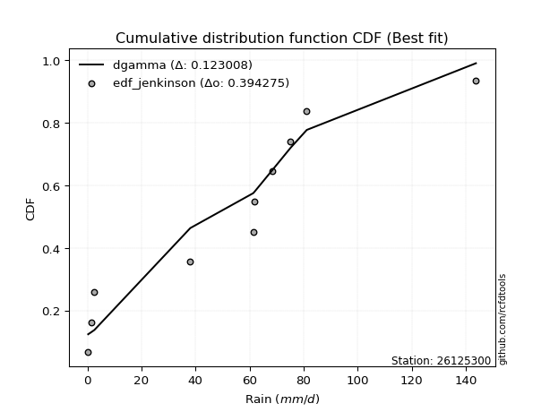</img></img>

</div>


### 11. EDF Cunnane (1978)

Cunnane´s work in statistical hydrology has focused on the performance and evaluation of different probability distributions (such as GEV, Gumbel, Lognormal) for flood frequency estimation. _b_ is a constant, typically set to 0.4.

<div align="center">


$P=(m-b)/(n+1-2b)$


</div>


**11.1. Empirical values**

<div align="center">

|                | 0                    | 1                   | 2                   | 3                   | 4                   | 5                  | 6                  | 7                  | 8                  | 9                  |
|:---------------|:---------------------|:--------------------|:--------------------|:--------------------|:--------------------|:-------------------|:-------------------|:-------------------|:-------------------|:-------------------|
| date           | 2022                 | 2023                | 2016                | 2018                | 2021                | 2020               | 2019               | 2017               | 2025               | 2024               |
| x              | 0.3                  | 1.4                 | 2.6                 | 38.1                | 61.4                | 61.9               | 68.4               | 75.2               | 81.2               | 143.8              |
| m              | 1                    | 2                   | 3                   | 4                   | 5                   | 6                  | 7                  | 8                  | 9                  | 10                 |
| empirical_dist | edf_cunnane          | edf_cunnane         | edf_cunnane         | edf_cunnane         | edf_cunnane         | edf_cunnane        | edf_cunnane        | edf_cunnane        | edf_cunnane        | edf_cunnane        |
| empirical      | 0.058823529411764705 | 0.15686274509803924 | 0.25490196078431376 | 0.35294117647058826 | 0.45098039215686275 | 0.5490196078431373 | 0.6470588235294118 | 0.7450980392156863 | 0.8431372549019608 | 0.9411764705882353 |
| empirical_tr   | 1.0625               | 1.1860465116279069  | 1.3421052631578947  | 1.5454545454545456  | 1.8214285714285712  | 2.217391304347826  | 2.8333333333333335 | 3.9230769230769234 | 6.375              | 16.999999999999996 |

</div>


**11.2. Kolmogorov-Smirnov fit test (sorted by Δ)**


<div align="center">

|                | 0                   | 1                  | 2                   | 3                   | 4                   | 5                   | 6                  | 7                   | 8                   | 9                   | 10                  | 11                 | 12                  | 13                  | 14                 | 15                  | 16                 | 17                  | 18                  | 19                  | 20                  | 21                  | 22                  | 23                  | 24                  | 25                  | 26                  | 27                 | 28                  | 29                  | 30                 | 31                  | 32                  | 33                 | 34                  | 35                  | 36                  | 37                  | 38                  | 39                  | 40                  | 41                  | 42                  | 43                  | 44                  | 45                 | 46                 | 47                 | 48                 | 49                  | 50                  | 51                  | 52                  | 53                  | 54                  | 55                  | 56                  | 57                 | 58                  | 59                 | 60                  | 61                 | 62                 | 63                 | 64                  | 65                 | 66                 | 67                  | 68                  | 69                 | 70                  | 71                  | 72                  | 73                  | 74                 | 75                 | 76                 | 77                  | 78                 | 79                 | 80                 | 81                 | 82                 | 83                 | 84                 | 85                 | 86                  | 87                 | 88                 | 89                  | 90                  | 91                 | 92                  | 93                 | 94                 | 95                 | 96                  | 97                  | 98                  | 99                  | 100                | 101                | 102                 | 103                | 104                | 105                 | 106                 | 107                 | 108                 | 109                | 110                | 111                | 112                | 113                 | 114                | 115                | 116                | 117                | 118                 | 119                | 120                 | 121                | 122                | 123                 | 124                 | 125                 | 126                | 127                | 128                | 129                | 130                 | 131                 | 132                 | 133                | 134                | 135                | 136                 | 137                 | 138                | 139                | 140                 | 141                | 142                | 143                | 144                | 145                 | 146                | 147                | 148                | 149                | 150                | 151                | 152                | 153                | 154                | 155                | 156                | 157                | 158                | 159                |
|:---------------|:--------------------|:-------------------|:--------------------|:--------------------|:--------------------|:--------------------|:-------------------|:--------------------|:--------------------|:--------------------|:--------------------|:-------------------|:--------------------|:--------------------|:-------------------|:--------------------|:-------------------|:--------------------|:--------------------|:--------------------|:--------------------|:--------------------|:--------------------|:--------------------|:--------------------|:--------------------|:--------------------|:-------------------|:--------------------|:--------------------|:-------------------|:--------------------|:--------------------|:-------------------|:--------------------|:--------------------|:--------------------|:--------------------|:--------------------|:--------------------|:--------------------|:--------------------|:--------------------|:--------------------|:--------------------|:-------------------|:-------------------|:-------------------|:-------------------|:--------------------|:--------------------|:--------------------|:--------------------|:--------------------|:--------------------|:--------------------|:--------------------|:-------------------|:--------------------|:-------------------|:--------------------|:-------------------|:-------------------|:-------------------|:--------------------|:-------------------|:-------------------|:--------------------|:--------------------|:-------------------|:--------------------|:--------------------|:--------------------|:--------------------|:-------------------|:-------------------|:-------------------|:--------------------|:-------------------|:-------------------|:-------------------|:-------------------|:-------------------|:-------------------|:-------------------|:-------------------|:--------------------|:-------------------|:-------------------|:--------------------|:--------------------|:-------------------|:--------------------|:-------------------|:-------------------|:-------------------|:--------------------|:--------------------|:--------------------|:--------------------|:-------------------|:-------------------|:--------------------|:-------------------|:-------------------|:--------------------|:--------------------|:--------------------|:--------------------|:-------------------|:-------------------|:-------------------|:-------------------|:--------------------|:-------------------|:-------------------|:-------------------|:-------------------|:--------------------|:-------------------|:--------------------|:-------------------|:-------------------|:--------------------|:--------------------|:--------------------|:-------------------|:-------------------|:-------------------|:-------------------|:--------------------|:--------------------|:--------------------|:-------------------|:-------------------|:-------------------|:--------------------|:--------------------|:-------------------|:-------------------|:--------------------|:-------------------|:-------------------|:-------------------|:-------------------|:--------------------|:-------------------|:-------------------|:-------------------|:-------------------|:-------------------|:-------------------|:-------------------|:-------------------|:-------------------|:-------------------|:-------------------|:-------------------|:-------------------|:-------------------|
| station        | 26125300            | 26125300           | 26125300            | 26125300            | 26125300            | 26125300            | 26125300           | 26125300            | 26125300            | 26125300            | 26125300            | 26125300           | 26125300            | 26125300            | 26125300           | 26125300            | 26125300           | 26125300            | 26125300            | 26125300            | 26125300            | 26125300            | 26125300            | 26125300            | 26125300            | 26125300            | 26125300            | 26125300           | 26125300            | 26125300            | 26125300           | 26125300            | 26125300            | 26125300           | 26125300            | 26125300            | 26125300            | 26125300            | 26125300            | 26125300            | 26125300            | 26125300            | 26125300            | 26125300            | 26125300            | 26125300           | 26125300           | 26125300           | 26125300           | 26125300            | 26125300            | 26125300            | 26125300            | 26125300            | 26125300            | 26125300            | 26125300            | 26125300           | 26125300            | 26125300           | 26125300            | 26125300           | 26125300           | 26125300           | 26125300            | 26125300           | 26125300           | 26125300            | 26125300            | 26125300           | 26125300            | 26125300            | 26125300            | 26125300            | 26125300           | 26125300           | 26125300           | 26125300            | 26125300           | 26125300           | 26125300           | 26125300           | 26125300           | 26125300           | 26125300           | 26125300           | 26125300            | 26125300           | 26125300           | 26125300            | 26125300            | 26125300           | 26125300            | 26125300           | 26125300           | 26125300           | 26125300            | 26125300            | 26125300            | 26125300            | 26125300           | 26125300           | 26125300            | 26125300           | 26125300           | 26125300            | 26125300            | 26125300            | 26125300            | 26125300           | 26125300           | 26125300           | 26125300           | 26125300            | 26125300           | 26125300           | 26125300           | 26125300           | 26125300            | 26125300           | 26125300            | 26125300           | 26125300           | 26125300            | 26125300            | 26125300            | 26125300           | 26125300           | 26125300           | 26125300           | 26125300            | 26125300            | 26125300            | 26125300           | 26125300           | 26125300           | 26125300            | 26125300            | 26125300           | 26125300           | 26125300            | 26125300           | 26125300           | 26125300           | 26125300           | 26125300            | 26125300           | 26125300           | 26125300           | 26125300           | 26125300           | 26125300           | 26125300           | 26125300           | 26125300           | 26125300           | 26125300           | 26125300           | 26125300           | 26125300           |
| empirical_dist | edf_cunnane         | edf_cunnane        | edf_cunnane         | edf_cunnane         | edf_cunnane         | edf_cunnane         | edf_cunnane        | edf_cunnane         | edf_cunnane         | edf_cunnane         | edf_cunnane         | edf_cunnane        | edf_cunnane         | edf_cunnane         | edf_cunnane        | edf_cunnane         | edf_cunnane        | edf_cunnane         | edf_cunnane         | edf_cunnane         | edf_cunnane         | edf_cunnane         | edf_cunnane         | edf_cunnane         | edf_cunnane         | edf_cunnane         | edf_cunnane         | edf_cunnane        | edf_cunnane         | edf_cunnane         | edf_cunnane        | edf_cunnane         | edf_cunnane         | edf_cunnane        | edf_cunnane         | edf_cunnane         | edf_cunnane         | edf_cunnane         | edf_cunnane         | edf_cunnane         | edf_cunnane         | edf_cunnane         | edf_cunnane         | edf_cunnane         | edf_cunnane         | edf_cunnane        | edf_cunnane        | edf_cunnane        | edf_cunnane        | edf_cunnane         | edf_cunnane         | edf_cunnane         | edf_cunnane         | edf_cunnane         | edf_cunnane         | edf_cunnane         | edf_cunnane         | edf_cunnane        | edf_cunnane         | edf_cunnane        | edf_cunnane         | edf_cunnane        | edf_cunnane        | edf_cunnane        | edf_cunnane         | edf_cunnane        | edf_cunnane        | edf_cunnane         | edf_cunnane         | edf_cunnane        | edf_cunnane         | edf_cunnane         | edf_cunnane         | edf_cunnane         | edf_cunnane        | edf_cunnane        | edf_cunnane        | edf_cunnane         | edf_cunnane        | edf_cunnane        | edf_cunnane        | edf_cunnane        | edf_cunnane        | edf_cunnane        | edf_cunnane        | edf_cunnane        | edf_cunnane         | edf_cunnane        | edf_cunnane        | edf_cunnane         | edf_cunnane         | edf_cunnane        | edf_cunnane         | edf_cunnane        | edf_cunnane        | edf_cunnane        | edf_cunnane         | edf_cunnane         | edf_cunnane         | edf_cunnane         | edf_cunnane        | edf_cunnane        | edf_cunnane         | edf_cunnane        | edf_cunnane        | edf_cunnane         | edf_cunnane         | edf_cunnane         | edf_cunnane         | edf_cunnane        | edf_cunnane        | edf_cunnane        | edf_cunnane        | edf_cunnane         | edf_cunnane        | edf_cunnane        | edf_cunnane        | edf_cunnane        | edf_cunnane         | edf_cunnane        | edf_cunnane         | edf_cunnane        | edf_cunnane        | edf_cunnane         | edf_cunnane         | edf_cunnane         | edf_cunnane        | edf_cunnane        | edf_cunnane        | edf_cunnane        | edf_cunnane         | edf_cunnane         | edf_cunnane         | edf_cunnane        | edf_cunnane        | edf_cunnane        | edf_cunnane         | edf_cunnane         | edf_cunnane        | edf_cunnane        | edf_cunnane         | edf_cunnane        | edf_cunnane        | edf_cunnane        | edf_cunnane        | edf_cunnane         | edf_cunnane        | edf_cunnane        | edf_cunnane        | edf_cunnane        | edf_cunnane        | edf_cunnane        | edf_cunnane        | edf_cunnane        | edf_cunnane        | edf_cunnane        | edf_cunnane        | edf_cunnane        | edf_cunnane        | edf_cunnane        |
| p_dist         | dgamma              | anglit             | logjohnsonsu        | dweibull            | johnsonsu           | t                   | norm               | crystalball         | semicircular        | gumbel_l            | foldnorm            | cosine             | pearson3            | maxwell             | logistic           | hypsecant           | exponnorm          | rayleigh            | gennorm             | laplace             | loggennorm          | invgamma            | rice                | halfgennorm         | genlogistic         | kstwobign           | logmielke           | logweibull_max     | betaprime           | arcsine             | mielke             | gumbel_r            | halfnorm            | truncweibull_min   | invgauss            | loglevy_l           | logloggamma         | logvonmises_line    | logdgamma           | loggenextreme       | moyal               | ncf                 | logdweibull         | logarcsine          | logpearson3         | logtrapezoid       | truncnorm          | gompertz           | genpareto          | nakagami            | logargus            | skewnorm            | bradford            | kappa3              | loggumbel_l         | truncexpon          | genexpon            | lomax              | vonmises_line       | logsemicircular    | weibull_min         | logweibull_min     | logburr12          | loggenhalflogistic | halflogistic        | loganglit          | f                  | burr                | exponpow            | logjohnsonsb       | argus               | logfatiguelife      | kappa4              | lognakagami         | logrice            | logt               | logcrystalball     | lognorm             | logexponnorm       | lognct             | logncf             | loggompertz        | logfoldnorm        | logerlang          | loggamma           | loggamma           | loginvweibull       | wrapcauchy         | uniform            | burr12              | invweibull          | genextreme         | wald                | logexponweib       | loginvgamma        | gausshyper         | loglogistic         | ksone               | loginvgauss         | logwrapcauchy       | logmaxwell         | loghypsecant       | lograyleigh         | logkstwobign       | logburr            | logskewnorm         | loggenexpon         | logbetaprime        | logcosine           | loghalfnorm        | loglaplace         | loglaplace         | nct                | loggumbel_r         | loglomax           | logtriang          | loghalflogistic    | logmoyal           | loghalfgennorm      | logbeta            | logloglaplace       | logf               | logksone           | levy_l              | logtruncweibull_min | erlang              | johnsonsb          | exponweib          | logwald            | logalpha           | loggausshyper       | logkappa4           | genhalflogistic     | loguniform         | powerlaw           | logtruncnorm       | logkappa3           | triang              | gamma              | loggengamma        | fatiguelife         | logbradford        | tukeylambda        | logtruncexpon      | rdist              | loggenpareto        | trapezoid          | beta               | gengamma           | truncpareto        | logpowerlaw        | alpha              | logexponpow        | weibull_max        | logtruncpareto     | logrdist           | logtukeylambda     | loggenlogistic     | logvonmises        | vonmises           |
| delta          | 0.12385777124172676 | 0.1274529780996304 | 0.12948344712116255 | 0.13492702704506274 | 0.13812670851992082 | 0.13867690758312495 | 0.1386838568043538 | 0.13868385746717976 | 0.13922263874220608 | 0.14058724295276492 | 0.14205797321981634 | 0.1486349537158992 | 0.15150447856425836 | 0.15193510498125468 | 0.1520444525680359 | 0.15809447822042894 | 0.1581604717095902 | 0.16098329268148354 | 0.16127412708949915 | 0.16533484853670805 | 0.17026871729102086 | 0.17169221620209235 | 0.17288762853569245 | 0.17404035971258963 | 0.18400881247187856 | 0.18558254026525206 | 0.18575404760189146 | 0.186003077697229  | 0.18696553632309898 | 0.19052023061703893 | 0.1910187601659195 | 0.19202638488306029 | 0.19267852017303977 | 0.1928698212089342 | 0.19635308188325667 | 0.19761993982711257 | 0.19968741903277182 | 0.20204882953356923 | 0.21006480769873026 | 0.21296724422255758 | 0.21595693103862873 | 0.21826008985109796 | 0.21851468096461957 | 0.22022953628010328 | 0.22231234666428407 | 0.2224522140127419 | 0.2248801662724764 | 0.2253383950359735 | 0.2262612186226401 | 0.22724312159330656 | 0.22793198863670533 | 0.22794701951577162 | 0.23138272886495462 | 0.23161292246214787 | 0.23193723152464757 | 0.23223316478984563 | 0.23241048839231054 | 0.234704879650042  | 0.24896802092695325 | 0.2491811731303733 | 0.24924105481631315 | 0.2499359935562368 | 0.2501487782742183 | 0.2514375709282281 | 0.25490196078431376 | 0.2563204696469336 | 0.2627747406308099 | 0.26653034216702315 | 0.27012270062518623 | 0.2701661604399853 | 0.27052448985438693 | 0.27279042440436235 | 0.27283552104733744 | 0.27327340347235124 | 0.2734178988541099 | 0.2734209651897009 | 0.2734209691301361 | 0.27342113934453843 | 0.2734215646573625 | 0.2734700549627819 | 0.2758401040874007 | 0.2760777908144964 | 0.2780541701174953 | 0.2782800560604412 | 0.2784585962149924 | 0.2784585962149924 | 0.27917830674790506 | 0.2793696155373826 | 0.2793741886998702 | 0.27955282585743396 | 0.27958313550627795 | 0.2795839121650379 | 0.28242027126105956 | 0.2844681182072985 | 0.2853425904723133 | 0.2889229260241034 | 0.28915366017076777 | 0.29000136640021856 | 0.29455034140024355 | 0.29601870621497467 | 0.2974839604273652 | 0.3017064100677929 | 0.30482844724918917 | 0.3074887653416459 | 0.3114902115714339 | 0.31274930515691873 | 0.31471108033019507 | 0.31506669213712096 | 0.32052052392389513 | 0.3259258144796143 | 0.3300592930834724 | 0.3300592930834724 | 0.3305613867832134 | 0.33683225905724407 | 0.3384433547636508 | 0.3486908613112207 | 0.3542760796204059 | 0.358121695856874  | 0.36437465484790615 | 0.3653342004080464 | 0.37527932380573953 | 0.3815276632104089 | 0.3844043765581358 | 0.38888555589624985 | 0.4022129327808846  | 0.41040367402781713 | 0.4138071106326025 | 0.4173990019660976 | 0.4178661027007295 | 0.4235325582062541 | 0.42772581358830414 | 0.42983621552850054 | 0.43166574181986817 | 0.4318734871638806 | 0.4364311346374388 | 0.4376459296112138 | 0.46857640779597404 | 0.47722192073076936 | 0.4776817505756988 | 0.481491334089504  | 0.48216014197402085 | 0.4838824456152718 | 0.4902012288679136 | 0.4918186959121364 | 0.4919239255742288 | 0.49263115739498226 | 0.5326482003544031 | 0.5430654989021375 | 0.5525279419388609 | 0.5857536932808951 | 0.5899098137536691 | 0.6277986067665782 | 0.6452079128758564 | 0.7006164647788176 | 0.7092144671780708 | 0.7450980391847317 | 0.7450980392156792 | 0.8431372549019608 | 0.8817303946939672 | 22.39393182492904  |
| deltao         | 0.3942745923300002  | 0.3942745923300002 | 0.3942745923300002  | 0.3942745923300002  | 0.3942745923300002  | 0.3942745923300002  | 0.3942745923300002 | 0.3942745923300002  | 0.3942745923300002  | 0.3942745923300002  | 0.3942745923300002  | 0.3942745923300002 | 0.3942745923300002  | 0.3942745923300002  | 0.3942745923300002 | 0.3942745923300002  | 0.3942745923300002 | 0.3942745923300002  | 0.3942745923300002  | 0.3942745923300002  | 0.3942745923300002  | 0.3942745923300002  | 0.3942745923300002  | 0.3942745923300002  | 0.3942745923300002  | 0.3942745923300002  | 0.3942745923300002  | 0.3942745923300002 | 0.3942745923300002  | 0.3942745923300002  | 0.3942745923300002 | 0.3942745923300002  | 0.3942745923300002  | 0.3942745923300002 | 0.3942745923300002  | 0.3942745923300002  | 0.3942745923300002  | 0.3942745923300002  | 0.3942745923300002  | 0.3942745923300002  | 0.3942745923300002  | 0.3942745923300002  | 0.3942745923300002  | 0.3942745923300002  | 0.3942745923300002  | 0.3942745923300002 | 0.3942745923300002 | 0.3942745923300002 | 0.3942745923300002 | 0.3942745923300002  | 0.3942745923300002  | 0.3942745923300002  | 0.3942745923300002  | 0.3942745923300002  | 0.3942745923300002  | 0.3942745923300002  | 0.3942745923300002  | 0.3942745923300002 | 0.3942745923300002  | 0.3942745923300002 | 0.3942745923300002  | 0.3942745923300002 | 0.3942745923300002 | 0.3942745923300002 | 0.3942745923300002  | 0.3942745923300002 | 0.3942745923300002 | 0.3942745923300002  | 0.3942745923300002  | 0.3942745923300002 | 0.3942745923300002  | 0.3942745923300002  | 0.3942745923300002  | 0.3942745923300002  | 0.3942745923300002 | 0.3942745923300002 | 0.3942745923300002 | 0.3942745923300002  | 0.3942745923300002 | 0.3942745923300002 | 0.3942745923300002 | 0.3942745923300002 | 0.3942745923300002 | 0.3942745923300002 | 0.3942745923300002 | 0.3942745923300002 | 0.3942745923300002  | 0.3942745923300002 | 0.3942745923300002 | 0.3942745923300002  | 0.3942745923300002  | 0.3942745923300002 | 0.3942745923300002  | 0.3942745923300002 | 0.3942745923300002 | 0.3942745923300002 | 0.3942745923300002  | 0.3942745923300002  | 0.3942745923300002  | 0.3942745923300002  | 0.3942745923300002 | 0.3942745923300002 | 0.3942745923300002  | 0.3942745923300002 | 0.3942745923300002 | 0.3942745923300002  | 0.3942745923300002  | 0.3942745923300002  | 0.3942745923300002  | 0.3942745923300002 | 0.3942745923300002 | 0.3942745923300002 | 0.3942745923300002 | 0.3942745923300002  | 0.3942745923300002 | 0.3942745923300002 | 0.3942745923300002 | 0.3942745923300002 | 0.3942745923300002  | 0.3942745923300002 | 0.3942745923300002  | 0.3942745923300002 | 0.3942745923300002 | 0.3942745923300002  | 0.3942745923300002  | 0.3942745923300002  | 0.3942745923300002 | 0.3942745923300002 | 0.3942745923300002 | 0.3942745923300002 | 0.3942745923300002  | 0.3942745923300002  | 0.3942745923300002  | 0.3942745923300002 | 0.3942745923300002 | 0.3942745923300002 | 0.3942745923300002  | 0.3942745923300002  | 0.3942745923300002 | 0.3942745923300002 | 0.3942745923300002  | 0.3942745923300002 | 0.3942745923300002 | 0.3942745923300002 | 0.3942745923300002 | 0.3942745923300002  | 0.3942745923300002 | 0.3942745923300002 | 0.3942745923300002 | 0.3942745923300002 | 0.3942745923300002 | 0.3942745923300002 | 0.3942745923300002 | 0.3942745923300002 | 0.3942745923300002 | 0.3942745923300002 | 0.3942745923300002 | 0.3942745923300002 | 0.3942745923300002 | 0.3942745923300002 |
| eval           | Δo > Δ              | Δo > Δ             | Δo > Δ              | Δo > Δ              | Δo > Δ              | Δo > Δ              | Δo > Δ             | Δo > Δ              | Δo > Δ              | Δo > Δ              | Δo > Δ              | Δo > Δ             | Δo > Δ              | Δo > Δ              | Δo > Δ             | Δo > Δ              | Δo > Δ             | Δo > Δ              | Δo > Δ              | Δo > Δ              | Δo > Δ              | Δo > Δ              | Δo > Δ              | Δo > Δ              | Δo > Δ              | Δo > Δ              | Δo > Δ              | Δo > Δ             | Δo > Δ              | Δo > Δ              | Δo > Δ             | Δo > Δ              | Δo > Δ              | Δo > Δ             | Δo > Δ              | Δo > Δ              | Δo > Δ              | Δo > Δ              | Δo > Δ              | Δo > Δ              | Δo > Δ              | Δo > Δ              | Δo > Δ              | Δo > Δ              | Δo > Δ              | Δo > Δ             | Δo > Δ             | Δo > Δ             | Δo > Δ             | Δo > Δ              | Δo > Δ              | Δo > Δ              | Δo > Δ              | Δo > Δ              | Δo > Δ              | Δo > Δ              | Δo > Δ              | Δo > Δ             | Δo > Δ              | Δo > Δ             | Δo > Δ              | Δo > Δ             | Δo > Δ             | Δo > Δ             | Δo > Δ              | Δo > Δ             | Δo > Δ             | Δo > Δ              | Δo > Δ              | Δo > Δ             | Δo > Δ              | Δo > Δ              | Δo > Δ              | Δo > Δ              | Δo > Δ             | Δo > Δ             | Δo > Δ             | Δo > Δ              | Δo > Δ             | Δo > Δ             | Δo > Δ             | Δo > Δ             | Δo > Δ             | Δo > Δ             | Δo > Δ             | Δo > Δ             | Δo > Δ              | Δo > Δ             | Δo > Δ             | Δo > Δ              | Δo > Δ              | Δo > Δ             | Δo > Δ              | Δo > Δ             | Δo > Δ             | Δo > Δ             | Δo > Δ              | Δo > Δ              | Δo > Δ              | Δo > Δ              | Δo > Δ             | Δo > Δ             | Δo > Δ              | Δo > Δ             | Δo > Δ             | Δo > Δ              | Δo > Δ              | Δo > Δ              | Δo > Δ              | Δo > Δ             | Δo > Δ             | Δo > Δ             | Δo > Δ             | Δo > Δ              | Δo > Δ             | Δo > Δ             | Δo > Δ             | Δo > Δ             | Δo > Δ              | Δo > Δ             | Δo > Δ              | Δo > Δ             | Δo > Δ             | Δo > Δ              | Δo <= Δ             | Δo <= Δ             | Δo <= Δ            | Δo <= Δ            | Δo <= Δ            | Δo <= Δ            | Δo <= Δ             | Δo <= Δ             | Δo <= Δ             | Δo <= Δ            | Δo <= Δ            | Δo <= Δ            | Δo <= Δ             | Δo <= Δ             | Δo <= Δ            | Δo <= Δ            | Δo <= Δ             | Δo <= Δ            | Δo <= Δ            | Δo <= Δ            | Δo <= Δ            | Δo <= Δ             | Δo <= Δ            | Δo <= Δ            | Δo <= Δ            | Δo <= Δ            | Δo <= Δ            | Δo <= Δ            | Δo <= Δ            | Δo <= Δ            | Δo <= Δ            | Δo <= Δ            | Δo <= Δ            | Δo <= Δ            | Δo <= Δ            | Δo <= Δ            |
| fit            | 1                   | 1                  | 1                   | 1                   | 1                   | 1                   | 1                  | 1                   | 1                   | 1                   | 1                   | 1                  | 1                   | 1                   | 1                  | 1                   | 1                  | 1                   | 1                   | 1                   | 1                   | 1                   | 1                   | 1                   | 1                   | 1                   | 1                   | 1                  | 1                   | 1                   | 1                  | 1                   | 1                   | 1                  | 1                   | 1                   | 1                   | 1                   | 1                   | 1                   | 1                   | 1                   | 1                   | 1                   | 1                   | 1                  | 1                  | 1                  | 1                  | 1                   | 1                   | 1                   | 1                   | 1                   | 1                   | 1                   | 1                   | 1                  | 1                   | 1                  | 1                   | 1                  | 1                  | 1                  | 1                   | 1                  | 1                  | 1                   | 1                   | 1                  | 1                   | 1                   | 1                   | 1                   | 1                  | 1                  | 1                  | 1                   | 1                  | 1                  | 1                  | 1                  | 1                  | 1                  | 1                  | 1                  | 1                   | 1                  | 1                  | 1                   | 1                   | 1                  | 1                   | 1                  | 1                  | 1                  | 1                   | 1                   | 1                   | 1                   | 1                  | 1                  | 1                   | 1                  | 1                  | 1                   | 1                   | 1                   | 1                   | 1                  | 1                  | 1                  | 1                  | 1                   | 1                  | 1                  | 1                  | 1                  | 1                   | 1                  | 1                   | 1                  | 1                  | 1                   | 0                   | 0                   | 0                  | 0                  | 0                  | 0                  | 0                   | 0                   | 0                   | 0                  | 0                  | 0                  | 0                   | 0                   | 0                  | 0                  | 0                   | 0                  | 0                  | 0                  | 0                  | 0                   | 0                  | 0                  | 0                  | 0                  | 0                  | 0                  | 0                  | 0                  | 0                  | 0                  | 0                  | 0                  | 0                  | 0                  |
| n              | 10                  | 10                 | 10                  | 10                  | 10                  | 10                  | 10                 | 10                  | 10                  | 10                  | 10                  | 10                 | 10                  | 10                  | 10                 | 10                  | 10                 | 10                  | 10                  | 10                  | 10                  | 10                  | 10                  | 10                  | 10                  | 10                  | 10                  | 10                 | 10                  | 10                  | 10                 | 10                  | 10                  | 10                 | 10                  | 10                  | 10                  | 10                  | 10                  | 10                  | 10                  | 10                  | 10                  | 10                  | 10                  | 10                 | 10                 | 10                 | 10                 | 10                  | 10                  | 10                  | 10                  | 10                  | 10                  | 10                  | 10                  | 10                 | 10                  | 10                 | 10                  | 10                 | 10                 | 10                 | 10                  | 10                 | 10                 | 10                  | 10                  | 10                 | 10                  | 10                  | 10                  | 10                  | 10                 | 10                 | 10                 | 10                  | 10                 | 10                 | 10                 | 10                 | 10                 | 10                 | 10                 | 10                 | 10                  | 10                 | 10                 | 10                  | 10                  | 10                 | 10                  | 10                 | 10                 | 10                 | 10                  | 10                  | 10                  | 10                  | 10                 | 10                 | 10                  | 10                 | 10                 | 10                  | 10                  | 10                  | 10                  | 10                 | 10                 | 10                 | 10                 | 10                  | 10                 | 10                 | 10                 | 10                 | 10                  | 10                 | 10                  | 10                 | 10                 | 10                  | 10                  | 10                  | 10                 | 10                 | 10                 | 10                 | 10                  | 10                  | 10                  | 10                 | 10                 | 10                 | 10                  | 10                  | 10                 | 10                 | 10                  | 10                 | 10                 | 10                 | 10                 | 10                  | 10                 | 10                 | 10                 | 10                 | 10                 | 10                 | 10                 | 10                 | 10                 | 10                 | 10                 | 10                 | 10                 | 10                 |
| best_fit       | 1                   | 0                  | 0                   | 0                   | 0                   | 0                   | 0                  | 0                   | 0                   | 0                   | 0                   | 0                  | 0                   | 0                   | 0                  | 0                   | 0                  | 0                   | 0                   | 0                   | 0                   | 0                   | 0                   | 0                   | 0                   | 0                   | 0                   | 0                  | 0                   | 0                   | 0                  | 0                   | 0                   | 0                  | 0                   | 0                   | 0                   | 0                   | 0                   | 0                   | 0                   | 0                   | 0                   | 0                   | 0                   | 0                  | 0                  | 0                  | 0                  | 0                   | 0                   | 0                   | 0                   | 0                   | 0                   | 0                   | 0                   | 0                  | 0                   | 0                  | 0                   | 0                  | 0                  | 0                  | 0                   | 0                  | 0                  | 0                   | 0                   | 0                  | 0                   | 0                   | 0                   | 0                   | 0                  | 0                  | 0                  | 0                   | 0                  | 0                  | 0                  | 0                  | 0                  | 0                  | 0                  | 0                  | 0                   | 0                  | 0                  | 0                   | 0                   | 0                  | 0                   | 0                  | 0                  | 0                  | 0                   | 0                   | 0                   | 0                   | 0                  | 0                  | 0                   | 0                  | 0                  | 0                   | 0                   | 0                   | 0                   | 0                  | 0                  | 0                  | 0                  | 0                   | 0                  | 0                  | 0                  | 0                  | 0                   | 0                  | 0                   | 0                  | 0                  | 0                   | 0                   | 0                   | 0                  | 0                  | 0                  | 0                  | 0                   | 0                   | 0                   | 0                  | 0                  | 0                  | 0                   | 0                   | 0                  | 0                  | 0                   | 0                  | 0                  | 0                  | 0                  | 0                   | 0                  | 0                  | 0                  | 0                  | 0                  | 0                  | 0                  | 0                  | 0                  | 0                  | 0                  | 0                  | 0                  | 0                  |
| best_fit_sort  | 1                   | 2                  | 3                   | 4                   | 5                   | 6                   | 7                  | 8                   | 9                   | 10                  | 11                  | 12                 | 13                  | 14                  | 15                 | 16                  | 17                 | 18                  | 19                  | 20                  | 21                  | 22                  | 23                  | 24                  | 25                  | 26                  | 27                  | 28                 | 29                  | 30                  | 31                 | 32                  | 33                  | 34                 | 35                  | 36                  | 37                  | 38                  | 39                  | 40                  | 41                  | 42                  | 43                  | 44                  | 45                  | 46                 | 47                 | 48                 | 49                 | 50                  | 51                  | 52                  | 53                  | 54                  | 55                  | 56                  | 57                  | 58                 | 59                  | 60                 | 61                  | 62                 | 63                 | 64                 | 65                  | 66                 | 67                 | 68                  | 69                  | 70                 | 71                  | 72                  | 73                  | 74                  | 75                 | 76                 | 77                 | 78                  | 79                 | 80                 | 81                 | 82                 | 83                 | 84                 | 85                 | 86                 | 87                  | 88                 | 89                 | 90                  | 91                  | 92                 | 93                  | 94                 | 95                 | 96                 | 97                  | 98                  | 99                  | 100                 | 101                | 102                | 103                 | 104                | 105                | 106                 | 107                 | 108                 | 109                 | 110                | 111                | 112                | 113                | 114                 | 115                | 116                | 117                | 118                | 119                 | 120                | 121                 | 122                | 123                | 124                 | 125                 | 126                 | 127                | 128                | 129                | 130                | 131                 | 132                 | 133                 | 134                | 135                | 136                | 137                 | 138                 | 139                | 140                | 141                 | 142                | 143                | 144                | 145                | 146                 | 147                | 148                | 149                | 150                | 151                | 152                | 153                | 154                | 155                | 156                | 157                | 158                | 159                | 160                |

</div>


**11.3. Best fit**

<div align="center">

|   id |   station | empirical_dist   | p_dist   |    delta |   deltao | eval   |   fit |   n |   best_fit |   best_fit_sort |
|-----:|----------:|:-----------------|:---------|---------:|---------:|:-------|------:|----:|-----------:|----------------:|
|    0 |  26125300 | edf_cunnane      | dgamma   | 0.123858 | 0.394275 | Δo > Δ |     1 |  10 |          1 |               1 |

</div>


<div align="center">

</img></img>

</div>


### 12. EDF Adamowski (1981)

The Adamowski formula in hydrology refers to a specific plotting position formula used for estimating the non-parametric empirical distribution of hydrological events (like flood peaks) to calculate their return periods. This formula provides an alternative to traditional parametric methods (like the Gumbel or Log Pearson Type III distributions). 

<div align="center">


$P=(m-0.25)/(n+0.5)$


</div>


**12.1. Empirical values**

<div align="center">

|                | 0                   | 1                   | 2                  | 3                   | 4                  | 5                  | 6                  | 7                  | 8                  | 9                  |
|:---------------|:--------------------|:--------------------|:-------------------|:--------------------|:-------------------|:-------------------|:-------------------|:-------------------|:-------------------|:-------------------|
| date           | 2022                | 2023                | 2016               | 2018                | 2021               | 2020               | 2019               | 2017               | 2025               | 2024               |
| x              | 0.3                 | 1.4                 | 2.6                | 38.1                | 61.4               | 61.9               | 68.4               | 75.2               | 81.2               | 143.8              |
| m              | 1                   | 2                   | 3                  | 4                   | 5                  | 6                  | 7                  | 8                  | 9                  | 10                 |
| empirical_dist | edf_adamowski       | edf_adamowski       | edf_adamowski      | edf_adamowski       | edf_adamowski      | edf_adamowski      | edf_adamowski      | edf_adamowski      | edf_adamowski      | edf_adamowski      |
| empirical      | 0.07142857142857142 | 0.16666666666666666 | 0.2619047619047619 | 0.35714285714285715 | 0.4523809523809524 | 0.5476190476190477 | 0.6428571428571429 | 0.7380952380952381 | 0.8333333333333334 | 0.9285714285714286 |
| empirical_tr   | 1.0769230769230769  | 1.2                 | 1.3548387096774193 | 1.5555555555555558  | 1.826086956521739  | 2.210526315789474  | 2.8000000000000003 | 3.818181818181819  | 6.000000000000002  | 14.000000000000007 |

</div>


**12.2. Kolmogorov-Smirnov fit test (sorted by Δ)**


<div align="center">

|                | 0                   | 1                  | 2                   | 3                  | 4                  | 5                  | 6                   | 7                  | 8                   | 9                   | 10                  | 11                  | 12                 | 13                 | 14                  | 15                  | 16                 | 17                 | 18                 | 19                  | 20                  | 21                 | 22                  | 23                 | 24                  | 25                 | 26                  | 27                  | 28                  | 29                  | 30                  | 31                  | 32                  | 33                  | 34                 | 35                  | 36                  | 37                 | 38                  | 39                  | 40                  | 41                  | 42                  | 43                  | 44                 | 45                  | 46                  | 47                 | 48                  | 49                 | 50                  | 51                  | 52                  | 53                  | 54                  | 55                  | 56                  | 57                  | 58                  | 59                 | 60                  | 61                  | 62                  | 63                 | 64                 | 65                 | 66                 | 67                 | 68                 | 69                 | 70                 | 71                  | 72                 | 73                  | 74                 | 75                 | 76                 | 77                  | 78                 | 79                 | 80                  | 81                 | 82                  | 83                 | 84                 | 85                 | 86                 | 87                  | 88                  | 89                 | 90                  | 91                  | 92                 | 93                  | 94                 | 95                  | 96                 | 97                 | 98                  | 99                 | 100                | 101                | 102                | 103                | 104                | 105                | 106                 | 107                | 108                 | 109                | 110                 | 111                 | 112                | 113                | 114                | 115                 | 116                | 117                | 118                 | 119                 | 120                 | 121                 | 122                 | 123                | 124                 | 125                | 126                | 127                | 128                | 129                | 130                 | 131                 | 132                 | 133                | 134                 | 135                | 136                 | 137                 | 138                 | 139                | 140                 | 141                 | 142                 | 143                | 144                | 145                 | 146                | 147                | 148                | 149                | 150                | 151                | 152                | 153                | 154                | 155                | 156                | 157                | 158                | 159                |
|:---------------|:--------------------|:-------------------|:--------------------|:-------------------|:-------------------|:-------------------|:--------------------|:-------------------|:--------------------|:--------------------|:--------------------|:--------------------|:-------------------|:-------------------|:--------------------|:--------------------|:-------------------|:-------------------|:-------------------|:--------------------|:--------------------|:-------------------|:--------------------|:-------------------|:--------------------|:-------------------|:--------------------|:--------------------|:--------------------|:--------------------|:--------------------|:--------------------|:--------------------|:--------------------|:-------------------|:--------------------|:--------------------|:-------------------|:--------------------|:--------------------|:--------------------|:--------------------|:--------------------|:--------------------|:-------------------|:--------------------|:--------------------|:-------------------|:--------------------|:-------------------|:--------------------|:--------------------|:--------------------|:--------------------|:--------------------|:--------------------|:--------------------|:--------------------|:--------------------|:-------------------|:--------------------|:--------------------|:--------------------|:-------------------|:-------------------|:-------------------|:-------------------|:-------------------|:-------------------|:-------------------|:-------------------|:--------------------|:-------------------|:--------------------|:-------------------|:-------------------|:-------------------|:--------------------|:-------------------|:-------------------|:--------------------|:-------------------|:--------------------|:-------------------|:-------------------|:-------------------|:-------------------|:--------------------|:--------------------|:-------------------|:--------------------|:--------------------|:-------------------|:--------------------|:-------------------|:--------------------|:-------------------|:-------------------|:--------------------|:-------------------|:-------------------|:-------------------|:-------------------|:-------------------|:-------------------|:-------------------|:--------------------|:-------------------|:--------------------|:-------------------|:--------------------|:--------------------|:-------------------|:-------------------|:-------------------|:--------------------|:-------------------|:-------------------|:--------------------|:--------------------|:--------------------|:--------------------|:--------------------|:-------------------|:--------------------|:-------------------|:-------------------|:-------------------|:-------------------|:-------------------|:--------------------|:--------------------|:--------------------|:-------------------|:--------------------|:-------------------|:--------------------|:--------------------|:--------------------|:-------------------|:--------------------|:--------------------|:--------------------|:-------------------|:-------------------|:--------------------|:-------------------|:-------------------|:-------------------|:-------------------|:-------------------|:-------------------|:-------------------|:-------------------|:-------------------|:-------------------|:-------------------|:-------------------|:-------------------|:-------------------|
| station        | 26125300            | 26125300           | 26125300            | 26125300           | 26125300           | 26125300           | 26125300            | 26125300           | 26125300            | 26125300            | 26125300            | 26125300            | 26125300           | 26125300           | 26125300            | 26125300            | 26125300           | 26125300           | 26125300           | 26125300            | 26125300            | 26125300           | 26125300            | 26125300           | 26125300            | 26125300           | 26125300            | 26125300            | 26125300            | 26125300            | 26125300            | 26125300            | 26125300            | 26125300            | 26125300           | 26125300            | 26125300            | 26125300           | 26125300            | 26125300            | 26125300            | 26125300            | 26125300            | 26125300            | 26125300           | 26125300            | 26125300            | 26125300           | 26125300            | 26125300           | 26125300            | 26125300            | 26125300            | 26125300            | 26125300            | 26125300            | 26125300            | 26125300            | 26125300            | 26125300           | 26125300            | 26125300            | 26125300            | 26125300           | 26125300           | 26125300           | 26125300           | 26125300           | 26125300           | 26125300           | 26125300           | 26125300            | 26125300           | 26125300            | 26125300           | 26125300           | 26125300           | 26125300            | 26125300           | 26125300           | 26125300            | 26125300           | 26125300            | 26125300           | 26125300           | 26125300           | 26125300           | 26125300            | 26125300            | 26125300           | 26125300            | 26125300            | 26125300           | 26125300            | 26125300           | 26125300            | 26125300           | 26125300           | 26125300            | 26125300           | 26125300           | 26125300           | 26125300           | 26125300           | 26125300           | 26125300           | 26125300            | 26125300           | 26125300            | 26125300           | 26125300            | 26125300            | 26125300           | 26125300           | 26125300           | 26125300            | 26125300           | 26125300           | 26125300            | 26125300            | 26125300            | 26125300            | 26125300            | 26125300           | 26125300            | 26125300           | 26125300           | 26125300           | 26125300           | 26125300           | 26125300            | 26125300            | 26125300            | 26125300           | 26125300            | 26125300           | 26125300            | 26125300            | 26125300            | 26125300           | 26125300            | 26125300            | 26125300            | 26125300           | 26125300           | 26125300            | 26125300           | 26125300           | 26125300           | 26125300           | 26125300           | 26125300           | 26125300           | 26125300           | 26125300           | 26125300           | 26125300           | 26125300           | 26125300           | 26125300           |
| empirical_dist | edf_adamowski       | edf_adamowski      | edf_adamowski       | edf_adamowski      | edf_adamowski      | edf_adamowski      | edf_adamowski       | edf_adamowski      | edf_adamowski       | edf_adamowski       | edf_adamowski       | edf_adamowski       | edf_adamowski      | edf_adamowski      | edf_adamowski       | edf_adamowski       | edf_adamowski      | edf_adamowski      | edf_adamowski      | edf_adamowski       | edf_adamowski       | edf_adamowski      | edf_adamowski       | edf_adamowski      | edf_adamowski       | edf_adamowski      | edf_adamowski       | edf_adamowski       | edf_adamowski       | edf_adamowski       | edf_adamowski       | edf_adamowski       | edf_adamowski       | edf_adamowski       | edf_adamowski      | edf_adamowski       | edf_adamowski       | edf_adamowski      | edf_adamowski       | edf_adamowski       | edf_adamowski       | edf_adamowski       | edf_adamowski       | edf_adamowski       | edf_adamowski      | edf_adamowski       | edf_adamowski       | edf_adamowski      | edf_adamowski       | edf_adamowski      | edf_adamowski       | edf_adamowski       | edf_adamowski       | edf_adamowski       | edf_adamowski       | edf_adamowski       | edf_adamowski       | edf_adamowski       | edf_adamowski       | edf_adamowski      | edf_adamowski       | edf_adamowski       | edf_adamowski       | edf_adamowski      | edf_adamowski      | edf_adamowski      | edf_adamowski      | edf_adamowski      | edf_adamowski      | edf_adamowski      | edf_adamowski      | edf_adamowski       | edf_adamowski      | edf_adamowski       | edf_adamowski      | edf_adamowski      | edf_adamowski      | edf_adamowski       | edf_adamowski      | edf_adamowski      | edf_adamowski       | edf_adamowski      | edf_adamowski       | edf_adamowski      | edf_adamowski      | edf_adamowski      | edf_adamowski      | edf_adamowski       | edf_adamowski       | edf_adamowski      | edf_adamowski       | edf_adamowski       | edf_adamowski      | edf_adamowski       | edf_adamowski      | edf_adamowski       | edf_adamowski      | edf_adamowski      | edf_adamowski       | edf_adamowski      | edf_adamowski      | edf_adamowski      | edf_adamowski      | edf_adamowski      | edf_adamowski      | edf_adamowski      | edf_adamowski       | edf_adamowski      | edf_adamowski       | edf_adamowski      | edf_adamowski       | edf_adamowski       | edf_adamowski      | edf_adamowski      | edf_adamowski      | edf_adamowski       | edf_adamowski      | edf_adamowski      | edf_adamowski       | edf_adamowski       | edf_adamowski       | edf_adamowski       | edf_adamowski       | edf_adamowski      | edf_adamowski       | edf_adamowski      | edf_adamowski      | edf_adamowski      | edf_adamowski      | edf_adamowski      | edf_adamowski       | edf_adamowski       | edf_adamowski       | edf_adamowski      | edf_adamowski       | edf_adamowski      | edf_adamowski       | edf_adamowski       | edf_adamowski       | edf_adamowski      | edf_adamowski       | edf_adamowski       | edf_adamowski       | edf_adamowski      | edf_adamowski      | edf_adamowski       | edf_adamowski      | edf_adamowski      | edf_adamowski      | edf_adamowski      | edf_adamowski      | edf_adamowski      | edf_adamowski      | edf_adamowski      | edf_adamowski      | edf_adamowski      | edf_adamowski      | edf_adamowski      | edf_adamowski      | edf_adamowski      |
| p_dist         | dgamma              | anglit             | semicircular        | logjohnsonsu       | foldnorm           | dweibull           | johnsonsu           | t                  | norm                | crystalball         | gumbel_l            | maxwell             | cosine             | pearson3           | logistic            | exponnorm           | rayleigh           | hypsecant          | gennorm            | laplace             | invgamma            | logweibull_max     | loggennorm          | rice               | arcsine             | halfgennorm        | genlogistic         | kstwobign           | logmielke           | loglevy_l           | mielke              | gumbel_r            | betaprime           | invgauss            | logloggamma        | halfnorm            | truncweibull_min    | logvonmises_line   | logdweibull         | loggenextreme       | moyal               | logarcsine          | ncf                 | logdgamma           | logtrapezoid       | logpearson3         | nakagami            | logargus           | loggumbel_l         | genexpon           | truncnorm           | gompertz            | genpareto           | lomax               | skewnorm            | bradford            | kappa3              | vonmises_line       | truncexpon          | logsemicircular    | weibull_min         | logweibull_min      | logburr12           | loggenhalflogistic | loganglit          | logjohnsonsb       | argus              | f                  | halflogistic       | kappa4             | burr               | logfatiguelife      | exponpow           | lognakagami         | logrice            | logt               | logcrystalball     | lognorm             | logexponnorm       | logncf             | lognct              | wrapcauchy         | uniform             | loggompertz        | logerlang          | loggamma           | loggamma           | loginvweibull       | invweibull          | genextreme         | logfoldnorm         | burr12              | gausshyper         | ksone               | logexponweib       | wald                | loginvgamma        | loglogistic        | loginvgauss         | logwrapcauchy      | logmaxwell         | loghypsecant       | lograyleigh        | logkstwobign       | logburr            | loggenexpon        | logbetaprime        | logskewnorm        | logcosine           | loghalfnorm        | loglaplace          | loglaplace          | nct                | loggumbel_r        | loglomax           | logtriang           | loghalflogistic    | logmoyal           | logbeta             | loghalfgennorm      | logloglaplace       | logf                | levy_l              | logksone           | logtruncweibull_min | exponweib          | erlang             | johnsonsb          | logwald            | logalpha           | genhalflogistic     | loggausshyper       | logkappa4           | loguniform         | powerlaw            | logtruncnorm       | logkappa3           | triang              | loggengamma         | gamma              | tukeylambda         | fatiguelife         | rdist               | logbradford        | logtruncexpon      | loggenpareto        | trapezoid          | beta               | gengamma           | truncpareto        | logpowerlaw        | alpha              | logexponpow        | weibull_max        | logtruncpareto     | logrdist           | logtukeylambda     | loggenlogistic     | logvonmises        | vonmises           |
| delta          | 0.12452499751839277 | 0.1262376744367883 | 0.12941871717357867 | 0.1364862482416107 | 0.1406574129957267 | 0.1419298281655109 | 0.14512950964036897 | 0.1456797087035731 | 0.14568665792480195 | 0.14568665858762792 | 0.14759004407321308 | 0.15221074868574097 | 0.1553331413435417 | 0.1553635998743082 | 0.15904725368848405 | 0.15949955774040736 | 0.1595827324573939 | 0.1650972793408771 | 0.1682769282099473 | 0.16952701467130413 | 0.17029165597800272 | 0.1761991561286016 | 0.17727151841146901 | 0.1798904296561406 | 0.18071630904841152 | 0.1810431608330378 | 0.18260825224778893 | 0.18418198004116243 | 0.18435348737780183 | 0.18501489781030586 | 0.18961819994182988 | 0.19062582465897066 | 0.19396833744354713 | 0.19495252165916704 | 0.1982868588086822 | 0.19968132129348792 | 0.19987262232938235 | 0.2001333063966439 | 0.20871075939599215 | 0.21156668399846795 | 0.21596921845784975 | 0.21602785560783438 | 0.21685952962700833 | 0.21706760881917841 | 0.218250533340473  | 0.22091178644019444 | 0.22584256136921693 | 0.2265314284126157 | 0.23053667130055794 | 0.2310099281682209 | 0.23188296739292455 | 0.23234119615642165 | 0.23326401974308825 | 0.23330431942595237 | 0.23494982063621977 | 0.23838552998540277 | 0.23861572358259603 | 0.23916409935832583 | 0.23923596591029378 | 0.2449794924581044 | 0.24503937414404425 | 0.24853543333214717 | 0.24874821805012864 | 0.2500370107041385 | 0.2521187889746647 | 0.2603622388713579 | 0.2607205682857595 | 0.2613741804067203 | 0.2619047619047619 | 0.26303159947871   | 0.2651297819429335 | 0.26858874373209346 | 0.2687221404010966 | 0.26907172280008235 | 0.269216218181841  | 0.269219284517432  | 0.2692192884578672 | 0.26921945867226954 | 0.2692198839850936 | 0.2692392000396085 | 0.26926837429051304 | 0.2695656939687552 | 0.26957026713124277 | 0.2718761101422275 | 0.2740783753881723 | 0.2742569155427235 | 0.2742569155427235 | 0.27497662607563617 | 0.27538145483400905 | 0.275382231492769  | 0.27629249977873444 | 0.27815226563334433 | 0.279119004455476  | 0.28019744483159115 | 0.2802664375350296 | 0.28101971103696993 | 0.2811409098000444 | 0.2849519794984989 | 0.29034866072797466 | 0.2918170255427058 | 0.2932822797550963 | 0.297504729395524  | 0.3006267665769203 | 0.303287084669377  | 0.307288530899165  | 0.3105093996579262 | 0.31086501146485207 | 0.3113487449328291 | 0.31631884325162624 | 0.3217241338073454 | 0.32585761241120353 | 0.32585761241120353 | 0.3263597061109445 | 0.3326305783849752 | 0.3342416740913819 | 0.34729030108713105 | 0.350074398948137  | 0.3539200151846051 | 0.35553027883941896 | 0.36017297417563726 | 0.37107764313347064 | 0.37172374164178146 | 0.37628051387944317 | 0.3802026958858669 | 0.3980112521086157  | 0.4047939599492909 | 0.4090031138037275 | 0.4096054299603336 | 0.4136644220284606 | 0.4193308775339852 | 0.42186182025124075 | 0.42352413291603525 | 0.42563453485623165 | 0.4276718064916117 | 0.43222945396516993 | 0.4334442489389449 | 0.46437472712370514 | 0.46741799916214194 | 0.46888629207269733 | 0.4734800699034299 | 0.47759618685110694 | 0.47795846130175196 | 0.47931888355742214 | 0.4796807649430029 | 0.4876170152398675 | 0.48842947672271336 | 0.5228442787857757 | 0.5388638182298686 | 0.548326261266592  | 0.5815520126086262 | 0.5857081330814002 | 0.6235969260943093 | 0.635403991307229  | 0.6908125432101901 | 0.6994105456094434 | 0.7380952380642836 | 0.738095238095231  | 0.8333333333333334 | 0.8803298344698776 | 22.40653686694585  |
| deltao         | 0.3942745923300002  | 0.3942745923300002 | 0.3942745923300002  | 0.3942745923300002 | 0.3942745923300002 | 0.3942745923300002 | 0.3942745923300002  | 0.3942745923300002 | 0.3942745923300002  | 0.3942745923300002  | 0.3942745923300002  | 0.3942745923300002  | 0.3942745923300002 | 0.3942745923300002 | 0.3942745923300002  | 0.3942745923300002  | 0.3942745923300002 | 0.3942745923300002 | 0.3942745923300002 | 0.3942745923300002  | 0.3942745923300002  | 0.3942745923300002 | 0.3942745923300002  | 0.3942745923300002 | 0.3942745923300002  | 0.3942745923300002 | 0.3942745923300002  | 0.3942745923300002  | 0.3942745923300002  | 0.3942745923300002  | 0.3942745923300002  | 0.3942745923300002  | 0.3942745923300002  | 0.3942745923300002  | 0.3942745923300002 | 0.3942745923300002  | 0.3942745923300002  | 0.3942745923300002 | 0.3942745923300002  | 0.3942745923300002  | 0.3942745923300002  | 0.3942745923300002  | 0.3942745923300002  | 0.3942745923300002  | 0.3942745923300002 | 0.3942745923300002  | 0.3942745923300002  | 0.3942745923300002 | 0.3942745923300002  | 0.3942745923300002 | 0.3942745923300002  | 0.3942745923300002  | 0.3942745923300002  | 0.3942745923300002  | 0.3942745923300002  | 0.3942745923300002  | 0.3942745923300002  | 0.3942745923300002  | 0.3942745923300002  | 0.3942745923300002 | 0.3942745923300002  | 0.3942745923300002  | 0.3942745923300002  | 0.3942745923300002 | 0.3942745923300002 | 0.3942745923300002 | 0.3942745923300002 | 0.3942745923300002 | 0.3942745923300002 | 0.3942745923300002 | 0.3942745923300002 | 0.3942745923300002  | 0.3942745923300002 | 0.3942745923300002  | 0.3942745923300002 | 0.3942745923300002 | 0.3942745923300002 | 0.3942745923300002  | 0.3942745923300002 | 0.3942745923300002 | 0.3942745923300002  | 0.3942745923300002 | 0.3942745923300002  | 0.3942745923300002 | 0.3942745923300002 | 0.3942745923300002 | 0.3942745923300002 | 0.3942745923300002  | 0.3942745923300002  | 0.3942745923300002 | 0.3942745923300002  | 0.3942745923300002  | 0.3942745923300002 | 0.3942745923300002  | 0.3942745923300002 | 0.3942745923300002  | 0.3942745923300002 | 0.3942745923300002 | 0.3942745923300002  | 0.3942745923300002 | 0.3942745923300002 | 0.3942745923300002 | 0.3942745923300002 | 0.3942745923300002 | 0.3942745923300002 | 0.3942745923300002 | 0.3942745923300002  | 0.3942745923300002 | 0.3942745923300002  | 0.3942745923300002 | 0.3942745923300002  | 0.3942745923300002  | 0.3942745923300002 | 0.3942745923300002 | 0.3942745923300002 | 0.3942745923300002  | 0.3942745923300002 | 0.3942745923300002 | 0.3942745923300002  | 0.3942745923300002  | 0.3942745923300002  | 0.3942745923300002  | 0.3942745923300002  | 0.3942745923300002 | 0.3942745923300002  | 0.3942745923300002 | 0.3942745923300002 | 0.3942745923300002 | 0.3942745923300002 | 0.3942745923300002 | 0.3942745923300002  | 0.3942745923300002  | 0.3942745923300002  | 0.3942745923300002 | 0.3942745923300002  | 0.3942745923300002 | 0.3942745923300002  | 0.3942745923300002  | 0.3942745923300002  | 0.3942745923300002 | 0.3942745923300002  | 0.3942745923300002  | 0.3942745923300002  | 0.3942745923300002 | 0.3942745923300002 | 0.3942745923300002  | 0.3942745923300002 | 0.3942745923300002 | 0.3942745923300002 | 0.3942745923300002 | 0.3942745923300002 | 0.3942745923300002 | 0.3942745923300002 | 0.3942745923300002 | 0.3942745923300002 | 0.3942745923300002 | 0.3942745923300002 | 0.3942745923300002 | 0.3942745923300002 | 0.3942745923300002 |
| eval           | Δo > Δ              | Δo > Δ             | Δo > Δ              | Δo > Δ             | Δo > Δ             | Δo > Δ             | Δo > Δ              | Δo > Δ             | Δo > Δ              | Δo > Δ              | Δo > Δ              | Δo > Δ              | Δo > Δ             | Δo > Δ             | Δo > Δ              | Δo > Δ              | Δo > Δ             | Δo > Δ             | Δo > Δ             | Δo > Δ              | Δo > Δ              | Δo > Δ             | Δo > Δ              | Δo > Δ             | Δo > Δ              | Δo > Δ             | Δo > Δ              | Δo > Δ              | Δo > Δ              | Δo > Δ              | Δo > Δ              | Δo > Δ              | Δo > Δ              | Δo > Δ              | Δo > Δ             | Δo > Δ              | Δo > Δ              | Δo > Δ             | Δo > Δ              | Δo > Δ              | Δo > Δ              | Δo > Δ              | Δo > Δ              | Δo > Δ              | Δo > Δ             | Δo > Δ              | Δo > Δ              | Δo > Δ             | Δo > Δ              | Δo > Δ             | Δo > Δ              | Δo > Δ              | Δo > Δ              | Δo > Δ              | Δo > Δ              | Δo > Δ              | Δo > Δ              | Δo > Δ              | Δo > Δ              | Δo > Δ             | Δo > Δ              | Δo > Δ              | Δo > Δ              | Δo > Δ             | Δo > Δ             | Δo > Δ             | Δo > Δ             | Δo > Δ             | Δo > Δ             | Δo > Δ             | Δo > Δ             | Δo > Δ              | Δo > Δ             | Δo > Δ              | Δo > Δ             | Δo > Δ             | Δo > Δ             | Δo > Δ              | Δo > Δ             | Δo > Δ             | Δo > Δ              | Δo > Δ             | Δo > Δ              | Δo > Δ             | Δo > Δ             | Δo > Δ             | Δo > Δ             | Δo > Δ              | Δo > Δ              | Δo > Δ             | Δo > Δ              | Δo > Δ              | Δo > Δ             | Δo > Δ              | Δo > Δ             | Δo > Δ              | Δo > Δ             | Δo > Δ             | Δo > Δ              | Δo > Δ             | Δo > Δ             | Δo > Δ             | Δo > Δ             | Δo > Δ             | Δo > Δ             | Δo > Δ             | Δo > Δ              | Δo > Δ             | Δo > Δ              | Δo > Δ             | Δo > Δ              | Δo > Δ              | Δo > Δ             | Δo > Δ             | Δo > Δ             | Δo > Δ              | Δo > Δ             | Δo > Δ             | Δo > Δ              | Δo > Δ              | Δo > Δ              | Δo > Δ              | Δo > Δ              | Δo > Δ             | Δo <= Δ             | Δo <= Δ            | Δo <= Δ            | Δo <= Δ            | Δo <= Δ            | Δo <= Δ            | Δo <= Δ             | Δo <= Δ             | Δo <= Δ             | Δo <= Δ            | Δo <= Δ             | Δo <= Δ            | Δo <= Δ             | Δo <= Δ             | Δo <= Δ             | Δo <= Δ            | Δo <= Δ             | Δo <= Δ             | Δo <= Δ             | Δo <= Δ            | Δo <= Δ            | Δo <= Δ             | Δo <= Δ            | Δo <= Δ            | Δo <= Δ            | Δo <= Δ            | Δo <= Δ            | Δo <= Δ            | Δo <= Δ            | Δo <= Δ            | Δo <= Δ            | Δo <= Δ            | Δo <= Δ            | Δo <= Δ            | Δo <= Δ            | Δo <= Δ            |
| fit            | 1                   | 1                  | 1                   | 1                  | 1                  | 1                  | 1                   | 1                  | 1                   | 1                   | 1                   | 1                   | 1                  | 1                  | 1                   | 1                   | 1                  | 1                  | 1                  | 1                   | 1                   | 1                  | 1                   | 1                  | 1                   | 1                  | 1                   | 1                   | 1                   | 1                   | 1                   | 1                   | 1                   | 1                   | 1                  | 1                   | 1                   | 1                  | 1                   | 1                   | 1                   | 1                   | 1                   | 1                   | 1                  | 1                   | 1                   | 1                  | 1                   | 1                  | 1                   | 1                   | 1                   | 1                   | 1                   | 1                   | 1                   | 1                   | 1                   | 1                  | 1                   | 1                   | 1                   | 1                  | 1                  | 1                  | 1                  | 1                  | 1                  | 1                  | 1                  | 1                   | 1                  | 1                   | 1                  | 1                  | 1                  | 1                   | 1                  | 1                  | 1                   | 1                  | 1                   | 1                  | 1                  | 1                  | 1                  | 1                   | 1                   | 1                  | 1                   | 1                   | 1                  | 1                   | 1                  | 1                   | 1                  | 1                  | 1                   | 1                  | 1                  | 1                  | 1                  | 1                  | 1                  | 1                  | 1                   | 1                  | 1                   | 1                  | 1                   | 1                   | 1                  | 1                  | 1                  | 1                   | 1                  | 1                  | 1                   | 1                   | 1                   | 1                   | 1                   | 1                  | 0                   | 0                  | 0                  | 0                  | 0                  | 0                  | 0                   | 0                   | 0                   | 0                  | 0                   | 0                  | 0                   | 0                   | 0                   | 0                  | 0                   | 0                   | 0                   | 0                  | 0                  | 0                   | 0                  | 0                  | 0                  | 0                  | 0                  | 0                  | 0                  | 0                  | 0                  | 0                  | 0                  | 0                  | 0                  | 0                  |
| n              | 10                  | 10                 | 10                  | 10                 | 10                 | 10                 | 10                  | 10                 | 10                  | 10                  | 10                  | 10                  | 10                 | 10                 | 10                  | 10                  | 10                 | 10                 | 10                 | 10                  | 10                  | 10                 | 10                  | 10                 | 10                  | 10                 | 10                  | 10                  | 10                  | 10                  | 10                  | 10                  | 10                  | 10                  | 10                 | 10                  | 10                  | 10                 | 10                  | 10                  | 10                  | 10                  | 10                  | 10                  | 10                 | 10                  | 10                  | 10                 | 10                  | 10                 | 10                  | 10                  | 10                  | 10                  | 10                  | 10                  | 10                  | 10                  | 10                  | 10                 | 10                  | 10                  | 10                  | 10                 | 10                 | 10                 | 10                 | 10                 | 10                 | 10                 | 10                 | 10                  | 10                 | 10                  | 10                 | 10                 | 10                 | 10                  | 10                 | 10                 | 10                  | 10                 | 10                  | 10                 | 10                 | 10                 | 10                 | 10                  | 10                  | 10                 | 10                  | 10                  | 10                 | 10                  | 10                 | 10                  | 10                 | 10                 | 10                  | 10                 | 10                 | 10                 | 10                 | 10                 | 10                 | 10                 | 10                  | 10                 | 10                  | 10                 | 10                  | 10                  | 10                 | 10                 | 10                 | 10                  | 10                 | 10                 | 10                  | 10                  | 10                  | 10                  | 10                  | 10                 | 10                  | 10                 | 10                 | 10                 | 10                 | 10                 | 10                  | 10                  | 10                  | 10                 | 10                  | 10                 | 10                  | 10                  | 10                  | 10                 | 10                  | 10                  | 10                  | 10                 | 10                 | 10                  | 10                 | 10                 | 10                 | 10                 | 10                 | 10                 | 10                 | 10                 | 10                 | 10                 | 10                 | 10                 | 10                 | 10                 |
| best_fit       | 1                   | 0                  | 0                   | 0                  | 0                  | 0                  | 0                   | 0                  | 0                   | 0                   | 0                   | 0                   | 0                  | 0                  | 0                   | 0                   | 0                  | 0                  | 0                  | 0                   | 0                   | 0                  | 0                   | 0                  | 0                   | 0                  | 0                   | 0                   | 0                   | 0                   | 0                   | 0                   | 0                   | 0                   | 0                  | 0                   | 0                   | 0                  | 0                   | 0                   | 0                   | 0                   | 0                   | 0                   | 0                  | 0                   | 0                   | 0                  | 0                   | 0                  | 0                   | 0                   | 0                   | 0                   | 0                   | 0                   | 0                   | 0                   | 0                   | 0                  | 0                   | 0                   | 0                   | 0                  | 0                  | 0                  | 0                  | 0                  | 0                  | 0                  | 0                  | 0                   | 0                  | 0                   | 0                  | 0                  | 0                  | 0                   | 0                  | 0                  | 0                   | 0                  | 0                   | 0                  | 0                  | 0                  | 0                  | 0                   | 0                   | 0                  | 0                   | 0                   | 0                  | 0                   | 0                  | 0                   | 0                  | 0                  | 0                   | 0                  | 0                  | 0                  | 0                  | 0                  | 0                  | 0                  | 0                   | 0                  | 0                   | 0                  | 0                   | 0                   | 0                  | 0                  | 0                  | 0                   | 0                  | 0                  | 0                   | 0                   | 0                   | 0                   | 0                   | 0                  | 0                   | 0                  | 0                  | 0                  | 0                  | 0                  | 0                   | 0                   | 0                   | 0                  | 0                   | 0                  | 0                   | 0                   | 0                   | 0                  | 0                   | 0                   | 0                   | 0                  | 0                  | 0                   | 0                  | 0                  | 0                  | 0                  | 0                  | 0                  | 0                  | 0                  | 0                  | 0                  | 0                  | 0                  | 0                  | 0                  |
| best_fit_sort  | 1                   | 2                  | 3                   | 4                  | 5                  | 6                  | 7                   | 8                  | 9                   | 10                  | 11                  | 12                  | 13                 | 14                 | 15                  | 16                  | 17                 | 18                 | 19                 | 20                  | 21                  | 22                 | 23                  | 24                 | 25                  | 26                 | 27                  | 28                  | 29                  | 30                  | 31                  | 32                  | 33                  | 34                  | 35                 | 36                  | 37                  | 38                 | 39                  | 40                  | 41                  | 42                  | 43                  | 44                  | 45                 | 46                  | 47                  | 48                 | 49                  | 50                 | 51                  | 52                  | 53                  | 54                  | 55                  | 56                  | 57                  | 58                  | 59                  | 60                 | 61                  | 62                  | 63                  | 64                 | 65                 | 66                 | 67                 | 68                 | 69                 | 70                 | 71                 | 72                  | 73                 | 74                  | 75                 | 76                 | 77                 | 78                  | 79                 | 80                 | 81                  | 82                 | 83                  | 84                 | 85                 | 86                 | 87                 | 88                  | 89                  | 90                 | 91                  | 92                  | 93                 | 94                  | 95                 | 96                  | 97                 | 98                 | 99                  | 100                | 101                | 102                | 103                | 104                | 105                | 106                | 107                 | 108                | 109                 | 110                | 111                 | 112                 | 113                | 114                | 115                | 116                 | 117                | 118                | 119                 | 120                 | 121                 | 122                 | 123                 | 124                | 125                 | 126                | 127                | 128                | 129                | 130                | 131                 | 132                 | 133                 | 134                | 135                 | 136                | 137                 | 138                 | 139                 | 140                | 141                 | 142                 | 143                 | 144                | 145                | 146                 | 147                | 148                | 149                | 150                | 151                | 152                | 153                | 154                | 155                | 156                | 157                | 158                | 159                | 160                |

</div>


**12.3. Best fit**

<div align="center">

|   id |   station | empirical_dist   | p_dist   |    delta |   deltao | eval   |   fit |   n |   best_fit |   best_fit_sort |
|-----:|----------:|:-----------------|:---------|---------:|---------:|:-------|------:|----:|-----------:|----------------:|
|    0 |  26125300 | edf_adamowski    | dgamma   | 0.124525 | 0.394275 | Δo > Δ |     1 |  10 |          1 |               1 |

</div>


<div align="center">

</img>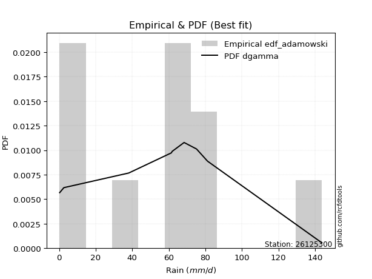</img>

</div>


## C. Best fit & Estimate extreme values for specific return periods - Tr

Best fit in probability distribution analysis means finding the theoretical distribution (like Normal, Poisson, Exponential, etc.) that most accurately mirrors your real-world data´s patterns (shape, center, spread) for better predictions, using methods like visual checks (Q-Q plots), goodness-of-fit tests (Kolmogorov-Smirnov, Chi-Squared), and information criteria (AIC) to score and select the simplest, most representative model.


### 1. Best fit (ordered by delta Δ)

:file_folder:Table: [bestfit_26125300.csv](table/bestfit_26125300.csv)

<div align="center">

|   id |   station | empirical_dist   | p_dist       |    delta |   deltao | eval   |   fit |   n |   best_fit |   best_fit_sort |
|-----:|----------:|:-----------------|:-------------|---------:|---------:|:-------|------:|----:|-----------:|----------------:|
|    0 |  26125300 | edf_chegodayev   | dgamma       | 0.122915 | 0.394275 | Δo > Δ |     1 |  10 |          1 |               1 |
|    1 |  26125300 | edf_jenkinson    | dgamma       | 0.123008 | 0.394275 | Δo > Δ |     1 |  10 |          1 |               2 |
|    2 |  26125300 | edf_beard        | dgamma       | 0.123008 | 0.394275 | Δo > Δ |     1 |  10 |          1 |               3 |
|    3 |  26125300 | edf_tukey        | anglit       | 0.123025 | 0.394275 | Δo > Δ |     1 |  10 |          1 |               4 |
|    4 |  26125300 | edf_filliben     | dgamma       | 0.123077 | 0.394275 | Δo > Δ |     1 |  10 |          1 |               5 |
|    5 |  26125300 | edf_blom         | dgamma       | 0.123619 | 0.394275 | Δo > Δ |     1 |  10 |          1 |               6 |
|    6 |  26125300 | edf_cunnane      | dgamma       | 0.123858 | 0.394275 | Δo > Δ |     1 |  10 |          1 |               7 |
|    7 |  26125300 | edf_gringorten   | dgamma       | 0.124245 | 0.394275 | Δo > Δ |     1 |  10 |          1 |               8 |
|    8 |  26125300 | edf_adamowski    | dgamma       | 0.124525 | 0.394275 | Δo > Δ |     1 |  10 |          1 |               9 |
|    9 |  26125300 | edf_hazen        | logjohnsonsu | 0.124581 | 0.394275 | Δo > Δ |     1 |  10 |          1 |              10 |
|   10 |  26125300 | edf_weibull      | semicircular | 0.128846 | 0.394275 | Δo > Δ |     1 |  10 |          1 |              11 |
|   11 |  26125300 | edf_california   | dgamma       | 0.16262  | 0.394275 | Δo > Δ |     1 |  10 |          1 |              12 |

</div>


### 2. Extreme values and % difference analysis

In hydrology, a return period (or recurrence interval $Tr$) is the statistical average time between extreme events like floods or droughts of a specific magnitude, indicating how rare an event is, with a 100-year flood, for example, having a 1% chance of occurring in any given year, not that it happens exactly every century. It is a key tool for infrastructure design (like bridges or dams) and risk assessment, calculated from historical data to determine the probability of future events, although it is important to remember it is statistical average, and events can cluster or be missed.

The extreme value porcentage difference is evaluated as $pdiff = 1 - (ETrBf / ETr) * 100$, where _ETrBf_ correspond to the bestfit extreme value for a specific recurrence interval and _ETr_ correspond to the extreme value for one of the most used PDFsused in hydrology.

> risk_rate: assuming the return period as the project useful life.

:file_folder:Table: [extreme_26125300.csv](table/extreme_26125300.csv), all PDFs.  
:file_folder:Table: [extremepdiff_26125300.csv](table/extremepdiff_26125300.csv), % difference between bestfit and most used PDFs in Hydrology.

<div align="center">

Extreme values table for only best fit PDFs
|   id |      tr |   prob_l |     prob_g |     alpha |   anglit |   arcsine |    argus |      beta |   betaprime |   bradford |     burr |    burr12 |   cosine |   crystalball |   dgamma |   dweibull |   erlang |   exponnorm |   exponpow |        exponweib |        f |   fatiguelife |   foldnorm |     gamma |   gausshyper |   genexpon |       genextreme |    gengamma |   genhalflogistic |   genlogistic |   gennorm |   genpareto |   gompertz |   gumbel_l |   gumbel_r |   halfgennorm |   halflogistic |   halfnorm |   hypsecant |   invgamma |   invgauss |       invweibull |   johnsonsb |   johnsonsu |   kappa3 |   kappa4 |    ksone |   kstwobign |   laplace |   levy_l |   loggamma |   logistic |   loglaplace |    lomax |   maxwell |   mielke |    moyal |   nakagami |      ncf |              nct |     norm |   pearson3 |   powerlaw |   rayleigh |     rdist |     rice |   semicircular |   skewnorm |        t |   trapezoid |   triang |   truncexpon |   truncnorm |   truncpareto |   truncweibull_min |   tukeylambda |   uniform |   vonmises |   vonmises_line |     wald |   weibull_max |   weibull_min |   wrapcauchy |         logalpha |   loganglit |   logarcsine |   logargus |   logbeta |    logbetaprime |   logbradford |          logburr |   logburr12 |   logcosine |   logcrystalball |       logdgamma |      logdweibull |   logerlang |   logexponnorm |     logexponpow |   logexponweib |           logf |   logfatiguelife |   logfoldnorm |   loggausshyper |   loggenexpon |   loggenextreme |     loggengamma |   loggenhalflogistic |   loggenlogistic |        loggennorm |     loggenpareto |   loggompertz |   loggumbel_l |   loggumbel_r |   loghalfgennorm |   loghalflogistic |   loghalfnorm |   loghypsecant |   loginvgamma |   loginvgauss |    loginvweibull |   logjohnsonsb |     logjohnsonsu |         logkappa3 |   logkappa4 |   logksone |     logkstwobign |   loglevy_l |   logloggamma |   loglogistic |   logloglaplace |         loglomax |   logmaxwell |   logmielke |         logmoyal |   lognakagami |         logncf |     lognct |    lognorm |   logpearson3 |   logpowerlaw |   lograyleigh |   logrdist |    logrice |   logsemicircular |   logskewnorm |       logt |   logtrapezoid |   logtriang |   logtruncexpon |   logtruncnorm |   logtruncpareto |   logtruncweibull_min |   logtukeylambda |   loguniform |   logvonmises |   logvonmises_line |          logwald |   logweibull_max |   logweibull_min |   logwrapcauchy |   station |   n |   risk_rate |
|-----:|--------:|---------:|-----------:|----------:|---------:|----------:|---------:|----------:|------------:|-----------:|---------:|----------:|---------:|--------------:|---------:|-----------:|---------:|------------:|-----------:|-----------------:|---------:|--------------:|-----------:|----------:|-------------:|-----------:|-----------------:|------------:|------------------:|--------------:|----------:|------------:|-----------:|-----------:|-----------:|--------------:|---------------:|-----------:|------------:|-----------:|-----------:|-----------------:|------------:|------------:|---------:|---------:|---------:|------------:|----------:|---------:|-----------:|-----------:|-------------:|---------:|----------:|---------:|---------:|-----------:|---------:|-----------------:|---------:|-----------:|-----------:|-----------:|----------:|---------:|---------------:|-----------:|---------:|------------:|---------:|-------------:|------------:|--------------:|-------------------:|--------------:|----------:|-----------:|----------------:|---------:|--------------:|--------------:|-------------:|-----------------:|------------:|-------------:|-----------:|----------:|----------------:|--------------:|-----------------:|------------:|------------:|-----------------:|----------------:|-----------------:|------------:|---------------:|----------------:|---------------:|---------------:|-----------------:|--------------:|----------------:|--------------:|----------------:|----------------:|---------------------:|-----------------:|------------------:|-----------------:|--------------:|--------------:|--------------:|-----------------:|------------------:|--------------:|---------------:|--------------:|--------------:|-----------------:|---------------:|-----------------:|------------------:|------------:|-----------:|-----------------:|------------:|--------------:|--------------:|----------------:|-----------------:|-------------:|------------:|-----------------:|--------------:|---------------:|-----------:|-----------:|--------------:|--------------:|--------------:|-----------:|-----------:|------------------:|--------------:|-----------:|---------------:|------------:|----------------:|---------------:|-----------------:|----------------------:|-----------------:|-------------:|--------------:|-------------------:|-----------------:|-----------------:|-----------------:|----------------:|----------:|----:|------------:|
|    0 |    2    | 0.5      | 0.5        |   1.36575 |  53.43   |   53.43   |  71.3333 |   1.96886 |     43.5219 |    58.9461 |  24.7888 |   27.8798 |  57.6494 |       53.43   |  47.5887 |    61.4    |  12.3038 |     50.1197 |    23.5035 |     98.7987      |  26.5323 |      0.300463 |    50.2938 |   8.49789 |      71.4167 |    37.1244 |     16.851       |    0.849957 |           94.3959 |       46.2269 |   61.4    |     47.5876 |    45.0307 |    60.4232 |    46.4368 |       39.4043 |        42.9602 |    44.7165 |     53.43   |    48.0045 |    44.3305 |     16.8512      |     1.14566 |     53.3294 |  49.951  |  70.4271 |  72.05   |     45.774  |   53.43   |  34.7084 |    18.7004 |    53.43   |      19.85   |  36.8926 |   49.7894 |  33.2967 |  44.1792 |    26.7925 |  31.3348 |      8.53021     |  53.43   |    50.2346 |    3.1771  |    48.4981 | -13.4172  |  49.8386 |        53.43   |    46.2123 |  53.4287 |     107.011 |  97.3927 |      58.8622 |     43.988  |      0.377676 |            52.2654 |      -8.31042 |    72.05  |  -0.288977 |         70.3832 |  39.6314 |       143.571 |       10.6129 |      72.0488 |     1.54635      |     19.85   |      19.8501 |    34.6296 |   92.1846 |    3.34426      |        3.8198 |     12.8103      |     29.8098 |     14.6254 |          19.85   |     61.4        |     68.4         |     18.984  |        19.8499 |      0.385825   |        16.523  |    1.02135     |          19.9216 |       21.2921 |         5.30271 |       11.841  |         29.6352 | 5943.3          |              24.2988 |          inf     |     61.4002       |      0.945825    |       19.7401 |       27.6774 |       14.2362 |      3.27789     |           12.0676 |       13.1182 |        19.85   |       17.9925 |       16.1771 |     15.1272      |        41.2368 |     58.0037      |      0.952162     |     6.19561 |     6.5681 |     12.0396      |     37.2088 |       36.4456 |        19.85  |    1.47173      |      5.21778     |      16.6956 |     38.0133 |     12.7876      |       19.8238 |   3.14645      |    19.828  |    19.85   |       27.6458 |      0.428102 |       15.7015 |   0.394894 |    19.8502 |           19.8503 |       21.3025 |    19.85   |        24.4987 |     13.6196 |         3.67213 |        6.63629 |         0.310477 |               9.71998 |         0.740941 |       6.5681 |      0.173886 |            29.4781 |     10.3019      |          37.113  |          29.9905 |          6.5672 |  26125300 |  10 |    0.75     |
|    1 |    2.33 | 0.570815 | 0.429185   |   1.62468 |  62.2782 |   66.7125 |  80.9585 |   3.44872 |     56.8435 |    69.1467 |  34.4272 |   35.3898 |  65.9789 |       61.0262 |  60.9834 |    64.2165 |  17.0036 |     57.3301 |    32.5572 |    300.391       |  35.2865 |      1.56838  |    58.7054 |  11.8691  |      84.182  |    45.238  |     25.6169      |    1.4136   |          103.766  |       53.8377 |   64.344  |     56.1293 |    53.079  |    67.0319 |    53.4756 |       53.2803 |        50.1971 |    52.9147 |     59.5092 |    55.5192 |    52.0492 |     25.6171      |     2.58626 |     60.9181 |  57.2979 |  81.2791 |  84.2444 |     53.5276 |   58.0269 |  67.2286 |    27.2697 |    60.1228 |      24.6977 |  44.9552 |   57.6813 |  46.0351 |  50.8423 |    38.1726 |  42.2522 |     14.1584      |  61.0262 |    57.8575 |    6.37319 |    56.5068 |   5.65415 |  57.4626 |        62.9198 |    54.1151 |  61.0249 |     115.349 | 105.064  |      68.8263 |     51.9134 |      0.466157 |            61.7354 |       4.12302 |    82.212 |  -0.112538 |         78.4834 |  44.6123 |       143.728 |       25.8534 |      82.2114 |     2.40658      |     30.2287 |      37.3219 |    44.1712 |  119.946  |    7.49094      |        5.9251 |     19.8473      |     38.6268 |     21.4386 |          28.4823 |     64.2169     |     72.6801      |     27.4795 |        28.4822 |      0.44615    |        25.0673 |    1.95448     |          28.5786 |       29.0427 |         8.72423 |       18.9149 |         41.9893 |    1.13032e+09  |              34.8646 |          inf     |     61.7908       |      1.31938     |       28.3614 |       37.8928 |       19.893  |      6.10959     |           17.0224 |       19.3695 |        26.5008 |       26.2028 |       24.1114 |     24.3113      |        80.0501 |     63.675       |      1.36169      |     9.7671  |    11.0978 |     19.4094      |     55.7063 |       47.3765 |        27.285 |    2.45542      |      9.78982     |      24.2953 |     49.4347 |     17.5525      |       28.4776 |   9.91402      |    28.4634 |    28.4822 |       38.5616 |      0.554057 |       22.9758 |   0.560242 |    28.4827 |           31.1654 |       28.8921 |    28.4823 |        37.1238 |     20.108  |         5.63293 |       10.119   |         0.322364 |              14.2493  |         0.886317 |      10.1688 |      0.206221 |            41.0593 |     13.0539      |          56.1597 |          38.7878 |         17.8532 |  26125300 |  10 |    0.729209 |
|    2 |    5    | 0.8      | 0.2        |   3.63249 |  93.4965 |  102.132  | 111.833  |  18.3346  |    143.452  |   106.071  |  82.3976 |   80.7236 |  95.9957 |       89.2556 |  83.886  |    93.5859 |  45.6796 |     86.231  |    85.5046 |  14130.2         |  87.4753 |     28.4933   |    90.2629 |  32.897   |     122.764  |    85.8036 |    154.824       |   10.6799   |          128.341  |       86.8946 |   87.5113 |     90.8884 |    87.0894 |    88.382  |    84.0549 |      149.837  |        82.9427 |    87.5841 |     83.8943 |    86.772  |    86.2765 |    154.824       |    58.2471  |     89.0969 |  85.3383 | 117.04   | 123.71   |     86.4635 |   81.0101 | 121.107  |   113.549  |    85.9644 |      73.641  |  85.2672 |   88.7432 | 105.387  |  81.706  |   100.684  | 100.827  |    166.212       |  89.2556 |    88.0065 |   41.0616  |    88.5689 |  57.3052  |  87.9847 |        95.3045 |    87.5348 |  89.2545 |     139.268 | 127.073  |     105.187  |     86.2597 |      3.59129  |            98.3067 |      43.7302  |   115.1   |   0.573571 |        108.125  |  72.4954 |       143.8   |      479.492  |     115.101  |    74.2866       |    133.318  |     200.983  |    85.6617 |  143.529  | 3395.61         |       28.8228 |    132.994       |     89.219  |     85.0597 |         108.978  |    139.992      |    219.659       |    111.123  |       108.978  |      1.37361    |       135.235  | 8753.89        |         109.485  |       92.0574 |        43.5052  |      124.738  |         94.781  |    3.26731e+138 |              86.5795 |          inf     |     94.4074       |     12.9577      |       96.1075 |      104.546  |       85.1093 |    196.797       |           80.7273 |      100.655  |        84.4622 |      110.692  |      114.497  |    190.979       |       140.367  |     77.4614      |     21.0265       |    42.5154  |    60.5996 |    147.568       |    108.71   |       92.4401 |        93.196 | 1449.77         |    227.592       |     106.356  |     96.5725 |     76.118       |      109.461  |   9.13966e+06  |   109.141  |   108.978  |      111.212  |      3.52108  |      105.477  |   1.56211  |   108.981  |          145.284  |       70.1863 |   108.979  |       122.327  |     61.4909 |        26.9758  |       40.3713  |         0.652176 |              48.4192  |         1.58072  |      41.8438 |      0.399722 |           150.474  |     49.1301      |         118.617  |          89.0399 |         81.9127 |  26125300 |  10 |    0.67232  |
|    3 |   10    | 0.9      | 0.1        |   7.32132 | 111.166  |  110.683  | 126.722  |  39.4114  |    258.307  |   124.25   | 120.932  |  134.936  | 114.131  |      107.982  |  99.4533 |   130.628  |  76.0811 |    108.187  |   137.507  | 146092           | 144.798  |     65.6696   |   111.275  |  55.5431  |     136.06   |   122.628  |    664.794       |   35.164    |          136.785  |      113.814  |  117.033  |    113.435  |   111.647  |   100.269  |   108.961  |      277.906  |       110.137  |   113.239  |    103.367  |   110.831  |   114.438  |    664.785       |   127.966   |    107.771  | 105.468  | 132.842  | 140.93   |    111.54   |  101.874  | 134.115  |   298.871  |   104.996  |     198.529  | 121.862  |  110.603  | 140.848  | 108.578  |   154.645  | 162.089  |   1522.34        | 107.982  |   109.625  |   79.5075  |   111.43   |  70.3778  | 109.748  |       111.922  |   112.265  | 107.981  |     148.611 | 135.669  |     123.518  |    112.302  |     18.1509   |           118.704  |      60.2201  |   129.45  |   1.09746  |        124.705  | 102.086  |       143.8   |     2451.01   |     129.451  | 40504.6          |    308.791  |     301.771  |   112.141  |  143.796  |    1.02083e+08  |       62.5699 |    626.298       |    142.202  |    195.584  |         265.419  |    386.629      |   1313.64        |    286.404  |       265.419  |      5.68085    |       469.634  |    5.02263e+16 |         267.362  |      197.89   |        84.1395  |      481.783  |        121.008  |  inf            |             115.839  |          inf     |    614.376        |    376.377       |      194.154  |      183.948  |      278.063  |   7084.07        |          294.043  |      340.759  |       213.13   |      299.544  |      344.25   |   1023.52        |       143.406  |     89.4713      |   2530.94         |    79.7449  |   127.1    |    691.426       |    127.752  |      116.723  |       230.293 |    3.53804e+12  |   3958.42        |     300.631  |    122.472  |    273.039       |      267.474  |   9.66313e+25  |   266.311  |   265.419  |      194.504  |     16.3769   |      312.68   |   2.17422  |   265.426  |          320.082  |      100.751  |   265.42   |       194.895  |     95.1536 |        59.619   |       75.3744  |         2.67928  |              83.0135  |         2.03129  |      77.5702 |      0.661079 |           399.203  |    200.541       |         136.39   |         141.42   |        111.176  |  26125300 |  10 |    0.651322 |
|    4 |   15    | 0.933333 | 0.0666667  |  10.997   | 118.712  |  112.314  | 132.382  |  53.5553  |    346.806  |   130.614  | 142.627  |  173.637  | 122.391  |      117.327  | 107.817  |   155.362  |  94.9893 |    120.36   |   168.001  | 442220           | 182.384  |     89.9837   |   121.765  |  69.7098  |     139.53   |   144.169  |   1511.52        |   60.2207   |          139.315  |      129      |  137.478  |    123.649  |   124.082  |   105.652  |   123.013  |      371.487  |       125.526  |   126.589  |    114.479  |   123.984  |   130.31   |   1511.49        |   138.809   |    117.084  | 116.709  | 138.116  | 146.67   |    124.853  |  114.078  | 138.044  |   487.558  |   115.365  |     354.625  | 143.27   |  121.819  | 154.337  | 124.173  |   183.72   | 202.51   |   5555.4         | 117.327  |   120.906  |   97.5413  |   123.209  |  72.9821  | 120.961  |       118.402  |   125.134  | 117.326  |     151.609 | 138.428  |     130.042  |    126.004  |     34.2381   |           126.434  |      65.487   |   134.233 |   1.39496  |        130.865  | 121.088  |       143.8   |     5132.26   |     134.234  |     2.15939e+07  |    442.011  |     326.096  |   123.389  |  143.8    |    1.39553e+12  |       82.0335 |   1501.36        |    175.631  |    285.793  |         413.856  |    743.878      |   4947.79        |    462.125  |       413.856  |     14.5606     |       908.467  |    3.90738e+36 |         417.666  |      289.921  |       103.061   |      967.769  |        129.477  |  inf            |             125.837  |          inf     |   7404.76         |   6370.32        |      268.011  |      237.589  |      542.289  |  67791.1         |          611.094  |      642.77   |       361.455  |      498.374  |      608.824  |   2639.08        |       143.667  |    101.263       | 247687            |    97.868   |   162.694  |   1569.77        |    134.136  |      125.439  |       377     |    7.87464e+26  |  21042.1         |     512.36   |    132.648  |    573.02        |      417.778  |   6.84823e+53  |   415.687  |   413.856  |      247.195  |     31.2497   |      547.351  |   2.36135  |   413.868  |          435.547  |      113.476  |   413.858  |       226.31   |    109.462  |        79.1085  |       93.2251  |         6.61337  |              99.5603  |         2.20724  |      95.2905 |      0.880119 |           658.444  |    494.842       |         140.175  |         174.384  |        121.455  |  26125300 |  10 |    0.644736 |
|    5 |   20    | 0.95     | 0.05       |  14.6694  | 123.151  |  112.888  | 135.489  |  64.0553  |    421.515  |   133.856  | 158.211  |  204.732  | 127.472  |      123.447  | 113.544  |   174.057  | 108.769  |    128.864  |   189.437  | 895453           | 210.878  |    107.985    |   128.636  |  80.0589  |     141.006  |   159.452  |   2686.18        |   84.0598   |          140.521  |      139.633  |  153.311  |    129.824  |   132.221  |   109.003  |   132.852  |      446.547  |       136.308  |   135.49   |    122.319  |   133.051  |   141.401  |   2686.11        |   141.535   |    123.18   | 124.742  | 140.75   | 149.54   |    133.82   |  122.737  | 140.056  |   673.335  |   122.532  |     535.215  | 158.459  |  129.263  | 161.719  | 135.218  |   203.282  | 233.565  |  13917.7         | 123.447  |   128.474  |  107.75    |   131.038  |  73.9238  | 128.414  |       121.996  |   133.714  | 123.446  |     153.087 | 139.788  |     133.389  |    135.184  |     47.9497   |           130.517  |      68.052   |   136.625 |   1.60371  |        134.041  | 135.248  |       143.8   |     8130.2    |     136.626  |     1.14488e+10  |    545.838  |     335.121  |   129.846  |  143.8    |    1.17842e+16  |       94.1578 |   2769.23        |    200.3    |    360.868  |         553.587  |   1204.35       |  14203.7         |    633.534  |       553.588  |     29.4082     |      1418.56   |    1.67453e+63 |         559.478  |      372.302  |       113.42    |     1539.13   |        133.536  |  inf            |             130.748  |          inf     | 116451            |  79710.2         |      327.9    |      278.613  |      865.651  | 359730           |         1020.22   |      981.312  |       524.676  |      698.749  |      891.216  |   5122.41        |       143.735  |    113.807       |      2.14143e+07  |   108.244   |   184.071  |   2727.15        |    137.528  |      129.914  |       530.021 |    7.17678e+45  |  68847.2         |     729.863  |    138.56   |    968.67        |      559.478  |   3.98757e+89  |   556.45   |   553.587  |      285.391  |     44.4005   |      794.128  |   2.4438   |   553.604  |          516.696  |      120.408  |   553.59   |       243.625  |    117.294  |        91.4768  |      103.78    |        11.8496   |             109.085   |         2.30046  |     105.615  |      1.07766  |           895.826  |    970.021       |         141.613  |         198.677  |        126.779  |  26125300 |  10 |    0.641514 |
|    6 |   25    | 0.96     | 0.04       |  18.3406  | 126.159  |  113.155  | 137.492  |  72.3717  |    487.375  |   135.82   | 170.584  |  231.152  | 131.034  |      127.952  | 117.894  |   189.154  | 119.629  |    135.418  |   205.903  |      1.49063e+06 | 234.043  |    122.288    |   133.694  |  88.2276  |     141.791  |   171.307  |   4182.84        |  106.498    |          141.224  |      147.823  |  166.326  |    134.081  |   138.194  |   111.387  |   140.431  |      509.838  |       144.615  |   142.113  |    128.386  |   139.966  |   149.928  |   4182.72        |   142.543   |    127.668  | 131.079  | 142.329  | 151.262  |    140.538  |  129.454  | 141.319  |   854.978  |   128.015  |     736.519  | 170.24   |  134.789  | 166.56   | 143.778  |   217.892  | 259.138  |  28374.9         | 127.952  |   134.136  |  114.287   |   136.855  |  74.3692  | 133.952  |       124.328  |   140.098  | 127.951  |     153.968 | 140.599  |     135.427  |    142.036  |     59.0803   |           133.044  |      69.5623  |   138.06  |   1.76213  |        135.971  | 146.59   |       143.8   |    11279.2    |     138.061  |     6.05669e+12  |    629.739  |     339.393  |   134.118  |  143.8    |    7.06244e+19  |      102.357  |   4437.71        |    219.938  |    424.997  |         685.783  |   1764          |  34234           |    800.027  |       685.784  |     51.5519     |      1982.46   |    2.17788e+96 |         693.876  |      447.56   |       119.832   |     2173.01   |        135.884  |  inf            |             133.633  |          inf     |      2.0803e+06   | 813975           |      378.665  |      312.051  |     1241.06   |      1.36099e+06 |         1514.22   |     1344.39   |       700.069  |      898.203  |     1184.44   |   8537.42        |       143.761  |    127.258       |      1.69506e+09  |   114.906   |   198.222  |   4124.62        |    139.7    |      132.636  |       687.822 |    1.58567e+69  | 172661           |     949.123  |    142.641  |   1455.14        |      693.679  |   5.04747e+132 |   689.723  |   685.784  |      315.187  |     55.3362   |     1047.07   |   2.4881   |   685.805  |          577.259  |      124.765  |   685.787  |       254.564  |    122.224  |        99.9359  |      110.716   |        17.7032   |             115.251   |         2.3581   |     112.34   |      1.25901  |          1101.24   |   1663.1         |         142.32   |         217.998  |        130.046  |  26125300 |  10 |    0.639603 |
|    7 |   50    | 0.98     | 0.02       |  36.6905  | 133.563  |  113.511  | 142.035  |  98.6654  |    745.948  |   139.792  | 211.683  |  327.928  | 140.363  |      140.853  | 131.007  |   239.051  | 154.143  |    155.673  |   255.962  |      6.13606e+06 | 312.159  |    168.178    |   148.179  | 114.237   |     143.081  |   208.132  |  16365.5         |  201.755    |          142.576  |      173.052  |  210.698  |    144.831  |   155.137  |   117.86   |   163.776  |      735.557  |       170.211  |   161.362  |    147.196  |   160.977  |   176.111  |  16364.9         |   143.57    |    140.512  | 151.762  | 145.478  | 154.706  |    160.263  |  150.317  | 144.163  |  1703.73   |   144.766  |    1985.58   | 206.838  |  150.816  | 178.515  | 170.355  |   260.477  | 347.827  | 259358           | 140.853  |   150.786  |  128.346   |   153.74   |  74.9813  | 150.026  |       129.655  |   158.654  | 140.852  |     155.717 | 142.208  |     139.567  |    162.04   |     91.1299   |           138.285  |      72.4949  |   140.93  |   2.20104  |        139.871  | 183.621  |       143.8   |    27429.9    |     140.931  |     2.48498e+26  |    895.4    |     345.183  |   144.12   |  143.8    |    2.3403e+37   |      121.175  |  18971.1         |    283.513  |    652.228  |        1266.21   |   5972.28       | 728577           |   1568.65   |      1266.21   |    315.255      |      5324.39   |  inf           |        1285.96   |      758.252  |       132.715   |     5917.99   |        140.282  |  inf            |             139.152  |          inf     |      5.58779e+12  |      1.59647e+10 |      560.597  |      424.471  |     3764.78   |      1.02636e+08 |         5111.94   |     3356.7    |      1711.84   |     1864.21   |     2725.01   |  41185.9         |       143.791  |    210.859       |      2.31991e+18  |   129.172   |   229.873  |  13899.4         |    144.718  |      138.164  |      1525.05  |    7.21068e+246 |      3.00302e+06 |    2033.2    |    153.618  |   5146.87        |     1284.04   | inf            |  1275.71   |  1266.21   |      406.95   |     87.8596   |     2336.45   |   2.56087  |  1266.25   |          743.594  |      133.948  |  1266.22   |       277.748  |    132.63   |       119.63    |      126.108   |        45.2832   |             128.7     |         2.47711  |     127.1    |      1.96656  |          1746.19   |   9668.91        |         143.357  |         280.455  |        136.773  |  26125300 |  10 |    0.63583  |
|    8 |   75    | 0.986667 | 0.0133333  |  55.0379  | 136.822  |  113.577  | 143.836  | 114.09    |    944.427  |   141.129  | 238.32   |  396.525  | 144.818  |      147.775  | 138.46   |   270.147  | 174.771  |    167.493  |   284.406  |      1.2769e+07  | 362.394  |    195.816    |   155.951  | 129.811   |     143.406  |   229.672  |  36164           |  278.172    |          143.006  |      187.716  |  239.329  |    149.701  |   164.093  |   121.133  |   177.346  |      888.686  |       185.089  |   171.841  |    158.189  |   173.039  |   191.273  |  36162.5         |   143.708   |    147.402  | 164.809  | 146.522  | 155.854  |    171.115  |  162.522  | 145.332  |  2474.91   |   154.441  |    3546.78   | 228.247  |  159.529  | 184.258  | 185.896  |   283.669  | 407.015  | 946295           | 147.775  |   159.986  |  133.337   |   162.927  |  75.0999  | 158.771  |       131.783  |   168.755  | 147.774  |     156.296 | 142.74   |     140.968  |    172.978  |    105.816    |           140.092  |      73.4357  |   141.887 |   2.39629  |        141.179  | 206.408  |       143.8   |    42992.5    |     141.887  |     1.0151e+40   |   1045.42   |     346.267  |   148.209  |  143.8    |    3.42694e+53  |      128.256  |  44141.1         |    322.36   |    800.261  |        1759.56   |  12416.2        |      5.41062e+06 |   2258.42   |      1759.56   |    940.689      |      9199.7    |  inf           |        1791.11   |     1006.16   |       136.845   |    10210.9    |        141.614  |  inf            |             140.868  |          inf     |      1.00938e+19  |      6.42019e+13 |      684.165  |      495.928  |     7175.73   |      1.4591e+09  |        10369.1    |     5523.76   |      2886.67   |     2777.54   |     4310.79   | 102797           |       143.796  |    328.748       |      1.38617e+27  |   134.164   |   241.509  |  27119.7         |    146.832  |      140.031  |      2415.52  |  inf            |      1.59634e+07 |    3076.53   |    159.378  |  10774           |     1786.83   | inf            |  1774.55   |  1759.56   |      459.039  |    103.186    |     3615.76   |   2.57895  |  1759.62   |          822.743  |      137.155  |  1759.57   |       285.88   |    136.267  |       127.138   |      131.732   |        64.833    |             133.54    |         2.51781  |     132.439  |      2.4217   |          2060.49   |  28562.2         |         143.581  |         318.56   |        139.079  |  26125300 |  10 |    0.634587 |
|    9 |  100    | 0.99     | 0.01       |  73.3846  | 138.759  |  113.6    | 144.842  | 124.957   |   1111.76   |   141.8    | 258.696  |  451.465  | 147.61   |      152.457  | 143.671  |   292.991  | 189.567  |    175.878  |   304.198  |      2.07488e+07 | 400.191  |    215.702    |   161.208  | 140.991   |     143.543  |   244.956  |  63385.7         |  342.965    |          143.215  |      198.094  |  260.806  |    152.645  |   170.085  |   123.274  |   186.95   |     1007.08   |       195.62   |   178.979  |    165.987  |   181.532  |   201.983  |  63382.7         |   143.75    |    152.06   | 174.59   | 147.043  | 156.428  |    178.551  |  171.181  | 146.015  |  3190.25   |   161.271  |    5352.94   | 243.437  |  165.464  | 188.034  | 196.922  |   299.455  | 452.699  |      2.37062e+06 | 152.457  |   166.315  |  135.892   |   169.185  |  75.1425  | 164.729  |       132.974  |   175.636  | 152.456  |     156.584 | 143.006  |     141.672  |    180.445  |    114.135    |           141.006  |      73.8959  |   142.365 |   2.50364  |        141.833  | 223.022  |       143.8   |    57683.3    |     142.366  |     4.14208e+53  |   1146.28   |     346.648  |   150.523  |  143.8    |    7.56668e+68  |      131.964  |  80246.9         |    350.607  |    909.722  |        2198.13   |  21004.4        |      2.46092e+07 |   2893.35   |      2198.14   |   2064.69       |     13398      |  inf           |        2241.28   |     1218.32   |       138.823   |    14808.6    |        142.241  |  inf            |             141.686  |          inf     |      9.47139e+24  |      1.06427e+17 |      779.577  |      549.054  |    11327.4    |      1.01185e+10 |        17105.6    |     7755.35   |      4181.88   |     3647.48   |     5906.06   | 196392           |       143.798  |    492.162       |      4.94531e+35  |   136.686   |   247.545  |  42872.5         |    148.082  |      140.97   |      3342.12  |  inf            |      5.22303e+07 |    4079.3    |    163.323  |  18196.8         |     2234.35   | inf            |  2218.43   |  2198.13   |      494.919  |    111.967    |     4868.55   |   2.58646  |  2198.22   |          870.692  |      138.787  |  2198.15   |       290.024  |    138.118  |       131.09    |      134.644   |        78.3173   |             136.031   |         2.53832  |     135.192  |      2.72284  |          2241.68   |  62916.9         |         143.667  |         346.242  |        140.245  |  26125300 |  10 |    0.633968 |
|   10 |  200    | 0.995    | 0.005      | 146.77    | 142.42   |  113.622  | 146.59   | 150.665   |   1629.11   |   142.81   | 313.868  |  608.898  | 153.288  |      163.076  | 156.014  |   350.497  | 225.666  |    196.076  |   350.562  |      6.0575e+07  | 499.087  |    264.379    |   173.133  | 168.296   |     143.708  |   281.78   | 244288           |  539.623    |          143.52   |      223.045  |  316.419  |    158.325  |   183.46   |   127.928  |   210.039  |     1326.66   |       220.938  |   195.306  |    184.772  |   201.859  |   227.671  | 244274           |   143.788   |    162.624  | 200.237  | 147.821  | 157.289  |    195.677  |  192.044  | 147.309  |  5697.8    |   177.657  |   14431      | 280.037  |  179.043  | 196.583  | 223.487  |   335.493  | 576.954  |      2.16682e+07 | 163.076  |   180.993  |  139.8     |   183.505  |  75.1849  | 178.361  |       135.052  |   191.374  | 163.076  |     157.016 | 143.404  |     142.733  |    197.57   |    128.014    |           142.394  |      74.5685  |   143.083 |   2.67457  |        142.816  | 264.407  |       143.8   |   109277      |     143.083  |     1.14517e+108 |   1364.16   |     347.015  |   154.595  |  143.8    |    3.51045e+125 |      137.744  | 337708           |    420.843  |   1180.64   |        3641.55   |  75888.4        |      1.2793e+09  |   5094.45   |      3641.57   |  14055.8        |     31950.1    |  inf           |        3728.36   |     1880.36   |       141.594   |    34681.4    |        143.109  |  inf            |             142.841  |          inf     |      2.6824e+46   |      7.49933e+27 |     1036.03   |      684.986  |    33944.7    |      1.2782e+12  |        56989.4    |    16851.8    |     10213.5    |     6824.84   |    12234.5    | 931159           |       143.799  |   1937.8         |      3.79892e+68  |   140.467   |   256.885  | 123106           |    150.479  |      142.383  |      7282.52  |  inf            |      9.08421e+08 |    7778.63   |    172.641  |  64328           |     3709.82   | inf            |  3681.4    |  3641.56   |      576.874  |    126.765    |     9616.58   |   2.59533  |  3641.71   |          961.061  |      141.271  |  3641.59   |       296.34   |    140.935  |       137.28    |      139.142   |       105.291    |             139.859   |         2.56923  |     139.43   |      3.29259  |          2547.07   | 449866           |         143.76   |         414.992  |        142.012  |  26125300 |  10 |    0.633042 |
|   11 |  250    | 0.996    | 0.004      | 183.462   | 143.352  |  113.625  | 146.999  | 158.757   |   1837.57   |   143.012  | 333.735  |  668.223  | 154.844  |      166.322  | 159.933  |   369.707  | 237.405  |    202.578  |   365.096  |      8.33624e+07 | 533.418  |    280.243    |   176.777  | 177.181   |     143.734  |   293.635  | 376932           |  616.304    |          143.579  |      231.067  |  335.464  |    159.8    |   187.483  |   129.297  |   217.461  |     1440.12   |       229.077  |   200.329  |    190.819  |   208.381  |   235.914  | 376910           |   143.792   |    165.851  | 209.193  | 147.976  | 157.461  |    200.978  |  198.761  | 147.646  |  6810.39   |   182.917  |   19858.8    | 291.819  |  183.223  | 199.248  | 232.039  |   346.557  | 621.68   |      4.41756e+07 | 166.322  |   185.568  |  140.592   |   187.913  |  75.1902  | 182.557  |       135.539  |   196.216  | 166.321  |     157.103 | 143.483  |     142.946  |    202.849  |    131.01     |           142.674  |      74.6995  |   143.226 |   2.70982  |        143.013  | 278.098  |       143.8   |   131877      |     143.227  |     1.90319e+135 |   1425.93   |     347.059  |   155.558  |  143.8    |    1.23098e+152 |      138.933  | 536040           |    444.072  |   1268.09   |        4248.97   | 115274          |      4.98218e+09 |   6062.26   |      4248.99   |  26188.3        |     41840.2    |  inf           |        4356.15   |     2147.05   |       142.105   |    45072      |        143.269  |  inf            |             143.056  |          inf     |      1.08807e+56  |      3.81466e+32 |     1126.63   |      731.05   |    48306.5    |      6.38031e+12 |        83911.3    |    21396.1    |     13614.9    |     8284.73   |    15344.5    |      1.53573e+06 |       143.8    |   3502.04        |      3.20087e+84  |   141.217   |   258.795  | 170628           |    151.11   |      142.667  |      9351.42  |  inf            |      2.27822e+09 |    9488.39   |    175.635  |  96592.7         |     4331.63   | inf            |  4297.78   |  4248.98   |      601.761  |    129.982    |    11858.2    |   2.59669  |  4249.15   |          983.585  |      141.773  |  4249.01   |       297.618  |    141.504  |       138.557   |      140.06    |       111.92     |             140.638   |         2.57542  |     140.293  |      3.42549  |          2613.31   | 862411           |         143.773  |         437.707  |        142.368  |  26125300 |  10 |    0.632858 |
|   12 |  500    | 0.998    | 0.002      | 366.924   | 145.662  |  113.628  | 147.939  | 183.201   |   2655.37   |   143.417  | 403.212  |  884.764  | 158.986  |      175.946  | 171.965  |   431.392  | 274.168  |    222.775  |   409.072  |      2.1027e+08  | 648.441  |    330.008    |   187.583  | 205.027   |     143.776  |   330.459  |      1.44843e+06 |  900.943    |          143.694  |      255.963  |  398.087  |    163.526  |   199.224  |   133.222  |   240.5    |     1826.57   |       254.339  |   215.304  |    209.604  |   228.634  |   261.468  |      1.44833e+06 |   143.798   |    175.42   | 239.496  | 148.285  | 157.806  |    216.861  |  219.624  | 148.515  | 11594.3    |   199.231  |   53537.4    | 328.421  |  195.696  | 207.453  | 258.603  |   379.469  | 777.433  |      4.03778e+08 | 175.946  |   199.382  |  142.189   |   201.066  |  75.1974  | 195.078  |       136.661  |   210.651  | 175.945  |     157.275 | 143.642  |     143.372  |    218.618  |    137.239    |           143.235  |      74.9563  |   143.513 |   2.78097  |        143.407  | 321.631  |       143.8   |   226052      |     143.514  |     2.41054e+271 |   1591.44   |     347.118  |   157.785  |  143.8    |    1.54648e+275 |      141.344  |      2.24923e+06 |    518.022  |   1533.69   |        6713.72   | 427208          |      4.41688e+11 |  10183.4    |      6713.76   | 182286          |     94006      |  inf           |        6912.5    |     3181.65   |       143.054   |    98537.1    |        143.565  |  inf            |             143.463  |          143.246 |      1.73267e+97  |      3.99888e+52 |     1433.2    |      880.998  |   144415      |      1.09168e+15 |       278832      |    43599.9    |     33249.9    |    14819.2    |    30368.6    |      7.25682e+06 |       143.8    |  41276.4         |      1.7333e+161  |   142.696   |   262.657  | 453845           |    152.749  |      143.234  |     20308.1   |  inf            |      3.96241e+10 |   17166.5    |    185.051  | 341457           |     6858.69   | inf            |  6802.17   |  6713.73   |      674.092  |    136.695    |    22158.1    |   2.59886  |  6714.03   |         1037.48   |      142.783  |  6713.8    |       300.187  |    142.649  |       141.151   |      141.917   |       126.698    |             142.21    |         2.58778  |     142.036  |      3.71126  |          2751.2    |      6.82955e+06 |         143.792  |         509.953  |        143.082  |  26125300 |  10 |    0.632489 |
|   13 |  750    | 0.998667 | 0.00133333 | 550.385   | 146.685  |  113.629  | 148.317  | 196.972   |   3282.77   |   143.553  | 450.067  | 1037.76   | 160.993  |      181.292  | 178.919  |   468.813  | 295.857  |    234.59   |   434.006  |      3.46746e+08 | 722.009  |    359.411    |   193.587  | 221.466   |     143.787  |   352      |      3.18181e+06 | 1102.86     |          143.731  |      270.518  |  437.111  |    165.214  |   205.62   |   135.32   |   253.968  |     2077.09   |       269.108  |   223.67   |    220.591  |   240.506  |   276.392  |      3.18157e+06 |   143.799   |    180.734  | 259.142  | 148.387  | 157.92   |    225.784  |  231.829  | 148.928  | 15613      |   208.763  |   95632      | 349.832  |  202.672  | 212.269  | 274.142  |   397.806  | 881.734  |      1.47322e+09 | 181.292  |   207.217  |  142.724   |   208.42   |  75.1988  | 202.079  |       137.113  |   218.716  | 181.292  |     157.333 | 143.695  |     143.515  |    227.444  |    139.388    |           143.423  |      75.0397  |   143.609 |   2.80482  |        143.538  | 347.732  |       143.8   |   301502      |     143.609  |   inf            |   1670.72   |     347.129  |   158.686  |  143.8    |  inf            |      142.158  |      5.20202e+06 |    562.476  |   1681.74   |        8656.3    | 925557          |      7.27431e+12 |  13609.2    |      8656.35   | 568141          |    148206      |  inf           |        8935.24   |     3958.59   |       143.339   |   152625      |        143.654  |  inf            |             143.588  |          143.434 |      2.56322e+131 |      2.58713e+69 |     1630.26   |      973.374  |   273937      |      2.44332e+16 |       562630      |    64892.6    |     56056      |    20559.6    |    44692      |      1.79894e+07 |       143.8    | 305339           |      1.02408e+235 |   143.178   |   263.957  | 786288           |    153.534  |      143.424  |     31947.2   |  inf            |      2.10633e+11 |   23916.5    |    190.69   | 714701           |     8853.72   | inf            |  8778.82   |  8656.32   |      712.848  |    139.018    |    31431.3    |   2.59939  |  8656.71   |         1059.99   |      143.121  |  8656.41   |       301.048  |    143.033  |       142.028   |      142.542   |       132.121    |             142.738   |         2.59189  |     142.621  |      3.81249  |          2798.8    |      2.36166e+07 |         143.796  |         553.335  |        143.321  |  26125300 |  10 |    0.632366 |
|   14 | 1000    | 0.999    | 0.001      | 733.846   | 147.294  |  113.629  | 148.529  | 206.493   |   3811.61   |   143.62   | 486.485  | 1160.1    | 162.259  |      184.973  | 183.819  |   495.932  | 311.316  |    242.972  |   451.358  |      4.86575e+08 | 777.225  |    380.385    |   197.72   | 233.187   |     143.792  |   367.284  |      5.56044e+06 | 1263.31     |          143.749  |      280.842  |  465.852  |    166.234  |   209.971  |   136.731  |   263.522  |     2266.09   |       279.584  |   229.448  |    228.387  |   248.952  |   286.973  |      5.56001e+06 |   143.799   |    184.392  | 274.03   | 148.438  | 157.978  |    231.966  |  240.488  | 149.187  | 19179.2    |   215.522  |  144332      | 365.023  |  207.494  | 215.715  | 285.168  |   410.447  | 962.362  |      3.69066e+09 | 184.973  |   212.678  |  142.992   |   213.503  |  75.1993  | 206.918  |       137.367  |   224.285  | 184.973  |     157.361 | 143.721  |     143.586  |    233.546  |    140.477    |           143.517  |      75.0809  |   143.657 |   2.81676  |        143.603  | 366.507  |       143.8   |   365994      |     143.657  |   inf            |   1719.84   |     347.133  |   159.193  |  143.8    |  inf            |      142.566  |      9.42935e+06 |    594.524  |   1782.4    |       10311.5    |      1.6061e+06 |      5.73688e+13 |  16629.6    |     10311.6    |      1.2722e+06 |    203167      |  inf           |       10663.1    |     4601.19   |       143.472   |   206523      |        143.696  |  inf            |             143.647  |          143.529 |      2.08012e+161 |      2.68286e+84 |     1778.05   |     1040.94   |   431394      |      2.31493e+17 |       925736      |    85402.4    |     81201.1    |    25805.2    |    58488.1    |      3.42522e+07 |       143.8    |      1.73208e+06 |      8.38019e+306 |   143.415   |   264.61   |      1.15062e+06 |    154.028  |      143.519  |     44052.7   |  inf            |      6.89165e+11 |   30077.1    |    194.766  |      1.20705e+06 |    10555.4    | inf            | 10464.6    | 10311.5    |      738.761  |    140.197    |    40020.5    |   2.59961  | 10312      |         1072.85   |      143.291  | 10311.6    |       301.48   |    143.225  |       142.469   |      142.855   |       134.934    |             143.003   |         2.59393  |     142.915  |      3.86422  |          2822.92   |      5.76514e+07 |         143.797  |         584.592  |        143.441  |  26125300 |  10 |    0.632305 |


</div>


<div align="center">

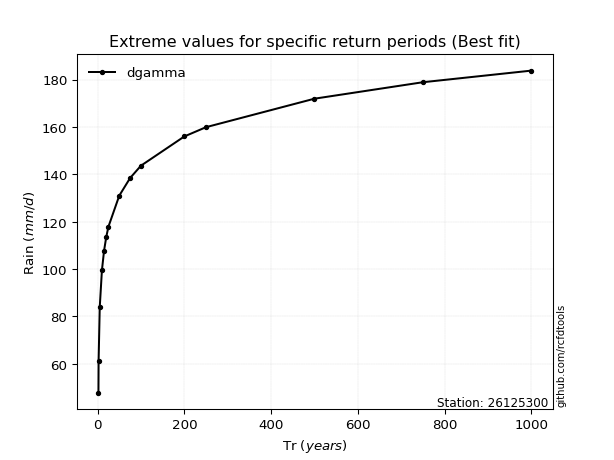</img>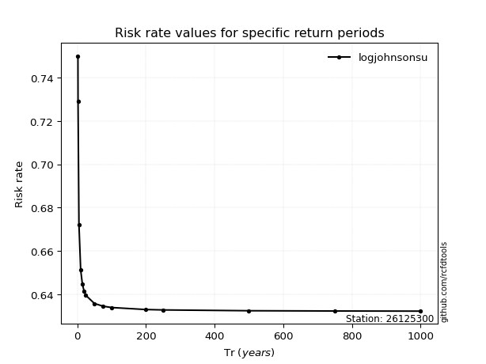</img>

</div>


<sub>**APP DISCLAIMER**: NO WARRANTY - This software is provided by [github.com/rcfdtools](https://github.com/rcfdtools) "as is", without any express or implied warranty, including warranties of merchantability, fitness for a particular purpose, or non-infringement. There is no guarantee that the software will be error-free or operate without interruption. LIMITATION OF LIABILITY - Neither the authors nor copyright holders will be liable for claims or damages arising from the software or its use. You are responsible for determining if the software is appropriate for your use and assume all associated risks, including errors, legal compliance, and data loss. NO PROFESSIONAL ADVICE - The software provides general information and does not offer professional advice. It should not replace consultation with professional advisors.</sub>