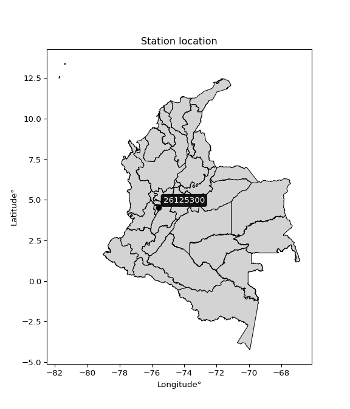

<div align="center">


</div>

# Station (rain, Pmax24h): 26125300

Probable Maximum Precipitation (PMP) is the greatest amount of rainfall for a specific duration that is meteorologically possible for a given location, acting as a "worst-case" scenario for extreme storms, crucial for designing safety-critical infrastructure like bridges, river deviations, dams, spillways, and nuclear plants to prevent catastrophic failure. PMP is calculated by hydrologists using meteorological data to determine the upper limit of extreme rainfall, often leading to the Probable Maximum Flood (PMF) for flood control design, and is increasingly being studied for climate change impacts.

<div align="center">

</img>

</div>


## A. General information


### 1. General running parameters

• app_version: _v20251226_. • runtime: _2025-12-26 15:38:16.554582_. • Python version: _3.14.0_. • SciPy version: _1.16.3_. • Pandas version: _2.3.3_. • NumPy version: _2.3.5_. • Stations dataset (station_dataset_file): _dataset/pmax24h_in/automatic_colombia_2003_2024.csv_. • Stations catalog (station_catalog_file): _dataset/CNE_IDEAM.xls_. • Minimum year to eval til year_max (date_min): _2003_. • Maximum year to eval since year_min (date_max): _2024_. • Creates, save and include plots into reports (create_plot): _False_. • Plot only fit distributions with Δo > Δ (plot_only_fit): _True_. • Eval low extreme values, if False, evaluates high extreme values (low_extreme): _False_. • Eval every SciPy distribution as logarithmic (pdist_logarithmic_on): _True_. • Standard deviation normalized (ddof): _1.0_. • Return periods to eval in years (Tr): _[2, 2.33, 5, 10, 15, 20, 25, 50, 75, 100, 200, 250, 500, 750, 1000]_. • Minimum data sample per station, 0 means any (minimum_sample): _5_. • Z-Score threshold to adjust a value, 0 means disable (zscore): _3.5_. • Avoid zeros, e.g. rain = 0 (avoid_zeros): _True_. • Avoid null values (avoid_nans): _True_. [:file_folder:Dataset file.](../../dataset/pmax24h_in/automatic_colombia_2003_2024.csv)


### 2. Station info and location

|   id |   CODIGO | NOMBRE                   | CATEGORIA               | TECNOLOGIA                | ESTADO   | FECHA_INSTALACION   |   FECHA_SUSPENSION |   ALTITUD |   LATITUD |   LONGITUD | DEPARTAMENTO   | MUNICIPIO   | AREA_OPERATIVA                         | ENTIDAD                                                     | AREA_HIDROGRAFICA   | ZONA_HIDROGRAFICA   | SUBZONA_HIDROGRAFICA   |   CORRIENTE | OBSERVACION                                                                                                     | SUBRED                                                   | Catalogo   |
|-----:|---------:|:-------------------------|:------------------------|:--------------------------|:---------|:--------------------|-------------------:|----------:|----------:|-----------:|:---------------|:------------|:---------------------------------------|:------------------------------------------------------------|:--------------------|:--------------------|:-----------------------|------------:|:----------------------------------------------------------------------------------------------------------------|:---------------------------------------------------------|:-----------|
|    0 | 26125300 | CALARCA - AUT [26125300] | Climatológica Principal | Automática con Telemetría | Activa   | 04/10/2004          |                nan |      2255 |   4.52831 |   -75.5964 | Quindío        | Calarcá     | Area Operativa 09 - Cauca-Valle-Caldas | INSTITUTO DE HIDROLOGIA METEOROLOGIA Y ESTUDIOS AMBIENTALES | Magdalena Cauca     | Cauca               | Río La Vieja           |         nan | |24/09/2024$mvelez$ACTIVA 24-09-2024 mediante correo electrónico Ing. Padilla coordinador  grupo automatización | Radiación Visible,Radiación Ultravioleta,Radición Global | CNE_IDEAM  |

<div align="center">

Map location in: [:earth_americas:Google](http://maps.google.com/maps?q=4.528305556,-75.59638889) [:earth_americas:OSM](https://www.openstreetmap.org/#map=18/4.528305556/-75.59638889&layers=P) [:earth_americas:Bing](https://www.bing.com/maps?cp=4.528305556~-75.59638889&lvl=18) [:earth_americas:Apple](https://maps.apple.com/frame?center=4.528305556%2C-75.59638889&span=0.003%2C0.006)

</div>


<div align="center">

```geojson
{
  "type": "Feature",
  "geometry": {
    "type": "Point", 
    "coordinates": [-75.59638889, 4.528305556]
  }, 
  "properties": {
    "Name": "26125300"
  }
}
```

</div>


### 3. Discrete values table and plot

|               |         0 |          1 |           2 |           3 |           4 |           5 |          6 |          7 |          8 |
|:--------------|----------:|-----------:|------------:|------------:|------------:|------------:|-----------:|-----------:|-----------:|
| Date          | 2016      | 2017       | 2018        | 2019        | 2020        | 2021        | 2022       | 2023       | 2024       |
| Value         |    2.6    |   75.2     |   38.1      |   68.4      |   61.9      |   61.4      |    0.3     |    1.4     |  143.8     |
| Value_initial |    2.6    |   75.2     |   38.1      |   68.4      |   61.9      |   61.4      |    0.3     |    1.4     |  143.8     |
| count         |    9      |    9       |    9        |    9        |    9        |    9        |    9       |    9       |    9       |
| mean          |   50.3444 |   50.3444  |   50.3444   |   50.3444   |   50.3444   |   50.3444   |   50.3444  |   50.3444  |   50.3444  |
| std           |   46.4529 |   46.4529  |   46.4529   |   46.4529   |   46.4529   |   46.4529   |   46.4529  |   46.4529  |   46.4529  |
| zscore        |   -1.0278 |    0.53507 |   -0.263588 |    0.388685 |    0.248759 |    0.237995 |   -1.07732 |   -1.05364 |    2.01184 |
> If Z-Score is active, values out of range or outliers are replaced with the station mean value.


### 4. Active continuous probability distributions from SciPy (45 of 104 available)

[scipy.stats](https://docs.scipy.org/doc/scipy/reference/stats.html) is a Python´s powerful submodule within the SciPy library for comprehensive statistical analysis, offering over 130 probability distributions (like Normal, Poisson), functions for descriptive stats (mean, variance), hypothesis testing (t-tests, chi-square), random variable generation, and statistical tests, making it essential for data science, modeling, and research. It provides tools to explore, model, and draw conclusions from data efficiently, working seamlessly with NumPy.

<div align="center">

|   id | p_dist             |   n_parameter | fit_method   | label                                                                       | active   | ref                                                                                                        |
|-----:|:-------------------|--------------:|:-------------|:----------------------------------------------------------------------------|:---------|:-----------------------------------------------------------------------------------------------------------|
|    0 | alpha              |             3 | MLE          | Alpha                                                                       | True     | [:mortar_board:](https://docs.scipy.org/doc/scipy/reference/generated/scipy.stats.alpha.html)              |
|    1 | betaprime          |             4 | MLE          | Beta prime                                                                  | True     | [:mortar_board:](https://docs.scipy.org/doc/scipy/reference/generated/scipy.stats.betaprime.html)          |
|    2 | chi2               |             3 | MLE          | Chi²                                                                        | True     | [:mortar_board:](https://docs.scipy.org/doc/scipy/reference/generated/scipy.stats.chi2.html)               |
|    3 | crystalball        |             4 | MLE          | Crystalball                                                                 | True     | [:mortar_board:](https://docs.scipy.org/doc/scipy/reference/generated/scipy.stats.crystalball.html)        |
|    4 | erlang             |             3 | MLE          | Erlang                                                                      | True     | [:mortar_board:](https://docs.scipy.org/doc/scipy/reference/generated/scipy.stats.erlang.html)             |
|    5 | expon              |             2 | MLE          | Exponential                                                                 | True     | [:mortar_board:](https://docs.scipy.org/doc/scipy/reference/generated/scipy.stats.expon.html)              |
|    6 | exponnorm          |             3 | MLE          | Exponentially modified Normal                                               | True     | [:mortar_board:](https://docs.scipy.org/doc/scipy/reference/generated/scipy.stats.exponnorm.html)          |
|    7 | f                  |             4 | MLE          | F                                                                           | True     | [:mortar_board:](https://docs.scipy.org/doc/scipy/reference/generated/scipy.stats.f.html)                  |
|    8 | fatiguelife        |             3 | MLE          | Fatigue-life (Birnbaum-Saunders)                                            | True     | [:mortar_board:](https://docs.scipy.org/doc/scipy/reference/generated/scipy.stats.fatiguelife.html)        |
|    9 | fisk               |             3 | MLE          | Fisk                                                                        | True     | [:mortar_board:](https://docs.scipy.org/doc/scipy/reference/generated/scipy.stats.fisk.html)               |
|   10 | gamma              |             3 | MLE          | Gamma                                                                       | True     | [:mortar_board:](https://docs.scipy.org/doc/scipy/reference/generated/scipy.stats.gamma.html)              |
|   11 | genexpon           |             5 | MLE          | Generalized exponential                                                     | True     | [:mortar_board:](https://docs.scipy.org/doc/scipy/reference/generated/scipy.stats.genexpon.html)           |
|   12 | genlogistic        |             3 | MLE          | Generalized logistic                                                        | True     | [:mortar_board:](https://docs.scipy.org/doc/scipy/reference/generated/scipy.stats.genlogistic.html)        |
|   13 | gibrat             |             2 | MM           | Gibrat                                                                      | True     | [:mortar_board:](https://docs.scipy.org/doc/scipy/reference/generated/scipy.stats.gibrat.html)             |
|   14 | gompertz           |             3 | MLE          | Gompertz (or truncated Gumbel)                                              | True     | [:mortar_board:](https://docs.scipy.org/doc/scipy/reference/generated/scipy.stats.gompertz.html)           |
|   15 | gumbel_l           |             2 | MM           | Gumbel Left Skew                                                            | True     | [:mortar_board:](https://docs.scipy.org/doc/scipy/reference/generated/scipy.stats.gumbel_l.html)           |
|   16 | gumbel_r           |             2 | MM           | Gumbel Right Skew                                                           | True     | [:mortar_board:](https://docs.scipy.org/doc/scipy/reference/generated/scipy.stats.gumbel_r.html)           |
|   17 | halflogistic       |             2 | MM           | Half-logistic                                                               | True     | [:mortar_board:](https://docs.scipy.org/doc/scipy/reference/generated/scipy.stats.halflogistic.html)       |
|   18 | halfnorm           |             2 | MM           | Half Normal                                                                 | True     | [:mortar_board:](https://docs.scipy.org/doc/scipy/reference/generated/scipy.stats.halfnorm.html)           |
|   19 | hypsecant          |             2 | MM           | hyperbolic secant                                                           | True     | [:mortar_board:](https://docs.scipy.org/doc/scipy/reference/generated/scipy.stats.hypsecant.html)          |
|   20 | invgamma           |             3 | MLE          | Inverted gamma                                                              | True     | [:mortar_board:](https://docs.scipy.org/doc/scipy/reference/generated/scipy.stats.invgamma.html)           |
|   21 | invgauss           |             3 | MLE          | Inverse Gaussian                                                            | True     | [:mortar_board:](https://docs.scipy.org/doc/scipy/reference/generated/scipy.stats.invgauss.html)           |
|   22 | invweibull         |             3 | MLE          | Inverted Weibull                                                            | True     | [:mortar_board:](https://docs.scipy.org/doc/scipy/reference/generated/scipy.stats.invweibull.html)         |
|   23 | johnsonsu          |             4 | MLE          | Johnson Su                                                                  | True     | [:mortar_board:](https://docs.scipy.org/doc/scipy/reference/generated/scipy.stats.johnsonsu.html)          |
|   24 | kstwobign          |             2 | MLE          | Limiting distribution of scaled Kolmogorov-Smirnov two-sided test statistic | True     | [:mortar_board:](https://docs.scipy.org/doc/scipy/reference/generated/scipy.stats.kstwobign.html)          |
|   25 | laplace            |             2 | MM           | Laplace                                                                     | True     | [:mortar_board:](https://docs.scipy.org/doc/scipy/reference/generated/scipy.stats.laplace.html)            |
|   26 | laplace_asymmetric |             3 | MLE          | Asymmetric Laplace                                                          | True     | [:mortar_board:](https://docs.scipy.org/doc/scipy/reference/generated/scipy.stats.laplace_asymmetric.html) |
|   27 | loggamma           |             3 | MLE          | Log gamma                                                                   | True     | [:mortar_board:](https://docs.scipy.org/doc/scipy/reference/generated/scipy.stats.loggamma.html)           |
|   28 | logistic           |             2 | MM           | Logistic (or Sech-squared)                                                  | True     | [:mortar_board:](https://docs.scipy.org/doc/scipy/reference/generated/scipy.stats.logistic.html)           |
|   29 | lognorm            |             3 | MLE          | Log Normal                                                                  | True     | [:mortar_board:](https://docs.scipy.org/doc/scipy/reference/generated/scipy.stats.lognorm.html)            |
|   30 | maxwell            |             2 | MM           | Maxwell                                                                     | True     | [:mortar_board:](https://docs.scipy.org/doc/scipy/reference/generated/scipy.stats.maxwell.html)            |
|   31 | mielke             |             4 | MLE          | Mielke Beta-Kappa / Dagum                                                   | True     | [:mortar_board:](https://docs.scipy.org/doc/scipy/reference/generated/scipy.stats.mielke.html)             |
|   32 | moyal              |             2 | MM           | Moyal                                                                       | True     | [:mortar_board:](https://docs.scipy.org/doc/scipy/reference/generated/scipy.stats.moyal.html)              |
|   33 | nakagami           |             3 | MLE          | Nakagami                                                                    | True     | [:mortar_board:](https://docs.scipy.org/doc/scipy/reference/generated/scipy.stats.nakagami.html)           |
|   34 | ncf                |             5 | MLE          | Non-central F distribution                                                  | True     | [:mortar_board:](https://docs.scipy.org/doc/scipy/reference/generated/scipy.stats.ncf.html)                |
|   35 | nct                |             4 | MLE          | Non-central Student’s t                                                     | True     | [:mortar_board:](https://docs.scipy.org/doc/scipy/reference/generated/scipy.stats.nct.html)                |
|   36 | norm               |             2 | MM           | Normal                                                                      | True     | [:mortar_board:](https://docs.scipy.org/doc/scipy/reference/generated/scipy.stats.norm.html)               |
|   37 | pareto             |             3 | MLE          | Pareto                                                                      | True     | [:mortar_board:](https://docs.scipy.org/doc/scipy/reference/generated/scipy.stats.pareto.html)             |
|   38 | pearson3           |             3 | MM           | Pearson type III                                                            | True     | [:mortar_board:](https://docs.scipy.org/doc/scipy/reference/generated/scipy.stats.pearson3.html)           |
|   39 | rayleigh           |             2 | MM           | Rayleigh                                                                    | True     | [:mortar_board:](https://docs.scipy.org/doc/scipy/reference/generated/scipy.stats.rayleigh.html)           |
|   40 | rice               |             3 | MLE          | Rice                                                                        | True     | [:mortar_board:](https://docs.scipy.org/doc/scipy/reference/generated/scipy.stats.rice.html)               |
|   41 | t                  |             3 | MLE          | Student’s t                                                                 | True     | [:mortar_board:](https://docs.scipy.org/doc/scipy/reference/generated/scipy.stats.t.html)                  |
|   42 | truncnorm          |             4 | MLE          | Truncated normal                                                            | True     | [:mortar_board:](https://docs.scipy.org/doc/scipy/reference/generated/scipy.stats.truncnorm.html)          |
|   43 | wald               |             2 | MM           | Wald                                                                        | True     | [:mortar_board:](https://docs.scipy.org/doc/scipy/reference/generated/scipy.stats.wald.html)               |
|   44 | weibull_min        |             3 | MLE          | Weibull minimum                                                             | True     | [:mortar_board:](https://docs.scipy.org/doc/scipy/reference/generated/scipy.stats.weibull_min.html)        |

</div>

> **n_parameter:** # arguments & localization & scale.
>
> **Fit methods:** (MLE) maximum likelihood, (MM) L-moments.
>
>**Inactive:** foldnorm, gennorm, norminvgauss, powernorm, powerlognorm, skewnorm, genextreme, anglit, arcsine, argus, beta, bradford, burr, burr12, cauchy, cosine, halfcauchy, foldcauchy, skewcauchy, wrapcauchy, dgamma, gengamma, exponweib, exponpow, truncexpon, gausshyper, genhalflogistic, genhyperbolic, geninvgauss, halfgennorm, johnsonsb, kappa4, kappa3, ksone, kstwo, loglaplace, levy, levy_l, levy_stable, ncx2, genpareto, truncpareto, lomax, powerlaw, rdist, rel_breitwigner, recipinvgauss, semicircular, studentized_range, trapezoid, triang, truncweibull_min, tukeylambda, uniform, loguniform, vonmises, vonmises_line, weibull_max, dweibull, 


## B. Probability distributions vs. Empirical distributions

A continuous probability distribution (CPD) describes probabilities for variables that can take any value within a range (like rain any time), unlike discrete variables with specific outcomes (like temperature). It uses a Probability Density Function (PDF), a curve where the total area under it equals 1, and the probability of the variable falling within an interval (a to b) is found by calculating the area under the curve between those points. A key feature is that the probability of hitting any single exact value is zero, so probabilities are always expressed for ranges, e.g., $P(a ≤ X ≤ b)$.

<div align="center">

Distributions parameters
|    |   station | p_dist                |   n |               loc |            scale | shape                  | shape1             | shape2                 | shape3   |
|---:|----------:|:----------------------|----:|------------------:|-----------------:|:-----------------------|:-------------------|:-----------------------|:---------|
|  0 |  26125300 | alpha                 |   9 |     -15.3475      |     27.6828      | 9.125068683441758e-08  |                    |                        |          |
|  1 |  26125300 | betaprime             |   9 |       0.3         |     96.2631      | 0.6297129354292437     | 2.221680698219302  |                        |          |
|  2 |  26125300 | chi2                  |   9 |       0.3         |     31.2322      | 1.210133779288048      |                    |                        |          |
|  3 |  26125300 | crystalball           |   9 |      50.3444      |     43.7962      | 10011.079064809765     | 2221.507923945449  |                        |          |
|  4 |  26125300 | erlang                |   9 |       0.3         |     42.0859      | 0.2005652791238906     |                    |                        |          |
|  5 |  26125300 | expon                 |   9 |       0.3         |     50.0444      |                        |                    |                        |          |
|  6 |  26125300 | exponnorm             |   9 |      14.6875      |     27.5872      | 1.2925216864737141     |                    |                        |          |
|  7 |  26125300 | f                     |   9 |       0.3         |     46.2321      | 1.2815477230481738     | 15.68501294061933  |                        |          |
|  8 |  26125300 | fatiguelife           |   9 |       0.299999    |      0.00750866  | 70.74980319630279      |                    |                        |          |
|  9 |  26125300 | fisk                  |   9 |       0.3         |     24.4539      | 0.8030610066515188     |                    |                        |          |
| 10 |  26125300 | gamma                 |   9 |       0.3         |     35.1883      | 0.7608088827453323     |                    |                        |          |
| 11 |  26125300 | genexpon              |   9 |       0.3         |    100.204       | 1.82027807830447       | 1.1690548963537637 | 0.39454865643021375    |          |
| 12 |  26125300 | genlogistic           |   9 |    -204.004       |     34.9607      | 802.6100545462591      |                    |                        |          |
| 13 |  26125300 | gibrat                |   9 |      16.9334      |     20.2648      |                        |                    |                        |          |
| 14 |  26125300 | gompertz              |   9 |       0.3         |    212.095       | 3.372338655346563      |                    |                        |          |
| 15 |  26125300 | gumbel_l              |   9 |      70.0551      |     34.1478      |                        |                    |                        |          |
| 16 |  26125300 | gumbel_r              |   9 |      30.6338      |     34.1478      |                        |                    |                        |          |
| 17 |  26125300 | halflogistic          |   9 |      -1.56423     |     37.4442      |                        |                    |                        |          |
| 18 |  26125300 | halfnorm              |   9 |      -7.62456     |     72.6534      |                        |                    |                        |          |
| 19 |  26125300 | hypsecant             |   9 |      50.3444      |     27.8815      |                        |                    |                        |          |
| 20 |  26125300 | invgamma              |   9 |      -1.30619     |      3.41818     | 0.5087686912840366     |                    |                        |          |
| 21 |  26125300 | invgauss              |   9 |      -6.75382     |     30.2645      | 1.886638510685461      |                    |                        |          |
| 22 |  26125300 | invweibull            |   9 |       0.250606    |      2.71602     | 0.3490414567138523     |                    |                        |          |
| 23 |  26125300 | johnsonsu             |   9 |       0.298348    |      0.00201098  | -2.3387691046756234    | 0.274582588205481  |                        |          |
| 24 |  26125300 | kstwobign             |   9 |     -92.1002      |    163.305       |                        |                    |                        |          |
| 25 |  26125300 | laplace               |   9 |      50.3444      |     30.9686      |                        |                    |                        |          |
| 26 |  26125300 | laplace_asymmetric    |   9 |      61.9         |     32.6411      | 1.192546916761044      |                    |                        |          |
| 27 |  26125300 | loggamma              |   9 |  -13648.5         |   1840.99        | 1704.9218616079097     |                    |                        |          |
| 28 |  26125300 | logistic              |   9 |      50.3444      |     24.1461      |                        |                    |                        |          |
| 29 |  26125300 | lognorm               |   9 |       0.3         |      0.290261    | 12.893277443220889     |                    |                        |          |
| 30 |  26125300 | maxwell               |   9 |     -53.4342      |     65.0336      |                        |                    |                        |          |
| 31 |  26125300 | mielke                |   9 |       0.3         |     92.2446      | 0.46873992361321953    | 3.325636757654726  |                        |          |
| 32 |  26125300 | moyal                 |   9 |      25.299       |     19.7152      |                        |                    |                        |          |
| 33 |  26125300 | nakagami              |   9 |       0.3         |     95.0043      | 0.07588097309680228    |                    |                        |          |
| 34 |  26125300 | ncf                   |   9 |       0.3         |      9.70452     | 0.8331005435839179     | 425.29056161048004 | 2.813023037489324      |          |
| 35 |  26125300 | nct                   |   9 |      -0.472719    |      0.0381358   | 0.3349604647834317     | 54.73618679501327  |                        |          |
| 36 |  26125300 | norm                  |   9 |      50.3444      |     43.7962      |                        |                    |                        |          |
| 37 |  26125300 | pareto                |   9 |       0.296524    |      0.00347555  | 0.1257015020182358     |                    |                        |          |
| 38 |  26125300 | pearson3              |   9 |      50.3444      |     43.7962      | 0.6442962172933764     |                    |                        |          |
| 39 |  26125300 | rayleigh              |   9 |     -33.4402      |     66.8505      |                        |                    |                        |          |
| 40 |  26125300 | rice                  |   9 |     -25.1572      |     61.7195      | 0.0004566931372612221  |                    |                        |          |
| 41 |  26125300 | t                     |   9 |      50.3691      |     43.8117      | 15822.125963282047     |                    |                        |          |
| 42 |  26125300 | truncnorm             |   9 |     -30.5227      |     77.2338      | 0.39908340885574595    | 237.8463933113258  |                        |          |
| 43 |  26125300 | wald                  |   9 |       6.54826     |     43.7962      |                        |                    |                        |          |
| 44 |  26125300 | weibull_min           |   9 |       0.3         |      5.5382      | 0.3402621586660972     |                    |                        |          |
| 45 |  26125300 | logalpha              |   9 |     -62.3094      |   1981.42        | 30.448588245399154     |                    |                        |          |
| 46 |  26125300 | logbetaprime          |   9 |      -1.20397     |      3.84571     | 0.7694569358460879     | 1.6719396114435143 |                        |          |
| 47 |  26125300 | logchi2               |   9 |      -1.20397     |      1.31455     | 1.2370537768766687     |                    |                        |          |
| 48 |  26125300 | logcrystalball        |   9 |       2.83168     |      2.07464     | 102.72828393559736     | 27.585637095678635 |                        |          |
| 49 |  26125300 | logerlang             |   9 |     -24.1406      |      0.174488    | 154.55491874402009     |                    |                        |          |
| 50 |  26125300 | logexpon              |   9 |      -1.20397     |      4.03565     |                        |                    |                        |          |
| 51 |  26125300 | logexponnorm          |   9 |       2.83019     |      2.07463     | 0.0007133168262228785  |                    |                        |          |
| 52 |  26125300 | logf                  |   9 |      -1.20397     |      1.09445     | 1.2027210151765346     | 1.07262649406391   |                        |          |
| 53 |  26125300 | logfatiguelife        |   9 |    -643.319       |    646.152       | 0.0032091403738439064  |                    |                        |          |
| 54 |  26125300 | logfisk               |   9 |      -1.20397     |      1.30027     | 0.7439774047224718     |                    |                        |          |
| 55 |  26125300 | loggamma              |   9 |     -25.7436      |      0.164074    | 174.02986495978905     |                    |                        |          |
| 56 |  26125300 | loggenexpon           |   9 |      -1.42426     |      0.0982505   | 0.0052571958227591925  | 4.324134261324657  | 0.00015339696680076692 |          |
| 57 |  26125300 | loggenlogistic        |   9 |       4.9685      |      4.00805e-06 | 1.8717082173536933e-06 |                    |                        |          |
| 58 |  26125300 | loggibrat             |   9 |       1.24901     |      0.959938    |                        |                    |                        |          |
| 59 |  26125300 | loggompertz           |   9 |      -1.20397     |      2.068       | 0.11080964790140602    |                    |                        |          |
| 60 |  26125300 | loggumbel_l           |   9 |       3.76537     |      1.61759     |                        |                    |                        |          |
| 61 |  26125300 | loggumbel_r           |   9 |       1.89798     |      1.61759     |                        |                    |                        |          |
| 62 |  26125300 | loghalflogistic       |   9 |       0.372721    |      1.77376     |                        |                    |                        |          |
| 63 |  26125300 | loghalfnorm           |   9 |       0.0856875   |      3.44159     |                        |                    |                        |          |
| 64 |  26125300 | loghypsecant          |   9 |       2.83168     |      1.32075     |                        |                    |                        |          |
| 65 |  26125300 | loginvgamma           |   9 |     -39.1402      |  16106.2         | 384.7626506160743      |                    |                        |          |
| 66 |  26125300 | loginvgauss           |   9 |     -15.9018      |   1353.1         | 0.013809086848949402   |                    |                        |          |
| 67 |  26125300 | loginvweibull         |   9 |      -2.24958e+08 |      2.24958e+08 | 101542196.11882505     |                    |                        |          |
| 68 |  26125300 | logjohnsonsu          |   9 |       4.24021     |      0.0972737   | 0.6742464185417276     | 0.4160293764589971 |                        |          |
| 69 |  26125300 | logkstwobign          |   9 |      -6.01708     |     10.0881      |                        |                    |                        |          |
| 70 |  26125300 | loglaplace            |   9 |       2.83168     |      1.46699     |                        |                    |                        |          |
| 71 |  26125300 | loglaplace_asymmetric |   9 |       4.32015     |      0.878693    | 2.157406939062452      |                    |                        |          |
| 72 |  26125300 | logloggamma           |   9 |       4.96845     |      2.42355e-06 | 1.1398023951513732e-06 |                    |                        |          |
| 73 |  26125300 | loglogistic           |   9 |       2.83168     |      1.14381     |                        |                    |                        |          |
| 74 |  26125300 | loglognorm            |   9 |    -821.911       |    824.742       | 0.002519587754485216   |                    |                        |          |
| 75 |  26125300 | logmaxwell            |   9 |      -2.08434     |      3.08066     |                        |                    |                        |          |
| 76 |  26125300 | logmielke             |   9 |      -1.18759e+08 |      1.18759e+08 | 618532235.3160185      | 57684140.58750252  |                        |          |
| 77 |  26125300 | logmoyal              |   9 |       1.64527     |      0.933914    |                        |                    |                        |          |
| 78 |  26125300 | lognakagami           |   9 |    -966.177       |    969.017       | 54325.746586185836     |                    |                        |          |
| 79 |  26125300 | logncf                |   9 |      -1.20397     |      1.12245     | 1.0550439069344368     | 1.1394632846964485 | 1.0606493441031037     |          |
| 80 |  26125300 | lognct                |   9 |    -131.491       |      2.03836     | 56996.98576180218      | 65.89547156714798  |                        |          |
| 81 |  26125300 | lognorm               |   9 |       2.83168     |      2.07464     |                        |                    |                        |          |
| 82 |  26125300 | logpareto             |   9 |      -1.20449     |      0.000515663 | 0.1251610800721834     |                    |                        |          |
| 83 |  26125300 | logpearson3           |   9 |       2.83169     |      2.07462     | -0.8372435928587842    |                    |                        |          |
| 84 |  26125300 | lograyleigh           |   9 |      -1.13719     |      3.16671     |                        |                    |                        |          |
| 85 |  26125300 | logrice               |   9 |      -2.46524     |      2.25169     | 2.093498724063357      |                    |                        |          |
| 86 |  26125300 | logt                  |   9 |       2.8317      |      2.07464     | 1485351597.740756      |                    |                        |          |
| 87 |  26125300 | logtruncnorm          |   9 |       1.86        |      6.44654     | -0.4766892184036209    | 0.4821837018754217 |                        |          |
| 88 |  26125300 | logwald               |   9 |       0.757108    |      2.0746      |                        |                    |                        |          |
| 89 |  26125300 | logweibull_min        |   9 | -770806           | 770810           | 546891.7528646667      |                    |                        |          |

</div>

> **loc** (Location parameter): This shifts the distribution along the x-axis. For many common distributions, like the normal (Gaussian) distribution, loc represents the mean $μ$. For others, like the uniform distribution, it might represent the minimum value, or for the beta distribution, the left end of the support interval.
>
> **scale** (Scale parameter): This determines the width or spread of the distribution. For the normal distribution, scale represents the standard deviation $σ$. For a uniform distribution, it defines the length of the interval (from $loc$ to $loc + scale$).
>
> **shape** (Shape parameters): Refers to parameters that define the specific form of a probability distribution, distinct from its location (loc) and scale (scale). These parameters are required arguments for most distribution functions. For example, a normal (Gaussian) distribution is fully defined by its location (mean) and scale (standard deviation), so it has no specific shape parameters beyond loc and scale. However, other distributions have intrinsic properties that need specification, as Gamma distribution that takes a shape parameter, often named $a$ or $alpha$.


### 0. Cumulative distribution values - CDF (90 evaluated)

> Ordered by x ascending and calculating $log(f(x))$ separately. 

|   id |   Station |   date |     x |   count |    mean |     std |    zscore |   Value_initial |   station |   m |     alpha |   alpha_pdf |   betaprime |   betaprime_pdf |        chi2 |       chi2_pdf |   crystalball |   crystalball_pdf |      erlang |   erlang_pdf |     expon |   expon_pdf |   exponnorm |   exponnorm_pdf |           f |         f_pdf |   fatiguelife |   fatiguelife_pdf |        fisk |    fisk_pdf |       gamma |     gamma_pdf |    genexpon |   genexpon_pdf |   genlogistic |   genlogistic_pdf |   gibrat |   gibrat_pdf |    gompertz |   gompertz_pdf |   gumbel_l |   gumbel_l_pdf |   gumbel_r |   gumbel_r_pdf |   halflogistic |   halflogistic_pdf |   halfnorm |   halfnorm_pdf |   hypsecant |   hypsecant_pdf |   invgamma |   invgamma_pdf |   invgauss |   invgauss_pdf |   invweibull |   invweibull_pdf |   johnsonsu |   johnsonsu_pdf |   kstwobign |   kstwobign_pdf |   laplace |   laplace_pdf |   laplace_asymmetric |   laplace_asymmetric_pdf |   loggamma |   loggamma_pdf |   logistic |   logistic_pdf |   lognorm |   lognorm_pdf |   maxwell |   maxwell_pdf |      mielke |      mielke_pdf |     moyal |   moyal_pdf |   nakagami |   nakagami_pdf |        ncf |     ncf_pdf |      nct |     nct_pdf |     norm |    norm_pdf |   pareto |   pareto_pdf |   pearson3 |   pearson3_pdf |   rayleigh |   rayleigh_pdf |      rice |   rice_pdf |        t |       t_pdf |   truncnorm |   truncnorm_pdf |     wald |    wald_pdf |   weibull_min |   weibull_min_pdf |   logalpha |   logalpha_pdf |   logbetaprime |   logbetaprime_pdf |     logchi2 |    logchi2_pdf |   logcrystalball |   logcrystalball_pdf |   logerlang |   logerlang_pdf |   logexpon |   logexpon_pdf |   logexponnorm |   logexponnorm_pdf |        logf |       logf_pdf |   logfatiguelife |   logfatiguelife_pdf |     logfisk |   logfisk_pdf |   loggenexpon |   loggenexpon_pdf |   loggenlogistic |   loggenlogistic_pdf |   loggibrat |   loggibrat_pdf |   loggompertz |   loggompertz_pdf |   loggumbel_l |   loggumbel_l_pdf |   loggumbel_r |   loggumbel_r_pdf |   loghalflogistic |   loghalflogistic_pdf |   loghalfnorm |   loghalfnorm_pdf |   loghypsecant |   loghypsecant_pdf |   loginvgamma |   loginvgamma_pdf |   loginvgauss |   loginvgauss_pdf |   loginvweibull |   loginvweibull_pdf |   logjohnsonsu |   logjohnsonsu_pdf |   logkstwobign |   logkstwobign_pdf |   loglaplace |   loglaplace_pdf |   loglaplace_asymmetric |   loglaplace_asymmetric_pdf |   logloggamma |   logloggamma_pdf |   loglogistic |   loglogistic_pdf |   loglognorm |   loglognorm_pdf |   logmaxwell |   logmaxwell_pdf |   logmielke |   logmielke_pdf |    logmoyal |   logmoyal_pdf |   lognakagami |   lognakagami_pdf |      logncf |   logncf_pdf |    lognct |   lognct_pdf |   logpareto |   logpareto_pdf |   logpearson3 |   logpearson3_pdf |   lograyleigh |   lograyleigh_pdf |   logrice |   logrice_pdf |      logt |   logt_pdf |   logtruncnorm |   logtruncnorm_pdf |    logwald |   logwald_pdf |   logweibull_min |   logweibull_min_pdf |
|-----:|----------:|-------:|------:|--------:|--------:|--------:|----------:|----------------:|----------:|----:|----------:|------------:|------------:|----------------:|------------:|---------------:|--------------:|------------------:|------------:|-------------:|----------:|------------:|------------:|----------------:|------------:|--------------:|--------------:|------------------:|------------:|------------:|------------:|--------------:|------------:|---------------:|--------------:|------------------:|---------:|-------------:|------------:|---------------:|-----------:|---------------:|-----------:|---------------:|---------------:|-------------------:|-----------:|---------------:|------------:|----------------:|-----------:|---------------:|-----------:|---------------:|-------------:|-----------------:|------------:|----------------:|------------:|----------------:|----------:|--------------:|---------------------:|-------------------------:|-----------:|---------------:|-----------:|---------------:|----------:|--------------:|----------:|--------------:|------------:|----------------:|----------:|------------:|-----------:|---------------:|-----------:|------------:|---------:|------------:|---------:|------------:|---------:|-------------:|-----------:|---------------:|-----------:|---------------:|----------:|-----------:|---------:|------------:|------------:|----------------:|---------:|------------:|--------------:|------------------:|-----------:|---------------:|---------------:|-------------------:|------------:|---------------:|-----------------:|---------------------:|------------:|----------------:|-----------:|---------------:|---------------:|-------------------:|------------:|---------------:|-----------------:|---------------------:|------------:|--------------:|--------------:|------------------:|-----------------:|---------------------:|------------:|----------------:|--------------:|------------------:|--------------:|------------------:|--------------:|------------------:|------------------:|----------------------:|--------------:|------------------:|---------------:|-------------------:|--------------:|------------------:|--------------:|------------------:|----------------:|--------------------:|---------------:|-------------------:|---------------:|-------------------:|-------------:|-----------------:|------------------------:|----------------------------:|--------------:|------------------:|--------------:|------------------:|-------------:|-----------------:|-------------:|-----------------:|------------:|----------------:|------------:|---------------:|--------------:|------------------:|------------:|-------------:|----------:|-------------:|------------:|----------------:|--------------:|------------------:|--------------:|------------------:|----------:|--------------:|----------:|-----------:|---------------:|-------------------:|-----------:|--------------:|-----------------:|---------------------:|
|    0 |  26125300 |   2022 |   0.3 |       9 | 50.3444 | 46.4529 | -1.07732  |             0.3 |  26125300 |   1 | 0.0768695 | 0.0188631   | 5.72589e-12 | 64953.9         | 1.05247e-09 | 8441.35        |      0.126589 |       0.00474185  | 0.000282547 |  1.02086e+12 | 0         |  0.0199822  |    0.10386  |      0.00552877 | 4.32172e-10 | 1822.66       |     0.0456117 |  153928           | 6.77358e-15 | 97.991      | 3.10128e-14 | 425.046       | 1.99535e-12 |     0.0181657  |      0.09804  |        0.00650322 | 0        |  0           | 1.80578e-14 |     0.0159001  |   0.121617 |     0.00333557 |  0.0879471 |     0.00626106 |      0.0248883 |         0.0133449  |  0.0868558 |     0.0109169  |    0.104814 |     0.00369168  |  0.0401507 |     0.0624689  |  0.0635232 |    0.0225446   |    0.0174276 |      0.498729    |   0.0164626 |     4.3274      |   0.0939383 |      0.00681873 | 0.0993485 |   0.00320804  |             0.120637 |               0.00309913 |  0.0271884 |      0.0320588 |   0.111792 |    0.00411223  | 0.0258734 |     0.0289933 |  0.122733 |    0.00595364 | 2.89411e-07 | 130790          | 0.059411  |  0.00645305 | 0.00146194 |    3.99681e+12 | 1.2601e-08 | 9.45566e+07 | 0.03063  | 0.14243     | 0.126589 | 0.00474185  | 0        | 36.1674      |   0.112674 |     0.00595058 |   0.119589 |     0.00664697 | 0.0815463 | 0.00613793 | 0.126564 | 0.00473916  | 6.44046e-15 |      0.0138295  | 0        | 0           |   1.64394e-06 |       1.00767e+10 |  0.0239861 |      0.0299551 |    4.89519e-13 |       1696.34      | 1.27647e-10 | 355573         |        0.0258735 |            0.0289933 |   0.0266265 |       0.0316569 |   0        |      0.247792  |      0.0258737 |          0.0289935 | 2.48081e-10 | 671873         |        0.0254006 |            0.0287431 | 1.85895e-12 |  6228.55      |      0.013364 |         0.0677249 |         0        |            0.0261495 |    0        |       0         |   5.73894e-08 |         0.053583  |     0.0452683 |         0.0273419 |    0.00110833 |        0.00466254 |          0        |             0         |     0         |         0         |      0.0299601 |          0.0226506 |     0.0238715 |         0.0300458 |     0.0231576 |         0.0320174 |       0.0235116 |           0.0398004 |       0.098772 |          0.0132884 |      0.0232651 |          0.0475612 |    0.0319328 |        0.0217676 |               0.0446611 |                   0.0235592 |     0.0548637 |         0.0258025 |     0.0285187 |         0.0242221 |    0.0258184 |        0.0290367 |   0.00605705 |        0.020305  |   0.0232145 |       0.0357851 | 4.28372e-06 |    5.05832e-05 |     0.0258806 |         0.0289833 | 2.01722e-09 |  4.79242e+06 | 0.0259508 |    0.0290974 |    0        |    242.719      |     0.0434443 |         0.030002  |      0        |         0         | 0.0191017 |     0.0326661 | 0.0258731 |  0.0289929 |     0.00135308 |           0.150053 | 0          |     0         |        0.0291197 |            0.0203568 |
|    1 |  26125300 |   2023 |   1.4 |       9 | 50.3444 | 46.4529 | -1.05364  |             1.4 |  26125300 |   2 | 0.0983418 | 0.0200887   | 0.10348     |     0.0580714   | 0.096451    |    0.0524743   |      0.13188  |       0.00487837  | 0.522177    |  0.0931573   | 0.0217407 |  0.0195478  |    0.110062 |      0.0057482  | 0.0746535   |    0.0430524  |     0.567459  |       0.0307867   | 0.0765144   |  0.0515857  | 0.0766665   |   0.0520906   | 0.0198112   |     0.0178553  |      0.105342 |        0.00677172 | 0        |  0           | 0.0173827   |     0.015705   |   0.125338 |     0.00343018 |  0.0949925 |     0.00654826 |      0.0395613 |         0.0133323  |  0.0988541 |     0.0108977  |    0.108951 |     0.00383179  |  0.114572  |     0.0675328  |  0.089283  |    0.0241051   |    0.259224  |      0.106276    |   0.338361  |     0.0911568   |   0.10159   |      0.0070915  | 0.102941  |   0.00332404  |             0.124095 |               0.00318796 |  0.124616  |      0.100818  |   0.116396 |    0.0042594   | 0.114542  |     0.0932947 |  0.12937  |    0.00611298 | 0.125417    |      0.0534435  | 0.0667615 |  0.00691076 | 0.434707   |    0.0599739   | 0.0799578  | 0.0325409   | 0.194531 | 0.120397    | 0.13188  | 0.00487837  | 0.515239 |  0.0552211   |   0.119326 |     0.00614354 |   0.126989 |     0.00680599 | 0.0884181 | 0.00635524 | 0.131852 | 0.00487558  | 0.0151687   |      0.0137497  | 0        | 0           |   0.438396    |       0.100229    |  0.118948  |      0.100371  |    0.533464    |          0.166055  | 0.650897    |      0.179255  |        0.114542  |            0.0932948 |   0.123303  |       0.100275  |   0.317306 |      0.169166  |      0.114543  |          0.0932954 | 0.544611    |      0.110767  |        0.113814  |            0.0932793 | 0.531484    |     0.120262  |      0.181784 |         0.142639  |         0        |            0.0536886 |    0        |       0         |   0.115365    |         0.0998378 |     0.113133  |         0.0658247 |    0.0723919  |        0.117506   |          0        |             0         |     0.0580895 |         0.231221  |      0.0955261 |          0.0712462 |     0.119379  |         0.10099   |     0.127378  |         0.10977   |       0.153963  |           0.13003   |       0.125024 |          0.0219343 |      0.177465  |          0.145818  |    0.0912593 |        0.0622086 |               0.100655  |                   0.0530968 |     0.113219  |         0.0532473 |     0.101425  |         0.0796794 |    0.114702  |        0.0935184 |   0.107585   |        0.117448  |   0.142925  |       0.123513  | 0.0438866   |    0.113005    |     0.114444  |         0.0931344 | 0.419051    |  0.11235     | 0.11489   |    0.0935219 |    0.632708 |      0.0298325  |     0.11897   |         0.0730072 |      0.102624 |         0.131873  | 0.118262  |     0.101576  | 0.114541  |  0.0932937 |     0.243764   |           0.163369 | 0          |     0         |        0.0843821 |            0.0572694 |
|    2 |  26125300 |   2016 |   2.6 |       9 | 50.3444 | 46.4529 | -1.0278   |             2.6 |  26125300 |   3 | 0.12297   | 0.0208703   | 0.162458    |     0.0426753   | 0.149626    |    0.0384673   |      0.137823 |       0.00502817  | 0.602599    |  0.050205    | 0.044919  |  0.0190847  |    0.117104 |      0.00598851 | 0.118928    |    0.032444   |     0.597379  |       0.0208797   | 0.130297    |  0.0395663  | 0.132429    |   0.0422015   | 0.0410366   |     0.0175211  |      0.113641 |        0.0070594  | 0        |  0           | 0.0361015   |     0.0154932  |   0.129517 |     0.00353588 |  0.103036  |     0.00685749 |      0.0555485 |         0.013312   |  0.111917  |     0.0108739  |    0.113644 |     0.0039899   |  0.189759  |     0.0572194  |  0.118687  |    0.0247541   |    0.349267  |      0.0545834   |   0.41503   |     0.0465094   |   0.110273  |      0.0073794  | 0.107008  |   0.00345537  |             0.12798  |               0.00328777 |  0.197448  |      0.134219  |   0.121605 |    0.0044238   | 0.182909  |     0.127756  |  0.136808 |    0.00628384 | 0.177219    |      0.036117   | 0.0753507 |  0.00740296 | 0.486194   |    0.0320795   | 0.112351   | 0.0233288   | 0.305418 | 0.0708525   | 0.137823 | 0.00502817  | 0.558073 |  0.0241161   |   0.126823 |     0.00635118 |   0.135258 |     0.00697373 | 0.0961834 | 0.00658583 | 0.137792 | 0.00502526  | 0.0316148   |      0.01366    | 0        | 0           |   0.523626    |       0.0522607   |  0.191937  |      0.135178  |    0.620065    |          0.117782  | 0.743559    |      0.124524  |        0.182909  |            0.127756  |   0.195794  |       0.133669  |   0.41439  |      0.145109  |      0.18291   |          0.127756  | 0.601052    |      0.0753811 |        0.182219  |            0.127891  | 0.59325     |     0.0831333 |      0.275063 |         0.157115  |         0        |            0.0716852 |    0        |       0         |   0.184559    |         0.124144  |     0.161412  |         0.0912601 |    0.166833   |        0.184694   |          0.162819 |             0.274415  |     0.19953   |         0.224548  |      0.150907  |          0.110026  |     0.192785  |         0.135878  |     0.206299  |         0.144414  |       0.242945  |           0.155162  |       0.140421 |          0.0282361 |      0.274117  |          0.163742  |    0.139168  |        0.0948667 |               0.139526  |                   0.0736015 |     0.151481  |         0.071242  |     0.162427  |         0.11894   |    0.183209  |        0.12797   |   0.19238    |        0.154982  |   0.229199  |       0.153236  | 0.147982    |    0.217023    |     0.182678  |         0.127486  | 0.478594    |  0.0826247   | 0.183393  |    0.12796   |    0.647908 |      0.0204019  |     0.171959  |         0.0990015 |      0.196162 |         0.167749  | 0.191393  |     0.134493  | 0.182907  |  0.127755  |     0.345894   |           0.16635  | 0.00318781 |     0.0903633 |        0.127832  |            0.0846362 |
|    3 |  26125300 |   2018 |  38.1 |       9 | 50.3444 | 46.4529 | -0.263588 |            38.1 |  26125300 |   4 | 0.604498  | 0.00676147  | 0.686018    |     0.00629598  | 0.667585    |    0.00721318  |      0.389901 |       0.00875993  | 0.938452    |  0.00230404  | 0.530144  |  0.00938878 |    0.431282 |      0.0103959  | 0.591203    |    0.00709738 |     0.841987  |       0.00320192  | 0.586557    |  0.00515208 | 0.756907    |   0.00787745  | 0.512232    |     0.00964764 |      0.454541 |        0.0102462  | 0.517364 |  0.0188299   | 0.482067    |     0.00984178 |   0.324483 |     0.00776009 |  0.447711  |     0.0105361  |      0.485109  |         0.0102108  |  0.470881  |     0.00900898 |    0.364499 |     0.0103976   |  0.684102  |     0.00384937 |  0.6357    |    0.0071935   |    0.671188  |      0.00246783  |   0.710162  |     0.00248577  |   0.451434  |      0.00999124 | 0.336711  |   0.0108727   |             0.318575 |               0.00818412 |  0.657265  |      0.166565  |   0.375874 |    0.00971555  | 0.65163   |     0.178232  |  0.423646 |    0.00902647 | 0.653605    |      0.00770836 | 0.469814  |  0.0112635  | 0.742936   |    0.00294966  | 0.568978   | 0.0091982   | 0.699117 | 0.00261173  | 0.389901 | 0.00875993  | 0.689111 |  0.00103375  |   0.428582 |     0.00952012 |   0.43595  |     0.00902939 | 0.408577  | 0.00982116 | 0.389724 | 0.00875554  | 0.45745     |      0.0100917  | 0.52857  | 0.0141102   |   0.853729    |       0.00253104  |  0.65696   |      0.16749   |    0.805213    |          0.0396619 | 0.924714    |      0.0329553 |        0.65163   |            0.178232  |   0.654603  |       0.166564  |   0.698911 |      0.0746074 |      0.651632  |          0.178232  | 0.720539    |      0.0270259 |        0.651305  |            0.178161  | 0.726808    |     0.0304949 |      0.683329 |         0.126712  |         0        |            0.251139  |    0.819295 |       0.110005  |   0.647376    |         0.196631  |     0.603684  |         0.226762  |    0.711346   |        0.14978    |          0.726401 |             0.133147  |     0.698309  |         0.136003  |      0.68372   |          0.201965  |     0.658394  |         0.16708   |     0.670341  |         0.157942  |       0.656288  |           0.124762  |       0.354295 |          0.254637  |      0.681386  |          0.119446  |    0.711858  |        0.196418  |               0.575052  |                   0.303346  |     0.535437  |         0.251818  |     0.669712  |         0.193388  |    0.65158   |        0.177778  |   0.673091   |        0.159105  |   0.656852  |       0.131501  | 0.73109     |    0.13839     |     0.650453  |         0.178052  | 0.619953    |  0.0342511   | 0.651936  |    0.177908  |    0.681765 |      0.00822147 |     0.606866  |         0.207928  |      0.679538 |         0.15267   | 0.656195  |     0.170715  | 0.651626  |  0.178233  |     0.792657   |           0.161711 | 0.787087   |     0.111136  |        0.601025  |            0.260104  |
|    4 |  26125300 |   2021 |  61.4 |       9 | 50.3444 | 46.4529 |  0.237995 |            61.4 |  26125300 |   5 | 0.718324  | 0.00351374  | 0.793203    |     0.00333735  | 0.795147    |    0.00410928  |      0.599646 |       0.00882341  | 0.972762    |  0.000902257 | 0.70504   |  0.00589397 |    0.655963 |      0.00838082 | 0.720682    |    0.00433161 |     0.89882   |       0.00184708  | 0.675985    |  0.00287879 | 0.883934    |   0.00362187  | 0.695533    |     0.00629042 |      0.666983 |        0.0077245  | 0.784023 |  0.00658831  | 0.675637    |     0.00687926 |   0.539808 |     0.0104593  |  0.666194  |     0.00792412 |      0.686219  |         0.00706523 |  0.657915  |     0.00699338 |    0.623033 |     0.0105743   |  0.74792   |     0.00197242 |  0.758879  |    0.00386836  |    0.713739  |      0.00137392  |   0.753551  |     0.00141719  |   0.660035  |      0.0077096  | 0.650111  |   0.0112982   |             0.579653 |               0.0148911  |  0.73241   |      0.147587  |   0.612507 |    0.00982942  | 0.732285  |     0.158696  |  0.626203 |    0.00804671 | 0.798513    |      0.00488464 | 0.688942  |  0.00747637 | 0.798019   |    0.00192513  | 0.743555   | 0.00593658  | 0.743152 | 0.00139027  | 0.599646 | 0.00882341  | 0.707321 |  0.000602097 |   0.637893 |     0.00810279 |   0.634447 |     0.00775772 | 0.625963  | 0.00849908 | 0.599393 | 0.0088216   | 0.660827    |      0.00737548 | 0.752337 | 0.0063357   |   0.896015    |       0.00131077  |  0.732375  |      0.147817  |    0.822756    |          0.0340632 | 0.938845    |      0.0265175 |        0.732285  |            0.158696  |   0.729796  |       0.147788  |   0.732489 |      0.066287  |      0.732287  |          0.158696  | 0.732639    |      0.0238002 |        0.731911  |            0.158573  | 0.740465    |     0.026868  |      0.740396 |         0.11232   |         0        |            0.31383   |    0.863163 |       0.0763972 |   0.738586    |         0.183604  |     0.711519  |         0.2217    |    0.776015   |        0.121653   |          0.783967 |             0.108638  |     0.75859   |         0.116729  |      0.770058  |          0.159347  |     0.733585  |         0.1473    |     0.741051  |         0.137905  |       0.712095  |           0.109139  |       0.592976 |          1.03056   |      0.734895  |          0.104854  |    0.791869  |        0.141876  |               0.739657  |                   0.390176  |     0.670156  |         0.315176  |     0.754745  |         0.161832  |    0.732022  |        0.15827   |   0.744168   |        0.13836   |   0.715563  |       0.114529  | 0.790091    |    0.109752    |     0.731061  |         0.158678  | 0.635384    |  0.0305409   | 0.732434  |    0.158373  |    0.685485 |      0.0073968  |     0.705394  |         0.202626  |      0.747586 |         0.132263  | 0.733348  |     0.151745  | 0.732282  |  0.158697  |     0.868972   |           0.158005 | 0.832969   |     0.0828552 |        0.724482  |            0.251995  |
|    5 |  26125300 |   2020 |  61.9 |       9 | 50.3444 | 46.4529 |  0.248759 |            61.9 |  26125300 |   6 | 0.720071  | 0.00347131  | 0.794862    |     0.00329733  | 0.79719     |    0.00406342  |      0.604052 |       0.00879745  | 0.973209    |  0.000885811 | 0.707972  |  0.00583537 |    0.660136 |      0.00831141 | 0.722837    |    0.00428983 |     0.899738  |       0.00182738  | 0.677417    |  0.00284882 | 0.88573     |   0.00356382  | 0.698663    |     0.00623118 |      0.670828 |        0.00765878 | 0.787284 |  0.00645765  | 0.679063    |     0.00682267 |   0.545046 |     0.0104927  |  0.670139  |     0.00785518 |      0.689735  |         0.00700062 |  0.6614    |     0.00694764 |    0.628302 |     0.0105016   |  0.748901  |     0.00194977 |  0.760802  |    0.00382349  |    0.714423  |      0.00136021  |   0.754257  |     0.00140353  |   0.663875  |      0.00765133 | 0.655715  |   0.0111172   |             0.587147 |               0.0150837  |  0.733606  |      0.147227  |   0.61741  |    0.00978273  | 0.733571  |     0.158311  |  0.630216 |    0.00800725 | 0.800942    |      0.00483282 | 0.69266   |  0.00739699 | 0.798978   |    0.00191088  | 0.746509   | 0.00587675  | 0.743843 | 0.00137542  | 0.604052 | 0.00879745  | 0.707621 |  0.000596598 |   0.641932 |     0.00805338 |   0.638315 |     0.00771609 | 0.630201  | 0.00845133 | 0.603797 | 0.00879571  | 0.6645      |      0.00731871 | 0.75548  | 0.00623692  |   0.896666    |       0.00129557  |  0.733573  |      0.147447  |    0.823032    |          0.0339778 | 0.939059    |      0.0264205 |        0.733571  |            0.158311  |   0.730993  |       0.147432  |   0.733026 |      0.0661539 |      0.733573  |          0.158311  | 0.732831    |      0.0237509 |        0.733196  |            0.158187  | 0.740682    |     0.0268125 |      0.741306 |         0.112069  |         0        |            0.315021  |    0.863781 |       0.0759464 |   0.740074    |         0.183276  |     0.713316  |         0.221426  |    0.777      |        0.121198   |          0.784846 |             0.108249  |     0.759536  |         0.116407  |      0.771347  |          0.158614  |     0.734778  |         0.146928  |     0.742168  |         0.137542  |       0.712979  |           0.108875  |       0.601485 |          1.06775   |      0.735744  |          0.104609  |    0.793017  |        0.141094  |               0.742828  |                   0.391849  |     0.672717  |         0.31638   |     0.756055  |         0.161247  |    0.733304  |        0.157886  |   0.745289   |        0.137989  |   0.716491  |       0.11424   | 0.79098     |    0.10931     |     0.732346  |         0.158296  | 0.635632    |  0.0304836   | 0.733717  |    0.157988  |    0.685545 |      0.00738413 |     0.707036  |         0.202409  |      0.748657 |         0.131905  | 0.734578  |     0.15138   | 0.733567  |  0.158312  |     0.870253   |           0.157935 | 0.833639   |     0.0824562 |        0.726524  |            0.25157   |
|    6 |  26125300 |   2019 |  68.4 |       9 | 50.3444 | 46.4529 |  0.388685 |            68.4 |  26125300 |   7 | 0.740984  | 0.00298181  | 0.814729    |     0.0028318   | 0.821785    |    0.0035196   |      0.659927 |       0.00836695  | 0.978338    |  0.000700547 | 0.743542  |  0.0051246  |    0.71115  |      0.00737816 | 0.749059    |    0.00379157 |     0.910836  |       0.00159399  | 0.694764    |  0.00250077 | 0.906633    |   0.00289249  | 0.736761    |     0.00550427 |      0.717832 |        0.00680553 | 0.824344 |  0.00502049  | 0.72108     |     0.00611398 |   0.614297 |     0.0107607  |  0.718283  |     0.00696016 |      0.732568  |         0.00618713 |  0.704624  |     0.00635211 |    0.693072 |     0.00938001  |  0.760699  |     0.00169057 |  0.7839    |    0.00330146  |    0.722731  |      0.00120198  |   0.762847  |     0.00124527  |   0.711136  |      0.00689036 | 0.720897  |   0.00901245  |             0.674418 |               0.0118952  |  0.748083  |      0.142718  |   0.678691 |    0.00903125  | 0.749138  |     0.153452  |  0.680486 |    0.00744657 | 0.830231    |      0.00418802 | 0.73749   |  0.00641195 | 0.810836   |    0.00174261  | 0.78227    | 0.00513924  | 0.752208 | 0.00120497  | 0.659927 | 0.00836695  | 0.711284 |  0.000532895 |   0.692102 |     0.00737274 |   0.686632 |     0.00714109 | 0.683012  | 0.00778529 | 0.659664 | 0.00836627  | 0.709703    |      0.00659415 | 0.792209 | 0.00511055  |   0.904498    |       0.0011207   |  0.748065  |      0.142814  |    0.826373    |          0.0329503 | 0.941639    |      0.0252564 |        0.749138  |            0.153452  |   0.745493  |       0.142964  |   0.73955  |      0.0645372 |      0.74914   |          0.153452  | 0.735173    |      0.0231582 |        0.74875   |            0.153324  | 0.743326    |     0.0261441 |      0.752342 |         0.108972  |         0        |            0.330058  |    0.871096 |       0.0706594 |   0.758163    |         0.178957  |     0.735239  |         0.217514  |    0.788825   |        0.115677   |          0.795419 |             0.10354   |     0.770962  |         0.112462  |      0.786737  |          0.149659  |     0.749219  |         0.142285  |     0.755677  |         0.133029  |       0.723688  |           0.10564   |       0.729416 |          1.39949   |      0.746039  |          0.101604  |    0.806637  |        0.13181   |               0.783004  |                   0.413043  |     0.705062  |         0.331592  |     0.771794  |         0.153984  |    0.748829  |        0.153044  |   0.758838   |        0.133382  |   0.727721  |       0.110698  | 0.801627    |    0.103989    |     0.747913  |         0.153471  | 0.638641    |  0.0297926   | 0.749252  |    0.153136  |    0.686275 |      0.00723152 |     0.727101  |         0.199368  |      0.761607 |         0.127482  | 0.749465  |     0.146788  | 0.749134  |  0.153453  |     0.88598    |           0.157059 | 0.841634   |     0.0777305 |        0.751355  |            0.245521  |
|    7 |  26125300 |   2017 |  75.2 |       9 | 50.3444 | 46.4529 |  0.53507  |            75.2 |  26125300 |   8 | 0.759813  | 0.00257099  | 0.832591    |     0.00243532  | 0.844041    |    0.00304012  |      0.714822 |       0.00775413  | 0.982575    |  0.00055236  | 0.776125  |  0.00447351 |    0.757955 |      0.00639172 | 0.77329     |    0.00334705 |     0.920956  |       0.00138844  | 0.710727    |  0.00220433 | 0.924319    |   0.00233055  | 0.771834    |     0.00482468 |      0.761145 |        0.0059411  | 0.854549 |  0.00391991  | 0.760284    |     0.00542581 |   0.687331 |     0.0106453  |  0.762505  |     0.00605458 |      0.771915  |         0.00539666 |  0.745712  |     0.00573432 |    0.752264 |     0.00801506  |  0.771436  |     0.00147548 |  0.804786  |    0.00285646  |    0.730435  |      0.00106851  |   0.770842  |     0.00111086  |   0.75531   |      0.00610613 | 0.77592   |   0.00723572  |             0.746041 |               0.00927845 |  0.761402  |      0.13832   |   0.736796 |    0.00803143  | 0.763456  |     0.148659  |  0.728914 |    0.00678711 | 0.856583    |      0.00357325 | 0.777878  |  0.00548542 | 0.822168   |    0.00159437  | 0.814817   | 0.0044465   | 0.759901 | 0.00106267  | 0.714822 | 0.00775413  | 0.714717 |  0.000478755 |   0.739668 |     0.00661243 |   0.733001 |     0.00649069 | 0.73339   | 0.00702391 | 0.714559 | 0.00775457  | 0.752054    |      0.00586814 | 0.823697 | 0.00418825  |   0.911602    |       0.000974197 |  0.761388  |      0.138308  |    0.829452    |          0.0320145 | 0.943982    |      0.0242018 |        0.763456  |            0.148659  |   0.758837  |       0.138605  |   0.745596 |      0.0630392 |      0.763458  |          0.148658  | 0.737342    |      0.0226178 |        0.763056  |            0.14853   | 0.745775    |     0.0255342 |      0.76253  |         0.106022  |         0        |            0.344995  |    0.877572 |       0.0660598 |   0.774911    |         0.174375  |     0.755642  |         0.212866  |    0.799546   |        0.110577   |          0.805026 |             0.0992057 |     0.781445  |         0.108757  |      0.800525  |          0.141338  |     0.762491  |         0.137772  |     0.76808   |         0.128689  |       0.733556  |           0.102596  |       0.837963 |          0.810612  |      0.755535  |          0.0987772 |    0.818734  |        0.123563  |               0.823147  |                   0.434218  |     0.737201  |         0.346707  |     0.786059  |         0.147027  |    0.76311   |        0.148269  |   0.77127    |        0.128966  |   0.738054  |       0.107359  | 0.811252    |    0.0991457   |     0.762235  |         0.148711  | 0.641435    |  0.0291603   | 0.76354   |    0.148351  |    0.686954 |      0.00709209 |     0.745835  |         0.195854  |      0.77349  |         0.123269  | 0.763165  |     0.142286  | 0.763452  |  0.14866   |     0.900825   |           0.156197 | 0.848801   |     0.0735467 |        0.774297  |            0.238369  |
|    8 |  26125300 |   2024 | 143.8 |       9 | 50.3444 | 46.4529 |  2.01184  |           143.8 |  26125300 |   9 | 0.861909  | 0.000858973 | 0.926045    |     0.000732207 | 0.956689    |    0.000784188 |      0.983573 |       0.000934785 | 0.99773     |  6.43556e-05 | 0.943156  |  0.00113586 |    0.963908 |      0.00101217 | 0.910018    |    0.00111815 |     0.974642  |       0.000402701 | 0.805504    |  0.00087675 | 0.990473    |   0.000283959 | 0.950311    |     0.00115288 |      0.962361 |        0.00105606 | 0.966692 |  0.000584758 | 0.96167     |     0.00119886 |   0.999828 |     4.3679e-05 |  0.964284  |     0.00102703 |      0.959619  |         0.00105665 |  0.962859  |     0.00125146 |    0.977716 |     0.000798597 |  0.833796  |     0.0005737  |  0.917117  |    0.000907611 |    0.778515  |      0.000473937 |   0.821252  |     0.000499889 |   0.969201  |      0.00108976 | 0.975545  |   0.000789687 |             0.979285 |               0.00075683 |  0.840894  |      0.106688  |   0.979576 |    0.000828567 | 0.84848   |     0.113142  |  0.973228 |    0.00113551 | 0.971241    |      0.00059329 | 0.960503  |  0.00100088 | 0.899786   |    0.000809782 | 0.967996   | 0.000859441 | 0.806569 | 0.000449078 | 0.983573 | 0.000934785 | 0.737105 |  0.000230282 |   0.970051 |     0.00109968 |   0.970243 |     0.00118018 | 0.97641   | 0.00104629 | 0.983512 | 0.000937239 | 0.965204    |      0.00117261 | 0.958147 | 0.000794042 |   0.95152     |       0.000347922 |  0.840696  |      0.106208  |    0.848342    |          0.0265037 | 0.957603    |      0.0181292 |        0.84848   |            0.113142  |   0.838593  |       0.107204  |   0.783349 |      0.0536843 |      0.848482  |          0.113141  | 0.750925    |      0.0194209 |        0.848008  |            0.11306   | 0.761107    |     0.0219157 |      0.824734 |         0.0859839 |         0.999962 |            0.46697   |    0.912204 |       0.0428618 |   0.875207    |         0.13227   |     0.878004  |         0.158663  |    0.860842   |        0.0797434  |          0.860553 |             0.0731355 |     0.844026  |         0.0847422 |      0.875357  |          0.0919796 |     0.841453  |         0.105698  |     0.841783  |         0.098797  |       0.793546  |           0.0828298 |       0.964224 |          0.0445498 |      0.813497  |          0.0803311 |    0.883481  |        0.0794275 |               0.963995  |                   0.0884007 |     0.999989  |         0.470284  |     0.866238  |         0.101302  |    0.847937  |        0.112935  |   0.845037   |        0.0987674 |   0.800487  |       0.0856335 | 0.865969    |    0.0710788   |     0.84736   |         0.11339   | 0.659062    |  0.0253685   | 0.848394  |    0.112932  |    0.691271 |      0.00625975 |     0.861307  |         0.155976  |      0.844128 |         0.0949038 | 0.844869  |     0.109406  | 0.848478  |  0.113143  |     1          |           0.149559 | 0.88871    |     0.0512008 |        0.905375  |            0.158297  |

An Empirical Distribution Function (EDF) is a step-function estimate of a true cumulative distribution function (CDF) based on observed sample data, representing the proportion of data points less than or equal to a given value. It is calculated by ordering your data and jumping up by $1/n$ (where $n$ is sample size) at each unique data point, allowing analysis without assuming an underlying population distribution, and it gets closer to the true CDF as the sample size grows.


### 1. Empirical - EDF California (1923)

California´s estimates the true probability distribution of water-related data (like rainfall, streamflow) using observed samples, crucial for risk assessment.

<div align="center">


$P=m/n$


</div>


**1.1. Empirical values**

<div align="center">

|                | 0                  | 1                  | 2                  | 3                  | 4                  | 5                  | 6                  | 7                  | 8              |
|:---------------|:-------------------|:-------------------|:-------------------|:-------------------|:-------------------|:-------------------|:-------------------|:-------------------|:---------------|
| date           | 2022               | 2023               | 2016               | 2018               | 2021               | 2020               | 2019               | 2017               | 2024           |
| x              | 0.3                | 1.4                | 2.6                | 38.1               | 61.4               | 61.9               | 68.4               | 75.2               | 143.8          |
| m              | 1                  | 2                  | 3                  | 4                  | 5                  | 6                  | 7                  | 8                  | 9              |
| empirical_dist | edf_california     | edf_california     | edf_california     | edf_california     | edf_california     | edf_california     | edf_california     | edf_california     | edf_california |
| empirical      | 0.1111111111111111 | 0.2222222222222222 | 0.3333333333333333 | 0.4444444444444444 | 0.5555555555555556 | 0.6666666666666666 | 0.7777777777777778 | 0.8888888888888888 | 1.0            |
| empirical_tr   | 1.125              | 1.2857142857142856 | 1.4999999999999998 | 1.7999999999999998 | 2.25               | 2.9999999999999996 | 4.5                | 8.999999999999996  | inf            |

</div>


**1.2. Kolmogorov-Smirnov fit test (sorted by Δ)**


<div align="center">

|                | 0                   | 1                   | 2                   | 3                   | 4                     | 5                   | 6                   | 7                   | 8                   | 9                   | 10                  | 11                  | 12                  | 13                  | 14                  | 15                  | 16                  | 17                  | 18                  | 19                  | 20                  | 21                  | 22                  | 23                  | 24                  | 25                  | 26                  | 27                  | 28                  | 29                  | 30                  | 31                  | 32                  | 33                  | 34                  | 35                  | 36                  | 37                  | 38                  | 39                  | 40                  | 41                  | 42                  | 43                  | 44                  | 45                  | 46                  | 47                  | 48                  | 49                  | 50                  | 51                  | 52                  | 53                  | 54                  | 55                  | 56                  | 57                  | 58                  | 59                  | 60                  | 61                  | 62                  | 63                  | 64                  | 65                  | 66                  | 67                  | 68                  | 69                  | 70                  | 71                  | 72                  | 73                  | 74                  | 75                  | 76                  | 77                  | 78                  | 79                  | 80                  | 81                  | 82                  | 83                  | 84                  | 85                  | 86                  | 87                  | 88                  | 89                  |
|:---------------|:--------------------|:--------------------|:--------------------|:--------------------|:----------------------|:--------------------|:--------------------|:--------------------|:--------------------|:--------------------|:--------------------|:--------------------|:--------------------|:--------------------|:--------------------|:--------------------|:--------------------|:--------------------|:--------------------|:--------------------|:--------------------|:--------------------|:--------------------|:--------------------|:--------------------|:--------------------|:--------------------|:--------------------|:--------------------|:--------------------|:--------------------|:--------------------|:--------------------|:--------------------|:--------------------|:--------------------|:--------------------|:--------------------|:--------------------|:--------------------|:--------------------|:--------------------|:--------------------|:--------------------|:--------------------|:--------------------|:--------------------|:--------------------|:--------------------|:--------------------|:--------------------|:--------------------|:--------------------|:--------------------|:--------------------|:--------------------|:--------------------|:--------------------|:--------------------|:--------------------|:--------------------|:--------------------|:--------------------|:--------------------|:--------------------|:--------------------|:--------------------|:--------------------|:--------------------|:--------------------|:--------------------|:--------------------|:--------------------|:--------------------|:--------------------|:--------------------|:--------------------|:--------------------|:--------------------|:--------------------|:--------------------|:--------------------|:--------------------|:--------------------|:--------------------|:--------------------|:--------------------|:--------------------|:--------------------|:--------------------|
| station        | 26125300            | 26125300            | 26125300            | 26125300            | 26125300              | 26125300            | 26125300            | 26125300            | 26125300            | 26125300            | 26125300            | 26125300            | 26125300            | 26125300            | 26125300            | 26125300            | 26125300            | 26125300            | 26125300            | 26125300            | 26125300            | 26125300            | 26125300            | 26125300            | 26125300            | 26125300            | 26125300            | 26125300            | 26125300            | 26125300            | 26125300            | 26125300            | 26125300            | 26125300            | 26125300            | 26125300            | 26125300            | 26125300            | 26125300            | 26125300            | 26125300            | 26125300            | 26125300            | 26125300            | 26125300            | 26125300            | 26125300            | 26125300            | 26125300            | 26125300            | 26125300            | 26125300            | 26125300            | 26125300            | 26125300            | 26125300            | 26125300            | 26125300            | 26125300            | 26125300            | 26125300            | 26125300            | 26125300            | 26125300            | 26125300            | 26125300            | 26125300            | 26125300            | 26125300            | 26125300            | 26125300            | 26125300            | 26125300            | 26125300            | 26125300            | 26125300            | 26125300            | 26125300            | 26125300            | 26125300            | 26125300            | 26125300            | 26125300            | 26125300            | 26125300            | 26125300            | 26125300            | 26125300            | 26125300            | 26125300            |
| empirical_dist | edf_california      | edf_california      | edf_california      | edf_california      | edf_california        | edf_california      | edf_california      | edf_california      | edf_california      | edf_california      | edf_california      | edf_california      | edf_california      | edf_california      | edf_california      | edf_california      | edf_california      | edf_california      | edf_california      | edf_california      | edf_california      | edf_california      | edf_california      | edf_california      | edf_california      | edf_california      | edf_california      | edf_california      | edf_california      | edf_california      | edf_california      | edf_california      | edf_california      | edf_california      | edf_california      | edf_california      | edf_california      | edf_california      | edf_california      | edf_california      | edf_california      | edf_california      | edf_california      | edf_california      | edf_california      | edf_california      | edf_california      | edf_california      | edf_california      | edf_california      | edf_california      | edf_california      | edf_california      | edf_california      | edf_california      | edf_california      | edf_california      | edf_california      | edf_california      | edf_california      | edf_california      | edf_california      | edf_california      | edf_california      | edf_california      | edf_california      | edf_california      | edf_california      | edf_california      | edf_california      | edf_california      | edf_california      | edf_california      | edf_california      | edf_california      | edf_california      | edf_california      | edf_california      | edf_california      | edf_california      | edf_california      | edf_california      | edf_california      | edf_california      | edf_california      | edf_california      | edf_california      | edf_california      | edf_california      | edf_california      |
| p_dist         | logpearson3         | loggumbel_l         | logloggamma         | logjohnsonsu        | loglaplace_asymmetric | norm                | crystalball         | t                   | maxwell             | rayleigh            | loggompertz         | fisk                | gumbel_l            | laplace_asymmetric  | logweibull_min      | lognakagami         | pearson3            | logfatiguelife      | loglognorm          | logt                | lognorm             | lognorm             | logcrystalball      | logexponnorm        | lognct              | logerlang           | alpha               | logistic            | logrice             | loginvweibull       | logmielke           | logalpha            | loggamma            | loggamma            | loginvgamma         | f                   | invgauss            | exponnorm           | hypsecant           | genlogistic         | ncf                 | halfnorm            | kstwobign           | loglogistic         | loginvgauss         | laplace             | invweibull          | logmaxwell          | gumbel_r            | lograyleigh         | logkstwobign        | rice                | loggenexpon         | loghypsecant        | chi2                | invgamma            | betaprime           | mielke              | loghalfnorm         | logexpon            | nct                 | moyal               | johnsonsu           | loggumbel_r         | loglaplace          | halflogistic        | loghalflogistic     | logmoyal            | expon               | genexpon            | pareto              | gompertz            | nakagami            | truncnorm           | logfisk             | logf                | gamma               | gibrat              | wald                | logncf              | logwald             | logtruncnorm        | logbetaprime        | loggibrat           | fatiguelife         | weibull_min         | logpareto           | logchi2             | erlang              | loggenlogistic      |
| delta          | 0.1624214240546238  | 0.17192175888773387 | 0.18185209364267255 | 0.19291233793584295 | 0.19380703652214343   | 0.1955098955882268  | 0.1955099048299882  | 0.19554096825262215 | 0.19652507410725642 | 0.19807581403649352 | 0.20293106015901397 | 0.2030367534538414  | 0.2038159481368387  | 0.20535355801752475 | 0.2055016699188306  | 0.20600904309360601 | 0.2065100331310396  | 0.2068605027734267  | 0.2071358300530105  | 0.2071816247423779  | 0.20718539975425554 | 0.20718539975425554 | 0.20718552785810784 | 0.20718792095742433 | 0.20749129360914753 | 0.21015835343988498 | 0.21036365980050037 | 0.21172789580291154 | 0.2117502576769108  | 0.2118435069858765  | 0.21240740884233844 | 0.21251545028794983 | 0.21282061339627978 | 0.21282061339627978 | 0.2139499241398256  | 0.21440509899007465 | 0.21464585745188297 | 0.21622891759815874 | 0.21968981493781423 | 0.21969247160994637 | 0.22098244241576429 | 0.22141605036091783 | 0.22306007297504518 | 0.22526737846067435 | 0.22589673983113556 | 0.22632544599025944 | 0.22674366369650423 | 0.22864636081512668 | 0.23029692377128796 | 0.2350932284872057  | 0.2369416965336515  | 0.237149949929161   | 0.23888504722785586 | 0.23927587570655529 | 0.23959167417564664 | 0.23965740501535637 | 0.24157370098769937 | 0.24295710198347265 | 0.253864982396489   | 0.25446626221081015 | 0.2546724761975028  | 0.25798265886516336 | 0.26571728536313666 | 0.2669014123160246  | 0.267413245702417   | 0.27778479511881476 | 0.28195654608270726 | 0.2866456544860446  | 0.28841431224486436 | 0.29229674658308746 | 0.29301690143557957 | 0.29723187323239647 | 0.298491110241507   | 0.3017185117206717  | 0.30926227719930965 | 0.3223887327414172  | 0.3283781506358975  | 0.3333333333333333  | 0.3333333333333333  | 0.34093753156009865 | 0.34264295357792574 | 0.34821289681598744 | 0.3607684133562663  | 0.3748507194252312  | 0.397542846678665   | 0.4092849378059401  | 0.4104853182333871  | 0.4802695930613944  | 0.494007871209697   | 0.8888888888888888  |
| deltao         | 0.41761268023100007 | 0.41761268023100007 | 0.41761268023100007 | 0.41761268023100007 | 0.41761268023100007   | 0.41761268023100007 | 0.41761268023100007 | 0.41761268023100007 | 0.41761268023100007 | 0.41761268023100007 | 0.41761268023100007 | 0.41761268023100007 | 0.41761268023100007 | 0.41761268023100007 | 0.41761268023100007 | 0.41761268023100007 | 0.41761268023100007 | 0.41761268023100007 | 0.41761268023100007 | 0.41761268023100007 | 0.41761268023100007 | 0.41761268023100007 | 0.41761268023100007 | 0.41761268023100007 | 0.41761268023100007 | 0.41761268023100007 | 0.41761268023100007 | 0.41761268023100007 | 0.41761268023100007 | 0.41761268023100007 | 0.41761268023100007 | 0.41761268023100007 | 0.41761268023100007 | 0.41761268023100007 | 0.41761268023100007 | 0.41761268023100007 | 0.41761268023100007 | 0.41761268023100007 | 0.41761268023100007 | 0.41761268023100007 | 0.41761268023100007 | 0.41761268023100007 | 0.41761268023100007 | 0.41761268023100007 | 0.41761268023100007 | 0.41761268023100007 | 0.41761268023100007 | 0.41761268023100007 | 0.41761268023100007 | 0.41761268023100007 | 0.41761268023100007 | 0.41761268023100007 | 0.41761268023100007 | 0.41761268023100007 | 0.41761268023100007 | 0.41761268023100007 | 0.41761268023100007 | 0.41761268023100007 | 0.41761268023100007 | 0.41761268023100007 | 0.41761268023100007 | 0.41761268023100007 | 0.41761268023100007 | 0.41761268023100007 | 0.41761268023100007 | 0.41761268023100007 | 0.41761268023100007 | 0.41761268023100007 | 0.41761268023100007 | 0.41761268023100007 | 0.41761268023100007 | 0.41761268023100007 | 0.41761268023100007 | 0.41761268023100007 | 0.41761268023100007 | 0.41761268023100007 | 0.41761268023100007 | 0.41761268023100007 | 0.41761268023100007 | 0.41761268023100007 | 0.41761268023100007 | 0.41761268023100007 | 0.41761268023100007 | 0.41761268023100007 | 0.41761268023100007 | 0.41761268023100007 | 0.41761268023100007 | 0.41761268023100007 | 0.41761268023100007 | 0.41761268023100007 |
| eval           | Δo > Δ              | Δo > Δ              | Δo > Δ              | Δo > Δ              | Δo > Δ                | Δo > Δ              | Δo > Δ              | Δo > Δ              | Δo > Δ              | Δo > Δ              | Δo > Δ              | Δo > Δ              | Δo > Δ              | Δo > Δ              | Δo > Δ              | Δo > Δ              | Δo > Δ              | Δo > Δ              | Δo > Δ              | Δo > Δ              | Δo > Δ              | Δo > Δ              | Δo > Δ              | Δo > Δ              | Δo > Δ              | Δo > Δ              | Δo > Δ              | Δo > Δ              | Δo > Δ              | Δo > Δ              | Δo > Δ              | Δo > Δ              | Δo > Δ              | Δo > Δ              | Δo > Δ              | Δo > Δ              | Δo > Δ              | Δo > Δ              | Δo > Δ              | Δo > Δ              | Δo > Δ              | Δo > Δ              | Δo > Δ              | Δo > Δ              | Δo > Δ              | Δo > Δ              | Δo > Δ              | Δo > Δ              | Δo > Δ              | Δo > Δ              | Δo > Δ              | Δo > Δ              | Δo > Δ              | Δo > Δ              | Δo > Δ              | Δo > Δ              | Δo > Δ              | Δo > Δ              | Δo > Δ              | Δo > Δ              | Δo > Δ              | Δo > Δ              | Δo > Δ              | Δo > Δ              | Δo > Δ              | Δo > Δ              | Δo > Δ              | Δo > Δ              | Δo > Δ              | Δo > Δ              | Δo > Δ              | Δo > Δ              | Δo > Δ              | Δo > Δ              | Δo > Δ              | Δo > Δ              | Δo > Δ              | Δo > Δ              | Δo > Δ              | Δo > Δ              | Δo > Δ              | Δo > Δ              | Δo > Δ              | Δo > Δ              | Δo > Δ              | Δo > Δ              | Δo > Δ              | Δo <= Δ             | Δo <= Δ             | Δo <= Δ             |
| fit            | 1                   | 1                   | 1                   | 1                   | 1                     | 1                   | 1                   | 1                   | 1                   | 1                   | 1                   | 1                   | 1                   | 1                   | 1                   | 1                   | 1                   | 1                   | 1                   | 1                   | 1                   | 1                   | 1                   | 1                   | 1                   | 1                   | 1                   | 1                   | 1                   | 1                   | 1                   | 1                   | 1                   | 1                   | 1                   | 1                   | 1                   | 1                   | 1                   | 1                   | 1                   | 1                   | 1                   | 1                   | 1                   | 1                   | 1                   | 1                   | 1                   | 1                   | 1                   | 1                   | 1                   | 1                   | 1                   | 1                   | 1                   | 1                   | 1                   | 1                   | 1                   | 1                   | 1                   | 1                   | 1                   | 1                   | 1                   | 1                   | 1                   | 1                   | 1                   | 1                   | 1                   | 1                   | 1                   | 1                   | 1                   | 1                   | 1                   | 1                   | 1                   | 1                   | 1                   | 1                   | 1                   | 1                   | 1                   | 0                   | 0                   | 0                   |
| n              | 9                   | 9                   | 9                   | 9                   | 9                     | 9                   | 9                   | 9                   | 9                   | 9                   | 9                   | 9                   | 9                   | 9                   | 9                   | 9                   | 9                   | 9                   | 9                   | 9                   | 9                   | 9                   | 9                   | 9                   | 9                   | 9                   | 9                   | 9                   | 9                   | 9                   | 9                   | 9                   | 9                   | 9                   | 9                   | 9                   | 9                   | 9                   | 9                   | 9                   | 9                   | 9                   | 9                   | 9                   | 9                   | 9                   | 9                   | 9                   | 9                   | 9                   | 9                   | 9                   | 9                   | 9                   | 9                   | 9                   | 9                   | 9                   | 9                   | 9                   | 9                   | 9                   | 9                   | 9                   | 9                   | 9                   | 9                   | 9                   | 9                   | 9                   | 9                   | 9                   | 9                   | 9                   | 9                   | 9                   | 9                   | 9                   | 9                   | 9                   | 9                   | 9                   | 9                   | 9                   | 9                   | 9                   | 9                   | 9                   | 9                   | 9                   |
| best_fit       | 1                   | 0                   | 0                   | 0                   | 0                     | 0                   | 0                   | 0                   | 0                   | 0                   | 0                   | 0                   | 0                   | 0                   | 0                   | 0                   | 0                   | 0                   | 0                   | 0                   | 0                   | 0                   | 0                   | 0                   | 0                   | 0                   | 0                   | 0                   | 0                   | 0                   | 0                   | 0                   | 0                   | 0                   | 0                   | 0                   | 0                   | 0                   | 0                   | 0                   | 0                   | 0                   | 0                   | 0                   | 0                   | 0                   | 0                   | 0                   | 0                   | 0                   | 0                   | 0                   | 0                   | 0                   | 0                   | 0                   | 0                   | 0                   | 0                   | 0                   | 0                   | 0                   | 0                   | 0                   | 0                   | 0                   | 0                   | 0                   | 0                   | 0                   | 0                   | 0                   | 0                   | 0                   | 0                   | 0                   | 0                   | 0                   | 0                   | 0                   | 0                   | 0                   | 0                   | 0                   | 0                   | 0                   | 0                   | 0                   | 0                   | 0                   |
| best_fit_sort  | 1                   | 2                   | 3                   | 4                   | 5                     | 6                   | 7                   | 8                   | 9                   | 10                  | 11                  | 12                  | 13                  | 14                  | 15                  | 16                  | 17                  | 18                  | 19                  | 20                  | 21                  | 22                  | 23                  | 24                  | 25                  | 26                  | 27                  | 28                  | 29                  | 30                  | 31                  | 32                  | 33                  | 34                  | 35                  | 36                  | 37                  | 38                  | 39                  | 40                  | 41                  | 42                  | 43                  | 44                  | 45                  | 46                  | 47                  | 48                  | 49                  | 50                  | 51                  | 52                  | 53                  | 54                  | 55                  | 56                  | 57                  | 58                  | 59                  | 60                  | 61                  | 62                  | 63                  | 64                  | 65                  | 66                  | 67                  | 68                  | 69                  | 70                  | 71                  | 72                  | 73                  | 74                  | 75                  | 76                  | 77                  | 78                  | 79                  | 80                  | 81                  | 82                  | 83                  | 84                  | 85                  | 86                  | 87                  | 88                  | 89                  | 90                  |

</div>


**1.3. Best fit**

<div align="center">

|   id |   station | empirical_dist   | p_dist      |    delta |   deltao | eval   |   fit |   n |   best_fit |   best_fit_sort |
|-----:|----------:|:-----------------|:------------|---------:|---------:|:-------|------:|----:|-----------:|----------------:|
|    0 |  26125300 | edf_california   | logpearson3 | 0.162421 | 0.417613 | Δo > Δ |     1 |   9 |          1 |               1 |

</div>


### 2. Empirical - EDF Hazen (1930)

Hazen method for plotting positions is a formula used to estimate the empirical cumulative probability distribution of flood events or other hydrological data. This formula often results in biased estimations, particularly when extrapolating to extreme events (high return periods).

<div align="center">


$P=(m-0.5)/n$


</div>


**2.1. Empirical values**

<div align="center">

|                | 0                   | 1                   | 2                  | 3                  | 4         | 5                  | 6                  | 7                  | 8                  |
|:---------------|:--------------------|:--------------------|:-------------------|:-------------------|:----------|:-------------------|:-------------------|:-------------------|:-------------------|
| date           | 2022                | 2023                | 2016               | 2018               | 2021      | 2020               | 2019               | 2017               | 2024               |
| x              | 0.3                 | 1.4                 | 2.6                | 38.1               | 61.4      | 61.9               | 68.4               | 75.2               | 143.8              |
| m              | 1                   | 2                   | 3                  | 4                  | 5         | 6                  | 7                  | 8                  | 9                  |
| empirical_dist | edf_hazen           | edf_hazen           | edf_hazen          | edf_hazen          | edf_hazen | edf_hazen          | edf_hazen          | edf_hazen          | edf_hazen          |
| empirical      | 0.05555555555555555 | 0.16666666666666666 | 0.2777777777777778 | 0.3888888888888889 | 0.5       | 0.6111111111111112 | 0.7222222222222222 | 0.8333333333333334 | 0.9444444444444444 |
| empirical_tr   | 1.0588235294117647  | 1.2                 | 1.3846153846153846 | 1.6363636363636362 | 2.0       | 2.5714285714285716 | 3.5999999999999996 | 6.000000000000002  | 17.999999999999993 |

</div>


**2.2. Kolmogorov-Smirnov fit test (sorted by Δ)**


<div align="center">

|                | 0                   | 1                   | 2                   | 3                   | 4                   | 5                   | 6                   | 7                   | 8                   | 9                   | 10                  | 11                  | 12                  | 13                  | 14                  | 15                  | 16                  | 17                  | 18                  | 19                  | 20                  | 21                  | 22                  | 23                  | 24                  | 25                  | 26                  | 27                  | 28                  | 29                    | 30                  | 31                  | 32                  | 33                  | 34                  | 35                  | 36                  | 37                  | 38                  | 39                  | 40                  | 41                  | 42                  | 43                  | 44                  | 45                  | 46                  | 47                  | 48                  | 49                  | 50                  | 51                  | 52                  | 53                  | 54                  | 55                  | 56                  | 57                  | 58                  | 59                  | 60                  | 61                  | 62                  | 63                  | 64                  | 65                  | 66                  | 67                  | 68                  | 69                  | 70                  | 71                  | 72                  | 73                  | 74                  | 75                  | 76                  | 77                  | 78                  | 79                  | 80                  | 81                  | 82                  | 83                  | 84                  | 85                  | 86                  | 87                  | 88                  | 89                  |
|:---------------|:--------------------|:--------------------|:--------------------|:--------------------|:--------------------|:--------------------|:--------------------|:--------------------|:--------------------|:--------------------|:--------------------|:--------------------|:--------------------|:--------------------|:--------------------|:--------------------|:--------------------|:--------------------|:--------------------|:--------------------|:--------------------|:--------------------|:--------------------|:--------------------|:--------------------|:--------------------|:--------------------|:--------------------|:--------------------|:----------------------|:--------------------|:--------------------|:--------------------|:--------------------|:--------------------|:--------------------|:--------------------|:--------------------|:--------------------|:--------------------|:--------------------|:--------------------|:--------------------|:--------------------|:--------------------|:--------------------|:--------------------|:--------------------|:--------------------|:--------------------|:--------------------|:--------------------|:--------------------|:--------------------|:--------------------|:--------------------|:--------------------|:--------------------|:--------------------|:--------------------|:--------------------|:--------------------|:--------------------|:--------------------|:--------------------|:--------------------|:--------------------|:--------------------|:--------------------|:--------------------|:--------------------|:--------------------|:--------------------|:--------------------|:--------------------|:--------------------|:--------------------|:--------------------|:--------------------|:--------------------|:--------------------|:--------------------|:--------------------|:--------------------|:--------------------|:--------------------|:--------------------|:--------------------|:--------------------|:--------------------|
| station        | 26125300            | 26125300            | 26125300            | 26125300            | 26125300            | 26125300            | 26125300            | 26125300            | 26125300            | 26125300            | 26125300            | 26125300            | 26125300            | 26125300            | 26125300            | 26125300            | 26125300            | 26125300            | 26125300            | 26125300            | 26125300            | 26125300            | 26125300            | 26125300            | 26125300            | 26125300            | 26125300            | 26125300            | 26125300            | 26125300              | 26125300            | 26125300            | 26125300            | 26125300            | 26125300            | 26125300            | 26125300            | 26125300            | 26125300            | 26125300            | 26125300            | 26125300            | 26125300            | 26125300            | 26125300            | 26125300            | 26125300            | 26125300            | 26125300            | 26125300            | 26125300            | 26125300            | 26125300            | 26125300            | 26125300            | 26125300            | 26125300            | 26125300            | 26125300            | 26125300            | 26125300            | 26125300            | 26125300            | 26125300            | 26125300            | 26125300            | 26125300            | 26125300            | 26125300            | 26125300            | 26125300            | 26125300            | 26125300            | 26125300            | 26125300            | 26125300            | 26125300            | 26125300            | 26125300            | 26125300            | 26125300            | 26125300            | 26125300            | 26125300            | 26125300            | 26125300            | 26125300            | 26125300            | 26125300            | 26125300            |
| empirical_dist | edf_hazen           | edf_hazen           | edf_hazen           | edf_hazen           | edf_hazen           | edf_hazen           | edf_hazen           | edf_hazen           | edf_hazen           | edf_hazen           | edf_hazen           | edf_hazen           | edf_hazen           | edf_hazen           | edf_hazen           | edf_hazen           | edf_hazen           | edf_hazen           | edf_hazen           | edf_hazen           | edf_hazen           | edf_hazen           | edf_hazen           | edf_hazen           | edf_hazen           | edf_hazen           | edf_hazen           | edf_hazen           | edf_hazen           | edf_hazen             | edf_hazen           | edf_hazen           | edf_hazen           | edf_hazen           | edf_hazen           | edf_hazen           | edf_hazen           | edf_hazen           | edf_hazen           | edf_hazen           | edf_hazen           | edf_hazen           | edf_hazen           | edf_hazen           | edf_hazen           | edf_hazen           | edf_hazen           | edf_hazen           | edf_hazen           | edf_hazen           | edf_hazen           | edf_hazen           | edf_hazen           | edf_hazen           | edf_hazen           | edf_hazen           | edf_hazen           | edf_hazen           | edf_hazen           | edf_hazen           | edf_hazen           | edf_hazen           | edf_hazen           | edf_hazen           | edf_hazen           | edf_hazen           | edf_hazen           | edf_hazen           | edf_hazen           | edf_hazen           | edf_hazen           | edf_hazen           | edf_hazen           | edf_hazen           | edf_hazen           | edf_hazen           | edf_hazen           | edf_hazen           | edf_hazen           | edf_hazen           | edf_hazen           | edf_hazen           | edf_hazen           | edf_hazen           | edf_hazen           | edf_hazen           | edf_hazen           | edf_hazen           | edf_hazen           | edf_hazen           |
| p_dist         | logjohnsonsu        | norm                | crystalball         | t                   | maxwell             | rayleigh            | gumbel_l            | laplace_asymmetric  | pearson3            | logistic            | exponnorm           | hypsecant           | halfnorm            | genlogistic         | kstwobign           | logloggamma         | laplace             | gumbel_r            | rice                | fisk                | moyal               | loggumbel_l         | logpearson3         | alpha               | f                   | halflogistic        | logweibull_min      | expon               | genexpon            | loglaplace_asymmetric | gompertz            | ncf                 | truncnorm           | loggompertz         | invgauss            | lognakagami         | logfatiguelife      | loglognorm          | logt                | lognorm             | lognorm             | logcrystalball      | logexponnorm        | lognct              | logerlang           | logrice             | loginvweibull       | logmielke           | logalpha            | loggamma            | loggamma            | loginvgamma         | wald                | loglogistic         | loginvgauss         | invweibull          | gibrat              | logmaxwell          | logncf              | lograyleigh         | logkstwobign        | loggenexpon         | loghypsecant        | chi2                | invgamma            | betaprime           | mielke              | loghalfnorm         | logexpon            | nct                 | johnsonsu           | loggumbel_r         | loglaplace          | loghalflogistic     | logmoyal            | pareto              | nakagami            | logfisk             | logf                | gamma               | logwald             | logtruncnorm        | logbetaprime        | loggibrat           | fatiguelife         | weibull_min         | logpareto           | logchi2             | erlang              | loggenlogistic      |
| delta          | 0.13735678238028742 | 0.13995434003267126 | 0.13995434927443268 | 0.13998541269706663 | 0.1409695185517009  | 0.142520258480938   | 0.14826039258128318 | 0.14979800246196923 | 0.15095447757548408 | 0.15617234024735602 | 0.1606733620426032  | 0.1641342593822587  | 0.1658604948053623  | 0.1669825634521196  | 0.16750451741948966 | 0.1701558071135425  | 0.17076989043470392 | 0.17474136821573244 | 0.18159439437360547 | 0.19766805086746625 | 0.20242710330960784 | 0.21479497013183385 | 0.2179769796101793  | 0.21832442556331377 | 0.22068194974605548 | 0.22222923956325924 | 0.224481959805098   | 0.2328587566893088  | 0.2367411910275319  | 0.23965683222524936   | 0.24167631767684095 | 0.24355525096775799 | 0.2461629561651162  | 0.2584866157145695  | 0.2588792802443356  | 0.26156459864916154 | 0.26241605832898224 | 0.26269138560856603 | 0.2627371802979334  | 0.26274095530981106 | 0.26274095530981106 | 0.26274108341366337 | 0.26274347651297986 | 0.26304684916470306 | 0.2657139089954405  | 0.2673058132324663  | 0.26739906254143203 | 0.26796296439789397 | 0.26807100584350535 | 0.2683761689518353  | 0.2683761689518353  | 0.26950547969538113 | 0.2777777777777778  | 0.2808229340162299  | 0.2814522953866911  | 0.28229921925205975 | 0.2840230423633301  | 0.2842019163706822  | 0.28538197600454307 | 0.29064878404276123 | 0.292497252089207   | 0.2944406027834114  | 0.2948314312621108  | 0.2951472297312022  | 0.2952129605709119  | 0.2971292565432549  | 0.2985126575390282  | 0.30942053795204455 | 0.31002181776636567 | 0.3102280317530583  | 0.3212728409186922  | 0.3224569678715801  | 0.3229688012579725  | 0.3375121016382628  | 0.34220121004160015 | 0.34857245699113515 | 0.3540466657970625  | 0.36481783275486523 | 0.3779442882969728  | 0.38393370619145306 | 0.39819850913348126 | 0.40376845237154296 | 0.41632396891182183 | 0.4304062749807867  | 0.45309840223422054 | 0.46484049336149563 | 0.46604087378894266 | 0.5358251486169499  | 0.5495634267652525  | 0.8333333333333334  |
| deltao         | 0.41761268023100007 | 0.41761268023100007 | 0.41761268023100007 | 0.41761268023100007 | 0.41761268023100007 | 0.41761268023100007 | 0.41761268023100007 | 0.41761268023100007 | 0.41761268023100007 | 0.41761268023100007 | 0.41761268023100007 | 0.41761268023100007 | 0.41761268023100007 | 0.41761268023100007 | 0.41761268023100007 | 0.41761268023100007 | 0.41761268023100007 | 0.41761268023100007 | 0.41761268023100007 | 0.41761268023100007 | 0.41761268023100007 | 0.41761268023100007 | 0.41761268023100007 | 0.41761268023100007 | 0.41761268023100007 | 0.41761268023100007 | 0.41761268023100007 | 0.41761268023100007 | 0.41761268023100007 | 0.41761268023100007   | 0.41761268023100007 | 0.41761268023100007 | 0.41761268023100007 | 0.41761268023100007 | 0.41761268023100007 | 0.41761268023100007 | 0.41761268023100007 | 0.41761268023100007 | 0.41761268023100007 | 0.41761268023100007 | 0.41761268023100007 | 0.41761268023100007 | 0.41761268023100007 | 0.41761268023100007 | 0.41761268023100007 | 0.41761268023100007 | 0.41761268023100007 | 0.41761268023100007 | 0.41761268023100007 | 0.41761268023100007 | 0.41761268023100007 | 0.41761268023100007 | 0.41761268023100007 | 0.41761268023100007 | 0.41761268023100007 | 0.41761268023100007 | 0.41761268023100007 | 0.41761268023100007 | 0.41761268023100007 | 0.41761268023100007 | 0.41761268023100007 | 0.41761268023100007 | 0.41761268023100007 | 0.41761268023100007 | 0.41761268023100007 | 0.41761268023100007 | 0.41761268023100007 | 0.41761268023100007 | 0.41761268023100007 | 0.41761268023100007 | 0.41761268023100007 | 0.41761268023100007 | 0.41761268023100007 | 0.41761268023100007 | 0.41761268023100007 | 0.41761268023100007 | 0.41761268023100007 | 0.41761268023100007 | 0.41761268023100007 | 0.41761268023100007 | 0.41761268023100007 | 0.41761268023100007 | 0.41761268023100007 | 0.41761268023100007 | 0.41761268023100007 | 0.41761268023100007 | 0.41761268023100007 | 0.41761268023100007 | 0.41761268023100007 | 0.41761268023100007 |
| eval           | Δo > Δ              | Δo > Δ              | Δo > Δ              | Δo > Δ              | Δo > Δ              | Δo > Δ              | Δo > Δ              | Δo > Δ              | Δo > Δ              | Δo > Δ              | Δo > Δ              | Δo > Δ              | Δo > Δ              | Δo > Δ              | Δo > Δ              | Δo > Δ              | Δo > Δ              | Δo > Δ              | Δo > Δ              | Δo > Δ              | Δo > Δ              | Δo > Δ              | Δo > Δ              | Δo > Δ              | Δo > Δ              | Δo > Δ              | Δo > Δ              | Δo > Δ              | Δo > Δ              | Δo > Δ                | Δo > Δ              | Δo > Δ              | Δo > Δ              | Δo > Δ              | Δo > Δ              | Δo > Δ              | Δo > Δ              | Δo > Δ              | Δo > Δ              | Δo > Δ              | Δo > Δ              | Δo > Δ              | Δo > Δ              | Δo > Δ              | Δo > Δ              | Δo > Δ              | Δo > Δ              | Δo > Δ              | Δo > Δ              | Δo > Δ              | Δo > Δ              | Δo > Δ              | Δo > Δ              | Δo > Δ              | Δo > Δ              | Δo > Δ              | Δo > Δ              | Δo > Δ              | Δo > Δ              | Δo > Δ              | Δo > Δ              | Δo > Δ              | Δo > Δ              | Δo > Δ              | Δo > Δ              | Δo > Δ              | Δo > Δ              | Δo > Δ              | Δo > Δ              | Δo > Δ              | Δo > Δ              | Δo > Δ              | Δo > Δ              | Δo > Δ              | Δo > Δ              | Δo > Δ              | Δo > Δ              | Δo > Δ              | Δo > Δ              | Δo > Δ              | Δo > Δ              | Δo > Δ              | Δo > Δ              | Δo <= Δ             | Δo <= Δ             | Δo <= Δ             | Δo <= Δ             | Δo <= Δ             | Δo <= Δ             | Δo <= Δ             |
| fit            | 1                   | 1                   | 1                   | 1                   | 1                   | 1                   | 1                   | 1                   | 1                   | 1                   | 1                   | 1                   | 1                   | 1                   | 1                   | 1                   | 1                   | 1                   | 1                   | 1                   | 1                   | 1                   | 1                   | 1                   | 1                   | 1                   | 1                   | 1                   | 1                   | 1                     | 1                   | 1                   | 1                   | 1                   | 1                   | 1                   | 1                   | 1                   | 1                   | 1                   | 1                   | 1                   | 1                   | 1                   | 1                   | 1                   | 1                   | 1                   | 1                   | 1                   | 1                   | 1                   | 1                   | 1                   | 1                   | 1                   | 1                   | 1                   | 1                   | 1                   | 1                   | 1                   | 1                   | 1                   | 1                   | 1                   | 1                   | 1                   | 1                   | 1                   | 1                   | 1                   | 1                   | 1                   | 1                   | 1                   | 1                   | 1                   | 1                   | 1                   | 1                   | 1                   | 1                   | 0                   | 0                   | 0                   | 0                   | 0                   | 0                   | 0                   |
| n              | 9                   | 9                   | 9                   | 9                   | 9                   | 9                   | 9                   | 9                   | 9                   | 9                   | 9                   | 9                   | 9                   | 9                   | 9                   | 9                   | 9                   | 9                   | 9                   | 9                   | 9                   | 9                   | 9                   | 9                   | 9                   | 9                   | 9                   | 9                   | 9                   | 9                     | 9                   | 9                   | 9                   | 9                   | 9                   | 9                   | 9                   | 9                   | 9                   | 9                   | 9                   | 9                   | 9                   | 9                   | 9                   | 9                   | 9                   | 9                   | 9                   | 9                   | 9                   | 9                   | 9                   | 9                   | 9                   | 9                   | 9                   | 9                   | 9                   | 9                   | 9                   | 9                   | 9                   | 9                   | 9                   | 9                   | 9                   | 9                   | 9                   | 9                   | 9                   | 9                   | 9                   | 9                   | 9                   | 9                   | 9                   | 9                   | 9                   | 9                   | 9                   | 9                   | 9                   | 9                   | 9                   | 9                   | 9                   | 9                   | 9                   | 9                   |
| best_fit       | 1                   | 0                   | 0                   | 0                   | 0                   | 0                   | 0                   | 0                   | 0                   | 0                   | 0                   | 0                   | 0                   | 0                   | 0                   | 0                   | 0                   | 0                   | 0                   | 0                   | 0                   | 0                   | 0                   | 0                   | 0                   | 0                   | 0                   | 0                   | 0                   | 0                     | 0                   | 0                   | 0                   | 0                   | 0                   | 0                   | 0                   | 0                   | 0                   | 0                   | 0                   | 0                   | 0                   | 0                   | 0                   | 0                   | 0                   | 0                   | 0                   | 0                   | 0                   | 0                   | 0                   | 0                   | 0                   | 0                   | 0                   | 0                   | 0                   | 0                   | 0                   | 0                   | 0                   | 0                   | 0                   | 0                   | 0                   | 0                   | 0                   | 0                   | 0                   | 0                   | 0                   | 0                   | 0                   | 0                   | 0                   | 0                   | 0                   | 0                   | 0                   | 0                   | 0                   | 0                   | 0                   | 0                   | 0                   | 0                   | 0                   | 0                   |
| best_fit_sort  | 1                   | 2                   | 3                   | 4                   | 5                   | 6                   | 7                   | 8                   | 9                   | 10                  | 11                  | 12                  | 13                  | 14                  | 15                  | 16                  | 17                  | 18                  | 19                  | 20                  | 21                  | 22                  | 23                  | 24                  | 25                  | 26                  | 27                  | 28                  | 29                  | 30                    | 31                  | 32                  | 33                  | 34                  | 35                  | 36                  | 37                  | 38                  | 39                  | 40                  | 41                  | 42                  | 43                  | 44                  | 45                  | 46                  | 47                  | 48                  | 49                  | 50                  | 51                  | 52                  | 53                  | 54                  | 55                  | 56                  | 57                  | 58                  | 59                  | 60                  | 61                  | 62                  | 63                  | 64                  | 65                  | 66                  | 67                  | 68                  | 69                  | 70                  | 71                  | 72                  | 73                  | 74                  | 75                  | 76                  | 77                  | 78                  | 79                  | 80                  | 81                  | 82                  | 83                  | 84                  | 85                  | 86                  | 87                  | 88                  | 89                  | 90                  |

</div>


**2.3. Best fit**

<div align="center">

|   id |   station | empirical_dist   | p_dist       |    delta |   deltao | eval   |   fit |   n |   best_fit |   best_fit_sort |
|-----:|----------:|:-----------------|:-------------|---------:|---------:|:-------|------:|----:|-----------:|----------------:|
|    0 |  26125300 | edf_hazen        | logjohnsonsu | 0.137357 | 0.417613 | Δo > Δ |     1 |   9 |          1 |               1 |

</div>


### 3. Empirical - EDF Weibull (1939)

Weibull plotting position formula is an empirical method used to estimate the non-exceedance probability or plotting position for a set of observed data, is often recommended or widely used in practice, particularly in flood frequency analysis.

<div align="center">


$P=m/(n+1)$


</div>


**3.1. Empirical values**

<div align="center">

|                | 0                  | 1           | 2                  | 3                  | 4           | 5           | 6                 | 7                 | 8                  |
|:---------------|:-------------------|:------------|:-------------------|:-------------------|:------------|:------------|:------------------|:------------------|:-------------------|
| date           | 2022               | 2023        | 2016               | 2018               | 2021        | 2020        | 2019              | 2017              | 2024               |
| x              | 0.3                | 1.4         | 2.6                | 38.1               | 61.4        | 61.9        | 68.4              | 75.2              | 143.8              |
| m              | 1                  | 2           | 3                  | 4                  | 5           | 6           | 7                 | 8                 | 9                  |
| empirical_dist | edf_weibull        | edf_weibull | edf_weibull        | edf_weibull        | edf_weibull | edf_weibull | edf_weibull       | edf_weibull       | edf_weibull        |
| empirical      | 0.1                | 0.2         | 0.3                | 0.4                | 0.5         | 0.6         | 0.7               | 0.8               | 0.9                |
| empirical_tr   | 1.1111111111111112 | 1.25        | 1.4285714285714286 | 1.6666666666666667 | 2.0         | 2.5         | 3.333333333333333 | 5.000000000000001 | 10.000000000000002 |

</div>


**3.2. Kolmogorov-Smirnov fit test (sorted by Δ)**


<div align="center">

|                | 0                   | 1                   | 2                   | 3                   | 4                   | 5                   | 6                   | 7                   | 8                   | 9                   | 10                  | 11                  | 12                  | 13                  | 14                  | 15                  | 16                  | 17                  | 18                  | 19                  | 20                  | 21                  | 22                  | 23                  | 24                  | 25                  | 26                    | 27                  | 28                  | 29                  | 30                  | 31                  | 32                  | 33                  | 34                  | 35                  | 36                  | 37                  | 38                  | 39                  | 40                  | 41                  | 42                  | 43                  | 44                  | 45                  | 46                  | 47                  | 48                  | 49                  | 50                  | 51                  | 52                  | 53                  | 54                  | 55                  | 56                  | 57                  | 58                  | 59                  | 60                  | 61                  | 62                  | 63                  | 64                  | 65                  | 66                  | 67                  | 68                  | 69                  | 70                  | 71                  | 72                  | 73                  | 74                  | 75                  | 76                  | 77                  | 78                  | 79                  | 80                  | 81                  | 82                  | 83                  | 84                  | 85                  | 86                  | 87                  | 88                  | 89                  |
|:---------------|:--------------------|:--------------------|:--------------------|:--------------------|:--------------------|:--------------------|:--------------------|:--------------------|:--------------------|:--------------------|:--------------------|:--------------------|:--------------------|:--------------------|:--------------------|:--------------------|:--------------------|:--------------------|:--------------------|:--------------------|:--------------------|:--------------------|:--------------------|:--------------------|:--------------------|:--------------------|:----------------------|:--------------------|:--------------------|:--------------------|:--------------------|:--------------------|:--------------------|:--------------------|:--------------------|:--------------------|:--------------------|:--------------------|:--------------------|:--------------------|:--------------------|:--------------------|:--------------------|:--------------------|:--------------------|:--------------------|:--------------------|:--------------------|:--------------------|:--------------------|:--------------------|:--------------------|:--------------------|:--------------------|:--------------------|:--------------------|:--------------------|:--------------------|:--------------------|:--------------------|:--------------------|:--------------------|:--------------------|:--------------------|:--------------------|:--------------------|:--------------------|:--------------------|:--------------------|:--------------------|:--------------------|:--------------------|:--------------------|:--------------------|:--------------------|:--------------------|:--------------------|:--------------------|:--------------------|:--------------------|:--------------------|:--------------------|:--------------------|:--------------------|:--------------------|:--------------------|:--------------------|:--------------------|:--------------------|:--------------------|
| station        | 26125300            | 26125300            | 26125300            | 26125300            | 26125300            | 26125300            | 26125300            | 26125300            | 26125300            | 26125300            | 26125300            | 26125300            | 26125300            | 26125300            | 26125300            | 26125300            | 26125300            | 26125300            | 26125300            | 26125300            | 26125300            | 26125300            | 26125300            | 26125300            | 26125300            | 26125300            | 26125300              | 26125300            | 26125300            | 26125300            | 26125300            | 26125300            | 26125300            | 26125300            | 26125300            | 26125300            | 26125300            | 26125300            | 26125300            | 26125300            | 26125300            | 26125300            | 26125300            | 26125300            | 26125300            | 26125300            | 26125300            | 26125300            | 26125300            | 26125300            | 26125300            | 26125300            | 26125300            | 26125300            | 26125300            | 26125300            | 26125300            | 26125300            | 26125300            | 26125300            | 26125300            | 26125300            | 26125300            | 26125300            | 26125300            | 26125300            | 26125300            | 26125300            | 26125300            | 26125300            | 26125300            | 26125300            | 26125300            | 26125300            | 26125300            | 26125300            | 26125300            | 26125300            | 26125300            | 26125300            | 26125300            | 26125300            | 26125300            | 26125300            | 26125300            | 26125300            | 26125300            | 26125300            | 26125300            | 26125300            |
| empirical_dist | edf_weibull         | edf_weibull         | edf_weibull         | edf_weibull         | edf_weibull         | edf_weibull         | edf_weibull         | edf_weibull         | edf_weibull         | edf_weibull         | edf_weibull         | edf_weibull         | edf_weibull         | edf_weibull         | edf_weibull         | edf_weibull         | edf_weibull         | edf_weibull         | edf_weibull         | edf_weibull         | edf_weibull         | edf_weibull         | edf_weibull         | edf_weibull         | edf_weibull         | edf_weibull         | edf_weibull           | edf_weibull         | edf_weibull         | edf_weibull         | edf_weibull         | edf_weibull         | edf_weibull         | edf_weibull         | edf_weibull         | edf_weibull         | edf_weibull         | edf_weibull         | edf_weibull         | edf_weibull         | edf_weibull         | edf_weibull         | edf_weibull         | edf_weibull         | edf_weibull         | edf_weibull         | edf_weibull         | edf_weibull         | edf_weibull         | edf_weibull         | edf_weibull         | edf_weibull         | edf_weibull         | edf_weibull         | edf_weibull         | edf_weibull         | edf_weibull         | edf_weibull         | edf_weibull         | edf_weibull         | edf_weibull         | edf_weibull         | edf_weibull         | edf_weibull         | edf_weibull         | edf_weibull         | edf_weibull         | edf_weibull         | edf_weibull         | edf_weibull         | edf_weibull         | edf_weibull         | edf_weibull         | edf_weibull         | edf_weibull         | edf_weibull         | edf_weibull         | edf_weibull         | edf_weibull         | edf_weibull         | edf_weibull         | edf_weibull         | edf_weibull         | edf_weibull         | edf_weibull         | edf_weibull         | edf_weibull         | edf_weibull         | edf_weibull         | edf_weibull         |
| p_dist         | logjohnsonsu        | norm                | crystalball         | t                   | maxwell             | rayleigh            | logloggamma         | gumbel_l            | laplace_asymmetric  | pearson3            | logistic            | exponnorm           | hypsecant           | genlogistic         | fisk                | halfnorm            | kstwobign           | laplace             | gumbel_r            | rice                | logpearson3         | loggumbel_l         | alpha               | f                   | logweibull_min      | moyal               | loglaplace_asymmetric | logncf              | ncf                 | halflogistic        | loggompertz         | lognakagami         | logfatiguelife      | loglognorm          | logt                | lognorm             | lognorm             | logcrystalball      | logexponnorm        | lognct              | logerlang           | expon               | logrice             | loginvweibull       | logmielke           | logalpha            | loggamma            | loggamma            | loginvgamma         | invgauss            | genexpon            | gompertz            | truncnorm           | loglogistic         | loginvgauss         | invweibull          | logmaxwell          | lograyleigh         | logkstwobign        | loggenexpon         | loghypsecant        | invgamma            | betaprime           | chi2                | loghalfnorm         | mielke              | logexpon            | nct                 | gibrat              | wald                | johnsonsu           | loggumbel_r         | loglaplace          | pareto              | loghalflogistic     | logmoyal            | logfisk             | nakagami            | logf                | gamma               | logwald             | logtruncnorm        | logbetaprime        | loggibrat           | logpareto           | fatiguelife         | weibull_min         | logchi2             | erlang              | loggenlogistic      |
| delta          | 0.15957900460250962 | 0.16217656225489346 | 0.16217657149665488 | 0.16220763491928883 | 0.1631917407739231  | 0.1647424807031602  | 0.1701558071135425  | 0.17048261480350538 | 0.17202022468419143 | 0.17317669979770628 | 0.17839456246957822 | 0.1828955842648254  | 0.1863564816044809  | 0.18635913827661305 | 0.18655693975635512 | 0.1880827170275845  | 0.18972673964171186 | 0.19299211265692612 | 0.19696359043795464 | 0.20381661659582767 | 0.20686586849906818 | 0.21151927681271898 | 0.21832442556331377 | 0.22068194974605548 | 0.224481959805098   | 0.22464932553183004 | 0.23965683222524936   | 0.24093753156009867 | 0.24355525096775799 | 0.24445146178548144 | 0.24737550460345836 | 0.2504534875380504  | 0.2513049472178711  | 0.2515802744974549  | 0.2516260691868223  | 0.25162984419869994 | 0.25162984419869994 | 0.25162997230255224 | 0.25163236540186873 | 0.25193573805359193 | 0.2546027978843294  | 0.25508097891153103 | 0.2561947021213552  | 0.2562879514303209  | 0.25685185328678284 | 0.2569598947323942  | 0.2572650578407242  | 0.2572650578407242  | 0.25839436858427    | 0.2588792802443356  | 0.25896341324975414 | 0.26389853989906314 | 0.2683851783873384  | 0.26971182290511875 | 0.27034118427557996 | 0.2711881081409486  | 0.2730908052595711  | 0.2795376729316501  | 0.2813861409780959  | 0.28332949167230026 | 0.2837203201509997  | 0.28410184945980077 | 0.2932029117317002  | 0.2951472297312022  | 0.2983094268409334  | 0.2985126575390282  | 0.29891070665525454 | 0.29911692064194717 | 0.3                 | 0.3                 | 0.31016172980758105 | 0.311345856760469   | 0.3118576901468614  | 0.31523912365780177 | 0.32640099052715166 | 0.331090098930489   | 0.33148449942153185 | 0.3429355546859514  | 0.3446109549636394  | 0.38393370619145306 | 0.38708739802237013 | 0.39265734126043184 | 0.4052128578007107  | 0.4192951638696756  | 0.4327075404556093  | 0.4419872911231094  | 0.4537293822503845  | 0.5247140375058388  | 0.5384523156541414  | 0.8                 |
| deltao         | 0.41761268023100007 | 0.41761268023100007 | 0.41761268023100007 | 0.41761268023100007 | 0.41761268023100007 | 0.41761268023100007 | 0.41761268023100007 | 0.41761268023100007 | 0.41761268023100007 | 0.41761268023100007 | 0.41761268023100007 | 0.41761268023100007 | 0.41761268023100007 | 0.41761268023100007 | 0.41761268023100007 | 0.41761268023100007 | 0.41761268023100007 | 0.41761268023100007 | 0.41761268023100007 | 0.41761268023100007 | 0.41761268023100007 | 0.41761268023100007 | 0.41761268023100007 | 0.41761268023100007 | 0.41761268023100007 | 0.41761268023100007 | 0.41761268023100007   | 0.41761268023100007 | 0.41761268023100007 | 0.41761268023100007 | 0.41761268023100007 | 0.41761268023100007 | 0.41761268023100007 | 0.41761268023100007 | 0.41761268023100007 | 0.41761268023100007 | 0.41761268023100007 | 0.41761268023100007 | 0.41761268023100007 | 0.41761268023100007 | 0.41761268023100007 | 0.41761268023100007 | 0.41761268023100007 | 0.41761268023100007 | 0.41761268023100007 | 0.41761268023100007 | 0.41761268023100007 | 0.41761268023100007 | 0.41761268023100007 | 0.41761268023100007 | 0.41761268023100007 | 0.41761268023100007 | 0.41761268023100007 | 0.41761268023100007 | 0.41761268023100007 | 0.41761268023100007 | 0.41761268023100007 | 0.41761268023100007 | 0.41761268023100007 | 0.41761268023100007 | 0.41761268023100007 | 0.41761268023100007 | 0.41761268023100007 | 0.41761268023100007 | 0.41761268023100007 | 0.41761268023100007 | 0.41761268023100007 | 0.41761268023100007 | 0.41761268023100007 | 0.41761268023100007 | 0.41761268023100007 | 0.41761268023100007 | 0.41761268023100007 | 0.41761268023100007 | 0.41761268023100007 | 0.41761268023100007 | 0.41761268023100007 | 0.41761268023100007 | 0.41761268023100007 | 0.41761268023100007 | 0.41761268023100007 | 0.41761268023100007 | 0.41761268023100007 | 0.41761268023100007 | 0.41761268023100007 | 0.41761268023100007 | 0.41761268023100007 | 0.41761268023100007 | 0.41761268023100007 | 0.41761268023100007 |
| eval           | Δo > Δ              | Δo > Δ              | Δo > Δ              | Δo > Δ              | Δo > Δ              | Δo > Δ              | Δo > Δ              | Δo > Δ              | Δo > Δ              | Δo > Δ              | Δo > Δ              | Δo > Δ              | Δo > Δ              | Δo > Δ              | Δo > Δ              | Δo > Δ              | Δo > Δ              | Δo > Δ              | Δo > Δ              | Δo > Δ              | Δo > Δ              | Δo > Δ              | Δo > Δ              | Δo > Δ              | Δo > Δ              | Δo > Δ              | Δo > Δ                | Δo > Δ              | Δo > Δ              | Δo > Δ              | Δo > Δ              | Δo > Δ              | Δo > Δ              | Δo > Δ              | Δo > Δ              | Δo > Δ              | Δo > Δ              | Δo > Δ              | Δo > Δ              | Δo > Δ              | Δo > Δ              | Δo > Δ              | Δo > Δ              | Δo > Δ              | Δo > Δ              | Δo > Δ              | Δo > Δ              | Δo > Δ              | Δo > Δ              | Δo > Δ              | Δo > Δ              | Δo > Δ              | Δo > Δ              | Δo > Δ              | Δo > Δ              | Δo > Δ              | Δo > Δ              | Δo > Δ              | Δo > Δ              | Δo > Δ              | Δo > Δ              | Δo > Δ              | Δo > Δ              | Δo > Δ              | Δo > Δ              | Δo > Δ              | Δo > Δ              | Δo > Δ              | Δo > Δ              | Δo > Δ              | Δo > Δ              | Δo > Δ              | Δo > Δ              | Δo > Δ              | Δo > Δ              | Δo > Δ              | Δo > Δ              | Δo > Δ              | Δo > Δ              | Δo > Δ              | Δo > Δ              | Δo > Δ              | Δo > Δ              | Δo <= Δ             | Δo <= Δ             | Δo <= Δ             | Δo <= Δ             | Δo <= Δ             | Δo <= Δ             | Δo <= Δ             |
| fit            | 1                   | 1                   | 1                   | 1                   | 1                   | 1                   | 1                   | 1                   | 1                   | 1                   | 1                   | 1                   | 1                   | 1                   | 1                   | 1                   | 1                   | 1                   | 1                   | 1                   | 1                   | 1                   | 1                   | 1                   | 1                   | 1                   | 1                     | 1                   | 1                   | 1                   | 1                   | 1                   | 1                   | 1                   | 1                   | 1                   | 1                   | 1                   | 1                   | 1                   | 1                   | 1                   | 1                   | 1                   | 1                   | 1                   | 1                   | 1                   | 1                   | 1                   | 1                   | 1                   | 1                   | 1                   | 1                   | 1                   | 1                   | 1                   | 1                   | 1                   | 1                   | 1                   | 1                   | 1                   | 1                   | 1                   | 1                   | 1                   | 1                   | 1                   | 1                   | 1                   | 1                   | 1                   | 1                   | 1                   | 1                   | 1                   | 1                   | 1                   | 1                   | 1                   | 1                   | 0                   | 0                   | 0                   | 0                   | 0                   | 0                   | 0                   |
| n              | 9                   | 9                   | 9                   | 9                   | 9                   | 9                   | 9                   | 9                   | 9                   | 9                   | 9                   | 9                   | 9                   | 9                   | 9                   | 9                   | 9                   | 9                   | 9                   | 9                   | 9                   | 9                   | 9                   | 9                   | 9                   | 9                   | 9                     | 9                   | 9                   | 9                   | 9                   | 9                   | 9                   | 9                   | 9                   | 9                   | 9                   | 9                   | 9                   | 9                   | 9                   | 9                   | 9                   | 9                   | 9                   | 9                   | 9                   | 9                   | 9                   | 9                   | 9                   | 9                   | 9                   | 9                   | 9                   | 9                   | 9                   | 9                   | 9                   | 9                   | 9                   | 9                   | 9                   | 9                   | 9                   | 9                   | 9                   | 9                   | 9                   | 9                   | 9                   | 9                   | 9                   | 9                   | 9                   | 9                   | 9                   | 9                   | 9                   | 9                   | 9                   | 9                   | 9                   | 9                   | 9                   | 9                   | 9                   | 9                   | 9                   | 9                   |
| best_fit       | 1                   | 0                   | 0                   | 0                   | 0                   | 0                   | 0                   | 0                   | 0                   | 0                   | 0                   | 0                   | 0                   | 0                   | 0                   | 0                   | 0                   | 0                   | 0                   | 0                   | 0                   | 0                   | 0                   | 0                   | 0                   | 0                   | 0                     | 0                   | 0                   | 0                   | 0                   | 0                   | 0                   | 0                   | 0                   | 0                   | 0                   | 0                   | 0                   | 0                   | 0                   | 0                   | 0                   | 0                   | 0                   | 0                   | 0                   | 0                   | 0                   | 0                   | 0                   | 0                   | 0                   | 0                   | 0                   | 0                   | 0                   | 0                   | 0                   | 0                   | 0                   | 0                   | 0                   | 0                   | 0                   | 0                   | 0                   | 0                   | 0                   | 0                   | 0                   | 0                   | 0                   | 0                   | 0                   | 0                   | 0                   | 0                   | 0                   | 0                   | 0                   | 0                   | 0                   | 0                   | 0                   | 0                   | 0                   | 0                   | 0                   | 0                   |
| best_fit_sort  | 1                   | 2                   | 3                   | 4                   | 5                   | 6                   | 7                   | 8                   | 9                   | 10                  | 11                  | 12                  | 13                  | 14                  | 15                  | 16                  | 17                  | 18                  | 19                  | 20                  | 21                  | 22                  | 23                  | 24                  | 25                  | 26                  | 27                    | 28                  | 29                  | 30                  | 31                  | 32                  | 33                  | 34                  | 35                  | 36                  | 37                  | 38                  | 39                  | 40                  | 41                  | 42                  | 43                  | 44                  | 45                  | 46                  | 47                  | 48                  | 49                  | 50                  | 51                  | 52                  | 53                  | 54                  | 55                  | 56                  | 57                  | 58                  | 59                  | 60                  | 61                  | 62                  | 63                  | 64                  | 65                  | 66                  | 67                  | 68                  | 69                  | 70                  | 71                  | 72                  | 73                  | 74                  | 75                  | 76                  | 77                  | 78                  | 79                  | 80                  | 81                  | 82                  | 83                  | 84                  | 85                  | 86                  | 87                  | 88                  | 89                  | 90                  |

</div>


**3.3. Best fit**

<div align="center">

|   id |   station | empirical_dist   | p_dist       |    delta |   deltao | eval   |   fit |   n |   best_fit |   best_fit_sort |
|-----:|----------:|:-----------------|:-------------|---------:|---------:|:-------|------:|----:|-----------:|----------------:|
|    0 |  26125300 | edf_weibull      | logjohnsonsu | 0.159579 | 0.417613 | Δo > Δ |     1 |   9 |          1 |               1 |

</div>


### 4. Empirical - EDF Beard (1943)

The Beard formula (or Beard´s plotting position formula) in hydrology is used to estimate the empirical non-exceedance probability _(P)_ of a flood event (or other extreme hydrological data point) within a given dataset.

<div align="center">


$P=(m-0.31)/(n+0.38)$


</div>


**4.1. Empirical values**

<div align="center">

|                | 0                   | 1                   | 2                  | 3                   | 4         | 5                  | 6                  | 7                  | 8                  |
|:---------------|:--------------------|:--------------------|:-------------------|:--------------------|:----------|:-------------------|:-------------------|:-------------------|:-------------------|
| date           | 2022                | 2023                | 2016               | 2018                | 2021      | 2020               | 2019               | 2017               | 2024               |
| x              | 0.3                 | 1.4                 | 2.6                | 38.1                | 61.4      | 61.9               | 68.4               | 75.2               | 143.8              |
| m              | 1                   | 2                   | 3                  | 4                   | 5         | 6                  | 7                  | 8                  | 9                  |
| empirical_dist | edf_beard           | edf_beard           | edf_beard          | edf_beard           | edf_beard | edf_beard          | edf_beard          | edf_beard          | edf_beard          |
| empirical      | 0.07356076759061833 | 0.18017057569296374 | 0.2867803837953091 | 0.39339019189765456 | 0.5       | 0.6066098081023454 | 0.7132196162046908 | 0.8198294243070362 | 0.9264392324093815 |
| empirical_tr   | 1.0794016110471807  | 1.2197659297789336  | 1.4020926756352765 | 1.6485061511423549  | 2.0       | 2.542005420054201  | 3.486988847583642  | 5.550295857988164  | 13.5942028985507   |

</div>


**4.2. Kolmogorov-Smirnov fit test (sorted by Δ)**


<div align="center">

|                | 0                   | 1                   | 2                   | 3                   | 4                   | 5                   | 6                   | 7                   | 8                   | 9                   | 10                  | 11                  | 12                  | 13                  | 14                  | 15                  | 16                  | 17                  | 18                  | 19                  | 20                  | 21                  | 22                  | 23                  | 24                  | 25                  | 26                  | 27                    | 28                  | 29                  | 30                  | 31                  | 32                  | 33                  | 34                  | 35                  | 36                  | 37                  | 38                  | 39                  | 40                  | 41                  | 42                  | 43                  | 44                  | 45                  | 46                  | 47                  | 48                  | 49                  | 50                  | 51                  | 52                  | 53                  | 54                  | 55                  | 56                  | 57                  | 58                  | 59                  | 60                  | 61                  | 62                  | 63                  | 64                  | 65                  | 66                  | 67                  | 68                  | 69                  | 70                  | 71                  | 72                  | 73                  | 74                  | 75                  | 76                  | 77                  | 78                  | 79                  | 80                  | 81                  | 82                  | 83                  | 84                  | 85                  | 86                  | 87                  | 88                  | 89                  |
|:---------------|:--------------------|:--------------------|:--------------------|:--------------------|:--------------------|:--------------------|:--------------------|:--------------------|:--------------------|:--------------------|:--------------------|:--------------------|:--------------------|:--------------------|:--------------------|:--------------------|:--------------------|:--------------------|:--------------------|:--------------------|:--------------------|:--------------------|:--------------------|:--------------------|:--------------------|:--------------------|:--------------------|:----------------------|:--------------------|:--------------------|:--------------------|:--------------------|:--------------------|:--------------------|:--------------------|:--------------------|:--------------------|:--------------------|:--------------------|:--------------------|:--------------------|:--------------------|:--------------------|:--------------------|:--------------------|:--------------------|:--------------------|:--------------------|:--------------------|:--------------------|:--------------------|:--------------------|:--------------------|:--------------------|:--------------------|:--------------------|:--------------------|:--------------------|:--------------------|:--------------------|:--------------------|:--------------------|:--------------------|:--------------------|:--------------------|:--------------------|:--------------------|:--------------------|:--------------------|:--------------------|:--------------------|:--------------------|:--------------------|:--------------------|:--------------------|:--------------------|:--------------------|:--------------------|:--------------------|:--------------------|:--------------------|:--------------------|:--------------------|:--------------------|:--------------------|:--------------------|:--------------------|:--------------------|:--------------------|:--------------------|
| station        | 26125300            | 26125300            | 26125300            | 26125300            | 26125300            | 26125300            | 26125300            | 26125300            | 26125300            | 26125300            | 26125300            | 26125300            | 26125300            | 26125300            | 26125300            | 26125300            | 26125300            | 26125300            | 26125300            | 26125300            | 26125300            | 26125300            | 26125300            | 26125300            | 26125300            | 26125300            | 26125300            | 26125300              | 26125300            | 26125300            | 26125300            | 26125300            | 26125300            | 26125300            | 26125300            | 26125300            | 26125300            | 26125300            | 26125300            | 26125300            | 26125300            | 26125300            | 26125300            | 26125300            | 26125300            | 26125300            | 26125300            | 26125300            | 26125300            | 26125300            | 26125300            | 26125300            | 26125300            | 26125300            | 26125300            | 26125300            | 26125300            | 26125300            | 26125300            | 26125300            | 26125300            | 26125300            | 26125300            | 26125300            | 26125300            | 26125300            | 26125300            | 26125300            | 26125300            | 26125300            | 26125300            | 26125300            | 26125300            | 26125300            | 26125300            | 26125300            | 26125300            | 26125300            | 26125300            | 26125300            | 26125300            | 26125300            | 26125300            | 26125300            | 26125300            | 26125300            | 26125300            | 26125300            | 26125300            | 26125300            |
| empirical_dist | edf_beard           | edf_beard           | edf_beard           | edf_beard           | edf_beard           | edf_beard           | edf_beard           | edf_beard           | edf_beard           | edf_beard           | edf_beard           | edf_beard           | edf_beard           | edf_beard           | edf_beard           | edf_beard           | edf_beard           | edf_beard           | edf_beard           | edf_beard           | edf_beard           | edf_beard           | edf_beard           | edf_beard           | edf_beard           | edf_beard           | edf_beard           | edf_beard             | edf_beard           | edf_beard           | edf_beard           | edf_beard           | edf_beard           | edf_beard           | edf_beard           | edf_beard           | edf_beard           | edf_beard           | edf_beard           | edf_beard           | edf_beard           | edf_beard           | edf_beard           | edf_beard           | edf_beard           | edf_beard           | edf_beard           | edf_beard           | edf_beard           | edf_beard           | edf_beard           | edf_beard           | edf_beard           | edf_beard           | edf_beard           | edf_beard           | edf_beard           | edf_beard           | edf_beard           | edf_beard           | edf_beard           | edf_beard           | edf_beard           | edf_beard           | edf_beard           | edf_beard           | edf_beard           | edf_beard           | edf_beard           | edf_beard           | edf_beard           | edf_beard           | edf_beard           | edf_beard           | edf_beard           | edf_beard           | edf_beard           | edf_beard           | edf_beard           | edf_beard           | edf_beard           | edf_beard           | edf_beard           | edf_beard           | edf_beard           | edf_beard           | edf_beard           | edf_beard           | edf_beard           | edf_beard           |
| p_dist         | logjohnsonsu        | norm                | crystalball         | t                   | maxwell             | rayleigh            | gumbel_l            | laplace_asymmetric  | pearson3            | logistic            | exponnorm           | logloggamma         | hypsecant           | genlogistic         | halfnorm            | kstwobign           | laplace             | gumbel_r            | rice                | fisk                | moyal               | loggumbel_l         | logpearson3         | alpha               | f                   | logweibull_min      | halflogistic        | loglaplace_asymmetric | expon               | ncf                 | genexpon            | gompertz            | loggompertz         | truncnorm           | lognakagami         | logfatiguelife      | loglognorm          | logt                | lognorm             | lognorm             | logcrystalball      | logexponnorm        | lognct              | invgauss            | logerlang           | logrice             | loginvweibull       | logmielke           | logalpha            | loggamma            | loggamma            | loginvgamma         | logncf              | loglogistic         | loginvgauss         | invweibull          | logmaxwell          | lograyleigh         | gibrat              | wald                | logkstwobign        | loggenexpon         | loghypsecant        | invgamma            | betaprime           | chi2                | mielke              | loghalfnorm         | logexpon            | nct                 | johnsonsu           | loggumbel_r         | loglaplace          | loghalflogistic     | pareto              | logmoyal            | nakagami            | logfisk             | logf                | gamma               | logwald             | logtruncnorm        | logbetaprime        | loggibrat           | fatiguelife         | logpareto           | weibull_min         | logchi2             | erlang              | loggenlogistic      |
| delta          | 0.14635938839781876 | 0.1489569460502026  | 0.148956955291964   | 0.14898801871459796 | 0.14997212456923223 | 0.15152286449846933 | 0.1572629985988145  | 0.15880060847950056 | 0.15995708359301541 | 0.16517494626488735 | 0.16967596806013455 | 0.1701558071135425  | 0.17313686539979004 | 0.17313952207192218 | 0.17486310082289364 | 0.176507123437021   | 0.17977249645223525 | 0.18374397423326377 | 0.1905970003911368  | 0.19316674785870058 | 0.21142970932713917 | 0.21151927681271898 | 0.21347567660141364 | 0.21832442556331377 | 0.22068194974605548 | 0.224481959805098   | 0.23123184558079057 | 0.23965683222524936   | 0.24186136270684014 | 0.24355525096775799 | 0.24574379704506324 | 0.2506789236943723  | 0.2539853127058038  | 0.2551655621826475  | 0.2570632956403959  | 0.25791475532021657 | 0.25819008259980036 | 0.25823587728916775 | 0.2582396523010454  | 0.2582396523010454  | 0.2582397804048977  | 0.2582421735042142  | 0.2585455461559374  | 0.2588792802443356  | 0.26121260598667484 | 0.26280451022370066 | 0.26289775953266636 | 0.2634616613891283  | 0.2635697028347397  | 0.26387486594306964 | 0.26387486594306964 | 0.26500417668661547 | 0.2673767639694802  | 0.2763216310074642  | 0.2769509923779254  | 0.2777979162432941  | 0.27970061336191654 | 0.28614748103399557 | 0.2867803837953091  | 0.2867803837953091  | 0.28799594908044135 | 0.2899392997746457  | 0.29033012825334514 | 0.29071165756214623 | 0.2932029117317002  | 0.2951472297312022  | 0.2985126575390282  | 0.3049192349432789  | 0.3055205147576     | 0.30572672874429263 | 0.3167715379099265  | 0.31795566486281446 | 0.31846749824920684 | 0.3330107986294971  | 0.33506854796483804 | 0.3376999070328345  | 0.34954536278829684 | 0.3513139237285681  | 0.3644403792706757  | 0.38393370619145306 | 0.3936972061247156  | 0.3992671493627773  | 0.41182266590305616 | 0.42590497197202104 | 0.4485970992254549  | 0.45253696476264554 | 0.46033919035272997 | 0.5313238456081842  | 0.5450621237564869  | 0.8198294243070362  |
| deltao         | 0.41761268023100007 | 0.41761268023100007 | 0.41761268023100007 | 0.41761268023100007 | 0.41761268023100007 | 0.41761268023100007 | 0.41761268023100007 | 0.41761268023100007 | 0.41761268023100007 | 0.41761268023100007 | 0.41761268023100007 | 0.41761268023100007 | 0.41761268023100007 | 0.41761268023100007 | 0.41761268023100007 | 0.41761268023100007 | 0.41761268023100007 | 0.41761268023100007 | 0.41761268023100007 | 0.41761268023100007 | 0.41761268023100007 | 0.41761268023100007 | 0.41761268023100007 | 0.41761268023100007 | 0.41761268023100007 | 0.41761268023100007 | 0.41761268023100007 | 0.41761268023100007   | 0.41761268023100007 | 0.41761268023100007 | 0.41761268023100007 | 0.41761268023100007 | 0.41761268023100007 | 0.41761268023100007 | 0.41761268023100007 | 0.41761268023100007 | 0.41761268023100007 | 0.41761268023100007 | 0.41761268023100007 | 0.41761268023100007 | 0.41761268023100007 | 0.41761268023100007 | 0.41761268023100007 | 0.41761268023100007 | 0.41761268023100007 | 0.41761268023100007 | 0.41761268023100007 | 0.41761268023100007 | 0.41761268023100007 | 0.41761268023100007 | 0.41761268023100007 | 0.41761268023100007 | 0.41761268023100007 | 0.41761268023100007 | 0.41761268023100007 | 0.41761268023100007 | 0.41761268023100007 | 0.41761268023100007 | 0.41761268023100007 | 0.41761268023100007 | 0.41761268023100007 | 0.41761268023100007 | 0.41761268023100007 | 0.41761268023100007 | 0.41761268023100007 | 0.41761268023100007 | 0.41761268023100007 | 0.41761268023100007 | 0.41761268023100007 | 0.41761268023100007 | 0.41761268023100007 | 0.41761268023100007 | 0.41761268023100007 | 0.41761268023100007 | 0.41761268023100007 | 0.41761268023100007 | 0.41761268023100007 | 0.41761268023100007 | 0.41761268023100007 | 0.41761268023100007 | 0.41761268023100007 | 0.41761268023100007 | 0.41761268023100007 | 0.41761268023100007 | 0.41761268023100007 | 0.41761268023100007 | 0.41761268023100007 | 0.41761268023100007 | 0.41761268023100007 | 0.41761268023100007 |
| eval           | Δo > Δ              | Δo > Δ              | Δo > Δ              | Δo > Δ              | Δo > Δ              | Δo > Δ              | Δo > Δ              | Δo > Δ              | Δo > Δ              | Δo > Δ              | Δo > Δ              | Δo > Δ              | Δo > Δ              | Δo > Δ              | Δo > Δ              | Δo > Δ              | Δo > Δ              | Δo > Δ              | Δo > Δ              | Δo > Δ              | Δo > Δ              | Δo > Δ              | Δo > Δ              | Δo > Δ              | Δo > Δ              | Δo > Δ              | Δo > Δ              | Δo > Δ                | Δo > Δ              | Δo > Δ              | Δo > Δ              | Δo > Δ              | Δo > Δ              | Δo > Δ              | Δo > Δ              | Δo > Δ              | Δo > Δ              | Δo > Δ              | Δo > Δ              | Δo > Δ              | Δo > Δ              | Δo > Δ              | Δo > Δ              | Δo > Δ              | Δo > Δ              | Δo > Δ              | Δo > Δ              | Δo > Δ              | Δo > Δ              | Δo > Δ              | Δo > Δ              | Δo > Δ              | Δo > Δ              | Δo > Δ              | Δo > Δ              | Δo > Δ              | Δo > Δ              | Δo > Δ              | Δo > Δ              | Δo > Δ              | Δo > Δ              | Δo > Δ              | Δo > Δ              | Δo > Δ              | Δo > Δ              | Δo > Δ              | Δo > Δ              | Δo > Δ              | Δo > Δ              | Δo > Δ              | Δo > Δ              | Δo > Δ              | Δo > Δ              | Δo > Δ              | Δo > Δ              | Δo > Δ              | Δo > Δ              | Δo > Δ              | Δo > Δ              | Δo > Δ              | Δo > Δ              | Δo > Δ              | Δo > Δ              | Δo <= Δ             | Δo <= Δ             | Δo <= Δ             | Δo <= Δ             | Δo <= Δ             | Δo <= Δ             | Δo <= Δ             |
| fit            | 1                   | 1                   | 1                   | 1                   | 1                   | 1                   | 1                   | 1                   | 1                   | 1                   | 1                   | 1                   | 1                   | 1                   | 1                   | 1                   | 1                   | 1                   | 1                   | 1                   | 1                   | 1                   | 1                   | 1                   | 1                   | 1                   | 1                   | 1                     | 1                   | 1                   | 1                   | 1                   | 1                   | 1                   | 1                   | 1                   | 1                   | 1                   | 1                   | 1                   | 1                   | 1                   | 1                   | 1                   | 1                   | 1                   | 1                   | 1                   | 1                   | 1                   | 1                   | 1                   | 1                   | 1                   | 1                   | 1                   | 1                   | 1                   | 1                   | 1                   | 1                   | 1                   | 1                   | 1                   | 1                   | 1                   | 1                   | 1                   | 1                   | 1                   | 1                   | 1                   | 1                   | 1                   | 1                   | 1                   | 1                   | 1                   | 1                   | 1                   | 1                   | 1                   | 1                   | 0                   | 0                   | 0                   | 0                   | 0                   | 0                   | 0                   |
| n              | 9                   | 9                   | 9                   | 9                   | 9                   | 9                   | 9                   | 9                   | 9                   | 9                   | 9                   | 9                   | 9                   | 9                   | 9                   | 9                   | 9                   | 9                   | 9                   | 9                   | 9                   | 9                   | 9                   | 9                   | 9                   | 9                   | 9                   | 9                     | 9                   | 9                   | 9                   | 9                   | 9                   | 9                   | 9                   | 9                   | 9                   | 9                   | 9                   | 9                   | 9                   | 9                   | 9                   | 9                   | 9                   | 9                   | 9                   | 9                   | 9                   | 9                   | 9                   | 9                   | 9                   | 9                   | 9                   | 9                   | 9                   | 9                   | 9                   | 9                   | 9                   | 9                   | 9                   | 9                   | 9                   | 9                   | 9                   | 9                   | 9                   | 9                   | 9                   | 9                   | 9                   | 9                   | 9                   | 9                   | 9                   | 9                   | 9                   | 9                   | 9                   | 9                   | 9                   | 9                   | 9                   | 9                   | 9                   | 9                   | 9                   | 9                   |
| best_fit       | 1                   | 0                   | 0                   | 0                   | 0                   | 0                   | 0                   | 0                   | 0                   | 0                   | 0                   | 0                   | 0                   | 0                   | 0                   | 0                   | 0                   | 0                   | 0                   | 0                   | 0                   | 0                   | 0                   | 0                   | 0                   | 0                   | 0                   | 0                     | 0                   | 0                   | 0                   | 0                   | 0                   | 0                   | 0                   | 0                   | 0                   | 0                   | 0                   | 0                   | 0                   | 0                   | 0                   | 0                   | 0                   | 0                   | 0                   | 0                   | 0                   | 0                   | 0                   | 0                   | 0                   | 0                   | 0                   | 0                   | 0                   | 0                   | 0                   | 0                   | 0                   | 0                   | 0                   | 0                   | 0                   | 0                   | 0                   | 0                   | 0                   | 0                   | 0                   | 0                   | 0                   | 0                   | 0                   | 0                   | 0                   | 0                   | 0                   | 0                   | 0                   | 0                   | 0                   | 0                   | 0                   | 0                   | 0                   | 0                   | 0                   | 0                   |
| best_fit_sort  | 1                   | 2                   | 3                   | 4                   | 5                   | 6                   | 7                   | 8                   | 9                   | 10                  | 11                  | 12                  | 13                  | 14                  | 15                  | 16                  | 17                  | 18                  | 19                  | 20                  | 21                  | 22                  | 23                  | 24                  | 25                  | 26                  | 27                  | 28                    | 29                  | 30                  | 31                  | 32                  | 33                  | 34                  | 35                  | 36                  | 37                  | 38                  | 39                  | 40                  | 41                  | 42                  | 43                  | 44                  | 45                  | 46                  | 47                  | 48                  | 49                  | 50                  | 51                  | 52                  | 53                  | 54                  | 55                  | 56                  | 57                  | 58                  | 59                  | 60                  | 61                  | 62                  | 63                  | 64                  | 65                  | 66                  | 67                  | 68                  | 69                  | 70                  | 71                  | 72                  | 73                  | 74                  | 75                  | 76                  | 77                  | 78                  | 79                  | 80                  | 81                  | 82                  | 83                  | 84                  | 85                  | 86                  | 87                  | 88                  | 89                  | 90                  |

</div>


**4.3. Best fit**

<div align="center">

|   id |   station | empirical_dist   | p_dist       |    delta |   deltao | eval   |   fit |   n |   best_fit |   best_fit_sort |
|-----:|----------:|:-----------------|:-------------|---------:|---------:|:-------|------:|----:|-----------:|----------------:|
|    0 |  26125300 | edf_beard        | logjohnsonsu | 0.146359 | 0.417613 | Δo > Δ |     1 |   9 |          1 |               1 |

</div>


### 5. Empirical - EDF Chegodayev (1955)

The Chegodayev formula is an empirical plotting position formula used in hydrological frequency analysis to estimate the exceedance probability or return period of a specific event from a set of observed data. It is primarily used for plotting observed data points on probability paper to fit a theoretical distribution, particularly for analyzing extreme events like maximum flood flows or rainfall intensities. The constant _b_ value in the generalized plotting position formula is 0.3.

<div align="center">


$P=(m-b)/(n+1-2b)$


</div>


**5.1. Empirical values**

<div align="center">

|                | 0                   | 1                   | 2                  | 3                   | 4              | 5                  | 6                  | 7                  | 8                  |
|:---------------|:--------------------|:--------------------|:-------------------|:--------------------|:---------------|:-------------------|:-------------------|:-------------------|:-------------------|
| date           | 2022                | 2023                | 2016               | 2018                | 2021           | 2020               | 2019               | 2017               | 2024               |
| x              | 0.3                 | 1.4                 | 2.6                | 38.1                | 61.4           | 61.9               | 68.4               | 75.2               | 143.8              |
| m              | 1                   | 2                   | 3                  | 4                   | 5              | 6                  | 7                  | 8                  | 9                  |
| empirical_dist | edf_chegodayev      | edf_chegodayev      | edf_chegodayev     | edf_chegodayev      | edf_chegodayev | edf_chegodayev     | edf_chegodayev     | edf_chegodayev     | edf_chegodayev     |
| empirical      | 0.07446808510638298 | 0.18085106382978722 | 0.2872340425531915 | 0.39361702127659576 | 0.5            | 0.6063829787234043 | 0.7127659574468085 | 0.8191489361702128 | 0.9255319148936169 |
| empirical_tr   | 1.0804597701149425  | 1.2207792207792207  | 1.4029850746268657 | 1.6491228070175437  | 2.0            | 2.540540540540541  | 3.481481481481481  | 5.529411764705883  | 13.428571428571399 |

</div>


**5.2. Kolmogorov-Smirnov fit test (sorted by Δ)**


<div align="center">

|                | 0                   | 1                   | 2                   | 3                   | 4                   | 5                   | 6                   | 7                   | 8                   | 9                   | 10                  | 11                  | 12                  | 13                  | 14                  | 15                  | 16                  | 17                  | 18                  | 19                  | 20                  | 21                  | 22                  | 23                  | 24                  | 25                  | 26                  | 27                    | 28                  | 29                  | 30                  | 31                  | 32                  | 33                  | 34                  | 35                  | 36                  | 37                  | 38                  | 39                  | 40                  | 41                  | 42                  | 43                  | 44                  | 45                  | 46                  | 47                  | 48                  | 49                  | 50                  | 51                  | 52                  | 53                  | 54                  | 55                  | 56                  | 57                  | 58                  | 59                  | 60                  | 61                  | 62                  | 63                  | 64                  | 65                  | 66                  | 67                  | 68                  | 69                  | 70                  | 71                  | 72                  | 73                  | 74                  | 75                  | 76                  | 77                  | 78                  | 79                  | 80                  | 81                  | 82                  | 83                  | 84                  | 85                  | 86                  | 87                  | 88                  | 89                  |
|:---------------|:--------------------|:--------------------|:--------------------|:--------------------|:--------------------|:--------------------|:--------------------|:--------------------|:--------------------|:--------------------|:--------------------|:--------------------|:--------------------|:--------------------|:--------------------|:--------------------|:--------------------|:--------------------|:--------------------|:--------------------|:--------------------|:--------------------|:--------------------|:--------------------|:--------------------|:--------------------|:--------------------|:----------------------|:--------------------|:--------------------|:--------------------|:--------------------|:--------------------|:--------------------|:--------------------|:--------------------|:--------------------|:--------------------|:--------------------|:--------------------|:--------------------|:--------------------|:--------------------|:--------------------|:--------------------|:--------------------|:--------------------|:--------------------|:--------------------|:--------------------|:--------------------|:--------------------|:--------------------|:--------------------|:--------------------|:--------------------|:--------------------|:--------------------|:--------------------|:--------------------|:--------------------|:--------------------|:--------------------|:--------------------|:--------------------|:--------------------|:--------------------|:--------------------|:--------------------|:--------------------|:--------------------|:--------------------|:--------------------|:--------------------|:--------------------|:--------------------|:--------------------|:--------------------|:--------------------|:--------------------|:--------------------|:--------------------|:--------------------|:--------------------|:--------------------|:--------------------|:--------------------|:--------------------|:--------------------|:--------------------|
| station        | 26125300            | 26125300            | 26125300            | 26125300            | 26125300            | 26125300            | 26125300            | 26125300            | 26125300            | 26125300            | 26125300            | 26125300            | 26125300            | 26125300            | 26125300            | 26125300            | 26125300            | 26125300            | 26125300            | 26125300            | 26125300            | 26125300            | 26125300            | 26125300            | 26125300            | 26125300            | 26125300            | 26125300              | 26125300            | 26125300            | 26125300            | 26125300            | 26125300            | 26125300            | 26125300            | 26125300            | 26125300            | 26125300            | 26125300            | 26125300            | 26125300            | 26125300            | 26125300            | 26125300            | 26125300            | 26125300            | 26125300            | 26125300            | 26125300            | 26125300            | 26125300            | 26125300            | 26125300            | 26125300            | 26125300            | 26125300            | 26125300            | 26125300            | 26125300            | 26125300            | 26125300            | 26125300            | 26125300            | 26125300            | 26125300            | 26125300            | 26125300            | 26125300            | 26125300            | 26125300            | 26125300            | 26125300            | 26125300            | 26125300            | 26125300            | 26125300            | 26125300            | 26125300            | 26125300            | 26125300            | 26125300            | 26125300            | 26125300            | 26125300            | 26125300            | 26125300            | 26125300            | 26125300            | 26125300            | 26125300            |
| empirical_dist | edf_chegodayev      | edf_chegodayev      | edf_chegodayev      | edf_chegodayev      | edf_chegodayev      | edf_chegodayev      | edf_chegodayev      | edf_chegodayev      | edf_chegodayev      | edf_chegodayev      | edf_chegodayev      | edf_chegodayev      | edf_chegodayev      | edf_chegodayev      | edf_chegodayev      | edf_chegodayev      | edf_chegodayev      | edf_chegodayev      | edf_chegodayev      | edf_chegodayev      | edf_chegodayev      | edf_chegodayev      | edf_chegodayev      | edf_chegodayev      | edf_chegodayev      | edf_chegodayev      | edf_chegodayev      | edf_chegodayev        | edf_chegodayev      | edf_chegodayev      | edf_chegodayev      | edf_chegodayev      | edf_chegodayev      | edf_chegodayev      | edf_chegodayev      | edf_chegodayev      | edf_chegodayev      | edf_chegodayev      | edf_chegodayev      | edf_chegodayev      | edf_chegodayev      | edf_chegodayev      | edf_chegodayev      | edf_chegodayev      | edf_chegodayev      | edf_chegodayev      | edf_chegodayev      | edf_chegodayev      | edf_chegodayev      | edf_chegodayev      | edf_chegodayev      | edf_chegodayev      | edf_chegodayev      | edf_chegodayev      | edf_chegodayev      | edf_chegodayev      | edf_chegodayev      | edf_chegodayev      | edf_chegodayev      | edf_chegodayev      | edf_chegodayev      | edf_chegodayev      | edf_chegodayev      | edf_chegodayev      | edf_chegodayev      | edf_chegodayev      | edf_chegodayev      | edf_chegodayev      | edf_chegodayev      | edf_chegodayev      | edf_chegodayev      | edf_chegodayev      | edf_chegodayev      | edf_chegodayev      | edf_chegodayev      | edf_chegodayev      | edf_chegodayev      | edf_chegodayev      | edf_chegodayev      | edf_chegodayev      | edf_chegodayev      | edf_chegodayev      | edf_chegodayev      | edf_chegodayev      | edf_chegodayev      | edf_chegodayev      | edf_chegodayev      | edf_chegodayev      | edf_chegodayev      | edf_chegodayev      |
| p_dist         | logjohnsonsu        | norm                | crystalball         | t                   | maxwell             | rayleigh            | gumbel_l            | laplace_asymmetric  | pearson3            | logistic            | exponnorm           | logloggamma         | hypsecant           | genlogistic         | halfnorm            | kstwobign           | laplace             | gumbel_r            | rice                | fisk                | loggumbel_l         | moyal               | logpearson3         | alpha               | f                   | logweibull_min      | halflogistic        | loglaplace_asymmetric | expon               | ncf                 | genexpon            | gompertz            | loggompertz         | truncnorm           | lognakagami         | logfatiguelife      | loglognorm          | logt                | lognorm             | lognorm             | logcrystalball      | logexponnorm        | lognct              | invgauss            | logerlang           | logrice             | loginvweibull       | logmielke           | logalpha            | loggamma            | loggamma            | loginvgamma         | logncf              | loglogistic         | loginvgauss         | invweibull          | logmaxwell          | lograyleigh         | gibrat              | wald                | logkstwobign        | loggenexpon         | loghypsecant        | invgamma            | betaprime           | chi2                | mielke              | loghalfnorm         | logexpon            | nct                 | johnsonsu           | loggumbel_r         | loglaplace          | loghalflogistic     | pareto              | logmoyal            | nakagami            | logfisk             | logf                | gamma               | logwald             | logtruncnorm        | logbetaprime        | loggibrat           | fatiguelife         | logpareto           | weibull_min         | logchi2             | erlang              | loggenlogistic      |
| delta          | 0.14681304715570115 | 0.149410604808085   | 0.1494106140498464  | 0.14944167747248036 | 0.15042578332711462 | 0.15197652325635172 | 0.1577166573566969  | 0.15925426723738295 | 0.1604107423508978  | 0.16562860502276974 | 0.17012962681801694 | 0.1701558071135425  | 0.17359052415767243 | 0.17359318082980457 | 0.17531675958077603 | 0.17696078219490338 | 0.18022615521011764 | 0.18419763299114617 | 0.1910506591490192  | 0.1929399184797594  | 0.21151927681271898 | 0.21188336808502156 | 0.21324884722247245 | 0.21832442556331377 | 0.22068194974605548 | 0.224481959805098   | 0.23168550433867297 | 0.23965683222524936   | 0.24231502146472253 | 0.24355525096775799 | 0.24619745580294564 | 0.25113258245225467 | 0.2537584833268626  | 0.2556192209405299  | 0.2568364662614547  | 0.2576879259412754  | 0.25796325322085917 | 0.25800904791022655 | 0.2580128229221042  | 0.2580128229221042  | 0.2580129510259565  | 0.258015344125273   | 0.2583187167769962  | 0.2588792802443356  | 0.26098577660773364 | 0.26257768084475946 | 0.26267093015372517 | 0.2632348320101871  | 0.2633428734557985  | 0.26364803656412844 | 0.26364803656412844 | 0.26477734730767427 | 0.2664694464537155  | 0.276094801628523   | 0.2767241629989842  | 0.2775710868643529  | 0.27947378398297534 | 0.28592065165505437 | 0.2872340425531915  | 0.2872340425531915  | 0.28776911970150015 | 0.2897124703957045  | 0.29010329887440395 | 0.29048482818320503 | 0.2932029117317002  | 0.2951472297312022  | 0.2985126575390282  | 0.3046924055643377  | 0.3052936853786588  | 0.30549989936535143 | 0.3165447085309853  | 0.31772883548387326 | 0.31824066887026564 | 0.3327839692505559  | 0.33438805982801456 | 0.3374730776538933  | 0.34931853340935565 | 0.35063343559174465 | 0.3637598911338522  | 0.38393370619145306 | 0.3934703767457744  | 0.3990403199838361  | 0.41159583652411497 | 0.42567814259307984 | 0.4483702698465137  | 0.45185647662582207 | 0.46011236097378877 | 0.531097016229243   | 0.5448352943775456  | 0.8191489361702128  |
| deltao         | 0.41761268023100007 | 0.41761268023100007 | 0.41761268023100007 | 0.41761268023100007 | 0.41761268023100007 | 0.41761268023100007 | 0.41761268023100007 | 0.41761268023100007 | 0.41761268023100007 | 0.41761268023100007 | 0.41761268023100007 | 0.41761268023100007 | 0.41761268023100007 | 0.41761268023100007 | 0.41761268023100007 | 0.41761268023100007 | 0.41761268023100007 | 0.41761268023100007 | 0.41761268023100007 | 0.41761268023100007 | 0.41761268023100007 | 0.41761268023100007 | 0.41761268023100007 | 0.41761268023100007 | 0.41761268023100007 | 0.41761268023100007 | 0.41761268023100007 | 0.41761268023100007   | 0.41761268023100007 | 0.41761268023100007 | 0.41761268023100007 | 0.41761268023100007 | 0.41761268023100007 | 0.41761268023100007 | 0.41761268023100007 | 0.41761268023100007 | 0.41761268023100007 | 0.41761268023100007 | 0.41761268023100007 | 0.41761268023100007 | 0.41761268023100007 | 0.41761268023100007 | 0.41761268023100007 | 0.41761268023100007 | 0.41761268023100007 | 0.41761268023100007 | 0.41761268023100007 | 0.41761268023100007 | 0.41761268023100007 | 0.41761268023100007 | 0.41761268023100007 | 0.41761268023100007 | 0.41761268023100007 | 0.41761268023100007 | 0.41761268023100007 | 0.41761268023100007 | 0.41761268023100007 | 0.41761268023100007 | 0.41761268023100007 | 0.41761268023100007 | 0.41761268023100007 | 0.41761268023100007 | 0.41761268023100007 | 0.41761268023100007 | 0.41761268023100007 | 0.41761268023100007 | 0.41761268023100007 | 0.41761268023100007 | 0.41761268023100007 | 0.41761268023100007 | 0.41761268023100007 | 0.41761268023100007 | 0.41761268023100007 | 0.41761268023100007 | 0.41761268023100007 | 0.41761268023100007 | 0.41761268023100007 | 0.41761268023100007 | 0.41761268023100007 | 0.41761268023100007 | 0.41761268023100007 | 0.41761268023100007 | 0.41761268023100007 | 0.41761268023100007 | 0.41761268023100007 | 0.41761268023100007 | 0.41761268023100007 | 0.41761268023100007 | 0.41761268023100007 | 0.41761268023100007 |
| eval           | Δo > Δ              | Δo > Δ              | Δo > Δ              | Δo > Δ              | Δo > Δ              | Δo > Δ              | Δo > Δ              | Δo > Δ              | Δo > Δ              | Δo > Δ              | Δo > Δ              | Δo > Δ              | Δo > Δ              | Δo > Δ              | Δo > Δ              | Δo > Δ              | Δo > Δ              | Δo > Δ              | Δo > Δ              | Δo > Δ              | Δo > Δ              | Δo > Δ              | Δo > Δ              | Δo > Δ              | Δo > Δ              | Δo > Δ              | Δo > Δ              | Δo > Δ                | Δo > Δ              | Δo > Δ              | Δo > Δ              | Δo > Δ              | Δo > Δ              | Δo > Δ              | Δo > Δ              | Δo > Δ              | Δo > Δ              | Δo > Δ              | Δo > Δ              | Δo > Δ              | Δo > Δ              | Δo > Δ              | Δo > Δ              | Δo > Δ              | Δo > Δ              | Δo > Δ              | Δo > Δ              | Δo > Δ              | Δo > Δ              | Δo > Δ              | Δo > Δ              | Δo > Δ              | Δo > Δ              | Δo > Δ              | Δo > Δ              | Δo > Δ              | Δo > Δ              | Δo > Δ              | Δo > Δ              | Δo > Δ              | Δo > Δ              | Δo > Δ              | Δo > Δ              | Δo > Δ              | Δo > Δ              | Δo > Δ              | Δo > Δ              | Δo > Δ              | Δo > Δ              | Δo > Δ              | Δo > Δ              | Δo > Δ              | Δo > Δ              | Δo > Δ              | Δo > Δ              | Δo > Δ              | Δo > Δ              | Δo > Δ              | Δo > Δ              | Δo > Δ              | Δo > Δ              | Δo > Δ              | Δo > Δ              | Δo <= Δ             | Δo <= Δ             | Δo <= Δ             | Δo <= Δ             | Δo <= Δ             | Δo <= Δ             | Δo <= Δ             |
| fit            | 1                   | 1                   | 1                   | 1                   | 1                   | 1                   | 1                   | 1                   | 1                   | 1                   | 1                   | 1                   | 1                   | 1                   | 1                   | 1                   | 1                   | 1                   | 1                   | 1                   | 1                   | 1                   | 1                   | 1                   | 1                   | 1                   | 1                   | 1                     | 1                   | 1                   | 1                   | 1                   | 1                   | 1                   | 1                   | 1                   | 1                   | 1                   | 1                   | 1                   | 1                   | 1                   | 1                   | 1                   | 1                   | 1                   | 1                   | 1                   | 1                   | 1                   | 1                   | 1                   | 1                   | 1                   | 1                   | 1                   | 1                   | 1                   | 1                   | 1                   | 1                   | 1                   | 1                   | 1                   | 1                   | 1                   | 1                   | 1                   | 1                   | 1                   | 1                   | 1                   | 1                   | 1                   | 1                   | 1                   | 1                   | 1                   | 1                   | 1                   | 1                   | 1                   | 1                   | 0                   | 0                   | 0                   | 0                   | 0                   | 0                   | 0                   |
| n              | 9                   | 9                   | 9                   | 9                   | 9                   | 9                   | 9                   | 9                   | 9                   | 9                   | 9                   | 9                   | 9                   | 9                   | 9                   | 9                   | 9                   | 9                   | 9                   | 9                   | 9                   | 9                   | 9                   | 9                   | 9                   | 9                   | 9                   | 9                     | 9                   | 9                   | 9                   | 9                   | 9                   | 9                   | 9                   | 9                   | 9                   | 9                   | 9                   | 9                   | 9                   | 9                   | 9                   | 9                   | 9                   | 9                   | 9                   | 9                   | 9                   | 9                   | 9                   | 9                   | 9                   | 9                   | 9                   | 9                   | 9                   | 9                   | 9                   | 9                   | 9                   | 9                   | 9                   | 9                   | 9                   | 9                   | 9                   | 9                   | 9                   | 9                   | 9                   | 9                   | 9                   | 9                   | 9                   | 9                   | 9                   | 9                   | 9                   | 9                   | 9                   | 9                   | 9                   | 9                   | 9                   | 9                   | 9                   | 9                   | 9                   | 9                   |
| best_fit       | 1                   | 0                   | 0                   | 0                   | 0                   | 0                   | 0                   | 0                   | 0                   | 0                   | 0                   | 0                   | 0                   | 0                   | 0                   | 0                   | 0                   | 0                   | 0                   | 0                   | 0                   | 0                   | 0                   | 0                   | 0                   | 0                   | 0                   | 0                     | 0                   | 0                   | 0                   | 0                   | 0                   | 0                   | 0                   | 0                   | 0                   | 0                   | 0                   | 0                   | 0                   | 0                   | 0                   | 0                   | 0                   | 0                   | 0                   | 0                   | 0                   | 0                   | 0                   | 0                   | 0                   | 0                   | 0                   | 0                   | 0                   | 0                   | 0                   | 0                   | 0                   | 0                   | 0                   | 0                   | 0                   | 0                   | 0                   | 0                   | 0                   | 0                   | 0                   | 0                   | 0                   | 0                   | 0                   | 0                   | 0                   | 0                   | 0                   | 0                   | 0                   | 0                   | 0                   | 0                   | 0                   | 0                   | 0                   | 0                   | 0                   | 0                   |
| best_fit_sort  | 1                   | 2                   | 3                   | 4                   | 5                   | 6                   | 7                   | 8                   | 9                   | 10                  | 11                  | 12                  | 13                  | 14                  | 15                  | 16                  | 17                  | 18                  | 19                  | 20                  | 21                  | 22                  | 23                  | 24                  | 25                  | 26                  | 27                  | 28                    | 29                  | 30                  | 31                  | 32                  | 33                  | 34                  | 35                  | 36                  | 37                  | 38                  | 39                  | 40                  | 41                  | 42                  | 43                  | 44                  | 45                  | 46                  | 47                  | 48                  | 49                  | 50                  | 51                  | 52                  | 53                  | 54                  | 55                  | 56                  | 57                  | 58                  | 59                  | 60                  | 61                  | 62                  | 63                  | 64                  | 65                  | 66                  | 67                  | 68                  | 69                  | 70                  | 71                  | 72                  | 73                  | 74                  | 75                  | 76                  | 77                  | 78                  | 79                  | 80                  | 81                  | 82                  | 83                  | 84                  | 85                  | 86                  | 87                  | 88                  | 89                  | 90                  |

</div>


**5.3. Best fit**

<div align="center">

|   id |   station | empirical_dist   | p_dist       |    delta |   deltao | eval   |   fit |   n |   best_fit |   best_fit_sort |
|-----:|----------:|:-----------------|:-------------|---------:|---------:|:-------|------:|----:|-----------:|----------------:|
|    0 |  26125300 | edf_chegodayev   | logjohnsonsu | 0.146813 | 0.417613 | Δo > Δ |     1 |   9 |          1 |               1 |

</div>


### 6. Empirical - EDF Blom (1958)

The Blom formula is a specific "plotting position" formula used in hydrology and statistical analysis to estimate the empirical cumulative probability (or non-exceedance probability) of a data series. It is particularly recommended for data that are approximately normally distributed. The constant _a_ is set to 0.375 (or 3/8).

<div align="center">


$P=(m-a)/(n+1-2a)$


</div>


**6.1. Empirical values**

<div align="center">

|                | 0                   | 1                   | 2                   | 3                  | 4        | 5                  | 6                  | 7                  | 8                  |
|:---------------|:--------------------|:--------------------|:--------------------|:-------------------|:---------|:-------------------|:-------------------|:-------------------|:-------------------|
| date           | 2022                | 2023                | 2016                | 2018               | 2021     | 2020               | 2019               | 2017               | 2024               |
| x              | 0.3                 | 1.4                 | 2.6                 | 38.1               | 61.4     | 61.9               | 68.4               | 75.2               | 143.8              |
| m              | 1                   | 2                   | 3                   | 4                  | 5        | 6                  | 7                  | 8                  | 9                  |
| empirical_dist | edf_blom            | edf_blom            | edf_blom            | edf_blom           | edf_blom | edf_blom           | edf_blom           | edf_blom           | edf_blom           |
| empirical      | 0.06756756756756757 | 0.17567567567567569 | 0.28378378378378377 | 0.3918918918918919 | 0.5      | 0.6081081081081081 | 0.7162162162162162 | 0.8243243243243243 | 0.9324324324324325 |
| empirical_tr   | 1.072463768115942   | 1.2131147540983607  | 1.3962264150943395  | 1.6444444444444444 | 2.0      | 2.5517241379310347 | 3.523809523809524  | 5.6923076923076925 | 14.800000000000006 |

</div>


**6.2. Kolmogorov-Smirnov fit test (sorted by Δ)**


<div align="center">

|                | 0                   | 1                   | 2                   | 3                   | 4                   | 5                   | 6                   | 7                   | 8                   | 9                   | 10                  | 11                  | 12                  | 13                  | 14                  | 15                  | 16                  | 17                  | 18                  | 19                  | 20                  | 21                  | 22                  | 23                  | 24                  | 25                  | 26                  | 27                  | 28                    | 29                  | 30                  | 31                  | 32                  | 33                  | 34                  | 35                  | 36                  | 37                  | 38                  | 39                  | 40                  | 41                  | 42                  | 43                  | 44                  | 45                  | 46                  | 47                  | 48                  | 49                  | 50                  | 51                  | 52                  | 53                  | 54                  | 55                  | 56                  | 57                  | 58                  | 59                  | 60                  | 61                  | 62                  | 63                  | 64                  | 65                  | 66                  | 67                  | 68                  | 69                  | 70                  | 71                  | 72                  | 73                  | 74                  | 75                  | 76                  | 77                  | 78                  | 79                  | 80                  | 81                  | 82                  | 83                  | 84                  | 85                  | 86                  | 87                  | 88                  | 89                  |
|:---------------|:--------------------|:--------------------|:--------------------|:--------------------|:--------------------|:--------------------|:--------------------|:--------------------|:--------------------|:--------------------|:--------------------|:--------------------|:--------------------|:--------------------|:--------------------|:--------------------|:--------------------|:--------------------|:--------------------|:--------------------|:--------------------|:--------------------|:--------------------|:--------------------|:--------------------|:--------------------|:--------------------|:--------------------|:----------------------|:--------------------|:--------------------|:--------------------|:--------------------|:--------------------|:--------------------|:--------------------|:--------------------|:--------------------|:--------------------|:--------------------|:--------------------|:--------------------|:--------------------|:--------------------|:--------------------|:--------------------|:--------------------|:--------------------|:--------------------|:--------------------|:--------------------|:--------------------|:--------------------|:--------------------|:--------------------|:--------------------|:--------------------|:--------------------|:--------------------|:--------------------|:--------------------|:--------------------|:--------------------|:--------------------|:--------------------|:--------------------|:--------------------|:--------------------|:--------------------|:--------------------|:--------------------|:--------------------|:--------------------|:--------------------|:--------------------|:--------------------|:--------------------|:--------------------|:--------------------|:--------------------|:--------------------|:--------------------|:--------------------|:--------------------|:--------------------|:--------------------|:--------------------|:--------------------|:--------------------|:--------------------|
| station        | 26125300            | 26125300            | 26125300            | 26125300            | 26125300            | 26125300            | 26125300            | 26125300            | 26125300            | 26125300            | 26125300            | 26125300            | 26125300            | 26125300            | 26125300            | 26125300            | 26125300            | 26125300            | 26125300            | 26125300            | 26125300            | 26125300            | 26125300            | 26125300            | 26125300            | 26125300            | 26125300            | 26125300            | 26125300              | 26125300            | 26125300            | 26125300            | 26125300            | 26125300            | 26125300            | 26125300            | 26125300            | 26125300            | 26125300            | 26125300            | 26125300            | 26125300            | 26125300            | 26125300            | 26125300            | 26125300            | 26125300            | 26125300            | 26125300            | 26125300            | 26125300            | 26125300            | 26125300            | 26125300            | 26125300            | 26125300            | 26125300            | 26125300            | 26125300            | 26125300            | 26125300            | 26125300            | 26125300            | 26125300            | 26125300            | 26125300            | 26125300            | 26125300            | 26125300            | 26125300            | 26125300            | 26125300            | 26125300            | 26125300            | 26125300            | 26125300            | 26125300            | 26125300            | 26125300            | 26125300            | 26125300            | 26125300            | 26125300            | 26125300            | 26125300            | 26125300            | 26125300            | 26125300            | 26125300            | 26125300            |
| empirical_dist | edf_blom            | edf_blom            | edf_blom            | edf_blom            | edf_blom            | edf_blom            | edf_blom            | edf_blom            | edf_blom            | edf_blom            | edf_blom            | edf_blom            | edf_blom            | edf_blom            | edf_blom            | edf_blom            | edf_blom            | edf_blom            | edf_blom            | edf_blom            | edf_blom            | edf_blom            | edf_blom            | edf_blom            | edf_blom            | edf_blom            | edf_blom            | edf_blom            | edf_blom              | edf_blom            | edf_blom            | edf_blom            | edf_blom            | edf_blom            | edf_blom            | edf_blom            | edf_blom            | edf_blom            | edf_blom            | edf_blom            | edf_blom            | edf_blom            | edf_blom            | edf_blom            | edf_blom            | edf_blom            | edf_blom            | edf_blom            | edf_blom            | edf_blom            | edf_blom            | edf_blom            | edf_blom            | edf_blom            | edf_blom            | edf_blom            | edf_blom            | edf_blom            | edf_blom            | edf_blom            | edf_blom            | edf_blom            | edf_blom            | edf_blom            | edf_blom            | edf_blom            | edf_blom            | edf_blom            | edf_blom            | edf_blom            | edf_blom            | edf_blom            | edf_blom            | edf_blom            | edf_blom            | edf_blom            | edf_blom            | edf_blom            | edf_blom            | edf_blom            | edf_blom            | edf_blom            | edf_blom            | edf_blom            | edf_blom            | edf_blom            | edf_blom            | edf_blom            | edf_blom            | edf_blom            |
| p_dist         | logjohnsonsu        | norm                | crystalball         | t                   | maxwell             | rayleigh            | gumbel_l            | laplace_asymmetric  | pearson3            | logistic            | exponnorm           | hypsecant           | genlogistic         | logloggamma         | halfnorm            | kstwobign           | laplace             | gumbel_r            | rice                | fisk                | moyal               | loggumbel_l         | logpearson3         | alpha               | f                   | logweibull_min      | halflogistic        | expon               | loglaplace_asymmetric | genexpon            | ncf                 | gompertz            | truncnorm           | loggompertz         | lognakagami         | invgauss            | logfatiguelife      | loglognorm          | logt                | lognorm             | lognorm             | logcrystalball      | logexponnorm        | lognct              | logerlang           | logrice             | loginvweibull       | logmielke           | logalpha            | loggamma            | loggamma            | loginvgamma         | logncf              | loglogistic         | loginvgauss         | invweibull          | logmaxwell          | wald                | gibrat              | lograyleigh         | logkstwobign        | loggenexpon         | loghypsecant        | invgamma            | betaprime           | chi2                | mielke              | loghalfnorm         | logexpon            | nct                 | johnsonsu           | loggumbel_r         | loglaplace          | loghalflogistic     | logmoyal            | pareto              | nakagami            | logfisk             | logf                | gamma               | logwald             | logtruncnorm        | logbetaprime        | loggibrat           | fatiguelife         | logpareto           | weibull_min         | logchi2             | erlang              | loggenlogistic      |
| delta          | 0.1433627883862934  | 0.14596034603867725 | 0.14596035528043866 | 0.1459914187030726  | 0.14697552455770688 | 0.14852626448694398 | 0.15426639858728916 | 0.1558040084679752  | 0.15696048358149006 | 0.162178346253362   | 0.1666793680486092  | 0.17014026538826468 | 0.17014292206039683 | 0.1701558071135425  | 0.17186650081136828 | 0.17351052342549564 | 0.1767758964407099  | 0.18074737422173842 | 0.18760040037961145 | 0.19466504786446326 | 0.20843310931561382 | 0.21179196712883086 | 0.21497397660717632 | 0.21832442556331377 | 0.22068194974605548 | 0.224481959805098   | 0.22823524556926522 | 0.2388647626953148  | 0.23965683222524936   | 0.2427471970335379  | 0.24355525096775799 | 0.24768232368284693 | 0.25216896217112217 | 0.2554836127115665  | 0.25856159564615855 | 0.2588792802443356  | 0.25941305532597925 | 0.25968838260556304 | 0.2597341772949304  | 0.2597379523068081  | 0.2597379523068081  | 0.2597380804106604  | 0.25974047350997687 | 0.26004384616170007 | 0.2627109059924375  | 0.26430281022946334 | 0.26439605953842904 | 0.264959961394891   | 0.26506800284050236 | 0.2653731659488323  | 0.2653731659488323  | 0.26650247669237814 | 0.2733699639925311  | 0.2778199310132269  | 0.2784492923836881  | 0.27929621624905676 | 0.2811989133676792  | 0.28378378378378377 | 0.2840230423633301  | 0.28764578103975824 | 0.289494249086204   | 0.2914375997804084  | 0.2918284282591078  | 0.2922099575679089  | 0.2941262535402519  | 0.2951472297312022  | 0.2985126575390282  | 0.30641753494904156 | 0.3070188147633627  | 0.3072250287500553  | 0.3182698379156892  | 0.31945396486857713 | 0.3199657982549695  | 0.3345090986352598  | 0.33919820703859715 | 0.3395634479821261  | 0.3510436627940595  | 0.3558088237458562  | 0.36893527928796377 | 0.38393370619145306 | 0.39519550613047827 | 0.40076544936853997 | 0.41332096590881884 | 0.4274032719777837  | 0.45009539923121755 | 0.4570318647799336  | 0.46183749035849264 | 0.5328221456139469  | 0.5465604237622496  | 0.8243243243243243  |
| deltao         | 0.41761268023100007 | 0.41761268023100007 | 0.41761268023100007 | 0.41761268023100007 | 0.41761268023100007 | 0.41761268023100007 | 0.41761268023100007 | 0.41761268023100007 | 0.41761268023100007 | 0.41761268023100007 | 0.41761268023100007 | 0.41761268023100007 | 0.41761268023100007 | 0.41761268023100007 | 0.41761268023100007 | 0.41761268023100007 | 0.41761268023100007 | 0.41761268023100007 | 0.41761268023100007 | 0.41761268023100007 | 0.41761268023100007 | 0.41761268023100007 | 0.41761268023100007 | 0.41761268023100007 | 0.41761268023100007 | 0.41761268023100007 | 0.41761268023100007 | 0.41761268023100007 | 0.41761268023100007   | 0.41761268023100007 | 0.41761268023100007 | 0.41761268023100007 | 0.41761268023100007 | 0.41761268023100007 | 0.41761268023100007 | 0.41761268023100007 | 0.41761268023100007 | 0.41761268023100007 | 0.41761268023100007 | 0.41761268023100007 | 0.41761268023100007 | 0.41761268023100007 | 0.41761268023100007 | 0.41761268023100007 | 0.41761268023100007 | 0.41761268023100007 | 0.41761268023100007 | 0.41761268023100007 | 0.41761268023100007 | 0.41761268023100007 | 0.41761268023100007 | 0.41761268023100007 | 0.41761268023100007 | 0.41761268023100007 | 0.41761268023100007 | 0.41761268023100007 | 0.41761268023100007 | 0.41761268023100007 | 0.41761268023100007 | 0.41761268023100007 | 0.41761268023100007 | 0.41761268023100007 | 0.41761268023100007 | 0.41761268023100007 | 0.41761268023100007 | 0.41761268023100007 | 0.41761268023100007 | 0.41761268023100007 | 0.41761268023100007 | 0.41761268023100007 | 0.41761268023100007 | 0.41761268023100007 | 0.41761268023100007 | 0.41761268023100007 | 0.41761268023100007 | 0.41761268023100007 | 0.41761268023100007 | 0.41761268023100007 | 0.41761268023100007 | 0.41761268023100007 | 0.41761268023100007 | 0.41761268023100007 | 0.41761268023100007 | 0.41761268023100007 | 0.41761268023100007 | 0.41761268023100007 | 0.41761268023100007 | 0.41761268023100007 | 0.41761268023100007 | 0.41761268023100007 |
| eval           | Δo > Δ              | Δo > Δ              | Δo > Δ              | Δo > Δ              | Δo > Δ              | Δo > Δ              | Δo > Δ              | Δo > Δ              | Δo > Δ              | Δo > Δ              | Δo > Δ              | Δo > Δ              | Δo > Δ              | Δo > Δ              | Δo > Δ              | Δo > Δ              | Δo > Δ              | Δo > Δ              | Δo > Δ              | Δo > Δ              | Δo > Δ              | Δo > Δ              | Δo > Δ              | Δo > Δ              | Δo > Δ              | Δo > Δ              | Δo > Δ              | Δo > Δ              | Δo > Δ                | Δo > Δ              | Δo > Δ              | Δo > Δ              | Δo > Δ              | Δo > Δ              | Δo > Δ              | Δo > Δ              | Δo > Δ              | Δo > Δ              | Δo > Δ              | Δo > Δ              | Δo > Δ              | Δo > Δ              | Δo > Δ              | Δo > Δ              | Δo > Δ              | Δo > Δ              | Δo > Δ              | Δo > Δ              | Δo > Δ              | Δo > Δ              | Δo > Δ              | Δo > Δ              | Δo > Δ              | Δo > Δ              | Δo > Δ              | Δo > Δ              | Δo > Δ              | Δo > Δ              | Δo > Δ              | Δo > Δ              | Δo > Δ              | Δo > Δ              | Δo > Δ              | Δo > Δ              | Δo > Δ              | Δo > Δ              | Δo > Δ              | Δo > Δ              | Δo > Δ              | Δo > Δ              | Δo > Δ              | Δo > Δ              | Δo > Δ              | Δo > Δ              | Δo > Δ              | Δo > Δ              | Δo > Δ              | Δo > Δ              | Δo > Δ              | Δo > Δ              | Δo > Δ              | Δo > Δ              | Δo > Δ              | Δo <= Δ             | Δo <= Δ             | Δo <= Δ             | Δo <= Δ             | Δo <= Δ             | Δo <= Δ             | Δo <= Δ             |
| fit            | 1                   | 1                   | 1                   | 1                   | 1                   | 1                   | 1                   | 1                   | 1                   | 1                   | 1                   | 1                   | 1                   | 1                   | 1                   | 1                   | 1                   | 1                   | 1                   | 1                   | 1                   | 1                   | 1                   | 1                   | 1                   | 1                   | 1                   | 1                   | 1                     | 1                   | 1                   | 1                   | 1                   | 1                   | 1                   | 1                   | 1                   | 1                   | 1                   | 1                   | 1                   | 1                   | 1                   | 1                   | 1                   | 1                   | 1                   | 1                   | 1                   | 1                   | 1                   | 1                   | 1                   | 1                   | 1                   | 1                   | 1                   | 1                   | 1                   | 1                   | 1                   | 1                   | 1                   | 1                   | 1                   | 1                   | 1                   | 1                   | 1                   | 1                   | 1                   | 1                   | 1                   | 1                   | 1                   | 1                   | 1                   | 1                   | 1                   | 1                   | 1                   | 1                   | 1                   | 0                   | 0                   | 0                   | 0                   | 0                   | 0                   | 0                   |
| n              | 9                   | 9                   | 9                   | 9                   | 9                   | 9                   | 9                   | 9                   | 9                   | 9                   | 9                   | 9                   | 9                   | 9                   | 9                   | 9                   | 9                   | 9                   | 9                   | 9                   | 9                   | 9                   | 9                   | 9                   | 9                   | 9                   | 9                   | 9                   | 9                     | 9                   | 9                   | 9                   | 9                   | 9                   | 9                   | 9                   | 9                   | 9                   | 9                   | 9                   | 9                   | 9                   | 9                   | 9                   | 9                   | 9                   | 9                   | 9                   | 9                   | 9                   | 9                   | 9                   | 9                   | 9                   | 9                   | 9                   | 9                   | 9                   | 9                   | 9                   | 9                   | 9                   | 9                   | 9                   | 9                   | 9                   | 9                   | 9                   | 9                   | 9                   | 9                   | 9                   | 9                   | 9                   | 9                   | 9                   | 9                   | 9                   | 9                   | 9                   | 9                   | 9                   | 9                   | 9                   | 9                   | 9                   | 9                   | 9                   | 9                   | 9                   |
| best_fit       | 1                   | 0                   | 0                   | 0                   | 0                   | 0                   | 0                   | 0                   | 0                   | 0                   | 0                   | 0                   | 0                   | 0                   | 0                   | 0                   | 0                   | 0                   | 0                   | 0                   | 0                   | 0                   | 0                   | 0                   | 0                   | 0                   | 0                   | 0                   | 0                     | 0                   | 0                   | 0                   | 0                   | 0                   | 0                   | 0                   | 0                   | 0                   | 0                   | 0                   | 0                   | 0                   | 0                   | 0                   | 0                   | 0                   | 0                   | 0                   | 0                   | 0                   | 0                   | 0                   | 0                   | 0                   | 0                   | 0                   | 0                   | 0                   | 0                   | 0                   | 0                   | 0                   | 0                   | 0                   | 0                   | 0                   | 0                   | 0                   | 0                   | 0                   | 0                   | 0                   | 0                   | 0                   | 0                   | 0                   | 0                   | 0                   | 0                   | 0                   | 0                   | 0                   | 0                   | 0                   | 0                   | 0                   | 0                   | 0                   | 0                   | 0                   |
| best_fit_sort  | 1                   | 2                   | 3                   | 4                   | 5                   | 6                   | 7                   | 8                   | 9                   | 10                  | 11                  | 12                  | 13                  | 14                  | 15                  | 16                  | 17                  | 18                  | 19                  | 20                  | 21                  | 22                  | 23                  | 24                  | 25                  | 26                  | 27                  | 28                  | 29                    | 30                  | 31                  | 32                  | 33                  | 34                  | 35                  | 36                  | 37                  | 38                  | 39                  | 40                  | 41                  | 42                  | 43                  | 44                  | 45                  | 46                  | 47                  | 48                  | 49                  | 50                  | 51                  | 52                  | 53                  | 54                  | 55                  | 56                  | 57                  | 58                  | 59                  | 60                  | 61                  | 62                  | 63                  | 64                  | 65                  | 66                  | 67                  | 68                  | 69                  | 70                  | 71                  | 72                  | 73                  | 74                  | 75                  | 76                  | 77                  | 78                  | 79                  | 80                  | 81                  | 82                  | 83                  | 84                  | 85                  | 86                  | 87                  | 88                  | 89                  | 90                  |

</div>


**6.3. Best fit**

<div align="center">

|   id |   station | empirical_dist   | p_dist       |    delta |   deltao | eval   |   fit |   n |   best_fit |   best_fit_sort |
|-----:|----------:|:-----------------|:-------------|---------:|---------:|:-------|------:|----:|-----------:|----------------:|
|    0 |  26125300 | edf_blom         | logjohnsonsu | 0.143363 | 0.417613 | Δo > Δ |     1 |   9 |          1 |               1 |

</div>


### 7. Empirical - EDF Tukey (1962)

In hydrology, the Tukey formula is used as a plotting position formula to estimate the empirical probability or frequency of a flood event (or other hydrological data). The formula parameter is given as _c=0.333_ (or 1/3).

<div align="center">


$P=(m-c)/(n+1-2c)$


</div>


**7.1. Empirical values**

<div align="center">

|                | 0                   | 1                   | 2                  | 3                   | 4         | 5                  | 6                  | 7                  | 8                  |
|:---------------|:--------------------|:--------------------|:-------------------|:--------------------|:----------|:-------------------|:-------------------|:-------------------|:-------------------|
| date           | 2022                | 2023                | 2016               | 2018                | 2021      | 2020               | 2019               | 2017               | 2024               |
| x              | 0.3                 | 1.4                 | 2.6                | 38.1                | 61.4      | 61.9               | 68.4               | 75.2               | 143.8              |
| m              | 1                   | 2                   | 3                  | 4                   | 5         | 6                  | 7                  | 8                  | 9                  |
| empirical_dist | edf_tukey           | edf_tukey           | edf_tukey          | edf_tukey           | edf_tukey | edf_tukey          | edf_tukey          | edf_tukey          | edf_tukey          |
| empirical      | 0.07142857142857142 | 0.17857142857142858 | 0.2857142857142857 | 0.39285714285714285 | 0.5       | 0.6071428571428571 | 0.7142857142857143 | 0.8214285714285714 | 0.9285714285714286 |
| empirical_tr   | 1.0769230769230769  | 1.2173913043478262  | 1.4                | 1.6470588235294117  | 2.0       | 2.545454545454545  | 3.5                | 5.599999999999999  | 14.000000000000007 |

</div>


**7.2. Kolmogorov-Smirnov fit test (sorted by Δ)**


<div align="center">

|                | 0                   | 1                   | 2                   | 3                   | 4                   | 5                   | 6                   | 7                   | 8                   | 9                   | 10                  | 11                  | 12                  | 13                  | 14                  | 15                  | 16                  | 17                  | 18                  | 19                  | 20                  | 21                  | 22                  | 23                  | 24                  | 25                  | 26                  | 27                    | 28                  | 29                  | 30                  | 31                  | 32                  | 33                  | 34                  | 35                  | 36                  | 37                  | 38                  | 39                  | 40                  | 41                  | 42                  | 43                  | 44                  | 45                  | 46                  | 47                  | 48                  | 49                  | 50                  | 51                  | 52                  | 53                  | 54                  | 55                  | 56                  | 57                  | 58                  | 59                  | 60                  | 61                  | 62                  | 63                  | 64                  | 65                  | 66                  | 67                  | 68                  | 69                  | 70                  | 71                  | 72                  | 73                  | 74                  | 75                  | 76                  | 77                  | 78                  | 79                  | 80                  | 81                  | 82                  | 83                  | 84                  | 85                  | 86                  | 87                  | 88                  | 89                  |
|:---------------|:--------------------|:--------------------|:--------------------|:--------------------|:--------------------|:--------------------|:--------------------|:--------------------|:--------------------|:--------------------|:--------------------|:--------------------|:--------------------|:--------------------|:--------------------|:--------------------|:--------------------|:--------------------|:--------------------|:--------------------|:--------------------|:--------------------|:--------------------|:--------------------|:--------------------|:--------------------|:--------------------|:----------------------|:--------------------|:--------------------|:--------------------|:--------------------|:--------------------|:--------------------|:--------------------|:--------------------|:--------------------|:--------------------|:--------------------|:--------------------|:--------------------|:--------------------|:--------------------|:--------------------|:--------------------|:--------------------|:--------------------|:--------------------|:--------------------|:--------------------|:--------------------|:--------------------|:--------------------|:--------------------|:--------------------|:--------------------|:--------------------|:--------------------|:--------------------|:--------------------|:--------------------|:--------------------|:--------------------|:--------------------|:--------------------|:--------------------|:--------------------|:--------------------|:--------------------|:--------------------|:--------------------|:--------------------|:--------------------|:--------------------|:--------------------|:--------------------|:--------------------|:--------------------|:--------------------|:--------------------|:--------------------|:--------------------|:--------------------|:--------------------|:--------------------|:--------------------|:--------------------|:--------------------|:--------------------|:--------------------|
| station        | 26125300            | 26125300            | 26125300            | 26125300            | 26125300            | 26125300            | 26125300            | 26125300            | 26125300            | 26125300            | 26125300            | 26125300            | 26125300            | 26125300            | 26125300            | 26125300            | 26125300            | 26125300            | 26125300            | 26125300            | 26125300            | 26125300            | 26125300            | 26125300            | 26125300            | 26125300            | 26125300            | 26125300              | 26125300            | 26125300            | 26125300            | 26125300            | 26125300            | 26125300            | 26125300            | 26125300            | 26125300            | 26125300            | 26125300            | 26125300            | 26125300            | 26125300            | 26125300            | 26125300            | 26125300            | 26125300            | 26125300            | 26125300            | 26125300            | 26125300            | 26125300            | 26125300            | 26125300            | 26125300            | 26125300            | 26125300            | 26125300            | 26125300            | 26125300            | 26125300            | 26125300            | 26125300            | 26125300            | 26125300            | 26125300            | 26125300            | 26125300            | 26125300            | 26125300            | 26125300            | 26125300            | 26125300            | 26125300            | 26125300            | 26125300            | 26125300            | 26125300            | 26125300            | 26125300            | 26125300            | 26125300            | 26125300            | 26125300            | 26125300            | 26125300            | 26125300            | 26125300            | 26125300            | 26125300            | 26125300            |
| empirical_dist | edf_tukey           | edf_tukey           | edf_tukey           | edf_tukey           | edf_tukey           | edf_tukey           | edf_tukey           | edf_tukey           | edf_tukey           | edf_tukey           | edf_tukey           | edf_tukey           | edf_tukey           | edf_tukey           | edf_tukey           | edf_tukey           | edf_tukey           | edf_tukey           | edf_tukey           | edf_tukey           | edf_tukey           | edf_tukey           | edf_tukey           | edf_tukey           | edf_tukey           | edf_tukey           | edf_tukey           | edf_tukey             | edf_tukey           | edf_tukey           | edf_tukey           | edf_tukey           | edf_tukey           | edf_tukey           | edf_tukey           | edf_tukey           | edf_tukey           | edf_tukey           | edf_tukey           | edf_tukey           | edf_tukey           | edf_tukey           | edf_tukey           | edf_tukey           | edf_tukey           | edf_tukey           | edf_tukey           | edf_tukey           | edf_tukey           | edf_tukey           | edf_tukey           | edf_tukey           | edf_tukey           | edf_tukey           | edf_tukey           | edf_tukey           | edf_tukey           | edf_tukey           | edf_tukey           | edf_tukey           | edf_tukey           | edf_tukey           | edf_tukey           | edf_tukey           | edf_tukey           | edf_tukey           | edf_tukey           | edf_tukey           | edf_tukey           | edf_tukey           | edf_tukey           | edf_tukey           | edf_tukey           | edf_tukey           | edf_tukey           | edf_tukey           | edf_tukey           | edf_tukey           | edf_tukey           | edf_tukey           | edf_tukey           | edf_tukey           | edf_tukey           | edf_tukey           | edf_tukey           | edf_tukey           | edf_tukey           | edf_tukey           | edf_tukey           | edf_tukey           |
| p_dist         | logjohnsonsu        | norm                | crystalball         | t                   | maxwell             | rayleigh            | gumbel_l            | laplace_asymmetric  | pearson3            | logistic            | exponnorm           | logloggamma         | hypsecant           | genlogistic         | halfnorm            | kstwobign           | laplace             | gumbel_r            | rice                | fisk                | moyal               | loggumbel_l         | logpearson3         | alpha               | f                   | logweibull_min      | halflogistic        | loglaplace_asymmetric | expon               | ncf                 | genexpon            | gompertz            | truncnorm           | loggompertz         | lognakagami         | logfatiguelife      | loglognorm          | logt                | lognorm             | lognorm             | logcrystalball      | logexponnorm        | invgauss            | lognct              | logerlang           | logrice             | loginvweibull       | logmielke           | logalpha            | loggamma            | loggamma            | loginvgamma         | logncf              | loglogistic         | loginvgauss         | invweibull          | logmaxwell          | wald                | gibrat              | lograyleigh         | logkstwobign        | loggenexpon         | loghypsecant        | invgamma            | betaprime           | chi2                | mielke              | loghalfnorm         | logexpon            | nct                 | johnsonsu           | loggumbel_r         | loglaplace          | loghalflogistic     | pareto              | logmoyal            | nakagami            | logfisk             | logf                | gamma               | logwald             | logtruncnorm        | logbetaprime        | loggibrat           | fatiguelife         | logpareto           | weibull_min         | logchi2             | erlang              | loggenlogistic      |
| delta          | 0.14529329031679533 | 0.14789084796917917 | 0.14789085721094059 | 0.14792192063357454 | 0.1489060264882088  | 0.1504567664174459  | 0.1561969005177911  | 0.15773451039847713 | 0.158890985511992   | 0.16410884818386393 | 0.16860986997911112 | 0.1701558071135425  | 0.1720707673187666  | 0.17207342399089876 | 0.1737970027418702  | 0.17544102535599757 | 0.17870639837121183 | 0.18267787615224035 | 0.18953090231011338 | 0.1936997968992123  | 0.21036361124611574 | 0.21151927681271898 | 0.21400872564192536 | 0.21832442556331377 | 0.22068194974605548 | 0.224481959805098   | 0.23016574749976715 | 0.23965683222524936   | 0.2407952646258167  | 0.24355525096775799 | 0.24467769896403982 | 0.24961282561334885 | 0.2540994641016241  | 0.25451836174631554 | 0.2575963446809076  | 0.2584478043607283  | 0.2587231316403121  | 0.25876892632967946 | 0.2587727013415571  | 0.2587727013415571  | 0.2587728294454094  | 0.2587752225447259  | 0.2588792802443356  | 0.2590785951964491  | 0.26174565502718655 | 0.2633375592642124  | 0.2634308085731781  | 0.26399471042964    | 0.2641027518752514  | 0.26440791498358135 | 0.26440791498358135 | 0.2655372257271272  | 0.26950896013152725 | 0.2768546800479759  | 0.27748404141843713 | 0.2783309652838058  | 0.28023366240242825 | 0.2857142857142857  | 0.2857142857142857  | 0.2866805300745073  | 0.28852899812095306 | 0.29047234881515743 | 0.29086317729385686 | 0.29124470660265794 | 0.2932029117317002  | 0.2951472297312022  | 0.2985126575390282  | 0.3054522839837906  | 0.3060535637981117  | 0.30625977778480434 | 0.3173045869504382  | 0.31848871390332617 | 0.31900054728971855 | 0.33354384767000883 | 0.3366676950863732  | 0.3382329560733462  | 0.35007841182880856 | 0.35291307085010326 | 0.3660395263922108  | 0.38393370619145306 | 0.3942302551652273  | 0.399800198403289   | 0.4123557149435679  | 0.42643802101253275 | 0.4491301482659666  | 0.4541361118841807  | 0.4608722393932417  | 0.5318568946486959  | 0.5455951727969985  | 0.8214285714285714  |
| deltao         | 0.41761268023100007 | 0.41761268023100007 | 0.41761268023100007 | 0.41761268023100007 | 0.41761268023100007 | 0.41761268023100007 | 0.41761268023100007 | 0.41761268023100007 | 0.41761268023100007 | 0.41761268023100007 | 0.41761268023100007 | 0.41761268023100007 | 0.41761268023100007 | 0.41761268023100007 | 0.41761268023100007 | 0.41761268023100007 | 0.41761268023100007 | 0.41761268023100007 | 0.41761268023100007 | 0.41761268023100007 | 0.41761268023100007 | 0.41761268023100007 | 0.41761268023100007 | 0.41761268023100007 | 0.41761268023100007 | 0.41761268023100007 | 0.41761268023100007 | 0.41761268023100007   | 0.41761268023100007 | 0.41761268023100007 | 0.41761268023100007 | 0.41761268023100007 | 0.41761268023100007 | 0.41761268023100007 | 0.41761268023100007 | 0.41761268023100007 | 0.41761268023100007 | 0.41761268023100007 | 0.41761268023100007 | 0.41761268023100007 | 0.41761268023100007 | 0.41761268023100007 | 0.41761268023100007 | 0.41761268023100007 | 0.41761268023100007 | 0.41761268023100007 | 0.41761268023100007 | 0.41761268023100007 | 0.41761268023100007 | 0.41761268023100007 | 0.41761268023100007 | 0.41761268023100007 | 0.41761268023100007 | 0.41761268023100007 | 0.41761268023100007 | 0.41761268023100007 | 0.41761268023100007 | 0.41761268023100007 | 0.41761268023100007 | 0.41761268023100007 | 0.41761268023100007 | 0.41761268023100007 | 0.41761268023100007 | 0.41761268023100007 | 0.41761268023100007 | 0.41761268023100007 | 0.41761268023100007 | 0.41761268023100007 | 0.41761268023100007 | 0.41761268023100007 | 0.41761268023100007 | 0.41761268023100007 | 0.41761268023100007 | 0.41761268023100007 | 0.41761268023100007 | 0.41761268023100007 | 0.41761268023100007 | 0.41761268023100007 | 0.41761268023100007 | 0.41761268023100007 | 0.41761268023100007 | 0.41761268023100007 | 0.41761268023100007 | 0.41761268023100007 | 0.41761268023100007 | 0.41761268023100007 | 0.41761268023100007 | 0.41761268023100007 | 0.41761268023100007 | 0.41761268023100007 |
| eval           | Δo > Δ              | Δo > Δ              | Δo > Δ              | Δo > Δ              | Δo > Δ              | Δo > Δ              | Δo > Δ              | Δo > Δ              | Δo > Δ              | Δo > Δ              | Δo > Δ              | Δo > Δ              | Δo > Δ              | Δo > Δ              | Δo > Δ              | Δo > Δ              | Δo > Δ              | Δo > Δ              | Δo > Δ              | Δo > Δ              | Δo > Δ              | Δo > Δ              | Δo > Δ              | Δo > Δ              | Δo > Δ              | Δo > Δ              | Δo > Δ              | Δo > Δ                | Δo > Δ              | Δo > Δ              | Δo > Δ              | Δo > Δ              | Δo > Δ              | Δo > Δ              | Δo > Δ              | Δo > Δ              | Δo > Δ              | Δo > Δ              | Δo > Δ              | Δo > Δ              | Δo > Δ              | Δo > Δ              | Δo > Δ              | Δo > Δ              | Δo > Δ              | Δo > Δ              | Δo > Δ              | Δo > Δ              | Δo > Δ              | Δo > Δ              | Δo > Δ              | Δo > Δ              | Δo > Δ              | Δo > Δ              | Δo > Δ              | Δo > Δ              | Δo > Δ              | Δo > Δ              | Δo > Δ              | Δo > Δ              | Δo > Δ              | Δo > Δ              | Δo > Δ              | Δo > Δ              | Δo > Δ              | Δo > Δ              | Δo > Δ              | Δo > Δ              | Δo > Δ              | Δo > Δ              | Δo > Δ              | Δo > Δ              | Δo > Δ              | Δo > Δ              | Δo > Δ              | Δo > Δ              | Δo > Δ              | Δo > Δ              | Δo > Δ              | Δo > Δ              | Δo > Δ              | Δo > Δ              | Δo > Δ              | Δo <= Δ             | Δo <= Δ             | Δo <= Δ             | Δo <= Δ             | Δo <= Δ             | Δo <= Δ             | Δo <= Δ             |
| fit            | 1                   | 1                   | 1                   | 1                   | 1                   | 1                   | 1                   | 1                   | 1                   | 1                   | 1                   | 1                   | 1                   | 1                   | 1                   | 1                   | 1                   | 1                   | 1                   | 1                   | 1                   | 1                   | 1                   | 1                   | 1                   | 1                   | 1                   | 1                     | 1                   | 1                   | 1                   | 1                   | 1                   | 1                   | 1                   | 1                   | 1                   | 1                   | 1                   | 1                   | 1                   | 1                   | 1                   | 1                   | 1                   | 1                   | 1                   | 1                   | 1                   | 1                   | 1                   | 1                   | 1                   | 1                   | 1                   | 1                   | 1                   | 1                   | 1                   | 1                   | 1                   | 1                   | 1                   | 1                   | 1                   | 1                   | 1                   | 1                   | 1                   | 1                   | 1                   | 1                   | 1                   | 1                   | 1                   | 1                   | 1                   | 1                   | 1                   | 1                   | 1                   | 1                   | 1                   | 0                   | 0                   | 0                   | 0                   | 0                   | 0                   | 0                   |
| n              | 9                   | 9                   | 9                   | 9                   | 9                   | 9                   | 9                   | 9                   | 9                   | 9                   | 9                   | 9                   | 9                   | 9                   | 9                   | 9                   | 9                   | 9                   | 9                   | 9                   | 9                   | 9                   | 9                   | 9                   | 9                   | 9                   | 9                   | 9                     | 9                   | 9                   | 9                   | 9                   | 9                   | 9                   | 9                   | 9                   | 9                   | 9                   | 9                   | 9                   | 9                   | 9                   | 9                   | 9                   | 9                   | 9                   | 9                   | 9                   | 9                   | 9                   | 9                   | 9                   | 9                   | 9                   | 9                   | 9                   | 9                   | 9                   | 9                   | 9                   | 9                   | 9                   | 9                   | 9                   | 9                   | 9                   | 9                   | 9                   | 9                   | 9                   | 9                   | 9                   | 9                   | 9                   | 9                   | 9                   | 9                   | 9                   | 9                   | 9                   | 9                   | 9                   | 9                   | 9                   | 9                   | 9                   | 9                   | 9                   | 9                   | 9                   |
| best_fit       | 1                   | 0                   | 0                   | 0                   | 0                   | 0                   | 0                   | 0                   | 0                   | 0                   | 0                   | 0                   | 0                   | 0                   | 0                   | 0                   | 0                   | 0                   | 0                   | 0                   | 0                   | 0                   | 0                   | 0                   | 0                   | 0                   | 0                   | 0                     | 0                   | 0                   | 0                   | 0                   | 0                   | 0                   | 0                   | 0                   | 0                   | 0                   | 0                   | 0                   | 0                   | 0                   | 0                   | 0                   | 0                   | 0                   | 0                   | 0                   | 0                   | 0                   | 0                   | 0                   | 0                   | 0                   | 0                   | 0                   | 0                   | 0                   | 0                   | 0                   | 0                   | 0                   | 0                   | 0                   | 0                   | 0                   | 0                   | 0                   | 0                   | 0                   | 0                   | 0                   | 0                   | 0                   | 0                   | 0                   | 0                   | 0                   | 0                   | 0                   | 0                   | 0                   | 0                   | 0                   | 0                   | 0                   | 0                   | 0                   | 0                   | 0                   |
| best_fit_sort  | 1                   | 2                   | 3                   | 4                   | 5                   | 6                   | 7                   | 8                   | 9                   | 10                  | 11                  | 12                  | 13                  | 14                  | 15                  | 16                  | 17                  | 18                  | 19                  | 20                  | 21                  | 22                  | 23                  | 24                  | 25                  | 26                  | 27                  | 28                    | 29                  | 30                  | 31                  | 32                  | 33                  | 34                  | 35                  | 36                  | 37                  | 38                  | 39                  | 40                  | 41                  | 42                  | 43                  | 44                  | 45                  | 46                  | 47                  | 48                  | 49                  | 50                  | 51                  | 52                  | 53                  | 54                  | 55                  | 56                  | 57                  | 58                  | 59                  | 60                  | 61                  | 62                  | 63                  | 64                  | 65                  | 66                  | 67                  | 68                  | 69                  | 70                  | 71                  | 72                  | 73                  | 74                  | 75                  | 76                  | 77                  | 78                  | 79                  | 80                  | 81                  | 82                  | 83                  | 84                  | 85                  | 86                  | 87                  | 88                  | 89                  | 90                  |

</div>


**7.3. Best fit**

<div align="center">

|   id |   station | empirical_dist   | p_dist       |    delta |   deltao | eval   |   fit |   n |   best_fit |   best_fit_sort |
|-----:|----------:|:-----------------|:-------------|---------:|---------:|:-------|------:|----:|-----------:|----------------:|
|    0 |  26125300 | edf_tukey        | logjohnsonsu | 0.145293 | 0.417613 | Δo > Δ |     1 |   9 |          1 |               1 |

</div>


### 8. Empirical - EDF Gringorten (1963)

Gringorten plotting position formula is essential for estimating the probability and return periods of extreme events like floods and heavy rainfall. The constant _a=0.44_.

<div align="center">


$P=(m-a)/(n+1-2a)$


</div>


**8.1. Empirical values**

<div align="center">

|                | 0                    | 1                  | 2                   | 3                  | 4              | 5                  | 6                  | 7                  | 8                  |
|:---------------|:---------------------|:-------------------|:--------------------|:-------------------|:---------------|:-------------------|:-------------------|:-------------------|:-------------------|
| date           | 2022                 | 2023               | 2016                | 2018               | 2021           | 2020               | 2019               | 2017               | 2024               |
| x              | 0.3                  | 1.4                | 2.6                 | 38.1               | 61.4           | 61.9               | 68.4               | 75.2               | 143.8              |
| m              | 1                    | 2                  | 3                   | 4                  | 5              | 6                  | 7                  | 8                  | 9                  |
| empirical_dist | edf_gringorten       | edf_gringorten     | edf_gringorten      | edf_gringorten     | edf_gringorten | edf_gringorten     | edf_gringorten     | edf_gringorten     | edf_gringorten     |
| empirical      | 0.061403508771929835 | 0.1710526315789474 | 0.28070175438596495 | 0.3903508771929825 | 0.5            | 0.6096491228070176 | 0.7192982456140351 | 0.8289473684210527 | 0.9385964912280703 |
| empirical_tr   | 1.0654205607476634   | 1.2063492063492063 | 1.3902439024390243  | 1.6402877697841727 | 2.0            | 2.561797752808989  | 3.5625             | 5.846153846153847  | 16.285714285714324 |

</div>


**8.2. Kolmogorov-Smirnov fit test (sorted by Δ)**


<div align="center">

|                | 0                   | 1                   | 2                   | 3                   | 4                   | 5                   | 6                   | 7                   | 8                   | 9                   | 10                  | 11                  | 12                  | 13                  | 14                  | 15                  | 16                  | 17                  | 18                  | 19                  | 20                  | 21                  | 22                  | 23                  | 24                  | 25                  | 26                  | 27                  | 28                    | 29                  | 30                  | 31                  | 32                  | 33                  | 34                  | 35                  | 36                  | 37                  | 38                  | 39                  | 40                  | 41                  | 42                  | 43                  | 44                  | 45                  | 46                  | 47                  | 48                  | 49                  | 50                  | 51                  | 52                  | 53                  | 54                  | 55                  | 56                  | 57                  | 58                  | 59                  | 60                  | 61                  | 62                  | 63                  | 64                  | 65                  | 66                  | 67                  | 68                  | 69                  | 70                  | 71                  | 72                  | 73                  | 74                  | 75                  | 76                  | 77                  | 78                  | 79                  | 80                  | 81                  | 82                  | 83                  | 84                  | 85                  | 86                  | 87                  | 88                  | 89                  |
|:---------------|:--------------------|:--------------------|:--------------------|:--------------------|:--------------------|:--------------------|:--------------------|:--------------------|:--------------------|:--------------------|:--------------------|:--------------------|:--------------------|:--------------------|:--------------------|:--------------------|:--------------------|:--------------------|:--------------------|:--------------------|:--------------------|:--------------------|:--------------------|:--------------------|:--------------------|:--------------------|:--------------------|:--------------------|:----------------------|:--------------------|:--------------------|:--------------------|:--------------------|:--------------------|:--------------------|:--------------------|:--------------------|:--------------------|:--------------------|:--------------------|:--------------------|:--------------------|:--------------------|:--------------------|:--------------------|:--------------------|:--------------------|:--------------------|:--------------------|:--------------------|:--------------------|:--------------------|:--------------------|:--------------------|:--------------------|:--------------------|:--------------------|:--------------------|:--------------------|:--------------------|:--------------------|:--------------------|:--------------------|:--------------------|:--------------------|:--------------------|:--------------------|:--------------------|:--------------------|:--------------------|:--------------------|:--------------------|:--------------------|:--------------------|:--------------------|:--------------------|:--------------------|:--------------------|:--------------------|:--------------------|:--------------------|:--------------------|:--------------------|:--------------------|:--------------------|:--------------------|:--------------------|:--------------------|:--------------------|:--------------------|
| station        | 26125300            | 26125300            | 26125300            | 26125300            | 26125300            | 26125300            | 26125300            | 26125300            | 26125300            | 26125300            | 26125300            | 26125300            | 26125300            | 26125300            | 26125300            | 26125300            | 26125300            | 26125300            | 26125300            | 26125300            | 26125300            | 26125300            | 26125300            | 26125300            | 26125300            | 26125300            | 26125300            | 26125300            | 26125300              | 26125300            | 26125300            | 26125300            | 26125300            | 26125300            | 26125300            | 26125300            | 26125300            | 26125300            | 26125300            | 26125300            | 26125300            | 26125300            | 26125300            | 26125300            | 26125300            | 26125300            | 26125300            | 26125300            | 26125300            | 26125300            | 26125300            | 26125300            | 26125300            | 26125300            | 26125300            | 26125300            | 26125300            | 26125300            | 26125300            | 26125300            | 26125300            | 26125300            | 26125300            | 26125300            | 26125300            | 26125300            | 26125300            | 26125300            | 26125300            | 26125300            | 26125300            | 26125300            | 26125300            | 26125300            | 26125300            | 26125300            | 26125300            | 26125300            | 26125300            | 26125300            | 26125300            | 26125300            | 26125300            | 26125300            | 26125300            | 26125300            | 26125300            | 26125300            | 26125300            | 26125300            |
| empirical_dist | edf_gringorten      | edf_gringorten      | edf_gringorten      | edf_gringorten      | edf_gringorten      | edf_gringorten      | edf_gringorten      | edf_gringorten      | edf_gringorten      | edf_gringorten      | edf_gringorten      | edf_gringorten      | edf_gringorten      | edf_gringorten      | edf_gringorten      | edf_gringorten      | edf_gringorten      | edf_gringorten      | edf_gringorten      | edf_gringorten      | edf_gringorten      | edf_gringorten      | edf_gringorten      | edf_gringorten      | edf_gringorten      | edf_gringorten      | edf_gringorten      | edf_gringorten      | edf_gringorten        | edf_gringorten      | edf_gringorten      | edf_gringorten      | edf_gringorten      | edf_gringorten      | edf_gringorten      | edf_gringorten      | edf_gringorten      | edf_gringorten      | edf_gringorten      | edf_gringorten      | edf_gringorten      | edf_gringorten      | edf_gringorten      | edf_gringorten      | edf_gringorten      | edf_gringorten      | edf_gringorten      | edf_gringorten      | edf_gringorten      | edf_gringorten      | edf_gringorten      | edf_gringorten      | edf_gringorten      | edf_gringorten      | edf_gringorten      | edf_gringorten      | edf_gringorten      | edf_gringorten      | edf_gringorten      | edf_gringorten      | edf_gringorten      | edf_gringorten      | edf_gringorten      | edf_gringorten      | edf_gringorten      | edf_gringorten      | edf_gringorten      | edf_gringorten      | edf_gringorten      | edf_gringorten      | edf_gringorten      | edf_gringorten      | edf_gringorten      | edf_gringorten      | edf_gringorten      | edf_gringorten      | edf_gringorten      | edf_gringorten      | edf_gringorten      | edf_gringorten      | edf_gringorten      | edf_gringorten      | edf_gringorten      | edf_gringorten      | edf_gringorten      | edf_gringorten      | edf_gringorten      | edf_gringorten      | edf_gringorten      | edf_gringorten      |
| p_dist         | logjohnsonsu        | norm                | crystalball         | t                   | maxwell             | rayleigh            | gumbel_l            | laplace_asymmetric  | pearson3            | logistic            | exponnorm           | hypsecant           | genlogistic         | halfnorm            | logloggamma         | kstwobign           | laplace             | gumbel_r            | rice                | fisk                | moyal               | loggumbel_l         | logpearson3         | alpha               | f                   | logweibull_min      | halflogistic        | expon               | loglaplace_asymmetric | genexpon            | ncf                 | gompertz            | truncnorm           | loggompertz         | invgauss            | lognakagami         | logfatiguelife      | loglognorm          | logt                | lognorm             | lognorm             | logcrystalball      | logexponnorm        | lognct              | logerlang           | logrice             | loginvweibull       | logmielke           | logalpha            | loggamma            | loggamma            | loginvgamma         | loglogistic         | logncf              | loginvgauss         | wald                | invweibull          | logmaxwell          | gibrat              | lograyleigh         | logkstwobign        | loggenexpon         | loghypsecant        | invgamma            | chi2                | betaprime           | mielke              | loghalfnorm         | logexpon            | nct                 | johnsonsu           | loggumbel_r         | loglaplace          | loghalflogistic     | logmoyal            | pareto              | nakagami            | logfisk             | logf                | gamma               | logwald             | logtruncnorm        | logbetaprime        | loggibrat           | fatiguelife         | logpareto           | weibull_min         | logchi2             | erlang              | loggenlogistic      |
| delta          | 0.14028075898847459 | 0.14287831664085843 | 0.14287832588261984 | 0.1429093893052538  | 0.14389349515988806 | 0.14544423508912516 | 0.15118436918947034 | 0.1527219790701564  | 0.15387845418367124 | 0.15909631685554318 | 0.16359733865079037 | 0.16705823599044586 | 0.167060892662578   | 0.16878447141354946 | 0.1701558071135425  | 0.17042849402767682 | 0.17369386704289108 | 0.1776653448239196  | 0.18451837098179263 | 0.19620606256337264 | 0.205351079917795   | 0.21333298182774024 | 0.2165149913060857  | 0.21832442556331377 | 0.22068194974605548 | 0.224481959805098   | 0.2251532161714464  | 0.23578273329749597 | 0.23965683222524936   | 0.23966516763571907 | 0.24355525096775799 | 0.2446002942850281  | 0.24908693277330335 | 0.2570246274104759  | 0.2588792802443356  | 0.26010261034506793 | 0.26095407002488863 | 0.2612293973044724  | 0.2612751919938398  | 0.26127896700571746 | 0.26127896700571746 | 0.26127909510956976 | 0.26128148820888625 | 0.26158486086060945 | 0.2642519206913469  | 0.2658438249283727  | 0.2659370742373384  | 0.26650097609380036 | 0.26660901753941174 | 0.2669141806477417  | 0.2669141806477417  | 0.2680434913912875  | 0.27936094571213627 | 0.27953402278816897 | 0.2799903070825975  | 0.28070175438596495 | 0.28083723094796614 | 0.2827399280665886  | 0.2840230423633301  | 0.2891867957386676  | 0.2910352637851134  | 0.2929786144793178  | 0.2933694429580172  | 0.2937509722668183  | 0.2951472297312022  | 0.2956672682391613  | 0.2985126575390282  | 0.30795854964795094 | 0.30855982946227206 | 0.3087660434489647  | 0.3198108526145986  | 0.3209949795674865  | 0.3215068129538789  | 0.3360501133341692  | 0.34073922173750654 | 0.3441864920788544  | 0.3525846774929689  | 0.36043186784258446 | 0.373558323384692   | 0.38393370619145306 | 0.39673652082938765 | 0.40230646406744935 | 0.4148619806077282  | 0.4289442866766931  | 0.45163641393012693 | 0.4616549088766619  | 0.463378505057402   | 0.5343631603128562  | 0.5481014384611589  | 0.8289473684210527  |
| deltao         | 0.41761268023100007 | 0.41761268023100007 | 0.41761268023100007 | 0.41761268023100007 | 0.41761268023100007 | 0.41761268023100007 | 0.41761268023100007 | 0.41761268023100007 | 0.41761268023100007 | 0.41761268023100007 | 0.41761268023100007 | 0.41761268023100007 | 0.41761268023100007 | 0.41761268023100007 | 0.41761268023100007 | 0.41761268023100007 | 0.41761268023100007 | 0.41761268023100007 | 0.41761268023100007 | 0.41761268023100007 | 0.41761268023100007 | 0.41761268023100007 | 0.41761268023100007 | 0.41761268023100007 | 0.41761268023100007 | 0.41761268023100007 | 0.41761268023100007 | 0.41761268023100007 | 0.41761268023100007   | 0.41761268023100007 | 0.41761268023100007 | 0.41761268023100007 | 0.41761268023100007 | 0.41761268023100007 | 0.41761268023100007 | 0.41761268023100007 | 0.41761268023100007 | 0.41761268023100007 | 0.41761268023100007 | 0.41761268023100007 | 0.41761268023100007 | 0.41761268023100007 | 0.41761268023100007 | 0.41761268023100007 | 0.41761268023100007 | 0.41761268023100007 | 0.41761268023100007 | 0.41761268023100007 | 0.41761268023100007 | 0.41761268023100007 | 0.41761268023100007 | 0.41761268023100007 | 0.41761268023100007 | 0.41761268023100007 | 0.41761268023100007 | 0.41761268023100007 | 0.41761268023100007 | 0.41761268023100007 | 0.41761268023100007 | 0.41761268023100007 | 0.41761268023100007 | 0.41761268023100007 | 0.41761268023100007 | 0.41761268023100007 | 0.41761268023100007 | 0.41761268023100007 | 0.41761268023100007 | 0.41761268023100007 | 0.41761268023100007 | 0.41761268023100007 | 0.41761268023100007 | 0.41761268023100007 | 0.41761268023100007 | 0.41761268023100007 | 0.41761268023100007 | 0.41761268023100007 | 0.41761268023100007 | 0.41761268023100007 | 0.41761268023100007 | 0.41761268023100007 | 0.41761268023100007 | 0.41761268023100007 | 0.41761268023100007 | 0.41761268023100007 | 0.41761268023100007 | 0.41761268023100007 | 0.41761268023100007 | 0.41761268023100007 | 0.41761268023100007 | 0.41761268023100007 |
| eval           | Δo > Δ              | Δo > Δ              | Δo > Δ              | Δo > Δ              | Δo > Δ              | Δo > Δ              | Δo > Δ              | Δo > Δ              | Δo > Δ              | Δo > Δ              | Δo > Δ              | Δo > Δ              | Δo > Δ              | Δo > Δ              | Δo > Δ              | Δo > Δ              | Δo > Δ              | Δo > Δ              | Δo > Δ              | Δo > Δ              | Δo > Δ              | Δo > Δ              | Δo > Δ              | Δo > Δ              | Δo > Δ              | Δo > Δ              | Δo > Δ              | Δo > Δ              | Δo > Δ                | Δo > Δ              | Δo > Δ              | Δo > Δ              | Δo > Δ              | Δo > Δ              | Δo > Δ              | Δo > Δ              | Δo > Δ              | Δo > Δ              | Δo > Δ              | Δo > Δ              | Δo > Δ              | Δo > Δ              | Δo > Δ              | Δo > Δ              | Δo > Δ              | Δo > Δ              | Δo > Δ              | Δo > Δ              | Δo > Δ              | Δo > Δ              | Δo > Δ              | Δo > Δ              | Δo > Δ              | Δo > Δ              | Δo > Δ              | Δo > Δ              | Δo > Δ              | Δo > Δ              | Δo > Δ              | Δo > Δ              | Δo > Δ              | Δo > Δ              | Δo > Δ              | Δo > Δ              | Δo > Δ              | Δo > Δ              | Δo > Δ              | Δo > Δ              | Δo > Δ              | Δo > Δ              | Δo > Δ              | Δo > Δ              | Δo > Δ              | Δo > Δ              | Δo > Δ              | Δo > Δ              | Δo > Δ              | Δo > Δ              | Δo > Δ              | Δo > Δ              | Δo > Δ              | Δo > Δ              | Δo > Δ              | Δo <= Δ             | Δo <= Δ             | Δo <= Δ             | Δo <= Δ             | Δo <= Δ             | Δo <= Δ             | Δo <= Δ             |
| fit            | 1                   | 1                   | 1                   | 1                   | 1                   | 1                   | 1                   | 1                   | 1                   | 1                   | 1                   | 1                   | 1                   | 1                   | 1                   | 1                   | 1                   | 1                   | 1                   | 1                   | 1                   | 1                   | 1                   | 1                   | 1                   | 1                   | 1                   | 1                   | 1                     | 1                   | 1                   | 1                   | 1                   | 1                   | 1                   | 1                   | 1                   | 1                   | 1                   | 1                   | 1                   | 1                   | 1                   | 1                   | 1                   | 1                   | 1                   | 1                   | 1                   | 1                   | 1                   | 1                   | 1                   | 1                   | 1                   | 1                   | 1                   | 1                   | 1                   | 1                   | 1                   | 1                   | 1                   | 1                   | 1                   | 1                   | 1                   | 1                   | 1                   | 1                   | 1                   | 1                   | 1                   | 1                   | 1                   | 1                   | 1                   | 1                   | 1                   | 1                   | 1                   | 1                   | 1                   | 0                   | 0                   | 0                   | 0                   | 0                   | 0                   | 0                   |
| n              | 9                   | 9                   | 9                   | 9                   | 9                   | 9                   | 9                   | 9                   | 9                   | 9                   | 9                   | 9                   | 9                   | 9                   | 9                   | 9                   | 9                   | 9                   | 9                   | 9                   | 9                   | 9                   | 9                   | 9                   | 9                   | 9                   | 9                   | 9                   | 9                     | 9                   | 9                   | 9                   | 9                   | 9                   | 9                   | 9                   | 9                   | 9                   | 9                   | 9                   | 9                   | 9                   | 9                   | 9                   | 9                   | 9                   | 9                   | 9                   | 9                   | 9                   | 9                   | 9                   | 9                   | 9                   | 9                   | 9                   | 9                   | 9                   | 9                   | 9                   | 9                   | 9                   | 9                   | 9                   | 9                   | 9                   | 9                   | 9                   | 9                   | 9                   | 9                   | 9                   | 9                   | 9                   | 9                   | 9                   | 9                   | 9                   | 9                   | 9                   | 9                   | 9                   | 9                   | 9                   | 9                   | 9                   | 9                   | 9                   | 9                   | 9                   |
| best_fit       | 1                   | 0                   | 0                   | 0                   | 0                   | 0                   | 0                   | 0                   | 0                   | 0                   | 0                   | 0                   | 0                   | 0                   | 0                   | 0                   | 0                   | 0                   | 0                   | 0                   | 0                   | 0                   | 0                   | 0                   | 0                   | 0                   | 0                   | 0                   | 0                     | 0                   | 0                   | 0                   | 0                   | 0                   | 0                   | 0                   | 0                   | 0                   | 0                   | 0                   | 0                   | 0                   | 0                   | 0                   | 0                   | 0                   | 0                   | 0                   | 0                   | 0                   | 0                   | 0                   | 0                   | 0                   | 0                   | 0                   | 0                   | 0                   | 0                   | 0                   | 0                   | 0                   | 0                   | 0                   | 0                   | 0                   | 0                   | 0                   | 0                   | 0                   | 0                   | 0                   | 0                   | 0                   | 0                   | 0                   | 0                   | 0                   | 0                   | 0                   | 0                   | 0                   | 0                   | 0                   | 0                   | 0                   | 0                   | 0                   | 0                   | 0                   |
| best_fit_sort  | 1                   | 2                   | 3                   | 4                   | 5                   | 6                   | 7                   | 8                   | 9                   | 10                  | 11                  | 12                  | 13                  | 14                  | 15                  | 16                  | 17                  | 18                  | 19                  | 20                  | 21                  | 22                  | 23                  | 24                  | 25                  | 26                  | 27                  | 28                  | 29                    | 30                  | 31                  | 32                  | 33                  | 34                  | 35                  | 36                  | 37                  | 38                  | 39                  | 40                  | 41                  | 42                  | 43                  | 44                  | 45                  | 46                  | 47                  | 48                  | 49                  | 50                  | 51                  | 52                  | 53                  | 54                  | 55                  | 56                  | 57                  | 58                  | 59                  | 60                  | 61                  | 62                  | 63                  | 64                  | 65                  | 66                  | 67                  | 68                  | 69                  | 70                  | 71                  | 72                  | 73                  | 74                  | 75                  | 76                  | 77                  | 78                  | 79                  | 80                  | 81                  | 82                  | 83                  | 84                  | 85                  | 86                  | 87                  | 88                  | 89                  | 90                  |

</div>


**8.3. Best fit**

<div align="center">

|   id |   station | empirical_dist   | p_dist       |    delta |   deltao | eval   |   fit |   n |   best_fit |   best_fit_sort |
|-----:|----------:|:-----------------|:-------------|---------:|---------:|:-------|------:|----:|-----------:|----------------:|
|    0 |  26125300 | edf_gringorten   | logjohnsonsu | 0.140281 | 0.417613 | Δo > Δ |     1 |   9 |          1 |               1 |

</div>


### 9. Empirical - EDF Filliben (1975)

The specific values of the constants (0.3175) (often denoted as $alpha$) and (0.365) are derived from a method proposed by James J. Filliben in a 1975 paper. This particular formula is the mean value of the $i$-th order statistic of the normal distribution and is considered a robust and effective plotting position formula for the normal probability plot correlation coefficient test for normality.

<div align="center">


$P=(m-0.3175)/(n+0.365)$


</div>


**9.1. Empirical values**

<div align="center">

|                | 0                   | 1                  | 2                   | 3                   | 4            | 5                  | 6                  | 7                  | 8                  |
|:---------------|:--------------------|:-------------------|:--------------------|:--------------------|:-------------|:-------------------|:-------------------|:-------------------|:-------------------|
| date           | 2022                | 2023               | 2016                | 2018                | 2021         | 2020               | 2019               | 2017               | 2024               |
| x              | 0.3                 | 1.4                | 2.6                 | 38.1                | 61.4         | 61.9               | 68.4               | 75.2               | 143.8              |
| m              | 1                   | 2                  | 3                   | 4                   | 5            | 6                  | 7                  | 8                  | 9                  |
| empirical_dist | edf_filliben        | edf_filliben       | edf_filliben        | edf_filliben        | edf_filliben | edf_filliben       | edf_filliben       | edf_filliben       | edf_filliben       |
| empirical      | 0.07287773625200214 | 0.1796583021890016 | 0.28643886812600106 | 0.39321943406300053 | 0.5          | 0.6067805659369995 | 0.7135611318739989 | 0.8203416978109984 | 0.9271222637479978 |
| empirical_tr   | 1.0786063921681543  | 1.219004230393752  | 1.401421623643846   | 1.6480422349318082  | 2.0          | 2.5431093007467753 | 3.491146318732526  | 5.566121842496286  | 13.721611721611705 |

</div>


**9.2. Kolmogorov-Smirnov fit test (sorted by Δ)**


<div align="center">

|                | 0                   | 1                   | 2                   | 3                   | 4                   | 5                   | 6                   | 7                   | 8                   | 9                   | 10                  | 11                  | 12                  | 13                  | 14                  | 15                  | 16                  | 17                  | 18                  | 19                  | 20                  | 21                  | 22                  | 23                  | 24                  | 25                  | 26                  | 27                    | 28                  | 29                  | 30                  | 31                  | 32                  | 33                  | 34                  | 35                  | 36                  | 37                  | 38                  | 39                  | 40                  | 41                  | 42                  | 43                  | 44                  | 45                  | 46                  | 47                  | 48                  | 49                  | 50                  | 51                  | 52                  | 53                  | 54                  | 55                  | 56                  | 57                  | 58                  | 59                  | 60                  | 61                  | 62                  | 63                  | 64                  | 65                  | 66                  | 67                  | 68                  | 69                  | 70                  | 71                  | 72                  | 73                  | 74                  | 75                  | 76                  | 77                  | 78                  | 79                  | 80                  | 81                  | 82                  | 83                  | 84                  | 85                  | 86                  | 87                  | 88                  | 89                  |
|:---------------|:--------------------|:--------------------|:--------------------|:--------------------|:--------------------|:--------------------|:--------------------|:--------------------|:--------------------|:--------------------|:--------------------|:--------------------|:--------------------|:--------------------|:--------------------|:--------------------|:--------------------|:--------------------|:--------------------|:--------------------|:--------------------|:--------------------|:--------------------|:--------------------|:--------------------|:--------------------|:--------------------|:----------------------|:--------------------|:--------------------|:--------------------|:--------------------|:--------------------|:--------------------|:--------------------|:--------------------|:--------------------|:--------------------|:--------------------|:--------------------|:--------------------|:--------------------|:--------------------|:--------------------|:--------------------|:--------------------|:--------------------|:--------------------|:--------------------|:--------------------|:--------------------|:--------------------|:--------------------|:--------------------|:--------------------|:--------------------|:--------------------|:--------------------|:--------------------|:--------------------|:--------------------|:--------------------|:--------------------|:--------------------|:--------------------|:--------------------|:--------------------|:--------------------|:--------------------|:--------------------|:--------------------|:--------------------|:--------------------|:--------------------|:--------------------|:--------------------|:--------------------|:--------------------|:--------------------|:--------------------|:--------------------|:--------------------|:--------------------|:--------------------|:--------------------|:--------------------|:--------------------|:--------------------|:--------------------|:--------------------|
| station        | 26125300            | 26125300            | 26125300            | 26125300            | 26125300            | 26125300            | 26125300            | 26125300            | 26125300            | 26125300            | 26125300            | 26125300            | 26125300            | 26125300            | 26125300            | 26125300            | 26125300            | 26125300            | 26125300            | 26125300            | 26125300            | 26125300            | 26125300            | 26125300            | 26125300            | 26125300            | 26125300            | 26125300              | 26125300            | 26125300            | 26125300            | 26125300            | 26125300            | 26125300            | 26125300            | 26125300            | 26125300            | 26125300            | 26125300            | 26125300            | 26125300            | 26125300            | 26125300            | 26125300            | 26125300            | 26125300            | 26125300            | 26125300            | 26125300            | 26125300            | 26125300            | 26125300            | 26125300            | 26125300            | 26125300            | 26125300            | 26125300            | 26125300            | 26125300            | 26125300            | 26125300            | 26125300            | 26125300            | 26125300            | 26125300            | 26125300            | 26125300            | 26125300            | 26125300            | 26125300            | 26125300            | 26125300            | 26125300            | 26125300            | 26125300            | 26125300            | 26125300            | 26125300            | 26125300            | 26125300            | 26125300            | 26125300            | 26125300            | 26125300            | 26125300            | 26125300            | 26125300            | 26125300            | 26125300            | 26125300            |
| empirical_dist | edf_filliben        | edf_filliben        | edf_filliben        | edf_filliben        | edf_filliben        | edf_filliben        | edf_filliben        | edf_filliben        | edf_filliben        | edf_filliben        | edf_filliben        | edf_filliben        | edf_filliben        | edf_filliben        | edf_filliben        | edf_filliben        | edf_filliben        | edf_filliben        | edf_filliben        | edf_filliben        | edf_filliben        | edf_filliben        | edf_filliben        | edf_filliben        | edf_filliben        | edf_filliben        | edf_filliben        | edf_filliben          | edf_filliben        | edf_filliben        | edf_filliben        | edf_filliben        | edf_filliben        | edf_filliben        | edf_filliben        | edf_filliben        | edf_filliben        | edf_filliben        | edf_filliben        | edf_filliben        | edf_filliben        | edf_filliben        | edf_filliben        | edf_filliben        | edf_filliben        | edf_filliben        | edf_filliben        | edf_filliben        | edf_filliben        | edf_filliben        | edf_filliben        | edf_filliben        | edf_filliben        | edf_filliben        | edf_filliben        | edf_filliben        | edf_filliben        | edf_filliben        | edf_filliben        | edf_filliben        | edf_filliben        | edf_filliben        | edf_filliben        | edf_filliben        | edf_filliben        | edf_filliben        | edf_filliben        | edf_filliben        | edf_filliben        | edf_filliben        | edf_filliben        | edf_filliben        | edf_filliben        | edf_filliben        | edf_filliben        | edf_filliben        | edf_filliben        | edf_filliben        | edf_filliben        | edf_filliben        | edf_filliben        | edf_filliben        | edf_filliben        | edf_filliben        | edf_filliben        | edf_filliben        | edf_filliben        | edf_filliben        | edf_filliben        | edf_filliben        |
| p_dist         | logjohnsonsu        | norm                | crystalball         | t                   | maxwell             | rayleigh            | gumbel_l            | laplace_asymmetric  | pearson3            | logistic            | exponnorm           | logloggamma         | hypsecant           | genlogistic         | halfnorm            | kstwobign           | laplace             | gumbel_r            | rice                | fisk                | moyal               | loggumbel_l         | logpearson3         | alpha               | f                   | logweibull_min      | halflogistic        | loglaplace_asymmetric | expon               | ncf                 | genexpon            | gompertz            | loggompertz         | truncnorm           | lognakagami         | logfatiguelife      | loglognorm          | logt                | lognorm             | lognorm             | logcrystalball      | logexponnorm        | lognct              | invgauss            | logerlang           | logrice             | loginvweibull       | logmielke           | logalpha            | loggamma            | loggamma            | loginvgamma         | logncf              | loglogistic         | loginvgauss         | invweibull          | logmaxwell          | lograyleigh         | gibrat              | wald                | logkstwobign        | loggenexpon         | loghypsecant        | invgamma            | betaprime           | chi2                | mielke              | loghalfnorm         | logexpon            | nct                 | johnsonsu           | loggumbel_r         | loglaplace          | loghalflogistic     | pareto              | logmoyal            | nakagami            | logfisk             | logf                | gamma               | logwald             | logtruncnorm        | logbetaprime        | loggibrat           | fatiguelife         | logpareto           | weibull_min         | logchi2             | erlang              | loggenlogistic      |
| delta          | 0.1460178727285107  | 0.14861543038089453 | 0.14861543962265594 | 0.1486465030452899  | 0.14963060889992416 | 0.15118134882916126 | 0.15692148292950645 | 0.1584590928101925  | 0.15961556792370735 | 0.16483343059557928 | 0.16933445239082648 | 0.1701558071135425  | 0.17279534973048197 | 0.1727980064026141  | 0.17452158515358557 | 0.17616560776771292 | 0.17943098078292719 | 0.1834024585639557  | 0.19025548472182874 | 0.19333750569335462 | 0.2110881936578311  | 0.21151927681271898 | 0.21364643443606768 | 0.21832442556331377 | 0.22068194974605548 | 0.224481959805098   | 0.2308903299114825  | 0.23965683222524936   | 0.24151984703753207 | 0.24355525096775799 | 0.24540228137575518 | 0.2503374080250642  | 0.25415607054045786 | 0.25482404651333945 | 0.2572340534750499  | 0.2580855131548706  | 0.2583608404344544  | 0.2584066351238218  | 0.25841041013569943 | 0.25841041013569943 | 0.25841053823955173 | 0.2584129313388682  | 0.2587163039905914  | 0.2588792802443356  | 0.2613833638213289  | 0.2629752680583547  | 0.2630685173673204  | 0.26363241922378233 | 0.2637404606693937  | 0.26404562377772367 | 0.26404562377772367 | 0.2651749345212695  | 0.2680597953080964  | 0.27649238884211824 | 0.27712175021257945 | 0.2779686740779481  | 0.2798713711965706  | 0.2863182388686496  | 0.28643886812600106 | 0.28643886812600106 | 0.2881667069150954  | 0.29011005760929975 | 0.2905008860879992  | 0.29088241539680026 | 0.2932029117317002  | 0.2951472297312022  | 0.2985126575390282  | 0.3050899927779329  | 0.30569127259225404 | 0.30589748657894666 | 0.31694229574458055 | 0.3181264226974685  | 0.31863825608386087 | 0.33318155646415115 | 0.3355808214688002  | 0.3378706648674885  | 0.3497161206229509  | 0.3518261972325303  | 0.36495265277463784 | 0.38393370619145306 | 0.3938679639593696  | 0.39943790719743133 | 0.4119934237377102  | 0.4260757298066751  | 0.4487678570601089  | 0.4530492382666077  | 0.460509948187384   | 0.5314946034428383  | 0.5452328815911409  | 0.8203416978109984  |
| deltao         | 0.41761268023100007 | 0.41761268023100007 | 0.41761268023100007 | 0.41761268023100007 | 0.41761268023100007 | 0.41761268023100007 | 0.41761268023100007 | 0.41761268023100007 | 0.41761268023100007 | 0.41761268023100007 | 0.41761268023100007 | 0.41761268023100007 | 0.41761268023100007 | 0.41761268023100007 | 0.41761268023100007 | 0.41761268023100007 | 0.41761268023100007 | 0.41761268023100007 | 0.41761268023100007 | 0.41761268023100007 | 0.41761268023100007 | 0.41761268023100007 | 0.41761268023100007 | 0.41761268023100007 | 0.41761268023100007 | 0.41761268023100007 | 0.41761268023100007 | 0.41761268023100007   | 0.41761268023100007 | 0.41761268023100007 | 0.41761268023100007 | 0.41761268023100007 | 0.41761268023100007 | 0.41761268023100007 | 0.41761268023100007 | 0.41761268023100007 | 0.41761268023100007 | 0.41761268023100007 | 0.41761268023100007 | 0.41761268023100007 | 0.41761268023100007 | 0.41761268023100007 | 0.41761268023100007 | 0.41761268023100007 | 0.41761268023100007 | 0.41761268023100007 | 0.41761268023100007 | 0.41761268023100007 | 0.41761268023100007 | 0.41761268023100007 | 0.41761268023100007 | 0.41761268023100007 | 0.41761268023100007 | 0.41761268023100007 | 0.41761268023100007 | 0.41761268023100007 | 0.41761268023100007 | 0.41761268023100007 | 0.41761268023100007 | 0.41761268023100007 | 0.41761268023100007 | 0.41761268023100007 | 0.41761268023100007 | 0.41761268023100007 | 0.41761268023100007 | 0.41761268023100007 | 0.41761268023100007 | 0.41761268023100007 | 0.41761268023100007 | 0.41761268023100007 | 0.41761268023100007 | 0.41761268023100007 | 0.41761268023100007 | 0.41761268023100007 | 0.41761268023100007 | 0.41761268023100007 | 0.41761268023100007 | 0.41761268023100007 | 0.41761268023100007 | 0.41761268023100007 | 0.41761268023100007 | 0.41761268023100007 | 0.41761268023100007 | 0.41761268023100007 | 0.41761268023100007 | 0.41761268023100007 | 0.41761268023100007 | 0.41761268023100007 | 0.41761268023100007 | 0.41761268023100007 |
| eval           | Δo > Δ              | Δo > Δ              | Δo > Δ              | Δo > Δ              | Δo > Δ              | Δo > Δ              | Δo > Δ              | Δo > Δ              | Δo > Δ              | Δo > Δ              | Δo > Δ              | Δo > Δ              | Δo > Δ              | Δo > Δ              | Δo > Δ              | Δo > Δ              | Δo > Δ              | Δo > Δ              | Δo > Δ              | Δo > Δ              | Δo > Δ              | Δo > Δ              | Δo > Δ              | Δo > Δ              | Δo > Δ              | Δo > Δ              | Δo > Δ              | Δo > Δ                | Δo > Δ              | Δo > Δ              | Δo > Δ              | Δo > Δ              | Δo > Δ              | Δo > Δ              | Δo > Δ              | Δo > Δ              | Δo > Δ              | Δo > Δ              | Δo > Δ              | Δo > Δ              | Δo > Δ              | Δo > Δ              | Δo > Δ              | Δo > Δ              | Δo > Δ              | Δo > Δ              | Δo > Δ              | Δo > Δ              | Δo > Δ              | Δo > Δ              | Δo > Δ              | Δo > Δ              | Δo > Δ              | Δo > Δ              | Δo > Δ              | Δo > Δ              | Δo > Δ              | Δo > Δ              | Δo > Δ              | Δo > Δ              | Δo > Δ              | Δo > Δ              | Δo > Δ              | Δo > Δ              | Δo > Δ              | Δo > Δ              | Δo > Δ              | Δo > Δ              | Δo > Δ              | Δo > Δ              | Δo > Δ              | Δo > Δ              | Δo > Δ              | Δo > Δ              | Δo > Δ              | Δo > Δ              | Δo > Δ              | Δo > Δ              | Δo > Δ              | Δo > Δ              | Δo > Δ              | Δo > Δ              | Δo > Δ              | Δo <= Δ             | Δo <= Δ             | Δo <= Δ             | Δo <= Δ             | Δo <= Δ             | Δo <= Δ             | Δo <= Δ             |
| fit            | 1                   | 1                   | 1                   | 1                   | 1                   | 1                   | 1                   | 1                   | 1                   | 1                   | 1                   | 1                   | 1                   | 1                   | 1                   | 1                   | 1                   | 1                   | 1                   | 1                   | 1                   | 1                   | 1                   | 1                   | 1                   | 1                   | 1                   | 1                     | 1                   | 1                   | 1                   | 1                   | 1                   | 1                   | 1                   | 1                   | 1                   | 1                   | 1                   | 1                   | 1                   | 1                   | 1                   | 1                   | 1                   | 1                   | 1                   | 1                   | 1                   | 1                   | 1                   | 1                   | 1                   | 1                   | 1                   | 1                   | 1                   | 1                   | 1                   | 1                   | 1                   | 1                   | 1                   | 1                   | 1                   | 1                   | 1                   | 1                   | 1                   | 1                   | 1                   | 1                   | 1                   | 1                   | 1                   | 1                   | 1                   | 1                   | 1                   | 1                   | 1                   | 1                   | 1                   | 0                   | 0                   | 0                   | 0                   | 0                   | 0                   | 0                   |
| n              | 9                   | 9                   | 9                   | 9                   | 9                   | 9                   | 9                   | 9                   | 9                   | 9                   | 9                   | 9                   | 9                   | 9                   | 9                   | 9                   | 9                   | 9                   | 9                   | 9                   | 9                   | 9                   | 9                   | 9                   | 9                   | 9                   | 9                   | 9                     | 9                   | 9                   | 9                   | 9                   | 9                   | 9                   | 9                   | 9                   | 9                   | 9                   | 9                   | 9                   | 9                   | 9                   | 9                   | 9                   | 9                   | 9                   | 9                   | 9                   | 9                   | 9                   | 9                   | 9                   | 9                   | 9                   | 9                   | 9                   | 9                   | 9                   | 9                   | 9                   | 9                   | 9                   | 9                   | 9                   | 9                   | 9                   | 9                   | 9                   | 9                   | 9                   | 9                   | 9                   | 9                   | 9                   | 9                   | 9                   | 9                   | 9                   | 9                   | 9                   | 9                   | 9                   | 9                   | 9                   | 9                   | 9                   | 9                   | 9                   | 9                   | 9                   |
| best_fit       | 1                   | 0                   | 0                   | 0                   | 0                   | 0                   | 0                   | 0                   | 0                   | 0                   | 0                   | 0                   | 0                   | 0                   | 0                   | 0                   | 0                   | 0                   | 0                   | 0                   | 0                   | 0                   | 0                   | 0                   | 0                   | 0                   | 0                   | 0                     | 0                   | 0                   | 0                   | 0                   | 0                   | 0                   | 0                   | 0                   | 0                   | 0                   | 0                   | 0                   | 0                   | 0                   | 0                   | 0                   | 0                   | 0                   | 0                   | 0                   | 0                   | 0                   | 0                   | 0                   | 0                   | 0                   | 0                   | 0                   | 0                   | 0                   | 0                   | 0                   | 0                   | 0                   | 0                   | 0                   | 0                   | 0                   | 0                   | 0                   | 0                   | 0                   | 0                   | 0                   | 0                   | 0                   | 0                   | 0                   | 0                   | 0                   | 0                   | 0                   | 0                   | 0                   | 0                   | 0                   | 0                   | 0                   | 0                   | 0                   | 0                   | 0                   |
| best_fit_sort  | 1                   | 2                   | 3                   | 4                   | 5                   | 6                   | 7                   | 8                   | 9                   | 10                  | 11                  | 12                  | 13                  | 14                  | 15                  | 16                  | 17                  | 18                  | 19                  | 20                  | 21                  | 22                  | 23                  | 24                  | 25                  | 26                  | 27                  | 28                    | 29                  | 30                  | 31                  | 32                  | 33                  | 34                  | 35                  | 36                  | 37                  | 38                  | 39                  | 40                  | 41                  | 42                  | 43                  | 44                  | 45                  | 46                  | 47                  | 48                  | 49                  | 50                  | 51                  | 52                  | 53                  | 54                  | 55                  | 56                  | 57                  | 58                  | 59                  | 60                  | 61                  | 62                  | 63                  | 64                  | 65                  | 66                  | 67                  | 68                  | 69                  | 70                  | 71                  | 72                  | 73                  | 74                  | 75                  | 76                  | 77                  | 78                  | 79                  | 80                  | 81                  | 82                  | 83                  | 84                  | 85                  | 86                  | 87                  | 88                  | 89                  | 90                  |

</div>


**9.3. Best fit**

<div align="center">

|   id |   station | empirical_dist   | p_dist       |    delta |   deltao | eval   |   fit |   n |   best_fit |   best_fit_sort |
|-----:|----------:|:-----------------|:-------------|---------:|---------:|:-------|------:|----:|-----------:|----------------:|
|    0 |  26125300 | edf_filliben     | logjohnsonsu | 0.146018 | 0.417613 | Δo > Δ |     1 |   9 |          1 |               1 |

</div>


### 10. Empirical - EDF Jenkinson (1977)

The Jenkinson formula in hydrology is an empirical plotting position formula used to estimate the non-exceedance probability _(P)_ or return period _(T)_ of a given ordered observation within a sample. It is a widely used method in the frequency analysis of extreme events such as floods and rainfall, as it provides a distribution-free way to plot data. _a≈0.31_ and _b≈0.38_ are constants derived to approximate the median of the probability distribution for the given rank.

<div align="center">


$P=(m-a)/(n+b)$


</div>


**10.1. Empirical values**

<div align="center">

|                | 0                   | 1                   | 2                  | 3                   | 4             | 5                  | 6                  | 7                  | 8                  |
|:---------------|:--------------------|:--------------------|:-------------------|:--------------------|:--------------|:-------------------|:-------------------|:-------------------|:-------------------|
| date           | 2022                | 2023                | 2016               | 2018                | 2021          | 2020               | 2019               | 2017               | 2024               |
| x              | 0.3                 | 1.4                 | 2.6                | 38.1                | 61.4          | 61.9               | 68.4               | 75.2               | 143.8              |
| m              | 1                   | 2                   | 3                  | 4                   | 5             | 6                  | 7                  | 8                  | 9                  |
| empirical_dist | edf_jenkinson       | edf_jenkinson       | edf_jenkinson      | edf_jenkinson       | edf_jenkinson | edf_jenkinson      | edf_jenkinson      | edf_jenkinson      | edf_jenkinson      |
| empirical      | 0.07356076759061833 | 0.18017057569296374 | 0.2867803837953091 | 0.39339019189765456 | 0.5           | 0.6066098081023454 | 0.7132196162046908 | 0.8198294243070362 | 0.9264392324093815 |
| empirical_tr   | 1.0794016110471807  | 1.2197659297789336  | 1.4020926756352765 | 1.6485061511423549  | 2.0           | 2.542005420054201  | 3.486988847583642  | 5.550295857988164  | 13.5942028985507   |

</div>


**10.2. Kolmogorov-Smirnov fit test (sorted by Δ)**


<div align="center">

|                | 0                   | 1                   | 2                   | 3                   | 4                   | 5                   | 6                   | 7                   | 8                   | 9                   | 10                  | 11                  | 12                  | 13                  | 14                  | 15                  | 16                  | 17                  | 18                  | 19                  | 20                  | 21                  | 22                  | 23                  | 24                  | 25                  | 26                  | 27                    | 28                  | 29                  | 30                  | 31                  | 32                  | 33                  | 34                  | 35                  | 36                  | 37                  | 38                  | 39                  | 40                  | 41                  | 42                  | 43                  | 44                  | 45                  | 46                  | 47                  | 48                  | 49                  | 50                  | 51                  | 52                  | 53                  | 54                  | 55                  | 56                  | 57                  | 58                  | 59                  | 60                  | 61                  | 62                  | 63                  | 64                  | 65                  | 66                  | 67                  | 68                  | 69                  | 70                  | 71                  | 72                  | 73                  | 74                  | 75                  | 76                  | 77                  | 78                  | 79                  | 80                  | 81                  | 82                  | 83                  | 84                  | 85                  | 86                  | 87                  | 88                  | 89                  |
|:---------------|:--------------------|:--------------------|:--------------------|:--------------------|:--------------------|:--------------------|:--------------------|:--------------------|:--------------------|:--------------------|:--------------------|:--------------------|:--------------------|:--------------------|:--------------------|:--------------------|:--------------------|:--------------------|:--------------------|:--------------------|:--------------------|:--------------------|:--------------------|:--------------------|:--------------------|:--------------------|:--------------------|:----------------------|:--------------------|:--------------------|:--------------------|:--------------------|:--------------------|:--------------------|:--------------------|:--------------------|:--------------------|:--------------------|:--------------------|:--------------------|:--------------------|:--------------------|:--------------------|:--------------------|:--------------------|:--------------------|:--------------------|:--------------------|:--------------------|:--------------------|:--------------------|:--------------------|:--------------------|:--------------------|:--------------------|:--------------------|:--------------------|:--------------------|:--------------------|:--------------------|:--------------------|:--------------------|:--------------------|:--------------------|:--------------------|:--------------------|:--------------------|:--------------------|:--------------------|:--------------------|:--------------------|:--------------------|:--------------------|:--------------------|:--------------------|:--------------------|:--------------------|:--------------------|:--------------------|:--------------------|:--------------------|:--------------------|:--------------------|:--------------------|:--------------------|:--------------------|:--------------------|:--------------------|:--------------------|:--------------------|
| station        | 26125300            | 26125300            | 26125300            | 26125300            | 26125300            | 26125300            | 26125300            | 26125300            | 26125300            | 26125300            | 26125300            | 26125300            | 26125300            | 26125300            | 26125300            | 26125300            | 26125300            | 26125300            | 26125300            | 26125300            | 26125300            | 26125300            | 26125300            | 26125300            | 26125300            | 26125300            | 26125300            | 26125300              | 26125300            | 26125300            | 26125300            | 26125300            | 26125300            | 26125300            | 26125300            | 26125300            | 26125300            | 26125300            | 26125300            | 26125300            | 26125300            | 26125300            | 26125300            | 26125300            | 26125300            | 26125300            | 26125300            | 26125300            | 26125300            | 26125300            | 26125300            | 26125300            | 26125300            | 26125300            | 26125300            | 26125300            | 26125300            | 26125300            | 26125300            | 26125300            | 26125300            | 26125300            | 26125300            | 26125300            | 26125300            | 26125300            | 26125300            | 26125300            | 26125300            | 26125300            | 26125300            | 26125300            | 26125300            | 26125300            | 26125300            | 26125300            | 26125300            | 26125300            | 26125300            | 26125300            | 26125300            | 26125300            | 26125300            | 26125300            | 26125300            | 26125300            | 26125300            | 26125300            | 26125300            | 26125300            |
| empirical_dist | edf_jenkinson       | edf_jenkinson       | edf_jenkinson       | edf_jenkinson       | edf_jenkinson       | edf_jenkinson       | edf_jenkinson       | edf_jenkinson       | edf_jenkinson       | edf_jenkinson       | edf_jenkinson       | edf_jenkinson       | edf_jenkinson       | edf_jenkinson       | edf_jenkinson       | edf_jenkinson       | edf_jenkinson       | edf_jenkinson       | edf_jenkinson       | edf_jenkinson       | edf_jenkinson       | edf_jenkinson       | edf_jenkinson       | edf_jenkinson       | edf_jenkinson       | edf_jenkinson       | edf_jenkinson       | edf_jenkinson         | edf_jenkinson       | edf_jenkinson       | edf_jenkinson       | edf_jenkinson       | edf_jenkinson       | edf_jenkinson       | edf_jenkinson       | edf_jenkinson       | edf_jenkinson       | edf_jenkinson       | edf_jenkinson       | edf_jenkinson       | edf_jenkinson       | edf_jenkinson       | edf_jenkinson       | edf_jenkinson       | edf_jenkinson       | edf_jenkinson       | edf_jenkinson       | edf_jenkinson       | edf_jenkinson       | edf_jenkinson       | edf_jenkinson       | edf_jenkinson       | edf_jenkinson       | edf_jenkinson       | edf_jenkinson       | edf_jenkinson       | edf_jenkinson       | edf_jenkinson       | edf_jenkinson       | edf_jenkinson       | edf_jenkinson       | edf_jenkinson       | edf_jenkinson       | edf_jenkinson       | edf_jenkinson       | edf_jenkinson       | edf_jenkinson       | edf_jenkinson       | edf_jenkinson       | edf_jenkinson       | edf_jenkinson       | edf_jenkinson       | edf_jenkinson       | edf_jenkinson       | edf_jenkinson       | edf_jenkinson       | edf_jenkinson       | edf_jenkinson       | edf_jenkinson       | edf_jenkinson       | edf_jenkinson       | edf_jenkinson       | edf_jenkinson       | edf_jenkinson       | edf_jenkinson       | edf_jenkinson       | edf_jenkinson       | edf_jenkinson       | edf_jenkinson       | edf_jenkinson       |
| p_dist         | logjohnsonsu        | norm                | crystalball         | t                   | maxwell             | rayleigh            | gumbel_l            | laplace_asymmetric  | pearson3            | logistic            | exponnorm           | logloggamma         | hypsecant           | genlogistic         | halfnorm            | kstwobign           | laplace             | gumbel_r            | rice                | fisk                | moyal               | loggumbel_l         | logpearson3         | alpha               | f                   | logweibull_min      | halflogistic        | loglaplace_asymmetric | expon               | ncf                 | genexpon            | gompertz            | loggompertz         | truncnorm           | lognakagami         | logfatiguelife      | loglognorm          | logt                | lognorm             | lognorm             | logcrystalball      | logexponnorm        | lognct              | invgauss            | logerlang           | logrice             | loginvweibull       | logmielke           | logalpha            | loggamma            | loggamma            | loginvgamma         | logncf              | loglogistic         | loginvgauss         | invweibull          | logmaxwell          | lograyleigh         | gibrat              | wald                | logkstwobign        | loggenexpon         | loghypsecant        | invgamma            | betaprime           | chi2                | mielke              | loghalfnorm         | logexpon            | nct                 | johnsonsu           | loggumbel_r         | loglaplace          | loghalflogistic     | pareto              | logmoyal            | nakagami            | logfisk             | logf                | gamma               | logwald             | logtruncnorm        | logbetaprime        | loggibrat           | fatiguelife         | logpareto           | weibull_min         | logchi2             | erlang              | loggenlogistic      |
| delta          | 0.14635938839781876 | 0.1489569460502026  | 0.148956955291964   | 0.14898801871459796 | 0.14997212456923223 | 0.15152286449846933 | 0.1572629985988145  | 0.15880060847950056 | 0.15995708359301541 | 0.16517494626488735 | 0.16967596806013455 | 0.1701558071135425  | 0.17313686539979004 | 0.17313952207192218 | 0.17486310082289364 | 0.176507123437021   | 0.17977249645223525 | 0.18374397423326377 | 0.1905970003911368  | 0.19316674785870058 | 0.21142970932713917 | 0.21151927681271898 | 0.21347567660141364 | 0.21832442556331377 | 0.22068194974605548 | 0.224481959805098   | 0.23123184558079057 | 0.23965683222524936   | 0.24186136270684014 | 0.24355525096775799 | 0.24574379704506324 | 0.2506789236943723  | 0.2539853127058038  | 0.2551655621826475  | 0.2570632956403959  | 0.25791475532021657 | 0.25819008259980036 | 0.25823587728916775 | 0.2582396523010454  | 0.2582396523010454  | 0.2582397804048977  | 0.2582421735042142  | 0.2585455461559374  | 0.2588792802443356  | 0.26121260598667484 | 0.26280451022370066 | 0.26289775953266636 | 0.2634616613891283  | 0.2635697028347397  | 0.26387486594306964 | 0.26387486594306964 | 0.26500417668661547 | 0.2673767639694802  | 0.2763216310074642  | 0.2769509923779254  | 0.2777979162432941  | 0.27970061336191654 | 0.28614748103399557 | 0.2867803837953091  | 0.2867803837953091  | 0.28799594908044135 | 0.2899392997746457  | 0.29033012825334514 | 0.29071165756214623 | 0.2932029117317002  | 0.2951472297312022  | 0.2985126575390282  | 0.3049192349432789  | 0.3055205147576     | 0.30572672874429263 | 0.3167715379099265  | 0.31795566486281446 | 0.31846749824920684 | 0.3330107986294971  | 0.33506854796483804 | 0.3376999070328345  | 0.34954536278829684 | 0.3513139237285681  | 0.3644403792706757  | 0.38393370619145306 | 0.3936972061247156  | 0.3992671493627773  | 0.41182266590305616 | 0.42590497197202104 | 0.4485970992254549  | 0.45253696476264554 | 0.46033919035272997 | 0.5313238456081842  | 0.5450621237564869  | 0.8198294243070362  |
| deltao         | 0.41761268023100007 | 0.41761268023100007 | 0.41761268023100007 | 0.41761268023100007 | 0.41761268023100007 | 0.41761268023100007 | 0.41761268023100007 | 0.41761268023100007 | 0.41761268023100007 | 0.41761268023100007 | 0.41761268023100007 | 0.41761268023100007 | 0.41761268023100007 | 0.41761268023100007 | 0.41761268023100007 | 0.41761268023100007 | 0.41761268023100007 | 0.41761268023100007 | 0.41761268023100007 | 0.41761268023100007 | 0.41761268023100007 | 0.41761268023100007 | 0.41761268023100007 | 0.41761268023100007 | 0.41761268023100007 | 0.41761268023100007 | 0.41761268023100007 | 0.41761268023100007   | 0.41761268023100007 | 0.41761268023100007 | 0.41761268023100007 | 0.41761268023100007 | 0.41761268023100007 | 0.41761268023100007 | 0.41761268023100007 | 0.41761268023100007 | 0.41761268023100007 | 0.41761268023100007 | 0.41761268023100007 | 0.41761268023100007 | 0.41761268023100007 | 0.41761268023100007 | 0.41761268023100007 | 0.41761268023100007 | 0.41761268023100007 | 0.41761268023100007 | 0.41761268023100007 | 0.41761268023100007 | 0.41761268023100007 | 0.41761268023100007 | 0.41761268023100007 | 0.41761268023100007 | 0.41761268023100007 | 0.41761268023100007 | 0.41761268023100007 | 0.41761268023100007 | 0.41761268023100007 | 0.41761268023100007 | 0.41761268023100007 | 0.41761268023100007 | 0.41761268023100007 | 0.41761268023100007 | 0.41761268023100007 | 0.41761268023100007 | 0.41761268023100007 | 0.41761268023100007 | 0.41761268023100007 | 0.41761268023100007 | 0.41761268023100007 | 0.41761268023100007 | 0.41761268023100007 | 0.41761268023100007 | 0.41761268023100007 | 0.41761268023100007 | 0.41761268023100007 | 0.41761268023100007 | 0.41761268023100007 | 0.41761268023100007 | 0.41761268023100007 | 0.41761268023100007 | 0.41761268023100007 | 0.41761268023100007 | 0.41761268023100007 | 0.41761268023100007 | 0.41761268023100007 | 0.41761268023100007 | 0.41761268023100007 | 0.41761268023100007 | 0.41761268023100007 | 0.41761268023100007 |
| eval           | Δo > Δ              | Δo > Δ              | Δo > Δ              | Δo > Δ              | Δo > Δ              | Δo > Δ              | Δo > Δ              | Δo > Δ              | Δo > Δ              | Δo > Δ              | Δo > Δ              | Δo > Δ              | Δo > Δ              | Δo > Δ              | Δo > Δ              | Δo > Δ              | Δo > Δ              | Δo > Δ              | Δo > Δ              | Δo > Δ              | Δo > Δ              | Δo > Δ              | Δo > Δ              | Δo > Δ              | Δo > Δ              | Δo > Δ              | Δo > Δ              | Δo > Δ                | Δo > Δ              | Δo > Δ              | Δo > Δ              | Δo > Δ              | Δo > Δ              | Δo > Δ              | Δo > Δ              | Δo > Δ              | Δo > Δ              | Δo > Δ              | Δo > Δ              | Δo > Δ              | Δo > Δ              | Δo > Δ              | Δo > Δ              | Δo > Δ              | Δo > Δ              | Δo > Δ              | Δo > Δ              | Δo > Δ              | Δo > Δ              | Δo > Δ              | Δo > Δ              | Δo > Δ              | Δo > Δ              | Δo > Δ              | Δo > Δ              | Δo > Δ              | Δo > Δ              | Δo > Δ              | Δo > Δ              | Δo > Δ              | Δo > Δ              | Δo > Δ              | Δo > Δ              | Δo > Δ              | Δo > Δ              | Δo > Δ              | Δo > Δ              | Δo > Δ              | Δo > Δ              | Δo > Δ              | Δo > Δ              | Δo > Δ              | Δo > Δ              | Δo > Δ              | Δo > Δ              | Δo > Δ              | Δo > Δ              | Δo > Δ              | Δo > Δ              | Δo > Δ              | Δo > Δ              | Δo > Δ              | Δo > Δ              | Δo <= Δ             | Δo <= Δ             | Δo <= Δ             | Δo <= Δ             | Δo <= Δ             | Δo <= Δ             | Δo <= Δ             |
| fit            | 1                   | 1                   | 1                   | 1                   | 1                   | 1                   | 1                   | 1                   | 1                   | 1                   | 1                   | 1                   | 1                   | 1                   | 1                   | 1                   | 1                   | 1                   | 1                   | 1                   | 1                   | 1                   | 1                   | 1                   | 1                   | 1                   | 1                   | 1                     | 1                   | 1                   | 1                   | 1                   | 1                   | 1                   | 1                   | 1                   | 1                   | 1                   | 1                   | 1                   | 1                   | 1                   | 1                   | 1                   | 1                   | 1                   | 1                   | 1                   | 1                   | 1                   | 1                   | 1                   | 1                   | 1                   | 1                   | 1                   | 1                   | 1                   | 1                   | 1                   | 1                   | 1                   | 1                   | 1                   | 1                   | 1                   | 1                   | 1                   | 1                   | 1                   | 1                   | 1                   | 1                   | 1                   | 1                   | 1                   | 1                   | 1                   | 1                   | 1                   | 1                   | 1                   | 1                   | 0                   | 0                   | 0                   | 0                   | 0                   | 0                   | 0                   |
| n              | 9                   | 9                   | 9                   | 9                   | 9                   | 9                   | 9                   | 9                   | 9                   | 9                   | 9                   | 9                   | 9                   | 9                   | 9                   | 9                   | 9                   | 9                   | 9                   | 9                   | 9                   | 9                   | 9                   | 9                   | 9                   | 9                   | 9                   | 9                     | 9                   | 9                   | 9                   | 9                   | 9                   | 9                   | 9                   | 9                   | 9                   | 9                   | 9                   | 9                   | 9                   | 9                   | 9                   | 9                   | 9                   | 9                   | 9                   | 9                   | 9                   | 9                   | 9                   | 9                   | 9                   | 9                   | 9                   | 9                   | 9                   | 9                   | 9                   | 9                   | 9                   | 9                   | 9                   | 9                   | 9                   | 9                   | 9                   | 9                   | 9                   | 9                   | 9                   | 9                   | 9                   | 9                   | 9                   | 9                   | 9                   | 9                   | 9                   | 9                   | 9                   | 9                   | 9                   | 9                   | 9                   | 9                   | 9                   | 9                   | 9                   | 9                   |
| best_fit       | 1                   | 0                   | 0                   | 0                   | 0                   | 0                   | 0                   | 0                   | 0                   | 0                   | 0                   | 0                   | 0                   | 0                   | 0                   | 0                   | 0                   | 0                   | 0                   | 0                   | 0                   | 0                   | 0                   | 0                   | 0                   | 0                   | 0                   | 0                     | 0                   | 0                   | 0                   | 0                   | 0                   | 0                   | 0                   | 0                   | 0                   | 0                   | 0                   | 0                   | 0                   | 0                   | 0                   | 0                   | 0                   | 0                   | 0                   | 0                   | 0                   | 0                   | 0                   | 0                   | 0                   | 0                   | 0                   | 0                   | 0                   | 0                   | 0                   | 0                   | 0                   | 0                   | 0                   | 0                   | 0                   | 0                   | 0                   | 0                   | 0                   | 0                   | 0                   | 0                   | 0                   | 0                   | 0                   | 0                   | 0                   | 0                   | 0                   | 0                   | 0                   | 0                   | 0                   | 0                   | 0                   | 0                   | 0                   | 0                   | 0                   | 0                   |
| best_fit_sort  | 1                   | 2                   | 3                   | 4                   | 5                   | 6                   | 7                   | 8                   | 9                   | 10                  | 11                  | 12                  | 13                  | 14                  | 15                  | 16                  | 17                  | 18                  | 19                  | 20                  | 21                  | 22                  | 23                  | 24                  | 25                  | 26                  | 27                  | 28                    | 29                  | 30                  | 31                  | 32                  | 33                  | 34                  | 35                  | 36                  | 37                  | 38                  | 39                  | 40                  | 41                  | 42                  | 43                  | 44                  | 45                  | 46                  | 47                  | 48                  | 49                  | 50                  | 51                  | 52                  | 53                  | 54                  | 55                  | 56                  | 57                  | 58                  | 59                  | 60                  | 61                  | 62                  | 63                  | 64                  | 65                  | 66                  | 67                  | 68                  | 69                  | 70                  | 71                  | 72                  | 73                  | 74                  | 75                  | 76                  | 77                  | 78                  | 79                  | 80                  | 81                  | 82                  | 83                  | 84                  | 85                  | 86                  | 87                  | 88                  | 89                  | 90                  |

</div>


**10.3. Best fit**

<div align="center">

|   id |   station | empirical_dist   | p_dist       |    delta |   deltao | eval   |   fit |   n |   best_fit |   best_fit_sort |
|-----:|----------:|:-----------------|:-------------|---------:|---------:|:-------|------:|----:|-----------:|----------------:|
|    0 |  26125300 | edf_jenkinson    | logjohnsonsu | 0.146359 | 0.417613 | Δo > Δ |     1 |   9 |          1 |               1 |

</div>


### 11. Empirical - EDF Cunnane (1978)

Cunnane´s work in statistical hydrology has focused on the performance and evaluation of different probability distributions (such as GEV, Gumbel, Lognormal) for flood frequency estimation. _b_ is a constant, typically set to 0.4.

<div align="center">


$P=(m-b)/(n+1-2b)$


</div>


**11.1. Empirical values**

<div align="center">

|                | 0                   | 1                  | 2                   | 3                  | 4           | 5                  | 6                 | 7                  | 8                  |
|:---------------|:--------------------|:-------------------|:--------------------|:-------------------|:------------|:-------------------|:------------------|:-------------------|:-------------------|
| date           | 2022                | 2023               | 2016                | 2018               | 2021        | 2020               | 2019              | 2017               | 2024               |
| x              | 0.3                 | 1.4                | 2.6                 | 38.1               | 61.4        | 61.9               | 68.4              | 75.2               | 143.8              |
| m              | 1                   | 2                  | 3                   | 4                  | 5           | 6                  | 7                 | 8                  | 9                  |
| empirical_dist | edf_cunnane         | edf_cunnane        | edf_cunnane         | edf_cunnane        | edf_cunnane | edf_cunnane        | edf_cunnane       | edf_cunnane        | edf_cunnane        |
| empirical      | 0.06521739130434782 | 0.1739130434782609 | 0.28260869565217395 | 0.391304347826087  | 0.5         | 0.6086956521739131 | 0.717391304347826 | 0.8260869565217391 | 0.9347826086956522 |
| empirical_tr   | 1.069767441860465   | 1.2105263157894737 | 1.393939393939394   | 1.6428571428571428 | 2.0         | 2.555555555555556  | 3.538461538461538 | 5.75               | 15.333333333333343 |

</div>


**11.2. Kolmogorov-Smirnov fit test (sorted by Δ)**


<div align="center">

|                | 0                   | 1                   | 2                   | 3                   | 4                   | 5                   | 6                   | 7                   | 8                   | 9                   | 10                  | 11                  | 12                  | 13                  | 14                  | 15                  | 16                  | 17                  | 18                  | 19                  | 20                  | 21                  | 22                  | 23                  | 24                  | 25                  | 26                  | 27                  | 28                    | 29                  | 30                  | 31                  | 32                  | 33                  | 34                  | 35                  | 36                  | 37                  | 38                  | 39                  | 40                  | 41                  | 42                  | 43                  | 44                  | 45                  | 46                  | 47                  | 48                  | 49                  | 50                  | 51                  | 52                  | 53                  | 54                  | 55                  | 56                  | 57                  | 58                  | 59                  | 60                  | 61                  | 62                  | 63                  | 64                  | 65                  | 66                  | 67                  | 68                  | 69                  | 70                  | 71                  | 72                  | 73                  | 74                  | 75                  | 76                  | 77                  | 78                  | 79                  | 80                  | 81                  | 82                  | 83                  | 84                  | 85                  | 86                  | 87                  | 88                  | 89                  |
|:---------------|:--------------------|:--------------------|:--------------------|:--------------------|:--------------------|:--------------------|:--------------------|:--------------------|:--------------------|:--------------------|:--------------------|:--------------------|:--------------------|:--------------------|:--------------------|:--------------------|:--------------------|:--------------------|:--------------------|:--------------------|:--------------------|:--------------------|:--------------------|:--------------------|:--------------------|:--------------------|:--------------------|:--------------------|:----------------------|:--------------------|:--------------------|:--------------------|:--------------------|:--------------------|:--------------------|:--------------------|:--------------------|:--------------------|:--------------------|:--------------------|:--------------------|:--------------------|:--------------------|:--------------------|:--------------------|:--------------------|:--------------------|:--------------------|:--------------------|:--------------------|:--------------------|:--------------------|:--------------------|:--------------------|:--------------------|:--------------------|:--------------------|:--------------------|:--------------------|:--------------------|:--------------------|:--------------------|:--------------------|:--------------------|:--------------------|:--------------------|:--------------------|:--------------------|:--------------------|:--------------------|:--------------------|:--------------------|:--------------------|:--------------------|:--------------------|:--------------------|:--------------------|:--------------------|:--------------------|:--------------------|:--------------------|:--------------------|:--------------------|:--------------------|:--------------------|:--------------------|:--------------------|:--------------------|:--------------------|:--------------------|
| station        | 26125300            | 26125300            | 26125300            | 26125300            | 26125300            | 26125300            | 26125300            | 26125300            | 26125300            | 26125300            | 26125300            | 26125300            | 26125300            | 26125300            | 26125300            | 26125300            | 26125300            | 26125300            | 26125300            | 26125300            | 26125300            | 26125300            | 26125300            | 26125300            | 26125300            | 26125300            | 26125300            | 26125300            | 26125300              | 26125300            | 26125300            | 26125300            | 26125300            | 26125300            | 26125300            | 26125300            | 26125300            | 26125300            | 26125300            | 26125300            | 26125300            | 26125300            | 26125300            | 26125300            | 26125300            | 26125300            | 26125300            | 26125300            | 26125300            | 26125300            | 26125300            | 26125300            | 26125300            | 26125300            | 26125300            | 26125300            | 26125300            | 26125300            | 26125300            | 26125300            | 26125300            | 26125300            | 26125300            | 26125300            | 26125300            | 26125300            | 26125300            | 26125300            | 26125300            | 26125300            | 26125300            | 26125300            | 26125300            | 26125300            | 26125300            | 26125300            | 26125300            | 26125300            | 26125300            | 26125300            | 26125300            | 26125300            | 26125300            | 26125300            | 26125300            | 26125300            | 26125300            | 26125300            | 26125300            | 26125300            |
| empirical_dist | edf_cunnane         | edf_cunnane         | edf_cunnane         | edf_cunnane         | edf_cunnane         | edf_cunnane         | edf_cunnane         | edf_cunnane         | edf_cunnane         | edf_cunnane         | edf_cunnane         | edf_cunnane         | edf_cunnane         | edf_cunnane         | edf_cunnane         | edf_cunnane         | edf_cunnane         | edf_cunnane         | edf_cunnane         | edf_cunnane         | edf_cunnane         | edf_cunnane         | edf_cunnane         | edf_cunnane         | edf_cunnane         | edf_cunnane         | edf_cunnane         | edf_cunnane         | edf_cunnane           | edf_cunnane         | edf_cunnane         | edf_cunnane         | edf_cunnane         | edf_cunnane         | edf_cunnane         | edf_cunnane         | edf_cunnane         | edf_cunnane         | edf_cunnane         | edf_cunnane         | edf_cunnane         | edf_cunnane         | edf_cunnane         | edf_cunnane         | edf_cunnane         | edf_cunnane         | edf_cunnane         | edf_cunnane         | edf_cunnane         | edf_cunnane         | edf_cunnane         | edf_cunnane         | edf_cunnane         | edf_cunnane         | edf_cunnane         | edf_cunnane         | edf_cunnane         | edf_cunnane         | edf_cunnane         | edf_cunnane         | edf_cunnane         | edf_cunnane         | edf_cunnane         | edf_cunnane         | edf_cunnane         | edf_cunnane         | edf_cunnane         | edf_cunnane         | edf_cunnane         | edf_cunnane         | edf_cunnane         | edf_cunnane         | edf_cunnane         | edf_cunnane         | edf_cunnane         | edf_cunnane         | edf_cunnane         | edf_cunnane         | edf_cunnane         | edf_cunnane         | edf_cunnane         | edf_cunnane         | edf_cunnane         | edf_cunnane         | edf_cunnane         | edf_cunnane         | edf_cunnane         | edf_cunnane         | edf_cunnane         | edf_cunnane         |
| p_dist         | logjohnsonsu        | norm                | crystalball         | t                   | maxwell             | rayleigh            | gumbel_l            | laplace_asymmetric  | pearson3            | logistic            | exponnorm           | hypsecant           | genlogistic         | logloggamma         | halfnorm            | kstwobign           | laplace             | gumbel_r            | rice                | fisk                | moyal               | loggumbel_l         | logpearson3         | alpha               | f                   | logweibull_min      | halflogistic        | expon               | loglaplace_asymmetric | genexpon            | ncf                 | gompertz            | truncnorm           | loggompertz         | invgauss            | lognakagami         | logfatiguelife      | loglognorm          | logt                | lognorm             | lognorm             | logcrystalball      | logexponnorm        | lognct              | logerlang           | logrice             | loginvweibull       | logmielke           | logalpha            | loggamma            | loggamma            | loginvgamma         | logncf              | loglogistic         | loginvgauss         | invweibull          | logmaxwell          | wald                | gibrat              | lograyleigh         | logkstwobign        | loggenexpon         | loghypsecant        | invgamma            | betaprime           | chi2                | mielke              | loghalfnorm         | logexpon            | nct                 | johnsonsu           | loggumbel_r         | loglaplace          | loghalflogistic     | logmoyal            | pareto              | nakagami            | logfisk             | logf                | gamma               | logwald             | logtruncnorm        | logbetaprime        | loggibrat           | fatiguelife         | logpareto           | weibull_min         | logchi2             | erlang              | loggenlogistic      |
| delta          | 0.14218770025468358 | 0.14478525790706742 | 0.14478526714882883 | 0.1448163305714628  | 0.14580043642609705 | 0.14735117635533415 | 0.15309131045567934 | 0.15462892033636538 | 0.15578539544988024 | 0.16100325812175217 | 0.16550427991699937 | 0.16896517725665486 | 0.168967833928787   | 0.1701558071135425  | 0.17069141267975846 | 0.1723354352938858  | 0.17560080830910008 | 0.1795722860901286  | 0.18642531224800163 | 0.19525259193026817 | 0.207258021184004   | 0.21237951119463577 | 0.21556152067298123 | 0.21832442556331377 | 0.22068194974605548 | 0.224481959805098   | 0.2270601574376554  | 0.23768967456370496 | 0.23965683222524936   | 0.24157210890192807 | 0.24355525096775799 | 0.2465072355512371  | 0.25099387403951234 | 0.2560711567773714  | 0.2588792802443356  | 0.25914913971196346 | 0.26000059939178416 | 0.26027592667136795 | 0.26032172136073534 | 0.260325496372613   | 0.260325496372613   | 0.2603256244764653  | 0.2603280175757818  | 0.260631390227505   | 0.26329845005824243 | 0.26489035429526825 | 0.26498360360423395 | 0.2655475054606959  | 0.26565554690630727 | 0.2659607100146372  | 0.2659607100146372  | 0.26709002075818306 | 0.27572014025575087 | 0.2784074750790318  | 0.279036836449493   | 0.2798837603148617  | 0.2817864574334841  | 0.28260869565217395 | 0.2840230423633301  | 0.28823332510556315 | 0.29008179315200894 | 0.2920251438462133  | 0.29241597232491273 | 0.2927975016337138  | 0.2947137976060568  | 0.2951472297312022  | 0.2985126575390282  | 0.30700507901484647 | 0.3076063588291676  | 0.3078125728158602  | 0.3188573819814941  | 0.32004150893438205 | 0.3205533423207744  | 0.3350966427010647  | 0.33978575110440207 | 0.3413260801795409  | 0.35163120685986443 | 0.357571455943271   | 0.37069791148537856 | 0.38393370619145306 | 0.3957830501962832  | 0.4013529934343449  | 0.41390850997462375 | 0.42799081604358863 | 0.45068294329702246 | 0.4587944969773484  | 0.46242503442429755 | 0.5334096896797518  | 0.5471479678280544  | 0.8260869565217391  |
| deltao         | 0.41761268023100007 | 0.41761268023100007 | 0.41761268023100007 | 0.41761268023100007 | 0.41761268023100007 | 0.41761268023100007 | 0.41761268023100007 | 0.41761268023100007 | 0.41761268023100007 | 0.41761268023100007 | 0.41761268023100007 | 0.41761268023100007 | 0.41761268023100007 | 0.41761268023100007 | 0.41761268023100007 | 0.41761268023100007 | 0.41761268023100007 | 0.41761268023100007 | 0.41761268023100007 | 0.41761268023100007 | 0.41761268023100007 | 0.41761268023100007 | 0.41761268023100007 | 0.41761268023100007 | 0.41761268023100007 | 0.41761268023100007 | 0.41761268023100007 | 0.41761268023100007 | 0.41761268023100007   | 0.41761268023100007 | 0.41761268023100007 | 0.41761268023100007 | 0.41761268023100007 | 0.41761268023100007 | 0.41761268023100007 | 0.41761268023100007 | 0.41761268023100007 | 0.41761268023100007 | 0.41761268023100007 | 0.41761268023100007 | 0.41761268023100007 | 0.41761268023100007 | 0.41761268023100007 | 0.41761268023100007 | 0.41761268023100007 | 0.41761268023100007 | 0.41761268023100007 | 0.41761268023100007 | 0.41761268023100007 | 0.41761268023100007 | 0.41761268023100007 | 0.41761268023100007 | 0.41761268023100007 | 0.41761268023100007 | 0.41761268023100007 | 0.41761268023100007 | 0.41761268023100007 | 0.41761268023100007 | 0.41761268023100007 | 0.41761268023100007 | 0.41761268023100007 | 0.41761268023100007 | 0.41761268023100007 | 0.41761268023100007 | 0.41761268023100007 | 0.41761268023100007 | 0.41761268023100007 | 0.41761268023100007 | 0.41761268023100007 | 0.41761268023100007 | 0.41761268023100007 | 0.41761268023100007 | 0.41761268023100007 | 0.41761268023100007 | 0.41761268023100007 | 0.41761268023100007 | 0.41761268023100007 | 0.41761268023100007 | 0.41761268023100007 | 0.41761268023100007 | 0.41761268023100007 | 0.41761268023100007 | 0.41761268023100007 | 0.41761268023100007 | 0.41761268023100007 | 0.41761268023100007 | 0.41761268023100007 | 0.41761268023100007 | 0.41761268023100007 | 0.41761268023100007 |
| eval           | Δo > Δ              | Δo > Δ              | Δo > Δ              | Δo > Δ              | Δo > Δ              | Δo > Δ              | Δo > Δ              | Δo > Δ              | Δo > Δ              | Δo > Δ              | Δo > Δ              | Δo > Δ              | Δo > Δ              | Δo > Δ              | Δo > Δ              | Δo > Δ              | Δo > Δ              | Δo > Δ              | Δo > Δ              | Δo > Δ              | Δo > Δ              | Δo > Δ              | Δo > Δ              | Δo > Δ              | Δo > Δ              | Δo > Δ              | Δo > Δ              | Δo > Δ              | Δo > Δ                | Δo > Δ              | Δo > Δ              | Δo > Δ              | Δo > Δ              | Δo > Δ              | Δo > Δ              | Δo > Δ              | Δo > Δ              | Δo > Δ              | Δo > Δ              | Δo > Δ              | Δo > Δ              | Δo > Δ              | Δo > Δ              | Δo > Δ              | Δo > Δ              | Δo > Δ              | Δo > Δ              | Δo > Δ              | Δo > Δ              | Δo > Δ              | Δo > Δ              | Δo > Δ              | Δo > Δ              | Δo > Δ              | Δo > Δ              | Δo > Δ              | Δo > Δ              | Δo > Δ              | Δo > Δ              | Δo > Δ              | Δo > Δ              | Δo > Δ              | Δo > Δ              | Δo > Δ              | Δo > Δ              | Δo > Δ              | Δo > Δ              | Δo > Δ              | Δo > Δ              | Δo > Δ              | Δo > Δ              | Δo > Δ              | Δo > Δ              | Δo > Δ              | Δo > Δ              | Δo > Δ              | Δo > Δ              | Δo > Δ              | Δo > Δ              | Δo > Δ              | Δo > Δ              | Δo > Δ              | Δo > Δ              | Δo <= Δ             | Δo <= Δ             | Δo <= Δ             | Δo <= Δ             | Δo <= Δ             | Δo <= Δ             | Δo <= Δ             |
| fit            | 1                   | 1                   | 1                   | 1                   | 1                   | 1                   | 1                   | 1                   | 1                   | 1                   | 1                   | 1                   | 1                   | 1                   | 1                   | 1                   | 1                   | 1                   | 1                   | 1                   | 1                   | 1                   | 1                   | 1                   | 1                   | 1                   | 1                   | 1                   | 1                     | 1                   | 1                   | 1                   | 1                   | 1                   | 1                   | 1                   | 1                   | 1                   | 1                   | 1                   | 1                   | 1                   | 1                   | 1                   | 1                   | 1                   | 1                   | 1                   | 1                   | 1                   | 1                   | 1                   | 1                   | 1                   | 1                   | 1                   | 1                   | 1                   | 1                   | 1                   | 1                   | 1                   | 1                   | 1                   | 1                   | 1                   | 1                   | 1                   | 1                   | 1                   | 1                   | 1                   | 1                   | 1                   | 1                   | 1                   | 1                   | 1                   | 1                   | 1                   | 1                   | 1                   | 1                   | 0                   | 0                   | 0                   | 0                   | 0                   | 0                   | 0                   |
| n              | 9                   | 9                   | 9                   | 9                   | 9                   | 9                   | 9                   | 9                   | 9                   | 9                   | 9                   | 9                   | 9                   | 9                   | 9                   | 9                   | 9                   | 9                   | 9                   | 9                   | 9                   | 9                   | 9                   | 9                   | 9                   | 9                   | 9                   | 9                   | 9                     | 9                   | 9                   | 9                   | 9                   | 9                   | 9                   | 9                   | 9                   | 9                   | 9                   | 9                   | 9                   | 9                   | 9                   | 9                   | 9                   | 9                   | 9                   | 9                   | 9                   | 9                   | 9                   | 9                   | 9                   | 9                   | 9                   | 9                   | 9                   | 9                   | 9                   | 9                   | 9                   | 9                   | 9                   | 9                   | 9                   | 9                   | 9                   | 9                   | 9                   | 9                   | 9                   | 9                   | 9                   | 9                   | 9                   | 9                   | 9                   | 9                   | 9                   | 9                   | 9                   | 9                   | 9                   | 9                   | 9                   | 9                   | 9                   | 9                   | 9                   | 9                   |
| best_fit       | 1                   | 0                   | 0                   | 0                   | 0                   | 0                   | 0                   | 0                   | 0                   | 0                   | 0                   | 0                   | 0                   | 0                   | 0                   | 0                   | 0                   | 0                   | 0                   | 0                   | 0                   | 0                   | 0                   | 0                   | 0                   | 0                   | 0                   | 0                   | 0                     | 0                   | 0                   | 0                   | 0                   | 0                   | 0                   | 0                   | 0                   | 0                   | 0                   | 0                   | 0                   | 0                   | 0                   | 0                   | 0                   | 0                   | 0                   | 0                   | 0                   | 0                   | 0                   | 0                   | 0                   | 0                   | 0                   | 0                   | 0                   | 0                   | 0                   | 0                   | 0                   | 0                   | 0                   | 0                   | 0                   | 0                   | 0                   | 0                   | 0                   | 0                   | 0                   | 0                   | 0                   | 0                   | 0                   | 0                   | 0                   | 0                   | 0                   | 0                   | 0                   | 0                   | 0                   | 0                   | 0                   | 0                   | 0                   | 0                   | 0                   | 0                   |
| best_fit_sort  | 1                   | 2                   | 3                   | 4                   | 5                   | 6                   | 7                   | 8                   | 9                   | 10                  | 11                  | 12                  | 13                  | 14                  | 15                  | 16                  | 17                  | 18                  | 19                  | 20                  | 21                  | 22                  | 23                  | 24                  | 25                  | 26                  | 27                  | 28                  | 29                    | 30                  | 31                  | 32                  | 33                  | 34                  | 35                  | 36                  | 37                  | 38                  | 39                  | 40                  | 41                  | 42                  | 43                  | 44                  | 45                  | 46                  | 47                  | 48                  | 49                  | 50                  | 51                  | 52                  | 53                  | 54                  | 55                  | 56                  | 57                  | 58                  | 59                  | 60                  | 61                  | 62                  | 63                  | 64                  | 65                  | 66                  | 67                  | 68                  | 69                  | 70                  | 71                  | 72                  | 73                  | 74                  | 75                  | 76                  | 77                  | 78                  | 79                  | 80                  | 81                  | 82                  | 83                  | 84                  | 85                  | 86                  | 87                  | 88                  | 89                  | 90                  |

</div>


**11.3. Best fit**

<div align="center">

|   id |   station | empirical_dist   | p_dist       |    delta |   deltao | eval   |   fit |   n |   best_fit |   best_fit_sort |
|-----:|----------:|:-----------------|:-------------|---------:|---------:|:-------|------:|----:|-----------:|----------------:|
|    0 |  26125300 | edf_cunnane      | logjohnsonsu | 0.142188 | 0.417613 | Δo > Δ |     1 |   9 |          1 |               1 |

</div>


### 12. Empirical - EDF Adamowski (1981)

The Adamowski formula in hydrology refers to a specific plotting position formula used for estimating the non-parametric empirical distribution of hydrological events (like flood peaks) to calculate their return periods. This formula provides an alternative to traditional parametric methods (like the Gumbel or Log Pearson Type III distributions). 

<div align="center">


$P=(m-0.25)/(n+0.5)$


</div>


**12.1. Empirical values**

<div align="center">

|                | 0                   | 1                   | 2                  | 3                   | 4             | 5                  | 6                  | 7                  | 8                  |
|:---------------|:--------------------|:--------------------|:-------------------|:--------------------|:--------------|:-------------------|:-------------------|:-------------------|:-------------------|
| date           | 2022                | 2023                | 2016               | 2018                | 2021          | 2020               | 2019               | 2017               | 2024               |
| x              | 0.3                 | 1.4                 | 2.6                | 38.1                | 61.4          | 61.9               | 68.4               | 75.2               | 143.8              |
| m              | 1                   | 2                   | 3                  | 4                   | 5             | 6                  | 7                  | 8                  | 9                  |
| empirical_dist | edf_adamowski       | edf_adamowski       | edf_adamowski      | edf_adamowski       | edf_adamowski | edf_adamowski      | edf_adamowski      | edf_adamowski      | edf_adamowski      |
| empirical      | 0.07894736842105263 | 0.18421052631578946 | 0.2894736842105263 | 0.39473684210526316 | 0.5           | 0.6052631578947368 | 0.7105263157894737 | 0.8157894736842105 | 0.9210526315789473 |
| empirical_tr   | 1.0857142857142856  | 1.2258064516129032  | 1.4074074074074074 | 1.6521739130434783  | 2.0           | 2.533333333333333  | 3.4545454545454546 | 5.428571428571428  | 12.666666666666663 |

</div>


**12.2. Kolmogorov-Smirnov fit test (sorted by Δ)**


<div align="center">

|                | 0                   | 1                   | 2                   | 3                   | 4                   | 5                   | 6                   | 7                   | 8                   | 9                   | 10                  | 11                  | 12                  | 13                  | 14                  | 15                  | 16                  | 17                  | 18                  | 19                  | 20                  | 21                  | 22                  | 23                  | 24                  | 25                  | 26                  | 27                    | 28                  | 29                  | 30                  | 31                  | 32                  | 33                  | 34                  | 35                  | 36                  | 37                  | 38                  | 39                  | 40                  | 41                  | 42                  | 43                  | 44                  | 45                  | 46                  | 47                  | 48                  | 49                  | 50                  | 51                  | 52                  | 53                  | 54                  | 55                  | 56                  | 57                  | 58                  | 59                  | 60                  | 61                  | 62                  | 63                  | 64                  | 65                  | 66                  | 67                  | 68                  | 69                  | 70                  | 71                  | 72                  | 73                  | 74                  | 75                  | 76                  | 77                  | 78                  | 79                  | 80                  | 81                  | 82                  | 83                  | 84                  | 85                  | 86                  | 87                  | 88                  | 89                  |
|:---------------|:--------------------|:--------------------|:--------------------|:--------------------|:--------------------|:--------------------|:--------------------|:--------------------|:--------------------|:--------------------|:--------------------|:--------------------|:--------------------|:--------------------|:--------------------|:--------------------|:--------------------|:--------------------|:--------------------|:--------------------|:--------------------|:--------------------|:--------------------|:--------------------|:--------------------|:--------------------|:--------------------|:----------------------|:--------------------|:--------------------|:--------------------|:--------------------|:--------------------|:--------------------|:--------------------|:--------------------|:--------------------|:--------------------|:--------------------|:--------------------|:--------------------|:--------------------|:--------------------|:--------------------|:--------------------|:--------------------|:--------------------|:--------------------|:--------------------|:--------------------|:--------------------|:--------------------|:--------------------|:--------------------|:--------------------|:--------------------|:--------------------|:--------------------|:--------------------|:--------------------|:--------------------|:--------------------|:--------------------|:--------------------|:--------------------|:--------------------|:--------------------|:--------------------|:--------------------|:--------------------|:--------------------|:--------------------|:--------------------|:--------------------|:--------------------|:--------------------|:--------------------|:--------------------|:--------------------|:--------------------|:--------------------|:--------------------|:--------------------|:--------------------|:--------------------|:--------------------|:--------------------|:--------------------|:--------------------|:--------------------|
| station        | 26125300            | 26125300            | 26125300            | 26125300            | 26125300            | 26125300            | 26125300            | 26125300            | 26125300            | 26125300            | 26125300            | 26125300            | 26125300            | 26125300            | 26125300            | 26125300            | 26125300            | 26125300            | 26125300            | 26125300            | 26125300            | 26125300            | 26125300            | 26125300            | 26125300            | 26125300            | 26125300            | 26125300              | 26125300            | 26125300            | 26125300            | 26125300            | 26125300            | 26125300            | 26125300            | 26125300            | 26125300            | 26125300            | 26125300            | 26125300            | 26125300            | 26125300            | 26125300            | 26125300            | 26125300            | 26125300            | 26125300            | 26125300            | 26125300            | 26125300            | 26125300            | 26125300            | 26125300            | 26125300            | 26125300            | 26125300            | 26125300            | 26125300            | 26125300            | 26125300            | 26125300            | 26125300            | 26125300            | 26125300            | 26125300            | 26125300            | 26125300            | 26125300            | 26125300            | 26125300            | 26125300            | 26125300            | 26125300            | 26125300            | 26125300            | 26125300            | 26125300            | 26125300            | 26125300            | 26125300            | 26125300            | 26125300            | 26125300            | 26125300            | 26125300            | 26125300            | 26125300            | 26125300            | 26125300            | 26125300            |
| empirical_dist | edf_adamowski       | edf_adamowski       | edf_adamowski       | edf_adamowski       | edf_adamowski       | edf_adamowski       | edf_adamowski       | edf_adamowski       | edf_adamowski       | edf_adamowski       | edf_adamowski       | edf_adamowski       | edf_adamowski       | edf_adamowski       | edf_adamowski       | edf_adamowski       | edf_adamowski       | edf_adamowski       | edf_adamowski       | edf_adamowski       | edf_adamowski       | edf_adamowski       | edf_adamowski       | edf_adamowski       | edf_adamowski       | edf_adamowski       | edf_adamowski       | edf_adamowski         | edf_adamowski       | edf_adamowski       | edf_adamowski       | edf_adamowski       | edf_adamowski       | edf_adamowski       | edf_adamowski       | edf_adamowski       | edf_adamowski       | edf_adamowski       | edf_adamowski       | edf_adamowski       | edf_adamowski       | edf_adamowski       | edf_adamowski       | edf_adamowski       | edf_adamowski       | edf_adamowski       | edf_adamowski       | edf_adamowski       | edf_adamowski       | edf_adamowski       | edf_adamowski       | edf_adamowski       | edf_adamowski       | edf_adamowski       | edf_adamowski       | edf_adamowski       | edf_adamowski       | edf_adamowski       | edf_adamowski       | edf_adamowski       | edf_adamowski       | edf_adamowski       | edf_adamowski       | edf_adamowski       | edf_adamowski       | edf_adamowski       | edf_adamowski       | edf_adamowski       | edf_adamowski       | edf_adamowski       | edf_adamowski       | edf_adamowski       | edf_adamowski       | edf_adamowski       | edf_adamowski       | edf_adamowski       | edf_adamowski       | edf_adamowski       | edf_adamowski       | edf_adamowski       | edf_adamowski       | edf_adamowski       | edf_adamowski       | edf_adamowski       | edf_adamowski       | edf_adamowski       | edf_adamowski       | edf_adamowski       | edf_adamowski       | edf_adamowski       |
| p_dist         | logjohnsonsu        | norm                | crystalball         | t                   | maxwell             | rayleigh            | gumbel_l            | laplace_asymmetric  | pearson3            | logistic            | logloggamma         | exponnorm           | hypsecant           | genlogistic         | halfnorm            | kstwobign           | laplace             | gumbel_r            | fisk                | rice                | loggumbel_l         | logpearson3         | moyal               | alpha               | f                   | logweibull_min      | halflogistic        | loglaplace_asymmetric | ncf                 | expon               | genexpon            | loggompertz         | gompertz            | lognakagami         | logfatiguelife      | loglognorm          | logt                | lognorm             | lognorm             | logcrystalball      | logexponnorm        | lognct              | truncnorm           | invgauss            | logerlang           | logrice             | loginvweibull       | logncf              | logmielke           | logalpha            | loggamma            | loggamma            | loginvgamma         | loglogistic         | loginvgauss         | invweibull          | logmaxwell          | lograyleigh         | logkstwobign        | loggenexpon         | loghypsecant        | invgamma            | gibrat              | wald                | betaprime           | chi2                | mielke              | loghalfnorm         | logexpon            | nct                 | johnsonsu           | loggumbel_r         | loglaplace          | pareto              | loghalflogistic     | logmoyal            | logfisk             | nakagami            | logf                | gamma               | logwald             | logtruncnorm        | logbetaprime        | loggibrat           | fatiguelife         | logpareto           | weibull_min         | logchi2             | erlang              | loggenlogistic      |
| delta          | 0.14905268881303596 | 0.1516502464654198  | 0.15165025570718121 | 0.15168131912981517 | 0.15266542498444943 | 0.15421616491368653 | 0.15995629901403172 | 0.16149390889471776 | 0.16265038400823262 | 0.16786824668010455 | 0.1701558071135425  | 0.17236926847535175 | 0.17583016581500724 | 0.17583282248713938 | 0.17755640123811084 | 0.1792004238522382  | 0.18246579686745246 | 0.18643727464848098 | 0.19182009765109198 | 0.193290300806354   | 0.21151927681271898 | 0.21212902639380504 | 0.21412300974235637 | 0.21832442556331377 | 0.22068194974605548 | 0.224481959805098   | 0.23392514599600778 | 0.23965683222524936   | 0.24355525096775799 | 0.24455466312205734 | 0.24843709746028045 | 0.2526386624981952  | 0.2533722241095895  | 0.25571664543278727 | 0.25656810511260797 | 0.25684343239219176 | 0.25688922708155915 | 0.2568930020934368  | 0.2568930020934368  | 0.2568931301972891  | 0.2568955232966056  | 0.2571988959483288  | 0.2578588625978647  | 0.2588792802443356  | 0.25986595577906624 | 0.26145786001609206 | 0.26155110932505776 | 0.261990163139046   | 0.2621150111815197  | 0.2622230526271311  | 0.26252821573546103 | 0.26252821573546103 | 0.26365752647900687 | 0.2749749807998556  | 0.2756043421703168  | 0.2764512660356855  | 0.27835396315430794 | 0.28480083082638696 | 0.28664929887283275 | 0.2885926495670371  | 0.28898347804573654 | 0.28936500735453763 | 0.2894736842105263  | 0.2894736842105263  | 0.2932029117317002  | 0.2951472297312022  | 0.2985126575390282  | 0.3035725847356703  | 0.3041738645499914  | 0.30438007853668403 | 0.3154248877023179  | 0.31660901465520586 | 0.31712084804159824 | 0.3310285973420123  | 0.3316641484218885  | 0.3363532568252259  | 0.3472739731057424  | 0.34819871258068824 | 0.36040042864784994 | 0.38393370619145306 | 0.392350555917107   | 0.3979204991551687  | 0.41047601569544756 | 0.42455832176441244 | 0.4472504490178463  | 0.4484970141398198  | 0.45899254014512136 | 0.5299771954005756  | 0.5437154735488783  | 0.8157894736842105  |
| deltao         | 0.41761268023100007 | 0.41761268023100007 | 0.41761268023100007 | 0.41761268023100007 | 0.41761268023100007 | 0.41761268023100007 | 0.41761268023100007 | 0.41761268023100007 | 0.41761268023100007 | 0.41761268023100007 | 0.41761268023100007 | 0.41761268023100007 | 0.41761268023100007 | 0.41761268023100007 | 0.41761268023100007 | 0.41761268023100007 | 0.41761268023100007 | 0.41761268023100007 | 0.41761268023100007 | 0.41761268023100007 | 0.41761268023100007 | 0.41761268023100007 | 0.41761268023100007 | 0.41761268023100007 | 0.41761268023100007 | 0.41761268023100007 | 0.41761268023100007 | 0.41761268023100007   | 0.41761268023100007 | 0.41761268023100007 | 0.41761268023100007 | 0.41761268023100007 | 0.41761268023100007 | 0.41761268023100007 | 0.41761268023100007 | 0.41761268023100007 | 0.41761268023100007 | 0.41761268023100007 | 0.41761268023100007 | 0.41761268023100007 | 0.41761268023100007 | 0.41761268023100007 | 0.41761268023100007 | 0.41761268023100007 | 0.41761268023100007 | 0.41761268023100007 | 0.41761268023100007 | 0.41761268023100007 | 0.41761268023100007 | 0.41761268023100007 | 0.41761268023100007 | 0.41761268023100007 | 0.41761268023100007 | 0.41761268023100007 | 0.41761268023100007 | 0.41761268023100007 | 0.41761268023100007 | 0.41761268023100007 | 0.41761268023100007 | 0.41761268023100007 | 0.41761268023100007 | 0.41761268023100007 | 0.41761268023100007 | 0.41761268023100007 | 0.41761268023100007 | 0.41761268023100007 | 0.41761268023100007 | 0.41761268023100007 | 0.41761268023100007 | 0.41761268023100007 | 0.41761268023100007 | 0.41761268023100007 | 0.41761268023100007 | 0.41761268023100007 | 0.41761268023100007 | 0.41761268023100007 | 0.41761268023100007 | 0.41761268023100007 | 0.41761268023100007 | 0.41761268023100007 | 0.41761268023100007 | 0.41761268023100007 | 0.41761268023100007 | 0.41761268023100007 | 0.41761268023100007 | 0.41761268023100007 | 0.41761268023100007 | 0.41761268023100007 | 0.41761268023100007 | 0.41761268023100007 |
| eval           | Δo > Δ              | Δo > Δ              | Δo > Δ              | Δo > Δ              | Δo > Δ              | Δo > Δ              | Δo > Δ              | Δo > Δ              | Δo > Δ              | Δo > Δ              | Δo > Δ              | Δo > Δ              | Δo > Δ              | Δo > Δ              | Δo > Δ              | Δo > Δ              | Δo > Δ              | Δo > Δ              | Δo > Δ              | Δo > Δ              | Δo > Δ              | Δo > Δ              | Δo > Δ              | Δo > Δ              | Δo > Δ              | Δo > Δ              | Δo > Δ              | Δo > Δ                | Δo > Δ              | Δo > Δ              | Δo > Δ              | Δo > Δ              | Δo > Δ              | Δo > Δ              | Δo > Δ              | Δo > Δ              | Δo > Δ              | Δo > Δ              | Δo > Δ              | Δo > Δ              | Δo > Δ              | Δo > Δ              | Δo > Δ              | Δo > Δ              | Δo > Δ              | Δo > Δ              | Δo > Δ              | Δo > Δ              | Δo > Δ              | Δo > Δ              | Δo > Δ              | Δo > Δ              | Δo > Δ              | Δo > Δ              | Δo > Δ              | Δo > Δ              | Δo > Δ              | Δo > Δ              | Δo > Δ              | Δo > Δ              | Δo > Δ              | Δo > Δ              | Δo > Δ              | Δo > Δ              | Δo > Δ              | Δo > Δ              | Δo > Δ              | Δo > Δ              | Δo > Δ              | Δo > Δ              | Δo > Δ              | Δo > Δ              | Δo > Δ              | Δo > Δ              | Δo > Δ              | Δo > Δ              | Δo > Δ              | Δo > Δ              | Δo > Δ              | Δo > Δ              | Δo > Δ              | Δo > Δ              | Δo > Δ              | Δo <= Δ             | Δo <= Δ             | Δo <= Δ             | Δo <= Δ             | Δo <= Δ             | Δo <= Δ             | Δo <= Δ             |
| fit            | 1                   | 1                   | 1                   | 1                   | 1                   | 1                   | 1                   | 1                   | 1                   | 1                   | 1                   | 1                   | 1                   | 1                   | 1                   | 1                   | 1                   | 1                   | 1                   | 1                   | 1                   | 1                   | 1                   | 1                   | 1                   | 1                   | 1                   | 1                     | 1                   | 1                   | 1                   | 1                   | 1                   | 1                   | 1                   | 1                   | 1                   | 1                   | 1                   | 1                   | 1                   | 1                   | 1                   | 1                   | 1                   | 1                   | 1                   | 1                   | 1                   | 1                   | 1                   | 1                   | 1                   | 1                   | 1                   | 1                   | 1                   | 1                   | 1                   | 1                   | 1                   | 1                   | 1                   | 1                   | 1                   | 1                   | 1                   | 1                   | 1                   | 1                   | 1                   | 1                   | 1                   | 1                   | 1                   | 1                   | 1                   | 1                   | 1                   | 1                   | 1                   | 1                   | 1                   | 0                   | 0                   | 0                   | 0                   | 0                   | 0                   | 0                   |
| n              | 9                   | 9                   | 9                   | 9                   | 9                   | 9                   | 9                   | 9                   | 9                   | 9                   | 9                   | 9                   | 9                   | 9                   | 9                   | 9                   | 9                   | 9                   | 9                   | 9                   | 9                   | 9                   | 9                   | 9                   | 9                   | 9                   | 9                   | 9                     | 9                   | 9                   | 9                   | 9                   | 9                   | 9                   | 9                   | 9                   | 9                   | 9                   | 9                   | 9                   | 9                   | 9                   | 9                   | 9                   | 9                   | 9                   | 9                   | 9                   | 9                   | 9                   | 9                   | 9                   | 9                   | 9                   | 9                   | 9                   | 9                   | 9                   | 9                   | 9                   | 9                   | 9                   | 9                   | 9                   | 9                   | 9                   | 9                   | 9                   | 9                   | 9                   | 9                   | 9                   | 9                   | 9                   | 9                   | 9                   | 9                   | 9                   | 9                   | 9                   | 9                   | 9                   | 9                   | 9                   | 9                   | 9                   | 9                   | 9                   | 9                   | 9                   |
| best_fit       | 1                   | 0                   | 0                   | 0                   | 0                   | 0                   | 0                   | 0                   | 0                   | 0                   | 0                   | 0                   | 0                   | 0                   | 0                   | 0                   | 0                   | 0                   | 0                   | 0                   | 0                   | 0                   | 0                   | 0                   | 0                   | 0                   | 0                   | 0                     | 0                   | 0                   | 0                   | 0                   | 0                   | 0                   | 0                   | 0                   | 0                   | 0                   | 0                   | 0                   | 0                   | 0                   | 0                   | 0                   | 0                   | 0                   | 0                   | 0                   | 0                   | 0                   | 0                   | 0                   | 0                   | 0                   | 0                   | 0                   | 0                   | 0                   | 0                   | 0                   | 0                   | 0                   | 0                   | 0                   | 0                   | 0                   | 0                   | 0                   | 0                   | 0                   | 0                   | 0                   | 0                   | 0                   | 0                   | 0                   | 0                   | 0                   | 0                   | 0                   | 0                   | 0                   | 0                   | 0                   | 0                   | 0                   | 0                   | 0                   | 0                   | 0                   |
| best_fit_sort  | 1                   | 2                   | 3                   | 4                   | 5                   | 6                   | 7                   | 8                   | 9                   | 10                  | 11                  | 12                  | 13                  | 14                  | 15                  | 16                  | 17                  | 18                  | 19                  | 20                  | 21                  | 22                  | 23                  | 24                  | 25                  | 26                  | 27                  | 28                    | 29                  | 30                  | 31                  | 32                  | 33                  | 34                  | 35                  | 36                  | 37                  | 38                  | 39                  | 40                  | 41                  | 42                  | 43                  | 44                  | 45                  | 46                  | 47                  | 48                  | 49                  | 50                  | 51                  | 52                  | 53                  | 54                  | 55                  | 56                  | 57                  | 58                  | 59                  | 60                  | 61                  | 62                  | 63                  | 64                  | 65                  | 66                  | 67                  | 68                  | 69                  | 70                  | 71                  | 72                  | 73                  | 74                  | 75                  | 76                  | 77                  | 78                  | 79                  | 80                  | 81                  | 82                  | 83                  | 84                  | 85                  | 86                  | 87                  | 88                  | 89                  | 90                  |

</div>


**12.3. Best fit**

<div align="center">

|   id |   station | empirical_dist   | p_dist       |    delta |   deltao | eval   |   fit |   n |   best_fit |   best_fit_sort |
|-----:|----------:|:-----------------|:-------------|---------:|---------:|:-------|------:|----:|-----------:|----------------:|
|    0 |  26125300 | edf_adamowski    | logjohnsonsu | 0.149053 | 0.417613 | Δo > Δ |     1 |   9 |          1 |               1 |

</div>


## C. Best fit & Estimate extreme values for specific return periods - Tr


### 1. Best fit (ordered by delta Δ)

<div align="center">

|   id |   station | empirical_dist   | p_dist       |    delta |   deltao | eval   |   fit |   n |   best_fit |   best_fit_sort |
|-----:|----------:|:-----------------|:-------------|---------:|---------:|:-------|------:|----:|-----------:|----------------:|
|    0 |  26125300 | edf_hazen        | logjohnsonsu | 0.137357 | 0.417613 | Δo > Δ |     1 |   9 |          1 |               1 |
|    1 |  26125300 | edf_gringorten   | logjohnsonsu | 0.140281 | 0.417613 | Δo > Δ |     1 |   9 |          1 |               2 |
|    2 |  26125300 | edf_cunnane      | logjohnsonsu | 0.142188 | 0.417613 | Δo > Δ |     1 |   9 |          1 |               3 |
|    3 |  26125300 | edf_blom         | logjohnsonsu | 0.143363 | 0.417613 | Δo > Δ |     1 |   9 |          1 |               4 |
|    4 |  26125300 | edf_tukey        | logjohnsonsu | 0.145293 | 0.417613 | Δo > Δ |     1 |   9 |          1 |               5 |
|    5 |  26125300 | edf_filliben     | logjohnsonsu | 0.146018 | 0.417613 | Δo > Δ |     1 |   9 |          1 |               6 |
|    6 |  26125300 | edf_beard        | logjohnsonsu | 0.146359 | 0.417613 | Δo > Δ |     1 |   9 |          1 |               7 |
|    7 |  26125300 | edf_jenkinson    | logjohnsonsu | 0.146359 | 0.417613 | Δo > Δ |     1 |   9 |          1 |               8 |
|    8 |  26125300 | edf_chegodayev   | logjohnsonsu | 0.146813 | 0.417613 | Δo > Δ |     1 |   9 |          1 |               9 |
|    9 |  26125300 | edf_adamowski    | logjohnsonsu | 0.149053 | 0.417613 | Δo > Δ |     1 |   9 |          1 |              10 |
|   10 |  26125300 | edf_weibull      | logjohnsonsu | 0.159579 | 0.417613 | Δo > Δ |     1 |   9 |          1 |              11 |
|   11 |  26125300 | edf_california   | logpearson3  | 0.162421 | 0.417613 | Δo > Δ |     1 |   9 |          1 |              12 |

</div>

:file_folder:Tables: [bestfit_26125300.csv](table/bestfit_26125300.csv) | [extreme_26125300.csv](table/extreme_26125300.csv)


### 2. Extreme values

In hydrology, a return period (or recurrence interval $Tr$) is the statistical average time between extreme events like floods or droughts of a specific magnitude, indicating how rare an event is, with a 100-year flood, for example, having a 1% chance of occurring in any given year, not that it happens exactly every century. It is a key tool for infrastructure design (like bridges or dams) and risk assessment, calculated from historical data to determine the probability of future events, although it is important to remember it is statistical average, and events can cluster or be missed.

> risk_rate: assuming the return period as the project useful life.

|   id |      tr |   prob_l |     prob_g |      alpha |   betaprime |     chi2 |   crystalball |    erlang |    expon |   exponnorm |        f |   fatiguelife |        fisk |    gamma |   genexpon |   genlogistic |   gibrat |   gompertz |   gumbel_l |   gumbel_r |   halflogistic |   halfnorm |   hypsecant |         invgamma |   invgauss |       invweibull |    johnsonsu |   kstwobign |   laplace |   laplace_asymmetric |   loggamma |   logistic |    lognorm |   maxwell |   mielke |    moyal |   nakagami |      ncf |              nct |     norm |           pareto |   pearson3 |   rayleigh |     rice |        t |   truncnorm |     wald |   weibull_min |   logalpha |    logbetaprime |          logchi2 |   logcrystalball |   logerlang |         logexpon |   logexponnorm |           logf |   logfatiguelife |         logfisk |   loggenexpon |   loggenlogistic |       loggibrat |   loggompertz |   loggumbel_l |   loggumbel_r |   loghalflogistic |   loghalfnorm |   loghypsecant |   loginvgamma |   loginvgauss |    loginvweibull |    logjohnsonsu |   logkstwobign |   loglaplace |   loglaplace_asymmetric |   logloggamma |   loglogistic |   loglognorm |   logmaxwell |        logmielke |         logmoyal |   lognakagami |         logncf |     lognct |     logpareto |   logpearson3 |   lograyleigh |    logrice |       logt |   logtruncnorm |          logwald |   logweibull_min |   station |   n |   risk_rate |
|-----:|--------:|---------:|-----------:|-----------:|------------:|---------:|--------------:|----------:|---------:|------------:|---------:|--------------:|------------:|---------:|-----------:|--------------:|---------:|-----------:|-----------:|-----------:|---------------:|-----------:|------------:|-----------------:|-----------:|-----------------:|-------------:|------------:|----------:|---------------------:|-----------:|-----------:|-----------:|----------:|---------:|---------:|-----------:|---------:|-----------------:|---------:|-----------------:|-----------:|-----------:|---------:|---------:|------------:|---------:|--------------:|-----------:|----------------:|-----------------:|-----------------:|------------:|-----------------:|---------------:|---------------:|-----------------:|----------------:|--------------:|-----------------:|----------------:|--------------:|--------------:|--------------:|------------------:|--------------:|---------------:|--------------:|--------------:|-----------------:|----------------:|---------------:|-------------:|------------------------:|--------------:|--------------:|-------------:|-------------:|-----------------:|-----------------:|--------------:|---------------:|-----------:|--------------:|--------------:|--------------:|-----------:|-----------:|---------------:|-----------------:|-----------------:|----------:|----:|------------:|
|    0 |    2    | 0.5      | 0.5        |    25.695  |     17.804  |  20.3061 |       50.3444 |   1.18219 |  34.9882 |     44.7675 |  26.9441 |      0.307508 |     24.7539 |  16.6391 |    36.8462 |       42.6067 |  37.1982 |    39.9463 |    57.5395 |    43.1494 |        39.5724 |    41.3794 |     50.3444 |     13.2382      |    23.4212 |      8.01247     |      5.32757 |     43.0463 |   50.3444 |              55.6459 |    15.7299 |    50.3444 |    16.9739 |   46.5987 |  21.3712 |  40.8266 |    3.06603 |  31.0388 |      7.95991     |  50.3444 |      1.15915     |    45.6715 |    45.2702 |  47.512  |  50.3691 |     42.4243 |  36.1475 |       2.18612 |    15.8756 |     1.15776     |      0.719034    |          16.9739 |     15.9459 |      4.92009     |        16.9737 |    0.985046    |          17.0032 |    1.10108      |       10.5778 |          inf     |     9.10616     |       18.07   |       23.8673 |       12.0715 |      10.1899      |       11.1007 |        16.9739 |       15.7374 |       14.2293 |     12.6342      |    54.8112      |        10.2942 |      16.9739 |                 29.2271 |       32.9376 |       16.9739 |      16.9496 |      14.2142 |     13.2477      |     10.8137      |       17.0573 |   3.42247      |    16.9272 |   0.341838    |       22.6007 |       13.3474 |    16.0869 |    16.9743 |        6.52599 |      8.66427     |          25.6082 |  26125300 |   9 |    0.75     |
|    1 |    2.33 | 0.570815 | 0.429185   |    33.4885 |     23.8291 |  26.6948 |       58.1599 |   2.03635 |  42.631  |     51.933  |  35.3215 |      1.51185  |     35.1796 |  21.0138 |    44.5281 |       50.0239 |  41.1572 |    47.7677 |    64.339  |    50.3913 |        47.0182 |    49.8143 |     56.5991 |     19.1906      |    30.1677 |     14.5015      |      9.93104 |     50.6758 |   55.074  |              60.8019 |    23.1763 |    57.2304 |    24.5791 |   54.7184 |  28.3493 |  47.682  |    6.92172 |  38.3002 |     12.8661      |  58.1599 |      3.20369     |    53.4784 |    53.5101 |  55.1194 |  58.1875 |     50.1795 |  41.2722 |       3.68624 |    23.2991 |     1.78207     |      0.945966    |          24.5791 |     23.5158 |      9.11258     |        24.5788 |    1.81215     |          24.6196 |    2.02123      |       16.837  |          inf     |    10.9845      |       25.8917 |       32.9372 |       17.0117 |      14.4994      |       16.553  |        22.8275 |       23.0958 |       21.0706 |     20.2113      |    60.0289      |        16.4924 |      21.2364 |                 37.5696 |       43.6524 |       23.5204 |      24.5608 |      20.8817 |     20.7652      |     14.9627      |       24.7186 |  11.3172       |    24.5221 |   0.467461    |       32.0196 |       19.7202 |    23.5581 |    24.5796 |        9.95087 |     11.0448      |          33.9049 |  26125300 |   9 |    0.729209 |
|    2 |    5    | 0.8      | 0.2        |    93.9206 |     63.4882 |  62.5969 |       87.2043 |  11.4393  |  80.8434 |     82.3334 |  83.8073 |     26.9373   |    137.721  |  44.1612 |    81.4    |       82.2423 |  63.9503 |    83.0554 |    86.3055 |    81.8534 |        80.7091 |    85.4845 |     81.6882 |     98.8458      |    73.5531 |    199.883       |    108.107   |     83.0846 |   78.7207 |              81.7377 |   100.901  |    83.8181 |    97.2938 |   86.6771 |  61.7055 |  79.4367 |   62.4369  |  71.9818 |    130.109       |  87.2043 |   1263.8         |    85.1793 |    86.4978 |  85.5752 |  87.2429 |     84.0464 |  69.9602 |      22.7267  |   100.949  |    33.5003      |      4.37559     |          97.2937 |    102.925  |    198.573       |        97.2923 | 4662.07        |          97.6062 | 1308.56         |      109.302  |          inf     |    32.3363      |       87.1242 |       93.2384 |       75.51   |      71.5263      |       89.6815 |        74.9214 |      100.181  |       97.5497 |    155.62        |    72.2697      |       122.113  |      65.0962 |                 71.2419 |       89.4768 |       82.8748 |      97.6116 |      94.8942 |    142.986       |     67.3422      |       98.1611 |   2.08248e+07  |    97.287  |   3.30833e+85 |      100.134  |       94.0915 |    98.6702 |    97.296  |       39.8716  |     42.9869      |          83.9498 |  26125300 |   9 |    0.67232  |
|    3 |   10    | 0.9      | 0.1        |   204.949  |    115.36   |  98.4132 |      106.472  |  25.8302  | 115.532  |    107.429  | 135.379  |     62.0434   |    377.528  |  66.187  |   113.104  |      108.48   |  89.9318 |   110.685  |    98.5354 |   107.479  |       108.688  |   111.88   |    101.723  |    396.482       |   127.1    |   1714.01        |    535.443   |    107.76   |  100.186  |             100.71   |   275.031  |   103.399  |   242.362  |  109.168  |  89.6525 | 107.084  |  144.065   | 100.176  |   1033.7         | 106.472  | 313601           |   108.619  |   110.019  | 107.291  | 106.518  |    109.929  | 100.405  |      64.5523  |   277.006  |  2163.12        |     20.0151      |         242.361  |    282.028  |   3256.66        |       242.358  |    3.64801e+15 |         243.785  |    2.00644e+10  |      417.21   |          inf     |   110.711       |      175.474  |      166.417  |      254.206  |     269.197       |      313.125  |       193.537  |      275.323  |      288.098  |    820.514       |    84.6299      |       560.734  |     179.955  |                 94.8568 |      114.941  |      209.532  |     244.111  |     275.382  |    677.934       |    249.498       |      245.133  |   3.15492e+27  |   242.848  | inf           |      187.915  |      286.704  |   257.505  |   242.367  |       74.8037  |    181.825       |         139.074  |  26125300 |   9 |    0.651322 |
|    4 |   15    | 0.933333 | 0.0666667  |   315.581  |    154.534  | 120.181  |      116.086  |  35.9831  | 135.823  |    121.914  | 168.527  |     85.0034   |    654.253  |  79.3249 |   131.039  |      123.283  | 107.853  |   125.322  |   104.074  |   121.936  |       124.521  |   125.616  |    113.156  |    884.064       |   164.264  |   5764.55        |   1190.71    |    120.859  |  112.743  |             111.808  |   457.313  |   114.067  |   382.177  |  120.708  | 106.218  | 123.13   |  194.16    | 116.011  |   3469.3         | 116.086  |      7.89307e+06 |   121.056  |   122.138  | 118.48   | 116.138  |    123.597  | 119.955  |     103.792   |   463.701  | 63646.8         |     50.3393      |         382.177  |    470.427  |  16726.9         |       382.171  |    1.22524e+34 |         385.118  |    1.20712e+19  |      832.939  |          inf     |   258.742       |      241.93   |      216.342  |      504.217  |     569.915       |      600.206  |       332.645  |      461.312  |      504.828  |   2096.25        |    98.341       |      1259.49   |     326.203  |                111.889  |      124.182  |      347.321  |     385.839  |     475.705  |   1626.53        |    533.535       |      387.07   |   1.76909e+57  |   383.407  | inf           |      248.323  |      509.042  |   416.417  |   382.187  |       92.7216  |    459.035       |         174.795  |  26125300 |   9 |    0.644736 |
|    5 |   20    | 0.95     | 0.05       |   426.116  |    187.12   | 135.889  |      122.383  |  43.7612  | 150.22   |    132.177  | 193.359  |    102.002    |    956.826  |  88.7282 |   143.531  |      133.647  | 121.91   |   135.127  |   107.522  |   132.059  |       135.615  |   134.773  |    121.222  |   1558.88        |   193.021  |  13477.3         |   2009.8     |    129.683  |  121.652  |             119.682  |   639.889  |   121.441  |   514.991  |  128.366  | 118.458  | 134.493  |  229.037   | 127.023  |   8189.76        | 122.383  |      7.78355e+07 |   129.472  |   130.193  | 125.917  | 122.437  |    132.771  | 134.524  |     139.541   |   652.549  |     1.21805e+06 |     97.8843      |         514.991  |    659.726  |  53410.2         |       514.982  |    7.5765e+58  |         519.659  |    1.07563e+29  |     1319.31   |          inf     |   503.576       |      295.778  |      254.722  |      814.464  |     963.904       |      926.193  |       487.434  |      649.607  |      734.438  |   4042.63        |   114.079       |      2172.39   |     497.475  |                125.798  |      128.945  |      492.526  |     520.796  |     683.745  |   2999.55        |    913.989       |      522.067  |   4.23396e+95  |   517.09   | inf           |      294.443  |      745.536  |   570.803  |   515.004  |      103.345   |    915.293       |         201.524  |  26125300 |   9 |    0.641514 |
|    6 |   25    | 0.96     | 0.04       |   536.612  |    215.521  | 148.198  |      127.018  |  50.0674  | 161.387  |    140.134  | 213.375  |    115.509    |   1279.79   |  96.0608 |   153.101  |      141.63   | 133.629  |   142.432  |   109.975  |   139.857  |       144.162  |   141.587  |    127.464  |   2419.05        |   216.599  |  25924.5         |   2954.77    |    136.293  |  128.563  |             125.79   |   820.629  |   127.082  |   641.439  |  134.052  | 128.355  | 143.301  |  255.457   | 135.456  |  15944.1         | 127.018  |      4.59337e+08 |   135.806  |   136.178  | 131.442  | 127.075  |    139.625  | 146.193  |     172.275   |   840.984  |     1.75432e+07 |    164.786       |         641.438  |    847.556  | 131437           |       641.427  |    4.92466e+89 |         647.957  |    8.59717e+39  |     1857.04   |          inf     |   877.316       |      341.403  |      286.113  |     1178.37   |    1445           |     1279.02   |       655.142  |      837.602  |      971.596  |   6704.39        |   132.051       |      3267.89   |     690.14   |                137.767  |      131.848  |      643.394  |     649.512  |     895.083  |   4804.57        |   1387.21        |      650.707  |   1.09321e+142 |   644.48   | inf           |      331.79   |      989.9    |   720.152  |   641.455  |      110.337   |   1590.83        |         222.999  |  26125300 |   9 |    0.639603 |
|    7 |   50    | 0.98     | 0.02       |  1088.92   |    324.594  | 186.998  |      140.291  |  70.8783  | 196.075  |    164.85   | 279.852  |    158.844    |   3112.3    | 119.014  |   182.233  |      166.222  | 174.94   |   163.64   |   116.634  |   163.876  |       170.496  |   161.392  |    146.818  |   9458.13        |   296.25   | 194499           |   8909.1     |    155.702  |  150.028  |             144.762  |  1684.92   |   144.317  |  1202.86   |  150.541  | 162.164  | 170.645  |  333.396   | 161.149  | 126274           | 140.291  |      1.14007e+11 |   154.599  |   153.551  | 147.482  | 140.355  |    159.667  | 184.294  |     305.359   |  1757.22   |     1.02345e+12 |    850.07        |        1202.86   |   1749.78   |      2.15561e+06 |      1202.84   |  inf           |        1219.38   |    1.18846e+105 |     5013.54   |          inf     |  6208.81        |      504.789  |      392.231  |     3676.46   |    5030.88        |     3268.31   |      1638.66   |     1752.65   |     2205.42   |  31851.9         |   264.6         |     10839      |    1907.85   |                182.706  |      137.757  |     1455.59   |    1222.94   |    1954.77   |  20485.3         |   5066.07        |     1222.8    | inf            |  1211.04   | inf           |      454.593  |     2254.22   |  1402.72   |  1202.89   |      125.883   |   9670.15        |         293.548  |  26125300 |   9 |    0.63583  |
|    8 |   75    | 0.986667 | 0.0133333  |  1641.15   |    406.209  | 210.015  |      147.413  |  83.7363  | 216.366  |    179.308  | 321.854  |    184.942    |   5200.03   | 132.54   |   198.908  |      180.516  | 202.841  |   175.129  |   120.002  |   177.837  |       185.804  |   172.174  |    158.128  |  20989.8         |   346.849  | 627512           |  16107.4     |    166.381  |  162.585  |             155.86   |  2489.33   |   154.271  |  1685.51   |  159.506  | 184.693  | 186.634  |  376.068   | 175.886  | 423666           | 147.413  |      2.86946e+12 |   165.087  |   163.002  | 156.208  | 147.481  |    170.642  | 207.739  |     407.921   |  2626.53   |     7.3369e+15  |   2248.33        |        1685.51   |   2593.52   |      1.10717e+07 |      1685.48   |  inf           |        1712.33   |    1.81384e+183 |     8609.71   |          inf     | 23281           |      615.68   |      460.069  |     7122.75   |   10389.1         |     5446.51   |      2800.06   |     2621.66   |     3463.09   |  78795.9         |   502.484       |     20964.7    |    3458.35   |                215.513  |      139.757  |     2332.5    |    1717.71   |    2989.04   |  47564.3         |  10805           |     1715.48   | inf            |  1698.99   | inf           |      529.791  |     3527.26   |  2007.27   |  1685.56   |      131.573   |  29359.9         |         337.322  |  26125300 |   9 |    0.634587 |
|    9 |  100    | 0.99     | 0.01       |  2193.36   |    473.887  | 226.462  |      152.23   |  93.1041  | 230.763  |    189.566  | 353.107  |    203.72     |   7471.37   | 142.173  |   210.595  |      190.632  | 224.455  |   182.918  |   122.205  |   187.719  |       196.639  |   179.518  |    166.151  |  36949.7         |   384.329  |      1.43769e+06 |  24042.6     |    173.698  |  171.494  |             163.734  |  3246.9    |   161.299  |  2117.52   |  165.613  | 202.191  | 197.979  |  405.115   | 186.233  |      1.00005e+06 | 152.23   |      2.82964e+13 |   172.342  |   169.441  | 162.153  | 152.301  |    178.141  | 224.833  |     493.007   |  3456.12   |     1.68812e+19 |   4504           |        2117.52   |   3390.57   |      3.53527e+07 |      2117.48   |  inf           |        2154.56   |    1.77298e+271 |    12446.6    |          inf     | 64811.2         |      701.269  |      510.668  |    11374.4    |   17357.2         |     7712.83   |      4094.65   |     3451.42   |     4720.63   | 149594           |   915.227       |     32944.7    |    5274.15   |                242.304  |      140.763  |     3253.89   |    2161.62   |    3991.69   |  86327.3         |  18493           |     2156.94   | inf            |  2136.26   | inf           |      584.057  |     4785.28   |  2558.41   |  2117.58   |      134.522   |  65980           |         369.428  |  26125300 |   9 |    0.633968 |
|   10 |  200    | 0.995    | 0.005      |  4402.15   |    678.033  | 266.42   |      163.156  | 116.36    | 265.451  |    214.282  | 433.6    |    249.687    |  17822.5    | 165.487  |   238.317  |      214.953  | 283.258  |   200.59   |   126.993  |   211.474  |       222.688  |   196.316  |    185.478  | 144320           |   479.396  |      1.05497e+07 |  59644.7     |    190.55   |  192.96   |             182.706  |  5962.43   |   178.157  |  3553.13   |  179.584  | 250.517  | 225.311  |  471.293   | 210.849  |      7.91996e+06 | 163.156  |      7.02315e+15 |   189.288  |   184.175  | 175.755  | 163.234  |    195.354  | 267.411  |     744.253   |  6493.43   |     1.42673e+30 |  24344.5         |        3553.13   |   6260.85   |      5.79796e+08 |      3553.06   |  inf           |        3629.11   |  inf            |    28939.4    |          inf     |     1.05044e+06 |      931.204  |      640.674  |    35046      |   59616.5         |    17091.8    |     10229.1    |     6491.39   |     9664.71   | 698623           |  7623.7         |     93304.7    |   14580.1    |                321.341  |      142.279  |     7231.45   |    3641.85   |    7736.98   | 361713           |  67498.7         |     3626.26   | inf            |  3591.82   | inf           |      716.173  |     9616.34   |  4438.49   |  3553.24   |      139.078   | 495853           |         450.147  |  26125300 |   9 |    0.633042 |
|   11 |  250    | 0.996    | 0.004      |  5506.54   |    758.538  | 279.369  |      166.495  | 124.022   | 276.618  |    222.238  | 461.142  |    264.667    |  23560.5    | 173.02   |   247.122  |      222.772  | 304.356  |   205.979  |   128.401  |   219.111  |       231.062  |   201.484  |    191.7    | 223774           |   511.285  |      2.00222e+07 |  78733.1     |    195.766  |  199.871  |             188.813  |  7189.57   |   183.569  |  4162.02   |  183.884  | 268.211  | 234.109  |  491.554   | 218.691  |      1.54185e+07 | 166.495  |      4.14463e+16 |   194.603  |   188.71   | 179.942  | 166.575  |    200.665  | 281.498  |     840.145   |  7891.39   |     5.64469e+34 |  42054.3         |        4162.02   |   7562.92   |      1.42682e+09 |      4161.94   |  inf           |        4256.34   |  inf            |    37526.8    |          inf     |     2.85381e+06 |     1012.4    |      684.886  |    50321.3    |   88643.6         |    21832.3    |     13735.3    |     7891.21   |    12077.3    |      1.14663e+06 | 19618.8         |    128772      |   20226.7    |                351.915  |      142.583  |     9344.81   |    4271.51   |    9485.17   | 573286           | 102402           |     4250.27   | inf            |  4210.07   | inf           |      758.72   |    11921      |  5253.19   |  4162.14   |      140.009   | 966358           |         477.096  |  26125300 |   9 |    0.632858 |
|   12 |  500    | 0.998    | 0.002      | 11028.5    |   1067.07   | 319.815  |      176.397  | 148.268   | 311.307  |    246.954  | 552.073  |    311.661    |  55991.2    | 196.487  |   274.151  |      247.04   | 377.273  |   221.896  |   132.44   |   242.815  |       257.054  |   216.891  |    211.026  | 873972           |   613.808  |      1.46288e+08 | 179372       |    211.395  |  221.336  |             207.785  | 12573.1    |   200.355  |  6652.94   |  196.717  | 331.106  | 261.441  |  551.639   | 242.833  |      1.22108e+08 | 176.397  |      1.02869e+19 |   210.74   |   202.242  | 192.436  | 176.485  |    216.538  | 326.287  |    1189.19    | 14158.7    |     4.52162e+53 | 231826           |        6652.94   |  13299.7    |      2.34003e+10 |      6652.81   |  inf           |        6830.56   |  inf            |    81507      |          inf     |     9.02602e+07 |     1287.04   |      829.272  |   154667      |  303650           |    45297.4    |     34310.7    |    14169.2    |    23641.4    |      5.33696e+06 |     1.15474e+06 |    338169      |   55915.7    |                466.707  |      143.193  |    20696      |    6855.65   |   17420.2    |      2.3939e+06  | 373752           |     6806.6    | inf            |  6743.27   | inf           |      889.539  |    22630.6    |  8662.36   |  6653.14   |      141.891   |      8.06425e+06 |         563.63   |  26125300 |   9 |    0.632489 |
|   13 |  750    | 0.998667 | 0.00133333 | 16550.4    |   1297.59   | 343.61   |      181.898  | 162.719   | 331.598  |    261.411  | 609.234  |    339.427    |  92844.3    | 210.258  |   289.756  |      261.227  | 425.496  |   230.682  |   134.598  |   256.672  |       272.248  |   225.499  |    222.331  |      1.93915e+06 |   675.953  |      4.67867e+08 | 283404       |    220.175  |  233.893  |             218.883  | 17194.4    |   210.161  |  8633.31   |  203.895  | 374.304  | 277.428  |  584.982   | 256.822  |      4.09686e+08 | 181.898  |      2.58913e+20 |   219.95   |   209.809  | 199.422  | 181.99   |    225.429  | 353.142  |    1431.87    | 19672.5    |     8.7579e+68  | 632703           |        8633.3    |  18247.6    |      1.20189e+11 |      8633.12   |  inf           |        8884.52   |  inf            |   125791      |          inf     |     8.86237e+08 |     1463.49   |      918.54   |   298178      |  623697           |    68100.9    |     58614.3    |    19693.8    |    34576.4    |      1.31139e+07 |     3.54896e+07 |    581689      |  101358      |                550.509  |      143.396  |    32933.1    |    8917.42   |   24474.6    |      5.52035e+06 | 797062           |     8842.08   | inf            |  8760.77   | inf           |      964.473  |    32386.7    | 11439.5    |  8633.57   |      142.524   |      2.87759e+07 |         616.144  |  26125300 |   9 |    0.632366 |
|   14 | 1000    | 0.999    | 0.001      | 22072.3    |   1488.65   | 360.546  |      185.685  | 173.075   | 345.995  |    271.669  | 651.667  |    359.233    | 132897      | 220.045  |   300.745  |      271.291  | 462.398  |   236.702  |   136.051  |   266.501  |       283.027  |   231.443  |    230.352  |      3.41336e+06 |   720.912  |      1.06728e+09 | 388309       |    226.258  |  242.802  |             226.757  | 21352.4    |   217.116  | 10329.8    |  208.856  | 408.263  | 288.772  |  607.914   | 266.695  |      9.67046e+08 | 185.685  |      2.55321e+21 |   226.393  |   215.038  | 204.25   | 185.78   |    231.577  | 372.459  |    1622.5     | 24715.2    |     1.86627e+82 |      1.29271e+06 |       10329.8    |  22712.6    |      3.83773e+11 |     10329.5    |  inf           |       10648.1    |  inf            |   169791      |          143.504 |     5.09003e+09 |     1595.8    |      983.969  |   474998      |       1.03923e+06 |    90249.8    |     85707.3    |    24746.8    |    45054.7    |      2.48132e+07 |     7.3963e+08  |    846999      |  154576      |                618.944  |      143.498  |    45783.1    |   10687.6    |   30958      |      9.98509e+06 |      1.36413e+06 |    10587.4    | inf            | 10491      | inf           |     1016.67   |    41490      | 13854.7    | 10330.1    |      142.842   |      7.18508e+07 |         654.214  |  26125300 |   9 |    0.632305 |

<sub>**APP DISCLAIMER**: NO WARRANTY - This software is provided by [github.com/rcfdtools](https://github.com/rcfdtools) "as is", without any express or implied warranty, including warranties of merchantability, fitness for a particular purpose, or non-infringement. There is no guarantee that the software will be error-free or operate without interruption. LIMITATION OF LIABILITY - Neither the authors nor copyright holders will be liable for claims or damages arising from the software or its use. You are responsible for determining if the software is appropriate for your use and assume all associated risks, including errors, legal compliance, and data loss. NO PROFESSIONAL ADVICE - The software provides general information and does not offer professional advice. It should not replace consultation with professional advisors.</sub>