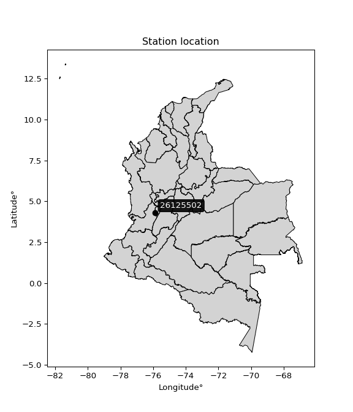

<div align="center">


</div>

# PMP Station (Rain, Pmax24h): 26125502

Probable Maximum Precipitation (PMP) is the greatest amount of rainfall for a specific duration that is meteorologically possible for a given location, acting as a "worst-case" scenario for extreme storms, crucial for designing safety-critical infrastructure like bridges, river deviations, dams, spillways, and nuclear plants to prevent catastrophic failure. PMP is calculated by hydrologists using meteorological data to determine the upper limit of extreme rainfall, often leading to the Probable Maximum Flood (PMF) for flood control design, and is increasingly being studied for climate change impacts. Probable Maximum Precipitation (PMP) is the theoretical upper limit of rainfall, a deterministic estimate for extreme events, while probability distributions (like GEV, Gumbel) describe the likelihood and frequency of various precipitation amounts, including rare ones, showing how often events occur, with PMP representing the extreme end of these distributions, used for critical infrastructure design to ensure safety against the worst conceivable weather, unlike standard statistical forecasts which cover typical probabilities.

The most common probability distributions in hydrology, used for analyzing floods, rainfall, and streamflow, include the Normal, Log-Normal, Gumbel, Gamma (including Log-Pearson Type III), and Generalized Extreme Value (GEV) distributions, often chosen based on the data´s skewness and whether modeling extremes or general conditions, with Gumbel and GEV popular for extreme events like floods, while the Normal distribution serves as a baseline, though often requiring transformations for skewed hydrological data. These distributions help in designing water infrastructure, managing water resources, and forecasting hydrologic events.

> Hydrological data often isn´t perfectly normal (it´s skewed), so different distributions are needed for different applications, such as: **Flood Frequency Analysis**: Using Gumbel, GEV, or Log-Pearson Type III for predicting extreme flood magnitudes and their return periods, **Rainfall Analysis**: Normal for annual totals, but Log-Normal, Weibull, or GEV for intensity or extreme daily rainfall, **Streamflow Modeling**: Gamma and Log-Normal for maximum flows, GEV for minimum flows, and Kappa for daily flows.

<div align="center">

</img>

</div>


## A. General information


### 1. General running parameters

• app_version: _v20260113_. • runtime: _2026-01-13 16:28:34.738620_. • Python version: _3.14.0_. • SciPy version: _1.16.3_. • Pandas version: _2.3.3_. • NumPy version: _2.3.5_. • Stations dataset (station_dataset_file): _dataset/pmax24h_in/automatic_colombia_2003_2025.csv_. • Stations catalog (station_catalog_file): _dataset/CNE.xls_. • Minimum year to eval til year_max (date_min): _1900_. • Maximum year to eval since year_min (date_max): _2025_. • Creates, save and include plots into reports (create_plot): _False_. • Plot only fit distributions with Δo > Δ (plot_only_fit): _True_. • Plot only simple graphs avoiding multiple CDFs and multiple Extreme values plots (plot_only_simple): _True_. • Eval low extreme values, if False, evaluates high extreme values (low_extreme): _False_. • Eval every SciPy distribution as logarithmic (pdist_logarithmic_on): _True_. • Standard deviation normalized (ddof): _1.0_. • Return periods to eval in years (Tr): _[2, 2.33, 5, 10, 15, 20, 25, 50, 75, 100, 200, 250, 500, 750, 1000]_. • Minimum data sample per station, 0 means any (minimum_sample): _5_. • Z-Score maximum threshold to adjust a value, 0 means disable (zscore_max): _3.5_. • Z-Score minimum threshold to adjust a value, 0 means disable (zscore_min): _-2.5_. • Avoid zeros, e.g. rain = 0 (avoid_zeros): _True_. • Avoid null values (avoid_nans): _True_. 

:file_folder:Table: [dataset.csv](../../dataset/pmax24h_in/automatic_colombia_2003_2025.csv)

> Delta Degrees of Freedom (DDOF): is a parameter used in the formulas for calculating variance and standard deviation. When ddof=0, the divisor is $N$ (the total number of observations) and this is used when your data set is the entire population. When ddof=1, the divisor is $N-1$ and this is used when your data set is a sample drawn from a larger population. Using $N-1$ provides an unbiased estimate of the population variance (known as Bessel´s correction).


### 2. Station info and location

|   id |   CODIGO | NOMBRE                        | CATEGORIA               | TECNOLOGIA                | ESTADO   | FECHA_INSTALACION   |   FECHA_SUSPENSION |   ALTITUD |   LATITUD |   LONGITUD | DEPARTAMENTO    | MUNICIPIO   | AREA_OPERATIVA                         | ENTIDAD                                    | AREA_HIDROGRAFICA   | ZONA_HIDROGRAFICA   | SUBZONA_HIDROGRAFICA   |   CORRIENTE | Catalogo   |   Version |
|-----:|---------:|:------------------------------|:------------------------|:--------------------------|:---------|:--------------------|-------------------:|----------:|----------:|-----------:|:----------------|:------------|:---------------------------------------|:-------------------------------------------|:--------------------|:--------------------|:-----------------------|------------:|:-----------|----------:|
|    0 | 26125502 | CAICEDONIA  - AUT  [26125502] | Climatológica Principal | Automática con Telemetría | Activa   | 10/09/2013          |                nan |       999 |   4.29756 |    -75.864 | Valle Del Cauca | Caicedonia  | Area Operativa 09 - Cauca-Valle-Caldas | CENTRO NACIONAL DE INVESTIGACIONES DE CAFE | Magdalena Cauca     | Cauca               | Río La Vieja           |         nan | CNE_OE     |  20251226 |

<div align="center">

Dynamic map: [:earth_americas:Google](http://maps.google.com/maps?q=4.297558333,-75.86396111) [:earth_americas:OSM](https://www.openstreetmap.org/#map=18/4.297558333/-75.86396111&layers=P) [:earth_americas:Bing](https://www.bing.com/maps?cp=4.297558333~-75.86396111&lvl=18) [:earth_americas:Apple](https://maps.apple.com/frame?center=4.297558333%2C-75.86396111&span=0.003%2C0.006)

</div>


<div align="center">

```geojson
{
  "type": "Feature",
  "geometry": {
    "type": "Point", 
    "coordinates": [-75.86396111, 4.297558333]
  }, 
  "properties": {
    "Name": "26125502"
  }
}
```

</div>


### 3. Discrete values table and plot

<div align="center">

|               |           0 |          1 |          2 |           3 |           4 |           5 |           6 |
|:--------------|------------:|-----------:|-----------:|------------:|------------:|------------:|------------:|
| Date          | 2017        | 2018       | 2019       | 2020        | 2021        | 2022        | 2023        |
| Value         |   78.7      |   54.9     |  103       |   71.9      |   63.1      |   86        |   72.4      |
| Value_initial |   78.7      |   54.9     |  103       |   71.9      |   63.1      |   86        |   72.4      |
| count         |    7        |    7       |    7       |    7        |    7        |    7        |    7        |
| mean          |   75.7143   |   75.7143  |   75.7143  |   75.7143   |   75.7143   |   75.7143   |   75.7143   |
| std           |   15.6903   |   15.6903  |   15.6903  |   15.6903   |   15.6903   |   15.6903   |   15.6903   |
| zscore        |    0.190291 |   -1.32657 |    1.73902 |   -0.243099 |   -0.803956 |    0.655547 |   -0.211232 |


</div>


> The initial value (value_initial) correspond to the initial obtained or null completed value, and value (value) is adjusted only when the initial value is outside the valid range (outlier) definite through the Z-Score value. If Z-Score is active, values out of range or outliers are replaced with the station mean value. A Z-Score (or standard score) measures how many standard deviations a data point is from the mean of a dataset, indicating its relative position; positive scores mean above the mean, negative mean below, and a score of zero is exactly at the mean, allowing for comparison of values from different distributions. It´s calculated using the formula $z=(x–μ)/σ$, where $x$ is the data point, $μ$ is the mean, and $σ$ is the standard deviation, helping identify outliers and understand probability.
>
> <sub>**Note**: In this study, "completing" (filling gaps in) and "extending" (forecasting or lengthening the historical record) rainfall data series are avoided for certain critical analyses because they introduce artificial bias and uncertainty, which can distort the statistics of rare events (extremes), alter day-to-day variability, and compromise the integrity and homogeneity of the original data. Some reasons against Completing/Extending rainfall data are: **Distortion of Extremes and Variability**: The primary issue is that most gap-filling or extension methods rely on averaging or regression with nearby stations, which inherently smooths the data. Rainfall is highly variable in space and time, with a large percentage of zero values and occasional large storms. Infilling methods often underestimate the highest values and overestimate the lowest (zero) values, which severely distorts analyses focused on flood frequency, drought severity, and intensity-duration-frequency (IDF) curves, **Loss of Data Homogeneity**: Infilled or extended data are synthetic estimates, not actual measurements. Combining these estimates with observed data can violate the assumption of data homogeneity, which requires that the data properties do not change over time. Inhomogeneity can lead to incorrect conclusions about long-term trends or changes in climate patterns, **Propagation of Errors**: Errors and biases from the original data (e.g., wind-induced undercatch, instrument errors, site changes) or the data used for imputation can propagate through the analysis, leading to unreliable hydrological models and inaccurate predictions, **Compromised Statistical Integrity**: For statistical analyses, especially those involving the frequency of events, using artificial data can introduce time bias or autocorrelation that doesn´t exist in reality, making it difficult to assess the true probability of events, **Difficulty in Validation**: It is difficult to accurately validate the quality of filled or extended data, especially for past periods where ground-truth measurements are unavailable. The reliability of imputation techniques heavily depends on the density of the surrounding station network and the complexity of the local topography.</sub>


### 4. Active continuous probability distributions from SciPy (45 of 104 available)

A Probability Density Function (PDF) describes the relative likelihood of a continuous random variable falling within a specific range, where the total area under its curve equals 1, and the area over any interval gives the actual probability for that range. Unlike discrete probabilities (like rolling a die), a PDF shows density, not direct probability for a single point (which is zero), with higher points indicating higher likelihood, often visualized as a bell curve for normal distributions.

A log of a probability density function (log-PDF) is simply the logarithm of the PDF´s value, denoted as $log(f(x))$, useful for converting multiplication of probabilities into addition, improving numerical stability with tiny numbers, and connecting to information theory concepts like entropy. Instead of dealing with very small probabilities (e.g., 0.000001), log-PDFs use negative numbers (e.g., $log(0.00001) ≈ -11.51$ that are easier for computers to handle, preventing underflow errors and simplifying complex calculations. In this study, each active probability distribution from SciPy is also evaluated in the $log$ form.

[scipy.stats](https://docs.scipy.org/doc/scipy/reference/stats.html) is a Python´s powerful submodule within the SciPy library for comprehensive statistical analysis, offering over 130 probability distributions (like Normal, Poisson), functions for descriptive stats (mean, variance), hypothesis testing (t-tests, chi-square), random variable generation, and statistical tests, making it essential for data science, modeling, and research. It provides tools to explore, model, and draw conclusions from data efficiently, working seamlessly with NumPy.

<div align="center">

|   id | p_dist             |   n_parameter | fit_method   | label                                                                       | active   | ref                                                                                                        |
|-----:|:-------------------|--------------:|:-------------|:----------------------------------------------------------------------------|:---------|:-----------------------------------------------------------------------------------------------------------|
|    0 | alpha              |             3 | MLE          | Alpha                                                                       | True     | [:mortar_board:](https://docs.scipy.org/doc/scipy/reference/generated/scipy.stats.alpha.html)              |
|    1 | betaprime          |             4 | MLE          | Beta prime                                                                  | True     | [:mortar_board:](https://docs.scipy.org/doc/scipy/reference/generated/scipy.stats.betaprime.html)          |
|    2 | chi2               |             3 | MLE          | Chi²                                                                        | True     | [:mortar_board:](https://docs.scipy.org/doc/scipy/reference/generated/scipy.stats.chi2.html)               |
|    3 | crystalball        |             4 | MLE          | Crystalball                                                                 | True     | [:mortar_board:](https://docs.scipy.org/doc/scipy/reference/generated/scipy.stats.crystalball.html)        |
|    4 | dweibull           |             3 | MLE          | Double Weibull                                                              | True     | [:mortar_board:](https://docs.scipy.org/doc/scipy/reference/generated/scipy.stats.dweibull.html)           |
|    5 | erlang             |             3 | MLE          | Erlang                                                                      | True     | [:mortar_board:](https://docs.scipy.org/doc/scipy/reference/generated/scipy.stats.erlang.html)             |
|    6 | expon              |             2 | MLE          | Exponential                                                                 | True     | [:mortar_board:](https://docs.scipy.org/doc/scipy/reference/generated/scipy.stats.expon.html)              |
|    7 | exponnorm          |             3 | MLE          | Exponentially modified Normal                                               | True     | [:mortar_board:](https://docs.scipy.org/doc/scipy/reference/generated/scipy.stats.exponnorm.html)          |
|    8 | f                  |             4 | MLE          | F                                                                           | True     | [:mortar_board:](https://docs.scipy.org/doc/scipy/reference/generated/scipy.stats.f.html)                  |
|    9 | fatiguelife        |             3 | MLE          | Fatigue-life (Birnbaum-Saunders)                                            | True     | [:mortar_board:](https://docs.scipy.org/doc/scipy/reference/generated/scipy.stats.fatiguelife.html)        |
|   10 | fisk               |             3 | MLE          | Fisk                                                                        | True     | [:mortar_board:](https://docs.scipy.org/doc/scipy/reference/generated/scipy.stats.fisk.html)               |
|   11 | gamma              |             3 | MLE          | Gamma                                                                       | True     | [:mortar_board:](https://docs.scipy.org/doc/scipy/reference/generated/scipy.stats.gamma.html)              |
|   12 | genexpon           |             5 | MLE          | Generalized exponential                                                     | True     | [:mortar_board:](https://docs.scipy.org/doc/scipy/reference/generated/scipy.stats.genexpon.html)           |
|   13 | genlogistic        |             3 | MLE          | Generalized logistic                                                        | True     | [:mortar_board:](https://docs.scipy.org/doc/scipy/reference/generated/scipy.stats.genlogistic.html)        |
|   14 | gibrat             |             2 | MM           | Gibrat                                                                      | True     | [:mortar_board:](https://docs.scipy.org/doc/scipy/reference/generated/scipy.stats.gibrat.html)             |
|   15 | gompertz           |             3 | MLE          | Gompertz (or truncated Gumbel)                                              | True     | [:mortar_board:](https://docs.scipy.org/doc/scipy/reference/generated/scipy.stats.gompertz.html)           |
|   16 | gumbel_l           |             2 | MM           | Gumbel Left Skew                                                            | True     | [:mortar_board:](https://docs.scipy.org/doc/scipy/reference/generated/scipy.stats.gumbel_l.html)           |
|   17 | gumbel_r           |             2 | MM           | Gumbel Right Skew                                                           | True     | [:mortar_board:](https://docs.scipy.org/doc/scipy/reference/generated/scipy.stats.gumbel_r.html)           |
|   18 | halflogistic       |             2 | MM           | Half-logistic                                                               | True     | [:mortar_board:](https://docs.scipy.org/doc/scipy/reference/generated/scipy.stats.halflogistic.html)       |
|   19 | halfnorm           |             2 | MM           | Half Normal                                                                 | True     | [:mortar_board:](https://docs.scipy.org/doc/scipy/reference/generated/scipy.stats.halfnorm.html)           |
|   20 | hypsecant          |             2 | MM           | hyperbolic secant                                                           | True     | [:mortar_board:](https://docs.scipy.org/doc/scipy/reference/generated/scipy.stats.hypsecant.html)          |
|   21 | invgamma           |             3 | MLE          | Inverted gamma                                                              | True     | [:mortar_board:](https://docs.scipy.org/doc/scipy/reference/generated/scipy.stats.invgamma.html)           |
|   22 | invgauss           |             3 | MLE          | Inverse Gaussian                                                            | True     | [:mortar_board:](https://docs.scipy.org/doc/scipy/reference/generated/scipy.stats.invgauss.html)           |
|   23 | invweibull         |             3 | MLE          | Inverted Weibull                                                            | True     | [:mortar_board:](https://docs.scipy.org/doc/scipy/reference/generated/scipy.stats.invweibull.html)         |
|   24 | kappa4             |             4 | MLE          | Kappa 4                                                                     | True     | [:mortar_board:](https://docs.scipy.org/doc/scipy/reference/generated/scipy.stats.kappa4.html)             |
|   25 | kstwobign          |             2 | MLE          | Limiting distribution of scaled Kolmogorov-Smirnov two-sided test statistic | True     | [:mortar_board:](https://docs.scipy.org/doc/scipy/reference/generated/scipy.stats.kstwobign.html)          |
|   26 | laplace            |             2 | MM           | Laplace                                                                     | True     | [:mortar_board:](https://docs.scipy.org/doc/scipy/reference/generated/scipy.stats.laplace.html)            |
|   27 | laplace_asymmetric |             3 | MLE          | Asymmetric Laplace                                                          | True     | [:mortar_board:](https://docs.scipy.org/doc/scipy/reference/generated/scipy.stats.laplace_asymmetric.html) |
|   28 | loggamma           |             3 | MLE          | Log gamma                                                                   | True     | [:mortar_board:](https://docs.scipy.org/doc/scipy/reference/generated/scipy.stats.loggamma.html)           |
|   29 | logistic           |             2 | MM           | Logistic (or Sech-squared)                                                  | True     | [:mortar_board:](https://docs.scipy.org/doc/scipy/reference/generated/scipy.stats.logistic.html)           |
|   30 | lognorm            |             3 | MLE          | Log Normal                                                                  | True     | [:mortar_board:](https://docs.scipy.org/doc/scipy/reference/generated/scipy.stats.lognorm.html)            |
|   31 | maxwell            |             2 | MM           | Maxwell                                                                     | True     | [:mortar_board:](https://docs.scipy.org/doc/scipy/reference/generated/scipy.stats.maxwell.html)            |
|   32 | mielke             |             4 | MLE          | Mielke Beta-Kappa / Dagum                                                   | True     | [:mortar_board:](https://docs.scipy.org/doc/scipy/reference/generated/scipy.stats.mielke.html)             |
|   33 | moyal              |             2 | MM           | Moyal                                                                       | True     | [:mortar_board:](https://docs.scipy.org/doc/scipy/reference/generated/scipy.stats.moyal.html)              |
|   34 | nakagami           |             3 | MLE          | Nakagami                                                                    | True     | [:mortar_board:](https://docs.scipy.org/doc/scipy/reference/generated/scipy.stats.nakagami.html)           |
|   35 | ncf                |             5 | MLE          | Non-central F distribution                                                  | True     | [:mortar_board:](https://docs.scipy.org/doc/scipy/reference/generated/scipy.stats.ncf.html)                |
|   36 | nct                |             4 | MLE          | Non-central Student’s t                                                     | True     | [:mortar_board:](https://docs.scipy.org/doc/scipy/reference/generated/scipy.stats.nct.html)                |
|   37 | norm               |             2 | MM           | Normal                                                                      | True     | [:mortar_board:](https://docs.scipy.org/doc/scipy/reference/generated/scipy.stats.norm.html)               |
|   38 | pearson3           |             3 | MM           | Pearson type III                                                            | True     | [:mortar_board:](https://docs.scipy.org/doc/scipy/reference/generated/scipy.stats.pearson3.html)           |
|   39 | rayleigh           |             2 | MM           | Rayleigh                                                                    | True     | [:mortar_board:](https://docs.scipy.org/doc/scipy/reference/generated/scipy.stats.rayleigh.html)           |
|   40 | rice               |             3 | MLE          | Rice                                                                        | True     | [:mortar_board:](https://docs.scipy.org/doc/scipy/reference/generated/scipy.stats.rice.html)               |
|   41 | t                  |             3 | MLE          | Student’s t                                                                 | True     | [:mortar_board:](https://docs.scipy.org/doc/scipy/reference/generated/scipy.stats.t.html)                  |
|   42 | truncnorm          |             4 | MLE          | Truncated normal                                                            | True     | [:mortar_board:](https://docs.scipy.org/doc/scipy/reference/generated/scipy.stats.truncnorm.html)          |
|   43 | wald               |             2 | MM           | Wald                                                                        | True     | [:mortar_board:](https://docs.scipy.org/doc/scipy/reference/generated/scipy.stats.wald.html)               |
|   44 | weibull_min        |             3 | MLE          | Weibull minimum                                                             | True     | [:mortar_board:](https://docs.scipy.org/doc/scipy/reference/generated/scipy.stats.weibull_min.html)        |

</div>

> **n_parameter:** # arguments & localization & scale.
>
> **Fit methods:** (MLE) maximum likelihood, (MM) L-moments.
>
>**Inactive** (With the only purpose of prevent loops, zero divisions, infinite values, over high estimated values or horizontal trending for recurrence intervals estimations, the follow distributions were disabled.)**:** foldnorm, gennorm, norminvgauss, powernorm, powerlognorm, skewnorm, genextreme, anglit, arcsine, argus, beta, bradford, burr, burr12, cauchy, cosine, halfcauchy, foldcauchy, skewcauchy, wrapcauchy, dgamma, gengamma, exponweib, exponpow, truncexpon, gausshyper, genhalflogistic, genhyperbolic, geninvgauss, halfgennorm, johnsonsb, johnsonsu, kappa3, ksone, kstwo, loglaplace, levy, levy_l, levy_stable, ncx2, pareto, genpareto, truncpareto, lomax, powerlaw, rdist, rel_breitwigner, recipinvgauss, semicircular, studentized_range, trapezoid, triang, truncweibull_min, tukeylambda, uniform, loguniform, vonmises, vonmises_line, weibull_max, 


## B. Probability (PDF) vs. Empirical (EDF) distributions functions

A continuous probability distribution (CPD) describes probabilities for variables that can take any value within a range (like rain any time), unlike discrete variables with specific outcomes (like temperature). It uses a Probability Density Function (PDF), a curve where the total area under it equals 1, and the probability of the variable falling within an interval (a to b) is found by calculating the area under the curve between those points. A key feature is that the probability of hitting any single exact value is zero, so probabilities are always expressed for ranges, e.g., $P(a ≤ X ≤ b)$.

<div align="center">

Distributions parameters from station values
|    |   station | p_dist                |   n |             loc |          scale | shape                 | shape1                 | shape2             | shape3   |
|---:|----------:|:----------------------|----:|----------------:|---------------:|:----------------------|:-----------------------|:-------------------|:---------|
|  0 |  26125502 | alpha                 |   7 |   -39.4789      |  926.721       | 8.169786633440113     |                        |                    |          |
|  1 |  26125502 | betaprime             |   7 |    -1.68382     |    3.57831     | 648.0208631274722     | 30.957098906086387     |                    |          |
|  2 |  26125502 | chi2                  |   7 |    54.9         |    1.84403     | 0.29118678873756954   |                        |                    |          |
|  3 |  26125502 | crystalball           |   7 |    75.7143      |   14.5264      | 5948.130186415619     | 211.9448028645397      |                    |          |
|  4 |  26125502 | dweibull              |   7 |    75.7872      |   12.6934      | 1.3451560157770475    |                        |                    |          |
|  5 |  26125502 | erlang                |   7 |    46.5343      |    8.10347     | 3.600929265480584     |                        |                    |          |
|  6 |  26125502 | expon                 |   7 |    54.9         |   20.8143      |                       |                        |                    |          |
|  7 |  26125502 | exponnorm             |   7 |    63.5387      |    9.1372      | 1.3325358928967423    |                        |                    |          |
|  8 |  26125502 | f                     |   7 |    -3.96858     |   77.3967      | 622.0775497930991     | 69.59247066054658      |                    |          |
|  9 |  26125502 | fatiguelife           |   7 |    54.9         |    3.4764e-06  | 2521.9816524212033    |                        |                    |          |
| 10 |  26125502 | fisk                  |   7 |    -0.236258    |   74.408       | 9.10713628181848      |                        |                    |          |
| 11 |  26125502 | gamma                 |   7 |    46.5343      |    8.10348     | 3.600918538539956     |                        |                    |          |
| 12 |  26125502 | genexpon              |   7 |    54.8999      |    2.16718     | 0.10447543574359686   | 1.1822232381327217e-06 | 2.3264122666383233 |          |
| 13 |  26125502 | genlogistic           |   7 |     2.36933     |   12.1641      | 236.3703714327861     |                        |                    |          |
| 14 |  26125502 | gibrat                |   7 |    64.6325      |    6.72144     |                       |                        |                    |          |
| 15 |  26125502 | gompertz              |   7 |   -90.7547      |   15.073       | 9.665746189446127e-06 |                        |                    |          |
| 16 |  26125502 | gumbel_l              |   7 |    82.2519      |   11.3262      |                       |                        |                    |          |
| 17 |  26125502 | gumbel_r              |   7 |    69.1766      |   11.3262      |                       |                        |                    |          |
| 18 |  26125502 | halflogistic          |   7 |    58.4972      |   12.4195      |                       |                        |                    |          |
| 19 |  26125502 | halfnorm              |   7 |    56.487       |   24.0978      |                       |                        |                    |          |
| 20 |  26125502 | hypsecant             |   7 |    75.7143      |    9.24778     |                       |                        |                    |          |
| 21 |  26125502 | invgamma              |   7 |     3.7108      | 1764.92        | 25.504647332248368    |                        |                    |          |
| 22 |  26125502 | invgauss              |   7 |    25.6487      |  563.179       | 0.08889805690773442   |                        |                    |          |
| 23 |  26125502 | invweibull            |   7 |    54.9         |    1.52303     | 0.05090690990601117   |                        |                    |          |
| 24 |  26125502 | kappa4                |   7 |    49.5864      |   57.1778      | 1.1028342198474683    | 1.0701405715082055     |                    |          |
| 25 |  26125502 | kstwobign             |   7 |    25.7065      |   57.3692      |                       |                        |                    |          |
| 26 |  26125502 | laplace               |   7 |    75.7143      |   10.2717      |                       |                        |                    |          |
| 27 |  26125502 | laplace_asymmetric    |   7 |    71.9         |   10.6815      | 0.8372647283380816    |                        |                    |          |
| 28 |  26125502 | loggamma              |   7 | -4597.81        |  623.387       | 1803.120315232511     |                        |                    |          |
| 29 |  26125502 | logistic              |   7 |    75.7143      |    8.00881     |                       |                        |                    |          |
| 30 |  26125502 | lognorm               |   7 |    54.9         |    0.129691    | 12.476409294729223    |                        |                    |          |
| 31 |  26125502 | maxwell               |   7 |    41.2929      |   21.5704      |                       |                        |                    |          |
| 32 |  26125502 | mielke                |   7 |   -51.1275      |  116.735       | 24.800249772289966    | 12.869496392798125     |                    |          |
| 33 |  26125502 | moyal                 |   7 |    67.4072      |    6.53917     |                       |                        |                    |          |
| 34 |  26125502 | nakagami              |   7 |    63.1         |   13.9377      | 0.06724820232337703   |                        |                    |          |
| 35 |  26125502 | ncf                   |   7 |    -4.14389     |   53.6712      | 549.7489665208186     | 70.12331735620691      | 244.93734657187383 |          |
| 36 |  26125502 | nct                   |   7 |    -0.196752    |    4.94981     | 16.88201105951141     | 14.649467496718563     |                    |          |
| 37 |  26125502 | norm                  |   7 |    75.7143      |   14.5264      |                       |                        |                    |          |
| 38 |  26125502 | pearson3              |   7 |    75.7143      |   14.5264      | 0.4806002190658001    |                        |                    |          |
| 39 |  26125502 | rayleigh              |   7 |    47.9245      |   22.1731      |                       |                        |                    |          |
| 40 |  26125502 | rice                  |   7 |    48.9271      |   20.6426      | 0.4232490490796672    |                        |                    |          |
| 41 |  26125502 | t                     |   7 |    75.7138      |   14.5257      | 15169.547651805566    |                        |                    |          |
| 42 |  26125502 | truncnorm             |   7 |   -84.132       |   15.8729      | 8.701923084909726     | 11.789369119432695     |                    |          |
| 43 |  26125502 | wald                  |   7 |    61.1879      |   14.5264      |                       |                        |                    |          |
| 44 |  26125502 | weibull_min           |   7 |    52.2122      |   26.0447      | 1.5804240911426666    |                        |                    |          |
| 45 |  26125502 | logalpha              |   7 |    -1.70464     |  190.951       | 31.7846908507983      |                        |                    |          |
| 46 |  26125502 | logbetaprime          |   7 |     0.795234    |   38.6425      | 375.16473137222624    | 4126.492448792662      |                    |          |
| 47 |  26125502 | logchi2               |   7 |     4.00551     |    0.926892    | 1.1187157708370625    |                        |                    |          |
| 48 |  26125502 | logcrystalball        |   7 |     4.30892     |    0.189503    | 452.38714109003183    | 2401.1309193805464     |                    |          |
| 49 |  26125502 | logdweibull           |   7 |     4.3245      |    0.167761    | 1.3607406891515188    |                        |                    |          |
| 50 |  26125502 | logerlang             |   7 |     2.06784     |    0.0160634   | 139.5086310768586     |                        |                    |          |
| 51 |  26125502 | logexpon              |   7 |     4.00551     |    0.303406    |                       |                        |                    |          |
| 52 |  26125502 | logexponnorm          |   7 |     4.27839     |    0.187031    | 0.16322307946421918   |                        |                    |          |
| 53 |  26125502 | logf                  |   7 |     2.68058     |    1.62653     | 158.48309086090683    | 1970.1684467935825     |                    |          |
| 54 |  26125502 | logfatiguelife        |   7 |     1.64009     |    2.6621      | 0.07108655757586663   |                        |                    |          |
| 55 |  26125502 | logfisk               |   7 |     1.39953     |    2.90397     | 26.376469332081946    |                        |                    |          |
| 56 |  26125502 | loggamma              |   7 |     2.06045     |    0.0159249   | 141.16907894667702    |                        |                    |          |
| 57 |  26125502 | loggenexpon           |   7 |     4.00551     |    1.05837e+06 | 1625992.8355851122    | 16476135.766690986     | 606927.3304807257  |          |
| 58 |  26125502 | loggenlogistic        |   7 |     4.21701     |    0.127506    | 1.6422393103074517    |                        |                    |          |
| 59 |  26125502 | loggibrat             |   7 |     4.16434     |    0.0876875   |                       |                        |                    |          |
| 60 |  26125502 | loggompertz           |   7 |     4.00551     |    0.541399    | 1.2145055783501948    |                        |                    |          |
| 61 |  26125502 | loggumbel_l           |   7 |     4.39421     |    0.147755    |                       |                        |                    |          |
| 62 |  26125502 | loggumbel_r           |   7 |     4.22363     |    0.147755    |                       |                        |                    |          |
| 63 |  26125502 | loghalflogistic       |   7 |     4.08428     |    0.162042    |                       |                        |                    |          |
| 64 |  26125502 | loghalfnorm           |   7 |     4.05812     |    0.314336    |                       |                        |                    |          |
| 65 |  26125502 | loghypsecant          |   7 |     4.30892     |    0.120642    |                       |                        |                    |          |
| 66 |  26125502 | loginvgamma           |   7 |    -1.95901     | 6879.75        | 1098.6352175902011    |                        |                    |          |
| 67 |  26125502 | loginvgauss           |   7 |     2.99137     |   60.6618      | 0.021712348262155873  |                        |                    |          |
| 68 |  26125502 | loginvweibull         |   7 |    -4.82428e+06 |    4.82429e+06 | 27720936.49538395     |                        |                    |          |
| 69 |  26125502 | logkappa4             |   7 |     3.987       |    0.647954    | 1.0294122371670125    | 0.9996976431739645     |                    |          |
| 70 |  26125502 | logkstwobign          |   7 |     3.60271     |    0.808489    |                       |                        |                    |          |
| 71 |  26125502 | loglaplace            |   7 |     4.30892     |    0.133999    |                       |                        |                    |          |
| 72 |  26125502 | loglaplace_asymmetric |   7 |     4.28221     |    0.145178    | 0.9122751784300285    |                        |                    |          |
| 73 |  26125502 | logloggamma           |   7 |   -33.2161      |    5.55985     | 853.9268960153654     |                        |                    |          |
| 74 |  26125502 | loglogistic           |   7 |     4.30892     |    0.104479    |                       |                        |                    |          |
| 75 |  26125502 | loglognorm            |   7 |     4.00551     |    0.00265853  | 11.735991675904495    |                        |                    |          |
| 76 |  26125502 | logmaxwell            |   7 |     3.85988     |    0.281396    |                       |                        |                    |          |
| 77 |  26125502 | logmielke             |   7 | -3528.17        | 3532.43        | 38112.05663034256     | 29930.699160117718     |                    |          |
| 78 |  26125502 | logmoyal              |   7 |     4.20055     |    0.0853065   |                       |                        |                    |          |
| 79 |  26125502 | lognakagami           |   7 |     4.00551     |    0.364099    | 0.08456449146521136   |                        |                    |          |
| 80 |  26125502 | logncf                |   7 |     1.14349     |    2.31873     | 1242.4215841552182    | 959.4503697365313      | 450.1491343358174  |          |
| 81 |  26125502 | lognct                |   7 |     0.796245    |    0.0923662   | 226.55187684008575    | 37.90236917306966      |                    |          |
| 82 |  26125502 | lognorm               |   7 |     4.30892     |    0.189503    |                       |                        |                    |          |
| 83 |  26125502 | logpearson3           |   7 |     4.30892     |    0.189503    | 0.11400012284328556   |                        |                    |          |
| 84 |  26125502 | lograyleigh           |   7 |     3.94639     |    0.289258    |                       |                        |                    |          |
| 85 |  26125502 | logrice               |   7 |     3.91367     |    0.222185    | 1.3755046507447068    |                        |                    |          |
| 86 |  26125502 | logt                  |   7 |     4.30892     |    0.189504    | 2106909072.6962233    |                        |                    |          |
| 87 |  26125502 | logtruncnorm          |   7 |    -0.0516941   |    1.17046     | 3.466341804345279     | 5.331214218905647      |                    |          |
| 88 |  26125502 | logwald               |   7 |     4.11945     |    0.18947     |                       |                        |                    |          |
| 89 |  26125502 | logweibull_min        |   7 |     3.88348     |    0.479991    | 2.415713822553453     |                        |                    |          |

</div>

> **loc** (Location parameter): This shifts the distribution along the x-axis. For many common distributions, like the normal (Gaussian) distribution, loc represents the mean $μ$. For others, like the uniform distribution, it might represent the minimum value, or for the beta distribution, the left end of the support interval.
>
> **scale** (Scale parameter): This determines the width or spread of the distribution. For the normal distribution, scale represents the standard deviation $σ$. For a uniform distribution, it defines the length of the interval (from $loc$ to $loc + scale$).
>
> **shape** (Shape parameters): Refers to parameters that define the specific form of a probability distribution, distinct from its location (loc) and scale (scale). These parameters are required arguments for most distribution functions. For example, a normal (Gaussian) distribution is fully defined by its location (mean) and scale (standard deviation), so it has no specific shape parameters beyond loc and scale. However, other distributions have intrinsic properties that need specification, as Gamma distribution that takes a shape parameter, often named $a$ or $alpha$.


### 0. Cumulative distribution values - CDF (90 evaluated)

Cumulative Distribution Function (CDF), denoted as $F$<sub>$X$</sub>$(x)$, is a function that gives the probability that a random variable $X$ will take a value less than or equal to a specific value, $x$ (i.e., $(P(X≥x)$. It essentially "accumulates" probabilities from a given point up to the far right (positive infinity), providing a complete picture of the distribution´s probabilities for both discrete (like rain) and continuous (like temperature) variables, helping to find probabilities over ranges or above certain values. Each station is evaluated separately ordering the $x$ values ascending, calculating the CDF and PDF values for the activated distributions and their logarithmic forms.

<div align="center">

CDF ordered by x ascending and calculating $log(f(x))$ separately
|   id |   Station |   date |     x |   count |    mean |     std |    zscore |   Value_initial |   station |   m |     alpha |   alpha_pdf |   betaprime |   betaprime_pdf |       chi2 |    chi2_pdf |   crystalball |   crystalball_pdf |   dweibull |   dweibull_pdf |    erlang |   erlang_pdf |    expon |   expon_pdf |   exponnorm |   exponnorm_pdf |         f |      f_pdf |   fatiguelife |   fatiguelife_pdf |      fisk |   fisk_pdf |    gamma |   gamma_pdf |    genexpon |   genexpon_pdf |   genlogistic |   genlogistic_pdf |   gibrat |   gibrat_pdf |   gompertz |   gompertz_pdf |   gumbel_l |   gumbel_l_pdf |   gumbel_r |   gumbel_r_pdf |   halflogistic |   halflogistic_pdf |   halfnorm |   halfnorm_pdf |   hypsecant |   hypsecant_pdf |   invgamma |   invgamma_pdf |   invgauss |   invgauss_pdf |   invweibull |   invweibull_pdf |      kappa4 |   kappa4_pdf |   kstwobign |   kstwobign_pdf |   laplace |   laplace_pdf |   laplace_asymmetric |   laplace_asymmetric_pdf |   loggamma |   loggamma_pdf |   logistic |   logistic_pdf |   lognorm |   lognorm_pdf |   maxwell |   maxwell_pdf |    mielke |   mielke_pdf |      moyal |   moyal_pdf |   nakagami |   nakagami_pdf |       ncf |   ncf_pdf |       nct |    nct_pdf |      norm |   norm_pdf |   pearson3 |   pearson3_pdf |   rayleigh |   rayleigh_pdf |      rice |   rice_pdf |         t |      t_pdf |   truncnorm |   truncnorm_pdf |      wald |   wald_pdf |   weibull_min |   weibull_min_pdf |   logalpha |   logalpha_pdf |   logbetaprime |   logbetaprime_pdf |     logchi2 |   logchi2_pdf |   logcrystalball |   logcrystalball_pdf |   logdweibull |   logdweibull_pdf |   logerlang |   logerlang_pdf |   logexpon |   logexpon_pdf |   logexponnorm |   logexponnorm_pdf |      logf |   logf_pdf |   logfatiguelife |   logfatiguelife_pdf |   logfisk |   logfisk_pdf |   loggenexpon |   loggenexpon_pdf |   loggenlogistic |   loggenlogistic_pdf |   loggibrat |   loggibrat_pdf |   loggompertz |   loggompertz_pdf |   loggumbel_l |   loggumbel_l_pdf |   loggumbel_r |   loggumbel_r_pdf |   loghalflogistic |   loghalflogistic_pdf |   loghalfnorm |   loghalfnorm_pdf |   loghypsecant |   loghypsecant_pdf |   loginvgamma |   loginvgamma_pdf |   loginvgauss |   loginvgauss_pdf |   loginvweibull |   loginvweibull_pdf |   logkappa4 |   logkappa4_pdf |   logkstwobign |   logkstwobign_pdf |   loglaplace |   loglaplace_pdf |   loglaplace_asymmetric |   loglaplace_asymmetric_pdf |   logloggamma |   logloggamma_pdf |   loglogistic |   loglogistic_pdf |   loglognorm |   loglognorm_pdf |   logmaxwell |   logmaxwell_pdf |   logmielke |   logmielke_pdf |   logmoyal |   logmoyal_pdf |   lognakagami |   lognakagami_pdf |    logncf |   logncf_pdf |    lognct |   lognct_pdf |   logpearson3 |   logpearson3_pdf |   lograyleigh |   lograyleigh_pdf |   logrice |   logrice_pdf |      logt |   logt_pdf |   logtruncnorm |   logtruncnorm_pdf |   logwald |   logwald_pdf |   logweibull_min |   logweibull_min_pdf |
|-----:|----------:|-------:|------:|--------:|--------:|--------:|----------:|----------------:|----------:|----:|----------:|------------:|------------:|----------------:|-----------:|------------:|--------------:|------------------:|-----------:|---------------:|----------:|-------------:|---------:|------------:|------------:|----------------:|----------:|-----------:|--------------:|------------------:|----------:|-----------:|---------:|------------:|------------:|---------------:|--------------:|------------------:|---------:|-------------:|-----------:|---------------:|-----------:|---------------:|-----------:|---------------:|---------------:|-------------------:|-----------:|---------------:|------------:|----------------:|-----------:|---------------:|-----------:|---------------:|-------------:|-----------------:|------------:|-------------:|------------:|----------------:|----------:|--------------:|---------------------:|-------------------------:|-----------:|---------------:|-----------:|---------------:|----------:|--------------:|----------:|--------------:|----------:|-------------:|-----------:|------------:|-----------:|---------------:|----------:|----------:|----------:|-----------:|----------:|-----------:|-----------:|---------------:|-----------:|---------------:|----------:|-----------:|----------:|-----------:|------------:|----------------:|----------:|-----------:|--------------:|------------------:|-----------:|---------------:|---------------:|-------------------:|------------:|--------------:|-----------------:|---------------------:|--------------:|------------------:|------------:|----------------:|-----------:|---------------:|---------------:|-------------------:|----------:|-----------:|-----------------:|---------------------:|----------:|--------------:|--------------:|------------------:|-----------------:|---------------------:|------------:|----------------:|--------------:|------------------:|--------------:|------------------:|--------------:|------------------:|------------------:|----------------------:|--------------:|------------------:|---------------:|-------------------:|--------------:|------------------:|--------------:|------------------:|----------------:|--------------------:|------------:|----------------:|---------------:|-------------------:|-------------:|-----------------:|------------------------:|----------------------------:|--------------:|------------------:|--------------:|------------------:|-------------:|-----------------:|-------------:|-----------------:|------------:|----------------:|-----------:|---------------:|--------------:|------------------:|----------:|-------------:|----------:|-------------:|--------------:|------------------:|--------------:|------------------:|----------:|--------------:|----------:|-----------:|---------------:|-------------------:|----------:|--------------:|-----------------:|---------------------:|
|    0 |  26125502 |   2018 |  54.9 |       7 | 75.7143 | 15.6903 | -1.32657  |            54.9 |  26125502 |   1 | 0.0495358 |  0.0106507  |   0.0499156 |      0.010768   | 0.00770865 | 1.57954e+11 |     0.0759487 |        0.00983851 |  0.0708425 |     0.00891548 | 0.0379568 |    0.0128323 | 0        |  0.0480439  |   0.0511043 |      0.00994704 | 0.0512108 | 0.0107242  |     0.0337156 |        4.1926e+11 | 0.0612312 | 0.00949458 | 0.037957 |   0.0128323 | 2.84128e-06 |     0.0482079  |     0.0438232 |        0.0111935  | 0        |    0         |   0.141032 |     0.00866397 |  0.0854959 |     0.00721624 |  0.0293874 |     0.00915182 |       0        |          0         |   0        |      0         |   0.0668037 |      0.00717085 |  0.0477247 |     0.0108551  |  0.0447189 |      0.0113348 |   0.00467843 |      1.79821e+11 | 3.41273e-15 |    0.54131   |   0.0420137 |      0.0122738  | 0.0659064 |    0.00641631 |             0.061585 |               0.00688623 |  0.0493295 |       0.59412  |  0.0692077 |     0.00804339 | 0.0546819 |      0.584332 | 0.0593319 |    0.0120638  | 0.0563302 |   0.0102144  | 0.00926484 |  0.00537528 | 0          |    0           | 0.0513015 | 0.0107212 | 0.0467688 | 0.0107873  | 0.0759487 | 0.00983851 |   0.059576 |     0.0108425  |  0.0482803 |     0.0135031  | 0.0375542 | 0.0123368  | 0.0759537 | 0.00983833 |    0.396596 |     0.337206    | 0         | 0          |     0.0272401 |        0.015797   |  0.0488748 |       0.593122 |      0.0508816 |           0.589123 | 3.03176e-09 |   1.90935e+06 |        0.0546818 |             0.584332 |     0.0454722 |          0.465058 |   0.0496247 |        0.595576 |   0        |       3.29591  |      0.0544411 |           0.584447 | 0.0472278 |   0.600734 |        0.0481404 |             0.596103 | 0.0543817 |      0.520492 |   5.34859e-09 |          1.53632  |         0.049282 |             0.533219 |    0        |        0        |   2.89689e-09 |          2.24327  |     0.0694983 |          0.453624 |     0.0125707 |          0.372335 |          0        |              0        |      0        |          0        |      0.0513703 |           0.423964 |     0.0508287 |          0.590219 |     0.0435758 |          0.625135 |       0.0353683 |            0.679184 | 3.17149e-16 |         4.40864 |      0.0349278 |           0.775221 |    0.0519545 |         0.387723 |               0.0562291 |                    0.424554 |     0.0564973 |          0.586357 |     0.0519562 |          0.471452 |   0.00718654 |      1.91338e+12 |    0.0340448 |         0.664302 |   0.0534986 |        0.519347 | 0.00170903 |       0.107152 |    0.00286146 |       5.44886e+11 | 0.0488809 |     0.593841 | 0.0483033 |     0.595743 |     0.0511941 |          0.591202 |     0.0206734 |          0.692034 | 0.0330805 |      0.717943 | 0.0546821 |   0.584333 |    3.94491e-08 |           3.17854  | 0         |      0        |        0.0359184 |             0.698104 |
|    1 |  26125502 |   2021 |  63.1 |       7 | 75.7143 | 15.6903 | -0.803956 |            63.1 |  26125502 |   2 | 0.193672  |  0.0241812  |   0.194475  |      0.0241112  | 0.993435   | 0.00231025  |     0.192596  |        0.0188369  |  0.184062  |     0.0195022  | 0.212408  |    0.0275771 | 0.325619 |  0.0323999  |   0.189182  |      0.0239552  | 0.193993  | 0.0237817  |     0.72873   |        0.0123066  | 0.187368  | 0.0218937  | 0.212409 |   0.0275771 | 0.326531    |     0.032467   |     0.202096  |        0.0264766  | 0        |    0         |   0.230437 |     0.0133736  |  0.168351  |     0.013536   |  0.180859  |     0.0273063  |       0.183214 |          0.0389078 |   0.21624  |      0.0318868 |   0.159326  |      0.0165181  |  0.19558   |     0.0247046  |  0.200043  |      0.0256297 |   0.399368   |      0.00227572  | 0.190029    |    0.0211463 |   0.210787  |      0.0271011  | 0.14643   |    0.0142557  |             0.154056 |               0.017226   |  0.19501   |       1.53253  |  0.171497  |     0.0177412  | 0.193117  |      1.44633  | 0.204087  |    0.0226789  | 0.197166  |   0.0243746  | 0.164515   |  0.032273   | 0.00757979 |    1.43475e+11 | 0.193964  | 0.0237596 | 0.19549   | 0.0249839  | 0.192596  | 0.0188369  |   0.196081 |     0.0222585  |  0.208805  |     0.0244217  | 0.193945  | 0.0245351  | 0.1926    | 0.0188371  |    0.99459  |     0.00319729  | 0.0150471 | 0.0327905  |     0.22274   |        0.0284294  |  0.194889  |       1.53817  |      0.193745  |           1.50029  | 0.257207    |   0.984659    |        0.193117  |             1.44633  |     0.166647  |          1.38587  |   0.195282  |        1.53002  |   0.367968 |       2.08312  |      0.193137  |           1.44987  | 0.196583  |   1.57223  |        0.195476  |             1.55155  | 0.18495   |      1.44838  |   0.257781    |          2.02682  |         0.188445 |             1.54863  |    0        |        0        |   0.299599    |          2.03188  |     0.168726  |          1.03966  |     0.181615  |          2.09679  |          0.184366 |              2.98073  |      0.217079 |          2.44379  |      0.159783  |           1.26952  |     0.194172  |          1.50613  |     0.203039  |          1.67061  |       0.222734  |            1.92206  | 0.230893    |         1.61117 |      0.240229  |           1.99002  |    0.146824  |         1.09571  |               0.160856  |                    1.21453  |     0.193926  |          1.42981  |     0.171988  |          1.36304  |   0.632043   |      0.230689    |    0.204715  |         1.7406   |   0.185347  |        1.46756  | 0.165408   |       2.47874  |    0.719422   |       0.864148    | 0.195002  |     1.53856  | 0.195606  |     1.55221  |     0.194322  |          1.50166  |     0.20948   |          1.87386  | 0.203129  |      1.67292  | 0.193117  |   1.44632  |    0.361843    |           2.08983  | 0.0158919 |      2.58828  |        0.20549   |             1.69001  |
|    2 |  26125502 |   2020 |  71.9 |       7 | 75.7143 | 15.6903 | -0.243099 |            71.9 |  26125502 |   3 | 0.440125  |  0.0294663  |   0.439356  |      0.0292525  | 0.999637   | 0.000113989 |     0.396438  |        0.0265327  |  0.407917  |     0.0287325  | 0.467655  |    0.0281963 | 0.558133 |  0.021229   |   0.442879  |      0.0309673  | 0.436696  | 0.0291621  |     0.809712  |        0.00700483 | 0.429871  | 0.0309414  | 0.467655 |   0.0281963 | 0.55937     |     0.0212422  |     0.459784  |        0.0293212  | 0.531129 |    0.0547269 |   0.374761 |     0.0194806  |  0.330299  |     0.0237061  |  0.455538  |     0.031624   |       0.492675 |          0.0304871 |   0.477568 |      0.0269855 |   0.372283  |      0.0316865  |  0.444139  |     0.0293684  |  0.451347  |      0.0290536 |   0.41295    |      0.00109367  | 0.370529    |    0.0200679 |   0.464289  |      0.0282002  | 0.344905  |    0.0335782  |             0.412115 |               0.0460813  |  0.440926  |       2.10573  |  0.383135  |     0.0295103  | 0.429545  |      2.07228  | 0.430368  |    0.0272149  | 0.452654  |   0.0307706  | 0.478163   |  0.0336479  | 0.810714   |    0.0120832   | 0.43652   | 0.0291558 | 0.446609  | 0.0295611  | 0.396438  | 0.0265327  |   0.425565 |     0.0281408  |  0.442668  |     0.0271788  | 0.432702  | 0.0280291  | 0.396448  | 0.0265337  |    0.999974 |     1.60215e-05 | 0.538933  | 0.041388   |     0.474078  |        0.0271294  |  0.441444  |       2.10731  |      0.436136  |           2.09283  | 0.363351    |   0.685638    |        0.429545  |             2.07228  |     0.414085  |          2.15813  |   0.440597  |        2.09993  |   0.588981 |       1.35468  |      0.430023  |           2.07456  | 0.446076  |   2.1099   |        0.443161  |             2.10804  | 0.435936  |      2.25537  |   0.514779    |          1.8281   |         0.446829 |             2.23124  |    0.592947 |        3.49825  |   0.543614    |          1.68504  |     0.360538  |          1.9351   |     0.494096  |          2.35762  |          0.529422 |              2.22075  |      0.510342 |          1.99943  |      0.412362  |           2.5391   |     0.437377  |          2.09792  |     0.460015  |          2.10401  |       0.49201   |            2.00517  | 0.439041    |         1.58086 |      0.506756  |           1.93299  |    0.388984  |         2.90288  |               0.431066  |                    3.25474  |     0.427976  |          2.05793  |     0.420186  |          2.33186  |   0.653077   |      0.116617    |    0.463943  |         2.07832  |   0.438059  |        2.25454  | 0.518712   |       2.45064  |    0.80249    |       0.482026    | 0.441508  |     2.10635  | 0.443524  |     2.11025  |     0.436788  |          2.09268  |     0.476067  |          2.05946  | 0.453717  |      2.0458   | 0.429544  |   2.07228  |    0.586307    |           1.39229  | 0.586708  |      2.76945  |        0.457923  |             2.04666  |
|    3 |  26125502 |   2023 |  72.4 |       7 | 75.7143 | 15.6903 | -0.211232 |            72.4 |  26125502 |   4 | 0.45483   |  0.0293472  |   0.453956  |      0.0291394  | 0.99969    | 9.71017e-05 |     0.409762  |        0.0267577  |  0.422199  |     0.0283583  | 0.481677  |    0.0278898 | 0.568621 |  0.0207251  |   0.458335  |      0.0308479  | 0.451256  | 0.0290712  |     0.813169  |        0.00682642 | 0.445352  | 0.0309706  | 0.481677 |   0.0278897 | 0.569864    |     0.0207363  |     0.474375  |        0.0290373  | 0.557504 |    0.050826  |   0.384586 |     0.0198212  |  0.342309  |     0.0243318  |  0.471272  |     0.0313034  |       0.507767 |          0.0298793 |   0.490971 |      0.026624  |   0.388288  |      0.0323221  |  0.458786  |     0.0292151  |  0.465823  |      0.0288456 |   0.413489   |      0.00106224  | 0.380555    |    0.0200341 |   0.478318  |      0.0279108  | 0.362109  |    0.0352531  |             0.43471  |               0.0443102  |  0.45554   |       2.11147  |  0.397994  |     0.0299164  | 0.443949  |      2.08439  | 0.443971  |    0.0271945  | 0.467998  |   0.0305982  | 0.494824   |  0.032991   | 0.816603   |    0.0114828   | 0.451077  | 0.0290664 | 0.461347  | 0.0293869  | 0.409762  | 0.0267577  |   0.439638 |     0.028146   |  0.456232  |     0.0270704  | 0.446695  | 0.0279356  | 0.409773  | 0.0267587  |    0.999981 |     1.17492e-05 | 0.559064  | 0.0391574  |     0.487567  |        0.0268212  |  0.456067  |       2.11247  |      0.450668  |           2.10081  | 0.368067    |   0.675487    |        0.443949  |             2.08439  |     0.428908  |          2.11631  |   0.455171  |        2.10569  |   0.598262 |       1.32409  |      0.444443  |           2.08641  | 0.460708  |   2.11247  |        0.457786  |             2.11219  | 0.451606  |      2.26607  |   0.527371    |          1.80566  |         0.462297 |             2.23214  |    0.616282 |        3.24002  |   0.555216    |          1.66336  |     0.374121  |          1.98495  |     0.510317  |          2.32345  |          0.544638 |              2.17033  |      0.524092 |          1.96873  |      0.430087  |           2.57509  |     0.451944  |          2.10559  |     0.47458   |          2.09894  |       0.505823  |            1.98099  | 0.449992    |         1.5797  |      0.520066  |           1.90816  |    0.40963   |         3.05696  |               0.454222  |                    3.42957  |     0.442285  |          2.07105  |     0.436426  |          2.35415  |   0.653875   |      0.113599    |    0.478321  |         2.07091  |   0.453716  |        2.26353  | 0.535492   |       2.39163  |    0.805791   |       0.470835    | 0.456124  |     2.11149  | 0.458164  |     2.11433  |     0.451319  |          2.10059  |     0.490292  |          2.04576  | 0.467891  |      2.04441  | 0.443949  |   2.08438  |    0.59585     |           1.36213  | 0.605357  |      2.61425  |        0.472096  |             2.04324  |
|    4 |  26125502 |   2017 |  78.7 |       7 | 75.7143 | 15.6903 |  0.190291 |            78.7 |  26125502 |   5 | 0.628584  |  0.0250843  |   0.626837  |      0.0250328  | 0.999955   | 1.35289e-05 |     0.581424  |        0.0268893  |  0.56448   |     0.0277688  | 0.641765  |    0.022596  | 0.681281 |  0.0153125  |   0.639291  |      0.0256398  | 0.624494  | 0.0251919  |     0.850245  |        0.00507637 | 0.631354  | 0.0268527  | 0.641765 |   0.022596  | 0.682529    |     0.0153049  |     0.641097  |        0.0234089  | 0.769914 |    0.0215896 |   0.521623 |     0.023402   |  0.518481  |     0.0310695  |  0.649629  |     0.0247409  |       0.671434 |          0.0221094 |   0.643359 |      0.0216499 |   0.601029  |      0.032701   |  0.630767  |     0.0247168  |  0.634153  |      0.0240431 |   0.4192     |      0.000779551 | 0.505754    |    0.0197527 |   0.639186  |      0.0228195  | 0.62612   |    0.036399   |             0.65501  |               0.027042   |  0.628257  |       1.96504  |  0.592136  |     0.0301557  | 0.617655  |      2.01297  | 0.609515  |    0.02473    | 0.645914  |   0.025039   | 0.673249   |  0.0235381  | 0.872522   |    0.00695083  | 0.624339  | 0.0252026 | 0.633537  | 0.0246197  | 0.581424  | 0.0268893  |   0.611079 |     0.0255178  |  0.618342  |     0.0238907  | 0.614364  | 0.0247303  | 0.58144   | 0.0268899  |    1        |     2.16741e-07 | 0.738892  | 0.0203879  |     0.641927  |        0.0219421  |  0.628565  |       1.95904  |      0.623625  |           1.98042  | 0.419988    |   0.574955    |        0.617655  |             2.01297  |     0.568658  |          2.10722  |   0.627461  |        1.96105  |   0.694851 |       1.00574  |      0.61817   |           2.01141  | 0.632044  |   1.93377  |        0.629816  |             1.94919  | 0.636087  |      2.05846  |   0.665229    |          1.48674  |         0.640451 |             1.96018  |    0.797015 |        1.40318  |   0.682578    |          1.38486  |     0.561425  |          2.44651  |     0.682178  |          1.76582  |          0.700448 |              1.57173  |      0.672093 |          1.57291  |      0.644436  |           2.37148  |     0.625111  |          1.98045  |     0.641501  |          1.85013  |       0.655747  |            1.59002  | 0.581276    |         1.56773 |      0.664662  |           1.54304  |    0.672564  |         2.44357  |               0.676917  |                    2.0302   |     0.61549   |          2.01472  |     0.632492  |          2.22482  |   0.662121   |      0.0864855   |    0.642561  |         1.82138  |   0.637482  |        2.04839  | 0.703964   |       1.65322  |    0.840362   |       0.365634    | 0.628546  |     1.95837  | 0.630299  |     1.94927  |     0.624233  |          1.97966  |     0.650203  |          1.75277  | 0.632935  |      1.86388  | 0.617654  |   2.01297  |    0.695661    |           1.04347  | 0.764953  |      1.37337  |        0.636132  |             1.84303  |
|    5 |  26125502 |   2022 |  86   |       7 | 75.7143 | 15.6903 |  0.655547 |            86   |  26125502 |   6 | 0.783571  |  0.017264   |   0.782158  |      0.0173867  | 0.999995   | 1.48719e-06 |     0.76055   |        0.0213738  |  0.762966  |     0.0233029  | 0.780969  |    0.0156253 | 0.775564 |  0.0107828  |   0.792734  |      0.0164496  | 0.781318  | 0.017603   |     0.882183  |        0.00376505 | 0.793074  | 0.0173309  | 0.780969 |   0.0156253 | 0.776711    |     0.0107644  |     0.783441  |        0.0157109  | 0.876276 |    0.0095651 |   0.697832 |     0.0239918  |  0.751485  |     0.0305483  |  0.797381  |     0.0159405  |       0.803085 |          0.0142942 |   0.779318 |      0.0156407 |   0.797755  |      0.0204275  |  0.783292  |     0.0169998  |  0.782487  |      0.0165835 |   0.424158   |      0.000595461 | 0.649601    |    0.0197064 |   0.78069   |      0.0160067  | 0.816311  |    0.017883   |             0.80533  |               0.0152592  |  0.783017  |       1.48867  |  0.783181  |     0.0212027  | 0.778583  |      1.56823  | 0.768749  |    0.0185487  | 0.795682  |   0.0160942  | 0.809311   |  0.0142997  | 0.913461   |    0.0045237   | 0.781263  | 0.0176176 | 0.784695  | 0.0167623  | 0.76055   | 0.0213738  |   0.773558 |     0.0186429  |  0.77108   |     0.0177287  | 0.772113  | 0.0182324  | 0.760566  | 0.0213732  |    1        |     1.74205e-09 | 0.84736   | 0.0106232  |     0.77884   |        0.0156089  |  0.78263   |       1.48022  |      0.780436  |           1.51577  | 0.467382    |   0.497411    |        0.778583  |             1.56823  |     0.753111  |          1.82578  |   0.78203   |        1.4884   |   0.772207 |       0.750786 |      0.778835  |           1.56437  | 0.783503  |   1.45096  |        0.782891  |             1.46939  | 0.791777  |      1.42352  |   0.780486    |          1.11274  |         0.788758 |             1.3668   |    0.884173 |        0.67273  |   0.791545    |          1.07136  |     0.777394  |          2.26342  |     0.810723  |          1.15132  |          0.815048 |              1.03583  |      0.792523 |          1.14686  |      0.814712  |           1.45058  |     0.781708  |          1.51135  |     0.784762  |          1.36168  |       0.776101  |            1.13038  | 0.71988     |         1.55771 |      0.782884  |           1.12715  |    0.831098  |         1.26047  |               0.814972  |                    1.16268  |     0.777153  |          1.58113  |     0.800901  |          1.52623  |   0.668952   |      0.0688386   |    0.784384  |         1.3587   |   0.792784  |        1.42576  | 0.821262   |       1.02992  |    0.86928    |       0.29088     | 0.78259   |     1.48042  | 0.783258  |     1.4669   |     0.780959  |          1.51464  |     0.786026  |          1.29903  | 0.780231  |      1.42955  | 0.778582  |   1.56823  |    0.776089    |           0.781661 | 0.856218  |      0.758465 |        0.781337  |             1.40668  |
|    6 |  26125502 |   2019 | 103   |       7 | 75.7143 | 15.6903 |  1.73902  |           103   |  26125502 |   7 | 0.952095  |  0.00454992 |   0.952874  |      0.00461711 | 1          | 1.0202e-08  |     0.969834  |        0.00470553 |  0.969271  |     0.00423704 | 0.942167  |    0.004868  | 0.900829 |  0.00476455 |   0.948152  |      0.00425768 | 0.953952  | 0.00462614 |     0.929882  |        0.00206123 | 0.951763  | 0.00405    | 0.942167 |   0.004868  | 0.901612    |     0.00474315 |     0.94143   |        0.00467054 | 0.959238 |    0.0022807 |   0.975198 |     0.00608297 |  0.998061  |     0.00106924 |  0.950779  |     0.00423704 |       0.945934 |          0.0042356 |   0.946415 |      0.00514   |   0.966727  |      0.00359139 |  0.950731  |     0.00460867 |  0.948606  |      0.0047199 |   0.432221   |      0.000383712 | 0.999473    |    0.0296991 |   0.946992  |      0.00497927 | 0.9649    |    0.00341719 |             0.948645 |               0.00402546 |  0.953002  |       0.474101 |  0.967921  |     0.00387692 | 0.957218  |      0.480199 | 0.957637  |    0.00505768 | 0.948204  |   0.00415336 | 0.947557   |  0.00400415 | 0.964966   |    0.00193322  | 0.954025  | 0.0046266 | 0.949387  | 0.00455969 | 0.969834  | 0.00470553 |   0.958208 |     0.00480579 |  0.954264  |     0.00512351 | 0.957384  | 0.00500002 | 0.969833  | 0.00470499 |    1        |     1.01515e-14 | 0.948105  | 0.00304693 |     0.94349   |        0.00505276 |  0.951873  |       0.47533  |      0.953728  |           0.479828 | 0.546583    |   0.388874    |        0.957218  |             0.480199 |     0.950288  |          0.503337 |   0.952418  |        0.477407 |   0.874298 |       0.414303 |      0.956983  |           0.479622 | 0.950067  |   0.475408 |        0.951219  |             0.475853 | 0.945262  |      0.421849 |   0.921071    |          0.493442 |         0.940923 |             0.441135 |    0.953499 |        0.206894 |   0.930625    |          0.497533 |     0.99386   |          0.211642 |     0.939979  |          0.393774 |          0.935218 |              0.386835 |      0.933403 |          0.471904 |      0.957307  |           0.352822 |     0.954091  |          0.475971 |     0.943195  |          0.475293 |       0.914018  |            0.472188 | 0.999352    |         1.53993 |      0.923136  |           0.485343 |    0.956045  |         0.328028 |               0.940438  |                    0.374279 |     0.957647  |          0.483701 |     0.957647  |          0.388209 |   0.679323   |      0.0484702   |    0.944519  |         0.485226 |   0.94735   |        0.42502  | 0.937441   |       0.365921 |    0.912238   |       0.194062    | 0.951922  |     0.475689 | 0.951108  |     0.474297 |     0.954004  |          0.478386 |     0.941072  |          0.484794 | 0.948619  |      0.496003 | 0.957218  |   0.480203 |    0.882078    |           0.426769 | 0.940509  |      0.272593 |        0.947716  |             0.496147 |


</div>

An Empirical Distribution Function (EDF) is a step-function estimate of a true cumulative distribution function (CDF) based on observed sample data, representing the proportion of data points less than or equal to a given value. It is calculated by ordering your data and jumping up by $1/n$ (where $n$ is sample size) at each unique data point, allowing analysis without assuming an underlying population distribution, and it gets closer to the true CDF as the sample size grows. For the empirical probability calculations, the parameter $m$ correspond to the order number which means the position of the $x$ values in an ascending order list.

The Kolmogorov-Smirnov (K-S) test is a non-parametric statistical test used to determine if a sample data set comes from a specific theoretical distribution (one-sample) or if two different samples come from the same underlying distribution (two-sample), by comparing their cumulative distribution functions (CDFs). It calculates the maximum vertical difference (D statistic) between these functions, with a small p-value indicating a significant difference and rejection of the null hypothesis (that the data/samples match).


### 1. EDF California (1923)

California´s estimates the true probability distribution of water-related data (like rainfall, streamflow) using observed samples, crucial for risk assessment.

<div align="center">


$P=m/n$


</div>


**1.1. Empirical values**

<div align="center">

|                | 0                   | 1                  | 2                   | 3                  | 4                  | 5                  | 6              |
|:---------------|:--------------------|:-------------------|:--------------------|:-------------------|:-------------------|:-------------------|:---------------|
| date           | 2018                | 2021               | 2020                | 2023               | 2017               | 2022               | 2019           |
| x              | 54.9                | 63.1               | 71.9                | 72.4               | 78.7               | 86.0               | 103.0          |
| m              | 1                   | 2                  | 3                   | 4                  | 5                  | 6                  | 7              |
| empirical_dist | edf_california      | edf_california     | edf_california      | edf_california     | edf_california     | edf_california     | edf_california |
| empirical      | 0.14285714285714285 | 0.2857142857142857 | 0.42857142857142855 | 0.5714285714285714 | 0.7142857142857143 | 0.8571428571428571 | 1.0            |
| empirical_tr   | 1.1666666666666665  | 1.4                | 1.75                | 2.333333333333333  | 3.5                | 6.999999999999997  | inf            |

</div>


**1.2. Kolmogorov-Smirnov fit test (sorted by Δ)**


<div align="center">

|                | 0                   | 1                   | 2                   | 3                   | 4                   | 5                   | 6                   | 7                   | 8                   | 9                   | 10                  | 11                  | 12                  | 13                  | 14                  | 15                  | 16                  | 17                  | 18                  | 19                  | 20                  | 21                  | 22                  | 23                  | 24                  | 25                  | 26                  | 27                  | 28                  | 29                  | 30                  | 31                  | 32                  | 33                  | 34                  | 35                  | 36                  | 37                  | 38                    | 39                  | 40                  | 41                  | 42                  | 43                  | 44                  | 45                  | 46                  | 47                  | 48                  | 49                  | 50                  | 51                  | 52                  | 53                  | 54                  | 55                  | 56                  | 57                  | 58                  | 59                  | 60                  | 61                  | 62                  | 63                  | 64                  | 65                  | 66                  | 67                  | 68                  | 69                  | 70                  | 71                  | 72                  | 73                  | 74                  | 75                  | 76                  | 77                  | 78                  | 79                  | 80                  | 81                  | 82                  | 83                  | 84                  | 85                  | 86                  | 87                  | 88                  | 89                  |
|:---------------|:--------------------|:--------------------|:--------------------|:--------------------|:--------------------|:--------------------|:--------------------|:--------------------|:--------------------|:--------------------|:--------------------|:--------------------|:--------------------|:--------------------|:--------------------|:--------------------|:--------------------|:--------------------|:--------------------|:--------------------|:--------------------|:--------------------|:--------------------|:--------------------|:--------------------|:--------------------|:--------------------|:--------------------|:--------------------|:--------------------|:--------------------|:--------------------|:--------------------|:--------------------|:--------------------|:--------------------|:--------------------|:--------------------|:----------------------|:--------------------|:--------------------|:--------------------|:--------------------|:--------------------|:--------------------|:--------------------|:--------------------|:--------------------|:--------------------|:--------------------|:--------------------|:--------------------|:--------------------|:--------------------|:--------------------|:--------------------|:--------------------|:--------------------|:--------------------|:--------------------|:--------------------|:--------------------|:--------------------|:--------------------|:--------------------|:--------------------|:--------------------|:--------------------|:--------------------|:--------------------|:--------------------|:--------------------|:--------------------|:--------------------|:--------------------|:--------------------|:--------------------|:--------------------|:--------------------|:--------------------|:--------------------|:--------------------|:--------------------|:--------------------|:--------------------|:--------------------|:--------------------|:--------------------|:--------------------|:--------------------|
| station        | 26125502            | 26125502            | 26125502            | 26125502            | 26125502            | 26125502            | 26125502            | 26125502            | 26125502            | 26125502            | 26125502            | 26125502            | 26125502            | 26125502            | 26125502            | 26125502            | 26125502            | 26125502            | 26125502            | 26125502            | 26125502            | 26125502            | 26125502            | 26125502            | 26125502            | 26125502            | 26125502            | 26125502            | 26125502            | 26125502            | 26125502            | 26125502            | 26125502            | 26125502            | 26125502            | 26125502            | 26125502            | 26125502            | 26125502              | 26125502            | 26125502            | 26125502            | 26125502            | 26125502            | 26125502            | 26125502            | 26125502            | 26125502            | 26125502            | 26125502            | 26125502            | 26125502            | 26125502            | 26125502            | 26125502            | 26125502            | 26125502            | 26125502            | 26125502            | 26125502            | 26125502            | 26125502            | 26125502            | 26125502            | 26125502            | 26125502            | 26125502            | 26125502            | 26125502            | 26125502            | 26125502            | 26125502            | 26125502            | 26125502            | 26125502            | 26125502            | 26125502            | 26125502            | 26125502            | 26125502            | 26125502            | 26125502            | 26125502            | 26125502            | 26125502            | 26125502            | 26125502            | 26125502            | 26125502            | 26125502            |
| empirical_dist | edf_california      | edf_california      | edf_california      | edf_california      | edf_california      | edf_california      | edf_california      | edf_california      | edf_california      | edf_california      | edf_california      | edf_california      | edf_california      | edf_california      | edf_california      | edf_california      | edf_california      | edf_california      | edf_california      | edf_california      | edf_california      | edf_california      | edf_california      | edf_california      | edf_california      | edf_california      | edf_california      | edf_california      | edf_california      | edf_california      | edf_california      | edf_california      | edf_california      | edf_california      | edf_california      | edf_california      | edf_california      | edf_california      | edf_california        | edf_california      | edf_california      | edf_california      | edf_california      | edf_california      | edf_california      | edf_california      | edf_california      | edf_california      | edf_california      | edf_california      | edf_california      | edf_california      | edf_california      | edf_california      | edf_california      | edf_california      | edf_california      | edf_california      | edf_california      | edf_california      | edf_california      | edf_california      | edf_california      | edf_california      | edf_california      | edf_california      | edf_california      | edf_california      | edf_california      | edf_california      | edf_california      | edf_california      | edf_california      | edf_california      | edf_california      | edf_california      | edf_california      | edf_california      | edf_california      | edf_california      | edf_california      | edf_california      | edf_california      | edf_california      | edf_california      | edf_california      | edf_california      | edf_california      | edf_california      | edf_california      |
| p_dist         | genlogistic         | loginvgauss         | kstwobign           | mielke              | gamma               | erlang              | invgauss            | logweibull_min      | loginvweibull       | logkstwobign        | logmaxwell          | loggenlogistic      | logrice             | nct                 | logf                | invgamma            | exponnorm           | lognct              | gumbel_r            | logfatiguelife      | rayleigh            | logncf              | logalpha            | weibull_min         | loggamma            | loggamma            | logerlang           | alpha               | betaprime           | logmielke           | loginvgamma         | logfisk             | logpearson3         | f                   | ncf                 | logbetaprime        | lograyleigh         | rice                | loglaplace_asymmetric | fisk                | logexponnorm        | maxwell             | lognorm             | lognorm             | logcrystalball      | logt                | logloggamma         | loggumbel_r         | pearson3            | moyal               | loglogistic         | laplace_asymmetric  | logmoyal            | loghypsecant        | genexpon            | loggenexpon         | loggompertz         | logkappa4           | halflogistic        | loghalfnorm         | halfnorm            | expon               | loghalflogistic     | logdweibull         | dweibull            | logtruncnorm        | logexpon            | t                   | norm                | crystalball         | loglaplace          | logistic            | hypsecant           | gompertz            | loggumbel_l         | kappa4              | laplace             | gumbel_l            | logwald             | wald                | gibrat              | loggibrat           | loglognorm          | nakagami            | lognakagami         | fatiguelife         | logchi2             | invweibull          | chi2                | truncnorm           |
| delta          | 0.099033945964556   | 0.09928132377218984 | 0.10084340635628516 | 0.10343017779807817 | 0.10490017927668568 | 0.10490031899592656 | 0.10560575174125064 | 0.10693870304388366 | 0.10748886698572392 | 0.10792931762325281 | 0.10881235267340753 | 0.10913155322778478 | 0.10977665793461096 | 0.1100813949166487  | 0.11072068226160092 | 0.11264247819590556 | 0.113093586094491   | 0.11326463522227798 | 0.11346971770101019 | 0.11364294592797047 | 0.1151969079051064  | 0.11530444087695246 | 0.11536143998136505 | 0.11561699802771817 | 0.11588824742085568 | 0.11588824742085568 | 0.11625707921577055 | 0.11659840334809912 | 0.11747301404268445 | 0.11771227215611124 | 0.1194843961173927  | 0.11982282253478699 | 0.12010939241282681 | 0.12017221176665521 | 0.12035116905082033 | 0.1207601933828773  | 0.12218375694214778 | 0.12473381982275739 | 0.12485810838312067   | 0.1260768008883959  | 0.126985922941515   | 0.1274572909001354  | 0.12747937502692797 | 0.12747937502692797 | 0.12747942556276415 | 0.1274800270073021  | 0.12914372230348764 | 0.1302864057982785  | 0.13179022600542595 | 0.13359230255177393 | 0.13500271229090183 | 0.1367188425816689  | 0.14114811561876778 | 0.1413415775821319  | 0.14285430158107654 | 0.1428571375085528  | 0.1428571399602544  | 0.14285714285714254 | 0.14285714285714285 | 0.14285714285714285 | 0.14285714285714285 | 0.14285714285714285 | 0.14285714285714285 | 0.1456280888165783  | 0.1498054669787433  | 0.15773516191832676 | 0.160409232665439   | 0.1616560184221832  | 0.16166626423034236 | 0.16166627963731878 | 0.16179832414866607 | 0.1734344627484073  | 0.18314033878557184 | 0.19266303437877175 | 0.1973074085461824  | 0.20853214605244308 | 0.20931925372853838 | 0.22911990401354382 | 0.26982236046957414 | 0.27066713920448016 | 0.2857142857142857  | 0.2857142857142857  | 0.3463288685328182  | 0.3821426493709334  | 0.4337078384629045  | 0.4430154876239575  | 0.45341651827778595 | 0.5677793340713846  | 0.7077210976459257  | 0.7088758471696032  |
| deltao         | 0.48442053926100004 | 0.48442053926100004 | 0.48442053926100004 | 0.48442053926100004 | 0.48442053926100004 | 0.48442053926100004 | 0.48442053926100004 | 0.48442053926100004 | 0.48442053926100004 | 0.48442053926100004 | 0.48442053926100004 | 0.48442053926100004 | 0.48442053926100004 | 0.48442053926100004 | 0.48442053926100004 | 0.48442053926100004 | 0.48442053926100004 | 0.48442053926100004 | 0.48442053926100004 | 0.48442053926100004 | 0.48442053926100004 | 0.48442053926100004 | 0.48442053926100004 | 0.48442053926100004 | 0.48442053926100004 | 0.48442053926100004 | 0.48442053926100004 | 0.48442053926100004 | 0.48442053926100004 | 0.48442053926100004 | 0.48442053926100004 | 0.48442053926100004 | 0.48442053926100004 | 0.48442053926100004 | 0.48442053926100004 | 0.48442053926100004 | 0.48442053926100004 | 0.48442053926100004 | 0.48442053926100004   | 0.48442053926100004 | 0.48442053926100004 | 0.48442053926100004 | 0.48442053926100004 | 0.48442053926100004 | 0.48442053926100004 | 0.48442053926100004 | 0.48442053926100004 | 0.48442053926100004 | 0.48442053926100004 | 0.48442053926100004 | 0.48442053926100004 | 0.48442053926100004 | 0.48442053926100004 | 0.48442053926100004 | 0.48442053926100004 | 0.48442053926100004 | 0.48442053926100004 | 0.48442053926100004 | 0.48442053926100004 | 0.48442053926100004 | 0.48442053926100004 | 0.48442053926100004 | 0.48442053926100004 | 0.48442053926100004 | 0.48442053926100004 | 0.48442053926100004 | 0.48442053926100004 | 0.48442053926100004 | 0.48442053926100004 | 0.48442053926100004 | 0.48442053926100004 | 0.48442053926100004 | 0.48442053926100004 | 0.48442053926100004 | 0.48442053926100004 | 0.48442053926100004 | 0.48442053926100004 | 0.48442053926100004 | 0.48442053926100004 | 0.48442053926100004 | 0.48442053926100004 | 0.48442053926100004 | 0.48442053926100004 | 0.48442053926100004 | 0.48442053926100004 | 0.48442053926100004 | 0.48442053926100004 | 0.48442053926100004 | 0.48442053926100004 | 0.48442053926100004 |
| eval           | Δo > Δ              | Δo > Δ              | Δo > Δ              | Δo > Δ              | Δo > Δ              | Δo > Δ              | Δo > Δ              | Δo > Δ              | Δo > Δ              | Δo > Δ              | Δo > Δ              | Δo > Δ              | Δo > Δ              | Δo > Δ              | Δo > Δ              | Δo > Δ              | Δo > Δ              | Δo > Δ              | Δo > Δ              | Δo > Δ              | Δo > Δ              | Δo > Δ              | Δo > Δ              | Δo > Δ              | Δo > Δ              | Δo > Δ              | Δo > Δ              | Δo > Δ              | Δo > Δ              | Δo > Δ              | Δo > Δ              | Δo > Δ              | Δo > Δ              | Δo > Δ              | Δo > Δ              | Δo > Δ              | Δo > Δ              | Δo > Δ              | Δo > Δ                | Δo > Δ              | Δo > Δ              | Δo > Δ              | Δo > Δ              | Δo > Δ              | Δo > Δ              | Δo > Δ              | Δo > Δ              | Δo > Δ              | Δo > Δ              | Δo > Δ              | Δo > Δ              | Δo > Δ              | Δo > Δ              | Δo > Δ              | Δo > Δ              | Δo > Δ              | Δo > Δ              | Δo > Δ              | Δo > Δ              | Δo > Δ              | Δo > Δ              | Δo > Δ              | Δo > Δ              | Δo > Δ              | Δo > Δ              | Δo > Δ              | Δo > Δ              | Δo > Δ              | Δo > Δ              | Δo > Δ              | Δo > Δ              | Δo > Δ              | Δo > Δ              | Δo > Δ              | Δo > Δ              | Δo > Δ              | Δo > Δ              | Δo > Δ              | Δo > Δ              | Δo > Δ              | Δo > Δ              | Δo > Δ              | Δo > Δ              | Δo > Δ              | Δo > Δ              | Δo > Δ              | Δo > Δ              | Δo <= Δ             | Δo <= Δ             | Δo <= Δ             |
| fit            | 1                   | 1                   | 1                   | 1                   | 1                   | 1                   | 1                   | 1                   | 1                   | 1                   | 1                   | 1                   | 1                   | 1                   | 1                   | 1                   | 1                   | 1                   | 1                   | 1                   | 1                   | 1                   | 1                   | 1                   | 1                   | 1                   | 1                   | 1                   | 1                   | 1                   | 1                   | 1                   | 1                   | 1                   | 1                   | 1                   | 1                   | 1                   | 1                     | 1                   | 1                   | 1                   | 1                   | 1                   | 1                   | 1                   | 1                   | 1                   | 1                   | 1                   | 1                   | 1                   | 1                   | 1                   | 1                   | 1                   | 1                   | 1                   | 1                   | 1                   | 1                   | 1                   | 1                   | 1                   | 1                   | 1                   | 1                   | 1                   | 1                   | 1                   | 1                   | 1                   | 1                   | 1                   | 1                   | 1                   | 1                   | 1                   | 1                   | 1                   | 1                   | 1                   | 1                   | 1                   | 1                   | 1                   | 1                   | 0                   | 0                   | 0                   |
| n              | 7                   | 7                   | 7                   | 7                   | 7                   | 7                   | 7                   | 7                   | 7                   | 7                   | 7                   | 7                   | 7                   | 7                   | 7                   | 7                   | 7                   | 7                   | 7                   | 7                   | 7                   | 7                   | 7                   | 7                   | 7                   | 7                   | 7                   | 7                   | 7                   | 7                   | 7                   | 7                   | 7                   | 7                   | 7                   | 7                   | 7                   | 7                   | 7                     | 7                   | 7                   | 7                   | 7                   | 7                   | 7                   | 7                   | 7                   | 7                   | 7                   | 7                   | 7                   | 7                   | 7                   | 7                   | 7                   | 7                   | 7                   | 7                   | 7                   | 7                   | 7                   | 7                   | 7                   | 7                   | 7                   | 7                   | 7                   | 7                   | 7                   | 7                   | 7                   | 7                   | 7                   | 7                   | 7                   | 7                   | 7                   | 7                   | 7                   | 7                   | 7                   | 7                   | 7                   | 7                   | 7                   | 7                   | 7                   | 7                   | 7                   | 7                   |
| best_fit       | 1                   | 0                   | 0                   | 0                   | 0                   | 0                   | 0                   | 0                   | 0                   | 0                   | 0                   | 0                   | 0                   | 0                   | 0                   | 0                   | 0                   | 0                   | 0                   | 0                   | 0                   | 0                   | 0                   | 0                   | 0                   | 0                   | 0                   | 0                   | 0                   | 0                   | 0                   | 0                   | 0                   | 0                   | 0                   | 0                   | 0                   | 0                   | 0                     | 0                   | 0                   | 0                   | 0                   | 0                   | 0                   | 0                   | 0                   | 0                   | 0                   | 0                   | 0                   | 0                   | 0                   | 0                   | 0                   | 0                   | 0                   | 0                   | 0                   | 0                   | 0                   | 0                   | 0                   | 0                   | 0                   | 0                   | 0                   | 0                   | 0                   | 0                   | 0                   | 0                   | 0                   | 0                   | 0                   | 0                   | 0                   | 0                   | 0                   | 0                   | 0                   | 0                   | 0                   | 0                   | 0                   | 0                   | 0                   | 0                   | 0                   | 0                   |
| best_fit_sort  | 1                   | 2                   | 3                   | 4                   | 5                   | 6                   | 7                   | 8                   | 9                   | 10                  | 11                  | 12                  | 13                  | 14                  | 15                  | 16                  | 17                  | 18                  | 19                  | 20                  | 21                  | 22                  | 23                  | 24                  | 25                  | 26                  | 27                  | 28                  | 29                  | 30                  | 31                  | 32                  | 33                  | 34                  | 35                  | 36                  | 37                  | 38                  | 39                    | 40                  | 41                  | 42                  | 43                  | 44                  | 45                  | 46                  | 47                  | 48                  | 49                  | 50                  | 51                  | 52                  | 53                  | 54                  | 55                  | 56                  | 57                  | 58                  | 59                  | 60                  | 61                  | 62                  | 63                  | 64                  | 65                  | 66                  | 67                  | 68                  | 69                  | 70                  | 71                  | 72                  | 73                  | 74                  | 75                  | 76                  | 77                  | 78                  | 79                  | 80                  | 81                  | 82                  | 83                  | 84                  | 85                  | 86                  | 87                  | 88                  | 89                  | 90                  |

</div>


**1.3. Best fit**

<div align="center">

|   id |   station | empirical_dist   | p_dist      |     delta |   deltao | eval   |   fit |   n |   best_fit |   best_fit_sort |
|-----:|----------:|:-----------------|:------------|----------:|---------:|:-------|------:|----:|-----------:|----------------:|
|    0 |  26125502 | edf_california   | genlogistic | 0.0990339 | 0.484421 | Δo > Δ |     1 |   7 |          1 |               1 |

</div>


### 2. EDF Hazen (1930)

Hazen method for plotting positions is a formula used to estimate the empirical cumulative probability distribution of flood events or other hydrological data. This formula often results in biased estimations, particularly when extrapolating to extreme events (high return periods).

<div align="center">


$P=(m-0.5)/n$


</div>


**2.1. Empirical values**

<div align="center">

|                | 0                   | 1                   | 2                   | 3         | 4                  | 5                  | 6                  |
|:---------------|:--------------------|:--------------------|:--------------------|:----------|:-------------------|:-------------------|:-------------------|
| date           | 2018                | 2021                | 2020                | 2023      | 2017               | 2022               | 2019               |
| x              | 54.9                | 63.1                | 71.9                | 72.4      | 78.7               | 86.0               | 103.0              |
| m              | 1                   | 2                   | 3                   | 4         | 5                  | 6                  | 7                  |
| empirical_dist | edf_hazen           | edf_hazen           | edf_hazen           | edf_hazen | edf_hazen          | edf_hazen          | edf_hazen          |
| empirical      | 0.07142857142857142 | 0.21428571428571427 | 0.35714285714285715 | 0.5       | 0.6428571428571429 | 0.7857142857142857 | 0.9285714285714286 |
| empirical_tr   | 1.0769230769230769  | 1.2727272727272727  | 1.5555555555555558  | 2.0       | 2.8000000000000003 | 4.666666666666666  | 14.000000000000007 |

</div>


**2.2. Kolmogorov-Smirnov fit test (sorted by Δ)**


<div align="center">

|                | 0                   | 1                   | 2                   | 3                   | 4                   | 5                   | 6                   | 7                   | 8                   | 9                   | 10                  | 11                  | 12                    | 13                  | 14                  | 15                  | 16                  | 17                  | 18                  | 19                  | 20                  | 21                  | 22                  | 23                  | 24                  | 25                  | 26                  | 27                  | 28                  | 29                  | 30                  | 31                  | 32                  | 33                  | 34                  | 35                  | 36                  | 37                  | 38                  | 39                  | 40                  | 41                  | 42                  | 43                  | 44                  | 45                  | 46                  | 47                  | 48                  | 49                  | 50                  | 51                  | 52                  | 53                  | 54                  | 55                  | 56                  | 57                  | 58                  | 59                  | 60                  | 61                  | 62                  | 63                  | 64                  | 65                  | 66                  | 67                  | 68                  | 69                  | 70                  | 71                  | 72                  | 73                  | 74                  | 75                  | 76                  | 77                  | 78                  | 79                  | 80                  | 81                  | 82                  | 83                  | 84                  | 85                  | 86                  | 87                  | 88                  | 89                  |
|:---------------|:--------------------|:--------------------|:--------------------|:--------------------|:--------------------|:--------------------|:--------------------|:--------------------|:--------------------|:--------------------|:--------------------|:--------------------|:----------------------|:--------------------|:--------------------|:--------------------|:--------------------|:--------------------|:--------------------|:--------------------|:--------------------|:--------------------|:--------------------|:--------------------|:--------------------|:--------------------|:--------------------|:--------------------|:--------------------|:--------------------|:--------------------|:--------------------|:--------------------|:--------------------|:--------------------|:--------------------|:--------------------|:--------------------|:--------------------|:--------------------|:--------------------|:--------------------|:--------------------|:--------------------|:--------------------|:--------------------|:--------------------|:--------------------|:--------------------|:--------------------|:--------------------|:--------------------|:--------------------|:--------------------|:--------------------|:--------------------|:--------------------|:--------------------|:--------------------|:--------------------|:--------------------|:--------------------|:--------------------|:--------------------|:--------------------|:--------------------|:--------------------|:--------------------|:--------------------|:--------------------|:--------------------|:--------------------|:--------------------|:--------------------|:--------------------|:--------------------|:--------------------|:--------------------|:--------------------|:--------------------|:--------------------|:--------------------|:--------------------|:--------------------|:--------------------|:--------------------|:--------------------|:--------------------|:--------------------|:--------------------|
| station        | 26125502            | 26125502            | 26125502            | 26125502            | 26125502            | 26125502            | 26125502            | 26125502            | 26125502            | 26125502            | 26125502            | 26125502            | 26125502              | 26125502            | 26125502            | 26125502            | 26125502            | 26125502            | 26125502            | 26125502            | 26125502            | 26125502            | 26125502            | 26125502            | 26125502            | 26125502            | 26125502            | 26125502            | 26125502            | 26125502            | 26125502            | 26125502            | 26125502            | 26125502            | 26125502            | 26125502            | 26125502            | 26125502            | 26125502            | 26125502            | 26125502            | 26125502            | 26125502            | 26125502            | 26125502            | 26125502            | 26125502            | 26125502            | 26125502            | 26125502            | 26125502            | 26125502            | 26125502            | 26125502            | 26125502            | 26125502            | 26125502            | 26125502            | 26125502            | 26125502            | 26125502            | 26125502            | 26125502            | 26125502            | 26125502            | 26125502            | 26125502            | 26125502            | 26125502            | 26125502            | 26125502            | 26125502            | 26125502            | 26125502            | 26125502            | 26125502            | 26125502            | 26125502            | 26125502            | 26125502            | 26125502            | 26125502            | 26125502            | 26125502            | 26125502            | 26125502            | 26125502            | 26125502            | 26125502            | 26125502            |
| empirical_dist | edf_hazen           | edf_hazen           | edf_hazen           | edf_hazen           | edf_hazen           | edf_hazen           | edf_hazen           | edf_hazen           | edf_hazen           | edf_hazen           | edf_hazen           | edf_hazen           | edf_hazen             | edf_hazen           | edf_hazen           | edf_hazen           | edf_hazen           | edf_hazen           | edf_hazen           | edf_hazen           | edf_hazen           | edf_hazen           | edf_hazen           | edf_hazen           | edf_hazen           | edf_hazen           | edf_hazen           | edf_hazen           | edf_hazen           | edf_hazen           | edf_hazen           | edf_hazen           | edf_hazen           | edf_hazen           | edf_hazen           | edf_hazen           | edf_hazen           | edf_hazen           | edf_hazen           | edf_hazen           | edf_hazen           | edf_hazen           | edf_hazen           | edf_hazen           | edf_hazen           | edf_hazen           | edf_hazen           | edf_hazen           | edf_hazen           | edf_hazen           | edf_hazen           | edf_hazen           | edf_hazen           | edf_hazen           | edf_hazen           | edf_hazen           | edf_hazen           | edf_hazen           | edf_hazen           | edf_hazen           | edf_hazen           | edf_hazen           | edf_hazen           | edf_hazen           | edf_hazen           | edf_hazen           | edf_hazen           | edf_hazen           | edf_hazen           | edf_hazen           | edf_hazen           | edf_hazen           | edf_hazen           | edf_hazen           | edf_hazen           | edf_hazen           | edf_hazen           | edf_hazen           | edf_hazen           | edf_hazen           | edf_hazen           | edf_hazen           | edf_hazen           | edf_hazen           | edf_hazen           | edf_hazen           | edf_hazen           | edf_hazen           | edf_hazen           | edf_hazen           |
| p_dist         | loglogistic         | laplace_asymmetric  | pearson3            | loghypsecant        | logloggamma         | logt                | logcrystalball      | lognorm             | lognorm             | fisk                | logexponnorm        | maxwell             | loglaplace_asymmetric | logdweibull         | rice                | dweibull            | logfisk             | logbetaprime        | ncf                 | f                   | logpearson3         | loginvgamma         | logmielke           | logkappa4           | betaprime           | alpha               | logerlang           | loggamma            | loggamma            | logalpha            | logncf              | rayleigh            | exponnorm           | logfatiguelife      | lognct              | invgamma            | logf                | nct                 | loggenlogistic      | t                   | norm                | crystalball         | loglaplace          | invgauss            | mielke              | logrice             | gumbel_r            | logweibull_min      | logistic            | genlogistic         | loginvgauss         | logmaxwell          | kstwobign           | erlang              | gamma               | hypsecant           | weibull_min         | lograyleigh         | halfnorm            | moyal               | gompertz            | loggumbel_l         | loginvweibull       | halflogistic        | loggumbel_r         | kappa4              | laplace             | logkstwobign        | loghalfnorm         | loggenexpon         | gumbel_l            | logmoyal            | loghalflogistic     | loggompertz         | wald                | expon               | genexpon            | gibrat              | logtruncnorm        | logwald             | logexpon            | loggibrat           | logchi2             | loglognorm          | nakagami            | invweibull          | lognakagami         | fatiguelife         | chi2                | truncnorm           |
| delta          | 0.06357414086233043 | 0.06529027115309749 | 0.06842232404094767 | 0.0699130061535605  | 0.07083347534041767 | 0.0724012308090326  | 0.0724017875058302  | 0.07240184133484501 | 0.07240184133484501 | 0.0727284081927772  | 0.0728803925544223  | 0.07322486077829027 | 0.07392323110689974   | 0.0741995173880069  | 0.07555956416856036 | 0.07837689555017191 | 0.07879344009224509 | 0.07899285798751948 | 0.07937735119435502 | 0.07955356435263805 | 0.07964495010146588 | 0.0802344602407809  | 0.08091571562111033 | 0.08189791223248805 | 0.08221310020526895 | 0.08298225799590075 | 0.08345444841455318 | 0.08378316157285648 | 0.08378316157285648 | 0.08430097699690281 | 0.08436473423347313 | 0.0855254597973703  | 0.08573607503923764 | 0.08601792156606236 | 0.08638115617115205 | 0.08699576396740438 | 0.0889327912744367  | 0.08946569622590755 | 0.08968612746046556 | 0.09022744699361179 | 0.09023769280177096 | 0.09023770820874738 | 0.09036975272009468 | 0.09420373273360594 | 0.09551114161378926 | 0.09657452603987499 | 0.09839545025215901 | 0.10078035087095544 | 0.1020058913198359  | 0.10264109774357133 | 0.10287201355392894 | 0.10680003327615395 | 0.10714653261798651 | 0.11051167563471087 | 0.11051211245935705 | 0.11171176735700045 | 0.11693550888185006 | 0.11892378124148878 | 0.12042502911318698 | 0.12101986407186444 | 0.12123446295020035 | 0.125878837117611   | 0.13486716199944931 | 0.13553241873791394 | 0.1369527232596791  | 0.13710357462387168 | 0.13789068229996698 | 0.1496131927699676  | 0.15319888795270004 | 0.1576362744016782  | 0.15769133258497242 | 0.16156961149229737 | 0.1722793464317664  | 0.18647068952350537 | 0.1992385677759087  | 0.2009903163843148  | 0.2022267350192289  | 0.21428571428571427 | 0.22916373334689816 | 0.22956534596018735 | 0.2318378040940104  | 0.23580387688337784 | 0.38198794684921455 | 0.4177574399613896  | 0.4535712207995048  | 0.49635076264281325 | 0.5051364098914759  | 0.5144440590525289  | 0.7791496690744971  | 0.7803044185981746  |
| deltao         | 0.48442053926100004 | 0.48442053926100004 | 0.48442053926100004 | 0.48442053926100004 | 0.48442053926100004 | 0.48442053926100004 | 0.48442053926100004 | 0.48442053926100004 | 0.48442053926100004 | 0.48442053926100004 | 0.48442053926100004 | 0.48442053926100004 | 0.48442053926100004   | 0.48442053926100004 | 0.48442053926100004 | 0.48442053926100004 | 0.48442053926100004 | 0.48442053926100004 | 0.48442053926100004 | 0.48442053926100004 | 0.48442053926100004 | 0.48442053926100004 | 0.48442053926100004 | 0.48442053926100004 | 0.48442053926100004 | 0.48442053926100004 | 0.48442053926100004 | 0.48442053926100004 | 0.48442053926100004 | 0.48442053926100004 | 0.48442053926100004 | 0.48442053926100004 | 0.48442053926100004 | 0.48442053926100004 | 0.48442053926100004 | 0.48442053926100004 | 0.48442053926100004 | 0.48442053926100004 | 0.48442053926100004 | 0.48442053926100004 | 0.48442053926100004 | 0.48442053926100004 | 0.48442053926100004 | 0.48442053926100004 | 0.48442053926100004 | 0.48442053926100004 | 0.48442053926100004 | 0.48442053926100004 | 0.48442053926100004 | 0.48442053926100004 | 0.48442053926100004 | 0.48442053926100004 | 0.48442053926100004 | 0.48442053926100004 | 0.48442053926100004 | 0.48442053926100004 | 0.48442053926100004 | 0.48442053926100004 | 0.48442053926100004 | 0.48442053926100004 | 0.48442053926100004 | 0.48442053926100004 | 0.48442053926100004 | 0.48442053926100004 | 0.48442053926100004 | 0.48442053926100004 | 0.48442053926100004 | 0.48442053926100004 | 0.48442053926100004 | 0.48442053926100004 | 0.48442053926100004 | 0.48442053926100004 | 0.48442053926100004 | 0.48442053926100004 | 0.48442053926100004 | 0.48442053926100004 | 0.48442053926100004 | 0.48442053926100004 | 0.48442053926100004 | 0.48442053926100004 | 0.48442053926100004 | 0.48442053926100004 | 0.48442053926100004 | 0.48442053926100004 | 0.48442053926100004 | 0.48442053926100004 | 0.48442053926100004 | 0.48442053926100004 | 0.48442053926100004 | 0.48442053926100004 |
| eval           | Δo > Δ              | Δo > Δ              | Δo > Δ              | Δo > Δ              | Δo > Δ              | Δo > Δ              | Δo > Δ              | Δo > Δ              | Δo > Δ              | Δo > Δ              | Δo > Δ              | Δo > Δ              | Δo > Δ                | Δo > Δ              | Δo > Δ              | Δo > Δ              | Δo > Δ              | Δo > Δ              | Δo > Δ              | Δo > Δ              | Δo > Δ              | Δo > Δ              | Δo > Δ              | Δo > Δ              | Δo > Δ              | Δo > Δ              | Δo > Δ              | Δo > Δ              | Δo > Δ              | Δo > Δ              | Δo > Δ              | Δo > Δ              | Δo > Δ              | Δo > Δ              | Δo > Δ              | Δo > Δ              | Δo > Δ              | Δo > Δ              | Δo > Δ              | Δo > Δ              | Δo > Δ              | Δo > Δ              | Δo > Δ              | Δo > Δ              | Δo > Δ              | Δo > Δ              | Δo > Δ              | Δo > Δ              | Δo > Δ              | Δo > Δ              | Δo > Δ              | Δo > Δ              | Δo > Δ              | Δo > Δ              | Δo > Δ              | Δo > Δ              | Δo > Δ              | Δo > Δ              | Δo > Δ              | Δo > Δ              | Δo > Δ              | Δo > Δ              | Δo > Δ              | Δo > Δ              | Δo > Δ              | Δo > Δ              | Δo > Δ              | Δo > Δ              | Δo > Δ              | Δo > Δ              | Δo > Δ              | Δo > Δ              | Δo > Δ              | Δo > Δ              | Δo > Δ              | Δo > Δ              | Δo > Δ              | Δo > Δ              | Δo > Δ              | Δo > Δ              | Δo > Δ              | Δo > Δ              | Δo > Δ              | Δo > Δ              | Δo > Δ              | Δo <= Δ             | Δo <= Δ             | Δo <= Δ             | Δo <= Δ             | Δo <= Δ             |
| fit            | 1                   | 1                   | 1                   | 1                   | 1                   | 1                   | 1                   | 1                   | 1                   | 1                   | 1                   | 1                   | 1                     | 1                   | 1                   | 1                   | 1                   | 1                   | 1                   | 1                   | 1                   | 1                   | 1                   | 1                   | 1                   | 1                   | 1                   | 1                   | 1                   | 1                   | 1                   | 1                   | 1                   | 1                   | 1                   | 1                   | 1                   | 1                   | 1                   | 1                   | 1                   | 1                   | 1                   | 1                   | 1                   | 1                   | 1                   | 1                   | 1                   | 1                   | 1                   | 1                   | 1                   | 1                   | 1                   | 1                   | 1                   | 1                   | 1                   | 1                   | 1                   | 1                   | 1                   | 1                   | 1                   | 1                   | 1                   | 1                   | 1                   | 1                   | 1                   | 1                   | 1                   | 1                   | 1                   | 1                   | 1                   | 1                   | 1                   | 1                   | 1                   | 1                   | 1                   | 1                   | 1                   | 0                   | 0                   | 0                   | 0                   | 0                   |
| n              | 7                   | 7                   | 7                   | 7                   | 7                   | 7                   | 7                   | 7                   | 7                   | 7                   | 7                   | 7                   | 7                     | 7                   | 7                   | 7                   | 7                   | 7                   | 7                   | 7                   | 7                   | 7                   | 7                   | 7                   | 7                   | 7                   | 7                   | 7                   | 7                   | 7                   | 7                   | 7                   | 7                   | 7                   | 7                   | 7                   | 7                   | 7                   | 7                   | 7                   | 7                   | 7                   | 7                   | 7                   | 7                   | 7                   | 7                   | 7                   | 7                   | 7                   | 7                   | 7                   | 7                   | 7                   | 7                   | 7                   | 7                   | 7                   | 7                   | 7                   | 7                   | 7                   | 7                   | 7                   | 7                   | 7                   | 7                   | 7                   | 7                   | 7                   | 7                   | 7                   | 7                   | 7                   | 7                   | 7                   | 7                   | 7                   | 7                   | 7                   | 7                   | 7                   | 7                   | 7                   | 7                   | 7                   | 7                   | 7                   | 7                   | 7                   |
| best_fit       | 1                   | 0                   | 0                   | 0                   | 0                   | 0                   | 0                   | 0                   | 0                   | 0                   | 0                   | 0                   | 0                     | 0                   | 0                   | 0                   | 0                   | 0                   | 0                   | 0                   | 0                   | 0                   | 0                   | 0                   | 0                   | 0                   | 0                   | 0                   | 0                   | 0                   | 0                   | 0                   | 0                   | 0                   | 0                   | 0                   | 0                   | 0                   | 0                   | 0                   | 0                   | 0                   | 0                   | 0                   | 0                   | 0                   | 0                   | 0                   | 0                   | 0                   | 0                   | 0                   | 0                   | 0                   | 0                   | 0                   | 0                   | 0                   | 0                   | 0                   | 0                   | 0                   | 0                   | 0                   | 0                   | 0                   | 0                   | 0                   | 0                   | 0                   | 0                   | 0                   | 0                   | 0                   | 0                   | 0                   | 0                   | 0                   | 0                   | 0                   | 0                   | 0                   | 0                   | 0                   | 0                   | 0                   | 0                   | 0                   | 0                   | 0                   |
| best_fit_sort  | 1                   | 2                   | 3                   | 4                   | 5                   | 6                   | 7                   | 8                   | 9                   | 10                  | 11                  | 12                  | 13                    | 14                  | 15                  | 16                  | 17                  | 18                  | 19                  | 20                  | 21                  | 22                  | 23                  | 24                  | 25                  | 26                  | 27                  | 28                  | 29                  | 30                  | 31                  | 32                  | 33                  | 34                  | 35                  | 36                  | 37                  | 38                  | 39                  | 40                  | 41                  | 42                  | 43                  | 44                  | 45                  | 46                  | 47                  | 48                  | 49                  | 50                  | 51                  | 52                  | 53                  | 54                  | 55                  | 56                  | 57                  | 58                  | 59                  | 60                  | 61                  | 62                  | 63                  | 64                  | 65                  | 66                  | 67                  | 68                  | 69                  | 70                  | 71                  | 72                  | 73                  | 74                  | 75                  | 76                  | 77                  | 78                  | 79                  | 80                  | 81                  | 82                  | 83                  | 84                  | 85                  | 86                  | 87                  | 88                  | 89                  | 90                  |

</div>


**2.3. Best fit**

<div align="center">

|   id |   station | empirical_dist   | p_dist      |     delta |   deltao | eval   |   fit |   n |   best_fit |   best_fit_sort |
|-----:|----------:|:-----------------|:------------|----------:|---------:|:-------|------:|----:|-----------:|----------------:|
|    0 |  26125502 | edf_hazen        | loglogistic | 0.0635741 | 0.484421 | Δo > Δ |     1 |   7 |          1 |               1 |

</div>


### 3. EDF Weibull (1939)

Weibull plotting position formula is an empirical method used to estimate the non-exceedance probability or plotting position for a set of observed data, is often recommended or widely used in practice, particularly in flood frequency analysis.

<div align="center">


$P=m/(n+1)$


</div>


**3.1. Empirical values**

<div align="center">

|                | 0                  | 1                  | 2           | 3           | 4                  | 5           | 6           |
|:---------------|:-------------------|:-------------------|:------------|:------------|:-------------------|:------------|:------------|
| date           | 2018               | 2021               | 2020        | 2023        | 2017               | 2022        | 2019        |
| x              | 54.9               | 63.1               | 71.9        | 72.4        | 78.7               | 86.0        | 103.0       |
| m              | 1                  | 2                  | 3           | 4           | 5                  | 6           | 7           |
| empirical_dist | edf_weibull        | edf_weibull        | edf_weibull | edf_weibull | edf_weibull        | edf_weibull | edf_weibull |
| empirical      | 0.125              | 0.25               | 0.375       | 0.5         | 0.625              | 0.75        | 0.875       |
| empirical_tr   | 1.1428571428571428 | 1.3333333333333333 | 1.6         | 2.0         | 2.6666666666666665 | 4.0         | 8.0         |

</div>


**3.2. Kolmogorov-Smirnov fit test (sorted by Δ)**


<div align="center">

|                | 0                   | 1                   | 2                   | 3                   | 4                   | 5                   | 6                   | 7                   | 8                   | 9                   | 10                  | 11                  | 12                  | 13                  | 14                  | 15                  | 16                  | 17                  | 18                  | 19                  | 20                  | 21                  | 22                  | 23                  | 24                  | 25                  | 26                  | 27                  | 28                  | 29                  | 30                  | 31                  | 32                  | 33                  | 34                  | 35                  | 36                  | 37                  | 38                  | 39                    | 40                  | 41                  | 42                  | 43                  | 44                  | 45                  | 46                  | 47                  | 48                  | 49                  | 50                  | 51                  | 52                  | 53                  | 54                  | 55                  | 56                  | 57                  | 58                  | 59                  | 60                  | 61                  | 62                  | 63                  | 64                  | 65                  | 66                  | 67                  | 68                  | 69                  | 70                  | 71                  | 72                  | 73                  | 74                  | 75                  | 76                  | 77                  | 78                  | 79                  | 80                  | 81                  | 82                  | 83                  | 84                  | 85                  | 86                  | 87                  | 88                  | 89                  |
|:---------------|:--------------------|:--------------------|:--------------------|:--------------------|:--------------------|:--------------------|:--------------------|:--------------------|:--------------------|:--------------------|:--------------------|:--------------------|:--------------------|:--------------------|:--------------------|:--------------------|:--------------------|:--------------------|:--------------------|:--------------------|:--------------------|:--------------------|:--------------------|:--------------------|:--------------------|:--------------------|:--------------------|:--------------------|:--------------------|:--------------------|:--------------------|:--------------------|:--------------------|:--------------------|:--------------------|:--------------------|:--------------------|:--------------------|:--------------------|:----------------------|:--------------------|:--------------------|:--------------------|:--------------------|:--------------------|:--------------------|:--------------------|:--------------------|:--------------------|:--------------------|:--------------------|:--------------------|:--------------------|:--------------------|:--------------------|:--------------------|:--------------------|:--------------------|:--------------------|:--------------------|:--------------------|:--------------------|:--------------------|:--------------------|:--------------------|:--------------------|:--------------------|:--------------------|:--------------------|:--------------------|:--------------------|:--------------------|:--------------------|:--------------------|:--------------------|:--------------------|:--------------------|:--------------------|:--------------------|:--------------------|:--------------------|:--------------------|:--------------------|:--------------------|:--------------------|:--------------------|:--------------------|:--------------------|:--------------------|:--------------------|
| station        | 26125502            | 26125502            | 26125502            | 26125502            | 26125502            | 26125502            | 26125502            | 26125502            | 26125502            | 26125502            | 26125502            | 26125502            | 26125502            | 26125502            | 26125502            | 26125502            | 26125502            | 26125502            | 26125502            | 26125502            | 26125502            | 26125502            | 26125502            | 26125502            | 26125502            | 26125502            | 26125502            | 26125502            | 26125502            | 26125502            | 26125502            | 26125502            | 26125502            | 26125502            | 26125502            | 26125502            | 26125502            | 26125502            | 26125502            | 26125502              | 26125502            | 26125502            | 26125502            | 26125502            | 26125502            | 26125502            | 26125502            | 26125502            | 26125502            | 26125502            | 26125502            | 26125502            | 26125502            | 26125502            | 26125502            | 26125502            | 26125502            | 26125502            | 26125502            | 26125502            | 26125502            | 26125502            | 26125502            | 26125502            | 26125502            | 26125502            | 26125502            | 26125502            | 26125502            | 26125502            | 26125502            | 26125502            | 26125502            | 26125502            | 26125502            | 26125502            | 26125502            | 26125502            | 26125502            | 26125502            | 26125502            | 26125502            | 26125502            | 26125502            | 26125502            | 26125502            | 26125502            | 26125502            | 26125502            | 26125502            |
| empirical_dist | edf_weibull         | edf_weibull         | edf_weibull         | edf_weibull         | edf_weibull         | edf_weibull         | edf_weibull         | edf_weibull         | edf_weibull         | edf_weibull         | edf_weibull         | edf_weibull         | edf_weibull         | edf_weibull         | edf_weibull         | edf_weibull         | edf_weibull         | edf_weibull         | edf_weibull         | edf_weibull         | edf_weibull         | edf_weibull         | edf_weibull         | edf_weibull         | edf_weibull         | edf_weibull         | edf_weibull         | edf_weibull         | edf_weibull         | edf_weibull         | edf_weibull         | edf_weibull         | edf_weibull         | edf_weibull         | edf_weibull         | edf_weibull         | edf_weibull         | edf_weibull         | edf_weibull         | edf_weibull           | edf_weibull         | edf_weibull         | edf_weibull         | edf_weibull         | edf_weibull         | edf_weibull         | edf_weibull         | edf_weibull         | edf_weibull         | edf_weibull         | edf_weibull         | edf_weibull         | edf_weibull         | edf_weibull         | edf_weibull         | edf_weibull         | edf_weibull         | edf_weibull         | edf_weibull         | edf_weibull         | edf_weibull         | edf_weibull         | edf_weibull         | edf_weibull         | edf_weibull         | edf_weibull         | edf_weibull         | edf_weibull         | edf_weibull         | edf_weibull         | edf_weibull         | edf_weibull         | edf_weibull         | edf_weibull         | edf_weibull         | edf_weibull         | edf_weibull         | edf_weibull         | edf_weibull         | edf_weibull         | edf_weibull         | edf_weibull         | edf_weibull         | edf_weibull         | edf_weibull         | edf_weibull         | edf_weibull         | edf_weibull         | edf_weibull         | edf_weibull         |
| p_dist         | logfisk             | logmielke           | exponnorm           | loggenlogistic      | lognct              | fisk                | logfatiguelife      | logalpha            | logncf              | alpha               | invgamma            | logerlang           | mielke              | logf                | betaprime           | loggamma            | loggamma            | nct                 | logbetaprime        | f                   | logpearson3         | ncf                 | loginvgamma         | rayleigh            | invgauss            | logexponnorm        | logt                | lognorm             | lognorm             | logcrystalball      | maxwell             | loglogistic         | logloggamma         | pearson3            | logdweibull         | genlogistic         | loginvgauss         | rice                | logweibull_min      | loglaplace_asymmetric | kstwobign           | loghypsecant        | logmaxwell          | logrice             | erlang              | gamma               | dweibull            | t                   | crystalball         | norm                | gumbel_r            | laplace_asymmetric  | weibull_min         | logistic            | loglaplace          | lograyleigh         | hypsecant           | gompertz            | moyal               | loginvweibull       | loggumbel_r         | kappa4              | logkappa4           | halflogistic        | halfnorm            | loggumbel_l         | logkstwobign        | loghalfnorm         | laplace             | loggenexpon         | logmoyal            | loghalflogistic     | gumbel_l            | loggompertz         | expon               | genexpon            | logtruncnorm        | logexpon            | logwald             | wald                | gibrat              | loggibrat           | logchi2             | loglognorm          | nakagami            | invweibull          | lognakagami         | fatiguelife         | chi2                | truncnorm           |
| delta          | 0.07061830997542275 | 0.07234967691026906 | 0.07389566563052077 | 0.07571802094231903 | 0.07669672172082292 | 0.0767633801307156  | 0.07685960459202668 | 0.07687259866702656 | 0.07692216823154252 | 0.0770951064901263  | 0.07727525764237805 | 0.07741798610993345 | 0.07765399875664641 | 0.07777220626442223 | 0.07787413631767948 | 0.07800150448502496 | 0.07800150448502496 | 0.0782312012284074  | 0.07872769332044205 | 0.07895242006129732 | 0.07900350343259077 | 0.0790253478322791  | 0.07909064631636253 | 0.07926379430587838 | 0.08028113310754106 | 0.08198285754187817 | 0.0822178188373408  | 0.08221841311894151 | 0.08221841311894151 | 0.0822184437541158  | 0.08263746642154257 | 0.08264664499717878 | 0.082647173071972   | 0.08320844155022877 | 0.08335345224554364 | 0.08478395488642848 | 0.0850148706967861  | 0.08744583479998808 | 0.08908156018674081 | 0.08914382266883497   | 0.08928938976084366 | 0.09021729180377386 | 0.09095520981626468 | 0.09191951507746811 | 0.09265453277756802 | 0.0926549696022142  | 0.09427057027376262 | 0.09483288074896079 | 0.09483382720137734 | 0.0948338282472252  | 0.09561257484386734 | 0.0959441748531818  | 0.09907836602470721 | 0.1020058913198359  | 0.103175705257528   | 0.10432661408500493 | 0.11171176735700045 | 0.11541371875071738 | 0.11573515969463108 | 0.11701001914230647 | 0.11909558040253626 | 0.12499999999999659 | 0.12499999999999968 | 0.125               | 0.125               | 0.125878837117611   | 0.13175604991282475 | 0.1353417450955572  | 0.13789068229996698 | 0.13977913154453536 | 0.14371246863515452 | 0.15442220357462355 | 0.15769133258497242 | 0.16861354666636252 | 0.18313317352717196 | 0.18436959216208604 | 0.2113065904897553  | 0.21398066123686754 | 0.23410807475528844 | 0.23495285349019443 | 0.25                | 0.25                | 0.32841651827778595 | 0.3820431542471039  | 0.43571407794236194 | 0.44277933407138464 | 0.4694221241771902  | 0.4787297733382432  | 0.7434353833602114  | 0.7445901328838889  |
| deltao         | 0.48442053926100004 | 0.48442053926100004 | 0.48442053926100004 | 0.48442053926100004 | 0.48442053926100004 | 0.48442053926100004 | 0.48442053926100004 | 0.48442053926100004 | 0.48442053926100004 | 0.48442053926100004 | 0.48442053926100004 | 0.48442053926100004 | 0.48442053926100004 | 0.48442053926100004 | 0.48442053926100004 | 0.48442053926100004 | 0.48442053926100004 | 0.48442053926100004 | 0.48442053926100004 | 0.48442053926100004 | 0.48442053926100004 | 0.48442053926100004 | 0.48442053926100004 | 0.48442053926100004 | 0.48442053926100004 | 0.48442053926100004 | 0.48442053926100004 | 0.48442053926100004 | 0.48442053926100004 | 0.48442053926100004 | 0.48442053926100004 | 0.48442053926100004 | 0.48442053926100004 | 0.48442053926100004 | 0.48442053926100004 | 0.48442053926100004 | 0.48442053926100004 | 0.48442053926100004 | 0.48442053926100004 | 0.48442053926100004   | 0.48442053926100004 | 0.48442053926100004 | 0.48442053926100004 | 0.48442053926100004 | 0.48442053926100004 | 0.48442053926100004 | 0.48442053926100004 | 0.48442053926100004 | 0.48442053926100004 | 0.48442053926100004 | 0.48442053926100004 | 0.48442053926100004 | 0.48442053926100004 | 0.48442053926100004 | 0.48442053926100004 | 0.48442053926100004 | 0.48442053926100004 | 0.48442053926100004 | 0.48442053926100004 | 0.48442053926100004 | 0.48442053926100004 | 0.48442053926100004 | 0.48442053926100004 | 0.48442053926100004 | 0.48442053926100004 | 0.48442053926100004 | 0.48442053926100004 | 0.48442053926100004 | 0.48442053926100004 | 0.48442053926100004 | 0.48442053926100004 | 0.48442053926100004 | 0.48442053926100004 | 0.48442053926100004 | 0.48442053926100004 | 0.48442053926100004 | 0.48442053926100004 | 0.48442053926100004 | 0.48442053926100004 | 0.48442053926100004 | 0.48442053926100004 | 0.48442053926100004 | 0.48442053926100004 | 0.48442053926100004 | 0.48442053926100004 | 0.48442053926100004 | 0.48442053926100004 | 0.48442053926100004 | 0.48442053926100004 | 0.48442053926100004 |
| eval           | Δo > Δ              | Δo > Δ              | Δo > Δ              | Δo > Δ              | Δo > Δ              | Δo > Δ              | Δo > Δ              | Δo > Δ              | Δo > Δ              | Δo > Δ              | Δo > Δ              | Δo > Δ              | Δo > Δ              | Δo > Δ              | Δo > Δ              | Δo > Δ              | Δo > Δ              | Δo > Δ              | Δo > Δ              | Δo > Δ              | Δo > Δ              | Δo > Δ              | Δo > Δ              | Δo > Δ              | Δo > Δ              | Δo > Δ              | Δo > Δ              | Δo > Δ              | Δo > Δ              | Δo > Δ              | Δo > Δ              | Δo > Δ              | Δo > Δ              | Δo > Δ              | Δo > Δ              | Δo > Δ              | Δo > Δ              | Δo > Δ              | Δo > Δ              | Δo > Δ                | Δo > Δ              | Δo > Δ              | Δo > Δ              | Δo > Δ              | Δo > Δ              | Δo > Δ              | Δo > Δ              | Δo > Δ              | Δo > Δ              | Δo > Δ              | Δo > Δ              | Δo > Δ              | Δo > Δ              | Δo > Δ              | Δo > Δ              | Δo > Δ              | Δo > Δ              | Δo > Δ              | Δo > Δ              | Δo > Δ              | Δo > Δ              | Δo > Δ              | Δo > Δ              | Δo > Δ              | Δo > Δ              | Δo > Δ              | Δo > Δ              | Δo > Δ              | Δo > Δ              | Δo > Δ              | Δo > Δ              | Δo > Δ              | Δo > Δ              | Δo > Δ              | Δo > Δ              | Δo > Δ              | Δo > Δ              | Δo > Δ              | Δo > Δ              | Δo > Δ              | Δo > Δ              | Δo > Δ              | Δo > Δ              | Δo > Δ              | Δo > Δ              | Δo > Δ              | Δo > Δ              | Δo > Δ              | Δo <= Δ             | Δo <= Δ             |
| fit            | 1                   | 1                   | 1                   | 1                   | 1                   | 1                   | 1                   | 1                   | 1                   | 1                   | 1                   | 1                   | 1                   | 1                   | 1                   | 1                   | 1                   | 1                   | 1                   | 1                   | 1                   | 1                   | 1                   | 1                   | 1                   | 1                   | 1                   | 1                   | 1                   | 1                   | 1                   | 1                   | 1                   | 1                   | 1                   | 1                   | 1                   | 1                   | 1                   | 1                     | 1                   | 1                   | 1                   | 1                   | 1                   | 1                   | 1                   | 1                   | 1                   | 1                   | 1                   | 1                   | 1                   | 1                   | 1                   | 1                   | 1                   | 1                   | 1                   | 1                   | 1                   | 1                   | 1                   | 1                   | 1                   | 1                   | 1                   | 1                   | 1                   | 1                   | 1                   | 1                   | 1                   | 1                   | 1                   | 1                   | 1                   | 1                   | 1                   | 1                   | 1                   | 1                   | 1                   | 1                   | 1                   | 1                   | 1                   | 1                   | 0                   | 0                   |
| n              | 7                   | 7                   | 7                   | 7                   | 7                   | 7                   | 7                   | 7                   | 7                   | 7                   | 7                   | 7                   | 7                   | 7                   | 7                   | 7                   | 7                   | 7                   | 7                   | 7                   | 7                   | 7                   | 7                   | 7                   | 7                   | 7                   | 7                   | 7                   | 7                   | 7                   | 7                   | 7                   | 7                   | 7                   | 7                   | 7                   | 7                   | 7                   | 7                   | 7                     | 7                   | 7                   | 7                   | 7                   | 7                   | 7                   | 7                   | 7                   | 7                   | 7                   | 7                   | 7                   | 7                   | 7                   | 7                   | 7                   | 7                   | 7                   | 7                   | 7                   | 7                   | 7                   | 7                   | 7                   | 7                   | 7                   | 7                   | 7                   | 7                   | 7                   | 7                   | 7                   | 7                   | 7                   | 7                   | 7                   | 7                   | 7                   | 7                   | 7                   | 7                   | 7                   | 7                   | 7                   | 7                   | 7                   | 7                   | 7                   | 7                   | 7                   |
| best_fit       | 1                   | 0                   | 0                   | 0                   | 0                   | 0                   | 0                   | 0                   | 0                   | 0                   | 0                   | 0                   | 0                   | 0                   | 0                   | 0                   | 0                   | 0                   | 0                   | 0                   | 0                   | 0                   | 0                   | 0                   | 0                   | 0                   | 0                   | 0                   | 0                   | 0                   | 0                   | 0                   | 0                   | 0                   | 0                   | 0                   | 0                   | 0                   | 0                   | 0                     | 0                   | 0                   | 0                   | 0                   | 0                   | 0                   | 0                   | 0                   | 0                   | 0                   | 0                   | 0                   | 0                   | 0                   | 0                   | 0                   | 0                   | 0                   | 0                   | 0                   | 0                   | 0                   | 0                   | 0                   | 0                   | 0                   | 0                   | 0                   | 0                   | 0                   | 0                   | 0                   | 0                   | 0                   | 0                   | 0                   | 0                   | 0                   | 0                   | 0                   | 0                   | 0                   | 0                   | 0                   | 0                   | 0                   | 0                   | 0                   | 0                   | 0                   |
| best_fit_sort  | 1                   | 2                   | 3                   | 4                   | 5                   | 6                   | 7                   | 8                   | 9                   | 10                  | 11                  | 12                  | 13                  | 14                  | 15                  | 16                  | 17                  | 18                  | 19                  | 20                  | 21                  | 22                  | 23                  | 24                  | 25                  | 26                  | 27                  | 28                  | 29                  | 30                  | 31                  | 32                  | 33                  | 34                  | 35                  | 36                  | 37                  | 38                  | 39                  | 40                    | 41                  | 42                  | 43                  | 44                  | 45                  | 46                  | 47                  | 48                  | 49                  | 50                  | 51                  | 52                  | 53                  | 54                  | 55                  | 56                  | 57                  | 58                  | 59                  | 60                  | 61                  | 62                  | 63                  | 64                  | 65                  | 66                  | 67                  | 68                  | 69                  | 70                  | 71                  | 72                  | 73                  | 74                  | 75                  | 76                  | 77                  | 78                  | 79                  | 80                  | 81                  | 82                  | 83                  | 84                  | 85                  | 86                  | 87                  | 88                  | 89                  | 90                  |

</div>


**3.3. Best fit**

<div align="center">

|   id |   station | empirical_dist   | p_dist   |     delta |   deltao | eval   |   fit |   n |   best_fit |   best_fit_sort |
|-----:|----------:|:-----------------|:---------|----------:|---------:|:-------|------:|----:|-----------:|----------------:|
|    0 |  26125502 | edf_weibull      | logfisk  | 0.0706183 | 0.484421 | Δo > Δ |     1 |   7 |          1 |               1 |

</div>


### 4. EDF Beard (1943)

The Beard formula (or Beard´s plotting position formula) in hydrology is used to estimate the empirical non-exceedance probability _(P)_ of a flood event (or other extreme hydrological data point) within a given dataset.

<div align="center">


$P=(m-0.31)/(n+0.38)$


</div>


**4.1. Empirical values**

<div align="center">

|                | 0                   | 1                   | 2                   | 3         | 4                  | 5                  | 6                  |
|:---------------|:--------------------|:--------------------|:--------------------|:----------|:-------------------|:-------------------|:-------------------|
| date           | 2018                | 2021                | 2020                | 2023      | 2017               | 2022               | 2019               |
| x              | 54.9                | 63.1                | 71.9                | 72.4      | 78.7               | 86.0               | 103.0              |
| m              | 1                   | 2                   | 3                   | 4         | 5                  | 6                  | 7                  |
| empirical_dist | edf_beard           | edf_beard           | edf_beard           | edf_beard | edf_beard          | edf_beard          | edf_beard          |
| empirical      | 0.09349593495934959 | 0.22899728997289973 | 0.36449864498644985 | 0.5       | 0.6355013550135502 | 0.7710027100271003 | 0.9065040650406505 |
| empirical_tr   | 1.1031390134529149  | 1.29701230228471    | 1.5735607675906182  | 2.0       | 2.743494423791822  | 4.366863905325444  | 10.695652173913055 |

</div>


**4.2. Kolmogorov-Smirnov fit test (sorted by Δ)**


<div align="center">

|                | 0                   | 1                   | 2                   | 3                   | 4                   | 5                   | 6                   | 7                   | 8                   | 9                   | 10                    | 11                  | 12                  | 13                  | 14                  | 15                  | 16                  | 17                  | 18                  | 19                  | 20                  | 21                  | 22                  | 23                  | 24                  | 25                  | 26                  | 27                  | 28                  | 29                  | 30                  | 31                  | 32                  | 33                  | 34                  | 35                  | 36                  | 37                  | 38                  | 39                  | 40                  | 41                  | 42                  | 43                  | 44                  | 45                  | 46                  | 47                  | 48                  | 49                  | 50                  | 51                  | 52                  | 53                  | 54                  | 55                  | 56                  | 57                  | 58                  | 59                  | 60                  | 61                  | 62                  | 63                  | 64                  | 65                  | 66                  | 67                  | 68                  | 69                  | 70                  | 71                  | 72                  | 73                  | 74                  | 75                  | 76                  | 77                  | 78                  | 79                  | 80                  | 81                  | 82                  | 83                  | 84                  | 85                  | 86                  | 87                  | 88                  | 89                  |
|:---------------|:--------------------|:--------------------|:--------------------|:--------------------|:--------------------|:--------------------|:--------------------|:--------------------|:--------------------|:--------------------|:----------------------|:--------------------|:--------------------|:--------------------|:--------------------|:--------------------|:--------------------|:--------------------|:--------------------|:--------------------|:--------------------|:--------------------|:--------------------|:--------------------|:--------------------|:--------------------|:--------------------|:--------------------|:--------------------|:--------------------|:--------------------|:--------------------|:--------------------|:--------------------|:--------------------|:--------------------|:--------------------|:--------------------|:--------------------|:--------------------|:--------------------|:--------------------|:--------------------|:--------------------|:--------------------|:--------------------|:--------------------|:--------------------|:--------------------|:--------------------|:--------------------|:--------------------|:--------------------|:--------------------|:--------------------|:--------------------|:--------------------|:--------------------|:--------------------|:--------------------|:--------------------|:--------------------|:--------------------|:--------------------|:--------------------|:--------------------|:--------------------|:--------------------|:--------------------|:--------------------|:--------------------|:--------------------|:--------------------|:--------------------|:--------------------|:--------------------|:--------------------|:--------------------|:--------------------|:--------------------|:--------------------|:--------------------|:--------------------|:--------------------|:--------------------|:--------------------|:--------------------|:--------------------|:--------------------|:--------------------|
| station        | 26125502            | 26125502            | 26125502            | 26125502            | 26125502            | 26125502            | 26125502            | 26125502            | 26125502            | 26125502            | 26125502              | 26125502            | 26125502            | 26125502            | 26125502            | 26125502            | 26125502            | 26125502            | 26125502            | 26125502            | 26125502            | 26125502            | 26125502            | 26125502            | 26125502            | 26125502            | 26125502            | 26125502            | 26125502            | 26125502            | 26125502            | 26125502            | 26125502            | 26125502            | 26125502            | 26125502            | 26125502            | 26125502            | 26125502            | 26125502            | 26125502            | 26125502            | 26125502            | 26125502            | 26125502            | 26125502            | 26125502            | 26125502            | 26125502            | 26125502            | 26125502            | 26125502            | 26125502            | 26125502            | 26125502            | 26125502            | 26125502            | 26125502            | 26125502            | 26125502            | 26125502            | 26125502            | 26125502            | 26125502            | 26125502            | 26125502            | 26125502            | 26125502            | 26125502            | 26125502            | 26125502            | 26125502            | 26125502            | 26125502            | 26125502            | 26125502            | 26125502            | 26125502            | 26125502            | 26125502            | 26125502            | 26125502            | 26125502            | 26125502            | 26125502            | 26125502            | 26125502            | 26125502            | 26125502            | 26125502            |
| empirical_dist | edf_beard           | edf_beard           | edf_beard           | edf_beard           | edf_beard           | edf_beard           | edf_beard           | edf_beard           | edf_beard           | edf_beard           | edf_beard             | edf_beard           | edf_beard           | edf_beard           | edf_beard           | edf_beard           | edf_beard           | edf_beard           | edf_beard           | edf_beard           | edf_beard           | edf_beard           | edf_beard           | edf_beard           | edf_beard           | edf_beard           | edf_beard           | edf_beard           | edf_beard           | edf_beard           | edf_beard           | edf_beard           | edf_beard           | edf_beard           | edf_beard           | edf_beard           | edf_beard           | edf_beard           | edf_beard           | edf_beard           | edf_beard           | edf_beard           | edf_beard           | edf_beard           | edf_beard           | edf_beard           | edf_beard           | edf_beard           | edf_beard           | edf_beard           | edf_beard           | edf_beard           | edf_beard           | edf_beard           | edf_beard           | edf_beard           | edf_beard           | edf_beard           | edf_beard           | edf_beard           | edf_beard           | edf_beard           | edf_beard           | edf_beard           | edf_beard           | edf_beard           | edf_beard           | edf_beard           | edf_beard           | edf_beard           | edf_beard           | edf_beard           | edf_beard           | edf_beard           | edf_beard           | edf_beard           | edf_beard           | edf_beard           | edf_beard           | edf_beard           | edf_beard           | edf_beard           | edf_beard           | edf_beard           | edf_beard           | edf_beard           | edf_beard           | edf_beard           | edf_beard           | edf_beard           |
| p_dist         | pearson3            | logloggamma         | loglogistic         | logt                | logcrystalball      | lognorm             | lognorm             | fisk                | logexponnorm        | maxwell             | loglaplace_asymmetric | rice                | loghypsecant        | logdweibull         | logfisk             | logbetaprime        | ncf                 | f                   | logpearson3         | loginvgamma         | logmielke           | betaprime           | laplace_asymmetric  | alpha               | logerlang           | loggamma            | loggamma            | logalpha            | logncf              | dweibull            | rayleigh            | exponnorm           | logfatiguelife      | lognct              | invgamma            | logf                | nct                 | loggenlogistic      | invgauss            | mielke              | logrice             | t                   | norm                | crystalball         | loglaplace          | gumbel_r            | logweibull_min      | logkappa4           | genlogistic         | loginvgauss         | logmaxwell          | kstwobign           | logistic            | erlang              | gamma               | weibull_min         | lograyleigh         | hypsecant           | halfnorm            | moyal               | gompertz            | loggumbel_l         | loginvweibull       | halflogistic        | loggumbel_r         | kappa4              | laplace             | logkstwobign        | loghalfnorm         | loggenexpon         | logmoyal            | gumbel_l            | loghalflogistic     | loggompertz         | expon               | genexpon            | wald                | logtruncnorm        | logwald             | logexpon            | gibrat              | loggibrat           | logchi2             | loglognorm          | nakagami            | invweibull          | lognakagami         | fatiguelife         | chi2                | truncnorm           |
| delta          | 0.06106653619735497 | 0.06347768749682497 | 0.06357414086233043 | 0.0650454429654399  | 0.06504599966223751 | 0.06504605349125231 | 0.06504605349125231 | 0.06537262034918451 | 0.0655246047108296  | 0.06586907293469757 | 0.0681411126417347    | 0.06820377632496766 | 0.0699130061535605  | 0.07109186875430468 | 0.0714376522486524  | 0.07163707014392678 | 0.07202156335076232 | 0.07219777650904535 | 0.07228916225787319 | 0.0728786723971882  | 0.07355992777751763 | 0.07485731236167625 | 0.07494146482608152 | 0.07562647015230806 | 0.07609866057096049 | 0.07642737372926378 | 0.07642737372926378 | 0.07694518915331011 | 0.07700894638988043 | 0.07780120782512412 | 0.07816967195377761 | 0.07838028719564494 | 0.07866213372246966 | 0.07902536832755935 | 0.07963997612381168 | 0.08157700343084401 | 0.08210990838231486 | 0.08233033961687286 | 0.08684794489001324 | 0.08815535377019657 | 0.08921873819628229 | 0.09022744699361179 | 0.09023769280177096 | 0.09023770820874738 | 0.09036975272009468 | 0.09103966240856631 | 0.09342456302736274 | 0.09349593495934927 | 0.09528530989997863 | 0.09551622571033624 | 0.09944424543256125 | 0.09979074477439381 | 0.1020058913198359  | 0.10315588779111817 | 0.10315632461576435 | 0.10957972103825736 | 0.11156799339789608 | 0.11171176735700045 | 0.11306924126959428 | 0.11366407622827174 | 0.11541371875071738 | 0.125878837117611   | 0.12751137415585662 | 0.12817663089432124 | 0.1295969354160864  | 0.12974778678027898 | 0.13789068229996698 | 0.1422574049263749  | 0.14584310010910734 | 0.1502804865580855  | 0.15421382364870467 | 0.15769133258497242 | 0.1649235585881737  | 0.17911490167991267 | 0.1936345285407221  | 0.1948709471756362  | 0.21395014346309416 | 0.22180794550330546 | 0.22220955811659465 | 0.2244820162504177  | 0.22899728997289973 | 0.22899728997289973 | 0.35992058331843646 | 0.4030458642742042  | 0.4462154329559121  | 0.47428339911203515 | 0.4904248342042905  | 0.4997324833653435  | 0.7644380933873117  | 0.7655928429109892  |
| deltao         | 0.48442053926100004 | 0.48442053926100004 | 0.48442053926100004 | 0.48442053926100004 | 0.48442053926100004 | 0.48442053926100004 | 0.48442053926100004 | 0.48442053926100004 | 0.48442053926100004 | 0.48442053926100004 | 0.48442053926100004   | 0.48442053926100004 | 0.48442053926100004 | 0.48442053926100004 | 0.48442053926100004 | 0.48442053926100004 | 0.48442053926100004 | 0.48442053926100004 | 0.48442053926100004 | 0.48442053926100004 | 0.48442053926100004 | 0.48442053926100004 | 0.48442053926100004 | 0.48442053926100004 | 0.48442053926100004 | 0.48442053926100004 | 0.48442053926100004 | 0.48442053926100004 | 0.48442053926100004 | 0.48442053926100004 | 0.48442053926100004 | 0.48442053926100004 | 0.48442053926100004 | 0.48442053926100004 | 0.48442053926100004 | 0.48442053926100004 | 0.48442053926100004 | 0.48442053926100004 | 0.48442053926100004 | 0.48442053926100004 | 0.48442053926100004 | 0.48442053926100004 | 0.48442053926100004 | 0.48442053926100004 | 0.48442053926100004 | 0.48442053926100004 | 0.48442053926100004 | 0.48442053926100004 | 0.48442053926100004 | 0.48442053926100004 | 0.48442053926100004 | 0.48442053926100004 | 0.48442053926100004 | 0.48442053926100004 | 0.48442053926100004 | 0.48442053926100004 | 0.48442053926100004 | 0.48442053926100004 | 0.48442053926100004 | 0.48442053926100004 | 0.48442053926100004 | 0.48442053926100004 | 0.48442053926100004 | 0.48442053926100004 | 0.48442053926100004 | 0.48442053926100004 | 0.48442053926100004 | 0.48442053926100004 | 0.48442053926100004 | 0.48442053926100004 | 0.48442053926100004 | 0.48442053926100004 | 0.48442053926100004 | 0.48442053926100004 | 0.48442053926100004 | 0.48442053926100004 | 0.48442053926100004 | 0.48442053926100004 | 0.48442053926100004 | 0.48442053926100004 | 0.48442053926100004 | 0.48442053926100004 | 0.48442053926100004 | 0.48442053926100004 | 0.48442053926100004 | 0.48442053926100004 | 0.48442053926100004 | 0.48442053926100004 | 0.48442053926100004 | 0.48442053926100004 |
| eval           | Δo > Δ              | Δo > Δ              | Δo > Δ              | Δo > Δ              | Δo > Δ              | Δo > Δ              | Δo > Δ              | Δo > Δ              | Δo > Δ              | Δo > Δ              | Δo > Δ                | Δo > Δ              | Δo > Δ              | Δo > Δ              | Δo > Δ              | Δo > Δ              | Δo > Δ              | Δo > Δ              | Δo > Δ              | Δo > Δ              | Δo > Δ              | Δo > Δ              | Δo > Δ              | Δo > Δ              | Δo > Δ              | Δo > Δ              | Δo > Δ              | Δo > Δ              | Δo > Δ              | Δo > Δ              | Δo > Δ              | Δo > Δ              | Δo > Δ              | Δo > Δ              | Δo > Δ              | Δo > Δ              | Δo > Δ              | Δo > Δ              | Δo > Δ              | Δo > Δ              | Δo > Δ              | Δo > Δ              | Δo > Δ              | Δo > Δ              | Δo > Δ              | Δo > Δ              | Δo > Δ              | Δo > Δ              | Δo > Δ              | Δo > Δ              | Δo > Δ              | Δo > Δ              | Δo > Δ              | Δo > Δ              | Δo > Δ              | Δo > Δ              | Δo > Δ              | Δo > Δ              | Δo > Δ              | Δo > Δ              | Δo > Δ              | Δo > Δ              | Δo > Δ              | Δo > Δ              | Δo > Δ              | Δo > Δ              | Δo > Δ              | Δo > Δ              | Δo > Δ              | Δo > Δ              | Δo > Δ              | Δo > Δ              | Δo > Δ              | Δo > Δ              | Δo > Δ              | Δo > Δ              | Δo > Δ              | Δo > Δ              | Δo > Δ              | Δo > Δ              | Δo > Δ              | Δo > Δ              | Δo > Δ              | Δo > Δ              | Δo > Δ              | Δo > Δ              | Δo <= Δ             | Δo <= Δ             | Δo <= Δ             | Δo <= Δ             |
| fit            | 1                   | 1                   | 1                   | 1                   | 1                   | 1                   | 1                   | 1                   | 1                   | 1                   | 1                     | 1                   | 1                   | 1                   | 1                   | 1                   | 1                   | 1                   | 1                   | 1                   | 1                   | 1                   | 1                   | 1                   | 1                   | 1                   | 1                   | 1                   | 1                   | 1                   | 1                   | 1                   | 1                   | 1                   | 1                   | 1                   | 1                   | 1                   | 1                   | 1                   | 1                   | 1                   | 1                   | 1                   | 1                   | 1                   | 1                   | 1                   | 1                   | 1                   | 1                   | 1                   | 1                   | 1                   | 1                   | 1                   | 1                   | 1                   | 1                   | 1                   | 1                   | 1                   | 1                   | 1                   | 1                   | 1                   | 1                   | 1                   | 1                   | 1                   | 1                   | 1                   | 1                   | 1                   | 1                   | 1                   | 1                   | 1                   | 1                   | 1                   | 1                   | 1                   | 1                   | 1                   | 1                   | 1                   | 0                   | 0                   | 0                   | 0                   |
| n              | 7                   | 7                   | 7                   | 7                   | 7                   | 7                   | 7                   | 7                   | 7                   | 7                   | 7                     | 7                   | 7                   | 7                   | 7                   | 7                   | 7                   | 7                   | 7                   | 7                   | 7                   | 7                   | 7                   | 7                   | 7                   | 7                   | 7                   | 7                   | 7                   | 7                   | 7                   | 7                   | 7                   | 7                   | 7                   | 7                   | 7                   | 7                   | 7                   | 7                   | 7                   | 7                   | 7                   | 7                   | 7                   | 7                   | 7                   | 7                   | 7                   | 7                   | 7                   | 7                   | 7                   | 7                   | 7                   | 7                   | 7                   | 7                   | 7                   | 7                   | 7                   | 7                   | 7                   | 7                   | 7                   | 7                   | 7                   | 7                   | 7                   | 7                   | 7                   | 7                   | 7                   | 7                   | 7                   | 7                   | 7                   | 7                   | 7                   | 7                   | 7                   | 7                   | 7                   | 7                   | 7                   | 7                   | 7                   | 7                   | 7                   | 7                   |
| best_fit       | 1                   | 0                   | 0                   | 0                   | 0                   | 0                   | 0                   | 0                   | 0                   | 0                   | 0                     | 0                   | 0                   | 0                   | 0                   | 0                   | 0                   | 0                   | 0                   | 0                   | 0                   | 0                   | 0                   | 0                   | 0                   | 0                   | 0                   | 0                   | 0                   | 0                   | 0                   | 0                   | 0                   | 0                   | 0                   | 0                   | 0                   | 0                   | 0                   | 0                   | 0                   | 0                   | 0                   | 0                   | 0                   | 0                   | 0                   | 0                   | 0                   | 0                   | 0                   | 0                   | 0                   | 0                   | 0                   | 0                   | 0                   | 0                   | 0                   | 0                   | 0                   | 0                   | 0                   | 0                   | 0                   | 0                   | 0                   | 0                   | 0                   | 0                   | 0                   | 0                   | 0                   | 0                   | 0                   | 0                   | 0                   | 0                   | 0                   | 0                   | 0                   | 0                   | 0                   | 0                   | 0                   | 0                   | 0                   | 0                   | 0                   | 0                   |
| best_fit_sort  | 1                   | 2                   | 3                   | 4                   | 5                   | 6                   | 7                   | 8                   | 9                   | 10                  | 11                    | 12                  | 13                  | 14                  | 15                  | 16                  | 17                  | 18                  | 19                  | 20                  | 21                  | 22                  | 23                  | 24                  | 25                  | 26                  | 27                  | 28                  | 29                  | 30                  | 31                  | 32                  | 33                  | 34                  | 35                  | 36                  | 37                  | 38                  | 39                  | 40                  | 41                  | 42                  | 43                  | 44                  | 45                  | 46                  | 47                  | 48                  | 49                  | 50                  | 51                  | 52                  | 53                  | 54                  | 55                  | 56                  | 57                  | 58                  | 59                  | 60                  | 61                  | 62                  | 63                  | 64                  | 65                  | 66                  | 67                  | 68                  | 69                  | 70                  | 71                  | 72                  | 73                  | 74                  | 75                  | 76                  | 77                  | 78                  | 79                  | 80                  | 81                  | 82                  | 83                  | 84                  | 85                  | 86                  | 87                  | 88                  | 89                  | 90                  |

</div>


**4.3. Best fit**

<div align="center">

|   id |   station | empirical_dist   | p_dist   |     delta |   deltao | eval   |   fit |   n |   best_fit |   best_fit_sort |
|-----:|----------:|:-----------------|:---------|----------:|---------:|:-------|------:|----:|-----------:|----------------:|
|    0 |  26125502 | edf_beard        | pearson3 | 0.0610665 | 0.484421 | Δo > Δ |     1 |   7 |          1 |               1 |

</div>


### 5. EDF Chegodayev (1955)

The Chegodayev formula is an empirical plotting position formula used in hydrological frequency analysis to estimate the exceedance probability or return period of a specific event from a set of observed data. It is primarily used for plotting observed data points on probability paper to fit a theoretical distribution, particularly for analyzing extreme events like maximum flood flows or rainfall intensities. The constant _b_ value in the generalized plotting position formula is 0.3.

<div align="center">


$P=(m-b)/(n+1-2b)$


</div>


**5.1. Empirical values**

<div align="center">

|                | 0                   | 1                   | 2                   | 3              | 4                  | 5                  | 6                  |
|:---------------|:--------------------|:--------------------|:--------------------|:---------------|:-------------------|:-------------------|:-------------------|
| date           | 2018                | 2021                | 2020                | 2023           | 2017               | 2022               | 2019               |
| x              | 54.9                | 63.1                | 71.9                | 72.4           | 78.7               | 86.0               | 103.0              |
| m              | 1                   | 2                   | 3                   | 4              | 5                  | 6                  | 7                  |
| empirical_dist | edf_chegodayev      | edf_chegodayev      | edf_chegodayev      | edf_chegodayev | edf_chegodayev     | edf_chegodayev     | edf_chegodayev     |
| empirical      | 0.09459459459459459 | 0.22972972972972971 | 0.36486486486486486 | 0.5            | 0.6351351351351351 | 0.7702702702702703 | 0.9054054054054054 |
| empirical_tr   | 1.1044776119402986  | 1.2982456140350878  | 1.574468085106383   | 2.0            | 2.7407407407407405 | 4.352941176470589  | 10.571428571428568 |

</div>


**5.2. Kolmogorov-Smirnov fit test (sorted by Δ)**


<div align="center">

|                | 0                   | 1                   | 2                   | 3                   | 4                   | 5                   | 6                   | 7                   | 8                   | 9                   | 10                  | 11                    | 12                  | 13                  | 14                  | 15                  | 16                  | 17                  | 18                  | 19                  | 20                  | 21                  | 22                  | 23                  | 24                  | 25                  | 26                  | 27                  | 28                  | 29                  | 30                  | 31                  | 32                  | 33                  | 34                  | 35                  | 36                  | 37                  | 38                  | 39                  | 40                  | 41                  | 42                  | 43                  | 44                  | 45                  | 46                  | 47                  | 48                  | 49                  | 50                  | 51                  | 52                  | 53                  | 54                  | 55                  | 56                  | 57                  | 58                  | 59                  | 60                  | 61                  | 62                  | 63                  | 64                  | 65                  | 66                  | 67                  | 68                  | 69                  | 70                  | 71                  | 72                  | 73                  | 74                  | 75                  | 76                  | 77                  | 78                  | 79                  | 80                  | 81                  | 82                  | 83                  | 84                  | 85                  | 86                  | 87                  | 88                  | 89                  |
|:---------------|:--------------------|:--------------------|:--------------------|:--------------------|:--------------------|:--------------------|:--------------------|:--------------------|:--------------------|:--------------------|:--------------------|:----------------------|:--------------------|:--------------------|:--------------------|:--------------------|:--------------------|:--------------------|:--------------------|:--------------------|:--------------------|:--------------------|:--------------------|:--------------------|:--------------------|:--------------------|:--------------------|:--------------------|:--------------------|:--------------------|:--------------------|:--------------------|:--------------------|:--------------------|:--------------------|:--------------------|:--------------------|:--------------------|:--------------------|:--------------------|:--------------------|:--------------------|:--------------------|:--------------------|:--------------------|:--------------------|:--------------------|:--------------------|:--------------------|:--------------------|:--------------------|:--------------------|:--------------------|:--------------------|:--------------------|:--------------------|:--------------------|:--------------------|:--------------------|:--------------------|:--------------------|:--------------------|:--------------------|:--------------------|:--------------------|:--------------------|:--------------------|:--------------------|:--------------------|:--------------------|:--------------------|:--------------------|:--------------------|:--------------------|:--------------------|:--------------------|:--------------------|:--------------------|:--------------------|:--------------------|:--------------------|:--------------------|:--------------------|:--------------------|:--------------------|:--------------------|:--------------------|:--------------------|:--------------------|:--------------------|
| station        | 26125502            | 26125502            | 26125502            | 26125502            | 26125502            | 26125502            | 26125502            | 26125502            | 26125502            | 26125502            | 26125502            | 26125502              | 26125502            | 26125502            | 26125502            | 26125502            | 26125502            | 26125502            | 26125502            | 26125502            | 26125502            | 26125502            | 26125502            | 26125502            | 26125502            | 26125502            | 26125502            | 26125502            | 26125502            | 26125502            | 26125502            | 26125502            | 26125502            | 26125502            | 26125502            | 26125502            | 26125502            | 26125502            | 26125502            | 26125502            | 26125502            | 26125502            | 26125502            | 26125502            | 26125502            | 26125502            | 26125502            | 26125502            | 26125502            | 26125502            | 26125502            | 26125502            | 26125502            | 26125502            | 26125502            | 26125502            | 26125502            | 26125502            | 26125502            | 26125502            | 26125502            | 26125502            | 26125502            | 26125502            | 26125502            | 26125502            | 26125502            | 26125502            | 26125502            | 26125502            | 26125502            | 26125502            | 26125502            | 26125502            | 26125502            | 26125502            | 26125502            | 26125502            | 26125502            | 26125502            | 26125502            | 26125502            | 26125502            | 26125502            | 26125502            | 26125502            | 26125502            | 26125502            | 26125502            | 26125502            |
| empirical_dist | edf_chegodayev      | edf_chegodayev      | edf_chegodayev      | edf_chegodayev      | edf_chegodayev      | edf_chegodayev      | edf_chegodayev      | edf_chegodayev      | edf_chegodayev      | edf_chegodayev      | edf_chegodayev      | edf_chegodayev        | edf_chegodayev      | edf_chegodayev      | edf_chegodayev      | edf_chegodayev      | edf_chegodayev      | edf_chegodayev      | edf_chegodayev      | edf_chegodayev      | edf_chegodayev      | edf_chegodayev      | edf_chegodayev      | edf_chegodayev      | edf_chegodayev      | edf_chegodayev      | edf_chegodayev      | edf_chegodayev      | edf_chegodayev      | edf_chegodayev      | edf_chegodayev      | edf_chegodayev      | edf_chegodayev      | edf_chegodayev      | edf_chegodayev      | edf_chegodayev      | edf_chegodayev      | edf_chegodayev      | edf_chegodayev      | edf_chegodayev      | edf_chegodayev      | edf_chegodayev      | edf_chegodayev      | edf_chegodayev      | edf_chegodayev      | edf_chegodayev      | edf_chegodayev      | edf_chegodayev      | edf_chegodayev      | edf_chegodayev      | edf_chegodayev      | edf_chegodayev      | edf_chegodayev      | edf_chegodayev      | edf_chegodayev      | edf_chegodayev      | edf_chegodayev      | edf_chegodayev      | edf_chegodayev      | edf_chegodayev      | edf_chegodayev      | edf_chegodayev      | edf_chegodayev      | edf_chegodayev      | edf_chegodayev      | edf_chegodayev      | edf_chegodayev      | edf_chegodayev      | edf_chegodayev      | edf_chegodayev      | edf_chegodayev      | edf_chegodayev      | edf_chegodayev      | edf_chegodayev      | edf_chegodayev      | edf_chegodayev      | edf_chegodayev      | edf_chegodayev      | edf_chegodayev      | edf_chegodayev      | edf_chegodayev      | edf_chegodayev      | edf_chegodayev      | edf_chegodayev      | edf_chegodayev      | edf_chegodayev      | edf_chegodayev      | edf_chegodayev      | edf_chegodayev      | edf_chegodayev      |
| p_dist         | pearson3            | logloggamma         | loglogistic         | logt                | logcrystalball      | lognorm             | lognorm             | fisk                | logexponnorm        | maxwell             | rice                | loglaplace_asymmetric | loghypsecant        | logfisk             | logdweibull         | logbetaprime        | ncf                 | f                   | logpearson3         | loginvgamma         | logmielke           | betaprime           | alpha               | laplace_asymmetric  | logerlang           | loggamma            | loggamma            | logalpha            | logncf              | dweibull            | rayleigh            | exponnorm           | logfatiguelife      | lognct              | invgamma            | logf                | nct                 | loggenlogistic      | invgauss            | mielke              | logrice             | t                   | norm                | crystalball         | loglaplace          | gumbel_r            | logweibull_min      | logkappa4           | genlogistic         | loginvgauss         | logmaxwell          | kstwobign           | logistic            | erlang              | gamma               | weibull_min         | lograyleigh         | hypsecant           | halfnorm            | moyal               | gompertz            | loggumbel_l         | loginvweibull       | halflogistic        | loggumbel_r         | kappa4              | laplace             | logkstwobign        | loghalfnorm         | loggenexpon         | logmoyal            | gumbel_l            | loghalflogistic     | loggompertz         | expon               | genexpon            | wald                | logtruncnorm        | logwald             | logexpon            | gibrat              | loggibrat           | logchi2             | loglognorm          | nakagami            | invweibull          | lognakagami         | fatiguelife         | chi2                | truncnorm           |
| delta          | 0.06070031631893996 | 0.06311146761840997 | 0.06357414086233043 | 0.0646792230870249  | 0.0646797797838225  | 0.0646798336128373  | 0.0646798336128373  | 0.0650064004707695  | 0.0651583848324146  | 0.06550285305628256 | 0.06783755644655265 | 0.06887355239856469   | 0.06994702153350357 | 0.07107143237023739 | 0.07109186875430468 | 0.07127085026551178 | 0.07165534347234731 | 0.07183155663063034 | 0.07192294237945818 | 0.0725124525187732  | 0.07319370789910262 | 0.07449109248326125 | 0.07526025027389305 | 0.07567390458291151 | 0.07573244069254548 | 0.07606115385084877 | 0.07606115385084877 | 0.0765789692748951  | 0.07664272651146542 | 0.07780120782512412 | 0.0778034520753626  | 0.07801406731722993 | 0.07829591384405465 | 0.07865914844914434 | 0.07927375624539668 | 0.081210783552429   | 0.08174368850389985 | 0.08196411973845785 | 0.08648172501159823 | 0.08778913389178156 | 0.08885251831786728 | 0.09022744699361179 | 0.09023769280177096 | 0.09023770820874738 | 0.09036975272009468 | 0.0906734425301513  | 0.09305834314894773 | 0.09459459459459427 | 0.09491909002156362 | 0.09515000583192124 | 0.09907802555414624 | 0.0994245248959788  | 0.1020058913198359  | 0.10278966791270316 | 0.10279010473734934 | 0.10921350115984235 | 0.11120177351948107 | 0.11171176735700045 | 0.11270302139117927 | 0.11329785634985673 | 0.11541371875071738 | 0.125878837117611   | 0.1271451542774416  | 0.12781041101590623 | 0.1292307155376714  | 0.12938156690186386 | 0.13789068229996698 | 0.1418911850479599  | 0.14547688023069233 | 0.1499142666796705  | 0.15384760377028966 | 0.15769133258497242 | 0.1645573387097587  | 0.17874868180149767 | 0.1932683086623071  | 0.19450472729722118 | 0.21468258321992414 | 0.22144172562489045 | 0.22184333823817964 | 0.22411579637200268 | 0.22972972972972971 | 0.22972972972972971 | 0.3588219236831913  | 0.4023134245173742  | 0.4458492130774971  | 0.47318473947679    | 0.4896923944474605  | 0.49900004360851347 | 0.7637056536304817  | 0.7648604031541592  |
| deltao         | 0.48442053926100004 | 0.48442053926100004 | 0.48442053926100004 | 0.48442053926100004 | 0.48442053926100004 | 0.48442053926100004 | 0.48442053926100004 | 0.48442053926100004 | 0.48442053926100004 | 0.48442053926100004 | 0.48442053926100004 | 0.48442053926100004   | 0.48442053926100004 | 0.48442053926100004 | 0.48442053926100004 | 0.48442053926100004 | 0.48442053926100004 | 0.48442053926100004 | 0.48442053926100004 | 0.48442053926100004 | 0.48442053926100004 | 0.48442053926100004 | 0.48442053926100004 | 0.48442053926100004 | 0.48442053926100004 | 0.48442053926100004 | 0.48442053926100004 | 0.48442053926100004 | 0.48442053926100004 | 0.48442053926100004 | 0.48442053926100004 | 0.48442053926100004 | 0.48442053926100004 | 0.48442053926100004 | 0.48442053926100004 | 0.48442053926100004 | 0.48442053926100004 | 0.48442053926100004 | 0.48442053926100004 | 0.48442053926100004 | 0.48442053926100004 | 0.48442053926100004 | 0.48442053926100004 | 0.48442053926100004 | 0.48442053926100004 | 0.48442053926100004 | 0.48442053926100004 | 0.48442053926100004 | 0.48442053926100004 | 0.48442053926100004 | 0.48442053926100004 | 0.48442053926100004 | 0.48442053926100004 | 0.48442053926100004 | 0.48442053926100004 | 0.48442053926100004 | 0.48442053926100004 | 0.48442053926100004 | 0.48442053926100004 | 0.48442053926100004 | 0.48442053926100004 | 0.48442053926100004 | 0.48442053926100004 | 0.48442053926100004 | 0.48442053926100004 | 0.48442053926100004 | 0.48442053926100004 | 0.48442053926100004 | 0.48442053926100004 | 0.48442053926100004 | 0.48442053926100004 | 0.48442053926100004 | 0.48442053926100004 | 0.48442053926100004 | 0.48442053926100004 | 0.48442053926100004 | 0.48442053926100004 | 0.48442053926100004 | 0.48442053926100004 | 0.48442053926100004 | 0.48442053926100004 | 0.48442053926100004 | 0.48442053926100004 | 0.48442053926100004 | 0.48442053926100004 | 0.48442053926100004 | 0.48442053926100004 | 0.48442053926100004 | 0.48442053926100004 | 0.48442053926100004 |
| eval           | Δo > Δ              | Δo > Δ              | Δo > Δ              | Δo > Δ              | Δo > Δ              | Δo > Δ              | Δo > Δ              | Δo > Δ              | Δo > Δ              | Δo > Δ              | Δo > Δ              | Δo > Δ                | Δo > Δ              | Δo > Δ              | Δo > Δ              | Δo > Δ              | Δo > Δ              | Δo > Δ              | Δo > Δ              | Δo > Δ              | Δo > Δ              | Δo > Δ              | Δo > Δ              | Δo > Δ              | Δo > Δ              | Δo > Δ              | Δo > Δ              | Δo > Δ              | Δo > Δ              | Δo > Δ              | Δo > Δ              | Δo > Δ              | Δo > Δ              | Δo > Δ              | Δo > Δ              | Δo > Δ              | Δo > Δ              | Δo > Δ              | Δo > Δ              | Δo > Δ              | Δo > Δ              | Δo > Δ              | Δo > Δ              | Δo > Δ              | Δo > Δ              | Δo > Δ              | Δo > Δ              | Δo > Δ              | Δo > Δ              | Δo > Δ              | Δo > Δ              | Δo > Δ              | Δo > Δ              | Δo > Δ              | Δo > Δ              | Δo > Δ              | Δo > Δ              | Δo > Δ              | Δo > Δ              | Δo > Δ              | Δo > Δ              | Δo > Δ              | Δo > Δ              | Δo > Δ              | Δo > Δ              | Δo > Δ              | Δo > Δ              | Δo > Δ              | Δo > Δ              | Δo > Δ              | Δo > Δ              | Δo > Δ              | Δo > Δ              | Δo > Δ              | Δo > Δ              | Δo > Δ              | Δo > Δ              | Δo > Δ              | Δo > Δ              | Δo > Δ              | Δo > Δ              | Δo > Δ              | Δo > Δ              | Δo > Δ              | Δo > Δ              | Δo > Δ              | Δo <= Δ             | Δo <= Δ             | Δo <= Δ             | Δo <= Δ             |
| fit            | 1                   | 1                   | 1                   | 1                   | 1                   | 1                   | 1                   | 1                   | 1                   | 1                   | 1                   | 1                     | 1                   | 1                   | 1                   | 1                   | 1                   | 1                   | 1                   | 1                   | 1                   | 1                   | 1                   | 1                   | 1                   | 1                   | 1                   | 1                   | 1                   | 1                   | 1                   | 1                   | 1                   | 1                   | 1                   | 1                   | 1                   | 1                   | 1                   | 1                   | 1                   | 1                   | 1                   | 1                   | 1                   | 1                   | 1                   | 1                   | 1                   | 1                   | 1                   | 1                   | 1                   | 1                   | 1                   | 1                   | 1                   | 1                   | 1                   | 1                   | 1                   | 1                   | 1                   | 1                   | 1                   | 1                   | 1                   | 1                   | 1                   | 1                   | 1                   | 1                   | 1                   | 1                   | 1                   | 1                   | 1                   | 1                   | 1                   | 1                   | 1                   | 1                   | 1                   | 1                   | 1                   | 1                   | 0                   | 0                   | 0                   | 0                   |
| n              | 7                   | 7                   | 7                   | 7                   | 7                   | 7                   | 7                   | 7                   | 7                   | 7                   | 7                   | 7                     | 7                   | 7                   | 7                   | 7                   | 7                   | 7                   | 7                   | 7                   | 7                   | 7                   | 7                   | 7                   | 7                   | 7                   | 7                   | 7                   | 7                   | 7                   | 7                   | 7                   | 7                   | 7                   | 7                   | 7                   | 7                   | 7                   | 7                   | 7                   | 7                   | 7                   | 7                   | 7                   | 7                   | 7                   | 7                   | 7                   | 7                   | 7                   | 7                   | 7                   | 7                   | 7                   | 7                   | 7                   | 7                   | 7                   | 7                   | 7                   | 7                   | 7                   | 7                   | 7                   | 7                   | 7                   | 7                   | 7                   | 7                   | 7                   | 7                   | 7                   | 7                   | 7                   | 7                   | 7                   | 7                   | 7                   | 7                   | 7                   | 7                   | 7                   | 7                   | 7                   | 7                   | 7                   | 7                   | 7                   | 7                   | 7                   |
| best_fit       | 1                   | 0                   | 0                   | 0                   | 0                   | 0                   | 0                   | 0                   | 0                   | 0                   | 0                   | 0                     | 0                   | 0                   | 0                   | 0                   | 0                   | 0                   | 0                   | 0                   | 0                   | 0                   | 0                   | 0                   | 0                   | 0                   | 0                   | 0                   | 0                   | 0                   | 0                   | 0                   | 0                   | 0                   | 0                   | 0                   | 0                   | 0                   | 0                   | 0                   | 0                   | 0                   | 0                   | 0                   | 0                   | 0                   | 0                   | 0                   | 0                   | 0                   | 0                   | 0                   | 0                   | 0                   | 0                   | 0                   | 0                   | 0                   | 0                   | 0                   | 0                   | 0                   | 0                   | 0                   | 0                   | 0                   | 0                   | 0                   | 0                   | 0                   | 0                   | 0                   | 0                   | 0                   | 0                   | 0                   | 0                   | 0                   | 0                   | 0                   | 0                   | 0                   | 0                   | 0                   | 0                   | 0                   | 0                   | 0                   | 0                   | 0                   |
| best_fit_sort  | 1                   | 2                   | 3                   | 4                   | 5                   | 6                   | 7                   | 8                   | 9                   | 10                  | 11                  | 12                    | 13                  | 14                  | 15                  | 16                  | 17                  | 18                  | 19                  | 20                  | 21                  | 22                  | 23                  | 24                  | 25                  | 26                  | 27                  | 28                  | 29                  | 30                  | 31                  | 32                  | 33                  | 34                  | 35                  | 36                  | 37                  | 38                  | 39                  | 40                  | 41                  | 42                  | 43                  | 44                  | 45                  | 46                  | 47                  | 48                  | 49                  | 50                  | 51                  | 52                  | 53                  | 54                  | 55                  | 56                  | 57                  | 58                  | 59                  | 60                  | 61                  | 62                  | 63                  | 64                  | 65                  | 66                  | 67                  | 68                  | 69                  | 70                  | 71                  | 72                  | 73                  | 74                  | 75                  | 76                  | 77                  | 78                  | 79                  | 80                  | 81                  | 82                  | 83                  | 84                  | 85                  | 86                  | 87                  | 88                  | 89                  | 90                  |

</div>


**5.3. Best fit**

<div align="center">

|   id |   station | empirical_dist   | p_dist   |     delta |   deltao | eval   |   fit |   n |   best_fit |   best_fit_sort |
|-----:|----------:|:-----------------|:---------|----------:|---------:|:-------|------:|----:|-----------:|----------------:|
|    0 |  26125502 | edf_chegodayev   | pearson3 | 0.0607003 | 0.484421 | Δo > Δ |     1 |   7 |          1 |               1 |

</div>


### 6. EDF Blom (1958)

The Blom formula is a specific "plotting position" formula used in hydrology and statistical analysis to estimate the empirical cumulative probability (or non-exceedance probability) of a data series. It is particularly recommended for data that are approximately normally distributed. The constant _a_ is set to 0.375 (or 3/8).

<div align="center">


$P=(m-a)/(n+1-2a)$


</div>


**6.1. Empirical values**

<div align="center">

|                | 0                   | 1                   | 2                  | 3        | 4                  | 5                  | 6                  |
|:---------------|:--------------------|:--------------------|:-------------------|:---------|:-------------------|:-------------------|:-------------------|
| date           | 2018                | 2021                | 2020               | 2023     | 2017               | 2022               | 2019               |
| x              | 54.9                | 63.1                | 71.9               | 72.4     | 78.7               | 86.0               | 103.0              |
| m              | 1                   | 2                   | 3                  | 4        | 5                  | 6                  | 7                  |
| empirical_dist | edf_blom            | edf_blom            | edf_blom           | edf_blom | edf_blom           | edf_blom           | edf_blom           |
| empirical      | 0.08620689655172414 | 0.22413793103448276 | 0.3620689655172414 | 0.5      | 0.6379310344827587 | 0.7758620689655172 | 0.9137931034482759 |
| empirical_tr   | 1.0943396226415094  | 1.288888888888889   | 1.5675675675675675 | 2.0      | 2.7619047619047623 | 4.461538461538462  | 11.600000000000007 |

</div>


**6.2. Kolmogorov-Smirnov fit test (sorted by Δ)**


<div align="center">

|                | 0                   | 1                   | 2                   | 3                   | 4                   | 5                   | 6                   | 7                   | 8                   | 9                   | 10                    | 11                  | 12                  | 13                  | 14                  | 15                  | 16                  | 17                  | 18                  | 19                  | 20                  | 21                  | 22                  | 23                  | 24                  | 25                  | 26                  | 27                  | 28                  | 29                  | 30                  | 31                  | 32                  | 33                  | 34                  | 35                  | 36                  | 37                  | 38                  | 39                  | 40                  | 41                  | 42                  | 43                  | 44                  | 45                  | 46                  | 47                  | 48                  | 49                  | 50                  | 51                  | 52                  | 53                  | 54                  | 55                  | 56                  | 57                  | 58                  | 59                  | 60                  | 61                  | 62                  | 63                  | 64                  | 65                  | 66                  | 67                  | 68                  | 69                  | 70                  | 71                  | 72                  | 73                  | 74                  | 75                  | 76                  | 77                  | 78                  | 79                  | 80                  | 81                  | 82                  | 83                  | 84                  | 85                  | 86                  | 87                  | 88                  | 89                  |
|:---------------|:--------------------|:--------------------|:--------------------|:--------------------|:--------------------|:--------------------|:--------------------|:--------------------|:--------------------|:--------------------|:----------------------|:--------------------|:--------------------|:--------------------|:--------------------|:--------------------|:--------------------|:--------------------|:--------------------|:--------------------|:--------------------|:--------------------|:--------------------|:--------------------|:--------------------|:--------------------|:--------------------|:--------------------|:--------------------|:--------------------|:--------------------|:--------------------|:--------------------|:--------------------|:--------------------|:--------------------|:--------------------|:--------------------|:--------------------|:--------------------|:--------------------|:--------------------|:--------------------|:--------------------|:--------------------|:--------------------|:--------------------|:--------------------|:--------------------|:--------------------|:--------------------|:--------------------|:--------------------|:--------------------|:--------------------|:--------------------|:--------------------|:--------------------|:--------------------|:--------------------|:--------------------|:--------------------|:--------------------|:--------------------|:--------------------|:--------------------|:--------------------|:--------------------|:--------------------|:--------------------|:--------------------|:--------------------|:--------------------|:--------------------|:--------------------|:--------------------|:--------------------|:--------------------|:--------------------|:--------------------|:--------------------|:--------------------|:--------------------|:--------------------|:--------------------|:--------------------|:--------------------|:--------------------|:--------------------|:--------------------|
| station        | 26125502            | 26125502            | 26125502            | 26125502            | 26125502            | 26125502            | 26125502            | 26125502            | 26125502            | 26125502            | 26125502              | 26125502            | 26125502            | 26125502            | 26125502            | 26125502            | 26125502            | 26125502            | 26125502            | 26125502            | 26125502            | 26125502            | 26125502            | 26125502            | 26125502            | 26125502            | 26125502            | 26125502            | 26125502            | 26125502            | 26125502            | 26125502            | 26125502            | 26125502            | 26125502            | 26125502            | 26125502            | 26125502            | 26125502            | 26125502            | 26125502            | 26125502            | 26125502            | 26125502            | 26125502            | 26125502            | 26125502            | 26125502            | 26125502            | 26125502            | 26125502            | 26125502            | 26125502            | 26125502            | 26125502            | 26125502            | 26125502            | 26125502            | 26125502            | 26125502            | 26125502            | 26125502            | 26125502            | 26125502            | 26125502            | 26125502            | 26125502            | 26125502            | 26125502            | 26125502            | 26125502            | 26125502            | 26125502            | 26125502            | 26125502            | 26125502            | 26125502            | 26125502            | 26125502            | 26125502            | 26125502            | 26125502            | 26125502            | 26125502            | 26125502            | 26125502            | 26125502            | 26125502            | 26125502            | 26125502            |
| empirical_dist | edf_blom            | edf_blom            | edf_blom            | edf_blom            | edf_blom            | edf_blom            | edf_blom            | edf_blom            | edf_blom            | edf_blom            | edf_blom              | edf_blom            | edf_blom            | edf_blom            | edf_blom            | edf_blom            | edf_blom            | edf_blom            | edf_blom            | edf_blom            | edf_blom            | edf_blom            | edf_blom            | edf_blom            | edf_blom            | edf_blom            | edf_blom            | edf_blom            | edf_blom            | edf_blom            | edf_blom            | edf_blom            | edf_blom            | edf_blom            | edf_blom            | edf_blom            | edf_blom            | edf_blom            | edf_blom            | edf_blom            | edf_blom            | edf_blom            | edf_blom            | edf_blom            | edf_blom            | edf_blom            | edf_blom            | edf_blom            | edf_blom            | edf_blom            | edf_blom            | edf_blom            | edf_blom            | edf_blom            | edf_blom            | edf_blom            | edf_blom            | edf_blom            | edf_blom            | edf_blom            | edf_blom            | edf_blom            | edf_blom            | edf_blom            | edf_blom            | edf_blom            | edf_blom            | edf_blom            | edf_blom            | edf_blom            | edf_blom            | edf_blom            | edf_blom            | edf_blom            | edf_blom            | edf_blom            | edf_blom            | edf_blom            | edf_blom            | edf_blom            | edf_blom            | edf_blom            | edf_blom            | edf_blom            | edf_blom            | edf_blom            | edf_blom            | edf_blom            | edf_blom            | edf_blom            |
| p_dist         | pearson3            | loglogistic         | logloggamma         | logt                | logcrystalball      | lognorm             | lognorm             | fisk                | logexponnorm        | maxwell             | loglaplace_asymmetric | loghypsecant        | laplace_asymmetric  | rice                | logdweibull         | logfisk             | logbetaprime        | ncf                 | f                   | logpearson3         | loginvgamma         | logmielke           | betaprime           | dweibull            | alpha               | logerlang           | loggamma            | loggamma            | logalpha            | logncf              | rayleigh            | exponnorm           | logfatiguelife      | lognct              | invgamma            | logf                | nct                 | loggenlogistic      | logkappa4           | invgauss            | t                   | norm                | crystalball         | loglaplace          | mielke              | logrice             | gumbel_r            | logweibull_min      | genlogistic         | loginvgauss         | logmaxwell          | logistic            | kstwobign           | erlang              | gamma               | hypsecant           | weibull_min         | lograyleigh         | halfnorm            | moyal               | gompertz            | loggumbel_l         | loginvweibull       | halflogistic        | loggumbel_r         | kappa4              | laplace             | logkstwobign        | loghalfnorm         | loggenexpon         | logmoyal            | gumbel_l            | loghalflogistic     | loggompertz         | expon               | genexpon            | wald                | gibrat              | logtruncnorm        | logwald             | logexpon            | loggibrat           | logchi2             | loglognorm          | nakagami            | invweibull          | lognakagami         | fatiguelife         | chi2                | truncnorm           |
| delta          | 0.06349621566656344 | 0.06357414086233043 | 0.06590736696603344 | 0.06747512243464837 | 0.06747567913144598 | 0.06747573296046078 | 0.06747573296046078 | 0.06780229981839297 | 0.06795428418003807 | 0.06829875240390604 | 0.06899712273251551   | 0.0699130061535605  | 0.07008210588766456 | 0.07063345579417613 | 0.07109186875430468 | 0.07386733171786086 | 0.07406674961313525 | 0.07445124281997079 | 0.07462745597825382 | 0.07471884172708165 | 0.07530835186639667 | 0.0759896072467261  | 0.07728699183088472 | 0.07780120782512412 | 0.07805614962151652 | 0.07852834004016895 | 0.07885705319847225 | 0.07885705319847225 | 0.07937486862251858 | 0.0794386258590889  | 0.08059935142298608 | 0.0808099666648534  | 0.08109181319167813 | 0.08145504779676782 | 0.08206965559302015 | 0.08400668290005248 | 0.08453958785152332 | 0.08476001908608133 | 0.08620689655172382 | 0.08927762435922171 | 0.09022744699361179 | 0.09023769280177096 | 0.09023770820874738 | 0.09036975272009468 | 0.09058503323940503 | 0.09164841766549076 | 0.09346934187777478 | 0.09585424249657121 | 0.0977149893691871  | 0.09794590517954471 | 0.10187392490176972 | 0.1020058913198359  | 0.10222042424360228 | 0.10558556726032664 | 0.10558600408497282 | 0.11171176735700045 | 0.11200940050746583 | 0.11399767286710455 | 0.11549892073880275 | 0.1160937556974802  | 0.11630835457581612 | 0.125878837117611   | 0.12994105362506508 | 0.1306063103635297  | 0.13202661488529488 | 0.13217746624948745 | 0.13789068229996698 | 0.14468708439558337 | 0.1482727795783158  | 0.15271016602729398 | 0.15664350311791314 | 0.15769133258497242 | 0.16735323805738217 | 0.18154458114912114 | 0.19606420800993057 | 0.19730062664484466 | 0.2090907845246772  | 0.22413793103448276 | 0.22423762497251393 | 0.22463923758580312 | 0.22691169571962616 | 0.2308777685089936  | 0.36720962172606186 | 0.4079052232126211  | 0.44864511242512056 | 0.48157243751966056 | 0.49528419314270744 | 0.5045918423037604  | 0.7692974523257287  | 0.7704522018494061  |
| deltao         | 0.48442053926100004 | 0.48442053926100004 | 0.48442053926100004 | 0.48442053926100004 | 0.48442053926100004 | 0.48442053926100004 | 0.48442053926100004 | 0.48442053926100004 | 0.48442053926100004 | 0.48442053926100004 | 0.48442053926100004   | 0.48442053926100004 | 0.48442053926100004 | 0.48442053926100004 | 0.48442053926100004 | 0.48442053926100004 | 0.48442053926100004 | 0.48442053926100004 | 0.48442053926100004 | 0.48442053926100004 | 0.48442053926100004 | 0.48442053926100004 | 0.48442053926100004 | 0.48442053926100004 | 0.48442053926100004 | 0.48442053926100004 | 0.48442053926100004 | 0.48442053926100004 | 0.48442053926100004 | 0.48442053926100004 | 0.48442053926100004 | 0.48442053926100004 | 0.48442053926100004 | 0.48442053926100004 | 0.48442053926100004 | 0.48442053926100004 | 0.48442053926100004 | 0.48442053926100004 | 0.48442053926100004 | 0.48442053926100004 | 0.48442053926100004 | 0.48442053926100004 | 0.48442053926100004 | 0.48442053926100004 | 0.48442053926100004 | 0.48442053926100004 | 0.48442053926100004 | 0.48442053926100004 | 0.48442053926100004 | 0.48442053926100004 | 0.48442053926100004 | 0.48442053926100004 | 0.48442053926100004 | 0.48442053926100004 | 0.48442053926100004 | 0.48442053926100004 | 0.48442053926100004 | 0.48442053926100004 | 0.48442053926100004 | 0.48442053926100004 | 0.48442053926100004 | 0.48442053926100004 | 0.48442053926100004 | 0.48442053926100004 | 0.48442053926100004 | 0.48442053926100004 | 0.48442053926100004 | 0.48442053926100004 | 0.48442053926100004 | 0.48442053926100004 | 0.48442053926100004 | 0.48442053926100004 | 0.48442053926100004 | 0.48442053926100004 | 0.48442053926100004 | 0.48442053926100004 | 0.48442053926100004 | 0.48442053926100004 | 0.48442053926100004 | 0.48442053926100004 | 0.48442053926100004 | 0.48442053926100004 | 0.48442053926100004 | 0.48442053926100004 | 0.48442053926100004 | 0.48442053926100004 | 0.48442053926100004 | 0.48442053926100004 | 0.48442053926100004 | 0.48442053926100004 |
| eval           | Δo > Δ              | Δo > Δ              | Δo > Δ              | Δo > Δ              | Δo > Δ              | Δo > Δ              | Δo > Δ              | Δo > Δ              | Δo > Δ              | Δo > Δ              | Δo > Δ                | Δo > Δ              | Δo > Δ              | Δo > Δ              | Δo > Δ              | Δo > Δ              | Δo > Δ              | Δo > Δ              | Δo > Δ              | Δo > Δ              | Δo > Δ              | Δo > Δ              | Δo > Δ              | Δo > Δ              | Δo > Δ              | Δo > Δ              | Δo > Δ              | Δo > Δ              | Δo > Δ              | Δo > Δ              | Δo > Δ              | Δo > Δ              | Δo > Δ              | Δo > Δ              | Δo > Δ              | Δo > Δ              | Δo > Δ              | Δo > Δ              | Δo > Δ              | Δo > Δ              | Δo > Δ              | Δo > Δ              | Δo > Δ              | Δo > Δ              | Δo > Δ              | Δo > Δ              | Δo > Δ              | Δo > Δ              | Δo > Δ              | Δo > Δ              | Δo > Δ              | Δo > Δ              | Δo > Δ              | Δo > Δ              | Δo > Δ              | Δo > Δ              | Δo > Δ              | Δo > Δ              | Δo > Δ              | Δo > Δ              | Δo > Δ              | Δo > Δ              | Δo > Δ              | Δo > Δ              | Δo > Δ              | Δo > Δ              | Δo > Δ              | Δo > Δ              | Δo > Δ              | Δo > Δ              | Δo > Δ              | Δo > Δ              | Δo > Δ              | Δo > Δ              | Δo > Δ              | Δo > Δ              | Δo > Δ              | Δo > Δ              | Δo > Δ              | Δo > Δ              | Δo > Δ              | Δo > Δ              | Δo > Δ              | Δo > Δ              | Δo > Δ              | Δo > Δ              | Δo <= Δ             | Δo <= Δ             | Δo <= Δ             | Δo <= Δ             |
| fit            | 1                   | 1                   | 1                   | 1                   | 1                   | 1                   | 1                   | 1                   | 1                   | 1                   | 1                     | 1                   | 1                   | 1                   | 1                   | 1                   | 1                   | 1                   | 1                   | 1                   | 1                   | 1                   | 1                   | 1                   | 1                   | 1                   | 1                   | 1                   | 1                   | 1                   | 1                   | 1                   | 1                   | 1                   | 1                   | 1                   | 1                   | 1                   | 1                   | 1                   | 1                   | 1                   | 1                   | 1                   | 1                   | 1                   | 1                   | 1                   | 1                   | 1                   | 1                   | 1                   | 1                   | 1                   | 1                   | 1                   | 1                   | 1                   | 1                   | 1                   | 1                   | 1                   | 1                   | 1                   | 1                   | 1                   | 1                   | 1                   | 1                   | 1                   | 1                   | 1                   | 1                   | 1                   | 1                   | 1                   | 1                   | 1                   | 1                   | 1                   | 1                   | 1                   | 1                   | 1                   | 1                   | 1                   | 0                   | 0                   | 0                   | 0                   |
| n              | 7                   | 7                   | 7                   | 7                   | 7                   | 7                   | 7                   | 7                   | 7                   | 7                   | 7                     | 7                   | 7                   | 7                   | 7                   | 7                   | 7                   | 7                   | 7                   | 7                   | 7                   | 7                   | 7                   | 7                   | 7                   | 7                   | 7                   | 7                   | 7                   | 7                   | 7                   | 7                   | 7                   | 7                   | 7                   | 7                   | 7                   | 7                   | 7                   | 7                   | 7                   | 7                   | 7                   | 7                   | 7                   | 7                   | 7                   | 7                   | 7                   | 7                   | 7                   | 7                   | 7                   | 7                   | 7                   | 7                   | 7                   | 7                   | 7                   | 7                   | 7                   | 7                   | 7                   | 7                   | 7                   | 7                   | 7                   | 7                   | 7                   | 7                   | 7                   | 7                   | 7                   | 7                   | 7                   | 7                   | 7                   | 7                   | 7                   | 7                   | 7                   | 7                   | 7                   | 7                   | 7                   | 7                   | 7                   | 7                   | 7                   | 7                   |
| best_fit       | 1                   | 0                   | 0                   | 0                   | 0                   | 0                   | 0                   | 0                   | 0                   | 0                   | 0                     | 0                   | 0                   | 0                   | 0                   | 0                   | 0                   | 0                   | 0                   | 0                   | 0                   | 0                   | 0                   | 0                   | 0                   | 0                   | 0                   | 0                   | 0                   | 0                   | 0                   | 0                   | 0                   | 0                   | 0                   | 0                   | 0                   | 0                   | 0                   | 0                   | 0                   | 0                   | 0                   | 0                   | 0                   | 0                   | 0                   | 0                   | 0                   | 0                   | 0                   | 0                   | 0                   | 0                   | 0                   | 0                   | 0                   | 0                   | 0                   | 0                   | 0                   | 0                   | 0                   | 0                   | 0                   | 0                   | 0                   | 0                   | 0                   | 0                   | 0                   | 0                   | 0                   | 0                   | 0                   | 0                   | 0                   | 0                   | 0                   | 0                   | 0                   | 0                   | 0                   | 0                   | 0                   | 0                   | 0                   | 0                   | 0                   | 0                   |
| best_fit_sort  | 1                   | 2                   | 3                   | 4                   | 5                   | 6                   | 7                   | 8                   | 9                   | 10                  | 11                    | 12                  | 13                  | 14                  | 15                  | 16                  | 17                  | 18                  | 19                  | 20                  | 21                  | 22                  | 23                  | 24                  | 25                  | 26                  | 27                  | 28                  | 29                  | 30                  | 31                  | 32                  | 33                  | 34                  | 35                  | 36                  | 37                  | 38                  | 39                  | 40                  | 41                  | 42                  | 43                  | 44                  | 45                  | 46                  | 47                  | 48                  | 49                  | 50                  | 51                  | 52                  | 53                  | 54                  | 55                  | 56                  | 57                  | 58                  | 59                  | 60                  | 61                  | 62                  | 63                  | 64                  | 65                  | 66                  | 67                  | 68                  | 69                  | 70                  | 71                  | 72                  | 73                  | 74                  | 75                  | 76                  | 77                  | 78                  | 79                  | 80                  | 81                  | 82                  | 83                  | 84                  | 85                  | 86                  | 87                  | 88                  | 89                  | 90                  |

</div>


**6.3. Best fit**

<div align="center">

|   id |   station | empirical_dist   | p_dist   |     delta |   deltao | eval   |   fit |   n |   best_fit |   best_fit_sort |
|-----:|----------:|:-----------------|:---------|----------:|---------:|:-------|------:|----:|-----------:|----------------:|
|    0 |  26125502 | edf_blom         | pearson3 | 0.0634962 | 0.484421 | Δo > Δ |     1 |   7 |          1 |               1 |

</div>


### 7. EDF Tukey (1962)

In hydrology, the Tukey formula is used as a plotting position formula to estimate the empirical probability or frequency of a flood event (or other hydrological data). The formula parameter is given as _c=0.333_ (or 1/3).

<div align="center">


$P=(m-c)/(n+1-2c)$


</div>


**7.1. Empirical values**

<div align="center">

|                | 0                   | 1                   | 2                   | 3         | 4                  | 5                  | 6                  |
|:---------------|:--------------------|:--------------------|:--------------------|:----------|:-------------------|:-------------------|:-------------------|
| date           | 2018                | 2021                | 2020                | 2023      | 2017               | 2022               | 2019               |
| x              | 54.9                | 63.1                | 71.9                | 72.4      | 78.7               | 86.0               | 103.0              |
| m              | 1                   | 2                   | 3                   | 4         | 5                  | 6                  | 7                  |
| empirical_dist | edf_tukey           | edf_tukey           | edf_tukey           | edf_tukey | edf_tukey          | edf_tukey          | edf_tukey          |
| empirical      | 0.09090909090909091 | 0.22727272727272727 | 0.36363636363636365 | 0.5       | 0.6363636363636364 | 0.7727272727272727 | 0.9090909090909091 |
| empirical_tr   | 1.1                 | 1.2941176470588236  | 1.5714285714285714  | 2.0       | 2.75               | 4.3999999999999995 | 10.999999999999996 |

</div>


**7.2. Kolmogorov-Smirnov fit test (sorted by Δ)**


<div align="center">

|                | 0                   | 1                   | 2                   | 3                   | 4                   | 5                   | 6                   | 7                   | 8                   | 9                   | 10                    | 11                  | 12                  | 13                  | 14                  | 15                  | 16                  | 17                  | 18                  | 19                  | 20                  | 21                  | 22                  | 23                  | 24                  | 25                  | 26                  | 27                  | 28                  | 29                  | 30                  | 31                  | 32                  | 33                  | 34                  | 35                  | 36                  | 37                  | 38                  | 39                  | 40                  | 41                  | 42                  | 43                  | 44                  | 45                  | 46                  | 47                  | 48                  | 49                  | 50                  | 51                  | 52                  | 53                  | 54                  | 55                  | 56                  | 57                  | 58                  | 59                  | 60                  | 61                  | 62                  | 63                  | 64                  | 65                  | 66                  | 67                  | 68                  | 69                  | 70                  | 71                  | 72                  | 73                  | 74                  | 75                  | 76                  | 77                  | 78                  | 79                  | 80                  | 81                  | 82                  | 83                  | 84                  | 85                  | 86                  | 87                  | 88                  | 89                  |
|:---------------|:--------------------|:--------------------|:--------------------|:--------------------|:--------------------|:--------------------|:--------------------|:--------------------|:--------------------|:--------------------|:----------------------|:--------------------|:--------------------|:--------------------|:--------------------|:--------------------|:--------------------|:--------------------|:--------------------|:--------------------|:--------------------|:--------------------|:--------------------|:--------------------|:--------------------|:--------------------|:--------------------|:--------------------|:--------------------|:--------------------|:--------------------|:--------------------|:--------------------|:--------------------|:--------------------|:--------------------|:--------------------|:--------------------|:--------------------|:--------------------|:--------------------|:--------------------|:--------------------|:--------------------|:--------------------|:--------------------|:--------------------|:--------------------|:--------------------|:--------------------|:--------------------|:--------------------|:--------------------|:--------------------|:--------------------|:--------------------|:--------------------|:--------------------|:--------------------|:--------------------|:--------------------|:--------------------|:--------------------|:--------------------|:--------------------|:--------------------|:--------------------|:--------------------|:--------------------|:--------------------|:--------------------|:--------------------|:--------------------|:--------------------|:--------------------|:--------------------|:--------------------|:--------------------|:--------------------|:--------------------|:--------------------|:--------------------|:--------------------|:--------------------|:--------------------|:--------------------|:--------------------|:--------------------|:--------------------|:--------------------|
| station        | 26125502            | 26125502            | 26125502            | 26125502            | 26125502            | 26125502            | 26125502            | 26125502            | 26125502            | 26125502            | 26125502              | 26125502            | 26125502            | 26125502            | 26125502            | 26125502            | 26125502            | 26125502            | 26125502            | 26125502            | 26125502            | 26125502            | 26125502            | 26125502            | 26125502            | 26125502            | 26125502            | 26125502            | 26125502            | 26125502            | 26125502            | 26125502            | 26125502            | 26125502            | 26125502            | 26125502            | 26125502            | 26125502            | 26125502            | 26125502            | 26125502            | 26125502            | 26125502            | 26125502            | 26125502            | 26125502            | 26125502            | 26125502            | 26125502            | 26125502            | 26125502            | 26125502            | 26125502            | 26125502            | 26125502            | 26125502            | 26125502            | 26125502            | 26125502            | 26125502            | 26125502            | 26125502            | 26125502            | 26125502            | 26125502            | 26125502            | 26125502            | 26125502            | 26125502            | 26125502            | 26125502            | 26125502            | 26125502            | 26125502            | 26125502            | 26125502            | 26125502            | 26125502            | 26125502            | 26125502            | 26125502            | 26125502            | 26125502            | 26125502            | 26125502            | 26125502            | 26125502            | 26125502            | 26125502            | 26125502            |
| empirical_dist | edf_tukey           | edf_tukey           | edf_tukey           | edf_tukey           | edf_tukey           | edf_tukey           | edf_tukey           | edf_tukey           | edf_tukey           | edf_tukey           | edf_tukey             | edf_tukey           | edf_tukey           | edf_tukey           | edf_tukey           | edf_tukey           | edf_tukey           | edf_tukey           | edf_tukey           | edf_tukey           | edf_tukey           | edf_tukey           | edf_tukey           | edf_tukey           | edf_tukey           | edf_tukey           | edf_tukey           | edf_tukey           | edf_tukey           | edf_tukey           | edf_tukey           | edf_tukey           | edf_tukey           | edf_tukey           | edf_tukey           | edf_tukey           | edf_tukey           | edf_tukey           | edf_tukey           | edf_tukey           | edf_tukey           | edf_tukey           | edf_tukey           | edf_tukey           | edf_tukey           | edf_tukey           | edf_tukey           | edf_tukey           | edf_tukey           | edf_tukey           | edf_tukey           | edf_tukey           | edf_tukey           | edf_tukey           | edf_tukey           | edf_tukey           | edf_tukey           | edf_tukey           | edf_tukey           | edf_tukey           | edf_tukey           | edf_tukey           | edf_tukey           | edf_tukey           | edf_tukey           | edf_tukey           | edf_tukey           | edf_tukey           | edf_tukey           | edf_tukey           | edf_tukey           | edf_tukey           | edf_tukey           | edf_tukey           | edf_tukey           | edf_tukey           | edf_tukey           | edf_tukey           | edf_tukey           | edf_tukey           | edf_tukey           | edf_tukey           | edf_tukey           | edf_tukey           | edf_tukey           | edf_tukey           | edf_tukey           | edf_tukey           | edf_tukey           | edf_tukey           |
| p_dist         | pearson3            | loglogistic         | logloggamma         | logt                | logcrystalball      | lognorm             | lognorm             | fisk                | logexponnorm        | maxwell             | loglaplace_asymmetric | rice                | loghypsecant        | logdweibull         | logfisk             | logbetaprime        | ncf                 | f                   | logpearson3         | laplace_asymmetric  | loginvgamma         | logmielke           | betaprime           | alpha               | logerlang           | loggamma            | loggamma            | dweibull            | logalpha            | logncf              | rayleigh            | exponnorm           | logfatiguelife      | lognct              | invgamma            | logf                | nct                 | loggenlogistic      | invgauss            | mielke              | logrice             | t                   | norm                | crystalball         | loglaplace          | logkappa4           | gumbel_r            | logweibull_min      | genlogistic         | loginvgauss         | logmaxwell          | kstwobign           | logistic            | erlang              | gamma               | weibull_min         | hypsecant           | lograyleigh         | halfnorm            | moyal               | gompertz            | loggumbel_l         | loginvweibull       | halflogistic        | loggumbel_r         | kappa4              | laplace             | logkstwobign        | loghalfnorm         | loggenexpon         | logmoyal            | gumbel_l            | loghalflogistic     | loggompertz         | expon               | genexpon            | wald                | logtruncnorm        | logwald             | logexpon            | gibrat              | loggibrat           | logchi2             | loglognorm          | nakagami            | invweibull          | lognakagami         | fatiguelife         | chi2                | truncnorm           |
| delta          | 0.06192881754744117 | 0.06357414086233043 | 0.06433996884691118 | 0.0659077243155261  | 0.06590828101232371 | 0.06590833484133851 | 0.06590833484133851 | 0.06623490169927071 | 0.0663868860609158  | 0.06673135428478377 | 0.06742972461339325   | 0.06906605767505386 | 0.0699130061535605  | 0.07109186875430468 | 0.0722999335987386  | 0.07249935149401299 | 0.07288384470084852 | 0.07306005785913156 | 0.07315144360795939 | 0.07321690212590906 | 0.07374095374727441 | 0.07442220912760383 | 0.07571959371176246 | 0.07648875150239426 | 0.07696094192104669 | 0.07728965507934998 | 0.07728965507934998 | 0.07780120782512412 | 0.07780747050339631 | 0.07787122773996663 | 0.07903195330386381 | 0.07924256854573114 | 0.07952441507255587 | 0.07988764967764556 | 0.08050225747389789 | 0.08243928478093021 | 0.08297218973240106 | 0.08319262096695906 | 0.08771022624009944 | 0.08901763512028277 | 0.09008101954636849 | 0.09022744699361179 | 0.09023769280177096 | 0.09023770820874738 | 0.09036975272009468 | 0.09090909090909059 | 0.09190194375865252 | 0.09428684437744894 | 0.09614759125006483 | 0.09637850706042245 | 0.10030652678264745 | 0.10065302612448002 | 0.1020058913198359  | 0.10401816914120438 | 0.10401860596585055 | 0.11044200238834356 | 0.11171176735700045 | 0.11243027474798228 | 0.11393152261968048 | 0.11452635757835794 | 0.11541371875071738 | 0.125878837117611   | 0.12837365550594282 | 0.12903891224440744 | 0.13045921676617261 | 0.13061006813036513 | 0.13789068229996698 | 0.1431196862764611  | 0.14670538145919354 | 0.15114276790817172 | 0.15507610499879088 | 0.15769133258497242 | 0.1657858399382599  | 0.17997718302999888 | 0.1944968098908083  | 0.1957332285257224  | 0.2122255807629217  | 0.22267022685339166 | 0.22307183946668085 | 0.2253442976005039  | 0.22727272727272727 | 0.22931037038987134 | 0.362507427368695   | 0.4047704269743766  | 0.4470777143059983  | 0.4768702431622937  | 0.4921493969044629  | 0.5014570460655159  | 0.7661626560874841  | 0.7673174056111616  |
| deltao         | 0.48442053926100004 | 0.48442053926100004 | 0.48442053926100004 | 0.48442053926100004 | 0.48442053926100004 | 0.48442053926100004 | 0.48442053926100004 | 0.48442053926100004 | 0.48442053926100004 | 0.48442053926100004 | 0.48442053926100004   | 0.48442053926100004 | 0.48442053926100004 | 0.48442053926100004 | 0.48442053926100004 | 0.48442053926100004 | 0.48442053926100004 | 0.48442053926100004 | 0.48442053926100004 | 0.48442053926100004 | 0.48442053926100004 | 0.48442053926100004 | 0.48442053926100004 | 0.48442053926100004 | 0.48442053926100004 | 0.48442053926100004 | 0.48442053926100004 | 0.48442053926100004 | 0.48442053926100004 | 0.48442053926100004 | 0.48442053926100004 | 0.48442053926100004 | 0.48442053926100004 | 0.48442053926100004 | 0.48442053926100004 | 0.48442053926100004 | 0.48442053926100004 | 0.48442053926100004 | 0.48442053926100004 | 0.48442053926100004 | 0.48442053926100004 | 0.48442053926100004 | 0.48442053926100004 | 0.48442053926100004 | 0.48442053926100004 | 0.48442053926100004 | 0.48442053926100004 | 0.48442053926100004 | 0.48442053926100004 | 0.48442053926100004 | 0.48442053926100004 | 0.48442053926100004 | 0.48442053926100004 | 0.48442053926100004 | 0.48442053926100004 | 0.48442053926100004 | 0.48442053926100004 | 0.48442053926100004 | 0.48442053926100004 | 0.48442053926100004 | 0.48442053926100004 | 0.48442053926100004 | 0.48442053926100004 | 0.48442053926100004 | 0.48442053926100004 | 0.48442053926100004 | 0.48442053926100004 | 0.48442053926100004 | 0.48442053926100004 | 0.48442053926100004 | 0.48442053926100004 | 0.48442053926100004 | 0.48442053926100004 | 0.48442053926100004 | 0.48442053926100004 | 0.48442053926100004 | 0.48442053926100004 | 0.48442053926100004 | 0.48442053926100004 | 0.48442053926100004 | 0.48442053926100004 | 0.48442053926100004 | 0.48442053926100004 | 0.48442053926100004 | 0.48442053926100004 | 0.48442053926100004 | 0.48442053926100004 | 0.48442053926100004 | 0.48442053926100004 | 0.48442053926100004 |
| eval           | Δo > Δ              | Δo > Δ              | Δo > Δ              | Δo > Δ              | Δo > Δ              | Δo > Δ              | Δo > Δ              | Δo > Δ              | Δo > Δ              | Δo > Δ              | Δo > Δ                | Δo > Δ              | Δo > Δ              | Δo > Δ              | Δo > Δ              | Δo > Δ              | Δo > Δ              | Δo > Δ              | Δo > Δ              | Δo > Δ              | Δo > Δ              | Δo > Δ              | Δo > Δ              | Δo > Δ              | Δo > Δ              | Δo > Δ              | Δo > Δ              | Δo > Δ              | Δo > Δ              | Δo > Δ              | Δo > Δ              | Δo > Δ              | Δo > Δ              | Δo > Δ              | Δo > Δ              | Δo > Δ              | Δo > Δ              | Δo > Δ              | Δo > Δ              | Δo > Δ              | Δo > Δ              | Δo > Δ              | Δo > Δ              | Δo > Δ              | Δo > Δ              | Δo > Δ              | Δo > Δ              | Δo > Δ              | Δo > Δ              | Δo > Δ              | Δo > Δ              | Δo > Δ              | Δo > Δ              | Δo > Δ              | Δo > Δ              | Δo > Δ              | Δo > Δ              | Δo > Δ              | Δo > Δ              | Δo > Δ              | Δo > Δ              | Δo > Δ              | Δo > Δ              | Δo > Δ              | Δo > Δ              | Δo > Δ              | Δo > Δ              | Δo > Δ              | Δo > Δ              | Δo > Δ              | Δo > Δ              | Δo > Δ              | Δo > Δ              | Δo > Δ              | Δo > Δ              | Δo > Δ              | Δo > Δ              | Δo > Δ              | Δo > Δ              | Δo > Δ              | Δo > Δ              | Δo > Δ              | Δo > Δ              | Δo > Δ              | Δo > Δ              | Δo > Δ              | Δo <= Δ             | Δo <= Δ             | Δo <= Δ             | Δo <= Δ             |
| fit            | 1                   | 1                   | 1                   | 1                   | 1                   | 1                   | 1                   | 1                   | 1                   | 1                   | 1                     | 1                   | 1                   | 1                   | 1                   | 1                   | 1                   | 1                   | 1                   | 1                   | 1                   | 1                   | 1                   | 1                   | 1                   | 1                   | 1                   | 1                   | 1                   | 1                   | 1                   | 1                   | 1                   | 1                   | 1                   | 1                   | 1                   | 1                   | 1                   | 1                   | 1                   | 1                   | 1                   | 1                   | 1                   | 1                   | 1                   | 1                   | 1                   | 1                   | 1                   | 1                   | 1                   | 1                   | 1                   | 1                   | 1                   | 1                   | 1                   | 1                   | 1                   | 1                   | 1                   | 1                   | 1                   | 1                   | 1                   | 1                   | 1                   | 1                   | 1                   | 1                   | 1                   | 1                   | 1                   | 1                   | 1                   | 1                   | 1                   | 1                   | 1                   | 1                   | 1                   | 1                   | 1                   | 1                   | 0                   | 0                   | 0                   | 0                   |
| n              | 7                   | 7                   | 7                   | 7                   | 7                   | 7                   | 7                   | 7                   | 7                   | 7                   | 7                     | 7                   | 7                   | 7                   | 7                   | 7                   | 7                   | 7                   | 7                   | 7                   | 7                   | 7                   | 7                   | 7                   | 7                   | 7                   | 7                   | 7                   | 7                   | 7                   | 7                   | 7                   | 7                   | 7                   | 7                   | 7                   | 7                   | 7                   | 7                   | 7                   | 7                   | 7                   | 7                   | 7                   | 7                   | 7                   | 7                   | 7                   | 7                   | 7                   | 7                   | 7                   | 7                   | 7                   | 7                   | 7                   | 7                   | 7                   | 7                   | 7                   | 7                   | 7                   | 7                   | 7                   | 7                   | 7                   | 7                   | 7                   | 7                   | 7                   | 7                   | 7                   | 7                   | 7                   | 7                   | 7                   | 7                   | 7                   | 7                   | 7                   | 7                   | 7                   | 7                   | 7                   | 7                   | 7                   | 7                   | 7                   | 7                   | 7                   |
| best_fit       | 1                   | 0                   | 0                   | 0                   | 0                   | 0                   | 0                   | 0                   | 0                   | 0                   | 0                     | 0                   | 0                   | 0                   | 0                   | 0                   | 0                   | 0                   | 0                   | 0                   | 0                   | 0                   | 0                   | 0                   | 0                   | 0                   | 0                   | 0                   | 0                   | 0                   | 0                   | 0                   | 0                   | 0                   | 0                   | 0                   | 0                   | 0                   | 0                   | 0                   | 0                   | 0                   | 0                   | 0                   | 0                   | 0                   | 0                   | 0                   | 0                   | 0                   | 0                   | 0                   | 0                   | 0                   | 0                   | 0                   | 0                   | 0                   | 0                   | 0                   | 0                   | 0                   | 0                   | 0                   | 0                   | 0                   | 0                   | 0                   | 0                   | 0                   | 0                   | 0                   | 0                   | 0                   | 0                   | 0                   | 0                   | 0                   | 0                   | 0                   | 0                   | 0                   | 0                   | 0                   | 0                   | 0                   | 0                   | 0                   | 0                   | 0                   |
| best_fit_sort  | 1                   | 2                   | 3                   | 4                   | 5                   | 6                   | 7                   | 8                   | 9                   | 10                  | 11                    | 12                  | 13                  | 14                  | 15                  | 16                  | 17                  | 18                  | 19                  | 20                  | 21                  | 22                  | 23                  | 24                  | 25                  | 26                  | 27                  | 28                  | 29                  | 30                  | 31                  | 32                  | 33                  | 34                  | 35                  | 36                  | 37                  | 38                  | 39                  | 40                  | 41                  | 42                  | 43                  | 44                  | 45                  | 46                  | 47                  | 48                  | 49                  | 50                  | 51                  | 52                  | 53                  | 54                  | 55                  | 56                  | 57                  | 58                  | 59                  | 60                  | 61                  | 62                  | 63                  | 64                  | 65                  | 66                  | 67                  | 68                  | 69                  | 70                  | 71                  | 72                  | 73                  | 74                  | 75                  | 76                  | 77                  | 78                  | 79                  | 80                  | 81                  | 82                  | 83                  | 84                  | 85                  | 86                  | 87                  | 88                  | 89                  | 90                  |

</div>


**7.3. Best fit**

<div align="center">

|   id |   station | empirical_dist   | p_dist   |     delta |   deltao | eval   |   fit |   n |   best_fit |   best_fit_sort |
|-----:|----------:|:-----------------|:---------|----------:|---------:|:-------|------:|----:|-----------:|----------------:|
|    0 |  26125502 | edf_tukey        | pearson3 | 0.0619288 | 0.484421 | Δo > Δ |     1 |   7 |          1 |               1 |

</div>


### 8. EDF Gringorten (1963)

Gringorten plotting position formula is essential for estimating the probability and return periods of extreme events like floods and heavy rainfall. The constant _a=0.44_.

<div align="center">


$P=(m-a)/(n+1-2a)$


</div>


**8.1. Empirical values**

<div align="center">

|                | 0                   | 1                   | 2                  | 3              | 4                  | 5                  | 6                  |
|:---------------|:--------------------|:--------------------|:-------------------|:---------------|:-------------------|:-------------------|:-------------------|
| date           | 2018                | 2021                | 2020               | 2023           | 2017               | 2022               | 2019               |
| x              | 54.9                | 63.1                | 71.9               | 72.4           | 78.7               | 86.0               | 103.0              |
| m              | 1                   | 2                   | 3                  | 4              | 5                  | 6                  | 7                  |
| empirical_dist | edf_gringorten      | edf_gringorten      | edf_gringorten     | edf_gringorten | edf_gringorten     | edf_gringorten     | edf_gringorten     |
| empirical      | 0.07865168539325844 | 0.21910112359550563 | 0.3595505617977528 | 0.5            | 0.6404494382022471 | 0.7808988764044943 | 0.9213483146067415 |
| empirical_tr   | 1.0853658536585364  | 1.2805755395683454  | 1.5614035087719298 | 2.0            | 2.781249999999999  | 4.564102564102562  | 12.714285714285701 |

</div>


**8.2. Kolmogorov-Smirnov fit test (sorted by Δ)**


<div align="center">

|                | 0                   | 1                   | 2                   | 3                   | 4                   | 5                   | 6                   | 7                   | 8                   | 9                   | 10                  | 11                  | 12                    | 13                  | 14                  | 15                  | 16                  | 17                  | 18                  | 19                  | 20                  | 21                  | 22                  | 23                  | 24                  | 25                  | 26                  | 27                  | 28                  | 29                  | 30                  | 31                  | 32                  | 33                  | 34                  | 35                  | 36                  | 37                  | 38                  | 39                  | 40                  | 41                  | 42                  | 43                  | 44                  | 45                  | 46                  | 47                  | 48                  | 49                  | 50                  | 51                  | 52                  | 53                  | 54                  | 55                  | 56                  | 57                  | 58                  | 59                  | 60                  | 61                  | 62                  | 63                  | 64                  | 65                  | 66                  | 67                  | 68                  | 69                  | 70                  | 71                  | 72                  | 73                  | 74                  | 75                  | 76                  | 77                  | 78                  | 79                  | 80                  | 81                  | 82                  | 83                  | 84                  | 85                  | 86                  | 87                  | 88                  | 89                  |
|:---------------|:--------------------|:--------------------|:--------------------|:--------------------|:--------------------|:--------------------|:--------------------|:--------------------|:--------------------|:--------------------|:--------------------|:--------------------|:----------------------|:--------------------|:--------------------|:--------------------|:--------------------|:--------------------|:--------------------|:--------------------|:--------------------|:--------------------|:--------------------|:--------------------|:--------------------|:--------------------|:--------------------|:--------------------|:--------------------|:--------------------|:--------------------|:--------------------|:--------------------|:--------------------|:--------------------|:--------------------|:--------------------|:--------------------|:--------------------|:--------------------|:--------------------|:--------------------|:--------------------|:--------------------|:--------------------|:--------------------|:--------------------|:--------------------|:--------------------|:--------------------|:--------------------|:--------------------|:--------------------|:--------------------|:--------------------|:--------------------|:--------------------|:--------------------|:--------------------|:--------------------|:--------------------|:--------------------|:--------------------|:--------------------|:--------------------|:--------------------|:--------------------|:--------------------|:--------------------|:--------------------|:--------------------|:--------------------|:--------------------|:--------------------|:--------------------|:--------------------|:--------------------|:--------------------|:--------------------|:--------------------|:--------------------|:--------------------|:--------------------|:--------------------|:--------------------|:--------------------|:--------------------|:--------------------|:--------------------|:--------------------|
| station        | 26125502            | 26125502            | 26125502            | 26125502            | 26125502            | 26125502            | 26125502            | 26125502            | 26125502            | 26125502            | 26125502            | 26125502            | 26125502              | 26125502            | 26125502            | 26125502            | 26125502            | 26125502            | 26125502            | 26125502            | 26125502            | 26125502            | 26125502            | 26125502            | 26125502            | 26125502            | 26125502            | 26125502            | 26125502            | 26125502            | 26125502            | 26125502            | 26125502            | 26125502            | 26125502            | 26125502            | 26125502            | 26125502            | 26125502            | 26125502            | 26125502            | 26125502            | 26125502            | 26125502            | 26125502            | 26125502            | 26125502            | 26125502            | 26125502            | 26125502            | 26125502            | 26125502            | 26125502            | 26125502            | 26125502            | 26125502            | 26125502            | 26125502            | 26125502            | 26125502            | 26125502            | 26125502            | 26125502            | 26125502            | 26125502            | 26125502            | 26125502            | 26125502            | 26125502            | 26125502            | 26125502            | 26125502            | 26125502            | 26125502            | 26125502            | 26125502            | 26125502            | 26125502            | 26125502            | 26125502            | 26125502            | 26125502            | 26125502            | 26125502            | 26125502            | 26125502            | 26125502            | 26125502            | 26125502            | 26125502            |
| empirical_dist | edf_gringorten      | edf_gringorten      | edf_gringorten      | edf_gringorten      | edf_gringorten      | edf_gringorten      | edf_gringorten      | edf_gringorten      | edf_gringorten      | edf_gringorten      | edf_gringorten      | edf_gringorten      | edf_gringorten        | edf_gringorten      | edf_gringorten      | edf_gringorten      | edf_gringorten      | edf_gringorten      | edf_gringorten      | edf_gringorten      | edf_gringorten      | edf_gringorten      | edf_gringorten      | edf_gringorten      | edf_gringorten      | edf_gringorten      | edf_gringorten      | edf_gringorten      | edf_gringorten      | edf_gringorten      | edf_gringorten      | edf_gringorten      | edf_gringorten      | edf_gringorten      | edf_gringorten      | edf_gringorten      | edf_gringorten      | edf_gringorten      | edf_gringorten      | edf_gringorten      | edf_gringorten      | edf_gringorten      | edf_gringorten      | edf_gringorten      | edf_gringorten      | edf_gringorten      | edf_gringorten      | edf_gringorten      | edf_gringorten      | edf_gringorten      | edf_gringorten      | edf_gringorten      | edf_gringorten      | edf_gringorten      | edf_gringorten      | edf_gringorten      | edf_gringorten      | edf_gringorten      | edf_gringorten      | edf_gringorten      | edf_gringorten      | edf_gringorten      | edf_gringorten      | edf_gringorten      | edf_gringorten      | edf_gringorten      | edf_gringorten      | edf_gringorten      | edf_gringorten      | edf_gringorten      | edf_gringorten      | edf_gringorten      | edf_gringorten      | edf_gringorten      | edf_gringorten      | edf_gringorten      | edf_gringorten      | edf_gringorten      | edf_gringorten      | edf_gringorten      | edf_gringorten      | edf_gringorten      | edf_gringorten      | edf_gringorten      | edf_gringorten      | edf_gringorten      | edf_gringorten      | edf_gringorten      | edf_gringorten      | edf_gringorten      |
| p_dist         | loglogistic         | laplace_asymmetric  | pearson3            | logloggamma         | loghypsecant        | logt                | logcrystalball      | lognorm             | lognorm             | fisk                | logexponnorm        | maxwell             | loglaplace_asymmetric | logdweibull         | rice                | logfisk             | logbetaprime        | ncf                 | f                   | logpearson3         | dweibull            | loginvgamma         | logmielke           | logkappa4           | betaprime           | alpha               | logerlang           | loggamma            | loggamma            | logalpha            | logncf              | rayleigh            | exponnorm           | logfatiguelife      | lognct              | invgamma            | logf                | nct                 | loggenlogistic      | t                   | norm                | crystalball         | loglaplace          | invgauss            | mielke              | logrice             | gumbel_r            | logweibull_min      | genlogistic         | loginvgauss         | logistic            | logmaxwell          | kstwobign           | erlang              | gamma               | hypsecant           | weibull_min         | lograyleigh         | halfnorm            | moyal               | gompertz            | loggumbel_l         | loginvweibull       | halflogistic        | loggumbel_r         | kappa4              | laplace             | logkstwobign        | loghalfnorm         | loggenexpon         | gumbel_l            | logmoyal            | loghalflogistic     | loggompertz         | expon               | genexpon            | wald                | gibrat              | logtruncnorm        | logwald             | logexpon            | loggibrat           | logchi2             | loglognorm          | nakagami            | invweibull          | lognakagami         | fatiguelife         | chi2                | truncnorm           |
| delta          | 0.06357414086233043 | 0.06529027115309749 | 0.06601461938605202 | 0.06842577068552202 | 0.0699130061535605  | 0.06999352615413695 | 0.06999408285093456 | 0.06999413667994936 | 0.06999413667994936 | 0.07032070353788156 | 0.07047268789952665 | 0.07081715612339462 | 0.0715155264520041    | 0.07179181273311108 | 0.07315185951366471 | 0.07638573543734944 | 0.07658515333262383 | 0.07696964653945937 | 0.0771458596977424  | 0.07723724544657024 | 0.07780120782512412 | 0.07782675558588525 | 0.07850801096621468 | 0.0794902075775924  | 0.0798053955503733  | 0.0805745533410051  | 0.08104674375965754 | 0.08137545691796083 | 0.08137545691796083 | 0.08189327234200716 | 0.08195702957857748 | 0.08311775514247466 | 0.08332837038434199 | 0.08361021691116671 | 0.0839734515162564  | 0.08458805931250873 | 0.08652508661954106 | 0.0870579915710119  | 0.08727842280556991 | 0.09022744699361179 | 0.09023769280177096 | 0.09023770820874738 | 0.09036975272009468 | 0.09179602807871029 | 0.09310343695889362 | 0.09416682138497934 | 0.09598774559726336 | 0.09837264621605979 | 0.10023339308867568 | 0.1004643088990333  | 0.1020058913198359  | 0.1043923286212583  | 0.10473882796309086 | 0.10810397097981522 | 0.1081044078044614  | 0.11171176735700045 | 0.11452780422695441 | 0.11651607658659313 | 0.11801732445829133 | 0.11861215941696879 | 0.11882675829530454 | 0.125878837117611   | 0.13245945734455367 | 0.1331247140830183  | 0.13454501860478346 | 0.13469586996897587 | 0.13789068229996698 | 0.14720548811507195 | 0.1507911832978044  | 0.15522856974678256 | 0.15769133258497242 | 0.15916190683740172 | 0.16987164177687075 | 0.18406298486860972 | 0.19858261172941916 | 0.19981903036433324 | 0.20405397708570006 | 0.21910112359550563 | 0.2267560286920025  | 0.2271576413052917  | 0.22943009943911474 | 0.2333961722284822  | 0.37476483288452744 | 0.4129420306515983  | 0.45116351614460914 | 0.48912764867812614 | 0.5003210005816846  | 0.5096286497427376  | 0.7743342597647058  | 0.7754890092883833  |
| deltao         | 0.48442053926100004 | 0.48442053926100004 | 0.48442053926100004 | 0.48442053926100004 | 0.48442053926100004 | 0.48442053926100004 | 0.48442053926100004 | 0.48442053926100004 | 0.48442053926100004 | 0.48442053926100004 | 0.48442053926100004 | 0.48442053926100004 | 0.48442053926100004   | 0.48442053926100004 | 0.48442053926100004 | 0.48442053926100004 | 0.48442053926100004 | 0.48442053926100004 | 0.48442053926100004 | 0.48442053926100004 | 0.48442053926100004 | 0.48442053926100004 | 0.48442053926100004 | 0.48442053926100004 | 0.48442053926100004 | 0.48442053926100004 | 0.48442053926100004 | 0.48442053926100004 | 0.48442053926100004 | 0.48442053926100004 | 0.48442053926100004 | 0.48442053926100004 | 0.48442053926100004 | 0.48442053926100004 | 0.48442053926100004 | 0.48442053926100004 | 0.48442053926100004 | 0.48442053926100004 | 0.48442053926100004 | 0.48442053926100004 | 0.48442053926100004 | 0.48442053926100004 | 0.48442053926100004 | 0.48442053926100004 | 0.48442053926100004 | 0.48442053926100004 | 0.48442053926100004 | 0.48442053926100004 | 0.48442053926100004 | 0.48442053926100004 | 0.48442053926100004 | 0.48442053926100004 | 0.48442053926100004 | 0.48442053926100004 | 0.48442053926100004 | 0.48442053926100004 | 0.48442053926100004 | 0.48442053926100004 | 0.48442053926100004 | 0.48442053926100004 | 0.48442053926100004 | 0.48442053926100004 | 0.48442053926100004 | 0.48442053926100004 | 0.48442053926100004 | 0.48442053926100004 | 0.48442053926100004 | 0.48442053926100004 | 0.48442053926100004 | 0.48442053926100004 | 0.48442053926100004 | 0.48442053926100004 | 0.48442053926100004 | 0.48442053926100004 | 0.48442053926100004 | 0.48442053926100004 | 0.48442053926100004 | 0.48442053926100004 | 0.48442053926100004 | 0.48442053926100004 | 0.48442053926100004 | 0.48442053926100004 | 0.48442053926100004 | 0.48442053926100004 | 0.48442053926100004 | 0.48442053926100004 | 0.48442053926100004 | 0.48442053926100004 | 0.48442053926100004 | 0.48442053926100004 |
| eval           | Δo > Δ              | Δo > Δ              | Δo > Δ              | Δo > Δ              | Δo > Δ              | Δo > Δ              | Δo > Δ              | Δo > Δ              | Δo > Δ              | Δo > Δ              | Δo > Δ              | Δo > Δ              | Δo > Δ                | Δo > Δ              | Δo > Δ              | Δo > Δ              | Δo > Δ              | Δo > Δ              | Δo > Δ              | Δo > Δ              | Δo > Δ              | Δo > Δ              | Δo > Δ              | Δo > Δ              | Δo > Δ              | Δo > Δ              | Δo > Δ              | Δo > Δ              | Δo > Δ              | Δo > Δ              | Δo > Δ              | Δo > Δ              | Δo > Δ              | Δo > Δ              | Δo > Δ              | Δo > Δ              | Δo > Δ              | Δo > Δ              | Δo > Δ              | Δo > Δ              | Δo > Δ              | Δo > Δ              | Δo > Δ              | Δo > Δ              | Δo > Δ              | Δo > Δ              | Δo > Δ              | Δo > Δ              | Δo > Δ              | Δo > Δ              | Δo > Δ              | Δo > Δ              | Δo > Δ              | Δo > Δ              | Δo > Δ              | Δo > Δ              | Δo > Δ              | Δo > Δ              | Δo > Δ              | Δo > Δ              | Δo > Δ              | Δo > Δ              | Δo > Δ              | Δo > Δ              | Δo > Δ              | Δo > Δ              | Δo > Δ              | Δo > Δ              | Δo > Δ              | Δo > Δ              | Δo > Δ              | Δo > Δ              | Δo > Δ              | Δo > Δ              | Δo > Δ              | Δo > Δ              | Δo > Δ              | Δo > Δ              | Δo > Δ              | Δo > Δ              | Δo > Δ              | Δo > Δ              | Δo > Δ              | Δo > Δ              | Δo > Δ              | Δo <= Δ             | Δo <= Δ             | Δo <= Δ             | Δo <= Δ             | Δo <= Δ             |
| fit            | 1                   | 1                   | 1                   | 1                   | 1                   | 1                   | 1                   | 1                   | 1                   | 1                   | 1                   | 1                   | 1                     | 1                   | 1                   | 1                   | 1                   | 1                   | 1                   | 1                   | 1                   | 1                   | 1                   | 1                   | 1                   | 1                   | 1                   | 1                   | 1                   | 1                   | 1                   | 1                   | 1                   | 1                   | 1                   | 1                   | 1                   | 1                   | 1                   | 1                   | 1                   | 1                   | 1                   | 1                   | 1                   | 1                   | 1                   | 1                   | 1                   | 1                   | 1                   | 1                   | 1                   | 1                   | 1                   | 1                   | 1                   | 1                   | 1                   | 1                   | 1                   | 1                   | 1                   | 1                   | 1                   | 1                   | 1                   | 1                   | 1                   | 1                   | 1                   | 1                   | 1                   | 1                   | 1                   | 1                   | 1                   | 1                   | 1                   | 1                   | 1                   | 1                   | 1                   | 1                   | 1                   | 0                   | 0                   | 0                   | 0                   | 0                   |
| n              | 7                   | 7                   | 7                   | 7                   | 7                   | 7                   | 7                   | 7                   | 7                   | 7                   | 7                   | 7                   | 7                     | 7                   | 7                   | 7                   | 7                   | 7                   | 7                   | 7                   | 7                   | 7                   | 7                   | 7                   | 7                   | 7                   | 7                   | 7                   | 7                   | 7                   | 7                   | 7                   | 7                   | 7                   | 7                   | 7                   | 7                   | 7                   | 7                   | 7                   | 7                   | 7                   | 7                   | 7                   | 7                   | 7                   | 7                   | 7                   | 7                   | 7                   | 7                   | 7                   | 7                   | 7                   | 7                   | 7                   | 7                   | 7                   | 7                   | 7                   | 7                   | 7                   | 7                   | 7                   | 7                   | 7                   | 7                   | 7                   | 7                   | 7                   | 7                   | 7                   | 7                   | 7                   | 7                   | 7                   | 7                   | 7                   | 7                   | 7                   | 7                   | 7                   | 7                   | 7                   | 7                   | 7                   | 7                   | 7                   | 7                   | 7                   |
| best_fit       | 1                   | 0                   | 0                   | 0                   | 0                   | 0                   | 0                   | 0                   | 0                   | 0                   | 0                   | 0                   | 0                     | 0                   | 0                   | 0                   | 0                   | 0                   | 0                   | 0                   | 0                   | 0                   | 0                   | 0                   | 0                   | 0                   | 0                   | 0                   | 0                   | 0                   | 0                   | 0                   | 0                   | 0                   | 0                   | 0                   | 0                   | 0                   | 0                   | 0                   | 0                   | 0                   | 0                   | 0                   | 0                   | 0                   | 0                   | 0                   | 0                   | 0                   | 0                   | 0                   | 0                   | 0                   | 0                   | 0                   | 0                   | 0                   | 0                   | 0                   | 0                   | 0                   | 0                   | 0                   | 0                   | 0                   | 0                   | 0                   | 0                   | 0                   | 0                   | 0                   | 0                   | 0                   | 0                   | 0                   | 0                   | 0                   | 0                   | 0                   | 0                   | 0                   | 0                   | 0                   | 0                   | 0                   | 0                   | 0                   | 0                   | 0                   |
| best_fit_sort  | 1                   | 2                   | 3                   | 4                   | 5                   | 6                   | 7                   | 8                   | 9                   | 10                  | 11                  | 12                  | 13                    | 14                  | 15                  | 16                  | 17                  | 18                  | 19                  | 20                  | 21                  | 22                  | 23                  | 24                  | 25                  | 26                  | 27                  | 28                  | 29                  | 30                  | 31                  | 32                  | 33                  | 34                  | 35                  | 36                  | 37                  | 38                  | 39                  | 40                  | 41                  | 42                  | 43                  | 44                  | 45                  | 46                  | 47                  | 48                  | 49                  | 50                  | 51                  | 52                  | 53                  | 54                  | 55                  | 56                  | 57                  | 58                  | 59                  | 60                  | 61                  | 62                  | 63                  | 64                  | 65                  | 66                  | 67                  | 68                  | 69                  | 70                  | 71                  | 72                  | 73                  | 74                  | 75                  | 76                  | 77                  | 78                  | 79                  | 80                  | 81                  | 82                  | 83                  | 84                  | 85                  | 86                  | 87                  | 88                  | 89                  | 90                  |

</div>


**8.3. Best fit**

<div align="center">

|   id |   station | empirical_dist   | p_dist      |     delta |   deltao | eval   |   fit |   n |   best_fit |   best_fit_sort |
|-----:|----------:|:-----------------|:------------|----------:|---------:|:-------|------:|----:|-----------:|----------------:|
|    0 |  26125502 | edf_gringorten   | loglogistic | 0.0635741 | 0.484421 | Δo > Δ |     1 |   7 |          1 |               1 |

</div>


### 9. EDF Filliben (1975)

The specific values of the constants (0.3175) (often denoted as $alpha$) and (0.365) are derived from a method proposed by James J. Filliben in a 1975 paper. This particular formula is the mean value of the $i$-th order statistic of the normal distribution and is considered a robust and effective plotting position formula for the normal probability plot correlation coefficient test for normality.

<div align="center">


$P=(m-0.3175)/(n+0.365)$


</div>


**9.1. Empirical values**

<div align="center">

|                | 0                   | 1                   | 2                   | 3            | 4                  | 5                  | 6                  |
|:---------------|:--------------------|:--------------------|:--------------------|:-------------|:-------------------|:-------------------|:-------------------|
| date           | 2018                | 2021                | 2020                | 2023         | 2017               | 2022               | 2019               |
| x              | 54.9                | 63.1                | 71.9                | 72.4         | 78.7               | 86.0               | 103.0              |
| m              | 1                   | 2                   | 3                   | 4            | 5                  | 6                  | 7                  |
| empirical_dist | edf_filliben        | edf_filliben        | edf_filliben        | edf_filliben | edf_filliben       | edf_filliben       | edf_filliben       |
| empirical      | 0.09266802443991853 | 0.22844534962661237 | 0.36422267481330617 | 0.5          | 0.6357773251866938 | 0.7715546503733877 | 0.9073319755600815 |
| empirical_tr   | 1.1021324354657687  | 1.2960844698636163  | 1.5728777362520021  | 2.0          | 2.7455731593662627 | 4.377414561664191  | 10.791208791208794 |

</div>


**9.2. Kolmogorov-Smirnov fit test (sorted by Δ)**


<div align="center">

|                | 0                   | 1                   | 2                   | 3                   | 4                   | 5                   | 6                   | 7                   | 8                   | 9                   | 10                    | 11                  | 12                  | 13                  | 14                  | 15                  | 16                  | 17                  | 18                  | 19                  | 20                  | 21                  | 22                  | 23                  | 24                  | 25                  | 26                  | 27                  | 28                  | 29                  | 30                  | 31                  | 32                  | 33                  | 34                  | 35                  | 36                  | 37                  | 38                  | 39                  | 40                  | 41                  | 42                  | 43                  | 44                  | 45                  | 46                  | 47                  | 48                  | 49                  | 50                  | 51                  | 52                  | 53                  | 54                  | 55                  | 56                  | 57                  | 58                  | 59                  | 60                  | 61                  | 62                  | 63                  | 64                  | 65                  | 66                  | 67                  | 68                  | 69                  | 70                  | 71                  | 72                  | 73                  | 74                  | 75                  | 76                  | 77                  | 78                  | 79                  | 80                  | 81                  | 82                  | 83                  | 84                  | 85                  | 86                  | 87                  | 88                  | 89                  |
|:---------------|:--------------------|:--------------------|:--------------------|:--------------------|:--------------------|:--------------------|:--------------------|:--------------------|:--------------------|:--------------------|:----------------------|:--------------------|:--------------------|:--------------------|:--------------------|:--------------------|:--------------------|:--------------------|:--------------------|:--------------------|:--------------------|:--------------------|:--------------------|:--------------------|:--------------------|:--------------------|:--------------------|:--------------------|:--------------------|:--------------------|:--------------------|:--------------------|:--------------------|:--------------------|:--------------------|:--------------------|:--------------------|:--------------------|:--------------------|:--------------------|:--------------------|:--------------------|:--------------------|:--------------------|:--------------------|:--------------------|:--------------------|:--------------------|:--------------------|:--------------------|:--------------------|:--------------------|:--------------------|:--------------------|:--------------------|:--------------------|:--------------------|:--------------------|:--------------------|:--------------------|:--------------------|:--------------------|:--------------------|:--------------------|:--------------------|:--------------------|:--------------------|:--------------------|:--------------------|:--------------------|:--------------------|:--------------------|:--------------------|:--------------------|:--------------------|:--------------------|:--------------------|:--------------------|:--------------------|:--------------------|:--------------------|:--------------------|:--------------------|:--------------------|:--------------------|:--------------------|:--------------------|:--------------------|:--------------------|:--------------------|
| station        | 26125502            | 26125502            | 26125502            | 26125502            | 26125502            | 26125502            | 26125502            | 26125502            | 26125502            | 26125502            | 26125502              | 26125502            | 26125502            | 26125502            | 26125502            | 26125502            | 26125502            | 26125502            | 26125502            | 26125502            | 26125502            | 26125502            | 26125502            | 26125502            | 26125502            | 26125502            | 26125502            | 26125502            | 26125502            | 26125502            | 26125502            | 26125502            | 26125502            | 26125502            | 26125502            | 26125502            | 26125502            | 26125502            | 26125502            | 26125502            | 26125502            | 26125502            | 26125502            | 26125502            | 26125502            | 26125502            | 26125502            | 26125502            | 26125502            | 26125502            | 26125502            | 26125502            | 26125502            | 26125502            | 26125502            | 26125502            | 26125502            | 26125502            | 26125502            | 26125502            | 26125502            | 26125502            | 26125502            | 26125502            | 26125502            | 26125502            | 26125502            | 26125502            | 26125502            | 26125502            | 26125502            | 26125502            | 26125502            | 26125502            | 26125502            | 26125502            | 26125502            | 26125502            | 26125502            | 26125502            | 26125502            | 26125502            | 26125502            | 26125502            | 26125502            | 26125502            | 26125502            | 26125502            | 26125502            | 26125502            |
| empirical_dist | edf_filliben        | edf_filliben        | edf_filliben        | edf_filliben        | edf_filliben        | edf_filliben        | edf_filliben        | edf_filliben        | edf_filliben        | edf_filliben        | edf_filliben          | edf_filliben        | edf_filliben        | edf_filliben        | edf_filliben        | edf_filliben        | edf_filliben        | edf_filliben        | edf_filliben        | edf_filliben        | edf_filliben        | edf_filliben        | edf_filliben        | edf_filliben        | edf_filliben        | edf_filliben        | edf_filliben        | edf_filliben        | edf_filliben        | edf_filliben        | edf_filliben        | edf_filliben        | edf_filliben        | edf_filliben        | edf_filliben        | edf_filliben        | edf_filliben        | edf_filliben        | edf_filliben        | edf_filliben        | edf_filliben        | edf_filliben        | edf_filliben        | edf_filliben        | edf_filliben        | edf_filliben        | edf_filliben        | edf_filliben        | edf_filliben        | edf_filliben        | edf_filliben        | edf_filliben        | edf_filliben        | edf_filliben        | edf_filliben        | edf_filliben        | edf_filliben        | edf_filliben        | edf_filliben        | edf_filliben        | edf_filliben        | edf_filliben        | edf_filliben        | edf_filliben        | edf_filliben        | edf_filliben        | edf_filliben        | edf_filliben        | edf_filliben        | edf_filliben        | edf_filliben        | edf_filliben        | edf_filliben        | edf_filliben        | edf_filliben        | edf_filliben        | edf_filliben        | edf_filliben        | edf_filliben        | edf_filliben        | edf_filliben        | edf_filliben        | edf_filliben        | edf_filliben        | edf_filliben        | edf_filliben        | edf_filliben        | edf_filliben        | edf_filliben        | edf_filliben        |
| p_dist         | pearson3            | loglogistic         | logloggamma         | logt                | logcrystalball      | lognorm             | lognorm             | fisk                | logexponnorm        | maxwell             | loglaplace_asymmetric | rice                | loghypsecant        | logdweibull         | logfisk             | logbetaprime        | ncf                 | f                   | logpearson3         | loginvgamma         | logmielke           | laplace_asymmetric  | betaprime           | alpha               | logerlang           | loggamma            | loggamma            | logalpha            | logncf              | dweibull            | rayleigh            | exponnorm           | logfatiguelife      | lognct              | invgamma            | logf                | nct                 | loggenlogistic      | invgauss            | mielke              | logrice             | t                   | norm                | crystalball         | loglaplace          | gumbel_r            | logkappa4           | logweibull_min      | genlogistic         | loginvgauss         | logmaxwell          | kstwobign           | logistic            | erlang              | gamma               | weibull_min         | hypsecant           | lograyleigh         | halfnorm            | moyal               | gompertz            | loggumbel_l         | loginvweibull       | halflogistic        | loggumbel_r         | kappa4              | laplace             | logkstwobign        | loghalfnorm         | loggenexpon         | logmoyal            | gumbel_l            | loghalflogistic     | loggompertz         | expon               | genexpon            | wald                | logtruncnorm        | logwald             | logexpon            | gibrat              | loggibrat           | logchi2             | loglognorm          | nakagami            | invweibull          | lognakagami         | fatiguelife         | chi2                | truncnorm           |
| delta          | 0.06134250637049865 | 0.06357414086233043 | 0.06375365766996866 | 0.06532141313858358 | 0.06532196983538119 | 0.06532202366439599 | 0.06532202366439599 | 0.06564859052232819 | 0.06580057488397328 | 0.06614504310784125 | 0.06758917229544734   | 0.06847974649811134 | 0.0699130061535605  | 0.07109186875430468 | 0.07171362242179607 | 0.07191304031707046 | 0.072297533523906   | 0.07247374668218903 | 0.07256513243101687 | 0.07315464257033188 | 0.07383589795066131 | 0.07438952447979416 | 0.07513328253481993 | 0.07590244032545174 | 0.07637463074410417 | 0.07670334390240746 | 0.07670334390240746 | 0.07722115932645379 | 0.07728491656302411 | 0.07780120782512412 | 0.07844564212692129 | 0.07865625736878862 | 0.07893810389561334 | 0.07930133850070303 | 0.07991594629695536 | 0.08185297360398769 | 0.08238587855545854 | 0.08260630979001654 | 0.08712391506315692 | 0.08843132394334025 | 0.08949470836942597 | 0.09022744699361179 | 0.09023769280177096 | 0.09023770820874738 | 0.09036975272009468 | 0.09131563258171    | 0.09266802443991821 | 0.09370053320050642 | 0.09556128007312231 | 0.09579219588347992 | 0.09972021560570493 | 0.1000667149475375  | 0.1020058913198359  | 0.10343185796426185 | 0.10343229478890803 | 0.10985569121140104 | 0.11171176735700045 | 0.11184396357103976 | 0.11334521144273796 | 0.11394004640141542 | 0.11541371875071738 | 0.125878837117611   | 0.1277873443290003  | 0.12845260106746492 | 0.1298729055892301  | 0.1300237569534226  | 0.13789068229996698 | 0.14253337509951858 | 0.14611907028225102 | 0.1505564567312292  | 0.15448979382184835 | 0.15769133258497242 | 0.16519952876131738 | 0.17939087185305636 | 0.1939104987138658  | 0.19514691734877987 | 0.2133982031168068  | 0.22208391567644914 | 0.22248552828973833 | 0.22475798642356137 | 0.22844534962661237 | 0.22872405921292882 | 0.36074849383786745 | 0.40359780462049155 | 0.4464914031290558  | 0.47511130963146614 | 0.49097677455057787 | 0.5002844237116308  | 0.7649900337335991  | 0.7661447832572765  |
| deltao         | 0.48442053926100004 | 0.48442053926100004 | 0.48442053926100004 | 0.48442053926100004 | 0.48442053926100004 | 0.48442053926100004 | 0.48442053926100004 | 0.48442053926100004 | 0.48442053926100004 | 0.48442053926100004 | 0.48442053926100004   | 0.48442053926100004 | 0.48442053926100004 | 0.48442053926100004 | 0.48442053926100004 | 0.48442053926100004 | 0.48442053926100004 | 0.48442053926100004 | 0.48442053926100004 | 0.48442053926100004 | 0.48442053926100004 | 0.48442053926100004 | 0.48442053926100004 | 0.48442053926100004 | 0.48442053926100004 | 0.48442053926100004 | 0.48442053926100004 | 0.48442053926100004 | 0.48442053926100004 | 0.48442053926100004 | 0.48442053926100004 | 0.48442053926100004 | 0.48442053926100004 | 0.48442053926100004 | 0.48442053926100004 | 0.48442053926100004 | 0.48442053926100004 | 0.48442053926100004 | 0.48442053926100004 | 0.48442053926100004 | 0.48442053926100004 | 0.48442053926100004 | 0.48442053926100004 | 0.48442053926100004 | 0.48442053926100004 | 0.48442053926100004 | 0.48442053926100004 | 0.48442053926100004 | 0.48442053926100004 | 0.48442053926100004 | 0.48442053926100004 | 0.48442053926100004 | 0.48442053926100004 | 0.48442053926100004 | 0.48442053926100004 | 0.48442053926100004 | 0.48442053926100004 | 0.48442053926100004 | 0.48442053926100004 | 0.48442053926100004 | 0.48442053926100004 | 0.48442053926100004 | 0.48442053926100004 | 0.48442053926100004 | 0.48442053926100004 | 0.48442053926100004 | 0.48442053926100004 | 0.48442053926100004 | 0.48442053926100004 | 0.48442053926100004 | 0.48442053926100004 | 0.48442053926100004 | 0.48442053926100004 | 0.48442053926100004 | 0.48442053926100004 | 0.48442053926100004 | 0.48442053926100004 | 0.48442053926100004 | 0.48442053926100004 | 0.48442053926100004 | 0.48442053926100004 | 0.48442053926100004 | 0.48442053926100004 | 0.48442053926100004 | 0.48442053926100004 | 0.48442053926100004 | 0.48442053926100004 | 0.48442053926100004 | 0.48442053926100004 | 0.48442053926100004 |
| eval           | Δo > Δ              | Δo > Δ              | Δo > Δ              | Δo > Δ              | Δo > Δ              | Δo > Δ              | Δo > Δ              | Δo > Δ              | Δo > Δ              | Δo > Δ              | Δo > Δ                | Δo > Δ              | Δo > Δ              | Δo > Δ              | Δo > Δ              | Δo > Δ              | Δo > Δ              | Δo > Δ              | Δo > Δ              | Δo > Δ              | Δo > Δ              | Δo > Δ              | Δo > Δ              | Δo > Δ              | Δo > Δ              | Δo > Δ              | Δo > Δ              | Δo > Δ              | Δo > Δ              | Δo > Δ              | Δo > Δ              | Δo > Δ              | Δo > Δ              | Δo > Δ              | Δo > Δ              | Δo > Δ              | Δo > Δ              | Δo > Δ              | Δo > Δ              | Δo > Δ              | Δo > Δ              | Δo > Δ              | Δo > Δ              | Δo > Δ              | Δo > Δ              | Δo > Δ              | Δo > Δ              | Δo > Δ              | Δo > Δ              | Δo > Δ              | Δo > Δ              | Δo > Δ              | Δo > Δ              | Δo > Δ              | Δo > Δ              | Δo > Δ              | Δo > Δ              | Δo > Δ              | Δo > Δ              | Δo > Δ              | Δo > Δ              | Δo > Δ              | Δo > Δ              | Δo > Δ              | Δo > Δ              | Δo > Δ              | Δo > Δ              | Δo > Δ              | Δo > Δ              | Δo > Δ              | Δo > Δ              | Δo > Δ              | Δo > Δ              | Δo > Δ              | Δo > Δ              | Δo > Δ              | Δo > Δ              | Δo > Δ              | Δo > Δ              | Δo > Δ              | Δo > Δ              | Δo > Δ              | Δo > Δ              | Δo > Δ              | Δo > Δ              | Δo > Δ              | Δo <= Δ             | Δo <= Δ             | Δo <= Δ             | Δo <= Δ             |
| fit            | 1                   | 1                   | 1                   | 1                   | 1                   | 1                   | 1                   | 1                   | 1                   | 1                   | 1                     | 1                   | 1                   | 1                   | 1                   | 1                   | 1                   | 1                   | 1                   | 1                   | 1                   | 1                   | 1                   | 1                   | 1                   | 1                   | 1                   | 1                   | 1                   | 1                   | 1                   | 1                   | 1                   | 1                   | 1                   | 1                   | 1                   | 1                   | 1                   | 1                   | 1                   | 1                   | 1                   | 1                   | 1                   | 1                   | 1                   | 1                   | 1                   | 1                   | 1                   | 1                   | 1                   | 1                   | 1                   | 1                   | 1                   | 1                   | 1                   | 1                   | 1                   | 1                   | 1                   | 1                   | 1                   | 1                   | 1                   | 1                   | 1                   | 1                   | 1                   | 1                   | 1                   | 1                   | 1                   | 1                   | 1                   | 1                   | 1                   | 1                   | 1                   | 1                   | 1                   | 1                   | 1                   | 1                   | 0                   | 0                   | 0                   | 0                   |
| n              | 7                   | 7                   | 7                   | 7                   | 7                   | 7                   | 7                   | 7                   | 7                   | 7                   | 7                     | 7                   | 7                   | 7                   | 7                   | 7                   | 7                   | 7                   | 7                   | 7                   | 7                   | 7                   | 7                   | 7                   | 7                   | 7                   | 7                   | 7                   | 7                   | 7                   | 7                   | 7                   | 7                   | 7                   | 7                   | 7                   | 7                   | 7                   | 7                   | 7                   | 7                   | 7                   | 7                   | 7                   | 7                   | 7                   | 7                   | 7                   | 7                   | 7                   | 7                   | 7                   | 7                   | 7                   | 7                   | 7                   | 7                   | 7                   | 7                   | 7                   | 7                   | 7                   | 7                   | 7                   | 7                   | 7                   | 7                   | 7                   | 7                   | 7                   | 7                   | 7                   | 7                   | 7                   | 7                   | 7                   | 7                   | 7                   | 7                   | 7                   | 7                   | 7                   | 7                   | 7                   | 7                   | 7                   | 7                   | 7                   | 7                   | 7                   |
| best_fit       | 1                   | 0                   | 0                   | 0                   | 0                   | 0                   | 0                   | 0                   | 0                   | 0                   | 0                     | 0                   | 0                   | 0                   | 0                   | 0                   | 0                   | 0                   | 0                   | 0                   | 0                   | 0                   | 0                   | 0                   | 0                   | 0                   | 0                   | 0                   | 0                   | 0                   | 0                   | 0                   | 0                   | 0                   | 0                   | 0                   | 0                   | 0                   | 0                   | 0                   | 0                   | 0                   | 0                   | 0                   | 0                   | 0                   | 0                   | 0                   | 0                   | 0                   | 0                   | 0                   | 0                   | 0                   | 0                   | 0                   | 0                   | 0                   | 0                   | 0                   | 0                   | 0                   | 0                   | 0                   | 0                   | 0                   | 0                   | 0                   | 0                   | 0                   | 0                   | 0                   | 0                   | 0                   | 0                   | 0                   | 0                   | 0                   | 0                   | 0                   | 0                   | 0                   | 0                   | 0                   | 0                   | 0                   | 0                   | 0                   | 0                   | 0                   |
| best_fit_sort  | 1                   | 2                   | 3                   | 4                   | 5                   | 6                   | 7                   | 8                   | 9                   | 10                  | 11                    | 12                  | 13                  | 14                  | 15                  | 16                  | 17                  | 18                  | 19                  | 20                  | 21                  | 22                  | 23                  | 24                  | 25                  | 26                  | 27                  | 28                  | 29                  | 30                  | 31                  | 32                  | 33                  | 34                  | 35                  | 36                  | 37                  | 38                  | 39                  | 40                  | 41                  | 42                  | 43                  | 44                  | 45                  | 46                  | 47                  | 48                  | 49                  | 50                  | 51                  | 52                  | 53                  | 54                  | 55                  | 56                  | 57                  | 58                  | 59                  | 60                  | 61                  | 62                  | 63                  | 64                  | 65                  | 66                  | 67                  | 68                  | 69                  | 70                  | 71                  | 72                  | 73                  | 74                  | 75                  | 76                  | 77                  | 78                  | 79                  | 80                  | 81                  | 82                  | 83                  | 84                  | 85                  | 86                  | 87                  | 88                  | 89                  | 90                  |

</div>


**9.3. Best fit**

<div align="center">

|   id |   station | empirical_dist   | p_dist   |     delta |   deltao | eval   |   fit |   n |   best_fit |   best_fit_sort |
|-----:|----------:|:-----------------|:---------|----------:|---------:|:-------|------:|----:|-----------:|----------------:|
|    0 |  26125502 | edf_filliben     | pearson3 | 0.0613425 | 0.484421 | Δo > Δ |     1 |   7 |          1 |               1 |

</div>


### 10. EDF Jenkinson (1977)

The Jenkinson formula in hydrology is an empirical plotting position formula used to estimate the non-exceedance probability _(P)_ or return period _(T)_ of a given ordered observation within a sample. It is a widely used method in the frequency analysis of extreme events such as floods and rainfall, as it provides a distribution-free way to plot data. _a≈0.31_ and _b≈0.38_ are constants derived to approximate the median of the probability distribution for the given rank.

<div align="center">


$P=(m-a)/(n+b)$


</div>


**10.1. Empirical values**

<div align="center">

|                | 0                   | 1                   | 2                   | 3             | 4                  | 5                  | 6                  |
|:---------------|:--------------------|:--------------------|:--------------------|:--------------|:-------------------|:-------------------|:-------------------|
| date           | 2018                | 2021                | 2020                | 2023          | 2017               | 2022               | 2019               |
| x              | 54.9                | 63.1                | 71.9                | 72.4          | 78.7               | 86.0               | 103.0              |
| m              | 1                   | 2                   | 3                   | 4             | 5                  | 6                  | 7                  |
| empirical_dist | edf_jenkinson       | edf_jenkinson       | edf_jenkinson       | edf_jenkinson | edf_jenkinson      | edf_jenkinson      | edf_jenkinson      |
| empirical      | 0.09349593495934959 | 0.22899728997289973 | 0.36449864498644985 | 0.5           | 0.6355013550135502 | 0.7710027100271003 | 0.9065040650406505 |
| empirical_tr   | 1.1031390134529149  | 1.29701230228471    | 1.5735607675906182  | 2.0           | 2.743494423791822  | 4.366863905325444  | 10.695652173913055 |

</div>


**10.2. Kolmogorov-Smirnov fit test (sorted by Δ)**


<div align="center">

|                | 0                   | 1                   | 2                   | 3                   | 4                   | 5                   | 6                   | 7                   | 8                   | 9                   | 10                    | 11                  | 12                  | 13                  | 14                  | 15                  | 16                  | 17                  | 18                  | 19                  | 20                  | 21                  | 22                  | 23                  | 24                  | 25                  | 26                  | 27                  | 28                  | 29                  | 30                  | 31                  | 32                  | 33                  | 34                  | 35                  | 36                  | 37                  | 38                  | 39                  | 40                  | 41                  | 42                  | 43                  | 44                  | 45                  | 46                  | 47                  | 48                  | 49                  | 50                  | 51                  | 52                  | 53                  | 54                  | 55                  | 56                  | 57                  | 58                  | 59                  | 60                  | 61                  | 62                  | 63                  | 64                  | 65                  | 66                  | 67                  | 68                  | 69                  | 70                  | 71                  | 72                  | 73                  | 74                  | 75                  | 76                  | 77                  | 78                  | 79                  | 80                  | 81                  | 82                  | 83                  | 84                  | 85                  | 86                  | 87                  | 88                  | 89                  |
|:---------------|:--------------------|:--------------------|:--------------------|:--------------------|:--------------------|:--------------------|:--------------------|:--------------------|:--------------------|:--------------------|:----------------------|:--------------------|:--------------------|:--------------------|:--------------------|:--------------------|:--------------------|:--------------------|:--------------------|:--------------------|:--------------------|:--------------------|:--------------------|:--------------------|:--------------------|:--------------------|:--------------------|:--------------------|:--------------------|:--------------------|:--------------------|:--------------------|:--------------------|:--------------------|:--------------------|:--------------------|:--------------------|:--------------------|:--------------------|:--------------------|:--------------------|:--------------------|:--------------------|:--------------------|:--------------------|:--------------------|:--------------------|:--------------------|:--------------------|:--------------------|:--------------------|:--------------------|:--------------------|:--------------------|:--------------------|:--------------------|:--------------------|:--------------------|:--------------------|:--------------------|:--------------------|:--------------------|:--------------------|:--------------------|:--------------------|:--------------------|:--------------------|:--------------------|:--------------------|:--------------------|:--------------------|:--------------------|:--------------------|:--------------------|:--------------------|:--------------------|:--------------------|:--------------------|:--------------------|:--------------------|:--------------------|:--------------------|:--------------------|:--------------------|:--------------------|:--------------------|:--------------------|:--------------------|:--------------------|:--------------------|
| station        | 26125502            | 26125502            | 26125502            | 26125502            | 26125502            | 26125502            | 26125502            | 26125502            | 26125502            | 26125502            | 26125502              | 26125502            | 26125502            | 26125502            | 26125502            | 26125502            | 26125502            | 26125502            | 26125502            | 26125502            | 26125502            | 26125502            | 26125502            | 26125502            | 26125502            | 26125502            | 26125502            | 26125502            | 26125502            | 26125502            | 26125502            | 26125502            | 26125502            | 26125502            | 26125502            | 26125502            | 26125502            | 26125502            | 26125502            | 26125502            | 26125502            | 26125502            | 26125502            | 26125502            | 26125502            | 26125502            | 26125502            | 26125502            | 26125502            | 26125502            | 26125502            | 26125502            | 26125502            | 26125502            | 26125502            | 26125502            | 26125502            | 26125502            | 26125502            | 26125502            | 26125502            | 26125502            | 26125502            | 26125502            | 26125502            | 26125502            | 26125502            | 26125502            | 26125502            | 26125502            | 26125502            | 26125502            | 26125502            | 26125502            | 26125502            | 26125502            | 26125502            | 26125502            | 26125502            | 26125502            | 26125502            | 26125502            | 26125502            | 26125502            | 26125502            | 26125502            | 26125502            | 26125502            | 26125502            | 26125502            |
| empirical_dist | edf_jenkinson       | edf_jenkinson       | edf_jenkinson       | edf_jenkinson       | edf_jenkinson       | edf_jenkinson       | edf_jenkinson       | edf_jenkinson       | edf_jenkinson       | edf_jenkinson       | edf_jenkinson         | edf_jenkinson       | edf_jenkinson       | edf_jenkinson       | edf_jenkinson       | edf_jenkinson       | edf_jenkinson       | edf_jenkinson       | edf_jenkinson       | edf_jenkinson       | edf_jenkinson       | edf_jenkinson       | edf_jenkinson       | edf_jenkinson       | edf_jenkinson       | edf_jenkinson       | edf_jenkinson       | edf_jenkinson       | edf_jenkinson       | edf_jenkinson       | edf_jenkinson       | edf_jenkinson       | edf_jenkinson       | edf_jenkinson       | edf_jenkinson       | edf_jenkinson       | edf_jenkinson       | edf_jenkinson       | edf_jenkinson       | edf_jenkinson       | edf_jenkinson       | edf_jenkinson       | edf_jenkinson       | edf_jenkinson       | edf_jenkinson       | edf_jenkinson       | edf_jenkinson       | edf_jenkinson       | edf_jenkinson       | edf_jenkinson       | edf_jenkinson       | edf_jenkinson       | edf_jenkinson       | edf_jenkinson       | edf_jenkinson       | edf_jenkinson       | edf_jenkinson       | edf_jenkinson       | edf_jenkinson       | edf_jenkinson       | edf_jenkinson       | edf_jenkinson       | edf_jenkinson       | edf_jenkinson       | edf_jenkinson       | edf_jenkinson       | edf_jenkinson       | edf_jenkinson       | edf_jenkinson       | edf_jenkinson       | edf_jenkinson       | edf_jenkinson       | edf_jenkinson       | edf_jenkinson       | edf_jenkinson       | edf_jenkinson       | edf_jenkinson       | edf_jenkinson       | edf_jenkinson       | edf_jenkinson       | edf_jenkinson       | edf_jenkinson       | edf_jenkinson       | edf_jenkinson       | edf_jenkinson       | edf_jenkinson       | edf_jenkinson       | edf_jenkinson       | edf_jenkinson       | edf_jenkinson       |
| p_dist         | pearson3            | logloggamma         | loglogistic         | logt                | logcrystalball      | lognorm             | lognorm             | fisk                | logexponnorm        | maxwell             | loglaplace_asymmetric | rice                | loghypsecant        | logdweibull         | logfisk             | logbetaprime        | ncf                 | f                   | logpearson3         | loginvgamma         | logmielke           | betaprime           | laplace_asymmetric  | alpha               | logerlang           | loggamma            | loggamma            | logalpha            | logncf              | dweibull            | rayleigh            | exponnorm           | logfatiguelife      | lognct              | invgamma            | logf                | nct                 | loggenlogistic      | invgauss            | mielke              | logrice             | t                   | norm                | crystalball         | loglaplace          | gumbel_r            | logweibull_min      | logkappa4           | genlogistic         | loginvgauss         | logmaxwell          | kstwobign           | logistic            | erlang              | gamma               | weibull_min         | lograyleigh         | hypsecant           | halfnorm            | moyal               | gompertz            | loggumbel_l         | loginvweibull       | halflogistic        | loggumbel_r         | kappa4              | laplace             | logkstwobign        | loghalfnorm         | loggenexpon         | logmoyal            | gumbel_l            | loghalflogistic     | loggompertz         | expon               | genexpon            | wald                | logtruncnorm        | logwald             | logexpon            | gibrat              | loggibrat           | logchi2             | loglognorm          | nakagami            | invweibull          | lognakagami         | fatiguelife         | chi2                | truncnorm           |
| delta          | 0.06106653619735497 | 0.06347768749682497 | 0.06357414086233043 | 0.0650454429654399  | 0.06504599966223751 | 0.06504605349125231 | 0.06504605349125231 | 0.06537262034918451 | 0.0655246047108296  | 0.06586907293469757 | 0.0681411126417347    | 0.06820377632496766 | 0.0699130061535605  | 0.07109186875430468 | 0.0714376522486524  | 0.07163707014392678 | 0.07202156335076232 | 0.07219777650904535 | 0.07228916225787319 | 0.0728786723971882  | 0.07355992777751763 | 0.07485731236167625 | 0.07494146482608152 | 0.07562647015230806 | 0.07609866057096049 | 0.07642737372926378 | 0.07642737372926378 | 0.07694518915331011 | 0.07700894638988043 | 0.07780120782512412 | 0.07816967195377761 | 0.07838028719564494 | 0.07866213372246966 | 0.07902536832755935 | 0.07963997612381168 | 0.08157700343084401 | 0.08210990838231486 | 0.08233033961687286 | 0.08684794489001324 | 0.08815535377019657 | 0.08921873819628229 | 0.09022744699361179 | 0.09023769280177096 | 0.09023770820874738 | 0.09036975272009468 | 0.09103966240856631 | 0.09342456302736274 | 0.09349593495934927 | 0.09528530989997863 | 0.09551622571033624 | 0.09944424543256125 | 0.09979074477439381 | 0.1020058913198359  | 0.10315588779111817 | 0.10315632461576435 | 0.10957972103825736 | 0.11156799339789608 | 0.11171176735700045 | 0.11306924126959428 | 0.11366407622827174 | 0.11541371875071738 | 0.125878837117611   | 0.12751137415585662 | 0.12817663089432124 | 0.1295969354160864  | 0.12974778678027898 | 0.13789068229996698 | 0.1422574049263749  | 0.14584310010910734 | 0.1502804865580855  | 0.15421382364870467 | 0.15769133258497242 | 0.1649235585881737  | 0.17911490167991267 | 0.1936345285407221  | 0.1948709471756362  | 0.21395014346309416 | 0.22180794550330546 | 0.22220955811659465 | 0.2244820162504177  | 0.22899728997289973 | 0.22899728997289973 | 0.35992058331843646 | 0.4030458642742042  | 0.4462154329559121  | 0.47428339911203515 | 0.4904248342042905  | 0.4997324833653435  | 0.7644380933873117  | 0.7655928429109892  |
| deltao         | 0.48442053926100004 | 0.48442053926100004 | 0.48442053926100004 | 0.48442053926100004 | 0.48442053926100004 | 0.48442053926100004 | 0.48442053926100004 | 0.48442053926100004 | 0.48442053926100004 | 0.48442053926100004 | 0.48442053926100004   | 0.48442053926100004 | 0.48442053926100004 | 0.48442053926100004 | 0.48442053926100004 | 0.48442053926100004 | 0.48442053926100004 | 0.48442053926100004 | 0.48442053926100004 | 0.48442053926100004 | 0.48442053926100004 | 0.48442053926100004 | 0.48442053926100004 | 0.48442053926100004 | 0.48442053926100004 | 0.48442053926100004 | 0.48442053926100004 | 0.48442053926100004 | 0.48442053926100004 | 0.48442053926100004 | 0.48442053926100004 | 0.48442053926100004 | 0.48442053926100004 | 0.48442053926100004 | 0.48442053926100004 | 0.48442053926100004 | 0.48442053926100004 | 0.48442053926100004 | 0.48442053926100004 | 0.48442053926100004 | 0.48442053926100004 | 0.48442053926100004 | 0.48442053926100004 | 0.48442053926100004 | 0.48442053926100004 | 0.48442053926100004 | 0.48442053926100004 | 0.48442053926100004 | 0.48442053926100004 | 0.48442053926100004 | 0.48442053926100004 | 0.48442053926100004 | 0.48442053926100004 | 0.48442053926100004 | 0.48442053926100004 | 0.48442053926100004 | 0.48442053926100004 | 0.48442053926100004 | 0.48442053926100004 | 0.48442053926100004 | 0.48442053926100004 | 0.48442053926100004 | 0.48442053926100004 | 0.48442053926100004 | 0.48442053926100004 | 0.48442053926100004 | 0.48442053926100004 | 0.48442053926100004 | 0.48442053926100004 | 0.48442053926100004 | 0.48442053926100004 | 0.48442053926100004 | 0.48442053926100004 | 0.48442053926100004 | 0.48442053926100004 | 0.48442053926100004 | 0.48442053926100004 | 0.48442053926100004 | 0.48442053926100004 | 0.48442053926100004 | 0.48442053926100004 | 0.48442053926100004 | 0.48442053926100004 | 0.48442053926100004 | 0.48442053926100004 | 0.48442053926100004 | 0.48442053926100004 | 0.48442053926100004 | 0.48442053926100004 | 0.48442053926100004 |
| eval           | Δo > Δ              | Δo > Δ              | Δo > Δ              | Δo > Δ              | Δo > Δ              | Δo > Δ              | Δo > Δ              | Δo > Δ              | Δo > Δ              | Δo > Δ              | Δo > Δ                | Δo > Δ              | Δo > Δ              | Δo > Δ              | Δo > Δ              | Δo > Δ              | Δo > Δ              | Δo > Δ              | Δo > Δ              | Δo > Δ              | Δo > Δ              | Δo > Δ              | Δo > Δ              | Δo > Δ              | Δo > Δ              | Δo > Δ              | Δo > Δ              | Δo > Δ              | Δo > Δ              | Δo > Δ              | Δo > Δ              | Δo > Δ              | Δo > Δ              | Δo > Δ              | Δo > Δ              | Δo > Δ              | Δo > Δ              | Δo > Δ              | Δo > Δ              | Δo > Δ              | Δo > Δ              | Δo > Δ              | Δo > Δ              | Δo > Δ              | Δo > Δ              | Δo > Δ              | Δo > Δ              | Δo > Δ              | Δo > Δ              | Δo > Δ              | Δo > Δ              | Δo > Δ              | Δo > Δ              | Δo > Δ              | Δo > Δ              | Δo > Δ              | Δo > Δ              | Δo > Δ              | Δo > Δ              | Δo > Δ              | Δo > Δ              | Δo > Δ              | Δo > Δ              | Δo > Δ              | Δo > Δ              | Δo > Δ              | Δo > Δ              | Δo > Δ              | Δo > Δ              | Δo > Δ              | Δo > Δ              | Δo > Δ              | Δo > Δ              | Δo > Δ              | Δo > Δ              | Δo > Δ              | Δo > Δ              | Δo > Δ              | Δo > Δ              | Δo > Δ              | Δo > Δ              | Δo > Δ              | Δo > Δ              | Δo > Δ              | Δo > Δ              | Δo > Δ              | Δo <= Δ             | Δo <= Δ             | Δo <= Δ             | Δo <= Δ             |
| fit            | 1                   | 1                   | 1                   | 1                   | 1                   | 1                   | 1                   | 1                   | 1                   | 1                   | 1                     | 1                   | 1                   | 1                   | 1                   | 1                   | 1                   | 1                   | 1                   | 1                   | 1                   | 1                   | 1                   | 1                   | 1                   | 1                   | 1                   | 1                   | 1                   | 1                   | 1                   | 1                   | 1                   | 1                   | 1                   | 1                   | 1                   | 1                   | 1                   | 1                   | 1                   | 1                   | 1                   | 1                   | 1                   | 1                   | 1                   | 1                   | 1                   | 1                   | 1                   | 1                   | 1                   | 1                   | 1                   | 1                   | 1                   | 1                   | 1                   | 1                   | 1                   | 1                   | 1                   | 1                   | 1                   | 1                   | 1                   | 1                   | 1                   | 1                   | 1                   | 1                   | 1                   | 1                   | 1                   | 1                   | 1                   | 1                   | 1                   | 1                   | 1                   | 1                   | 1                   | 1                   | 1                   | 1                   | 0                   | 0                   | 0                   | 0                   |
| n              | 7                   | 7                   | 7                   | 7                   | 7                   | 7                   | 7                   | 7                   | 7                   | 7                   | 7                     | 7                   | 7                   | 7                   | 7                   | 7                   | 7                   | 7                   | 7                   | 7                   | 7                   | 7                   | 7                   | 7                   | 7                   | 7                   | 7                   | 7                   | 7                   | 7                   | 7                   | 7                   | 7                   | 7                   | 7                   | 7                   | 7                   | 7                   | 7                   | 7                   | 7                   | 7                   | 7                   | 7                   | 7                   | 7                   | 7                   | 7                   | 7                   | 7                   | 7                   | 7                   | 7                   | 7                   | 7                   | 7                   | 7                   | 7                   | 7                   | 7                   | 7                   | 7                   | 7                   | 7                   | 7                   | 7                   | 7                   | 7                   | 7                   | 7                   | 7                   | 7                   | 7                   | 7                   | 7                   | 7                   | 7                   | 7                   | 7                   | 7                   | 7                   | 7                   | 7                   | 7                   | 7                   | 7                   | 7                   | 7                   | 7                   | 7                   |
| best_fit       | 1                   | 0                   | 0                   | 0                   | 0                   | 0                   | 0                   | 0                   | 0                   | 0                   | 0                     | 0                   | 0                   | 0                   | 0                   | 0                   | 0                   | 0                   | 0                   | 0                   | 0                   | 0                   | 0                   | 0                   | 0                   | 0                   | 0                   | 0                   | 0                   | 0                   | 0                   | 0                   | 0                   | 0                   | 0                   | 0                   | 0                   | 0                   | 0                   | 0                   | 0                   | 0                   | 0                   | 0                   | 0                   | 0                   | 0                   | 0                   | 0                   | 0                   | 0                   | 0                   | 0                   | 0                   | 0                   | 0                   | 0                   | 0                   | 0                   | 0                   | 0                   | 0                   | 0                   | 0                   | 0                   | 0                   | 0                   | 0                   | 0                   | 0                   | 0                   | 0                   | 0                   | 0                   | 0                   | 0                   | 0                   | 0                   | 0                   | 0                   | 0                   | 0                   | 0                   | 0                   | 0                   | 0                   | 0                   | 0                   | 0                   | 0                   |
| best_fit_sort  | 1                   | 2                   | 3                   | 4                   | 5                   | 6                   | 7                   | 8                   | 9                   | 10                  | 11                    | 12                  | 13                  | 14                  | 15                  | 16                  | 17                  | 18                  | 19                  | 20                  | 21                  | 22                  | 23                  | 24                  | 25                  | 26                  | 27                  | 28                  | 29                  | 30                  | 31                  | 32                  | 33                  | 34                  | 35                  | 36                  | 37                  | 38                  | 39                  | 40                  | 41                  | 42                  | 43                  | 44                  | 45                  | 46                  | 47                  | 48                  | 49                  | 50                  | 51                  | 52                  | 53                  | 54                  | 55                  | 56                  | 57                  | 58                  | 59                  | 60                  | 61                  | 62                  | 63                  | 64                  | 65                  | 66                  | 67                  | 68                  | 69                  | 70                  | 71                  | 72                  | 73                  | 74                  | 75                  | 76                  | 77                  | 78                  | 79                  | 80                  | 81                  | 82                  | 83                  | 84                  | 85                  | 86                  | 87                  | 88                  | 89                  | 90                  |

</div>


**10.3. Best fit**

<div align="center">

|   id |   station | empirical_dist   | p_dist   |     delta |   deltao | eval   |   fit |   n |   best_fit |   best_fit_sort |
|-----:|----------:|:-----------------|:---------|----------:|---------:|:-------|------:|----:|-----------:|----------------:|
|    0 |  26125502 | edf_jenkinson    | pearson3 | 0.0610665 | 0.484421 | Δo > Δ |     1 |   7 |          1 |               1 |

</div>


### 11. EDF Cunnane (1978)

Cunnane´s work in statistical hydrology has focused on the performance and evaluation of different probability distributions (such as GEV, Gumbel, Lognormal) for flood frequency estimation. _b_ is a constant, typically set to 0.4.

<div align="center">


$P=(m-b)/(n+1-2b)$


</div>


**11.1. Empirical values**

<div align="center">

|                | 0                   | 1                   | 2                  | 3           | 4                  | 5                  | 6                  |
|:---------------|:--------------------|:--------------------|:-------------------|:------------|:-------------------|:-------------------|:-------------------|
| date           | 2018                | 2021                | 2020               | 2023        | 2017               | 2022               | 2019               |
| x              | 54.9                | 63.1                | 71.9               | 72.4        | 78.7               | 86.0               | 103.0              |
| m              | 1                   | 2                   | 3                  | 4           | 5                  | 6                  | 7                  |
| empirical_dist | edf_cunnane         | edf_cunnane         | edf_cunnane        | edf_cunnane | edf_cunnane        | edf_cunnane        | edf_cunnane        |
| empirical      | 0.08333333333333333 | 0.22222222222222224 | 0.3611111111111111 | 0.5         | 0.6388888888888888 | 0.7777777777777777 | 0.9166666666666666 |
| empirical_tr   | 1.090909090909091   | 1.2857142857142856  | 1.565217391304348  | 2.0         | 2.7692307692307687 | 4.499999999999998  | 11.999999999999995 |

</div>


**11.2. Kolmogorov-Smirnov fit test (sorted by Δ)**


<div align="center">

|                | 0                   | 1                   | 2                   | 3                   | 4                   | 5                   | 6                   | 7                   | 8                   | 9                   | 10                  | 11                  | 12                    | 13                  | 14                  | 15                  | 16                  | 17                  | 18                  | 19                  | 20                  | 21                  | 22                  | 23                  | 24                  | 25                  | 26                  | 27                  | 28                  | 29                  | 30                  | 31                  | 32                  | 33                  | 34                  | 35                  | 36                  | 37                  | 38                  | 39                  | 40                  | 41                  | 42                  | 43                  | 44                  | 45                  | 46                  | 47                  | 48                  | 49                  | 50                  | 51                  | 52                  | 53                  | 54                  | 55                  | 56                  | 57                  | 58                  | 59                  | 60                  | 61                  | 62                  | 63                  | 64                  | 65                  | 66                  | 67                  | 68                  | 69                  | 70                  | 71                  | 72                  | 73                  | 74                  | 75                  | 76                  | 77                  | 78                  | 79                  | 80                  | 81                  | 82                  | 83                  | 84                  | 85                  | 86                  | 87                  | 88                  | 89                  |
|:---------------|:--------------------|:--------------------|:--------------------|:--------------------|:--------------------|:--------------------|:--------------------|:--------------------|:--------------------|:--------------------|:--------------------|:--------------------|:----------------------|:--------------------|:--------------------|:--------------------|:--------------------|:--------------------|:--------------------|:--------------------|:--------------------|:--------------------|:--------------------|:--------------------|:--------------------|:--------------------|:--------------------|:--------------------|:--------------------|:--------------------|:--------------------|:--------------------|:--------------------|:--------------------|:--------------------|:--------------------|:--------------------|:--------------------|:--------------------|:--------------------|:--------------------|:--------------------|:--------------------|:--------------------|:--------------------|:--------------------|:--------------------|:--------------------|:--------------------|:--------------------|:--------------------|:--------------------|:--------------------|:--------------------|:--------------------|:--------------------|:--------------------|:--------------------|:--------------------|:--------------------|:--------------------|:--------------------|:--------------------|:--------------------|:--------------------|:--------------------|:--------------------|:--------------------|:--------------------|:--------------------|:--------------------|:--------------------|:--------------------|:--------------------|:--------------------|:--------------------|:--------------------|:--------------------|:--------------------|:--------------------|:--------------------|:--------------------|:--------------------|:--------------------|:--------------------|:--------------------|:--------------------|:--------------------|:--------------------|:--------------------|
| station        | 26125502            | 26125502            | 26125502            | 26125502            | 26125502            | 26125502            | 26125502            | 26125502            | 26125502            | 26125502            | 26125502            | 26125502            | 26125502              | 26125502            | 26125502            | 26125502            | 26125502            | 26125502            | 26125502            | 26125502            | 26125502            | 26125502            | 26125502            | 26125502            | 26125502            | 26125502            | 26125502            | 26125502            | 26125502            | 26125502            | 26125502            | 26125502            | 26125502            | 26125502            | 26125502            | 26125502            | 26125502            | 26125502            | 26125502            | 26125502            | 26125502            | 26125502            | 26125502            | 26125502            | 26125502            | 26125502            | 26125502            | 26125502            | 26125502            | 26125502            | 26125502            | 26125502            | 26125502            | 26125502            | 26125502            | 26125502            | 26125502            | 26125502            | 26125502            | 26125502            | 26125502            | 26125502            | 26125502            | 26125502            | 26125502            | 26125502            | 26125502            | 26125502            | 26125502            | 26125502            | 26125502            | 26125502            | 26125502            | 26125502            | 26125502            | 26125502            | 26125502            | 26125502            | 26125502            | 26125502            | 26125502            | 26125502            | 26125502            | 26125502            | 26125502            | 26125502            | 26125502            | 26125502            | 26125502            | 26125502            |
| empirical_dist | edf_cunnane         | edf_cunnane         | edf_cunnane         | edf_cunnane         | edf_cunnane         | edf_cunnane         | edf_cunnane         | edf_cunnane         | edf_cunnane         | edf_cunnane         | edf_cunnane         | edf_cunnane         | edf_cunnane           | edf_cunnane         | edf_cunnane         | edf_cunnane         | edf_cunnane         | edf_cunnane         | edf_cunnane         | edf_cunnane         | edf_cunnane         | edf_cunnane         | edf_cunnane         | edf_cunnane         | edf_cunnane         | edf_cunnane         | edf_cunnane         | edf_cunnane         | edf_cunnane         | edf_cunnane         | edf_cunnane         | edf_cunnane         | edf_cunnane         | edf_cunnane         | edf_cunnane         | edf_cunnane         | edf_cunnane         | edf_cunnane         | edf_cunnane         | edf_cunnane         | edf_cunnane         | edf_cunnane         | edf_cunnane         | edf_cunnane         | edf_cunnane         | edf_cunnane         | edf_cunnane         | edf_cunnane         | edf_cunnane         | edf_cunnane         | edf_cunnane         | edf_cunnane         | edf_cunnane         | edf_cunnane         | edf_cunnane         | edf_cunnane         | edf_cunnane         | edf_cunnane         | edf_cunnane         | edf_cunnane         | edf_cunnane         | edf_cunnane         | edf_cunnane         | edf_cunnane         | edf_cunnane         | edf_cunnane         | edf_cunnane         | edf_cunnane         | edf_cunnane         | edf_cunnane         | edf_cunnane         | edf_cunnane         | edf_cunnane         | edf_cunnane         | edf_cunnane         | edf_cunnane         | edf_cunnane         | edf_cunnane         | edf_cunnane         | edf_cunnane         | edf_cunnane         | edf_cunnane         | edf_cunnane         | edf_cunnane         | edf_cunnane         | edf_cunnane         | edf_cunnane         | edf_cunnane         | edf_cunnane         | edf_cunnane         |
| p_dist         | loglogistic         | pearson3            | logloggamma         | laplace_asymmetric  | logt                | logcrystalball      | lognorm             | lognorm             | fisk                | logexponnorm        | maxwell             | loghypsecant        | loglaplace_asymmetric | logdweibull         | rice                | logfisk             | logbetaprime        | ncf                 | f                   | logpearson3         | loginvgamma         | logmielke           | dweibull            | betaprime           | alpha               | logerlang           | loggamma            | loggamma            | logalpha            | logncf              | rayleigh            | exponnorm           | logfatiguelife      | lognct              | invgamma            | logkappa4           | logf                | nct                 | loggenlogistic      | t                   | invgauss            | norm                | crystalball         | loglaplace          | mielke              | logrice             | gumbel_r            | logweibull_min      | genlogistic         | loginvgauss         | logistic            | logmaxwell          | kstwobign           | erlang              | gamma               | hypsecant           | weibull_min         | lograyleigh         | halfnorm            | moyal               | gompertz            | loggumbel_l         | loginvweibull       | halflogistic        | loggumbel_r         | kappa4              | laplace             | logkstwobign        | loghalfnorm         | loggenexpon         | logmoyal            | gumbel_l            | loghalflogistic     | loggompertz         | expon               | genexpon            | wald                | gibrat              | logtruncnorm        | logwald             | logexpon            | loggibrat           | logchi2             | loglognorm          | nakagami            | invweibull          | lognakagami         | fatiguelife         | chi2                | truncnorm           |
| delta          | 0.06357414086233043 | 0.06445407007269371 | 0.06686522137216372 | 0.06816639707540403 | 0.06843297684077865 | 0.06843353353757625 | 0.06843358736659105 | 0.06843358736659105 | 0.06876015422452325 | 0.06891213858616835 | 0.06925660681003631 | 0.0699130061535605  | 0.06995497713864579   | 0.07109186875430468 | 0.0715913102003064  | 0.07482518612399114 | 0.07502460401926553 | 0.07540909722610106 | 0.0755853103843841  | 0.07567669613321193 | 0.07626620627252695 | 0.07694746165285637 | 0.07780120782512412 | 0.078244846237015   | 0.0790140040276468  | 0.07948619444629923 | 0.07981490760460253 | 0.07981490760460253 | 0.08033272302864886 | 0.08039648026521917 | 0.08155720582911635 | 0.08176782107098368 | 0.0820496675978084  | 0.0824129022028981  | 0.08302750999915043 | 0.08333333333333301 | 0.08496453730618275 | 0.0854974422576536  | 0.0857178734922116  | 0.09022744699361179 | 0.09023547876535198 | 0.09023769280177096 | 0.09023770820874738 | 0.09036975272009468 | 0.09154288764553531 | 0.09260627207162103 | 0.09442719628390506 | 0.09681209690270148 | 0.09867284377531738 | 0.09890375958567499 | 0.1020058913198359  | 0.1028317793079     | 0.10317827864973256 | 0.10654342166645692 | 0.1065438584911031  | 0.11171176735700045 | 0.1129672549135961  | 0.11495552727323483 | 0.11645677514493302 | 0.11705161010361048 | 0.11726620898194628 | 0.125878837117611   | 0.13089890803119536 | 0.13156416476965999 | 0.13298446929142516 | 0.13313532065561762 | 0.13789068229996698 | 0.14564493880171364 | 0.14923063398444608 | 0.15366802043342426 | 0.15760135752404342 | 0.15769133258497242 | 0.16831109246351245 | 0.18250243555525142 | 0.19702206241606085 | 0.19825848105097493 | 0.20717507571241667 | 0.22222222222222224 | 0.2251954793786442  | 0.2255970919919334  | 0.22786955012575644 | 0.23183562291512388 | 0.3700831849444526  | 0.4098209320248817  | 0.44960296683125084 | 0.4844460007380513  | 0.497199901954968   | 0.506507551116021   | 0.7712131611379892  | 0.7723679106616667  |
| deltao         | 0.48442053926100004 | 0.48442053926100004 | 0.48442053926100004 | 0.48442053926100004 | 0.48442053926100004 | 0.48442053926100004 | 0.48442053926100004 | 0.48442053926100004 | 0.48442053926100004 | 0.48442053926100004 | 0.48442053926100004 | 0.48442053926100004 | 0.48442053926100004   | 0.48442053926100004 | 0.48442053926100004 | 0.48442053926100004 | 0.48442053926100004 | 0.48442053926100004 | 0.48442053926100004 | 0.48442053926100004 | 0.48442053926100004 | 0.48442053926100004 | 0.48442053926100004 | 0.48442053926100004 | 0.48442053926100004 | 0.48442053926100004 | 0.48442053926100004 | 0.48442053926100004 | 0.48442053926100004 | 0.48442053926100004 | 0.48442053926100004 | 0.48442053926100004 | 0.48442053926100004 | 0.48442053926100004 | 0.48442053926100004 | 0.48442053926100004 | 0.48442053926100004 | 0.48442053926100004 | 0.48442053926100004 | 0.48442053926100004 | 0.48442053926100004 | 0.48442053926100004 | 0.48442053926100004 | 0.48442053926100004 | 0.48442053926100004 | 0.48442053926100004 | 0.48442053926100004 | 0.48442053926100004 | 0.48442053926100004 | 0.48442053926100004 | 0.48442053926100004 | 0.48442053926100004 | 0.48442053926100004 | 0.48442053926100004 | 0.48442053926100004 | 0.48442053926100004 | 0.48442053926100004 | 0.48442053926100004 | 0.48442053926100004 | 0.48442053926100004 | 0.48442053926100004 | 0.48442053926100004 | 0.48442053926100004 | 0.48442053926100004 | 0.48442053926100004 | 0.48442053926100004 | 0.48442053926100004 | 0.48442053926100004 | 0.48442053926100004 | 0.48442053926100004 | 0.48442053926100004 | 0.48442053926100004 | 0.48442053926100004 | 0.48442053926100004 | 0.48442053926100004 | 0.48442053926100004 | 0.48442053926100004 | 0.48442053926100004 | 0.48442053926100004 | 0.48442053926100004 | 0.48442053926100004 | 0.48442053926100004 | 0.48442053926100004 | 0.48442053926100004 | 0.48442053926100004 | 0.48442053926100004 | 0.48442053926100004 | 0.48442053926100004 | 0.48442053926100004 | 0.48442053926100004 |
| eval           | Δo > Δ              | Δo > Δ              | Δo > Δ              | Δo > Δ              | Δo > Δ              | Δo > Δ              | Δo > Δ              | Δo > Δ              | Δo > Δ              | Δo > Δ              | Δo > Δ              | Δo > Δ              | Δo > Δ                | Δo > Δ              | Δo > Δ              | Δo > Δ              | Δo > Δ              | Δo > Δ              | Δo > Δ              | Δo > Δ              | Δo > Δ              | Δo > Δ              | Δo > Δ              | Δo > Δ              | Δo > Δ              | Δo > Δ              | Δo > Δ              | Δo > Δ              | Δo > Δ              | Δo > Δ              | Δo > Δ              | Δo > Δ              | Δo > Δ              | Δo > Δ              | Δo > Δ              | Δo > Δ              | Δo > Δ              | Δo > Δ              | Δo > Δ              | Δo > Δ              | Δo > Δ              | Δo > Δ              | Δo > Δ              | Δo > Δ              | Δo > Δ              | Δo > Δ              | Δo > Δ              | Δo > Δ              | Δo > Δ              | Δo > Δ              | Δo > Δ              | Δo > Δ              | Δo > Δ              | Δo > Δ              | Δo > Δ              | Δo > Δ              | Δo > Δ              | Δo > Δ              | Δo > Δ              | Δo > Δ              | Δo > Δ              | Δo > Δ              | Δo > Δ              | Δo > Δ              | Δo > Δ              | Δo > Δ              | Δo > Δ              | Δo > Δ              | Δo > Δ              | Δo > Δ              | Δo > Δ              | Δo > Δ              | Δo > Δ              | Δo > Δ              | Δo > Δ              | Δo > Δ              | Δo > Δ              | Δo > Δ              | Δo > Δ              | Δo > Δ              | Δo > Δ              | Δo > Δ              | Δo > Δ              | Δo > Δ              | Δo > Δ              | Δo <= Δ             | Δo <= Δ             | Δo <= Δ             | Δo <= Δ             | Δo <= Δ             |
| fit            | 1                   | 1                   | 1                   | 1                   | 1                   | 1                   | 1                   | 1                   | 1                   | 1                   | 1                   | 1                   | 1                     | 1                   | 1                   | 1                   | 1                   | 1                   | 1                   | 1                   | 1                   | 1                   | 1                   | 1                   | 1                   | 1                   | 1                   | 1                   | 1                   | 1                   | 1                   | 1                   | 1                   | 1                   | 1                   | 1                   | 1                   | 1                   | 1                   | 1                   | 1                   | 1                   | 1                   | 1                   | 1                   | 1                   | 1                   | 1                   | 1                   | 1                   | 1                   | 1                   | 1                   | 1                   | 1                   | 1                   | 1                   | 1                   | 1                   | 1                   | 1                   | 1                   | 1                   | 1                   | 1                   | 1                   | 1                   | 1                   | 1                   | 1                   | 1                   | 1                   | 1                   | 1                   | 1                   | 1                   | 1                   | 1                   | 1                   | 1                   | 1                   | 1                   | 1                   | 1                   | 1                   | 0                   | 0                   | 0                   | 0                   | 0                   |
| n              | 7                   | 7                   | 7                   | 7                   | 7                   | 7                   | 7                   | 7                   | 7                   | 7                   | 7                   | 7                   | 7                     | 7                   | 7                   | 7                   | 7                   | 7                   | 7                   | 7                   | 7                   | 7                   | 7                   | 7                   | 7                   | 7                   | 7                   | 7                   | 7                   | 7                   | 7                   | 7                   | 7                   | 7                   | 7                   | 7                   | 7                   | 7                   | 7                   | 7                   | 7                   | 7                   | 7                   | 7                   | 7                   | 7                   | 7                   | 7                   | 7                   | 7                   | 7                   | 7                   | 7                   | 7                   | 7                   | 7                   | 7                   | 7                   | 7                   | 7                   | 7                   | 7                   | 7                   | 7                   | 7                   | 7                   | 7                   | 7                   | 7                   | 7                   | 7                   | 7                   | 7                   | 7                   | 7                   | 7                   | 7                   | 7                   | 7                   | 7                   | 7                   | 7                   | 7                   | 7                   | 7                   | 7                   | 7                   | 7                   | 7                   | 7                   |
| best_fit       | 1                   | 0                   | 0                   | 0                   | 0                   | 0                   | 0                   | 0                   | 0                   | 0                   | 0                   | 0                   | 0                     | 0                   | 0                   | 0                   | 0                   | 0                   | 0                   | 0                   | 0                   | 0                   | 0                   | 0                   | 0                   | 0                   | 0                   | 0                   | 0                   | 0                   | 0                   | 0                   | 0                   | 0                   | 0                   | 0                   | 0                   | 0                   | 0                   | 0                   | 0                   | 0                   | 0                   | 0                   | 0                   | 0                   | 0                   | 0                   | 0                   | 0                   | 0                   | 0                   | 0                   | 0                   | 0                   | 0                   | 0                   | 0                   | 0                   | 0                   | 0                   | 0                   | 0                   | 0                   | 0                   | 0                   | 0                   | 0                   | 0                   | 0                   | 0                   | 0                   | 0                   | 0                   | 0                   | 0                   | 0                   | 0                   | 0                   | 0                   | 0                   | 0                   | 0                   | 0                   | 0                   | 0                   | 0                   | 0                   | 0                   | 0                   |
| best_fit_sort  | 1                   | 2                   | 3                   | 4                   | 5                   | 6                   | 7                   | 8                   | 9                   | 10                  | 11                  | 12                  | 13                    | 14                  | 15                  | 16                  | 17                  | 18                  | 19                  | 20                  | 21                  | 22                  | 23                  | 24                  | 25                  | 26                  | 27                  | 28                  | 29                  | 30                  | 31                  | 32                  | 33                  | 34                  | 35                  | 36                  | 37                  | 38                  | 39                  | 40                  | 41                  | 42                  | 43                  | 44                  | 45                  | 46                  | 47                  | 48                  | 49                  | 50                  | 51                  | 52                  | 53                  | 54                  | 55                  | 56                  | 57                  | 58                  | 59                  | 60                  | 61                  | 62                  | 63                  | 64                  | 65                  | 66                  | 67                  | 68                  | 69                  | 70                  | 71                  | 72                  | 73                  | 74                  | 75                  | 76                  | 77                  | 78                  | 79                  | 80                  | 81                  | 82                  | 83                  | 84                  | 85                  | 86                  | 87                  | 88                  | 89                  | 90                  |

</div>


**11.3. Best fit**

<div align="center">

|   id |   station | empirical_dist   | p_dist      |     delta |   deltao | eval   |   fit |   n |   best_fit |   best_fit_sort |
|-----:|----------:|:-----------------|:------------|----------:|---------:|:-------|------:|----:|-----------:|----------------:|
|    0 |  26125502 | edf_cunnane      | loglogistic | 0.0635741 | 0.484421 | Δo > Δ |     1 |   7 |          1 |               1 |

</div>


### 12. EDF Adamowski (1981)

The Adamowski formula in hydrology refers to a specific plotting position formula used for estimating the non-parametric empirical distribution of hydrological events (like flood peaks) to calculate their return periods. This formula provides an alternative to traditional parametric methods (like the Gumbel or Log Pearson Type III distributions). 

<div align="center">


$P=(m-0.25)/(n+0.5)$


</div>


**12.1. Empirical values**

<div align="center">

|                | 0                  | 1                   | 2                   | 3             | 4                  | 5                  | 6                  |
|:---------------|:-------------------|:--------------------|:--------------------|:--------------|:-------------------|:-------------------|:-------------------|
| date           | 2018               | 2021                | 2020                | 2023          | 2017               | 2022               | 2019               |
| x              | 54.9               | 63.1                | 71.9                | 72.4          | 78.7               | 86.0               | 103.0              |
| m              | 1                  | 2                   | 3                   | 4             | 5                  | 6                  | 7                  |
| empirical_dist | edf_adamowski      | edf_adamowski       | edf_adamowski       | edf_adamowski | edf_adamowski      | edf_adamowski      | edf_adamowski      |
| empirical      | 0.1                | 0.23333333333333334 | 0.36666666666666664 | 0.5           | 0.6333333333333333 | 0.7666666666666667 | 0.9                |
| empirical_tr   | 1.1111111111111112 | 1.3043478260869565  | 1.5789473684210527  | 2.0           | 2.727272727272727  | 4.2857142857142865 | 10.000000000000002 |

</div>


**12.2. Kolmogorov-Smirnov fit test (sorted by Δ)**


<div align="center">

|                | 0                   | 1                   | 2                   | 3                   | 4                   | 5                   | 6                   | 7                   | 8                   | 9                   | 10                  | 11                  | 12                  | 13                  | 14                  | 15                  | 16                  | 17                  | 18                  | 19                    | 20                  | 21                  | 22                  | 23                  | 24                  | 25                  | 26                  | 27                  | 28                  | 29                  | 30                  | 31                  | 32                  | 33                  | 34                  | 35                  | 36                  | 37                  | 38                  | 39                  | 40                  | 41                  | 42                  | 43                  | 44                  | 45                  | 46                  | 47                  | 48                  | 49                  | 50                  | 51                  | 52                  | 53                  | 54                  | 55                  | 56                  | 57                  | 58                  | 59                  | 60                  | 61                  | 62                  | 63                  | 64                  | 65                  | 66                  | 67                  | 68                  | 69                  | 70                  | 71                  | 72                  | 73                  | 74                  | 75                  | 76                  | 77                  | 78                  | 79                  | 80                  | 81                  | 82                  | 83                  | 84                  | 85                  | 86                  | 87                  | 88                  | 89                  |
|:---------------|:--------------------|:--------------------|:--------------------|:--------------------|:--------------------|:--------------------|:--------------------|:--------------------|:--------------------|:--------------------|:--------------------|:--------------------|:--------------------|:--------------------|:--------------------|:--------------------|:--------------------|:--------------------|:--------------------|:----------------------|:--------------------|:--------------------|:--------------------|:--------------------|:--------------------|:--------------------|:--------------------|:--------------------|:--------------------|:--------------------|:--------------------|:--------------------|:--------------------|:--------------------|:--------------------|:--------------------|:--------------------|:--------------------|:--------------------|:--------------------|:--------------------|:--------------------|:--------------------|:--------------------|:--------------------|:--------------------|:--------------------|:--------------------|:--------------------|:--------------------|:--------------------|:--------------------|:--------------------|:--------------------|:--------------------|:--------------------|:--------------------|:--------------------|:--------------------|:--------------------|:--------------------|:--------------------|:--------------------|:--------------------|:--------------------|:--------------------|:--------------------|:--------------------|:--------------------|:--------------------|:--------------------|:--------------------|:--------------------|:--------------------|:--------------------|:--------------------|:--------------------|:--------------------|:--------------------|:--------------------|:--------------------|:--------------------|:--------------------|:--------------------|:--------------------|:--------------------|:--------------------|:--------------------|:--------------------|:--------------------|
| station        | 26125502            | 26125502            | 26125502            | 26125502            | 26125502            | 26125502            | 26125502            | 26125502            | 26125502            | 26125502            | 26125502            | 26125502            | 26125502            | 26125502            | 26125502            | 26125502            | 26125502            | 26125502            | 26125502            | 26125502              | 26125502            | 26125502            | 26125502            | 26125502            | 26125502            | 26125502            | 26125502            | 26125502            | 26125502            | 26125502            | 26125502            | 26125502            | 26125502            | 26125502            | 26125502            | 26125502            | 26125502            | 26125502            | 26125502            | 26125502            | 26125502            | 26125502            | 26125502            | 26125502            | 26125502            | 26125502            | 26125502            | 26125502            | 26125502            | 26125502            | 26125502            | 26125502            | 26125502            | 26125502            | 26125502            | 26125502            | 26125502            | 26125502            | 26125502            | 26125502            | 26125502            | 26125502            | 26125502            | 26125502            | 26125502            | 26125502            | 26125502            | 26125502            | 26125502            | 26125502            | 26125502            | 26125502            | 26125502            | 26125502            | 26125502            | 26125502            | 26125502            | 26125502            | 26125502            | 26125502            | 26125502            | 26125502            | 26125502            | 26125502            | 26125502            | 26125502            | 26125502            | 26125502            | 26125502            | 26125502            |
| empirical_dist | edf_adamowski       | edf_adamowski       | edf_adamowski       | edf_adamowski       | edf_adamowski       | edf_adamowski       | edf_adamowski       | edf_adamowski       | edf_adamowski       | edf_adamowski       | edf_adamowski       | edf_adamowski       | edf_adamowski       | edf_adamowski       | edf_adamowski       | edf_adamowski       | edf_adamowski       | edf_adamowski       | edf_adamowski       | edf_adamowski         | edf_adamowski       | edf_adamowski       | edf_adamowski       | edf_adamowski       | edf_adamowski       | edf_adamowski       | edf_adamowski       | edf_adamowski       | edf_adamowski       | edf_adamowski       | edf_adamowski       | edf_adamowski       | edf_adamowski       | edf_adamowski       | edf_adamowski       | edf_adamowski       | edf_adamowski       | edf_adamowski       | edf_adamowski       | edf_adamowski       | edf_adamowski       | edf_adamowski       | edf_adamowski       | edf_adamowski       | edf_adamowski       | edf_adamowski       | edf_adamowski       | edf_adamowski       | edf_adamowski       | edf_adamowski       | edf_adamowski       | edf_adamowski       | edf_adamowski       | edf_adamowski       | edf_adamowski       | edf_adamowski       | edf_adamowski       | edf_adamowski       | edf_adamowski       | edf_adamowski       | edf_adamowski       | edf_adamowski       | edf_adamowski       | edf_adamowski       | edf_adamowski       | edf_adamowski       | edf_adamowski       | edf_adamowski       | edf_adamowski       | edf_adamowski       | edf_adamowski       | edf_adamowski       | edf_adamowski       | edf_adamowski       | edf_adamowski       | edf_adamowski       | edf_adamowski       | edf_adamowski       | edf_adamowski       | edf_adamowski       | edf_adamowski       | edf_adamowski       | edf_adamowski       | edf_adamowski       | edf_adamowski       | edf_adamowski       | edf_adamowski       | edf_adamowski       | edf_adamowski       | edf_adamowski       |
| p_dist         | pearson3            | logloggamma         | logt                | logcrystalball      | lognorm             | lognorm             | fisk                | logexponnorm        | loglogistic         | maxwell             | rice                | logfisk             | logbetaprime        | ncf                 | f                   | logpearson3         | loginvgamma         | logdweibull         | logmielke           | loglaplace_asymmetric | betaprime           | alpha               | loghypsecant        | logerlang           | loggamma            | loggamma            | logalpha            | logncf              | rayleigh            | exponnorm           | logfatiguelife      | lognct              | invgamma            | dweibull            | laplace_asymmetric  | logf                | nct                 | loggenlogistic      | invgauss            | mielke              | logrice             | gumbel_r            | t                   | norm                | crystalball         | loglaplace          | logweibull_min      | genlogistic         | loginvgauss         | logmaxwell          | kstwobign           | logkappa4           | erlang              | gamma               | logistic            | weibull_min         | lograyleigh         | halfnorm            | moyal               | hypsecant           | gompertz            | loginvweibull       | loggumbel_l         | halflogistic        | loggumbel_r         | kappa4              | laplace             | logkstwobign        | loghalfnorm         | loggenexpon         | logmoyal            | gumbel_l            | loghalflogistic     | loggompertz         | expon               | genexpon            | wald                | logtruncnorm        | logwald             | logexpon            | gibrat              | loggibrat           | logchi2             | loglognorm          | nakagami            | invweibull          | lognakagami         | fatiguelife         | chi2                | truncnorm           |
| delta          | 0.06036165457685455 | 0.06130966581660818 | 0.06287742128522311 | 0.06287797798202072 | 0.06287803181103552 | 0.06287803181103552 | 0.06320459866896772 | 0.06335658303061281 | 0.06357414086233043 | 0.06370105125448078 | 0.06603575464475087 | 0.0692696305684356  | 0.06946904846370999 | 0.06985354167054553 | 0.07002975482882856 | 0.0701211405776564  | 0.07071065071697141 | 0.07109186875430468 | 0.07139190609730084 | 0.07247715600216831   | 0.07268929068145946 | 0.07345844847209126 | 0.0735506251371072  | 0.0739306388907437  | 0.07425935204904699 | 0.07425935204904699 | 0.07477716747309332 | 0.07484092470966364 | 0.07600165027356082 | 0.07621226551542815 | 0.07649411204225287 | 0.07685734664734256 | 0.07747195444359489 | 0.07780120782512412 | 0.07927750818651513 | 0.07940898175062722 | 0.07994188670209806 | 0.08016231793665607 | 0.08467992320979645 | 0.08598733208997977 | 0.0870507165160655  | 0.08887164072834952 | 0.09022744699361179 | 0.09023769280177096 | 0.09023770820874738 | 0.09036975272009468 | 0.09125654134714595 | 0.09311728821976184 | 0.09334820403011945 | 0.09727622375234446 | 0.09762272309417702 | 0.09999999999999969 | 0.10098786611090138 | 0.10098830293554756 | 0.1020058913198359  | 0.10741169935804057 | 0.10939997171767929 | 0.11090121958937749 | 0.11149605454805495 | 0.11171176735700045 | 0.11541371875071738 | 0.12534335247563982 | 0.125878837117611   | 0.12600860921410445 | 0.12742891373586962 | 0.12757976510006208 | 0.13789068229996698 | 0.1400893832461581  | 0.14367507842889055 | 0.14811246487786872 | 0.15204580196848788 | 0.15769133258497242 | 0.1627555369079569  | 0.17694687999969588 | 0.19146650686050531 | 0.1927029254954194  | 0.21828618682352777 | 0.21963992382308867 | 0.22004153643637786 | 0.2223139945702009  | 0.23333333333333334 | 0.23333333333333334 | 0.353416518277786   | 0.39870982091377055 | 0.4440474112756953  | 0.46777933407138467 | 0.48608879084385687 | 0.49539644000490984 | 0.760102050026878   | 0.7612567995505555  |
| deltao         | 0.48442053926100004 | 0.48442053926100004 | 0.48442053926100004 | 0.48442053926100004 | 0.48442053926100004 | 0.48442053926100004 | 0.48442053926100004 | 0.48442053926100004 | 0.48442053926100004 | 0.48442053926100004 | 0.48442053926100004 | 0.48442053926100004 | 0.48442053926100004 | 0.48442053926100004 | 0.48442053926100004 | 0.48442053926100004 | 0.48442053926100004 | 0.48442053926100004 | 0.48442053926100004 | 0.48442053926100004   | 0.48442053926100004 | 0.48442053926100004 | 0.48442053926100004 | 0.48442053926100004 | 0.48442053926100004 | 0.48442053926100004 | 0.48442053926100004 | 0.48442053926100004 | 0.48442053926100004 | 0.48442053926100004 | 0.48442053926100004 | 0.48442053926100004 | 0.48442053926100004 | 0.48442053926100004 | 0.48442053926100004 | 0.48442053926100004 | 0.48442053926100004 | 0.48442053926100004 | 0.48442053926100004 | 0.48442053926100004 | 0.48442053926100004 | 0.48442053926100004 | 0.48442053926100004 | 0.48442053926100004 | 0.48442053926100004 | 0.48442053926100004 | 0.48442053926100004 | 0.48442053926100004 | 0.48442053926100004 | 0.48442053926100004 | 0.48442053926100004 | 0.48442053926100004 | 0.48442053926100004 | 0.48442053926100004 | 0.48442053926100004 | 0.48442053926100004 | 0.48442053926100004 | 0.48442053926100004 | 0.48442053926100004 | 0.48442053926100004 | 0.48442053926100004 | 0.48442053926100004 | 0.48442053926100004 | 0.48442053926100004 | 0.48442053926100004 | 0.48442053926100004 | 0.48442053926100004 | 0.48442053926100004 | 0.48442053926100004 | 0.48442053926100004 | 0.48442053926100004 | 0.48442053926100004 | 0.48442053926100004 | 0.48442053926100004 | 0.48442053926100004 | 0.48442053926100004 | 0.48442053926100004 | 0.48442053926100004 | 0.48442053926100004 | 0.48442053926100004 | 0.48442053926100004 | 0.48442053926100004 | 0.48442053926100004 | 0.48442053926100004 | 0.48442053926100004 | 0.48442053926100004 | 0.48442053926100004 | 0.48442053926100004 | 0.48442053926100004 | 0.48442053926100004 |
| eval           | Δo > Δ              | Δo > Δ              | Δo > Δ              | Δo > Δ              | Δo > Δ              | Δo > Δ              | Δo > Δ              | Δo > Δ              | Δo > Δ              | Δo > Δ              | Δo > Δ              | Δo > Δ              | Δo > Δ              | Δo > Δ              | Δo > Δ              | Δo > Δ              | Δo > Δ              | Δo > Δ              | Δo > Δ              | Δo > Δ                | Δo > Δ              | Δo > Δ              | Δo > Δ              | Δo > Δ              | Δo > Δ              | Δo > Δ              | Δo > Δ              | Δo > Δ              | Δo > Δ              | Δo > Δ              | Δo > Δ              | Δo > Δ              | Δo > Δ              | Δo > Δ              | Δo > Δ              | Δo > Δ              | Δo > Δ              | Δo > Δ              | Δo > Δ              | Δo > Δ              | Δo > Δ              | Δo > Δ              | Δo > Δ              | Δo > Δ              | Δo > Δ              | Δo > Δ              | Δo > Δ              | Δo > Δ              | Δo > Δ              | Δo > Δ              | Δo > Δ              | Δo > Δ              | Δo > Δ              | Δo > Δ              | Δo > Δ              | Δo > Δ              | Δo > Δ              | Δo > Δ              | Δo > Δ              | Δo > Δ              | Δo > Δ              | Δo > Δ              | Δo > Δ              | Δo > Δ              | Δo > Δ              | Δo > Δ              | Δo > Δ              | Δo > Δ              | Δo > Δ              | Δo > Δ              | Δo > Δ              | Δo > Δ              | Δo > Δ              | Δo > Δ              | Δo > Δ              | Δo > Δ              | Δo > Δ              | Δo > Δ              | Δo > Δ              | Δo > Δ              | Δo > Δ              | Δo > Δ              | Δo > Δ              | Δo > Δ              | Δo > Δ              | Δo > Δ              | Δo <= Δ             | Δo <= Δ             | Δo <= Δ             | Δo <= Δ             |
| fit            | 1                   | 1                   | 1                   | 1                   | 1                   | 1                   | 1                   | 1                   | 1                   | 1                   | 1                   | 1                   | 1                   | 1                   | 1                   | 1                   | 1                   | 1                   | 1                   | 1                     | 1                   | 1                   | 1                   | 1                   | 1                   | 1                   | 1                   | 1                   | 1                   | 1                   | 1                   | 1                   | 1                   | 1                   | 1                   | 1                   | 1                   | 1                   | 1                   | 1                   | 1                   | 1                   | 1                   | 1                   | 1                   | 1                   | 1                   | 1                   | 1                   | 1                   | 1                   | 1                   | 1                   | 1                   | 1                   | 1                   | 1                   | 1                   | 1                   | 1                   | 1                   | 1                   | 1                   | 1                   | 1                   | 1                   | 1                   | 1                   | 1                   | 1                   | 1                   | 1                   | 1                   | 1                   | 1                   | 1                   | 1                   | 1                   | 1                   | 1                   | 1                   | 1                   | 1                   | 1                   | 1                   | 1                   | 0                   | 0                   | 0                   | 0                   |
| n              | 7                   | 7                   | 7                   | 7                   | 7                   | 7                   | 7                   | 7                   | 7                   | 7                   | 7                   | 7                   | 7                   | 7                   | 7                   | 7                   | 7                   | 7                   | 7                   | 7                     | 7                   | 7                   | 7                   | 7                   | 7                   | 7                   | 7                   | 7                   | 7                   | 7                   | 7                   | 7                   | 7                   | 7                   | 7                   | 7                   | 7                   | 7                   | 7                   | 7                   | 7                   | 7                   | 7                   | 7                   | 7                   | 7                   | 7                   | 7                   | 7                   | 7                   | 7                   | 7                   | 7                   | 7                   | 7                   | 7                   | 7                   | 7                   | 7                   | 7                   | 7                   | 7                   | 7                   | 7                   | 7                   | 7                   | 7                   | 7                   | 7                   | 7                   | 7                   | 7                   | 7                   | 7                   | 7                   | 7                   | 7                   | 7                   | 7                   | 7                   | 7                   | 7                   | 7                   | 7                   | 7                   | 7                   | 7                   | 7                   | 7                   | 7                   |
| best_fit       | 1                   | 0                   | 0                   | 0                   | 0                   | 0                   | 0                   | 0                   | 0                   | 0                   | 0                   | 0                   | 0                   | 0                   | 0                   | 0                   | 0                   | 0                   | 0                   | 0                     | 0                   | 0                   | 0                   | 0                   | 0                   | 0                   | 0                   | 0                   | 0                   | 0                   | 0                   | 0                   | 0                   | 0                   | 0                   | 0                   | 0                   | 0                   | 0                   | 0                   | 0                   | 0                   | 0                   | 0                   | 0                   | 0                   | 0                   | 0                   | 0                   | 0                   | 0                   | 0                   | 0                   | 0                   | 0                   | 0                   | 0                   | 0                   | 0                   | 0                   | 0                   | 0                   | 0                   | 0                   | 0                   | 0                   | 0                   | 0                   | 0                   | 0                   | 0                   | 0                   | 0                   | 0                   | 0                   | 0                   | 0                   | 0                   | 0                   | 0                   | 0                   | 0                   | 0                   | 0                   | 0                   | 0                   | 0                   | 0                   | 0                   | 0                   |
| best_fit_sort  | 1                   | 2                   | 3                   | 4                   | 5                   | 6                   | 7                   | 8                   | 9                   | 10                  | 11                  | 12                  | 13                  | 14                  | 15                  | 16                  | 17                  | 18                  | 19                  | 20                    | 21                  | 22                  | 23                  | 24                  | 25                  | 26                  | 27                  | 28                  | 29                  | 30                  | 31                  | 32                  | 33                  | 34                  | 35                  | 36                  | 37                  | 38                  | 39                  | 40                  | 41                  | 42                  | 43                  | 44                  | 45                  | 46                  | 47                  | 48                  | 49                  | 50                  | 51                  | 52                  | 53                  | 54                  | 55                  | 56                  | 57                  | 58                  | 59                  | 60                  | 61                  | 62                  | 63                  | 64                  | 65                  | 66                  | 67                  | 68                  | 69                  | 70                  | 71                  | 72                  | 73                  | 74                  | 75                  | 76                  | 77                  | 78                  | 79                  | 80                  | 81                  | 82                  | 83                  | 84                  | 85                  | 86                  | 87                  | 88                  | 89                  | 90                  |

</div>


**12.3. Best fit**

<div align="center">

|   id |   station | empirical_dist   | p_dist   |     delta |   deltao | eval   |   fit |   n |   best_fit |   best_fit_sort |
|-----:|----------:|:-----------------|:---------|----------:|---------:|:-------|------:|----:|-----------:|----------------:|
|    0 |  26125502 | edf_adamowski    | pearson3 | 0.0603617 | 0.484421 | Δo > Δ |     1 |   7 |          1 |               1 |

</div>


## C. Best fit & Estimate extreme values for specific return periods - Tr

Best fit in probability distribution analysis means finding the theoretical distribution (like Normal, Poisson, Exponential) that most accurately mirrors your real-world data´s patterns (shape, center, spread) for better predictions, using methods like visual checks (Q-Q plots), goodness-of-fit tests (Kolmogorov-Smirnov, Chi-Squared), and information criteria (AIC) to score and select the simplest, most representative model.


### 1. Best fit (ordered by delta Δ)

:file_folder:Table: [bestfit_26125502.csv](table/bestfit_26125502.csv)

<div align="center">

|   id |   station | empirical_dist   | p_dist      |     delta |   deltao | eval   |   fit |   n |   best_fit |   best_fit_sort |
|-----:|----------:|:-----------------|:------------|----------:|---------:|:-------|------:|----:|-----------:|----------------:|
|    0 |  26125502 | edf_adamowski    | pearson3    | 0.0603617 | 0.484421 | Δo > Δ |     1 |   7 |          1 |               1 |
|    1 |  26125502 | edf_chegodayev   | pearson3    | 0.0607003 | 0.484421 | Δo > Δ |     1 |   7 |          1 |               2 |
|    2 |  26125502 | edf_jenkinson    | pearson3    | 0.0610665 | 0.484421 | Δo > Δ |     1 |   7 |          1 |               3 |
|    3 |  26125502 | edf_beard        | pearson3    | 0.0610665 | 0.484421 | Δo > Δ |     1 |   7 |          1 |               4 |
|    4 |  26125502 | edf_filliben     | pearson3    | 0.0613425 | 0.484421 | Δo > Δ |     1 |   7 |          1 |               5 |
|    5 |  26125502 | edf_tukey        | pearson3    | 0.0619288 | 0.484421 | Δo > Δ |     1 |   7 |          1 |               6 |
|    6 |  26125502 | edf_blom         | pearson3    | 0.0634962 | 0.484421 | Δo > Δ |     1 |   7 |          1 |               7 |
|    7 |  26125502 | edf_cunnane      | loglogistic | 0.0635741 | 0.484421 | Δo > Δ |     1 |   7 |          1 |               8 |
|    8 |  26125502 | edf_gringorten   | loglogistic | 0.0635741 | 0.484421 | Δo > Δ |     1 |   7 |          1 |               9 |
|    9 |  26125502 | edf_hazen        | loglogistic | 0.0635741 | 0.484421 | Δo > Δ |     1 |   7 |          1 |              10 |
|   10 |  26125502 | edf_weibull      | logfisk     | 0.0706183 | 0.484421 | Δo > Δ |     1 |   7 |          1 |              11 |
|   11 |  26125502 | edf_california   | genlogistic | 0.0990339 | 0.484421 | Δo > Δ |     1 |   7 |          1 |              12 |

</div>


### 2. Extreme values and % difference analysis

In hydrology, a return period (or recurrence interval $Tr$) is the statistical average time between extreme events like floods or droughts of a specific magnitude, indicating how rare an event is, with a 100-year flood, for example, having a 1% chance of occurring in any given year, not that it happens exactly every century. It is a key tool for infrastructure design (like bridges or dams) and risk assessment, calculated from historical data to determine the probability of future events, although it is important to remember it is statistical average, and events can cluster or be missed.

The extreme value porcentage difference is evaluated as $pdiff = 1 - (ETrBf / ETr) * 100$, where _ETrBf_ correspond to the bestfit extreme value for a specific recurrence interval and _ETr_ correspond to the extreme value for one of the most used PDFsused in hydrology.

> risk_rate: assuming the return period as the project useful life.

:file_folder:Table: [extreme_26125502.csv](table/extreme_26125502.csv), all PDFs.  
:file_folder:Table: [extremepdiff_26125502.csv](table/extremepdiff_26125502.csv), % difference between bestfit and most used PDFs in Hydrology.

<div align="center">

Extreme values table for only best fit PDFs
|   id |      tr |   prob_l |     prob_g |    alpha |   betaprime |    chi2 |   crystalball |   dweibull |   erlang |    expon |   exponnorm |        f |   fatiguelife |     fisk |    gamma |   genexpon |   genlogistic |   gibrat |   gompertz |   gumbel_l |   gumbel_r |   halflogistic |   halfnorm |   hypsecant |   invgamma |   invgauss |       invweibull |   kappa4 |   kstwobign |   laplace |   laplace_asymmetric |   loggamma |   logistic |   lognorm |   maxwell |   mielke |    moyal |   nakagami |      ncf |      nct |     norm |   pearson3 |   rayleigh |     rice |        t |   truncnorm |     wald |   weibull_min |   logalpha |   logbetaprime |          logchi2 |   logcrystalball |   logdweibull |   logerlang |   logexpon |   logexponnorm |     logf |   logfatiguelife |   logfisk |   loggenexpon |   loggenlogistic |   loggibrat |   loggompertz |   loggumbel_l |   loggumbel_r |   loghalflogistic |   loghalfnorm |   loghypsecant |   loginvgamma |   loginvgauss |   loginvweibull |   logkappa4 |   logkstwobign |   loglaplace |   loglaplace_asymmetric |   logloggamma |   loglogistic |    loglognorm |   logmaxwell |   logmielke |   logmoyal |   lognakagami |   logncf |   lognct |   logpearson3 |   lograyleigh |   logrice |     logt |   logtruncnorm |   logwald |   logweibull_min |   station |   n |   risk_rate |
|-----:|--------:|---------:|-----------:|---------:|------------:|--------:|--------------:|-----------:|---------:|---------:|------------:|---------:|--------------:|---------:|---------:|-----------:|--------------:|---------:|-----------:|-----------:|-----------:|---------------:|-----------:|------------:|-----------:|-----------:|-----------------:|---------:|------------:|----------:|---------------------:|-----------:|-----------:|----------:|----------:|---------:|---------:|-----------:|---------:|---------:|---------:|-----------:|-----------:|---------:|---------:|------------:|---------:|--------------:|-----------:|---------------:|-----------------:|-----------------:|--------------:|------------:|-----------:|---------------:|---------:|-----------------:|----------:|--------------:|-----------------:|------------:|--------------:|--------------:|--------------:|------------------:|--------------:|---------------:|--------------:|--------------:|----------------:|------------:|---------------:|-------------:|------------------------:|--------------:|--------------:|--------------:|-------------:|------------:|-----------:|--------------:|---------:|---------:|--------------:|--------------:|----------:|---------:|---------------:|----------:|-----------------:|----------:|----:|------------:|
|    0 |    2    | 0.5      | 0.5        |  73.9538 |     73.9951 | 54.9199 |       75.7143 |    75.7872 |  73.0621 |  69.3274 |     73.7623 |  74.0917 |       54.9    |  74.1717 |  73.0621 |    69.278  |       73.2912 |  71.354  |    77.7681 |    78.1007 |    73.3278 |        72.1414 |    72.7407 |     75.7143 |    73.8251 |    73.5973 |   2094.21        |  78.4088 |     73.1837 |   75.7143 |              73.9658 |    73.9391 |    75.7143 |   74.3601 |   74.4719 |  73.4543 |  72.5574 |    63.339  |  74.0981 |  73.7289 |  75.7143 |    74.5548 |    74.0313 |  74.3269 |  75.7138 |     55.236  |  71.0054 |       72.8662 |    73.9205 |        74.1155 |     92.1404      |          74.3601 |       75.5278 |     73.9562 |    67.7496 |        74.3413 |  73.7605 |          73.8616 |   73.9587 |       71.325  |          73.6363 |     70.248  |       70.1036 |       76.7115 |       72.0808 |           70.9731 |       71.5311 |        74.3601 |       74.0673 |       73.2852 |         72.1881 |     74.7324 |        71.6499 |      74.3601 |                 73.4164 |       74.4298 |       74.3601 |  55.0461      |      73.1646 |     73.8932 |    71.3599 |       55.7913 |  73.9193 |  73.8469 |       74.0929 |       72.7452 |   73.5488 |  74.3601 |        67.9412 |   69.9305 |          73.3984 |  26125502 |   7 |    0.75     |
|    1 |    2.33 | 0.570815 | 0.429185   |  76.4869 |     76.5448 | 54.9498 |       78.3065 |    78.9268 |  75.7418 |  72.5061 |     76.1705 |  76.6421 |       55.6041 |  76.5386 |  75.7418 |    72.4459 |       75.8744 |  72.6671 |    80.7694 |    80.356  |    75.7298 |        74.611  |    75.5384 |     77.7889 |    76.3763 |    76.1885 | 131496           |  81.9994 |     75.864  |   77.283  |              75.9141 |    76.4876 |    77.9982 |   76.9177 |   77.1651 |  75.8814 |  74.8312 |    63.74   |  76.6485 |  76.2686 |  78.3065 |    77.155  |    76.7643 |  76.9817 |  78.306  |     55.5084 |  72.7052 |       75.6394 |    76.4709 |        76.6718 |    109.896       |          76.9177 |       78.7805 |     76.5125 |    70.9627 |        76.8977 |  76.3168 |          76.4149 |   76.3307 |       74.2059 |          76.0695 |     71.4618 |       73.0884 |       79.002  |       74.3752 |           73.2973 |       74.1898 |        76.4    |       76.6174 |       75.8668 |         74.9021 |     78.1768 |        74.4081 |      75.8975 |                 75.2226 |       76.998  |       76.609  |  56.098       |      75.7808 |     76.2708 |    73.5084 |       56.8699 |  76.4708 |  76.3975 |       76.6485 |       75.3856 |   76.1932 |  76.9178 |        71.118  |   71.4981 |          76.046  |  26125502 |   7 |    0.729209 |
|    2 |    5    | 0.8      | 0.2        |  86.9813 |     87.0601 | 55.4701 |       87.94   |    87.6819 |  87.2633 |  88.3993 |     86.4489 |  87.0975 |       70.562  |  86.4056 |  87.2633 |    88.2848 |       87.0904 |  80.2271 |    90.4654 |    87.6419 |    86.1652 |        85.7856 |    87.3696 |     86.1104 |    87.0142 |    87.0914 |      9.52622e+12 |  93.5832 |     87.2492 |   85.1261 |              85.6554 |    87.0121 |    86.8169 |   87.2179 |   87.7651 |  86.2709 |  85.3637 |    71.0531 |  87.0998 |  86.9405 |  87.94   |    87.4794 |    87.7057 |  87.5968 |  87.9392 |     56.8625 |  82.2205 |       87.408  |    87.0422 |        87.1494 |    303.079       |          87.2179 |       88.3957 |     87.073  |    89.4631 |        87.2062 |  87.0088 |          87.0338 |   86.5062 |       87.5745 |          86.7257 |     78.8692 |       86.6905 |       86.8794 |       85.2218 |           84.8023 |       86.5701 |        85.1609 |       87.0756 |       86.9926 |         87.9286 |     90.5467 |        87.3579 |      84.0744 |                 84.9417 |       87.2908 |       85.9493 |   1.71188e+24 |      87.0192 |     86.4423 |    84.3353 |       71.5328 |  87.0445 |  87.0128 |       87.1185 |       86.9517 |   87.2326 |  87.218  |        88.8182 |   80.9459 |          87.1808 |  26125502 |   7 |    0.67232  |
|    3 |   10    | 0.9      | 0.1        |  95.0579 |     95.0652 | 56.4853 |       94.3306 |    93.8682 |  96.332  | 102.827  |     94.9945 |  94.9932 |       91.215  |  94.4744 |  96.332  |   102.663  |       96.2217 |  88.8446 |    95.8638 |    91.6983 |    94.6647 |        95.0657 |    96.1244 |     92.7554 |    95.2323 |    95.5327 |      2.40397e+19 |  98.4962 |     95.9177 |   92.2459 |              94.4983 |    95.0292 |    93.3114 |   94.8008 |   95.2249 |  94.872  |  94.5338 |    83.2429 |  94.9882 |  95.2963 |  94.3306 |    94.9172 |    95.5071 |  95.1512 |  94.33   |     58.0808 |  92.3184 |       96.36   |    95.1442 |        95.0515 |    849.521       |          94.8008 |       95.8227 |     95.1215 |   110.402  |        94.8108 |  95.2962 |          95.203  |   95.1807 |       99.1003 |          95.8786 |     88.2536 |       97.6296 |       91.6007 |       95.2149 |           95.7177 |       97.0429 |        92.8727 |       94.9712 |       95.9703 |        100.195  |     96.5816 |        98.7089 |      92.2574 |                 94.8476 |       94.8178 |       93.5487 | inf           |      95.9133 |     94.9761 |    95.0524 |       97.0839 |  95.1432 |  95.1954 |       95.0091 |       96.267  |   95.6447 |  94.8009 |       107.778  |   92.3411 |          95.7169 |  26125502 |   7 |    0.651322 |
|    4 |   15    | 0.933333 | 0.0666667  |  99.4869 |     99.4109 | 57.2605 |       97.5196 |    97.1552 | 101.301  | 111.266  |     99.9382 |  99.258  |      104.722  |  99.1826 | 101.301  |   111.074  |      101.373  |  94.7886 |    98.3086 |    93.5354 |    99.46   |       100.317  |   100.68   |     96.5477 |    99.735  |   100.136  |      9.83756e+22 | 100.082  |    100.52   |   96.4108 |              99.671  |    99.3804 |    96.85   |   98.8279 |   99.0524 |  99.8666 |  99.8557 |    90.9919 |  99.2477 |  99.922  |  97.5196 |    98.8084 |    99.5268 |  99.0384 |  97.5192 |     58.7888 |  98.8029 |      101.131  |    99.5614 |        99.3134 |   1596.39        |          98.8279 |      100.006  |     99.491  |   124.855  |        98.8555 |  99.8442 |          99.6653 |  100.393  |      105.782  |         101.341  |     95.3696 |      103.57   |       93.8224 |      101.362  |          102.506  |      102.985  |        97.5828 |       99.2331 |      101.025  |        107.857  |     98.6865 |       105.323  |      97.4086 |                101.169  |       98.798  |       97.9684 | inf           |     100.824  |    100.013  |   101.886  |      116.524  |  99.5558 |  99.6733 |       99.2627 |      101.45   |  100.186  |  98.828  |       120.29   |  100.491  |         100.331  |  26125502 |   7 |    0.644736 |
|    5 |   20    | 0.95     | 0.05       | 102.549  |    102.394  | 57.8722 |       99.608  |    99.384  | 104.719  | 117.254  |    103.442  | 102.178  |      114.723  | 102.573  | 104.719  |   117.041  |      104.979  |  99.4513 |    99.8303 |    94.6789 |   102.818  |       103.997  |   103.718  |     99.223  |   102.843  |   103.299  |      3.32574e+25 | 100.857  |    103.62   |   99.3657 |             103.341  |   102.366  |    99.2957 |  101.557  |  101.593  | 103.44   | 103.625  |    96.4385 | 102.163  | 103.135  |  99.608  |   101.422  |   102.199  | 101.62   |  99.6078 |     59.2891 | 103.635  |      104.358  |   102.601  |       102.228  |   2520.21        |         101.557  |      102.941  |    102.49   |   136.243  |       101.6    | 102.985  |         102.739  |  104.216  |      110.532  |         105.318  |    101.351  |      107.616  |       95.2325 |      105.9    |          107.547  |      107.147  |       101.049  |      102.149  |      104.569  |        113.567  |     99.757  |       110.026  |     101.237  |                105.909  |      101.489  |      101.145  | inf           |     104.221  |    103.66   |   107.021  |      132.195  | 102.591  | 102.762  |      102.171  |      105.048  |  103.29   | 101.558  |       129.854  |  107.028  |         103.484  |  26125502 |   7 |    0.641514 |
|    6 |   25    | 0.96     | 0.04       | 104.89   |    104.664  | 58.3761 |      101.145  |   101.064  | 107.319  | 121.899  |    106.159  | 104.394  |      122.669  | 105.244  | 107.319  |   121.67   |      107.757  | 103.338  |   100.913  |    95.4926 |   105.404  |       106.832  |   105.978  |    101.293  |   105.215  |   105.704  |      2.95041e+27 | 101.315  |    105.942  |  101.658  |             106.188  |   104.637  |   101.167  |  103.615  |  103.478  | 106.241  | 106.546  |   100.581  | 104.376  | 105.6    | 101.145  |   103.38   |   104.184  | 103.537  | 101.145  |     59.6759 | 107.506  |      106.784  |   104.918  |       104.438  |   3606.68        |         103.615  |      105.208  |    104.771  |   145.786  |       103.669  | 105.385  |         105.083  |  107.27   |      114.23   |         108.473  |    106.623  |      110.667  |       96.2488 |      109.534  |          111.6    |      110.353  |       103.815  |      104.362  |      107.303  |        118.171  |    100.405  |       113.686  |     104.31   |                109.737  |      103.514  |      103.644  | inf           |     106.817  |    106.544  |   111.178  |      145.413  | 104.903  | 105.119  |      104.376  |      107.804  |  105.643  | 103.615  |       137.685  |  112.57   |         105.872  |  26125502 |   7 |    0.639603 |
|    7 |   50    | 0.98     | 0.02       | 112.044  |    111.526  | 60.073  |      105.548  |   106.057  | 115.161  | 136.326  |    114.599  | 111.073  |      148.163  | 113.844  | 115.161  |   136.048  |      116.314  | 117.04   |   103.853  |    97.7014 |   113.371  |       115.566  |   112.547  |    107.713  |   112.434  |   112.959  |      2.95618e+33 | 102.205  |    112.76   |  108.778  |             115.031  |   111.497  |   106.883  |  109.74   |  108.948  | 115.151  | 115.616  |   112.845  | 111.043  | 113.166  | 105.548  |   109.144  |   109.946  | 109.097  | 105.548  |     60.8712 | 120.143  |      113.951  |   111.942  |       111.09   |  11195.6         |         109.74   |      112.235  |    111.664  |   179.908  |       109.839  | 112.69   |         112.196  |  117.356  |      125.849  |         118.747  |    127.492  |      119.723  |       99.0626 |      121.53   |          125.071  |      120.226  |       112.883  |      111.023  |      115.78   |        133.559  |    101.715  |       125.152  |     114.462  |                122.535  |      109.524  |      111.668  | inf           |     114.717  |    115.879  |   125.142  |      192.476  | 111.911  | 112.286  |      111.007  |      116.22   |  112.707  | 109.74   |       164.436  |  132.742  |         113.037  |  26125502 |   7 |    0.63583  |
|    8 |   75    | 0.986667 | 0.0133333  | 116.183  |    115.445  | 61.1391 |      107.91   |   108.848  | 119.615  | 144.765  |    119.535  | 114.872  |      163.516  | 119.126  | 119.615  |   144.458  |      121.287  | 126.294  |   105.339  |    98.8184 |   118.001  |       120.644  |   116.123  |    111.464  |   116.585  |   117.085  |      9.09187e+36 | 102.491  |    116.512  |  112.942  |             120.204  |   115.41   |   110.185  |  113.174  |  111.921  | 120.541  | 120.919  |   119.573  | 114.835  | 117.563  | 107.91   |   112.334  |   113.081  | 112.119  | 107.911  |     61.5659 | 127.919  |      117.926  |   115.967  |       114.865  |  21956.3         |         113.174  |      116.359  |    115.596  |   203.459  |       113.304  | 116.894  |         116.275  |  123.745  |      132.767  |         125.135  |    143.852  |      124.76   |      100.517  |      129.098  |          133.638  |      125.966  |       118.545  |      114.808  |      120.759  |        143.409  |    102.156  |       131.947  |     120.853  |                130.702  |      112.883  |      116.583  | inf           |     119.254  |    121.646  |   134.107  |      224.367  | 115.922  | 116.405  |      114.77   |      121.072  |  116.705  | 113.174  |       181.883  |  146.912  |         117.084  |  26125502 |   7 |    0.634587 |
|    9 |  100    | 0.99     | 0.01       | 119.113  |    118.194  | 61.9218 |      109.508  |   110.78   | 122.727  | 150.753  |    123.038  | 117.532  |      174.564  | 123.003  | 122.727  |   150.426  |      124.807  | 133.463  |   106.312  |    99.549  |   121.279  |       124.237  |   118.559  |    114.125  |   119.511  |   119.969  |      2.67467e+39 | 102.63   |    119.082  |  115.897  |             123.874  |   118.154  |   112.516  |  115.558  |  113.947  | 124.457  | 124.682  |   124.153  | 117.489  | 120.683  | 109.508  |   114.531  |   115.216  | 114.176  | 109.509  |     62.0569 | 133.589  |      120.664  |   118.797  |       117.505  |  35548.7         |         115.558  |      119.299  |    118.353  |   222.016  |       115.712  | 119.858  |         119.144  |  128.53   |      137.742  |         129.855  |    157.954  |      128.231  |      101.479  |      134.738  |          140.053  |      130.033  |       122.732  |      117.455  |      124.312  |        150.815  |    102.377  |       136.814  |     125.603  |                136.825  |      115.209  |      120.183  | inf           |     122.447  |    125.893  |   140.854  |      249.043  | 118.742  | 119.308  |      117.4    |      124.492  |  119.494  | 115.558  |       195.103  |  158.188  |         119.904  |  26125502 |   7 |    0.633968 |
|   10 |  200    | 0.995    | 0.005      | 126.186  |    124.747  | 63.8804 |      113.132  |   115.291  | 130.082  | 165.181  |    131.478  | 123.851  |      201.606  | 132.822  | 130.082  |   164.804  |      133.269  | 152.967  |   108.425  |   101.137  |   129.158  |       132.877  |   124.13   |    120.536  |   126.524  |   126.8    |      2.30184e+45 | 102.832  |    125.002  |  123.017  |             132.717  |   124.683  |   118.107  |  121.152  |  118.58   | 134.228  | 133.747  |   134.588  | 123.792  | 128.23   | 113.132  |   119.631  |   120.103  | 118.879  | 113.134  |     63.2332 | 147.711  |      127.014  |   125.56   |       123.762  | 114795           |         121.152  |      126.451  |    124.918  |   273.98   |       121.37   | 126.963  |         126.003  |  141.017  |      149.988  |         141.927  |    203.721  |      136.286  |      103.604  |      149.324  |          156.765  |      139.836  |       133.438  |      123.736  |      132.977  |        170.225  |    102.709  |       148.719  |     137.828  |                152.782  |      120.653  |      129.277  | inf           |     130.077  |    136.699  |   158.537  |      315.888  | 125.473  | 126.261  |      123.632  |      132.687  |  126.086  | 121.152  |       229.865  |  190.183  |         126.553  |  26125502 |   7 |    0.633042 |
|   11 |  250    | 0.996    | 0.004      | 128.475  |    126.841  | 64.5294 |      114.239  |   116.706  | 132.413  | 169.825  |    134.195  | 125.864  |      210.419  | 136.138  | 132.413  |   169.433  |      135.99   | 159.965  |   109.047  |   101.604  |   131.691  |       135.655  |   125.844  |    122.599  |   128.777  |   128.968  |      1.86221e+47 | 102.872  |    126.834  |  125.309  |             135.563  |   126.767  |   119.903  |  122.915  |  120.007  | 137.481  | 136.666  |   137.782  | 125.8    | 130.676  | 114.239  |   121.222  |   121.608  | 120.325  | 114.242  |     63.61   | 152.384  |      128.992  |   127.727  |       125.753  | 167914           |         122.915  |      128.778  |    127.013  |   293.172  |       123.156  | 129.246  |         128.201  |  145.354  |      154.015  |         146.038  |    223.196  |      138.795  |      104.237  |      154.34   |          162.55   |      142.997  |       137.079  |      125.735  |      135.804  |        176.981  |    102.776  |       152.608  |     142.012  |                158.304  |      122.365  |      132.34   | inf           |     132.521  |    140.363  |   164.689  |      339.748  | 127.628  | 128.494  |      125.614  |      135.317  |  128.177  | 122.916  |       241.916  |  202.133  |         128.657  |  26125502 |   7 |    0.632858 |
|   12 |  500    | 0.998    | 0.002      | 135.651  |    133.319  | 66.5923 |      117.524  |   120.996  | 139.556  | 184.253  |    142.634  | 132.075  |      238.066  | 146.955  | 139.556  |   183.811  |      144.433  | 184.15   |   110.829  |   102.944  |   139.553  |       144.276  |   130.955  |    129.009  |   135.781  |   135.628  |      1.55569e+53 | 102.947  |    132.325  |  132.429  |             144.406  |   133.206  |   125.47   |  128.296  |  124.263  | 147.942  | 145.731  |   147.249  | 131.994  | 138.349  | 117.524  |   126.031  |   126.096  | 124.638  | 117.527  |     64.7744 | 167.239  |      134.958  |   134.445  |       131.881  | 551322           |         128.296  |      136.098  |    133.488  |   361.79   |       128.614  | 136.346  |         135.019  |  159.935  |      166.815  |         159.566  |    305.994  |      146.353  |      106.074  |      171.011  |          181.902  |      152.855  |       149.035  |      131.895  |      144.727  |        199.706  |    102.91   |       164.886  |     155.834  |                176.766  |      127.575  |      142.309  | inf           |     140.087  |    152.362  |   185.364  |      421.671  | 134.306  | 135.435  |      131.712  |      143.476  |  134.591  | 128.296  |       281.737  |  245.352  |         135.098  |  26125502 |   7 |    0.632489 |
|   13 |  750    | 0.998667 | 0.00133333 | 139.909  |    137.099  | 67.8271 |      119.348  |   123.442  | 143.674  | 192.692  |    147.571  | 135.688  |      254.4    | 153.667  | 143.674  |   192.221  |      149.37   | 200.145  |   111.782  |   103.66   |   144.149  |       149.316  |   133.81   |    132.759  |   139.893  |   139.477  |      4.50665e+56 | 102.972  |    135.409  |  136.594  |             149.579  |   136.957  |   128.723  |  131.386  |  126.644  | 154.322  | 151.034  |   152.499  | 135.597  | 142.902  | 119.348  |   128.761  |   128.606  | 127.048  | 119.353  |     65.4514 | 176.147  |      138.334  |   138.377  |       135.437  |      1.11029e+06 |         131.386  |      140.45   |    137.26   |   409.151  |       131.755  | 140.513  |         139.009  |  169.32   |      174.521  |         168.043  |    376.994  |      150.625  |      107.07   |      181.578  |          194.265  |      158.654  |       156.506  |      135.473  |      150.057  |        214.32   |    102.954  |       172.211  |     164.535  |                188.548  |      130.559  |      148.478  | inf           |     144.506  |    159.844  |   198.64   |      475.405  | 138.21   | 139.508  |      135.249  |      148.252  |  138.298  | 131.387  |       306.339  |  275.579  |         138.81   |  26125502 |   7 |    0.632366 |
|   14 | 1000    | 0.999    | 0.001      | 142.963  |    139.781  | 68.714  |      120.604  |   125.151  | 146.573  | 198.68   |    151.074  | 138.246  |      266.052  | 158.612  | 146.573  |   198.189  |      152.871  | 212.384  |   112.423  |   104.141  |   147.409  |       152.891  |   135.781  |    135.42   |   142.821  |   142.191  |      1.28687e+59 | 102.984  |    137.546  |  139.549  |             153.249  |   139.615  |   131.029  |  133.557  |  128.289  | 158.97   | 154.796  |   156.109  | 138.147  | 146.165  | 120.604  |   130.665  |   130.34   | 128.712  | 120.609  |     65.9299 | 182.554  |      140.684  |   141.172  |       137.95   |      1.8278e+06  |         133.557  |      143.573  |    139.934  |   446.468  |       133.964  | 143.48   |         141.845  |  176.403  |      180.092  |         174.328  |    442.264  |      153.595  |      107.745  |      189.467  |          203.541  |      162.788  |       162.033  |      138.003  |      153.893  |        225.329  |    102.976  |       177.476  |     171.001  |                197.381  |      132.651  |      153.014  | inf           |     147.641  |    165.371  |   208.633  |      516.299  | 140.983  | 142.408  |      137.749  |      151.644  |  140.912  | 133.557  |       324.103  |  299.598  |         141.423  |  26125502 |   7 |    0.632305 |


</div>


<sub>**APP DISCLAIMER**: NO WARRANTY - This software is provided by [github.com/rcfdtools](https://github.com/rcfdtools) "as is", without any express or implied warranty, including warranties of merchantability, fitness for a particular purpose, or non-infringement. There is no guarantee that the software will be error-free or operate without interruption. LIMITATION OF LIABILITY - Neither the authors nor copyright holders will be liable for claims or damages arising from the software or its use. You are responsible for determining if the software is appropriate for your use and assume all associated risks, including errors, legal compliance, and data loss. NO PROFESSIONAL ADVICE - The software provides general information and does not offer professional advice. It should not replace consultation with professional advisors.</sub>