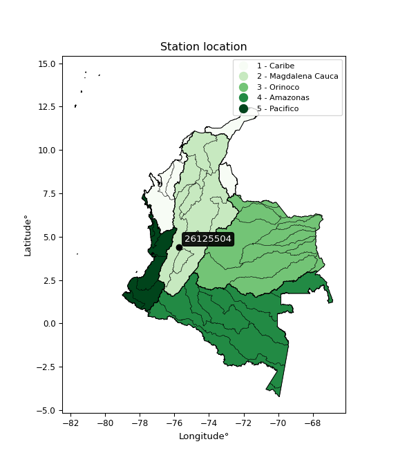

<div align="center">


</div>

# PMP Station (rain, Pmax24h): 26125504

Probable Maximum Precipitation (PMP) is the greatest amount of rainfall for a specific duration that is meteorologically possible for a given location, acting as a "worst-case" scenario for extreme storms, crucial for designing safety-critical infrastructure like bridges, river deviations, dams, spillways, and nuclear plants to prevent catastrophic failure. PMP is calculated by hydrologists using meteorological data to determine the upper limit of extreme rainfall, often leading to the Probable Maximum Flood (PMF) for flood control design, and is increasingly being studied for climate change impacts.

<div align="center">

</img>

</div>


## A. General information


### 1. General running parameters

• app_version: _v20251227_. • runtime: _2025-12-27 09:02:11.367833_. • Python version: _3.14.0_. • SciPy version: _1.16.3_. • Pandas version: _2.3.3_. • NumPy version: _2.3.5_. • Stations dataset (station_dataset_file): _dataset/pmax24h_in/automatic_colombia_2003_2024_filter.csv_. • Stations catalog (station_catalog_file): _dataset/CNE_IDEAM.xls_. • Minimum year to eval til year_max (date_min): _2003_. • Maximum year to eval since year_min (date_max): _2024_. • Creates, save and include plots into reports (create_plot): _False_. • Plot only fit distributions with Δo > Δ (plot_only_fit): _True_. • Eval low extreme values, if False, evaluates high extreme values (low_extreme): _False_. • Eval every SciPy distribution as logarithmic (pdist_logarithmic_on): _True_. • Standard deviation normalized (ddof): _1.0_. • Return periods to eval in years (Tr): _[2, 2.33, 5, 10, 15, 20, 25, 50, 75, 100, 200, 250, 500, 750, 1000]_. • Minimum data sample per station, 0 means any (minimum_sample): _5_. • Z-Score threshold to adjust a value, 0 means disable (zscore): _3.5_. • Avoid zeros, e.g. rain = 0 (avoid_zeros): _True_. • Avoid null values (avoid_nans): _True_. [:file_folder:Dataset file.](../../dataset/pmax24h_in/automatic_colombia_2003_2024_filter.csv)

> Delta Degrees of Freedom (DDOF): is a parameter used in the formulas for calculating variance and standard deviation. When ddof=0, the divisor is $N$ (the total number of observations) and this is used when your data set is the entire population. When ddof=1, the divisor is $N-1$ and this is used when your data set is a sample drawn from a larger population. Using $N-1$ provides an unbiased estimate of the population variance (known as Bessel´s correction).


### 2. Station info and location

|   id |   CODIGO | NOMBRE                          | CATEGORIA               | TECNOLOGIA                | ESTADO   | FECHA_INSTALACION   |   FECHA_SUSPENSION |   ALTITUD |   LATITUD |   LONGITUD | DEPARTAMENTO   | MUNICIPIO   | AREA_OPERATIVA                         | ENTIDAD                                    | AREA_HIDROGRAFICA   | ZONA_HIDROGRAFICA   | SUBZONA_HIDROGRAFICA   |   CORRIENTE | Catalogo   |
|-----:|---------:|:--------------------------------|:------------------------|:--------------------------|:---------|:--------------------|-------------------:|----------:|----------:|-----------:|:---------------|:------------|:---------------------------------------|:-------------------------------------------|:--------------------|:--------------------|:-----------------------|------------:|:-----------|
|    0 | 26125504 | PARAGUAICITO  - AUT  [26125504] | Climatológica Principal | Automática con Telemetría | Activa   | 10/04/2013          |                nan |      1203 |   4.39556 |   -75.7342 | Quindío        | Buenavista  | Area Operativa 09 - Cauca-Valle-Caldas | CENTRO NACIONAL DE INVESTIGACIONES DE CAFE | Magdalena Cauca     | Cauca               | Río La Vieja           |         nan | CNE_OE     |

<div align="center">

Map location in: [:earth_americas:Google](http://maps.google.com/maps?q=4.395555556,-75.73416667) [:earth_americas:OSM](https://www.openstreetmap.org/#map=18/4.395555556/-75.73416667&layers=P) [:earth_americas:Bing](https://www.bing.com/maps?cp=4.395555556~-75.73416667&lvl=18) [:earth_americas:Apple](https://maps.apple.com/frame?center=4.395555556%2C-75.73416667&span=0.003%2C0.006)

</div>


<div align="center">

```geojson
{
  "type": "Feature",
  "geometry": {
    "type": "Point", 
    "coordinates": [-75.73416667, 4.395555556]
  }, 
  "properties": {
    "Name": "26125504"
  }
}
```

</div>


### 3. Discrete values table and plot

|               |           0 |          1 |           2 |           3 |           4 |           5 |          6 |
|:--------------|------------:|-----------:|------------:|------------:|------------:|------------:|-----------:|
| Date          | 2017        | 2018       | 2019        | 2020        | 2021        | 2022        | 2023       |
| Value         |   62.4      |  126.4     |   70.1      |   73.7      |   59.1      |   87.9      |   80.8     |
| Value_initial |   62.4      |  126.4     |   70.1      |   73.7      |   59.1      |   87.9      |   80.8     |
| count         |    7        |    7       |    7        |    7        |    7        |    7        |    7       |
| mean          |   80.0571   |   80.0571  |   80.0571   |   80.0571   |   80.0571   |   80.0571   |   80.0571  |
| std           |   22.7312   |   22.7312  |   22.7312   |   22.7312   |   22.7312   |   22.7312   |   22.7312  |
| zscore        |   -0.776779 |    2.03873 |   -0.438038 |   -0.279665 |   -0.921953 |    0.345025 |    0.03268 |

> The initial value (value_initial) correspond to the initial obtained or null completed value, and value (value) is adjusted only when the initial value is outside the valid range definite through the Z-Score value. If Z-Score is active, values out of range or outliers are replaced with the station mean value


### 4. Active continuous probability distributions from SciPy (45 of 104 available)

[scipy.stats](https://docs.scipy.org/doc/scipy/reference/stats.html) is a Python´s powerful submodule within the SciPy library for comprehensive statistical analysis, offering over 130 probability distributions (like Normal, Poisson), functions for descriptive stats (mean, variance), hypothesis testing (t-tests, chi-square), random variable generation, and statistical tests, making it essential for data science, modeling, and research. It provides tools to explore, model, and draw conclusions from data efficiently, working seamlessly with NumPy.

<div align="center">

|   id | p_dist             |   n_parameter | fit_method   | label                                                                       | active   | ref                                                                                                        |
|-----:|:-------------------|--------------:|:-------------|:----------------------------------------------------------------------------|:---------|:-----------------------------------------------------------------------------------------------------------|
|    0 | alpha              |             3 | MLE          | Alpha                                                                       | True     | [:mortar_board:](https://docs.scipy.org/doc/scipy/reference/generated/scipy.stats.alpha.html)              |
|    1 | betaprime          |             4 | MLE          | Beta prime                                                                  | True     | [:mortar_board:](https://docs.scipy.org/doc/scipy/reference/generated/scipy.stats.betaprime.html)          |
|    2 | chi2               |             3 | MLE          | Chi²                                                                        | True     | [:mortar_board:](https://docs.scipy.org/doc/scipy/reference/generated/scipy.stats.chi2.html)               |
|    3 | crystalball        |             4 | MLE          | Crystalball                                                                 | True     | [:mortar_board:](https://docs.scipy.org/doc/scipy/reference/generated/scipy.stats.crystalball.html)        |
|    4 | erlang             |             3 | MLE          | Erlang                                                                      | True     | [:mortar_board:](https://docs.scipy.org/doc/scipy/reference/generated/scipy.stats.erlang.html)             |
|    5 | expon              |             2 | MLE          | Exponential                                                                 | True     | [:mortar_board:](https://docs.scipy.org/doc/scipy/reference/generated/scipy.stats.expon.html)              |
|    6 | exponnorm          |             3 | MLE          | Exponentially modified Normal                                               | True     | [:mortar_board:](https://docs.scipy.org/doc/scipy/reference/generated/scipy.stats.exponnorm.html)          |
|    7 | f                  |             4 | MLE          | F                                                                           | True     | [:mortar_board:](https://docs.scipy.org/doc/scipy/reference/generated/scipy.stats.f.html)                  |
|    8 | fatiguelife        |             3 | MLE          | Fatigue-life (Birnbaum-Saunders)                                            | True     | [:mortar_board:](https://docs.scipy.org/doc/scipy/reference/generated/scipy.stats.fatiguelife.html)        |
|    9 | fisk               |             3 | MLE          | Fisk                                                                        | True     | [:mortar_board:](https://docs.scipy.org/doc/scipy/reference/generated/scipy.stats.fisk.html)               |
|   10 | gamma              |             3 | MLE          | Gamma                                                                       | True     | [:mortar_board:](https://docs.scipy.org/doc/scipy/reference/generated/scipy.stats.gamma.html)              |
|   11 | genexpon           |             5 | MLE          | Generalized exponential                                                     | True     | [:mortar_board:](https://docs.scipy.org/doc/scipy/reference/generated/scipy.stats.genexpon.html)           |
|   12 | genlogistic        |             3 | MLE          | Generalized logistic                                                        | True     | [:mortar_board:](https://docs.scipy.org/doc/scipy/reference/generated/scipy.stats.genlogistic.html)        |
|   13 | gibrat             |             2 | MM           | Gibrat                                                                      | True     | [:mortar_board:](https://docs.scipy.org/doc/scipy/reference/generated/scipy.stats.gibrat.html)             |
|   14 | gompertz           |             3 | MLE          | Gompertz (or truncated Gumbel)                                              | True     | [:mortar_board:](https://docs.scipy.org/doc/scipy/reference/generated/scipy.stats.gompertz.html)           |
|   15 | gumbel_l           |             2 | MM           | Gumbel Left Skew                                                            | True     | [:mortar_board:](https://docs.scipy.org/doc/scipy/reference/generated/scipy.stats.gumbel_l.html)           |
|   16 | gumbel_r           |             2 | MM           | Gumbel Right Skew                                                           | True     | [:mortar_board:](https://docs.scipy.org/doc/scipy/reference/generated/scipy.stats.gumbel_r.html)           |
|   17 | halflogistic       |             2 | MM           | Half-logistic                                                               | True     | [:mortar_board:](https://docs.scipy.org/doc/scipy/reference/generated/scipy.stats.halflogistic.html)       |
|   18 | halfnorm           |             2 | MM           | Half Normal                                                                 | True     | [:mortar_board:](https://docs.scipy.org/doc/scipy/reference/generated/scipy.stats.halfnorm.html)           |
|   19 | hypsecant          |             2 | MM           | hyperbolic secant                                                           | True     | [:mortar_board:](https://docs.scipy.org/doc/scipy/reference/generated/scipy.stats.hypsecant.html)          |
|   20 | invgamma           |             3 | MLE          | Inverted gamma                                                              | True     | [:mortar_board:](https://docs.scipy.org/doc/scipy/reference/generated/scipy.stats.invgamma.html)           |
|   21 | invgauss           |             3 | MLE          | Inverse Gaussian                                                            | True     | [:mortar_board:](https://docs.scipy.org/doc/scipy/reference/generated/scipy.stats.invgauss.html)           |
|   22 | invweibull         |             3 | MLE          | Inverted Weibull                                                            | True     | [:mortar_board:](https://docs.scipy.org/doc/scipy/reference/generated/scipy.stats.invweibull.html)         |
|   23 | johnsonsu          |             4 | MLE          | Johnson Su                                                                  | True     | [:mortar_board:](https://docs.scipy.org/doc/scipy/reference/generated/scipy.stats.johnsonsu.html)          |
|   24 | kstwobign          |             2 | MLE          | Limiting distribution of scaled Kolmogorov-Smirnov two-sided test statistic | True     | [:mortar_board:](https://docs.scipy.org/doc/scipy/reference/generated/scipy.stats.kstwobign.html)          |
|   25 | laplace            |             2 | MM           | Laplace                                                                     | True     | [:mortar_board:](https://docs.scipy.org/doc/scipy/reference/generated/scipy.stats.laplace.html)            |
|   26 | laplace_asymmetric |             3 | MLE          | Asymmetric Laplace                                                          | True     | [:mortar_board:](https://docs.scipy.org/doc/scipy/reference/generated/scipy.stats.laplace_asymmetric.html) |
|   27 | loggamma           |             3 | MLE          | Log gamma                                                                   | True     | [:mortar_board:](https://docs.scipy.org/doc/scipy/reference/generated/scipy.stats.loggamma.html)           |
|   28 | logistic           |             2 | MM           | Logistic (or Sech-squared)                                                  | True     | [:mortar_board:](https://docs.scipy.org/doc/scipy/reference/generated/scipy.stats.logistic.html)           |
|   29 | lognorm            |             3 | MLE          | Log Normal                                                                  | True     | [:mortar_board:](https://docs.scipy.org/doc/scipy/reference/generated/scipy.stats.lognorm.html)            |
|   30 | maxwell            |             2 | MM           | Maxwell                                                                     | True     | [:mortar_board:](https://docs.scipy.org/doc/scipy/reference/generated/scipy.stats.maxwell.html)            |
|   31 | mielke             |             4 | MLE          | Mielke Beta-Kappa / Dagum                                                   | True     | [:mortar_board:](https://docs.scipy.org/doc/scipy/reference/generated/scipy.stats.mielke.html)             |
|   32 | moyal              |             2 | MM           | Moyal                                                                       | True     | [:mortar_board:](https://docs.scipy.org/doc/scipy/reference/generated/scipy.stats.moyal.html)              |
|   33 | nakagami           |             3 | MLE          | Nakagami                                                                    | True     | [:mortar_board:](https://docs.scipy.org/doc/scipy/reference/generated/scipy.stats.nakagami.html)           |
|   34 | ncf                |             5 | MLE          | Non-central F distribution                                                  | True     | [:mortar_board:](https://docs.scipy.org/doc/scipy/reference/generated/scipy.stats.ncf.html)                |
|   35 | nct                |             4 | MLE          | Non-central Student’s t                                                     | True     | [:mortar_board:](https://docs.scipy.org/doc/scipy/reference/generated/scipy.stats.nct.html)                |
|   36 | norm               |             2 | MM           | Normal                                                                      | True     | [:mortar_board:](https://docs.scipy.org/doc/scipy/reference/generated/scipy.stats.norm.html)               |
|   37 | pareto             |             3 | MLE          | Pareto                                                                      | True     | [:mortar_board:](https://docs.scipy.org/doc/scipy/reference/generated/scipy.stats.pareto.html)             |
|   38 | pearson3           |             3 | MM           | Pearson type III                                                            | True     | [:mortar_board:](https://docs.scipy.org/doc/scipy/reference/generated/scipy.stats.pearson3.html)           |
|   39 | rayleigh           |             2 | MM           | Rayleigh                                                                    | True     | [:mortar_board:](https://docs.scipy.org/doc/scipy/reference/generated/scipy.stats.rayleigh.html)           |
|   40 | rice               |             3 | MLE          | Rice                                                                        | True     | [:mortar_board:](https://docs.scipy.org/doc/scipy/reference/generated/scipy.stats.rice.html)               |
|   41 | t                  |             3 | MLE          | Student’s t                                                                 | True     | [:mortar_board:](https://docs.scipy.org/doc/scipy/reference/generated/scipy.stats.t.html)                  |
|   42 | truncnorm          |             4 | MLE          | Truncated normal                                                            | True     | [:mortar_board:](https://docs.scipy.org/doc/scipy/reference/generated/scipy.stats.truncnorm.html)          |
|   43 | wald               |             2 | MM           | Wald                                                                        | True     | [:mortar_board:](https://docs.scipy.org/doc/scipy/reference/generated/scipy.stats.wald.html)               |
|   44 | weibull_min        |             3 | MLE          | Weibull minimum                                                             | True     | [:mortar_board:](https://docs.scipy.org/doc/scipy/reference/generated/scipy.stats.weibull_min.html)        |

</div>

> **n_parameter:** # arguments & localization & scale.
>
> **Fit methods:** (MLE) maximum likelihood, (MM) L-moments.
>
>**Inactive:** foldnorm, gennorm, norminvgauss, powernorm, powerlognorm, skewnorm, genextreme, anglit, arcsine, argus, beta, bradford, burr, burr12, cauchy, cosine, halfcauchy, foldcauchy, skewcauchy, wrapcauchy, dgamma, gengamma, exponweib, exponpow, truncexpon, gausshyper, genhalflogistic, genhyperbolic, geninvgauss, halfgennorm, johnsonsb, kappa4, kappa3, ksone, kstwo, loglaplace, levy, levy_l, levy_stable, ncx2, genpareto, truncpareto, lomax, powerlaw, rdist, rel_breitwigner, recipinvgauss, semicircular, studentized_range, trapezoid, triang, truncweibull_min, tukeylambda, uniform, loguniform, vonmises, vonmises_line, weibull_max, dweibull, 


## B. Probability distributions vs. Empirical distributions

A continuous probability distribution (CPD) describes probabilities for variables that can take any value within a range (like rain any time), unlike discrete variables with specific outcomes (like temperature). It uses a Probability Density Function (PDF), a curve where the total area under it equals 1, and the probability of the variable falling within an interval (a to b) is found by calculating the area under the curve between those points. A key feature is that the probability of hitting any single exact value is zero, so probabilities are always expressed for ranges, e.g., $P(a ≤ X ≤ b)$.

<div align="center">

Distributions parameters from station values
|    |   station | p_dist                |   n |            loc |          scale | shape                  | shape1             | shape2                | shape3   |
|---:|----------:|:----------------------|----:|---------------:|---------------:|:-----------------------|:-------------------|:----------------------|:---------|
|  0 |  26125504 | alpha                 |   7 |     34.7514    |  103.595       | 2.6923563425825057     |                    |                       |          |
|  1 |  26125504 | betaprime             |   7 |     -1.04621   |    4.56162     | 352.01706908439246     | 20.846296719210045 |                       |          |
|  2 |  26125504 | chi2                  |   7 |     59.1       |   14.1984      | 1.5980232968837926     |                    |                       |          |
|  3 |  26125504 | crystalball           |   7 |     80.0571    |   21.045       | 7185.17672261832       | 107.80259481804887 |                       |          |
|  4 |  26125504 | erlang                |   7 |     59.1       |   40.2858      | 0.17029322235110905    |                    |                       |          |
|  5 |  26125504 | expon                 |   7 |     59.1       |   20.9571      |                        |                    |                       |          |
|  6 |  26125504 | exponnorm             |   7 |     59.0754    |    0.00807939  | 2601.3515900313205     |                    |                       |          |
|  7 |  26125504 | f                     |   7 |     49.9023    |   19.8903      | 7613.152218367081      | 5.329774305685248  |                       |          |
|  8 |  26125504 | fatiguelife           |   7 |     56.8094    |   13.7084      | 1.1563498713954266     |                    |                       |          |
|  9 |  26125504 | fisk                  |   7 |     -0.462158  |   76.0269      | 7.700234501480191      |                    |                       |          |
| 10 |  26125504 | gamma                 |   7 |     59.1       |   23.5061      | 0.7443199258857278     |                    |                       |          |
| 11 |  26125504 | genexpon              |   7 |     59.1       |   37.4998      | 1.7893615892412376     | 0.2957522781480818 | 7.513664680163376e-11 |          |
| 12 |  26125504 | genlogistic           |   7 |    -26.1934    |   13.7383      | 1193.154049746733      |                    |                       |          |
| 13 |  26125504 | gibrat                |   7 |     64.0025    |    9.73767     |                        |                    |                       |          |
| 14 |  26125504 | gompertz              |   7 |     59.1       | 9964.36        | 477.496346899081       |                    |                       |          |
| 15 |  26125504 | gumbel_l              |   7 |     89.5285    |   16.4088      |                        |                    |                       |          |
| 16 |  26125504 | gumbel_r              |   7 |     70.5858    |   16.4088      |                        |                    |                       |          |
| 17 |  26125504 | halflogistic          |   7 |     55.1139    |   17.9928      |                        |                    |                       |          |
| 18 |  26125504 | halfnorm              |   7 |     52.2018    |   34.9116      |                        |                    |                       |          |
| 19 |  26125504 | hypsecant             |   7 |     80.0571    |   13.3977      |                        |                    |                       |          |
| 20 |  26125504 | invgamma              |   7 |     49.8954    |   53.0164      | 2.664869591788051      |                    |                       |          |
| 21 |  26125504 | invgauss              |   7 |     54.6638    |   25.1234      | 1.010741046367821      |                    |                       |          |
| 22 |  26125504 | invweibull            |   7 |     59.1       |    1.28559     | 0.05011522110273807    |                    |                       |          |
| 23 |  26125504 | johnsonsu             |   7 |     56.7191    |    0.0794784   | -5.733283829157358     | 0.9679932888140561 |                       |          |
| 24 |  26125504 | kstwobign             |   7 |     20.6662    |   68.8329      |                        |                    |                       |          |
| 25 |  26125504 | laplace               |   7 |     80.0571    |   14.8811      |                        |                    |                       |          |
| 26 |  26125504 | laplace_asymmetric    |   7 |     70.1       |   12.4985      | 0.6780629616709959     |                    |                       |          |
| 27 |  26125504 | loggamma              |   7 |  -5546         |  786.067       | 1283.5855571543325     |                    |                       |          |
| 28 |  26125504 | logistic              |   7 |     80.0571    |   11.6027      |                        |                    |                       |          |
| 29 |  26125504 | lognorm               |   7 |     59.1       |    0.10679     | 12.41621750880691      |                    |                       |          |
| 30 |  26125504 | maxwell               |   7 |     30.1892    |   31.2501      |                        |                    |                       |          |
| 31 |  26125504 | mielke                |   7 |      7.77793   |   16.1334      | 5763.624938612091      | 5.206301307344058  |                       |          |
| 32 |  26125504 | moyal                 |   7 |     68.0222    |    9.4736      |                        |                    |                       |          |
| 33 |  26125504 | nakagami              |   7 |     59.1       |   26.9797      | 0.07470270252831662    |                    |                       |          |
| 34 |  26125504 | ncf                   |   7 |     -0.0410409 |    2.37026e-05 | 2.2777940426054835e-06 | 3.7173897363924313 | 6.799108280517032     |          |
| 35 |  26125504 | nct                   |   7 |     -0.344657  |    1.26296     | 10.868859921618988     | 58.963484946639724 |                       |          |
| 36 |  26125504 | norm                  |   7 |     80.0571    |   21.045       |                        |                    |                       |          |
| 37 |  26125504 | pareto                |   7 |     59.0835    |    0.0165028   | 0.16845455434614703    |                    |                       |          |
| 38 |  26125504 | pearson3              |   7 |     80.0571    |   21.0451      | 1.2883396790387185     |                    |                       |          |
| 39 |  26125504 | rayleigh              |   7 |     39.7967    |   32.1231      |                        |                    |                       |          |
| 40 |  26125504 | rice                  |   7 |     47.5072    |   27.408       | 0.00035042072230690303 |                    |                       |          |
| 41 |  26125504 | t                     |   7 |     80.0102    |   21.0425      | 19.107455517550875     |                    |                       |          |
| 42 |  26125504 | truncnorm             |   7 | -73510.5       | 1244.83        | 59.09999361072457      | 132.96682001482642 |                       |          |
| 43 |  26125504 | wald                  |   7 |     59.0121    |   21.045       |                        |                    |                       |          |
| 44 |  26125504 | weibull_min           |   7 |     59.1       |   11.2909      | 0.5896328809848566     |                    |                       |          |
| 45 |  26125504 | logalpha              |   7 |      2.55921   |   14.8978      | 8.504610188278825      |                    |                       |          |
| 46 |  26125504 | logbetaprime          |   7 |      0.594958  |    6.58261     | 430.73529878291606     | 755.6864744021191  |                       |          |
| 47 |  26125504 | logchi2               |   7 |      4.07923   |    0.971973    | 1.0361647378458327     |                    |                       |          |
| 48 |  26125504 | logcrystalball        |   7 |      4.35291   |    0.235999    | 48.58968893487214      | 363.1499691565853  |                       |          |
| 49 |  26125504 | logerlang             |   7 |      4.07923   |    0.155349    | 0.5135434871203268     |                    |                       |          |
| 50 |  26125504 | logexpon              |   7 |      4.07923   |    0.273676    |                        |                    |                       |          |
| 51 |  26125504 | logexponnorm          |   7 |      4.07886   |    0.000110828 | 2460.9233770080154     |                    |                       |          |
| 52 |  26125504 | logf                  |   7 |      4.07923   |    0.274746    | 0.8265545797506855     | 1059.5351411438287 |                       |          |
| 53 |  26125504 | logfatiguelife        |   7 |      4.00895   |    0.25836     | 0.8077199657364214     |                    |                       |          |
| 54 |  26125504 | logfisk               |   7 |      4.01542   |    0.268742    | 2.151455257780881      |                    |                       |          |
| 55 |  26125504 | loggamma              |   7 |      4.07923   |    0.284418    | 0.20389204780941222    |                    |                       |          |
| 56 |  26125504 | loggenexpon           |   7 |      4.07918   |    0.013236    | 0.04000831205112318    | 5.603224034441684  | 8.261071035842242e-05 |          |
| 57 |  26125504 | loggenlogistic        |   7 |      3.04934   |    0.173393    | 996.4471781037464      |                    |                       |          |
| 58 |  26125504 | loggibrat             |   7 |      4.17289   |    0.109189    |                        |                    |                       |          |
| 59 |  26125504 | loggompertz           |   7 |      4.07923   |    1.18471     | 3.488708628482984      |                    |                       |          |
| 60 |  26125504 | loggumbel_l           |   7 |      4.45912   |    0.184007    |                        |                    |                       |          |
| 61 |  26125504 | loggumbel_r           |   7 |      4.2467    |    0.184007    |                        |                    |                       |          |
| 62 |  26125504 | loghalflogistic       |   7 |      4.07319   |    0.20177     |                        |                    |                       |          |
| 63 |  26125504 | loghalfnorm           |   7 |      4.04054   |    0.391497    |                        |                    |                       |          |
| 64 |  26125504 | loghypsecant          |   7 |      4.35291   |    0.150241    |                        |                    |                       |          |
| 65 |  26125504 | loginvgamma           |   7 |      3.85077   |    2.11067     | 5.15689151052794       |                    |                       |          |
| 66 |  26125504 | loginvgauss           |   7 |      3.97335   |    0.740514    | 0.5125381417314716     |                    |                       |          |
| 67 |  26125504 | loginvweibull         |   7 |      3.36745   |    0.862882    | 5.433761882515743      |                    |                       |          |
| 68 |  26125504 | logjohnsonsu          |   7 |      3.99253   |    0.00439359  | -6.879425489427565     | 1.4125813380480023 |                       |          |
| 69 |  26125504 | logkstwobign          |   7 |      3.628     |    0.834931    |                        |                    |                       |          |
| 70 |  26125504 | loglaplace            |   7 |      4.35291   |    0.166876    |                        |                    |                       |          |
| 71 |  26125504 | loglaplace_asymmetric |   7 |      4.24992   |    0.161349    | 0.730554733661195      |                    |                       |          |
| 72 |  26125504 | logloggamma           |   7 |    -58.5259    |    8.72263     | 1351.4152464994877     |                    |                       |          |
| 73 |  26125504 | loglogistic           |   7 |      4.35291   |    0.130113    |                        |                    |                       |          |
| 74 |  26125504 | loglognorm            |   7 |      4.07923   |    0.0020856   | 11.65324991184478      |                    |                       |          |
| 75 |  26125504 | logmaxwell            |   7 |      3.79369   |    0.350438    |                        |                    |                       |          |
| 76 |  26125504 | logmielke             |   7 |      2.99297   |    0.644587    | 1089.995989604965      | 7.568985028767528  |                       |          |
| 77 |  26125504 | logmoyal              |   7 |      4.21795   |    0.106237    |                        |                    |                       |          |
| 78 |  26125504 | lognakagami           |   7 |      4.07923   |    0.360957    | 0.08079517354450622    |                    |                       |          |
| 79 |  26125504 | logncf                |   7 |      3.85526   |    0.24335     | 386.5466719044657      | 10.315181257016082 | 257.858042578502      |          |
| 80 |  26125504 | lognct                |   7 |      0.191148  |    0.0681893   | 184.2982113931132      | 60.759404461641964 |                       |          |
| 81 |  26125504 | lognorm               |   7 |      4.35291   |    0.235999    |                        |                    |                       |          |
| 82 |  26125504 | logpareto             |   7 |      4.079     |    0.000235017 | 0.16830165549239393    |                    |                       |          |
| 83 |  26125504 | logpearson3           |   7 |      4.35291   |    0.235998    | 0.9218874608464463     |                    |                       |          |
| 84 |  26125504 | lograyleigh           |   7 |      3.90143   |    0.360228    |                        |                    |                       |          |
| 85 |  26125504 | logrice               |   7 |      3.96244   |    0.322616    | 0.000506282338508732   |                    |                       |          |
| 86 |  26125504 | logt                  |   7 |      4.35291   |    0.235998    | 7085488.530045096      |                    |                       |          |
| 87 |  26125504 | logtruncnorm          |   7 |     -1.54405   |    1.37867     | 4.078768277828208      | 4.630192052625052  |                       |          |
| 88 |  26125504 | logwald               |   7 |      4.11687   |    0.236037    |                        |                    |                       |          |
| 89 |  26125504 | logweibull_min        |   7 |      4.07923   |    0.12556     | 0.8052416918896081     |                    |                       |          |

</div>

> **loc** (Location parameter): This shifts the distribution along the x-axis. For many common distributions, like the normal (Gaussian) distribution, loc represents the mean $μ$. For others, like the uniform distribution, it might represent the minimum value, or for the beta distribution, the left end of the support interval.
>
> **scale** (Scale parameter): This determines the width or spread of the distribution. For the normal distribution, scale represents the standard deviation $σ$. For a uniform distribution, it defines the length of the interval (from $loc$ to $loc + scale$).
>
> **shape** (Shape parameters): Refers to parameters that define the specific form of a probability distribution, distinct from its location (loc) and scale (scale). These parameters are required arguments for most distribution functions. For example, a normal (Gaussian) distribution is fully defined by its location (mean) and scale (standard deviation), so it has no specific shape parameters beyond loc and scale. However, other distributions have intrinsic properties that need specification, as Gamma distribution that takes a shape parameter, often named $a$ or $alpha$.


### 0. Cumulative distribution values - CDF (90 evaluated)

Cumulative Distribution Function (CDF), denoted as $F$<sub>$X$</sub>$(x)$, is a function that gives the probability that a random variable $X$ will take a value less than or equal to a specific value, $x$ (i.e., $(P(X≥x)$. It essentially "accumulates" probabilities from a given point up to the far right (positive infinity), providing a complete picture of the distribution´s probabilities for both discrete (like rain) and continuous (like temperature) variables, helping to find probabilities over ranges or above certain values.

<div align="center">

CDF ordered by x ascending and calculating $log(f(x))$ separately
|   id |   Station |   date |     x |   count |    mean |     std |    zscore |   Value_initial |   station |   m |    alpha |   alpha_pdf |   betaprime |   betaprime_pdf |        chi2 |    chi2_pdf |   crystalball |   crystalball_pdf |     erlang |   erlang_pdf |    expon |   expon_pdf |   exponnorm |   exponnorm_pdf |         f |      f_pdf |   fatiguelife |   fatiguelife_pdf |     fisk |   fisk_pdf |       gamma |    gamma_pdf |    genexpon |   genexpon_pdf |   genlogistic |   genlogistic_pdf |   gibrat |   gibrat_pdf |    gompertz |   gompertz_pdf |   gumbel_l |   gumbel_l_pdf |   gumbel_r |   gumbel_r_pdf |   halflogistic |   halflogistic_pdf |   halfnorm |   halfnorm_pdf |   hypsecant |   hypsecant_pdf |   invgamma |   invgamma_pdf |   invgauss |   invgauss_pdf |   invweibull |   invweibull_pdf |   johnsonsu |   johnsonsu_pdf |   kstwobign |   kstwobign_pdf |   laplace |   laplace_pdf |   laplace_asymmetric |   laplace_asymmetric_pdf |   loggamma |   loggamma_pdf |   logistic |   logistic_pdf |   lognorm |   lognorm_pdf |   maxwell |   maxwell_pdf |   mielke |   mielke_pdf |    moyal |   moyal_pdf |   nakagami |   nakagami_pdf |      ncf |    ncf_pdf |      nct |    nct_pdf |     norm |   norm_pdf |   pareto |   pareto_pdf |   pearson3 |   pearson3_pdf |   rayleigh |   rayleigh_pdf |      rice |   rice_pdf |        t |      t_pdf |   truncnorm |   truncnorm_pdf |        wald |    wald_pdf |   weibull_min |   weibull_min_pdf |   logalpha |   logalpha_pdf |   logbetaprime |   logbetaprime_pdf |    logchi2 |   logchi2_pdf |   logcrystalball |   logcrystalball_pdf |   logerlang |   logerlang_pdf |   logexpon |   logexpon_pdf |   logexponnorm |   logexponnorm_pdf |        logf |    logf_pdf |   logfatiguelife |   logfatiguelife_pdf |   logfisk |   logfisk_pdf |   loggenexpon |   loggenexpon_pdf |   loggenlogistic |   loggenlogistic_pdf |   loggibrat |   loggibrat_pdf |   loggompertz |   loggompertz_pdf |   loggumbel_l |   loggumbel_l_pdf |   loggumbel_r |   loggumbel_r_pdf |   loghalflogistic |   loghalflogistic_pdf |   loghalfnorm |   loghalfnorm_pdf |   loghypsecant |   loghypsecant_pdf |   loginvgamma |   loginvgamma_pdf |   loginvgauss |   loginvgauss_pdf |   loginvweibull |   loginvweibull_pdf |   logjohnsonsu |   logjohnsonsu_pdf |   logkstwobign |   logkstwobign_pdf |   loglaplace |   loglaplace_pdf |   loglaplace_asymmetric |   loglaplace_asymmetric_pdf |   logloggamma |   logloggamma_pdf |   loglogistic |   loglogistic_pdf |   loglognorm |   loglognorm_pdf |   logmaxwell |   logmaxwell_pdf |   logmielke |   logmielke_pdf |   logmoyal |   logmoyal_pdf |   lognakagami |   lognakagami_pdf |    logncf |   logncf_pdf |   lognct |   lognct_pdf |   logpareto |   logpareto_pdf |   logpearson3 |   logpearson3_pdf |   lograyleigh |   lograyleigh_pdf |   logrice |   logrice_pdf |     logt |   logt_pdf |   logtruncnorm |   logtruncnorm_pdf |     logwald |   logwald_pdf |   logweibull_min |   logweibull_min_pdf |
|-----:|----------:|-------:|------:|--------:|--------:|--------:|----------:|----------------:|----------:|----:|---------:|------------:|------------:|----------------:|------------:|------------:|--------------:|------------------:|-----------:|-------------:|---------:|------------:|------------:|----------------:|----------:|-----------:|--------------:|------------------:|---------:|-----------:|------------:|-------------:|------------:|---------------:|--------------:|------------------:|---------:|-------------:|------------:|---------------:|-----------:|---------------:|-----------:|---------------:|---------------:|-------------------:|-----------:|---------------:|------------:|----------------:|-----------:|---------------:|-----------:|---------------:|-------------:|-----------------:|------------:|----------------:|------------:|----------------:|----------:|--------------:|---------------------:|-------------------------:|-----------:|---------------:|-----------:|---------------:|----------:|--------------:|----------:|--------------:|---------:|-------------:|---------:|------------:|-----------:|---------------:|---------:|-----------:|---------:|-----------:|---------:|-----------:|---------:|-------------:|-----------:|---------------:|-----------:|---------------:|----------:|-----------:|---------:|-----------:|------------:|----------------:|------------:|------------:|--------------:|------------------:|-----------:|---------------:|---------------:|-------------------:|-----------:|--------------:|-----------------:|---------------------:|------------:|----------------:|-----------:|---------------:|---------------:|-------------------:|------------:|------------:|-----------------:|---------------------:|----------:|--------------:|--------------:|------------------:|-----------------:|---------------------:|------------:|----------------:|--------------:|------------------:|--------------:|------------------:|--------------:|------------------:|------------------:|----------------------:|--------------:|------------------:|---------------:|-------------------:|--------------:|------------------:|--------------:|------------------:|----------------:|--------------------:|---------------:|-------------------:|---------------:|-------------------:|-------------:|-----------------:|------------------------:|----------------------------:|--------------:|------------------:|--------------:|------------------:|-------------:|-----------------:|-------------:|-----------------:|------------:|----------------:|-----------:|---------------:|--------------:|------------------:|----------:|-------------:|---------:|-------------:|------------:|----------------:|--------------:|------------------:|--------------:|------------------:|----------:|--------------:|---------:|-----------:|---------------:|-------------------:|------------:|--------------:|-----------------:|---------------------:|
|    0 |  26125504 |   2021 |  59.1 |       7 | 80.0571 | 22.7312 | -0.921953 |            59.1 |  26125504 |   1 | 0.059317 |  0.0206454  |    0.114351 |      0.0153218  | 3.67341e-13 | 41.3078     |      0.159668 |        0.0115458  | 0.00224067 |  5.37013e+10 | 0        |  0.0477164  |  0.00116977 |      0.0474687  | 0.0511188 | 0.0242179  |     0.0390297 |        0.0455246  | 0.132462 | 0.0148564  | 3.05999e-12 | 320.545      | 1.97227e-11 |     0.0477165  |     0.0908405 |        0.0158444  | 0        |   0          | 8.17719e-07 |     0.0479204  |   0.144907 |    0.0081579   |   0.133493 |     0.0163825  |       0.110319 |         0.0274507  |   0.156636 |     0.0224126  |    0.131317 |      0.00952578 |  0.0511185 |     0.0242179  |   0.043504 |     0.0311034  |   0.00561535 |      2.05246e+11 |   0.0382689 |      0.0337779  |    0.085829 |      0.0154405  |  0.122279 |    0.00821704 |            0.0860109 |                0.0101491 |  0.0012023 |    2.76004e+11 |   0.141095 |     0.0104447  |  0.123095 |      0.862944 |  0.163942 |     0.0142447 |      nan |          nan | 0.109281 |  0.0187072  | 0.00402702 |    8.46759e+10 | 0.444935 | 0.00554379 | 0.102387 | 0.0161905  | 0.159668 | 0.0115458  | 0        | 10.2076      |   0.129052 |     0.0202354  |   0.165188 |      0.0156165 | 0.0855688 | 0.0141119  | 0.16639  | 0.0112751  |    0        |      0.0474898  | 1.42952e-53 | 1.95483e-50 |    1.0887e-09 |    90344.1        |  0.0974108 |       1.11009  |       0.111933 |           0.898548 | 1.2724e-08 |   7.42202e+06 |         0.123096 |             0.862944 | 5.46893e-08 |     3.16213e+07 |   0        |       3.65395  |     0.00136012 |           3.66003  | 8.03522e-07 | 3.73886e+08 |        0.0419988 |             1.92569  | 0.0433848 |      1.39922  |   0.000165209 |          3.02233  |         0.072788 |             1.09848  |    0        |        0        |   1.19527e-12 |          2.94477  |      0.119159 |         0.607365  |     0.0833621 |          1.1256   |         0.0149586 |               2.47751 |     0.0787301 |          2.0281   |       0.102102 |           0.667991 |     0.0541448 |          1.33174  |     0.0460556 |          1.61762  |        0.058059 |            1.26154  |      0.0458394 |           1.56542  |      0.0679124 |           1.1209   |    0.0969904 |         0.581212 |                0.081784 |                    0.693823 |      0.125976 |          0.863168 |      0.108769 |          0.745033 |    0.0072556 |      1.94329e+12 |     0.118344 |         1.08462  |   0.0641817 |         1.21643 |  0.0547262 |       1.13975  |    0.00370736 |       6.74497e+11 | 0.0541445 |     1.33173  | 0.112117 |     0.928569 |    0        |     716.124     |      0.095173 |          1.20763  |      0.114686 |          1.21306  | 0.0634292 |      1.05097  | 0.123093 |   0.862934 |    6.93873e-06 |           3.39328  | 0           |      0        |      4.03225e-12 |         3655.73      |
|    1 |  26125504 |   2017 |  62.4 |       7 | 80.0571 | 22.7312 | -0.776779 |            62.4 |  26125504 |   2 | 0.146346 |  0.0311161  |    0.170773 |      0.0187661  | 0.182791    |  0.0414651  |      0.20073  |        0.0133321  | 0.696565   |  0.0335092   | 0.145693 |  0.0407645  |  0.146307   |      0.0406185  | 0.154111  | 0.0360251  |     0.211303  |        0.0493177  | 0.187835 | 0.0186868  | 0.238214    |   0.0495312  | 0.145693    |     0.0407646  |     0.151546  |        0.0207974  | 0        |   0          | 0.146291    |     0.0409237  |   0.174213 |    0.0096333   |   0.192656 |     0.0193357  |       0.199752 |         0.0266802  |   0.229803 |     0.0218999  |    0.166513 |      0.0118693  |  0.154111  |     0.0360252  |   0.172787 |     0.0423834  |   0.385253   |      0.00558064  |   0.176302  |      0.0441262  |    0.144176 |      0.0197332  |  0.152637 |    0.0102571  |            0.126959  |                0.0149809 |  0.7541    |    2.41183     |   0.179195 |     0.0126767  |  0.176336 |      1.09755  |  0.213849 |     0.0159472 |      nan |          nan | 0.178479 |  0.0229178  | 0.625558   |    0.0282923   | 0.462855 | 0.00531795 | 0.162986 | 0.0203747  | 0.20073  | 0.0133321  | 0.590712 |  0.0207889   |   0.200026 |     0.0225103  |   0.219295 |      0.017101  | 0.137249  | 0.0171044  | 0.2065   | 0.0130302  |    0.145057 |      0.0406029  | 0.03233     | 0.0329645   |    0.383799   |        0.0533088  |  0.168983  |       1.51516  |       0.168107 |           1.16927  | 0.175016   |   1.63829     |         0.176336 |             1.09755  | 0.587064    |     4.38039     |   0.180069 |       2.99599  |     0.181742   |           3.00014  | 0.391212    | 2.80752     |        0.178059  |             2.76311  | 0.145782  |      2.26764  |   0.154907    |          2.67587  |         0.147193 |             1.62493  |    0        |        0        |   0.151027    |          2.61736  |      0.156725 |         0.781199  |     0.157346  |          1.58136  |         0.148498  |               2.42342 |     0.187824  |          1.9813   |       0.145281 |           0.933759 |     0.149795  |          2.11261  |     0.162309  |          2.47435  |        0.148308 |            2.00749  |      0.158681  |           2.4226   |      0.143111  |           1.62184  |    0.134318  |         0.804895 |                0.129675 |                    1.10011  |      0.179103 |          1.09314  |      0.156331 |          1.01367  |    0.610169  |      0.60589     |     0.184386 |         1.33811  |   0.149056  |         1.87036 |  0.136864  |       1.84754  |    0.626301   |       1.85947     | 0.149793  |     2.11258  | 0.170173 |     1.20742  |    0.600218 |       1.233     |      0.17116  |          1.56901  |      0.187498 |          1.4535   | 0.131236  |      1.42841  | 0.176333 |   1.09754  |    0.170281    |           2.88716  | 0.000447735 |      0.200742 |      0.399153    |            4.53615   |
|    2 |  26125504 |   2019 |  70.1 |       7 | 80.0571 | 22.7312 | -0.438038 |            70.1 |  26125504 |   3 | 0.40726  |  0.0322638  |    0.336217 |      0.0232499  | 0.426608    |  0.0248215  |      0.318059 |        0.0169492  | 0.83317    |  0.0101934   | 0.408374 |  0.0282303  |  0.408177   |      0.0281588  | 0.428277  | 0.0312349  |     0.489322  |        0.025952   | 0.360227 | 0.0251498  | 0.511976    |   0.0262377  | 0.408375    |     0.0282303  |     0.340396  |        0.0266889  | 0.319851 |   0.0586369  | 0.409873    |     0.0283104  |   0.263644 |    0.0137339   |   0.356991 |     0.0224098  |       0.393934 |         0.0234765  |   0.391821 |     0.02004    |    0.282615 |      0.0184301  |  0.428277  |     0.0312349  |   0.453991 |     0.0290938  |   0.407382   |      0.0016667   |   0.460058  |      0.0287149  |    0.319189 |      0.0244324  |  0.256081 |    0.0172085  |            0.31496   |                0.0371645 |  0.897025  |    0.644018    |   0.297721 |     0.0180202  |  0.331282 |      1.53692  |  0.347639 |     0.0184238 |      nan |          nan | 0.370179 |  0.0252573  | 0.748253   |    0.0100462   | 0.501857 | 0.00481956 | 0.342903 | 0.0250359  | 0.318059 | 0.0169492  | 0.665649 |  0.0051126   |   0.378277 |     0.0228674  |   0.359144 |      0.0188197 | 0.288051  | 0.0214124  | 0.3215   | 0.0166625  |    0.406921 |      0.0281694  | 0.38811     | 0.0400819   |    0.626458   |        0.0197171  |  0.379443  |       1.98351  |       0.334316 |           1.64532  | 0.310383   |   0.888823    |         0.331282 |             1.53691  | 0.856986    |     1.18682     |   0.464042 |       1.95836  |     0.465916   |           1.95822  | 0.598007    | 1.20391     |        0.465632  |             2.04326  | 0.427227  |      2.24501  |   0.425707    |          1.99486  |         0.375364 |             2.12017  |    0.363623 |        4.87293  |   0.417637    |          1.98069  |      0.274442 |         1.265     |     0.374332  |          1.99896  |         0.41194   |               2.05755 |     0.407234  |          1.76643  |       0.297129 |           1.70273  |     0.419054  |          2.2297   |     0.444247  |          2.13883  |        0.412656 |            2.24905  |      0.440249  |           2.16448  |      0.364213  |           2.01862  |    0.269745  |         1.61644  |                0.347987 |                    2.95218  |      0.333072 |          1.52578  |      0.311847 |          1.64932  |    0.647281  |      0.186735    |     0.361939 |         1.65361  | nan         |       nan       |  0.38963   |       2.23136  |    0.752646   |       0.700698    | 0.419049  |     2.22969  | 0.340549 |     1.67158  |    0.67011  |       0.324823  |      0.377289 |          1.86192  |      0.37372  |          1.68194  | 0.327691  |      1.85701  | 0.331278 |   1.53691  |    0.453749    |           2.03225  | 0.418305    |      3.37309  |      0.722109    |            1.67871   |
|    3 |  26125504 |   2020 |  73.7 |       7 | 80.0571 | 22.7312 | -0.279665 |            73.7 |  26125504 |   4 | 0.514813 |  0.0273262  |    0.420491 |      0.0233721  | 0.508129    |  0.0206565  |      0.381298 |        0.0181111  | 0.864337   |  0.00737037  | 0.501753 |  0.0237746  |  0.501342   |      0.023726   | 0.530259  | 0.0254685  |     0.571758  |        0.0202038  | 0.452341 | 0.0257216  | 0.596393    |   0.0209399  | 0.501754    |     0.0237746  |     0.436349  |        0.0263311  | 0.498353 |   0.0411381  | 0.50349     |     0.0238279  |   0.316904 |    0.015866    |   0.437302 |     0.0220435  |       0.474986 |         0.0215194  |   0.461968 |     0.0189073  |    0.354331 |      0.0213138  |  0.530259  |     0.0254684  |   0.547515 |     0.0231004  |   0.412569   |      0.0012538   |   0.551853  |      0.0225491  |    0.407159 |      0.0242335  |  0.326168 |    0.0219183  |            0.436498  |                0.0305709 |  0.923728  |    0.440026    |   0.366352 |     0.0200072  |  0.411312 |      1.6485   |  0.414755 |     0.0187765 |      nan |          nan | 0.458652 |  0.0237137  | 0.780075   |    0.00782179  | 0.518812 | 0.00460138 | 0.43276  | 0.0246522  | 0.381298 | 0.0181111  | 0.681201 |  0.00367414  |   0.458457 |     0.0215762  |   0.427046 |      0.0188246 | 0.366596  | 0.0220856  | 0.383753 | 0.0178497  |    0.500136 |      0.0237431  | 0.514412    | 0.0304548   |    0.687651   |        0.0146786  |  0.478687  |       1.95848  |       0.419541 |           1.7447   | 0.351613   |   0.765212    |         0.411312 |             1.64849  | 0.904775    |     0.758631    |   0.553667 |       1.63088  |     0.555507   |           1.62973  | 0.651789    | 0.960095    |        0.558677  |             1.68156  | 0.530773  |      1.88282  |   0.518997    |          1.73437  |         0.479915 |             2.03121  |    0.560418 |        3.10231  |   0.510633    |          1.73627  |      0.343719 |         1.50213   |     0.473082  |          1.92436  |         0.509494  |               1.8348  |     0.49251   |          1.63618  |       0.390161 |           1.99377  |     0.523808  |          1.94183  |     0.542821  |          1.79885  |        0.51904  |            1.98327  |      0.540131  |           1.82333  |      0.463751  |           1.9384   |    0.364155  |         2.18219  |                0.480268 |                    2.35324  |      0.412535 |          1.63732  |      0.399727 |          1.84413  |    0.655446  |      0.143141    |     0.445545 |         1.67364  | nan         |       nan       |  0.496731  |       2.02588  |    0.78389    |       0.557924    | 0.523803  |     1.94183  | 0.426697 |     1.75458  |    0.684072 |       0.240586  |      0.469426 |          1.80286  |      0.457798 |          1.66539  | 0.421556  |      1.87606  | 0.411308 |   1.6485   |    0.548117    |           1.74338  | 0.561347    |      2.39434  |      0.793051    |            1.18906   |
|    4 |  26125504 |   2023 |  80.8 |       7 | 80.0571 | 22.7312 |  0.03268  |            80.8 |  26125504 |   5 | 0.673383 |  0.0177342  |    0.579031 |      0.0207847  | 0.632738    |  0.0148552  |      0.514079 |        0.0189448  | 0.904979   |  0.00444786  | 0.644932 |  0.0169426  |  0.644294   |      0.0169244  | 0.676427  | 0.0163214  |     0.688047  |        0.0132544  | 0.62546  | 0.022198   | 0.718328    |   0.0139891  | 0.644933    |     0.0169426  |     0.609759  |        0.0219518  | 0.707203 |   0.0204697  | 0.646901    |     0.0169575  |   0.444264 |    0.0198963   |   0.584728 |     0.0191221  |       0.613048 |         0.0173451  |   0.587306 |     0.0163403  |    0.51764  |      0.0237221  |  0.676427  |     0.0163214  |   0.680131 |     0.0149592  |   0.419815   |      0.000841508 |   0.680283  |      0.0143697  |    0.569836 |      0.02116    |  0.524347 |    0.0319636  |            0.616636  |                0.0207981 |  0.95391   |    0.241339    |   0.516001 |     0.0215246  |  0.565745 |      1.66744  |  0.546513 |     0.0180432 |      nan |          nan | 0.610424 |  0.018843   | 0.82616    |    0.00543783  | 0.550033 | 0.0041996  | 0.596079 | 0.0208764  | 0.514079 | 0.0189448  | 0.70177  |  0.00231336  |   0.599123 |     0.0178975  |   0.557205 |      0.0175948 | 0.521818  | 0.0211929  | 0.514775 | 0.0186987  |    0.643236 |      0.0169476  | 0.681819    | 0.0179846   |    0.770058   |        0.00918409 |  0.64655   |       1.6486   |       0.580427 |           1.70628  | 0.414629   |   0.617085    |         0.565745 |             1.66743  | 0.953378    |     0.354267    |   0.681062 |       1.16538  |     0.682743   |           1.16322  | 0.726111    | 0.681535    |        0.688163  |             1.16548  | 0.673871  |      1.25563  |   0.658591    |          1.31386  |         0.64921  |             1.61712  |    0.756913 |        1.4288   |   0.651447    |          1.33649  |      0.500563 |         1.88442   |     0.63505   |          1.56703  |         0.658389  |               1.40388 |     0.630644  |          1.36216  |       0.581858 |           2.04899  |     0.675678  |          1.37068  |     0.682158  |          1.25565  |        0.674788 |            1.40776  |      0.680964  |           1.26296  |      0.627673  |           1.59975  |    0.604368  |         2.37081  |                0.657294 |                    1.5517   |      0.566103 |          1.66055  |      0.57451  |          1.87874  |    0.666385  |      0.0997998   |     0.59504  |         1.54526  | nan         |       nan       |  0.659325  |       1.50217  |    0.827422   |       0.404159    | 0.675674  |     1.3707   | 0.586953 |     1.68373  |    0.702042 |       0.160223  |      0.623596 |          1.52307  |      0.604345 |          1.4957   | 0.587843  |      1.70096  | 0.565741 |   1.66744  |    0.687689    |           1.31103  | 0.726704    |      1.32752  |      0.875719    |            0.66725   |
|    5 |  26125504 |   2022 |  87.9 |       7 | 80.0571 | 22.7312 |  0.345025 |            87.9 |  26125504 |   6 | 0.774063 |  0.0111397  |    0.711196 |      0.0163039  | 0.723439    |  0.0109291  |      0.645303 |        0.0176849  | 0.93073    |  0.00294858  | 0.746966 |  0.0120739  |  0.746266   |      0.0120726  | 0.770101  | 0.0105388  |     0.766732  |        0.00923628 | 0.76093  | 0.0158528  | 0.801034    |   0.00962014 | 0.746967    |     0.0120738  |     0.744479  |        0.0159879  | 0.815347 |   0.0111567  | 0.748951    |     0.0120652  |   0.595668 |    0.0223131   |   0.706008 |     0.0149787  |       0.721656 |         0.0133168  |   0.693472 |     0.0135496  |    0.676523 |      0.0201979  |  0.770101  |     0.0105388  |   0.767557 |     0.0100664  |   0.424979   |      0.000632811 |   0.763809  |      0.00956663 |    0.704261 |      0.0166217  |  0.704824 |    0.0198357  |            0.739188  |                0.0141494 |  0.969948  |    0.148448    |   0.662834 |     0.0192614  |  0.699314 |      1.4748   |  0.667436 |     0.0158245 |      nan |          nan | 0.726153 |  0.0138718  | 0.859711   |    0.00411983  | 0.578534 | 0.00383492 | 0.725913 | 0.0156603  | 0.645303 | 0.0176849  | 0.715648 |  0.00166226  |   0.711936 |     0.0139098  |   0.674111 |      0.0151917 | 0.662432  | 0.0181515  | 0.644084 | 0.017383   |    0.745378 |      0.0120967  | 0.783112    | 0.0112057   |    0.823939   |        0.00626085 |  0.768267  |       1.23616  |       0.714658 |           1.45377  | 0.462589   |   0.526768    |         0.699314 |             1.4748   | 0.975188    |     0.183441    |   0.765548 |       0.856676 |     0.76703    |           0.854183 | 0.776358    | 0.522055    |        0.771666  |             0.836706 | 0.761336  |      0.848397 |   0.755403    |          0.995603 |         0.766587 |             1.175    |    0.846535 |        0.780457 |   0.750592    |          1.02679  |      0.666219 |         1.9904    |     0.750293  |          1.17144  |         0.761037  |               1.04283 |     0.73421   |          1.09726  |       0.736035 |           1.56238  |     0.772569  |          0.951199 |     0.771699  |          0.890786 |        0.77409  |            0.971429 |      0.770544  |           0.885605 |      0.746651  |           1.22546  |    0.761163  |         1.43122  |                0.765951 |                    1.05972  |      0.699336 |          1.47363  |      0.720629 |          1.5473   |    0.673794  |      0.0779207   |     0.715313 |         1.29616  | nan         |       nan       |  0.766791  |       1.06579  |    0.85763    |       0.318878    | 0.772567  |     0.951222 | 0.718476 |     1.41522  |    0.713756 |       0.121286  |      0.737968 |          1.18966  |      0.719991 |          1.24026  | 0.71861   |      1.38899  | 0.699311 |   1.47481  |    0.784723    |           1.00594  | 0.81517     |      0.822695 |      0.920074    |            0.409643  |
|    6 |  26125504 |   2018 | 126.4 |       7 | 80.0571 | 22.7312 |  2.03873  |           126.4 |  26125504 |   7 | 0.944206 |  0.00145793 |    0.977606 |      0.00159972 | 0.936631    |  0.00237513 |      0.98617  |        0.00167795 | 0.983463   |  0.000560687 | 0.959696 |  0.00192314 |  0.959372   |      0.00193309 | 0.942612  | 0.00163717 |     0.941166  |        0.00196568 | 0.980972 | 0.00113298 | 0.966943    |   0.00150526 | 0.959697    |     0.00192313 |     0.982257  |        0.00127998 | 0.968382 |   0.00113893 | 0.960678    |     0.00189711 |   0.999922 |    4.49192e-05 |   0.967226 |     0.00196428 |       0.962658 |         0.00203665 |   0.96644  |     0.00238847 |    0.979978 |      0.00149344 |  0.942611  |     0.00163718 |   0.945284 |     0.00183675 |   0.440396   |      0.00026894  |   0.932802  |      0.00180737 |    0.982155 |      0.00159294 |  0.977793 |    0.00149228 |            0.967699  |                0.0017524 |  0.994327  |    0.0246749   |   0.98191  |     0.00153093 |  0.980379 |      0.201858 |  0.97644  |     0.0021163 |      nan |          nan | 0.963382 |  0.00193127 | 0.953366   |    0.00136908  | 0.695913 | 0.00239774 | 0.974507 | 0.00157519 | 0.98617  | 0.00167795 | 0.753519 |  0.000616801 |   0.964467 |     0.00208432 |   0.973593 |      0.0022162 | 0.984121  | 0.00166763 | 0.980031 | 0.00191703 |    0.959137 |      0.00194236 | 0.960445    | 0.00155156  |    0.94302    |        0.00143028 |  0.975648  |       0.163808 |       0.98024  |           0.188937 | 0.610643   |   0.319504    |         0.980379 |             0.201859 | 0.998153    |     0.0129038   |   0.937825 |       0.227183 |     0.938499   |           0.225492 | 0.897441    | 0.206564    |        0.936891  |             0.217113 | 0.917634  |      0.197335 |   0.953135    |          0.235578 |         0.967811 |             0.182616 |    0.964779 |        0.116523 |   0.956663    |          0.242431 |      0.999629 |         0.0159084 |     0.960885  |          0.208359 |         0.956138  |               0.21262 |     0.958716  |          0.254064 |       0.975041 |           0.165957 |     0.944186  |          0.196017 |     0.941668  |          0.210964 |        0.946577 |            0.191842 |      0.937233  |           0.205804 |      0.970325  |           0.206278 |    0.972914  |         0.16231  |                0.954813 |                    0.204596 |      0.980835 |          0.200498 |      0.976784 |          0.174291 |    0.693632  |      0.0396176   |     0.969422 |         0.236174 | nan         |       nan       |  0.957206  |       0.201215 |    0.935915   |       0.142506    | 0.944189  |     0.196018 | 0.977704 |     0.196302 |    0.743395 |       0.0567911 |      0.962059 |          0.225504 |      0.966302 |          0.243588 | 0.975152  |      0.209376 | 0.980379 |   0.201861 |    0.999997    |           0.307485 | 0.955536    |      0.157643 |      0.985928    |            0.0635514 |


</div>

An Empirical Distribution Function (EDF) is a step-function estimate of a true cumulative distribution function (CDF) based on observed sample data, representing the proportion of data points less than or equal to a given value. It is calculated by ordering your data and jumping up by $1/n$ (where $n$ is sample size) at each unique data point, allowing analysis without assuming an underlying population distribution, and it gets closer to the true CDF as the sample size grows.


### 1. Empirical - EDF California (1923)

California´s estimates the true probability distribution of water-related data (like rainfall, streamflow) using observed samples, crucial for risk assessment.

<div align="center">


$P=m/n$


</div>


**1.1. Empirical values**

<div align="center">

|                | 0                   | 1                  | 2                   | 3                  | 4                  | 5                  | 6              |
|:---------------|:--------------------|:-------------------|:--------------------|:-------------------|:-------------------|:-------------------|:---------------|
| date           | 2021                | 2017               | 2019                | 2020               | 2023               | 2022               | 2018           |
| x              | 59.1                | 62.4               | 70.1                | 73.7               | 80.8               | 87.9               | 126.4          |
| m              | 1                   | 2                  | 3                   | 4                  | 5                  | 6                  | 7              |
| empirical_dist | edf_california      | edf_california     | edf_california      | edf_california     | edf_california     | edf_california     | edf_california |
| empirical      | 0.14285714285714285 | 0.2857142857142857 | 0.42857142857142855 | 0.5714285714285714 | 0.7142857142857143 | 0.8571428571428571 | 1.0            |
| empirical_tr   | 1.1666666666666665  | 1.4                | 1.75                | 2.333333333333333  | 3.5                | 6.999999999999997  | inf            |

</div>


**1.2. Kolmogorov-Smirnov fit test (sorted by Δ)**


<div align="center">

|                | 0                   | 1                   | 2                   | 3                   | 4                   | 5                   | 6                   | 7                   | 8                   | 9                   | 10                  | 11                  | 12                  | 13                  | 14                  | 15                  | 16                  | 17                  | 18                  | 19                  | 20                  | 21                  | 22                  | 23                  | 24                  | 25                  | 26                  | 27                  | 28                  | 29                  | 30                  | 31                  | 32                  | 33                  | 34                  | 35                  | 36                  | 37                  | 38                  | 39                  | 40                  | 41                  | 42                  | 43                  | 44                  | 45                  | 46                  | 47                    | 48                  | 49                  | 50                  | 51                  | 52                  | 53                  | 54                  | 55                  | 56                  | 57                  | 58                  | 59                  | 60                  | 61                  | 62                  | 63                  | 64                  | 65                  | 66                  | 67                  | 68                  | 69                  | 70                  | 71                  | 72                  | 73                  | 74                  | 75                  | 76                  | 77                  | 78                  | 79                  | 80                  | 81                  | 82                  | 83                  | 84                  | 85                  | 86                  | 87                  | 88                  | 89                  |
|:---------------|:--------------------|:--------------------|:--------------------|:--------------------|:--------------------|:--------------------|:--------------------|:--------------------|:--------------------|:--------------------|:--------------------|:--------------------|:--------------------|:--------------------|:--------------------|:--------------------|:--------------------|:--------------------|:--------------------|:--------------------|:--------------------|:--------------------|:--------------------|:--------------------|:--------------------|:--------------------|:--------------------|:--------------------|:--------------------|:--------------------|:--------------------|:--------------------|:--------------------|:--------------------|:--------------------|:--------------------|:--------------------|:--------------------|:--------------------|:--------------------|:--------------------|:--------------------|:--------------------|:--------------------|:--------------------|:--------------------|:--------------------|:----------------------|:--------------------|:--------------------|:--------------------|:--------------------|:--------------------|:--------------------|:--------------------|:--------------------|:--------------------|:--------------------|:--------------------|:--------------------|:--------------------|:--------------------|:--------------------|:--------------------|:--------------------|:--------------------|:--------------------|:--------------------|:--------------------|:--------------------|:--------------------|:--------------------|:--------------------|:--------------------|:--------------------|:--------------------|:--------------------|:--------------------|:--------------------|:--------------------|:--------------------|:--------------------|:--------------------|:--------------------|:--------------------|:--------------------|:--------------------|:--------------------|:--------------------|:--------------------|
| station        | 26125504            | 26125504            | 26125504            | 26125504            | 26125504            | 26125504            | 26125504            | 26125504            | 26125504            | 26125504            | 26125504            | 26125504            | 26125504            | 26125504            | 26125504            | 26125504            | 26125504            | 26125504            | 26125504            | 26125504            | 26125504            | 26125504            | 26125504            | 26125504            | 26125504            | 26125504            | 26125504            | 26125504            | 26125504            | 26125504            | 26125504            | 26125504            | 26125504            | 26125504            | 26125504            | 26125504            | 26125504            | 26125504            | 26125504            | 26125504            | 26125504            | 26125504            | 26125504            | 26125504            | 26125504            | 26125504            | 26125504            | 26125504              | 26125504            | 26125504            | 26125504            | 26125504            | 26125504            | 26125504            | 26125504            | 26125504            | 26125504            | 26125504            | 26125504            | 26125504            | 26125504            | 26125504            | 26125504            | 26125504            | 26125504            | 26125504            | 26125504            | 26125504            | 26125504            | 26125504            | 26125504            | 26125504            | 26125504            | 26125504            | 26125504            | 26125504            | 26125504            | 26125504            | 26125504            | 26125504            | 26125504            | 26125504            | 26125504            | 26125504            | 26125504            | 26125504            | 26125504            | 26125504            | 26125504            | 26125504            |
| empirical_dist | edf_california      | edf_california      | edf_california      | edf_california      | edf_california      | edf_california      | edf_california      | edf_california      | edf_california      | edf_california      | edf_california      | edf_california      | edf_california      | edf_california      | edf_california      | edf_california      | edf_california      | edf_california      | edf_california      | edf_california      | edf_california      | edf_california      | edf_california      | edf_california      | edf_california      | edf_california      | edf_california      | edf_california      | edf_california      | edf_california      | edf_california      | edf_california      | edf_california      | edf_california      | edf_california      | edf_california      | edf_california      | edf_california      | edf_california      | edf_california      | edf_california      | edf_california      | edf_california      | edf_california      | edf_california      | edf_california      | edf_california      | edf_california        | edf_california      | edf_california      | edf_california      | edf_california      | edf_california      | edf_california      | edf_california      | edf_california      | edf_california      | edf_california      | edf_california      | edf_california      | edf_california      | edf_california      | edf_california      | edf_california      | edf_california      | edf_california      | edf_california      | edf_california      | edf_california      | edf_california      | edf_california      | edf_california      | edf_california      | edf_california      | edf_california      | edf_california      | edf_california      | edf_california      | edf_california      | edf_california      | edf_california      | edf_california      | edf_california      | edf_california      | edf_california      | edf_california      | edf_california      | edf_california      | edf_california      | edf_california      |
| p_dist         | fatiguelife         | logfatiguelife      | johnsonsu           | invgauss            | logalpha            | fisk                | logpearson3         | loghalfnorm         | loginvgauss         | logjohnsonsu        | loggumbel_r         | moyal               | f                   | invgamma            | genlogistic         | halflogistic        | loginvgamma         | logncf              | logmielke           | lograyleigh         | loghalflogistic     | loginvweibull       | loggenlogistic      | nct                 | alpha               | logfisk             | logexponnorm        | exponnorm           | logmaxwell          | logkstwobign        | loggenexpon         | logtruncnorm        | gompertz            | genexpon            | gamma               | loggompertz         | chi2                | expon               | truncnorm           | logexpon            | lognct              | pearson3            | logmoyal            | betaprime           | gumbel_r            | logbetaprime        | logrice             | loglaplace_asymmetric | laplace_asymmetric  | logloggamma         | lognorm             | lognorm             | logcrystalball      | logt                | halfnorm            | kstwobign           | logf                | loglogistic         | loghypsecant        | rayleigh            | maxwell             | weibull_min         | rice                | logistic            | loglaplace          | crystalball         | norm                | t                   | hypsecant           | loggumbel_l         | laplace             | wald                | gumbel_l            | logwald             | loggibrat           | gibrat              | logweibull_min      | ncf                 | pareto              | logpareto           | loglognorm          | nakagami            | lognakagami         | logchi2             | erlang              | logerlang           | loggamma            | loggamma            | invweibull          | mielke              |
| delta          | 0.10382744395623485 | 0.10765493923402936 | 0.1094127076767396  | 0.11292706387807669 | 0.11673095308186243 | 0.11908761181463517 | 0.11917465985282905 | 0.12293263636236418 | 0.12340543047849581 | 0.12703308923552337 | 0.12836856600470667 | 0.13099028481167996 | 0.13160306475448857 | 0.1316032910799135  | 0.13507916639879886 | 0.13548692157543585 | 0.1359197587850556  | 0.1359209828646425  | 0.13665825497558506 | 0.13715205746476056 | 0.13721671670170124 | 0.1374062497615685  | 0.13852158643482484 | 0.13866834122799493 | 0.13936844402395143 | 0.13993235405651278 | 0.14149701790661734 | 0.14168737058057573 | 0.141829966968953   | 0.1426030123568833  | 0.14269193373234854 | 0.1428502041229672  | 0.1428563251377398  | 0.14285714283742018 | 0.14285714285408285 | 0.14285714285594758 | 0.1428571428567755  | 0.14285714285714285 | 0.14285714285714285 | 0.14285714285714285 | 0.14473108070201235 | 0.14520712003976588 | 0.1488504861461849  | 0.150937349328348   | 0.1511347256203024  | 0.15188742990998666 | 0.15447856671866278 | 0.1560390680180927    | 0.1587550463202467  | 0.15889396933233962 | 0.16011698597769908 | 0.16011698597769908 | 0.16011706294785927 | 0.16012088412655956 | 0.16367114161506102 | 0.16426935370479656 | 0.16943553951587503 | 0.17170180903431737 | 0.18126772496050236 | 0.18303168964986516 | 0.18970661955623003 | 0.1978867608036175  | 0.20483223671284462 | 0.20507683198158227 | 0.20727325416030462 | 0.21183987908873203 | 0.211839880245989   | 0.2130587899362658  | 0.21709712698750383 | 0.2277096366601168  | 0.24526071534892735 | 0.25338428392109275 | 0.2700216507795531  | 0.28526655061365763 | 0.2857142857142857  | 0.2857142857142857  | 0.29353762554269497 | 0.304086937810494   | 0.3049982123845175  | 0.31450325920271316 | 0.32445443857487666 | 0.33984414491520387 | 0.34058652755619934 | 0.3945542642927857  | 0.4108503263198293  | 0.4284148671923373  | 0.4684534872900297  | 0.4684534872900297  | 0.559603691449887   | nan                 |
| deltao         | 0.48442053926100004 | 0.48442053926100004 | 0.48442053926100004 | 0.48442053926100004 | 0.48442053926100004 | 0.48442053926100004 | 0.48442053926100004 | 0.48442053926100004 | 0.48442053926100004 | 0.48442053926100004 | 0.48442053926100004 | 0.48442053926100004 | 0.48442053926100004 | 0.48442053926100004 | 0.48442053926100004 | 0.48442053926100004 | 0.48442053926100004 | 0.48442053926100004 | 0.48442053926100004 | 0.48442053926100004 | 0.48442053926100004 | 0.48442053926100004 | 0.48442053926100004 | 0.48442053926100004 | 0.48442053926100004 | 0.48442053926100004 | 0.48442053926100004 | 0.48442053926100004 | 0.48442053926100004 | 0.48442053926100004 | 0.48442053926100004 | 0.48442053926100004 | 0.48442053926100004 | 0.48442053926100004 | 0.48442053926100004 | 0.48442053926100004 | 0.48442053926100004 | 0.48442053926100004 | 0.48442053926100004 | 0.48442053926100004 | 0.48442053926100004 | 0.48442053926100004 | 0.48442053926100004 | 0.48442053926100004 | 0.48442053926100004 | 0.48442053926100004 | 0.48442053926100004 | 0.48442053926100004   | 0.48442053926100004 | 0.48442053926100004 | 0.48442053926100004 | 0.48442053926100004 | 0.48442053926100004 | 0.48442053926100004 | 0.48442053926100004 | 0.48442053926100004 | 0.48442053926100004 | 0.48442053926100004 | 0.48442053926100004 | 0.48442053926100004 | 0.48442053926100004 | 0.48442053926100004 | 0.48442053926100004 | 0.48442053926100004 | 0.48442053926100004 | 0.48442053926100004 | 0.48442053926100004 | 0.48442053926100004 | 0.48442053926100004 | 0.48442053926100004 | 0.48442053926100004 | 0.48442053926100004 | 0.48442053926100004 | 0.48442053926100004 | 0.48442053926100004 | 0.48442053926100004 | 0.48442053926100004 | 0.48442053926100004 | 0.48442053926100004 | 0.48442053926100004 | 0.48442053926100004 | 0.48442053926100004 | 0.48442053926100004 | 0.48442053926100004 | 0.48442053926100004 | 0.48442053926100004 | 0.48442053926100004 | 0.48442053926100004 | 0.48442053926100004 | 0.48442053926100004 |
| eval           | Δo > Δ              | Δo > Δ              | Δo > Δ              | Δo > Δ              | Δo > Δ              | Δo > Δ              | Δo > Δ              | Δo > Δ              | Δo > Δ              | Δo > Δ              | Δo > Δ              | Δo > Δ              | Δo > Δ              | Δo > Δ              | Δo > Δ              | Δo > Δ              | Δo > Δ              | Δo > Δ              | Δo > Δ              | Δo > Δ              | Δo > Δ              | Δo > Δ              | Δo > Δ              | Δo > Δ              | Δo > Δ              | Δo > Δ              | Δo > Δ              | Δo > Δ              | Δo > Δ              | Δo > Δ              | Δo > Δ              | Δo > Δ              | Δo > Δ              | Δo > Δ              | Δo > Δ              | Δo > Δ              | Δo > Δ              | Δo > Δ              | Δo > Δ              | Δo > Δ              | Δo > Δ              | Δo > Δ              | Δo > Δ              | Δo > Δ              | Δo > Δ              | Δo > Δ              | Δo > Δ              | Δo > Δ                | Δo > Δ              | Δo > Δ              | Δo > Δ              | Δo > Δ              | Δo > Δ              | Δo > Δ              | Δo > Δ              | Δo > Δ              | Δo > Δ              | Δo > Δ              | Δo > Δ              | Δo > Δ              | Δo > Δ              | Δo > Δ              | Δo > Δ              | Δo > Δ              | Δo > Δ              | Δo > Δ              | Δo > Δ              | Δo > Δ              | Δo > Δ              | Δo > Δ              | Δo > Δ              | Δo > Δ              | Δo > Δ              | Δo > Δ              | Δo > Δ              | Δo > Δ              | Δo > Δ              | Δo > Δ              | Δo > Δ              | Δo > Δ              | Δo > Δ              | Δo > Δ              | Δo > Δ              | Δo > Δ              | Δo > Δ              | Δo > Δ              | Δo > Δ              | Δo > Δ              | Δo <= Δ             | Δo <= Δ             |
| fit            | 1                   | 1                   | 1                   | 1                   | 1                   | 1                   | 1                   | 1                   | 1                   | 1                   | 1                   | 1                   | 1                   | 1                   | 1                   | 1                   | 1                   | 1                   | 1                   | 1                   | 1                   | 1                   | 1                   | 1                   | 1                   | 1                   | 1                   | 1                   | 1                   | 1                   | 1                   | 1                   | 1                   | 1                   | 1                   | 1                   | 1                   | 1                   | 1                   | 1                   | 1                   | 1                   | 1                   | 1                   | 1                   | 1                   | 1                   | 1                     | 1                   | 1                   | 1                   | 1                   | 1                   | 1                   | 1                   | 1                   | 1                   | 1                   | 1                   | 1                   | 1                   | 1                   | 1                   | 1                   | 1                   | 1                   | 1                   | 1                   | 1                   | 1                   | 1                   | 1                   | 1                   | 1                   | 1                   | 1                   | 1                   | 1                   | 1                   | 1                   | 1                   | 1                   | 1                   | 1                   | 1                   | 1                   | 1                   | 1                   | 0                   | 0                   |
| n              | 7                   | 7                   | 7                   | 7                   | 7                   | 7                   | 7                   | 7                   | 7                   | 7                   | 7                   | 7                   | 7                   | 7                   | 7                   | 7                   | 7                   | 7                   | 7                   | 7                   | 7                   | 7                   | 7                   | 7                   | 7                   | 7                   | 7                   | 7                   | 7                   | 7                   | 7                   | 7                   | 7                   | 7                   | 7                   | 7                   | 7                   | 7                   | 7                   | 7                   | 7                   | 7                   | 7                   | 7                   | 7                   | 7                   | 7                   | 7                     | 7                   | 7                   | 7                   | 7                   | 7                   | 7                   | 7                   | 7                   | 7                   | 7                   | 7                   | 7                   | 7                   | 7                   | 7                   | 7                   | 7                   | 7                   | 7                   | 7                   | 7                   | 7                   | 7                   | 7                   | 7                   | 7                   | 7                   | 7                   | 7                   | 7                   | 7                   | 7                   | 7                   | 7                   | 7                   | 7                   | 7                   | 7                   | 7                   | 7                   | 7                   | 7                   |
| best_fit       | 1                   | 0                   | 0                   | 0                   | 0                   | 0                   | 0                   | 0                   | 0                   | 0                   | 0                   | 0                   | 0                   | 0                   | 0                   | 0                   | 0                   | 0                   | 0                   | 0                   | 0                   | 0                   | 0                   | 0                   | 0                   | 0                   | 0                   | 0                   | 0                   | 0                   | 0                   | 0                   | 0                   | 0                   | 0                   | 0                   | 0                   | 0                   | 0                   | 0                   | 0                   | 0                   | 0                   | 0                   | 0                   | 0                   | 0                   | 0                     | 0                   | 0                   | 0                   | 0                   | 0                   | 0                   | 0                   | 0                   | 0                   | 0                   | 0                   | 0                   | 0                   | 0                   | 0                   | 0                   | 0                   | 0                   | 0                   | 0                   | 0                   | 0                   | 0                   | 0                   | 0                   | 0                   | 0                   | 0                   | 0                   | 0                   | 0                   | 0                   | 0                   | 0                   | 0                   | 0                   | 0                   | 0                   | 0                   | 0                   | 0                   | 0                   |
| best_fit_sort  | 1                   | 2                   | 3                   | 4                   | 5                   | 6                   | 7                   | 8                   | 9                   | 10                  | 11                  | 12                  | 13                  | 14                  | 15                  | 16                  | 17                  | 18                  | 19                  | 20                  | 21                  | 22                  | 23                  | 24                  | 25                  | 26                  | 27                  | 28                  | 29                  | 30                  | 31                  | 32                  | 33                  | 34                  | 35                  | 36                  | 37                  | 38                  | 39                  | 40                  | 41                  | 42                  | 43                  | 44                  | 45                  | 46                  | 47                  | 48                    | 49                  | 50                  | 51                  | 52                  | 53                  | 54                  | 55                  | 56                  | 57                  | 58                  | 59                  | 60                  | 61                  | 62                  | 63                  | 64                  | 65                  | 66                  | 67                  | 68                  | 69                  | 70                  | 71                  | 72                  | 73                  | 74                  | 75                  | 76                  | 77                  | 78                  | 79                  | 80                  | 81                  | 82                  | 83                  | 84                  | 85                  | 86                  | 87                  | 88                  | 89                  | 90                  |

</div>


**1.3. Best fit**

<div align="center">

|   id |   station | empirical_dist   | p_dist      |    delta |   deltao | eval   |   fit |   n |   best_fit |   best_fit_sort |
|-----:|----------:|:-----------------|:------------|---------:|---------:|:-------|------:|----:|-----------:|----------------:|
|    0 |  26125504 | edf_california   | fatiguelife | 0.103827 | 0.484421 | Δo > Δ |     1 |   7 |          1 |               1 |

</div>


### 2. Empirical - EDF Hazen (1930)

Hazen method for plotting positions is a formula used to estimate the empirical cumulative probability distribution of flood events or other hydrological data. This formula often results in biased estimations, particularly when extrapolating to extreme events (high return periods).

<div align="center">


$P=(m-0.5)/n$


</div>


**2.1. Empirical values**

<div align="center">

|                | 0                   | 1                   | 2                   | 3         | 4                  | 5                  | 6                  |
|:---------------|:--------------------|:--------------------|:--------------------|:----------|:-------------------|:-------------------|:-------------------|
| date           | 2021                | 2017                | 2019                | 2020      | 2023               | 2022               | 2018               |
| x              | 59.1                | 62.4                | 70.1                | 73.7      | 80.8               | 87.9               | 126.4              |
| m              | 1                   | 2                   | 3                   | 4         | 5                  | 6                  | 7                  |
| empirical_dist | edf_hazen           | edf_hazen           | edf_hazen           | edf_hazen | edf_hazen          | edf_hazen          | edf_hazen          |
| empirical      | 0.07142857142857142 | 0.21428571428571427 | 0.35714285714285715 | 0.5       | 0.6428571428571429 | 0.7857142857142857 | 0.9285714285714286 |
| empirical_tr   | 1.0769230769230769  | 1.2727272727272727  | 1.5555555555555558  | 2.0       | 2.8000000000000003 | 4.666666666666666  | 14.000000000000007 |

</div>


**2.2. Kolmogorov-Smirnov fit test (sorted by Δ)**


<div align="center">

|                | 0                    | 1                   | 2                   | 3                    | 4                   | 5                    | 6                   | 7                   | 8                   | 9                   | 10                  | 11                  | 12                  | 13                  | 14                  | 15                  | 16                  | 17                  | 18                  | 19                  | 20                  | 21                  | 22                  | 23                  | 24                  | 25                  | 26                  | 27                  | 28                  | 29                  | 30                  | 31                  | 32                  | 33                  | 34                  | 35                  | 36                  | 37                  | 38                    | 39                  | 40                  | 41                  | 42                  | 43                  | 44                  | 45                  | 46                  | 47                  | 48                  | 49                  | 50                  | 51                  | 52                  | 53                  | 54                  | 55                  | 56                  | 57                  | 58                  | 59                  | 60                  | 61                  | 62                  | 63                  | 64                  | 65                  | 66                  | 67                  | 68                  | 69                  | 70                  | 71                  | 72                  | 73                  | 74                  | 75                  | 76                  | 77                  | 78                  | 79                  | 80                  | 81                  | 82                  | 83                  | 84                  | 85                  | 86                  | 87                  | 88                  | 89                  |
|:---------------|:---------------------|:--------------------|:--------------------|:---------------------|:--------------------|:---------------------|:--------------------|:--------------------|:--------------------|:--------------------|:--------------------|:--------------------|:--------------------|:--------------------|:--------------------|:--------------------|:--------------------|:--------------------|:--------------------|:--------------------|:--------------------|:--------------------|:--------------------|:--------------------|:--------------------|:--------------------|:--------------------|:--------------------|:--------------------|:--------------------|:--------------------|:--------------------|:--------------------|:--------------------|:--------------------|:--------------------|:--------------------|:--------------------|:----------------------|:--------------------|:--------------------|:--------------------|:--------------------|:--------------------|:--------------------|:--------------------|:--------------------|:--------------------|:--------------------|:--------------------|:--------------------|:--------------------|:--------------------|:--------------------|:--------------------|:--------------------|:--------------------|:--------------------|:--------------------|:--------------------|:--------------------|:--------------------|:--------------------|:--------------------|:--------------------|:--------------------|:--------------------|:--------------------|:--------------------|:--------------------|:--------------------|:--------------------|:--------------------|:--------------------|:--------------------|:--------------------|:--------------------|:--------------------|:--------------------|:--------------------|:--------------------|:--------------------|:--------------------|:--------------------|:--------------------|:--------------------|:--------------------|:--------------------|:--------------------|:--------------------|
| station        | 26125504             | 26125504            | 26125504            | 26125504             | 26125504            | 26125504             | 26125504            | 26125504            | 26125504            | 26125504            | 26125504            | 26125504            | 26125504            | 26125504            | 26125504            | 26125504            | 26125504            | 26125504            | 26125504            | 26125504            | 26125504            | 26125504            | 26125504            | 26125504            | 26125504            | 26125504            | 26125504            | 26125504            | 26125504            | 26125504            | 26125504            | 26125504            | 26125504            | 26125504            | 26125504            | 26125504            | 26125504            | 26125504            | 26125504              | 26125504            | 26125504            | 26125504            | 26125504            | 26125504            | 26125504            | 26125504            | 26125504            | 26125504            | 26125504            | 26125504            | 26125504            | 26125504            | 26125504            | 26125504            | 26125504            | 26125504            | 26125504            | 26125504            | 26125504            | 26125504            | 26125504            | 26125504            | 26125504            | 26125504            | 26125504            | 26125504            | 26125504            | 26125504            | 26125504            | 26125504            | 26125504            | 26125504            | 26125504            | 26125504            | 26125504            | 26125504            | 26125504            | 26125504            | 26125504            | 26125504            | 26125504            | 26125504            | 26125504            | 26125504            | 26125504            | 26125504            | 26125504            | 26125504            | 26125504            | 26125504            |
| empirical_dist | edf_hazen            | edf_hazen           | edf_hazen           | edf_hazen            | edf_hazen           | edf_hazen            | edf_hazen           | edf_hazen           | edf_hazen           | edf_hazen           | edf_hazen           | edf_hazen           | edf_hazen           | edf_hazen           | edf_hazen           | edf_hazen           | edf_hazen           | edf_hazen           | edf_hazen           | edf_hazen           | edf_hazen           | edf_hazen           | edf_hazen           | edf_hazen           | edf_hazen           | edf_hazen           | edf_hazen           | edf_hazen           | edf_hazen           | edf_hazen           | edf_hazen           | edf_hazen           | edf_hazen           | edf_hazen           | edf_hazen           | edf_hazen           | edf_hazen           | edf_hazen           | edf_hazen             | edf_hazen           | edf_hazen           | edf_hazen           | edf_hazen           | edf_hazen           | edf_hazen           | edf_hazen           | edf_hazen           | edf_hazen           | edf_hazen           | edf_hazen           | edf_hazen           | edf_hazen           | edf_hazen           | edf_hazen           | edf_hazen           | edf_hazen           | edf_hazen           | edf_hazen           | edf_hazen           | edf_hazen           | edf_hazen           | edf_hazen           | edf_hazen           | edf_hazen           | edf_hazen           | edf_hazen           | edf_hazen           | edf_hazen           | edf_hazen           | edf_hazen           | edf_hazen           | edf_hazen           | edf_hazen           | edf_hazen           | edf_hazen           | edf_hazen           | edf_hazen           | edf_hazen           | edf_hazen           | edf_hazen           | edf_hazen           | edf_hazen           | edf_hazen           | edf_hazen           | edf_hazen           | edf_hazen           | edf_hazen           | edf_hazen           | edf_hazen           | edf_hazen           |
| p_dist         | logalpha             | logpearson3         | loghalfnorm         | loggumbel_r          | moyal               | fisk                 | genlogistic         | halflogistic        | loginvgamma         | logncf              | logmielke           | lograyleigh         | loghalflogistic     | loginvweibull       | loggenlogistic      | nct                 | alpha               | logfisk             | exponnorm           | logmaxwell          | f                   | invgamma            | logkstwobign        | loggenexpon         | gompertz            | genexpon            | loggompertz         | chi2                | truncnorm           | expon               | lognct              | pearson3            | logmoyal            | betaprime           | gumbel_r            | logbetaprime        | logrice             | logjohnsonsu        | loglaplace_asymmetric | loginvgauss         | laplace_asymmetric  | logloggamma         | lognorm             | lognorm             | logcrystalball      | logt                | halfnorm            | kstwobign           | logtruncnorm        | invgauss            | loglogistic         | johnsonsu           | logexpon            | logfatiguelife      | logexponnorm        | loghypsecant        | rayleigh            | maxwell             | fatiguelife         | rice                | logistic            | loglaplace          | crystalball         | norm                | t                   | hypsecant           | gamma               | loggumbel_l         | laplace             | wald                | gumbel_l            | logwald             | gibrat              | loggibrat           | logf                | weibull_min         | logchi2             | logweibull_min      | ncf                 | pareto              | logpareto           | loglognorm          | nakagami            | lognakagami         | erlang              | invweibull          | logerlang           | loggamma            | loggamma            | mielke              |
| delta          | 0.047076883671945735 | 0.04774608842425765 | 0.05150406493379278 | 0.056939994576135244 | 0.05956171338310856 | 0.061033065148501264 | 0.06365059497022746 | 0.06405835014686445 | 0.06449118735648418 | 0.06449241143607107 | 0.06522968354701364 | 0.06572348603618916 | 0.06578814527312982 | 0.06597767833299709 | 0.06709301500625342 | 0.06723976979942353 | 0.06793987259538001 | 0.07008423210475301 | 0.07025879915200431 | 0.0704013955403816  | 0.07113442167206335 | 0.07113448924047022 | 0.07117444092831188 | 0.07126336230377711 | 0.07142775370916839 | 0.07142857140884876 | 0.07142857142737614 | 0.07142857142820408 | 0.07142857142857142 | 0.07142857142857142 | 0.07330250927344095 | 0.07377854861119448 | 0.07742191471761348 | 0.07950877789977662 | 0.079706154191731   | 0.08045885848141526 | 0.08304999529009136 | 0.08310602166424153 | 0.08461049658952127   | 0.08710413002381678 | 0.08732647489167528 | 0.08746539790376823 | 0.08868841454912768 | 0.08868841454912768 | 0.08868849151928787 | 0.08869231269798816 | 0.09224257018648963 | 0.09284078227622516 | 0.09660625413498791 | 0.09684819697053254 | 0.10027323760574597 | 0.10291495640092246 | 0.10689943800631635 | 0.10848886099059168 | 0.10877315902270418 | 0.10983915353193097 | 0.11160311822129376 | 0.11827804812765863 | 0.13217951458106658 | 0.13340366528427322 | 0.13364826055301088 | 0.13584468273173322 | 0.14041130766016063 | 0.1404113088174176  | 0.14163021850769442 | 0.14566855555893243 | 0.1548333246109837  | 0.1562810652315454  | 0.17383214392035595 | 0.1819557124925213  | 0.1985930793509817  | 0.21383797918508618 | 0.21428571428571427 | 0.21428571428571427 | 0.24086411094444643 | 0.2693153322321889  | 0.3231256928642143  | 0.36496619697126637 | 0.3735060864278157  | 0.3764267838130889  | 0.38593183063128456 | 0.39588301000344805 | 0.41127271634377527 | 0.41201509898477073 | 0.4822788977484007  | 0.4881751200213155  | 0.4998434386209087  | 0.5398820587186011  | 0.5398820587186011  | nan                 |
| deltao         | 0.48442053926100004  | 0.48442053926100004 | 0.48442053926100004 | 0.48442053926100004  | 0.48442053926100004 | 0.48442053926100004  | 0.48442053926100004 | 0.48442053926100004 | 0.48442053926100004 | 0.48442053926100004 | 0.48442053926100004 | 0.48442053926100004 | 0.48442053926100004 | 0.48442053926100004 | 0.48442053926100004 | 0.48442053926100004 | 0.48442053926100004 | 0.48442053926100004 | 0.48442053926100004 | 0.48442053926100004 | 0.48442053926100004 | 0.48442053926100004 | 0.48442053926100004 | 0.48442053926100004 | 0.48442053926100004 | 0.48442053926100004 | 0.48442053926100004 | 0.48442053926100004 | 0.48442053926100004 | 0.48442053926100004 | 0.48442053926100004 | 0.48442053926100004 | 0.48442053926100004 | 0.48442053926100004 | 0.48442053926100004 | 0.48442053926100004 | 0.48442053926100004 | 0.48442053926100004 | 0.48442053926100004   | 0.48442053926100004 | 0.48442053926100004 | 0.48442053926100004 | 0.48442053926100004 | 0.48442053926100004 | 0.48442053926100004 | 0.48442053926100004 | 0.48442053926100004 | 0.48442053926100004 | 0.48442053926100004 | 0.48442053926100004 | 0.48442053926100004 | 0.48442053926100004 | 0.48442053926100004 | 0.48442053926100004 | 0.48442053926100004 | 0.48442053926100004 | 0.48442053926100004 | 0.48442053926100004 | 0.48442053926100004 | 0.48442053926100004 | 0.48442053926100004 | 0.48442053926100004 | 0.48442053926100004 | 0.48442053926100004 | 0.48442053926100004 | 0.48442053926100004 | 0.48442053926100004 | 0.48442053926100004 | 0.48442053926100004 | 0.48442053926100004 | 0.48442053926100004 | 0.48442053926100004 | 0.48442053926100004 | 0.48442053926100004 | 0.48442053926100004 | 0.48442053926100004 | 0.48442053926100004 | 0.48442053926100004 | 0.48442053926100004 | 0.48442053926100004 | 0.48442053926100004 | 0.48442053926100004 | 0.48442053926100004 | 0.48442053926100004 | 0.48442053926100004 | 0.48442053926100004 | 0.48442053926100004 | 0.48442053926100004 | 0.48442053926100004 | 0.48442053926100004 |
| eval           | Δo > Δ               | Δo > Δ              | Δo > Δ              | Δo > Δ               | Δo > Δ              | Δo > Δ               | Δo > Δ              | Δo > Δ              | Δo > Δ              | Δo > Δ              | Δo > Δ              | Δo > Δ              | Δo > Δ              | Δo > Δ              | Δo > Δ              | Δo > Δ              | Δo > Δ              | Δo > Δ              | Δo > Δ              | Δo > Δ              | Δo > Δ              | Δo > Δ              | Δo > Δ              | Δo > Δ              | Δo > Δ              | Δo > Δ              | Δo > Δ              | Δo > Δ              | Δo > Δ              | Δo > Δ              | Δo > Δ              | Δo > Δ              | Δo > Δ              | Δo > Δ              | Δo > Δ              | Δo > Δ              | Δo > Δ              | Δo > Δ              | Δo > Δ                | Δo > Δ              | Δo > Δ              | Δo > Δ              | Δo > Δ              | Δo > Δ              | Δo > Δ              | Δo > Δ              | Δo > Δ              | Δo > Δ              | Δo > Δ              | Δo > Δ              | Δo > Δ              | Δo > Δ              | Δo > Δ              | Δo > Δ              | Δo > Δ              | Δo > Δ              | Δo > Δ              | Δo > Δ              | Δo > Δ              | Δo > Δ              | Δo > Δ              | Δo > Δ              | Δo > Δ              | Δo > Δ              | Δo > Δ              | Δo > Δ              | Δo > Δ              | Δo > Δ              | Δo > Δ              | Δo > Δ              | Δo > Δ              | Δo > Δ              | Δo > Δ              | Δo > Δ              | Δo > Δ              | Δo > Δ              | Δo > Δ              | Δo > Δ              | Δo > Δ              | Δo > Δ              | Δo > Δ              | Δo > Δ              | Δo > Δ              | Δo > Δ              | Δo > Δ              | Δo <= Δ             | Δo <= Δ             | Δo <= Δ             | Δo <= Δ             | Δo <= Δ             |
| fit            | 1                    | 1                   | 1                   | 1                    | 1                   | 1                    | 1                   | 1                   | 1                   | 1                   | 1                   | 1                   | 1                   | 1                   | 1                   | 1                   | 1                   | 1                   | 1                   | 1                   | 1                   | 1                   | 1                   | 1                   | 1                   | 1                   | 1                   | 1                   | 1                   | 1                   | 1                   | 1                   | 1                   | 1                   | 1                   | 1                   | 1                   | 1                   | 1                     | 1                   | 1                   | 1                   | 1                   | 1                   | 1                   | 1                   | 1                   | 1                   | 1                   | 1                   | 1                   | 1                   | 1                   | 1                   | 1                   | 1                   | 1                   | 1                   | 1                   | 1                   | 1                   | 1                   | 1                   | 1                   | 1                   | 1                   | 1                   | 1                   | 1                   | 1                   | 1                   | 1                   | 1                   | 1                   | 1                   | 1                   | 1                   | 1                   | 1                   | 1                   | 1                   | 1                   | 1                   | 1                   | 1                   | 0                   | 0                   | 0                   | 0                   | 0                   |
| n              | 7                    | 7                   | 7                   | 7                    | 7                   | 7                    | 7                   | 7                   | 7                   | 7                   | 7                   | 7                   | 7                   | 7                   | 7                   | 7                   | 7                   | 7                   | 7                   | 7                   | 7                   | 7                   | 7                   | 7                   | 7                   | 7                   | 7                   | 7                   | 7                   | 7                   | 7                   | 7                   | 7                   | 7                   | 7                   | 7                   | 7                   | 7                   | 7                     | 7                   | 7                   | 7                   | 7                   | 7                   | 7                   | 7                   | 7                   | 7                   | 7                   | 7                   | 7                   | 7                   | 7                   | 7                   | 7                   | 7                   | 7                   | 7                   | 7                   | 7                   | 7                   | 7                   | 7                   | 7                   | 7                   | 7                   | 7                   | 7                   | 7                   | 7                   | 7                   | 7                   | 7                   | 7                   | 7                   | 7                   | 7                   | 7                   | 7                   | 7                   | 7                   | 7                   | 7                   | 7                   | 7                   | 7                   | 7                   | 7                   | 7                   | 7                   |
| best_fit       | 1                    | 0                   | 0                   | 0                    | 0                   | 0                    | 0                   | 0                   | 0                   | 0                   | 0                   | 0                   | 0                   | 0                   | 0                   | 0                   | 0                   | 0                   | 0                   | 0                   | 0                   | 0                   | 0                   | 0                   | 0                   | 0                   | 0                   | 0                   | 0                   | 0                   | 0                   | 0                   | 0                   | 0                   | 0                   | 0                   | 0                   | 0                   | 0                     | 0                   | 0                   | 0                   | 0                   | 0                   | 0                   | 0                   | 0                   | 0                   | 0                   | 0                   | 0                   | 0                   | 0                   | 0                   | 0                   | 0                   | 0                   | 0                   | 0                   | 0                   | 0                   | 0                   | 0                   | 0                   | 0                   | 0                   | 0                   | 0                   | 0                   | 0                   | 0                   | 0                   | 0                   | 0                   | 0                   | 0                   | 0                   | 0                   | 0                   | 0                   | 0                   | 0                   | 0                   | 0                   | 0                   | 0                   | 0                   | 0                   | 0                   | 0                   |
| best_fit_sort  | 1                    | 2                   | 3                   | 4                    | 5                   | 6                    | 7                   | 8                   | 9                   | 10                  | 11                  | 12                  | 13                  | 14                  | 15                  | 16                  | 17                  | 18                  | 19                  | 20                  | 21                  | 22                  | 23                  | 24                  | 25                  | 26                  | 27                  | 28                  | 29                  | 30                  | 31                  | 32                  | 33                  | 34                  | 35                  | 36                  | 37                  | 38                  | 39                    | 40                  | 41                  | 42                  | 43                  | 44                  | 45                  | 46                  | 47                  | 48                  | 49                  | 50                  | 51                  | 52                  | 53                  | 54                  | 55                  | 56                  | 57                  | 58                  | 59                  | 60                  | 61                  | 62                  | 63                  | 64                  | 65                  | 66                  | 67                  | 68                  | 69                  | 70                  | 71                  | 72                  | 73                  | 74                  | 75                  | 76                  | 77                  | 78                  | 79                  | 80                  | 81                  | 82                  | 83                  | 84                  | 85                  | 86                  | 87                  | 88                  | 89                  | 90                  |

</div>


**2.3. Best fit**

<div align="center">

|   id |   station | empirical_dist   | p_dist   |     delta |   deltao | eval   |   fit |   n |   best_fit |   best_fit_sort |
|-----:|----------:|:-----------------|:---------|----------:|---------:|:-------|------:|----:|-----------:|----------------:|
|    0 |  26125504 | edf_hazen        | logalpha | 0.0470769 | 0.484421 | Δo > Δ |     1 |   7 |          1 |               1 |

</div>


### 3. Empirical - EDF Weibull (1939)

Weibull plotting position formula is an empirical method used to estimate the non-exceedance probability or plotting position for a set of observed data, is often recommended or widely used in practice, particularly in flood frequency analysis.

<div align="center">


$P=m/(n+1)$


</div>


**3.1. Empirical values**

<div align="center">

|                | 0                  | 1                  | 2           | 3           | 4                  | 5           | 6           |
|:---------------|:-------------------|:-------------------|:------------|:------------|:-------------------|:------------|:------------|
| date           | 2021               | 2017               | 2019        | 2020        | 2023               | 2022        | 2018        |
| x              | 59.1               | 62.4               | 70.1        | 73.7        | 80.8               | 87.9        | 126.4       |
| m              | 1                  | 2                  | 3           | 4           | 5                  | 6           | 7           |
| empirical_dist | edf_weibull        | edf_weibull        | edf_weibull | edf_weibull | edf_weibull        | edf_weibull | edf_weibull |
| empirical      | 0.125              | 0.25               | 0.375       | 0.5         | 0.625              | 0.75        | 0.875       |
| empirical_tr   | 1.1428571428571428 | 1.3333333333333333 | 1.6         | 2.0         | 2.6666666666666665 | 4.0         | 8.0         |

</div>


**3.2. Kolmogorov-Smirnov fit test (sorted by Δ)**


<div align="center">

|                | 0                   | 1                   | 2                   | 3                   | 4                   | 5                   | 6                   | 7                   | 8                   | 9                   | 10                  | 11                  | 12                  | 13                  | 14                  | 15                  | 16                  | 17                  | 18                  | 19                  | 20                  | 21                  | 22                  | 23                  | 24                  | 25                  | 26                  | 27                  | 28                  | 29                  | 30                  | 31                  | 32                  | 33                  | 34                  | 35                  | 36                  | 37                  | 38                  | 39                  | 40                  | 41                  | 42                  | 43                  | 44                  | 45                  | 46                  | 47                  | 48                  | 49                    | 50                  | 51                  | 52                  | 53                  | 54                  | 55                  | 56                  | 57                  | 58                  | 59                  | 60                  | 61                  | 62                  | 63                  | 64                  | 65                  | 66                  | 67                  | 68                  | 69                  | 70                  | 71                  | 72                  | 73                  | 74                  | 75                  | 76                  | 77                  | 78                  | 79                  | 80                  | 81                  | 82                  | 83                  | 84                  | 85                  | 86                  | 87                  | 88                  | 89                  |
|:---------------|:--------------------|:--------------------|:--------------------|:--------------------|:--------------------|:--------------------|:--------------------|:--------------------|:--------------------|:--------------------|:--------------------|:--------------------|:--------------------|:--------------------|:--------------------|:--------------------|:--------------------|:--------------------|:--------------------|:--------------------|:--------------------|:--------------------|:--------------------|:--------------------|:--------------------|:--------------------|:--------------------|:--------------------|:--------------------|:--------------------|:--------------------|:--------------------|:--------------------|:--------------------|:--------------------|:--------------------|:--------------------|:--------------------|:--------------------|:--------------------|:--------------------|:--------------------|:--------------------|:--------------------|:--------------------|:--------------------|:--------------------|:--------------------|:--------------------|:----------------------|:--------------------|:--------------------|:--------------------|:--------------------|:--------------------|:--------------------|:--------------------|:--------------------|:--------------------|:--------------------|:--------------------|:--------------------|:--------------------|:--------------------|:--------------------|:--------------------|:--------------------|:--------------------|:--------------------|:--------------------|:--------------------|:--------------------|:--------------------|:--------------------|:--------------------|:--------------------|:--------------------|:--------------------|:--------------------|:--------------------|:--------------------|:--------------------|:--------------------|:--------------------|:--------------------|:--------------------|:--------------------|:--------------------|:--------------------|:--------------------|
| station        | 26125504            | 26125504            | 26125504            | 26125504            | 26125504            | 26125504            | 26125504            | 26125504            | 26125504            | 26125504            | 26125504            | 26125504            | 26125504            | 26125504            | 26125504            | 26125504            | 26125504            | 26125504            | 26125504            | 26125504            | 26125504            | 26125504            | 26125504            | 26125504            | 26125504            | 26125504            | 26125504            | 26125504            | 26125504            | 26125504            | 26125504            | 26125504            | 26125504            | 26125504            | 26125504            | 26125504            | 26125504            | 26125504            | 26125504            | 26125504            | 26125504            | 26125504            | 26125504            | 26125504            | 26125504            | 26125504            | 26125504            | 26125504            | 26125504            | 26125504              | 26125504            | 26125504            | 26125504            | 26125504            | 26125504            | 26125504            | 26125504            | 26125504            | 26125504            | 26125504            | 26125504            | 26125504            | 26125504            | 26125504            | 26125504            | 26125504            | 26125504            | 26125504            | 26125504            | 26125504            | 26125504            | 26125504            | 26125504            | 26125504            | 26125504            | 26125504            | 26125504            | 26125504            | 26125504            | 26125504            | 26125504            | 26125504            | 26125504            | 26125504            | 26125504            | 26125504            | 26125504            | 26125504            | 26125504            | 26125504            |
| empirical_dist | edf_weibull         | edf_weibull         | edf_weibull         | edf_weibull         | edf_weibull         | edf_weibull         | edf_weibull         | edf_weibull         | edf_weibull         | edf_weibull         | edf_weibull         | edf_weibull         | edf_weibull         | edf_weibull         | edf_weibull         | edf_weibull         | edf_weibull         | edf_weibull         | edf_weibull         | edf_weibull         | edf_weibull         | edf_weibull         | edf_weibull         | edf_weibull         | edf_weibull         | edf_weibull         | edf_weibull         | edf_weibull         | edf_weibull         | edf_weibull         | edf_weibull         | edf_weibull         | edf_weibull         | edf_weibull         | edf_weibull         | edf_weibull         | edf_weibull         | edf_weibull         | edf_weibull         | edf_weibull         | edf_weibull         | edf_weibull         | edf_weibull         | edf_weibull         | edf_weibull         | edf_weibull         | edf_weibull         | edf_weibull         | edf_weibull         | edf_weibull           | edf_weibull         | edf_weibull         | edf_weibull         | edf_weibull         | edf_weibull         | edf_weibull         | edf_weibull         | edf_weibull         | edf_weibull         | edf_weibull         | edf_weibull         | edf_weibull         | edf_weibull         | edf_weibull         | edf_weibull         | edf_weibull         | edf_weibull         | edf_weibull         | edf_weibull         | edf_weibull         | edf_weibull         | edf_weibull         | edf_weibull         | edf_weibull         | edf_weibull         | edf_weibull         | edf_weibull         | edf_weibull         | edf_weibull         | edf_weibull         | edf_weibull         | edf_weibull         | edf_weibull         | edf_weibull         | edf_weibull         | edf_weibull         | edf_weibull         | edf_weibull         | edf_weibull         | edf_weibull         |
| p_dist         | invgauss            | loghalfnorm         | johnsonsu           | logpearson3         | halflogistic        | loginvgauss         | moyal               | pearson3            | logfatiguelife      | lograyleigh         | logjohnsonsu        | halfnorm            | gumbel_r            | loggumbel_r         | logmaxwell          | f                   | invgamma            | rayleigh            | nct                 | loginvgamma         | logncf              | logalpha            | logmielke           | maxwell             | loginvweibull       | loglogistic         | betaprime           | lognct              | loggenlogistic      | alpha               | logfisk             | logbetaprime        | logt                | logcrystalball      | lognorm             | lognorm             | logloggamma         | fisk                | logkstwobign        | kstwobign           | genlogistic         | loghypsecant        | loghalflogistic     | logmoyal            | fatiguelife         | t                   | crystalball         | norm                | logrice             | loglaplace_asymmetric | laplace_asymmetric  | logexponnorm        | exponnorm           | loggenexpon         | logtruncnorm        | gompertz            | genexpon            | loggompertz         | chi2                | logexpon            | truncnorm           | expon               | rice                | logistic            | loglaplace          | gamma               | hypsecant           | loggumbel_l         | laplace             | gumbel_l            | wald                | logf                | logwald             | loggibrat           | gibrat              | weibull_min         | logchi2             | ncf                 | pareto              | logweibull_min      | logpareto           | loglognorm          | nakagami            | lognakagami         | invweibull          | erlang              | logerlang           | loggamma            | loggamma            | mielke              |
| delta          | 0.08149595484334957 | 0.08371568770367266 | 0.08673113255284572 | 0.08705931930508637 | 0.08765787748083365 | 0.08769114476421011 | 0.08838214148375634 | 0.08946683292266133 | 0.09063171813344884 | 0.09130248263209462 | 0.09131880352123767 | 0.09144013181529731 | 0.09222560356895182 | 0.09265428029042097 | 0.09442194302139106 | 0.09588877904020288 | 0.0958890053656278  | 0.09859348368933374 | 0.09950726722478498 | 0.10020547307076991 | 0.1002066971503568  | 0.10064831224337434 | 0.10094396926129937 | 0.10144009054378744 | 0.10169196404728281 | 0.10178355037694142 | 0.10260620544153631 | 0.1027037494013251  | 0.10280730072053915 | 0.10365415830966573 | 0.10421806834222708 | 0.10523959962746587 | 0.10537868434653286 | 0.10537883883377175 | 0.10537905945400072 | 0.10537905945400072 | 0.10583451755412532 | 0.10597199294384796 | 0.1068887266425976  | 0.10715493317450098 | 0.10725673511013034 | 0.10983915353193097 | 0.1100413902575632  | 0.1131362004318992  | 0.11432237172392373 | 0.11624677834901376 | 0.11870184944389789 | 0.11870185211787704 | 0.11876428100437708 | 0.120324782303807     | 0.123040760605961   | 0.12363987504947449 | 0.12383022772343288 | 0.12483479087520569 | 0.12499709759820543 | 0.12499918228059696 | 0.12499999998027733 | 0.12499999999880472 | 0.12499999999963265 | 0.125               | 0.125               | 0.125               | 0.13340366528427322 | 0.13364826055301088 | 0.13584468273173322 | 0.13697618175384085 | 0.14566855555893243 | 0.1562810652315454  | 0.17383214392035595 | 0.18309553481786262 | 0.21766999820680705 | 0.22300696808730358 | 0.2495522648993719  | 0.25                | 0.25                | 0.25145818937504605 | 0.2874114071499286  | 0.3199346578563871  | 0.3407124980988032  | 0.3471090541141235  | 0.35021754491699886 | 0.36016872428916236 | 0.37555843062948957 | 0.37764627409821105 | 0.4346036914498869  | 0.45816960529083706 | 0.48198629576376584 | 0.5220249158614583  | 0.5220249158614583  | nan                 |
| deltao         | 0.48442053926100004 | 0.48442053926100004 | 0.48442053926100004 | 0.48442053926100004 | 0.48442053926100004 | 0.48442053926100004 | 0.48442053926100004 | 0.48442053926100004 | 0.48442053926100004 | 0.48442053926100004 | 0.48442053926100004 | 0.48442053926100004 | 0.48442053926100004 | 0.48442053926100004 | 0.48442053926100004 | 0.48442053926100004 | 0.48442053926100004 | 0.48442053926100004 | 0.48442053926100004 | 0.48442053926100004 | 0.48442053926100004 | 0.48442053926100004 | 0.48442053926100004 | 0.48442053926100004 | 0.48442053926100004 | 0.48442053926100004 | 0.48442053926100004 | 0.48442053926100004 | 0.48442053926100004 | 0.48442053926100004 | 0.48442053926100004 | 0.48442053926100004 | 0.48442053926100004 | 0.48442053926100004 | 0.48442053926100004 | 0.48442053926100004 | 0.48442053926100004 | 0.48442053926100004 | 0.48442053926100004 | 0.48442053926100004 | 0.48442053926100004 | 0.48442053926100004 | 0.48442053926100004 | 0.48442053926100004 | 0.48442053926100004 | 0.48442053926100004 | 0.48442053926100004 | 0.48442053926100004 | 0.48442053926100004 | 0.48442053926100004   | 0.48442053926100004 | 0.48442053926100004 | 0.48442053926100004 | 0.48442053926100004 | 0.48442053926100004 | 0.48442053926100004 | 0.48442053926100004 | 0.48442053926100004 | 0.48442053926100004 | 0.48442053926100004 | 0.48442053926100004 | 0.48442053926100004 | 0.48442053926100004 | 0.48442053926100004 | 0.48442053926100004 | 0.48442053926100004 | 0.48442053926100004 | 0.48442053926100004 | 0.48442053926100004 | 0.48442053926100004 | 0.48442053926100004 | 0.48442053926100004 | 0.48442053926100004 | 0.48442053926100004 | 0.48442053926100004 | 0.48442053926100004 | 0.48442053926100004 | 0.48442053926100004 | 0.48442053926100004 | 0.48442053926100004 | 0.48442053926100004 | 0.48442053926100004 | 0.48442053926100004 | 0.48442053926100004 | 0.48442053926100004 | 0.48442053926100004 | 0.48442053926100004 | 0.48442053926100004 | 0.48442053926100004 | 0.48442053926100004 |
| eval           | Δo > Δ              | Δo > Δ              | Δo > Δ              | Δo > Δ              | Δo > Δ              | Δo > Δ              | Δo > Δ              | Δo > Δ              | Δo > Δ              | Δo > Δ              | Δo > Δ              | Δo > Δ              | Δo > Δ              | Δo > Δ              | Δo > Δ              | Δo > Δ              | Δo > Δ              | Δo > Δ              | Δo > Δ              | Δo > Δ              | Δo > Δ              | Δo > Δ              | Δo > Δ              | Δo > Δ              | Δo > Δ              | Δo > Δ              | Δo > Δ              | Δo > Δ              | Δo > Δ              | Δo > Δ              | Δo > Δ              | Δo > Δ              | Δo > Δ              | Δo > Δ              | Δo > Δ              | Δo > Δ              | Δo > Δ              | Δo > Δ              | Δo > Δ              | Δo > Δ              | Δo > Δ              | Δo > Δ              | Δo > Δ              | Δo > Δ              | Δo > Δ              | Δo > Δ              | Δo > Δ              | Δo > Δ              | Δo > Δ              | Δo > Δ                | Δo > Δ              | Δo > Δ              | Δo > Δ              | Δo > Δ              | Δo > Δ              | Δo > Δ              | Δo > Δ              | Δo > Δ              | Δo > Δ              | Δo > Δ              | Δo > Δ              | Δo > Δ              | Δo > Δ              | Δo > Δ              | Δo > Δ              | Δo > Δ              | Δo > Δ              | Δo > Δ              | Δo > Δ              | Δo > Δ              | Δo > Δ              | Δo > Δ              | Δo > Δ              | Δo > Δ              | Δo > Δ              | Δo > Δ              | Δo > Δ              | Δo > Δ              | Δo > Δ              | Δo > Δ              | Δo > Δ              | Δo > Δ              | Δo > Δ              | Δo > Δ              | Δo > Δ              | Δo > Δ              | Δo > Δ              | Δo <= Δ             | Δo <= Δ             | Δo <= Δ             |
| fit            | 1                   | 1                   | 1                   | 1                   | 1                   | 1                   | 1                   | 1                   | 1                   | 1                   | 1                   | 1                   | 1                   | 1                   | 1                   | 1                   | 1                   | 1                   | 1                   | 1                   | 1                   | 1                   | 1                   | 1                   | 1                   | 1                   | 1                   | 1                   | 1                   | 1                   | 1                   | 1                   | 1                   | 1                   | 1                   | 1                   | 1                   | 1                   | 1                   | 1                   | 1                   | 1                   | 1                   | 1                   | 1                   | 1                   | 1                   | 1                   | 1                   | 1                     | 1                   | 1                   | 1                   | 1                   | 1                   | 1                   | 1                   | 1                   | 1                   | 1                   | 1                   | 1                   | 1                   | 1                   | 1                   | 1                   | 1                   | 1                   | 1                   | 1                   | 1                   | 1                   | 1                   | 1                   | 1                   | 1                   | 1                   | 1                   | 1                   | 1                   | 1                   | 1                   | 1                   | 1                   | 1                   | 1                   | 1                   | 0                   | 0                   | 0                   |
| n              | 7                   | 7                   | 7                   | 7                   | 7                   | 7                   | 7                   | 7                   | 7                   | 7                   | 7                   | 7                   | 7                   | 7                   | 7                   | 7                   | 7                   | 7                   | 7                   | 7                   | 7                   | 7                   | 7                   | 7                   | 7                   | 7                   | 7                   | 7                   | 7                   | 7                   | 7                   | 7                   | 7                   | 7                   | 7                   | 7                   | 7                   | 7                   | 7                   | 7                   | 7                   | 7                   | 7                   | 7                   | 7                   | 7                   | 7                   | 7                   | 7                   | 7                     | 7                   | 7                   | 7                   | 7                   | 7                   | 7                   | 7                   | 7                   | 7                   | 7                   | 7                   | 7                   | 7                   | 7                   | 7                   | 7                   | 7                   | 7                   | 7                   | 7                   | 7                   | 7                   | 7                   | 7                   | 7                   | 7                   | 7                   | 7                   | 7                   | 7                   | 7                   | 7                   | 7                   | 7                   | 7                   | 7                   | 7                   | 7                   | 7                   | 7                   |
| best_fit       | 1                   | 0                   | 0                   | 0                   | 0                   | 0                   | 0                   | 0                   | 0                   | 0                   | 0                   | 0                   | 0                   | 0                   | 0                   | 0                   | 0                   | 0                   | 0                   | 0                   | 0                   | 0                   | 0                   | 0                   | 0                   | 0                   | 0                   | 0                   | 0                   | 0                   | 0                   | 0                   | 0                   | 0                   | 0                   | 0                   | 0                   | 0                   | 0                   | 0                   | 0                   | 0                   | 0                   | 0                   | 0                   | 0                   | 0                   | 0                   | 0                   | 0                     | 0                   | 0                   | 0                   | 0                   | 0                   | 0                   | 0                   | 0                   | 0                   | 0                   | 0                   | 0                   | 0                   | 0                   | 0                   | 0                   | 0                   | 0                   | 0                   | 0                   | 0                   | 0                   | 0                   | 0                   | 0                   | 0                   | 0                   | 0                   | 0                   | 0                   | 0                   | 0                   | 0                   | 0                   | 0                   | 0                   | 0                   | 0                   | 0                   | 0                   |
| best_fit_sort  | 1                   | 2                   | 3                   | 4                   | 5                   | 6                   | 7                   | 8                   | 9                   | 10                  | 11                  | 12                  | 13                  | 14                  | 15                  | 16                  | 17                  | 18                  | 19                  | 20                  | 21                  | 22                  | 23                  | 24                  | 25                  | 26                  | 27                  | 28                  | 29                  | 30                  | 31                  | 32                  | 33                  | 34                  | 35                  | 36                  | 37                  | 38                  | 39                  | 40                  | 41                  | 42                  | 43                  | 44                  | 45                  | 46                  | 47                  | 48                  | 49                  | 50                    | 51                  | 52                  | 53                  | 54                  | 55                  | 56                  | 57                  | 58                  | 59                  | 60                  | 61                  | 62                  | 63                  | 64                  | 65                  | 66                  | 67                  | 68                  | 69                  | 70                  | 71                  | 72                  | 73                  | 74                  | 75                  | 76                  | 77                  | 78                  | 79                  | 80                  | 81                  | 82                  | 83                  | 84                  | 85                  | 86                  | 87                  | 88                  | 89                  | 90                  |

</div>


**3.3. Best fit**

<div align="center">

|   id |   station | empirical_dist   | p_dist   |    delta |   deltao | eval   |   fit |   n |   best_fit |   best_fit_sort |
|-----:|----------:|:-----------------|:---------|---------:|---------:|:-------|------:|----:|-----------:|----------------:|
|    0 |  26125504 | edf_weibull      | invgauss | 0.081496 | 0.484421 | Δo > Δ |     1 |   7 |          1 |               1 |

</div>


### 4. Empirical - EDF Beard (1943)

The Beard formula (or Beard´s plotting position formula) in hydrology is used to estimate the empirical non-exceedance probability _(P)_ of a flood event (or other extreme hydrological data point) within a given dataset.

<div align="center">


$P=(m-0.31)/(n+0.38)$


</div>


**4.1. Empirical values**

<div align="center">

|                | 0                   | 1                   | 2                   | 3         | 4                  | 5                  | 6                  |
|:---------------|:--------------------|:--------------------|:--------------------|:----------|:-------------------|:-------------------|:-------------------|
| date           | 2021                | 2017                | 2019                | 2020      | 2023               | 2022               | 2018               |
| x              | 59.1                | 62.4                | 70.1                | 73.7      | 80.8               | 87.9               | 126.4              |
| m              | 1                   | 2                   | 3                   | 4         | 5                  | 6                  | 7                  |
| empirical_dist | edf_beard           | edf_beard           | edf_beard           | edf_beard | edf_beard          | edf_beard          | edf_beard          |
| empirical      | 0.09349593495934959 | 0.22899728997289973 | 0.36449864498644985 | 0.5       | 0.6355013550135502 | 0.7710027100271003 | 0.9065040650406505 |
| empirical_tr   | 1.1031390134529149  | 1.29701230228471    | 1.5735607675906182  | 2.0       | 2.743494423791822  | 4.366863905325444  | 10.695652173913055 |

</div>


**4.2. Kolmogorov-Smirnov fit test (sorted by Δ)**


<div align="center">

|                | 0                   | 1                   | 2                   | 3                    | 4                   | 5                   | 6                   | 7                   | 8                   | 9                   | 10                  | 11                  | 12                  | 13                  | 14                  | 15                  | 16                  | 17                  | 18                  | 19                  | 20                  | 21                  | 22                  | 23                  | 24                  | 25                  | 26                  | 27                  | 28                  | 29                  | 30                  | 31                  | 32                  | 33                  | 34                  | 35                  | 36                  | 37                  | 38                  | 39                  | 40                  | 41                  | 42                  | 43                  | 44                  | 45                  | 46                  | 47                  | 48                  | 49                  | 50                    | 51                  | 52                  | 53                  | 54                  | 55                  | 56                  | 57                  | 58                  | 59                  | 60                  | 61                  | 62                  | 63                  | 64                  | 65                  | 66                  | 67                  | 68                  | 69                  | 70                  | 71                  | 72                  | 73                  | 74                  | 75                  | 76                  | 77                  | 78                  | 79                  | 80                  | 81                  | 82                  | 83                  | 84                  | 85                  | 86                  | 87                  | 88                  | 89                  |
|:---------------|:--------------------|:--------------------|:--------------------|:---------------------|:--------------------|:--------------------|:--------------------|:--------------------|:--------------------|:--------------------|:--------------------|:--------------------|:--------------------|:--------------------|:--------------------|:--------------------|:--------------------|:--------------------|:--------------------|:--------------------|:--------------------|:--------------------|:--------------------|:--------------------|:--------------------|:--------------------|:--------------------|:--------------------|:--------------------|:--------------------|:--------------------|:--------------------|:--------------------|:--------------------|:--------------------|:--------------------|:--------------------|:--------------------|:--------------------|:--------------------|:--------------------|:--------------------|:--------------------|:--------------------|:--------------------|:--------------------|:--------------------|:--------------------|:--------------------|:--------------------|:----------------------|:--------------------|:--------------------|:--------------------|:--------------------|:--------------------|:--------------------|:--------------------|:--------------------|:--------------------|:--------------------|:--------------------|:--------------------|:--------------------|:--------------------|:--------------------|:--------------------|:--------------------|:--------------------|:--------------------|:--------------------|:--------------------|:--------------------|:--------------------|:--------------------|:--------------------|:--------------------|:--------------------|:--------------------|:--------------------|:--------------------|:--------------------|:--------------------|:--------------------|:--------------------|:--------------------|:--------------------|:--------------------|:--------------------|:--------------------|
| station        | 26125504            | 26125504            | 26125504            | 26125504             | 26125504            | 26125504            | 26125504            | 26125504            | 26125504            | 26125504            | 26125504            | 26125504            | 26125504            | 26125504            | 26125504            | 26125504            | 26125504            | 26125504            | 26125504            | 26125504            | 26125504            | 26125504            | 26125504            | 26125504            | 26125504            | 26125504            | 26125504            | 26125504            | 26125504            | 26125504            | 26125504            | 26125504            | 26125504            | 26125504            | 26125504            | 26125504            | 26125504            | 26125504            | 26125504            | 26125504            | 26125504            | 26125504            | 26125504            | 26125504            | 26125504            | 26125504            | 26125504            | 26125504            | 26125504            | 26125504            | 26125504              | 26125504            | 26125504            | 26125504            | 26125504            | 26125504            | 26125504            | 26125504            | 26125504            | 26125504            | 26125504            | 26125504            | 26125504            | 26125504            | 26125504            | 26125504            | 26125504            | 26125504            | 26125504            | 26125504            | 26125504            | 26125504            | 26125504            | 26125504            | 26125504            | 26125504            | 26125504            | 26125504            | 26125504            | 26125504            | 26125504            | 26125504            | 26125504            | 26125504            | 26125504            | 26125504            | 26125504            | 26125504            | 26125504            | 26125504            |
| empirical_dist | edf_beard           | edf_beard           | edf_beard           | edf_beard            | edf_beard           | edf_beard           | edf_beard           | edf_beard           | edf_beard           | edf_beard           | edf_beard           | edf_beard           | edf_beard           | edf_beard           | edf_beard           | edf_beard           | edf_beard           | edf_beard           | edf_beard           | edf_beard           | edf_beard           | edf_beard           | edf_beard           | edf_beard           | edf_beard           | edf_beard           | edf_beard           | edf_beard           | edf_beard           | edf_beard           | edf_beard           | edf_beard           | edf_beard           | edf_beard           | edf_beard           | edf_beard           | edf_beard           | edf_beard           | edf_beard           | edf_beard           | edf_beard           | edf_beard           | edf_beard           | edf_beard           | edf_beard           | edf_beard           | edf_beard           | edf_beard           | edf_beard           | edf_beard           | edf_beard             | edf_beard           | edf_beard           | edf_beard           | edf_beard           | edf_beard           | edf_beard           | edf_beard           | edf_beard           | edf_beard           | edf_beard           | edf_beard           | edf_beard           | edf_beard           | edf_beard           | edf_beard           | edf_beard           | edf_beard           | edf_beard           | edf_beard           | edf_beard           | edf_beard           | edf_beard           | edf_beard           | edf_beard           | edf_beard           | edf_beard           | edf_beard           | edf_beard           | edf_beard           | edf_beard           | edf_beard           | edf_beard           | edf_beard           | edf_beard           | edf_beard           | edf_beard           | edf_beard           | edf_beard           | edf_beard           |
| p_dist         | loghalfnorm         | halflogistic        | moyal               | logpearson3          | pearson3            | lograyleigh         | logmaxwell          | gumbel_r            | nct                 | logalpha            | loggumbel_r         | lognct              | fisk                | f                   | invgamma            | logjohnsonsu        | genlogistic         | halfnorm            | loginvgamma         | logncf              | betaprime           | loginvgauss         | logmielke           | logbetaprime        | loghalflogistic     | loginvweibull       | loggenlogistic      | alpha               | logfisk             | logkstwobign        | logloggamma         | lognorm             | lognorm             | logcrystalball      | logt                | invgauss            | logmoyal            | exponnorm           | kstwobign           | loggenexpon         | logtruncnorm        | gompertz            | genexpon            | loggompertz         | chi2                | expon               | truncnorm           | johnsonsu           | rayleigh            | logrice             | loglaplace_asymmetric | logexpon            | loglogistic         | logfatiguelife      | logexponnorm        | laplace_asymmetric  | maxwell             | loghypsecant        | fatiguelife         | crystalball         | norm                | t                   | rice                | logistic            | loglaplace          | hypsecant           | gamma               | loggumbel_l         | laplace             | gumbel_l            | wald                | logwald             | gibrat              | loggibrat           | logf                | weibull_min         | logchi2             | ncf                 | logweibull_min      | pareto              | logpareto           | loglognorm          | nakagami            | lognakagami         | invweibull          | erlang              | logerlang           | loggamma            | loggamma            | mielke              |
| delta          | 0.05221162266302215 | 0.05615381244018314 | 0.05687807644310583 | 0.057837421357753854 | 0.05906697292400909 | 0.05979841759144411 | 0.06291787798074056 | 0.0649945785045456  | 0.06800320218413447 | 0.06914424720272383 | 0.0716515702633207  | 0.07330250927344095 | 0.07446792790319745 | 0.0748860690131026  | 0.07488629533852753 | 0.07575023382064883 | 0.07745097483954147 | 0.07753099449930423 | 0.07920276304366963 | 0.07920398712325652 | 0.07950877789977662 | 0.07974834218022409 | 0.07994125923419909 | 0.08045885848141526 | 0.08049972096031527 | 0.08068925402018254 | 0.08180459069343887 | 0.08265144828256546 | 0.0832153583151268  | 0.08588601661549733 | 0.08746539790376823 | 0.08868841454912768 | 0.08868841454912768 | 0.08868849151928787 | 0.08869231269798816 | 0.08949240912693984 | 0.09213349040479893 | 0.09232616268278247 | 0.09284078227622516 | 0.09333072583455528 | 0.09349303255755492 | 0.09349511723994655 | 0.09349593493962692 | 0.09349593495815431 | 0.09349593495898224 | 0.09349593495934959 | 0.09349593495934959 | 0.09555916855732977 | 0.09689154253410837 | 0.09776157097727681 | 0.09932207227670672   | 0.09954365016272365 | 0.10027323760574597 | 0.10113307314699899 | 0.10141737117911148 | 0.10203805057886073 | 0.10356647244047323 | 0.10983915353193097 | 0.12482372673747388 | 0.12569973197297524 | 0.1256997331302322  | 0.12691864282050902 | 0.13340366528427322 | 0.13364826055301088 | 0.13584468273173322 | 0.14566855555893243 | 0.147477536767391   | 0.1562810652315454  | 0.17383214392035595 | 0.191237291507389   | 0.19666728817970675 | 0.22854955487227163 | 0.22899728997289973 | 0.22899728997289973 | 0.23350832310085373 | 0.2619595443885962  | 0.3084141171770289  | 0.3514387228970375  | 0.35761040912767367 | 0.3617152081259035  | 0.37122025494409916 | 0.38117143431626266 | 0.39656114065658987 | 0.39730352329758534 | 0.46610775649053743 | 0.4686709603043872  | 0.492487650777316   | 0.5325262708750085  | 0.5325262708750085  | nan                 |
| deltao         | 0.48442053926100004 | 0.48442053926100004 | 0.48442053926100004 | 0.48442053926100004  | 0.48442053926100004 | 0.48442053926100004 | 0.48442053926100004 | 0.48442053926100004 | 0.48442053926100004 | 0.48442053926100004 | 0.48442053926100004 | 0.48442053926100004 | 0.48442053926100004 | 0.48442053926100004 | 0.48442053926100004 | 0.48442053926100004 | 0.48442053926100004 | 0.48442053926100004 | 0.48442053926100004 | 0.48442053926100004 | 0.48442053926100004 | 0.48442053926100004 | 0.48442053926100004 | 0.48442053926100004 | 0.48442053926100004 | 0.48442053926100004 | 0.48442053926100004 | 0.48442053926100004 | 0.48442053926100004 | 0.48442053926100004 | 0.48442053926100004 | 0.48442053926100004 | 0.48442053926100004 | 0.48442053926100004 | 0.48442053926100004 | 0.48442053926100004 | 0.48442053926100004 | 0.48442053926100004 | 0.48442053926100004 | 0.48442053926100004 | 0.48442053926100004 | 0.48442053926100004 | 0.48442053926100004 | 0.48442053926100004 | 0.48442053926100004 | 0.48442053926100004 | 0.48442053926100004 | 0.48442053926100004 | 0.48442053926100004 | 0.48442053926100004 | 0.48442053926100004   | 0.48442053926100004 | 0.48442053926100004 | 0.48442053926100004 | 0.48442053926100004 | 0.48442053926100004 | 0.48442053926100004 | 0.48442053926100004 | 0.48442053926100004 | 0.48442053926100004 | 0.48442053926100004 | 0.48442053926100004 | 0.48442053926100004 | 0.48442053926100004 | 0.48442053926100004 | 0.48442053926100004 | 0.48442053926100004 | 0.48442053926100004 | 0.48442053926100004 | 0.48442053926100004 | 0.48442053926100004 | 0.48442053926100004 | 0.48442053926100004 | 0.48442053926100004 | 0.48442053926100004 | 0.48442053926100004 | 0.48442053926100004 | 0.48442053926100004 | 0.48442053926100004 | 0.48442053926100004 | 0.48442053926100004 | 0.48442053926100004 | 0.48442053926100004 | 0.48442053926100004 | 0.48442053926100004 | 0.48442053926100004 | 0.48442053926100004 | 0.48442053926100004 | 0.48442053926100004 | 0.48442053926100004 |
| eval           | Δo > Δ              | Δo > Δ              | Δo > Δ              | Δo > Δ               | Δo > Δ              | Δo > Δ              | Δo > Δ              | Δo > Δ              | Δo > Δ              | Δo > Δ              | Δo > Δ              | Δo > Δ              | Δo > Δ              | Δo > Δ              | Δo > Δ              | Δo > Δ              | Δo > Δ              | Δo > Δ              | Δo > Δ              | Δo > Δ              | Δo > Δ              | Δo > Δ              | Δo > Δ              | Δo > Δ              | Δo > Δ              | Δo > Δ              | Δo > Δ              | Δo > Δ              | Δo > Δ              | Δo > Δ              | Δo > Δ              | Δo > Δ              | Δo > Δ              | Δo > Δ              | Δo > Δ              | Δo > Δ              | Δo > Δ              | Δo > Δ              | Δo > Δ              | Δo > Δ              | Δo > Δ              | Δo > Δ              | Δo > Δ              | Δo > Δ              | Δo > Δ              | Δo > Δ              | Δo > Δ              | Δo > Δ              | Δo > Δ              | Δo > Δ              | Δo > Δ                | Δo > Δ              | Δo > Δ              | Δo > Δ              | Δo > Δ              | Δo > Δ              | Δo > Δ              | Δo > Δ              | Δo > Δ              | Δo > Δ              | Δo > Δ              | Δo > Δ              | Δo > Δ              | Δo > Δ              | Δo > Δ              | Δo > Δ              | Δo > Δ              | Δo > Δ              | Δo > Δ              | Δo > Δ              | Δo > Δ              | Δo > Δ              | Δo > Δ              | Δo > Δ              | Δo > Δ              | Δo > Δ              | Δo > Δ              | Δo > Δ              | Δo > Δ              | Δo > Δ              | Δo > Δ              | Δo > Δ              | Δo > Δ              | Δo > Δ              | Δo > Δ              | Δo > Δ              | Δo <= Δ             | Δo <= Δ             | Δo <= Δ             | Δo <= Δ             |
| fit            | 1                   | 1                   | 1                   | 1                    | 1                   | 1                   | 1                   | 1                   | 1                   | 1                   | 1                   | 1                   | 1                   | 1                   | 1                   | 1                   | 1                   | 1                   | 1                   | 1                   | 1                   | 1                   | 1                   | 1                   | 1                   | 1                   | 1                   | 1                   | 1                   | 1                   | 1                   | 1                   | 1                   | 1                   | 1                   | 1                   | 1                   | 1                   | 1                   | 1                   | 1                   | 1                   | 1                   | 1                   | 1                   | 1                   | 1                   | 1                   | 1                   | 1                   | 1                     | 1                   | 1                   | 1                   | 1                   | 1                   | 1                   | 1                   | 1                   | 1                   | 1                   | 1                   | 1                   | 1                   | 1                   | 1                   | 1                   | 1                   | 1                   | 1                   | 1                   | 1                   | 1                   | 1                   | 1                   | 1                   | 1                   | 1                   | 1                   | 1                   | 1                   | 1                   | 1                   | 1                   | 1                   | 1                   | 0                   | 0                   | 0                   | 0                   |
| n              | 7                   | 7                   | 7                   | 7                    | 7                   | 7                   | 7                   | 7                   | 7                   | 7                   | 7                   | 7                   | 7                   | 7                   | 7                   | 7                   | 7                   | 7                   | 7                   | 7                   | 7                   | 7                   | 7                   | 7                   | 7                   | 7                   | 7                   | 7                   | 7                   | 7                   | 7                   | 7                   | 7                   | 7                   | 7                   | 7                   | 7                   | 7                   | 7                   | 7                   | 7                   | 7                   | 7                   | 7                   | 7                   | 7                   | 7                   | 7                   | 7                   | 7                   | 7                     | 7                   | 7                   | 7                   | 7                   | 7                   | 7                   | 7                   | 7                   | 7                   | 7                   | 7                   | 7                   | 7                   | 7                   | 7                   | 7                   | 7                   | 7                   | 7                   | 7                   | 7                   | 7                   | 7                   | 7                   | 7                   | 7                   | 7                   | 7                   | 7                   | 7                   | 7                   | 7                   | 7                   | 7                   | 7                   | 7                   | 7                   | 7                   | 7                   |
| best_fit       | 1                   | 0                   | 0                   | 0                    | 0                   | 0                   | 0                   | 0                   | 0                   | 0                   | 0                   | 0                   | 0                   | 0                   | 0                   | 0                   | 0                   | 0                   | 0                   | 0                   | 0                   | 0                   | 0                   | 0                   | 0                   | 0                   | 0                   | 0                   | 0                   | 0                   | 0                   | 0                   | 0                   | 0                   | 0                   | 0                   | 0                   | 0                   | 0                   | 0                   | 0                   | 0                   | 0                   | 0                   | 0                   | 0                   | 0                   | 0                   | 0                   | 0                   | 0                     | 0                   | 0                   | 0                   | 0                   | 0                   | 0                   | 0                   | 0                   | 0                   | 0                   | 0                   | 0                   | 0                   | 0                   | 0                   | 0                   | 0                   | 0                   | 0                   | 0                   | 0                   | 0                   | 0                   | 0                   | 0                   | 0                   | 0                   | 0                   | 0                   | 0                   | 0                   | 0                   | 0                   | 0                   | 0                   | 0                   | 0                   | 0                   | 0                   |
| best_fit_sort  | 1                   | 2                   | 3                   | 4                    | 5                   | 6                   | 7                   | 8                   | 9                   | 10                  | 11                  | 12                  | 13                  | 14                  | 15                  | 16                  | 17                  | 18                  | 19                  | 20                  | 21                  | 22                  | 23                  | 24                  | 25                  | 26                  | 27                  | 28                  | 29                  | 30                  | 31                  | 32                  | 33                  | 34                  | 35                  | 36                  | 37                  | 38                  | 39                  | 40                  | 41                  | 42                  | 43                  | 44                  | 45                  | 46                  | 47                  | 48                  | 49                  | 50                  | 51                    | 52                  | 53                  | 54                  | 55                  | 56                  | 57                  | 58                  | 59                  | 60                  | 61                  | 62                  | 63                  | 64                  | 65                  | 66                  | 67                  | 68                  | 69                  | 70                  | 71                  | 72                  | 73                  | 74                  | 75                  | 76                  | 77                  | 78                  | 79                  | 80                  | 81                  | 82                  | 83                  | 84                  | 85                  | 86                  | 87                  | 88                  | 89                  | 90                  |

</div>


**4.3. Best fit**

<div align="center">

|   id |   station | empirical_dist   | p_dist      |     delta |   deltao | eval   |   fit |   n |   best_fit |   best_fit_sort |
|-----:|----------:|:-----------------|:------------|----------:|---------:|:-------|------:|----:|-----------:|----------------:|
|    0 |  26125504 | edf_beard        | loghalfnorm | 0.0522116 | 0.484421 | Δo > Δ |     1 |   7 |          1 |               1 |

</div>


### 5. Empirical - EDF Chegodayev (1955)

The Chegodayev formula is an empirical plotting position formula used in hydrological frequency analysis to estimate the exceedance probability or return period of a specific event from a set of observed data. It is primarily used for plotting observed data points on probability paper to fit a theoretical distribution, particularly for analyzing extreme events like maximum flood flows or rainfall intensities. The constant _b_ value in the generalized plotting position formula is 0.3.

<div align="center">


$P=(m-b)/(n+1-2b)$


</div>


**5.1. Empirical values**

<div align="center">

|                | 0                   | 1                   | 2                   | 3              | 4                  | 5                  | 6                  |
|:---------------|:--------------------|:--------------------|:--------------------|:---------------|:-------------------|:-------------------|:-------------------|
| date           | 2021                | 2017                | 2019                | 2020           | 2023               | 2022               | 2018               |
| x              | 59.1                | 62.4                | 70.1                | 73.7           | 80.8               | 87.9               | 126.4              |
| m              | 1                   | 2                   | 3                   | 4              | 5                  | 6                  | 7                  |
| empirical_dist | edf_chegodayev      | edf_chegodayev      | edf_chegodayev      | edf_chegodayev | edf_chegodayev     | edf_chegodayev     | edf_chegodayev     |
| empirical      | 0.09459459459459459 | 0.22972972972972971 | 0.36486486486486486 | 0.5            | 0.6351351351351351 | 0.7702702702702703 | 0.9054054054054054 |
| empirical_tr   | 1.1044776119402986  | 1.2982456140350878  | 1.574468085106383   | 2.0            | 2.7407407407407405 | 4.352941176470589  | 10.571428571428568 |

</div>


**5.2. Kolmogorov-Smirnov fit test (sorted by Δ)**


<div align="center">

|                | 0                    | 1                   | 2                    | 3                   | 4                   | 5                    | 6                   | 7                   | 8                   | 9                   | 10                  | 11                  | 12                  | 13                  | 14                  | 15                  | 16                  | 17                  | 18                  | 19                  | 20                  | 21                  | 22                  | 23                  | 24                  | 25                  | 26                  | 27                  | 28                  | 29                  | 30                  | 31                  | 32                  | 33                  | 34                  | 35                  | 36                  | 37                  | 38                  | 39                  | 40                  | 41                  | 42                  | 43                  | 44                  | 45                  | 46                  | 47                  | 48                  | 49                  | 50                  | 51                    | 52                  | 53                  | 54                  | 55                  | 56                  | 57                  | 58                  | 59                  | 60                  | 61                  | 62                  | 63                  | 64                  | 65                  | 66                  | 67                  | 68                  | 69                  | 70                  | 71                  | 72                  | 73                  | 74                  | 75                  | 76                  | 77                  | 78                  | 79                  | 80                  | 81                  | 82                  | 83                  | 84                  | 85                  | 86                  | 87                  | 88                  | 89                  |
|:---------------|:---------------------|:--------------------|:---------------------|:--------------------|:--------------------|:---------------------|:--------------------|:--------------------|:--------------------|:--------------------|:--------------------|:--------------------|:--------------------|:--------------------|:--------------------|:--------------------|:--------------------|:--------------------|:--------------------|:--------------------|:--------------------|:--------------------|:--------------------|:--------------------|:--------------------|:--------------------|:--------------------|:--------------------|:--------------------|:--------------------|:--------------------|:--------------------|:--------------------|:--------------------|:--------------------|:--------------------|:--------------------|:--------------------|:--------------------|:--------------------|:--------------------|:--------------------|:--------------------|:--------------------|:--------------------|:--------------------|:--------------------|:--------------------|:--------------------|:--------------------|:--------------------|:----------------------|:--------------------|:--------------------|:--------------------|:--------------------|:--------------------|:--------------------|:--------------------|:--------------------|:--------------------|:--------------------|:--------------------|:--------------------|:--------------------|:--------------------|:--------------------|:--------------------|:--------------------|:--------------------|:--------------------|:--------------------|:--------------------|:--------------------|:--------------------|:--------------------|:--------------------|:--------------------|:--------------------|:--------------------|:--------------------|:--------------------|:--------------------|:--------------------|:--------------------|:--------------------|:--------------------|:--------------------|:--------------------|:--------------------|
| station        | 26125504             | 26125504            | 26125504             | 26125504            | 26125504            | 26125504             | 26125504            | 26125504            | 26125504            | 26125504            | 26125504            | 26125504            | 26125504            | 26125504            | 26125504            | 26125504            | 26125504            | 26125504            | 26125504            | 26125504            | 26125504            | 26125504            | 26125504            | 26125504            | 26125504            | 26125504            | 26125504            | 26125504            | 26125504            | 26125504            | 26125504            | 26125504            | 26125504            | 26125504            | 26125504            | 26125504            | 26125504            | 26125504            | 26125504            | 26125504            | 26125504            | 26125504            | 26125504            | 26125504            | 26125504            | 26125504            | 26125504            | 26125504            | 26125504            | 26125504            | 26125504            | 26125504              | 26125504            | 26125504            | 26125504            | 26125504            | 26125504            | 26125504            | 26125504            | 26125504            | 26125504            | 26125504            | 26125504            | 26125504            | 26125504            | 26125504            | 26125504            | 26125504            | 26125504            | 26125504            | 26125504            | 26125504            | 26125504            | 26125504            | 26125504            | 26125504            | 26125504            | 26125504            | 26125504            | 26125504            | 26125504            | 26125504            | 26125504            | 26125504            | 26125504            | 26125504            | 26125504            | 26125504            | 26125504            | 26125504            |
| empirical_dist | edf_chegodayev       | edf_chegodayev      | edf_chegodayev       | edf_chegodayev      | edf_chegodayev      | edf_chegodayev       | edf_chegodayev      | edf_chegodayev      | edf_chegodayev      | edf_chegodayev      | edf_chegodayev      | edf_chegodayev      | edf_chegodayev      | edf_chegodayev      | edf_chegodayev      | edf_chegodayev      | edf_chegodayev      | edf_chegodayev      | edf_chegodayev      | edf_chegodayev      | edf_chegodayev      | edf_chegodayev      | edf_chegodayev      | edf_chegodayev      | edf_chegodayev      | edf_chegodayev      | edf_chegodayev      | edf_chegodayev      | edf_chegodayev      | edf_chegodayev      | edf_chegodayev      | edf_chegodayev      | edf_chegodayev      | edf_chegodayev      | edf_chegodayev      | edf_chegodayev      | edf_chegodayev      | edf_chegodayev      | edf_chegodayev      | edf_chegodayev      | edf_chegodayev      | edf_chegodayev      | edf_chegodayev      | edf_chegodayev      | edf_chegodayev      | edf_chegodayev      | edf_chegodayev      | edf_chegodayev      | edf_chegodayev      | edf_chegodayev      | edf_chegodayev      | edf_chegodayev        | edf_chegodayev      | edf_chegodayev      | edf_chegodayev      | edf_chegodayev      | edf_chegodayev      | edf_chegodayev      | edf_chegodayev      | edf_chegodayev      | edf_chegodayev      | edf_chegodayev      | edf_chegodayev      | edf_chegodayev      | edf_chegodayev      | edf_chegodayev      | edf_chegodayev      | edf_chegodayev      | edf_chegodayev      | edf_chegodayev      | edf_chegodayev      | edf_chegodayev      | edf_chegodayev      | edf_chegodayev      | edf_chegodayev      | edf_chegodayev      | edf_chegodayev      | edf_chegodayev      | edf_chegodayev      | edf_chegodayev      | edf_chegodayev      | edf_chegodayev      | edf_chegodayev      | edf_chegodayev      | edf_chegodayev      | edf_chegodayev      | edf_chegodayev      | edf_chegodayev      | edf_chegodayev      | edf_chegodayev      |
| p_dist         | loghalfnorm          | halflogistic        | moyal                | logpearson3         | pearson3            | lograyleigh          | logmaxwell          | gumbel_r            | nct                 | logalpha            | loggumbel_r         | lognct              | logjohnsonsu        | fisk                | f                   | invgamma            | halfnorm            | genlogistic         | loginvgauss         | betaprime           | loginvgamma         | logncf              | logbetaprime        | logmielke           | loghalflogistic     | loginvweibull       | loggenlogistic      | alpha               | logfisk             | logkstwobign        | logloggamma         | lognorm             | lognorm             | logcrystalball      | logt                | invgauss            | kstwobign           | logmoyal            | exponnorm           | loggenexpon         | logtruncnorm        | gompertz            | genexpon            | loggompertz         | chi2                | expon               | truncnorm           | johnsonsu           | rayleigh            | logrice             | logexpon            | loglaplace_asymmetric | loglogistic         | logfatiguelife      | logexponnorm        | laplace_asymmetric  | maxwell             | loghypsecant        | fatiguelife         | crystalball         | norm                | t                   | rice                | logistic            | loglaplace          | hypsecant           | gamma               | loggumbel_l         | laplace             | gumbel_l            | wald                | logwald             | gibrat              | loggibrat           | logf                | weibull_min         | logchi2             | ncf                 | logweibull_min      | pareto              | logpareto           | loglognorm          | nakagami            | lognakagami         | invweibull          | erlang              | logerlang           | loggamma            | loggamma            | mielke              |
| delta          | 0.053310282298267286 | 0.05725247207542827 | 0.057976736078350966 | 0.05856986111458384 | 0.05906142751725596 | 0.060897077226689245 | 0.06401653761598569 | 0.06426213874771558 | 0.0691018618193796  | 0.07024290683796897 | 0.07238401002015069 | 0.07330250927344095 | 0.07538401394223382 | 0.07556658753844259 | 0.07561850876993259 | 0.07561873509535752 | 0.07679855474247421 | 0.07818341459637146 | 0.07938212230180908 | 0.07950877789977662 | 0.07993520280049962 | 0.07993642688008651 | 0.08045885848141526 | 0.08067369899102908 | 0.08123216071714526 | 0.08142169377701253 | 0.08253703045026886 | 0.08338388803939545 | 0.08394779807195679 | 0.08661845637232732 | 0.08746539790376823 | 0.08868841454912768 | 0.08868841454912768 | 0.08868849151928787 | 0.08869231269798816 | 0.08912618924852483 | 0.09284078227622516 | 0.09286593016162892 | 0.09342482231802747 | 0.09442938546980027 | 0.09459169219280006 | 0.09459377687519155 | 0.09459459457487192 | 0.0945945945933993  | 0.09459459459422724 | 0.09459459459459459 | 0.09459459459459459 | 0.09519294867891476 | 0.09615910277727835 | 0.0984940107341068  | 0.09917743028430864 | 0.10005451203353671   | 0.10027323760574597 | 0.10076685326858398 | 0.10105115130069647 | 0.10277049033569072 | 0.10283403268364322 | 0.10983915353193097 | 0.12445750685905888 | 0.12496729221614522 | 0.12496729337340218 | 0.126186203063679   | 0.13340366528427322 | 0.13364826055301088 | 0.13584468273173322 | 0.14566855555893243 | 0.147111316888976   | 0.1562810652315454  | 0.17383214392035595 | 0.19087107162897388 | 0.19739972793653676 | 0.22928199462910162 | 0.22972972972972971 | 0.22972972972972971 | 0.23314210322243872 | 0.2615933245101812  | 0.30768167742019886 | 0.3503400632617925  | 0.35724418924925866 | 0.3609827683690735  | 0.37048781518726914 | 0.38043899455943264 | 0.39582870089975986 | 0.3965710835407553  | 0.4650090968552923  | 0.4683047404259722  | 0.492121430898901   | 0.5321600509965934  | 0.5321600509965934  | nan                 |
| deltao         | 0.48442053926100004  | 0.48442053926100004 | 0.48442053926100004  | 0.48442053926100004 | 0.48442053926100004 | 0.48442053926100004  | 0.48442053926100004 | 0.48442053926100004 | 0.48442053926100004 | 0.48442053926100004 | 0.48442053926100004 | 0.48442053926100004 | 0.48442053926100004 | 0.48442053926100004 | 0.48442053926100004 | 0.48442053926100004 | 0.48442053926100004 | 0.48442053926100004 | 0.48442053926100004 | 0.48442053926100004 | 0.48442053926100004 | 0.48442053926100004 | 0.48442053926100004 | 0.48442053926100004 | 0.48442053926100004 | 0.48442053926100004 | 0.48442053926100004 | 0.48442053926100004 | 0.48442053926100004 | 0.48442053926100004 | 0.48442053926100004 | 0.48442053926100004 | 0.48442053926100004 | 0.48442053926100004 | 0.48442053926100004 | 0.48442053926100004 | 0.48442053926100004 | 0.48442053926100004 | 0.48442053926100004 | 0.48442053926100004 | 0.48442053926100004 | 0.48442053926100004 | 0.48442053926100004 | 0.48442053926100004 | 0.48442053926100004 | 0.48442053926100004 | 0.48442053926100004 | 0.48442053926100004 | 0.48442053926100004 | 0.48442053926100004 | 0.48442053926100004 | 0.48442053926100004   | 0.48442053926100004 | 0.48442053926100004 | 0.48442053926100004 | 0.48442053926100004 | 0.48442053926100004 | 0.48442053926100004 | 0.48442053926100004 | 0.48442053926100004 | 0.48442053926100004 | 0.48442053926100004 | 0.48442053926100004 | 0.48442053926100004 | 0.48442053926100004 | 0.48442053926100004 | 0.48442053926100004 | 0.48442053926100004 | 0.48442053926100004 | 0.48442053926100004 | 0.48442053926100004 | 0.48442053926100004 | 0.48442053926100004 | 0.48442053926100004 | 0.48442053926100004 | 0.48442053926100004 | 0.48442053926100004 | 0.48442053926100004 | 0.48442053926100004 | 0.48442053926100004 | 0.48442053926100004 | 0.48442053926100004 | 0.48442053926100004 | 0.48442053926100004 | 0.48442053926100004 | 0.48442053926100004 | 0.48442053926100004 | 0.48442053926100004 | 0.48442053926100004 | 0.48442053926100004 |
| eval           | Δo > Δ               | Δo > Δ              | Δo > Δ               | Δo > Δ              | Δo > Δ              | Δo > Δ               | Δo > Δ              | Δo > Δ              | Δo > Δ              | Δo > Δ              | Δo > Δ              | Δo > Δ              | Δo > Δ              | Δo > Δ              | Δo > Δ              | Δo > Δ              | Δo > Δ              | Δo > Δ              | Δo > Δ              | Δo > Δ              | Δo > Δ              | Δo > Δ              | Δo > Δ              | Δo > Δ              | Δo > Δ              | Δo > Δ              | Δo > Δ              | Δo > Δ              | Δo > Δ              | Δo > Δ              | Δo > Δ              | Δo > Δ              | Δo > Δ              | Δo > Δ              | Δo > Δ              | Δo > Δ              | Δo > Δ              | Δo > Δ              | Δo > Δ              | Δo > Δ              | Δo > Δ              | Δo > Δ              | Δo > Δ              | Δo > Δ              | Δo > Δ              | Δo > Δ              | Δo > Δ              | Δo > Δ              | Δo > Δ              | Δo > Δ              | Δo > Δ              | Δo > Δ                | Δo > Δ              | Δo > Δ              | Δo > Δ              | Δo > Δ              | Δo > Δ              | Δo > Δ              | Δo > Δ              | Δo > Δ              | Δo > Δ              | Δo > Δ              | Δo > Δ              | Δo > Δ              | Δo > Δ              | Δo > Δ              | Δo > Δ              | Δo > Δ              | Δo > Δ              | Δo > Δ              | Δo > Δ              | Δo > Δ              | Δo > Δ              | Δo > Δ              | Δo > Δ              | Δo > Δ              | Δo > Δ              | Δo > Δ              | Δo > Δ              | Δo > Δ              | Δo > Δ              | Δo > Δ              | Δo > Δ              | Δo > Δ              | Δo > Δ              | Δo > Δ              | Δo <= Δ             | Δo <= Δ             | Δo <= Δ             | Δo <= Δ             |
| fit            | 1                    | 1                   | 1                    | 1                   | 1                   | 1                    | 1                   | 1                   | 1                   | 1                   | 1                   | 1                   | 1                   | 1                   | 1                   | 1                   | 1                   | 1                   | 1                   | 1                   | 1                   | 1                   | 1                   | 1                   | 1                   | 1                   | 1                   | 1                   | 1                   | 1                   | 1                   | 1                   | 1                   | 1                   | 1                   | 1                   | 1                   | 1                   | 1                   | 1                   | 1                   | 1                   | 1                   | 1                   | 1                   | 1                   | 1                   | 1                   | 1                   | 1                   | 1                   | 1                     | 1                   | 1                   | 1                   | 1                   | 1                   | 1                   | 1                   | 1                   | 1                   | 1                   | 1                   | 1                   | 1                   | 1                   | 1                   | 1                   | 1                   | 1                   | 1                   | 1                   | 1                   | 1                   | 1                   | 1                   | 1                   | 1                   | 1                   | 1                   | 1                   | 1                   | 1                   | 1                   | 1                   | 1                   | 0                   | 0                   | 0                   | 0                   |
| n              | 7                    | 7                   | 7                    | 7                   | 7                   | 7                    | 7                   | 7                   | 7                   | 7                   | 7                   | 7                   | 7                   | 7                   | 7                   | 7                   | 7                   | 7                   | 7                   | 7                   | 7                   | 7                   | 7                   | 7                   | 7                   | 7                   | 7                   | 7                   | 7                   | 7                   | 7                   | 7                   | 7                   | 7                   | 7                   | 7                   | 7                   | 7                   | 7                   | 7                   | 7                   | 7                   | 7                   | 7                   | 7                   | 7                   | 7                   | 7                   | 7                   | 7                   | 7                   | 7                     | 7                   | 7                   | 7                   | 7                   | 7                   | 7                   | 7                   | 7                   | 7                   | 7                   | 7                   | 7                   | 7                   | 7                   | 7                   | 7                   | 7                   | 7                   | 7                   | 7                   | 7                   | 7                   | 7                   | 7                   | 7                   | 7                   | 7                   | 7                   | 7                   | 7                   | 7                   | 7                   | 7                   | 7                   | 7                   | 7                   | 7                   | 7                   |
| best_fit       | 1                    | 0                   | 0                    | 0                   | 0                   | 0                    | 0                   | 0                   | 0                   | 0                   | 0                   | 0                   | 0                   | 0                   | 0                   | 0                   | 0                   | 0                   | 0                   | 0                   | 0                   | 0                   | 0                   | 0                   | 0                   | 0                   | 0                   | 0                   | 0                   | 0                   | 0                   | 0                   | 0                   | 0                   | 0                   | 0                   | 0                   | 0                   | 0                   | 0                   | 0                   | 0                   | 0                   | 0                   | 0                   | 0                   | 0                   | 0                   | 0                   | 0                   | 0                   | 0                     | 0                   | 0                   | 0                   | 0                   | 0                   | 0                   | 0                   | 0                   | 0                   | 0                   | 0                   | 0                   | 0                   | 0                   | 0                   | 0                   | 0                   | 0                   | 0                   | 0                   | 0                   | 0                   | 0                   | 0                   | 0                   | 0                   | 0                   | 0                   | 0                   | 0                   | 0                   | 0                   | 0                   | 0                   | 0                   | 0                   | 0                   | 0                   |
| best_fit_sort  | 1                    | 2                   | 3                    | 4                   | 5                   | 6                    | 7                   | 8                   | 9                   | 10                  | 11                  | 12                  | 13                  | 14                  | 15                  | 16                  | 17                  | 18                  | 19                  | 20                  | 21                  | 22                  | 23                  | 24                  | 25                  | 26                  | 27                  | 28                  | 29                  | 30                  | 31                  | 32                  | 33                  | 34                  | 35                  | 36                  | 37                  | 38                  | 39                  | 40                  | 41                  | 42                  | 43                  | 44                  | 45                  | 46                  | 47                  | 48                  | 49                  | 50                  | 51                  | 52                    | 53                  | 54                  | 55                  | 56                  | 57                  | 58                  | 59                  | 60                  | 61                  | 62                  | 63                  | 64                  | 65                  | 66                  | 67                  | 68                  | 69                  | 70                  | 71                  | 72                  | 73                  | 74                  | 75                  | 76                  | 77                  | 78                  | 79                  | 80                  | 81                  | 82                  | 83                  | 84                  | 85                  | 86                  | 87                  | 88                  | 89                  | 90                  |

</div>


**5.3. Best fit**

<div align="center">

|   id |   station | empirical_dist   | p_dist      |     delta |   deltao | eval   |   fit |   n |   best_fit |   best_fit_sort |
|-----:|----------:|:-----------------|:------------|----------:|---------:|:-------|------:|----:|-----------:|----------------:|
|    0 |  26125504 | edf_chegodayev   | loghalfnorm | 0.0533103 | 0.484421 | Δo > Δ |     1 |   7 |          1 |               1 |

</div>


### 6. Empirical - EDF Blom (1958)

The Blom formula is a specific "plotting position" formula used in hydrology and statistical analysis to estimate the empirical cumulative probability (or non-exceedance probability) of a data series. It is particularly recommended for data that are approximately normally distributed. The constant _a_ is set to 0.375 (or 3/8).

<div align="center">


$P=(m-a)/(n+1-2a)$


</div>


**6.1. Empirical values**

<div align="center">

|                | 0                   | 1                   | 2                  | 3        | 4                  | 5                  | 6                  |
|:---------------|:--------------------|:--------------------|:-------------------|:---------|:-------------------|:-------------------|:-------------------|
| date           | 2021                | 2017                | 2019               | 2020     | 2023               | 2022               | 2018               |
| x              | 59.1                | 62.4                | 70.1               | 73.7     | 80.8               | 87.9               | 126.4              |
| m              | 1                   | 2                   | 3                  | 4        | 5                  | 6                  | 7                  |
| empirical_dist | edf_blom            | edf_blom            | edf_blom           | edf_blom | edf_blom           | edf_blom           | edf_blom           |
| empirical      | 0.08620689655172414 | 0.22413793103448276 | 0.3620689655172414 | 0.5      | 0.6379310344827587 | 0.7758620689655172 | 0.9137931034482759 |
| empirical_tr   | 1.0943396226415094  | 1.288888888888889   | 1.5675675675675675 | 2.0      | 2.7619047619047623 | 4.461538461538462  | 11.600000000000007 |

</div>


**6.2. Kolmogorov-Smirnov fit test (sorted by Δ)**


<div align="center">

|                | 0                   | 1                   | 2                   | 3                   | 4                   | 5                    | 6                    | 7                   | 8                   | 9                   | 10                  | 11                  | 12                  | 13                  | 14                  | 15                  | 16                  | 17                  | 18                  | 19                  | 20                  | 21                  | 22                  | 23                  | 24                  | 25                  | 26                  | 27                  | 28                  | 29                  | 30                  | 31                  | 32                  | 33                  | 34                  | 35                  | 36                  | 37                  | 38                  | 39                  | 40                  | 41                  | 42                  | 43                  | 44                  | 45                  | 46                  | 47                  | 48                    | 49                  | 50                  | 51                  | 52                  | 53                  | 54                  | 55                  | 56                  | 57                  | 58                  | 59                  | 60                  | 61                  | 62                  | 63                  | 64                  | 65                  | 66                  | 67                  | 68                  | 69                  | 70                  | 71                  | 72                  | 73                  | 74                  | 75                  | 76                  | 77                  | 78                  | 79                  | 80                  | 81                  | 82                  | 83                  | 84                  | 85                  | 86                  | 87                  | 88                  | 89                  |
|:---------------|:--------------------|:--------------------|:--------------------|:--------------------|:--------------------|:---------------------|:---------------------|:--------------------|:--------------------|:--------------------|:--------------------|:--------------------|:--------------------|:--------------------|:--------------------|:--------------------|:--------------------|:--------------------|:--------------------|:--------------------|:--------------------|:--------------------|:--------------------|:--------------------|:--------------------|:--------------------|:--------------------|:--------------------|:--------------------|:--------------------|:--------------------|:--------------------|:--------------------|:--------------------|:--------------------|:--------------------|:--------------------|:--------------------|:--------------------|:--------------------|:--------------------|:--------------------|:--------------------|:--------------------|:--------------------|:--------------------|:--------------------|:--------------------|:----------------------|:--------------------|:--------------------|:--------------------|:--------------------|:--------------------|:--------------------|:--------------------|:--------------------|:--------------------|:--------------------|:--------------------|:--------------------|:--------------------|:--------------------|:--------------------|:--------------------|:--------------------|:--------------------|:--------------------|:--------------------|:--------------------|:--------------------|:--------------------|:--------------------|:--------------------|:--------------------|:--------------------|:--------------------|:--------------------|:--------------------|:--------------------|:--------------------|:--------------------|:--------------------|:--------------------|:--------------------|:--------------------|:--------------------|:--------------------|:--------------------|:--------------------|
| station        | 26125504            | 26125504            | 26125504            | 26125504            | 26125504            | 26125504             | 26125504             | 26125504            | 26125504            | 26125504            | 26125504            | 26125504            | 26125504            | 26125504            | 26125504            | 26125504            | 26125504            | 26125504            | 26125504            | 26125504            | 26125504            | 26125504            | 26125504            | 26125504            | 26125504            | 26125504            | 26125504            | 26125504            | 26125504            | 26125504            | 26125504            | 26125504            | 26125504            | 26125504            | 26125504            | 26125504            | 26125504            | 26125504            | 26125504            | 26125504            | 26125504            | 26125504            | 26125504            | 26125504            | 26125504            | 26125504            | 26125504            | 26125504            | 26125504              | 26125504            | 26125504            | 26125504            | 26125504            | 26125504            | 26125504            | 26125504            | 26125504            | 26125504            | 26125504            | 26125504            | 26125504            | 26125504            | 26125504            | 26125504            | 26125504            | 26125504            | 26125504            | 26125504            | 26125504            | 26125504            | 26125504            | 26125504            | 26125504            | 26125504            | 26125504            | 26125504            | 26125504            | 26125504            | 26125504            | 26125504            | 26125504            | 26125504            | 26125504            | 26125504            | 26125504            | 26125504            | 26125504            | 26125504            | 26125504            | 26125504            |
| empirical_dist | edf_blom            | edf_blom            | edf_blom            | edf_blom            | edf_blom            | edf_blom             | edf_blom             | edf_blom            | edf_blom            | edf_blom            | edf_blom            | edf_blom            | edf_blom            | edf_blom            | edf_blom            | edf_blom            | edf_blom            | edf_blom            | edf_blom            | edf_blom            | edf_blom            | edf_blom            | edf_blom            | edf_blom            | edf_blom            | edf_blom            | edf_blom            | edf_blom            | edf_blom            | edf_blom            | edf_blom            | edf_blom            | edf_blom            | edf_blom            | edf_blom            | edf_blom            | edf_blom            | edf_blom            | edf_blom            | edf_blom            | edf_blom            | edf_blom            | edf_blom            | edf_blom            | edf_blom            | edf_blom            | edf_blom            | edf_blom            | edf_blom              | edf_blom            | edf_blom            | edf_blom            | edf_blom            | edf_blom            | edf_blom            | edf_blom            | edf_blom            | edf_blom            | edf_blom            | edf_blom            | edf_blom            | edf_blom            | edf_blom            | edf_blom            | edf_blom            | edf_blom            | edf_blom            | edf_blom            | edf_blom            | edf_blom            | edf_blom            | edf_blom            | edf_blom            | edf_blom            | edf_blom            | edf_blom            | edf_blom            | edf_blom            | edf_blom            | edf_blom            | edf_blom            | edf_blom            | edf_blom            | edf_blom            | edf_blom            | edf_blom            | edf_blom            | edf_blom            | edf_blom            | edf_blom            |
| p_dist         | loghalfnorm         | moyal               | logpearson3         | halflogistic        | lograyleigh         | logmaxwell           | logalpha             | pearson3            | loggumbel_r         | fisk                | nct                 | gumbel_r            | f                   | invgamma            | genlogistic         | lognct              | loginvgamma         | logncf              | logmielke           | loghalflogistic     | loginvweibull       | loggenlogistic      | alpha               | logjohnsonsu        | logfisk             | betaprime           | logbetaprime        | logkstwobign        | loginvgauss         | halfnorm            | exponnorm           | loggenexpon         | gompertz            | genexpon            | loggompertz         | chi2                | expon               | truncnorm           | logmoyal            | logloggamma         | lognorm             | lognorm             | logcrystalball      | logt                | logtruncnorm        | invgauss            | kstwobign           | logrice             | loglaplace_asymmetric | laplace_asymmetric  | johnsonsu           | loglogistic         | rayleigh            | logexpon            | logfatiguelife      | logexponnorm        | maxwell             | loghypsecant        | fatiguelife         | crystalball         | norm                | t                   | rice                | logistic            | loglaplace          | hypsecant           | gamma               | loggumbel_l         | laplace             | wald                | gumbel_l            | logwald             | gibrat              | loggibrat           | logf                | weibull_min         | logchi2             | ncf                 | logweibull_min      | pareto              | logpareto           | loglognorm          | nakagami            | lognakagami         | erlang              | invweibull          | logerlang           | loggamma            | loggamma            | mielke              |
| delta          | 0.04516496203252196 | 0.0497094966343401  | 0.05297806241933689 | 0.05420613339809599 | 0.0558712692874207  | 0.060549178791613145 | 0.061855208795098426 | 0.06392633186242602 | 0.06679221132490373 | 0.06717888949557205 | 0.06723976979942353 | 0.06985393744296253 | 0.07002671007468564 | 0.07002693640011057 | 0.0725916159011245  | 0.07330250927344095 | 0.07434340410525267 | 0.07434462818483956 | 0.07508190029578213 | 0.0756403620218983  | 0.07582989508176557 | 0.07694523175502191 | 0.0777920893441485  | 0.0781799132898573  | 0.07835599937670984 | 0.07950877789977662 | 0.08045885848141526 | 0.08102665767708037 | 0.08217802164943255 | 0.08239035343772116 | 0.08503712427515703 | 0.08604168742692983 | 0.0862060788323211  | 0.08620689653200148 | 0.08620689655052886 | 0.0862068965513568  | 0.08620689655172414 | 0.08620689655172414 | 0.08727413146638197 | 0.08746539790376823 | 0.08868841454912768 | 0.08868841454912768 | 0.08868849151928787 | 0.08869231269798816 | 0.09168014576060368 | 0.09192208859614831 | 0.09284078227622516 | 0.09290221203885984 | 0.09446271333828976   | 0.09717869164044377 | 0.09798884802653823 | 0.10027323760574597 | 0.1017509014725253  | 0.10197332963193212 | 0.10356275261620745 | 0.10384705064831995 | 0.10842583137889017 | 0.10983915353193097 | 0.12725340620668235 | 0.13055909091139217 | 0.13055909206864913 | 0.13177800175892596 | 0.13340366528427322 | 0.13364826055301088 | 0.13584468273173322 | 0.14566855555893243 | 0.14990721623659947 | 0.1562810652315454  | 0.17383214392035595 | 0.1918079292412898  | 0.19366697097659746 | 0.22369019593385467 | 0.22413793103448276 | 0.22413793103448276 | 0.2359380025700622  | 0.26438922385780467 | 0.3132734761154458  | 0.35872776130466294 | 0.36004008859688214 | 0.36657456706432046 | 0.3760796138825161  | 0.3860307932546796  | 0.4014204995950068  | 0.4021628822360023  | 0.47242668099963225 | 0.47339679489816283 | 0.49491733024652446 | 0.534955950344217   | 0.534955950344217   | nan                 |
| deltao         | 0.48442053926100004 | 0.48442053926100004 | 0.48442053926100004 | 0.48442053926100004 | 0.48442053926100004 | 0.48442053926100004  | 0.48442053926100004  | 0.48442053926100004 | 0.48442053926100004 | 0.48442053926100004 | 0.48442053926100004 | 0.48442053926100004 | 0.48442053926100004 | 0.48442053926100004 | 0.48442053926100004 | 0.48442053926100004 | 0.48442053926100004 | 0.48442053926100004 | 0.48442053926100004 | 0.48442053926100004 | 0.48442053926100004 | 0.48442053926100004 | 0.48442053926100004 | 0.48442053926100004 | 0.48442053926100004 | 0.48442053926100004 | 0.48442053926100004 | 0.48442053926100004 | 0.48442053926100004 | 0.48442053926100004 | 0.48442053926100004 | 0.48442053926100004 | 0.48442053926100004 | 0.48442053926100004 | 0.48442053926100004 | 0.48442053926100004 | 0.48442053926100004 | 0.48442053926100004 | 0.48442053926100004 | 0.48442053926100004 | 0.48442053926100004 | 0.48442053926100004 | 0.48442053926100004 | 0.48442053926100004 | 0.48442053926100004 | 0.48442053926100004 | 0.48442053926100004 | 0.48442053926100004 | 0.48442053926100004   | 0.48442053926100004 | 0.48442053926100004 | 0.48442053926100004 | 0.48442053926100004 | 0.48442053926100004 | 0.48442053926100004 | 0.48442053926100004 | 0.48442053926100004 | 0.48442053926100004 | 0.48442053926100004 | 0.48442053926100004 | 0.48442053926100004 | 0.48442053926100004 | 0.48442053926100004 | 0.48442053926100004 | 0.48442053926100004 | 0.48442053926100004 | 0.48442053926100004 | 0.48442053926100004 | 0.48442053926100004 | 0.48442053926100004 | 0.48442053926100004 | 0.48442053926100004 | 0.48442053926100004 | 0.48442053926100004 | 0.48442053926100004 | 0.48442053926100004 | 0.48442053926100004 | 0.48442053926100004 | 0.48442053926100004 | 0.48442053926100004 | 0.48442053926100004 | 0.48442053926100004 | 0.48442053926100004 | 0.48442053926100004 | 0.48442053926100004 | 0.48442053926100004 | 0.48442053926100004 | 0.48442053926100004 | 0.48442053926100004 | 0.48442053926100004 |
| eval           | Δo > Δ              | Δo > Δ              | Δo > Δ              | Δo > Δ              | Δo > Δ              | Δo > Δ               | Δo > Δ               | Δo > Δ              | Δo > Δ              | Δo > Δ              | Δo > Δ              | Δo > Δ              | Δo > Δ              | Δo > Δ              | Δo > Δ              | Δo > Δ              | Δo > Δ              | Δo > Δ              | Δo > Δ              | Δo > Δ              | Δo > Δ              | Δo > Δ              | Δo > Δ              | Δo > Δ              | Δo > Δ              | Δo > Δ              | Δo > Δ              | Δo > Δ              | Δo > Δ              | Δo > Δ              | Δo > Δ              | Δo > Δ              | Δo > Δ              | Δo > Δ              | Δo > Δ              | Δo > Δ              | Δo > Δ              | Δo > Δ              | Δo > Δ              | Δo > Δ              | Δo > Δ              | Δo > Δ              | Δo > Δ              | Δo > Δ              | Δo > Δ              | Δo > Δ              | Δo > Δ              | Δo > Δ              | Δo > Δ                | Δo > Δ              | Δo > Δ              | Δo > Δ              | Δo > Δ              | Δo > Δ              | Δo > Δ              | Δo > Δ              | Δo > Δ              | Δo > Δ              | Δo > Δ              | Δo > Δ              | Δo > Δ              | Δo > Δ              | Δo > Δ              | Δo > Δ              | Δo > Δ              | Δo > Δ              | Δo > Δ              | Δo > Δ              | Δo > Δ              | Δo > Δ              | Δo > Δ              | Δo > Δ              | Δo > Δ              | Δo > Δ              | Δo > Δ              | Δo > Δ              | Δo > Δ              | Δo > Δ              | Δo > Δ              | Δo > Δ              | Δo > Δ              | Δo > Δ              | Δo > Δ              | Δo > Δ              | Δo > Δ              | Δo > Δ              | Δo <= Δ             | Δo <= Δ             | Δo <= Δ             | Δo <= Δ             |
| fit            | 1                   | 1                   | 1                   | 1                   | 1                   | 1                    | 1                    | 1                   | 1                   | 1                   | 1                   | 1                   | 1                   | 1                   | 1                   | 1                   | 1                   | 1                   | 1                   | 1                   | 1                   | 1                   | 1                   | 1                   | 1                   | 1                   | 1                   | 1                   | 1                   | 1                   | 1                   | 1                   | 1                   | 1                   | 1                   | 1                   | 1                   | 1                   | 1                   | 1                   | 1                   | 1                   | 1                   | 1                   | 1                   | 1                   | 1                   | 1                   | 1                     | 1                   | 1                   | 1                   | 1                   | 1                   | 1                   | 1                   | 1                   | 1                   | 1                   | 1                   | 1                   | 1                   | 1                   | 1                   | 1                   | 1                   | 1                   | 1                   | 1                   | 1                   | 1                   | 1                   | 1                   | 1                   | 1                   | 1                   | 1                   | 1                   | 1                   | 1                   | 1                   | 1                   | 1                   | 1                   | 1                   | 1                   | 0                   | 0                   | 0                   | 0                   |
| n              | 7                   | 7                   | 7                   | 7                   | 7                   | 7                    | 7                    | 7                   | 7                   | 7                   | 7                   | 7                   | 7                   | 7                   | 7                   | 7                   | 7                   | 7                   | 7                   | 7                   | 7                   | 7                   | 7                   | 7                   | 7                   | 7                   | 7                   | 7                   | 7                   | 7                   | 7                   | 7                   | 7                   | 7                   | 7                   | 7                   | 7                   | 7                   | 7                   | 7                   | 7                   | 7                   | 7                   | 7                   | 7                   | 7                   | 7                   | 7                   | 7                     | 7                   | 7                   | 7                   | 7                   | 7                   | 7                   | 7                   | 7                   | 7                   | 7                   | 7                   | 7                   | 7                   | 7                   | 7                   | 7                   | 7                   | 7                   | 7                   | 7                   | 7                   | 7                   | 7                   | 7                   | 7                   | 7                   | 7                   | 7                   | 7                   | 7                   | 7                   | 7                   | 7                   | 7                   | 7                   | 7                   | 7                   | 7                   | 7                   | 7                   | 7                   |
| best_fit       | 1                   | 0                   | 0                   | 0                   | 0                   | 0                    | 0                    | 0                   | 0                   | 0                   | 0                   | 0                   | 0                   | 0                   | 0                   | 0                   | 0                   | 0                   | 0                   | 0                   | 0                   | 0                   | 0                   | 0                   | 0                   | 0                   | 0                   | 0                   | 0                   | 0                   | 0                   | 0                   | 0                   | 0                   | 0                   | 0                   | 0                   | 0                   | 0                   | 0                   | 0                   | 0                   | 0                   | 0                   | 0                   | 0                   | 0                   | 0                   | 0                     | 0                   | 0                   | 0                   | 0                   | 0                   | 0                   | 0                   | 0                   | 0                   | 0                   | 0                   | 0                   | 0                   | 0                   | 0                   | 0                   | 0                   | 0                   | 0                   | 0                   | 0                   | 0                   | 0                   | 0                   | 0                   | 0                   | 0                   | 0                   | 0                   | 0                   | 0                   | 0                   | 0                   | 0                   | 0                   | 0                   | 0                   | 0                   | 0                   | 0                   | 0                   |
| best_fit_sort  | 1                   | 2                   | 3                   | 4                   | 5                   | 6                    | 7                    | 8                   | 9                   | 10                  | 11                  | 12                  | 13                  | 14                  | 15                  | 16                  | 17                  | 18                  | 19                  | 20                  | 21                  | 22                  | 23                  | 24                  | 25                  | 26                  | 27                  | 28                  | 29                  | 30                  | 31                  | 32                  | 33                  | 34                  | 35                  | 36                  | 37                  | 38                  | 39                  | 40                  | 41                  | 42                  | 43                  | 44                  | 45                  | 46                  | 47                  | 48                  | 49                    | 50                  | 51                  | 52                  | 53                  | 54                  | 55                  | 56                  | 57                  | 58                  | 59                  | 60                  | 61                  | 62                  | 63                  | 64                  | 65                  | 66                  | 67                  | 68                  | 69                  | 70                  | 71                  | 72                  | 73                  | 74                  | 75                  | 76                  | 77                  | 78                  | 79                  | 80                  | 81                  | 82                  | 83                  | 84                  | 85                  | 86                  | 87                  | 88                  | 89                  | 90                  |

</div>


**6.3. Best fit**

<div align="center">

|   id |   station | empirical_dist   | p_dist      |    delta |   deltao | eval   |   fit |   n |   best_fit |   best_fit_sort |
|-----:|----------:|:-----------------|:------------|---------:|---------:|:-------|------:|----:|-----------:|----------------:|
|    0 |  26125504 | edf_blom         | loghalfnorm | 0.045165 | 0.484421 | Δo > Δ |     1 |   7 |          1 |               1 |

</div>


### 7. Empirical - EDF Tukey (1962)

In hydrology, the Tukey formula is used as a plotting position formula to estimate the empirical probability or frequency of a flood event (or other hydrological data). The formula parameter is given as _c=0.333_ (or 1/3).

<div align="center">


$P=(m-c)/(n+1-2c)$


</div>


**7.1. Empirical values**

<div align="center">

|                | 0                   | 1                   | 2                   | 3         | 4                  | 5                  | 6                  |
|:---------------|:--------------------|:--------------------|:--------------------|:----------|:-------------------|:-------------------|:-------------------|
| date           | 2021                | 2017                | 2019                | 2020      | 2023               | 2022               | 2018               |
| x              | 59.1                | 62.4                | 70.1                | 73.7      | 80.8               | 87.9               | 126.4              |
| m              | 1                   | 2                   | 3                   | 4         | 5                  | 6                  | 7                  |
| empirical_dist | edf_tukey           | edf_tukey           | edf_tukey           | edf_tukey | edf_tukey          | edf_tukey          | edf_tukey          |
| empirical      | 0.09090909090909091 | 0.22727272727272727 | 0.36363636363636365 | 0.5       | 0.6363636363636364 | 0.7727272727272727 | 0.9090909090909091 |
| empirical_tr   | 1.1                 | 1.2941176470588236  | 1.5714285714285714  | 2.0       | 2.75               | 4.3999999999999995 | 10.999999999999996 |

</div>


**7.2. Kolmogorov-Smirnov fit test (sorted by Δ)**


<div align="center">

|                | 0                   | 1                    | 2                   | 3                    | 4                    | 5                   | 6                   | 7                   | 8                   | 9                   | 10                  | 11                  | 12                  | 13                  | 14                  | 15                  | 16                  | 17                  | 18                  | 19                  | 20                  | 21                  | 22                  | 23                  | 24                  | 25                  | 26                  | 27                  | 28                  | 29                  | 30                  | 31                  | 32                  | 33                  | 34                  | 35                  | 36                  | 37                  | 38                  | 39                  | 40                  | 41                  | 42                  | 43                  | 44                  | 45                  | 46                  | 47                  | 48                  | 49                    | 50                  | 51                  | 52                  | 53                  | 54                  | 55                  | 56                  | 57                  | 58                  | 59                  | 60                  | 61                  | 62                  | 63                  | 64                  | 65                  | 66                  | 67                  | 68                  | 69                  | 70                  | 71                  | 72                  | 73                  | 74                  | 75                  | 76                  | 77                  | 78                  | 79                  | 80                  | 81                  | 82                  | 83                  | 84                  | 85                  | 86                  | 87                  | 88                  | 89                  |
|:---------------|:--------------------|:---------------------|:--------------------|:---------------------|:---------------------|:--------------------|:--------------------|:--------------------|:--------------------|:--------------------|:--------------------|:--------------------|:--------------------|:--------------------|:--------------------|:--------------------|:--------------------|:--------------------|:--------------------|:--------------------|:--------------------|:--------------------|:--------------------|:--------------------|:--------------------|:--------------------|:--------------------|:--------------------|:--------------------|:--------------------|:--------------------|:--------------------|:--------------------|:--------------------|:--------------------|:--------------------|:--------------------|:--------------------|:--------------------|:--------------------|:--------------------|:--------------------|:--------------------|:--------------------|:--------------------|:--------------------|:--------------------|:--------------------|:--------------------|:----------------------|:--------------------|:--------------------|:--------------------|:--------------------|:--------------------|:--------------------|:--------------------|:--------------------|:--------------------|:--------------------|:--------------------|:--------------------|:--------------------|:--------------------|:--------------------|:--------------------|:--------------------|:--------------------|:--------------------|:--------------------|:--------------------|:--------------------|:--------------------|:--------------------|:--------------------|:--------------------|:--------------------|:--------------------|:--------------------|:--------------------|:--------------------|:--------------------|:--------------------|:--------------------|:--------------------|:--------------------|:--------------------|:--------------------|:--------------------|:--------------------|
| station        | 26125504            | 26125504             | 26125504            | 26125504             | 26125504             | 26125504            | 26125504            | 26125504            | 26125504            | 26125504            | 26125504            | 26125504            | 26125504            | 26125504            | 26125504            | 26125504            | 26125504            | 26125504            | 26125504            | 26125504            | 26125504            | 26125504            | 26125504            | 26125504            | 26125504            | 26125504            | 26125504            | 26125504            | 26125504            | 26125504            | 26125504            | 26125504            | 26125504            | 26125504            | 26125504            | 26125504            | 26125504            | 26125504            | 26125504            | 26125504            | 26125504            | 26125504            | 26125504            | 26125504            | 26125504            | 26125504            | 26125504            | 26125504            | 26125504            | 26125504              | 26125504            | 26125504            | 26125504            | 26125504            | 26125504            | 26125504            | 26125504            | 26125504            | 26125504            | 26125504            | 26125504            | 26125504            | 26125504            | 26125504            | 26125504            | 26125504            | 26125504            | 26125504            | 26125504            | 26125504            | 26125504            | 26125504            | 26125504            | 26125504            | 26125504            | 26125504            | 26125504            | 26125504            | 26125504            | 26125504            | 26125504            | 26125504            | 26125504            | 26125504            | 26125504            | 26125504            | 26125504            | 26125504            | 26125504            | 26125504            |
| empirical_dist | edf_tukey           | edf_tukey            | edf_tukey           | edf_tukey            | edf_tukey            | edf_tukey           | edf_tukey           | edf_tukey           | edf_tukey           | edf_tukey           | edf_tukey           | edf_tukey           | edf_tukey           | edf_tukey           | edf_tukey           | edf_tukey           | edf_tukey           | edf_tukey           | edf_tukey           | edf_tukey           | edf_tukey           | edf_tukey           | edf_tukey           | edf_tukey           | edf_tukey           | edf_tukey           | edf_tukey           | edf_tukey           | edf_tukey           | edf_tukey           | edf_tukey           | edf_tukey           | edf_tukey           | edf_tukey           | edf_tukey           | edf_tukey           | edf_tukey           | edf_tukey           | edf_tukey           | edf_tukey           | edf_tukey           | edf_tukey           | edf_tukey           | edf_tukey           | edf_tukey           | edf_tukey           | edf_tukey           | edf_tukey           | edf_tukey           | edf_tukey             | edf_tukey           | edf_tukey           | edf_tukey           | edf_tukey           | edf_tukey           | edf_tukey           | edf_tukey           | edf_tukey           | edf_tukey           | edf_tukey           | edf_tukey           | edf_tukey           | edf_tukey           | edf_tukey           | edf_tukey           | edf_tukey           | edf_tukey           | edf_tukey           | edf_tukey           | edf_tukey           | edf_tukey           | edf_tukey           | edf_tukey           | edf_tukey           | edf_tukey           | edf_tukey           | edf_tukey           | edf_tukey           | edf_tukey           | edf_tukey           | edf_tukey           | edf_tukey           | edf_tukey           | edf_tukey           | edf_tukey           | edf_tukey           | edf_tukey           | edf_tukey           | edf_tukey           | edf_tukey           |
| p_dist         | loghalfnorm         | halflogistic         | moyal               | logpearson3          | lograyleigh          | logmaxwell          | pearson3            | logalpha            | gumbel_r            | nct                 | loggumbel_r         | fisk                | f                   | invgamma            | lognct              | genlogistic         | logjohnsonsu        | loginvgamma         | logncf              | logmielke           | loghalflogistic     | loginvweibull       | halfnorm            | betaprime           | loggenlogistic      | logbetaprime        | loginvgauss         | alpha               | logfisk             | logkstwobign        | logloggamma         | lognorm             | lognorm             | logcrystalball      | logt                | exponnorm           | invgauss            | logmoyal            | loggenexpon         | logtruncnorm        | gompertz            | genexpon            | loggompertz         | chi2                | expon               | truncnorm           | kstwobign           | logrice             | johnsonsu           | loglaplace_asymmetric | rayleigh            | loglogistic         | laplace_asymmetric  | logexpon            | logfatiguelife      | logexponnorm        | maxwell             | loghypsecant        | fatiguelife         | crystalball         | norm                | t                   | rice                | logistic            | loglaplace          | hypsecant           | gamma               | loggumbel_l         | laplace             | gumbel_l            | wald                | logwald             | gibrat              | loggibrat           | logf                | weibull_min         | logchi2             | ncf                 | logweibull_min      | pareto              | logpareto           | loglognorm          | nakagami            | lognakagami         | invweibull          | erlang              | logerlang           | loggamma            | loggamma            | mielke              |
| delta          | 0.0496247786127636  | 0.053566968389924585 | 0.05429123239284728 | 0.056112858657581394 | 0.057211573541185556 | 0.060331033930482   | 0.06079153562418149 | 0.06655740315246528 | 0.066719141204718   | 0.06723976979942353 | 0.06992700756314824 | 0.0718810838529389  | 0.07316150631293014 | 0.07316173263835507 | 0.07330250927344095 | 0.07572641213936901 | 0.07661251517073503 | 0.07747820034349717 | 0.07747942442308406 | 0.07821669653402663 | 0.07877515826014281 | 0.07896469132001008 | 0.07925555719947663 | 0.07950877789977662 | 0.08008002799326641 | 0.08045885848141526 | 0.08061062353031029 | 0.080926885582393   | 0.08149079561495434 | 0.08416145391532487 | 0.08746539790376823 | 0.08868841454912768 | 0.08868841454912768 | 0.08868849151928787 | 0.08869231269798816 | 0.0897393186325238  | 0.09035469047702605 | 0.09040892770462647 | 0.0907438817842966  | 0.09090618850729637 | 0.09090827318968787 | 0.09090909088936824 | 0.09090909090789563 | 0.09090909090872357 | 0.09090909090909091 | 0.09090909090909091 | 0.09284078227622516 | 0.09603700827710435 | 0.09642144990741597 | 0.09759750957653426   | 0.09861610523428077 | 0.10027323760574597 | 0.10031348787868827 | 0.10040593151280985 | 0.10199535449708519 | 0.10227965252919768 | 0.10529103514064564 | 0.10983915353193097 | 0.12568600808756009 | 0.12742429467314764 | 0.1274242958304046  | 0.12864320552068143 | 0.13340366528427322 | 0.13364826055301088 | 0.13584468273173322 | 0.14566855555893243 | 0.1483398181174772  | 0.1562810652315454  | 0.17383214392035595 | 0.19209957285747514 | 0.19494272547953428 | 0.22682499217209917 | 0.22727272727272727 | 0.22727272727272727 | 0.23437060445093993 | 0.2628218257386824  | 0.3101386798772013  | 0.35402556694729614 | 0.35847269047775987 | 0.3634397708260759  | 0.37294481764427156 | 0.38289599701643506 | 0.3982857033567623  | 0.39902808599775774 | 0.468694600540796   | 0.4695332416544734  | 0.4933499321274022  | 0.5333885522250946  | 0.5333885522250946  | nan                 |
| deltao         | 0.48442053926100004 | 0.48442053926100004  | 0.48442053926100004 | 0.48442053926100004  | 0.48442053926100004  | 0.48442053926100004 | 0.48442053926100004 | 0.48442053926100004 | 0.48442053926100004 | 0.48442053926100004 | 0.48442053926100004 | 0.48442053926100004 | 0.48442053926100004 | 0.48442053926100004 | 0.48442053926100004 | 0.48442053926100004 | 0.48442053926100004 | 0.48442053926100004 | 0.48442053926100004 | 0.48442053926100004 | 0.48442053926100004 | 0.48442053926100004 | 0.48442053926100004 | 0.48442053926100004 | 0.48442053926100004 | 0.48442053926100004 | 0.48442053926100004 | 0.48442053926100004 | 0.48442053926100004 | 0.48442053926100004 | 0.48442053926100004 | 0.48442053926100004 | 0.48442053926100004 | 0.48442053926100004 | 0.48442053926100004 | 0.48442053926100004 | 0.48442053926100004 | 0.48442053926100004 | 0.48442053926100004 | 0.48442053926100004 | 0.48442053926100004 | 0.48442053926100004 | 0.48442053926100004 | 0.48442053926100004 | 0.48442053926100004 | 0.48442053926100004 | 0.48442053926100004 | 0.48442053926100004 | 0.48442053926100004 | 0.48442053926100004   | 0.48442053926100004 | 0.48442053926100004 | 0.48442053926100004 | 0.48442053926100004 | 0.48442053926100004 | 0.48442053926100004 | 0.48442053926100004 | 0.48442053926100004 | 0.48442053926100004 | 0.48442053926100004 | 0.48442053926100004 | 0.48442053926100004 | 0.48442053926100004 | 0.48442053926100004 | 0.48442053926100004 | 0.48442053926100004 | 0.48442053926100004 | 0.48442053926100004 | 0.48442053926100004 | 0.48442053926100004 | 0.48442053926100004 | 0.48442053926100004 | 0.48442053926100004 | 0.48442053926100004 | 0.48442053926100004 | 0.48442053926100004 | 0.48442053926100004 | 0.48442053926100004 | 0.48442053926100004 | 0.48442053926100004 | 0.48442053926100004 | 0.48442053926100004 | 0.48442053926100004 | 0.48442053926100004 | 0.48442053926100004 | 0.48442053926100004 | 0.48442053926100004 | 0.48442053926100004 | 0.48442053926100004 | 0.48442053926100004 |
| eval           | Δo > Δ              | Δo > Δ               | Δo > Δ              | Δo > Δ               | Δo > Δ               | Δo > Δ              | Δo > Δ              | Δo > Δ              | Δo > Δ              | Δo > Δ              | Δo > Δ              | Δo > Δ              | Δo > Δ              | Δo > Δ              | Δo > Δ              | Δo > Δ              | Δo > Δ              | Δo > Δ              | Δo > Δ              | Δo > Δ              | Δo > Δ              | Δo > Δ              | Δo > Δ              | Δo > Δ              | Δo > Δ              | Δo > Δ              | Δo > Δ              | Δo > Δ              | Δo > Δ              | Δo > Δ              | Δo > Δ              | Δo > Δ              | Δo > Δ              | Δo > Δ              | Δo > Δ              | Δo > Δ              | Δo > Δ              | Δo > Δ              | Δo > Δ              | Δo > Δ              | Δo > Δ              | Δo > Δ              | Δo > Δ              | Δo > Δ              | Δo > Δ              | Δo > Δ              | Δo > Δ              | Δo > Δ              | Δo > Δ              | Δo > Δ                | Δo > Δ              | Δo > Δ              | Δo > Δ              | Δo > Δ              | Δo > Δ              | Δo > Δ              | Δo > Δ              | Δo > Δ              | Δo > Δ              | Δo > Δ              | Δo > Δ              | Δo > Δ              | Δo > Δ              | Δo > Δ              | Δo > Δ              | Δo > Δ              | Δo > Δ              | Δo > Δ              | Δo > Δ              | Δo > Δ              | Δo > Δ              | Δo > Δ              | Δo > Δ              | Δo > Δ              | Δo > Δ              | Δo > Δ              | Δo > Δ              | Δo > Δ              | Δo > Δ              | Δo > Δ              | Δo > Δ              | Δo > Δ              | Δo > Δ              | Δo > Δ              | Δo > Δ              | Δo > Δ              | Δo <= Δ             | Δo <= Δ             | Δo <= Δ             | Δo <= Δ             |
| fit            | 1                   | 1                    | 1                   | 1                    | 1                    | 1                   | 1                   | 1                   | 1                   | 1                   | 1                   | 1                   | 1                   | 1                   | 1                   | 1                   | 1                   | 1                   | 1                   | 1                   | 1                   | 1                   | 1                   | 1                   | 1                   | 1                   | 1                   | 1                   | 1                   | 1                   | 1                   | 1                   | 1                   | 1                   | 1                   | 1                   | 1                   | 1                   | 1                   | 1                   | 1                   | 1                   | 1                   | 1                   | 1                   | 1                   | 1                   | 1                   | 1                   | 1                     | 1                   | 1                   | 1                   | 1                   | 1                   | 1                   | 1                   | 1                   | 1                   | 1                   | 1                   | 1                   | 1                   | 1                   | 1                   | 1                   | 1                   | 1                   | 1                   | 1                   | 1                   | 1                   | 1                   | 1                   | 1                   | 1                   | 1                   | 1                   | 1                   | 1                   | 1                   | 1                   | 1                   | 1                   | 1                   | 1                   | 0                   | 0                   | 0                   | 0                   |
| n              | 7                   | 7                    | 7                   | 7                    | 7                    | 7                   | 7                   | 7                   | 7                   | 7                   | 7                   | 7                   | 7                   | 7                   | 7                   | 7                   | 7                   | 7                   | 7                   | 7                   | 7                   | 7                   | 7                   | 7                   | 7                   | 7                   | 7                   | 7                   | 7                   | 7                   | 7                   | 7                   | 7                   | 7                   | 7                   | 7                   | 7                   | 7                   | 7                   | 7                   | 7                   | 7                   | 7                   | 7                   | 7                   | 7                   | 7                   | 7                   | 7                   | 7                     | 7                   | 7                   | 7                   | 7                   | 7                   | 7                   | 7                   | 7                   | 7                   | 7                   | 7                   | 7                   | 7                   | 7                   | 7                   | 7                   | 7                   | 7                   | 7                   | 7                   | 7                   | 7                   | 7                   | 7                   | 7                   | 7                   | 7                   | 7                   | 7                   | 7                   | 7                   | 7                   | 7                   | 7                   | 7                   | 7                   | 7                   | 7                   | 7                   | 7                   |
| best_fit       | 1                   | 0                    | 0                   | 0                    | 0                    | 0                   | 0                   | 0                   | 0                   | 0                   | 0                   | 0                   | 0                   | 0                   | 0                   | 0                   | 0                   | 0                   | 0                   | 0                   | 0                   | 0                   | 0                   | 0                   | 0                   | 0                   | 0                   | 0                   | 0                   | 0                   | 0                   | 0                   | 0                   | 0                   | 0                   | 0                   | 0                   | 0                   | 0                   | 0                   | 0                   | 0                   | 0                   | 0                   | 0                   | 0                   | 0                   | 0                   | 0                   | 0                     | 0                   | 0                   | 0                   | 0                   | 0                   | 0                   | 0                   | 0                   | 0                   | 0                   | 0                   | 0                   | 0                   | 0                   | 0                   | 0                   | 0                   | 0                   | 0                   | 0                   | 0                   | 0                   | 0                   | 0                   | 0                   | 0                   | 0                   | 0                   | 0                   | 0                   | 0                   | 0                   | 0                   | 0                   | 0                   | 0                   | 0                   | 0                   | 0                   | 0                   |
| best_fit_sort  | 1                   | 2                    | 3                   | 4                    | 5                    | 6                   | 7                   | 8                   | 9                   | 10                  | 11                  | 12                  | 13                  | 14                  | 15                  | 16                  | 17                  | 18                  | 19                  | 20                  | 21                  | 22                  | 23                  | 24                  | 25                  | 26                  | 27                  | 28                  | 29                  | 30                  | 31                  | 32                  | 33                  | 34                  | 35                  | 36                  | 37                  | 38                  | 39                  | 40                  | 41                  | 42                  | 43                  | 44                  | 45                  | 46                  | 47                  | 48                  | 49                  | 50                    | 51                  | 52                  | 53                  | 54                  | 55                  | 56                  | 57                  | 58                  | 59                  | 60                  | 61                  | 62                  | 63                  | 64                  | 65                  | 66                  | 67                  | 68                  | 69                  | 70                  | 71                  | 72                  | 73                  | 74                  | 75                  | 76                  | 77                  | 78                  | 79                  | 80                  | 81                  | 82                  | 83                  | 84                  | 85                  | 86                  | 87                  | 88                  | 89                  | 90                  |

</div>


**7.3. Best fit**

<div align="center">

|   id |   station | empirical_dist   | p_dist      |     delta |   deltao | eval   |   fit |   n |   best_fit |   best_fit_sort |
|-----:|----------:|:-----------------|:------------|----------:|---------:|:-------|------:|----:|-----------:|----------------:|
|    0 |  26125504 | edf_tukey        | loghalfnorm | 0.0496248 | 0.484421 | Δo > Δ |     1 |   7 |          1 |               1 |

</div>


### 8. Empirical - EDF Gringorten (1963)

Gringorten plotting position formula is essential for estimating the probability and return periods of extreme events like floods and heavy rainfall. The constant _a=0.44_.

<div align="center">


$P=(m-a)/(n+1-2a)$


</div>


**8.1. Empirical values**

<div align="center">

|                | 0                   | 1                   | 2                  | 3              | 4                  | 5                  | 6                  |
|:---------------|:--------------------|:--------------------|:-------------------|:---------------|:-------------------|:-------------------|:-------------------|
| date           | 2021                | 2017                | 2019               | 2020           | 2023               | 2022               | 2018               |
| x              | 59.1                | 62.4                | 70.1               | 73.7           | 80.8               | 87.9               | 126.4              |
| m              | 1                   | 2                   | 3                  | 4              | 5                  | 6                  | 7                  |
| empirical_dist | edf_gringorten      | edf_gringorten      | edf_gringorten     | edf_gringorten | edf_gringorten     | edf_gringorten     | edf_gringorten     |
| empirical      | 0.07865168539325844 | 0.21910112359550563 | 0.3595505617977528 | 0.5            | 0.6404494382022471 | 0.7808988764044943 | 0.9213483146067415 |
| empirical_tr   | 1.0853658536585364  | 1.2805755395683454  | 1.5614035087719298 | 2.0            | 2.781249999999999  | 4.564102564102562  | 12.714285714285701 |

</div>


**8.2. Kolmogorov-Smirnov fit test (sorted by Δ)**


<div align="center">

|                | 0                   | 1                    | 2                    | 3                    | 4                    | 5                   | 6                   | 7                    | 8                   | 9                   | 10                  | 11                  | 12                  | 13                  | 14                  | 15                  | 16                  | 17                  | 18                  | 19                  | 20                  | 21                  | 22                  | 23                  | 24                  | 25                  | 26                  | 27                  | 28                  | 29                  | 30                  | 31                  | 32                  | 33                  | 34                  | 35                  | 36                  | 37                  | 38                  | 39                  | 40                  | 41                  | 42                  | 43                  | 44                  | 45                    | 46                  | 47                  | 48                  | 49                  | 50                  | 51                  | 52                  | 53                  | 54                  | 55                  | 56                  | 57                  | 58                  | 59                  | 60                  | 61                  | 62                  | 63                  | 64                  | 65                  | 66                  | 67                  | 68                  | 69                  | 70                  | 71                  | 72                  | 73                  | 74                  | 75                  | 76                  | 77                  | 78                  | 79                  | 80                  | 81                  | 82                  | 83                  | 84                  | 85                  | 86                  | 87                  | 88                  | 89                  |
|:---------------|:--------------------|:---------------------|:---------------------|:---------------------|:---------------------|:--------------------|:--------------------|:---------------------|:--------------------|:--------------------|:--------------------|:--------------------|:--------------------|:--------------------|:--------------------|:--------------------|:--------------------|:--------------------|:--------------------|:--------------------|:--------------------|:--------------------|:--------------------|:--------------------|:--------------------|:--------------------|:--------------------|:--------------------|:--------------------|:--------------------|:--------------------|:--------------------|:--------------------|:--------------------|:--------------------|:--------------------|:--------------------|:--------------------|:--------------------|:--------------------|:--------------------|:--------------------|:--------------------|:--------------------|:--------------------|:----------------------|:--------------------|:--------------------|:--------------------|:--------------------|:--------------------|:--------------------|:--------------------|:--------------------|:--------------------|:--------------------|:--------------------|:--------------------|:--------------------|:--------------------|:--------------------|:--------------------|:--------------------|:--------------------|:--------------------|:--------------------|:--------------------|:--------------------|:--------------------|:--------------------|:--------------------|:--------------------|:--------------------|:--------------------|:--------------------|:--------------------|:--------------------|:--------------------|:--------------------|:--------------------|:--------------------|:--------------------|:--------------------|:--------------------|:--------------------|:--------------------|:--------------------|:--------------------|:--------------------|:--------------------|
| station        | 26125504            | 26125504             | 26125504             | 26125504             | 26125504             | 26125504            | 26125504            | 26125504             | 26125504            | 26125504            | 26125504            | 26125504            | 26125504            | 26125504            | 26125504            | 26125504            | 26125504            | 26125504            | 26125504            | 26125504            | 26125504            | 26125504            | 26125504            | 26125504            | 26125504            | 26125504            | 26125504            | 26125504            | 26125504            | 26125504            | 26125504            | 26125504            | 26125504            | 26125504            | 26125504            | 26125504            | 26125504            | 26125504            | 26125504            | 26125504            | 26125504            | 26125504            | 26125504            | 26125504            | 26125504            | 26125504              | 26125504            | 26125504            | 26125504            | 26125504            | 26125504            | 26125504            | 26125504            | 26125504            | 26125504            | 26125504            | 26125504            | 26125504            | 26125504            | 26125504            | 26125504            | 26125504            | 26125504            | 26125504            | 26125504            | 26125504            | 26125504            | 26125504            | 26125504            | 26125504            | 26125504            | 26125504            | 26125504            | 26125504            | 26125504            | 26125504            | 26125504            | 26125504            | 26125504            | 26125504            | 26125504            | 26125504            | 26125504            | 26125504            | 26125504            | 26125504            | 26125504            | 26125504            | 26125504            | 26125504            |
| empirical_dist | edf_gringorten      | edf_gringorten       | edf_gringorten       | edf_gringorten       | edf_gringorten       | edf_gringorten      | edf_gringorten      | edf_gringorten       | edf_gringorten      | edf_gringorten      | edf_gringorten      | edf_gringorten      | edf_gringorten      | edf_gringorten      | edf_gringorten      | edf_gringorten      | edf_gringorten      | edf_gringorten      | edf_gringorten      | edf_gringorten      | edf_gringorten      | edf_gringorten      | edf_gringorten      | edf_gringorten      | edf_gringorten      | edf_gringorten      | edf_gringorten      | edf_gringorten      | edf_gringorten      | edf_gringorten      | edf_gringorten      | edf_gringorten      | edf_gringorten      | edf_gringorten      | edf_gringorten      | edf_gringorten      | edf_gringorten      | edf_gringorten      | edf_gringorten      | edf_gringorten      | edf_gringorten      | edf_gringorten      | edf_gringorten      | edf_gringorten      | edf_gringorten      | edf_gringorten        | edf_gringorten      | edf_gringorten      | edf_gringorten      | edf_gringorten      | edf_gringorten      | edf_gringorten      | edf_gringorten      | edf_gringorten      | edf_gringorten      | edf_gringorten      | edf_gringorten      | edf_gringorten      | edf_gringorten      | edf_gringorten      | edf_gringorten      | edf_gringorten      | edf_gringorten      | edf_gringorten      | edf_gringorten      | edf_gringorten      | edf_gringorten      | edf_gringorten      | edf_gringorten      | edf_gringorten      | edf_gringorten      | edf_gringorten      | edf_gringorten      | edf_gringorten      | edf_gringorten      | edf_gringorten      | edf_gringorten      | edf_gringorten      | edf_gringorten      | edf_gringorten      | edf_gringorten      | edf_gringorten      | edf_gringorten      | edf_gringorten      | edf_gringorten      | edf_gringorten      | edf_gringorten      | edf_gringorten      | edf_gringorten      | edf_gringorten      |
| p_dist         | loghalfnorm         | logpearson3          | logalpha             | moyal                | halflogistic         | fisk                | lograyleigh         | loggumbel_r          | logmaxwell          | nct                 | genlogistic         | f                   | invgamma            | pearson3            | loginvgamma         | logncf              | logmielke           | loghalflogistic     | loginvweibull       | loggenlogistic      | alpha               | lognct              | logfisk             | gumbel_r            | logkstwobign        | exponnorm           | loggenexpon         | gompertz            | genexpon            | loggompertz         | chi2                | expon               | truncnorm           | betaprime           | logbetaprime        | logjohnsonsu        | logmoyal            | loginvgauss         | halfnorm            | logloggamma         | logrice             | lognorm             | lognorm             | logcrystalball      | logt                | loglaplace_asymmetric | laplace_asymmetric  | kstwobign           | logtruncnorm        | invgauss            | loglogistic         | johnsonsu           | logexpon            | logfatiguelife      | logexponnorm        | rayleigh            | loghypsecant        | maxwell             | fatiguelife         | rice                | logistic            | crystalball         | norm                | loglaplace          | t                   | hypsecant           | gamma               | loggumbel_l         | laplace             | wald                | gumbel_l            | logwald             | gibrat              | loggibrat           | logf                | weibull_min         | logchi2             | logweibull_min      | ncf                 | pareto              | logpareto           | loglognorm          | nakagami            | lognakagami         | erlang              | invweibull          | logerlang           | loggamma            | loggamma            | mielke              |
| delta          | 0.04768336575201054 | 0.047941254980359754 | 0.054299997636632846 | 0.054746304073317154 | 0.059242940837073044 | 0.05962367833710647 | 0.06090807672639775 | 0.061755403885926596 | 0.0655859862305902  | 0.06723976979942353 | 0.06755480846214737 | 0.0687267170171677  | 0.06872678458557457 | 0.06896313930140308 | 0.06930659666627553 | 0.06930782074586242 | 0.07004509285680499 | 0.07060355458292117 | 0.07079308764278844 | 0.07190842431604477 | 0.07275528190517136 | 0.07330250927344095 | 0.0733191919377327  | 0.07489074488193959 | 0.07598985023810323 | 0.07748191311669132 | 0.07848647626846413 | 0.0786508676738554  | 0.07865168537353577 | 0.07865168539206316 | 0.0786516853928911  | 0.07865168539325844 | 0.07865168539325844 | 0.07950877789977662 | 0.08045885848141526 | 0.08069831700934588 | 0.08223732402740483 | 0.08469642536892114 | 0.08742716087669822 | 0.08746539790376823 | 0.08786540459988271 | 0.08868841454912768 | 0.08868841454912768 | 0.08868849151928787 | 0.08869231269798816 | 0.08942590589931262   | 0.09214188420146663 | 0.09284078227622516 | 0.09419854948009226 | 0.09444049231563689 | 0.10027323760574597 | 0.10050725174602682 | 0.1044917333514207  | 0.10608115633569604 | 0.10636545436780853 | 0.10678770891150235 | 0.10983915353193097 | 0.11346263881786722 | 0.12977180992617093 | 0.13340366528427322 | 0.13364826055301088 | 0.13559589835036923 | 0.13559589950762618 | 0.13584468273173322 | 0.136814809197903   | 0.14566855555893243 | 0.15242561995608805 | 0.1562810652315454  | 0.17383214392035595 | 0.18677112180231265 | 0.19618537469608588 | 0.21865338849487753 | 0.21910112359550563 | 0.21910112359550563 | 0.23845640628955078 | 0.26690762757729325 | 0.31831028355442287 | 0.3625584923163707  | 0.36628297246312863 | 0.3716113745032976  | 0.38111642132149326 | 0.39106760069365676 | 0.40645730703398397 | 0.40719968967497944 | 0.4774634884386094  | 0.4809520060566284  | 0.49743573396601304 | 0.5374743540637055  | 0.5374743540637055  | nan                 |
| deltao         | 0.48442053926100004 | 0.48442053926100004  | 0.48442053926100004  | 0.48442053926100004  | 0.48442053926100004  | 0.48442053926100004 | 0.48442053926100004 | 0.48442053926100004  | 0.48442053926100004 | 0.48442053926100004 | 0.48442053926100004 | 0.48442053926100004 | 0.48442053926100004 | 0.48442053926100004 | 0.48442053926100004 | 0.48442053926100004 | 0.48442053926100004 | 0.48442053926100004 | 0.48442053926100004 | 0.48442053926100004 | 0.48442053926100004 | 0.48442053926100004 | 0.48442053926100004 | 0.48442053926100004 | 0.48442053926100004 | 0.48442053926100004 | 0.48442053926100004 | 0.48442053926100004 | 0.48442053926100004 | 0.48442053926100004 | 0.48442053926100004 | 0.48442053926100004 | 0.48442053926100004 | 0.48442053926100004 | 0.48442053926100004 | 0.48442053926100004 | 0.48442053926100004 | 0.48442053926100004 | 0.48442053926100004 | 0.48442053926100004 | 0.48442053926100004 | 0.48442053926100004 | 0.48442053926100004 | 0.48442053926100004 | 0.48442053926100004 | 0.48442053926100004   | 0.48442053926100004 | 0.48442053926100004 | 0.48442053926100004 | 0.48442053926100004 | 0.48442053926100004 | 0.48442053926100004 | 0.48442053926100004 | 0.48442053926100004 | 0.48442053926100004 | 0.48442053926100004 | 0.48442053926100004 | 0.48442053926100004 | 0.48442053926100004 | 0.48442053926100004 | 0.48442053926100004 | 0.48442053926100004 | 0.48442053926100004 | 0.48442053926100004 | 0.48442053926100004 | 0.48442053926100004 | 0.48442053926100004 | 0.48442053926100004 | 0.48442053926100004 | 0.48442053926100004 | 0.48442053926100004 | 0.48442053926100004 | 0.48442053926100004 | 0.48442053926100004 | 0.48442053926100004 | 0.48442053926100004 | 0.48442053926100004 | 0.48442053926100004 | 0.48442053926100004 | 0.48442053926100004 | 0.48442053926100004 | 0.48442053926100004 | 0.48442053926100004 | 0.48442053926100004 | 0.48442053926100004 | 0.48442053926100004 | 0.48442053926100004 | 0.48442053926100004 | 0.48442053926100004 | 0.48442053926100004 |
| eval           | Δo > Δ              | Δo > Δ               | Δo > Δ               | Δo > Δ               | Δo > Δ               | Δo > Δ              | Δo > Δ              | Δo > Δ               | Δo > Δ              | Δo > Δ              | Δo > Δ              | Δo > Δ              | Δo > Δ              | Δo > Δ              | Δo > Δ              | Δo > Δ              | Δo > Δ              | Δo > Δ              | Δo > Δ              | Δo > Δ              | Δo > Δ              | Δo > Δ              | Δo > Δ              | Δo > Δ              | Δo > Δ              | Δo > Δ              | Δo > Δ              | Δo > Δ              | Δo > Δ              | Δo > Δ              | Δo > Δ              | Δo > Δ              | Δo > Δ              | Δo > Δ              | Δo > Δ              | Δo > Δ              | Δo > Δ              | Δo > Δ              | Δo > Δ              | Δo > Δ              | Δo > Δ              | Δo > Δ              | Δo > Δ              | Δo > Δ              | Δo > Δ              | Δo > Δ                | Δo > Δ              | Δo > Δ              | Δo > Δ              | Δo > Δ              | Δo > Δ              | Δo > Δ              | Δo > Δ              | Δo > Δ              | Δo > Δ              | Δo > Δ              | Δo > Δ              | Δo > Δ              | Δo > Δ              | Δo > Δ              | Δo > Δ              | Δo > Δ              | Δo > Δ              | Δo > Δ              | Δo > Δ              | Δo > Δ              | Δo > Δ              | Δo > Δ              | Δo > Δ              | Δo > Δ              | Δo > Δ              | Δo > Δ              | Δo > Δ              | Δo > Δ              | Δo > Δ              | Δo > Δ              | Δo > Δ              | Δo > Δ              | Δo > Δ              | Δo > Δ              | Δo > Δ              | Δo > Δ              | Δo > Δ              | Δo > Δ              | Δo > Δ              | Δo > Δ              | Δo <= Δ             | Δo <= Δ             | Δo <= Δ             | Δo <= Δ             |
| fit            | 1                   | 1                    | 1                    | 1                    | 1                    | 1                   | 1                   | 1                    | 1                   | 1                   | 1                   | 1                   | 1                   | 1                   | 1                   | 1                   | 1                   | 1                   | 1                   | 1                   | 1                   | 1                   | 1                   | 1                   | 1                   | 1                   | 1                   | 1                   | 1                   | 1                   | 1                   | 1                   | 1                   | 1                   | 1                   | 1                   | 1                   | 1                   | 1                   | 1                   | 1                   | 1                   | 1                   | 1                   | 1                   | 1                     | 1                   | 1                   | 1                   | 1                   | 1                   | 1                   | 1                   | 1                   | 1                   | 1                   | 1                   | 1                   | 1                   | 1                   | 1                   | 1                   | 1                   | 1                   | 1                   | 1                   | 1                   | 1                   | 1                   | 1                   | 1                   | 1                   | 1                   | 1                   | 1                   | 1                   | 1                   | 1                   | 1                   | 1                   | 1                   | 1                   | 1                   | 1                   | 1                   | 1                   | 0                   | 0                   | 0                   | 0                   |
| n              | 7                   | 7                    | 7                    | 7                    | 7                    | 7                   | 7                   | 7                    | 7                   | 7                   | 7                   | 7                   | 7                   | 7                   | 7                   | 7                   | 7                   | 7                   | 7                   | 7                   | 7                   | 7                   | 7                   | 7                   | 7                   | 7                   | 7                   | 7                   | 7                   | 7                   | 7                   | 7                   | 7                   | 7                   | 7                   | 7                   | 7                   | 7                   | 7                   | 7                   | 7                   | 7                   | 7                   | 7                   | 7                   | 7                     | 7                   | 7                   | 7                   | 7                   | 7                   | 7                   | 7                   | 7                   | 7                   | 7                   | 7                   | 7                   | 7                   | 7                   | 7                   | 7                   | 7                   | 7                   | 7                   | 7                   | 7                   | 7                   | 7                   | 7                   | 7                   | 7                   | 7                   | 7                   | 7                   | 7                   | 7                   | 7                   | 7                   | 7                   | 7                   | 7                   | 7                   | 7                   | 7                   | 7                   | 7                   | 7                   | 7                   | 7                   |
| best_fit       | 1                   | 0                    | 0                    | 0                    | 0                    | 0                   | 0                   | 0                    | 0                   | 0                   | 0                   | 0                   | 0                   | 0                   | 0                   | 0                   | 0                   | 0                   | 0                   | 0                   | 0                   | 0                   | 0                   | 0                   | 0                   | 0                   | 0                   | 0                   | 0                   | 0                   | 0                   | 0                   | 0                   | 0                   | 0                   | 0                   | 0                   | 0                   | 0                   | 0                   | 0                   | 0                   | 0                   | 0                   | 0                   | 0                     | 0                   | 0                   | 0                   | 0                   | 0                   | 0                   | 0                   | 0                   | 0                   | 0                   | 0                   | 0                   | 0                   | 0                   | 0                   | 0                   | 0                   | 0                   | 0                   | 0                   | 0                   | 0                   | 0                   | 0                   | 0                   | 0                   | 0                   | 0                   | 0                   | 0                   | 0                   | 0                   | 0                   | 0                   | 0                   | 0                   | 0                   | 0                   | 0                   | 0                   | 0                   | 0                   | 0                   | 0                   |
| best_fit_sort  | 1                   | 2                    | 3                    | 4                    | 5                    | 6                   | 7                   | 8                    | 9                   | 10                  | 11                  | 12                  | 13                  | 14                  | 15                  | 16                  | 17                  | 18                  | 19                  | 20                  | 21                  | 22                  | 23                  | 24                  | 25                  | 26                  | 27                  | 28                  | 29                  | 30                  | 31                  | 32                  | 33                  | 34                  | 35                  | 36                  | 37                  | 38                  | 39                  | 40                  | 41                  | 42                  | 43                  | 44                  | 45                  | 46                    | 47                  | 48                  | 49                  | 50                  | 51                  | 52                  | 53                  | 54                  | 55                  | 56                  | 57                  | 58                  | 59                  | 60                  | 61                  | 62                  | 63                  | 64                  | 65                  | 66                  | 67                  | 68                  | 69                  | 70                  | 71                  | 72                  | 73                  | 74                  | 75                  | 76                  | 77                  | 78                  | 79                  | 80                  | 81                  | 82                  | 83                  | 84                  | 85                  | 86                  | 87                  | 88                  | 89                  | 90                  |

</div>


**8.3. Best fit**

<div align="center">

|   id |   station | empirical_dist   | p_dist      |     delta |   deltao | eval   |   fit |   n |   best_fit |   best_fit_sort |
|-----:|----------:|:-----------------|:------------|----------:|---------:|:-------|------:|----:|-----------:|----------------:|
|    0 |  26125504 | edf_gringorten   | loghalfnorm | 0.0476834 | 0.484421 | Δo > Δ |     1 |   7 |          1 |               1 |

</div>


### 9. Empirical - EDF Filliben (1975)

The specific values of the constants (0.3175) (often denoted as $alpha$) and (0.365) are derived from a method proposed by James J. Filliben in a 1975 paper. This particular formula is the mean value of the $i$-th order statistic of the normal distribution and is considered a robust and effective plotting position formula for the normal probability plot correlation coefficient test for normality.

<div align="center">


$P=(m-0.3175)/(n+0.365)$


</div>


**9.1. Empirical values**

<div align="center">

|                | 0                   | 1                   | 2                   | 3            | 4                  | 5                  | 6                  |
|:---------------|:--------------------|:--------------------|:--------------------|:-------------|:-------------------|:-------------------|:-------------------|
| date           | 2021                | 2017                | 2019                | 2020         | 2023               | 2022               | 2018               |
| x              | 59.1                | 62.4                | 70.1                | 73.7         | 80.8               | 87.9               | 126.4              |
| m              | 1                   | 2                   | 3                   | 4            | 5                  | 6                  | 7                  |
| empirical_dist | edf_filliben        | edf_filliben        | edf_filliben        | edf_filliben | edf_filliben       | edf_filliben       | edf_filliben       |
| empirical      | 0.09266802443991853 | 0.22844534962661237 | 0.36422267481330617 | 0.5          | 0.6357773251866938 | 0.7715546503733877 | 0.9073319755600815 |
| empirical_tr   | 1.1021324354657687  | 1.2960844698636163  | 1.5728777362520021  | 2.0          | 2.7455731593662627 | 4.377414561664191  | 10.791208791208794 |

</div>


**9.2. Kolmogorov-Smirnov fit test (sorted by Δ)**


<div align="center">

|                | 0                    | 1                   | 2                    | 3                    | 4                   | 5                   | 6                   | 7                   | 8                   | 9                   | 10                  | 11                  | 12                  | 13                  | 14                  | 15                  | 16                  | 17                  | 18                  | 19                  | 20                  | 21                  | 22                  | 23                  | 24                  | 25                  | 26                  | 27                  | 28                  | 29                  | 30                  | 31                  | 32                  | 33                  | 34                  | 35                  | 36                  | 37                  | 38                  | 39                  | 40                  | 41                  | 42                  | 43                  | 44                  | 45                  | 46                  | 47                  | 48                  | 49                  | 50                    | 51                  | 52                  | 53                  | 54                  | 55                  | 56                  | 57                  | 58                  | 59                  | 60                  | 61                  | 62                  | 63                  | 64                  | 65                  | 66                  | 67                  | 68                  | 69                  | 70                  | 71                  | 72                  | 73                  | 74                  | 75                  | 76                  | 77                  | 78                  | 79                  | 80                  | 81                  | 82                  | 83                  | 84                  | 85                  | 86                  | 87                  | 88                  | 89                  |
|:---------------|:---------------------|:--------------------|:---------------------|:---------------------|:--------------------|:--------------------|:--------------------|:--------------------|:--------------------|:--------------------|:--------------------|:--------------------|:--------------------|:--------------------|:--------------------|:--------------------|:--------------------|:--------------------|:--------------------|:--------------------|:--------------------|:--------------------|:--------------------|:--------------------|:--------------------|:--------------------|:--------------------|:--------------------|:--------------------|:--------------------|:--------------------|:--------------------|:--------------------|:--------------------|:--------------------|:--------------------|:--------------------|:--------------------|:--------------------|:--------------------|:--------------------|:--------------------|:--------------------|:--------------------|:--------------------|:--------------------|:--------------------|:--------------------|:--------------------|:--------------------|:----------------------|:--------------------|:--------------------|:--------------------|:--------------------|:--------------------|:--------------------|:--------------------|:--------------------|:--------------------|:--------------------|:--------------------|:--------------------|:--------------------|:--------------------|:--------------------|:--------------------|:--------------------|:--------------------|:--------------------|:--------------------|:--------------------|:--------------------|:--------------------|:--------------------|:--------------------|:--------------------|:--------------------|:--------------------|:--------------------|:--------------------|:--------------------|:--------------------|:--------------------|:--------------------|:--------------------|:--------------------|:--------------------|:--------------------|:--------------------|
| station        | 26125504             | 26125504            | 26125504             | 26125504             | 26125504            | 26125504            | 26125504            | 26125504            | 26125504            | 26125504            | 26125504            | 26125504            | 26125504            | 26125504            | 26125504            | 26125504            | 26125504            | 26125504            | 26125504            | 26125504            | 26125504            | 26125504            | 26125504            | 26125504            | 26125504            | 26125504            | 26125504            | 26125504            | 26125504            | 26125504            | 26125504            | 26125504            | 26125504            | 26125504            | 26125504            | 26125504            | 26125504            | 26125504            | 26125504            | 26125504            | 26125504            | 26125504            | 26125504            | 26125504            | 26125504            | 26125504            | 26125504            | 26125504            | 26125504            | 26125504            | 26125504              | 26125504            | 26125504            | 26125504            | 26125504            | 26125504            | 26125504            | 26125504            | 26125504            | 26125504            | 26125504            | 26125504            | 26125504            | 26125504            | 26125504            | 26125504            | 26125504            | 26125504            | 26125504            | 26125504            | 26125504            | 26125504            | 26125504            | 26125504            | 26125504            | 26125504            | 26125504            | 26125504            | 26125504            | 26125504            | 26125504            | 26125504            | 26125504            | 26125504            | 26125504            | 26125504            | 26125504            | 26125504            | 26125504            | 26125504            |
| empirical_dist | edf_filliben         | edf_filliben        | edf_filliben         | edf_filliben         | edf_filliben        | edf_filliben        | edf_filliben        | edf_filliben        | edf_filliben        | edf_filliben        | edf_filliben        | edf_filliben        | edf_filliben        | edf_filliben        | edf_filliben        | edf_filliben        | edf_filliben        | edf_filliben        | edf_filliben        | edf_filliben        | edf_filliben        | edf_filliben        | edf_filliben        | edf_filliben        | edf_filliben        | edf_filliben        | edf_filliben        | edf_filliben        | edf_filliben        | edf_filliben        | edf_filliben        | edf_filliben        | edf_filliben        | edf_filliben        | edf_filliben        | edf_filliben        | edf_filliben        | edf_filliben        | edf_filliben        | edf_filliben        | edf_filliben        | edf_filliben        | edf_filliben        | edf_filliben        | edf_filliben        | edf_filliben        | edf_filliben        | edf_filliben        | edf_filliben        | edf_filliben        | edf_filliben          | edf_filliben        | edf_filliben        | edf_filliben        | edf_filliben        | edf_filliben        | edf_filliben        | edf_filliben        | edf_filliben        | edf_filliben        | edf_filliben        | edf_filliben        | edf_filliben        | edf_filliben        | edf_filliben        | edf_filliben        | edf_filliben        | edf_filliben        | edf_filliben        | edf_filliben        | edf_filliben        | edf_filliben        | edf_filliben        | edf_filliben        | edf_filliben        | edf_filliben        | edf_filliben        | edf_filliben        | edf_filliben        | edf_filliben        | edf_filliben        | edf_filliben        | edf_filliben        | edf_filliben        | edf_filliben        | edf_filliben        | edf_filliben        | edf_filliben        | edf_filliben        | edf_filliben        |
| p_dist         | loghalfnorm          | halflogistic        | moyal                | logpearson3          | lograyleigh         | pearson3            | logmaxwell          | gumbel_r            | nct                 | logalpha            | loggumbel_r         | lognct              | fisk                | f                   | invgamma            | logjohnsonsu        | genlogistic         | halfnorm            | loginvgamma         | logncf              | logmielke           | betaprime           | loghalflogistic     | loginvgauss         | loginvweibull       | logbetaprime        | loggenlogistic      | alpha               | logfisk             | logkstwobign        | logloggamma         | lognorm             | lognorm             | logcrystalball      | logt                | invgauss            | exponnorm           | logmoyal            | loggenexpon         | logtruncnorm        | gompertz            | genexpon            | loggompertz         | chi2                | expon               | truncnorm           | kstwobign           | johnsonsu           | logrice             | rayleigh            | loglaplace_asymmetric | logexpon            | loglogistic         | logfatiguelife      | laplace_asymmetric  | logexponnorm        | maxwell             | loghypsecant        | fatiguelife         | crystalball         | norm                | t                   | rice                | logistic            | loglaplace          | hypsecant           | gamma               | loggumbel_l         | laplace             | gumbel_l            | wald                | logwald             | gibrat              | loggibrat           | logf                | weibull_min         | logchi2             | ncf                 | logweibull_min      | pareto              | logpareto           | loglognorm          | nakagami            | lognakagami         | invweibull          | erlang              | logerlang           | loggamma            | loggamma            | mielke              |
| delta          | 0.051383712143591165 | 0.05532590192075215 | 0.056050165923674844 | 0.057285481011466494 | 0.05897050707201312 | 0.05961891327029645 | 0.06208996746130957 | 0.06554651885083296 | 0.06723976979942353 | 0.06831633668329284 | 0.07109962991703334 | 0.07330250927344095 | 0.07364001738376647 | 0.07433412866681524 | 0.07433435499224017 | 0.07602620399379251 | 0.07689903449325411 | 0.07808293484559159 | 0.07865082269738227 | 0.07865204677696916 | 0.07938931888791173 | 0.07950877789977662 | 0.07994778061402791 | 0.08002431235336777 | 0.08013731367389518 | 0.08045885848141526 | 0.08125265034715151 | 0.0820995079362781  | 0.08266341796883944 | 0.08533407626920997 | 0.08746539790376823 | 0.08868841454912768 | 0.08868841454912768 | 0.08868849151928787 | 0.08869231269798816 | 0.08976837930008352 | 0.09149825216335142 | 0.09158155005851157 | 0.09250281531512422 | 0.09266512203812394 | 0.0926672067205155  | 0.09266802442019587 | 0.09266802443872325 | 0.09266802443955119 | 0.09266802443991853 | 0.09266802443991853 | 0.09284078227622516 | 0.09583513873047345 | 0.09720963063098945 | 0.09744348288039573 | 0.09877013193041936   | 0.09981962033586733 | 0.10027323760574597 | 0.10140904332014267 | 0.10148611023257337 | 0.10169334135225516 | 0.1041184127867606  | 0.10983915353193097 | 0.12509969691061756 | 0.1262516723192626  | 0.12625167347651955 | 0.12747058316679638 | 0.13340366528427322 | 0.13364826055301088 | 0.13584468273173322 | 0.14566855555893243 | 0.14775350694053468 | 0.1562810652315454  | 0.17383214392035595 | 0.19151326168053262 | 0.19611534783341938 | 0.22799761452598427 | 0.22844534962661237 | 0.22844534962661237 | 0.2337842932739974  | 0.2622355145617399  | 0.30896605752331624 | 0.3522666334164686  | 0.35788637930081735 | 0.3622671484721909  | 0.3717721952903865  | 0.38172337466255    | 0.39711308100287723 | 0.3978554636438727  | 0.4669356670099684  | 0.4689469304775309  | 0.49276362095045967 | 0.5328022410481521  | 0.5328022410481521  | nan                 |
| deltao         | 0.48442053926100004  | 0.48442053926100004 | 0.48442053926100004  | 0.48442053926100004  | 0.48442053926100004 | 0.48442053926100004 | 0.48442053926100004 | 0.48442053926100004 | 0.48442053926100004 | 0.48442053926100004 | 0.48442053926100004 | 0.48442053926100004 | 0.48442053926100004 | 0.48442053926100004 | 0.48442053926100004 | 0.48442053926100004 | 0.48442053926100004 | 0.48442053926100004 | 0.48442053926100004 | 0.48442053926100004 | 0.48442053926100004 | 0.48442053926100004 | 0.48442053926100004 | 0.48442053926100004 | 0.48442053926100004 | 0.48442053926100004 | 0.48442053926100004 | 0.48442053926100004 | 0.48442053926100004 | 0.48442053926100004 | 0.48442053926100004 | 0.48442053926100004 | 0.48442053926100004 | 0.48442053926100004 | 0.48442053926100004 | 0.48442053926100004 | 0.48442053926100004 | 0.48442053926100004 | 0.48442053926100004 | 0.48442053926100004 | 0.48442053926100004 | 0.48442053926100004 | 0.48442053926100004 | 0.48442053926100004 | 0.48442053926100004 | 0.48442053926100004 | 0.48442053926100004 | 0.48442053926100004 | 0.48442053926100004 | 0.48442053926100004 | 0.48442053926100004   | 0.48442053926100004 | 0.48442053926100004 | 0.48442053926100004 | 0.48442053926100004 | 0.48442053926100004 | 0.48442053926100004 | 0.48442053926100004 | 0.48442053926100004 | 0.48442053926100004 | 0.48442053926100004 | 0.48442053926100004 | 0.48442053926100004 | 0.48442053926100004 | 0.48442053926100004 | 0.48442053926100004 | 0.48442053926100004 | 0.48442053926100004 | 0.48442053926100004 | 0.48442053926100004 | 0.48442053926100004 | 0.48442053926100004 | 0.48442053926100004 | 0.48442053926100004 | 0.48442053926100004 | 0.48442053926100004 | 0.48442053926100004 | 0.48442053926100004 | 0.48442053926100004 | 0.48442053926100004 | 0.48442053926100004 | 0.48442053926100004 | 0.48442053926100004 | 0.48442053926100004 | 0.48442053926100004 | 0.48442053926100004 | 0.48442053926100004 | 0.48442053926100004 | 0.48442053926100004 | 0.48442053926100004 |
| eval           | Δo > Δ               | Δo > Δ              | Δo > Δ               | Δo > Δ               | Δo > Δ              | Δo > Δ              | Δo > Δ              | Δo > Δ              | Δo > Δ              | Δo > Δ              | Δo > Δ              | Δo > Δ              | Δo > Δ              | Δo > Δ              | Δo > Δ              | Δo > Δ              | Δo > Δ              | Δo > Δ              | Δo > Δ              | Δo > Δ              | Δo > Δ              | Δo > Δ              | Δo > Δ              | Δo > Δ              | Δo > Δ              | Δo > Δ              | Δo > Δ              | Δo > Δ              | Δo > Δ              | Δo > Δ              | Δo > Δ              | Δo > Δ              | Δo > Δ              | Δo > Δ              | Δo > Δ              | Δo > Δ              | Δo > Δ              | Δo > Δ              | Δo > Δ              | Δo > Δ              | Δo > Δ              | Δo > Δ              | Δo > Δ              | Δo > Δ              | Δo > Δ              | Δo > Δ              | Δo > Δ              | Δo > Δ              | Δo > Δ              | Δo > Δ              | Δo > Δ                | Δo > Δ              | Δo > Δ              | Δo > Δ              | Δo > Δ              | Δo > Δ              | Δo > Δ              | Δo > Δ              | Δo > Δ              | Δo > Δ              | Δo > Δ              | Δo > Δ              | Δo > Δ              | Δo > Δ              | Δo > Δ              | Δo > Δ              | Δo > Δ              | Δo > Δ              | Δo > Δ              | Δo > Δ              | Δo > Δ              | Δo > Δ              | Δo > Δ              | Δo > Δ              | Δo > Δ              | Δo > Δ              | Δo > Δ              | Δo > Δ              | Δo > Δ              | Δo > Δ              | Δo > Δ              | Δo > Δ              | Δo > Δ              | Δo > Δ              | Δo > Δ              | Δo > Δ              | Δo <= Δ             | Δo <= Δ             | Δo <= Δ             | Δo <= Δ             |
| fit            | 1                    | 1                   | 1                    | 1                    | 1                   | 1                   | 1                   | 1                   | 1                   | 1                   | 1                   | 1                   | 1                   | 1                   | 1                   | 1                   | 1                   | 1                   | 1                   | 1                   | 1                   | 1                   | 1                   | 1                   | 1                   | 1                   | 1                   | 1                   | 1                   | 1                   | 1                   | 1                   | 1                   | 1                   | 1                   | 1                   | 1                   | 1                   | 1                   | 1                   | 1                   | 1                   | 1                   | 1                   | 1                   | 1                   | 1                   | 1                   | 1                   | 1                   | 1                     | 1                   | 1                   | 1                   | 1                   | 1                   | 1                   | 1                   | 1                   | 1                   | 1                   | 1                   | 1                   | 1                   | 1                   | 1                   | 1                   | 1                   | 1                   | 1                   | 1                   | 1                   | 1                   | 1                   | 1                   | 1                   | 1                   | 1                   | 1                   | 1                   | 1                   | 1                   | 1                   | 1                   | 1                   | 1                   | 0                   | 0                   | 0                   | 0                   |
| n              | 7                    | 7                   | 7                    | 7                    | 7                   | 7                   | 7                   | 7                   | 7                   | 7                   | 7                   | 7                   | 7                   | 7                   | 7                   | 7                   | 7                   | 7                   | 7                   | 7                   | 7                   | 7                   | 7                   | 7                   | 7                   | 7                   | 7                   | 7                   | 7                   | 7                   | 7                   | 7                   | 7                   | 7                   | 7                   | 7                   | 7                   | 7                   | 7                   | 7                   | 7                   | 7                   | 7                   | 7                   | 7                   | 7                   | 7                   | 7                   | 7                   | 7                   | 7                     | 7                   | 7                   | 7                   | 7                   | 7                   | 7                   | 7                   | 7                   | 7                   | 7                   | 7                   | 7                   | 7                   | 7                   | 7                   | 7                   | 7                   | 7                   | 7                   | 7                   | 7                   | 7                   | 7                   | 7                   | 7                   | 7                   | 7                   | 7                   | 7                   | 7                   | 7                   | 7                   | 7                   | 7                   | 7                   | 7                   | 7                   | 7                   | 7                   |
| best_fit       | 1                    | 0                   | 0                    | 0                    | 0                   | 0                   | 0                   | 0                   | 0                   | 0                   | 0                   | 0                   | 0                   | 0                   | 0                   | 0                   | 0                   | 0                   | 0                   | 0                   | 0                   | 0                   | 0                   | 0                   | 0                   | 0                   | 0                   | 0                   | 0                   | 0                   | 0                   | 0                   | 0                   | 0                   | 0                   | 0                   | 0                   | 0                   | 0                   | 0                   | 0                   | 0                   | 0                   | 0                   | 0                   | 0                   | 0                   | 0                   | 0                   | 0                   | 0                     | 0                   | 0                   | 0                   | 0                   | 0                   | 0                   | 0                   | 0                   | 0                   | 0                   | 0                   | 0                   | 0                   | 0                   | 0                   | 0                   | 0                   | 0                   | 0                   | 0                   | 0                   | 0                   | 0                   | 0                   | 0                   | 0                   | 0                   | 0                   | 0                   | 0                   | 0                   | 0                   | 0                   | 0                   | 0                   | 0                   | 0                   | 0                   | 0                   |
| best_fit_sort  | 1                    | 2                   | 3                    | 4                    | 5                   | 6                   | 7                   | 8                   | 9                   | 10                  | 11                  | 12                  | 13                  | 14                  | 15                  | 16                  | 17                  | 18                  | 19                  | 20                  | 21                  | 22                  | 23                  | 24                  | 25                  | 26                  | 27                  | 28                  | 29                  | 30                  | 31                  | 32                  | 33                  | 34                  | 35                  | 36                  | 37                  | 38                  | 39                  | 40                  | 41                  | 42                  | 43                  | 44                  | 45                  | 46                  | 47                  | 48                  | 49                  | 50                  | 51                    | 52                  | 53                  | 54                  | 55                  | 56                  | 57                  | 58                  | 59                  | 60                  | 61                  | 62                  | 63                  | 64                  | 65                  | 66                  | 67                  | 68                  | 69                  | 70                  | 71                  | 72                  | 73                  | 74                  | 75                  | 76                  | 77                  | 78                  | 79                  | 80                  | 81                  | 82                  | 83                  | 84                  | 85                  | 86                  | 87                  | 88                  | 89                  | 90                  |

</div>


**9.3. Best fit**

<div align="center">

|   id |   station | empirical_dist   | p_dist      |     delta |   deltao | eval   |   fit |   n |   best_fit |   best_fit_sort |
|-----:|----------:|:-----------------|:------------|----------:|---------:|:-------|------:|----:|-----------:|----------------:|
|    0 |  26125504 | edf_filliben     | loghalfnorm | 0.0513837 | 0.484421 | Δo > Δ |     1 |   7 |          1 |               1 |

</div>


### 10. Empirical - EDF Jenkinson (1977)

The Jenkinson formula in hydrology is an empirical plotting position formula used to estimate the non-exceedance probability _(P)_ or return period _(T)_ of a given ordered observation within a sample. It is a widely used method in the frequency analysis of extreme events such as floods and rainfall, as it provides a distribution-free way to plot data. _a≈0.31_ and _b≈0.38_ are constants derived to approximate the median of the probability distribution for the given rank.

<div align="center">


$P=(m-a)/(n+b)$


</div>


**10.1. Empirical values**

<div align="center">

|                | 0                   | 1                   | 2                   | 3             | 4                  | 5                  | 6                  |
|:---------------|:--------------------|:--------------------|:--------------------|:--------------|:-------------------|:-------------------|:-------------------|
| date           | 2021                | 2017                | 2019                | 2020          | 2023               | 2022               | 2018               |
| x              | 59.1                | 62.4                | 70.1                | 73.7          | 80.8               | 87.9               | 126.4              |
| m              | 1                   | 2                   | 3                   | 4             | 5                  | 6                  | 7                  |
| empirical_dist | edf_jenkinson       | edf_jenkinson       | edf_jenkinson       | edf_jenkinson | edf_jenkinson      | edf_jenkinson      | edf_jenkinson      |
| empirical      | 0.09349593495934959 | 0.22899728997289973 | 0.36449864498644985 | 0.5           | 0.6355013550135502 | 0.7710027100271003 | 0.9065040650406505 |
| empirical_tr   | 1.1031390134529149  | 1.29701230228471    | 1.5735607675906182  | 2.0           | 2.743494423791822  | 4.366863905325444  | 10.695652173913055 |

</div>


**10.2. Kolmogorov-Smirnov fit test (sorted by Δ)**


<div align="center">

|                | 0                   | 1                   | 2                   | 3                    | 4                   | 5                   | 6                   | 7                   | 8                   | 9                   | 10                  | 11                  | 12                  | 13                  | 14                  | 15                  | 16                  | 17                  | 18                  | 19                  | 20                  | 21                  | 22                  | 23                  | 24                  | 25                  | 26                  | 27                  | 28                  | 29                  | 30                  | 31                  | 32                  | 33                  | 34                  | 35                  | 36                  | 37                  | 38                  | 39                  | 40                  | 41                  | 42                  | 43                  | 44                  | 45                  | 46                  | 47                  | 48                  | 49                  | 50                    | 51                  | 52                  | 53                  | 54                  | 55                  | 56                  | 57                  | 58                  | 59                  | 60                  | 61                  | 62                  | 63                  | 64                  | 65                  | 66                  | 67                  | 68                  | 69                  | 70                  | 71                  | 72                  | 73                  | 74                  | 75                  | 76                  | 77                  | 78                  | 79                  | 80                  | 81                  | 82                  | 83                  | 84                  | 85                  | 86                  | 87                  | 88                  | 89                  |
|:---------------|:--------------------|:--------------------|:--------------------|:---------------------|:--------------------|:--------------------|:--------------------|:--------------------|:--------------------|:--------------------|:--------------------|:--------------------|:--------------------|:--------------------|:--------------------|:--------------------|:--------------------|:--------------------|:--------------------|:--------------------|:--------------------|:--------------------|:--------------------|:--------------------|:--------------------|:--------------------|:--------------------|:--------------------|:--------------------|:--------------------|:--------------------|:--------------------|:--------------------|:--------------------|:--------------------|:--------------------|:--------------------|:--------------------|:--------------------|:--------------------|:--------------------|:--------------------|:--------------------|:--------------------|:--------------------|:--------------------|:--------------------|:--------------------|:--------------------|:--------------------|:----------------------|:--------------------|:--------------------|:--------------------|:--------------------|:--------------------|:--------------------|:--------------------|:--------------------|:--------------------|:--------------------|:--------------------|:--------------------|:--------------------|:--------------------|:--------------------|:--------------------|:--------------------|:--------------------|:--------------------|:--------------------|:--------------------|:--------------------|:--------------------|:--------------------|:--------------------|:--------------------|:--------------------|:--------------------|:--------------------|:--------------------|:--------------------|:--------------------|:--------------------|:--------------------|:--------------------|:--------------------|:--------------------|:--------------------|:--------------------|
| station        | 26125504            | 26125504            | 26125504            | 26125504             | 26125504            | 26125504            | 26125504            | 26125504            | 26125504            | 26125504            | 26125504            | 26125504            | 26125504            | 26125504            | 26125504            | 26125504            | 26125504            | 26125504            | 26125504            | 26125504            | 26125504            | 26125504            | 26125504            | 26125504            | 26125504            | 26125504            | 26125504            | 26125504            | 26125504            | 26125504            | 26125504            | 26125504            | 26125504            | 26125504            | 26125504            | 26125504            | 26125504            | 26125504            | 26125504            | 26125504            | 26125504            | 26125504            | 26125504            | 26125504            | 26125504            | 26125504            | 26125504            | 26125504            | 26125504            | 26125504            | 26125504              | 26125504            | 26125504            | 26125504            | 26125504            | 26125504            | 26125504            | 26125504            | 26125504            | 26125504            | 26125504            | 26125504            | 26125504            | 26125504            | 26125504            | 26125504            | 26125504            | 26125504            | 26125504            | 26125504            | 26125504            | 26125504            | 26125504            | 26125504            | 26125504            | 26125504            | 26125504            | 26125504            | 26125504            | 26125504            | 26125504            | 26125504            | 26125504            | 26125504            | 26125504            | 26125504            | 26125504            | 26125504            | 26125504            | 26125504            |
| empirical_dist | edf_jenkinson       | edf_jenkinson       | edf_jenkinson       | edf_jenkinson        | edf_jenkinson       | edf_jenkinson       | edf_jenkinson       | edf_jenkinson       | edf_jenkinson       | edf_jenkinson       | edf_jenkinson       | edf_jenkinson       | edf_jenkinson       | edf_jenkinson       | edf_jenkinson       | edf_jenkinson       | edf_jenkinson       | edf_jenkinson       | edf_jenkinson       | edf_jenkinson       | edf_jenkinson       | edf_jenkinson       | edf_jenkinson       | edf_jenkinson       | edf_jenkinson       | edf_jenkinson       | edf_jenkinson       | edf_jenkinson       | edf_jenkinson       | edf_jenkinson       | edf_jenkinson       | edf_jenkinson       | edf_jenkinson       | edf_jenkinson       | edf_jenkinson       | edf_jenkinson       | edf_jenkinson       | edf_jenkinson       | edf_jenkinson       | edf_jenkinson       | edf_jenkinson       | edf_jenkinson       | edf_jenkinson       | edf_jenkinson       | edf_jenkinson       | edf_jenkinson       | edf_jenkinson       | edf_jenkinson       | edf_jenkinson       | edf_jenkinson       | edf_jenkinson         | edf_jenkinson       | edf_jenkinson       | edf_jenkinson       | edf_jenkinson       | edf_jenkinson       | edf_jenkinson       | edf_jenkinson       | edf_jenkinson       | edf_jenkinson       | edf_jenkinson       | edf_jenkinson       | edf_jenkinson       | edf_jenkinson       | edf_jenkinson       | edf_jenkinson       | edf_jenkinson       | edf_jenkinson       | edf_jenkinson       | edf_jenkinson       | edf_jenkinson       | edf_jenkinson       | edf_jenkinson       | edf_jenkinson       | edf_jenkinson       | edf_jenkinson       | edf_jenkinson       | edf_jenkinson       | edf_jenkinson       | edf_jenkinson       | edf_jenkinson       | edf_jenkinson       | edf_jenkinson       | edf_jenkinson       | edf_jenkinson       | edf_jenkinson       | edf_jenkinson       | edf_jenkinson       | edf_jenkinson       | edf_jenkinson       |
| p_dist         | loghalfnorm         | halflogistic        | moyal               | logpearson3          | pearson3            | lograyleigh         | logmaxwell          | gumbel_r            | nct                 | logalpha            | loggumbel_r         | lognct              | fisk                | f                   | invgamma            | logjohnsonsu        | genlogistic         | halfnorm            | loginvgamma         | logncf              | betaprime           | loginvgauss         | logmielke           | logbetaprime        | loghalflogistic     | loginvweibull       | loggenlogistic      | alpha               | logfisk             | logkstwobign        | logloggamma         | lognorm             | lognorm             | logcrystalball      | logt                | invgauss            | logmoyal            | exponnorm           | kstwobign           | loggenexpon         | logtruncnorm        | gompertz            | genexpon            | loggompertz         | chi2                | expon               | truncnorm           | johnsonsu           | rayleigh            | logrice             | loglaplace_asymmetric | logexpon            | loglogistic         | logfatiguelife      | logexponnorm        | laplace_asymmetric  | maxwell             | loghypsecant        | fatiguelife         | crystalball         | norm                | t                   | rice                | logistic            | loglaplace          | hypsecant           | gamma               | loggumbel_l         | laplace             | gumbel_l            | wald                | logwald             | gibrat              | loggibrat           | logf                | weibull_min         | logchi2             | ncf                 | logweibull_min      | pareto              | logpareto           | loglognorm          | nakagami            | lognakagami         | invweibull          | erlang              | logerlang           | loggamma            | loggamma            | mielke              |
| delta          | 0.05221162266302215 | 0.05615381244018314 | 0.05687807644310583 | 0.057837421357753854 | 0.05906697292400909 | 0.05979841759144411 | 0.06291787798074056 | 0.0649945785045456  | 0.06800320218413447 | 0.06914424720272383 | 0.0716515702633207  | 0.07330250927344095 | 0.07446792790319745 | 0.0748860690131026  | 0.07488629533852753 | 0.07575023382064883 | 0.07745097483954147 | 0.07753099449930423 | 0.07920276304366963 | 0.07920398712325652 | 0.07950877789977662 | 0.07974834218022409 | 0.07994125923419909 | 0.08045885848141526 | 0.08049972096031527 | 0.08068925402018254 | 0.08180459069343887 | 0.08265144828256546 | 0.0832153583151268  | 0.08588601661549733 | 0.08746539790376823 | 0.08868841454912768 | 0.08868841454912768 | 0.08868849151928787 | 0.08869231269798816 | 0.08949240912693984 | 0.09213349040479893 | 0.09232616268278247 | 0.09284078227622516 | 0.09333072583455528 | 0.09349303255755492 | 0.09349511723994655 | 0.09349593493962692 | 0.09349593495815431 | 0.09349593495898224 | 0.09349593495934959 | 0.09349593495934959 | 0.09555916855732977 | 0.09689154253410837 | 0.09776157097727681 | 0.09932207227670672   | 0.09954365016272365 | 0.10027323760574597 | 0.10113307314699899 | 0.10141737117911148 | 0.10203805057886073 | 0.10356647244047323 | 0.10983915353193097 | 0.12482372673747388 | 0.12569973197297524 | 0.1256997331302322  | 0.12691864282050902 | 0.13340366528427322 | 0.13364826055301088 | 0.13584468273173322 | 0.14566855555893243 | 0.147477536767391   | 0.1562810652315454  | 0.17383214392035595 | 0.191237291507389   | 0.19666728817970675 | 0.22854955487227163 | 0.22899728997289973 | 0.22899728997289973 | 0.23350832310085373 | 0.2619595443885962  | 0.3084141171770289  | 0.3514387228970375  | 0.35761040912767367 | 0.3617152081259035  | 0.37122025494409916 | 0.38117143431626266 | 0.39656114065658987 | 0.39730352329758534 | 0.46610775649053743 | 0.4686709603043872  | 0.492487650777316   | 0.5325262708750085  | 0.5325262708750085  | nan                 |
| deltao         | 0.48442053926100004 | 0.48442053926100004 | 0.48442053926100004 | 0.48442053926100004  | 0.48442053926100004 | 0.48442053926100004 | 0.48442053926100004 | 0.48442053926100004 | 0.48442053926100004 | 0.48442053926100004 | 0.48442053926100004 | 0.48442053926100004 | 0.48442053926100004 | 0.48442053926100004 | 0.48442053926100004 | 0.48442053926100004 | 0.48442053926100004 | 0.48442053926100004 | 0.48442053926100004 | 0.48442053926100004 | 0.48442053926100004 | 0.48442053926100004 | 0.48442053926100004 | 0.48442053926100004 | 0.48442053926100004 | 0.48442053926100004 | 0.48442053926100004 | 0.48442053926100004 | 0.48442053926100004 | 0.48442053926100004 | 0.48442053926100004 | 0.48442053926100004 | 0.48442053926100004 | 0.48442053926100004 | 0.48442053926100004 | 0.48442053926100004 | 0.48442053926100004 | 0.48442053926100004 | 0.48442053926100004 | 0.48442053926100004 | 0.48442053926100004 | 0.48442053926100004 | 0.48442053926100004 | 0.48442053926100004 | 0.48442053926100004 | 0.48442053926100004 | 0.48442053926100004 | 0.48442053926100004 | 0.48442053926100004 | 0.48442053926100004 | 0.48442053926100004   | 0.48442053926100004 | 0.48442053926100004 | 0.48442053926100004 | 0.48442053926100004 | 0.48442053926100004 | 0.48442053926100004 | 0.48442053926100004 | 0.48442053926100004 | 0.48442053926100004 | 0.48442053926100004 | 0.48442053926100004 | 0.48442053926100004 | 0.48442053926100004 | 0.48442053926100004 | 0.48442053926100004 | 0.48442053926100004 | 0.48442053926100004 | 0.48442053926100004 | 0.48442053926100004 | 0.48442053926100004 | 0.48442053926100004 | 0.48442053926100004 | 0.48442053926100004 | 0.48442053926100004 | 0.48442053926100004 | 0.48442053926100004 | 0.48442053926100004 | 0.48442053926100004 | 0.48442053926100004 | 0.48442053926100004 | 0.48442053926100004 | 0.48442053926100004 | 0.48442053926100004 | 0.48442053926100004 | 0.48442053926100004 | 0.48442053926100004 | 0.48442053926100004 | 0.48442053926100004 | 0.48442053926100004 |
| eval           | Δo > Δ              | Δo > Δ              | Δo > Δ              | Δo > Δ               | Δo > Δ              | Δo > Δ              | Δo > Δ              | Δo > Δ              | Δo > Δ              | Δo > Δ              | Δo > Δ              | Δo > Δ              | Δo > Δ              | Δo > Δ              | Δo > Δ              | Δo > Δ              | Δo > Δ              | Δo > Δ              | Δo > Δ              | Δo > Δ              | Δo > Δ              | Δo > Δ              | Δo > Δ              | Δo > Δ              | Δo > Δ              | Δo > Δ              | Δo > Δ              | Δo > Δ              | Δo > Δ              | Δo > Δ              | Δo > Δ              | Δo > Δ              | Δo > Δ              | Δo > Δ              | Δo > Δ              | Δo > Δ              | Δo > Δ              | Δo > Δ              | Δo > Δ              | Δo > Δ              | Δo > Δ              | Δo > Δ              | Δo > Δ              | Δo > Δ              | Δo > Δ              | Δo > Δ              | Δo > Δ              | Δo > Δ              | Δo > Δ              | Δo > Δ              | Δo > Δ                | Δo > Δ              | Δo > Δ              | Δo > Δ              | Δo > Δ              | Δo > Δ              | Δo > Δ              | Δo > Δ              | Δo > Δ              | Δo > Δ              | Δo > Δ              | Δo > Δ              | Δo > Δ              | Δo > Δ              | Δo > Δ              | Δo > Δ              | Δo > Δ              | Δo > Δ              | Δo > Δ              | Δo > Δ              | Δo > Δ              | Δo > Δ              | Δo > Δ              | Δo > Δ              | Δo > Δ              | Δo > Δ              | Δo > Δ              | Δo > Δ              | Δo > Δ              | Δo > Δ              | Δo > Δ              | Δo > Δ              | Δo > Δ              | Δo > Δ              | Δo > Δ              | Δo > Δ              | Δo <= Δ             | Δo <= Δ             | Δo <= Δ             | Δo <= Δ             |
| fit            | 1                   | 1                   | 1                   | 1                    | 1                   | 1                   | 1                   | 1                   | 1                   | 1                   | 1                   | 1                   | 1                   | 1                   | 1                   | 1                   | 1                   | 1                   | 1                   | 1                   | 1                   | 1                   | 1                   | 1                   | 1                   | 1                   | 1                   | 1                   | 1                   | 1                   | 1                   | 1                   | 1                   | 1                   | 1                   | 1                   | 1                   | 1                   | 1                   | 1                   | 1                   | 1                   | 1                   | 1                   | 1                   | 1                   | 1                   | 1                   | 1                   | 1                   | 1                     | 1                   | 1                   | 1                   | 1                   | 1                   | 1                   | 1                   | 1                   | 1                   | 1                   | 1                   | 1                   | 1                   | 1                   | 1                   | 1                   | 1                   | 1                   | 1                   | 1                   | 1                   | 1                   | 1                   | 1                   | 1                   | 1                   | 1                   | 1                   | 1                   | 1                   | 1                   | 1                   | 1                   | 1                   | 1                   | 0                   | 0                   | 0                   | 0                   |
| n              | 7                   | 7                   | 7                   | 7                    | 7                   | 7                   | 7                   | 7                   | 7                   | 7                   | 7                   | 7                   | 7                   | 7                   | 7                   | 7                   | 7                   | 7                   | 7                   | 7                   | 7                   | 7                   | 7                   | 7                   | 7                   | 7                   | 7                   | 7                   | 7                   | 7                   | 7                   | 7                   | 7                   | 7                   | 7                   | 7                   | 7                   | 7                   | 7                   | 7                   | 7                   | 7                   | 7                   | 7                   | 7                   | 7                   | 7                   | 7                   | 7                   | 7                   | 7                     | 7                   | 7                   | 7                   | 7                   | 7                   | 7                   | 7                   | 7                   | 7                   | 7                   | 7                   | 7                   | 7                   | 7                   | 7                   | 7                   | 7                   | 7                   | 7                   | 7                   | 7                   | 7                   | 7                   | 7                   | 7                   | 7                   | 7                   | 7                   | 7                   | 7                   | 7                   | 7                   | 7                   | 7                   | 7                   | 7                   | 7                   | 7                   | 7                   |
| best_fit       | 1                   | 0                   | 0                   | 0                    | 0                   | 0                   | 0                   | 0                   | 0                   | 0                   | 0                   | 0                   | 0                   | 0                   | 0                   | 0                   | 0                   | 0                   | 0                   | 0                   | 0                   | 0                   | 0                   | 0                   | 0                   | 0                   | 0                   | 0                   | 0                   | 0                   | 0                   | 0                   | 0                   | 0                   | 0                   | 0                   | 0                   | 0                   | 0                   | 0                   | 0                   | 0                   | 0                   | 0                   | 0                   | 0                   | 0                   | 0                   | 0                   | 0                   | 0                     | 0                   | 0                   | 0                   | 0                   | 0                   | 0                   | 0                   | 0                   | 0                   | 0                   | 0                   | 0                   | 0                   | 0                   | 0                   | 0                   | 0                   | 0                   | 0                   | 0                   | 0                   | 0                   | 0                   | 0                   | 0                   | 0                   | 0                   | 0                   | 0                   | 0                   | 0                   | 0                   | 0                   | 0                   | 0                   | 0                   | 0                   | 0                   | 0                   |
| best_fit_sort  | 1                   | 2                   | 3                   | 4                    | 5                   | 6                   | 7                   | 8                   | 9                   | 10                  | 11                  | 12                  | 13                  | 14                  | 15                  | 16                  | 17                  | 18                  | 19                  | 20                  | 21                  | 22                  | 23                  | 24                  | 25                  | 26                  | 27                  | 28                  | 29                  | 30                  | 31                  | 32                  | 33                  | 34                  | 35                  | 36                  | 37                  | 38                  | 39                  | 40                  | 41                  | 42                  | 43                  | 44                  | 45                  | 46                  | 47                  | 48                  | 49                  | 50                  | 51                    | 52                  | 53                  | 54                  | 55                  | 56                  | 57                  | 58                  | 59                  | 60                  | 61                  | 62                  | 63                  | 64                  | 65                  | 66                  | 67                  | 68                  | 69                  | 70                  | 71                  | 72                  | 73                  | 74                  | 75                  | 76                  | 77                  | 78                  | 79                  | 80                  | 81                  | 82                  | 83                  | 84                  | 85                  | 86                  | 87                  | 88                  | 89                  | 90                  |

</div>


**10.3. Best fit**

<div align="center">

|   id |   station | empirical_dist   | p_dist      |     delta |   deltao | eval   |   fit |   n |   best_fit |   best_fit_sort |
|-----:|----------:|:-----------------|:------------|----------:|---------:|:-------|------:|----:|-----------:|----------------:|
|    0 |  26125504 | edf_jenkinson    | loghalfnorm | 0.0522116 | 0.484421 | Δo > Δ |     1 |   7 |          1 |               1 |

</div>


### 11. Empirical - EDF Cunnane (1978)

Cunnane´s work in statistical hydrology has focused on the performance and evaluation of different probability distributions (such as GEV, Gumbel, Lognormal) for flood frequency estimation. _b_ is a constant, typically set to 0.4.

<div align="center">


$P=(m-b)/(n+1-2b)$


</div>


**11.1. Empirical values**

<div align="center">

|                | 0                   | 1                   | 2                  | 3           | 4                  | 5                  | 6                  |
|:---------------|:--------------------|:--------------------|:-------------------|:------------|:-------------------|:-------------------|:-------------------|
| date           | 2021                | 2017                | 2019               | 2020        | 2023               | 2022               | 2018               |
| x              | 59.1                | 62.4                | 70.1               | 73.7        | 80.8               | 87.9               | 126.4              |
| m              | 1                   | 2                   | 3                  | 4           | 5                  | 6                  | 7                  |
| empirical_dist | edf_cunnane         | edf_cunnane         | edf_cunnane        | edf_cunnane | edf_cunnane        | edf_cunnane        | edf_cunnane        |
| empirical      | 0.08333333333333333 | 0.22222222222222224 | 0.3611111111111111 | 0.5         | 0.6388888888888888 | 0.7777777777777777 | 0.9166666666666666 |
| empirical_tr   | 1.090909090909091   | 1.2857142857142856  | 1.565217391304348  | 2.0         | 2.7692307692307687 | 4.499999999999998  | 11.999999999999995 |

</div>


**11.2. Kolmogorov-Smirnov fit test (sorted by Δ)**


<div align="center">

|                | 0                   | 1                    | 2                   | 3                   | 4                   | 5                   | 6                   | 7                   | 8                   | 9                   | 10                  | 11                  | 12                  | 13                  | 14                  | 15                  | 16                  | 17                  | 18                  | 19                  | 20                  | 21                  | 22                  | 23                  | 24                  | 25                  | 26                  | 27                  | 28                  | 29                  | 30                  | 31                  | 32                  | 33                  | 34                  | 35                  | 36                  | 37                  | 38                  | 39                  | 40                  | 41                  | 42                  | 43                  | 44                  | 45                    | 46                  | 47                  | 48                  | 49                  | 50                  | 51                  | 52                  | 53                  | 54                  | 55                  | 56                  | 57                  | 58                  | 59                  | 60                  | 61                  | 62                  | 63                  | 64                  | 65                  | 66                  | 67                  | 68                  | 69                  | 70                  | 71                  | 72                  | 73                  | 74                  | 75                  | 76                  | 77                  | 78                  | 79                  | 80                  | 81                  | 82                  | 83                  | 84                  | 85                  | 86                  | 87                  | 88                  | 89                  |
|:---------------|:--------------------|:---------------------|:--------------------|:--------------------|:--------------------|:--------------------|:--------------------|:--------------------|:--------------------|:--------------------|:--------------------|:--------------------|:--------------------|:--------------------|:--------------------|:--------------------|:--------------------|:--------------------|:--------------------|:--------------------|:--------------------|:--------------------|:--------------------|:--------------------|:--------------------|:--------------------|:--------------------|:--------------------|:--------------------|:--------------------|:--------------------|:--------------------|:--------------------|:--------------------|:--------------------|:--------------------|:--------------------|:--------------------|:--------------------|:--------------------|:--------------------|:--------------------|:--------------------|:--------------------|:--------------------|:----------------------|:--------------------|:--------------------|:--------------------|:--------------------|:--------------------|:--------------------|:--------------------|:--------------------|:--------------------|:--------------------|:--------------------|:--------------------|:--------------------|:--------------------|:--------------------|:--------------------|:--------------------|:--------------------|:--------------------|:--------------------|:--------------------|:--------------------|:--------------------|:--------------------|:--------------------|:--------------------|:--------------------|:--------------------|:--------------------|:--------------------|:--------------------|:--------------------|:--------------------|:--------------------|:--------------------|:--------------------|:--------------------|:--------------------|:--------------------|:--------------------|:--------------------|:--------------------|:--------------------|:--------------------|
| station        | 26125504            | 26125504             | 26125504            | 26125504            | 26125504            | 26125504            | 26125504            | 26125504            | 26125504            | 26125504            | 26125504            | 26125504            | 26125504            | 26125504            | 26125504            | 26125504            | 26125504            | 26125504            | 26125504            | 26125504            | 26125504            | 26125504            | 26125504            | 26125504            | 26125504            | 26125504            | 26125504            | 26125504            | 26125504            | 26125504            | 26125504            | 26125504            | 26125504            | 26125504            | 26125504            | 26125504            | 26125504            | 26125504            | 26125504            | 26125504            | 26125504            | 26125504            | 26125504            | 26125504            | 26125504            | 26125504              | 26125504            | 26125504            | 26125504            | 26125504            | 26125504            | 26125504            | 26125504            | 26125504            | 26125504            | 26125504            | 26125504            | 26125504            | 26125504            | 26125504            | 26125504            | 26125504            | 26125504            | 26125504            | 26125504            | 26125504            | 26125504            | 26125504            | 26125504            | 26125504            | 26125504            | 26125504            | 26125504            | 26125504            | 26125504            | 26125504            | 26125504            | 26125504            | 26125504            | 26125504            | 26125504            | 26125504            | 26125504            | 26125504            | 26125504            | 26125504            | 26125504            | 26125504            | 26125504            | 26125504            |
| empirical_dist | edf_cunnane         | edf_cunnane          | edf_cunnane         | edf_cunnane         | edf_cunnane         | edf_cunnane         | edf_cunnane         | edf_cunnane         | edf_cunnane         | edf_cunnane         | edf_cunnane         | edf_cunnane         | edf_cunnane         | edf_cunnane         | edf_cunnane         | edf_cunnane         | edf_cunnane         | edf_cunnane         | edf_cunnane         | edf_cunnane         | edf_cunnane         | edf_cunnane         | edf_cunnane         | edf_cunnane         | edf_cunnane         | edf_cunnane         | edf_cunnane         | edf_cunnane         | edf_cunnane         | edf_cunnane         | edf_cunnane         | edf_cunnane         | edf_cunnane         | edf_cunnane         | edf_cunnane         | edf_cunnane         | edf_cunnane         | edf_cunnane         | edf_cunnane         | edf_cunnane         | edf_cunnane         | edf_cunnane         | edf_cunnane         | edf_cunnane         | edf_cunnane         | edf_cunnane           | edf_cunnane         | edf_cunnane         | edf_cunnane         | edf_cunnane         | edf_cunnane         | edf_cunnane         | edf_cunnane         | edf_cunnane         | edf_cunnane         | edf_cunnane         | edf_cunnane         | edf_cunnane         | edf_cunnane         | edf_cunnane         | edf_cunnane         | edf_cunnane         | edf_cunnane         | edf_cunnane         | edf_cunnane         | edf_cunnane         | edf_cunnane         | edf_cunnane         | edf_cunnane         | edf_cunnane         | edf_cunnane         | edf_cunnane         | edf_cunnane         | edf_cunnane         | edf_cunnane         | edf_cunnane         | edf_cunnane         | edf_cunnane         | edf_cunnane         | edf_cunnane         | edf_cunnane         | edf_cunnane         | edf_cunnane         | edf_cunnane         | edf_cunnane         | edf_cunnane         | edf_cunnane         | edf_cunnane         | edf_cunnane         | edf_cunnane         |
| p_dist         | loghalfnorm         | logpearson3          | moyal               | halflogistic        | lograyleigh         | logalpha            | logmaxwell          | fisk                | loggumbel_r         | pearson3            | nct                 | f                   | invgamma            | genlogistic         | gumbel_r            | loginvgamma         | logncf              | logmielke           | lognct              | loghalflogistic     | loginvweibull       | loggenlogistic      | alpha               | logfisk             | logkstwobign        | logjohnsonsu        | betaprime           | logbetaprime        | exponnorm           | loginvgauss         | loggenexpon         | gompertz            | genexpon            | loggompertz         | chi2                | truncnorm           | expon               | halfnorm            | logmoyal            | logloggamma         | lognorm             | lognorm             | logcrystalball      | logt                | logrice             | loglaplace_asymmetric | logtruncnorm        | kstwobign           | invgauss            | laplace_asymmetric  | johnsonsu           | loglogistic         | logexpon            | rayleigh            | logfatiguelife      | logexponnorm        | loghypsecant        | maxwell             | fatiguelife         | crystalball         | norm                | rice                | logistic            | t                   | loglaplace          | hypsecant           | gamma               | loggumbel_l         | laplace             | wald                | gumbel_l            | logwald             | gibrat              | loggibrat           | logf                | weibull_min         | logchi2             | logweibull_min      | ncf                 | pareto              | logpareto           | loglognorm          | nakagami            | lognakagami         | erlang              | invweibull          | logerlang           | loggamma            | loggamma            | mielke              |
| delta          | 0.04612281643865224 | 0.051062353607076366 | 0.05162520544660054 | 0.05612184221035643 | 0.05778697809968114 | 0.05898164557670771 | 0.06246488760387359 | 0.06430532627718133 | 0.06487650251264321 | 0.06584204067468646 | 0.06723976979942353 | 0.06811100126242511 | 0.06811122758785004 | 0.07067590708886398 | 0.07176964625522297 | 0.07242769529299214 | 0.07242891937257903 | 0.0731661914835216  | 0.07330250927344095 | 0.07372465320963778 | 0.07391418626950505 | 0.07502952294276138 | 0.07587638053188797 | 0.07644029056444931 | 0.07911094886481984 | 0.07913776769598757 | 0.07950877789977662 | 0.08045885848141526 | 0.08216356105676621 | 0.08313587605556283 | 0.08316812420853902 | 0.08333251561393029 | 0.08333333331361066 | 0.08333333333213805 | 0.08333333333296598 | 0.08333333333333333 | 0.08333333333333333 | 0.0843060622499816  | 0.08535842265412144 | 0.08746539790376823 | 0.08868841454912768 | 0.08868841454912768 | 0.08868849151928787 | 0.08869231269798816 | 0.09098650322659932 | 0.09254700452602924   | 0.09263800016673396 | 0.09284078227622516 | 0.09287994300227859 | 0.09526298282818324 | 0.09894670243266851 | 0.10027323760574597 | 0.1029311840380624  | 0.10366661028478574 | 0.10452060702233773 | 0.10480490505445023 | 0.10983915353193097 | 0.11034154019115061 | 0.12821126061281263 | 0.13247479972365261 | 0.13247480088090957 | 0.13340366528427322 | 0.13364826055301088 | 0.1336937105711864  | 0.13584468273173322 | 0.14566855555893243 | 0.15086507064272975 | 0.1562810652315454  | 0.17383214392035595 | 0.18989222042902926 | 0.19462482538272763 | 0.22177448712159414 | 0.22222222222222224 | 0.22222222222222224 | 0.23689585697619248 | 0.26534707826393494 | 0.31518918492770626 | 0.3609979430030124  | 0.36160132452305377 | 0.368490275876581   | 0.37799532269477665 | 0.38794650206694015 | 0.40333620840726736 | 0.4040785910482628  | 0.4743423898118928  | 0.47627035811655355 | 0.49587518465265473 | 0.5359138047503471  | 0.5359138047503471  | nan                 |
| deltao         | 0.48442053926100004 | 0.48442053926100004  | 0.48442053926100004 | 0.48442053926100004 | 0.48442053926100004 | 0.48442053926100004 | 0.48442053926100004 | 0.48442053926100004 | 0.48442053926100004 | 0.48442053926100004 | 0.48442053926100004 | 0.48442053926100004 | 0.48442053926100004 | 0.48442053926100004 | 0.48442053926100004 | 0.48442053926100004 | 0.48442053926100004 | 0.48442053926100004 | 0.48442053926100004 | 0.48442053926100004 | 0.48442053926100004 | 0.48442053926100004 | 0.48442053926100004 | 0.48442053926100004 | 0.48442053926100004 | 0.48442053926100004 | 0.48442053926100004 | 0.48442053926100004 | 0.48442053926100004 | 0.48442053926100004 | 0.48442053926100004 | 0.48442053926100004 | 0.48442053926100004 | 0.48442053926100004 | 0.48442053926100004 | 0.48442053926100004 | 0.48442053926100004 | 0.48442053926100004 | 0.48442053926100004 | 0.48442053926100004 | 0.48442053926100004 | 0.48442053926100004 | 0.48442053926100004 | 0.48442053926100004 | 0.48442053926100004 | 0.48442053926100004   | 0.48442053926100004 | 0.48442053926100004 | 0.48442053926100004 | 0.48442053926100004 | 0.48442053926100004 | 0.48442053926100004 | 0.48442053926100004 | 0.48442053926100004 | 0.48442053926100004 | 0.48442053926100004 | 0.48442053926100004 | 0.48442053926100004 | 0.48442053926100004 | 0.48442053926100004 | 0.48442053926100004 | 0.48442053926100004 | 0.48442053926100004 | 0.48442053926100004 | 0.48442053926100004 | 0.48442053926100004 | 0.48442053926100004 | 0.48442053926100004 | 0.48442053926100004 | 0.48442053926100004 | 0.48442053926100004 | 0.48442053926100004 | 0.48442053926100004 | 0.48442053926100004 | 0.48442053926100004 | 0.48442053926100004 | 0.48442053926100004 | 0.48442053926100004 | 0.48442053926100004 | 0.48442053926100004 | 0.48442053926100004 | 0.48442053926100004 | 0.48442053926100004 | 0.48442053926100004 | 0.48442053926100004 | 0.48442053926100004 | 0.48442053926100004 | 0.48442053926100004 | 0.48442053926100004 | 0.48442053926100004 |
| eval           | Δo > Δ              | Δo > Δ               | Δo > Δ              | Δo > Δ              | Δo > Δ              | Δo > Δ              | Δo > Δ              | Δo > Δ              | Δo > Δ              | Δo > Δ              | Δo > Δ              | Δo > Δ              | Δo > Δ              | Δo > Δ              | Δo > Δ              | Δo > Δ              | Δo > Δ              | Δo > Δ              | Δo > Δ              | Δo > Δ              | Δo > Δ              | Δo > Δ              | Δo > Δ              | Δo > Δ              | Δo > Δ              | Δo > Δ              | Δo > Δ              | Δo > Δ              | Δo > Δ              | Δo > Δ              | Δo > Δ              | Δo > Δ              | Δo > Δ              | Δo > Δ              | Δo > Δ              | Δo > Δ              | Δo > Δ              | Δo > Δ              | Δo > Δ              | Δo > Δ              | Δo > Δ              | Δo > Δ              | Δo > Δ              | Δo > Δ              | Δo > Δ              | Δo > Δ                | Δo > Δ              | Δo > Δ              | Δo > Δ              | Δo > Δ              | Δo > Δ              | Δo > Δ              | Δo > Δ              | Δo > Δ              | Δo > Δ              | Δo > Δ              | Δo > Δ              | Δo > Δ              | Δo > Δ              | Δo > Δ              | Δo > Δ              | Δo > Δ              | Δo > Δ              | Δo > Δ              | Δo > Δ              | Δo > Δ              | Δo > Δ              | Δo > Δ              | Δo > Δ              | Δo > Δ              | Δo > Δ              | Δo > Δ              | Δo > Δ              | Δo > Δ              | Δo > Δ              | Δo > Δ              | Δo > Δ              | Δo > Δ              | Δo > Δ              | Δo > Δ              | Δo > Δ              | Δo > Δ              | Δo > Δ              | Δo > Δ              | Δo > Δ              | Δo > Δ              | Δo <= Δ             | Δo <= Δ             | Δo <= Δ             | Δo <= Δ             |
| fit            | 1                   | 1                    | 1                   | 1                   | 1                   | 1                   | 1                   | 1                   | 1                   | 1                   | 1                   | 1                   | 1                   | 1                   | 1                   | 1                   | 1                   | 1                   | 1                   | 1                   | 1                   | 1                   | 1                   | 1                   | 1                   | 1                   | 1                   | 1                   | 1                   | 1                   | 1                   | 1                   | 1                   | 1                   | 1                   | 1                   | 1                   | 1                   | 1                   | 1                   | 1                   | 1                   | 1                   | 1                   | 1                   | 1                     | 1                   | 1                   | 1                   | 1                   | 1                   | 1                   | 1                   | 1                   | 1                   | 1                   | 1                   | 1                   | 1                   | 1                   | 1                   | 1                   | 1                   | 1                   | 1                   | 1                   | 1                   | 1                   | 1                   | 1                   | 1                   | 1                   | 1                   | 1                   | 1                   | 1                   | 1                   | 1                   | 1                   | 1                   | 1                   | 1                   | 1                   | 1                   | 1                   | 1                   | 0                   | 0                   | 0                   | 0                   |
| n              | 7                   | 7                    | 7                   | 7                   | 7                   | 7                   | 7                   | 7                   | 7                   | 7                   | 7                   | 7                   | 7                   | 7                   | 7                   | 7                   | 7                   | 7                   | 7                   | 7                   | 7                   | 7                   | 7                   | 7                   | 7                   | 7                   | 7                   | 7                   | 7                   | 7                   | 7                   | 7                   | 7                   | 7                   | 7                   | 7                   | 7                   | 7                   | 7                   | 7                   | 7                   | 7                   | 7                   | 7                   | 7                   | 7                     | 7                   | 7                   | 7                   | 7                   | 7                   | 7                   | 7                   | 7                   | 7                   | 7                   | 7                   | 7                   | 7                   | 7                   | 7                   | 7                   | 7                   | 7                   | 7                   | 7                   | 7                   | 7                   | 7                   | 7                   | 7                   | 7                   | 7                   | 7                   | 7                   | 7                   | 7                   | 7                   | 7                   | 7                   | 7                   | 7                   | 7                   | 7                   | 7                   | 7                   | 7                   | 7                   | 7                   | 7                   |
| best_fit       | 1                   | 0                    | 0                   | 0                   | 0                   | 0                   | 0                   | 0                   | 0                   | 0                   | 0                   | 0                   | 0                   | 0                   | 0                   | 0                   | 0                   | 0                   | 0                   | 0                   | 0                   | 0                   | 0                   | 0                   | 0                   | 0                   | 0                   | 0                   | 0                   | 0                   | 0                   | 0                   | 0                   | 0                   | 0                   | 0                   | 0                   | 0                   | 0                   | 0                   | 0                   | 0                   | 0                   | 0                   | 0                   | 0                     | 0                   | 0                   | 0                   | 0                   | 0                   | 0                   | 0                   | 0                   | 0                   | 0                   | 0                   | 0                   | 0                   | 0                   | 0                   | 0                   | 0                   | 0                   | 0                   | 0                   | 0                   | 0                   | 0                   | 0                   | 0                   | 0                   | 0                   | 0                   | 0                   | 0                   | 0                   | 0                   | 0                   | 0                   | 0                   | 0                   | 0                   | 0                   | 0                   | 0                   | 0                   | 0                   | 0                   | 0                   |
| best_fit_sort  | 1                   | 2                    | 3                   | 4                   | 5                   | 6                   | 7                   | 8                   | 9                   | 10                  | 11                  | 12                  | 13                  | 14                  | 15                  | 16                  | 17                  | 18                  | 19                  | 20                  | 21                  | 22                  | 23                  | 24                  | 25                  | 26                  | 27                  | 28                  | 29                  | 30                  | 31                  | 32                  | 33                  | 34                  | 35                  | 36                  | 37                  | 38                  | 39                  | 40                  | 41                  | 42                  | 43                  | 44                  | 45                  | 46                    | 47                  | 48                  | 49                  | 50                  | 51                  | 52                  | 53                  | 54                  | 55                  | 56                  | 57                  | 58                  | 59                  | 60                  | 61                  | 62                  | 63                  | 64                  | 65                  | 66                  | 67                  | 68                  | 69                  | 70                  | 71                  | 72                  | 73                  | 74                  | 75                  | 76                  | 77                  | 78                  | 79                  | 80                  | 81                  | 82                  | 83                  | 84                  | 85                  | 86                  | 87                  | 88                  | 89                  | 90                  |

</div>


**11.3. Best fit**

<div align="center">

|   id |   station | empirical_dist   | p_dist      |     delta |   deltao | eval   |   fit |   n |   best_fit |   best_fit_sort |
|-----:|----------:|:-----------------|:------------|----------:|---------:|:-------|------:|----:|-----------:|----------------:|
|    0 |  26125504 | edf_cunnane      | loghalfnorm | 0.0461228 | 0.484421 | Δo > Δ |     1 |   7 |          1 |               1 |

</div>


### 12. Empirical - EDF Adamowski (1981)

The Adamowski formula in hydrology refers to a specific plotting position formula used for estimating the non-parametric empirical distribution of hydrological events (like flood peaks) to calculate their return periods. This formula provides an alternative to traditional parametric methods (like the Gumbel or Log Pearson Type III distributions). 

<div align="center">


$P=(m-0.25)/(n+0.5)$


</div>


**12.1. Empirical values**

<div align="center">

|                | 0                  | 1                   | 2                   | 3             | 4                  | 5                  | 6                  |
|:---------------|:-------------------|:--------------------|:--------------------|:--------------|:-------------------|:-------------------|:-------------------|
| date           | 2021               | 2017                | 2019                | 2020          | 2023               | 2022               | 2018               |
| x              | 59.1               | 62.4                | 70.1                | 73.7          | 80.8               | 87.9               | 126.4              |
| m              | 1                  | 2                   | 3                   | 4             | 5                  | 6                  | 7                  |
| empirical_dist | edf_adamowski      | edf_adamowski       | edf_adamowski       | edf_adamowski | edf_adamowski      | edf_adamowski      | edf_adamowski      |
| empirical      | 0.1                | 0.23333333333333334 | 0.36666666666666664 | 0.5           | 0.6333333333333333 | 0.7666666666666667 | 0.9                |
| empirical_tr   | 1.1111111111111112 | 1.3043478260869565  | 1.5789473684210527  | 2.0           | 2.727272727272727  | 4.2857142857142865 | 10.000000000000002 |

</div>


**12.2. Kolmogorov-Smirnov fit test (sorted by Δ)**


<div align="center">

|                | 0                   | 1                    | 2                   | 3                   | 4                   | 5                   | 6                   | 7                   | 8                   | 9                   | 10                  | 11                  | 12                  | 13                  | 14                  | 15                  | 16                  | 17                  | 18                  | 19                  | 20                  | 21                  | 22                  | 23                  | 24                  | 25                  | 26                  | 27                  | 28                  | 29                  | 30                  | 31                  | 32                  | 33                  | 34                  | 35                  | 36                  | 37                  | 38                  | 39                  | 40                  | 41                  | 42                  | 43                  | 44                  | 45                  | 46                  | 47                  | 48                  | 49                  | 50                  | 51                  | 52                  | 53                  | 54                  | 55                    | 56                  | 57                  | 58                  | 59                  | 60                  | 61                  | 62                  | 63                  | 64                  | 65                  | 66                  | 67                  | 68                  | 69                  | 70                  | 71                  | 72                  | 73                  | 74                  | 75                  | 76                  | 77                  | 78                  | 79                  | 80                  | 81                  | 82                  | 83                  | 84                  | 85                  | 86                  | 87                  | 88                  | 89                  |
|:---------------|:--------------------|:---------------------|:--------------------|:--------------------|:--------------------|:--------------------|:--------------------|:--------------------|:--------------------|:--------------------|:--------------------|:--------------------|:--------------------|:--------------------|:--------------------|:--------------------|:--------------------|:--------------------|:--------------------|:--------------------|:--------------------|:--------------------|:--------------------|:--------------------|:--------------------|:--------------------|:--------------------|:--------------------|:--------------------|:--------------------|:--------------------|:--------------------|:--------------------|:--------------------|:--------------------|:--------------------|:--------------------|:--------------------|:--------------------|:--------------------|:--------------------|:--------------------|:--------------------|:--------------------|:--------------------|:--------------------|:--------------------|:--------------------|:--------------------|:--------------------|:--------------------|:--------------------|:--------------------|:--------------------|:--------------------|:----------------------|:--------------------|:--------------------|:--------------------|:--------------------|:--------------------|:--------------------|:--------------------|:--------------------|:--------------------|:--------------------|:--------------------|:--------------------|:--------------------|:--------------------|:--------------------|:--------------------|:--------------------|:--------------------|:--------------------|:--------------------|:--------------------|:--------------------|:--------------------|:--------------------|:--------------------|:--------------------|:--------------------|:--------------------|:--------------------|:--------------------|:--------------------|:--------------------|:--------------------|:--------------------|
| station        | 26125504            | 26125504             | 26125504            | 26125504            | 26125504            | 26125504            | 26125504            | 26125504            | 26125504            | 26125504            | 26125504            | 26125504            | 26125504            | 26125504            | 26125504            | 26125504            | 26125504            | 26125504            | 26125504            | 26125504            | 26125504            | 26125504            | 26125504            | 26125504            | 26125504            | 26125504            | 26125504            | 26125504            | 26125504            | 26125504            | 26125504            | 26125504            | 26125504            | 26125504            | 26125504            | 26125504            | 26125504            | 26125504            | 26125504            | 26125504            | 26125504            | 26125504            | 26125504            | 26125504            | 26125504            | 26125504            | 26125504            | 26125504            | 26125504            | 26125504            | 26125504            | 26125504            | 26125504            | 26125504            | 26125504            | 26125504              | 26125504            | 26125504            | 26125504            | 26125504            | 26125504            | 26125504            | 26125504            | 26125504            | 26125504            | 26125504            | 26125504            | 26125504            | 26125504            | 26125504            | 26125504            | 26125504            | 26125504            | 26125504            | 26125504            | 26125504            | 26125504            | 26125504            | 26125504            | 26125504            | 26125504            | 26125504            | 26125504            | 26125504            | 26125504            | 26125504            | 26125504            | 26125504            | 26125504            | 26125504            |
| empirical_dist | edf_adamowski       | edf_adamowski        | edf_adamowski       | edf_adamowski       | edf_adamowski       | edf_adamowski       | edf_adamowski       | edf_adamowski       | edf_adamowski       | edf_adamowski       | edf_adamowski       | edf_adamowski       | edf_adamowski       | edf_adamowski       | edf_adamowski       | edf_adamowski       | edf_adamowski       | edf_adamowski       | edf_adamowski       | edf_adamowski       | edf_adamowski       | edf_adamowski       | edf_adamowski       | edf_adamowski       | edf_adamowski       | edf_adamowski       | edf_adamowski       | edf_adamowski       | edf_adamowski       | edf_adamowski       | edf_adamowski       | edf_adamowski       | edf_adamowski       | edf_adamowski       | edf_adamowski       | edf_adamowski       | edf_adamowski       | edf_adamowski       | edf_adamowski       | edf_adamowski       | edf_adamowski       | edf_adamowski       | edf_adamowski       | edf_adamowski       | edf_adamowski       | edf_adamowski       | edf_adamowski       | edf_adamowski       | edf_adamowski       | edf_adamowski       | edf_adamowski       | edf_adamowski       | edf_adamowski       | edf_adamowski       | edf_adamowski       | edf_adamowski         | edf_adamowski       | edf_adamowski       | edf_adamowski       | edf_adamowski       | edf_adamowski       | edf_adamowski       | edf_adamowski       | edf_adamowski       | edf_adamowski       | edf_adamowski       | edf_adamowski       | edf_adamowski       | edf_adamowski       | edf_adamowski       | edf_adamowski       | edf_adamowski       | edf_adamowski       | edf_adamowski       | edf_adamowski       | edf_adamowski       | edf_adamowski       | edf_adamowski       | edf_adamowski       | edf_adamowski       | edf_adamowski       | edf_adamowski       | edf_adamowski       | edf_adamowski       | edf_adamowski       | edf_adamowski       | edf_adamowski       | edf_adamowski       | edf_adamowski       | edf_adamowski       |
| p_dist         | loghalfnorm         | logpearson3          | halflogistic        | moyal               | pearson3            | lograyleigh         | gumbel_r            | logmaxwell          | halfnorm            | nct                 | logjohnsonsu        | logalpha            | loggumbel_r         | loginvgauss         | lognct              | f                   | invgamma            | betaprime           | logbetaprime        | fisk                | genlogistic         | loginvgamma         | logncf              | logmielke           | loginvweibull       | loghalflogistic     | loggenlogistic      | alpha               | invgauss            | logloggamma         | logfisk             | lognorm             | lognorm             | logcrystalball      | logt                | logkstwobign        | rayleigh            | kstwobign           | johnsonsu           | logmoyal            | exponnorm           | logfatiguelife      | maxwell             | logexponnorm        | loggenexpon         | logtruncnorm        | gompertz            | genexpon            | loggompertz         | chi2                | logexpon            | truncnorm           | expon               | loglogistic         | logrice             | loglaplace_asymmetric | laplace_asymmetric  | loghypsecant        | crystalball         | norm                | t                   | fatiguelife         | rice                | logistic            | loglaplace          | gamma               | hypsecant           | loggumbel_l         | laplace             | gumbel_l            | wald                | logf                | logwald             | loggibrat           | gibrat              | weibull_min         | logchi2             | ncf                 | logweibull_min      | pareto              | logpareto           | loglognorm          | nakagami            | lognakagami         | invweibull          | erlang              | logerlang           | loggamma            | loggamma            | mielke              |
| delta          | 0.05871568770367264 | 0.062173464718187466 | 0.06265787748083362 | 0.06338214148375632 | 0.06446683292266131 | 0.0663024826320946  | 0.0672256035689518  | 0.06942194302139104 | 0.07319495113887065 | 0.07450726722478496 | 0.074652136854571   | 0.07564831224337432 | 0.07598761362375431 | 0.0775803205000073  | 0.07770374940132507 | 0.07922211237353621 | 0.07922233869896114 | 0.07950877789977662 | 0.08045885848141526 | 0.08097199294384794 | 0.08225673511013032 | 0.08353880640410324 | 0.08354003048369013 | 0.0842773025946327  | 0.08502529738061615 | 0.0850413902575632  | 0.08614063405387248 | 0.08698749164299907 | 0.08732438744672305 | 0.08746539790376823 | 0.08755140167556041 | 0.08868841454912768 | 0.08868841454912768 | 0.08868849151928787 | 0.08869231269798816 | 0.09022205997593094 | 0.09255549917367478 | 0.09284078227622516 | 0.09339114687711297 | 0.09646953376523254 | 0.09883022772343289 | 0.0989650514667822  | 0.09923042908003965 | 0.09924934949889469 | 0.09983479087520569 | 0.09999709759820541 | 0.09999918228059697 | 0.09999999998027734 | 0.09999999999880473 | 0.09999999999963266 | 0.1                 | 0.1                 | 0.1                 | 0.10027323760574597 | 0.10209761433771042 | 0.10365811563714034   | 0.10637409393929434 | 0.10983915353193097 | 0.12136368861254165 | 0.12136368976979861 | 0.12258259946007544 | 0.12265570505725709 | 0.13340366528427322 | 0.13364826055301088 | 0.13584468273173322 | 0.1453095150871742  | 0.14566855555893243 | 0.1562810652315454  | 0.17383214392035595 | 0.1890692698271721  | 0.20100333154014038 | 0.23134030142063694 | 0.23288559823270524 | 0.23333333333333334 | 0.23333333333333334 | 0.2597915227083794  | 0.3040780738165953  | 0.3449346578563871  | 0.3554423874474569  | 0.3573791647654699  | 0.3668842115836655  | 0.376835390955829   | 0.39222509729615623 | 0.3929674799371517  | 0.45960369144988694 | 0.4665029386241704  | 0.4903196290970992  | 0.5303582491947916  | 0.5303582491947916  | nan                 |
| deltao         | 0.48442053926100004 | 0.48442053926100004  | 0.48442053926100004 | 0.48442053926100004 | 0.48442053926100004 | 0.48442053926100004 | 0.48442053926100004 | 0.48442053926100004 | 0.48442053926100004 | 0.48442053926100004 | 0.48442053926100004 | 0.48442053926100004 | 0.48442053926100004 | 0.48442053926100004 | 0.48442053926100004 | 0.48442053926100004 | 0.48442053926100004 | 0.48442053926100004 | 0.48442053926100004 | 0.48442053926100004 | 0.48442053926100004 | 0.48442053926100004 | 0.48442053926100004 | 0.48442053926100004 | 0.48442053926100004 | 0.48442053926100004 | 0.48442053926100004 | 0.48442053926100004 | 0.48442053926100004 | 0.48442053926100004 | 0.48442053926100004 | 0.48442053926100004 | 0.48442053926100004 | 0.48442053926100004 | 0.48442053926100004 | 0.48442053926100004 | 0.48442053926100004 | 0.48442053926100004 | 0.48442053926100004 | 0.48442053926100004 | 0.48442053926100004 | 0.48442053926100004 | 0.48442053926100004 | 0.48442053926100004 | 0.48442053926100004 | 0.48442053926100004 | 0.48442053926100004 | 0.48442053926100004 | 0.48442053926100004 | 0.48442053926100004 | 0.48442053926100004 | 0.48442053926100004 | 0.48442053926100004 | 0.48442053926100004 | 0.48442053926100004 | 0.48442053926100004   | 0.48442053926100004 | 0.48442053926100004 | 0.48442053926100004 | 0.48442053926100004 | 0.48442053926100004 | 0.48442053926100004 | 0.48442053926100004 | 0.48442053926100004 | 0.48442053926100004 | 0.48442053926100004 | 0.48442053926100004 | 0.48442053926100004 | 0.48442053926100004 | 0.48442053926100004 | 0.48442053926100004 | 0.48442053926100004 | 0.48442053926100004 | 0.48442053926100004 | 0.48442053926100004 | 0.48442053926100004 | 0.48442053926100004 | 0.48442053926100004 | 0.48442053926100004 | 0.48442053926100004 | 0.48442053926100004 | 0.48442053926100004 | 0.48442053926100004 | 0.48442053926100004 | 0.48442053926100004 | 0.48442053926100004 | 0.48442053926100004 | 0.48442053926100004 | 0.48442053926100004 | 0.48442053926100004 |
| eval           | Δo > Δ              | Δo > Δ               | Δo > Δ              | Δo > Δ              | Δo > Δ              | Δo > Δ              | Δo > Δ              | Δo > Δ              | Δo > Δ              | Δo > Δ              | Δo > Δ              | Δo > Δ              | Δo > Δ              | Δo > Δ              | Δo > Δ              | Δo > Δ              | Δo > Δ              | Δo > Δ              | Δo > Δ              | Δo > Δ              | Δo > Δ              | Δo > Δ              | Δo > Δ              | Δo > Δ              | Δo > Δ              | Δo > Δ              | Δo > Δ              | Δo > Δ              | Δo > Δ              | Δo > Δ              | Δo > Δ              | Δo > Δ              | Δo > Δ              | Δo > Δ              | Δo > Δ              | Δo > Δ              | Δo > Δ              | Δo > Δ              | Δo > Δ              | Δo > Δ              | Δo > Δ              | Δo > Δ              | Δo > Δ              | Δo > Δ              | Δo > Δ              | Δo > Δ              | Δo > Δ              | Δo > Δ              | Δo > Δ              | Δo > Δ              | Δo > Δ              | Δo > Δ              | Δo > Δ              | Δo > Δ              | Δo > Δ              | Δo > Δ                | Δo > Δ              | Δo > Δ              | Δo > Δ              | Δo > Δ              | Δo > Δ              | Δo > Δ              | Δo > Δ              | Δo > Δ              | Δo > Δ              | Δo > Δ              | Δo > Δ              | Δo > Δ              | Δo > Δ              | Δo > Δ              | Δo > Δ              | Δo > Δ              | Δo > Δ              | Δo > Δ              | Δo > Δ              | Δo > Δ              | Δo > Δ              | Δo > Δ              | Δo > Δ              | Δo > Δ              | Δo > Δ              | Δo > Δ              | Δo > Δ              | Δo > Δ              | Δo > Δ              | Δo > Δ              | Δo <= Δ             | Δo <= Δ             | Δo <= Δ             | Δo <= Δ             |
| fit            | 1                   | 1                    | 1                   | 1                   | 1                   | 1                   | 1                   | 1                   | 1                   | 1                   | 1                   | 1                   | 1                   | 1                   | 1                   | 1                   | 1                   | 1                   | 1                   | 1                   | 1                   | 1                   | 1                   | 1                   | 1                   | 1                   | 1                   | 1                   | 1                   | 1                   | 1                   | 1                   | 1                   | 1                   | 1                   | 1                   | 1                   | 1                   | 1                   | 1                   | 1                   | 1                   | 1                   | 1                   | 1                   | 1                   | 1                   | 1                   | 1                   | 1                   | 1                   | 1                   | 1                   | 1                   | 1                   | 1                     | 1                   | 1                   | 1                   | 1                   | 1                   | 1                   | 1                   | 1                   | 1                   | 1                   | 1                   | 1                   | 1                   | 1                   | 1                   | 1                   | 1                   | 1                   | 1                   | 1                   | 1                   | 1                   | 1                   | 1                   | 1                   | 1                   | 1                   | 1                   | 1                   | 1                   | 0                   | 0                   | 0                   | 0                   |
| n              | 7                   | 7                    | 7                   | 7                   | 7                   | 7                   | 7                   | 7                   | 7                   | 7                   | 7                   | 7                   | 7                   | 7                   | 7                   | 7                   | 7                   | 7                   | 7                   | 7                   | 7                   | 7                   | 7                   | 7                   | 7                   | 7                   | 7                   | 7                   | 7                   | 7                   | 7                   | 7                   | 7                   | 7                   | 7                   | 7                   | 7                   | 7                   | 7                   | 7                   | 7                   | 7                   | 7                   | 7                   | 7                   | 7                   | 7                   | 7                   | 7                   | 7                   | 7                   | 7                   | 7                   | 7                   | 7                   | 7                     | 7                   | 7                   | 7                   | 7                   | 7                   | 7                   | 7                   | 7                   | 7                   | 7                   | 7                   | 7                   | 7                   | 7                   | 7                   | 7                   | 7                   | 7                   | 7                   | 7                   | 7                   | 7                   | 7                   | 7                   | 7                   | 7                   | 7                   | 7                   | 7                   | 7                   | 7                   | 7                   | 7                   | 7                   |
| best_fit       | 1                   | 0                    | 0                   | 0                   | 0                   | 0                   | 0                   | 0                   | 0                   | 0                   | 0                   | 0                   | 0                   | 0                   | 0                   | 0                   | 0                   | 0                   | 0                   | 0                   | 0                   | 0                   | 0                   | 0                   | 0                   | 0                   | 0                   | 0                   | 0                   | 0                   | 0                   | 0                   | 0                   | 0                   | 0                   | 0                   | 0                   | 0                   | 0                   | 0                   | 0                   | 0                   | 0                   | 0                   | 0                   | 0                   | 0                   | 0                   | 0                   | 0                   | 0                   | 0                   | 0                   | 0                   | 0                   | 0                     | 0                   | 0                   | 0                   | 0                   | 0                   | 0                   | 0                   | 0                   | 0                   | 0                   | 0                   | 0                   | 0                   | 0                   | 0                   | 0                   | 0                   | 0                   | 0                   | 0                   | 0                   | 0                   | 0                   | 0                   | 0                   | 0                   | 0                   | 0                   | 0                   | 0                   | 0                   | 0                   | 0                   | 0                   |
| best_fit_sort  | 1                   | 2                    | 3                   | 4                   | 5                   | 6                   | 7                   | 8                   | 9                   | 10                  | 11                  | 12                  | 13                  | 14                  | 15                  | 16                  | 17                  | 18                  | 19                  | 20                  | 21                  | 22                  | 23                  | 24                  | 25                  | 26                  | 27                  | 28                  | 29                  | 30                  | 31                  | 32                  | 33                  | 34                  | 35                  | 36                  | 37                  | 38                  | 39                  | 40                  | 41                  | 42                  | 43                  | 44                  | 45                  | 46                  | 47                  | 48                  | 49                  | 50                  | 51                  | 52                  | 53                  | 54                  | 55                  | 56                    | 57                  | 58                  | 59                  | 60                  | 61                  | 62                  | 63                  | 64                  | 65                  | 66                  | 67                  | 68                  | 69                  | 70                  | 71                  | 72                  | 73                  | 74                  | 75                  | 76                  | 77                  | 78                  | 79                  | 80                  | 81                  | 82                  | 83                  | 84                  | 85                  | 86                  | 87                  | 88                  | 89                  | 90                  |

</div>


**12.3. Best fit**

<div align="center">

|   id |   station | empirical_dist   | p_dist      |     delta |   deltao | eval   |   fit |   n |   best_fit |   best_fit_sort |
|-----:|----------:|:-----------------|:------------|----------:|---------:|:-------|------:|----:|-----------:|----------------:|
|    0 |  26125504 | edf_adamowski    | loghalfnorm | 0.0587157 | 0.484421 | Δo > Δ |     1 |   7 |          1 |               1 |

</div>


## C. Best fit & Estimate extreme values for specific return periods - Tr


### 1. Best fit (ordered by delta Δ)

<div align="center">

|   id |   station | empirical_dist   | p_dist      |     delta |   deltao | eval   |   fit |   n |   best_fit |   best_fit_sort |
|-----:|----------:|:-----------------|:------------|----------:|---------:|:-------|------:|----:|-----------:|----------------:|
|    0 |  26125504 | edf_blom         | loghalfnorm | 0.045165  | 0.484421 | Δo > Δ |     1 |   7 |          1 |               1 |
|    1 |  26125504 | edf_cunnane      | loghalfnorm | 0.0461228 | 0.484421 | Δo > Δ |     1 |   7 |          1 |               2 |
|    2 |  26125504 | edf_hazen        | logalpha    | 0.0470769 | 0.484421 | Δo > Δ |     1 |   7 |          1 |               3 |
|    3 |  26125504 | edf_gringorten   | loghalfnorm | 0.0476834 | 0.484421 | Δo > Δ |     1 |   7 |          1 |               4 |
|    4 |  26125504 | edf_tukey        | loghalfnorm | 0.0496248 | 0.484421 | Δo > Δ |     1 |   7 |          1 |               5 |
|    5 |  26125504 | edf_filliben     | loghalfnorm | 0.0513837 | 0.484421 | Δo > Δ |     1 |   7 |          1 |               6 |
|    6 |  26125504 | edf_beard        | loghalfnorm | 0.0522116 | 0.484421 | Δo > Δ |     1 |   7 |          1 |               7 |
|    7 |  26125504 | edf_jenkinson    | loghalfnorm | 0.0522116 | 0.484421 | Δo > Δ |     1 |   7 |          1 |               8 |
|    8 |  26125504 | edf_chegodayev   | loghalfnorm | 0.0533103 | 0.484421 | Δo > Δ |     1 |   7 |          1 |               9 |
|    9 |  26125504 | edf_adamowski    | loghalfnorm | 0.0587157 | 0.484421 | Δo > Δ |     1 |   7 |          1 |              10 |
|   10 |  26125504 | edf_weibull      | invgauss    | 0.081496  | 0.484421 | Δo > Δ |     1 |   7 |          1 |              11 |
|   11 |  26125504 | edf_california   | fatiguelife | 0.103827  | 0.484421 | Δo > Δ |     1 |   7 |          1 |              12 |

</div>

:file_folder:Tables: [bestfit_26125504.csv](table/bestfit_26125504.csv) | [extreme_26125504.csv](table/extreme_26125504.csv)


### 2. Extreme values

In hydrology, a return period (or recurrence interval $Tr$) is the statistical average time between extreme events like floods or droughts of a specific magnitude, indicating how rare an event is, with a 100-year flood, for example, having a 1% chance of occurring in any given year, not that it happens exactly every century. It is a key tool for infrastructure design (like bridges or dams) and risk assessment, calculated from historical data to determine the probability of future events, although it is important to remember it is statistical average, and events can cluster or be missed.

> risk_rate: assuming the return period as the project useful life.

|   id |      tr |   prob_l |     prob_g |     alpha |   betaprime |     chi2 |   crystalball |   erlang |    expon |   exponnorm |        f |   fatiguelife |     fisk |    gamma |   genexpon |   genlogistic |   gibrat |   gompertz |   gumbel_l |   gumbel_r |   halflogistic |   halfnorm |   hypsecant |   invgamma |   invgauss |       invweibull |   johnsonsu |   kstwobign |   laplace |   laplace_asymmetric |   loggamma |   logistic |   lognorm |   maxwell |   mielke |    moyal |   nakagami |       ncf |      nct |     norm |           pareto |   pearson3 |   rayleigh |     rice |        t |   truncnorm |     wald |   weibull_min |   logalpha |   logbetaprime |          logchi2 |   logcrystalball |   logerlang |   logexpon |   logexponnorm |      logf |   logfatiguelife |    logfisk |   loggenexpon |   loggenlogistic |   loggibrat |   loggompertz |   loggumbel_l |   loggumbel_r |   loghalflogistic |   loghalfnorm |   loghypsecant |   loginvgamma |   loginvgauss |   loginvweibull |   logjohnsonsu |   logkstwobign |   loglaplace |   loglaplace_asymmetric |   logloggamma |   loglogistic |    loglognorm |   logmaxwell |   logmielke |   logmoyal |   lognakagami |   logncf |   lognct |      logpareto |   logpearson3 |   lograyleigh |   logrice |     logt |   logtruncnorm |   logwald |   logweibull_min |   station |   n |   risk_rate |
|-----:|--------:|---------:|-----------:|----------:|------------:|---------:|--------------:|---------:|---------:|------------:|---------:|--------------:|---------:|---------:|-----------:|--------------:|---------:|-----------:|-----------:|-----------:|---------------:|-----------:|------------:|-----------:|-----------:|-----------------:|------------:|------------:|----------:|---------------------:|-----------:|-----------:|----------:|----------:|---------:|---------:|-----------:|----------:|---------:|---------:|-----------------:|-----------:|-----------:|---------:|---------:|------------:|---------:|--------------:|-----------:|---------------:|-----------------:|-----------------:|------------:|-----------:|---------------:|----------:|-----------------:|-----------:|--------------:|-----------------:|------------:|--------------:|--------------:|--------------:|------------------:|--------------:|---------------:|--------------:|--------------:|----------------:|---------------:|---------------:|-------------:|------------------------:|--------------:|--------------:|--------------:|-------------:|------------:|-----------:|--------------:|---------:|---------:|---------------:|--------------:|--------------:|----------:|---------:|---------------:|----------:|-----------------:|----------:|----:|------------:|
|    0 |    2    | 0.5      | 0.5        |   73.1656 |     77.1565 |  73.3102 |       80.0571 |  59.5437 |  73.6264 |     73.6435 |  72.5522 |       70.5178 |  75.5647 |  69.6503 |    73.6263 |       76.1648 |  73.7401 |    73.554  |    83.5145 |    76.5998 |        74.8809 |    75.7492 |     80.0571 |    72.5522 |    71.7675 |   1987.85        |     71.5607 |     77.6305 |   80.0571 |              75.9039 |    59.4752 |    80.0571 |   77.704  |   78.2572 |  74.3023 |  75.4836 |    59.8363 |   69.7156 |  76.4855 |  80.0571 |     60.0941      |    75.6663 |    77.6189 |  79.7776 |  80.0102 |     73.6943 |  73.2352 |       65.1642 |    74.5107 |        77.1493 |     94.7995      |          77.704  |     61.3369 |    71.4451 |        71.3722 |   65.5434 |          71.3293 |    72.5414 |       72.9094 |          74.4383 |     72.3905 |       73.2537 |       80.7758 |       74.749  |           73.3221 |       74.0395 |        77.704  |       72.8189 |       72.0364 |         73.0058 |        72.1561 |        75.1107 |      77.704  |                 74.3327 |       77.6728 |       77.704  |  59.2234      |      76.1514 |     73.4895 |    73.8193 |       59.9016 |  72.8191 |  76.8326 |   59.9458      |       74.9738 |       75.6082 |   76.8833 |  77.7042 |        71.7731 |   71.9803 |          63.9998 |  26125504 |   7 |    0.75     |
|    1 |    2.33 | 0.570815 | 0.429185   |   75.876  |     80.4068 |  76.9802 |       83.8126 |  60.0768 |  76.827  |     76.8533 |  75.3753 |       73.6534 |  78.4331 |  72.5216 |    76.8269 |       79.0791 |  75.6425 |    76.7359 |    86.7818 |    80.0797 |        78.4588 |    79.8024 |     83.0627 |    75.3753 |    74.7424 | 132830           |     74.5652 |     80.8463 |   82.3298 |              78.7189 |    59.8332 |    83.366  |   81.0464 |   82.1589 |  77.0689 |  78.7778 |    60.8871 |   85.9127 |  79.613  |  83.8126 |     61.5856      |    79.2558 |    81.5783 |  83.1558 |  83.8163 |     76.9094 |  75.6977 |       67.6004 |    77.3613 |        80.3475 |    112.525       |          81.0464 |     62.1754 |    74.4945 |        74.4079 |   68.6173 |          74.2417 |    75.3579 |       76.0399 |          77.2274 |     73.9513 |       76.4337 |       83.7903 |       77.7237 |           76.3237 |       77.4824 |        80.3676 |       75.5849 |       74.8911 |         75.7379 |        74.9925 |        78.0986 |      79.7098 |                 76.8827 |       81.0299 |       80.6414 |  60.0944      |      79.5572 |     76.2702 |    76.5972 |       60.9355 |  75.5851 |  80.0338 |   61.2394      |       78.1515 |       79.0409 |   80.0021 |  81.0465 |        74.6859 |   73.996  |          65.4459 |  26125504 |   7 |    0.729209 |
|    2 |    5    | 0.8      | 0.2        |   90.423  |     94.1347 |  96.1818 |       97.7691 |  67.3107 |  92.8292 |     92.9015 |  91.0053 |       91.8465 |  90.5615 |  87.7928 |    92.8291 |       91.7389 |  86.5951 |    92.6291 |    97.3372 |    95.1979 |        94.648  |    96.9427 |     95.1185 |    91.0054 |    91.4307 |      1.28075e+13 |     92.1253 |     94.5066 |   93.6926 |              92.7935 |    63.8419 |    96.142  |   94.7772 |   97.5158 |  90.4856 |  94.0366 |    76.457  |  185.299  |  93.2811 |  97.7691 |    291.821       |    95.2254 |    97.4296 |  96.6804 |  98.1245 |     92.9824 |  89.483  |       84.4072 |    90.3178 |        93.77   |    309.692       |          94.7772 |     67.3833 |    91.8077 |        91.6354 |   92.2758 |          91.1497 |    92.5087 |       92.2854 |          90.6078 |     83.6146 |       92.6331 |       94.3193 |       92.0834 |           91.5174 |       93.9029 |        92.0015 |       90.6558 |       90.9428 |         90.4358 |        91.1078 |        92.1731 |      90.542  |                 91.0057 |       94.771  |       93.0635 |   1.70181e+18 |      94.5083 |     90.7533 |    90.8921 |       75.9935 |  90.6559 |  93.6637 | 1672.91        |       93.1131 |       94.417  |   93.808  |  94.7774 |        89.2788 |   86.3686 |          74.1405 |  26125504 |   7 |    0.67232  |
|    3 |   10    | 0.9      | 0.1        |  107.257  |    104.923  | 114.287  |      107.027  |  79.7187 | 107.356  |    107.47   | 108.75   |      110.854  | 100.67   | 102.385  |   107.355  |      102.049  |  99.0797 |   107.035  |   103.214  |   107.511  |       108.092  |   109.626  |    104.745  |   108.75   |   109.181  |      4.07949e+19 |    112.496  |    104.907  |  104.007  |             105.57   |    70.4309 |   105.551  |  105.146  |  108.323  | 103.31   | 107.322  |    99.7046 |  314.919  | 104.563  | 107.027  |  14311.1         |   108.242  |   108.732  | 106.324  | 107.943  |    107.57   | 104.112  |      105.556  |   101.671  |       104.217  |    883.483       |         105.146  |     73.2497 |   110.985  |       110.705  |  127.999  |         110.704  |   116.937  |      108.008  |         103.2    |     96.1789 |      107.735  |      100.744  |      105.718  |          106.409  |      108.255  |       102.49   |      107.831  |      109.135  |        107.024  |       110.153  |       104.567  |     101.645  |                106.06   |      105.095  |      103.42   | inf           |     106.685  |    106.288  |   105.494  |      103.21   | 107.831  | 104.493  |    1.04497e+91 |      106.589  |      107.175  |  105.084  | 105.146  |       101.378  |  101.769  |          84.1804 |  26125504 |   7 |    0.651322 |
|    4 |   15    | 0.933333 | 0.0666667  |  119.917  |    110.898  | 125.047  |      111.648  |  88.8044 | 115.853  |    115.991  | 121.286  |      122.676  | 106.643  | 111.104  |   115.853  |      107.866  | 107.691  |   115.452  |   105.875  |   114.459  |       115.701  |   116.227  |    110.239  |   121.286  |   120.592  |      1.90381e+23 |    126.695  |    110.429  |  110.041  |             113.044  |    75.4666 |   110.677  |  110.737  |  113.868  | 111.404  | 115.032  |   114.032  |  415.66   | 111.023  | 111.648  | 158261           |   115.496  |   114.555  | 111.292  | 113.001  |    116.102  | 113.507  |      120.265  |   108.462  |       109.964  |   1686.02        |         110.737  |     77.1213 |   124.01   |       123.65   |  157.389  |         124.403  |   138.623  |      117.684  |         111.061  |    105.929  |      116.728  |      103.797  |      114.284  |          115.887  |      116.572  |       109.003  |      120.248  |      121.834  |        118.968  |       124.107  |       111.81   |     108.76   |                115.996  |      110.643  |      109.539  | inf           |     113.53   |    117.032  |   115.021  |      124.171  | 120.247  | 110.533  |  inf           |      114.699  |      114.408  |  111.413  | 110.738  |       107.365  |  113.077  |          91.0943 |  26125504 |   7 |    0.644736 |
|    5 |   20    | 0.95     | 0.05       |  130.732  |    115.048  | 132.736  |      114.673  |  95.8629 | 121.882  |    122.038  | 131.353  |      131.296  | 110.976  | 117.348  |   121.882  |      111.939  | 114.446  |   121.419  |   107.532  |   119.323  |       121.031  |   120.627  |    114.115  |   131.354  |   129.101  |      7.0563e+25  |    137.9    |    114.148  |  114.322  |             118.347  |    79.5613 |   114.221  |  114.559  |  117.548  | 117.475  | 120.492  |   124.018  |  501.487  | 115.599  | 114.673  | 872803           |   120.528  |   118.426  | 114.595  | 116.385  |    122.155  | 120.507  |      131.688  |   113.406  |       113.938  |   2695.47        |         114.559  |     80.061  |   134.168  |       133.742  |  183.161  |         135.289  |   159.415  |      124.777  |         116.92   |    114.264  |      123.175  |      105.743  |      120.691  |          123.026  |      122.469  |       113.845  |      130.458  |      131.926  |        128.765  |       135.629  |       116.97   |     114.109  |                123.606  |      114.427  |      113.979  | inf           |     118.313  |    125.604  |   122.284  |      141.153  | 130.456  | 114.744  |  inf           |      120.601  |      119.483  |  115.83   | 114.559  |       111.001  |  122.313  |          96.5141 |  26125504 |   7 |    0.641514 |
|    6 |   25    | 0.96     | 0.04       |  140.473  |    118.229  | 138.725  |      116.9    | 101.629  | 126.558  |    126.728  | 139.92   |      138.095  | 114.409  | 122.22   |   126.558  |      115.076  | 120.077  |   126.046  |   108.711  |   123.07   |       125.138  |   123.901  |    117.115  |   139.92   |   135.918  |      6.71961e+27 |    147.279  |    116.934  |  117.643  |             122.46   |    83.0412 |   116.931  |  117.456  |  120.28   | 122.394  | 124.725  |   131.586  |  577.741  | 119.159  | 116.9    |      3.28234e+06 |   124.376  |   121.302  | 117.049  | 118.917  |    126.849  | 126.115  |      141.094  |   117.332  |       116.977  |   3898.46        |         117.456  |     82.452  |   142.617  |       142.135  |  206.512  |         144.466  |   179.943  |      130.413  |         121.642  |    121.712  |      128.212  |      107.15   |      125.87   |          128.824  |      127.049  |       117.739  |      139.338  |      140.442  |        137.272  |       145.663  |       120.99   |     118.438  |                129.85   |      117.293  |      117.497  | inf           |     121.994  |    132.888  |   128.228  |      155.519  | 139.335  | 117.983  |  inf           |      125.279  |      123.399  |  119.224  | 117.457  |       113.457  |  130.253  |         101.034  |  26125504 |   7 |    0.639603 |
|    7 |   50    | 0.98     | 0.02       |  181.564  |    127.981  | 157.447  |      123.278  | 120.845  | 141.085  |    141.296  | 171.478  |      159.715  | 125.566  | 137.48   |   141.085  |      124.739  | 139.928  |   140.403  |   111.911  |   134.612  |       137.793  |   133.418  |    126.415  |   171.478  |   158.188  |      8.37511e+33 |    180.572  |    125.115  |  127.958  |             135.236  |    95.6291 |   125.213  |  126.165  |  128.204  | 138.974  | 137.864  |   153.922  |  881.958  | 130.345  | 123.278  |      2.00995e+08 |   136.078  |   129.65   | 124.171  | 126.384  |    141.43   | 144.423  |      173.237  |   130.144  |       126.241  |  12549.3         |         126.165  |     90.5111 |   172.407  |       171.713  |  303.034  |         177.612  |   285.941  |      148.703  |         137.421  |    152.055  |      144.055  |      111.065  |      143.263  |          148.466  |      141.358  |       130.681  |      173.819  |      171.296  |        170.17   |       184.547  |       133.612  |     132.962  |                151.331  |      125.884  |      128.932  | inf           |     133.33   |    159.848  |   148.584  |      206.902  | 173.813  | 127.96   |  inf           |      140.436  |      135.509  |  129.651  | 126.165  |       119.177  |  159.943  |         117.027  |  26125504 |   7 |    0.63583  |
|    8 |   75    | 0.986667 | 0.0133333  |  217.035  |    133.637  | 168.465  |      126.701  | 132.815  | 149.582  |    149.817  | 194.055  |      172.647  | 132.497  | 146.479  |   149.582  |      130.356  | 153.335  |   148.792  |   113.529  |   141.32   |       145.149  |   138.599  |    131.849  |   194.056  |   171.898  |      2.92423e+37 |    203.228  |    129.616  |  133.991  |             142.71   |   104.336  |   129.996  |  131.101  |  132.512  | 149.692  | 145.548  |   166.154  | 1119.97   | 137.024  | 126.701  |      2.2311e+09  |   142.78   |   134.192  | 128.046  | 130.541  |    149.958  | 155.689  |      194.016  |   138.153  |       131.58   |  25190.3         |         131.101  |     95.6858 |   192.64   |       191.792  |  381.567  |         200.747  |   404.33   |      159.974  |         147.516  |    176.722  |      153.451  |      113.099  |      154.456  |          161.232  |      149.813  |       138.893  |      200.408  |      192.934  |        195.403  |       214.307  |       141.11   |     142.27   |                165.508  |      130.741  |      136.036  | inf           |     139.929  |    179.423  |   161.954  |      241.876  | 200.399  | 133.78   |  inf           |      149.797  |      142.59   |  135.701  | 131.101  |       121.386  |  181.485  |         127.921  |  26125504 |   7 |    0.634587 |
|    9 |  100    | 0.99     | 0.01       |  250.044  |    137.643  | 176.306  |      129.015  | 141.568  | 155.611  |    155.864  | 212.269  |      181.925  | 137.618  | 152.889  |   155.611  |      134.332  | 163.721  |   154.74   |   114.588  |   146.068  |       150.355  |   142.128  |    135.705  |   212.27   |   181.897  |      9.41081e+39 |    220.857  |    132.7    |  138.272  |             148.013  |   111.172  |   133.373  |  134.548  |  135.446  | 157.803  | 150.999  |   174.481  | 1323.18   | 141.842  | 129.015  |      1.23082e+10 |   147.484  |   137.286  | 130.686  | 133.42   |    156.008  | 163.903  |      209.613  |   144.104  |       135.347  |  41493.3         |         134.548  |     99.5736 |   208.42   |       207.446  |  450.35   |         219.1    |   539.176  |      168.238  |         155.107  |    198.549  |      160.174  |      114.449  |      162.903  |          170.925  |      155.861  |       145.029  |      223.148  |      210.165  |        216.893  |       239.544  |       146.489  |     149.266  |                176.365  |      134.127  |      141.287  | inf           |     144.61   |    195.46   |   172.163  |      269.003  | 223.135  | 137.916  |  inf           |      156.684  |      147.624  |  139.984  | 134.548  |       122.559  |  198.999  |         136.431  |  26125504 |   7 |    0.633968 |
|   10 |  200    | 0.995    | 0.005      |  372.27   |    147.312  | 195.268  |      134.266  | 163.383  | 170.138  |    170.432  | 265.079  |      204.573  | 150.723  | 168.41   |   170.137  |      143.889  | 191.977  |   169.056  |   116.888  |   157.483  |       162.872  |   150.2    |    144.992  |   265.081  |   206.809  |      1.00505e+46 |    269.112  |    139.803  |  148.587  |             160.789  |   130.133  |   141.474  |  142.708  |  142.159  | 179.25   | 164.132  |   193.45   | 1963.52   | 153.767  | 134.266  |      7.53713e+11 |   158.665  |   144.366  | 136.727  | 140.174  |    170.583  | 184.363  |      250.018  |   159.493  |       144.389  | 139953           |         142.708  |    109.72   |   251.956  |       250.616  |  675.697  |         271.002  |  1289.55   |      189.093  |         174.991  |    272.565  |      176.55   |      117.44   |      185.149  |          196.682  |      170.628  |       160.948  |      296.279  |      259.189  |        285.489  |       319.204  |       159.67   |     167.57   |                205.54   |      142.123  |      154.723  | inf           |     155.916  |    243.491  |   199.482  |      342.723  | 296.252  | 147.949  |  inf           |      174.183  |      159.822  |  150.3    | 142.708  |       124.416  |  250.329  |         159.962  |  26125504 |   7 |    0.633042 |
|   11 |  250    | 0.996    | 0.004      |  430.788  |    150.438  | 201.391  |      135.87   | 170.592  | 174.814  |    175.122  | 285.204  |      211.94   | 155.189  | 173.425  |   174.814  |      146.961  | 202.115  |   173.66   |   117.565  |   161.153  |       166.896  |   152.683  |    147.982  |   285.205  |   215.053  |      8.71524e+47 |    286.517  |    142.002  |  151.908  |             164.902  |   137.062  |   144.075  |  145.299  |  144.226  | 186.777  | 168.36   |   199.258  | 2225.87   | 157.712  | 135.87   |      2.83462e+12 |   162.225  |   146.545  | 138.586  | 142.306  |    175.275  | 191.131  |      263.854  |   164.801  |       147.297  | 207710           |         145.299  |    113.233  |   267.822  |       266.342  |  771.259  |         290.339  |  1821.77   |      196.101  |         181.911  |    305.381  |      181.874  |      118.335  |      192.928  |          205.761  |      175.446  |       166.436  |      327.205  |      277.562  |        314.281  |       352.19   |       163.985  |     173.927  |                215.924  |      144.657  |      159.301  | inf           |     159.572  |    262.464  |   209.168  |      369.108  | 327.171  | 151.206  |  inf           |      180.109  |      163.776  |  153.626  | 145.299  |       124.802  |  270.073  |         168.558  |  26125504 |   7 |    0.632858 |
|   12 |  500    | 0.998    | 0.002      |  715.344  |    160.215  | 220.455  |      140.628  | 193.451  | 189.34   |    189.69   | 359.592  |      235.016  | 169.894  | 189.056  |   189.34   |      156.498  | 237.153  |   187.949  |   119.506  |   172.543  |       179.385  |   160.087  |    157.268  |   359.595  |   241.269  |      9.03077e+53 |    346.976  |    148.589  |  162.223  |             177.679  |   161.505  |   152.14   |  153.262  |  150.392  | 212.307  | 181.494  |   216.479  | 3273.93   | 170.338  | 140.628  |      1.73582e+14 |   173.181  |   153.047  | 144.134  | 148.833  |    189.846  | 212.654  |      309.328  |   182.55   |       156.348  | 714447           |         153.262  |    124.97   |   323.766  |       321.768  | 1168.27   |         360.11   |  6901.71   |      218.818  |         205.178  |    452.344  |      198.565  |      120.939  |      219.213  |          236.695  |      190.634  |       184.703  |      458.003  |      344.319  |        434.844  |       487.379  |       177.627  |     195.255  |                251.643  |      152.428  |      174.382  | inf           |     170.997  |    336.179  |   242.357  |      459.931  | 457.934  | 161.44   |  inf           |      199.499  |      176.164  |  163.993  | 153.262  |       125.59   |  343.808  |         198.954  |  26125504 |   7 |    0.632489 |
|   13 |  750    | 0.998667 | 0.00133333 |  995.219  |    165.995  | 231.635  |      143.271  | 207.105  | 197.838  |    198.212  | 412.947  |      248.632  | 179.121  | 198.23   |   197.837  |      162.073  | 260.325  |   196.298  |   120.543  |   179.202  |       186.687  |   164.223  |    162.701  |   412.95   |   256.991  |      2.96719e+57 |    387.189  |    152.29   |  168.256  |             185.153  |   178.097  |   156.853  |  157.873  |  153.841  | 228.886  | 189.176  |   226.035  | 4094.62   | 178.007  | 143.271  |      1.92681e+15 |   179.525  |   156.683  | 147.237  | 152.603  |    198.368  | 225.558  |      337.641  |   193.927  |       161.666  |      1.47968e+06 |         157.873  |    132.449  |   361.762  |       359.394  | 1493.5    |         408.781  | 18803.6    |      232.795  |         220.134  |    586.559  |      208.433  |      122.353  |      236.208  |          256.891  |      199.684  |       196.305  |      569.634  |      391.286  |        536.428  |       597.819  |       185.782  |     208.924  |                275.218  |      156.918  |      183.844  | inf           |     177.74   |    392.768  |   264.162  |      519.671  | 569.529  | 167.521  |  inf           |      211.577  |      183.496  |  170.092  | 157.873  |       125.858  |  397.35   |         219.683  |  26125504 |   7 |    0.632366 |
|   14 | 1000    | 0.999    | 0.001      | 1273.58   |    170.129  | 239.579  |      145.091  | 216.901  | 203.867  |    204.258  | 456.032  |      258.339  | 185.965  | 204.751  |   203.866  |      166.027  | 278.058  |   202.218  |   121.241  |   183.925  |       191.866  |   167.079  |    166.555  |   456.036  |   268.3    |      9.26448e+59 |    418.07   |    154.854  |  172.537  |             190.455  |   191.024  |   160.194  |  161.128  |  156.225  | 241.455  | 194.627  |   232.608  | 4795.56   | 183.586  | 145.091  |      1.06296e+16 |   184.002  |   159.196  | 149.38   | 155.264  |    204.414  | 234.841  |      358.479  |   202.499  |       165.454  |      2.4856e+06  |         161.128  |    138.05   |   391.396  |       388.728  | 1779.69   |         447.394  | 43321.3    |      243.03   |         231.4    |    715.59   |      215.479  |      123.315  |      249.057  |          272.252  |      206.184  |       204.976  |      672.002  |      428.762  |        628.697  |       695.65   |       191.651  |     219.198  |                293.272  |      160.082  |      190.865  | inf           |     182.555  |    440.866  |   280.812  |      565.211  | 671.859  | 171.883  |  inf           |      220.498  |      188.74   |  174.439  | 161.128  |       125.993  |  440.948  |         235.901  |  26125504 |   7 |    0.632305 |

<sub>**APP DISCLAIMER**: NO WARRANTY - This software is provided by [github.com/rcfdtools](https://github.com/rcfdtools) "as is", without any express or implied warranty, including warranties of merchantability, fitness for a particular purpose, or non-infringement. There is no guarantee that the software will be error-free or operate without interruption. LIMITATION OF LIABILITY - Neither the authors nor copyright holders will be liable for claims or damages arising from the software or its use. You are responsible for determining if the software is appropriate for your use and assume all associated risks, including errors, legal compliance, and data loss. NO PROFESSIONAL ADVICE - The software provides general information and does not offer professional advice. It should not replace consultation with professional advisors.</sub>