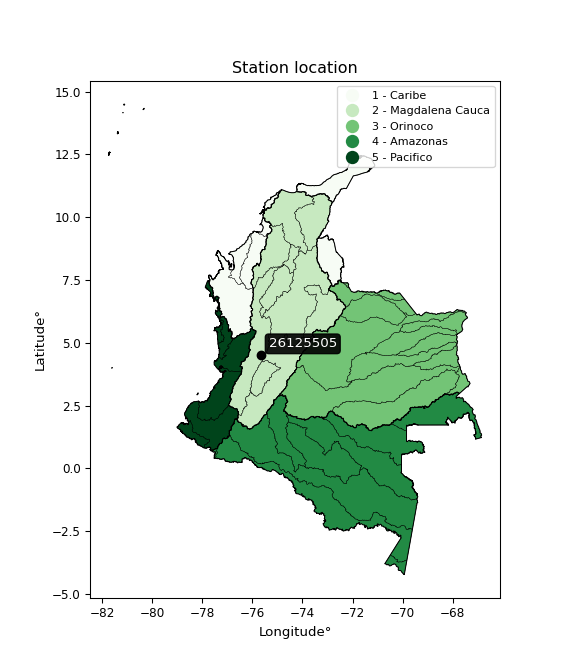

<div align="center">


</div>

# PMP Station (rain, Pmax24h): 26125505

Probable Maximum Precipitation (PMP) is the greatest amount of rainfall for a specific duration that is meteorologically possible for a given location, acting as a "worst-case" scenario for extreme storms, crucial for designing safety-critical infrastructure like bridges, river deviations, dams, spillways, and nuclear plants to prevent catastrophic failure. PMP is calculated by hydrologists using meteorological data to determine the upper limit of extreme rainfall, often leading to the Probable Maximum Flood (PMF) for flood control design, and is increasingly being studied for climate change impacts.

<div align="center">

</img>

</div>


## A. General information


### 1. General running parameters

• app_version: _v20251228_. • runtime: _2025-12-28 08:43:48.795225_. • Python version: _3.14.0_. • SciPy version: _1.16.3_. • Pandas version: _2.3.3_. • NumPy version: _2.3.5_. • Stations dataset (station_dataset_file): _dataset/pmax24h_in/automatic_colombia_2003_2024.csv_. • Stations catalog (station_catalog_file): _dataset/CNE_IDEAM.xls_. • Minimum year to eval til year_max (date_min): _1900_. • Maximum year to eval since year_min (date_max): _2024_. • Creates, save and include plots into reports (create_plot): _False_. • Plot only fit distributions with Δo > Δ (plot_only_fit): _True_. • Eval low extreme values, if False, evaluates high extreme values (low_extreme): _False_. • Eval every SciPy distribution as logarithmic (pdist_logarithmic_on): _True_. • Standard deviation normalized (ddof): _1.0_. • Return periods to eval in years (Tr): _[2, 2.33, 5, 10, 15, 20, 25, 50, 75, 100, 200, 250, 500, 750, 1000]_. • Minimum data sample per station, 0 means any (minimum_sample): _5_. • Z-Score maximum threshold to adjust a value, 0 means disable (zscore_max): _3.5_. • Z-Score minimum threshold to adjust a value, 0 means disable (zscore_min): _-2.5_. • Avoid zeros, e.g. rain = 0 (avoid_zeros): _True_. • Avoid null values (avoid_nans): _True_. [:file_folder:Dataset file.](../../dataset/pmax24h_in/automatic_colombia_2003_2024.csv)

> Delta Degrees of Freedom (DDOF): is a parameter used in the formulas for calculating variance and standard deviation. When ddof=0, the divisor is $N$ (the total number of observations) and this is used when your data set is the entire population. When ddof=1, the divisor is $N-1$ and this is used when your data set is a sample drawn from a larger population. Using $N-1$ provides an unbiased estimate of the population variance (known as Bessel´s correction).


### 2. Station info and location

|   id |   CODIGO | NOMBRE                      | CATEGORIA               | TECNOLOGIA                | ESTADO   | FECHA_INSTALACION   |   FECHA_SUSPENSION |   ALTITUD |   LATITUD |   LONGITUD | DEPARTAMENTO   | MUNICIPIO   | AREA_OPERATIVA                         | ENTIDAD                                    | AREA_HIDROGRAFICA   | ZONA_HIDROGRAFICA   | SUBZONA_HIDROGRAFICA   |   CORRIENTE | Catalogo   |
|-----:|---------:|:----------------------------|:------------------------|:--------------------------|:---------|:--------------------|-------------------:|----------:|----------:|-----------:|:---------------|:------------|:---------------------------------------|:-------------------------------------------|:--------------------|:--------------------|:-----------------------|------------:|:-----------|
|    0 | 26125505 | LA BELLA  - AUT  [26125505] | Climatológica Principal | Automática con Telemetría | Activa   | 11/07/2013          |                nan |      1449 |   4.50111 |   -75.6714 | Quindío        | Calarcá     | Area Operativa 09 - Cauca-Valle-Caldas | CENTRO NACIONAL DE INVESTIGACIONES DE CAFE | Magdalena Cauca     | Cauca               | Río La Vieja           |         nan | CNE_OE     |

<div align="center">

Map location in: [:earth_americas:Google](http://maps.google.com/maps?q=4.501111111,-75.67138889) [:earth_americas:OSM](https://www.openstreetmap.org/#map=18/4.501111111/-75.67138889&layers=P) [:earth_americas:Bing](https://www.bing.com/maps?cp=4.501111111~-75.67138889&lvl=18) [:earth_americas:Apple](https://maps.apple.com/frame?center=4.501111111%2C-75.67138889&span=0.003%2C0.006)

</div>


<div align="center">

```geojson
{
  "type": "Feature",
  "geometry": {
    "type": "Point", 
    "coordinates": [-75.67138889, 4.501111111]
  }, 
  "properties": {
    "Name": "26125505"
  }
}
```

</div>


### 3. Discrete values table and plot

|               |          0 |           1 |           2 |          3 |           4 |           5 |          6 |
|:--------------|-----------:|------------:|------------:|-----------:|------------:|------------:|-----------:|
| Date          | 2017       | 2018        | 2019        | 2020       | 2021        | 2022        | 2023       |
| Value         |   97.2     |  107.4      |   81.2      |  136.7     |   51.7      |   51.7      |    8       |
| Value_initial |   97.2     |  107.4      |   81.2      |  136.7     |   51.7      |   51.7      |    8       |
| count         |    7       |    7        |    7        |    7       |    7        |    7        |    7       |
| mean          |   76.2714  |   76.2714   |   76.2714   |   76.2714  |   76.2714   |   76.2714   |   76.2714  |
| std           |   42.7227  |   42.7227   |   42.7227   |   42.7227  |   42.7227   |   42.7227   |   42.7227  |
| zscore        |    0.48987 |    0.728618 |    0.115362 |    1.41444 |   -0.575137 |   -0.575137 |   -1.59801 |

> The initial value (value_initial) correspond to the initial obtained or null completed value, and value (value) is adjusted only when the initial value is outside the valid range definite through the Z-Score value. If Z-Score is active, values out of range or outliers are replaced with the station mean value


### 4. Active continuous probability distributions from SciPy (44 of 104 available)

[scipy.stats](https://docs.scipy.org/doc/scipy/reference/stats.html) is a Python´s powerful submodule within the SciPy library for comprehensive statistical analysis, offering over 130 probability distributions (like Normal, Poisson), functions for descriptive stats (mean, variance), hypothesis testing (t-tests, chi-square), random variable generation, and statistical tests, making it essential for data science, modeling, and research. It provides tools to explore, model, and draw conclusions from data efficiently, working seamlessly with NumPy.

<div align="center">

|   id | p_dist             |   n_parameter | fit_method   | label                                                                       | active   | ref                                                                                                        |
|-----:|:-------------------|--------------:|:-------------|:----------------------------------------------------------------------------|:---------|:-----------------------------------------------------------------------------------------------------------|
|    0 | alpha              |             3 | MLE          | Alpha                                                                       | True     | [:mortar_board:](https://docs.scipy.org/doc/scipy/reference/generated/scipy.stats.alpha.html)              |
|    1 | betaprime          |             4 | MLE          | Beta prime                                                                  | True     | [:mortar_board:](https://docs.scipy.org/doc/scipy/reference/generated/scipy.stats.betaprime.html)          |
|    2 | chi2               |             3 | MLE          | Chi²                                                                        | True     | [:mortar_board:](https://docs.scipy.org/doc/scipy/reference/generated/scipy.stats.chi2.html)               |
|    3 | crystalball        |             4 | MLE          | Crystalball                                                                 | True     | [:mortar_board:](https://docs.scipy.org/doc/scipy/reference/generated/scipy.stats.crystalball.html)        |
|    4 | erlang             |             3 | MLE          | Erlang                                                                      | True     | [:mortar_board:](https://docs.scipy.org/doc/scipy/reference/generated/scipy.stats.erlang.html)             |
|    5 | expon              |             2 | MLE          | Exponential                                                                 | True     | [:mortar_board:](https://docs.scipy.org/doc/scipy/reference/generated/scipy.stats.expon.html)              |
|    6 | exponnorm          |             3 | MLE          | Exponentially modified Normal                                               | True     | [:mortar_board:](https://docs.scipy.org/doc/scipy/reference/generated/scipy.stats.exponnorm.html)          |
|    7 | f                  |             4 | MLE          | F                                                                           | True     | [:mortar_board:](https://docs.scipy.org/doc/scipy/reference/generated/scipy.stats.f.html)                  |
|    8 | fatiguelife        |             3 | MLE          | Fatigue-life (Birnbaum-Saunders)                                            | True     | [:mortar_board:](https://docs.scipy.org/doc/scipy/reference/generated/scipy.stats.fatiguelife.html)        |
|    9 | fisk               |             3 | MLE          | Fisk                                                                        | True     | [:mortar_board:](https://docs.scipy.org/doc/scipy/reference/generated/scipy.stats.fisk.html)               |
|   10 | gamma              |             3 | MLE          | Gamma                                                                       | True     | [:mortar_board:](https://docs.scipy.org/doc/scipy/reference/generated/scipy.stats.gamma.html)              |
|   11 | genexpon           |             5 | MLE          | Generalized exponential                                                     | True     | [:mortar_board:](https://docs.scipy.org/doc/scipy/reference/generated/scipy.stats.genexpon.html)           |
|   12 | genlogistic        |             3 | MLE          | Generalized logistic                                                        | True     | [:mortar_board:](https://docs.scipy.org/doc/scipy/reference/generated/scipy.stats.genlogistic.html)        |
|   13 | gibrat             |             2 | MM           | Gibrat                                                                      | True     | [:mortar_board:](https://docs.scipy.org/doc/scipy/reference/generated/scipy.stats.gibrat.html)             |
|   14 | gompertz           |             3 | MLE          | Gompertz (or truncated Gumbel)                                              | True     | [:mortar_board:](https://docs.scipy.org/doc/scipy/reference/generated/scipy.stats.gompertz.html)           |
|   15 | gumbel_l           |             2 | MM           | Gumbel Left Skew                                                            | True     | [:mortar_board:](https://docs.scipy.org/doc/scipy/reference/generated/scipy.stats.gumbel_l.html)           |
|   16 | gumbel_r           |             2 | MM           | Gumbel Right Skew                                                           | True     | [:mortar_board:](https://docs.scipy.org/doc/scipy/reference/generated/scipy.stats.gumbel_r.html)           |
|   17 | halflogistic       |             2 | MM           | Half-logistic                                                               | True     | [:mortar_board:](https://docs.scipy.org/doc/scipy/reference/generated/scipy.stats.halflogistic.html)       |
|   18 | halfnorm           |             2 | MM           | Half Normal                                                                 | True     | [:mortar_board:](https://docs.scipy.org/doc/scipy/reference/generated/scipy.stats.halfnorm.html)           |
|   19 | hypsecant          |             2 | MM           | hyperbolic secant                                                           | True     | [:mortar_board:](https://docs.scipy.org/doc/scipy/reference/generated/scipy.stats.hypsecant.html)          |
|   20 | invgamma           |             3 | MLE          | Inverted gamma                                                              | True     | [:mortar_board:](https://docs.scipy.org/doc/scipy/reference/generated/scipy.stats.invgamma.html)           |
|   21 | invgauss           |             3 | MLE          | Inverse Gaussian                                                            | True     | [:mortar_board:](https://docs.scipy.org/doc/scipy/reference/generated/scipy.stats.invgauss.html)           |
|   22 | invweibull         |             3 | MLE          | Inverted Weibull                                                            | True     | [:mortar_board:](https://docs.scipy.org/doc/scipy/reference/generated/scipy.stats.invweibull.html)         |
|   23 | johnsonsu          |             4 | MLE          | Johnson Su                                                                  | True     | [:mortar_board:](https://docs.scipy.org/doc/scipy/reference/generated/scipy.stats.johnsonsu.html)          |
|   24 | kstwobign          |             2 | MLE          | Limiting distribution of scaled Kolmogorov-Smirnov two-sided test statistic | True     | [:mortar_board:](https://docs.scipy.org/doc/scipy/reference/generated/scipy.stats.kstwobign.html)          |
|   25 | laplace            |             2 | MM           | Laplace                                                                     | True     | [:mortar_board:](https://docs.scipy.org/doc/scipy/reference/generated/scipy.stats.laplace.html)            |
|   26 | laplace_asymmetric |             3 | MLE          | Asymmetric Laplace                                                          | True     | [:mortar_board:](https://docs.scipy.org/doc/scipy/reference/generated/scipy.stats.laplace_asymmetric.html) |
|   27 | loggamma           |             3 | MLE          | Log gamma                                                                   | True     | [:mortar_board:](https://docs.scipy.org/doc/scipy/reference/generated/scipy.stats.loggamma.html)           |
|   28 | logistic           |             2 | MM           | Logistic (or Sech-squared)                                                  | True     | [:mortar_board:](https://docs.scipy.org/doc/scipy/reference/generated/scipy.stats.logistic.html)           |
|   29 | lognorm            |             3 | MLE          | Log Normal                                                                  | True     | [:mortar_board:](https://docs.scipy.org/doc/scipy/reference/generated/scipy.stats.lognorm.html)            |
|   30 | maxwell            |             2 | MM           | Maxwell                                                                     | True     | [:mortar_board:](https://docs.scipy.org/doc/scipy/reference/generated/scipy.stats.maxwell.html)            |
|   31 | mielke             |             4 | MLE          | Mielke Beta-Kappa / Dagum                                                   | True     | [:mortar_board:](https://docs.scipy.org/doc/scipy/reference/generated/scipy.stats.mielke.html)             |
|   32 | moyal              |             2 | MM           | Moyal                                                                       | True     | [:mortar_board:](https://docs.scipy.org/doc/scipy/reference/generated/scipy.stats.moyal.html)              |
|   33 | nakagami           |             3 | MLE          | Nakagami                                                                    | True     | [:mortar_board:](https://docs.scipy.org/doc/scipy/reference/generated/scipy.stats.nakagami.html)           |
|   34 | ncf                |             5 | MLE          | Non-central F distribution                                                  | True     | [:mortar_board:](https://docs.scipy.org/doc/scipy/reference/generated/scipy.stats.ncf.html)                |
|   35 | nct                |             4 | MLE          | Non-central Student’s t                                                     | True     | [:mortar_board:](https://docs.scipy.org/doc/scipy/reference/generated/scipy.stats.nct.html)                |
|   36 | norm               |             2 | MM           | Normal                                                                      | True     | [:mortar_board:](https://docs.scipy.org/doc/scipy/reference/generated/scipy.stats.norm.html)               |
|   37 | pearson3           |             3 | MM           | Pearson type III                                                            | True     | [:mortar_board:](https://docs.scipy.org/doc/scipy/reference/generated/scipy.stats.pearson3.html)           |
|   38 | rayleigh           |             2 | MM           | Rayleigh                                                                    | True     | [:mortar_board:](https://docs.scipy.org/doc/scipy/reference/generated/scipy.stats.rayleigh.html)           |
|   39 | rice               |             3 | MLE          | Rice                                                                        | True     | [:mortar_board:](https://docs.scipy.org/doc/scipy/reference/generated/scipy.stats.rice.html)               |
|   40 | t                  |             3 | MLE          | Student’s t                                                                 | True     | [:mortar_board:](https://docs.scipy.org/doc/scipy/reference/generated/scipy.stats.t.html)                  |
|   41 | truncnorm          |             4 | MLE          | Truncated normal                                                            | True     | [:mortar_board:](https://docs.scipy.org/doc/scipy/reference/generated/scipy.stats.truncnorm.html)          |
|   42 | wald               |             2 | MM           | Wald                                                                        | True     | [:mortar_board:](https://docs.scipy.org/doc/scipy/reference/generated/scipy.stats.wald.html)               |
|   43 | weibull_min        |             3 | MLE          | Weibull minimum                                                             | True     | [:mortar_board:](https://docs.scipy.org/doc/scipy/reference/generated/scipy.stats.weibull_min.html)        |

</div>

> **n_parameter:** # arguments & localization & scale.
>
> **Fit methods:** (MLE) maximum likelihood, (MM) L-moments.
>
>**Inactive:** foldnorm, gennorm, norminvgauss, powernorm, powerlognorm, skewnorm, genextreme, anglit, arcsine, argus, beta, bradford, burr, burr12, cauchy, cosine, halfcauchy, foldcauchy, skewcauchy, wrapcauchy, dgamma, gengamma, exponweib, exponpow, truncexpon, gausshyper, genhalflogistic, genhyperbolic, geninvgauss, halfgennorm, johnsonsb, kappa4, kappa3, ksone, kstwo, loglaplace, levy, levy_l, levy_stable, ncx2, pareto, genpareto, truncpareto, lomax, powerlaw, rdist, rel_breitwigner, recipinvgauss, semicircular, studentized_range, trapezoid, triang, truncweibull_min, tukeylambda, uniform, loguniform, vonmises, vonmises_line, weibull_max, dweibull, 


## B. Probability distributions vs. Empirical distributions

A continuous probability distribution (CPD) describes probabilities for variables that can take any value within a range (like rain any time), unlike discrete variables with specific outcomes (like temperature). It uses a Probability Density Function (PDF), a curve where the total area under it equals 1, and the probability of the variable falling within an interval (a to b) is found by calculating the area under the curve between those points. A key feature is that the probability of hitting any single exact value is zero, so probabilities are always expressed for ranges, e.g., $P(a ≤ X ≤ b)$.

<div align="center">

Distributions parameters from station values
|    |   station | p_dist                |   n |             loc |           scale | shape                  | shape1                 | shape2             | shape3   |
|---:|----------:|:----------------------|----:|----------------:|----------------:|:-----------------------|:-----------------------|:-------------------|:---------|
|  0 |  26125505 | alpha                 |   7 |    -0.0555768   |    20.5957      | 1.7183394690456408e-09 |                        |                    |          |
|  1 |  26125505 | betaprime             |   7 |  -919.628       | 79457.2         | 641.0322914346411      | 51144.760669387426     |                    |          |
|  2 |  26125505 | chi2                  |   7 |     8           |     4.97349     | 1.5549774808866466     |                        |                    |          |
|  3 |  26125505 | crystalball           |   7 |    76.2714      |    39.5536      | 6917.285666837963      | 143.52224581712403     |                    |          |
|  4 |  26125505 | erlang                |   7 |  -696.324       |     2.05339     | 376.1514708869274      |                        |                    |          |
|  5 |  26125505 | expon                 |   7 |     8           |    68.2714      |                        |                        |                    |          |
|  6 |  26125505 | exponnorm             |   7 |    76.2399      |    39.5534      | 0.0008011850406831905  |                        |                    |          |
|  7 |  26125505 | f                     |   7 | -1447.8         |  1524.03        | 3002.766808073895      | 173424.40385743737     |                    |          |
|  8 |  26125505 | fatiguelife           |   7 |     8           |     3.84086e-06 | 4299.216861211272      |                        |                    |          |
|  9 |  26125505 | fisk                  |   7 |    -9.34633e+08 |     9.34634e+08 | 40044896.14633365      |                        |                    |          |
| 10 |  26125505 | gamma                 |   7 |  -647.323       |     2.1963      | 329.4031113255139      |                        |                    |          |
| 11 |  26125505 | genexpon              |   7 |     7.9999      |     2.64181     | 0.04034778492899094    | 1.2654266267741708e-07 | 4.171928406753349  |          |
| 12 |  26125505 | genlogistic           |   7 |    89.1546      |    20.4581      | 0.7140289896800767     |                        |                    |          |
| 13 |  26125505 | gibrat                |   7 |    46.097       |    18.3017      |                        |                        |                    |          |
| 14 |  26125505 | gompertz              |   7 |    51.7         |    24.1643      | 0.12053912351157375    |                        |                    |          |
| 15 |  26125505 | gumbel_l              |   7 |    94.0726      |    30.8398      |                        |                        |                    |          |
| 16 |  26125505 | gumbel_r              |   7 |    58.4702      |    30.8398      |                        |                        |                    |          |
| 17 |  26125505 | halflogistic          |   7 |    29.3913      |    33.8169      |                        |                        |                    |          |
| 18 |  26125505 | halfnorm              |   7 |    23.918       |    65.6153      |                        |                        |                    |          |
| 19 |  26125505 | hypsecant             |   7 |    76.2714      |    25.1806      |                        |                        |                    |          |
| 20 |  26125505 | invgamma              |   7 |  -368.81        | 52360.7         | 118.80778950211493     |                        |                    |          |
| 21 |  26125505 | invgauss              |   7 |  -196.008       | 11692.1         | 0.023223147772214497   |                        |                    |          |
| 22 |  26125505 | invweibull            |   7 |     8           |     5.3744      | 0.061025707184860466   |                        |                    |          |
| 23 |  26125505 | johnsonsu             |   7 |   316.929       |    55.3351      | 13.298636401254708     | 6.1469306165188105     |                    |          |
| 24 |  26125505 | kstwobign             |   7 |   -79.4524      |   178.05        |                        |                        |                    |          |
| 25 |  26125505 | laplace               |   7 |    76.2714      |    27.9686      |                        |                        |                    |          |
| 26 |  26125505 | laplace_asymmetric    |   7 |    81.2         |    32.5638      | 1.0785356290364123     |                        |                    |          |
| 27 |  26125505 | loggamma              |   7 |  -127.268       |   104.93        | 7.45110932032887       |                        |                    |          |
| 28 |  26125505 | logistic              |   7 |    76.2714      |    21.807       |                        |                        |                    |          |
| 29 |  26125505 | lognorm               |   7 |     8           |     0.311308    | 13.394660621775978     |                        |                    |          |
| 30 |  26125505 | maxwell               |   7 |   -17.4539      |    58.7337      |                        |                        |                    |          |
| 31 |  26125505 | mielke                |   7 |     7.99997     |   129.036       | 0.9805476740780894     | 1809.8602050734814     |                    |          |
| 32 |  26125505 | moyal                 |   7 |    53.6522      |    17.8054      |                        |                        |                    |          |
| 33 |  26125505 | nakagami              |   7 | -5670.27        |  5746.63        | 5255.633465678573      |                        |                    |          |
| 34 |  26125505 | ncf                   |   7 |    -0.0165414   |     2.34131e-07 | 4.875974757484034e-08  | 7.368951395681831      | 13.848627561486179 |          |
| 35 |  26125505 | nct                   |   7 | -1795.8         |    39.4486      | 209209.2195156943      | 47.45564472378388      |                    |          |
| 36 |  26125505 | norm                  |   7 |    76.2714      |    39.5536      |                        |                        |                    |          |
| 37 |  26125505 | pearson3              |   7 |    76.2714      |    39.5536      | -0.20262919238787533   |                        |                    |          |
| 38 |  26125505 | rayleigh              |   7 |     0.60314     |    60.3746      |                        |                        |                    |          |
| 39 |  26125505 | rice                  |   7 |   -13.7859      |    44.2524      | 1.7147809232777993     |                        |                    |          |
| 40 |  26125505 | t                     |   7 |    76.2705      |    39.5482      | 880073.3808881694      |                        |                    |          |
| 41 |  26125505 | truncnorm             |   7 |    76.2714      |    39.5536      | -467.96850306356487    | 5.780260807954617      |                    |          |
| 42 |  26125505 | wald                  |   7 |    36.7179      |    39.5535      |                        |                        |                    |          |
| 43 |  26125505 | weibull_min           |   7 |   -64.4378      |   155.365       | 4.117756064015138      |                        |                    |          |
| 44 |  26125505 | logalpha              |   7 |   -19.2956      |   573.673       | 24.594576032515537     |                        |                    |          |
| 45 |  26125505 | logbetaprime          |   7 |    -0.0616682   |    36.5161      | 17.52352314400943      | 155.13043203342164     |                    |          |
| 46 |  26125505 | logchi2               |   7 |     2.07944     |     1.06889     | 1.1965278177487502     |                        |                    |          |
| 47 |  26125505 | logcrystalball        |   7 |     4.07691     |     0.881837    | 5.649763720861474      | 3.9176900021424665     |                    |          |
| 48 |  26125505 | logerlang             |   7 |   -12.2256      |     0.0523553   | 311.6205866065088      |                        |                    |          |
| 49 |  26125505 | logexpon              |   7 |     2.07944     |     1.99747     |                        |                        |                    |          |
| 50 |  26125505 | logexponnorm          |   7 |     4.07639     |     0.88183     | 0.0005900232417033035  |                        |                    |          |
| 51 |  26125505 | logf                  |   7 | -1691.53        |  1695.6         | 28508878.71961996      | 9956297.901761811      |                    |          |
| 52 |  26125505 | logfatiguelife        |   7 |  -621.005       |   625.085       | 0.001409000779312697   |                        |                    |          |
| 53 |  26125505 | logfisk               |   7 |    -9.90687e+07 |     9.90687e+07 | 223681155.92796072     |                        |                    |          |
| 54 |  26125505 | loggamma              |   7 |   -12.2462      |     0.0533256   | 306.20552244261194     |                        |                    |          |
| 55 |  26125505 | loggenexpon           |   7 |     2.07944     |     4.20589e+07 | 7849921.681502616      | 62968590.03262138      | 7857375.976550134  |          |
| 56 |  26125505 | loggenlogistic        |   7 |     4.91786     |     5.65404e-06 | 6.75284024763219e-06   |                        |                    |          |
| 57 |  26125505 | loggibrat             |   7 |     3.40418     |     0.408032    |                        |                        |                    |          |
| 58 |  26125505 | loggompertz           |   7 |     2.07944     |     0.570797    | 0.016530969529249494   |                        |                    |          |
| 59 |  26125505 | loggumbel_l           |   7 |     4.47378     |     0.68756     |                        |                        |                    |          |
| 60 |  26125505 | loggumbel_r           |   7 |     3.68004     |     0.68756     |                        |                        |                    |          |
| 61 |  26125505 | loghalflogistic       |   7 |     3.03175     |     0.753924    |                        |                        |                    |          |
| 62 |  26125505 | loghalfnorm           |   7 |     2.90972     |     1.46286     |                        |                        |                    |          |
| 63 |  26125505 | loghypsecant          |   7 |     4.07691     |     0.56139     |                        |                        |                    |          |
| 64 |  26125505 | loginvgamma           |   7 |   -16.6659      | 10136.3         | 489.43992202819993     |                        |                    |          |
| 65 |  26125505 | loginvgauss           |   7 |    -6.13384     |   999.818       | 0.010183017677498862   |                        |                    |          |
| 66 |  26125505 | loginvweibull         |   7 |    -9.76041e+07 |     9.76041e+07 | 90352741.47806151      |                        |                    |          |
| 67 |  26125505 | logjohnsonsu          |   7 |     5.03187     |     0.00348138  | 6.200607402875399      | 1.051656163189847      |                    |          |
| 68 |  26125505 | logkstwobign          |   7 |    -0.277226    |     4.98134     |                        |                        |                    |          |
| 69 |  26125505 | loglaplace            |   7 |     4.07691     |     0.623548    |                        |                        |                    |          |
| 70 |  26125505 | loglaplace_asymmetric |   7 |     4.67656     |     0.377549    | 2.071169012980217      |                        |                    |          |
| 71 |  26125505 | logloggamma           |   7 |     4.91784     |     3.86353e-06 | 4.6149281070093166e-06 |                        |                    |          |
| 72 |  26125505 | loglogistic           |   7 |     4.07691     |     0.486178    |                        |                        |                    |          |
| 73 |  26125505 | loglognorm            |   7 |     2.07944     |     0.0130933   | 12.66262544298375      |                        |                    |          |
| 74 |  26125505 | logmaxwell            |   7 |     1.98735     |     1.30944     |                        |                        |                    |          |
| 75 |  26125505 | logmielke             |   7 |    -2.54819e+07 |     2.54819e+07 | 29599221.198876012     | 35328258514.23247      |                    |          |
| 76 |  26125505 | logmoyal              |   7 |     3.57263     |     0.396963    |                        |                        |                    |          |
| 77 |  26125505 | lognakagami           |   7 |     3.94546     |     0.37501     | 0.09794386828036518    |                        |                    |          |
| 78 |  26125505 | logncf                |   7 |    -2.32891     |     4.86362e-07 | 1.4845646274443606e-05 | 382.8623082232715      | 194.7006424982003  |          |
| 79 |  26125505 | lognct                |   7 |   -45.6914      |     0.808428    | 8784.717999762619      | 61.55647463969328      |                    |          |
| 80 |  26125505 | lognorm               |   7 |     4.07691     |     0.881829    |                        |                        |                    |          |
| 81 |  26125505 | logpearson3           |   7 |     4.07691     |     0.881832    | -1.45963338358718      |                        |                    |          |
| 82 |  26125505 | lograyleigh           |   7 |     2.38993     |     1.34602     |                        |                        |                    |          |
| 83 |  26125505 | logrice               |   7 |  -992.686       |     0.881792    | 1130.382568808832      |                        |                    |          |
| 84 |  26125505 | logt                  |   7 |     4.39409     |     0.415312    | 1.7925832231543426     |                        |                    |          |
| 85 |  26125505 | logtruncnorm          |   7 |    -0.240223    |     1.61553     | 2.590902666224646      | 3.1927825050279752     |                    |          |
| 86 |  26125505 | logwald               |   7 |     3.19508     |     0.881829    |                        |                        |                    |          |
| 87 |  26125505 | logweibull_min        |   7 |     2.07944     |     1.15245     | 0.7388049877120537     |                        |                    |          |

</div>

> **loc** (Location parameter): This shifts the distribution along the x-axis. For many common distributions, like the normal (Gaussian) distribution, loc represents the mean $μ$. For others, like the uniform distribution, it might represent the minimum value, or for the beta distribution, the left end of the support interval.
>
> **scale** (Scale parameter): This determines the width or spread of the distribution. For the normal distribution, scale represents the standard deviation $σ$. For a uniform distribution, it defines the length of the interval (from $loc$ to $loc + scale$).
>
> **shape** (Shape parameters): Refers to parameters that define the specific form of a probability distribution, distinct from its location (loc) and scale (scale). These parameters are required arguments for most distribution functions. For example, a normal (Gaussian) distribution is fully defined by its location (mean) and scale (standard deviation), so it has no specific shape parameters beyond loc and scale. However, other distributions have intrinsic properties that need specification, as Gamma distribution that takes a shape parameter, often named $a$ or $alpha$.


### 0. Cumulative distribution values - CDF (88 evaluated)

Cumulative Distribution Function (CDF), denoted as $F$<sub>$X$</sub>$(x)$, is a function that gives the probability that a random variable $X$ will take a value less than or equal to a specific value, $x$ (i.e., $(P(X≥x)$. It essentially "accumulates" probabilities from a given point up to the far right (positive infinity), providing a complete picture of the distribution´s probabilities for both discrete (like rain) and continuous (like temperature) variables, helping to find probabilities over ranges or above certain values.

<div align="center">

CDF ordered by x ascending and calculating $log(f(x))$ separately
|   id |   Station |   date |     x |   count |    mean |     std |    zscore |   Value_initial |   station |   m |    alpha |   alpha_pdf |   betaprime |   betaprime_pdf |        chi2 |      chi2_pdf |   crystalball |   crystalball_pdf |    erlang |   erlang_pdf |    expon |   expon_pdf |   exponnorm |   exponnorm_pdf |         f |      f_pdf |   fatiguelife |   fatiguelife_pdf |      fisk |   fisk_pdf |     gamma |   gamma_pdf |    genexpon |   genexpon_pdf |   genlogistic |   genlogistic_pdf |   gibrat |   gibrat_pdf |    gompertz |   gompertz_pdf |   gumbel_l |   gumbel_l_pdf |   gumbel_r |   gumbel_r_pdf |   halflogistic |   halflogistic_pdf |   halfnorm |   halfnorm_pdf |   hypsecant |   hypsecant_pdf |   invgamma |   invgamma_pdf |   invgauss |   invgauss_pdf |   invweibull |   invweibull_pdf |   johnsonsu |   johnsonsu_pdf |   kstwobign |   kstwobign_pdf |   laplace |   laplace_pdf |   laplace_asymmetric |   laplace_asymmetric_pdf |   loggamma |   loggamma_pdf |   logistic |   logistic_pdf |   lognorm |   lognorm_pdf |   maxwell |   maxwell_pdf |      mielke |   mielke_pdf |       moyal |   moyal_pdf |   nakagami |   nakagami_pdf |      ncf |    ncf_pdf |       nct |    nct_pdf |      norm |   norm_pdf |   pearson3 |   pearson3_pdf |   rayleigh |   rayleigh_pdf |      rice |   rice_pdf |         t |      t_pdf |   truncnorm |   truncnorm_pdf |     wald |   wald_pdf |   weibull_min |   weibull_min_pdf |   logalpha |   logalpha_pdf |   logbetaprime |   logbetaprime_pdf |     logchi2 |    logchi2_pdf |   logcrystalball |   logcrystalball_pdf |   logerlang |   logerlang_pdf |   logexpon |   logexpon_pdf |   logexponnorm |   logexponnorm_pdf |      logf |   logf_pdf |   logfatiguelife |   logfatiguelife_pdf |    logfisk |   logfisk_pdf |   loggenexpon |   loggenexpon_pdf |   loggenlogistic |   loggenlogistic_pdf |   loggibrat |   loggibrat_pdf |   loggompertz |   loggompertz_pdf |   loggumbel_l |   loggumbel_l_pdf |   loggumbel_r |   loggumbel_r_pdf |   loghalflogistic |   loghalflogistic_pdf |   loghalfnorm |   loghalfnorm_pdf |   loghypsecant |   loghypsecant_pdf |   loginvgamma |   loginvgamma_pdf |   loginvgauss |   loginvgauss_pdf |   loginvweibull |   loginvweibull_pdf |   logjohnsonsu |   logjohnsonsu_pdf |   logkstwobign |   logkstwobign_pdf |   loglaplace |   loglaplace_pdf |   loglaplace_asymmetric |   loglaplace_asymmetric_pdf |   logloggamma |   logloggamma_pdf |   loglogistic |   loglogistic_pdf |   loglognorm |   loglognorm_pdf |   logmaxwell |   logmaxwell_pdf |   logmielke |   logmielke_pdf |    logmoyal |   logmoyal_pdf |   lognakagami |   lognakagami_pdf |    logncf |   logncf_pdf |    lognct |   lognct_pdf |   logpearson3 |   logpearson3_pdf |   lograyleigh |   lograyleigh_pdf |   logrice |   logrice_pdf |      logt |   logt_pdf |   logtruncnorm |   logtruncnorm_pdf |   logwald |   logwald_pdf |   logweibull_min |   logweibull_min_pdf |
|-----:|----------:|-------:|------:|--------:|--------:|--------:|----------:|----------------:|----------:|----:|---------:|------------:|------------:|----------------:|------------:|--------------:|--------------:|------------------:|----------:|-------------:|---------:|------------:|------------:|----------------:|----------:|-----------:|--------------:|------------------:|----------:|-----------:|----------:|------------:|------------:|---------------:|--------------:|------------------:|---------:|-------------:|------------:|---------------:|-----------:|---------------:|-----------:|---------------:|---------------:|-------------------:|-----------:|---------------:|------------:|----------------:|-----------:|---------------:|-----------:|---------------:|-------------:|-----------------:|------------:|----------------:|------------:|----------------:|----------:|--------------:|---------------------:|-------------------------:|-----------:|---------------:|-----------:|---------------:|----------:|--------------:|----------:|--------------:|------------:|-------------:|------------:|------------:|-----------:|---------------:|---------:|-----------:|----------:|-----------:|----------:|-----------:|-----------:|---------------:|-----------:|---------------:|----------:|-----------:|----------:|-----------:|------------:|----------------:|---------:|-----------:|--------------:|------------------:|-----------:|---------------:|---------------:|-------------------:|------------:|---------------:|-----------------:|---------------------:|------------:|----------------:|-----------:|---------------:|---------------:|-------------------:|----------:|-----------:|-----------------:|---------------------:|-----------:|--------------:|--------------:|------------------:|-----------------:|---------------------:|------------:|----------------:|--------------:|------------------:|--------------:|------------------:|--------------:|------------------:|------------------:|----------------------:|--------------:|------------------:|---------------:|-------------------:|--------------:|------------------:|--------------:|------------------:|----------------:|--------------------:|---------------:|-------------------:|---------------:|-------------------:|-------------:|-----------------:|------------------------:|----------------------------:|--------------:|------------------:|--------------:|------------------:|-------------:|-----------------:|-------------:|-----------------:|------------:|----------------:|------------:|---------------:|--------------:|------------------:|----------:|-------------:|----------:|-------------:|--------------:|------------------:|--------------:|------------------:|----------:|--------------:|----------:|-----------:|---------------:|-------------------:|----------:|--------------:|-----------------:|---------------------:|
|    0 |  26125505 |   2023 |   8   |       7 | 76.2714 | 42.7227 | -1.59801  |             8   |  26125505 |   1 | 0.010567 | 0.00964033  |    0.039781 |      0.00227407 | 6.15968e-13 | 269.601       |     0.0421692 |        0.00227399 | 0.0405214 |   0.00232578 | 0        |  0.0146474  |   0.0421684 |      0.00227396 | 0.0410702 | 0.00228932 |     0.0169543 |       9.6591e+11  | 0.0486863 | 0.00198443 | 0.0402469 |  0.00232121 | 1.50503e-06 |     0.0152727  |     0.0580845 |        0.0019896  | 0        |   0          | 0           |     0          |  0.0595175 |     0.00187129 | 0.00587348 |    0.000978408 |       0        |         0          |   0        |     0          |   0.0422427 |      0.00167267 |  0.0372459 |     0.00247915 |  0.0349692 |     0.00251675 |  0.000149989 |      4.53701e+10 |   0.0568569 |      0.00223659 |   0.0306859 |      0.00323789 | 0.0435367 |    0.00155663 |            0.0668966 |               0.00190473 |  0.0131453 |       0.039538 |  0.0418582 |     0.00183914 | 0.0117519 |     0.0347831 | 0.0204684 |    0.00232276 | 3.16738e-07 |   0.0102257  | 0.000313646 | 0.000122181 |  0.0423863 |     0.00228794 | 0.016276 | 0.00330619 | 0.0421618 | 0.00227447 | 0.0421692 | 0.00227399 |  0.0476667 |     0.00225509 | 0.00747701 |     0.0020141  | 0.0285933 | 0.00268743 | 0.0421507 | 0.00227348 |   0.0421692 |      0.00227399 | 0        | 0          |     0.0422745 |        0.00235159 |  0.0124214 |      0.0404075 |      0.0103182 |          0.0425542 | 4.64219e-10 | 625383         |        0.0117525 |            0.0347843 |   0.0121624 |       0.0373376 |   0        |       0.500633 |       0.011752 |          0.0347835 | 0.0119042 |  0.0351854 |         0.011473 |            0.0342168 | 0.00751691 |     0.0168444 |   5.27931e-11 |          0.186641 |         0        |            0.0402583 |    0        |        0        |   9.84758e-08 |         0.0289614 |     0.0302668 |         0.0433476 |    3.5116e-05 |       0.000523853 |          0        |              0        |      0        |          0        |      0.0181346 |          0.0322855 |     0.0119939 |         0.0380991 |     0.0185344 |         0.0551494 |       0.0176591 |           0.0659853 |      0.0526572 |          0.0382817 |      0.0213958 |          0.0910054 |    0.0203119 |        0.0325748 |               0.0292813 |                   0.0374457 |     0.0336942 |         0.0402472 |     0.0161664 |         0.0327145 |   0.00715626 |      3.53354e+12 |  9.23861e-05 |       0.00300655 |   0.0368366 |       0.0427886 | 5.43506e-11 |    3.01024e-09 |   0           |       0           | 0.0161518 |    0.0502683 | 0.0121287 |    0.0358477 |     0.0345186 |         0.0457435 |      0        |          0        | 0.0117491 |     0.0347774 | 0.0194831 |  0.0144794 |    0           |           0        |  0        |      0        |      4.09213e-12 |         6807.83      |
|    1 |  26125505 |   2021 |  51.7 |       7 | 76.2714 | 42.7227 | -0.575137 |            51.7 |  26125505 |   2 | 0.690673 | 0.00566781  |    0.26998  |      0.00849525 | 0.992836    |   0.000750878 |     0.267228  |        0.00831619 | 0.273904  |   0.00854221 | 0.472756 |  0.00772276 |   0.267226  |      0.00831619 | 0.269782  | 0.00842332 |     0.78365   |       0.00263249  | 0.249722  | 0.00802759 | 0.273638  |  0.00854337 | 0.486971    |     0.00783539 |     0.243316  |        0.00731909 | 0.118267 |   0.0353377  | 8.29141e-08 |     0.00498832 |  0.223612  |     0.00637183 | 0.2878     |    0.011623    |       0.318382 |         0.0132867  |   0.328002 |     0.0111175  |   0.229453  |      0.0083434  |  0.292494  |     0.00904721 |  0.298532  |     0.00922718 |  0.414804    |      0.00050972  |   0.254209  |      0.00727331 |   0.350255  |      0.00947387 | 0.207695  |    0.00742602 |            0.232156  |               0.00661013 |  0.44903   |       0.426387 |  0.244758  |     0.0084767  | 0.440749  |     0.447404  | 0.291253  |    0.00941629 | 0.345874    |   0.00776078 | 0.290808    | 0.0135475   |  0.268266  |     0.0083274  | 0.374732 | 0.00909863 | 0.267285  | 0.00831801 | 0.267228  | 0.00831619 |  0.260355  |     0.00787776 | 0.301023   |     0.00979826 | 0.281887  | 0.00870809 | 0.267208  | 0.008317   |   0.267228  |      0.00831619 | 0.249031 | 0.025996   |     0.260452  |        0.00791138 |  0.464542  |      0.422028  |      0.48122   |          0.390584  | 0.769124    |      0.138216  |        0.440749  |            0.4474    |   0.445415  |       0.430103  |   0.607096 |       0.196701 |       0.44075  |          0.447404  | 0.442369  |  0.447261  |         0.439583 |            0.447852  | 0.338521   |     0.505585  |   0.543082    |          0.286624 |         0        |            0.373894  |    0.611252 |        0.708192 |   0.341671    |         0.501226  |     0.37108   |         0.4242    |    0.506742   |       0.500989    |          0.541281 |              0.46889  |      0.521068 |          0.424504 |      0.426136  |          0.551806  |     0.451908  |         0.425746  |     0.48029   |         0.392255  |       0.487978  |           0.324105  |      0.284939  |          0.328603  |      0.531181  |          0.306137  |    0.404961  |        0.649446  |               0.318384  |                   0.407158  |     0.313016  |         0.373894  |     0.432813  |         0.50493   |   0.652346   |      0.0156373   |  0.475138    |       0.445432   |   0.321827  |       0.373828  | 0.531807    |    0.5168      |   0.000996597 |       4.39599e+11 | 0.468583  |    0.392057  | 0.442603  |    0.443308  |     0.349172  |         0.386425  |      0.487147 |          0.44032  | 0.440748  |     0.447423  | 0.201957  |  0.417251  |    1.00916e-05 |           2.10907  |  0.60133  |      0.56887  |      0.760133    |            0.135585  |
|    2 |  26125505 |   2022 |  51.7 |       7 | 76.2714 | 42.7227 | -0.575137 |            51.7 |  26125505 |   3 | 0.690673 | 0.00566781  |    0.26998  |      0.00849525 | 0.992836    |   0.000750878 |     0.267228  |        0.00831619 | 0.273904  |   0.00854221 | 0.472756 |  0.00772276 |   0.267226  |      0.00831619 | 0.269782  | 0.00842332 |     0.78365   |       0.00263249  | 0.249722  | 0.00802759 | 0.273638  |  0.00854337 | 0.486971    |     0.00783539 |     0.243316  |        0.00731909 | 0.118267 |   0.0353377  | 8.29141e-08 |     0.00498832 |  0.223612  |     0.00637183 | 0.2878     |    0.011623    |       0.318382 |         0.0132867  |   0.328002 |     0.0111175  |   0.229453  |      0.0083434  |  0.292494  |     0.00904721 |  0.298532  |     0.00922718 |  0.414804    |      0.00050972  |   0.254209  |      0.00727331 |   0.350255  |      0.00947387 | 0.207695  |    0.00742602 |            0.232156  |               0.00661013 |  0.44903   |       0.426387 |  0.244758  |     0.0084767  | 0.440749  |     0.447404  | 0.291253  |    0.00941629 | 0.345874    |   0.00776078 | 0.290808    | 0.0135475   |  0.268266  |     0.0083274  | 0.374732 | 0.00909863 | 0.267285  | 0.00831801 | 0.267228  | 0.00831619 |  0.260355  |     0.00787776 | 0.301023   |     0.00979826 | 0.281887  | 0.00870809 | 0.267208  | 0.008317   |   0.267228  |      0.00831619 | 0.249031 | 0.025996   |     0.260452  |        0.00791138 |  0.464542  |      0.422028  |      0.48122   |          0.390584  | 0.769124    |      0.138216  |        0.440749  |            0.4474    |   0.445415  |       0.430103  |   0.607096 |       0.196701 |       0.44075  |          0.447404  | 0.442369  |  0.447261  |         0.439583 |            0.447852  | 0.338521   |     0.505585  |   0.543082    |          0.286624 |         0        |            0.373894  |    0.611252 |        0.708192 |   0.341671    |         0.501226  |     0.37108   |         0.4242    |    0.506742   |       0.500989    |          0.541281 |              0.46889  |      0.521068 |          0.424504 |      0.426136  |          0.551806  |     0.451908  |         0.425746  |     0.48029   |         0.392255  |       0.487978  |           0.324105  |      0.284939  |          0.328603  |      0.531181  |          0.306137  |    0.404961  |        0.649446  |               0.318384  |                   0.407158  |     0.313016  |         0.373894  |     0.432813  |         0.50493   |   0.652346   |      0.0156373   |  0.475138    |       0.445432   |   0.321827  |       0.373828  | 0.531807    |    0.5168      |   0.000996597 |       4.39599e+11 | 0.468583  |    0.392057  | 0.442603  |    0.443308  |     0.349172  |         0.386425  |      0.487147 |          0.44032  | 0.440748  |     0.447423  | 0.201957  |  0.417251  |    1.00916e-05 |           2.10907  |  0.60133  |      0.56887  |      0.760133    |            0.135585  |
|    3 |  26125505 |   2019 |  81.2 |       7 | 76.2714 | 42.7227 |  0.115362 |            81.2 |  26125505 |   4 | 0.799906 | 0.00241024  |    0.554662 |      0.00995088 | 0.999666    |   3.44924e-05 |     0.549582  |        0.0100081  | 0.558004  |   0.00986694 | 0.657742 |  0.00501319 |   0.54958   |      0.0100082  | 0.553059  | 0.00994496 |     0.845051  |       0.00165241  | 0.540871  | 0.0106398  | 0.557606  |  0.00985697 | 0.673058    |     0.00499333 |     0.523534  |        0.0108904  | 0.742571 |   0.00919298 | 0.250299    |     0.0126775  |  0.482505  |     0.011054   | 0.619691   |    0.00961561  |       0.644608 |         0.00864184 |   0.617336 |     0.00830695 |   0.561908  |      0.0124028  |  0.577691  |     0.00941137 |  0.583979  |     0.00926062 |  0.426271    |      0.000303022 |   0.518475  |      0.0101168  |   0.610423  |      0.00771658 | 0.580782  |    0.0149889  |            0.53773   |               0.0153107  |  0.638303  |       0.396469 |  0.556263  |     0.011319   | 0.641654  |     0.423575  | 0.58      |    0.0093511  | 0.573575    |   0.00768329 | 0.644542    | 0.00929344  |  0.550398  |     0.00998232 | 0.599851 | 0.00611558 | 0.549659  | 0.0100073  | 0.549582  | 0.0100081  |  0.53638   |     0.0101268  | 0.589772   |     0.00907059 | 0.562659  | 0.00957475 | 0.549598  | 0.0100094  |   0.549582  |      0.0100081  | 0.713499 | 0.00839899 |     0.535252  |        0.0100689  |  0.648526  |      0.379116  |      0.647357  |          0.336564  | 0.822994    |      0.102575  |        0.641653  |            0.423572  |   0.636669  |       0.401014  |   0.686578 |       0.15691  |       0.641656 |          0.423574  | 0.643042  |  0.422469  |         0.640758 |            0.42425   | 0.586478   |     0.547574  |   0.662439    |          0.240596 |         0        |            0.641087  |    0.81303  |        0.270655 |   0.610118    |         0.654663  |     0.591075  |         0.531838  |    0.702911   |       0.360396    |          0.718903 |              0.320443 |      0.690672 |          0.325316 |      0.672346  |          0.485903  |     0.639645  |         0.390862  |     0.65001   |         0.349038  |       0.623502  |           0.272662  |      0.498638  |          0.660738  |      0.657975  |          0.253763  |    0.70071   |        0.479979  |               0.567134  |                   0.725266  |     0.536741  |         0.641129  |     0.658856  |         0.46231   |   0.658647   |      0.0125051   |  0.664169    |       0.379548   |   0.543712  |       0.631564  | 0.723282    |    0.33422     |   0.856843    |       0.326572    | 0.638892  |    0.351711  | 0.641232  |    0.418269  |     0.559636  |         0.543395  |      0.670975 |          0.364478 | 0.641661  |     0.42359   | 0.502376  |  0.840236  |    0.670353    |           0.983319 |  0.78079  |      0.270928 |      0.812789    |            0.099999  |
|    4 |  26125505 |   2017 |  97.2 |       7 | 76.2714 | 42.7227 |  0.48987  |            97.2 |  26125505 |   5 | 0.832287 | 0.00169883  |    0.704772 |      0.00859857 | 0.999936    |   6.60763e-06 |     0.701639  |        0.0087686  | 0.70649   |   0.00848893 | 0.729247 |  0.00396583 |   0.701638  |      0.00876864 | 0.703465  | 0.00863757 |     0.868841  |       0.00133737  | 0.700437  | 0.00899008 | 0.705922  |  0.00847904 | 0.743938    |     0.00391078 |     0.69195   |        0.009731   | 0.847754 |   0.00460786 | 0.489183    |     0.0167483  |  0.66936   |     0.0118654  | 0.752137   |    0.00694675  |       0.762678 |         0.0061851  |   0.735939 |     0.00651746 |   0.738493  |      0.00925583 |  0.716305  |     0.00777631 |  0.719538  |     0.0075664  |  0.430652    |      0.000248211 |   0.679443  |      0.00970834 |   0.721493  |      0.00615691 | 0.763412  |    0.00845906 |            0.727887  |               0.00901257 |  0.70662   |       0.361536 |  0.723065  |     0.00918245 | 0.714589  |     0.38526   | 0.717355  |    0.00770151 | 0.696264    |   0.0076538  | 0.768468    | 0.0063161   |  0.701963  |     0.00873583 | 0.685974 | 0.00470038 | 0.701692  | 0.00876659 | 0.701639  | 0.0087686  |  0.693203  |     0.00920924 | 0.721945   |     0.00736862 | 0.706532  | 0.00823426 | 0.701672  | 0.00876933 |   0.701639  |      0.0087686  | 0.816479 | 0.00486749 |     0.691803  |        0.0092412  |  0.713544  |      0.342583  |      0.704992  |          0.303702  | 0.840425    |      0.0915086 |        0.714587  |            0.385258  |   0.705768  |       0.365608  |   0.713565 |       0.143399 |       0.71459  |          0.385259  | 0.71576   |  0.383975  |         0.713813 |            0.385926  | 0.680378   |     0.490998  |   0.703913    |          0.220536 |         0        |            0.794707  |    0.85443  |        0.19489  |   0.726625    |         0.629054  |     0.687011  |         0.528775  |    0.762323   |       0.300894    |          0.771754 |              0.268194 |      0.745539 |          0.284931 |      0.752024  |          0.398375  |     0.706879  |         0.355245  |     0.71001   |         0.317199  |       0.670353  |           0.248189  |      0.635636  |          0.868044  |      0.701584  |          0.231144  |    0.775703  |        0.359712  |               0.713797  |                   0.912823  |     0.665374  |         0.794781  |     0.736555  |         0.399117  |   0.66081    |      0.0115763   |  0.72871     |       0.337233   |   0.670039  |       0.778302  | 0.777713    |    0.272625    |   0.904952    |       0.217759    | 0.699455  |    0.320753  | 0.713265  |    0.380638  |     0.661814  |         0.589208  |      0.732807 |          0.322508 | 0.714598  |     0.38527   | 0.646341  |  0.728218  |    0.821447    |           0.709941 |  0.823572 |      0.208188 |      0.829777    |            0.089167  |
|    5 |  26125505 |   2018 | 107.4 |       7 | 76.2714 | 42.7227 |  0.728618 |           107.4 |  26125505 |   6 | 0.848003 | 0.00139727  |    0.785651 |      0.00721753 | 0.999977    |   2.31335e-06 |     0.784358  |        0.00739999 | 0.786295  |   0.00711964 | 0.766822 |  0.00341546 |   0.784358  |      0.00740002 | 0.784816  | 0.0072684  |     0.881652  |       0.00117907  | 0.783538  | 0.00726688 | 0.785644  |  0.00711364 | 0.780876    |     0.00334663 |     0.782484  |        0.00793991 | 0.886637 |   0.00313412 | 0.663053    |     0.0168495  |  0.78574   |     0.0107031  | 0.814953   |    0.00540728  |       0.818877 |         0.00487095 |   0.796732 |     0.00541291 |   0.820026  |      0.00677255 |  0.788924  |     0.00644735 |  0.790093  |     0.00625838 |  0.433048    |      0.000222505 |   0.773091  |      0.00854759 |   0.779278  |      0.00518272 | 0.835711  |    0.00587404 |            0.805897  |               0.00642881 |  0.74156   |       0.338353 |  0.806505  |     0.00715618 | 0.751749  |     0.359017  | 0.789387  |    0.00640947 | 0.774249    |   0.0076377  | 0.825045    | 0.00483348  |  0.784366  |     0.00737152 | 0.73003  | 0.00395863 | 0.78439   | 0.00739782 | 0.784358  | 0.00739999 |  0.780811  |     0.00789479 | 0.79081    |     0.00612903 | 0.784177  | 0.00695504 | 0.784397  | 0.00740022 |   0.784358  |      0.00739999 | 0.858981 | 0.00355039 |     0.78004   |        0.00798179 |  0.746591  |      0.319504  |      0.734329  |          0.284184  | 0.849277    |      0.0859713 |        0.751747  |            0.359016  |   0.741094  |       0.342022  |   0.727524 |       0.136411 |       0.75175  |          0.359016  | 0.752789  |  0.357695  |         0.751039 |            0.359663  | 0.727271   |     0.447838  |   0.725361    |          0.209324 |         0        |            0.895297  |    0.872293 |        0.16422  |   0.78729     |         0.582964  |     0.738945  |         0.509924  |    0.790791   |       0.269963    |          0.797181 |              0.241737 |      0.772875 |          0.263007 |      0.789278  |          0.348536  |     0.741189  |         0.332081  |     0.740687  |         0.297437  |       0.694433  |           0.234418  |      0.728113  |          0.982002  |      0.724024  |          0.218627  |    0.808873  |        0.306515  |               0.810955  |                   1.03707   |     0.749606  |         0.895394  |     0.774411  |         0.35933   |   0.661942   |      0.0111172   |  0.761107    |       0.311936   |   0.752385  |       0.873955  | 0.803394    |    0.242564    |   0.924521    |       0.176037    | 0.730507  |    0.301401  | 0.749993  |    0.355013  |     0.721358  |         0.602215  |      0.763777 |          0.298137 | 0.751759  |     0.359025  | 0.713227  |  0.609823  |    0.886112    |           0.589396 |  0.842955 |      0.181047 |      0.838403    |            0.0837866 |
|    6 |  26125505 |   2020 | 136.7 |       7 | 76.2714 | 42.7227 |  1.41444  |           136.7 |  26125505 |   7 | 0.880289 | 0.000868764 |    0.934427 |      0.00309972 | 0.999999    |   1.14819e-07 |     0.936715  |        0.0031397  | 0.933398  |   0.00308529 | 0.84819  |  0.00222363 |   0.936715  |      0.00313971 | 0.934791  | 0.00312069 |     0.910919  |       0.000842991 | 0.927019  | 0.0028987  | 0.932799  |  0.00309396 | 0.85993     |     0.00213926 |     0.935499  |        0.00291086 | 0.945145 |   0.00122524 | 0.98059     |     0.00326316 |  0.981384  |     0.00240472 | 0.923919   |    0.00237066  |       0.919629 |         0.00228116 |   0.914356 |     0.00277584 |   0.942394  |      0.00227525 |  0.923744  |     0.00295382 |  0.921501  |     0.00291304 |  0.438754    |      0.00017139  |   0.949444  |      0.00339241 |   0.895084  |      0.00286017 | 0.942371  |    0.00206048 |            0.926451  |               0.00243599 |  0.815777  |       0.27597  |  0.941092  |     0.00254221 | 0.829846  |     0.287131  | 0.924468  |    0.00298768 | 0.997443    |   0.007532   | 0.922654    | 0.00216518  |  0.936287  |     0.00313883 | 0.821664 | 0.00242848 | 0.936701  | 0.00313904 | 0.936715  | 0.0031397  |  0.942985  |     0.00323828 | 0.921191   |     0.0029425  | 0.930159  | 0.00313917 | 0.936743  | 0.00313902 |   0.936715  |      0.0031397  | 0.929594 | 0.00158165 |     0.944744  |        0.00327574 |  0.816528  |      0.25984   |      0.797063  |          0.235924  | 0.868544    |      0.0741056 |        0.829844  |            0.287131  |   0.816056  |       0.278437  |   0.75852  |       0.120893 |       0.829847 |          0.287129  | 0.830572  |  0.285883  |         0.829284 |            0.287706  | 0.821343   |     0.331312  |   0.77261     |          0.182546 |         0.999916 |            1.19423   |    0.905055 |        0.111618 |   0.906575    |         0.390711  |     0.851542  |         0.411857  |    0.847669   |       0.20375     |          0.848511 |              0.185714 |      0.830154 |          0.212601 |      0.859949  |          0.241501  |     0.813997  |         0.270766  |     0.806364  |         0.246678  |       0.747007  |           0.2017    |      0.964198  |          0.725297  |      0.773176  |          0.189116  |    0.87019   |        0.20818   |               0.949668  |                   0.276114  |     0.999936  |         1.19441   |     0.849357  |         0.263175  |   0.664503   |      0.0101423   |  0.828813    |       0.24946    |   0.995704  |       1.14981   | 0.85423     |    0.181551    |   0.957745    |       0.105133    | 0.797238  |    0.251391  | 0.827346  |    0.285032  |     0.864427  |         0.562588  |      0.828555 |          0.239207 | 0.829857  |     0.287131  | 0.826627  |  0.346218  |    0.999993    |           0.370001 |  0.880238 |      0.131285 |      0.857193    |            0.072346  |


</div>

An Empirical Distribution Function (EDF) is a step-function estimate of a true cumulative distribution function (CDF) based on observed sample data, representing the proportion of data points less than or equal to a given value. It is calculated by ordering your data and jumping up by $1/n$ (where $n$ is sample size) at each unique data point, allowing analysis without assuming an underlying population distribution, and it gets closer to the true CDF as the sample size grows.


### 1. Empirical - EDF California (1923)

California´s estimates the true probability distribution of water-related data (like rainfall, streamflow) using observed samples, crucial for risk assessment.

<div align="center">


$P=m/n$


</div>


**1.1. Empirical values**

<div align="center">

|                | 0                   | 1                  | 2                   | 3                  | 4                  | 5                  | 6              |
|:---------------|:--------------------|:-------------------|:--------------------|:-------------------|:-------------------|:-------------------|:---------------|
| date           | 2023                | 2021               | 2022                | 2019               | 2017               | 2018               | 2020           |
| x              | 8.0                 | 51.7               | 51.7                | 81.2               | 97.2               | 107.4              | 136.7          |
| m              | 1                   | 2                  | 3                   | 4                  | 5                  | 6                  | 7              |
| empirical_dist | edf_california      | edf_california     | edf_california      | edf_california     | edf_california     | edf_california     | edf_california |
| empirical      | 0.14285714285714285 | 0.2857142857142857 | 0.42857142857142855 | 0.5714285714285714 | 0.7142857142857143 | 0.8571428571428571 | 1.0            |
| empirical_tr   | 1.1666666666666665  | 1.4                | 1.75                | 2.333333333333333  | 3.5                | 6.999999999999997  | inf            |

</div>


**1.2. Kolmogorov-Smirnov fit test (sorted by Δ)**


<div align="center">

|                | 0                   | 1                   | 2                     | 3                   | 4                   | 5                   | 6                   | 7                   | 8                   | 9                   | 10                  | 11                  | 12                  | 13                  | 14                  | 15                  | 16                  | 17                  | 18                  | 19                  | 20                  | 21                  | 22                  | 23                  | 24                  | 25                  | 26                  | 27                  | 28                  | 29                  | 30                  | 31                  | 32                  | 33                  | 34                  | 35                  | 36                  | 37                  | 38                  | 39                  | 40                  | 41                  | 42                  | 43                  | 44                  | 45                  | 46                  | 47                  | 48                  | 49                  | 50                  | 51                  | 52                  | 53                  | 54                  | 55                  | 56                  | 57                  | 58                  | 59                  | 60                  | 61                  | 62                  | 63                  | 64                  | 65                  | 66                  | 67                  | 68                  | 69                  | 70                  | 71                  | 72                  | 73                  | 74                  | 75                  | 76                  | 77                  | 78                  | 79                  | 80                  | 81                  | 82                  | 83                  | 84                  | 85                  | 86                  | 87                  |
|:---------------|:--------------------|:--------------------|:----------------------|:--------------------|:--------------------|:--------------------|:--------------------|:--------------------|:--------------------|:--------------------|:--------------------|:--------------------|:--------------------|:--------------------|:--------------------|:--------------------|:--------------------|:--------------------|:--------------------|:--------------------|:--------------------|:--------------------|:--------------------|:--------------------|:--------------------|:--------------------|:--------------------|:--------------------|:--------------------|:--------------------|:--------------------|:--------------------|:--------------------|:--------------------|:--------------------|:--------------------|:--------------------|:--------------------|:--------------------|:--------------------|:--------------------|:--------------------|:--------------------|:--------------------|:--------------------|:--------------------|:--------------------|:--------------------|:--------------------|:--------------------|:--------------------|:--------------------|:--------------------|:--------------------|:--------------------|:--------------------|:--------------------|:--------------------|:--------------------|:--------------------|:--------------------|:--------------------|:--------------------|:--------------------|:--------------------|:--------------------|:--------------------|:--------------------|:--------------------|:--------------------|:--------------------|:--------------------|:--------------------|:--------------------|:--------------------|:--------------------|:--------------------|:--------------------|:--------------------|:--------------------|:--------------------|:--------------------|:--------------------|:--------------------|:--------------------|:--------------------|:--------------------|:--------------------|
| station        | 26125505            | 26125505            | 26125505              | 26125505            | 26125505            | 26125505            | 26125505            | 26125505            | 26125505            | 26125505            | 26125505            | 26125505            | 26125505            | 26125505            | 26125505            | 26125505            | 26125505            | 26125505            | 26125505            | 26125505            | 26125505            | 26125505            | 26125505            | 26125505            | 26125505            | 26125505            | 26125505            | 26125505            | 26125505            | 26125505            | 26125505            | 26125505            | 26125505            | 26125505            | 26125505            | 26125505            | 26125505            | 26125505            | 26125505            | 26125505            | 26125505            | 26125505            | 26125505            | 26125505            | 26125505            | 26125505            | 26125505            | 26125505            | 26125505            | 26125505            | 26125505            | 26125505            | 26125505            | 26125505            | 26125505            | 26125505            | 26125505            | 26125505            | 26125505            | 26125505            | 26125505            | 26125505            | 26125505            | 26125505            | 26125505            | 26125505            | 26125505            | 26125505            | 26125505            | 26125505            | 26125505            | 26125505            | 26125505            | 26125505            | 26125505            | 26125505            | 26125505            | 26125505            | 26125505            | 26125505            | 26125505            | 26125505            | 26125505            | 26125505            | 26125505            | 26125505            | 26125505            | 26125505            |
| empirical_dist | edf_california      | edf_california      | edf_california        | edf_california      | edf_california      | edf_california      | edf_california      | edf_california      | edf_california      | edf_california      | edf_california      | edf_california      | edf_california      | edf_california      | edf_california      | edf_california      | edf_california      | edf_california      | edf_california      | edf_california      | edf_california      | edf_california      | edf_california      | edf_california      | edf_california      | edf_california      | edf_california      | edf_california      | edf_california      | edf_california      | edf_california      | edf_california      | edf_california      | edf_california      | edf_california      | edf_california      | edf_california      | edf_california      | edf_california      | edf_california      | edf_california      | edf_california      | edf_california      | edf_california      | edf_california      | edf_california      | edf_california      | edf_california      | edf_california      | edf_california      | edf_california      | edf_california      | edf_california      | edf_california      | edf_california      | edf_california      | edf_california      | edf_california      | edf_california      | edf_california      | edf_california      | edf_california      | edf_california      | edf_california      | edf_california      | edf_california      | edf_california      | edf_california      | edf_california      | edf_california      | edf_california      | edf_california      | edf_california      | edf_california      | edf_california      | edf_california      | edf_california      | edf_california      | edf_california      | edf_california      | edf_california      | edf_california      | edf_california      | edf_california      | edf_california      | edf_california      | edf_california      | edf_california      |
| p_dist         | logmielke           | kstwobign           | loglaplace_asymmetric | logloggamma         | loglaplace          | invgauss            | rayleigh            | logpearson3         | invgamma            | maxwell             | loghypsecant        | gumbel_r            | moyal               | mielke              | loggompertz         | halflogistic        | halfnorm            | logjohnsonsu        | rice                | loggumbel_l         | loglogistic         | erlang              | gamma               | betaprime           | f                   | nakagami            | nct                 | norm                | crystalball         | truncnorm           | exponnorm           | t                   | weibull_min         | pearson3            | logf                | logrice             | logexponnorm        | lognorm             | lognorm             | logcrystalball      | logfatiguelife      | lognct              | johnsonsu           | ncf                 | logfisk             | fisk                | wald                | logalpha            | logistic            | logerlang           | loggamma            | loggamma            | genlogistic         | loginvgamma         | expon               | logmaxwell          | loginvgauss         | laplace_asymmetric  | hypsecant           | genexpon            | lograyleigh         | logncf              | logbetaprime        | gumbel_l            | laplace             | loggumbel_r         | logt                | loghalfnorm         | logkstwobign        | logmoyal            | loginvweibull       | loghalflogistic     | loggenexpon         | gibrat              | logwald             | logexpon            | loggibrat           | loglognorm          | alpha               | lognakagami         | logtruncnorm        | gompertz            | logweibull_min      | logchi2             | fatiguelife         | invweibull          | chi2                | loggenlogistic      |
| delta          | 0.10674393213518069 | 0.11217123639537172 | 0.11357588182432707   | 0.11555511097713206 | 0.1298101734052024  | 0.13003910600273494 | 0.13538012949977277 | 0.1357849629081801  | 0.13607714530844678 | 0.13731884708056136 | 0.14042206912310523 | 0.14077143758353516 | 0.14254349638546707 | 0.14285682611892964 | 0.14285704438130906 | 0.14285714285714285 | 0.14285714285714285 | 0.1436327165853245  | 0.1466847803237315  | 0.1484576370557774  | 0.15064345566082749 | 0.15466710696285557 | 0.15493348371106513 | 0.15859134851470796 | 0.1587889570053415  | 0.16030517870705413 | 0.16128651855693443 | 0.16134365352567231 | 0.1613436536989052  | 0.1613436547887227  | 0.16134552926469103 | 0.16136308792627468 | 0.16811919730352526 | 0.1682164134610813  | 0.16942799014719534 | 0.17014255425069214 | 0.1701527683533275  | 0.17015366488602757 | 0.17015366488602757 | 0.1701561004968628  | 0.1707160515813515  | 0.17265377188048125 | 0.17436291029435919 | 0.1783359379067766  | 0.17865694406747867 | 0.17884935820471928 | 0.17954029997130305 | 0.18347172773891085 | 0.18381312145613032 | 0.18394432848970388 | 0.18422259674254893 | 0.18422259674254893 | 0.18525567235109153 | 0.18600306087402707 | 0.18704183554219478 | 0.1894240599924248  | 0.1945755400878803  | 0.1964154320660806  | 0.1991180959059318  | 0.20125708614445192 | 0.20143319586223118 | 0.2027624269528293  | 0.20293663759828084 | 0.20495957597234488 | 0.2208761942816283  | 0.2210273885659878  | 0.22661436292054854 | 0.23535390223949626 | 0.2454668520085782  | 0.24609321413923613 | 0.25299280844933436 | 0.25556669267991294 | 0.2573674553262427  | 0.3103043915386306  | 0.31561535740865787 | 0.3213813804026514  | 0.32553742758912363 | 0.3666314235601269  | 0.40495879135292123 | 0.4275748320206376  | 0.42856133699938675 | 0.42857134565735    | 0.4744189420682108  | 0.48341015389054853 | 0.49793575461952366 | 0.5612459677831775  | 0.7071220368600583  | 0.8571428571428571  |
| deltao         | 0.48442053926100004 | 0.48442053926100004 | 0.48442053926100004   | 0.48442053926100004 | 0.48442053926100004 | 0.48442053926100004 | 0.48442053926100004 | 0.48442053926100004 | 0.48442053926100004 | 0.48442053926100004 | 0.48442053926100004 | 0.48442053926100004 | 0.48442053926100004 | 0.48442053926100004 | 0.48442053926100004 | 0.48442053926100004 | 0.48442053926100004 | 0.48442053926100004 | 0.48442053926100004 | 0.48442053926100004 | 0.48442053926100004 | 0.48442053926100004 | 0.48442053926100004 | 0.48442053926100004 | 0.48442053926100004 | 0.48442053926100004 | 0.48442053926100004 | 0.48442053926100004 | 0.48442053926100004 | 0.48442053926100004 | 0.48442053926100004 | 0.48442053926100004 | 0.48442053926100004 | 0.48442053926100004 | 0.48442053926100004 | 0.48442053926100004 | 0.48442053926100004 | 0.48442053926100004 | 0.48442053926100004 | 0.48442053926100004 | 0.48442053926100004 | 0.48442053926100004 | 0.48442053926100004 | 0.48442053926100004 | 0.48442053926100004 | 0.48442053926100004 | 0.48442053926100004 | 0.48442053926100004 | 0.48442053926100004 | 0.48442053926100004 | 0.48442053926100004 | 0.48442053926100004 | 0.48442053926100004 | 0.48442053926100004 | 0.48442053926100004 | 0.48442053926100004 | 0.48442053926100004 | 0.48442053926100004 | 0.48442053926100004 | 0.48442053926100004 | 0.48442053926100004 | 0.48442053926100004 | 0.48442053926100004 | 0.48442053926100004 | 0.48442053926100004 | 0.48442053926100004 | 0.48442053926100004 | 0.48442053926100004 | 0.48442053926100004 | 0.48442053926100004 | 0.48442053926100004 | 0.48442053926100004 | 0.48442053926100004 | 0.48442053926100004 | 0.48442053926100004 | 0.48442053926100004 | 0.48442053926100004 | 0.48442053926100004 | 0.48442053926100004 | 0.48442053926100004 | 0.48442053926100004 | 0.48442053926100004 | 0.48442053926100004 | 0.48442053926100004 | 0.48442053926100004 | 0.48442053926100004 | 0.48442053926100004 | 0.48442053926100004 |
| eval           | Δo > Δ              | Δo > Δ              | Δo > Δ                | Δo > Δ              | Δo > Δ              | Δo > Δ              | Δo > Δ              | Δo > Δ              | Δo > Δ              | Δo > Δ              | Δo > Δ              | Δo > Δ              | Δo > Δ              | Δo > Δ              | Δo > Δ              | Δo > Δ              | Δo > Δ              | Δo > Δ              | Δo > Δ              | Δo > Δ              | Δo > Δ              | Δo > Δ              | Δo > Δ              | Δo > Δ              | Δo > Δ              | Δo > Δ              | Δo > Δ              | Δo > Δ              | Δo > Δ              | Δo > Δ              | Δo > Δ              | Δo > Δ              | Δo > Δ              | Δo > Δ              | Δo > Δ              | Δo > Δ              | Δo > Δ              | Δo > Δ              | Δo > Δ              | Δo > Δ              | Δo > Δ              | Δo > Δ              | Δo > Δ              | Δo > Δ              | Δo > Δ              | Δo > Δ              | Δo > Δ              | Δo > Δ              | Δo > Δ              | Δo > Δ              | Δo > Δ              | Δo > Δ              | Δo > Δ              | Δo > Δ              | Δo > Δ              | Δo > Δ              | Δo > Δ              | Δo > Δ              | Δo > Δ              | Δo > Δ              | Δo > Δ              | Δo > Δ              | Δo > Δ              | Δo > Δ              | Δo > Δ              | Δo > Δ              | Δo > Δ              | Δo > Δ              | Δo > Δ              | Δo > Δ              | Δo > Δ              | Δo > Δ              | Δo > Δ              | Δo > Δ              | Δo > Δ              | Δo > Δ              | Δo > Δ              | Δo > Δ              | Δo > Δ              | Δo > Δ              | Δo > Δ              | Δo > Δ              | Δo > Δ              | Δo > Δ              | Δo <= Δ             | Δo <= Δ             | Δo <= Δ             | Δo <= Δ             |
| fit            | 1                   | 1                   | 1                     | 1                   | 1                   | 1                   | 1                   | 1                   | 1                   | 1                   | 1                   | 1                   | 1                   | 1                   | 1                   | 1                   | 1                   | 1                   | 1                   | 1                   | 1                   | 1                   | 1                   | 1                   | 1                   | 1                   | 1                   | 1                   | 1                   | 1                   | 1                   | 1                   | 1                   | 1                   | 1                   | 1                   | 1                   | 1                   | 1                   | 1                   | 1                   | 1                   | 1                   | 1                   | 1                   | 1                   | 1                   | 1                   | 1                   | 1                   | 1                   | 1                   | 1                   | 1                   | 1                   | 1                   | 1                   | 1                   | 1                   | 1                   | 1                   | 1                   | 1                   | 1                   | 1                   | 1                   | 1                   | 1                   | 1                   | 1                   | 1                   | 1                   | 1                   | 1                   | 1                   | 1                   | 1                   | 1                   | 1                   | 1                   | 1                   | 1                   | 1                   | 1                   | 0                   | 0                   | 0                   | 0                   |
| n              | 7                   | 7                   | 7                     | 7                   | 7                   | 7                   | 7                   | 7                   | 7                   | 7                   | 7                   | 7                   | 7                   | 7                   | 7                   | 7                   | 7                   | 7                   | 7                   | 7                   | 7                   | 7                   | 7                   | 7                   | 7                   | 7                   | 7                   | 7                   | 7                   | 7                   | 7                   | 7                   | 7                   | 7                   | 7                   | 7                   | 7                   | 7                   | 7                   | 7                   | 7                   | 7                   | 7                   | 7                   | 7                   | 7                   | 7                   | 7                   | 7                   | 7                   | 7                   | 7                   | 7                   | 7                   | 7                   | 7                   | 7                   | 7                   | 7                   | 7                   | 7                   | 7                   | 7                   | 7                   | 7                   | 7                   | 7                   | 7                   | 7                   | 7                   | 7                   | 7                   | 7                   | 7                   | 7                   | 7                   | 7                   | 7                   | 7                   | 7                   | 7                   | 7                   | 7                   | 7                   | 7                   | 7                   | 7                   | 7                   |
| best_fit       | 1                   | 0                   | 0                     | 0                   | 0                   | 0                   | 0                   | 0                   | 0                   | 0                   | 0                   | 0                   | 0                   | 0                   | 0                   | 0                   | 0                   | 0                   | 0                   | 0                   | 0                   | 0                   | 0                   | 0                   | 0                   | 0                   | 0                   | 0                   | 0                   | 0                   | 0                   | 0                   | 0                   | 0                   | 0                   | 0                   | 0                   | 0                   | 0                   | 0                   | 0                   | 0                   | 0                   | 0                   | 0                   | 0                   | 0                   | 0                   | 0                   | 0                   | 0                   | 0                   | 0                   | 0                   | 0                   | 0                   | 0                   | 0                   | 0                   | 0                   | 0                   | 0                   | 0                   | 0                   | 0                   | 0                   | 0                   | 0                   | 0                   | 0                   | 0                   | 0                   | 0                   | 0                   | 0                   | 0                   | 0                   | 0                   | 0                   | 0                   | 0                   | 0                   | 0                   | 0                   | 0                   | 0                   | 0                   | 0                   |
| best_fit_sort  | 1                   | 2                   | 3                     | 4                   | 5                   | 6                   | 7                   | 8                   | 9                   | 10                  | 11                  | 12                  | 13                  | 14                  | 15                  | 16                  | 17                  | 18                  | 19                  | 20                  | 21                  | 22                  | 23                  | 24                  | 25                  | 26                  | 27                  | 28                  | 29                  | 30                  | 31                  | 32                  | 33                  | 34                  | 35                  | 36                  | 37                  | 38                  | 39                  | 40                  | 41                  | 42                  | 43                  | 44                  | 45                  | 46                  | 47                  | 48                  | 49                  | 50                  | 51                  | 52                  | 53                  | 54                  | 55                  | 56                  | 57                  | 58                  | 59                  | 60                  | 61                  | 62                  | 63                  | 64                  | 65                  | 66                  | 67                  | 68                  | 69                  | 70                  | 71                  | 72                  | 73                  | 74                  | 75                  | 76                  | 77                  | 78                  | 79                  | 80                  | 81                  | 82                  | 83                  | 84                  | 85                  | 86                  | 87                  | 88                  |

</div>


**1.3. Best fit**

<div align="center">

|   id |   station | empirical_dist   | p_dist    |    delta |   deltao | eval   |   fit |   n |   best_fit |   best_fit_sort |
|-----:|----------:|:-----------------|:----------|---------:|---------:|:-------|------:|----:|-----------:|----------------:|
|    0 |  26125505 | edf_california   | logmielke | 0.106744 | 0.484421 | Δo > Δ |     1 |   7 |          1 |               1 |

</div>


### 2. Empirical - EDF Hazen (1930)

Hazen method for plotting positions is a formula used to estimate the empirical cumulative probability distribution of flood events or other hydrological data. This formula often results in biased estimations, particularly when extrapolating to extreme events (high return periods).

<div align="center">


$P=(m-0.5)/n$


</div>


**2.1. Empirical values**

<div align="center">

|                | 0                   | 1                   | 2                   | 3         | 4                  | 5                  | 6                  |
|:---------------|:--------------------|:--------------------|:--------------------|:----------|:-------------------|:-------------------|:-------------------|
| date           | 2023                | 2021                | 2022                | 2019      | 2017               | 2018               | 2020               |
| x              | 8.0                 | 51.7                | 51.7                | 81.2      | 97.2               | 107.4              | 136.7              |
| m              | 1                   | 2                   | 3                   | 4         | 5                  | 6                  | 7                  |
| empirical_dist | edf_hazen           | edf_hazen           | edf_hazen           | edf_hazen | edf_hazen          | edf_hazen          | edf_hazen          |
| empirical      | 0.07142857142857142 | 0.21428571428571427 | 0.35714285714285715 | 0.5       | 0.6428571428571429 | 0.7857142857142857 | 0.9285714285714286 |
| empirical_tr   | 1.0769230769230769  | 1.2727272727272727  | 1.5555555555555558  | 2.0       | 2.8000000000000003 | 4.666666666666666  | 14.000000000000007 |

</div>


**2.2. Kolmogorov-Smirnov fit test (sorted by Δ)**


<div align="center">

|                | 0                   | 1                   | 2                   | 3                   | 4                   | 5                   | 6                   | 7                   | 8                   | 9                   | 10                  | 11                  | 12                  | 13                  | 14                  | 15                  | 16                  | 17                  | 18                  | 19                  | 20                  | 21                    | 22                  | 23                  | 24                  | 25                  | 26                  | 27                  | 28                  | 29                  | 30                  | 31                  | 32                  | 33                  | 34                  | 35                  | 36                  | 37                  | 38                  | 39                  | 40                  | 41                  | 42                  | 43                  | 44                  | 45                  | 46                  | 47                  | 48                  | 49                  | 50                  | 51                  | 52                  | 53                  | 54                  | 55                  | 56                  | 57                  | 58                  | 59                  | 60                  | 61                  | 62                  | 63                  | 64                  | 65                  | 66                  | 67                  | 68                  | 69                  | 70                  | 71                  | 72                  | 73                  | 74                  | 75                  | 76                  | 77                  | 78                  | 79                  | 80                  | 81                  | 82                  | 83                  | 84                  | 85                  | 86                  | 87                  |
|:---------------|:--------------------|:--------------------|:--------------------|:--------------------|:--------------------|:--------------------|:--------------------|:--------------------|:--------------------|:--------------------|:--------------------|:--------------------|:--------------------|:--------------------|:--------------------|:--------------------|:--------------------|:--------------------|:--------------------|:--------------------|:--------------------|:----------------------|:--------------------|:--------------------|:--------------------|:--------------------|:--------------------|:--------------------|:--------------------|:--------------------|:--------------------|:--------------------|:--------------------|:--------------------|:--------------------|:--------------------|:--------------------|:--------------------|:--------------------|:--------------------|:--------------------|:--------------------|:--------------------|:--------------------|:--------------------|:--------------------|:--------------------|:--------------------|:--------------------|:--------------------|:--------------------|:--------------------|:--------------------|:--------------------|:--------------------|:--------------------|:--------------------|:--------------------|:--------------------|:--------------------|:--------------------|:--------------------|:--------------------|:--------------------|:--------------------|:--------------------|:--------------------|:--------------------|:--------------------|:--------------------|:--------------------|:--------------------|:--------------------|:--------------------|:--------------------|:--------------------|:--------------------|:--------------------|:--------------------|:--------------------|:--------------------|:--------------------|:--------------------|:--------------------|:--------------------|:--------------------|:--------------------|:--------------------|
| station        | 26125505            | 26125505            | 26125505            | 26125505            | 26125505            | 26125505            | 26125505            | 26125505            | 26125505            | 26125505            | 26125505            | 26125505            | 26125505            | 26125505            | 26125505            | 26125505            | 26125505            | 26125505            | 26125505            | 26125505            | 26125505            | 26125505              | 26125505            | 26125505            | 26125505            | 26125505            | 26125505            | 26125505            | 26125505            | 26125505            | 26125505            | 26125505            | 26125505            | 26125505            | 26125505            | 26125505            | 26125505            | 26125505            | 26125505            | 26125505            | 26125505            | 26125505            | 26125505            | 26125505            | 26125505            | 26125505            | 26125505            | 26125505            | 26125505            | 26125505            | 26125505            | 26125505            | 26125505            | 26125505            | 26125505            | 26125505            | 26125505            | 26125505            | 26125505            | 26125505            | 26125505            | 26125505            | 26125505            | 26125505            | 26125505            | 26125505            | 26125505            | 26125505            | 26125505            | 26125505            | 26125505            | 26125505            | 26125505            | 26125505            | 26125505            | 26125505            | 26125505            | 26125505            | 26125505            | 26125505            | 26125505            | 26125505            | 26125505            | 26125505            | 26125505            | 26125505            | 26125505            | 26125505            |
| empirical_dist | edf_hazen           | edf_hazen           | edf_hazen           | edf_hazen           | edf_hazen           | edf_hazen           | edf_hazen           | edf_hazen           | edf_hazen           | edf_hazen           | edf_hazen           | edf_hazen           | edf_hazen           | edf_hazen           | edf_hazen           | edf_hazen           | edf_hazen           | edf_hazen           | edf_hazen           | edf_hazen           | edf_hazen           | edf_hazen             | edf_hazen           | edf_hazen           | edf_hazen           | edf_hazen           | edf_hazen           | edf_hazen           | edf_hazen           | edf_hazen           | edf_hazen           | edf_hazen           | edf_hazen           | edf_hazen           | edf_hazen           | edf_hazen           | edf_hazen           | edf_hazen           | edf_hazen           | edf_hazen           | edf_hazen           | edf_hazen           | edf_hazen           | edf_hazen           | edf_hazen           | edf_hazen           | edf_hazen           | edf_hazen           | edf_hazen           | edf_hazen           | edf_hazen           | edf_hazen           | edf_hazen           | edf_hazen           | edf_hazen           | edf_hazen           | edf_hazen           | edf_hazen           | edf_hazen           | edf_hazen           | edf_hazen           | edf_hazen           | edf_hazen           | edf_hazen           | edf_hazen           | edf_hazen           | edf_hazen           | edf_hazen           | edf_hazen           | edf_hazen           | edf_hazen           | edf_hazen           | edf_hazen           | edf_hazen           | edf_hazen           | edf_hazen           | edf_hazen           | edf_hazen           | edf_hazen           | edf_hazen           | edf_hazen           | edf_hazen           | edf_hazen           | edf_hazen           | edf_hazen           | edf_hazen           | edf_hazen           | edf_hazen           |
| p_dist         | logjohnsonsu        | rice                | invgamma            | maxwell             | erlang              | gamma               | invgauss            | betaprime           | f                   | nakagami            | rayleigh            | nct                 | norm                | crystalball         | truncnorm           | exponnorm           | t                   | weibull_min         | pearson3            | logloggamma         | johnsonsu           | loglaplace_asymmetric | fisk                | logmielke           | logistic            | genlogistic         | halfnorm            | gumbel_r            | logfisk             | laplace_asymmetric  | loggompertz         | hypsecant           | mielke              | gumbel_l            | logpearson3         | kstwobign           | moyal               | halflogistic        | laplace             | logt                | loggumbel_l         | ncf                 | loglaplace          | loghypsecant        | wald                | loglogistic         | logfatiguelife      | logrice             | lognorm             | lognorm             | logcrystalball      | logexponnorm        | logf                | lognct              | logerlang           | loggamma            | loggamma            | loginvgamma         | gibrat              | logalpha            | logncf              | expon               | logmaxwell          | loginvgauss         | logbetaprime        | genexpon            | lograyleigh         | loginvweibull       | loggumbel_r         | loghalfnorm         | logkstwobign        | logmoyal            | loghalflogistic     | loggenexpon         | lognakagami         | logtruncnorm        | gompertz            | logwald             | logexpon            | loggibrat           | loglognorm          | alpha               | invweibull          | logweibull_min      | logchi2             | fatiguelife         | chi2                | loggenlogistic      |
| delta          | 0.07220414515675311 | 0.0752562088951601  | 0.0782085689772675  | 0.08000019331322805 | 0.08323853553428417 | 0.08350491228249374 | 0.08424660828297934 | 0.08716277708613657 | 0.08736038557677012 | 0.08887660727848273 | 0.08977203528450528 | 0.08985794712836304 | 0.08991508209710092 | 0.08991508227033379 | 0.0899150833601513  | 0.08991695783611964 | 0.08993451649770329 | 0.09669062587495386 | 0.0967878420325099  | 0.09873060330858222 | 0.10293433886578779 | 0.10409857279450443   | 0.10742078677614789 | 0.10754178215053359 | 0.11238455002755893 | 0.11382710092252013 | 0.11733572852544272 | 0.11969111454297832 | 0.12423526203770316 | 0.12498686063750919 | 0.12738578551210314 | 0.1276895244773604  | 0.1315886389914185  | 0.13353100454377348 | 0.1348864790360579  | 0.1359697650860017  | 0.14454236911452512 | 0.14460834522563526 | 0.1494476228530569  | 0.15518579149197714 | 0.15679432536913554 | 0.16044671969589172 | 0.20071027730476332 | 0.21185064055167666 | 0.21349867581521054 | 0.21852680575914837 | 0.22529733137045502 | 0.22646202961987114 | 0.22646301151423756 | 0.22646301151423756 | 0.2264631031718923  | 0.2264646432110314  | 0.22808301721664234 | 0.22831702266045031 | 0.23112909226603265 | 0.23474399287017042 | 0.23474399287017042 | 0.2376224141783886  | 0.2425711518477105  | 0.2502564924430254  | 0.2542969711048373  | 0.2584704069707662  | 0.26085263142099624 | 0.26600411151645176 | 0.2669339854099154  | 0.2726856575730233  | 0.2728617672908026  | 0.27369239787598976 | 0.2924559599945592  | 0.30678247366806766 | 0.3168954234371496  | 0.3175217855678075  | 0.32699526410848434 | 0.3287960267548141  | 0.3568431960056867  | 0.35713276557081536 | 0.3571427742287786  | 0.38704392883722927 | 0.3928099518312228  | 0.396965999017695   | 0.4380599949886983  | 0.47638736278149263 | 0.4898173963546061  | 0.5458475134967822  | 0.5548387253191199  | 0.5693643260480951  | 0.7785506082886297  | 0.7857142857142857  |
| deltao         | 0.48442053926100004 | 0.48442053926100004 | 0.48442053926100004 | 0.48442053926100004 | 0.48442053926100004 | 0.48442053926100004 | 0.48442053926100004 | 0.48442053926100004 | 0.48442053926100004 | 0.48442053926100004 | 0.48442053926100004 | 0.48442053926100004 | 0.48442053926100004 | 0.48442053926100004 | 0.48442053926100004 | 0.48442053926100004 | 0.48442053926100004 | 0.48442053926100004 | 0.48442053926100004 | 0.48442053926100004 | 0.48442053926100004 | 0.48442053926100004   | 0.48442053926100004 | 0.48442053926100004 | 0.48442053926100004 | 0.48442053926100004 | 0.48442053926100004 | 0.48442053926100004 | 0.48442053926100004 | 0.48442053926100004 | 0.48442053926100004 | 0.48442053926100004 | 0.48442053926100004 | 0.48442053926100004 | 0.48442053926100004 | 0.48442053926100004 | 0.48442053926100004 | 0.48442053926100004 | 0.48442053926100004 | 0.48442053926100004 | 0.48442053926100004 | 0.48442053926100004 | 0.48442053926100004 | 0.48442053926100004 | 0.48442053926100004 | 0.48442053926100004 | 0.48442053926100004 | 0.48442053926100004 | 0.48442053926100004 | 0.48442053926100004 | 0.48442053926100004 | 0.48442053926100004 | 0.48442053926100004 | 0.48442053926100004 | 0.48442053926100004 | 0.48442053926100004 | 0.48442053926100004 | 0.48442053926100004 | 0.48442053926100004 | 0.48442053926100004 | 0.48442053926100004 | 0.48442053926100004 | 0.48442053926100004 | 0.48442053926100004 | 0.48442053926100004 | 0.48442053926100004 | 0.48442053926100004 | 0.48442053926100004 | 0.48442053926100004 | 0.48442053926100004 | 0.48442053926100004 | 0.48442053926100004 | 0.48442053926100004 | 0.48442053926100004 | 0.48442053926100004 | 0.48442053926100004 | 0.48442053926100004 | 0.48442053926100004 | 0.48442053926100004 | 0.48442053926100004 | 0.48442053926100004 | 0.48442053926100004 | 0.48442053926100004 | 0.48442053926100004 | 0.48442053926100004 | 0.48442053926100004 | 0.48442053926100004 | 0.48442053926100004 |
| eval           | Δo > Δ              | Δo > Δ              | Δo > Δ              | Δo > Δ              | Δo > Δ              | Δo > Δ              | Δo > Δ              | Δo > Δ              | Δo > Δ              | Δo > Δ              | Δo > Δ              | Δo > Δ              | Δo > Δ              | Δo > Δ              | Δo > Δ              | Δo > Δ              | Δo > Δ              | Δo > Δ              | Δo > Δ              | Δo > Δ              | Δo > Δ              | Δo > Δ                | Δo > Δ              | Δo > Δ              | Δo > Δ              | Δo > Δ              | Δo > Δ              | Δo > Δ              | Δo > Δ              | Δo > Δ              | Δo > Δ              | Δo > Δ              | Δo > Δ              | Δo > Δ              | Δo > Δ              | Δo > Δ              | Δo > Δ              | Δo > Δ              | Δo > Δ              | Δo > Δ              | Δo > Δ              | Δo > Δ              | Δo > Δ              | Δo > Δ              | Δo > Δ              | Δo > Δ              | Δo > Δ              | Δo > Δ              | Δo > Δ              | Δo > Δ              | Δo > Δ              | Δo > Δ              | Δo > Δ              | Δo > Δ              | Δo > Δ              | Δo > Δ              | Δo > Δ              | Δo > Δ              | Δo > Δ              | Δo > Δ              | Δo > Δ              | Δo > Δ              | Δo > Δ              | Δo > Δ              | Δo > Δ              | Δo > Δ              | Δo > Δ              | Δo > Δ              | Δo > Δ              | Δo > Δ              | Δo > Δ              | Δo > Δ              | Δo > Δ              | Δo > Δ              | Δo > Δ              | Δo > Δ              | Δo > Δ              | Δo > Δ              | Δo > Δ              | Δo > Δ              | Δo > Δ              | Δo > Δ              | Δo <= Δ             | Δo <= Δ             | Δo <= Δ             | Δo <= Δ             | Δo <= Δ             | Δo <= Δ             |
| fit            | 1                   | 1                   | 1                   | 1                   | 1                   | 1                   | 1                   | 1                   | 1                   | 1                   | 1                   | 1                   | 1                   | 1                   | 1                   | 1                   | 1                   | 1                   | 1                   | 1                   | 1                   | 1                     | 1                   | 1                   | 1                   | 1                   | 1                   | 1                   | 1                   | 1                   | 1                   | 1                   | 1                   | 1                   | 1                   | 1                   | 1                   | 1                   | 1                   | 1                   | 1                   | 1                   | 1                   | 1                   | 1                   | 1                   | 1                   | 1                   | 1                   | 1                   | 1                   | 1                   | 1                   | 1                   | 1                   | 1                   | 1                   | 1                   | 1                   | 1                   | 1                   | 1                   | 1                   | 1                   | 1                   | 1                   | 1                   | 1                   | 1                   | 1                   | 1                   | 1                   | 1                   | 1                   | 1                   | 1                   | 1                   | 1                   | 1                   | 1                   | 1                   | 1                   | 0                   | 0                   | 0                   | 0                   | 0                   | 0                   |
| n              | 7                   | 7                   | 7                   | 7                   | 7                   | 7                   | 7                   | 7                   | 7                   | 7                   | 7                   | 7                   | 7                   | 7                   | 7                   | 7                   | 7                   | 7                   | 7                   | 7                   | 7                   | 7                     | 7                   | 7                   | 7                   | 7                   | 7                   | 7                   | 7                   | 7                   | 7                   | 7                   | 7                   | 7                   | 7                   | 7                   | 7                   | 7                   | 7                   | 7                   | 7                   | 7                   | 7                   | 7                   | 7                   | 7                   | 7                   | 7                   | 7                   | 7                   | 7                   | 7                   | 7                   | 7                   | 7                   | 7                   | 7                   | 7                   | 7                   | 7                   | 7                   | 7                   | 7                   | 7                   | 7                   | 7                   | 7                   | 7                   | 7                   | 7                   | 7                   | 7                   | 7                   | 7                   | 7                   | 7                   | 7                   | 7                   | 7                   | 7                   | 7                   | 7                   | 7                   | 7                   | 7                   | 7                   | 7                   | 7                   |
| best_fit       | 1                   | 0                   | 0                   | 0                   | 0                   | 0                   | 0                   | 0                   | 0                   | 0                   | 0                   | 0                   | 0                   | 0                   | 0                   | 0                   | 0                   | 0                   | 0                   | 0                   | 0                   | 0                     | 0                   | 0                   | 0                   | 0                   | 0                   | 0                   | 0                   | 0                   | 0                   | 0                   | 0                   | 0                   | 0                   | 0                   | 0                   | 0                   | 0                   | 0                   | 0                   | 0                   | 0                   | 0                   | 0                   | 0                   | 0                   | 0                   | 0                   | 0                   | 0                   | 0                   | 0                   | 0                   | 0                   | 0                   | 0                   | 0                   | 0                   | 0                   | 0                   | 0                   | 0                   | 0                   | 0                   | 0                   | 0                   | 0                   | 0                   | 0                   | 0                   | 0                   | 0                   | 0                   | 0                   | 0                   | 0                   | 0                   | 0                   | 0                   | 0                   | 0                   | 0                   | 0                   | 0                   | 0                   | 0                   | 0                   |
| best_fit_sort  | 1                   | 2                   | 3                   | 4                   | 5                   | 6                   | 7                   | 8                   | 9                   | 10                  | 11                  | 12                  | 13                  | 14                  | 15                  | 16                  | 17                  | 18                  | 19                  | 20                  | 21                  | 22                    | 23                  | 24                  | 25                  | 26                  | 27                  | 28                  | 29                  | 30                  | 31                  | 32                  | 33                  | 34                  | 35                  | 36                  | 37                  | 38                  | 39                  | 40                  | 41                  | 42                  | 43                  | 44                  | 45                  | 46                  | 47                  | 48                  | 49                  | 50                  | 51                  | 52                  | 53                  | 54                  | 55                  | 56                  | 57                  | 58                  | 59                  | 60                  | 61                  | 62                  | 63                  | 64                  | 65                  | 66                  | 67                  | 68                  | 69                  | 70                  | 71                  | 72                  | 73                  | 74                  | 75                  | 76                  | 77                  | 78                  | 79                  | 80                  | 81                  | 82                  | 83                  | 84                  | 85                  | 86                  | 87                  | 88                  |

</div>


**2.3. Best fit**

<div align="center">

|   id |   station | empirical_dist   | p_dist       |     delta |   deltao | eval   |   fit |   n |   best_fit |   best_fit_sort |
|-----:|----------:|:-----------------|:-------------|----------:|---------:|:-------|------:|----:|-----------:|----------------:|
|    0 |  26125505 | edf_hazen        | logjohnsonsu | 0.0722041 | 0.484421 | Δo > Δ |     1 |   7 |          1 |               1 |

</div>


### 3. Empirical - EDF Weibull (1939)

Weibull plotting position formula is an empirical method used to estimate the non-exceedance probability or plotting position for a set of observed data, is often recommended or widely used in practice, particularly in flood frequency analysis.

<div align="center">


$P=m/(n+1)$


</div>


**3.1. Empirical values**

<div align="center">

|                | 0                  | 1                  | 2           | 3           | 4                  | 5           | 6           |
|:---------------|:-------------------|:-------------------|:------------|:------------|:-------------------|:------------|:------------|
| date           | 2023               | 2021               | 2022        | 2019        | 2017               | 2018        | 2020        |
| x              | 8.0                | 51.7               | 51.7        | 81.2        | 97.2               | 107.4       | 136.7       |
| m              | 1                  | 2                  | 3           | 4           | 5                  | 6           | 7           |
| empirical_dist | edf_weibull        | edf_weibull        | edf_weibull | edf_weibull | edf_weibull        | edf_weibull | edf_weibull |
| empirical      | 0.125              | 0.25               | 0.375       | 0.5         | 0.625              | 0.75        | 0.875       |
| empirical_tr   | 1.1428571428571428 | 1.3333333333333333 | 1.6         | 2.0         | 2.6666666666666665 | 4.0         | 8.0         |

</div>


**3.2. Kolmogorov-Smirnov fit test (sorted by Δ)**


<div align="center">

|                | 0                   | 1                   | 2                   | 3                     | 4                   | 5                   | 6                   | 7                   | 8                   | 9                   | 10                  | 11                  | 12                  | 13                  | 14                  | 15                  | 16                  | 17                  | 18                  | 19                  | 20                  | 21                  | 22                  | 23                  | 24                  | 25                  | 26                  | 27                  | 28                  | 29                  | 30                  | 31                  | 32                  | 33                  | 34                  | 35                  | 36                  | 37                  | 38                  | 39                  | 40                  | 41                  | 42                  | 43                  | 44                  | 45                  | 46                  | 47                  | 48                  | 49                  | 50                  | 51                  | 52                  | 53                  | 54                  | 55                  | 56                  | 57                  | 58                  | 59                  | 60                  | 61                  | 62                  | 63                  | 64                  | 65                  | 66                  | 67                  | 68                  | 69                  | 70                  | 71                  | 72                  | 73                  | 74                  | 75                  | 76                  | 77                  | 78                  | 79                  | 80                  | 81                  | 82                  | 83                  | 84                  | 85                  | 86                  | 87                  |
|:---------------|:--------------------|:--------------------|:--------------------|:----------------------|:--------------------|:--------------------|:--------------------|:--------------------|:--------------------|:--------------------|:--------------------|:--------------------|:--------------------|:--------------------|:--------------------|:--------------------|:--------------------|:--------------------|:--------------------|:--------------------|:--------------------|:--------------------|:--------------------|:--------------------|:--------------------|:--------------------|:--------------------|:--------------------|:--------------------|:--------------------|:--------------------|:--------------------|:--------------------|:--------------------|:--------------------|:--------------------|:--------------------|:--------------------|:--------------------|:--------------------|:--------------------|:--------------------|:--------------------|:--------------------|:--------------------|:--------------------|:--------------------|:--------------------|:--------------------|:--------------------|:--------------------|:--------------------|:--------------------|:--------------------|:--------------------|:--------------------|:--------------------|:--------------------|:--------------------|:--------------------|:--------------------|:--------------------|:--------------------|:--------------------|:--------------------|:--------------------|:--------------------|:--------------------|:--------------------|:--------------------|:--------------------|:--------------------|:--------------------|:--------------------|:--------------------|:--------------------|:--------------------|:--------------------|:--------------------|:--------------------|:--------------------|:--------------------|:--------------------|:--------------------|:--------------------|:--------------------|:--------------------|:--------------------|
| station        | 26125505            | 26125505            | 26125505            | 26125505              | 26125505            | 26125505            | 26125505            | 26125505            | 26125505            | 26125505            | 26125505            | 26125505            | 26125505            | 26125505            | 26125505            | 26125505            | 26125505            | 26125505            | 26125505            | 26125505            | 26125505            | 26125505            | 26125505            | 26125505            | 26125505            | 26125505            | 26125505            | 26125505            | 26125505            | 26125505            | 26125505            | 26125505            | 26125505            | 26125505            | 26125505            | 26125505            | 26125505            | 26125505            | 26125505            | 26125505            | 26125505            | 26125505            | 26125505            | 26125505            | 26125505            | 26125505            | 26125505            | 26125505            | 26125505            | 26125505            | 26125505            | 26125505            | 26125505            | 26125505            | 26125505            | 26125505            | 26125505            | 26125505            | 26125505            | 26125505            | 26125505            | 26125505            | 26125505            | 26125505            | 26125505            | 26125505            | 26125505            | 26125505            | 26125505            | 26125505            | 26125505            | 26125505            | 26125505            | 26125505            | 26125505            | 26125505            | 26125505            | 26125505            | 26125505            | 26125505            | 26125505            | 26125505            | 26125505            | 26125505            | 26125505            | 26125505            | 26125505            | 26125505            |
| empirical_dist | edf_weibull         | edf_weibull         | edf_weibull         | edf_weibull           | edf_weibull         | edf_weibull         | edf_weibull         | edf_weibull         | edf_weibull         | edf_weibull         | edf_weibull         | edf_weibull         | edf_weibull         | edf_weibull         | edf_weibull         | edf_weibull         | edf_weibull         | edf_weibull         | edf_weibull         | edf_weibull         | edf_weibull         | edf_weibull         | edf_weibull         | edf_weibull         | edf_weibull         | edf_weibull         | edf_weibull         | edf_weibull         | edf_weibull         | edf_weibull         | edf_weibull         | edf_weibull         | edf_weibull         | edf_weibull         | edf_weibull         | edf_weibull         | edf_weibull         | edf_weibull         | edf_weibull         | edf_weibull         | edf_weibull         | edf_weibull         | edf_weibull         | edf_weibull         | edf_weibull         | edf_weibull         | edf_weibull         | edf_weibull         | edf_weibull         | edf_weibull         | edf_weibull         | edf_weibull         | edf_weibull         | edf_weibull         | edf_weibull         | edf_weibull         | edf_weibull         | edf_weibull         | edf_weibull         | edf_weibull         | edf_weibull         | edf_weibull         | edf_weibull         | edf_weibull         | edf_weibull         | edf_weibull         | edf_weibull         | edf_weibull         | edf_weibull         | edf_weibull         | edf_weibull         | edf_weibull         | edf_weibull         | edf_weibull         | edf_weibull         | edf_weibull         | edf_weibull         | edf_weibull         | edf_weibull         | edf_weibull         | edf_weibull         | edf_weibull         | edf_weibull         | edf_weibull         | edf_weibull         | edf_weibull         | edf_weibull         | edf_weibull         |
| p_dist         | logjohnsonsu        | invgamma            | invgauss            | loglaplace_asymmetric | rice                | logpearson3         | erlang              | gamma               | maxwell             | betaprime           | f                   | nakagami            | nct                 | norm                | crystalball         | truncnorm           | exponnorm           | t                   | kstwobign           | weibull_min         | pearson3            | logfisk             | rayleigh            | logmielke           | johnsonsu           | loggumbel_l         | ncf                 | logloggamma         | mielke              | loggompertz         | halfnorm            | fisk                | gumbel_r            | logistic            | genlogistic         | laplace_asymmetric  | moyal               | halflogistic        | hypsecant           | gumbel_l            | laplace             | logt                | loghypsecant        | loglogistic         | logfatiguelife      | logrice             | lognorm             | lognorm             | logcrystalball      | logexponnorm        | logf                | lognct              | logerlang           | loggamma            | loggamma            | loglaplace          | loginvgamma         | wald                | logalpha            | logncf              | expon               | logmaxwell          | loginvgauss         | logbetaprime        | genexpon            | lograyleigh         | loginvweibull       | gibrat              | loggumbel_r         | loghalfnorm         | logkstwobign        | logmoyal            | loghalflogistic     | loggenexpon         | logwald             | logexpon            | loggibrat           | lognakagami         | logtruncnorm        | gompertz            | loglognorm          | invweibull          | alpha               | logweibull_min      | logchi2             | fatiguelife         | chi2                | loggenlogistic      |
| delta          | 0.09006128801389596 | 0.09130481011515912 | 0.09453849467446473 | 0.09571873896718422   | 0.09640668044085075 | 0.09917219332177218 | 0.10109567839142702 | 0.10136205513963659 | 0.10453162966412383 | 0.10501991994327942 | 0.10521752843391297 | 0.10673375013562558 | 0.10771508998550589 | 0.10777222495424377 | 0.10777222512747664 | 0.10777222621729415 | 0.10777410069326249 | 0.10779165935484614 | 0.11042325387003282 | 0.11454776873209671 | 0.11464498488965275 | 0.11748308689539148 | 0.11752298664262993 | 0.12070357578337443 | 0.12079148172293064 | 0.12108003965484981 | 0.124732433981606   | 0.12493615219128018 | 0.1249996832617868  | 0.12499990152416621 | 0.125               | 0.12527792963329074 | 0.12713679990586346 | 0.13024169288470178 | 0.13168424377966298 | 0.14284400349465204 | 0.14454236911452512 | 0.14460834522563526 | 0.14554666733450325 | 0.15138814740091633 | 0.16730476571019975 | 0.17304293434912    | 0.17613635483739093 | 0.18281252004486265 | 0.1895830456561693  | 0.1907477439055854  | 0.19074872579995183 | 0.19074872579995183 | 0.19074881745760658 | 0.19075035749674568 | 0.19236873150235662 | 0.1926027369461646  | 0.19541480655174692 | 0.1990297071558847  | 0.1990297071558847  | 0.20071027730476332 | 0.2019081284641029  | 0.21349867581521054 | 0.2145422067287397  | 0.21858268539055153 | 0.22275612125648048 | 0.22513834570671049 | 0.230289825802166   | 0.23121969969562972 | 0.23697137185873762 | 0.23714748157651688 | 0.23797811216170406 | 0.25673296296720205 | 0.2567416742802735  | 0.27106818795378196 | 0.2811811377228639  | 0.2818074998535218  | 0.29128097839419864 | 0.2930817410405284  | 0.35132964312294357 | 0.3570956661169371  | 0.3612517133034093  | 0.37400340344920907 | 0.3749899084279582  | 0.37499991708592145 | 0.4023457092744126  | 0.4362459677831775  | 0.44067307706720693 | 0.5101332277824965  | 0.5191244396048342  | 0.5336500403338094  | 0.742836322574344   | 0.75                |
| deltao         | 0.48442053926100004 | 0.48442053926100004 | 0.48442053926100004 | 0.48442053926100004   | 0.48442053926100004 | 0.48442053926100004 | 0.48442053926100004 | 0.48442053926100004 | 0.48442053926100004 | 0.48442053926100004 | 0.48442053926100004 | 0.48442053926100004 | 0.48442053926100004 | 0.48442053926100004 | 0.48442053926100004 | 0.48442053926100004 | 0.48442053926100004 | 0.48442053926100004 | 0.48442053926100004 | 0.48442053926100004 | 0.48442053926100004 | 0.48442053926100004 | 0.48442053926100004 | 0.48442053926100004 | 0.48442053926100004 | 0.48442053926100004 | 0.48442053926100004 | 0.48442053926100004 | 0.48442053926100004 | 0.48442053926100004 | 0.48442053926100004 | 0.48442053926100004 | 0.48442053926100004 | 0.48442053926100004 | 0.48442053926100004 | 0.48442053926100004 | 0.48442053926100004 | 0.48442053926100004 | 0.48442053926100004 | 0.48442053926100004 | 0.48442053926100004 | 0.48442053926100004 | 0.48442053926100004 | 0.48442053926100004 | 0.48442053926100004 | 0.48442053926100004 | 0.48442053926100004 | 0.48442053926100004 | 0.48442053926100004 | 0.48442053926100004 | 0.48442053926100004 | 0.48442053926100004 | 0.48442053926100004 | 0.48442053926100004 | 0.48442053926100004 | 0.48442053926100004 | 0.48442053926100004 | 0.48442053926100004 | 0.48442053926100004 | 0.48442053926100004 | 0.48442053926100004 | 0.48442053926100004 | 0.48442053926100004 | 0.48442053926100004 | 0.48442053926100004 | 0.48442053926100004 | 0.48442053926100004 | 0.48442053926100004 | 0.48442053926100004 | 0.48442053926100004 | 0.48442053926100004 | 0.48442053926100004 | 0.48442053926100004 | 0.48442053926100004 | 0.48442053926100004 | 0.48442053926100004 | 0.48442053926100004 | 0.48442053926100004 | 0.48442053926100004 | 0.48442053926100004 | 0.48442053926100004 | 0.48442053926100004 | 0.48442053926100004 | 0.48442053926100004 | 0.48442053926100004 | 0.48442053926100004 | 0.48442053926100004 | 0.48442053926100004 |
| eval           | Δo > Δ              | Δo > Δ              | Δo > Δ              | Δo > Δ                | Δo > Δ              | Δo > Δ              | Δo > Δ              | Δo > Δ              | Δo > Δ              | Δo > Δ              | Δo > Δ              | Δo > Δ              | Δo > Δ              | Δo > Δ              | Δo > Δ              | Δo > Δ              | Δo > Δ              | Δo > Δ              | Δo > Δ              | Δo > Δ              | Δo > Δ              | Δo > Δ              | Δo > Δ              | Δo > Δ              | Δo > Δ              | Δo > Δ              | Δo > Δ              | Δo > Δ              | Δo > Δ              | Δo > Δ              | Δo > Δ              | Δo > Δ              | Δo > Δ              | Δo > Δ              | Δo > Δ              | Δo > Δ              | Δo > Δ              | Δo > Δ              | Δo > Δ              | Δo > Δ              | Δo > Δ              | Δo > Δ              | Δo > Δ              | Δo > Δ              | Δo > Δ              | Δo > Δ              | Δo > Δ              | Δo > Δ              | Δo > Δ              | Δo > Δ              | Δo > Δ              | Δo > Δ              | Δo > Δ              | Δo > Δ              | Δo > Δ              | Δo > Δ              | Δo > Δ              | Δo > Δ              | Δo > Δ              | Δo > Δ              | Δo > Δ              | Δo > Δ              | Δo > Δ              | Δo > Δ              | Δo > Δ              | Δo > Δ              | Δo > Δ              | Δo > Δ              | Δo > Δ              | Δo > Δ              | Δo > Δ              | Δo > Δ              | Δo > Δ              | Δo > Δ              | Δo > Δ              | Δo > Δ              | Δo > Δ              | Δo > Δ              | Δo > Δ              | Δo > Δ              | Δo > Δ              | Δo > Δ              | Δo > Δ              | Δo <= Δ             | Δo <= Δ             | Δo <= Δ             | Δo <= Δ             | Δo <= Δ             |
| fit            | 1                   | 1                   | 1                   | 1                     | 1                   | 1                   | 1                   | 1                   | 1                   | 1                   | 1                   | 1                   | 1                   | 1                   | 1                   | 1                   | 1                   | 1                   | 1                   | 1                   | 1                   | 1                   | 1                   | 1                   | 1                   | 1                   | 1                   | 1                   | 1                   | 1                   | 1                   | 1                   | 1                   | 1                   | 1                   | 1                   | 1                   | 1                   | 1                   | 1                   | 1                   | 1                   | 1                   | 1                   | 1                   | 1                   | 1                   | 1                   | 1                   | 1                   | 1                   | 1                   | 1                   | 1                   | 1                   | 1                   | 1                   | 1                   | 1                   | 1                   | 1                   | 1                   | 1                   | 1                   | 1                   | 1                   | 1                   | 1                   | 1                   | 1                   | 1                   | 1                   | 1                   | 1                   | 1                   | 1                   | 1                   | 1                   | 1                   | 1                   | 1                   | 1                   | 1                   | 0                   | 0                   | 0                   | 0                   | 0                   |
| n              | 7                   | 7                   | 7                   | 7                     | 7                   | 7                   | 7                   | 7                   | 7                   | 7                   | 7                   | 7                   | 7                   | 7                   | 7                   | 7                   | 7                   | 7                   | 7                   | 7                   | 7                   | 7                   | 7                   | 7                   | 7                   | 7                   | 7                   | 7                   | 7                   | 7                   | 7                   | 7                   | 7                   | 7                   | 7                   | 7                   | 7                   | 7                   | 7                   | 7                   | 7                   | 7                   | 7                   | 7                   | 7                   | 7                   | 7                   | 7                   | 7                   | 7                   | 7                   | 7                   | 7                   | 7                   | 7                   | 7                   | 7                   | 7                   | 7                   | 7                   | 7                   | 7                   | 7                   | 7                   | 7                   | 7                   | 7                   | 7                   | 7                   | 7                   | 7                   | 7                   | 7                   | 7                   | 7                   | 7                   | 7                   | 7                   | 7                   | 7                   | 7                   | 7                   | 7                   | 7                   | 7                   | 7                   | 7                   | 7                   |
| best_fit       | 1                   | 0                   | 0                   | 0                     | 0                   | 0                   | 0                   | 0                   | 0                   | 0                   | 0                   | 0                   | 0                   | 0                   | 0                   | 0                   | 0                   | 0                   | 0                   | 0                   | 0                   | 0                   | 0                   | 0                   | 0                   | 0                   | 0                   | 0                   | 0                   | 0                   | 0                   | 0                   | 0                   | 0                   | 0                   | 0                   | 0                   | 0                   | 0                   | 0                   | 0                   | 0                   | 0                   | 0                   | 0                   | 0                   | 0                   | 0                   | 0                   | 0                   | 0                   | 0                   | 0                   | 0                   | 0                   | 0                   | 0                   | 0                   | 0                   | 0                   | 0                   | 0                   | 0                   | 0                   | 0                   | 0                   | 0                   | 0                   | 0                   | 0                   | 0                   | 0                   | 0                   | 0                   | 0                   | 0                   | 0                   | 0                   | 0                   | 0                   | 0                   | 0                   | 0                   | 0                   | 0                   | 0                   | 0                   | 0                   |
| best_fit_sort  | 1                   | 2                   | 3                   | 4                     | 5                   | 6                   | 7                   | 8                   | 9                   | 10                  | 11                  | 12                  | 13                  | 14                  | 15                  | 16                  | 17                  | 18                  | 19                  | 20                  | 21                  | 22                  | 23                  | 24                  | 25                  | 26                  | 27                  | 28                  | 29                  | 30                  | 31                  | 32                  | 33                  | 34                  | 35                  | 36                  | 37                  | 38                  | 39                  | 40                  | 41                  | 42                  | 43                  | 44                  | 45                  | 46                  | 47                  | 48                  | 49                  | 50                  | 51                  | 52                  | 53                  | 54                  | 55                  | 56                  | 57                  | 58                  | 59                  | 60                  | 61                  | 62                  | 63                  | 64                  | 65                  | 66                  | 67                  | 68                  | 69                  | 70                  | 71                  | 72                  | 73                  | 74                  | 75                  | 76                  | 77                  | 78                  | 79                  | 80                  | 81                  | 82                  | 83                  | 84                  | 85                  | 86                  | 87                  | 88                  |

</div>


**3.3. Best fit**

<div align="center">

|   id |   station | empirical_dist   | p_dist       |     delta |   deltao | eval   |   fit |   n |   best_fit |   best_fit_sort |
|-----:|----------:|:-----------------|:-------------|----------:|---------:|:-------|------:|----:|-----------:|----------------:|
|    0 |  26125505 | edf_weibull      | logjohnsonsu | 0.0900613 | 0.484421 | Δo > Δ |     1 |   7 |          1 |               1 |

</div>


### 4. Empirical - EDF Beard (1943)

The Beard formula (or Beard´s plotting position formula) in hydrology is used to estimate the empirical non-exceedance probability _(P)_ of a flood event (or other extreme hydrological data point) within a given dataset.

<div align="center">


$P=(m-0.31)/(n+0.38)$


</div>


**4.1. Empirical values**

<div align="center">

|                | 0                   | 1                   | 2                   | 3         | 4                  | 5                  | 6                  |
|:---------------|:--------------------|:--------------------|:--------------------|:----------|:-------------------|:-------------------|:-------------------|
| date           | 2023                | 2021                | 2022                | 2019      | 2017               | 2018               | 2020               |
| x              | 8.0                 | 51.7                | 51.7                | 81.2      | 97.2               | 107.4              | 136.7              |
| m              | 1                   | 2                   | 3                   | 4         | 5                  | 6                  | 7                  |
| empirical_dist | edf_beard           | edf_beard           | edf_beard           | edf_beard | edf_beard          | edf_beard          | edf_beard          |
| empirical      | 0.09349593495934959 | 0.22899728997289973 | 0.36449864498644985 | 0.5       | 0.6355013550135502 | 0.7710027100271003 | 0.9065040650406505 |
| empirical_tr   | 1.1031390134529149  | 1.29701230228471    | 1.5735607675906182  | 2.0       | 2.743494423791822  | 4.366863905325444  | 10.695652173913055 |

</div>


**4.2. Kolmogorov-Smirnov fit test (sorted by Δ)**


<div align="center">

|                | 0                   | 1                   | 2                   | 3                   | 4                   | 5                     | 6                   | 7                   | 8                   | 9                   | 10                  | 11                  | 12                  | 13                  | 14                  | 15                  | 16                  | 17                  | 18                  | 19                  | 20                  | 21                  | 22                  | 23                  | 24                  | 25                  | 26                  | 27                  | 28                  | 29                  | 30                  | 31                  | 32                  | 33                  | 34                  | 35                  | 36                  | 37                  | 38                  | 39                  | 40                  | 41                  | 42                  | 43                  | 44                  | 45                  | 46                  | 47                  | 48                  | 49                  | 50                  | 51                  | 52                  | 53                  | 54                  | 55                  | 56                  | 57                  | 58                  | 59                  | 60                  | 61                  | 62                  | 63                  | 64                  | 65                  | 66                  | 67                  | 68                  | 69                  | 70                  | 71                  | 72                  | 73                  | 74                  | 75                  | 76                  | 77                  | 78                  | 79                  | 80                  | 81                  | 82                  | 83                  | 84                  | 85                  | 86                  | 87                  |
|:---------------|:--------------------|:--------------------|:--------------------|:--------------------|:--------------------|:----------------------|:--------------------|:--------------------|:--------------------|:--------------------|:--------------------|:--------------------|:--------------------|:--------------------|:--------------------|:--------------------|:--------------------|:--------------------|:--------------------|:--------------------|:--------------------|:--------------------|:--------------------|:--------------------|:--------------------|:--------------------|:--------------------|:--------------------|:--------------------|:--------------------|:--------------------|:--------------------|:--------------------|:--------------------|:--------------------|:--------------------|:--------------------|:--------------------|:--------------------|:--------------------|:--------------------|:--------------------|:--------------------|:--------------------|:--------------------|:--------------------|:--------------------|:--------------------|:--------------------|:--------------------|:--------------------|:--------------------|:--------------------|:--------------------|:--------------------|:--------------------|:--------------------|:--------------------|:--------------------|:--------------------|:--------------------|:--------------------|:--------------------|:--------------------|:--------------------|:--------------------|:--------------------|:--------------------|:--------------------|:--------------------|:--------------------|:--------------------|:--------------------|:--------------------|:--------------------|:--------------------|:--------------------|:--------------------|:--------------------|:--------------------|:--------------------|:--------------------|:--------------------|:--------------------|:--------------------|:--------------------|:--------------------|:--------------------|
| station        | 26125505            | 26125505            | 26125505            | 26125505            | 26125505            | 26125505              | 26125505            | 26125505            | 26125505            | 26125505            | 26125505            | 26125505            | 26125505            | 26125505            | 26125505            | 26125505            | 26125505            | 26125505            | 26125505            | 26125505            | 26125505            | 26125505            | 26125505            | 26125505            | 26125505            | 26125505            | 26125505            | 26125505            | 26125505            | 26125505            | 26125505            | 26125505            | 26125505            | 26125505            | 26125505            | 26125505            | 26125505            | 26125505            | 26125505            | 26125505            | 26125505            | 26125505            | 26125505            | 26125505            | 26125505            | 26125505            | 26125505            | 26125505            | 26125505            | 26125505            | 26125505            | 26125505            | 26125505            | 26125505            | 26125505            | 26125505            | 26125505            | 26125505            | 26125505            | 26125505            | 26125505            | 26125505            | 26125505            | 26125505            | 26125505            | 26125505            | 26125505            | 26125505            | 26125505            | 26125505            | 26125505            | 26125505            | 26125505            | 26125505            | 26125505            | 26125505            | 26125505            | 26125505            | 26125505            | 26125505            | 26125505            | 26125505            | 26125505            | 26125505            | 26125505            | 26125505            | 26125505            | 26125505            |
| empirical_dist | edf_beard           | edf_beard           | edf_beard           | edf_beard           | edf_beard           | edf_beard             | edf_beard           | edf_beard           | edf_beard           | edf_beard           | edf_beard           | edf_beard           | edf_beard           | edf_beard           | edf_beard           | edf_beard           | edf_beard           | edf_beard           | edf_beard           | edf_beard           | edf_beard           | edf_beard           | edf_beard           | edf_beard           | edf_beard           | edf_beard           | edf_beard           | edf_beard           | edf_beard           | edf_beard           | edf_beard           | edf_beard           | edf_beard           | edf_beard           | edf_beard           | edf_beard           | edf_beard           | edf_beard           | edf_beard           | edf_beard           | edf_beard           | edf_beard           | edf_beard           | edf_beard           | edf_beard           | edf_beard           | edf_beard           | edf_beard           | edf_beard           | edf_beard           | edf_beard           | edf_beard           | edf_beard           | edf_beard           | edf_beard           | edf_beard           | edf_beard           | edf_beard           | edf_beard           | edf_beard           | edf_beard           | edf_beard           | edf_beard           | edf_beard           | edf_beard           | edf_beard           | edf_beard           | edf_beard           | edf_beard           | edf_beard           | edf_beard           | edf_beard           | edf_beard           | edf_beard           | edf_beard           | edf_beard           | edf_beard           | edf_beard           | edf_beard           | edf_beard           | edf_beard           | edf_beard           | edf_beard           | edf_beard           | edf_beard           | edf_beard           | edf_beard           | edf_beard           |
| p_dist         | logjohnsonsu        | invgamma            | maxwell             | rice                | invgauss            | loglaplace_asymmetric | rayleigh            | erlang              | gamma               | logmielke           | logloggamma         | betaprime           | f                   | nakagami            | nct                 | norm                | crystalball         | truncnorm           | exponnorm           | t                   | weibull_min         | pearson3            | logfisk             | johnsonsu           | loggompertz         | fisk                | mielke              | halfnorm            | gumbel_r            | logistic            | logpearson3         | genlogistic         | kstwobign           | laplace_asymmetric  | hypsecant           | gumbel_l            | loggumbel_l         | moyal               | halflogistic        | ncf                 | laplace             | logt                | loghypsecant        | loglaplace          | loglogistic         | logfatiguelife      | logrice             | lognorm             | lognorm             | logcrystalball      | logexponnorm        | logf                | wald                | lognct              | logerlang           | loggamma            | loggamma            | loginvgamma         | logalpha            | logncf              | expon               | logmaxwell          | gibrat              | loginvgauss         | logbetaprime        | genexpon            | lograyleigh         | loginvweibull       | loggumbel_r         | loghalfnorm         | logkstwobign        | logmoyal            | loghalflogistic     | loggenexpon         | lognakagami         | logtruncnorm        | gompertz            | logwald             | logexpon            | loggibrat           | loglognorm          | alpha               | invweibull          | logweibull_min      | logchi2             | fatiguelife         | chi2                | loggenlogistic      |
| delta          | 0.0795599330003458  | 0.08080345510160891 | 0.08185367001665123 | 0.0826119967387528  | 0.08403713966091453 | 0.08938699710731898   | 0.08977203528450528 | 0.09059432337787687 | 0.09086070012608644 | 0.09283020646334814 | 0.09343208715062967 | 0.09451856492972927 | 0.09471617342036281 | 0.09623239512207543 | 0.09721373497195573 | 0.09727086994069362 | 0.09727087011392649 | 0.097270871203744   | 0.09727274567971234 | 0.09729030434129599 | 0.10404641371854656 | 0.1041436298761026  | 0.10952368635051771 | 0.11029012670938049 | 0.11267420982491769 | 0.11477657461974058 | 0.11687706330423306 | 0.11733572852544272 | 0.11969111454297832 | 0.11974033787115163 | 0.12017490334887246 | 0.12118288876611283 | 0.12125818939881625 | 0.1323426484811019  | 0.1350453123209531  | 0.14088679238736618 | 0.1420827496819501  | 0.14454236911452512 | 0.14460834522563526 | 0.14573514400870627 | 0.1568034106966496  | 0.16254157933556984 | 0.1971390648644912  | 0.20071027730476332 | 0.20381523007196292 | 0.21058575568326957 | 0.21175045393268568 | 0.2117514358270521  | 0.2117514358270521  | 0.21175152748470685 | 0.21175306752384596 | 0.2133714415294569  | 0.21349867581521054 | 0.21360544697326486 | 0.2164175165788472  | 0.22003241718298497 | 0.22003241718298497 | 0.22291083849120316 | 0.23554491675583997 | 0.2395853954176518  | 0.24375883128358075 | 0.24614105573381076 | 0.2462316079536519  | 0.25129253582926625 | 0.25222240972273    | 0.2579740818858379  | 0.2581501916036172  | 0.25898082218880436 | 0.2777443843073738  | 0.29207089798088226 | 0.3021838477499642  | 0.3028102098806221  | 0.31228368842129894 | 0.3140844510676287  | 0.3635020484356589  | 0.36448855341440806 | 0.3644985620723713  | 0.37233235315004387 | 0.3780983761440374  | 0.38225442333050963 | 0.4233484193015129  | 0.46167578709430723 | 0.467750032823828   | 0.5311359378095968  | 0.5401271496319345  | 0.5546527503609097  | 0.7638390326014443  | 0.7710027100271003  |
| deltao         | 0.48442053926100004 | 0.48442053926100004 | 0.48442053926100004 | 0.48442053926100004 | 0.48442053926100004 | 0.48442053926100004   | 0.48442053926100004 | 0.48442053926100004 | 0.48442053926100004 | 0.48442053926100004 | 0.48442053926100004 | 0.48442053926100004 | 0.48442053926100004 | 0.48442053926100004 | 0.48442053926100004 | 0.48442053926100004 | 0.48442053926100004 | 0.48442053926100004 | 0.48442053926100004 | 0.48442053926100004 | 0.48442053926100004 | 0.48442053926100004 | 0.48442053926100004 | 0.48442053926100004 | 0.48442053926100004 | 0.48442053926100004 | 0.48442053926100004 | 0.48442053926100004 | 0.48442053926100004 | 0.48442053926100004 | 0.48442053926100004 | 0.48442053926100004 | 0.48442053926100004 | 0.48442053926100004 | 0.48442053926100004 | 0.48442053926100004 | 0.48442053926100004 | 0.48442053926100004 | 0.48442053926100004 | 0.48442053926100004 | 0.48442053926100004 | 0.48442053926100004 | 0.48442053926100004 | 0.48442053926100004 | 0.48442053926100004 | 0.48442053926100004 | 0.48442053926100004 | 0.48442053926100004 | 0.48442053926100004 | 0.48442053926100004 | 0.48442053926100004 | 0.48442053926100004 | 0.48442053926100004 | 0.48442053926100004 | 0.48442053926100004 | 0.48442053926100004 | 0.48442053926100004 | 0.48442053926100004 | 0.48442053926100004 | 0.48442053926100004 | 0.48442053926100004 | 0.48442053926100004 | 0.48442053926100004 | 0.48442053926100004 | 0.48442053926100004 | 0.48442053926100004 | 0.48442053926100004 | 0.48442053926100004 | 0.48442053926100004 | 0.48442053926100004 | 0.48442053926100004 | 0.48442053926100004 | 0.48442053926100004 | 0.48442053926100004 | 0.48442053926100004 | 0.48442053926100004 | 0.48442053926100004 | 0.48442053926100004 | 0.48442053926100004 | 0.48442053926100004 | 0.48442053926100004 | 0.48442053926100004 | 0.48442053926100004 | 0.48442053926100004 | 0.48442053926100004 | 0.48442053926100004 | 0.48442053926100004 | 0.48442053926100004 |
| eval           | Δo > Δ              | Δo > Δ              | Δo > Δ              | Δo > Δ              | Δo > Δ              | Δo > Δ                | Δo > Δ              | Δo > Δ              | Δo > Δ              | Δo > Δ              | Δo > Δ              | Δo > Δ              | Δo > Δ              | Δo > Δ              | Δo > Δ              | Δo > Δ              | Δo > Δ              | Δo > Δ              | Δo > Δ              | Δo > Δ              | Δo > Δ              | Δo > Δ              | Δo > Δ              | Δo > Δ              | Δo > Δ              | Δo > Δ              | Δo > Δ              | Δo > Δ              | Δo > Δ              | Δo > Δ              | Δo > Δ              | Δo > Δ              | Δo > Δ              | Δo > Δ              | Δo > Δ              | Δo > Δ              | Δo > Δ              | Δo > Δ              | Δo > Δ              | Δo > Δ              | Δo > Δ              | Δo > Δ              | Δo > Δ              | Δo > Δ              | Δo > Δ              | Δo > Δ              | Δo > Δ              | Δo > Δ              | Δo > Δ              | Δo > Δ              | Δo > Δ              | Δo > Δ              | Δo > Δ              | Δo > Δ              | Δo > Δ              | Δo > Δ              | Δo > Δ              | Δo > Δ              | Δo > Δ              | Δo > Δ              | Δo > Δ              | Δo > Δ              | Δo > Δ              | Δo > Δ              | Δo > Δ              | Δo > Δ              | Δo > Δ              | Δo > Δ              | Δo > Δ              | Δo > Δ              | Δo > Δ              | Δo > Δ              | Δo > Δ              | Δo > Δ              | Δo > Δ              | Δo > Δ              | Δo > Δ              | Δo > Δ              | Δo > Δ              | Δo > Δ              | Δo > Δ              | Δo > Δ              | Δo > Δ              | Δo <= Δ             | Δo <= Δ             | Δo <= Δ             | Δo <= Δ             | Δo <= Δ             |
| fit            | 1                   | 1                   | 1                   | 1                   | 1                   | 1                     | 1                   | 1                   | 1                   | 1                   | 1                   | 1                   | 1                   | 1                   | 1                   | 1                   | 1                   | 1                   | 1                   | 1                   | 1                   | 1                   | 1                   | 1                   | 1                   | 1                   | 1                   | 1                   | 1                   | 1                   | 1                   | 1                   | 1                   | 1                   | 1                   | 1                   | 1                   | 1                   | 1                   | 1                   | 1                   | 1                   | 1                   | 1                   | 1                   | 1                   | 1                   | 1                   | 1                   | 1                   | 1                   | 1                   | 1                   | 1                   | 1                   | 1                   | 1                   | 1                   | 1                   | 1                   | 1                   | 1                   | 1                   | 1                   | 1                   | 1                   | 1                   | 1                   | 1                   | 1                   | 1                   | 1                   | 1                   | 1                   | 1                   | 1                   | 1                   | 1                   | 1                   | 1                   | 1                   | 1                   | 1                   | 0                   | 0                   | 0                   | 0                   | 0                   |
| n              | 7                   | 7                   | 7                   | 7                   | 7                   | 7                     | 7                   | 7                   | 7                   | 7                   | 7                   | 7                   | 7                   | 7                   | 7                   | 7                   | 7                   | 7                   | 7                   | 7                   | 7                   | 7                   | 7                   | 7                   | 7                   | 7                   | 7                   | 7                   | 7                   | 7                   | 7                   | 7                   | 7                   | 7                   | 7                   | 7                   | 7                   | 7                   | 7                   | 7                   | 7                   | 7                   | 7                   | 7                   | 7                   | 7                   | 7                   | 7                   | 7                   | 7                   | 7                   | 7                   | 7                   | 7                   | 7                   | 7                   | 7                   | 7                   | 7                   | 7                   | 7                   | 7                   | 7                   | 7                   | 7                   | 7                   | 7                   | 7                   | 7                   | 7                   | 7                   | 7                   | 7                   | 7                   | 7                   | 7                   | 7                   | 7                   | 7                   | 7                   | 7                   | 7                   | 7                   | 7                   | 7                   | 7                   | 7                   | 7                   |
| best_fit       | 1                   | 0                   | 0                   | 0                   | 0                   | 0                     | 0                   | 0                   | 0                   | 0                   | 0                   | 0                   | 0                   | 0                   | 0                   | 0                   | 0                   | 0                   | 0                   | 0                   | 0                   | 0                   | 0                   | 0                   | 0                   | 0                   | 0                   | 0                   | 0                   | 0                   | 0                   | 0                   | 0                   | 0                   | 0                   | 0                   | 0                   | 0                   | 0                   | 0                   | 0                   | 0                   | 0                   | 0                   | 0                   | 0                   | 0                   | 0                   | 0                   | 0                   | 0                   | 0                   | 0                   | 0                   | 0                   | 0                   | 0                   | 0                   | 0                   | 0                   | 0                   | 0                   | 0                   | 0                   | 0                   | 0                   | 0                   | 0                   | 0                   | 0                   | 0                   | 0                   | 0                   | 0                   | 0                   | 0                   | 0                   | 0                   | 0                   | 0                   | 0                   | 0                   | 0                   | 0                   | 0                   | 0                   | 0                   | 0                   |
| best_fit_sort  | 1                   | 2                   | 3                   | 4                   | 5                   | 6                     | 7                   | 8                   | 9                   | 10                  | 11                  | 12                  | 13                  | 14                  | 15                  | 16                  | 17                  | 18                  | 19                  | 20                  | 21                  | 22                  | 23                  | 24                  | 25                  | 26                  | 27                  | 28                  | 29                  | 30                  | 31                  | 32                  | 33                  | 34                  | 35                  | 36                  | 37                  | 38                  | 39                  | 40                  | 41                  | 42                  | 43                  | 44                  | 45                  | 46                  | 47                  | 48                  | 49                  | 50                  | 51                  | 52                  | 53                  | 54                  | 55                  | 56                  | 57                  | 58                  | 59                  | 60                  | 61                  | 62                  | 63                  | 64                  | 65                  | 66                  | 67                  | 68                  | 69                  | 70                  | 71                  | 72                  | 73                  | 74                  | 75                  | 76                  | 77                  | 78                  | 79                  | 80                  | 81                  | 82                  | 83                  | 84                  | 85                  | 86                  | 87                  | 88                  |

</div>


**4.3. Best fit**

<div align="center">

|   id |   station | empirical_dist   | p_dist       |     delta |   deltao | eval   |   fit |   n |   best_fit |   best_fit_sort |
|-----:|----------:|:-----------------|:-------------|----------:|---------:|:-------|------:|----:|-----------:|----------------:|
|    0 |  26125505 | edf_beard        | logjohnsonsu | 0.0795599 | 0.484421 | Δo > Δ |     1 |   7 |          1 |               1 |

</div>


### 5. Empirical - EDF Chegodayev (1955)

The Chegodayev formula is an empirical plotting position formula used in hydrological frequency analysis to estimate the exceedance probability or return period of a specific event from a set of observed data. It is primarily used for plotting observed data points on probability paper to fit a theoretical distribution, particularly for analyzing extreme events like maximum flood flows or rainfall intensities. The constant _b_ value in the generalized plotting position formula is 0.3.

<div align="center">


$P=(m-b)/(n+1-2b)$


</div>


**5.1. Empirical values**

<div align="center">

|                | 0                   | 1                   | 2                   | 3              | 4                  | 5                  | 6                  |
|:---------------|:--------------------|:--------------------|:--------------------|:---------------|:-------------------|:-------------------|:-------------------|
| date           | 2023                | 2021                | 2022                | 2019           | 2017               | 2018               | 2020               |
| x              | 8.0                 | 51.7                | 51.7                | 81.2           | 97.2               | 107.4              | 136.7              |
| m              | 1                   | 2                   | 3                   | 4              | 5                  | 6                  | 7                  |
| empirical_dist | edf_chegodayev      | edf_chegodayev      | edf_chegodayev      | edf_chegodayev | edf_chegodayev     | edf_chegodayev     | edf_chegodayev     |
| empirical      | 0.09459459459459459 | 0.22972972972972971 | 0.36486486486486486 | 0.5            | 0.6351351351351351 | 0.7702702702702703 | 0.9054054054054054 |
| empirical_tr   | 1.1044776119402986  | 1.2982456140350878  | 1.574468085106383   | 2.0            | 2.7407407407407405 | 4.352941176470589  | 10.571428571428568 |

</div>


**5.2. Kolmogorov-Smirnov fit test (sorted by Δ)**


<div align="center">

|                | 0                   | 1                   | 2                   | 3                   | 4                   | 5                     | 6                   | 7                   | 8                   | 9                   | 10                  | 11                  | 12                  | 13                  | 14                  | 15                  | 16                  | 17                  | 18                  | 19                  | 20                  | 21                  | 22                  | 23                  | 24                  | 25                  | 26                  | 27                  | 28                  | 29                  | 30                  | 31                  | 32                  | 33                  | 34                  | 35                  | 36                  | 37                  | 38                  | 39                  | 40                  | 41                  | 42                  | 43                  | 44                  | 45                  | 46                  | 47                  | 48                  | 49                  | 50                  | 51                  | 52                  | 53                  | 54                  | 55                  | 56                  | 57                  | 58                  | 59                  | 60                  | 61                  | 62                  | 63                  | 64                  | 65                  | 66                  | 67                  | 68                  | 69                  | 70                  | 71                  | 72                  | 73                  | 74                  | 75                  | 76                  | 77                  | 78                  | 79                  | 80                  | 81                  | 82                  | 83                  | 84                  | 85                  | 86                  | 87                  |
|:---------------|:--------------------|:--------------------|:--------------------|:--------------------|:--------------------|:----------------------|:--------------------|:--------------------|:--------------------|:--------------------|:--------------------|:--------------------|:--------------------|:--------------------|:--------------------|:--------------------|:--------------------|:--------------------|:--------------------|:--------------------|:--------------------|:--------------------|:--------------------|:--------------------|:--------------------|:--------------------|:--------------------|:--------------------|:--------------------|:--------------------|:--------------------|:--------------------|:--------------------|:--------------------|:--------------------|:--------------------|:--------------------|:--------------------|:--------------------|:--------------------|:--------------------|:--------------------|:--------------------|:--------------------|:--------------------|:--------------------|:--------------------|:--------------------|:--------------------|:--------------------|:--------------------|:--------------------|:--------------------|:--------------------|:--------------------|:--------------------|:--------------------|:--------------------|:--------------------|:--------------------|:--------------------|:--------------------|:--------------------|:--------------------|:--------------------|:--------------------|:--------------------|:--------------------|:--------------------|:--------------------|:--------------------|:--------------------|:--------------------|:--------------------|:--------------------|:--------------------|:--------------------|:--------------------|:--------------------|:--------------------|:--------------------|:--------------------|:--------------------|:--------------------|:--------------------|:--------------------|:--------------------|:--------------------|
| station        | 26125505            | 26125505            | 26125505            | 26125505            | 26125505            | 26125505              | 26125505            | 26125505            | 26125505            | 26125505            | 26125505            | 26125505            | 26125505            | 26125505            | 26125505            | 26125505            | 26125505            | 26125505            | 26125505            | 26125505            | 26125505            | 26125505            | 26125505            | 26125505            | 26125505            | 26125505            | 26125505            | 26125505            | 26125505            | 26125505            | 26125505            | 26125505            | 26125505            | 26125505            | 26125505            | 26125505            | 26125505            | 26125505            | 26125505            | 26125505            | 26125505            | 26125505            | 26125505            | 26125505            | 26125505            | 26125505            | 26125505            | 26125505            | 26125505            | 26125505            | 26125505            | 26125505            | 26125505            | 26125505            | 26125505            | 26125505            | 26125505            | 26125505            | 26125505            | 26125505            | 26125505            | 26125505            | 26125505            | 26125505            | 26125505            | 26125505            | 26125505            | 26125505            | 26125505            | 26125505            | 26125505            | 26125505            | 26125505            | 26125505            | 26125505            | 26125505            | 26125505            | 26125505            | 26125505            | 26125505            | 26125505            | 26125505            | 26125505            | 26125505            | 26125505            | 26125505            | 26125505            | 26125505            |
| empirical_dist | edf_chegodayev      | edf_chegodayev      | edf_chegodayev      | edf_chegodayev      | edf_chegodayev      | edf_chegodayev        | edf_chegodayev      | edf_chegodayev      | edf_chegodayev      | edf_chegodayev      | edf_chegodayev      | edf_chegodayev      | edf_chegodayev      | edf_chegodayev      | edf_chegodayev      | edf_chegodayev      | edf_chegodayev      | edf_chegodayev      | edf_chegodayev      | edf_chegodayev      | edf_chegodayev      | edf_chegodayev      | edf_chegodayev      | edf_chegodayev      | edf_chegodayev      | edf_chegodayev      | edf_chegodayev      | edf_chegodayev      | edf_chegodayev      | edf_chegodayev      | edf_chegodayev      | edf_chegodayev      | edf_chegodayev      | edf_chegodayev      | edf_chegodayev      | edf_chegodayev      | edf_chegodayev      | edf_chegodayev      | edf_chegodayev      | edf_chegodayev      | edf_chegodayev      | edf_chegodayev      | edf_chegodayev      | edf_chegodayev      | edf_chegodayev      | edf_chegodayev      | edf_chegodayev      | edf_chegodayev      | edf_chegodayev      | edf_chegodayev      | edf_chegodayev      | edf_chegodayev      | edf_chegodayev      | edf_chegodayev      | edf_chegodayev      | edf_chegodayev      | edf_chegodayev      | edf_chegodayev      | edf_chegodayev      | edf_chegodayev      | edf_chegodayev      | edf_chegodayev      | edf_chegodayev      | edf_chegodayev      | edf_chegodayev      | edf_chegodayev      | edf_chegodayev      | edf_chegodayev      | edf_chegodayev      | edf_chegodayev      | edf_chegodayev      | edf_chegodayev      | edf_chegodayev      | edf_chegodayev      | edf_chegodayev      | edf_chegodayev      | edf_chegodayev      | edf_chegodayev      | edf_chegodayev      | edf_chegodayev      | edf_chegodayev      | edf_chegodayev      | edf_chegodayev      | edf_chegodayev      | edf_chegodayev      | edf_chegodayev      | edf_chegodayev      | edf_chegodayev      |
| p_dist         | logjohnsonsu        | invgamma            | maxwell             | rice                | invgauss            | loglaplace_asymmetric | rayleigh            | erlang              | gamma               | logmielke           | logloggamma         | betaprime           | f                   | nakagami            | nct                 | norm                | crystalball         | truncnorm           | exponnorm           | t                   | weibull_min         | pearson3            | logfisk             | johnsonsu           | loggompertz         | fisk                | mielke              | halfnorm            | logpearson3         | gumbel_r            | logistic            | kstwobign           | genlogistic         | laplace_asymmetric  | hypsecant           | gumbel_l            | loggumbel_l         | moyal               | halflogistic        | ncf                 | laplace             | logt                | loghypsecant        | loglaplace          | loglogistic         | logfatiguelife      | logrice             | lognorm             | lognorm             | logcrystalball      | logexponnorm        | logf                | lognct              | wald                | logerlang           | loggamma            | loggamma            | loginvgamma         | logalpha            | logncf              | expon               | logmaxwell          | gibrat              | loginvgauss         | logbetaprime        | genexpon            | lograyleigh         | loginvweibull       | loggumbel_r         | loghalfnorm         | logkstwobign        | logmoyal            | loghalflogistic     | loggenexpon         | lognakagami         | logtruncnorm        | gompertz            | logwald             | logexpon            | loggibrat           | loglognorm          | alpha               | invweibull          | logweibull_min      | logchi2             | fatiguelife         | chi2                | loggenlogistic      |
| delta          | 0.07992615287876081 | 0.08116967498002403 | 0.08221988989506634 | 0.08297821661716781 | 0.08440335953932965 | 0.088654557350489     | 0.08977203528450528 | 0.09096054325629188 | 0.09122692000450144 | 0.09209776670651815 | 0.09453074678587481 | 0.09488478480814427 | 0.09508239329877782 | 0.09659861500049044 | 0.09757995485037074 | 0.09763708981910862 | 0.0976370899923415  | 0.09763709108215901 | 0.09763896555812734 | 0.097656524219711   | 0.10441263359696157 | 0.1045098497545176  | 0.10879124659368772 | 0.1106563465877955  | 0.1119417700680877  | 0.11514279449815559 | 0.11614462354740307 | 0.11733572852544272 | 0.11944246359204247 | 0.11969111454297832 | 0.12010655774956663 | 0.12052574964198626 | 0.12154910864452784 | 0.1327088683595169  | 0.1354115321993681  | 0.14125301226578119 | 0.1413503099251201  | 0.14454236911452512 | 0.14460834522563526 | 0.14500270425187628 | 0.1571696305750646  | 0.16290779921398485 | 0.19640662510766121 | 0.20071027730476332 | 0.20308279031513293 | 0.20985331592643958 | 0.2110180141758557  | 0.21101899607022212 | 0.21101899607022212 | 0.21101908772787686 | 0.21102062776701597 | 0.2126390017726269  | 0.21287300721643487 | 0.21349867581521054 | 0.2156850768220172  | 0.21929997742615498 | 0.21929997742615498 | 0.22217839873437317 | 0.23481247699900998 | 0.23885295566082182 | 0.24302639152675076 | 0.24540861597698077 | 0.2465978278320669  | 0.2505600960724363  | 0.2514899699659     | 0.2572416421290079  | 0.25741775184678717 | 0.25824838243197434 | 0.2770119445505438  | 0.29133845822405224 | 0.3014514079931342  | 0.3020777701237921  | 0.3115512486644689  | 0.3133520113107987  | 0.36386826831407393 | 0.36485477329282306 | 0.3648647819507863  | 0.37159991339321385 | 0.3773659363872074  | 0.3815219835736796  | 0.4226159795446829  | 0.4609433473374772  | 0.46665137318858285 | 0.5304034980527668  | 0.5393947098751045  | 0.5539203106040796  | 0.7631065928446142  | 0.7702702702702703  |
| deltao         | 0.48442053926100004 | 0.48442053926100004 | 0.48442053926100004 | 0.48442053926100004 | 0.48442053926100004 | 0.48442053926100004   | 0.48442053926100004 | 0.48442053926100004 | 0.48442053926100004 | 0.48442053926100004 | 0.48442053926100004 | 0.48442053926100004 | 0.48442053926100004 | 0.48442053926100004 | 0.48442053926100004 | 0.48442053926100004 | 0.48442053926100004 | 0.48442053926100004 | 0.48442053926100004 | 0.48442053926100004 | 0.48442053926100004 | 0.48442053926100004 | 0.48442053926100004 | 0.48442053926100004 | 0.48442053926100004 | 0.48442053926100004 | 0.48442053926100004 | 0.48442053926100004 | 0.48442053926100004 | 0.48442053926100004 | 0.48442053926100004 | 0.48442053926100004 | 0.48442053926100004 | 0.48442053926100004 | 0.48442053926100004 | 0.48442053926100004 | 0.48442053926100004 | 0.48442053926100004 | 0.48442053926100004 | 0.48442053926100004 | 0.48442053926100004 | 0.48442053926100004 | 0.48442053926100004 | 0.48442053926100004 | 0.48442053926100004 | 0.48442053926100004 | 0.48442053926100004 | 0.48442053926100004 | 0.48442053926100004 | 0.48442053926100004 | 0.48442053926100004 | 0.48442053926100004 | 0.48442053926100004 | 0.48442053926100004 | 0.48442053926100004 | 0.48442053926100004 | 0.48442053926100004 | 0.48442053926100004 | 0.48442053926100004 | 0.48442053926100004 | 0.48442053926100004 | 0.48442053926100004 | 0.48442053926100004 | 0.48442053926100004 | 0.48442053926100004 | 0.48442053926100004 | 0.48442053926100004 | 0.48442053926100004 | 0.48442053926100004 | 0.48442053926100004 | 0.48442053926100004 | 0.48442053926100004 | 0.48442053926100004 | 0.48442053926100004 | 0.48442053926100004 | 0.48442053926100004 | 0.48442053926100004 | 0.48442053926100004 | 0.48442053926100004 | 0.48442053926100004 | 0.48442053926100004 | 0.48442053926100004 | 0.48442053926100004 | 0.48442053926100004 | 0.48442053926100004 | 0.48442053926100004 | 0.48442053926100004 | 0.48442053926100004 |
| eval           | Δo > Δ              | Δo > Δ              | Δo > Δ              | Δo > Δ              | Δo > Δ              | Δo > Δ                | Δo > Δ              | Δo > Δ              | Δo > Δ              | Δo > Δ              | Δo > Δ              | Δo > Δ              | Δo > Δ              | Δo > Δ              | Δo > Δ              | Δo > Δ              | Δo > Δ              | Δo > Δ              | Δo > Δ              | Δo > Δ              | Δo > Δ              | Δo > Δ              | Δo > Δ              | Δo > Δ              | Δo > Δ              | Δo > Δ              | Δo > Δ              | Δo > Δ              | Δo > Δ              | Δo > Δ              | Δo > Δ              | Δo > Δ              | Δo > Δ              | Δo > Δ              | Δo > Δ              | Δo > Δ              | Δo > Δ              | Δo > Δ              | Δo > Δ              | Δo > Δ              | Δo > Δ              | Δo > Δ              | Δo > Δ              | Δo > Δ              | Δo > Δ              | Δo > Δ              | Δo > Δ              | Δo > Δ              | Δo > Δ              | Δo > Δ              | Δo > Δ              | Δo > Δ              | Δo > Δ              | Δo > Δ              | Δo > Δ              | Δo > Δ              | Δo > Δ              | Δo > Δ              | Δo > Δ              | Δo > Δ              | Δo > Δ              | Δo > Δ              | Δo > Δ              | Δo > Δ              | Δo > Δ              | Δo > Δ              | Δo > Δ              | Δo > Δ              | Δo > Δ              | Δo > Δ              | Δo > Δ              | Δo > Δ              | Δo > Δ              | Δo > Δ              | Δo > Δ              | Δo > Δ              | Δo > Δ              | Δo > Δ              | Δo > Δ              | Δo > Δ              | Δo > Δ              | Δo > Δ              | Δo > Δ              | Δo <= Δ             | Δo <= Δ             | Δo <= Δ             | Δo <= Δ             | Δo <= Δ             |
| fit            | 1                   | 1                   | 1                   | 1                   | 1                   | 1                     | 1                   | 1                   | 1                   | 1                   | 1                   | 1                   | 1                   | 1                   | 1                   | 1                   | 1                   | 1                   | 1                   | 1                   | 1                   | 1                   | 1                   | 1                   | 1                   | 1                   | 1                   | 1                   | 1                   | 1                   | 1                   | 1                   | 1                   | 1                   | 1                   | 1                   | 1                   | 1                   | 1                   | 1                   | 1                   | 1                   | 1                   | 1                   | 1                   | 1                   | 1                   | 1                   | 1                   | 1                   | 1                   | 1                   | 1                   | 1                   | 1                   | 1                   | 1                   | 1                   | 1                   | 1                   | 1                   | 1                   | 1                   | 1                   | 1                   | 1                   | 1                   | 1                   | 1                   | 1                   | 1                   | 1                   | 1                   | 1                   | 1                   | 1                   | 1                   | 1                   | 1                   | 1                   | 1                   | 1                   | 1                   | 0                   | 0                   | 0                   | 0                   | 0                   |
| n              | 7                   | 7                   | 7                   | 7                   | 7                   | 7                     | 7                   | 7                   | 7                   | 7                   | 7                   | 7                   | 7                   | 7                   | 7                   | 7                   | 7                   | 7                   | 7                   | 7                   | 7                   | 7                   | 7                   | 7                   | 7                   | 7                   | 7                   | 7                   | 7                   | 7                   | 7                   | 7                   | 7                   | 7                   | 7                   | 7                   | 7                   | 7                   | 7                   | 7                   | 7                   | 7                   | 7                   | 7                   | 7                   | 7                   | 7                   | 7                   | 7                   | 7                   | 7                   | 7                   | 7                   | 7                   | 7                   | 7                   | 7                   | 7                   | 7                   | 7                   | 7                   | 7                   | 7                   | 7                   | 7                   | 7                   | 7                   | 7                   | 7                   | 7                   | 7                   | 7                   | 7                   | 7                   | 7                   | 7                   | 7                   | 7                   | 7                   | 7                   | 7                   | 7                   | 7                   | 7                   | 7                   | 7                   | 7                   | 7                   |
| best_fit       | 1                   | 0                   | 0                   | 0                   | 0                   | 0                     | 0                   | 0                   | 0                   | 0                   | 0                   | 0                   | 0                   | 0                   | 0                   | 0                   | 0                   | 0                   | 0                   | 0                   | 0                   | 0                   | 0                   | 0                   | 0                   | 0                   | 0                   | 0                   | 0                   | 0                   | 0                   | 0                   | 0                   | 0                   | 0                   | 0                   | 0                   | 0                   | 0                   | 0                   | 0                   | 0                   | 0                   | 0                   | 0                   | 0                   | 0                   | 0                   | 0                   | 0                   | 0                   | 0                   | 0                   | 0                   | 0                   | 0                   | 0                   | 0                   | 0                   | 0                   | 0                   | 0                   | 0                   | 0                   | 0                   | 0                   | 0                   | 0                   | 0                   | 0                   | 0                   | 0                   | 0                   | 0                   | 0                   | 0                   | 0                   | 0                   | 0                   | 0                   | 0                   | 0                   | 0                   | 0                   | 0                   | 0                   | 0                   | 0                   |
| best_fit_sort  | 1                   | 2                   | 3                   | 4                   | 5                   | 6                     | 7                   | 8                   | 9                   | 10                  | 11                  | 12                  | 13                  | 14                  | 15                  | 16                  | 17                  | 18                  | 19                  | 20                  | 21                  | 22                  | 23                  | 24                  | 25                  | 26                  | 27                  | 28                  | 29                  | 30                  | 31                  | 32                  | 33                  | 34                  | 35                  | 36                  | 37                  | 38                  | 39                  | 40                  | 41                  | 42                  | 43                  | 44                  | 45                  | 46                  | 47                  | 48                  | 49                  | 50                  | 51                  | 52                  | 53                  | 54                  | 55                  | 56                  | 57                  | 58                  | 59                  | 60                  | 61                  | 62                  | 63                  | 64                  | 65                  | 66                  | 67                  | 68                  | 69                  | 70                  | 71                  | 72                  | 73                  | 74                  | 75                  | 76                  | 77                  | 78                  | 79                  | 80                  | 81                  | 82                  | 83                  | 84                  | 85                  | 86                  | 87                  | 88                  |

</div>


**5.3. Best fit**

<div align="center">

|   id |   station | empirical_dist   | p_dist       |     delta |   deltao | eval   |   fit |   n |   best_fit |   best_fit_sort |
|-----:|----------:|:-----------------|:-------------|----------:|---------:|:-------|------:|----:|-----------:|----------------:|
|    0 |  26125505 | edf_chegodayev   | logjohnsonsu | 0.0799262 | 0.484421 | Δo > Δ |     1 |   7 |          1 |               1 |

</div>


### 6. Empirical - EDF Blom (1958)

The Blom formula is a specific "plotting position" formula used in hydrology and statistical analysis to estimate the empirical cumulative probability (or non-exceedance probability) of a data series. It is particularly recommended for data that are approximately normally distributed. The constant _a_ is set to 0.375 (or 3/8).

<div align="center">


$P=(m-a)/(n+1-2a)$


</div>


**6.1. Empirical values**

<div align="center">

|                | 0                   | 1                   | 2                  | 3        | 4                  | 5                  | 6                  |
|:---------------|:--------------------|:--------------------|:-------------------|:---------|:-------------------|:-------------------|:-------------------|
| date           | 2023                | 2021                | 2022               | 2019     | 2017               | 2018               | 2020               |
| x              | 8.0                 | 51.7                | 51.7               | 81.2     | 97.2               | 107.4              | 136.7              |
| m              | 1                   | 2                   | 3                  | 4        | 5                  | 6                  | 7                  |
| empirical_dist | edf_blom            | edf_blom            | edf_blom           | edf_blom | edf_blom           | edf_blom           | edf_blom           |
| empirical      | 0.08620689655172414 | 0.22413793103448276 | 0.3620689655172414 | 0.5      | 0.6379310344827587 | 0.7758620689655172 | 0.9137931034482759 |
| empirical_tr   | 1.0943396226415094  | 1.288888888888889   | 1.5675675675675675 | 2.0      | 2.7619047619047623 | 4.461538461538462  | 11.600000000000007 |

</div>


**6.2. Kolmogorov-Smirnov fit test (sorted by Δ)**


<div align="center">

|                | 0                   | 1                   | 2                   | 3                   | 4                   | 5                   | 6                   | 7                   | 8                   | 9                   | 10                  | 11                  | 12                    | 13                  | 14                  | 15                  | 16                  | 17                  | 18                  | 19                  | 20                  | 21                  | 22                  | 23                  | 24                  | 25                  | 26                  | 27                  | 28                  | 29                  | 30                  | 31                  | 32                  | 33                  | 34                  | 35                  | 36                  | 37                  | 38                  | 39                  | 40                  | 41                  | 42                  | 43                  | 44                  | 45                  | 46                  | 47                  | 48                  | 49                  | 50                  | 51                  | 52                  | 53                  | 54                  | 55                  | 56                  | 57                  | 58                  | 59                  | 60                  | 61                  | 62                  | 63                  | 64                  | 65                  | 66                  | 67                  | 68                  | 69                  | 70                  | 71                  | 72                  | 73                  | 74                  | 75                  | 76                  | 77                  | 78                  | 79                  | 80                  | 81                  | 82                  | 83                  | 84                  | 85                  | 86                  | 87                  |
|:---------------|:--------------------|:--------------------|:--------------------|:--------------------|:--------------------|:--------------------|:--------------------|:--------------------|:--------------------|:--------------------|:--------------------|:--------------------|:----------------------|:--------------------|:--------------------|:--------------------|:--------------------|:--------------------|:--------------------|:--------------------|:--------------------|:--------------------|:--------------------|:--------------------|:--------------------|:--------------------|:--------------------|:--------------------|:--------------------|:--------------------|:--------------------|:--------------------|:--------------------|:--------------------|:--------------------|:--------------------|:--------------------|:--------------------|:--------------------|:--------------------|:--------------------|:--------------------|:--------------------|:--------------------|:--------------------|:--------------------|:--------------------|:--------------------|:--------------------|:--------------------|:--------------------|:--------------------|:--------------------|:--------------------|:--------------------|:--------------------|:--------------------|:--------------------|:--------------------|:--------------------|:--------------------|:--------------------|:--------------------|:--------------------|:--------------------|:--------------------|:--------------------|:--------------------|:--------------------|:--------------------|:--------------------|:--------------------|:--------------------|:--------------------|:--------------------|:--------------------|:--------------------|:--------------------|:--------------------|:--------------------|:--------------------|:--------------------|:--------------------|:--------------------|:--------------------|:--------------------|:--------------------|:--------------------|
| station        | 26125505            | 26125505            | 26125505            | 26125505            | 26125505            | 26125505            | 26125505            | 26125505            | 26125505            | 26125505            | 26125505            | 26125505            | 26125505              | 26125505            | 26125505            | 26125505            | 26125505            | 26125505            | 26125505            | 26125505            | 26125505            | 26125505            | 26125505            | 26125505            | 26125505            | 26125505            | 26125505            | 26125505            | 26125505            | 26125505            | 26125505            | 26125505            | 26125505            | 26125505            | 26125505            | 26125505            | 26125505            | 26125505            | 26125505            | 26125505            | 26125505            | 26125505            | 26125505            | 26125505            | 26125505            | 26125505            | 26125505            | 26125505            | 26125505            | 26125505            | 26125505            | 26125505            | 26125505            | 26125505            | 26125505            | 26125505            | 26125505            | 26125505            | 26125505            | 26125505            | 26125505            | 26125505            | 26125505            | 26125505            | 26125505            | 26125505            | 26125505            | 26125505            | 26125505            | 26125505            | 26125505            | 26125505            | 26125505            | 26125505            | 26125505            | 26125505            | 26125505            | 26125505            | 26125505            | 26125505            | 26125505            | 26125505            | 26125505            | 26125505            | 26125505            | 26125505            | 26125505            | 26125505            |
| empirical_dist | edf_blom            | edf_blom            | edf_blom            | edf_blom            | edf_blom            | edf_blom            | edf_blom            | edf_blom            | edf_blom            | edf_blom            | edf_blom            | edf_blom            | edf_blom              | edf_blom            | edf_blom            | edf_blom            | edf_blom            | edf_blom            | edf_blom            | edf_blom            | edf_blom            | edf_blom            | edf_blom            | edf_blom            | edf_blom            | edf_blom            | edf_blom            | edf_blom            | edf_blom            | edf_blom            | edf_blom            | edf_blom            | edf_blom            | edf_blom            | edf_blom            | edf_blom            | edf_blom            | edf_blom            | edf_blom            | edf_blom            | edf_blom            | edf_blom            | edf_blom            | edf_blom            | edf_blom            | edf_blom            | edf_blom            | edf_blom            | edf_blom            | edf_blom            | edf_blom            | edf_blom            | edf_blom            | edf_blom            | edf_blom            | edf_blom            | edf_blom            | edf_blom            | edf_blom            | edf_blom            | edf_blom            | edf_blom            | edf_blom            | edf_blom            | edf_blom            | edf_blom            | edf_blom            | edf_blom            | edf_blom            | edf_blom            | edf_blom            | edf_blom            | edf_blom            | edf_blom            | edf_blom            | edf_blom            | edf_blom            | edf_blom            | edf_blom            | edf_blom            | edf_blom            | edf_blom            | edf_blom            | edf_blom            | edf_blom            | edf_blom            | edf_blom            | edf_blom            |
| p_dist         | logjohnsonsu        | invgamma            | maxwell             | rice                | invgauss            | erlang              | gamma               | logloggamma         | rayleigh            | betaprime           | f                   | nakagami            | loglaplace_asymmetric | nct                 | norm                | crystalball         | truncnorm           | exponnorm           | t                   | logmielke           | weibull_min         | pearson3            | johnsonsu           | fisk                | logfisk             | logistic            | halfnorm            | loggompertz         | genlogistic         | gumbel_r            | mielke              | logpearson3         | kstwobign           | laplace_asymmetric  | hypsecant           | gumbel_l            | moyal               | halflogistic        | loggumbel_l         | ncf                 | laplace             | logt                | loglaplace          | loghypsecant        | loglogistic         | wald                | logfatiguelife      | logrice             | lognorm             | lognorm             | logcrystalball      | logexponnorm        | logf                | lognct              | logerlang           | loggamma            | loggamma            | loginvgamma         | logalpha            | gibrat              | logncf              | expon               | logmaxwell          | loginvgauss         | logbetaprime        | genexpon            | lograyleigh         | loginvweibull       | loggumbel_r         | loghalfnorm         | logkstwobign        | logmoyal            | loghalflogistic     | loggenexpon         | lognakagami         | logtruncnorm        | gompertz            | logwald             | logexpon            | loggibrat           | loglognorm          | alpha               | invweibull          | logweibull_min      | logchi2             | fatiguelife         | chi2                | loggenlogistic      |
| delta          | 0.07713025353113734 | 0.07837377563240044 | 0.08000019331322805 | 0.08018231726954433 | 0.08397889576883255 | 0.0881646439086684  | 0.08843102065687797 | 0.08887838655981373 | 0.08977203528450528 | 0.0920888854605208  | 0.09228649395115435 | 0.09380271565286696 | 0.09424635604573595   | 0.09478405550274727 | 0.09484119047148515 | 0.09484119064471802 | 0.09484119173453553 | 0.09484306621050387 | 0.09486062487208752 | 0.0976895654017651  | 0.10161673424933809 | 0.10171395040689413 | 0.10786044724017202 | 0.11234689515053212 | 0.11438304528893467 | 0.11731065840194316 | 0.11733572852544272 | 0.11753356876333465 | 0.11875320929690436 | 0.11969111454297832 | 0.12173642224265002 | 0.12503426228728942 | 0.1261175483372332  | 0.12991296901189342 | 0.13261563285174463 | 0.1384571129181577  | 0.14454236911452512 | 0.14460834522563526 | 0.14694210862036705 | 0.15059450294712323 | 0.15437373122744114 | 0.16011189986636137 | 0.20071027730476332 | 0.20199842380290817 | 0.20867458901037989 | 0.21349867581521054 | 0.21544511462168653 | 0.21660981287110265 | 0.21661079476546907 | 0.21661079476546907 | 0.21661088642312382 | 0.21661242646226292 | 0.21823080046787385 | 0.21846480591168183 | 0.22127687551726416 | 0.22489177612140193 | 0.22489177612140193 | 0.22777019742962012 | 0.24040427569425693 | 0.24380192848444343 | 0.24444475435606877 | 0.24861819022199771 | 0.2510004146722277  | 0.25615189476768324 | 0.25708176866114696 | 0.26283344082425486 | 0.2630095505420341  | 0.2638401811272213  | 0.28260374324579074 | 0.2969302569192992  | 0.30704320668838114 | 0.30766956881903906 | 0.3171430473597159  | 0.31894381000604566 | 0.36107236896645045 | 0.3620588739451996  | 0.36206888260316283 | 0.3771917120884608  | 0.38295773508245434 | 0.38711378226892657 | 0.42820777823992984 | 0.46653514603272417 | 0.4750390712314534  | 0.5359952967480137  | 0.5449865085703515  | 0.5595121092993266  | 0.7686983915398612  | 0.7758620689655172  |
| deltao         | 0.48442053926100004 | 0.48442053926100004 | 0.48442053926100004 | 0.48442053926100004 | 0.48442053926100004 | 0.48442053926100004 | 0.48442053926100004 | 0.48442053926100004 | 0.48442053926100004 | 0.48442053926100004 | 0.48442053926100004 | 0.48442053926100004 | 0.48442053926100004   | 0.48442053926100004 | 0.48442053926100004 | 0.48442053926100004 | 0.48442053926100004 | 0.48442053926100004 | 0.48442053926100004 | 0.48442053926100004 | 0.48442053926100004 | 0.48442053926100004 | 0.48442053926100004 | 0.48442053926100004 | 0.48442053926100004 | 0.48442053926100004 | 0.48442053926100004 | 0.48442053926100004 | 0.48442053926100004 | 0.48442053926100004 | 0.48442053926100004 | 0.48442053926100004 | 0.48442053926100004 | 0.48442053926100004 | 0.48442053926100004 | 0.48442053926100004 | 0.48442053926100004 | 0.48442053926100004 | 0.48442053926100004 | 0.48442053926100004 | 0.48442053926100004 | 0.48442053926100004 | 0.48442053926100004 | 0.48442053926100004 | 0.48442053926100004 | 0.48442053926100004 | 0.48442053926100004 | 0.48442053926100004 | 0.48442053926100004 | 0.48442053926100004 | 0.48442053926100004 | 0.48442053926100004 | 0.48442053926100004 | 0.48442053926100004 | 0.48442053926100004 | 0.48442053926100004 | 0.48442053926100004 | 0.48442053926100004 | 0.48442053926100004 | 0.48442053926100004 | 0.48442053926100004 | 0.48442053926100004 | 0.48442053926100004 | 0.48442053926100004 | 0.48442053926100004 | 0.48442053926100004 | 0.48442053926100004 | 0.48442053926100004 | 0.48442053926100004 | 0.48442053926100004 | 0.48442053926100004 | 0.48442053926100004 | 0.48442053926100004 | 0.48442053926100004 | 0.48442053926100004 | 0.48442053926100004 | 0.48442053926100004 | 0.48442053926100004 | 0.48442053926100004 | 0.48442053926100004 | 0.48442053926100004 | 0.48442053926100004 | 0.48442053926100004 | 0.48442053926100004 | 0.48442053926100004 | 0.48442053926100004 | 0.48442053926100004 | 0.48442053926100004 |
| eval           | Δo > Δ              | Δo > Δ              | Δo > Δ              | Δo > Δ              | Δo > Δ              | Δo > Δ              | Δo > Δ              | Δo > Δ              | Δo > Δ              | Δo > Δ              | Δo > Δ              | Δo > Δ              | Δo > Δ                | Δo > Δ              | Δo > Δ              | Δo > Δ              | Δo > Δ              | Δo > Δ              | Δo > Δ              | Δo > Δ              | Δo > Δ              | Δo > Δ              | Δo > Δ              | Δo > Δ              | Δo > Δ              | Δo > Δ              | Δo > Δ              | Δo > Δ              | Δo > Δ              | Δo > Δ              | Δo > Δ              | Δo > Δ              | Δo > Δ              | Δo > Δ              | Δo > Δ              | Δo > Δ              | Δo > Δ              | Δo > Δ              | Δo > Δ              | Δo > Δ              | Δo > Δ              | Δo > Δ              | Δo > Δ              | Δo > Δ              | Δo > Δ              | Δo > Δ              | Δo > Δ              | Δo > Δ              | Δo > Δ              | Δo > Δ              | Δo > Δ              | Δo > Δ              | Δo > Δ              | Δo > Δ              | Δo > Δ              | Δo > Δ              | Δo > Δ              | Δo > Δ              | Δo > Δ              | Δo > Δ              | Δo > Δ              | Δo > Δ              | Δo > Δ              | Δo > Δ              | Δo > Δ              | Δo > Δ              | Δo > Δ              | Δo > Δ              | Δo > Δ              | Δo > Δ              | Δo > Δ              | Δo > Δ              | Δo > Δ              | Δo > Δ              | Δo > Δ              | Δo > Δ              | Δo > Δ              | Δo > Δ              | Δo > Δ              | Δo > Δ              | Δo > Δ              | Δo > Δ              | Δo > Δ              | Δo <= Δ             | Δo <= Δ             | Δo <= Δ             | Δo <= Δ             | Δo <= Δ             |
| fit            | 1                   | 1                   | 1                   | 1                   | 1                   | 1                   | 1                   | 1                   | 1                   | 1                   | 1                   | 1                   | 1                     | 1                   | 1                   | 1                   | 1                   | 1                   | 1                   | 1                   | 1                   | 1                   | 1                   | 1                   | 1                   | 1                   | 1                   | 1                   | 1                   | 1                   | 1                   | 1                   | 1                   | 1                   | 1                   | 1                   | 1                   | 1                   | 1                   | 1                   | 1                   | 1                   | 1                   | 1                   | 1                   | 1                   | 1                   | 1                   | 1                   | 1                   | 1                   | 1                   | 1                   | 1                   | 1                   | 1                   | 1                   | 1                   | 1                   | 1                   | 1                   | 1                   | 1                   | 1                   | 1                   | 1                   | 1                   | 1                   | 1                   | 1                   | 1                   | 1                   | 1                   | 1                   | 1                   | 1                   | 1                   | 1                   | 1                   | 1                   | 1                   | 1                   | 1                   | 0                   | 0                   | 0                   | 0                   | 0                   |
| n              | 7                   | 7                   | 7                   | 7                   | 7                   | 7                   | 7                   | 7                   | 7                   | 7                   | 7                   | 7                   | 7                     | 7                   | 7                   | 7                   | 7                   | 7                   | 7                   | 7                   | 7                   | 7                   | 7                   | 7                   | 7                   | 7                   | 7                   | 7                   | 7                   | 7                   | 7                   | 7                   | 7                   | 7                   | 7                   | 7                   | 7                   | 7                   | 7                   | 7                   | 7                   | 7                   | 7                   | 7                   | 7                   | 7                   | 7                   | 7                   | 7                   | 7                   | 7                   | 7                   | 7                   | 7                   | 7                   | 7                   | 7                   | 7                   | 7                   | 7                   | 7                   | 7                   | 7                   | 7                   | 7                   | 7                   | 7                   | 7                   | 7                   | 7                   | 7                   | 7                   | 7                   | 7                   | 7                   | 7                   | 7                   | 7                   | 7                   | 7                   | 7                   | 7                   | 7                   | 7                   | 7                   | 7                   | 7                   | 7                   |
| best_fit       | 1                   | 0                   | 0                   | 0                   | 0                   | 0                   | 0                   | 0                   | 0                   | 0                   | 0                   | 0                   | 0                     | 0                   | 0                   | 0                   | 0                   | 0                   | 0                   | 0                   | 0                   | 0                   | 0                   | 0                   | 0                   | 0                   | 0                   | 0                   | 0                   | 0                   | 0                   | 0                   | 0                   | 0                   | 0                   | 0                   | 0                   | 0                   | 0                   | 0                   | 0                   | 0                   | 0                   | 0                   | 0                   | 0                   | 0                   | 0                   | 0                   | 0                   | 0                   | 0                   | 0                   | 0                   | 0                   | 0                   | 0                   | 0                   | 0                   | 0                   | 0                   | 0                   | 0                   | 0                   | 0                   | 0                   | 0                   | 0                   | 0                   | 0                   | 0                   | 0                   | 0                   | 0                   | 0                   | 0                   | 0                   | 0                   | 0                   | 0                   | 0                   | 0                   | 0                   | 0                   | 0                   | 0                   | 0                   | 0                   |
| best_fit_sort  | 1                   | 2                   | 3                   | 4                   | 5                   | 6                   | 7                   | 8                   | 9                   | 10                  | 11                  | 12                  | 13                    | 14                  | 15                  | 16                  | 17                  | 18                  | 19                  | 20                  | 21                  | 22                  | 23                  | 24                  | 25                  | 26                  | 27                  | 28                  | 29                  | 30                  | 31                  | 32                  | 33                  | 34                  | 35                  | 36                  | 37                  | 38                  | 39                  | 40                  | 41                  | 42                  | 43                  | 44                  | 45                  | 46                  | 47                  | 48                  | 49                  | 50                  | 51                  | 52                  | 53                  | 54                  | 55                  | 56                  | 57                  | 58                  | 59                  | 60                  | 61                  | 62                  | 63                  | 64                  | 65                  | 66                  | 67                  | 68                  | 69                  | 70                  | 71                  | 72                  | 73                  | 74                  | 75                  | 76                  | 77                  | 78                  | 79                  | 80                  | 81                  | 82                  | 83                  | 84                  | 85                  | 86                  | 87                  | 88                  |

</div>


**6.3. Best fit**

<div align="center">

|   id |   station | empirical_dist   | p_dist       |     delta |   deltao | eval   |   fit |   n |   best_fit |   best_fit_sort |
|-----:|----------:|:-----------------|:-------------|----------:|---------:|:-------|------:|----:|-----------:|----------------:|
|    0 |  26125505 | edf_blom         | logjohnsonsu | 0.0771303 | 0.484421 | Δo > Δ |     1 |   7 |          1 |               1 |

</div>


### 7. Empirical - EDF Tukey (1962)

In hydrology, the Tukey formula is used as a plotting position formula to estimate the empirical probability or frequency of a flood event (or other hydrological data). The formula parameter is given as _c=0.333_ (or 1/3).

<div align="center">


$P=(m-c)/(n+1-2c)$


</div>


**7.1. Empirical values**

<div align="center">

|                | 0                   | 1                   | 2                   | 3         | 4                  | 5                  | 6                  |
|:---------------|:--------------------|:--------------------|:--------------------|:----------|:-------------------|:-------------------|:-------------------|
| date           | 2023                | 2021                | 2022                | 2019      | 2017               | 2018               | 2020               |
| x              | 8.0                 | 51.7                | 51.7                | 81.2      | 97.2               | 107.4              | 136.7              |
| m              | 1                   | 2                   | 3                   | 4         | 5                  | 6                  | 7                  |
| empirical_dist | edf_tukey           | edf_tukey           | edf_tukey           | edf_tukey | edf_tukey          | edf_tukey          | edf_tukey          |
| empirical      | 0.09090909090909091 | 0.22727272727272727 | 0.36363636363636365 | 0.5       | 0.6363636363636364 | 0.7727272727272727 | 0.9090909090909091 |
| empirical_tr   | 1.1                 | 1.2941176470588236  | 1.5714285714285714  | 2.0       | 2.75               | 4.3999999999999995 | 10.999999999999996 |

</div>


**7.2. Kolmogorov-Smirnov fit test (sorted by Δ)**


<div align="center">

|                | 0                   | 1                   | 2                   | 3                   | 4                   | 5                   | 6                   | 7                   | 8                   | 9                     | 10                  | 11                  | 12                  | 13                  | 14                  | 15                  | 16                  | 17                  | 18                  | 19                  | 20                  | 21                  | 22                  | 23                  | 24                  | 25                  | 26                  | 27                  | 28                  | 29                  | 30                  | 31                  | 32                  | 33                  | 34                  | 35                  | 36                  | 37                  | 38                  | 39                  | 40                  | 41                  | 42                  | 43                  | 44                  | 45                  | 46                  | 47                  | 48                  | 49                  | 50                  | 51                  | 52                  | 53                  | 54                  | 55                  | 56                  | 57                  | 58                  | 59                  | 60                  | 61                  | 62                  | 63                  | 64                  | 65                  | 66                  | 67                  | 68                  | 69                  | 70                  | 71                  | 72                  | 73                  | 74                  | 75                  | 76                  | 77                  | 78                  | 79                  | 80                  | 81                  | 82                  | 83                  | 84                  | 85                  | 86                  | 87                  |
|:---------------|:--------------------|:--------------------|:--------------------|:--------------------|:--------------------|:--------------------|:--------------------|:--------------------|:--------------------|:----------------------|:--------------------|:--------------------|:--------------------|:--------------------|:--------------------|:--------------------|:--------------------|:--------------------|:--------------------|:--------------------|:--------------------|:--------------------|:--------------------|:--------------------|:--------------------|:--------------------|:--------------------|:--------------------|:--------------------|:--------------------|:--------------------|:--------------------|:--------------------|:--------------------|:--------------------|:--------------------|:--------------------|:--------------------|:--------------------|:--------------------|:--------------------|:--------------------|:--------------------|:--------------------|:--------------------|:--------------------|:--------------------|:--------------------|:--------------------|:--------------------|:--------------------|:--------------------|:--------------------|:--------------------|:--------------------|:--------------------|:--------------------|:--------------------|:--------------------|:--------------------|:--------------------|:--------------------|:--------------------|:--------------------|:--------------------|:--------------------|:--------------------|:--------------------|:--------------------|:--------------------|:--------------------|:--------------------|:--------------------|:--------------------|:--------------------|:--------------------|:--------------------|:--------------------|:--------------------|:--------------------|:--------------------|:--------------------|:--------------------|:--------------------|:--------------------|:--------------------|:--------------------|:--------------------|
| station        | 26125505            | 26125505            | 26125505            | 26125505            | 26125505            | 26125505            | 26125505            | 26125505            | 26125505            | 26125505              | 26125505            | 26125505            | 26125505            | 26125505            | 26125505            | 26125505            | 26125505            | 26125505            | 26125505            | 26125505            | 26125505            | 26125505            | 26125505            | 26125505            | 26125505            | 26125505            | 26125505            | 26125505            | 26125505            | 26125505            | 26125505            | 26125505            | 26125505            | 26125505            | 26125505            | 26125505            | 26125505            | 26125505            | 26125505            | 26125505            | 26125505            | 26125505            | 26125505            | 26125505            | 26125505            | 26125505            | 26125505            | 26125505            | 26125505            | 26125505            | 26125505            | 26125505            | 26125505            | 26125505            | 26125505            | 26125505            | 26125505            | 26125505            | 26125505            | 26125505            | 26125505            | 26125505            | 26125505            | 26125505            | 26125505            | 26125505            | 26125505            | 26125505            | 26125505            | 26125505            | 26125505            | 26125505            | 26125505            | 26125505            | 26125505            | 26125505            | 26125505            | 26125505            | 26125505            | 26125505            | 26125505            | 26125505            | 26125505            | 26125505            | 26125505            | 26125505            | 26125505            | 26125505            |
| empirical_dist | edf_tukey           | edf_tukey           | edf_tukey           | edf_tukey           | edf_tukey           | edf_tukey           | edf_tukey           | edf_tukey           | edf_tukey           | edf_tukey             | edf_tukey           | edf_tukey           | edf_tukey           | edf_tukey           | edf_tukey           | edf_tukey           | edf_tukey           | edf_tukey           | edf_tukey           | edf_tukey           | edf_tukey           | edf_tukey           | edf_tukey           | edf_tukey           | edf_tukey           | edf_tukey           | edf_tukey           | edf_tukey           | edf_tukey           | edf_tukey           | edf_tukey           | edf_tukey           | edf_tukey           | edf_tukey           | edf_tukey           | edf_tukey           | edf_tukey           | edf_tukey           | edf_tukey           | edf_tukey           | edf_tukey           | edf_tukey           | edf_tukey           | edf_tukey           | edf_tukey           | edf_tukey           | edf_tukey           | edf_tukey           | edf_tukey           | edf_tukey           | edf_tukey           | edf_tukey           | edf_tukey           | edf_tukey           | edf_tukey           | edf_tukey           | edf_tukey           | edf_tukey           | edf_tukey           | edf_tukey           | edf_tukey           | edf_tukey           | edf_tukey           | edf_tukey           | edf_tukey           | edf_tukey           | edf_tukey           | edf_tukey           | edf_tukey           | edf_tukey           | edf_tukey           | edf_tukey           | edf_tukey           | edf_tukey           | edf_tukey           | edf_tukey           | edf_tukey           | edf_tukey           | edf_tukey           | edf_tukey           | edf_tukey           | edf_tukey           | edf_tukey           | edf_tukey           | edf_tukey           | edf_tukey           | edf_tukey           | edf_tukey           |
| p_dist         | logjohnsonsu        | invgamma            | maxwell             | rice                | invgauss            | erlang              | rayleigh            | gamma               | logloggamma         | loglaplace_asymmetric | betaprime           | f                   | logmielke           | nakagami            | nct                 | norm                | crystalball         | truncnorm           | exponnorm           | t                   | weibull_min         | pearson3            | johnsonsu           | logfisk             | fisk                | loggompertz         | halfnorm            | mielke              | logistic            | gumbel_r            | genlogistic         | logpearson3         | kstwobign           | laplace_asymmetric  | hypsecant           | gumbel_l            | loggumbel_l         | moyal               | halflogistic        | ncf                 | laplace             | logt                | loghypsecant        | loglaplace          | loglogistic         | logfatiguelife      | logrice             | lognorm             | lognorm             | logcrystalball      | logexponnorm        | wald                | logf                | lognct              | logerlang           | loggamma            | loggamma            | loginvgamma         | logalpha            | logncf              | gibrat              | expon               | logmaxwell          | loginvgauss         | logbetaprime        | genexpon            | lograyleigh         | loginvweibull       | loggumbel_r         | loghalfnorm         | logkstwobign        | logmoyal            | loghalflogistic     | loggenexpon         | lognakagami         | logtruncnorm        | gompertz            | logwald             | logexpon            | loggibrat           | loglognorm          | alpha               | invweibull          | logweibull_min      | logchi2             | fatiguelife         | chi2                | loggenlogistic      |
| delta          | 0.0786976516502596  | 0.07994117375152276 | 0.08099138866656508 | 0.0817497153886666  | 0.08397889576883255 | 0.08973204202779067 | 0.08977203528450528 | 0.08999841877600023 | 0.09084524310037112 | 0.09111155980749144   | 0.09365628357964306 | 0.09385389207027661 | 0.0945547691635206  | 0.09537011377198923 | 0.09635145362186953 | 0.09640858859060741 | 0.09640858876384029 | 0.0964085898536578  | 0.09641046432962613 | 0.09642802299120978 | 0.10318413236846036 | 0.10328134852601639 | 0.10942784535929428 | 0.11124824905069017 | 0.11391429326965438 | 0.11439877252509015 | 0.11733572852544272 | 0.11860162600440552 | 0.11887805652106542 | 0.11969111454297832 | 0.12032060741602663 | 0.12189946604904492 | 0.1229827520989887  | 0.13148036713101569 | 0.1341830309708669  | 0.14002451103727998 | 0.14380731238212255 | 0.14454236911452512 | 0.14460834522563526 | 0.14745970670887873 | 0.1559411293465634  | 0.16167929798548364 | 0.19886362756466366 | 0.20071027730476332 | 0.20553979277213538 | 0.21231031838344203 | 0.21347501663285814 | 0.21347599852722457 | 0.21347599852722457 | 0.2134760901848793  | 0.21347763022401842 | 0.21349867581521054 | 0.21509600422962935 | 0.21533000967343732 | 0.21814207927901966 | 0.22175697988315743 | 0.22175697988315743 | 0.22463540119137562 | 0.23726947945601243 | 0.24130995811782427 | 0.2453693266035657  | 0.2454833939837532  | 0.24786561843398322 | 0.25301709852943877 | 0.25394697242290243 | 0.25969864458601033 | 0.2598747543037896  | 0.26070538488897677 | 0.2794689470075462  | 0.29379546068105467 | 0.3039084104501366  | 0.30453477258079453 | 0.31400825112147135 | 0.31580901376780113 | 0.3626397670855727  | 0.36362627206432185 | 0.3636362807222851  | 0.3740569158502163  | 0.3798229388442098  | 0.38397898603068203 | 0.4250729820016853  | 0.46340034979447964 | 0.47033687687408654 | 0.5328605005097692  | 0.5418517123321069  | 0.5563773130610821  | 0.7655635953016167  | 0.7727272727272727  |
| deltao         | 0.48442053926100004 | 0.48442053926100004 | 0.48442053926100004 | 0.48442053926100004 | 0.48442053926100004 | 0.48442053926100004 | 0.48442053926100004 | 0.48442053926100004 | 0.48442053926100004 | 0.48442053926100004   | 0.48442053926100004 | 0.48442053926100004 | 0.48442053926100004 | 0.48442053926100004 | 0.48442053926100004 | 0.48442053926100004 | 0.48442053926100004 | 0.48442053926100004 | 0.48442053926100004 | 0.48442053926100004 | 0.48442053926100004 | 0.48442053926100004 | 0.48442053926100004 | 0.48442053926100004 | 0.48442053926100004 | 0.48442053926100004 | 0.48442053926100004 | 0.48442053926100004 | 0.48442053926100004 | 0.48442053926100004 | 0.48442053926100004 | 0.48442053926100004 | 0.48442053926100004 | 0.48442053926100004 | 0.48442053926100004 | 0.48442053926100004 | 0.48442053926100004 | 0.48442053926100004 | 0.48442053926100004 | 0.48442053926100004 | 0.48442053926100004 | 0.48442053926100004 | 0.48442053926100004 | 0.48442053926100004 | 0.48442053926100004 | 0.48442053926100004 | 0.48442053926100004 | 0.48442053926100004 | 0.48442053926100004 | 0.48442053926100004 | 0.48442053926100004 | 0.48442053926100004 | 0.48442053926100004 | 0.48442053926100004 | 0.48442053926100004 | 0.48442053926100004 | 0.48442053926100004 | 0.48442053926100004 | 0.48442053926100004 | 0.48442053926100004 | 0.48442053926100004 | 0.48442053926100004 | 0.48442053926100004 | 0.48442053926100004 | 0.48442053926100004 | 0.48442053926100004 | 0.48442053926100004 | 0.48442053926100004 | 0.48442053926100004 | 0.48442053926100004 | 0.48442053926100004 | 0.48442053926100004 | 0.48442053926100004 | 0.48442053926100004 | 0.48442053926100004 | 0.48442053926100004 | 0.48442053926100004 | 0.48442053926100004 | 0.48442053926100004 | 0.48442053926100004 | 0.48442053926100004 | 0.48442053926100004 | 0.48442053926100004 | 0.48442053926100004 | 0.48442053926100004 | 0.48442053926100004 | 0.48442053926100004 | 0.48442053926100004 |
| eval           | Δo > Δ              | Δo > Δ              | Δo > Δ              | Δo > Δ              | Δo > Δ              | Δo > Δ              | Δo > Δ              | Δo > Δ              | Δo > Δ              | Δo > Δ                | Δo > Δ              | Δo > Δ              | Δo > Δ              | Δo > Δ              | Δo > Δ              | Δo > Δ              | Δo > Δ              | Δo > Δ              | Δo > Δ              | Δo > Δ              | Δo > Δ              | Δo > Δ              | Δo > Δ              | Δo > Δ              | Δo > Δ              | Δo > Δ              | Δo > Δ              | Δo > Δ              | Δo > Δ              | Δo > Δ              | Δo > Δ              | Δo > Δ              | Δo > Δ              | Δo > Δ              | Δo > Δ              | Δo > Δ              | Δo > Δ              | Δo > Δ              | Δo > Δ              | Δo > Δ              | Δo > Δ              | Δo > Δ              | Δo > Δ              | Δo > Δ              | Δo > Δ              | Δo > Δ              | Δo > Δ              | Δo > Δ              | Δo > Δ              | Δo > Δ              | Δo > Δ              | Δo > Δ              | Δo > Δ              | Δo > Δ              | Δo > Δ              | Δo > Δ              | Δo > Δ              | Δo > Δ              | Δo > Δ              | Δo > Δ              | Δo > Δ              | Δo > Δ              | Δo > Δ              | Δo > Δ              | Δo > Δ              | Δo > Δ              | Δo > Δ              | Δo > Δ              | Δo > Δ              | Δo > Δ              | Δo > Δ              | Δo > Δ              | Δo > Δ              | Δo > Δ              | Δo > Δ              | Δo > Δ              | Δo > Δ              | Δo > Δ              | Δo > Δ              | Δo > Δ              | Δo > Δ              | Δo > Δ              | Δo > Δ              | Δo <= Δ             | Δo <= Δ             | Δo <= Δ             | Δo <= Δ             | Δo <= Δ             |
| fit            | 1                   | 1                   | 1                   | 1                   | 1                   | 1                   | 1                   | 1                   | 1                   | 1                     | 1                   | 1                   | 1                   | 1                   | 1                   | 1                   | 1                   | 1                   | 1                   | 1                   | 1                   | 1                   | 1                   | 1                   | 1                   | 1                   | 1                   | 1                   | 1                   | 1                   | 1                   | 1                   | 1                   | 1                   | 1                   | 1                   | 1                   | 1                   | 1                   | 1                   | 1                   | 1                   | 1                   | 1                   | 1                   | 1                   | 1                   | 1                   | 1                   | 1                   | 1                   | 1                   | 1                   | 1                   | 1                   | 1                   | 1                   | 1                   | 1                   | 1                   | 1                   | 1                   | 1                   | 1                   | 1                   | 1                   | 1                   | 1                   | 1                   | 1                   | 1                   | 1                   | 1                   | 1                   | 1                   | 1                   | 1                   | 1                   | 1                   | 1                   | 1                   | 1                   | 1                   | 0                   | 0                   | 0                   | 0                   | 0                   |
| n              | 7                   | 7                   | 7                   | 7                   | 7                   | 7                   | 7                   | 7                   | 7                   | 7                     | 7                   | 7                   | 7                   | 7                   | 7                   | 7                   | 7                   | 7                   | 7                   | 7                   | 7                   | 7                   | 7                   | 7                   | 7                   | 7                   | 7                   | 7                   | 7                   | 7                   | 7                   | 7                   | 7                   | 7                   | 7                   | 7                   | 7                   | 7                   | 7                   | 7                   | 7                   | 7                   | 7                   | 7                   | 7                   | 7                   | 7                   | 7                   | 7                   | 7                   | 7                   | 7                   | 7                   | 7                   | 7                   | 7                   | 7                   | 7                   | 7                   | 7                   | 7                   | 7                   | 7                   | 7                   | 7                   | 7                   | 7                   | 7                   | 7                   | 7                   | 7                   | 7                   | 7                   | 7                   | 7                   | 7                   | 7                   | 7                   | 7                   | 7                   | 7                   | 7                   | 7                   | 7                   | 7                   | 7                   | 7                   | 7                   |
| best_fit       | 1                   | 0                   | 0                   | 0                   | 0                   | 0                   | 0                   | 0                   | 0                   | 0                     | 0                   | 0                   | 0                   | 0                   | 0                   | 0                   | 0                   | 0                   | 0                   | 0                   | 0                   | 0                   | 0                   | 0                   | 0                   | 0                   | 0                   | 0                   | 0                   | 0                   | 0                   | 0                   | 0                   | 0                   | 0                   | 0                   | 0                   | 0                   | 0                   | 0                   | 0                   | 0                   | 0                   | 0                   | 0                   | 0                   | 0                   | 0                   | 0                   | 0                   | 0                   | 0                   | 0                   | 0                   | 0                   | 0                   | 0                   | 0                   | 0                   | 0                   | 0                   | 0                   | 0                   | 0                   | 0                   | 0                   | 0                   | 0                   | 0                   | 0                   | 0                   | 0                   | 0                   | 0                   | 0                   | 0                   | 0                   | 0                   | 0                   | 0                   | 0                   | 0                   | 0                   | 0                   | 0                   | 0                   | 0                   | 0                   |
| best_fit_sort  | 1                   | 2                   | 3                   | 4                   | 5                   | 6                   | 7                   | 8                   | 9                   | 10                    | 11                  | 12                  | 13                  | 14                  | 15                  | 16                  | 17                  | 18                  | 19                  | 20                  | 21                  | 22                  | 23                  | 24                  | 25                  | 26                  | 27                  | 28                  | 29                  | 30                  | 31                  | 32                  | 33                  | 34                  | 35                  | 36                  | 37                  | 38                  | 39                  | 40                  | 41                  | 42                  | 43                  | 44                  | 45                  | 46                  | 47                  | 48                  | 49                  | 50                  | 51                  | 52                  | 53                  | 54                  | 55                  | 56                  | 57                  | 58                  | 59                  | 60                  | 61                  | 62                  | 63                  | 64                  | 65                  | 66                  | 67                  | 68                  | 69                  | 70                  | 71                  | 72                  | 73                  | 74                  | 75                  | 76                  | 77                  | 78                  | 79                  | 80                  | 81                  | 82                  | 83                  | 84                  | 85                  | 86                  | 87                  | 88                  |

</div>


**7.3. Best fit**

<div align="center">

|   id |   station | empirical_dist   | p_dist       |     delta |   deltao | eval   |   fit |   n |   best_fit |   best_fit_sort |
|-----:|----------:|:-----------------|:-------------|----------:|---------:|:-------|------:|----:|-----------:|----------------:|
|    0 |  26125505 | edf_tukey        | logjohnsonsu | 0.0786977 | 0.484421 | Δo > Δ |     1 |   7 |          1 |               1 |

</div>


### 8. Empirical - EDF Gringorten (1963)

Gringorten plotting position formula is essential for estimating the probability and return periods of extreme events like floods and heavy rainfall. The constant _a=0.44_.

<div align="center">


$P=(m-a)/(n+1-2a)$


</div>


**8.1. Empirical values**

<div align="center">

|                | 0                   | 1                   | 2                  | 3              | 4                  | 5                  | 6                  |
|:---------------|:--------------------|:--------------------|:-------------------|:---------------|:-------------------|:-------------------|:-------------------|
| date           | 2023                | 2021                | 2022               | 2019           | 2017               | 2018               | 2020               |
| x              | 8.0                 | 51.7                | 51.7               | 81.2           | 97.2               | 107.4              | 136.7              |
| m              | 1                   | 2                   | 3                  | 4              | 5                  | 6                  | 7                  |
| empirical_dist | edf_gringorten      | edf_gringorten      | edf_gringorten     | edf_gringorten | edf_gringorten     | edf_gringorten     | edf_gringorten     |
| empirical      | 0.07865168539325844 | 0.21910112359550563 | 0.3595505617977528 | 0.5            | 0.6404494382022471 | 0.7808988764044943 | 0.9213483146067415 |
| empirical_tr   | 1.0853658536585364  | 1.2805755395683454  | 1.5614035087719298 | 2.0            | 2.781249999999999  | 4.564102564102562  | 12.714285714285701 |

</div>


**8.2. Kolmogorov-Smirnov fit test (sorted by Δ)**


<div align="center">

|                | 0                   | 1                   | 2                   | 3                   | 4                   | 5                   | 6                   | 7                   | 8                   | 9                   | 10                  | 11                  | 12                  | 13                  | 14                  | 15                  | 16                  | 17                  | 18                  | 19                  | 20                    | 21                  | 22                  | 23                  | 24                  | 25                  | 26                  | 27                  | 28                  | 29                  | 30                  | 31                  | 32                  | 33                  | 34                  | 35                  | 36                  | 37                  | 38                  | 39                  | 40                  | 41                  | 42                  | 43                  | 44                  | 45                  | 46                  | 47                  | 48                  | 49                  | 50                  | 51                  | 52                  | 53                  | 54                  | 55                  | 56                  | 57                  | 58                  | 59                  | 60                  | 61                  | 62                  | 63                  | 64                  | 65                  | 66                  | 67                  | 68                  | 69                  | 70                  | 71                  | 72                  | 73                  | 74                  | 75                  | 76                  | 77                  | 78                  | 79                  | 80                  | 81                  | 82                  | 83                  | 84                  | 85                  | 86                  | 87                  |
|:---------------|:--------------------|:--------------------|:--------------------|:--------------------|:--------------------|:--------------------|:--------------------|:--------------------|:--------------------|:--------------------|:--------------------|:--------------------|:--------------------|:--------------------|:--------------------|:--------------------|:--------------------|:--------------------|:--------------------|:--------------------|:----------------------|:--------------------|:--------------------|:--------------------|:--------------------|:--------------------|:--------------------|:--------------------|:--------------------|:--------------------|:--------------------|:--------------------|:--------------------|:--------------------|:--------------------|:--------------------|:--------------------|:--------------------|:--------------------|:--------------------|:--------------------|:--------------------|:--------------------|:--------------------|:--------------------|:--------------------|:--------------------|:--------------------|:--------------------|:--------------------|:--------------------|:--------------------|:--------------------|:--------------------|:--------------------|:--------------------|:--------------------|:--------------------|:--------------------|:--------------------|:--------------------|:--------------------|:--------------------|:--------------------|:--------------------|:--------------------|:--------------------|:--------------------|:--------------------|:--------------------|:--------------------|:--------------------|:--------------------|:--------------------|:--------------------|:--------------------|:--------------------|:--------------------|:--------------------|:--------------------|:--------------------|:--------------------|:--------------------|:--------------------|:--------------------|:--------------------|:--------------------|:--------------------|
| station        | 26125505            | 26125505            | 26125505            | 26125505            | 26125505            | 26125505            | 26125505            | 26125505            | 26125505            | 26125505            | 26125505            | 26125505            | 26125505            | 26125505            | 26125505            | 26125505            | 26125505            | 26125505            | 26125505            | 26125505            | 26125505              | 26125505            | 26125505            | 26125505            | 26125505            | 26125505            | 26125505            | 26125505            | 26125505            | 26125505            | 26125505            | 26125505            | 26125505            | 26125505            | 26125505            | 26125505            | 26125505            | 26125505            | 26125505            | 26125505            | 26125505            | 26125505            | 26125505            | 26125505            | 26125505            | 26125505            | 26125505            | 26125505            | 26125505            | 26125505            | 26125505            | 26125505            | 26125505            | 26125505            | 26125505            | 26125505            | 26125505            | 26125505            | 26125505            | 26125505            | 26125505            | 26125505            | 26125505            | 26125505            | 26125505            | 26125505            | 26125505            | 26125505            | 26125505            | 26125505            | 26125505            | 26125505            | 26125505            | 26125505            | 26125505            | 26125505            | 26125505            | 26125505            | 26125505            | 26125505            | 26125505            | 26125505            | 26125505            | 26125505            | 26125505            | 26125505            | 26125505            | 26125505            |
| empirical_dist | edf_gringorten      | edf_gringorten      | edf_gringorten      | edf_gringorten      | edf_gringorten      | edf_gringorten      | edf_gringorten      | edf_gringorten      | edf_gringorten      | edf_gringorten      | edf_gringorten      | edf_gringorten      | edf_gringorten      | edf_gringorten      | edf_gringorten      | edf_gringorten      | edf_gringorten      | edf_gringorten      | edf_gringorten      | edf_gringorten      | edf_gringorten        | edf_gringorten      | edf_gringorten      | edf_gringorten      | edf_gringorten      | edf_gringorten      | edf_gringorten      | edf_gringorten      | edf_gringorten      | edf_gringorten      | edf_gringorten      | edf_gringorten      | edf_gringorten      | edf_gringorten      | edf_gringorten      | edf_gringorten      | edf_gringorten      | edf_gringorten      | edf_gringorten      | edf_gringorten      | edf_gringorten      | edf_gringorten      | edf_gringorten      | edf_gringorten      | edf_gringorten      | edf_gringorten      | edf_gringorten      | edf_gringorten      | edf_gringorten      | edf_gringorten      | edf_gringorten      | edf_gringorten      | edf_gringorten      | edf_gringorten      | edf_gringorten      | edf_gringorten      | edf_gringorten      | edf_gringorten      | edf_gringorten      | edf_gringorten      | edf_gringorten      | edf_gringorten      | edf_gringorten      | edf_gringorten      | edf_gringorten      | edf_gringorten      | edf_gringorten      | edf_gringorten      | edf_gringorten      | edf_gringorten      | edf_gringorten      | edf_gringorten      | edf_gringorten      | edf_gringorten      | edf_gringorten      | edf_gringorten      | edf_gringorten      | edf_gringorten      | edf_gringorten      | edf_gringorten      | edf_gringorten      | edf_gringorten      | edf_gringorten      | edf_gringorten      | edf_gringorten      | edf_gringorten      | edf_gringorten      | edf_gringorten      |
| p_dist         | logjohnsonsu        | rice                | invgamma            | maxwell             | invgauss            | erlang              | gamma               | betaprime           | f                   | rayleigh            | nakagami            | nct                 | norm                | crystalball         | truncnorm           | exponnorm           | t                   | logloggamma         | weibull_min         | pearson3            | loglaplace_asymmetric | logmielke           | johnsonsu           | fisk                | logistic            | genlogistic         | halfnorm            | logfisk             | gumbel_r            | loggompertz         | mielke              | laplace_asymmetric  | logpearson3         | hypsecant           | kstwobign           | gumbel_l            | moyal               | halflogistic        | laplace             | loggumbel_l         | ncf                 | logt                | loglaplace          | loghypsecant        | wald                | loglogistic         | logfatiguelife      | logrice             | lognorm             | lognorm             | logcrystalball      | logexponnorm        | logf                | lognct              | logerlang           | loggamma            | loggamma            | loginvgamma         | gibrat              | logalpha            | logncf              | expon               | logmaxwell          | loginvgauss         | logbetaprime        | genexpon            | lograyleigh         | loginvweibull       | loggumbel_r         | loghalfnorm         | logkstwobign        | logmoyal            | loghalflogistic     | loggenexpon         | lognakagami         | logtruncnorm        | gompertz            | logwald             | logexpon            | loggibrat           | loglognorm          | alpha               | invweibull          | logweibull_min      | logchi2             | fatiguelife         | chi2                | loggenlogistic      |
| delta          | 0.07461184981164876 | 0.07766391355005575 | 0.07769101026848113 | 0.08000019331322805 | 0.08397889576883255 | 0.08564624018917982 | 0.08591261693738939 | 0.08957048174103222 | 0.08976809023166576 | 0.08977203528450528 | 0.09128431193337838 | 0.09226565178325868 | 0.09232278675199657 | 0.09232278692522944 | 0.09232278801504695 | 0.09232466249101529 | 0.09234222115259894 | 0.09391519399879086 | 0.09909833052984951 | 0.09919554668740554 | 0.09928316348471308   | 0.10272637284074224 | 0.10534204352068344 | 0.10982849143104353 | 0.11479225468245458 | 0.11623480557741578 | 0.11733572852544272 | 0.11941985272791181 | 0.11969111454297832 | 0.12257037620231179 | 0.12677322968162716 | 0.12739456529240484 | 0.13007106972626656 | 0.13009722913225605 | 0.13115435577621035 | 0.13593870919866913 | 0.14454236911452512 | 0.14460834522563526 | 0.15185532750795255 | 0.1519789160593442  | 0.15563131038610037 | 0.1575934961468728  | 0.20071027730476332 | 0.2070352312418853  | 0.21349867581521054 | 0.21371139644935702 | 0.22048192206066367 | 0.22164662031007978 | 0.2216476022044462  | 0.2216476022044462  | 0.22164769386210095 | 0.22164923390124006 | 0.223267607906851   | 0.22350161335065896 | 0.2263136829562413  | 0.22992858356037907 | 0.22992858356037907 | 0.23280700486859726 | 0.2425711518477105  | 0.24544108313323407 | 0.2494815617950459  | 0.2536549976609749  | 0.25603722211120483 | 0.26118870220666035 | 0.2621185761001241  | 0.267870248263232   | 0.2680463579810113  | 0.26887698856619846 | 0.2876405506847679  | 0.30196706435827636 | 0.3120800141273583  | 0.3127063762580162  | 0.32217985479869304 | 0.3239806174450228  | 0.35855396524696187 | 0.359540470225711   | 0.35955047888367425 | 0.38222851952743797 | 0.3879945425214315  | 0.39215058970790373 | 0.433244585678907   | 0.47157195347170133 | 0.48259428238991897 | 0.5410321041869909  | 0.5500233160093286  | 0.5645489167383038  | 0.7737351989788384  | 0.7808988764044943  |
| deltao         | 0.48442053926100004 | 0.48442053926100004 | 0.48442053926100004 | 0.48442053926100004 | 0.48442053926100004 | 0.48442053926100004 | 0.48442053926100004 | 0.48442053926100004 | 0.48442053926100004 | 0.48442053926100004 | 0.48442053926100004 | 0.48442053926100004 | 0.48442053926100004 | 0.48442053926100004 | 0.48442053926100004 | 0.48442053926100004 | 0.48442053926100004 | 0.48442053926100004 | 0.48442053926100004 | 0.48442053926100004 | 0.48442053926100004   | 0.48442053926100004 | 0.48442053926100004 | 0.48442053926100004 | 0.48442053926100004 | 0.48442053926100004 | 0.48442053926100004 | 0.48442053926100004 | 0.48442053926100004 | 0.48442053926100004 | 0.48442053926100004 | 0.48442053926100004 | 0.48442053926100004 | 0.48442053926100004 | 0.48442053926100004 | 0.48442053926100004 | 0.48442053926100004 | 0.48442053926100004 | 0.48442053926100004 | 0.48442053926100004 | 0.48442053926100004 | 0.48442053926100004 | 0.48442053926100004 | 0.48442053926100004 | 0.48442053926100004 | 0.48442053926100004 | 0.48442053926100004 | 0.48442053926100004 | 0.48442053926100004 | 0.48442053926100004 | 0.48442053926100004 | 0.48442053926100004 | 0.48442053926100004 | 0.48442053926100004 | 0.48442053926100004 | 0.48442053926100004 | 0.48442053926100004 | 0.48442053926100004 | 0.48442053926100004 | 0.48442053926100004 | 0.48442053926100004 | 0.48442053926100004 | 0.48442053926100004 | 0.48442053926100004 | 0.48442053926100004 | 0.48442053926100004 | 0.48442053926100004 | 0.48442053926100004 | 0.48442053926100004 | 0.48442053926100004 | 0.48442053926100004 | 0.48442053926100004 | 0.48442053926100004 | 0.48442053926100004 | 0.48442053926100004 | 0.48442053926100004 | 0.48442053926100004 | 0.48442053926100004 | 0.48442053926100004 | 0.48442053926100004 | 0.48442053926100004 | 0.48442053926100004 | 0.48442053926100004 | 0.48442053926100004 | 0.48442053926100004 | 0.48442053926100004 | 0.48442053926100004 | 0.48442053926100004 |
| eval           | Δo > Δ              | Δo > Δ              | Δo > Δ              | Δo > Δ              | Δo > Δ              | Δo > Δ              | Δo > Δ              | Δo > Δ              | Δo > Δ              | Δo > Δ              | Δo > Δ              | Δo > Δ              | Δo > Δ              | Δo > Δ              | Δo > Δ              | Δo > Δ              | Δo > Δ              | Δo > Δ              | Δo > Δ              | Δo > Δ              | Δo > Δ                | Δo > Δ              | Δo > Δ              | Δo > Δ              | Δo > Δ              | Δo > Δ              | Δo > Δ              | Δo > Δ              | Δo > Δ              | Δo > Δ              | Δo > Δ              | Δo > Δ              | Δo > Δ              | Δo > Δ              | Δo > Δ              | Δo > Δ              | Δo > Δ              | Δo > Δ              | Δo > Δ              | Δo > Δ              | Δo > Δ              | Δo > Δ              | Δo > Δ              | Δo > Δ              | Δo > Δ              | Δo > Δ              | Δo > Δ              | Δo > Δ              | Δo > Δ              | Δo > Δ              | Δo > Δ              | Δo > Δ              | Δo > Δ              | Δo > Δ              | Δo > Δ              | Δo > Δ              | Δo > Δ              | Δo > Δ              | Δo > Δ              | Δo > Δ              | Δo > Δ              | Δo > Δ              | Δo > Δ              | Δo > Δ              | Δo > Δ              | Δo > Δ              | Δo > Δ              | Δo > Δ              | Δo > Δ              | Δo > Δ              | Δo > Δ              | Δo > Δ              | Δo > Δ              | Δo > Δ              | Δo > Δ              | Δo > Δ              | Δo > Δ              | Δo > Δ              | Δo > Δ              | Δo > Δ              | Δo > Δ              | Δo > Δ              | Δo > Δ              | Δo <= Δ             | Δo <= Δ             | Δo <= Δ             | Δo <= Δ             | Δo <= Δ             |
| fit            | 1                   | 1                   | 1                   | 1                   | 1                   | 1                   | 1                   | 1                   | 1                   | 1                   | 1                   | 1                   | 1                   | 1                   | 1                   | 1                   | 1                   | 1                   | 1                   | 1                   | 1                     | 1                   | 1                   | 1                   | 1                   | 1                   | 1                   | 1                   | 1                   | 1                   | 1                   | 1                   | 1                   | 1                   | 1                   | 1                   | 1                   | 1                   | 1                   | 1                   | 1                   | 1                   | 1                   | 1                   | 1                   | 1                   | 1                   | 1                   | 1                   | 1                   | 1                   | 1                   | 1                   | 1                   | 1                   | 1                   | 1                   | 1                   | 1                   | 1                   | 1                   | 1                   | 1                   | 1                   | 1                   | 1                   | 1                   | 1                   | 1                   | 1                   | 1                   | 1                   | 1                   | 1                   | 1                   | 1                   | 1                   | 1                   | 1                   | 1                   | 1                   | 1                   | 1                   | 0                   | 0                   | 0                   | 0                   | 0                   |
| n              | 7                   | 7                   | 7                   | 7                   | 7                   | 7                   | 7                   | 7                   | 7                   | 7                   | 7                   | 7                   | 7                   | 7                   | 7                   | 7                   | 7                   | 7                   | 7                   | 7                   | 7                     | 7                   | 7                   | 7                   | 7                   | 7                   | 7                   | 7                   | 7                   | 7                   | 7                   | 7                   | 7                   | 7                   | 7                   | 7                   | 7                   | 7                   | 7                   | 7                   | 7                   | 7                   | 7                   | 7                   | 7                   | 7                   | 7                   | 7                   | 7                   | 7                   | 7                   | 7                   | 7                   | 7                   | 7                   | 7                   | 7                   | 7                   | 7                   | 7                   | 7                   | 7                   | 7                   | 7                   | 7                   | 7                   | 7                   | 7                   | 7                   | 7                   | 7                   | 7                   | 7                   | 7                   | 7                   | 7                   | 7                   | 7                   | 7                   | 7                   | 7                   | 7                   | 7                   | 7                   | 7                   | 7                   | 7                   | 7                   |
| best_fit       | 1                   | 0                   | 0                   | 0                   | 0                   | 0                   | 0                   | 0                   | 0                   | 0                   | 0                   | 0                   | 0                   | 0                   | 0                   | 0                   | 0                   | 0                   | 0                   | 0                   | 0                     | 0                   | 0                   | 0                   | 0                   | 0                   | 0                   | 0                   | 0                   | 0                   | 0                   | 0                   | 0                   | 0                   | 0                   | 0                   | 0                   | 0                   | 0                   | 0                   | 0                   | 0                   | 0                   | 0                   | 0                   | 0                   | 0                   | 0                   | 0                   | 0                   | 0                   | 0                   | 0                   | 0                   | 0                   | 0                   | 0                   | 0                   | 0                   | 0                   | 0                   | 0                   | 0                   | 0                   | 0                   | 0                   | 0                   | 0                   | 0                   | 0                   | 0                   | 0                   | 0                   | 0                   | 0                   | 0                   | 0                   | 0                   | 0                   | 0                   | 0                   | 0                   | 0                   | 0                   | 0                   | 0                   | 0                   | 0                   |
| best_fit_sort  | 1                   | 2                   | 3                   | 4                   | 5                   | 6                   | 7                   | 8                   | 9                   | 10                  | 11                  | 12                  | 13                  | 14                  | 15                  | 16                  | 17                  | 18                  | 19                  | 20                  | 21                    | 22                  | 23                  | 24                  | 25                  | 26                  | 27                  | 28                  | 29                  | 30                  | 31                  | 32                  | 33                  | 34                  | 35                  | 36                  | 37                  | 38                  | 39                  | 40                  | 41                  | 42                  | 43                  | 44                  | 45                  | 46                  | 47                  | 48                  | 49                  | 50                  | 51                  | 52                  | 53                  | 54                  | 55                  | 56                  | 57                  | 58                  | 59                  | 60                  | 61                  | 62                  | 63                  | 64                  | 65                  | 66                  | 67                  | 68                  | 69                  | 70                  | 71                  | 72                  | 73                  | 74                  | 75                  | 76                  | 77                  | 78                  | 79                  | 80                  | 81                  | 82                  | 83                  | 84                  | 85                  | 86                  | 87                  | 88                  |

</div>


**8.3. Best fit**

<div align="center">

|   id |   station | empirical_dist   | p_dist       |     delta |   deltao | eval   |   fit |   n |   best_fit |   best_fit_sort |
|-----:|----------:|:-----------------|:-------------|----------:|---------:|:-------|------:|----:|-----------:|----------------:|
|    0 |  26125505 | edf_gringorten   | logjohnsonsu | 0.0746118 | 0.484421 | Δo > Δ |     1 |   7 |          1 |               1 |

</div>


### 9. Empirical - EDF Filliben (1975)

The specific values of the constants (0.3175) (often denoted as $alpha$) and (0.365) are derived from a method proposed by James J. Filliben in a 1975 paper. This particular formula is the mean value of the $i$-th order statistic of the normal distribution and is considered a robust and effective plotting position formula for the normal probability plot correlation coefficient test for normality.

<div align="center">


$P=(m-0.3175)/(n+0.365)$


</div>


**9.1. Empirical values**

<div align="center">

|                | 0                   | 1                   | 2                   | 3            | 4                  | 5                  | 6                  |
|:---------------|:--------------------|:--------------------|:--------------------|:-------------|:-------------------|:-------------------|:-------------------|
| date           | 2023                | 2021                | 2022                | 2019         | 2017               | 2018               | 2020               |
| x              | 8.0                 | 51.7                | 51.7                | 81.2         | 97.2               | 107.4              | 136.7              |
| m              | 1                   | 2                   | 3                   | 4            | 5                  | 6                  | 7                  |
| empirical_dist | edf_filliben        | edf_filliben        | edf_filliben        | edf_filliben | edf_filliben       | edf_filliben       | edf_filliben       |
| empirical      | 0.09266802443991853 | 0.22844534962661237 | 0.36422267481330617 | 0.5          | 0.6357773251866938 | 0.7715546503733877 | 0.9073319755600815 |
| empirical_tr   | 1.1021324354657687  | 1.2960844698636163  | 1.5728777362520021  | 2.0          | 2.7455731593662627 | 4.377414561664191  | 10.791208791208794 |

</div>


**9.2. Kolmogorov-Smirnov fit test (sorted by Δ)**


<div align="center">

|                | 0                   | 1                   | 2                   | 3                   | 4                   | 5                   | 6                     | 7                   | 8                   | 9                   | 10                  | 11                  | 12                  | 13                  | 14                  | 15                  | 16                  | 17                  | 18                  | 19                  | 20                  | 21                  | 22                  | 23                  | 24                  | 25                  | 26                  | 27                  | 28                  | 29                  | 30                  | 31                  | 32                  | 33                  | 34                  | 35                  | 36                  | 37                  | 38                  | 39                  | 40                  | 41                  | 42                  | 43                  | 44                  | 45                  | 46                  | 47                  | 48                  | 49                  | 50                  | 51                  | 52                  | 53                  | 54                  | 55                  | 56                  | 57                  | 58                  | 59                  | 60                  | 61                  | 62                  | 63                  | 64                  | 65                  | 66                  | 67                  | 68                  | 69                  | 70                  | 71                  | 72                  | 73                  | 74                  | 75                  | 76                  | 77                  | 78                  | 79                  | 80                  | 81                  | 82                  | 83                  | 84                  | 85                  | 86                  | 87                  |
|:---------------|:--------------------|:--------------------|:--------------------|:--------------------|:--------------------|:--------------------|:----------------------|:--------------------|:--------------------|:--------------------|:--------------------|:--------------------|:--------------------|:--------------------|:--------------------|:--------------------|:--------------------|:--------------------|:--------------------|:--------------------|:--------------------|:--------------------|:--------------------|:--------------------|:--------------------|:--------------------|:--------------------|:--------------------|:--------------------|:--------------------|:--------------------|:--------------------|:--------------------|:--------------------|:--------------------|:--------------------|:--------------------|:--------------------|:--------------------|:--------------------|:--------------------|:--------------------|:--------------------|:--------------------|:--------------------|:--------------------|:--------------------|:--------------------|:--------------------|:--------------------|:--------------------|:--------------------|:--------------------|:--------------------|:--------------------|:--------------------|:--------------------|:--------------------|:--------------------|:--------------------|:--------------------|:--------------------|:--------------------|:--------------------|:--------------------|:--------------------|:--------------------|:--------------------|:--------------------|:--------------------|:--------------------|:--------------------|:--------------------|:--------------------|:--------------------|:--------------------|:--------------------|:--------------------|:--------------------|:--------------------|:--------------------|:--------------------|:--------------------|:--------------------|:--------------------|:--------------------|:--------------------|:--------------------|
| station        | 26125505            | 26125505            | 26125505            | 26125505            | 26125505            | 26125505            | 26125505              | 26125505            | 26125505            | 26125505            | 26125505            | 26125505            | 26125505            | 26125505            | 26125505            | 26125505            | 26125505            | 26125505            | 26125505            | 26125505            | 26125505            | 26125505            | 26125505            | 26125505            | 26125505            | 26125505            | 26125505            | 26125505            | 26125505            | 26125505            | 26125505            | 26125505            | 26125505            | 26125505            | 26125505            | 26125505            | 26125505            | 26125505            | 26125505            | 26125505            | 26125505            | 26125505            | 26125505            | 26125505            | 26125505            | 26125505            | 26125505            | 26125505            | 26125505            | 26125505            | 26125505            | 26125505            | 26125505            | 26125505            | 26125505            | 26125505            | 26125505            | 26125505            | 26125505            | 26125505            | 26125505            | 26125505            | 26125505            | 26125505            | 26125505            | 26125505            | 26125505            | 26125505            | 26125505            | 26125505            | 26125505            | 26125505            | 26125505            | 26125505            | 26125505            | 26125505            | 26125505            | 26125505            | 26125505            | 26125505            | 26125505            | 26125505            | 26125505            | 26125505            | 26125505            | 26125505            | 26125505            | 26125505            |
| empirical_dist | edf_filliben        | edf_filliben        | edf_filliben        | edf_filliben        | edf_filliben        | edf_filliben        | edf_filliben          | edf_filliben        | edf_filliben        | edf_filliben        | edf_filliben        | edf_filliben        | edf_filliben        | edf_filliben        | edf_filliben        | edf_filliben        | edf_filliben        | edf_filliben        | edf_filliben        | edf_filliben        | edf_filliben        | edf_filliben        | edf_filliben        | edf_filliben        | edf_filliben        | edf_filliben        | edf_filliben        | edf_filliben        | edf_filliben        | edf_filliben        | edf_filliben        | edf_filliben        | edf_filliben        | edf_filliben        | edf_filliben        | edf_filliben        | edf_filliben        | edf_filliben        | edf_filliben        | edf_filliben        | edf_filliben        | edf_filliben        | edf_filliben        | edf_filliben        | edf_filliben        | edf_filliben        | edf_filliben        | edf_filliben        | edf_filliben        | edf_filliben        | edf_filliben        | edf_filliben        | edf_filliben        | edf_filliben        | edf_filliben        | edf_filliben        | edf_filliben        | edf_filliben        | edf_filliben        | edf_filliben        | edf_filliben        | edf_filliben        | edf_filliben        | edf_filliben        | edf_filliben        | edf_filliben        | edf_filliben        | edf_filliben        | edf_filliben        | edf_filliben        | edf_filliben        | edf_filliben        | edf_filliben        | edf_filliben        | edf_filliben        | edf_filliben        | edf_filliben        | edf_filliben        | edf_filliben        | edf_filliben        | edf_filliben        | edf_filliben        | edf_filliben        | edf_filliben        | edf_filliben        | edf_filliben        | edf_filliben        | edf_filliben        |
| p_dist         | logjohnsonsu        | invgamma            | maxwell             | rice                | invgauss            | rayleigh            | loglaplace_asymmetric | erlang              | gamma               | logloggamma         | logmielke           | betaprime           | f                   | nakagami            | nct                 | norm                | crystalball         | truncnorm           | exponnorm           | t                   | weibull_min         | pearson3            | johnsonsu           | logfisk             | loggompertz         | fisk                | halfnorm            | mielke              | logistic            | gumbel_r            | logpearson3         | genlogistic         | kstwobign           | laplace_asymmetric  | hypsecant           | gumbel_l            | loggumbel_l         | moyal               | halflogistic        | ncf                 | laplace             | logt                | loghypsecant        | loglaplace          | loglogistic         | logfatiguelife      | logrice             | lognorm             | lognorm             | logcrystalball      | logexponnorm        | wald                | logf                | lognct              | logerlang           | loggamma            | loggamma            | loginvgamma         | logalpha            | logncf              | expon               | gibrat              | logmaxwell          | loginvgauss         | logbetaprime        | genexpon            | lograyleigh         | loginvweibull       | loggumbel_r         | loghalfnorm         | logkstwobign        | logmoyal            | loghalflogistic     | loggenexpon         | lognakagami         | logtruncnorm        | gompertz            | logwald             | logexpon            | loggibrat           | loglognorm          | alpha               | invweibull          | logweibull_min      | logchi2             | fatiguelife         | chi2                | loggenlogistic      |
| delta          | 0.07928396282720213 | 0.08052748492846529 | 0.0815776998435076  | 0.08233602656560912 | 0.08397889576883255 | 0.08977203528450528 | 0.08993893745360634   | 0.09031835320473319 | 0.09058472995294276 | 0.09260417663119869 | 0.0933821468096355  | 0.09424259475658558 | 0.09444020324721913 | 0.09595642494893175 | 0.09693776479881205 | 0.09699489976754994 | 0.09699489994078281 | 0.09699490103060032 | 0.09699677550656866 | 0.0970143341681523  | 0.10377044354540288 | 0.10386765970295891 | 0.1100141565362368  | 0.11007562669680507 | 0.11322615017120505 | 0.1145006044465969  | 0.11733572852544272 | 0.11742900365052042 | 0.11946436769800794 | 0.11969111454297832 | 0.12072684369515982 | 0.12090691859296915 | 0.1218101297451036  | 0.1320666783079582  | 0.13476934214780942 | 0.1406108222142225  | 0.14263469002823745 | 0.14454236911452512 | 0.14460834522563526 | 0.14628708435499363 | 0.15652744052350592 | 0.16226560916242616 | 0.19769100521077856 | 0.20071027730476332 | 0.20436717041825028 | 0.21113769602955693 | 0.21230239427897304 | 0.21230337617333947 | 0.21230337617333947 | 0.2123034678309942  | 0.21230500787013332 | 0.21349867581521054 | 0.21392338187574425 | 0.21415738731955222 | 0.21696945692513456 | 0.22058435752927233 | 0.22058435752927233 | 0.22346277883749052 | 0.23609685710212733 | 0.24013733576393917 | 0.2443107716298681  | 0.24595563778050822 | 0.24669299608009812 | 0.2518444761755536  | 0.2527743500690174  | 0.2585260222321253  | 0.25870213194990455 | 0.2595327625350917  | 0.27829632465366116 | 0.2926228383271696  | 0.30273578809625157 | 0.3033621502269095  | 0.3128356287675863  | 0.3146363914139161  | 0.36322607826251524 | 0.3642125832412644  | 0.3642225918992276  | 0.37288429349633123 | 0.37865031649032477 | 0.382806363676797   | 0.42390035964780026 | 0.4622277274405946  | 0.468577943343259   | 0.5316878781558841  | 0.5406790899782219  | 0.555204690707197   | 0.7643909729477316  | 0.7715546503733877  |
| deltao         | 0.48442053926100004 | 0.48442053926100004 | 0.48442053926100004 | 0.48442053926100004 | 0.48442053926100004 | 0.48442053926100004 | 0.48442053926100004   | 0.48442053926100004 | 0.48442053926100004 | 0.48442053926100004 | 0.48442053926100004 | 0.48442053926100004 | 0.48442053926100004 | 0.48442053926100004 | 0.48442053926100004 | 0.48442053926100004 | 0.48442053926100004 | 0.48442053926100004 | 0.48442053926100004 | 0.48442053926100004 | 0.48442053926100004 | 0.48442053926100004 | 0.48442053926100004 | 0.48442053926100004 | 0.48442053926100004 | 0.48442053926100004 | 0.48442053926100004 | 0.48442053926100004 | 0.48442053926100004 | 0.48442053926100004 | 0.48442053926100004 | 0.48442053926100004 | 0.48442053926100004 | 0.48442053926100004 | 0.48442053926100004 | 0.48442053926100004 | 0.48442053926100004 | 0.48442053926100004 | 0.48442053926100004 | 0.48442053926100004 | 0.48442053926100004 | 0.48442053926100004 | 0.48442053926100004 | 0.48442053926100004 | 0.48442053926100004 | 0.48442053926100004 | 0.48442053926100004 | 0.48442053926100004 | 0.48442053926100004 | 0.48442053926100004 | 0.48442053926100004 | 0.48442053926100004 | 0.48442053926100004 | 0.48442053926100004 | 0.48442053926100004 | 0.48442053926100004 | 0.48442053926100004 | 0.48442053926100004 | 0.48442053926100004 | 0.48442053926100004 | 0.48442053926100004 | 0.48442053926100004 | 0.48442053926100004 | 0.48442053926100004 | 0.48442053926100004 | 0.48442053926100004 | 0.48442053926100004 | 0.48442053926100004 | 0.48442053926100004 | 0.48442053926100004 | 0.48442053926100004 | 0.48442053926100004 | 0.48442053926100004 | 0.48442053926100004 | 0.48442053926100004 | 0.48442053926100004 | 0.48442053926100004 | 0.48442053926100004 | 0.48442053926100004 | 0.48442053926100004 | 0.48442053926100004 | 0.48442053926100004 | 0.48442053926100004 | 0.48442053926100004 | 0.48442053926100004 | 0.48442053926100004 | 0.48442053926100004 | 0.48442053926100004 |
| eval           | Δo > Δ              | Δo > Δ              | Δo > Δ              | Δo > Δ              | Δo > Δ              | Δo > Δ              | Δo > Δ                | Δo > Δ              | Δo > Δ              | Δo > Δ              | Δo > Δ              | Δo > Δ              | Δo > Δ              | Δo > Δ              | Δo > Δ              | Δo > Δ              | Δo > Δ              | Δo > Δ              | Δo > Δ              | Δo > Δ              | Δo > Δ              | Δo > Δ              | Δo > Δ              | Δo > Δ              | Δo > Δ              | Δo > Δ              | Δo > Δ              | Δo > Δ              | Δo > Δ              | Δo > Δ              | Δo > Δ              | Δo > Δ              | Δo > Δ              | Δo > Δ              | Δo > Δ              | Δo > Δ              | Δo > Δ              | Δo > Δ              | Δo > Δ              | Δo > Δ              | Δo > Δ              | Δo > Δ              | Δo > Δ              | Δo > Δ              | Δo > Δ              | Δo > Δ              | Δo > Δ              | Δo > Δ              | Δo > Δ              | Δo > Δ              | Δo > Δ              | Δo > Δ              | Δo > Δ              | Δo > Δ              | Δo > Δ              | Δo > Δ              | Δo > Δ              | Δo > Δ              | Δo > Δ              | Δo > Δ              | Δo > Δ              | Δo > Δ              | Δo > Δ              | Δo > Δ              | Δo > Δ              | Δo > Δ              | Δo > Δ              | Δo > Δ              | Δo > Δ              | Δo > Δ              | Δo > Δ              | Δo > Δ              | Δo > Δ              | Δo > Δ              | Δo > Δ              | Δo > Δ              | Δo > Δ              | Δo > Δ              | Δo > Δ              | Δo > Δ              | Δo > Δ              | Δo > Δ              | Δo > Δ              | Δo <= Δ             | Δo <= Δ             | Δo <= Δ             | Δo <= Δ             | Δo <= Δ             |
| fit            | 1                   | 1                   | 1                   | 1                   | 1                   | 1                   | 1                     | 1                   | 1                   | 1                   | 1                   | 1                   | 1                   | 1                   | 1                   | 1                   | 1                   | 1                   | 1                   | 1                   | 1                   | 1                   | 1                   | 1                   | 1                   | 1                   | 1                   | 1                   | 1                   | 1                   | 1                   | 1                   | 1                   | 1                   | 1                   | 1                   | 1                   | 1                   | 1                   | 1                   | 1                   | 1                   | 1                   | 1                   | 1                   | 1                   | 1                   | 1                   | 1                   | 1                   | 1                   | 1                   | 1                   | 1                   | 1                   | 1                   | 1                   | 1                   | 1                   | 1                   | 1                   | 1                   | 1                   | 1                   | 1                   | 1                   | 1                   | 1                   | 1                   | 1                   | 1                   | 1                   | 1                   | 1                   | 1                   | 1                   | 1                   | 1                   | 1                   | 1                   | 1                   | 1                   | 1                   | 0                   | 0                   | 0                   | 0                   | 0                   |
| n              | 7                   | 7                   | 7                   | 7                   | 7                   | 7                   | 7                     | 7                   | 7                   | 7                   | 7                   | 7                   | 7                   | 7                   | 7                   | 7                   | 7                   | 7                   | 7                   | 7                   | 7                   | 7                   | 7                   | 7                   | 7                   | 7                   | 7                   | 7                   | 7                   | 7                   | 7                   | 7                   | 7                   | 7                   | 7                   | 7                   | 7                   | 7                   | 7                   | 7                   | 7                   | 7                   | 7                   | 7                   | 7                   | 7                   | 7                   | 7                   | 7                   | 7                   | 7                   | 7                   | 7                   | 7                   | 7                   | 7                   | 7                   | 7                   | 7                   | 7                   | 7                   | 7                   | 7                   | 7                   | 7                   | 7                   | 7                   | 7                   | 7                   | 7                   | 7                   | 7                   | 7                   | 7                   | 7                   | 7                   | 7                   | 7                   | 7                   | 7                   | 7                   | 7                   | 7                   | 7                   | 7                   | 7                   | 7                   | 7                   |
| best_fit       | 1                   | 0                   | 0                   | 0                   | 0                   | 0                   | 0                     | 0                   | 0                   | 0                   | 0                   | 0                   | 0                   | 0                   | 0                   | 0                   | 0                   | 0                   | 0                   | 0                   | 0                   | 0                   | 0                   | 0                   | 0                   | 0                   | 0                   | 0                   | 0                   | 0                   | 0                   | 0                   | 0                   | 0                   | 0                   | 0                   | 0                   | 0                   | 0                   | 0                   | 0                   | 0                   | 0                   | 0                   | 0                   | 0                   | 0                   | 0                   | 0                   | 0                   | 0                   | 0                   | 0                   | 0                   | 0                   | 0                   | 0                   | 0                   | 0                   | 0                   | 0                   | 0                   | 0                   | 0                   | 0                   | 0                   | 0                   | 0                   | 0                   | 0                   | 0                   | 0                   | 0                   | 0                   | 0                   | 0                   | 0                   | 0                   | 0                   | 0                   | 0                   | 0                   | 0                   | 0                   | 0                   | 0                   | 0                   | 0                   |
| best_fit_sort  | 1                   | 2                   | 3                   | 4                   | 5                   | 6                   | 7                     | 8                   | 9                   | 10                  | 11                  | 12                  | 13                  | 14                  | 15                  | 16                  | 17                  | 18                  | 19                  | 20                  | 21                  | 22                  | 23                  | 24                  | 25                  | 26                  | 27                  | 28                  | 29                  | 30                  | 31                  | 32                  | 33                  | 34                  | 35                  | 36                  | 37                  | 38                  | 39                  | 40                  | 41                  | 42                  | 43                  | 44                  | 45                  | 46                  | 47                  | 48                  | 49                  | 50                  | 51                  | 52                  | 53                  | 54                  | 55                  | 56                  | 57                  | 58                  | 59                  | 60                  | 61                  | 62                  | 63                  | 64                  | 65                  | 66                  | 67                  | 68                  | 69                  | 70                  | 71                  | 72                  | 73                  | 74                  | 75                  | 76                  | 77                  | 78                  | 79                  | 80                  | 81                  | 82                  | 83                  | 84                  | 85                  | 86                  | 87                  | 88                  |

</div>


**9.3. Best fit**

<div align="center">

|   id |   station | empirical_dist   | p_dist       |    delta |   deltao | eval   |   fit |   n |   best_fit |   best_fit_sort |
|-----:|----------:|:-----------------|:-------------|---------:|---------:|:-------|------:|----:|-----------:|----------------:|
|    0 |  26125505 | edf_filliben     | logjohnsonsu | 0.079284 | 0.484421 | Δo > Δ |     1 |   7 |          1 |               1 |

</div>


### 10. Empirical - EDF Jenkinson (1977)

The Jenkinson formula in hydrology is an empirical plotting position formula used to estimate the non-exceedance probability _(P)_ or return period _(T)_ of a given ordered observation within a sample. It is a widely used method in the frequency analysis of extreme events such as floods and rainfall, as it provides a distribution-free way to plot data. _a≈0.31_ and _b≈0.38_ are constants derived to approximate the median of the probability distribution for the given rank.

<div align="center">


$P=(m-a)/(n+b)$


</div>


**10.1. Empirical values**

<div align="center">

|                | 0                   | 1                   | 2                   | 3             | 4                  | 5                  | 6                  |
|:---------------|:--------------------|:--------------------|:--------------------|:--------------|:-------------------|:-------------------|:-------------------|
| date           | 2023                | 2021                | 2022                | 2019          | 2017               | 2018               | 2020               |
| x              | 8.0                 | 51.7                | 51.7                | 81.2          | 97.2               | 107.4              | 136.7              |
| m              | 1                   | 2                   | 3                   | 4             | 5                  | 6                  | 7                  |
| empirical_dist | edf_jenkinson       | edf_jenkinson       | edf_jenkinson       | edf_jenkinson | edf_jenkinson      | edf_jenkinson      | edf_jenkinson      |
| empirical      | 0.09349593495934959 | 0.22899728997289973 | 0.36449864498644985 | 0.5           | 0.6355013550135502 | 0.7710027100271003 | 0.9065040650406505 |
| empirical_tr   | 1.1031390134529149  | 1.29701230228471    | 1.5735607675906182  | 2.0           | 2.743494423791822  | 4.366863905325444  | 10.695652173913055 |

</div>


**10.2. Kolmogorov-Smirnov fit test (sorted by Δ)**


<div align="center">

|                | 0                   | 1                   | 2                   | 3                   | 4                   | 5                     | 6                   | 7                   | 8                   | 9                   | 10                  | 11                  | 12                  | 13                  | 14                  | 15                  | 16                  | 17                  | 18                  | 19                  | 20                  | 21                  | 22                  | 23                  | 24                  | 25                  | 26                  | 27                  | 28                  | 29                  | 30                  | 31                  | 32                  | 33                  | 34                  | 35                  | 36                  | 37                  | 38                  | 39                  | 40                  | 41                  | 42                  | 43                  | 44                  | 45                  | 46                  | 47                  | 48                  | 49                  | 50                  | 51                  | 52                  | 53                  | 54                  | 55                  | 56                  | 57                  | 58                  | 59                  | 60                  | 61                  | 62                  | 63                  | 64                  | 65                  | 66                  | 67                  | 68                  | 69                  | 70                  | 71                  | 72                  | 73                  | 74                  | 75                  | 76                  | 77                  | 78                  | 79                  | 80                  | 81                  | 82                  | 83                  | 84                  | 85                  | 86                  | 87                  |
|:---------------|:--------------------|:--------------------|:--------------------|:--------------------|:--------------------|:----------------------|:--------------------|:--------------------|:--------------------|:--------------------|:--------------------|:--------------------|:--------------------|:--------------------|:--------------------|:--------------------|:--------------------|:--------------------|:--------------------|:--------------------|:--------------------|:--------------------|:--------------------|:--------------------|:--------------------|:--------------------|:--------------------|:--------------------|:--------------------|:--------------------|:--------------------|:--------------------|:--------------------|:--------------------|:--------------------|:--------------------|:--------------------|:--------------------|:--------------------|:--------------------|:--------------------|:--------------------|:--------------------|:--------------------|:--------------------|:--------------------|:--------------------|:--------------------|:--------------------|:--------------------|:--------------------|:--------------------|:--------------------|:--------------------|:--------------------|:--------------------|:--------------------|:--------------------|:--------------------|:--------------------|:--------------------|:--------------------|:--------------------|:--------------------|:--------------------|:--------------------|:--------------------|:--------------------|:--------------------|:--------------------|:--------------------|:--------------------|:--------------------|:--------------------|:--------------------|:--------------------|:--------------------|:--------------------|:--------------------|:--------------------|:--------------------|:--------------------|:--------------------|:--------------------|:--------------------|:--------------------|:--------------------|:--------------------|
| station        | 26125505            | 26125505            | 26125505            | 26125505            | 26125505            | 26125505              | 26125505            | 26125505            | 26125505            | 26125505            | 26125505            | 26125505            | 26125505            | 26125505            | 26125505            | 26125505            | 26125505            | 26125505            | 26125505            | 26125505            | 26125505            | 26125505            | 26125505            | 26125505            | 26125505            | 26125505            | 26125505            | 26125505            | 26125505            | 26125505            | 26125505            | 26125505            | 26125505            | 26125505            | 26125505            | 26125505            | 26125505            | 26125505            | 26125505            | 26125505            | 26125505            | 26125505            | 26125505            | 26125505            | 26125505            | 26125505            | 26125505            | 26125505            | 26125505            | 26125505            | 26125505            | 26125505            | 26125505            | 26125505            | 26125505            | 26125505            | 26125505            | 26125505            | 26125505            | 26125505            | 26125505            | 26125505            | 26125505            | 26125505            | 26125505            | 26125505            | 26125505            | 26125505            | 26125505            | 26125505            | 26125505            | 26125505            | 26125505            | 26125505            | 26125505            | 26125505            | 26125505            | 26125505            | 26125505            | 26125505            | 26125505            | 26125505            | 26125505            | 26125505            | 26125505            | 26125505            | 26125505            | 26125505            |
| empirical_dist | edf_jenkinson       | edf_jenkinson       | edf_jenkinson       | edf_jenkinson       | edf_jenkinson       | edf_jenkinson         | edf_jenkinson       | edf_jenkinson       | edf_jenkinson       | edf_jenkinson       | edf_jenkinson       | edf_jenkinson       | edf_jenkinson       | edf_jenkinson       | edf_jenkinson       | edf_jenkinson       | edf_jenkinson       | edf_jenkinson       | edf_jenkinson       | edf_jenkinson       | edf_jenkinson       | edf_jenkinson       | edf_jenkinson       | edf_jenkinson       | edf_jenkinson       | edf_jenkinson       | edf_jenkinson       | edf_jenkinson       | edf_jenkinson       | edf_jenkinson       | edf_jenkinson       | edf_jenkinson       | edf_jenkinson       | edf_jenkinson       | edf_jenkinson       | edf_jenkinson       | edf_jenkinson       | edf_jenkinson       | edf_jenkinson       | edf_jenkinson       | edf_jenkinson       | edf_jenkinson       | edf_jenkinson       | edf_jenkinson       | edf_jenkinson       | edf_jenkinson       | edf_jenkinson       | edf_jenkinson       | edf_jenkinson       | edf_jenkinson       | edf_jenkinson       | edf_jenkinson       | edf_jenkinson       | edf_jenkinson       | edf_jenkinson       | edf_jenkinson       | edf_jenkinson       | edf_jenkinson       | edf_jenkinson       | edf_jenkinson       | edf_jenkinson       | edf_jenkinson       | edf_jenkinson       | edf_jenkinson       | edf_jenkinson       | edf_jenkinson       | edf_jenkinson       | edf_jenkinson       | edf_jenkinson       | edf_jenkinson       | edf_jenkinson       | edf_jenkinson       | edf_jenkinson       | edf_jenkinson       | edf_jenkinson       | edf_jenkinson       | edf_jenkinson       | edf_jenkinson       | edf_jenkinson       | edf_jenkinson       | edf_jenkinson       | edf_jenkinson       | edf_jenkinson       | edf_jenkinson       | edf_jenkinson       | edf_jenkinson       | edf_jenkinson       | edf_jenkinson       |
| p_dist         | logjohnsonsu        | invgamma            | maxwell             | rice                | invgauss            | loglaplace_asymmetric | rayleigh            | erlang              | gamma               | logmielke           | logloggamma         | betaprime           | f                   | nakagami            | nct                 | norm                | crystalball         | truncnorm           | exponnorm           | t                   | weibull_min         | pearson3            | logfisk             | johnsonsu           | loggompertz         | fisk                | mielke              | halfnorm            | gumbel_r            | logistic            | logpearson3         | genlogistic         | kstwobign           | laplace_asymmetric  | hypsecant           | gumbel_l            | loggumbel_l         | moyal               | halflogistic        | ncf                 | laplace             | logt                | loghypsecant        | loglaplace          | loglogistic         | logfatiguelife      | logrice             | lognorm             | lognorm             | logcrystalball      | logexponnorm        | logf                | wald                | lognct              | logerlang           | loggamma            | loggamma            | loginvgamma         | logalpha            | logncf              | expon               | logmaxwell          | gibrat              | loginvgauss         | logbetaprime        | genexpon            | lograyleigh         | loginvweibull       | loggumbel_r         | loghalfnorm         | logkstwobign        | logmoyal            | loghalflogistic     | loggenexpon         | lognakagami         | logtruncnorm        | gompertz            | logwald             | logexpon            | loggibrat           | loglognorm          | alpha               | invweibull          | logweibull_min      | logchi2             | fatiguelife         | chi2                | loggenlogistic      |
| delta          | 0.0795599330003458  | 0.08080345510160891 | 0.08185367001665123 | 0.0826119967387528  | 0.08403713966091453 | 0.08938699710731898   | 0.08977203528450528 | 0.09059432337787687 | 0.09086070012608644 | 0.09283020646334814 | 0.09343208715062967 | 0.09451856492972927 | 0.09471617342036281 | 0.09623239512207543 | 0.09721373497195573 | 0.09727086994069362 | 0.09727087011392649 | 0.097270871203744   | 0.09727274567971234 | 0.09729030434129599 | 0.10404641371854656 | 0.1041436298761026  | 0.10952368635051771 | 0.11029012670938049 | 0.11267420982491769 | 0.11477657461974058 | 0.11687706330423306 | 0.11733572852544272 | 0.11969111454297832 | 0.11974033787115163 | 0.12017490334887246 | 0.12118288876611283 | 0.12125818939881625 | 0.1323426484811019  | 0.1350453123209531  | 0.14088679238736618 | 0.1420827496819501  | 0.14454236911452512 | 0.14460834522563526 | 0.14573514400870627 | 0.1568034106966496  | 0.16254157933556984 | 0.1971390648644912  | 0.20071027730476332 | 0.20381523007196292 | 0.21058575568326957 | 0.21175045393268568 | 0.2117514358270521  | 0.2117514358270521  | 0.21175152748470685 | 0.21175306752384596 | 0.2133714415294569  | 0.21349867581521054 | 0.21360544697326486 | 0.2164175165788472  | 0.22003241718298497 | 0.22003241718298497 | 0.22291083849120316 | 0.23554491675583997 | 0.2395853954176518  | 0.24375883128358075 | 0.24614105573381076 | 0.2462316079536519  | 0.25129253582926625 | 0.25222240972273    | 0.2579740818858379  | 0.2581501916036172  | 0.25898082218880436 | 0.2777443843073738  | 0.29207089798088226 | 0.3021838477499642  | 0.3028102098806221  | 0.31228368842129894 | 0.3140844510676287  | 0.3635020484356589  | 0.36448855341440806 | 0.3644985620723713  | 0.37233235315004387 | 0.3780983761440374  | 0.38225442333050963 | 0.4233484193015129  | 0.46167578709430723 | 0.467750032823828   | 0.5311359378095968  | 0.5401271496319345  | 0.5546527503609097  | 0.7638390326014443  | 0.7710027100271003  |
| deltao         | 0.48442053926100004 | 0.48442053926100004 | 0.48442053926100004 | 0.48442053926100004 | 0.48442053926100004 | 0.48442053926100004   | 0.48442053926100004 | 0.48442053926100004 | 0.48442053926100004 | 0.48442053926100004 | 0.48442053926100004 | 0.48442053926100004 | 0.48442053926100004 | 0.48442053926100004 | 0.48442053926100004 | 0.48442053926100004 | 0.48442053926100004 | 0.48442053926100004 | 0.48442053926100004 | 0.48442053926100004 | 0.48442053926100004 | 0.48442053926100004 | 0.48442053926100004 | 0.48442053926100004 | 0.48442053926100004 | 0.48442053926100004 | 0.48442053926100004 | 0.48442053926100004 | 0.48442053926100004 | 0.48442053926100004 | 0.48442053926100004 | 0.48442053926100004 | 0.48442053926100004 | 0.48442053926100004 | 0.48442053926100004 | 0.48442053926100004 | 0.48442053926100004 | 0.48442053926100004 | 0.48442053926100004 | 0.48442053926100004 | 0.48442053926100004 | 0.48442053926100004 | 0.48442053926100004 | 0.48442053926100004 | 0.48442053926100004 | 0.48442053926100004 | 0.48442053926100004 | 0.48442053926100004 | 0.48442053926100004 | 0.48442053926100004 | 0.48442053926100004 | 0.48442053926100004 | 0.48442053926100004 | 0.48442053926100004 | 0.48442053926100004 | 0.48442053926100004 | 0.48442053926100004 | 0.48442053926100004 | 0.48442053926100004 | 0.48442053926100004 | 0.48442053926100004 | 0.48442053926100004 | 0.48442053926100004 | 0.48442053926100004 | 0.48442053926100004 | 0.48442053926100004 | 0.48442053926100004 | 0.48442053926100004 | 0.48442053926100004 | 0.48442053926100004 | 0.48442053926100004 | 0.48442053926100004 | 0.48442053926100004 | 0.48442053926100004 | 0.48442053926100004 | 0.48442053926100004 | 0.48442053926100004 | 0.48442053926100004 | 0.48442053926100004 | 0.48442053926100004 | 0.48442053926100004 | 0.48442053926100004 | 0.48442053926100004 | 0.48442053926100004 | 0.48442053926100004 | 0.48442053926100004 | 0.48442053926100004 | 0.48442053926100004 |
| eval           | Δo > Δ              | Δo > Δ              | Δo > Δ              | Δo > Δ              | Δo > Δ              | Δo > Δ                | Δo > Δ              | Δo > Δ              | Δo > Δ              | Δo > Δ              | Δo > Δ              | Δo > Δ              | Δo > Δ              | Δo > Δ              | Δo > Δ              | Δo > Δ              | Δo > Δ              | Δo > Δ              | Δo > Δ              | Δo > Δ              | Δo > Δ              | Δo > Δ              | Δo > Δ              | Δo > Δ              | Δo > Δ              | Δo > Δ              | Δo > Δ              | Δo > Δ              | Δo > Δ              | Δo > Δ              | Δo > Δ              | Δo > Δ              | Δo > Δ              | Δo > Δ              | Δo > Δ              | Δo > Δ              | Δo > Δ              | Δo > Δ              | Δo > Δ              | Δo > Δ              | Δo > Δ              | Δo > Δ              | Δo > Δ              | Δo > Δ              | Δo > Δ              | Δo > Δ              | Δo > Δ              | Δo > Δ              | Δo > Δ              | Δo > Δ              | Δo > Δ              | Δo > Δ              | Δo > Δ              | Δo > Δ              | Δo > Δ              | Δo > Δ              | Δo > Δ              | Δo > Δ              | Δo > Δ              | Δo > Δ              | Δo > Δ              | Δo > Δ              | Δo > Δ              | Δo > Δ              | Δo > Δ              | Δo > Δ              | Δo > Δ              | Δo > Δ              | Δo > Δ              | Δo > Δ              | Δo > Δ              | Δo > Δ              | Δo > Δ              | Δo > Δ              | Δo > Δ              | Δo > Δ              | Δo > Δ              | Δo > Δ              | Δo > Δ              | Δo > Δ              | Δo > Δ              | Δo > Δ              | Δo > Δ              | Δo <= Δ             | Δo <= Δ             | Δo <= Δ             | Δo <= Δ             | Δo <= Δ             |
| fit            | 1                   | 1                   | 1                   | 1                   | 1                   | 1                     | 1                   | 1                   | 1                   | 1                   | 1                   | 1                   | 1                   | 1                   | 1                   | 1                   | 1                   | 1                   | 1                   | 1                   | 1                   | 1                   | 1                   | 1                   | 1                   | 1                   | 1                   | 1                   | 1                   | 1                   | 1                   | 1                   | 1                   | 1                   | 1                   | 1                   | 1                   | 1                   | 1                   | 1                   | 1                   | 1                   | 1                   | 1                   | 1                   | 1                   | 1                   | 1                   | 1                   | 1                   | 1                   | 1                   | 1                   | 1                   | 1                   | 1                   | 1                   | 1                   | 1                   | 1                   | 1                   | 1                   | 1                   | 1                   | 1                   | 1                   | 1                   | 1                   | 1                   | 1                   | 1                   | 1                   | 1                   | 1                   | 1                   | 1                   | 1                   | 1                   | 1                   | 1                   | 1                   | 1                   | 1                   | 0                   | 0                   | 0                   | 0                   | 0                   |
| n              | 7                   | 7                   | 7                   | 7                   | 7                   | 7                     | 7                   | 7                   | 7                   | 7                   | 7                   | 7                   | 7                   | 7                   | 7                   | 7                   | 7                   | 7                   | 7                   | 7                   | 7                   | 7                   | 7                   | 7                   | 7                   | 7                   | 7                   | 7                   | 7                   | 7                   | 7                   | 7                   | 7                   | 7                   | 7                   | 7                   | 7                   | 7                   | 7                   | 7                   | 7                   | 7                   | 7                   | 7                   | 7                   | 7                   | 7                   | 7                   | 7                   | 7                   | 7                   | 7                   | 7                   | 7                   | 7                   | 7                   | 7                   | 7                   | 7                   | 7                   | 7                   | 7                   | 7                   | 7                   | 7                   | 7                   | 7                   | 7                   | 7                   | 7                   | 7                   | 7                   | 7                   | 7                   | 7                   | 7                   | 7                   | 7                   | 7                   | 7                   | 7                   | 7                   | 7                   | 7                   | 7                   | 7                   | 7                   | 7                   |
| best_fit       | 1                   | 0                   | 0                   | 0                   | 0                   | 0                     | 0                   | 0                   | 0                   | 0                   | 0                   | 0                   | 0                   | 0                   | 0                   | 0                   | 0                   | 0                   | 0                   | 0                   | 0                   | 0                   | 0                   | 0                   | 0                   | 0                   | 0                   | 0                   | 0                   | 0                   | 0                   | 0                   | 0                   | 0                   | 0                   | 0                   | 0                   | 0                   | 0                   | 0                   | 0                   | 0                   | 0                   | 0                   | 0                   | 0                   | 0                   | 0                   | 0                   | 0                   | 0                   | 0                   | 0                   | 0                   | 0                   | 0                   | 0                   | 0                   | 0                   | 0                   | 0                   | 0                   | 0                   | 0                   | 0                   | 0                   | 0                   | 0                   | 0                   | 0                   | 0                   | 0                   | 0                   | 0                   | 0                   | 0                   | 0                   | 0                   | 0                   | 0                   | 0                   | 0                   | 0                   | 0                   | 0                   | 0                   | 0                   | 0                   |
| best_fit_sort  | 1                   | 2                   | 3                   | 4                   | 5                   | 6                     | 7                   | 8                   | 9                   | 10                  | 11                  | 12                  | 13                  | 14                  | 15                  | 16                  | 17                  | 18                  | 19                  | 20                  | 21                  | 22                  | 23                  | 24                  | 25                  | 26                  | 27                  | 28                  | 29                  | 30                  | 31                  | 32                  | 33                  | 34                  | 35                  | 36                  | 37                  | 38                  | 39                  | 40                  | 41                  | 42                  | 43                  | 44                  | 45                  | 46                  | 47                  | 48                  | 49                  | 50                  | 51                  | 52                  | 53                  | 54                  | 55                  | 56                  | 57                  | 58                  | 59                  | 60                  | 61                  | 62                  | 63                  | 64                  | 65                  | 66                  | 67                  | 68                  | 69                  | 70                  | 71                  | 72                  | 73                  | 74                  | 75                  | 76                  | 77                  | 78                  | 79                  | 80                  | 81                  | 82                  | 83                  | 84                  | 85                  | 86                  | 87                  | 88                  |

</div>


**10.3. Best fit**

<div align="center">

|   id |   station | empirical_dist   | p_dist       |     delta |   deltao | eval   |   fit |   n |   best_fit |   best_fit_sort |
|-----:|----------:|:-----------------|:-------------|----------:|---------:|:-------|------:|----:|-----------:|----------------:|
|    0 |  26125505 | edf_jenkinson    | logjohnsonsu | 0.0795599 | 0.484421 | Δo > Δ |     1 |   7 |          1 |               1 |

</div>


### 11. Empirical - EDF Cunnane (1978)

Cunnane´s work in statistical hydrology has focused on the performance and evaluation of different probability distributions (such as GEV, Gumbel, Lognormal) for flood frequency estimation. _b_ is a constant, typically set to 0.4.

<div align="center">


$P=(m-b)/(n+1-2b)$


</div>


**11.1. Empirical values**

<div align="center">

|                | 0                   | 1                   | 2                  | 3           | 4                  | 5                  | 6                  |
|:---------------|:--------------------|:--------------------|:-------------------|:------------|:-------------------|:-------------------|:-------------------|
| date           | 2023                | 2021                | 2022               | 2019        | 2017               | 2018               | 2020               |
| x              | 8.0                 | 51.7                | 51.7               | 81.2        | 97.2               | 107.4              | 136.7              |
| m              | 1                   | 2                   | 3                  | 4           | 5                  | 6                  | 7                  |
| empirical_dist | edf_cunnane         | edf_cunnane         | edf_cunnane        | edf_cunnane | edf_cunnane        | edf_cunnane        | edf_cunnane        |
| empirical      | 0.08333333333333333 | 0.22222222222222224 | 0.3611111111111111 | 0.5         | 0.6388888888888888 | 0.7777777777777777 | 0.9166666666666666 |
| empirical_tr   | 1.090909090909091   | 1.2857142857142856  | 1.565217391304348  | 2.0         | 2.7692307692307687 | 4.499999999999998  | 11.999999999999995 |

</div>


**11.2. Kolmogorov-Smirnov fit test (sorted by Δ)**


<div align="center">

|                | 0                   | 1                   | 2                   | 3                   | 4                   | 5                   | 6                   | 7                   | 8                   | 9                   | 10                  | 11                  | 12                  | 13                  | 14                  | 15                  | 16                  | 17                  | 18                    | 19                  | 20                  | 21                  | 22                  | 23                  | 24                  | 25                  | 26                  | 27                  | 28                  | 29                  | 30                  | 31                  | 32                  | 33                  | 34                  | 35                  | 36                  | 37                  | 38                  | 39                  | 40                  | 41                  | 42                  | 43                  | 44                  | 45                  | 46                  | 47                  | 48                  | 49                  | 50                  | 51                  | 52                  | 53                  | 54                  | 55                  | 56                  | 57                  | 58                  | 59                  | 60                  | 61                  | 62                  | 63                  | 64                  | 65                  | 66                  | 67                  | 68                  | 69                  | 70                  | 71                  | 72                  | 73                  | 74                  | 75                  | 76                  | 77                  | 78                  | 79                  | 80                  | 81                  | 82                  | 83                  | 84                  | 85                  | 86                  | 87                  |
|:---------------|:--------------------|:--------------------|:--------------------|:--------------------|:--------------------|:--------------------|:--------------------|:--------------------|:--------------------|:--------------------|:--------------------|:--------------------|:--------------------|:--------------------|:--------------------|:--------------------|:--------------------|:--------------------|:----------------------|:--------------------|:--------------------|:--------------------|:--------------------|:--------------------|:--------------------|:--------------------|:--------------------|:--------------------|:--------------------|:--------------------|:--------------------|:--------------------|:--------------------|:--------------------|:--------------------|:--------------------|:--------------------|:--------------------|:--------------------|:--------------------|:--------------------|:--------------------|:--------------------|:--------------------|:--------------------|:--------------------|:--------------------|:--------------------|:--------------------|:--------------------|:--------------------|:--------------------|:--------------------|:--------------------|:--------------------|:--------------------|:--------------------|:--------------------|:--------------------|:--------------------|:--------------------|:--------------------|:--------------------|:--------------------|:--------------------|:--------------------|:--------------------|:--------------------|:--------------------|:--------------------|:--------------------|:--------------------|:--------------------|:--------------------|:--------------------|:--------------------|:--------------------|:--------------------|:--------------------|:--------------------|:--------------------|:--------------------|:--------------------|:--------------------|:--------------------|:--------------------|:--------------------|:--------------------|
| station        | 26125505            | 26125505            | 26125505            | 26125505            | 26125505            | 26125505            | 26125505            | 26125505            | 26125505            | 26125505            | 26125505            | 26125505            | 26125505            | 26125505            | 26125505            | 26125505            | 26125505            | 26125505            | 26125505              | 26125505            | 26125505            | 26125505            | 26125505            | 26125505            | 26125505            | 26125505            | 26125505            | 26125505            | 26125505            | 26125505            | 26125505            | 26125505            | 26125505            | 26125505            | 26125505            | 26125505            | 26125505            | 26125505            | 26125505            | 26125505            | 26125505            | 26125505            | 26125505            | 26125505            | 26125505            | 26125505            | 26125505            | 26125505            | 26125505            | 26125505            | 26125505            | 26125505            | 26125505            | 26125505            | 26125505            | 26125505            | 26125505            | 26125505            | 26125505            | 26125505            | 26125505            | 26125505            | 26125505            | 26125505            | 26125505            | 26125505            | 26125505            | 26125505            | 26125505            | 26125505            | 26125505            | 26125505            | 26125505            | 26125505            | 26125505            | 26125505            | 26125505            | 26125505            | 26125505            | 26125505            | 26125505            | 26125505            | 26125505            | 26125505            | 26125505            | 26125505            | 26125505            | 26125505            |
| empirical_dist | edf_cunnane         | edf_cunnane         | edf_cunnane         | edf_cunnane         | edf_cunnane         | edf_cunnane         | edf_cunnane         | edf_cunnane         | edf_cunnane         | edf_cunnane         | edf_cunnane         | edf_cunnane         | edf_cunnane         | edf_cunnane         | edf_cunnane         | edf_cunnane         | edf_cunnane         | edf_cunnane         | edf_cunnane           | edf_cunnane         | edf_cunnane         | edf_cunnane         | edf_cunnane         | edf_cunnane         | edf_cunnane         | edf_cunnane         | edf_cunnane         | edf_cunnane         | edf_cunnane         | edf_cunnane         | edf_cunnane         | edf_cunnane         | edf_cunnane         | edf_cunnane         | edf_cunnane         | edf_cunnane         | edf_cunnane         | edf_cunnane         | edf_cunnane         | edf_cunnane         | edf_cunnane         | edf_cunnane         | edf_cunnane         | edf_cunnane         | edf_cunnane         | edf_cunnane         | edf_cunnane         | edf_cunnane         | edf_cunnane         | edf_cunnane         | edf_cunnane         | edf_cunnane         | edf_cunnane         | edf_cunnane         | edf_cunnane         | edf_cunnane         | edf_cunnane         | edf_cunnane         | edf_cunnane         | edf_cunnane         | edf_cunnane         | edf_cunnane         | edf_cunnane         | edf_cunnane         | edf_cunnane         | edf_cunnane         | edf_cunnane         | edf_cunnane         | edf_cunnane         | edf_cunnane         | edf_cunnane         | edf_cunnane         | edf_cunnane         | edf_cunnane         | edf_cunnane         | edf_cunnane         | edf_cunnane         | edf_cunnane         | edf_cunnane         | edf_cunnane         | edf_cunnane         | edf_cunnane         | edf_cunnane         | edf_cunnane         | edf_cunnane         | edf_cunnane         | edf_cunnane         | edf_cunnane         |
| p_dist         | logjohnsonsu        | invgamma            | rice                | maxwell             | invgauss            | erlang              | gamma               | rayleigh            | logloggamma         | betaprime           | f                   | nakagami            | nct                 | norm                | crystalball         | truncnorm           | exponnorm           | t                   | loglaplace_asymmetric | logmielke           | weibull_min         | pearson3            | johnsonsu           | fisk                | logfisk             | logistic            | halfnorm            | genlogistic         | loggompertz         | gumbel_r            | mielke              | logpearson3         | kstwobign           | laplace_asymmetric  | hypsecant           | gumbel_l            | moyal               | halflogistic        | loggumbel_l         | ncf                 | laplace             | logt                | loglaplace          | loghypsecant        | loglogistic         | wald                | logfatiguelife      | logrice             | lognorm             | lognorm             | logcrystalball      | logexponnorm        | logf                | lognct              | logerlang           | loggamma            | loggamma            | loginvgamma         | logalpha            | gibrat              | logncf              | expon               | logmaxwell          | loginvgauss         | logbetaprime        | genexpon            | lograyleigh         | loginvweibull       | loggumbel_r         | loghalfnorm         | logkstwobign        | logmoyal            | loghalflogistic     | loggenexpon         | lognakagami         | logtruncnorm        | gompertz            | logwald             | logexpon            | loggibrat           | loglognorm          | alpha               | invweibull          | logweibull_min      | logchi2             | fatiguelife         | chi2                | loggenlogistic      |
| delta          | 0.07617239912500706 | 0.07769101026848113 | 0.07922446286341406 | 0.08000019331322805 | 0.08397889576883255 | 0.08720678950253813 | 0.08747316625074769 | 0.08977203528450528 | 0.09079409537207425 | 0.09113103105439052 | 0.09132863954502407 | 0.09284486124673669 | 0.09382620109661699 | 0.09388333606535487 | 0.09388333623858774 | 0.09388333732840526 | 0.09388521180437359 | 0.09390277046595724 | 0.09616206485799647   | 0.09960527421402562 | 0.10065887984320782 | 0.10075609600076385 | 0.10690259283404174 | 0.11138904074440184 | 0.1162987541011952  | 0.11635280399581288 | 0.11733572852544272 | 0.11779535489077408 | 0.11944927757559518 | 0.11969111454297832 | 0.12365213105491055 | 0.12694997109954995 | 0.12803325714949373 | 0.12895511460576314 | 0.13165777844561435 | 0.13749925851202743 | 0.14454236911452512 | 0.14460834522563526 | 0.14885781743262758 | 0.15251021175938376 | 0.15341587682131086 | 0.1591540454602311  | 0.20071027730476332 | 0.2039141326151687  | 0.2105902978226404  | 0.21349867581521054 | 0.21736082343394705 | 0.21852552168336317 | 0.2185265035777296  | 0.2185265035777296  | 0.21852659523538434 | 0.21852813527452344 | 0.22014650928013438 | 0.22038051472394235 | 0.22319258432952468 | 0.22680748493366246 | 0.22680748493366246 | 0.22968590624188065 | 0.24231998450651746 | 0.24284407407831315 | 0.2463604631683293  | 0.25053389903425827 | 0.2529161234844882  | 0.25806760357994374 | 0.2589974774734075  | 0.2647491496365154  | 0.2649252593542947  | 0.26575588993948185 | 0.2845194520580513  | 0.29884596573155975 | 0.3089589155006417  | 0.3095852776312996  | 0.31905875617197643 | 0.3208595188183062  | 0.3601145145603202  | 0.3611010195390693  | 0.36111102819703256 | 0.37910742090072136 | 0.3848734438947149  | 0.3890294910811871  | 0.4301234870521904  | 0.4684508548449847  | 0.4779126344498441  | 0.5379110055602743  | 0.546902217382612   | 0.5614278181115872  | 0.7706141003521217  | 0.7777777777777777  |
| deltao         | 0.48442053926100004 | 0.48442053926100004 | 0.48442053926100004 | 0.48442053926100004 | 0.48442053926100004 | 0.48442053926100004 | 0.48442053926100004 | 0.48442053926100004 | 0.48442053926100004 | 0.48442053926100004 | 0.48442053926100004 | 0.48442053926100004 | 0.48442053926100004 | 0.48442053926100004 | 0.48442053926100004 | 0.48442053926100004 | 0.48442053926100004 | 0.48442053926100004 | 0.48442053926100004   | 0.48442053926100004 | 0.48442053926100004 | 0.48442053926100004 | 0.48442053926100004 | 0.48442053926100004 | 0.48442053926100004 | 0.48442053926100004 | 0.48442053926100004 | 0.48442053926100004 | 0.48442053926100004 | 0.48442053926100004 | 0.48442053926100004 | 0.48442053926100004 | 0.48442053926100004 | 0.48442053926100004 | 0.48442053926100004 | 0.48442053926100004 | 0.48442053926100004 | 0.48442053926100004 | 0.48442053926100004 | 0.48442053926100004 | 0.48442053926100004 | 0.48442053926100004 | 0.48442053926100004 | 0.48442053926100004 | 0.48442053926100004 | 0.48442053926100004 | 0.48442053926100004 | 0.48442053926100004 | 0.48442053926100004 | 0.48442053926100004 | 0.48442053926100004 | 0.48442053926100004 | 0.48442053926100004 | 0.48442053926100004 | 0.48442053926100004 | 0.48442053926100004 | 0.48442053926100004 | 0.48442053926100004 | 0.48442053926100004 | 0.48442053926100004 | 0.48442053926100004 | 0.48442053926100004 | 0.48442053926100004 | 0.48442053926100004 | 0.48442053926100004 | 0.48442053926100004 | 0.48442053926100004 | 0.48442053926100004 | 0.48442053926100004 | 0.48442053926100004 | 0.48442053926100004 | 0.48442053926100004 | 0.48442053926100004 | 0.48442053926100004 | 0.48442053926100004 | 0.48442053926100004 | 0.48442053926100004 | 0.48442053926100004 | 0.48442053926100004 | 0.48442053926100004 | 0.48442053926100004 | 0.48442053926100004 | 0.48442053926100004 | 0.48442053926100004 | 0.48442053926100004 | 0.48442053926100004 | 0.48442053926100004 | 0.48442053926100004 |
| eval           | Δo > Δ              | Δo > Δ              | Δo > Δ              | Δo > Δ              | Δo > Δ              | Δo > Δ              | Δo > Δ              | Δo > Δ              | Δo > Δ              | Δo > Δ              | Δo > Δ              | Δo > Δ              | Δo > Δ              | Δo > Δ              | Δo > Δ              | Δo > Δ              | Δo > Δ              | Δo > Δ              | Δo > Δ                | Δo > Δ              | Δo > Δ              | Δo > Δ              | Δo > Δ              | Δo > Δ              | Δo > Δ              | Δo > Δ              | Δo > Δ              | Δo > Δ              | Δo > Δ              | Δo > Δ              | Δo > Δ              | Δo > Δ              | Δo > Δ              | Δo > Δ              | Δo > Δ              | Δo > Δ              | Δo > Δ              | Δo > Δ              | Δo > Δ              | Δo > Δ              | Δo > Δ              | Δo > Δ              | Δo > Δ              | Δo > Δ              | Δo > Δ              | Δo > Δ              | Δo > Δ              | Δo > Δ              | Δo > Δ              | Δo > Δ              | Δo > Δ              | Δo > Δ              | Δo > Δ              | Δo > Δ              | Δo > Δ              | Δo > Δ              | Δo > Δ              | Δo > Δ              | Δo > Δ              | Δo > Δ              | Δo > Δ              | Δo > Δ              | Δo > Δ              | Δo > Δ              | Δo > Δ              | Δo > Δ              | Δo > Δ              | Δo > Δ              | Δo > Δ              | Δo > Δ              | Δo > Δ              | Δo > Δ              | Δo > Δ              | Δo > Δ              | Δo > Δ              | Δo > Δ              | Δo > Δ              | Δo > Δ              | Δo > Δ              | Δo > Δ              | Δo > Δ              | Δo > Δ              | Δo > Δ              | Δo <= Δ             | Δo <= Δ             | Δo <= Δ             | Δo <= Δ             | Δo <= Δ             |
| fit            | 1                   | 1                   | 1                   | 1                   | 1                   | 1                   | 1                   | 1                   | 1                   | 1                   | 1                   | 1                   | 1                   | 1                   | 1                   | 1                   | 1                   | 1                   | 1                     | 1                   | 1                   | 1                   | 1                   | 1                   | 1                   | 1                   | 1                   | 1                   | 1                   | 1                   | 1                   | 1                   | 1                   | 1                   | 1                   | 1                   | 1                   | 1                   | 1                   | 1                   | 1                   | 1                   | 1                   | 1                   | 1                   | 1                   | 1                   | 1                   | 1                   | 1                   | 1                   | 1                   | 1                   | 1                   | 1                   | 1                   | 1                   | 1                   | 1                   | 1                   | 1                   | 1                   | 1                   | 1                   | 1                   | 1                   | 1                   | 1                   | 1                   | 1                   | 1                   | 1                   | 1                   | 1                   | 1                   | 1                   | 1                   | 1                   | 1                   | 1                   | 1                   | 1                   | 1                   | 0                   | 0                   | 0                   | 0                   | 0                   |
| n              | 7                   | 7                   | 7                   | 7                   | 7                   | 7                   | 7                   | 7                   | 7                   | 7                   | 7                   | 7                   | 7                   | 7                   | 7                   | 7                   | 7                   | 7                   | 7                     | 7                   | 7                   | 7                   | 7                   | 7                   | 7                   | 7                   | 7                   | 7                   | 7                   | 7                   | 7                   | 7                   | 7                   | 7                   | 7                   | 7                   | 7                   | 7                   | 7                   | 7                   | 7                   | 7                   | 7                   | 7                   | 7                   | 7                   | 7                   | 7                   | 7                   | 7                   | 7                   | 7                   | 7                   | 7                   | 7                   | 7                   | 7                   | 7                   | 7                   | 7                   | 7                   | 7                   | 7                   | 7                   | 7                   | 7                   | 7                   | 7                   | 7                   | 7                   | 7                   | 7                   | 7                   | 7                   | 7                   | 7                   | 7                   | 7                   | 7                   | 7                   | 7                   | 7                   | 7                   | 7                   | 7                   | 7                   | 7                   | 7                   |
| best_fit       | 1                   | 0                   | 0                   | 0                   | 0                   | 0                   | 0                   | 0                   | 0                   | 0                   | 0                   | 0                   | 0                   | 0                   | 0                   | 0                   | 0                   | 0                   | 0                     | 0                   | 0                   | 0                   | 0                   | 0                   | 0                   | 0                   | 0                   | 0                   | 0                   | 0                   | 0                   | 0                   | 0                   | 0                   | 0                   | 0                   | 0                   | 0                   | 0                   | 0                   | 0                   | 0                   | 0                   | 0                   | 0                   | 0                   | 0                   | 0                   | 0                   | 0                   | 0                   | 0                   | 0                   | 0                   | 0                   | 0                   | 0                   | 0                   | 0                   | 0                   | 0                   | 0                   | 0                   | 0                   | 0                   | 0                   | 0                   | 0                   | 0                   | 0                   | 0                   | 0                   | 0                   | 0                   | 0                   | 0                   | 0                   | 0                   | 0                   | 0                   | 0                   | 0                   | 0                   | 0                   | 0                   | 0                   | 0                   | 0                   |
| best_fit_sort  | 1                   | 2                   | 3                   | 4                   | 5                   | 6                   | 7                   | 8                   | 9                   | 10                  | 11                  | 12                  | 13                  | 14                  | 15                  | 16                  | 17                  | 18                  | 19                    | 20                  | 21                  | 22                  | 23                  | 24                  | 25                  | 26                  | 27                  | 28                  | 29                  | 30                  | 31                  | 32                  | 33                  | 34                  | 35                  | 36                  | 37                  | 38                  | 39                  | 40                  | 41                  | 42                  | 43                  | 44                  | 45                  | 46                  | 47                  | 48                  | 49                  | 50                  | 51                  | 52                  | 53                  | 54                  | 55                  | 56                  | 57                  | 58                  | 59                  | 60                  | 61                  | 62                  | 63                  | 64                  | 65                  | 66                  | 67                  | 68                  | 69                  | 70                  | 71                  | 72                  | 73                  | 74                  | 75                  | 76                  | 77                  | 78                  | 79                  | 80                  | 81                  | 82                  | 83                  | 84                  | 85                  | 86                  | 87                  | 88                  |

</div>


**11.3. Best fit**

<div align="center">

|   id |   station | empirical_dist   | p_dist       |     delta |   deltao | eval   |   fit |   n |   best_fit |   best_fit_sort |
|-----:|----------:|:-----------------|:-------------|----------:|---------:|:-------|------:|----:|-----------:|----------------:|
|    0 |  26125505 | edf_cunnane      | logjohnsonsu | 0.0761724 | 0.484421 | Δo > Δ |     1 |   7 |          1 |               1 |

</div>


### 12. Empirical - EDF Adamowski (1981)

The Adamowski formula in hydrology refers to a specific plotting position formula used for estimating the non-parametric empirical distribution of hydrological events (like flood peaks) to calculate their return periods. This formula provides an alternative to traditional parametric methods (like the Gumbel or Log Pearson Type III distributions). 

<div align="center">


$P=(m-0.25)/(n+0.5)$


</div>


**12.1. Empirical values**

<div align="center">

|                | 0                  | 1                   | 2                   | 3             | 4                  | 5                  | 6                  |
|:---------------|:-------------------|:--------------------|:--------------------|:--------------|:-------------------|:-------------------|:-------------------|
| date           | 2023               | 2021                | 2022                | 2019          | 2017               | 2018               | 2020               |
| x              | 8.0                | 51.7                | 51.7                | 81.2          | 97.2               | 107.4              | 136.7              |
| m              | 1                  | 2                   | 3                   | 4             | 5                  | 6                  | 7                  |
| empirical_dist | edf_adamowski      | edf_adamowski       | edf_adamowski       | edf_adamowski | edf_adamowski      | edf_adamowski      | edf_adamowski      |
| empirical      | 0.1                | 0.23333333333333334 | 0.36666666666666664 | 0.5           | 0.6333333333333333 | 0.7666666666666667 | 0.9                |
| empirical_tr   | 1.1111111111111112 | 1.3043478260869565  | 1.5789473684210527  | 2.0           | 2.727272727272727  | 4.2857142857142865 | 10.000000000000002 |

</div>


**12.2. Kolmogorov-Smirnov fit test (sorted by Δ)**


<div align="center">

|                | 0                   | 1                   | 2                   | 3                   | 4                     | 5                   | 6                   | 7                   | 8                   | 9                   | 10                  | 11                  | 12                  | 13                  | 14                  | 15                  | 16                  | 17                  | 18                  | 19                  | 20                  | 21                  | 22                  | 23                  | 24                  | 25                  | 26                  | 27                  | 28                  | 29                  | 30                  | 31                  | 32                  | 33                  | 34                  | 35                  | 36                  | 37                  | 38                  | 39                  | 40                  | 41                  | 42                  | 43                  | 44                  | 45                  | 46                  | 47                  | 48                  | 49                  | 50                  | 51                  | 52                  | 53                  | 54                  | 55                  | 56                  | 57                  | 58                  | 59                  | 60                  | 61                  | 62                  | 63                  | 64                  | 65                  | 66                  | 67                  | 68                  | 69                  | 70                  | 71                  | 72                  | 73                  | 74                  | 75                  | 76                  | 77                  | 78                  | 79                  | 80                  | 81                  | 82                  | 83                  | 84                  | 85                  | 86                  | 87                  |
|:---------------|:--------------------|:--------------------|:--------------------|:--------------------|:----------------------|:--------------------|:--------------------|:--------------------|:--------------------|:--------------------|:--------------------|:--------------------|:--------------------|:--------------------|:--------------------|:--------------------|:--------------------|:--------------------|:--------------------|:--------------------|:--------------------|:--------------------|:--------------------|:--------------------|:--------------------|:--------------------|:--------------------|:--------------------|:--------------------|:--------------------|:--------------------|:--------------------|:--------------------|:--------------------|:--------------------|:--------------------|:--------------------|:--------------------|:--------------------|:--------------------|:--------------------|:--------------------|:--------------------|:--------------------|:--------------------|:--------------------|:--------------------|:--------------------|:--------------------|:--------------------|:--------------------|:--------------------|:--------------------|:--------------------|:--------------------|:--------------------|:--------------------|:--------------------|:--------------------|:--------------------|:--------------------|:--------------------|:--------------------|:--------------------|:--------------------|:--------------------|:--------------------|:--------------------|:--------------------|:--------------------|:--------------------|:--------------------|:--------------------|:--------------------|:--------------------|:--------------------|:--------------------|:--------------------|:--------------------|:--------------------|:--------------------|:--------------------|:--------------------|:--------------------|:--------------------|:--------------------|:--------------------|:--------------------|
| station        | 26125505            | 26125505            | 26125505            | 26125505            | 26125505              | 26125505            | 26125505            | 26125505            | 26125505            | 26125505            | 26125505            | 26125505            | 26125505            | 26125505            | 26125505            | 26125505            | 26125505            | 26125505            | 26125505            | 26125505            | 26125505            | 26125505            | 26125505            | 26125505            | 26125505            | 26125505            | 26125505            | 26125505            | 26125505            | 26125505            | 26125505            | 26125505            | 26125505            | 26125505            | 26125505            | 26125505            | 26125505            | 26125505            | 26125505            | 26125505            | 26125505            | 26125505            | 26125505            | 26125505            | 26125505            | 26125505            | 26125505            | 26125505            | 26125505            | 26125505            | 26125505            | 26125505            | 26125505            | 26125505            | 26125505            | 26125505            | 26125505            | 26125505            | 26125505            | 26125505            | 26125505            | 26125505            | 26125505            | 26125505            | 26125505            | 26125505            | 26125505            | 26125505            | 26125505            | 26125505            | 26125505            | 26125505            | 26125505            | 26125505            | 26125505            | 26125505            | 26125505            | 26125505            | 26125505            | 26125505            | 26125505            | 26125505            | 26125505            | 26125505            | 26125505            | 26125505            | 26125505            | 26125505            |
| empirical_dist | edf_adamowski       | edf_adamowski       | edf_adamowski       | edf_adamowski       | edf_adamowski         | edf_adamowski       | edf_adamowski       | edf_adamowski       | edf_adamowski       | edf_adamowski       | edf_adamowski       | edf_adamowski       | edf_adamowski       | edf_adamowski       | edf_adamowski       | edf_adamowski       | edf_adamowski       | edf_adamowski       | edf_adamowski       | edf_adamowski       | edf_adamowski       | edf_adamowski       | edf_adamowski       | edf_adamowski       | edf_adamowski       | edf_adamowski       | edf_adamowski       | edf_adamowski       | edf_adamowski       | edf_adamowski       | edf_adamowski       | edf_adamowski       | edf_adamowski       | edf_adamowski       | edf_adamowski       | edf_adamowski       | edf_adamowski       | edf_adamowski       | edf_adamowski       | edf_adamowski       | edf_adamowski       | edf_adamowski       | edf_adamowski       | edf_adamowski       | edf_adamowski       | edf_adamowski       | edf_adamowski       | edf_adamowski       | edf_adamowski       | edf_adamowski       | edf_adamowski       | edf_adamowski       | edf_adamowski       | edf_adamowski       | edf_adamowski       | edf_adamowski       | edf_adamowski       | edf_adamowski       | edf_adamowski       | edf_adamowski       | edf_adamowski       | edf_adamowski       | edf_adamowski       | edf_adamowski       | edf_adamowski       | edf_adamowski       | edf_adamowski       | edf_adamowski       | edf_adamowski       | edf_adamowski       | edf_adamowski       | edf_adamowski       | edf_adamowski       | edf_adamowski       | edf_adamowski       | edf_adamowski       | edf_adamowski       | edf_adamowski       | edf_adamowski       | edf_adamowski       | edf_adamowski       | edf_adamowski       | edf_adamowski       | edf_adamowski       | edf_adamowski       | edf_adamowski       | edf_adamowski       | edf_adamowski       |
| p_dist         | logjohnsonsu        | invgamma            | maxwell             | rice                | loglaplace_asymmetric | invgauss            | rayleigh            | erlang              | gamma               | logmielke           | betaprime           | f                   | nakagami            | nct                 | norm                | crystalball         | truncnorm           | exponnorm           | t                   | logloggamma         | logfisk             | weibull_min         | pearson3            | loggompertz         | johnsonsu           | mielke              | logpearson3         | kstwobign           | fisk                | halfnorm            | gumbel_r            | logistic            | genlogistic         | laplace_asymmetric  | hypsecant           | loggumbel_l         | ncf                 | gumbel_l            | moyal               | halflogistic        | laplace             | logt                | loghypsecant        | loglogistic         | loglaplace          | logfatiguelife      | logrice             | lognorm             | lognorm             | logcrystalball      | logexponnorm        | logf                | lognct              | logerlang           | wald                | loggamma            | loggamma            | loginvgamma         | logalpha            | logncf              | expon               | logmaxwell          | loginvgauss         | logbetaprime        | gibrat              | genexpon            | lograyleigh         | loginvweibull       | loggumbel_r         | loghalfnorm         | logkstwobign        | logmoyal            | loghalflogistic     | loggenexpon         | lognakagami         | logtruncnorm        | gompertz            | logwald             | logexpon            | loggibrat           | loglognorm          | alpha               | invweibull          | logweibull_min      | logchi2             | fatiguelife         | chi2                | loggenlogistic      |
| delta          | 0.0817279546805626  | 0.08297147678182581 | 0.08402169169686813 | 0.0847800184189696  | 0.08505095374688537   | 0.08620516134113143 | 0.09252298664262994 | 0.09276234505809366 | 0.09302872180630323 | 0.0957035757833744  | 0.09668658660994606 | 0.0968841951005796  | 0.09840041680229222 | 0.09938175665217253 | 0.09943889162091041 | 0.09943889179414328 | 0.0994388928839608  | 0.09944076735992913 | 0.09945832602151278 | 0.09993615219128016 | 0.1051876429900841  | 0.10621443539876335 | 0.10631165155631939 | 0.11011842834609586 | 0.11245814838959728 | 0.11254101994379945 | 0.11583885998843885 | 0.11692214603838263 | 0.11694459629995738 | 0.11733572852544272 | 0.11969111454297832 | 0.12190835955136842 | 0.12335091044632962 | 0.13451067016131868 | 0.1372133340011699  | 0.13774670632151648 | 0.14139910064827266 | 0.14305481406758297 | 0.14454236911452512 | 0.14460834522563526 | 0.1589714323768664  | 0.16470960101578663 | 0.1928030215040576  | 0.1994791867115293  | 0.20071027730476332 | 0.20624971232283595 | 0.20741441057225207 | 0.2074153924666185  | 0.2074153924666185  | 0.20741548412427324 | 0.20741702416341234 | 0.20903539816902328 | 0.20926940361283125 | 0.21208147321841359 | 0.21349867581521054 | 0.21569637382255136 | 0.21569637382255136 | 0.21857479513076955 | 0.23120887339540636 | 0.2352493520572182  | 0.23942278792314714 | 0.24180501237337715 | 0.24695649246883267 | 0.24788636636229638 | 0.2483996296338687  | 0.2536380385254043  | 0.25381414824318355 | 0.2546447788283707  | 0.27340834094694016 | 0.2877348546204486  | 0.29784780438953057 | 0.2984741665201885  | 0.3079476450608653  | 0.3097484077071951  | 0.3656700701158757  | 0.36665657509462485 | 0.3666665837525881  | 0.36799630978961023 | 0.37376233278360377 | 0.377918379970076   | 0.41901237594107926 | 0.4573397437338736  | 0.4612459677831775  | 0.5267998944491632  | 0.5357911062715008  | 0.550316707000476   | 0.7595029892410106  | 0.7666666666666667  |
| deltao         | 0.48442053926100004 | 0.48442053926100004 | 0.48442053926100004 | 0.48442053926100004 | 0.48442053926100004   | 0.48442053926100004 | 0.48442053926100004 | 0.48442053926100004 | 0.48442053926100004 | 0.48442053926100004 | 0.48442053926100004 | 0.48442053926100004 | 0.48442053926100004 | 0.48442053926100004 | 0.48442053926100004 | 0.48442053926100004 | 0.48442053926100004 | 0.48442053926100004 | 0.48442053926100004 | 0.48442053926100004 | 0.48442053926100004 | 0.48442053926100004 | 0.48442053926100004 | 0.48442053926100004 | 0.48442053926100004 | 0.48442053926100004 | 0.48442053926100004 | 0.48442053926100004 | 0.48442053926100004 | 0.48442053926100004 | 0.48442053926100004 | 0.48442053926100004 | 0.48442053926100004 | 0.48442053926100004 | 0.48442053926100004 | 0.48442053926100004 | 0.48442053926100004 | 0.48442053926100004 | 0.48442053926100004 | 0.48442053926100004 | 0.48442053926100004 | 0.48442053926100004 | 0.48442053926100004 | 0.48442053926100004 | 0.48442053926100004 | 0.48442053926100004 | 0.48442053926100004 | 0.48442053926100004 | 0.48442053926100004 | 0.48442053926100004 | 0.48442053926100004 | 0.48442053926100004 | 0.48442053926100004 | 0.48442053926100004 | 0.48442053926100004 | 0.48442053926100004 | 0.48442053926100004 | 0.48442053926100004 | 0.48442053926100004 | 0.48442053926100004 | 0.48442053926100004 | 0.48442053926100004 | 0.48442053926100004 | 0.48442053926100004 | 0.48442053926100004 | 0.48442053926100004 | 0.48442053926100004 | 0.48442053926100004 | 0.48442053926100004 | 0.48442053926100004 | 0.48442053926100004 | 0.48442053926100004 | 0.48442053926100004 | 0.48442053926100004 | 0.48442053926100004 | 0.48442053926100004 | 0.48442053926100004 | 0.48442053926100004 | 0.48442053926100004 | 0.48442053926100004 | 0.48442053926100004 | 0.48442053926100004 | 0.48442053926100004 | 0.48442053926100004 | 0.48442053926100004 | 0.48442053926100004 | 0.48442053926100004 | 0.48442053926100004 |
| eval           | Δo > Δ              | Δo > Δ              | Δo > Δ              | Δo > Δ              | Δo > Δ                | Δo > Δ              | Δo > Δ              | Δo > Δ              | Δo > Δ              | Δo > Δ              | Δo > Δ              | Δo > Δ              | Δo > Δ              | Δo > Δ              | Δo > Δ              | Δo > Δ              | Δo > Δ              | Δo > Δ              | Δo > Δ              | Δo > Δ              | Δo > Δ              | Δo > Δ              | Δo > Δ              | Δo > Δ              | Δo > Δ              | Δo > Δ              | Δo > Δ              | Δo > Δ              | Δo > Δ              | Δo > Δ              | Δo > Δ              | Δo > Δ              | Δo > Δ              | Δo > Δ              | Δo > Δ              | Δo > Δ              | Δo > Δ              | Δo > Δ              | Δo > Δ              | Δo > Δ              | Δo > Δ              | Δo > Δ              | Δo > Δ              | Δo > Δ              | Δo > Δ              | Δo > Δ              | Δo > Δ              | Δo > Δ              | Δo > Δ              | Δo > Δ              | Δo > Δ              | Δo > Δ              | Δo > Δ              | Δo > Δ              | Δo > Δ              | Δo > Δ              | Δo > Δ              | Δo > Δ              | Δo > Δ              | Δo > Δ              | Δo > Δ              | Δo > Δ              | Δo > Δ              | Δo > Δ              | Δo > Δ              | Δo > Δ              | Δo > Δ              | Δo > Δ              | Δo > Δ              | Δo > Δ              | Δo > Δ              | Δo > Δ              | Δo > Δ              | Δo > Δ              | Δo > Δ              | Δo > Δ              | Δo > Δ              | Δo > Δ              | Δo > Δ              | Δo > Δ              | Δo > Δ              | Δo > Δ              | Δo > Δ              | Δo <= Δ             | Δo <= Δ             | Δo <= Δ             | Δo <= Δ             | Δo <= Δ             |
| fit            | 1                   | 1                   | 1                   | 1                   | 1                     | 1                   | 1                   | 1                   | 1                   | 1                   | 1                   | 1                   | 1                   | 1                   | 1                   | 1                   | 1                   | 1                   | 1                   | 1                   | 1                   | 1                   | 1                   | 1                   | 1                   | 1                   | 1                   | 1                   | 1                   | 1                   | 1                   | 1                   | 1                   | 1                   | 1                   | 1                   | 1                   | 1                   | 1                   | 1                   | 1                   | 1                   | 1                   | 1                   | 1                   | 1                   | 1                   | 1                   | 1                   | 1                   | 1                   | 1                   | 1                   | 1                   | 1                   | 1                   | 1                   | 1                   | 1                   | 1                   | 1                   | 1                   | 1                   | 1                   | 1                   | 1                   | 1                   | 1                   | 1                   | 1                   | 1                   | 1                   | 1                   | 1                   | 1                   | 1                   | 1                   | 1                   | 1                   | 1                   | 1                   | 1                   | 1                   | 0                   | 0                   | 0                   | 0                   | 0                   |
| n              | 7                   | 7                   | 7                   | 7                   | 7                     | 7                   | 7                   | 7                   | 7                   | 7                   | 7                   | 7                   | 7                   | 7                   | 7                   | 7                   | 7                   | 7                   | 7                   | 7                   | 7                   | 7                   | 7                   | 7                   | 7                   | 7                   | 7                   | 7                   | 7                   | 7                   | 7                   | 7                   | 7                   | 7                   | 7                   | 7                   | 7                   | 7                   | 7                   | 7                   | 7                   | 7                   | 7                   | 7                   | 7                   | 7                   | 7                   | 7                   | 7                   | 7                   | 7                   | 7                   | 7                   | 7                   | 7                   | 7                   | 7                   | 7                   | 7                   | 7                   | 7                   | 7                   | 7                   | 7                   | 7                   | 7                   | 7                   | 7                   | 7                   | 7                   | 7                   | 7                   | 7                   | 7                   | 7                   | 7                   | 7                   | 7                   | 7                   | 7                   | 7                   | 7                   | 7                   | 7                   | 7                   | 7                   | 7                   | 7                   |
| best_fit       | 1                   | 0                   | 0                   | 0                   | 0                     | 0                   | 0                   | 0                   | 0                   | 0                   | 0                   | 0                   | 0                   | 0                   | 0                   | 0                   | 0                   | 0                   | 0                   | 0                   | 0                   | 0                   | 0                   | 0                   | 0                   | 0                   | 0                   | 0                   | 0                   | 0                   | 0                   | 0                   | 0                   | 0                   | 0                   | 0                   | 0                   | 0                   | 0                   | 0                   | 0                   | 0                   | 0                   | 0                   | 0                   | 0                   | 0                   | 0                   | 0                   | 0                   | 0                   | 0                   | 0                   | 0                   | 0                   | 0                   | 0                   | 0                   | 0                   | 0                   | 0                   | 0                   | 0                   | 0                   | 0                   | 0                   | 0                   | 0                   | 0                   | 0                   | 0                   | 0                   | 0                   | 0                   | 0                   | 0                   | 0                   | 0                   | 0                   | 0                   | 0                   | 0                   | 0                   | 0                   | 0                   | 0                   | 0                   | 0                   |
| best_fit_sort  | 1                   | 2                   | 3                   | 4                   | 5                     | 6                   | 7                   | 8                   | 9                   | 10                  | 11                  | 12                  | 13                  | 14                  | 15                  | 16                  | 17                  | 18                  | 19                  | 20                  | 21                  | 22                  | 23                  | 24                  | 25                  | 26                  | 27                  | 28                  | 29                  | 30                  | 31                  | 32                  | 33                  | 34                  | 35                  | 36                  | 37                  | 38                  | 39                  | 40                  | 41                  | 42                  | 43                  | 44                  | 45                  | 46                  | 47                  | 48                  | 49                  | 50                  | 51                  | 52                  | 53                  | 54                  | 55                  | 56                  | 57                  | 58                  | 59                  | 60                  | 61                  | 62                  | 63                  | 64                  | 65                  | 66                  | 67                  | 68                  | 69                  | 70                  | 71                  | 72                  | 73                  | 74                  | 75                  | 76                  | 77                  | 78                  | 79                  | 80                  | 81                  | 82                  | 83                  | 84                  | 85                  | 86                  | 87                  | 88                  |

</div>


**12.3. Best fit**

<div align="center">

|   id |   station | empirical_dist   | p_dist       |    delta |   deltao | eval   |   fit |   n |   best_fit |   best_fit_sort |
|-----:|----------:|:-----------------|:-------------|---------:|---------:|:-------|------:|----:|-----------:|----------------:|
|    0 |  26125505 | edf_adamowski    | logjohnsonsu | 0.081728 | 0.484421 | Δo > Δ |     1 |   7 |          1 |               1 |

</div>


## C. Best fit & Estimate extreme values for specific return periods - Tr


### 1. Best fit (ordered by delta Δ)

<div align="center">

|   id |   station | empirical_dist   | p_dist       |     delta |   deltao | eval   |   fit |   n |   best_fit |   best_fit_sort |
|-----:|----------:|:-----------------|:-------------|----------:|---------:|:-------|------:|----:|-----------:|----------------:|
|    0 |  26125505 | edf_hazen        | logjohnsonsu | 0.0722041 | 0.484421 | Δo > Δ |     1 |   7 |          1 |               1 |
|    1 |  26125505 | edf_gringorten   | logjohnsonsu | 0.0746118 | 0.484421 | Δo > Δ |     1 |   7 |          1 |               2 |
|    2 |  26125505 | edf_cunnane      | logjohnsonsu | 0.0761724 | 0.484421 | Δo > Δ |     1 |   7 |          1 |               3 |
|    3 |  26125505 | edf_blom         | logjohnsonsu | 0.0771303 | 0.484421 | Δo > Δ |     1 |   7 |          1 |               4 |
|    4 |  26125505 | edf_tukey        | logjohnsonsu | 0.0786977 | 0.484421 | Δo > Δ |     1 |   7 |          1 |               5 |
|    5 |  26125505 | edf_filliben     | logjohnsonsu | 0.079284  | 0.484421 | Δo > Δ |     1 |   7 |          1 |               6 |
|    6 |  26125505 | edf_beard        | logjohnsonsu | 0.0795599 | 0.484421 | Δo > Δ |     1 |   7 |          1 |               7 |
|    7 |  26125505 | edf_jenkinson    | logjohnsonsu | 0.0795599 | 0.484421 | Δo > Δ |     1 |   7 |          1 |               8 |
|    8 |  26125505 | edf_chegodayev   | logjohnsonsu | 0.0799262 | 0.484421 | Δo > Δ |     1 |   7 |          1 |               9 |
|    9 |  26125505 | edf_adamowski    | logjohnsonsu | 0.081728  | 0.484421 | Δo > Δ |     1 |   7 |          1 |              10 |
|   10 |  26125505 | edf_weibull      | logjohnsonsu | 0.0900613 | 0.484421 | Δo > Δ |     1 |   7 |          1 |              11 |
|   11 |  26125505 | edf_california   | logmielke    | 0.106744  | 0.484421 | Δo > Δ |     1 |   7 |          1 |              12 |

</div>

:file_folder:Tables: [bestfit_26125505.csv](table/bestfit_26125505.csv) | [extreme_26125505.csv](table/extreme_26125505.csv)


### 2. Extreme values

In hydrology, a return period (or recurrence interval $Tr$) is the statistical average time between extreme events like floods or droughts of a specific magnitude, indicating how rare an event is, with a 100-year flood, for example, having a 1% chance of occurring in any given year, not that it happens exactly every century. It is a key tool for infrastructure design (like bridges or dams) and risk assessment, calculated from historical data to determine the probability of future events, although it is important to remember it is statistical average, and events can cluster or be missed.

> risk_rate: assuming the return period as the project useful life.

|   id |      tr |   prob_l |     prob_g |      alpha |   betaprime |    chi2 |   crystalball |   erlang |    expon |   exponnorm |        f |   fatiguelife |     fisk |    gamma |   genexpon |   genlogistic |   gibrat |   gompertz |   gumbel_l |   gumbel_r |   halflogistic |   halfnorm |   hypsecant |   invgamma |   invgauss |      invweibull |   johnsonsu |   kstwobign |   laplace |   laplace_asymmetric |   loggamma |   logistic |   lognorm |   maxwell |    mielke |    moyal |   nakagami |      ncf |      nct |     norm |   pearson3 |   rayleigh |     rice |        t |   truncnorm |     wald |   weibull_min |   logalpha |   logbetaprime |          logchi2 |   logcrystalball |   logerlang |         logexpon |   logexponnorm |     logf |   logfatiguelife |   logfisk |   loggenexpon |   loggenlogistic |   loggibrat |   loggompertz |   loggumbel_l |   loggumbel_r |   loghalflogistic |   loghalfnorm |   loghypsecant |   loginvgamma |   loginvgauss |   loginvweibull |   logjohnsonsu |   logkstwobign |   loglaplace |   loglaplace_asymmetric |   logloggamma |   loglogistic |     loglognorm |   logmaxwell |   logmielke |   logmoyal |   lognakagami |    logncf |   lognct |   logpearson3 |   lograyleigh |   logrice |             logt |   logtruncnorm |    logwald |   logweibull_min |   station |   n |   risk_rate |
|-----:|--------:|---------:|-----------:|-----------:|------------:|--------:|--------------:|---------:|---------:|------------:|---------:|--------------:|---------:|---------:|-----------:|--------------:|---------:|-----------:|-----------:|-----------:|---------------:|-----------:|------------:|-----------:|-----------:|----------------:|------------:|------------:|----------:|---------------------:|-----------:|-----------:|----------:|----------:|----------:|---------:|-----------:|---------:|---------:|---------:|-----------:|-----------:|---------:|---------:|------------:|---------:|--------------:|-----------:|---------------:|-----------------:|-----------------:|------------:|-----------------:|---------------:|---------:|-----------------:|----------:|--------------:|-----------------:|------------:|--------------:|--------------:|--------------:|------------------:|--------------:|---------------:|--------------:|--------------:|----------------:|---------------:|---------------:|-------------:|------------------------:|--------------:|--------------:|---------------:|-------------:|------------:|-----------:|--------------:|----------:|---------:|--------------:|--------------:|----------:|-----------------:|---------------:|-----------:|-----------------:|----------:|----:|------------:|
|    0 |    2    | 0.5      | 0.5        |    30.4797 |     75.7514 | 12.7751 |       76.2714 |  75.3776 |  55.3221 |     76.2716 |  75.9026 |        8      |  77.3758 |  75.412  |    53.3843 |       79.0348 |  64.3987 |    97.8442 |    82.7695 |    69.7734 |        66.5429 |    68.1748 |     76.2714 |    73.1475 |     72.409 |  2188.97        |     79.3684 |     67.8968 |   76.2714 |              78.645  |    58.2437 |    76.2714 |   58.9632 |   72.8886 |   7.99997 |  67.6756 |    76.179  |  66.6372 |  76.2635 |  76.2714 |    77.6064 |    71.6888 |  74.7369 |  76.2705 |     76.2714 |  63.4498 |       77.6961 |    56.236  |        54.2562 |     15.6582      |          58.9632 |     58.6685 |     31.944       |        58.963  |  58.7441 |          59.1064 |   69.5575 |       44.6291 |          inf     |     45.2505 |       68.4013 |       68.155  |       51.0111 |           47.4665 |       49.2252 |        58.9632 |       57.8746 |       54.3688 |         53.6637 |        81.3673 |        46.7679 |      58.9632 |                 73.5818 |       76.5201 |       58.9632 |   8.10544      |      54.6798 |      0      |    48.6802 |       53.1212 |   56.024  |  58.7971 |       72.4831 |       53.2364 |    58.963 |     80.9707      |        69.8027 |    44.3032 |     16.138       |  26125505 |   7 |    0.75     |
|    1 |    2.33 | 0.570815 | 0.429185   |    36.278  |     82.8293 | 14.0333 |       83.3298 |  82.5025 |  65.7486 |     83.3299 |  82.9922 |       10.2607 |  84.0318 |  82.5445 |    63.3838 |       85.5452 |  67.9742 |   102.001  |    88.9103 |    76.3138 |        73.2674 |    75.7926 |     81.9202 |    80.4714 |     79.787 | 70461.3         |     86.3505 |     76.2152 |   80.5428 |              83.4422 |    68.8283 |    82.4903 |   69.0117 |   80.2217 |   7.99997 |  73.8669 |    83.2531 |  76.6221 |  83.3222 |  83.3298 |    84.6082 |    79.1304 |  82.0538 |  83.3279 |     83.3298 |  68.0781 |       84.7381 |    66.6886 |        65.3965 |     19.4413      |          69.0119 |     69.2195 |     43.3384      |        69.0115 |  68.7715 |          69.1674 |   78.922  |       57.0408 |          inf     |     49.0053 |       76.4505 |       78.1548 |       59.0189 |           55.1437 |       58.3372 |        66.8767 |       68.4699 |       65.3409 |         67.4801 |        89.815  |        59.0229 |      64.8542 |                 81.6119 |       85.4938 |       67.7321 |   9.0691       |      64.3916 |     84.6729 |    55.8855 |       54.5338 |   67.3726 |  68.9408 |       82.8782 |       62.8437 |    69.011 |     88.1712      |        73.9789 |    49.1188 |     20.0503      |  26125505 |   7 |    0.729209 |
|    2 |    5    | 0.8      | 0.2        |    81.2389 |    109.43   | 20.6572 |      109.561  | 109.364  | 117.879  |    109.561  | 109.535  |       58.2852 | 109.731  | 109.461  |   113.379  |      109.67   |  88.5592 |   116.071  |   108.749  |   104.728  |       103.695  |   108.007  |    104.579  |   109.15   |    109.01  |     2.53967e+11 |    110.64   |    111.55   |  101.899  |             106.496  |   129.298  |   106.502  |  123.851  |  109.084  | 110.773   | 102.545  |   109.568  | 128.375  | 109.557  | 109.561  |   109.89   |   108.922  | 109.728  | 109.555  |    109.561  |  93.987  |      109.961  |   128.512  |       138.421  |     65.8631      |         123.852  |    129.239  |    199.188       |       123.851  | 123.518  |         124.093  |  128.528  |      159.996  |          inf     |     77.5457 |      109.794  |      121.63   |      111.201  |          108.668  |      119.636  |       110.832  |      129.972  |      133.256  |        182.569  |       115.305  |       158.618  |     104.404  |                106.264  |      113.412  |      115.688  |   3.49222e+242 |     122.543  |    113.226  |   105.92   |       70.3234 |  138.217  | 124.744  |      122.386  |      122.101  |   123.847 |    127.413       |        94.384  |    87.5203 |     71.8135      |  26125505 |   7 |    0.67232  |
|    3 |   10    | 0.9      | 0.1        |   163.843  |    127.336  | 26.9346 |      126.961  | 127.519  | 165.201  |    126.961  | 127.314  |      124.595  | 128.658  | 127.676  |   158.764  |      126.774  | 112.024  |   124.213  |   119.794  |   127.871  |       128.963  |   131.846  |    122.672  |   129.529  |    130.039 |     5.56231e+16 |    125.41   |    138.453  |  121.285  |             127.424  |   198.165  |   124.186  |  182.55   |  129.397  | 123.89    | 127.515  |   127.047  | 181.921  | 126.962  | 126.961  |   126.026  |   130.165  | 128.369  | 126.954  |    126.961  | 121.482  |      125.809  |   202.71   |       239.568  |    223.176       |         182.552  |    197.241  |    795.356       |       182.549  | 182.178  |         182.926  |  184.069  |      349.296  |          inf     |    130.844  |      134.463  |      155.591  |      186.29   |          190.878  |      203.551  |       165.903  |      201.745  |      219.531  |        410.667  |       127.075  |       336.694  |     160.85   |                120.62   |      125.165  |      171.598  | inf            |     192.735  |    125.309  |   184.816  |       95.0659 |  229.439  | 185.122  |      145.924  |      196.063  |   182.541 |    184.7         |       110.02   |   161.559  |    282.329       |  26125505 |   7 |    0.651322 |
|    4 |   15    | 0.933333 | 0.0666667  |   246.152  |    136.349  | 30.6727 |      135.645  | 136.679  | 192.882  |    135.645  | 136.237  |      167.962  | 138.97   | 136.873  |   185.312  |      135.967  | 128.209  |   127.952  |   124.796  |   140.928  |       143.263  |   144.251  |    132.998  |   140.131  |    141.045 |     5.73202e+19 |    132.409  |    152.736  |  132.625  |             139.666  |   245.866  |   133.821  |  221.543  |  139.818  | 128.269   | 142.006  |   135.775  | 217.403  | 135.649  | 135.645  |   133.891  |   141.11   | 137.73   | 135.636  |    135.645  | 139.139  |      133.452  |   256.135  |       320.106  |    468.903       |         221.545  |    244.194  |   1787.72        |       221.542  | 221.172  |         222.03   |  223.855  |      529.989  |          inf     |    187.7    |      147.416  |      173.947  |      249.238  |          262.549  |      268.402  |       208.85   |      252.367  |      283.94   |        648.814  |       131.635  |       502.076  |     207.121  |                129.873  |      129.035  |      212.717  | inf            |     243.147  |    129.295  |   255.297  |      113.236  |  298.26   | 225.522  |      156.037  |      250.248  |   221.53  |    241.292       |       117.15   |   239.49   |    677.19        |  26125505 |   7 |    0.644736 |
|    5 |   20    | 0.95     | 0.05       |   328.389  |    142.28   | 33.3462 |      141.331  | 142.714  | 212.523  |    141.331  | 142.099  |      200.071  | 146.098  | 142.935  |   204.148  |      142.289  | 140.904  |   130.292  |   127.91   |   150.07   |       153.282  |   152.522  |    140.283  |   147.236  |    148.444 |     7.37853e+21 |    136.865  |    162.357  |  140.672  |             148.352  |   283.435  |   140.481  |  251.488  |  146.735  | 130.459   | 152.268  |   141.494  | 244.796  | 141.337  | 141.331  |   138.975  |   148.385  | 143.877  | 141.322  |    141.331  | 152.296  |      138.364  |   299.263  |       389.335  |    801.416       |         251.491  |    281.105  |   3175.85        |       251.487  | 251.13   |         252.072  |  256.275  |      703.15   |          inf     |    249.109  |      156.109  |      186.451  |      305.585  |          328.258  |      322.75   |       245.677  |      292.699  |      337.05   |        893.71   |       134.215  |       657.156  |     247.815  |                136.865  |      130.961  |      246.765  | inf            |     283.686  |    131.28   |   320.933  |      127.67   |  355.404  | 256.683  |      161.967  |      294.312  |   251.471 |    301.305       |       121.259  |   321.132  |   1297.1         |  26125505 |   7 |    0.641514 |
|    6 |   25    | 0.96     | 0.04       |   410.597  |    146.66   | 35.4301 |      145.517  | 147.175  | 227.757  |    145.517  | 146.423  |      225.582  | 151.55   | 147.417  |   218.758  |      147.112  | 151.488  |   131.964  |   130.125  |   157.112  |       161.001  |   158.675  |    145.92   |   152.55   |    153.987 |     3.11145e+23 |    140.081  |    169.563  |  146.913  |             155.089  |   314.863  |   145.575  |  276.088  |  151.87   | 131.774   | 160.223  |   145.705  | 267.447  | 145.525  | 145.517  |   142.683  |   153.79   | 148.41   | 145.507  |    145.517  | 162.835  |      141.934  |   336.006  |       451.084  |   1219.87        |         276.092  |    311.945  |   4959.47        |       276.087  | 275.748  |         276.76   |  284.212  |      870.045  |          inf     |    315.405  |      162.609  |      195.892  |      357.532  |          389.9    |      370.21   |       278.58   |      326.728  |      382.982  |       1143.73   |       135.928  |       803.953  |     284.811  |                142.547  |      132.114  |      276.445  | inf            |     318.094  |    132.469  |   383.209  |      139.736  |  405.084  | 282.362  |      165.969  |      332.003  |   276.069 |    366.22        |       123.936  |   406.186  |   2181.03        |  26125505 |   7 |    0.639603 |
|    7 |   50    | 0.98     | 0.02       |   821.508  |    159.27   | 41.9491 |      157.505  | 160.037  | 275.079  |    157.504  | 158.851  |      307.434  | 168.21   | 160.346  |   264.143  |      161.8    | 188.797  |   136.521  |   136.14   |   178.805  |       184.784  |   176.562  |    163.399  |   168.176  |    170.327 |     3.15354e+28 |    149.006  |    190.725  |  166.299  |             176.017  |   426.462  |   161.14   |  360.672  |  166.762  | 134.404   | 184.918  |   157.769  | 346.676  | 157.518  | 157.505  |   153.145  |   169.48   | 161.423  | 157.493  |    157.505  | 197.245  |      151.943  |   470.959  |       697.873  |   4588.25        |         360.678  |    421.211  |  19803.2         |       360.671  | 360.439  |         361.69   |  389.883  |     1637.82   |          inf     |    724.616  |      181.662  |      224.001  |      579.901  |          662.569  |      551.613  |       411.326  |      449.475  |      556.179  |       2445.25   |       140.067  |      1453.3    |     438.796  |                161.746  |      134.415  |      391.126  | inf            |     443.351  |    134.841  |   664.567  |      182.131  |  594.303  | 371.144  |      175.721  |      471.04   |   360.643 |    791.352       |       129.858  |   874.764  |  11869.2         |  26125505 |   7 |    0.63583  |
|    8 |   75    | 0.986667 | 0.0133333  |  1232.36   |    166.078  | 45.7884 |      163.936  | 166.992  | 302.761  |    163.936  | 165.547  |      356.73   | 177.831  | 167.34   |   290.691  |      170.261  | 213.995  |   138.836  |   139.181  |   191.414  |       198.609  |   186.299  |    173.614  |   176.816  |    179.384 |     2.56083e+31 |    153.625  |    202.368  |  177.639  |             188.259  |   502.549  |   170.13   |  416.284  |  174.859  | 135.281   | 199.359  |   164.245  | 400.113  | 163.954  | 163.936  |   158.663  |   178.016  | 168.423  | 163.924  |    163.936  | 218.419  |      157.188  |   566.632  |       890.209  |  10070.6         |         416.291  |    495.529  |  44511.4         |       416.283  | 416.154  |         417.565  |  467.983  |     2331.83   |          inf     |   1270.84   |      192.138  |      239.717  |      768.134  |          901.76   |      685.346  |       516.519  |      534.698  |      682.511  |       3803.06   |       141.881  |      2012.9    |     565.02   |                174.153  |      135.18   |      477.926  | inf            |     531.059  |    135.631  |   916.985  |      210.483  |  733.947  | 429.881  |      179.948  |      569.779  |   416.248 |   1443.55        |       132.025  |  1402.51   |  33674.5         |  26125505 |   7 |    0.634587 |
|    9 |  100    | 0.99     | 0.01       |  1643.2    |    170.698  | 48.5219 |      168.287  | 171.716  | 322.402  |    168.287  | 170.086  |      392.199  | 184.624  | 172.093  |   309.527  |      176.23   | 233.515  |   140.354  |   141.171  |   200.338  |       208.394  |   192.932  |    180.859  |   182.764  |    185.626 |     2.93543e+33 |    156.684  |    210.345  |  185.685  |             196.945  |   561.875  |   176.477  |  458.681  |  180.374  | 135.72    | 209.604  |   168.627  | 441.65   | 168.306  | 168.287  |   162.358  |   183.831  | 173.164  | 168.274  |    168.287  | 233.857  |      160.687  |   643.116  |      1053.48   |  17662.5         |         458.69   |    553.393  |  79073.9         |       458.68   | 458.645  |         460.181  |  532.371  |     2977.55   |          inf     |   1963.78   |      199.317  |      250.588  |      937.221  |         1121.59   |      794.572  |       607.073  |      601.923  |      785.265  |       5198.63   |       142.97   |      2516.23   |     676.035  |                183.53   |      135.562  |      550.573  | inf            |     600.538  |    136.025  |  1152.29   |      232.261  |  848.405  | 474.833  |      182.435  |      648.654  |   458.64  |   2413.87        |       133.15   |  1978.71   |  72104.1         |  26125505 |   7 |    0.633968 |
|   10 |  200    | 0.995    | 0.005      |  3286.52   |    181.228  | 55.1351 |      178.155  | 182.497  | 369.724  |    178.155  | 180.414  |      479.022  | 200.92   | 182.942  |   354.911  |      190.534  | 286.622  |   143.661  |   145.495  |   221.792  |       231.919  |   208.102  |    198.315  |   196.577  |    200.139 |     2.62068e+38 |    163.435  |    228.719  |  205.072  |             217.873  |   724.903  |   191.703  |  571.552  |  192.991  | 136.378   | 234.288  |   178.57   | 555.811  | 178.18   | 178.155  |   170.626  |   197.137  | 183.934  | 178.14   |    178.155  | 272.311  |      168.484  |   861.108  |      1561.36   |  69177.4         |         571.564  |    712.089  | 315742           |       571.55   | 571.824  |         573.701  |  725.287  |     5270.52   |          inf     |   6416.51   |      215.867  |      275.948  |     1512.06   |         1895      |     1114.35   |       895.883  |      789.804  |     1085.27   |      11021.9    |       145.079  |      4207.25   |    1041.54   |                208.248  |      136.135  |      773.095  | inf            |     795.621  |    136.617  |  1997.85   |      290.693  | 1186.46   | 595.158  |      187.063  |      872.665  |   571.495 |  12308.8         |       134.891  |  4663.47   | 483569           |  26125505 |   7 |    0.633042 |
|   11 |  250    | 0.996    | 0.004      |  4108.18   |    184.459  | 57.2711 |      181.17   | 185.809  | 384.958  |    181.17   | 183.579  |      507.318  | 206.151  | 186.276  |   369.522  |      195.124  | 305.677  |   144.636  |   146.767  |   228.689  |       239.482  |   212.769  |    203.934  |   200.889  |    204.673 |     1.02331e+40 |    165.447  |    234.405  |  211.313  |             224.611  |   783.953  |   196.591  |  611.299  |  196.875  | 136.51    | 242.235  |   181.61   | 597.298  | 181.198  | 181.17   |   173.122  |   201.233  | 187.23   | 181.155  |    181.17   | 285.032  |      170.83   |   942.697  |      1766.56   | 107681           |         611.312  |    769.471  | 493068           |       611.298  | 611.698  |         613.699  |  800.986  |     6304.35   |          136.252 |   9812.92   |      220.994  |      283.887  |     1763.4    |         2243.04   |     1236.54   |      1015.45   |      858.896  |     1199.89   |      14034      |       145.635  |      4932.74   |    1197.03   |                216.893  |      136.249  |      862.105  | inf            |     867.586  |    136.735  |  2385.08   |      311.383  | 1316.97   | 637.734  |      188.223  |      956.106  |   611.237 |  24093.5         |       135.248  |  6192.78   | 909983           |  26125505 |   7 |    0.632858 |
|   12 |  500    | 0.998    | 0.002      |  8216.43   |    194.079  | 63.9243 |      190.113  | 195.679  | 432.28   |    190.113  | 192.989  |      596.081  | 222.376  | 196.215  |   414.906  |      209.353  | 371.53   |   147.436  |   150.414  |   250.097  |       262.956  |   226.685  |    221.388  |   213.935  |    218.397 |     8.91208e+44 |    171.277  |    251.446  |  230.699  |             245.539  |   990.132  |   211.75   |  746.175  |  208.465  | 136.774   | 266.918  |   190.627  | 743.229  | 190.146  | 190.113  |   180.438  |   213.454  | 197.015  | 190.097  |    190.113  | 325.483  |      177.684  |  1237.61   |      2571.05   | 429003           |         746.193  |    969.485  |      1.96882e+06 |       746.174  | 747.066  |         749.503  | 1089.78   |    10861.1    |          136.481 |  42601      |      236.382  |      307.935  |     2842.01   |         3785.45   |     1686.32   |      1498.49   |     1104.01   |     1622.9    |      29705.8    |       147.076  |      7945.78   |    1844.21   |                246.105  |      136.478  |     1208.75   | inf            |    1123.39   |    136.98   |  4135.23   |      381.881  | 1804.13   | 782.918  |      191.058  |     1255.55   |   746.093 | 360151           |       135.969  | 15259.7    |      6.86605e+06 |  26125505 |   7 |    0.632489 |
|   13 |  750    | 0.998667 | 0.00133333 | 12324.7    |    199.447  | 67.8274 |      195.081  | 201.193  | 459.962  |    195.081  | 198.233  |      648.527  | 231.855  | 201.77   |   441.454  |      217.665  | 415.081  |   148.936  |   152.363  |   262.611  |       276.679  |   234.458  |    231.598  |   221.352  |    226.202 |     6.88463e+47 |    174.431  |    261.019  |  242.039  |             257.781  |  1128.18   |   220.606  |  833.568  |  214.947  | 136.867   | 281.357  |   195.638  | 842.106  | 195.118  | 195.081  |   184.449  |   220.288  | 202.457  | 195.064  |    195.081  | 349.736  |      181.429  |  1443.18   |      3186.06   | 967574           |         833.589  |   1103.15   |      4.4253e+06  |       833.567  | 834.824  |         837.556  | 1304.54   |    14815.8    |          136.557 | 112487      |      245.043  |      321.611  |     3756.63   |         5140.28   |     2005.44   |      1881.53   |     1271.2    |     1924.62   |      46049.2    |       147.758  |     10386.1    |    2374.72   |                264.984  |      136.555  |     1472.62   | inf            |    1298.06   |    137.072  |  5705.63   |      427.734  | 2156.26   | 877.519  |      192.29   |     1462.19   |   833.473 |      3.05578e+06 |       136.212  | 26204.6    |      2.3263e+07  |  26125505 |   7 |    0.632366 |
|   14 | 1000    | 0.999    | 0.001      | 16432.9    |    203.153  | 70.601  |      198.501  | 205.003  | 479.602  |    198.501  | 201.85   |      685.937  | 238.577  | 205.609  |   460.291  |      223.558  | 448.408  |   149.945  |   153.675  |   271.489  |       286.413  |   239.827  |    238.842  |   226.531  |    231.652 |     7.69805e+49 |    176.567  |    267.651  |  250.085  |             266.466  |  1234.68   |   226.887  |  899.618  |  219.427  | 136.916   | 291.602  |   199.089  | 919.118  | 198.541  | 198.501  |   187.187  |   225.011  | 206.206  | 198.484  |    198.501  | 367.182  |      183.982  |  1605.92   |      3702.41   |      1.72625e+06 |         899.641  |   1206.14   |      7.86149e+06 |       899.617  | 901.171  |         904.134  | 1482.03   |    18411.4    |          136.595 | 236482      |      251.051  |      331.157  |     4578.8    |         6386.1    |     2260.42   |      2211.32   |     1401.71   |     2166.87   |      62844.3    |       148.184  |     12503.5    |    2841.3    |                279.251  |      136.593  |     1693.96   | inf            |    1434.41   |    137.125  |  7169.61   |      462.454  | 2441.45   | 949.268  |      193.016  |     1624.53   |   899.512 |      1.92026e+07 |       136.334  | 38663.1    |      5.62008e+07 |  26125505 |   7 |    0.632305 |

<sub>**APP DISCLAIMER**: NO WARRANTY - This software is provided by [github.com/rcfdtools](https://github.com/rcfdtools) "as is", without any express or implied warranty, including warranties of merchantability, fitness for a particular purpose, or non-infringement. There is no guarantee that the software will be error-free or operate without interruption. LIMITATION OF LIABILITY - Neither the authors nor copyright holders will be liable for claims or damages arising from the software or its use. You are responsible for determining if the software is appropriate for your use and assume all associated risks, including errors, legal compliance, and data loss. NO PROFESSIONAL ADVICE - The software provides general information and does not offer professional advice. It should not replace consultation with professional advisors.</sub>