<div align="center">


</div>

# PMax24h Station (Rain): 26125505

Maximum Precipitation in 24 hours (PMax24h) is the greatest amount of rainfall for a specific duration that is meteorologically possible for a given location, acting as a "worst-case" scenario for extreme storms, crucial for designing safety-critical infrastructure like bridges, river deviations, dams, spillways, and nuclear plants to prevent catastrophic failure. The PMax24h is related with the Probable Maximum Precipitation (PMP) and it is calculated by hydrologists using meteorological data to determine the upper limit of extreme rainfall, often leading to the Probable Maximum Flood (PMF) for flood control design, and is increasingly being studied for climate change impacts. Probable Maximum Precipitation (PMP) is the theoretical upper limit of rainfall, a deterministic estimate for extreme events, while probability distributions (like GEV, Gumbel) describe the likelihood and frequency of various precipitation amounts, including rare ones, showing how often events occur, with PMP representing the extreme end of these distributions, used for critical infrastructure design to ensure safety against the worst conceivable weather, unlike standard statistical forecasts which cover typical probabilities.

The most common probability distributions in hydrology, used for analyzing floods, rainfall, and streamflow, include the Normal, Log-Normal, Gumbel, Gamma (including Log-Pearson Type III), and Generalized Extreme Value (GEV) distributions, often chosen based on the data´s skewness and whether modeling extremes or general conditions, with Gumbel and GEV popular for extreme events like floods, while the Normal distribution serves as a baseline, though often requiring transformations for skewed hydrological data. These distributions help in designing water infrastructure, managing water resources, and forecasting hydrologic events.

> Hydrological data often isn´t perfectly normal (it´s skewed), so different distributions are needed for different applications, such as: **Flood Frequency Analysis**: Using Gumbel, GEV, or Log-Pearson Type III for predicting extreme flood magnitudes and their return periods, **Rainfall Analysis**: Normal for annual totals, but Log-Normal, Weibull, or GEV for intensity or extreme daily rainfall, **Streamflow Modeling**: Gamma and Log-Normal for maximum flows, GEV for minimum flows, and Kappa for daily flows.

<div align="center">

</img>

</div>


## A. General information


### 1. General running parameters

• app_version: _v20260312_. • runtime: _2026-03-12 07:15:23.203550_. • Python version: _3.14.0_. • SciPy version: _1.16.3_. • Pandas version: _2.3.3_. • NumPy version: _2.3.5_. • Stations dataset (station_dataset_file): _dataset/pmax24h_in/automatic_colombia_2003_2025.csv_. • Stations catalog (station_catalog_file): _dataset/CNE.xls_. • Minimum year to eval til year_max (date_min): _1900_. • Maximum year to eval since year_min (date_max): _2025_. • Creates, save and include plots into reports (create_plot): _True_. • Plot only fit distributions with Δo > Δ (plot_only_fit): _True_. • Plot only simple graphs avoiding multiple CDFs and multiple Extreme values plots (plot_only_simple): _True_. • Eval low extreme values, if False, evaluates high extreme values (low_extreme): _False_. • Eval every SciPy distribution as logarithmic (pdist_logarithmic_on): _True_. • Standard deviation normalized (ddof): _1.0_. • Return periods to eval in years (Tr): _[2, 2.33, 5, 10, 15, 20, 25, 50, 75, 100, 200, 250, 500, 750, 1000]_. • Minimum data sample per station, 0 means any (minimum_sample): _5_. • Z-Score maximum threshold to adjust a value, 0 means disable (zscore_max): _3.5_. • Z-Score minimum threshold to adjust a value, 0 means disable (zscore_min): _-2.5_. • Avoid zeros, e.g. rain = 0 (avoid_zeros): _True_. • Avoid null values (avoid_nans): _True_. 

:file_folder:Table: [dataset.csv](../../dataset/pmax24h_in/automatic_colombia_2003_2025.csv)

> Delta Degrees of Freedom (DDOF): is a parameter used in the formulas for calculating variance and standard deviation. When ddof=0, the divisor is $N$ (the total number of observations) and this is used when your data set is the entire population. When ddof=1, the divisor is $N-1$ and this is used when your data set is a sample drawn from a larger population. Using $N-1$ provides an unbiased estimate of the population variance (known as Bessel´s correction).


### 2. Station info and location

|   id |   CODIGO | NOMBRE                      | CATEGORIA               | TECNOLOGIA                | ESTADO   | FECHA_INSTALACION   |   FECHA_SUSPENSION |   ALTITUD |   LATITUD |   LONGITUD | DEPARTAMENTO   | MUNICIPIO   | AREA_OPERATIVA                         | ENTIDAD                                    | AREA_HIDROGRAFICA   | ZONA_HIDROGRAFICA   | SUBZONA_HIDROGRAFICA   |   CORRIENTE | Catalogo   |   Version |
|-----:|---------:|:----------------------------|:------------------------|:--------------------------|:---------|:--------------------|-------------------:|----------:|----------:|-----------:|:---------------|:------------|:---------------------------------------|:-------------------------------------------|:--------------------|:--------------------|:-----------------------|------------:|:-----------|----------:|
|    0 | 26125505 | LA BELLA  - AUT  [26125505] | Climatológica Principal | Automática con Telemetría | Activa   | 11/07/2013          |                nan |      1449 |   4.50111 |   -75.6714 | Quindío        | Calarcá     | Area Operativa 09 - Cauca-Valle-Caldas | CENTRO NACIONAL DE INVESTIGACIONES DE CAFE | Magdalena Cauca     | Cauca               | Río La Vieja           |         nan | CNE_OE     |  20251226 |

<div align="center">

Dynamic map: [:earth_americas:Google](http://maps.google.com/maps?q=4.501111111,-75.67138889) [:earth_americas:OSM](https://www.openstreetmap.org/#map=18/4.501111111/-75.67138889&layers=P) [:earth_americas:Bing](https://www.bing.com/maps?cp=4.501111111~-75.67138889&lvl=18) [:earth_americas:Apple](https://maps.apple.com/frame?center=4.501111111%2C-75.67138889&span=0.003%2C0.006)

</div>


<div align="center">

```geojson
{
  "type": "Feature",
  "geometry": {
    "type": "Point", 
    "coordinates": [-75.67138889, 4.501111111]
  }, 
  "properties": {
    "Name": "26125505"
  }
}
```

</div>


### 3. Discrete values table and plot

<div align="center">

|               |          0 |           1 |           2 |          3 |           4 |           5 |          6 |
|:--------------|-----------:|------------:|------------:|-----------:|------------:|------------:|-----------:|
| Date          | 2017       | 2018        | 2019        | 2020       | 2021        | 2022        | 2023       |
| Value         |   97.2     |  107.4      |   81.2      |  136.7     |   51.7      |   51.7      |    8       |
| Value_initial |   97.2     |  107.4      |   81.2      |  136.7     |   51.7      |   51.7      |    8       |
| count         |    7       |    7        |    7        |    7       |    7        |    7        |    7       |
| mean          |   76.2714  |   76.2714   |   76.2714   |   76.2714  |   76.2714   |   76.2714   |   76.2714  |
| std           |   42.7227  |   42.7227   |   42.7227   |   42.7227  |   42.7227   |   42.7227   |   42.7227  |
| zscore        |    0.48987 |    0.728618 |    0.115362 |    1.41444 |   -0.575137 |   -0.575137 |   -1.59801 |


</div>


<div align="center">

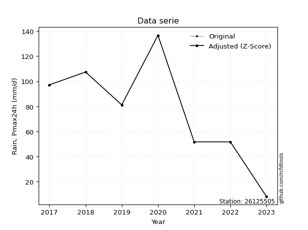</img>

</div>


> The initial value (value_initial) correspond to the initial obtained or null completed value, and value (value) is adjusted only when the initial value is outside the valid range (outlier) definite through the Z-Score value. If Z-Score is active, values out of range or outliers are replaced with the station mean value. A Z-Score (or standard score) measures how many standard deviations a data point is from the mean of a dataset, indicating its relative position; positive scores mean above the mean, negative mean below, and a score of zero is exactly at the mean, allowing for comparison of values from different distributions. It´s calculated using the formula $z=(x–μ)/σ$, where $x$ is the data point, $μ$ is the mean, and $σ$ is the standard deviation, helping identify outliers and understand probability.
>
> <sub>**Note**: In this study, "completing" (filling gaps in) and "extending" (forecasting or lengthening the historical record) rainfall data series are avoided for certain critical analyses because they introduce artificial bias and uncertainty, which can distort the statistics of rare events (extremes), alter day-to-day variability, and compromise the integrity and homogeneity of the original data. Some reasons against Completing/Extending rainfall data are: **Distortion of Extremes and Variability**: The primary issue is that most gap-filling or extension methods rely on averaging or regression with nearby stations, which inherently smooths the data. Rainfall is highly variable in space and time, with a large percentage of zero values and occasional large storms. Infilling methods often underestimate the highest values and overestimate the lowest (zero) values, which severely distorts analyses focused on flood frequency, drought severity, and intensity-duration-frequency (IDF) curves, **Loss of Data Homogeneity**: Infilled or extended data are synthetic estimates, not actual measurements. Combining these estimates with observed data can violate the assumption of data homogeneity, which requires that the data properties do not change over time. Inhomogeneity can lead to incorrect conclusions about long-term trends or changes in climate patterns, **Propagation of Errors**: Errors and biases from the original data (e.g., wind-induced undercatch, instrument errors, site changes) or the data used for imputation can propagate through the analysis, leading to unreliable hydrological models and inaccurate predictions, **Compromised Statistical Integrity**: For statistical analyses, especially those involving the frequency of events, using artificial data can introduce time bias or autocorrelation that doesn´t exist in reality, making it difficult to assess the true probability of events, **Difficulty in Validation**: It is difficult to accurately validate the quality of filled or extended data, especially for past periods where ground-truth measurements are unavailable. The reliability of imputation techniques heavily depends on the density of the surrounding station network and the complexity of the local topography.</sub>


### 4. Active continuous probability distributions from SciPy (80 of 104 available)

A Probability Density Function (PDF) describes the relative likelihood of a continuous random variable falling within a specific range, where the total area under its curve equals 1, and the area over any interval gives the actual probability for that range. Unlike discrete probabilities (like rolling a die), a PDF shows density, not direct probability for a single point (which is zero), with higher points indicating higher likelihood, often visualized as a bell curve for normal distributions.

A log of a probability density function (log-PDF) is simply the logarithm of the PDF´s value, denoted as $log(f(x))$, useful for converting multiplication of probabilities into addition, improving numerical stability with tiny numbers, and connecting to information theory concepts like entropy. Instead of dealing with very small probabilities (e.g., 0.000001), log-PDFs use negative numbers (e.g., $log(0.00001) ≈ -11.51$ that are easier for computers to handle, preventing underflow errors and simplifying complex calculations. In this study, each active probability distribution from SciPy is also evaluated in the $log$ form.

[scipy.stats](https://docs.scipy.org/doc/scipy/reference/stats.html) is a Python´s powerful submodule within the SciPy library for comprehensive statistical analysis, offering over 130 probability distributions (like Normal, Poisson, etc.), functions for descriptive stats (mean, variance), hypothesis testing (t-tests, chi-square), random variable generation, and statistical tests, making it essential for data science, modeling, and research. It provides tools to explore, model, and draw conclusions from data efficiently, working seamlessly with [NumPy](https://numpy.org/).

<div align="center">

|   id | p_dist           |   n_parameter | fit_method   | label                                                                       | active   | ref                                                                                                      |
|-----:|:-----------------|--------------:|:-------------|:----------------------------------------------------------------------------|:---------|:---------------------------------------------------------------------------------------------------------|
|    0 | alpha            |             3 | MLE          | Alpha                                                                       | True     | [:mortar_board:](https://docs.scipy.org/doc/scipy/reference/generated/scipy.stats.alpha.html)            |
|    1 | anglit           |             2 | MM           | Anglit                                                                      | True     | [:mortar_board:](https://docs.scipy.org/doc/scipy/reference/generated/scipy.stats.anglit.html)           |
|    2 | arcsine          |             2 | MM           | Arcsine                                                                     | True     | [:mortar_board:](https://docs.scipy.org/doc/scipy/reference/generated/scipy.stats.arcsine.html)          |
|    3 | argus            |             3 | MLE          | Argus                                                                       | True     | [:mortar_board:](https://docs.scipy.org/doc/scipy/reference/generated/scipy.stats.argus.html)            |
|    4 | beta             |             4 | MLE          | Beta                                                                        | True     | [:mortar_board:](https://docs.scipy.org/doc/scipy/reference/generated/scipy.stats.beta.html)             |
|    5 | betaprime        |             4 | MLE          | Beta prime                                                                  | True     | [:mortar_board:](https://docs.scipy.org/doc/scipy/reference/generated/scipy.stats.betaprime.html)        |
|    6 | bradford         |             3 | MLE          | Bradford                                                                    | True     | [:mortar_board:](https://docs.scipy.org/doc/scipy/reference/generated/scipy.stats.bradford.html)         |
|    7 | burr             |             4 | MLE          | Burr (Type III)                                                             | True     | [:mortar_board:](https://docs.scipy.org/doc/scipy/reference/generated/scipy.stats.burr.html)             |
|    8 | burr12           |             4 | MLE          | Burr (Type III) 12                                                          | True     | [:mortar_board:](https://docs.scipy.org/doc/scipy/reference/generated/scipy.stats.burr12.html)           |
|    9 | cosine           |             2 | MLE          | Cosine                                                                      | True     | [:mortar_board:](https://docs.scipy.org/doc/scipy/reference/generated/scipy.stats.cosine.html)           |
|   10 | crystalball      |             4 | MLE          | Crystalball                                                                 | True     | [:mortar_board:](https://docs.scipy.org/doc/scipy/reference/generated/scipy.stats.crystalball.html)      |
|   11 | dgamma           |             3 | MLE          | Double gamma                                                                | True     | [:mortar_board:](https://docs.scipy.org/doc/scipy/reference/generated/scipy.stats.dgamma.html)           |
|   12 | dweibull         |             3 | MLE          | Double Weibull                                                              | True     | [:mortar_board:](https://docs.scipy.org/doc/scipy/reference/generated/scipy.stats.dweibull.html)         |
|   13 | erlang           |             3 | MLE          | Erlang                                                                      | True     | [:mortar_board:](https://docs.scipy.org/doc/scipy/reference/generated/scipy.stats.erlang.html)           |
|   14 | exponnorm        |             3 | MLE          | Exponentially modified Normal                                               | True     | [:mortar_board:](https://docs.scipy.org/doc/scipy/reference/generated/scipy.stats.exponnorm.html)        |
|   15 | exponpow         |             3 | MLE          | Exponential power                                                           | True     | [:mortar_board:](https://docs.scipy.org/doc/scipy/reference/generated/scipy.stats.exponpow.html)         |
|   16 | exponweib        |             4 | MLE          | Exponentiated Weibull                                                       | True     | [:mortar_board:](https://docs.scipy.org/doc/scipy/reference/generated/scipy.stats.exponweib.html)        |
|   17 | f                |             4 | MLE          | F                                                                           | True     | [:mortar_board:](https://docs.scipy.org/doc/scipy/reference/generated/scipy.stats.f.html)                |
|   18 | fatiguelife      |             3 | MLE          | Fatigue-life (Birnbaum-Saunders)                                            | True     | [:mortar_board:](https://docs.scipy.org/doc/scipy/reference/generated/scipy.stats.fatiguelife.html)      |
|   19 | foldnorm         |             3 | MM           | Fold Normal                                                                 | True     | [:mortar_board:](https://docs.scipy.org/doc/scipy/reference/generated/scipy.stats.foldnorm.html)         |
|   20 | gamma            |             3 | MLE          | Gamma                                                                       | True     | [:mortar_board:](https://docs.scipy.org/doc/scipy/reference/generated/scipy.stats.gamma.html)            |
|   21 | gausshyper       |             6 | MLE          | Gauss hypergeometric                                                        | True     | [:mortar_board:](https://docs.scipy.org/doc/scipy/reference/generated/scipy.stats.gausshyper.html)       |
|   22 | genexpon         |             5 | MLE          | Generalized exponential                                                     | True     | [:mortar_board:](https://docs.scipy.org/doc/scipy/reference/generated/scipy.stats.genexpon.html)         |
|   23 | genextreme       |             3 | MLE          | Generalized exponential                                                     | True     | [:mortar_board:](https://docs.scipy.org/doc/scipy/reference/generated/scipy.stats.genextreme.html)       |
|   24 | gengamma         |             4 | MLE          | Generalized gamma                                                           | True     | [:mortar_board:](https://docs.scipy.org/doc/scipy/reference/generated/scipy.stats.gengamma.html)         |
|   25 | genhalflogistic  |             3 | MLE          | Generalized half-logistic                                                   | True     | [:mortar_board:](https://docs.scipy.org/doc/scipy/reference/generated/scipy.stats.genhalflogistic.html)  |
|   26 | genlogistic      |             3 | MLE          | Generalized logistic                                                        | True     | [:mortar_board:](https://docs.scipy.org/doc/scipy/reference/generated/scipy.stats.genlogistic.html)      |
|   27 | gennorm          |             3 | MLE          | Generalized Normal                                                          | True     | [:mortar_board:](https://docs.scipy.org/doc/scipy/reference/generated/scipy.stats.gennorm.html)          |
|   28 | genpareto        |             3 | MLE          | Generalized Pareto                                                          | True     | [:mortar_board:](https://docs.scipy.org/doc/scipy/reference/generated/scipy.stats.genpareto.html)        |
|   29 | gompertz         |             3 | MLE          | Gompertz (or truncated Gumbel)                                              | True     | [:mortar_board:](https://docs.scipy.org/doc/scipy/reference/generated/scipy.stats.gompertz.html)         |
|   30 | gumbel_l         |             2 | MM           | Gumbel Left Skew                                                            | True     | [:mortar_board:](https://docs.scipy.org/doc/scipy/reference/generated/scipy.stats.gumbel_l.html)         |
|   31 | gumbel_r         |             2 | MM           | Gumbel Right Skew                                                           | True     | [:mortar_board:](https://docs.scipy.org/doc/scipy/reference/generated/scipy.stats.gumbel_r.html)         |
|   32 | halfgennorm      |             3 | MLE          | Upper half of a generalized normal                                          | True     | [:mortar_board:](https://docs.scipy.org/doc/scipy/reference/generated/scipy.stats.halfgennorm.html)      |
|   33 | halflogistic     |             2 | MM           | Half-logistic                                                               | True     | [:mortar_board:](https://docs.scipy.org/doc/scipy/reference/generated/scipy.stats.halflogistic.html)     |
|   34 | halfnorm         |             2 | MM           | Half Normal                                                                 | True     | [:mortar_board:](https://docs.scipy.org/doc/scipy/reference/generated/scipy.stats.halfnorm.html)         |
|   35 | hypsecant        |             2 | MM           | hyperbolic secant                                                           | True     | [:mortar_board:](https://docs.scipy.org/doc/scipy/reference/generated/scipy.stats.hypsecant.html)        |
|   36 | invgamma         |             3 | MLE          | Inverted gamma                                                              | True     | [:mortar_board:](https://docs.scipy.org/doc/scipy/reference/generated/scipy.stats.invgamma.html)         |
|   37 | invgauss         |             3 | MLE          | Inverse Gaussian                                                            | True     | [:mortar_board:](https://docs.scipy.org/doc/scipy/reference/generated/scipy.stats.invgauss.html)         |
|   38 | invweibull       |             3 | MLE          | Inverted Weibull                                                            | True     | [:mortar_board:](https://docs.scipy.org/doc/scipy/reference/generated/scipy.stats.invweibull.html)       |
|   39 | johnsonsb        |             4 | MLE          | Johnson SB                                                                  | True     | [:mortar_board:](https://docs.scipy.org/doc/scipy/reference/generated/scipy.stats.johnsonsb.html)        |
|   40 | johnsonsu        |             4 | MLE          | Johnson Su                                                                  | True     | [:mortar_board:](https://docs.scipy.org/doc/scipy/reference/generated/scipy.stats.johnsonsu.html)        |
|   41 | kappa3           |             3 | MLE          | Kappa 3                                                                     | True     | [:mortar_board:](https://docs.scipy.org/doc/scipy/reference/generated/scipy.stats.kappa3.html)           |
|   42 | kappa4           |             4 | MLE          | Kappa 4                                                                     | True     | [:mortar_board:](https://docs.scipy.org/doc/scipy/reference/generated/scipy.stats.kappa4.html)           |
|   43 | ksone            |             3 | MLE          | Kolmogorov-Smirnov one-sided test statistic distribution                    | True     | [:mortar_board:](https://docs.scipy.org/doc/scipy/reference/generated/scipy.stats.ksone.html)            |
|   44 | kstwobign        |             2 | MLE          | Limiting distribution of scaled Kolmogorov-Smirnov two-sided test statistic | True     | [:mortar_board:](https://docs.scipy.org/doc/scipy/reference/generated/scipy.stats.kstwobign.html)        |
|   45 | laplace          |             2 | MM           | Laplace                                                                     | True     | [:mortar_board:](https://docs.scipy.org/doc/scipy/reference/generated/scipy.stats.laplace.html)          |
|   46 | levy_l           |             2 | MLE          | Left-skewed Levy                                                            | True     | [:mortar_board:](https://docs.scipy.org/doc/scipy/reference/generated/scipy.stats.levy_l.html)           |
|   47 | loggamma         |             3 | MLE          | Log gamma                                                                   | True     | [:mortar_board:](https://docs.scipy.org/doc/scipy/reference/generated/scipy.stats.loggamma.html)         |
|   48 | logistic         |             2 | MM           | Logistic (or Sech-squared)                                                  | True     | [:mortar_board:](https://docs.scipy.org/doc/scipy/reference/generated/scipy.stats.logistic.html)         |
|   49 | loglaplace       |             3 | MLE          | Log-Laplace                                                                 | True     | [:mortar_board:](https://docs.scipy.org/doc/scipy/reference/generated/scipy.stats.loglaplace.html)       |
|   50 | lomax            |             3 | MLE          | Lomax (Pareto of the second kind)                                           | True     | [:mortar_board:](https://docs.scipy.org/doc/scipy/reference/generated/scipy.stats.lomax.html)            |
|   51 | maxwell          |             2 | MM           | Maxwell                                                                     | True     | [:mortar_board:](https://docs.scipy.org/doc/scipy/reference/generated/scipy.stats.maxwell.html)          |
|   52 | mielke           |             4 | MLE          | Mielke Beta-Kappa / Dagum                                                   | True     | [:mortar_board:](https://docs.scipy.org/doc/scipy/reference/generated/scipy.stats.mielke.html)           |
|   53 | moyal            |             2 | MM           | Moyal                                                                       | True     | [:mortar_board:](https://docs.scipy.org/doc/scipy/reference/generated/scipy.stats.moyal.html)            |
|   54 | nakagami         |             3 | MLE          | Nakagami                                                                    | True     | [:mortar_board:](https://docs.scipy.org/doc/scipy/reference/generated/scipy.stats.nakagami.html)         |
|   55 | ncf              |             5 | MLE          | Non-central F distribution                                                  | True     | [:mortar_board:](https://docs.scipy.org/doc/scipy/reference/generated/scipy.stats.ncf.html)              |
|   56 | nct              |             4 | MLE          | Non-central Student’s t                                                     | True     | [:mortar_board:](https://docs.scipy.org/doc/scipy/reference/generated/scipy.stats.nct.html)              |
|   57 | norm             |             2 | MM           | Normal                                                                      | True     | [:mortar_board:](https://docs.scipy.org/doc/scipy/reference/generated/scipy.stats.norm.html)             |
|   58 | pearson3         |             3 | MM           | Pearson type III                                                            | True     | [:mortar_board:](https://docs.scipy.org/doc/scipy/reference/generated/scipy.stats.pearson3.html)         |
|   59 | powerlaw         |             3 | MLE          | Power-function                                                              | True     | [:mortar_board:](https://docs.scipy.org/doc/scipy/reference/generated/scipy.stats.powerlaw.html)         |
|   60 | rayleigh         |             2 | MM           | Rayleigh                                                                    | True     | [:mortar_board:](https://docs.scipy.org/doc/scipy/reference/generated/scipy.stats.rayleigh.html)         |
|   61 | rdist            |             3 | MLE          | R-distributed (symmetric beta)                                              | True     | [:mortar_board:](https://docs.scipy.org/doc/scipy/reference/generated/scipy.stats.rdist.html)            |
|   62 | rice             |             3 | MLE          | Rice                                                                        | True     | [:mortar_board:](https://docs.scipy.org/doc/scipy/reference/generated/scipy.stats.rice.html)             |
|   63 | semicircular     |             2 | MM           | Semicircular                                                                | True     | [:mortar_board:](https://docs.scipy.org/doc/scipy/reference/generated/scipy.stats.semicircular.html)     |
|   64 | skewnorm         |             3 | MLE          | Skew normal                                                                 | True     | [:mortar_board:](https://docs.scipy.org/doc/scipy/reference/generated/scipy.stats.skewnorm.html)         |
|   65 | t                |             3 | MLE          | Student’s t                                                                 | True     | [:mortar_board:](https://docs.scipy.org/doc/scipy/reference/generated/scipy.stats.t.html)                |
|   66 | trapezoid        |             4 | MLE          | Trapezoid                                                                   | True     | [:mortar_board:](https://docs.scipy.org/doc/scipy/reference/generated/scipy.stats.trapezoid.html)        |
|   67 | triang           |             3 | MLE          | Triangular                                                                  | True     | [:mortar_board:](https://docs.scipy.org/doc/scipy/reference/generated/scipy.stats.triang.html)           |
|   68 | truncexpon       |             3 | MLE          | Truncated exponential                                                       | True     | [:mortar_board:](https://docs.scipy.org/doc/scipy/reference/generated/scipy.stats.truncexpon.html)       |
|   69 | truncnorm        |             4 | MLE          | Truncated normal                                                            | True     | [:mortar_board:](https://docs.scipy.org/doc/scipy/reference/generated/scipy.stats.truncnorm.html)        |
|   70 | truncpareto      |             4 | MLE          | Upper truncated Pareto                                                      | True     | [:mortar_board:](https://docs.scipy.org/doc/scipy/reference/generated/scipy.stats.truncpareto.html)      |
|   71 | truncweibull_min |             5 | MLE          | Doubly truncated Weibull minimum                                            | True     | [:mortar_board:](https://docs.scipy.org/doc/scipy/reference/generated/scipy.stats.truncweibull_min.html) |
|   72 | tukeylambda      |             3 | MLE          | Tukey-Lamdba                                                                | True     | [:mortar_board:](https://docs.scipy.org/doc/scipy/reference/generated/scipy.stats.tukeylambda.html)      |
|   73 | uniform          |             2 | MLE          | Uniform                                                                     | True     | [:mortar_board:](https://docs.scipy.org/doc/scipy/reference/generated/scipy.stats.uniform.html)          |
|   74 | vonmises         |             3 | MLE          | Von Mises                                                                   | True     | [:mortar_board:](https://docs.scipy.org/doc/scipy/reference/generated/scipy.stats.vonmises.html)         |
|   75 | vonmises_line    |             3 | MLE          | Von Mises line                                                              | True     | [:mortar_board:](https://docs.scipy.org/doc/scipy/reference/generated/scipy.stats.vonmises_line.html)    |
|   76 | wald             |             2 | MM           | Wald                                                                        | True     | [:mortar_board:](https://docs.scipy.org/doc/scipy/reference/generated/scipy.stats.wald.html)             |
|   77 | weibull_max      |             3 | MLE          | Weibull maximum                                                             | True     | [:mortar_board:](https://docs.scipy.org/doc/scipy/reference/generated/scipy.stats.weibull_max.html)      |
|   78 | weibull_min      |             3 | MLE          | Weibull minimum                                                             | True     | [:mortar_board:](https://docs.scipy.org/doc/scipy/reference/generated/scipy.stats.weibull_min.html)      |
|   79 | wrapcauchy       |             3 | MLE          | Wrapped  Cauchy                                                             | True     | [:mortar_board:](https://docs.scipy.org/doc/scipy/reference/generated/scipy.stats.wrapcauchy.html)       |

</div>

> **n_parameter:** # arguments & localization & scale.
>
> **Fit methods:** (MLE) maximum likelihood, (MM) L-moments.
>
>**Inactive** (With the only purpose of prevent loops, zero divisions, infinite values, over high estimated values or horizontal trending for recurrence intervals estimations, the follow distributions were disabled.)**:** lognorm, norminvgauss, powernorm, powerlognorm, cauchy, halfcauchy, foldcauchy, skewcauchy, chi2, expon, fisk, genhyperbolic, geninvgauss, gibrat, kstwo, laplace_asymmetric, levy, levy_stable, ncx2, pareto, rel_breitwigner, recipinvgauss, studentized_range, loguniform, 


## B. Probability (PDF) vs. Empirical (EDF) distributions functions

A continuous probability distribution (CPD) describes probabilities for variables that can take any value within a range (like rain any time), unlike discrete variables with specific outcomes (like temperature). It uses a Probability Density Function (PDF), a curve where the total area under it equals 1, and the probability of the variable falling within an interval (a to b) is found by calculating the area under the curve between those points. A key feature is that the probability of hitting any single exact value is zero, so probabilities are always expressed for ranges, e.g., $P(a ≤ X ≤ b)$.

<div align="center">

Distributions parameters from station values
|     |   station | p_dist              |   n |               loc |            scale | shape                  | shape1                 | shape2             | shape3             |
|----:|----------:|:--------------------|----:|------------------:|-----------------:|:-----------------------|:-----------------------|:-------------------|:-------------------|
|   0 |  26125505 | alpha               |   7 |      -0.0555768   |     20.5957      | 1.7183394690456408e-09 |                        |                    |                    |
|   1 |  26125505 | anglit              |   7 |      76.2714      |    115.71        |                        |                        |                    |                    |
|   2 |  26125505 | arcsine             |   7 |      20.3342      |    111.874       |                        |                        |                    |                    |
|   3 |  26125505 | argus               |   7 |     -17.2138      |    161.122       | 0.032747431868169      |                        |                    |                    |
|   4 |  26125505 | beta                |   7 |     -30.9454      |    167.645       | 1.8937439284332873     | 0.724249765615383      |                    |                    |
|   5 |  26125505 | betaprime           |   7 |    -919.628       |  79457.2         | 641.0322914346411      | 51144.760669387426     |                    |                    |
|   6 |  26125505 | bradford            |   7 |      -6.51582     |    143.216       | 5.077147199870541e-05  |                        |                    |                    |
|   7 |  26125505 | burr                |   7 |      -0.710421    |    139.241       | 256.08308107776975     | 0.0046527584593961165  |                    |                    |
|   8 |  26125505 | burr12              |   7 |      -1.21334     |      9.06515     | 260.7397862048924      | 0.0020121220657276866  |                    |                    |
|   9 |  26125505 | cosine              |   7 |      74.9378      |     33.1586      |                        |                        |                    |                    |
|  10 |  26125505 | crystalball         |   7 |      76.2714      |     39.5536      | 6917.285666837963      | 143.52224581712403     |                    |                    |
|  11 |  26125505 | dgamma              |   7 |      70.1403      |     12.0442      | 2.858037365059526      |                        |                    |                    |
|  12 |  26125505 | dweibull            |   7 |      70.8001      |     38.8395      | 1.792349544657998      |                        |                    |                    |
|  13 |  26125505 | erlang              |   7 |    -696.324       |      2.05339     | 376.1514708869274      |                        |                    |                    |
|  14 |  26125505 | exponnorm           |   7 |      76.2399      |     39.5534      | 0.0008011850406831905  |                        |                    |                    |
|  15 |  26125505 | exponpow            |   7 |       8           |      5.76662     | 0.15123516646247104    |                        |                    |                    |
|  16 |  26125505 | exponweib           |   7 |   -1680.32        |   1234.99        | 2207.9213019149915     | 5.971184372901682      |                    |                    |
|  17 |  26125505 | f                   |   7 |   -1447.8         |   1524.03        | 3002.766808073895      | 173424.40385743737     |                    |                    |
|  18 |  26125505 | fatiguelife         |   7 |       8           |      3.84086e-06 | 4299.216861211272      |                        |                    |                    |
|  19 |  26125505 | foldnorm            |   7 |    -150.63        |     38.6889      | 5.870275135945221      |                        |                    |                    |
|  20 |  26125505 | gamma               |   7 |    -647.323       |      2.1963      | 329.4031113255139      |                        |                    |                    |
|  21 |  26125505 | gausshyper          |   7 |      -5.2087      |    141.909       | 1.2406552633172325     | 0.885035615903797      | 1.0255790729643501 | 0.7832260853029411 |
|  22 |  26125505 | genexpon            |   7 |       7.9999      |      2.64181     | 0.04034778492899094    | 1.2654266267741708e-07 | 4.171928406753349  |                    |
|  23 |  26125505 | genextreme          |   7 |      66.6072      |     42.8967      | 0.4998445047049582     |                        |                    |                    |
|  24 |  26125505 | gengamma            |   7 |       8           |    136.5         | 0.10395212279829494    | 3.67959075858963       |                    |                    |
|  25 |  26125505 | genhalflogistic     |   7 |      -5.01449     |    151.237       | 1.0671945160906398     |                        |                    |                    |
|  26 |  26125505 | genlogistic         |   7 |      89.1546      |     20.4581      | 0.7140289896800767     |                        |                    |                    |
|  27 |  26125505 | gennorm             |   7 |      72.35        |     64.3503      | 3378796.2748528877     |                        |                    |                    |
|  28 |  26125505 | genpareto           |   7 |      -0.996245    |    181.561       | -1.3185634236725714    |                        |                    |                    |
|  29 |  26125505 | gompertz            |   7 |      51.7         |     24.1643      | 0.12053912351157375    |                        |                    |                    |
|  30 |  26125505 | gumbel_l            |   7 |      94.0726      |     30.8398      |                        |                        |                    |                    |
|  31 |  26125505 | gumbel_r            |   7 |      58.4702      |     30.8398      |                        |                        |                    |                    |
|  32 |  26125505 | halfgennorm         |   7 |       8           |      6.89209     | 0.42522991596708354    |                        |                    |                    |
|  33 |  26125505 | halflogistic        |   7 |      29.3913      |     33.8169      |                        |                        |                    |                    |
|  34 |  26125505 | halfnorm            |   7 |      23.918       |     65.6153      |                        |                        |                    |                    |
|  35 |  26125505 | hypsecant           |   7 |      76.2714      |     25.1806      |                        |                        |                    |                    |
|  36 |  26125505 | invgamma            |   7 |    -368.81        |  52360.7         | 118.80778950211493     |                        |                    |                    |
|  37 |  26125505 | invgauss            |   7 |    -196.008       |  11692.1         | 0.023223147772214497   |                        |                    |                    |
|  38 |  26125505 | invweibull          |   7 |       8           |      5.3744      | 0.061025707184860466   |                        |                    |                    |
|  39 |  26125505 | johnsonsb           |   7 |       3.90385     |    132.796       | -0.47188209516648194   | 0.08803149301093066    |                    |                    |
|  40 |  26125505 | johnsonsu           |   7 |     316.929       |     55.3351      | 13.298636401254708     | 6.1469306165188105     |                    |                    |
|  41 |  26125505 | kappa3              |   7 |       7.99803     |    128.704       | 5567.8296726286935     |                        |                    |                    |
|  42 |  26125505 | kappa4              |   7 |       7.84286     |    135.101       | 0.9933096867532873     | 1.0484544604116746     |                    |                    |
|  43 |  26125505 | ksone               |   7 |       7.76264     |    137.018       | 1.0                    |                        |                    |                    |
|  44 |  26125505 | kstwobign           |   7 |     -79.4524      |    178.05        |                        |                        |                    |                    |
|  45 |  26125505 | laplace             |   7 |      76.2714      |     27.9686      |                        |                        |                    |                    |
|  46 |  26125505 | levy_l              |   7 |     142.724       |     26.7239      |                        |                        |                    |                    |
|  47 |  26125505 | loggamma            |   7 |    -127.268       |    104.93        | 7.45110932032887       |                        |                    |                    |
|  48 |  26125505 | logistic            |   7 |      76.2714      |     21.807       |                        |                        |                    |                    |
|  49 |  26125505 | loglaplace          |   7 |      -0.210463    |     81.4104      | 1.677466394872619      |                        |                    |                    |
|  50 |  26125505 | lomax               |   7 |       7.99999     |      1.5632e+07  | 226680.02263374254     |                        |                    |                    |
|  51 |  26125505 | maxwell             |   7 |     -17.4539      |     58.7337      |                        |                        |                    |                    |
|  52 |  26125505 | mielke              |   7 |       7.99997     |    129.036       | 0.9805476740780894     | 1809.8602050734814     |                    |                    |
|  53 |  26125505 | moyal               |   7 |      53.6522      |     17.8054      |                        |                        |                    |                    |
|  54 |  26125505 | nakagami            |   7 |   -5670.27        |   5746.63        | 5255.633465678573      |                        |                    |                    |
|  55 |  26125505 | ncf                 |   7 |      -0.0165414   |      2.34131e-07 | 4.875974757484034e-08  | 7.368951395681831      | 13.848627561486179 |                    |
|  56 |  26125505 | nct                 |   7 |   -1795.8         |     39.4486      | 209209.2195156943      | 47.45564472378388      |                    |                    |
|  57 |  26125505 | norm                |   7 |      76.2714      |     39.5536      |                        |                        |                    |                    |
|  58 |  26125505 | pearson3            |   7 |      76.2714      |     39.5536      | -0.20262919238787533   |                        |                    |                    |
|  59 |  26125505 | powerlaw            |   7 |       8           |    128.7         | 0.16330591287683444    |                        |                    |                    |
|  60 |  26125505 | rayleigh            |   7 |       0.60314     |     60.3746      |                        |                        |                    |                    |
|  61 |  26125505 | rdist               |   7 |      -4.04138     |     55.7414      | 1.1981620543062754     |                        |                    |                    |
|  62 |  26125505 | rice                |   7 |     -13.7859      |     44.2524      | 1.7147809232777993     |                        |                    |                    |
|  63 |  26125505 | semicircular        |   7 |      76.2714      |     79.1071      |                        |                        |                    |                    |
|  64 |  26125505 | skewnorm            |   7 |     119.618       |     58.6804      | -2.2523286148810975    |                        |                    |                    |
|  65 |  26125505 | t                   |   7 |      76.2705      |     39.5482      | 880073.3808881694      |                        |                    |                    |
|  66 |  26125505 | trapezoid           |   7 |      -5.1135      |    154.44        | 1.0                    | 1.0                    |                    |                    |
|  67 |  26125505 | triang              |   7 |     -25.0343      |    161.856       | 0.9999995164133102     |                        |                    |                    |
|  68 |  26125505 | truncexpon          |   7 |      -3.92164     |    198.035       | 0.710083475361893      |                        |                    |                    |
|  69 |  26125505 | truncnorm           |   7 |      76.2714      |     39.5536      | -467.96850306356487    | 5.780260807954617      |                    |                    |
|  70 |  26125505 | truncpareto         |   7 |       7.92928     |      0.0707215   | 0.16788302751677145    | 1820.8150290786214     |                    |                    |
|  71 |  26125505 | truncweibull_min    |   7 |      -1.7855      |    137.179       | 1.5549180629657924     | 0.0025717847578571517  | 1.00952610529718   |                    |
|  72 |  26125505 | tukeylambda         |   7 |      71.9444      |     69.3493      | 1.0709398486844424     |                        |                    |                    |
|  73 |  26125505 | uniform             |   7 |       8           |    128.7         |                        |                        |                    |                    |
|  74 |  26125505 | vonmises            |   7 |       1.18857     |      1           | 0.7390396387510475     |                        |                    |                    |
|  75 |  26125505 | vonmises_line       |   7 |      72.35        |     20.4832      | 0.05317102167317941    |                        |                    |                    |
|  76 |  26125505 | wald                |   7 |      36.7179      |     39.5535      |                        |                        |                    |                    |
|  77 |  26125505 | weibull_max         |   7 |     136.7         |      1.74942     | 0.18706456018472456    |                        |                    |                    |
|  78 |  26125505 | weibull_min         |   7 |     -64.4378      |    155.365       | 4.117756064015138      |                        |                    |                    |
|  79 |  26125505 | wrapcauchy          |   7 |       7.99996     |     20.5876      | 2.8230342295005958e-05 |                        |                    |                    |
|  80 |  26125505 | logalpha            |   7 |     -19.2956      |    573.673       | 24.594576032515537     |                        |                    |                    |
|  81 |  26125505 | loganglit           |   7 |       4.07691     |      2.5797      |                        |                        |                    |                    |
|  82 |  26125505 | logarcsine          |   7 |       2.82981     |      2.49421     |                        |                        |                    |                    |
|  83 |  26125505 | logargus            |   7 |       0.82778     |      4.15155     | 2.758727853474829      |                        |                    |                    |
|  84 |  26125505 | logbeta             |   7 |       1.84186     |      3.07593     | 0.8603467327371566     | 0.21465774847123015    |                    |                    |
|  85 |  26125505 | logbetaprime        |   7 |      -0.0616682   |     36.5161      | 17.52352314400943      | 155.13043203342164     |                    |                    |
|  86 |  26125505 | logbradford         |   7 |       2.07944     |      2.83838     | 1.0023705464257135     |                        |                    |                    |
|  87 |  26125505 | logburr             |   7 |   -1116.55        |   1121.49        | 137494.05067345363     | 0.00945636409800155    |                    |                    |
|  88 |  26125505 | logburr12           |   7 |   -2588.7         |   2600.75        | 4799.496118489751      | 1280095.1611985262     |                    |                    |
|  89 |  26125505 | logcosine           |   7 |       3.88942     |      0.796899    |                        |                        |                    |                    |
|  90 |  26125505 | logcrystalball      |   7 |       4.07691     |      0.881837    | 5.649763720861474      | 3.9176900021424665     |                    |                    |
|  91 |  26125505 | logdgamma           |   7 |       4.39692     |      0.63786     | 0.9564298695450553     |                        |                    |                    |
|  92 |  26125505 | logdweibull         |   7 |       4.39692     |      0.728129    | 0.6728871465587839     |                        |                    |                    |
|  93 |  26125505 | logerlang           |   7 |     -12.2256      |      0.0523553   | 311.6205866065088      |                        |                    |                    |
|  94 |  26125505 | logexponnorm        |   7 |       4.07639     |      0.88183     | 0.0005900232417033035  |                        |                    |                    |
|  95 |  26125505 | logexponpow         |   7 |       2.07944     |      1.43738     | 0.32381991133545196    |                        |                    |                    |
|  96 |  26125505 | logexponweib        |   7 |       2.07944     |      2.90768     | 0.7566964308319925     | 0.23968874967841108    |                    |                    |
|  97 |  26125505 | logf                |   7 |   -1691.53        |   1695.6         | 28508878.71961996      | 9956297.901761811      |                    |                    |
|  98 |  26125505 | logfatiguelife      |   7 |    -621.005       |    625.085       | 0.001409000779312697   |                        |                    |                    |
|  99 |  26125505 | logfoldnorm         |   7 |      -0.0920818   |      0.814393    | 5.130087914960699      |                        |                    |                    |
| 100 |  26125505 | loggamma            |   7 |     -12.2462      |      0.0533256   | 306.20552244261194     |                        |                    |                    |
| 101 |  26125505 | loggausshyper       |   7 |       1.95474     |      2.96305     | 1.1754225938130405     | 0.6195602381826868     | 1.089105461290818  | 1.1381596139097385 |
| 102 |  26125505 | loggenexpon         |   7 |       2.07944     |      4.20589e+07 | 7849921.681502616      | 62968590.03262138      | 7857375.976550134  |                    |
| 103 |  26125505 | loggenextreme       |   7 |       4.13761     |      0.91099     | 1.1676673005886418     |                        |                    |                    |
| 104 |  26125505 | loggengamma         |   7 |       2.07944     |      1.81447     | 1.498148558638381      | 0.14000090253109676    |                    |                    |
| 105 |  26125505 | loggenhalflogistic  |   7 |       1.90268     |      3.16901     | 1.0510415245612603     |                        |                    |                    |
| 106 |  26125505 | loggenlogistic      |   7 |       4.91786     |      5.65404e-06 | 6.75284024763219e-06   |                        |                    |                    |
| 107 |  26125505 | loggennorm          |   7 |       4.39692     |      0.00129555  | 0.2565438370031584     |                        |                    |                    |
| 108 |  26125505 | loggenpareto        |   7 |      -0.0067911   |      9.57406     | -1.944138256611958     |                        |                    |                    |
| 109 |  26125505 | loggompertz         |   7 |       2.07944     |      0.570797    | 0.016530969529249494   |                        |                    |                    |
| 110 |  26125505 | loggumbel_l         |   7 |       4.47378     |      0.68756     |                        |                        |                    |                    |
| 111 |  26125505 | loggumbel_r         |   7 |       3.68004     |      0.68756     |                        |                        |                    |                    |
| 112 |  26125505 | loghalfgennorm      |   7 |       2.07939     |      2.86356     | 492.09366974958516     |                        |                    |                    |
| 113 |  26125505 | loghalflogistic     |   7 |       3.03175     |      0.753924    |                        |                        |                    |                    |
| 114 |  26125505 | loghalfnorm         |   7 |       2.90972     |      1.46286     |                        |                        |                    |                    |
| 115 |  26125505 | loghypsecant        |   7 |       4.07691     |      0.56139     |                        |                        |                    |                    |
| 116 |  26125505 | loginvgamma         |   7 |     -16.6659      |  10136.3         | 489.43992202819993     |                        |                    |                    |
| 117 |  26125505 | loginvgauss         |   7 |      -6.13384     |    999.818       | 0.010183017677498862   |                        |                    |                    |
| 118 |  26125505 | loginvweibull       |   7 |      -9.76041e+07 |      9.76041e+07 | 90352741.47806151      |                        |                    |                    |
| 119 |  26125505 | logjohnsonsb        |   7 |       1.62528     |      3.29251     | -0.4246602234671591    | 0.11275179954562951    |                    |                    |
| 120 |  26125505 | logjohnsonsu        |   7 |       5.03187     |      0.00348138  | 6.200607402875399      | 1.051656163189847      |                    |                    |
| 121 |  26125505 | logkappa3           |   7 |       2.07944     |      2.83798     | 15207.10654147367      |                        |                    |                    |
| 122 |  26125505 | logkappa4           |   7 |       2.03972     |      3.21088     | 1.0125332883748137     | 1.1092633527366689     |                    |                    |
| 123 |  26125505 | logksone            |   7 |       1.79561     |      3.40602     | 1.0                    |                        |                    |                    |
| 124 |  26125505 | logkstwobign        |   7 |      -0.277226    |      4.98134     |                        |                        |                    |                    |
| 125 |  26125505 | loglaplace          |   7 |       4.07691     |      0.623548    |                        |                        |                    |                    |
| 126 |  26125505 | loglevy_l           |   7 |       4.97753     |      0.263564    |                        |                        |                    |                    |
| 127 |  26125505 | logloggamma         |   7 |       4.91784     |      3.86353e-06 | 4.6149281070093166e-06 |                        |                    |                    |
| 128 |  26125505 | loglogistic         |   7 |       4.07691     |      0.486178    |                        |                        |                    |                    |
| 129 |  26125505 | logloglaplace       |   7 | -204423           | 204428           | 341588.4864142607      |                        |                    |                    |
| 130 |  26125505 | loglomax            |   7 |       2.07944     |     55.3623      | 27.397796542828623     |                        |                    |                    |
| 131 |  26125505 | logmaxwell          |   7 |       1.98735     |      1.30944     |                        |                        |                    |                    |
| 132 |  26125505 | logmielke           |   7 |      -2.54819e+07 |      2.54819e+07 | 29599221.198876012     | 35328258514.23247      |                    |                    |
| 133 |  26125505 | logmoyal            |   7 |       3.57263     |      0.396963    |                        |                        |                    |                    |
| 134 |  26125505 | lognakagami         |   7 |       3.94546     |      0.37501     | 0.09794386828036518    |                        |                    |                    |
| 135 |  26125505 | logncf              |   7 |      -2.32891     |      4.86362e-07 | 1.4845646274443606e-05 | 382.8623082232715      | 194.7006424982003  |                    |
| 136 |  26125505 | lognct              |   7 |     -45.6914      |      0.808428    | 8784.717999762619      | 61.55647463969328      |                    |                    |
| 137 |  26125505 | lognorm             |   7 |       4.07691     |      0.881829    |                        |                        |                    |                    |
| 138 |  26125505 | logpearson3         |   7 |       4.07691     |      0.881832    | -1.45963338358718      |                        |                    |                    |
| 139 |  26125505 | logpowerlaw         |   7 |       2.07944     |      2.83835     | 0.1859124868770883     |                        |                    |                    |
| 140 |  26125505 | lograyleigh         |   7 |       2.38993     |      1.34602     |                        |                        |                    |                    |
| 141 |  26125505 | logrdist            |   7 |       2.98434     |      1.69222     | 0.9978671825067804     |                        |                    |                    |
| 142 |  26125505 | logrice             |   7 |    -992.686       |      0.881792    | 1130.382568808832      |                        |                    |                    |
| 143 |  26125505 | logsemicircular     |   7 |       4.07692     |      1.76365     |                        |                        |                    |                    |
| 144 |  26125505 | logskewnorm         |   7 |       4.91779     |      1.21857     | -4778845.213739481     |                        |                    |                    |
| 145 |  26125505 | logt                |   7 |       4.39409     |      0.415312    | 1.7925832231543426     |                        |                    |                    |
| 146 |  26125505 | logtrapezoid        |   7 |       1.58272     |      3.74129     | 1.0                    | 1.0                    |                    |                    |
| 147 |  26125505 | logtriang           |   7 |       1.58986     |      3.32793     | 0.9999999930522737     |                        |                    |                    |
| 148 |  26125505 | logtruncexpon       |   7 |       2.07944     |      3.80805     | 0.7453558491092165     |                        |                    |                    |
| 149 |  26125505 | logtruncnorm        |   7 |      -0.240223    |      1.61553     | 2.590902666224646      | 3.1927825050279752     |                    |                    |
| 150 |  26125505 | logtruncpareto      |   7 |       2.07724     |      0.00220205  | 0.16779749085780282    | 1289.9578186679994     |                    |                    |
| 151 |  26125505 | logtruncweibull_min |   7 |       2.0678      |      4.54727     | 1.033540178599023      | 0.0008274454113885222  | 0.6267474885950175 |                    |
| 152 |  26125505 | logtukeylambda      |   7 |       3.49863     |      1.74867     | 1.2321597426745565     |                        |                    |                    |
| 153 |  26125505 | loguniform          |   7 |       2.07944     |      2.83835     |                        |                        |                    |                    |
| 154 |  26125505 | logvonmises         |   7 |      -2.01808     |      1           | 2.0824198362643958     |                        |                    |                    |
| 155 |  26125505 | logvonmises_line    |   7 |       4.28134     |      0.700887    | 1.478204257709294      |                        |                    |                    |
| 156 |  26125505 | logwald             |   7 |       3.19508     |      0.881829    |                        |                        |                    |                    |
| 157 |  26125505 | logweibull_max      |   7 |       4.91779     |      0.599305    | 0.5061426620632301     |                        |                    |                    |
| 158 |  26125505 | logweibull_min      |   7 |       2.07944     |      1.15245     | 0.7388049877120537     |                        |                    |                    |
| 159 |  26125505 | logwrapcauchy       |   7 |       2.07944     |      0.451737    | 0.4407222631167517     |                        |                    |                    |

</div>

> **loc** (Location parameter): This shifts the distribution along the x-axis. For many common distributions, like the normal (Gaussian) distribution, loc represents the mean $μ$. For others, like the uniform distribution, it might represent the minimum value, or for the beta distribution, the left end of the support interval.
>
> **scale** (Scale parameter): This determines the width or spread of the distribution. For the normal distribution, scale represents the standard deviation $σ$. For a uniform distribution, it defines the length of the interval (from $loc$ to $loc + scale$).
>
> **shape** (Shape parameters): Refers to parameters that define the specific form of a probability distribution, distinct from its location (loc) and scale (scale). These parameters are required arguments for most distribution functions. For example, a normal (Gaussian) distribution is fully defined by its location (mean) and scale (standard deviation), so it has no specific shape parameters beyond loc and scale. However, other distributions have intrinsic properties that need specification, as Gamma distribution that takes a shape parameter, often named $a$ or $alpha$.


### 0. Cumulative distribution values - CDF (160 evaluated)

Cumulative Distribution Function (CDF), denoted as $F$<sub>$X$</sub>$(x)$, is a function that gives the probability that a random variable $X$ will take a value less than or equal to a specific value, $x$ (i.e., $(P(X≥x)$. It essentially "accumulates" probabilities from a given point up to the far right (positive infinity), providing a complete picture of the distribution´s probabilities for both discrete (like rain) and continuous (like temperature) variables, helping to find probabilities over ranges or above certain values. Each station is evaluated separately ordering the $x$ values ascending, calculating the CDF and PDF values for the activated distributions and their logarithmic forms.

<div align="center">

CDF ordered by x ascending and calculating $log(f(x))$ separately
|   id |   Station |   date |     x |   count |    mean |     std |    zscore |   Value_initial |   station |   m |    alpha |   alpha_pdf |    anglit |   anglit_pdf |   arcsine |   arcsine_pdf |     argus |   argus_pdf |     beta |     beta_pdf |   betaprime |   betaprime_pdf |   bradford |   bradford_pdf |     burr |     burr_pdf |     burr12 |   burr12_pdf |    cosine |   cosine_pdf |   crystalball |   crystalball_pdf |   dgamma |   dgamma_pdf |   dweibull |   dweibull_pdf |    erlang |   erlang_pdf |   exponnorm |   exponnorm_pdf |   exponpow |   exponpow_pdf |   exponweib |   exponweib_pdf |         f |      f_pdf |   fatiguelife |   fatiguelife_pdf |   foldnorm |   foldnorm_pdf |     gamma |   gamma_pdf |   gausshyper |   gausshyper_pdf |    genexpon |   genexpon_pdf |   genextreme |   genextreme_pdf |    gengamma |   gengamma_pdf |   genhalflogistic |   genhalflogistic_pdf |   genlogistic |   genlogistic_pdf |     gennorm |   gennorm_pdf |   genpareto |   genpareto_pdf |    gompertz |   gompertz_pdf |   gumbel_l |   gumbel_l_pdf |   gumbel_r |   gumbel_r_pdf |   halfgennorm |   halfgennorm_pdf |   halflogistic |   halflogistic_pdf |   halfnorm |   halfnorm_pdf |   hypsecant |   hypsecant_pdf |   invgamma |   invgamma_pdf |   invgauss |   invgauss_pdf |   invweibull |   invweibull_pdf |   johnsonsb |   johnsonsb_pdf |   johnsonsu |   johnsonsu_pdf |      kappa3 |   kappa3_pdf |     kappa4 |   kappa4_pdf |      ksone |   ksone_pdf |   kstwobign |   kstwobign_pdf |   laplace |   laplace_pdf |   levy_l |   levy_l_pdf |   loggamma |   loggamma_pdf |   logistic |   logistic_pdf |   loglaplace |   loglaplace_pdf |       lomax |   lomax_pdf |   maxwell |   maxwell_pdf |      mielke |   mielke_pdf |       moyal |   moyal_pdf |   nakagami |   nakagami_pdf |      ncf |    ncf_pdf |       nct |    nct_pdf |      norm |   norm_pdf |   pearson3 |   pearson3_pdf |   powerlaw |   powerlaw_pdf |   rayleigh |   rayleigh_pdf |    rdist |     rdist_pdf |      rice |   rice_pdf |   semicircular |   semicircular_pdf |   skewnorm |   skewnorm_pdf |         t |      t_pdf |   trapezoid |   trapezoid_pdf |    triang |   triang_pdf |   truncexpon |   truncexpon_pdf |   truncnorm |   truncnorm_pdf |   truncpareto |   truncpareto_pdf |   truncweibull_min |   truncweibull_min_pdf |   tukeylambda |   tukeylambda_pdf |   uniform |   uniform_pdf |   vonmises |   vonmises_pdf |   vonmises_line |   vonmises_line_pdf |     wald |   wald_pdf |   weibull_max |   weibull_max_pdf |   weibull_min |   weibull_min_pdf |   wrapcauchy |   wrapcauchy_pdf |   logalpha |   logalpha_pdf |   loganglit |   loganglit_pdf |   logarcsine |   logarcsine_pdf |   logargus |   logargus_pdf |   logbeta |   logbeta_pdf |   logbetaprime |   logbetaprime_pdf |   logbradford |   logbradford_pdf |   logburr |   logburr_pdf |   logburr12 |   logburr12_pdf |   logcosine |   logcosine_pdf |   logcrystalball |   logcrystalball_pdf |   logdgamma |   logdgamma_pdf |   logdweibull |   logdweibull_pdf |   logerlang |   logerlang_pdf |   logexponnorm |   logexponnorm_pdf |   logexponpow |   logexponpow_pdf |   logexponweib |   logexponweib_pdf |      logf |   logf_pdf |   logfatiguelife |   logfatiguelife_pdf |   logfoldnorm |   logfoldnorm_pdf |   loggausshyper |   loggausshyper_pdf |   loggenexpon |   loggenexpon_pdf |   loggenextreme |   loggenextreme_pdf |   loggengamma |   loggengamma_pdf |   loggenhalflogistic |   loggenhalflogistic_pdf |   loggenlogistic |   loggenlogistic_pdf |   loggennorm |   loggennorm_pdf |   loggenpareto |   loggenpareto_pdf |   loggompertz |   loggompertz_pdf |   loggumbel_l |   loggumbel_l_pdf |   loggumbel_r |   loggumbel_r_pdf |   loghalfgennorm |   loghalfgennorm_pdf |   loghalflogistic |   loghalflogistic_pdf |   loghalfnorm |   loghalfnorm_pdf |   loghypsecant |   loghypsecant_pdf |   loginvgamma |   loginvgamma_pdf |   loginvgauss |   loginvgauss_pdf |   loginvweibull |   loginvweibull_pdf |   logjohnsonsb |   logjohnsonsb_pdf |   logjohnsonsu |   logjohnsonsu_pdf |   logkappa3 |   logkappa3_pdf |   logkappa4 |   logkappa4_pdf |   logksone |   logksone_pdf |   logkstwobign |   logkstwobign_pdf |   loglevy_l |   loglevy_l_pdf |   logloggamma |   logloggamma_pdf |   loglogistic |   loglogistic_pdf |   logloglaplace |   logloglaplace_pdf |    loglomax |   loglomax_pdf |   logmaxwell |   logmaxwell_pdf |   logmielke |   logmielke_pdf |    logmoyal |   logmoyal_pdf |   lognakagami |   lognakagami_pdf |    logncf |   logncf_pdf |    lognct |   lognct_pdf |   lognorm |   lognorm_pdf |   logpearson3 |   logpearson3_pdf |   logpowerlaw |   logpowerlaw_pdf |   lograyleigh |   lograyleigh_pdf |   logrdist |   logrdist_pdf |   logrice |   logrice_pdf |   logsemicircular |   logsemicircular_pdf |   logskewnorm |   logskewnorm_pdf |      logt |   logt_pdf |   logtrapezoid |   logtrapezoid_pdf |   logtriang |   logtriang_pdf |   logtruncexpon |   logtruncexpon_pdf |   logtruncnorm |   logtruncnorm_pdf |   logtruncpareto |   logtruncpareto_pdf |   logtruncweibull_min |   logtruncweibull_min_pdf |   logtukeylambda |   logtukeylambda_pdf |   loguniform |   loguniform_pdf |   logvonmises |   logvonmises_pdf |   logvonmises_line |   logvonmises_line_pdf |   logwald |   logwald_pdf |   logweibull_max |   logweibull_max_pdf |   logweibull_min |   logweibull_min_pdf |   logwrapcauchy |   logwrapcauchy_pdf |
|-----:|----------:|-------:|------:|--------:|--------:|--------:|----------:|----------------:|----------:|----:|---------:|------------:|----------:|-------------:|----------:|--------------:|----------:|------------:|---------:|-------------:|------------:|----------------:|-----------:|---------------:|---------:|-------------:|-----------:|-------------:|----------:|-------------:|--------------:|------------------:|---------:|-------------:|-----------:|---------------:|----------:|-------------:|------------:|----------------:|-----------:|---------------:|------------:|----------------:|----------:|-----------:|--------------:|------------------:|-----------:|---------------:|----------:|------------:|-------------:|-----------------:|------------:|---------------:|-------------:|-----------------:|------------:|---------------:|------------------:|----------------------:|--------------:|------------------:|------------:|--------------:|------------:|----------------:|------------:|---------------:|-----------:|---------------:|-----------:|---------------:|--------------:|------------------:|---------------:|-------------------:|-----------:|---------------:|------------:|----------------:|-----------:|---------------:|-----------:|---------------:|-------------:|-----------------:|------------:|----------------:|------------:|----------------:|------------:|-------------:|-----------:|-------------:|-----------:|------------:|------------:|----------------:|----------:|--------------:|---------:|-------------:|-----------:|---------------:|-----------:|---------------:|-------------:|-----------------:|------------:|------------:|----------:|--------------:|------------:|-------------:|------------:|------------:|-----------:|---------------:|---------:|-----------:|----------:|-----------:|----------:|-----------:|-----------:|---------------:|-----------:|---------------:|-----------:|---------------:|---------:|--------------:|----------:|-----------:|---------------:|-------------------:|-----------:|---------------:|----------:|-----------:|------------:|----------------:|----------:|-------------:|-------------:|-----------------:|------------:|----------------:|--------------:|------------------:|-------------------:|-----------------------:|--------------:|------------------:|----------:|--------------:|-----------:|---------------:|----------------:|--------------------:|---------:|-----------:|--------------:|------------------:|--------------:|------------------:|-------------:|-----------------:|-----------:|---------------:|------------:|----------------:|-------------:|-----------------:|-----------:|---------------:|----------:|--------------:|---------------:|-------------------:|--------------:|------------------:|----------:|--------------:|------------:|----------------:|------------:|----------------:|-----------------:|---------------------:|------------:|----------------:|--------------:|------------------:|------------:|----------------:|---------------:|-------------------:|--------------:|------------------:|---------------:|-------------------:|----------:|-----------:|-----------------:|---------------------:|--------------:|------------------:|----------------:|--------------------:|--------------:|------------------:|----------------:|--------------------:|--------------:|------------------:|---------------------:|-------------------------:|-----------------:|---------------------:|-------------:|-----------------:|---------------:|-------------------:|--------------:|------------------:|--------------:|------------------:|--------------:|------------------:|-----------------:|---------------------:|------------------:|----------------------:|--------------:|------------------:|---------------:|-------------------:|--------------:|------------------:|--------------:|------------------:|----------------:|--------------------:|---------------:|-------------------:|---------------:|-------------------:|------------:|----------------:|------------:|----------------:|-----------:|---------------:|---------------:|-------------------:|------------:|----------------:|--------------:|------------------:|--------------:|------------------:|----------------:|--------------------:|------------:|---------------:|-------------:|-----------------:|------------:|----------------:|------------:|---------------:|--------------:|------------------:|----------:|-------------:|----------:|-------------:|----------:|--------------:|--------------:|------------------:|--------------:|------------------:|--------------:|------------------:|-----------:|---------------:|----------:|--------------:|------------------:|----------------------:|--------------:|------------------:|----------:|-----------:|---------------:|-------------------:|------------:|----------------:|----------------:|--------------------:|---------------:|-------------------:|-----------------:|---------------------:|----------------------:|--------------------------:|-----------------:|---------------------:|-------------:|-----------------:|--------------:|------------------:|-------------------:|-----------------------:|----------:|--------------:|-----------------:|---------------------:|-----------------:|---------------------:|----------------:|--------------------:|
|    0 |  26125505 |   2023 |   8   |       7 | 76.2714 | 42.7227 | -1.59801  |             8   |  26125505 |   1 | 0.010567 | 0.00964033  | 0.0376886 |   0.00329171 |  0        |    0          | 0.0364999 |  0.00287727 | 0.041731 |   0.00208405 |    0.039781 |      0.00227407 |   0.101359 |     0.00698261 | 0.036793 | nan          | 0.00849971 |   0.055648   | 0.0352571 |   0.00272105 |     0.0421692 |        0.00227399 | 0.048786 |   0.00285525 |  0.0469213 |     0.00316863 | 0.0405214 |   0.00232578 |   0.0421684 |      0.00227396 | 0.00450952 |    3.83928e+11 |   0.0324926 |      0.00254944 | 0.0410702 | 0.00228932 |     0.0169543 |       9.6591e+11  |  0.0383519 |     0.00215236 | 0.0402469 |  0.00232121 |    0.0633994 |       0.0057974  | 1.50503e-06 |     0.0152727  |    0.0588305 |       0.00230877 | 2.87634e-06 |    2.82813e+06 |         0.0451019 |            0.00363298 |     0.0580845 |        0.0019896  | 2.16974e-06 |    0.00776997 |   0.0499514 |      0.00559843 | 0           |     0          |  0.0595175 |     0.00187129 | 0.00587348 |    0.000978408 |   6.44643e-11 |        0.0512273  |       0        |         0          |   0        |     0          |   0.0422427 |      0.00167267 |  0.0372459 |     0.00247915 |  0.0349692 |     0.00251675 |  0.000149989 |      4.53701e+10 |    0.219062 |     0.00654987  |   0.0568569 |      0.00223659 | 1.52946e-05 |   0.00775772 | 0.00759363 |   0.0071645  | 0.00173236 |  0.00729833 |   0.0306859 |      0.00323789 | 0.0435367 |    0.00155663 | 0.343953 |   0.00119432 |  0.0131453 |       0.039538 |  0.0418582 |     0.00183914 |    0.0203119 |        0.0325748 | 1.81362e-07 |  0.014501   | 0.0204684 |    0.00232276 | 3.16738e-07 |   0.0102257  | 0.000313646 | 0.000122181 |  0.0423863 |     0.00228794 | 0.016276 | 0.00330619 | 0.0421618 | 0.00227447 | 0.0421692 | 0.00227399 |  0.0476667 |     0.00225509 | 0.00157578 |    2.89732e+11 | 0.00747701 |     0.0020141  | 0.578275 |    0.00658434 | 0.0285933 | 0.00268743 |      0.0297945 |         0.00406532 |   0.057154 |     0.00222732 | 0.0421507 | 0.00227348 |  0.00720971 |      0.00109959 | 0.0416556 |   0.00252196 |     0.114917 |       0.00935212 |   0.0421692 |      0.00227399 |      0        |       3.31345     |          0.0254944 |             0.00404102 |    0.00705943 |        0.00846625 |  0        |    0.00777001 |    1.64918 |      0.264023  |     3.73416e-08 |          0.00736245 | 0        | 0          |      0.10704  |       0.000347656 |     0.0422745 |        0.00235159 |  3.03138e-07 |       0.00773105 |  0.0124214 |      0.0404075 | 0.000123098 |       0.0086012 |     0        |         0        |  0.0208919 |      0.0385932 | 0.0270582 |   0.101392    |      0.0103182 |          0.0425542 |   7.76638e-08 |          0.508617 |  0.036152 |     0.0420197 |   0.0125669 |       0.0231336 |   0.0168358 |       0.0709823 |        0.0117525 |            0.0347843 |   0.0120461 |       0.0190695 |     0.0565561 |         0.0357881 |   0.0121624 |       0.0373376 |       0.011752 |          0.0347835 |   9.49555e-06 |       6.92394e+09 |     0.00135327 |         5.5265e+11 | 0.0119042 |  0.0351854 |         0.011473 |            0.0342168 |    0.00687639 |         0.0235547 |       0.0245327 |            0.227641 |   5.27931e-11 |          0.186641 |       0.0486901 |           0.0444008 |   0.000398922 |       1.87918e+11 |            0.0287327 |                 0.167466 |         0        |            0.0402583 |    0.0417004 |        0.0202434 |       0.2468   |        0.136495    |   9.84758e-08 |         0.0289614 |     0.0302668 |         0.0433476 |    3.5116e-05 |       0.000523853 |         0        |             0.349624 |          0        |              0        |      0        |          0        |      0.0181346 |          0.0322855 |     0.0119939 |         0.0380991 |     0.0185344 |         0.0551494 |       0.0176591 |           0.0659853 |       0.263929 |        0.0941339   |      0.0526572 |          0.0382817 |  5.9425e-15 |        0.35214  | 1.74944e-16 |        0.491423 |  0.0833333 |       0.293598 |      0.0213958 |          0.0910054 |    0.23702  |       0.0396677 |     0.0336942 |         0.0402472 |     0.0161664 |         0.0327145 |       0.0104041 |            0.017385 | 9.60402e-14 |       0.494882 |  9.23861e-05 |       0.00300655 |   0.0368366 |       0.0427886 | 5.43506e-11 |    3.01024e-09 |   0           |       0           | 0.0161518 |    0.0502683 | 0.0121287 |    0.0358477 | 0.0117519 |     0.0347831 |     0.0345186 |         0.0457435 |    0.00115224 |       4.82371e+11 |      0        |          0        |   0.320656 |    0.222351    | 0.0117491 |     0.0347774 |          0        |              0        |     0.0198462 |         0.0434494 | 0.0194831 |  0.0144794 |       0.017627 |          0.0709739 |   0.0216425 |       0.0884116 |     1.08049e-06 |            0.49978  |    0           |           0        |         0        |          108.958     |            0.00313619 |                  0.403816 |      7.10543e-15 |             0.571566 |     0        |         0.352318 |       1.01103 |         0.0198177 |        2.00819e-10 |              0.0318561 |  0        |      0        |         0.111121 |          0.0435371   |      4.09213e-12 |         6807.83      |     3.07688e-07 |            0.907585 |
|    1 |  26125505 |   2021 |  51.7 |       7 | 76.2714 | 42.7227 | -0.575137 |            51.7 |  26125505 |   2 | 0.690673 | 0.00566781  | 0.293973  |   0.00787451 |  0.355238 |    0.00633433 | 0.261402  |  0.00719773 | 0.185399 |   0.00457751 |    0.26998  |      0.00849525 |   0.406496 |     0.0069825  | 0.312169 |   0.0070968  | 0.603698   |   0.00392936 | 0.285834  |   0.0084684  |     0.267228  |        0.00831619 | 0.386522 |   0.0112482  |  0.377801  |     0.00993528 | 0.273904  |   0.00854221 |   0.267226  |      0.00831619 | 0.944417   |    0.00101641  |   0.307572  |      0.00942338 | 0.269782  | 0.00842332 |     0.78365   |       0.00263249  |  0.260886  |     0.00839865 | 0.273638  |  0.00854337 |    0.352802  |       0.00701906 | 0.486971    |     0.00783539 |    0.252154  |       0.00689991 | 0.680081    |    0.00587161  |         0.235013  |            0.00520754 |     0.243316  |        0.00731909 | 0.5         |    0.00776998 |   0.306394  |      0.0061886  | 8.29141e-08 |     0.00498832 |  0.223612  |     0.00637183 | 0.2878     |    0.011623    |   0.545612    |        0.00571495 |       0.318382 |         0.0132867  |   0.328002 |     0.0111175  |   0.229453  |      0.0083434  |  0.292494  |     0.00904721 |  0.298532  |     0.00922718 |  0.414804    |      0.00050972  |    0.300639 |     0.00100144  |   0.254209  |      0.00727331 | 0.339028    |   0.00775772 | 0.329591   |   0.00748976 | 0.32067    |  0.00729833 |   0.350255  |      0.00947387 | 0.207695  |    0.00742602 | 0.412073 |   0.00205058 |  0.44903   |       0.426387 |  0.244758  |     0.0084767  |    0.404961  |        0.649446  | 0.469371    |  0.00769462 | 0.291253  |    0.00941629 | 0.345874    |   0.00776078 | 0.290808    | 0.0135475   |  0.268266  |     0.0083274  | 0.374732 | 0.00909863 | 0.267285  | 0.00831801 | 0.267228  | 0.00831619 |  0.260355  |     0.00787776 | 0.838289   |    0.00313267  | 0.301023   |     0.00979826 | 1        | 9232.34       | 0.281887  | 0.00870809 |      0.305487  |         0.00764951 |   0.246879 |     0.00692731 | 0.267208  | 0.008317   |  0.135327   |      0.00476389 | 0.224762  |   0.00585818 |     0.481654 |       0.00750024 |   0.267228  |      0.00831619 |      0.921392 |       0.00181962  |          0.323654  |             0.00836725 |    0.34652    |        0.00759797 |  0.339549 |    0.00777001 |    8.57129 |      0.285582  |     0.332343    |          0.0079879  | 0.249031 | 0.025996   |      0.126476 |       0.00057553  |     0.260452  |        0.00791138 |  0.337836    |       0.00773038 |  0.464542  |      0.422028  | 0.449131    |       0.38563   |     0.466385 |         0.256668 |  0.307105  |      0.402803  | 0.248542  |   0.173425    |      0.48122   |          0.390584  |   0.729052    |          0.306584 |  0.315706 |     0.366336  |   0.330089  |       0.496812  |   0.522374  |       0.398942  |        0.440749  |            0.4474    |   0.235761  |       0.381759  |     0.242172  |         0.261676  |   0.445415  |       0.430103  |       0.44075  |          0.447404  |   0.860387    |       0.0782725   |     0.673467   |         0.0403824  | 0.442369  |  0.447261  |         0.439583 |            0.447852  |    0.431577   |         0.482642  |       0.545902  |            0.315352 |   0.543082    |          0.286624 |       0.298942  |           0.317938  |   0.429917    |       0.0312068   |            0.491752  |                 0.370944 |         0        |            0.373894  |    0.162578  |        0.210316  |       0.565889 |        0.229646    |   0.341671    |         0.501226  |     0.37108   |         0.4242    |    0.506742   |       0.500989    |         0.652421 |             0.349624 |          0.541281 |              0.46889  |      0.521068 |          0.424504 |      0.426136  |          0.551806  |     0.451908  |         0.425746  |     0.48029   |         0.392255  |       0.487978  |           0.324105  |       0.371985 |        0.062239    |      0.284939  |          0.328603  |  0.657099   |        0.35214  | 0.619201    |        0.348282 |  0.631192  |       0.293598 |      0.531181  |          0.306137  |    0.386683 |       0.171922  |     0.313016  |         0.373894  |     0.432813  |         0.50493   |       0.235155  |            0.392933 | 0.596765    |       0.193047 |  0.475138    |       0.445432   |   0.321827  |       0.373828  | 0.531807    |    0.5168      |   0.000996597 |       4.39599e+11 | 0.468583  |    0.392057  | 0.442603  |    0.443308  | 0.440749  |     0.447404  |     0.349172  |         0.386425  |    0.924988   |       0.0921572   |      0.487147 |          0.44032  |   0.69201  |    0.228298    | 0.440748  |     0.447423  |          0.452592 |              0.359962 |     0.424912  |         0.476249  | 0.201957  |  0.417251  |       0.39883  |          0.337601  |   0.50102   |       0.425386  |     0.737267    |            0.306173 |    1.00916e-05 |           2.10907  |         0.968687 |            0.0414236 |            0.716846   |                  0.321401 |      0.650481    |             0.338694 |     0.657431 |         0.352318 |       1.33681 |         0.475689  |        0.305205    |              0.518592  |  0.60133  |      0.56887  |         0.278723 |          0.185355    |      0.760133    |            0.135585  |     0.565689    |            0.169131 |
|    2 |  26125505 |   2022 |  51.7 |       7 | 76.2714 | 42.7227 | -0.575137 |            51.7 |  26125505 |   3 | 0.690673 | 0.00566781  | 0.293973  |   0.00787451 |  0.355238 |    0.00633433 | 0.261402  |  0.00719773 | 0.185399 |   0.00457751 |    0.26998  |      0.00849525 |   0.406496 |     0.0069825  | 0.312169 |   0.0070968  | 0.603698   |   0.00392936 | 0.285834  |   0.0084684  |     0.267228  |        0.00831619 | 0.386522 |   0.0112482  |  0.377801  |     0.00993528 | 0.273904  |   0.00854221 |   0.267226  |      0.00831619 | 0.944417   |    0.00101641  |   0.307572  |      0.00942338 | 0.269782  | 0.00842332 |     0.78365   |       0.00263249  |  0.260886  |     0.00839865 | 0.273638  |  0.00854337 |    0.352802  |       0.00701906 | 0.486971    |     0.00783539 |    0.252154  |       0.00689991 | 0.680081    |    0.00587161  |         0.235013  |            0.00520754 |     0.243316  |        0.00731909 | 0.5         |    0.00776998 |   0.306394  |      0.0061886  | 8.29141e-08 |     0.00498832 |  0.223612  |     0.00637183 | 0.2878     |    0.011623    |   0.545612    |        0.00571495 |       0.318382 |         0.0132867  |   0.328002 |     0.0111175  |   0.229453  |      0.0083434  |  0.292494  |     0.00904721 |  0.298532  |     0.00922718 |  0.414804    |      0.00050972  |    0.300639 |     0.00100144  |   0.254209  |      0.00727331 | 0.339028    |   0.00775772 | 0.329591   |   0.00748976 | 0.32067    |  0.00729833 |   0.350255  |      0.00947387 | 0.207695  |    0.00742602 | 0.412073 |   0.00205058 |  0.44903   |       0.426387 |  0.244758  |     0.0084767  |    0.404961  |        0.649446  | 0.469371    |  0.00769462 | 0.291253  |    0.00941629 | 0.345874    |   0.00776078 | 0.290808    | 0.0135475   |  0.268266  |     0.0083274  | 0.374732 | 0.00909863 | 0.267285  | 0.00831801 | 0.267228  | 0.00831619 |  0.260355  |     0.00787776 | 0.838289   |    0.00313267  | 0.301023   |     0.00979826 | 1        | 9232.34       | 0.281887  | 0.00870809 |      0.305487  |         0.00764951 |   0.246879 |     0.00692731 | 0.267208  | 0.008317   |  0.135327   |      0.00476389 | 0.224762  |   0.00585818 |     0.481654 |       0.00750024 |   0.267228  |      0.00831619 |      0.921392 |       0.00181962  |          0.323654  |             0.00836725 |    0.34652    |        0.00759797 |  0.339549 |    0.00777001 |    8.57129 |      0.285582  |     0.332343    |          0.0079879  | 0.249031 | 0.025996   |      0.126476 |       0.00057553  |     0.260452  |        0.00791138 |  0.337836    |       0.00773038 |  0.464542  |      0.422028  | 0.449131    |       0.38563   |     0.466385 |         0.256668 |  0.307105  |      0.402803  | 0.248542  |   0.173425    |      0.48122   |          0.390584  |   0.729052    |          0.306584 |  0.315706 |     0.366336  |   0.330089  |       0.496812  |   0.522374  |       0.398942  |        0.440749  |            0.4474    |   0.235761  |       0.381759  |     0.242172  |         0.261676  |   0.445415  |       0.430103  |       0.44075  |          0.447404  |   0.860387    |       0.0782725   |     0.673467   |         0.0403824  | 0.442369  |  0.447261  |         0.439583 |            0.447852  |    0.431577   |         0.482642  |       0.545902  |            0.315352 |   0.543082    |          0.286624 |       0.298942  |           0.317938  |   0.429917    |       0.0312068   |            0.491752  |                 0.370944 |         0        |            0.373894  |    0.162578  |        0.210316  |       0.565889 |        0.229646    |   0.341671    |         0.501226  |     0.37108   |         0.4242    |    0.506742   |       0.500989    |         0.652421 |             0.349624 |          0.541281 |              0.46889  |      0.521068 |          0.424504 |      0.426136  |          0.551806  |     0.451908  |         0.425746  |     0.48029   |         0.392255  |       0.487978  |           0.324105  |       0.371985 |        0.062239    |      0.284939  |          0.328603  |  0.657099   |        0.35214  | 0.619201    |        0.348282 |  0.631192  |       0.293598 |      0.531181  |          0.306137  |    0.386683 |       0.171922  |     0.313016  |         0.373894  |     0.432813  |         0.50493   |       0.235155  |            0.392933 | 0.596765    |       0.193047 |  0.475138    |       0.445432   |   0.321827  |       0.373828  | 0.531807    |    0.5168      |   0.000996597 |       4.39599e+11 | 0.468583  |    0.392057  | 0.442603  |    0.443308  | 0.440749  |     0.447404  |     0.349172  |         0.386425  |    0.924988   |       0.0921572   |      0.487147 |          0.44032  |   0.69201  |    0.228298    | 0.440748  |     0.447423  |          0.452592 |              0.359962 |     0.424912  |         0.476249  | 0.201957  |  0.417251  |       0.39883  |          0.337601  |   0.50102   |       0.425386  |     0.737267    |            0.306173 |    1.00916e-05 |           2.10907  |         0.968687 |            0.0414236 |            0.716846   |                  0.321401 |      0.650481    |             0.338694 |     0.657431 |         0.352318 |       1.33681 |         0.475689  |        0.305205    |              0.518592  |  0.60133  |      0.56887  |         0.278723 |          0.185355    |      0.760133    |            0.135585  |     0.565689    |            0.169131 |
|    3 |  26125505 |   2019 |  81.2 |       7 | 76.2714 | 42.7227 |  0.115362 |            81.2 |  26125505 |   4 | 0.799906 | 0.00241024  | 0.542543  |   0.00861096 |  0.528082 |    0.0057127  | 0.503557  |  0.00900467 | 0.351031 |   0.00676325 |    0.554662 |      0.00995088 |   0.612479 |     0.00698243 | 0.531429 |   0.00773032 | 0.6859     |   0.00199955 | 0.559936  |   0.00951427 |     0.549582  |        0.0100081  | 0.540117 |   0.00802949 |  0.544978  |     0.007392   | 0.558004  |   0.00986694 |   0.54958   |      0.0100082  | 0.964674   |    0.000465528 |   0.58864   |      0.00881463 | 0.553059  | 0.00994496 |     0.845051  |       0.00165241  |  0.548502  |     0.0102353  | 0.557606  |  0.00985697 |    0.563095  |       0.0072308  | 0.673058    |     0.00499333 |    0.502202  |       0.00971541 | 0.821917    |    0.00391865  |         0.412984  |            0.00700198 |     0.523534  |        0.0108904  | 0.5         |    0.00776998 |   0.497989  |      0.00685992 | 0.250299    |     0.0126775  |  0.482505  |     0.011054   | 0.619691   |    0.00961561  |   0.674287    |        0.00333723 |       0.644608 |         0.00864184 |   0.617336 |     0.00830695 |   0.561908  |      0.0124028  |  0.577691  |     0.00941137 |  0.583979  |     0.00926062 |  0.426271    |      0.000303022 |    0.328984 |     0.000985647 |   0.518475  |      0.0101168  | 0.56788     |   0.00775772 | 0.552993   |   0.00766526 | 0.53597    |  0.00729833 |   0.610423  |      0.00771658 | 0.580782  |    0.0149889  | 0.490147 |   0.00343934 |  0.638303  |       0.396469 |  0.556263  |     0.011319   |    0.70071   |        0.479979  | 0.654053    |  0.00501655 | 0.58      |    0.0093511  | 0.573575    |   0.00768329 | 0.644542    | 0.00929344  |  0.550398  |     0.00998232 | 0.599851 | 0.00611558 | 0.549659  | 0.0100073  | 0.549582  | 0.0100081  |  0.53638   |     0.0101268  | 0.911967   |    0.00203456  | 0.589772   |     0.00907059 | 1        |    0          | 0.562659  | 0.00957475 |      0.539637  |         0.00803193 |   0.504881 |     0.0102042  | 0.549598  | 0.0100094  |  0.312347   |      0.00723751 | 0.430797  |   0.00811032 |     0.68722  |       0.00646221 |   0.549582  |      0.0100081  |      0.9607   |       0.000996943 |          0.576001  |             0.00851268 |    0.57011    |        0.00757822 |  0.568765 |    0.00777001 |   13.1272  |      0.129612  |     0.57235     |          0.00814863 | 0.713499 | 0.00839899 |      0.148194 |       0.000953649 |     0.535252  |        0.0100689  |  0.565877    |       0.00773021 |  0.648526  |      0.379116  | 0.622778    |       0.375773  |     0.582601 |         0.26408  |  0.550798  |      0.694625  | 0.345576  |   0.275556    |      0.647357  |          0.336564  |   0.861208    |          0.279704 |  0.533023 |     0.618256  |   0.60305   |       0.678826  |   0.695998  |       0.360287  |        0.641653  |            0.423572  |   0.5       |       3.38779   |     0.5       |     34927.6       |   0.636669  |       0.401014  |       0.641656 |          0.423574  |   0.890653    |       0.0573073   |     0.689767   |         0.032396   | 0.643042  |  0.422469  |         0.640758 |            0.42425   |    0.648765   |         0.455398  |       0.69926   |            0.37425  |   0.662439    |          0.240596 |       0.49287   |           0.573342  |   0.442627    |       0.0254952   |            0.683315  |                 0.486867 |         0        |            0.641087  |    0.5       |       18.713     |       0.685106 |        0.310961    |   0.610118    |         0.654663  |     0.591075  |         0.531838  |    0.702911   |       0.360396    |         0.810262 |             0.349624 |          0.718903 |              0.320443 |      0.690672 |          0.325316 |      0.672346  |          0.485903  |     0.639645  |         0.390862  |     0.65001   |         0.349038  |       0.623502  |           0.272662  |       0.406649 |        0.0997654   |      0.498638  |          0.660738  |  0.816075   |        0.35214  | 0.780519    |        0.368771 |  0.763739  |       0.293598 |      0.657975  |          0.253763  |    0.499529 |       0.368932  |     0.536741  |         0.641129  |     0.658856  |         0.46231   |       0.5       |            0.835475 | 0.674867    |       0.154438 |  0.664169    |       0.379548   |   0.543712  |       0.631564  | 0.723282    |    0.33422     |   0.856843    |       0.326572    | 0.638892  |    0.351711  | 0.641232  |    0.418269  | 0.641654  |     0.423575  |     0.559636  |         0.543395  |    0.963009   |       0.0772545   |      0.670975 |          0.364478 |   0.814043 |    0.341538    | 0.641661  |     0.42359   |          0.614872 |              0.354975 |     0.669054  |         0.597605  | 0.502376  |  0.840236  |       0.565804 |          0.402107  |   0.711466  |       0.506912  |     0.867612    |            0.271944 |    0.670353    |           0.983319 |         0.985137 |            0.0321718 |            0.855445   |                  0.292929 |      0.805449    |             0.349799 |     0.816487 |         0.352318 |       1.56926 |         0.519147  |        0.570323    |              0.600395  |  0.78079  |      0.270928 |         0.393975 |          0.356597    |      0.812789    |            0.099999  |     0.671324    |            0.33932  |
|    4 |  26125505 |   2017 |  97.2 |       7 | 76.2714 | 42.7227 |  0.48987  |            97.2 |  26125505 |   5 | 0.832287 | 0.00169883  | 0.676952  |   0.00808298 |  0.622063 |    0.00613615 | 0.650891  |  0.00930991 | 0.471469 |   0.00836854 |    0.704772 |      0.00859857 |   0.724198 |     0.00698239 | 0.657315 |   0.00799901 | 0.713819   |   0.00152563 | 0.705859  |   0.00855787 |     0.701639  |        0.0087686  | 0.712513 |   0.0112137  |  0.69691   |     0.0103007  | 0.70649   |   0.00848893 |   0.701638  |      0.00876864 | 0.971018   |    0.000337648 |   0.716247  |      0.0070646  | 0.703465  | 0.00863757 |     0.868841  |       0.00133737  |  0.703825  |     0.00893451 | 0.705922  |  0.00847904 |    0.679882  |       0.00737998 | 0.743938    |     0.00391078 |    0.660995  |       0.00991334 | 0.878077    |    0.00311323  |         0.536009  |            0.00845343 |     0.69195   |        0.009731   | 0.5         |    0.00776998 |   0.612118  |      0.00744735 | 0.489183    |     0.0167483  |  0.66936   |     0.0118654  | 0.752137   |    0.00694675  |   0.721662    |        0.00262643 |       0.762678 |         0.0061851  |   0.735939 |     0.00651746 |   0.738493  |      0.00925583 |  0.716305  |     0.00777631 |  0.719538  |     0.0075664  |  0.430652    |      0.000248211 |    0.345971 |     0.00116999  |   0.679443  |      0.00970834 | 0.692004    |   0.00775772 | 0.676637   |   0.00779721 | 0.652744   |  0.00729833 |   0.721493  |      0.00615691 | 0.763412  |    0.00845906 | 0.556431 |   0.00500647 |  0.70662   |       0.361536 |  0.723065  |     0.00918245 |    0.775703  |        0.359712  | 0.725687    |  0.00397779 | 0.717355  |    0.00770151 | 0.696264    |   0.0076538  | 0.768468    | 0.0063161   |  0.701963  |     0.00873583 | 0.685974 | 0.00470038 | 0.701692  | 0.00876659 | 0.701639  | 0.0087686  |  0.693203  |     0.00920924 | 0.941888   |    0.00172439  | 0.721945   |     0.00736862 | 1        |    0          | 0.706532  | 0.00823426 |      0.666438  |         0.00776082 |   0.670625 |     0.0101783  | 0.701672  | 0.00876933 |  0.438881   |      0.00857913 | 0.570334  |   0.00933182 |     0.786549 |       0.00596064 |   0.701639  |      0.0087686  |      0.974892 |       0.000791573 |          0.709432  |             0.00812569 |    0.69159    |        0.00761291 |  0.693085 |    0.00777001 |   15.8845  |      0.121036  |     0.701046    |          0.00791038 | 0.816479 | 0.00486749 |      0.166701 |       0.00141437  |     0.691803  |        0.0092412  |  0.689562    |       0.00773045 |  0.713544  |      0.342583  | 0.688952    |       0.358896  |     0.631273 |         0.278596 |  0.687382  |      0.820551  | 0.403396  |   0.380673    |      0.704992  |          0.303702  |   0.910656    |          0.270264 |  0.656657 |     0.761538  |   0.724421  |       0.657363  |   0.758153  |       0.329638  |        0.714587  |            0.385258  |   0.63257   |       0.608314  |     0.661563  |         0.494154  |   0.705768  |       0.365608  |       0.71459  |          0.385259  |   0.900386    |       0.0510737   |     0.695374   |         0.0300086  | 0.71576   |  0.383975  |         0.713813 |            0.385926  |    0.72669    |         0.408472  |       0.770932  |            0.428541 |   0.703913    |          0.220536 |       0.611245  |           0.755633  |   0.447054    |       0.0237727   |            0.776625  |                 0.55361  |         0        |            0.794707  |    0.747332  |        0.540617  |       0.746753 |        0.38198     |   0.726625    |         0.629054  |     0.687011  |         0.528775  |    0.762323   |       0.300894    |         0.873143 |             0.349624 |          0.771754 |              0.268194 |      0.745539 |          0.284931 |      0.752024  |          0.398375  |     0.706879  |         0.355245  |     0.71001   |         0.317199  |       0.670353  |           0.248189  |       0.428055 |        0.144744    |      0.635636  |          0.868044  |  0.879409   |        0.35214  | 0.848066    |        0.383474 |  0.816544  |       0.293598 |      0.701584  |          0.231144  |    0.582611 |       0.581051  |     0.665374  |         0.794781  |     0.736555  |         0.399117  |       0.629787  |            0.618607 | 0.70145     |       0.14137  |  0.72871     |       0.337233   |   0.670039  |       0.778302  | 0.777713    |    0.272625    |   0.904952    |       0.217759    | 0.699455  |    0.320753  | 0.713265  |    0.380638  | 0.714589  |     0.38526   |     0.661814  |         0.589208  |    0.976484   |       0.0726939   |      0.732807 |          0.322508 |   0.889818 |    0.556447    | 0.714598  |     0.38527   |          0.677985 |              0.346165 |     0.779591  |         0.629626  | 0.646341  |  0.728218  |       0.640436 |          0.427806  |   0.805558  |       0.539391  |     0.915386    |            0.259398 |    0.821447    |           0.709941 |         0.990675 |            0.0294851 |            0.907155   |                  0.28214  |      0.869141    |             0.359292 |     0.879853 |         0.352318 |       1.65938 |         0.478152  |        0.67341     |              0.538214  |  0.823572 |      0.208188 |         0.471551 |          0.52612     |      0.829777    |            0.089167  |     0.746646    |            0.514054 |
|    5 |  26125505 |   2018 | 107.4 |       7 | 76.2714 | 42.7227 |  0.728618 |           107.4 |  26125505 |   6 | 0.848003 | 0.00139727  | 0.756229  |   0.00742125 |  0.687853 |    0.00684897 | 0.745229  |  0.00912949 | 0.563453 |   0.00973083 |    0.785651 |      0.00721753 |   0.795418 |     0.00698236 | 0.739697 |   0.00815225 | 0.728249   |   0.00131265 | 0.787901  |   0.00747741 |     0.784358  |        0.00739999 | 0.815208 |   0.00871092 |  0.796515  |     0.00895866 | 0.786295  |   0.00711964 |   0.784358  |      0.00740002 | 0.974163   |    0.000281524 |   0.782074  |      0.00584541 | 0.784816  | 0.0072684  |     0.881652  |       0.00117907  |  0.787876  |     0.00749327 | 0.785644  |  0.00711364 |    0.755893  |       0.00753624 | 0.780876    |     0.00334663 |    0.759444  |       0.00928505 | 0.907346    |    0.00262877  |         0.628233  |            0.00967936 |     0.782484  |        0.00793991 | 0.5         |    0.00776998 |   0.690748  |      0.00800469 | 0.663053    |     0.0168495  |  0.78574   |     0.0107031  | 0.814953   |    0.00540728  |   0.746644    |        0.00228338 |       0.818877 |         0.00487095 |   0.796732 |     0.00541291 |   0.820026  |      0.00677255 |  0.788924  |     0.00644735 |  0.790093  |     0.00625838 |  0.433048    |      0.000222505 |    0.359128 |     0.00144104  |   0.773091  |      0.00854759 | 0.771133    |   0.00775772 | 0.756723   |   0.00791151 | 0.727187   |  0.00729833 |   0.779278  |      0.00518272 | 0.835711  |    0.00587404 | 0.615588 |   0.00672946 |  0.74156   |       0.338353 |  0.806505  |     0.00715618 |    0.808873  |        0.306515  | 0.763402    |  0.00343088 | 0.789387  |    0.00640947 | 0.774249    |   0.0076377  | 0.825045    | 0.00483348  |  0.784366  |     0.00737152 | 0.73003  | 0.00395863 | 0.78439   | 0.00739782 | 0.784358  | 0.00739999 |  0.780811  |     0.00789479 | 0.95869    |    0.00157505  | 0.79081    |     0.00612903 | 1        |    0          | 0.784177  | 0.00695504 |      0.743885  |         0.00739833 |   0.769432 |     0.00905376 | 0.784397  | 0.00740022 |  0.53075    |      0.00943442 | 0.66949   |   0.0101105  |     0.845809 |       0.00566141 |   0.784358  |      0.00739999 |      0.982468 |       0.000697616 |          0.790559  |             0.00776999 |    0.769456   |        0.00765898 |  0.772339 |    0.00777001 |   17.3314  |      0.256351  |     0.780699    |          0.00770698 | 0.858981 | 0.00355039 |      0.183748 |       0.00198751  |     0.78004   |        0.00798179 |  0.768414    |       0.00773066 |  0.746591  |      0.319504  | 0.724165    |       0.3465    |     0.659665 |         0.291098 |  0.771924  |      0.869119  | 0.446594  |   0.497112    |      0.734329  |          0.284184  |   0.937376    |          0.265296 |  0.737219 |     0.854891  |   0.787818  |       0.608775  |   0.790067  |       0.309676  |        0.751747  |            0.359016  |   0.688201  |       0.510309  |     0.704289  |         0.373722  |   0.741094  |       0.342022  |       0.75175  |          0.359016  |   0.905327    |       0.0479986   |     0.698309   |         0.028825   | 0.752789  |  0.357695  |         0.751039 |            0.359663  |    0.765886   |         0.37655   |       0.816141  |            0.482047 |   0.725361    |          0.209324 |       0.693531  |           0.901054  |   0.449383    |       0.0229157   |            0.834111  |                 0.600019 |         0        |            0.895297  |    0.790774  |        0.353429  |       0.788061 |        0.451913    |   0.78729     |         0.582964  |     0.738945  |         0.509924  |    0.790791   |       0.269963    |         0.908032 |             0.349624 |          0.797181 |              0.241737 |      0.772875 |          0.263007 |      0.789278  |          0.348536  |     0.741189  |         0.332081  |     0.740687  |         0.297437  |       0.694433  |           0.234418  |       0.444905 |        0.199288    |      0.728113  |          0.982002  |  0.914549   |        0.35214  | 0.886911    |        0.395814 |  0.845842  |       0.293598 |      0.724024  |          0.218627  |    0.65062  |       0.800579  |     0.749606  |         0.895394  |     0.774411  |         0.35933   |       0.686645  |            0.523599 | 0.715218    |       0.134618 |  0.761107    |       0.311936   |   0.752385  |       0.873955  | 0.803394    |    0.242564    |   0.924521    |       0.176037    | 0.730507  |    0.301401  | 0.749993  |    0.355013  | 0.751749  |     0.359017  |     0.721358  |         0.602215  |    0.983623   |       0.0704118   |      0.763777 |          0.298137 |   1        |    9.25521e+06 | 0.751759  |     0.359025  |          0.712206 |              0.339462 |     0.843075  |         0.642066  | 0.713227  |  0.609823  |       0.683838 |          0.442065  |   0.860282  |       0.557412  |     0.940935    |            0.252689 |    0.886112    |           0.589396 |         0.99355  |            0.0281675 |            0.935017   |                  0.276293 |      0.905382    |             0.367608 |     0.915011 |         0.352318 |       1.70546 |         0.444279  |        0.724646    |              0.487258  |  0.842955 |      0.181047 |         0.532111 |          0.704383    |      0.838403    |            0.0837866 |     0.804613    |            0.651846 |
|    6 |  26125505 |   2020 | 136.7 |       7 | 76.2714 | 42.7227 |  1.41444  |           136.7 |  26125505 |   7 | 0.880289 | 0.000868764 | 0.932333  |   0.00434145 |  1        |    0          | 0.974122  |  0.0052619  | 1        | 148.012      |    0.934427 |      0.00309972 |   1        |     0.00698229 | 0.9842   |   0.0082557  | 0.760253   |   0.00091203 | 0.948872  |   0.00341887 |     0.936715  |        0.0031397  | 0.962445 |   0.00224764 |  0.962096  |     0.00265932 | 0.933398  |   0.00308529 |   0.936715  |      0.00313971 | 0.980749   |    0.000179107 |   0.907395  |      0.00290684 | 0.934791  | 0.00312069 |     0.910919  |       0.000842991 |  0.940193  |     0.00307123 | 0.932799  |  0.00309396 |    1         |       0.38003    | 0.85993     |     0.00213926 |    0.967008  |       0.00412678 | 0.965286    |    0.00136745  |         1         |            0.133639   |     0.935499  |        0.00291086 | 0.999998    |    0.00776996 |   1         |     39.4083     | 0.98059     |     0.00326316 |  0.981384  |     0.00240472 | 0.923919   |    0.00237066  |   0.802547    |        0.00159117 |       0.919629 |         0.00228116 |   0.914356 |     0.00277584 |   0.942394  |      0.00227525 |  0.923744  |     0.00295382 |  0.921501  |     0.00291304 |  0.438754    |      0.00017139  |    0.996544 |     3.10195e+10 |   0.949444  |      0.00339241 | 0.998434    |   0.00775646 | 1          |   0.0404283  | 0.941028   |  0.00729833 |   0.895084  |      0.00286017 | 0.942371  |    0.00206048 | 0.964822 |   0.0151774  |  0.815777  |       0.27597  |  0.941092  |     0.00254221 |    0.87019   |        0.20818   | 0.8453      |  0.00224328 | 0.924468  |    0.00298768 | 0.997443    |   0.007532   | 0.922654    | 0.00216518  |  0.936287  |     0.00313883 | 0.821664 | 0.00242848 | 0.936701  | 0.00313904 | 0.936715  | 0.0031397  |  0.942985  |     0.00323828 | 1          |    0.00126889  | 0.921191   |     0.0029425  | 1        |    0          | 0.930159  | 0.00313917 |      0.933628  |         0.00519354 |   0.952784 |     0.0033367  | 0.936743  | 0.00313902 |  0.843171   |      0.0118913  | 0.998499  |   0.0123474  |     1        |       0.0048828  |   0.936715  |      0.0031397  |      1        |       0.000516026 |          1         |             0.00647911 |    1          |        0.0131189  |  1        |    0.00777001 |   22.0288  |      0.0710803 |     1           |          0.00736245 | 0.929594 | 0.00158165 |      0.99737  |       1.7287e+10  |     0.944744  |        0.00327574 |  0.994929    |       0.00773105 |  0.816528  |      0.25984   | 0.803356    |       0.308145  |     0.735538 |         0.345621 |  0.972103  |      0.645037  | 0.999641  |   2.25466e+11 |      0.797063  |          0.235924  |   0.999992    |          0.254009 |  0.974524 |     1.05607   |   0.911316  |       0.397586  |   0.858325  |       0.254975  |        0.829844  |            0.287131  |   0.78927   |       0.340268  |     0.77493   |         0.23208   |   0.816056  |       0.278437  |       0.829847 |          0.287129  |   0.916097    |       0.0414996   |     0.704949   |         0.0263042  | 0.830572  |  0.285883  |         0.829284 |            0.287706  |    0.846508   |         0.290709  |       1         |       210837        |   0.77261     |          0.182546 |       1         |         214.503     |   0.454684    |       0.0210832   |            1         |                 3.75756  |         0.999916 |            1.19423   |    0.850842  |        0.17783   |       1        |        5.84768e+06 |   0.906575    |         0.390711  |     0.851542  |         0.411857  |    0.847669   |       0.20375     |         0.992345 |             0.345113 |          0.848511 |              0.185714 |      0.830154 |          0.212601 |      0.859949  |          0.241501  |     0.813997  |         0.270766  |     0.806364  |         0.246678  |       0.747007  |           0.2017    |       0.999899 |        1.22799e+11 |      0.964198  |          0.725297  |  0.999495   |        0.351977 | 0.990497    |        0.518054 |  0.916667  |       0.293598 |      0.773176  |          0.189116  |    0.964303 |       1.5451    |     0.999936  |         1.19441   |     0.849357  |         0.263175  |       0.790598  |            0.349899 | 0.745848    |       0.119641 |  0.828813    |       0.24946    |   0.995704  |       1.14981   | 0.85423     |    0.181551    |   0.957745    |       0.105133    | 0.797238  |    0.251391  | 0.827346  |    0.285032  | 0.829846  |     0.287131  |     0.864427  |         0.562588  |    1          |       0.0655003   |      0.828555 |          0.239207 |   1        |    0           | 0.829857  |     0.287131  |          0.791599 |              0.317298 |     0.999999  |         0.654771  | 0.826627  |  0.346218  |       0.794634 |          0.476533  |   1         |       0.600974  |     1           |            0.237178 |    0.999993    |           0.370001 |         1        |            0.0253944 |            1          |                  0.262574 |      0.99998     |             0.528891 |     1        |         0.352318 |       1.80092 |         0.344546  |        0.825378    |              0.346867  |  0.880238 |      0.131285 |         1        |          1.77872e+07 |      0.857193    |            0.072346  |     1           |            0.907585 |


</div>

An Empirical Distribution Function (EDF) is a step-function estimate of a true cumulative distribution function (CDF) based on observed sample data, representing the proportion of data points less than or equal to a given value. It is calculated by ordering your data and jumping up by $1/n$ (where $n$ is sample size) at each unique data point, allowing analysis without assuming an underlying population distribution, and it gets closer to the true CDF as the sample size grows. For the empirical probability calculations, the parameter $m$ correspond to the order number which means the position of the $x$ values in an ascending order list.

The Kolmogorov-Smirnov (K-S) test is a non-parametric statistical test used to determine if a sample data set comes from a specific theoretical distribution (one-sample) or if two different samples come from the same underlying distribution (two-sample), by comparing their cumulative distribution functions (CDFs). It calculates the maximum vertical difference (D statistic) between these functions, with a small p-value indicating a significant difference and rejection of the null hypothesis (that the data/samples match).


### 1. EDF California (1923)

California´s estimates the true probability distribution of water-related data (like rainfall, streamflow) using observed samples, crucial for risk assessment.

<div align="center">


$P=m/n$


</div>


**1.1. Empirical values**

<div align="center">

|                | 0                   | 1                  | 2                   | 3                  | 4                  | 5                  | 6              |
|:---------------|:--------------------|:-------------------|:--------------------|:-------------------|:-------------------|:-------------------|:---------------|
| date           | 2023                | 2021               | 2022                | 2019               | 2017               | 2018               | 2020           |
| x              | 8.0                 | 51.7               | 51.7                | 81.2               | 97.2               | 107.4              | 136.7          |
| m              | 1                   | 2                  | 3                   | 4                  | 5                  | 6                  | 7              |
| empirical_dist | edf_california      | edf_california     | edf_california      | edf_california     | edf_california     | edf_california     | edf_california |
| empirical      | 0.14285714285714285 | 0.2857142857142857 | 0.42857142857142855 | 0.5714285714285714 | 0.7142857142857143 | 0.8571428571428571 | 1.0            |
| empirical_tr   | 1.1666666666666665  | 1.4                | 1.75                | 2.333333333333333  | 3.5                | 6.999999999999997  | inf            |

</div>


**1.2. Kolmogorov-Smirnov fit test (sorted by Δ)**


<div align="center">

|                | 0                   | 1                   | 2                   | 3                   | 4                   | 5                   | 6                   | 7                   | 8                   | 9                   | 10                  | 11                  | 12                  | 13                  | 14                  | 15                  | 16                  | 17                  | 18                  | 19                  | 20                  | 21                  | 22                  | 23                  | 24                  | 25                  | 26                  | 27                  | 28                  | 29                  | 30                  | 31                  | 32                  | 33                  | 34                  | 35                  | 36                  | 37                  | 38                  | 39                  | 40                  | 41                  | 42                  | 43                  | 44                  | 45                  | 46                  | 47                  | 48                  | 49                  | 50                  | 51                  | 52                  | 53                  | 54                  | 55                  | 56                  | 57                  | 58                  | 59                  | 60                  | 61                  | 62                  | 63                  | 64                  | 65                  | 66                  | 67                  | 68                  | 69                  | 70                  | 71                  | 72                  | 73                  | 74                  | 75                  | 76                  | 77                  | 78                  | 79                  | 80                  | 81                  | 82                  | 83                  | 84                  | 85                  | 86                  | 87                  | 88                  | 89                  | 90                  | 91                  | 92                  | 93                  | 94                  | 95                  | 96                  | 97                  | 98                  | 99                  | 100                 | 101                 | 102                 | 103                 | 104                 | 105                 | 106                 | 107                 | 108                 | 109                 | 110                 | 111                 | 112                 | 113                 | 114                 | 115                 | 116                 | 117                 | 118                 | 119                 | 120                 | 121                 | 122                 | 123                 | 124                 | 125                 | 126                 | 127                 | 128                 | 129                 | 130                 | 131                 | 132                 | 133                 | 134                 | 135                 | 136                 | 137                 | 138                 | 139                 | 140                 | 141                 | 142                 | 143                 | 144                 | 145                 | 146                 | 147                 | 148                 | 149                 | 150                 | 151                 | 152                 | 153                 | 154                 | 155                 | 156                 | 157                 | 158                 | 159                 |
|:---------------|:--------------------|:--------------------|:--------------------|:--------------------|:--------------------|:--------------------|:--------------------|:--------------------|:--------------------|:--------------------|:--------------------|:--------------------|:--------------------|:--------------------|:--------------------|:--------------------|:--------------------|:--------------------|:--------------------|:--------------------|:--------------------|:--------------------|:--------------------|:--------------------|:--------------------|:--------------------|:--------------------|:--------------------|:--------------------|:--------------------|:--------------------|:--------------------|:--------------------|:--------------------|:--------------------|:--------------------|:--------------------|:--------------------|:--------------------|:--------------------|:--------------------|:--------------------|:--------------------|:--------------------|:--------------------|:--------------------|:--------------------|:--------------------|:--------------------|:--------------------|:--------------------|:--------------------|:--------------------|:--------------------|:--------------------|:--------------------|:--------------------|:--------------------|:--------------------|:--------------------|:--------------------|:--------------------|:--------------------|:--------------------|:--------------------|:--------------------|:--------------------|:--------------------|:--------------------|:--------------------|:--------------------|:--------------------|:--------------------|:--------------------|:--------------------|:--------------------|:--------------------|:--------------------|:--------------------|:--------------------|:--------------------|:--------------------|:--------------------|:--------------------|:--------------------|:--------------------|:--------------------|:--------------------|:--------------------|:--------------------|:--------------------|:--------------------|:--------------------|:--------------------|:--------------------|:--------------------|:--------------------|:--------------------|:--------------------|:--------------------|:--------------------|:--------------------|:--------------------|:--------------------|:--------------------|:--------------------|:--------------------|:--------------------|:--------------------|:--------------------|:--------------------|:--------------------|:--------------------|:--------------------|:--------------------|:--------------------|:--------------------|:--------------------|:--------------------|:--------------------|:--------------------|:--------------------|:--------------------|:--------------------|:--------------------|:--------------------|:--------------------|:--------------------|:--------------------|:--------------------|:--------------------|:--------------------|:--------------------|:--------------------|:--------------------|:--------------------|:--------------------|:--------------------|:--------------------|:--------------------|:--------------------|:--------------------|:--------------------|:--------------------|:--------------------|:--------------------|:--------------------|:--------------------|:--------------------|:--------------------|:--------------------|:--------------------|:--------------------|:--------------------|:--------------------|:--------------------|:--------------------|:--------------------|:--------------------|:--------------------|
| station        | 26125505            | 26125505            | 26125505            | 26125505            | 26125505            | 26125505            | 26125505            | 26125505            | 26125505            | 26125505            | 26125505            | 26125505            | 26125505            | 26125505            | 26125505            | 26125505            | 26125505            | 26125505            | 26125505            | 26125505            | 26125505            | 26125505            | 26125505            | 26125505            | 26125505            | 26125505            | 26125505            | 26125505            | 26125505            | 26125505            | 26125505            | 26125505            | 26125505            | 26125505            | 26125505            | 26125505            | 26125505            | 26125505            | 26125505            | 26125505            | 26125505            | 26125505            | 26125505            | 26125505            | 26125505            | 26125505            | 26125505            | 26125505            | 26125505            | 26125505            | 26125505            | 26125505            | 26125505            | 26125505            | 26125505            | 26125505            | 26125505            | 26125505            | 26125505            | 26125505            | 26125505            | 26125505            | 26125505            | 26125505            | 26125505            | 26125505            | 26125505            | 26125505            | 26125505            | 26125505            | 26125505            | 26125505            | 26125505            | 26125505            | 26125505            | 26125505            | 26125505            | 26125505            | 26125505            | 26125505            | 26125505            | 26125505            | 26125505            | 26125505            | 26125505            | 26125505            | 26125505            | 26125505            | 26125505            | 26125505            | 26125505            | 26125505            | 26125505            | 26125505            | 26125505            | 26125505            | 26125505            | 26125505            | 26125505            | 26125505            | 26125505            | 26125505            | 26125505            | 26125505            | 26125505            | 26125505            | 26125505            | 26125505            | 26125505            | 26125505            | 26125505            | 26125505            | 26125505            | 26125505            | 26125505            | 26125505            | 26125505            | 26125505            | 26125505            | 26125505            | 26125505            | 26125505            | 26125505            | 26125505            | 26125505            | 26125505            | 26125505            | 26125505            | 26125505            | 26125505            | 26125505            | 26125505            | 26125505            | 26125505            | 26125505            | 26125505            | 26125505            | 26125505            | 26125505            | 26125505            | 26125505            | 26125505            | 26125505            | 26125505            | 26125505            | 26125505            | 26125505            | 26125505            | 26125505            | 26125505            | 26125505            | 26125505            | 26125505            | 26125505            | 26125505            | 26125505            | 26125505            | 26125505            | 26125505            | 26125505            |
| empirical_dist | edf_california      | edf_california      | edf_california      | edf_california      | edf_california      | edf_california      | edf_california      | edf_california      | edf_california      | edf_california      | edf_california      | edf_california      | edf_california      | edf_california      | edf_california      | edf_california      | edf_california      | edf_california      | edf_california      | edf_california      | edf_california      | edf_california      | edf_california      | edf_california      | edf_california      | edf_california      | edf_california      | edf_california      | edf_california      | edf_california      | edf_california      | edf_california      | edf_california      | edf_california      | edf_california      | edf_california      | edf_california      | edf_california      | edf_california      | edf_california      | edf_california      | edf_california      | edf_california      | edf_california      | edf_california      | edf_california      | edf_california      | edf_california      | edf_california      | edf_california      | edf_california      | edf_california      | edf_california      | edf_california      | edf_california      | edf_california      | edf_california      | edf_california      | edf_california      | edf_california      | edf_california      | edf_california      | edf_california      | edf_california      | edf_california      | edf_california      | edf_california      | edf_california      | edf_california      | edf_california      | edf_california      | edf_california      | edf_california      | edf_california      | edf_california      | edf_california      | edf_california      | edf_california      | edf_california      | edf_california      | edf_california      | edf_california      | edf_california      | edf_california      | edf_california      | edf_california      | edf_california      | edf_california      | edf_california      | edf_california      | edf_california      | edf_california      | edf_california      | edf_california      | edf_california      | edf_california      | edf_california      | edf_california      | edf_california      | edf_california      | edf_california      | edf_california      | edf_california      | edf_california      | edf_california      | edf_california      | edf_california      | edf_california      | edf_california      | edf_california      | edf_california      | edf_california      | edf_california      | edf_california      | edf_california      | edf_california      | edf_california      | edf_california      | edf_california      | edf_california      | edf_california      | edf_california      | edf_california      | edf_california      | edf_california      | edf_california      | edf_california      | edf_california      | edf_california      | edf_california      | edf_california      | edf_california      | edf_california      | edf_california      | edf_california      | edf_california      | edf_california      | edf_california      | edf_california      | edf_california      | edf_california      | edf_california      | edf_california      | edf_california      | edf_california      | edf_california      | edf_california      | edf_california      | edf_california      | edf_california      | edf_california      | edf_california      | edf_california      | edf_california      | edf_california      | edf_california      | edf_california      | edf_california      | edf_california      | edf_california      |
| p_dist         | dweibull            | dgamma              | gausshyper          | logmielke           | kstwobign           | logloggamma         | truncweibull_min    | burr                | logburr             | bradford            | exponweib           | logargus            | semicircular        | loglaplace          | loglaplace          | invgauss            | logburr12           | anglit              | kappa4              | rayleigh            | logpearson3         | tukeylambda         | invgamma            | maxwell             | logskewnorm         | loghypsecant        | gumbel_r            | ksone               | moyal               | cosine              | kappa3              | mielke              | wrapcauchy          | loggompertz         | vonmises_line       | uniform             | halfnorm            | halflogistic        | logjohnsonsu        | rice                | loggumbel_l         | loglogistic         | logfoldnorm         | erlang              | gamma               | betaprime           | f                   | nakagami            | nct                 | norm                | crystalball         | truncnorm           | exponnorm           | t                   | loggenextreme       | genpareto           | argus               | foldnorm            | weibull_min         | pearson3            | arcsine             | logf                | logrice             | logexponnorm        | lognorm             | logcrystalball      | logfatiguelife      | lognct              | johnsonsu           | logvonmises_line    | genextreme          | ncf                 | wald                | skewnorm            | logalpha            | lomax               | logistic            | logerlang           | loggamma            | loggamma            | genlogistic         | loginvgamma         | logmaxwell          | loginvgauss         | truncexpon          | loganglit           | hypsecant           | genexpon            | lograyleigh         | logncf              | logbetaprime        | triang              | gumbel_l            | logtrapezoid        | loggenhalflogistic  | loglevy_l           | logsemicircular     | logloglaplace       | logdgamma           | logtriang           | laplace             | loggumbel_r         | logdweibull         | logt                | genhalflogistic     | loghalfnorm         | logcosine           | levy_l              | logkstwobign        | logmoyal            | loginvweibull       | loghalflogistic     | loggenexpon         | halfgennorm         | loggausshyper       | logarcsine          | loggennorm          | logwrapcauchy       | loggenpareto        | beta                | loglomax            | logwald             | burr12              | logweibull_max      | trapezoid           | logkappa4           | logksone            | gennorm             | logtukeylambda      | loghalfgennorm      | logkappa3           | loguniform          | logexponweib        | gengamma            | alpha               | logrdist            | logbeta             | logjohnsonsb        | lognakagami         | logtruncnorm        | gompertz            | logtruncweibull_min | logbradford         | logtruncexpon       | logweibull_min      | fatiguelife         | johnsonsb           | loggengamma         | powerlaw            | invweibull          | logexponpow         | truncpareto         | logpowerlaw         | exponpow            | weibull_max         | logtruncpareto      | rdist               | loggenlogistic      | logvonmises         | vonmises            |
| delta          | 0.09593579790647586 | 0.10080739709212794 | 0.10125031985157174 | 0.10674393213518069 | 0.11217123639537172 | 0.11555511097713206 | 0.11736269804413481 | 0.11744582821254945 | 0.1199239194848869  | 0.1207819695848889  | 0.12099952244801504 | 0.12196523961027678 | 0.12308429010113864 | 0.1298101734052024  | 0.1298101734052024  | 0.13003910600273494 | 0.13029026035289062 | 0.13459841711154985 | 0.13526351408611076 | 0.13538012949977277 | 0.1357849629081801  | 0.1357977157383315  | 0.13607714530844678 | 0.13731884708056136 | 0.13919776007770251 | 0.14042206912310523 | 0.14077143758353516 | 0.1411247794594748  | 0.14254349638546707 | 0.14273732419111324 | 0.14284184825536297 | 0.14285682611892964 | 0.14285683971890206 | 0.14285704438130906 | 0.1428571055155019  | 0.14285714285714285 | 0.14285714285714285 | 0.14285714285714285 | 0.1436327165853245  | 0.1466847803237315  | 0.1484576370557774  | 0.15064345566082749 | 0.1534915629139113  | 0.15466710696285557 | 0.15493348371106513 | 0.15859134851470796 | 0.1587889570053415  | 0.16030517870705413 | 0.16128651855693443 | 0.16134365352567231 | 0.1613436536989052  | 0.1613436547887227  | 0.16134552926469103 | 0.16136308792627468 | 0.1636115989240361  | 0.1663952866167947  | 0.1671692868955928  | 0.16768541830863792 | 0.16811919730352526 | 0.1682164134610813  | 0.16929004942734405 | 0.16942799014719534 | 0.17014255425069214 | 0.1701527683533275  | 0.17015366488602757 | 0.1701561004968628  | 0.1707160515813515  | 0.17265377188048125 | 0.17436291029435919 | 0.1746221445181113  | 0.17641728254308336 | 0.1783359379067766  | 0.17954029997130305 | 0.18169265063098067 | 0.18347172773891085 | 0.1836567091018806  | 0.18381312145613032 | 0.18394432848970388 | 0.18422259674254893 | 0.18422259674254893 | 0.18525567235109153 | 0.18600306087402707 | 0.1894240599924248  | 0.1945755400878803  | 0.195939751202655   | 0.19664445172338008 | 0.1991180959059318  | 0.20125708614445192 | 0.20143319586223118 | 0.2027624269528293  | 0.20293663759828084 | 0.2038096803733593  | 0.20495957597234488 | 0.20536595036021177 | 0.20603801215593842 | 0.20652335612346195 | 0.20840061886365735 | 0.20940180762573446 | 0.21073044538036556 | 0.2153052223761478  | 0.2208761942816283  | 0.2210273885659878  | 0.22506959831495976 | 0.22661436292054854 | 0.22891031520476945 | 0.23535390223949626 | 0.23665933410402218 | 0.24155499162712457 | 0.2454668520085782  | 0.24609321413923613 | 0.25299280844933436 | 0.25556669267991294 | 0.2573674553262427  | 0.2598973624064388  | 0.2601880911891211  | 0.2644621343638467  | 0.26599359188822447 | 0.27997459598644225 | 0.2801751772121116  | 0.293689707262379   | 0.3110507447715797  | 0.31561535740865787 | 0.31798413023085426 | 0.32503180810081234 | 0.3263932475110358  | 0.3334868269626178  | 0.3454778620982306  | 0.3571428571428571  | 0.3647669881509604  | 0.3667067169351651  | 0.37138432816257194 | 0.37171629166073394 | 0.38775291674944967 | 0.39436683176201226 | 0.40495879135292123 | 0.4062958478037847  | 0.41054890953487755 | 0.41223775054795514 | 0.4275748320206376  | 0.42856133699938675 | 0.42857134565735    | 0.43113157048539197 | 0.4433377125053657  | 0.4515530924493162  | 0.4744189420682108  | 0.49793575461952366 | 0.498015022209476   | 0.5453161144049221  | 0.5525745228758389  | 0.5612459677831775  | 0.5746728502849193  | 0.6356773499278404  | 0.6392735507277768  | 0.6587026197889791  | 0.673394655953601   | 0.68297274150189    | 0.7142857140949733  | 0.8571428571428571  | 1.0510921348169022  | 21.028794832343173  |
| deltao         | 0.48442053926100004 | 0.48442053926100004 | 0.48442053926100004 | 0.48442053926100004 | 0.48442053926100004 | 0.48442053926100004 | 0.48442053926100004 | 0.48442053926100004 | 0.48442053926100004 | 0.48442053926100004 | 0.48442053926100004 | 0.48442053926100004 | 0.48442053926100004 | 0.48442053926100004 | 0.48442053926100004 | 0.48442053926100004 | 0.48442053926100004 | 0.48442053926100004 | 0.48442053926100004 | 0.48442053926100004 | 0.48442053926100004 | 0.48442053926100004 | 0.48442053926100004 | 0.48442053926100004 | 0.48442053926100004 | 0.48442053926100004 | 0.48442053926100004 | 0.48442053926100004 | 0.48442053926100004 | 0.48442053926100004 | 0.48442053926100004 | 0.48442053926100004 | 0.48442053926100004 | 0.48442053926100004 | 0.48442053926100004 | 0.48442053926100004 | 0.48442053926100004 | 0.48442053926100004 | 0.48442053926100004 | 0.48442053926100004 | 0.48442053926100004 | 0.48442053926100004 | 0.48442053926100004 | 0.48442053926100004 | 0.48442053926100004 | 0.48442053926100004 | 0.48442053926100004 | 0.48442053926100004 | 0.48442053926100004 | 0.48442053926100004 | 0.48442053926100004 | 0.48442053926100004 | 0.48442053926100004 | 0.48442053926100004 | 0.48442053926100004 | 0.48442053926100004 | 0.48442053926100004 | 0.48442053926100004 | 0.48442053926100004 | 0.48442053926100004 | 0.48442053926100004 | 0.48442053926100004 | 0.48442053926100004 | 0.48442053926100004 | 0.48442053926100004 | 0.48442053926100004 | 0.48442053926100004 | 0.48442053926100004 | 0.48442053926100004 | 0.48442053926100004 | 0.48442053926100004 | 0.48442053926100004 | 0.48442053926100004 | 0.48442053926100004 | 0.48442053926100004 | 0.48442053926100004 | 0.48442053926100004 | 0.48442053926100004 | 0.48442053926100004 | 0.48442053926100004 | 0.48442053926100004 | 0.48442053926100004 | 0.48442053926100004 | 0.48442053926100004 | 0.48442053926100004 | 0.48442053926100004 | 0.48442053926100004 | 0.48442053926100004 | 0.48442053926100004 | 0.48442053926100004 | 0.48442053926100004 | 0.48442053926100004 | 0.48442053926100004 | 0.48442053926100004 | 0.48442053926100004 | 0.48442053926100004 | 0.48442053926100004 | 0.48442053926100004 | 0.48442053926100004 | 0.48442053926100004 | 0.48442053926100004 | 0.48442053926100004 | 0.48442053926100004 | 0.48442053926100004 | 0.48442053926100004 | 0.48442053926100004 | 0.48442053926100004 | 0.48442053926100004 | 0.48442053926100004 | 0.48442053926100004 | 0.48442053926100004 | 0.48442053926100004 | 0.48442053926100004 | 0.48442053926100004 | 0.48442053926100004 | 0.48442053926100004 | 0.48442053926100004 | 0.48442053926100004 | 0.48442053926100004 | 0.48442053926100004 | 0.48442053926100004 | 0.48442053926100004 | 0.48442053926100004 | 0.48442053926100004 | 0.48442053926100004 | 0.48442053926100004 | 0.48442053926100004 | 0.48442053926100004 | 0.48442053926100004 | 0.48442053926100004 | 0.48442053926100004 | 0.48442053926100004 | 0.48442053926100004 | 0.48442053926100004 | 0.48442053926100004 | 0.48442053926100004 | 0.48442053926100004 | 0.48442053926100004 | 0.48442053926100004 | 0.48442053926100004 | 0.48442053926100004 | 0.48442053926100004 | 0.48442053926100004 | 0.48442053926100004 | 0.48442053926100004 | 0.48442053926100004 | 0.48442053926100004 | 0.48442053926100004 | 0.48442053926100004 | 0.48442053926100004 | 0.48442053926100004 | 0.48442053926100004 | 0.48442053926100004 | 0.48442053926100004 | 0.48442053926100004 | 0.48442053926100004 | 0.48442053926100004 | 0.48442053926100004 | 0.48442053926100004 | 0.48442053926100004 |
| eval           | Δo > Δ              | Δo > Δ              | Δo > Δ              | Δo > Δ              | Δo > Δ              | Δo > Δ              | Δo > Δ              | Δo > Δ              | Δo > Δ              | Δo > Δ              | Δo > Δ              | Δo > Δ              | Δo > Δ              | Δo > Δ              | Δo > Δ              | Δo > Δ              | Δo > Δ              | Δo > Δ              | Δo > Δ              | Δo > Δ              | Δo > Δ              | Δo > Δ              | Δo > Δ              | Δo > Δ              | Δo > Δ              | Δo > Δ              | Δo > Δ              | Δo > Δ              | Δo > Δ              | Δo > Δ              | Δo > Δ              | Δo > Δ              | Δo > Δ              | Δo > Δ              | Δo > Δ              | Δo > Δ              | Δo > Δ              | Δo > Δ              | Δo > Δ              | Δo > Δ              | Δo > Δ              | Δo > Δ              | Δo > Δ              | Δo > Δ              | Δo > Δ              | Δo > Δ              | Δo > Δ              | Δo > Δ              | Δo > Δ              | Δo > Δ              | Δo > Δ              | Δo > Δ              | Δo > Δ              | Δo > Δ              | Δo > Δ              | Δo > Δ              | Δo > Δ              | Δo > Δ              | Δo > Δ              | Δo > Δ              | Δo > Δ              | Δo > Δ              | Δo > Δ              | Δo > Δ              | Δo > Δ              | Δo > Δ              | Δo > Δ              | Δo > Δ              | Δo > Δ              | Δo > Δ              | Δo > Δ              | Δo > Δ              | Δo > Δ              | Δo > Δ              | Δo > Δ              | Δo > Δ              | Δo > Δ              | Δo > Δ              | Δo > Δ              | Δo > Δ              | Δo > Δ              | Δo > Δ              | Δo > Δ              | Δo > Δ              | Δo > Δ              | Δo > Δ              | Δo > Δ              | Δo > Δ              | Δo > Δ              | Δo > Δ              | Δo > Δ              | Δo > Δ              | Δo > Δ              | Δo > Δ              | Δo > Δ              | Δo > Δ              | Δo > Δ              | Δo > Δ              | Δo > Δ              | Δo > Δ              | Δo > Δ              | Δo > Δ              | Δo > Δ              | Δo > Δ              | Δo > Δ              | Δo > Δ              | Δo > Δ              | Δo > Δ              | Δo > Δ              | Δo > Δ              | Δo > Δ              | Δo > Δ              | Δo > Δ              | Δo > Δ              | Δo > Δ              | Δo > Δ              | Δo > Δ              | Δo > Δ              | Δo > Δ              | Δo > Δ              | Δo > Δ              | Δo > Δ              | Δo > Δ              | Δo > Δ              | Δo > Δ              | Δo > Δ              | Δo > Δ              | Δo > Δ              | Δo > Δ              | Δo > Δ              | Δo > Δ              | Δo > Δ              | Δo > Δ              | Δo > Δ              | Δo > Δ              | Δo > Δ              | Δo > Δ              | Δo > Δ              | Δo > Δ              | Δo > Δ              | Δo > Δ              | Δo > Δ              | Δo > Δ              | Δo > Δ              | Δo > Δ              | Δo <= Δ             | Δo <= Δ             | Δo <= Δ             | Δo <= Δ             | Δo <= Δ             | Δo <= Δ             | Δo <= Δ             | Δo <= Δ             | Δo <= Δ             | Δo <= Δ             | Δo <= Δ             | Δo <= Δ             | Δo <= Δ             | Δo <= Δ             | Δo <= Δ             |
| fit            | 1                   | 1                   | 1                   | 1                   | 1                   | 1                   | 1                   | 1                   | 1                   | 1                   | 1                   | 1                   | 1                   | 1                   | 1                   | 1                   | 1                   | 1                   | 1                   | 1                   | 1                   | 1                   | 1                   | 1                   | 1                   | 1                   | 1                   | 1                   | 1                   | 1                   | 1                   | 1                   | 1                   | 1                   | 1                   | 1                   | 1                   | 1                   | 1                   | 1                   | 1                   | 1                   | 1                   | 1                   | 1                   | 1                   | 1                   | 1                   | 1                   | 1                   | 1                   | 1                   | 1                   | 1                   | 1                   | 1                   | 1                   | 1                   | 1                   | 1                   | 1                   | 1                   | 1                   | 1                   | 1                   | 1                   | 1                   | 1                   | 1                   | 1                   | 1                   | 1                   | 1                   | 1                   | 1                   | 1                   | 1                   | 1                   | 1                   | 1                   | 1                   | 1                   | 1                   | 1                   | 1                   | 1                   | 1                   | 1                   | 1                   | 1                   | 1                   | 1                   | 1                   | 1                   | 1                   | 1                   | 1                   | 1                   | 1                   | 1                   | 1                   | 1                   | 1                   | 1                   | 1                   | 1                   | 1                   | 1                   | 1                   | 1                   | 1                   | 1                   | 1                   | 1                   | 1                   | 1                   | 1                   | 1                   | 1                   | 1                   | 1                   | 1                   | 1                   | 1                   | 1                   | 1                   | 1                   | 1                   | 1                   | 1                   | 1                   | 1                   | 1                   | 1                   | 1                   | 1                   | 1                   | 1                   | 1                   | 1                   | 1                   | 1                   | 1                   | 1                   | 1                   | 0                   | 0                   | 0                   | 0                   | 0                   | 0                   | 0                   | 0                   | 0                   | 0                   | 0                   | 0                   | 0                   | 0                   | 0                   |
| n              | 7                   | 7                   | 7                   | 7                   | 7                   | 7                   | 7                   | 7                   | 7                   | 7                   | 7                   | 7                   | 7                   | 7                   | 7                   | 7                   | 7                   | 7                   | 7                   | 7                   | 7                   | 7                   | 7                   | 7                   | 7                   | 7                   | 7                   | 7                   | 7                   | 7                   | 7                   | 7                   | 7                   | 7                   | 7                   | 7                   | 7                   | 7                   | 7                   | 7                   | 7                   | 7                   | 7                   | 7                   | 7                   | 7                   | 7                   | 7                   | 7                   | 7                   | 7                   | 7                   | 7                   | 7                   | 7                   | 7                   | 7                   | 7                   | 7                   | 7                   | 7                   | 7                   | 7                   | 7                   | 7                   | 7                   | 7                   | 7                   | 7                   | 7                   | 7                   | 7                   | 7                   | 7                   | 7                   | 7                   | 7                   | 7                   | 7                   | 7                   | 7                   | 7                   | 7                   | 7                   | 7                   | 7                   | 7                   | 7                   | 7                   | 7                   | 7                   | 7                   | 7                   | 7                   | 7                   | 7                   | 7                   | 7                   | 7                   | 7                   | 7                   | 7                   | 7                   | 7                   | 7                   | 7                   | 7                   | 7                   | 7                   | 7                   | 7                   | 7                   | 7                   | 7                   | 7                   | 7                   | 7                   | 7                   | 7                   | 7                   | 7                   | 7                   | 7                   | 7                   | 7                   | 7                   | 7                   | 7                   | 7                   | 7                   | 7                   | 7                   | 7                   | 7                   | 7                   | 7                   | 7                   | 7                   | 7                   | 7                   | 7                   | 7                   | 7                   | 7                   | 7                   | 7                   | 7                   | 7                   | 7                   | 7                   | 7                   | 7                   | 7                   | 7                   | 7                   | 7                   | 7                   | 7                   | 7                   | 7                   |
| best_fit       | 1                   | 0                   | 0                   | 0                   | 0                   | 0                   | 0                   | 0                   | 0                   | 0                   | 0                   | 0                   | 0                   | 0                   | 0                   | 0                   | 0                   | 0                   | 0                   | 0                   | 0                   | 0                   | 0                   | 0                   | 0                   | 0                   | 0                   | 0                   | 0                   | 0                   | 0                   | 0                   | 0                   | 0                   | 0                   | 0                   | 0                   | 0                   | 0                   | 0                   | 0                   | 0                   | 0                   | 0                   | 0                   | 0                   | 0                   | 0                   | 0                   | 0                   | 0                   | 0                   | 0                   | 0                   | 0                   | 0                   | 0                   | 0                   | 0                   | 0                   | 0                   | 0                   | 0                   | 0                   | 0                   | 0                   | 0                   | 0                   | 0                   | 0                   | 0                   | 0                   | 0                   | 0                   | 0                   | 0                   | 0                   | 0                   | 0                   | 0                   | 0                   | 0                   | 0                   | 0                   | 0                   | 0                   | 0                   | 0                   | 0                   | 0                   | 0                   | 0                   | 0                   | 0                   | 0                   | 0                   | 0                   | 0                   | 0                   | 0                   | 0                   | 0                   | 0                   | 0                   | 0                   | 0                   | 0                   | 0                   | 0                   | 0                   | 0                   | 0                   | 0                   | 0                   | 0                   | 0                   | 0                   | 0                   | 0                   | 0                   | 0                   | 0                   | 0                   | 0                   | 0                   | 0                   | 0                   | 0                   | 0                   | 0                   | 0                   | 0                   | 0                   | 0                   | 0                   | 0                   | 0                   | 0                   | 0                   | 0                   | 0                   | 0                   | 0                   | 0                   | 0                   | 0                   | 0                   | 0                   | 0                   | 0                   | 0                   | 0                   | 0                   | 0                   | 0                   | 0                   | 0                   | 0                   | 0                   | 0                   |
| best_fit_sort  | 1                   | 2                   | 3                   | 4                   | 5                   | 6                   | 7                   | 8                   | 9                   | 10                  | 11                  | 12                  | 13                  | 14                  | 15                  | 16                  | 17                  | 18                  | 19                  | 20                  | 21                  | 22                  | 23                  | 24                  | 25                  | 26                  | 27                  | 28                  | 29                  | 30                  | 31                  | 32                  | 33                  | 34                  | 35                  | 36                  | 37                  | 38                  | 39                  | 40                  | 41                  | 42                  | 43                  | 44                  | 45                  | 46                  | 47                  | 48                  | 49                  | 50                  | 51                  | 52                  | 53                  | 54                  | 55                  | 56                  | 57                  | 58                  | 59                  | 60                  | 61                  | 62                  | 63                  | 64                  | 65                  | 66                  | 67                  | 68                  | 69                  | 70                  | 71                  | 72                  | 73                  | 74                  | 75                  | 76                  | 77                  | 78                  | 79                  | 80                  | 81                  | 82                  | 83                  | 84                  | 85                  | 86                  | 87                  | 88                  | 89                  | 90                  | 91                  | 92                  | 93                  | 94                  | 95                  | 96                  | 97                  | 98                  | 99                  | 100                 | 101                 | 102                 | 103                 | 104                 | 105                 | 106                 | 107                 | 108                 | 109                 | 110                 | 111                 | 112                 | 113                 | 114                 | 115                 | 116                 | 117                 | 118                 | 119                 | 120                 | 121                 | 122                 | 123                 | 124                 | 125                 | 126                 | 127                 | 128                 | 129                 | 130                 | 131                 | 132                 | 133                 | 134                 | 135                 | 136                 | 137                 | 138                 | 139                 | 140                 | 141                 | 142                 | 143                 | 144                 | 145                 | 146                 | 147                 | 148                 | 149                 | 150                 | 151                 | 152                 | 153                 | 154                 | 155                 | 156                 | 157                 | 158                 | 159                 | 160                 |

</div>


**1.3. Best fit**

<div align="center">

|   id |   station | empirical_dist   | p_dist   |     delta |   deltao | eval   |   fit |   n |   best_fit |   best_fit_sort |
|-----:|----------:|:-----------------|:---------|----------:|---------:|:-------|------:|----:|-----------:|----------------:|
|    0 |  26125505 | edf_california   | dweibull | 0.0959358 | 0.484421 | Δo > Δ |     1 |   7 |          1 |               1 |

</div>


<div align="center">

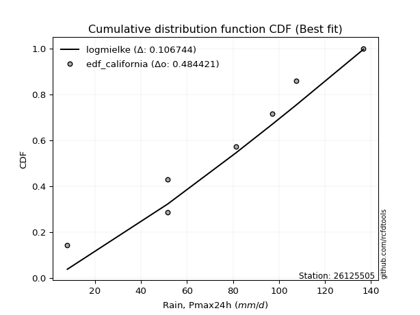</img>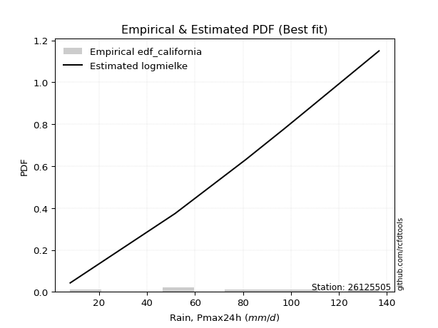</img>

</div>


### 2. EDF Hazen (1930)

Hazen method for plotting positions is a formula used to estimate the empirical cumulative probability distribution of flood events or other hydrological data. This formula often results in biased estimations, particularly when extrapolating to extreme events (high return periods).

<div align="center">


$P=(m-0.5)/n$


</div>


**2.1. Empirical values**

<div align="center">

|                | 0                   | 1                   | 2                   | 3         | 4                  | 5                  | 6                  |
|:---------------|:--------------------|:--------------------|:--------------------|:----------|:-------------------|:-------------------|:-------------------|
| date           | 2023                | 2021                | 2022                | 2019      | 2017               | 2018               | 2020               |
| x              | 8.0                 | 51.7                | 51.7                | 81.2      | 97.2               | 107.4              | 136.7              |
| m              | 1                   | 2                   | 3                   | 4         | 5                  | 6                  | 7                  |
| empirical_dist | edf_hazen           | edf_hazen           | edf_hazen           | edf_hazen | edf_hazen          | edf_hazen          | edf_hazen          |
| empirical      | 0.07142857142857142 | 0.21428571428571427 | 0.35714285714285715 | 0.5       | 0.6428571428571429 | 0.7857142857142857 | 0.9285714285714286 |
| empirical_tr   | 1.0769230769230769  | 1.2727272727272727  | 1.5555555555555558  | 2.0       | 2.8000000000000003 | 4.666666666666666  | 14.000000000000007 |

</div>


**2.2. Kolmogorov-Smirnov fit test (sorted by Δ)**


<div align="center">

|                | 0                   | 1                   | 2                   | 3                   | 4                   | 5                   | 6                   | 7                   | 8                   | 9                   | 10                  | 11                  | 12                  | 13                  | 14                  | 15                  | 16                  | 17                  | 18                  | 19                  | 20                  | 21                  | 22                  | 23                  | 24                  | 25                  | 26                  | 27                  | 28                  | 29                  | 30                  | 31                  | 32                  | 33                  | 34                  | 35                  | 36                  | 37                  | 38                  | 39                  | 40                  | 41                  | 42                  | 43                  | 44                  | 45                  | 46                  | 47                  | 48                  | 49                  | 50                  | 51                  | 52                  | 53                  | 54                  | 55                  | 56                  | 57                  | 58                  | 59                  | 60                  | 61                  | 62                  | 63                  | 64                  | 65                  | 66                  | 67                  | 68                  | 69                  | 70                  | 71                  | 72                  | 73                  | 74                  | 75                  | 76                  | 77                  | 78                  | 79                  | 80                  | 81                  | 82                  | 83                  | 84                  | 85                  | 86                  | 87                  | 88                  | 89                  | 90                  | 91                  | 92                  | 93                  | 94                  | 95                  | 96                  | 97                  | 98                  | 99                  | 100                 | 101                 | 102                 | 103                 | 104                 | 105                 | 106                 | 107                 | 108                 | 109                 | 110                 | 111                 | 112                 | 113                 | 114                 | 115                 | 116                 | 117                 | 118                 | 119                 | 120                 | 121                 | 122                 | 123                 | 124                 | 125                 | 126                 | 127                 | 128                 | 129                 | 130                 | 131                 | 132                 | 133                 | 134                 | 135                 | 136                 | 137                 | 138                 | 139                 | 140                 | 141                 | 142                 | 143                 | 144                 | 145                 | 146                 | 147                 | 148                 | 149                 | 150                 | 151                 | 152                 | 153                 | 154                 | 155                 | 156                 | 157                 | 158                 | 159                 |
|:---------------|:--------------------|:--------------------|:--------------------|:--------------------|:--------------------|:--------------------|:--------------------|:--------------------|:--------------------|:--------------------|:--------------------|:--------------------|:--------------------|:--------------------|:--------------------|:--------------------|:--------------------|:--------------------|:--------------------|:--------------------|:--------------------|:--------------------|:--------------------|:--------------------|:--------------------|:--------------------|:--------------------|:--------------------|:--------------------|:--------------------|:--------------------|:--------------------|:--------------------|:--------------------|:--------------------|:--------------------|:--------------------|:--------------------|:--------------------|:--------------------|:--------------------|:--------------------|:--------------------|:--------------------|:--------------------|:--------------------|:--------------------|:--------------------|:--------------------|:--------------------|:--------------------|:--------------------|:--------------------|:--------------------|:--------------------|:--------------------|:--------------------|:--------------------|:--------------------|:--------------------|:--------------------|:--------------------|:--------------------|:--------------------|:--------------------|:--------------------|:--------------------|:--------------------|:--------------------|:--------------------|:--------------------|:--------------------|:--------------------|:--------------------|:--------------------|:--------------------|:--------------------|:--------------------|:--------------------|:--------------------|:--------------------|:--------------------|:--------------------|:--------------------|:--------------------|:--------------------|:--------------------|:--------------------|:--------------------|:--------------------|:--------------------|:--------------------|:--------------------|:--------------------|:--------------------|:--------------------|:--------------------|:--------------------|:--------------------|:--------------------|:--------------------|:--------------------|:--------------------|:--------------------|:--------------------|:--------------------|:--------------------|:--------------------|:--------------------|:--------------------|:--------------------|:--------------------|:--------------------|:--------------------|:--------------------|:--------------------|:--------------------|:--------------------|:--------------------|:--------------------|:--------------------|:--------------------|:--------------------|:--------------------|:--------------------|:--------------------|:--------------------|:--------------------|:--------------------|:--------------------|:--------------------|:--------------------|:--------------------|:--------------------|:--------------------|:--------------------|:--------------------|:--------------------|:--------------------|:--------------------|:--------------------|:--------------------|:--------------------|:--------------------|:--------------------|:--------------------|:--------------------|:--------------------|:--------------------|:--------------------|:--------------------|:--------------------|:--------------------|:--------------------|:--------------------|:--------------------|:--------------------|:--------------------|:--------------------|:--------------------|
| station        | 26125505            | 26125505            | 26125505            | 26125505            | 26125505            | 26125505            | 26125505            | 26125505            | 26125505            | 26125505            | 26125505            | 26125505            | 26125505            | 26125505            | 26125505            | 26125505            | 26125505            | 26125505            | 26125505            | 26125505            | 26125505            | 26125505            | 26125505            | 26125505            | 26125505            | 26125505            | 26125505            | 26125505            | 26125505            | 26125505            | 26125505            | 26125505            | 26125505            | 26125505            | 26125505            | 26125505            | 26125505            | 26125505            | 26125505            | 26125505            | 26125505            | 26125505            | 26125505            | 26125505            | 26125505            | 26125505            | 26125505            | 26125505            | 26125505            | 26125505            | 26125505            | 26125505            | 26125505            | 26125505            | 26125505            | 26125505            | 26125505            | 26125505            | 26125505            | 26125505            | 26125505            | 26125505            | 26125505            | 26125505            | 26125505            | 26125505            | 26125505            | 26125505            | 26125505            | 26125505            | 26125505            | 26125505            | 26125505            | 26125505            | 26125505            | 26125505            | 26125505            | 26125505            | 26125505            | 26125505            | 26125505            | 26125505            | 26125505            | 26125505            | 26125505            | 26125505            | 26125505            | 26125505            | 26125505            | 26125505            | 26125505            | 26125505            | 26125505            | 26125505            | 26125505            | 26125505            | 26125505            | 26125505            | 26125505            | 26125505            | 26125505            | 26125505            | 26125505            | 26125505            | 26125505            | 26125505            | 26125505            | 26125505            | 26125505            | 26125505            | 26125505            | 26125505            | 26125505            | 26125505            | 26125505            | 26125505            | 26125505            | 26125505            | 26125505            | 26125505            | 26125505            | 26125505            | 26125505            | 26125505            | 26125505            | 26125505            | 26125505            | 26125505            | 26125505            | 26125505            | 26125505            | 26125505            | 26125505            | 26125505            | 26125505            | 26125505            | 26125505            | 26125505            | 26125505            | 26125505            | 26125505            | 26125505            | 26125505            | 26125505            | 26125505            | 26125505            | 26125505            | 26125505            | 26125505            | 26125505            | 26125505            | 26125505            | 26125505            | 26125505            | 26125505            | 26125505            | 26125505            | 26125505            | 26125505            | 26125505            |
| empirical_dist | edf_hazen           | edf_hazen           | edf_hazen           | edf_hazen           | edf_hazen           | edf_hazen           | edf_hazen           | edf_hazen           | edf_hazen           | edf_hazen           | edf_hazen           | edf_hazen           | edf_hazen           | edf_hazen           | edf_hazen           | edf_hazen           | edf_hazen           | edf_hazen           | edf_hazen           | edf_hazen           | edf_hazen           | edf_hazen           | edf_hazen           | edf_hazen           | edf_hazen           | edf_hazen           | edf_hazen           | edf_hazen           | edf_hazen           | edf_hazen           | edf_hazen           | edf_hazen           | edf_hazen           | edf_hazen           | edf_hazen           | edf_hazen           | edf_hazen           | edf_hazen           | edf_hazen           | edf_hazen           | edf_hazen           | edf_hazen           | edf_hazen           | edf_hazen           | edf_hazen           | edf_hazen           | edf_hazen           | edf_hazen           | edf_hazen           | edf_hazen           | edf_hazen           | edf_hazen           | edf_hazen           | edf_hazen           | edf_hazen           | edf_hazen           | edf_hazen           | edf_hazen           | edf_hazen           | edf_hazen           | edf_hazen           | edf_hazen           | edf_hazen           | edf_hazen           | edf_hazen           | edf_hazen           | edf_hazen           | edf_hazen           | edf_hazen           | edf_hazen           | edf_hazen           | edf_hazen           | edf_hazen           | edf_hazen           | edf_hazen           | edf_hazen           | edf_hazen           | edf_hazen           | edf_hazen           | edf_hazen           | edf_hazen           | edf_hazen           | edf_hazen           | edf_hazen           | edf_hazen           | edf_hazen           | edf_hazen           | edf_hazen           | edf_hazen           | edf_hazen           | edf_hazen           | edf_hazen           | edf_hazen           | edf_hazen           | edf_hazen           | edf_hazen           | edf_hazen           | edf_hazen           | edf_hazen           | edf_hazen           | edf_hazen           | edf_hazen           | edf_hazen           | edf_hazen           | edf_hazen           | edf_hazen           | edf_hazen           | edf_hazen           | edf_hazen           | edf_hazen           | edf_hazen           | edf_hazen           | edf_hazen           | edf_hazen           | edf_hazen           | edf_hazen           | edf_hazen           | edf_hazen           | edf_hazen           | edf_hazen           | edf_hazen           | edf_hazen           | edf_hazen           | edf_hazen           | edf_hazen           | edf_hazen           | edf_hazen           | edf_hazen           | edf_hazen           | edf_hazen           | edf_hazen           | edf_hazen           | edf_hazen           | edf_hazen           | edf_hazen           | edf_hazen           | edf_hazen           | edf_hazen           | edf_hazen           | edf_hazen           | edf_hazen           | edf_hazen           | edf_hazen           | edf_hazen           | edf_hazen           | edf_hazen           | edf_hazen           | edf_hazen           | edf_hazen           | edf_hazen           | edf_hazen           | edf_hazen           | edf_hazen           | edf_hazen           | edf_hazen           | edf_hazen           | edf_hazen           | edf_hazen           | edf_hazen           | edf_hazen           |
| p_dist         | cosine              | logjohnsonsu        | rice                | invgamma            | anglit              | maxwell             | erlang              | gamma               | invgauss            | betaprime           | f                   | nakagami            | rayleigh            | nct                 | norm                | crystalball         | truncnorm           | exponnorm           | t                   | semicircular        | loggenextreme       | logargus            | exponweib           | genpareto           | argus               | foldnorm            | weibull_min         | pearson3            | burr                | logloggamma         | logburr             | johnsonsu           | logvonmises_line    | genextreme          | ksone               | logmielke           | truncweibull_min    | skewnorm            | logistic            | genlogistic         | kappa4              | logburr12           | halfnorm            | vonmises_line       | gumbel_r            | wrapcauchy          | kappa3              | uniform             | loggompertz         | hypsecant           | mielke              | tukeylambda         | triang              | gumbel_l            | logpearson3         | kstwobign           | logloglaplace       | gausshyper          | logdgamma           | arcsine             | moyal               | halflogistic        | laplace             | logdweibull         | logt                | loggumbel_l         | genhalflogistic     | ncf                 | dweibull            | dgamma              | loglevy_l           | logtrapezoid        | bradford            | loggennorm          | loglaplace          | loglaplace          | logskewnorm         | loghypsecant        | wald                | logfoldnorm         | loglogistic         | beta                | logfatiguelife      | logrice             | lognorm             | logcrystalball      | logexponnorm        | logf                | lognct              | logerlang           | loggamma            | loggamma            | loganglit           | loginvgamma         | logsemicircular     | logalpha            | logarcsine          | logweibull_max      | logncf              | trapezoid           | lomax               | logmaxwell          | loginvgauss         | logbetaprime        | truncexpon          | levy_l              | genexpon            | lograyleigh         | loginvweibull       | loggenhalflogistic  | gennorm             | logtriang           | loggumbel_r         | loghalfnorm         | logcosine           | logkstwobign        | logmoyal            | loghalflogistic     | loggenexpon         | halfgennorm         | loggausshyper       | logbeta             | logjohnsonsb        | logwrapcauchy       | loggenpareto        | lognakagami         | logtruncnorm        | gompertz            | loglomax            | logwald             | burr12              | logkappa4           | logksone            | johnsonsb           | logtukeylambda      | loghalfgennorm      | logkappa3           | loguniform          | logexponweib        | gengamma            | loggengamma         | alpha               | logrdist            | invweibull          | logtruncweibull_min | logbradford         | logtruncexpon       | logweibull_min      | fatiguelife         | weibull_max         | powerlaw            | logexponpow         | truncpareto         | logpowerlaw         | exponpow            | logtruncpareto      | rdist               | loggenlogistic      | logvonmises         | vonmises            |
| delta          | 0.07154839009460104 | 0.07220414515675311 | 0.0752562088951601  | 0.0782085689772675  | 0.07968729717416442 | 0.08000019331322805 | 0.08323853553428417 | 0.08350491228249374 | 0.08424660828297934 | 0.08716277708613657 | 0.08736038557677012 | 0.08887660727848273 | 0.08977203528450528 | 0.08985794712836304 | 0.08991508209710092 | 0.08991508227033379 | 0.0899150833601513  | 0.08991695783611964 | 0.08993451649770329 | 0.09120142418457564 | 0.0921830274954647  | 0.09281950706992628 | 0.09328619183769923 | 0.0949667151882233  | 0.0957407154670214  | 0.09625684688006653 | 0.09669062587495386 | 0.0967878420325099  | 0.09788279729102065 | 0.09873060330858222 | 0.10142003178334244 | 0.10293433886578779 | 0.10319357308953991 | 0.10498871111451197 | 0.10638381177496556 | 0.10754178215053359 | 0.10936867117824331 | 0.11026407920240927 | 0.11238455002755893 | 0.11382710092252013 | 0.11530506125585901 | 0.11580307393549474 | 0.11733572852544272 | 0.11805753176779485 | 0.11969111454297832 | 0.12354988519279439 | 0.12474193769400696 | 0.1252636252636253  | 0.12738578551210314 | 0.1276895244773604  | 0.1315886389914185  | 0.13223466750336957 | 0.1323811089447879  | 0.13353100454377348 | 0.1348864790360579  | 0.1359697650860017  | 0.13797323619716306 | 0.13851644622578838 | 0.13930187395179416 | 0.14095215266307046 | 0.14454236911452512 | 0.14460834522563526 | 0.1494476228530569  | 0.15364102688638837 | 0.15518579149197714 | 0.15679432536913554 | 0.15748174377619806 | 0.16044671969589172 | 0.16351520820205342 | 0.17223596852069936 | 0.1723971884030783  | 0.1845447399085253  | 0.19221054101346033 | 0.19456502045965307 | 0.20071027730476332 | 0.20071027730476332 | 0.21062633150627394 | 0.21185064055167666 | 0.21349867581521054 | 0.217291438500379   | 0.21852680575914837 | 0.22226113583380758 | 0.22529733137045502 | 0.22646202961987114 | 0.22646301151423756 | 0.2264631031718923  | 0.2264646432110314  | 0.22808301721664234 | 0.22831702266045031 | 0.23112909226603265 | 0.23474399287017042 | 0.23474399287017042 | 0.2348448944541258  | 0.2376224141783886  | 0.23830653023904044 | 0.2502564924430254  | 0.2520995171449133  | 0.25360323667224094 | 0.2542969711048373  | 0.2549646760824644  | 0.255085280530452   | 0.26085263142099624 | 0.26600411151645176 | 0.2669339854099154  | 0.26736832263122645 | 0.27252422881020455 | 0.2726856575730233  | 0.2728617672908026  | 0.27369239787598976 | 0.2774665835845098  | 0.2857142857142857  | 0.2867337938047192  | 0.2924559599945592  | 0.30678247366806766 | 0.3080879055325936  | 0.3168954234371496  | 0.3175217855678075  | 0.32699526410848434 | 0.3287960267548141  | 0.3313259338350102  | 0.3316166626176925  | 0.33912033810630615 | 0.34080917911938374 | 0.35140316741501365 | 0.351603748640683   | 0.3568431960056867  | 0.35713276557081536 | 0.3571427742287786  | 0.3824793162001511  | 0.38704392883722927 | 0.38941270165942565 | 0.4049153983911892  | 0.416906433526802   | 0.4265864507809046  | 0.4361955595795318  | 0.4381352883637365  | 0.44281289959114334 | 0.44314486308930534 | 0.45918148817802107 | 0.46579540319058366 | 0.4738875429763508  | 0.47638736278149263 | 0.4777244192323561  | 0.4898173963546061  | 0.5025601419139634  | 0.5147662839339371  | 0.5229816638778876  | 0.5458475134967822  | 0.5693643260480951  | 0.6019660845250296  | 0.6240030943044103  | 0.6461014217134907  | 0.7071059213564118  | 0.7107021221563482  | 0.7301311912175505  | 0.7544013129304614  | 0.7857142855235447  | 0.7857142857142857  | 1.1225207062454736  | 21.100223403771746  |
| deltao         | 0.48442053926100004 | 0.48442053926100004 | 0.48442053926100004 | 0.48442053926100004 | 0.48442053926100004 | 0.48442053926100004 | 0.48442053926100004 | 0.48442053926100004 | 0.48442053926100004 | 0.48442053926100004 | 0.48442053926100004 | 0.48442053926100004 | 0.48442053926100004 | 0.48442053926100004 | 0.48442053926100004 | 0.48442053926100004 | 0.48442053926100004 | 0.48442053926100004 | 0.48442053926100004 | 0.48442053926100004 | 0.48442053926100004 | 0.48442053926100004 | 0.48442053926100004 | 0.48442053926100004 | 0.48442053926100004 | 0.48442053926100004 | 0.48442053926100004 | 0.48442053926100004 | 0.48442053926100004 | 0.48442053926100004 | 0.48442053926100004 | 0.48442053926100004 | 0.48442053926100004 | 0.48442053926100004 | 0.48442053926100004 | 0.48442053926100004 | 0.48442053926100004 | 0.48442053926100004 | 0.48442053926100004 | 0.48442053926100004 | 0.48442053926100004 | 0.48442053926100004 | 0.48442053926100004 | 0.48442053926100004 | 0.48442053926100004 | 0.48442053926100004 | 0.48442053926100004 | 0.48442053926100004 | 0.48442053926100004 | 0.48442053926100004 | 0.48442053926100004 | 0.48442053926100004 | 0.48442053926100004 | 0.48442053926100004 | 0.48442053926100004 | 0.48442053926100004 | 0.48442053926100004 | 0.48442053926100004 | 0.48442053926100004 | 0.48442053926100004 | 0.48442053926100004 | 0.48442053926100004 | 0.48442053926100004 | 0.48442053926100004 | 0.48442053926100004 | 0.48442053926100004 | 0.48442053926100004 | 0.48442053926100004 | 0.48442053926100004 | 0.48442053926100004 | 0.48442053926100004 | 0.48442053926100004 | 0.48442053926100004 | 0.48442053926100004 | 0.48442053926100004 | 0.48442053926100004 | 0.48442053926100004 | 0.48442053926100004 | 0.48442053926100004 | 0.48442053926100004 | 0.48442053926100004 | 0.48442053926100004 | 0.48442053926100004 | 0.48442053926100004 | 0.48442053926100004 | 0.48442053926100004 | 0.48442053926100004 | 0.48442053926100004 | 0.48442053926100004 | 0.48442053926100004 | 0.48442053926100004 | 0.48442053926100004 | 0.48442053926100004 | 0.48442053926100004 | 0.48442053926100004 | 0.48442053926100004 | 0.48442053926100004 | 0.48442053926100004 | 0.48442053926100004 | 0.48442053926100004 | 0.48442053926100004 | 0.48442053926100004 | 0.48442053926100004 | 0.48442053926100004 | 0.48442053926100004 | 0.48442053926100004 | 0.48442053926100004 | 0.48442053926100004 | 0.48442053926100004 | 0.48442053926100004 | 0.48442053926100004 | 0.48442053926100004 | 0.48442053926100004 | 0.48442053926100004 | 0.48442053926100004 | 0.48442053926100004 | 0.48442053926100004 | 0.48442053926100004 | 0.48442053926100004 | 0.48442053926100004 | 0.48442053926100004 | 0.48442053926100004 | 0.48442053926100004 | 0.48442053926100004 | 0.48442053926100004 | 0.48442053926100004 | 0.48442053926100004 | 0.48442053926100004 | 0.48442053926100004 | 0.48442053926100004 | 0.48442053926100004 | 0.48442053926100004 | 0.48442053926100004 | 0.48442053926100004 | 0.48442053926100004 | 0.48442053926100004 | 0.48442053926100004 | 0.48442053926100004 | 0.48442053926100004 | 0.48442053926100004 | 0.48442053926100004 | 0.48442053926100004 | 0.48442053926100004 | 0.48442053926100004 | 0.48442053926100004 | 0.48442053926100004 | 0.48442053926100004 | 0.48442053926100004 | 0.48442053926100004 | 0.48442053926100004 | 0.48442053926100004 | 0.48442053926100004 | 0.48442053926100004 | 0.48442053926100004 | 0.48442053926100004 | 0.48442053926100004 | 0.48442053926100004 | 0.48442053926100004 | 0.48442053926100004 | 0.48442053926100004 |
| eval           | Δo > Δ              | Δo > Δ              | Δo > Δ              | Δo > Δ              | Δo > Δ              | Δo > Δ              | Δo > Δ              | Δo > Δ              | Δo > Δ              | Δo > Δ              | Δo > Δ              | Δo > Δ              | Δo > Δ              | Δo > Δ              | Δo > Δ              | Δo > Δ              | Δo > Δ              | Δo > Δ              | Δo > Δ              | Δo > Δ              | Δo > Δ              | Δo > Δ              | Δo > Δ              | Δo > Δ              | Δo > Δ              | Δo > Δ              | Δo > Δ              | Δo > Δ              | Δo > Δ              | Δo > Δ              | Δo > Δ              | Δo > Δ              | Δo > Δ              | Δo > Δ              | Δo > Δ              | Δo > Δ              | Δo > Δ              | Δo > Δ              | Δo > Δ              | Δo > Δ              | Δo > Δ              | Δo > Δ              | Δo > Δ              | Δo > Δ              | Δo > Δ              | Δo > Δ              | Δo > Δ              | Δo > Δ              | Δo > Δ              | Δo > Δ              | Δo > Δ              | Δo > Δ              | Δo > Δ              | Δo > Δ              | Δo > Δ              | Δo > Δ              | Δo > Δ              | Δo > Δ              | Δo > Δ              | Δo > Δ              | Δo > Δ              | Δo > Δ              | Δo > Δ              | Δo > Δ              | Δo > Δ              | Δo > Δ              | Δo > Δ              | Δo > Δ              | Δo > Δ              | Δo > Δ              | Δo > Δ              | Δo > Δ              | Δo > Δ              | Δo > Δ              | Δo > Δ              | Δo > Δ              | Δo > Δ              | Δo > Δ              | Δo > Δ              | Δo > Δ              | Δo > Δ              | Δo > Δ              | Δo > Δ              | Δo > Δ              | Δo > Δ              | Δo > Δ              | Δo > Δ              | Δo > Δ              | Δo > Δ              | Δo > Δ              | Δo > Δ              | Δo > Δ              | Δo > Δ              | Δo > Δ              | Δo > Δ              | Δo > Δ              | Δo > Δ              | Δo > Δ              | Δo > Δ              | Δo > Δ              | Δo > Δ              | Δo > Δ              | Δo > Δ              | Δo > Δ              | Δo > Δ              | Δo > Δ              | Δo > Δ              | Δo > Δ              | Δo > Δ              | Δo > Δ              | Δo > Δ              | Δo > Δ              | Δo > Δ              | Δo > Δ              | Δo > Δ              | Δo > Δ              | Δo > Δ              | Δo > Δ              | Δo > Δ              | Δo > Δ              | Δo > Δ              | Δo > Δ              | Δo > Δ              | Δo > Δ              | Δo > Δ              | Δo > Δ              | Δo > Δ              | Δo > Δ              | Δo > Δ              | Δo > Δ              | Δo > Δ              | Δo > Δ              | Δo > Δ              | Δo > Δ              | Δo > Δ              | Δo > Δ              | Δo > Δ              | Δo > Δ              | Δo > Δ              | Δo > Δ              | Δo > Δ              | Δo > Δ              | Δo > Δ              | Δo <= Δ             | Δo <= Δ             | Δo <= Δ             | Δo <= Δ             | Δo <= Δ             | Δo <= Δ             | Δo <= Δ             | Δo <= Δ             | Δo <= Δ             | Δo <= Δ             | Δo <= Δ             | Δo <= Δ             | Δo <= Δ             | Δo <= Δ             | Δo <= Δ             | Δo <= Δ             | Δo <= Δ             |
| fit            | 1                   | 1                   | 1                   | 1                   | 1                   | 1                   | 1                   | 1                   | 1                   | 1                   | 1                   | 1                   | 1                   | 1                   | 1                   | 1                   | 1                   | 1                   | 1                   | 1                   | 1                   | 1                   | 1                   | 1                   | 1                   | 1                   | 1                   | 1                   | 1                   | 1                   | 1                   | 1                   | 1                   | 1                   | 1                   | 1                   | 1                   | 1                   | 1                   | 1                   | 1                   | 1                   | 1                   | 1                   | 1                   | 1                   | 1                   | 1                   | 1                   | 1                   | 1                   | 1                   | 1                   | 1                   | 1                   | 1                   | 1                   | 1                   | 1                   | 1                   | 1                   | 1                   | 1                   | 1                   | 1                   | 1                   | 1                   | 1                   | 1                   | 1                   | 1                   | 1                   | 1                   | 1                   | 1                   | 1                   | 1                   | 1                   | 1                   | 1                   | 1                   | 1                   | 1                   | 1                   | 1                   | 1                   | 1                   | 1                   | 1                   | 1                   | 1                   | 1                   | 1                   | 1                   | 1                   | 1                   | 1                   | 1                   | 1                   | 1                   | 1                   | 1                   | 1                   | 1                   | 1                   | 1                   | 1                   | 1                   | 1                   | 1                   | 1                   | 1                   | 1                   | 1                   | 1                   | 1                   | 1                   | 1                   | 1                   | 1                   | 1                   | 1                   | 1                   | 1                   | 1                   | 1                   | 1                   | 1                   | 1                   | 1                   | 1                   | 1                   | 1                   | 1                   | 1                   | 1                   | 1                   | 1                   | 1                   | 1                   | 1                   | 1                   | 1                   | 0                   | 0                   | 0                   | 0                   | 0                   | 0                   | 0                   | 0                   | 0                   | 0                   | 0                   | 0                   | 0                   | 0                   | 0                   | 0                   | 0                   |
| n              | 7                   | 7                   | 7                   | 7                   | 7                   | 7                   | 7                   | 7                   | 7                   | 7                   | 7                   | 7                   | 7                   | 7                   | 7                   | 7                   | 7                   | 7                   | 7                   | 7                   | 7                   | 7                   | 7                   | 7                   | 7                   | 7                   | 7                   | 7                   | 7                   | 7                   | 7                   | 7                   | 7                   | 7                   | 7                   | 7                   | 7                   | 7                   | 7                   | 7                   | 7                   | 7                   | 7                   | 7                   | 7                   | 7                   | 7                   | 7                   | 7                   | 7                   | 7                   | 7                   | 7                   | 7                   | 7                   | 7                   | 7                   | 7                   | 7                   | 7                   | 7                   | 7                   | 7                   | 7                   | 7                   | 7                   | 7                   | 7                   | 7                   | 7                   | 7                   | 7                   | 7                   | 7                   | 7                   | 7                   | 7                   | 7                   | 7                   | 7                   | 7                   | 7                   | 7                   | 7                   | 7                   | 7                   | 7                   | 7                   | 7                   | 7                   | 7                   | 7                   | 7                   | 7                   | 7                   | 7                   | 7                   | 7                   | 7                   | 7                   | 7                   | 7                   | 7                   | 7                   | 7                   | 7                   | 7                   | 7                   | 7                   | 7                   | 7                   | 7                   | 7                   | 7                   | 7                   | 7                   | 7                   | 7                   | 7                   | 7                   | 7                   | 7                   | 7                   | 7                   | 7                   | 7                   | 7                   | 7                   | 7                   | 7                   | 7                   | 7                   | 7                   | 7                   | 7                   | 7                   | 7                   | 7                   | 7                   | 7                   | 7                   | 7                   | 7                   | 7                   | 7                   | 7                   | 7                   | 7                   | 7                   | 7                   | 7                   | 7                   | 7                   | 7                   | 7                   | 7                   | 7                   | 7                   | 7                   | 7                   |
| best_fit       | 1                   | 0                   | 0                   | 0                   | 0                   | 0                   | 0                   | 0                   | 0                   | 0                   | 0                   | 0                   | 0                   | 0                   | 0                   | 0                   | 0                   | 0                   | 0                   | 0                   | 0                   | 0                   | 0                   | 0                   | 0                   | 0                   | 0                   | 0                   | 0                   | 0                   | 0                   | 0                   | 0                   | 0                   | 0                   | 0                   | 0                   | 0                   | 0                   | 0                   | 0                   | 0                   | 0                   | 0                   | 0                   | 0                   | 0                   | 0                   | 0                   | 0                   | 0                   | 0                   | 0                   | 0                   | 0                   | 0                   | 0                   | 0                   | 0                   | 0                   | 0                   | 0                   | 0                   | 0                   | 0                   | 0                   | 0                   | 0                   | 0                   | 0                   | 0                   | 0                   | 0                   | 0                   | 0                   | 0                   | 0                   | 0                   | 0                   | 0                   | 0                   | 0                   | 0                   | 0                   | 0                   | 0                   | 0                   | 0                   | 0                   | 0                   | 0                   | 0                   | 0                   | 0                   | 0                   | 0                   | 0                   | 0                   | 0                   | 0                   | 0                   | 0                   | 0                   | 0                   | 0                   | 0                   | 0                   | 0                   | 0                   | 0                   | 0                   | 0                   | 0                   | 0                   | 0                   | 0                   | 0                   | 0                   | 0                   | 0                   | 0                   | 0                   | 0                   | 0                   | 0                   | 0                   | 0                   | 0                   | 0                   | 0                   | 0                   | 0                   | 0                   | 0                   | 0                   | 0                   | 0                   | 0                   | 0                   | 0                   | 0                   | 0                   | 0                   | 0                   | 0                   | 0                   | 0                   | 0                   | 0                   | 0                   | 0                   | 0                   | 0                   | 0                   | 0                   | 0                   | 0                   | 0                   | 0                   | 0                   |
| best_fit_sort  | 1                   | 2                   | 3                   | 4                   | 5                   | 6                   | 7                   | 8                   | 9                   | 10                  | 11                  | 12                  | 13                  | 14                  | 15                  | 16                  | 17                  | 18                  | 19                  | 20                  | 21                  | 22                  | 23                  | 24                  | 25                  | 26                  | 27                  | 28                  | 29                  | 30                  | 31                  | 32                  | 33                  | 34                  | 35                  | 36                  | 37                  | 38                  | 39                  | 40                  | 41                  | 42                  | 43                  | 44                  | 45                  | 46                  | 47                  | 48                  | 49                  | 50                  | 51                  | 52                  | 53                  | 54                  | 55                  | 56                  | 57                  | 58                  | 59                  | 60                  | 61                  | 62                  | 63                  | 64                  | 65                  | 66                  | 67                  | 68                  | 69                  | 70                  | 71                  | 72                  | 73                  | 74                  | 75                  | 76                  | 77                  | 78                  | 79                  | 80                  | 81                  | 82                  | 83                  | 84                  | 85                  | 86                  | 87                  | 88                  | 89                  | 90                  | 91                  | 92                  | 93                  | 94                  | 95                  | 96                  | 97                  | 98                  | 99                  | 100                 | 101                 | 102                 | 103                 | 104                 | 105                 | 106                 | 107                 | 108                 | 109                 | 110                 | 111                 | 112                 | 113                 | 114                 | 115                 | 116                 | 117                 | 118                 | 119                 | 120                 | 121                 | 122                 | 123                 | 124                 | 125                 | 126                 | 127                 | 128                 | 129                 | 130                 | 131                 | 132                 | 133                 | 134                 | 135                 | 136                 | 137                 | 138                 | 139                 | 140                 | 141                 | 142                 | 143                 | 144                 | 145                 | 146                 | 147                 | 148                 | 149                 | 150                 | 151                 | 152                 | 153                 | 154                 | 155                 | 156                 | 157                 | 158                 | 159                 | 160                 |

</div>


**2.3. Best fit**

<div align="center">

|   id |   station | empirical_dist   | p_dist   |     delta |   deltao | eval   |   fit |   n |   best_fit |   best_fit_sort |
|-----:|----------:|:-----------------|:---------|----------:|---------:|:-------|------:|----:|-----------:|----------------:|
|    0 |  26125505 | edf_hazen        | cosine   | 0.0715484 | 0.484421 | Δo > Δ |     1 |   7 |          1 |               1 |

</div>


<div align="center">

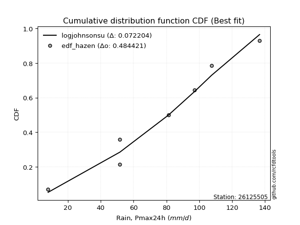</img>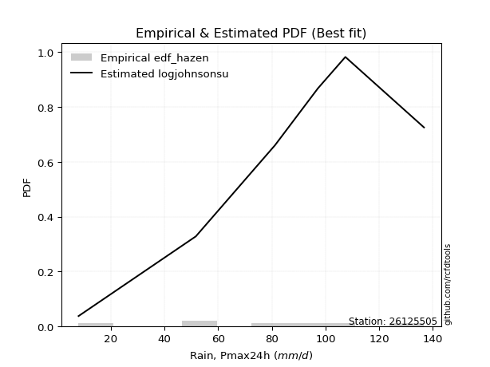</img>

</div>


### 3. EDF Weibull (1939)

Weibull plotting position formula is an empirical method used to estimate the non-exceedance probability or plotting position for a set of observed data, is often recommended or widely used in practice, particularly in flood frequency analysis.

<div align="center">


$P=m/(n+1)$


</div>


**3.1. Empirical values**

<div align="center">

|                | 0                  | 1                  | 2           | 3           | 4                  | 5           | 6           |
|:---------------|:-------------------|:-------------------|:------------|:------------|:-------------------|:------------|:------------|
| date           | 2023               | 2021               | 2022        | 2019        | 2017               | 2018        | 2020        |
| x              | 8.0                | 51.7               | 51.7        | 81.2        | 97.2               | 107.4       | 136.7       |
| m              | 1                  | 2                  | 3           | 4           | 5                  | 6           | 7           |
| empirical_dist | edf_weibull        | edf_weibull        | edf_weibull | edf_weibull | edf_weibull        | edf_weibull | edf_weibull |
| empirical      | 0.125              | 0.25               | 0.375       | 0.5         | 0.625              | 0.75        | 0.875       |
| empirical_tr   | 1.1428571428571428 | 1.3333333333333333 | 1.6         | 2.0         | 2.6666666666666665 | 4.0         | 8.0         |

</div>


**3.2. Kolmogorov-Smirnov fit test (sorted by Δ)**


<div align="center">

|                | 0                   | 1                   | 2                   | 3                   | 4                   | 5                   | 6                   | 7                   | 8                   | 9                   | 10                  | 11                  | 12                  | 13                  | 14                  | 15                  | 16                  | 17                  | 18                  | 19                  | 20                  | 21                  | 22                  | 23                  | 24                  | 25                  | 26                  | 27                  | 28                  | 29                  | 30                  | 31                  | 32                  | 33                  | 34                  | 35                  | 36                  | 37                  | 38                  | 39                  | 40                  | 41                  | 42                  | 43                  | 44                  | 45                  | 46                  | 47                  | 48                  | 49                  | 50                  | 51                  | 52                  | 53                  | 54                  | 55                  | 56                  | 57                  | 58                  | 59                  | 60                  | 61                  | 62                  | 63                  | 64                  | 65                  | 66                  | 67                  | 68                  | 69                  | 70                  | 71                  | 72                  | 73                  | 74                  | 75                  | 76                  | 77                  | 78                  | 79                  | 80                  | 81                  | 82                  | 83                  | 84                  | 85                  | 86                  | 87                  | 88                  | 89                  | 90                  | 91                  | 92                  | 93                  | 94                  | 95                  | 96                  | 97                  | 98                  | 99                  | 100                 | 101                 | 102                 | 103                 | 104                 | 105                 | 106                 | 107                 | 108                 | 109                 | 110                 | 111                 | 112                 | 113                 | 114                 | 115                 | 116                 | 117                 | 118                 | 119                 | 120                 | 121                 | 122                 | 123                 | 124                 | 125                 | 126                 | 127                 | 128                 | 129                 | 130                 | 131                 | 132                 | 133                 | 134                 | 135                 | 136                 | 137                 | 138                 | 139                 | 140                 | 141                 | 142                 | 143                 | 144                 | 145                 | 146                 | 147                 | 148                 | 149                 | 150                 | 151                 | 152                 | 153                 | 154                 | 155                 | 156                 | 157                 | 158                 | 159                 |
|:---------------|:--------------------|:--------------------|:--------------------|:--------------------|:--------------------|:--------------------|:--------------------|:--------------------|:--------------------|:--------------------|:--------------------|:--------------------|:--------------------|:--------------------|:--------------------|:--------------------|:--------------------|:--------------------|:--------------------|:--------------------|:--------------------|:--------------------|:--------------------|:--------------------|:--------------------|:--------------------|:--------------------|:--------------------|:--------------------|:--------------------|:--------------------|:--------------------|:--------------------|:--------------------|:--------------------|:--------------------|:--------------------|:--------------------|:--------------------|:--------------------|:--------------------|:--------------------|:--------------------|:--------------------|:--------------------|:--------------------|:--------------------|:--------------------|:--------------------|:--------------------|:--------------------|:--------------------|:--------------------|:--------------------|:--------------------|:--------------------|:--------------------|:--------------------|:--------------------|:--------------------|:--------------------|:--------------------|:--------------------|:--------------------|:--------------------|:--------------------|:--------------------|:--------------------|:--------------------|:--------------------|:--------------------|:--------------------|:--------------------|:--------------------|:--------------------|:--------------------|:--------------------|:--------------------|:--------------------|:--------------------|:--------------------|:--------------------|:--------------------|:--------------------|:--------------------|:--------------------|:--------------------|:--------------------|:--------------------|:--------------------|:--------------------|:--------------------|:--------------------|:--------------------|:--------------------|:--------------------|:--------------------|:--------------------|:--------------------|:--------------------|:--------------------|:--------------------|:--------------------|:--------------------|:--------------------|:--------------------|:--------------------|:--------------------|:--------------------|:--------------------|:--------------------|:--------------------|:--------------------|:--------------------|:--------------------|:--------------------|:--------------------|:--------------------|:--------------------|:--------------------|:--------------------|:--------------------|:--------------------|:--------------------|:--------------------|:--------------------|:--------------------|:--------------------|:--------------------|:--------------------|:--------------------|:--------------------|:--------------------|:--------------------|:--------------------|:--------------------|:--------------------|:--------------------|:--------------------|:--------------------|:--------------------|:--------------------|:--------------------|:--------------------|:--------------------|:--------------------|:--------------------|:--------------------|:--------------------|:--------------------|:--------------------|:--------------------|:--------------------|:--------------------|:--------------------|:--------------------|:--------------------|:--------------------|:--------------------|:--------------------|
| station        | 26125505            | 26125505            | 26125505            | 26125505            | 26125505            | 26125505            | 26125505            | 26125505            | 26125505            | 26125505            | 26125505            | 26125505            | 26125505            | 26125505            | 26125505            | 26125505            | 26125505            | 26125505            | 26125505            | 26125505            | 26125505            | 26125505            | 26125505            | 26125505            | 26125505            | 26125505            | 26125505            | 26125505            | 26125505            | 26125505            | 26125505            | 26125505            | 26125505            | 26125505            | 26125505            | 26125505            | 26125505            | 26125505            | 26125505            | 26125505            | 26125505            | 26125505            | 26125505            | 26125505            | 26125505            | 26125505            | 26125505            | 26125505            | 26125505            | 26125505            | 26125505            | 26125505            | 26125505            | 26125505            | 26125505            | 26125505            | 26125505            | 26125505            | 26125505            | 26125505            | 26125505            | 26125505            | 26125505            | 26125505            | 26125505            | 26125505            | 26125505            | 26125505            | 26125505            | 26125505            | 26125505            | 26125505            | 26125505            | 26125505            | 26125505            | 26125505            | 26125505            | 26125505            | 26125505            | 26125505            | 26125505            | 26125505            | 26125505            | 26125505            | 26125505            | 26125505            | 26125505            | 26125505            | 26125505            | 26125505            | 26125505            | 26125505            | 26125505            | 26125505            | 26125505            | 26125505            | 26125505            | 26125505            | 26125505            | 26125505            | 26125505            | 26125505            | 26125505            | 26125505            | 26125505            | 26125505            | 26125505            | 26125505            | 26125505            | 26125505            | 26125505            | 26125505            | 26125505            | 26125505            | 26125505            | 26125505            | 26125505            | 26125505            | 26125505            | 26125505            | 26125505            | 26125505            | 26125505            | 26125505            | 26125505            | 26125505            | 26125505            | 26125505            | 26125505            | 26125505            | 26125505            | 26125505            | 26125505            | 26125505            | 26125505            | 26125505            | 26125505            | 26125505            | 26125505            | 26125505            | 26125505            | 26125505            | 26125505            | 26125505            | 26125505            | 26125505            | 26125505            | 26125505            | 26125505            | 26125505            | 26125505            | 26125505            | 26125505            | 26125505            | 26125505            | 26125505            | 26125505            | 26125505            | 26125505            | 26125505            |
| empirical_dist | edf_weibull         | edf_weibull         | edf_weibull         | edf_weibull         | edf_weibull         | edf_weibull         | edf_weibull         | edf_weibull         | edf_weibull         | edf_weibull         | edf_weibull         | edf_weibull         | edf_weibull         | edf_weibull         | edf_weibull         | edf_weibull         | edf_weibull         | edf_weibull         | edf_weibull         | edf_weibull         | edf_weibull         | edf_weibull         | edf_weibull         | edf_weibull         | edf_weibull         | edf_weibull         | edf_weibull         | edf_weibull         | edf_weibull         | edf_weibull         | edf_weibull         | edf_weibull         | edf_weibull         | edf_weibull         | edf_weibull         | edf_weibull         | edf_weibull         | edf_weibull         | edf_weibull         | edf_weibull         | edf_weibull         | edf_weibull         | edf_weibull         | edf_weibull         | edf_weibull         | edf_weibull         | edf_weibull         | edf_weibull         | edf_weibull         | edf_weibull         | edf_weibull         | edf_weibull         | edf_weibull         | edf_weibull         | edf_weibull         | edf_weibull         | edf_weibull         | edf_weibull         | edf_weibull         | edf_weibull         | edf_weibull         | edf_weibull         | edf_weibull         | edf_weibull         | edf_weibull         | edf_weibull         | edf_weibull         | edf_weibull         | edf_weibull         | edf_weibull         | edf_weibull         | edf_weibull         | edf_weibull         | edf_weibull         | edf_weibull         | edf_weibull         | edf_weibull         | edf_weibull         | edf_weibull         | edf_weibull         | edf_weibull         | edf_weibull         | edf_weibull         | edf_weibull         | edf_weibull         | edf_weibull         | edf_weibull         | edf_weibull         | edf_weibull         | edf_weibull         | edf_weibull         | edf_weibull         | edf_weibull         | edf_weibull         | edf_weibull         | edf_weibull         | edf_weibull         | edf_weibull         | edf_weibull         | edf_weibull         | edf_weibull         | edf_weibull         | edf_weibull         | edf_weibull         | edf_weibull         | edf_weibull         | edf_weibull         | edf_weibull         | edf_weibull         | edf_weibull         | edf_weibull         | edf_weibull         | edf_weibull         | edf_weibull         | edf_weibull         | edf_weibull         | edf_weibull         | edf_weibull         | edf_weibull         | edf_weibull         | edf_weibull         | edf_weibull         | edf_weibull         | edf_weibull         | edf_weibull         | edf_weibull         | edf_weibull         | edf_weibull         | edf_weibull         | edf_weibull         | edf_weibull         | edf_weibull         | edf_weibull         | edf_weibull         | edf_weibull         | edf_weibull         | edf_weibull         | edf_weibull         | edf_weibull         | edf_weibull         | edf_weibull         | edf_weibull         | edf_weibull         | edf_weibull         | edf_weibull         | edf_weibull         | edf_weibull         | edf_weibull         | edf_weibull         | edf_weibull         | edf_weibull         | edf_weibull         | edf_weibull         | edf_weibull         | edf_weibull         | edf_weibull         | edf_weibull         | edf_weibull         | edf_weibull         | edf_weibull         |
| p_dist         | anglit              | cosine              | logjohnsonsu        | invgamma            | exponweib           | invgauss            | semicircular        | rice                | logpearson3         | logburr             | erlang              | gamma               | logargus            | maxwell             | betaprime           | f                   | nakagami            | nct                 | norm                | crystalball         | truncnorm           | exponnorm           | t                   | burr                | kstwobign           | logburr12           | argus               | foldnorm            | weibull_min         | pearson3            | rayleigh            | logmielke           | johnsonsu           | loggumbel_l         | genextreme          | ksone               | ncf                 | logloggamma         | kappa3              | mielke              | wrapcauchy          | loggompertz         | vonmises_line       | logvonmises_line    | genpareto           | truncweibull_min    | loggenextreme       | tukeylambda         | kappa4              | uniform             | halfnorm            | arcsine             | gausshyper          | gumbel_r            | dweibull            | skewnorm            | logistic            | genlogistic         | logdweibull         | dgamma              | loglevy_l           | logdgamma           | logloglaplace       | genhalflogistic     | moyal               | halflogistic        | hypsecant           | logtrapezoid        | triang              | gumbel_l            | bradford            | laplace             | logt                | logskewnorm         | loghypsecant        | logfoldnorm         | loglogistic         | logfatiguelife      | beta                | logrice             | lognorm             | logcrystalball      | logexponnorm        | logf                | lognct              | logerlang           | loggamma            | loggamma            | loganglit           | loglaplace          | loglaplace          | loginvgamma         | logsemicircular     | loggennorm          | wald                | logalpha            | logarcsine          | logweibull_max      | logncf              | levy_l              | lomax               | logmaxwell          | loginvgauss         | logbetaprime        | truncexpon          | genexpon            | lograyleigh         | loginvweibull       | trapezoid           | loggenhalflogistic  | gennorm             | logtriang           | loggumbel_r         | loghalfnorm         | logcosine           | logkstwobign        | logmoyal            | loghalflogistic     | loggenexpon         | halfgennorm         | loggausshyper       | logbeta             | logjohnsonsb        | logwrapcauchy       | loggenpareto        | loglomax            | logwald             | burr12              | logkappa4           | lognakagami         | logtruncnorm        | gompertz            | logksone            | johnsonsb           | logtukeylambda      | loghalfgennorm      | logkappa3           | loguniform          | loggengamma         | logexponweib        | gengamma            | invweibull          | alpha               | logrdist            | logtruncweibull_min | logbradford         | logtruncexpon       | logweibull_min      | fatiguelife         | weibull_max         | powerlaw            | logexponpow         | truncpareto         | logpowerlaw         | exponpow            | logtruncpareto      | rdist               | loggenlogistic      | logvonmises         | vonmises            |
| delta          | 0.08731136905200007 | 0.08974289673062252 | 0.09006128801389596 | 0.09130481011515912 | 0.09250744771715633 | 0.09453849467446473 | 0.09520551419296552 | 0.09640668044085075 | 0.09917219332177218 | 0.09952368022842861 | 0.10109567839142702 | 0.10136205513963659 | 0.10410809675313393 | 0.10453162966412383 | 0.10501991994327942 | 0.10521752843391297 | 0.10673375013562558 | 0.10771508998550589 | 0.10777222495424377 | 0.10777222512747664 | 0.10777222621729415 | 0.10777410069326249 | 0.10779165935484614 | 0.10919998183932644 | 0.11042325387003282 | 0.11243311749574778 | 0.11359785832416425 | 0.11411398973720938 | 0.11454776873209671 | 0.11464498488965275 | 0.11752298664262993 | 0.12070357578337443 | 0.12079148172293064 | 0.12108003965484981 | 0.12284585397165482 | 0.12326763660233193 | 0.124732433981606   | 0.12493615219128018 | 0.12498470539822014 | 0.1249996832617868  | 0.12499969686175921 | 0.12499990152416621 | 0.12499999386850769 | 0.12499999979918097 | 0.12499999999920564 | 0.12499999999971367 | 0.12499999999997835 | 0.1249999999999929  | 0.12499999999999944 | 0.125               | 0.125               | 0.125               | 0.12500000000042766 | 0.12713679990586346 | 0.1278009224877677  | 0.12812122205955212 | 0.13024169288470178 | 0.13168424377966298 | 0.132828089391254   | 0.13652168280641364 | 0.13668290268879257 | 0.139238906576649   | 0.13984519411828839 | 0.1399867598781516  | 0.14454236911452512 | 0.14460834522563526 | 0.14554666733450325 | 0.14883045419423957 | 0.15023825180193076 | 0.15138814740091633 | 0.1564962552991746  | 0.16730476571019975 | 0.17304293434912    | 0.1749120457919882  | 0.17613635483739093 | 0.18157715278609327 | 0.18281252004486265 | 0.1895830456561693  | 0.18960081788905986 | 0.1907477439055854  | 0.19074872579995183 | 0.19074881745760658 | 0.19075035749674568 | 0.19236873150235662 | 0.1926027369461646  | 0.19541480655174692 | 0.1990297071558847  | 0.1990297071558847  | 0.19913060873984006 | 0.20071027730476332 | 0.20071027730476332 | 0.2019081284641029  | 0.20259224452475472 | 0.21242216331679592 | 0.21349867581521054 | 0.2145422067287397  | 0.2163852314306276  | 0.21788895095795524 | 0.21858268539055153 | 0.21895280023877595 | 0.2193709948161663  | 0.22513834570671049 | 0.230289825802166   | 0.23121969969562972 | 0.2316540369169407  | 0.23697137185873762 | 0.23714748157651688 | 0.23797811216170406 | 0.23967329616728247 | 0.24175229787022412 | 0.25                | 0.2510195080904335  | 0.2567416742802735  | 0.27106818795378196 | 0.2723736198183079  | 0.2811811377228639  | 0.2818074998535218  | 0.29128097839419864 | 0.2930817410405284  | 0.2956116481207245  | 0.2959023769034068  | 0.30340605239202045 | 0.30509489340509804 | 0.31568888170072795 | 0.3158894629263973  | 0.3467650304858654  | 0.35132964312294357 | 0.35369841594513995 | 0.3692011126769035  | 0.37400340344920907 | 0.3749899084279582  | 0.37499991708592145 | 0.3811921478125163  | 0.3908721650666189  | 0.4004812738652461  | 0.4024210026494508  | 0.40709861387685764 | 0.40743057737501964 | 0.42031611440492217 | 0.42346720246373537 | 0.43008111747629796 | 0.4362459677831775  | 0.44067307706720693 | 0.4420101335180704  | 0.46684585619967767 | 0.4790519982196514  | 0.4872673781636019  | 0.5101332277824965  | 0.5336500403338094  | 0.566251798810744   | 0.5882888085901246  | 0.610387135999205   | 0.6713916356421261  | 0.6749878364420625  | 0.6944169055032648  | 0.7186870272161757  | 0.749999999809259   | 0.75                | 1.0868064205311878  | 21.153794832343173  |
| deltao         | 0.48442053926100004 | 0.48442053926100004 | 0.48442053926100004 | 0.48442053926100004 | 0.48442053926100004 | 0.48442053926100004 | 0.48442053926100004 | 0.48442053926100004 | 0.48442053926100004 | 0.48442053926100004 | 0.48442053926100004 | 0.48442053926100004 | 0.48442053926100004 | 0.48442053926100004 | 0.48442053926100004 | 0.48442053926100004 | 0.48442053926100004 | 0.48442053926100004 | 0.48442053926100004 | 0.48442053926100004 | 0.48442053926100004 | 0.48442053926100004 | 0.48442053926100004 | 0.48442053926100004 | 0.48442053926100004 | 0.48442053926100004 | 0.48442053926100004 | 0.48442053926100004 | 0.48442053926100004 | 0.48442053926100004 | 0.48442053926100004 | 0.48442053926100004 | 0.48442053926100004 | 0.48442053926100004 | 0.48442053926100004 | 0.48442053926100004 | 0.48442053926100004 | 0.48442053926100004 | 0.48442053926100004 | 0.48442053926100004 | 0.48442053926100004 | 0.48442053926100004 | 0.48442053926100004 | 0.48442053926100004 | 0.48442053926100004 | 0.48442053926100004 | 0.48442053926100004 | 0.48442053926100004 | 0.48442053926100004 | 0.48442053926100004 | 0.48442053926100004 | 0.48442053926100004 | 0.48442053926100004 | 0.48442053926100004 | 0.48442053926100004 | 0.48442053926100004 | 0.48442053926100004 | 0.48442053926100004 | 0.48442053926100004 | 0.48442053926100004 | 0.48442053926100004 | 0.48442053926100004 | 0.48442053926100004 | 0.48442053926100004 | 0.48442053926100004 | 0.48442053926100004 | 0.48442053926100004 | 0.48442053926100004 | 0.48442053926100004 | 0.48442053926100004 | 0.48442053926100004 | 0.48442053926100004 | 0.48442053926100004 | 0.48442053926100004 | 0.48442053926100004 | 0.48442053926100004 | 0.48442053926100004 | 0.48442053926100004 | 0.48442053926100004 | 0.48442053926100004 | 0.48442053926100004 | 0.48442053926100004 | 0.48442053926100004 | 0.48442053926100004 | 0.48442053926100004 | 0.48442053926100004 | 0.48442053926100004 | 0.48442053926100004 | 0.48442053926100004 | 0.48442053926100004 | 0.48442053926100004 | 0.48442053926100004 | 0.48442053926100004 | 0.48442053926100004 | 0.48442053926100004 | 0.48442053926100004 | 0.48442053926100004 | 0.48442053926100004 | 0.48442053926100004 | 0.48442053926100004 | 0.48442053926100004 | 0.48442053926100004 | 0.48442053926100004 | 0.48442053926100004 | 0.48442053926100004 | 0.48442053926100004 | 0.48442053926100004 | 0.48442053926100004 | 0.48442053926100004 | 0.48442053926100004 | 0.48442053926100004 | 0.48442053926100004 | 0.48442053926100004 | 0.48442053926100004 | 0.48442053926100004 | 0.48442053926100004 | 0.48442053926100004 | 0.48442053926100004 | 0.48442053926100004 | 0.48442053926100004 | 0.48442053926100004 | 0.48442053926100004 | 0.48442053926100004 | 0.48442053926100004 | 0.48442053926100004 | 0.48442053926100004 | 0.48442053926100004 | 0.48442053926100004 | 0.48442053926100004 | 0.48442053926100004 | 0.48442053926100004 | 0.48442053926100004 | 0.48442053926100004 | 0.48442053926100004 | 0.48442053926100004 | 0.48442053926100004 | 0.48442053926100004 | 0.48442053926100004 | 0.48442053926100004 | 0.48442053926100004 | 0.48442053926100004 | 0.48442053926100004 | 0.48442053926100004 | 0.48442053926100004 | 0.48442053926100004 | 0.48442053926100004 | 0.48442053926100004 | 0.48442053926100004 | 0.48442053926100004 | 0.48442053926100004 | 0.48442053926100004 | 0.48442053926100004 | 0.48442053926100004 | 0.48442053926100004 | 0.48442053926100004 | 0.48442053926100004 | 0.48442053926100004 | 0.48442053926100004 | 0.48442053926100004 | 0.48442053926100004 |
| eval           | Δo > Δ              | Δo > Δ              | Δo > Δ              | Δo > Δ              | Δo > Δ              | Δo > Δ              | Δo > Δ              | Δo > Δ              | Δo > Δ              | Δo > Δ              | Δo > Δ              | Δo > Δ              | Δo > Δ              | Δo > Δ              | Δo > Δ              | Δo > Δ              | Δo > Δ              | Δo > Δ              | Δo > Δ              | Δo > Δ              | Δo > Δ              | Δo > Δ              | Δo > Δ              | Δo > Δ              | Δo > Δ              | Δo > Δ              | Δo > Δ              | Δo > Δ              | Δo > Δ              | Δo > Δ              | Δo > Δ              | Δo > Δ              | Δo > Δ              | Δo > Δ              | Δo > Δ              | Δo > Δ              | Δo > Δ              | Δo > Δ              | Δo > Δ              | Δo > Δ              | Δo > Δ              | Δo > Δ              | Δo > Δ              | Δo > Δ              | Δo > Δ              | Δo > Δ              | Δo > Δ              | Δo > Δ              | Δo > Δ              | Δo > Δ              | Δo > Δ              | Δo > Δ              | Δo > Δ              | Δo > Δ              | Δo > Δ              | Δo > Δ              | Δo > Δ              | Δo > Δ              | Δo > Δ              | Δo > Δ              | Δo > Δ              | Δo > Δ              | Δo > Δ              | Δo > Δ              | Δo > Δ              | Δo > Δ              | Δo > Δ              | Δo > Δ              | Δo > Δ              | Δo > Δ              | Δo > Δ              | Δo > Δ              | Δo > Δ              | Δo > Δ              | Δo > Δ              | Δo > Δ              | Δo > Δ              | Δo > Δ              | Δo > Δ              | Δo > Δ              | Δo > Δ              | Δo > Δ              | Δo > Δ              | Δo > Δ              | Δo > Δ              | Δo > Δ              | Δo > Δ              | Δo > Δ              | Δo > Δ              | Δo > Δ              | Δo > Δ              | Δo > Δ              | Δo > Δ              | Δo > Δ              | Δo > Δ              | Δo > Δ              | Δo > Δ              | Δo > Δ              | Δo > Δ              | Δo > Δ              | Δo > Δ              | Δo > Δ              | Δo > Δ              | Δo > Δ              | Δo > Δ              | Δo > Δ              | Δo > Δ              | Δo > Δ              | Δo > Δ              | Δo > Δ              | Δo > Δ              | Δo > Δ              | Δo > Δ              | Δo > Δ              | Δo > Δ              | Δo > Δ              | Δo > Δ              | Δo > Δ              | Δo > Δ              | Δo > Δ              | Δo > Δ              | Δo > Δ              | Δo > Δ              | Δo > Δ              | Δo > Δ              | Δo > Δ              | Δo > Δ              | Δo > Δ              | Δo > Δ              | Δo > Δ              | Δo > Δ              | Δo > Δ              | Δo > Δ              | Δo > Δ              | Δo > Δ              | Δo > Δ              | Δo > Δ              | Δo > Δ              | Δo > Δ              | Δo > Δ              | Δo > Δ              | Δo > Δ              | Δo > Δ              | Δo > Δ              | Δo > Δ              | Δo > Δ              | Δo <= Δ             | Δo <= Δ             | Δo <= Δ             | Δo <= Δ             | Δo <= Δ             | Δo <= Δ             | Δo <= Δ             | Δo <= Δ             | Δo <= Δ             | Δo <= Δ             | Δo <= Δ             | Δo <= Δ             | Δo <= Δ             | Δo <= Δ             |
| fit            | 1                   | 1                   | 1                   | 1                   | 1                   | 1                   | 1                   | 1                   | 1                   | 1                   | 1                   | 1                   | 1                   | 1                   | 1                   | 1                   | 1                   | 1                   | 1                   | 1                   | 1                   | 1                   | 1                   | 1                   | 1                   | 1                   | 1                   | 1                   | 1                   | 1                   | 1                   | 1                   | 1                   | 1                   | 1                   | 1                   | 1                   | 1                   | 1                   | 1                   | 1                   | 1                   | 1                   | 1                   | 1                   | 1                   | 1                   | 1                   | 1                   | 1                   | 1                   | 1                   | 1                   | 1                   | 1                   | 1                   | 1                   | 1                   | 1                   | 1                   | 1                   | 1                   | 1                   | 1                   | 1                   | 1                   | 1                   | 1                   | 1                   | 1                   | 1                   | 1                   | 1                   | 1                   | 1                   | 1                   | 1                   | 1                   | 1                   | 1                   | 1                   | 1                   | 1                   | 1                   | 1                   | 1                   | 1                   | 1                   | 1                   | 1                   | 1                   | 1                   | 1                   | 1                   | 1                   | 1                   | 1                   | 1                   | 1                   | 1                   | 1                   | 1                   | 1                   | 1                   | 1                   | 1                   | 1                   | 1                   | 1                   | 1                   | 1                   | 1                   | 1                   | 1                   | 1                   | 1                   | 1                   | 1                   | 1                   | 1                   | 1                   | 1                   | 1                   | 1                   | 1                   | 1                   | 1                   | 1                   | 1                   | 1                   | 1                   | 1                   | 1                   | 1                   | 1                   | 1                   | 1                   | 1                   | 1                   | 1                   | 1                   | 1                   | 1                   | 1                   | 1                   | 1                   | 0                   | 0                   | 0                   | 0                   | 0                   | 0                   | 0                   | 0                   | 0                   | 0                   | 0                   | 0                   | 0                   | 0                   |
| n              | 7                   | 7                   | 7                   | 7                   | 7                   | 7                   | 7                   | 7                   | 7                   | 7                   | 7                   | 7                   | 7                   | 7                   | 7                   | 7                   | 7                   | 7                   | 7                   | 7                   | 7                   | 7                   | 7                   | 7                   | 7                   | 7                   | 7                   | 7                   | 7                   | 7                   | 7                   | 7                   | 7                   | 7                   | 7                   | 7                   | 7                   | 7                   | 7                   | 7                   | 7                   | 7                   | 7                   | 7                   | 7                   | 7                   | 7                   | 7                   | 7                   | 7                   | 7                   | 7                   | 7                   | 7                   | 7                   | 7                   | 7                   | 7                   | 7                   | 7                   | 7                   | 7                   | 7                   | 7                   | 7                   | 7                   | 7                   | 7                   | 7                   | 7                   | 7                   | 7                   | 7                   | 7                   | 7                   | 7                   | 7                   | 7                   | 7                   | 7                   | 7                   | 7                   | 7                   | 7                   | 7                   | 7                   | 7                   | 7                   | 7                   | 7                   | 7                   | 7                   | 7                   | 7                   | 7                   | 7                   | 7                   | 7                   | 7                   | 7                   | 7                   | 7                   | 7                   | 7                   | 7                   | 7                   | 7                   | 7                   | 7                   | 7                   | 7                   | 7                   | 7                   | 7                   | 7                   | 7                   | 7                   | 7                   | 7                   | 7                   | 7                   | 7                   | 7                   | 7                   | 7                   | 7                   | 7                   | 7                   | 7                   | 7                   | 7                   | 7                   | 7                   | 7                   | 7                   | 7                   | 7                   | 7                   | 7                   | 7                   | 7                   | 7                   | 7                   | 7                   | 7                   | 7                   | 7                   | 7                   | 7                   | 7                   | 7                   | 7                   | 7                   | 7                   | 7                   | 7                   | 7                   | 7                   | 7                   | 7                   |
| best_fit       | 1                   | 0                   | 0                   | 0                   | 0                   | 0                   | 0                   | 0                   | 0                   | 0                   | 0                   | 0                   | 0                   | 0                   | 0                   | 0                   | 0                   | 0                   | 0                   | 0                   | 0                   | 0                   | 0                   | 0                   | 0                   | 0                   | 0                   | 0                   | 0                   | 0                   | 0                   | 0                   | 0                   | 0                   | 0                   | 0                   | 0                   | 0                   | 0                   | 0                   | 0                   | 0                   | 0                   | 0                   | 0                   | 0                   | 0                   | 0                   | 0                   | 0                   | 0                   | 0                   | 0                   | 0                   | 0                   | 0                   | 0                   | 0                   | 0                   | 0                   | 0                   | 0                   | 0                   | 0                   | 0                   | 0                   | 0                   | 0                   | 0                   | 0                   | 0                   | 0                   | 0                   | 0                   | 0                   | 0                   | 0                   | 0                   | 0                   | 0                   | 0                   | 0                   | 0                   | 0                   | 0                   | 0                   | 0                   | 0                   | 0                   | 0                   | 0                   | 0                   | 0                   | 0                   | 0                   | 0                   | 0                   | 0                   | 0                   | 0                   | 0                   | 0                   | 0                   | 0                   | 0                   | 0                   | 0                   | 0                   | 0                   | 0                   | 0                   | 0                   | 0                   | 0                   | 0                   | 0                   | 0                   | 0                   | 0                   | 0                   | 0                   | 0                   | 0                   | 0                   | 0                   | 0                   | 0                   | 0                   | 0                   | 0                   | 0                   | 0                   | 0                   | 0                   | 0                   | 0                   | 0                   | 0                   | 0                   | 0                   | 0                   | 0                   | 0                   | 0                   | 0                   | 0                   | 0                   | 0                   | 0                   | 0                   | 0                   | 0                   | 0                   | 0                   | 0                   | 0                   | 0                   | 0                   | 0                   | 0                   |
| best_fit_sort  | 1                   | 2                   | 3                   | 4                   | 5                   | 6                   | 7                   | 8                   | 9                   | 10                  | 11                  | 12                  | 13                  | 14                  | 15                  | 16                  | 17                  | 18                  | 19                  | 20                  | 21                  | 22                  | 23                  | 24                  | 25                  | 26                  | 27                  | 28                  | 29                  | 30                  | 31                  | 32                  | 33                  | 34                  | 35                  | 36                  | 37                  | 38                  | 39                  | 40                  | 41                  | 42                  | 43                  | 44                  | 45                  | 46                  | 47                  | 48                  | 49                  | 50                  | 51                  | 52                  | 53                  | 54                  | 55                  | 56                  | 57                  | 58                  | 59                  | 60                  | 61                  | 62                  | 63                  | 64                  | 65                  | 66                  | 67                  | 68                  | 69                  | 70                  | 71                  | 72                  | 73                  | 74                  | 75                  | 76                  | 77                  | 78                  | 79                  | 80                  | 81                  | 82                  | 83                  | 84                  | 85                  | 86                  | 87                  | 88                  | 89                  | 90                  | 91                  | 92                  | 93                  | 94                  | 95                  | 96                  | 97                  | 98                  | 99                  | 100                 | 101                 | 102                 | 103                 | 104                 | 105                 | 106                 | 107                 | 108                 | 109                 | 110                 | 111                 | 112                 | 113                 | 114                 | 115                 | 116                 | 117                 | 118                 | 119                 | 120                 | 121                 | 122                 | 123                 | 124                 | 125                 | 126                 | 127                 | 128                 | 129                 | 130                 | 131                 | 132                 | 133                 | 134                 | 135                 | 136                 | 137                 | 138                 | 139                 | 140                 | 141                 | 142                 | 143                 | 144                 | 145                 | 146                 | 147                 | 148                 | 149                 | 150                 | 151                 | 152                 | 153                 | 154                 | 155                 | 156                 | 157                 | 158                 | 159                 | 160                 |

</div>


**3.3. Best fit**

<div align="center">

|   id |   station | empirical_dist   | p_dist   |     delta |   deltao | eval   |   fit |   n |   best_fit |   best_fit_sort |
|-----:|----------:|:-----------------|:---------|----------:|---------:|:-------|------:|----:|-----------:|----------------:|
|    0 |  26125505 | edf_weibull      | anglit   | 0.0873114 | 0.484421 | Δo > Δ |     1 |   7 |          1 |               1 |

</div>


<div align="center">

</img></img>

</div>


### 4. EDF Beard (1943)

The Beard formula (or Beard´s plotting position formula) in hydrology is used to estimate the empirical non-exceedance probability _(P)_ of a flood event (or other extreme hydrological data point) within a given dataset.

<div align="center">


$P=(m-0.31)/(n+0.38)$


</div>


**4.1. Empirical values**

<div align="center">

|                | 0                   | 1                   | 2                   | 3         | 4                  | 5                  | 6                  |
|:---------------|:--------------------|:--------------------|:--------------------|:----------|:-------------------|:-------------------|:-------------------|
| date           | 2023                | 2021                | 2022                | 2019      | 2017               | 2018               | 2020               |
| x              | 8.0                 | 51.7                | 51.7                | 81.2      | 97.2               | 107.4              | 136.7              |
| m              | 1                   | 2                   | 3                   | 4         | 5                  | 6                  | 7                  |
| empirical_dist | edf_beard           | edf_beard           | edf_beard           | edf_beard | edf_beard          | edf_beard          | edf_beard          |
| empirical      | 0.09349593495934959 | 0.22899728997289973 | 0.36449864498644985 | 0.5       | 0.6355013550135502 | 0.7710027100271003 | 0.9065040650406505 |
| empirical_tr   | 1.1031390134529149  | 1.29701230228471    | 1.5735607675906182  | 2.0       | 2.743494423791822  | 4.366863905325444  | 10.695652173913055 |

</div>


**4.2. Kolmogorov-Smirnov fit test (sorted by Δ)**


<div align="center">

|                | 0                   | 1                   | 2                   | 3                   | 4                   | 5                   | 6                   | 7                   | 8                   | 9                   | 10                  | 11                  | 12                  | 13                  | 14                  | 15                  | 16                  | 17                  | 18                  | 19                  | 20                  | 21                  | 22                  | 23                  | 24                  | 25                  | 26                  | 27                  | 28                  | 29                  | 30                  | 31                  | 32                  | 33                  | 34                  | 35                  | 36                  | 37                  | 38                  | 39                  | 40                  | 41                  | 42                  | 43                  | 44                  | 45                  | 46                  | 47                  | 48                  | 49                  | 50                  | 51                  | 52                  | 53                  | 54                  | 55                  | 56                  | 57                  | 58                  | 59                  | 60                  | 61                  | 62                  | 63                  | 64                  | 65                  | 66                  | 67                  | 68                  | 69                  | 70                  | 71                  | 72                  | 73                  | 74                  | 75                  | 76                  | 77                  | 78                  | 79                  | 80                  | 81                  | 82                  | 83                  | 84                  | 85                  | 86                  | 87                  | 88                  | 89                  | 90                  | 91                  | 92                  | 93                  | 94                  | 95                  | 96                  | 97                  | 98                  | 99                  | 100                 | 101                 | 102                 | 103                 | 104                 | 105                 | 106                 | 107                 | 108                 | 109                 | 110                 | 111                 | 112                 | 113                 | 114                 | 115                 | 116                 | 117                 | 118                 | 119                 | 120                 | 121                 | 122                 | 123                 | 124                 | 125                 | 126                 | 127                 | 128                 | 129                 | 130                 | 131                 | 132                 | 133                 | 134                 | 135                 | 136                 | 137                 | 138                 | 139                 | 140                 | 141                 | 142                 | 143                 | 144                 | 145                 | 146                 | 147                 | 148                 | 149                 | 150                 | 151                 | 152                 | 153                 | 154                 | 155                 | 156                 | 157                 | 158                 | 159                 |
|:---------------|:--------------------|:--------------------|:--------------------|:--------------------|:--------------------|:--------------------|:--------------------|:--------------------|:--------------------|:--------------------|:--------------------|:--------------------|:--------------------|:--------------------|:--------------------|:--------------------|:--------------------|:--------------------|:--------------------|:--------------------|:--------------------|:--------------------|:--------------------|:--------------------|:--------------------|:--------------------|:--------------------|:--------------------|:--------------------|:--------------------|:--------------------|:--------------------|:--------------------|:--------------------|:--------------------|:--------------------|:--------------------|:--------------------|:--------------------|:--------------------|:--------------------|:--------------------|:--------------------|:--------------------|:--------------------|:--------------------|:--------------------|:--------------------|:--------------------|:--------------------|:--------------------|:--------------------|:--------------------|:--------------------|:--------------------|:--------------------|:--------------------|:--------------------|:--------------------|:--------------------|:--------------------|:--------------------|:--------------------|:--------------------|:--------------------|:--------------------|:--------------------|:--------------------|:--------------------|:--------------------|:--------------------|:--------------------|:--------------------|:--------------------|:--------------------|:--------------------|:--------------------|:--------------------|:--------------------|:--------------------|:--------------------|:--------------------|:--------------------|:--------------------|:--------------------|:--------------------|:--------------------|:--------------------|:--------------------|:--------------------|:--------------------|:--------------------|:--------------------|:--------------------|:--------------------|:--------------------|:--------------------|:--------------------|:--------------------|:--------------------|:--------------------|:--------------------|:--------------------|:--------------------|:--------------------|:--------------------|:--------------------|:--------------------|:--------------------|:--------------------|:--------------------|:--------------------|:--------------------|:--------------------|:--------------------|:--------------------|:--------------------|:--------------------|:--------------------|:--------------------|:--------------------|:--------------------|:--------------------|:--------------------|:--------------------|:--------------------|:--------------------|:--------------------|:--------------------|:--------------------|:--------------------|:--------------------|:--------------------|:--------------------|:--------------------|:--------------------|:--------------------|:--------------------|:--------------------|:--------------------|:--------------------|:--------------------|:--------------------|:--------------------|:--------------------|:--------------------|:--------------------|:--------------------|:--------------------|:--------------------|:--------------------|:--------------------|:--------------------|:--------------------|:--------------------|:--------------------|:--------------------|:--------------------|:--------------------|:--------------------|
| station        | 26125505            | 26125505            | 26125505            | 26125505            | 26125505            | 26125505            | 26125505            | 26125505            | 26125505            | 26125505            | 26125505            | 26125505            | 26125505            | 26125505            | 26125505            | 26125505            | 26125505            | 26125505            | 26125505            | 26125505            | 26125505            | 26125505            | 26125505            | 26125505            | 26125505            | 26125505            | 26125505            | 26125505            | 26125505            | 26125505            | 26125505            | 26125505            | 26125505            | 26125505            | 26125505            | 26125505            | 26125505            | 26125505            | 26125505            | 26125505            | 26125505            | 26125505            | 26125505            | 26125505            | 26125505            | 26125505            | 26125505            | 26125505            | 26125505            | 26125505            | 26125505            | 26125505            | 26125505            | 26125505            | 26125505            | 26125505            | 26125505            | 26125505            | 26125505            | 26125505            | 26125505            | 26125505            | 26125505            | 26125505            | 26125505            | 26125505            | 26125505            | 26125505            | 26125505            | 26125505            | 26125505            | 26125505            | 26125505            | 26125505            | 26125505            | 26125505            | 26125505            | 26125505            | 26125505            | 26125505            | 26125505            | 26125505            | 26125505            | 26125505            | 26125505            | 26125505            | 26125505            | 26125505            | 26125505            | 26125505            | 26125505            | 26125505            | 26125505            | 26125505            | 26125505            | 26125505            | 26125505            | 26125505            | 26125505            | 26125505            | 26125505            | 26125505            | 26125505            | 26125505            | 26125505            | 26125505            | 26125505            | 26125505            | 26125505            | 26125505            | 26125505            | 26125505            | 26125505            | 26125505            | 26125505            | 26125505            | 26125505            | 26125505            | 26125505            | 26125505            | 26125505            | 26125505            | 26125505            | 26125505            | 26125505            | 26125505            | 26125505            | 26125505            | 26125505            | 26125505            | 26125505            | 26125505            | 26125505            | 26125505            | 26125505            | 26125505            | 26125505            | 26125505            | 26125505            | 26125505            | 26125505            | 26125505            | 26125505            | 26125505            | 26125505            | 26125505            | 26125505            | 26125505            | 26125505            | 26125505            | 26125505            | 26125505            | 26125505            | 26125505            | 26125505            | 26125505            | 26125505            | 26125505            | 26125505            | 26125505            |
| empirical_dist | edf_beard           | edf_beard           | edf_beard           | edf_beard           | edf_beard           | edf_beard           | edf_beard           | edf_beard           | edf_beard           | edf_beard           | edf_beard           | edf_beard           | edf_beard           | edf_beard           | edf_beard           | edf_beard           | edf_beard           | edf_beard           | edf_beard           | edf_beard           | edf_beard           | edf_beard           | edf_beard           | edf_beard           | edf_beard           | edf_beard           | edf_beard           | edf_beard           | edf_beard           | edf_beard           | edf_beard           | edf_beard           | edf_beard           | edf_beard           | edf_beard           | edf_beard           | edf_beard           | edf_beard           | edf_beard           | edf_beard           | edf_beard           | edf_beard           | edf_beard           | edf_beard           | edf_beard           | edf_beard           | edf_beard           | edf_beard           | edf_beard           | edf_beard           | edf_beard           | edf_beard           | edf_beard           | edf_beard           | edf_beard           | edf_beard           | edf_beard           | edf_beard           | edf_beard           | edf_beard           | edf_beard           | edf_beard           | edf_beard           | edf_beard           | edf_beard           | edf_beard           | edf_beard           | edf_beard           | edf_beard           | edf_beard           | edf_beard           | edf_beard           | edf_beard           | edf_beard           | edf_beard           | edf_beard           | edf_beard           | edf_beard           | edf_beard           | edf_beard           | edf_beard           | edf_beard           | edf_beard           | edf_beard           | edf_beard           | edf_beard           | edf_beard           | edf_beard           | edf_beard           | edf_beard           | edf_beard           | edf_beard           | edf_beard           | edf_beard           | edf_beard           | edf_beard           | edf_beard           | edf_beard           | edf_beard           | edf_beard           | edf_beard           | edf_beard           | edf_beard           | edf_beard           | edf_beard           | edf_beard           | edf_beard           | edf_beard           | edf_beard           | edf_beard           | edf_beard           | edf_beard           | edf_beard           | edf_beard           | edf_beard           | edf_beard           | edf_beard           | edf_beard           | edf_beard           | edf_beard           | edf_beard           | edf_beard           | edf_beard           | edf_beard           | edf_beard           | edf_beard           | edf_beard           | edf_beard           | edf_beard           | edf_beard           | edf_beard           | edf_beard           | edf_beard           | edf_beard           | edf_beard           | edf_beard           | edf_beard           | edf_beard           | edf_beard           | edf_beard           | edf_beard           | edf_beard           | edf_beard           | edf_beard           | edf_beard           | edf_beard           | edf_beard           | edf_beard           | edf_beard           | edf_beard           | edf_beard           | edf_beard           | edf_beard           | edf_beard           | edf_beard           | edf_beard           | edf_beard           | edf_beard           | edf_beard           | edf_beard           |
| p_dist         | anglit              | semicircular        | logargus            | cosine              | logjohnsonsu        | invgamma            | maxwell             | rice                | burr                | invgauss            | logburr             | exponweib           | rayleigh            | erlang              | gamma               | ksone               | logmielke           | logloggamma         | logvonmises_line    | genpareto           | loggenextreme       | betaprime           | truncweibull_min    | f                   | nakagami            | nct                 | norm                | crystalball         | truncnorm           | exponnorm           | t                   | kappa4              | logburr12           | argus               | vonmises_line       | foldnorm            | weibull_min         | pearson3            | wrapcauchy          | kappa3              | johnsonsu           | uniform             | genextreme          | loggompertz         | mielke              | halfnorm            | tukeylambda         | skewnorm            | gumbel_r            | logistic            | logpearson3         | genlogistic         | kstwobign           | gausshyper          | arcsine             | logdgamma           | logloglaplace       | logdweibull         | hypsecant           | triang              | gumbel_l            | loggumbel_l         | genhalflogistic     | moyal               | halflogistic        | ncf                 | dweibull            | laplace             | dgamma              | loglevy_l           | logt                | logtrapezoid        | bradford            | logskewnorm         | loghypsecant        | loglaplace          | loglaplace          | loggennorm          | logfoldnorm         | loglogistic         | beta                | logfatiguelife      | logrice             | lognorm             | logcrystalball      | logexponnorm        | logf                | wald                | lognct              | logerlang           | loggamma            | loggamma            | loganglit           | loginvgamma         | logsemicircular     | logalpha            | logarcsine          | logweibull_max      | logncf              | trapezoid           | lomax               | logmaxwell          | levy_l              | loginvgauss         | logbetaprime        | truncexpon          | genexpon            | lograyleigh         | loginvweibull       | loggenhalflogistic  | gennorm             | logtriang           | loggumbel_r         | loghalfnorm         | logcosine           | logkstwobign        | logmoyal            | loghalflogistic     | loggenexpon         | halfgennorm         | loggausshyper       | logbeta             | logjohnsonsb        | logwrapcauchy       | loggenpareto        | lognakagami         | logtruncnorm        | gompertz            | loglomax            | logwald             | burr12              | logkappa4           | logksone            | johnsonsb           | logtukeylambda      | loghalfgennorm      | logkappa3           | loguniform          | logexponweib        | gengamma            | loggengamma         | alpha               | logrdist            | invweibull          | logtruncweibull_min | logbradford         | logtruncexpon       | logweibull_min      | fatiguelife         | weibull_max         | powerlaw            | logexponpow         | truncpareto         | logpowerlaw         | exponpow            | logtruncpareto      | rdist               | loggenlogistic      | logvonmises         | vonmises            |
| delta          | 0.07052563352657115 | 0.07648984849739018 | 0.07810793138274083 | 0.07866454060613454 | 0.0795599330003458  | 0.08080345510160891 | 0.08185367001665123 | 0.0826119967387528  | 0.0831712216038352  | 0.08403713966091453 | 0.08670845609615699 | 0.08863976904605275 | 0.08977203528450528 | 0.09059432337787687 | 0.09086070012608644 | 0.09176357156168152 | 0.09283020646334814 | 0.09343208715062967 | 0.09349593475853056 | 0.09349593495855513 | 0.09349593495932784 | 0.09451856492972927 | 0.09465709549105786 | 0.09471617342036281 | 0.09623239512207543 | 0.09721373497195573 | 0.09727086994069362 | 0.09727087011392649 | 0.097270871203744   | 0.09727274567971234 | 0.09729030434129599 | 0.10059348556867356 | 0.10304993934653561 | 0.1030965033106141  | 0.1033459560806094  | 0.10361263472365922 | 0.10404641371854656 | 0.1041436298761026  | 0.10883830950560894 | 0.11003036200682151 | 0.11029012670938049 | 0.11055204957643985 | 0.11234449895810467 | 0.11267420982491769 | 0.11687706330423306 | 0.11733572852544272 | 0.11752309181618412 | 0.11761986704600197 | 0.11969111454297832 | 0.11974033787115163 | 0.12017490334887246 | 0.12118288876611283 | 0.12125818939881625 | 0.12380487053860292 | 0.126240576975885   | 0.12873755156309885 | 0.12934383910473823 | 0.13157366335561027 | 0.1350453123209531  | 0.1397368967883806  | 0.14088679238736618 | 0.1420827496819501  | 0.14277016808901266 | 0.14454236911452512 | 0.14460834522563526 | 0.14573514400870627 | 0.14880363251486797 | 0.1568034106966496  | 0.1575243928335139  | 0.15768561271589285 | 0.16254157933556984 | 0.16983316422133984 | 0.17749896532627488 | 0.1959147558190885  | 0.1971390648644912  | 0.20071027730476332 | 0.20071027730476332 | 0.20192080830324577 | 0.20257986281319354 | 0.20381523007196292 | 0.20754956014662218 | 0.21058575568326957 | 0.21175045393268568 | 0.2117514358270521  | 0.21175152748470685 | 0.21175306752384596 | 0.2133714415294569  | 0.21349867581521054 | 0.21360544697326486 | 0.2164175165788472  | 0.22003241718298497 | 0.22003241718298497 | 0.22013331876694034 | 0.22291083849120316 | 0.223594954551855   | 0.23554491675583997 | 0.23738794145772787 | 0.23889166098505554 | 0.2395853954176518  | 0.24025310039527903 | 0.24037370484326656 | 0.24614105573381076 | 0.25045686527942634 | 0.25129253582926625 | 0.25222240972273    | 0.25265674694404094 | 0.2579740818858379  | 0.2581501916036172  | 0.25898082218880436 | 0.2627550078973244  | 0.2710027100271003  | 0.2720222181175338  | 0.2777443843073738  | 0.29207089798088226 | 0.2933763298454082  | 0.3021838477499642  | 0.3028102098806221  | 0.31228368842129894 | 0.3140844510676287  | 0.3166143581478248  | 0.3169050869305071  | 0.32440876241912076 | 0.32609760343219835 | 0.33669159172782825 | 0.3368921729534976  | 0.3635020484356589  | 0.36448855341440806 | 0.3644985620723713  | 0.3677677405129657  | 0.37233235315004387 | 0.37470112597224026 | 0.3902038227040038  | 0.4021948578396166  | 0.41187487509371923 | 0.4214839838923464  | 0.4234237126765511  | 0.42810132390395794 | 0.42843328740211994 | 0.4444699124908357  | 0.45108382750339826 | 0.4518201794455727  | 0.46167578709430723 | 0.4630128435451707  | 0.467750032823828   | 0.48784856622677797 | 0.5000547082467517  | 0.5082700881907022  | 0.5311359378095968  | 0.5546527503609097  | 0.5872545088378442  | 0.6092915186172249  | 0.6313898460263053  | 0.6923943456692264  | 0.6959905464691628  | 0.7154196155303651  | 0.739689737243276   | 0.7710027098363593  | 0.7710027100271003  | 1.107809130558288   | 21.122290767302523  |
| deltao         | 0.48442053926100004 | 0.48442053926100004 | 0.48442053926100004 | 0.48442053926100004 | 0.48442053926100004 | 0.48442053926100004 | 0.48442053926100004 | 0.48442053926100004 | 0.48442053926100004 | 0.48442053926100004 | 0.48442053926100004 | 0.48442053926100004 | 0.48442053926100004 | 0.48442053926100004 | 0.48442053926100004 | 0.48442053926100004 | 0.48442053926100004 | 0.48442053926100004 | 0.48442053926100004 | 0.48442053926100004 | 0.48442053926100004 | 0.48442053926100004 | 0.48442053926100004 | 0.48442053926100004 | 0.48442053926100004 | 0.48442053926100004 | 0.48442053926100004 | 0.48442053926100004 | 0.48442053926100004 | 0.48442053926100004 | 0.48442053926100004 | 0.48442053926100004 | 0.48442053926100004 | 0.48442053926100004 | 0.48442053926100004 | 0.48442053926100004 | 0.48442053926100004 | 0.48442053926100004 | 0.48442053926100004 | 0.48442053926100004 | 0.48442053926100004 | 0.48442053926100004 | 0.48442053926100004 | 0.48442053926100004 | 0.48442053926100004 | 0.48442053926100004 | 0.48442053926100004 | 0.48442053926100004 | 0.48442053926100004 | 0.48442053926100004 | 0.48442053926100004 | 0.48442053926100004 | 0.48442053926100004 | 0.48442053926100004 | 0.48442053926100004 | 0.48442053926100004 | 0.48442053926100004 | 0.48442053926100004 | 0.48442053926100004 | 0.48442053926100004 | 0.48442053926100004 | 0.48442053926100004 | 0.48442053926100004 | 0.48442053926100004 | 0.48442053926100004 | 0.48442053926100004 | 0.48442053926100004 | 0.48442053926100004 | 0.48442053926100004 | 0.48442053926100004 | 0.48442053926100004 | 0.48442053926100004 | 0.48442053926100004 | 0.48442053926100004 | 0.48442053926100004 | 0.48442053926100004 | 0.48442053926100004 | 0.48442053926100004 | 0.48442053926100004 | 0.48442053926100004 | 0.48442053926100004 | 0.48442053926100004 | 0.48442053926100004 | 0.48442053926100004 | 0.48442053926100004 | 0.48442053926100004 | 0.48442053926100004 | 0.48442053926100004 | 0.48442053926100004 | 0.48442053926100004 | 0.48442053926100004 | 0.48442053926100004 | 0.48442053926100004 | 0.48442053926100004 | 0.48442053926100004 | 0.48442053926100004 | 0.48442053926100004 | 0.48442053926100004 | 0.48442053926100004 | 0.48442053926100004 | 0.48442053926100004 | 0.48442053926100004 | 0.48442053926100004 | 0.48442053926100004 | 0.48442053926100004 | 0.48442053926100004 | 0.48442053926100004 | 0.48442053926100004 | 0.48442053926100004 | 0.48442053926100004 | 0.48442053926100004 | 0.48442053926100004 | 0.48442053926100004 | 0.48442053926100004 | 0.48442053926100004 | 0.48442053926100004 | 0.48442053926100004 | 0.48442053926100004 | 0.48442053926100004 | 0.48442053926100004 | 0.48442053926100004 | 0.48442053926100004 | 0.48442053926100004 | 0.48442053926100004 | 0.48442053926100004 | 0.48442053926100004 | 0.48442053926100004 | 0.48442053926100004 | 0.48442053926100004 | 0.48442053926100004 | 0.48442053926100004 | 0.48442053926100004 | 0.48442053926100004 | 0.48442053926100004 | 0.48442053926100004 | 0.48442053926100004 | 0.48442053926100004 | 0.48442053926100004 | 0.48442053926100004 | 0.48442053926100004 | 0.48442053926100004 | 0.48442053926100004 | 0.48442053926100004 | 0.48442053926100004 | 0.48442053926100004 | 0.48442053926100004 | 0.48442053926100004 | 0.48442053926100004 | 0.48442053926100004 | 0.48442053926100004 | 0.48442053926100004 | 0.48442053926100004 | 0.48442053926100004 | 0.48442053926100004 | 0.48442053926100004 | 0.48442053926100004 | 0.48442053926100004 | 0.48442053926100004 | 0.48442053926100004 | 0.48442053926100004 |
| eval           | Δo > Δ              | Δo > Δ              | Δo > Δ              | Δo > Δ              | Δo > Δ              | Δo > Δ              | Δo > Δ              | Δo > Δ              | Δo > Δ              | Δo > Δ              | Δo > Δ              | Δo > Δ              | Δo > Δ              | Δo > Δ              | Δo > Δ              | Δo > Δ              | Δo > Δ              | Δo > Δ              | Δo > Δ              | Δo > Δ              | Δo > Δ              | Δo > Δ              | Δo > Δ              | Δo > Δ              | Δo > Δ              | Δo > Δ              | Δo > Δ              | Δo > Δ              | Δo > Δ              | Δo > Δ              | Δo > Δ              | Δo > Δ              | Δo > Δ              | Δo > Δ              | Δo > Δ              | Δo > Δ              | Δo > Δ              | Δo > Δ              | Δo > Δ              | Δo > Δ              | Δo > Δ              | Δo > Δ              | Δo > Δ              | Δo > Δ              | Δo > Δ              | Δo > Δ              | Δo > Δ              | Δo > Δ              | Δo > Δ              | Δo > Δ              | Δo > Δ              | Δo > Δ              | Δo > Δ              | Δo > Δ              | Δo > Δ              | Δo > Δ              | Δo > Δ              | Δo > Δ              | Δo > Δ              | Δo > Δ              | Δo > Δ              | Δo > Δ              | Δo > Δ              | Δo > Δ              | Δo > Δ              | Δo > Δ              | Δo > Δ              | Δo > Δ              | Δo > Δ              | Δo > Δ              | Δo > Δ              | Δo > Δ              | Δo > Δ              | Δo > Δ              | Δo > Δ              | Δo > Δ              | Δo > Δ              | Δo > Δ              | Δo > Δ              | Δo > Δ              | Δo > Δ              | Δo > Δ              | Δo > Δ              | Δo > Δ              | Δo > Δ              | Δo > Δ              | Δo > Δ              | Δo > Δ              | Δo > Δ              | Δo > Δ              | Δo > Δ              | Δo > Δ              | Δo > Δ              | Δo > Δ              | Δo > Δ              | Δo > Δ              | Δo > Δ              | Δo > Δ              | Δo > Δ              | Δo > Δ              | Δo > Δ              | Δo > Δ              | Δo > Δ              | Δo > Δ              | Δo > Δ              | Δo > Δ              | Δo > Δ              | Δo > Δ              | Δo > Δ              | Δo > Δ              | Δo > Δ              | Δo > Δ              | Δo > Δ              | Δo > Δ              | Δo > Δ              | Δo > Δ              | Δo > Δ              | Δo > Δ              | Δo > Δ              | Δo > Δ              | Δo > Δ              | Δo > Δ              | Δo > Δ              | Δo > Δ              | Δo > Δ              | Δo > Δ              | Δo > Δ              | Δo > Δ              | Δo > Δ              | Δo > Δ              | Δo > Δ              | Δo > Δ              | Δo > Δ              | Δo > Δ              | Δo > Δ              | Δo > Δ              | Δo > Δ              | Δo > Δ              | Δo > Δ              | Δo > Δ              | Δo > Δ              | Δo > Δ              | Δo > Δ              | Δo > Δ              | Δo <= Δ             | Δo <= Δ             | Δo <= Δ             | Δo <= Δ             | Δo <= Δ             | Δo <= Δ             | Δo <= Δ             | Δo <= Δ             | Δo <= Δ             | Δo <= Δ             | Δo <= Δ             | Δo <= Δ             | Δo <= Δ             | Δo <= Δ             | Δo <= Δ             | Δo <= Δ             |
| fit            | 1                   | 1                   | 1                   | 1                   | 1                   | 1                   | 1                   | 1                   | 1                   | 1                   | 1                   | 1                   | 1                   | 1                   | 1                   | 1                   | 1                   | 1                   | 1                   | 1                   | 1                   | 1                   | 1                   | 1                   | 1                   | 1                   | 1                   | 1                   | 1                   | 1                   | 1                   | 1                   | 1                   | 1                   | 1                   | 1                   | 1                   | 1                   | 1                   | 1                   | 1                   | 1                   | 1                   | 1                   | 1                   | 1                   | 1                   | 1                   | 1                   | 1                   | 1                   | 1                   | 1                   | 1                   | 1                   | 1                   | 1                   | 1                   | 1                   | 1                   | 1                   | 1                   | 1                   | 1                   | 1                   | 1                   | 1                   | 1                   | 1                   | 1                   | 1                   | 1                   | 1                   | 1                   | 1                   | 1                   | 1                   | 1                   | 1                   | 1                   | 1                   | 1                   | 1                   | 1                   | 1                   | 1                   | 1                   | 1                   | 1                   | 1                   | 1                   | 1                   | 1                   | 1                   | 1                   | 1                   | 1                   | 1                   | 1                   | 1                   | 1                   | 1                   | 1                   | 1                   | 1                   | 1                   | 1                   | 1                   | 1                   | 1                   | 1                   | 1                   | 1                   | 1                   | 1                   | 1                   | 1                   | 1                   | 1                   | 1                   | 1                   | 1                   | 1                   | 1                   | 1                   | 1                   | 1                   | 1                   | 1                   | 1                   | 1                   | 1                   | 1                   | 1                   | 1                   | 1                   | 1                   | 1                   | 1                   | 1                   | 1                   | 1                   | 1                   | 1                   | 0                   | 0                   | 0                   | 0                   | 0                   | 0                   | 0                   | 0                   | 0                   | 0                   | 0                   | 0                   | 0                   | 0                   | 0                   | 0                   |
| n              | 7                   | 7                   | 7                   | 7                   | 7                   | 7                   | 7                   | 7                   | 7                   | 7                   | 7                   | 7                   | 7                   | 7                   | 7                   | 7                   | 7                   | 7                   | 7                   | 7                   | 7                   | 7                   | 7                   | 7                   | 7                   | 7                   | 7                   | 7                   | 7                   | 7                   | 7                   | 7                   | 7                   | 7                   | 7                   | 7                   | 7                   | 7                   | 7                   | 7                   | 7                   | 7                   | 7                   | 7                   | 7                   | 7                   | 7                   | 7                   | 7                   | 7                   | 7                   | 7                   | 7                   | 7                   | 7                   | 7                   | 7                   | 7                   | 7                   | 7                   | 7                   | 7                   | 7                   | 7                   | 7                   | 7                   | 7                   | 7                   | 7                   | 7                   | 7                   | 7                   | 7                   | 7                   | 7                   | 7                   | 7                   | 7                   | 7                   | 7                   | 7                   | 7                   | 7                   | 7                   | 7                   | 7                   | 7                   | 7                   | 7                   | 7                   | 7                   | 7                   | 7                   | 7                   | 7                   | 7                   | 7                   | 7                   | 7                   | 7                   | 7                   | 7                   | 7                   | 7                   | 7                   | 7                   | 7                   | 7                   | 7                   | 7                   | 7                   | 7                   | 7                   | 7                   | 7                   | 7                   | 7                   | 7                   | 7                   | 7                   | 7                   | 7                   | 7                   | 7                   | 7                   | 7                   | 7                   | 7                   | 7                   | 7                   | 7                   | 7                   | 7                   | 7                   | 7                   | 7                   | 7                   | 7                   | 7                   | 7                   | 7                   | 7                   | 7                   | 7                   | 7                   | 7                   | 7                   | 7                   | 7                   | 7                   | 7                   | 7                   | 7                   | 7                   | 7                   | 7                   | 7                   | 7                   | 7                   | 7                   |
| best_fit       | 1                   | 0                   | 0                   | 0                   | 0                   | 0                   | 0                   | 0                   | 0                   | 0                   | 0                   | 0                   | 0                   | 0                   | 0                   | 0                   | 0                   | 0                   | 0                   | 0                   | 0                   | 0                   | 0                   | 0                   | 0                   | 0                   | 0                   | 0                   | 0                   | 0                   | 0                   | 0                   | 0                   | 0                   | 0                   | 0                   | 0                   | 0                   | 0                   | 0                   | 0                   | 0                   | 0                   | 0                   | 0                   | 0                   | 0                   | 0                   | 0                   | 0                   | 0                   | 0                   | 0                   | 0                   | 0                   | 0                   | 0                   | 0                   | 0                   | 0                   | 0                   | 0                   | 0                   | 0                   | 0                   | 0                   | 0                   | 0                   | 0                   | 0                   | 0                   | 0                   | 0                   | 0                   | 0                   | 0                   | 0                   | 0                   | 0                   | 0                   | 0                   | 0                   | 0                   | 0                   | 0                   | 0                   | 0                   | 0                   | 0                   | 0                   | 0                   | 0                   | 0                   | 0                   | 0                   | 0                   | 0                   | 0                   | 0                   | 0                   | 0                   | 0                   | 0                   | 0                   | 0                   | 0                   | 0                   | 0                   | 0                   | 0                   | 0                   | 0                   | 0                   | 0                   | 0                   | 0                   | 0                   | 0                   | 0                   | 0                   | 0                   | 0                   | 0                   | 0                   | 0                   | 0                   | 0                   | 0                   | 0                   | 0                   | 0                   | 0                   | 0                   | 0                   | 0                   | 0                   | 0                   | 0                   | 0                   | 0                   | 0                   | 0                   | 0                   | 0                   | 0                   | 0                   | 0                   | 0                   | 0                   | 0                   | 0                   | 0                   | 0                   | 0                   | 0                   | 0                   | 0                   | 0                   | 0                   | 0                   |
| best_fit_sort  | 1                   | 2                   | 3                   | 4                   | 5                   | 6                   | 7                   | 8                   | 9                   | 10                  | 11                  | 12                  | 13                  | 14                  | 15                  | 16                  | 17                  | 18                  | 19                  | 20                  | 21                  | 22                  | 23                  | 24                  | 25                  | 26                  | 27                  | 28                  | 29                  | 30                  | 31                  | 32                  | 33                  | 34                  | 35                  | 36                  | 37                  | 38                  | 39                  | 40                  | 41                  | 42                  | 43                  | 44                  | 45                  | 46                  | 47                  | 48                  | 49                  | 50                  | 51                  | 52                  | 53                  | 54                  | 55                  | 56                  | 57                  | 58                  | 59                  | 60                  | 61                  | 62                  | 63                  | 64                  | 65                  | 66                  | 67                  | 68                  | 69                  | 70                  | 71                  | 72                  | 73                  | 74                  | 75                  | 76                  | 77                  | 78                  | 79                  | 80                  | 81                  | 82                  | 83                  | 84                  | 85                  | 86                  | 87                  | 88                  | 89                  | 90                  | 91                  | 92                  | 93                  | 94                  | 95                  | 96                  | 97                  | 98                  | 99                  | 100                 | 101                 | 102                 | 103                 | 104                 | 105                 | 106                 | 107                 | 108                 | 109                 | 110                 | 111                 | 112                 | 113                 | 114                 | 115                 | 116                 | 117                 | 118                 | 119                 | 120                 | 121                 | 122                 | 123                 | 124                 | 125                 | 126                 | 127                 | 128                 | 129                 | 130                 | 131                 | 132                 | 133                 | 134                 | 135                 | 136                 | 137                 | 138                 | 139                 | 140                 | 141                 | 142                 | 143                 | 144                 | 145                 | 146                 | 147                 | 148                 | 149                 | 150                 | 151                 | 152                 | 153                 | 154                 | 155                 | 156                 | 157                 | 158                 | 159                 | 160                 |

</div>


**4.3. Best fit**

<div align="center">

|   id |   station | empirical_dist   | p_dist   |     delta |   deltao | eval   |   fit |   n |   best_fit |   best_fit_sort |
|-----:|----------:|:-----------------|:---------|----------:|---------:|:-------|------:|----:|-----------:|----------------:|
|    0 |  26125505 | edf_beard        | anglit   | 0.0705256 | 0.484421 | Δo > Δ |     1 |   7 |          1 |               1 |

</div>


<div align="center">

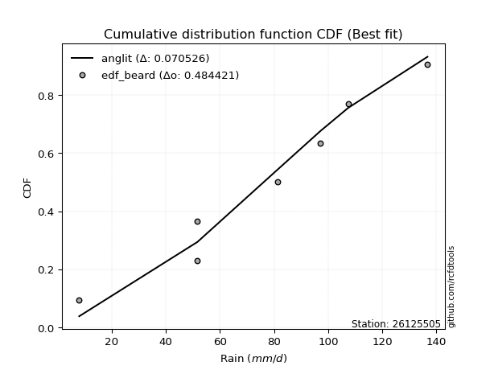</img>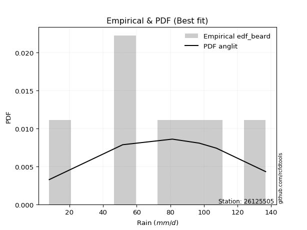</img>

</div>


### 5. EDF Chegodayev (1955)

The Chegodayev formula is an empirical plotting position formula used in hydrological frequency analysis to estimate the exceedance probability or return period of a specific event from a set of observed data. It is primarily used for plotting observed data points on probability paper to fit a theoretical distribution, particularly for analyzing extreme events like maximum flood flows or rainfall intensities. The constant _b_ value in the generalized plotting position formula is 0.3.

<div align="center">


$P=(m-b)/(n+1-2b)$


</div>


**5.1. Empirical values**

<div align="center">

|                | 0                   | 1                   | 2                   | 3              | 4                  | 5                  | 6                  |
|:---------------|:--------------------|:--------------------|:--------------------|:---------------|:-------------------|:-------------------|:-------------------|
| date           | 2023                | 2021                | 2022                | 2019           | 2017               | 2018               | 2020               |
| x              | 8.0                 | 51.7                | 51.7                | 81.2           | 97.2               | 107.4              | 136.7              |
| m              | 1                   | 2                   | 3                   | 4              | 5                  | 6                  | 7                  |
| empirical_dist | edf_chegodayev      | edf_chegodayev      | edf_chegodayev      | edf_chegodayev | edf_chegodayev     | edf_chegodayev     | edf_chegodayev     |
| empirical      | 0.09459459459459459 | 0.22972972972972971 | 0.36486486486486486 | 0.5            | 0.6351351351351351 | 0.7702702702702703 | 0.9054054054054054 |
| empirical_tr   | 1.1044776119402986  | 1.2982456140350878  | 1.574468085106383   | 2.0            | 2.7407407407407405 | 4.352941176470589  | 10.571428571428568 |

</div>


**5.2. Kolmogorov-Smirnov fit test (sorted by Δ)**


<div align="center">

|                | 0                   | 1                   | 2                   | 3                   | 4                   | 5                   | 6                   | 7                   | 8                   | 9                   | 10                  | 11                  | 12                  | 13                  | 14                  | 15                  | 16                  | 17                  | 18                  | 19                  | 20                  | 21                  | 22                  | 23                  | 24                  | 25                  | 26                  | 27                  | 28                  | 29                  | 30                  | 31                  | 32                  | 33                  | 34                  | 35                  | 36                  | 37                  | 38                  | 39                  | 40                  | 41                  | 42                  | 43                  | 44                  | 45                  | 46                  | 47                  | 48                  | 49                  | 50                  | 51                  | 52                  | 53                  | 54                  | 55                  | 56                  | 57                  | 58                  | 59                  | 60                  | 61                  | 62                  | 63                  | 64                  | 65                  | 66                  | 67                  | 68                  | 69                  | 70                  | 71                  | 72                  | 73                  | 74                  | 75                  | 76                  | 77                  | 78                  | 79                  | 80                  | 81                  | 82                  | 83                  | 84                  | 85                  | 86                  | 87                  | 88                  | 89                  | 90                  | 91                  | 92                  | 93                  | 94                  | 95                  | 96                  | 97                  | 98                  | 99                  | 100                 | 101                 | 102                 | 103                 | 104                 | 105                 | 106                 | 107                 | 108                 | 109                 | 110                 | 111                 | 112                 | 113                 | 114                 | 115                 | 116                 | 117                 | 118                 | 119                 | 120                 | 121                 | 122                 | 123                 | 124                 | 125                 | 126                 | 127                 | 128                 | 129                 | 130                 | 131                 | 132                 | 133                 | 134                 | 135                 | 136                 | 137                 | 138                 | 139                 | 140                 | 141                 | 142                 | 143                 | 144                 | 145                 | 146                 | 147                 | 148                 | 149                 | 150                 | 151                 | 152                 | 153                 | 154                 | 155                 | 156                 | 157                 | 158                 | 159                 |
|:---------------|:--------------------|:--------------------|:--------------------|:--------------------|:--------------------|:--------------------|:--------------------|:--------------------|:--------------------|:--------------------|:--------------------|:--------------------|:--------------------|:--------------------|:--------------------|:--------------------|:--------------------|:--------------------|:--------------------|:--------------------|:--------------------|:--------------------|:--------------------|:--------------------|:--------------------|:--------------------|:--------------------|:--------------------|:--------------------|:--------------------|:--------------------|:--------------------|:--------------------|:--------------------|:--------------------|:--------------------|:--------------------|:--------------------|:--------------------|:--------------------|:--------------------|:--------------------|:--------------------|:--------------------|:--------------------|:--------------------|:--------------------|:--------------------|:--------------------|:--------------------|:--------------------|:--------------------|:--------------------|:--------------------|:--------------------|:--------------------|:--------------------|:--------------------|:--------------------|:--------------------|:--------------------|:--------------------|:--------------------|:--------------------|:--------------------|:--------------------|:--------------------|:--------------------|:--------------------|:--------------------|:--------------------|:--------------------|:--------------------|:--------------------|:--------------------|:--------------------|:--------------------|:--------------------|:--------------------|:--------------------|:--------------------|:--------------------|:--------------------|:--------------------|:--------------------|:--------------------|:--------------------|:--------------------|:--------------------|:--------------------|:--------------------|:--------------------|:--------------------|:--------------------|:--------------------|:--------------------|:--------------------|:--------------------|:--------------------|:--------------------|:--------------------|:--------------------|:--------------------|:--------------------|:--------------------|:--------------------|:--------------------|:--------------------|:--------------------|:--------------------|:--------------------|:--------------------|:--------------------|:--------------------|:--------------------|:--------------------|:--------------------|:--------------------|:--------------------|:--------------------|:--------------------|:--------------------|:--------------------|:--------------------|:--------------------|:--------------------|:--------------------|:--------------------|:--------------------|:--------------------|:--------------------|:--------------------|:--------------------|:--------------------|:--------------------|:--------------------|:--------------------|:--------------------|:--------------------|:--------------------|:--------------------|:--------------------|:--------------------|:--------------------|:--------------------|:--------------------|:--------------------|:--------------------|:--------------------|:--------------------|:--------------------|:--------------------|:--------------------|:--------------------|:--------------------|:--------------------|:--------------------|:--------------------|:--------------------|:--------------------|
| station        | 26125505            | 26125505            | 26125505            | 26125505            | 26125505            | 26125505            | 26125505            | 26125505            | 26125505            | 26125505            | 26125505            | 26125505            | 26125505            | 26125505            | 26125505            | 26125505            | 26125505            | 26125505            | 26125505            | 26125505            | 26125505            | 26125505            | 26125505            | 26125505            | 26125505            | 26125505            | 26125505            | 26125505            | 26125505            | 26125505            | 26125505            | 26125505            | 26125505            | 26125505            | 26125505            | 26125505            | 26125505            | 26125505            | 26125505            | 26125505            | 26125505            | 26125505            | 26125505            | 26125505            | 26125505            | 26125505            | 26125505            | 26125505            | 26125505            | 26125505            | 26125505            | 26125505            | 26125505            | 26125505            | 26125505            | 26125505            | 26125505            | 26125505            | 26125505            | 26125505            | 26125505            | 26125505            | 26125505            | 26125505            | 26125505            | 26125505            | 26125505            | 26125505            | 26125505            | 26125505            | 26125505            | 26125505            | 26125505            | 26125505            | 26125505            | 26125505            | 26125505            | 26125505            | 26125505            | 26125505            | 26125505            | 26125505            | 26125505            | 26125505            | 26125505            | 26125505            | 26125505            | 26125505            | 26125505            | 26125505            | 26125505            | 26125505            | 26125505            | 26125505            | 26125505            | 26125505            | 26125505            | 26125505            | 26125505            | 26125505            | 26125505            | 26125505            | 26125505            | 26125505            | 26125505            | 26125505            | 26125505            | 26125505            | 26125505            | 26125505            | 26125505            | 26125505            | 26125505            | 26125505            | 26125505            | 26125505            | 26125505            | 26125505            | 26125505            | 26125505            | 26125505            | 26125505            | 26125505            | 26125505            | 26125505            | 26125505            | 26125505            | 26125505            | 26125505            | 26125505            | 26125505            | 26125505            | 26125505            | 26125505            | 26125505            | 26125505            | 26125505            | 26125505            | 26125505            | 26125505            | 26125505            | 26125505            | 26125505            | 26125505            | 26125505            | 26125505            | 26125505            | 26125505            | 26125505            | 26125505            | 26125505            | 26125505            | 26125505            | 26125505            | 26125505            | 26125505            | 26125505            | 26125505            | 26125505            | 26125505            |
| empirical_dist | edf_chegodayev      | edf_chegodayev      | edf_chegodayev      | edf_chegodayev      | edf_chegodayev      | edf_chegodayev      | edf_chegodayev      | edf_chegodayev      | edf_chegodayev      | edf_chegodayev      | edf_chegodayev      | edf_chegodayev      | edf_chegodayev      | edf_chegodayev      | edf_chegodayev      | edf_chegodayev      | edf_chegodayev      | edf_chegodayev      | edf_chegodayev      | edf_chegodayev      | edf_chegodayev      | edf_chegodayev      | edf_chegodayev      | edf_chegodayev      | edf_chegodayev      | edf_chegodayev      | edf_chegodayev      | edf_chegodayev      | edf_chegodayev      | edf_chegodayev      | edf_chegodayev      | edf_chegodayev      | edf_chegodayev      | edf_chegodayev      | edf_chegodayev      | edf_chegodayev      | edf_chegodayev      | edf_chegodayev      | edf_chegodayev      | edf_chegodayev      | edf_chegodayev      | edf_chegodayev      | edf_chegodayev      | edf_chegodayev      | edf_chegodayev      | edf_chegodayev      | edf_chegodayev      | edf_chegodayev      | edf_chegodayev      | edf_chegodayev      | edf_chegodayev      | edf_chegodayev      | edf_chegodayev      | edf_chegodayev      | edf_chegodayev      | edf_chegodayev      | edf_chegodayev      | edf_chegodayev      | edf_chegodayev      | edf_chegodayev      | edf_chegodayev      | edf_chegodayev      | edf_chegodayev      | edf_chegodayev      | edf_chegodayev      | edf_chegodayev      | edf_chegodayev      | edf_chegodayev      | edf_chegodayev      | edf_chegodayev      | edf_chegodayev      | edf_chegodayev      | edf_chegodayev      | edf_chegodayev      | edf_chegodayev      | edf_chegodayev      | edf_chegodayev      | edf_chegodayev      | edf_chegodayev      | edf_chegodayev      | edf_chegodayev      | edf_chegodayev      | edf_chegodayev      | edf_chegodayev      | edf_chegodayev      | edf_chegodayev      | edf_chegodayev      | edf_chegodayev      | edf_chegodayev      | edf_chegodayev      | edf_chegodayev      | edf_chegodayev      | edf_chegodayev      | edf_chegodayev      | edf_chegodayev      | edf_chegodayev      | edf_chegodayev      | edf_chegodayev      | edf_chegodayev      | edf_chegodayev      | edf_chegodayev      | edf_chegodayev      | edf_chegodayev      | edf_chegodayev      | edf_chegodayev      | edf_chegodayev      | edf_chegodayev      | edf_chegodayev      | edf_chegodayev      | edf_chegodayev      | edf_chegodayev      | edf_chegodayev      | edf_chegodayev      | edf_chegodayev      | edf_chegodayev      | edf_chegodayev      | edf_chegodayev      | edf_chegodayev      | edf_chegodayev      | edf_chegodayev      | edf_chegodayev      | edf_chegodayev      | edf_chegodayev      | edf_chegodayev      | edf_chegodayev      | edf_chegodayev      | edf_chegodayev      | edf_chegodayev      | edf_chegodayev      | edf_chegodayev      | edf_chegodayev      | edf_chegodayev      | edf_chegodayev      | edf_chegodayev      | edf_chegodayev      | edf_chegodayev      | edf_chegodayev      | edf_chegodayev      | edf_chegodayev      | edf_chegodayev      | edf_chegodayev      | edf_chegodayev      | edf_chegodayev      | edf_chegodayev      | edf_chegodayev      | edf_chegodayev      | edf_chegodayev      | edf_chegodayev      | edf_chegodayev      | edf_chegodayev      | edf_chegodayev      | edf_chegodayev      | edf_chegodayev      | edf_chegodayev      | edf_chegodayev      | edf_chegodayev      | edf_chegodayev      | edf_chegodayev      | edf_chegodayev      | edf_chegodayev      |
| p_dist         | anglit              | semicircular        | logargus            | cosine              | logjohnsonsu        | invgamma            | maxwell             | burr                | rice                | invgauss            | logburr             | exponweib           | rayleigh            | erlang              | gamma               | logmielke           | ksone               | logloggamma         | logvonmises_line    | genpareto           | truncweibull_min    | loggenextreme       | betaprime           | f                   | nakagami            | nct                 | norm                | crystalball         | truncnorm           | exponnorm           | t                   | kappa4              | vonmises_line       | logburr12           | argus               | foldnorm            | weibull_min         | pearson3            | wrapcauchy          | kappa3              | uniform             | johnsonsu           | loggompertz         | genextreme          | mielke              | tukeylambda         | halfnorm            | skewnorm            | logpearson3         | gumbel_r            | logistic            | kstwobign           | genlogistic         | gausshyper          | arcsine             | logdgamma           | logloglaplace       | logdweibull         | hypsecant           | triang              | gumbel_l            | loggumbel_l         | genhalflogistic     | moyal               | halflogistic        | ncf                 | dweibull            | dgamma              | loglevy_l           | laplace             | logt                | logtrapezoid        | bradford            | logskewnorm         | loghypsecant        | loglaplace          | loglaplace          | logfoldnorm         | loggennorm          | loglogistic         | beta                | logfatiguelife      | logrice             | lognorm             | logcrystalball      | logexponnorm        | logf                | lognct              | wald                | logerlang           | loggamma            | loggamma            | loganglit           | loginvgamma         | logsemicircular     | logalpha            | logarcsine          | logweibull_max      | logncf              | trapezoid           | lomax               | logmaxwell          | levy_l              | loginvgauss         | logbetaprime        | truncexpon          | genexpon            | lograyleigh         | loginvweibull       | loggenhalflogistic  | gennorm             | logtriang           | loggumbel_r         | loghalfnorm         | logcosine           | logkstwobign        | logmoyal            | loghalflogistic     | loggenexpon         | halfgennorm         | loggausshyper       | logbeta             | logjohnsonsb        | logwrapcauchy       | loggenpareto        | lognakagami         | logtruncnorm        | gompertz            | loglomax            | logwald             | burr12              | logkappa4           | logksone            | johnsonsb           | logtukeylambda      | loghalfgennorm      | logkappa3           | loguniform          | logexponweib        | gengamma            | loggengamma         | alpha               | logrdist            | invweibull          | logtruncweibull_min | logbradford         | logtruncexpon       | logweibull_min      | fatiguelife         | weibull_max         | powerlaw            | logexponpow         | truncpareto         | logpowerlaw         | exponpow            | logtruncpareto      | rdist               | loggenlogistic      | logvonmises         | vonmises            |
| delta          | 0.07089185340498616 | 0.0757574087405602  | 0.07737549162591084 | 0.07903076048454954 | 0.07992615287876081 | 0.08116967498002403 | 0.08221988989506634 | 0.0824387818470052  | 0.08297821661716781 | 0.08440335953932965 | 0.085976016339327   | 0.08863976904605275 | 0.08977203528450528 | 0.09096054325629188 | 0.09122692000450144 | 0.09209776670651815 | 0.09286223119692652 | 0.09453074678587481 | 0.09459459439377556 | 0.09459459459380026 | 0.0945945945943083  | 0.09459459459457298 | 0.09488478480814427 | 0.09508239329877782 | 0.09659861500049044 | 0.09757995485037074 | 0.09763708981910862 | 0.0976370899923415  | 0.09763709108215901 | 0.09763896555812734 | 0.097656524219711   | 0.09986104581184357 | 0.10261351632377941 | 0.10304993934653561 | 0.1034627231890291  | 0.10397885460207423 | 0.10441263359696157 | 0.1045098497545176  | 0.10810586974877895 | 0.10929792224999152 | 0.10981960981960986 | 0.1106563465877955  | 0.1119417700680877  | 0.11271071883651967 | 0.11614462354740307 | 0.11679065205935413 | 0.11733572852544272 | 0.11798608692441698 | 0.11944246359204247 | 0.11969111454297832 | 0.12010655774956663 | 0.12052574964198626 | 0.12154910864452784 | 0.12307243078177293 | 0.12550813721905502 | 0.12910377144151386 | 0.12971005898315324 | 0.13047500372036513 | 0.1354115321993681  | 0.14010311666679562 | 0.14125301226578119 | 0.1413503099251201  | 0.14203772833218264 | 0.14454236911452512 | 0.14460834522563526 | 0.14500270425187628 | 0.14807119275803798 | 0.15679195307668392 | 0.15695317295906286 | 0.1571696305750646  | 0.16290779921398485 | 0.16910072446450986 | 0.1767665255694449  | 0.1951823160622585  | 0.19640662510766121 | 0.20071027730476332 | 0.20071027730476332 | 0.20184742305636355 | 0.20228702818166078 | 0.20308279031513293 | 0.20681712038979216 | 0.20985331592643958 | 0.2110180141758557  | 0.21101899607022212 | 0.21101908772787686 | 0.21102062776701597 | 0.2126390017726269  | 0.21287300721643487 | 0.21349867581521054 | 0.2156850768220172  | 0.21929997742615498 | 0.21929997742615498 | 0.21940087901011035 | 0.22217839873437317 | 0.222862514795025   | 0.23481247699900998 | 0.23665550170089789 | 0.23815922122822553 | 0.23885295566082182 | 0.239520660638449   | 0.23964126508643657 | 0.24540861597698077 | 0.24935820564418137 | 0.2505600960724363  | 0.2514899699659     | 0.251924307187211   | 0.2572416421290079  | 0.25741775184678717 | 0.25824838243197434 | 0.2620225681404944  | 0.2702702702702703  | 0.2712897783607038  | 0.2770119445505438  | 0.29133845822405224 | 0.29264389008857816 | 0.3014514079931342  | 0.3020777701237921  | 0.3115512486644689  | 0.3133520113107987  | 0.3158819183909948  | 0.3161726471736771  | 0.32367632266229074 | 0.32536516367536833 | 0.33595915197099824 | 0.3361597331966676  | 0.36386826831407393 | 0.36485477329282306 | 0.3648647819507863  | 0.36703530075613566 | 0.37159991339321385 | 0.37396868621541024 | 0.38947138294717376 | 0.4014624180827866  | 0.4111424353368892  | 0.4207515441355164  | 0.4226912729197211  | 0.4273688841471279  | 0.4277008476452899  | 0.44373747273400566 | 0.45035138774656824 | 0.45072151981032754 | 0.4609433473374772  | 0.4622804037883407  | 0.46665137318858285 | 0.48711612646994795 | 0.4993222684899217  | 0.5075376484338722  | 0.5304034980527668  | 0.5539203106040796  | 0.5865220690810142  | 0.6085590788603948  | 0.6306574062694753  | 0.6916619059123964  | 0.6952581067123328  | 0.7146871757735351  | 0.738957297486446   | 0.7702702700795293  | 0.7702702702702703  | 1.107076690801458   | 21.123389426937766  |
| deltao         | 0.48442053926100004 | 0.48442053926100004 | 0.48442053926100004 | 0.48442053926100004 | 0.48442053926100004 | 0.48442053926100004 | 0.48442053926100004 | 0.48442053926100004 | 0.48442053926100004 | 0.48442053926100004 | 0.48442053926100004 | 0.48442053926100004 | 0.48442053926100004 | 0.48442053926100004 | 0.48442053926100004 | 0.48442053926100004 | 0.48442053926100004 | 0.48442053926100004 | 0.48442053926100004 | 0.48442053926100004 | 0.48442053926100004 | 0.48442053926100004 | 0.48442053926100004 | 0.48442053926100004 | 0.48442053926100004 | 0.48442053926100004 | 0.48442053926100004 | 0.48442053926100004 | 0.48442053926100004 | 0.48442053926100004 | 0.48442053926100004 | 0.48442053926100004 | 0.48442053926100004 | 0.48442053926100004 | 0.48442053926100004 | 0.48442053926100004 | 0.48442053926100004 | 0.48442053926100004 | 0.48442053926100004 | 0.48442053926100004 | 0.48442053926100004 | 0.48442053926100004 | 0.48442053926100004 | 0.48442053926100004 | 0.48442053926100004 | 0.48442053926100004 | 0.48442053926100004 | 0.48442053926100004 | 0.48442053926100004 | 0.48442053926100004 | 0.48442053926100004 | 0.48442053926100004 | 0.48442053926100004 | 0.48442053926100004 | 0.48442053926100004 | 0.48442053926100004 | 0.48442053926100004 | 0.48442053926100004 | 0.48442053926100004 | 0.48442053926100004 | 0.48442053926100004 | 0.48442053926100004 | 0.48442053926100004 | 0.48442053926100004 | 0.48442053926100004 | 0.48442053926100004 | 0.48442053926100004 | 0.48442053926100004 | 0.48442053926100004 | 0.48442053926100004 | 0.48442053926100004 | 0.48442053926100004 | 0.48442053926100004 | 0.48442053926100004 | 0.48442053926100004 | 0.48442053926100004 | 0.48442053926100004 | 0.48442053926100004 | 0.48442053926100004 | 0.48442053926100004 | 0.48442053926100004 | 0.48442053926100004 | 0.48442053926100004 | 0.48442053926100004 | 0.48442053926100004 | 0.48442053926100004 | 0.48442053926100004 | 0.48442053926100004 | 0.48442053926100004 | 0.48442053926100004 | 0.48442053926100004 | 0.48442053926100004 | 0.48442053926100004 | 0.48442053926100004 | 0.48442053926100004 | 0.48442053926100004 | 0.48442053926100004 | 0.48442053926100004 | 0.48442053926100004 | 0.48442053926100004 | 0.48442053926100004 | 0.48442053926100004 | 0.48442053926100004 | 0.48442053926100004 | 0.48442053926100004 | 0.48442053926100004 | 0.48442053926100004 | 0.48442053926100004 | 0.48442053926100004 | 0.48442053926100004 | 0.48442053926100004 | 0.48442053926100004 | 0.48442053926100004 | 0.48442053926100004 | 0.48442053926100004 | 0.48442053926100004 | 0.48442053926100004 | 0.48442053926100004 | 0.48442053926100004 | 0.48442053926100004 | 0.48442053926100004 | 0.48442053926100004 | 0.48442053926100004 | 0.48442053926100004 | 0.48442053926100004 | 0.48442053926100004 | 0.48442053926100004 | 0.48442053926100004 | 0.48442053926100004 | 0.48442053926100004 | 0.48442053926100004 | 0.48442053926100004 | 0.48442053926100004 | 0.48442053926100004 | 0.48442053926100004 | 0.48442053926100004 | 0.48442053926100004 | 0.48442053926100004 | 0.48442053926100004 | 0.48442053926100004 | 0.48442053926100004 | 0.48442053926100004 | 0.48442053926100004 | 0.48442053926100004 | 0.48442053926100004 | 0.48442053926100004 | 0.48442053926100004 | 0.48442053926100004 | 0.48442053926100004 | 0.48442053926100004 | 0.48442053926100004 | 0.48442053926100004 | 0.48442053926100004 | 0.48442053926100004 | 0.48442053926100004 | 0.48442053926100004 | 0.48442053926100004 | 0.48442053926100004 | 0.48442053926100004 | 0.48442053926100004 |
| eval           | Δo > Δ              | Δo > Δ              | Δo > Δ              | Δo > Δ              | Δo > Δ              | Δo > Δ              | Δo > Δ              | Δo > Δ              | Δo > Δ              | Δo > Δ              | Δo > Δ              | Δo > Δ              | Δo > Δ              | Δo > Δ              | Δo > Δ              | Δo > Δ              | Δo > Δ              | Δo > Δ              | Δo > Δ              | Δo > Δ              | Δo > Δ              | Δo > Δ              | Δo > Δ              | Δo > Δ              | Δo > Δ              | Δo > Δ              | Δo > Δ              | Δo > Δ              | Δo > Δ              | Δo > Δ              | Δo > Δ              | Δo > Δ              | Δo > Δ              | Δo > Δ              | Δo > Δ              | Δo > Δ              | Δo > Δ              | Δo > Δ              | Δo > Δ              | Δo > Δ              | Δo > Δ              | Δo > Δ              | Δo > Δ              | Δo > Δ              | Δo > Δ              | Δo > Δ              | Δo > Δ              | Δo > Δ              | Δo > Δ              | Δo > Δ              | Δo > Δ              | Δo > Δ              | Δo > Δ              | Δo > Δ              | Δo > Δ              | Δo > Δ              | Δo > Δ              | Δo > Δ              | Δo > Δ              | Δo > Δ              | Δo > Δ              | Δo > Δ              | Δo > Δ              | Δo > Δ              | Δo > Δ              | Δo > Δ              | Δo > Δ              | Δo > Δ              | Δo > Δ              | Δo > Δ              | Δo > Δ              | Δo > Δ              | Δo > Δ              | Δo > Δ              | Δo > Δ              | Δo > Δ              | Δo > Δ              | Δo > Δ              | Δo > Δ              | Δo > Δ              | Δo > Δ              | Δo > Δ              | Δo > Δ              | Δo > Δ              | Δo > Δ              | Δo > Δ              | Δo > Δ              | Δo > Δ              | Δo > Δ              | Δo > Δ              | Δo > Δ              | Δo > Δ              | Δo > Δ              | Δo > Δ              | Δo > Δ              | Δo > Δ              | Δo > Δ              | Δo > Δ              | Δo > Δ              | Δo > Δ              | Δo > Δ              | Δo > Δ              | Δo > Δ              | Δo > Δ              | Δo > Δ              | Δo > Δ              | Δo > Δ              | Δo > Δ              | Δo > Δ              | Δo > Δ              | Δo > Δ              | Δo > Δ              | Δo > Δ              | Δo > Δ              | Δo > Δ              | Δo > Δ              | Δo > Δ              | Δo > Δ              | Δo > Δ              | Δo > Δ              | Δo > Δ              | Δo > Δ              | Δo > Δ              | Δo > Δ              | Δo > Δ              | Δo > Δ              | Δo > Δ              | Δo > Δ              | Δo > Δ              | Δo > Δ              | Δo > Δ              | Δo > Δ              | Δo > Δ              | Δo > Δ              | Δo > Δ              | Δo > Δ              | Δo > Δ              | Δo > Δ              | Δo > Δ              | Δo > Δ              | Δo > Δ              | Δo > Δ              | Δo > Δ              | Δo > Δ              | Δo <= Δ             | Δo <= Δ             | Δo <= Δ             | Δo <= Δ             | Δo <= Δ             | Δo <= Δ             | Δo <= Δ             | Δo <= Δ             | Δo <= Δ             | Δo <= Δ             | Δo <= Δ             | Δo <= Δ             | Δo <= Δ             | Δo <= Δ             | Δo <= Δ             | Δo <= Δ             |
| fit            | 1                   | 1                   | 1                   | 1                   | 1                   | 1                   | 1                   | 1                   | 1                   | 1                   | 1                   | 1                   | 1                   | 1                   | 1                   | 1                   | 1                   | 1                   | 1                   | 1                   | 1                   | 1                   | 1                   | 1                   | 1                   | 1                   | 1                   | 1                   | 1                   | 1                   | 1                   | 1                   | 1                   | 1                   | 1                   | 1                   | 1                   | 1                   | 1                   | 1                   | 1                   | 1                   | 1                   | 1                   | 1                   | 1                   | 1                   | 1                   | 1                   | 1                   | 1                   | 1                   | 1                   | 1                   | 1                   | 1                   | 1                   | 1                   | 1                   | 1                   | 1                   | 1                   | 1                   | 1                   | 1                   | 1                   | 1                   | 1                   | 1                   | 1                   | 1                   | 1                   | 1                   | 1                   | 1                   | 1                   | 1                   | 1                   | 1                   | 1                   | 1                   | 1                   | 1                   | 1                   | 1                   | 1                   | 1                   | 1                   | 1                   | 1                   | 1                   | 1                   | 1                   | 1                   | 1                   | 1                   | 1                   | 1                   | 1                   | 1                   | 1                   | 1                   | 1                   | 1                   | 1                   | 1                   | 1                   | 1                   | 1                   | 1                   | 1                   | 1                   | 1                   | 1                   | 1                   | 1                   | 1                   | 1                   | 1                   | 1                   | 1                   | 1                   | 1                   | 1                   | 1                   | 1                   | 1                   | 1                   | 1                   | 1                   | 1                   | 1                   | 1                   | 1                   | 1                   | 1                   | 1                   | 1                   | 1                   | 1                   | 1                   | 1                   | 1                   | 1                   | 0                   | 0                   | 0                   | 0                   | 0                   | 0                   | 0                   | 0                   | 0                   | 0                   | 0                   | 0                   | 0                   | 0                   | 0                   | 0                   |
| n              | 7                   | 7                   | 7                   | 7                   | 7                   | 7                   | 7                   | 7                   | 7                   | 7                   | 7                   | 7                   | 7                   | 7                   | 7                   | 7                   | 7                   | 7                   | 7                   | 7                   | 7                   | 7                   | 7                   | 7                   | 7                   | 7                   | 7                   | 7                   | 7                   | 7                   | 7                   | 7                   | 7                   | 7                   | 7                   | 7                   | 7                   | 7                   | 7                   | 7                   | 7                   | 7                   | 7                   | 7                   | 7                   | 7                   | 7                   | 7                   | 7                   | 7                   | 7                   | 7                   | 7                   | 7                   | 7                   | 7                   | 7                   | 7                   | 7                   | 7                   | 7                   | 7                   | 7                   | 7                   | 7                   | 7                   | 7                   | 7                   | 7                   | 7                   | 7                   | 7                   | 7                   | 7                   | 7                   | 7                   | 7                   | 7                   | 7                   | 7                   | 7                   | 7                   | 7                   | 7                   | 7                   | 7                   | 7                   | 7                   | 7                   | 7                   | 7                   | 7                   | 7                   | 7                   | 7                   | 7                   | 7                   | 7                   | 7                   | 7                   | 7                   | 7                   | 7                   | 7                   | 7                   | 7                   | 7                   | 7                   | 7                   | 7                   | 7                   | 7                   | 7                   | 7                   | 7                   | 7                   | 7                   | 7                   | 7                   | 7                   | 7                   | 7                   | 7                   | 7                   | 7                   | 7                   | 7                   | 7                   | 7                   | 7                   | 7                   | 7                   | 7                   | 7                   | 7                   | 7                   | 7                   | 7                   | 7                   | 7                   | 7                   | 7                   | 7                   | 7                   | 7                   | 7                   | 7                   | 7                   | 7                   | 7                   | 7                   | 7                   | 7                   | 7                   | 7                   | 7                   | 7                   | 7                   | 7                   | 7                   |
| best_fit       | 1                   | 0                   | 0                   | 0                   | 0                   | 0                   | 0                   | 0                   | 0                   | 0                   | 0                   | 0                   | 0                   | 0                   | 0                   | 0                   | 0                   | 0                   | 0                   | 0                   | 0                   | 0                   | 0                   | 0                   | 0                   | 0                   | 0                   | 0                   | 0                   | 0                   | 0                   | 0                   | 0                   | 0                   | 0                   | 0                   | 0                   | 0                   | 0                   | 0                   | 0                   | 0                   | 0                   | 0                   | 0                   | 0                   | 0                   | 0                   | 0                   | 0                   | 0                   | 0                   | 0                   | 0                   | 0                   | 0                   | 0                   | 0                   | 0                   | 0                   | 0                   | 0                   | 0                   | 0                   | 0                   | 0                   | 0                   | 0                   | 0                   | 0                   | 0                   | 0                   | 0                   | 0                   | 0                   | 0                   | 0                   | 0                   | 0                   | 0                   | 0                   | 0                   | 0                   | 0                   | 0                   | 0                   | 0                   | 0                   | 0                   | 0                   | 0                   | 0                   | 0                   | 0                   | 0                   | 0                   | 0                   | 0                   | 0                   | 0                   | 0                   | 0                   | 0                   | 0                   | 0                   | 0                   | 0                   | 0                   | 0                   | 0                   | 0                   | 0                   | 0                   | 0                   | 0                   | 0                   | 0                   | 0                   | 0                   | 0                   | 0                   | 0                   | 0                   | 0                   | 0                   | 0                   | 0                   | 0                   | 0                   | 0                   | 0                   | 0                   | 0                   | 0                   | 0                   | 0                   | 0                   | 0                   | 0                   | 0                   | 0                   | 0                   | 0                   | 0                   | 0                   | 0                   | 0                   | 0                   | 0                   | 0                   | 0                   | 0                   | 0                   | 0                   | 0                   | 0                   | 0                   | 0                   | 0                   | 0                   |
| best_fit_sort  | 1                   | 2                   | 3                   | 4                   | 5                   | 6                   | 7                   | 8                   | 9                   | 10                  | 11                  | 12                  | 13                  | 14                  | 15                  | 16                  | 17                  | 18                  | 19                  | 20                  | 21                  | 22                  | 23                  | 24                  | 25                  | 26                  | 27                  | 28                  | 29                  | 30                  | 31                  | 32                  | 33                  | 34                  | 35                  | 36                  | 37                  | 38                  | 39                  | 40                  | 41                  | 42                  | 43                  | 44                  | 45                  | 46                  | 47                  | 48                  | 49                  | 50                  | 51                  | 52                  | 53                  | 54                  | 55                  | 56                  | 57                  | 58                  | 59                  | 60                  | 61                  | 62                  | 63                  | 64                  | 65                  | 66                  | 67                  | 68                  | 69                  | 70                  | 71                  | 72                  | 73                  | 74                  | 75                  | 76                  | 77                  | 78                  | 79                  | 80                  | 81                  | 82                  | 83                  | 84                  | 85                  | 86                  | 87                  | 88                  | 89                  | 90                  | 91                  | 92                  | 93                  | 94                  | 95                  | 96                  | 97                  | 98                  | 99                  | 100                 | 101                 | 102                 | 103                 | 104                 | 105                 | 106                 | 107                 | 108                 | 109                 | 110                 | 111                 | 112                 | 113                 | 114                 | 115                 | 116                 | 117                 | 118                 | 119                 | 120                 | 121                 | 122                 | 123                 | 124                 | 125                 | 126                 | 127                 | 128                 | 129                 | 130                 | 131                 | 132                 | 133                 | 134                 | 135                 | 136                 | 137                 | 138                 | 139                 | 140                 | 141                 | 142                 | 143                 | 144                 | 145                 | 146                 | 147                 | 148                 | 149                 | 150                 | 151                 | 152                 | 153                 | 154                 | 155                 | 156                 | 157                 | 158                 | 159                 | 160                 |

</div>


**5.3. Best fit**

<div align="center">

|   id |   station | empirical_dist   | p_dist   |     delta |   deltao | eval   |   fit |   n |   best_fit |   best_fit_sort |
|-----:|----------:|:-----------------|:---------|----------:|---------:|:-------|------:|----:|-----------:|----------------:|
|    0 |  26125505 | edf_chegodayev   | anglit   | 0.0708919 | 0.484421 | Δo > Δ |     1 |   7 |          1 |               1 |

</div>


<div align="center">

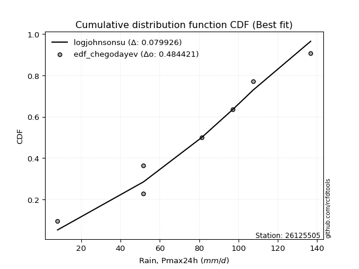</img>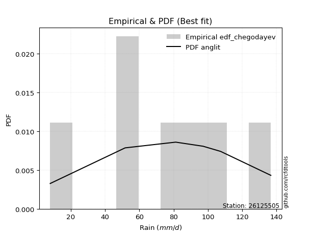</img>

</div>


### 6. EDF Blom (1958)

The Blom formula is a specific "plotting position" formula used in hydrology and statistical analysis to estimate the empirical cumulative probability (or non-exceedance probability) of a data series. It is particularly recommended for data that are approximately normally distributed. The constant _a_ is set to 0.375 (or 3/8).

<div align="center">


$P=(m-a)/(n+1-2a)$


</div>


**6.1. Empirical values**

<div align="center">

|                | 0                   | 1                   | 2                  | 3        | 4                  | 5                  | 6                  |
|:---------------|:--------------------|:--------------------|:-------------------|:---------|:-------------------|:-------------------|:-------------------|
| date           | 2023                | 2021                | 2022               | 2019     | 2017               | 2018               | 2020               |
| x              | 8.0                 | 51.7                | 51.7               | 81.2     | 97.2               | 107.4              | 136.7              |
| m              | 1                   | 2                   | 3                  | 4        | 5                  | 6                  | 7                  |
| empirical_dist | edf_blom            | edf_blom            | edf_blom           | edf_blom | edf_blom           | edf_blom           | edf_blom           |
| empirical      | 0.08620689655172414 | 0.22413793103448276 | 0.3620689655172414 | 0.5      | 0.6379310344827587 | 0.7758620689655172 | 0.9137931034482759 |
| empirical_tr   | 1.0943396226415094  | 1.288888888888889   | 1.5675675675675675 | 2.0      | 2.7619047619047623 | 4.461538461538462  | 11.600000000000007 |

</div>


**6.2. Kolmogorov-Smirnov fit test (sorted by Δ)**


<div align="center">

|                | 0                   | 1                   | 2                   | 3                   | 4                   | 5                   | 6                   | 7                   | 8                   | 9                   | 10                  | 11                  | 12                  | 13                  | 14                  | 15                  | 16                  | 17                  | 18                  | 19                  | 20                  | 21                  | 22                  | 23                  | 24                  | 25                  | 26                  | 27                  | 28                  | 29                  | 30                  | 31                  | 32                  | 33                  | 34                  | 35                  | 36                  | 37                  | 38                  | 39                  | 40                  | 41                  | 42                  | 43                  | 44                  | 45                  | 46                  | 47                  | 48                  | 49                  | 50                  | 51                  | 52                  | 53                  | 54                  | 55                  | 56                  | 57                  | 58                  | 59                  | 60                  | 61                  | 62                  | 63                  | 64                  | 65                  | 66                  | 67                  | 68                  | 69                  | 70                  | 71                  | 72                  | 73                  | 74                  | 75                  | 76                  | 77                  | 78                  | 79                  | 80                  | 81                  | 82                  | 83                  | 84                  | 85                  | 86                  | 87                  | 88                  | 89                  | 90                  | 91                  | 92                  | 93                  | 94                  | 95                  | 96                  | 97                  | 98                  | 99                  | 100                 | 101                 | 102                 | 103                 | 104                 | 105                 | 106                 | 107                 | 108                 | 109                 | 110                 | 111                 | 112                 | 113                 | 114                 | 115                 | 116                 | 117                 | 118                 | 119                 | 120                 | 121                 | 122                 | 123                 | 124                 | 125                 | 126                 | 127                 | 128                 | 129                 | 130                 | 131                 | 132                 | 133                 | 134                 | 135                 | 136                 | 137                 | 138                 | 139                 | 140                 | 141                 | 142                 | 143                 | 144                 | 145                 | 146                 | 147                 | 148                 | 149                 | 150                 | 151                 | 152                 | 153                 | 154                 | 155                 | 156                 | 157                 | 158                 | 159                 |
|:---------------|:--------------------|:--------------------|:--------------------|:--------------------|:--------------------|:--------------------|:--------------------|:--------------------|:--------------------|:--------------------|:--------------------|:--------------------|:--------------------|:--------------------|:--------------------|:--------------------|:--------------------|:--------------------|:--------------------|:--------------------|:--------------------|:--------------------|:--------------------|:--------------------|:--------------------|:--------------------|:--------------------|:--------------------|:--------------------|:--------------------|:--------------------|:--------------------|:--------------------|:--------------------|:--------------------|:--------------------|:--------------------|:--------------------|:--------------------|:--------------------|:--------------------|:--------------------|:--------------------|:--------------------|:--------------------|:--------------------|:--------------------|:--------------------|:--------------------|:--------------------|:--------------------|:--------------------|:--------------------|:--------------------|:--------------------|:--------------------|:--------------------|:--------------------|:--------------------|:--------------------|:--------------------|:--------------------|:--------------------|:--------------------|:--------------------|:--------------------|:--------------------|:--------------------|:--------------------|:--------------------|:--------------------|:--------------------|:--------------------|:--------------------|:--------------------|:--------------------|:--------------------|:--------------------|:--------------------|:--------------------|:--------------------|:--------------------|:--------------------|:--------------------|:--------------------|:--------------------|:--------------------|:--------------------|:--------------------|:--------------------|:--------------------|:--------------------|:--------------------|:--------------------|:--------------------|:--------------------|:--------------------|:--------------------|:--------------------|:--------------------|:--------------------|:--------------------|:--------------------|:--------------------|:--------------------|:--------------------|:--------------------|:--------------------|:--------------------|:--------------------|:--------------------|:--------------------|:--------------------|:--------------------|:--------------------|:--------------------|:--------------------|:--------------------|:--------------------|:--------------------|:--------------------|:--------------------|:--------------------|:--------------------|:--------------------|:--------------------|:--------------------|:--------------------|:--------------------|:--------------------|:--------------------|:--------------------|:--------------------|:--------------------|:--------------------|:--------------------|:--------------------|:--------------------|:--------------------|:--------------------|:--------------------|:--------------------|:--------------------|:--------------------|:--------------------|:--------------------|:--------------------|:--------------------|:--------------------|:--------------------|:--------------------|:--------------------|:--------------------|:--------------------|:--------------------|:--------------------|:--------------------|:--------------------|:--------------------|:--------------------|
| station        | 26125505            | 26125505            | 26125505            | 26125505            | 26125505            | 26125505            | 26125505            | 26125505            | 26125505            | 26125505            | 26125505            | 26125505            | 26125505            | 26125505            | 26125505            | 26125505            | 26125505            | 26125505            | 26125505            | 26125505            | 26125505            | 26125505            | 26125505            | 26125505            | 26125505            | 26125505            | 26125505            | 26125505            | 26125505            | 26125505            | 26125505            | 26125505            | 26125505            | 26125505            | 26125505            | 26125505            | 26125505            | 26125505            | 26125505            | 26125505            | 26125505            | 26125505            | 26125505            | 26125505            | 26125505            | 26125505            | 26125505            | 26125505            | 26125505            | 26125505            | 26125505            | 26125505            | 26125505            | 26125505            | 26125505            | 26125505            | 26125505            | 26125505            | 26125505            | 26125505            | 26125505            | 26125505            | 26125505            | 26125505            | 26125505            | 26125505            | 26125505            | 26125505            | 26125505            | 26125505            | 26125505            | 26125505            | 26125505            | 26125505            | 26125505            | 26125505            | 26125505            | 26125505            | 26125505            | 26125505            | 26125505            | 26125505            | 26125505            | 26125505            | 26125505            | 26125505            | 26125505            | 26125505            | 26125505            | 26125505            | 26125505            | 26125505            | 26125505            | 26125505            | 26125505            | 26125505            | 26125505            | 26125505            | 26125505            | 26125505            | 26125505            | 26125505            | 26125505            | 26125505            | 26125505            | 26125505            | 26125505            | 26125505            | 26125505            | 26125505            | 26125505            | 26125505            | 26125505            | 26125505            | 26125505            | 26125505            | 26125505            | 26125505            | 26125505            | 26125505            | 26125505            | 26125505            | 26125505            | 26125505            | 26125505            | 26125505            | 26125505            | 26125505            | 26125505            | 26125505            | 26125505            | 26125505            | 26125505            | 26125505            | 26125505            | 26125505            | 26125505            | 26125505            | 26125505            | 26125505            | 26125505            | 26125505            | 26125505            | 26125505            | 26125505            | 26125505            | 26125505            | 26125505            | 26125505            | 26125505            | 26125505            | 26125505            | 26125505            | 26125505            | 26125505            | 26125505            | 26125505            | 26125505            | 26125505            | 26125505            |
| empirical_dist | edf_blom            | edf_blom            | edf_blom            | edf_blom            | edf_blom            | edf_blom            | edf_blom            | edf_blom            | edf_blom            | edf_blom            | edf_blom            | edf_blom            | edf_blom            | edf_blom            | edf_blom            | edf_blom            | edf_blom            | edf_blom            | edf_blom            | edf_blom            | edf_blom            | edf_blom            | edf_blom            | edf_blom            | edf_blom            | edf_blom            | edf_blom            | edf_blom            | edf_blom            | edf_blom            | edf_blom            | edf_blom            | edf_blom            | edf_blom            | edf_blom            | edf_blom            | edf_blom            | edf_blom            | edf_blom            | edf_blom            | edf_blom            | edf_blom            | edf_blom            | edf_blom            | edf_blom            | edf_blom            | edf_blom            | edf_blom            | edf_blom            | edf_blom            | edf_blom            | edf_blom            | edf_blom            | edf_blom            | edf_blom            | edf_blom            | edf_blom            | edf_blom            | edf_blom            | edf_blom            | edf_blom            | edf_blom            | edf_blom            | edf_blom            | edf_blom            | edf_blom            | edf_blom            | edf_blom            | edf_blom            | edf_blom            | edf_blom            | edf_blom            | edf_blom            | edf_blom            | edf_blom            | edf_blom            | edf_blom            | edf_blom            | edf_blom            | edf_blom            | edf_blom            | edf_blom            | edf_blom            | edf_blom            | edf_blom            | edf_blom            | edf_blom            | edf_blom            | edf_blom            | edf_blom            | edf_blom            | edf_blom            | edf_blom            | edf_blom            | edf_blom            | edf_blom            | edf_blom            | edf_blom            | edf_blom            | edf_blom            | edf_blom            | edf_blom            | edf_blom            | edf_blom            | edf_blom            | edf_blom            | edf_blom            | edf_blom            | edf_blom            | edf_blom            | edf_blom            | edf_blom            | edf_blom            | edf_blom            | edf_blom            | edf_blom            | edf_blom            | edf_blom            | edf_blom            | edf_blom            | edf_blom            | edf_blom            | edf_blom            | edf_blom            | edf_blom            | edf_blom            | edf_blom            | edf_blom            | edf_blom            | edf_blom            | edf_blom            | edf_blom            | edf_blom            | edf_blom            | edf_blom            | edf_blom            | edf_blom            | edf_blom            | edf_blom            | edf_blom            | edf_blom            | edf_blom            | edf_blom            | edf_blom            | edf_blom            | edf_blom            | edf_blom            | edf_blom            | edf_blom            | edf_blom            | edf_blom            | edf_blom            | edf_blom            | edf_blom            | edf_blom            | edf_blom            | edf_blom            | edf_blom            | edf_blom            | edf_blom            |
| p_dist         | anglit              | cosine              | logjohnsonsu        | invgamma            | maxwell             | rice                | semicircular        | logargus            | invgauss            | genpareto           | loggenextreme       | burr                | erlang              | logvonmises_line    | gamma               | exponweib           | logloggamma         | rayleigh            | logburr             | betaprime           | f                   | nakagami            | nct                 | norm                | crystalball         | truncnorm           | exponnorm           | t                   | ksone               | logmielke           | truncweibull_min    | argus               | foldnorm            | weibull_min         | pearson3            | kappa4              | logburr12           | johnsonsu           | vonmises_line       | genextreme          | wrapcauchy          | kappa3              | skewnorm            | uniform             | logistic            | halfnorm            | loggompertz         | genlogistic         | gumbel_r            | mielke              | tukeylambda         | logpearson3         | kstwobign           | logdgamma           | logloglaplace       | gausshyper          | arcsine             | hypsecant           | triang              | gumbel_l            | logdweibull         | moyal               | halflogistic        | loggumbel_l         | genhalflogistic     | ncf                 | dweibull            | laplace             | logt                | dgamma              | loglevy_l           | logtrapezoid        | bradford            | loggennorm          | loglaplace          | loglaplace          | logskewnorm         | loghypsecant        | logfoldnorm         | loglogistic         | beta                | wald                | logfatiguelife      | logrice             | lognorm             | logcrystalball      | logexponnorm        | logf                | lognct              | logerlang           | loggamma            | loggamma            | loganglit           | loginvgamma         | logsemicircular     | logalpha            | logarcsine          | logweibull_max      | logncf              | trapezoid           | lomax               | logmaxwell          | loginvgauss         | logbetaprime        | truncexpon          | levy_l              | genexpon            | lograyleigh         | loginvweibull       | loggenhalflogistic  | gennorm             | logtriang           | loggumbel_r         | loghalfnorm         | logcosine           | logkstwobign        | logmoyal            | loghalflogistic     | loggenexpon         | halfgennorm         | loggausshyper       | logbeta             | logjohnsonsb        | logwrapcauchy       | loggenpareto        | lognakagami         | logtruncnorm        | gompertz            | loglomax            | logwald             | burr12              | logkappa4           | logksone            | johnsonsb           | logtukeylambda      | loghalfgennorm      | logkappa3           | loguniform          | logexponweib        | gengamma            | loggengamma         | alpha               | logrdist            | invweibull          | logtruncweibull_min | logbradford         | logtruncexpon       | logweibull_min      | fatiguelife         | weibull_max         | powerlaw            | logexponpow         | truncpareto         | logpowerlaw         | exponpow            | logtruncpareto      | rdist               | loggenlogistic      | logvonmises         | vonmises            |
| delta          | 0.06983508042539593 | 0.07623486113692607 | 0.07713025353113734 | 0.07837377563240044 | 0.08000019331322805 | 0.08018231726954433 | 0.08134920743580715 | 0.0829672903211578  | 0.08397889576883255 | 0.08620689655092972 | 0.08620689655170244 | 0.08803058054225216 | 0.0881646439086684  | 0.08841524796638722 | 0.08843102065687797 | 0.08863976904605275 | 0.08887838655981373 | 0.08977203528450528 | 0.09156781503457395 | 0.0920888854605208  | 0.09228649395115435 | 0.09380271565286696 | 0.09478405550274727 | 0.09484119047148515 | 0.09484119064471802 | 0.09484119173453553 | 0.09484306621050387 | 0.09486062487208752 | 0.09653159502619707 | 0.0976895654017651  | 0.09951645442947482 | 0.10066682384140563 | 0.10118295525445076 | 0.10161673424933809 | 0.10171395040689413 | 0.10545284450709053 | 0.10595085718672625 | 0.10786044724017202 | 0.10820531501902636 | 0.1099148194888962  | 0.1136976684440259  | 0.11488972094523847 | 0.1151901875767935  | 0.11541140851485682 | 0.11731065840194316 | 0.11733572852544272 | 0.11753356876333465 | 0.11875320929690436 | 0.11969111454297832 | 0.12173642224265002 | 0.12238245075460108 | 0.12503426228728942 | 0.1261175483372332  | 0.12630787209389038 | 0.12691415963552977 | 0.1286642294770199  | 0.13109993591430197 | 0.13261563285174463 | 0.13730721731917214 | 0.1384571129181577  | 0.13886270176323567 | 0.14454236911452512 | 0.14460834522563526 | 0.14694210862036705 | 0.1476295270274296  | 0.15059450294712323 | 0.15366299145328494 | 0.15437373122744114 | 0.16011189986636137 | 0.16238375177193087 | 0.1625449716543098  | 0.1746925231597568  | 0.18235832426469184 | 0.1994911288340373  | 0.20071027730476332 | 0.20071027730476332 | 0.20077411475750545 | 0.20199842380290817 | 0.2074392217516105  | 0.20867458901037989 | 0.21240891908503912 | 0.21349867581521054 | 0.21544511462168653 | 0.21660981287110265 | 0.21661079476546907 | 0.21661088642312382 | 0.21661242646226292 | 0.21823080046787385 | 0.21846480591168183 | 0.22127687551726416 | 0.22489177612140193 | 0.22489177612140193 | 0.2249926777053573  | 0.22777019742962012 | 0.22845431349027195 | 0.24040427569425693 | 0.24224730039614484 | 0.24375101992347248 | 0.24444475435606877 | 0.24511245933369596 | 0.24523306378168352 | 0.2510004146722277  | 0.25615189476768324 | 0.25708176866114696 | 0.25751610588245794 | 0.2577459036870518  | 0.26283344082425486 | 0.2630095505420341  | 0.2638401811272213  | 0.26761436683574136 | 0.27586206896551724 | 0.27688157705595073 | 0.28260374324579074 | 0.2969302569192992  | 0.2982356887838251  | 0.30704320668838114 | 0.30766956881903906 | 0.3171430473597159  | 0.31894381000604566 | 0.32147371708624173 | 0.32176444586892405 | 0.3292681213575377  | 0.3309569623706153  | 0.3415509506662452  | 0.34175153189191454 | 0.36107236896645045 | 0.3620588739451996  | 0.36206888260316283 | 0.3726270994513826  | 0.3771917120884608  | 0.3795604849106572  | 0.3950631816424207  | 0.40705421677803355 | 0.41673423403213616 | 0.42634334283076336 | 0.42828307161496804 | 0.4329606828423749  | 0.4332926463405369  | 0.4493292714292526  | 0.4559431864418152  | 0.4591092178531981  | 0.46653514603272417 | 0.46787220248358763 | 0.4750390712314534  | 0.4927079251651949  | 0.5049140671851686  | 0.5131294471291191  | 0.5359952967480137  | 0.5595121092993266  | 0.5921138677762612  | 0.6141508775556418  | 0.6362492049647223  | 0.6972537046076434  | 0.7008499054075797  | 0.7202789744687821  | 0.744549096181693   | 0.7758620687747763  | 0.7758620689655172  | 1.1126684894967052  | 21.115001728894896  |
| deltao         | 0.48442053926100004 | 0.48442053926100004 | 0.48442053926100004 | 0.48442053926100004 | 0.48442053926100004 | 0.48442053926100004 | 0.48442053926100004 | 0.48442053926100004 | 0.48442053926100004 | 0.48442053926100004 | 0.48442053926100004 | 0.48442053926100004 | 0.48442053926100004 | 0.48442053926100004 | 0.48442053926100004 | 0.48442053926100004 | 0.48442053926100004 | 0.48442053926100004 | 0.48442053926100004 | 0.48442053926100004 | 0.48442053926100004 | 0.48442053926100004 | 0.48442053926100004 | 0.48442053926100004 | 0.48442053926100004 | 0.48442053926100004 | 0.48442053926100004 | 0.48442053926100004 | 0.48442053926100004 | 0.48442053926100004 | 0.48442053926100004 | 0.48442053926100004 | 0.48442053926100004 | 0.48442053926100004 | 0.48442053926100004 | 0.48442053926100004 | 0.48442053926100004 | 0.48442053926100004 | 0.48442053926100004 | 0.48442053926100004 | 0.48442053926100004 | 0.48442053926100004 | 0.48442053926100004 | 0.48442053926100004 | 0.48442053926100004 | 0.48442053926100004 | 0.48442053926100004 | 0.48442053926100004 | 0.48442053926100004 | 0.48442053926100004 | 0.48442053926100004 | 0.48442053926100004 | 0.48442053926100004 | 0.48442053926100004 | 0.48442053926100004 | 0.48442053926100004 | 0.48442053926100004 | 0.48442053926100004 | 0.48442053926100004 | 0.48442053926100004 | 0.48442053926100004 | 0.48442053926100004 | 0.48442053926100004 | 0.48442053926100004 | 0.48442053926100004 | 0.48442053926100004 | 0.48442053926100004 | 0.48442053926100004 | 0.48442053926100004 | 0.48442053926100004 | 0.48442053926100004 | 0.48442053926100004 | 0.48442053926100004 | 0.48442053926100004 | 0.48442053926100004 | 0.48442053926100004 | 0.48442053926100004 | 0.48442053926100004 | 0.48442053926100004 | 0.48442053926100004 | 0.48442053926100004 | 0.48442053926100004 | 0.48442053926100004 | 0.48442053926100004 | 0.48442053926100004 | 0.48442053926100004 | 0.48442053926100004 | 0.48442053926100004 | 0.48442053926100004 | 0.48442053926100004 | 0.48442053926100004 | 0.48442053926100004 | 0.48442053926100004 | 0.48442053926100004 | 0.48442053926100004 | 0.48442053926100004 | 0.48442053926100004 | 0.48442053926100004 | 0.48442053926100004 | 0.48442053926100004 | 0.48442053926100004 | 0.48442053926100004 | 0.48442053926100004 | 0.48442053926100004 | 0.48442053926100004 | 0.48442053926100004 | 0.48442053926100004 | 0.48442053926100004 | 0.48442053926100004 | 0.48442053926100004 | 0.48442053926100004 | 0.48442053926100004 | 0.48442053926100004 | 0.48442053926100004 | 0.48442053926100004 | 0.48442053926100004 | 0.48442053926100004 | 0.48442053926100004 | 0.48442053926100004 | 0.48442053926100004 | 0.48442053926100004 | 0.48442053926100004 | 0.48442053926100004 | 0.48442053926100004 | 0.48442053926100004 | 0.48442053926100004 | 0.48442053926100004 | 0.48442053926100004 | 0.48442053926100004 | 0.48442053926100004 | 0.48442053926100004 | 0.48442053926100004 | 0.48442053926100004 | 0.48442053926100004 | 0.48442053926100004 | 0.48442053926100004 | 0.48442053926100004 | 0.48442053926100004 | 0.48442053926100004 | 0.48442053926100004 | 0.48442053926100004 | 0.48442053926100004 | 0.48442053926100004 | 0.48442053926100004 | 0.48442053926100004 | 0.48442053926100004 | 0.48442053926100004 | 0.48442053926100004 | 0.48442053926100004 | 0.48442053926100004 | 0.48442053926100004 | 0.48442053926100004 | 0.48442053926100004 | 0.48442053926100004 | 0.48442053926100004 | 0.48442053926100004 | 0.48442053926100004 | 0.48442053926100004 | 0.48442053926100004 | 0.48442053926100004 |
| eval           | Δo > Δ              | Δo > Δ              | Δo > Δ              | Δo > Δ              | Δo > Δ              | Δo > Δ              | Δo > Δ              | Δo > Δ              | Δo > Δ              | Δo > Δ              | Δo > Δ              | Δo > Δ              | Δo > Δ              | Δo > Δ              | Δo > Δ              | Δo > Δ              | Δo > Δ              | Δo > Δ              | Δo > Δ              | Δo > Δ              | Δo > Δ              | Δo > Δ              | Δo > Δ              | Δo > Δ              | Δo > Δ              | Δo > Δ              | Δo > Δ              | Δo > Δ              | Δo > Δ              | Δo > Δ              | Δo > Δ              | Δo > Δ              | Δo > Δ              | Δo > Δ              | Δo > Δ              | Δo > Δ              | Δo > Δ              | Δo > Δ              | Δo > Δ              | Δo > Δ              | Δo > Δ              | Δo > Δ              | Δo > Δ              | Δo > Δ              | Δo > Δ              | Δo > Δ              | Δo > Δ              | Δo > Δ              | Δo > Δ              | Δo > Δ              | Δo > Δ              | Δo > Δ              | Δo > Δ              | Δo > Δ              | Δo > Δ              | Δo > Δ              | Δo > Δ              | Δo > Δ              | Δo > Δ              | Δo > Δ              | Δo > Δ              | Δo > Δ              | Δo > Δ              | Δo > Δ              | Δo > Δ              | Δo > Δ              | Δo > Δ              | Δo > Δ              | Δo > Δ              | Δo > Δ              | Δo > Δ              | Δo > Δ              | Δo > Δ              | Δo > Δ              | Δo > Δ              | Δo > Δ              | Δo > Δ              | Δo > Δ              | Δo > Δ              | Δo > Δ              | Δo > Δ              | Δo > Δ              | Δo > Δ              | Δo > Δ              | Δo > Δ              | Δo > Δ              | Δo > Δ              | Δo > Δ              | Δo > Δ              | Δo > Δ              | Δo > Δ              | Δo > Δ              | Δo > Δ              | Δo > Δ              | Δo > Δ              | Δo > Δ              | Δo > Δ              | Δo > Δ              | Δo > Δ              | Δo > Δ              | Δo > Δ              | Δo > Δ              | Δo > Δ              | Δo > Δ              | Δo > Δ              | Δo > Δ              | Δo > Δ              | Δo > Δ              | Δo > Δ              | Δo > Δ              | Δo > Δ              | Δo > Δ              | Δo > Δ              | Δo > Δ              | Δo > Δ              | Δo > Δ              | Δo > Δ              | Δo > Δ              | Δo > Δ              | Δo > Δ              | Δo > Δ              | Δo > Δ              | Δo > Δ              | Δo > Δ              | Δo > Δ              | Δo > Δ              | Δo > Δ              | Δo > Δ              | Δo > Δ              | Δo > Δ              | Δo > Δ              | Δo > Δ              | Δo > Δ              | Δo > Δ              | Δo > Δ              | Δo > Δ              | Δo > Δ              | Δo > Δ              | Δo > Δ              | Δo > Δ              | Δo > Δ              | Δo > Δ              | Δo > Δ              | Δo > Δ              | Δo <= Δ             | Δo <= Δ             | Δo <= Δ             | Δo <= Δ             | Δo <= Δ             | Δo <= Δ             | Δo <= Δ             | Δo <= Δ             | Δo <= Δ             | Δo <= Δ             | Δo <= Δ             | Δo <= Δ             | Δo <= Δ             | Δo <= Δ             | Δo <= Δ             | Δo <= Δ             |
| fit            | 1                   | 1                   | 1                   | 1                   | 1                   | 1                   | 1                   | 1                   | 1                   | 1                   | 1                   | 1                   | 1                   | 1                   | 1                   | 1                   | 1                   | 1                   | 1                   | 1                   | 1                   | 1                   | 1                   | 1                   | 1                   | 1                   | 1                   | 1                   | 1                   | 1                   | 1                   | 1                   | 1                   | 1                   | 1                   | 1                   | 1                   | 1                   | 1                   | 1                   | 1                   | 1                   | 1                   | 1                   | 1                   | 1                   | 1                   | 1                   | 1                   | 1                   | 1                   | 1                   | 1                   | 1                   | 1                   | 1                   | 1                   | 1                   | 1                   | 1                   | 1                   | 1                   | 1                   | 1                   | 1                   | 1                   | 1                   | 1                   | 1                   | 1                   | 1                   | 1                   | 1                   | 1                   | 1                   | 1                   | 1                   | 1                   | 1                   | 1                   | 1                   | 1                   | 1                   | 1                   | 1                   | 1                   | 1                   | 1                   | 1                   | 1                   | 1                   | 1                   | 1                   | 1                   | 1                   | 1                   | 1                   | 1                   | 1                   | 1                   | 1                   | 1                   | 1                   | 1                   | 1                   | 1                   | 1                   | 1                   | 1                   | 1                   | 1                   | 1                   | 1                   | 1                   | 1                   | 1                   | 1                   | 1                   | 1                   | 1                   | 1                   | 1                   | 1                   | 1                   | 1                   | 1                   | 1                   | 1                   | 1                   | 1                   | 1                   | 1                   | 1                   | 1                   | 1                   | 1                   | 1                   | 1                   | 1                   | 1                   | 1                   | 1                   | 1                   | 1                   | 0                   | 0                   | 0                   | 0                   | 0                   | 0                   | 0                   | 0                   | 0                   | 0                   | 0                   | 0                   | 0                   | 0                   | 0                   | 0                   |
| n              | 7                   | 7                   | 7                   | 7                   | 7                   | 7                   | 7                   | 7                   | 7                   | 7                   | 7                   | 7                   | 7                   | 7                   | 7                   | 7                   | 7                   | 7                   | 7                   | 7                   | 7                   | 7                   | 7                   | 7                   | 7                   | 7                   | 7                   | 7                   | 7                   | 7                   | 7                   | 7                   | 7                   | 7                   | 7                   | 7                   | 7                   | 7                   | 7                   | 7                   | 7                   | 7                   | 7                   | 7                   | 7                   | 7                   | 7                   | 7                   | 7                   | 7                   | 7                   | 7                   | 7                   | 7                   | 7                   | 7                   | 7                   | 7                   | 7                   | 7                   | 7                   | 7                   | 7                   | 7                   | 7                   | 7                   | 7                   | 7                   | 7                   | 7                   | 7                   | 7                   | 7                   | 7                   | 7                   | 7                   | 7                   | 7                   | 7                   | 7                   | 7                   | 7                   | 7                   | 7                   | 7                   | 7                   | 7                   | 7                   | 7                   | 7                   | 7                   | 7                   | 7                   | 7                   | 7                   | 7                   | 7                   | 7                   | 7                   | 7                   | 7                   | 7                   | 7                   | 7                   | 7                   | 7                   | 7                   | 7                   | 7                   | 7                   | 7                   | 7                   | 7                   | 7                   | 7                   | 7                   | 7                   | 7                   | 7                   | 7                   | 7                   | 7                   | 7                   | 7                   | 7                   | 7                   | 7                   | 7                   | 7                   | 7                   | 7                   | 7                   | 7                   | 7                   | 7                   | 7                   | 7                   | 7                   | 7                   | 7                   | 7                   | 7                   | 7                   | 7                   | 7                   | 7                   | 7                   | 7                   | 7                   | 7                   | 7                   | 7                   | 7                   | 7                   | 7                   | 7                   | 7                   | 7                   | 7                   | 7                   |
| best_fit       | 1                   | 0                   | 0                   | 0                   | 0                   | 0                   | 0                   | 0                   | 0                   | 0                   | 0                   | 0                   | 0                   | 0                   | 0                   | 0                   | 0                   | 0                   | 0                   | 0                   | 0                   | 0                   | 0                   | 0                   | 0                   | 0                   | 0                   | 0                   | 0                   | 0                   | 0                   | 0                   | 0                   | 0                   | 0                   | 0                   | 0                   | 0                   | 0                   | 0                   | 0                   | 0                   | 0                   | 0                   | 0                   | 0                   | 0                   | 0                   | 0                   | 0                   | 0                   | 0                   | 0                   | 0                   | 0                   | 0                   | 0                   | 0                   | 0                   | 0                   | 0                   | 0                   | 0                   | 0                   | 0                   | 0                   | 0                   | 0                   | 0                   | 0                   | 0                   | 0                   | 0                   | 0                   | 0                   | 0                   | 0                   | 0                   | 0                   | 0                   | 0                   | 0                   | 0                   | 0                   | 0                   | 0                   | 0                   | 0                   | 0                   | 0                   | 0                   | 0                   | 0                   | 0                   | 0                   | 0                   | 0                   | 0                   | 0                   | 0                   | 0                   | 0                   | 0                   | 0                   | 0                   | 0                   | 0                   | 0                   | 0                   | 0                   | 0                   | 0                   | 0                   | 0                   | 0                   | 0                   | 0                   | 0                   | 0                   | 0                   | 0                   | 0                   | 0                   | 0                   | 0                   | 0                   | 0                   | 0                   | 0                   | 0                   | 0                   | 0                   | 0                   | 0                   | 0                   | 0                   | 0                   | 0                   | 0                   | 0                   | 0                   | 0                   | 0                   | 0                   | 0                   | 0                   | 0                   | 0                   | 0                   | 0                   | 0                   | 0                   | 0                   | 0                   | 0                   | 0                   | 0                   | 0                   | 0                   | 0                   |
| best_fit_sort  | 1                   | 2                   | 3                   | 4                   | 5                   | 6                   | 7                   | 8                   | 9                   | 10                  | 11                  | 12                  | 13                  | 14                  | 15                  | 16                  | 17                  | 18                  | 19                  | 20                  | 21                  | 22                  | 23                  | 24                  | 25                  | 26                  | 27                  | 28                  | 29                  | 30                  | 31                  | 32                  | 33                  | 34                  | 35                  | 36                  | 37                  | 38                  | 39                  | 40                  | 41                  | 42                  | 43                  | 44                  | 45                  | 46                  | 47                  | 48                  | 49                  | 50                  | 51                  | 52                  | 53                  | 54                  | 55                  | 56                  | 57                  | 58                  | 59                  | 60                  | 61                  | 62                  | 63                  | 64                  | 65                  | 66                  | 67                  | 68                  | 69                  | 70                  | 71                  | 72                  | 73                  | 74                  | 75                  | 76                  | 77                  | 78                  | 79                  | 80                  | 81                  | 82                  | 83                  | 84                  | 85                  | 86                  | 87                  | 88                  | 89                  | 90                  | 91                  | 92                  | 93                  | 94                  | 95                  | 96                  | 97                  | 98                  | 99                  | 100                 | 101                 | 102                 | 103                 | 104                 | 105                 | 106                 | 107                 | 108                 | 109                 | 110                 | 111                 | 112                 | 113                 | 114                 | 115                 | 116                 | 117                 | 118                 | 119                 | 120                 | 121                 | 122                 | 123                 | 124                 | 125                 | 126                 | 127                 | 128                 | 129                 | 130                 | 131                 | 132                 | 133                 | 134                 | 135                 | 136                 | 137                 | 138                 | 139                 | 140                 | 141                 | 142                 | 143                 | 144                 | 145                 | 146                 | 147                 | 148                 | 149                 | 150                 | 151                 | 152                 | 153                 | 154                 | 155                 | 156                 | 157                 | 158                 | 159                 | 160                 |

</div>


**6.3. Best fit**

<div align="center">

|   id |   station | empirical_dist   | p_dist   |     delta |   deltao | eval   |   fit |   n |   best_fit |   best_fit_sort |
|-----:|----------:|:-----------------|:---------|----------:|---------:|:-------|------:|----:|-----------:|----------------:|
|    0 |  26125505 | edf_blom         | anglit   | 0.0698351 | 0.484421 | Δo > Δ |     1 |   7 |          1 |               1 |

</div>


<div align="center">

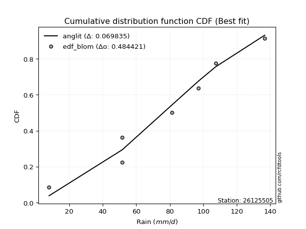</img></img>

</div>


### 7. EDF Tukey (1962)

In hydrology, the Tukey formula is used as a plotting position formula to estimate the empirical probability or frequency of a flood event (or other hydrological data). The formula parameter is given as _c=0.333_ (or 1/3).

<div align="center">


$P=(m-c)/(n+1-2c)$


</div>


**7.1. Empirical values**

<div align="center">

|                | 0                   | 1                   | 2                   | 3         | 4                  | 5                  | 6                  |
|:---------------|:--------------------|:--------------------|:--------------------|:----------|:-------------------|:-------------------|:-------------------|
| date           | 2023                | 2021                | 2022                | 2019      | 2017               | 2018               | 2020               |
| x              | 8.0                 | 51.7                | 51.7                | 81.2      | 97.2               | 107.4              | 136.7              |
| m              | 1                   | 2                   | 3                   | 4         | 5                  | 6                  | 7                  |
| empirical_dist | edf_tukey           | edf_tukey           | edf_tukey           | edf_tukey | edf_tukey          | edf_tukey          | edf_tukey          |
| empirical      | 0.09090909090909091 | 0.22727272727272727 | 0.36363636363636365 | 0.5       | 0.6363636363636364 | 0.7727272727272727 | 0.9090909090909091 |
| empirical_tr   | 1.1                 | 1.2941176470588236  | 1.5714285714285714  | 2.0       | 2.75               | 4.3999999999999995 | 10.999999999999996 |

</div>


**7.2. Kolmogorov-Smirnov fit test (sorted by Δ)**


<div align="center">

|                | 0                   | 1                   | 2                   | 3                   | 4                   | 5                   | 6                   | 7                   | 8                   | 9                   | 10                  | 11                  | 12                  | 13                  | 14                  | 15                  | 16                  | 17                  | 18                  | 19                  | 20                  | 21                  | 22                  | 23                  | 24                  | 25                  | 26                  | 27                  | 28                  | 29                  | 30                  | 31                  | 32                  | 33                  | 34                  | 35                  | 36                  | 37                  | 38                  | 39                  | 40                  | 41                  | 42                  | 43                  | 44                  | 45                  | 46                  | 47                  | 48                  | 49                  | 50                  | 51                  | 52                  | 53                  | 54                  | 55                  | 56                  | 57                  | 58                  | 59                  | 60                  | 61                  | 62                  | 63                  | 64                  | 65                  | 66                  | 67                  | 68                  | 69                  | 70                  | 71                  | 72                  | 73                  | 74                  | 75                  | 76                  | 77                  | 78                  | 79                  | 80                  | 81                  | 82                  | 83                  | 84                  | 85                  | 86                  | 87                  | 88                  | 89                  | 90                  | 91                  | 92                  | 93                  | 94                  | 95                  | 96                  | 97                  | 98                  | 99                  | 100                 | 101                 | 102                 | 103                 | 104                 | 105                 | 106                 | 107                 | 108                 | 109                 | 110                 | 111                 | 112                 | 113                 | 114                 | 115                 | 116                 | 117                 | 118                 | 119                 | 120                 | 121                 | 122                 | 123                 | 124                 | 125                 | 126                 | 127                 | 128                 | 129                 | 130                 | 131                 | 132                 | 133                 | 134                 | 135                 | 136                 | 137                 | 138                 | 139                 | 140                 | 141                 | 142                 | 143                 | 144                 | 145                 | 146                 | 147                 | 148                 | 149                 | 150                 | 151                 | 152                 | 153                 | 154                 | 155                 | 156                 | 157                 | 158                 | 159                 |
|:---------------|:--------------------|:--------------------|:--------------------|:--------------------|:--------------------|:--------------------|:--------------------|:--------------------|:--------------------|:--------------------|:--------------------|:--------------------|:--------------------|:--------------------|:--------------------|:--------------------|:--------------------|:--------------------|:--------------------|:--------------------|:--------------------|:--------------------|:--------------------|:--------------------|:--------------------|:--------------------|:--------------------|:--------------------|:--------------------|:--------------------|:--------------------|:--------------------|:--------------------|:--------------------|:--------------------|:--------------------|:--------------------|:--------------------|:--------------------|:--------------------|:--------------------|:--------------------|:--------------------|:--------------------|:--------------------|:--------------------|:--------------------|:--------------------|:--------------------|:--------------------|:--------------------|:--------------------|:--------------------|:--------------------|:--------------------|:--------------------|:--------------------|:--------------------|:--------------------|:--------------------|:--------------------|:--------------------|:--------------------|:--------------------|:--------------------|:--------------------|:--------------------|:--------------------|:--------------------|:--------------------|:--------------------|:--------------------|:--------------------|:--------------------|:--------------------|:--------------------|:--------------------|:--------------------|:--------------------|:--------------------|:--------------------|:--------------------|:--------------------|:--------------------|:--------------------|:--------------------|:--------------------|:--------------------|:--------------------|:--------------------|:--------------------|:--------------------|:--------------------|:--------------------|:--------------------|:--------------------|:--------------------|:--------------------|:--------------------|:--------------------|:--------------------|:--------------------|:--------------------|:--------------------|:--------------------|:--------------------|:--------------------|:--------------------|:--------------------|:--------------------|:--------------------|:--------------------|:--------------------|:--------------------|:--------------------|:--------------------|:--------------------|:--------------------|:--------------------|:--------------------|:--------------------|:--------------------|:--------------------|:--------------------|:--------------------|:--------------------|:--------------------|:--------------------|:--------------------|:--------------------|:--------------------|:--------------------|:--------------------|:--------------------|:--------------------|:--------------------|:--------------------|:--------------------|:--------------------|:--------------------|:--------------------|:--------------------|:--------------------|:--------------------|:--------------------|:--------------------|:--------------------|:--------------------|:--------------------|:--------------------|:--------------------|:--------------------|:--------------------|:--------------------|:--------------------|:--------------------|:--------------------|:--------------------|:--------------------|:--------------------|
| station        | 26125505            | 26125505            | 26125505            | 26125505            | 26125505            | 26125505            | 26125505            | 26125505            | 26125505            | 26125505            | 26125505            | 26125505            | 26125505            | 26125505            | 26125505            | 26125505            | 26125505            | 26125505            | 26125505            | 26125505            | 26125505            | 26125505            | 26125505            | 26125505            | 26125505            | 26125505            | 26125505            | 26125505            | 26125505            | 26125505            | 26125505            | 26125505            | 26125505            | 26125505            | 26125505            | 26125505            | 26125505            | 26125505            | 26125505            | 26125505            | 26125505            | 26125505            | 26125505            | 26125505            | 26125505            | 26125505            | 26125505            | 26125505            | 26125505            | 26125505            | 26125505            | 26125505            | 26125505            | 26125505            | 26125505            | 26125505            | 26125505            | 26125505            | 26125505            | 26125505            | 26125505            | 26125505            | 26125505            | 26125505            | 26125505            | 26125505            | 26125505            | 26125505            | 26125505            | 26125505            | 26125505            | 26125505            | 26125505            | 26125505            | 26125505            | 26125505            | 26125505            | 26125505            | 26125505            | 26125505            | 26125505            | 26125505            | 26125505            | 26125505            | 26125505            | 26125505            | 26125505            | 26125505            | 26125505            | 26125505            | 26125505            | 26125505            | 26125505            | 26125505            | 26125505            | 26125505            | 26125505            | 26125505            | 26125505            | 26125505            | 26125505            | 26125505            | 26125505            | 26125505            | 26125505            | 26125505            | 26125505            | 26125505            | 26125505            | 26125505            | 26125505            | 26125505            | 26125505            | 26125505            | 26125505            | 26125505            | 26125505            | 26125505            | 26125505            | 26125505            | 26125505            | 26125505            | 26125505            | 26125505            | 26125505            | 26125505            | 26125505            | 26125505            | 26125505            | 26125505            | 26125505            | 26125505            | 26125505            | 26125505            | 26125505            | 26125505            | 26125505            | 26125505            | 26125505            | 26125505            | 26125505            | 26125505            | 26125505            | 26125505            | 26125505            | 26125505            | 26125505            | 26125505            | 26125505            | 26125505            | 26125505            | 26125505            | 26125505            | 26125505            | 26125505            | 26125505            | 26125505            | 26125505            | 26125505            | 26125505            |
| empirical_dist | edf_tukey           | edf_tukey           | edf_tukey           | edf_tukey           | edf_tukey           | edf_tukey           | edf_tukey           | edf_tukey           | edf_tukey           | edf_tukey           | edf_tukey           | edf_tukey           | edf_tukey           | edf_tukey           | edf_tukey           | edf_tukey           | edf_tukey           | edf_tukey           | edf_tukey           | edf_tukey           | edf_tukey           | edf_tukey           | edf_tukey           | edf_tukey           | edf_tukey           | edf_tukey           | edf_tukey           | edf_tukey           | edf_tukey           | edf_tukey           | edf_tukey           | edf_tukey           | edf_tukey           | edf_tukey           | edf_tukey           | edf_tukey           | edf_tukey           | edf_tukey           | edf_tukey           | edf_tukey           | edf_tukey           | edf_tukey           | edf_tukey           | edf_tukey           | edf_tukey           | edf_tukey           | edf_tukey           | edf_tukey           | edf_tukey           | edf_tukey           | edf_tukey           | edf_tukey           | edf_tukey           | edf_tukey           | edf_tukey           | edf_tukey           | edf_tukey           | edf_tukey           | edf_tukey           | edf_tukey           | edf_tukey           | edf_tukey           | edf_tukey           | edf_tukey           | edf_tukey           | edf_tukey           | edf_tukey           | edf_tukey           | edf_tukey           | edf_tukey           | edf_tukey           | edf_tukey           | edf_tukey           | edf_tukey           | edf_tukey           | edf_tukey           | edf_tukey           | edf_tukey           | edf_tukey           | edf_tukey           | edf_tukey           | edf_tukey           | edf_tukey           | edf_tukey           | edf_tukey           | edf_tukey           | edf_tukey           | edf_tukey           | edf_tukey           | edf_tukey           | edf_tukey           | edf_tukey           | edf_tukey           | edf_tukey           | edf_tukey           | edf_tukey           | edf_tukey           | edf_tukey           | edf_tukey           | edf_tukey           | edf_tukey           | edf_tukey           | edf_tukey           | edf_tukey           | edf_tukey           | edf_tukey           | edf_tukey           | edf_tukey           | edf_tukey           | edf_tukey           | edf_tukey           | edf_tukey           | edf_tukey           | edf_tukey           | edf_tukey           | edf_tukey           | edf_tukey           | edf_tukey           | edf_tukey           | edf_tukey           | edf_tukey           | edf_tukey           | edf_tukey           | edf_tukey           | edf_tukey           | edf_tukey           | edf_tukey           | edf_tukey           | edf_tukey           | edf_tukey           | edf_tukey           | edf_tukey           | edf_tukey           | edf_tukey           | edf_tukey           | edf_tukey           | edf_tukey           | edf_tukey           | edf_tukey           | edf_tukey           | edf_tukey           | edf_tukey           | edf_tukey           | edf_tukey           | edf_tukey           | edf_tukey           | edf_tukey           | edf_tukey           | edf_tukey           | edf_tukey           | edf_tukey           | edf_tukey           | edf_tukey           | edf_tukey           | edf_tukey           | edf_tukey           | edf_tukey           | edf_tukey           | edf_tukey           | edf_tukey           |
| p_dist         | anglit              | cosine              | semicircular        | logjohnsonsu        | logargus            | invgamma            | maxwell             | rice                | invgauss            | burr                | logburr             | exponweib           | erlang              | rayleigh            | gamma               | logloggamma         | logvonmises_line    | genpareto           | loggenextreme       | ksone               | betaprime           | f                   | logmielke           | nakagami            | nct                 | truncweibull_min    | norm                | crystalball         | truncnorm           | exponnorm           | t                   | argus               | kappa4              | foldnorm            | logburr12           | weibull_min         | pearson3            | vonmises_line       | johnsonsu           | wrapcauchy          | genextreme          | kappa3              | uniform             | loggompertz         | skewnorm            | halfnorm            | mielke              | logistic            | tukeylambda         | gumbel_r            | genlogistic         | logpearson3         | kstwobign           | gausshyper          | logdgamma           | arcsine             | logloglaplace       | logdweibull         | hypsecant           | triang              | gumbel_l            | loggumbel_l         | genhalflogistic     | moyal               | halflogistic        | ncf                 | dweibull            | laplace             | dgamma              | loglevy_l           | logt                | logtrapezoid        | bradford            | logskewnorm         | loghypsecant        | loglaplace          | loglaplace          | loggennorm          | logfoldnorm         | loglogistic         | beta                | logfatiguelife      | logrice             | lognorm             | logcrystalball      | logexponnorm        | wald                | logf                | lognct              | logerlang           | loggamma            | loggamma            | loganglit           | loginvgamma         | logsemicircular     | logalpha            | logarcsine          | logweibull_max      | logncf              | trapezoid           | lomax               | logmaxwell          | loginvgauss         | levy_l              | logbetaprime        | truncexpon          | genexpon            | lograyleigh         | loginvweibull       | loggenhalflogistic  | gennorm             | logtriang           | loggumbel_r         | loghalfnorm         | logcosine           | logkstwobign        | logmoyal            | loghalflogistic     | loggenexpon         | halfgennorm         | loggausshyper       | logbeta             | logjohnsonsb        | logwrapcauchy       | loggenpareto        | lognakagami         | logtruncnorm        | gompertz            | loglomax            | logwald             | burr12              | logkappa4           | logksone            | johnsonsb           | logtukeylambda      | loghalfgennorm      | logkappa3           | loguniform          | logexponweib        | gengamma            | loggengamma         | alpha               | logrdist            | invweibull          | logtruncweibull_min | logbradford         | logtruncexpon       | logweibull_min      | fatiguelife         | weibull_max         | powerlaw            | logexponpow         | truncpareto         | logpowerlaw         | exponpow            | logtruncpareto      | rdist               | loggenlogistic      | logvonmises         | vonmises            |
| delta          | 0.06966335217648495 | 0.07780225925604833 | 0.07821441119756264 | 0.0786976516502596  | 0.07983249408291329 | 0.07994117375152276 | 0.08099138866656508 | 0.0817497153886666  | 0.08397889576883255 | 0.08489578430400765 | 0.08843301879632945 | 0.08863976904605275 | 0.08973204202779067 | 0.08977203528450528 | 0.08999841877600023 | 0.09084524310037112 | 0.09090909070827188 | 0.09090909090829657 | 0.09090909090906929 | 0.09339679878795257 | 0.09365628357964306 | 0.09385389207027661 | 0.0945547691635206  | 0.09537011377198923 | 0.09635145362186953 | 0.09638165819123032 | 0.09640858859060741 | 0.09640858876384029 | 0.0964085898536578  | 0.09641046432962613 | 0.09642802299120978 | 0.1022342219605279  | 0.10231804826884602 | 0.10275035337357302 | 0.10304993934653561 | 0.10318413236846036 | 0.10328134852601639 | 0.10507051878078186 | 0.10942784535929428 | 0.1105628722057814  | 0.11148221760801846 | 0.11175492470699397 | 0.11227661227661231 | 0.11439877252509015 | 0.11675758569591577 | 0.11733572852544272 | 0.11860162600440552 | 0.11887805652106542 | 0.11924765451635658 | 0.11969111454297832 | 0.12032060741602663 | 0.12189946604904492 | 0.1229827520989887  | 0.12552943323877538 | 0.12787527021301265 | 0.12796513967605747 | 0.12848155775465203 | 0.13416050740586882 | 0.1341830309708669  | 0.1388746154382944  | 0.14002451103727998 | 0.14380731238212255 | 0.14449473078918507 | 0.14454236911452512 | 0.14460834522563526 | 0.14745970670887873 | 0.15052819521504043 | 0.1559411293465634  | 0.15924895553368637 | 0.1594101754160653  | 0.16167929798548364 | 0.1715577269215123  | 0.17922352802644734 | 0.19763931851926095 | 0.19886362756466366 | 0.20071027730476332 | 0.20071027730476332 | 0.20105852695315957 | 0.204304425513366   | 0.20553979277213538 | 0.20927412284679459 | 0.21231031838344203 | 0.21347501663285814 | 0.21347599852722457 | 0.2134760901848793  | 0.21347763022401842 | 0.21349867581521054 | 0.21509600422962935 | 0.21533000967343732 | 0.21814207927901966 | 0.22175697988315743 | 0.22175697988315743 | 0.2218578814671128  | 0.22463540119137562 | 0.22531951725202745 | 0.23726947945601243 | 0.23911250415790034 | 0.24061622368522795 | 0.24130995811782427 | 0.24197766309545143 | 0.24209826754343902 | 0.24786561843398322 | 0.25301709852943877 | 0.253043709329685   | 0.25394697242290243 | 0.25438130964421346 | 0.25969864458601033 | 0.2598747543037896  | 0.26070538488897677 | 0.2644795705974968  | 0.2727272727272727  | 0.2737467808177062  | 0.2794689470075462  | 0.29379546068105467 | 0.2951008925455806  | 0.3039084104501366  | 0.30453477258079453 | 0.31400825112147135 | 0.31580901376780113 | 0.3183389208479972  | 0.3186296496306795  | 0.32613332511929316 | 0.32782216613237075 | 0.33841615442800066 | 0.33861673565367    | 0.3626397670855727  | 0.36362627206432185 | 0.3636362807222851  | 0.3694923032131381  | 0.3740569158502163  | 0.37642568867241266 | 0.3919283854041762  | 0.403919420539789   | 0.41359943779389163 | 0.42320854659251883 | 0.4251482753767235  | 0.42982588660413035 | 0.43015785010229235 | 0.4461944751910081  | 0.45280839020357067 | 0.45440702349583123 | 0.46340034979447964 | 0.4647374062453431  | 0.47033687687408654 | 0.4895731289269504  | 0.5017792709469241  | 0.5099946508908746  | 0.5328605005097692  | 0.5563773130610821  | 0.5889790715380167  | 0.6110160813173973  | 0.6331144087264777  | 0.6941189083693988  | 0.6977151091693352  | 0.7171441782305376  | 0.7414142999434484  | 0.7727272725365317  | 0.7727272727272727  | 1.1095336932584605  | 21.119703923252263  |
| deltao         | 0.48442053926100004 | 0.48442053926100004 | 0.48442053926100004 | 0.48442053926100004 | 0.48442053926100004 | 0.48442053926100004 | 0.48442053926100004 | 0.48442053926100004 | 0.48442053926100004 | 0.48442053926100004 | 0.48442053926100004 | 0.48442053926100004 | 0.48442053926100004 | 0.48442053926100004 | 0.48442053926100004 | 0.48442053926100004 | 0.48442053926100004 | 0.48442053926100004 | 0.48442053926100004 | 0.48442053926100004 | 0.48442053926100004 | 0.48442053926100004 | 0.48442053926100004 | 0.48442053926100004 | 0.48442053926100004 | 0.48442053926100004 | 0.48442053926100004 | 0.48442053926100004 | 0.48442053926100004 | 0.48442053926100004 | 0.48442053926100004 | 0.48442053926100004 | 0.48442053926100004 | 0.48442053926100004 | 0.48442053926100004 | 0.48442053926100004 | 0.48442053926100004 | 0.48442053926100004 | 0.48442053926100004 | 0.48442053926100004 | 0.48442053926100004 | 0.48442053926100004 | 0.48442053926100004 | 0.48442053926100004 | 0.48442053926100004 | 0.48442053926100004 | 0.48442053926100004 | 0.48442053926100004 | 0.48442053926100004 | 0.48442053926100004 | 0.48442053926100004 | 0.48442053926100004 | 0.48442053926100004 | 0.48442053926100004 | 0.48442053926100004 | 0.48442053926100004 | 0.48442053926100004 | 0.48442053926100004 | 0.48442053926100004 | 0.48442053926100004 | 0.48442053926100004 | 0.48442053926100004 | 0.48442053926100004 | 0.48442053926100004 | 0.48442053926100004 | 0.48442053926100004 | 0.48442053926100004 | 0.48442053926100004 | 0.48442053926100004 | 0.48442053926100004 | 0.48442053926100004 | 0.48442053926100004 | 0.48442053926100004 | 0.48442053926100004 | 0.48442053926100004 | 0.48442053926100004 | 0.48442053926100004 | 0.48442053926100004 | 0.48442053926100004 | 0.48442053926100004 | 0.48442053926100004 | 0.48442053926100004 | 0.48442053926100004 | 0.48442053926100004 | 0.48442053926100004 | 0.48442053926100004 | 0.48442053926100004 | 0.48442053926100004 | 0.48442053926100004 | 0.48442053926100004 | 0.48442053926100004 | 0.48442053926100004 | 0.48442053926100004 | 0.48442053926100004 | 0.48442053926100004 | 0.48442053926100004 | 0.48442053926100004 | 0.48442053926100004 | 0.48442053926100004 | 0.48442053926100004 | 0.48442053926100004 | 0.48442053926100004 | 0.48442053926100004 | 0.48442053926100004 | 0.48442053926100004 | 0.48442053926100004 | 0.48442053926100004 | 0.48442053926100004 | 0.48442053926100004 | 0.48442053926100004 | 0.48442053926100004 | 0.48442053926100004 | 0.48442053926100004 | 0.48442053926100004 | 0.48442053926100004 | 0.48442053926100004 | 0.48442053926100004 | 0.48442053926100004 | 0.48442053926100004 | 0.48442053926100004 | 0.48442053926100004 | 0.48442053926100004 | 0.48442053926100004 | 0.48442053926100004 | 0.48442053926100004 | 0.48442053926100004 | 0.48442053926100004 | 0.48442053926100004 | 0.48442053926100004 | 0.48442053926100004 | 0.48442053926100004 | 0.48442053926100004 | 0.48442053926100004 | 0.48442053926100004 | 0.48442053926100004 | 0.48442053926100004 | 0.48442053926100004 | 0.48442053926100004 | 0.48442053926100004 | 0.48442053926100004 | 0.48442053926100004 | 0.48442053926100004 | 0.48442053926100004 | 0.48442053926100004 | 0.48442053926100004 | 0.48442053926100004 | 0.48442053926100004 | 0.48442053926100004 | 0.48442053926100004 | 0.48442053926100004 | 0.48442053926100004 | 0.48442053926100004 | 0.48442053926100004 | 0.48442053926100004 | 0.48442053926100004 | 0.48442053926100004 | 0.48442053926100004 | 0.48442053926100004 | 0.48442053926100004 | 0.48442053926100004 |
| eval           | Δo > Δ              | Δo > Δ              | Δo > Δ              | Δo > Δ              | Δo > Δ              | Δo > Δ              | Δo > Δ              | Δo > Δ              | Δo > Δ              | Δo > Δ              | Δo > Δ              | Δo > Δ              | Δo > Δ              | Δo > Δ              | Δo > Δ              | Δo > Δ              | Δo > Δ              | Δo > Δ              | Δo > Δ              | Δo > Δ              | Δo > Δ              | Δo > Δ              | Δo > Δ              | Δo > Δ              | Δo > Δ              | Δo > Δ              | Δo > Δ              | Δo > Δ              | Δo > Δ              | Δo > Δ              | Δo > Δ              | Δo > Δ              | Δo > Δ              | Δo > Δ              | Δo > Δ              | Δo > Δ              | Δo > Δ              | Δo > Δ              | Δo > Δ              | Δo > Δ              | Δo > Δ              | Δo > Δ              | Δo > Δ              | Δo > Δ              | Δo > Δ              | Δo > Δ              | Δo > Δ              | Δo > Δ              | Δo > Δ              | Δo > Δ              | Δo > Δ              | Δo > Δ              | Δo > Δ              | Δo > Δ              | Δo > Δ              | Δo > Δ              | Δo > Δ              | Δo > Δ              | Δo > Δ              | Δo > Δ              | Δo > Δ              | Δo > Δ              | Δo > Δ              | Δo > Δ              | Δo > Δ              | Δo > Δ              | Δo > Δ              | Δo > Δ              | Δo > Δ              | Δo > Δ              | Δo > Δ              | Δo > Δ              | Δo > Δ              | Δo > Δ              | Δo > Δ              | Δo > Δ              | Δo > Δ              | Δo > Δ              | Δo > Δ              | Δo > Δ              | Δo > Δ              | Δo > Δ              | Δo > Δ              | Δo > Δ              | Δo > Δ              | Δo > Δ              | Δo > Δ              | Δo > Δ              | Δo > Δ              | Δo > Δ              | Δo > Δ              | Δo > Δ              | Δo > Δ              | Δo > Δ              | Δo > Δ              | Δo > Δ              | Δo > Δ              | Δo > Δ              | Δo > Δ              | Δo > Δ              | Δo > Δ              | Δo > Δ              | Δo > Δ              | Δo > Δ              | Δo > Δ              | Δo > Δ              | Δo > Δ              | Δo > Δ              | Δo > Δ              | Δo > Δ              | Δo > Δ              | Δo > Δ              | Δo > Δ              | Δo > Δ              | Δo > Δ              | Δo > Δ              | Δo > Δ              | Δo > Δ              | Δo > Δ              | Δo > Δ              | Δo > Δ              | Δo > Δ              | Δo > Δ              | Δo > Δ              | Δo > Δ              | Δo > Δ              | Δo > Δ              | Δo > Δ              | Δo > Δ              | Δo > Δ              | Δo > Δ              | Δo > Δ              | Δo > Δ              | Δo > Δ              | Δo > Δ              | Δo > Δ              | Δo > Δ              | Δo > Δ              | Δo > Δ              | Δo > Δ              | Δo > Δ              | Δo > Δ              | Δo > Δ              | Δo > Δ              | Δo <= Δ             | Δo <= Δ             | Δo <= Δ             | Δo <= Δ             | Δo <= Δ             | Δo <= Δ             | Δo <= Δ             | Δo <= Δ             | Δo <= Δ             | Δo <= Δ             | Δo <= Δ             | Δo <= Δ             | Δo <= Δ             | Δo <= Δ             | Δo <= Δ             | Δo <= Δ             |
| fit            | 1                   | 1                   | 1                   | 1                   | 1                   | 1                   | 1                   | 1                   | 1                   | 1                   | 1                   | 1                   | 1                   | 1                   | 1                   | 1                   | 1                   | 1                   | 1                   | 1                   | 1                   | 1                   | 1                   | 1                   | 1                   | 1                   | 1                   | 1                   | 1                   | 1                   | 1                   | 1                   | 1                   | 1                   | 1                   | 1                   | 1                   | 1                   | 1                   | 1                   | 1                   | 1                   | 1                   | 1                   | 1                   | 1                   | 1                   | 1                   | 1                   | 1                   | 1                   | 1                   | 1                   | 1                   | 1                   | 1                   | 1                   | 1                   | 1                   | 1                   | 1                   | 1                   | 1                   | 1                   | 1                   | 1                   | 1                   | 1                   | 1                   | 1                   | 1                   | 1                   | 1                   | 1                   | 1                   | 1                   | 1                   | 1                   | 1                   | 1                   | 1                   | 1                   | 1                   | 1                   | 1                   | 1                   | 1                   | 1                   | 1                   | 1                   | 1                   | 1                   | 1                   | 1                   | 1                   | 1                   | 1                   | 1                   | 1                   | 1                   | 1                   | 1                   | 1                   | 1                   | 1                   | 1                   | 1                   | 1                   | 1                   | 1                   | 1                   | 1                   | 1                   | 1                   | 1                   | 1                   | 1                   | 1                   | 1                   | 1                   | 1                   | 1                   | 1                   | 1                   | 1                   | 1                   | 1                   | 1                   | 1                   | 1                   | 1                   | 1                   | 1                   | 1                   | 1                   | 1                   | 1                   | 1                   | 1                   | 1                   | 1                   | 1                   | 1                   | 1                   | 0                   | 0                   | 0                   | 0                   | 0                   | 0                   | 0                   | 0                   | 0                   | 0                   | 0                   | 0                   | 0                   | 0                   | 0                   | 0                   |
| n              | 7                   | 7                   | 7                   | 7                   | 7                   | 7                   | 7                   | 7                   | 7                   | 7                   | 7                   | 7                   | 7                   | 7                   | 7                   | 7                   | 7                   | 7                   | 7                   | 7                   | 7                   | 7                   | 7                   | 7                   | 7                   | 7                   | 7                   | 7                   | 7                   | 7                   | 7                   | 7                   | 7                   | 7                   | 7                   | 7                   | 7                   | 7                   | 7                   | 7                   | 7                   | 7                   | 7                   | 7                   | 7                   | 7                   | 7                   | 7                   | 7                   | 7                   | 7                   | 7                   | 7                   | 7                   | 7                   | 7                   | 7                   | 7                   | 7                   | 7                   | 7                   | 7                   | 7                   | 7                   | 7                   | 7                   | 7                   | 7                   | 7                   | 7                   | 7                   | 7                   | 7                   | 7                   | 7                   | 7                   | 7                   | 7                   | 7                   | 7                   | 7                   | 7                   | 7                   | 7                   | 7                   | 7                   | 7                   | 7                   | 7                   | 7                   | 7                   | 7                   | 7                   | 7                   | 7                   | 7                   | 7                   | 7                   | 7                   | 7                   | 7                   | 7                   | 7                   | 7                   | 7                   | 7                   | 7                   | 7                   | 7                   | 7                   | 7                   | 7                   | 7                   | 7                   | 7                   | 7                   | 7                   | 7                   | 7                   | 7                   | 7                   | 7                   | 7                   | 7                   | 7                   | 7                   | 7                   | 7                   | 7                   | 7                   | 7                   | 7                   | 7                   | 7                   | 7                   | 7                   | 7                   | 7                   | 7                   | 7                   | 7                   | 7                   | 7                   | 7                   | 7                   | 7                   | 7                   | 7                   | 7                   | 7                   | 7                   | 7                   | 7                   | 7                   | 7                   | 7                   | 7                   | 7                   | 7                   | 7                   |
| best_fit       | 1                   | 0                   | 0                   | 0                   | 0                   | 0                   | 0                   | 0                   | 0                   | 0                   | 0                   | 0                   | 0                   | 0                   | 0                   | 0                   | 0                   | 0                   | 0                   | 0                   | 0                   | 0                   | 0                   | 0                   | 0                   | 0                   | 0                   | 0                   | 0                   | 0                   | 0                   | 0                   | 0                   | 0                   | 0                   | 0                   | 0                   | 0                   | 0                   | 0                   | 0                   | 0                   | 0                   | 0                   | 0                   | 0                   | 0                   | 0                   | 0                   | 0                   | 0                   | 0                   | 0                   | 0                   | 0                   | 0                   | 0                   | 0                   | 0                   | 0                   | 0                   | 0                   | 0                   | 0                   | 0                   | 0                   | 0                   | 0                   | 0                   | 0                   | 0                   | 0                   | 0                   | 0                   | 0                   | 0                   | 0                   | 0                   | 0                   | 0                   | 0                   | 0                   | 0                   | 0                   | 0                   | 0                   | 0                   | 0                   | 0                   | 0                   | 0                   | 0                   | 0                   | 0                   | 0                   | 0                   | 0                   | 0                   | 0                   | 0                   | 0                   | 0                   | 0                   | 0                   | 0                   | 0                   | 0                   | 0                   | 0                   | 0                   | 0                   | 0                   | 0                   | 0                   | 0                   | 0                   | 0                   | 0                   | 0                   | 0                   | 0                   | 0                   | 0                   | 0                   | 0                   | 0                   | 0                   | 0                   | 0                   | 0                   | 0                   | 0                   | 0                   | 0                   | 0                   | 0                   | 0                   | 0                   | 0                   | 0                   | 0                   | 0                   | 0                   | 0                   | 0                   | 0                   | 0                   | 0                   | 0                   | 0                   | 0                   | 0                   | 0                   | 0                   | 0                   | 0                   | 0                   | 0                   | 0                   | 0                   |
| best_fit_sort  | 1                   | 2                   | 3                   | 4                   | 5                   | 6                   | 7                   | 8                   | 9                   | 10                  | 11                  | 12                  | 13                  | 14                  | 15                  | 16                  | 17                  | 18                  | 19                  | 20                  | 21                  | 22                  | 23                  | 24                  | 25                  | 26                  | 27                  | 28                  | 29                  | 30                  | 31                  | 32                  | 33                  | 34                  | 35                  | 36                  | 37                  | 38                  | 39                  | 40                  | 41                  | 42                  | 43                  | 44                  | 45                  | 46                  | 47                  | 48                  | 49                  | 50                  | 51                  | 52                  | 53                  | 54                  | 55                  | 56                  | 57                  | 58                  | 59                  | 60                  | 61                  | 62                  | 63                  | 64                  | 65                  | 66                  | 67                  | 68                  | 69                  | 70                  | 71                  | 72                  | 73                  | 74                  | 75                  | 76                  | 77                  | 78                  | 79                  | 80                  | 81                  | 82                  | 83                  | 84                  | 85                  | 86                  | 87                  | 88                  | 89                  | 90                  | 91                  | 92                  | 93                  | 94                  | 95                  | 96                  | 97                  | 98                  | 99                  | 100                 | 101                 | 102                 | 103                 | 104                 | 105                 | 106                 | 107                 | 108                 | 109                 | 110                 | 111                 | 112                 | 113                 | 114                 | 115                 | 116                 | 117                 | 118                 | 119                 | 120                 | 121                 | 122                 | 123                 | 124                 | 125                 | 126                 | 127                 | 128                 | 129                 | 130                 | 131                 | 132                 | 133                 | 134                 | 135                 | 136                 | 137                 | 138                 | 139                 | 140                 | 141                 | 142                 | 143                 | 144                 | 145                 | 146                 | 147                 | 148                 | 149                 | 150                 | 151                 | 152                 | 153                 | 154                 | 155                 | 156                 | 157                 | 158                 | 159                 | 160                 |

</div>


**7.3. Best fit**

<div align="center">

|   id |   station | empirical_dist   | p_dist   |     delta |   deltao | eval   |   fit |   n |   best_fit |   best_fit_sort |
|-----:|----------:|:-----------------|:---------|----------:|---------:|:-------|------:|----:|-----------:|----------------:|
|    0 |  26125505 | edf_tukey        | anglit   | 0.0696634 | 0.484421 | Δo > Δ |     1 |   7 |          1 |               1 |

</div>


<div align="center">

</img></img>

</div>


### 8. EDF Gringorten (1963)

Gringorten plotting position formula is essential for estimating the probability and return periods of extreme events like floods and heavy rainfall. The constant _a=0.44_.

<div align="center">


$P=(m-a)/(n+1-2a)$


</div>


**8.1. Empirical values**

<div align="center">

|                | 0                   | 1                   | 2                  | 3              | 4                  | 5                  | 6                  |
|:---------------|:--------------------|:--------------------|:-------------------|:---------------|:-------------------|:-------------------|:-------------------|
| date           | 2023                | 2021                | 2022               | 2019           | 2017               | 2018               | 2020               |
| x              | 8.0                 | 51.7                | 51.7               | 81.2           | 97.2               | 107.4              | 136.7              |
| m              | 1                   | 2                   | 3                  | 4              | 5                  | 6                  | 7                  |
| empirical_dist | edf_gringorten      | edf_gringorten      | edf_gringorten     | edf_gringorten | edf_gringorten     | edf_gringorten     | edf_gringorten     |
| empirical      | 0.07865168539325844 | 0.21910112359550563 | 0.3595505617977528 | 0.5            | 0.6404494382022471 | 0.7808988764044943 | 0.9213483146067415 |
| empirical_tr   | 1.0853658536585364  | 1.2805755395683454  | 1.5614035087719298 | 2.0            | 2.781249999999999  | 4.564102564102562  | 12.714285714285701 |

</div>


**8.2. Kolmogorov-Smirnov fit test (sorted by Δ)**


<div align="center">

|                | 0                   | 1                   | 2                   | 3                   | 4                   | 5                   | 6                   | 7                   | 8                   | 9                   | 10                  | 11                  | 12                  | 13                  | 14                  | 15                  | 16                  | 17                  | 18                  | 19                  | 20                  | 21                  | 22                  | 23                  | 24                  | 25                  | 26                  | 27                  | 28                  | 29                  | 30                  | 31                  | 32                  | 33                  | 34                  | 35                  | 36                  | 37                  | 38                  | 39                  | 40                  | 41                  | 42                  | 43                  | 44                  | 45                  | 46                  | 47                  | 48                  | 49                  | 50                  | 51                  | 52                  | 53                  | 54                  | 55                  | 56                  | 57                  | 58                  | 59                  | 60                  | 61                  | 62                  | 63                  | 64                  | 65                  | 66                  | 67                  | 68                  | 69                  | 70                  | 71                  | 72                  | 73                  | 74                  | 75                  | 76                  | 77                  | 78                  | 79                  | 80                  | 81                  | 82                  | 83                  | 84                  | 85                  | 86                  | 87                  | 88                  | 89                  | 90                  | 91                  | 92                  | 93                  | 94                  | 95                  | 96                  | 97                  | 98                  | 99                  | 100                 | 101                 | 102                 | 103                 | 104                 | 105                 | 106                 | 107                 | 108                 | 109                 | 110                 | 111                 | 112                 | 113                 | 114                 | 115                 | 116                 | 117                 | 118                 | 119                 | 120                 | 121                 | 122                 | 123                 | 124                 | 125                 | 126                 | 127                 | 128                 | 129                 | 130                 | 131                 | 132                 | 133                 | 134                 | 135                 | 136                 | 137                 | 138                 | 139                 | 140                 | 141                 | 142                 | 143                 | 144                 | 145                 | 146                 | 147                 | 148                 | 149                 | 150                 | 151                 | 152                 | 153                 | 154                 | 155                 | 156                 | 157                 | 158                 | 159                 |
|:---------------|:--------------------|:--------------------|:--------------------|:--------------------|:--------------------|:--------------------|:--------------------|:--------------------|:--------------------|:--------------------|:--------------------|:--------------------|:--------------------|:--------------------|:--------------------|:--------------------|:--------------------|:--------------------|:--------------------|:--------------------|:--------------------|:--------------------|:--------------------|:--------------------|:--------------------|:--------------------|:--------------------|:--------------------|:--------------------|:--------------------|:--------------------|:--------------------|:--------------------|:--------------------|:--------------------|:--------------------|:--------------------|:--------------------|:--------------------|:--------------------|:--------------------|:--------------------|:--------------------|:--------------------|:--------------------|:--------------------|:--------------------|:--------------------|:--------------------|:--------------------|:--------------------|:--------------------|:--------------------|:--------------------|:--------------------|:--------------------|:--------------------|:--------------------|:--------------------|:--------------------|:--------------------|:--------------------|:--------------------|:--------------------|:--------------------|:--------------------|:--------------------|:--------------------|:--------------------|:--------------------|:--------------------|:--------------------|:--------------------|:--------------------|:--------------------|:--------------------|:--------------------|:--------------------|:--------------------|:--------------------|:--------------------|:--------------------|:--------------------|:--------------------|:--------------------|:--------------------|:--------------------|:--------------------|:--------------------|:--------------------|:--------------------|:--------------------|:--------------------|:--------------------|:--------------------|:--------------------|:--------------------|:--------------------|:--------------------|:--------------------|:--------------------|:--------------------|:--------------------|:--------------------|:--------------------|:--------------------|:--------------------|:--------------------|:--------------------|:--------------------|:--------------------|:--------------------|:--------------------|:--------------------|:--------------------|:--------------------|:--------------------|:--------------------|:--------------------|:--------------------|:--------------------|:--------------------|:--------------------|:--------------------|:--------------------|:--------------------|:--------------------|:--------------------|:--------------------|:--------------------|:--------------------|:--------------------|:--------------------|:--------------------|:--------------------|:--------------------|:--------------------|:--------------------|:--------------------|:--------------------|:--------------------|:--------------------|:--------------------|:--------------------|:--------------------|:--------------------|:--------------------|:--------------------|:--------------------|:--------------------|:--------------------|:--------------------|:--------------------|:--------------------|:--------------------|:--------------------|:--------------------|:--------------------|:--------------------|:--------------------|
| station        | 26125505            | 26125505            | 26125505            | 26125505            | 26125505            | 26125505            | 26125505            | 26125505            | 26125505            | 26125505            | 26125505            | 26125505            | 26125505            | 26125505            | 26125505            | 26125505            | 26125505            | 26125505            | 26125505            | 26125505            | 26125505            | 26125505            | 26125505            | 26125505            | 26125505            | 26125505            | 26125505            | 26125505            | 26125505            | 26125505            | 26125505            | 26125505            | 26125505            | 26125505            | 26125505            | 26125505            | 26125505            | 26125505            | 26125505            | 26125505            | 26125505            | 26125505            | 26125505            | 26125505            | 26125505            | 26125505            | 26125505            | 26125505            | 26125505            | 26125505            | 26125505            | 26125505            | 26125505            | 26125505            | 26125505            | 26125505            | 26125505            | 26125505            | 26125505            | 26125505            | 26125505            | 26125505            | 26125505            | 26125505            | 26125505            | 26125505            | 26125505            | 26125505            | 26125505            | 26125505            | 26125505            | 26125505            | 26125505            | 26125505            | 26125505            | 26125505            | 26125505            | 26125505            | 26125505            | 26125505            | 26125505            | 26125505            | 26125505            | 26125505            | 26125505            | 26125505            | 26125505            | 26125505            | 26125505            | 26125505            | 26125505            | 26125505            | 26125505            | 26125505            | 26125505            | 26125505            | 26125505            | 26125505            | 26125505            | 26125505            | 26125505            | 26125505            | 26125505            | 26125505            | 26125505            | 26125505            | 26125505            | 26125505            | 26125505            | 26125505            | 26125505            | 26125505            | 26125505            | 26125505            | 26125505            | 26125505            | 26125505            | 26125505            | 26125505            | 26125505            | 26125505            | 26125505            | 26125505            | 26125505            | 26125505            | 26125505            | 26125505            | 26125505            | 26125505            | 26125505            | 26125505            | 26125505            | 26125505            | 26125505            | 26125505            | 26125505            | 26125505            | 26125505            | 26125505            | 26125505            | 26125505            | 26125505            | 26125505            | 26125505            | 26125505            | 26125505            | 26125505            | 26125505            | 26125505            | 26125505            | 26125505            | 26125505            | 26125505            | 26125505            | 26125505            | 26125505            | 26125505            | 26125505            | 26125505            | 26125505            |
| empirical_dist | edf_gringorten      | edf_gringorten      | edf_gringorten      | edf_gringorten      | edf_gringorten      | edf_gringorten      | edf_gringorten      | edf_gringorten      | edf_gringorten      | edf_gringorten      | edf_gringorten      | edf_gringorten      | edf_gringorten      | edf_gringorten      | edf_gringorten      | edf_gringorten      | edf_gringorten      | edf_gringorten      | edf_gringorten      | edf_gringorten      | edf_gringorten      | edf_gringorten      | edf_gringorten      | edf_gringorten      | edf_gringorten      | edf_gringorten      | edf_gringorten      | edf_gringorten      | edf_gringorten      | edf_gringorten      | edf_gringorten      | edf_gringorten      | edf_gringorten      | edf_gringorten      | edf_gringorten      | edf_gringorten      | edf_gringorten      | edf_gringorten      | edf_gringorten      | edf_gringorten      | edf_gringorten      | edf_gringorten      | edf_gringorten      | edf_gringorten      | edf_gringorten      | edf_gringorten      | edf_gringorten      | edf_gringorten      | edf_gringorten      | edf_gringorten      | edf_gringorten      | edf_gringorten      | edf_gringorten      | edf_gringorten      | edf_gringorten      | edf_gringorten      | edf_gringorten      | edf_gringorten      | edf_gringorten      | edf_gringorten      | edf_gringorten      | edf_gringorten      | edf_gringorten      | edf_gringorten      | edf_gringorten      | edf_gringorten      | edf_gringorten      | edf_gringorten      | edf_gringorten      | edf_gringorten      | edf_gringorten      | edf_gringorten      | edf_gringorten      | edf_gringorten      | edf_gringorten      | edf_gringorten      | edf_gringorten      | edf_gringorten      | edf_gringorten      | edf_gringorten      | edf_gringorten      | edf_gringorten      | edf_gringorten      | edf_gringorten      | edf_gringorten      | edf_gringorten      | edf_gringorten      | edf_gringorten      | edf_gringorten      | edf_gringorten      | edf_gringorten      | edf_gringorten      | edf_gringorten      | edf_gringorten      | edf_gringorten      | edf_gringorten      | edf_gringorten      | edf_gringorten      | edf_gringorten      | edf_gringorten      | edf_gringorten      | edf_gringorten      | edf_gringorten      | edf_gringorten      | edf_gringorten      | edf_gringorten      | edf_gringorten      | edf_gringorten      | edf_gringorten      | edf_gringorten      | edf_gringorten      | edf_gringorten      | edf_gringorten      | edf_gringorten      | edf_gringorten      | edf_gringorten      | edf_gringorten      | edf_gringorten      | edf_gringorten      | edf_gringorten      | edf_gringorten      | edf_gringorten      | edf_gringorten      | edf_gringorten      | edf_gringorten      | edf_gringorten      | edf_gringorten      | edf_gringorten      | edf_gringorten      | edf_gringorten      | edf_gringorten      | edf_gringorten      | edf_gringorten      | edf_gringorten      | edf_gringorten      | edf_gringorten      | edf_gringorten      | edf_gringorten      | edf_gringorten      | edf_gringorten      | edf_gringorten      | edf_gringorten      | edf_gringorten      | edf_gringorten      | edf_gringorten      | edf_gringorten      | edf_gringorten      | edf_gringorten      | edf_gringorten      | edf_gringorten      | edf_gringorten      | edf_gringorten      | edf_gringorten      | edf_gringorten      | edf_gringorten      | edf_gringorten      | edf_gringorten      | edf_gringorten      | edf_gringorten      | edf_gringorten      |
| p_dist         | cosine              | logjohnsonsu        | anglit              | rice                | invgamma            | maxwell             | invgauss            | erlang              | gamma               | semicircular        | loggenextreme       | logargus            | exponweib           | betaprime           | f                   | rayleigh            | genpareto           | nakagami            | nct                 | norm                | crystalball         | truncnorm           | exponnorm           | t                   | burr                | logloggamma         | logvonmises_line    | logburr             | argus               | foldnorm            | weibull_min         | pearson3            | ksone               | logmielke           | truncweibull_min    | johnsonsu           | genextreme          | kappa4              | logburr12           | skewnorm            | vonmises_line       | logistic            | genlogistic         | halfnorm            | wrapcauchy          | gumbel_r            | kappa3              | uniform             | loggompertz         | mielke              | tukeylambda         | logpearson3         | hypsecant           | logloglaplace       | kstwobign           | logdgamma           | gausshyper          | triang              | gumbel_l            | arcsine             | moyal               | halflogistic        | logdweibull         | laplace             | loggumbel_l         | genhalflogistic     | ncf                 | logt                | dweibull            | dgamma              | loglevy_l           | logtrapezoid        | bradford            | loggennorm          | loglaplace          | loglaplace          | logskewnorm         | loghypsecant        | logfoldnorm         | wald                | loglogistic         | beta                | logfatiguelife      | logrice             | lognorm             | logcrystalball      | logexponnorm        | logf                | lognct              | logerlang           | loggamma            | loggamma            | loganglit           | loginvgamma         | logsemicircular     | logalpha            | logarcsine          | logweibull_max      | logncf              | trapezoid           | lomax               | logmaxwell          | loginvgauss         | logbetaprime        | truncexpon          | levy_l              | genexpon            | lograyleigh         | loginvweibull       | loggenhalflogistic  | gennorm             | logtriang           | loggumbel_r         | loghalfnorm         | logcosine           | logkstwobign        | logmoyal            | loghalflogistic     | loggenexpon         | halfgennorm         | loggausshyper       | logbeta             | logjohnsonsb        | logwrapcauchy       | loggenpareto        | lognakagami         | logtruncnorm        | gompertz            | loglomax            | logwald             | burr12              | logkappa4           | logksone            | johnsonsb           | logtukeylambda      | loghalfgennorm      | logkappa3           | loguniform          | logexponweib        | gengamma            | loggengamma         | alpha               | logrdist            | invweibull          | logtruncweibull_min | logbradford         | logtruncexpon       | logweibull_min      | fatiguelife         | weibull_max         | powerlaw            | logexponpow         | truncpareto         | logpowerlaw         | exponpow            | logtruncpareto      | rdist               | loggenlogistic      | logvonmises         | vonmises            |
| delta          | 0.07371645741743749 | 0.07461184981164876 | 0.07487188786437307 | 0.07766391355005575 | 0.07769101026848113 | 0.08000019331322805 | 0.08397889576883255 | 0.08564624018917982 | 0.08591261693738939 | 0.08638601487478428 | 0.08736761818567329 | 0.08800409776013493 | 0.08863976904605275 | 0.08957048174103222 | 0.08976809023166576 | 0.08977203528450528 | 0.0901513058784319  | 0.09128431193337838 | 0.09226565178325868 | 0.09232278675199657 | 0.09232278692522944 | 0.09232278801504695 | 0.09232466249101529 | 0.09234222115259894 | 0.0930673879812293  | 0.09391519399879086 | 0.0959704591248528  | 0.09660462247355109 | 0.09814842012191705 | 0.09866455153496217 | 0.09909833052984951 | 0.09919554668740554 | 0.1015684024651742  | 0.10272637284074224 | 0.10455326186845196 | 0.10534204352068344 | 0.10739641576940762 | 0.11048965194606766 | 0.11098766462570339 | 0.11267178385730492 | 0.1132421224580035  | 0.11479225468245458 | 0.11623480557741578 | 0.11733572852544272 | 0.11873447588300304 | 0.11969111454297832 | 0.11992652838421561 | 0.12044821595383395 | 0.12257037620231179 | 0.12677322968162716 | 0.12741925819357822 | 0.13007106972626656 | 0.13009722913225605 | 0.13075012223247595 | 0.13115435577621035 | 0.13207875998710705 | 0.13370103691599702 | 0.13478881359968356 | 0.13593870919866913 | 0.1361367433532791  | 0.14454236911452512 | 0.14460834522563526 | 0.14641791292170125 | 0.15185532750795255 | 0.1519789160593442  | 0.15266633446640665 | 0.15563131038610037 | 0.1575934961468728  | 0.15869979889226207 | 0.167420559210908   | 0.16758177909328695 | 0.17972933059873394 | 0.18739513170366898 | 0.19697272511454872 | 0.20071027730476332 | 0.20071027730476332 | 0.2058109221964826  | 0.2070352312418853  | 0.21247602919058764 | 0.21349867581521054 | 0.21371139644935702 | 0.21744572652401617 | 0.22048192206066367 | 0.22164662031007978 | 0.2216476022044462  | 0.22164769386210095 | 0.22164923390124006 | 0.223267607906851   | 0.22350161335065896 | 0.2263136829562413  | 0.22992858356037907 | 0.22992858356037907 | 0.23002948514433444 | 0.23280700486859726 | 0.2334911209292491  | 0.24544108313323407 | 0.24728410783512197 | 0.24878782736244953 | 0.2494815617950459  | 0.250149266772673   | 0.2502698712206607  | 0.25603722211120483 | 0.26118870220666035 | 0.2621185761001241  | 0.26255291332143504 | 0.2653011148455175  | 0.267870248263232   | 0.2680463579810113  | 0.26887698856619846 | 0.2726511742747185  | 0.2808988764044944  | 0.2819183844949279  | 0.2876405506847679  | 0.30196706435827636 | 0.3032724962228023  | 0.3120800141273583  | 0.3127063762580162  | 0.32217985479869304 | 0.3239806174450228  | 0.3265105245252189  | 0.3268012533079012  | 0.33430492879651474 | 0.33599376980959234 | 0.34658775810522235 | 0.3467883393308917  | 0.35855396524696187 | 0.359540470225711   | 0.35955047888367425 | 0.3776639068903598  | 0.38222851952743797 | 0.38459729234963436 | 0.4000999890813979  | 0.4120910242170107  | 0.4217710414711132  | 0.4313801502697405  | 0.4333198790539452  | 0.43799749028135204 | 0.43832945377951404 | 0.4543660788682298  | 0.46097999388079236 | 0.46666442901166366 | 0.47157195347170133 | 0.4729090099225648  | 0.48259428238991897 | 0.49774473260417207 | 0.5099508746241458  | 0.5181662545680963  | 0.5410321041869909  | 0.5645489167383038  | 0.5971506752152382  | 0.619187684994619   | 0.6412860124036994  | 0.7022905120466205  | 0.7058867128465569  | 0.7253157819077592  | 0.7495859036206701  | 0.7808988762137534  | 0.7808988764044943  | 1.1177052969356822  | 21.10744651773643   |
| deltao         | 0.48442053926100004 | 0.48442053926100004 | 0.48442053926100004 | 0.48442053926100004 | 0.48442053926100004 | 0.48442053926100004 | 0.48442053926100004 | 0.48442053926100004 | 0.48442053926100004 | 0.48442053926100004 | 0.48442053926100004 | 0.48442053926100004 | 0.48442053926100004 | 0.48442053926100004 | 0.48442053926100004 | 0.48442053926100004 | 0.48442053926100004 | 0.48442053926100004 | 0.48442053926100004 | 0.48442053926100004 | 0.48442053926100004 | 0.48442053926100004 | 0.48442053926100004 | 0.48442053926100004 | 0.48442053926100004 | 0.48442053926100004 | 0.48442053926100004 | 0.48442053926100004 | 0.48442053926100004 | 0.48442053926100004 | 0.48442053926100004 | 0.48442053926100004 | 0.48442053926100004 | 0.48442053926100004 | 0.48442053926100004 | 0.48442053926100004 | 0.48442053926100004 | 0.48442053926100004 | 0.48442053926100004 | 0.48442053926100004 | 0.48442053926100004 | 0.48442053926100004 | 0.48442053926100004 | 0.48442053926100004 | 0.48442053926100004 | 0.48442053926100004 | 0.48442053926100004 | 0.48442053926100004 | 0.48442053926100004 | 0.48442053926100004 | 0.48442053926100004 | 0.48442053926100004 | 0.48442053926100004 | 0.48442053926100004 | 0.48442053926100004 | 0.48442053926100004 | 0.48442053926100004 | 0.48442053926100004 | 0.48442053926100004 | 0.48442053926100004 | 0.48442053926100004 | 0.48442053926100004 | 0.48442053926100004 | 0.48442053926100004 | 0.48442053926100004 | 0.48442053926100004 | 0.48442053926100004 | 0.48442053926100004 | 0.48442053926100004 | 0.48442053926100004 | 0.48442053926100004 | 0.48442053926100004 | 0.48442053926100004 | 0.48442053926100004 | 0.48442053926100004 | 0.48442053926100004 | 0.48442053926100004 | 0.48442053926100004 | 0.48442053926100004 | 0.48442053926100004 | 0.48442053926100004 | 0.48442053926100004 | 0.48442053926100004 | 0.48442053926100004 | 0.48442053926100004 | 0.48442053926100004 | 0.48442053926100004 | 0.48442053926100004 | 0.48442053926100004 | 0.48442053926100004 | 0.48442053926100004 | 0.48442053926100004 | 0.48442053926100004 | 0.48442053926100004 | 0.48442053926100004 | 0.48442053926100004 | 0.48442053926100004 | 0.48442053926100004 | 0.48442053926100004 | 0.48442053926100004 | 0.48442053926100004 | 0.48442053926100004 | 0.48442053926100004 | 0.48442053926100004 | 0.48442053926100004 | 0.48442053926100004 | 0.48442053926100004 | 0.48442053926100004 | 0.48442053926100004 | 0.48442053926100004 | 0.48442053926100004 | 0.48442053926100004 | 0.48442053926100004 | 0.48442053926100004 | 0.48442053926100004 | 0.48442053926100004 | 0.48442053926100004 | 0.48442053926100004 | 0.48442053926100004 | 0.48442053926100004 | 0.48442053926100004 | 0.48442053926100004 | 0.48442053926100004 | 0.48442053926100004 | 0.48442053926100004 | 0.48442053926100004 | 0.48442053926100004 | 0.48442053926100004 | 0.48442053926100004 | 0.48442053926100004 | 0.48442053926100004 | 0.48442053926100004 | 0.48442053926100004 | 0.48442053926100004 | 0.48442053926100004 | 0.48442053926100004 | 0.48442053926100004 | 0.48442053926100004 | 0.48442053926100004 | 0.48442053926100004 | 0.48442053926100004 | 0.48442053926100004 | 0.48442053926100004 | 0.48442053926100004 | 0.48442053926100004 | 0.48442053926100004 | 0.48442053926100004 | 0.48442053926100004 | 0.48442053926100004 | 0.48442053926100004 | 0.48442053926100004 | 0.48442053926100004 | 0.48442053926100004 | 0.48442053926100004 | 0.48442053926100004 | 0.48442053926100004 | 0.48442053926100004 | 0.48442053926100004 | 0.48442053926100004 | 0.48442053926100004 |
| eval           | Δo > Δ              | Δo > Δ              | Δo > Δ              | Δo > Δ              | Δo > Δ              | Δo > Δ              | Δo > Δ              | Δo > Δ              | Δo > Δ              | Δo > Δ              | Δo > Δ              | Δo > Δ              | Δo > Δ              | Δo > Δ              | Δo > Δ              | Δo > Δ              | Δo > Δ              | Δo > Δ              | Δo > Δ              | Δo > Δ              | Δo > Δ              | Δo > Δ              | Δo > Δ              | Δo > Δ              | Δo > Δ              | Δo > Δ              | Δo > Δ              | Δo > Δ              | Δo > Δ              | Δo > Δ              | Δo > Δ              | Δo > Δ              | Δo > Δ              | Δo > Δ              | Δo > Δ              | Δo > Δ              | Δo > Δ              | Δo > Δ              | Δo > Δ              | Δo > Δ              | Δo > Δ              | Δo > Δ              | Δo > Δ              | Δo > Δ              | Δo > Δ              | Δo > Δ              | Δo > Δ              | Δo > Δ              | Δo > Δ              | Δo > Δ              | Δo > Δ              | Δo > Δ              | Δo > Δ              | Δo > Δ              | Δo > Δ              | Δo > Δ              | Δo > Δ              | Δo > Δ              | Δo > Δ              | Δo > Δ              | Δo > Δ              | Δo > Δ              | Δo > Δ              | Δo > Δ              | Δo > Δ              | Δo > Δ              | Δo > Δ              | Δo > Δ              | Δo > Δ              | Δo > Δ              | Δo > Δ              | Δo > Δ              | Δo > Δ              | Δo > Δ              | Δo > Δ              | Δo > Δ              | Δo > Δ              | Δo > Δ              | Δo > Δ              | Δo > Δ              | Δo > Δ              | Δo > Δ              | Δo > Δ              | Δo > Δ              | Δo > Δ              | Δo > Δ              | Δo > Δ              | Δo > Δ              | Δo > Δ              | Δo > Δ              | Δo > Δ              | Δo > Δ              | Δo > Δ              | Δo > Δ              | Δo > Δ              | Δo > Δ              | Δo > Δ              | Δo > Δ              | Δo > Δ              | Δo > Δ              | Δo > Δ              | Δo > Δ              | Δo > Δ              | Δo > Δ              | Δo > Δ              | Δo > Δ              | Δo > Δ              | Δo > Δ              | Δo > Δ              | Δo > Δ              | Δo > Δ              | Δo > Δ              | Δo > Δ              | Δo > Δ              | Δo > Δ              | Δo > Δ              | Δo > Δ              | Δo > Δ              | Δo > Δ              | Δo > Δ              | Δo > Δ              | Δo > Δ              | Δo > Δ              | Δo > Δ              | Δo > Δ              | Δo > Δ              | Δo > Δ              | Δo > Δ              | Δo > Δ              | Δo > Δ              | Δo > Δ              | Δo > Δ              | Δo > Δ              | Δo > Δ              | Δo > Δ              | Δo > Δ              | Δo > Δ              | Δo > Δ              | Δo > Δ              | Δo > Δ              | Δo > Δ              | Δo > Δ              | Δo > Δ              | Δo > Δ              | Δo <= Δ             | Δo <= Δ             | Δo <= Δ             | Δo <= Δ             | Δo <= Δ             | Δo <= Δ             | Δo <= Δ             | Δo <= Δ             | Δo <= Δ             | Δo <= Δ             | Δo <= Δ             | Δo <= Δ             | Δo <= Δ             | Δo <= Δ             | Δo <= Δ             | Δo <= Δ             |
| fit            | 1                   | 1                   | 1                   | 1                   | 1                   | 1                   | 1                   | 1                   | 1                   | 1                   | 1                   | 1                   | 1                   | 1                   | 1                   | 1                   | 1                   | 1                   | 1                   | 1                   | 1                   | 1                   | 1                   | 1                   | 1                   | 1                   | 1                   | 1                   | 1                   | 1                   | 1                   | 1                   | 1                   | 1                   | 1                   | 1                   | 1                   | 1                   | 1                   | 1                   | 1                   | 1                   | 1                   | 1                   | 1                   | 1                   | 1                   | 1                   | 1                   | 1                   | 1                   | 1                   | 1                   | 1                   | 1                   | 1                   | 1                   | 1                   | 1                   | 1                   | 1                   | 1                   | 1                   | 1                   | 1                   | 1                   | 1                   | 1                   | 1                   | 1                   | 1                   | 1                   | 1                   | 1                   | 1                   | 1                   | 1                   | 1                   | 1                   | 1                   | 1                   | 1                   | 1                   | 1                   | 1                   | 1                   | 1                   | 1                   | 1                   | 1                   | 1                   | 1                   | 1                   | 1                   | 1                   | 1                   | 1                   | 1                   | 1                   | 1                   | 1                   | 1                   | 1                   | 1                   | 1                   | 1                   | 1                   | 1                   | 1                   | 1                   | 1                   | 1                   | 1                   | 1                   | 1                   | 1                   | 1                   | 1                   | 1                   | 1                   | 1                   | 1                   | 1                   | 1                   | 1                   | 1                   | 1                   | 1                   | 1                   | 1                   | 1                   | 1                   | 1                   | 1                   | 1                   | 1                   | 1                   | 1                   | 1                   | 1                   | 1                   | 1                   | 1                   | 1                   | 0                   | 0                   | 0                   | 0                   | 0                   | 0                   | 0                   | 0                   | 0                   | 0                   | 0                   | 0                   | 0                   | 0                   | 0                   | 0                   |
| n              | 7                   | 7                   | 7                   | 7                   | 7                   | 7                   | 7                   | 7                   | 7                   | 7                   | 7                   | 7                   | 7                   | 7                   | 7                   | 7                   | 7                   | 7                   | 7                   | 7                   | 7                   | 7                   | 7                   | 7                   | 7                   | 7                   | 7                   | 7                   | 7                   | 7                   | 7                   | 7                   | 7                   | 7                   | 7                   | 7                   | 7                   | 7                   | 7                   | 7                   | 7                   | 7                   | 7                   | 7                   | 7                   | 7                   | 7                   | 7                   | 7                   | 7                   | 7                   | 7                   | 7                   | 7                   | 7                   | 7                   | 7                   | 7                   | 7                   | 7                   | 7                   | 7                   | 7                   | 7                   | 7                   | 7                   | 7                   | 7                   | 7                   | 7                   | 7                   | 7                   | 7                   | 7                   | 7                   | 7                   | 7                   | 7                   | 7                   | 7                   | 7                   | 7                   | 7                   | 7                   | 7                   | 7                   | 7                   | 7                   | 7                   | 7                   | 7                   | 7                   | 7                   | 7                   | 7                   | 7                   | 7                   | 7                   | 7                   | 7                   | 7                   | 7                   | 7                   | 7                   | 7                   | 7                   | 7                   | 7                   | 7                   | 7                   | 7                   | 7                   | 7                   | 7                   | 7                   | 7                   | 7                   | 7                   | 7                   | 7                   | 7                   | 7                   | 7                   | 7                   | 7                   | 7                   | 7                   | 7                   | 7                   | 7                   | 7                   | 7                   | 7                   | 7                   | 7                   | 7                   | 7                   | 7                   | 7                   | 7                   | 7                   | 7                   | 7                   | 7                   | 7                   | 7                   | 7                   | 7                   | 7                   | 7                   | 7                   | 7                   | 7                   | 7                   | 7                   | 7                   | 7                   | 7                   | 7                   | 7                   |
| best_fit       | 1                   | 0                   | 0                   | 0                   | 0                   | 0                   | 0                   | 0                   | 0                   | 0                   | 0                   | 0                   | 0                   | 0                   | 0                   | 0                   | 0                   | 0                   | 0                   | 0                   | 0                   | 0                   | 0                   | 0                   | 0                   | 0                   | 0                   | 0                   | 0                   | 0                   | 0                   | 0                   | 0                   | 0                   | 0                   | 0                   | 0                   | 0                   | 0                   | 0                   | 0                   | 0                   | 0                   | 0                   | 0                   | 0                   | 0                   | 0                   | 0                   | 0                   | 0                   | 0                   | 0                   | 0                   | 0                   | 0                   | 0                   | 0                   | 0                   | 0                   | 0                   | 0                   | 0                   | 0                   | 0                   | 0                   | 0                   | 0                   | 0                   | 0                   | 0                   | 0                   | 0                   | 0                   | 0                   | 0                   | 0                   | 0                   | 0                   | 0                   | 0                   | 0                   | 0                   | 0                   | 0                   | 0                   | 0                   | 0                   | 0                   | 0                   | 0                   | 0                   | 0                   | 0                   | 0                   | 0                   | 0                   | 0                   | 0                   | 0                   | 0                   | 0                   | 0                   | 0                   | 0                   | 0                   | 0                   | 0                   | 0                   | 0                   | 0                   | 0                   | 0                   | 0                   | 0                   | 0                   | 0                   | 0                   | 0                   | 0                   | 0                   | 0                   | 0                   | 0                   | 0                   | 0                   | 0                   | 0                   | 0                   | 0                   | 0                   | 0                   | 0                   | 0                   | 0                   | 0                   | 0                   | 0                   | 0                   | 0                   | 0                   | 0                   | 0                   | 0                   | 0                   | 0                   | 0                   | 0                   | 0                   | 0                   | 0                   | 0                   | 0                   | 0                   | 0                   | 0                   | 0                   | 0                   | 0                   | 0                   |
| best_fit_sort  | 1                   | 2                   | 3                   | 4                   | 5                   | 6                   | 7                   | 8                   | 9                   | 10                  | 11                  | 12                  | 13                  | 14                  | 15                  | 16                  | 17                  | 18                  | 19                  | 20                  | 21                  | 22                  | 23                  | 24                  | 25                  | 26                  | 27                  | 28                  | 29                  | 30                  | 31                  | 32                  | 33                  | 34                  | 35                  | 36                  | 37                  | 38                  | 39                  | 40                  | 41                  | 42                  | 43                  | 44                  | 45                  | 46                  | 47                  | 48                  | 49                  | 50                  | 51                  | 52                  | 53                  | 54                  | 55                  | 56                  | 57                  | 58                  | 59                  | 60                  | 61                  | 62                  | 63                  | 64                  | 65                  | 66                  | 67                  | 68                  | 69                  | 70                  | 71                  | 72                  | 73                  | 74                  | 75                  | 76                  | 77                  | 78                  | 79                  | 80                  | 81                  | 82                  | 83                  | 84                  | 85                  | 86                  | 87                  | 88                  | 89                  | 90                  | 91                  | 92                  | 93                  | 94                  | 95                  | 96                  | 97                  | 98                  | 99                  | 100                 | 101                 | 102                 | 103                 | 104                 | 105                 | 106                 | 107                 | 108                 | 109                 | 110                 | 111                 | 112                 | 113                 | 114                 | 115                 | 116                 | 117                 | 118                 | 119                 | 120                 | 121                 | 122                 | 123                 | 124                 | 125                 | 126                 | 127                 | 128                 | 129                 | 130                 | 131                 | 132                 | 133                 | 134                 | 135                 | 136                 | 137                 | 138                 | 139                 | 140                 | 141                 | 142                 | 143                 | 144                 | 145                 | 146                 | 147                 | 148                 | 149                 | 150                 | 151                 | 152                 | 153                 | 154                 | 155                 | 156                 | 157                 | 158                 | 159                 | 160                 |

</div>


**8.3. Best fit**

<div align="center">

|   id |   station | empirical_dist   | p_dist   |     delta |   deltao | eval   |   fit |   n |   best_fit |   best_fit_sort |
|-----:|----------:|:-----------------|:---------|----------:|---------:|:-------|------:|----:|-----------:|----------------:|
|    0 |  26125505 | edf_gringorten   | cosine   | 0.0737165 | 0.484421 | Δo > Δ |     1 |   7 |          1 |               1 |

</div>


<div align="center">

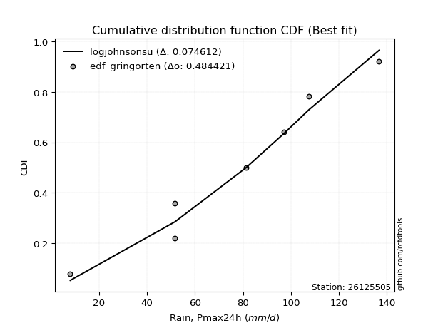</img></img>

</div>


### 9. EDF Filliben (1975)

The specific values of the constants (0.3175) (often denoted as $alpha$) and (0.365) are derived from a method proposed by James J. Filliben in a 1975 paper. This particular formula is the mean value of the $i$-th order statistic of the normal distribution and is considered a robust and effective plotting position formula for the normal probability plot correlation coefficient test for normality.

<div align="center">


$P=(m-0.3175)/(n+0.365)$


</div>


**9.1. Empirical values**

<div align="center">

|                | 0                   | 1                   | 2                   | 3            | 4                  | 5                  | 6                  |
|:---------------|:--------------------|:--------------------|:--------------------|:-------------|:-------------------|:-------------------|:-------------------|
| date           | 2023                | 2021                | 2022                | 2019         | 2017               | 2018               | 2020               |
| x              | 8.0                 | 51.7                | 51.7                | 81.2         | 97.2               | 107.4              | 136.7              |
| m              | 1                   | 2                   | 3                   | 4            | 5                  | 6                  | 7                  |
| empirical_dist | edf_filliben        | edf_filliben        | edf_filliben        | edf_filliben | edf_filliben       | edf_filliben       | edf_filliben       |
| empirical      | 0.09266802443991853 | 0.22844534962661237 | 0.36422267481330617 | 0.5          | 0.6357773251866938 | 0.7715546503733877 | 0.9073319755600815 |
| empirical_tr   | 1.1021324354657687  | 1.2960844698636163  | 1.5728777362520021  | 2.0          | 2.7455731593662627 | 4.377414561664191  | 10.791208791208794 |

</div>


**9.2. Kolmogorov-Smirnov fit test (sorted by Δ)**


<div align="center">

|                | 0                   | 1                   | 2                   | 3                   | 4                   | 5                   | 6                   | 7                   | 8                   | 9                   | 10                  | 11                  | 12                  | 13                  | 14                  | 15                  | 16                  | 17                  | 18                  | 19                  | 20                  | 21                  | 22                  | 23                  | 24                  | 25                  | 26                  | 27                  | 28                  | 29                  | 30                  | 31                  | 32                  | 33                  | 34                  | 35                  | 36                  | 37                  | 38                  | 39                  | 40                  | 41                  | 42                  | 43                  | 44                  | 45                  | 46                  | 47                  | 48                  | 49                  | 50                  | 51                  | 52                  | 53                  | 54                  | 55                  | 56                  | 57                  | 58                  | 59                  | 60                  | 61                  | 62                  | 63                  | 64                  | 65                  | 66                  | 67                  | 68                  | 69                  | 70                  | 71                  | 72                  | 73                  | 74                  | 75                  | 76                  | 77                  | 78                  | 79                  | 80                  | 81                  | 82                  | 83                  | 84                  | 85                  | 86                  | 87                  | 88                  | 89                  | 90                  | 91                  | 92                  | 93                  | 94                  | 95                  | 96                  | 97                  | 98                  | 99                  | 100                 | 101                 | 102                 | 103                 | 104                 | 105                 | 106                 | 107                 | 108                 | 109                 | 110                 | 111                 | 112                 | 113                 | 114                 | 115                 | 116                 | 117                 | 118                 | 119                 | 120                 | 121                 | 122                 | 123                 | 124                 | 125                 | 126                 | 127                 | 128                 | 129                 | 130                 | 131                 | 132                 | 133                 | 134                 | 135                 | 136                 | 137                 | 138                 | 139                 | 140                 | 141                 | 142                 | 143                 | 144                 | 145                 | 146                 | 147                 | 148                 | 149                 | 150                 | 151                 | 152                 | 153                 | 154                 | 155                 | 156                 | 157                 | 158                 | 159                 |
|:---------------|:--------------------|:--------------------|:--------------------|:--------------------|:--------------------|:--------------------|:--------------------|:--------------------|:--------------------|:--------------------|:--------------------|:--------------------|:--------------------|:--------------------|:--------------------|:--------------------|:--------------------|:--------------------|:--------------------|:--------------------|:--------------------|:--------------------|:--------------------|:--------------------|:--------------------|:--------------------|:--------------------|:--------------------|:--------------------|:--------------------|:--------------------|:--------------------|:--------------------|:--------------------|:--------------------|:--------------------|:--------------------|:--------------------|:--------------------|:--------------------|:--------------------|:--------------------|:--------------------|:--------------------|:--------------------|:--------------------|:--------------------|:--------------------|:--------------------|:--------------------|:--------------------|:--------------------|:--------------------|:--------------------|:--------------------|:--------------------|:--------------------|:--------------------|:--------------------|:--------------------|:--------------------|:--------------------|:--------------------|:--------------------|:--------------------|:--------------------|:--------------------|:--------------------|:--------------------|:--------------------|:--------------------|:--------------------|:--------------------|:--------------------|:--------------------|:--------------------|:--------------------|:--------------------|:--------------------|:--------------------|:--------------------|:--------------------|:--------------------|:--------------------|:--------------------|:--------------------|:--------------------|:--------------------|:--------------------|:--------------------|:--------------------|:--------------------|:--------------------|:--------------------|:--------------------|:--------------------|:--------------------|:--------------------|:--------------------|:--------------------|:--------------------|:--------------------|:--------------------|:--------------------|:--------------------|:--------------------|:--------------------|:--------------------|:--------------------|:--------------------|:--------------------|:--------------------|:--------------------|:--------------------|:--------------------|:--------------------|:--------------------|:--------------------|:--------------------|:--------------------|:--------------------|:--------------------|:--------------------|:--------------------|:--------------------|:--------------------|:--------------------|:--------------------|:--------------------|:--------------------|:--------------------|:--------------------|:--------------------|:--------------------|:--------------------|:--------------------|:--------------------|:--------------------|:--------------------|:--------------------|:--------------------|:--------------------|:--------------------|:--------------------|:--------------------|:--------------------|:--------------------|:--------------------|:--------------------|:--------------------|:--------------------|:--------------------|:--------------------|:--------------------|:--------------------|:--------------------|:--------------------|:--------------------|:--------------------|:--------------------|
| station        | 26125505            | 26125505            | 26125505            | 26125505            | 26125505            | 26125505            | 26125505            | 26125505            | 26125505            | 26125505            | 26125505            | 26125505            | 26125505            | 26125505            | 26125505            | 26125505            | 26125505            | 26125505            | 26125505            | 26125505            | 26125505            | 26125505            | 26125505            | 26125505            | 26125505            | 26125505            | 26125505            | 26125505            | 26125505            | 26125505            | 26125505            | 26125505            | 26125505            | 26125505            | 26125505            | 26125505            | 26125505            | 26125505            | 26125505            | 26125505            | 26125505            | 26125505            | 26125505            | 26125505            | 26125505            | 26125505            | 26125505            | 26125505            | 26125505            | 26125505            | 26125505            | 26125505            | 26125505            | 26125505            | 26125505            | 26125505            | 26125505            | 26125505            | 26125505            | 26125505            | 26125505            | 26125505            | 26125505            | 26125505            | 26125505            | 26125505            | 26125505            | 26125505            | 26125505            | 26125505            | 26125505            | 26125505            | 26125505            | 26125505            | 26125505            | 26125505            | 26125505            | 26125505            | 26125505            | 26125505            | 26125505            | 26125505            | 26125505            | 26125505            | 26125505            | 26125505            | 26125505            | 26125505            | 26125505            | 26125505            | 26125505            | 26125505            | 26125505            | 26125505            | 26125505            | 26125505            | 26125505            | 26125505            | 26125505            | 26125505            | 26125505            | 26125505            | 26125505            | 26125505            | 26125505            | 26125505            | 26125505            | 26125505            | 26125505            | 26125505            | 26125505            | 26125505            | 26125505            | 26125505            | 26125505            | 26125505            | 26125505            | 26125505            | 26125505            | 26125505            | 26125505            | 26125505            | 26125505            | 26125505            | 26125505            | 26125505            | 26125505            | 26125505            | 26125505            | 26125505            | 26125505            | 26125505            | 26125505            | 26125505            | 26125505            | 26125505            | 26125505            | 26125505            | 26125505            | 26125505            | 26125505            | 26125505            | 26125505            | 26125505            | 26125505            | 26125505            | 26125505            | 26125505            | 26125505            | 26125505            | 26125505            | 26125505            | 26125505            | 26125505            | 26125505            | 26125505            | 26125505            | 26125505            | 26125505            | 26125505            |
| empirical_dist | edf_filliben        | edf_filliben        | edf_filliben        | edf_filliben        | edf_filliben        | edf_filliben        | edf_filliben        | edf_filliben        | edf_filliben        | edf_filliben        | edf_filliben        | edf_filliben        | edf_filliben        | edf_filliben        | edf_filliben        | edf_filliben        | edf_filliben        | edf_filliben        | edf_filliben        | edf_filliben        | edf_filliben        | edf_filliben        | edf_filliben        | edf_filliben        | edf_filliben        | edf_filliben        | edf_filliben        | edf_filliben        | edf_filliben        | edf_filliben        | edf_filliben        | edf_filliben        | edf_filliben        | edf_filliben        | edf_filliben        | edf_filliben        | edf_filliben        | edf_filliben        | edf_filliben        | edf_filliben        | edf_filliben        | edf_filliben        | edf_filliben        | edf_filliben        | edf_filliben        | edf_filliben        | edf_filliben        | edf_filliben        | edf_filliben        | edf_filliben        | edf_filliben        | edf_filliben        | edf_filliben        | edf_filliben        | edf_filliben        | edf_filliben        | edf_filliben        | edf_filliben        | edf_filliben        | edf_filliben        | edf_filliben        | edf_filliben        | edf_filliben        | edf_filliben        | edf_filliben        | edf_filliben        | edf_filliben        | edf_filliben        | edf_filliben        | edf_filliben        | edf_filliben        | edf_filliben        | edf_filliben        | edf_filliben        | edf_filliben        | edf_filliben        | edf_filliben        | edf_filliben        | edf_filliben        | edf_filliben        | edf_filliben        | edf_filliben        | edf_filliben        | edf_filliben        | edf_filliben        | edf_filliben        | edf_filliben        | edf_filliben        | edf_filliben        | edf_filliben        | edf_filliben        | edf_filliben        | edf_filliben        | edf_filliben        | edf_filliben        | edf_filliben        | edf_filliben        | edf_filliben        | edf_filliben        | edf_filliben        | edf_filliben        | edf_filliben        | edf_filliben        | edf_filliben        | edf_filliben        | edf_filliben        | edf_filliben        | edf_filliben        | edf_filliben        | edf_filliben        | edf_filliben        | edf_filliben        | edf_filliben        | edf_filliben        | edf_filliben        | edf_filliben        | edf_filliben        | edf_filliben        | edf_filliben        | edf_filliben        | edf_filliben        | edf_filliben        | edf_filliben        | edf_filliben        | edf_filliben        | edf_filliben        | edf_filliben        | edf_filliben        | edf_filliben        | edf_filliben        | edf_filliben        | edf_filliben        | edf_filliben        | edf_filliben        | edf_filliben        | edf_filliben        | edf_filliben        | edf_filliben        | edf_filliben        | edf_filliben        | edf_filliben        | edf_filliben        | edf_filliben        | edf_filliben        | edf_filliben        | edf_filliben        | edf_filliben        | edf_filliben        | edf_filliben        | edf_filliben        | edf_filliben        | edf_filliben        | edf_filliben        | edf_filliben        | edf_filliben        | edf_filliben        | edf_filliben        | edf_filliben        | edf_filliben        | edf_filliben        |
| p_dist         | anglit              | semicircular        | cosine              | logargus            | logjohnsonsu        | invgamma            | maxwell             | rice                | burr                | invgauss            | logburr             | exponweib           | rayleigh            | erlang              | gamma               | ksone               | logloggamma         | logvonmises_line    | genpareto           | loggenextreme       | logmielke           | betaprime           | f                   | truncweibull_min    | nakagami            | nct                 | norm                | crystalball         | truncnorm           | exponnorm           | t                   | kappa4              | argus               | logburr12           | foldnorm            | weibull_min         | pearson3            | vonmises_line       | wrapcauchy          | johnsonsu           | kappa3              | uniform             | genextreme          | loggompertz         | halfnorm            | skewnorm            | mielke              | tukeylambda         | logistic            | gumbel_r            | logpearson3         | genlogistic         | kstwobign           | gausshyper          | arcsine             | logdgamma           | logloglaplace       | logdweibull         | hypsecant           | triang              | gumbel_l            | loggumbel_l         | genhalflogistic     | moyal               | halflogistic        | ncf                 | dweibull            | laplace             | dgamma              | loglevy_l           | logt                | logtrapezoid        | bradford            | logskewnorm         | loghypsecant        | loglaplace          | loglaplace          | loggennorm          | logfoldnorm         | loglogistic         | beta                | logfatiguelife      | logrice             | lognorm             | logcrystalball      | logexponnorm        | wald                | logf                | lognct              | logerlang           | loggamma            | loggamma            | loganglit           | loginvgamma         | logsemicircular     | logalpha            | logarcsine          | logweibull_max      | logncf              | trapezoid           | lomax               | logmaxwell          | levy_l              | loginvgauss         | logbetaprime        | truncexpon          | genexpon            | lograyleigh         | loginvweibull       | loggenhalflogistic  | gennorm             | logtriang           | loggumbel_r         | loghalfnorm         | logcosine           | logkstwobign        | logmoyal            | loghalflogistic     | loggenexpon         | halfgennorm         | loggausshyper       | logbeta             | logjohnsonsb        | logwrapcauchy       | loggenpareto        | lognakagami         | logtruncnorm        | gompertz            | loglomax            | logwald             | burr12              | logkappa4           | logksone            | johnsonsb           | logtukeylambda      | loghalfgennorm      | logkappa3           | loguniform          | logexponweib        | gengamma            | loggengamma         | alpha               | logrdist            | invweibull          | logtruncweibull_min | logbradford         | logtruncexpon       | logweibull_min      | fatiguelife         | weibull_max         | powerlaw            | logexponpow         | truncpareto         | logpowerlaw         | exponpow            | logtruncpareto      | rdist               | loggenlogistic      | logvonmises         | vonmises            |
| delta          | 0.07024966335342747 | 0.07704178884367754 | 0.07838857043299086 | 0.07865987172902819 | 0.07928396282720213 | 0.08052748492846529 | 0.0815776998435076  | 0.08233602656560912 | 0.08372316195012255 | 0.08397889576883255 | 0.08726039644244435 | 0.08863976904605275 | 0.08977203528450528 | 0.09031835320473319 | 0.09058472995294276 | 0.09222417643406747 | 0.09260417663119869 | 0.0926680242390995  | 0.09266802443912414 | 0.09266802443989686 | 0.0933821468096355  | 0.09424259475658558 | 0.09444020324721913 | 0.09520903583734522 | 0.09595642494893175 | 0.09693776479881205 | 0.09699489976754994 | 0.09699489994078281 | 0.09699490103060032 | 0.09699677550656866 | 0.0970143341681523  | 0.10114542591496092 | 0.10282053313747042 | 0.10304993934653561 | 0.10333666455051554 | 0.10377044354540288 | 0.10386765970295891 | 0.10389789642689676 | 0.1093902498518963  | 0.1100141565362368  | 0.11058230235310887 | 0.11110398992272721 | 0.11206852878496099 | 0.11322615017120505 | 0.11733572852544272 | 0.11734389687285829 | 0.11742900365052042 | 0.11807503216247148 | 0.11946436769800794 | 0.11969111454297832 | 0.12072684369515982 | 0.12090691859296915 | 0.1218101297451036  | 0.12435681088489028 | 0.12679251732217237 | 0.12846158138995517 | 0.12906786893159455 | 0.13240157387504126 | 0.13476934214780942 | 0.13946092661523693 | 0.1406108222142225  | 0.14263469002823745 | 0.14332210843530002 | 0.14454236911452512 | 0.14460834522563526 | 0.14628708435499363 | 0.14935557286115533 | 0.15652744052350592 | 0.15807633317980127 | 0.1582375530621802  | 0.16226560916242616 | 0.1703851045676272  | 0.17805090567256224 | 0.19646669616537585 | 0.19769100521077856 | 0.20071027730476332 | 0.20071027730476332 | 0.2016448381301021  | 0.2031318031594809  | 0.20436717041825028 | 0.20810150049290954 | 0.21113769602955693 | 0.21230239427897304 | 0.21230337617333947 | 0.2123034678309942  | 0.21230500787013332 | 0.21349867581521054 | 0.21392338187574425 | 0.21415738731955222 | 0.21696945692513456 | 0.22058435752927233 | 0.22058435752927233 | 0.2206852591132277  | 0.22346277883749052 | 0.22414689489814235 | 0.23609685710212733 | 0.23793988180401524 | 0.2394436013313429  | 0.24013733576393917 | 0.2408050407415664  | 0.24092564518955392 | 0.24669299608009812 | 0.25128477579885744 | 0.2518444761755536  | 0.2527743500690174  | 0.2532086872903283  | 0.2585260222321253  | 0.25870213194990455 | 0.2595327625350917  | 0.2633069482436118  | 0.27155465037338766 | 0.27257415846382116 | 0.27829632465366116 | 0.2926228383271696  | 0.29392827019169554 | 0.30273578809625157 | 0.3033621502269095  | 0.3128356287675863  | 0.3146363914139161  | 0.31716629849411215 | 0.3174570272767945  | 0.3249607027654081  | 0.3266495437784857  | 0.3372435320741156  | 0.33744411329978496 | 0.36322607826251524 | 0.3642125832412644  | 0.3642225918992276  | 0.36831968085925304 | 0.37288429349633123 | 0.3752530663185276  | 0.39075576305029114 | 0.402746798185904   | 0.4124268154400066  | 0.4220359242386338  | 0.42397565302283846 | 0.4286532642502453  | 0.4289852277484073  | 0.44502185283712303 | 0.4516357678496856  | 0.45264808996500366 | 0.4622277274405946  | 0.46356478389145805 | 0.468577943343259   | 0.48840050657306533 | 0.500606648593039   | 0.5088220285369895  | 0.5316878781558841  | 0.555204690707197   | 0.5878064491841316  | 0.6098434589635122  | 0.6319417863725927  | 0.6929462860155138  | 0.6965424868154502  | 0.7159715558766525  | 0.7402416775895634  | 0.7715546501826467  | 0.7715546503733877  | 1.1083610709045755  | 21.121462856783094  |
| deltao         | 0.48442053926100004 | 0.48442053926100004 | 0.48442053926100004 | 0.48442053926100004 | 0.48442053926100004 | 0.48442053926100004 | 0.48442053926100004 | 0.48442053926100004 | 0.48442053926100004 | 0.48442053926100004 | 0.48442053926100004 | 0.48442053926100004 | 0.48442053926100004 | 0.48442053926100004 | 0.48442053926100004 | 0.48442053926100004 | 0.48442053926100004 | 0.48442053926100004 | 0.48442053926100004 | 0.48442053926100004 | 0.48442053926100004 | 0.48442053926100004 | 0.48442053926100004 | 0.48442053926100004 | 0.48442053926100004 | 0.48442053926100004 | 0.48442053926100004 | 0.48442053926100004 | 0.48442053926100004 | 0.48442053926100004 | 0.48442053926100004 | 0.48442053926100004 | 0.48442053926100004 | 0.48442053926100004 | 0.48442053926100004 | 0.48442053926100004 | 0.48442053926100004 | 0.48442053926100004 | 0.48442053926100004 | 0.48442053926100004 | 0.48442053926100004 | 0.48442053926100004 | 0.48442053926100004 | 0.48442053926100004 | 0.48442053926100004 | 0.48442053926100004 | 0.48442053926100004 | 0.48442053926100004 | 0.48442053926100004 | 0.48442053926100004 | 0.48442053926100004 | 0.48442053926100004 | 0.48442053926100004 | 0.48442053926100004 | 0.48442053926100004 | 0.48442053926100004 | 0.48442053926100004 | 0.48442053926100004 | 0.48442053926100004 | 0.48442053926100004 | 0.48442053926100004 | 0.48442053926100004 | 0.48442053926100004 | 0.48442053926100004 | 0.48442053926100004 | 0.48442053926100004 | 0.48442053926100004 | 0.48442053926100004 | 0.48442053926100004 | 0.48442053926100004 | 0.48442053926100004 | 0.48442053926100004 | 0.48442053926100004 | 0.48442053926100004 | 0.48442053926100004 | 0.48442053926100004 | 0.48442053926100004 | 0.48442053926100004 | 0.48442053926100004 | 0.48442053926100004 | 0.48442053926100004 | 0.48442053926100004 | 0.48442053926100004 | 0.48442053926100004 | 0.48442053926100004 | 0.48442053926100004 | 0.48442053926100004 | 0.48442053926100004 | 0.48442053926100004 | 0.48442053926100004 | 0.48442053926100004 | 0.48442053926100004 | 0.48442053926100004 | 0.48442053926100004 | 0.48442053926100004 | 0.48442053926100004 | 0.48442053926100004 | 0.48442053926100004 | 0.48442053926100004 | 0.48442053926100004 | 0.48442053926100004 | 0.48442053926100004 | 0.48442053926100004 | 0.48442053926100004 | 0.48442053926100004 | 0.48442053926100004 | 0.48442053926100004 | 0.48442053926100004 | 0.48442053926100004 | 0.48442053926100004 | 0.48442053926100004 | 0.48442053926100004 | 0.48442053926100004 | 0.48442053926100004 | 0.48442053926100004 | 0.48442053926100004 | 0.48442053926100004 | 0.48442053926100004 | 0.48442053926100004 | 0.48442053926100004 | 0.48442053926100004 | 0.48442053926100004 | 0.48442053926100004 | 0.48442053926100004 | 0.48442053926100004 | 0.48442053926100004 | 0.48442053926100004 | 0.48442053926100004 | 0.48442053926100004 | 0.48442053926100004 | 0.48442053926100004 | 0.48442053926100004 | 0.48442053926100004 | 0.48442053926100004 | 0.48442053926100004 | 0.48442053926100004 | 0.48442053926100004 | 0.48442053926100004 | 0.48442053926100004 | 0.48442053926100004 | 0.48442053926100004 | 0.48442053926100004 | 0.48442053926100004 | 0.48442053926100004 | 0.48442053926100004 | 0.48442053926100004 | 0.48442053926100004 | 0.48442053926100004 | 0.48442053926100004 | 0.48442053926100004 | 0.48442053926100004 | 0.48442053926100004 | 0.48442053926100004 | 0.48442053926100004 | 0.48442053926100004 | 0.48442053926100004 | 0.48442053926100004 | 0.48442053926100004 | 0.48442053926100004 | 0.48442053926100004 |
| eval           | Δo > Δ              | Δo > Δ              | Δo > Δ              | Δo > Δ              | Δo > Δ              | Δo > Δ              | Δo > Δ              | Δo > Δ              | Δo > Δ              | Δo > Δ              | Δo > Δ              | Δo > Δ              | Δo > Δ              | Δo > Δ              | Δo > Δ              | Δo > Δ              | Δo > Δ              | Δo > Δ              | Δo > Δ              | Δo > Δ              | Δo > Δ              | Δo > Δ              | Δo > Δ              | Δo > Δ              | Δo > Δ              | Δo > Δ              | Δo > Δ              | Δo > Δ              | Δo > Δ              | Δo > Δ              | Δo > Δ              | Δo > Δ              | Δo > Δ              | Δo > Δ              | Δo > Δ              | Δo > Δ              | Δo > Δ              | Δo > Δ              | Δo > Δ              | Δo > Δ              | Δo > Δ              | Δo > Δ              | Δo > Δ              | Δo > Δ              | Δo > Δ              | Δo > Δ              | Δo > Δ              | Δo > Δ              | Δo > Δ              | Δo > Δ              | Δo > Δ              | Δo > Δ              | Δo > Δ              | Δo > Δ              | Δo > Δ              | Δo > Δ              | Δo > Δ              | Δo > Δ              | Δo > Δ              | Δo > Δ              | Δo > Δ              | Δo > Δ              | Δo > Δ              | Δo > Δ              | Δo > Δ              | Δo > Δ              | Δo > Δ              | Δo > Δ              | Δo > Δ              | Δo > Δ              | Δo > Δ              | Δo > Δ              | Δo > Δ              | Δo > Δ              | Δo > Δ              | Δo > Δ              | Δo > Δ              | Δo > Δ              | Δo > Δ              | Δo > Δ              | Δo > Δ              | Δo > Δ              | Δo > Δ              | Δo > Δ              | Δo > Δ              | Δo > Δ              | Δo > Δ              | Δo > Δ              | Δo > Δ              | Δo > Δ              | Δo > Δ              | Δo > Δ              | Δo > Δ              | Δo > Δ              | Δo > Δ              | Δo > Δ              | Δo > Δ              | Δo > Δ              | Δo > Δ              | Δo > Δ              | Δo > Δ              | Δo > Δ              | Δo > Δ              | Δo > Δ              | Δo > Δ              | Δo > Δ              | Δo > Δ              | Δo > Δ              | Δo > Δ              | Δo > Δ              | Δo > Δ              | Δo > Δ              | Δo > Δ              | Δo > Δ              | Δo > Δ              | Δo > Δ              | Δo > Δ              | Δo > Δ              | Δo > Δ              | Δo > Δ              | Δo > Δ              | Δo > Δ              | Δo > Δ              | Δo > Δ              | Δo > Δ              | Δo > Δ              | Δo > Δ              | Δo > Δ              | Δo > Δ              | Δo > Δ              | Δo > Δ              | Δo > Δ              | Δo > Δ              | Δo > Δ              | Δo > Δ              | Δo > Δ              | Δo > Δ              | Δo > Δ              | Δo > Δ              | Δo > Δ              | Δo > Δ              | Δo > Δ              | Δo > Δ              | Δo > Δ              | Δo <= Δ             | Δo <= Δ             | Δo <= Δ             | Δo <= Δ             | Δo <= Δ             | Δo <= Δ             | Δo <= Δ             | Δo <= Δ             | Δo <= Δ             | Δo <= Δ             | Δo <= Δ             | Δo <= Δ             | Δo <= Δ             | Δo <= Δ             | Δo <= Δ             | Δo <= Δ             |
| fit            | 1                   | 1                   | 1                   | 1                   | 1                   | 1                   | 1                   | 1                   | 1                   | 1                   | 1                   | 1                   | 1                   | 1                   | 1                   | 1                   | 1                   | 1                   | 1                   | 1                   | 1                   | 1                   | 1                   | 1                   | 1                   | 1                   | 1                   | 1                   | 1                   | 1                   | 1                   | 1                   | 1                   | 1                   | 1                   | 1                   | 1                   | 1                   | 1                   | 1                   | 1                   | 1                   | 1                   | 1                   | 1                   | 1                   | 1                   | 1                   | 1                   | 1                   | 1                   | 1                   | 1                   | 1                   | 1                   | 1                   | 1                   | 1                   | 1                   | 1                   | 1                   | 1                   | 1                   | 1                   | 1                   | 1                   | 1                   | 1                   | 1                   | 1                   | 1                   | 1                   | 1                   | 1                   | 1                   | 1                   | 1                   | 1                   | 1                   | 1                   | 1                   | 1                   | 1                   | 1                   | 1                   | 1                   | 1                   | 1                   | 1                   | 1                   | 1                   | 1                   | 1                   | 1                   | 1                   | 1                   | 1                   | 1                   | 1                   | 1                   | 1                   | 1                   | 1                   | 1                   | 1                   | 1                   | 1                   | 1                   | 1                   | 1                   | 1                   | 1                   | 1                   | 1                   | 1                   | 1                   | 1                   | 1                   | 1                   | 1                   | 1                   | 1                   | 1                   | 1                   | 1                   | 1                   | 1                   | 1                   | 1                   | 1                   | 1                   | 1                   | 1                   | 1                   | 1                   | 1                   | 1                   | 1                   | 1                   | 1                   | 1                   | 1                   | 1                   | 1                   | 0                   | 0                   | 0                   | 0                   | 0                   | 0                   | 0                   | 0                   | 0                   | 0                   | 0                   | 0                   | 0                   | 0                   | 0                   | 0                   |
| n              | 7                   | 7                   | 7                   | 7                   | 7                   | 7                   | 7                   | 7                   | 7                   | 7                   | 7                   | 7                   | 7                   | 7                   | 7                   | 7                   | 7                   | 7                   | 7                   | 7                   | 7                   | 7                   | 7                   | 7                   | 7                   | 7                   | 7                   | 7                   | 7                   | 7                   | 7                   | 7                   | 7                   | 7                   | 7                   | 7                   | 7                   | 7                   | 7                   | 7                   | 7                   | 7                   | 7                   | 7                   | 7                   | 7                   | 7                   | 7                   | 7                   | 7                   | 7                   | 7                   | 7                   | 7                   | 7                   | 7                   | 7                   | 7                   | 7                   | 7                   | 7                   | 7                   | 7                   | 7                   | 7                   | 7                   | 7                   | 7                   | 7                   | 7                   | 7                   | 7                   | 7                   | 7                   | 7                   | 7                   | 7                   | 7                   | 7                   | 7                   | 7                   | 7                   | 7                   | 7                   | 7                   | 7                   | 7                   | 7                   | 7                   | 7                   | 7                   | 7                   | 7                   | 7                   | 7                   | 7                   | 7                   | 7                   | 7                   | 7                   | 7                   | 7                   | 7                   | 7                   | 7                   | 7                   | 7                   | 7                   | 7                   | 7                   | 7                   | 7                   | 7                   | 7                   | 7                   | 7                   | 7                   | 7                   | 7                   | 7                   | 7                   | 7                   | 7                   | 7                   | 7                   | 7                   | 7                   | 7                   | 7                   | 7                   | 7                   | 7                   | 7                   | 7                   | 7                   | 7                   | 7                   | 7                   | 7                   | 7                   | 7                   | 7                   | 7                   | 7                   | 7                   | 7                   | 7                   | 7                   | 7                   | 7                   | 7                   | 7                   | 7                   | 7                   | 7                   | 7                   | 7                   | 7                   | 7                   | 7                   |
| best_fit       | 1                   | 0                   | 0                   | 0                   | 0                   | 0                   | 0                   | 0                   | 0                   | 0                   | 0                   | 0                   | 0                   | 0                   | 0                   | 0                   | 0                   | 0                   | 0                   | 0                   | 0                   | 0                   | 0                   | 0                   | 0                   | 0                   | 0                   | 0                   | 0                   | 0                   | 0                   | 0                   | 0                   | 0                   | 0                   | 0                   | 0                   | 0                   | 0                   | 0                   | 0                   | 0                   | 0                   | 0                   | 0                   | 0                   | 0                   | 0                   | 0                   | 0                   | 0                   | 0                   | 0                   | 0                   | 0                   | 0                   | 0                   | 0                   | 0                   | 0                   | 0                   | 0                   | 0                   | 0                   | 0                   | 0                   | 0                   | 0                   | 0                   | 0                   | 0                   | 0                   | 0                   | 0                   | 0                   | 0                   | 0                   | 0                   | 0                   | 0                   | 0                   | 0                   | 0                   | 0                   | 0                   | 0                   | 0                   | 0                   | 0                   | 0                   | 0                   | 0                   | 0                   | 0                   | 0                   | 0                   | 0                   | 0                   | 0                   | 0                   | 0                   | 0                   | 0                   | 0                   | 0                   | 0                   | 0                   | 0                   | 0                   | 0                   | 0                   | 0                   | 0                   | 0                   | 0                   | 0                   | 0                   | 0                   | 0                   | 0                   | 0                   | 0                   | 0                   | 0                   | 0                   | 0                   | 0                   | 0                   | 0                   | 0                   | 0                   | 0                   | 0                   | 0                   | 0                   | 0                   | 0                   | 0                   | 0                   | 0                   | 0                   | 0                   | 0                   | 0                   | 0                   | 0                   | 0                   | 0                   | 0                   | 0                   | 0                   | 0                   | 0                   | 0                   | 0                   | 0                   | 0                   | 0                   | 0                   | 0                   |
| best_fit_sort  | 1                   | 2                   | 3                   | 4                   | 5                   | 6                   | 7                   | 8                   | 9                   | 10                  | 11                  | 12                  | 13                  | 14                  | 15                  | 16                  | 17                  | 18                  | 19                  | 20                  | 21                  | 22                  | 23                  | 24                  | 25                  | 26                  | 27                  | 28                  | 29                  | 30                  | 31                  | 32                  | 33                  | 34                  | 35                  | 36                  | 37                  | 38                  | 39                  | 40                  | 41                  | 42                  | 43                  | 44                  | 45                  | 46                  | 47                  | 48                  | 49                  | 50                  | 51                  | 52                  | 53                  | 54                  | 55                  | 56                  | 57                  | 58                  | 59                  | 60                  | 61                  | 62                  | 63                  | 64                  | 65                  | 66                  | 67                  | 68                  | 69                  | 70                  | 71                  | 72                  | 73                  | 74                  | 75                  | 76                  | 77                  | 78                  | 79                  | 80                  | 81                  | 82                  | 83                  | 84                  | 85                  | 86                  | 87                  | 88                  | 89                  | 90                  | 91                  | 92                  | 93                  | 94                  | 95                  | 96                  | 97                  | 98                  | 99                  | 100                 | 101                 | 102                 | 103                 | 104                 | 105                 | 106                 | 107                 | 108                 | 109                 | 110                 | 111                 | 112                 | 113                 | 114                 | 115                 | 116                 | 117                 | 118                 | 119                 | 120                 | 121                 | 122                 | 123                 | 124                 | 125                 | 126                 | 127                 | 128                 | 129                 | 130                 | 131                 | 132                 | 133                 | 134                 | 135                 | 136                 | 137                 | 138                 | 139                 | 140                 | 141                 | 142                 | 143                 | 144                 | 145                 | 146                 | 147                 | 148                 | 149                 | 150                 | 151                 | 152                 | 153                 | 154                 | 155                 | 156                 | 157                 | 158                 | 159                 | 160                 |

</div>


**9.3. Best fit**

<div align="center">

|   id |   station | empirical_dist   | p_dist   |     delta |   deltao | eval   |   fit |   n |   best_fit |   best_fit_sort |
|-----:|----------:|:-----------------|:---------|----------:|---------:|:-------|------:|----:|-----------:|----------------:|
|    0 |  26125505 | edf_filliben     | anglit   | 0.0702497 | 0.484421 | Δo > Δ |     1 |   7 |          1 |               1 |

</div>


<div align="center">

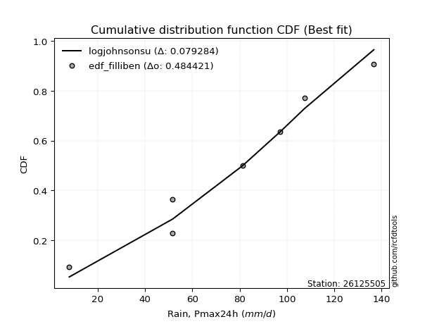</img></img>

</div>


### 10. EDF Jenkinson (1977)

The Jenkinson formula in hydrology is an empirical plotting position formula used to estimate the non-exceedance probability _(P)_ or return period _(T)_ of a given ordered observation within a sample. It is a widely used method in the frequency analysis of extreme events such as floods and rainfall, as it provides a distribution-free way to plot data. _a≈0.31_ and _b≈0.38_ are constants derived to approximate the median of the probability distribution for the given rank.

<div align="center">


$P=(m-a)/(n+b)$


</div>


**10.1. Empirical values**

<div align="center">

|                | 0                   | 1                   | 2                   | 3             | 4                  | 5                  | 6                  |
|:---------------|:--------------------|:--------------------|:--------------------|:--------------|:-------------------|:-------------------|:-------------------|
| date           | 2023                | 2021                | 2022                | 2019          | 2017               | 2018               | 2020               |
| x              | 8.0                 | 51.7                | 51.7                | 81.2          | 97.2               | 107.4              | 136.7              |
| m              | 1                   | 2                   | 3                   | 4             | 5                  | 6                  | 7                  |
| empirical_dist | edf_jenkinson       | edf_jenkinson       | edf_jenkinson       | edf_jenkinson | edf_jenkinson      | edf_jenkinson      | edf_jenkinson      |
| empirical      | 0.09349593495934959 | 0.22899728997289973 | 0.36449864498644985 | 0.5           | 0.6355013550135502 | 0.7710027100271003 | 0.9065040650406505 |
| empirical_tr   | 1.1031390134529149  | 1.29701230228471    | 1.5735607675906182  | 2.0           | 2.743494423791822  | 4.366863905325444  | 10.695652173913055 |

</div>


**10.2. Kolmogorov-Smirnov fit test (sorted by Δ)**


<div align="center">

|                | 0                   | 1                   | 2                   | 3                   | 4                   | 5                   | 6                   | 7                   | 8                   | 9                   | 10                  | 11                  | 12                  | 13                  | 14                  | 15                  | 16                  | 17                  | 18                  | 19                  | 20                  | 21                  | 22                  | 23                  | 24                  | 25                  | 26                  | 27                  | 28                  | 29                  | 30                  | 31                  | 32                  | 33                  | 34                  | 35                  | 36                  | 37                  | 38                  | 39                  | 40                  | 41                  | 42                  | 43                  | 44                  | 45                  | 46                  | 47                  | 48                  | 49                  | 50                  | 51                  | 52                  | 53                  | 54                  | 55                  | 56                  | 57                  | 58                  | 59                  | 60                  | 61                  | 62                  | 63                  | 64                  | 65                  | 66                  | 67                  | 68                  | 69                  | 70                  | 71                  | 72                  | 73                  | 74                  | 75                  | 76                  | 77                  | 78                  | 79                  | 80                  | 81                  | 82                  | 83                  | 84                  | 85                  | 86                  | 87                  | 88                  | 89                  | 90                  | 91                  | 92                  | 93                  | 94                  | 95                  | 96                  | 97                  | 98                  | 99                  | 100                 | 101                 | 102                 | 103                 | 104                 | 105                 | 106                 | 107                 | 108                 | 109                 | 110                 | 111                 | 112                 | 113                 | 114                 | 115                 | 116                 | 117                 | 118                 | 119                 | 120                 | 121                 | 122                 | 123                 | 124                 | 125                 | 126                 | 127                 | 128                 | 129                 | 130                 | 131                 | 132                 | 133                 | 134                 | 135                 | 136                 | 137                 | 138                 | 139                 | 140                 | 141                 | 142                 | 143                 | 144                 | 145                 | 146                 | 147                 | 148                 | 149                 | 150                 | 151                 | 152                 | 153                 | 154                 | 155                 | 156                 | 157                 | 158                 | 159                 |
|:---------------|:--------------------|:--------------------|:--------------------|:--------------------|:--------------------|:--------------------|:--------------------|:--------------------|:--------------------|:--------------------|:--------------------|:--------------------|:--------------------|:--------------------|:--------------------|:--------------------|:--------------------|:--------------------|:--------------------|:--------------------|:--------------------|:--------------------|:--------------------|:--------------------|:--------------------|:--------------------|:--------------------|:--------------------|:--------------------|:--------------------|:--------------------|:--------------------|:--------------------|:--------------------|:--------------------|:--------------------|:--------------------|:--------------------|:--------------------|:--------------------|:--------------------|:--------------------|:--------------------|:--------------------|:--------------------|:--------------------|:--------------------|:--------------------|:--------------------|:--------------------|:--------------------|:--------------------|:--------------------|:--------------------|:--------------------|:--------------------|:--------------------|:--------------------|:--------------------|:--------------------|:--------------------|:--------------------|:--------------------|:--------------------|:--------------------|:--------------------|:--------------------|:--------------------|:--------------------|:--------------------|:--------------------|:--------------------|:--------------------|:--------------------|:--------------------|:--------------------|:--------------------|:--------------------|:--------------------|:--------------------|:--------------------|:--------------------|:--------------------|:--------------------|:--------------------|:--------------------|:--------------------|:--------------------|:--------------------|:--------------------|:--------------------|:--------------------|:--------------------|:--------------------|:--------------------|:--------------------|:--------------------|:--------------------|:--------------------|:--------------------|:--------------------|:--------------------|:--------------------|:--------------------|:--------------------|:--------------------|:--------------------|:--------------------|:--------------------|:--------------------|:--------------------|:--------------------|:--------------------|:--------------------|:--------------------|:--------------------|:--------------------|:--------------------|:--------------------|:--------------------|:--------------------|:--------------------|:--------------------|:--------------------|:--------------------|:--------------------|:--------------------|:--------------------|:--------------------|:--------------------|:--------------------|:--------------------|:--------------------|:--------------------|:--------------------|:--------------------|:--------------------|:--------------------|:--------------------|:--------------------|:--------------------|:--------------------|:--------------------|:--------------------|:--------------------|:--------------------|:--------------------|:--------------------|:--------------------|:--------------------|:--------------------|:--------------------|:--------------------|:--------------------|:--------------------|:--------------------|:--------------------|:--------------------|:--------------------|:--------------------|
| station        | 26125505            | 26125505            | 26125505            | 26125505            | 26125505            | 26125505            | 26125505            | 26125505            | 26125505            | 26125505            | 26125505            | 26125505            | 26125505            | 26125505            | 26125505            | 26125505            | 26125505            | 26125505            | 26125505            | 26125505            | 26125505            | 26125505            | 26125505            | 26125505            | 26125505            | 26125505            | 26125505            | 26125505            | 26125505            | 26125505            | 26125505            | 26125505            | 26125505            | 26125505            | 26125505            | 26125505            | 26125505            | 26125505            | 26125505            | 26125505            | 26125505            | 26125505            | 26125505            | 26125505            | 26125505            | 26125505            | 26125505            | 26125505            | 26125505            | 26125505            | 26125505            | 26125505            | 26125505            | 26125505            | 26125505            | 26125505            | 26125505            | 26125505            | 26125505            | 26125505            | 26125505            | 26125505            | 26125505            | 26125505            | 26125505            | 26125505            | 26125505            | 26125505            | 26125505            | 26125505            | 26125505            | 26125505            | 26125505            | 26125505            | 26125505            | 26125505            | 26125505            | 26125505            | 26125505            | 26125505            | 26125505            | 26125505            | 26125505            | 26125505            | 26125505            | 26125505            | 26125505            | 26125505            | 26125505            | 26125505            | 26125505            | 26125505            | 26125505            | 26125505            | 26125505            | 26125505            | 26125505            | 26125505            | 26125505            | 26125505            | 26125505            | 26125505            | 26125505            | 26125505            | 26125505            | 26125505            | 26125505            | 26125505            | 26125505            | 26125505            | 26125505            | 26125505            | 26125505            | 26125505            | 26125505            | 26125505            | 26125505            | 26125505            | 26125505            | 26125505            | 26125505            | 26125505            | 26125505            | 26125505            | 26125505            | 26125505            | 26125505            | 26125505            | 26125505            | 26125505            | 26125505            | 26125505            | 26125505            | 26125505            | 26125505            | 26125505            | 26125505            | 26125505            | 26125505            | 26125505            | 26125505            | 26125505            | 26125505            | 26125505            | 26125505            | 26125505            | 26125505            | 26125505            | 26125505            | 26125505            | 26125505            | 26125505            | 26125505            | 26125505            | 26125505            | 26125505            | 26125505            | 26125505            | 26125505            | 26125505            |
| empirical_dist | edf_jenkinson       | edf_jenkinson       | edf_jenkinson       | edf_jenkinson       | edf_jenkinson       | edf_jenkinson       | edf_jenkinson       | edf_jenkinson       | edf_jenkinson       | edf_jenkinson       | edf_jenkinson       | edf_jenkinson       | edf_jenkinson       | edf_jenkinson       | edf_jenkinson       | edf_jenkinson       | edf_jenkinson       | edf_jenkinson       | edf_jenkinson       | edf_jenkinson       | edf_jenkinson       | edf_jenkinson       | edf_jenkinson       | edf_jenkinson       | edf_jenkinson       | edf_jenkinson       | edf_jenkinson       | edf_jenkinson       | edf_jenkinson       | edf_jenkinson       | edf_jenkinson       | edf_jenkinson       | edf_jenkinson       | edf_jenkinson       | edf_jenkinson       | edf_jenkinson       | edf_jenkinson       | edf_jenkinson       | edf_jenkinson       | edf_jenkinson       | edf_jenkinson       | edf_jenkinson       | edf_jenkinson       | edf_jenkinson       | edf_jenkinson       | edf_jenkinson       | edf_jenkinson       | edf_jenkinson       | edf_jenkinson       | edf_jenkinson       | edf_jenkinson       | edf_jenkinson       | edf_jenkinson       | edf_jenkinson       | edf_jenkinson       | edf_jenkinson       | edf_jenkinson       | edf_jenkinson       | edf_jenkinson       | edf_jenkinson       | edf_jenkinson       | edf_jenkinson       | edf_jenkinson       | edf_jenkinson       | edf_jenkinson       | edf_jenkinson       | edf_jenkinson       | edf_jenkinson       | edf_jenkinson       | edf_jenkinson       | edf_jenkinson       | edf_jenkinson       | edf_jenkinson       | edf_jenkinson       | edf_jenkinson       | edf_jenkinson       | edf_jenkinson       | edf_jenkinson       | edf_jenkinson       | edf_jenkinson       | edf_jenkinson       | edf_jenkinson       | edf_jenkinson       | edf_jenkinson       | edf_jenkinson       | edf_jenkinson       | edf_jenkinson       | edf_jenkinson       | edf_jenkinson       | edf_jenkinson       | edf_jenkinson       | edf_jenkinson       | edf_jenkinson       | edf_jenkinson       | edf_jenkinson       | edf_jenkinson       | edf_jenkinson       | edf_jenkinson       | edf_jenkinson       | edf_jenkinson       | edf_jenkinson       | edf_jenkinson       | edf_jenkinson       | edf_jenkinson       | edf_jenkinson       | edf_jenkinson       | edf_jenkinson       | edf_jenkinson       | edf_jenkinson       | edf_jenkinson       | edf_jenkinson       | edf_jenkinson       | edf_jenkinson       | edf_jenkinson       | edf_jenkinson       | edf_jenkinson       | edf_jenkinson       | edf_jenkinson       | edf_jenkinson       | edf_jenkinson       | edf_jenkinson       | edf_jenkinson       | edf_jenkinson       | edf_jenkinson       | edf_jenkinson       | edf_jenkinson       | edf_jenkinson       | edf_jenkinson       | edf_jenkinson       | edf_jenkinson       | edf_jenkinson       | edf_jenkinson       | edf_jenkinson       | edf_jenkinson       | edf_jenkinson       | edf_jenkinson       | edf_jenkinson       | edf_jenkinson       | edf_jenkinson       | edf_jenkinson       | edf_jenkinson       | edf_jenkinson       | edf_jenkinson       | edf_jenkinson       | edf_jenkinson       | edf_jenkinson       | edf_jenkinson       | edf_jenkinson       | edf_jenkinson       | edf_jenkinson       | edf_jenkinson       | edf_jenkinson       | edf_jenkinson       | edf_jenkinson       | edf_jenkinson       | edf_jenkinson       | edf_jenkinson       | edf_jenkinson       | edf_jenkinson       | edf_jenkinson       |
| p_dist         | anglit              | semicircular        | logargus            | cosine              | logjohnsonsu        | invgamma            | maxwell             | rice                | burr                | invgauss            | logburr             | exponweib           | rayleigh            | erlang              | gamma               | ksone               | logmielke           | logloggamma         | logvonmises_line    | genpareto           | loggenextreme       | betaprime           | truncweibull_min    | f                   | nakagami            | nct                 | norm                | crystalball         | truncnorm           | exponnorm           | t                   | kappa4              | logburr12           | argus               | vonmises_line       | foldnorm            | weibull_min         | pearson3            | wrapcauchy          | kappa3              | johnsonsu           | uniform             | genextreme          | loggompertz         | mielke              | halfnorm            | tukeylambda         | skewnorm            | gumbel_r            | logistic            | logpearson3         | genlogistic         | kstwobign           | gausshyper          | arcsine             | logdgamma           | logloglaplace       | logdweibull         | hypsecant           | triang              | gumbel_l            | loggumbel_l         | genhalflogistic     | moyal               | halflogistic        | ncf                 | dweibull            | laplace             | dgamma              | loglevy_l           | logt                | logtrapezoid        | bradford            | logskewnorm         | loghypsecant        | loglaplace          | loglaplace          | loggennorm          | logfoldnorm         | loglogistic         | beta                | logfatiguelife      | logrice             | lognorm             | logcrystalball      | logexponnorm        | logf                | wald                | lognct              | logerlang           | loggamma            | loggamma            | loganglit           | loginvgamma         | logsemicircular     | logalpha            | logarcsine          | logweibull_max      | logncf              | trapezoid           | lomax               | logmaxwell          | levy_l              | loginvgauss         | logbetaprime        | truncexpon          | genexpon            | lograyleigh         | loginvweibull       | loggenhalflogistic  | gennorm             | logtriang           | loggumbel_r         | loghalfnorm         | logcosine           | logkstwobign        | logmoyal            | loghalflogistic     | loggenexpon         | halfgennorm         | loggausshyper       | logbeta             | logjohnsonsb        | logwrapcauchy       | loggenpareto        | lognakagami         | logtruncnorm        | gompertz            | loglomax            | logwald             | burr12              | logkappa4           | logksone            | johnsonsb           | logtukeylambda      | loghalfgennorm      | logkappa3           | loguniform          | logexponweib        | gengamma            | loggengamma         | alpha               | logrdist            | invweibull          | logtruncweibull_min | logbradford         | logtruncexpon       | logweibull_min      | fatiguelife         | weibull_max         | powerlaw            | logexponpow         | truncpareto         | logpowerlaw         | exponpow            | logtruncpareto      | rdist               | loggenlogistic      | logvonmises         | vonmises            |
| delta          | 0.07052563352657115 | 0.07648984849739018 | 0.07810793138274083 | 0.07866454060613454 | 0.0795599330003458  | 0.08080345510160891 | 0.08185367001665123 | 0.0826119967387528  | 0.0831712216038352  | 0.08403713966091453 | 0.08670845609615699 | 0.08863976904605275 | 0.08977203528450528 | 0.09059432337787687 | 0.09086070012608644 | 0.09176357156168152 | 0.09283020646334814 | 0.09343208715062967 | 0.09349593475853056 | 0.09349593495855513 | 0.09349593495932784 | 0.09451856492972927 | 0.09465709549105786 | 0.09471617342036281 | 0.09623239512207543 | 0.09721373497195573 | 0.09727086994069362 | 0.09727087011392649 | 0.097270871203744   | 0.09727274567971234 | 0.09729030434129599 | 0.10059348556867356 | 0.10304993934653561 | 0.1030965033106141  | 0.1033459560806094  | 0.10361263472365922 | 0.10404641371854656 | 0.1041436298761026  | 0.10883830950560894 | 0.11003036200682151 | 0.11029012670938049 | 0.11055204957643985 | 0.11234449895810467 | 0.11267420982491769 | 0.11687706330423306 | 0.11733572852544272 | 0.11752309181618412 | 0.11761986704600197 | 0.11969111454297832 | 0.11974033787115163 | 0.12017490334887246 | 0.12118288876611283 | 0.12125818939881625 | 0.12380487053860292 | 0.126240576975885   | 0.12873755156309885 | 0.12934383910473823 | 0.13157366335561027 | 0.1350453123209531  | 0.1397368967883806  | 0.14088679238736618 | 0.1420827496819501  | 0.14277016808901266 | 0.14454236911452512 | 0.14460834522563526 | 0.14573514400870627 | 0.14880363251486797 | 0.1568034106966496  | 0.1575243928335139  | 0.15768561271589285 | 0.16254157933556984 | 0.16983316422133984 | 0.17749896532627488 | 0.1959147558190885  | 0.1971390648644912  | 0.20071027730476332 | 0.20071027730476332 | 0.20192080830324577 | 0.20257986281319354 | 0.20381523007196292 | 0.20754956014662218 | 0.21058575568326957 | 0.21175045393268568 | 0.2117514358270521  | 0.21175152748470685 | 0.21175306752384596 | 0.2133714415294569  | 0.21349867581521054 | 0.21360544697326486 | 0.2164175165788472  | 0.22003241718298497 | 0.22003241718298497 | 0.22013331876694034 | 0.22291083849120316 | 0.223594954551855   | 0.23554491675583997 | 0.23738794145772787 | 0.23889166098505554 | 0.2395853954176518  | 0.24025310039527903 | 0.24037370484326656 | 0.24614105573381076 | 0.25045686527942634 | 0.25129253582926625 | 0.25222240972273    | 0.25265674694404094 | 0.2579740818858379  | 0.2581501916036172  | 0.25898082218880436 | 0.2627550078973244  | 0.2710027100271003  | 0.2720222181175338  | 0.2777443843073738  | 0.29207089798088226 | 0.2933763298454082  | 0.3021838477499642  | 0.3028102098806221  | 0.31228368842129894 | 0.3140844510676287  | 0.3166143581478248  | 0.3169050869305071  | 0.32440876241912076 | 0.32609760343219835 | 0.33669159172782825 | 0.3368921729534976  | 0.3635020484356589  | 0.36448855341440806 | 0.3644985620723713  | 0.3677677405129657  | 0.37233235315004387 | 0.37470112597224026 | 0.3902038227040038  | 0.4021948578396166  | 0.41187487509371923 | 0.4214839838923464  | 0.4234237126765511  | 0.42810132390395794 | 0.42843328740211994 | 0.4444699124908357  | 0.45108382750339826 | 0.4518201794455727  | 0.46167578709430723 | 0.4630128435451707  | 0.467750032823828   | 0.48784856622677797 | 0.5000547082467517  | 0.5082700881907022  | 0.5311359378095968  | 0.5546527503609097  | 0.5872545088378442  | 0.6092915186172249  | 0.6313898460263053  | 0.6923943456692264  | 0.6959905464691628  | 0.7154196155303651  | 0.739689737243276   | 0.7710027098363593  | 0.7710027100271003  | 1.107809130558288   | 21.122290767302523  |
| deltao         | 0.48442053926100004 | 0.48442053926100004 | 0.48442053926100004 | 0.48442053926100004 | 0.48442053926100004 | 0.48442053926100004 | 0.48442053926100004 | 0.48442053926100004 | 0.48442053926100004 | 0.48442053926100004 | 0.48442053926100004 | 0.48442053926100004 | 0.48442053926100004 | 0.48442053926100004 | 0.48442053926100004 | 0.48442053926100004 | 0.48442053926100004 | 0.48442053926100004 | 0.48442053926100004 | 0.48442053926100004 | 0.48442053926100004 | 0.48442053926100004 | 0.48442053926100004 | 0.48442053926100004 | 0.48442053926100004 | 0.48442053926100004 | 0.48442053926100004 | 0.48442053926100004 | 0.48442053926100004 | 0.48442053926100004 | 0.48442053926100004 | 0.48442053926100004 | 0.48442053926100004 | 0.48442053926100004 | 0.48442053926100004 | 0.48442053926100004 | 0.48442053926100004 | 0.48442053926100004 | 0.48442053926100004 | 0.48442053926100004 | 0.48442053926100004 | 0.48442053926100004 | 0.48442053926100004 | 0.48442053926100004 | 0.48442053926100004 | 0.48442053926100004 | 0.48442053926100004 | 0.48442053926100004 | 0.48442053926100004 | 0.48442053926100004 | 0.48442053926100004 | 0.48442053926100004 | 0.48442053926100004 | 0.48442053926100004 | 0.48442053926100004 | 0.48442053926100004 | 0.48442053926100004 | 0.48442053926100004 | 0.48442053926100004 | 0.48442053926100004 | 0.48442053926100004 | 0.48442053926100004 | 0.48442053926100004 | 0.48442053926100004 | 0.48442053926100004 | 0.48442053926100004 | 0.48442053926100004 | 0.48442053926100004 | 0.48442053926100004 | 0.48442053926100004 | 0.48442053926100004 | 0.48442053926100004 | 0.48442053926100004 | 0.48442053926100004 | 0.48442053926100004 | 0.48442053926100004 | 0.48442053926100004 | 0.48442053926100004 | 0.48442053926100004 | 0.48442053926100004 | 0.48442053926100004 | 0.48442053926100004 | 0.48442053926100004 | 0.48442053926100004 | 0.48442053926100004 | 0.48442053926100004 | 0.48442053926100004 | 0.48442053926100004 | 0.48442053926100004 | 0.48442053926100004 | 0.48442053926100004 | 0.48442053926100004 | 0.48442053926100004 | 0.48442053926100004 | 0.48442053926100004 | 0.48442053926100004 | 0.48442053926100004 | 0.48442053926100004 | 0.48442053926100004 | 0.48442053926100004 | 0.48442053926100004 | 0.48442053926100004 | 0.48442053926100004 | 0.48442053926100004 | 0.48442053926100004 | 0.48442053926100004 | 0.48442053926100004 | 0.48442053926100004 | 0.48442053926100004 | 0.48442053926100004 | 0.48442053926100004 | 0.48442053926100004 | 0.48442053926100004 | 0.48442053926100004 | 0.48442053926100004 | 0.48442053926100004 | 0.48442053926100004 | 0.48442053926100004 | 0.48442053926100004 | 0.48442053926100004 | 0.48442053926100004 | 0.48442053926100004 | 0.48442053926100004 | 0.48442053926100004 | 0.48442053926100004 | 0.48442053926100004 | 0.48442053926100004 | 0.48442053926100004 | 0.48442053926100004 | 0.48442053926100004 | 0.48442053926100004 | 0.48442053926100004 | 0.48442053926100004 | 0.48442053926100004 | 0.48442053926100004 | 0.48442053926100004 | 0.48442053926100004 | 0.48442053926100004 | 0.48442053926100004 | 0.48442053926100004 | 0.48442053926100004 | 0.48442053926100004 | 0.48442053926100004 | 0.48442053926100004 | 0.48442053926100004 | 0.48442053926100004 | 0.48442053926100004 | 0.48442053926100004 | 0.48442053926100004 | 0.48442053926100004 | 0.48442053926100004 | 0.48442053926100004 | 0.48442053926100004 | 0.48442053926100004 | 0.48442053926100004 | 0.48442053926100004 | 0.48442053926100004 | 0.48442053926100004 | 0.48442053926100004 | 0.48442053926100004 |
| eval           | Δo > Δ              | Δo > Δ              | Δo > Δ              | Δo > Δ              | Δo > Δ              | Δo > Δ              | Δo > Δ              | Δo > Δ              | Δo > Δ              | Δo > Δ              | Δo > Δ              | Δo > Δ              | Δo > Δ              | Δo > Δ              | Δo > Δ              | Δo > Δ              | Δo > Δ              | Δo > Δ              | Δo > Δ              | Δo > Δ              | Δo > Δ              | Δo > Δ              | Δo > Δ              | Δo > Δ              | Δo > Δ              | Δo > Δ              | Δo > Δ              | Δo > Δ              | Δo > Δ              | Δo > Δ              | Δo > Δ              | Δo > Δ              | Δo > Δ              | Δo > Δ              | Δo > Δ              | Δo > Δ              | Δo > Δ              | Δo > Δ              | Δo > Δ              | Δo > Δ              | Δo > Δ              | Δo > Δ              | Δo > Δ              | Δo > Δ              | Δo > Δ              | Δo > Δ              | Δo > Δ              | Δo > Δ              | Δo > Δ              | Δo > Δ              | Δo > Δ              | Δo > Δ              | Δo > Δ              | Δo > Δ              | Δo > Δ              | Δo > Δ              | Δo > Δ              | Δo > Δ              | Δo > Δ              | Δo > Δ              | Δo > Δ              | Δo > Δ              | Δo > Δ              | Δo > Δ              | Δo > Δ              | Δo > Δ              | Δo > Δ              | Δo > Δ              | Δo > Δ              | Δo > Δ              | Δo > Δ              | Δo > Δ              | Δo > Δ              | Δo > Δ              | Δo > Δ              | Δo > Δ              | Δo > Δ              | Δo > Δ              | Δo > Δ              | Δo > Δ              | Δo > Δ              | Δo > Δ              | Δo > Δ              | Δo > Δ              | Δo > Δ              | Δo > Δ              | Δo > Δ              | Δo > Δ              | Δo > Δ              | Δo > Δ              | Δo > Δ              | Δo > Δ              | Δo > Δ              | Δo > Δ              | Δo > Δ              | Δo > Δ              | Δo > Δ              | Δo > Δ              | Δo > Δ              | Δo > Δ              | Δo > Δ              | Δo > Δ              | Δo > Δ              | Δo > Δ              | Δo > Δ              | Δo > Δ              | Δo > Δ              | Δo > Δ              | Δo > Δ              | Δo > Δ              | Δo > Δ              | Δo > Δ              | Δo > Δ              | Δo > Δ              | Δo > Δ              | Δo > Δ              | Δo > Δ              | Δo > Δ              | Δo > Δ              | Δo > Δ              | Δo > Δ              | Δo > Δ              | Δo > Δ              | Δo > Δ              | Δo > Δ              | Δo > Δ              | Δo > Δ              | Δo > Δ              | Δo > Δ              | Δo > Δ              | Δo > Δ              | Δo > Δ              | Δo > Δ              | Δo > Δ              | Δo > Δ              | Δo > Δ              | Δo > Δ              | Δo > Δ              | Δo > Δ              | Δo > Δ              | Δo > Δ              | Δo > Δ              | Δo > Δ              | Δo > Δ              | Δo <= Δ             | Δo <= Δ             | Δo <= Δ             | Δo <= Δ             | Δo <= Δ             | Δo <= Δ             | Δo <= Δ             | Δo <= Δ             | Δo <= Δ             | Δo <= Δ             | Δo <= Δ             | Δo <= Δ             | Δo <= Δ             | Δo <= Δ             | Δo <= Δ             | Δo <= Δ             |
| fit            | 1                   | 1                   | 1                   | 1                   | 1                   | 1                   | 1                   | 1                   | 1                   | 1                   | 1                   | 1                   | 1                   | 1                   | 1                   | 1                   | 1                   | 1                   | 1                   | 1                   | 1                   | 1                   | 1                   | 1                   | 1                   | 1                   | 1                   | 1                   | 1                   | 1                   | 1                   | 1                   | 1                   | 1                   | 1                   | 1                   | 1                   | 1                   | 1                   | 1                   | 1                   | 1                   | 1                   | 1                   | 1                   | 1                   | 1                   | 1                   | 1                   | 1                   | 1                   | 1                   | 1                   | 1                   | 1                   | 1                   | 1                   | 1                   | 1                   | 1                   | 1                   | 1                   | 1                   | 1                   | 1                   | 1                   | 1                   | 1                   | 1                   | 1                   | 1                   | 1                   | 1                   | 1                   | 1                   | 1                   | 1                   | 1                   | 1                   | 1                   | 1                   | 1                   | 1                   | 1                   | 1                   | 1                   | 1                   | 1                   | 1                   | 1                   | 1                   | 1                   | 1                   | 1                   | 1                   | 1                   | 1                   | 1                   | 1                   | 1                   | 1                   | 1                   | 1                   | 1                   | 1                   | 1                   | 1                   | 1                   | 1                   | 1                   | 1                   | 1                   | 1                   | 1                   | 1                   | 1                   | 1                   | 1                   | 1                   | 1                   | 1                   | 1                   | 1                   | 1                   | 1                   | 1                   | 1                   | 1                   | 1                   | 1                   | 1                   | 1                   | 1                   | 1                   | 1                   | 1                   | 1                   | 1                   | 1                   | 1                   | 1                   | 1                   | 1                   | 1                   | 0                   | 0                   | 0                   | 0                   | 0                   | 0                   | 0                   | 0                   | 0                   | 0                   | 0                   | 0                   | 0                   | 0                   | 0                   | 0                   |
| n              | 7                   | 7                   | 7                   | 7                   | 7                   | 7                   | 7                   | 7                   | 7                   | 7                   | 7                   | 7                   | 7                   | 7                   | 7                   | 7                   | 7                   | 7                   | 7                   | 7                   | 7                   | 7                   | 7                   | 7                   | 7                   | 7                   | 7                   | 7                   | 7                   | 7                   | 7                   | 7                   | 7                   | 7                   | 7                   | 7                   | 7                   | 7                   | 7                   | 7                   | 7                   | 7                   | 7                   | 7                   | 7                   | 7                   | 7                   | 7                   | 7                   | 7                   | 7                   | 7                   | 7                   | 7                   | 7                   | 7                   | 7                   | 7                   | 7                   | 7                   | 7                   | 7                   | 7                   | 7                   | 7                   | 7                   | 7                   | 7                   | 7                   | 7                   | 7                   | 7                   | 7                   | 7                   | 7                   | 7                   | 7                   | 7                   | 7                   | 7                   | 7                   | 7                   | 7                   | 7                   | 7                   | 7                   | 7                   | 7                   | 7                   | 7                   | 7                   | 7                   | 7                   | 7                   | 7                   | 7                   | 7                   | 7                   | 7                   | 7                   | 7                   | 7                   | 7                   | 7                   | 7                   | 7                   | 7                   | 7                   | 7                   | 7                   | 7                   | 7                   | 7                   | 7                   | 7                   | 7                   | 7                   | 7                   | 7                   | 7                   | 7                   | 7                   | 7                   | 7                   | 7                   | 7                   | 7                   | 7                   | 7                   | 7                   | 7                   | 7                   | 7                   | 7                   | 7                   | 7                   | 7                   | 7                   | 7                   | 7                   | 7                   | 7                   | 7                   | 7                   | 7                   | 7                   | 7                   | 7                   | 7                   | 7                   | 7                   | 7                   | 7                   | 7                   | 7                   | 7                   | 7                   | 7                   | 7                   | 7                   |
| best_fit       | 1                   | 0                   | 0                   | 0                   | 0                   | 0                   | 0                   | 0                   | 0                   | 0                   | 0                   | 0                   | 0                   | 0                   | 0                   | 0                   | 0                   | 0                   | 0                   | 0                   | 0                   | 0                   | 0                   | 0                   | 0                   | 0                   | 0                   | 0                   | 0                   | 0                   | 0                   | 0                   | 0                   | 0                   | 0                   | 0                   | 0                   | 0                   | 0                   | 0                   | 0                   | 0                   | 0                   | 0                   | 0                   | 0                   | 0                   | 0                   | 0                   | 0                   | 0                   | 0                   | 0                   | 0                   | 0                   | 0                   | 0                   | 0                   | 0                   | 0                   | 0                   | 0                   | 0                   | 0                   | 0                   | 0                   | 0                   | 0                   | 0                   | 0                   | 0                   | 0                   | 0                   | 0                   | 0                   | 0                   | 0                   | 0                   | 0                   | 0                   | 0                   | 0                   | 0                   | 0                   | 0                   | 0                   | 0                   | 0                   | 0                   | 0                   | 0                   | 0                   | 0                   | 0                   | 0                   | 0                   | 0                   | 0                   | 0                   | 0                   | 0                   | 0                   | 0                   | 0                   | 0                   | 0                   | 0                   | 0                   | 0                   | 0                   | 0                   | 0                   | 0                   | 0                   | 0                   | 0                   | 0                   | 0                   | 0                   | 0                   | 0                   | 0                   | 0                   | 0                   | 0                   | 0                   | 0                   | 0                   | 0                   | 0                   | 0                   | 0                   | 0                   | 0                   | 0                   | 0                   | 0                   | 0                   | 0                   | 0                   | 0                   | 0                   | 0                   | 0                   | 0                   | 0                   | 0                   | 0                   | 0                   | 0                   | 0                   | 0                   | 0                   | 0                   | 0                   | 0                   | 0                   | 0                   | 0                   | 0                   |
| best_fit_sort  | 1                   | 2                   | 3                   | 4                   | 5                   | 6                   | 7                   | 8                   | 9                   | 10                  | 11                  | 12                  | 13                  | 14                  | 15                  | 16                  | 17                  | 18                  | 19                  | 20                  | 21                  | 22                  | 23                  | 24                  | 25                  | 26                  | 27                  | 28                  | 29                  | 30                  | 31                  | 32                  | 33                  | 34                  | 35                  | 36                  | 37                  | 38                  | 39                  | 40                  | 41                  | 42                  | 43                  | 44                  | 45                  | 46                  | 47                  | 48                  | 49                  | 50                  | 51                  | 52                  | 53                  | 54                  | 55                  | 56                  | 57                  | 58                  | 59                  | 60                  | 61                  | 62                  | 63                  | 64                  | 65                  | 66                  | 67                  | 68                  | 69                  | 70                  | 71                  | 72                  | 73                  | 74                  | 75                  | 76                  | 77                  | 78                  | 79                  | 80                  | 81                  | 82                  | 83                  | 84                  | 85                  | 86                  | 87                  | 88                  | 89                  | 90                  | 91                  | 92                  | 93                  | 94                  | 95                  | 96                  | 97                  | 98                  | 99                  | 100                 | 101                 | 102                 | 103                 | 104                 | 105                 | 106                 | 107                 | 108                 | 109                 | 110                 | 111                 | 112                 | 113                 | 114                 | 115                 | 116                 | 117                 | 118                 | 119                 | 120                 | 121                 | 122                 | 123                 | 124                 | 125                 | 126                 | 127                 | 128                 | 129                 | 130                 | 131                 | 132                 | 133                 | 134                 | 135                 | 136                 | 137                 | 138                 | 139                 | 140                 | 141                 | 142                 | 143                 | 144                 | 145                 | 146                 | 147                 | 148                 | 149                 | 150                 | 151                 | 152                 | 153                 | 154                 | 155                 | 156                 | 157                 | 158                 | 159                 | 160                 |

</div>


**10.3. Best fit**

<div align="center">

|   id |   station | empirical_dist   | p_dist   |     delta |   deltao | eval   |   fit |   n |   best_fit |   best_fit_sort |
|-----:|----------:|:-----------------|:---------|----------:|---------:|:-------|------:|----:|-----------:|----------------:|
|    0 |  26125505 | edf_jenkinson    | anglit   | 0.0705256 | 0.484421 | Δo > Δ |     1 |   7 |          1 |               1 |

</div>


<div align="center">

</img>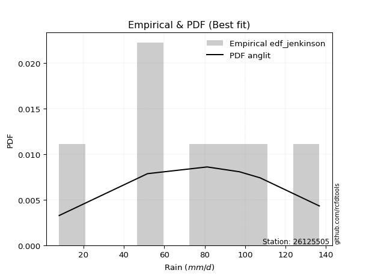</img>

</div>


### 11. EDF Cunnane (1978)

Cunnane´s work in statistical hydrology has focused on the performance and evaluation of different probability distributions (such as GEV, Gumbel, Lognormal) for flood frequency estimation. _b_ is a constant, typically set to 0.4.

<div align="center">


$P=(m-b)/(n+1-2b)$


</div>


**11.1. Empirical values**

<div align="center">

|                | 0                   | 1                   | 2                  | 3           | 4                  | 5                  | 6                  |
|:---------------|:--------------------|:--------------------|:-------------------|:------------|:-------------------|:-------------------|:-------------------|
| date           | 2023                | 2021                | 2022               | 2019        | 2017               | 2018               | 2020               |
| x              | 8.0                 | 51.7                | 51.7               | 81.2        | 97.2               | 107.4              | 136.7              |
| m              | 1                   | 2                   | 3                  | 4           | 5                  | 6                  | 7                  |
| empirical_dist | edf_cunnane         | edf_cunnane         | edf_cunnane        | edf_cunnane | edf_cunnane        | edf_cunnane        | edf_cunnane        |
| empirical      | 0.08333333333333333 | 0.22222222222222224 | 0.3611111111111111 | 0.5         | 0.6388888888888888 | 0.7777777777777777 | 0.9166666666666666 |
| empirical_tr   | 1.090909090909091   | 1.2857142857142856  | 1.565217391304348  | 2.0         | 2.7692307692307687 | 4.499999999999998  | 11.999999999999995 |

</div>


**11.2. Kolmogorov-Smirnov fit test (sorted by Δ)**


<div align="center">

|                | 0                   | 1                   | 2                   | 3                   | 4                   | 5                   | 6                   | 7                   | 8                   | 9                   | 10                  | 11                  | 12                  | 13                  | 14                  | 15                  | 16                  | 17                  | 18                  | 19                  | 20                  | 21                  | 22                  | 23                  | 24                  | 25                  | 26                  | 27                  | 28                  | 29                  | 30                  | 31                  | 32                  | 33                  | 34                  | 35                  | 36                  | 37                  | 38                  | 39                  | 40                  | 41                  | 42                  | 43                  | 44                  | 45                  | 46                  | 47                  | 48                  | 49                  | 50                  | 51                  | 52                  | 53                  | 54                  | 55                  | 56                  | 57                  | 58                  | 59                  | 60                  | 61                  | 62                  | 63                  | 64                  | 65                  | 66                  | 67                  | 68                  | 69                  | 70                  | 71                  | 72                  | 73                  | 74                  | 75                  | 76                  | 77                  | 78                  | 79                  | 80                  | 81                  | 82                  | 83                  | 84                  | 85                  | 86                  | 87                  | 88                  | 89                  | 90                  | 91                  | 92                  | 93                  | 94                  | 95                  | 96                  | 97                  | 98                  | 99                  | 100                 | 101                 | 102                 | 103                 | 104                 | 105                 | 106                 | 107                 | 108                 | 109                 | 110                 | 111                 | 112                 | 113                 | 114                 | 115                 | 116                 | 117                 | 118                 | 119                 | 120                 | 121                 | 122                 | 123                 | 124                 | 125                 | 126                 | 127                 | 128                 | 129                 | 130                 | 131                 | 132                 | 133                 | 134                 | 135                 | 136                 | 137                 | 138                 | 139                 | 140                 | 141                 | 142                 | 143                 | 144                 | 145                 | 146                 | 147                 | 148                 | 149                 | 150                 | 151                 | 152                 | 153                 | 154                 | 155                 | 156                 | 157                 | 158                 | 159                 |
|:---------------|:--------------------|:--------------------|:--------------------|:--------------------|:--------------------|:--------------------|:--------------------|:--------------------|:--------------------|:--------------------|:--------------------|:--------------------|:--------------------|:--------------------|:--------------------|:--------------------|:--------------------|:--------------------|:--------------------|:--------------------|:--------------------|:--------------------|:--------------------|:--------------------|:--------------------|:--------------------|:--------------------|:--------------------|:--------------------|:--------------------|:--------------------|:--------------------|:--------------------|:--------------------|:--------------------|:--------------------|:--------------------|:--------------------|:--------------------|:--------------------|:--------------------|:--------------------|:--------------------|:--------------------|:--------------------|:--------------------|:--------------------|:--------------------|:--------------------|:--------------------|:--------------------|:--------------------|:--------------------|:--------------------|:--------------------|:--------------------|:--------------------|:--------------------|:--------------------|:--------------------|:--------------------|:--------------------|:--------------------|:--------------------|:--------------------|:--------------------|:--------------------|:--------------------|:--------------------|:--------------------|:--------------------|:--------------------|:--------------------|:--------------------|:--------------------|:--------------------|:--------------------|:--------------------|:--------------------|:--------------------|:--------------------|:--------------------|:--------------------|:--------------------|:--------------------|:--------------------|:--------------------|:--------------------|:--------------------|:--------------------|:--------------------|:--------------------|:--------------------|:--------------------|:--------------------|:--------------------|:--------------------|:--------------------|:--------------------|:--------------------|:--------------------|:--------------------|:--------------------|:--------------------|:--------------------|:--------------------|:--------------------|:--------------------|:--------------------|:--------------------|:--------------------|:--------------------|:--------------------|:--------------------|:--------------------|:--------------------|:--------------------|:--------------------|:--------------------|:--------------------|:--------------------|:--------------------|:--------------------|:--------------------|:--------------------|:--------------------|:--------------------|:--------------------|:--------------------|:--------------------|:--------------------|:--------------------|:--------------------|:--------------------|:--------------------|:--------------------|:--------------------|:--------------------|:--------------------|:--------------------|:--------------------|:--------------------|:--------------------|:--------------------|:--------------------|:--------------------|:--------------------|:--------------------|:--------------------|:--------------------|:--------------------|:--------------------|:--------------------|:--------------------|:--------------------|:--------------------|:--------------------|:--------------------|:--------------------|:--------------------|
| station        | 26125505            | 26125505            | 26125505            | 26125505            | 26125505            | 26125505            | 26125505            | 26125505            | 26125505            | 26125505            | 26125505            | 26125505            | 26125505            | 26125505            | 26125505            | 26125505            | 26125505            | 26125505            | 26125505            | 26125505            | 26125505            | 26125505            | 26125505            | 26125505            | 26125505            | 26125505            | 26125505            | 26125505            | 26125505            | 26125505            | 26125505            | 26125505            | 26125505            | 26125505            | 26125505            | 26125505            | 26125505            | 26125505            | 26125505            | 26125505            | 26125505            | 26125505            | 26125505            | 26125505            | 26125505            | 26125505            | 26125505            | 26125505            | 26125505            | 26125505            | 26125505            | 26125505            | 26125505            | 26125505            | 26125505            | 26125505            | 26125505            | 26125505            | 26125505            | 26125505            | 26125505            | 26125505            | 26125505            | 26125505            | 26125505            | 26125505            | 26125505            | 26125505            | 26125505            | 26125505            | 26125505            | 26125505            | 26125505            | 26125505            | 26125505            | 26125505            | 26125505            | 26125505            | 26125505            | 26125505            | 26125505            | 26125505            | 26125505            | 26125505            | 26125505            | 26125505            | 26125505            | 26125505            | 26125505            | 26125505            | 26125505            | 26125505            | 26125505            | 26125505            | 26125505            | 26125505            | 26125505            | 26125505            | 26125505            | 26125505            | 26125505            | 26125505            | 26125505            | 26125505            | 26125505            | 26125505            | 26125505            | 26125505            | 26125505            | 26125505            | 26125505            | 26125505            | 26125505            | 26125505            | 26125505            | 26125505            | 26125505            | 26125505            | 26125505            | 26125505            | 26125505            | 26125505            | 26125505            | 26125505            | 26125505            | 26125505            | 26125505            | 26125505            | 26125505            | 26125505            | 26125505            | 26125505            | 26125505            | 26125505            | 26125505            | 26125505            | 26125505            | 26125505            | 26125505            | 26125505            | 26125505            | 26125505            | 26125505            | 26125505            | 26125505            | 26125505            | 26125505            | 26125505            | 26125505            | 26125505            | 26125505            | 26125505            | 26125505            | 26125505            | 26125505            | 26125505            | 26125505            | 26125505            | 26125505            | 26125505            |
| empirical_dist | edf_cunnane         | edf_cunnane         | edf_cunnane         | edf_cunnane         | edf_cunnane         | edf_cunnane         | edf_cunnane         | edf_cunnane         | edf_cunnane         | edf_cunnane         | edf_cunnane         | edf_cunnane         | edf_cunnane         | edf_cunnane         | edf_cunnane         | edf_cunnane         | edf_cunnane         | edf_cunnane         | edf_cunnane         | edf_cunnane         | edf_cunnane         | edf_cunnane         | edf_cunnane         | edf_cunnane         | edf_cunnane         | edf_cunnane         | edf_cunnane         | edf_cunnane         | edf_cunnane         | edf_cunnane         | edf_cunnane         | edf_cunnane         | edf_cunnane         | edf_cunnane         | edf_cunnane         | edf_cunnane         | edf_cunnane         | edf_cunnane         | edf_cunnane         | edf_cunnane         | edf_cunnane         | edf_cunnane         | edf_cunnane         | edf_cunnane         | edf_cunnane         | edf_cunnane         | edf_cunnane         | edf_cunnane         | edf_cunnane         | edf_cunnane         | edf_cunnane         | edf_cunnane         | edf_cunnane         | edf_cunnane         | edf_cunnane         | edf_cunnane         | edf_cunnane         | edf_cunnane         | edf_cunnane         | edf_cunnane         | edf_cunnane         | edf_cunnane         | edf_cunnane         | edf_cunnane         | edf_cunnane         | edf_cunnane         | edf_cunnane         | edf_cunnane         | edf_cunnane         | edf_cunnane         | edf_cunnane         | edf_cunnane         | edf_cunnane         | edf_cunnane         | edf_cunnane         | edf_cunnane         | edf_cunnane         | edf_cunnane         | edf_cunnane         | edf_cunnane         | edf_cunnane         | edf_cunnane         | edf_cunnane         | edf_cunnane         | edf_cunnane         | edf_cunnane         | edf_cunnane         | edf_cunnane         | edf_cunnane         | edf_cunnane         | edf_cunnane         | edf_cunnane         | edf_cunnane         | edf_cunnane         | edf_cunnane         | edf_cunnane         | edf_cunnane         | edf_cunnane         | edf_cunnane         | edf_cunnane         | edf_cunnane         | edf_cunnane         | edf_cunnane         | edf_cunnane         | edf_cunnane         | edf_cunnane         | edf_cunnane         | edf_cunnane         | edf_cunnane         | edf_cunnane         | edf_cunnane         | edf_cunnane         | edf_cunnane         | edf_cunnane         | edf_cunnane         | edf_cunnane         | edf_cunnane         | edf_cunnane         | edf_cunnane         | edf_cunnane         | edf_cunnane         | edf_cunnane         | edf_cunnane         | edf_cunnane         | edf_cunnane         | edf_cunnane         | edf_cunnane         | edf_cunnane         | edf_cunnane         | edf_cunnane         | edf_cunnane         | edf_cunnane         | edf_cunnane         | edf_cunnane         | edf_cunnane         | edf_cunnane         | edf_cunnane         | edf_cunnane         | edf_cunnane         | edf_cunnane         | edf_cunnane         | edf_cunnane         | edf_cunnane         | edf_cunnane         | edf_cunnane         | edf_cunnane         | edf_cunnane         | edf_cunnane         | edf_cunnane         | edf_cunnane         | edf_cunnane         | edf_cunnane         | edf_cunnane         | edf_cunnane         | edf_cunnane         | edf_cunnane         | edf_cunnane         | edf_cunnane         | edf_cunnane         | edf_cunnane         |
| p_dist         | anglit              | cosine              | logjohnsonsu        | invgamma            | rice                | maxwell             | semicircular        | invgauss            | loggenextreme       | logargus            | genpareto           | erlang              | gamma               | exponweib           | rayleigh            | burr                | logloggamma         | betaprime           | logvonmises_line    | f                   | nakagami            | logburr             | nct                 | norm                | crystalball         | truncnorm           | exponnorm           | t                   | ksone               | logmielke           | argus               | foldnorm            | weibull_min         | pearson3            | truncweibull_min    | johnsonsu           | kappa4              | logburr12           | genextreme          | vonmises_line       | skewnorm            | wrapcauchy          | logistic            | kappa3              | uniform             | halfnorm            | genlogistic         | loggompertz         | gumbel_r            | mielke              | tukeylambda         | logloglaplace       | logpearson3         | logdgamma           | kstwobign           | gausshyper          | hypsecant           | arcsine             | triang              | gumbel_l            | logdweibull         | moyal               | halflogistic        | loggumbel_l         | genhalflogistic     | ncf                 | laplace             | dweibull            | logt                | dgamma              | loglevy_l           | logtrapezoid        | bradford            | loggennorm          | loglaplace          | loglaplace          | logskewnorm         | loghypsecant        | logfoldnorm         | loglogistic         | wald                | beta                | logfatiguelife      | logrice             | lognorm             | logcrystalball      | logexponnorm        | logf                | lognct              | logerlang           | loggamma            | loggamma            | loganglit           | loginvgamma         | logsemicircular     | logalpha            | logarcsine          | logweibull_max      | logncf              | trapezoid           | lomax               | logmaxwell          | loginvgauss         | logbetaprime        | truncexpon          | levy_l              | genexpon            | lograyleigh         | loginvweibull       | loggenhalflogistic  | gennorm             | logtriang           | loggumbel_r         | loghalfnorm         | logcosine           | logkstwobign        | logmoyal            | loghalflogistic     | loggenexpon         | halfgennorm         | loggausshyper       | logbeta             | logjohnsonsb        | logwrapcauchy       | loggenpareto        | lognakagami         | logtruncnorm        | gompertz            | loglomax            | logwald             | burr12              | logkappa4           | logksone            | johnsonsb           | logtukeylambda      | loghalfgennorm      | logkappa3           | loguniform          | logexponweib        | gengamma            | loggengamma         | alpha               | logrdist            | invweibull          | logtruncweibull_min | logbradford         | logtruncexpon       | logweibull_min      | fatiguelife         | weibull_max         | powerlaw            | logexponpow         | truncpareto         | logpowerlaw         | exponpow            | logtruncpareto      | rdist               | loggenlogistic      | logvonmises         | vonmises            |
| delta          | 0.07175078923765646 | 0.07527700673079579 | 0.07617239912500706 | 0.07769101026848113 | 0.07922446286341406 | 0.08000019331322805 | 0.08326491624806767 | 0.08397889576883255 | 0.08424651955895668 | 0.08488299913341832 | 0.08703020725171529 | 0.08720678950253813 | 0.08747316625074769 | 0.08863976904605275 | 0.08977203528450528 | 0.08994628935451268 | 0.09079409537207425 | 0.09113103105439052 | 0.09128881118477794 | 0.09132863954502407 | 0.09284486124673669 | 0.09348352384683448 | 0.09382620109661699 | 0.09388333606535487 | 0.09388333623858774 | 0.09388333732840526 | 0.09388521180437359 | 0.09390277046595724 | 0.0984473038384576  | 0.09960527421402562 | 0.09970896943527535 | 0.10022510084832048 | 0.10065887984320782 | 0.10075609600076385 | 0.10143216324173535 | 0.10690259283404174 | 0.10736855331935105 | 0.10786656599898678 | 0.10895696508276592 | 0.11012102383128688 | 0.11423233317066323 | 0.11561337725628643 | 0.11635280399581288 | 0.116805429757499   | 0.11732711732711734 | 0.11733572852544272 | 0.11779535489077408 | 0.11944927757559518 | 0.11969111454297832 | 0.12365213105491055 | 0.1242981595668616  | 0.1260684742924011  | 0.12694997109954995 | 0.1273971120470322  | 0.12803325714949373 | 0.1305799382892804  | 0.13165777844561435 | 0.1330156447265625  | 0.13634936291304187 | 0.13749925851202743 | 0.1417362649816264  | 0.14454236911452512 | 0.14460834522563526 | 0.14885781743262758 | 0.14954523583969004 | 0.15251021175938376 | 0.15341587682131086 | 0.15557870026554546 | 0.1591540454602311  | 0.1642994605841914  | 0.16446068046657034 | 0.17660823197201733 | 0.18427403307695236 | 0.19853327442790702 | 0.20071027730476332 | 0.20071027730476332 | 0.20268982356976598 | 0.2039141326151687  | 0.20935493056387103 | 0.2105902978226404  | 0.21349867581521054 | 0.21432462789729956 | 0.21736082343394705 | 0.21852552168336317 | 0.2185265035777296  | 0.21852659523538434 | 0.21852813527452344 | 0.22014650928013438 | 0.22038051472394235 | 0.22319258432952468 | 0.22680748493366246 | 0.22680748493366246 | 0.22690838651761783 | 0.22968590624188065 | 0.23037002230253248 | 0.24231998450651746 | 0.24416300920840536 | 0.24566672873573292 | 0.2463604631683293  | 0.2470281681459564  | 0.24714877259394405 | 0.2529161234844882  | 0.25806760357994374 | 0.2589974774734075  | 0.25943181469471843 | 0.26061946690544263 | 0.2647491496365154  | 0.2649252593542947  | 0.26575588993948185 | 0.2695300756480019  | 0.2777777777777778  | 0.2787972858682113  | 0.2845194520580513  | 0.29884596573155975 | 0.30015139759608567 | 0.3089589155006417  | 0.3095852776312996  | 0.31905875617197643 | 0.3208595188183062  | 0.3233894258985023  | 0.3236801546811846  | 0.33118383016979813 | 0.3328726711828757  | 0.34346665947850574 | 0.3436672407041751  | 0.3601145145603202  | 0.3611010195390693  | 0.36111102819703256 | 0.37454280826364317 | 0.37910742090072136 | 0.38147619372291774 | 0.39697889045468127 | 0.4089699255902941  | 0.4186499428443966  | 0.4282590516430239  | 0.4301987804272286  | 0.43487639165463543 | 0.43520835515279743 | 0.45124498024151316 | 0.45785889525407575 | 0.4619827810715888  | 0.4684508548449847  | 0.4697879112958482  | 0.4779126344498441  | 0.49462363397745546 | 0.5068297759974292  | 0.5150451559413797  | 0.5379110055602743  | 0.5614278181115872  | 0.5940295765885216  | 0.6160665863679023  | 0.6381649137769828  | 0.6991694134199039  | 0.7027656142198403  | 0.7221946832810426  | 0.7464648049939535  | 0.7777777775870368  | 0.7777777777777777  | 1.1145841983089655  | 21.112128165676506  |
| deltao         | 0.48442053926100004 | 0.48442053926100004 | 0.48442053926100004 | 0.48442053926100004 | 0.48442053926100004 | 0.48442053926100004 | 0.48442053926100004 | 0.48442053926100004 | 0.48442053926100004 | 0.48442053926100004 | 0.48442053926100004 | 0.48442053926100004 | 0.48442053926100004 | 0.48442053926100004 | 0.48442053926100004 | 0.48442053926100004 | 0.48442053926100004 | 0.48442053926100004 | 0.48442053926100004 | 0.48442053926100004 | 0.48442053926100004 | 0.48442053926100004 | 0.48442053926100004 | 0.48442053926100004 | 0.48442053926100004 | 0.48442053926100004 | 0.48442053926100004 | 0.48442053926100004 | 0.48442053926100004 | 0.48442053926100004 | 0.48442053926100004 | 0.48442053926100004 | 0.48442053926100004 | 0.48442053926100004 | 0.48442053926100004 | 0.48442053926100004 | 0.48442053926100004 | 0.48442053926100004 | 0.48442053926100004 | 0.48442053926100004 | 0.48442053926100004 | 0.48442053926100004 | 0.48442053926100004 | 0.48442053926100004 | 0.48442053926100004 | 0.48442053926100004 | 0.48442053926100004 | 0.48442053926100004 | 0.48442053926100004 | 0.48442053926100004 | 0.48442053926100004 | 0.48442053926100004 | 0.48442053926100004 | 0.48442053926100004 | 0.48442053926100004 | 0.48442053926100004 | 0.48442053926100004 | 0.48442053926100004 | 0.48442053926100004 | 0.48442053926100004 | 0.48442053926100004 | 0.48442053926100004 | 0.48442053926100004 | 0.48442053926100004 | 0.48442053926100004 | 0.48442053926100004 | 0.48442053926100004 | 0.48442053926100004 | 0.48442053926100004 | 0.48442053926100004 | 0.48442053926100004 | 0.48442053926100004 | 0.48442053926100004 | 0.48442053926100004 | 0.48442053926100004 | 0.48442053926100004 | 0.48442053926100004 | 0.48442053926100004 | 0.48442053926100004 | 0.48442053926100004 | 0.48442053926100004 | 0.48442053926100004 | 0.48442053926100004 | 0.48442053926100004 | 0.48442053926100004 | 0.48442053926100004 | 0.48442053926100004 | 0.48442053926100004 | 0.48442053926100004 | 0.48442053926100004 | 0.48442053926100004 | 0.48442053926100004 | 0.48442053926100004 | 0.48442053926100004 | 0.48442053926100004 | 0.48442053926100004 | 0.48442053926100004 | 0.48442053926100004 | 0.48442053926100004 | 0.48442053926100004 | 0.48442053926100004 | 0.48442053926100004 | 0.48442053926100004 | 0.48442053926100004 | 0.48442053926100004 | 0.48442053926100004 | 0.48442053926100004 | 0.48442053926100004 | 0.48442053926100004 | 0.48442053926100004 | 0.48442053926100004 | 0.48442053926100004 | 0.48442053926100004 | 0.48442053926100004 | 0.48442053926100004 | 0.48442053926100004 | 0.48442053926100004 | 0.48442053926100004 | 0.48442053926100004 | 0.48442053926100004 | 0.48442053926100004 | 0.48442053926100004 | 0.48442053926100004 | 0.48442053926100004 | 0.48442053926100004 | 0.48442053926100004 | 0.48442053926100004 | 0.48442053926100004 | 0.48442053926100004 | 0.48442053926100004 | 0.48442053926100004 | 0.48442053926100004 | 0.48442053926100004 | 0.48442053926100004 | 0.48442053926100004 | 0.48442053926100004 | 0.48442053926100004 | 0.48442053926100004 | 0.48442053926100004 | 0.48442053926100004 | 0.48442053926100004 | 0.48442053926100004 | 0.48442053926100004 | 0.48442053926100004 | 0.48442053926100004 | 0.48442053926100004 | 0.48442053926100004 | 0.48442053926100004 | 0.48442053926100004 | 0.48442053926100004 | 0.48442053926100004 | 0.48442053926100004 | 0.48442053926100004 | 0.48442053926100004 | 0.48442053926100004 | 0.48442053926100004 | 0.48442053926100004 | 0.48442053926100004 | 0.48442053926100004 | 0.48442053926100004 |
| eval           | Δo > Δ              | Δo > Δ              | Δo > Δ              | Δo > Δ              | Δo > Δ              | Δo > Δ              | Δo > Δ              | Δo > Δ              | Δo > Δ              | Δo > Δ              | Δo > Δ              | Δo > Δ              | Δo > Δ              | Δo > Δ              | Δo > Δ              | Δo > Δ              | Δo > Δ              | Δo > Δ              | Δo > Δ              | Δo > Δ              | Δo > Δ              | Δo > Δ              | Δo > Δ              | Δo > Δ              | Δo > Δ              | Δo > Δ              | Δo > Δ              | Δo > Δ              | Δo > Δ              | Δo > Δ              | Δo > Δ              | Δo > Δ              | Δo > Δ              | Δo > Δ              | Δo > Δ              | Δo > Δ              | Δo > Δ              | Δo > Δ              | Δo > Δ              | Δo > Δ              | Δo > Δ              | Δo > Δ              | Δo > Δ              | Δo > Δ              | Δo > Δ              | Δo > Δ              | Δo > Δ              | Δo > Δ              | Δo > Δ              | Δo > Δ              | Δo > Δ              | Δo > Δ              | Δo > Δ              | Δo > Δ              | Δo > Δ              | Δo > Δ              | Δo > Δ              | Δo > Δ              | Δo > Δ              | Δo > Δ              | Δo > Δ              | Δo > Δ              | Δo > Δ              | Δo > Δ              | Δo > Δ              | Δo > Δ              | Δo > Δ              | Δo > Δ              | Δo > Δ              | Δo > Δ              | Δo > Δ              | Δo > Δ              | Δo > Δ              | Δo > Δ              | Δo > Δ              | Δo > Δ              | Δo > Δ              | Δo > Δ              | Δo > Δ              | Δo > Δ              | Δo > Δ              | Δo > Δ              | Δo > Δ              | Δo > Δ              | Δo > Δ              | Δo > Δ              | Δo > Δ              | Δo > Δ              | Δo > Δ              | Δo > Δ              | Δo > Δ              | Δo > Δ              | Δo > Δ              | Δo > Δ              | Δo > Δ              | Δo > Δ              | Δo > Δ              | Δo > Δ              | Δo > Δ              | Δo > Δ              | Δo > Δ              | Δo > Δ              | Δo > Δ              | Δo > Δ              | Δo > Δ              | Δo > Δ              | Δo > Δ              | Δo > Δ              | Δo > Δ              | Δo > Δ              | Δo > Δ              | Δo > Δ              | Δo > Δ              | Δo > Δ              | Δo > Δ              | Δo > Δ              | Δo > Δ              | Δo > Δ              | Δo > Δ              | Δo > Δ              | Δo > Δ              | Δo > Δ              | Δo > Δ              | Δo > Δ              | Δo > Δ              | Δo > Δ              | Δo > Δ              | Δo > Δ              | Δo > Δ              | Δo > Δ              | Δo > Δ              | Δo > Δ              | Δo > Δ              | Δo > Δ              | Δo > Δ              | Δo > Δ              | Δo > Δ              | Δo > Δ              | Δo > Δ              | Δo > Δ              | Δo > Δ              | Δo > Δ              | Δo > Δ              | Δo > Δ              | Δo <= Δ             | Δo <= Δ             | Δo <= Δ             | Δo <= Δ             | Δo <= Δ             | Δo <= Δ             | Δo <= Δ             | Δo <= Δ             | Δo <= Δ             | Δo <= Δ             | Δo <= Δ             | Δo <= Δ             | Δo <= Δ             | Δo <= Δ             | Δo <= Δ             | Δo <= Δ             |
| fit            | 1                   | 1                   | 1                   | 1                   | 1                   | 1                   | 1                   | 1                   | 1                   | 1                   | 1                   | 1                   | 1                   | 1                   | 1                   | 1                   | 1                   | 1                   | 1                   | 1                   | 1                   | 1                   | 1                   | 1                   | 1                   | 1                   | 1                   | 1                   | 1                   | 1                   | 1                   | 1                   | 1                   | 1                   | 1                   | 1                   | 1                   | 1                   | 1                   | 1                   | 1                   | 1                   | 1                   | 1                   | 1                   | 1                   | 1                   | 1                   | 1                   | 1                   | 1                   | 1                   | 1                   | 1                   | 1                   | 1                   | 1                   | 1                   | 1                   | 1                   | 1                   | 1                   | 1                   | 1                   | 1                   | 1                   | 1                   | 1                   | 1                   | 1                   | 1                   | 1                   | 1                   | 1                   | 1                   | 1                   | 1                   | 1                   | 1                   | 1                   | 1                   | 1                   | 1                   | 1                   | 1                   | 1                   | 1                   | 1                   | 1                   | 1                   | 1                   | 1                   | 1                   | 1                   | 1                   | 1                   | 1                   | 1                   | 1                   | 1                   | 1                   | 1                   | 1                   | 1                   | 1                   | 1                   | 1                   | 1                   | 1                   | 1                   | 1                   | 1                   | 1                   | 1                   | 1                   | 1                   | 1                   | 1                   | 1                   | 1                   | 1                   | 1                   | 1                   | 1                   | 1                   | 1                   | 1                   | 1                   | 1                   | 1                   | 1                   | 1                   | 1                   | 1                   | 1                   | 1                   | 1                   | 1                   | 1                   | 1                   | 1                   | 1                   | 1                   | 1                   | 0                   | 0                   | 0                   | 0                   | 0                   | 0                   | 0                   | 0                   | 0                   | 0                   | 0                   | 0                   | 0                   | 0                   | 0                   | 0                   |
| n              | 7                   | 7                   | 7                   | 7                   | 7                   | 7                   | 7                   | 7                   | 7                   | 7                   | 7                   | 7                   | 7                   | 7                   | 7                   | 7                   | 7                   | 7                   | 7                   | 7                   | 7                   | 7                   | 7                   | 7                   | 7                   | 7                   | 7                   | 7                   | 7                   | 7                   | 7                   | 7                   | 7                   | 7                   | 7                   | 7                   | 7                   | 7                   | 7                   | 7                   | 7                   | 7                   | 7                   | 7                   | 7                   | 7                   | 7                   | 7                   | 7                   | 7                   | 7                   | 7                   | 7                   | 7                   | 7                   | 7                   | 7                   | 7                   | 7                   | 7                   | 7                   | 7                   | 7                   | 7                   | 7                   | 7                   | 7                   | 7                   | 7                   | 7                   | 7                   | 7                   | 7                   | 7                   | 7                   | 7                   | 7                   | 7                   | 7                   | 7                   | 7                   | 7                   | 7                   | 7                   | 7                   | 7                   | 7                   | 7                   | 7                   | 7                   | 7                   | 7                   | 7                   | 7                   | 7                   | 7                   | 7                   | 7                   | 7                   | 7                   | 7                   | 7                   | 7                   | 7                   | 7                   | 7                   | 7                   | 7                   | 7                   | 7                   | 7                   | 7                   | 7                   | 7                   | 7                   | 7                   | 7                   | 7                   | 7                   | 7                   | 7                   | 7                   | 7                   | 7                   | 7                   | 7                   | 7                   | 7                   | 7                   | 7                   | 7                   | 7                   | 7                   | 7                   | 7                   | 7                   | 7                   | 7                   | 7                   | 7                   | 7                   | 7                   | 7                   | 7                   | 7                   | 7                   | 7                   | 7                   | 7                   | 7                   | 7                   | 7                   | 7                   | 7                   | 7                   | 7                   | 7                   | 7                   | 7                   | 7                   |
| best_fit       | 1                   | 0                   | 0                   | 0                   | 0                   | 0                   | 0                   | 0                   | 0                   | 0                   | 0                   | 0                   | 0                   | 0                   | 0                   | 0                   | 0                   | 0                   | 0                   | 0                   | 0                   | 0                   | 0                   | 0                   | 0                   | 0                   | 0                   | 0                   | 0                   | 0                   | 0                   | 0                   | 0                   | 0                   | 0                   | 0                   | 0                   | 0                   | 0                   | 0                   | 0                   | 0                   | 0                   | 0                   | 0                   | 0                   | 0                   | 0                   | 0                   | 0                   | 0                   | 0                   | 0                   | 0                   | 0                   | 0                   | 0                   | 0                   | 0                   | 0                   | 0                   | 0                   | 0                   | 0                   | 0                   | 0                   | 0                   | 0                   | 0                   | 0                   | 0                   | 0                   | 0                   | 0                   | 0                   | 0                   | 0                   | 0                   | 0                   | 0                   | 0                   | 0                   | 0                   | 0                   | 0                   | 0                   | 0                   | 0                   | 0                   | 0                   | 0                   | 0                   | 0                   | 0                   | 0                   | 0                   | 0                   | 0                   | 0                   | 0                   | 0                   | 0                   | 0                   | 0                   | 0                   | 0                   | 0                   | 0                   | 0                   | 0                   | 0                   | 0                   | 0                   | 0                   | 0                   | 0                   | 0                   | 0                   | 0                   | 0                   | 0                   | 0                   | 0                   | 0                   | 0                   | 0                   | 0                   | 0                   | 0                   | 0                   | 0                   | 0                   | 0                   | 0                   | 0                   | 0                   | 0                   | 0                   | 0                   | 0                   | 0                   | 0                   | 0                   | 0                   | 0                   | 0                   | 0                   | 0                   | 0                   | 0                   | 0                   | 0                   | 0                   | 0                   | 0                   | 0                   | 0                   | 0                   | 0                   | 0                   |
| best_fit_sort  | 1                   | 2                   | 3                   | 4                   | 5                   | 6                   | 7                   | 8                   | 9                   | 10                  | 11                  | 12                  | 13                  | 14                  | 15                  | 16                  | 17                  | 18                  | 19                  | 20                  | 21                  | 22                  | 23                  | 24                  | 25                  | 26                  | 27                  | 28                  | 29                  | 30                  | 31                  | 32                  | 33                  | 34                  | 35                  | 36                  | 37                  | 38                  | 39                  | 40                  | 41                  | 42                  | 43                  | 44                  | 45                  | 46                  | 47                  | 48                  | 49                  | 50                  | 51                  | 52                  | 53                  | 54                  | 55                  | 56                  | 57                  | 58                  | 59                  | 60                  | 61                  | 62                  | 63                  | 64                  | 65                  | 66                  | 67                  | 68                  | 69                  | 70                  | 71                  | 72                  | 73                  | 74                  | 75                  | 76                  | 77                  | 78                  | 79                  | 80                  | 81                  | 82                  | 83                  | 84                  | 85                  | 86                  | 87                  | 88                  | 89                  | 90                  | 91                  | 92                  | 93                  | 94                  | 95                  | 96                  | 97                  | 98                  | 99                  | 100                 | 101                 | 102                 | 103                 | 104                 | 105                 | 106                 | 107                 | 108                 | 109                 | 110                 | 111                 | 112                 | 113                 | 114                 | 115                 | 116                 | 117                 | 118                 | 119                 | 120                 | 121                 | 122                 | 123                 | 124                 | 125                 | 126                 | 127                 | 128                 | 129                 | 130                 | 131                 | 132                 | 133                 | 134                 | 135                 | 136                 | 137                 | 138                 | 139                 | 140                 | 141                 | 142                 | 143                 | 144                 | 145                 | 146                 | 147                 | 148                 | 149                 | 150                 | 151                 | 152                 | 153                 | 154                 | 155                 | 156                 | 157                 | 158                 | 159                 | 160                 |

</div>


**11.3. Best fit**

<div align="center">

|   id |   station | empirical_dist   | p_dist   |     delta |   deltao | eval   |   fit |   n |   best_fit |   best_fit_sort |
|-----:|----------:|:-----------------|:---------|----------:|---------:|:-------|------:|----:|-----------:|----------------:|
|    0 |  26125505 | edf_cunnane      | anglit   | 0.0717508 | 0.484421 | Δo > Δ |     1 |   7 |          1 |               1 |

</div>


<div align="center">

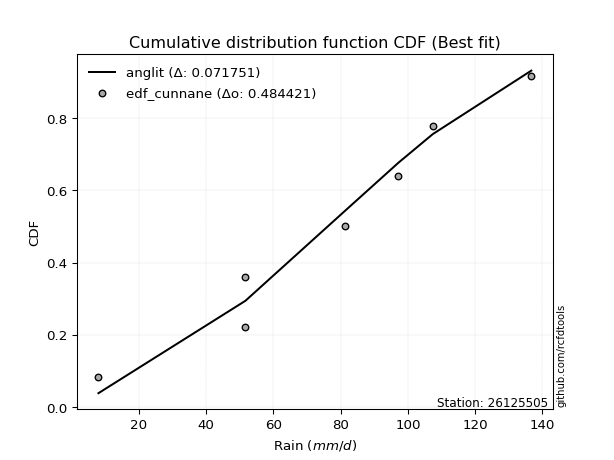</img></img>

</div>


### 12. EDF Adamowski (1981)

The Adamowski formula in hydrology refers to a specific plotting position formula used for estimating the non-parametric empirical distribution of hydrological events (like flood peaks) to calculate their return periods. This formula provides an alternative to traditional parametric methods (like the Gumbel or Log Pearson Type III distributions). 

<div align="center">


$P=(m-0.25)/(n+0.5)$


</div>


**12.1. Empirical values**

<div align="center">

|                | 0                  | 1                   | 2                   | 3             | 4                  | 5                  | 6                  |
|:---------------|:-------------------|:--------------------|:--------------------|:--------------|:-------------------|:-------------------|:-------------------|
| date           | 2023               | 2021                | 2022                | 2019          | 2017               | 2018               | 2020               |
| x              | 8.0                | 51.7                | 51.7                | 81.2          | 97.2               | 107.4              | 136.7              |
| m              | 1                  | 2                   | 3                   | 4             | 5                  | 6                  | 7                  |
| empirical_dist | edf_adamowski      | edf_adamowski       | edf_adamowski       | edf_adamowski | edf_adamowski      | edf_adamowski      | edf_adamowski      |
| empirical      | 0.1                | 0.23333333333333334 | 0.36666666666666664 | 0.5           | 0.6333333333333333 | 0.7666666666666667 | 0.9                |
| empirical_tr   | 1.1111111111111112 | 1.3043478260869565  | 1.5789473684210527  | 2.0           | 2.727272727272727  | 4.2857142857142865 | 10.000000000000002 |

</div>


**12.2. Kolmogorov-Smirnov fit test (sorted by Δ)**


<div align="center">

|                | 0                   | 1                   | 2                   | 3                   | 4                   | 5                   | 6                   | 7                   | 8                   | 9                   | 10                  | 11                  | 12                  | 13                  | 14                  | 15                  | 16                  | 17                  | 18                  | 19                  | 20                  | 21                  | 22                  | 23                  | 24                  | 25                  | 26                  | 27                  | 28                  | 29                  | 30                  | 31                  | 32                  | 33                  | 34                  | 35                  | 36                  | 37                  | 38                  | 39                  | 40                  | 41                  | 42                  | 43                  | 44                  | 45                  | 46                  | 47                  | 48                  | 49                  | 50                  | 51                  | 52                  | 53                  | 54                  | 55                  | 56                  | 57                  | 58                  | 59                  | 60                  | 61                  | 62                  | 63                  | 64                  | 65                  | 66                  | 67                  | 68                  | 69                  | 70                  | 71                  | 72                  | 73                  | 74                  | 75                  | 76                  | 77                  | 78                  | 79                  | 80                  | 81                  | 82                  | 83                  | 84                  | 85                  | 86                  | 87                  | 88                  | 89                  | 90                  | 91                  | 92                  | 93                  | 94                  | 95                  | 96                  | 97                  | 98                  | 99                  | 100                 | 101                 | 102                 | 103                 | 104                 | 105                 | 106                 | 107                 | 108                 | 109                 | 110                 | 111                 | 112                 | 113                 | 114                 | 115                 | 116                 | 117                 | 118                 | 119                 | 120                 | 121                 | 122                 | 123                 | 124                 | 125                 | 126                 | 127                 | 128                 | 129                 | 130                 | 131                 | 132                 | 133                 | 134                 | 135                 | 136                 | 137                 | 138                 | 139                 | 140                 | 141                 | 142                 | 143                 | 144                 | 145                 | 146                 | 147                 | 148                 | 149                 | 150                 | 151                 | 152                 | 153                 | 154                 | 155                 | 156                 | 157                 | 158                 | 159                 |
|:---------------|:--------------------|:--------------------|:--------------------|:--------------------|:--------------------|:--------------------|:--------------------|:--------------------|:--------------------|:--------------------|:--------------------|:--------------------|:--------------------|:--------------------|:--------------------|:--------------------|:--------------------|:--------------------|:--------------------|:--------------------|:--------------------|:--------------------|:--------------------|:--------------------|:--------------------|:--------------------|:--------------------|:--------------------|:--------------------|:--------------------|:--------------------|:--------------------|:--------------------|:--------------------|:--------------------|:--------------------|:--------------------|:--------------------|:--------------------|:--------------------|:--------------------|:--------------------|:--------------------|:--------------------|:--------------------|:--------------------|:--------------------|:--------------------|:--------------------|:--------------------|:--------------------|:--------------------|:--------------------|:--------------------|:--------------------|:--------------------|:--------------------|:--------------------|:--------------------|:--------------------|:--------------------|:--------------------|:--------------------|:--------------------|:--------------------|:--------------------|:--------------------|:--------------------|:--------------------|:--------------------|:--------------------|:--------------------|:--------------------|:--------------------|:--------------------|:--------------------|:--------------------|:--------------------|:--------------------|:--------------------|:--------------------|:--------------------|:--------------------|:--------------------|:--------------------|:--------------------|:--------------------|:--------------------|:--------------------|:--------------------|:--------------------|:--------------------|:--------------------|:--------------------|:--------------------|:--------------------|:--------------------|:--------------------|:--------------------|:--------------------|:--------------------|:--------------------|:--------------------|:--------------------|:--------------------|:--------------------|:--------------------|:--------------------|:--------------------|:--------------------|:--------------------|:--------------------|:--------------------|:--------------------|:--------------------|:--------------------|:--------------------|:--------------------|:--------------------|:--------------------|:--------------------|:--------------------|:--------------------|:--------------------|:--------------------|:--------------------|:--------------------|:--------------------|:--------------------|:--------------------|:--------------------|:--------------------|:--------------------|:--------------------|:--------------------|:--------------------|:--------------------|:--------------------|:--------------------|:--------------------|:--------------------|:--------------------|:--------------------|:--------------------|:--------------------|:--------------------|:--------------------|:--------------------|:--------------------|:--------------------|:--------------------|:--------------------|:--------------------|:--------------------|:--------------------|:--------------------|:--------------------|:--------------------|:--------------------|:--------------------|
| station        | 26125505            | 26125505            | 26125505            | 26125505            | 26125505            | 26125505            | 26125505            | 26125505            | 26125505            | 26125505            | 26125505            | 26125505            | 26125505            | 26125505            | 26125505            | 26125505            | 26125505            | 26125505            | 26125505            | 26125505            | 26125505            | 26125505            | 26125505            | 26125505            | 26125505            | 26125505            | 26125505            | 26125505            | 26125505            | 26125505            | 26125505            | 26125505            | 26125505            | 26125505            | 26125505            | 26125505            | 26125505            | 26125505            | 26125505            | 26125505            | 26125505            | 26125505            | 26125505            | 26125505            | 26125505            | 26125505            | 26125505            | 26125505            | 26125505            | 26125505            | 26125505            | 26125505            | 26125505            | 26125505            | 26125505            | 26125505            | 26125505            | 26125505            | 26125505            | 26125505            | 26125505            | 26125505            | 26125505            | 26125505            | 26125505            | 26125505            | 26125505            | 26125505            | 26125505            | 26125505            | 26125505            | 26125505            | 26125505            | 26125505            | 26125505            | 26125505            | 26125505            | 26125505            | 26125505            | 26125505            | 26125505            | 26125505            | 26125505            | 26125505            | 26125505            | 26125505            | 26125505            | 26125505            | 26125505            | 26125505            | 26125505            | 26125505            | 26125505            | 26125505            | 26125505            | 26125505            | 26125505            | 26125505            | 26125505            | 26125505            | 26125505            | 26125505            | 26125505            | 26125505            | 26125505            | 26125505            | 26125505            | 26125505            | 26125505            | 26125505            | 26125505            | 26125505            | 26125505            | 26125505            | 26125505            | 26125505            | 26125505            | 26125505            | 26125505            | 26125505            | 26125505            | 26125505            | 26125505            | 26125505            | 26125505            | 26125505            | 26125505            | 26125505            | 26125505            | 26125505            | 26125505            | 26125505            | 26125505            | 26125505            | 26125505            | 26125505            | 26125505            | 26125505            | 26125505            | 26125505            | 26125505            | 26125505            | 26125505            | 26125505            | 26125505            | 26125505            | 26125505            | 26125505            | 26125505            | 26125505            | 26125505            | 26125505            | 26125505            | 26125505            | 26125505            | 26125505            | 26125505            | 26125505            | 26125505            | 26125505            |
| empirical_dist | edf_adamowski       | edf_adamowski       | edf_adamowski       | edf_adamowski       | edf_adamowski       | edf_adamowski       | edf_adamowski       | edf_adamowski       | edf_adamowski       | edf_adamowski       | edf_adamowski       | edf_adamowski       | edf_adamowski       | edf_adamowski       | edf_adamowski       | edf_adamowski       | edf_adamowski       | edf_adamowski       | edf_adamowski       | edf_adamowski       | edf_adamowski       | edf_adamowski       | edf_adamowski       | edf_adamowski       | edf_adamowski       | edf_adamowski       | edf_adamowski       | edf_adamowski       | edf_adamowski       | edf_adamowski       | edf_adamowski       | edf_adamowski       | edf_adamowski       | edf_adamowski       | edf_adamowski       | edf_adamowski       | edf_adamowski       | edf_adamowski       | edf_adamowski       | edf_adamowski       | edf_adamowski       | edf_adamowski       | edf_adamowski       | edf_adamowski       | edf_adamowski       | edf_adamowski       | edf_adamowski       | edf_adamowski       | edf_adamowski       | edf_adamowski       | edf_adamowski       | edf_adamowski       | edf_adamowski       | edf_adamowski       | edf_adamowski       | edf_adamowski       | edf_adamowski       | edf_adamowski       | edf_adamowski       | edf_adamowski       | edf_adamowski       | edf_adamowski       | edf_adamowski       | edf_adamowski       | edf_adamowski       | edf_adamowski       | edf_adamowski       | edf_adamowski       | edf_adamowski       | edf_adamowski       | edf_adamowski       | edf_adamowski       | edf_adamowski       | edf_adamowski       | edf_adamowski       | edf_adamowski       | edf_adamowski       | edf_adamowski       | edf_adamowski       | edf_adamowski       | edf_adamowski       | edf_adamowski       | edf_adamowski       | edf_adamowski       | edf_adamowski       | edf_adamowski       | edf_adamowski       | edf_adamowski       | edf_adamowski       | edf_adamowski       | edf_adamowski       | edf_adamowski       | edf_adamowski       | edf_adamowski       | edf_adamowski       | edf_adamowski       | edf_adamowski       | edf_adamowski       | edf_adamowski       | edf_adamowski       | edf_adamowski       | edf_adamowski       | edf_adamowski       | edf_adamowski       | edf_adamowski       | edf_adamowski       | edf_adamowski       | edf_adamowski       | edf_adamowski       | edf_adamowski       | edf_adamowski       | edf_adamowski       | edf_adamowski       | edf_adamowski       | edf_adamowski       | edf_adamowski       | edf_adamowski       | edf_adamowski       | edf_adamowski       | edf_adamowski       | edf_adamowski       | edf_adamowski       | edf_adamowski       | edf_adamowski       | edf_adamowski       | edf_adamowski       | edf_adamowski       | edf_adamowski       | edf_adamowski       | edf_adamowski       | edf_adamowski       | edf_adamowski       | edf_adamowski       | edf_adamowski       | edf_adamowski       | edf_adamowski       | edf_adamowski       | edf_adamowski       | edf_adamowski       | edf_adamowski       | edf_adamowski       | edf_adamowski       | edf_adamowski       | edf_adamowski       | edf_adamowski       | edf_adamowski       | edf_adamowski       | edf_adamowski       | edf_adamowski       | edf_adamowski       | edf_adamowski       | edf_adamowski       | edf_adamowski       | edf_adamowski       | edf_adamowski       | edf_adamowski       | edf_adamowski       | edf_adamowski       | edf_adamowski       | edf_adamowski       |
| p_dist         | semicircular        | anglit              | logargus            | cosine              | logjohnsonsu        | logburr             | invgamma            | maxwell             | burr                | rice                | invgauss            | exponweib           | rayleigh            | erlang              | gamma               | logmielke           | betaprime           | f                   | ksone               | nakagami            | nct                 | norm                | crystalball         | truncnorm           | exponnorm           | t                   | logloggamma         | vonmises_line       | logvonmises_line    | genpareto           | truncweibull_min    | loggenextreme       | kappa4              | logburr12           | wrapcauchy          | argus               | kappa3              | foldnorm            | weibull_min         | uniform             | pearson3            | loggompertz         | johnsonsu           | mielke              | tukeylambda         | genextreme          | logpearson3         | kstwobign           | halfnorm            | gausshyper          | gumbel_r            | skewnorm            | arcsine             | logistic            | genlogistic         | logdweibull         | logdgamma           | logloglaplace       | hypsecant           | loggumbel_l         | genhalflogistic     | ncf                 | triang              | gumbel_l            | dweibull            | moyal               | halflogistic        | dgamma              | loglevy_l           | laplace             | logt                | logtrapezoid        | bradford            | logskewnorm         | loghypsecant        | logfoldnorm         | loglogistic         | loglaplace          | loglaplace          | beta                | loggennorm          | logfatiguelife      | logrice             | lognorm             | logcrystalball      | logexponnorm        | logf                | lognct              | logerlang           | wald                | loggamma            | loggamma            | loganglit           | loginvgamma         | logsemicircular     | logalpha            | logarcsine          | logweibull_max      | logncf              | trapezoid           | lomax               | logmaxwell          | levy_l              | loginvgauss         | logbetaprime        | truncexpon          | genexpon            | lograyleigh         | loginvweibull       | loggenhalflogistic  | gennorm             | logtriang           | loggumbel_r         | loghalfnorm         | logcosine           | logkstwobign        | logmoyal            | loghalflogistic     | loggenexpon         | halfgennorm         | loggausshyper       | logbeta             | logjohnsonsb        | logwrapcauchy       | loggenpareto        | loglomax            | lognakagami         | logtruncnorm        | gompertz            | logwald             | burr12              | logkappa4           | logksone            | johnsonsb           | logtukeylambda      | loghalfgennorm      | logkappa3           | loguniform          | logexponweib        | loggengamma         | gengamma            | alpha               | logrdist            | invweibull          | logtruncweibull_min | logbradford         | logtruncexpon       | logweibull_min      | fatiguelife         | weibull_max         | powerlaw            | logexponpow         | truncpareto         | logpowerlaw         | exponpow            | logtruncpareto      | rdist               | loggenlogistic      | logvonmises         | vonmises            |
| delta          | 0.07215380513695657 | 0.07269365520678794 | 0.07910809675313393 | 0.08083256228635133 | 0.0817279546805626  | 0.08237241273572338 | 0.08297147678182581 | 0.08402169169686813 | 0.08419998183932642 | 0.0847800184189696  | 0.08620516134113143 | 0.08863976904605275 | 0.09252298664262994 | 0.09276234505809366 | 0.09302872180630323 | 0.0957035757833744  | 0.09668658660994606 | 0.0968841951005796  | 0.09826763660233194 | 0.09840041680229222 | 0.09938175665217253 | 0.09943889162091041 | 0.09943889179414328 | 0.0994388928839608  | 0.09944076735992913 | 0.09945832602151278 | 0.09993615219128016 | 0.09999999386850766 | 0.09999999979918098 | 0.09999999999920561 | 0.09999999999971365 | 0.09999999999997833 | 0.09999999999999942 | 0.10304993934653561 | 0.10450226614517533 | 0.10526452499083089 | 0.1056943186463879  | 0.10578065640387602 | 0.10621443539876335 | 0.10621600621600624 | 0.10631165155631939 | 0.11011842834609586 | 0.11245814838959728 | 0.11254101994379945 | 0.1131870484557505  | 0.11451252063832146 | 0.11583885998843885 | 0.11692214603838263 | 0.11733572852544272 | 0.11946882717816931 | 0.11969111454297832 | 0.11978788872621876 | 0.1219045336154514  | 0.12190835955136842 | 0.12335091044632962 | 0.12506959831495978 | 0.13090557324331564 | 0.13151186078495503 | 0.1372133340011699  | 0.13774670632151648 | 0.13843412472857908 | 0.14139910064827266 | 0.1419049184685974  | 0.14305481406758297 | 0.14446758915443436 | 0.14454236911452512 | 0.14460834522563526 | 0.1531883494730803  | 0.15334956935545924 | 0.1589714323768664  | 0.16470960101578663 | 0.16549712086090623 | 0.17316292196584127 | 0.19157871245865488 | 0.1928030215040576  | 0.19824381945275993 | 0.1994791867115293  | 0.20071027730476332 | 0.20071027730476332 | 0.2032135167861886  | 0.20408882998346256 | 0.20624971232283595 | 0.20741441057225207 | 0.2074153924666185  | 0.20741548412427324 | 0.20741702416341234 | 0.20903539816902328 | 0.20926940361283125 | 0.21208147321841359 | 0.21349867581521054 | 0.21569637382255136 | 0.21569637382255136 | 0.21579727540650673 | 0.21857479513076955 | 0.21925891119142138 | 0.23120887339540636 | 0.23305189809729426 | 0.23455561762462196 | 0.2352493520572182  | 0.23591705703484545 | 0.23603766148283295 | 0.24180501237337715 | 0.24395280023877594 | 0.24695649246883267 | 0.24788636636229638 | 0.24832070358360736 | 0.2536380385254043  | 0.25381414824318355 | 0.2546447788283707  | 0.2584189645368908  | 0.2666666666666667  | 0.26768617475710016 | 0.27340834094694016 | 0.2877348546204486  | 0.28904028648497454 | 0.29784780438953057 | 0.2984741665201885  | 0.3079476450608653  | 0.3097484077071951  | 0.31227831478739115 | 0.3125690435700735  | 0.32007271905868717 | 0.32176156007176476 | 0.3323555483673946  | 0.33255612959306396 | 0.36343169715253204 | 0.3656700701158757  | 0.36665657509462485 | 0.3666665837525881  | 0.36799630978961023 | 0.3703650826118066  | 0.38586777934357014 | 0.397858814479183   | 0.40753883173328564 | 0.4171479405319128  | 0.41908766931611746 | 0.4237652805435243  | 0.4240972440416863  | 0.44013386913040203 | 0.4453161144049222  | 0.4467477841429646  | 0.4573397437338736  | 0.45867680018473705 | 0.4612459677831775  | 0.48351252286634433 | 0.49571866488631805 | 0.5039340448302685  | 0.5267998944491632  | 0.550316707000476   | 0.5829184654774107  | 0.6049554752567912  | 0.6270538026658716  | 0.6880583023087927  | 0.6916545031087291  | 0.7110835721699316  | 0.7353536938828424  | 0.7666666664759256  | 0.7666666666666667  | 1.1034730871978544  | 21.128794832343175  |
| deltao         | 0.48442053926100004 | 0.48442053926100004 | 0.48442053926100004 | 0.48442053926100004 | 0.48442053926100004 | 0.48442053926100004 | 0.48442053926100004 | 0.48442053926100004 | 0.48442053926100004 | 0.48442053926100004 | 0.48442053926100004 | 0.48442053926100004 | 0.48442053926100004 | 0.48442053926100004 | 0.48442053926100004 | 0.48442053926100004 | 0.48442053926100004 | 0.48442053926100004 | 0.48442053926100004 | 0.48442053926100004 | 0.48442053926100004 | 0.48442053926100004 | 0.48442053926100004 | 0.48442053926100004 | 0.48442053926100004 | 0.48442053926100004 | 0.48442053926100004 | 0.48442053926100004 | 0.48442053926100004 | 0.48442053926100004 | 0.48442053926100004 | 0.48442053926100004 | 0.48442053926100004 | 0.48442053926100004 | 0.48442053926100004 | 0.48442053926100004 | 0.48442053926100004 | 0.48442053926100004 | 0.48442053926100004 | 0.48442053926100004 | 0.48442053926100004 | 0.48442053926100004 | 0.48442053926100004 | 0.48442053926100004 | 0.48442053926100004 | 0.48442053926100004 | 0.48442053926100004 | 0.48442053926100004 | 0.48442053926100004 | 0.48442053926100004 | 0.48442053926100004 | 0.48442053926100004 | 0.48442053926100004 | 0.48442053926100004 | 0.48442053926100004 | 0.48442053926100004 | 0.48442053926100004 | 0.48442053926100004 | 0.48442053926100004 | 0.48442053926100004 | 0.48442053926100004 | 0.48442053926100004 | 0.48442053926100004 | 0.48442053926100004 | 0.48442053926100004 | 0.48442053926100004 | 0.48442053926100004 | 0.48442053926100004 | 0.48442053926100004 | 0.48442053926100004 | 0.48442053926100004 | 0.48442053926100004 | 0.48442053926100004 | 0.48442053926100004 | 0.48442053926100004 | 0.48442053926100004 | 0.48442053926100004 | 0.48442053926100004 | 0.48442053926100004 | 0.48442053926100004 | 0.48442053926100004 | 0.48442053926100004 | 0.48442053926100004 | 0.48442053926100004 | 0.48442053926100004 | 0.48442053926100004 | 0.48442053926100004 | 0.48442053926100004 | 0.48442053926100004 | 0.48442053926100004 | 0.48442053926100004 | 0.48442053926100004 | 0.48442053926100004 | 0.48442053926100004 | 0.48442053926100004 | 0.48442053926100004 | 0.48442053926100004 | 0.48442053926100004 | 0.48442053926100004 | 0.48442053926100004 | 0.48442053926100004 | 0.48442053926100004 | 0.48442053926100004 | 0.48442053926100004 | 0.48442053926100004 | 0.48442053926100004 | 0.48442053926100004 | 0.48442053926100004 | 0.48442053926100004 | 0.48442053926100004 | 0.48442053926100004 | 0.48442053926100004 | 0.48442053926100004 | 0.48442053926100004 | 0.48442053926100004 | 0.48442053926100004 | 0.48442053926100004 | 0.48442053926100004 | 0.48442053926100004 | 0.48442053926100004 | 0.48442053926100004 | 0.48442053926100004 | 0.48442053926100004 | 0.48442053926100004 | 0.48442053926100004 | 0.48442053926100004 | 0.48442053926100004 | 0.48442053926100004 | 0.48442053926100004 | 0.48442053926100004 | 0.48442053926100004 | 0.48442053926100004 | 0.48442053926100004 | 0.48442053926100004 | 0.48442053926100004 | 0.48442053926100004 | 0.48442053926100004 | 0.48442053926100004 | 0.48442053926100004 | 0.48442053926100004 | 0.48442053926100004 | 0.48442053926100004 | 0.48442053926100004 | 0.48442053926100004 | 0.48442053926100004 | 0.48442053926100004 | 0.48442053926100004 | 0.48442053926100004 | 0.48442053926100004 | 0.48442053926100004 | 0.48442053926100004 | 0.48442053926100004 | 0.48442053926100004 | 0.48442053926100004 | 0.48442053926100004 | 0.48442053926100004 | 0.48442053926100004 | 0.48442053926100004 | 0.48442053926100004 | 0.48442053926100004 |
| eval           | Δo > Δ              | Δo > Δ              | Δo > Δ              | Δo > Δ              | Δo > Δ              | Δo > Δ              | Δo > Δ              | Δo > Δ              | Δo > Δ              | Δo > Δ              | Δo > Δ              | Δo > Δ              | Δo > Δ              | Δo > Δ              | Δo > Δ              | Δo > Δ              | Δo > Δ              | Δo > Δ              | Δo > Δ              | Δo > Δ              | Δo > Δ              | Δo > Δ              | Δo > Δ              | Δo > Δ              | Δo > Δ              | Δo > Δ              | Δo > Δ              | Δo > Δ              | Δo > Δ              | Δo > Δ              | Δo > Δ              | Δo > Δ              | Δo > Δ              | Δo > Δ              | Δo > Δ              | Δo > Δ              | Δo > Δ              | Δo > Δ              | Δo > Δ              | Δo > Δ              | Δo > Δ              | Δo > Δ              | Δo > Δ              | Δo > Δ              | Δo > Δ              | Δo > Δ              | Δo > Δ              | Δo > Δ              | Δo > Δ              | Δo > Δ              | Δo > Δ              | Δo > Δ              | Δo > Δ              | Δo > Δ              | Δo > Δ              | Δo > Δ              | Δo > Δ              | Δo > Δ              | Δo > Δ              | Δo > Δ              | Δo > Δ              | Δo > Δ              | Δo > Δ              | Δo > Δ              | Δo > Δ              | Δo > Δ              | Δo > Δ              | Δo > Δ              | Δo > Δ              | Δo > Δ              | Δo > Δ              | Δo > Δ              | Δo > Δ              | Δo > Δ              | Δo > Δ              | Δo > Δ              | Δo > Δ              | Δo > Δ              | Δo > Δ              | Δo > Δ              | Δo > Δ              | Δo > Δ              | Δo > Δ              | Δo > Δ              | Δo > Δ              | Δo > Δ              | Δo > Δ              | Δo > Δ              | Δo > Δ              | Δo > Δ              | Δo > Δ              | Δo > Δ              | Δo > Δ              | Δo > Δ              | Δo > Δ              | Δo > Δ              | Δo > Δ              | Δo > Δ              | Δo > Δ              | Δo > Δ              | Δo > Δ              | Δo > Δ              | Δo > Δ              | Δo > Δ              | Δo > Δ              | Δo > Δ              | Δo > Δ              | Δo > Δ              | Δo > Δ              | Δo > Δ              | Δo > Δ              | Δo > Δ              | Δo > Δ              | Δo > Δ              | Δo > Δ              | Δo > Δ              | Δo > Δ              | Δo > Δ              | Δo > Δ              | Δo > Δ              | Δo > Δ              | Δo > Δ              | Δo > Δ              | Δo > Δ              | Δo > Δ              | Δo > Δ              | Δo > Δ              | Δo > Δ              | Δo > Δ              | Δo > Δ              | Δo > Δ              | Δo > Δ              | Δo > Δ              | Δo > Δ              | Δo > Δ              | Δo > Δ              | Δo > Δ              | Δo > Δ              | Δo > Δ              | Δo > Δ              | Δo > Δ              | Δo > Δ              | Δo > Δ              | Δo > Δ              | Δo > Δ              | Δo <= Δ             | Δo <= Δ             | Δo <= Δ             | Δo <= Δ             | Δo <= Δ             | Δo <= Δ             | Δo <= Δ             | Δo <= Δ             | Δo <= Δ             | Δo <= Δ             | Δo <= Δ             | Δo <= Δ             | Δo <= Δ             | Δo <= Δ             | Δo <= Δ             |
| fit            | 1                   | 1                   | 1                   | 1                   | 1                   | 1                   | 1                   | 1                   | 1                   | 1                   | 1                   | 1                   | 1                   | 1                   | 1                   | 1                   | 1                   | 1                   | 1                   | 1                   | 1                   | 1                   | 1                   | 1                   | 1                   | 1                   | 1                   | 1                   | 1                   | 1                   | 1                   | 1                   | 1                   | 1                   | 1                   | 1                   | 1                   | 1                   | 1                   | 1                   | 1                   | 1                   | 1                   | 1                   | 1                   | 1                   | 1                   | 1                   | 1                   | 1                   | 1                   | 1                   | 1                   | 1                   | 1                   | 1                   | 1                   | 1                   | 1                   | 1                   | 1                   | 1                   | 1                   | 1                   | 1                   | 1                   | 1                   | 1                   | 1                   | 1                   | 1                   | 1                   | 1                   | 1                   | 1                   | 1                   | 1                   | 1                   | 1                   | 1                   | 1                   | 1                   | 1                   | 1                   | 1                   | 1                   | 1                   | 1                   | 1                   | 1                   | 1                   | 1                   | 1                   | 1                   | 1                   | 1                   | 1                   | 1                   | 1                   | 1                   | 1                   | 1                   | 1                   | 1                   | 1                   | 1                   | 1                   | 1                   | 1                   | 1                   | 1                   | 1                   | 1                   | 1                   | 1                   | 1                   | 1                   | 1                   | 1                   | 1                   | 1                   | 1                   | 1                   | 1                   | 1                   | 1                   | 1                   | 1                   | 1                   | 1                   | 1                   | 1                   | 1                   | 1                   | 1                   | 1                   | 1                   | 1                   | 1                   | 1                   | 1                   | 1                   | 1                   | 1                   | 1                   | 0                   | 0                   | 0                   | 0                   | 0                   | 0                   | 0                   | 0                   | 0                   | 0                   | 0                   | 0                   | 0                   | 0                   | 0                   |
| n              | 7                   | 7                   | 7                   | 7                   | 7                   | 7                   | 7                   | 7                   | 7                   | 7                   | 7                   | 7                   | 7                   | 7                   | 7                   | 7                   | 7                   | 7                   | 7                   | 7                   | 7                   | 7                   | 7                   | 7                   | 7                   | 7                   | 7                   | 7                   | 7                   | 7                   | 7                   | 7                   | 7                   | 7                   | 7                   | 7                   | 7                   | 7                   | 7                   | 7                   | 7                   | 7                   | 7                   | 7                   | 7                   | 7                   | 7                   | 7                   | 7                   | 7                   | 7                   | 7                   | 7                   | 7                   | 7                   | 7                   | 7                   | 7                   | 7                   | 7                   | 7                   | 7                   | 7                   | 7                   | 7                   | 7                   | 7                   | 7                   | 7                   | 7                   | 7                   | 7                   | 7                   | 7                   | 7                   | 7                   | 7                   | 7                   | 7                   | 7                   | 7                   | 7                   | 7                   | 7                   | 7                   | 7                   | 7                   | 7                   | 7                   | 7                   | 7                   | 7                   | 7                   | 7                   | 7                   | 7                   | 7                   | 7                   | 7                   | 7                   | 7                   | 7                   | 7                   | 7                   | 7                   | 7                   | 7                   | 7                   | 7                   | 7                   | 7                   | 7                   | 7                   | 7                   | 7                   | 7                   | 7                   | 7                   | 7                   | 7                   | 7                   | 7                   | 7                   | 7                   | 7                   | 7                   | 7                   | 7                   | 7                   | 7                   | 7                   | 7                   | 7                   | 7                   | 7                   | 7                   | 7                   | 7                   | 7                   | 7                   | 7                   | 7                   | 7                   | 7                   | 7                   | 7                   | 7                   | 7                   | 7                   | 7                   | 7                   | 7                   | 7                   | 7                   | 7                   | 7                   | 7                   | 7                   | 7                   | 7                   |
| best_fit       | 1                   | 0                   | 0                   | 0                   | 0                   | 0                   | 0                   | 0                   | 0                   | 0                   | 0                   | 0                   | 0                   | 0                   | 0                   | 0                   | 0                   | 0                   | 0                   | 0                   | 0                   | 0                   | 0                   | 0                   | 0                   | 0                   | 0                   | 0                   | 0                   | 0                   | 0                   | 0                   | 0                   | 0                   | 0                   | 0                   | 0                   | 0                   | 0                   | 0                   | 0                   | 0                   | 0                   | 0                   | 0                   | 0                   | 0                   | 0                   | 0                   | 0                   | 0                   | 0                   | 0                   | 0                   | 0                   | 0                   | 0                   | 0                   | 0                   | 0                   | 0                   | 0                   | 0                   | 0                   | 0                   | 0                   | 0                   | 0                   | 0                   | 0                   | 0                   | 0                   | 0                   | 0                   | 0                   | 0                   | 0                   | 0                   | 0                   | 0                   | 0                   | 0                   | 0                   | 0                   | 0                   | 0                   | 0                   | 0                   | 0                   | 0                   | 0                   | 0                   | 0                   | 0                   | 0                   | 0                   | 0                   | 0                   | 0                   | 0                   | 0                   | 0                   | 0                   | 0                   | 0                   | 0                   | 0                   | 0                   | 0                   | 0                   | 0                   | 0                   | 0                   | 0                   | 0                   | 0                   | 0                   | 0                   | 0                   | 0                   | 0                   | 0                   | 0                   | 0                   | 0                   | 0                   | 0                   | 0                   | 0                   | 0                   | 0                   | 0                   | 0                   | 0                   | 0                   | 0                   | 0                   | 0                   | 0                   | 0                   | 0                   | 0                   | 0                   | 0                   | 0                   | 0                   | 0                   | 0                   | 0                   | 0                   | 0                   | 0                   | 0                   | 0                   | 0                   | 0                   | 0                   | 0                   | 0                   | 0                   |
| best_fit_sort  | 1                   | 2                   | 3                   | 4                   | 5                   | 6                   | 7                   | 8                   | 9                   | 10                  | 11                  | 12                  | 13                  | 14                  | 15                  | 16                  | 17                  | 18                  | 19                  | 20                  | 21                  | 22                  | 23                  | 24                  | 25                  | 26                  | 27                  | 28                  | 29                  | 30                  | 31                  | 32                  | 33                  | 34                  | 35                  | 36                  | 37                  | 38                  | 39                  | 40                  | 41                  | 42                  | 43                  | 44                  | 45                  | 46                  | 47                  | 48                  | 49                  | 50                  | 51                  | 52                  | 53                  | 54                  | 55                  | 56                  | 57                  | 58                  | 59                  | 60                  | 61                  | 62                  | 63                  | 64                  | 65                  | 66                  | 67                  | 68                  | 69                  | 70                  | 71                  | 72                  | 73                  | 74                  | 75                  | 76                  | 77                  | 78                  | 79                  | 80                  | 81                  | 82                  | 83                  | 84                  | 85                  | 86                  | 87                  | 88                  | 89                  | 90                  | 91                  | 92                  | 93                  | 94                  | 95                  | 96                  | 97                  | 98                  | 99                  | 100                 | 101                 | 102                 | 103                 | 104                 | 105                 | 106                 | 107                 | 108                 | 109                 | 110                 | 111                 | 112                 | 113                 | 114                 | 115                 | 116                 | 117                 | 118                 | 119                 | 120                 | 121                 | 122                 | 123                 | 124                 | 125                 | 126                 | 127                 | 128                 | 129                 | 130                 | 131                 | 132                 | 133                 | 134                 | 135                 | 136                 | 137                 | 138                 | 139                 | 140                 | 141                 | 142                 | 143                 | 144                 | 145                 | 146                 | 147                 | 148                 | 149                 | 150                 | 151                 | 152                 | 153                 | 154                 | 155                 | 156                 | 157                 | 158                 | 159                 | 160                 |

</div>


**12.3. Best fit**

<div align="center">

|   id |   station | empirical_dist   | p_dist       |     delta |   deltao | eval   |   fit |   n |   best_fit |   best_fit_sort |
|-----:|----------:|:-----------------|:-------------|----------:|---------:|:-------|------:|----:|-----------:|----------------:|
|    0 |  26125505 | edf_adamowski    | semicircular | 0.0721538 | 0.484421 | Δo > Δ |     1 |   7 |          1 |               1 |

</div>


<div align="center">

</img>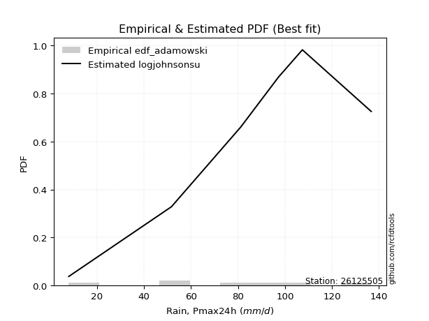</img>

</div>


## C. Best fit & Estimate extreme values for specific return periods - Tr

Best fit in probability distribution analysis means finding the theoretical distribution (like Normal, Poisson, Exponential, etc.) that most accurately mirrors your real-world data´s patterns (shape, center, spread) for better predictions, using methods like visual checks (Q-Q plots), goodness-of-fit tests (Kolmogorov-Smirnov, Chi-Squared), and information criteria (AIC) to score and select the simplest, most representative model.


### 1. Best fit (ordered by delta Δ)

:file_folder:Table: [bestfit_26125505.csv](table/bestfit_26125505.csv)

<div align="center">

|   id |   station | empirical_dist   | p_dist       |     delta |   deltao | eval   |   fit |   n |   best_fit |   best_fit_sort |
|-----:|----------:|:-----------------|:-------------|----------:|---------:|:-------|------:|----:|-----------:|----------------:|
|    0 |  26125505 | edf_tukey        | anglit       | 0.0696634 | 0.484421 | Δo > Δ |     1 |   7 |          1 |               1 |
|    1 |  26125505 | edf_blom         | anglit       | 0.0698351 | 0.484421 | Δo > Δ |     1 |   7 |          1 |               2 |
|    2 |  26125505 | edf_filliben     | anglit       | 0.0702497 | 0.484421 | Δo > Δ |     1 |   7 |          1 |               3 |
|    3 |  26125505 | edf_jenkinson    | anglit       | 0.0705256 | 0.484421 | Δo > Δ |     1 |   7 |          1 |               4 |
|    4 |  26125505 | edf_beard        | anglit       | 0.0705256 | 0.484421 | Δo > Δ |     1 |   7 |          1 |               5 |
|    5 |  26125505 | edf_chegodayev   | anglit       | 0.0708919 | 0.484421 | Δo > Δ |     1 |   7 |          1 |               6 |
|    6 |  26125505 | edf_hazen        | cosine       | 0.0715484 | 0.484421 | Δo > Δ |     1 |   7 |          1 |               7 |
|    7 |  26125505 | edf_cunnane      | anglit       | 0.0717508 | 0.484421 | Δo > Δ |     1 |   7 |          1 |               8 |
|    8 |  26125505 | edf_adamowski    | semicircular | 0.0721538 | 0.484421 | Δo > Δ |     1 |   7 |          1 |               9 |
|    9 |  26125505 | edf_gringorten   | cosine       | 0.0737165 | 0.484421 | Δo > Δ |     1 |   7 |          1 |              10 |
|   10 |  26125505 | edf_weibull      | anglit       | 0.0873114 | 0.484421 | Δo > Δ |     1 |   7 |          1 |              11 |
|   11 |  26125505 | edf_california   | dweibull     | 0.0959358 | 0.484421 | Δo > Δ |     1 |   7 |          1 |              12 |

</div>


### 2. Extreme values and % difference analysis

In hydrology, a return period (or recurrence interval $Tr$) is the statistical average time between extreme events like floods or droughts of a specific magnitude, indicating how rare an event is, with a 100-year flood, for example, having a 1% chance of occurring in any given year, not that it happens exactly every century. It is a key tool for infrastructure design (like bridges or dams) and risk assessment, calculated from historical data to determine the probability of future events, although it is important to remember it is statistical average, and events can cluster or be missed.

The extreme value porcentage difference is evaluated as $pdiff = 1 - (ETrBf / ETr) * 100$, where _ETrBf_ correspond to the bestfit extreme value for a specific recurrence interval and _ETr_ correspond to the extreme value for one of the most used PDFsused in hydrology.

> risk_rate: assuming the return period as the project useful life.

:file_folder:Table: [extreme_26125505.csv](table/extreme_26125505.csv), all PDFs.  
:file_folder:Table: [extremepdiff_26125505.csv](table/extremepdiff_26125505.csv), % difference between bestfit and most used PDFs in Hydrology.

<div align="center">

Extreme values table for only best fit PDFs
|   id |      tr |   prob_l |     prob_g |      alpha |   anglit |   arcsine |    argus |    beta |   betaprime |   bradford |     burr |   burr12 |   cosine |   crystalball |   dgamma |   dweibull |   erlang |   exponnorm |   exponpow |   exponweib |        f |   fatiguelife |   foldnorm |    gamma |   gausshyper |   genexpon |   genextreme |   gengamma |   genhalflogistic |   genlogistic |   gennorm |   genpareto |   gompertz |   gumbel_l |   gumbel_r |   halfgennorm |   halflogistic |   halfnorm |   hypsecant |   invgamma |   invgauss |      invweibull |   johnsonsb |   johnsonsu |    kappa3 |   kappa4 |    ksone |   kstwobign |   laplace |   levy_l |   loggamma |   logistic |   loglaplace |    lomax |   maxwell |    mielke |    moyal |   nakagami |      ncf |      nct |     norm |   pearson3 |   powerlaw |   rayleigh |    rdist |     rice |   semicircular |   skewnorm |        t |   trapezoid |   triang |   truncexpon |   truncnorm |   truncpareto |   truncweibull_min |   tukeylambda |   uniform |   vonmises |   vonmises_line |     wald |   weibull_max |   weibull_min |   wrapcauchy |   logalpha |   loganglit |   logarcsine |   logargus |   logbeta |   logbetaprime |   logbradford |   logburr |   logburr12 |   logcosine |   logcrystalball |   logdgamma |      logdweibull |   logerlang |   logexponnorm |      logexponpow |      logexponweib |     logf |   logfatiguelife |   logfoldnorm |   loggausshyper |   loggenexpon |   loggenextreme |    loggengamma |   loggenhalflogistic |   loggenlogistic |      loggennorm |   loggenpareto |   loggompertz |   loggumbel_l |   loggumbel_r |   loghalfgennorm |   loghalflogistic |   loghalfnorm |   loghypsecant |   loginvgamma |   loginvgauss |   loginvweibull |   logjohnsonsb |   logjohnsonsu |   logkappa3 |   logkappa4 |   logksone |   logkstwobign |   loglevy_l |   logloggamma |   loglogistic |   logloglaplace |         loglomax |   logmaxwell |   logmielke |   logmoyal |   lognakagami |    logncf |   lognct |   lognorm |   logpearson3 |   logpowerlaw |   lograyleigh |   logrdist |   logrice |   logsemicircular |   logskewnorm |             logt |   logtrapezoid |   logtriang |   logtruncexpon |   logtruncnorm |   logtruncpareto |   logtruncweibull_min |   logtukeylambda |   loguniform |   logvonmises |   logvonmises_line |    logwald |   logweibull_max |   logweibull_min |   logwrapcauchy |   station |   n |   risk_rate |
|-----:|--------:|---------:|-----------:|-----------:|---------:|----------:|---------:|--------:|------------:|-----------:|---------:|---------:|---------:|--------------:|---------:|-----------:|---------:|------------:|-----------:|------------:|---------:|--------------:|-----------:|---------:|-------------:|-----------:|-------------:|-----------:|------------------:|--------------:|----------:|------------:|-----------:|-----------:|-----------:|--------------:|---------------:|-----------:|------------:|-----------:|-----------:|----------------:|------------:|------------:|----------:|---------:|---------:|------------:|----------:|---------:|-----------:|-----------:|-------------:|---------:|----------:|----------:|---------:|-----------:|---------:|---------:|---------:|-----------:|-----------:|-----------:|---------:|---------:|---------------:|-----------:|---------:|------------:|---------:|-------------:|------------:|--------------:|-------------------:|--------------:|----------:|-----------:|----------------:|---------:|--------------:|--------------:|-------------:|-----------:|------------:|-------------:|-----------:|----------:|---------------:|--------------:|----------:|------------:|------------:|-----------------:|------------:|-----------------:|------------:|---------------:|-----------------:|------------------:|---------:|-----------------:|--------------:|----------------:|--------------:|----------------:|---------------:|---------------------:|-----------------:|----------------:|---------------:|--------------:|--------------:|--------------:|-----------------:|------------------:|--------------:|---------------:|--------------:|--------------:|----------------:|---------------:|---------------:|------------:|------------:|-----------:|---------------:|------------:|--------------:|--------------:|----------------:|-----------------:|-------------:|------------:|-----------:|--------------:|----------:|---------:|----------:|--------------:|--------------:|--------------:|-----------:|----------:|------------------:|--------------:|-----------------:|---------------:|------------:|----------------:|---------------:|-----------------:|----------------------:|-----------------:|-------------:|--------------:|-------------------:|-----------:|-----------------:|-----------------:|----------------:|----------:|----:|------------:|
|    0 |    2    | 0.5      | 0.5        |    30.4797 |  76.2714 |   76.2714 |  80.8046 | 100.53  |     75.7514 |    65.0912 |  77.1146 |  32.7616 |  74.9378 |       76.2714 |  70.1403 |    70.8001 |  75.3776 |     76.2716 |    8.08303 |     71.569  |  75.9026 |        8      |    76.4847 |  75.412  |      72.4366 |    53.3843 |      80.9733 |    27.4848 |           92.8234 |       79.0348 |     72.35 |     81.4929 |    97.8442 |    82.7695 |    69.7734 |       44.3493 |        66.5429 |    68.1748 |     76.2714 |    73.1475 |     72.409 |  2188.97        |     136.079 |     79.3684 |   7.99803 |  74.2651 |  76.2714 |     67.8968 |   76.2714 |  83.9816 |    58.2437 |    76.2714 |      58.9632 |  55.8001 |   72.8886 |   7.99997 |  67.6756 |    76.179  |  66.6372 |  76.2635 |  76.2714 |    77.6064 |    9.84599 |    71.6888 | -4.04138 |  74.7369 |        76.2714 |    80.721  |  76.2705 |     104.092 |  89.4151 |      54.1613 |     76.2714 |       8.92204 |            72.3299 |       71.9444 |   72.35   |    1.18857 |         72.35   |  63.4498 |       136.453 |       77.6961 |      72.6779 |    56.236  |     58.9632 |      58.9631 |    75.2421 |   117.555 |        54.2562 |       25.9126 |   76.844  |     69.5215 |     48.8826 |          58.9632 |     81.2    |     81.2         |     58.6685 |        58.963  |      9.75514     |      9.54559      |  58.7441 |          59.1064 |       59.4911 |         44.5886 |       44.6291 |         82.2071 | 3100.4         |              52.8553 |          inf     |    81.2         |        38.0172 |       68.4013 |       68.155  |       51.0111 |          33.4316 |           47.4665 |       49.2252 |        58.9632 |       57.8746 |       54.3688 |         53.6637 |        126.892 |        81.3673 |       8     |     36.536  |    33.0696 |        46.7679 |     81.3036 |       76.5201 |       58.9632 |         81.2    |     33.0473      |      54.6798 |      0      |    48.6802 |       53.1212 |   56.024  |  58.7971 |   58.9632 |       72.4831 |       8.56474 |       53.2364 |    19.7734 |    58.963 |           58.9633 |       60.092  |     80.9707      |        68.5944 |     51.5762 |         25.5355 |        69.8027 |          8.21407 |               27.4524 |          33.0702 |      33.0696 |      0.132911 |            72.3376 |    44.3032 |          102.235 |     16.138       |         33.0696 |  26125505 |   7 |    0.75     |
|    1 |    2.33 | 0.570815 | 0.429185   |    36.278  |  84.4931 |   88.6136 |  88.5727 | 108.152 |     82.8293 |    75.2331 |  86.2656 |  44.2415 |  82.3455 |       83.3298 |  84.5888 |    84.413  |  82.5025 |     83.3299 |    8.22664 |     79.1983 |  82.9922 |       10.2607 |    83.3888 |  82.5445 |      82.2671 |    63.3838 |      88.1601 |    35.5615 |          101.213  |       85.5452 |     72.35 |     91.5622 |   102.001  |    88.9103 |    76.3138 |       56.3271 |        73.2674 |    75.7926 |     81.9202 |    80.4714 |     79.787 | 70461.3         |     136.618 |     86.3505 |   7.99803 |  83.5226 |  85.9744 |     76.2152 |   80.5428 |  99.9674 |    68.8283 |    82.4903 |      64.8542 |  66.3319 |   80.2217 |   7.99997 |  73.8669 |    83.2531 |  76.6221 |  83.3222 |  83.3298 |    84.6082 |   12.1542  |    79.1304 |  6.86509 |  82.0538 |        85.0893 |    87.5753 |  83.3279 |     111.57  |  97.2515 |      63.9596 |     83.3298 |       9.55064 |            80.5912 |       81.2931 |   81.4639 |    1.43287 |         81.0117 |  68.0781 |       136.621 |       84.7381 |      81.8388 |    66.6886 |     70.825  |      77.6396 |    83.5383 |   126.913 |        65.3965 |       31.7113 |   86.1401 |     77.4176 |     58.4078 |          69.0119 |     88.5719 |     84.9038      |     69.2195 |        69.0115 |     10.9844      |     12.855        |  68.7715 |          69.1674 |       68.7967 |         55.9063 |       57.0408 |         91.9085 |    6.33862e+08 |              63.2298 |          inf     |    82.548       |        52.8149 |       76.4505 |       78.1548 |       59.0189 |          40.9376 |           55.1437 |       58.3372 |        66.8767 |       68.4699 |       65.3409 |         67.4801 |        134.587 |        89.815  |       8     |     44.9556 |    42.0901 |        59.0229 |     95.1877 |       85.4938 |       67.7321 |         88.9712 |     45.3919      |      64.3916 |     84.6729 |    55.8855 |       54.5338 |   67.3726 |  68.9408 |   69.0117 |       82.8782 |       9.19379 |       62.8437 |    28.7388 |    69.011 |           71.7728 |       68.5143 |     88.1712      |        82.2161 |     60.5934 |         31.102  |        73.9789 |          8.35707 |               33.4693 |          40.8277 |      40.4317 |      0.152093 |            81.2666 |    49.1188 |          112.924 |     20.0503      |         53.2672 |  26125505 |   7 |    0.729209 |
|    2 |    5    | 0.8      | 0.2        |    81.2389 | 113.501  |  121.526  | 113.489  | 127.356 |    109.43   |   108.056  | 114.75   | inf      | 109.04   |      109.561  | 105.702  |   107.791  | 109.364  |    109.561  |   12.3763  |    110.567  | 109.535  |       58.2852 |   109.046  | 109.461  |     113.205  |   113.379  |     111.878  |    75.8068 |          123.115  |      109.67   |     72.35 |    120.208  |   116.071  |   108.749  |   104.728  |      135.114  |       103.695  |   108.007  |    104.579  |   109.15   |    109.01  |     2.53967e+11 |     136.7   |    110.64   |   7.99803 | 112.844  | 117.377  |    111.55   |  101.899  | 126.452  |   129.298  |   106.502  |     104.404  | 118.989  |  109.084  | 110.773   | 102.545  |   109.568  | 128.375  | 109.557  | 109.561  |   109.89   |   40.821   |   108.922  | 38.0225  | 109.728  |       115.181  |   110.882  | 109.555  |     133.022 | 119.734  |      99.4696 |    109.561  |      19.1961  |           108.619  |      111.382  |  110.96   |    2.38821 |        109.912  |  93.987  |       136.699 |      109.961  |     111.486  |   128.512  |    135.224  |     161.716  |   110.908  |   136.41  |       138.421  |       65.5404 |  115.243  |    109.594  |    110.941  |         123.852  |    141.2    |    153.905       |    129.239  |       123.851  |     28.3054      | 337076            | 123.518  |         124.093  |      118.065  |        103.781  |      159.996  |        119.391  |  inf           |             101.323  |          inf     |   110.383       |       110.198  |      109.794  |      121.63   |      111.201  |          78.8514 |          108.668  |      119.636  |       110.832  |      129.972  |      133.256  |        182.569  |        136.694 |       115.305  |       8     |     85.583  |    91.8742 |       158.618  |    123.601  |      113.412  |      115.688  |        140.51   |    227.927       |     122.543  |    113.226  |   105.92   |       70.3234 |  138.217  | 124.744  |  123.851  |      122.386  |      18.8048  |      122.101  |    77.8227 |   123.847 |          140.385  |      100.391  |    127.413       |       138.245  |     96.2019 |         63.8202 |        94.384  |         10.6841  |               67.4412 |          79.9439 |      77.4877 |      0.254599 |           127.567  |    87.5203 |          132.534 |     71.8135      |        106.636  |  26125505 |   7 |    0.67232  |
|    3 |   10    | 0.9      | 0.1        |   163.843  | 129.92   |  129.471  | 125.503  | 133.177 |    127.336  |   122.378  | 126.747  | inf      | 125.168  |      126.961  | 119.525  |   121.451  | 127.519  |    126.961  |   26.6977  |    134.239  | 127.314  |      124.595  |   126.066  | 127.676  |     125.859  |   158.764  |     124.561  |   104.672  |          130.58   |      126.774  |     72.35 |    130.088  |   124.213  |   119.794  |   127.871  |      233.266  |       128.963  |   131.846  |    122.672  |   129.529  |    130.039 |     5.56231e+16 |     136.7   |    125.41   | 124.011   | 125.17   | 131.078  |    138.453  |  121.285  | 132.846  |   198.165  |   124.186  |     160.85   | 166.789  |  129.397  | 123.89    | 127.515  |   127.047  | 181.921  | 126.962  | 126.961  |   126.026  |   75.5124  |   130.165  | 47.3031  | 128.369  |       130.622  |   124.905  | 126.954  |     141.401 | 128.516  |     117.211  |    126.961  |      41.5876  |           122.045  |      124.291  |  123.83   |    3.08633 |        123.169  | 121.482  |       136.7   |      125.809  |     124.421  |   202.71   |    194.997  |     193.056  |   124.414  |   136.689 |       239.568  |       93.4557 |  127.564  |    132.996  |    163.464  |         182.552  |    217.509  |    355.607       |    197.241  |       182.549  |     96.4706      |      4.43952e+25  | 182.178  |         182.926  |      168.935  |        124.755  |      349.296  |        129.208  |  inf           |             119.252  |          inf     |   203.988       |       129.254  |      134.463  |      155.591  |      186.29   |         104.961  |          190.878  |      203.551  |       165.903  |      201.745  |      219.531  |        410.667  |        136.7   |       127.075  |       8     |    110.987  |   129.156  |       336.694  |    131.646  |      125.165  |      171.598  |        212.747  |   1025.93        |     192.735  |    125.309  |   184.816  |       95.0659 |  229.439  | 185.122  |  182.55   |      145.924  |      40.0397  |      196.063  |    98.9141 |   182.541 |          198.072  |      117.292  |    184.7         |       169.358  |    115.239  |         91.6443 |       110.02   |         18.0657  |               94.7725 |         105.836  |     102.92   |      0.370192 |           179.47   |   161.559  |          135.743 |    282.329       |        122.05   |  26125505 |   7 |    0.651322 |
|    4 |   15    | 0.933333 | 0.0666667  |   246.152  | 136.931  |  130.986  | 130.071  | 134.697 |    136.349  |   127.152  | 130.697  | inf      | 132.514  |      135.645  | 126.862  |   128.215  | 136.679  |    135.645  |   42.471   |    146.946  | 136.237  |      167.962  |   134.56   | 136.873  |     129.822  |   185.312  |     129.876  |   118.33   |          132.803  |      135.967  |     72.35 |    132.826  |   127.952  |   124.796  |   140.928  |      302.375  |       143.263  |   144.251  |    132.998  |   140.131  |    141.045 |     5.73202e+19 |     136.7   |    132.409  | 128.308   | 129.164  | 135.646  |    152.736  |  132.625  | 134.778  |   245.866  |   133.821  |     207.121  | 194.751  |  139.818  | 128.269   | 142.006  |   135.775  | 217.403  | 135.649  | 135.645  |   133.891  |   92.3528  |   141.11   | 49.4543  | 137.73   |       136.643  |   131.594  | 135.636  |     144.09  | 131.333  |     123.497  |    135.645  |      58.878   |           126.771  |      128.525  |  128.12   |    3.42492 |        127.661  | 139.139  |       136.7   |      133.452  |     128.733  |   256.135  |    227.989  |     199.69   |   129.588  |   136.698 |       320.106  |      105.778  |  131.63   |    145.179  |    195.03   |         221.545  |    280.452  |    638.617       |    244.194  |       221.542  |    219.77        |      1.27848e+53  | 221.172  |         222.03   |      202.007  |        130.333  |      529.989  |        132.08   |  inf           |             125.241  |          inf     |   353.9         |       133.263  |      147.416  |      173.947  |      249.238  |         115.46   |          262.549  |      268.402  |       208.85   |      252.367  |      283.94   |        648.814  |        136.7   |       131.635  |       8     |    120.403  |   144.685  |       502.076  |    134.178  |      129.035  |      212.717  |        271.174  |   2517.77        |     243.147  |    129.295  |   255.297  |      113.236  |  298.26   | 225.522  |  221.543  |      156.037  |      56.7027  |      250.248  |   103.531  |   221.53  |          226.529  |      123.452  |    241.292       |       180.756  |    122.113  |        104.23   |       117.15   |         26.582   |              106.748  |         115.782  |     113.133  |      0.454928 |           217.92   |   239.49   |          136.285 |    677.19        |        126.901  |  26125505 |   7 |    0.644736 |
|    5 |   20    | 0.95     | 0.05       |   328.389  | 141.056  |  131.52   | 132.578  | 135.356 |    142.28   |   129.539  | 132.664  | inf      | 137.032  |      141.331  | 131.86   |   132.654  | 142.714  |    141.331  |   57.738   |    155.589  | 142.099  |      200.071  |   140.122  | 142.935  |     131.723  |   204.148  |     132.982  |   126.905  |          133.859  |      142.289  |     72.35 |    134.049  |   130.292  |   127.91   |   150.07   |      356.668  |       153.282  |   152.522  |    140.283  |   147.236  |    148.444 |     7.37853e+21 |     136.7   |    136.865  | 130.457   | 131.127  | 137.929  |    162.357  |  140.672  | 135.767  |   283.435  |   140.481  |     247.815  | 214.59   |  146.735  | 130.459   | 152.268  |   141.494  | 244.796  | 141.337  | 141.331  |   138.975  |  102.009   |   148.385  | 50.308   | 143.877  |       139.983  |   135.884  | 141.322  |     145.416 | 132.723  |     126.716  |    141.331  |      71.3281  |           129.19   |      130.621  |  130.265  |    3.62406 |        129.915  | 152.296  |       136.7   |      138.364  |     130.888  |   299.263  |    249.947  |     202.08   |   132.437  |   136.7   |       389.335  |      112.658  |  133.659  |    153.32   |    217.398  |         251.491  |    336.009  |   1004           |    281.105  |       251.487  |    408.05        |      4.52776e+83  | 251.13   |         252.072  |      227.099  |        132.656  |      703.15   |        133.415  |  inf           |             128.209  |          inf     |   577.724       |       134.725  |      156.109  |      186.451  |      305.585  |         121.098  |          328.258  |      322.75   |       245.677  |      292.699  |      337.05   |        893.71   |        136.7   |       134.215  |       8     |    125.215  |   153.135  |       657.156  |    135.493  |      130.961  |      246.765  |        322.121  |   4799.26        |     283.686  |    131.28   |   320.933  |      127.67   |  355.404  | 256.683  |  251.488  |      161.967  |      68.9534  |      294.312  |   105.206  |   251.471 |          244.04   |      126.644  |    301.305       |       186.658  |    125.653  |        111.342  |       121.259  |         34.8718  |              113.42   |         120.966  |     118.614  |      0.526133 |           250.163  |   321.132  |          136.469 |   1297.1         |        129.323  |  26125505 |   7 |    0.641514 |
|    6 |   25    | 0.96     | 0.04       |   410.597  | 143.851  |  131.768  | 134.195  | 135.714 |    146.66   |   130.971  | 133.841  | inf      | 140.2    |      145.517  | 135.644  |   135.929  | 147.175  |    145.517  |   72.1488  |    162.111  | 146.423  |      225.582  |   144.217  | 147.417  |     132.829  |   218.758  |     135.079  |   133.025  |          134.473  |      147.112  |     72.35 |    134.725  |   131.964  |   130.125  |   157.112  |      401.802  |       161.001  |   158.675  |    145.92   |   152.55   |    153.987 |     3.11145e+23 |     136.7   |    140.081  | 131.746   | 132.289  | 139.3    |    169.563  |  146.913  | 136.388  |   314.863  |   145.575  |     284.811  | 229.978  |  151.87   | 131.774   | 160.223  |   145.705  | 267.447  | 145.525  | 145.517  |   142.683  |  108.234   |   153.79   | 50.7399  | 148.41   |       142.15   |   139.001  | 145.507  |     146.206 | 133.551  |     128.673  |    145.517  |      80.5013  |           130.66   |      131.869  |  131.552  |    3.75363 |        131.27   | 162.835  |       136.7   |      141.934  |     132.182  |   336.006  |    266.018  |     203.199  |   134.277  |   136.7   |       451.084  |      117.04   |  134.881  |    159.39   |    234.598  |         276.092  |    386.646  |   1454.38        |    311.945  |       276.087  |    670.16        |      3.56781e+115 | 275.748  |         276.76   |      247.54   |        133.864  |      870.045  |        134.177  |  inf           |             129.975  |          inf     |   898.879       |       135.417  |      162.609  |      195.892  |      357.532  |         124.611  |          389.9    |      370.21   |       278.58   |      326.728  |      382.982  |       1143.73   |        136.7   |       135.928  |     122.197 |    128.111  |   158.441  |       803.953  |    136.326  |      132.114  |      276.445  |        368.143  |   7952.75        |     318.094  |    132.469  |   383.209  |      139.736  |  405.084  | 282.362  |  276.088  |      165.969  |      78.119   |      332.003  |   105.991  |   276.069 |          256.118  |      128.596  |    366.22        |       190.265  |    127.811  |        115.905  |       123.936  |         42.4715  |              117.667  |         124.129  |     122.029  |      0.589502 |           278.358  |   406.186  |          136.553 |   2181.03        |        130.78   |  26125505 |   7 |    0.639603 |
|    7 |   50    | 0.98     | 0.02       |   821.508  | 150.731  |  132.098  | 137.86   | 136.322 |    159.27   |   133.836  | 136.197  | inf      | 148.497  |      157.505  | 146.996  |   145.365  | 160.037  |    157.504  |  132.637   |    181.51   | 158.851  |      307.434  |   155.942  | 160.346  |     134.928  |   264.143  |     140.222  |   149.67   |          135.649  |      161.8    |     72.35 |    135.908  |   136.521  |   136.14   |   178.805  |      558.97   |       184.784  |   176.562  |    163.399  |   168.176  |    170.327 |     3.15354e+28 |     136.7   |    149.006  | 134.324   | 134.568  | 142.04   |    190.725  |  166.299  | 137.786  |   426.462  |   161.14   |     438.796  | 277.779  |  166.762  | 134.404   | 184.918  |   157.769  | 346.676  | 157.518  | 157.505  |   153.145  |  121.724   |   169.48   | 51.3977  | 161.423  |       147.099  |   147.758  | 157.493  |     147.774 | 135.195  |     132.646  |    157.505  |     103.935   |           133.647  |      134.333  |  134.126  |    4.03311 |        133.984  | 197.245  |       136.7   |      151.943  |     134.769  |   470.959  |    310.119  |     204.703  |   138.457  |   136.7   |       697.873  |      126.422  |  137.427  |    177.106  |    286.362  |         360.678  |    598.436  |   5086.21        |    421.211  |       360.671  |   3354.38        |      4.58809e+276 | 360.439  |         361.69   |      316.837  |        135.766  |     1637.82   |        135.585  |  inf           |             133.446  |          inf     |  5211.93        |       136.365  |      181.662  |      224.001  |      579.901  |         131.947  |          662.569  |      551.613  |       411.326  |      449.475  |      556.179  |       2445.25   |        136.7   |       140.067  |     129.338 |    133.831  |   169.61   |      1453.3    |    138.218  |      134.415  |      391.126  |        557.408  |  39207.1         |     443.351  |    134.841  |   664.567  |      182.131  |  594.303  | 371.144  |  360.672  |      175.721  |     102.056   |      471.04   |   107.047  |   360.643 |          285.999  |      132.587  |    791.352       |       197.632  |    132.203  |        125.761  |       129.858  |         69.6497  |              126.751  |         130.515  |     129.156  |      0.84993  |           381.063  |   874.764  |          136.663 |  11869.2         |        133.717  |  26125505 |   7 |    0.63583  |
|    8 |   75    | 0.986667 | 0.0133333  |  1232.36   | 153.759  |  132.16   | 139.314  | 136.484 |    166.078  |   134.79   | 137.002  | inf      | 152.459  |      163.936  | 153.418  |   150.468  | 166.992  |    163.936  |  179.906   |    192.34   | 165.547  |      356.73   |   162.233  | 167.34   |     135.579  |   290.691  |     142.478  |   158.095  |          136.02   |      170.261  |     72.35 |    136.236  |   138.836  |   139.181  |   191.414  |      662.923  |       198.609  |   186.299  |    173.614  |   176.816  |    179.384 |     2.56083e+31 |     136.7   |    153.625  | 135.183   | 135.306  | 142.953  |    202.368  |  177.639  | 138.36   |   502.549  |   170.13   |     565.02   | 305.74   |  174.859  | 135.281   | 199.359  |   164.245  | 400.113  | 163.954  | 163.936  |   158.663  |  126.545   |   178.016  | 51.5463  | 168.423  |       149.077  |   152.368  | 163.924  |     148.293 | 135.739  |     133.988  |    163.936  |     113.638   |           134.657  |      135.14   |  134.984  |    4.13094 |        134.889  | 218.419  |       136.7   |      157.188  |     135.631  |   566.632  |    331.777  |     204.983  |   140.117  |   136.7   |       890.209  |      129.745  |  138.404  |    186.802  |    314.969  |         416.291  |    772.986  |  11294.1         |    495.529  |       416.283  |   8923.89        |    inf            | 416.154  |         417.565  |      361.701  |        136.214  |     2331.83   |        136.007  |  inf           |             134.574  |          inf     | 19686.2         |       136.548  |      192.138  |      239.717  |      768.134  |         134.488  |          901.76   |      685.346  |       516.519  |      534.698  |      682.511  |       3803.06   |        136.7   |       141.881  |     131.81  |    135.673  |   173.506  |      2012.9    |    139.003  |      135.18   |      477.926  |        710.49   | 101591           |     531.059  |    135.631  |   916.985  |      210.483  |  733.947  | 429.881  |  416.284  |      179.948  |     112.177   |      569.779  |   107.243  |   416.248 |          298.888  |      133.945  |   1443.55        |       200.133  |    133.691  |        129.28   |       132.025  |         85.204   |              129.967  |         132.635  |     131.623  |      1.0635   |           443.859  |  1402.51   |          136.684 |  33674.5         |        134.705  |  26125505 |   7 |    0.634587 |
|    9 |  100    | 0.99     | 0.01       |  1643.2    | 155.559  |  132.181  | 140.125  | 136.555 |    170.698  |   135.268  | 137.428  | inf      | 154.942  |      168.287  | 157.897  |   153.936  | 171.716  |    168.287  |  219.077   |    199.821  | 170.086  |      392.199  |   166.488  | 172.093  |     135.89   |   309.527  |     143.817  |   163.607  |          136.201  |      176.23   |     72.35 |    136.382  |   140.354  |   141.171  |   200.338  |      742.113  |       208.394  |   192.932  |    180.859  |   182.764  |    185.626 |     2.93543e+33 |     136.7   |    156.684  | 135.613   | 135.669  | 143.41   |    210.345  |  185.685  | 138.696  |   561.875  |   176.477  |     676.035  | 325.58   |  180.374  | 135.72    | 209.604  |   168.627  | 441.65   | 168.306  | 168.287  |   162.358  |  129.018   |   183.831  | 51.6049  | 173.164  |       150.184  |   155.455  | 168.274  |     148.552 | 136.01   |     134.663  |    168.287  |     118.916   |           135.165  |      135.54   |  135.413  |    4.18043 |        135.342  | 233.857  |       136.7   |      160.687  |     136.062  |   643.116  |    345.366  |     205.081  |   141.045  |   136.7   |      1053.48   |      131.445  |  138.974  |    193.429  |    334.338  |         458.69   |    927.047  |  20440.5         |    553.393  |       458.68   |  18078.9         |    inf            | 458.645  |         460.181  |      395.594  |        136.394  |     2977.55   |        136.205  |  inf           |             135.128  |          inf     | 58709.7         |       136.613  |      199.317  |      250.588  |      937.221  |         135.779  |         1121.59   |      794.572  |       607.073  |      601.923  |      785.265  |       5198.63   |        136.7   |       142.97   |     133.063 |    136.569  |   175.487  |      2516.23   |    139.464  |      135.562  |      550.573  |        843.976  | 201356           |     600.538  |    136.025  |  1152.29   |      232.261  |  848.405  | 474.833  |  458.681  |      182.435  |     117.733   |      648.654  |   107.312  |   458.64  |          306.359  |      134.628  |   2413.87        |       201.392  |    134.439  |        131.087  |       133.15   |         95.0124  |              131.612  |         133.685  |     132.875  |      1.24822  |           484.589  |  1978.71   |          136.691 |  72104.1         |        135.202  |  26125505 |   7 |    0.633968 |
|   10 |  200    | 0.995    | 0.005      |  3286.52   | 158.961  |  132.202  | 141.535  | 136.644 |    181.228  |   135.984  | 138.172  | inf      | 159.991  |      178.155  | 168.475  |   161.858  | 182.497  |    178.155  |  333.384   |    217.224  | 180.414  |      479.022  |   176.141  | 182.942  |     136.33   |   354.911  |     146.346  |   175.598  |          136.462  |      190.534  |     72.35 |    136.573  |   143.661  |   145.495  |   221.792  |      951.646  |       231.919  |   208.102  |    198.315  |   196.577  |    200.139 |     2.62068e+38 |     136.7   |    163.435  | 136.257   | 136.202  | 144.095  |    228.719  |  205.072  | 139.332  |   724.903  |   191.703  |    1041.54   | 373.381  |  192.991  | 136.378   | 234.288  |   178.57   | 555.811  | 178.18   | 178.155  |   170.626  |  132.81    |   197.137  | 51.6701  | 183.934  |       152.114  |   162.374  | 178.14   |     148.94  | 136.416  |     135.679  |    178.155  |     127.422   |           135.93   |      136.131  |  136.056  |    4.25514 |        136.021  | 272.311  |       136.7   |      168.484  |     136.709  |   861.108  |    372.576  |     205.176  |   142.659  |   136.7   |      1561.36   |      134.044  |  140.109  |    208.657  |    377.472  |         571.564  |   1437      |  93143.8         |    712.089  |       571.55   | 101974           |    inf            | 571.824  |         573.701  |      484.717  |        136.6    |     5270.52   |        136.48   |  inf           |             135.941  |          inf     |     1.43541e+06 |       136.677  |      215.867  |      275.948  |     1512.06   |         137.771  |         1895      |     1114.35   |       895.883  |      789.804  |     1085.27   |      11021.9    |        136.7   |       145.079  |     134.966 |    137.857  |   178.501  |      4207.25   |    140.342  |      136.135  |      773.095  |       1277.87   |      1.07837e+06 |     795.621  |    136.617  |  1997.85   |      290.693  | 1186.46   | 595.158  |  571.552  |      187.063  |     126.759   |      872.665  |   107.378  |   571.495 |          319.831  |      135.66   |  12308.8         |       203.292  |    135.566  |        133.856  |       134.891  |        113.14    |              134.127  |         135.235  |     134.774  |      1.77917  |           560.134  |  4663.47   |          136.698 | 483569           |        135.949  |  26125505 |   7 |    0.633042 |
|   11 |  250    | 0.996    | 0.004      |  4108.18   | 159.827  |  132.204  | 141.865  | 136.659 |    184.459  |   136.127  | 138.361  | inf      | 161.375  |      181.17   | 171.826  |   164.294  | 185.809  |    181.17   |  376.312   |    222.654  | 183.579  |      507.318  |   179.09   | 186.276  |     136.412  |   369.522  |     146.989  |   179.131  |          136.513  |      195.124  |     72.35 |    136.605  |   144.636  |   146.767  |   228.689  |     1024.79   |       239.482  |   212.769  |    203.934  |   200.889  |    204.673 |     1.02331e+40 |     136.7   |    165.447  | 136.386   | 136.306  | 144.232  |    234.405  |  211.313  | 139.498  |   783.953  |   196.591  |    1197.03   | 388.769  |  196.875  | 136.51    | 242.235  |   181.61   | 597.298  | 181.198  | 181.17   |   173.122  |  133.58    |   201.233  | 51.6794  | 187.23   |       152.567  |   164.467  | 181.155  |     149.017 | 136.497  |     135.882  |    181.17   |     129.214   |           136.084  |      136.248  |  136.185  |    4.27013 |        136.157  | 285.032  |       136.7   |      170.83   |     136.838  |   942.697  |    379.837  |     205.187  |   143.037  |   136.7   |      1766.56   |      134.571  |  140.43   |    213.362  |    390.24   |         611.312  |   1654.95   | 155615           |    769.471  |       611.298  | 179108           |    inf            | 611.698  |         613.699  |      515.767  |        136.63   |     6304.35   |        136.531  |  inf           |             136.1    |          136.252 |     4.82772e+06 |       136.685  |      220.994  |      283.887  |     1763.4    |         138.193  |         2243.04   |     1236.54   |      1015.45   |      858.896  |     1199.89   |      14034      |        136.7   |       145.635  |     135.35  |    138.102  |   179.11   |      4932.74   |    140.572  |      136.249  |      862.105  |       1460.44   |      1.86786e+06 |     867.586  |    136.735  |  2385.08   |      311.383  | 1316.97   | 637.734  |  611.299  |      188.223  |     128.67    |      956.106  |   107.386  |   611.237 |          323.076  |      135.868  |  24093.5         |       203.673  |    135.792  |        134.419  |       135.248  |        117.361   |              134.637  |         135.539  |     135.157  |      1.95505  |           577.47   |  6192.78   |          136.698 | 909983           |        136.099  |  26125505 |   7 |    0.632858 |
|   12 |  500    | 0.998    | 0.002      |  8216.43   | 161.973  |  132.208  | 142.624  | 136.684 |    194.079  |   136.414  | 138.869  | inf      | 165.059  |      190.113  | 182.091  |   171.56   | 195.679  |    190.113  |  529.058   |    239.035  | 192.989  |      596.081  |   187.838  | 196.215  |     136.568  |   414.906  |     148.584  |   189.276  |          136.611  |      209.353  |     72.35 |    136.662  |   147.436  |   150.414  |   250.097  |     1269.87   |       262.956  |   226.685  |    221.388  |   213.935  |    218.397 |     8.91208e+44 |     136.7   |    171.277  | 136.644   | 136.509  | 144.506  |    251.446  |  230.699  | 139.925  |   990.132  |   211.75   |    1844.21   | 436.571  |  208.465  | 136.774   | 266.918  |   190.627  | 743.229  | 190.146  | 190.113  |   180.438  |  135.132   |   213.454  | 51.6935  | 197.015  |       153.61   |   170.625  | 190.097  |     149.172 | 136.66   |     136.291  |    190.113  |     132.891   |           136.392  |      136.478  |  136.443  |    4.30014 |        136.428  | 325.483  |       136.7   |      177.684  |     137.097  |  1237.61   |    398.457  |     205.202  |   143.906  |   136.7   |      2571.05   |      135.633  |  141.356  |    227.445  |    426.36   |         746.193  |   2566.83   | 824575           |    969.485  |       746.174  |      1.04293e+06 |    inf            | 747.066  |         749.503  |      620.039  |        136.677  |    10861.1    |        136.625  |  inf           |             136.41   |          136.481 |     3.93126e+08 |       136.696  |      236.382  |      307.935  |     2842.01   |         139.122  |         3785.45   |     1686.32   |      1498.49   |     1104.01   |     1622.9    |      29705.8    |        136.7   |       147.076  |     136.121 |    138.572  |   180.334  |      7945.78   |    141.166  |      136.478  |     1208.75   |       2211.27   |      1.0591e+07  |    1123.39   |    136.98   |  4135.23   |      381.881  | 1804.13   | 782.918  |  746.175  |      191.058  |     132.607   |     1255.55   |   107.396  |   746.093 |          330.675  |      136.283  | 360151           |       204.438  |    136.246  |        135.553  |       135.969  |        126.506   |              135.664  |         136.137  |     135.926  |      2.42231  |           614.364  | 15259.7    |          136.7   |      6.86605e+06 |        136.399  |  26125505 |   7 |    0.632489 |
|   13 |  750    | 0.998667 | 0.00133333 | 12324.7    | 162.924  |  132.208  | 142.929  | 136.691 |    199.447  |   136.509  | 139.132  | inf      | 166.843  |      195.081  | 188.01   |   175.623  | 201.193  |    195.081  |  632.114   |    248.298  | 198.233  |      648.527  |   192.697  | 201.77   |     136.617  |   441.454  |     149.289  |   194.713  |          136.642  |      217.665  |     72.35 |    136.678  |   148.936  |   152.363  |   262.611  |     1425.91   |       276.679  |   234.458  |    231.598  |   221.352  |    226.202 |     6.88463e+47 |     136.7   |    174.431  | 136.73    | 136.575  | 144.598  |    261.019  |  242.039  | 140.128  |  1128.18   |   220.606  |    2374.72   | 464.533  |  214.947  | 136.867   | 281.357  |   195.638  | 842.106  | 195.118  | 195.081  |   184.449  |  135.653   |   220.288  | 51.6967  | 202.457  |       154.029  |   174.016  | 195.064  |     149.224 | 136.714  |     136.427  |    195.081  |     134.146   |           136.494  |      136.554  |  136.528  |    4.31015 |        136.519  | 349.736  |       136.7   |      181.429  |     137.183  |  1443.18   |    406.99   |     205.205  |   144.255  |   136.7   |      3186.06   |      135.989  |  141.867  |    235.349  |    445.048  |         833.589  |   3318.71   |      2.29721e+06 |   1103.15   |       833.567  |      2.93824e+06 |    inf            | 834.824  |         837.556  |      686.817  |        136.688  |    14815.8    |        136.653  |  inf           |             136.511  |          136.557 |     8.32769e+09 |       136.698  |      245.043  |      321.611  |     3756.63   |         139.496  |         5140.28   |     2005.44   |      1881.53   |     1271.2    |     1924.62   |      46049.2    |        136.7   |       147.758  |     136.379 |    138.72   |   180.744  |     10386.1    |    141.448  |      136.555  |     1472.62   |       2818.57   |      2.98318e+07 |    1298.06   |    137.072  |  5705.63   |      427.734  | 2156.26   | 877.519  |  833.568  |      192.29   |     133.953   |     1462.19   |   107.398  |   833.473 |          333.783  |      136.422  |      3.05578e+06 |       204.693  |    136.397  |        135.934  |       136.212  |        129.781   |              136.008  |         136.331  |     136.184  |      2.61844  |           627.302  | 26204.6    |          136.7   |      2.3263e+07  |        136.499  |  26125505 |   7 |    0.632366 |
|   14 | 1000    | 0.999    | 0.001      | 16432.9    | 163.49   |  132.208  | 143.101  | 136.694 |    203.153  |   136.557  | 139.309  | inf      | 167.969  |      198.501  | 192.177  |   178.432  | 205.003  |    198.501  |  711.386   |    254.737  | 201.85   |      685.937  |   196.042  | 205.609  |     136.64   |   460.291  |     149.71   |   198.38   |          136.657  |      223.558  |     72.35 |    136.685  |   149.945  |   153.675  |   271.489  |     1542.35   |       286.413  |   239.827  |    238.842  |   226.531  |    231.652 |     7.69805e+49 |     136.7   |    176.567  | 136.773   | 136.608  | 144.643  |    267.651  |  250.085  | 140.255  |  1234.68   |   226.887  |    2841.3    | 484.372  |  219.427  | 136.916   | 291.602  |   199.089  | 919.118  | 198.541  | 198.501  |   187.187  |  135.914   |   225.011  | 51.698   | 206.206  |       154.265  |   176.339  | 198.484  |     149.249 | 136.741  |     136.495  |    198.501  |     134.779   |           136.546  |      136.591  |  136.571  |    4.31515 |        136.564  | 367.182  |       136.7   |      183.982  |     137.227  |  1605.92   |    412.162  |     205.206  |   144.451  |   136.7   |      3702.41   |      136.167  |  142.221  |    240.823  |    457.256  |         899.641  |   3982.53   |      4.85372e+06 |   1206.14   |       899.617  |      6.13344e+06 |    inf            | 901.171  |         904.134  |      736.929  |        136.693  |    18411.4    |        136.666  |  inf           |             136.56   |          136.595 |     9.16457e+10 |       136.699  |      251.051  |      331.157  |     4578.8    |         139.714  |         6386.1    |     2260.42   |      2211.32   |     1401.71   |     2166.87   |      62844.3    |        136.7   |       148.184  |     136.508 |    138.791  |   180.949  |     12503.5    |    141.626  |      136.593  |     1693.96   |       3348.12   |      6.27823e+07 |    1434.41   |    137.125  |  7169.61   |      462.454  | 2441.45   | 949.268  |  899.618  |      193.016  |     134.633   |     1624.53   |   107.399  |   899.512 |          335.543  |      136.492  |      1.92026e+07 |       204.821  |    136.473  |        136.125  |       136.334  |        131.463   |              136.181  |         136.427  |     136.313  |      2.72465  |           633.887  | 38663.1    |          136.7   |      5.62008e+07 |        136.549  |  26125505 |   7 |    0.632305 |


</div>


<div align="center">

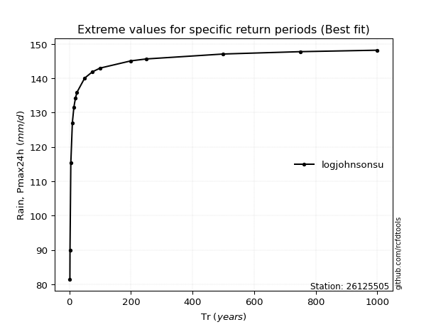</img>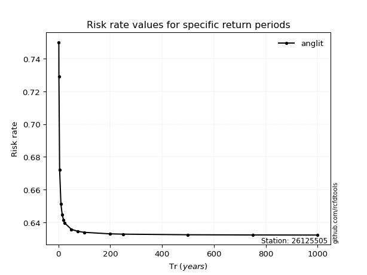</img>

</div>


<sub>**APP DISCLAIMER**: NO WARRANTY - This software is provided by [github.com/rcfdtools](https://github.com/rcfdtools) "as is", without any express or implied warranty, including warranties of merchantability, fitness for a particular purpose, or non-infringement. There is no guarantee that the software will be error-free or operate without interruption. LIMITATION OF LIABILITY - Neither the authors nor copyright holders will be liable for claims or damages arising from the software or its use. You are responsible for determining if the software is appropriate for your use and assume all associated risks, including errors, legal compliance, and data loss. NO PROFESSIONAL ADVICE - The software provides general information and does not offer professional advice. It should not replace consultation with professional advisors.</sub>