<div align="center">


</div>

# Station (rain, Pmax24h): 26125506

Probable Maximum Precipitation (PMP) is the greatest amount of rainfall for a specific duration that is meteorologically possible for a given location, acting as a "worst-case" scenario for extreme storms, crucial for designing safety-critical infrastructure like bridges, river deviations, dams, spillways, and nuclear plants to prevent catastrophic failure. PMP is calculated by hydrologists using meteorological data to determine the upper limit of extreme rainfall, often leading to the Probable Maximum Flood (PMF) for flood control design, and is increasingly being studied for climate change impacts.

<div align="center">

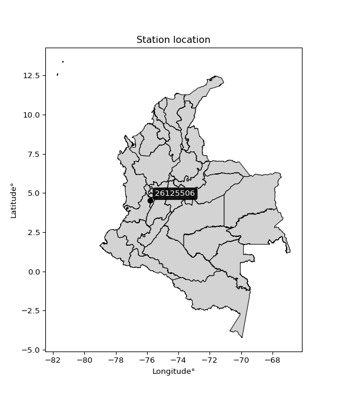</img>

</div>


## A. General information


### 1. General running parameters

• app_version: _v20251225_. • runtime: _2025-12-26 14:29:50.888910_. • Python version: _3.14.0_. • SciPy version: _1.16.3_. • Pandas version: _2.3.3_. • NumPy version: _2.3.5_. • Stations dataset (station_dataset_file): _dataset/pmax24h_in/automatic_colombia.csv_. • Stations catalog (station_catalog_file): _dataset/CNE_IDEAM.xls_. • Plot only fit distributions with Δo > Δ (plot_only_fit): _True_. • Eval low extreme values, if False, evaluates high extreme values (low_extreme): _False_. • Eval every SciPy distribution as logarithmic (pdist_logarithmic_on): _True_. • Standard deviation normalized (ddof): _1.0_. • Return periods to eval in years (Tr): _[2, 2.33, 5, 10, 15, 20, 25, 50, 75, 100, 200, 250, 500, 750, 1000]_. • Minimum data sample per station, 0 means any (minimum_sample): _5_. • Z-Score threshold to adjust a value, 0 means disable (zscore): _3.5_. • Avoid zeros, e.g. rain = 0 (avoid_zeros): _True_. • Avoid null values (avoid_nans): _True_. [:file_folder:Dataset file.](../../dataset/pmax24h_in/automatic_colombia.csv)


### 2. Station info and location

|   id |   CODIGO | NOMBRE                       | CATEGORIA               | TECNOLOGIA                | ESTADO   | FECHA_INSTALACION   |   FECHA_SUSPENSION |   ALTITUD |   LATITUD |   LONGITUD | DEPARTAMENTO   | MUNICIPIO   | AREA_OPERATIVA                         | ENTIDAD                                    | AREA_HIDROGRAFICA   | ZONA_HIDROGRAFICA   | SUBZONA_HIDROGRAFICA   |   CORRIENTE | OBSERVACION                                                                                                                                                                                                                                                   |   SUBRED | Catalogo   |
|-----:|---------:|:-----------------------------|:------------------------|:--------------------------|:---------|:--------------------|-------------------:|----------:|----------:|-----------:|:---------------|:------------|:---------------------------------------|:-------------------------------------------|:--------------------|:--------------------|:-----------------------|------------:|:--------------------------------------------------------------------------------------------------------------------------------------------------------------------------------------------------------------------------------------------------------------|---------:|:-----------|
|    0 | 26125506 | EL AGRADO  - AUT  [26125506] | Climatológica Principal | Automática con Telemetría | Activa   | 25/04/2013          |                nan |      1275 |   4.51833 |   -75.7925 | Quindío        | Montenegro  | Area Operativa 09 - Cauca-Valle-Caldas | CENTRO NACIONAL DE INVESTIGACIONES DE CAFE | Magdalena Cauca     | Cauca               | Río La Vieja           |         nan | Mediante orfeo 20191040002573 se hace entrega del archivo Excel que contiene el catálogo de estaciones automáticas de Cenicafé, el cual comprende 103 estaciones, con el fin de que se actualice su metadata en el Catálogo Nacional de estaciones del IDEAM. |      nan | CNE_OE     |

<div align="center">

Map location in: [:earth_americas:Google](http://maps.google.com/maps?q=4.518333333,-75.7925) [:earth_americas:OSM](https://www.openstreetmap.org/#map=18/4.518333333/-75.7925&layers=P) [:earth_americas:Bing](https://www.bing.com/maps?cp=4.518333333~-75.7925&lvl=18) [:earth_americas:Apple](https://maps.apple.com/frame?center=4.518333333%2C-75.7925&span=0.003%2C0.006)

</div>


<div align="center">

```geojson
{
  "type": "Feature",
  "geometry": {
    "type": "Point", 
    "coordinates": [-75.7925, 4.518333333]
  }, 
  "properties": {
    "Name": "26125506"
  }
}
```

</div>


### 3. Discrete values table and plot

|               |           0 |           1 |           2 |          3 |           4 |           5 |           6 |
|:--------------|------------:|------------:|------------:|-----------:|------------:|------------:|------------:|
| Date          | 2017        | 2018        | 2019        | 2020       | 2021        | 2022        | 2023        |
| Value         |   51.8      |   68.8      |   82.5      |  486.8     |   77.8      |   59.4      |   82.7      |
| Value_initial |   51.8      |   68.8      |   82.5      |  486.8     |   77.8      |   59.4      |   82.7      |
| count         |    7        |    7        |    7        |    7       |    7        |    7        |    7        |
| mean          |  129.971    |  129.971    |  129.971    |  129.971   |  129.971    |  129.971    |  129.971    |
| std           |  157.781    |  157.781    |  157.781    |  157.781   |  157.781    |  157.781    |  157.781    |
| zscore        |   -0.495442 |   -0.387698 |   -0.300869 |    2.26154 |   -0.330657 |   -0.447274 |   -0.299601 |

<div align="center">

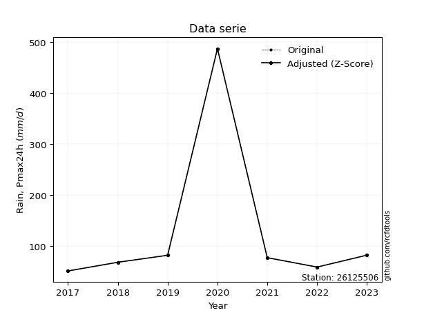</img>

</div>

> If Z-Score is active, values out of range or outliers are replaced with the station mean value.


### 4. Active continuous probability distributions from SciPy (45 of 104 available)

[scipy.stats](https://docs.scipy.org/doc/scipy/reference/stats.html) is a Python´s powerful submodule within the SciPy library for comprehensive statistical analysis, offering over 130 probability distributions (like Normal, Poisson), functions for descriptive stats (mean, variance), hypothesis testing (t-tests, chi-square), random variable generation, and statistical tests, making it essential for data science, modeling, and research. It provides tools to explore, model, and draw conclusions from data efficiently, working seamlessly with NumPy.

<div align="center">

|   id | p_dist             |   n_parameter | fit_method   | label                                                                       | active   | ref                                                                                                        |
|-----:|:-------------------|--------------:|:-------------|:----------------------------------------------------------------------------|:---------|:-----------------------------------------------------------------------------------------------------------|
|    0 | alpha              |             3 | MLE          | Alpha                                                                       | True     | [:mortar_board:](https://docs.scipy.org/doc/scipy/reference/generated/scipy.stats.alpha.html)              |
|    1 | betaprime          |             4 | MLE          | Beta prime                                                                  | True     | [:mortar_board:](https://docs.scipy.org/doc/scipy/reference/generated/scipy.stats.betaprime.html)          |
|    2 | chi2               |             3 | MLE          | Chi²                                                                        | True     | [:mortar_board:](https://docs.scipy.org/doc/scipy/reference/generated/scipy.stats.chi2.html)               |
|    3 | crystalball        |             4 | MLE          | Crystalball                                                                 | True     | [:mortar_board:](https://docs.scipy.org/doc/scipy/reference/generated/scipy.stats.crystalball.html)        |
|    4 | erlang             |             3 | MLE          | Erlang                                                                      | True     | [:mortar_board:](https://docs.scipy.org/doc/scipy/reference/generated/scipy.stats.erlang.html)             |
|    5 | expon              |             2 | MLE          | Exponential                                                                 | True     | [:mortar_board:](https://docs.scipy.org/doc/scipy/reference/generated/scipy.stats.expon.html)              |
|    6 | exponnorm          |             3 | MLE          | Exponentially modified Normal                                               | True     | [:mortar_board:](https://docs.scipy.org/doc/scipy/reference/generated/scipy.stats.exponnorm.html)          |
|    7 | f                  |             4 | MLE          | F                                                                           | True     | [:mortar_board:](https://docs.scipy.org/doc/scipy/reference/generated/scipy.stats.f.html)                  |
|    8 | fatiguelife        |             3 | MLE          | Fatigue-life (Birnbaum-Saunders)                                            | True     | [:mortar_board:](https://docs.scipy.org/doc/scipy/reference/generated/scipy.stats.fatiguelife.html)        |
|    9 | fisk               |             3 | MLE          | Fisk                                                                        | True     | [:mortar_board:](https://docs.scipy.org/doc/scipy/reference/generated/scipy.stats.fisk.html)               |
|   10 | gamma              |             3 | MLE          | Gamma                                                                       | True     | [:mortar_board:](https://docs.scipy.org/doc/scipy/reference/generated/scipy.stats.gamma.html)              |
|   11 | genexpon           |             5 | MLE          | Generalized exponential                                                     | True     | [:mortar_board:](https://docs.scipy.org/doc/scipy/reference/generated/scipy.stats.genexpon.html)           |
|   12 | genlogistic        |             3 | MLE          | Generalized logistic                                                        | True     | [:mortar_board:](https://docs.scipy.org/doc/scipy/reference/generated/scipy.stats.genlogistic.html)        |
|   13 | gibrat             |             2 | MM           | Gibrat                                                                      | True     | [:mortar_board:](https://docs.scipy.org/doc/scipy/reference/generated/scipy.stats.gibrat.html)             |
|   14 | gompertz           |             3 | MLE          | Gompertz (or truncated Gumbel)                                              | True     | [:mortar_board:](https://docs.scipy.org/doc/scipy/reference/generated/scipy.stats.gompertz.html)           |
|   15 | gumbel_l           |             2 | MM           | Gumbel Left Skew                                                            | True     | [:mortar_board:](https://docs.scipy.org/doc/scipy/reference/generated/scipy.stats.gumbel_l.html)           |
|   16 | gumbel_r           |             2 | MM           | Gumbel Right Skew                                                           | True     | [:mortar_board:](https://docs.scipy.org/doc/scipy/reference/generated/scipy.stats.gumbel_r.html)           |
|   17 | halflogistic       |             2 | MM           | Half-logistic                                                               | True     | [:mortar_board:](https://docs.scipy.org/doc/scipy/reference/generated/scipy.stats.halflogistic.html)       |
|   18 | halfnorm           |             2 | MM           | Half Normal                                                                 | True     | [:mortar_board:](https://docs.scipy.org/doc/scipy/reference/generated/scipy.stats.halfnorm.html)           |
|   19 | hypsecant          |             2 | MM           | hyperbolic secant                                                           | True     | [:mortar_board:](https://docs.scipy.org/doc/scipy/reference/generated/scipy.stats.hypsecant.html)          |
|   20 | invgamma           |             3 | MLE          | Inverted gamma                                                              | True     | [:mortar_board:](https://docs.scipy.org/doc/scipy/reference/generated/scipy.stats.invgamma.html)           |
|   21 | invgauss           |             3 | MLE          | Inverse Gaussian                                                            | True     | [:mortar_board:](https://docs.scipy.org/doc/scipy/reference/generated/scipy.stats.invgauss.html)           |
|   22 | invweibull         |             3 | MLE          | Inverted Weibull                                                            | True     | [:mortar_board:](https://docs.scipy.org/doc/scipy/reference/generated/scipy.stats.invweibull.html)         |
|   23 | johnsonsu          |             4 | MLE          | Johnson Su                                                                  | True     | [:mortar_board:](https://docs.scipy.org/doc/scipy/reference/generated/scipy.stats.johnsonsu.html)          |
|   24 | kstwobign          |             2 | MLE          | Limiting distribution of scaled Kolmogorov-Smirnov two-sided test statistic | True     | [:mortar_board:](https://docs.scipy.org/doc/scipy/reference/generated/scipy.stats.kstwobign.html)          |
|   25 | laplace            |             2 | MM           | Laplace                                                                     | True     | [:mortar_board:](https://docs.scipy.org/doc/scipy/reference/generated/scipy.stats.laplace.html)            |
|   26 | laplace_asymmetric |             3 | MLE          | Asymmetric Laplace                                                          | True     | [:mortar_board:](https://docs.scipy.org/doc/scipy/reference/generated/scipy.stats.laplace_asymmetric.html) |
|   27 | loggamma           |             3 | MLE          | Log gamma                                                                   | True     | [:mortar_board:](https://docs.scipy.org/doc/scipy/reference/generated/scipy.stats.loggamma.html)           |
|   28 | logistic           |             2 | MM           | Logistic (or Sech-squared)                                                  | True     | [:mortar_board:](https://docs.scipy.org/doc/scipy/reference/generated/scipy.stats.logistic.html)           |
|   29 | lognorm            |             3 | MLE          | Log Normal                                                                  | True     | [:mortar_board:](https://docs.scipy.org/doc/scipy/reference/generated/scipy.stats.lognorm.html)            |
|   30 | maxwell            |             2 | MM           | Maxwell                                                                     | True     | [:mortar_board:](https://docs.scipy.org/doc/scipy/reference/generated/scipy.stats.maxwell.html)            |
|   31 | mielke             |             4 | MLE          | Mielke Beta-Kappa / Dagum                                                   | True     | [:mortar_board:](https://docs.scipy.org/doc/scipy/reference/generated/scipy.stats.mielke.html)             |
|   32 | moyal              |             2 | MM           | Moyal                                                                       | True     | [:mortar_board:](https://docs.scipy.org/doc/scipy/reference/generated/scipy.stats.moyal.html)              |
|   33 | nakagami           |             3 | MLE          | Nakagami                                                                    | True     | [:mortar_board:](https://docs.scipy.org/doc/scipy/reference/generated/scipy.stats.nakagami.html)           |
|   34 | ncf                |             5 | MLE          | Non-central F distribution                                                  | True     | [:mortar_board:](https://docs.scipy.org/doc/scipy/reference/generated/scipy.stats.ncf.html)                |
|   35 | nct                |             4 | MLE          | Non-central Student’s t                                                     | True     | [:mortar_board:](https://docs.scipy.org/doc/scipy/reference/generated/scipy.stats.nct.html)                |
|   36 | norm               |             2 | MM           | Normal                                                                      | True     | [:mortar_board:](https://docs.scipy.org/doc/scipy/reference/generated/scipy.stats.norm.html)               |
|   37 | pareto             |             3 | MLE          | Pareto                                                                      | True     | [:mortar_board:](https://docs.scipy.org/doc/scipy/reference/generated/scipy.stats.pareto.html)             |
|   38 | pearson3           |             3 | MM           | Pearson type III                                                            | True     | [:mortar_board:](https://docs.scipy.org/doc/scipy/reference/generated/scipy.stats.pearson3.html)           |
|   39 | rayleigh           |             2 | MM           | Rayleigh                                                                    | True     | [:mortar_board:](https://docs.scipy.org/doc/scipy/reference/generated/scipy.stats.rayleigh.html)           |
|   40 | rice               |             3 | MLE          | Rice                                                                        | True     | [:mortar_board:](https://docs.scipy.org/doc/scipy/reference/generated/scipy.stats.rice.html)               |
|   41 | t                  |             3 | MLE          | Student’s t                                                                 | True     | [:mortar_board:](https://docs.scipy.org/doc/scipy/reference/generated/scipy.stats.t.html)                  |
|   42 | truncnorm          |             4 | MLE          | Truncated normal                                                            | True     | [:mortar_board:](https://docs.scipy.org/doc/scipy/reference/generated/scipy.stats.truncnorm.html)          |
|   43 | wald               |             2 | MM           | Wald                                                                        | True     | [:mortar_board:](https://docs.scipy.org/doc/scipy/reference/generated/scipy.stats.wald.html)               |
|   44 | weibull_min        |             3 | MLE          | Weibull minimum                                                             | True     | [:mortar_board:](https://docs.scipy.org/doc/scipy/reference/generated/scipy.stats.weibull_min.html)        |

</div>

> **n_parameter:** # arguments & localization & scale.
>
> **Fit methods:** (MLE) maximum likelihood, (MM) L-moments.
>
>**Inactive:** foldnorm, gennorm, norminvgauss, powernorm, powerlognorm, skewnorm, genextreme, anglit, arcsine, argus, beta, bradford, burr, burr12, cauchy, cosine, halfcauchy, foldcauchy, skewcauchy, wrapcauchy, dgamma, gengamma, exponweib, exponpow, truncexpon, gausshyper, genhalflogistic, genhyperbolic, geninvgauss, halfgennorm, johnsonsb, kappa4, kappa3, ksone, kstwo, loglaplace, levy, levy_l, levy_stable, ncx2, genpareto, truncpareto, lomax, powerlaw, rdist, rel_breitwigner, recipinvgauss, semicircular, studentized_range, trapezoid, triang, truncweibull_min, tukeylambda, uniform, loguniform, vonmises, vonmises_line, weibull_max, dweibull, 


## B. Probability distributions vs. Empirical distributions

A continuous probability distribution (CPD) describes probabilities for variables that can take any value within a range (like rain any time), unlike discrete variables with specific outcomes (like temperature). It uses a Probability Density Function (PDF), a curve where the total area under it equals 1, and the probability of the variable falling within an interval (a to b) is found by calculating the area under the curve between those points. A key feature is that the probability of hitting any single exact value is zero, so probabilities are always expressed for ranges, e.g., $P(a ≤ X ≤ b)$.

<div align="center">

Distributions parameters
|    |   station | p_dist                |   n |               loc |            scale | shape                  | shape1                | shape2             | shape3   |
|---:|----------:|:----------------------|----:|------------------:|-----------------:|:-----------------------|:----------------------|:-------------------|:---------|
|  0 |  26125506 | alpha                 |   7 |      37.8176      |     37.6034      | 0.8435766334707651     |                       |                    |          |
|  1 |  26125506 | betaprime             |   7 |      -0.722906    |      1.35608     | 189.0260684649529      | 3.259958903970203     |                    |          |
|  2 |  26125506 | chi2                  |   7 |      51.8         |     77.852       | 1.1619028314419988     |                       |                    |          |
|  3 |  26125506 | crystalball           |   7 |     129.971       |    146.077       | 6690.38536369896       | 22032.8188399844      |                    |          |
|  4 |  26125506 | erlang                |   7 |      51.8         |    137.961       | 0.4146011136079366     |                       |                    |          |
|  5 |  26125506 | expon                 |   7 |      51.8         |     78.1714      |                        |                       |                    |          |
|  6 |  26125506 | exponnorm             |   7 |      51.7153      |      0.0262113   | 2988.7714135942233     |                       |                    |          |
|  7 |  26125506 | f                     |   7 |      46.2641      |     17.9696      | 1269.364093633476      | 2.0591316219598577    |                    |          |
|  8 |  26125506 | fatiguelife           |   7 |      50.2018      |     26.066       | 2.090135434090918      |                       |                    |          |
|  9 |  26125506 | fisk                  |   7 |      51.8         |     23.3331      | 0.9427578575113853     |                       |                    |          |
| 10 |  26125506 | gamma                 |   7 |      51.8         |    105.403       | 0.5542105167785982     |                       |                    |          |
| 11 |  26125506 | genexpon              |   7 |      51.8         |    134.507       | 1.7206598863155795     | 5.329956955612309e-12 | 3.8045869454815113 |          |
| 12 |  26125506 | genlogistic           |   7 |    -411.446       |     61.6489      | 2841.6270805413915     |                       |                    |          |
| 13 |  26125506 | gibrat                |   7 |      18.533       |     67.5908      |                        |                       |                    |          |
| 14 |  26125506 | gompertz              |   7 |      51.7999      |      6.90305e+06 | 84322.87263622179      |                       |                    |          |
| 15 |  26125506 | gumbel_l              |   7 |     195.714       |    113.896       |                        |                       |                    |          |
| 16 |  26125506 | gumbel_r              |   7 |      64.229       |    113.896       |                        |                       |                    |          |
| 17 |  26125506 | halflogistic          |   7 |     -43.1639      |    124.891       |                        |                       |                    |          |
| 18 |  26125506 | halfnorm              |   7 |     -63.3774      |    242.327       |                        |                       |                    |          |
| 19 |  26125506 | hypsecant             |   7 |     129.971       |     92.9956      |                        |                       |                    |          |
| 20 |  26125506 | invgamma              |   7 |      46.2495      |     18.5013      | 1.029565103741339      |                       |                    |          |
| 21 |  26125506 | invgauss              |   7 |      48.5151      |     15.3928      | 5.291866298873753      |                       |                    |          |
| 22 |  26125506 | invweibull            |   7 |      46.1807      |     17.9505      | 1.0210017463940844     |                       |                    |          |
| 23 |  26125506 | johnsonsu             |   7 |      82.7         |      1.29114e-11 | 0.8966910842968168     | 0.07143658869669112   |                    |          |
| 24 |  26125506 | kstwobign             |   7 |    -199.947       |    391.481       |                        |                       |                    |          |
| 25 |  26125506 | laplace               |   7 |     129.971       |    103.292       |                        |                       |                    |          |
| 26 |  26125506 | laplace_asymmetric    |   7 |      51.8         |      0.000290241 | 3.7128814094922276e-06 |                       |                    |          |
| 27 |  26125506 | loggamma              |   7 |  -53785.7         |   6988.25        | 2242.5683288133696     |                       |                    |          |
| 28 |  26125506 | logistic              |   7 |     129.971       |     80.5365      |                        |                       |                    |          |
| 29 |  26125506 | lognorm               |   7 |      51.8         |      0.192652    | 12.68011151214092      |                       |                    |          |
| 30 |  26125506 | maxwell               |   7 |    -216.17        |    216.912       |                        |                       |                    |          |
| 31 |  26125506 | mielke                |   7 |      45.8726      |      0.565644    | 42.96073792310048      | 1.060309983208413     |                    |          |
| 32 |  26125506 | moyal                 |   7 |      46.4352      |     65.7578      |                        |                       |                    |          |
| 33 |  26125506 | nakagami              |   7 |      51.8         |    252.282       | 0.12012236850636643    |                       |                    |          |
| 34 |  26125506 | ncf                   |   7 |      -1.31451     |      8.71434e-07 | 3.782088973499672e-06  | 6.548547363358084     | 346.8453521673907  |          |
| 35 |  26125506 | nct                   |   7 |      -0.215568    |      1.46771     | 2.4112388287635262     | 49.62393553097485     |                    |          |
| 36 |  26125506 | norm                  |   7 |     129.971       |    146.077       |                        |                       |                    |          |
| 37 |  26125506 | pareto                |   7 |      -8.58993e+09 |      8.58993e+09 | 109885861.27405286     |                       |                    |          |
| 38 |  26125506 | pearson3              |   7 |     129.971       |    146.077       | 2.0175134736158284     |                       |                    |          |
| 39 |  26125506 | rayleigh              |   7 |    -149.483       |    222.972       |                        |                       |                    |          |
| 40 |  26125506 | rice                  |   7 |     -66.6846      |    173.223       | 0.00026754371170885    |                       |                    |          |
| 41 |  26125506 | t                     |   7 |      76.1659      |      9.28251     | 0.7590257775617735     |                       |                    |          |
| 42 |  26125506 | truncnorm             |   7 | -392365           |   7575.73        | 51.799121129544815     | 51.85654135774006     |                    |          |
| 43 |  26125506 | wald                  |   7 |     -16.1057      |    146.077       |                        |                       |                    |          |
| 44 |  26125506 | weibull_min           |   7 |      51.8         |     82.5836      | 0.6114330997368198     |                       |                    |          |
| 45 |  26125506 | logalpha              |   7 |       3.51806     |      1.70937     | 2.238104188598178      |                       |                    |          |
| 46 |  26125506 | logbetaprime          |   7 |       3.94737     |      2.34974     | 0.6447975869342683     | 4.688588483735554     |                    |          |
| 47 |  26125506 | logchi2               |   7 |       3.94739     |      0.985666    | 1.0506936159519833     |                       |                    |          |
| 48 |  26125506 | logcrystalball        |   7 |       4.51899     |      0.700289    | 7.750046789151373      | 443.56245397377785    |                    |          |
| 49 |  26125506 | logerlang             |   7 |       3.94739     |      0.908652    | 0.6441422471778578     |                       |                    |          |
| 50 |  26125506 | logexpon              |   7 |       3.94739     |      0.571596    |                        |                       |                    |          |
| 51 |  26125506 | logexponnorm          |   7 |       3.94667     |      0.000223814 | 2527.1727270869433     |                       |                    |          |
| 52 |  26125506 | logf                  |   7 |       3.77403     |      0.431919    | 140.97409786548792     | 4.507277360850942     |                    |          |
| 53 |  26125506 | logfatiguelife        |   7 |       3.87977     |      0.393541    | 1.115335140230448      |                       |                    |          |
| 54 |  26125506 | logfisk               |   7 |       3.90433     |      0.370132    | 1.6414486914856115     |                       |                    |          |
| 55 |  26125506 | loggamma              |   7 |       3.94739     |      1.06974     | 0.3929133206600771     |                       |                    |          |
| 56 |  26125506 | loggenexpon           |   7 |       3.94739     |      3.17642     | 5.556685036422719      | 7.673165101718977e-09 | 1.1809494815172519 |          |
| 57 |  26125506 | loggenlogistic        |   7 |       1.42157     |      0.366022    | 2283.1953270461754     |                       |                    |          |
| 58 |  26125506 | loggibrat             |   7 |       3.98475     |      0.324031    |                        |                       |                    |          |
| 59 |  26125506 | loggompertz           |   7 |       3.94739     | 911885           | 1597717.9736231777     |                       |                    |          |
| 60 |  26125506 | loggumbel_l           |   7 |       4.83415     |      0.546013    |                        |                       |                    |          |
| 61 |  26125506 | loggumbel_r           |   7 |       4.20382     |      0.546013    |                        |                       |                    |          |
| 62 |  26125506 | loghalflogistic       |   7 |       3.68898     |      0.598722    |                        |                       |                    |          |
| 63 |  26125506 | loghalfnorm           |   7 |       3.59208     |      1.16171     |                        |                       |                    |          |
| 64 |  26125506 | loghypsecant          |   7 |       4.51899     |      0.445818    |                        |                       |                    |          |
| 65 |  26125506 | loginvgamma           |   7 |       3.7673      |      0.980971    | 2.2529382298879943     |                       |                    |          |
| 66 |  26125506 | loginvgauss           |   7 |       3.85019     |      0.552192    | 1.2111775940646359     |                       |                    |          |
| 67 |  26125506 | loginvweibull         |   7 |       3.65428     |      0.519856    | 2.0351689045476196     |                       |                    |          |
| 68 |  26125506 | logjohnsonsu          |   7 |       3.89086     |      0.00227851  | -5.575200057089012     | 0.96103740080323      |                    |          |
| 69 |  26125506 | logkstwobign          |   7 |       2.77762     |      2.04612     |                        |                       |                    |          |
| 70 |  26125506 | loglaplace            |   7 |       4.51899     |      0.495179    |                        |                       |                    |          |
| 71 |  26125506 | loglaplace_asymmetric |   7 |       3.94739     |      0.000184222 | 0.0003223082658436571  |                       |                    |          |
| 72 |  26125506 | logloggamma           |   7 |    -244.058       |     32.665       | 2018.6317097269466     |                       |                    |          |
| 73 |  26125506 | loglogistic           |   7 |       4.51899     |      0.38609     |                        |                       |                    |          |
| 74 |  26125506 | loglognorm            |   7 |       3.94739     |      0.00319838  | 12.111248232344698     |                       |                    |          |
| 75 |  26125506 | logmaxwell            |   7 |       2.85959     |      1.03987     |                        |                       |                    |          |
| 76 |  26125506 | logmielke             |   7 |       3.65604     |      0.0373637   | 427.9308992813529      | 2.033392308617236     |                    |          |
| 77 |  26125506 | logmoyal              |   7 |       4.11852     |      0.315241    |                        |                       |                    |          |
| 78 |  26125506 | lognakagami           |   7 |       3.94739     |      0.837907    | 0.2207720905852687     |                       |                    |          |
| 79 |  26125506 | logncf                |   7 |       3.76948     |      0.433167    | 466.55245546696216     | 4.506202674024787     | 1.3339061644516224 |          |
| 80 |  26125506 | lognct                |   7 |       3.69294     |      0.121219    | 2.0940407334611315     | 4.052624509522672     |                    |          |
| 81 |  26125506 | lognorm               |   7 |       4.51899     |      0.700289    |                        |                       |                    |          |
| 82 |  26125506 | logpareto             |   7 |       2.42161     |      1.52578     | 3.6267758204393874     |                       |                    |          |
| 83 |  26125506 | logpearson3           |   7 |       4.51899     |      0.700289    | 1.8088558568272197     |                       |                    |          |
| 84 |  26125506 | lograyleigh           |   7 |       3.17929     |      1.06892     |                        |                       |                    |          |
| 85 |  26125506 | logrice               |   7 |       3.52584     |      0.859285    | 0.00014624302719367733 |                       |                    |          |
| 86 |  26125506 | logt                  |   7 |       4.31318     |      0.151499    | 1.0664128464133318     |                       |                    |          |
| 87 |  26125506 | logtruncnorm          |   7 |      -8.36811     |      2.80203     | 4.395200667840696      | 6.5783299190116615    |                    |          |
| 88 |  26125506 | logwald               |   7 |       3.8187      |      0.700289    |                        |                       |                    |          |
| 89 |  26125506 | logweibull_min        |   7 |       3.94739     |      0.699485    | 0.6694308662242339     |                       |                    |          |

</div>

> **loc** (Location parameter): This shifts the distribution along the x-axis. For many common distributions, like the normal (Gaussian) distribution, loc represents the mean $μ$. For others, like the uniform distribution, it might represent the minimum value, or for the beta distribution, the left end of the support interval.
>
> **scale** (Scale parameter): This determines the width or spread of the distribution. For the normal distribution, scale represents the standard deviation $σ$. For a uniform distribution, it defines the length of the interval (from $loc$ to $loc + scale$).
>
> **shape** (Shape parameters): Refers to parameters that define the specific form of a probability distribution, distinct from its location (loc) and scale (scale). These parameters are required arguments for most distribution functions. For example, a normal (Gaussian) distribution is fully defined by its location (mean) and scale (standard deviation), so it has no specific shape parameters beyond loc and scale. However, other distributions have intrinsic properties that need specification, as Gamma distribution that takes a shape parameter, often named $a$ or $alpha$.


### 0. Cumulative distribution values - CDF (90 evaluated)

> Ordered by x ascending and calculating $log(f(x))$ separately. 

|   id |   Station |   date |     x |   count |    mean |     std |    zscore |   Value_initial |   station |   m |     alpha |   alpha_pdf |   betaprime |   betaprime_pdf |        chi2 |        chi2_pdf |   crystalball |   crystalball_pdf |      erlang |     erlang_pdf |     expon |   expon_pdf |   exponnorm |   exponnorm_pdf |         f |       f_pdf |   fatiguelife |   fatiguelife_pdf |        fisk |    fisk_pdf |       gamma |      gamma_pdf |    genexpon |   genexpon_pdf |   genlogistic |   genlogistic_pdf |   gibrat |   gibrat_pdf |    gompertz |   gompertz_pdf |   gumbel_l |   gumbel_l_pdf |   gumbel_r |   gumbel_r_pdf |   halflogistic |   halflogistic_pdf |   halfnorm |   halfnorm_pdf |   hypsecant |   hypsecant_pdf |   invgamma |   invgamma_pdf |   invgauss |   invgauss_pdf |   invweibull |   invweibull_pdf |   johnsonsu |   johnsonsu_pdf |   kstwobign |   kstwobign_pdf |   laplace |   laplace_pdf |   laplace_asymmetric |   laplace_asymmetric_pdf |    loggamma |   loggamma_pdf |   logistic |   logistic_pdf |   lognorm |   lognorm_pdf |   maxwell |   maxwell_pdf |    mielke |   mielke_pdf |    moyal |   moyal_pdf |    nakagami |   nakagami_pdf |      ncf |    ncf_pdf |      nct |     nct_pdf |     norm |    norm_pdf |      pareto |   pareto_pdf |   pearson3 |   pearson3_pdf |   rayleigh |   rayleigh_pdf |     rice |    rice_pdf |        t |       t_pdf |   truncnorm |   truncnorm_pdf |     wald |    wald_pdf |   weibull_min |   weibull_min_pdf |   logalpha |   logalpha_pdf |   logbetaprime |   logbetaprime_pdf |     logchi2 |   logchi2_pdf |   logcrystalball |   logcrystalball_pdf |   logerlang |   logerlang_pdf |   logexpon |   logexpon_pdf |   logexponnorm |   logexponnorm_pdf |      logf |   logf_pdf |   logfatiguelife |   logfatiguelife_pdf |   logfisk |   logfisk_pdf |   loggenexpon |   loggenexpon_pdf |   loggenlogistic |   loggenlogistic_pdf |   loggibrat |   loggibrat_pdf |   loggompertz |   loggompertz_pdf |   loggumbel_l |   loggumbel_l_pdf |   loggumbel_r |   loggumbel_r_pdf |   loghalflogistic |   loghalflogistic_pdf |   loghalfnorm |   loghalfnorm_pdf |   loghypsecant |   loghypsecant_pdf |   loginvgamma |   loginvgamma_pdf |   loginvgauss |   loginvgauss_pdf |   loginvweibull |   loginvweibull_pdf |   logjohnsonsu |   logjohnsonsu_pdf |   logkstwobign |   logkstwobign_pdf |   loglaplace |   loglaplace_pdf |   loglaplace_asymmetric |   loglaplace_asymmetric_pdf |   logloggamma |   logloggamma_pdf |   loglogistic |   loglogistic_pdf |   loglognorm |   loglognorm_pdf |   logmaxwell |   logmaxwell_pdf |   logmielke |   logmielke_pdf |   logmoyal |   logmoyal_pdf |   lognakagami |   lognakagami_pdf |    logncf |   logncf_pdf |    lognct |   lognct_pdf |   logpareto |   logpareto_pdf |   logpearson3 |   logpearson3_pdf |   lograyleigh |   lograyleigh_pdf |   logrice |   logrice_pdf |     logt |   logt_pdf |   logtruncnorm |   logtruncnorm_pdf |   logwald |   logwald_pdf |   logweibull_min |   logweibull_min_pdf |
|-----:|----------:|-------:|------:|--------:|--------:|--------:|----------:|----------------:|----------:|----:|----------:|------------:|------------:|----------------:|------------:|----------------:|--------------:|------------------:|------------:|---------------:|----------:|------------:|------------:|----------------:|----------:|------------:|--------------:|------------------:|------------:|------------:|------------:|---------------:|------------:|---------------:|--------------:|------------------:|---------:|-------------:|------------:|---------------:|-----------:|---------------:|-----------:|---------------:|---------------:|-------------------:|-----------:|---------------:|------------:|----------------:|-----------:|---------------:|-----------:|---------------:|-------------:|-----------------:|------------:|----------------:|------------:|----------------:|----------:|--------------:|---------------------:|-------------------------:|------------:|---------------:|-----------:|---------------:|----------:|--------------:|----------:|--------------:|----------:|-------------:|---------:|------------:|------------:|---------------:|---------:|-----------:|---------:|------------:|---------:|------------:|------------:|-------------:|-----------:|---------------:|-----------:|---------------:|---------:|------------:|---------:|------------:|------------:|----------------:|---------:|------------:|--------------:|------------------:|-----------:|---------------:|---------------:|-------------------:|------------:|--------------:|-----------------:|---------------------:|------------:|----------------:|-----------:|---------------:|---------------:|-------------------:|----------:|-----------:|-----------------:|---------------------:|----------:|--------------:|--------------:|------------------:|-----------------:|---------------------:|------------:|----------------:|--------------:|------------------:|--------------:|------------------:|--------------:|------------------:|------------------:|----------------------:|--------------:|------------------:|---------------:|-------------------:|--------------:|------------------:|--------------:|------------------:|----------------:|--------------------:|---------------:|-------------------:|---------------:|-------------------:|-------------:|-----------------:|------------------------:|----------------------------:|--------------:|------------------:|--------------:|------------------:|-------------:|-----------------:|-------------:|-----------------:|------------:|----------------:|-----------:|---------------:|--------------:|------------------:|----------:|-------------:|----------:|-------------:|------------:|----------------:|--------------:|------------------:|--------------:|------------------:|----------:|--------------:|---------:|-----------:|---------------:|-------------------:|----------:|--------------:|-----------------:|---------------------:|
|    0 |  26125506 |   2017 |  51.8 |       7 | 129.971 | 157.781 | -0.495442 |            51.8 |  26125506 |   1 | 0.0405514 | 0.0174503   |    0.171996 |     0.00983706  | 3.60342e-10 | 29462.1         |      0.296277 |       0.0023667   | 6.60516e-05 | 3207.3         | 0         | 0.0127924   |   0.0010809 |     0.0127433   | 0.0378468 | 0.0225673   |     0.0348597 |       0.0494107   | 6.54068e-14 | 0.255243    | 1.22666e-09 | 95677.5        | 4.77183e-12 |    0.0127924   |      0.212463 |       0.00533688  | 0.239191 |  0.00932759  | 7.92139e-07 |    0.0122153   |   0.246214 |    0.00187061  |   0.327816 |    0.00321007  |       0.362871 |        0.00347634  |   0.365425 |    0.00294092  |    0.259311 |     0.00249007  |  0.0378466 |     0.0225672  |  0.0366301 |    0.0303856   |    0.0378817 |      0.0225297   |    0.117214 |     0.000454853 |    0.197328 |     0.00389305  |  0.234583 |    0.00227106 |          3.71776e-11 |              0.0127924   | 1.01866e-06 |    9.01273e+08 |   0.274754 |    0.00247421  |  0.207185 |      0.408285 |  0.323758 |   0.00261732  | 0.0397969 |  0.022062    | 0.337041 | 0.00367377  | 8.68077e-05 |    2.93509e+09 | 0.173261 | 0.00963767 | 0.131295 | 0.0111267   | 0.296277 | 0.0023667   | 2.43996e-08 |  0.0127924   |   0.37223  |    0.00433262  |   0.33466  |    0.0026937   | 0.208582 | 0.00312506  | 0.145475 | 0.00424048  | 6.77906e-08 |     0.0072072   | 0.333283 | 0.00633244  |   1.50363e-10 |    12939          |  0.0411545 |      0.819774  |      0.0017973 |         47.5311    | 6.78688e-09 |   8.02872e+06 |         0.207185 |             0.408285 | 1.52654e-10 |  221421         |   0        |      1.74949   |     0.00126402 |          1.76452   | 0.0393007 |  0.959438  |        0.0366162 |            1.50283   | 0.0284399 |     1.05325   |   3.18175e-10 |         1.74935   |         0.100446 |            0.630351  |    0        |       0         |   3.68226e-09 |         1.7521    |      0.178887 |       0.296398    |      0.202015 |         0.591754  |          0.212512 |             0.797397  |      0.240284 |          0.655436 |       0.172294 |          0.367871  |     0.0393538 |         0.960318  |     0.0373411 |         1.22851   |       0.0403673 |           0.899654  |      0.0341905 |          1.28751   |       0.10061  |           0.563282 |     0.157636 |        0.318341  |             1.26673e-07 |                   1.74957   |      0.215088 |         0.399612  |      0.185356 |         0.391098  |   0.00725357 |      3.73868e+12 |     0.22155  |        0.485818  |         nan |             nan |   0.189579 |      0.702195  |   1.41195e-07 |       1.40386e+08 | 0.0392064 |    0.958232  | 0.0626847 |    0.957448  | 7.77156e-16 |       2.377     |      0.187442 |         0.97505   |      0.227539 |         0.519281  |  0.113377 |     0.506189  | 0.118663 |   0.309123 |    1.18741e-06 |          1.64298   | 0.0497174 |     1.18029   |      6.70584e-11 |       101085         |
|    1 |  26125506 |   2022 |  59.4 |       7 | 129.971 | 157.781 | -0.447274 |            59.4 |  26125506 |   2 | 0.230337  | 0.026863    |    0.248707 |     0.0102083   | 0.190643    |     0.0141283   |      0.314509 |       0.00243023  | 0.333714    |    0.0175075   | 0.0926457 | 0.0116072   |   0.0934371 |     0.0115722   | 0.254997  | 0.0269031   |     0.301117  |       0.0206283   | 0.257785    | 0.0237342   | 0.255278    |     0.0177675  | 0.0926456   |    0.0116072   |      0.254266 |       0.00564652  | 0.30743  |  0.00860131  | 0.0886582   |    0.0111323   |   0.260773 |    0.00196107  |   0.352287 |    0.00322702  |       0.388994 |        0.0033977   |   0.387607 |    0.00289598  |    0.278764 |     0.00262886  |  0.254997  |     0.0269031  |  0.281049  |    0.0256353   |    0.25496   |      0.026912    |    0.121229 |     0.000617731 |    0.22756  |     0.00405559  |  0.252494 |    0.00244446 |          0.0926456   |              0.0116072   | 0.484785    |    1.26832     |   0.293952 |    0.00257702  |  0.267388 |      0.469855 |  0.343775 |   0.00264901  | 0.252739  |  0.0267898   | 0.364871 | 0.00364636  | 0.354197    |    0.0111955   | 0.248354 | 0.00999126 | 0.221403 | 0.0122784   | 0.314509 | 0.00243023  | 0.0926457   |  0.0116072   |   0.404293 |    0.00410715  |   0.355195 |    0.00270913  | 0.232719 | 0.00322409  | 0.188261 | 0.00746483  | 0.0533759   |     0.00684224  | 0.37963  | 0.00586383  |   0.207486    |        0.0148268  |  0.220259  |      1.58819   |      0.418845  |          1.63682   | 0.27108     |   0.993713    |         0.267388 |             0.469855 | 0.310067    |       1.32978   |   0.212988 |      1.37687   |     0.215971   |          1.38615   | 0.235255  |  1.60377   |        0.275133  |            1.54217   | 0.2344    |     1.6368    |   0.212974    |         1.37679   |         0.205716 |            0.888409  |    0.118951 |       1.99717   |   0.21327     |         1.37843   |      0.223735 |       0.36006     |      0.288024 |         0.65659   |          0.318639 |             0.750323  |      0.328216 |          0.627857 |       0.229614 |          0.471521  |     0.235431  |         1.60443   |     0.258498  |         1.59023   |       0.229622  |           1.59898   |      0.260876  |          1.6142    |       0.190583 |           0.736576 |     0.207838 |        0.419724  |             0.212997    |                   1.37692   |      0.27373  |         0.45583   |      0.244922 |         0.478995  |   0.621787   |      0.229305    |     0.291434 |        0.53194   |         nan |             nan |   0.29107  |      0.765232  |   0.352264    |       1.13065     | 0.235117  |    1.60409   | 0.244506  |    1.51051   | 0.267755    |       1.59723   |      0.315017 |         0.881092  |      0.301212 |         0.553482  |  0.190378 |     0.612343  | 0.180577 |   0.651996 |    0.202344    |          1.32389   | 0.249533  |     1.4676    |      0.285079    |            1.17314   |
|    2 |  26125506 |   2018 |  68.8 |       7 | 129.971 | 157.781 | -0.387698 |            68.8 |  26125506 |   3 | 0.444252  | 0.0182294   |    0.343151 |     0.00976397  | 0.297777    |     0.00949201  |      0.337695 |       0.00250178  | 0.456968    |    0.0102084   | 0.195449  | 0.0102921   |   0.195943  |     0.0102637   | 0.453966  | 0.0161861   |     0.435545  |       0.0102732   | 0.425916    | 0.0135597   | 0.386702    |     0.0113509  | 0.195449    |    0.0102921   |      0.308586 |       0.00588407  | 0.383568 |  0.00759601  | 0.187518    |    0.00992475  |   0.279742 |    0.00207514  |   0.38264  |    0.0032274   |       0.420457 |        0.00329574  |   0.414557 |    0.00283749  |    0.304266 |     0.00279586  |  0.453965  |     0.0161861  |  0.4583    |    0.0138318   |    0.45396   |      0.0161827   |    0.128825 |     0.00108038  |    0.266404 |     0.00419877  |  0.27655  |    0.00267735 |          0.195449    |              0.0102921   | 0.622435    |    0.710188    |   0.318744 |    0.00269625  |  0.340555 |      0.523554 |  0.368823 |   0.00267855  | 0.453033  |  0.0164279   | 0.398883 | 0.00358564  | 0.429757    |    0.00607038  | 0.340878 | 0.00957871 | 0.33559  | 0.0117647   | 0.337695 | 0.00250178  | 0.195449    |  0.0102921   |   0.441656 |    0.0038454   |   0.380715 |    0.002719    | 0.26352  | 0.00332539  | 0.302128 | 0.019017    | 0.11567     |     0.00641629  | 0.432075 | 0.00530008  |   0.316439    |        0.00935325 |  0.442476  |      1.34097   |      0.599423  |          0.93025   | 0.387784    |   0.652549    |         0.340555 |             0.523554 | 0.46702     |       0.87276   |   0.39136  |      1.06481   |     0.395312   |          1.06908   | 0.447703  |  1.23868   |        0.459567  |            1.0142    | 0.449177  |     1.24244   |   0.391337    |         1.06477   |         0.346933 |            1.00318   |    0.392169 |       1.55924   |   0.391812    |         1.06561   |      0.282118 |       0.435781    |      0.386323 |         0.672923  |          0.424212 |             0.684829  |      0.417791 |          0.590361 |       0.307469 |          0.587318  |     0.447926  |         1.23872   |     0.455505  |         1.10222   |       0.445306  |           1.27083   |      0.461097  |          1.12111   |       0.30616  |           0.819115 |     0.279622 |        0.56469   |             0.391374    |                   1.06483   |      0.34448  |         0.504946  |      0.32183  |         0.565297  |   0.644448   |      0.108368    |     0.371882 |        0.55933   |         nan |             nan |   0.40297  |      0.74604   |   0.48434     |       0.738026    | 0.447628  |    1.23908   | 0.451835  |    1.24439   | 0.461364    |       1.07953   |      0.435391 |         0.756876  |      0.383819 |         0.567279  |  0.286031 |     0.682052  | 0.33984  |   1.65529  |    0.375764    |          1.04728   | 0.438087  |     1.09181   |      0.421147    |            0.74644   |
|    3 |  26125506 |   2021 |  77.8 |       7 | 129.971 | 157.781 | -0.330657 |            77.8 |  26125506 |   4 | 0.576349  | 0.0116674   |    0.427193 |     0.00886614  | 0.373401    |     0.00749774  |      0.36049  |       0.0025623   | 0.535127    |    0.00745769  | 0.282945  | 0.00917286  |   0.283208  |     0.0091498   | 0.570708  | 0.0103459   |     0.510902  |       0.00691624  | 0.525485    | 0.00904143  | 0.475429    |     0.0086236  | 0.282945    |    0.00917285  |      0.362011 |       0.0059655   | 0.447722 |  0.00667339  | 0.272106    |    0.00889149  |   0.298916 |    0.00218598  |   0.411613 |    0.00320799  |       0.449664 |        0.003194    |   0.439831 |    0.00277866  |    0.330117 |     0.00294683  |  0.570707  |     0.0103459  |  0.557825  |    0.00886709  |    0.570641  |      0.010337    |    0.145147 |     0.00332512  |    0.304594 |     0.00427904  |  0.301727 |    0.0029211  |          0.282945    |              0.00917285  | 0.696196    |    0.508836    |   0.343486 |    0.00280001  |  0.406951 |      0.554116 |  0.393019 |   0.00269687  | 0.571804  |  0.0105415   | 0.430803 | 0.00350441  | 0.475904    |    0.00439244  | 0.42347  | 0.00873026 | 0.435534 | 0.010371    | 0.36049  | 0.0025623   | 0.282945    |  0.00917286  |   0.475199 |    0.00361118  |   0.405193 |    0.0027192   | 0.293802 | 0.00340047  | 0.552246 | 0.0312321   | 0.171675    |     0.00603333  | 0.477485 | 0.00479818  |   0.389391    |        0.00708351 |  0.584122  |      0.969655  |      0.694509  |          0.641815  | 0.458975    |   0.516824    |         0.406951 |             0.554116 | 0.560987    |       0.670683  |   0.509145 |      0.858745  |     0.51344    |          0.860231  | 0.578243  |  0.898136  |        0.5666    |            0.746744  | 0.579334  |     0.889327  |   0.509118    |         0.858726  |         0.469231 |            0.969858  |    0.552118 |       1.07077   |   0.509667    |         0.859115  |      0.339757 |       0.501999    |      0.467977 |         0.650812  |          0.504619 |             0.622459  |      0.488167 |          0.553861 |       0.384896 |          0.667816  |     0.578455  |         0.897965  |     0.571368  |         0.801517  |       0.579253  |           0.91974   |      0.578745  |          0.811382  |       0.407198 |           0.815219 |     0.358421 |        0.723822  |             0.509161    |                   0.858756  |      0.408432 |         0.533254  |      0.394853 |         0.618882  |   0.655454   |      0.0747538   |     0.441111 |        0.564245  |         nan |             nan |   0.491348 |      0.687268  |   0.565061    |       0.587751    | 0.578207  |    0.898375  | 0.58429   |    0.917303  | 0.575608    |       0.796455  |      0.522133 |         0.655388  |      0.453384 |         0.562048  |  0.371608 |     0.704926  | 0.58515  |   1.98592  |    0.492575    |          0.858949  | 0.554922  |     0.821751  |      0.501244    |            0.571016  |
|    4 |  26125506 |   2019 |  82.5 |       7 | 129.971 | 157.781 | -0.300869 |            82.5 |  26125506 |   5 | 0.625573  | 0.00938591  |    0.467597 |     0.00832316  | 0.406907    |     0.00678548  |      0.3726   |       0.00259057  | 0.56793     |    0.00653978  | 0.324787  | 0.0086376   |   0.324947  |     0.008617    | 0.61459   | 0.00842149  |     0.540924  |       0.00591228  | 0.564313    | 0.00755017  | 0.513609    |     0.00765866 | 0.324786    |    0.00863759  |      0.39004  |       0.00595573  | 0.478027 |  0.00622723  | 0.312719    |    0.00839539  |   0.309327 |    0.00224425  |   0.426652 |    0.00319078  |       0.464548 |        0.00313952  |   0.452817 |    0.00274693  |    0.344142 |     0.00302067  |  0.61459   |     0.0084215  |  0.595666  |    0.00731535  |    0.61448   |      0.00841214  |    0.203559 |     0.10106     |    0.324761 |     0.00430042  |  0.315773 |    0.00305709 |          0.324786    |              0.00863759  | 0.724069    |    0.443861    |   0.356763 |    0.00284943  |  0.439738 |      0.563171 |  0.405709 |   0.0027026   | 0.61652   |  0.00858082  | 0.447158 | 0.00345455  | 0.49526     |    0.00386954  | 0.463298 | 0.00821318 | 0.482334 | 0.00954069  | 0.3726   | 0.00259057  | 0.324787    |  0.0086376   |   0.491896 |    0.00349483  |   0.417967 |    0.00271583  | 0.309859 | 0.00343125  | 0.677119 | 0.0212403   | 0.199581    |     0.00584251  | 0.499457 | 0.00455381  |   0.420767    |        0.00629937 |  0.636431  |      0.817621  |      0.72927   |          0.546838  | 0.487892    |   0.470599    |         0.439738 |             0.563171 | 0.598175    |       0.599325  |   0.557018 |      0.774992  |     0.56137    |          0.775491  | 0.626973  |  0.766935  |        0.607595  |            0.653949  | 0.627437  |     0.754626  |   0.55699     |         0.774981  |         0.524854 |            0.924238  |    0.609645 |       0.89658   |   0.557557    |         0.775207  |      0.370122 |       0.533225    |      0.505609 |         0.631525  |          0.540222 |             0.591393  |      0.520109 |          0.535134 |       0.42489  |          0.694206  |     0.627174  |         0.766727  |     0.615129  |         0.693856  |       0.629066  |           0.78235   |      0.622956  |          0.699385  |       0.454495 |           0.795876 |     0.403496 |        0.814848  |             0.557035    |                   0.774998  |      0.43998  |         0.541859  |      0.431672 |         0.635426  |   0.659541   |      0.0650383   |     0.474132 |        0.561055  |         nan |             nan |   0.530639 |      0.651901  |   0.597987    |       0.536457    | 0.62695   |    0.767113  | 0.634091  |    0.783858  | 0.619223    |       0.693552  |      0.559227 |         0.609758  |      0.486152 |         0.554734  |  0.412995 |     0.705131  | 0.687974 |   1.49618  |    0.540634    |          0.780898  | 0.60004   |     0.719238  |      0.532935    |            0.511443  |
|    5 |  26125506 |   2023 |  82.7 |       7 | 129.971 | 157.781 | -0.299601 |            82.7 |  26125506 |   6 | 0.627442  | 0.00930231  |    0.46926  |     0.0082996   | 0.408261    |     0.00675835  |      0.373118 |       0.00259172  | 0.569235    |    0.00650553  | 0.326512  | 0.00861553  |   0.326669  |     0.00859503  | 0.616268  | 0.00835133  |     0.542103  |       0.00587604  | 0.565817    | 0.00749532  | 0.515137    |     0.00762205 | 0.326512    |    0.00861552  |      0.391231 |       0.00595457  | 0.479271 |  0.00620886  | 0.314396    |    0.00837491  |   0.309776 |    0.00224673  |   0.42729  |    0.00318994  |       0.465176 |        0.00313719  |   0.453366 |    0.00274556  |    0.344746 |     0.00302372  |  0.616267  |     0.00835134 |  0.597123  |    0.00725917  |    0.616155  |      0.00834198  |    0.801559 |     1.23363e+09 |    0.325622 |     0.00430103  |  0.316385 |    0.00306301 |          0.326512    |              0.00861552  | 0.72514     |    0.441464    |   0.357334 |    0.00285145  |  0.441102 |      0.563463 |  0.40625  |   0.00270279  | 0.618229  |  0.00850919  | 0.447849 | 0.00345232  | 0.496032    |    0.00385041  | 0.464938 | 0.00819069 | 0.484238 | 0.00950517  | 0.373118 | 0.00259172  | 0.326512    |  0.00861553  |   0.492595 |    0.00348996  |   0.41851  |    0.00271563  | 0.310545 | 0.00343244  | 0.681323 | 0.0207949   | 0.200749    |     0.00583453  | 0.500367 | 0.00454369  |   0.422024    |        0.00626986 |  0.638404  |      0.81183   |      0.73059   |          0.543334  | 0.48903     |   0.468865    |         0.441102 |             0.563463 | 0.599623    |       0.596627  |   0.558891 |      0.771716  |     0.563244   |          0.772178  | 0.628824  |  0.761969  |        0.609174  |            0.65048   | 0.629258  |     0.749547  |   0.558862    |         0.771705  |         0.527089 |            0.922056  |    0.611808 |       0.890123  |   0.55943     |         0.771925  |      0.371415 |       0.534496    |      0.507137 |         0.630631  |          0.541652 |             0.590101  |      0.521404 |          0.534346 |       0.426572 |          0.695078  |     0.629024  |         0.761759  |     0.616804  |         0.68982   |       0.630954  |           0.777144  |      0.624644  |          0.69518   |       0.456421 |           0.794885 |     0.405473 |        0.818842  |             0.558907    |                   0.771722  |      0.441293 |         0.542142  |      0.433211 |         0.635964  |   0.659698   |      0.0646902   |     0.47549  |        0.56085   |         nan |             nan |   0.532215 |      0.65038   |   0.599284    |       0.534524    | 0.628801  |    0.762144  | 0.635983  |    0.778754  | 0.620898    |       0.689663  |      0.560702 |         0.60792   |      0.487494 |         0.554371  |  0.414703 |     0.704999  | 0.69157  |   1.47455  |    0.542521    |          0.777825  | 0.601777  |     0.715338  |      0.53417     |            0.509216  |
|    6 |  26125506 |   2020 | 486.8 |       7 | 129.971 | 157.781 |  2.26154  |           486.8 |  26125506 |   7 | 0.969737  | 6.96506e-05 |    0.990026 |     5.85466e-05 | 0.976821    |     0.000166503 |      0.992712 |       0.000138234 | 0.991134    |    7.39339e-05 | 0.996169  | 4.90046e-05 |   0.996127  |     4.94337e-05 | 0.96304   | 8.45998e-05 |     0.967202  |       0.000174061 | 0.940364    | 0.000121538 | 0.9951      |     5.0704e-05 | 0.996169    |    4.90047e-05 |      0.998665 |       2.16392e-05 | 0.97354  |  0.000130886 | 0.995077    |    6.01403e-05 |   0.999997 |    2.88044e-07 |   0.975823 |    0.000209684 |       0.97169  |        0.000223472 |   0.976816 |    0.000250157 |    0.986278 |     0.000147505 |  0.96304   |     8.46e-05   |  0.963285  |    0.000121784 |    0.962626  |      8.49651e-05 |    0.999227 |     4.69527e-07 |    0.995753 |     7.61276e-05 |  0.984199 |    0.00015297 |          0.996169    |              4.90047e-05 | 0.971468    |    0.0325289   |   0.988233 |    0.000144385 |  0.991417 |      0.033297 |  0.985258 |   0.000202442 | 0.965826  |  8.07238e-05 | 0.971967 | 0.000213064 | 0.903791    |    0.000361898 | 0.989594 | 6.0998e-05 | 0.988556 | 5.59695e-05 | 0.992712 | 0.000138234 | 0.996169    |  4.90046e-05 |   0.967927 |    0.000218548 |   0.982951 |    0.000218202 | 0.993932 | 0.000111929 | 0.982512 | 3.23173e-05 | 1           |     0.000367555 | 0.967502 | 0.000179726 |   0.936828    |        0.00024524 |  0.957026  |      0.0270335 |      0.978654  |          0.0230678 | 0.859722    |   0.0907078   |         0.991417 |             0.033297 | 0.960281    |       0.0485726 |   0.980152 |      0.0347234 |     0.980982   |          0.0336235 | 0.961209  |  0.0317465 |        0.964157  |            0.0433819 | 0.951975  |     0.0328638 |   0.980146    |         0.0347313 |         0.994963 |            0.0137255 |    0.972367 |       0.0288446 |   0.980268    |         0.0345721 |      0.999993 |       0.000143684 |      0.973927 |         0.0471235 |          0.969676 |             0.0498803 |      0.974546 |          0.056582 |       0.984932 |          0.0337869 |     0.961232  |         0.0317238 |     0.962736  |         0.0397558 |       0.960962  |           0.0307385 |      0.958834  |          0.0369047 |       0.992269 |           0.025189 |     0.982809 |        0.0347165 |             0.980156    |                   0.0347188 |      0.989552 |         0.0387401 |      0.986907 |         0.0334681 |   0.705735   |      0.0127009   |     0.983399 |        0.0468754 |         nan |             nan |   0.970049 |      0.0474832 |   0.974269    |       0.049256    | 0.961209  |    0.0317438 | 0.964386  |    0.0291274 | 0.962261    |       0.0363417 |      0.9672   |         0.0493517 |      0.980954 |         0.0501487 |  0.991759 |     0.0297115 | 0.977976 |   0.01247  |    0.981485    |          0.0355259 | 0.965894  |     0.0395488 |      0.886948    |            0.0736351 |

An Empirical Distribution Function (EDF) is a step-function estimate of a true cumulative distribution function (CDF) based on observed sample data, representing the proportion of data points less than or equal to a given value. It is calculated by ordering your data and jumping up by $1/n$ (where $n$ is sample size) at each unique data point, allowing analysis without assuming an underlying population distribution, and it gets closer to the true CDF as the sample size grows.


### 1. Empirical - EDF California (1923)

California´s estimates the true probability distribution of water-related data (like rainfall, streamflow) using observed samples, crucial for risk assessment.

<div align="center">


$P=m/n$


</div>


**1.1. Empirical values**

<div align="center">

|                | 0                   | 1                  | 2                   | 3                  | 4                  | 5                  | 6              |
|:---------------|:--------------------|:-------------------|:--------------------|:-------------------|:-------------------|:-------------------|:---------------|
| date           | 2017                | 2022               | 2018                | 2021               | 2019               | 2023               | 2020           |
| x              | 51.8                | 59.4               | 68.8                | 77.8               | 82.5               | 82.7               | 486.8          |
| m              | 1                   | 2                  | 3                   | 4                  | 5                  | 6                  | 7              |
| empirical_dist | edf_california      | edf_california     | edf_california      | edf_california     | edf_california     | edf_california     | edf_california |
| empirical      | 0.14285714285714285 | 0.2857142857142857 | 0.42857142857142855 | 0.5714285714285714 | 0.7142857142857143 | 0.8571428571428571 | 1.0            |
| empirical_tr   | 1.1666666666666665  | 1.4                | 1.75                | 2.333333333333333  | 3.5                | 6.999999999999997  | inf            |

</div>


**1.2. Kolmogorov-Smirnov fit test (sorted by Δ)**


<div align="center">

|                | 0                   | 1                   | 2                   | 3                   | 4                   | 5                   | 6                   | 7                   | 8                   | 9                   | 10                  | 11                  | 12                  | 13                  | 14                  | 15                  | 16                  | 17                  | 18                  | 19                  | 20                  | 21                  | 22                  | 23                  | 24                  | 25                  | 26                  | 27                  | 28                  | 29                  | 30                  | 31                    | 32                  | 33                  | 34                  | 35                  | 36                  | 37                  | 38                  | 39                  | 40                  | 41                  | 42                  | 43                  | 44                  | 45                  | 46                  | 47                  | 48                  | 49                  | 50                  | 51                  | 52                  | 53                  | 54                  | 55                  | 56                  | 57                  | 58                  | 59                  | 60                  | 61                  | 62                  | 63                  | 64                  | 65                  | 66                  | 67                  | 68                  | 69                  | 70                  | 71                  | 72                  | 73                  | 74                  | 75                  | 76                  | 77                  | 78                  | 79                  | 80                  | 81                  | 82                  | 83                  | 84                  | 85                  | 86                  | 87                  | 88                  | 89                  |
|:---------------|:--------------------|:--------------------|:--------------------|:--------------------|:--------------------|:--------------------|:--------------------|:--------------------|:--------------------|:--------------------|:--------------------|:--------------------|:--------------------|:--------------------|:--------------------|:--------------------|:--------------------|:--------------------|:--------------------|:--------------------|:--------------------|:--------------------|:--------------------|:--------------------|:--------------------|:--------------------|:--------------------|:--------------------|:--------------------|:--------------------|:--------------------|:----------------------|:--------------------|:--------------------|:--------------------|:--------------------|:--------------------|:--------------------|:--------------------|:--------------------|:--------------------|:--------------------|:--------------------|:--------------------|:--------------------|:--------------------|:--------------------|:--------------------|:--------------------|:--------------------|:--------------------|:--------------------|:--------------------|:--------------------|:--------------------|:--------------------|:--------------------|:--------------------|:--------------------|:--------------------|:--------------------|:--------------------|:--------------------|:--------------------|:--------------------|:--------------------|:--------------------|:--------------------|:--------------------|:--------------------|:--------------------|:--------------------|:--------------------|:--------------------|:--------------------|:--------------------|:--------------------|:--------------------|:--------------------|:--------------------|:--------------------|:--------------------|:--------------------|:--------------------|:--------------------|:--------------------|:--------------------|:--------------------|:--------------------|:--------------------|
| station        | 26125506            | 26125506            | 26125506            | 26125506            | 26125506            | 26125506            | 26125506            | 26125506            | 26125506            | 26125506            | 26125506            | 26125506            | 26125506            | 26125506            | 26125506            | 26125506            | 26125506            | 26125506            | 26125506            | 26125506            | 26125506            | 26125506            | 26125506            | 26125506            | 26125506            | 26125506            | 26125506            | 26125506            | 26125506            | 26125506            | 26125506            | 26125506              | 26125506            | 26125506            | 26125506            | 26125506            | 26125506            | 26125506            | 26125506            | 26125506            | 26125506            | 26125506            | 26125506            | 26125506            | 26125506            | 26125506            | 26125506            | 26125506            | 26125506            | 26125506            | 26125506            | 26125506            | 26125506            | 26125506            | 26125506            | 26125506            | 26125506            | 26125506            | 26125506            | 26125506            | 26125506            | 26125506            | 26125506            | 26125506            | 26125506            | 26125506            | 26125506            | 26125506            | 26125506            | 26125506            | 26125506            | 26125506            | 26125506            | 26125506            | 26125506            | 26125506            | 26125506            | 26125506            | 26125506            | 26125506            | 26125506            | 26125506            | 26125506            | 26125506            | 26125506            | 26125506            | 26125506            | 26125506            | 26125506            | 26125506            |
| empirical_dist | edf_california      | edf_california      | edf_california      | edf_california      | edf_california      | edf_california      | edf_california      | edf_california      | edf_california      | edf_california      | edf_california      | edf_california      | edf_california      | edf_california      | edf_california      | edf_california      | edf_california      | edf_california      | edf_california      | edf_california      | edf_california      | edf_california      | edf_california      | edf_california      | edf_california      | edf_california      | edf_california      | edf_california      | edf_california      | edf_california      | edf_california      | edf_california        | edf_california      | edf_california      | edf_california      | edf_california      | edf_california      | edf_california      | edf_california      | edf_california      | edf_california      | edf_california      | edf_california      | edf_california      | edf_california      | edf_california      | edf_california      | edf_california      | edf_california      | edf_california      | edf_california      | edf_california      | edf_california      | edf_california      | edf_california      | edf_california      | edf_california      | edf_california      | edf_california      | edf_california      | edf_california      | edf_california      | edf_california      | edf_california      | edf_california      | edf_california      | edf_california      | edf_california      | edf_california      | edf_california      | edf_california      | edf_california      | edf_california      | edf_california      | edf_california      | edf_california      | edf_california      | edf_california      | edf_california      | edf_california      | edf_california      | edf_california      | edf_california      | edf_california      | edf_california      | edf_california      | edf_california      | edf_california      | edf_california      | edf_california      |
| p_dist         | logt                | logbetaprime        | t                   | loggamma            | loggamma            | logalpha            | lognct              | loginvweibull       | logfisk             | loginvgamma         | logf                | logncf              | alpha               | logjohnsonsu        | logpareto           | mielke              | loginvgauss         | f                   | invgamma            | invweibull          | loggibrat           | logfatiguelife      | logwald             | logerlang           | lognakagami         | invgauss            | erlang              | fisk                | logexponnorm        | logpearson3         | loggompertz         | loglaplace_asymmetric | logexpon            | loggenexpon         | logtruncnorm        | fatiguelife         | loghalflogistic     | logweibull_min      | logmoyal            | loggenlogistic      | loghalfnorm         | loglognorm          | gamma               | loggumbel_r         | wald                | nakagami            | pearson3            | logchi2             | lograyleigh         | nct                 | gibrat              | logmaxwell          | betaprime           | halflogistic        | ncf                 | logkstwobign        | halfnorm            | moyal               | logloggamma         | lognorm             | lognorm             | logcrystalball      | loglogistic         | gumbel_r            | loghypsecant        | weibull_min         | rayleigh            | logrice             | chi2                | maxwell             | loglaplace          | genlogistic         | crystalball         | norm                | loggumbel_l         | logistic            | johnsonsu           | hypsecant           | exponnorm           | pareto              | expon               | genexpon            | laplace_asymmetric  | kstwobign           | laplace             | gompertz            | rice                | gumbel_l            | truncnorm           | logmielke           |
| delta          | 0.16557267499714656 | 0.17085173377629143 | 0.17582020827388878 | 0.19907060658541276 | 0.19907060658541276 | 0.21873915993839443 | 0.2211598124265467  | 0.22618914394285206 | 0.2278845091611862  | 0.22811875552271033 | 0.22831897746266017 | 0.228341814279738   | 0.22970117101361354 | 0.2324988648066918  | 0.23624513716576734 | 0.23891401647338517 | 0.24033871062795098 | 0.240875338693195   | 0.24087580457471314 | 0.2409875043979519  | 0.24533498338418058 | 0.24796901870663968 | 0.2553661498778339  | 0.25751950922413425 | 0.2578590648306268  | 0.2600197387671672  | 0.287908207880896   | 0.291325516497871   | 0.29389887234862677 | 0.29644125656751874 | 0.29771281266044713 | 0.2982357824952856    | 0.2982523326500991  | 0.2982804461464592  | 0.3146215975715514  | 0.3150396356588784  | 0.3154907096709697  | 0.32297237107779264 | 0.32492764629536686 | 0.33005364157698736 | 0.3357389534910262  | 0.33607272925647347 | 0.3420061279349603  | 0.35000589876055554 | 0.35677584978644694 | 0.36111055229044847 | 0.3645481688057475  | 0.3681130561798718  | 0.36964843527914004 | 0.3729047298379493  | 0.3778718114718371  | 0.3816530144571138  | 0.3878832794343434  | 0.39196719288595067 | 0.3922048987587453  | 0.40072228806790594 | 0.40377692494090023 | 0.4092939180343955  | 0.4158503262949737  | 0.41604103752342647 | 0.41604103752342647 | 0.4160410393403837  | 0.4239318267529392  | 0.42985293329808394 | 0.4305709728674396  | 0.43511859169410005 | 0.4386330012127141  | 0.4424402270685199  | 0.4488819401326622  | 0.4508931953952285  | 0.4516694980069444  | 0.4659121926485863  | 0.48402467951533135 | 0.48402468299848644 | 0.4857279561613241  | 0.49980934361419066 | 0.5107265335031105  | 0.5123967192237776  | 0.5304742351574895  | 0.5306308481223181  | 0.5306308658598722  | 0.5306310490449637  | 0.5306310545946349  | 0.5315213553843526  | 0.5407577671899058  | 0.5427470552323679  | 0.5465976581402872  | 0.5473667986613369  | 0.656394142717484   | nan                 |
| deltao         | 0.48442053926100004 | 0.48442053926100004 | 0.48442053926100004 | 0.48442053926100004 | 0.48442053926100004 | 0.48442053926100004 | 0.48442053926100004 | 0.48442053926100004 | 0.48442053926100004 | 0.48442053926100004 | 0.48442053926100004 | 0.48442053926100004 | 0.48442053926100004 | 0.48442053926100004 | 0.48442053926100004 | 0.48442053926100004 | 0.48442053926100004 | 0.48442053926100004 | 0.48442053926100004 | 0.48442053926100004 | 0.48442053926100004 | 0.48442053926100004 | 0.48442053926100004 | 0.48442053926100004 | 0.48442053926100004 | 0.48442053926100004 | 0.48442053926100004 | 0.48442053926100004 | 0.48442053926100004 | 0.48442053926100004 | 0.48442053926100004 | 0.48442053926100004   | 0.48442053926100004 | 0.48442053926100004 | 0.48442053926100004 | 0.48442053926100004 | 0.48442053926100004 | 0.48442053926100004 | 0.48442053926100004 | 0.48442053926100004 | 0.48442053926100004 | 0.48442053926100004 | 0.48442053926100004 | 0.48442053926100004 | 0.48442053926100004 | 0.48442053926100004 | 0.48442053926100004 | 0.48442053926100004 | 0.48442053926100004 | 0.48442053926100004 | 0.48442053926100004 | 0.48442053926100004 | 0.48442053926100004 | 0.48442053926100004 | 0.48442053926100004 | 0.48442053926100004 | 0.48442053926100004 | 0.48442053926100004 | 0.48442053926100004 | 0.48442053926100004 | 0.48442053926100004 | 0.48442053926100004 | 0.48442053926100004 | 0.48442053926100004 | 0.48442053926100004 | 0.48442053926100004 | 0.48442053926100004 | 0.48442053926100004 | 0.48442053926100004 | 0.48442053926100004 | 0.48442053926100004 | 0.48442053926100004 | 0.48442053926100004 | 0.48442053926100004 | 0.48442053926100004 | 0.48442053926100004 | 0.48442053926100004 | 0.48442053926100004 | 0.48442053926100004 | 0.48442053926100004 | 0.48442053926100004 | 0.48442053926100004 | 0.48442053926100004 | 0.48442053926100004 | 0.48442053926100004 | 0.48442053926100004 | 0.48442053926100004 | 0.48442053926100004 | 0.48442053926100004 | 0.48442053926100004 |
| eval           | Δo > Δ              | Δo > Δ              | Δo > Δ              | Δo > Δ              | Δo > Δ              | Δo > Δ              | Δo > Δ              | Δo > Δ              | Δo > Δ              | Δo > Δ              | Δo > Δ              | Δo > Δ              | Δo > Δ              | Δo > Δ              | Δo > Δ              | Δo > Δ              | Δo > Δ              | Δo > Δ              | Δo > Δ              | Δo > Δ              | Δo > Δ              | Δo > Δ              | Δo > Δ              | Δo > Δ              | Δo > Δ              | Δo > Δ              | Δo > Δ              | Δo > Δ              | Δo > Δ              | Δo > Δ              | Δo > Δ              | Δo > Δ                | Δo > Δ              | Δo > Δ              | Δo > Δ              | Δo > Δ              | Δo > Δ              | Δo > Δ              | Δo > Δ              | Δo > Δ              | Δo > Δ              | Δo > Δ              | Δo > Δ              | Δo > Δ              | Δo > Δ              | Δo > Δ              | Δo > Δ              | Δo > Δ              | Δo > Δ              | Δo > Δ              | Δo > Δ              | Δo > Δ              | Δo > Δ              | Δo > Δ              | Δo > Δ              | Δo > Δ              | Δo > Δ              | Δo > Δ              | Δo > Δ              | Δo > Δ              | Δo > Δ              | Δo > Δ              | Δo > Δ              | Δo > Δ              | Δo > Δ              | Δo > Δ              | Δo > Δ              | Δo > Δ              | Δo > Δ              | Δo > Δ              | Δo > Δ              | Δo > Δ              | Δo > Δ              | Δo > Δ              | Δo <= Δ             | Δo <= Δ             | Δo <= Δ             | Δo <= Δ             | Δo <= Δ             | Δo <= Δ             | Δo <= Δ             | Δo <= Δ             | Δo <= Δ             | Δo <= Δ             | Δo <= Δ             | Δo <= Δ             | Δo <= Δ             | Δo <= Δ             | Δo <= Δ             | Δo <= Δ             |
| fit            | 1                   | 1                   | 1                   | 1                   | 1                   | 1                   | 1                   | 1                   | 1                   | 1                   | 1                   | 1                   | 1                   | 1                   | 1                   | 1                   | 1                   | 1                   | 1                   | 1                   | 1                   | 1                   | 1                   | 1                   | 1                   | 1                   | 1                   | 1                   | 1                   | 1                   | 1                   | 1                     | 1                   | 1                   | 1                   | 1                   | 1                   | 1                   | 1                   | 1                   | 1                   | 1                   | 1                   | 1                   | 1                   | 1                   | 1                   | 1                   | 1                   | 1                   | 1                   | 1                   | 1                   | 1                   | 1                   | 1                   | 1                   | 1                   | 1                   | 1                   | 1                   | 1                   | 1                   | 1                   | 1                   | 1                   | 1                   | 1                   | 1                   | 1                   | 1                   | 1                   | 1                   | 1                   | 0                   | 0                   | 0                   | 0                   | 0                   | 0                   | 0                   | 0                   | 0                   | 0                   | 0                   | 0                   | 0                   | 0                   | 0                   | 0                   |
| n              | 7                   | 7                   | 7                   | 7                   | 7                   | 7                   | 7                   | 7                   | 7                   | 7                   | 7                   | 7                   | 7                   | 7                   | 7                   | 7                   | 7                   | 7                   | 7                   | 7                   | 7                   | 7                   | 7                   | 7                   | 7                   | 7                   | 7                   | 7                   | 7                   | 7                   | 7                   | 7                     | 7                   | 7                   | 7                   | 7                   | 7                   | 7                   | 7                   | 7                   | 7                   | 7                   | 7                   | 7                   | 7                   | 7                   | 7                   | 7                   | 7                   | 7                   | 7                   | 7                   | 7                   | 7                   | 7                   | 7                   | 7                   | 7                   | 7                   | 7                   | 7                   | 7                   | 7                   | 7                   | 7                   | 7                   | 7                   | 7                   | 7                   | 7                   | 7                   | 7                   | 7                   | 7                   | 7                   | 7                   | 7                   | 7                   | 7                   | 7                   | 7                   | 7                   | 7                   | 7                   | 7                   | 7                   | 7                   | 7                   | 7                   | 7                   |
| best_fit       | 1                   | 0                   | 0                   | 0                   | 0                   | 0                   | 0                   | 0                   | 0                   | 0                   | 0                   | 0                   | 0                   | 0                   | 0                   | 0                   | 0                   | 0                   | 0                   | 0                   | 0                   | 0                   | 0                   | 0                   | 0                   | 0                   | 0                   | 0                   | 0                   | 0                   | 0                   | 0                     | 0                   | 0                   | 0                   | 0                   | 0                   | 0                   | 0                   | 0                   | 0                   | 0                   | 0                   | 0                   | 0                   | 0                   | 0                   | 0                   | 0                   | 0                   | 0                   | 0                   | 0                   | 0                   | 0                   | 0                   | 0                   | 0                   | 0                   | 0                   | 0                   | 0                   | 0                   | 0                   | 0                   | 0                   | 0                   | 0                   | 0                   | 0                   | 0                   | 0                   | 0                   | 0                   | 0                   | 0                   | 0                   | 0                   | 0                   | 0                   | 0                   | 0                   | 0                   | 0                   | 0                   | 0                   | 0                   | 0                   | 0                   | 0                   |
| best_fit_sort  | 1                   | 2                   | 3                   | 4                   | 5                   | 6                   | 7                   | 8                   | 9                   | 10                  | 11                  | 12                  | 13                  | 14                  | 15                  | 16                  | 17                  | 18                  | 19                  | 20                  | 21                  | 22                  | 23                  | 24                  | 25                  | 26                  | 27                  | 28                  | 29                  | 30                  | 31                  | 32                    | 33                  | 34                  | 35                  | 36                  | 37                  | 38                  | 39                  | 40                  | 41                  | 42                  | 43                  | 44                  | 45                  | 46                  | 47                  | 48                  | 49                  | 50                  | 51                  | 52                  | 53                  | 54                  | 55                  | 56                  | 57                  | 58                  | 59                  | 60                  | 61                  | 62                  | 63                  | 64                  | 65                  | 66                  | 67                  | 68                  | 69                  | 70                  | 71                  | 72                  | 73                  | 74                  | 75                  | 76                  | 77                  | 78                  | 79                  | 80                  | 81                  | 82                  | 83                  | 84                  | 85                  | 86                  | 87                  | 88                  | 89                  | 90                  |

</div>


<div align="center">

</img>

</div>


**1.3. Best fit**

<div align="center">

|   id |   station | empirical_dist   | p_dist   |    delta |   deltao | eval   |   fit |   n |   best_fit |   best_fit_sort |
|-----:|----------:|:-----------------|:---------|---------:|---------:|:-------|------:|----:|-----------:|----------------:|
|    0 |  26125506 | edf_california   | logt     | 0.165573 | 0.484421 | Δo > Δ |     1 |   7 |          1 |               1 |

</div>


<div align="center">

</img></img>

</div>


### 2. Empirical - EDF Hazen (1930)

Hazen method for plotting positions is a formula used to estimate the empirical cumulative probability distribution of flood events or other hydrological data. This formula often results in biased estimations, particularly when extrapolating to extreme events (high return periods).

<div align="center">


$P=(m-0.5)/n$


</div>


**2.1. Empirical values**

<div align="center">

|                | 0                   | 1                   | 2                   | 3         | 4                  | 5                  | 6                  |
|:---------------|:--------------------|:--------------------|:--------------------|:----------|:-------------------|:-------------------|:-------------------|
| date           | 2017                | 2022                | 2018                | 2021      | 2019               | 2023               | 2020               |
| x              | 51.8                | 59.4                | 68.8                | 77.8      | 82.5               | 82.7               | 486.8              |
| m              | 1                   | 2                   | 3                   | 4         | 5                  | 6                  | 7                  |
| empirical_dist | edf_hazen           | edf_hazen           | edf_hazen           | edf_hazen | edf_hazen          | edf_hazen          | edf_hazen          |
| empirical      | 0.07142857142857142 | 0.21428571428571427 | 0.35714285714285715 | 0.5       | 0.6428571428571429 | 0.7857142857142857 | 0.9285714285714286 |
| empirical_tr   | 1.0769230769230769  | 1.2727272727272727  | 1.5555555555555558  | 2.0       | 2.8000000000000003 | 4.666666666666666  | 14.000000000000007 |

</div>


**2.2. Kolmogorov-Smirnov fit test (sorted by Δ)**


<div align="center">

|                | 0                   | 1                   | 2                   | 3                   | 4                   | 5                   | 6                   | 7                   | 8                   | 9                   | 10                  | 11                  | 12                  | 13                  | 14                  | 15                  | 16                  | 17                  | 18                  | 19                  | 20                  | 21                  | 22                  | 23                  | 24                  | 25                  | 26                  | 27                  | 28                    | 29                  | 30                  | 31                  | 32                  | 33                  | 34                  | 35                  | 36                  | 37                  | 38                  | 39                  | 40                  | 41                  | 42                  | 43                  | 44                  | 45                  | 46                  | 47                  | 48                  | 49                  | 50                  | 51                  | 52                  | 53                  | 54                  | 55                  | 56                  | 57                  | 58                  | 59                  | 60                  | 61                  | 62                  | 63                  | 64                  | 65                  | 66                  | 67                  | 68                  | 69                  | 70                  | 71                  | 72                  | 73                  | 74                  | 75                  | 76                  | 77                  | 78                  | 79                  | 80                  | 81                  | 82                  | 83                  | 84                  | 85                  | 86                  | 87                  | 88                  | 89                  |
|:---------------|:--------------------|:--------------------|:--------------------|:--------------------|:--------------------|:--------------------|:--------------------|:--------------------|:--------------------|:--------------------|:--------------------|:--------------------|:--------------------|:--------------------|:--------------------|:--------------------|:--------------------|:--------------------|:--------------------|:--------------------|:--------------------|:--------------------|:--------------------|:--------------------|:--------------------|:--------------------|:--------------------|:--------------------|:----------------------|:--------------------|:--------------------|:--------------------|:--------------------|:--------------------|:--------------------|:--------------------|:--------------------|:--------------------|:--------------------|:--------------------|:--------------------|:--------------------|:--------------------|:--------------------|:--------------------|:--------------------|:--------------------|:--------------------|:--------------------|:--------------------|:--------------------|:--------------------|:--------------------|:--------------------|:--------------------|:--------------------|:--------------------|:--------------------|:--------------------|:--------------------|:--------------------|:--------------------|:--------------------|:--------------------|:--------------------|:--------------------|:--------------------|:--------------------|:--------------------|:--------------------|:--------------------|:--------------------|:--------------------|:--------------------|:--------------------|:--------------------|:--------------------|:--------------------|:--------------------|:--------------------|:--------------------|:--------------------|:--------------------|:--------------------|:--------------------|:--------------------|:--------------------|:--------------------|:--------------------|:--------------------|
| station        | 26125506            | 26125506            | 26125506            | 26125506            | 26125506            | 26125506            | 26125506            | 26125506            | 26125506            | 26125506            | 26125506            | 26125506            | 26125506            | 26125506            | 26125506            | 26125506            | 26125506            | 26125506            | 26125506            | 26125506            | 26125506            | 26125506            | 26125506            | 26125506            | 26125506            | 26125506            | 26125506            | 26125506            | 26125506              | 26125506            | 26125506            | 26125506            | 26125506            | 26125506            | 26125506            | 26125506            | 26125506            | 26125506            | 26125506            | 26125506            | 26125506            | 26125506            | 26125506            | 26125506            | 26125506            | 26125506            | 26125506            | 26125506            | 26125506            | 26125506            | 26125506            | 26125506            | 26125506            | 26125506            | 26125506            | 26125506            | 26125506            | 26125506            | 26125506            | 26125506            | 26125506            | 26125506            | 26125506            | 26125506            | 26125506            | 26125506            | 26125506            | 26125506            | 26125506            | 26125506            | 26125506            | 26125506            | 26125506            | 26125506            | 26125506            | 26125506            | 26125506            | 26125506            | 26125506            | 26125506            | 26125506            | 26125506            | 26125506            | 26125506            | 26125506            | 26125506            | 26125506            | 26125506            | 26125506            | 26125506            |
| empirical_dist | edf_hazen           | edf_hazen           | edf_hazen           | edf_hazen           | edf_hazen           | edf_hazen           | edf_hazen           | edf_hazen           | edf_hazen           | edf_hazen           | edf_hazen           | edf_hazen           | edf_hazen           | edf_hazen           | edf_hazen           | edf_hazen           | edf_hazen           | edf_hazen           | edf_hazen           | edf_hazen           | edf_hazen           | edf_hazen           | edf_hazen           | edf_hazen           | edf_hazen           | edf_hazen           | edf_hazen           | edf_hazen           | edf_hazen             | edf_hazen           | edf_hazen           | edf_hazen           | edf_hazen           | edf_hazen           | edf_hazen           | edf_hazen           | edf_hazen           | edf_hazen           | edf_hazen           | edf_hazen           | edf_hazen           | edf_hazen           | edf_hazen           | edf_hazen           | edf_hazen           | edf_hazen           | edf_hazen           | edf_hazen           | edf_hazen           | edf_hazen           | edf_hazen           | edf_hazen           | edf_hazen           | edf_hazen           | edf_hazen           | edf_hazen           | edf_hazen           | edf_hazen           | edf_hazen           | edf_hazen           | edf_hazen           | edf_hazen           | edf_hazen           | edf_hazen           | edf_hazen           | edf_hazen           | edf_hazen           | edf_hazen           | edf_hazen           | edf_hazen           | edf_hazen           | edf_hazen           | edf_hazen           | edf_hazen           | edf_hazen           | edf_hazen           | edf_hazen           | edf_hazen           | edf_hazen           | edf_hazen           | edf_hazen           | edf_hazen           | edf_hazen           | edf_hazen           | edf_hazen           | edf_hazen           | edf_hazen           | edf_hazen           | edf_hazen           | edf_hazen           |
| p_dist         | logt                | t                   | logalpha            | lognct              | loginvweibull       | logfisk             | loginvgamma         | logf                | logncf              | alpha               | logjohnsonsu        | logpareto           | mielke              | loginvgauss         | f                   | invgamma            | invweibull          | loggibrat           | logfatiguelife      | logwald             | logerlang           | lognakagami         | invgauss            | erlang              | fisk                | logexponnorm        | logpearson3         | loggompertz         | loglaplace_asymmetric | logexpon            | loggenexpon         | logbetaprime        | logtruncnorm        | fatiguelife         | loghalflogistic     | logweibull_min      | logmoyal            | loggenlogistic      | loghalfnorm         | loggamma            | loggamma            | gamma               | loggumbel_r         | wald                | nakagami            | logchi2             | lograyleigh         | pearson3            | nct                 | gibrat              | logmaxwell          | betaprime           | halflogistic        | ncf                 | logkstwobign        | halfnorm            | moyal               | logloggamma         | lognorm             | lognorm             | logcrystalball      | loglogistic         | gumbel_r            | loghypsecant        | weibull_min         | rayleigh            | logrice             | chi2                | maxwell             | loglaplace          | genlogistic         | loglognorm          | crystalball         | norm                | loggumbel_l         | logistic            | johnsonsu           | hypsecant           | exponnorm           | pareto              | expon               | genexpon            | laplace_asymmetric  | kstwobign           | laplace             | gompertz            | rice                | gumbel_l            | truncnorm           | logmielke           |
| delta          | 0.09414410356857517 | 0.10439163684531738 | 0.14731058850982304 | 0.1497312409979753  | 0.15476057251428066 | 0.1564559377326148  | 0.15669018409413893 | 0.15689040603408877 | 0.1569132428511666  | 0.15827259958504214 | 0.1610702933781204  | 0.16481656573719594 | 0.16748544504481377 | 0.16891013919937958 | 0.1694467672646236  | 0.16944723314614174 | 0.16955893296938052 | 0.17390641195560919 | 0.17654044727806828 | 0.1839375784492625  | 0.18609093779556285 | 0.18643049340205542 | 0.18859116733859582 | 0.2164796364523246  | 0.21989694506929958 | 0.22247030092005537 | 0.22501268513894734 | 0.22628424123187574 | 0.2268072110667142    | 0.2268237612215277  | 0.2268518747178878  | 0.24228030520486282 | 0.24319302614298    | 0.24361106423030698 | 0.2440621382423983  | 0.25154379964922124 | 0.25349907486679546 | 0.25862507014841596 | 0.26431038206245483 | 0.27049917801398415 | 0.27049917801398415 | 0.2705775565063889  | 0.27857732733198415 | 0.28534727835787554 | 0.2896819808618771  | 0.2966844847513004  | 0.29821986385056864 | 0.300801245018422   | 0.3014761584093779  | 0.30644324004326573 | 0.3102244430285424  | 0.316454708005772   | 0.32053862145737927 | 0.3207763273301739  | 0.32929371663933454 | 0.33234835351232883 | 0.3378653466058241  | 0.3444217548664023  | 0.3446124660948551  | 0.3446124660948551  | 0.3446124679118123  | 0.3525032553243678  | 0.35842436186951254 | 0.3591424014388682  | 0.36369002026552866 | 0.3672044297841427  | 0.3710116556399485  | 0.3774533687040908  | 0.3794646239666571  | 0.380240926578373   | 0.3944836212200149  | 0.40750130068504486 | 0.41259610808675995 | 0.41259611156991505 | 0.4142993847327527  | 0.42838077218561926 | 0.4392979620745391  | 0.4409681477952062  | 0.4590456637289181  | 0.4592022766937467  | 0.4592022944313008  | 0.45920247761639227 | 0.4592024831660635  | 0.46009278395578124 | 0.4693291957613344  | 0.47131848380379643 | 0.4751690867117158  | 0.47593822723276547 | 0.5849655712889126  | nan                 |
| deltao         | 0.48442053926100004 | 0.48442053926100004 | 0.48442053926100004 | 0.48442053926100004 | 0.48442053926100004 | 0.48442053926100004 | 0.48442053926100004 | 0.48442053926100004 | 0.48442053926100004 | 0.48442053926100004 | 0.48442053926100004 | 0.48442053926100004 | 0.48442053926100004 | 0.48442053926100004 | 0.48442053926100004 | 0.48442053926100004 | 0.48442053926100004 | 0.48442053926100004 | 0.48442053926100004 | 0.48442053926100004 | 0.48442053926100004 | 0.48442053926100004 | 0.48442053926100004 | 0.48442053926100004 | 0.48442053926100004 | 0.48442053926100004 | 0.48442053926100004 | 0.48442053926100004 | 0.48442053926100004   | 0.48442053926100004 | 0.48442053926100004 | 0.48442053926100004 | 0.48442053926100004 | 0.48442053926100004 | 0.48442053926100004 | 0.48442053926100004 | 0.48442053926100004 | 0.48442053926100004 | 0.48442053926100004 | 0.48442053926100004 | 0.48442053926100004 | 0.48442053926100004 | 0.48442053926100004 | 0.48442053926100004 | 0.48442053926100004 | 0.48442053926100004 | 0.48442053926100004 | 0.48442053926100004 | 0.48442053926100004 | 0.48442053926100004 | 0.48442053926100004 | 0.48442053926100004 | 0.48442053926100004 | 0.48442053926100004 | 0.48442053926100004 | 0.48442053926100004 | 0.48442053926100004 | 0.48442053926100004 | 0.48442053926100004 | 0.48442053926100004 | 0.48442053926100004 | 0.48442053926100004 | 0.48442053926100004 | 0.48442053926100004 | 0.48442053926100004 | 0.48442053926100004 | 0.48442053926100004 | 0.48442053926100004 | 0.48442053926100004 | 0.48442053926100004 | 0.48442053926100004 | 0.48442053926100004 | 0.48442053926100004 | 0.48442053926100004 | 0.48442053926100004 | 0.48442053926100004 | 0.48442053926100004 | 0.48442053926100004 | 0.48442053926100004 | 0.48442053926100004 | 0.48442053926100004 | 0.48442053926100004 | 0.48442053926100004 | 0.48442053926100004 | 0.48442053926100004 | 0.48442053926100004 | 0.48442053926100004 | 0.48442053926100004 | 0.48442053926100004 | 0.48442053926100004 |
| eval           | Δo > Δ              | Δo > Δ              | Δo > Δ              | Δo > Δ              | Δo > Δ              | Δo > Δ              | Δo > Δ              | Δo > Δ              | Δo > Δ              | Δo > Δ              | Δo > Δ              | Δo > Δ              | Δo > Δ              | Δo > Δ              | Δo > Δ              | Δo > Δ              | Δo > Δ              | Δo > Δ              | Δo > Δ              | Δo > Δ              | Δo > Δ              | Δo > Δ              | Δo > Δ              | Δo > Δ              | Δo > Δ              | Δo > Δ              | Δo > Δ              | Δo > Δ              | Δo > Δ                | Δo > Δ              | Δo > Δ              | Δo > Δ              | Δo > Δ              | Δo > Δ              | Δo > Δ              | Δo > Δ              | Δo > Δ              | Δo > Δ              | Δo > Δ              | Δo > Δ              | Δo > Δ              | Δo > Δ              | Δo > Δ              | Δo > Δ              | Δo > Δ              | Δo > Δ              | Δo > Δ              | Δo > Δ              | Δo > Δ              | Δo > Δ              | Δo > Δ              | Δo > Δ              | Δo > Δ              | Δo > Δ              | Δo > Δ              | Δo > Δ              | Δo > Δ              | Δo > Δ              | Δo > Δ              | Δo > Δ              | Δo > Δ              | Δo > Δ              | Δo > Δ              | Δo > Δ              | Δo > Δ              | Δo > Δ              | Δo > Δ              | Δo > Δ              | Δo > Δ              | Δo > Δ              | Δo > Δ              | Δo > Δ              | Δo > Δ              | Δo > Δ              | Δo > Δ              | Δo > Δ              | Δo > Δ              | Δo > Δ              | Δo > Δ              | Δo > Δ              | Δo > Δ              | Δo > Δ              | Δo > Δ              | Δo > Δ              | Δo > Δ              | Δo > Δ              | Δo > Δ              | Δo > Δ              | Δo <= Δ             | Δo <= Δ             |
| fit            | 1                   | 1                   | 1                   | 1                   | 1                   | 1                   | 1                   | 1                   | 1                   | 1                   | 1                   | 1                   | 1                   | 1                   | 1                   | 1                   | 1                   | 1                   | 1                   | 1                   | 1                   | 1                   | 1                   | 1                   | 1                   | 1                   | 1                   | 1                   | 1                     | 1                   | 1                   | 1                   | 1                   | 1                   | 1                   | 1                   | 1                   | 1                   | 1                   | 1                   | 1                   | 1                   | 1                   | 1                   | 1                   | 1                   | 1                   | 1                   | 1                   | 1                   | 1                   | 1                   | 1                   | 1                   | 1                   | 1                   | 1                   | 1                   | 1                   | 1                   | 1                   | 1                   | 1                   | 1                   | 1                   | 1                   | 1                   | 1                   | 1                   | 1                   | 1                   | 1                   | 1                   | 1                   | 1                   | 1                   | 1                   | 1                   | 1                   | 1                   | 1                   | 1                   | 1                   | 1                   | 1                   | 1                   | 1                   | 1                   | 0                   | 0                   |
| n              | 7                   | 7                   | 7                   | 7                   | 7                   | 7                   | 7                   | 7                   | 7                   | 7                   | 7                   | 7                   | 7                   | 7                   | 7                   | 7                   | 7                   | 7                   | 7                   | 7                   | 7                   | 7                   | 7                   | 7                   | 7                   | 7                   | 7                   | 7                   | 7                     | 7                   | 7                   | 7                   | 7                   | 7                   | 7                   | 7                   | 7                   | 7                   | 7                   | 7                   | 7                   | 7                   | 7                   | 7                   | 7                   | 7                   | 7                   | 7                   | 7                   | 7                   | 7                   | 7                   | 7                   | 7                   | 7                   | 7                   | 7                   | 7                   | 7                   | 7                   | 7                   | 7                   | 7                   | 7                   | 7                   | 7                   | 7                   | 7                   | 7                   | 7                   | 7                   | 7                   | 7                   | 7                   | 7                   | 7                   | 7                   | 7                   | 7                   | 7                   | 7                   | 7                   | 7                   | 7                   | 7                   | 7                   | 7                   | 7                   | 7                   | 7                   |
| best_fit       | 1                   | 0                   | 0                   | 0                   | 0                   | 0                   | 0                   | 0                   | 0                   | 0                   | 0                   | 0                   | 0                   | 0                   | 0                   | 0                   | 0                   | 0                   | 0                   | 0                   | 0                   | 0                   | 0                   | 0                   | 0                   | 0                   | 0                   | 0                   | 0                     | 0                   | 0                   | 0                   | 0                   | 0                   | 0                   | 0                   | 0                   | 0                   | 0                   | 0                   | 0                   | 0                   | 0                   | 0                   | 0                   | 0                   | 0                   | 0                   | 0                   | 0                   | 0                   | 0                   | 0                   | 0                   | 0                   | 0                   | 0                   | 0                   | 0                   | 0                   | 0                   | 0                   | 0                   | 0                   | 0                   | 0                   | 0                   | 0                   | 0                   | 0                   | 0                   | 0                   | 0                   | 0                   | 0                   | 0                   | 0                   | 0                   | 0                   | 0                   | 0                   | 0                   | 0                   | 0                   | 0                   | 0                   | 0                   | 0                   | 0                   | 0                   |
| best_fit_sort  | 1                   | 2                   | 3                   | 4                   | 5                   | 6                   | 7                   | 8                   | 9                   | 10                  | 11                  | 12                  | 13                  | 14                  | 15                  | 16                  | 17                  | 18                  | 19                  | 20                  | 21                  | 22                  | 23                  | 24                  | 25                  | 26                  | 27                  | 28                  | 29                    | 30                  | 31                  | 32                  | 33                  | 34                  | 35                  | 36                  | 37                  | 38                  | 39                  | 40                  | 41                  | 42                  | 43                  | 44                  | 45                  | 46                  | 47                  | 48                  | 49                  | 50                  | 51                  | 52                  | 53                  | 54                  | 55                  | 56                  | 57                  | 58                  | 59                  | 60                  | 61                  | 62                  | 63                  | 64                  | 65                  | 66                  | 67                  | 68                  | 69                  | 70                  | 71                  | 72                  | 73                  | 74                  | 75                  | 76                  | 77                  | 78                  | 79                  | 80                  | 81                  | 82                  | 83                  | 84                  | 85                  | 86                  | 87                  | 88                  | 89                  | 90                  |

</div>


<div align="center">

</img>

</div>


**2.3. Best fit**

<div align="center">

|   id |   station | empirical_dist   | p_dist   |     delta |   deltao | eval   |   fit |   n |   best_fit |   best_fit_sort |
|-----:|----------:|:-----------------|:---------|----------:|---------:|:-------|------:|----:|-----------:|----------------:|
|    0 |  26125506 | edf_hazen        | logt     | 0.0941441 | 0.484421 | Δo > Δ |     1 |   7 |          1 |               1 |

</div>


<div align="center">

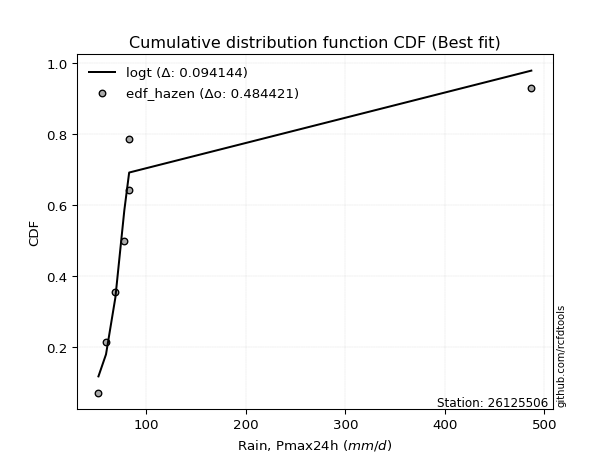</img></img>

</div>


### 3. Empirical - EDF Weibull (1939)

Weibull plotting position formula is an empirical method used to estimate the non-exceedance probability or plotting position for a set of observed data, is often recommended or widely used in practice, particularly in flood frequency analysis.

<div align="center">


$P=m/(n+1)$


</div>


**3.1. Empirical values**

<div align="center">

|                | 0                  | 1                  | 2           | 3           | 4                  | 5           | 6           |
|:---------------|:-------------------|:-------------------|:------------|:------------|:-------------------|:------------|:------------|
| date           | 2017               | 2022               | 2018        | 2021        | 2019               | 2023        | 2020        |
| x              | 51.8               | 59.4               | 68.8        | 77.8        | 82.5               | 82.7        | 486.8       |
| m              | 1                  | 2                  | 3           | 4           | 5                  | 6           | 7           |
| empirical_dist | edf_weibull        | edf_weibull        | edf_weibull | edf_weibull | edf_weibull        | edf_weibull | edf_weibull |
| empirical      | 0.125              | 0.25               | 0.375       | 0.5         | 0.625              | 0.75        | 0.875       |
| empirical_tr   | 1.1428571428571428 | 1.3333333333333333 | 1.6         | 2.0         | 2.6666666666666665 | 4.0         | 8.0         |

</div>


**3.2. Kolmogorov-Smirnov fit test (sorted by Δ)**


<div align="center">

|                | 0                   | 1                   | 2                   | 3                   | 4                   | 5                   | 6                   | 7                   | 8                   | 9                   | 10                  | 11                  | 12                  | 13                  | 14                  | 15                  | 16                  | 17                  | 18                  | 19                  | 20                  | 21                  | 22                  | 23                  | 24                  | 25                  | 26                  | 27                  | 28                    | 29                  | 30                  | 31                  | 32                  | 33                  | 34                  | 35                  | 36                  | 37                  | 38                  | 39                  | 40                  | 41                  | 42                  | 43                  | 44                  | 45                  | 46                  | 47                  | 48                  | 49                  | 50                  | 51                  | 52                  | 53                  | 54                  | 55                  | 56                  | 57                  | 58                  | 59                  | 60                  | 61                  | 62                  | 63                  | 64                  | 65                  | 66                  | 67                  | 68                  | 69                  | 70                  | 71                  | 72                  | 73                  | 74                  | 75                  | 76                  | 77                  | 78                  | 79                  | 80                  | 81                  | 82                  | 83                  | 84                  | 85                  | 86                  | 87                  | 88                  | 89                  |
|:---------------|:--------------------|:--------------------|:--------------------|:--------------------|:--------------------|:--------------------|:--------------------|:--------------------|:--------------------|:--------------------|:--------------------|:--------------------|:--------------------|:--------------------|:--------------------|:--------------------|:--------------------|:--------------------|:--------------------|:--------------------|:--------------------|:--------------------|:--------------------|:--------------------|:--------------------|:--------------------|:--------------------|:--------------------|:----------------------|:--------------------|:--------------------|:--------------------|:--------------------|:--------------------|:--------------------|:--------------------|:--------------------|:--------------------|:--------------------|:--------------------|:--------------------|:--------------------|:--------------------|:--------------------|:--------------------|:--------------------|:--------------------|:--------------------|:--------------------|:--------------------|:--------------------|:--------------------|:--------------------|:--------------------|:--------------------|:--------------------|:--------------------|:--------------------|:--------------------|:--------------------|:--------------------|:--------------------|:--------------------|:--------------------|:--------------------|:--------------------|:--------------------|:--------------------|:--------------------|:--------------------|:--------------------|:--------------------|:--------------------|:--------------------|:--------------------|:--------------------|:--------------------|:--------------------|:--------------------|:--------------------|:--------------------|:--------------------|:--------------------|:--------------------|:--------------------|:--------------------|:--------------------|:--------------------|:--------------------|:--------------------|
| station        | 26125506            | 26125506            | 26125506            | 26125506            | 26125506            | 26125506            | 26125506            | 26125506            | 26125506            | 26125506            | 26125506            | 26125506            | 26125506            | 26125506            | 26125506            | 26125506            | 26125506            | 26125506            | 26125506            | 26125506            | 26125506            | 26125506            | 26125506            | 26125506            | 26125506            | 26125506            | 26125506            | 26125506            | 26125506              | 26125506            | 26125506            | 26125506            | 26125506            | 26125506            | 26125506            | 26125506            | 26125506            | 26125506            | 26125506            | 26125506            | 26125506            | 26125506            | 26125506            | 26125506            | 26125506            | 26125506            | 26125506            | 26125506            | 26125506            | 26125506            | 26125506            | 26125506            | 26125506            | 26125506            | 26125506            | 26125506            | 26125506            | 26125506            | 26125506            | 26125506            | 26125506            | 26125506            | 26125506            | 26125506            | 26125506            | 26125506            | 26125506            | 26125506            | 26125506            | 26125506            | 26125506            | 26125506            | 26125506            | 26125506            | 26125506            | 26125506            | 26125506            | 26125506            | 26125506            | 26125506            | 26125506            | 26125506            | 26125506            | 26125506            | 26125506            | 26125506            | 26125506            | 26125506            | 26125506            | 26125506            |
| empirical_dist | edf_weibull         | edf_weibull         | edf_weibull         | edf_weibull         | edf_weibull         | edf_weibull         | edf_weibull         | edf_weibull         | edf_weibull         | edf_weibull         | edf_weibull         | edf_weibull         | edf_weibull         | edf_weibull         | edf_weibull         | edf_weibull         | edf_weibull         | edf_weibull         | edf_weibull         | edf_weibull         | edf_weibull         | edf_weibull         | edf_weibull         | edf_weibull         | edf_weibull         | edf_weibull         | edf_weibull         | edf_weibull         | edf_weibull           | edf_weibull         | edf_weibull         | edf_weibull         | edf_weibull         | edf_weibull         | edf_weibull         | edf_weibull         | edf_weibull         | edf_weibull         | edf_weibull         | edf_weibull         | edf_weibull         | edf_weibull         | edf_weibull         | edf_weibull         | edf_weibull         | edf_weibull         | edf_weibull         | edf_weibull         | edf_weibull         | edf_weibull         | edf_weibull         | edf_weibull         | edf_weibull         | edf_weibull         | edf_weibull         | edf_weibull         | edf_weibull         | edf_weibull         | edf_weibull         | edf_weibull         | edf_weibull         | edf_weibull         | edf_weibull         | edf_weibull         | edf_weibull         | edf_weibull         | edf_weibull         | edf_weibull         | edf_weibull         | edf_weibull         | edf_weibull         | edf_weibull         | edf_weibull         | edf_weibull         | edf_weibull         | edf_weibull         | edf_weibull         | edf_weibull         | edf_weibull         | edf_weibull         | edf_weibull         | edf_weibull         | edf_weibull         | edf_weibull         | edf_weibull         | edf_weibull         | edf_weibull         | edf_weibull         | edf_weibull         | edf_weibull         |
| p_dist         | logt                | t                   | logalpha            | lognct              | loginvweibull       | logfisk             | loginvgamma         | logf                | logncf              | alpha               | logjohnsonsu        | logpareto           | mielke              | loginvgauss         | f                   | invgamma            | invweibull          | loggibrat           | logfatiguelife      | logwald             | logerlang           | lognakagami         | invgauss            | erlang              | fisk                | logexponnorm        | logpearson3         | loggompertz         | loglaplace_asymmetric | logexpon            | loggenexpon         | logtruncnorm        | fatiguelife         | loghalflogistic     | logweibull_min      | logmoyal            | loggenlogistic      | logbetaprime        | loghalfnorm         | gamma               | loggumbel_r         | loggamma            | loggamma            | wald                | nakagami            | pearson3            | logchi2             | lograyleigh         | nct                 | gibrat              | logmaxwell          | betaprime           | halflogistic        | ncf                 | logkstwobign        | halfnorm            | moyal               | logloggamma         | lognorm             | lognorm             | logcrystalball      | loglogistic         | gumbel_r            | loghypsecant        | weibull_min         | rayleigh            | logrice             | chi2                | maxwell             | loglaplace          | genlogistic         | loglognorm          | crystalball         | norm                | loggumbel_l         | logistic            | hypsecant           | johnsonsu           | exponnorm           | pareto              | expon               | genexpon            | laplace_asymmetric  | kstwobign           | laplace             | gompertz            | rice                | gumbel_l            | truncnorm           | logmielke           |
| delta          | 0.10297594965285473 | 0.10751194950891863 | 0.11159630279553734 | 0.1140169552836896  | 0.11904628679999496 | 0.1207416520183291  | 0.12097589837985323 | 0.12117612031980307 | 0.12119895713688089 | 0.12255831387075644 | 0.1253560076638347  | 0.12910228002291024 | 0.13177115933052808 | 0.13319585348509388 | 0.1337324815503379  | 0.13373294743185604 | 0.13384464725509482 | 0.1381921262413235  | 0.14082616156378258 | 0.1482232927349768  | 0.15037665208127715 | 0.15071620768776972 | 0.15287688162431012 | 0.1807653507380389  | 0.18418265935501388 | 0.18675601520576968 | 0.18929839942466165 | 0.19056995551759004 | 0.1910929253524285    | 0.191109475507242   | 0.19113758900360212 | 0.2074787404286943  | 0.20789677851602129 | 0.2083478525281126  | 0.21582951393493555 | 0.21778478915250976 | 0.22291078443413026 | 0.22442316234771997 | 0.22859609634816913 | 0.23486327079210323 | 0.24286304161769845 | 0.24743545417637336 | 0.24743545417637336 | 0.24963299264358985 | 0.2539676951475914  | 0.2574053116628904  | 0.2609701990370147  | 0.26250557813628295 | 0.2657618726950922  | 0.27072895432898003 | 0.2745101573142567  | 0.2807404222914863  | 0.28482433574309357 | 0.2850620416158882  | 0.29357943092504885 | 0.29663406779804313 | 0.3021510608915384  | 0.3087074691521166  | 0.3088981803805694  | 0.3088981803805694  | 0.3088981821975266  | 0.3167889696100821  | 0.32271007615522684 | 0.3234281157245825  | 0.32797573455124296 | 0.331490144069857   | 0.3352973699256628  | 0.3417390829898051  | 0.3437503382523714  | 0.3445266408640873  | 0.3587693355057292  | 0.37178701497075917 | 0.37688182237247425 | 0.37688182585562935 | 0.378585099018467   | 0.39266648647133356 | 0.4052538620809205  | 0.4214408192173962  | 0.4233313780146324  | 0.423487990979461   | 0.4234880087170151  | 0.42348819190210657 | 0.4234881974517778  | 0.42437849824149554 | 0.4336149100470487  | 0.43560419808951073 | 0.4394548009974301  | 0.44022394151847977 | 0.5492512855746269  | nan                 |
| deltao         | 0.48442053926100004 | 0.48442053926100004 | 0.48442053926100004 | 0.48442053926100004 | 0.48442053926100004 | 0.48442053926100004 | 0.48442053926100004 | 0.48442053926100004 | 0.48442053926100004 | 0.48442053926100004 | 0.48442053926100004 | 0.48442053926100004 | 0.48442053926100004 | 0.48442053926100004 | 0.48442053926100004 | 0.48442053926100004 | 0.48442053926100004 | 0.48442053926100004 | 0.48442053926100004 | 0.48442053926100004 | 0.48442053926100004 | 0.48442053926100004 | 0.48442053926100004 | 0.48442053926100004 | 0.48442053926100004 | 0.48442053926100004 | 0.48442053926100004 | 0.48442053926100004 | 0.48442053926100004   | 0.48442053926100004 | 0.48442053926100004 | 0.48442053926100004 | 0.48442053926100004 | 0.48442053926100004 | 0.48442053926100004 | 0.48442053926100004 | 0.48442053926100004 | 0.48442053926100004 | 0.48442053926100004 | 0.48442053926100004 | 0.48442053926100004 | 0.48442053926100004 | 0.48442053926100004 | 0.48442053926100004 | 0.48442053926100004 | 0.48442053926100004 | 0.48442053926100004 | 0.48442053926100004 | 0.48442053926100004 | 0.48442053926100004 | 0.48442053926100004 | 0.48442053926100004 | 0.48442053926100004 | 0.48442053926100004 | 0.48442053926100004 | 0.48442053926100004 | 0.48442053926100004 | 0.48442053926100004 | 0.48442053926100004 | 0.48442053926100004 | 0.48442053926100004 | 0.48442053926100004 | 0.48442053926100004 | 0.48442053926100004 | 0.48442053926100004 | 0.48442053926100004 | 0.48442053926100004 | 0.48442053926100004 | 0.48442053926100004 | 0.48442053926100004 | 0.48442053926100004 | 0.48442053926100004 | 0.48442053926100004 | 0.48442053926100004 | 0.48442053926100004 | 0.48442053926100004 | 0.48442053926100004 | 0.48442053926100004 | 0.48442053926100004 | 0.48442053926100004 | 0.48442053926100004 | 0.48442053926100004 | 0.48442053926100004 | 0.48442053926100004 | 0.48442053926100004 | 0.48442053926100004 | 0.48442053926100004 | 0.48442053926100004 | 0.48442053926100004 | 0.48442053926100004 |
| eval           | Δo > Δ              | Δo > Δ              | Δo > Δ              | Δo > Δ              | Δo > Δ              | Δo > Δ              | Δo > Δ              | Δo > Δ              | Δo > Δ              | Δo > Δ              | Δo > Δ              | Δo > Δ              | Δo > Δ              | Δo > Δ              | Δo > Δ              | Δo > Δ              | Δo > Δ              | Δo > Δ              | Δo > Δ              | Δo > Δ              | Δo > Δ              | Δo > Δ              | Δo > Δ              | Δo > Δ              | Δo > Δ              | Δo > Δ              | Δo > Δ              | Δo > Δ              | Δo > Δ                | Δo > Δ              | Δo > Δ              | Δo > Δ              | Δo > Δ              | Δo > Δ              | Δo > Δ              | Δo > Δ              | Δo > Δ              | Δo > Δ              | Δo > Δ              | Δo > Δ              | Δo > Δ              | Δo > Δ              | Δo > Δ              | Δo > Δ              | Δo > Δ              | Δo > Δ              | Δo > Δ              | Δo > Δ              | Δo > Δ              | Δo > Δ              | Δo > Δ              | Δo > Δ              | Δo > Δ              | Δo > Δ              | Δo > Δ              | Δo > Δ              | Δo > Δ              | Δo > Δ              | Δo > Δ              | Δo > Δ              | Δo > Δ              | Δo > Δ              | Δo > Δ              | Δo > Δ              | Δo > Δ              | Δo > Δ              | Δo > Δ              | Δo > Δ              | Δo > Δ              | Δo > Δ              | Δo > Δ              | Δo > Δ              | Δo > Δ              | Δo > Δ              | Δo > Δ              | Δo > Δ              | Δo > Δ              | Δo > Δ              | Δo > Δ              | Δo > Δ              | Δo > Δ              | Δo > Δ              | Δo > Δ              | Δo > Δ              | Δo > Δ              | Δo > Δ              | Δo > Δ              | Δo > Δ              | Δo <= Δ             | Δo <= Δ             |
| fit            | 1                   | 1                   | 1                   | 1                   | 1                   | 1                   | 1                   | 1                   | 1                   | 1                   | 1                   | 1                   | 1                   | 1                   | 1                   | 1                   | 1                   | 1                   | 1                   | 1                   | 1                   | 1                   | 1                   | 1                   | 1                   | 1                   | 1                   | 1                   | 1                     | 1                   | 1                   | 1                   | 1                   | 1                   | 1                   | 1                   | 1                   | 1                   | 1                   | 1                   | 1                   | 1                   | 1                   | 1                   | 1                   | 1                   | 1                   | 1                   | 1                   | 1                   | 1                   | 1                   | 1                   | 1                   | 1                   | 1                   | 1                   | 1                   | 1                   | 1                   | 1                   | 1                   | 1                   | 1                   | 1                   | 1                   | 1                   | 1                   | 1                   | 1                   | 1                   | 1                   | 1                   | 1                   | 1                   | 1                   | 1                   | 1                   | 1                   | 1                   | 1                   | 1                   | 1                   | 1                   | 1                   | 1                   | 1                   | 1                   | 0                   | 0                   |
| n              | 7                   | 7                   | 7                   | 7                   | 7                   | 7                   | 7                   | 7                   | 7                   | 7                   | 7                   | 7                   | 7                   | 7                   | 7                   | 7                   | 7                   | 7                   | 7                   | 7                   | 7                   | 7                   | 7                   | 7                   | 7                   | 7                   | 7                   | 7                   | 7                     | 7                   | 7                   | 7                   | 7                   | 7                   | 7                   | 7                   | 7                   | 7                   | 7                   | 7                   | 7                   | 7                   | 7                   | 7                   | 7                   | 7                   | 7                   | 7                   | 7                   | 7                   | 7                   | 7                   | 7                   | 7                   | 7                   | 7                   | 7                   | 7                   | 7                   | 7                   | 7                   | 7                   | 7                   | 7                   | 7                   | 7                   | 7                   | 7                   | 7                   | 7                   | 7                   | 7                   | 7                   | 7                   | 7                   | 7                   | 7                   | 7                   | 7                   | 7                   | 7                   | 7                   | 7                   | 7                   | 7                   | 7                   | 7                   | 7                   | 7                   | 7                   |
| best_fit       | 1                   | 0                   | 0                   | 0                   | 0                   | 0                   | 0                   | 0                   | 0                   | 0                   | 0                   | 0                   | 0                   | 0                   | 0                   | 0                   | 0                   | 0                   | 0                   | 0                   | 0                   | 0                   | 0                   | 0                   | 0                   | 0                   | 0                   | 0                   | 0                     | 0                   | 0                   | 0                   | 0                   | 0                   | 0                   | 0                   | 0                   | 0                   | 0                   | 0                   | 0                   | 0                   | 0                   | 0                   | 0                   | 0                   | 0                   | 0                   | 0                   | 0                   | 0                   | 0                   | 0                   | 0                   | 0                   | 0                   | 0                   | 0                   | 0                   | 0                   | 0                   | 0                   | 0                   | 0                   | 0                   | 0                   | 0                   | 0                   | 0                   | 0                   | 0                   | 0                   | 0                   | 0                   | 0                   | 0                   | 0                   | 0                   | 0                   | 0                   | 0                   | 0                   | 0                   | 0                   | 0                   | 0                   | 0                   | 0                   | 0                   | 0                   |
| best_fit_sort  | 1                   | 2                   | 3                   | 4                   | 5                   | 6                   | 7                   | 8                   | 9                   | 10                  | 11                  | 12                  | 13                  | 14                  | 15                  | 16                  | 17                  | 18                  | 19                  | 20                  | 21                  | 22                  | 23                  | 24                  | 25                  | 26                  | 27                  | 28                  | 29                    | 30                  | 31                  | 32                  | 33                  | 34                  | 35                  | 36                  | 37                  | 38                  | 39                  | 40                  | 41                  | 42                  | 43                  | 44                  | 45                  | 46                  | 47                  | 48                  | 49                  | 50                  | 51                  | 52                  | 53                  | 54                  | 55                  | 56                  | 57                  | 58                  | 59                  | 60                  | 61                  | 62                  | 63                  | 64                  | 65                  | 66                  | 67                  | 68                  | 69                  | 70                  | 71                  | 72                  | 73                  | 74                  | 75                  | 76                  | 77                  | 78                  | 79                  | 80                  | 81                  | 82                  | 83                  | 84                  | 85                  | 86                  | 87                  | 88                  | 89                  | 90                  |

</div>


<div align="center">

</img>

</div>


**3.3. Best fit**

<div align="center">

|   id |   station | empirical_dist   | p_dist   |    delta |   deltao | eval   |   fit |   n |   best_fit |   best_fit_sort |
|-----:|----------:|:-----------------|:---------|---------:|---------:|:-------|------:|----:|-----------:|----------------:|
|    0 |  26125506 | edf_weibull      | logt     | 0.102976 | 0.484421 | Δo > Δ |     1 |   7 |          1 |               1 |

</div>


<div align="center">

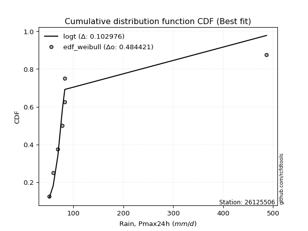</img></img>

</div>


### 4. Empirical - EDF Beard (1943)

The Beard formula (or Beard´s plotting position formula) in hydrology is used to estimate the empirical non-exceedance probability _(P)_ of a flood event (or other extreme hydrological data point) within a given dataset.

<div align="center">


$P=(m-0.31)/(n+0.38)$


</div>


**4.1. Empirical values**

<div align="center">

|                | 0                   | 1                   | 2                   | 3         | 4                  | 5                  | 6                  |
|:---------------|:--------------------|:--------------------|:--------------------|:----------|:-------------------|:-------------------|:-------------------|
| date           | 2017                | 2022                | 2018                | 2021      | 2019               | 2023               | 2020               |
| x              | 51.8                | 59.4                | 68.8                | 77.8      | 82.5               | 82.7               | 486.8              |
| m              | 1                   | 2                   | 3                   | 4         | 5                  | 6                  | 7                  |
| empirical_dist | edf_beard           | edf_beard           | edf_beard           | edf_beard | edf_beard          | edf_beard          | edf_beard          |
| empirical      | 0.09349593495934959 | 0.22899728997289973 | 0.36449864498644985 | 0.5       | 0.6355013550135502 | 0.7710027100271003 | 0.9065040650406505 |
| empirical_tr   | 1.1031390134529149  | 1.29701230228471    | 1.5735607675906182  | 2.0       | 2.743494423791822  | 4.366863905325444  | 10.695652173913055 |

</div>


**4.2. Kolmogorov-Smirnov fit test (sorted by Δ)**


<div align="center">

|                | 0                   | 1                   | 2                   | 3                   | 4                   | 5                   | 6                   | 7                   | 8                   | 9                   | 10                  | 11                  | 12                  | 13                  | 14                  | 15                  | 16                  | 17                  | 18                  | 19                  | 20                  | 21                  | 22                  | 23                  | 24                  | 25                  | 26                  | 27                  | 28                    | 29                  | 30                  | 31                  | 32                  | 33                  | 34                  | 35                  | 36                  | 37                  | 38                  | 39                  | 40                  | 41                  | 42                  | 43                  | 44                  | 45                  | 46                  | 47                  | 48                  | 49                  | 50                  | 51                  | 52                  | 53                  | 54                  | 55                  | 56                  | 57                  | 58                  | 59                  | 60                  | 61                  | 62                  | 63                  | 64                  | 65                  | 66                  | 67                  | 68                  | 69                  | 70                  | 71                  | 72                  | 73                  | 74                  | 75                  | 76                  | 77                  | 78                  | 79                  | 80                  | 81                  | 82                  | 83                  | 84                  | 85                  | 86                  | 87                  | 88                  | 89                  |
|:---------------|:--------------------|:--------------------|:--------------------|:--------------------|:--------------------|:--------------------|:--------------------|:--------------------|:--------------------|:--------------------|:--------------------|:--------------------|:--------------------|:--------------------|:--------------------|:--------------------|:--------------------|:--------------------|:--------------------|:--------------------|:--------------------|:--------------------|:--------------------|:--------------------|:--------------------|:--------------------|:--------------------|:--------------------|:----------------------|:--------------------|:--------------------|:--------------------|:--------------------|:--------------------|:--------------------|:--------------------|:--------------------|:--------------------|:--------------------|:--------------------|:--------------------|:--------------------|:--------------------|:--------------------|:--------------------|:--------------------|:--------------------|:--------------------|:--------------------|:--------------------|:--------------------|:--------------------|:--------------------|:--------------------|:--------------------|:--------------------|:--------------------|:--------------------|:--------------------|:--------------------|:--------------------|:--------------------|:--------------------|:--------------------|:--------------------|:--------------------|:--------------------|:--------------------|:--------------------|:--------------------|:--------------------|:--------------------|:--------------------|:--------------------|:--------------------|:--------------------|:--------------------|:--------------------|:--------------------|:--------------------|:--------------------|:--------------------|:--------------------|:--------------------|:--------------------|:--------------------|:--------------------|:--------------------|:--------------------|:--------------------|
| station        | 26125506            | 26125506            | 26125506            | 26125506            | 26125506            | 26125506            | 26125506            | 26125506            | 26125506            | 26125506            | 26125506            | 26125506            | 26125506            | 26125506            | 26125506            | 26125506            | 26125506            | 26125506            | 26125506            | 26125506            | 26125506            | 26125506            | 26125506            | 26125506            | 26125506            | 26125506            | 26125506            | 26125506            | 26125506              | 26125506            | 26125506            | 26125506            | 26125506            | 26125506            | 26125506            | 26125506            | 26125506            | 26125506            | 26125506            | 26125506            | 26125506            | 26125506            | 26125506            | 26125506            | 26125506            | 26125506            | 26125506            | 26125506            | 26125506            | 26125506            | 26125506            | 26125506            | 26125506            | 26125506            | 26125506            | 26125506            | 26125506            | 26125506            | 26125506            | 26125506            | 26125506            | 26125506            | 26125506            | 26125506            | 26125506            | 26125506            | 26125506            | 26125506            | 26125506            | 26125506            | 26125506            | 26125506            | 26125506            | 26125506            | 26125506            | 26125506            | 26125506            | 26125506            | 26125506            | 26125506            | 26125506            | 26125506            | 26125506            | 26125506            | 26125506            | 26125506            | 26125506            | 26125506            | 26125506            | 26125506            |
| empirical_dist | edf_beard           | edf_beard           | edf_beard           | edf_beard           | edf_beard           | edf_beard           | edf_beard           | edf_beard           | edf_beard           | edf_beard           | edf_beard           | edf_beard           | edf_beard           | edf_beard           | edf_beard           | edf_beard           | edf_beard           | edf_beard           | edf_beard           | edf_beard           | edf_beard           | edf_beard           | edf_beard           | edf_beard           | edf_beard           | edf_beard           | edf_beard           | edf_beard           | edf_beard             | edf_beard           | edf_beard           | edf_beard           | edf_beard           | edf_beard           | edf_beard           | edf_beard           | edf_beard           | edf_beard           | edf_beard           | edf_beard           | edf_beard           | edf_beard           | edf_beard           | edf_beard           | edf_beard           | edf_beard           | edf_beard           | edf_beard           | edf_beard           | edf_beard           | edf_beard           | edf_beard           | edf_beard           | edf_beard           | edf_beard           | edf_beard           | edf_beard           | edf_beard           | edf_beard           | edf_beard           | edf_beard           | edf_beard           | edf_beard           | edf_beard           | edf_beard           | edf_beard           | edf_beard           | edf_beard           | edf_beard           | edf_beard           | edf_beard           | edf_beard           | edf_beard           | edf_beard           | edf_beard           | edf_beard           | edf_beard           | edf_beard           | edf_beard           | edf_beard           | edf_beard           | edf_beard           | edf_beard           | edf_beard           | edf_beard           | edf_beard           | edf_beard           | edf_beard           | edf_beard           | edf_beard           |
| p_dist         | logt                | t                   | logalpha            | lognct              | loginvweibull       | logfisk             | loginvgamma         | logf                | logncf              | alpha               | logjohnsonsu        | logpareto           | mielke              | loginvgauss         | f                   | invgamma            | invweibull          | loggibrat           | logfatiguelife      | logwald             | logerlang           | lognakagami         | invgauss            | erlang              | fisk                | logexponnorm        | logpearson3         | loggompertz         | loglaplace_asymmetric | logexpon            | loggenexpon         | logtruncnorm        | fatiguelife         | loghalflogistic     | logbetaprime        | logweibull_min      | logmoyal            | loggenlogistic      | loghalfnorm         | gamma               | loggamma            | loggamma            | loggumbel_r         | wald                | nakagami            | pearson3            | logchi2             | lograyleigh         | nct                 | gibrat              | logmaxwell          | betaprime           | halflogistic        | ncf                 | logkstwobign        | halfnorm            | moyal               | logloggamma         | lognorm             | lognorm             | logcrystalball      | loglogistic         | gumbel_r            | loghypsecant        | weibull_min         | rayleigh            | logrice             | chi2                | maxwell             | loglaplace          | genlogistic         | loglognorm          | crystalball         | norm                | loggumbel_l         | logistic            | hypsecant           | johnsonsu           | exponnorm           | pareto              | expon               | genexpon            | laplace_asymmetric  | kstwobign           | laplace             | gompertz            | rice                | gumbel_l            | truncnorm           | logmielke           |
| delta          | 0.0851503828914153  | 0.08968006115813199 | 0.13259901282263764 | 0.1350196653107899  | 0.14004899682709526 | 0.1417443620454294  | 0.14197860840695353 | 0.14217883034690337 | 0.1422016671639812  | 0.14356102389785674 | 0.146358717690935   | 0.15010499005001054 | 0.15277386935762838 | 0.1541985635121942  | 0.1547351915774382  | 0.15473565745895634 | 0.15484735728219512 | 0.1591948362684238  | 0.16182887159088288 | 0.1692260027620771  | 0.17137936210837745 | 0.17171891771487002 | 0.17387959165141043 | 0.2017680607651392  | 0.20518536938211418 | 0.20775872523286998 | 0.21030110945176195 | 0.21157266554469034 | 0.2120956353795288    | 0.2121121855343423  | 0.21214029903070242 | 0.2284814504557946  | 0.2288994885431216  | 0.2293505625552129  | 0.23492451736127012 | 0.23683222396203585 | 0.23878749917961006 | 0.24391349446123056 | 0.24959880637526943 | 0.25586598081920353 | 0.2579368091899235  | 0.2579368091899235  | 0.26386575164479875 | 0.27063570267069015 | 0.2749704051746917  | 0.2787338814876438  | 0.281972909064115   | 0.28350828816338325 | 0.2867645827221925  | 0.29173166435608033 | 0.295512867341357   | 0.3017431323185866  | 0.3058270457701939  | 0.3060647516429885  | 0.31458214095214915 | 0.31763677782514343 | 0.3231537709186387  | 0.3297101791792169  | 0.3299008904076697  | 0.3299008904076697  | 0.32990089222462693 | 0.33779167963718243 | 0.34371278618232715 | 0.3444308257516828  | 0.34897844457834326 | 0.3524928540969573  | 0.3563000799527631  | 0.3627417930169054  | 0.3647530482794717  | 0.3655293508911876  | 0.3797720455328295  | 0.39278972499785947 | 0.39788453239957455 | 0.39788453588272965 | 0.3995878090455673  | 0.41366919649843387 | 0.4262565721080208  | 0.4319421742309464  | 0.4443340880417327  | 0.4444907010065613  | 0.4444907187441154  | 0.44449090192920687 | 0.4444909074788781  | 0.44538120826859584 | 0.454617620074149   | 0.45660690811661103 | 0.4604575110245304  | 0.46122665154558007 | 0.5702539956017272  | nan                 |
| deltao         | 0.48442053926100004 | 0.48442053926100004 | 0.48442053926100004 | 0.48442053926100004 | 0.48442053926100004 | 0.48442053926100004 | 0.48442053926100004 | 0.48442053926100004 | 0.48442053926100004 | 0.48442053926100004 | 0.48442053926100004 | 0.48442053926100004 | 0.48442053926100004 | 0.48442053926100004 | 0.48442053926100004 | 0.48442053926100004 | 0.48442053926100004 | 0.48442053926100004 | 0.48442053926100004 | 0.48442053926100004 | 0.48442053926100004 | 0.48442053926100004 | 0.48442053926100004 | 0.48442053926100004 | 0.48442053926100004 | 0.48442053926100004 | 0.48442053926100004 | 0.48442053926100004 | 0.48442053926100004   | 0.48442053926100004 | 0.48442053926100004 | 0.48442053926100004 | 0.48442053926100004 | 0.48442053926100004 | 0.48442053926100004 | 0.48442053926100004 | 0.48442053926100004 | 0.48442053926100004 | 0.48442053926100004 | 0.48442053926100004 | 0.48442053926100004 | 0.48442053926100004 | 0.48442053926100004 | 0.48442053926100004 | 0.48442053926100004 | 0.48442053926100004 | 0.48442053926100004 | 0.48442053926100004 | 0.48442053926100004 | 0.48442053926100004 | 0.48442053926100004 | 0.48442053926100004 | 0.48442053926100004 | 0.48442053926100004 | 0.48442053926100004 | 0.48442053926100004 | 0.48442053926100004 | 0.48442053926100004 | 0.48442053926100004 | 0.48442053926100004 | 0.48442053926100004 | 0.48442053926100004 | 0.48442053926100004 | 0.48442053926100004 | 0.48442053926100004 | 0.48442053926100004 | 0.48442053926100004 | 0.48442053926100004 | 0.48442053926100004 | 0.48442053926100004 | 0.48442053926100004 | 0.48442053926100004 | 0.48442053926100004 | 0.48442053926100004 | 0.48442053926100004 | 0.48442053926100004 | 0.48442053926100004 | 0.48442053926100004 | 0.48442053926100004 | 0.48442053926100004 | 0.48442053926100004 | 0.48442053926100004 | 0.48442053926100004 | 0.48442053926100004 | 0.48442053926100004 | 0.48442053926100004 | 0.48442053926100004 | 0.48442053926100004 | 0.48442053926100004 | 0.48442053926100004 |
| eval           | Δo > Δ              | Δo > Δ              | Δo > Δ              | Δo > Δ              | Δo > Δ              | Δo > Δ              | Δo > Δ              | Δo > Δ              | Δo > Δ              | Δo > Δ              | Δo > Δ              | Δo > Δ              | Δo > Δ              | Δo > Δ              | Δo > Δ              | Δo > Δ              | Δo > Δ              | Δo > Δ              | Δo > Δ              | Δo > Δ              | Δo > Δ              | Δo > Δ              | Δo > Δ              | Δo > Δ              | Δo > Δ              | Δo > Δ              | Δo > Δ              | Δo > Δ              | Δo > Δ                | Δo > Δ              | Δo > Δ              | Δo > Δ              | Δo > Δ              | Δo > Δ              | Δo > Δ              | Δo > Δ              | Δo > Δ              | Δo > Δ              | Δo > Δ              | Δo > Δ              | Δo > Δ              | Δo > Δ              | Δo > Δ              | Δo > Δ              | Δo > Δ              | Δo > Δ              | Δo > Δ              | Δo > Δ              | Δo > Δ              | Δo > Δ              | Δo > Δ              | Δo > Δ              | Δo > Δ              | Δo > Δ              | Δo > Δ              | Δo > Δ              | Δo > Δ              | Δo > Δ              | Δo > Δ              | Δo > Δ              | Δo > Δ              | Δo > Δ              | Δo > Δ              | Δo > Δ              | Δo > Δ              | Δo > Δ              | Δo > Δ              | Δo > Δ              | Δo > Δ              | Δo > Δ              | Δo > Δ              | Δo > Δ              | Δo > Δ              | Δo > Δ              | Δo > Δ              | Δo > Δ              | Δo > Δ              | Δo > Δ              | Δo > Δ              | Δo > Δ              | Δo > Δ              | Δo > Δ              | Δo > Δ              | Δo > Δ              | Δo > Δ              | Δo > Δ              | Δo > Δ              | Δo > Δ              | Δo <= Δ             | Δo <= Δ             |
| fit            | 1                   | 1                   | 1                   | 1                   | 1                   | 1                   | 1                   | 1                   | 1                   | 1                   | 1                   | 1                   | 1                   | 1                   | 1                   | 1                   | 1                   | 1                   | 1                   | 1                   | 1                   | 1                   | 1                   | 1                   | 1                   | 1                   | 1                   | 1                   | 1                     | 1                   | 1                   | 1                   | 1                   | 1                   | 1                   | 1                   | 1                   | 1                   | 1                   | 1                   | 1                   | 1                   | 1                   | 1                   | 1                   | 1                   | 1                   | 1                   | 1                   | 1                   | 1                   | 1                   | 1                   | 1                   | 1                   | 1                   | 1                   | 1                   | 1                   | 1                   | 1                   | 1                   | 1                   | 1                   | 1                   | 1                   | 1                   | 1                   | 1                   | 1                   | 1                   | 1                   | 1                   | 1                   | 1                   | 1                   | 1                   | 1                   | 1                   | 1                   | 1                   | 1                   | 1                   | 1                   | 1                   | 1                   | 1                   | 1                   | 0                   | 0                   |
| n              | 7                   | 7                   | 7                   | 7                   | 7                   | 7                   | 7                   | 7                   | 7                   | 7                   | 7                   | 7                   | 7                   | 7                   | 7                   | 7                   | 7                   | 7                   | 7                   | 7                   | 7                   | 7                   | 7                   | 7                   | 7                   | 7                   | 7                   | 7                   | 7                     | 7                   | 7                   | 7                   | 7                   | 7                   | 7                   | 7                   | 7                   | 7                   | 7                   | 7                   | 7                   | 7                   | 7                   | 7                   | 7                   | 7                   | 7                   | 7                   | 7                   | 7                   | 7                   | 7                   | 7                   | 7                   | 7                   | 7                   | 7                   | 7                   | 7                   | 7                   | 7                   | 7                   | 7                   | 7                   | 7                   | 7                   | 7                   | 7                   | 7                   | 7                   | 7                   | 7                   | 7                   | 7                   | 7                   | 7                   | 7                   | 7                   | 7                   | 7                   | 7                   | 7                   | 7                   | 7                   | 7                   | 7                   | 7                   | 7                   | 7                   | 7                   |
| best_fit       | 1                   | 0                   | 0                   | 0                   | 0                   | 0                   | 0                   | 0                   | 0                   | 0                   | 0                   | 0                   | 0                   | 0                   | 0                   | 0                   | 0                   | 0                   | 0                   | 0                   | 0                   | 0                   | 0                   | 0                   | 0                   | 0                   | 0                   | 0                   | 0                     | 0                   | 0                   | 0                   | 0                   | 0                   | 0                   | 0                   | 0                   | 0                   | 0                   | 0                   | 0                   | 0                   | 0                   | 0                   | 0                   | 0                   | 0                   | 0                   | 0                   | 0                   | 0                   | 0                   | 0                   | 0                   | 0                   | 0                   | 0                   | 0                   | 0                   | 0                   | 0                   | 0                   | 0                   | 0                   | 0                   | 0                   | 0                   | 0                   | 0                   | 0                   | 0                   | 0                   | 0                   | 0                   | 0                   | 0                   | 0                   | 0                   | 0                   | 0                   | 0                   | 0                   | 0                   | 0                   | 0                   | 0                   | 0                   | 0                   | 0                   | 0                   |
| best_fit_sort  | 1                   | 2                   | 3                   | 4                   | 5                   | 6                   | 7                   | 8                   | 9                   | 10                  | 11                  | 12                  | 13                  | 14                  | 15                  | 16                  | 17                  | 18                  | 19                  | 20                  | 21                  | 22                  | 23                  | 24                  | 25                  | 26                  | 27                  | 28                  | 29                    | 30                  | 31                  | 32                  | 33                  | 34                  | 35                  | 36                  | 37                  | 38                  | 39                  | 40                  | 41                  | 42                  | 43                  | 44                  | 45                  | 46                  | 47                  | 48                  | 49                  | 50                  | 51                  | 52                  | 53                  | 54                  | 55                  | 56                  | 57                  | 58                  | 59                  | 60                  | 61                  | 62                  | 63                  | 64                  | 65                  | 66                  | 67                  | 68                  | 69                  | 70                  | 71                  | 72                  | 73                  | 74                  | 75                  | 76                  | 77                  | 78                  | 79                  | 80                  | 81                  | 82                  | 83                  | 84                  | 85                  | 86                  | 87                  | 88                  | 89                  | 90                  |

</div>


<div align="center">

</img>

</div>


**4.3. Best fit**

<div align="center">

|   id |   station | empirical_dist   | p_dist   |     delta |   deltao | eval   |   fit |   n |   best_fit |   best_fit_sort |
|-----:|----------:|:-----------------|:---------|----------:|---------:|:-------|------:|----:|-----------:|----------------:|
|    0 |  26125506 | edf_beard        | logt     | 0.0851504 | 0.484421 | Δo > Δ |     1 |   7 |          1 |               1 |

</div>


<div align="center">

</img>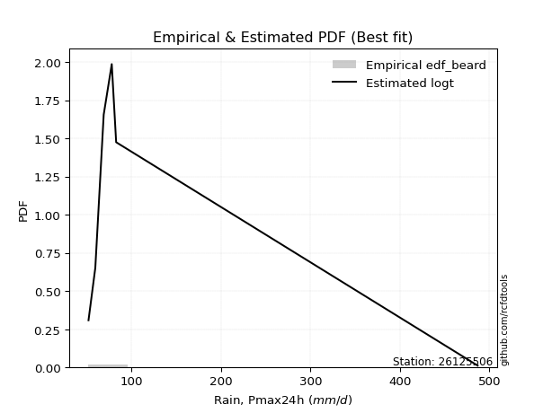</img>

</div>


### 5. Empirical - EDF Chegodayev (1955)

The Chegodayev formula is an empirical plotting position formula used in hydrological frequency analysis to estimate the exceedance probability or return period of a specific event from a set of observed data. It is primarily used for plotting observed data points on probability paper to fit a theoretical distribution, particularly for analyzing extreme events like maximum flood flows or rainfall intensities. The constant _b_ value in the generalized plotting position formula is 0.3.

<div align="center">


$P=(m-b)/(n+1-2b)$


</div>


**5.1. Empirical values**

<div align="center">

|                | 0                   | 1                   | 2                   | 3              | 4                  | 5                  | 6                  |
|:---------------|:--------------------|:--------------------|:--------------------|:---------------|:-------------------|:-------------------|:-------------------|
| date           | 2017                | 2022                | 2018                | 2021           | 2019               | 2023               | 2020               |
| x              | 51.8                | 59.4                | 68.8                | 77.8           | 82.5               | 82.7               | 486.8              |
| m              | 1                   | 2                   | 3                   | 4              | 5                  | 6                  | 7                  |
| empirical_dist | edf_chegodayev      | edf_chegodayev      | edf_chegodayev      | edf_chegodayev | edf_chegodayev     | edf_chegodayev     | edf_chegodayev     |
| empirical      | 0.09459459459459459 | 0.22972972972972971 | 0.36486486486486486 | 0.5            | 0.6351351351351351 | 0.7702702702702703 | 0.9054054054054054 |
| empirical_tr   | 1.1044776119402986  | 1.2982456140350878  | 1.574468085106383   | 2.0            | 2.7407407407407405 | 4.352941176470589  | 10.571428571428568 |

</div>


**5.2. Kolmogorov-Smirnov fit test (sorted by Δ)**


<div align="center">

|                | 0                   | 1                   | 2                   | 3                   | 4                   | 5                   | 6                   | 7                   | 8                   | 9                   | 10                  | 11                  | 12                  | 13                  | 14                  | 15                  | 16                  | 17                  | 18                  | 19                  | 20                  | 21                  | 22                  | 23                  | 24                  | 25                  | 26                  | 27                  | 28                    | 29                  | 30                  | 31                  | 32                  | 33                  | 34                  | 35                  | 36                  | 37                  | 38                  | 39                  | 40                  | 41                  | 42                  | 43                  | 44                  | 45                  | 46                  | 47                  | 48                  | 49                  | 50                  | 51                  | 52                  | 53                  | 54                  | 55                  | 56                  | 57                  | 58                  | 59                  | 60                  | 61                  | 62                  | 63                  | 64                  | 65                  | 66                  | 67                  | 68                  | 69                  | 70                  | 71                  | 72                  | 73                  | 74                  | 75                  | 76                  | 77                  | 78                  | 79                  | 80                  | 81                  | 82                  | 83                  | 84                  | 85                  | 86                  | 87                  | 88                  | 89                  |
|:---------------|:--------------------|:--------------------|:--------------------|:--------------------|:--------------------|:--------------------|:--------------------|:--------------------|:--------------------|:--------------------|:--------------------|:--------------------|:--------------------|:--------------------|:--------------------|:--------------------|:--------------------|:--------------------|:--------------------|:--------------------|:--------------------|:--------------------|:--------------------|:--------------------|:--------------------|:--------------------|:--------------------|:--------------------|:----------------------|:--------------------|:--------------------|:--------------------|:--------------------|:--------------------|:--------------------|:--------------------|:--------------------|:--------------------|:--------------------|:--------------------|:--------------------|:--------------------|:--------------------|:--------------------|:--------------------|:--------------------|:--------------------|:--------------------|:--------------------|:--------------------|:--------------------|:--------------------|:--------------------|:--------------------|:--------------------|:--------------------|:--------------------|:--------------------|:--------------------|:--------------------|:--------------------|:--------------------|:--------------------|:--------------------|:--------------------|:--------------------|:--------------------|:--------------------|:--------------------|:--------------------|:--------------------|:--------------------|:--------------------|:--------------------|:--------------------|:--------------------|:--------------------|:--------------------|:--------------------|:--------------------|:--------------------|:--------------------|:--------------------|:--------------------|:--------------------|:--------------------|:--------------------|:--------------------|:--------------------|:--------------------|
| station        | 26125506            | 26125506            | 26125506            | 26125506            | 26125506            | 26125506            | 26125506            | 26125506            | 26125506            | 26125506            | 26125506            | 26125506            | 26125506            | 26125506            | 26125506            | 26125506            | 26125506            | 26125506            | 26125506            | 26125506            | 26125506            | 26125506            | 26125506            | 26125506            | 26125506            | 26125506            | 26125506            | 26125506            | 26125506              | 26125506            | 26125506            | 26125506            | 26125506            | 26125506            | 26125506            | 26125506            | 26125506            | 26125506            | 26125506            | 26125506            | 26125506            | 26125506            | 26125506            | 26125506            | 26125506            | 26125506            | 26125506            | 26125506            | 26125506            | 26125506            | 26125506            | 26125506            | 26125506            | 26125506            | 26125506            | 26125506            | 26125506            | 26125506            | 26125506            | 26125506            | 26125506            | 26125506            | 26125506            | 26125506            | 26125506            | 26125506            | 26125506            | 26125506            | 26125506            | 26125506            | 26125506            | 26125506            | 26125506            | 26125506            | 26125506            | 26125506            | 26125506            | 26125506            | 26125506            | 26125506            | 26125506            | 26125506            | 26125506            | 26125506            | 26125506            | 26125506            | 26125506            | 26125506            | 26125506            | 26125506            |
| empirical_dist | edf_chegodayev      | edf_chegodayev      | edf_chegodayev      | edf_chegodayev      | edf_chegodayev      | edf_chegodayev      | edf_chegodayev      | edf_chegodayev      | edf_chegodayev      | edf_chegodayev      | edf_chegodayev      | edf_chegodayev      | edf_chegodayev      | edf_chegodayev      | edf_chegodayev      | edf_chegodayev      | edf_chegodayev      | edf_chegodayev      | edf_chegodayev      | edf_chegodayev      | edf_chegodayev      | edf_chegodayev      | edf_chegodayev      | edf_chegodayev      | edf_chegodayev      | edf_chegodayev      | edf_chegodayev      | edf_chegodayev      | edf_chegodayev        | edf_chegodayev      | edf_chegodayev      | edf_chegodayev      | edf_chegodayev      | edf_chegodayev      | edf_chegodayev      | edf_chegodayev      | edf_chegodayev      | edf_chegodayev      | edf_chegodayev      | edf_chegodayev      | edf_chegodayev      | edf_chegodayev      | edf_chegodayev      | edf_chegodayev      | edf_chegodayev      | edf_chegodayev      | edf_chegodayev      | edf_chegodayev      | edf_chegodayev      | edf_chegodayev      | edf_chegodayev      | edf_chegodayev      | edf_chegodayev      | edf_chegodayev      | edf_chegodayev      | edf_chegodayev      | edf_chegodayev      | edf_chegodayev      | edf_chegodayev      | edf_chegodayev      | edf_chegodayev      | edf_chegodayev      | edf_chegodayev      | edf_chegodayev      | edf_chegodayev      | edf_chegodayev      | edf_chegodayev      | edf_chegodayev      | edf_chegodayev      | edf_chegodayev      | edf_chegodayev      | edf_chegodayev      | edf_chegodayev      | edf_chegodayev      | edf_chegodayev      | edf_chegodayev      | edf_chegodayev      | edf_chegodayev      | edf_chegodayev      | edf_chegodayev      | edf_chegodayev      | edf_chegodayev      | edf_chegodayev      | edf_chegodayev      | edf_chegodayev      | edf_chegodayev      | edf_chegodayev      | edf_chegodayev      | edf_chegodayev      | edf_chegodayev      |
| p_dist         | logt                | t                   | logalpha            | lognct              | loginvweibull       | logfisk             | loginvgamma         | logf                | logncf              | alpha               | logjohnsonsu        | logpareto           | mielke              | loginvgauss         | f                   | invgamma            | invweibull          | loggibrat           | logfatiguelife      | logwald             | logerlang           | lognakagami         | invgauss            | erlang              | fisk                | logexponnorm        | logpearson3         | loggompertz         | loglaplace_asymmetric | logexpon            | loggenexpon         | logtruncnorm        | fatiguelife         | loghalflogistic     | logbetaprime        | logweibull_min      | logmoyal            | loggenlogistic      | loghalfnorm         | gamma               | loggamma            | loggamma            | loggumbel_r         | wald                | nakagami            | pearson3            | logchi2             | lograyleigh         | nct                 | gibrat              | logmaxwell          | betaprime           | halflogistic        | ncf                 | logkstwobign        | halfnorm            | moyal               | logloggamma         | lognorm             | lognorm             | logcrystalball      | loglogistic         | gumbel_r            | loghypsecant        | weibull_min         | rayleigh            | logrice             | chi2                | maxwell             | loglaplace          | genlogistic         | loglognorm          | crystalball         | norm                | loggumbel_l         | logistic            | hypsecant           | johnsonsu           | exponnorm           | pareto              | expon               | genexpon            | laplace_asymmetric  | kstwobign           | laplace             | gompertz            | rice                | gumbel_l            | truncnorm           | logmielke           |
| delta          | 0.0851503828914153  | 0.08894762140130197 | 0.13186657306580762 | 0.1342872255539599  | 0.13931655707026525 | 0.14101192228859938 | 0.14124616865012352 | 0.14144639059007336 | 0.14146922740715118 | 0.14282858414102673 | 0.145626277934105   | 0.14937255029318053 | 0.15204142960079836 | 0.15346612375536417 | 0.15400275182060819 | 0.15400321770212633 | 0.1541149175253651  | 0.15846239651159377 | 0.16109643183405287 | 0.1684935630052471  | 0.17064692235154744 | 0.17098647795804    | 0.1731471518945804  | 0.20103562100830918 | 0.20445292962528416 | 0.20702628547603996 | 0.20956866969493193 | 0.21084022578786032 | 0.21136319562269879   | 0.21137974577751228 | 0.2114078592738724  | 0.22774901069896458 | 0.22816704878629157 | 0.2286181227983829  | 0.23455829748285512 | 0.23609978420520583 | 0.23805505942278005 | 0.24318105470440055 | 0.24886636661843942 | 0.2551335410623735  | 0.2575705893115085  | 0.2575705893115085  | 0.26313331188796873 | 0.26990326291386013 | 0.27423796541786166 | 0.27767558193316066 | 0.28124046930728497 | 0.28277584840655323 | 0.2860321429653625  | 0.2909992245992503  | 0.294780427584527   | 0.3010106925617566  | 0.30509460601336386 | 0.3053323118861585  | 0.31384970119531913 | 0.3169043380683134  | 0.3224213311618087  | 0.3289777394223869  | 0.32916845065083966 | 0.32916845065083966 | 0.3291684524677969  | 0.3370592398803524  | 0.34298034642549713 | 0.3436983859948528  | 0.34824600482151324 | 0.3517604143401273  | 0.35556764019593307 | 0.3620093532600754  | 0.3640206085226417  | 0.3647969111343576  | 0.3790396057759995  | 0.39205728524102945 | 0.39715209264274454 | 0.39715209612589963 | 0.39885536928873727 | 0.41293675674160385 | 0.4255241323511908  | 0.43157595435253127 | 0.44360164828490267 | 0.4437582612497313  | 0.44375827898728537 | 0.44375846217237686 | 0.4437584677220481  | 0.4446487685117658  | 0.453885180317319   | 0.455874468359781   | 0.4597250712677004  | 0.46049421178875005 | 0.5695215558448972  | nan                 |
| deltao         | 0.48442053926100004 | 0.48442053926100004 | 0.48442053926100004 | 0.48442053926100004 | 0.48442053926100004 | 0.48442053926100004 | 0.48442053926100004 | 0.48442053926100004 | 0.48442053926100004 | 0.48442053926100004 | 0.48442053926100004 | 0.48442053926100004 | 0.48442053926100004 | 0.48442053926100004 | 0.48442053926100004 | 0.48442053926100004 | 0.48442053926100004 | 0.48442053926100004 | 0.48442053926100004 | 0.48442053926100004 | 0.48442053926100004 | 0.48442053926100004 | 0.48442053926100004 | 0.48442053926100004 | 0.48442053926100004 | 0.48442053926100004 | 0.48442053926100004 | 0.48442053926100004 | 0.48442053926100004   | 0.48442053926100004 | 0.48442053926100004 | 0.48442053926100004 | 0.48442053926100004 | 0.48442053926100004 | 0.48442053926100004 | 0.48442053926100004 | 0.48442053926100004 | 0.48442053926100004 | 0.48442053926100004 | 0.48442053926100004 | 0.48442053926100004 | 0.48442053926100004 | 0.48442053926100004 | 0.48442053926100004 | 0.48442053926100004 | 0.48442053926100004 | 0.48442053926100004 | 0.48442053926100004 | 0.48442053926100004 | 0.48442053926100004 | 0.48442053926100004 | 0.48442053926100004 | 0.48442053926100004 | 0.48442053926100004 | 0.48442053926100004 | 0.48442053926100004 | 0.48442053926100004 | 0.48442053926100004 | 0.48442053926100004 | 0.48442053926100004 | 0.48442053926100004 | 0.48442053926100004 | 0.48442053926100004 | 0.48442053926100004 | 0.48442053926100004 | 0.48442053926100004 | 0.48442053926100004 | 0.48442053926100004 | 0.48442053926100004 | 0.48442053926100004 | 0.48442053926100004 | 0.48442053926100004 | 0.48442053926100004 | 0.48442053926100004 | 0.48442053926100004 | 0.48442053926100004 | 0.48442053926100004 | 0.48442053926100004 | 0.48442053926100004 | 0.48442053926100004 | 0.48442053926100004 | 0.48442053926100004 | 0.48442053926100004 | 0.48442053926100004 | 0.48442053926100004 | 0.48442053926100004 | 0.48442053926100004 | 0.48442053926100004 | 0.48442053926100004 | 0.48442053926100004 |
| eval           | Δo > Δ              | Δo > Δ              | Δo > Δ              | Δo > Δ              | Δo > Δ              | Δo > Δ              | Δo > Δ              | Δo > Δ              | Δo > Δ              | Δo > Δ              | Δo > Δ              | Δo > Δ              | Δo > Δ              | Δo > Δ              | Δo > Δ              | Δo > Δ              | Δo > Δ              | Δo > Δ              | Δo > Δ              | Δo > Δ              | Δo > Δ              | Δo > Δ              | Δo > Δ              | Δo > Δ              | Δo > Δ              | Δo > Δ              | Δo > Δ              | Δo > Δ              | Δo > Δ                | Δo > Δ              | Δo > Δ              | Δo > Δ              | Δo > Δ              | Δo > Δ              | Δo > Δ              | Δo > Δ              | Δo > Δ              | Δo > Δ              | Δo > Δ              | Δo > Δ              | Δo > Δ              | Δo > Δ              | Δo > Δ              | Δo > Δ              | Δo > Δ              | Δo > Δ              | Δo > Δ              | Δo > Δ              | Δo > Δ              | Δo > Δ              | Δo > Δ              | Δo > Δ              | Δo > Δ              | Δo > Δ              | Δo > Δ              | Δo > Δ              | Δo > Δ              | Δo > Δ              | Δo > Δ              | Δo > Δ              | Δo > Δ              | Δo > Δ              | Δo > Δ              | Δo > Δ              | Δo > Δ              | Δo > Δ              | Δo > Δ              | Δo > Δ              | Δo > Δ              | Δo > Δ              | Δo > Δ              | Δo > Δ              | Δo > Δ              | Δo > Δ              | Δo > Δ              | Δo > Δ              | Δo > Δ              | Δo > Δ              | Δo > Δ              | Δo > Δ              | Δo > Δ              | Δo > Δ              | Δo > Δ              | Δo > Δ              | Δo > Δ              | Δo > Δ              | Δo > Δ              | Δo > Δ              | Δo <= Δ             | Δo <= Δ             |
| fit            | 1                   | 1                   | 1                   | 1                   | 1                   | 1                   | 1                   | 1                   | 1                   | 1                   | 1                   | 1                   | 1                   | 1                   | 1                   | 1                   | 1                   | 1                   | 1                   | 1                   | 1                   | 1                   | 1                   | 1                   | 1                   | 1                   | 1                   | 1                   | 1                     | 1                   | 1                   | 1                   | 1                   | 1                   | 1                   | 1                   | 1                   | 1                   | 1                   | 1                   | 1                   | 1                   | 1                   | 1                   | 1                   | 1                   | 1                   | 1                   | 1                   | 1                   | 1                   | 1                   | 1                   | 1                   | 1                   | 1                   | 1                   | 1                   | 1                   | 1                   | 1                   | 1                   | 1                   | 1                   | 1                   | 1                   | 1                   | 1                   | 1                   | 1                   | 1                   | 1                   | 1                   | 1                   | 1                   | 1                   | 1                   | 1                   | 1                   | 1                   | 1                   | 1                   | 1                   | 1                   | 1                   | 1                   | 1                   | 1                   | 0                   | 0                   |
| n              | 7                   | 7                   | 7                   | 7                   | 7                   | 7                   | 7                   | 7                   | 7                   | 7                   | 7                   | 7                   | 7                   | 7                   | 7                   | 7                   | 7                   | 7                   | 7                   | 7                   | 7                   | 7                   | 7                   | 7                   | 7                   | 7                   | 7                   | 7                   | 7                     | 7                   | 7                   | 7                   | 7                   | 7                   | 7                   | 7                   | 7                   | 7                   | 7                   | 7                   | 7                   | 7                   | 7                   | 7                   | 7                   | 7                   | 7                   | 7                   | 7                   | 7                   | 7                   | 7                   | 7                   | 7                   | 7                   | 7                   | 7                   | 7                   | 7                   | 7                   | 7                   | 7                   | 7                   | 7                   | 7                   | 7                   | 7                   | 7                   | 7                   | 7                   | 7                   | 7                   | 7                   | 7                   | 7                   | 7                   | 7                   | 7                   | 7                   | 7                   | 7                   | 7                   | 7                   | 7                   | 7                   | 7                   | 7                   | 7                   | 7                   | 7                   |
| best_fit       | 1                   | 0                   | 0                   | 0                   | 0                   | 0                   | 0                   | 0                   | 0                   | 0                   | 0                   | 0                   | 0                   | 0                   | 0                   | 0                   | 0                   | 0                   | 0                   | 0                   | 0                   | 0                   | 0                   | 0                   | 0                   | 0                   | 0                   | 0                   | 0                     | 0                   | 0                   | 0                   | 0                   | 0                   | 0                   | 0                   | 0                   | 0                   | 0                   | 0                   | 0                   | 0                   | 0                   | 0                   | 0                   | 0                   | 0                   | 0                   | 0                   | 0                   | 0                   | 0                   | 0                   | 0                   | 0                   | 0                   | 0                   | 0                   | 0                   | 0                   | 0                   | 0                   | 0                   | 0                   | 0                   | 0                   | 0                   | 0                   | 0                   | 0                   | 0                   | 0                   | 0                   | 0                   | 0                   | 0                   | 0                   | 0                   | 0                   | 0                   | 0                   | 0                   | 0                   | 0                   | 0                   | 0                   | 0                   | 0                   | 0                   | 0                   |
| best_fit_sort  | 1                   | 2                   | 3                   | 4                   | 5                   | 6                   | 7                   | 8                   | 9                   | 10                  | 11                  | 12                  | 13                  | 14                  | 15                  | 16                  | 17                  | 18                  | 19                  | 20                  | 21                  | 22                  | 23                  | 24                  | 25                  | 26                  | 27                  | 28                  | 29                    | 30                  | 31                  | 32                  | 33                  | 34                  | 35                  | 36                  | 37                  | 38                  | 39                  | 40                  | 41                  | 42                  | 43                  | 44                  | 45                  | 46                  | 47                  | 48                  | 49                  | 50                  | 51                  | 52                  | 53                  | 54                  | 55                  | 56                  | 57                  | 58                  | 59                  | 60                  | 61                  | 62                  | 63                  | 64                  | 65                  | 66                  | 67                  | 68                  | 69                  | 70                  | 71                  | 72                  | 73                  | 74                  | 75                  | 76                  | 77                  | 78                  | 79                  | 80                  | 81                  | 82                  | 83                  | 84                  | 85                  | 86                  | 87                  | 88                  | 89                  | 90                  |

</div>


<div align="center">

</img>

</div>


**5.3. Best fit**

<div align="center">

|   id |   station | empirical_dist   | p_dist   |     delta |   deltao | eval   |   fit |   n |   best_fit |   best_fit_sort |
|-----:|----------:|:-----------------|:---------|----------:|---------:|:-------|------:|----:|-----------:|----------------:|
|    0 |  26125506 | edf_chegodayev   | logt     | 0.0851504 | 0.484421 | Δo > Δ |     1 |   7 |          1 |               1 |

</div>


<div align="center">

</img>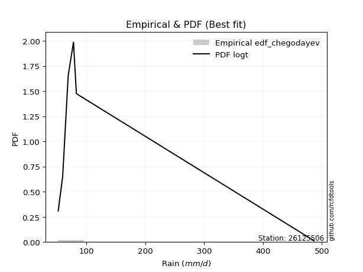</img>

</div>


### 6. Empirical - EDF Blom (1958)

The Blom formula is a specific "plotting position" formula used in hydrology and statistical analysis to estimate the empirical cumulative probability (or non-exceedance probability) of a data series. It is particularly recommended for data that are approximately normally distributed. The constant _a_ is set to 0.375 (or 3/8).

<div align="center">


$P=(m-a)/(n+1-2a)$


</div>


**6.1. Empirical values**

<div align="center">

|                | 0                   | 1                   | 2                  | 3        | 4                  | 5                  | 6                  |
|:---------------|:--------------------|:--------------------|:-------------------|:---------|:-------------------|:-------------------|:-------------------|
| date           | 2017                | 2022                | 2018               | 2021     | 2019               | 2023               | 2020               |
| x              | 51.8                | 59.4                | 68.8               | 77.8     | 82.5               | 82.7               | 486.8              |
| m              | 1                   | 2                   | 3                  | 4        | 5                  | 6                  | 7                  |
| empirical_dist | edf_blom            | edf_blom            | edf_blom           | edf_blom | edf_blom           | edf_blom           | edf_blom           |
| empirical      | 0.08620689655172414 | 0.22413793103448276 | 0.3620689655172414 | 0.5      | 0.6379310344827587 | 0.7758620689655172 | 0.9137931034482759 |
| empirical_tr   | 1.0943396226415094  | 1.288888888888889   | 1.5675675675675675 | 2.0      | 2.7619047619047623 | 4.461538461538462  | 11.600000000000007 |

</div>


**6.2. Kolmogorov-Smirnov fit test (sorted by Δ)**


<div align="center">

|                | 0                   | 1                   | 2                   | 3                   | 4                   | 5                   | 6                   | 7                   | 8                   | 9                   | 10                  | 11                  | 12                  | 13                  | 14                  | 15                  | 16                  | 17                  | 18                  | 19                  | 20                  | 21                  | 22                  | 23                  | 24                  | 25                  | 26                  | 27                  | 28                    | 29                  | 30                  | 31                  | 32                  | 33                  | 34                  | 35                  | 36                  | 37                  | 38                  | 39                  | 40                  | 41                  | 42                  | 43                  | 44                  | 45                  | 46                  | 47                  | 48                  | 49                  | 50                  | 51                  | 52                  | 53                  | 54                  | 55                  | 56                  | 57                  | 58                  | 59                  | 60                  | 61                  | 62                  | 63                  | 64                  | 65                  | 66                  | 67                  | 68                  | 69                  | 70                  | 71                  | 72                  | 73                  | 74                  | 75                  | 76                  | 77                  | 78                  | 79                  | 80                  | 81                  | 82                  | 83                  | 84                  | 85                  | 86                  | 87                  | 88                  | 89                  |
|:---------------|:--------------------|:--------------------|:--------------------|:--------------------|:--------------------|:--------------------|:--------------------|:--------------------|:--------------------|:--------------------|:--------------------|:--------------------|:--------------------|:--------------------|:--------------------|:--------------------|:--------------------|:--------------------|:--------------------|:--------------------|:--------------------|:--------------------|:--------------------|:--------------------|:--------------------|:--------------------|:--------------------|:--------------------|:----------------------|:--------------------|:--------------------|:--------------------|:--------------------|:--------------------|:--------------------|:--------------------|:--------------------|:--------------------|:--------------------|:--------------------|:--------------------|:--------------------|:--------------------|:--------------------|:--------------------|:--------------------|:--------------------|:--------------------|:--------------------|:--------------------|:--------------------|:--------------------|:--------------------|:--------------------|:--------------------|:--------------------|:--------------------|:--------------------|:--------------------|:--------------------|:--------------------|:--------------------|:--------------------|:--------------------|:--------------------|:--------------------|:--------------------|:--------------------|:--------------------|:--------------------|:--------------------|:--------------------|:--------------------|:--------------------|:--------------------|:--------------------|:--------------------|:--------------------|:--------------------|:--------------------|:--------------------|:--------------------|:--------------------|:--------------------|:--------------------|:--------------------|:--------------------|:--------------------|:--------------------|:--------------------|
| station        | 26125506            | 26125506            | 26125506            | 26125506            | 26125506            | 26125506            | 26125506            | 26125506            | 26125506            | 26125506            | 26125506            | 26125506            | 26125506            | 26125506            | 26125506            | 26125506            | 26125506            | 26125506            | 26125506            | 26125506            | 26125506            | 26125506            | 26125506            | 26125506            | 26125506            | 26125506            | 26125506            | 26125506            | 26125506              | 26125506            | 26125506            | 26125506            | 26125506            | 26125506            | 26125506            | 26125506            | 26125506            | 26125506            | 26125506            | 26125506            | 26125506            | 26125506            | 26125506            | 26125506            | 26125506            | 26125506            | 26125506            | 26125506            | 26125506            | 26125506            | 26125506            | 26125506            | 26125506            | 26125506            | 26125506            | 26125506            | 26125506            | 26125506            | 26125506            | 26125506            | 26125506            | 26125506            | 26125506            | 26125506            | 26125506            | 26125506            | 26125506            | 26125506            | 26125506            | 26125506            | 26125506            | 26125506            | 26125506            | 26125506            | 26125506            | 26125506            | 26125506            | 26125506            | 26125506            | 26125506            | 26125506            | 26125506            | 26125506            | 26125506            | 26125506            | 26125506            | 26125506            | 26125506            | 26125506            | 26125506            |
| empirical_dist | edf_blom            | edf_blom            | edf_blom            | edf_blom            | edf_blom            | edf_blom            | edf_blom            | edf_blom            | edf_blom            | edf_blom            | edf_blom            | edf_blom            | edf_blom            | edf_blom            | edf_blom            | edf_blom            | edf_blom            | edf_blom            | edf_blom            | edf_blom            | edf_blom            | edf_blom            | edf_blom            | edf_blom            | edf_blom            | edf_blom            | edf_blom            | edf_blom            | edf_blom              | edf_blom            | edf_blom            | edf_blom            | edf_blom            | edf_blom            | edf_blom            | edf_blom            | edf_blom            | edf_blom            | edf_blom            | edf_blom            | edf_blom            | edf_blom            | edf_blom            | edf_blom            | edf_blom            | edf_blom            | edf_blom            | edf_blom            | edf_blom            | edf_blom            | edf_blom            | edf_blom            | edf_blom            | edf_blom            | edf_blom            | edf_blom            | edf_blom            | edf_blom            | edf_blom            | edf_blom            | edf_blom            | edf_blom            | edf_blom            | edf_blom            | edf_blom            | edf_blom            | edf_blom            | edf_blom            | edf_blom            | edf_blom            | edf_blom            | edf_blom            | edf_blom            | edf_blom            | edf_blom            | edf_blom            | edf_blom            | edf_blom            | edf_blom            | edf_blom            | edf_blom            | edf_blom            | edf_blom            | edf_blom            | edf_blom            | edf_blom            | edf_blom            | edf_blom            | edf_blom            | edf_blom            |
| p_dist         | logt                | t                   | logalpha            | lognct              | loginvweibull       | logfisk             | loginvgamma         | logf                | logncf              | alpha               | logjohnsonsu        | logpareto           | mielke              | loginvgauss         | f                   | invgamma            | invweibull          | loggibrat           | logfatiguelife      | logwald             | logerlang           | lognakagami         | invgauss            | erlang              | fisk                | logexponnorm        | logpearson3         | loggompertz         | loglaplace_asymmetric | logexpon            | loggenexpon         | logtruncnorm        | fatiguelife         | loghalflogistic     | logbetaprime        | logweibull_min      | logmoyal            | loggenlogistic      | loghalfnorm         | loggamma            | loggamma            | gamma               | loggumbel_r         | wald                | nakagami            | pearson3            | logchi2             | lograyleigh         | nct                 | gibrat              | logmaxwell          | betaprime           | halflogistic        | ncf                 | logkstwobign        | halfnorm            | moyal               | logloggamma         | lognorm             | lognorm             | logcrystalball      | loglogistic         | gumbel_r            | loghypsecant        | weibull_min         | rayleigh            | logrice             | chi2                | maxwell             | loglaplace          | genlogistic         | loglognorm          | crystalball         | norm                | loggumbel_l         | logistic            | hypsecant           | johnsonsu           | exponnorm           | pareto              | expon               | genexpon            | laplace_asymmetric  | kstwobign           | laplace             | gompertz            | rice                | gumbel_l            | truncnorm           | logmielke           |
| delta          | 0.0851503828914153  | 0.09453942009654892 | 0.13745837176105458 | 0.13987902424920684 | 0.1449083557655122  | 0.14660372098384633 | 0.14683796734537047 | 0.1470381892853203  | 0.14706102610239813 | 0.14842038283627368 | 0.15121807662935194 | 0.15496434898842748 | 0.1576332282960453  | 0.15905792245061112 | 0.15959455051585514 | 0.15959501639737328 | 0.15970671622061205 | 0.16405419520684072 | 0.16668823052929982 | 0.17408536170049405 | 0.1762387210467944  | 0.17657827665328696 | 0.17873895058982736 | 0.20662741970355614 | 0.21004472832053112 | 0.21261808417128691 | 0.21516046839017888 | 0.21643202448310728 | 0.21695499431794574   | 0.21697154447275924 | 0.21699965796911935 | 0.23334080939421153 | 0.23375884748153852 | 0.23420992149362985 | 0.2373541968304786  | 0.24169158290045278 | 0.243646858118027   | 0.2487728533996475  | 0.25445816531368637 | 0.2606469612652157  | 0.2606469612652157  | 0.26072533975762047 | 0.2687251105832157  | 0.2754950616091071  | 0.2798297641131086  | 0.28602291989526923 | 0.2868322680025319  | 0.2883676471018002  | 0.29162394166060945 | 0.29659102329449727 | 0.30037222627977395 | 0.30660249125700356 | 0.3106864047086108  | 0.31092411058140546 | 0.3194414998905661  | 0.32249613676356037 | 0.32801312985705566 | 0.33456953811763385 | 0.3347602493460866  | 0.3347602493460866  | 0.33476025116304386 | 0.34265103857559936 | 0.3485721451207441  | 0.34929018469009976 | 0.3538378035167602  | 0.35735221303537423 | 0.36115943889118    | 0.36760115195532234 | 0.3696124072178886  | 0.37038870982960453 | 0.38463140447124644 | 0.3976490839362764  | 0.4027438913379915  | 0.4027438948211466  | 0.4044471679839842  | 0.4185285554368508  | 0.43111593104643775 | 0.43437185370015485 | 0.4491934469801496  | 0.44935005994497823 | 0.4493500776825323  | 0.4493502608676238  | 0.44935026641729503 | 0.4502405672070128  | 0.45947697901256596 | 0.46146626705502797 | 0.46531686996294735 | 0.466086010483997   | 0.5751133545401441  | nan                 |
| deltao         | 0.48442053926100004 | 0.48442053926100004 | 0.48442053926100004 | 0.48442053926100004 | 0.48442053926100004 | 0.48442053926100004 | 0.48442053926100004 | 0.48442053926100004 | 0.48442053926100004 | 0.48442053926100004 | 0.48442053926100004 | 0.48442053926100004 | 0.48442053926100004 | 0.48442053926100004 | 0.48442053926100004 | 0.48442053926100004 | 0.48442053926100004 | 0.48442053926100004 | 0.48442053926100004 | 0.48442053926100004 | 0.48442053926100004 | 0.48442053926100004 | 0.48442053926100004 | 0.48442053926100004 | 0.48442053926100004 | 0.48442053926100004 | 0.48442053926100004 | 0.48442053926100004 | 0.48442053926100004   | 0.48442053926100004 | 0.48442053926100004 | 0.48442053926100004 | 0.48442053926100004 | 0.48442053926100004 | 0.48442053926100004 | 0.48442053926100004 | 0.48442053926100004 | 0.48442053926100004 | 0.48442053926100004 | 0.48442053926100004 | 0.48442053926100004 | 0.48442053926100004 | 0.48442053926100004 | 0.48442053926100004 | 0.48442053926100004 | 0.48442053926100004 | 0.48442053926100004 | 0.48442053926100004 | 0.48442053926100004 | 0.48442053926100004 | 0.48442053926100004 | 0.48442053926100004 | 0.48442053926100004 | 0.48442053926100004 | 0.48442053926100004 | 0.48442053926100004 | 0.48442053926100004 | 0.48442053926100004 | 0.48442053926100004 | 0.48442053926100004 | 0.48442053926100004 | 0.48442053926100004 | 0.48442053926100004 | 0.48442053926100004 | 0.48442053926100004 | 0.48442053926100004 | 0.48442053926100004 | 0.48442053926100004 | 0.48442053926100004 | 0.48442053926100004 | 0.48442053926100004 | 0.48442053926100004 | 0.48442053926100004 | 0.48442053926100004 | 0.48442053926100004 | 0.48442053926100004 | 0.48442053926100004 | 0.48442053926100004 | 0.48442053926100004 | 0.48442053926100004 | 0.48442053926100004 | 0.48442053926100004 | 0.48442053926100004 | 0.48442053926100004 | 0.48442053926100004 | 0.48442053926100004 | 0.48442053926100004 | 0.48442053926100004 | 0.48442053926100004 | 0.48442053926100004 |
| eval           | Δo > Δ              | Δo > Δ              | Δo > Δ              | Δo > Δ              | Δo > Δ              | Δo > Δ              | Δo > Δ              | Δo > Δ              | Δo > Δ              | Δo > Δ              | Δo > Δ              | Δo > Δ              | Δo > Δ              | Δo > Δ              | Δo > Δ              | Δo > Δ              | Δo > Δ              | Δo > Δ              | Δo > Δ              | Δo > Δ              | Δo > Δ              | Δo > Δ              | Δo > Δ              | Δo > Δ              | Δo > Δ              | Δo > Δ              | Δo > Δ              | Δo > Δ              | Δo > Δ                | Δo > Δ              | Δo > Δ              | Δo > Δ              | Δo > Δ              | Δo > Δ              | Δo > Δ              | Δo > Δ              | Δo > Δ              | Δo > Δ              | Δo > Δ              | Δo > Δ              | Δo > Δ              | Δo > Δ              | Δo > Δ              | Δo > Δ              | Δo > Δ              | Δo > Δ              | Δo > Δ              | Δo > Δ              | Δo > Δ              | Δo > Δ              | Δo > Δ              | Δo > Δ              | Δo > Δ              | Δo > Δ              | Δo > Δ              | Δo > Δ              | Δo > Δ              | Δo > Δ              | Δo > Δ              | Δo > Δ              | Δo > Δ              | Δo > Δ              | Δo > Δ              | Δo > Δ              | Δo > Δ              | Δo > Δ              | Δo > Δ              | Δo > Δ              | Δo > Δ              | Δo > Δ              | Δo > Δ              | Δo > Δ              | Δo > Δ              | Δo > Δ              | Δo > Δ              | Δo > Δ              | Δo > Δ              | Δo > Δ              | Δo > Δ              | Δo > Δ              | Δo > Δ              | Δo > Δ              | Δo > Δ              | Δo > Δ              | Δo > Δ              | Δo > Δ              | Δo > Δ              | Δo > Δ              | Δo <= Δ             | Δo <= Δ             |
| fit            | 1                   | 1                   | 1                   | 1                   | 1                   | 1                   | 1                   | 1                   | 1                   | 1                   | 1                   | 1                   | 1                   | 1                   | 1                   | 1                   | 1                   | 1                   | 1                   | 1                   | 1                   | 1                   | 1                   | 1                   | 1                   | 1                   | 1                   | 1                   | 1                     | 1                   | 1                   | 1                   | 1                   | 1                   | 1                   | 1                   | 1                   | 1                   | 1                   | 1                   | 1                   | 1                   | 1                   | 1                   | 1                   | 1                   | 1                   | 1                   | 1                   | 1                   | 1                   | 1                   | 1                   | 1                   | 1                   | 1                   | 1                   | 1                   | 1                   | 1                   | 1                   | 1                   | 1                   | 1                   | 1                   | 1                   | 1                   | 1                   | 1                   | 1                   | 1                   | 1                   | 1                   | 1                   | 1                   | 1                   | 1                   | 1                   | 1                   | 1                   | 1                   | 1                   | 1                   | 1                   | 1                   | 1                   | 1                   | 1                   | 0                   | 0                   |
| n              | 7                   | 7                   | 7                   | 7                   | 7                   | 7                   | 7                   | 7                   | 7                   | 7                   | 7                   | 7                   | 7                   | 7                   | 7                   | 7                   | 7                   | 7                   | 7                   | 7                   | 7                   | 7                   | 7                   | 7                   | 7                   | 7                   | 7                   | 7                   | 7                     | 7                   | 7                   | 7                   | 7                   | 7                   | 7                   | 7                   | 7                   | 7                   | 7                   | 7                   | 7                   | 7                   | 7                   | 7                   | 7                   | 7                   | 7                   | 7                   | 7                   | 7                   | 7                   | 7                   | 7                   | 7                   | 7                   | 7                   | 7                   | 7                   | 7                   | 7                   | 7                   | 7                   | 7                   | 7                   | 7                   | 7                   | 7                   | 7                   | 7                   | 7                   | 7                   | 7                   | 7                   | 7                   | 7                   | 7                   | 7                   | 7                   | 7                   | 7                   | 7                   | 7                   | 7                   | 7                   | 7                   | 7                   | 7                   | 7                   | 7                   | 7                   |
| best_fit       | 1                   | 0                   | 0                   | 0                   | 0                   | 0                   | 0                   | 0                   | 0                   | 0                   | 0                   | 0                   | 0                   | 0                   | 0                   | 0                   | 0                   | 0                   | 0                   | 0                   | 0                   | 0                   | 0                   | 0                   | 0                   | 0                   | 0                   | 0                   | 0                     | 0                   | 0                   | 0                   | 0                   | 0                   | 0                   | 0                   | 0                   | 0                   | 0                   | 0                   | 0                   | 0                   | 0                   | 0                   | 0                   | 0                   | 0                   | 0                   | 0                   | 0                   | 0                   | 0                   | 0                   | 0                   | 0                   | 0                   | 0                   | 0                   | 0                   | 0                   | 0                   | 0                   | 0                   | 0                   | 0                   | 0                   | 0                   | 0                   | 0                   | 0                   | 0                   | 0                   | 0                   | 0                   | 0                   | 0                   | 0                   | 0                   | 0                   | 0                   | 0                   | 0                   | 0                   | 0                   | 0                   | 0                   | 0                   | 0                   | 0                   | 0                   |
| best_fit_sort  | 1                   | 2                   | 3                   | 4                   | 5                   | 6                   | 7                   | 8                   | 9                   | 10                  | 11                  | 12                  | 13                  | 14                  | 15                  | 16                  | 17                  | 18                  | 19                  | 20                  | 21                  | 22                  | 23                  | 24                  | 25                  | 26                  | 27                  | 28                  | 29                    | 30                  | 31                  | 32                  | 33                  | 34                  | 35                  | 36                  | 37                  | 38                  | 39                  | 40                  | 41                  | 42                  | 43                  | 44                  | 45                  | 46                  | 47                  | 48                  | 49                  | 50                  | 51                  | 52                  | 53                  | 54                  | 55                  | 56                  | 57                  | 58                  | 59                  | 60                  | 61                  | 62                  | 63                  | 64                  | 65                  | 66                  | 67                  | 68                  | 69                  | 70                  | 71                  | 72                  | 73                  | 74                  | 75                  | 76                  | 77                  | 78                  | 79                  | 80                  | 81                  | 82                  | 83                  | 84                  | 85                  | 86                  | 87                  | 88                  | 89                  | 90                  |

</div>


<div align="center">

</img>

</div>


**6.3. Best fit**

<div align="center">

|   id |   station | empirical_dist   | p_dist   |     delta |   deltao | eval   |   fit |   n |   best_fit |   best_fit_sort |
|-----:|----------:|:-----------------|:---------|----------:|---------:|:-------|------:|----:|-----------:|----------------:|
|    0 |  26125506 | edf_blom         | logt     | 0.0851504 | 0.484421 | Δo > Δ |     1 |   7 |          1 |               1 |

</div>


<div align="center">

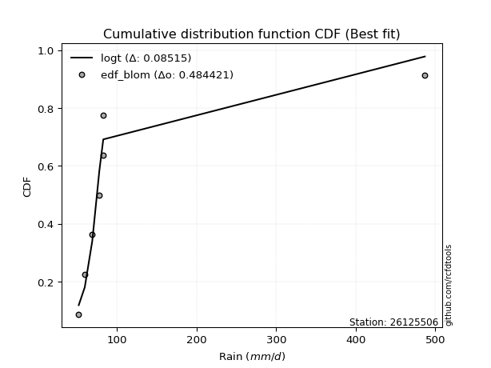</img></img>

</div>


### 7. Empirical - EDF Tukey (1962)

In hydrology, the Tukey formula is used as a plotting position formula to estimate the empirical probability or frequency of a flood event (or other hydrological data). The formula parameter is given as _c=0.333_ (or 1/3).

<div align="center">


$P=(m-c)/(n+1-2c)$


</div>


**7.1. Empirical values**

<div align="center">

|                | 0                   | 1                   | 2                   | 3         | 4                  | 5                  | 6                  |
|:---------------|:--------------------|:--------------------|:--------------------|:----------|:-------------------|:-------------------|:-------------------|
| date           | 2017                | 2022                | 2018                | 2021      | 2019               | 2023               | 2020               |
| x              | 51.8                | 59.4                | 68.8                | 77.8      | 82.5               | 82.7               | 486.8              |
| m              | 1                   | 2                   | 3                   | 4         | 5                  | 6                  | 7                  |
| empirical_dist | edf_tukey           | edf_tukey           | edf_tukey           | edf_tukey | edf_tukey          | edf_tukey          | edf_tukey          |
| empirical      | 0.09090909090909091 | 0.22727272727272727 | 0.36363636363636365 | 0.5       | 0.6363636363636364 | 0.7727272727272727 | 0.9090909090909091 |
| empirical_tr   | 1.1                 | 1.2941176470588236  | 1.5714285714285714  | 2.0       | 2.75               | 4.3999999999999995 | 10.999999999999996 |

</div>


**7.2. Kolmogorov-Smirnov fit test (sorted by Δ)**


<div align="center">

|                | 0                   | 1                   | 2                   | 3                   | 4                   | 5                   | 6                   | 7                   | 8                   | 9                   | 10                  | 11                  | 12                  | 13                  | 14                  | 15                  | 16                  | 17                  | 18                  | 19                  | 20                  | 21                  | 22                  | 23                  | 24                  | 25                  | 26                  | 27                  | 28                    | 29                  | 30                  | 31                  | 32                  | 33                  | 34                  | 35                  | 36                  | 37                  | 38                  | 39                  | 40                  | 41                  | 42                  | 43                  | 44                  | 45                  | 46                  | 47                  | 48                  | 49                  | 50                  | 51                  | 52                  | 53                  | 54                  | 55                  | 56                  | 57                  | 58                  | 59                  | 60                  | 61                  | 62                  | 63                  | 64                  | 65                  | 66                  | 67                  | 68                  | 69                  | 70                  | 71                  | 72                  | 73                  | 74                  | 75                  | 76                  | 77                  | 78                  | 79                  | 80                  | 81                  | 82                  | 83                  | 84                  | 85                  | 86                  | 87                  | 88                  | 89                  |
|:---------------|:--------------------|:--------------------|:--------------------|:--------------------|:--------------------|:--------------------|:--------------------|:--------------------|:--------------------|:--------------------|:--------------------|:--------------------|:--------------------|:--------------------|:--------------------|:--------------------|:--------------------|:--------------------|:--------------------|:--------------------|:--------------------|:--------------------|:--------------------|:--------------------|:--------------------|:--------------------|:--------------------|:--------------------|:----------------------|:--------------------|:--------------------|:--------------------|:--------------------|:--------------------|:--------------------|:--------------------|:--------------------|:--------------------|:--------------------|:--------------------|:--------------------|:--------------------|:--------------------|:--------------------|:--------------------|:--------------------|:--------------------|:--------------------|:--------------------|:--------------------|:--------------------|:--------------------|:--------------------|:--------------------|:--------------------|:--------------------|:--------------------|:--------------------|:--------------------|:--------------------|:--------------------|:--------------------|:--------------------|:--------------------|:--------------------|:--------------------|:--------------------|:--------------------|:--------------------|:--------------------|:--------------------|:--------------------|:--------------------|:--------------------|:--------------------|:--------------------|:--------------------|:--------------------|:--------------------|:--------------------|:--------------------|:--------------------|:--------------------|:--------------------|:--------------------|:--------------------|:--------------------|:--------------------|:--------------------|:--------------------|
| station        | 26125506            | 26125506            | 26125506            | 26125506            | 26125506            | 26125506            | 26125506            | 26125506            | 26125506            | 26125506            | 26125506            | 26125506            | 26125506            | 26125506            | 26125506            | 26125506            | 26125506            | 26125506            | 26125506            | 26125506            | 26125506            | 26125506            | 26125506            | 26125506            | 26125506            | 26125506            | 26125506            | 26125506            | 26125506              | 26125506            | 26125506            | 26125506            | 26125506            | 26125506            | 26125506            | 26125506            | 26125506            | 26125506            | 26125506            | 26125506            | 26125506            | 26125506            | 26125506            | 26125506            | 26125506            | 26125506            | 26125506            | 26125506            | 26125506            | 26125506            | 26125506            | 26125506            | 26125506            | 26125506            | 26125506            | 26125506            | 26125506            | 26125506            | 26125506            | 26125506            | 26125506            | 26125506            | 26125506            | 26125506            | 26125506            | 26125506            | 26125506            | 26125506            | 26125506            | 26125506            | 26125506            | 26125506            | 26125506            | 26125506            | 26125506            | 26125506            | 26125506            | 26125506            | 26125506            | 26125506            | 26125506            | 26125506            | 26125506            | 26125506            | 26125506            | 26125506            | 26125506            | 26125506            | 26125506            | 26125506            |
| empirical_dist | edf_tukey           | edf_tukey           | edf_tukey           | edf_tukey           | edf_tukey           | edf_tukey           | edf_tukey           | edf_tukey           | edf_tukey           | edf_tukey           | edf_tukey           | edf_tukey           | edf_tukey           | edf_tukey           | edf_tukey           | edf_tukey           | edf_tukey           | edf_tukey           | edf_tukey           | edf_tukey           | edf_tukey           | edf_tukey           | edf_tukey           | edf_tukey           | edf_tukey           | edf_tukey           | edf_tukey           | edf_tukey           | edf_tukey             | edf_tukey           | edf_tukey           | edf_tukey           | edf_tukey           | edf_tukey           | edf_tukey           | edf_tukey           | edf_tukey           | edf_tukey           | edf_tukey           | edf_tukey           | edf_tukey           | edf_tukey           | edf_tukey           | edf_tukey           | edf_tukey           | edf_tukey           | edf_tukey           | edf_tukey           | edf_tukey           | edf_tukey           | edf_tukey           | edf_tukey           | edf_tukey           | edf_tukey           | edf_tukey           | edf_tukey           | edf_tukey           | edf_tukey           | edf_tukey           | edf_tukey           | edf_tukey           | edf_tukey           | edf_tukey           | edf_tukey           | edf_tukey           | edf_tukey           | edf_tukey           | edf_tukey           | edf_tukey           | edf_tukey           | edf_tukey           | edf_tukey           | edf_tukey           | edf_tukey           | edf_tukey           | edf_tukey           | edf_tukey           | edf_tukey           | edf_tukey           | edf_tukey           | edf_tukey           | edf_tukey           | edf_tukey           | edf_tukey           | edf_tukey           | edf_tukey           | edf_tukey           | edf_tukey           | edf_tukey           | edf_tukey           |
| p_dist         | logt                | t                   | logalpha            | lognct              | loginvweibull       | logfisk             | loginvgamma         | logf                | logncf              | alpha               | logjohnsonsu        | logpareto           | mielke              | loginvgauss         | f                   | invgamma            | invweibull          | loggibrat           | logfatiguelife      | logwald             | logerlang           | lognakagami         | invgauss            | erlang              | fisk                | logexponnorm        | logpearson3         | loggompertz         | loglaplace_asymmetric | logexpon            | loggenexpon         | logtruncnorm        | fatiguelife         | loghalflogistic     | logbetaprime        | logweibull_min      | logmoyal            | loggenlogistic      | loghalfnorm         | gamma               | loggamma            | loggamma            | loggumbel_r         | wald                | nakagami            | pearson3            | logchi2             | lograyleigh         | nct                 | gibrat              | logmaxwell          | betaprime           | halflogistic        | ncf                 | logkstwobign        | halfnorm            | moyal               | logloggamma         | lognorm             | lognorm             | logcrystalball      | loglogistic         | gumbel_r            | loghypsecant        | weibull_min         | rayleigh            | logrice             | chi2                | maxwell             | loglaplace          | genlogistic         | loglognorm          | crystalball         | norm                | loggumbel_l         | logistic            | hypsecant           | johnsonsu           | exponnorm           | pareto              | expon               | genexpon            | laplace_asymmetric  | kstwobign           | laplace             | gompertz            | rice                | gumbel_l            | truncnorm           | logmielke           |
| delta          | 0.0851503828914153  | 0.09140462385830439 | 0.13432357552281005 | 0.1367442280109623  | 0.14177355952726767 | 0.1434689247456018  | 0.14370317110712594 | 0.14390339304707578 | 0.1439262298641536  | 0.14528558659802915 | 0.1480832803911074  | 0.15182955275018295 | 0.15449843205780078 | 0.1559231262123666  | 0.1564597542776106  | 0.15646022015912875 | 0.15657191998236752 | 0.1609193989685962  | 0.1635534342910553  | 0.17095056546224952 | 0.17310392480854986 | 0.17344348041504243 | 0.17560415435158283 | 0.2034926234653116  | 0.20690993208228659 | 0.20948328793304238 | 0.21202567215193435 | 0.21329722824486275 | 0.2138201980797012    | 0.2138367482345147  | 0.21386486173087482 | 0.230206013155967   | 0.230624051243294   | 0.23107512525538532 | 0.23578679871135633 | 0.23855678666220825 | 0.24051206187978247 | 0.24563805716140297 | 0.25132336907544184 | 0.25759054351937594 | 0.2587990905400097  | 0.2587990905400097  | 0.26559031434497116 | 0.27236026537086255 | 0.2766949678748641  | 0.28132072553790244 | 0.2836974717642874  | 0.28523285086355565 | 0.2884891454223649  | 0.29345622705625274 | 0.2972374300415294  | 0.30346769501875903 | 0.3075516084703663  | 0.3077893143431609  | 0.31630670365232155 | 0.31936134052531584 | 0.32487833361881113 | 0.3314347418793893  | 0.3316254531078421  | 0.3316254531078421  | 0.33162545492479933 | 0.33951624233735483 | 0.34543734888249955 | 0.34615538845185523 | 0.35070300727851567 | 0.3542174167971297  | 0.3580246426529355  | 0.3644663557170778  | 0.3664776109796441  | 0.36725391359136    | 0.3814966082330019  | 0.3945142876980319  | 0.39960909509974696 | 0.39960909858290206 | 0.4013123717457397  | 0.41539375919860627 | 0.4279811348081932  | 0.43280445558103253 | 0.4460586507419051  | 0.4462152637067337  | 0.4462152814442878  | 0.4462154646293793  | 0.4462154701790505  | 0.44710577096876825 | 0.4563421827743214  | 0.45833147081678344 | 0.4621820737247028  | 0.4629512142457525  | 0.5719785583018996  | nan                 |
| deltao         | 0.48442053926100004 | 0.48442053926100004 | 0.48442053926100004 | 0.48442053926100004 | 0.48442053926100004 | 0.48442053926100004 | 0.48442053926100004 | 0.48442053926100004 | 0.48442053926100004 | 0.48442053926100004 | 0.48442053926100004 | 0.48442053926100004 | 0.48442053926100004 | 0.48442053926100004 | 0.48442053926100004 | 0.48442053926100004 | 0.48442053926100004 | 0.48442053926100004 | 0.48442053926100004 | 0.48442053926100004 | 0.48442053926100004 | 0.48442053926100004 | 0.48442053926100004 | 0.48442053926100004 | 0.48442053926100004 | 0.48442053926100004 | 0.48442053926100004 | 0.48442053926100004 | 0.48442053926100004   | 0.48442053926100004 | 0.48442053926100004 | 0.48442053926100004 | 0.48442053926100004 | 0.48442053926100004 | 0.48442053926100004 | 0.48442053926100004 | 0.48442053926100004 | 0.48442053926100004 | 0.48442053926100004 | 0.48442053926100004 | 0.48442053926100004 | 0.48442053926100004 | 0.48442053926100004 | 0.48442053926100004 | 0.48442053926100004 | 0.48442053926100004 | 0.48442053926100004 | 0.48442053926100004 | 0.48442053926100004 | 0.48442053926100004 | 0.48442053926100004 | 0.48442053926100004 | 0.48442053926100004 | 0.48442053926100004 | 0.48442053926100004 | 0.48442053926100004 | 0.48442053926100004 | 0.48442053926100004 | 0.48442053926100004 | 0.48442053926100004 | 0.48442053926100004 | 0.48442053926100004 | 0.48442053926100004 | 0.48442053926100004 | 0.48442053926100004 | 0.48442053926100004 | 0.48442053926100004 | 0.48442053926100004 | 0.48442053926100004 | 0.48442053926100004 | 0.48442053926100004 | 0.48442053926100004 | 0.48442053926100004 | 0.48442053926100004 | 0.48442053926100004 | 0.48442053926100004 | 0.48442053926100004 | 0.48442053926100004 | 0.48442053926100004 | 0.48442053926100004 | 0.48442053926100004 | 0.48442053926100004 | 0.48442053926100004 | 0.48442053926100004 | 0.48442053926100004 | 0.48442053926100004 | 0.48442053926100004 | 0.48442053926100004 | 0.48442053926100004 | 0.48442053926100004 |
| eval           | Δo > Δ              | Δo > Δ              | Δo > Δ              | Δo > Δ              | Δo > Δ              | Δo > Δ              | Δo > Δ              | Δo > Δ              | Δo > Δ              | Δo > Δ              | Δo > Δ              | Δo > Δ              | Δo > Δ              | Δo > Δ              | Δo > Δ              | Δo > Δ              | Δo > Δ              | Δo > Δ              | Δo > Δ              | Δo > Δ              | Δo > Δ              | Δo > Δ              | Δo > Δ              | Δo > Δ              | Δo > Δ              | Δo > Δ              | Δo > Δ              | Δo > Δ              | Δo > Δ                | Δo > Δ              | Δo > Δ              | Δo > Δ              | Δo > Δ              | Δo > Δ              | Δo > Δ              | Δo > Δ              | Δo > Δ              | Δo > Δ              | Δo > Δ              | Δo > Δ              | Δo > Δ              | Δo > Δ              | Δo > Δ              | Δo > Δ              | Δo > Δ              | Δo > Δ              | Δo > Δ              | Δo > Δ              | Δo > Δ              | Δo > Δ              | Δo > Δ              | Δo > Δ              | Δo > Δ              | Δo > Δ              | Δo > Δ              | Δo > Δ              | Δo > Δ              | Δo > Δ              | Δo > Δ              | Δo > Δ              | Δo > Δ              | Δo > Δ              | Δo > Δ              | Δo > Δ              | Δo > Δ              | Δo > Δ              | Δo > Δ              | Δo > Δ              | Δo > Δ              | Δo > Δ              | Δo > Δ              | Δo > Δ              | Δo > Δ              | Δo > Δ              | Δo > Δ              | Δo > Δ              | Δo > Δ              | Δo > Δ              | Δo > Δ              | Δo > Δ              | Δo > Δ              | Δo > Δ              | Δo > Δ              | Δo > Δ              | Δo > Δ              | Δo > Δ              | Δo > Δ              | Δo > Δ              | Δo <= Δ             | Δo <= Δ             |
| fit            | 1                   | 1                   | 1                   | 1                   | 1                   | 1                   | 1                   | 1                   | 1                   | 1                   | 1                   | 1                   | 1                   | 1                   | 1                   | 1                   | 1                   | 1                   | 1                   | 1                   | 1                   | 1                   | 1                   | 1                   | 1                   | 1                   | 1                   | 1                   | 1                     | 1                   | 1                   | 1                   | 1                   | 1                   | 1                   | 1                   | 1                   | 1                   | 1                   | 1                   | 1                   | 1                   | 1                   | 1                   | 1                   | 1                   | 1                   | 1                   | 1                   | 1                   | 1                   | 1                   | 1                   | 1                   | 1                   | 1                   | 1                   | 1                   | 1                   | 1                   | 1                   | 1                   | 1                   | 1                   | 1                   | 1                   | 1                   | 1                   | 1                   | 1                   | 1                   | 1                   | 1                   | 1                   | 1                   | 1                   | 1                   | 1                   | 1                   | 1                   | 1                   | 1                   | 1                   | 1                   | 1                   | 1                   | 1                   | 1                   | 0                   | 0                   |
| n              | 7                   | 7                   | 7                   | 7                   | 7                   | 7                   | 7                   | 7                   | 7                   | 7                   | 7                   | 7                   | 7                   | 7                   | 7                   | 7                   | 7                   | 7                   | 7                   | 7                   | 7                   | 7                   | 7                   | 7                   | 7                   | 7                   | 7                   | 7                   | 7                     | 7                   | 7                   | 7                   | 7                   | 7                   | 7                   | 7                   | 7                   | 7                   | 7                   | 7                   | 7                   | 7                   | 7                   | 7                   | 7                   | 7                   | 7                   | 7                   | 7                   | 7                   | 7                   | 7                   | 7                   | 7                   | 7                   | 7                   | 7                   | 7                   | 7                   | 7                   | 7                   | 7                   | 7                   | 7                   | 7                   | 7                   | 7                   | 7                   | 7                   | 7                   | 7                   | 7                   | 7                   | 7                   | 7                   | 7                   | 7                   | 7                   | 7                   | 7                   | 7                   | 7                   | 7                   | 7                   | 7                   | 7                   | 7                   | 7                   | 7                   | 7                   |
| best_fit       | 1                   | 0                   | 0                   | 0                   | 0                   | 0                   | 0                   | 0                   | 0                   | 0                   | 0                   | 0                   | 0                   | 0                   | 0                   | 0                   | 0                   | 0                   | 0                   | 0                   | 0                   | 0                   | 0                   | 0                   | 0                   | 0                   | 0                   | 0                   | 0                     | 0                   | 0                   | 0                   | 0                   | 0                   | 0                   | 0                   | 0                   | 0                   | 0                   | 0                   | 0                   | 0                   | 0                   | 0                   | 0                   | 0                   | 0                   | 0                   | 0                   | 0                   | 0                   | 0                   | 0                   | 0                   | 0                   | 0                   | 0                   | 0                   | 0                   | 0                   | 0                   | 0                   | 0                   | 0                   | 0                   | 0                   | 0                   | 0                   | 0                   | 0                   | 0                   | 0                   | 0                   | 0                   | 0                   | 0                   | 0                   | 0                   | 0                   | 0                   | 0                   | 0                   | 0                   | 0                   | 0                   | 0                   | 0                   | 0                   | 0                   | 0                   |
| best_fit_sort  | 1                   | 2                   | 3                   | 4                   | 5                   | 6                   | 7                   | 8                   | 9                   | 10                  | 11                  | 12                  | 13                  | 14                  | 15                  | 16                  | 17                  | 18                  | 19                  | 20                  | 21                  | 22                  | 23                  | 24                  | 25                  | 26                  | 27                  | 28                  | 29                    | 30                  | 31                  | 32                  | 33                  | 34                  | 35                  | 36                  | 37                  | 38                  | 39                  | 40                  | 41                  | 42                  | 43                  | 44                  | 45                  | 46                  | 47                  | 48                  | 49                  | 50                  | 51                  | 52                  | 53                  | 54                  | 55                  | 56                  | 57                  | 58                  | 59                  | 60                  | 61                  | 62                  | 63                  | 64                  | 65                  | 66                  | 67                  | 68                  | 69                  | 70                  | 71                  | 72                  | 73                  | 74                  | 75                  | 76                  | 77                  | 78                  | 79                  | 80                  | 81                  | 82                  | 83                  | 84                  | 85                  | 86                  | 87                  | 88                  | 89                  | 90                  |

</div>


<div align="center">

</img>

</div>


**7.3. Best fit**

<div align="center">

|   id |   station | empirical_dist   | p_dist   |     delta |   deltao | eval   |   fit |   n |   best_fit |   best_fit_sort |
|-----:|----------:|:-----------------|:---------|----------:|---------:|:-------|------:|----:|-----------:|----------------:|
|    0 |  26125506 | edf_tukey        | logt     | 0.0851504 | 0.484421 | Δo > Δ |     1 |   7 |          1 |               1 |

</div>


<div align="center">

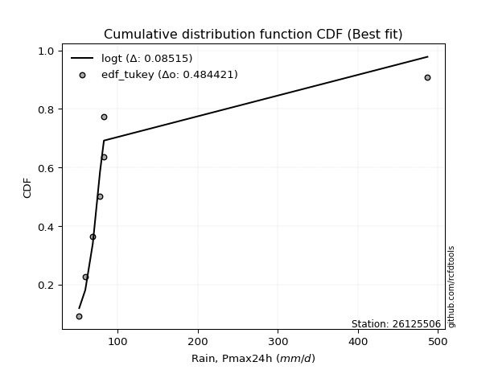</img>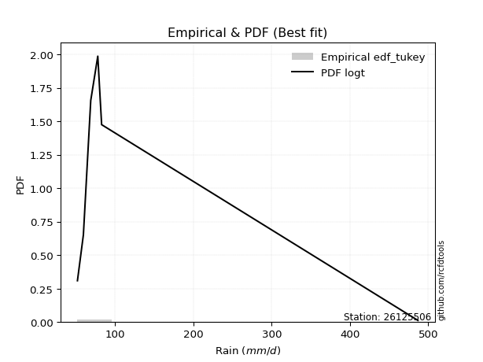</img>

</div>


### 8. Empirical - EDF Gringorten (1963)

Gringorten plotting position formula is essential for estimating the probability and return periods of extreme events like floods and heavy rainfall. The constant _a=0.44_.

<div align="center">


$P=(m-a)/(n+1-2a)$


</div>


**8.1. Empirical values**

<div align="center">

|                | 0                   | 1                   | 2                  | 3              | 4                  | 5                  | 6                  |
|:---------------|:--------------------|:--------------------|:-------------------|:---------------|:-------------------|:-------------------|:-------------------|
| date           | 2017                | 2022                | 2018               | 2021           | 2019               | 2023               | 2020               |
| x              | 51.8                | 59.4                | 68.8               | 77.8           | 82.5               | 82.7               | 486.8              |
| m              | 1                   | 2                   | 3                  | 4              | 5                  | 6                  | 7                  |
| empirical_dist | edf_gringorten      | edf_gringorten      | edf_gringorten     | edf_gringorten | edf_gringorten     | edf_gringorten     | edf_gringorten     |
| empirical      | 0.07865168539325844 | 0.21910112359550563 | 0.3595505617977528 | 0.5            | 0.6404494382022471 | 0.7808988764044943 | 0.9213483146067415 |
| empirical_tr   | 1.0853658536585364  | 1.2805755395683454  | 1.5614035087719298 | 2.0            | 2.781249999999999  | 4.564102564102562  | 12.714285714285701 |

</div>


**8.2. Kolmogorov-Smirnov fit test (sorted by Δ)**


<div align="center">

|                | 0                   | 1                   | 2                   | 3                   | 4                   | 5                   | 6                   | 7                   | 8                   | 9                   | 10                  | 11                  | 12                  | 13                  | 14                  | 15                  | 16                  | 17                  | 18                  | 19                  | 20                  | 21                  | 22                  | 23                  | 24                  | 25                  | 26                  | 27                  | 28                    | 29                  | 30                  | 31                  | 32                  | 33                  | 34                  | 35                  | 36                  | 37                  | 38                  | 39                  | 40                  | 41                  | 42                  | 43                  | 44                  | 45                  | 46                  | 47                  | 48                  | 49                  | 50                  | 51                  | 52                  | 53                  | 54                  | 55                  | 56                  | 57                  | 58                  | 59                  | 60                  | 61                  | 62                  | 63                  | 64                  | 65                  | 66                  | 67                  | 68                  | 69                  | 70                  | 71                  | 72                  | 73                  | 74                  | 75                  | 76                  | 77                  | 78                  | 79                  | 80                  | 81                  | 82                  | 83                  | 84                  | 85                  | 86                  | 87                  | 88                  | 89                  |
|:---------------|:--------------------|:--------------------|:--------------------|:--------------------|:--------------------|:--------------------|:--------------------|:--------------------|:--------------------|:--------------------|:--------------------|:--------------------|:--------------------|:--------------------|:--------------------|:--------------------|:--------------------|:--------------------|:--------------------|:--------------------|:--------------------|:--------------------|:--------------------|:--------------------|:--------------------|:--------------------|:--------------------|:--------------------|:----------------------|:--------------------|:--------------------|:--------------------|:--------------------|:--------------------|:--------------------|:--------------------|:--------------------|:--------------------|:--------------------|:--------------------|:--------------------|:--------------------|:--------------------|:--------------------|:--------------------|:--------------------|:--------------------|:--------------------|:--------------------|:--------------------|:--------------------|:--------------------|:--------------------|:--------------------|:--------------------|:--------------------|:--------------------|:--------------------|:--------------------|:--------------------|:--------------------|:--------------------|:--------------------|:--------------------|:--------------------|:--------------------|:--------------------|:--------------------|:--------------------|:--------------------|:--------------------|:--------------------|:--------------------|:--------------------|:--------------------|:--------------------|:--------------------|:--------------------|:--------------------|:--------------------|:--------------------|:--------------------|:--------------------|:--------------------|:--------------------|:--------------------|:--------------------|:--------------------|:--------------------|:--------------------|
| station        | 26125506            | 26125506            | 26125506            | 26125506            | 26125506            | 26125506            | 26125506            | 26125506            | 26125506            | 26125506            | 26125506            | 26125506            | 26125506            | 26125506            | 26125506            | 26125506            | 26125506            | 26125506            | 26125506            | 26125506            | 26125506            | 26125506            | 26125506            | 26125506            | 26125506            | 26125506            | 26125506            | 26125506            | 26125506              | 26125506            | 26125506            | 26125506            | 26125506            | 26125506            | 26125506            | 26125506            | 26125506            | 26125506            | 26125506            | 26125506            | 26125506            | 26125506            | 26125506            | 26125506            | 26125506            | 26125506            | 26125506            | 26125506            | 26125506            | 26125506            | 26125506            | 26125506            | 26125506            | 26125506            | 26125506            | 26125506            | 26125506            | 26125506            | 26125506            | 26125506            | 26125506            | 26125506            | 26125506            | 26125506            | 26125506            | 26125506            | 26125506            | 26125506            | 26125506            | 26125506            | 26125506            | 26125506            | 26125506            | 26125506            | 26125506            | 26125506            | 26125506            | 26125506            | 26125506            | 26125506            | 26125506            | 26125506            | 26125506            | 26125506            | 26125506            | 26125506            | 26125506            | 26125506            | 26125506            | 26125506            |
| empirical_dist | edf_gringorten      | edf_gringorten      | edf_gringorten      | edf_gringorten      | edf_gringorten      | edf_gringorten      | edf_gringorten      | edf_gringorten      | edf_gringorten      | edf_gringorten      | edf_gringorten      | edf_gringorten      | edf_gringorten      | edf_gringorten      | edf_gringorten      | edf_gringorten      | edf_gringorten      | edf_gringorten      | edf_gringorten      | edf_gringorten      | edf_gringorten      | edf_gringorten      | edf_gringorten      | edf_gringorten      | edf_gringorten      | edf_gringorten      | edf_gringorten      | edf_gringorten      | edf_gringorten        | edf_gringorten      | edf_gringorten      | edf_gringorten      | edf_gringorten      | edf_gringorten      | edf_gringorten      | edf_gringorten      | edf_gringorten      | edf_gringorten      | edf_gringorten      | edf_gringorten      | edf_gringorten      | edf_gringorten      | edf_gringorten      | edf_gringorten      | edf_gringorten      | edf_gringorten      | edf_gringorten      | edf_gringorten      | edf_gringorten      | edf_gringorten      | edf_gringorten      | edf_gringorten      | edf_gringorten      | edf_gringorten      | edf_gringorten      | edf_gringorten      | edf_gringorten      | edf_gringorten      | edf_gringorten      | edf_gringorten      | edf_gringorten      | edf_gringorten      | edf_gringorten      | edf_gringorten      | edf_gringorten      | edf_gringorten      | edf_gringorten      | edf_gringorten      | edf_gringorten      | edf_gringorten      | edf_gringorten      | edf_gringorten      | edf_gringorten      | edf_gringorten      | edf_gringorten      | edf_gringorten      | edf_gringorten      | edf_gringorten      | edf_gringorten      | edf_gringorten      | edf_gringorten      | edf_gringorten      | edf_gringorten      | edf_gringorten      | edf_gringorten      | edf_gringorten      | edf_gringorten      | edf_gringorten      | edf_gringorten      | edf_gringorten      |
| p_dist         | logt                | t                   | logalpha            | lognct              | loginvweibull       | logfisk             | loginvgamma         | logf                | logncf              | alpha               | logjohnsonsu        | logpareto           | mielke              | loginvgauss         | f                   | invgamma            | invweibull          | loggibrat           | logfatiguelife      | logwald             | logerlang           | lognakagami         | invgauss            | erlang              | fisk                | logexponnorm        | logpearson3         | loggompertz         | loglaplace_asymmetric | logexpon            | loggenexpon         | logtruncnorm        | fatiguelife         | loghalflogistic     | logbetaprime        | logweibull_min      | logmoyal            | loggenlogistic      | loghalfnorm         | loggamma            | loggamma            | gamma               | loggumbel_r         | wald                | nakagami            | logchi2             | lograyleigh         | pearson3            | nct                 | gibrat              | logmaxwell          | betaprime           | halflogistic        | ncf                 | logkstwobign        | halfnorm            | moyal               | logloggamma         | lognorm             | lognorm             | logcrystalball      | loglogistic         | gumbel_r            | loghypsecant        | weibull_min         | rayleigh            | logrice             | chi2                | maxwell             | loglaplace          | genlogistic         | loglognorm          | crystalball         | norm                | loggumbel_l         | logistic            | hypsecant           | johnsonsu           | exponnorm           | pareto              | expon               | genexpon            | laplace_asymmetric  | kstwobign           | laplace             | gompertz            | rice                | gumbel_l            | truncnorm           | logmielke           |
| delta          | 0.08932869425878376 | 0.09957622753552597 | 0.14249517920003163 | 0.1449158316881839  | 0.14994516320448925 | 0.15164052842282338 | 0.15187477478434752 | 0.15207499672429736 | 0.15209783354137518 | 0.15345719027525073 | 0.156254884068329   | 0.16000115642740453 | 0.16267003573502237 | 0.16409472988958818 | 0.1646313579548322  | 0.16463182383635033 | 0.1647435236595891  | 0.16909100264581778 | 0.17172503796827687 | 0.1791221691394711  | 0.18127552848577144 | 0.181615084092264   | 0.18377575802880441 | 0.2116642271425332  | 0.21508153575950817 | 0.21765489161026397 | 0.22019727582915594 | 0.22146883192208433 | 0.2219918017569228    | 0.2220083519117363  | 0.2220364654080964  | 0.2383776168331886  | 0.23879565492051558 | 0.2392467289326069  | 0.23987260054996717 | 0.24672839033942984 | 0.24868366555700405 | 0.25380966083862455 | 0.2594949727526634  | 0.26568376870419286 | 0.26568376870419286 | 0.2657621471965975  | 0.27376191802219274 | 0.28053186904808414 | 0.28486657155208567 | 0.291869075441509   | 0.29340445454077724 | 0.2935781310537349  | 0.2966607490995865  | 0.3016278307334743  | 0.305409033718751   | 0.3116392986959806  | 0.31572321214758786 | 0.3159609180203825  | 0.32447830732954314 | 0.3275329442025374  | 0.3330499372960327  | 0.3396063455566109  | 0.33979705678506367 | 0.33979705678506367 | 0.3397970586020209  | 0.3476878460145764  | 0.35360895255972113 | 0.3543269921290768  | 0.35887461095573725 | 0.3623890204743513  | 0.36619624633015707 | 0.3726379593942994  | 0.3746492146568657  | 0.3754255172685816  | 0.3896682119102235  | 0.40268589137525357 | 0.40778069877696854 | 0.40778070226012364 | 0.4094839754229613  | 0.42356536287582786 | 0.4361527384854148  | 0.43689025741964327 | 0.4542302544191267  | 0.4543868673839553  | 0.4543868851215094  | 0.45438706830660086 | 0.4543870738562721  | 0.45527737464598983 | 0.464513786451543   | 0.466503074494005   | 0.4703536774019244  | 0.47112281792297406 | 0.5801501619791212  | nan                 |
| deltao         | 0.48442053926100004 | 0.48442053926100004 | 0.48442053926100004 | 0.48442053926100004 | 0.48442053926100004 | 0.48442053926100004 | 0.48442053926100004 | 0.48442053926100004 | 0.48442053926100004 | 0.48442053926100004 | 0.48442053926100004 | 0.48442053926100004 | 0.48442053926100004 | 0.48442053926100004 | 0.48442053926100004 | 0.48442053926100004 | 0.48442053926100004 | 0.48442053926100004 | 0.48442053926100004 | 0.48442053926100004 | 0.48442053926100004 | 0.48442053926100004 | 0.48442053926100004 | 0.48442053926100004 | 0.48442053926100004 | 0.48442053926100004 | 0.48442053926100004 | 0.48442053926100004 | 0.48442053926100004   | 0.48442053926100004 | 0.48442053926100004 | 0.48442053926100004 | 0.48442053926100004 | 0.48442053926100004 | 0.48442053926100004 | 0.48442053926100004 | 0.48442053926100004 | 0.48442053926100004 | 0.48442053926100004 | 0.48442053926100004 | 0.48442053926100004 | 0.48442053926100004 | 0.48442053926100004 | 0.48442053926100004 | 0.48442053926100004 | 0.48442053926100004 | 0.48442053926100004 | 0.48442053926100004 | 0.48442053926100004 | 0.48442053926100004 | 0.48442053926100004 | 0.48442053926100004 | 0.48442053926100004 | 0.48442053926100004 | 0.48442053926100004 | 0.48442053926100004 | 0.48442053926100004 | 0.48442053926100004 | 0.48442053926100004 | 0.48442053926100004 | 0.48442053926100004 | 0.48442053926100004 | 0.48442053926100004 | 0.48442053926100004 | 0.48442053926100004 | 0.48442053926100004 | 0.48442053926100004 | 0.48442053926100004 | 0.48442053926100004 | 0.48442053926100004 | 0.48442053926100004 | 0.48442053926100004 | 0.48442053926100004 | 0.48442053926100004 | 0.48442053926100004 | 0.48442053926100004 | 0.48442053926100004 | 0.48442053926100004 | 0.48442053926100004 | 0.48442053926100004 | 0.48442053926100004 | 0.48442053926100004 | 0.48442053926100004 | 0.48442053926100004 | 0.48442053926100004 | 0.48442053926100004 | 0.48442053926100004 | 0.48442053926100004 | 0.48442053926100004 | 0.48442053926100004 |
| eval           | Δo > Δ              | Δo > Δ              | Δo > Δ              | Δo > Δ              | Δo > Δ              | Δo > Δ              | Δo > Δ              | Δo > Δ              | Δo > Δ              | Δo > Δ              | Δo > Δ              | Δo > Δ              | Δo > Δ              | Δo > Δ              | Δo > Δ              | Δo > Δ              | Δo > Δ              | Δo > Δ              | Δo > Δ              | Δo > Δ              | Δo > Δ              | Δo > Δ              | Δo > Δ              | Δo > Δ              | Δo > Δ              | Δo > Δ              | Δo > Δ              | Δo > Δ              | Δo > Δ                | Δo > Δ              | Δo > Δ              | Δo > Δ              | Δo > Δ              | Δo > Δ              | Δo > Δ              | Δo > Δ              | Δo > Δ              | Δo > Δ              | Δo > Δ              | Δo > Δ              | Δo > Δ              | Δo > Δ              | Δo > Δ              | Δo > Δ              | Δo > Δ              | Δo > Δ              | Δo > Δ              | Δo > Δ              | Δo > Δ              | Δo > Δ              | Δo > Δ              | Δo > Δ              | Δo > Δ              | Δo > Δ              | Δo > Δ              | Δo > Δ              | Δo > Δ              | Δo > Δ              | Δo > Δ              | Δo > Δ              | Δo > Δ              | Δo > Δ              | Δo > Δ              | Δo > Δ              | Δo > Δ              | Δo > Δ              | Δo > Δ              | Δo > Δ              | Δo > Δ              | Δo > Δ              | Δo > Δ              | Δo > Δ              | Δo > Δ              | Δo > Δ              | Δo > Δ              | Δo > Δ              | Δo > Δ              | Δo > Δ              | Δo > Δ              | Δo > Δ              | Δo > Δ              | Δo > Δ              | Δo > Δ              | Δo > Δ              | Δo > Δ              | Δo > Δ              | Δo > Δ              | Δo > Δ              | Δo <= Δ             | Δo <= Δ             |
| fit            | 1                   | 1                   | 1                   | 1                   | 1                   | 1                   | 1                   | 1                   | 1                   | 1                   | 1                   | 1                   | 1                   | 1                   | 1                   | 1                   | 1                   | 1                   | 1                   | 1                   | 1                   | 1                   | 1                   | 1                   | 1                   | 1                   | 1                   | 1                   | 1                     | 1                   | 1                   | 1                   | 1                   | 1                   | 1                   | 1                   | 1                   | 1                   | 1                   | 1                   | 1                   | 1                   | 1                   | 1                   | 1                   | 1                   | 1                   | 1                   | 1                   | 1                   | 1                   | 1                   | 1                   | 1                   | 1                   | 1                   | 1                   | 1                   | 1                   | 1                   | 1                   | 1                   | 1                   | 1                   | 1                   | 1                   | 1                   | 1                   | 1                   | 1                   | 1                   | 1                   | 1                   | 1                   | 1                   | 1                   | 1                   | 1                   | 1                   | 1                   | 1                   | 1                   | 1                   | 1                   | 1                   | 1                   | 1                   | 1                   | 0                   | 0                   |
| n              | 7                   | 7                   | 7                   | 7                   | 7                   | 7                   | 7                   | 7                   | 7                   | 7                   | 7                   | 7                   | 7                   | 7                   | 7                   | 7                   | 7                   | 7                   | 7                   | 7                   | 7                   | 7                   | 7                   | 7                   | 7                   | 7                   | 7                   | 7                   | 7                     | 7                   | 7                   | 7                   | 7                   | 7                   | 7                   | 7                   | 7                   | 7                   | 7                   | 7                   | 7                   | 7                   | 7                   | 7                   | 7                   | 7                   | 7                   | 7                   | 7                   | 7                   | 7                   | 7                   | 7                   | 7                   | 7                   | 7                   | 7                   | 7                   | 7                   | 7                   | 7                   | 7                   | 7                   | 7                   | 7                   | 7                   | 7                   | 7                   | 7                   | 7                   | 7                   | 7                   | 7                   | 7                   | 7                   | 7                   | 7                   | 7                   | 7                   | 7                   | 7                   | 7                   | 7                   | 7                   | 7                   | 7                   | 7                   | 7                   | 7                   | 7                   |
| best_fit       | 1                   | 0                   | 0                   | 0                   | 0                   | 0                   | 0                   | 0                   | 0                   | 0                   | 0                   | 0                   | 0                   | 0                   | 0                   | 0                   | 0                   | 0                   | 0                   | 0                   | 0                   | 0                   | 0                   | 0                   | 0                   | 0                   | 0                   | 0                   | 0                     | 0                   | 0                   | 0                   | 0                   | 0                   | 0                   | 0                   | 0                   | 0                   | 0                   | 0                   | 0                   | 0                   | 0                   | 0                   | 0                   | 0                   | 0                   | 0                   | 0                   | 0                   | 0                   | 0                   | 0                   | 0                   | 0                   | 0                   | 0                   | 0                   | 0                   | 0                   | 0                   | 0                   | 0                   | 0                   | 0                   | 0                   | 0                   | 0                   | 0                   | 0                   | 0                   | 0                   | 0                   | 0                   | 0                   | 0                   | 0                   | 0                   | 0                   | 0                   | 0                   | 0                   | 0                   | 0                   | 0                   | 0                   | 0                   | 0                   | 0                   | 0                   |
| best_fit_sort  | 1                   | 2                   | 3                   | 4                   | 5                   | 6                   | 7                   | 8                   | 9                   | 10                  | 11                  | 12                  | 13                  | 14                  | 15                  | 16                  | 17                  | 18                  | 19                  | 20                  | 21                  | 22                  | 23                  | 24                  | 25                  | 26                  | 27                  | 28                  | 29                    | 30                  | 31                  | 32                  | 33                  | 34                  | 35                  | 36                  | 37                  | 38                  | 39                  | 40                  | 41                  | 42                  | 43                  | 44                  | 45                  | 46                  | 47                  | 48                  | 49                  | 50                  | 51                  | 52                  | 53                  | 54                  | 55                  | 56                  | 57                  | 58                  | 59                  | 60                  | 61                  | 62                  | 63                  | 64                  | 65                  | 66                  | 67                  | 68                  | 69                  | 70                  | 71                  | 72                  | 73                  | 74                  | 75                  | 76                  | 77                  | 78                  | 79                  | 80                  | 81                  | 82                  | 83                  | 84                  | 85                  | 86                  | 87                  | 88                  | 89                  | 90                  |

</div>


<div align="center">

</img>

</div>


**8.3. Best fit**

<div align="center">

|   id |   station | empirical_dist   | p_dist   |     delta |   deltao | eval   |   fit |   n |   best_fit |   best_fit_sort |
|-----:|----------:|:-----------------|:---------|----------:|---------:|:-------|------:|----:|-----------:|----------------:|
|    0 |  26125506 | edf_gringorten   | logt     | 0.0893287 | 0.484421 | Δo > Δ |     1 |   7 |          1 |               1 |

</div>


<div align="center">

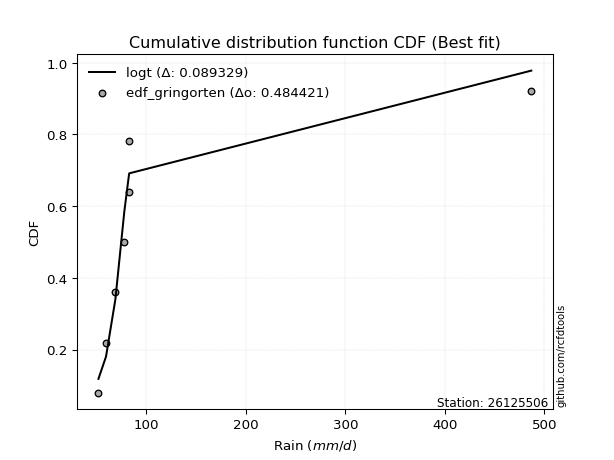</img>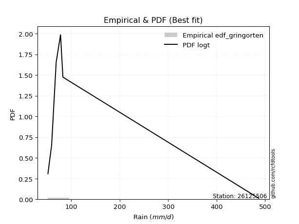</img>

</div>


### 9. Empirical - EDF Filliben (1975)

The specific values of the constants (0.3175) (often denoted as $alpha$) and (0.365) are derived from a method proposed by James J. Filliben in a 1975 paper. This particular formula is the mean value of the $i$-th order statistic of the normal distribution and is considered a robust and effective plotting position formula for the normal probability plot correlation coefficient test for normality.

<div align="center">


$P=(m-0.3175)/(n+0.365)$


</div>


**9.1. Empirical values**

<div align="center">

|                | 0                   | 1                   | 2                   | 3            | 4                  | 5                  | 6                  |
|:---------------|:--------------------|:--------------------|:--------------------|:-------------|:-------------------|:-------------------|:-------------------|
| date           | 2017                | 2022                | 2018                | 2021         | 2019               | 2023               | 2020               |
| x              | 51.8                | 59.4                | 68.8                | 77.8         | 82.5               | 82.7               | 486.8              |
| m              | 1                   | 2                   | 3                   | 4            | 5                  | 6                  | 7                  |
| empirical_dist | edf_filliben        | edf_filliben        | edf_filliben        | edf_filliben | edf_filliben       | edf_filliben       | edf_filliben       |
| empirical      | 0.09266802443991853 | 0.22844534962661237 | 0.36422267481330617 | 0.5          | 0.6357773251866938 | 0.7715546503733877 | 0.9073319755600815 |
| empirical_tr   | 1.1021324354657687  | 1.2960844698636163  | 1.5728777362520021  | 2.0          | 2.7455731593662627 | 4.377414561664191  | 10.791208791208794 |

</div>


**9.2. Kolmogorov-Smirnov fit test (sorted by Δ)**


<div align="center">

|                | 0                   | 1                   | 2                   | 3                   | 4                   | 5                   | 6                   | 7                   | 8                   | 9                   | 10                  | 11                  | 12                  | 13                  | 14                  | 15                  | 16                  | 17                  | 18                  | 19                  | 20                  | 21                  | 22                  | 23                  | 24                  | 25                  | 26                  | 27                  | 28                    | 29                  | 30                  | 31                  | 32                  | 33                  | 34                  | 35                  | 36                  | 37                  | 38                  | 39                  | 40                  | 41                  | 42                  | 43                  | 44                  | 45                  | 46                  | 47                  | 48                  | 49                  | 50                  | 51                  | 52                  | 53                  | 54                  | 55                  | 56                  | 57                  | 58                  | 59                  | 60                  | 61                  | 62                  | 63                  | 64                  | 65                  | 66                  | 67                  | 68                  | 69                  | 70                  | 71                  | 72                  | 73                  | 74                  | 75                  | 76                  | 77                  | 78                  | 79                  | 80                  | 81                  | 82                  | 83                  | 84                  | 85                  | 86                  | 87                  | 88                  | 89                  |
|:---------------|:--------------------|:--------------------|:--------------------|:--------------------|:--------------------|:--------------------|:--------------------|:--------------------|:--------------------|:--------------------|:--------------------|:--------------------|:--------------------|:--------------------|:--------------------|:--------------------|:--------------------|:--------------------|:--------------------|:--------------------|:--------------------|:--------------------|:--------------------|:--------------------|:--------------------|:--------------------|:--------------------|:--------------------|:----------------------|:--------------------|:--------------------|:--------------------|:--------------------|:--------------------|:--------------------|:--------------------|:--------------------|:--------------------|:--------------------|:--------------------|:--------------------|:--------------------|:--------------------|:--------------------|:--------------------|:--------------------|:--------------------|:--------------------|:--------------------|:--------------------|:--------------------|:--------------------|:--------------------|:--------------------|:--------------------|:--------------------|:--------------------|:--------------------|:--------------------|:--------------------|:--------------------|:--------------------|:--------------------|:--------------------|:--------------------|:--------------------|:--------------------|:--------------------|:--------------------|:--------------------|:--------------------|:--------------------|:--------------------|:--------------------|:--------------------|:--------------------|:--------------------|:--------------------|:--------------------|:--------------------|:--------------------|:--------------------|:--------------------|:--------------------|:--------------------|:--------------------|:--------------------|:--------------------|:--------------------|:--------------------|
| station        | 26125506            | 26125506            | 26125506            | 26125506            | 26125506            | 26125506            | 26125506            | 26125506            | 26125506            | 26125506            | 26125506            | 26125506            | 26125506            | 26125506            | 26125506            | 26125506            | 26125506            | 26125506            | 26125506            | 26125506            | 26125506            | 26125506            | 26125506            | 26125506            | 26125506            | 26125506            | 26125506            | 26125506            | 26125506              | 26125506            | 26125506            | 26125506            | 26125506            | 26125506            | 26125506            | 26125506            | 26125506            | 26125506            | 26125506            | 26125506            | 26125506            | 26125506            | 26125506            | 26125506            | 26125506            | 26125506            | 26125506            | 26125506            | 26125506            | 26125506            | 26125506            | 26125506            | 26125506            | 26125506            | 26125506            | 26125506            | 26125506            | 26125506            | 26125506            | 26125506            | 26125506            | 26125506            | 26125506            | 26125506            | 26125506            | 26125506            | 26125506            | 26125506            | 26125506            | 26125506            | 26125506            | 26125506            | 26125506            | 26125506            | 26125506            | 26125506            | 26125506            | 26125506            | 26125506            | 26125506            | 26125506            | 26125506            | 26125506            | 26125506            | 26125506            | 26125506            | 26125506            | 26125506            | 26125506            | 26125506            |
| empirical_dist | edf_filliben        | edf_filliben        | edf_filliben        | edf_filliben        | edf_filliben        | edf_filliben        | edf_filliben        | edf_filliben        | edf_filliben        | edf_filliben        | edf_filliben        | edf_filliben        | edf_filliben        | edf_filliben        | edf_filliben        | edf_filliben        | edf_filliben        | edf_filliben        | edf_filliben        | edf_filliben        | edf_filliben        | edf_filliben        | edf_filliben        | edf_filliben        | edf_filliben        | edf_filliben        | edf_filliben        | edf_filliben        | edf_filliben          | edf_filliben        | edf_filliben        | edf_filliben        | edf_filliben        | edf_filliben        | edf_filliben        | edf_filliben        | edf_filliben        | edf_filliben        | edf_filliben        | edf_filliben        | edf_filliben        | edf_filliben        | edf_filliben        | edf_filliben        | edf_filliben        | edf_filliben        | edf_filliben        | edf_filliben        | edf_filliben        | edf_filliben        | edf_filliben        | edf_filliben        | edf_filliben        | edf_filliben        | edf_filliben        | edf_filliben        | edf_filliben        | edf_filliben        | edf_filliben        | edf_filliben        | edf_filliben        | edf_filliben        | edf_filliben        | edf_filliben        | edf_filliben        | edf_filliben        | edf_filliben        | edf_filliben        | edf_filliben        | edf_filliben        | edf_filliben        | edf_filliben        | edf_filliben        | edf_filliben        | edf_filliben        | edf_filliben        | edf_filliben        | edf_filliben        | edf_filliben        | edf_filliben        | edf_filliben        | edf_filliben        | edf_filliben        | edf_filliben        | edf_filliben        | edf_filliben        | edf_filliben        | edf_filliben        | edf_filliben        | edf_filliben        |
| p_dist         | logt                | t                   | logalpha            | lognct              | loginvweibull       | logfisk             | loginvgamma         | logf                | logncf              | alpha               | logjohnsonsu        | logpareto           | mielke              | loginvgauss         | f                   | invgamma            | invweibull          | loggibrat           | logfatiguelife      | logwald             | logerlang           | lognakagami         | invgauss            | erlang              | fisk                | logexponnorm        | logpearson3         | loggompertz         | loglaplace_asymmetric | logexpon            | loggenexpon         | logtruncnorm        | fatiguelife         | loghalflogistic     | logbetaprime        | logweibull_min      | logmoyal            | loggenlogistic      | loghalfnorm         | gamma               | loggamma            | loggamma            | loggumbel_r         | wald                | nakagami            | pearson3            | logchi2             | lograyleigh         | nct                 | gibrat              | logmaxwell          | betaprime           | halflogistic        | ncf                 | logkstwobign        | halfnorm            | moyal               | logloggamma         | lognorm             | lognorm             | logcrystalball      | loglogistic         | gumbel_r            | loghypsecant        | weibull_min         | rayleigh            | logrice             | chi2                | maxwell             | loglaplace          | genlogistic         | loglognorm          | crystalball         | norm                | loggumbel_l         | logistic            | hypsecant           | johnsonsu           | exponnorm           | pareto              | expon               | genexpon            | laplace_asymmetric  | kstwobign           | laplace             | gompertz            | rice                | gumbel_l            | truncnorm           | logmielke           |
| delta          | 0.0851503828914153  | 0.09023200150441935 | 0.133150953168925   | 0.13557160565707727 | 0.14060093717338262 | 0.14229630239171676 | 0.1425305487532409  | 0.14273077069319073 | 0.14275360751026855 | 0.1441129642441441  | 0.14691065803722236 | 0.1506569303962979  | 0.15332580970391574 | 0.15475050385848155 | 0.15528713192372556 | 0.1552875978052437  | 0.15539929762848248 | 0.15974677661471115 | 0.16238081193717024 | 0.16977794310836447 | 0.1719313024546648  | 0.17227085806115738 | 0.1744315319976978  | 0.20232000111142656 | 0.20573730972840154 | 0.20831066557915734 | 0.2108530497980493  | 0.2121246058909777  | 0.21264757572581616   | 0.21266412588062966 | 0.21269223937698978 | 0.22903339080208196 | 0.22945142888940895 | 0.22990250290150027 | 0.2352004875344138  | 0.2373841643083232  | 0.23933943952589742 | 0.24446543480751792 | 0.2501507467215568  | 0.2564179211654909  | 0.2582127793630672  | 0.2582127793630672  | 0.2644176919910861  | 0.2711876430169775  | 0.27552234552097904 | 0.27956179200707487 | 0.28252484941040235 | 0.2840602285096706  | 0.2873165230684799  | 0.2922836047023677  | 0.29606480768764437 | 0.302295072664874   | 0.30637898611648123 | 0.3066166919892759  | 0.3151340812984365  | 0.3181887181714308  | 0.3237057112649261  | 0.33026211952550427 | 0.33045283075395704 | 0.33045283075395704 | 0.3304528325709143  | 0.3383436199834698  | 0.3442647265286145  | 0.3449827660979702  | 0.3495303849246306  | 0.35304479444324466 | 0.35685202029905044 | 0.36329373336319276 | 0.36530498862575905 | 0.36608129123747496 | 0.38032398587911687 | 0.39334166534414683 | 0.3984364727458619  | 0.398436476229017   | 0.40013974939185465 | 0.4142211368447212  | 0.4268085124543082  | 0.43221814440409    | 0.44488602838802005 | 0.44504264135284866 | 0.44504265909040275 | 0.44504284227549423 | 0.44504284782516546 | 0.4459331486148832  | 0.4551695604204364  | 0.4571588484628984  | 0.4610094513708178  | 0.46177859189186743 | 0.5708059359480145  | nan                 |
| deltao         | 0.48442053926100004 | 0.48442053926100004 | 0.48442053926100004 | 0.48442053926100004 | 0.48442053926100004 | 0.48442053926100004 | 0.48442053926100004 | 0.48442053926100004 | 0.48442053926100004 | 0.48442053926100004 | 0.48442053926100004 | 0.48442053926100004 | 0.48442053926100004 | 0.48442053926100004 | 0.48442053926100004 | 0.48442053926100004 | 0.48442053926100004 | 0.48442053926100004 | 0.48442053926100004 | 0.48442053926100004 | 0.48442053926100004 | 0.48442053926100004 | 0.48442053926100004 | 0.48442053926100004 | 0.48442053926100004 | 0.48442053926100004 | 0.48442053926100004 | 0.48442053926100004 | 0.48442053926100004   | 0.48442053926100004 | 0.48442053926100004 | 0.48442053926100004 | 0.48442053926100004 | 0.48442053926100004 | 0.48442053926100004 | 0.48442053926100004 | 0.48442053926100004 | 0.48442053926100004 | 0.48442053926100004 | 0.48442053926100004 | 0.48442053926100004 | 0.48442053926100004 | 0.48442053926100004 | 0.48442053926100004 | 0.48442053926100004 | 0.48442053926100004 | 0.48442053926100004 | 0.48442053926100004 | 0.48442053926100004 | 0.48442053926100004 | 0.48442053926100004 | 0.48442053926100004 | 0.48442053926100004 | 0.48442053926100004 | 0.48442053926100004 | 0.48442053926100004 | 0.48442053926100004 | 0.48442053926100004 | 0.48442053926100004 | 0.48442053926100004 | 0.48442053926100004 | 0.48442053926100004 | 0.48442053926100004 | 0.48442053926100004 | 0.48442053926100004 | 0.48442053926100004 | 0.48442053926100004 | 0.48442053926100004 | 0.48442053926100004 | 0.48442053926100004 | 0.48442053926100004 | 0.48442053926100004 | 0.48442053926100004 | 0.48442053926100004 | 0.48442053926100004 | 0.48442053926100004 | 0.48442053926100004 | 0.48442053926100004 | 0.48442053926100004 | 0.48442053926100004 | 0.48442053926100004 | 0.48442053926100004 | 0.48442053926100004 | 0.48442053926100004 | 0.48442053926100004 | 0.48442053926100004 | 0.48442053926100004 | 0.48442053926100004 | 0.48442053926100004 | 0.48442053926100004 |
| eval           | Δo > Δ              | Δo > Δ              | Δo > Δ              | Δo > Δ              | Δo > Δ              | Δo > Δ              | Δo > Δ              | Δo > Δ              | Δo > Δ              | Δo > Δ              | Δo > Δ              | Δo > Δ              | Δo > Δ              | Δo > Δ              | Δo > Δ              | Δo > Δ              | Δo > Δ              | Δo > Δ              | Δo > Δ              | Δo > Δ              | Δo > Δ              | Δo > Δ              | Δo > Δ              | Δo > Δ              | Δo > Δ              | Δo > Δ              | Δo > Δ              | Δo > Δ              | Δo > Δ                | Δo > Δ              | Δo > Δ              | Δo > Δ              | Δo > Δ              | Δo > Δ              | Δo > Δ              | Δo > Δ              | Δo > Δ              | Δo > Δ              | Δo > Δ              | Δo > Δ              | Δo > Δ              | Δo > Δ              | Δo > Δ              | Δo > Δ              | Δo > Δ              | Δo > Δ              | Δo > Δ              | Δo > Δ              | Δo > Δ              | Δo > Δ              | Δo > Δ              | Δo > Δ              | Δo > Δ              | Δo > Δ              | Δo > Δ              | Δo > Δ              | Δo > Δ              | Δo > Δ              | Δo > Δ              | Δo > Δ              | Δo > Δ              | Δo > Δ              | Δo > Δ              | Δo > Δ              | Δo > Δ              | Δo > Δ              | Δo > Δ              | Δo > Δ              | Δo > Δ              | Δo > Δ              | Δo > Δ              | Δo > Δ              | Δo > Δ              | Δo > Δ              | Δo > Δ              | Δo > Δ              | Δo > Δ              | Δo > Δ              | Δo > Δ              | Δo > Δ              | Δo > Δ              | Δo > Δ              | Δo > Δ              | Δo > Δ              | Δo > Δ              | Δo > Δ              | Δo > Δ              | Δo > Δ              | Δo <= Δ             | Δo <= Δ             |
| fit            | 1                   | 1                   | 1                   | 1                   | 1                   | 1                   | 1                   | 1                   | 1                   | 1                   | 1                   | 1                   | 1                   | 1                   | 1                   | 1                   | 1                   | 1                   | 1                   | 1                   | 1                   | 1                   | 1                   | 1                   | 1                   | 1                   | 1                   | 1                   | 1                     | 1                   | 1                   | 1                   | 1                   | 1                   | 1                   | 1                   | 1                   | 1                   | 1                   | 1                   | 1                   | 1                   | 1                   | 1                   | 1                   | 1                   | 1                   | 1                   | 1                   | 1                   | 1                   | 1                   | 1                   | 1                   | 1                   | 1                   | 1                   | 1                   | 1                   | 1                   | 1                   | 1                   | 1                   | 1                   | 1                   | 1                   | 1                   | 1                   | 1                   | 1                   | 1                   | 1                   | 1                   | 1                   | 1                   | 1                   | 1                   | 1                   | 1                   | 1                   | 1                   | 1                   | 1                   | 1                   | 1                   | 1                   | 1                   | 1                   | 0                   | 0                   |
| n              | 7                   | 7                   | 7                   | 7                   | 7                   | 7                   | 7                   | 7                   | 7                   | 7                   | 7                   | 7                   | 7                   | 7                   | 7                   | 7                   | 7                   | 7                   | 7                   | 7                   | 7                   | 7                   | 7                   | 7                   | 7                   | 7                   | 7                   | 7                   | 7                     | 7                   | 7                   | 7                   | 7                   | 7                   | 7                   | 7                   | 7                   | 7                   | 7                   | 7                   | 7                   | 7                   | 7                   | 7                   | 7                   | 7                   | 7                   | 7                   | 7                   | 7                   | 7                   | 7                   | 7                   | 7                   | 7                   | 7                   | 7                   | 7                   | 7                   | 7                   | 7                   | 7                   | 7                   | 7                   | 7                   | 7                   | 7                   | 7                   | 7                   | 7                   | 7                   | 7                   | 7                   | 7                   | 7                   | 7                   | 7                   | 7                   | 7                   | 7                   | 7                   | 7                   | 7                   | 7                   | 7                   | 7                   | 7                   | 7                   | 7                   | 7                   |
| best_fit       | 1                   | 0                   | 0                   | 0                   | 0                   | 0                   | 0                   | 0                   | 0                   | 0                   | 0                   | 0                   | 0                   | 0                   | 0                   | 0                   | 0                   | 0                   | 0                   | 0                   | 0                   | 0                   | 0                   | 0                   | 0                   | 0                   | 0                   | 0                   | 0                     | 0                   | 0                   | 0                   | 0                   | 0                   | 0                   | 0                   | 0                   | 0                   | 0                   | 0                   | 0                   | 0                   | 0                   | 0                   | 0                   | 0                   | 0                   | 0                   | 0                   | 0                   | 0                   | 0                   | 0                   | 0                   | 0                   | 0                   | 0                   | 0                   | 0                   | 0                   | 0                   | 0                   | 0                   | 0                   | 0                   | 0                   | 0                   | 0                   | 0                   | 0                   | 0                   | 0                   | 0                   | 0                   | 0                   | 0                   | 0                   | 0                   | 0                   | 0                   | 0                   | 0                   | 0                   | 0                   | 0                   | 0                   | 0                   | 0                   | 0                   | 0                   |
| best_fit_sort  | 1                   | 2                   | 3                   | 4                   | 5                   | 6                   | 7                   | 8                   | 9                   | 10                  | 11                  | 12                  | 13                  | 14                  | 15                  | 16                  | 17                  | 18                  | 19                  | 20                  | 21                  | 22                  | 23                  | 24                  | 25                  | 26                  | 27                  | 28                  | 29                    | 30                  | 31                  | 32                  | 33                  | 34                  | 35                  | 36                  | 37                  | 38                  | 39                  | 40                  | 41                  | 42                  | 43                  | 44                  | 45                  | 46                  | 47                  | 48                  | 49                  | 50                  | 51                  | 52                  | 53                  | 54                  | 55                  | 56                  | 57                  | 58                  | 59                  | 60                  | 61                  | 62                  | 63                  | 64                  | 65                  | 66                  | 67                  | 68                  | 69                  | 70                  | 71                  | 72                  | 73                  | 74                  | 75                  | 76                  | 77                  | 78                  | 79                  | 80                  | 81                  | 82                  | 83                  | 84                  | 85                  | 86                  | 87                  | 88                  | 89                  | 90                  |

</div>


<div align="center">

</img>

</div>


**9.3. Best fit**

<div align="center">

|   id |   station | empirical_dist   | p_dist   |     delta |   deltao | eval   |   fit |   n |   best_fit |   best_fit_sort |
|-----:|----------:|:-----------------|:---------|----------:|---------:|:-------|------:|----:|-----------:|----------------:|
|    0 |  26125506 | edf_filliben     | logt     | 0.0851504 | 0.484421 | Δo > Δ |     1 |   7 |          1 |               1 |

</div>


<div align="center">

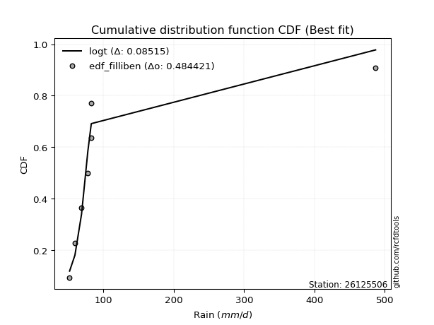</img></img>

</div>


### 10. Empirical - EDF Jenkinson (1977)

The Jenkinson formula in hydrology is an empirical plotting position formula used to estimate the non-exceedance probability _(P)_ or return period _(T)_ of a given ordered observation within a sample. It is a widely used method in the frequency analysis of extreme events such as floods and rainfall, as it provides a distribution-free way to plot data. _a≈0.31_ and _b≈0.38_ are constants derived to approximate the median of the probability distribution for the given rank.

<div align="center">


$P=(m-a)/(n+b)$


</div>


**10.1. Empirical values**

<div align="center">

|                | 0                   | 1                   | 2                   | 3             | 4                  | 5                  | 6                  |
|:---------------|:--------------------|:--------------------|:--------------------|:--------------|:-------------------|:-------------------|:-------------------|
| date           | 2017                | 2022                | 2018                | 2021          | 2019               | 2023               | 2020               |
| x              | 51.8                | 59.4                | 68.8                | 77.8          | 82.5               | 82.7               | 486.8              |
| m              | 1                   | 2                   | 3                   | 4             | 5                  | 6                  | 7                  |
| empirical_dist | edf_jenkinson       | edf_jenkinson       | edf_jenkinson       | edf_jenkinson | edf_jenkinson      | edf_jenkinson      | edf_jenkinson      |
| empirical      | 0.09349593495934959 | 0.22899728997289973 | 0.36449864498644985 | 0.5           | 0.6355013550135502 | 0.7710027100271003 | 0.9065040650406505 |
| empirical_tr   | 1.1031390134529149  | 1.29701230228471    | 1.5735607675906182  | 2.0           | 2.743494423791822  | 4.366863905325444  | 10.695652173913055 |

</div>


**10.2. Kolmogorov-Smirnov fit test (sorted by Δ)**


<div align="center">

|                | 0                   | 1                   | 2                   | 3                   | 4                   | 5                   | 6                   | 7                   | 8                   | 9                   | 10                  | 11                  | 12                  | 13                  | 14                  | 15                  | 16                  | 17                  | 18                  | 19                  | 20                  | 21                  | 22                  | 23                  | 24                  | 25                  | 26                  | 27                  | 28                    | 29                  | 30                  | 31                  | 32                  | 33                  | 34                  | 35                  | 36                  | 37                  | 38                  | 39                  | 40                  | 41                  | 42                  | 43                  | 44                  | 45                  | 46                  | 47                  | 48                  | 49                  | 50                  | 51                  | 52                  | 53                  | 54                  | 55                  | 56                  | 57                  | 58                  | 59                  | 60                  | 61                  | 62                  | 63                  | 64                  | 65                  | 66                  | 67                  | 68                  | 69                  | 70                  | 71                  | 72                  | 73                  | 74                  | 75                  | 76                  | 77                  | 78                  | 79                  | 80                  | 81                  | 82                  | 83                  | 84                  | 85                  | 86                  | 87                  | 88                  | 89                  |
|:---------------|:--------------------|:--------------------|:--------------------|:--------------------|:--------------------|:--------------------|:--------------------|:--------------------|:--------------------|:--------------------|:--------------------|:--------------------|:--------------------|:--------------------|:--------------------|:--------------------|:--------------------|:--------------------|:--------------------|:--------------------|:--------------------|:--------------------|:--------------------|:--------------------|:--------------------|:--------------------|:--------------------|:--------------------|:----------------------|:--------------------|:--------------------|:--------------------|:--------------------|:--------------------|:--------------------|:--------------------|:--------------------|:--------------------|:--------------------|:--------------------|:--------------------|:--------------------|:--------------------|:--------------------|:--------------------|:--------------------|:--------------------|:--------------------|:--------------------|:--------------------|:--------------------|:--------------------|:--------------------|:--------------------|:--------------------|:--------------------|:--------------------|:--------------------|:--------------------|:--------------------|:--------------------|:--------------------|:--------------------|:--------------------|:--------------------|:--------------------|:--------------------|:--------------------|:--------------------|:--------------------|:--------------------|:--------------------|:--------------------|:--------------------|:--------------------|:--------------------|:--------------------|:--------------------|:--------------------|:--------------------|:--------------------|:--------------------|:--------------------|:--------------------|:--------------------|:--------------------|:--------------------|:--------------------|:--------------------|:--------------------|
| station        | 26125506            | 26125506            | 26125506            | 26125506            | 26125506            | 26125506            | 26125506            | 26125506            | 26125506            | 26125506            | 26125506            | 26125506            | 26125506            | 26125506            | 26125506            | 26125506            | 26125506            | 26125506            | 26125506            | 26125506            | 26125506            | 26125506            | 26125506            | 26125506            | 26125506            | 26125506            | 26125506            | 26125506            | 26125506              | 26125506            | 26125506            | 26125506            | 26125506            | 26125506            | 26125506            | 26125506            | 26125506            | 26125506            | 26125506            | 26125506            | 26125506            | 26125506            | 26125506            | 26125506            | 26125506            | 26125506            | 26125506            | 26125506            | 26125506            | 26125506            | 26125506            | 26125506            | 26125506            | 26125506            | 26125506            | 26125506            | 26125506            | 26125506            | 26125506            | 26125506            | 26125506            | 26125506            | 26125506            | 26125506            | 26125506            | 26125506            | 26125506            | 26125506            | 26125506            | 26125506            | 26125506            | 26125506            | 26125506            | 26125506            | 26125506            | 26125506            | 26125506            | 26125506            | 26125506            | 26125506            | 26125506            | 26125506            | 26125506            | 26125506            | 26125506            | 26125506            | 26125506            | 26125506            | 26125506            | 26125506            |
| empirical_dist | edf_jenkinson       | edf_jenkinson       | edf_jenkinson       | edf_jenkinson       | edf_jenkinson       | edf_jenkinson       | edf_jenkinson       | edf_jenkinson       | edf_jenkinson       | edf_jenkinson       | edf_jenkinson       | edf_jenkinson       | edf_jenkinson       | edf_jenkinson       | edf_jenkinson       | edf_jenkinson       | edf_jenkinson       | edf_jenkinson       | edf_jenkinson       | edf_jenkinson       | edf_jenkinson       | edf_jenkinson       | edf_jenkinson       | edf_jenkinson       | edf_jenkinson       | edf_jenkinson       | edf_jenkinson       | edf_jenkinson       | edf_jenkinson         | edf_jenkinson       | edf_jenkinson       | edf_jenkinson       | edf_jenkinson       | edf_jenkinson       | edf_jenkinson       | edf_jenkinson       | edf_jenkinson       | edf_jenkinson       | edf_jenkinson       | edf_jenkinson       | edf_jenkinson       | edf_jenkinson       | edf_jenkinson       | edf_jenkinson       | edf_jenkinson       | edf_jenkinson       | edf_jenkinson       | edf_jenkinson       | edf_jenkinson       | edf_jenkinson       | edf_jenkinson       | edf_jenkinson       | edf_jenkinson       | edf_jenkinson       | edf_jenkinson       | edf_jenkinson       | edf_jenkinson       | edf_jenkinson       | edf_jenkinson       | edf_jenkinson       | edf_jenkinson       | edf_jenkinson       | edf_jenkinson       | edf_jenkinson       | edf_jenkinson       | edf_jenkinson       | edf_jenkinson       | edf_jenkinson       | edf_jenkinson       | edf_jenkinson       | edf_jenkinson       | edf_jenkinson       | edf_jenkinson       | edf_jenkinson       | edf_jenkinson       | edf_jenkinson       | edf_jenkinson       | edf_jenkinson       | edf_jenkinson       | edf_jenkinson       | edf_jenkinson       | edf_jenkinson       | edf_jenkinson       | edf_jenkinson       | edf_jenkinson       | edf_jenkinson       | edf_jenkinson       | edf_jenkinson       | edf_jenkinson       | edf_jenkinson       |
| p_dist         | logt                | t                   | logalpha            | lognct              | loginvweibull       | logfisk             | loginvgamma         | logf                | logncf              | alpha               | logjohnsonsu        | logpareto           | mielke              | loginvgauss         | f                   | invgamma            | invweibull          | loggibrat           | logfatiguelife      | logwald             | logerlang           | lognakagami         | invgauss            | erlang              | fisk                | logexponnorm        | logpearson3         | loggompertz         | loglaplace_asymmetric | logexpon            | loggenexpon         | logtruncnorm        | fatiguelife         | loghalflogistic     | logbetaprime        | logweibull_min      | logmoyal            | loggenlogistic      | loghalfnorm         | gamma               | loggamma            | loggamma            | loggumbel_r         | wald                | nakagami            | pearson3            | logchi2             | lograyleigh         | nct                 | gibrat              | logmaxwell          | betaprime           | halflogistic        | ncf                 | logkstwobign        | halfnorm            | moyal               | logloggamma         | lognorm             | lognorm             | logcrystalball      | loglogistic         | gumbel_r            | loghypsecant        | weibull_min         | rayleigh            | logrice             | chi2                | maxwell             | loglaplace          | genlogistic         | loglognorm          | crystalball         | norm                | loggumbel_l         | logistic            | hypsecant           | johnsonsu           | exponnorm           | pareto              | expon               | genexpon            | laplace_asymmetric  | kstwobign           | laplace             | gompertz            | rice                | gumbel_l            | truncnorm           | logmielke           |
| delta          | 0.0851503828914153  | 0.08968006115813199 | 0.13259901282263764 | 0.1350196653107899  | 0.14004899682709526 | 0.1417443620454294  | 0.14197860840695353 | 0.14217883034690337 | 0.1422016671639812  | 0.14356102389785674 | 0.146358717690935   | 0.15010499005001054 | 0.15277386935762838 | 0.1541985635121942  | 0.1547351915774382  | 0.15473565745895634 | 0.15484735728219512 | 0.1591948362684238  | 0.16182887159088288 | 0.1692260027620771  | 0.17137936210837745 | 0.17171891771487002 | 0.17387959165141043 | 0.2017680607651392  | 0.20518536938211418 | 0.20775872523286998 | 0.21030110945176195 | 0.21157266554469034 | 0.2120956353795288    | 0.2121121855343423  | 0.21214029903070242 | 0.2284814504557946  | 0.2288994885431216  | 0.2293505625552129  | 0.23492451736127012 | 0.23683222396203585 | 0.23878749917961006 | 0.24391349446123056 | 0.24959880637526943 | 0.25586598081920353 | 0.2579368091899235  | 0.2579368091899235  | 0.26386575164479875 | 0.27063570267069015 | 0.2749704051746917  | 0.2787338814876438  | 0.281972909064115   | 0.28350828816338325 | 0.2867645827221925  | 0.29173166435608033 | 0.295512867341357   | 0.3017431323185866  | 0.3058270457701939  | 0.3060647516429885  | 0.31458214095214915 | 0.31763677782514343 | 0.3231537709186387  | 0.3297101791792169  | 0.3299008904076697  | 0.3299008904076697  | 0.32990089222462693 | 0.33779167963718243 | 0.34371278618232715 | 0.3444308257516828  | 0.34897844457834326 | 0.3524928540969573  | 0.3563000799527631  | 0.3627417930169054  | 0.3647530482794717  | 0.3655293508911876  | 0.3797720455328295  | 0.39278972499785947 | 0.39788453239957455 | 0.39788453588272965 | 0.3995878090455673  | 0.41366919649843387 | 0.4262565721080208  | 0.4319421742309464  | 0.4443340880417327  | 0.4444907010065613  | 0.4444907187441154  | 0.44449090192920687 | 0.4444909074788781  | 0.44538120826859584 | 0.454617620074149   | 0.45660690811661103 | 0.4604575110245304  | 0.46122665154558007 | 0.5702539956017272  | nan                 |
| deltao         | 0.48442053926100004 | 0.48442053926100004 | 0.48442053926100004 | 0.48442053926100004 | 0.48442053926100004 | 0.48442053926100004 | 0.48442053926100004 | 0.48442053926100004 | 0.48442053926100004 | 0.48442053926100004 | 0.48442053926100004 | 0.48442053926100004 | 0.48442053926100004 | 0.48442053926100004 | 0.48442053926100004 | 0.48442053926100004 | 0.48442053926100004 | 0.48442053926100004 | 0.48442053926100004 | 0.48442053926100004 | 0.48442053926100004 | 0.48442053926100004 | 0.48442053926100004 | 0.48442053926100004 | 0.48442053926100004 | 0.48442053926100004 | 0.48442053926100004 | 0.48442053926100004 | 0.48442053926100004   | 0.48442053926100004 | 0.48442053926100004 | 0.48442053926100004 | 0.48442053926100004 | 0.48442053926100004 | 0.48442053926100004 | 0.48442053926100004 | 0.48442053926100004 | 0.48442053926100004 | 0.48442053926100004 | 0.48442053926100004 | 0.48442053926100004 | 0.48442053926100004 | 0.48442053926100004 | 0.48442053926100004 | 0.48442053926100004 | 0.48442053926100004 | 0.48442053926100004 | 0.48442053926100004 | 0.48442053926100004 | 0.48442053926100004 | 0.48442053926100004 | 0.48442053926100004 | 0.48442053926100004 | 0.48442053926100004 | 0.48442053926100004 | 0.48442053926100004 | 0.48442053926100004 | 0.48442053926100004 | 0.48442053926100004 | 0.48442053926100004 | 0.48442053926100004 | 0.48442053926100004 | 0.48442053926100004 | 0.48442053926100004 | 0.48442053926100004 | 0.48442053926100004 | 0.48442053926100004 | 0.48442053926100004 | 0.48442053926100004 | 0.48442053926100004 | 0.48442053926100004 | 0.48442053926100004 | 0.48442053926100004 | 0.48442053926100004 | 0.48442053926100004 | 0.48442053926100004 | 0.48442053926100004 | 0.48442053926100004 | 0.48442053926100004 | 0.48442053926100004 | 0.48442053926100004 | 0.48442053926100004 | 0.48442053926100004 | 0.48442053926100004 | 0.48442053926100004 | 0.48442053926100004 | 0.48442053926100004 | 0.48442053926100004 | 0.48442053926100004 | 0.48442053926100004 |
| eval           | Δo > Δ              | Δo > Δ              | Δo > Δ              | Δo > Δ              | Δo > Δ              | Δo > Δ              | Δo > Δ              | Δo > Δ              | Δo > Δ              | Δo > Δ              | Δo > Δ              | Δo > Δ              | Δo > Δ              | Δo > Δ              | Δo > Δ              | Δo > Δ              | Δo > Δ              | Δo > Δ              | Δo > Δ              | Δo > Δ              | Δo > Δ              | Δo > Δ              | Δo > Δ              | Δo > Δ              | Δo > Δ              | Δo > Δ              | Δo > Δ              | Δo > Δ              | Δo > Δ                | Δo > Δ              | Δo > Δ              | Δo > Δ              | Δo > Δ              | Δo > Δ              | Δo > Δ              | Δo > Δ              | Δo > Δ              | Δo > Δ              | Δo > Δ              | Δo > Δ              | Δo > Δ              | Δo > Δ              | Δo > Δ              | Δo > Δ              | Δo > Δ              | Δo > Δ              | Δo > Δ              | Δo > Δ              | Δo > Δ              | Δo > Δ              | Δo > Δ              | Δo > Δ              | Δo > Δ              | Δo > Δ              | Δo > Δ              | Δo > Δ              | Δo > Δ              | Δo > Δ              | Δo > Δ              | Δo > Δ              | Δo > Δ              | Δo > Δ              | Δo > Δ              | Δo > Δ              | Δo > Δ              | Δo > Δ              | Δo > Δ              | Δo > Δ              | Δo > Δ              | Δo > Δ              | Δo > Δ              | Δo > Δ              | Δo > Δ              | Δo > Δ              | Δo > Δ              | Δo > Δ              | Δo > Δ              | Δo > Δ              | Δo > Δ              | Δo > Δ              | Δo > Δ              | Δo > Δ              | Δo > Δ              | Δo > Δ              | Δo > Δ              | Δo > Δ              | Δo > Δ              | Δo > Δ              | Δo <= Δ             | Δo <= Δ             |
| fit            | 1                   | 1                   | 1                   | 1                   | 1                   | 1                   | 1                   | 1                   | 1                   | 1                   | 1                   | 1                   | 1                   | 1                   | 1                   | 1                   | 1                   | 1                   | 1                   | 1                   | 1                   | 1                   | 1                   | 1                   | 1                   | 1                   | 1                   | 1                   | 1                     | 1                   | 1                   | 1                   | 1                   | 1                   | 1                   | 1                   | 1                   | 1                   | 1                   | 1                   | 1                   | 1                   | 1                   | 1                   | 1                   | 1                   | 1                   | 1                   | 1                   | 1                   | 1                   | 1                   | 1                   | 1                   | 1                   | 1                   | 1                   | 1                   | 1                   | 1                   | 1                   | 1                   | 1                   | 1                   | 1                   | 1                   | 1                   | 1                   | 1                   | 1                   | 1                   | 1                   | 1                   | 1                   | 1                   | 1                   | 1                   | 1                   | 1                   | 1                   | 1                   | 1                   | 1                   | 1                   | 1                   | 1                   | 1                   | 1                   | 0                   | 0                   |
| n              | 7                   | 7                   | 7                   | 7                   | 7                   | 7                   | 7                   | 7                   | 7                   | 7                   | 7                   | 7                   | 7                   | 7                   | 7                   | 7                   | 7                   | 7                   | 7                   | 7                   | 7                   | 7                   | 7                   | 7                   | 7                   | 7                   | 7                   | 7                   | 7                     | 7                   | 7                   | 7                   | 7                   | 7                   | 7                   | 7                   | 7                   | 7                   | 7                   | 7                   | 7                   | 7                   | 7                   | 7                   | 7                   | 7                   | 7                   | 7                   | 7                   | 7                   | 7                   | 7                   | 7                   | 7                   | 7                   | 7                   | 7                   | 7                   | 7                   | 7                   | 7                   | 7                   | 7                   | 7                   | 7                   | 7                   | 7                   | 7                   | 7                   | 7                   | 7                   | 7                   | 7                   | 7                   | 7                   | 7                   | 7                   | 7                   | 7                   | 7                   | 7                   | 7                   | 7                   | 7                   | 7                   | 7                   | 7                   | 7                   | 7                   | 7                   |
| best_fit       | 1                   | 0                   | 0                   | 0                   | 0                   | 0                   | 0                   | 0                   | 0                   | 0                   | 0                   | 0                   | 0                   | 0                   | 0                   | 0                   | 0                   | 0                   | 0                   | 0                   | 0                   | 0                   | 0                   | 0                   | 0                   | 0                   | 0                   | 0                   | 0                     | 0                   | 0                   | 0                   | 0                   | 0                   | 0                   | 0                   | 0                   | 0                   | 0                   | 0                   | 0                   | 0                   | 0                   | 0                   | 0                   | 0                   | 0                   | 0                   | 0                   | 0                   | 0                   | 0                   | 0                   | 0                   | 0                   | 0                   | 0                   | 0                   | 0                   | 0                   | 0                   | 0                   | 0                   | 0                   | 0                   | 0                   | 0                   | 0                   | 0                   | 0                   | 0                   | 0                   | 0                   | 0                   | 0                   | 0                   | 0                   | 0                   | 0                   | 0                   | 0                   | 0                   | 0                   | 0                   | 0                   | 0                   | 0                   | 0                   | 0                   | 0                   |
| best_fit_sort  | 1                   | 2                   | 3                   | 4                   | 5                   | 6                   | 7                   | 8                   | 9                   | 10                  | 11                  | 12                  | 13                  | 14                  | 15                  | 16                  | 17                  | 18                  | 19                  | 20                  | 21                  | 22                  | 23                  | 24                  | 25                  | 26                  | 27                  | 28                  | 29                    | 30                  | 31                  | 32                  | 33                  | 34                  | 35                  | 36                  | 37                  | 38                  | 39                  | 40                  | 41                  | 42                  | 43                  | 44                  | 45                  | 46                  | 47                  | 48                  | 49                  | 50                  | 51                  | 52                  | 53                  | 54                  | 55                  | 56                  | 57                  | 58                  | 59                  | 60                  | 61                  | 62                  | 63                  | 64                  | 65                  | 66                  | 67                  | 68                  | 69                  | 70                  | 71                  | 72                  | 73                  | 74                  | 75                  | 76                  | 77                  | 78                  | 79                  | 80                  | 81                  | 82                  | 83                  | 84                  | 85                  | 86                  | 87                  | 88                  | 89                  | 90                  |

</div>


<div align="center">

</img>

</div>


**10.3. Best fit**

<div align="center">

|   id |   station | empirical_dist   | p_dist   |     delta |   deltao | eval   |   fit |   n |   best_fit |   best_fit_sort |
|-----:|----------:|:-----------------|:---------|----------:|---------:|:-------|------:|----:|-----------:|----------------:|
|    0 |  26125506 | edf_jenkinson    | logt     | 0.0851504 | 0.484421 | Δo > Δ |     1 |   7 |          1 |               1 |

</div>


<div align="center">

</img></img>

</div>


### 11. Empirical - EDF Cunnane (1978)

Cunnane´s work in statistical hydrology has focused on the performance and evaluation of different probability distributions (such as GEV, Gumbel, Lognormal) for flood frequency estimation. _b_ is a constant, typically set to 0.4.

<div align="center">


$P=(m-b)/(n+1-2b)$


</div>


**11.1. Empirical values**

<div align="center">

|                | 0                   | 1                   | 2                  | 3           | 4                  | 5                  | 6                  |
|:---------------|:--------------------|:--------------------|:-------------------|:------------|:-------------------|:-------------------|:-------------------|
| date           | 2017                | 2022                | 2018               | 2021        | 2019               | 2023               | 2020               |
| x              | 51.8                | 59.4                | 68.8               | 77.8        | 82.5               | 82.7               | 486.8              |
| m              | 1                   | 2                   | 3                  | 4           | 5                  | 6                  | 7                  |
| empirical_dist | edf_cunnane         | edf_cunnane         | edf_cunnane        | edf_cunnane | edf_cunnane        | edf_cunnane        | edf_cunnane        |
| empirical      | 0.08333333333333333 | 0.22222222222222224 | 0.3611111111111111 | 0.5         | 0.6388888888888888 | 0.7777777777777777 | 0.9166666666666666 |
| empirical_tr   | 1.090909090909091   | 1.2857142857142856  | 1.565217391304348  | 2.0         | 2.7692307692307687 | 4.499999999999998  | 11.999999999999995 |

</div>


**11.2. Kolmogorov-Smirnov fit test (sorted by Δ)**


<div align="center">

|                | 0                   | 1                   | 2                   | 3                   | 4                   | 5                   | 6                   | 7                   | 8                   | 9                   | 10                  | 11                  | 12                  | 13                  | 14                  | 15                  | 16                  | 17                  | 18                  | 19                  | 20                  | 21                  | 22                  | 23                  | 24                  | 25                  | 26                  | 27                  | 28                    | 29                  | 30                  | 31                  | 32                  | 33                  | 34                  | 35                  | 36                  | 37                  | 38                  | 39                  | 40                  | 41                  | 42                  | 43                  | 44                  | 45                  | 46                  | 47                  | 48                  | 49                  | 50                  | 51                  | 52                  | 53                  | 54                  | 55                  | 56                  | 57                  | 58                  | 59                  | 60                  | 61                  | 62                  | 63                  | 64                  | 65                  | 66                  | 67                  | 68                  | 69                  | 70                  | 71                  | 72                  | 73                  | 74                  | 75                  | 76                  | 77                  | 78                  | 79                  | 80                  | 81                  | 82                  | 83                  | 84                  | 85                  | 86                  | 87                  | 88                  | 89                  |
|:---------------|:--------------------|:--------------------|:--------------------|:--------------------|:--------------------|:--------------------|:--------------------|:--------------------|:--------------------|:--------------------|:--------------------|:--------------------|:--------------------|:--------------------|:--------------------|:--------------------|:--------------------|:--------------------|:--------------------|:--------------------|:--------------------|:--------------------|:--------------------|:--------------------|:--------------------|:--------------------|:--------------------|:--------------------|:----------------------|:--------------------|:--------------------|:--------------------|:--------------------|:--------------------|:--------------------|:--------------------|:--------------------|:--------------------|:--------------------|:--------------------|:--------------------|:--------------------|:--------------------|:--------------------|:--------------------|:--------------------|:--------------------|:--------------------|:--------------------|:--------------------|:--------------------|:--------------------|:--------------------|:--------------------|:--------------------|:--------------------|:--------------------|:--------------------|:--------------------|:--------------------|:--------------------|:--------------------|:--------------------|:--------------------|:--------------------|:--------------------|:--------------------|:--------------------|:--------------------|:--------------------|:--------------------|:--------------------|:--------------------|:--------------------|:--------------------|:--------------------|:--------------------|:--------------------|:--------------------|:--------------------|:--------------------|:--------------------|:--------------------|:--------------------|:--------------------|:--------------------|:--------------------|:--------------------|:--------------------|:--------------------|
| station        | 26125506            | 26125506            | 26125506            | 26125506            | 26125506            | 26125506            | 26125506            | 26125506            | 26125506            | 26125506            | 26125506            | 26125506            | 26125506            | 26125506            | 26125506            | 26125506            | 26125506            | 26125506            | 26125506            | 26125506            | 26125506            | 26125506            | 26125506            | 26125506            | 26125506            | 26125506            | 26125506            | 26125506            | 26125506              | 26125506            | 26125506            | 26125506            | 26125506            | 26125506            | 26125506            | 26125506            | 26125506            | 26125506            | 26125506            | 26125506            | 26125506            | 26125506            | 26125506            | 26125506            | 26125506            | 26125506            | 26125506            | 26125506            | 26125506            | 26125506            | 26125506            | 26125506            | 26125506            | 26125506            | 26125506            | 26125506            | 26125506            | 26125506            | 26125506            | 26125506            | 26125506            | 26125506            | 26125506            | 26125506            | 26125506            | 26125506            | 26125506            | 26125506            | 26125506            | 26125506            | 26125506            | 26125506            | 26125506            | 26125506            | 26125506            | 26125506            | 26125506            | 26125506            | 26125506            | 26125506            | 26125506            | 26125506            | 26125506            | 26125506            | 26125506            | 26125506            | 26125506            | 26125506            | 26125506            | 26125506            |
| empirical_dist | edf_cunnane         | edf_cunnane         | edf_cunnane         | edf_cunnane         | edf_cunnane         | edf_cunnane         | edf_cunnane         | edf_cunnane         | edf_cunnane         | edf_cunnane         | edf_cunnane         | edf_cunnane         | edf_cunnane         | edf_cunnane         | edf_cunnane         | edf_cunnane         | edf_cunnane         | edf_cunnane         | edf_cunnane         | edf_cunnane         | edf_cunnane         | edf_cunnane         | edf_cunnane         | edf_cunnane         | edf_cunnane         | edf_cunnane         | edf_cunnane         | edf_cunnane         | edf_cunnane           | edf_cunnane         | edf_cunnane         | edf_cunnane         | edf_cunnane         | edf_cunnane         | edf_cunnane         | edf_cunnane         | edf_cunnane         | edf_cunnane         | edf_cunnane         | edf_cunnane         | edf_cunnane         | edf_cunnane         | edf_cunnane         | edf_cunnane         | edf_cunnane         | edf_cunnane         | edf_cunnane         | edf_cunnane         | edf_cunnane         | edf_cunnane         | edf_cunnane         | edf_cunnane         | edf_cunnane         | edf_cunnane         | edf_cunnane         | edf_cunnane         | edf_cunnane         | edf_cunnane         | edf_cunnane         | edf_cunnane         | edf_cunnane         | edf_cunnane         | edf_cunnane         | edf_cunnane         | edf_cunnane         | edf_cunnane         | edf_cunnane         | edf_cunnane         | edf_cunnane         | edf_cunnane         | edf_cunnane         | edf_cunnane         | edf_cunnane         | edf_cunnane         | edf_cunnane         | edf_cunnane         | edf_cunnane         | edf_cunnane         | edf_cunnane         | edf_cunnane         | edf_cunnane         | edf_cunnane         | edf_cunnane         | edf_cunnane         | edf_cunnane         | edf_cunnane         | edf_cunnane         | edf_cunnane         | edf_cunnane         | edf_cunnane         |
| p_dist         | logt                | t                   | logalpha            | lognct              | loginvweibull       | logfisk             | loginvgamma         | logf                | logncf              | alpha               | logjohnsonsu        | logpareto           | mielke              | loginvgauss         | f                   | invgamma            | invweibull          | loggibrat           | logfatiguelife      | logwald             | logerlang           | lognakagami         | invgauss            | erlang              | fisk                | logexponnorm        | logpearson3         | loggompertz         | loglaplace_asymmetric | logexpon            | loggenexpon         | logtruncnorm        | fatiguelife         | loghalflogistic     | logbetaprime        | logweibull_min      | logmoyal            | loggenlogistic      | loghalfnorm         | loggamma            | loggamma            | gamma               | loggumbel_r         | wald                | nakagami            | logchi2             | pearson3            | lograyleigh         | nct                 | gibrat              | logmaxwell          | betaprime           | halflogistic        | ncf                 | logkstwobign        | halfnorm            | moyal               | logloggamma         | lognorm             | lognorm             | logcrystalball      | loglogistic         | gumbel_r            | loghypsecant        | weibull_min         | rayleigh            | logrice             | chi2                | maxwell             | loglaplace          | genlogistic         | loglognorm          | crystalball         | norm                | loggumbel_l         | logistic            | hypsecant           | johnsonsu           | exponnorm           | pareto              | expon               | genexpon            | laplace_asymmetric  | kstwobign           | laplace             | gompertz            | rice                | gumbel_l            | truncnorm           | logmielke           |
| delta          | 0.08620759563206715 | 0.09645512890880936 | 0.13937408057331502 | 0.14179473306146728 | 0.14682406457777264 | 0.14851942979610677 | 0.1487536761576309  | 0.14895389809758075 | 0.14897673491465857 | 0.15033609164853412 | 0.15313378544161238 | 0.15688005780068792 | 0.15954893710830576 | 0.16097363126287156 | 0.16151025932811558 | 0.16151072520963372 | 0.1616224250328725  | 0.16596990401910117 | 0.16860393934156026 | 0.1760010705127545  | 0.17815442985905483 | 0.1784939854655474  | 0.1806546594020878  | 0.20854312851581658 | 0.21196043713279156 | 0.21453379298354736 | 0.21707617720243932 | 0.21834773329536772 | 0.21887070313020618   | 0.21888725328501968 | 0.2189153667813798  | 0.23525651820647198 | 0.23567455629379896 | 0.2361256303058903  | 0.23831205123660887 | 0.24360729171271323 | 0.24556256693028744 | 0.25068856221190794 | 0.2563738741259468  | 0.26256267007747625 | 0.26256267007747625 | 0.2626410485698809  | 0.27064081939547613 | 0.2774107704213675  | 0.28174547292536906 | 0.28874797681479236 | 0.28889648311366006 | 0.2902833559140606  | 0.2935396504728699  | 0.2985067321067577  | 0.3022879350920344  | 0.308518200069264   | 0.31260211352087125 | 0.3128398193936659  | 0.3213572087028265  | 0.3244118455758208  | 0.3299288386693161  | 0.3364852469298943  | 0.33667595815834706 | 0.33667595815834706 | 0.3366759599753043  | 0.3445667473878598  | 0.3504878539330045  | 0.3512058935023602  | 0.35575351232902064 | 0.3592679218476347  | 0.36307514770344046 | 0.3695168607675828  | 0.37152811603014907 | 0.372304418641865   | 0.3865471132835069  | 0.39956479274853696 | 0.40465960015025193 | 0.40465960363340703 | 0.40636287679624467 | 0.42044426424911124 | 0.4330316398586982  | 0.435329708106285   | 0.45110915579241007 | 0.45126576875723867 | 0.45126578649479276 | 0.45126596967988425 | 0.45126597522955547 | 0.4521562760192732  | 0.4613926878248264  | 0.4633819758672884  | 0.4672325787752078  | 0.46800171929625745 | 0.5770290633524046  | nan                 |
| deltao         | 0.48442053926100004 | 0.48442053926100004 | 0.48442053926100004 | 0.48442053926100004 | 0.48442053926100004 | 0.48442053926100004 | 0.48442053926100004 | 0.48442053926100004 | 0.48442053926100004 | 0.48442053926100004 | 0.48442053926100004 | 0.48442053926100004 | 0.48442053926100004 | 0.48442053926100004 | 0.48442053926100004 | 0.48442053926100004 | 0.48442053926100004 | 0.48442053926100004 | 0.48442053926100004 | 0.48442053926100004 | 0.48442053926100004 | 0.48442053926100004 | 0.48442053926100004 | 0.48442053926100004 | 0.48442053926100004 | 0.48442053926100004 | 0.48442053926100004 | 0.48442053926100004 | 0.48442053926100004   | 0.48442053926100004 | 0.48442053926100004 | 0.48442053926100004 | 0.48442053926100004 | 0.48442053926100004 | 0.48442053926100004 | 0.48442053926100004 | 0.48442053926100004 | 0.48442053926100004 | 0.48442053926100004 | 0.48442053926100004 | 0.48442053926100004 | 0.48442053926100004 | 0.48442053926100004 | 0.48442053926100004 | 0.48442053926100004 | 0.48442053926100004 | 0.48442053926100004 | 0.48442053926100004 | 0.48442053926100004 | 0.48442053926100004 | 0.48442053926100004 | 0.48442053926100004 | 0.48442053926100004 | 0.48442053926100004 | 0.48442053926100004 | 0.48442053926100004 | 0.48442053926100004 | 0.48442053926100004 | 0.48442053926100004 | 0.48442053926100004 | 0.48442053926100004 | 0.48442053926100004 | 0.48442053926100004 | 0.48442053926100004 | 0.48442053926100004 | 0.48442053926100004 | 0.48442053926100004 | 0.48442053926100004 | 0.48442053926100004 | 0.48442053926100004 | 0.48442053926100004 | 0.48442053926100004 | 0.48442053926100004 | 0.48442053926100004 | 0.48442053926100004 | 0.48442053926100004 | 0.48442053926100004 | 0.48442053926100004 | 0.48442053926100004 | 0.48442053926100004 | 0.48442053926100004 | 0.48442053926100004 | 0.48442053926100004 | 0.48442053926100004 | 0.48442053926100004 | 0.48442053926100004 | 0.48442053926100004 | 0.48442053926100004 | 0.48442053926100004 | 0.48442053926100004 |
| eval           | Δo > Δ              | Δo > Δ              | Δo > Δ              | Δo > Δ              | Δo > Δ              | Δo > Δ              | Δo > Δ              | Δo > Δ              | Δo > Δ              | Δo > Δ              | Δo > Δ              | Δo > Δ              | Δo > Δ              | Δo > Δ              | Δo > Δ              | Δo > Δ              | Δo > Δ              | Δo > Δ              | Δo > Δ              | Δo > Δ              | Δo > Δ              | Δo > Δ              | Δo > Δ              | Δo > Δ              | Δo > Δ              | Δo > Δ              | Δo > Δ              | Δo > Δ              | Δo > Δ                | Δo > Δ              | Δo > Δ              | Δo > Δ              | Δo > Δ              | Δo > Δ              | Δo > Δ              | Δo > Δ              | Δo > Δ              | Δo > Δ              | Δo > Δ              | Δo > Δ              | Δo > Δ              | Δo > Δ              | Δo > Δ              | Δo > Δ              | Δo > Δ              | Δo > Δ              | Δo > Δ              | Δo > Δ              | Δo > Δ              | Δo > Δ              | Δo > Δ              | Δo > Δ              | Δo > Δ              | Δo > Δ              | Δo > Δ              | Δo > Δ              | Δo > Δ              | Δo > Δ              | Δo > Δ              | Δo > Δ              | Δo > Δ              | Δo > Δ              | Δo > Δ              | Δo > Δ              | Δo > Δ              | Δo > Δ              | Δo > Δ              | Δo > Δ              | Δo > Δ              | Δo > Δ              | Δo > Δ              | Δo > Δ              | Δo > Δ              | Δo > Δ              | Δo > Δ              | Δo > Δ              | Δo > Δ              | Δo > Δ              | Δo > Δ              | Δo > Δ              | Δo > Δ              | Δo > Δ              | Δo > Δ              | Δo > Δ              | Δo > Δ              | Δo > Δ              | Δo > Δ              | Δo > Δ              | Δo <= Δ             | Δo <= Δ             |
| fit            | 1                   | 1                   | 1                   | 1                   | 1                   | 1                   | 1                   | 1                   | 1                   | 1                   | 1                   | 1                   | 1                   | 1                   | 1                   | 1                   | 1                   | 1                   | 1                   | 1                   | 1                   | 1                   | 1                   | 1                   | 1                   | 1                   | 1                   | 1                   | 1                     | 1                   | 1                   | 1                   | 1                   | 1                   | 1                   | 1                   | 1                   | 1                   | 1                   | 1                   | 1                   | 1                   | 1                   | 1                   | 1                   | 1                   | 1                   | 1                   | 1                   | 1                   | 1                   | 1                   | 1                   | 1                   | 1                   | 1                   | 1                   | 1                   | 1                   | 1                   | 1                   | 1                   | 1                   | 1                   | 1                   | 1                   | 1                   | 1                   | 1                   | 1                   | 1                   | 1                   | 1                   | 1                   | 1                   | 1                   | 1                   | 1                   | 1                   | 1                   | 1                   | 1                   | 1                   | 1                   | 1                   | 1                   | 1                   | 1                   | 0                   | 0                   |
| n              | 7                   | 7                   | 7                   | 7                   | 7                   | 7                   | 7                   | 7                   | 7                   | 7                   | 7                   | 7                   | 7                   | 7                   | 7                   | 7                   | 7                   | 7                   | 7                   | 7                   | 7                   | 7                   | 7                   | 7                   | 7                   | 7                   | 7                   | 7                   | 7                     | 7                   | 7                   | 7                   | 7                   | 7                   | 7                   | 7                   | 7                   | 7                   | 7                   | 7                   | 7                   | 7                   | 7                   | 7                   | 7                   | 7                   | 7                   | 7                   | 7                   | 7                   | 7                   | 7                   | 7                   | 7                   | 7                   | 7                   | 7                   | 7                   | 7                   | 7                   | 7                   | 7                   | 7                   | 7                   | 7                   | 7                   | 7                   | 7                   | 7                   | 7                   | 7                   | 7                   | 7                   | 7                   | 7                   | 7                   | 7                   | 7                   | 7                   | 7                   | 7                   | 7                   | 7                   | 7                   | 7                   | 7                   | 7                   | 7                   | 7                   | 7                   |
| best_fit       | 1                   | 0                   | 0                   | 0                   | 0                   | 0                   | 0                   | 0                   | 0                   | 0                   | 0                   | 0                   | 0                   | 0                   | 0                   | 0                   | 0                   | 0                   | 0                   | 0                   | 0                   | 0                   | 0                   | 0                   | 0                   | 0                   | 0                   | 0                   | 0                     | 0                   | 0                   | 0                   | 0                   | 0                   | 0                   | 0                   | 0                   | 0                   | 0                   | 0                   | 0                   | 0                   | 0                   | 0                   | 0                   | 0                   | 0                   | 0                   | 0                   | 0                   | 0                   | 0                   | 0                   | 0                   | 0                   | 0                   | 0                   | 0                   | 0                   | 0                   | 0                   | 0                   | 0                   | 0                   | 0                   | 0                   | 0                   | 0                   | 0                   | 0                   | 0                   | 0                   | 0                   | 0                   | 0                   | 0                   | 0                   | 0                   | 0                   | 0                   | 0                   | 0                   | 0                   | 0                   | 0                   | 0                   | 0                   | 0                   | 0                   | 0                   |
| best_fit_sort  | 1                   | 2                   | 3                   | 4                   | 5                   | 6                   | 7                   | 8                   | 9                   | 10                  | 11                  | 12                  | 13                  | 14                  | 15                  | 16                  | 17                  | 18                  | 19                  | 20                  | 21                  | 22                  | 23                  | 24                  | 25                  | 26                  | 27                  | 28                  | 29                    | 30                  | 31                  | 32                  | 33                  | 34                  | 35                  | 36                  | 37                  | 38                  | 39                  | 40                  | 41                  | 42                  | 43                  | 44                  | 45                  | 46                  | 47                  | 48                  | 49                  | 50                  | 51                  | 52                  | 53                  | 54                  | 55                  | 56                  | 57                  | 58                  | 59                  | 60                  | 61                  | 62                  | 63                  | 64                  | 65                  | 66                  | 67                  | 68                  | 69                  | 70                  | 71                  | 72                  | 73                  | 74                  | 75                  | 76                  | 77                  | 78                  | 79                  | 80                  | 81                  | 82                  | 83                  | 84                  | 85                  | 86                  | 87                  | 88                  | 89                  | 90                  |

</div>


<div align="center">

</img>

</div>


**11.3. Best fit**

<div align="center">

|   id |   station | empirical_dist   | p_dist   |     delta |   deltao | eval   |   fit |   n |   best_fit |   best_fit_sort |
|-----:|----------:|:-----------------|:---------|----------:|---------:|:-------|------:|----:|-----------:|----------------:|
|    0 |  26125506 | edf_cunnane      | logt     | 0.0862076 | 0.484421 | Δo > Δ |     1 |   7 |          1 |               1 |

</div>


<div align="center">

</img></img>

</div>


### 12. Empirical - EDF Adamowski (1981)

The Adamowski formula in hydrology refers to a specific plotting position formula used for estimating the non-parametric empirical distribution of hydrological events (like flood peaks) to calculate their return periods. This formula provides an alternative to traditional parametric methods (like the Gumbel or Log Pearson Type III distributions). 

<div align="center">


$P=(m-0.25)/(n+0.5)$


</div>


**12.1. Empirical values**

<div align="center">

|                | 0                  | 1                   | 2                   | 3             | 4                  | 5                  | 6                  |
|:---------------|:-------------------|:--------------------|:--------------------|:--------------|:-------------------|:-------------------|:-------------------|
| date           | 2017               | 2022                | 2018                | 2021          | 2019               | 2023               | 2020               |
| x              | 51.8               | 59.4                | 68.8                | 77.8          | 82.5               | 82.7               | 486.8              |
| m              | 1                  | 2                   | 3                   | 4             | 5                  | 6                  | 7                  |
| empirical_dist | edf_adamowski      | edf_adamowski       | edf_adamowski       | edf_adamowski | edf_adamowski      | edf_adamowski      | edf_adamowski      |
| empirical      | 0.1                | 0.23333333333333334 | 0.36666666666666664 | 0.5           | 0.6333333333333333 | 0.7666666666666667 | 0.9                |
| empirical_tr   | 1.1111111111111112 | 1.3043478260869565  | 1.5789473684210527  | 2.0           | 2.727272727272727  | 4.2857142857142865 | 10.000000000000002 |

</div>


**12.2. Kolmogorov-Smirnov fit test (sorted by Δ)**


<div align="center">

|                | 0                   | 1                   | 2                   | 3                   | 4                   | 5                   | 6                   | 7                   | 8                   | 9                   | 10                  | 11                  | 12                  | 13                  | 14                  | 15                  | 16                  | 17                  | 18                  | 19                  | 20                  | 21                  | 22                  | 23                  | 24                  | 25                  | 26                  | 27                  | 28                    | 29                  | 30                  | 31                  | 32                  | 33                  | 34                  | 35                  | 36                  | 37                  | 38                  | 39                  | 40                  | 41                  | 42                  | 43                  | 44                  | 45                  | 46                  | 47                  | 48                  | 49                  | 50                  | 51                  | 52                  | 53                  | 54                  | 55                  | 56                  | 57                  | 58                  | 59                  | 60                  | 61                  | 62                  | 63                  | 64                  | 65                  | 66                  | 67                  | 68                  | 69                  | 70                  | 71                  | 72                  | 73                  | 74                  | 75                  | 76                  | 77                  | 78                  | 79                  | 80                  | 81                  | 82                  | 83                  | 84                  | 85                  | 86                  | 87                  | 88                  | 89                  |
|:---------------|:--------------------|:--------------------|:--------------------|:--------------------|:--------------------|:--------------------|:--------------------|:--------------------|:--------------------|:--------------------|:--------------------|:--------------------|:--------------------|:--------------------|:--------------------|:--------------------|:--------------------|:--------------------|:--------------------|:--------------------|:--------------------|:--------------------|:--------------------|:--------------------|:--------------------|:--------------------|:--------------------|:--------------------|:----------------------|:--------------------|:--------------------|:--------------------|:--------------------|:--------------------|:--------------------|:--------------------|:--------------------|:--------------------|:--------------------|:--------------------|:--------------------|:--------------------|:--------------------|:--------------------|:--------------------|:--------------------|:--------------------|:--------------------|:--------------------|:--------------------|:--------------------|:--------------------|:--------------------|:--------------------|:--------------------|:--------------------|:--------------------|:--------------------|:--------------------|:--------------------|:--------------------|:--------------------|:--------------------|:--------------------|:--------------------|:--------------------|:--------------------|:--------------------|:--------------------|:--------------------|:--------------------|:--------------------|:--------------------|:--------------------|:--------------------|:--------------------|:--------------------|:--------------------|:--------------------|:--------------------|:--------------------|:--------------------|:--------------------|:--------------------|:--------------------|:--------------------|:--------------------|:--------------------|:--------------------|:--------------------|
| station        | 26125506            | 26125506            | 26125506            | 26125506            | 26125506            | 26125506            | 26125506            | 26125506            | 26125506            | 26125506            | 26125506            | 26125506            | 26125506            | 26125506            | 26125506            | 26125506            | 26125506            | 26125506            | 26125506            | 26125506            | 26125506            | 26125506            | 26125506            | 26125506            | 26125506            | 26125506            | 26125506            | 26125506            | 26125506              | 26125506            | 26125506            | 26125506            | 26125506            | 26125506            | 26125506            | 26125506            | 26125506            | 26125506            | 26125506            | 26125506            | 26125506            | 26125506            | 26125506            | 26125506            | 26125506            | 26125506            | 26125506            | 26125506            | 26125506            | 26125506            | 26125506            | 26125506            | 26125506            | 26125506            | 26125506            | 26125506            | 26125506            | 26125506            | 26125506            | 26125506            | 26125506            | 26125506            | 26125506            | 26125506            | 26125506            | 26125506            | 26125506            | 26125506            | 26125506            | 26125506            | 26125506            | 26125506            | 26125506            | 26125506            | 26125506            | 26125506            | 26125506            | 26125506            | 26125506            | 26125506            | 26125506            | 26125506            | 26125506            | 26125506            | 26125506            | 26125506            | 26125506            | 26125506            | 26125506            | 26125506            |
| empirical_dist | edf_adamowski       | edf_adamowski       | edf_adamowski       | edf_adamowski       | edf_adamowski       | edf_adamowski       | edf_adamowski       | edf_adamowski       | edf_adamowski       | edf_adamowski       | edf_adamowski       | edf_adamowski       | edf_adamowski       | edf_adamowski       | edf_adamowski       | edf_adamowski       | edf_adamowski       | edf_adamowski       | edf_adamowski       | edf_adamowski       | edf_adamowski       | edf_adamowski       | edf_adamowski       | edf_adamowski       | edf_adamowski       | edf_adamowski       | edf_adamowski       | edf_adamowski       | edf_adamowski         | edf_adamowski       | edf_adamowski       | edf_adamowski       | edf_adamowski       | edf_adamowski       | edf_adamowski       | edf_adamowski       | edf_adamowski       | edf_adamowski       | edf_adamowski       | edf_adamowski       | edf_adamowski       | edf_adamowski       | edf_adamowski       | edf_adamowski       | edf_adamowski       | edf_adamowski       | edf_adamowski       | edf_adamowski       | edf_adamowski       | edf_adamowski       | edf_adamowski       | edf_adamowski       | edf_adamowski       | edf_adamowski       | edf_adamowski       | edf_adamowski       | edf_adamowski       | edf_adamowski       | edf_adamowski       | edf_adamowski       | edf_adamowski       | edf_adamowski       | edf_adamowski       | edf_adamowski       | edf_adamowski       | edf_adamowski       | edf_adamowski       | edf_adamowski       | edf_adamowski       | edf_adamowski       | edf_adamowski       | edf_adamowski       | edf_adamowski       | edf_adamowski       | edf_adamowski       | edf_adamowski       | edf_adamowski       | edf_adamowski       | edf_adamowski       | edf_adamowski       | edf_adamowski       | edf_adamowski       | edf_adamowski       | edf_adamowski       | edf_adamowski       | edf_adamowski       | edf_adamowski       | edf_adamowski       | edf_adamowski       | edf_adamowski       |
| p_dist         | logt                | t                   | logalpha            | lognct              | loginvweibull       | logfisk             | loginvgamma         | logf                | logncf              | alpha               | logjohnsonsu        | logpareto           | mielke              | loginvgauss         | f                   | invgamma            | invweibull          | loggibrat           | logfatiguelife      | logwald             | logerlang           | lognakagami         | invgauss            | erlang              | fisk                | logexponnorm        | logpearson3         | loggompertz         | loglaplace_asymmetric | logexpon            | loggenexpon         | logtruncnorm        | fatiguelife         | loghalflogistic     | logweibull_min      | logbetaprime        | logmoyal            | loggenlogistic      | loghalfnorm         | gamma               | loggamma            | loggamma            | loggumbel_r         | wald                | nakagami            | pearson3            | logchi2             | lograyleigh         | nct                 | gibrat              | logmaxwell          | betaprime           | halflogistic        | ncf                 | logkstwobign        | halfnorm            | moyal               | logloggamma         | lognorm             | lognorm             | logcrystalball      | loglogistic         | gumbel_r            | loghypsecant        | weibull_min         | rayleigh            | logrice             | chi2                | maxwell             | loglaplace          | genlogistic         | loglognorm          | crystalball         | norm                | loggumbel_l         | logistic            | hypsecant           | johnsonsu           | exponnorm           | pareto              | expon               | genexpon            | laplace_asymmetric  | kstwobign           | laplace             | gompertz            | rice                | gumbel_l            | truncnorm           | logmielke           |
| delta          | 0.0851503828914153  | 0.0853440177976984  | 0.12826296946220406 | 0.13068362195035632 | 0.13571295346666168 | 0.1374083186849958  | 0.13764256504651995 | 0.1378427869864698  | 0.1378656238035476  | 0.13922498053742316 | 0.14202267433050142 | 0.14576894668957696 | 0.1484378259971948  | 0.1498625201517606  | 0.15039914821700462 | 0.15039961409852276 | 0.15051131392176154 | 0.1548587929079902  | 0.1574928282304493  | 0.16488995940164353 | 0.16704331874794387 | 0.16738287435443644 | 0.16954354829097684 | 0.19743201740470562 | 0.2008493260216806  | 0.2034226818724364  | 0.20596506609132836 | 0.20723662218425676 | 0.20775959201909522   | 0.20777614217390872 | 0.20780425567026883 | 0.22414540709536102 | 0.224563445182688   | 0.22501451919477933 | 0.23249618060160226 | 0.23275649568105333 | 0.23445145581917648 | 0.23957745110079698 | 0.24526276301483585 | 0.25152993745876995 | 0.2557687875097067  | 0.2557687875097067  | 0.25952970828436517 | 0.26629965931025656 | 0.2706343618142581  | 0.2740719783295571  | 0.2776368657036814  | 0.27917224480294967 | 0.28242853936175893 | 0.28739562099564675 | 0.2911768239809234  | 0.29740708895815304 | 0.3014910024097603  | 0.30172870828255494 | 0.31024609759171556 | 0.31330073446470985 | 0.31881772755820514 | 0.3253741358187833  | 0.3255648470472361  | 0.3255648470472361  | 0.32556484886419335 | 0.33345563627674885 | 0.33937674282189356 | 0.34009478239124924 | 0.3446424012179097  | 0.3481568107365237  | 0.3519640365923295  | 0.3584057496564718  | 0.3604170049190381  | 0.361193307530754   | 0.3754360021723959  | 0.38845368163742583 | 0.39354848903914097 | 0.39354849252229607 | 0.3952517656851337  | 0.4093331531380003  | 0.42192052874758723 | 0.4297741525507295  | 0.4399980446812991  | 0.4401546576461277  | 0.4401546753836818  | 0.4401548585687733  | 0.4401548641184445  | 0.44104516490816226 | 0.45028157671371544 | 0.45227086475617745 | 0.45612146766409684 | 0.4568906081851465  | 0.5659179522412936  | nan                 |
| deltao         | 0.48442053926100004 | 0.48442053926100004 | 0.48442053926100004 | 0.48442053926100004 | 0.48442053926100004 | 0.48442053926100004 | 0.48442053926100004 | 0.48442053926100004 | 0.48442053926100004 | 0.48442053926100004 | 0.48442053926100004 | 0.48442053926100004 | 0.48442053926100004 | 0.48442053926100004 | 0.48442053926100004 | 0.48442053926100004 | 0.48442053926100004 | 0.48442053926100004 | 0.48442053926100004 | 0.48442053926100004 | 0.48442053926100004 | 0.48442053926100004 | 0.48442053926100004 | 0.48442053926100004 | 0.48442053926100004 | 0.48442053926100004 | 0.48442053926100004 | 0.48442053926100004 | 0.48442053926100004   | 0.48442053926100004 | 0.48442053926100004 | 0.48442053926100004 | 0.48442053926100004 | 0.48442053926100004 | 0.48442053926100004 | 0.48442053926100004 | 0.48442053926100004 | 0.48442053926100004 | 0.48442053926100004 | 0.48442053926100004 | 0.48442053926100004 | 0.48442053926100004 | 0.48442053926100004 | 0.48442053926100004 | 0.48442053926100004 | 0.48442053926100004 | 0.48442053926100004 | 0.48442053926100004 | 0.48442053926100004 | 0.48442053926100004 | 0.48442053926100004 | 0.48442053926100004 | 0.48442053926100004 | 0.48442053926100004 | 0.48442053926100004 | 0.48442053926100004 | 0.48442053926100004 | 0.48442053926100004 | 0.48442053926100004 | 0.48442053926100004 | 0.48442053926100004 | 0.48442053926100004 | 0.48442053926100004 | 0.48442053926100004 | 0.48442053926100004 | 0.48442053926100004 | 0.48442053926100004 | 0.48442053926100004 | 0.48442053926100004 | 0.48442053926100004 | 0.48442053926100004 | 0.48442053926100004 | 0.48442053926100004 | 0.48442053926100004 | 0.48442053926100004 | 0.48442053926100004 | 0.48442053926100004 | 0.48442053926100004 | 0.48442053926100004 | 0.48442053926100004 | 0.48442053926100004 | 0.48442053926100004 | 0.48442053926100004 | 0.48442053926100004 | 0.48442053926100004 | 0.48442053926100004 | 0.48442053926100004 | 0.48442053926100004 | 0.48442053926100004 | 0.48442053926100004 |
| eval           | Δo > Δ              | Δo > Δ              | Δo > Δ              | Δo > Δ              | Δo > Δ              | Δo > Δ              | Δo > Δ              | Δo > Δ              | Δo > Δ              | Δo > Δ              | Δo > Δ              | Δo > Δ              | Δo > Δ              | Δo > Δ              | Δo > Δ              | Δo > Δ              | Δo > Δ              | Δo > Δ              | Δo > Δ              | Δo > Δ              | Δo > Δ              | Δo > Δ              | Δo > Δ              | Δo > Δ              | Δo > Δ              | Δo > Δ              | Δo > Δ              | Δo > Δ              | Δo > Δ                | Δo > Δ              | Δo > Δ              | Δo > Δ              | Δo > Δ              | Δo > Δ              | Δo > Δ              | Δo > Δ              | Δo > Δ              | Δo > Δ              | Δo > Δ              | Δo > Δ              | Δo > Δ              | Δo > Δ              | Δo > Δ              | Δo > Δ              | Δo > Δ              | Δo > Δ              | Δo > Δ              | Δo > Δ              | Δo > Δ              | Δo > Δ              | Δo > Δ              | Δo > Δ              | Δo > Δ              | Δo > Δ              | Δo > Δ              | Δo > Δ              | Δo > Δ              | Δo > Δ              | Δo > Δ              | Δo > Δ              | Δo > Δ              | Δo > Δ              | Δo > Δ              | Δo > Δ              | Δo > Δ              | Δo > Δ              | Δo > Δ              | Δo > Δ              | Δo > Δ              | Δo > Δ              | Δo > Δ              | Δo > Δ              | Δo > Δ              | Δo > Δ              | Δo > Δ              | Δo > Δ              | Δo > Δ              | Δo > Δ              | Δo > Δ              | Δo > Δ              | Δo > Δ              | Δo > Δ              | Δo > Δ              | Δo > Δ              | Δo > Δ              | Δo > Δ              | Δo > Δ              | Δo > Δ              | Δo <= Δ             | Δo <= Δ             |
| fit            | 1                   | 1                   | 1                   | 1                   | 1                   | 1                   | 1                   | 1                   | 1                   | 1                   | 1                   | 1                   | 1                   | 1                   | 1                   | 1                   | 1                   | 1                   | 1                   | 1                   | 1                   | 1                   | 1                   | 1                   | 1                   | 1                   | 1                   | 1                   | 1                     | 1                   | 1                   | 1                   | 1                   | 1                   | 1                   | 1                   | 1                   | 1                   | 1                   | 1                   | 1                   | 1                   | 1                   | 1                   | 1                   | 1                   | 1                   | 1                   | 1                   | 1                   | 1                   | 1                   | 1                   | 1                   | 1                   | 1                   | 1                   | 1                   | 1                   | 1                   | 1                   | 1                   | 1                   | 1                   | 1                   | 1                   | 1                   | 1                   | 1                   | 1                   | 1                   | 1                   | 1                   | 1                   | 1                   | 1                   | 1                   | 1                   | 1                   | 1                   | 1                   | 1                   | 1                   | 1                   | 1                   | 1                   | 1                   | 1                   | 0                   | 0                   |
| n              | 7                   | 7                   | 7                   | 7                   | 7                   | 7                   | 7                   | 7                   | 7                   | 7                   | 7                   | 7                   | 7                   | 7                   | 7                   | 7                   | 7                   | 7                   | 7                   | 7                   | 7                   | 7                   | 7                   | 7                   | 7                   | 7                   | 7                   | 7                   | 7                     | 7                   | 7                   | 7                   | 7                   | 7                   | 7                   | 7                   | 7                   | 7                   | 7                   | 7                   | 7                   | 7                   | 7                   | 7                   | 7                   | 7                   | 7                   | 7                   | 7                   | 7                   | 7                   | 7                   | 7                   | 7                   | 7                   | 7                   | 7                   | 7                   | 7                   | 7                   | 7                   | 7                   | 7                   | 7                   | 7                   | 7                   | 7                   | 7                   | 7                   | 7                   | 7                   | 7                   | 7                   | 7                   | 7                   | 7                   | 7                   | 7                   | 7                   | 7                   | 7                   | 7                   | 7                   | 7                   | 7                   | 7                   | 7                   | 7                   | 7                   | 7                   |
| best_fit       | 1                   | 0                   | 0                   | 0                   | 0                   | 0                   | 0                   | 0                   | 0                   | 0                   | 0                   | 0                   | 0                   | 0                   | 0                   | 0                   | 0                   | 0                   | 0                   | 0                   | 0                   | 0                   | 0                   | 0                   | 0                   | 0                   | 0                   | 0                   | 0                     | 0                   | 0                   | 0                   | 0                   | 0                   | 0                   | 0                   | 0                   | 0                   | 0                   | 0                   | 0                   | 0                   | 0                   | 0                   | 0                   | 0                   | 0                   | 0                   | 0                   | 0                   | 0                   | 0                   | 0                   | 0                   | 0                   | 0                   | 0                   | 0                   | 0                   | 0                   | 0                   | 0                   | 0                   | 0                   | 0                   | 0                   | 0                   | 0                   | 0                   | 0                   | 0                   | 0                   | 0                   | 0                   | 0                   | 0                   | 0                   | 0                   | 0                   | 0                   | 0                   | 0                   | 0                   | 0                   | 0                   | 0                   | 0                   | 0                   | 0                   | 0                   |
| best_fit_sort  | 1                   | 2                   | 3                   | 4                   | 5                   | 6                   | 7                   | 8                   | 9                   | 10                  | 11                  | 12                  | 13                  | 14                  | 15                  | 16                  | 17                  | 18                  | 19                  | 20                  | 21                  | 22                  | 23                  | 24                  | 25                  | 26                  | 27                  | 28                  | 29                    | 30                  | 31                  | 32                  | 33                  | 34                  | 35                  | 36                  | 37                  | 38                  | 39                  | 40                  | 41                  | 42                  | 43                  | 44                  | 45                  | 46                  | 47                  | 48                  | 49                  | 50                  | 51                  | 52                  | 53                  | 54                  | 55                  | 56                  | 57                  | 58                  | 59                  | 60                  | 61                  | 62                  | 63                  | 64                  | 65                  | 66                  | 67                  | 68                  | 69                  | 70                  | 71                  | 72                  | 73                  | 74                  | 75                  | 76                  | 77                  | 78                  | 79                  | 80                  | 81                  | 82                  | 83                  | 84                  | 85                  | 86                  | 87                  | 88                  | 89                  | 90                  |

</div>


<div align="center">

</img>

</div>


**12.3. Best fit**

<div align="center">

|   id |   station | empirical_dist   | p_dist   |     delta |   deltao | eval   |   fit |   n |   best_fit |   best_fit_sort |
|-----:|----------:|:-----------------|:---------|----------:|---------:|:-------|------:|----:|-----------:|----------------:|
|    0 |  26125506 | edf_adamowski    | logt     | 0.0851504 | 0.484421 | Δo > Δ |     1 |   7 |          1 |               1 |

</div>


<div align="center">

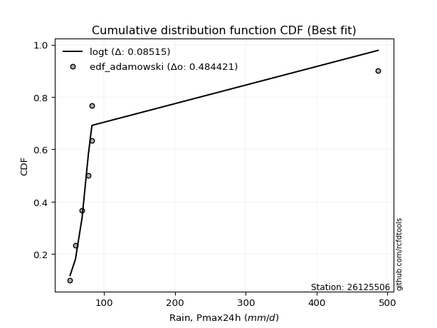</img>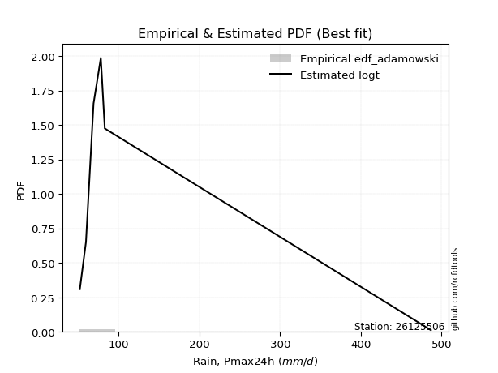</img>

</div>


## C. Best fit & Estimate extreme values for specific return periods - Tr


### 1. Best fit (ordered by delta Δ)

<div align="center">

|   id |   station | empirical_dist   | p_dist   |     delta |   deltao | eval   |   fit |   n |   best_fit |   best_fit_sort |
|-----:|----------:|:-----------------|:---------|----------:|---------:|:-------|------:|----:|-----------:|----------------:|
|    0 |  26125506 | edf_adamowski    | logt     | 0.0851504 | 0.484421 | Δo > Δ |     1 |   7 |          1 |               1 |
|    1 |  26125506 | edf_jenkinson    | logt     | 0.0851504 | 0.484421 | Δo > Δ |     1 |   7 |          1 |               2 |
|    2 |  26125506 | edf_filliben     | logt     | 0.0851504 | 0.484421 | Δo > Δ |     1 |   7 |          1 |               3 |
|    3 |  26125506 | edf_tukey        | logt     | 0.0851504 | 0.484421 | Δo > Δ |     1 |   7 |          1 |               4 |
|    4 |  26125506 | edf_chegodayev   | logt     | 0.0851504 | 0.484421 | Δo > Δ |     1 |   7 |          1 |               5 |
|    5 |  26125506 | edf_blom         | logt     | 0.0851504 | 0.484421 | Δo > Δ |     1 |   7 |          1 |               6 |
|    6 |  26125506 | edf_beard        | logt     | 0.0851504 | 0.484421 | Δo > Δ |     1 |   7 |          1 |               7 |
|    7 |  26125506 | edf_cunnane      | logt     | 0.0862076 | 0.484421 | Δo > Δ |     1 |   7 |          1 |               8 |
|    8 |  26125506 | edf_gringorten   | logt     | 0.0893287 | 0.484421 | Δo > Δ |     1 |   7 |          1 |               9 |
|    9 |  26125506 | edf_hazen        | logt     | 0.0941441 | 0.484421 | Δo > Δ |     1 |   7 |          1 |              10 |
|   10 |  26125506 | edf_weibull      | logt     | 0.102976  | 0.484421 | Δo > Δ |     1 |   7 |          1 |              11 |
|   11 |  26125506 | edf_california   | logt     | 0.165573  | 0.484421 | Δo > Δ |     1 |   7 |          1 |              12 |

</div>

:file_folder:Tables: [bestfit_26125506.csv](table/bestfit_26125506.csv) | [extreme_26125506.csv](table/extreme_26125506.csv)


### 2. Extreme values

In hydrology, a return period (or recurrence interval $Tr$) is the statistical average time between extreme events like floods or droughts of a specific magnitude, indicating how rare an event is, with a 100-year flood, for example, having a 1% chance of occurring in any given year, not that it happens exactly every century. It is a key tool for infrastructure design (like bridges or dams) and risk assessment, calculated from historical data to determine the probability of future events, although it is important to remember it is statistical average, and events can cluster or be missed.

> risk_rate: assuming the return period as the project useful life.

|   id |      tr |   prob_l |     prob_g |      alpha |   betaprime |    chi2 |   crystalball |   erlang |   expon |   exponnorm |          f |   fatiguelife |       fisk |    gamma |   genexpon |   genlogistic |    gibrat |   gompertz |   gumbel_l |   gumbel_r |   halflogistic |   halfnorm |   hypsecant |   invgamma |   invgauss |   invweibull |   johnsonsu |   kstwobign |   laplace |   laplace_asymmetric |   loggamma |   logistic |   lognorm |   maxwell |     mielke |    moyal |   nakagami |       ncf |       nct |    norm |   pareto |   pearson3 |   rayleigh |    rice |          t |   truncnorm |      wald |   weibull_min |        logalpha |   logbetaprime |          logchi2 |   logcrystalball |   logerlang |   logexpon |   logexponnorm |             logf |   logfatiguelife |          logfisk |   loggenexpon |   loggenlogistic |   loggibrat |   loggompertz |   loggumbel_l |   loggumbel_r |   loghalflogistic |   loghalfnorm |   loghypsecant |      loginvgamma |   loginvgauss |   loginvweibull |   logjohnsonsu |   logkstwobign |   loglaplace |   loglaplace_asymmetric |   logloggamma |   loglogistic |   loglognorm |   logmaxwell |       logmielke |   logmoyal |   lognakagami |           logncf |           lognct |   logpareto |   logpearson3 |   lograyleigh |   logrice |             logt |   logtruncnorm |    logwald |   logweibull_min |   station |   n |   risk_rate |
|-----:|--------:|---------:|-----------:|-----------:|------------:|--------:|--------------:|---------:|--------:|------------:|-----------:|--------------:|-----------:|---------:|-----------:|--------------:|----------:|-----------:|-----------:|-----------:|---------------:|-----------:|------------:|-----------:|-----------:|-------------:|------------:|------------:|----------:|---------------------:|-----------:|-----------:|----------:|----------:|-----------:|---------:|-----------:|----------:|----------:|--------:|---------:|-----------:|-----------:|--------:|-----------:|------------:|----------:|--------------:|----------------:|---------------:|-----------------:|-----------------:|------------:|-----------:|---------------:|-----------------:|-----------------:|-----------------:|--------------:|-----------------:|------------:|--------------:|--------------:|--------------:|------------------:|--------------:|---------------:|-----------------:|--------------:|----------------:|---------------:|---------------:|-------------:|------------------------:|--------------:|--------------:|-------------:|-------------:|----------------:|-----------:|--------------:|-----------------:|-----------------:|------------:|--------------:|--------------:|----------:|-----------------:|---------------:|-----------:|-----------------:|----------:|----:|------------:|
|    0 |    2    | 0.5      | 0.5        |    72.1205 |     86.5071 |  98.289 |       129.971 |  73.405  | 105.984 |     106.016 |    71.8817 |       76.2679 |    75.1331 |  80.7604 |    105.984 |       101.382 |   86.1238 |    108.544 |    153.97  |    105.973 |        94.0426 |    100.07  |     129.971 |    71.8817 |    72.0936 |      71.8832 |     82.7    |     124.032 |   129.971 |              105.984 |    60.1405 |    129.971 |   91.7425 |   117.478 |    71.8953 |  98.2258 |    83.7437 |   87.1153 |   84.3847 | 129.971 |  105.984 |    84.8377 |    113.047 | 137.269 |    76.1659 |     145.861 |   82.6193 |       97.1486 |    71.9853      |        62.8206 |     84.6935      |          91.7425 |     71.5743 |    76.9834 |        76.6101 |     71.94        |          71.7591 |     71.8413      |       76.9858 |          80.3375 |     74.3499 |       76.9379 |       102.928 |       81.7724 |           77.2266 |       79.4905 |        91.7425 |     71.9255      |       71.8006 |    72.0039      |        71.3511 |        87.438  |      91.7425 |                 76.982  |       92.0805 |       91.7425 |  51.9659     |      86.4091 |    72.0052      |    78.791  |       70.3097 |     71.9437      |     71.6453      |     71.4305 |       75.2669 |       84.5929 |   93.4636 |     74.6772      |        78.4803 |    73.1112 |     77.6311      |  26125506 |   7 |    0.75     |
|    1 |    2.33 | 0.570815 | 0.429185   |    77.331  |     96.2341 | 113.629 |       156.039 |  82.9438 | 117.923 |     117.98  |    77.8104 |       87.9709 |    83.375  |  90.6914 |    117.923 |       114.458 |   99.3286 |    121.046 |    176.649 |    130.128 |       118.877  |    128.203 |     150.833 |    77.8105 |    79.3131 |      77.8169 |     82.7    |     142.322 |   145.746 |              117.923 |    64.4558 |    152.939 |  103.954  |   144.56  |    77.7064 | 121.091  |   107.337  |   97.0408 |   92.7295 | 156.039 |  117.923 |   107.064  |    140.53  | 158.62  |    78.403  |     165.863 |   99.712  |      114.605  |    76.7598      |        66.8149 |    101.019       |         103.954  |     78.9654 |    84.0057 |        83.5221 |     77.1663      |          78.2433 |     77.0681      |       84.0089 |          86.823  |     79.2087 |       83.9451 |       114.75  |       91.8113 |           86.9906 |       90.9681 |       101.392  |     77.1484      |       77.7464 |    77.0983      |        77.0527 |        96.2092 |      98.9495 |                 84.0039 |      104.829  |      102.421  |  53.2586     |      98.3886 |    77.0981      |    87.9188 |       78.5717 |     77.1694      |     76.6868      |     77.3366 |       84.1021 |       96.5058 |  103.906  |     77.2465      |        85.86   |    79.3543 |     89.3107      |  26125506 |   7 |    0.729209 |
|    2 |    5    | 0.8      | 0.2        |   115.519  |    147.717  | 200.894 |       252.913 | 144.479  | 177.612 |     177.798 |   124.014  |      177.663  |   153.328  | 148.033  |    177.612 |       171.262 |  175.352  |    183.554 |    249.915 |    235.066 |       231.249  |    247.177 |     234.515 |   124.015  |   139.895  |     124.18   |     82.7    |     220.014 |   224.617 |              177.612 |   101.931  |    241.619 |  165.4    |   251.155 |   122.076  | 227.005  |   288.199  |  149.527  |  138.793  | 252.913 |  177.612 |   218.55   |    250.557 | 244.098 |    91.4576 |     259.928 |  195.398  |      231.65   |   111.249       |        96.5238 |    284.684       |         165.4    |    135.842  |   129.974  |       128.637  |    115.73        |         128.352  |    117.402       |      129.984  |         121.648  |    114.039  |      129.796  |       163.04  |      151.837  |          149.084  |      160.913  |       151.436  |    115.684       |      123.524  |   114.505       |       120.944  |       144.4    |     144.418  |                129.969  |      169.472  |      156.682  |   6.7035e+38 |     164.011  |   114.487       |   146.081  |      138.724  |    115.729       |    112.57        |    121.466  |      143.81   |      163.542  |  158.777  |     91.3532      |       133.434  |   125.542  |    215.161       |  26125506 |   7 |    0.67232  |
|    3 |   10    | 0.9      | 0.1        |   182.852  |    202.66   | 288.764 |       317.177 | 212.326  | 231.796 |     232.099 |   208      |      286.482  |   291.768  | 206.422  |    231.796 |       217.526 |  262.01   |    240.297 |    290.707 |    320.536 |       324.569  |    335.215 |     301.337 |   208      |   242.321  |     208.846  |     82.7    |     279.166 |   296.214 |              231.796 |   170.434  |    306.928 |  225.077  |   326.17  |   200.733  | 319.22   |   476.507  |  205.47   |  191.575  | 317.177 |  231.796 |   320.033  |    329.008 | 305.045 |   116.949  |     333.158 |  296.943  |      374.871  |   180.556       |       145.763  |    829.147       |         225.077  |    231.665  |   193.164  |       190.386  |    188.547       |         214.162  |    203.544       |      193.183  |         160.103  |    172.774  |      192.784  |       198.253 |      228.731  |          233.197  |      245.406  |       208.619  |    188.445       |      206.178  |   185.863       |       204.467  |       196.715  |     203.557  |                193.152  |      232.77   |      214.286  | inf          |     234.993  |   185.809       |   227.293  |      222.225  |    188.54        |    178.114       |    200.429  |      230.736  |      238.212  |  214.828  |    115.541       |       196.84   |   204.269  |    589.22        |  26125506 |   7 |    0.651322 |
|    4 |   15    | 0.933333 | 0.0666667  |   249.139  |    239.872  | 342.361 |       349.246 | 255.134  | 263.492 |     263.863 |   290.607  |      356.704  |   435.234  | 242.189  |    263.492 |       243.628 |  321.783  |    273.489 |    309.18  |    368.758 |       377.38   |    381.029 |     339.472 |   290.608  |   327.218  |     292.436  |     82.7    |     310.569 |   338.095 |              263.492 |   236.205  |    342.512 |  262.481  |   364.66  |   276.834  | 372.738  |   582.384  |  243.327  |  229.363  | 349.246 |  263.492 |   379.466  |    369.429 | 336.448 |   146.312  |     368.877 |  362.15   |      473.016  |   269.491       |       192.13   |   1601.26        |         262.481  |    319.889  |   243.545  |       239.461  |    270.022       |         294.157  |    314.784       |      243.574  |         186.94   |    230.105  |      242.982  |       216.612 |      288.219  |          300.382  |      305.683  |       250.467  |    269.855       |      288.527  |   267.266       |       295.088  |       231.802  |     248.818  |                243.527  |      272.608  |      254.143  | inf          |     282.612  |   267.179       |   293.771  |      285.806  |    270.013       |    250.188       |    281.741  |      303.182  |      289.148  |  251.04   |    143.427       |       245.947  |   279.232  |   1147.57        |  26125506 |   7 |    0.644736 |
|    5 |   20    | 0.95     | 0.05       |   315.125  |    268.99   | 381.097 |       370.247 | 286.519  | 285.981 |     286.4   |   372.383  |      408.528  |   581.913  | 268.087  |    285.981 |       261.903 |  368.67   |    297.04  |    320.679 |    402.522 |       414.381  |    411.574 |     366.375 |   372.384  |   399.07   |     375.397  |     82.7    |     331.723 |   367.81  |              285.981 |   300.235  |    367.106 |  290.284  |   390.204 |   351.399  | 410.639  |   654.412  |  272.935  |  260.016  | 370.247 |  285.981 |   421.656  |    396.297 | 357.32  |   178.868  |     390.653 |  410.743  |      548.639  |   388.002       |       237.641  |   2581.46        |         290.284  |    403.544  |   287.073  |       281.775  |    362.952       |         370.658  |    459.283       |      287.112  |         208.365  |    288.102  |      286.34   |       228.888 |      338.859  |          358.682  |      353.888  |       284.945  |    362.709       |      371.592  |   361.946       |       394.317  |       258.901  |     286.913  |                287.051  |      302.281  |      285.946  | inf          |     319.428  |   361.829       |   352.306  |      338.398  |    362.944       |    331.611       |    367.512  |      367.581  |      328.895  |  278.426  |    176.751       |       287.475  |   352.48   |   1900.18        |  26125506 |   7 |    0.641514 |
|    6 |   25    | 0.96     | 0.04       |   380.982  |    293.304  | 411.48  |       385.707 | 311.342  | 303.424 |     303.881 |   453.557  |      449.645  |   730.983  | 288.422  |    303.424 |       275.98  |  407.758  |    315.306 |    328.862 |    428.529 |       442.888  |    434.301 |     387.195 |   453.558  |   461.373  |     457.907  |     82.7    |     347.568 |   390.859 |              303.424 |   363.06   |    385.921 |  312.615  |   409.168 |   424.863  | 440.017  |   708.449  |  297.649  |  286.309  | 385.707 |  303.424 |   454.392  |    416.258 | 372.828 |   214.09   |     405.468 |  449.664  |      610.585  |   547.41        |       283.055  |   3757.75        |         312.615  |    483.999  |   326.127  |       319.68   |    468.996       |         444.724  |    645.501       |      326.173  |         226.529  |    347.478  |      325.231  |       238.045 |      383.853  |          411.208  |      394.624  |       314.853  |    468.666       |      455.662  |   472.07        |       502.72   |       281.255  |     320.433  |                326.099  |      326.146  |      312.936  | inf          |     349.829  |   471.93        |   405.587  |      383.85   |    468.995       |    423.947       |    458.481  |      426.583  |      361.925  |  300.69   |    216.865       |       324.099  |   424.785  |   2857.81        |  26125506 |   7 |    0.639603 |
|    7 |   50    | 0.98     | 0.02       |   709.644  |    379.871  | 507.376 |       429.977 | 390.607  | 357.608 |     358.182 |   853.666  |      581.361  |  1499.88   | 352.704  |    357.609 |       319.344 |  545.544  |    372.048 |    351.074 |    508.644 |       530.724  |    500.359 |     451.746 |   853.668  |   689.827  |     866.172  |     82.7001 |     394.097 |   462.456 |              357.609 |   666.808  |    443.405 |  386.528  |   464.167 |   781.811  | 531.218  |   866.533  |  385.578  |  384.736  | 429.977 |  357.608 |   556.127  |    474.204 | 417.845 |   420.229  |     440.547 |  576.743  |      820.519  |  2674.6         |       517.277  |  12339.4         |         386.528  |    857.483  |   484.678  |       473.132  |   1245.41        |         793.425  |   2611.29        |      484.763  |         293.047  |    672.665  |      483.062  |       264.792 |      563.591  |          626.52   |      541.646  |       429.046  |   1244.45        |      892.412  |  1326.74        |      1192.19   |       358.688  |     451.649  |                484.629  |      405.297  |      412.228  | inf          |     455.369  |  1326.75        |   628.007  |      554.092  |   1245.56        |   1093.94        |   1000.73   |      675.73   |      477.815  |  375.925  |    581.734       |       467.593  |   781.173  |  11093.7         |  26125506 |   7 |    0.63583  |
|    8 |   75    | 0.986667 | 0.0133333  |  1038.02   |    439.451  | 564.332 |       453.731 | 438.192  | 389.304 |     389.946 |  1247.78   |      660.599  |  2294.13   | 390.937  |    389.304 |       344.549 |  638.605  |    405.24  |    362.306 |    555.209 |       581.783  |    536.318 |     489.47  |  1247.79   |   846.13   |    1270      |     82.7007 |     419.697 |   504.337 |              389.304 |   961.148  |    476.606 |  433.148  |   494.069 |  1128.14   | 584.551  |   952.741  |  446.051  |  456.517  | 453.731 |  389.304 |   615.666  |    505.728 | 442.336 |   663.229  |     454.399 |  654.942  |      955.066  | 11949           |       770.316  |  25056.5         |         433.148  |   1203.08   |   611.092  |       595.09   |   2573.36        |        1121.47   |   8095.89        |      611.21   |         340.352  |   1050.88   |      608.843  |       279.441 |      704.553  |          800.274  |      643.55   |       514.096  |   2571.38        |     1354.55   |  2913.91        |      2147.73   |       410.039  |     552.075  |                611.023  |      455.321  |      483.35   | inf          |     525.556  |  2915.11        |   810.966  |      676.689  |   2573.99        |   2237.49        |   1701.42   |      883.141  |      555.768  |  424.486  |   1508.36        |       577.108  |  1136.47   |  26002.8         |  26125506 |   7 |    0.634587 |
|    9 |  100    | 0.99     | 0.01       |  1366.31   |    486.356  | 605.055 |       469.798 | 472.395  | 411.793 |     412.483 |  1638.06   |      717.589  |  3105.16   | 418.293  |    411.793 |       362.388 |  710.695  |    428.789 |    369.653 |    588.167 |       617.921  |    560.815 |     516.229 |  1638.07   |   966.198  |    1670.98   |     82.7032 |     437.237 |   534.053 |              411.793 |  1250.33   |    500.046 |  467.828  |   514.436 |  1467.79   | 622.388  |  1011.4    |  493.634  |  515.161  | 469.798 |  411.793 |   657.919  |    527.205 | 459.021 |   933.802  |     461.851 |  711.956  |     1055.57   | 51607           |      1044.87   |  41611.2         |         467.828  |   1532.11   |   720.313  |       700.245  |   4687.49        |        1437.41   |  21753.7         |      720.46   |         378.379  |   1484.73   |      717.485  |       289.459 |      825.146  |          951.652  |      723.743  |       584.462  |   4684.03        |     1838.72   |  5640.58        |      3397.01   |       449.406  |     636.598  |                720.226  |      492.572  |      540.835  | inf          |     579.46   |  5645.34        |   972.254  |      775.33   |   4689.24        |   4067.14        |   2574.56   |     1067.32   |      616.04   |  461.114  |   3831.39        |       668.892  |  1493.69   |  48776.1         |  26125506 |   7 |    0.633968 |
|   10 |  200    | 0.995    | 0.005      |  2679.31   |    617.648  | 704.061 |       506.241 | 556.05   | 465.977 |     466.784 |  3175.92   |      857.033  |  6455.13   | 484.855  |    465.977 |       405.275 |  906.826  |    485.53  |    385.623 |    667.4   |       704.802  |    616.842 |     580.694 |  3175.93   |  1283.36   |    3257.69   |     82.8043 |     477.635 |   605.649 |              465.977 |  2380.7    |    556.276 |  557.137  |   561.034 |  2786.42   | 713.551  |  1145.17   |  626.735  |  688.455  | 506.241 |  465.977 |   759.754  |    576.347 | 497.198 |  2213.7    |     473.794 |  853.973  |     1314.28   |     1.60328e+07 |      2367.71   | 143126           |         557.137  |   2754.89   |  1070.5    |      1036.38   |  28379.9         |        2633.96   | 547096           |     1070.76   |         488.102  |   3801.83   |     1065.67   |       312.489 |     1206.41   |         1443.32   |      946.744  |       796.11   |  28365.1         |     3951.87   | 42982.2         |     11936.5    |       555.06   |     897.282  |               1070.36   |      588.619  |      708.164  | inf          |     724.502  | 43094.4         |  1505.15   |     1057.9    |  28404.2         |  25194.6         |   8082.03   |     1682.21   |      779.688  |  557.257  | 141347           |       949.205  |  2950.78   | 240494           |  26125506 |   7 |    0.633042 |
|   11 |  250    | 0.996    | 0.004      |  3335.77   |    666.144  | 736.164 |       517.378 | 583.303  | 483.42  |     484.265 |  3935.55   |      902.465  |  8173.8    | 506.452  |    483.421 |       419.063 |  977.198  |    503.797 |    390.321 |    692.872 |       732.733  |    634.078 |     601.446 |  3935.57   |  1393      |    4044.14   |     83.0032 |     490.138 |   628.698 |              483.421 |  2936.89   |    574.328 |  587.691  |   575.378 |  3429.99   | 742.898  |  1186.18   |  675.868  |  755.621  | 517.378 |  483.42  |   792.544  |    591.473 | 508.949 |  2944.25   |     476.304 |  900.956  |     1402.39   |     2.7553e+08  |      3166.24   | 213757           |         587.691  |   3331.29   |  1216.14   |      1175.79   |  57587.1         |        3207.32   |      2.13572e+06 |     1216.43   |         529.739  |   5327.33   |     1210.41   |       319.608 |     1363.1    |         1650.12   |     1028.3    |       879.384  |  57564.7         |     5095.26   | 97079.7         |     18791.5    |       592.542  |    1002.11   |               1215.96   |      621.511  |      772.179  | inf          |     776.075  | 97416.8         |  1732.53   |     1163.85   |  57649.4         |  52123.9         |  12267.3    |     1946.81   |      838.33   |  590.708  | 818899           |      1060.68   |  3696.2    | 411315           |  26125506 |   7 |    0.632858 |
|   12 |  500    | 0.998    | 0.002      |  6618      |    839.639  | 836.48  |       550.405 | 668.787  | 537.605 |     538.566 |  7680.32   |     1044.96   | 17030.1    | 573.974  |    537.605 |       461.856 | 1220.4    |    560.537 |    403.791 |    771.933 |       819.426  |    685.469 |     665.907 |  7680.36   |  1753.84   |    7936.66   |     89.8809 |     527.605 |   700.295 |              537.605 |  5676.47   |    630.313 |  688.511  |   618.181 |  6558.77   | 834.058  |  1308      |  851.531  | 1008.47   | 550.405 |  537.605 |   894.421  |    636.607 | 544.013 |  7224.3    |     481.458 | 1050.35   |     1690.59   |     3.87915e+14 |      8584.94   | 749696           |         688.511  |   6027.58   |  1807.38   |      1740.2    | 858940           |        5943.4    |      5.92921e+08 |     1807.88   |         682.975  |  17094.8    |     1797.81   |       340.926 |     1991.27   |         2500.4    |     1315.57   |      1197.8    | 859183           |    11460.5    |     2.33957e+06 |     91070.8    |       720.718  |    1412.47   |               1807.09   |      730.128  |     1009.9    | inf          |     952.838  |     2.35711e+06 |  2682.1    |     1546.18   | 860719           | 874737           |  53501.2    |     3061.76   |     1040.84   |  702.931  |      4.09673e+09 |      1490.17   |  7564.6    |      2.33192e+06 |  26125506 |   7 |    0.632489 |
|   13 |  750    | 0.998667 | 0.00133333 |  9900.2    |    959.505  | 895.525 |       568.752 | 719.296  | 569.301 |     570.33  | 11369.2    |     1129.14   | 26172.6    | 613.737  |    569.301 |       486.874 | 1381.24   |    593.727 |    410.989 |    818.152 |       870.106  |    714.178 |     703.614 | 11369.3    |  1977.53   |   11787.4    |    124.362  |     548.653 |   742.176 |              569.301 |  8380.75   |    663.022 |  751.811  |   642.121 |  9595.57   | 887.383  |  1375.75   |  972.806  | 1193.67   | 568.752 |  569.301 |   954.027  |    661.846 | 563.621 | 12271.4    |     483.217 | 1139.92   |     1869.06   |     5.29359e+20 |     16549.5    |      1.57041e+06 |         751.811  |   8541.69   |  2278.78   |      2188.76   |      6.42028e+06 |        8552.33   |      5.75129e+10 |     2279.45   |         792.339  |  36960.4    |     2265.93   |       352.897 |     2485.18   |         3188.06   |     1509.68   |      1435.13   |      6.42627e+06 |    18661.3    |     2.65683e+07 |    260531      |       804.53   |    1726.54   |               2278.39   |      798.376  |     1181.35   | inf          |    1068.71   |     2.68644e+07 |  3463.35   |     1811.44   |      6.43904e+06 |      7.41394e+06 | 145635      |     3987.85   |     1174.71   |  774.736  |      1.55866e+13 |      1811.87   | 11621.8    |      6.73701e+06 |  26125506 |   7 |    0.632366 |
|   14 | 1000    | 0.999    | 0.001      | 13182.4    |   1054.02   | 937.56  |       581.384 | 755.329  | 591.789 |     592.866 | 15022.2    |     1189.18   | 35505.7    | 642.054  |    591.789 |       504.619 | 1504.33   |    617.276 |    415.834 |    850.937 |       906.056  |    734.006 |     730.367 | 15022.3    |  2141.22   |   15611.4    |    222.481  |     563.235 |   771.891 |              591.789 | 11067.1    |    686.218 |  798.745  |   658.667 | 12574.2    | 925.218  |  1422.4    | 1068.39   | 1345.25   | 581.384 |  591.789 |   996.323  |    679.287 | 577.17  | 17891.5    |     484.105 | 1204.35   |     1999.99   |     7.16189e+26 |     27329.4    |      2.65931e+06 |         798.745  |  10946.1    |  2686.07   |      2575.52   |      3.38745e+07 |       11085.2    |      3.14965e+12 |     2686.89   |         880.376  |  66680.4    |     2670.26   |       361.189 |     2908.14   |         3787.68   |     1660.22   |      1631.51   |      3.3927e+07  |    26516      |     2.04748e+08 |    584354      |       868.244  |    1990.88   |               2685.58   |      848.997  |     1320.3    | inf          |    1156.94   |     2.07722e+08 |  4152.11   |     2020.46   |      3.39995e+07 |      4.42976e+07 | 318189      |     4809.11   |     1277.15   |  828.6    |      4.98909e+16 |      2078.26   | 15827.7    |      1.45877e+07 |  26125506 |   7 |    0.632305 |

<div align="center">

</img>

</div>


<div align="center">

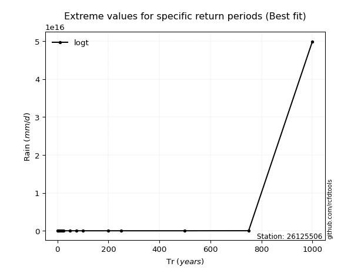</img>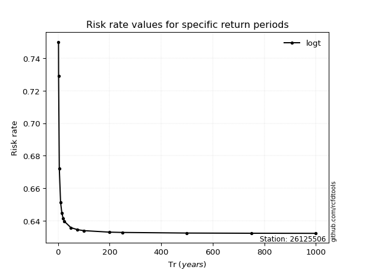</img>

</div>


<sub>**APP DISCLAIMER**: NO WARRANTY - This software is provided by [github.com/rcfdtools](https://github.com/rcfdtools) "as is", without any express or implied warranty, including warranties of merchantability, fitness for a particular purpose, or non-infringement. There is no guarantee that the software will be error-free or operate without interruption. LIMITATION OF LIABILITY - Neither the authors nor copyright holders will be liable for claims or damages arising from the software or its use. You are responsible for determining if the software is appropriate for your use and assume all associated risks, including errors, legal compliance, and data loss. NO PROFESSIONAL ADVICE - The software provides general information and does not offer professional advice. It should not replace consultation with professional advisors.</sub>