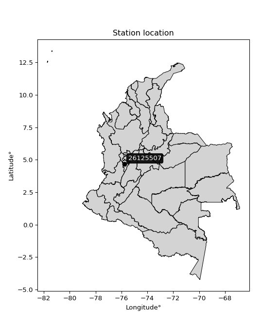

<div align="center">


</div>

# PMP Station (Rain, Pmax24h): 26125507

Probable Maximum Precipitation (PMP) is the greatest amount of rainfall for a specific duration that is meteorologically possible for a given location, acting as a "worst-case" scenario for extreme storms, crucial for designing safety-critical infrastructure like bridges, river deviations, dams, spillways, and nuclear plants to prevent catastrophic failure. PMP is calculated by hydrologists using meteorological data to determine the upper limit of extreme rainfall, often leading to the Probable Maximum Flood (PMF) for flood control design, and is increasingly being studied for climate change impacts. Probable Maximum Precipitation (PMP) is the theoretical upper limit of rainfall, a deterministic estimate for extreme events, while probability distributions (like GEV, Gumbel) describe the likelihood and frequency of various precipitation amounts, including rare ones, showing how often events occur, with PMP representing the extreme end of these distributions, used for critical infrastructure design to ensure safety against the worst conceivable weather, unlike standard statistical forecasts which cover typical probabilities.

The most common probability distributions in hydrology, used for analyzing floods, rainfall, and streamflow, include the Normal, Log-Normal, Gumbel, Gamma (including Log-Pearson Type III), and Generalized Extreme Value (GEV) distributions, often chosen based on the data´s skewness and whether modeling extremes or general conditions, with Gumbel and GEV popular for extreme events like floods, while the Normal distribution serves as a baseline, though often requiring transformations for skewed hydrological data. These distributions help in designing water infrastructure, managing water resources, and forecasting hydrologic events.

> Hydrological data often isn´t perfectly normal (it´s skewed), so different distributions are needed for different applications, such as: **Flood Frequency Analysis**: Using Gumbel, GEV, or Log-Pearson Type III for predicting extreme flood magnitudes and their return periods, **Rainfall Analysis**: Normal for annual totals, but Log-Normal, Weibull, or GEV for intensity or extreme daily rainfall, **Streamflow Modeling**: Gamma and Log-Normal for maximum flows, GEV for minimum flows, and Kappa for daily flows.

<div align="center">

</img>

</div>


## A. General information


### 1. General running parameters

• app_version: _v20260113_. • runtime: _2026-01-17 18:24:04.630693_. • Python version: _3.14.0_. • SciPy version: _1.16.3_. • Pandas version: _2.3.3_. • NumPy version: _2.3.5_. • Stations dataset (station_dataset_file): _dataset/pmax24h_in/automatic_colombia_2003_2025.csv_. • Stations catalog (station_catalog_file): _dataset/CNE.xls_. • Minimum year to eval til year_max (date_min): _1900_. • Maximum year to eval since year_min (date_max): _2025_. • Creates, save and include plots into reports (create_plot): _False_. • Plot only fit distributions with Δo > Δ (plot_only_fit): _True_. • Plot only simple graphs avoiding multiple CDFs and multiple Extreme values plots (plot_only_simple): _True_. • Eval low extreme values, if False, evaluates high extreme values (low_extreme): _False_. • Eval every SciPy distribution as logarithmic (pdist_logarithmic_on): _True_. • Standard deviation normalized (ddof): _1.0_. • Return periods to eval in years (Tr): _[2, 2.33, 5, 10, 15, 20, 25, 50, 75, 100, 200, 250, 500, 750, 1000]_. • Minimum data sample per station, 0 means any (minimum_sample): _5_. • Z-Score maximum threshold to adjust a value, 0 means disable (zscore_max): _3.5_. • Z-Score minimum threshold to adjust a value, 0 means disable (zscore_min): _-2.5_. • Avoid zeros, e.g. rain = 0 (avoid_zeros): _True_. • Avoid null values (avoid_nans): _True_. 

:file_folder:Table: [dataset.csv](../../dataset/pmax24h_in/automatic_colombia_2003_2025.csv)

> Delta Degrees of Freedom (DDOF): is a parameter used in the formulas for calculating variance and standard deviation. When ddof=0, the divisor is $N$ (the total number of observations) and this is used when your data set is the entire population. When ddof=1, the divisor is $N-1$ and this is used when your data set is a sample drawn from a larger population. Using $N-1$ provides an unbiased estimate of the population variance (known as Bessel´s correction).


### 2. Station info and location

|   id |   CODIGO | NOMBRE                          | CATEGORIA               | TECNOLOGIA                | ESTADO   | FECHA_INSTALACION   |   FECHA_SUSPENSION |   ALTITUD |   LATITUD |   LONGITUD | DEPARTAMENTO    | MUNICIPIO   | AREA_OPERATIVA                         | ENTIDAD                                    | AREA_HIDROGRAFICA   | ZONA_HIDROGRAFICA   | SUBZONA_HIDROGRAFICA   |   CORRIENTE | Catalogo   |   Version |
|-----:|---------:|:--------------------------------|:------------------------|:--------------------------|:---------|:--------------------|-------------------:|----------:|----------:|-----------:|:----------------|:------------|:---------------------------------------|:-------------------------------------------|:--------------------|:--------------------|:-----------------------|------------:|:-----------|----------:|
|    0 | 26125507 | ARTURO GOMEZ  - AUT  [26125507] | Climatológica Principal | Automática con Telemetría | Activa   | 11/09/2013          |                nan |      1259 |   4.67139 |   -75.7772 | Valle Del Cauca | Alcalá      | Area Operativa 09 - Cauca-Valle-Caldas | CENTRO NACIONAL DE INVESTIGACIONES DE CAFE | Magdalena Cauca     | Cauca               | Río La Vieja           |         nan | CNE_OE     |  20251226 |

<div align="center">

Dynamic map: [:earth_americas:Google](http://maps.google.com/maps?q=4.671388889,-75.77721944) [:earth_americas:OSM](https://www.openstreetmap.org/#map=18/4.671388889/-75.77721944&layers=P) [:earth_americas:Bing](https://www.bing.com/maps?cp=4.671388889~-75.77721944&lvl=18) [:earth_americas:Apple](https://maps.apple.com/frame?center=4.671388889%2C-75.77721944&span=0.003%2C0.006)

</div>


<div align="center">

```geojson
{
  "type": "Feature",
  "geometry": {
    "type": "Point", 
    "coordinates": [-75.77721944, 4.671388889]
  }, 
  "properties": {
    "Name": "26125507"
  }
}
```

</div>


### 3. Discrete values table and plot

<div align="center">

|               |          0 |           1 |           2 |            3 |          4 |
|:--------------|-----------:|------------:|------------:|-------------:|-----------:|
| Date          | 2017       | 2018        | 2019        | 2020         | 2021       |
| Value         |   80.7     |   62.3      |   56.7      |   52         |   12.3     |
| Value_initial |   80.7     |   62.3      |   56.7      |   52         |   12.3     |
| count         |    5       |    5        |    5        |    5         |    5       |
| mean          |   52.8     |   52.8      |   52.8      |   52.8       |   52.8     |
| std           |   25.1235  |   25.1235   |   25.1235   |   25.1235    |   25.1235  |
| zscore        |    1.11051 |    0.378132 |    0.155233 |   -0.0318427 |   -1.61204 |


</div>


> The initial value (value_initial) correspond to the initial obtained or null completed value, and value (value) is adjusted only when the initial value is outside the valid range (outlier) definite through the Z-Score value. If Z-Score is active, values out of range or outliers are replaced with the station mean value. A Z-Score (or standard score) measures how many standard deviations a data point is from the mean of a dataset, indicating its relative position; positive scores mean above the mean, negative mean below, and a score of zero is exactly at the mean, allowing for comparison of values from different distributions. It´s calculated using the formula $z=(x–μ)/σ$, where $x$ is the data point, $μ$ is the mean, and $σ$ is the standard deviation, helping identify outliers and understand probability.
>
> <sub>**Note**: In this study, "completing" (filling gaps in) and "extending" (forecasting or lengthening the historical record) rainfall data series are avoided for certain critical analyses because they introduce artificial bias and uncertainty, which can distort the statistics of rare events (extremes), alter day-to-day variability, and compromise the integrity and homogeneity of the original data. Some reasons against Completing/Extending rainfall data are: **Distortion of Extremes and Variability**: The primary issue is that most gap-filling or extension methods rely on averaging or regression with nearby stations, which inherently smooths the data. Rainfall is highly variable in space and time, with a large percentage of zero values and occasional large storms. Infilling methods often underestimate the highest values and overestimate the lowest (zero) values, which severely distorts analyses focused on flood frequency, drought severity, and intensity-duration-frequency (IDF) curves, **Loss of Data Homogeneity**: Infilled or extended data are synthetic estimates, not actual measurements. Combining these estimates with observed data can violate the assumption of data homogeneity, which requires that the data properties do not change over time. Inhomogeneity can lead to incorrect conclusions about long-term trends or changes in climate patterns, **Propagation of Errors**: Errors and biases from the original data (e.g., wind-induced undercatch, instrument errors, site changes) or the data used for imputation can propagate through the analysis, leading to unreliable hydrological models and inaccurate predictions, **Compromised Statistical Integrity**: For statistical analyses, especially those involving the frequency of events, using artificial data can introduce time bias or autocorrelation that doesn´t exist in reality, making it difficult to assess the true probability of events, **Difficulty in Validation**: It is difficult to accurately validate the quality of filled or extended data, especially for past periods where ground-truth measurements are unavailable. The reliability of imputation techniques heavily depends on the density of the surrounding station network and the complexity of the local topography.</sub>


### 4. Active continuous probability distributions from SciPy (80 of 104 available)

A Probability Density Function (PDF) describes the relative likelihood of a continuous random variable falling within a specific range, where the total area under its curve equals 1, and the area over any interval gives the actual probability for that range. Unlike discrete probabilities (like rolling a die), a PDF shows density, not direct probability for a single point (which is zero), with higher points indicating higher likelihood, often visualized as a bell curve for normal distributions.

A log of a probability density function (log-PDF) is simply the logarithm of the PDF´s value, denoted as $log(f(x))$, useful for converting multiplication of probabilities into addition, improving numerical stability with tiny numbers, and connecting to information theory concepts like entropy. Instead of dealing with very small probabilities (e.g., 0.000001), log-PDFs use negative numbers (e.g., $log(0.00001) ≈ -11.51$ that are easier for computers to handle, preventing underflow errors and simplifying complex calculations. In this study, each active probability distribution from SciPy is also evaluated in the $log$ form.

[scipy.stats](https://docs.scipy.org/doc/scipy/reference/stats.html) is a Python´s powerful submodule within the SciPy library for comprehensive statistical analysis, offering over 130 probability distributions (like Normal, Poisson), functions for descriptive stats (mean, variance), hypothesis testing (t-tests, chi-square), random variable generation, and statistical tests, making it essential for data science, modeling, and research. It provides tools to explore, model, and draw conclusions from data efficiently, working seamlessly with NumPy.

<div align="center">

|   id | p_dist           |   n_parameter | fit_method   | label                                                                       | active   | ref                                                                                                      |
|-----:|:-----------------|--------------:|:-------------|:----------------------------------------------------------------------------|:---------|:---------------------------------------------------------------------------------------------------------|
|    0 | alpha            |             3 | MLE          | Alpha                                                                       | True     | [:mortar_board:](https://docs.scipy.org/doc/scipy/reference/generated/scipy.stats.alpha.html)            |
|    1 | anglit           |             2 | MM           | Anglit                                                                      | True     | [:mortar_board:](https://docs.scipy.org/doc/scipy/reference/generated/scipy.stats.anglit.html)           |
|    2 | arcsine          |             2 | MM           | Arcsine                                                                     | True     | [:mortar_board:](https://docs.scipy.org/doc/scipy/reference/generated/scipy.stats.arcsine.html)          |
|    3 | argus            |             3 | MLE          | Argus                                                                       | True     | [:mortar_board:](https://docs.scipy.org/doc/scipy/reference/generated/scipy.stats.argus.html)            |
|    4 | beta             |             4 | MLE          | Beta                                                                        | True     | [:mortar_board:](https://docs.scipy.org/doc/scipy/reference/generated/scipy.stats.beta.html)             |
|    5 | betaprime        |             4 | MLE          | Beta prime                                                                  | True     | [:mortar_board:](https://docs.scipy.org/doc/scipy/reference/generated/scipy.stats.betaprime.html)        |
|    6 | bradford         |             3 | MLE          | Bradford                                                                    | True     | [:mortar_board:](https://docs.scipy.org/doc/scipy/reference/generated/scipy.stats.bradford.html)         |
|    7 | burr             |             4 | MLE          | Burr (Type III)                                                             | True     | [:mortar_board:](https://docs.scipy.org/doc/scipy/reference/generated/scipy.stats.burr.html)             |
|    8 | burr12           |             4 | MLE          | Burr (Type III) 12                                                          | True     | [:mortar_board:](https://docs.scipy.org/doc/scipy/reference/generated/scipy.stats.burr12.html)           |
|    9 | cosine           |             2 | MLE          | Cosine                                                                      | True     | [:mortar_board:](https://docs.scipy.org/doc/scipy/reference/generated/scipy.stats.cosine.html)           |
|   10 | crystalball      |             4 | MLE          | Crystalball                                                                 | True     | [:mortar_board:](https://docs.scipy.org/doc/scipy/reference/generated/scipy.stats.crystalball.html)      |
|   11 | dgamma           |             3 | MLE          | Double gamma                                                                | True     | [:mortar_board:](https://docs.scipy.org/doc/scipy/reference/generated/scipy.stats.dgamma.html)           |
|   12 | dweibull         |             3 | MLE          | Double Weibull                                                              | True     | [:mortar_board:](https://docs.scipy.org/doc/scipy/reference/generated/scipy.stats.dweibull.html)         |
|   13 | erlang           |             3 | MLE          | Erlang                                                                      | True     | [:mortar_board:](https://docs.scipy.org/doc/scipy/reference/generated/scipy.stats.erlang.html)           |
|   14 | exponnorm        |             3 | MLE          | Exponentially modified Normal                                               | True     | [:mortar_board:](https://docs.scipy.org/doc/scipy/reference/generated/scipy.stats.exponnorm.html)        |
|   15 | exponpow         |             3 | MLE          | Exponential power                                                           | True     | [:mortar_board:](https://docs.scipy.org/doc/scipy/reference/generated/scipy.stats.exponpow.html)         |
|   16 | exponweib        |             4 | MLE          | Exponentiated Weibull                                                       | True     | [:mortar_board:](https://docs.scipy.org/doc/scipy/reference/generated/scipy.stats.exponweib.html)        |
|   17 | f                |             4 | MLE          | F                                                                           | True     | [:mortar_board:](https://docs.scipy.org/doc/scipy/reference/generated/scipy.stats.f.html)                |
|   18 | fatiguelife      |             3 | MLE          | Fatigue-life (Birnbaum-Saunders)                                            | True     | [:mortar_board:](https://docs.scipy.org/doc/scipy/reference/generated/scipy.stats.fatiguelife.html)      |
|   19 | foldnorm         |             3 | MM           | Fold Normal                                                                 | True     | [:mortar_board:](https://docs.scipy.org/doc/scipy/reference/generated/scipy.stats.foldnorm.html)         |
|   20 | gamma            |             3 | MLE          | Gamma                                                                       | True     | [:mortar_board:](https://docs.scipy.org/doc/scipy/reference/generated/scipy.stats.gamma.html)            |
|   21 | gausshyper       |             6 | MLE          | Gauss hypergeometric                                                        | True     | [:mortar_board:](https://docs.scipy.org/doc/scipy/reference/generated/scipy.stats.gausshyper.html)       |
|   22 | genexpon         |             5 | MLE          | Generalized exponential                                                     | True     | [:mortar_board:](https://docs.scipy.org/doc/scipy/reference/generated/scipy.stats.genexpon.html)         |
|   23 | genextreme       |             3 | MLE          | Generalized exponential                                                     | True     | [:mortar_board:](https://docs.scipy.org/doc/scipy/reference/generated/scipy.stats.genextreme.html)       |
|   24 | gengamma         |             4 | MLE          | Generalized gamma                                                           | True     | [:mortar_board:](https://docs.scipy.org/doc/scipy/reference/generated/scipy.stats.gengamma.html)         |
|   25 | genhalflogistic  |             3 | MLE          | Generalized half-logistic                                                   | True     | [:mortar_board:](https://docs.scipy.org/doc/scipy/reference/generated/scipy.stats.genhalflogistic.html)  |
|   26 | genlogistic      |             3 | MLE          | Generalized logistic                                                        | True     | [:mortar_board:](https://docs.scipy.org/doc/scipy/reference/generated/scipy.stats.genlogistic.html)      |
|   27 | gennorm          |             3 | MLE          | Generalized Normal                                                          | True     | [:mortar_board:](https://docs.scipy.org/doc/scipy/reference/generated/scipy.stats.gennorm.html)          |
|   28 | genpareto        |             3 | MLE          | Generalized Pareto                                                          | True     | [:mortar_board:](https://docs.scipy.org/doc/scipy/reference/generated/scipy.stats.genpareto.html)        |
|   29 | gompertz         |             3 | MLE          | Gompertz (or truncated Gumbel)                                              | True     | [:mortar_board:](https://docs.scipy.org/doc/scipy/reference/generated/scipy.stats.gompertz.html)         |
|   30 | gumbel_l         |             2 | MM           | Gumbel Left Skew                                                            | True     | [:mortar_board:](https://docs.scipy.org/doc/scipy/reference/generated/scipy.stats.gumbel_l.html)         |
|   31 | gumbel_r         |             2 | MM           | Gumbel Right Skew                                                           | True     | [:mortar_board:](https://docs.scipy.org/doc/scipy/reference/generated/scipy.stats.gumbel_r.html)         |
|   32 | halfgennorm      |             3 | MLE          | Upper half of a generalized normal                                          | True     | [:mortar_board:](https://docs.scipy.org/doc/scipy/reference/generated/scipy.stats.halfgennorm.html)      |
|   33 | halflogistic     |             2 | MM           | Half-logistic                                                               | True     | [:mortar_board:](https://docs.scipy.org/doc/scipy/reference/generated/scipy.stats.halflogistic.html)     |
|   34 | halfnorm         |             2 | MM           | Half Normal                                                                 | True     | [:mortar_board:](https://docs.scipy.org/doc/scipy/reference/generated/scipy.stats.halfnorm.html)         |
|   35 | hypsecant        |             2 | MM           | hyperbolic secant                                                           | True     | [:mortar_board:](https://docs.scipy.org/doc/scipy/reference/generated/scipy.stats.hypsecant.html)        |
|   36 | invgamma         |             3 | MLE          | Inverted gamma                                                              | True     | [:mortar_board:](https://docs.scipy.org/doc/scipy/reference/generated/scipy.stats.invgamma.html)         |
|   37 | invgauss         |             3 | MLE          | Inverse Gaussian                                                            | True     | [:mortar_board:](https://docs.scipy.org/doc/scipy/reference/generated/scipy.stats.invgauss.html)         |
|   38 | invweibull       |             3 | MLE          | Inverted Weibull                                                            | True     | [:mortar_board:](https://docs.scipy.org/doc/scipy/reference/generated/scipy.stats.invweibull.html)       |
|   39 | johnsonsb        |             4 | MLE          | Johnson SB                                                                  | True     | [:mortar_board:](https://docs.scipy.org/doc/scipy/reference/generated/scipy.stats.johnsonsb.html)        |
|   40 | johnsonsu        |             4 | MLE          | Johnson Su                                                                  | True     | [:mortar_board:](https://docs.scipy.org/doc/scipy/reference/generated/scipy.stats.johnsonsu.html)        |
|   41 | kappa3           |             3 | MLE          | Kappa 3                                                                     | True     | [:mortar_board:](https://docs.scipy.org/doc/scipy/reference/generated/scipy.stats.kappa3.html)           |
|   42 | kappa4           |             4 | MLE          | Kappa 4                                                                     | True     | [:mortar_board:](https://docs.scipy.org/doc/scipy/reference/generated/scipy.stats.kappa4.html)           |
|   43 | ksone            |             3 | MLE          | Kolmogorov-Smirnov one-sided test statistic distribution                    | True     | [:mortar_board:](https://docs.scipy.org/doc/scipy/reference/generated/scipy.stats.ksone.html)            |
|   44 | kstwobign        |             2 | MLE          | Limiting distribution of scaled Kolmogorov-Smirnov two-sided test statistic | True     | [:mortar_board:](https://docs.scipy.org/doc/scipy/reference/generated/scipy.stats.kstwobign.html)        |
|   45 | laplace          |             2 | MM           | Laplace                                                                     | True     | [:mortar_board:](https://docs.scipy.org/doc/scipy/reference/generated/scipy.stats.laplace.html)          |
|   46 | levy_l           |             2 | MLE          | Left-skewed Levy                                                            | True     | [:mortar_board:](https://docs.scipy.org/doc/scipy/reference/generated/scipy.stats.levy_l.html)           |
|   47 | loggamma         |             3 | MLE          | Log gamma                                                                   | True     | [:mortar_board:](https://docs.scipy.org/doc/scipy/reference/generated/scipy.stats.loggamma.html)         |
|   48 | logistic         |             2 | MM           | Logistic (or Sech-squared)                                                  | True     | [:mortar_board:](https://docs.scipy.org/doc/scipy/reference/generated/scipy.stats.logistic.html)         |
|   49 | loglaplace       |             3 | MLE          | Log-Laplace                                                                 | True     | [:mortar_board:](https://docs.scipy.org/doc/scipy/reference/generated/scipy.stats.loglaplace.html)       |
|   50 | lomax            |             3 | MLE          | Lomax (Pareto of the second kind)                                           | True     | [:mortar_board:](https://docs.scipy.org/doc/scipy/reference/generated/scipy.stats.lomax.html)            |
|   51 | maxwell          |             2 | MM           | Maxwell                                                                     | True     | [:mortar_board:](https://docs.scipy.org/doc/scipy/reference/generated/scipy.stats.maxwell.html)          |
|   52 | mielke           |             4 | MLE          | Mielke Beta-Kappa / Dagum                                                   | True     | [:mortar_board:](https://docs.scipy.org/doc/scipy/reference/generated/scipy.stats.mielke.html)           |
|   53 | moyal            |             2 | MM           | Moyal                                                                       | True     | [:mortar_board:](https://docs.scipy.org/doc/scipy/reference/generated/scipy.stats.moyal.html)            |
|   54 | nakagami         |             3 | MLE          | Nakagami                                                                    | True     | [:mortar_board:](https://docs.scipy.org/doc/scipy/reference/generated/scipy.stats.nakagami.html)         |
|   55 | ncf              |             5 | MLE          | Non-central F distribution                                                  | True     | [:mortar_board:](https://docs.scipy.org/doc/scipy/reference/generated/scipy.stats.ncf.html)              |
|   56 | nct              |             4 | MLE          | Non-central Student’s t                                                     | True     | [:mortar_board:](https://docs.scipy.org/doc/scipy/reference/generated/scipy.stats.nct.html)              |
|   57 | norm             |             2 | MM           | Normal                                                                      | True     | [:mortar_board:](https://docs.scipy.org/doc/scipy/reference/generated/scipy.stats.norm.html)             |
|   58 | pearson3         |             3 | MM           | Pearson type III                                                            | True     | [:mortar_board:](https://docs.scipy.org/doc/scipy/reference/generated/scipy.stats.pearson3.html)         |
|   59 | powerlaw         |             3 | MLE          | Power-function                                                              | True     | [:mortar_board:](https://docs.scipy.org/doc/scipy/reference/generated/scipy.stats.powerlaw.html)         |
|   60 | rayleigh         |             2 | MM           | Rayleigh                                                                    | True     | [:mortar_board:](https://docs.scipy.org/doc/scipy/reference/generated/scipy.stats.rayleigh.html)         |
|   61 | rdist            |             3 | MLE          | R-distributed (symmetric beta)                                              | True     | [:mortar_board:](https://docs.scipy.org/doc/scipy/reference/generated/scipy.stats.rdist.html)            |
|   62 | rice             |             3 | MLE          | Rice                                                                        | True     | [:mortar_board:](https://docs.scipy.org/doc/scipy/reference/generated/scipy.stats.rice.html)             |
|   63 | semicircular     |             2 | MM           | Semicircular                                                                | True     | [:mortar_board:](https://docs.scipy.org/doc/scipy/reference/generated/scipy.stats.semicircular.html)     |
|   64 | skewnorm         |             3 | MLE          | Skew normal                                                                 | True     | [:mortar_board:](https://docs.scipy.org/doc/scipy/reference/generated/scipy.stats.skewnorm.html)         |
|   65 | t                |             3 | MLE          | Student’s t                                                                 | True     | [:mortar_board:](https://docs.scipy.org/doc/scipy/reference/generated/scipy.stats.t.html)                |
|   66 | trapezoid        |             4 | MLE          | Trapezoid                                                                   | True     | [:mortar_board:](https://docs.scipy.org/doc/scipy/reference/generated/scipy.stats.trapezoid.html)        |
|   67 | triang           |             3 | MLE          | Triangular                                                                  | True     | [:mortar_board:](https://docs.scipy.org/doc/scipy/reference/generated/scipy.stats.triang.html)           |
|   68 | truncexpon       |             3 | MLE          | Truncated exponential                                                       | True     | [:mortar_board:](https://docs.scipy.org/doc/scipy/reference/generated/scipy.stats.truncexpon.html)       |
|   69 | truncnorm        |             4 | MLE          | Truncated normal                                                            | True     | [:mortar_board:](https://docs.scipy.org/doc/scipy/reference/generated/scipy.stats.truncnorm.html)        |
|   70 | truncpareto      |             4 | MLE          | Upper truncated Pareto                                                      | True     | [:mortar_board:](https://docs.scipy.org/doc/scipy/reference/generated/scipy.stats.truncpareto.html)      |
|   71 | truncweibull_min |             5 | MLE          | Doubly truncated Weibull minimum                                            | True     | [:mortar_board:](https://docs.scipy.org/doc/scipy/reference/generated/scipy.stats.truncweibull_min.html) |
|   72 | tukeylambda      |             3 | MLE          | Tukey-Lamdba                                                                | True     | [:mortar_board:](https://docs.scipy.org/doc/scipy/reference/generated/scipy.stats.tukeylambda.html)      |
|   73 | uniform          |             2 | MLE          | Uniform                                                                     | True     | [:mortar_board:](https://docs.scipy.org/doc/scipy/reference/generated/scipy.stats.uniform.html)          |
|   74 | vonmises         |             3 | MLE          | Von Mises                                                                   | True     | [:mortar_board:](https://docs.scipy.org/doc/scipy/reference/generated/scipy.stats.vonmises.html)         |
|   75 | vonmises_line    |             3 | MLE          | Von Mises line                                                              | True     | [:mortar_board:](https://docs.scipy.org/doc/scipy/reference/generated/scipy.stats.vonmises_line.html)    |
|   76 | wald             |             2 | MM           | Wald                                                                        | True     | [:mortar_board:](https://docs.scipy.org/doc/scipy/reference/generated/scipy.stats.wald.html)             |
|   77 | weibull_max      |             3 | MLE          | Weibull maximum                                                             | True     | [:mortar_board:](https://docs.scipy.org/doc/scipy/reference/generated/scipy.stats.weibull_max.html)      |
|   78 | weibull_min      |             3 | MLE          | Weibull minimum                                                             | True     | [:mortar_board:](https://docs.scipy.org/doc/scipy/reference/generated/scipy.stats.weibull_min.html)      |
|   79 | wrapcauchy       |             3 | MLE          | Wrapped  Cauchy                                                             | True     | [:mortar_board:](https://docs.scipy.org/doc/scipy/reference/generated/scipy.stats.wrapcauchy.html)       |

</div>

> **n_parameter:** # arguments & localization & scale.
>
> **Fit methods:** (MLE) maximum likelihood, (MM) L-moments.
>
>**Inactive** (With the only purpose of prevent loops, zero divisions, infinite values, over high estimated values or horizontal trending for recurrence intervals estimations, the follow distributions were disabled.)**:** lognorm, norminvgauss, powernorm, powerlognorm, cauchy, halfcauchy, foldcauchy, skewcauchy, chi2, expon, fisk, genhyperbolic, geninvgauss, gibrat, kstwo, laplace_asymmetric, levy, levy_stable, ncx2, pareto, rel_breitwigner, recipinvgauss, studentized_range, loguniform, 


## B. Probability (PDF) vs. Empirical (EDF) distributions functions

A continuous probability distribution (CPD) describes probabilities for variables that can take any value within a range (like rain any time), unlike discrete variables with specific outcomes (like temperature). It uses a Probability Density Function (PDF), a curve where the total area under it equals 1, and the probability of the variable falling within an interval (a to b) is found by calculating the area under the curve between those points. A key feature is that the probability of hitting any single exact value is zero, so probabilities are always expressed for ranges, e.g., $P(a ≤ X ≤ b)$.

<div align="center">

Distributions parameters from station values
|     |   station | p_dist              |   n |             loc |           scale | shape                  | shape1                 | shape2                 | shape3            |
|----:|----------:|:--------------------|----:|----------------:|----------------:|:-----------------------|:-----------------------|:-----------------------|:------------------|
|   0 |  26125507 | alpha               |   5 |    -0.0864927   |    25.6555      | 4.823342416226353e-11  |                        |                        |                   |
|   1 |  26125507 | anglit              |   5 |    52.8         |    65.737       |                        |                        |                        |                   |
|   2 |  26125507 | arcsine             |   5 |    21.021       |    63.558       |                        |                        |                        |                   |
|   3 |  26125507 | argus               |   5 |    -9.46722     |    93.3319      | 1.7013439723535926     |                        |                        |                   |
|   4 |  26125507 | beta                |   5 |     5.81731     |    74.8827      | 1.6137969497885485     | 0.7329484690174903     |                        |                   |
|   5 |  26125507 | betaprime           |   5 |  -472.587       | 28946.2         | 519.8154798004464      | 28662.377495447603     |                        |                   |
|   6 |  26125507 | bradford            |   5 |    12.3         |    68.4         | 0.8708676150517608     |                        |                        |                   |
|   7 |  26125507 | burr                |   5 |    -2.71522     |    84.1882      | 411.70902396016197     | 0.004382522421737225   |                        |                   |
|   8 |  26125507 | burr12              |   5 |    -2.48094     |    14.6173      | 408.20016472190775     | 0.002057703578484388   |                        |                   |
|   9 |  26125507 | cosine              |   5 |    50.3734      |    19.0445      |                        |                        |                        |                   |
|  10 |  26125507 | crystalball         |   5 |    52.8         |    22.4711      | 6913.973264218099      | 2479.3822892358603     |                        |                   |
|  11 |  26125507 | dgamma              |   5 |    56.7         |    17.5635      | 0.9305487228514756     |                        |                        |                   |
|  12 |  26125507 | dweibull            |   5 |    56.7         |    16.7121      | 0.9559661351119623     |                        |                        |                   |
|  13 |  26125507 | erlang              |   5 |  -251.869       |     1.78872     | 170.2076176418118      |                        |                        |                   |
|  14 |  26125507 | exponnorm           |   5 |    52.7851      |    22.4711      | 0.000654891671793376   |                        |                        |                   |
|  15 |  26125507 | exponpow            |   5 |    12.3         |     1.77101     | 0.09191704024539354    |                        |                        |                   |
|  16 |  26125507 | exponweib           |   5 |    12.3         |     9.14519     | 1.080884066943391      | 0.27723674881644866    |                        |                   |
|  17 |  26125507 | f                   |   5 | -8367.86        |  8420.71        | 399119.6676859474      | 941500.7511936235      |                        |                   |
|  18 |  26125507 | fatiguelife         |   5 |    12.3         |     3.77174e-05 | 967.3883035486695      |                        |                        |                   |
|  19 |  26125507 | foldnorm            |   5 |  -188.306       |    20.7898      | 11.615447280652559     |                        |                        |                   |
|  20 |  26125507 | gamma               |   5 |  -314.944       |     1.45315     | 253.06825533380993     |                        |                        |                   |
|  21 |  26125507 | gausshyper          |   5 |     6.15928     |    74.5407      | 1.358387888718605      | 0.4646098838247806     | 1.2476927869470154     | 0.827349039981736 |
|  22 |  26125507 | genexpon            |   5 |    12.3         |     1.87707     | 0.046356480262944214   | 6.304427361020161e-09  | 1.060436673011837      |                   |
|  23 |  26125507 | genextreme          |   5 |    56.8277      |    26.4568      | 1.108263980888716      |                        |                        |                   |
|  24 |  26125507 | gengamma            |   5 |    12.3         |     0.314875    | 2.1988473409835256     | 0.19964077970692679    |                        |                   |
|  25 |  26125507 | genhalflogistic     |   5 |     4.36896     |    84.6912      | 1.1095245725015548     |                        |                        |                   |
|  26 |  26125507 | genlogistic         |   5 |    69.8348      |     6.9698      | 0.3453383239379839     |                        |                        |                   |
|  27 |  26125507 | gennorm             |   5 |    56.7         |     0.0229679   | 0.2533943836697162     |                        |                        |                   |
|  28 |  26125507 | genpareto           |   5 |    -0.265322    |   177.169       | -2.188211481638933     |                        |                        |                   |
|  29 |  26125507 | gompertz            |   5 |   -20.3543      |    17.6276      | 0.008951555083079094   |                        |                        |                   |
|  30 |  26125507 | gumbel_l            |   5 |    62.9132      |    17.5207      |                        |                        |                        |                   |
|  31 |  26125507 | gumbel_r            |   5 |    42.6868      |    17.5207      |                        |                        |                        |                   |
|  32 |  26125507 | halfgennorm         |   5 |    12.3         |     0.683018    | 0.32144625939698035    |                        |                        |                   |
|  33 |  26125507 | halflogistic        |   5 |    26.1666      |    19.212       |                        |                        |                        |                   |
|  34 |  26125507 | halfnorm            |   5 |    23.057       |    37.2773      |                        |                        |                        |                   |
|  35 |  26125507 | hypsecant           |   5 |    52.8         |    14.3056      |                        |                        |                        |                   |
|  36 |  26125507 | invgamma            |   5 |  -184.558       | 22331.3         | 95.46115488522406      |                        |                        |                   |
|  37 |  26125507 | invgauss            |   5 |  -116.143       |  7954.22        | 0.021294907303994658   |                        |                        |                   |
|  38 |  26125507 | invweibull          |   5 |    12.3         |     1.13732     | 0.05504433203315437    |                        |                        |                   |
|  39 |  26125507 | johnsonsb           |   5 |    11.7961      |    68.9039      | -0.22997476733102257   | 0.11710066979915676    |                        |                   |
|  40 |  26125507 | johnsonsu           |   5 |    58.9999      |     7.05058     | 0.20356418445608082    | 0.6825764944509382     |                        |                   |
|  41 |  26125507 | kappa3              |   5 |    12.3         |    68.3572      | 2573.849315676858      |                        |                        |                   |
|  42 |  26125507 | kappa4              |   5 |     5.39622     |    78.4892      | 1.096608596863422      | 1.0348684739243112     |                        |                   |
|  43 |  26125507 | ksone               |   5 |     5.46        |    82.08        | 1.0                    |                        |                        |                   |
|  44 |  26125507 | kstwobign           |   5 |   -43.9231      |   110.347       |                        |                        |                        |                   |
|  45 |  26125507 | laplace             |   5 |    52.8         |    15.8895      |                        |                        |                        |                   |
|  46 |  26125507 | levy_l              |   5 |    83.0254      |     8.88664     |                        |                        |                        |                   |
|  47 |  26125507 | loggamma            |   5 |    72.3138      |    12.1111      | 0.581087616619337      |                        |                        |                   |
|  48 |  26125507 | logistic            |   5 |    52.8         |    12.389       |                        |                        |                        |                   |
|  49 |  26125507 | loglaplace          |   5 |    -0.158538    |    56.8585      | 2.441567000827243      |                        |                        |                   |
|  50 |  26125507 | lomax               |   5 |    12.3         |  2826.98        | 68.43385902074448      |                        |                        |                   |
|  51 |  26125507 | maxwell             |   5 |    -0.44716     |    33.3677      |                        |                        |                        |                   |
|  52 |  26125507 | mielke              |   5 |   -10.629       |    91.5648      | 2.171981535594197      | 2025.6075084408249     |                        |                   |
|  53 |  26125507 | moyal               |   5 |    39.9496      |    10.1156      |                        |                        |                        |                   |
|  54 |  26125507 | nakagami            |   5 |    52           |    10.673       | 0.17303350782008875    |                        |                        |                   |
|  55 |  26125507 | ncf                 |   5 |    -0.374038    |     1.26722e-05 | 4.133265415346859e-06  | 72.18171164325315      | 17.11791206458084      |                   |
|  56 |  26125507 | nct                 |   5 | -1359.94        |    22.3816      | 207013.67813438704     | 63.12051209229351      |                        |                   |
|  57 |  26125507 | norm                |   5 |    52.8         |    22.4711      |                        |                        |                        |                   |
|  58 |  26125507 | pearson3            |   5 |    52.8         |    22.4711      | -0.7719471229494144    |                        |                        |                   |
|  59 |  26125507 | powerlaw            |   5 |    12.3         |    68.4         | 0.12664932412140378    |                        |                        |                   |
|  60 |  26125507 | rayleigh            |   5 |     9.8114      |    34.2999      |                        |                        |                        |                   |
|  61 |  26125507 | rdist               |   5 |     8.02056     |     4.27944     | 1.5181161327424335     |                        |                        |                   |
|  62 |  26125507 | rice                |   5 |    -3.45351     |    24.4919      | 2.0290784088153595     |                        |                        |                   |
|  63 |  26125507 | semicircular        |   5 |    52.8         |    44.9423      |                        |                        |                        |                   |
|  64 |  26125507 | skewnorm            |   5 |    80.7         |    35.824       | -14203222.446158644    |                        |                        |                   |
|  65 |  26125507 | t                   |   5 |    52.7978      |    22.4714      | 928641.426709532       |                        |                        |                   |
|  66 |  26125507 | trapezoid           |   5 |   -11.2959      |    95.337       | 1.0                    | 1.0                    |                        |                   |
|  67 |  26125507 | triang              |   5 |   -11.1857      |    91.8858      | 0.9999999347415574     |                        |                        |                   |
|  68 |  26125507 | truncexpon          |   5 |    12.3         |   102.168       | 0.6696117815773792     |                        |                        |                   |
|  69 |  26125507 | truncnorm           |   5 |    52.8         |    22.4711      | -182.36366423076186    | 359.48804349506673     |                        |                   |
|  70 |  26125507 | truncpareto         |   5 |    11.8872      |     0.412773    | 0.2606168235362923     | 166.7086086825621      |                        |                   |
|  71 |  26125507 | truncweibull_min    |   5 |     7.44638     |   124.455       | 1.426867003566691      | 2.0154862141117527e-05 | 0.5885962668144944     |                   |
|  72 |  26125507 | tukeylambda         |   5 |    12.3         |     1.91387e-14 | 2.1215789657007456     |                        |                        |                   |
|  73 |  26125507 | uniform             |   5 |    12.3         |    68.4         |                        |                        |                        |                   |
|  74 |  26125507 | vonmises            |   5 |    -0.143721    |     1           | 1.7310876511041937     |                        |                        |                   |
|  75 |  26125507 | vonmises_line       |   5 |    58.5693      |    14.728       | 1.0399503686293459     |                        |                        |                   |
|  76 |  26125507 | wald                |   5 |    30.3288      |    22.4712      |                        |                        |                        |                   |
|  77 |  26125507 | weibull_max         |   5 |    80.7         |     1.49223     | 0.2550521101774412     |                        |                        |                   |
|  78 |  26125507 | weibull_min         |   5 |    -3.85446e+08 |     3.85446e+08 | 22340101.815985523     |                        |                        |                   |
|  79 |  26125507 | wrapcauchy          |   5 |    12.3         |    10.8862      | 0.1218078104056152     |                        |                        |                   |
|  80 |  26125507 | logalpha            |   5 |   -15.3404      |   527.079       | 27.58535614617412      |                        |                        |                   |
|  81 |  26125507 | loganglit           |   5 |     3.80426     |     1.94209     |                        |                        |                        |                   |
|  82 |  26125507 | logarcsine          |   5 |     2.86542     |     1.87769     |                        |                        |                        |                   |
|  83 |  26125507 | logargus            |   5 |     1.5706      |     2.8738      | 2.757765460693139      |                        |                        |                   |
|  84 |  26125507 | logbeta             |   5 |     2.34273     |     2.04801     | 0.30090566701098886    | 0.08683901541152143    |                        |                   |
|  85 |  26125507 | logbetaprime        |   5 |    -5.01504     |   184.118       | 149.15725454173588     | 3112.944552588552      |                        |                   |
|  86 |  26125507 | logbradford         |   5 |     2.5096      |     1.88116     | 0.9363011867329321     |                        |                        |                   |
|  87 |  26125507 | logburr             |   5 |    -0.0563463   |     4.46876     | 497.1152334208366      | 0.012672305208325081   |                        |                   |
|  88 |  26125507 | logburr12           |   5 | -5543.51        |  5552.81        | 15667.637965175607     | 2399435.1221230123     |                        |                   |
|  89 |  26125507 | logcosine           |   5 |     3.68621     |     0.568554    |                        |                        |                        |                   |
|  90 |  26125507 | logcrystalball      |   5 |     3.80426     |     0.663868    | 12.186518794575226     | 30.711776311346796     |                        |                   |
|  91 |  26125507 | logdgamma           |   5 |     4.03777     |     0.570856    | 0.7281518307735133     |                        |                        |                   |
|  92 |  26125507 | logdweibull         |   5 |     4.03777     |     0.559275    | 0.7366043503805333     |                        |                        |                   |
|  93 |  26125507 | logerlang           |   5 |    -7.47603     |     0.0435215   | 258.86932914528296     |                        |                        |                   |
|  94 |  26125507 | logexponnorm        |   5 |     3.80381     |     0.66387     | 0.0006831016568730813  |                        |                        |                   |
|  95 |  26125507 | logexponpow         |   5 |     2.5096      |     1.36077     | 0.6624952829273669     |                        |                        |                   |
|  96 |  26125507 | logexponweib        |   5 |     2.5096      |     0.978396    | 0.9637913708465127     | 0.8669288779773622     |                        |                   |
|  97 |  26125507 | logf                |   5 |  -725.168       |   728.973       | 9993702.836375907      | 3142899.1099741263     |                        |                   |
|  98 |  26125507 | logfatiguelife      |   5 |  -467.222       |   471.024       | 0.0014061101065376072  |                        |                        |                   |
|  99 |  26125507 | logfoldnorm         |   5 |    -1.03918     |     0.627573    | 7.7240182283641765     |                        |                        |                   |
| 100 |  26125507 | loggamma            |   5 |    -8.20291     |     0.0392994   | 305.5675621579303      |                        |                        |                   |
| 101 |  26125507 | loggausshyper       |   5 |     2.46787     |     1.92287     | 1.0881429464200778     | 0.6202029338439148     | 1.019841375125839      | 1.221924081188464 |
| 102 |  26125507 | loggenexpon         |   5 |     2.50901     |     0.0201532   | 0.006354462253441079   | 7.509467262072839      | 3.0074211957460125e-05 |                   |
| 103 |  26125507 | loggenextreme       |   5 |     3.84615     |     0.660862    | 1.2135174245862055     |                        |                        |                   |
| 104 |  26125507 | loggengamma         |   5 |     2.5096      |     0.988167    | 1.0035480820265579     | 0.8885787017001592     |                        |                   |
| 105 |  26125507 | loggenhalflogistic  |   5 |     2.505       |     2.0867      | 1.1065674009443467     |                        |                        |                   |
| 106 |  26125507 | loggenlogistic      |   5 |     4.39084     |     8.4383e-06  | 1.4329690647266697e-05 |                        |                        |                   |
| 107 |  26125507 | loggennorm          |   5 |     4.03777     |     0.00101219  | 0.2725369524821254     |                        |                        |                   |
| 108 |  26125507 | loggenpareto        |   5 |    -0.00174651  |     8.02379     | -1.8267085340324631    |                        |                        |                   |
| 109 |  26125507 | loggompertz         |   5 |     2.50958     |     0.428867    | 0.02669592327517667    |                        |                        |                   |
| 110 |  26125507 | loggumbel_l         |   5 |     4.10304     |     0.517618    |                        |                        |                        |                   |
| 111 |  26125507 | loggumbel_r         |   5 |     3.50549     |     0.517618    |                        |                        |                        |                   |
| 112 |  26125507 | loghalfgennorm      |   5 |     2.5096      |     2.45415     | 2.2435141094817235     |                        |                        |                   |
| 113 |  26125507 | loghalflogistic     |   5 |     3.01739     |     0.567605    |                        |                        |                        |                   |
| 114 |  26125507 | loghalfnorm         |   5 |     2.92554     |     1.10132     |                        |                        |                        |                   |
| 115 |  26125507 | loghypsecant        |   5 |     3.80426     |     0.422634    |                        |                        |                        |                   |
| 116 |  26125507 | loginvgamma         |   5 |   -12.0761      |  8120.84        | 512.3512717633923      |                        |                        |                   |
| 117 |  26125507 | loginvgauss         |   5 |    -3.4642      |   726.588       | 0.01000492794433765    |                        |                        |                   |
| 118 |  26125507 | loginvweibull       |   5 |    -1.65706e+08 |     1.65706e+08 | 205919531.884741       |                        |                        |                   |
| 119 |  26125507 | logjohnsonsb        |   5 |     0.533925    |     3.85681     | -0.4672638143755018    | 0.10987221099032246    |                        |                   |
| 120 |  26125507 | logjohnsonsu        |   5 |     4.39074     |     5.05198e-15 | 2.6176197744039764     | 0.13521540736834758    |                        |                   |
| 121 |  26125507 | logkappa3           |   5 |     2.509       |     1.88216     | 1265.5684849000713     |                        |                        |                   |
| 122 |  26125507 | logkappa4           |   5 |     2.33147     |     2.14382     | 1.0907934922545621     | 1.041059671967455      |                        |                   |
| 123 |  26125507 | logksone            |   5 |     2.32149     |     2.25737     | 1.0                    |                        |                        |                   |
| 124 |  26125507 | logkstwobign        |   5 |     0.743128    |     3.48891     |                        |                        |                        |                   |
| 125 |  26125507 | loglaplace          |   5 |     3.80426     |     0.469428    |                        |                        |                        |                   |
| 126 |  26125507 | loglevy_l           |   5 |     4.42686     |     0.137836    |                        |                        |                        |                   |
| 127 |  26125507 | logloggamma         |   5 |     4.39074     |     1.8264e-07  | 3.108334426694123e-07  |                        |                        |                   |
| 128 |  26125507 | loglogistic         |   5 |     3.80426     |     0.366011    |                        |                        |                        |                   |
| 129 |  26125507 | logloglaplace       |   5 |    -0.0898882   |     4.12766     | 8.499552080398256      |                        |                        |                   |
| 130 |  26125507 | loglomax            |   5 |     2.5096      |    30.0676      | 23.326572312125865     |                        |                        |                   |
| 131 |  26125507 | logmaxwell          |   5 |     2.23117     |     0.985792    |                        |                        |                        |                   |
| 132 |  26125507 | logmielke           |   5 |    -5.70802e+07 |     5.70802e+07 | 94298434.70703699      | 45076522722.89572      |                        |                   |
| 133 |  26125507 | logmoyal            |   5 |     3.42462     |     0.298847    |                        |                        |                        |                   |
| 134 |  26125507 | lognakagami         |   5 |     3.95124     |     0.167055    | 0.21198716270780366    |                        |                        |                   |
| 135 |  26125507 | logncf              |   5 |  -151.226       |   100.057       | 112823.4967810114      | 700495.3927758853      | 61984.01830464686      |                   |
| 136 |  26125507 | lognct              |   5 |   -44.3017      |     0.628649    | 22820.54514531805      | 76.51948591619035      |                        |                   |
| 137 |  26125507 | lognorm             |   5 |     3.80426     |     0.663871    |                        |                        |                        |                   |
| 138 |  26125507 | logpearson3         |   5 |     3.80426     |     0.66387     | -1.3105051935858771    |                        |                        |                   |
| 139 |  26125507 | logpowerlaw         |   5 |     2.5096      |     1.88114     | 0.13659606768263227    |                        |                        |                   |
| 140 |  26125507 | lograyleigh         |   5 |     2.53424     |     1.01333     |                        |                        |                        |                   |
| 141 |  26125507 | logrdist            |   5 |     3.3169      |     1.07384     | 1.0494624311043814     |                        |                        |                   |
| 142 |  26125507 | logrice             |   5 |     1.94666     |     0.709943    | 2.391800293421288      |                        |                        |                   |
| 143 |  26125507 | logsemicircular     |   5 |     3.80426     |     1.32774     |                        |                        |                        |                   |
| 144 |  26125507 | logskewnorm         |   5 |     4.39074     |     0.88586     | -7642523.427164249     |                        |                        |                   |
| 145 |  26125507 | logt                |   5 |     4.05897     |     0.119358    | 0.8194974638309358     |                        |                        |                   |
| 146 |  26125507 | logtrapezoid        |   5 |     1.92655     |     2.81657     | 1.0                    | 1.0                    |                        |                   |
| 147 |  26125507 | logtriang           |   5 |     2.06939     |     2.3222      | 0.9996329372329031     |                        |                        |                   |
| 148 |  26125507 | logtruncexpon       |   5 |     2.49788     |     2.35316     | 0.8043884365562148     |                        |                        |                   |
| 149 |  26125507 | logtruncnorm        |   5 |    -0.201185    |     1.41456     | 2.9354847601570766     | 3.246183793357116      |                        |                   |
| 150 |  26125507 | logtruncpareto      |   5 |     2.49623     |     0.0133643   | 0.26042339942347825    | 141.7582941523925      |                        |                   |
| 151 |  26125507 | logtruncweibull_min |   5 |     2.5096      |     2.74687     | 0.4833887187723481     | 3.8808045611643234e-16 | 0.7244920040627855     |                   |
| 152 |  26125507 | logtukeylambda      |   5 |     3.45017     |     1.05765     | 1.1244788647897286     |                        |                        |                   |
| 153 |  26125507 | loguniform          |   5 |     2.5096      |     1.88114     |                        |                        |                        |                   |
| 154 |  26125507 | logvonmises         |   5 |    -2.40655     |     1           | 2.9340171556379158     |                        |                        |                   |
| 155 |  26125507 | logvonmises_line    |   5 |     3.97229     |     0.465589    | 1.1059410642047731     |                        |                        |                   |
| 156 |  26125507 | logwald             |   5 |     3.14042     |     0.66385     |                        |                        |                        |                   |
| 157 |  26125507 | logweibull_max      |   5 |     4.39074     |     1.09472     | 0.1427279074833746     |                        |                        |                   |
| 158 |  26125507 | logweibull_min      |   5 |     2.5096      |     1.34888     | 0.46174558988719877    |                        |                        |                   |
| 159 |  26125507 | logwrapcauchy       |   5 |     2.5096      |     0.299393    | 0.525                  |                        |                        |                   |

</div>

> **loc** (Location parameter): This shifts the distribution along the x-axis. For many common distributions, like the normal (Gaussian) distribution, loc represents the mean $μ$. For others, like the uniform distribution, it might represent the minimum value, or for the beta distribution, the left end of the support interval.
>
> **scale** (Scale parameter): This determines the width or spread of the distribution. For the normal distribution, scale represents the standard deviation $σ$. For a uniform distribution, it defines the length of the interval (from $loc$ to $loc + scale$).
>
> **shape** (Shape parameters): Refers to parameters that define the specific form of a probability distribution, distinct from its location (loc) and scale (scale). These parameters are required arguments for most distribution functions. For example, a normal (Gaussian) distribution is fully defined by its location (mean) and scale (standard deviation), so it has no specific shape parameters beyond loc and scale. However, other distributions have intrinsic properties that need specification, as Gamma distribution that takes a shape parameter, often named $a$ or $alpha$.


### 0. Cumulative distribution values - CDF (160 evaluated)

Cumulative Distribution Function (CDF), denoted as $F$<sub>$X$</sub>$(x)$, is a function that gives the probability that a random variable $X$ will take a value less than or equal to a specific value, $x$ (i.e., $(P(X≥x)$. It essentially "accumulates" probabilities from a given point up to the far right (positive infinity), providing a complete picture of the distribution´s probabilities for both discrete (like rain) and continuous (like temperature) variables, helping to find probabilities over ranges or above certain values. Each station is evaluated separately ordering the $x$ values ascending, calculating the CDF and PDF values for the activated distributions and their logarithmic forms.

<div align="center">

CDF ordered by x ascending and calculating $log(f(x))$ separately
|   id |   Station |   date |    x |   count |   mean |     std |     zscore |   Value_initial |   station |   m |     alpha |   alpha_pdf |    anglit |   anglit_pdf |   arcsine |   arcsine_pdf |     argus |   argus_pdf |      beta |     beta_pdf |   betaprime |   betaprime_pdf |    bradford |   bradford_pdf |      burr |    burr_pdf |     burr12 |   burr12_pdf |    cosine |   cosine_pdf |   crystalball |   crystalball_pdf |    dgamma |   dgamma_pdf |   dweibull |   dweibull_pdf |    erlang |   erlang_pdf |   exponnorm |   exponnorm_pdf |   exponpow |   exponpow_pdf |   exponweib |   exponweib_pdf |         f |      f_pdf |   fatiguelife |   fatiguelife_pdf |   foldnorm |   foldnorm_pdf |     gamma |   gamma_pdf |   gausshyper |   gausshyper_pdf |    genexpon |   genexpon_pdf |   genextreme |   genextreme_pdf |    gengamma |   gengamma_pdf |   genhalflogistic |   genhalflogistic_pdf |   genlogistic |   genlogistic_pdf |   gennorm |   gennorm_pdf |   genpareto |   genpareto_pdf |   gompertz |   gompertz_pdf |   gumbel_l |   gumbel_l_pdf |   gumbel_r |   gumbel_r_pdf |   halfgennorm |   halfgennorm_pdf |   halflogistic |   halflogistic_pdf |   halfnorm |   halfnorm_pdf |   hypsecant |   hypsecant_pdf |   invgamma |   invgamma_pdf |   invgauss |   invgauss_pdf |   invweibull |   invweibull_pdf |   johnsonsb |   johnsonsb_pdf |   johnsonsu |   johnsonsu_pdf |      kappa3 |   kappa3_pdf |      kappa4 |   kappa4_pdf |     ksone |   ksone_pdf |   kstwobign |   kstwobign_pdf |   laplace |   laplace_pdf |   levy_l |   levy_l_pdf |   loggamma |   loggamma_pdf |   logistic |   logistic_pdf |   loglaplace |   loglaplace_pdf |       lomax |   lomax_pdf |   maxwell |   maxwell_pdf |   mielke |   mielke_pdf |       moyal |   moyal_pdf |    nakagami |   nakagami_pdf |       ncf |    ncf_pdf |       nct |    nct_pdf |      norm |   norm_pdf |   pearson3 |   pearson3_pdf |   powerlaw |   powerlaw_pdf |   rayleigh |   rayleigh_pdf |   rdist |   rdist_pdf |      rice |   rice_pdf |   semicircular |   semicircular_pdf |   skewnorm |   skewnorm_pdf |         t |      t_pdf |   trapezoid |   trapezoid_pdf |   triang |   triang_pdf |   truncexpon |   truncexpon_pdf |   truncnorm |   truncnorm_pdf |   truncpareto |   truncpareto_pdf |   truncweibull_min |   truncweibull_min_pdf |   tukeylambda |   tukeylambda_pdf |   uniform |   uniform_pdf |   vonmises |   vonmises_pdf |   vonmises_line |   vonmises_line_pdf |     wald |   wald_pdf |   weibull_max |   weibull_max_pdf |   weibull_min |   weibull_min_pdf |   wrapcauchy |   wrapcauchy_pdf |   logalpha |   logalpha_pdf |   loganglit |   loganglit_pdf |   logarcsine |   logarcsine_pdf |   logargus |   logargus_pdf |   logbeta |   logbeta_pdf |   logbetaprime |   logbetaprime_pdf |   logbradford |   logbradford_pdf |   logburr |   logburr_pdf |   logburr12 |   logburr12_pdf |   logcosine |   logcosine_pdf |   logcrystalball |   logcrystalball_pdf |   logdgamma |   logdgamma_pdf |   logdweibull |   logdweibull_pdf |   logerlang |   logerlang_pdf |   logexponnorm |   logexponnorm_pdf |   logexponpow |   logexponpow_pdf |   logexponweib |   logexponweib_pdf |      logf |   logf_pdf |   logfatiguelife |   logfatiguelife_pdf |   logfoldnorm |   logfoldnorm_pdf |   loggausshyper |   loggausshyper_pdf |   loggenexpon |   loggenexpon_pdf |   loggenextreme |   loggenextreme_pdf |   loggengamma |   loggengamma_pdf |   loggenhalflogistic |   loggenhalflogistic_pdf |   loggenlogistic |   loggenlogistic_pdf |   loggennorm |   loggennorm_pdf |   loggenpareto |   loggenpareto_pdf |   loggompertz |   loggompertz_pdf |   loggumbel_l |   loggumbel_l_pdf |   loggumbel_r |   loggumbel_r_pdf |   loghalfgennorm |   loghalfgennorm_pdf |   loghalflogistic |   loghalflogistic_pdf |   loghalfnorm |   loghalfnorm_pdf |   loghypsecant |   loghypsecant_pdf |   loginvgamma |   loginvgamma_pdf |   loginvgauss |   loginvgauss_pdf |   loginvweibull |   loginvweibull_pdf |   logjohnsonsb |   logjohnsonsb_pdf |   logjohnsonsu |   logjohnsonsu_pdf |   logkappa3 |   logkappa3_pdf |   logkappa4 |   logkappa4_pdf |   logksone |   logksone_pdf |   logkstwobign |   logkstwobign_pdf |   loglevy_l |   loglevy_l_pdf |   logloggamma |   logloggamma_pdf |   loglogistic |   loglogistic_pdf |   logloglaplace |   logloglaplace_pdf |    loglomax |   loglomax_pdf |   logmaxwell |   logmaxwell_pdf |   logmielke |   logmielke_pdf |    logmoyal |   logmoyal_pdf |   lognakagami |   lognakagami_pdf |    logncf |   logncf_pdf |    lognct |   lognct_pdf |   lognorm |   lognorm_pdf |   logpearson3 |   logpearson3_pdf |   logpowerlaw |   logpowerlaw_pdf |   lograyleigh |   lograyleigh_pdf |   logrdist |   logrdist_pdf |   logrice |   logrice_pdf |   logsemicircular |   logsemicircular_pdf |   logskewnorm |   logskewnorm_pdf |     logt |   logt_pdf |   logtrapezoid |   logtrapezoid_pdf |   logtriang |   logtriang_pdf |   logtruncexpon |   logtruncexpon_pdf |   logtruncnorm |   logtruncnorm_pdf |   logtruncpareto |   logtruncpareto_pdf |   logtruncweibull_min |   logtruncweibull_min_pdf |   logtukeylambda |   logtukeylambda_pdf |   loguniform |   loguniform_pdf |   logvonmises |   logvonmises_pdf |   logvonmises_line |   logvonmises_line_pdf |   logwald |   logwald_pdf |   logweibull_max |   logweibull_max_pdf |   logweibull_min |   logweibull_min_pdf |   logwrapcauchy |   logwrapcauchy_pdf |
|-----:|----------:|-------:|-----:|--------:|-------:|--------:|-----------:|----------------:|----------:|----:|----------:|------------:|----------:|-------------:|----------:|--------------:|----------:|------------:|----------:|-------------:|------------:|----------------:|------------:|---------------:|----------:|------------:|-----------:|-------------:|----------:|-------------:|--------------:|------------------:|----------:|-------------:|-----------:|---------------:|----------:|-------------:|------------:|----------------:|-----------:|---------------:|------------:|----------------:|----------:|-----------:|--------------:|------------------:|-----------:|---------------:|----------:|------------:|-------------:|-----------------:|------------:|---------------:|-------------:|-----------------:|------------:|---------------:|------------------:|----------------------:|--------------:|------------------:|----------:|--------------:|------------:|----------------:|-----------:|---------------:|-----------:|---------------:|-----------:|---------------:|--------------:|------------------:|---------------:|-------------------:|-----------:|---------------:|------------:|----------------:|-----------:|---------------:|-----------:|---------------:|-------------:|-----------------:|------------:|----------------:|------------:|----------------:|------------:|-------------:|------------:|-------------:|----------:|------------:|------------:|----------------:|----------:|--------------:|---------:|-------------:|-----------:|---------------:|-----------:|---------------:|-------------:|-----------------:|------------:|------------:|----------:|--------------:|---------:|-------------:|------------:|------------:|------------:|---------------:|----------:|-----------:|----------:|-----------:|----------:|-----------:|-----------:|---------------:|-----------:|---------------:|-----------:|---------------:|--------:|------------:|----------:|-----------:|---------------:|-------------------:|-----------:|---------------:|----------:|-----------:|------------:|----------------:|---------:|-------------:|-------------:|-----------------:|------------:|----------------:|--------------:|------------------:|-------------------:|-----------------------:|--------------:|------------------:|----------:|--------------:|-----------:|---------------:|----------------:|--------------------:|---------:|-----------:|--------------:|------------------:|--------------:|------------------:|-------------:|-----------------:|-----------:|---------------:|------------:|----------------:|-------------:|-----------------:|-----------:|---------------:|----------:|--------------:|---------------:|-------------------:|--------------:|------------------:|----------:|--------------:|------------:|----------------:|------------:|----------------:|-----------------:|---------------------:|------------:|----------------:|--------------:|------------------:|------------:|----------------:|---------------:|-------------------:|--------------:|------------------:|---------------:|-------------------:|----------:|-----------:|-----------------:|---------------------:|--------------:|------------------:|----------------:|--------------------:|--------------:|------------------:|----------------:|--------------------:|--------------:|------------------:|---------------------:|-------------------------:|-----------------:|---------------------:|-------------:|-----------------:|---------------:|-------------------:|--------------:|------------------:|--------------:|------------------:|--------------:|------------------:|-----------------:|---------------------:|------------------:|----------------------:|--------------:|------------------:|---------------:|-------------------:|--------------:|------------------:|--------------:|------------------:|----------------:|--------------------:|---------------:|-------------------:|---------------:|-------------------:|------------:|----------------:|------------:|----------------:|-----------:|---------------:|---------------:|-------------------:|------------:|----------------:|--------------:|------------------:|--------------:|------------------:|----------------:|--------------------:|------------:|---------------:|-------------:|-----------------:|------------:|----------------:|------------:|---------------:|--------------:|------------------:|----------:|-------------:|----------:|-------------:|----------:|--------------:|--------------:|------------------:|--------------:|------------------:|--------------:|------------------:|-----------:|---------------:|----------:|--------------:|------------------:|----------------------:|--------------:|------------------:|---------:|-----------:|---------------:|-------------------:|------------:|----------------:|----------------:|--------------------:|---------------:|-------------------:|-----------------:|---------------------:|----------------------:|--------------------------:|-----------------:|---------------------:|-------------:|-----------------:|--------------:|------------------:|-------------------:|-----------------------:|----------:|--------------:|-----------------:|---------------------:|-----------------:|---------------------:|----------------:|--------------------:|
|    0 |  26125507 |   2021 | 12.3 |       5 |   52.8 | 25.1235 | -1.61204   |            12.3 |  26125507 |   1 | 0.0383357 |  0.0156188  | 0.0283921 |   0.00505317 |  0        |     0         | 0.0435723 |  0.00410541 | 0.0130233 |   0.00327268 |   0.0394256 |      0.00386897 | 6.37182e-07 |      0.0203255 | 0.0445725 | nan         | 0.00932725 |   0.0557044  | 0.0370474 |   0.0048855  |     0.0357482 |        0.0034988  | 0.0350676 |   0.00203849 |  0.0392416 |     0.00215017 | 0.0372874 |   0.00383495 |   0.0357482 |      0.00349881 |  0.0418058 |    2.16195e+12 | 1.95804e-05 |     3.30302e+09 | 0.0354199 | 0.00348352 |      0.053729 |       5.65095e+09 |  0.0246371 |     0.00277697 | 0.0359574 |  0.00369482 |    0.0236857 |      0.00516353  | 6.64192e-09 |     0.0246961  |    0.0753773 |       0.00257065 | 2.29455e-07 |    5.66785e+07 |         0.0493984 |            0.00657228 |     0.0577972 |        0.00286298 | 0.0442393 |    0.00109121 |   0.0741761 |     0.00618562  |  0.0469792 |     0.00308544 |  0.0541247 |     0.00300404 | 0.00346451 |     0.00112022 |   3.72633e-14 |        0.211888   |       0        |         0          |   0        |     0          |   0.0374854 |      0.00261428 |  0.0384198 |     0.00438628 |  0.0332779 |     0.00400413 |   0.00145698 |      2.94877e+11 |    0.2104   |     0.0675484   |   0.0589182 |      0.00169724 | 6.18387e-11 |    0.0145845 | 2.82469e-15 |    0.325198  | 0.0833333 |   0.0121832 |   0.0424652 |      0.00642353 | 0.0390856 |    0.00245984 | 0.277014 |   0.00187772 |  0.0261919 |      0.0954838 |   0.036649 |     0.00284978 |    0.0317104 |        0.0675513 | 3.66893e-12 |  0.0242074  | 0.0141953 |    0.00324412 | 0.049419 |   0.00468128 | 8.76996e-05 |  7.0589e-05 | 0           |    0           | 0.0278525 | 0.00498105 | 0.0358289 | 0.00350435 | 0.0357482 | 0.0034988  |  0.0523073 |     0.00335758 | 0.00793331 |    5.65623e+11 | 0.00262858 |     0.00210972 |       1 |      491.47 | 0.0291084 | 0.00401584 |      0.0183731 |         0.00614058 |  0.0562186 |     0.00359867 | 0.0357576 | 0.00349951 |   0.0612561 |       0.0051921 | 0.06533  |   0.00556337 |  3.45319e-07 |        0.0200531 |   0.0357482 |      0.0034988  |    1.5076e-16 |        0.857371   |          0.0259351 |             0.00758738 |      0.897812 |       5.42261e+13 |  0        |     0.0146199 |    2.44229 |      0.466474  |     7.36434e-12 |          0.00296285 | 0        | 0          |     0.0704565 |       0.000696934 |     0.0513126 |        0.00289639 |  1.41784e-07 |        0.0186755 |  0.0260191 |      0.0999715 |   0.0140385 |        0.121158 |     0        |         0        |  0.0252581 |      0.0637126 |  0.110889 |   0.212277    |      0.0338349 |           0.113559 |   5.65671e-07 |          0.753239 | 0.0303512 |     0.0745145 |   0.0114409 |       0.0321351 |   0.0308605 |        0.146049 |         0.025577 |            0.0897365 |   0.0194173 |       0.0367056 |     0.0614227 |         0.0620802 |   0.0298907 |        0.105024 |      0.0255777 |          0.0897383 |   5.50033e-11 |      82054.3      |    1.51459e-13 |         284.964    | 0.0259501 |   0.090632 |        0.0253355 |            0.0894811 |     0.0192614 |         0.0747253 |       0.0158983 |            0.41099  |   0.000184485 |          0.315574 |       0.0622022 |           0.0756784 |   2.05884e-14 |         41.3416   |           0.00110446 |                 0.240199 |         0        |             0.069591 |    0.0237877 |        0.0214677 |       0.371383 |        0.182935    |   1.29166e-06 |         0.0622505 |     0.0449889 |         0.0849302 |    0.00106141 |         0.0140426 |      9.01096e-10 |             0.460051 |          0        |              0        |      0        |          0        |      0.0297289 |          0.0702398 |     0.0272437 |          0.100211 |     0.0275383 |          0.106699 |       0.0394016 |            0.158346 |       0.322085 |        0.0408852   |      0.0220731 |        0.00378321  | 0.000319084 |        0.528314 |  2.3627e-15 |        9.96231  |  0.0833333 |       0.442994 |      0.0402353 |           0.196456 |    0.211399 |       0.0538219 |     0.0407012 |         0.0692689 |     0.0282715 |         0.0750583 |      0.00982023 |           0.0321092 | 5.54688e-14 |       0.775805 |   0.00585127 |        0.0620439 |   0.0442796 |       0.0731515 | 3.79301e-06 |    0.000141452 |   0           |       0           | 0.0255325 |    0.0901229 | 0.0260506 |     0.09113  | 0.0255777 |     0.0897381 |     0.0485755 |         0.0883081 |    0.00733534 |       2.25625e+12 |      0        |          0        |   0.221822 |    0.455277    | 0.0230565 |     0.0991151 |        0.00235135 |              0.106359 |     0.0337105 |         0.0944902 | 0.038012 |  0.0200426 |      0.0428516 |           0.146992 |   0.0359482 |        0.163323 |      0.00898826 |            0.765146 |    0           |            0       |      1.53182e-16 |           26.8862    |           3.44124e-08 |               1.74487e+07 |      7.10543e-15 |             0.929385 |     0        |         0.531593 |       1.02241 |         0.0622757 |         4.8323e-09 |              0.0850501 |  0        |      0        |         0.339482 |          0.0278268   |      7.09614e-08 |          7.37828e+07 |        0        |            1.70669  |
|    1 |  26125507 |   2020 | 52   |       5 |   52.8 | 25.1235 | -0.0318427 |            52   |  26125507 |   2 | 0.622327  |  0.00668325 | 0.487832  |   0.0152076  |  0.491986 |     0.0100195 | 0.409563  |  0.0155341  | 0.350559  |   0.013773   |   0.499217  |      0.0171786  | 0.653092    |      0.0135012 | 0.45955   |   0.0151544 | 0.668816   |   0.005106   | 0.52717   |   0.0166835  |     0.4858    |        0.0177423  | 0.36708   |   0.0228407  |  0.371377  |     0.0224639  | 0.500181  |   0.0171145  |   0.485803  |      0.0177424  |  0.938233  |    0.000720273 | 0.761716    |     0.00247346  | 0.484933  | 0.0177249  |      0.855548 |       0.00303657  |  0.477423  |     0.0191586  | 0.494527  |  0.0172792  |    0.34937   |      0.0109804   | 0.624853    |     0.00926469 |    0.307035  |       0.0113982  | 0.689704    |    0.00276122  |         0.414317  |            0.0130065  |     0.402758  |        0.0185223  | 0.22599   |    0.020894   |   0.377468  |     0.00991267  |  0.413556  |     0.0180525  |  0.41515   |     0.0179053  | 0.555609   |     0.0186366  |   0.690742    |        0.00528635 |       0.586508 |         0.0170729  |   0.562501 |     0.015834   |   0.482209  |      0.022216   |  0.529802  |     0.0163655  |  0.508817  |     0.0162982  |   0.439385   |      0.000501002 |    0.424457 |     0.00273957  |   0.346582  |      0.0253558  | 0.579003    |    0.0145845 | 0.592629    |    0.0138385 | 0.567008  |   0.0121832 |   0.563491  |      0.0133074  | 0.475449  |    0.0299222  | 0.407483 |   0.00596355 |  0.590968  |      0.560989  |   0.483862 |     0.0201582  |    0.634413  |        0.778792  | 0.614937    |  0.00919229 | 0.519361  |    0.0171765  | 0.438254 |   0.0151987  | 0.581489    |  0.018675   | 4.46177e-06 |    2.17309e+08 | 0.539082  | 0.0145224  | 0.48584   | 0.0177284  | 0.4858    | 0.0177423  |  0.434715  |     0.0172861  | 0.93342    |    0.00297776  | 0.530665   |     0.0168303  |       1 |        0    | 0.496917  | 0.01727    |      0.488668  |         0.014163   |  0.423051  |     0.0161583  | 0.485839  | 0.0177421  |   0.440786  |       0.0139278 | 0.47287  |   0.0149676  |  0.659665    |        0.0135965 |   0.4858    |      0.0177423  |    0.945943   |        0.00267672 |          0.550364  |             0.0156692  |      1        |       0           |  0.580409 |     0.0146199 |    8.96925 |      0.0495635 |     0.349377    |          0.0214195  | 0.653512 | 0.0187333  |     0.119351  |       0.00225462  |     0.408985  |        0.018015   |  0.563466    |        0.0117286 |  0.604028  |      0.545677  |   0.575393  |        0.509022 |     0.550038 |         0.343276 |  0.466928  |      0.867076  |  0.28842  |   0.164281    |      0.586784  |           0.52065  |   0.81857     |          0.438556 | 0.503505  |     0.791467  |   0.490972  |       0.97077   |   0.645724  |        0.529991 |         0.587609 |            0.586387  |   0.369988  |       1.00115   |     0.388258  |         0.835988  |   0.598469  |        0.54703  |      0.587611  |          0.586385  |   0.839       |          0.217263 |    0.761023    |           0.202188 | 0.587202  |   0.583881 |        0.589041  |            0.587097  |     0.590148  |         0.619391  |       0.663083  |            0.51031  |   0.643931    |          0.397515 |       0.432552  |           0.679689  |   0.75189     |          0.213553 |           0.577094   |                 0.685709 |         0        |             0.804964 |    0.247853  |        1.16049   |       0.716404 |        0.353246    |   0.524347    |         0.853738  |     0.525658  |         0.683471  |    0.655297   |         0.53509   |      0.606421    |             0.339744 |          0.676496 |              0.477755 |      0.648324 |          0.46954  |      0.608533  |          0.7098    |     0.593437  |          0.545843 |     0.598294  |          0.522118 |       0.583257  |            0.390762 |       0.404422 |        0.109315    |      0.0346779 |        0.0235932   | 0.761959    |        0.528314 |  0.770596   |        0.507623 |  0.721973  |       0.442994 |      0.633649  |           0.378916 |    0.409655 |       0.390641  |     0.473322  |         0.805541  |     0.599066  |         0.656226  |      0.417605   |           0.878333  | 0.664606    |       0.248295 |   0.615195   |        0.537726  |   0.479226  |       0.791698  | 0.678633    |    0.507609    |   5.20162e-07 |       4.96601e+08 | 0.589271  |    0.585165  | 0.587959  |     0.582447 | 0.587609  |     0.586384  |     0.504116  |         0.66016   |    0.964305   |       0.0913681   |      0.623828 |          0.519104 |   0.707261 |    0.375806    | 0.592709  |     0.567543  |        0.570329   |              0.476528 |     0.619808  |         0.796392  | 0.278833 |  1.36614   |      0.516747  |           0.510445 |   0.656949  |        0.698194 |      0.833771   |            0.414646 |    1.08379e-05 |            3.51205 |      0.97298     |            0.072803  |           0.902864    |               0.205303    |      0.759604    |             0.524177 |     0.766368 |         0.531593 |       1.54812 |         0.641434  |         0.483659   |              0.775876  |  0.743539 |      0.436352 |         0.415668 |          0.118503    |      0.643417    |          0.117772    |        0.605825 |            0.329733 |
|    2 |  26125507 |   2019 | 56.7 |       5 |   52.8 | 25.1235 |  0.155233  |            56.7 |  26125507 |   3 | 0.651421  |  0.00573202 | 0.559188  |   0.0151052  |  0.539163 |     0.0100927 | 0.486754  |  0.0173147  | 0.418875  |   0.0153322  |   0.579185  |      0.0167375  | 0.715319    |      0.0129851 | 0.533223  |   0.0161929 | 0.691053   |   0.00438488 | 0.604775  |   0.0162571  |     0.568893  |        0.0174882  | 0.5       |   0.319323   |  0.5       |     0.135908   | 0.57967   |   0.0166014  |   0.568895  |      0.0174882  |  0.941388  |    0.000626005 | 0.772621    |     0.00217816  | 0.567944  | 0.0174712  |      0.868974 |       0.00268641  |  0.567279  |     0.0189158  | 0.574956  |  0.0168316  |    0.403258  |      0.0119943   | 0.665965    |     0.00824938 |    0.366109  |       0.0138308  | 0.701908    |    0.00244384  |         0.478785  |            0.0144725  |     0.496766  |        0.0213679  | 0.5       |    0.982192   |   0.426324  |     0.0109236   |  0.503157  |     0.0199675  |  0.504129  |     0.0198522  | 0.638002   |     0.0163651  |   0.713962    |        0.00461799 |       0.661033 |         0.0146532  |   0.633212 |     0.0142438  |   0.585723  |      0.0214488  |  0.604725  |     0.0154328  |  0.583761  |     0.0155083  |   0.44161    |      0.000447471 |    0.437774 |     0.00295047  |   0.493889  |      0.0367137  | 0.64755     |    0.0145845 | 0.657524    |    0.0137814 | 0.624269  |   0.0121832 |   0.623455  |      0.0121906  | 0.608822  |    0.0246187  | 0.438764 |   0.00743728 |  0.638586  |      0.538365  |   0.578055 |     0.0196874  |    0.695956  |        0.64769   | 0.655774    |  0.00820398 | 0.597955  |    0.0161816  | 0.512842 |   0.0165439  | 0.662153    |  0.0156634  | 0.597393    |    0.042745    | 0.604742  | 0.01338    | 0.568865  | 0.0174735  | 0.568893  | 0.0174882  |  0.519056  |     0.0184996  | 0.946741   |    0.00270054  | 0.607166   |     0.0156563  |       1 |        0    | 0.577316  | 0.0168315  |      0.555175  |         0.0141118  |  0.502894  |     0.0177953  | 0.56893   | 0.0174877  |   0.508677  |       0.014962  | 0.545834 |   0.016081   |  0.722121    |        0.0129852 |   0.568893  |      0.0174882  |    0.95767    |        0.00232778 |          0.624314  |             0.0157838  |      1        |       0           |  0.649123 |     0.0146199 |    9.63603 |      0.438518  |     0.455795    |          0.0235161  | 0.729204 | 0.0137865  |     0.131217  |       0.00283203  |     0.498719  |        0.0200642  |  0.620064    |        0.0124258 |  0.650173  |      0.519804  |   0.619081  |        0.500093 |     0.58001  |         0.350043 |  0.547573  |      0.997923  |  0.303805 |   0.193478    |      0.631025  |           0.500927 |   0.856051    |          0.427828 | 0.576032  |     0.886337  |   0.577762  |       1.02816   |   0.690674  |        0.508025 |         0.637484 |            0.564888  |   0.5       |    7398.16      |     0.5       |      5207.2       |   0.644859  |        0.524047 |      0.637485  |          0.564886  |   0.856923    |          0.197222 |    0.777826    |           0.186435 | 0.636869  |   0.562589 |        0.638958  |            0.565146  |     0.642745  |         0.59455   |       0.708516  |            0.54176  |   0.67739     |          0.375649 |       0.496821  |           0.811384  |   0.769642    |          0.197002 |           0.639405   |                 0.756777 |         0        |             0.932381 |    0.5       |       33.4344    |       0.74848  |        0.390097    |   0.599545    |         0.879454  |     0.585853  |         0.705317  |    0.699353   |         0.483152  |      0.635212    |             0.325655 |          0.715737 |              0.429629 |      0.687463 |          0.435063 |      0.66755   |          0.651206  |     0.639719  |          0.522759 |     0.642472  |          0.498053 |       0.616213  |            0.370751 |       0.414853 |        0.133569    |      0.0370134 |        0.0309886   | 0.807675    |        0.528314 |  0.814593   |        0.509457 |  0.760306  |       0.442994 |      0.665491  |           0.356979 |    0.448287 |       0.511211  |     0.54842   |         0.933349  |     0.654298  |         0.617992  |      0.500002   |           1.02958   | 0.68539     |       0.232271 |   0.660429   |        0.506995  |   0.55287   |       0.913361  | 0.71998     |    0.448773    |   0.58929     |       2.75469     | 0.639019  |    0.563201  | 0.637493  |     0.560973 | 0.637484  |     0.564885  |     0.563032  |         0.700307  |    0.972014   |       0.0868836   |      0.667383 |          0.487029 |   0.741061 |    0.407399    | 0.640917  |     0.545377  |        0.611383   |              0.472002 |     0.690304  |         0.831958  | 0.446367 |  2.47318   |      0.561859  |           0.53226  |   0.718753  |        0.730298 |      0.868999   |            0.399676 |    0.278022    |            2.92929 |      0.979054    |            0.0676903 |           0.92018     |               0.195087    |      0.805136    |             0.528448 |     0.812367 |         0.531593 |       1.6029  |         0.622571  |         0.550681   |              0.768316  |  0.778109 |      0.365275 |         0.427064 |          0.14693     |      0.653308    |          0.110969    |        0.638739 |            0.440274 |
|    3 |  26125507 |   2018 | 62.3 |       5 |   52.8 | 25.1235 |  0.378132  |            62.3 |  26125507 |   4 | 0.6809    |  0.004833   | 0.642511  |   0.0145811  |  0.596633 |     0.0104963 | 0.589524  |  0.0193551  | 0.51071   |   0.0175491  |   0.669538  |      0.0153986  | 0.786428    |      0.0124194 | 0.62732   |   0.0174096 | 0.713646   |   0.00371288 | 0.692952  |   0.0151281  |     0.663766  |        0.0162358  | 0.652834  |   0.0214373  |  0.648224  |     0.0211148  | 0.669097  |   0.0152116  |   0.663769  |      0.0162358  |  0.944638  |    0.000538721 | 0.784008    |     0.00189998  | 0.662733  | 0.0162234  |      0.883012 |       0.00233845  |  0.669602  |     0.0174279  | 0.665797  |  0.0154781  |    0.474818  |      0.0136758   | 0.709109    |     0.00718388 |    0.453562  |       0.0175851  | 0.71472     |    0.00214358  |         0.565678  |            0.0166544  |     0.622379  |        0.0230262  | 0.79123   |    0.0175427  |   0.491919  |     0.012619    |  0.618786  |     0.0210495  |  0.619248  |     0.0209842  | 0.72147    |     0.0134432  |   0.737965    |        0.00397904 |       0.735401 |         0.0119505  |   0.707536 |     0.0122983  |   0.697366  |      0.0181089  |  0.686729  |     0.0137747  |  0.666633  |     0.0140048  |   0.443968   |      0.000396873 |    0.455515 |     0.00344238  |   0.695817  |      0.0306765  | 0.729223    |    0.0145845 | 0.734601    |    0.0137541 | 0.692495  |   0.0121832 |   0.687765  |      0.010769   | 0.725012  |    0.0173063  | 0.487412 |   0.0101722  |  0.687824  |      0.50595   |   0.68283  |     0.0174811  |    0.75123   |        0.529943  | 0.698743    |  0.00716591 | 0.683901  |    0.0144303  | 0.610025 |   0.0181678  | 0.740424    |  0.012368   | 0.769678    |    0.0225243   | 0.675332  | 0.0118058  | 0.66366   | 0.0162228  | 0.663766  | 0.0162358  |  0.624506  |     0.0189512  | 0.961092   |    0.00243443  | 0.689907   |     0.0138347  |       1 |        0    | 0.66823   | 0.0155058  |      0.633561  |         0.0138452  |  0.607516  |     0.0195201  | 0.663799  | 0.016235   |   0.595915  |       0.0161943 | 0.639602 |   0.0174075  |  0.792881    |        0.0122926 |   0.663766  |      0.0162358  |    0.969766   |        0.00200667 |          0.712831  |             0.0158109  |      1        |       0           |  0.730994 |     0.0146199 |   10.3242  |      0.415484  |     0.587497    |          0.0229396  | 0.794543 | 0.00982441 |     0.149893  |       0.00394322  |     0.615336  |        0.0213001  |  0.693226    |        0.0137978 |  0.697544  |      0.485095  |   0.66555   |        0.485866 |     0.613493 |         0.361798 |  0.648314  |      1.13935   |  0.324308 |   0.24735     |      0.676952  |           0.47333  |   0.89582     |          0.416732 | 0.664774  |     0.999881  |   0.675325  |       1.0315    |   0.737163  |        0.478143 |         0.689212 |            0.532009  |   0.637538  |       0.965304  |     0.61802   |         0.804307  |   0.692757  |        0.491918 |      0.689213  |          0.532006  |   0.874535    |          0.177049 |    0.794641    |           0.170885 | 0.688396  |   0.530061 |        0.690687  |            0.531782  |     0.697034  |         0.556486  |       0.761824  |            0.594511 |   0.71161     |          0.350871 |       0.581789  |           1.00348   |   0.787413    |          0.180609 |           0.715039   |                 0.853347 |         0        |             1.0941   |    0.760689  |        1.07279   |       0.787785 |        0.448932    |   0.682245    |         0.869223  |     0.652664  |         0.709586  |    0.742222   |         0.427461  |      0.665146    |             0.309892 |          0.753852 |              0.380288 |      0.726674 |          0.397607 |      0.725249  |          0.572324  |     0.687498  |          0.490725 |     0.687928  |          0.466351 |       0.650064  |            0.347917 |       0.429338 |        0.178711    |      0.0405379 |        0.0455185   | 0.857435    |        0.528314 |  0.86273    |        0.513051 |  0.80203   |       0.442994 |      0.697976  |           0.332812 |    0.505816 |       0.732134  |     0.643767  |         1.09562   |     0.709987  |         0.562566  |      0.587252   |           0.830956  | 0.706493    |       0.216047 |   0.706421   |        0.468942  |   0.645951  |       1.06713   | 0.759437    |    0.390061    |   0.780194    |       1.48869     | 0.690569  |    0.52994   | 0.688863  |     0.528351 | 0.689212  |     0.532006  |     0.630637  |         0.732833  |    0.979988   |       0.0825108   |      0.711481 |          0.448923 |   0.781737 |    0.46082     | 0.690822  |     0.513036  |        0.655513   |              0.464642 |     0.770195  |         0.863067  | 0.666142 |  1.81821   |      0.61311   |           0.556005 |   0.789183  |        0.765242 |      0.9059     |            0.383994 |    0.527966    |            2.39412 |      0.985194    |            0.062815  |           0.938072    |               0.185018    |      0.855202    |             0.535108 |     0.862436 |         0.531593 |       1.66002 |         0.588013  |         0.621403   |              0.728306  |  0.80949  |      0.303424 |         0.443104 |          0.198924    |      0.663441    |          0.104313    |        0.689059 |            0.648242 |
|    4 |  26125507 |   2017 | 80.7 |       5 |   52.8 | 25.1235 |  1.11051   |            80.7 |  26125507 |   5 | 0.75081   |  0.00298224 | 0.875256  |   0.010053   |  0.841081 |     0.0209209 | 0.964038  |  0.0161122  | 1         | 217.243      |   0.887174  |      0.00795303 | 1           |      0.0108642 | 0.983398  |   0.0208051 | 0.767885   |   0.00234388 | 0.912556  |   0.00817644 |     0.892807  |        0.00821374 | 0.884502  |   0.00679668 |  0.87834   |     0.00684916 | 0.883939  |   0.00789374 |   0.892808  |      0.00821367 |  0.95272   |    0.000360173 | 0.812992    |     0.00131355  | 0.891843  | 0.00823514 |      0.918047 |       0.0015406   |  0.907226  |     0.00798885 | 0.88463   |  0.00801564 |    1         |      1.48364e+06 | 0.815336    |     0.0045605  |    1         |       1.36783    | 0.747672    |    0.00150552  |         1         |            0.887398   |     0.936193  |        0.00806219 | 0.919293  |    0.00291331 |   1         |     2.60044e+06 |  0.936416  |     0.00997123 |  0.936701  |     0.00997097 | 0.892061   |     0.00581553 |   0.79727     |        0.00261115 |       0.889444 |         0.00543645 |   0.877975 |     0.00647541 |   0.910055  |      0.00620407 |  0.878652  |     0.0071228  |  0.86559   |     0.00757597 |   0.450176   |      0.000289138 |    0.999967 |     1.06282e+09 |   0.928046  |      0.00410256 | 0.997577    |    0.0145562 | 0.991573    |    0.0150619 | 0.916667  |   0.0121832 |   0.844059  |      0.00637491 | 0.913622  |    0.00543616 | 0.949403 |   0.0496241  |  0.804315  |      0.38963   |   0.904823 |     0.00695121 |    0.856653  |        0.305365  | 0.805257    |  0.00460286 | 0.884139  |    0.00734957 | 0.994411 |   0.0235221  | 0.89386     |  0.0052153  | 0.969568    |    0.00387461  | 0.843827  | 0.00667592 | 0.892593  | 0.00821582 | 0.892807  | 0.00821374 |  0.91771   |     0.010527   | 1          |    0.0018516   | 0.881836   |     0.00711993 |       1 |        0    | 0.887852  | 0.00803362 |      0.868108  |         0.0111052  |  1         |     0.0222724  | 0.892821  | 0.00821282 |   0.931138  |       0.020243  | 1        |   0.0217662  |  0.999866    |        0.0102666 |   0.892807  |      0.00821374 |    1          |        0.0013556  |          1         |             0.0152631  |      1        |       0           |  1        |     0.0146199 |   13.1697  |      0.266542  |     0.885772    |          0.00899742 | 0.908764 | 0.00375074 |     0.999735  |       4.7616e+09  |     0.937678  |        0.0100253  |  0.999998    |        0.0186755 |  0.808491  |      0.369174  |   0.783955  |        0.423818 |     0.714769 |         0.434179 |  0.961372  |      1.01038   |  0.96491  |   6.70086e+12 |      0.78729   |           0.375462 |   0.999991    |          0.389011 | 0.968781  |     1.26001   |   0.903309  |       0.637936  |   0.847701  |        0.371071 |         0.811495 |            0.406781  |   0.801983  |       0.428373  |     0.75478   |         0.364599  |   0.806005  |        0.379135 |      0.811496  |          0.406778  |   0.913976    |          0.129647 |    0.83405     |           0.135267 | 0.810343  |   0.406184 |        0.812767  |            0.405529  |     0.823357  |         0.413188  |       1         |       298079        |   0.793376    |          0.281044 |       1         |         970.703     |   0.829056    |          0.142875 |           1          |                32.9661   |         0.999828 |             1.69787  |    0.889081  |        0.241573  |       1        |        2.07084e+06 |   0.879756    |         0.601386  |     0.825067  |         0.589179  |    0.834584   |         0.291549  |      0.739588    |             0.26524  |          0.836612 |              0.264339 |      0.816615 |          0.299006 |      0.844247  |          0.353998  |     0.800582  |          0.379298 |     0.795446  |          0.361867 |       0.7318    |            0.283957 |       0.999821 |        1.75408e+11 |      0.99493   |        3.69662e+11 | 0.99415     |        0.527998 |  1          |        1.00647  |  0.916667  |       0.442994 |      0.775608  |           0.267819 |    0.949237 |       3.20127   |     0.999992  |         1.70187   |     0.832345  |         0.381263  |      0.751063   |           0.472223  | 0.757211    |       0.177266 |   0.812891   |        0.35253   |   0.990501  |       1.61926   | 0.842568    |    0.259954    |   0.971487    |       0.263641    | 0.812259  |    0.404458  | 0.810388  |     0.404755 | 0.811495  |     0.406779  |     0.821669  |         0.707511  |    1          |       0.0726135   |      0.813299 |          0.337549 |   1        |    6.06674e+06 | 0.808932  |     0.394495  |        0.771768   |              0.430165 |     0.999999  |         0.900689  | 0.868985 |  0.303295  |      0.765433  |           0.621246 |   0.999633  |        0.861252 |      1          |            0.344005 |    0.999993    |            1.34433 |      1           |            0.0521996 |           0.982824    |               0.161823    |      1           |             0.853503 |     1        |         0.531593 |       1.7945  |         0.442568  |         0.783901   |              0.511694  |  0.871786 |      0.188986 |         0.993008 |          1.11965e+12 |      0.688389    |          0.0891853   |        1        |            1.70669  |


</div>

An Empirical Distribution Function (EDF) is a step-function estimate of a true cumulative distribution function (CDF) based on observed sample data, representing the proportion of data points less than or equal to a given value. It is calculated by ordering your data and jumping up by $1/n$ (where $n$ is sample size) at each unique data point, allowing analysis without assuming an underlying population distribution, and it gets closer to the true CDF as the sample size grows. For the empirical probability calculations, the parameter $m$ correspond to the order number which means the position of the $x$ values in an ascending order list.

The Kolmogorov-Smirnov (K-S) test is a non-parametric statistical test used to determine if a sample data set comes from a specific theoretical distribution (one-sample) or if two different samples come from the same underlying distribution (two-sample), by comparing their cumulative distribution functions (CDFs). It calculates the maximum vertical difference (D statistic) between these functions, with a small p-value indicating a significant difference and rejection of the null hypothesis (that the data/samples match).


### 1. EDF California (1923)

California´s estimates the true probability distribution of water-related data (like rainfall, streamflow) using observed samples, crucial for risk assessment.

<div align="center">


$P=m/n$


</div>


**1.1. Empirical values**

<div align="center">

|                | 0              | 1                  | 2              | 3                 | 4              |
|:---------------|:---------------|:-------------------|:---------------|:------------------|:---------------|
| date           | 2021           | 2020               | 2019           | 2018              | 2017           |
| x              | 12.3           | 52.0               | 56.7           | 62.3              | 80.7           |
| m              | 1              | 2                  | 3              | 4                 | 5              |
| empirical_dist | edf_california | edf_california     | edf_california | edf_california    | edf_california |
| empirical      | 0.2            | 0.4                | 0.6            | 0.8               | 1.0            |
| empirical_tr   | 1.25           | 1.6666666666666667 | 2.5            | 5.000000000000001 | inf            |

</div>


**1.2. Kolmogorov-Smirnov fit test (sorted by Δ)**


<div align="center">

|                | 0                  | 1                   | 2                  | 3                  | 4                   | 5                  | 6                   | 7                   | 8                   | 9                   | 10                  | 11                  | 12                  | 13                  | 14                  | 15                  | 16                 | 17                 | 18                  | 19                  | 20                 | 21                  | 22                 | 23                  | 24                  | 25                  | 26                  | 27                  | 28                 | 29                  | 30                  | 31                  | 32                 | 33                 | 34                  | 35                  | 36                  | 37                 | 38                  | 39                 | 40                  | 41                 | 42                 | 43                  | 44                  | 45                  | 46                 | 47                  | 48                  | 49                  | 50                  | 51                 | 52                  | 53                  | 54                  | 55                  | 56                  | 57                  | 58                  | 59                  | 60                  | 61                  | 62                 | 63                 | 64                  | 65                 | 66                  | 67                 | 68                 | 69                  | 70                 | 71                 | 72                 | 73                  | 74                  | 75                  | 76                  | 77                  | 78                  | 79                  | 80                  | 81                  | 82                  | 83                 | 84                  | 85                  | 86                  | 87                  | 88                 | 89                 | 90                 | 91                  | 92                  | 93                  | 94                  | 95                 | 96                  | 97                  | 98                 | 99                  | 100                 | 101                 | 102                 | 103                | 104                | 105                | 106                | 107                | 108                 | 109                | 110                 | 111                | 112                | 113                 | 114                 | 115                 | 116                 | 117                 | 118                 | 119                | 120                | 121                 | 122                | 123                | 124                | 125                | 126                | 127                 | 128                 | 129                 | 130                 | 131                 | 132                | 133                | 134                 | 135                 | 136                | 137                | 138                | 139                 | 140                | 141                 | 142                | 143                | 144                | 145                | 146                 | 147                | 148                | 149                | 150                | 151                | 152                | 153                | 154                | 155                | 156                | 157                | 158                | 159                |
|:---------------|:-------------------|:--------------------|:-------------------|:-------------------|:--------------------|:-------------------|:--------------------|:--------------------|:--------------------|:--------------------|:--------------------|:--------------------|:--------------------|:--------------------|:--------------------|:--------------------|:-------------------|:-------------------|:--------------------|:--------------------|:-------------------|:--------------------|:-------------------|:--------------------|:--------------------|:--------------------|:--------------------|:--------------------|:-------------------|:--------------------|:--------------------|:--------------------|:-------------------|:-------------------|:--------------------|:--------------------|:--------------------|:-------------------|:--------------------|:-------------------|:--------------------|:-------------------|:-------------------|:--------------------|:--------------------|:--------------------|:-------------------|:--------------------|:--------------------|:--------------------|:--------------------|:-------------------|:--------------------|:--------------------|:--------------------|:--------------------|:--------------------|:--------------------|:--------------------|:--------------------|:--------------------|:--------------------|:-------------------|:-------------------|:--------------------|:-------------------|:--------------------|:-------------------|:-------------------|:--------------------|:-------------------|:-------------------|:-------------------|:--------------------|:--------------------|:--------------------|:--------------------|:--------------------|:--------------------|:--------------------|:--------------------|:--------------------|:--------------------|:-------------------|:--------------------|:--------------------|:--------------------|:--------------------|:-------------------|:-------------------|:-------------------|:--------------------|:--------------------|:--------------------|:--------------------|:-------------------|:--------------------|:--------------------|:-------------------|:--------------------|:--------------------|:--------------------|:--------------------|:-------------------|:-------------------|:-------------------|:-------------------|:-------------------|:--------------------|:-------------------|:--------------------|:-------------------|:-------------------|:--------------------|:--------------------|:--------------------|:--------------------|:--------------------|:--------------------|:-------------------|:-------------------|:--------------------|:-------------------|:-------------------|:-------------------|:-------------------|:-------------------|:--------------------|:--------------------|:--------------------|:--------------------|:--------------------|:-------------------|:-------------------|:--------------------|:--------------------|:-------------------|:-------------------|:-------------------|:--------------------|:-------------------|:--------------------|:-------------------|:-------------------|:-------------------|:-------------------|:--------------------|:-------------------|:-------------------|:-------------------|:-------------------|:-------------------|:-------------------|:-------------------|:-------------------|:-------------------|:-------------------|:-------------------|:-------------------|:-------------------|
| station        | 26125507           | 26125507            | 26125507           | 26125507           | 26125507            | 26125507           | 26125507            | 26125507            | 26125507            | 26125507            | 26125507            | 26125507            | 26125507            | 26125507            | 26125507            | 26125507            | 26125507           | 26125507           | 26125507            | 26125507            | 26125507           | 26125507            | 26125507           | 26125507            | 26125507            | 26125507            | 26125507            | 26125507            | 26125507           | 26125507            | 26125507            | 26125507            | 26125507           | 26125507           | 26125507            | 26125507            | 26125507            | 26125507           | 26125507            | 26125507           | 26125507            | 26125507           | 26125507           | 26125507            | 26125507            | 26125507            | 26125507           | 26125507            | 26125507            | 26125507            | 26125507            | 26125507           | 26125507            | 26125507            | 26125507            | 26125507            | 26125507            | 26125507            | 26125507            | 26125507            | 26125507            | 26125507            | 26125507           | 26125507           | 26125507            | 26125507           | 26125507            | 26125507           | 26125507           | 26125507            | 26125507           | 26125507           | 26125507           | 26125507            | 26125507            | 26125507            | 26125507            | 26125507            | 26125507            | 26125507            | 26125507            | 26125507            | 26125507            | 26125507           | 26125507            | 26125507            | 26125507            | 26125507            | 26125507           | 26125507           | 26125507           | 26125507            | 26125507            | 26125507            | 26125507            | 26125507           | 26125507            | 26125507            | 26125507           | 26125507            | 26125507            | 26125507            | 26125507            | 26125507           | 26125507           | 26125507           | 26125507           | 26125507           | 26125507            | 26125507           | 26125507            | 26125507           | 26125507           | 26125507            | 26125507            | 26125507            | 26125507            | 26125507            | 26125507            | 26125507           | 26125507           | 26125507            | 26125507           | 26125507           | 26125507           | 26125507           | 26125507           | 26125507            | 26125507            | 26125507            | 26125507            | 26125507            | 26125507           | 26125507           | 26125507            | 26125507            | 26125507           | 26125507           | 26125507           | 26125507            | 26125507           | 26125507            | 26125507           | 26125507           | 26125507           | 26125507           | 26125507            | 26125507           | 26125507           | 26125507           | 26125507           | 26125507           | 26125507           | 26125507           | 26125507           | 26125507           | 26125507           | 26125507           | 26125507           | 26125507           |
| empirical_dist | edf_california     | edf_california      | edf_california     | edf_california     | edf_california      | edf_california     | edf_california      | edf_california      | edf_california      | edf_california      | edf_california      | edf_california      | edf_california      | edf_california      | edf_california      | edf_california      | edf_california     | edf_california     | edf_california      | edf_california      | edf_california     | edf_california      | edf_california     | edf_california      | edf_california      | edf_california      | edf_california      | edf_california      | edf_california     | edf_california      | edf_california      | edf_california      | edf_california     | edf_california     | edf_california      | edf_california      | edf_california      | edf_california     | edf_california      | edf_california     | edf_california      | edf_california     | edf_california     | edf_california      | edf_california      | edf_california      | edf_california     | edf_california      | edf_california      | edf_california      | edf_california      | edf_california     | edf_california      | edf_california      | edf_california      | edf_california      | edf_california      | edf_california      | edf_california      | edf_california      | edf_california      | edf_california      | edf_california     | edf_california     | edf_california      | edf_california     | edf_california      | edf_california     | edf_california     | edf_california      | edf_california     | edf_california     | edf_california     | edf_california      | edf_california      | edf_california      | edf_california      | edf_california      | edf_california      | edf_california      | edf_california      | edf_california      | edf_california      | edf_california     | edf_california      | edf_california      | edf_california      | edf_california      | edf_california     | edf_california     | edf_california     | edf_california      | edf_california      | edf_california      | edf_california      | edf_california     | edf_california      | edf_california      | edf_california     | edf_california      | edf_california      | edf_california      | edf_california      | edf_california     | edf_california     | edf_california     | edf_california     | edf_california     | edf_california      | edf_california     | edf_california      | edf_california     | edf_california     | edf_california      | edf_california      | edf_california      | edf_california      | edf_california      | edf_california      | edf_california     | edf_california     | edf_california      | edf_california     | edf_california     | edf_california     | edf_california     | edf_california     | edf_california      | edf_california      | edf_california      | edf_california      | edf_california      | edf_california     | edf_california     | edf_california      | edf_california      | edf_california     | edf_california     | edf_california     | edf_california      | edf_california     | edf_california      | edf_california     | edf_california     | edf_california     | edf_california     | edf_california      | edf_california     | edf_california     | edf_california     | edf_california     | edf_california     | edf_california     | edf_california     | edf_california     | edf_california     | edf_california     | edf_california     | edf_california     | edf_california     |
| p_dist         | johnsonsu          | logmielke           | logloggamma        | triang             | betaprime           | dweibull           | laplace             | invgamma            | logt                | hypsecant           | erlang              | cosine              | logistic            | kstwobign           | gamma               | nct                 | t                  | exponnorm          | crystalball         | truncnorm           | norm               | f                   | dgamma             | invgauss            | ksone               | logburr             | rice                | anglit              | ncf                | burr                | gennorm             | truncweibull_min    | logargus           | loggumbel_l        | foldnorm            | pearson3            | loggennorm          | genlogistic        | logpearson3         | gumbel_l           | gompertz            | semicircular       | weibull_min        | maxwell             | logexponnorm        | logcrystalball      | lognorm            | logburr12           | logfatiguelife      | logncf              | lognct              | logf               | mielke              | logfoldnorm         | skewnorm            | logrice             | loggamma            | loggamma            | gumbel_r            | rayleigh            | logdgamma           | logerlang           | loggenhalflogistic | loglogistic        | loginvgamma         | moyal              | loggompertz         | wrapcauchy         | kappa3             | kappa4              | halfnorm           | halflogistic       | uniform            | arcsine             | logalpha            | trapezoid           | loginvgauss         | logwrapcauchy       | loghypsecant        | argus               | vonmises_line       | logbetaprime        | lomax               | logmaxwell         | loganglit           | logvonmises_line    | loggenextreme       | logskewnorm         | lograyleigh        | genexpon           | logsemicircular    | logkstwobign        | genhalflogistic     | loglaplace          | loglaplace          | logtrapezoid       | loggenexpon         | logdweibull         | logcosine          | loghalfnorm         | logloglaplace       | alpha               | bradford            | wald               | loggumbel_r        | logtriang          | truncexpon         | loghalfgennorm     | loggausshyper       | loglomax           | loginvweibull       | burr12             | loghalflogistic    | logmoyal            | logarcsine          | beta                | gengamma            | halfgennorm         | loglevy_l           | logrdist           | genpareto          | logweibull_min      | levy_l             | loggenpareto       | logksone           | gausshyper         | logwald            | johnsonsb           | genextreme          | loggengamma         | logweibull_max      | logtukeylambda      | logexponweib       | exponweib          | logkappa3           | loguniform          | logkappa4          | logjohnsonsb       | logtruncnorm       | nakagami            | lognakagami        | logbradford         | logtruncexpon      | logexponpow        | fatiguelife        | logbeta            | logtruncweibull_min | powerlaw           | exponpow           | truncpareto        | invweibull         | logpowerlaw        | logtruncpareto     | weibull_max        | tukeylambda        | logjohnsonsu       | rdist              | loggenlogistic     | logvonmises        | vonmises           |
| delta          | 0.1410817597266633 | 0.15572038029104115 | 0.1592988181046928 | 0.1603978933452772 | 0.16057440791320232 | 0.1607583529706535 | 0.16091440358470754 | 0.16158024210606245 | 0.16198804159900543 | 0.16251462441929643 | 0.16271262563261868 | 0.16295261091824623 | 0.16335102385150022 | 0.16349116389614704 | 0.16404262122096824 | 0.16417109623652823 | 0.1642423549913656 | 0.1642518239658459 | 0.16425183161773785 | 0.16425183229324045 | 0.1642518343919325 | 0.16458011354280877 | 0.1649323758917145 | 0.16672205416252217 | 0.16700779727095505 | 0.16964880639203847 | 0.17089164591414419 | 0.17160792271195785 | 0.1721475171964664 | 0.17267996494445947 | 0.17401043247566556 | 0.17406492629818113 | 0.174741948852066  | 0.1749327300370157 | 0.17536288611332346 | 0.17549436466580937 | 0.17621230434482282 | 0.1776212614428978 | 0.17833093030733038 | 0.180752274601652  | 0.18121413805448094 | 0.1816268688537368 | 0.1846635014166087 | 0.18580468250770915 | 0.18850407677100633 | 0.18850489892566136 | 0.1885054921627971 | 0.18855914597625034 | 0.18904119150349863 | 0.18927084965417906 | 0.18961156897548093 | 0.1896569713951095 | 0.18997533425875757 | 0.19014805761383913 | 0.19248446041575162 | 0.19270939657825026 | 0.19568527048917517 | 0.19568527048917517 | 0.19653548805971546 | 0.19737142071367408 | 0.19801740327572348 | 0.19846875825915766 | 0.1988955384505497 | 0.1990655271726921 | 0.19941787829823499 | 0.1999123004104468 | 0.19999870833545844 | 0.1999998582159022 | 0.1999999999381613 | 0.19999999999999718 | 0.2                | 0.2                | 0.2                | 0.20336706904025426 | 0.20402788425373275 | 0.20408500799643803 | 0.20455385579000707 | 0.20582531173831498 | 0.20853314646740284 | 0.21047624097729334 | 0.21250321840072706 | 0.21271022480560575 | 0.21493734784768181 | 0.2151947754657061 | 0.21604540670344774 | 0.21609944418268334 | 0.21821134146304833 | 0.21980775170312206 | 0.2238275981825748 | 0.2248526261197078 | 0.2282318701048549 | 0.23364892574931562 | 0.23432232261798247 | 0.23441349425894564 | 0.23441349425894564 | 0.2345673807675256 | 0.24393093972267454 | 0.24521954128821344 | 0.2457244124365211 | 0.24832421052664777 | 0.24893746540544304 | 0.24919002534699786 | 0.25309208012485607 | 0.2535117763770198 | 0.2552968104853842 | 0.2569487467506867 | 0.2596648798512996 | 0.2604115840689464 | 0.26308283170910496 | 0.2646062480225082 | 0.26820012370919766 | 0.2688159231919923 | 0.2764964950103017 | 0.27863278784206225 | 0.28523142316943206 | 0.28929016796458984 | 0.28970393546708273 | 0.29074183160794165 | 0.29418368281051843 | 0.3072611269696899 | 0.3080808181315523 | 0.31161133387279194 | 0.3125881934437065 | 0.3164036792211624 | 0.3219731044190455 | 0.3251822954586072 | 0.3435393280212582 | 0.34448455192089833 | 0.34643795464511534 | 0.35189030152100664 | 0.35689608488513297 | 0.35960414728199763 | 0.3610229480977294 | 0.361715746879016  | 0.36195938075555967 | 0.36636772530285444 | 0.3705963913383824 | 0.3706623782005326 | 0.3999891621069633 | 0.39999553823330447 | 0.3999994798381894 | 0.41857035978137247 | 0.4337712039783722 | 0.4390004729947281 | 0.4555484793092869 | 0.4756923518140947 | 0.5028641214349308  | 0.5334200429651078 | 0.538233107554846  | 0.5459434209360775 | 0.5498241249756414 | 0.5643053513493176 | 0.572979856278146  | 0.6501065898262317 | 0.6978122374886866 | 0.7594620592347373 | 0.7999999999993848 | 0.8                | 1.1481201533522363 | 12.16972932430146  |
| deltao         | 0.5865427407550001 | 0.5865427407550001  | 0.5865427407550001 | 0.5865427407550001 | 0.5865427407550001  | 0.5865427407550001 | 0.5865427407550001  | 0.5865427407550001  | 0.5865427407550001  | 0.5865427407550001  | 0.5865427407550001  | 0.5865427407550001  | 0.5865427407550001  | 0.5865427407550001  | 0.5865427407550001  | 0.5865427407550001  | 0.5865427407550001 | 0.5865427407550001 | 0.5865427407550001  | 0.5865427407550001  | 0.5865427407550001 | 0.5865427407550001  | 0.5865427407550001 | 0.5865427407550001  | 0.5865427407550001  | 0.5865427407550001  | 0.5865427407550001  | 0.5865427407550001  | 0.5865427407550001 | 0.5865427407550001  | 0.5865427407550001  | 0.5865427407550001  | 0.5865427407550001 | 0.5865427407550001 | 0.5865427407550001  | 0.5865427407550001  | 0.5865427407550001  | 0.5865427407550001 | 0.5865427407550001  | 0.5865427407550001 | 0.5865427407550001  | 0.5865427407550001 | 0.5865427407550001 | 0.5865427407550001  | 0.5865427407550001  | 0.5865427407550001  | 0.5865427407550001 | 0.5865427407550001  | 0.5865427407550001  | 0.5865427407550001  | 0.5865427407550001  | 0.5865427407550001 | 0.5865427407550001  | 0.5865427407550001  | 0.5865427407550001  | 0.5865427407550001  | 0.5865427407550001  | 0.5865427407550001  | 0.5865427407550001  | 0.5865427407550001  | 0.5865427407550001  | 0.5865427407550001  | 0.5865427407550001 | 0.5865427407550001 | 0.5865427407550001  | 0.5865427407550001 | 0.5865427407550001  | 0.5865427407550001 | 0.5865427407550001 | 0.5865427407550001  | 0.5865427407550001 | 0.5865427407550001 | 0.5865427407550001 | 0.5865427407550001  | 0.5865427407550001  | 0.5865427407550001  | 0.5865427407550001  | 0.5865427407550001  | 0.5865427407550001  | 0.5865427407550001  | 0.5865427407550001  | 0.5865427407550001  | 0.5865427407550001  | 0.5865427407550001 | 0.5865427407550001  | 0.5865427407550001  | 0.5865427407550001  | 0.5865427407550001  | 0.5865427407550001 | 0.5865427407550001 | 0.5865427407550001 | 0.5865427407550001  | 0.5865427407550001  | 0.5865427407550001  | 0.5865427407550001  | 0.5865427407550001 | 0.5865427407550001  | 0.5865427407550001  | 0.5865427407550001 | 0.5865427407550001  | 0.5865427407550001  | 0.5865427407550001  | 0.5865427407550001  | 0.5865427407550001 | 0.5865427407550001 | 0.5865427407550001 | 0.5865427407550001 | 0.5865427407550001 | 0.5865427407550001  | 0.5865427407550001 | 0.5865427407550001  | 0.5865427407550001 | 0.5865427407550001 | 0.5865427407550001  | 0.5865427407550001  | 0.5865427407550001  | 0.5865427407550001  | 0.5865427407550001  | 0.5865427407550001  | 0.5865427407550001 | 0.5865427407550001 | 0.5865427407550001  | 0.5865427407550001 | 0.5865427407550001 | 0.5865427407550001 | 0.5865427407550001 | 0.5865427407550001 | 0.5865427407550001  | 0.5865427407550001  | 0.5865427407550001  | 0.5865427407550001  | 0.5865427407550001  | 0.5865427407550001 | 0.5865427407550001 | 0.5865427407550001  | 0.5865427407550001  | 0.5865427407550001 | 0.5865427407550001 | 0.5865427407550001 | 0.5865427407550001  | 0.5865427407550001 | 0.5865427407550001  | 0.5865427407550001 | 0.5865427407550001 | 0.5865427407550001 | 0.5865427407550001 | 0.5865427407550001  | 0.5865427407550001 | 0.5865427407550001 | 0.5865427407550001 | 0.5865427407550001 | 0.5865427407550001 | 0.5865427407550001 | 0.5865427407550001 | 0.5865427407550001 | 0.5865427407550001 | 0.5865427407550001 | 0.5865427407550001 | 0.5865427407550001 | 0.5865427407550001 |
| eval           | Δo > Δ             | Δo > Δ              | Δo > Δ             | Δo > Δ             | Δo > Δ              | Δo > Δ             | Δo > Δ              | Δo > Δ              | Δo > Δ              | Δo > Δ              | Δo > Δ              | Δo > Δ              | Δo > Δ              | Δo > Δ              | Δo > Δ              | Δo > Δ              | Δo > Δ             | Δo > Δ             | Δo > Δ              | Δo > Δ              | Δo > Δ             | Δo > Δ              | Δo > Δ             | Δo > Δ              | Δo > Δ              | Δo > Δ              | Δo > Δ              | Δo > Δ              | Δo > Δ             | Δo > Δ              | Δo > Δ              | Δo > Δ              | Δo > Δ             | Δo > Δ             | Δo > Δ              | Δo > Δ              | Δo > Δ              | Δo > Δ             | Δo > Δ              | Δo > Δ             | Δo > Δ              | Δo > Δ             | Δo > Δ             | Δo > Δ              | Δo > Δ              | Δo > Δ              | Δo > Δ             | Δo > Δ              | Δo > Δ              | Δo > Δ              | Δo > Δ              | Δo > Δ             | Δo > Δ              | Δo > Δ              | Δo > Δ              | Δo > Δ              | Δo > Δ              | Δo > Δ              | Δo > Δ              | Δo > Δ              | Δo > Δ              | Δo > Δ              | Δo > Δ             | Δo > Δ             | Δo > Δ              | Δo > Δ             | Δo > Δ              | Δo > Δ             | Δo > Δ             | Δo > Δ              | Δo > Δ             | Δo > Δ             | Δo > Δ             | Δo > Δ              | Δo > Δ              | Δo > Δ              | Δo > Δ              | Δo > Δ              | Δo > Δ              | Δo > Δ              | Δo > Δ              | Δo > Δ              | Δo > Δ              | Δo > Δ             | Δo > Δ              | Δo > Δ              | Δo > Δ              | Δo > Δ              | Δo > Δ             | Δo > Δ             | Δo > Δ             | Δo > Δ              | Δo > Δ              | Δo > Δ              | Δo > Δ              | Δo > Δ             | Δo > Δ              | Δo > Δ              | Δo > Δ             | Δo > Δ              | Δo > Δ              | Δo > Δ              | Δo > Δ              | Δo > Δ             | Δo > Δ             | Δo > Δ             | Δo > Δ             | Δo > Δ             | Δo > Δ              | Δo > Δ             | Δo > Δ              | Δo > Δ             | Δo > Δ             | Δo > Δ              | Δo > Δ              | Δo > Δ              | Δo > Δ              | Δo > Δ              | Δo > Δ              | Δo > Δ             | Δo > Δ             | Δo > Δ              | Δo > Δ             | Δo > Δ             | Δo > Δ             | Δo > Δ             | Δo > Δ             | Δo > Δ              | Δo > Δ              | Δo > Δ              | Δo > Δ              | Δo > Δ              | Δo > Δ             | Δo > Δ             | Δo > Δ              | Δo > Δ              | Δo > Δ             | Δo > Δ             | Δo > Δ             | Δo > Δ              | Δo > Δ             | Δo > Δ              | Δo > Δ             | Δo > Δ             | Δo > Δ             | Δo > Δ             | Δo > Δ              | Δo > Δ             | Δo > Δ             | Δo > Δ             | Δo > Δ             | Δo > Δ             | Δo > Δ             | Δo <= Δ            | Δo <= Δ            | Δo <= Δ            | Δo <= Δ            | Δo <= Δ            | Δo <= Δ            | Δo <= Δ            |
| fit            | 1                  | 1                   | 1                  | 1                  | 1                   | 1                  | 1                   | 1                   | 1                   | 1                   | 1                   | 1                   | 1                   | 1                   | 1                   | 1                   | 1                  | 1                  | 1                   | 1                   | 1                  | 1                   | 1                  | 1                   | 1                   | 1                   | 1                   | 1                   | 1                  | 1                   | 1                   | 1                   | 1                  | 1                  | 1                   | 1                   | 1                   | 1                  | 1                   | 1                  | 1                   | 1                  | 1                  | 1                   | 1                   | 1                   | 1                  | 1                   | 1                   | 1                   | 1                   | 1                  | 1                   | 1                   | 1                   | 1                   | 1                   | 1                   | 1                   | 1                   | 1                   | 1                   | 1                  | 1                  | 1                   | 1                  | 1                   | 1                  | 1                  | 1                   | 1                  | 1                  | 1                  | 1                   | 1                   | 1                   | 1                   | 1                   | 1                   | 1                   | 1                   | 1                   | 1                   | 1                  | 1                   | 1                   | 1                   | 1                   | 1                  | 1                  | 1                  | 1                   | 1                   | 1                   | 1                   | 1                  | 1                   | 1                   | 1                  | 1                   | 1                   | 1                   | 1                   | 1                  | 1                  | 1                  | 1                  | 1                  | 1                   | 1                  | 1                   | 1                  | 1                  | 1                   | 1                   | 1                   | 1                   | 1                   | 1                   | 1                  | 1                  | 1                   | 1                  | 1                  | 1                  | 1                  | 1                  | 1                   | 1                   | 1                   | 1                   | 1                   | 1                  | 1                  | 1                   | 1                   | 1                  | 1                  | 1                  | 1                   | 1                  | 1                   | 1                  | 1                  | 1                  | 1                  | 1                   | 1                  | 1                  | 1                  | 1                  | 1                  | 1                  | 0                  | 0                  | 0                  | 0                  | 0                  | 0                  | 0                  |
| n              | 5                  | 5                   | 5                  | 5                  | 5                   | 5                  | 5                   | 5                   | 5                   | 5                   | 5                   | 5                   | 5                   | 5                   | 5                   | 5                   | 5                  | 5                  | 5                   | 5                   | 5                  | 5                   | 5                  | 5                   | 5                   | 5                   | 5                   | 5                   | 5                  | 5                   | 5                   | 5                   | 5                  | 5                  | 5                   | 5                   | 5                   | 5                  | 5                   | 5                  | 5                   | 5                  | 5                  | 5                   | 5                   | 5                   | 5                  | 5                   | 5                   | 5                   | 5                   | 5                  | 5                   | 5                   | 5                   | 5                   | 5                   | 5                   | 5                   | 5                   | 5                   | 5                   | 5                  | 5                  | 5                   | 5                  | 5                   | 5                  | 5                  | 5                   | 5                  | 5                  | 5                  | 5                   | 5                   | 5                   | 5                   | 5                   | 5                   | 5                   | 5                   | 5                   | 5                   | 5                  | 5                   | 5                   | 5                   | 5                   | 5                  | 5                  | 5                  | 5                   | 5                   | 5                   | 5                   | 5                  | 5                   | 5                   | 5                  | 5                   | 5                   | 5                   | 5                   | 5                  | 5                  | 5                  | 5                  | 5                  | 5                   | 5                  | 5                   | 5                  | 5                  | 5                   | 5                   | 5                   | 5                   | 5                   | 5                   | 5                  | 5                  | 5                   | 5                  | 5                  | 5                  | 5                  | 5                  | 5                   | 5                   | 5                   | 5                   | 5                   | 5                  | 5                  | 5                   | 5                   | 5                  | 5                  | 5                  | 5                   | 5                  | 5                   | 5                  | 5                  | 5                  | 5                  | 5                   | 5                  | 5                  | 5                  | 5                  | 5                  | 5                  | 5                  | 5                  | 5                  | 5                  | 5                  | 5                  | 5                  |
| best_fit       | 1                  | 0                   | 0                  | 0                  | 0                   | 0                  | 0                   | 0                   | 0                   | 0                   | 0                   | 0                   | 0                   | 0                   | 0                   | 0                   | 0                  | 0                  | 0                   | 0                   | 0                  | 0                   | 0                  | 0                   | 0                   | 0                   | 0                   | 0                   | 0                  | 0                   | 0                   | 0                   | 0                  | 0                  | 0                   | 0                   | 0                   | 0                  | 0                   | 0                  | 0                   | 0                  | 0                  | 0                   | 0                   | 0                   | 0                  | 0                   | 0                   | 0                   | 0                   | 0                  | 0                   | 0                   | 0                   | 0                   | 0                   | 0                   | 0                   | 0                   | 0                   | 0                   | 0                  | 0                  | 0                   | 0                  | 0                   | 0                  | 0                  | 0                   | 0                  | 0                  | 0                  | 0                   | 0                   | 0                   | 0                   | 0                   | 0                   | 0                   | 0                   | 0                   | 0                   | 0                  | 0                   | 0                   | 0                   | 0                   | 0                  | 0                  | 0                  | 0                   | 0                   | 0                   | 0                   | 0                  | 0                   | 0                   | 0                  | 0                   | 0                   | 0                   | 0                   | 0                  | 0                  | 0                  | 0                  | 0                  | 0                   | 0                  | 0                   | 0                  | 0                  | 0                   | 0                   | 0                   | 0                   | 0                   | 0                   | 0                  | 0                  | 0                   | 0                  | 0                  | 0                  | 0                  | 0                  | 0                   | 0                   | 0                   | 0                   | 0                   | 0                  | 0                  | 0                   | 0                   | 0                  | 0                  | 0                  | 0                   | 0                  | 0                   | 0                  | 0                  | 0                  | 0                  | 0                   | 0                  | 0                  | 0                  | 0                  | 0                  | 0                  | 0                  | 0                  | 0                  | 0                  | 0                  | 0                  | 0                  |
| best_fit_sort  | 1                  | 2                   | 3                  | 4                  | 5                   | 6                  | 7                   | 8                   | 9                   | 10                  | 11                  | 12                  | 13                  | 14                  | 15                  | 16                  | 17                 | 18                 | 19                  | 20                  | 21                 | 22                  | 23                 | 24                  | 25                  | 26                  | 27                  | 28                  | 29                 | 30                  | 31                  | 32                  | 33                 | 34                 | 35                  | 36                  | 37                  | 38                 | 39                  | 40                 | 41                  | 42                 | 43                 | 44                  | 45                  | 46                  | 47                 | 48                  | 49                  | 50                  | 51                  | 52                 | 53                  | 54                  | 55                  | 56                  | 57                  | 58                  | 59                  | 60                  | 61                  | 62                  | 63                 | 64                 | 65                  | 66                 | 67                  | 68                 | 69                 | 70                  | 71                 | 72                 | 73                 | 74                  | 75                  | 76                  | 77                  | 78                  | 79                  | 80                  | 81                  | 82                  | 83                  | 84                 | 85                  | 86                  | 87                  | 88                  | 89                 | 90                 | 91                 | 92                  | 93                  | 94                  | 95                  | 96                 | 97                  | 98                  | 99                 | 100                 | 101                 | 102                 | 103                 | 104                | 105                | 106                | 107                | 108                | 109                 | 110                | 111                 | 112                | 113                | 114                 | 115                 | 116                 | 117                 | 118                 | 119                 | 120                | 121                | 122                 | 123                | 124                | 125                | 126                | 127                | 128                 | 129                 | 130                 | 131                 | 132                 | 133                | 134                | 135                 | 136                 | 137                | 138                | 139                | 140                 | 141                | 142                 | 143                | 144                | 145                | 146                | 147                 | 148                | 149                | 150                | 151                | 152                | 153                | 154                | 155                | 156                | 157                | 158                | 159                | 160                |

</div>


**1.3. Best fit**

<div align="center">

|   id |   station | empirical_dist   | p_dist    |    delta |   deltao | eval   |   fit |   n |   best_fit |   best_fit_sort |
|-----:|----------:|:-----------------|:----------|---------:|---------:|:-------|------:|----:|-----------:|----------------:|
|    0 |  26125507 | edf_california   | johnsonsu | 0.141082 | 0.586543 | Δo > Δ |     1 |   5 |          1 |               1 |

</div>


### 2. EDF Hazen (1930)

Hazen method for plotting positions is a formula used to estimate the empirical cumulative probability distribution of flood events or other hydrological data. This formula often results in biased estimations, particularly when extrapolating to extreme events (high return periods).

<div align="center">


$P=(m-0.5)/n$


</div>


**2.1. Empirical values**

<div align="center">

|                | 0                  | 1                  | 2         | 3                 | 4                  |
|:---------------|:-------------------|:-------------------|:----------|:------------------|:-------------------|
| date           | 2021               | 2020               | 2019      | 2018              | 2017               |
| x              | 12.3               | 52.0               | 56.7      | 62.3              | 80.7               |
| m              | 1                  | 2                  | 3         | 4                 | 5                  |
| empirical_dist | edf_hazen          | edf_hazen          | edf_hazen | edf_hazen         | edf_hazen          |
| empirical      | 0.1                | 0.3                | 0.5       | 0.7               | 0.9                |
| empirical_tr   | 1.1111111111111112 | 1.4285714285714286 | 2.0       | 3.333333333333333 | 10.000000000000002 |

</div>


**2.2. Kolmogorov-Smirnov fit test (sorted by Δ)**


<div align="center">

|                | 0                  | 1                   | 2                   | 3                   | 4                   | 5                   | 6                  | 7                  | 8                  | 9                   | 10                  | 11                  | 12                 | 13                  | 14                 | 15                  | 16                  | 17                  | 18                  | 19                  | 20                  | 21                  | 22                 | 23                 | 24                 | 25                  | 26                  | 27                  | 28                  | 29                  | 30                  | 31                  | 32                  | 33                 | 34                  | 35                  | 36                  | 37                  | 38                 | 39                  | 40                  | 41                  | 42                  | 43                  | 44                  | 45                  | 46                  | 47                  | 48                  | 49                  | 50                  | 51                 | 52                  | 53                 | 54                  | 55                  | 56                  | 57                  | 58                 | 59                  | 60                 | 61                  | 62                  | 63                  | 64                  | 65                  | 66                  | 67                 | 68                 | 69                  | 70                 | 71                 | 72                  | 73                 | 74                 | 75                  | 76                  | 77                  | 78                 | 79                 | 80                 | 81                  | 82                 | 83                 | 84                  | 85                 | 86                  | 87                  | 88                 | 89                  | 90                  | 91                  | 92                  | 93                 | 94                  | 95                 | 96                 | 97                  | 98                  | 99                  | 100                 | 101                | 102                | 103                | 104                | 105                 | 106                | 107                | 108                | 109                 | 110                 | 111                 | 112                | 113                | 114                | 115                | 116                 | 117                | 118                | 119                 | 120                 | 121                | 122                 | 123                | 124                 | 125                 | 126                | 127                 | 128                | 129                 | 130                | 131                | 132                 | 133                | 134                 | 135                | 136                | 137                 | 138                | 139                | 140                | 141                | 142                 | 143                | 144                | 145                | 146                | 147                | 148                 | 149                | 150                | 151                | 152                | 153                | 154                | 155                | 156                | 157                | 158                | 159                |
|:---------------|:-------------------|:--------------------|:--------------------|:--------------------|:--------------------|:--------------------|:-------------------|:-------------------|:-------------------|:--------------------|:--------------------|:--------------------|:-------------------|:--------------------|:-------------------|:--------------------|:--------------------|:--------------------|:--------------------|:--------------------|:--------------------|:--------------------|:-------------------|:-------------------|:-------------------|:--------------------|:--------------------|:--------------------|:--------------------|:--------------------|:--------------------|:--------------------|:--------------------|:-------------------|:--------------------|:--------------------|:--------------------|:--------------------|:-------------------|:--------------------|:--------------------|:--------------------|:--------------------|:--------------------|:--------------------|:--------------------|:--------------------|:--------------------|:--------------------|:--------------------|:--------------------|:-------------------|:--------------------|:-------------------|:--------------------|:--------------------|:--------------------|:--------------------|:-------------------|:--------------------|:-------------------|:--------------------|:--------------------|:--------------------|:--------------------|:--------------------|:--------------------|:-------------------|:-------------------|:--------------------|:-------------------|:-------------------|:--------------------|:-------------------|:-------------------|:--------------------|:--------------------|:--------------------|:-------------------|:-------------------|:-------------------|:--------------------|:-------------------|:-------------------|:--------------------|:-------------------|:--------------------|:--------------------|:-------------------|:--------------------|:--------------------|:--------------------|:--------------------|:-------------------|:--------------------|:-------------------|:-------------------|:--------------------|:--------------------|:--------------------|:--------------------|:-------------------|:-------------------|:-------------------|:-------------------|:--------------------|:-------------------|:-------------------|:-------------------|:--------------------|:--------------------|:--------------------|:-------------------|:-------------------|:-------------------|:-------------------|:--------------------|:-------------------|:-------------------|:--------------------|:--------------------|:-------------------|:--------------------|:-------------------|:--------------------|:--------------------|:-------------------|:--------------------|:-------------------|:--------------------|:-------------------|:-------------------|:--------------------|:-------------------|:--------------------|:-------------------|:-------------------|:--------------------|:-------------------|:-------------------|:-------------------|:-------------------|:--------------------|:-------------------|:-------------------|:-------------------|:-------------------|:-------------------|:--------------------|:-------------------|:-------------------|:-------------------|:-------------------|:-------------------|:-------------------|:-------------------|:-------------------|:-------------------|:-------------------|:-------------------|
| station        | 26125507           | 26125507            | 26125507            | 26125507            | 26125507            | 26125507            | 26125507           | 26125507           | 26125507           | 26125507            | 26125507            | 26125507            | 26125507           | 26125507            | 26125507           | 26125507            | 26125507            | 26125507            | 26125507            | 26125507            | 26125507            | 26125507            | 26125507           | 26125507           | 26125507           | 26125507            | 26125507            | 26125507            | 26125507            | 26125507            | 26125507            | 26125507            | 26125507            | 26125507           | 26125507            | 26125507            | 26125507            | 26125507            | 26125507           | 26125507            | 26125507            | 26125507            | 26125507            | 26125507            | 26125507            | 26125507            | 26125507            | 26125507            | 26125507            | 26125507            | 26125507            | 26125507           | 26125507            | 26125507           | 26125507            | 26125507            | 26125507            | 26125507            | 26125507           | 26125507            | 26125507           | 26125507            | 26125507            | 26125507            | 26125507            | 26125507            | 26125507            | 26125507           | 26125507           | 26125507            | 26125507           | 26125507           | 26125507            | 26125507           | 26125507           | 26125507            | 26125507            | 26125507            | 26125507           | 26125507           | 26125507           | 26125507            | 26125507           | 26125507           | 26125507            | 26125507           | 26125507            | 26125507            | 26125507           | 26125507            | 26125507            | 26125507            | 26125507            | 26125507           | 26125507            | 26125507           | 26125507           | 26125507            | 26125507            | 26125507            | 26125507            | 26125507           | 26125507           | 26125507           | 26125507           | 26125507            | 26125507           | 26125507           | 26125507           | 26125507            | 26125507            | 26125507            | 26125507           | 26125507           | 26125507           | 26125507           | 26125507            | 26125507           | 26125507           | 26125507            | 26125507            | 26125507           | 26125507            | 26125507           | 26125507            | 26125507            | 26125507           | 26125507            | 26125507           | 26125507            | 26125507           | 26125507           | 26125507            | 26125507           | 26125507            | 26125507           | 26125507           | 26125507            | 26125507           | 26125507           | 26125507           | 26125507           | 26125507            | 26125507           | 26125507           | 26125507           | 26125507           | 26125507           | 26125507            | 26125507           | 26125507           | 26125507           | 26125507           | 26125507           | 26125507           | 26125507           | 26125507           | 26125507           | 26125507           | 26125507           |
| empirical_dist | edf_hazen          | edf_hazen           | edf_hazen           | edf_hazen           | edf_hazen           | edf_hazen           | edf_hazen          | edf_hazen          | edf_hazen          | edf_hazen           | edf_hazen           | edf_hazen           | edf_hazen          | edf_hazen           | edf_hazen          | edf_hazen           | edf_hazen           | edf_hazen           | edf_hazen           | edf_hazen           | edf_hazen           | edf_hazen           | edf_hazen          | edf_hazen          | edf_hazen          | edf_hazen           | edf_hazen           | edf_hazen           | edf_hazen           | edf_hazen           | edf_hazen           | edf_hazen           | edf_hazen           | edf_hazen          | edf_hazen           | edf_hazen           | edf_hazen           | edf_hazen           | edf_hazen          | edf_hazen           | edf_hazen           | edf_hazen           | edf_hazen           | edf_hazen           | edf_hazen           | edf_hazen           | edf_hazen           | edf_hazen           | edf_hazen           | edf_hazen           | edf_hazen           | edf_hazen          | edf_hazen           | edf_hazen          | edf_hazen           | edf_hazen           | edf_hazen           | edf_hazen           | edf_hazen          | edf_hazen           | edf_hazen          | edf_hazen           | edf_hazen           | edf_hazen           | edf_hazen           | edf_hazen           | edf_hazen           | edf_hazen          | edf_hazen          | edf_hazen           | edf_hazen          | edf_hazen          | edf_hazen           | edf_hazen          | edf_hazen          | edf_hazen           | edf_hazen           | edf_hazen           | edf_hazen          | edf_hazen          | edf_hazen          | edf_hazen           | edf_hazen          | edf_hazen          | edf_hazen           | edf_hazen          | edf_hazen           | edf_hazen           | edf_hazen          | edf_hazen           | edf_hazen           | edf_hazen           | edf_hazen           | edf_hazen          | edf_hazen           | edf_hazen          | edf_hazen          | edf_hazen           | edf_hazen           | edf_hazen           | edf_hazen           | edf_hazen          | edf_hazen          | edf_hazen          | edf_hazen          | edf_hazen           | edf_hazen          | edf_hazen          | edf_hazen          | edf_hazen           | edf_hazen           | edf_hazen           | edf_hazen          | edf_hazen          | edf_hazen          | edf_hazen          | edf_hazen           | edf_hazen          | edf_hazen          | edf_hazen           | edf_hazen           | edf_hazen          | edf_hazen           | edf_hazen          | edf_hazen           | edf_hazen           | edf_hazen          | edf_hazen           | edf_hazen          | edf_hazen           | edf_hazen          | edf_hazen          | edf_hazen           | edf_hazen          | edf_hazen           | edf_hazen          | edf_hazen          | edf_hazen           | edf_hazen          | edf_hazen          | edf_hazen          | edf_hazen          | edf_hazen           | edf_hazen          | edf_hazen          | edf_hazen          | edf_hazen          | edf_hazen          | edf_hazen           | edf_hazen          | edf_hazen          | edf_hazen          | edf_hazen          | edf_hazen          | edf_hazen          | edf_hazen          | edf_hazen          | edf_hazen          | edf_hazen          | edf_hazen          |
| p_dist         | johnsonsu          | logt                | dgamma              | dweibull            | loggennorm          | gennorm             | logdgamma          | genlogistic        | weibull_min        | argus               | vonmises_line       | gompertz            | gumbel_l           | skewnorm            | loggenextreme      | genhalflogistic     | pearson3            | mielke              | trapezoid           | logdweibull         | logloglaplace       | burr                | logargus           | triang             | logloggamma        | laplace             | foldnorm            | logmielke           | hypsecant           | logvonmises_line    | logistic            | f                   | norm                | crystalball        | truncnorm           | exponnorm           | t                   | nct                 | anglit             | semicircular        | beta                | logburr12           | arcsine             | loglevy_l           | gamma               | rice                | betaprime           | erlang              | logburr             | logpearson3         | genpareto           | invgauss           | levy_l              | logtrapezoid       | maxwell             | loggompertz         | gausshyper          | loggumbel_l         | cosine             | invgamma            | rayleigh           | ncf                 | johnsonsb           | genextreme          | logarcsine          | truncweibull_min    | gumbel_r            | logweibull_max     | halfnorm           | wrapcauchy          | kstwobign          | ksone              | logsemicircular     | logjohnsonsb       | loganglit          | loggenhalflogistic  | kappa3              | uniform             | moyal              | loginvweibull      | halflogistic       | logbetaprime        | logf               | logcrystalball     | lognorm             | logexponnorm       | lognct              | logfatiguelife      | logncf             | logfoldnorm         | loggamma            | loggamma            | kappa4              | logrice            | loginvgamma         | loginvgauss        | logerlang          | loglogistic         | logtruncnorm        | nakagami            | lognakagami         | logalpha           | logwrapcauchy      | loghalfgennorm     | loghypsecant       | lomax               | logmaxwell         | logskewnorm        | alpha              | lograyleigh         | genexpon            | logkstwobign        | loglaplace         | loglaplace         | logweibull_min     | loggenexpon        | logcosine           | loghalfnorm        | bradford           | wald                | loggumbel_r         | logtriang          | truncexpon          | loggausshyper      | loglomax            | burr12              | logbeta            | loghalflogistic     | logmoyal           | gengamma            | halfgennorm        | logrdist           | loggenpareto        | logksone           | logwald             | invweibull         | loggengamma        | logtukeylambda      | logexponweib       | exponweib          | logkappa3          | loguniform         | logkappa4           | logbradford        | logtruncexpon      | logexponpow        | weibull_max        | fatiguelife        | logtruncweibull_min | powerlaw           | exponpow           | truncpareto        | logjohnsonsu       | logpowerlaw        | logtruncpareto     | loggenlogistic     | tukeylambda        | rdist              | logvonmises        | vonmises           |
| delta          | 0.0465824730010756 | 0.06198804159900541 | 0.06708043854034834 | 0.07137723873495017 | 0.07621230434482282 | 0.09123017705854297 | 0.0980174032757235 | 0.102758027234989  | 0.1089847625581552 | 0.11047624097729325 | 0.11250321840072697 | 0.11355649037732135 | 0.1151497964562907 | 0.12305052149937695 | 0.1325516057454857 | 0.13432232261798238 | 0.13471538423192003 | 0.13825373620297937 | 0.14078638928673737 | 0.14521954128821346 | 0.14893746540544306 | 0.15955008679363347 | 0.166928253784496  | 0.1728701537037065 | 0.1733218388766231 | 0.17544935318591587 | 0.17742342880165668 | 0.17922585528132007 | 0.18220865836111932 | 0.18365855761580197 | 0.18386223742603774 | 0.18493328127290476 | 0.18580016587097054 | 0.1858001699781962 | 0.18580017856377412 | 0.18580254888742742 | 0.18583852437136217 | 0.18584011328286887 | 0.1878315033312996 | 0.18866837669187098 | 0.18929016796458975 | 0.19097180489516935 | 0.19198609367389108 | 0.19418368281051834 | 0.19452732460048677 | 0.19691706381268148 | 0.19921723507087757 | 0.20018051001670217 | 0.20350451737924397 | 0.20411625998864363 | 0.20808081813155221 | 0.2088171891537452 | 0.21258819344370639 | 0.2167465611804183 | 0.21936055259491666 | 0.22434654361062362 | 0.22518229545860713 | 0.22565846952018048 | 0.2271697939762713 | 0.22980163469414222 | 0.2306649110723849 | 0.23908192901339137 | 0.24448455192089824 | 0.24643795464511525 | 0.25003823477459625 | 0.25036422829002686 | 0.25560914305320487 | 0.2568960848851329 | 0.2625012265102776 | 0.26346621468435366 | 0.2634911638961471 | 0.2670077972709551 | 0.27032922303617773 | 0.2706623782005325 | 0.2753929093175041 | 0.27709371977276614 | 0.27900330577529625 | 0.28040935672514616 | 0.2814893430277539 | 0.2832571357124522 | 0.2865080794962465 | 0.28678400217772665 | 0.2872024105445599 | 0.2876086714340434 | 0.28760903217763717 | 0.2876106513819841 | 0.28795932252020734 | 0.28904119150349866 | 0.2892708496541791 | 0.29014805761383916 | 0.29096769716644383 | 0.29096769716644383 | 0.29262941712781526 | 0.2927093965782503 | 0.29343696290253746 | 0.2982942428097965 | 0.2984687582591577 | 0.29906552717269214 | 0.29998916210696325 | 0.29999553823330444 | 0.29999947983818936 | 0.3040278842537328 | 0.305825311738315  | 0.3064206598254264 | 0.3085331464674029 | 0.31493734784768185 | 0.3151947754657061 | 0.3198077517031221 | 0.3223266781498612 | 0.32382759818257484 | 0.32485262611970783 | 0.33364892574931565 | 0.3344134942589457 | 0.3344134942589457 | 0.343416544014676  | 0.3439309397226746 | 0.34572441243652113 | 0.3483242105266478 | 0.3530920801248561 | 0.35351177637701986 | 0.35529681048538425 | 0.3569487467506867 | 0.35966487985129963 | 0.363082831709105  | 0.36460624802250824 | 0.36881592319199236 | 0.3756923518140946 | 0.37649649501030175 | 0.3786327878420623 | 0.38970393546708276 | 0.3907418316079417 | 0.4072611269696899 | 0.41640367922116245 | 0.4219731044190455 | 0.44353932802125823 | 0.4498241249756414 | 0.4518903015210067 | 0.45960414728199767 | 0.4610229480977294 | 0.461715746879016  | 0.4619593807555597 | 0.4663677253028545 | 0.47059639133838244 | 0.5185703597813724 | 0.5337712039783722 | 0.5390004729947282 | 0.5501065898262316 | 0.5555484793092869 | 0.6028641214349308  | 0.6334200429651078 | 0.638233107554846  | 0.6459434209360775 | 0.6594620592347372 | 0.6643053513493176 | 0.6729798562781459 | 0.7                | 0.7978122374886866 | 0.8999999999993847 | 1.2481201533522361 | 12.26972932430146  |
| deltao         | 0.5865427407550001 | 0.5865427407550001  | 0.5865427407550001  | 0.5865427407550001  | 0.5865427407550001  | 0.5865427407550001  | 0.5865427407550001 | 0.5865427407550001 | 0.5865427407550001 | 0.5865427407550001  | 0.5865427407550001  | 0.5865427407550001  | 0.5865427407550001 | 0.5865427407550001  | 0.5865427407550001 | 0.5865427407550001  | 0.5865427407550001  | 0.5865427407550001  | 0.5865427407550001  | 0.5865427407550001  | 0.5865427407550001  | 0.5865427407550001  | 0.5865427407550001 | 0.5865427407550001 | 0.5865427407550001 | 0.5865427407550001  | 0.5865427407550001  | 0.5865427407550001  | 0.5865427407550001  | 0.5865427407550001  | 0.5865427407550001  | 0.5865427407550001  | 0.5865427407550001  | 0.5865427407550001 | 0.5865427407550001  | 0.5865427407550001  | 0.5865427407550001  | 0.5865427407550001  | 0.5865427407550001 | 0.5865427407550001  | 0.5865427407550001  | 0.5865427407550001  | 0.5865427407550001  | 0.5865427407550001  | 0.5865427407550001  | 0.5865427407550001  | 0.5865427407550001  | 0.5865427407550001  | 0.5865427407550001  | 0.5865427407550001  | 0.5865427407550001  | 0.5865427407550001 | 0.5865427407550001  | 0.5865427407550001 | 0.5865427407550001  | 0.5865427407550001  | 0.5865427407550001  | 0.5865427407550001  | 0.5865427407550001 | 0.5865427407550001  | 0.5865427407550001 | 0.5865427407550001  | 0.5865427407550001  | 0.5865427407550001  | 0.5865427407550001  | 0.5865427407550001  | 0.5865427407550001  | 0.5865427407550001 | 0.5865427407550001 | 0.5865427407550001  | 0.5865427407550001 | 0.5865427407550001 | 0.5865427407550001  | 0.5865427407550001 | 0.5865427407550001 | 0.5865427407550001  | 0.5865427407550001  | 0.5865427407550001  | 0.5865427407550001 | 0.5865427407550001 | 0.5865427407550001 | 0.5865427407550001  | 0.5865427407550001 | 0.5865427407550001 | 0.5865427407550001  | 0.5865427407550001 | 0.5865427407550001  | 0.5865427407550001  | 0.5865427407550001 | 0.5865427407550001  | 0.5865427407550001  | 0.5865427407550001  | 0.5865427407550001  | 0.5865427407550001 | 0.5865427407550001  | 0.5865427407550001 | 0.5865427407550001 | 0.5865427407550001  | 0.5865427407550001  | 0.5865427407550001  | 0.5865427407550001  | 0.5865427407550001 | 0.5865427407550001 | 0.5865427407550001 | 0.5865427407550001 | 0.5865427407550001  | 0.5865427407550001 | 0.5865427407550001 | 0.5865427407550001 | 0.5865427407550001  | 0.5865427407550001  | 0.5865427407550001  | 0.5865427407550001 | 0.5865427407550001 | 0.5865427407550001 | 0.5865427407550001 | 0.5865427407550001  | 0.5865427407550001 | 0.5865427407550001 | 0.5865427407550001  | 0.5865427407550001  | 0.5865427407550001 | 0.5865427407550001  | 0.5865427407550001 | 0.5865427407550001  | 0.5865427407550001  | 0.5865427407550001 | 0.5865427407550001  | 0.5865427407550001 | 0.5865427407550001  | 0.5865427407550001 | 0.5865427407550001 | 0.5865427407550001  | 0.5865427407550001 | 0.5865427407550001  | 0.5865427407550001 | 0.5865427407550001 | 0.5865427407550001  | 0.5865427407550001 | 0.5865427407550001 | 0.5865427407550001 | 0.5865427407550001 | 0.5865427407550001  | 0.5865427407550001 | 0.5865427407550001 | 0.5865427407550001 | 0.5865427407550001 | 0.5865427407550001 | 0.5865427407550001  | 0.5865427407550001 | 0.5865427407550001 | 0.5865427407550001 | 0.5865427407550001 | 0.5865427407550001 | 0.5865427407550001 | 0.5865427407550001 | 0.5865427407550001 | 0.5865427407550001 | 0.5865427407550001 | 0.5865427407550001 |
| eval           | Δo > Δ             | Δo > Δ              | Δo > Δ              | Δo > Δ              | Δo > Δ              | Δo > Δ              | Δo > Δ             | Δo > Δ             | Δo > Δ             | Δo > Δ              | Δo > Δ              | Δo > Δ              | Δo > Δ             | Δo > Δ              | Δo > Δ             | Δo > Δ              | Δo > Δ              | Δo > Δ              | Δo > Δ              | Δo > Δ              | Δo > Δ              | Δo > Δ              | Δo > Δ             | Δo > Δ             | Δo > Δ             | Δo > Δ              | Δo > Δ              | Δo > Δ              | Δo > Δ              | Δo > Δ              | Δo > Δ              | Δo > Δ              | Δo > Δ              | Δo > Δ             | Δo > Δ              | Δo > Δ              | Δo > Δ              | Δo > Δ              | Δo > Δ             | Δo > Δ              | Δo > Δ              | Δo > Δ              | Δo > Δ              | Δo > Δ              | Δo > Δ              | Δo > Δ              | Δo > Δ              | Δo > Δ              | Δo > Δ              | Δo > Δ              | Δo > Δ              | Δo > Δ             | Δo > Δ              | Δo > Δ             | Δo > Δ              | Δo > Δ              | Δo > Δ              | Δo > Δ              | Δo > Δ             | Δo > Δ              | Δo > Δ             | Δo > Δ              | Δo > Δ              | Δo > Δ              | Δo > Δ              | Δo > Δ              | Δo > Δ              | Δo > Δ             | Δo > Δ             | Δo > Δ              | Δo > Δ             | Δo > Δ             | Δo > Δ              | Δo > Δ             | Δo > Δ             | Δo > Δ              | Δo > Δ              | Δo > Δ              | Δo > Δ             | Δo > Δ             | Δo > Δ             | Δo > Δ              | Δo > Δ             | Δo > Δ             | Δo > Δ              | Δo > Δ             | Δo > Δ              | Δo > Δ              | Δo > Δ             | Δo > Δ              | Δo > Δ              | Δo > Δ              | Δo > Δ              | Δo > Δ             | Δo > Δ              | Δo > Δ             | Δo > Δ             | Δo > Δ              | Δo > Δ              | Δo > Δ              | Δo > Δ              | Δo > Δ             | Δo > Δ             | Δo > Δ             | Δo > Δ             | Δo > Δ              | Δo > Δ             | Δo > Δ             | Δo > Δ             | Δo > Δ              | Δo > Δ              | Δo > Δ              | Δo > Δ             | Δo > Δ             | Δo > Δ             | Δo > Δ             | Δo > Δ              | Δo > Δ             | Δo > Δ             | Δo > Δ              | Δo > Δ              | Δo > Δ             | Δo > Δ              | Δo > Δ             | Δo > Δ              | Δo > Δ              | Δo > Δ             | Δo > Δ              | Δo > Δ             | Δo > Δ              | Δo > Δ             | Δo > Δ             | Δo > Δ              | Δo > Δ             | Δo > Δ              | Δo > Δ             | Δo > Δ             | Δo > Δ              | Δo > Δ             | Δo > Δ             | Δo > Δ             | Δo > Δ             | Δo > Δ              | Δo > Δ             | Δo > Δ             | Δo > Δ             | Δo > Δ             | Δo > Δ             | Δo <= Δ             | Δo <= Δ            | Δo <= Δ            | Δo <= Δ            | Δo <= Δ            | Δo <= Δ            | Δo <= Δ            | Δo <= Δ            | Δo <= Δ            | Δo <= Δ            | Δo <= Δ            | Δo <= Δ            |
| fit            | 1                  | 1                   | 1                   | 1                   | 1                   | 1                   | 1                  | 1                  | 1                  | 1                   | 1                   | 1                   | 1                  | 1                   | 1                  | 1                   | 1                   | 1                   | 1                   | 1                   | 1                   | 1                   | 1                  | 1                  | 1                  | 1                   | 1                   | 1                   | 1                   | 1                   | 1                   | 1                   | 1                   | 1                  | 1                   | 1                   | 1                   | 1                   | 1                  | 1                   | 1                   | 1                   | 1                   | 1                   | 1                   | 1                   | 1                   | 1                   | 1                   | 1                   | 1                   | 1                  | 1                   | 1                  | 1                   | 1                   | 1                   | 1                   | 1                  | 1                   | 1                  | 1                   | 1                   | 1                   | 1                   | 1                   | 1                   | 1                  | 1                  | 1                   | 1                  | 1                  | 1                   | 1                  | 1                  | 1                   | 1                   | 1                   | 1                  | 1                  | 1                  | 1                   | 1                  | 1                  | 1                   | 1                  | 1                   | 1                   | 1                  | 1                   | 1                   | 1                   | 1                   | 1                  | 1                   | 1                  | 1                  | 1                   | 1                   | 1                   | 1                   | 1                  | 1                  | 1                  | 1                  | 1                   | 1                  | 1                  | 1                  | 1                   | 1                   | 1                   | 1                  | 1                  | 1                  | 1                  | 1                   | 1                  | 1                  | 1                   | 1                   | 1                  | 1                   | 1                  | 1                   | 1                   | 1                  | 1                   | 1                  | 1                   | 1                  | 1                  | 1                   | 1                  | 1                   | 1                  | 1                  | 1                   | 1                  | 1                  | 1                  | 1                  | 1                   | 1                  | 1                  | 1                  | 1                  | 1                  | 0                   | 0                  | 0                  | 0                  | 0                  | 0                  | 0                  | 0                  | 0                  | 0                  | 0                  | 0                  |
| n              | 5                  | 5                   | 5                   | 5                   | 5                   | 5                   | 5                  | 5                  | 5                  | 5                   | 5                   | 5                   | 5                  | 5                   | 5                  | 5                   | 5                   | 5                   | 5                   | 5                   | 5                   | 5                   | 5                  | 5                  | 5                  | 5                   | 5                   | 5                   | 5                   | 5                   | 5                   | 5                   | 5                   | 5                  | 5                   | 5                   | 5                   | 5                   | 5                  | 5                   | 5                   | 5                   | 5                   | 5                   | 5                   | 5                   | 5                   | 5                   | 5                   | 5                   | 5                   | 5                  | 5                   | 5                  | 5                   | 5                   | 5                   | 5                   | 5                  | 5                   | 5                  | 5                   | 5                   | 5                   | 5                   | 5                   | 5                   | 5                  | 5                  | 5                   | 5                  | 5                  | 5                   | 5                  | 5                  | 5                   | 5                   | 5                   | 5                  | 5                  | 5                  | 5                   | 5                  | 5                  | 5                   | 5                  | 5                   | 5                   | 5                  | 5                   | 5                   | 5                   | 5                   | 5                  | 5                   | 5                  | 5                  | 5                   | 5                   | 5                   | 5                   | 5                  | 5                  | 5                  | 5                  | 5                   | 5                  | 5                  | 5                  | 5                   | 5                   | 5                   | 5                  | 5                  | 5                  | 5                  | 5                   | 5                  | 5                  | 5                   | 5                   | 5                  | 5                   | 5                  | 5                   | 5                   | 5                  | 5                   | 5                  | 5                   | 5                  | 5                  | 5                   | 5                  | 5                   | 5                  | 5                  | 5                   | 5                  | 5                  | 5                  | 5                  | 5                   | 5                  | 5                  | 5                  | 5                  | 5                  | 5                   | 5                  | 5                  | 5                  | 5                  | 5                  | 5                  | 5                  | 5                  | 5                  | 5                  | 5                  |
| best_fit       | 1                  | 0                   | 0                   | 0                   | 0                   | 0                   | 0                  | 0                  | 0                  | 0                   | 0                   | 0                   | 0                  | 0                   | 0                  | 0                   | 0                   | 0                   | 0                   | 0                   | 0                   | 0                   | 0                  | 0                  | 0                  | 0                   | 0                   | 0                   | 0                   | 0                   | 0                   | 0                   | 0                   | 0                  | 0                   | 0                   | 0                   | 0                   | 0                  | 0                   | 0                   | 0                   | 0                   | 0                   | 0                   | 0                   | 0                   | 0                   | 0                   | 0                   | 0                   | 0                  | 0                   | 0                  | 0                   | 0                   | 0                   | 0                   | 0                  | 0                   | 0                  | 0                   | 0                   | 0                   | 0                   | 0                   | 0                   | 0                  | 0                  | 0                   | 0                  | 0                  | 0                   | 0                  | 0                  | 0                   | 0                   | 0                   | 0                  | 0                  | 0                  | 0                   | 0                  | 0                  | 0                   | 0                  | 0                   | 0                   | 0                  | 0                   | 0                   | 0                   | 0                   | 0                  | 0                   | 0                  | 0                  | 0                   | 0                   | 0                   | 0                   | 0                  | 0                  | 0                  | 0                  | 0                   | 0                  | 0                  | 0                  | 0                   | 0                   | 0                   | 0                  | 0                  | 0                  | 0                  | 0                   | 0                  | 0                  | 0                   | 0                   | 0                  | 0                   | 0                  | 0                   | 0                   | 0                  | 0                   | 0                  | 0                   | 0                  | 0                  | 0                   | 0                  | 0                   | 0                  | 0                  | 0                   | 0                  | 0                  | 0                  | 0                  | 0                   | 0                  | 0                  | 0                  | 0                  | 0                  | 0                   | 0                  | 0                  | 0                  | 0                  | 0                  | 0                  | 0                  | 0                  | 0                  | 0                  | 0                  |
| best_fit_sort  | 1                  | 2                   | 3                   | 4                   | 5                   | 6                   | 7                  | 8                  | 9                  | 10                  | 11                  | 12                  | 13                 | 14                  | 15                 | 16                  | 17                  | 18                  | 19                  | 20                  | 21                  | 22                  | 23                 | 24                 | 25                 | 26                  | 27                  | 28                  | 29                  | 30                  | 31                  | 32                  | 33                  | 34                 | 35                  | 36                  | 37                  | 38                  | 39                 | 40                  | 41                  | 42                  | 43                  | 44                  | 45                  | 46                  | 47                  | 48                  | 49                  | 50                  | 51                  | 52                 | 53                  | 54                 | 55                  | 56                  | 57                  | 58                  | 59                 | 60                  | 61                 | 62                  | 63                  | 64                  | 65                  | 66                  | 67                  | 68                 | 69                 | 70                  | 71                 | 72                 | 73                  | 74                 | 75                 | 76                  | 77                  | 78                  | 79                 | 80                 | 81                 | 82                  | 83                 | 84                 | 85                  | 86                 | 87                  | 88                  | 89                 | 90                  | 91                  | 92                  | 93                  | 94                 | 95                  | 96                 | 97                 | 98                  | 99                  | 100                 | 101                 | 102                | 103                | 104                | 105                | 106                 | 107                | 108                | 109                | 110                 | 111                 | 112                 | 113                | 114                | 115                | 116                | 117                 | 118                | 119                | 120                 | 121                 | 122                | 123                 | 124                | 125                 | 126                 | 127                | 128                 | 129                | 130                 | 131                | 132                | 133                 | 134                | 135                 | 136                | 137                | 138                 | 139                | 140                | 141                | 142                | 143                 | 144                | 145                | 146                | 147                | 148                | 149                 | 150                | 151                | 152                | 153                | 154                | 155                | 156                | 157                | 158                | 159                | 160                |

</div>


**2.3. Best fit**

<div align="center">

|   id |   station | empirical_dist   | p_dist    |     delta |   deltao | eval   |   fit |   n |   best_fit |   best_fit_sort |
|-----:|----------:|:-----------------|:----------|----------:|---------:|:-------|------:|----:|-----------:|----------------:|
|    0 |  26125507 | edf_hazen        | johnsonsu | 0.0465825 | 0.586543 | Δo > Δ |     1 |   5 |          1 |               1 |

</div>


### 3. EDF Weibull (1939)

Weibull plotting position formula is an empirical method used to estimate the non-exceedance probability or plotting position for a set of observed data, is often recommended or widely used in practice, particularly in flood frequency analysis.

<div align="center">


$P=m/(n+1)$


</div>


**3.1. Empirical values**

<div align="center">

|                | 0                   | 1                  | 2           | 3                  | 4                  |
|:---------------|:--------------------|:-------------------|:------------|:-------------------|:-------------------|
| date           | 2021                | 2020               | 2019        | 2018               | 2017               |
| x              | 12.3                | 52.0               | 56.7        | 62.3               | 80.7               |
| m              | 1                   | 2                  | 3           | 4                  | 5                  |
| empirical_dist | edf_weibull         | edf_weibull        | edf_weibull | edf_weibull        | edf_weibull        |
| empirical      | 0.16666666666666666 | 0.3333333333333333 | 0.5         | 0.6666666666666666 | 0.8333333333333334 |
| empirical_tr   | 1.2                 | 1.4999999999999998 | 2.0         | 2.9999999999999996 | 6.000000000000002  |

</div>


**3.2. Kolmogorov-Smirnov fit test (sorted by Δ)**


<div align="center">

|                | 0                   | 1                   | 2                   | 3                   | 4                   | 5                  | 6                   | 7                   | 8                  | 9                   | 10                  | 11                  | 12                  | 13                  | 14                  | 15                  | 16                  | 17                  | 18                 | 19                  | 20                  | 21                  | 22                 | 23                  | 24                 | 25                 | 26                  | 27                  | 28                  | 29                  | 30                 | 31                  | 32                  | 33                  | 34                  | 35                  | 36                  | 37                  | 38                 | 39                  | 40                  | 41                  | 42                  | 43                  | 44                  | 45                 | 46                  | 47                  | 48                  | 49                 | 50                 | 51                  | 52                  | 53                  | 54                  | 55                 | 56                 | 57                  | 58                  | 59                 | 60                  | 61                  | 62                  | 63                  | 64                  | 65                  | 66                  | 67                  | 68                  | 69                  | 70                  | 71                  | 72                 | 73                 | 74                  | 75                  | 76                  | 77                  | 78                 | 79                  | 80                 | 81                 | 82                 | 83                  | 84                  | 85                 | 86                 | 87                  | 88                  | 89                  | 90                 | 91                 | 92                  | 93                  | 94                  | 95                  | 96                  | 97                 | 98                  | 99                 | 100                 | 101                 | 102                | 103                | 104                 | 105                | 106                | 107                | 108                | 109                 | 110                 | 111                 | 112                 | 113                | 114                | 115                | 116                 | 117                | 118                | 119                | 120                 | 121                | 122                | 123                 | 124                | 125                 | 126                | 127                | 128                 | 129                 | 130                 | 131                | 132                | 133                 | 134                | 135                | 136                 | 137                 | 138                | 139                | 140                | 141                 | 142                | 143                | 144                | 145                | 146                | 147                | 148                 | 149                | 150                | 151                | 152                | 153                | 154                | 155                | 156                | 157                | 158                | 159                |
|:---------------|:--------------------|:--------------------|:--------------------|:--------------------|:--------------------|:-------------------|:--------------------|:--------------------|:-------------------|:--------------------|:--------------------|:--------------------|:--------------------|:--------------------|:--------------------|:--------------------|:--------------------|:--------------------|:-------------------|:--------------------|:--------------------|:--------------------|:-------------------|:--------------------|:-------------------|:-------------------|:--------------------|:--------------------|:--------------------|:--------------------|:-------------------|:--------------------|:--------------------|:--------------------|:--------------------|:--------------------|:--------------------|:--------------------|:-------------------|:--------------------|:--------------------|:--------------------|:--------------------|:--------------------|:--------------------|:-------------------|:--------------------|:--------------------|:--------------------|:-------------------|:-------------------|:--------------------|:--------------------|:--------------------|:--------------------|:-------------------|:-------------------|:--------------------|:--------------------|:-------------------|:--------------------|:--------------------|:--------------------|:--------------------|:--------------------|:--------------------|:--------------------|:--------------------|:--------------------|:--------------------|:--------------------|:--------------------|:-------------------|:-------------------|:--------------------|:--------------------|:--------------------|:--------------------|:-------------------|:--------------------|:-------------------|:-------------------|:-------------------|:--------------------|:--------------------|:-------------------|:-------------------|:--------------------|:--------------------|:--------------------|:-------------------|:-------------------|:--------------------|:--------------------|:--------------------|:--------------------|:--------------------|:-------------------|:--------------------|:-------------------|:--------------------|:--------------------|:-------------------|:-------------------|:--------------------|:-------------------|:-------------------|:-------------------|:-------------------|:--------------------|:--------------------|:--------------------|:--------------------|:-------------------|:-------------------|:-------------------|:--------------------|:-------------------|:-------------------|:-------------------|:--------------------|:-------------------|:-------------------|:--------------------|:-------------------|:--------------------|:-------------------|:-------------------|:--------------------|:--------------------|:--------------------|:-------------------|:-------------------|:--------------------|:-------------------|:-------------------|:--------------------|:--------------------|:-------------------|:-------------------|:-------------------|:--------------------|:-------------------|:-------------------|:-------------------|:-------------------|:-------------------|:-------------------|:--------------------|:-------------------|:-------------------|:-------------------|:-------------------|:-------------------|:-------------------|:-------------------|:-------------------|:-------------------|:-------------------|:-------------------|
| station        | 26125507            | 26125507            | 26125507            | 26125507            | 26125507            | 26125507           | 26125507            | 26125507            | 26125507           | 26125507            | 26125507            | 26125507            | 26125507            | 26125507            | 26125507            | 26125507            | 26125507            | 26125507            | 26125507           | 26125507            | 26125507            | 26125507            | 26125507           | 26125507            | 26125507           | 26125507           | 26125507            | 26125507            | 26125507            | 26125507            | 26125507           | 26125507            | 26125507            | 26125507            | 26125507            | 26125507            | 26125507            | 26125507            | 26125507           | 26125507            | 26125507            | 26125507            | 26125507            | 26125507            | 26125507            | 26125507           | 26125507            | 26125507            | 26125507            | 26125507           | 26125507           | 26125507            | 26125507            | 26125507            | 26125507            | 26125507           | 26125507           | 26125507            | 26125507            | 26125507           | 26125507            | 26125507            | 26125507            | 26125507            | 26125507            | 26125507            | 26125507            | 26125507            | 26125507            | 26125507            | 26125507            | 26125507            | 26125507           | 26125507           | 26125507            | 26125507            | 26125507            | 26125507            | 26125507           | 26125507            | 26125507           | 26125507           | 26125507           | 26125507            | 26125507            | 26125507           | 26125507           | 26125507            | 26125507            | 26125507            | 26125507           | 26125507           | 26125507            | 26125507            | 26125507            | 26125507            | 26125507            | 26125507           | 26125507            | 26125507           | 26125507            | 26125507            | 26125507           | 26125507           | 26125507            | 26125507           | 26125507           | 26125507           | 26125507           | 26125507            | 26125507            | 26125507            | 26125507            | 26125507           | 26125507           | 26125507           | 26125507            | 26125507           | 26125507           | 26125507           | 26125507            | 26125507           | 26125507           | 26125507            | 26125507           | 26125507            | 26125507           | 26125507           | 26125507            | 26125507            | 26125507            | 26125507           | 26125507           | 26125507            | 26125507           | 26125507           | 26125507            | 26125507            | 26125507           | 26125507           | 26125507           | 26125507            | 26125507           | 26125507           | 26125507           | 26125507           | 26125507           | 26125507           | 26125507            | 26125507           | 26125507           | 26125507           | 26125507           | 26125507           | 26125507           | 26125507           | 26125507           | 26125507           | 26125507           | 26125507           |
| empirical_dist | edf_weibull         | edf_weibull         | edf_weibull         | edf_weibull         | edf_weibull         | edf_weibull        | edf_weibull         | edf_weibull         | edf_weibull        | edf_weibull         | edf_weibull         | edf_weibull         | edf_weibull         | edf_weibull         | edf_weibull         | edf_weibull         | edf_weibull         | edf_weibull         | edf_weibull        | edf_weibull         | edf_weibull         | edf_weibull         | edf_weibull        | edf_weibull         | edf_weibull        | edf_weibull        | edf_weibull         | edf_weibull         | edf_weibull         | edf_weibull         | edf_weibull        | edf_weibull         | edf_weibull         | edf_weibull         | edf_weibull         | edf_weibull         | edf_weibull         | edf_weibull         | edf_weibull        | edf_weibull         | edf_weibull         | edf_weibull         | edf_weibull         | edf_weibull         | edf_weibull         | edf_weibull        | edf_weibull         | edf_weibull         | edf_weibull         | edf_weibull        | edf_weibull        | edf_weibull         | edf_weibull         | edf_weibull         | edf_weibull         | edf_weibull        | edf_weibull        | edf_weibull         | edf_weibull         | edf_weibull        | edf_weibull         | edf_weibull         | edf_weibull         | edf_weibull         | edf_weibull         | edf_weibull         | edf_weibull         | edf_weibull         | edf_weibull         | edf_weibull         | edf_weibull         | edf_weibull         | edf_weibull        | edf_weibull        | edf_weibull         | edf_weibull         | edf_weibull         | edf_weibull         | edf_weibull        | edf_weibull         | edf_weibull        | edf_weibull        | edf_weibull        | edf_weibull         | edf_weibull         | edf_weibull        | edf_weibull        | edf_weibull         | edf_weibull         | edf_weibull         | edf_weibull        | edf_weibull        | edf_weibull         | edf_weibull         | edf_weibull         | edf_weibull         | edf_weibull         | edf_weibull        | edf_weibull         | edf_weibull        | edf_weibull         | edf_weibull         | edf_weibull        | edf_weibull        | edf_weibull         | edf_weibull        | edf_weibull        | edf_weibull        | edf_weibull        | edf_weibull         | edf_weibull         | edf_weibull         | edf_weibull         | edf_weibull        | edf_weibull        | edf_weibull        | edf_weibull         | edf_weibull        | edf_weibull        | edf_weibull        | edf_weibull         | edf_weibull        | edf_weibull        | edf_weibull         | edf_weibull        | edf_weibull         | edf_weibull        | edf_weibull        | edf_weibull         | edf_weibull         | edf_weibull         | edf_weibull        | edf_weibull        | edf_weibull         | edf_weibull        | edf_weibull        | edf_weibull         | edf_weibull         | edf_weibull        | edf_weibull        | edf_weibull        | edf_weibull         | edf_weibull        | edf_weibull        | edf_weibull        | edf_weibull        | edf_weibull        | edf_weibull        | edf_weibull         | edf_weibull        | edf_weibull        | edf_weibull        | edf_weibull        | edf_weibull        | edf_weibull        | edf_weibull        | edf_weibull        | edf_weibull        | edf_weibull        | edf_weibull        |
| p_dist         | logdweibull         | trapezoid           | johnsonsu           | genlogistic         | gumbel_l            | pearson3           | weibull_min         | gompertz            | gennorm            | dweibull            | logt                | argus               | dgamma              | logargus            | laplace             | loggennorm          | foldnorm            | logdgamma           | hypsecant          | burr                | logistic            | f                   | norm               | crystalball         | truncnorm          | exponnorm          | t                   | nct                 | anglit              | semicircular        | logloglaplace      | logmielke           | logburr12           | loglevy_l           | mielke              | gamma               | rice                | betaprime           | logloggamma        | skewnorm            | triang              | logvonmises_line    | vonmises_line       | beta                | loggenextreme       | genhalflogistic    | arcsine             | erlang              | logburr             | logpearson3        | genpareto          | invgauss            | levy_l              | logtrapezoid        | maxwell             | loggompertz        | gausshyper         | loggumbel_l         | cosine              | invgamma           | rayleigh            | ncf                 | johnsonsb           | genextreme          | logarcsine          | truncweibull_min    | gumbel_r            | logweibull_max      | halfnorm            | wrapcauchy          | kstwobign           | ksone               | logsemicircular    | logjohnsonsb       | loganglit           | loggenhalflogistic  | kappa3              | uniform             | moyal              | loginvweibull       | halflogistic       | logbetaprime       | logf               | logcrystalball      | lognorm             | logexponnorm       | lognct             | logfatiguelife      | logncf              | logfoldnorm         | loggamma           | loggamma           | kappa4              | logrice             | loginvgamma         | loginvgauss         | logerlang           | loglogistic        | logalpha            | logwrapcauchy      | loghalfgennorm      | loghypsecant        | lomax              | logmaxwell         | logskewnorm         | alpha              | lograyleigh        | genexpon           | logkstwobign       | loglaplace          | loglaplace          | logweibull_min      | loggenexpon         | logcosine          | loghalfnorm        | bradford           | wald                | loggumbel_r        | logtriang          | truncexpon         | loggausshyper       | loglomax           | logtruncnorm       | nakagami            | lognakagami        | burr12              | logbeta            | loghalflogistic    | logmoyal            | gengamma            | halfgennorm         | logrdist           | loggenpareto       | invweibull          | logksone           | logwald            | loggengamma         | logtukeylambda      | logexponweib       | exponweib          | logkappa3          | loguniform          | logkappa4          | logbradford        | logtruncexpon      | logexponpow        | weibull_max        | fatiguelife        | logtruncweibull_min | powerlaw           | exponpow           | truncpareto        | logjohnsonsu       | logpowerlaw        | logtruncpareto     | loggenlogistic     | tukeylambda        | rdist              | logvonmises        | vonmises           |
| delta          | 0.10524400223585392 | 0.10745305595340404 | 0.10774842639332993 | 0.10886946471626317 | 0.11254192670291316 | 0.11435939186576   | 0.11535405786354065 | 0.11968749049413843 | 0.1245635103918763 | 0.12742501963732014 | 0.12865470826567205 | 0.13070439112000032 | 0.13159904255838115 | 0.14140861551873266 | 0.14211601985258254 | 0.14287897101148947 | 0.14409009546832335 | 0.14724934788631333 | 0.148875325027786  | 0.15006492121196213 | 0.15052890409270442 | 0.15159994793957143 | 0.1524668325376372 | 0.15246683664486288 | 0.1524668452304408 | 0.1524692155540941 | 0.15250519103802884 | 0.15250677994953554 | 0.15449816999796628 | 0.15533504335853765 | 0.1568464331106703 | 0.15716782058187095 | 0.15763847156183602 | 0.16085034947718502 | 0.16107735010402724 | 0.16119399126715345 | 0.16358373047934816 | 0.16588390173754425 | 0.1666583068587395 | 0.16666636737427887 | 0.16666658545602797 | 0.16666666183436363 | 0.16666666665930233 | 0.16666666666173835 | 0.16666666666659535 | 0.1666666666666582 | 0.16666666666666666 | 0.16684717668336885 | 0.17017118404591064 | 0.1707829266553103 | 0.1747474847982189 | 0.17548385582041187 | 0.17925486011037306 | 0.18341322784708497 | 0.18602721926158333 | 0.1910132102772903 | 0.1918489621252738 | 0.19232513618684716 | 0.19383646064293797 | 0.1964683013608089 | 0.19733157773905158 | 0.20574859568005804 | 0.21115121858756492 | 0.21310462131178193 | 0.21670490144126292 | 0.21703089495669353 | 0.22227580971987154 | 0.22356275155179955 | 0.22916789317694425 | 0.23013288135102034 | 0.23015783056281375 | 0.23367446393762176 | 0.2369958897028444 | 0.2373290448671992 | 0.24205957598417077 | 0.24376038643943282 | 0.24566997244196292 | 0.24707602339181284 | 0.2481560096944206 | 0.24992380237911888 | 0.2531747461629132 | 0.2534506688443933 | 0.2538690772112266 | 0.25427533810071007 | 0.25427569884430384 | 0.2542773180486508 | 0.254625989186874  | 0.25570785817016534 | 0.25593751632084577 | 0.25681472428050584 | 0.2576343638331105 | 0.2576343638331105 | 0.25929608379448194 | 0.25937606324491697 | 0.26010362956920413 | 0.26496090947646317 | 0.26513542492582437 | 0.2657321938393588 | 0.27069455092039946 | 0.2724919784049817 | 0.27308732649209305 | 0.27519981313406955 | 0.2816040145143485 | 0.2818614421323728 | 0.28647441836978876 | 0.2889933448165279 | 0.2904942648492415 | 0.2915192927863745 | 0.3003155924159823 | 0.30108016092561235 | 0.30108016092561235 | 0.31008321068134265 | 0.31059760638934125 | 0.3123910791031878 | 0.3149908771933145 | 0.3197587467915228 | 0.32017844304368653 | 0.3219634771520509 | 0.3236154134173534 | 0.3263315465179663 | 0.32974949837577167 | 0.3312729146891749 | 0.3333224954402966 | 0.33332887156663776 | 0.3333328131715227 | 0.33548258985865903 | 0.3423590184807613 | 0.3431631616769684 | 0.34529945450872895 | 0.35637060213374944 | 0.35740849827460835 | 0.3739277936363566 | 0.3830703458878291 | 0.38315745830897474 | 0.3886397710857122 | 0.4102059946879249 | 0.41855696818767335 | 0.42627081394866434 | 0.4276896147643961 | 0.4283824135456827 | 0.4286260474222264 | 0.43303439196952115 | 0.4372630580050491 | 0.4852370264480392 | 0.500437870645039  | 0.5056671396613948 | 0.5167732564928982 | 0.5222151459759536 | 0.5695307881015974  | 0.6000867096317746 | 0.6048997742215128 | 0.6126100876027443 | 0.6261287259014039 | 0.6309720180159843 | 0.6396465229448127 | 0.6666666666666666 | 0.7311455708220199 | 0.8333333333327181 | 1.214786820018903  | 12.336395990968127 |
| deltao         | 0.5865427407550001  | 0.5865427407550001  | 0.5865427407550001  | 0.5865427407550001  | 0.5865427407550001  | 0.5865427407550001 | 0.5865427407550001  | 0.5865427407550001  | 0.5865427407550001 | 0.5865427407550001  | 0.5865427407550001  | 0.5865427407550001  | 0.5865427407550001  | 0.5865427407550001  | 0.5865427407550001  | 0.5865427407550001  | 0.5865427407550001  | 0.5865427407550001  | 0.5865427407550001 | 0.5865427407550001  | 0.5865427407550001  | 0.5865427407550001  | 0.5865427407550001 | 0.5865427407550001  | 0.5865427407550001 | 0.5865427407550001 | 0.5865427407550001  | 0.5865427407550001  | 0.5865427407550001  | 0.5865427407550001  | 0.5865427407550001 | 0.5865427407550001  | 0.5865427407550001  | 0.5865427407550001  | 0.5865427407550001  | 0.5865427407550001  | 0.5865427407550001  | 0.5865427407550001  | 0.5865427407550001 | 0.5865427407550001  | 0.5865427407550001  | 0.5865427407550001  | 0.5865427407550001  | 0.5865427407550001  | 0.5865427407550001  | 0.5865427407550001 | 0.5865427407550001  | 0.5865427407550001  | 0.5865427407550001  | 0.5865427407550001 | 0.5865427407550001 | 0.5865427407550001  | 0.5865427407550001  | 0.5865427407550001  | 0.5865427407550001  | 0.5865427407550001 | 0.5865427407550001 | 0.5865427407550001  | 0.5865427407550001  | 0.5865427407550001 | 0.5865427407550001  | 0.5865427407550001  | 0.5865427407550001  | 0.5865427407550001  | 0.5865427407550001  | 0.5865427407550001  | 0.5865427407550001  | 0.5865427407550001  | 0.5865427407550001  | 0.5865427407550001  | 0.5865427407550001  | 0.5865427407550001  | 0.5865427407550001 | 0.5865427407550001 | 0.5865427407550001  | 0.5865427407550001  | 0.5865427407550001  | 0.5865427407550001  | 0.5865427407550001 | 0.5865427407550001  | 0.5865427407550001 | 0.5865427407550001 | 0.5865427407550001 | 0.5865427407550001  | 0.5865427407550001  | 0.5865427407550001 | 0.5865427407550001 | 0.5865427407550001  | 0.5865427407550001  | 0.5865427407550001  | 0.5865427407550001 | 0.5865427407550001 | 0.5865427407550001  | 0.5865427407550001  | 0.5865427407550001  | 0.5865427407550001  | 0.5865427407550001  | 0.5865427407550001 | 0.5865427407550001  | 0.5865427407550001 | 0.5865427407550001  | 0.5865427407550001  | 0.5865427407550001 | 0.5865427407550001 | 0.5865427407550001  | 0.5865427407550001 | 0.5865427407550001 | 0.5865427407550001 | 0.5865427407550001 | 0.5865427407550001  | 0.5865427407550001  | 0.5865427407550001  | 0.5865427407550001  | 0.5865427407550001 | 0.5865427407550001 | 0.5865427407550001 | 0.5865427407550001  | 0.5865427407550001 | 0.5865427407550001 | 0.5865427407550001 | 0.5865427407550001  | 0.5865427407550001 | 0.5865427407550001 | 0.5865427407550001  | 0.5865427407550001 | 0.5865427407550001  | 0.5865427407550001 | 0.5865427407550001 | 0.5865427407550001  | 0.5865427407550001  | 0.5865427407550001  | 0.5865427407550001 | 0.5865427407550001 | 0.5865427407550001  | 0.5865427407550001 | 0.5865427407550001 | 0.5865427407550001  | 0.5865427407550001  | 0.5865427407550001 | 0.5865427407550001 | 0.5865427407550001 | 0.5865427407550001  | 0.5865427407550001 | 0.5865427407550001 | 0.5865427407550001 | 0.5865427407550001 | 0.5865427407550001 | 0.5865427407550001 | 0.5865427407550001  | 0.5865427407550001 | 0.5865427407550001 | 0.5865427407550001 | 0.5865427407550001 | 0.5865427407550001 | 0.5865427407550001 | 0.5865427407550001 | 0.5865427407550001 | 0.5865427407550001 | 0.5865427407550001 | 0.5865427407550001 |
| eval           | Δo > Δ              | Δo > Δ              | Δo > Δ              | Δo > Δ              | Δo > Δ              | Δo > Δ             | Δo > Δ              | Δo > Δ              | Δo > Δ             | Δo > Δ              | Δo > Δ              | Δo > Δ              | Δo > Δ              | Δo > Δ              | Δo > Δ              | Δo > Δ              | Δo > Δ              | Δo > Δ              | Δo > Δ             | Δo > Δ              | Δo > Δ              | Δo > Δ              | Δo > Δ             | Δo > Δ              | Δo > Δ             | Δo > Δ             | Δo > Δ              | Δo > Δ              | Δo > Δ              | Δo > Δ              | Δo > Δ             | Δo > Δ              | Δo > Δ              | Δo > Δ              | Δo > Δ              | Δo > Δ              | Δo > Δ              | Δo > Δ              | Δo > Δ             | Δo > Δ              | Δo > Δ              | Δo > Δ              | Δo > Δ              | Δo > Δ              | Δo > Δ              | Δo > Δ             | Δo > Δ              | Δo > Δ              | Δo > Δ              | Δo > Δ             | Δo > Δ             | Δo > Δ              | Δo > Δ              | Δo > Δ              | Δo > Δ              | Δo > Δ             | Δo > Δ             | Δo > Δ              | Δo > Δ              | Δo > Δ             | Δo > Δ              | Δo > Δ              | Δo > Δ              | Δo > Δ              | Δo > Δ              | Δo > Δ              | Δo > Δ              | Δo > Δ              | Δo > Δ              | Δo > Δ              | Δo > Δ              | Δo > Δ              | Δo > Δ             | Δo > Δ             | Δo > Δ              | Δo > Δ              | Δo > Δ              | Δo > Δ              | Δo > Δ             | Δo > Δ              | Δo > Δ             | Δo > Δ             | Δo > Δ             | Δo > Δ              | Δo > Δ              | Δo > Δ             | Δo > Δ             | Δo > Δ              | Δo > Δ              | Δo > Δ              | Δo > Δ             | Δo > Δ             | Δo > Δ              | Δo > Δ              | Δo > Δ              | Δo > Δ              | Δo > Δ              | Δo > Δ             | Δo > Δ              | Δo > Δ             | Δo > Δ              | Δo > Δ              | Δo > Δ             | Δo > Δ             | Δo > Δ              | Δo > Δ             | Δo > Δ             | Δo > Δ             | Δo > Δ             | Δo > Δ              | Δo > Δ              | Δo > Δ              | Δo > Δ              | Δo > Δ             | Δo > Δ             | Δo > Δ             | Δo > Δ              | Δo > Δ             | Δo > Δ             | Δo > Δ             | Δo > Δ              | Δo > Δ             | Δo > Δ             | Δo > Δ              | Δo > Δ             | Δo > Δ              | Δo > Δ             | Δo > Δ             | Δo > Δ              | Δo > Δ              | Δo > Δ              | Δo > Δ             | Δo > Δ             | Δo > Δ              | Δo > Δ             | Δo > Δ             | Δo > Δ              | Δo > Δ              | Δo > Δ             | Δo > Δ             | Δo > Δ             | Δo > Δ              | Δo > Δ             | Δo > Δ             | Δo > Δ             | Δo > Δ             | Δo > Δ             | Δo > Δ             | Δo > Δ              | Δo <= Δ            | Δo <= Δ            | Δo <= Δ            | Δo <= Δ            | Δo <= Δ            | Δo <= Δ            | Δo <= Δ            | Δo <= Δ            | Δo <= Δ            | Δo <= Δ            | Δo <= Δ            |
| fit            | 1                   | 1                   | 1                   | 1                   | 1                   | 1                  | 1                   | 1                   | 1                  | 1                   | 1                   | 1                   | 1                   | 1                   | 1                   | 1                   | 1                   | 1                   | 1                  | 1                   | 1                   | 1                   | 1                  | 1                   | 1                  | 1                  | 1                   | 1                   | 1                   | 1                   | 1                  | 1                   | 1                   | 1                   | 1                   | 1                   | 1                   | 1                   | 1                  | 1                   | 1                   | 1                   | 1                   | 1                   | 1                   | 1                  | 1                   | 1                   | 1                   | 1                  | 1                  | 1                   | 1                   | 1                   | 1                   | 1                  | 1                  | 1                   | 1                   | 1                  | 1                   | 1                   | 1                   | 1                   | 1                   | 1                   | 1                   | 1                   | 1                   | 1                   | 1                   | 1                   | 1                  | 1                  | 1                   | 1                   | 1                   | 1                   | 1                  | 1                   | 1                  | 1                  | 1                  | 1                   | 1                   | 1                  | 1                  | 1                   | 1                   | 1                   | 1                  | 1                  | 1                   | 1                   | 1                   | 1                   | 1                   | 1                  | 1                   | 1                  | 1                   | 1                   | 1                  | 1                  | 1                   | 1                  | 1                  | 1                  | 1                  | 1                   | 1                   | 1                   | 1                   | 1                  | 1                  | 1                  | 1                   | 1                  | 1                  | 1                  | 1                   | 1                  | 1                  | 1                   | 1                  | 1                   | 1                  | 1                  | 1                   | 1                   | 1                   | 1                  | 1                  | 1                   | 1                  | 1                  | 1                   | 1                   | 1                  | 1                  | 1                  | 1                   | 1                  | 1                  | 1                  | 1                  | 1                  | 1                  | 1                   | 0                  | 0                  | 0                  | 0                  | 0                  | 0                  | 0                  | 0                  | 0                  | 0                  | 0                  |
| n              | 5                   | 5                   | 5                   | 5                   | 5                   | 5                  | 5                   | 5                   | 5                  | 5                   | 5                   | 5                   | 5                   | 5                   | 5                   | 5                   | 5                   | 5                   | 5                  | 5                   | 5                   | 5                   | 5                  | 5                   | 5                  | 5                  | 5                   | 5                   | 5                   | 5                   | 5                  | 5                   | 5                   | 5                   | 5                   | 5                   | 5                   | 5                   | 5                  | 5                   | 5                   | 5                   | 5                   | 5                   | 5                   | 5                  | 5                   | 5                   | 5                   | 5                  | 5                  | 5                   | 5                   | 5                   | 5                   | 5                  | 5                  | 5                   | 5                   | 5                  | 5                   | 5                   | 5                   | 5                   | 5                   | 5                   | 5                   | 5                   | 5                   | 5                   | 5                   | 5                   | 5                  | 5                  | 5                   | 5                   | 5                   | 5                   | 5                  | 5                   | 5                  | 5                  | 5                  | 5                   | 5                   | 5                  | 5                  | 5                   | 5                   | 5                   | 5                  | 5                  | 5                   | 5                   | 5                   | 5                   | 5                   | 5                  | 5                   | 5                  | 5                   | 5                   | 5                  | 5                  | 5                   | 5                  | 5                  | 5                  | 5                  | 5                   | 5                   | 5                   | 5                   | 5                  | 5                  | 5                  | 5                   | 5                  | 5                  | 5                  | 5                   | 5                  | 5                  | 5                   | 5                  | 5                   | 5                  | 5                  | 5                   | 5                   | 5                   | 5                  | 5                  | 5                   | 5                  | 5                  | 5                   | 5                   | 5                  | 5                  | 5                  | 5                   | 5                  | 5                  | 5                  | 5                  | 5                  | 5                  | 5                   | 5                  | 5                  | 5                  | 5                  | 5                  | 5                  | 5                  | 5                  | 5                  | 5                  | 5                  |
| best_fit       | 1                   | 0                   | 0                   | 0                   | 0                   | 0                  | 0                   | 0                   | 0                  | 0                   | 0                   | 0                   | 0                   | 0                   | 0                   | 0                   | 0                   | 0                   | 0                  | 0                   | 0                   | 0                   | 0                  | 0                   | 0                  | 0                  | 0                   | 0                   | 0                   | 0                   | 0                  | 0                   | 0                   | 0                   | 0                   | 0                   | 0                   | 0                   | 0                  | 0                   | 0                   | 0                   | 0                   | 0                   | 0                   | 0                  | 0                   | 0                   | 0                   | 0                  | 0                  | 0                   | 0                   | 0                   | 0                   | 0                  | 0                  | 0                   | 0                   | 0                  | 0                   | 0                   | 0                   | 0                   | 0                   | 0                   | 0                   | 0                   | 0                   | 0                   | 0                   | 0                   | 0                  | 0                  | 0                   | 0                   | 0                   | 0                   | 0                  | 0                   | 0                  | 0                  | 0                  | 0                   | 0                   | 0                  | 0                  | 0                   | 0                   | 0                   | 0                  | 0                  | 0                   | 0                   | 0                   | 0                   | 0                   | 0                  | 0                   | 0                  | 0                   | 0                   | 0                  | 0                  | 0                   | 0                  | 0                  | 0                  | 0                  | 0                   | 0                   | 0                   | 0                   | 0                  | 0                  | 0                  | 0                   | 0                  | 0                  | 0                  | 0                   | 0                  | 0                  | 0                   | 0                  | 0                   | 0                  | 0                  | 0                   | 0                   | 0                   | 0                  | 0                  | 0                   | 0                  | 0                  | 0                   | 0                   | 0                  | 0                  | 0                  | 0                   | 0                  | 0                  | 0                  | 0                  | 0                  | 0                  | 0                   | 0                  | 0                  | 0                  | 0                  | 0                  | 0                  | 0                  | 0                  | 0                  | 0                  | 0                  |
| best_fit_sort  | 1                   | 2                   | 3                   | 4                   | 5                   | 6                  | 7                   | 8                   | 9                  | 10                  | 11                  | 12                  | 13                  | 14                  | 15                  | 16                  | 17                  | 18                  | 19                 | 20                  | 21                  | 22                  | 23                 | 24                  | 25                 | 26                 | 27                  | 28                  | 29                  | 30                  | 31                 | 32                  | 33                  | 34                  | 35                  | 36                  | 37                  | 38                  | 39                 | 40                  | 41                  | 42                  | 43                  | 44                  | 45                  | 46                 | 47                  | 48                  | 49                  | 50                 | 51                 | 52                  | 53                  | 54                  | 55                  | 56                 | 57                 | 58                  | 59                  | 60                 | 61                  | 62                  | 63                  | 64                  | 65                  | 66                  | 67                  | 68                  | 69                  | 70                  | 71                  | 72                  | 73                 | 74                 | 75                  | 76                  | 77                  | 78                  | 79                 | 80                  | 81                 | 82                 | 83                 | 84                  | 85                  | 86                 | 87                 | 88                  | 89                  | 90                  | 91                 | 92                 | 93                  | 94                  | 95                  | 96                  | 97                  | 98                 | 99                  | 100                | 101                 | 102                 | 103                | 104                | 105                 | 106                | 107                | 108                | 109                | 110                 | 111                 | 112                 | 113                 | 114                | 115                | 116                | 117                 | 118                | 119                | 120                | 121                 | 122                | 123                | 124                 | 125                | 126                 | 127                | 128                | 129                 | 130                 | 131                 | 132                | 133                | 134                 | 135                | 136                | 137                 | 138                 | 139                | 140                | 141                | 142                 | 143                | 144                | 145                | 146                | 147                | 148                | 149                 | 150                | 151                | 152                | 153                | 154                | 155                | 156                | 157                | 158                | 159                | 160                |

</div>


**3.3. Best fit**

<div align="center">

|   id |   station | empirical_dist   | p_dist      |    delta |   deltao | eval   |   fit |   n |   best_fit |   best_fit_sort |
|-----:|----------:|:-----------------|:------------|---------:|---------:|:-------|------:|----:|-----------:|----------------:|
|    0 |  26125507 | edf_weibull      | logdweibull | 0.105244 | 0.586543 | Δo > Δ |     1 |   5 |          1 |               1 |

</div>


### 4. EDF Beard (1943)

The Beard formula (or Beard´s plotting position formula) in hydrology is used to estimate the empirical non-exceedance probability _(P)_ of a flood event (or other extreme hydrological data point) within a given dataset.

<div align="center">


$P=(m-0.31)/(n+0.38)$


</div>


**4.1. Empirical values**

<div align="center">

|                | 0                   | 1                  | 2         | 3                  | 4                  |
|:---------------|:--------------------|:-------------------|:----------|:-------------------|:-------------------|
| date           | 2021                | 2020               | 2019      | 2018               | 2017               |
| x              | 12.3                | 52.0               | 56.7      | 62.3               | 80.7               |
| m              | 1                   | 2                  | 3         | 4                  | 5                  |
| empirical_dist | edf_beard           | edf_beard          | edf_beard | edf_beard          | edf_beard          |
| empirical      | 0.12825278810408922 | 0.3141263940520446 | 0.5       | 0.6858736059479554 | 0.8717472118959109 |
| empirical_tr   | 1.1471215351812367  | 1.4579945799457996 | 2.0       | 3.183431952662722  | 7.797101449275368  |

</div>


**4.2. Kolmogorov-Smirnov fit test (sorted by Δ)**


<div align="center">

|                | 0                   | 1                   | 2                  | 3                   | 4                  | 5                   | 6                   | 7                   | 8                   | 9                   | 10                 | 11                  | 12                 | 13                 | 14                 | 15                  | 16                  | 17                  | 18                  | 19                  | 20                 | 21                  | 22                  | 23                  | 24                  | 25                  | 26                  | 27                  | 28                 | 29                  | 30                 | 31                  | 32                 | 33                  | 34                 | 35                 | 36                  | 37                  | 38                  | 39                  | 40                  | 41                  | 42                  | 43                  | 44                  | 45                  | 46                  | 47                  | 48                  | 49                 | 50                 | 51                  | 52                  | 53                  | 54                  | 55                  | 56                 | 57                  | 58                  | 59                 | 60                  | 61                  | 62                  | 63                  | 64                 | 65                  | 66                  | 67                  | 68                  | 69                  | 70                  | 71                  | 72                 | 73                 | 74                  | 75                 | 76                 | 77                  | 78                 | 79                  | 80                 | 81                 | 82                 | 83                  | 84                  | 85                 | 86                 | 87                  | 88                  | 89                  | 90                 | 91                 | 92                  | 93                  | 94                 | 95                  | 96                  | 97                 | 98                  | 99                 | 100                 | 101                 | 102                | 103                | 104                 | 105                | 106                | 107                | 108                | 109                 | 110                | 111                | 112                 | 113                 | 114                 | 115                 | 116                | 117                 | 118                 | 119                | 120                | 121                | 122                | 123                 | 124                | 125                | 126                | 127                | 128                 | 129                 | 130                 | 131                | 132                | 133                | 134                 | 135                | 136                 | 137                 | 138                | 139                | 140                 | 141                 | 142                | 143                | 144                | 145                | 146                | 147                | 148                 | 149                | 150                | 151                | 152                | 153                | 154                | 155                | 156                | 157                | 158                | 159                |
|:---------------|:--------------------|:--------------------|:-------------------|:--------------------|:-------------------|:--------------------|:--------------------|:--------------------|:--------------------|:--------------------|:-------------------|:--------------------|:-------------------|:-------------------|:-------------------|:--------------------|:--------------------|:--------------------|:--------------------|:--------------------|:-------------------|:--------------------|:--------------------|:--------------------|:--------------------|:--------------------|:--------------------|:--------------------|:-------------------|:--------------------|:-------------------|:--------------------|:-------------------|:--------------------|:-------------------|:-------------------|:--------------------|:--------------------|:--------------------|:--------------------|:--------------------|:--------------------|:--------------------|:--------------------|:--------------------|:--------------------|:--------------------|:--------------------|:--------------------|:-------------------|:-------------------|:--------------------|:--------------------|:--------------------|:--------------------|:--------------------|:-------------------|:--------------------|:--------------------|:-------------------|:--------------------|:--------------------|:--------------------|:--------------------|:-------------------|:--------------------|:--------------------|:--------------------|:--------------------|:--------------------|:--------------------|:--------------------|:-------------------|:-------------------|:--------------------|:-------------------|:-------------------|:--------------------|:-------------------|:--------------------|:-------------------|:-------------------|:-------------------|:--------------------|:--------------------|:-------------------|:-------------------|:--------------------|:--------------------|:--------------------|:-------------------|:-------------------|:--------------------|:--------------------|:-------------------|:--------------------|:--------------------|:-------------------|:--------------------|:-------------------|:--------------------|:--------------------|:-------------------|:-------------------|:--------------------|:-------------------|:-------------------|:-------------------|:-------------------|:--------------------|:-------------------|:-------------------|:--------------------|:--------------------|:--------------------|:--------------------|:-------------------|:--------------------|:--------------------|:-------------------|:-------------------|:-------------------|:-------------------|:--------------------|:-------------------|:-------------------|:-------------------|:-------------------|:--------------------|:--------------------|:--------------------|:-------------------|:-------------------|:-------------------|:--------------------|:-------------------|:--------------------|:--------------------|:-------------------|:-------------------|:--------------------|:--------------------|:-------------------|:-------------------|:-------------------|:-------------------|:-------------------|:-------------------|:--------------------|:-------------------|:-------------------|:-------------------|:-------------------|:-------------------|:-------------------|:-------------------|:-------------------|:-------------------|:-------------------|:-------------------|
| station        | 26125507            | 26125507            | 26125507           | 26125507            | 26125507           | 26125507            | 26125507            | 26125507            | 26125507            | 26125507            | 26125507           | 26125507            | 26125507           | 26125507           | 26125507           | 26125507            | 26125507            | 26125507            | 26125507            | 26125507            | 26125507           | 26125507            | 26125507            | 26125507            | 26125507            | 26125507            | 26125507            | 26125507            | 26125507           | 26125507            | 26125507           | 26125507            | 26125507           | 26125507            | 26125507           | 26125507           | 26125507            | 26125507            | 26125507            | 26125507            | 26125507            | 26125507            | 26125507            | 26125507            | 26125507            | 26125507            | 26125507            | 26125507            | 26125507            | 26125507           | 26125507           | 26125507            | 26125507            | 26125507            | 26125507            | 26125507            | 26125507           | 26125507            | 26125507            | 26125507           | 26125507            | 26125507            | 26125507            | 26125507            | 26125507           | 26125507            | 26125507            | 26125507            | 26125507            | 26125507            | 26125507            | 26125507            | 26125507           | 26125507           | 26125507            | 26125507           | 26125507           | 26125507            | 26125507           | 26125507            | 26125507           | 26125507           | 26125507           | 26125507            | 26125507            | 26125507           | 26125507           | 26125507            | 26125507            | 26125507            | 26125507           | 26125507           | 26125507            | 26125507            | 26125507           | 26125507            | 26125507            | 26125507           | 26125507            | 26125507           | 26125507            | 26125507            | 26125507           | 26125507           | 26125507            | 26125507           | 26125507           | 26125507           | 26125507           | 26125507            | 26125507           | 26125507           | 26125507            | 26125507            | 26125507            | 26125507            | 26125507           | 26125507            | 26125507            | 26125507           | 26125507           | 26125507           | 26125507           | 26125507            | 26125507           | 26125507           | 26125507           | 26125507           | 26125507            | 26125507            | 26125507            | 26125507           | 26125507           | 26125507           | 26125507            | 26125507           | 26125507            | 26125507            | 26125507           | 26125507           | 26125507            | 26125507            | 26125507           | 26125507           | 26125507           | 26125507           | 26125507           | 26125507           | 26125507            | 26125507           | 26125507           | 26125507           | 26125507           | 26125507           | 26125507           | 26125507           | 26125507           | 26125507           | 26125507           | 26125507           |
| empirical_dist | edf_beard           | edf_beard           | edf_beard          | edf_beard           | edf_beard          | edf_beard           | edf_beard           | edf_beard           | edf_beard           | edf_beard           | edf_beard          | edf_beard           | edf_beard          | edf_beard          | edf_beard          | edf_beard           | edf_beard           | edf_beard           | edf_beard           | edf_beard           | edf_beard          | edf_beard           | edf_beard           | edf_beard           | edf_beard           | edf_beard           | edf_beard           | edf_beard           | edf_beard          | edf_beard           | edf_beard          | edf_beard           | edf_beard          | edf_beard           | edf_beard          | edf_beard          | edf_beard           | edf_beard           | edf_beard           | edf_beard           | edf_beard           | edf_beard           | edf_beard           | edf_beard           | edf_beard           | edf_beard           | edf_beard           | edf_beard           | edf_beard           | edf_beard          | edf_beard          | edf_beard           | edf_beard           | edf_beard           | edf_beard           | edf_beard           | edf_beard          | edf_beard           | edf_beard           | edf_beard          | edf_beard           | edf_beard           | edf_beard           | edf_beard           | edf_beard          | edf_beard           | edf_beard           | edf_beard           | edf_beard           | edf_beard           | edf_beard           | edf_beard           | edf_beard          | edf_beard          | edf_beard           | edf_beard          | edf_beard          | edf_beard           | edf_beard          | edf_beard           | edf_beard          | edf_beard          | edf_beard          | edf_beard           | edf_beard           | edf_beard          | edf_beard          | edf_beard           | edf_beard           | edf_beard           | edf_beard          | edf_beard          | edf_beard           | edf_beard           | edf_beard          | edf_beard           | edf_beard           | edf_beard          | edf_beard           | edf_beard          | edf_beard           | edf_beard           | edf_beard          | edf_beard          | edf_beard           | edf_beard          | edf_beard          | edf_beard          | edf_beard          | edf_beard           | edf_beard          | edf_beard          | edf_beard           | edf_beard           | edf_beard           | edf_beard           | edf_beard          | edf_beard           | edf_beard           | edf_beard          | edf_beard          | edf_beard          | edf_beard          | edf_beard           | edf_beard          | edf_beard          | edf_beard          | edf_beard          | edf_beard           | edf_beard           | edf_beard           | edf_beard          | edf_beard          | edf_beard          | edf_beard           | edf_beard          | edf_beard           | edf_beard           | edf_beard          | edf_beard          | edf_beard           | edf_beard           | edf_beard          | edf_beard          | edf_beard          | edf_beard          | edf_beard          | edf_beard          | edf_beard           | edf_beard          | edf_beard          | edf_beard          | edf_beard          | edf_beard          | edf_beard          | edf_beard          | edf_beard          | edf_beard          | edf_beard          | edf_beard          |
| p_dist         | johnsonsu           | genlogistic         | dweibull           | logt                | dgamma             | weibull_min         | argus               | gompertz            | gumbel_l            | loggennorm          | gennorm            | logdgamma           | logdweibull        | pearson3           | logloglaplace      | mielke              | trapezoid           | skewnorm            | vonmises_line       | loggenextreme       | genhalflogistic    | burr                | logargus            | triang              | logloggamma         | laplace             | foldnorm            | logmielke           | hypsecant          | logvonmises_line    | logistic           | f                   | norm               | crystalball         | truncnorm          | exponnorm          | t                   | nct                 | anglit              | semicircular        | beta                | logburr12           | arcsine             | loglevy_l           | gamma               | rice                | betaprime           | erlang              | logburr             | logpearson3        | genpareto          | invgauss            | levy_l              | logtrapezoid        | maxwell             | loggompertz         | gausshyper         | loggumbel_l         | cosine              | invgamma           | rayleigh            | ncf                 | johnsonsb           | genextreme          | logarcsine         | truncweibull_min    | gumbel_r            | logweibull_max      | halfnorm            | wrapcauchy          | kstwobign           | ksone               | logsemicircular    | logjohnsonsb       | loganglit           | loggenhalflogistic | kappa3             | uniform             | moyal              | loginvweibull       | halflogistic       | logbetaprime       | logf               | logcrystalball      | lognorm             | logexponnorm       | lognct             | logfatiguelife      | logncf              | logfoldnorm         | loggamma           | loggamma           | kappa4              | logrice             | loginvgamma        | loginvgauss         | logerlang           | loglogistic        | logalpha            | logwrapcauchy      | loghalfgennorm      | loghypsecant        | lomax              | logmaxwell         | logskewnorm         | alpha              | lograyleigh        | genexpon           | logtruncnorm       | nakagami            | lognakagami        | logkstwobign       | loglaplace          | loglaplace          | logweibull_min      | loggenexpon         | logcosine          | loghalfnorm         | bradford            | wald               | loggumbel_r        | logtriang          | truncexpon         | loggausshyper       | loglomax           | burr12             | logbeta            | loghalflogistic    | logmoyal            | gengamma            | halfgennorm         | logrdist           | loggenpareto       | logksone           | invweibull          | logwald            | loggengamma         | logtukeylambda      | logexponweib       | exponweib          | logkappa3           | loguniform          | logkappa4          | logbradford        | logtruncexpon      | logexponpow        | weibull_max        | fatiguelife        | logtruncweibull_min | powerlaw           | exponpow           | truncpareto        | logjohnsonsu       | logpowerlaw        | logtruncpareto     | loggenlogistic     | tukeylambda        | rdist              | logvonmises        | vonmises           |
| delta          | 0.06933454783075249 | 0.08863163318294437 | 0.0890111410747427 | 0.09024082970309462 | 0.0931851639958037 | 0.09485836850611057 | 0.09634984692524873 | 0.09943009632527672 | 0.10102340240424607 | 0.10446509244891203 | 0.1053565711105875 | 0.10883546932373589 | 0.1169667531841243 | 0.1205889901798754 | 0.1206846773013539 | 0.12412734215093474 | 0.12665999523469273 | 0.12825248881170137 | 0.12825278809672488 | 0.12825278810401786 | 0.1282527881040807 | 0.14542369274158884 | 0.15280185973245136 | 0.15874375965166188 | 0.15919544482457848 | 0.16132295913387124 | 0.16329703474961205 | 0.16509946122927543 | 0.1680822643090747 | 0.16953216356375733 | 0.1697358433739931 | 0.17080688722086013 | 0.1716737718189259 | 0.17167377592615157 | 0.1716737845117295 | 0.1716761548353828 | 0.17171213031931754 | 0.17171371923082424 | 0.17370510927925498 | 0.17454198263982634 | 0.17516377391254523 | 0.17684541084312472 | 0.17785969962184645 | 0.18005728875847382 | 0.18040093054844214 | 0.18279066976063685 | 0.18509084101883294 | 0.18605411596465754 | 0.18937812332719933 | 0.189989865936599  | 0.1939544240795077 | 0.19469079510170056 | 0.19846179939166186 | 0.20262016712837366 | 0.20523415854287202 | 0.21022014955857898 | 0.2110559014065626 | 0.21153207546813585 | 0.21304339992422666 | 0.2156752406420976 | 0.21653851702034027 | 0.22495553496134674 | 0.23035815786885372 | 0.23231156059307073 | 0.2359118407225516 | 0.23623783423798222 | 0.24148274900116024 | 0.24276969083308836 | 0.24837483245823294 | 0.24933982063230903 | 0.24936476984410244 | 0.25288140321891045 | 0.2562028289841331 | 0.256535984148488  | 0.26126651526545946 | 0.2629673257207215 | 0.2648769117232516 | 0.26628296267310153 | 0.2673629489757093 | 0.26913074166040757 | 0.2723816854442019 | 0.272657608125682  | 0.2730760164925153 | 0.27348227738199876 | 0.27348263812559254 | 0.2734842573299395 | 0.2738329284681627 | 0.27491479745145403 | 0.27514445560213446 | 0.27602166356179453 | 0.2768413031143992 | 0.2768413031143992 | 0.27850302307577063 | 0.27858300252620566 | 0.2793105688504928 | 0.28416784875775186 | 0.28434236420711306 | 0.2849391331206475 | 0.28990149020168815 | 0.2916989176862704 | 0.29229426577338175 | 0.29440675241535824 | 0.3008109537956372 | 0.3010683814136615 | 0.30568135765107746 | 0.3082002840978166 | 0.3097012041305302 | 0.3107262320676632 | 0.3141155561590079 | 0.31412193228534907 | 0.314125873890234  | 0.319522531697271  | 0.32028710020690104 | 0.32028710020690104 | 0.32929014996263134 | 0.32980454567062994 | 0.3315980183844765 | 0.33419781647460317 | 0.33896568607281147 | 0.3393853823249752 | 0.3411704164333396 | 0.3428223526986421 | 0.345538485799255  | 0.34895643765706036 | 0.3504798539704636 | 0.3546895291399477 | 0.3615659577620501 | 0.3623701009582571 | 0.36450639379001765 | 0.37557754141503813 | 0.37661543755589705 | 0.3931347329176453 | 0.4022772851691178 | 0.4078467103670009 | 0.42157133687155224 | 0.4294129339692136 | 0.43776390746896204 | 0.44547775322995303 | 0.4468965540456848 | 0.4475893528269714 | 0.44783298670351507 | 0.45224133125080984 | 0.4564699972863378 | 0.5044439657293278 | 0.5196448099263276 | 0.5248740789426836 | 0.535980195774187  | 0.5414220852572422 | 0.5887377273828862  | 0.6192936489130632 | 0.6241067135028013 | 0.6318170268840329 | 0.6453356651826927 | 0.6501789572972729 | 0.6588534622261013 | 0.6858736059479554 | 0.7695594493845973 | 0.8717472118952955 | 1.2339937593001915 | 12.297982112405549 |
| deltao         | 0.5865427407550001  | 0.5865427407550001  | 0.5865427407550001 | 0.5865427407550001  | 0.5865427407550001 | 0.5865427407550001  | 0.5865427407550001  | 0.5865427407550001  | 0.5865427407550001  | 0.5865427407550001  | 0.5865427407550001 | 0.5865427407550001  | 0.5865427407550001 | 0.5865427407550001 | 0.5865427407550001 | 0.5865427407550001  | 0.5865427407550001  | 0.5865427407550001  | 0.5865427407550001  | 0.5865427407550001  | 0.5865427407550001 | 0.5865427407550001  | 0.5865427407550001  | 0.5865427407550001  | 0.5865427407550001  | 0.5865427407550001  | 0.5865427407550001  | 0.5865427407550001  | 0.5865427407550001 | 0.5865427407550001  | 0.5865427407550001 | 0.5865427407550001  | 0.5865427407550001 | 0.5865427407550001  | 0.5865427407550001 | 0.5865427407550001 | 0.5865427407550001  | 0.5865427407550001  | 0.5865427407550001  | 0.5865427407550001  | 0.5865427407550001  | 0.5865427407550001  | 0.5865427407550001  | 0.5865427407550001  | 0.5865427407550001  | 0.5865427407550001  | 0.5865427407550001  | 0.5865427407550001  | 0.5865427407550001  | 0.5865427407550001 | 0.5865427407550001 | 0.5865427407550001  | 0.5865427407550001  | 0.5865427407550001  | 0.5865427407550001  | 0.5865427407550001  | 0.5865427407550001 | 0.5865427407550001  | 0.5865427407550001  | 0.5865427407550001 | 0.5865427407550001  | 0.5865427407550001  | 0.5865427407550001  | 0.5865427407550001  | 0.5865427407550001 | 0.5865427407550001  | 0.5865427407550001  | 0.5865427407550001  | 0.5865427407550001  | 0.5865427407550001  | 0.5865427407550001  | 0.5865427407550001  | 0.5865427407550001 | 0.5865427407550001 | 0.5865427407550001  | 0.5865427407550001 | 0.5865427407550001 | 0.5865427407550001  | 0.5865427407550001 | 0.5865427407550001  | 0.5865427407550001 | 0.5865427407550001 | 0.5865427407550001 | 0.5865427407550001  | 0.5865427407550001  | 0.5865427407550001 | 0.5865427407550001 | 0.5865427407550001  | 0.5865427407550001  | 0.5865427407550001  | 0.5865427407550001 | 0.5865427407550001 | 0.5865427407550001  | 0.5865427407550001  | 0.5865427407550001 | 0.5865427407550001  | 0.5865427407550001  | 0.5865427407550001 | 0.5865427407550001  | 0.5865427407550001 | 0.5865427407550001  | 0.5865427407550001  | 0.5865427407550001 | 0.5865427407550001 | 0.5865427407550001  | 0.5865427407550001 | 0.5865427407550001 | 0.5865427407550001 | 0.5865427407550001 | 0.5865427407550001  | 0.5865427407550001 | 0.5865427407550001 | 0.5865427407550001  | 0.5865427407550001  | 0.5865427407550001  | 0.5865427407550001  | 0.5865427407550001 | 0.5865427407550001  | 0.5865427407550001  | 0.5865427407550001 | 0.5865427407550001 | 0.5865427407550001 | 0.5865427407550001 | 0.5865427407550001  | 0.5865427407550001 | 0.5865427407550001 | 0.5865427407550001 | 0.5865427407550001 | 0.5865427407550001  | 0.5865427407550001  | 0.5865427407550001  | 0.5865427407550001 | 0.5865427407550001 | 0.5865427407550001 | 0.5865427407550001  | 0.5865427407550001 | 0.5865427407550001  | 0.5865427407550001  | 0.5865427407550001 | 0.5865427407550001 | 0.5865427407550001  | 0.5865427407550001  | 0.5865427407550001 | 0.5865427407550001 | 0.5865427407550001 | 0.5865427407550001 | 0.5865427407550001 | 0.5865427407550001 | 0.5865427407550001  | 0.5865427407550001 | 0.5865427407550001 | 0.5865427407550001 | 0.5865427407550001 | 0.5865427407550001 | 0.5865427407550001 | 0.5865427407550001 | 0.5865427407550001 | 0.5865427407550001 | 0.5865427407550001 | 0.5865427407550001 |
| eval           | Δo > Δ              | Δo > Δ              | Δo > Δ             | Δo > Δ              | Δo > Δ             | Δo > Δ              | Δo > Δ              | Δo > Δ              | Δo > Δ              | Δo > Δ              | Δo > Δ             | Δo > Δ              | Δo > Δ             | Δo > Δ             | Δo > Δ             | Δo > Δ              | Δo > Δ              | Δo > Δ              | Δo > Δ              | Δo > Δ              | Δo > Δ             | Δo > Δ              | Δo > Δ              | Δo > Δ              | Δo > Δ              | Δo > Δ              | Δo > Δ              | Δo > Δ              | Δo > Δ             | Δo > Δ              | Δo > Δ             | Δo > Δ              | Δo > Δ             | Δo > Δ              | Δo > Δ             | Δo > Δ             | Δo > Δ              | Δo > Δ              | Δo > Δ              | Δo > Δ              | Δo > Δ              | Δo > Δ              | Δo > Δ              | Δo > Δ              | Δo > Δ              | Δo > Δ              | Δo > Δ              | Δo > Δ              | Δo > Δ              | Δo > Δ             | Δo > Δ             | Δo > Δ              | Δo > Δ              | Δo > Δ              | Δo > Δ              | Δo > Δ              | Δo > Δ             | Δo > Δ              | Δo > Δ              | Δo > Δ             | Δo > Δ              | Δo > Δ              | Δo > Δ              | Δo > Δ              | Δo > Δ             | Δo > Δ              | Δo > Δ              | Δo > Δ              | Δo > Δ              | Δo > Δ              | Δo > Δ              | Δo > Δ              | Δo > Δ             | Δo > Δ             | Δo > Δ              | Δo > Δ             | Δo > Δ             | Δo > Δ              | Δo > Δ             | Δo > Δ              | Δo > Δ             | Δo > Δ             | Δo > Δ             | Δo > Δ              | Δo > Δ              | Δo > Δ             | Δo > Δ             | Δo > Δ              | Δo > Δ              | Δo > Δ              | Δo > Δ             | Δo > Δ             | Δo > Δ              | Δo > Δ              | Δo > Δ             | Δo > Δ              | Δo > Δ              | Δo > Δ             | Δo > Δ              | Δo > Δ             | Δo > Δ              | Δo > Δ              | Δo > Δ             | Δo > Δ             | Δo > Δ              | Δo > Δ             | Δo > Δ             | Δo > Δ             | Δo > Δ             | Δo > Δ              | Δo > Δ             | Δo > Δ             | Δo > Δ              | Δo > Δ              | Δo > Δ              | Δo > Δ              | Δo > Δ             | Δo > Δ              | Δo > Δ              | Δo > Δ             | Δo > Δ             | Δo > Δ             | Δo > Δ             | Δo > Δ              | Δo > Δ             | Δo > Δ             | Δo > Δ             | Δo > Δ             | Δo > Δ              | Δo > Δ              | Δo > Δ              | Δo > Δ             | Δo > Δ             | Δo > Δ             | Δo > Δ              | Δo > Δ             | Δo > Δ              | Δo > Δ              | Δo > Δ             | Δo > Δ             | Δo > Δ              | Δo > Δ              | Δo > Δ             | Δo > Δ             | Δo > Δ             | Δo > Δ             | Δo > Δ             | Δo > Δ             | Δo <= Δ             | Δo <= Δ            | Δo <= Δ            | Δo <= Δ            | Δo <= Δ            | Δo <= Δ            | Δo <= Δ            | Δo <= Δ            | Δo <= Δ            | Δo <= Δ            | Δo <= Δ            | Δo <= Δ            |
| fit            | 1                   | 1                   | 1                  | 1                   | 1                  | 1                   | 1                   | 1                   | 1                   | 1                   | 1                  | 1                   | 1                  | 1                  | 1                  | 1                   | 1                   | 1                   | 1                   | 1                   | 1                  | 1                   | 1                   | 1                   | 1                   | 1                   | 1                   | 1                   | 1                  | 1                   | 1                  | 1                   | 1                  | 1                   | 1                  | 1                  | 1                   | 1                   | 1                   | 1                   | 1                   | 1                   | 1                   | 1                   | 1                   | 1                   | 1                   | 1                   | 1                   | 1                  | 1                  | 1                   | 1                   | 1                   | 1                   | 1                   | 1                  | 1                   | 1                   | 1                  | 1                   | 1                   | 1                   | 1                   | 1                  | 1                   | 1                   | 1                   | 1                   | 1                   | 1                   | 1                   | 1                  | 1                  | 1                   | 1                  | 1                  | 1                   | 1                  | 1                   | 1                  | 1                  | 1                  | 1                   | 1                   | 1                  | 1                  | 1                   | 1                   | 1                   | 1                  | 1                  | 1                   | 1                   | 1                  | 1                   | 1                   | 1                  | 1                   | 1                  | 1                   | 1                   | 1                  | 1                  | 1                   | 1                  | 1                  | 1                  | 1                  | 1                   | 1                  | 1                  | 1                   | 1                   | 1                   | 1                   | 1                  | 1                   | 1                   | 1                  | 1                  | 1                  | 1                  | 1                   | 1                  | 1                  | 1                  | 1                  | 1                   | 1                   | 1                   | 1                  | 1                  | 1                  | 1                   | 1                  | 1                   | 1                   | 1                  | 1                  | 1                   | 1                   | 1                  | 1                  | 1                  | 1                  | 1                  | 1                  | 0                   | 0                  | 0                  | 0                  | 0                  | 0                  | 0                  | 0                  | 0                  | 0                  | 0                  | 0                  |
| n              | 5                   | 5                   | 5                  | 5                   | 5                  | 5                   | 5                   | 5                   | 5                   | 5                   | 5                  | 5                   | 5                  | 5                  | 5                  | 5                   | 5                   | 5                   | 5                   | 5                   | 5                  | 5                   | 5                   | 5                   | 5                   | 5                   | 5                   | 5                   | 5                  | 5                   | 5                  | 5                   | 5                  | 5                   | 5                  | 5                  | 5                   | 5                   | 5                   | 5                   | 5                   | 5                   | 5                   | 5                   | 5                   | 5                   | 5                   | 5                   | 5                   | 5                  | 5                  | 5                   | 5                   | 5                   | 5                   | 5                   | 5                  | 5                   | 5                   | 5                  | 5                   | 5                   | 5                   | 5                   | 5                  | 5                   | 5                   | 5                   | 5                   | 5                   | 5                   | 5                   | 5                  | 5                  | 5                   | 5                  | 5                  | 5                   | 5                  | 5                   | 5                  | 5                  | 5                  | 5                   | 5                   | 5                  | 5                  | 5                   | 5                   | 5                   | 5                  | 5                  | 5                   | 5                   | 5                  | 5                   | 5                   | 5                  | 5                   | 5                  | 5                   | 5                   | 5                  | 5                  | 5                   | 5                  | 5                  | 5                  | 5                  | 5                   | 5                  | 5                  | 5                   | 5                   | 5                   | 5                   | 5                  | 5                   | 5                   | 5                  | 5                  | 5                  | 5                  | 5                   | 5                  | 5                  | 5                  | 5                  | 5                   | 5                   | 5                   | 5                  | 5                  | 5                  | 5                   | 5                  | 5                   | 5                   | 5                  | 5                  | 5                   | 5                   | 5                  | 5                  | 5                  | 5                  | 5                  | 5                  | 5                   | 5                  | 5                  | 5                  | 5                  | 5                  | 5                  | 5                  | 5                  | 5                  | 5                  | 5                  |
| best_fit       | 1                   | 0                   | 0                  | 0                   | 0                  | 0                   | 0                   | 0                   | 0                   | 0                   | 0                  | 0                   | 0                  | 0                  | 0                  | 0                   | 0                   | 0                   | 0                   | 0                   | 0                  | 0                   | 0                   | 0                   | 0                   | 0                   | 0                   | 0                   | 0                  | 0                   | 0                  | 0                   | 0                  | 0                   | 0                  | 0                  | 0                   | 0                   | 0                   | 0                   | 0                   | 0                   | 0                   | 0                   | 0                   | 0                   | 0                   | 0                   | 0                   | 0                  | 0                  | 0                   | 0                   | 0                   | 0                   | 0                   | 0                  | 0                   | 0                   | 0                  | 0                   | 0                   | 0                   | 0                   | 0                  | 0                   | 0                   | 0                   | 0                   | 0                   | 0                   | 0                   | 0                  | 0                  | 0                   | 0                  | 0                  | 0                   | 0                  | 0                   | 0                  | 0                  | 0                  | 0                   | 0                   | 0                  | 0                  | 0                   | 0                   | 0                   | 0                  | 0                  | 0                   | 0                   | 0                  | 0                   | 0                   | 0                  | 0                   | 0                  | 0                   | 0                   | 0                  | 0                  | 0                   | 0                  | 0                  | 0                  | 0                  | 0                   | 0                  | 0                  | 0                   | 0                   | 0                   | 0                   | 0                  | 0                   | 0                   | 0                  | 0                  | 0                  | 0                  | 0                   | 0                  | 0                  | 0                  | 0                  | 0                   | 0                   | 0                   | 0                  | 0                  | 0                  | 0                   | 0                  | 0                   | 0                   | 0                  | 0                  | 0                   | 0                   | 0                  | 0                  | 0                  | 0                  | 0                  | 0                  | 0                   | 0                  | 0                  | 0                  | 0                  | 0                  | 0                  | 0                  | 0                  | 0                  | 0                  | 0                  |
| best_fit_sort  | 1                   | 2                   | 3                  | 4                   | 5                  | 6                   | 7                   | 8                   | 9                   | 10                  | 11                 | 12                  | 13                 | 14                 | 15                 | 16                  | 17                  | 18                  | 19                  | 20                  | 21                 | 22                  | 23                  | 24                  | 25                  | 26                  | 27                  | 28                  | 29                 | 30                  | 31                 | 32                  | 33                 | 34                  | 35                 | 36                 | 37                  | 38                  | 39                  | 40                  | 41                  | 42                  | 43                  | 44                  | 45                  | 46                  | 47                  | 48                  | 49                  | 50                 | 51                 | 52                  | 53                  | 54                  | 55                  | 56                  | 57                 | 58                  | 59                  | 60                 | 61                  | 62                  | 63                  | 64                  | 65                 | 66                  | 67                  | 68                  | 69                  | 70                  | 71                  | 72                  | 73                 | 74                 | 75                  | 76                 | 77                 | 78                  | 79                 | 80                  | 81                 | 82                 | 83                 | 84                  | 85                  | 86                 | 87                 | 88                  | 89                  | 90                  | 91                 | 92                 | 93                  | 94                  | 95                 | 96                  | 97                  | 98                 | 99                  | 100                | 101                 | 102                 | 103                | 104                | 105                 | 106                | 107                | 108                | 109                | 110                 | 111                | 112                | 113                 | 114                 | 115                 | 116                 | 117                | 118                 | 119                 | 120                | 121                | 122                | 123                | 124                 | 125                | 126                | 127                | 128                | 129                 | 130                 | 131                 | 132                | 133                | 134                | 135                 | 136                | 137                 | 138                 | 139                | 140                | 141                 | 142                 | 143                | 144                | 145                | 146                | 147                | 148                | 149                 | 150                | 151                | 152                | 153                | 154                | 155                | 156                | 157                | 158                | 159                | 160                |

</div>


**4.3. Best fit**

<div align="center">

|   id |   station | empirical_dist   | p_dist    |     delta |   deltao | eval   |   fit |   n |   best_fit |   best_fit_sort |
|-----:|----------:|:-----------------|:----------|----------:|---------:|:-------|------:|----:|-----------:|----------------:|
|    0 |  26125507 | edf_beard        | johnsonsu | 0.0693345 | 0.586543 | Δo > Δ |     1 |   5 |          1 |               1 |

</div>


### 5. EDF Chegodayev (1955)

The Chegodayev formula is an empirical plotting position formula used in hydrological frequency analysis to estimate the exceedance probability or return period of a specific event from a set of observed data. It is primarily used for plotting observed data points on probability paper to fit a theoretical distribution, particularly for analyzing extreme events like maximum flood flows or rainfall intensities. The constant _b_ value in the generalized plotting position formula is 0.3.

<div align="center">


$P=(m-b)/(n+1-2b)$


</div>


**5.1. Empirical values**

<div align="center">

|                | 0                   | 1                   | 2              | 3                  | 4                  |
|:---------------|:--------------------|:--------------------|:---------------|:-------------------|:-------------------|
| date           | 2021                | 2020                | 2019           | 2018               | 2017               |
| x              | 12.3                | 52.0                | 56.7           | 62.3               | 80.7               |
| m              | 1                   | 2                   | 3              | 4                  | 5                  |
| empirical_dist | edf_chegodayev      | edf_chegodayev      | edf_chegodayev | edf_chegodayev     | edf_chegodayev     |
| empirical      | 0.12962962962962962 | 0.31481481481481477 | 0.5            | 0.6851851851851851 | 0.8703703703703703 |
| empirical_tr   | 1.148936170212766   | 1.4594594594594594  | 2.0            | 3.1764705882352935 | 7.714285714285713  |

</div>


**5.2. Kolmogorov-Smirnov fit test (sorted by Δ)**


<div align="center">

|                | 0                  | 1                   | 2                  | 3                   | 4                   | 5                   | 6                   | 7                   | 8                   | 9                   | 10                  | 11                 | 12                  | 13                  | 14                  | 15                  | 16                 | 17                 | 18                 | 19                  | 20                 | 21                 | 22                  | 23                  | 24                  | 25                 | 26                 | 27                 | 28                  | 29                  | 30                  | 31                  | 32                  | 33                  | 34                  | 35                  | 36                 | 37                 | 38                  | 39                 | 40                  | 41                  | 42                 | 43                 | 44                 | 45                 | 46                 | 47                 | 48                  | 49                  | 50                  | 51                  | 52                  | 53                  | 54                  | 55                  | 56                 | 57                 | 58                  | 59                  | 60                  | 61                 | 62                 | 63                  | 64                  | 65                  | 66                 | 67                  | 68                 | 69                  | 70                 | 71                 | 72                  | 73                 | 74                 | 75                  | 76                  | 77                 | 78                  | 79                 | 80                  | 81                  | 82                  | 83                 | 84                 | 85                 | 86                  | 87                 | 88                 | 89                 | 90                  | 91                  | 92                 | 93                 | 94                 | 95                 | 96                 | 97                  | 98                 | 99                  | 100                | 101                | 102                 | 103                 | 104                | 105                 | 106                 | 107                 | 108                 | 109                | 110                 | 111                 | 112                | 113                | 114                | 115                | 116                 | 117                | 118                | 119                | 120                 | 121                 | 122                 | 123                | 124                 | 125                | 126                 | 127                 | 128                | 129                | 130                | 131                 | 132                 | 133                | 134                | 135                 | 136                | 137                | 138                 | 139                 | 140                | 141                | 142                 | 143                | 144                | 145                | 146                | 147                | 148                 | 149                | 150                | 151                | 152                | 153                | 154                | 155                | 156                | 157                | 158                | 159                |
|:---------------|:-------------------|:--------------------|:-------------------|:--------------------|:--------------------|:--------------------|:--------------------|:--------------------|:--------------------|:--------------------|:--------------------|:-------------------|:--------------------|:--------------------|:--------------------|:--------------------|:-------------------|:-------------------|:-------------------|:--------------------|:-------------------|:-------------------|:--------------------|:--------------------|:--------------------|:-------------------|:-------------------|:-------------------|:--------------------|:--------------------|:--------------------|:--------------------|:--------------------|:--------------------|:--------------------|:--------------------|:-------------------|:-------------------|:--------------------|:-------------------|:--------------------|:--------------------|:-------------------|:-------------------|:-------------------|:-------------------|:-------------------|:-------------------|:--------------------|:--------------------|:--------------------|:--------------------|:--------------------|:--------------------|:--------------------|:--------------------|:-------------------|:-------------------|:--------------------|:--------------------|:--------------------|:-------------------|:-------------------|:--------------------|:--------------------|:--------------------|:-------------------|:--------------------|:-------------------|:--------------------|:-------------------|:-------------------|:--------------------|:-------------------|:-------------------|:--------------------|:--------------------|:-------------------|:--------------------|:-------------------|:--------------------|:--------------------|:--------------------|:-------------------|:-------------------|:-------------------|:--------------------|:-------------------|:-------------------|:-------------------|:--------------------|:--------------------|:-------------------|:-------------------|:-------------------|:-------------------|:-------------------|:--------------------|:-------------------|:--------------------|:-------------------|:-------------------|:--------------------|:--------------------|:-------------------|:--------------------|:--------------------|:--------------------|:--------------------|:-------------------|:--------------------|:--------------------|:-------------------|:-------------------|:-------------------|:-------------------|:--------------------|:-------------------|:-------------------|:-------------------|:--------------------|:--------------------|:--------------------|:-------------------|:--------------------|:-------------------|:--------------------|:--------------------|:-------------------|:-------------------|:-------------------|:--------------------|:--------------------|:-------------------|:-------------------|:--------------------|:-------------------|:-------------------|:--------------------|:--------------------|:-------------------|:-------------------|:--------------------|:-------------------|:-------------------|:-------------------|:-------------------|:-------------------|:--------------------|:-------------------|:-------------------|:-------------------|:-------------------|:-------------------|:-------------------|:-------------------|:-------------------|:-------------------|:-------------------|:-------------------|
| station        | 26125507           | 26125507            | 26125507           | 26125507            | 26125507            | 26125507            | 26125507            | 26125507            | 26125507            | 26125507            | 26125507            | 26125507           | 26125507            | 26125507            | 26125507            | 26125507            | 26125507           | 26125507           | 26125507           | 26125507            | 26125507           | 26125507           | 26125507            | 26125507            | 26125507            | 26125507           | 26125507           | 26125507           | 26125507            | 26125507            | 26125507            | 26125507            | 26125507            | 26125507            | 26125507            | 26125507            | 26125507           | 26125507           | 26125507            | 26125507           | 26125507            | 26125507            | 26125507           | 26125507           | 26125507           | 26125507           | 26125507           | 26125507           | 26125507            | 26125507            | 26125507            | 26125507            | 26125507            | 26125507            | 26125507            | 26125507            | 26125507           | 26125507           | 26125507            | 26125507            | 26125507            | 26125507           | 26125507           | 26125507            | 26125507            | 26125507            | 26125507           | 26125507            | 26125507           | 26125507            | 26125507           | 26125507           | 26125507            | 26125507           | 26125507           | 26125507            | 26125507            | 26125507           | 26125507            | 26125507           | 26125507            | 26125507            | 26125507            | 26125507           | 26125507           | 26125507           | 26125507            | 26125507           | 26125507           | 26125507           | 26125507            | 26125507            | 26125507           | 26125507           | 26125507           | 26125507           | 26125507           | 26125507            | 26125507           | 26125507            | 26125507           | 26125507           | 26125507            | 26125507            | 26125507           | 26125507            | 26125507            | 26125507            | 26125507            | 26125507           | 26125507            | 26125507            | 26125507           | 26125507           | 26125507           | 26125507           | 26125507            | 26125507           | 26125507           | 26125507           | 26125507            | 26125507            | 26125507            | 26125507           | 26125507            | 26125507           | 26125507            | 26125507            | 26125507           | 26125507           | 26125507           | 26125507            | 26125507            | 26125507           | 26125507           | 26125507            | 26125507           | 26125507           | 26125507            | 26125507            | 26125507           | 26125507           | 26125507            | 26125507           | 26125507           | 26125507           | 26125507           | 26125507           | 26125507            | 26125507           | 26125507           | 26125507           | 26125507           | 26125507           | 26125507           | 26125507           | 26125507           | 26125507           | 26125507           | 26125507           |
| empirical_dist | edf_chegodayev     | edf_chegodayev      | edf_chegodayev     | edf_chegodayev      | edf_chegodayev      | edf_chegodayev      | edf_chegodayev      | edf_chegodayev      | edf_chegodayev      | edf_chegodayev      | edf_chegodayev      | edf_chegodayev     | edf_chegodayev      | edf_chegodayev      | edf_chegodayev      | edf_chegodayev      | edf_chegodayev     | edf_chegodayev     | edf_chegodayev     | edf_chegodayev      | edf_chegodayev     | edf_chegodayev     | edf_chegodayev      | edf_chegodayev      | edf_chegodayev      | edf_chegodayev     | edf_chegodayev     | edf_chegodayev     | edf_chegodayev      | edf_chegodayev      | edf_chegodayev      | edf_chegodayev      | edf_chegodayev      | edf_chegodayev      | edf_chegodayev      | edf_chegodayev      | edf_chegodayev     | edf_chegodayev     | edf_chegodayev      | edf_chegodayev     | edf_chegodayev      | edf_chegodayev      | edf_chegodayev     | edf_chegodayev     | edf_chegodayev     | edf_chegodayev     | edf_chegodayev     | edf_chegodayev     | edf_chegodayev      | edf_chegodayev      | edf_chegodayev      | edf_chegodayev      | edf_chegodayev      | edf_chegodayev      | edf_chegodayev      | edf_chegodayev      | edf_chegodayev     | edf_chegodayev     | edf_chegodayev      | edf_chegodayev      | edf_chegodayev      | edf_chegodayev     | edf_chegodayev     | edf_chegodayev      | edf_chegodayev      | edf_chegodayev      | edf_chegodayev     | edf_chegodayev      | edf_chegodayev     | edf_chegodayev      | edf_chegodayev     | edf_chegodayev     | edf_chegodayev      | edf_chegodayev     | edf_chegodayev     | edf_chegodayev      | edf_chegodayev      | edf_chegodayev     | edf_chegodayev      | edf_chegodayev     | edf_chegodayev      | edf_chegodayev      | edf_chegodayev      | edf_chegodayev     | edf_chegodayev     | edf_chegodayev     | edf_chegodayev      | edf_chegodayev     | edf_chegodayev     | edf_chegodayev     | edf_chegodayev      | edf_chegodayev      | edf_chegodayev     | edf_chegodayev     | edf_chegodayev     | edf_chegodayev     | edf_chegodayev     | edf_chegodayev      | edf_chegodayev     | edf_chegodayev      | edf_chegodayev     | edf_chegodayev     | edf_chegodayev      | edf_chegodayev      | edf_chegodayev     | edf_chegodayev      | edf_chegodayev      | edf_chegodayev      | edf_chegodayev      | edf_chegodayev     | edf_chegodayev      | edf_chegodayev      | edf_chegodayev     | edf_chegodayev     | edf_chegodayev     | edf_chegodayev     | edf_chegodayev      | edf_chegodayev     | edf_chegodayev     | edf_chegodayev     | edf_chegodayev      | edf_chegodayev      | edf_chegodayev      | edf_chegodayev     | edf_chegodayev      | edf_chegodayev     | edf_chegodayev      | edf_chegodayev      | edf_chegodayev     | edf_chegodayev     | edf_chegodayev     | edf_chegodayev      | edf_chegodayev      | edf_chegodayev     | edf_chegodayev     | edf_chegodayev      | edf_chegodayev     | edf_chegodayev     | edf_chegodayev      | edf_chegodayev      | edf_chegodayev     | edf_chegodayev     | edf_chegodayev      | edf_chegodayev     | edf_chegodayev     | edf_chegodayev     | edf_chegodayev     | edf_chegodayev     | edf_chegodayev      | edf_chegodayev     | edf_chegodayev     | edf_chegodayev     | edf_chegodayev     | edf_chegodayev     | edf_chegodayev     | edf_chegodayev     | edf_chegodayev     | edf_chegodayev     | edf_chegodayev     | edf_chegodayev     |
| p_dist         | johnsonsu          | genlogistic         | dweibull           | logt                | weibull_min         | dgamma              | argus               | gompertz            | gumbel_l            | loggennorm          | gennorm             | logdgamma          | logdweibull         | logloglaplace       | pearson3            | mielke              | trapezoid          | skewnorm           | vonmises_line      | loggenextreme       | genhalflogistic    | burr               | logargus            | triang              | logloggamma         | laplace            | foldnorm           | logmielke          | hypsecant           | logvonmises_line    | logistic            | f                   | norm                | crystalball         | truncnorm           | exponnorm           | t                  | nct                | anglit              | semicircular       | beta                | logburr12           | arcsine            | loglevy_l          | gamma              | rice               | betaprime          | erlang             | logburr             | logpearson3         | genpareto           | invgauss            | levy_l              | logtrapezoid        | maxwell             | loggompertz         | gausshyper         | loggumbel_l        | cosine              | invgamma            | rayleigh            | ncf                | johnsonsb          | genextreme          | logarcsine          | truncweibull_min    | gumbel_r           | logweibull_max      | halfnorm           | wrapcauchy          | kstwobign          | ksone              | logsemicircular     | logjohnsonsb       | loganglit          | loggenhalflogistic  | kappa3              | uniform            | moyal               | loginvweibull      | halflogistic        | logbetaprime        | logf                | logcrystalball     | lognorm            | logexponnorm       | lognct              | logfatiguelife     | logncf             | logfoldnorm        | loggamma            | loggamma            | kappa4             | logrice            | loginvgamma        | loginvgauss        | logerlang          | loglogistic         | logalpha           | logwrapcauchy       | loghalfgennorm     | loghypsecant       | lomax               | logmaxwell          | logskewnorm        | alpha               | lograyleigh         | genexpon            | logtruncnorm        | nakagami           | lognakagami         | logkstwobign        | loglaplace         | loglaplace         | logweibull_min     | loggenexpon        | logcosine           | loghalfnorm        | bradford           | wald               | loggumbel_r         | logtriang           | truncexpon          | loggausshyper      | loglomax            | burr12             | logbeta             | loghalflogistic     | logmoyal           | gengamma           | halfgennorm        | logrdist            | loggenpareto        | logksone           | invweibull         | logwald             | loggengamma        | logtukeylambda     | logexponweib        | exponweib           | logkappa3          | loguniform         | logkappa4           | logbradford        | logtruncexpon      | logexponpow        | weibull_max        | fatiguelife        | logtruncweibull_min | powerlaw           | exponpow           | truncpareto        | logjohnsonsu       | logpowerlaw        | logtruncpareto     | loggenlogistic     | tukeylambda        | rdist              | logvonmises        | vonmises           |
| delta          | 0.0707113893562929 | 0.08794321242017422 | 0.0903879826002831 | 0.09161767122863503 | 0.09416994774334042 | 0.09456200552134411 | 0.09566142616247841 | 0.09874167556250657 | 0.10033498164147592 | 0.10584193397445243 | 0.10604499187335781 | 0.1102123108492763 | 0.11558991165858379 | 0.11980939607363328 | 0.11990056941710525 | 0.12404031306699026 | 0.1259715744719226 | 0.1296293303372419 | 0.1296296296222653 | 0.12962962962955837 | 0.1296296296296212 | 0.1447352719788187 | 0.15211343896968121 | 0.15805533888889173 | 0.15850702406180833 | 0.1606345383711011 | 0.1626086139868419 | 0.1644110404665053 | 0.16739384354630454 | 0.16884374280098718 | 0.16904742261122296 | 0.17011846645808998 | 0.17098535105615575 | 0.17098535516338143 | 0.17098536374895934 | 0.17098773407261264 | 0.1710237095565474 | 0.1710252984680541 | 0.17301668851648483 | 0.1738535618770562 | 0.17447535314977491 | 0.17615699008035457 | 0.1771712788590763 | 0.1793688679957035 | 0.179712509785672  | 0.1821022489978667 | 0.1844024202560628 | 0.1853656952018874 | 0.18868970256442918 | 0.18930144517382885 | 0.19326600331673738 | 0.19400237433893042 | 0.19777337862889155 | 0.20193174636560351 | 0.20454573778010188 | 0.20953172879580884 | 0.2103674806437923 | 0.2108436547053657 | 0.21235497916145651 | 0.21498681987932744 | 0.21585009625757012 | 0.2242671141985766 | 0.2296697371060834 | 0.23162313983030042 | 0.23522341995978147 | 0.23554941347521208 | 0.2407943282383901 | 0.24208127007031804 | 0.2476864116954628 | 0.24865139986953888 | 0.2486763490813323 | 0.2521929824561403 | 0.25551440822136295 | 0.2558475633857177 | 0.2605780945026893 | 0.26227890495795136 | 0.26418849096048147 | 0.2655945419103314 | 0.26667452821293913 | 0.2684423208976374 | 0.27169326468143173 | 0.27196918736291187 | 0.27238759572974514 | 0.2727938566192286 | 0.2727942173628224 | 0.2727958365671693 | 0.27314450770539256 | 0.2742263766886839 | 0.2744560348393643 | 0.2753332427990244 | 0.27615288235162905 | 0.27615288235162905 | 0.2778146023130005 | 0.2778945817634355 | 0.2786221480877227 | 0.2834794279949817 | 0.2836539434443429 | 0.28425071235787736 | 0.289213069438918  | 0.29101049692350023 | 0.2916058450106116 | 0.2937183316525881 | 0.30012253303286707 | 0.30037996065089134 | 0.3049929368883073 | 0.30751186333504643 | 0.30901278336776006 | 0.31003781130489305 | 0.31480397692177803 | 0.3148103530481192 | 0.31481429465300415 | 0.31883411093450087 | 0.3195986794441309 | 0.3195986794441309 | 0.3286017291998612 | 0.3291161249078598 | 0.33090959762170635 | 0.333509395711833  | 0.3382772653100413 | 0.3386969615622051 | 0.34048199567056947 | 0.34213393193587194 | 0.34485006503648485 | 0.3482680168942902 | 0.34979143320769346 | 0.3540011083771776 | 0.36087753699927977 | 0.36168168019548697 | 0.3638179730272475 | 0.374889120652268  | 0.3759270167931269 | 0.39244631215487513 | 0.40158886440634767 | 0.4071582896042307 | 0.4201944953460117 | 0.42872451320644345 | 0.4370754867061919 | 0.4447893324671829 | 0.44620813328291464 | 0.44690093206420123 | 0.4471445659407449 | 0.4515529104880397 | 0.45578157652356766 | 0.5037555449665577 | 0.5189563891635575 | 0.5241856581799134 | 0.5352917750114168 | 0.5407336644944721 | 0.588049306620116   | 0.6186052281502931 | 0.6234182927400312 | 0.6311286061212628 | 0.6446472444199224 | 0.6494905365345028 | 0.6581650414633312 | 0.6851851851851851 | 0.7681826078590569 | 0.8703703703697551 | 1.2333053385374213 | 12.29935895393109  |
| deltao         | 0.5865427407550001 | 0.5865427407550001  | 0.5865427407550001 | 0.5865427407550001  | 0.5865427407550001  | 0.5865427407550001  | 0.5865427407550001  | 0.5865427407550001  | 0.5865427407550001  | 0.5865427407550001  | 0.5865427407550001  | 0.5865427407550001 | 0.5865427407550001  | 0.5865427407550001  | 0.5865427407550001  | 0.5865427407550001  | 0.5865427407550001 | 0.5865427407550001 | 0.5865427407550001 | 0.5865427407550001  | 0.5865427407550001 | 0.5865427407550001 | 0.5865427407550001  | 0.5865427407550001  | 0.5865427407550001  | 0.5865427407550001 | 0.5865427407550001 | 0.5865427407550001 | 0.5865427407550001  | 0.5865427407550001  | 0.5865427407550001  | 0.5865427407550001  | 0.5865427407550001  | 0.5865427407550001  | 0.5865427407550001  | 0.5865427407550001  | 0.5865427407550001 | 0.5865427407550001 | 0.5865427407550001  | 0.5865427407550001 | 0.5865427407550001  | 0.5865427407550001  | 0.5865427407550001 | 0.5865427407550001 | 0.5865427407550001 | 0.5865427407550001 | 0.5865427407550001 | 0.5865427407550001 | 0.5865427407550001  | 0.5865427407550001  | 0.5865427407550001  | 0.5865427407550001  | 0.5865427407550001  | 0.5865427407550001  | 0.5865427407550001  | 0.5865427407550001  | 0.5865427407550001 | 0.5865427407550001 | 0.5865427407550001  | 0.5865427407550001  | 0.5865427407550001  | 0.5865427407550001 | 0.5865427407550001 | 0.5865427407550001  | 0.5865427407550001  | 0.5865427407550001  | 0.5865427407550001 | 0.5865427407550001  | 0.5865427407550001 | 0.5865427407550001  | 0.5865427407550001 | 0.5865427407550001 | 0.5865427407550001  | 0.5865427407550001 | 0.5865427407550001 | 0.5865427407550001  | 0.5865427407550001  | 0.5865427407550001 | 0.5865427407550001  | 0.5865427407550001 | 0.5865427407550001  | 0.5865427407550001  | 0.5865427407550001  | 0.5865427407550001 | 0.5865427407550001 | 0.5865427407550001 | 0.5865427407550001  | 0.5865427407550001 | 0.5865427407550001 | 0.5865427407550001 | 0.5865427407550001  | 0.5865427407550001  | 0.5865427407550001 | 0.5865427407550001 | 0.5865427407550001 | 0.5865427407550001 | 0.5865427407550001 | 0.5865427407550001  | 0.5865427407550001 | 0.5865427407550001  | 0.5865427407550001 | 0.5865427407550001 | 0.5865427407550001  | 0.5865427407550001  | 0.5865427407550001 | 0.5865427407550001  | 0.5865427407550001  | 0.5865427407550001  | 0.5865427407550001  | 0.5865427407550001 | 0.5865427407550001  | 0.5865427407550001  | 0.5865427407550001 | 0.5865427407550001 | 0.5865427407550001 | 0.5865427407550001 | 0.5865427407550001  | 0.5865427407550001 | 0.5865427407550001 | 0.5865427407550001 | 0.5865427407550001  | 0.5865427407550001  | 0.5865427407550001  | 0.5865427407550001 | 0.5865427407550001  | 0.5865427407550001 | 0.5865427407550001  | 0.5865427407550001  | 0.5865427407550001 | 0.5865427407550001 | 0.5865427407550001 | 0.5865427407550001  | 0.5865427407550001  | 0.5865427407550001 | 0.5865427407550001 | 0.5865427407550001  | 0.5865427407550001 | 0.5865427407550001 | 0.5865427407550001  | 0.5865427407550001  | 0.5865427407550001 | 0.5865427407550001 | 0.5865427407550001  | 0.5865427407550001 | 0.5865427407550001 | 0.5865427407550001 | 0.5865427407550001 | 0.5865427407550001 | 0.5865427407550001  | 0.5865427407550001 | 0.5865427407550001 | 0.5865427407550001 | 0.5865427407550001 | 0.5865427407550001 | 0.5865427407550001 | 0.5865427407550001 | 0.5865427407550001 | 0.5865427407550001 | 0.5865427407550001 | 0.5865427407550001 |
| eval           | Δo > Δ             | Δo > Δ              | Δo > Δ             | Δo > Δ              | Δo > Δ              | Δo > Δ              | Δo > Δ              | Δo > Δ              | Δo > Δ              | Δo > Δ              | Δo > Δ              | Δo > Δ             | Δo > Δ              | Δo > Δ              | Δo > Δ              | Δo > Δ              | Δo > Δ             | Δo > Δ             | Δo > Δ             | Δo > Δ              | Δo > Δ             | Δo > Δ             | Δo > Δ              | Δo > Δ              | Δo > Δ              | Δo > Δ             | Δo > Δ             | Δo > Δ             | Δo > Δ              | Δo > Δ              | Δo > Δ              | Δo > Δ              | Δo > Δ              | Δo > Δ              | Δo > Δ              | Δo > Δ              | Δo > Δ             | Δo > Δ             | Δo > Δ              | Δo > Δ             | Δo > Δ              | Δo > Δ              | Δo > Δ             | Δo > Δ             | Δo > Δ             | Δo > Δ             | Δo > Δ             | Δo > Δ             | Δo > Δ              | Δo > Δ              | Δo > Δ              | Δo > Δ              | Δo > Δ              | Δo > Δ              | Δo > Δ              | Δo > Δ              | Δo > Δ             | Δo > Δ             | Δo > Δ              | Δo > Δ              | Δo > Δ              | Δo > Δ             | Δo > Δ             | Δo > Δ              | Δo > Δ              | Δo > Δ              | Δo > Δ             | Δo > Δ              | Δo > Δ             | Δo > Δ              | Δo > Δ             | Δo > Δ             | Δo > Δ              | Δo > Δ             | Δo > Δ             | Δo > Δ              | Δo > Δ              | Δo > Δ             | Δo > Δ              | Δo > Δ             | Δo > Δ              | Δo > Δ              | Δo > Δ              | Δo > Δ             | Δo > Δ             | Δo > Δ             | Δo > Δ              | Δo > Δ             | Δo > Δ             | Δo > Δ             | Δo > Δ              | Δo > Δ              | Δo > Δ             | Δo > Δ             | Δo > Δ             | Δo > Δ             | Δo > Δ             | Δo > Δ              | Δo > Δ             | Δo > Δ              | Δo > Δ             | Δo > Δ             | Δo > Δ              | Δo > Δ              | Δo > Δ             | Δo > Δ              | Δo > Δ              | Δo > Δ              | Δo > Δ              | Δo > Δ             | Δo > Δ              | Δo > Δ              | Δo > Δ             | Δo > Δ             | Δo > Δ             | Δo > Δ             | Δo > Δ              | Δo > Δ             | Δo > Δ             | Δo > Δ             | Δo > Δ              | Δo > Δ              | Δo > Δ              | Δo > Δ             | Δo > Δ              | Δo > Δ             | Δo > Δ              | Δo > Δ              | Δo > Δ             | Δo > Δ             | Δo > Δ             | Δo > Δ              | Δo > Δ              | Δo > Δ             | Δo > Δ             | Δo > Δ              | Δo > Δ             | Δo > Δ             | Δo > Δ              | Δo > Δ              | Δo > Δ             | Δo > Δ             | Δo > Δ              | Δo > Δ             | Δo > Δ             | Δo > Δ             | Δo > Δ             | Δo > Δ             | Δo <= Δ             | Δo <= Δ            | Δo <= Δ            | Δo <= Δ            | Δo <= Δ            | Δo <= Δ            | Δo <= Δ            | Δo <= Δ            | Δo <= Δ            | Δo <= Δ            | Δo <= Δ            | Δo <= Δ            |
| fit            | 1                  | 1                   | 1                  | 1                   | 1                   | 1                   | 1                   | 1                   | 1                   | 1                   | 1                   | 1                  | 1                   | 1                   | 1                   | 1                   | 1                  | 1                  | 1                  | 1                   | 1                  | 1                  | 1                   | 1                   | 1                   | 1                  | 1                  | 1                  | 1                   | 1                   | 1                   | 1                   | 1                   | 1                   | 1                   | 1                   | 1                  | 1                  | 1                   | 1                  | 1                   | 1                   | 1                  | 1                  | 1                  | 1                  | 1                  | 1                  | 1                   | 1                   | 1                   | 1                   | 1                   | 1                   | 1                   | 1                   | 1                  | 1                  | 1                   | 1                   | 1                   | 1                  | 1                  | 1                   | 1                   | 1                   | 1                  | 1                   | 1                  | 1                   | 1                  | 1                  | 1                   | 1                  | 1                  | 1                   | 1                   | 1                  | 1                   | 1                  | 1                   | 1                   | 1                   | 1                  | 1                  | 1                  | 1                   | 1                  | 1                  | 1                  | 1                   | 1                   | 1                  | 1                  | 1                  | 1                  | 1                  | 1                   | 1                  | 1                   | 1                  | 1                  | 1                   | 1                   | 1                  | 1                   | 1                   | 1                   | 1                   | 1                  | 1                   | 1                   | 1                  | 1                  | 1                  | 1                  | 1                   | 1                  | 1                  | 1                  | 1                   | 1                   | 1                   | 1                  | 1                   | 1                  | 1                   | 1                   | 1                  | 1                  | 1                  | 1                   | 1                   | 1                  | 1                  | 1                   | 1                  | 1                  | 1                   | 1                   | 1                  | 1                  | 1                   | 1                  | 1                  | 1                  | 1                  | 1                  | 0                   | 0                  | 0                  | 0                  | 0                  | 0                  | 0                  | 0                  | 0                  | 0                  | 0                  | 0                  |
| n              | 5                  | 5                   | 5                  | 5                   | 5                   | 5                   | 5                   | 5                   | 5                   | 5                   | 5                   | 5                  | 5                   | 5                   | 5                   | 5                   | 5                  | 5                  | 5                  | 5                   | 5                  | 5                  | 5                   | 5                   | 5                   | 5                  | 5                  | 5                  | 5                   | 5                   | 5                   | 5                   | 5                   | 5                   | 5                   | 5                   | 5                  | 5                  | 5                   | 5                  | 5                   | 5                   | 5                  | 5                  | 5                  | 5                  | 5                  | 5                  | 5                   | 5                   | 5                   | 5                   | 5                   | 5                   | 5                   | 5                   | 5                  | 5                  | 5                   | 5                   | 5                   | 5                  | 5                  | 5                   | 5                   | 5                   | 5                  | 5                   | 5                  | 5                   | 5                  | 5                  | 5                   | 5                  | 5                  | 5                   | 5                   | 5                  | 5                   | 5                  | 5                   | 5                   | 5                   | 5                  | 5                  | 5                  | 5                   | 5                  | 5                  | 5                  | 5                   | 5                   | 5                  | 5                  | 5                  | 5                  | 5                  | 5                   | 5                  | 5                   | 5                  | 5                  | 5                   | 5                   | 5                  | 5                   | 5                   | 5                   | 5                   | 5                  | 5                   | 5                   | 5                  | 5                  | 5                  | 5                  | 5                   | 5                  | 5                  | 5                  | 5                   | 5                   | 5                   | 5                  | 5                   | 5                  | 5                   | 5                   | 5                  | 5                  | 5                  | 5                   | 5                   | 5                  | 5                  | 5                   | 5                  | 5                  | 5                   | 5                   | 5                  | 5                  | 5                   | 5                  | 5                  | 5                  | 5                  | 5                  | 5                   | 5                  | 5                  | 5                  | 5                  | 5                  | 5                  | 5                  | 5                  | 5                  | 5                  | 5                  |
| best_fit       | 1                  | 0                   | 0                  | 0                   | 0                   | 0                   | 0                   | 0                   | 0                   | 0                   | 0                   | 0                  | 0                   | 0                   | 0                   | 0                   | 0                  | 0                  | 0                  | 0                   | 0                  | 0                  | 0                   | 0                   | 0                   | 0                  | 0                  | 0                  | 0                   | 0                   | 0                   | 0                   | 0                   | 0                   | 0                   | 0                   | 0                  | 0                  | 0                   | 0                  | 0                   | 0                   | 0                  | 0                  | 0                  | 0                  | 0                  | 0                  | 0                   | 0                   | 0                   | 0                   | 0                   | 0                   | 0                   | 0                   | 0                  | 0                  | 0                   | 0                   | 0                   | 0                  | 0                  | 0                   | 0                   | 0                   | 0                  | 0                   | 0                  | 0                   | 0                  | 0                  | 0                   | 0                  | 0                  | 0                   | 0                   | 0                  | 0                   | 0                  | 0                   | 0                   | 0                   | 0                  | 0                  | 0                  | 0                   | 0                  | 0                  | 0                  | 0                   | 0                   | 0                  | 0                  | 0                  | 0                  | 0                  | 0                   | 0                  | 0                   | 0                  | 0                  | 0                   | 0                   | 0                  | 0                   | 0                   | 0                   | 0                   | 0                  | 0                   | 0                   | 0                  | 0                  | 0                  | 0                  | 0                   | 0                  | 0                  | 0                  | 0                   | 0                   | 0                   | 0                  | 0                   | 0                  | 0                   | 0                   | 0                  | 0                  | 0                  | 0                   | 0                   | 0                  | 0                  | 0                   | 0                  | 0                  | 0                   | 0                   | 0                  | 0                  | 0                   | 0                  | 0                  | 0                  | 0                  | 0                  | 0                   | 0                  | 0                  | 0                  | 0                  | 0                  | 0                  | 0                  | 0                  | 0                  | 0                  | 0                  |
| best_fit_sort  | 1                  | 2                   | 3                  | 4                   | 5                   | 6                   | 7                   | 8                   | 9                   | 10                  | 11                  | 12                 | 13                  | 14                  | 15                  | 16                  | 17                 | 18                 | 19                 | 20                  | 21                 | 22                 | 23                  | 24                  | 25                  | 26                 | 27                 | 28                 | 29                  | 30                  | 31                  | 32                  | 33                  | 34                  | 35                  | 36                  | 37                 | 38                 | 39                  | 40                 | 41                  | 42                  | 43                 | 44                 | 45                 | 46                 | 47                 | 48                 | 49                  | 50                  | 51                  | 52                  | 53                  | 54                  | 55                  | 56                  | 57                 | 58                 | 59                  | 60                  | 61                  | 62                 | 63                 | 64                  | 65                  | 66                  | 67                 | 68                  | 69                 | 70                  | 71                 | 72                 | 73                  | 74                 | 75                 | 76                  | 77                  | 78                 | 79                  | 80                 | 81                  | 82                  | 83                  | 84                 | 85                 | 86                 | 87                  | 88                 | 89                 | 90                 | 91                  | 92                  | 93                 | 94                 | 95                 | 96                 | 97                 | 98                  | 99                 | 100                 | 101                | 102                | 103                 | 104                 | 105                | 106                 | 107                 | 108                 | 109                 | 110                | 111                 | 112                 | 113                | 114                | 115                | 116                | 117                 | 118                | 119                | 120                | 121                 | 122                 | 123                 | 124                | 125                 | 126                | 127                 | 128                 | 129                | 130                | 131                | 132                 | 133                 | 134                | 135                | 136                 | 137                | 138                | 139                 | 140                 | 141                | 142                | 143                 | 144                | 145                | 146                | 147                | 148                | 149                 | 150                | 151                | 152                | 153                | 154                | 155                | 156                | 157                | 158                | 159                | 160                |

</div>


**5.3. Best fit**

<div align="center">

|   id |   station | empirical_dist   | p_dist    |     delta |   deltao | eval   |   fit |   n |   best_fit |   best_fit_sort |
|-----:|----------:|:-----------------|:----------|----------:|---------:|:-------|------:|----:|-----------:|----------------:|
|    0 |  26125507 | edf_chegodayev   | johnsonsu | 0.0707114 | 0.586543 | Δo > Δ |     1 |   5 |          1 |               1 |

</div>


### 6. EDF Blom (1958)

The Blom formula is a specific "plotting position" formula used in hydrology and statistical analysis to estimate the empirical cumulative probability (or non-exceedance probability) of a data series. It is particularly recommended for data that are approximately normally distributed. The constant _a_ is set to 0.375 (or 3/8).

<div align="center">


$P=(m-a)/(n+1-2a)$


</div>


**6.1. Empirical values**

<div align="center">

|                | 0                   | 1                   | 2        | 3                  | 4                  |
|:---------------|:--------------------|:--------------------|:---------|:-------------------|:-------------------|
| date           | 2021                | 2020                | 2019     | 2018               | 2017               |
| x              | 12.3                | 52.0                | 56.7     | 62.3               | 80.7               |
| m              | 1                   | 2                   | 3        | 4                  | 5                  |
| empirical_dist | edf_blom            | edf_blom            | edf_blom | edf_blom           | edf_blom           |
| empirical      | 0.11904761904761904 | 0.30952380952380953 | 0.5      | 0.6904761904761905 | 0.8809523809523809 |
| empirical_tr   | 1.135135135135135   | 1.4482758620689655  | 2.0      | 3.230769230769231  | 8.399999999999999  |

</div>


**6.2. Kolmogorov-Smirnov fit test (sorted by Δ)**


<div align="center">

|                | 0                    | 1                   | 2                   | 3                   | 4                   | 5                   | 6                   | 7                   | 8                   | 9                   | 10                 | 11                  | 12                 | 13                  | 14                  | 15                  | 16                 | 17                  | 18                  | 19                  | 20                  | 21                  | 22                  | 23                  | 24                  | 25                  | 26                  | 27                  | 28                  | 29                  | 30                 | 31                 | 32                 | 33                  | 34                  | 35                  | 36                  | 37                  | 38                  | 39                  | 40                  | 41                 | 42                  | 43                  | 44                  | 45                  | 46                  | 47                  | 48                  | 49                 | 50                  | 51                  | 52                 | 53                  | 54                 | 55                  | 56                  | 57                  | 58                  | 59                  | 60                  | 61                  | 62                  | 63                  | 64                 | 65                 | 66                  | 67                 | 68                  | 69                 | 70                  | 71                  | 72                 | 73                 | 74                  | 75                 | 76                 | 77                 | 78                  | 79                  | 80                  | 81                 | 82                  | 83                  | 84                 | 85                  | 86                 | 87                 | 88                  | 89                 | 90                 | 91                 | 92                 | 93                  | 94                 | 95                  | 96                  | 97                 | 98                  | 99                  | 100                 | 101                 | 102                | 103                | 104                | 105                | 106                | 107                 | 108                 | 109                | 110                | 111                | 112                 | 113                 | 114                | 115                 | 116                | 117                 | 118                 | 119                | 120                | 121                | 122                | 123                 | 124                | 125                | 126                | 127                | 128                 | 129                | 130                 | 131                 | 132                | 133                 | 134                | 135                | 136                 | 137                | 138                | 139                 | 140                 | 141                 | 142                | 143                | 144                | 145                | 146                | 147                | 148                 | 149                | 150                | 151                | 152                | 153                | 154                | 155                | 156                | 157                | 158                | 159                |
|:---------------|:---------------------|:--------------------|:--------------------|:--------------------|:--------------------|:--------------------|:--------------------|:--------------------|:--------------------|:--------------------|:-------------------|:--------------------|:-------------------|:--------------------|:--------------------|:--------------------|:-------------------|:--------------------|:--------------------|:--------------------|:--------------------|:--------------------|:--------------------|:--------------------|:--------------------|:--------------------|:--------------------|:--------------------|:--------------------|:--------------------|:-------------------|:-------------------|:-------------------|:--------------------|:--------------------|:--------------------|:--------------------|:--------------------|:--------------------|:--------------------|:--------------------|:-------------------|:--------------------|:--------------------|:--------------------|:--------------------|:--------------------|:--------------------|:--------------------|:-------------------|:--------------------|:--------------------|:-------------------|:--------------------|:-------------------|:--------------------|:--------------------|:--------------------|:--------------------|:--------------------|:--------------------|:--------------------|:--------------------|:--------------------|:-------------------|:-------------------|:--------------------|:-------------------|:--------------------|:-------------------|:--------------------|:--------------------|:-------------------|:-------------------|:--------------------|:-------------------|:-------------------|:-------------------|:--------------------|:--------------------|:--------------------|:-------------------|:--------------------|:--------------------|:-------------------|:--------------------|:-------------------|:-------------------|:--------------------|:-------------------|:-------------------|:-------------------|:-------------------|:--------------------|:-------------------|:--------------------|:--------------------|:-------------------|:--------------------|:--------------------|:--------------------|:--------------------|:-------------------|:-------------------|:-------------------|:-------------------|:-------------------|:--------------------|:--------------------|:-------------------|:-------------------|:-------------------|:--------------------|:--------------------|:-------------------|:--------------------|:-------------------|:--------------------|:--------------------|:-------------------|:-------------------|:-------------------|:-------------------|:--------------------|:-------------------|:-------------------|:-------------------|:-------------------|:--------------------|:-------------------|:--------------------|:--------------------|:-------------------|:--------------------|:-------------------|:-------------------|:--------------------|:-------------------|:-------------------|:--------------------|:--------------------|:--------------------|:-------------------|:-------------------|:-------------------|:-------------------|:-------------------|:-------------------|:--------------------|:-------------------|:-------------------|:-------------------|:-------------------|:-------------------|:-------------------|:-------------------|:-------------------|:-------------------|:-------------------|:-------------------|
| station        | 26125507             | 26125507            | 26125507            | 26125507            | 26125507            | 26125507            | 26125507            | 26125507            | 26125507            | 26125507            | 26125507           | 26125507            | 26125507           | 26125507            | 26125507            | 26125507            | 26125507           | 26125507            | 26125507            | 26125507            | 26125507            | 26125507            | 26125507            | 26125507            | 26125507            | 26125507            | 26125507            | 26125507            | 26125507            | 26125507            | 26125507           | 26125507           | 26125507           | 26125507            | 26125507            | 26125507            | 26125507            | 26125507            | 26125507            | 26125507            | 26125507            | 26125507           | 26125507            | 26125507            | 26125507            | 26125507            | 26125507            | 26125507            | 26125507            | 26125507           | 26125507            | 26125507            | 26125507           | 26125507            | 26125507           | 26125507            | 26125507            | 26125507            | 26125507            | 26125507            | 26125507            | 26125507            | 26125507            | 26125507            | 26125507           | 26125507           | 26125507            | 26125507           | 26125507            | 26125507           | 26125507            | 26125507            | 26125507           | 26125507           | 26125507            | 26125507           | 26125507           | 26125507           | 26125507            | 26125507            | 26125507            | 26125507           | 26125507            | 26125507            | 26125507           | 26125507            | 26125507           | 26125507           | 26125507            | 26125507           | 26125507           | 26125507           | 26125507           | 26125507            | 26125507           | 26125507            | 26125507            | 26125507           | 26125507            | 26125507            | 26125507            | 26125507            | 26125507           | 26125507           | 26125507           | 26125507           | 26125507           | 26125507            | 26125507            | 26125507           | 26125507           | 26125507           | 26125507            | 26125507            | 26125507           | 26125507            | 26125507           | 26125507            | 26125507            | 26125507           | 26125507           | 26125507           | 26125507           | 26125507            | 26125507           | 26125507           | 26125507           | 26125507           | 26125507            | 26125507           | 26125507            | 26125507            | 26125507           | 26125507            | 26125507           | 26125507           | 26125507            | 26125507           | 26125507           | 26125507            | 26125507            | 26125507            | 26125507           | 26125507           | 26125507           | 26125507           | 26125507           | 26125507           | 26125507            | 26125507           | 26125507           | 26125507           | 26125507           | 26125507           | 26125507           | 26125507           | 26125507           | 26125507           | 26125507           | 26125507           |
| empirical_dist | edf_blom             | edf_blom            | edf_blom            | edf_blom            | edf_blom            | edf_blom            | edf_blom            | edf_blom            | edf_blom            | edf_blom            | edf_blom           | edf_blom            | edf_blom           | edf_blom            | edf_blom            | edf_blom            | edf_blom           | edf_blom            | edf_blom            | edf_blom            | edf_blom            | edf_blom            | edf_blom            | edf_blom            | edf_blom            | edf_blom            | edf_blom            | edf_blom            | edf_blom            | edf_blom            | edf_blom           | edf_blom           | edf_blom           | edf_blom            | edf_blom            | edf_blom            | edf_blom            | edf_blom            | edf_blom            | edf_blom            | edf_blom            | edf_blom           | edf_blom            | edf_blom            | edf_blom            | edf_blom            | edf_blom            | edf_blom            | edf_blom            | edf_blom           | edf_blom            | edf_blom            | edf_blom           | edf_blom            | edf_blom           | edf_blom            | edf_blom            | edf_blom            | edf_blom            | edf_blom            | edf_blom            | edf_blom            | edf_blom            | edf_blom            | edf_blom           | edf_blom           | edf_blom            | edf_blom           | edf_blom            | edf_blom           | edf_blom            | edf_blom            | edf_blom           | edf_blom           | edf_blom            | edf_blom           | edf_blom           | edf_blom           | edf_blom            | edf_blom            | edf_blom            | edf_blom           | edf_blom            | edf_blom            | edf_blom           | edf_blom            | edf_blom           | edf_blom           | edf_blom            | edf_blom           | edf_blom           | edf_blom           | edf_blom           | edf_blom            | edf_blom           | edf_blom            | edf_blom            | edf_blom           | edf_blom            | edf_blom            | edf_blom            | edf_blom            | edf_blom           | edf_blom           | edf_blom           | edf_blom           | edf_blom           | edf_blom            | edf_blom            | edf_blom           | edf_blom           | edf_blom           | edf_blom            | edf_blom            | edf_blom           | edf_blom            | edf_blom           | edf_blom            | edf_blom            | edf_blom           | edf_blom           | edf_blom           | edf_blom           | edf_blom            | edf_blom           | edf_blom           | edf_blom           | edf_blom           | edf_blom            | edf_blom           | edf_blom            | edf_blom            | edf_blom           | edf_blom            | edf_blom           | edf_blom           | edf_blom            | edf_blom           | edf_blom           | edf_blom            | edf_blom            | edf_blom            | edf_blom           | edf_blom           | edf_blom           | edf_blom           | edf_blom           | edf_blom           | edf_blom            | edf_blom           | edf_blom           | edf_blom           | edf_blom           | edf_blom           | edf_blom           | edf_blom           | edf_blom           | edf_blom           | edf_blom           | edf_blom           |
| p_dist         | johnsonsu            | dweibull            | logt                | dgamma              | genlogistic         | loggennorm          | weibull_min         | logdgamma           | gennorm             | argus               | gompertz           | gumbel_l            | skewnorm           | vonmises_line       | loggenextreme       | genhalflogistic     | pearson3           | logdweibull         | mielke              | logloglaplace       | trapezoid           | burr                | logargus            | triang              | logloggamma         | laplace             | foldnorm            | logmielke           | hypsecant           | logvonmises_line    | logistic           | f                  | norm               | crystalball         | truncnorm           | exponnorm           | t                   | nct                 | anglit              | semicircular        | beta                | logburr12          | arcsine             | loglevy_l           | gamma               | rice                | betaprime           | erlang              | logburr             | logpearson3        | genpareto           | invgauss            | levy_l             | logtrapezoid        | maxwell            | loggompertz         | gausshyper          | loggumbel_l         | cosine              | invgamma            | rayleigh            | ncf                 | johnsonsb           | genextreme          | logarcsine         | truncweibull_min   | gumbel_r            | logweibull_max     | halfnorm            | wrapcauchy         | kstwobign           | ksone               | logsemicircular    | logjohnsonsb       | loganglit           | loggenhalflogistic | kappa3             | uniform            | moyal               | loginvweibull       | halflogistic        | logbetaprime       | logf                | logcrystalball      | lognorm            | logexponnorm        | lognct             | logfatiguelife     | logncf              | logfoldnorm        | loggamma           | loggamma           | kappa4             | logrice             | loginvgamma        | loginvgauss         | logerlang           | loglogistic        | logalpha            | logwrapcauchy       | loghalfgennorm      | loghypsecant        | lomax              | logmaxwell         | logtruncnorm       | nakagami           | lognakagami        | logskewnorm         | alpha               | lograyleigh        | genexpon           | logkstwobign       | loglaplace          | loglaplace          | logweibull_min     | loggenexpon         | logcosine          | loghalfnorm         | bradford            | wald               | loggumbel_r        | logtriang          | truncexpon         | loggausshyper       | loglomax           | burr12             | logbeta            | loghalflogistic    | logmoyal            | gengamma           | halfgennorm         | logrdist            | loggenpareto       | logksone            | invweibull         | logwald            | loggengamma         | logtukeylambda     | logexponweib       | exponweib           | logkappa3           | loguniform          | logkappa4          | logbradford        | logtruncexpon      | logexponpow        | weibull_max        | fatiguelife        | logtruncweibull_min | powerlaw           | exponpow           | truncpareto        | logjohnsonsu       | logpowerlaw        | logtruncpareto     | loggenlogistic     | tukeylambda        | rdist              | logvonmises        | vonmises           |
| delta          | 0.060129378774282316 | 0.07980597201827253 | 0.08103566064662444 | 0.08397999493933353 | 0.09323421771117946 | 0.09525992339244185 | 0.09946095303434566 | 0.09963030026726571 | 0.10075398658235246 | 0.10095243145348376 | 0.1040326808535118 | 0.10562598693248115 | 0.1190473197552313 | 0.11904761904025471 | 0.12302779622167614 | 0.12479851309417289 | 0.1251915747081105 | 0.12617192224059437 | 0.12872992667916983 | 0.12988984635782397 | 0.13126257976292782 | 0.15002627726982393 | 0.15740444426068645 | 0.16334634417989696 | 0.16379802935281357 | 0.16592554366210632 | 0.16789961927784713 | 0.16970204575751052 | 0.17268484883730978 | 0.17413474809199242 | 0.1743384279022282 | 0.1754094717490952 | 0.176276356347161  | 0.17627636045438666 | 0.17627636903996458 | 0.17627873936361788 | 0.17631471484755262 | 0.17631630375905932 | 0.17830769380749006 | 0.17914456716806143 | 0.17976635844078026 | 0.1814479953713598 | 0.18246228415008153 | 0.18465987328670885 | 0.18500351507667723 | 0.18739325428887194 | 0.18969342554706803 | 0.19065670049289263 | 0.19398070785543442 | 0.1945924504648341 | 0.19855700860774272 | 0.19929337962993565 | 0.2030643839198969 | 0.20722275165660875 | 0.2098367430711071 | 0.21482273408681407 | 0.21565848593479764 | 0.21613465999637094 | 0.21764598445246175 | 0.22027782517033268 | 0.22114110154857536 | 0.22955811948958182 | 0.23496074239708875 | 0.23691414512130576 | 0.2405144252507867 | 0.2408404187662173 | 0.24608533352939532 | 0.2473722753613234 | 0.25297741698646803 | 0.2539424051605441 | 0.25396735437233753 | 0.25748398774714554 | 0.2608054135123682 | 0.261138568676723  | 0.26586909979369455 | 0.2675699102489566 | 0.2694794962514867 | 0.2708855472013366 | 0.27196553350394437 | 0.27373332618864266 | 0.27698426997243697 | 0.2772601926539171 | 0.27767860102075037 | 0.27808486191023385 | 0.2780852226538276 | 0.27808684185817456 | 0.2784355129963978 | 0.2795173819796891 | 0.27974704013036955 | 0.2806242480900296 | 0.2814438876426343 | 0.2814438876426343 | 0.2831056076040057 | 0.28318558705444075 | 0.2839131533787279 | 0.28877043328598695 | 0.28894494873534815 | 0.2895417176488826 | 0.29450407472992324 | 0.29630150221450546 | 0.29689685030161683 | 0.29900933694359333 | 0.3054135383238723 | 0.3056709659418966 | 0.3095129716307728 | 0.309519347757114  | 0.3095232893619989 | 0.31028394217931254 | 0.31280286862605167 | 0.3143037886587653 | 0.3153288165958983 | 0.3241251162255061 | 0.32488968473513613 | 0.32488968473513613 | 0.3338927344908664 | 0.33440713019886503 | 0.3362006029127116 | 0.33880040100283826 | 0.34356827060104655 | 0.3439879668532103 | 0.3457730009615747 | 0.3474249372268772 | 0.3501410703274901 | 0.35355902218529545 | 0.3550824384986987 | 0.3592921136681828 | 0.3661685422902851 | 0.3669726854864922 | 0.36910897831825273 | 0.3801801259432732 | 0.38121802208413214 | 0.39773731744588037 | 0.4068798696973529 | 0.41244929489523596 | 0.4307765059280223 | 0.4340155184974487 | 0.44236649199719713 | 0.4500803377581881 | 0.4514991385739199 | 0.45219193735520646 | 0.45243557123175016 | 0.45684391577904493 | 0.4610725818145729 | 0.509046550257563  | 0.5242473944545627 | 0.5294766634709186 | 0.5405827803024221 | 0.5460246697854774 | 0.5933403119111212  | 0.6238962334412983 | 0.6287092980310365 | 0.636419611412268  | 0.6499382497109277 | 0.6547815418255081 | 0.6634560467543364 | 0.6904761904761905 | 0.7787646184410675 | 0.8809523809517656 | 1.2385963438284266 | 12.28877694334908  |
| deltao         | 0.5865427407550001   | 0.5865427407550001  | 0.5865427407550001  | 0.5865427407550001  | 0.5865427407550001  | 0.5865427407550001  | 0.5865427407550001  | 0.5865427407550001  | 0.5865427407550001  | 0.5865427407550001  | 0.5865427407550001 | 0.5865427407550001  | 0.5865427407550001 | 0.5865427407550001  | 0.5865427407550001  | 0.5865427407550001  | 0.5865427407550001 | 0.5865427407550001  | 0.5865427407550001  | 0.5865427407550001  | 0.5865427407550001  | 0.5865427407550001  | 0.5865427407550001  | 0.5865427407550001  | 0.5865427407550001  | 0.5865427407550001  | 0.5865427407550001  | 0.5865427407550001  | 0.5865427407550001  | 0.5865427407550001  | 0.5865427407550001 | 0.5865427407550001 | 0.5865427407550001 | 0.5865427407550001  | 0.5865427407550001  | 0.5865427407550001  | 0.5865427407550001  | 0.5865427407550001  | 0.5865427407550001  | 0.5865427407550001  | 0.5865427407550001  | 0.5865427407550001 | 0.5865427407550001  | 0.5865427407550001  | 0.5865427407550001  | 0.5865427407550001  | 0.5865427407550001  | 0.5865427407550001  | 0.5865427407550001  | 0.5865427407550001 | 0.5865427407550001  | 0.5865427407550001  | 0.5865427407550001 | 0.5865427407550001  | 0.5865427407550001 | 0.5865427407550001  | 0.5865427407550001  | 0.5865427407550001  | 0.5865427407550001  | 0.5865427407550001  | 0.5865427407550001  | 0.5865427407550001  | 0.5865427407550001  | 0.5865427407550001  | 0.5865427407550001 | 0.5865427407550001 | 0.5865427407550001  | 0.5865427407550001 | 0.5865427407550001  | 0.5865427407550001 | 0.5865427407550001  | 0.5865427407550001  | 0.5865427407550001 | 0.5865427407550001 | 0.5865427407550001  | 0.5865427407550001 | 0.5865427407550001 | 0.5865427407550001 | 0.5865427407550001  | 0.5865427407550001  | 0.5865427407550001  | 0.5865427407550001 | 0.5865427407550001  | 0.5865427407550001  | 0.5865427407550001 | 0.5865427407550001  | 0.5865427407550001 | 0.5865427407550001 | 0.5865427407550001  | 0.5865427407550001 | 0.5865427407550001 | 0.5865427407550001 | 0.5865427407550001 | 0.5865427407550001  | 0.5865427407550001 | 0.5865427407550001  | 0.5865427407550001  | 0.5865427407550001 | 0.5865427407550001  | 0.5865427407550001  | 0.5865427407550001  | 0.5865427407550001  | 0.5865427407550001 | 0.5865427407550001 | 0.5865427407550001 | 0.5865427407550001 | 0.5865427407550001 | 0.5865427407550001  | 0.5865427407550001  | 0.5865427407550001 | 0.5865427407550001 | 0.5865427407550001 | 0.5865427407550001  | 0.5865427407550001  | 0.5865427407550001 | 0.5865427407550001  | 0.5865427407550001 | 0.5865427407550001  | 0.5865427407550001  | 0.5865427407550001 | 0.5865427407550001 | 0.5865427407550001 | 0.5865427407550001 | 0.5865427407550001  | 0.5865427407550001 | 0.5865427407550001 | 0.5865427407550001 | 0.5865427407550001 | 0.5865427407550001  | 0.5865427407550001 | 0.5865427407550001  | 0.5865427407550001  | 0.5865427407550001 | 0.5865427407550001  | 0.5865427407550001 | 0.5865427407550001 | 0.5865427407550001  | 0.5865427407550001 | 0.5865427407550001 | 0.5865427407550001  | 0.5865427407550001  | 0.5865427407550001  | 0.5865427407550001 | 0.5865427407550001 | 0.5865427407550001 | 0.5865427407550001 | 0.5865427407550001 | 0.5865427407550001 | 0.5865427407550001  | 0.5865427407550001 | 0.5865427407550001 | 0.5865427407550001 | 0.5865427407550001 | 0.5865427407550001 | 0.5865427407550001 | 0.5865427407550001 | 0.5865427407550001 | 0.5865427407550001 | 0.5865427407550001 | 0.5865427407550001 |
| eval           | Δo > Δ               | Δo > Δ              | Δo > Δ              | Δo > Δ              | Δo > Δ              | Δo > Δ              | Δo > Δ              | Δo > Δ              | Δo > Δ              | Δo > Δ              | Δo > Δ             | Δo > Δ              | Δo > Δ             | Δo > Δ              | Δo > Δ              | Δo > Δ              | Δo > Δ             | Δo > Δ              | Δo > Δ              | Δo > Δ              | Δo > Δ              | Δo > Δ              | Δo > Δ              | Δo > Δ              | Δo > Δ              | Δo > Δ              | Δo > Δ              | Δo > Δ              | Δo > Δ              | Δo > Δ              | Δo > Δ             | Δo > Δ             | Δo > Δ             | Δo > Δ              | Δo > Δ              | Δo > Δ              | Δo > Δ              | Δo > Δ              | Δo > Δ              | Δo > Δ              | Δo > Δ              | Δo > Δ             | Δo > Δ              | Δo > Δ              | Δo > Δ              | Δo > Δ              | Δo > Δ              | Δo > Δ              | Δo > Δ              | Δo > Δ             | Δo > Δ              | Δo > Δ              | Δo > Δ             | Δo > Δ              | Δo > Δ             | Δo > Δ              | Δo > Δ              | Δo > Δ              | Δo > Δ              | Δo > Δ              | Δo > Δ              | Δo > Δ              | Δo > Δ              | Δo > Δ              | Δo > Δ             | Δo > Δ             | Δo > Δ              | Δo > Δ             | Δo > Δ              | Δo > Δ             | Δo > Δ              | Δo > Δ              | Δo > Δ             | Δo > Δ             | Δo > Δ              | Δo > Δ             | Δo > Δ             | Δo > Δ             | Δo > Δ              | Δo > Δ              | Δo > Δ              | Δo > Δ             | Δo > Δ              | Δo > Δ              | Δo > Δ             | Δo > Δ              | Δo > Δ             | Δo > Δ             | Δo > Δ              | Δo > Δ             | Δo > Δ             | Δo > Δ             | Δo > Δ             | Δo > Δ              | Δo > Δ             | Δo > Δ              | Δo > Δ              | Δo > Δ             | Δo > Δ              | Δo > Δ              | Δo > Δ              | Δo > Δ              | Δo > Δ             | Δo > Δ             | Δo > Δ             | Δo > Δ             | Δo > Δ             | Δo > Δ              | Δo > Δ              | Δo > Δ             | Δo > Δ             | Δo > Δ             | Δo > Δ              | Δo > Δ              | Δo > Δ             | Δo > Δ              | Δo > Δ             | Δo > Δ              | Δo > Δ              | Δo > Δ             | Δo > Δ             | Δo > Δ             | Δo > Δ             | Δo > Δ              | Δo > Δ             | Δo > Δ             | Δo > Δ             | Δo > Δ             | Δo > Δ              | Δo > Δ             | Δo > Δ              | Δo > Δ              | Δo > Δ             | Δo > Δ              | Δo > Δ             | Δo > Δ             | Δo > Δ              | Δo > Δ             | Δo > Δ             | Δo > Δ              | Δo > Δ              | Δo > Δ              | Δo > Δ             | Δo > Δ             | Δo > Δ             | Δo > Δ             | Δo > Δ             | Δo > Δ             | Δo <= Δ             | Δo <= Δ            | Δo <= Δ            | Δo <= Δ            | Δo <= Δ            | Δo <= Δ            | Δo <= Δ            | Δo <= Δ            | Δo <= Δ            | Δo <= Δ            | Δo <= Δ            | Δo <= Δ            |
| fit            | 1                    | 1                   | 1                   | 1                   | 1                   | 1                   | 1                   | 1                   | 1                   | 1                   | 1                  | 1                   | 1                  | 1                   | 1                   | 1                   | 1                  | 1                   | 1                   | 1                   | 1                   | 1                   | 1                   | 1                   | 1                   | 1                   | 1                   | 1                   | 1                   | 1                   | 1                  | 1                  | 1                  | 1                   | 1                   | 1                   | 1                   | 1                   | 1                   | 1                   | 1                   | 1                  | 1                   | 1                   | 1                   | 1                   | 1                   | 1                   | 1                   | 1                  | 1                   | 1                   | 1                  | 1                   | 1                  | 1                   | 1                   | 1                   | 1                   | 1                   | 1                   | 1                   | 1                   | 1                   | 1                  | 1                  | 1                   | 1                  | 1                   | 1                  | 1                   | 1                   | 1                  | 1                  | 1                   | 1                  | 1                  | 1                  | 1                   | 1                   | 1                   | 1                  | 1                   | 1                   | 1                  | 1                   | 1                  | 1                  | 1                   | 1                  | 1                  | 1                  | 1                  | 1                   | 1                  | 1                   | 1                   | 1                  | 1                   | 1                   | 1                   | 1                   | 1                  | 1                  | 1                  | 1                  | 1                  | 1                   | 1                   | 1                  | 1                  | 1                  | 1                   | 1                   | 1                  | 1                   | 1                  | 1                   | 1                   | 1                  | 1                  | 1                  | 1                  | 1                   | 1                  | 1                  | 1                  | 1                  | 1                   | 1                  | 1                   | 1                   | 1                  | 1                   | 1                  | 1                  | 1                   | 1                  | 1                  | 1                   | 1                   | 1                   | 1                  | 1                  | 1                  | 1                  | 1                  | 1                  | 0                   | 0                  | 0                  | 0                  | 0                  | 0                  | 0                  | 0                  | 0                  | 0                  | 0                  | 0                  |
| n              | 5                    | 5                   | 5                   | 5                   | 5                   | 5                   | 5                   | 5                   | 5                   | 5                   | 5                  | 5                   | 5                  | 5                   | 5                   | 5                   | 5                  | 5                   | 5                   | 5                   | 5                   | 5                   | 5                   | 5                   | 5                   | 5                   | 5                   | 5                   | 5                   | 5                   | 5                  | 5                  | 5                  | 5                   | 5                   | 5                   | 5                   | 5                   | 5                   | 5                   | 5                   | 5                  | 5                   | 5                   | 5                   | 5                   | 5                   | 5                   | 5                   | 5                  | 5                   | 5                   | 5                  | 5                   | 5                  | 5                   | 5                   | 5                   | 5                   | 5                   | 5                   | 5                   | 5                   | 5                   | 5                  | 5                  | 5                   | 5                  | 5                   | 5                  | 5                   | 5                   | 5                  | 5                  | 5                   | 5                  | 5                  | 5                  | 5                   | 5                   | 5                   | 5                  | 5                   | 5                   | 5                  | 5                   | 5                  | 5                  | 5                   | 5                  | 5                  | 5                  | 5                  | 5                   | 5                  | 5                   | 5                   | 5                  | 5                   | 5                   | 5                   | 5                   | 5                  | 5                  | 5                  | 5                  | 5                  | 5                   | 5                   | 5                  | 5                  | 5                  | 5                   | 5                   | 5                  | 5                   | 5                  | 5                   | 5                   | 5                  | 5                  | 5                  | 5                  | 5                   | 5                  | 5                  | 5                  | 5                  | 5                   | 5                  | 5                   | 5                   | 5                  | 5                   | 5                  | 5                  | 5                   | 5                  | 5                  | 5                   | 5                   | 5                   | 5                  | 5                  | 5                  | 5                  | 5                  | 5                  | 5                   | 5                  | 5                  | 5                  | 5                  | 5                  | 5                  | 5                  | 5                  | 5                  | 5                  | 5                  |
| best_fit       | 1                    | 0                   | 0                   | 0                   | 0                   | 0                   | 0                   | 0                   | 0                   | 0                   | 0                  | 0                   | 0                  | 0                   | 0                   | 0                   | 0                  | 0                   | 0                   | 0                   | 0                   | 0                   | 0                   | 0                   | 0                   | 0                   | 0                   | 0                   | 0                   | 0                   | 0                  | 0                  | 0                  | 0                   | 0                   | 0                   | 0                   | 0                   | 0                   | 0                   | 0                   | 0                  | 0                   | 0                   | 0                   | 0                   | 0                   | 0                   | 0                   | 0                  | 0                   | 0                   | 0                  | 0                   | 0                  | 0                   | 0                   | 0                   | 0                   | 0                   | 0                   | 0                   | 0                   | 0                   | 0                  | 0                  | 0                   | 0                  | 0                   | 0                  | 0                   | 0                   | 0                  | 0                  | 0                   | 0                  | 0                  | 0                  | 0                   | 0                   | 0                   | 0                  | 0                   | 0                   | 0                  | 0                   | 0                  | 0                  | 0                   | 0                  | 0                  | 0                  | 0                  | 0                   | 0                  | 0                   | 0                   | 0                  | 0                   | 0                   | 0                   | 0                   | 0                  | 0                  | 0                  | 0                  | 0                  | 0                   | 0                   | 0                  | 0                  | 0                  | 0                   | 0                   | 0                  | 0                   | 0                  | 0                   | 0                   | 0                  | 0                  | 0                  | 0                  | 0                   | 0                  | 0                  | 0                  | 0                  | 0                   | 0                  | 0                   | 0                   | 0                  | 0                   | 0                  | 0                  | 0                   | 0                  | 0                  | 0                   | 0                   | 0                   | 0                  | 0                  | 0                  | 0                  | 0                  | 0                  | 0                   | 0                  | 0                  | 0                  | 0                  | 0                  | 0                  | 0                  | 0                  | 0                  | 0                  | 0                  |
| best_fit_sort  | 1                    | 2                   | 3                   | 4                   | 5                   | 6                   | 7                   | 8                   | 9                   | 10                  | 11                 | 12                  | 13                 | 14                  | 15                  | 16                  | 17                 | 18                  | 19                  | 20                  | 21                  | 22                  | 23                  | 24                  | 25                  | 26                  | 27                  | 28                  | 29                  | 30                  | 31                 | 32                 | 33                 | 34                  | 35                  | 36                  | 37                  | 38                  | 39                  | 40                  | 41                  | 42                 | 43                  | 44                  | 45                  | 46                  | 47                  | 48                  | 49                  | 50                 | 51                  | 52                  | 53                 | 54                  | 55                 | 56                  | 57                  | 58                  | 59                  | 60                  | 61                  | 62                  | 63                  | 64                  | 65                 | 66                 | 67                  | 68                 | 69                  | 70                 | 71                  | 72                  | 73                 | 74                 | 75                  | 76                 | 77                 | 78                 | 79                  | 80                  | 81                  | 82                 | 83                  | 84                  | 85                 | 86                  | 87                 | 88                 | 89                  | 90                 | 91                 | 92                 | 93                 | 94                  | 95                 | 96                  | 97                  | 98                 | 99                  | 100                 | 101                 | 102                 | 103                | 104                | 105                | 106                | 107                | 108                 | 109                 | 110                | 111                | 112                | 113                 | 114                 | 115                | 116                 | 117                | 118                 | 119                 | 120                | 121                | 122                | 123                | 124                 | 125                | 126                | 127                | 128                | 129                 | 130                | 131                 | 132                 | 133                | 134                 | 135                | 136                | 137                 | 138                | 139                | 140                 | 141                 | 142                 | 143                | 144                | 145                | 146                | 147                | 148                | 149                 | 150                | 151                | 152                | 153                | 154                | 155                | 156                | 157                | 158                | 159                | 160                |

</div>


**6.3. Best fit**

<div align="center">

|   id |   station | empirical_dist   | p_dist    |     delta |   deltao | eval   |   fit |   n |   best_fit |   best_fit_sort |
|-----:|----------:|:-----------------|:----------|----------:|---------:|:-------|------:|----:|-----------:|----------------:|
|    0 |  26125507 | edf_blom         | johnsonsu | 0.0601294 | 0.586543 | Δo > Δ |     1 |   5 |          1 |               1 |

</div>


### 7. EDF Tukey (1962)

In hydrology, the Tukey formula is used as a plotting position formula to estimate the empirical probability or frequency of a flood event (or other hydrological data). The formula parameter is given as _c=0.333_ (or 1/3).

<div align="center">


$P=(m-c)/(n+1-2c)$


</div>


**7.1. Empirical values**

<div align="center">

|                | 0                  | 1                  | 2         | 3         | 4         |
|:---------------|:-------------------|:-------------------|:----------|:----------|:----------|
| date           | 2021               | 2020               | 2019      | 2018      | 2017      |
| x              | 12.3               | 52.0               | 56.7      | 62.3      | 80.7      |
| m              | 1                  | 2                  | 3         | 4         | 5         |
| empirical_dist | edf_tukey          | edf_tukey          | edf_tukey | edf_tukey | edf_tukey |
| empirical      | 0.125              | 0.3125             | 0.5       | 0.6875    | 0.875     |
| empirical_tr   | 1.1428571428571428 | 1.4545454545454546 | 2.0       | 3.2       | 8.0       |

</div>


**7.2. Kolmogorov-Smirnov fit test (sorted by Δ)**


<div align="center">

|                | 0                   | 1                   | 2                  | 3                   | 4                   | 5                   | 6                  | 7                   | 8                   | 9                   | 10                  | 11                  | 12                  | 13                  | 14                  | 15                  | 16                  | 17                  | 18                  | 19                  | 20                  | 21                  | 22                  | 23                 | 24                 | 25                  | 26                  | 27                  | 28                 | 29                  | 30                  | 31                  | 32                  | 33                 | 34                 | 35                 | 36                  | 37                  | 38                 | 39                  | 40                 | 41                  | 42                  | 43                 | 44                  | 45                  | 46                  | 47                  | 48                  | 49                  | 50                  | 51                 | 52                  | 53                  | 54                  | 55                 | 56                  | 57                  | 58                  | 59                 | 60                 | 61                  | 62                  | 63                 | 64                  | 65                  | 66                  | 67                  | 68                  | 69                  | 70                  | 71                  | 72                 | 73                  | 74                 | 75                  | 76                  | 77                  | 78                 | 79                 | 80                 | 81                  | 82                 | 83                 | 84                  | 85                 | 86                  | 87                  | 88                 | 89                  | 90                 | 91                 | 92                  | 93                 | 94                  | 95                 | 96                 | 97                 | 98                  | 99                 | 100                 | 101                 | 102                 | 103                | 104                | 105                | 106                | 107                | 108                 | 109                 | 110                | 111                 | 112                 | 113                 | 114                 | 115                 | 116                | 117                | 118                | 119                 | 120                 | 121                | 122                | 123                | 124                 | 125                 | 126                 | 127                 | 128                 | 129                 | 130                 | 131                | 132                 | 133                | 134                 | 135                | 136                 | 137                 | 138                | 139                | 140                | 141                 | 142                | 143                | 144                | 145                | 146                | 147                | 148                 | 149                | 150                | 151                | 152                | 153                | 154                | 155                | 156                | 157                | 158                | 159                |
|:---------------|:--------------------|:--------------------|:-------------------|:--------------------|:--------------------|:--------------------|:-------------------|:--------------------|:--------------------|:--------------------|:--------------------|:--------------------|:--------------------|:--------------------|:--------------------|:--------------------|:--------------------|:--------------------|:--------------------|:--------------------|:--------------------|:--------------------|:--------------------|:-------------------|:-------------------|:--------------------|:--------------------|:--------------------|:-------------------|:--------------------|:--------------------|:--------------------|:--------------------|:-------------------|:-------------------|:-------------------|:--------------------|:--------------------|:-------------------|:--------------------|:-------------------|:--------------------|:--------------------|:-------------------|:--------------------|:--------------------|:--------------------|:--------------------|:--------------------|:--------------------|:--------------------|:-------------------|:--------------------|:--------------------|:--------------------|:-------------------|:--------------------|:--------------------|:--------------------|:-------------------|:-------------------|:--------------------|:--------------------|:-------------------|:--------------------|:--------------------|:--------------------|:--------------------|:--------------------|:--------------------|:--------------------|:--------------------|:-------------------|:--------------------|:-------------------|:--------------------|:--------------------|:--------------------|:-------------------|:-------------------|:-------------------|:--------------------|:-------------------|:-------------------|:--------------------|:-------------------|:--------------------|:--------------------|:-------------------|:--------------------|:-------------------|:-------------------|:--------------------|:-------------------|:--------------------|:-------------------|:-------------------|:-------------------|:--------------------|:-------------------|:--------------------|:--------------------|:--------------------|:-------------------|:-------------------|:-------------------|:-------------------|:-------------------|:--------------------|:--------------------|:-------------------|:--------------------|:--------------------|:--------------------|:--------------------|:--------------------|:-------------------|:-------------------|:-------------------|:--------------------|:--------------------|:-------------------|:-------------------|:-------------------|:--------------------|:--------------------|:--------------------|:--------------------|:--------------------|:--------------------|:--------------------|:-------------------|:--------------------|:-------------------|:--------------------|:-------------------|:--------------------|:--------------------|:-------------------|:-------------------|:-------------------|:--------------------|:-------------------|:-------------------|:-------------------|:-------------------|:-------------------|:-------------------|:--------------------|:-------------------|:-------------------|:-------------------|:-------------------|:-------------------|:-------------------|:-------------------|:-------------------|:-------------------|:-------------------|:-------------------|
| station        | 26125507            | 26125507            | 26125507           | 26125507            | 26125507            | 26125507            | 26125507           | 26125507            | 26125507            | 26125507            | 26125507            | 26125507            | 26125507            | 26125507            | 26125507            | 26125507            | 26125507            | 26125507            | 26125507            | 26125507            | 26125507            | 26125507            | 26125507            | 26125507           | 26125507           | 26125507            | 26125507            | 26125507            | 26125507           | 26125507            | 26125507            | 26125507            | 26125507            | 26125507           | 26125507           | 26125507           | 26125507            | 26125507            | 26125507           | 26125507            | 26125507           | 26125507            | 26125507            | 26125507           | 26125507            | 26125507            | 26125507            | 26125507            | 26125507            | 26125507            | 26125507            | 26125507           | 26125507            | 26125507            | 26125507            | 26125507           | 26125507            | 26125507            | 26125507            | 26125507           | 26125507           | 26125507            | 26125507            | 26125507           | 26125507            | 26125507            | 26125507            | 26125507            | 26125507            | 26125507            | 26125507            | 26125507            | 26125507           | 26125507            | 26125507           | 26125507            | 26125507            | 26125507            | 26125507           | 26125507           | 26125507           | 26125507            | 26125507           | 26125507           | 26125507            | 26125507           | 26125507            | 26125507            | 26125507           | 26125507            | 26125507           | 26125507           | 26125507            | 26125507           | 26125507            | 26125507           | 26125507           | 26125507           | 26125507            | 26125507           | 26125507            | 26125507            | 26125507            | 26125507           | 26125507           | 26125507           | 26125507           | 26125507           | 26125507            | 26125507            | 26125507           | 26125507            | 26125507            | 26125507            | 26125507            | 26125507            | 26125507           | 26125507           | 26125507           | 26125507            | 26125507            | 26125507           | 26125507           | 26125507           | 26125507            | 26125507            | 26125507            | 26125507            | 26125507            | 26125507            | 26125507            | 26125507           | 26125507            | 26125507           | 26125507            | 26125507           | 26125507            | 26125507            | 26125507           | 26125507           | 26125507           | 26125507            | 26125507           | 26125507           | 26125507           | 26125507           | 26125507           | 26125507           | 26125507            | 26125507           | 26125507           | 26125507           | 26125507           | 26125507           | 26125507           | 26125507           | 26125507           | 26125507           | 26125507           | 26125507           |
| empirical_dist | edf_tukey           | edf_tukey           | edf_tukey          | edf_tukey           | edf_tukey           | edf_tukey           | edf_tukey          | edf_tukey           | edf_tukey           | edf_tukey           | edf_tukey           | edf_tukey           | edf_tukey           | edf_tukey           | edf_tukey           | edf_tukey           | edf_tukey           | edf_tukey           | edf_tukey           | edf_tukey           | edf_tukey           | edf_tukey           | edf_tukey           | edf_tukey          | edf_tukey          | edf_tukey           | edf_tukey           | edf_tukey           | edf_tukey          | edf_tukey           | edf_tukey           | edf_tukey           | edf_tukey           | edf_tukey          | edf_tukey          | edf_tukey          | edf_tukey           | edf_tukey           | edf_tukey          | edf_tukey           | edf_tukey          | edf_tukey           | edf_tukey           | edf_tukey          | edf_tukey           | edf_tukey           | edf_tukey           | edf_tukey           | edf_tukey           | edf_tukey           | edf_tukey           | edf_tukey          | edf_tukey           | edf_tukey           | edf_tukey           | edf_tukey          | edf_tukey           | edf_tukey           | edf_tukey           | edf_tukey          | edf_tukey          | edf_tukey           | edf_tukey           | edf_tukey          | edf_tukey           | edf_tukey           | edf_tukey           | edf_tukey           | edf_tukey           | edf_tukey           | edf_tukey           | edf_tukey           | edf_tukey          | edf_tukey           | edf_tukey          | edf_tukey           | edf_tukey           | edf_tukey           | edf_tukey          | edf_tukey          | edf_tukey          | edf_tukey           | edf_tukey          | edf_tukey          | edf_tukey           | edf_tukey          | edf_tukey           | edf_tukey           | edf_tukey          | edf_tukey           | edf_tukey          | edf_tukey          | edf_tukey           | edf_tukey          | edf_tukey           | edf_tukey          | edf_tukey          | edf_tukey          | edf_tukey           | edf_tukey          | edf_tukey           | edf_tukey           | edf_tukey           | edf_tukey          | edf_tukey          | edf_tukey          | edf_tukey          | edf_tukey          | edf_tukey           | edf_tukey           | edf_tukey          | edf_tukey           | edf_tukey           | edf_tukey           | edf_tukey           | edf_tukey           | edf_tukey          | edf_tukey          | edf_tukey          | edf_tukey           | edf_tukey           | edf_tukey          | edf_tukey          | edf_tukey          | edf_tukey           | edf_tukey           | edf_tukey           | edf_tukey           | edf_tukey           | edf_tukey           | edf_tukey           | edf_tukey          | edf_tukey           | edf_tukey          | edf_tukey           | edf_tukey          | edf_tukey           | edf_tukey           | edf_tukey          | edf_tukey          | edf_tukey          | edf_tukey           | edf_tukey          | edf_tukey          | edf_tukey          | edf_tukey          | edf_tukey          | edf_tukey          | edf_tukey           | edf_tukey          | edf_tukey          | edf_tukey          | edf_tukey          | edf_tukey          | edf_tukey          | edf_tukey          | edf_tukey          | edf_tukey          | edf_tukey          | edf_tukey          |
| p_dist         | johnsonsu           | dweibull            | logt               | dgamma              | genlogistic         | weibull_min         | argus              | gompertz            | loggennorm          | gumbel_l            | gennorm             | logdgamma           | logdweibull         | pearson3            | logloglaplace       | skewnorm            | vonmises_line       | loggenextreme       | genhalflogistic     | mielke              | trapezoid           | burr                | logargus            | triang             | logloggamma        | laplace             | foldnorm            | logmielke           | hypsecant          | logvonmises_line    | logistic            | f                   | norm                | crystalball        | truncnorm          | exponnorm          | t                   | nct                 | anglit             | semicircular        | beta               | logburr12           | arcsine             | loglevy_l          | gamma               | rice                | betaprime           | erlang              | logburr             | logpearson3         | genpareto           | invgauss           | levy_l              | logtrapezoid        | maxwell             | loggompertz        | gausshyper          | loggumbel_l         | cosine              | invgamma           | rayleigh           | ncf                 | johnsonsb           | genextreme         | logarcsine          | truncweibull_min    | gumbel_r            | logweibull_max      | halfnorm            | wrapcauchy          | kstwobign           | ksone               | logsemicircular    | logjohnsonsb        | loganglit          | loggenhalflogistic  | kappa3              | uniform             | moyal              | loginvweibull      | halflogistic       | logbetaprime        | logf               | logcrystalball     | lognorm             | logexponnorm       | lognct              | logfatiguelife      | logncf             | logfoldnorm         | loggamma           | loggamma           | kappa4              | logrice            | loginvgamma         | loginvgauss        | logerlang          | loglogistic        | logalpha            | logwrapcauchy      | loghalfgennorm      | loghypsecant        | lomax               | logmaxwell         | logskewnorm        | alpha              | lograyleigh        | genexpon           | logtruncnorm        | nakagami            | lognakagami        | logkstwobign        | loglaplace          | loglaplace          | logweibull_min      | loggenexpon         | logcosine          | loghalfnorm        | bradford           | wald                | loggumbel_r         | logtriang          | truncexpon         | loggausshyper      | loglomax            | burr12              | logbeta             | loghalflogistic     | logmoyal            | gengamma            | halfgennorm         | logrdist           | loggenpareto        | logksone           | invweibull          | logwald            | loggengamma         | logtukeylambda      | logexponweib       | exponweib          | logkappa3          | loguniform          | logkappa4          | logbradford        | logtruncexpon      | logexponpow        | weibull_max        | fatiguelife        | logtruncweibull_min | powerlaw           | exponpow           | truncpareto        | logjohnsonsu       | logpowerlaw        | logtruncpareto     | loggenlogistic     | tukeylambda        | rdist              | logvonmises        | vonmises           |
| delta          | 0.06608175972666328 | 0.08575835297065348 | 0.0869880415990054 | 0.08993237589171449 | 0.09025802723498899 | 0.09648476255815519 | 0.0979762409772933 | 0.10105649037732134 | 0.10121230434482281 | 0.10264979645629069 | 0.10373017705854293 | 0.10558268121964667 | 0.12021954128821344 | 0.12221538423192002 | 0.12393746540544304 | 0.12499970070761224 | 0.12499999999263567 | 0.12499999999992872 | 0.12499999999999156 | 0.12575373620297936 | 0.12828638928673736 | 0.14705008679363346 | 0.15442825378449598 | 0.1603701537037065 | 0.1608218388766231 | 0.16294935318591586 | 0.16492342880165667 | 0.16672585528132006 | 0.1697086583611193 | 0.17115855761580195 | 0.17136223742603773 | 0.17243328127290475 | 0.17330016587097052 | 0.1733001699781962 | 0.1733001785637741 | 0.1733025488874274 | 0.17333852437136216 | 0.17334011328286886 | 0.1753315033312996 | 0.17616837669187096 | 0.1767901679645898 | 0.17847180489516934 | 0.17948609367389107 | 0.1816836828105184 | 0.18202732460048676 | 0.18441706381268147 | 0.18671723507087756 | 0.18768051001670216 | 0.19100451737924395 | 0.19161625998864362 | 0.19558081813155226 | 0.1963171891537452 | 0.20008819344370643 | 0.20424656118041828 | 0.20686055259491665 | 0.2118465436106236 | 0.21268229545860717 | 0.21315846952018047 | 0.21466979397627128 | 0.2173016346941422 | 0.2181649110723849 | 0.22658192901339136 | 0.23198455192089829 | 0.2339379546451153 | 0.23753823477459624 | 0.23786422829002685 | 0.24310914305320486 | 0.24439608488513292 | 0.25000122651027756 | 0.25096621468435365 | 0.25099116389614706 | 0.25450779727095507 | 0.2578292230361777 | 0.25816237820053256 | 0.2628929093175041 | 0.26459371977276613 | 0.26650330577529624 | 0.26790935672514615 | 0.2689893430277539 | 0.2707571357124522 | 0.2740080794962465 | 0.27428400217772664 | 0.2747024105445599 | 0.2751086714340434 | 0.27510903217763716 | 0.2751106513819841 | 0.27545932252020733 | 0.27654119150349865 | 0.2767708496541791 | 0.27764805761383915 | 0.2784676971664438 | 0.2784676971664438 | 0.28012941712781525 | 0.2802093965782503 | 0.28093696290253745 | 0.2857942428097965 | 0.2859687582591577 | 0.2865655271726921 | 0.29152788425373277 | 0.293325311738315  | 0.29392065982542637 | 0.29603314646740286 | 0.30243734784768184 | 0.3026947754657061 | 0.3073077517031221 | 0.3098266781498612 | 0.3113275981825748 | 0.3123526261197078 | 0.31248916210696326 | 0.31249553823330445 | 0.3124994798381894 | 0.32114892574931564 | 0.32191349425894566 | 0.32191349425894566 | 0.33091654401467596 | 0.33143093972267457 | 0.3332244124365211 | 0.3358242105266478 | 0.3405920801248561 | 0.34101177637701985 | 0.34279681048538424 | 0.3444487467506867 | 0.3471648798512996 | 0.350582831709105  | 0.35210624802250823 | 0.35631592319199235 | 0.36319235181409465 | 0.36399649501030173 | 0.36613278784206227 | 0.37720393546708275 | 0.37824183160794167 | 0.3947611269696899 | 0.40390367922116244 | 0.4094731044190455 | 0.42482412497564137 | 0.4310393280212582 | 0.43939030152100667 | 0.44710414728199765 | 0.4485229480977294 | 0.449215746879016  | 0.4494593807555597 | 0.45386772530285446 | 0.4580963913383824 | 0.5060703597813725 | 0.5212712039783722 | 0.5265004729947281 | 0.5376065898262317 | 0.5430484793092869 | 0.5903641214349308  | 0.6209200429651078 | 0.625733107554846  | 0.6334434209360775 | 0.6469620592347373 | 0.6518053513493176 | 0.660479856278146  | 0.6875             | 0.7728122374886865 | 0.8749999999993847 | 1.2356201533522362 | 12.29472932430146  |
| deltao         | 0.5865427407550001  | 0.5865427407550001  | 0.5865427407550001 | 0.5865427407550001  | 0.5865427407550001  | 0.5865427407550001  | 0.5865427407550001 | 0.5865427407550001  | 0.5865427407550001  | 0.5865427407550001  | 0.5865427407550001  | 0.5865427407550001  | 0.5865427407550001  | 0.5865427407550001  | 0.5865427407550001  | 0.5865427407550001  | 0.5865427407550001  | 0.5865427407550001  | 0.5865427407550001  | 0.5865427407550001  | 0.5865427407550001  | 0.5865427407550001  | 0.5865427407550001  | 0.5865427407550001 | 0.5865427407550001 | 0.5865427407550001  | 0.5865427407550001  | 0.5865427407550001  | 0.5865427407550001 | 0.5865427407550001  | 0.5865427407550001  | 0.5865427407550001  | 0.5865427407550001  | 0.5865427407550001 | 0.5865427407550001 | 0.5865427407550001 | 0.5865427407550001  | 0.5865427407550001  | 0.5865427407550001 | 0.5865427407550001  | 0.5865427407550001 | 0.5865427407550001  | 0.5865427407550001  | 0.5865427407550001 | 0.5865427407550001  | 0.5865427407550001  | 0.5865427407550001  | 0.5865427407550001  | 0.5865427407550001  | 0.5865427407550001  | 0.5865427407550001  | 0.5865427407550001 | 0.5865427407550001  | 0.5865427407550001  | 0.5865427407550001  | 0.5865427407550001 | 0.5865427407550001  | 0.5865427407550001  | 0.5865427407550001  | 0.5865427407550001 | 0.5865427407550001 | 0.5865427407550001  | 0.5865427407550001  | 0.5865427407550001 | 0.5865427407550001  | 0.5865427407550001  | 0.5865427407550001  | 0.5865427407550001  | 0.5865427407550001  | 0.5865427407550001  | 0.5865427407550001  | 0.5865427407550001  | 0.5865427407550001 | 0.5865427407550001  | 0.5865427407550001 | 0.5865427407550001  | 0.5865427407550001  | 0.5865427407550001  | 0.5865427407550001 | 0.5865427407550001 | 0.5865427407550001 | 0.5865427407550001  | 0.5865427407550001 | 0.5865427407550001 | 0.5865427407550001  | 0.5865427407550001 | 0.5865427407550001  | 0.5865427407550001  | 0.5865427407550001 | 0.5865427407550001  | 0.5865427407550001 | 0.5865427407550001 | 0.5865427407550001  | 0.5865427407550001 | 0.5865427407550001  | 0.5865427407550001 | 0.5865427407550001 | 0.5865427407550001 | 0.5865427407550001  | 0.5865427407550001 | 0.5865427407550001  | 0.5865427407550001  | 0.5865427407550001  | 0.5865427407550001 | 0.5865427407550001 | 0.5865427407550001 | 0.5865427407550001 | 0.5865427407550001 | 0.5865427407550001  | 0.5865427407550001  | 0.5865427407550001 | 0.5865427407550001  | 0.5865427407550001  | 0.5865427407550001  | 0.5865427407550001  | 0.5865427407550001  | 0.5865427407550001 | 0.5865427407550001 | 0.5865427407550001 | 0.5865427407550001  | 0.5865427407550001  | 0.5865427407550001 | 0.5865427407550001 | 0.5865427407550001 | 0.5865427407550001  | 0.5865427407550001  | 0.5865427407550001  | 0.5865427407550001  | 0.5865427407550001  | 0.5865427407550001  | 0.5865427407550001  | 0.5865427407550001 | 0.5865427407550001  | 0.5865427407550001 | 0.5865427407550001  | 0.5865427407550001 | 0.5865427407550001  | 0.5865427407550001  | 0.5865427407550001 | 0.5865427407550001 | 0.5865427407550001 | 0.5865427407550001  | 0.5865427407550001 | 0.5865427407550001 | 0.5865427407550001 | 0.5865427407550001 | 0.5865427407550001 | 0.5865427407550001 | 0.5865427407550001  | 0.5865427407550001 | 0.5865427407550001 | 0.5865427407550001 | 0.5865427407550001 | 0.5865427407550001 | 0.5865427407550001 | 0.5865427407550001 | 0.5865427407550001 | 0.5865427407550001 | 0.5865427407550001 | 0.5865427407550001 |
| eval           | Δo > Δ              | Δo > Δ              | Δo > Δ             | Δo > Δ              | Δo > Δ              | Δo > Δ              | Δo > Δ             | Δo > Δ              | Δo > Δ              | Δo > Δ              | Δo > Δ              | Δo > Δ              | Δo > Δ              | Δo > Δ              | Δo > Δ              | Δo > Δ              | Δo > Δ              | Δo > Δ              | Δo > Δ              | Δo > Δ              | Δo > Δ              | Δo > Δ              | Δo > Δ              | Δo > Δ             | Δo > Δ             | Δo > Δ              | Δo > Δ              | Δo > Δ              | Δo > Δ             | Δo > Δ              | Δo > Δ              | Δo > Δ              | Δo > Δ              | Δo > Δ             | Δo > Δ             | Δo > Δ             | Δo > Δ              | Δo > Δ              | Δo > Δ             | Δo > Δ              | Δo > Δ             | Δo > Δ              | Δo > Δ              | Δo > Δ             | Δo > Δ              | Δo > Δ              | Δo > Δ              | Δo > Δ              | Δo > Δ              | Δo > Δ              | Δo > Δ              | Δo > Δ             | Δo > Δ              | Δo > Δ              | Δo > Δ              | Δo > Δ             | Δo > Δ              | Δo > Δ              | Δo > Δ              | Δo > Δ             | Δo > Δ             | Δo > Δ              | Δo > Δ              | Δo > Δ             | Δo > Δ              | Δo > Δ              | Δo > Δ              | Δo > Δ              | Δo > Δ              | Δo > Δ              | Δo > Δ              | Δo > Δ              | Δo > Δ             | Δo > Δ              | Δo > Δ             | Δo > Δ              | Δo > Δ              | Δo > Δ              | Δo > Δ             | Δo > Δ             | Δo > Δ             | Δo > Δ              | Δo > Δ             | Δo > Δ             | Δo > Δ              | Δo > Δ             | Δo > Δ              | Δo > Δ              | Δo > Δ             | Δo > Δ              | Δo > Δ             | Δo > Δ             | Δo > Δ              | Δo > Δ             | Δo > Δ              | Δo > Δ             | Δo > Δ             | Δo > Δ             | Δo > Δ              | Δo > Δ             | Δo > Δ              | Δo > Δ              | Δo > Δ              | Δo > Δ             | Δo > Δ             | Δo > Δ             | Δo > Δ             | Δo > Δ             | Δo > Δ              | Δo > Δ              | Δo > Δ             | Δo > Δ              | Δo > Δ              | Δo > Δ              | Δo > Δ              | Δo > Δ              | Δo > Δ             | Δo > Δ             | Δo > Δ             | Δo > Δ              | Δo > Δ              | Δo > Δ             | Δo > Δ             | Δo > Δ             | Δo > Δ              | Δo > Δ              | Δo > Δ              | Δo > Δ              | Δo > Δ              | Δo > Δ              | Δo > Δ              | Δo > Δ             | Δo > Δ              | Δo > Δ             | Δo > Δ              | Δo > Δ             | Δo > Δ              | Δo > Δ              | Δo > Δ             | Δo > Δ             | Δo > Δ             | Δo > Δ              | Δo > Δ             | Δo > Δ             | Δo > Δ             | Δo > Δ             | Δo > Δ             | Δo > Δ             | Δo <= Δ             | Δo <= Δ            | Δo <= Δ            | Δo <= Δ            | Δo <= Δ            | Δo <= Δ            | Δo <= Δ            | Δo <= Δ            | Δo <= Δ            | Δo <= Δ            | Δo <= Δ            | Δo <= Δ            |
| fit            | 1                   | 1                   | 1                  | 1                   | 1                   | 1                   | 1                  | 1                   | 1                   | 1                   | 1                   | 1                   | 1                   | 1                   | 1                   | 1                   | 1                   | 1                   | 1                   | 1                   | 1                   | 1                   | 1                   | 1                  | 1                  | 1                   | 1                   | 1                   | 1                  | 1                   | 1                   | 1                   | 1                   | 1                  | 1                  | 1                  | 1                   | 1                   | 1                  | 1                   | 1                  | 1                   | 1                   | 1                  | 1                   | 1                   | 1                   | 1                   | 1                   | 1                   | 1                   | 1                  | 1                   | 1                   | 1                   | 1                  | 1                   | 1                   | 1                   | 1                  | 1                  | 1                   | 1                   | 1                  | 1                   | 1                   | 1                   | 1                   | 1                   | 1                   | 1                   | 1                   | 1                  | 1                   | 1                  | 1                   | 1                   | 1                   | 1                  | 1                  | 1                  | 1                   | 1                  | 1                  | 1                   | 1                  | 1                   | 1                   | 1                  | 1                   | 1                  | 1                  | 1                   | 1                  | 1                   | 1                  | 1                  | 1                  | 1                   | 1                  | 1                   | 1                   | 1                   | 1                  | 1                  | 1                  | 1                  | 1                  | 1                   | 1                   | 1                  | 1                   | 1                   | 1                   | 1                   | 1                   | 1                  | 1                  | 1                  | 1                   | 1                   | 1                  | 1                  | 1                  | 1                   | 1                   | 1                   | 1                   | 1                   | 1                   | 1                   | 1                  | 1                   | 1                  | 1                   | 1                  | 1                   | 1                   | 1                  | 1                  | 1                  | 1                   | 1                  | 1                  | 1                  | 1                  | 1                  | 1                  | 0                   | 0                  | 0                  | 0                  | 0                  | 0                  | 0                  | 0                  | 0                  | 0                  | 0                  | 0                  |
| n              | 5                   | 5                   | 5                  | 5                   | 5                   | 5                   | 5                  | 5                   | 5                   | 5                   | 5                   | 5                   | 5                   | 5                   | 5                   | 5                   | 5                   | 5                   | 5                   | 5                   | 5                   | 5                   | 5                   | 5                  | 5                  | 5                   | 5                   | 5                   | 5                  | 5                   | 5                   | 5                   | 5                   | 5                  | 5                  | 5                  | 5                   | 5                   | 5                  | 5                   | 5                  | 5                   | 5                   | 5                  | 5                   | 5                   | 5                   | 5                   | 5                   | 5                   | 5                   | 5                  | 5                   | 5                   | 5                   | 5                  | 5                   | 5                   | 5                   | 5                  | 5                  | 5                   | 5                   | 5                  | 5                   | 5                   | 5                   | 5                   | 5                   | 5                   | 5                   | 5                   | 5                  | 5                   | 5                  | 5                   | 5                   | 5                   | 5                  | 5                  | 5                  | 5                   | 5                  | 5                  | 5                   | 5                  | 5                   | 5                   | 5                  | 5                   | 5                  | 5                  | 5                   | 5                  | 5                   | 5                  | 5                  | 5                  | 5                   | 5                  | 5                   | 5                   | 5                   | 5                  | 5                  | 5                  | 5                  | 5                  | 5                   | 5                   | 5                  | 5                   | 5                   | 5                   | 5                   | 5                   | 5                  | 5                  | 5                  | 5                   | 5                   | 5                  | 5                  | 5                  | 5                   | 5                   | 5                   | 5                   | 5                   | 5                   | 5                   | 5                  | 5                   | 5                  | 5                   | 5                  | 5                   | 5                   | 5                  | 5                  | 5                  | 5                   | 5                  | 5                  | 5                  | 5                  | 5                  | 5                  | 5                   | 5                  | 5                  | 5                  | 5                  | 5                  | 5                  | 5                  | 5                  | 5                  | 5                  | 5                  |
| best_fit       | 1                   | 0                   | 0                  | 0                   | 0                   | 0                   | 0                  | 0                   | 0                   | 0                   | 0                   | 0                   | 0                   | 0                   | 0                   | 0                   | 0                   | 0                   | 0                   | 0                   | 0                   | 0                   | 0                   | 0                  | 0                  | 0                   | 0                   | 0                   | 0                  | 0                   | 0                   | 0                   | 0                   | 0                  | 0                  | 0                  | 0                   | 0                   | 0                  | 0                   | 0                  | 0                   | 0                   | 0                  | 0                   | 0                   | 0                   | 0                   | 0                   | 0                   | 0                   | 0                  | 0                   | 0                   | 0                   | 0                  | 0                   | 0                   | 0                   | 0                  | 0                  | 0                   | 0                   | 0                  | 0                   | 0                   | 0                   | 0                   | 0                   | 0                   | 0                   | 0                   | 0                  | 0                   | 0                  | 0                   | 0                   | 0                   | 0                  | 0                  | 0                  | 0                   | 0                  | 0                  | 0                   | 0                  | 0                   | 0                   | 0                  | 0                   | 0                  | 0                  | 0                   | 0                  | 0                   | 0                  | 0                  | 0                  | 0                   | 0                  | 0                   | 0                   | 0                   | 0                  | 0                  | 0                  | 0                  | 0                  | 0                   | 0                   | 0                  | 0                   | 0                   | 0                   | 0                   | 0                   | 0                  | 0                  | 0                  | 0                   | 0                   | 0                  | 0                  | 0                  | 0                   | 0                   | 0                   | 0                   | 0                   | 0                   | 0                   | 0                  | 0                   | 0                  | 0                   | 0                  | 0                   | 0                   | 0                  | 0                  | 0                  | 0                   | 0                  | 0                  | 0                  | 0                  | 0                  | 0                  | 0                   | 0                  | 0                  | 0                  | 0                  | 0                  | 0                  | 0                  | 0                  | 0                  | 0                  | 0                  |
| best_fit_sort  | 1                   | 2                   | 3                  | 4                   | 5                   | 6                   | 7                  | 8                   | 9                   | 10                  | 11                  | 12                  | 13                  | 14                  | 15                  | 16                  | 17                  | 18                  | 19                  | 20                  | 21                  | 22                  | 23                  | 24                 | 25                 | 26                  | 27                  | 28                  | 29                 | 30                  | 31                  | 32                  | 33                  | 34                 | 35                 | 36                 | 37                  | 38                  | 39                 | 40                  | 41                 | 42                  | 43                  | 44                 | 45                  | 46                  | 47                  | 48                  | 49                  | 50                  | 51                  | 52                 | 53                  | 54                  | 55                  | 56                 | 57                  | 58                  | 59                  | 60                 | 61                 | 62                  | 63                  | 64                 | 65                  | 66                  | 67                  | 68                  | 69                  | 70                  | 71                  | 72                  | 73                 | 74                  | 75                 | 76                  | 77                  | 78                  | 79                 | 80                 | 81                 | 82                  | 83                 | 84                 | 85                  | 86                 | 87                  | 88                  | 89                 | 90                  | 91                 | 92                 | 93                  | 94                 | 95                  | 96                 | 97                 | 98                 | 99                  | 100                | 101                 | 102                 | 103                 | 104                | 105                | 106                | 107                | 108                | 109                 | 110                 | 111                | 112                 | 113                 | 114                 | 115                 | 116                 | 117                | 118                | 119                | 120                 | 121                 | 122                | 123                | 124                | 125                 | 126                 | 127                 | 128                 | 129                 | 130                 | 131                 | 132                | 133                 | 134                | 135                 | 136                | 137                 | 138                 | 139                | 140                | 141                | 142                 | 143                | 144                | 145                | 146                | 147                | 148                | 149                 | 150                | 151                | 152                | 153                | 154                | 155                | 156                | 157                | 158                | 159                | 160                |

</div>


**7.3. Best fit**

<div align="center">

|   id |   station | empirical_dist   | p_dist    |     delta |   deltao | eval   |   fit |   n |   best_fit |   best_fit_sort |
|-----:|----------:|:-----------------|:----------|----------:|---------:|:-------|------:|----:|-----------:|----------------:|
|    0 |  26125507 | edf_tukey        | johnsonsu | 0.0660818 | 0.586543 | Δo > Δ |     1 |   5 |          1 |               1 |

</div>


### 8. EDF Gringorten (1963)

Gringorten plotting position formula is essential for estimating the probability and return periods of extreme events like floods and heavy rainfall. The constant _a=0.44_.

<div align="center">


$P=(m-a)/(n+1-2a)$


</div>


**8.1. Empirical values**

<div align="center">

|                | 0                   | 1                  | 2              | 3                 | 4                  |
|:---------------|:--------------------|:-------------------|:---------------|:------------------|:-------------------|
| date           | 2021                | 2020               | 2019           | 2018              | 2017               |
| x              | 12.3                | 52.0               | 56.7           | 62.3              | 80.7               |
| m              | 1                   | 2                  | 3              | 4                 | 5                  |
| empirical_dist | edf_gringorten      | edf_gringorten     | edf_gringorten | edf_gringorten    | edf_gringorten     |
| empirical      | 0.10937500000000001 | 0.3046875          | 0.5            | 0.6953125         | 0.8906249999999999 |
| empirical_tr   | 1.1228070175438596  | 1.4382022471910112 | 2.0            | 3.282051282051282 | 9.142857142857133  |

</div>


**8.2. Kolmogorov-Smirnov fit test (sorted by Δ)**


<div align="center">

|                | 0                   | 1                   | 2                   | 3                   | 4                   | 5                   | 6                   | 7                   | 8                   | 9                  | 10                  | 11                  | 12                  | 13                  | 14                  | 15                  | 16                  | 17                  | 18                  | 19                  | 20                  | 21                  | 22                  | 23                 | 24                 | 25                  | 26                  | 27                  | 28                 | 29                  | 30                  | 31                  | 32                  | 33                 | 34                 | 35                 | 36                  | 37                  | 38                 | 39                  | 40                 | 41                  | 42                  | 43                 | 44                  | 45                  | 46                  | 47                  | 48                  | 49                  | 50                  | 51                 | 52                  | 53                  | 54                  | 55                 | 56                  | 57                  | 58                  | 59                 | 60                 | 61                  | 62                  | 63                 | 64                  | 65                  | 66                  | 67                 | 68                  | 69                  | 70                  | 71                  | 72                 | 73                  | 74                 | 75                  | 76                  | 77                  | 78                 | 79                 | 80                 | 81                  | 82                 | 83                 | 84                  | 85                 | 86                  | 87                  | 88                 | 89                  | 90                 | 91                 | 92                  | 93                 | 94                  | 95                 | 96                 | 97                 | 98                  | 99                 | 100                 | 101                 | 102                 | 103                 | 104                | 105                 | 106                | 107                | 108                | 109                | 110                | 111                 | 112                 | 113                 | 114                 | 115                 | 116                | 117                | 118                | 119                 | 120                 | 121                | 122                | 123                | 124                 | 125                 | 126                 | 127                 | 128                 | 129                 | 130                 | 131                | 132                 | 133                | 134                | 135                 | 136                 | 137                 | 138                | 139                | 140                | 141                 | 142                | 143                | 144                | 145                | 146                | 147                | 148                 | 149                | 150                | 151                | 152                | 153                | 154                | 155                | 156                | 157                | 158                | 159                |
|:---------------|:--------------------|:--------------------|:--------------------|:--------------------|:--------------------|:--------------------|:--------------------|:--------------------|:--------------------|:-------------------|:--------------------|:--------------------|:--------------------|:--------------------|:--------------------|:--------------------|:--------------------|:--------------------|:--------------------|:--------------------|:--------------------|:--------------------|:--------------------|:-------------------|:-------------------|:--------------------|:--------------------|:--------------------|:-------------------|:--------------------|:--------------------|:--------------------|:--------------------|:-------------------|:-------------------|:-------------------|:--------------------|:--------------------|:-------------------|:--------------------|:-------------------|:--------------------|:--------------------|:-------------------|:--------------------|:--------------------|:--------------------|:--------------------|:--------------------|:--------------------|:--------------------|:-------------------|:--------------------|:--------------------|:--------------------|:-------------------|:--------------------|:--------------------|:--------------------|:-------------------|:-------------------|:--------------------|:--------------------|:-------------------|:--------------------|:--------------------|:--------------------|:-------------------|:--------------------|:--------------------|:--------------------|:--------------------|:-------------------|:--------------------|:-------------------|:--------------------|:--------------------|:--------------------|:-------------------|:-------------------|:-------------------|:--------------------|:-------------------|:-------------------|:--------------------|:-------------------|:--------------------|:--------------------|:-------------------|:--------------------|:-------------------|:-------------------|:--------------------|:-------------------|:--------------------|:-------------------|:-------------------|:-------------------|:--------------------|:-------------------|:--------------------|:--------------------|:--------------------|:--------------------|:-------------------|:--------------------|:-------------------|:-------------------|:-------------------|:-------------------|:-------------------|:--------------------|:--------------------|:--------------------|:--------------------|:--------------------|:-------------------|:-------------------|:-------------------|:--------------------|:--------------------|:-------------------|:-------------------|:-------------------|:--------------------|:--------------------|:--------------------|:--------------------|:--------------------|:--------------------|:--------------------|:-------------------|:--------------------|:-------------------|:-------------------|:--------------------|:--------------------|:--------------------|:-------------------|:-------------------|:-------------------|:--------------------|:-------------------|:-------------------|:-------------------|:-------------------|:-------------------|:-------------------|:--------------------|:-------------------|:-------------------|:-------------------|:-------------------|:-------------------|:-------------------|:-------------------|:-------------------|:-------------------|:-------------------|:-------------------|
| station        | 26125507            | 26125507            | 26125507            | 26125507            | 26125507            | 26125507            | 26125507            | 26125507            | 26125507            | 26125507           | 26125507            | 26125507            | 26125507            | 26125507            | 26125507            | 26125507            | 26125507            | 26125507            | 26125507            | 26125507            | 26125507            | 26125507            | 26125507            | 26125507           | 26125507           | 26125507            | 26125507            | 26125507            | 26125507           | 26125507            | 26125507            | 26125507            | 26125507            | 26125507           | 26125507           | 26125507           | 26125507            | 26125507            | 26125507           | 26125507            | 26125507           | 26125507            | 26125507            | 26125507           | 26125507            | 26125507            | 26125507            | 26125507            | 26125507            | 26125507            | 26125507            | 26125507           | 26125507            | 26125507            | 26125507            | 26125507           | 26125507            | 26125507            | 26125507            | 26125507           | 26125507           | 26125507            | 26125507            | 26125507           | 26125507            | 26125507            | 26125507            | 26125507           | 26125507            | 26125507            | 26125507            | 26125507            | 26125507           | 26125507            | 26125507           | 26125507            | 26125507            | 26125507            | 26125507           | 26125507           | 26125507           | 26125507            | 26125507           | 26125507           | 26125507            | 26125507           | 26125507            | 26125507            | 26125507           | 26125507            | 26125507           | 26125507           | 26125507            | 26125507           | 26125507            | 26125507           | 26125507           | 26125507           | 26125507            | 26125507           | 26125507            | 26125507            | 26125507            | 26125507            | 26125507           | 26125507            | 26125507           | 26125507           | 26125507           | 26125507           | 26125507           | 26125507            | 26125507            | 26125507            | 26125507            | 26125507            | 26125507           | 26125507           | 26125507           | 26125507            | 26125507            | 26125507           | 26125507           | 26125507           | 26125507            | 26125507            | 26125507            | 26125507            | 26125507            | 26125507            | 26125507            | 26125507           | 26125507            | 26125507           | 26125507           | 26125507            | 26125507            | 26125507            | 26125507           | 26125507           | 26125507           | 26125507            | 26125507           | 26125507           | 26125507           | 26125507           | 26125507           | 26125507           | 26125507            | 26125507           | 26125507           | 26125507           | 26125507           | 26125507           | 26125507           | 26125507           | 26125507           | 26125507           | 26125507           | 26125507           |
| empirical_dist | edf_gringorten      | edf_gringorten      | edf_gringorten      | edf_gringorten      | edf_gringorten      | edf_gringorten      | edf_gringorten      | edf_gringorten      | edf_gringorten      | edf_gringorten     | edf_gringorten      | edf_gringorten      | edf_gringorten      | edf_gringorten      | edf_gringorten      | edf_gringorten      | edf_gringorten      | edf_gringorten      | edf_gringorten      | edf_gringorten      | edf_gringorten      | edf_gringorten      | edf_gringorten      | edf_gringorten     | edf_gringorten     | edf_gringorten      | edf_gringorten      | edf_gringorten      | edf_gringorten     | edf_gringorten      | edf_gringorten      | edf_gringorten      | edf_gringorten      | edf_gringorten     | edf_gringorten     | edf_gringorten     | edf_gringorten      | edf_gringorten      | edf_gringorten     | edf_gringorten      | edf_gringorten     | edf_gringorten      | edf_gringorten      | edf_gringorten     | edf_gringorten      | edf_gringorten      | edf_gringorten      | edf_gringorten      | edf_gringorten      | edf_gringorten      | edf_gringorten      | edf_gringorten     | edf_gringorten      | edf_gringorten      | edf_gringorten      | edf_gringorten     | edf_gringorten      | edf_gringorten      | edf_gringorten      | edf_gringorten     | edf_gringorten     | edf_gringorten      | edf_gringorten      | edf_gringorten     | edf_gringorten      | edf_gringorten      | edf_gringorten      | edf_gringorten     | edf_gringorten      | edf_gringorten      | edf_gringorten      | edf_gringorten      | edf_gringorten     | edf_gringorten      | edf_gringorten     | edf_gringorten      | edf_gringorten      | edf_gringorten      | edf_gringorten     | edf_gringorten     | edf_gringorten     | edf_gringorten      | edf_gringorten     | edf_gringorten     | edf_gringorten      | edf_gringorten     | edf_gringorten      | edf_gringorten      | edf_gringorten     | edf_gringorten      | edf_gringorten     | edf_gringorten     | edf_gringorten      | edf_gringorten     | edf_gringorten      | edf_gringorten     | edf_gringorten     | edf_gringorten     | edf_gringorten      | edf_gringorten     | edf_gringorten      | edf_gringorten      | edf_gringorten      | edf_gringorten      | edf_gringorten     | edf_gringorten      | edf_gringorten     | edf_gringorten     | edf_gringorten     | edf_gringorten     | edf_gringorten     | edf_gringorten      | edf_gringorten      | edf_gringorten      | edf_gringorten      | edf_gringorten      | edf_gringorten     | edf_gringorten     | edf_gringorten     | edf_gringorten      | edf_gringorten      | edf_gringorten     | edf_gringorten     | edf_gringorten     | edf_gringorten      | edf_gringorten      | edf_gringorten      | edf_gringorten      | edf_gringorten      | edf_gringorten      | edf_gringorten      | edf_gringorten     | edf_gringorten      | edf_gringorten     | edf_gringorten     | edf_gringorten      | edf_gringorten      | edf_gringorten      | edf_gringorten     | edf_gringorten     | edf_gringorten     | edf_gringorten      | edf_gringorten     | edf_gringorten     | edf_gringorten     | edf_gringorten     | edf_gringorten     | edf_gringorten     | edf_gringorten      | edf_gringorten     | edf_gringorten     | edf_gringorten     | edf_gringorten     | edf_gringorten     | edf_gringorten     | edf_gringorten     | edf_gringorten     | edf_gringorten     | edf_gringorten     | edf_gringorten     |
| p_dist         | johnsonsu           | dweibull            | logt                | dgamma              | loggennorm          | logdgamma           | gennorm             | genlogistic         | weibull_min         | argus              | gompertz            | vonmises_line       | gumbel_l            | skewnorm            | loggenextreme       | genhalflogistic     | pearson3            | mielke              | logdweibull         | trapezoid           | logloglaplace       | burr                | logargus            | triang             | logloggamma        | laplace             | foldnorm            | logmielke           | hypsecant          | logvonmises_line    | logistic            | f                   | norm                | crystalball        | truncnorm          | exponnorm          | t                   | nct                 | anglit             | semicircular        | beta               | logburr12           | arcsine             | loglevy_l          | gamma               | rice                | betaprime           | erlang              | logburr             | logpearson3         | genpareto           | invgauss           | levy_l              | logtrapezoid        | maxwell             | loggompertz        | gausshyper          | loggumbel_l         | cosine              | invgamma           | rayleigh           | ncf                 | johnsonsb           | genextreme         | logarcsine          | truncweibull_min    | gumbel_r            | logweibull_max     | halfnorm            | wrapcauchy          | kstwobign           | ksone               | logsemicircular    | logjohnsonsb        | loganglit          | loggenhalflogistic  | kappa3              | uniform             | moyal              | loginvweibull      | halflogistic       | logbetaprime        | logf               | logcrystalball     | lognorm             | logexponnorm       | lognct              | logfatiguelife      | logncf             | logfoldnorm         | loggamma           | loggamma           | kappa4              | logrice            | loginvgamma         | loginvgauss        | logerlang          | loglogistic        | logalpha            | logwrapcauchy      | loghalfgennorm      | loghypsecant        | logtruncnorm        | nakagami            | lognakagami        | lomax               | logmaxwell         | logskewnorm        | alpha              | lograyleigh        | genexpon           | logkstwobign        | loglaplace          | loglaplace          | logweibull_min      | loggenexpon         | logcosine          | loghalfnorm        | bradford           | wald                | loggumbel_r         | logtriang          | truncexpon         | loggausshyper      | loglomax            | burr12              | logbeta             | loghalflogistic     | logmoyal            | gengamma            | halfgennorm         | logrdist           | loggenpareto        | logksone           | logwald            | invweibull          | loggengamma         | logtukeylambda      | logexponweib       | exponweib          | logkappa3          | loguniform          | logkappa4          | logbradford        | logtruncexpon      | logexponpow        | weibull_max        | fatiguelife        | logtruncweibull_min | powerlaw           | exponpow           | truncpareto        | logjohnsonsu       | logpowerlaw        | logtruncpareto     | loggenlogistic     | tukeylambda        | rdist              | logvonmises        | vonmises           |
| delta          | 0.05045675972666329 | 0.07013335297065348 | 0.07136304159900542 | 0.07430737589171449 | 0.08558730434482283 | 0.08995768121964669 | 0.09591767705854293 | 0.09807052723498899 | 0.10429726255815519 | 0.1057887409772933 | 0.10886899037732134 | 0.10937499999263568 | 0.11046229645629069 | 0.11836302149937694 | 0.12786410574548568 | 0.12963482261798243 | 0.13002788423192002 | 0.13356623620297936 | 0.13584454128821333 | 0.13609888928673736 | 0.13956246540544293 | 0.15486258679363346 | 0.16224075378449598 | 0.1681826537037065 | 0.1686343388766231 | 0.17076185318591586 | 0.17273592880165667 | 0.17453835528132006 | 0.1775211583611193 | 0.17897105761580195 | 0.17917473742603773 | 0.18024578127290475 | 0.18111266587097052 | 0.1811126699781962 | 0.1811126785637741 | 0.1811150488874274 | 0.18115102437136216 | 0.18115261328286886 | 0.1831440033312996 | 0.18398087669187096 | 0.1846026679645898 | 0.18628430489516934 | 0.18729859367389107 | 0.1894961828105184 | 0.18983982460048676 | 0.19222956381268147 | 0.19452973507087756 | 0.19549301001670216 | 0.19881701737924395 | 0.19942875998864362 | 0.20339331813155226 | 0.2041296891537452 | 0.20790069344370643 | 0.21205906118041828 | 0.21467305259491665 | 0.2196590436106236 | 0.22049479545860717 | 0.22097096952018047 | 0.22248229397627128 | 0.2251141346941422 | 0.2259774110723849 | 0.23439442901339136 | 0.23979705192089829 | 0.2417504546451153 | 0.24535073477459624 | 0.24567672829002685 | 0.25092164305320486 | 0.2522085848851329 | 0.25781372651027756 | 0.25877871468435365 | 0.25880366389614706 | 0.26232029727095507 | 0.2656417230361777 | 0.26597487820053256 | 0.2707054093175041 | 0.27240621977276613 | 0.27431580577529624 | 0.27572185672514615 | 0.2768018430277539 | 0.2785696357124522 | 0.2818205794962465 | 0.28209650217772664 | 0.2825149105445599 | 0.2829211714340434 | 0.28292153217763716 | 0.2829231513819841 | 0.28327182252020733 | 0.28435369150349865 | 0.2845833496541791 | 0.28546055761383915 | 0.2862801971664438 | 0.2862801971664438 | 0.28794191712781525 | 0.2880218965782503 | 0.28874946290253745 | 0.2936067428097965 | 0.2937812582591577 | 0.2943780271726921 | 0.29934038425373277 | 0.301137811738315  | 0.30173315982542637 | 0.30384564646740286 | 0.30467666210696326 | 0.30468303823330445 | 0.3046869798381894 | 0.31024984784768184 | 0.3105072754657061 | 0.3151202517031221 | 0.3176391781498612 | 0.3191400981825748 | 0.3201651261197078 | 0.32896142574931564 | 0.32972599425894566 | 0.32972599425894566 | 0.33872904401467596 | 0.33924343972267457 | 0.3410369124365211 | 0.3436367105266478 | 0.3484045801248561 | 0.34882427637701985 | 0.35060931048538424 | 0.3522612467506867 | 0.3549773798512996 | 0.358395331709105  | 0.35991874802250823 | 0.36412842319199235 | 0.37100485181409465 | 0.37180899501030173 | 0.37394528784206227 | 0.38501643546708275 | 0.38605433160794167 | 0.4025736269696899 | 0.41171617922116244 | 0.4172856044190455 | 0.4388518280212582 | 0.44044912497564126 | 0.44720280152100667 | 0.45491664728199765 | 0.4563354480977294 | 0.457028246879016  | 0.4572718807555597 | 0.46168022530285446 | 0.4659088913383824 | 0.5138828597813725 | 0.5290837039783722 | 0.5343129729947281 | 0.5454190898262317 | 0.5508609793092869 | 0.5981766214349308  | 0.6287325429651078 | 0.633545607554846  | 0.6412559209360775 | 0.6547745592347373 | 0.6596178513493176 | 0.668292356278146  | 0.6953125          | 0.7884372374886865 | 0.8906249999993847 | 1.2434326533522362 | 12.27910432430146  |
| deltao         | 0.5865427407550001  | 0.5865427407550001  | 0.5865427407550001  | 0.5865427407550001  | 0.5865427407550001  | 0.5865427407550001  | 0.5865427407550001  | 0.5865427407550001  | 0.5865427407550001  | 0.5865427407550001 | 0.5865427407550001  | 0.5865427407550001  | 0.5865427407550001  | 0.5865427407550001  | 0.5865427407550001  | 0.5865427407550001  | 0.5865427407550001  | 0.5865427407550001  | 0.5865427407550001  | 0.5865427407550001  | 0.5865427407550001  | 0.5865427407550001  | 0.5865427407550001  | 0.5865427407550001 | 0.5865427407550001 | 0.5865427407550001  | 0.5865427407550001  | 0.5865427407550001  | 0.5865427407550001 | 0.5865427407550001  | 0.5865427407550001  | 0.5865427407550001  | 0.5865427407550001  | 0.5865427407550001 | 0.5865427407550001 | 0.5865427407550001 | 0.5865427407550001  | 0.5865427407550001  | 0.5865427407550001 | 0.5865427407550001  | 0.5865427407550001 | 0.5865427407550001  | 0.5865427407550001  | 0.5865427407550001 | 0.5865427407550001  | 0.5865427407550001  | 0.5865427407550001  | 0.5865427407550001  | 0.5865427407550001  | 0.5865427407550001  | 0.5865427407550001  | 0.5865427407550001 | 0.5865427407550001  | 0.5865427407550001  | 0.5865427407550001  | 0.5865427407550001 | 0.5865427407550001  | 0.5865427407550001  | 0.5865427407550001  | 0.5865427407550001 | 0.5865427407550001 | 0.5865427407550001  | 0.5865427407550001  | 0.5865427407550001 | 0.5865427407550001  | 0.5865427407550001  | 0.5865427407550001  | 0.5865427407550001 | 0.5865427407550001  | 0.5865427407550001  | 0.5865427407550001  | 0.5865427407550001  | 0.5865427407550001 | 0.5865427407550001  | 0.5865427407550001 | 0.5865427407550001  | 0.5865427407550001  | 0.5865427407550001  | 0.5865427407550001 | 0.5865427407550001 | 0.5865427407550001 | 0.5865427407550001  | 0.5865427407550001 | 0.5865427407550001 | 0.5865427407550001  | 0.5865427407550001 | 0.5865427407550001  | 0.5865427407550001  | 0.5865427407550001 | 0.5865427407550001  | 0.5865427407550001 | 0.5865427407550001 | 0.5865427407550001  | 0.5865427407550001 | 0.5865427407550001  | 0.5865427407550001 | 0.5865427407550001 | 0.5865427407550001 | 0.5865427407550001  | 0.5865427407550001 | 0.5865427407550001  | 0.5865427407550001  | 0.5865427407550001  | 0.5865427407550001  | 0.5865427407550001 | 0.5865427407550001  | 0.5865427407550001 | 0.5865427407550001 | 0.5865427407550001 | 0.5865427407550001 | 0.5865427407550001 | 0.5865427407550001  | 0.5865427407550001  | 0.5865427407550001  | 0.5865427407550001  | 0.5865427407550001  | 0.5865427407550001 | 0.5865427407550001 | 0.5865427407550001 | 0.5865427407550001  | 0.5865427407550001  | 0.5865427407550001 | 0.5865427407550001 | 0.5865427407550001 | 0.5865427407550001  | 0.5865427407550001  | 0.5865427407550001  | 0.5865427407550001  | 0.5865427407550001  | 0.5865427407550001  | 0.5865427407550001  | 0.5865427407550001 | 0.5865427407550001  | 0.5865427407550001 | 0.5865427407550001 | 0.5865427407550001  | 0.5865427407550001  | 0.5865427407550001  | 0.5865427407550001 | 0.5865427407550001 | 0.5865427407550001 | 0.5865427407550001  | 0.5865427407550001 | 0.5865427407550001 | 0.5865427407550001 | 0.5865427407550001 | 0.5865427407550001 | 0.5865427407550001 | 0.5865427407550001  | 0.5865427407550001 | 0.5865427407550001 | 0.5865427407550001 | 0.5865427407550001 | 0.5865427407550001 | 0.5865427407550001 | 0.5865427407550001 | 0.5865427407550001 | 0.5865427407550001 | 0.5865427407550001 | 0.5865427407550001 |
| eval           | Δo > Δ              | Δo > Δ              | Δo > Δ              | Δo > Δ              | Δo > Δ              | Δo > Δ              | Δo > Δ              | Δo > Δ              | Δo > Δ              | Δo > Δ             | Δo > Δ              | Δo > Δ              | Δo > Δ              | Δo > Δ              | Δo > Δ              | Δo > Δ              | Δo > Δ              | Δo > Δ              | Δo > Δ              | Δo > Δ              | Δo > Δ              | Δo > Δ              | Δo > Δ              | Δo > Δ             | Δo > Δ             | Δo > Δ              | Δo > Δ              | Δo > Δ              | Δo > Δ             | Δo > Δ              | Δo > Δ              | Δo > Δ              | Δo > Δ              | Δo > Δ             | Δo > Δ             | Δo > Δ             | Δo > Δ              | Δo > Δ              | Δo > Δ             | Δo > Δ              | Δo > Δ             | Δo > Δ              | Δo > Δ              | Δo > Δ             | Δo > Δ              | Δo > Δ              | Δo > Δ              | Δo > Δ              | Δo > Δ              | Δo > Δ              | Δo > Δ              | Δo > Δ             | Δo > Δ              | Δo > Δ              | Δo > Δ              | Δo > Δ             | Δo > Δ              | Δo > Δ              | Δo > Δ              | Δo > Δ             | Δo > Δ             | Δo > Δ              | Δo > Δ              | Δo > Δ             | Δo > Δ              | Δo > Δ              | Δo > Δ              | Δo > Δ             | Δo > Δ              | Δo > Δ              | Δo > Δ              | Δo > Δ              | Δo > Δ             | Δo > Δ              | Δo > Δ             | Δo > Δ              | Δo > Δ              | Δo > Δ              | Δo > Δ             | Δo > Δ             | Δo > Δ             | Δo > Δ              | Δo > Δ             | Δo > Δ             | Δo > Δ              | Δo > Δ             | Δo > Δ              | Δo > Δ              | Δo > Δ             | Δo > Δ              | Δo > Δ             | Δo > Δ             | Δo > Δ              | Δo > Δ             | Δo > Δ              | Δo > Δ             | Δo > Δ             | Δo > Δ             | Δo > Δ              | Δo > Δ             | Δo > Δ              | Δo > Δ              | Δo > Δ              | Δo > Δ              | Δo > Δ             | Δo > Δ              | Δo > Δ             | Δo > Δ             | Δo > Δ             | Δo > Δ             | Δo > Δ             | Δo > Δ              | Δo > Δ              | Δo > Δ              | Δo > Δ              | Δo > Δ              | Δo > Δ             | Δo > Δ             | Δo > Δ             | Δo > Δ              | Δo > Δ              | Δo > Δ             | Δo > Δ             | Δo > Δ             | Δo > Δ              | Δo > Δ              | Δo > Δ              | Δo > Δ              | Δo > Δ              | Δo > Δ              | Δo > Δ              | Δo > Δ             | Δo > Δ              | Δo > Δ             | Δo > Δ             | Δo > Δ              | Δo > Δ              | Δo > Δ              | Δo > Δ             | Δo > Δ             | Δo > Δ             | Δo > Δ              | Δo > Δ             | Δo > Δ             | Δo > Δ             | Δo > Δ             | Δo > Δ             | Δo > Δ             | Δo <= Δ             | Δo <= Δ            | Δo <= Δ            | Δo <= Δ            | Δo <= Δ            | Δo <= Δ            | Δo <= Δ            | Δo <= Δ            | Δo <= Δ            | Δo <= Δ            | Δo <= Δ            | Δo <= Δ            |
| fit            | 1                   | 1                   | 1                   | 1                   | 1                   | 1                   | 1                   | 1                   | 1                   | 1                  | 1                   | 1                   | 1                   | 1                   | 1                   | 1                   | 1                   | 1                   | 1                   | 1                   | 1                   | 1                   | 1                   | 1                  | 1                  | 1                   | 1                   | 1                   | 1                  | 1                   | 1                   | 1                   | 1                   | 1                  | 1                  | 1                  | 1                   | 1                   | 1                  | 1                   | 1                  | 1                   | 1                   | 1                  | 1                   | 1                   | 1                   | 1                   | 1                   | 1                   | 1                   | 1                  | 1                   | 1                   | 1                   | 1                  | 1                   | 1                   | 1                   | 1                  | 1                  | 1                   | 1                   | 1                  | 1                   | 1                   | 1                   | 1                  | 1                   | 1                   | 1                   | 1                   | 1                  | 1                   | 1                  | 1                   | 1                   | 1                   | 1                  | 1                  | 1                  | 1                   | 1                  | 1                  | 1                   | 1                  | 1                   | 1                   | 1                  | 1                   | 1                  | 1                  | 1                   | 1                  | 1                   | 1                  | 1                  | 1                  | 1                   | 1                  | 1                   | 1                   | 1                   | 1                   | 1                  | 1                   | 1                  | 1                  | 1                  | 1                  | 1                  | 1                   | 1                   | 1                   | 1                   | 1                   | 1                  | 1                  | 1                  | 1                   | 1                   | 1                  | 1                  | 1                  | 1                   | 1                   | 1                   | 1                   | 1                   | 1                   | 1                   | 1                  | 1                   | 1                  | 1                  | 1                   | 1                   | 1                   | 1                  | 1                  | 1                  | 1                   | 1                  | 1                  | 1                  | 1                  | 1                  | 1                  | 0                   | 0                  | 0                  | 0                  | 0                  | 0                  | 0                  | 0                  | 0                  | 0                  | 0                  | 0                  |
| n              | 5                   | 5                   | 5                   | 5                   | 5                   | 5                   | 5                   | 5                   | 5                   | 5                  | 5                   | 5                   | 5                   | 5                   | 5                   | 5                   | 5                   | 5                   | 5                   | 5                   | 5                   | 5                   | 5                   | 5                  | 5                  | 5                   | 5                   | 5                   | 5                  | 5                   | 5                   | 5                   | 5                   | 5                  | 5                  | 5                  | 5                   | 5                   | 5                  | 5                   | 5                  | 5                   | 5                   | 5                  | 5                   | 5                   | 5                   | 5                   | 5                   | 5                   | 5                   | 5                  | 5                   | 5                   | 5                   | 5                  | 5                   | 5                   | 5                   | 5                  | 5                  | 5                   | 5                   | 5                  | 5                   | 5                   | 5                   | 5                  | 5                   | 5                   | 5                   | 5                   | 5                  | 5                   | 5                  | 5                   | 5                   | 5                   | 5                  | 5                  | 5                  | 5                   | 5                  | 5                  | 5                   | 5                  | 5                   | 5                   | 5                  | 5                   | 5                  | 5                  | 5                   | 5                  | 5                   | 5                  | 5                  | 5                  | 5                   | 5                  | 5                   | 5                   | 5                   | 5                   | 5                  | 5                   | 5                  | 5                  | 5                  | 5                  | 5                  | 5                   | 5                   | 5                   | 5                   | 5                   | 5                  | 5                  | 5                  | 5                   | 5                   | 5                  | 5                  | 5                  | 5                   | 5                   | 5                   | 5                   | 5                   | 5                   | 5                   | 5                  | 5                   | 5                  | 5                  | 5                   | 5                   | 5                   | 5                  | 5                  | 5                  | 5                   | 5                  | 5                  | 5                  | 5                  | 5                  | 5                  | 5                   | 5                  | 5                  | 5                  | 5                  | 5                  | 5                  | 5                  | 5                  | 5                  | 5                  | 5                  |
| best_fit       | 1                   | 0                   | 0                   | 0                   | 0                   | 0                   | 0                   | 0                   | 0                   | 0                  | 0                   | 0                   | 0                   | 0                   | 0                   | 0                   | 0                   | 0                   | 0                   | 0                   | 0                   | 0                   | 0                   | 0                  | 0                  | 0                   | 0                   | 0                   | 0                  | 0                   | 0                   | 0                   | 0                   | 0                  | 0                  | 0                  | 0                   | 0                   | 0                  | 0                   | 0                  | 0                   | 0                   | 0                  | 0                   | 0                   | 0                   | 0                   | 0                   | 0                   | 0                   | 0                  | 0                   | 0                   | 0                   | 0                  | 0                   | 0                   | 0                   | 0                  | 0                  | 0                   | 0                   | 0                  | 0                   | 0                   | 0                   | 0                  | 0                   | 0                   | 0                   | 0                   | 0                  | 0                   | 0                  | 0                   | 0                   | 0                   | 0                  | 0                  | 0                  | 0                   | 0                  | 0                  | 0                   | 0                  | 0                   | 0                   | 0                  | 0                   | 0                  | 0                  | 0                   | 0                  | 0                   | 0                  | 0                  | 0                  | 0                   | 0                  | 0                   | 0                   | 0                   | 0                   | 0                  | 0                   | 0                  | 0                  | 0                  | 0                  | 0                  | 0                   | 0                   | 0                   | 0                   | 0                   | 0                  | 0                  | 0                  | 0                   | 0                   | 0                  | 0                  | 0                  | 0                   | 0                   | 0                   | 0                   | 0                   | 0                   | 0                   | 0                  | 0                   | 0                  | 0                  | 0                   | 0                   | 0                   | 0                  | 0                  | 0                  | 0                   | 0                  | 0                  | 0                  | 0                  | 0                  | 0                  | 0                   | 0                  | 0                  | 0                  | 0                  | 0                  | 0                  | 0                  | 0                  | 0                  | 0                  | 0                  |
| best_fit_sort  | 1                   | 2                   | 3                   | 4                   | 5                   | 6                   | 7                   | 8                   | 9                   | 10                 | 11                  | 12                  | 13                  | 14                  | 15                  | 16                  | 17                  | 18                  | 19                  | 20                  | 21                  | 22                  | 23                  | 24                 | 25                 | 26                  | 27                  | 28                  | 29                 | 30                  | 31                  | 32                  | 33                  | 34                 | 35                 | 36                 | 37                  | 38                  | 39                 | 40                  | 41                 | 42                  | 43                  | 44                 | 45                  | 46                  | 47                  | 48                  | 49                  | 50                  | 51                  | 52                 | 53                  | 54                  | 55                  | 56                 | 57                  | 58                  | 59                  | 60                 | 61                 | 62                  | 63                  | 64                 | 65                  | 66                  | 67                  | 68                 | 69                  | 70                  | 71                  | 72                  | 73                 | 74                  | 75                 | 76                  | 77                  | 78                  | 79                 | 80                 | 81                 | 82                  | 83                 | 84                 | 85                  | 86                 | 87                  | 88                  | 89                 | 90                  | 91                 | 92                 | 93                  | 94                 | 95                  | 96                 | 97                 | 98                 | 99                  | 100                | 101                 | 102                 | 103                 | 104                 | 105                | 106                 | 107                | 108                | 109                | 110                | 111                | 112                 | 113                 | 114                 | 115                 | 116                 | 117                | 118                | 119                | 120                 | 121                 | 122                | 123                | 124                | 125                 | 126                 | 127                 | 128                 | 129                 | 130                 | 131                 | 132                | 133                 | 134                | 135                | 136                 | 137                 | 138                 | 139                | 140                | 141                | 142                 | 143                | 144                | 145                | 146                | 147                | 148                | 149                 | 150                | 151                | 152                | 153                | 154                | 155                | 156                | 157                | 158                | 159                | 160                |

</div>


**8.3. Best fit**

<div align="center">

|   id |   station | empirical_dist   | p_dist    |     delta |   deltao | eval   |   fit |   n |   best_fit |   best_fit_sort |
|-----:|----------:|:-----------------|:----------|----------:|---------:|:-------|------:|----:|-----------:|----------------:|
|    0 |  26125507 | edf_gringorten   | johnsonsu | 0.0504568 | 0.586543 | Δo > Δ |     1 |   5 |          1 |               1 |

</div>


### 9. EDF Filliben (1975)

The specific values of the constants (0.3175) (often denoted as $alpha$) and (0.365) are derived from a method proposed by James J. Filliben in a 1975 paper. This particular formula is the mean value of the $i$-th order statistic of the normal distribution and is considered a robust and effective plotting position formula for the normal probability plot correlation coefficient test for normality.

<div align="center">


$P=(m-0.3175)/(n+0.365)$


</div>


**9.1. Empirical values**

<div align="center">

|                | 0                   | 1                  | 2            | 3                  | 4                  |
|:---------------|:--------------------|:-------------------|:-------------|:-------------------|:-------------------|
| date           | 2021                | 2020               | 2019         | 2018               | 2017               |
| x              | 12.3                | 52.0               | 56.7         | 62.3               | 80.7               |
| m              | 1                   | 2                  | 3            | 4                  | 5                  |
| empirical_dist | edf_filliben        | edf_filliben       | edf_filliben | edf_filliben       | edf_filliben       |
| empirical      | 0.12721342031686858 | 0.3136067101584343 | 0.5          | 0.6863932898415657 | 0.8727865796831314 |
| empirical_tr   | 1.1457554725040042  | 1.456890699253225  | 2.0          | 3.188707280832095  | 7.860805860805863  |

</div>


**9.2. Kolmogorov-Smirnov fit test (sorted by Δ)**


<div align="center">

|                | 0                   | 1                   | 2                   | 3                   | 4                   | 5                   | 6                   | 7                   | 8                   | 9                   | 10                  | 11                  | 12                  | 13                  | 14                  | 15                  | 16                  | 17                 | 18                  | 19                  | 20                  | 21                  | 22                 | 23                  | 24                  | 25                  | 26                 | 27                  | 28                  | 29                  | 30                  | 31                  | 32                  | 33                  | 34                  | 35                  | 36                  | 37                  | 38                  | 39                 | 40                  | 41                  | 42                 | 43                  | 44                  | 45                 | 46                 | 47                  | 48                  | 49                  | 50                  | 51                 | 52                 | 53                 | 54                  | 55                  | 56                  | 57                 | 58                 | 59                  | 60                  | 61                  | 62                  | 63                  | 64                  | 65                  | 66                  | 67                 | 68                 | 69                  | 70                 | 71                 | 72                  | 73                  | 74                 | 75                  | 76                  | 77                 | 78                 | 79                 | 80                 | 81                  | 82                  | 83                 | 84                 | 85                 | 86                  | 87                 | 88                 | 89                 | 90                  | 91                  | 92                 | 93                 | 94                  | 95                 | 96                 | 97                  | 98                 | 99                 | 100                | 101                | 102                 | 103                 | 104                | 105                | 106                 | 107                 | 108                 | 109                | 110                 | 111                 | 112                | 113                | 114                | 115                | 116                 | 117                | 118                | 119                 | 120                 | 121                 | 122                 | 123                | 124                 | 125                 | 126                | 127                 | 128                | 129                | 130                | 131                | 132                 | 133                | 134                | 135                 | 136                | 137                | 138                 | 139                | 140                | 141                | 142                 | 143                | 144                | 145                | 146                | 147                | 148                 | 149                | 150                | 151                | 152                | 153                | 154                | 155                | 156                | 157                | 158                | 159                |
|:---------------|:--------------------|:--------------------|:--------------------|:--------------------|:--------------------|:--------------------|:--------------------|:--------------------|:--------------------|:--------------------|:--------------------|:--------------------|:--------------------|:--------------------|:--------------------|:--------------------|:--------------------|:-------------------|:--------------------|:--------------------|:--------------------|:--------------------|:-------------------|:--------------------|:--------------------|:--------------------|:-------------------|:--------------------|:--------------------|:--------------------|:--------------------|:--------------------|:--------------------|:--------------------|:--------------------|:--------------------|:--------------------|:--------------------|:--------------------|:-------------------|:--------------------|:--------------------|:-------------------|:--------------------|:--------------------|:-------------------|:-------------------|:--------------------|:--------------------|:--------------------|:--------------------|:-------------------|:-------------------|:-------------------|:--------------------|:--------------------|:--------------------|:-------------------|:-------------------|:--------------------|:--------------------|:--------------------|:--------------------|:--------------------|:--------------------|:--------------------|:--------------------|:-------------------|:-------------------|:--------------------|:-------------------|:-------------------|:--------------------|:--------------------|:-------------------|:--------------------|:--------------------|:-------------------|:-------------------|:-------------------|:-------------------|:--------------------|:--------------------|:-------------------|:-------------------|:-------------------|:--------------------|:-------------------|:-------------------|:-------------------|:--------------------|:--------------------|:-------------------|:-------------------|:--------------------|:-------------------|:-------------------|:--------------------|:-------------------|:-------------------|:-------------------|:-------------------|:--------------------|:--------------------|:-------------------|:-------------------|:--------------------|:--------------------|:--------------------|:-------------------|:--------------------|:--------------------|:-------------------|:-------------------|:-------------------|:-------------------|:--------------------|:-------------------|:-------------------|:--------------------|:--------------------|:--------------------|:--------------------|:-------------------|:--------------------|:--------------------|:-------------------|:--------------------|:-------------------|:-------------------|:-------------------|:-------------------|:--------------------|:-------------------|:-------------------|:--------------------|:-------------------|:-------------------|:--------------------|:-------------------|:-------------------|:-------------------|:--------------------|:-------------------|:-------------------|:-------------------|:-------------------|:-------------------|:--------------------|:-------------------|:-------------------|:-------------------|:-------------------|:-------------------|:-------------------|:-------------------|:-------------------|:-------------------|:-------------------|:-------------------|
| station        | 26125507            | 26125507            | 26125507            | 26125507            | 26125507            | 26125507            | 26125507            | 26125507            | 26125507            | 26125507            | 26125507            | 26125507            | 26125507            | 26125507            | 26125507            | 26125507            | 26125507            | 26125507           | 26125507            | 26125507            | 26125507            | 26125507            | 26125507           | 26125507            | 26125507            | 26125507            | 26125507           | 26125507            | 26125507            | 26125507            | 26125507            | 26125507            | 26125507            | 26125507            | 26125507            | 26125507            | 26125507            | 26125507            | 26125507            | 26125507           | 26125507            | 26125507            | 26125507           | 26125507            | 26125507            | 26125507           | 26125507           | 26125507            | 26125507            | 26125507            | 26125507            | 26125507           | 26125507           | 26125507           | 26125507            | 26125507            | 26125507            | 26125507           | 26125507           | 26125507            | 26125507            | 26125507            | 26125507            | 26125507            | 26125507            | 26125507            | 26125507            | 26125507           | 26125507           | 26125507            | 26125507           | 26125507           | 26125507            | 26125507            | 26125507           | 26125507            | 26125507            | 26125507           | 26125507           | 26125507           | 26125507           | 26125507            | 26125507            | 26125507           | 26125507           | 26125507           | 26125507            | 26125507           | 26125507           | 26125507           | 26125507            | 26125507            | 26125507           | 26125507           | 26125507            | 26125507           | 26125507           | 26125507            | 26125507           | 26125507           | 26125507           | 26125507           | 26125507            | 26125507            | 26125507           | 26125507           | 26125507            | 26125507            | 26125507            | 26125507           | 26125507            | 26125507            | 26125507           | 26125507           | 26125507           | 26125507           | 26125507            | 26125507           | 26125507           | 26125507            | 26125507            | 26125507            | 26125507            | 26125507           | 26125507            | 26125507            | 26125507           | 26125507            | 26125507           | 26125507           | 26125507           | 26125507           | 26125507            | 26125507           | 26125507           | 26125507            | 26125507           | 26125507           | 26125507            | 26125507           | 26125507           | 26125507           | 26125507            | 26125507           | 26125507           | 26125507           | 26125507           | 26125507           | 26125507            | 26125507           | 26125507           | 26125507           | 26125507           | 26125507           | 26125507           | 26125507           | 26125507           | 26125507           | 26125507           | 26125507           |
| empirical_dist | edf_filliben        | edf_filliben        | edf_filliben        | edf_filliben        | edf_filliben        | edf_filliben        | edf_filliben        | edf_filliben        | edf_filliben        | edf_filliben        | edf_filliben        | edf_filliben        | edf_filliben        | edf_filliben        | edf_filliben        | edf_filliben        | edf_filliben        | edf_filliben       | edf_filliben        | edf_filliben        | edf_filliben        | edf_filliben        | edf_filliben       | edf_filliben        | edf_filliben        | edf_filliben        | edf_filliben       | edf_filliben        | edf_filliben        | edf_filliben        | edf_filliben        | edf_filliben        | edf_filliben        | edf_filliben        | edf_filliben        | edf_filliben        | edf_filliben        | edf_filliben        | edf_filliben        | edf_filliben       | edf_filliben        | edf_filliben        | edf_filliben       | edf_filliben        | edf_filliben        | edf_filliben       | edf_filliben       | edf_filliben        | edf_filliben        | edf_filliben        | edf_filliben        | edf_filliben       | edf_filliben       | edf_filliben       | edf_filliben        | edf_filliben        | edf_filliben        | edf_filliben       | edf_filliben       | edf_filliben        | edf_filliben        | edf_filliben        | edf_filliben        | edf_filliben        | edf_filliben        | edf_filliben        | edf_filliben        | edf_filliben       | edf_filliben       | edf_filliben        | edf_filliben       | edf_filliben       | edf_filliben        | edf_filliben        | edf_filliben       | edf_filliben        | edf_filliben        | edf_filliben       | edf_filliben       | edf_filliben       | edf_filliben       | edf_filliben        | edf_filliben        | edf_filliben       | edf_filliben       | edf_filliben       | edf_filliben        | edf_filliben       | edf_filliben       | edf_filliben       | edf_filliben        | edf_filliben        | edf_filliben       | edf_filliben       | edf_filliben        | edf_filliben       | edf_filliben       | edf_filliben        | edf_filliben       | edf_filliben       | edf_filliben       | edf_filliben       | edf_filliben        | edf_filliben        | edf_filliben       | edf_filliben       | edf_filliben        | edf_filliben        | edf_filliben        | edf_filliben       | edf_filliben        | edf_filliben        | edf_filliben       | edf_filliben       | edf_filliben       | edf_filliben       | edf_filliben        | edf_filliben       | edf_filliben       | edf_filliben        | edf_filliben        | edf_filliben        | edf_filliben        | edf_filliben       | edf_filliben        | edf_filliben        | edf_filliben       | edf_filliben        | edf_filliben       | edf_filliben       | edf_filliben       | edf_filliben       | edf_filliben        | edf_filliben       | edf_filliben       | edf_filliben        | edf_filliben       | edf_filliben       | edf_filliben        | edf_filliben       | edf_filliben       | edf_filliben       | edf_filliben        | edf_filliben       | edf_filliben       | edf_filliben       | edf_filliben       | edf_filliben       | edf_filliben        | edf_filliben       | edf_filliben       | edf_filliben       | edf_filliben       | edf_filliben       | edf_filliben       | edf_filliben       | edf_filliben       | edf_filliben       | edf_filliben       | edf_filliben       |
| p_dist         | johnsonsu           | dweibull            | genlogistic         | logt                | dgamma              | weibull_min         | argus               | gompertz            | gumbel_l            | loggennorm          | gennorm             | logdgamma           | logdweibull         | pearson3            | logloglaplace       | mielke              | trapezoid           | skewnorm           | vonmises_line       | loggenextreme       | genhalflogistic     | burr                | logargus           | triang              | logloggamma         | laplace             | foldnorm           | logmielke           | hypsecant           | logvonmises_line    | logistic            | f                   | norm                | crystalball         | truncnorm           | exponnorm           | t                   | nct                 | anglit              | semicircular       | beta                | logburr12           | arcsine            | loglevy_l           | gamma               | rice               | betaprime          | erlang              | logburr             | logpearson3         | genpareto           | invgauss           | levy_l             | logtrapezoid       | maxwell             | loggompertz         | gausshyper          | loggumbel_l        | cosine             | invgamma            | rayleigh            | ncf                 | johnsonsb           | genextreme          | logarcsine          | truncweibull_min    | gumbel_r            | logweibull_max     | halfnorm           | wrapcauchy          | kstwobign          | ksone              | logsemicircular     | logjohnsonsb        | loganglit          | loggenhalflogistic  | kappa3              | uniform            | moyal              | loginvweibull      | halflogistic       | logbetaprime        | logf                | logcrystalball     | lognorm            | logexponnorm       | lognct              | logfatiguelife     | logncf             | logfoldnorm        | loggamma            | loggamma            | kappa4             | logrice            | loginvgamma         | loginvgauss        | logerlang          | loglogistic         | logalpha           | logwrapcauchy      | loghalfgennorm     | loghypsecant       | lomax               | logmaxwell          | logskewnorm        | alpha              | lograyleigh         | genexpon            | logtruncnorm        | nakagami           | lognakagami         | logkstwobign        | loglaplace         | loglaplace         | logweibull_min     | loggenexpon        | logcosine           | loghalfnorm        | bradford           | wald                | loggumbel_r         | logtriang           | truncexpon          | loggausshyper      | loglomax            | burr12              | logbeta            | loghalflogistic     | logmoyal           | gengamma           | halfgennorm        | logrdist           | loggenpareto        | logksone           | invweibull         | logwald             | loggengamma        | logtukeylambda     | logexponweib        | exponweib          | logkappa3          | loguniform         | logkappa4           | logbradford        | logtruncexpon      | logexponpow        | weibull_max        | fatiguelife        | logtruncweibull_min | powerlaw           | exponpow           | truncpareto        | logjohnsonsu       | logpowerlaw        | logtruncpareto     | loggenlogistic     | tukeylambda        | rdist              | logvonmises        | vonmises           |
| delta          | 0.06829518004353186 | 0.08797177328752206 | 0.08915131707655471 | 0.08920146191587398 | 0.09214579620858307 | 0.09537805239972091 | 0.09686953081885896 | 0.09994978021888706 | 0.10154308629785641 | 0.10342572466169139 | 0.10483688721697726 | 0.10779610153651525 | 0.11800612097134489 | 0.12110867407348574 | 0.12172404508857448 | 0.12464702604454508 | 0.12717967912830308 | 0.1272131210244808 | 0.12721342030950425 | 0.12721342031679728 | 0.12721342031686012 | 0.14594337663519918 | 0.1533215436260617 | 0.15926344354527222 | 0.15971512871818883 | 0.16184264302748158 | 0.1638167186432224 | 0.16561914512288578 | 0.16860194820268504 | 0.17005184745736768 | 0.17025552726760346 | 0.17132657111447047 | 0.17219345571253625 | 0.17219345981976192 | 0.17219346840533983 | 0.17219583872899313 | 0.17223181421292788 | 0.17223340312443458 | 0.17422479317286532 | 0.1750616665334367 | 0.17568345780615546 | 0.17736509473673506 | 0.1783793835154568 | 0.18057697265208406 | 0.18092061444205249 | 0.1833103536542472 | 0.1856105249124433 | 0.18657379985826789 | 0.18989780722080968 | 0.19050954983020935 | 0.19447410797311793 | 0.1952104789953109 | 0.1989814832852721 | 0.203139851021984  | 0.20575384243648237 | 0.21073983345218933 | 0.21157558530017284 | 0.2120517593617462 | 0.213563083817837  | 0.21619492453570793 | 0.21705820091395062 | 0.22547521885495708 | 0.23087784176246395 | 0.23283124448668097 | 0.23643152461616196 | 0.23675751813159257 | 0.24200243289477058 | 0.2432893747266986 | 0.2488945163518433 | 0.24985950452591937 | 0.2498844537377128 | 0.2534010871125208 | 0.25672251287774345 | 0.25705566804209823 | 0.2617861991590698 | 0.26348700961433186 | 0.26539659561686196 | 0.2668026465667119 | 0.2678826328693196 | 0.2696504255540179 | 0.2729013693378122 | 0.27317729201929236 | 0.27359570038612563 | 0.2740019612756091 | 0.2740023220192029 | 0.2740039412235498 | 0.27435261236177305 | 0.2754344813450644 | 0.2756641394957448 | 0.2765413474554049 | 0.27736098700800954 | 0.27736098700800954 | 0.279022706969381  | 0.279102686419816  | 0.27983025274410317 | 0.2846875326513622 | 0.2848620481007234 | 0.28545881701425785 | 0.2904211740952985 | 0.2922186015798807 | 0.2928139496669921 | 0.2949264363089686 | 0.30133063768924756 | 0.30158806530727184 | 0.3062010415446878 | 0.3087199679914269 | 0.31022088802414055 | 0.31124591596127354 | 0.31359587226539754 | 0.3136022483917387 | 0.31360618999662365 | 0.32004221559088136 | 0.3208067841005114 | 0.3208067841005114 | 0.3298098338562417 | 0.3303242295642403 | 0.33211770227808685 | 0.3347175003682135 | 0.3394853699664218 | 0.33990506621858557 | 0.34169010032694996 | 0.34334203659225243 | 0.34605816969286535 | 0.3494761215506707 | 0.35099953786407395 | 0.35520921303355807 | 0.3620856416556603 | 0.36288978485186746 | 0.365026077683628  | 0.3760972253086485 | 0.3771351214495074 | 0.3936544168112556 | 0.40279696906272816 | 0.4083663942606112 | 0.4226107046587728 | 0.42993261786282394 | 0.4382835913625724 | 0.4459974371235634 | 0.44741623793929514 | 0.4481090367205817 | 0.4483526705971254 | 0.4527610151444202 | 0.45698968117994815 | 0.5049636496229382 | 0.5201644938199379 | 0.5253937628362939 | 0.5364998796677973 | 0.5419417691508526 | 0.5892574112764966  | 0.6198133328066735 | 0.6246263973964117 | 0.6323367107776432 | 0.6458553490763029 | 0.6506986411908833 | 0.6593731461197117 | 0.6863932898415657 | 0.770598817171818  | 0.8727865796825162 | 1.2345134431938019 | 12.29694274461833  |
| deltao         | 0.5865427407550001  | 0.5865427407550001  | 0.5865427407550001  | 0.5865427407550001  | 0.5865427407550001  | 0.5865427407550001  | 0.5865427407550001  | 0.5865427407550001  | 0.5865427407550001  | 0.5865427407550001  | 0.5865427407550001  | 0.5865427407550001  | 0.5865427407550001  | 0.5865427407550001  | 0.5865427407550001  | 0.5865427407550001  | 0.5865427407550001  | 0.5865427407550001 | 0.5865427407550001  | 0.5865427407550001  | 0.5865427407550001  | 0.5865427407550001  | 0.5865427407550001 | 0.5865427407550001  | 0.5865427407550001  | 0.5865427407550001  | 0.5865427407550001 | 0.5865427407550001  | 0.5865427407550001  | 0.5865427407550001  | 0.5865427407550001  | 0.5865427407550001  | 0.5865427407550001  | 0.5865427407550001  | 0.5865427407550001  | 0.5865427407550001  | 0.5865427407550001  | 0.5865427407550001  | 0.5865427407550001  | 0.5865427407550001 | 0.5865427407550001  | 0.5865427407550001  | 0.5865427407550001 | 0.5865427407550001  | 0.5865427407550001  | 0.5865427407550001 | 0.5865427407550001 | 0.5865427407550001  | 0.5865427407550001  | 0.5865427407550001  | 0.5865427407550001  | 0.5865427407550001 | 0.5865427407550001 | 0.5865427407550001 | 0.5865427407550001  | 0.5865427407550001  | 0.5865427407550001  | 0.5865427407550001 | 0.5865427407550001 | 0.5865427407550001  | 0.5865427407550001  | 0.5865427407550001  | 0.5865427407550001  | 0.5865427407550001  | 0.5865427407550001  | 0.5865427407550001  | 0.5865427407550001  | 0.5865427407550001 | 0.5865427407550001 | 0.5865427407550001  | 0.5865427407550001 | 0.5865427407550001 | 0.5865427407550001  | 0.5865427407550001  | 0.5865427407550001 | 0.5865427407550001  | 0.5865427407550001  | 0.5865427407550001 | 0.5865427407550001 | 0.5865427407550001 | 0.5865427407550001 | 0.5865427407550001  | 0.5865427407550001  | 0.5865427407550001 | 0.5865427407550001 | 0.5865427407550001 | 0.5865427407550001  | 0.5865427407550001 | 0.5865427407550001 | 0.5865427407550001 | 0.5865427407550001  | 0.5865427407550001  | 0.5865427407550001 | 0.5865427407550001 | 0.5865427407550001  | 0.5865427407550001 | 0.5865427407550001 | 0.5865427407550001  | 0.5865427407550001 | 0.5865427407550001 | 0.5865427407550001 | 0.5865427407550001 | 0.5865427407550001  | 0.5865427407550001  | 0.5865427407550001 | 0.5865427407550001 | 0.5865427407550001  | 0.5865427407550001  | 0.5865427407550001  | 0.5865427407550001 | 0.5865427407550001  | 0.5865427407550001  | 0.5865427407550001 | 0.5865427407550001 | 0.5865427407550001 | 0.5865427407550001 | 0.5865427407550001  | 0.5865427407550001 | 0.5865427407550001 | 0.5865427407550001  | 0.5865427407550001  | 0.5865427407550001  | 0.5865427407550001  | 0.5865427407550001 | 0.5865427407550001  | 0.5865427407550001  | 0.5865427407550001 | 0.5865427407550001  | 0.5865427407550001 | 0.5865427407550001 | 0.5865427407550001 | 0.5865427407550001 | 0.5865427407550001  | 0.5865427407550001 | 0.5865427407550001 | 0.5865427407550001  | 0.5865427407550001 | 0.5865427407550001 | 0.5865427407550001  | 0.5865427407550001 | 0.5865427407550001 | 0.5865427407550001 | 0.5865427407550001  | 0.5865427407550001 | 0.5865427407550001 | 0.5865427407550001 | 0.5865427407550001 | 0.5865427407550001 | 0.5865427407550001  | 0.5865427407550001 | 0.5865427407550001 | 0.5865427407550001 | 0.5865427407550001 | 0.5865427407550001 | 0.5865427407550001 | 0.5865427407550001 | 0.5865427407550001 | 0.5865427407550001 | 0.5865427407550001 | 0.5865427407550001 |
| eval           | Δo > Δ              | Δo > Δ              | Δo > Δ              | Δo > Δ              | Δo > Δ              | Δo > Δ              | Δo > Δ              | Δo > Δ              | Δo > Δ              | Δo > Δ              | Δo > Δ              | Δo > Δ              | Δo > Δ              | Δo > Δ              | Δo > Δ              | Δo > Δ              | Δo > Δ              | Δo > Δ             | Δo > Δ              | Δo > Δ              | Δo > Δ              | Δo > Δ              | Δo > Δ             | Δo > Δ              | Δo > Δ              | Δo > Δ              | Δo > Δ             | Δo > Δ              | Δo > Δ              | Δo > Δ              | Δo > Δ              | Δo > Δ              | Δo > Δ              | Δo > Δ              | Δo > Δ              | Δo > Δ              | Δo > Δ              | Δo > Δ              | Δo > Δ              | Δo > Δ             | Δo > Δ              | Δo > Δ              | Δo > Δ             | Δo > Δ              | Δo > Δ              | Δo > Δ             | Δo > Δ             | Δo > Δ              | Δo > Δ              | Δo > Δ              | Δo > Δ              | Δo > Δ             | Δo > Δ             | Δo > Δ             | Δo > Δ              | Δo > Δ              | Δo > Δ              | Δo > Δ             | Δo > Δ             | Δo > Δ              | Δo > Δ              | Δo > Δ              | Δo > Δ              | Δo > Δ              | Δo > Δ              | Δo > Δ              | Δo > Δ              | Δo > Δ             | Δo > Δ             | Δo > Δ              | Δo > Δ             | Δo > Δ             | Δo > Δ              | Δo > Δ              | Δo > Δ             | Δo > Δ              | Δo > Δ              | Δo > Δ             | Δo > Δ             | Δo > Δ             | Δo > Δ             | Δo > Δ              | Δo > Δ              | Δo > Δ             | Δo > Δ             | Δo > Δ             | Δo > Δ              | Δo > Δ             | Δo > Δ             | Δo > Δ             | Δo > Δ              | Δo > Δ              | Δo > Δ             | Δo > Δ             | Δo > Δ              | Δo > Δ             | Δo > Δ             | Δo > Δ              | Δo > Δ             | Δo > Δ             | Δo > Δ             | Δo > Δ             | Δo > Δ              | Δo > Δ              | Δo > Δ             | Δo > Δ             | Δo > Δ              | Δo > Δ              | Δo > Δ              | Δo > Δ             | Δo > Δ              | Δo > Δ              | Δo > Δ             | Δo > Δ             | Δo > Δ             | Δo > Δ             | Δo > Δ              | Δo > Δ             | Δo > Δ             | Δo > Δ              | Δo > Δ              | Δo > Δ              | Δo > Δ              | Δo > Δ             | Δo > Δ              | Δo > Δ              | Δo > Δ             | Δo > Δ              | Δo > Δ             | Δo > Δ             | Δo > Δ             | Δo > Δ             | Δo > Δ              | Δo > Δ             | Δo > Δ             | Δo > Δ              | Δo > Δ             | Δo > Δ             | Δo > Δ              | Δo > Δ             | Δo > Δ             | Δo > Δ             | Δo > Δ              | Δo > Δ             | Δo > Δ             | Δo > Δ             | Δo > Δ             | Δo > Δ             | Δo <= Δ             | Δo <= Δ            | Δo <= Δ            | Δo <= Δ            | Δo <= Δ            | Δo <= Δ            | Δo <= Δ            | Δo <= Δ            | Δo <= Δ            | Δo <= Δ            | Δo <= Δ            | Δo <= Δ            |
| fit            | 1                   | 1                   | 1                   | 1                   | 1                   | 1                   | 1                   | 1                   | 1                   | 1                   | 1                   | 1                   | 1                   | 1                   | 1                   | 1                   | 1                   | 1                  | 1                   | 1                   | 1                   | 1                   | 1                  | 1                   | 1                   | 1                   | 1                  | 1                   | 1                   | 1                   | 1                   | 1                   | 1                   | 1                   | 1                   | 1                   | 1                   | 1                   | 1                   | 1                  | 1                   | 1                   | 1                  | 1                   | 1                   | 1                  | 1                  | 1                   | 1                   | 1                   | 1                   | 1                  | 1                  | 1                  | 1                   | 1                   | 1                   | 1                  | 1                  | 1                   | 1                   | 1                   | 1                   | 1                   | 1                   | 1                   | 1                   | 1                  | 1                  | 1                   | 1                  | 1                  | 1                   | 1                   | 1                  | 1                   | 1                   | 1                  | 1                  | 1                  | 1                  | 1                   | 1                   | 1                  | 1                  | 1                  | 1                   | 1                  | 1                  | 1                  | 1                   | 1                   | 1                  | 1                  | 1                   | 1                  | 1                  | 1                   | 1                  | 1                  | 1                  | 1                  | 1                   | 1                   | 1                  | 1                  | 1                   | 1                   | 1                   | 1                  | 1                   | 1                   | 1                  | 1                  | 1                  | 1                  | 1                   | 1                  | 1                  | 1                   | 1                   | 1                   | 1                   | 1                  | 1                   | 1                   | 1                  | 1                   | 1                  | 1                  | 1                  | 1                  | 1                   | 1                  | 1                  | 1                   | 1                  | 1                  | 1                   | 1                  | 1                  | 1                  | 1                   | 1                  | 1                  | 1                  | 1                  | 1                  | 0                   | 0                  | 0                  | 0                  | 0                  | 0                  | 0                  | 0                  | 0                  | 0                  | 0                  | 0                  |
| n              | 5                   | 5                   | 5                   | 5                   | 5                   | 5                   | 5                   | 5                   | 5                   | 5                   | 5                   | 5                   | 5                   | 5                   | 5                   | 5                   | 5                   | 5                  | 5                   | 5                   | 5                   | 5                   | 5                  | 5                   | 5                   | 5                   | 5                  | 5                   | 5                   | 5                   | 5                   | 5                   | 5                   | 5                   | 5                   | 5                   | 5                   | 5                   | 5                   | 5                  | 5                   | 5                   | 5                  | 5                   | 5                   | 5                  | 5                  | 5                   | 5                   | 5                   | 5                   | 5                  | 5                  | 5                  | 5                   | 5                   | 5                   | 5                  | 5                  | 5                   | 5                   | 5                   | 5                   | 5                   | 5                   | 5                   | 5                   | 5                  | 5                  | 5                   | 5                  | 5                  | 5                   | 5                   | 5                  | 5                   | 5                   | 5                  | 5                  | 5                  | 5                  | 5                   | 5                   | 5                  | 5                  | 5                  | 5                   | 5                  | 5                  | 5                  | 5                   | 5                   | 5                  | 5                  | 5                   | 5                  | 5                  | 5                   | 5                  | 5                  | 5                  | 5                  | 5                   | 5                   | 5                  | 5                  | 5                   | 5                   | 5                   | 5                  | 5                   | 5                   | 5                  | 5                  | 5                  | 5                  | 5                   | 5                  | 5                  | 5                   | 5                   | 5                   | 5                   | 5                  | 5                   | 5                   | 5                  | 5                   | 5                  | 5                  | 5                  | 5                  | 5                   | 5                  | 5                  | 5                   | 5                  | 5                  | 5                   | 5                  | 5                  | 5                  | 5                   | 5                  | 5                  | 5                  | 5                  | 5                  | 5                   | 5                  | 5                  | 5                  | 5                  | 5                  | 5                  | 5                  | 5                  | 5                  | 5                  | 5                  |
| best_fit       | 1                   | 0                   | 0                   | 0                   | 0                   | 0                   | 0                   | 0                   | 0                   | 0                   | 0                   | 0                   | 0                   | 0                   | 0                   | 0                   | 0                   | 0                  | 0                   | 0                   | 0                   | 0                   | 0                  | 0                   | 0                   | 0                   | 0                  | 0                   | 0                   | 0                   | 0                   | 0                   | 0                   | 0                   | 0                   | 0                   | 0                   | 0                   | 0                   | 0                  | 0                   | 0                   | 0                  | 0                   | 0                   | 0                  | 0                  | 0                   | 0                   | 0                   | 0                   | 0                  | 0                  | 0                  | 0                   | 0                   | 0                   | 0                  | 0                  | 0                   | 0                   | 0                   | 0                   | 0                   | 0                   | 0                   | 0                   | 0                  | 0                  | 0                   | 0                  | 0                  | 0                   | 0                   | 0                  | 0                   | 0                   | 0                  | 0                  | 0                  | 0                  | 0                   | 0                   | 0                  | 0                  | 0                  | 0                   | 0                  | 0                  | 0                  | 0                   | 0                   | 0                  | 0                  | 0                   | 0                  | 0                  | 0                   | 0                  | 0                  | 0                  | 0                  | 0                   | 0                   | 0                  | 0                  | 0                   | 0                   | 0                   | 0                  | 0                   | 0                   | 0                  | 0                  | 0                  | 0                  | 0                   | 0                  | 0                  | 0                   | 0                   | 0                   | 0                   | 0                  | 0                   | 0                   | 0                  | 0                   | 0                  | 0                  | 0                  | 0                  | 0                   | 0                  | 0                  | 0                   | 0                  | 0                  | 0                   | 0                  | 0                  | 0                  | 0                   | 0                  | 0                  | 0                  | 0                  | 0                  | 0                   | 0                  | 0                  | 0                  | 0                  | 0                  | 0                  | 0                  | 0                  | 0                  | 0                  | 0                  |
| best_fit_sort  | 1                   | 2                   | 3                   | 4                   | 5                   | 6                   | 7                   | 8                   | 9                   | 10                  | 11                  | 12                  | 13                  | 14                  | 15                  | 16                  | 17                  | 18                 | 19                  | 20                  | 21                  | 22                  | 23                 | 24                  | 25                  | 26                  | 27                 | 28                  | 29                  | 30                  | 31                  | 32                  | 33                  | 34                  | 35                  | 36                  | 37                  | 38                  | 39                  | 40                 | 41                  | 42                  | 43                 | 44                  | 45                  | 46                 | 47                 | 48                  | 49                  | 50                  | 51                  | 52                 | 53                 | 54                 | 55                  | 56                  | 57                  | 58                 | 59                 | 60                  | 61                  | 62                  | 63                  | 64                  | 65                  | 66                  | 67                  | 68                 | 69                 | 70                  | 71                 | 72                 | 73                  | 74                  | 75                 | 76                  | 77                  | 78                 | 79                 | 80                 | 81                 | 82                  | 83                  | 84                 | 85                 | 86                 | 87                  | 88                 | 89                 | 90                 | 91                  | 92                  | 93                 | 94                 | 95                  | 96                 | 97                 | 98                  | 99                 | 100                | 101                | 102                | 103                 | 104                 | 105                | 106                | 107                 | 108                 | 109                 | 110                | 111                 | 112                 | 113                | 114                | 115                | 116                | 117                 | 118                | 119                | 120                 | 121                 | 122                 | 123                 | 124                | 125                 | 126                 | 127                | 128                 | 129                | 130                | 131                | 132                | 133                 | 134                | 135                | 136                 | 137                | 138                | 139                 | 140                | 141                | 142                | 143                 | 144                | 145                | 146                | 147                | 148                | 149                 | 150                | 151                | 152                | 153                | 154                | 155                | 156                | 157                | 158                | 159                | 160                |

</div>


**9.3. Best fit**

<div align="center">

|   id |   station | empirical_dist   | p_dist    |     delta |   deltao | eval   |   fit |   n |   best_fit |   best_fit_sort |
|-----:|----------:|:-----------------|:----------|----------:|---------:|:-------|------:|----:|-----------:|----------------:|
|    0 |  26125507 | edf_filliben     | johnsonsu | 0.0682952 | 0.586543 | Δo > Δ |     1 |   5 |          1 |               1 |

</div>


### 10. EDF Jenkinson (1977)

The Jenkinson formula in hydrology is an empirical plotting position formula used to estimate the non-exceedance probability _(P)_ or return period _(T)_ of a given ordered observation within a sample. It is a widely used method in the frequency analysis of extreme events such as floods and rainfall, as it provides a distribution-free way to plot data. _a≈0.31_ and _b≈0.38_ are constants derived to approximate the median of the probability distribution for the given rank.

<div align="center">


$P=(m-a)/(n+b)$


</div>


**10.1. Empirical values**

<div align="center">

|                | 0                   | 1                  | 2             | 3                  | 4                  |
|:---------------|:--------------------|:-------------------|:--------------|:-------------------|:-------------------|
| date           | 2021                | 2020               | 2019          | 2018               | 2017               |
| x              | 12.3                | 52.0               | 56.7          | 62.3               | 80.7               |
| m              | 1                   | 2                  | 3             | 4                  | 5                  |
| empirical_dist | edf_jenkinson       | edf_jenkinson      | edf_jenkinson | edf_jenkinson      | edf_jenkinson      |
| empirical      | 0.12825278810408922 | 0.3141263940520446 | 0.5           | 0.6858736059479554 | 0.8717472118959109 |
| empirical_tr   | 1.1471215351812367  | 1.4579945799457996 | 2.0           | 3.183431952662722  | 7.797101449275368  |

</div>


**10.2. Kolmogorov-Smirnov fit test (sorted by Δ)**


<div align="center">

|                | 0                   | 1                   | 2                  | 3                   | 4                  | 5                   | 6                   | 7                   | 8                   | 9                   | 10                 | 11                  | 12                 | 13                 | 14                 | 15                  | 16                  | 17                  | 18                  | 19                  | 20                 | 21                  | 22                  | 23                  | 24                  | 25                  | 26                  | 27                  | 28                 | 29                  | 30                 | 31                  | 32                 | 33                  | 34                 | 35                 | 36                  | 37                  | 38                  | 39                  | 40                  | 41                  | 42                  | 43                  | 44                  | 45                  | 46                  | 47                  | 48                  | 49                 | 50                 | 51                  | 52                  | 53                  | 54                  | 55                  | 56                 | 57                  | 58                  | 59                 | 60                  | 61                  | 62                  | 63                  | 64                 | 65                  | 66                  | 67                  | 68                  | 69                  | 70                  | 71                  | 72                 | 73                 | 74                  | 75                 | 76                 | 77                  | 78                 | 79                  | 80                 | 81                 | 82                 | 83                  | 84                  | 85                 | 86                 | 87                  | 88                  | 89                  | 90                 | 91                 | 92                  | 93                  | 94                 | 95                  | 96                  | 97                 | 98                  | 99                 | 100                 | 101                 | 102                | 103                | 104                 | 105                | 106                | 107                | 108                | 109                 | 110                | 111                | 112                 | 113                 | 114                 | 115                 | 116                | 117                 | 118                 | 119                | 120                | 121                | 122                | 123                 | 124                | 125                | 126                | 127                | 128                 | 129                 | 130                 | 131                | 132                | 133                | 134                 | 135                | 136                 | 137                 | 138                | 139                | 140                 | 141                 | 142                | 143                | 144                | 145                | 146                | 147                | 148                 | 149                | 150                | 151                | 152                | 153                | 154                | 155                | 156                | 157                | 158                | 159                |
|:---------------|:--------------------|:--------------------|:-------------------|:--------------------|:-------------------|:--------------------|:--------------------|:--------------------|:--------------------|:--------------------|:-------------------|:--------------------|:-------------------|:-------------------|:-------------------|:--------------------|:--------------------|:--------------------|:--------------------|:--------------------|:-------------------|:--------------------|:--------------------|:--------------------|:--------------------|:--------------------|:--------------------|:--------------------|:-------------------|:--------------------|:-------------------|:--------------------|:-------------------|:--------------------|:-------------------|:-------------------|:--------------------|:--------------------|:--------------------|:--------------------|:--------------------|:--------------------|:--------------------|:--------------------|:--------------------|:--------------------|:--------------------|:--------------------|:--------------------|:-------------------|:-------------------|:--------------------|:--------------------|:--------------------|:--------------------|:--------------------|:-------------------|:--------------------|:--------------------|:-------------------|:--------------------|:--------------------|:--------------------|:--------------------|:-------------------|:--------------------|:--------------------|:--------------------|:--------------------|:--------------------|:--------------------|:--------------------|:-------------------|:-------------------|:--------------------|:-------------------|:-------------------|:--------------------|:-------------------|:--------------------|:-------------------|:-------------------|:-------------------|:--------------------|:--------------------|:-------------------|:-------------------|:--------------------|:--------------------|:--------------------|:-------------------|:-------------------|:--------------------|:--------------------|:-------------------|:--------------------|:--------------------|:-------------------|:--------------------|:-------------------|:--------------------|:--------------------|:-------------------|:-------------------|:--------------------|:-------------------|:-------------------|:-------------------|:-------------------|:--------------------|:-------------------|:-------------------|:--------------------|:--------------------|:--------------------|:--------------------|:-------------------|:--------------------|:--------------------|:-------------------|:-------------------|:-------------------|:-------------------|:--------------------|:-------------------|:-------------------|:-------------------|:-------------------|:--------------------|:--------------------|:--------------------|:-------------------|:-------------------|:-------------------|:--------------------|:-------------------|:--------------------|:--------------------|:-------------------|:-------------------|:--------------------|:--------------------|:-------------------|:-------------------|:-------------------|:-------------------|:-------------------|:-------------------|:--------------------|:-------------------|:-------------------|:-------------------|:-------------------|:-------------------|:-------------------|:-------------------|:-------------------|:-------------------|:-------------------|:-------------------|
| station        | 26125507            | 26125507            | 26125507           | 26125507            | 26125507           | 26125507            | 26125507            | 26125507            | 26125507            | 26125507            | 26125507           | 26125507            | 26125507           | 26125507           | 26125507           | 26125507            | 26125507            | 26125507            | 26125507            | 26125507            | 26125507           | 26125507            | 26125507            | 26125507            | 26125507            | 26125507            | 26125507            | 26125507            | 26125507           | 26125507            | 26125507           | 26125507            | 26125507           | 26125507            | 26125507           | 26125507           | 26125507            | 26125507            | 26125507            | 26125507            | 26125507            | 26125507            | 26125507            | 26125507            | 26125507            | 26125507            | 26125507            | 26125507            | 26125507            | 26125507           | 26125507           | 26125507            | 26125507            | 26125507            | 26125507            | 26125507            | 26125507           | 26125507            | 26125507            | 26125507           | 26125507            | 26125507            | 26125507            | 26125507            | 26125507           | 26125507            | 26125507            | 26125507            | 26125507            | 26125507            | 26125507            | 26125507            | 26125507           | 26125507           | 26125507            | 26125507           | 26125507           | 26125507            | 26125507           | 26125507            | 26125507           | 26125507           | 26125507           | 26125507            | 26125507            | 26125507           | 26125507           | 26125507            | 26125507            | 26125507            | 26125507           | 26125507           | 26125507            | 26125507            | 26125507           | 26125507            | 26125507            | 26125507           | 26125507            | 26125507           | 26125507            | 26125507            | 26125507           | 26125507           | 26125507            | 26125507           | 26125507           | 26125507           | 26125507           | 26125507            | 26125507           | 26125507           | 26125507            | 26125507            | 26125507            | 26125507            | 26125507           | 26125507            | 26125507            | 26125507           | 26125507           | 26125507           | 26125507           | 26125507            | 26125507           | 26125507           | 26125507           | 26125507           | 26125507            | 26125507            | 26125507            | 26125507           | 26125507           | 26125507           | 26125507            | 26125507           | 26125507            | 26125507            | 26125507           | 26125507           | 26125507            | 26125507            | 26125507           | 26125507           | 26125507           | 26125507           | 26125507           | 26125507           | 26125507            | 26125507           | 26125507           | 26125507           | 26125507           | 26125507           | 26125507           | 26125507           | 26125507           | 26125507           | 26125507           | 26125507           |
| empirical_dist | edf_jenkinson       | edf_jenkinson       | edf_jenkinson      | edf_jenkinson       | edf_jenkinson      | edf_jenkinson       | edf_jenkinson       | edf_jenkinson       | edf_jenkinson       | edf_jenkinson       | edf_jenkinson      | edf_jenkinson       | edf_jenkinson      | edf_jenkinson      | edf_jenkinson      | edf_jenkinson       | edf_jenkinson       | edf_jenkinson       | edf_jenkinson       | edf_jenkinson       | edf_jenkinson      | edf_jenkinson       | edf_jenkinson       | edf_jenkinson       | edf_jenkinson       | edf_jenkinson       | edf_jenkinson       | edf_jenkinson       | edf_jenkinson      | edf_jenkinson       | edf_jenkinson      | edf_jenkinson       | edf_jenkinson      | edf_jenkinson       | edf_jenkinson      | edf_jenkinson      | edf_jenkinson       | edf_jenkinson       | edf_jenkinson       | edf_jenkinson       | edf_jenkinson       | edf_jenkinson       | edf_jenkinson       | edf_jenkinson       | edf_jenkinson       | edf_jenkinson       | edf_jenkinson       | edf_jenkinson       | edf_jenkinson       | edf_jenkinson      | edf_jenkinson      | edf_jenkinson       | edf_jenkinson       | edf_jenkinson       | edf_jenkinson       | edf_jenkinson       | edf_jenkinson      | edf_jenkinson       | edf_jenkinson       | edf_jenkinson      | edf_jenkinson       | edf_jenkinson       | edf_jenkinson       | edf_jenkinson       | edf_jenkinson      | edf_jenkinson       | edf_jenkinson       | edf_jenkinson       | edf_jenkinson       | edf_jenkinson       | edf_jenkinson       | edf_jenkinson       | edf_jenkinson      | edf_jenkinson      | edf_jenkinson       | edf_jenkinson      | edf_jenkinson      | edf_jenkinson       | edf_jenkinson      | edf_jenkinson       | edf_jenkinson      | edf_jenkinson      | edf_jenkinson      | edf_jenkinson       | edf_jenkinson       | edf_jenkinson      | edf_jenkinson      | edf_jenkinson       | edf_jenkinson       | edf_jenkinson       | edf_jenkinson      | edf_jenkinson      | edf_jenkinson       | edf_jenkinson       | edf_jenkinson      | edf_jenkinson       | edf_jenkinson       | edf_jenkinson      | edf_jenkinson       | edf_jenkinson      | edf_jenkinson       | edf_jenkinson       | edf_jenkinson      | edf_jenkinson      | edf_jenkinson       | edf_jenkinson      | edf_jenkinson      | edf_jenkinson      | edf_jenkinson      | edf_jenkinson       | edf_jenkinson      | edf_jenkinson      | edf_jenkinson       | edf_jenkinson       | edf_jenkinson       | edf_jenkinson       | edf_jenkinson      | edf_jenkinson       | edf_jenkinson       | edf_jenkinson      | edf_jenkinson      | edf_jenkinson      | edf_jenkinson      | edf_jenkinson       | edf_jenkinson      | edf_jenkinson      | edf_jenkinson      | edf_jenkinson      | edf_jenkinson       | edf_jenkinson       | edf_jenkinson       | edf_jenkinson      | edf_jenkinson      | edf_jenkinson      | edf_jenkinson       | edf_jenkinson      | edf_jenkinson       | edf_jenkinson       | edf_jenkinson      | edf_jenkinson      | edf_jenkinson       | edf_jenkinson       | edf_jenkinson      | edf_jenkinson      | edf_jenkinson      | edf_jenkinson      | edf_jenkinson      | edf_jenkinson      | edf_jenkinson       | edf_jenkinson      | edf_jenkinson      | edf_jenkinson      | edf_jenkinson      | edf_jenkinson      | edf_jenkinson      | edf_jenkinson      | edf_jenkinson      | edf_jenkinson      | edf_jenkinson      | edf_jenkinson      |
| p_dist         | johnsonsu           | genlogistic         | dweibull           | logt                | dgamma             | weibull_min         | argus               | gompertz            | gumbel_l            | loggennorm          | gennorm            | logdgamma           | logdweibull        | pearson3           | logloglaplace      | mielke              | trapezoid           | skewnorm            | vonmises_line       | loggenextreme       | genhalflogistic    | burr                | logargus            | triang              | logloggamma         | laplace             | foldnorm            | logmielke           | hypsecant          | logvonmises_line    | logistic           | f                   | norm               | crystalball         | truncnorm          | exponnorm          | t                   | nct                 | anglit              | semicircular        | beta                | logburr12           | arcsine             | loglevy_l           | gamma               | rice                | betaprime           | erlang              | logburr             | logpearson3        | genpareto          | invgauss            | levy_l              | logtrapezoid        | maxwell             | loggompertz         | gausshyper         | loggumbel_l         | cosine              | invgamma           | rayleigh            | ncf                 | johnsonsb           | genextreme          | logarcsine         | truncweibull_min    | gumbel_r            | logweibull_max      | halfnorm            | wrapcauchy          | kstwobign           | ksone               | logsemicircular    | logjohnsonsb       | loganglit           | loggenhalflogistic | kappa3             | uniform             | moyal              | loginvweibull       | halflogistic       | logbetaprime       | logf               | logcrystalball      | lognorm             | logexponnorm       | lognct             | logfatiguelife      | logncf              | logfoldnorm         | loggamma           | loggamma           | kappa4              | logrice             | loginvgamma        | loginvgauss         | logerlang           | loglogistic        | logalpha            | logwrapcauchy      | loghalfgennorm      | loghypsecant        | lomax              | logmaxwell         | logskewnorm         | alpha              | lograyleigh        | genexpon           | logtruncnorm       | nakagami            | lognakagami        | logkstwobign       | loglaplace          | loglaplace          | logweibull_min      | loggenexpon         | logcosine          | loghalfnorm         | bradford            | wald               | loggumbel_r        | logtriang          | truncexpon         | loggausshyper       | loglomax           | burr12             | logbeta            | loghalflogistic    | logmoyal            | gengamma            | halfgennorm         | logrdist           | loggenpareto       | logksone           | invweibull          | logwald            | loggengamma         | logtukeylambda      | logexponweib       | exponweib          | logkappa3           | loguniform          | logkappa4          | logbradford        | logtruncexpon      | logexponpow        | weibull_max        | fatiguelife        | logtruncweibull_min | powerlaw           | exponpow           | truncpareto        | logjohnsonsu       | logpowerlaw        | logtruncpareto     | loggenlogistic     | tukeylambda        | rdist              | logvonmises        | vonmises           |
| delta          | 0.06933454783075249 | 0.08863163318294437 | 0.0890111410747427 | 0.09024082970309462 | 0.0931851639958037 | 0.09485836850611057 | 0.09634984692524873 | 0.09943009632527672 | 0.10102340240424607 | 0.10446509244891203 | 0.1053565711105875 | 0.10883546932373589 | 0.1169667531841243 | 0.1205889901798754 | 0.1206846773013539 | 0.12412734215093474 | 0.12665999523469273 | 0.12825248881170137 | 0.12825278809672488 | 0.12825278810401786 | 0.1282527881040807 | 0.14542369274158884 | 0.15280185973245136 | 0.15874375965166188 | 0.15919544482457848 | 0.16132295913387124 | 0.16329703474961205 | 0.16509946122927543 | 0.1680822643090747 | 0.16953216356375733 | 0.1697358433739931 | 0.17080688722086013 | 0.1716737718189259 | 0.17167377592615157 | 0.1716737845117295 | 0.1716761548353828 | 0.17171213031931754 | 0.17171371923082424 | 0.17370510927925498 | 0.17454198263982634 | 0.17516377391254523 | 0.17684541084312472 | 0.17785969962184645 | 0.18005728875847382 | 0.18040093054844214 | 0.18279066976063685 | 0.18509084101883294 | 0.18605411596465754 | 0.18937812332719933 | 0.189989865936599  | 0.1939544240795077 | 0.19469079510170056 | 0.19846179939166186 | 0.20262016712837366 | 0.20523415854287202 | 0.21022014955857898 | 0.2110559014065626 | 0.21153207546813585 | 0.21304339992422666 | 0.2156752406420976 | 0.21653851702034027 | 0.22495553496134674 | 0.23035815786885372 | 0.23231156059307073 | 0.2359118407225516 | 0.23623783423798222 | 0.24148274900116024 | 0.24276969083308836 | 0.24837483245823294 | 0.24933982063230903 | 0.24936476984410244 | 0.25288140321891045 | 0.2562028289841331 | 0.256535984148488  | 0.26126651526545946 | 0.2629673257207215 | 0.2648769117232516 | 0.26628296267310153 | 0.2673629489757093 | 0.26913074166040757 | 0.2723816854442019 | 0.272657608125682  | 0.2730760164925153 | 0.27348227738199876 | 0.27348263812559254 | 0.2734842573299395 | 0.2738329284681627 | 0.27491479745145403 | 0.27514445560213446 | 0.27602166356179453 | 0.2768413031143992 | 0.2768413031143992 | 0.27850302307577063 | 0.27858300252620566 | 0.2793105688504928 | 0.28416784875775186 | 0.28434236420711306 | 0.2849391331206475 | 0.28990149020168815 | 0.2916989176862704 | 0.29229426577338175 | 0.29440675241535824 | 0.3008109537956372 | 0.3010683814136615 | 0.30568135765107746 | 0.3082002840978166 | 0.3097012041305302 | 0.3107262320676632 | 0.3141155561590079 | 0.31412193228534907 | 0.314125873890234  | 0.319522531697271  | 0.32028710020690104 | 0.32028710020690104 | 0.32929014996263134 | 0.32980454567062994 | 0.3315980183844765 | 0.33419781647460317 | 0.33896568607281147 | 0.3393853823249752 | 0.3411704164333396 | 0.3428223526986421 | 0.345538485799255  | 0.34895643765706036 | 0.3504798539704636 | 0.3546895291399477 | 0.3615659577620501 | 0.3623701009582571 | 0.36450639379001765 | 0.37557754141503813 | 0.37661543755589705 | 0.3931347329176453 | 0.4022772851691178 | 0.4078467103670009 | 0.42157133687155224 | 0.4294129339692136 | 0.43776390746896204 | 0.44547775322995303 | 0.4468965540456848 | 0.4475893528269714 | 0.44783298670351507 | 0.45224133125080984 | 0.4564699972863378 | 0.5044439657293278 | 0.5196448099263276 | 0.5248740789426836 | 0.535980195774187  | 0.5414220852572422 | 0.5887377273828862  | 0.6192936489130632 | 0.6241067135028013 | 0.6318170268840329 | 0.6453356651826927 | 0.6501789572972729 | 0.6588534622261013 | 0.6858736059479554 | 0.7695594493845973 | 0.8717472118952955 | 1.2339937593001915 | 12.297982112405549 |
| deltao         | 0.5865427407550001  | 0.5865427407550001  | 0.5865427407550001 | 0.5865427407550001  | 0.5865427407550001 | 0.5865427407550001  | 0.5865427407550001  | 0.5865427407550001  | 0.5865427407550001  | 0.5865427407550001  | 0.5865427407550001 | 0.5865427407550001  | 0.5865427407550001 | 0.5865427407550001 | 0.5865427407550001 | 0.5865427407550001  | 0.5865427407550001  | 0.5865427407550001  | 0.5865427407550001  | 0.5865427407550001  | 0.5865427407550001 | 0.5865427407550001  | 0.5865427407550001  | 0.5865427407550001  | 0.5865427407550001  | 0.5865427407550001  | 0.5865427407550001  | 0.5865427407550001  | 0.5865427407550001 | 0.5865427407550001  | 0.5865427407550001 | 0.5865427407550001  | 0.5865427407550001 | 0.5865427407550001  | 0.5865427407550001 | 0.5865427407550001 | 0.5865427407550001  | 0.5865427407550001  | 0.5865427407550001  | 0.5865427407550001  | 0.5865427407550001  | 0.5865427407550001  | 0.5865427407550001  | 0.5865427407550001  | 0.5865427407550001  | 0.5865427407550001  | 0.5865427407550001  | 0.5865427407550001  | 0.5865427407550001  | 0.5865427407550001 | 0.5865427407550001 | 0.5865427407550001  | 0.5865427407550001  | 0.5865427407550001  | 0.5865427407550001  | 0.5865427407550001  | 0.5865427407550001 | 0.5865427407550001  | 0.5865427407550001  | 0.5865427407550001 | 0.5865427407550001  | 0.5865427407550001  | 0.5865427407550001  | 0.5865427407550001  | 0.5865427407550001 | 0.5865427407550001  | 0.5865427407550001  | 0.5865427407550001  | 0.5865427407550001  | 0.5865427407550001  | 0.5865427407550001  | 0.5865427407550001  | 0.5865427407550001 | 0.5865427407550001 | 0.5865427407550001  | 0.5865427407550001 | 0.5865427407550001 | 0.5865427407550001  | 0.5865427407550001 | 0.5865427407550001  | 0.5865427407550001 | 0.5865427407550001 | 0.5865427407550001 | 0.5865427407550001  | 0.5865427407550001  | 0.5865427407550001 | 0.5865427407550001 | 0.5865427407550001  | 0.5865427407550001  | 0.5865427407550001  | 0.5865427407550001 | 0.5865427407550001 | 0.5865427407550001  | 0.5865427407550001  | 0.5865427407550001 | 0.5865427407550001  | 0.5865427407550001  | 0.5865427407550001 | 0.5865427407550001  | 0.5865427407550001 | 0.5865427407550001  | 0.5865427407550001  | 0.5865427407550001 | 0.5865427407550001 | 0.5865427407550001  | 0.5865427407550001 | 0.5865427407550001 | 0.5865427407550001 | 0.5865427407550001 | 0.5865427407550001  | 0.5865427407550001 | 0.5865427407550001 | 0.5865427407550001  | 0.5865427407550001  | 0.5865427407550001  | 0.5865427407550001  | 0.5865427407550001 | 0.5865427407550001  | 0.5865427407550001  | 0.5865427407550001 | 0.5865427407550001 | 0.5865427407550001 | 0.5865427407550001 | 0.5865427407550001  | 0.5865427407550001 | 0.5865427407550001 | 0.5865427407550001 | 0.5865427407550001 | 0.5865427407550001  | 0.5865427407550001  | 0.5865427407550001  | 0.5865427407550001 | 0.5865427407550001 | 0.5865427407550001 | 0.5865427407550001  | 0.5865427407550001 | 0.5865427407550001  | 0.5865427407550001  | 0.5865427407550001 | 0.5865427407550001 | 0.5865427407550001  | 0.5865427407550001  | 0.5865427407550001 | 0.5865427407550001 | 0.5865427407550001 | 0.5865427407550001 | 0.5865427407550001 | 0.5865427407550001 | 0.5865427407550001  | 0.5865427407550001 | 0.5865427407550001 | 0.5865427407550001 | 0.5865427407550001 | 0.5865427407550001 | 0.5865427407550001 | 0.5865427407550001 | 0.5865427407550001 | 0.5865427407550001 | 0.5865427407550001 | 0.5865427407550001 |
| eval           | Δo > Δ              | Δo > Δ              | Δo > Δ             | Δo > Δ              | Δo > Δ             | Δo > Δ              | Δo > Δ              | Δo > Δ              | Δo > Δ              | Δo > Δ              | Δo > Δ             | Δo > Δ              | Δo > Δ             | Δo > Δ             | Δo > Δ             | Δo > Δ              | Δo > Δ              | Δo > Δ              | Δo > Δ              | Δo > Δ              | Δo > Δ             | Δo > Δ              | Δo > Δ              | Δo > Δ              | Δo > Δ              | Δo > Δ              | Δo > Δ              | Δo > Δ              | Δo > Δ             | Δo > Δ              | Δo > Δ             | Δo > Δ              | Δo > Δ             | Δo > Δ              | Δo > Δ             | Δo > Δ             | Δo > Δ              | Δo > Δ              | Δo > Δ              | Δo > Δ              | Δo > Δ              | Δo > Δ              | Δo > Δ              | Δo > Δ              | Δo > Δ              | Δo > Δ              | Δo > Δ              | Δo > Δ              | Δo > Δ              | Δo > Δ             | Δo > Δ             | Δo > Δ              | Δo > Δ              | Δo > Δ              | Δo > Δ              | Δo > Δ              | Δo > Δ             | Δo > Δ              | Δo > Δ              | Δo > Δ             | Δo > Δ              | Δo > Δ              | Δo > Δ              | Δo > Δ              | Δo > Δ             | Δo > Δ              | Δo > Δ              | Δo > Δ              | Δo > Δ              | Δo > Δ              | Δo > Δ              | Δo > Δ              | Δo > Δ             | Δo > Δ             | Δo > Δ              | Δo > Δ             | Δo > Δ             | Δo > Δ              | Δo > Δ             | Δo > Δ              | Δo > Δ             | Δo > Δ             | Δo > Δ             | Δo > Δ              | Δo > Δ              | Δo > Δ             | Δo > Δ             | Δo > Δ              | Δo > Δ              | Δo > Δ              | Δo > Δ             | Δo > Δ             | Δo > Δ              | Δo > Δ              | Δo > Δ             | Δo > Δ              | Δo > Δ              | Δo > Δ             | Δo > Δ              | Δo > Δ             | Δo > Δ              | Δo > Δ              | Δo > Δ             | Δo > Δ             | Δo > Δ              | Δo > Δ             | Δo > Δ             | Δo > Δ             | Δo > Δ             | Δo > Δ              | Δo > Δ             | Δo > Δ             | Δo > Δ              | Δo > Δ              | Δo > Δ              | Δo > Δ              | Δo > Δ             | Δo > Δ              | Δo > Δ              | Δo > Δ             | Δo > Δ             | Δo > Δ             | Δo > Δ             | Δo > Δ              | Δo > Δ             | Δo > Δ             | Δo > Δ             | Δo > Δ             | Δo > Δ              | Δo > Δ              | Δo > Δ              | Δo > Δ             | Δo > Δ             | Δo > Δ             | Δo > Δ              | Δo > Δ             | Δo > Δ              | Δo > Δ              | Δo > Δ             | Δo > Δ             | Δo > Δ              | Δo > Δ              | Δo > Δ             | Δo > Δ             | Δo > Δ             | Δo > Δ             | Δo > Δ             | Δo > Δ             | Δo <= Δ             | Δo <= Δ            | Δo <= Δ            | Δo <= Δ            | Δo <= Δ            | Δo <= Δ            | Δo <= Δ            | Δo <= Δ            | Δo <= Δ            | Δo <= Δ            | Δo <= Δ            | Δo <= Δ            |
| fit            | 1                   | 1                   | 1                  | 1                   | 1                  | 1                   | 1                   | 1                   | 1                   | 1                   | 1                  | 1                   | 1                  | 1                  | 1                  | 1                   | 1                   | 1                   | 1                   | 1                   | 1                  | 1                   | 1                   | 1                   | 1                   | 1                   | 1                   | 1                   | 1                  | 1                   | 1                  | 1                   | 1                  | 1                   | 1                  | 1                  | 1                   | 1                   | 1                   | 1                   | 1                   | 1                   | 1                   | 1                   | 1                   | 1                   | 1                   | 1                   | 1                   | 1                  | 1                  | 1                   | 1                   | 1                   | 1                   | 1                   | 1                  | 1                   | 1                   | 1                  | 1                   | 1                   | 1                   | 1                   | 1                  | 1                   | 1                   | 1                   | 1                   | 1                   | 1                   | 1                   | 1                  | 1                  | 1                   | 1                  | 1                  | 1                   | 1                  | 1                   | 1                  | 1                  | 1                  | 1                   | 1                   | 1                  | 1                  | 1                   | 1                   | 1                   | 1                  | 1                  | 1                   | 1                   | 1                  | 1                   | 1                   | 1                  | 1                   | 1                  | 1                   | 1                   | 1                  | 1                  | 1                   | 1                  | 1                  | 1                  | 1                  | 1                   | 1                  | 1                  | 1                   | 1                   | 1                   | 1                   | 1                  | 1                   | 1                   | 1                  | 1                  | 1                  | 1                  | 1                   | 1                  | 1                  | 1                  | 1                  | 1                   | 1                   | 1                   | 1                  | 1                  | 1                  | 1                   | 1                  | 1                   | 1                   | 1                  | 1                  | 1                   | 1                   | 1                  | 1                  | 1                  | 1                  | 1                  | 1                  | 0                   | 0                  | 0                  | 0                  | 0                  | 0                  | 0                  | 0                  | 0                  | 0                  | 0                  | 0                  |
| n              | 5                   | 5                   | 5                  | 5                   | 5                  | 5                   | 5                   | 5                   | 5                   | 5                   | 5                  | 5                   | 5                  | 5                  | 5                  | 5                   | 5                   | 5                   | 5                   | 5                   | 5                  | 5                   | 5                   | 5                   | 5                   | 5                   | 5                   | 5                   | 5                  | 5                   | 5                  | 5                   | 5                  | 5                   | 5                  | 5                  | 5                   | 5                   | 5                   | 5                   | 5                   | 5                   | 5                   | 5                   | 5                   | 5                   | 5                   | 5                   | 5                   | 5                  | 5                  | 5                   | 5                   | 5                   | 5                   | 5                   | 5                  | 5                   | 5                   | 5                  | 5                   | 5                   | 5                   | 5                   | 5                  | 5                   | 5                   | 5                   | 5                   | 5                   | 5                   | 5                   | 5                  | 5                  | 5                   | 5                  | 5                  | 5                   | 5                  | 5                   | 5                  | 5                  | 5                  | 5                   | 5                   | 5                  | 5                  | 5                   | 5                   | 5                   | 5                  | 5                  | 5                   | 5                   | 5                  | 5                   | 5                   | 5                  | 5                   | 5                  | 5                   | 5                   | 5                  | 5                  | 5                   | 5                  | 5                  | 5                  | 5                  | 5                   | 5                  | 5                  | 5                   | 5                   | 5                   | 5                   | 5                  | 5                   | 5                   | 5                  | 5                  | 5                  | 5                  | 5                   | 5                  | 5                  | 5                  | 5                  | 5                   | 5                   | 5                   | 5                  | 5                  | 5                  | 5                   | 5                  | 5                   | 5                   | 5                  | 5                  | 5                   | 5                   | 5                  | 5                  | 5                  | 5                  | 5                  | 5                  | 5                   | 5                  | 5                  | 5                  | 5                  | 5                  | 5                  | 5                  | 5                  | 5                  | 5                  | 5                  |
| best_fit       | 1                   | 0                   | 0                  | 0                   | 0                  | 0                   | 0                   | 0                   | 0                   | 0                   | 0                  | 0                   | 0                  | 0                  | 0                  | 0                   | 0                   | 0                   | 0                   | 0                   | 0                  | 0                   | 0                   | 0                   | 0                   | 0                   | 0                   | 0                   | 0                  | 0                   | 0                  | 0                   | 0                  | 0                   | 0                  | 0                  | 0                   | 0                   | 0                   | 0                   | 0                   | 0                   | 0                   | 0                   | 0                   | 0                   | 0                   | 0                   | 0                   | 0                  | 0                  | 0                   | 0                   | 0                   | 0                   | 0                   | 0                  | 0                   | 0                   | 0                  | 0                   | 0                   | 0                   | 0                   | 0                  | 0                   | 0                   | 0                   | 0                   | 0                   | 0                   | 0                   | 0                  | 0                  | 0                   | 0                  | 0                  | 0                   | 0                  | 0                   | 0                  | 0                  | 0                  | 0                   | 0                   | 0                  | 0                  | 0                   | 0                   | 0                   | 0                  | 0                  | 0                   | 0                   | 0                  | 0                   | 0                   | 0                  | 0                   | 0                  | 0                   | 0                   | 0                  | 0                  | 0                   | 0                  | 0                  | 0                  | 0                  | 0                   | 0                  | 0                  | 0                   | 0                   | 0                   | 0                   | 0                  | 0                   | 0                   | 0                  | 0                  | 0                  | 0                  | 0                   | 0                  | 0                  | 0                  | 0                  | 0                   | 0                   | 0                   | 0                  | 0                  | 0                  | 0                   | 0                  | 0                   | 0                   | 0                  | 0                  | 0                   | 0                   | 0                  | 0                  | 0                  | 0                  | 0                  | 0                  | 0                   | 0                  | 0                  | 0                  | 0                  | 0                  | 0                  | 0                  | 0                  | 0                  | 0                  | 0                  |
| best_fit_sort  | 1                   | 2                   | 3                  | 4                   | 5                  | 6                   | 7                   | 8                   | 9                   | 10                  | 11                 | 12                  | 13                 | 14                 | 15                 | 16                  | 17                  | 18                  | 19                  | 20                  | 21                 | 22                  | 23                  | 24                  | 25                  | 26                  | 27                  | 28                  | 29                 | 30                  | 31                 | 32                  | 33                 | 34                  | 35                 | 36                 | 37                  | 38                  | 39                  | 40                  | 41                  | 42                  | 43                  | 44                  | 45                  | 46                  | 47                  | 48                  | 49                  | 50                 | 51                 | 52                  | 53                  | 54                  | 55                  | 56                  | 57                 | 58                  | 59                  | 60                 | 61                  | 62                  | 63                  | 64                  | 65                 | 66                  | 67                  | 68                  | 69                  | 70                  | 71                  | 72                  | 73                 | 74                 | 75                  | 76                 | 77                 | 78                  | 79                 | 80                  | 81                 | 82                 | 83                 | 84                  | 85                  | 86                 | 87                 | 88                  | 89                  | 90                  | 91                 | 92                 | 93                  | 94                  | 95                 | 96                  | 97                  | 98                 | 99                  | 100                | 101                 | 102                 | 103                | 104                | 105                 | 106                | 107                | 108                | 109                | 110                 | 111                | 112                | 113                 | 114                 | 115                 | 116                 | 117                | 118                 | 119                 | 120                | 121                | 122                | 123                | 124                 | 125                | 126                | 127                | 128                | 129                 | 130                 | 131                 | 132                | 133                | 134                | 135                 | 136                | 137                 | 138                 | 139                | 140                | 141                 | 142                 | 143                | 144                | 145                | 146                | 147                | 148                | 149                 | 150                | 151                | 152                | 153                | 154                | 155                | 156                | 157                | 158                | 159                | 160                |

</div>


**10.3. Best fit**

<div align="center">

|   id |   station | empirical_dist   | p_dist    |     delta |   deltao | eval   |   fit |   n |   best_fit |   best_fit_sort |
|-----:|----------:|:-----------------|:----------|----------:|---------:|:-------|------:|----:|-----------:|----------------:|
|    0 |  26125507 | edf_jenkinson    | johnsonsu | 0.0693345 | 0.586543 | Δo > Δ |     1 |   5 |          1 |               1 |

</div>


### 11. EDF Cunnane (1978)

Cunnane´s work in statistical hydrology has focused on the performance and evaluation of different probability distributions (such as GEV, Gumbel, Lognormal) for flood frequency estimation. _b_ is a constant, typically set to 0.4.

<div align="center">


$P=(m-b)/(n+1-2b)$


</div>


**11.1. Empirical values**

<div align="center">

|                | 0                   | 1                  | 2           | 3                  | 4                  |
|:---------------|:--------------------|:-------------------|:------------|:-------------------|:-------------------|
| date           | 2021                | 2020               | 2019        | 2018               | 2017               |
| x              | 12.3                | 52.0               | 56.7        | 62.3               | 80.7               |
| m              | 1                   | 2                  | 3           | 4                  | 5                  |
| empirical_dist | edf_cunnane         | edf_cunnane        | edf_cunnane | edf_cunnane        | edf_cunnane        |
| empirical      | 0.11538461538461538 | 0.3076923076923077 | 0.5         | 0.6923076923076923 | 0.8846153846153845 |
| empirical_tr   | 1.1304347826086958  | 1.4444444444444444 | 2.0         | 3.25               | 8.666666666666655  |

</div>


**11.2. Kolmogorov-Smirnov fit test (sorted by Δ)**


<div align="center">

|                | 0                   | 1                   | 2                   | 3                   | 4                   | 5                   | 6                   | 7                   | 8                   | 9                   | 10                  | 11                  | 12                  | 13                  | 14                  | 15                  | 16                 | 17                 | 18                  | 19                  | 20                 | 21                  | 22                  | 23                 | 24                 | 25                  | 26                  | 27                  | 28                 | 29                  | 30                  | 31                  | 32                  | 33                  | 34                 | 35                 | 36                  | 37                  | 38                 | 39                  | 40                  | 41                  | 42                  | 43                  | 44                  | 45                  | 46                  | 47                  | 48                  | 49                 | 50                  | 51                  | 52                  | 53                  | 54                  | 55                 | 56                  | 57                  | 58                  | 59                 | 60                  | 61                  | 62                  | 63                 | 64                  | 65                  | 66                  | 67                  | 68                  | 69                  | 70                  | 71                  | 72                 | 73                  | 74                 | 75                 | 76                  | 77                  | 78                 | 79                 | 80                 | 81                  | 82                 | 83                 | 84                  | 85                 | 86                 | 87                  | 88                 | 89                  | 90                 | 91                 | 92                  | 93                  | 94                  | 95                 | 96                 | 97                 | 98                  | 99                 | 100                 | 101                 | 102                | 103                | 104                 | 105                 | 106                | 107                 | 108                | 109                | 110                | 111                 | 112                 | 113                 | 114                 | 115                 | 116                | 117                | 118                | 119                 | 120                 | 121                | 122                | 123                 | 124                | 125                 | 126                 | 127                | 128                 | 129                 | 130                 | 131                | 132                 | 133                | 134                 | 135                | 136                 | 137                 | 138                | 139                | 140                | 141                 | 142                | 143                | 144                | 145                | 146                | 147                | 148                 | 149                | 150                | 151                | 152                | 153                | 154                | 155                | 156                | 157                | 158                | 159                |
|:---------------|:--------------------|:--------------------|:--------------------|:--------------------|:--------------------|:--------------------|:--------------------|:--------------------|:--------------------|:--------------------|:--------------------|:--------------------|:--------------------|:--------------------|:--------------------|:--------------------|:-------------------|:-------------------|:--------------------|:--------------------|:-------------------|:--------------------|:--------------------|:-------------------|:-------------------|:--------------------|:--------------------|:--------------------|:-------------------|:--------------------|:--------------------|:--------------------|:--------------------|:--------------------|:-------------------|:-------------------|:--------------------|:--------------------|:-------------------|:--------------------|:--------------------|:--------------------|:--------------------|:--------------------|:--------------------|:--------------------|:--------------------|:--------------------|:--------------------|:-------------------|:--------------------|:--------------------|:--------------------|:--------------------|:--------------------|:-------------------|:--------------------|:--------------------|:--------------------|:-------------------|:--------------------|:--------------------|:--------------------|:-------------------|:--------------------|:--------------------|:--------------------|:--------------------|:--------------------|:--------------------|:--------------------|:--------------------|:-------------------|:--------------------|:-------------------|:-------------------|:--------------------|:--------------------|:-------------------|:-------------------|:-------------------|:--------------------|:-------------------|:-------------------|:--------------------|:-------------------|:-------------------|:--------------------|:-------------------|:--------------------|:-------------------|:-------------------|:--------------------|:--------------------|:--------------------|:-------------------|:-------------------|:-------------------|:--------------------|:-------------------|:--------------------|:--------------------|:-------------------|:-------------------|:--------------------|:--------------------|:-------------------|:--------------------|:-------------------|:-------------------|:-------------------|:--------------------|:--------------------|:--------------------|:--------------------|:--------------------|:-------------------|:-------------------|:-------------------|:--------------------|:--------------------|:-------------------|:-------------------|:--------------------|:-------------------|:--------------------|:--------------------|:-------------------|:--------------------|:--------------------|:--------------------|:-------------------|:--------------------|:-------------------|:--------------------|:-------------------|:--------------------|:--------------------|:-------------------|:-------------------|:-------------------|:--------------------|:-------------------|:-------------------|:-------------------|:-------------------|:-------------------|:-------------------|:--------------------|:-------------------|:-------------------|:-------------------|:-------------------|:-------------------|:-------------------|:-------------------|:-------------------|:-------------------|:-------------------|:-------------------|
| station        | 26125507            | 26125507            | 26125507            | 26125507            | 26125507            | 26125507            | 26125507            | 26125507            | 26125507            | 26125507            | 26125507            | 26125507            | 26125507            | 26125507            | 26125507            | 26125507            | 26125507           | 26125507           | 26125507            | 26125507            | 26125507           | 26125507            | 26125507            | 26125507           | 26125507           | 26125507            | 26125507            | 26125507            | 26125507           | 26125507            | 26125507            | 26125507            | 26125507            | 26125507            | 26125507           | 26125507           | 26125507            | 26125507            | 26125507           | 26125507            | 26125507            | 26125507            | 26125507            | 26125507            | 26125507            | 26125507            | 26125507            | 26125507            | 26125507            | 26125507           | 26125507            | 26125507            | 26125507            | 26125507            | 26125507            | 26125507           | 26125507            | 26125507            | 26125507            | 26125507           | 26125507            | 26125507            | 26125507            | 26125507           | 26125507            | 26125507            | 26125507            | 26125507            | 26125507            | 26125507            | 26125507            | 26125507            | 26125507           | 26125507            | 26125507           | 26125507           | 26125507            | 26125507            | 26125507           | 26125507           | 26125507           | 26125507            | 26125507           | 26125507           | 26125507            | 26125507           | 26125507           | 26125507            | 26125507           | 26125507            | 26125507           | 26125507           | 26125507            | 26125507            | 26125507            | 26125507           | 26125507           | 26125507           | 26125507            | 26125507           | 26125507            | 26125507            | 26125507           | 26125507           | 26125507            | 26125507            | 26125507           | 26125507            | 26125507           | 26125507           | 26125507           | 26125507            | 26125507            | 26125507            | 26125507            | 26125507            | 26125507           | 26125507           | 26125507           | 26125507            | 26125507            | 26125507           | 26125507           | 26125507            | 26125507           | 26125507            | 26125507            | 26125507           | 26125507            | 26125507            | 26125507            | 26125507           | 26125507            | 26125507           | 26125507            | 26125507           | 26125507            | 26125507            | 26125507           | 26125507           | 26125507           | 26125507            | 26125507           | 26125507           | 26125507           | 26125507           | 26125507           | 26125507           | 26125507            | 26125507           | 26125507           | 26125507           | 26125507           | 26125507           | 26125507           | 26125507           | 26125507           | 26125507           | 26125507           | 26125507           |
| empirical_dist | edf_cunnane         | edf_cunnane         | edf_cunnane         | edf_cunnane         | edf_cunnane         | edf_cunnane         | edf_cunnane         | edf_cunnane         | edf_cunnane         | edf_cunnane         | edf_cunnane         | edf_cunnane         | edf_cunnane         | edf_cunnane         | edf_cunnane         | edf_cunnane         | edf_cunnane        | edf_cunnane        | edf_cunnane         | edf_cunnane         | edf_cunnane        | edf_cunnane         | edf_cunnane         | edf_cunnane        | edf_cunnane        | edf_cunnane         | edf_cunnane         | edf_cunnane         | edf_cunnane        | edf_cunnane         | edf_cunnane         | edf_cunnane         | edf_cunnane         | edf_cunnane         | edf_cunnane        | edf_cunnane        | edf_cunnane         | edf_cunnane         | edf_cunnane        | edf_cunnane         | edf_cunnane         | edf_cunnane         | edf_cunnane         | edf_cunnane         | edf_cunnane         | edf_cunnane         | edf_cunnane         | edf_cunnane         | edf_cunnane         | edf_cunnane        | edf_cunnane         | edf_cunnane         | edf_cunnane         | edf_cunnane         | edf_cunnane         | edf_cunnane        | edf_cunnane         | edf_cunnane         | edf_cunnane         | edf_cunnane        | edf_cunnane         | edf_cunnane         | edf_cunnane         | edf_cunnane        | edf_cunnane         | edf_cunnane         | edf_cunnane         | edf_cunnane         | edf_cunnane         | edf_cunnane         | edf_cunnane         | edf_cunnane         | edf_cunnane        | edf_cunnane         | edf_cunnane        | edf_cunnane        | edf_cunnane         | edf_cunnane         | edf_cunnane        | edf_cunnane        | edf_cunnane        | edf_cunnane         | edf_cunnane        | edf_cunnane        | edf_cunnane         | edf_cunnane        | edf_cunnane        | edf_cunnane         | edf_cunnane        | edf_cunnane         | edf_cunnane        | edf_cunnane        | edf_cunnane         | edf_cunnane         | edf_cunnane         | edf_cunnane        | edf_cunnane        | edf_cunnane        | edf_cunnane         | edf_cunnane        | edf_cunnane         | edf_cunnane         | edf_cunnane        | edf_cunnane        | edf_cunnane         | edf_cunnane         | edf_cunnane        | edf_cunnane         | edf_cunnane        | edf_cunnane        | edf_cunnane        | edf_cunnane         | edf_cunnane         | edf_cunnane         | edf_cunnane         | edf_cunnane         | edf_cunnane        | edf_cunnane        | edf_cunnane        | edf_cunnane         | edf_cunnane         | edf_cunnane        | edf_cunnane        | edf_cunnane         | edf_cunnane        | edf_cunnane         | edf_cunnane         | edf_cunnane        | edf_cunnane         | edf_cunnane         | edf_cunnane         | edf_cunnane        | edf_cunnane         | edf_cunnane        | edf_cunnane         | edf_cunnane        | edf_cunnane         | edf_cunnane         | edf_cunnane        | edf_cunnane        | edf_cunnane        | edf_cunnane         | edf_cunnane        | edf_cunnane        | edf_cunnane        | edf_cunnane        | edf_cunnane        | edf_cunnane        | edf_cunnane         | edf_cunnane        | edf_cunnane        | edf_cunnane        | edf_cunnane        | edf_cunnane        | edf_cunnane        | edf_cunnane        | edf_cunnane        | edf_cunnane        | edf_cunnane        | edf_cunnane        |
| p_dist         | johnsonsu           | dweibull            | logt                | dgamma              | loggennorm          | genlogistic         | logdgamma           | gennorm             | weibull_min         | argus               | gompertz            | gumbel_l            | skewnorm            | vonmises_line       | loggenextreme       | genhalflogistic     | pearson3           | logdweibull        | mielke              | trapezoid           | logloglaplace      | burr                | logargus            | triang             | logloggamma        | laplace             | foldnorm            | logmielke           | hypsecant          | logvonmises_line    | logistic            | f                   | norm                | crystalball         | truncnorm          | exponnorm          | t                   | nct                 | anglit             | semicircular        | beta                | logburr12           | arcsine             | loglevy_l           | gamma               | rice                | betaprime           | erlang              | logburr             | logpearson3        | genpareto           | invgauss            | levy_l              | logtrapezoid        | maxwell             | loggompertz        | gausshyper          | loggumbel_l         | cosine              | invgamma           | rayleigh            | ncf                 | johnsonsb           | genextreme         | logarcsine          | truncweibull_min    | gumbel_r            | logweibull_max      | halfnorm            | wrapcauchy          | kstwobign           | ksone               | logsemicircular    | logjohnsonsb        | loganglit          | loggenhalflogistic | kappa3              | uniform             | moyal              | loginvweibull      | halflogistic       | logbetaprime        | logf               | logcrystalball     | lognorm             | logexponnorm       | lognct             | logfatiguelife      | logncf             | logfoldnorm         | loggamma           | loggamma           | kappa4              | logrice             | loginvgamma         | loginvgauss        | logerlang          | loglogistic        | logalpha            | logwrapcauchy      | loghalfgennorm      | loghypsecant        | lomax              | logmaxwell         | logtruncnorm        | nakagami            | lognakagami        | logskewnorm         | alpha              | lograyleigh        | genexpon           | logkstwobign        | loglaplace          | loglaplace          | logweibull_min      | loggenexpon         | logcosine          | loghalfnorm        | bradford           | wald                | loggumbel_r         | logtriang          | truncexpon         | loggausshyper       | loglomax           | burr12              | logbeta             | loghalflogistic    | logmoyal            | gengamma            | halfgennorm         | logrdist           | loggenpareto        | logksone           | invweibull          | logwald            | loggengamma         | logtukeylambda      | logexponweib       | exponweib          | logkappa3          | loguniform          | logkappa4          | logbradford        | logtruncexpon      | logexponpow        | weibull_max        | fatiguelife        | logtruncweibull_min | powerlaw           | exponpow           | truncpareto        | logjohnsonsu       | logpowerlaw        | logtruncpareto     | loggenlogistic     | tukeylambda        | rdist              | logvonmises        | vonmises           |
| delta          | 0.05646637511127865 | 0.07614296835526885 | 0.07737265698362078 | 0.08031699127632985 | 0.09159691972943819 | 0.09506571954268128 | 0.09596729660426205 | 0.09892248475085064 | 0.10129245486584748 | 0.10278393328498558 | 0.10586418268501363 | 0.10745748876398298 | 0.11538431609222777 | 0.11538461537725105 | 0.12485929805317797 | 0.12663001492567472 | 0.1270230765396123 | 0.1298349259035979 | 0.13056142851067165 | 0.13309408159442965 | 0.1335528500208275 | 0.15185777910132575 | 0.15923594609218827 | 0.1651778460113988 | 0.1656295311843154 | 0.16775704549360815 | 0.16973112110934896 | 0.17153354758901235 | 0.1745163506688116 | 0.17596624992349424 | 0.17616992973373002 | 0.17724097358059704 | 0.17810785817866281 | 0.17810786228588849 | 0.1781078708714664 | 0.1781102411951197 | 0.17814621667905445 | 0.17814780559056115 | 0.1801391956389919 | 0.18097606899956326 | 0.18159786027228209 | 0.18327949720286163 | 0.18429378598158336 | 0.18649137511821068 | 0.18683501690817905 | 0.18922475612037376 | 0.19152492737856985 | 0.19248820232439445 | 0.19581220968693624 | 0.1964239522963359 | 0.20038851043924455 | 0.20112488146143748 | 0.20489588575139872 | 0.20905425348811058 | 0.21166824490260894 | 0.2166542359183159 | 0.21748998776629946 | 0.21796616182787276 | 0.21947748628396357 | 0.2221093270018345 | 0.22297260338007718 | 0.23138962132108365 | 0.23679224422859058 | 0.2387456469528076 | 0.24234592708228853 | 0.24267192059771914 | 0.24791683536089715 | 0.24920377719282522 | 0.25480891881796985 | 0.25577390699204594 | 0.25579885620383935 | 0.25931548957864736 | 0.26263691534387   | 0.26297007050822485 | 0.2677006016251964 | 0.2694014120804584 | 0.27131099808298853 | 0.27271704903283844 | 0.2737970353354462 | 0.2755648280201445 | 0.2788157718039388 | 0.27909169448541893 | 0.2795101028522522 | 0.2799163637417357 | 0.27991672448532945 | 0.2799183436896764 | 0.2802670148278996 | 0.28134888381119094 | 0.2815785419618714 | 0.28245574992153144 | 0.2832753894741361 | 0.2832753894741361 | 0.28493710943550754 | 0.28501708888594257 | 0.28574465521022974 | 0.2906019351174888 | 0.29077645056685   | 0.2913732194803844 | 0.29633557656142506 | 0.2981330040460073 | 0.29872835213311866 | 0.30084083877509515 | 0.3072450401553741 | 0.3075024677733984 | 0.30768146979927097 | 0.30768784592561216 | 0.3076917875304971 | 0.31211544401081437 | 0.3146343704575535 | 0.3161352904902671 | 0.3171603184274001 | 0.32595661805700793 | 0.32672118656663796 | 0.32672118656663796 | 0.33572423632236825 | 0.33623863203036686 | 0.3380321047442134 | 0.3406319028343401 | 0.3453997724325484 | 0.34581946868471214 | 0.34760450279307653 | 0.349256439058379  | 0.3519725721589919 | 0.35539052401679727 | 0.3569139403302005 | 0.36112361549968464 | 0.36800004412178694 | 0.368804187317994  | 0.37094048014975456 | 0.38201162777477504 | 0.38304952391563396 | 0.3995688192773822 | 0.40871137152885473 | 0.4142807967267378 | 0.43443950959102584 | 0.4358470203289505 | 0.44419799382869896 | 0.45191183958968995 | 0.4533306404054217 | 0.4540234391867083 | 0.454267073063252  | 0.45867541761054675 | 0.4629040836460747 | 0.5108780520890648 | 0.5260788962860645 | 0.5313081653024204 | 0.542414282133924  | 0.5478561716169792 | 0.5951718137426231  | 0.6257277352728001 | 0.6305407998625383 | 0.6382511132437698 | 0.6517697515424296 | 0.6566130436570099 | 0.6652875485858383 | 0.6923076923076923 | 0.7824276221040711 | 0.8846153846147693 | 1.2404278456599285 | 12.285113939686076 |
| deltao         | 0.5865427407550001  | 0.5865427407550001  | 0.5865427407550001  | 0.5865427407550001  | 0.5865427407550001  | 0.5865427407550001  | 0.5865427407550001  | 0.5865427407550001  | 0.5865427407550001  | 0.5865427407550001  | 0.5865427407550001  | 0.5865427407550001  | 0.5865427407550001  | 0.5865427407550001  | 0.5865427407550001  | 0.5865427407550001  | 0.5865427407550001 | 0.5865427407550001 | 0.5865427407550001  | 0.5865427407550001  | 0.5865427407550001 | 0.5865427407550001  | 0.5865427407550001  | 0.5865427407550001 | 0.5865427407550001 | 0.5865427407550001  | 0.5865427407550001  | 0.5865427407550001  | 0.5865427407550001 | 0.5865427407550001  | 0.5865427407550001  | 0.5865427407550001  | 0.5865427407550001  | 0.5865427407550001  | 0.5865427407550001 | 0.5865427407550001 | 0.5865427407550001  | 0.5865427407550001  | 0.5865427407550001 | 0.5865427407550001  | 0.5865427407550001  | 0.5865427407550001  | 0.5865427407550001  | 0.5865427407550001  | 0.5865427407550001  | 0.5865427407550001  | 0.5865427407550001  | 0.5865427407550001  | 0.5865427407550001  | 0.5865427407550001 | 0.5865427407550001  | 0.5865427407550001  | 0.5865427407550001  | 0.5865427407550001  | 0.5865427407550001  | 0.5865427407550001 | 0.5865427407550001  | 0.5865427407550001  | 0.5865427407550001  | 0.5865427407550001 | 0.5865427407550001  | 0.5865427407550001  | 0.5865427407550001  | 0.5865427407550001 | 0.5865427407550001  | 0.5865427407550001  | 0.5865427407550001  | 0.5865427407550001  | 0.5865427407550001  | 0.5865427407550001  | 0.5865427407550001  | 0.5865427407550001  | 0.5865427407550001 | 0.5865427407550001  | 0.5865427407550001 | 0.5865427407550001 | 0.5865427407550001  | 0.5865427407550001  | 0.5865427407550001 | 0.5865427407550001 | 0.5865427407550001 | 0.5865427407550001  | 0.5865427407550001 | 0.5865427407550001 | 0.5865427407550001  | 0.5865427407550001 | 0.5865427407550001 | 0.5865427407550001  | 0.5865427407550001 | 0.5865427407550001  | 0.5865427407550001 | 0.5865427407550001 | 0.5865427407550001  | 0.5865427407550001  | 0.5865427407550001  | 0.5865427407550001 | 0.5865427407550001 | 0.5865427407550001 | 0.5865427407550001  | 0.5865427407550001 | 0.5865427407550001  | 0.5865427407550001  | 0.5865427407550001 | 0.5865427407550001 | 0.5865427407550001  | 0.5865427407550001  | 0.5865427407550001 | 0.5865427407550001  | 0.5865427407550001 | 0.5865427407550001 | 0.5865427407550001 | 0.5865427407550001  | 0.5865427407550001  | 0.5865427407550001  | 0.5865427407550001  | 0.5865427407550001  | 0.5865427407550001 | 0.5865427407550001 | 0.5865427407550001 | 0.5865427407550001  | 0.5865427407550001  | 0.5865427407550001 | 0.5865427407550001 | 0.5865427407550001  | 0.5865427407550001 | 0.5865427407550001  | 0.5865427407550001  | 0.5865427407550001 | 0.5865427407550001  | 0.5865427407550001  | 0.5865427407550001  | 0.5865427407550001 | 0.5865427407550001  | 0.5865427407550001 | 0.5865427407550001  | 0.5865427407550001 | 0.5865427407550001  | 0.5865427407550001  | 0.5865427407550001 | 0.5865427407550001 | 0.5865427407550001 | 0.5865427407550001  | 0.5865427407550001 | 0.5865427407550001 | 0.5865427407550001 | 0.5865427407550001 | 0.5865427407550001 | 0.5865427407550001 | 0.5865427407550001  | 0.5865427407550001 | 0.5865427407550001 | 0.5865427407550001 | 0.5865427407550001 | 0.5865427407550001 | 0.5865427407550001 | 0.5865427407550001 | 0.5865427407550001 | 0.5865427407550001 | 0.5865427407550001 | 0.5865427407550001 |
| eval           | Δo > Δ              | Δo > Δ              | Δo > Δ              | Δo > Δ              | Δo > Δ              | Δo > Δ              | Δo > Δ              | Δo > Δ              | Δo > Δ              | Δo > Δ              | Δo > Δ              | Δo > Δ              | Δo > Δ              | Δo > Δ              | Δo > Δ              | Δo > Δ              | Δo > Δ             | Δo > Δ             | Δo > Δ              | Δo > Δ              | Δo > Δ             | Δo > Δ              | Δo > Δ              | Δo > Δ             | Δo > Δ             | Δo > Δ              | Δo > Δ              | Δo > Δ              | Δo > Δ             | Δo > Δ              | Δo > Δ              | Δo > Δ              | Δo > Δ              | Δo > Δ              | Δo > Δ             | Δo > Δ             | Δo > Δ              | Δo > Δ              | Δo > Δ             | Δo > Δ              | Δo > Δ              | Δo > Δ              | Δo > Δ              | Δo > Δ              | Δo > Δ              | Δo > Δ              | Δo > Δ              | Δo > Δ              | Δo > Δ              | Δo > Δ             | Δo > Δ              | Δo > Δ              | Δo > Δ              | Δo > Δ              | Δo > Δ              | Δo > Δ             | Δo > Δ              | Δo > Δ              | Δo > Δ              | Δo > Δ             | Δo > Δ              | Δo > Δ              | Δo > Δ              | Δo > Δ             | Δo > Δ              | Δo > Δ              | Δo > Δ              | Δo > Δ              | Δo > Δ              | Δo > Δ              | Δo > Δ              | Δo > Δ              | Δo > Δ             | Δo > Δ              | Δo > Δ             | Δo > Δ             | Δo > Δ              | Δo > Δ              | Δo > Δ             | Δo > Δ             | Δo > Δ             | Δo > Δ              | Δo > Δ             | Δo > Δ             | Δo > Δ              | Δo > Δ             | Δo > Δ             | Δo > Δ              | Δo > Δ             | Δo > Δ              | Δo > Δ             | Δo > Δ             | Δo > Δ              | Δo > Δ              | Δo > Δ              | Δo > Δ             | Δo > Δ             | Δo > Δ             | Δo > Δ              | Δo > Δ             | Δo > Δ              | Δo > Δ              | Δo > Δ             | Δo > Δ             | Δo > Δ              | Δo > Δ              | Δo > Δ             | Δo > Δ              | Δo > Δ             | Δo > Δ             | Δo > Δ             | Δo > Δ              | Δo > Δ              | Δo > Δ              | Δo > Δ              | Δo > Δ              | Δo > Δ             | Δo > Δ             | Δo > Δ             | Δo > Δ              | Δo > Δ              | Δo > Δ             | Δo > Δ             | Δo > Δ              | Δo > Δ             | Δo > Δ              | Δo > Δ              | Δo > Δ             | Δo > Δ              | Δo > Δ              | Δo > Δ              | Δo > Δ             | Δo > Δ              | Δo > Δ             | Δo > Δ              | Δo > Δ             | Δo > Δ              | Δo > Δ              | Δo > Δ             | Δo > Δ             | Δo > Δ             | Δo > Δ              | Δo > Δ             | Δo > Δ             | Δo > Δ             | Δo > Δ             | Δo > Δ             | Δo > Δ             | Δo <= Δ             | Δo <= Δ            | Δo <= Δ            | Δo <= Δ            | Δo <= Δ            | Δo <= Δ            | Δo <= Δ            | Δo <= Δ            | Δo <= Δ            | Δo <= Δ            | Δo <= Δ            | Δo <= Δ            |
| fit            | 1                   | 1                   | 1                   | 1                   | 1                   | 1                   | 1                   | 1                   | 1                   | 1                   | 1                   | 1                   | 1                   | 1                   | 1                   | 1                   | 1                  | 1                  | 1                   | 1                   | 1                  | 1                   | 1                   | 1                  | 1                  | 1                   | 1                   | 1                   | 1                  | 1                   | 1                   | 1                   | 1                   | 1                   | 1                  | 1                  | 1                   | 1                   | 1                  | 1                   | 1                   | 1                   | 1                   | 1                   | 1                   | 1                   | 1                   | 1                   | 1                   | 1                  | 1                   | 1                   | 1                   | 1                   | 1                   | 1                  | 1                   | 1                   | 1                   | 1                  | 1                   | 1                   | 1                   | 1                  | 1                   | 1                   | 1                   | 1                   | 1                   | 1                   | 1                   | 1                   | 1                  | 1                   | 1                  | 1                  | 1                   | 1                   | 1                  | 1                  | 1                  | 1                   | 1                  | 1                  | 1                   | 1                  | 1                  | 1                   | 1                  | 1                   | 1                  | 1                  | 1                   | 1                   | 1                   | 1                  | 1                  | 1                  | 1                   | 1                  | 1                   | 1                   | 1                  | 1                  | 1                   | 1                   | 1                  | 1                   | 1                  | 1                  | 1                  | 1                   | 1                   | 1                   | 1                   | 1                   | 1                  | 1                  | 1                  | 1                   | 1                   | 1                  | 1                  | 1                   | 1                  | 1                   | 1                   | 1                  | 1                   | 1                   | 1                   | 1                  | 1                   | 1                  | 1                   | 1                  | 1                   | 1                   | 1                  | 1                  | 1                  | 1                   | 1                  | 1                  | 1                  | 1                  | 1                  | 1                  | 0                   | 0                  | 0                  | 0                  | 0                  | 0                  | 0                  | 0                  | 0                  | 0                  | 0                  | 0                  |
| n              | 5                   | 5                   | 5                   | 5                   | 5                   | 5                   | 5                   | 5                   | 5                   | 5                   | 5                   | 5                   | 5                   | 5                   | 5                   | 5                   | 5                  | 5                  | 5                   | 5                   | 5                  | 5                   | 5                   | 5                  | 5                  | 5                   | 5                   | 5                   | 5                  | 5                   | 5                   | 5                   | 5                   | 5                   | 5                  | 5                  | 5                   | 5                   | 5                  | 5                   | 5                   | 5                   | 5                   | 5                   | 5                   | 5                   | 5                   | 5                   | 5                   | 5                  | 5                   | 5                   | 5                   | 5                   | 5                   | 5                  | 5                   | 5                   | 5                   | 5                  | 5                   | 5                   | 5                   | 5                  | 5                   | 5                   | 5                   | 5                   | 5                   | 5                   | 5                   | 5                   | 5                  | 5                   | 5                  | 5                  | 5                   | 5                   | 5                  | 5                  | 5                  | 5                   | 5                  | 5                  | 5                   | 5                  | 5                  | 5                   | 5                  | 5                   | 5                  | 5                  | 5                   | 5                   | 5                   | 5                  | 5                  | 5                  | 5                   | 5                  | 5                   | 5                   | 5                  | 5                  | 5                   | 5                   | 5                  | 5                   | 5                  | 5                  | 5                  | 5                   | 5                   | 5                   | 5                   | 5                   | 5                  | 5                  | 5                  | 5                   | 5                   | 5                  | 5                  | 5                   | 5                  | 5                   | 5                   | 5                  | 5                   | 5                   | 5                   | 5                  | 5                   | 5                  | 5                   | 5                  | 5                   | 5                   | 5                  | 5                  | 5                  | 5                   | 5                  | 5                  | 5                  | 5                  | 5                  | 5                  | 5                   | 5                  | 5                  | 5                  | 5                  | 5                  | 5                  | 5                  | 5                  | 5                  | 5                  | 5                  |
| best_fit       | 1                   | 0                   | 0                   | 0                   | 0                   | 0                   | 0                   | 0                   | 0                   | 0                   | 0                   | 0                   | 0                   | 0                   | 0                   | 0                   | 0                  | 0                  | 0                   | 0                   | 0                  | 0                   | 0                   | 0                  | 0                  | 0                   | 0                   | 0                   | 0                  | 0                   | 0                   | 0                   | 0                   | 0                   | 0                  | 0                  | 0                   | 0                   | 0                  | 0                   | 0                   | 0                   | 0                   | 0                   | 0                   | 0                   | 0                   | 0                   | 0                   | 0                  | 0                   | 0                   | 0                   | 0                   | 0                   | 0                  | 0                   | 0                   | 0                   | 0                  | 0                   | 0                   | 0                   | 0                  | 0                   | 0                   | 0                   | 0                   | 0                   | 0                   | 0                   | 0                   | 0                  | 0                   | 0                  | 0                  | 0                   | 0                   | 0                  | 0                  | 0                  | 0                   | 0                  | 0                  | 0                   | 0                  | 0                  | 0                   | 0                  | 0                   | 0                  | 0                  | 0                   | 0                   | 0                   | 0                  | 0                  | 0                  | 0                   | 0                  | 0                   | 0                   | 0                  | 0                  | 0                   | 0                   | 0                  | 0                   | 0                  | 0                  | 0                  | 0                   | 0                   | 0                   | 0                   | 0                   | 0                  | 0                  | 0                  | 0                   | 0                   | 0                  | 0                  | 0                   | 0                  | 0                   | 0                   | 0                  | 0                   | 0                   | 0                   | 0                  | 0                   | 0                  | 0                   | 0                  | 0                   | 0                   | 0                  | 0                  | 0                  | 0                   | 0                  | 0                  | 0                  | 0                  | 0                  | 0                  | 0                   | 0                  | 0                  | 0                  | 0                  | 0                  | 0                  | 0                  | 0                  | 0                  | 0                  | 0                  |
| best_fit_sort  | 1                   | 2                   | 3                   | 4                   | 5                   | 6                   | 7                   | 8                   | 9                   | 10                  | 11                  | 12                  | 13                  | 14                  | 15                  | 16                  | 17                 | 18                 | 19                  | 20                  | 21                 | 22                  | 23                  | 24                 | 25                 | 26                  | 27                  | 28                  | 29                 | 30                  | 31                  | 32                  | 33                  | 34                  | 35                 | 36                 | 37                  | 38                  | 39                 | 40                  | 41                  | 42                  | 43                  | 44                  | 45                  | 46                  | 47                  | 48                  | 49                  | 50                 | 51                  | 52                  | 53                  | 54                  | 55                  | 56                 | 57                  | 58                  | 59                  | 60                 | 61                  | 62                  | 63                  | 64                 | 65                  | 66                  | 67                  | 68                  | 69                  | 70                  | 71                  | 72                  | 73                 | 74                  | 75                 | 76                 | 77                  | 78                  | 79                 | 80                 | 81                 | 82                  | 83                 | 84                 | 85                  | 86                 | 87                 | 88                  | 89                 | 90                  | 91                 | 92                 | 93                  | 94                  | 95                  | 96                 | 97                 | 98                 | 99                  | 100                | 101                 | 102                 | 103                | 104                | 105                 | 106                 | 107                | 108                 | 109                | 110                | 111                | 112                 | 113                 | 114                 | 115                 | 116                 | 117                | 118                | 119                | 120                 | 121                 | 122                | 123                | 124                 | 125                | 126                 | 127                 | 128                | 129                 | 130                 | 131                 | 132                | 133                 | 134                | 135                 | 136                | 137                 | 138                 | 139                | 140                | 141                | 142                 | 143                | 144                | 145                | 146                | 147                | 148                | 149                 | 150                | 151                | 152                | 153                | 154                | 155                | 156                | 157                | 158                | 159                | 160                |

</div>


**11.3. Best fit**

<div align="center">

|   id |   station | empirical_dist   | p_dist    |     delta |   deltao | eval   |   fit |   n |   best_fit |   best_fit_sort |
|-----:|----------:|:-----------------|:----------|----------:|---------:|:-------|------:|----:|-----------:|----------------:|
|    0 |  26125507 | edf_cunnane      | johnsonsu | 0.0564664 | 0.586543 | Δo > Δ |     1 |   5 |          1 |               1 |

</div>


### 12. EDF Adamowski (1981)

The Adamowski formula in hydrology refers to a specific plotting position formula used for estimating the non-parametric empirical distribution of hydrological events (like flood peaks) to calculate their return periods. This formula provides an alternative to traditional parametric methods (like the Gumbel or Log Pearson Type III distributions). 

<div align="center">


$P=(m-0.25)/(n+0.5)$


</div>


**12.1. Empirical values**

<div align="center">

|                | 0                   | 1                  | 2             | 3                  | 4                  |
|:---------------|:--------------------|:-------------------|:--------------|:-------------------|:-------------------|
| date           | 2021                | 2020               | 2019          | 2018               | 2017               |
| x              | 12.3                | 52.0               | 56.7          | 62.3               | 80.7               |
| m              | 1                   | 2                  | 3             | 4                  | 5                  |
| empirical_dist | edf_adamowski       | edf_adamowski      | edf_adamowski | edf_adamowski      | edf_adamowski      |
| empirical      | 0.13636363636363635 | 0.3181818181818182 | 0.5           | 0.6818181818181818 | 0.8636363636363636 |
| empirical_tr   | 1.1578947368421053  | 1.4666666666666666 | 2.0           | 3.1428571428571423 | 7.333333333333334  |

</div>


**12.2. Kolmogorov-Smirnov fit test (sorted by Δ)**


<div align="center">

|                | 0                   | 1                   | 2                   | 3                   | 4                   | 5                   | 6                   | 7                   | 8                   | 9                   | 10                  | 11                  | 12                  | 13                  | 14                  | 15                 | 16                  | 17                 | 18                  | 19                  | 20                  | 21                  | 22                 | 23                  | 24                  | 25                  | 26                 | 27                  | 28                  | 29                  | 30                  | 31                  | 32                  | 33                  | 34                  | 35                  | 36                  | 37                  | 38                  | 39                 | 40                  | 41                  | 42                 | 43                  | 44                  | 45                 | 46                 | 47                  | 48                  | 49                  | 50                  | 51                 | 52                 | 53                 | 54                  | 55                  | 56                  | 57                 | 58                 | 59                  | 60                  | 61                  | 62                  | 63                  | 64                  | 65                  | 66                  | 67                 | 68                 | 69                  | 70                  | 71                 | 72                  | 73                  | 74                 | 75                  | 76                  | 77                 | 78                 | 79                 | 80                 | 81                  | 82                  | 83                 | 84                 | 85                 | 86                  | 87                 | 88                 | 89                 | 90                  | 91                  | 92                 | 93                 | 94                  | 95                 | 96                 | 97                  | 98                 | 99                 | 100                | 101                | 102                 | 103                 | 104                | 105                | 106                 | 107                 | 108                 | 109                | 110                | 111                 | 112                | 113                 | 114                | 115                | 116                 | 117                | 118                | 119                 | 120                 | 121                 | 122                 | 123                | 124                 | 125                 | 126                | 127                 | 128                | 129                | 130                | 131                | 132                 | 133                | 134                | 135                 | 136                | 137                | 138                 | 139                | 140                | 141                | 142                 | 143                | 144                | 145                | 146                | 147                | 148                 | 149                | 150                | 151                | 152                | 153                | 154                | 155                | 156                | 157                | 158                | 159                |
|:---------------|:--------------------|:--------------------|:--------------------|:--------------------|:--------------------|:--------------------|:--------------------|:--------------------|:--------------------|:--------------------|:--------------------|:--------------------|:--------------------|:--------------------|:--------------------|:-------------------|:--------------------|:-------------------|:--------------------|:--------------------|:--------------------|:--------------------|:-------------------|:--------------------|:--------------------|:--------------------|:-------------------|:--------------------|:--------------------|:--------------------|:--------------------|:--------------------|:--------------------|:--------------------|:--------------------|:--------------------|:--------------------|:--------------------|:--------------------|:-------------------|:--------------------|:--------------------|:-------------------|:--------------------|:--------------------|:-------------------|:-------------------|:--------------------|:--------------------|:--------------------|:--------------------|:-------------------|:-------------------|:-------------------|:--------------------|:--------------------|:--------------------|:-------------------|:-------------------|:--------------------|:--------------------|:--------------------|:--------------------|:--------------------|:--------------------|:--------------------|:--------------------|:-------------------|:-------------------|:--------------------|:--------------------|:-------------------|:--------------------|:--------------------|:-------------------|:--------------------|:--------------------|:-------------------|:-------------------|:-------------------|:-------------------|:--------------------|:--------------------|:-------------------|:-------------------|:-------------------|:--------------------|:-------------------|:-------------------|:-------------------|:--------------------|:--------------------|:-------------------|:-------------------|:--------------------|:-------------------|:-------------------|:--------------------|:-------------------|:-------------------|:-------------------|:-------------------|:--------------------|:--------------------|:-------------------|:-------------------|:--------------------|:--------------------|:--------------------|:-------------------|:-------------------|:--------------------|:-------------------|:--------------------|:-------------------|:-------------------|:--------------------|:-------------------|:-------------------|:--------------------|:--------------------|:--------------------|:--------------------|:-------------------|:--------------------|:--------------------|:-------------------|:--------------------|:-------------------|:-------------------|:-------------------|:-------------------|:--------------------|:-------------------|:-------------------|:--------------------|:-------------------|:-------------------|:--------------------|:-------------------|:-------------------|:-------------------|:--------------------|:-------------------|:-------------------|:-------------------|:-------------------|:-------------------|:--------------------|:-------------------|:-------------------|:-------------------|:-------------------|:-------------------|:-------------------|:-------------------|:-------------------|:-------------------|:-------------------|:-------------------|
| station        | 26125507            | 26125507            | 26125507            | 26125507            | 26125507            | 26125507            | 26125507            | 26125507            | 26125507            | 26125507            | 26125507            | 26125507            | 26125507            | 26125507            | 26125507            | 26125507           | 26125507            | 26125507           | 26125507            | 26125507            | 26125507            | 26125507            | 26125507           | 26125507            | 26125507            | 26125507            | 26125507           | 26125507            | 26125507            | 26125507            | 26125507            | 26125507            | 26125507            | 26125507            | 26125507            | 26125507            | 26125507            | 26125507            | 26125507            | 26125507           | 26125507            | 26125507            | 26125507           | 26125507            | 26125507            | 26125507           | 26125507           | 26125507            | 26125507            | 26125507            | 26125507            | 26125507           | 26125507           | 26125507           | 26125507            | 26125507            | 26125507            | 26125507           | 26125507           | 26125507            | 26125507            | 26125507            | 26125507            | 26125507            | 26125507            | 26125507            | 26125507            | 26125507           | 26125507           | 26125507            | 26125507            | 26125507           | 26125507            | 26125507            | 26125507           | 26125507            | 26125507            | 26125507           | 26125507           | 26125507           | 26125507           | 26125507            | 26125507            | 26125507           | 26125507           | 26125507           | 26125507            | 26125507           | 26125507           | 26125507           | 26125507            | 26125507            | 26125507           | 26125507           | 26125507            | 26125507           | 26125507           | 26125507            | 26125507           | 26125507           | 26125507           | 26125507           | 26125507            | 26125507            | 26125507           | 26125507           | 26125507            | 26125507            | 26125507            | 26125507           | 26125507           | 26125507            | 26125507           | 26125507            | 26125507           | 26125507           | 26125507            | 26125507           | 26125507           | 26125507            | 26125507            | 26125507            | 26125507            | 26125507           | 26125507            | 26125507            | 26125507           | 26125507            | 26125507           | 26125507           | 26125507           | 26125507           | 26125507            | 26125507           | 26125507           | 26125507            | 26125507           | 26125507           | 26125507            | 26125507           | 26125507           | 26125507           | 26125507            | 26125507           | 26125507           | 26125507           | 26125507           | 26125507           | 26125507            | 26125507           | 26125507           | 26125507           | 26125507           | 26125507           | 26125507           | 26125507           | 26125507           | 26125507           | 26125507           | 26125507           |
| empirical_dist | edf_adamowski       | edf_adamowski       | edf_adamowski       | edf_adamowski       | edf_adamowski       | edf_adamowski       | edf_adamowski       | edf_adamowski       | edf_adamowski       | edf_adamowski       | edf_adamowski       | edf_adamowski       | edf_adamowski       | edf_adamowski       | edf_adamowski       | edf_adamowski      | edf_adamowski       | edf_adamowski      | edf_adamowski       | edf_adamowski       | edf_adamowski       | edf_adamowski       | edf_adamowski      | edf_adamowski       | edf_adamowski       | edf_adamowski       | edf_adamowski      | edf_adamowski       | edf_adamowski       | edf_adamowski       | edf_adamowski       | edf_adamowski       | edf_adamowski       | edf_adamowski       | edf_adamowski       | edf_adamowski       | edf_adamowski       | edf_adamowski       | edf_adamowski       | edf_adamowski      | edf_adamowski       | edf_adamowski       | edf_adamowski      | edf_adamowski       | edf_adamowski       | edf_adamowski      | edf_adamowski      | edf_adamowski       | edf_adamowski       | edf_adamowski       | edf_adamowski       | edf_adamowski      | edf_adamowski      | edf_adamowski      | edf_adamowski       | edf_adamowski       | edf_adamowski       | edf_adamowski      | edf_adamowski      | edf_adamowski       | edf_adamowski       | edf_adamowski       | edf_adamowski       | edf_adamowski       | edf_adamowski       | edf_adamowski       | edf_adamowski       | edf_adamowski      | edf_adamowski      | edf_adamowski       | edf_adamowski       | edf_adamowski      | edf_adamowski       | edf_adamowski       | edf_adamowski      | edf_adamowski       | edf_adamowski       | edf_adamowski      | edf_adamowski      | edf_adamowski      | edf_adamowski      | edf_adamowski       | edf_adamowski       | edf_adamowski      | edf_adamowski      | edf_adamowski      | edf_adamowski       | edf_adamowski      | edf_adamowski      | edf_adamowski      | edf_adamowski       | edf_adamowski       | edf_adamowski      | edf_adamowski      | edf_adamowski       | edf_adamowski      | edf_adamowski      | edf_adamowski       | edf_adamowski      | edf_adamowski      | edf_adamowski      | edf_adamowski      | edf_adamowski       | edf_adamowski       | edf_adamowski      | edf_adamowski      | edf_adamowski       | edf_adamowski       | edf_adamowski       | edf_adamowski      | edf_adamowski      | edf_adamowski       | edf_adamowski      | edf_adamowski       | edf_adamowski      | edf_adamowski      | edf_adamowski       | edf_adamowski      | edf_adamowski      | edf_adamowski       | edf_adamowski       | edf_adamowski       | edf_adamowski       | edf_adamowski      | edf_adamowski       | edf_adamowski       | edf_adamowski      | edf_adamowski       | edf_adamowski      | edf_adamowski      | edf_adamowski      | edf_adamowski      | edf_adamowski       | edf_adamowski      | edf_adamowski      | edf_adamowski       | edf_adamowski      | edf_adamowski      | edf_adamowski       | edf_adamowski      | edf_adamowski      | edf_adamowski      | edf_adamowski       | edf_adamowski      | edf_adamowski      | edf_adamowski      | edf_adamowski      | edf_adamowski      | edf_adamowski       | edf_adamowski      | edf_adamowski      | edf_adamowski      | edf_adamowski      | edf_adamowski      | edf_adamowski      | edf_adamowski      | edf_adamowski      | edf_adamowski      | edf_adamowski      | edf_adamowski      |
| p_dist         | johnsonsu           | genlogistic         | weibull_min         | gompertz            | gumbel_l            | dweibull            | logt                | argus               | dgamma              | logdweibull         | gennorm             | loggennorm          | pearson3            | logdgamma           | trapezoid           | logloglaplace      | mielke              | skewnorm           | vonmises_line       | loggenextreme       | genhalflogistic     | burr                | logargus           | triang              | logloggamma         | laplace             | foldnorm           | logmielke           | hypsecant           | logvonmises_line    | logistic            | f                   | norm                | crystalball         | truncnorm           | exponnorm           | t                   | nct                 | anglit              | semicircular       | beta                | logburr12           | arcsine            | loglevy_l           | gamma               | rice               | betaprime          | erlang              | logburr             | logpearson3         | genpareto           | invgauss           | levy_l             | logtrapezoid       | maxwell             | loggompertz         | gausshyper          | loggumbel_l        | cosine             | invgamma            | rayleigh            | ncf                 | johnsonsb           | genextreme          | logarcsine          | truncweibull_min    | gumbel_r            | logweibull_max     | halfnorm           | wrapcauchy          | kstwobign           | ksone              | logsemicircular     | logjohnsonsb        | loganglit          | loggenhalflogistic  | kappa3              | uniform            | moyal              | loginvweibull      | halflogistic       | logbetaprime        | logf                | logcrystalball     | lognorm            | logexponnorm       | lognct              | logfatiguelife     | logncf             | logfoldnorm        | loggamma            | loggamma            | kappa4             | logrice            | loginvgamma         | loginvgauss        | logerlang          | loglogistic         | logalpha           | logwrapcauchy      | loghalfgennorm     | loghypsecant       | lomax               | logmaxwell          | logskewnorm        | alpha              | lograyleigh         | genexpon            | logkstwobign        | loglaplace         | loglaplace         | logtruncnorm        | nakagami           | lognakagami         | logweibull_min     | loggenexpon        | logcosine           | loghalfnorm        | bradford           | wald                | loggumbel_r         | logtriang           | truncexpon          | loggausshyper      | loglomax            | burr12              | logbeta            | loghalflogistic     | logmoyal           | gengamma           | halfgennorm        | logrdist           | loggenpareto        | logksone           | invweibull         | logwald             | loggengamma        | logtukeylambda     | logexponweib        | exponweib          | logkappa3          | loguniform         | logkappa4           | logbradford        | logtruncexpon      | logexponpow        | weibull_max        | fatiguelife        | logtruncweibull_min | powerlaw           | exponpow           | truncpareto        | logjohnsonsu       | logpowerlaw        | logtruncpareto     | loggenlogistic     | tukeylambda        | rdist              | logvonmises        | vonmises           |
| delta          | 0.07744539609029963 | 0.08457620905317081 | 0.09080294437633701 | 0.09537467219550316 | 0.09696797827447251 | 0.09712198933428984 | 0.09835167796264176 | 0.10040136081697004 | 0.10129601225535084 | 0.10885590492457708 | 0.10941199524036116 | 0.11257594070845917 | 0.11653356605010184 | 0.11694631758328303 | 0.12260457110491918 | 0.12654340280764   | 0.13077431980099696 | 0.1363633370712486 | 0.13636363635627202 | 0.13636363636356508 | 0.13636363636362792 | 0.14136826861181528 | 0.1487464356026778 | 0.15468833552188832 | 0.15514002069480493 | 0.15726753500409768 | 0.1592416106198385 | 0.16104403709950188 | 0.16402684017930114 | 0.16547673943398378 | 0.16568041924421956 | 0.16675146309108657 | 0.16761834768915235 | 0.16761835179637802 | 0.16761836038195593 | 0.16762073070560923 | 0.16765670618954398 | 0.16765829510105068 | 0.16964968514948142 | 0.1704865585100528 | 0.17110834978277156 | 0.17278998671335116 | 0.1738042754920729 | 0.17600186462870016 | 0.17634550641866859 | 0.1787352456308633 | 0.1810354168890594 | 0.18199869183488399 | 0.18532269919742578 | 0.18593444180682545 | 0.18989899994973403 | 0.190635370971927  | 0.1944063752618882 | 0.1985647429986001 | 0.20117873441309847 | 0.20616472542880543 | 0.20700047727678894 | 0.2074766513383623 | 0.2089879757944531 | 0.21161981651232403 | 0.21248309289056672 | 0.22090011083157318 | 0.22630273373908005 | 0.22825613646329707 | 0.23185641659277806 | 0.23218241010820867 | 0.23742732487138668 | 0.2387142667033147 | 0.2443194083284594 | 0.24528439650253547 | 0.24530934571432889 | 0.2488259790891369 | 0.25214740485435955 | 0.25248056001871433 | 0.2572110911356859 | 0.25891190159094796 | 0.26082148759347806 | 0.262227538543328  | 0.2633075248459357 | 0.265075317530634  | 0.2683262613144283 | 0.26860218399590846 | 0.26902059236274173 | 0.2694268532522252 | 0.269427213995819  | 0.2694288332001659 | 0.26977750433838915 | 0.2708593733216805 | 0.2710890314723609 | 0.271966239432021  | 0.27278587898462564 | 0.27278587898462564 | 0.2744475989459971 | 0.2745275783964321 | 0.27525514472071927 | 0.2801124246279783 | 0.2802869400773395 | 0.28088370899087395 | 0.2858460660719146 | 0.2876434935564968 | 0.2882388416436082 | 0.2903513282855847 | 0.29675552966586366 | 0.29701295728388794 | 0.3016259335213039 | 0.304144859968043  | 0.30564578000075665 | 0.30667080793788964 | 0.31546710756749746 | 0.3162316760771275 | 0.3162316760771275 | 0.31817098028878144 | 0.3181773564151226 | 0.31818129802000755 | 0.3252347258328578 | 0.3257491215408564 | 0.32754259425470295 | 0.3301423923448296 | 0.3349102619430379 | 0.33532995819520167 | 0.33711499230356606 | 0.33876692856886853 | 0.34148306166948145 | 0.3449010135272868 | 0.34642442984069005 | 0.35063410501017417 | 0.3575105336322764 | 0.35831467682848356 | 0.3604509696602441 | 0.3715221172852646 | 0.3725600134261235 | 0.3890793087878717 | 0.39822186103934426 | 0.4037912862372273 | 0.413460488612005  | 0.42535750983944004 | 0.4337084833391885 | 0.4414223291001795 | 0.44284112991591124 | 0.4435339286971978 | 0.4437775625737415 | 0.4481859071210363 | 0.45241457315656425 | 0.5003885415995544 | 0.5155893857965541 | 0.5208186548129099 | 0.5319247716444133 | 0.5373666611274688 | 0.5846823032531125  | 0.6152382247832897 | 0.6200512893730279 | 0.6277616027542594 | 0.641280241052919  | 0.6461235331674995 | 0.6547980380963279 | 0.6818181818181818 | 0.7614486011250502 | 0.8636363636357484 | 1.229938335170418  | 12.306092960665097 |
| deltao         | 0.5865427407550001  | 0.5865427407550001  | 0.5865427407550001  | 0.5865427407550001  | 0.5865427407550001  | 0.5865427407550001  | 0.5865427407550001  | 0.5865427407550001  | 0.5865427407550001  | 0.5865427407550001  | 0.5865427407550001  | 0.5865427407550001  | 0.5865427407550001  | 0.5865427407550001  | 0.5865427407550001  | 0.5865427407550001 | 0.5865427407550001  | 0.5865427407550001 | 0.5865427407550001  | 0.5865427407550001  | 0.5865427407550001  | 0.5865427407550001  | 0.5865427407550001 | 0.5865427407550001  | 0.5865427407550001  | 0.5865427407550001  | 0.5865427407550001 | 0.5865427407550001  | 0.5865427407550001  | 0.5865427407550001  | 0.5865427407550001  | 0.5865427407550001  | 0.5865427407550001  | 0.5865427407550001  | 0.5865427407550001  | 0.5865427407550001  | 0.5865427407550001  | 0.5865427407550001  | 0.5865427407550001  | 0.5865427407550001 | 0.5865427407550001  | 0.5865427407550001  | 0.5865427407550001 | 0.5865427407550001  | 0.5865427407550001  | 0.5865427407550001 | 0.5865427407550001 | 0.5865427407550001  | 0.5865427407550001  | 0.5865427407550001  | 0.5865427407550001  | 0.5865427407550001 | 0.5865427407550001 | 0.5865427407550001 | 0.5865427407550001  | 0.5865427407550001  | 0.5865427407550001  | 0.5865427407550001 | 0.5865427407550001 | 0.5865427407550001  | 0.5865427407550001  | 0.5865427407550001  | 0.5865427407550001  | 0.5865427407550001  | 0.5865427407550001  | 0.5865427407550001  | 0.5865427407550001  | 0.5865427407550001 | 0.5865427407550001 | 0.5865427407550001  | 0.5865427407550001  | 0.5865427407550001 | 0.5865427407550001  | 0.5865427407550001  | 0.5865427407550001 | 0.5865427407550001  | 0.5865427407550001  | 0.5865427407550001 | 0.5865427407550001 | 0.5865427407550001 | 0.5865427407550001 | 0.5865427407550001  | 0.5865427407550001  | 0.5865427407550001 | 0.5865427407550001 | 0.5865427407550001 | 0.5865427407550001  | 0.5865427407550001 | 0.5865427407550001 | 0.5865427407550001 | 0.5865427407550001  | 0.5865427407550001  | 0.5865427407550001 | 0.5865427407550001 | 0.5865427407550001  | 0.5865427407550001 | 0.5865427407550001 | 0.5865427407550001  | 0.5865427407550001 | 0.5865427407550001 | 0.5865427407550001 | 0.5865427407550001 | 0.5865427407550001  | 0.5865427407550001  | 0.5865427407550001 | 0.5865427407550001 | 0.5865427407550001  | 0.5865427407550001  | 0.5865427407550001  | 0.5865427407550001 | 0.5865427407550001 | 0.5865427407550001  | 0.5865427407550001 | 0.5865427407550001  | 0.5865427407550001 | 0.5865427407550001 | 0.5865427407550001  | 0.5865427407550001 | 0.5865427407550001 | 0.5865427407550001  | 0.5865427407550001  | 0.5865427407550001  | 0.5865427407550001  | 0.5865427407550001 | 0.5865427407550001  | 0.5865427407550001  | 0.5865427407550001 | 0.5865427407550001  | 0.5865427407550001 | 0.5865427407550001 | 0.5865427407550001 | 0.5865427407550001 | 0.5865427407550001  | 0.5865427407550001 | 0.5865427407550001 | 0.5865427407550001  | 0.5865427407550001 | 0.5865427407550001 | 0.5865427407550001  | 0.5865427407550001 | 0.5865427407550001 | 0.5865427407550001 | 0.5865427407550001  | 0.5865427407550001 | 0.5865427407550001 | 0.5865427407550001 | 0.5865427407550001 | 0.5865427407550001 | 0.5865427407550001  | 0.5865427407550001 | 0.5865427407550001 | 0.5865427407550001 | 0.5865427407550001 | 0.5865427407550001 | 0.5865427407550001 | 0.5865427407550001 | 0.5865427407550001 | 0.5865427407550001 | 0.5865427407550001 | 0.5865427407550001 |
| eval           | Δo > Δ              | Δo > Δ              | Δo > Δ              | Δo > Δ              | Δo > Δ              | Δo > Δ              | Δo > Δ              | Δo > Δ              | Δo > Δ              | Δo > Δ              | Δo > Δ              | Δo > Δ              | Δo > Δ              | Δo > Δ              | Δo > Δ              | Δo > Δ             | Δo > Δ              | Δo > Δ             | Δo > Δ              | Δo > Δ              | Δo > Δ              | Δo > Δ              | Δo > Δ             | Δo > Δ              | Δo > Δ              | Δo > Δ              | Δo > Δ             | Δo > Δ              | Δo > Δ              | Δo > Δ              | Δo > Δ              | Δo > Δ              | Δo > Δ              | Δo > Δ              | Δo > Δ              | Δo > Δ              | Δo > Δ              | Δo > Δ              | Δo > Δ              | Δo > Δ             | Δo > Δ              | Δo > Δ              | Δo > Δ             | Δo > Δ              | Δo > Δ              | Δo > Δ             | Δo > Δ             | Δo > Δ              | Δo > Δ              | Δo > Δ              | Δo > Δ              | Δo > Δ             | Δo > Δ             | Δo > Δ             | Δo > Δ              | Δo > Δ              | Δo > Δ              | Δo > Δ             | Δo > Δ             | Δo > Δ              | Δo > Δ              | Δo > Δ              | Δo > Δ              | Δo > Δ              | Δo > Δ              | Δo > Δ              | Δo > Δ              | Δo > Δ             | Δo > Δ             | Δo > Δ              | Δo > Δ              | Δo > Δ             | Δo > Δ              | Δo > Δ              | Δo > Δ             | Δo > Δ              | Δo > Δ              | Δo > Δ             | Δo > Δ             | Δo > Δ             | Δo > Δ             | Δo > Δ              | Δo > Δ              | Δo > Δ             | Δo > Δ             | Δo > Δ             | Δo > Δ              | Δo > Δ             | Δo > Δ             | Δo > Δ             | Δo > Δ              | Δo > Δ              | Δo > Δ             | Δo > Δ             | Δo > Δ              | Δo > Δ             | Δo > Δ             | Δo > Δ              | Δo > Δ             | Δo > Δ             | Δo > Δ             | Δo > Δ             | Δo > Δ              | Δo > Δ              | Δo > Δ             | Δo > Δ             | Δo > Δ              | Δo > Δ              | Δo > Δ              | Δo > Δ             | Δo > Δ             | Δo > Δ              | Δo > Δ             | Δo > Δ              | Δo > Δ             | Δo > Δ             | Δo > Δ              | Δo > Δ             | Δo > Δ             | Δo > Δ              | Δo > Δ              | Δo > Δ              | Δo > Δ              | Δo > Δ             | Δo > Δ              | Δo > Δ              | Δo > Δ             | Δo > Δ              | Δo > Δ             | Δo > Δ             | Δo > Δ             | Δo > Δ             | Δo > Δ              | Δo > Δ             | Δo > Δ             | Δo > Δ              | Δo > Δ             | Δo > Δ             | Δo > Δ              | Δo > Δ             | Δo > Δ             | Δo > Δ             | Δo > Δ              | Δo > Δ             | Δo > Δ             | Δo > Δ             | Δo > Δ             | Δo > Δ             | Δo > Δ              | Δo <= Δ            | Δo <= Δ            | Δo <= Δ            | Δo <= Δ            | Δo <= Δ            | Δo <= Δ            | Δo <= Δ            | Δo <= Δ            | Δo <= Δ            | Δo <= Δ            | Δo <= Δ            |
| fit            | 1                   | 1                   | 1                   | 1                   | 1                   | 1                   | 1                   | 1                   | 1                   | 1                   | 1                   | 1                   | 1                   | 1                   | 1                   | 1                  | 1                   | 1                  | 1                   | 1                   | 1                   | 1                   | 1                  | 1                   | 1                   | 1                   | 1                  | 1                   | 1                   | 1                   | 1                   | 1                   | 1                   | 1                   | 1                   | 1                   | 1                   | 1                   | 1                   | 1                  | 1                   | 1                   | 1                  | 1                   | 1                   | 1                  | 1                  | 1                   | 1                   | 1                   | 1                   | 1                  | 1                  | 1                  | 1                   | 1                   | 1                   | 1                  | 1                  | 1                   | 1                   | 1                   | 1                   | 1                   | 1                   | 1                   | 1                   | 1                  | 1                  | 1                   | 1                   | 1                  | 1                   | 1                   | 1                  | 1                   | 1                   | 1                  | 1                  | 1                  | 1                  | 1                   | 1                   | 1                  | 1                  | 1                  | 1                   | 1                  | 1                  | 1                  | 1                   | 1                   | 1                  | 1                  | 1                   | 1                  | 1                  | 1                   | 1                  | 1                  | 1                  | 1                  | 1                   | 1                   | 1                  | 1                  | 1                   | 1                   | 1                   | 1                  | 1                  | 1                   | 1                  | 1                   | 1                  | 1                  | 1                   | 1                  | 1                  | 1                   | 1                   | 1                   | 1                   | 1                  | 1                   | 1                   | 1                  | 1                   | 1                  | 1                  | 1                  | 1                  | 1                   | 1                  | 1                  | 1                   | 1                  | 1                  | 1                   | 1                  | 1                  | 1                  | 1                   | 1                  | 1                  | 1                  | 1                  | 1                  | 1                   | 0                  | 0                  | 0                  | 0                  | 0                  | 0                  | 0                  | 0                  | 0                  | 0                  | 0                  |
| n              | 5                   | 5                   | 5                   | 5                   | 5                   | 5                   | 5                   | 5                   | 5                   | 5                   | 5                   | 5                   | 5                   | 5                   | 5                   | 5                  | 5                   | 5                  | 5                   | 5                   | 5                   | 5                   | 5                  | 5                   | 5                   | 5                   | 5                  | 5                   | 5                   | 5                   | 5                   | 5                   | 5                   | 5                   | 5                   | 5                   | 5                   | 5                   | 5                   | 5                  | 5                   | 5                   | 5                  | 5                   | 5                   | 5                  | 5                  | 5                   | 5                   | 5                   | 5                   | 5                  | 5                  | 5                  | 5                   | 5                   | 5                   | 5                  | 5                  | 5                   | 5                   | 5                   | 5                   | 5                   | 5                   | 5                   | 5                   | 5                  | 5                  | 5                   | 5                   | 5                  | 5                   | 5                   | 5                  | 5                   | 5                   | 5                  | 5                  | 5                  | 5                  | 5                   | 5                   | 5                  | 5                  | 5                  | 5                   | 5                  | 5                  | 5                  | 5                   | 5                   | 5                  | 5                  | 5                   | 5                  | 5                  | 5                   | 5                  | 5                  | 5                  | 5                  | 5                   | 5                   | 5                  | 5                  | 5                   | 5                   | 5                   | 5                  | 5                  | 5                   | 5                  | 5                   | 5                  | 5                  | 5                   | 5                  | 5                  | 5                   | 5                   | 5                   | 5                   | 5                  | 5                   | 5                   | 5                  | 5                   | 5                  | 5                  | 5                  | 5                  | 5                   | 5                  | 5                  | 5                   | 5                  | 5                  | 5                   | 5                  | 5                  | 5                  | 5                   | 5                  | 5                  | 5                  | 5                  | 5                  | 5                   | 5                  | 5                  | 5                  | 5                  | 5                  | 5                  | 5                  | 5                  | 5                  | 5                  | 5                  |
| best_fit       | 1                   | 0                   | 0                   | 0                   | 0                   | 0                   | 0                   | 0                   | 0                   | 0                   | 0                   | 0                   | 0                   | 0                   | 0                   | 0                  | 0                   | 0                  | 0                   | 0                   | 0                   | 0                   | 0                  | 0                   | 0                   | 0                   | 0                  | 0                   | 0                   | 0                   | 0                   | 0                   | 0                   | 0                   | 0                   | 0                   | 0                   | 0                   | 0                   | 0                  | 0                   | 0                   | 0                  | 0                   | 0                   | 0                  | 0                  | 0                   | 0                   | 0                   | 0                   | 0                  | 0                  | 0                  | 0                   | 0                   | 0                   | 0                  | 0                  | 0                   | 0                   | 0                   | 0                   | 0                   | 0                   | 0                   | 0                   | 0                  | 0                  | 0                   | 0                   | 0                  | 0                   | 0                   | 0                  | 0                   | 0                   | 0                  | 0                  | 0                  | 0                  | 0                   | 0                   | 0                  | 0                  | 0                  | 0                   | 0                  | 0                  | 0                  | 0                   | 0                   | 0                  | 0                  | 0                   | 0                  | 0                  | 0                   | 0                  | 0                  | 0                  | 0                  | 0                   | 0                   | 0                  | 0                  | 0                   | 0                   | 0                   | 0                  | 0                  | 0                   | 0                  | 0                   | 0                  | 0                  | 0                   | 0                  | 0                  | 0                   | 0                   | 0                   | 0                   | 0                  | 0                   | 0                   | 0                  | 0                   | 0                  | 0                  | 0                  | 0                  | 0                   | 0                  | 0                  | 0                   | 0                  | 0                  | 0                   | 0                  | 0                  | 0                  | 0                   | 0                  | 0                  | 0                  | 0                  | 0                  | 0                   | 0                  | 0                  | 0                  | 0                  | 0                  | 0                  | 0                  | 0                  | 0                  | 0                  | 0                  |
| best_fit_sort  | 1                   | 2                   | 3                   | 4                   | 5                   | 6                   | 7                   | 8                   | 9                   | 10                  | 11                  | 12                  | 13                  | 14                  | 15                  | 16                 | 17                  | 18                 | 19                  | 20                  | 21                  | 22                  | 23                 | 24                  | 25                  | 26                  | 27                 | 28                  | 29                  | 30                  | 31                  | 32                  | 33                  | 34                  | 35                  | 36                  | 37                  | 38                  | 39                  | 40                 | 41                  | 42                  | 43                 | 44                  | 45                  | 46                 | 47                 | 48                  | 49                  | 50                  | 51                  | 52                 | 53                 | 54                 | 55                  | 56                  | 57                  | 58                 | 59                 | 60                  | 61                  | 62                  | 63                  | 64                  | 65                  | 66                  | 67                  | 68                 | 69                 | 70                  | 71                  | 72                 | 73                  | 74                  | 75                 | 76                  | 77                  | 78                 | 79                 | 80                 | 81                 | 82                  | 83                  | 84                 | 85                 | 86                 | 87                  | 88                 | 89                 | 90                 | 91                  | 92                  | 93                 | 94                 | 95                  | 96                 | 97                 | 98                  | 99                 | 100                | 101                | 102                | 103                 | 104                 | 105                | 106                | 107                 | 108                 | 109                 | 110                | 111                | 112                 | 113                | 114                 | 115                | 116                | 117                 | 118                | 119                | 120                 | 121                 | 122                 | 123                 | 124                | 125                 | 126                 | 127                | 128                 | 129                | 130                | 131                | 132                | 133                 | 134                | 135                | 136                 | 137                | 138                | 139                 | 140                | 141                | 142                | 143                 | 144                | 145                | 146                | 147                | 148                | 149                 | 150                | 151                | 152                | 153                | 154                | 155                | 156                | 157                | 158                | 159                | 160                |

</div>


**12.3. Best fit**

<div align="center">

|   id |   station | empirical_dist   | p_dist    |     delta |   deltao | eval   |   fit |   n |   best_fit |   best_fit_sort |
|-----:|----------:|:-----------------|:----------|----------:|---------:|:-------|------:|----:|-----------:|----------------:|
|    0 |  26125507 | edf_adamowski    | johnsonsu | 0.0774454 | 0.586543 | Δo > Δ |     1 |   5 |          1 |               1 |

</div>


## C. Best fit & Estimate extreme values for specific return periods - Tr

Best fit in probability distribution analysis means finding the theoretical distribution (like Normal, Poisson, Exponential) that most accurately mirrors your real-world data´s patterns (shape, center, spread) for better predictions, using methods like visual checks (Q-Q plots), goodness-of-fit tests (Kolmogorov-Smirnov, Chi-Squared), and information criteria (AIC) to score and select the simplest, most representative model.


### 1. Best fit (ordered by delta Δ)

:file_folder:Table: [bestfit_26125507.csv](table/bestfit_26125507.csv)

<div align="center">

|   id |   station | empirical_dist   | p_dist      |     delta |   deltao | eval   |   fit |   n |   best_fit |   best_fit_sort |
|-----:|----------:|:-----------------|:------------|----------:|---------:|:-------|------:|----:|-----------:|----------------:|
|    0 |  26125507 | edf_hazen        | johnsonsu   | 0.0465825 | 0.586543 | Δo > Δ |     1 |   5 |          1 |               1 |
|    1 |  26125507 | edf_gringorten   | johnsonsu   | 0.0504568 | 0.586543 | Δo > Δ |     1 |   5 |          1 |               2 |
|    2 |  26125507 | edf_cunnane      | johnsonsu   | 0.0564664 | 0.586543 | Δo > Δ |     1 |   5 |          1 |               3 |
|    3 |  26125507 | edf_blom         | johnsonsu   | 0.0601294 | 0.586543 | Δo > Δ |     1 |   5 |          1 |               4 |
|    4 |  26125507 | edf_tukey        | johnsonsu   | 0.0660818 | 0.586543 | Δo > Δ |     1 |   5 |          1 |               5 |
|    5 |  26125507 | edf_filliben     | johnsonsu   | 0.0682952 | 0.586543 | Δo > Δ |     1 |   5 |          1 |               6 |
|    6 |  26125507 | edf_beard        | johnsonsu   | 0.0693345 | 0.586543 | Δo > Δ |     1 |   5 |          1 |               7 |
|    7 |  26125507 | edf_jenkinson    | johnsonsu   | 0.0693345 | 0.586543 | Δo > Δ |     1 |   5 |          1 |               8 |
|    8 |  26125507 | edf_chegodayev   | johnsonsu   | 0.0707114 | 0.586543 | Δo > Δ |     1 |   5 |          1 |               9 |
|    9 |  26125507 | edf_adamowski    | johnsonsu   | 0.0774454 | 0.586543 | Δo > Δ |     1 |   5 |          1 |              10 |
|   10 |  26125507 | edf_weibull      | logdweibull | 0.105244  | 0.586543 | Δo > Δ |     1 |   5 |          1 |              11 |
|   11 |  26125507 | edf_california   | johnsonsu   | 0.141082  | 0.586543 | Δo > Δ |     1 |   5 |          1 |              12 |

</div>


### 2. Extreme values and % difference analysis

In hydrology, a return period (or recurrence interval $Tr$) is the statistical average time between extreme events like floods or droughts of a specific magnitude, indicating how rare an event is, with a 100-year flood, for example, having a 1% chance of occurring in any given year, not that it happens exactly every century. It is a key tool for infrastructure design (like bridges or dams) and risk assessment, calculated from historical data to determine the probability of future events, although it is important to remember it is statistical average, and events can cluster or be missed.

The extreme value porcentage difference is evaluated as $pdiff = 1 - (ETrBf / ETr) * 100$, where _ETrBf_ correspond to the bestfit extreme value for a specific recurrence interval and _ETr_ correspond to the extreme value for one of the most used PDFsused in hydrology.

> risk_rate: assuming the return period as the project useful life.

:file_folder:Table: [extreme_26125507.csv](table/extreme_26125507.csv), all PDFs.  
:file_folder:Table: [extremepdiff_26125507.csv](table/extremepdiff_26125507.csv), % difference between bestfit and most used PDFs in Hydrology.

<div align="center">

Extreme values table for only best fit PDFs
|   id |      tr |   prob_l |     prob_g |      alpha |   anglit |   arcsine |   argus |    beta |   betaprime |   bradford |    burr |   burr12 |   cosine |   crystalball |   dgamma |   dweibull |   erlang |   exponnorm |   exponpow |   exponweib |        f |   fatiguelife |   foldnorm |    gamma |   gausshyper |   genexpon |   genextreme |   gengamma |   genhalflogistic |   genlogistic |   gennorm |   genpareto |   gompertz |   gumbel_l |   gumbel_r |   halfgennorm |   halflogistic |   halfnorm |   hypsecant |   invgamma |   invgauss |      invweibull |   johnsonsb |   johnsonsu |   kappa3 |   kappa4 |   ksone |   kstwobign |   laplace |   levy_l |   loggamma |   logistic |   loglaplace |    lomax |   maxwell |   mielke |    moyal |   nakagami |      ncf |      nct |     norm |   pearson3 |   powerlaw |   rayleigh |    rdist |     rice |   semicircular |   skewnorm |        t |   trapezoid |   triang |   truncexpon |   truncnorm |   truncpareto |   truncweibull_min |   tukeylambda |   uniform |    vonmises |   vonmises_line |     wald |   weibull_max |   weibull_min |   wrapcauchy |   logalpha |   loganglit |   logarcsine |   logargus |   logbeta |   logbetaprime |   logbradford |   logburr |   logburr12 |   logcosine |   logcrystalball |   logdgamma |   logdweibull |   logerlang |   logexponnorm |   logexponpow |   logexponweib |     logf |   logfatiguelife |   logfoldnorm |   loggausshyper |   loggenexpon |   loggenextreme |   loggengamma |   loggenhalflogistic |   loggenlogistic |   loggennorm |   loggenpareto |   loggompertz |   loggumbel_l |   loggumbel_r |   loghalfgennorm |   loghalflogistic |   loghalfnorm |   loghypsecant |   loginvgamma |   loginvgauss |   loginvweibull |   logjohnsonsb |   logjohnsonsu |   logkappa3 |   logkappa4 |   logksone |   logkstwobign |   loglevy_l |   logloggamma |   loglogistic |   logloglaplace |    loglomax |   logmaxwell |   logmielke |   logmoyal |   lognakagami |   logncf |   lognct |   lognorm |   logpearson3 |   logpowerlaw |   lograyleigh |   logrdist |   logrice |   logsemicircular |   logskewnorm |             logt |   logtrapezoid |   logtriang |   logtruncexpon |   logtruncnorm |   logtruncpareto |   logtruncweibull_min |   logtukeylambda |   loguniform |   logvonmises |   logvonmises_line |   logwald |   logweibull_max |   logweibull_min |   logwrapcauchy |   station |   n |   risk_rate |
|-----:|--------:|---------:|-----------:|-----------:|---------:|----------:|--------:|--------:|------------:|-----------:|--------:|---------:|---------:|--------------:|---------:|-----------:|---------:|------------:|-----------:|------------:|---------:|--------------:|-----------:|---------:|-------------:|-----------:|-------------:|-----------:|------------------:|--------------:|----------:|------------:|-----------:|-----------:|-----------:|--------------:|---------------:|-----------:|------------:|-----------:|-----------:|----------------:|------------:|------------:|---------:|---------:|--------:|------------:|----------:|---------:|-----------:|-----------:|-------------:|---------:|----------:|---------:|---------:|-----------:|---------:|---------:|---------:|-----------:|-----------:|-----------:|---------:|---------:|---------------:|-----------:|---------:|------------:|---------:|-------------:|------------:|--------------:|-------------------:|--------------:|----------:|------------:|----------------:|---------:|--------------:|--------------:|-------------:|-----------:|------------:|-------------:|-----------:|----------:|---------------:|--------------:|----------:|------------:|------------:|-----------------:|------------:|--------------:|------------:|---------------:|--------------:|---------------:|---------:|-----------------:|--------------:|----------------:|--------------:|----------------:|--------------:|---------------------:|-----------------:|-------------:|---------------:|--------------:|--------------:|--------------:|-----------------:|------------------:|--------------:|---------------:|--------------:|--------------:|----------------:|---------------:|---------------:|------------:|------------:|-----------:|---------------:|------------:|--------------:|--------------:|----------------:|------------:|-------------:|------------:|-----------:|--------------:|---------:|---------:|----------:|--------------:|--------------:|--------------:|-----------:|----------:|------------------:|--------------:|-----------------:|---------------:|------------:|----------------:|---------------:|-----------------:|----------------------:|-----------------:|-------------:|--------------:|-------------------:|----------:|-----------------:|-----------------:|----------------:|----------:|----:|------------:|
|    0 |    2    | 0.5      | 0.5        |    37.9504 |  52.8    |   52.8    | 57.4587 | 61.685  |     52.0456 |    41.1876 | 54.6189 |  30.8814 |  50.3734 |       52.8    |  56.7    |    56.7    |  51.9895 |     52.7999 |    12.3017 |     15.5066 |  52.8497 |       12.3    |    53.1771 |  52.3168 |      64.0956 |    40.367  |      64.7967 |    19.6579 |           58.1408 |       56.8511 |   56.7    |     62.9343 |    56.5417 |    56.4917 |    49.1083 |       28.824  |        47.2731 |    48.2002 |     52.8    |    50.1917 |    51.46   |   898.707       |     72.2217 |     56.8659 |  12.3    |  45.3357 | 46.5    |     47.3976 |   52.8    |  63.4916 |    44.3726 |    52.8    |      44.8922 |  41.0792 |   50.8781 |  55.9184 |  47.9166 |    54.7846 |  49.358  |  52.7984 |  52.8    |    55.6642 |    12.5872 |    50.1965 |  8.02056 |  52.1785 |        52.8    |    56.5371 |  52.7978 |     56.1175 |  53.7873 |      40.8841 |     52.8    |       14.2911 |            48.7728 |          12.3 |   46.5    | -0.143721   |         58.5693 |  45.5158 |       80.3454 |       56.7638 |      46.5    |    43.24   |     44.8922 |      44.8922 |    53.9585 |   79.9953 |        44.1794 |       27.0098 |   51.7696 |     52.4838 |     39.8933 |          44.8922 |     56.7    |       56.7    |     43.6343 |        44.8921 |       20.6238 |        22.7297 |  44.8934 |          44.7973 |       45.0694 |         36.8974 |       37.3324 |         56.9216 |       23.7463 |              46.1365 |         inf      |      56.7    |        23.3937 |       50.5261 |       50.0652 |       40.2536 |          38.7629 |           38.1287 |       39.1878 |        44.8922 |       44.0091 |       43.3414 |         42.4797 |        76.4508 |        80.6999 |     12.2926 |     30.5218 |    31.5057 |        37.73   |     61.7985 |       53.7026 |       44.8922 |         56.6999 |     30.4614 |      42.4143 |     53.353  |    38.861  |       55.1045 |  44.7599 |  44.8242 |   44.8922 |       51.676  |       12.4456 |       41.5686 |    27.5746 |   44.311  |           44.8922 |       44.3998 |     57.9146      |        50.3081 |     40.9001 |         26.0211 |        61.5855 |          13.0851 |               16.4883 |          31.5057 |      31.5057 |     0.0901253 |            53.106  |   36.2005 |          74.201  |     22.6348      |         31.5057 |  26125507 |   5 |    0.75     |
|    1 |    2.33 | 0.570815 | 0.429185   |    45.1732 |  57.4709 |   59.8118 | 61.3249 | 65.5803 |     56.2011 |    46.0604 | 58.9862 |  37.5338 |  54.628  |       56.81   |  58.9266 |    59.0407 |  56.1681 |     56.8098 |    12.3086 |     18.6685 |  56.8645 |       13.4241 |    56.8871 |  56.4543 |      68.6511 |    46.551  |      68.1278 |    26.1093 |           62.6072 |       60.0495 |   57.0234 |     67.9812 |    60.0111 |    59.9804 |    52.824  |       35.1395 |        51.0934 |    52.528  |     56.0092 |    54.5383 |    55.87   | 41784.5         |     78.6562 |     58.7404 |  12.3    |  50.4251 | 52.3125 |     52.553  |   55.2267 |  68.8074 |    50.1768 |    56.3331 |      48.2287 |  47.4594 |   55.0442 |  60.1031 |  51.4339 |    56.1071 |  54.2236 |  56.8117 |  56.81   |    59.4659 |    13.1173 |    54.4242 |  8.73952 |  56.3145 |        57.8096 |    60.3932 |  56.8079 |     60.7334 |  58.2361 |      45.6657 |     56.81   |       15.2328 |            53.3034 |          12.3 |   51.3438 |  0.00711118 |         61.5772 |  48.1452 |       80.5456 |       60.1993 |      52.6248 |    48.9684 |     51.5348 |      55.2249 |    58.0126 |   80.5779 |        50.4377 |       30.8807 |   56.366  |     56.3177 |     45.2962 |          50.5383 |     58.7621 |       59.2281 |     49.4602 |        50.5382 |       23.5612 |        26.741  |  50.567  |          50.4182 |       50.4102 |         43.0361 |       43.6565 |         61.6135 |       28.0015 |              51.5237 |         inf      |      57.1557 |        31.6239 |       54.8721 |       55.5007 |       44.9241 |          46.9405 |           42.6846 |       44.5328 |        49.3567 |       49.9055 |       49.3636 |         50.3846 |        79.8346 |        80.7    |     36.2139 |     35.0677 |    36.967  |        44.4097 |     67.1098 |       58.0493 |       49.8312 |         61.1059 |     37.3345 |      47.9695 |     57.807  |    43.1165 |       56.3309 |  50.3936 |  50.4986 |   50.5383 |       57.3316 |       12.6876 |       47.0988 |    34.6839 |   50.0449 |           52.0531 |       48.8419 |     59.5728      |        57.6583 |     45.7662 |         29.658  |        63.4477 |          13.4648 |               18.4987 |          36.1448 |      35.9951 |     0.10062   |            58.2131 |   39.1246 |          79.1811 |     31.4473      |         45.8921 |  26125507 |   5 |    0.729209 |
|    2 |    5    | 0.8      | 0.2        |   101.18   |  73.9509 |   78.5097 | 72.4631 | 75.631  |     71.8398 |    63.3975 | 71.6794 | inf      |  69.9599 |       71.7122 |  71.4231 |    71.9516 |  72.0319 |     71.712  |    13.4248 |     71.6078 |  71.799  |       37.3022 |    70.6743 |  72.102  |      78.3291 |    77.4696 |      76.1715 |   128.618  |           74.0328 |       70.506  |   62.8236 |     78.3078 |    71.2627 |    71.251  |    68.9668 |       81.7568 |        68.3796 |    70.8298 |     68.882  |    71.6635 |    73.2904 |     7.76719e+11 |     80.6927 |     66.5933 |  67.1529 |  67.0527 | 71.124  |     74.4521 |   67.3594 |  77.6146 |    79.8173 |    69.9748 |      69.02   |  79.5733 |   71.4417 |  71.9957 |  67.7268 |    63.7387 |  74.7942 |  71.7281 |  71.7122 |    72.0447 |    24.0455 |    71.3497 | 10.9387  |  71.8581 |        74.9054 |    71.6241 |  71.7103 |     73.9761 |  70.9994 |      62.8808 |     71.7122 |       24.4174 |            67.8233 |          12.3 |   67.02   |  0.587737   |         73.3533 |  62.8646 |       80.6958 |       71.2981 |      69.4408 |    78.891  |     83.8585 |      95.9481 |    70.5945 |   80.7    |        83.5338 |       49.857  |   70.5905 |     70.7238 |     71.5889 |          78.4915 |     80.3295 |       93.1733 |     79.444  |        78.4913 |       44.1377 |        64.3142 |  78.7035 |          78.2487 |       76.4305 |         66.2583 |       82.6468 |         73.8857 |       66.9521 |              68.3712 |         inf      |      65.1346 |        63.9768 |       71.8524 |       77.4295 |       72.3766 |         103.4    |           71.1327 |       76.4728 |        72.1956 |       80.5764 |       81.7297 |        105.753  |        80.6979 |        80.7    |     55.8823 |     55.0978 |    62.0152 |        88.7525 |     76.9329 |       70.7837 |       74.5644 |         90.7061 |    105.36   |      77.8668 |     70.9114 |    69.7732 |       63.1693 |  78.3366 |  78.688  |   78.4916 |       78.2928 |       17.7582 |       77.6554 |    64.7365 |   78.9185 |           86.2568 |       64.477  |     69.7453      |        85.2652 |     63.1838 |         47.9988 |        70.9934 |          17.6267 |               33.736  |          56.1513 |      55.3962 |     0.152605  |            83.3607 |   60.4366 |          80.6976 |    539.289       |         70.6316 |  26125507 |   5 |    0.67232  |
|    3 |   10    | 0.9      | 0.1        |   204.077  |  83.2788 |   83.0236 | 77.2246 | 78.7608 |     82.3851 |    71.7779 | 76.6978 | inf      |  79.2229 |       81.5979 |  83.1512 |    84.1932 |  82.849  |     81.5977 |    24.568  |    219.888  |  81.7188 |       70.2716 |    79.8204 |  82.7202 |      80.1648 |   105.537  |      78.7287 |   420.729  |           77.79   |       77.0187 |   75.1992 |     80.1751 |    77.5466 |    77.526  |    82.1147 |      147.737  |        82.735  |    84.3727 |     79.1613 |    83.9324 |    85.7843 |     6.47237e+17 |     80.6998 |     75.3762 |  74.0095 |  74.2776 | 79.332  |     91.1254 |   78.3732 |  79.7408 |   109.3    |    80.0214 |      95.5623 | 109.037  |   82.9814 |  76.6    |  81.9123 |    70.5135 |  90.8189 |  81.625  |  81.5979 |    79.1094 |    42.0689 |    83.4179 | 11.7461  |  82.2757 |        83.6775 |    76.1983 |  81.5962 |     79.1487 |  75.9847 |      71.4084 |     81.5979 |       38.6235 |            74.2122 |          12.3 |   73.86   |  1.01949    |         82.3767 |  78.4853 |       80.6998 |       77.4775 |      75.2771 |   109.694  |    110.466  |     109.635  |    76.443  |   80.7    |       117.997  |       62.929  |   76.5773 |     80.2865 |     94.3939 |         105.114  |    112.176  |      164.822  |    109.567  |       105.114  |       72.9333 |       152.226  | 105.565  |         104.763  |      100.733  |         75.5591 |      131.139  |         77.8864 |      154.994  |              75.0548 |         inf      |      84.7906 |        75.5863 |       83.6047 |       93.2003 |      106.732  |         182.163  |          108.708  |      114.097  |        97.8135 |      111.9    |      116.332  |        193.443  |        80.7    |        80.7    |     67.5271 |     66.9738 |    77.7202 |       150.358  |     79.5124 |       75.8559 |      100.331  |        134.057  |    278.389  |     109.5    |     76.1516 |   106.095  |       69.5278 | 105.023  | 105.661  |  105.114  |       90.8441 |       29.3542 |      110.921  |    75.9793 |  106.984  |          111.775  |       72.1986 |     92.5479      |        99.3434 |     71.6662 |         61.3532 |        75.3421 |          26.2673 |               51.2826 |          67.6965 |      66.8616 |     0.204339  |           109.822  |   95.8772 |          80.7    |  45301.3         |         75.9705 |  26125507 |   5 |    0.651322 |
|    4 |   15    | 0.933333 | 0.0666667  |   306.608  |  87.262  |   83.8845 | 78.9426 | 79.5891 |     87.6987 |    74.69   | 78.3146 | inf      |  83.4423 |       86.5311 |  90.0747 |    91.4777 |  88.3353 |     86.5309 |    45.8649 |    379.345  |  86.6728 |       91.8343 |    84.3844 |  88.0903 |      80.4763 |   121.955  |      79.4669 |   746.241  |           78.8797 |       80.352  |   86.3574 |     80.4838 |    80.3955 |    80.3678 |    89.5327 |      197.842  |        90.859  |    91.4204 |     85.0276 |    90.3469 |    92.3112 |     1.41752e+21 |     80.7    |     82.0644 |  76.295  |  76.6558 | 82.068  |     99.977  |   84.8158 |  80.3831 |   128.111  |    85.4952 |     115.598  | 126.411  |   88.9022 |  78.0729 |  90.1449 |    74.1866 |  99.602  |  86.5642 |  86.5311 |    82.2752 |    51.9709 |    89.636  | 11.9741  |  87.4971 |        87.0984 |    77.7033 |  86.5294 |     80.8084 |  77.5843 |      74.4167 |     86.5311 |       47.618  |            76.3616 |          12.3 |   76.14   |  1.26252    |         87.3019 |  88.5163 |       80.7    |       80.2759 |      77.1101 |   129.845  |    124.261  |     112.46   |    78.6313 |   80.7    |       140.648  |       68.2451 |   78.5536 |     85.0326 |    107.066  |         121.606  |    137.577  |      241.16   |    128.909  |       121.606  |       95.2301 |       257.279  | 122.231  |         121.193  |      115.613  |         77.9712 |      166.566  |         79.0049 |      257.231  |              77.1167 |         inf      |     106.824  |        78.22   |       89.5613 |      101.363  |      132.883  |         243.326  |          138.198  |      140.508  |       116.323  |      132.256  |      139.537  |        271.968  |        80.7    |        80.7    |     71.9249 |     71.3999 |    83.794  |       198.916  |     80.3085 |       77.4943 |      117.941  |        171.056  |    498.161  |     130.431  |     77.8466 |   135.308  |       73.1895 | 121.586  | 122.422  |  121.607  |       96.3794 |       38.2743 |      133.289  |    78.4744 |  124.583  |          123.662  |       74.9361 |    125.96        |       104.336  |     74.6222 |         66.9878 |        76.9971 |          33.5913 |               60.7354 |          71.9352 |      71.1884 |     0.238457  |           127.938  |  128.947  |          80.7    |      1.43553e+06 |         77.5679 |  26125507 |   5 |    0.644736 |
|    5 |   20    | 0.95     | 0.05       |   409.048  |  89.6052 |   84.1877 | 79.8653 | 79.9511 |     91.197  |    76.1691 | 79.1134 | inf      |  86.0371 |       89.7617 |  95.0049 |    96.6882 |  91.9601 |     89.7615 |    73.6594 |    536.062  |  89.9184 |      107.799  |    87.3733 |  91.6329 |      80.5795 |   133.604  |      79.8122 |  1075.26   |           79.3897 |       82.602  |   96.3097 |     80.5848 |    82.1696 |    82.1367 |    94.7266 |      238.909  |        96.5508 |    96.1192 |     89.1661 |    94.6579 |    96.6936 |     3.0934e+23  |     80.7    |     87.6955 |  77.4378 |  77.8335 | 83.436  |    105.94   |   89.3869 |  80.7121 |   142.25   |    89.2786 |     132.312  | 138.801  |   92.8317 |  78.7987 |  95.9753 |    76.6619 | 105.657  |  89.799  |  89.7617 |    84.2239 |    57.9211 |    93.769  | 12.0765  |  90.9233 |        88.9958 |    78.4536 |  89.7601 |     81.6271 |  78.3734 |      75.9548 |     89.7617 |       53.5523 |            77.441  |          12.3 |   77.28   |  1.43597    |         90.5367 |  95.9913 |       80.7    |       82.0178 |      78.0143 |   145.232  |    133.168  |     113.472  |    79.8245 |   80.7    |       157.976  |       71.1172 |   79.546  |     88.1276 |    115.689  |         133.785  |    159.416  |      321.509  |    143.5    |       133.784  |      113.861  |       376.269  | 134.549  |         133.328  |      126.529  |         78.9697 |      195.331  |         79.5132 |      370.655  |              78.1019 |         inf      |     130.843  |        79.2244 |       93.4867 |      106.801  |      154.921  |         294.604  |          163.506  |      161.432  |       131.451  |      147.732  |      157.518  |        345.239  |        80.7    |        80.7    |     74.2301 |     73.6932 |    87.0066 |       240.185  |     80.7193 |       78.3045 |      131.889  |        204.815  |    757.457  |     146.486  |     78.6851 |   160.743  |       75.7565 | 133.831  | 134.822  |  133.785  |       99.6965 |       44.7829 |      150.599  |    79.4039 |  137.669  |          130.792  |       76.3394 |    175.246       |       106.89   |     76.125  |         70.0847 |        77.8706 |          39.4261 |               66.5255 |          74.1161 |      73.4556 |     0.265027  |           141.713  |  160.812  |          80.7    |      2.4853e+07  |         78.3529 |  26125507 |   5 |    0.641514 |
|    6 |   25    | 0.96     | 0.04       |   511.452  |  91.1931 |   84.3284 | 80.4528 | 80.1481 |     93.7817 |    77.0639 | 79.5897 | inf      |  87.8568 |       92.1399 |  98.8371 |   100.751  |  94.6446 |     92.1396 |   105.559  |    687.101  |  92.3083 |      120.483  |    89.5736 |  94.2539 |      80.6255 |   142.639  |      80.0107 |  1399.42   |           79.6828 |       84.3015 |  105.303  |     80.6293 |    83.4324 |    83.3954 |    98.7273 |      274.055  |       100.936  |    99.6152 |     92.3689 |    97.8888 |    99.9752 |     1.95889e+25 |     80.7    |     92.641  |  78.1235 |  78.5347 | 84.2568 |    110.406  |   92.9325 |  80.9185 |   153.701  |    92.1729 |     146.923  | 148.447  |   95.7489 |  79.2309 | 100.495  |    78.5118 | 110.273  |  92.1803 |  92.1399 |    85.597  |    61.8533 |    96.8397 | 12.1333  |  93.4486 |        90.2267 |    78.9033 |  92.1383 |     82.1149 |  78.8435 |      76.8889 |     92.1399 |       57.7153 |            78.0902 |          12.3 |   77.964  |  1.57214    |         92.823  | 101.979  |       80.7    |       83.2574 |      78.5539 |   157.837  |    139.564  |     113.944  |    80.591  |   80.7    |       172.184  |       72.9141 |   80.1513 |     90.3983 |    122.148  |         143.522  |    178.918  |      405.531  |    155.348  |       143.522  |      130.068  |       507.353  | 144.404  |         143.033  |      135.218  |         79.4874 |      219.909  |         79.7988 |      493.57   |              78.6745 |         inf      |     156.858  |        79.7153 |       96.3867 |      110.847  |      174.357  |         339.354  |          186.123  |      178.997  |       144.497  |      160.368  |      172.403  |        414.878  |        80.7    |        80.7    |     75.6485 |     75.0912 |    88.993  |       276.614  |     80.9782 |       78.7877 |      143.663  |        236.529  |   1052.14   |     159.671  |     79.1854 |   183.702  |       77.7308 | 143.63   | 144.75   |  143.523  |      101.975  |       49.6393 |      164.9    |    79.8498 |  148.182  |          135.635  |       77.1931 |    248.289       |       108.442  |     77.0347 |         72.0415 |        78.4106 |          44.0759 |               70.4167 |          75.44   |      74.8505 |     0.287282  |           152.54   |  191.927  |          80.7    |      2.86349e+08 |         78.8218 |  26125507 |   5 |    0.639603 |
|    7 |   50    | 0.98     | 0.02       |  1023.31   |  95.1019 |   84.5163 | 81.7637 | 80.486  |    101.227  |    78.8706 | 80.5377 | inf      |  92.6217 |       98.9501 | 110.776  |   113.47   | 102.409  |     98.9498 |   290.466  |   1356.75   |  99.1552 |      161.18   |    95.8742 | 101.821  |      80.6832 |   170.706  |      80.3839 |  2900.9    |           80.2339 |       89.4152 |  141.17   |     80.6845 |    86.8615 |    86.8124 |   111.051  |      402.587  |       114.448  |   109.777  |    102.299  |   107.418  |   109.637  |     6.94708e+30 |     80.7    |    111.779  |  79.4948 |  79.9187 | 85.8984 |    123.521  |  103.946  |  81.3833 |   192.169  |   101.016  |     203.424  | 178.613  |  104.209  |  80.088  | 114.524  |    83.9064 | 124.278  |  98.9999 |  98.9501 |    89.2502 |    70.6148 |   105.753  | 12.233   | 100.693  |        93.0387 |    79.8019 |  98.9486 |     83.0829 |  79.7765 |      78.7831 |     98.9501 |       67.7424 |            79.3924 |          12.3 |   79.332  |  2.00079    |         98.3149 | 121.527  |       80.7    |       86.6222 |      79.6286 |   201.087  |    156.648  |     114.578  |    82.3204 |   80.7    |       220.966  |       76.6835 |   81.4625 |     96.8618 |    140.82   |         175.508  |    257.318  |      873.278  |    195.331  |       175.508  |      191.367  |      1310.06   | 176.812  |         174.921  |      163.544  |         80.3008 |      310.408  |         80.315  |     1219.89   |              79.7635 |         inf      |     319.184  |        80.4212 |      104.73   |      122.621  |      250.937  |         509.865  |          277.44   |      241.674  |       193.76   |      203.448  |      224.416  |        730.713  |        80.7    |        80.7    |     78.5672 |     77.9212 |    93.1029 |       418.757  |     81.5641 |       79.7481 |      186.553  |        379.234  |   2979.85   |     205.012  |     80.18   |   278.048  |       83.7804 | 175.868  | 177.434  |  175.509  |      107.716  |       62.3094 |      214.58   |    80.472  |  182.995  |          147.385  |       78.9277 |   1729.03        |       111.588  |     78.8723 |         76.1958 |        79.5284 |          57.503  |               79.3097 |          78.1049 |      77.7202 |     0.368429  |           183.057  |  341.937  |          80.7    |      2.13139e+12 |         79.7587 |  26125507 |   5 |    0.63583  |
|    8 |   75    | 0.986667 | 0.0133333  |  1535.1    |  96.8221 |   84.5511 | 82.2756 | 80.577  |    105.249  |    79.4779 | 80.8588 | inf      |  94.8972 |      102.604  | 117.778  |   120.972  | 106.621  |    102.604  |   484.439  |   1918.98   | 102.831  |      185.69   |    99.2549 | 105.919  |      80.693  |   187.124  |      80.4991 |  4223.89   |           80.4039 |       92.3337 |  168.375  |     80.6936 |    88.5962 |    88.5402 |   118.215  |      492.129  |       122.302  |   115.309  |    108.102  |   112.707  |   114.985  |     1.1683e+34  |     80.7    |    126.09   |  79.9519 |  80.3715 | 86.4456 |    130.737  |  110.389  |  81.5744 |   216.859  |   106.123  |     246.073  | 196.4    |  108.809  |  80.3716 | 122.728  |    86.8449 | 132.297  | 102.659  | 102.604  |    91.0459 |    73.8215 |   110.603  | 12.2607  | 104.588  |        94.162  |    80.1013 | 102.603  |     83.4034 |  80.0854 |      79.4223 |    102.604  |       71.69   |            79.8277 |          12.3 |   79.788  |  2.23996    |        100.409  | 133.557  |       80.7    |       88.3237 |      79.986  |   229.538  |    164.815  |     114.696  |    83.003  |   80.7    |       253.05   |       77.9943 |   82.0006 |    100.304  |    150.719  |         195.515  |    319.108  |     1408.29   |    221.121  |       195.515  |      235.859  |      2310.94   | 197.108  |         194.875  |      181.115  |         80.492  |      374.557  |         80.4654 |     2091.07   |              80.103  |         inf      |     541.83   |        80.5669 |      109.224  |      129.043  |      310.079  |         634.899  |          349.903  |      284.581  |       229.996  |      231.572  |      259.337  |       1015.38   |        80.7    |        80.7    |     79.5649 |     78.8665 |    94.5146 |       526.073  |     81.8061 |       80.0664 |      216.936  |        509.121  |   5558.57   |     234.854  |     80.5098 |   354.311  |       87.2704 | 196.069  | 197.931  |  195.516  |      110.32   |       67.6722 |      247.634  |    80.5946 |  204.965  |          152.358  |       79.5142 |  15222.8         |       112.649  |     79.4902 |         77.6565 |        79.9128 |          63.7911 |               82.6506 |          78.99   |      78.7011 |     0.427374  |           196.632  |  487.848  |          80.7    |      1.01071e+15 |         80.0717 |  26125507 |   5 |    0.634587 |
|    9 |  100    | 0.99     | 0.01       |  2046.87   |  97.845  |   84.5633 | 82.5595 | 80.6169 |    107.981  |    79.7824 | 81.027  | inf      |  96.3235 |      105.076  | 122.753  |   126.318  | 109.489  |    105.075  |   674.133  |   2409.19   | 105.318  |      203.326  |   101.541  | 108.706  |      80.6962 |   198.773  |      80.5542 |  5413.94   |           80.4852 |       94.3848 |  190.784  |     80.6966 |    89.731  |    89.6704 |   123.285  |      562.451  |       127.861  |   119.077  |    112.218  |   116.356  |   118.669  |     2.2419e+36  |     80.7    |    137.88   |  80.1804 |  80.5953 | 86.7192 |    135.681  |  114.96   |  81.686  |   235.428  |   109.729  |     281.653  | 209.085  |  111.942  |  80.513  | 128.549  |    88.8448 | 137.932  | 105.135  | 105.076  |    92.1976 |    75.4819 |   113.907  | 12.2731  | 107.225  |        94.791  |    80.251  | 105.074  |     83.5632 |  80.2394 |      79.7435 |    105.076  |       73.7958 |            80.0455 |          12.3 |   80.016  |  2.39234    |        101.494  | 142.327  |       80.7    |       89.4367 |      80.1646 |   251.272  |    169.871  |     114.738  |    83.3833 |   80.7    |       277.543  |       78.6604 |   82.3273 |    102.622  |    157.275  |         210.325  |    372.097  |     2000.44   |    240.577  |       210.325  |      271.764  |      3474.62   | 212.143  |         209.649  |      194.058  |         80.5691 |      425.746  |         80.5348 |     3076.89   |              80.2661 |          80.232  |     834.021  |        80.6213 |      112.27   |      133.425  |      360.181  |         736.578  |          412.361  |      318.095  |       259.738  |      252.95   |      286.347  |       1281.62   |        80.7    |        80.7    |     80.0685 |     79.3368 |    95.2285 |       615.083  |     81.9479 |       80.2252 |      241.321  |        632.922  |   8708.66   |     257.63   |     80.6751 |   420.789  |       89.729  | 211.038  | 213.128  |  210.326  |      111.9    |       70.619  |      273.023  |    80.6391 |  221.313  |          155.216  |       79.809  | 158607           |       113.182  |     79.8003 |         78.4018 |        80.1074 |          67.4088 |               84.3999 |          79.4293 |      79.1961 |     0.476349  |           204.128  |  632.136  |          80.7    |      1.23266e+17 |         80.2284 |  26125507 |   5 |    0.633968 |
|   10 |  200    | 0.995    | 0.005      |  4093.91   |  99.7776 |   84.5751 | 83.0495 | 80.6677 |    114.208  |    80.2405 | 81.3177 | inf      |  99.2234 |      110.682  | 134.758  |   139.271  | 116.05   |    110.681  |  1361.26   |   3956.43   | 110.962  |      246.495  |   106.728  | 115.072  |      80.6992 |   226.84   |      80.6326 |  9346.4    |           80.6007 |       99.2844 |  256.502  |     80.6993 |    92.1981 |    92.127  |   135.473  |      756.283  |       141.226  |   127.696  |    122.135  |   124.855  |   127.226  |     6.90764e+41 |     80.7    |    172.802  |  80.5233 |  80.9257 | 87.1296 |    147.068  |  125.974  |  81.8976 |   284.001  |   118.379  |     389.966  | 239.867  |  119.111  |  80.7251 | 142.572  |    93.4094 | 151.371  | 110.749  | 110.682  |    94.629  |    78.0457 |   121.466  | 12.2892  | 113.213  |        95.8877 |    80.4755 | 110.681  |     83.8024 |  80.47   |      80.2271 |    110.682  |       77.1329 |            80.3726 |          12.3 |   80.358  |  2.67083    |        103.155  | 164.174  |       80.7    |       91.8558 |      80.4324 |   309.418  |    179.852  |     114.777  |    84.0429 |   80.7    |       342.964  |       79.6728 |   83.0068 |    107.846  |    171.498  |         248.21   |    540.166  |     4838.91   |    291.686  |       248.21   |      374.787  |      9431.92   | 250.643  |         247.458  |      226.949  |         80.6572 |      570.925  |         80.6289 |     7898.45   |              80.4988 |          80.4703 |    2902.22   |        80.6778 |      119.189  |      143.468  |      516.304  |        1032.05   |          612.015  |      410.337  |       348.155  |      309.726  |      359.878  |       2243.26   |        80.7    |        80.7    |     80.8301 |     80.0345 |    96.3094 |       881.649  |     82.2173 |       80.4631 |      311.585  |       1103.3    |  26287.9    |     318.396  |     80.9304 |   636.786  |       95.606  | 249.389  | 252.09   |  248.212  |      114.968  |       75.4115 |      341.343  |    80.6837 |  263.435  |          160.327  |       80.2533 |      5.91901e+09 |       113.985  |     80.2666 |         79.5391 |        80.4021 |          73.5472 |               87.1284 |          80.0795 |      79.9445 |     0.629379  |           216.234  | 1205.32   |          80.7    |      5.8603e+22  |         80.4639 |  26125507 |   5 |    0.633042 |
|   11 |  250    | 0.996    | 0.004      |  5117.42   | 100.269  |   84.5765 | 83.1636 | 80.6762 |    116.12   |    80.3323 | 81.3907 | inf      | 100.018  |      112.395  | 138.628  |   143.461  | 118.071  |    112.395  |  1666.37   |   4579.73   | 112.687  |      260.564  |   108.313  | 117.03   |      80.6995 |   235.876  |      80.6474 | 10993.4    |           80.6225 |      100.853  |  281.489  |     80.6995 |    92.9241 |    92.8498 |   139.391  |      826.343  |       145.523  |   130.347  |    125.327  |   127.515  |   129.897  |     4.01671e+43 |     80.7    |    186.275  |  80.5918 |  80.9907 | 87.2117 |    150.592  |  129.519  |  81.9526 |   300.857  |   121.156  |     433.031  | 249.844  |  121.317  |  80.768  | 147.087  |    94.8104 | 155.669  | 112.465  | 112.395  |    95.3235 |    78.5693 |   123.793  | 12.292   | 115.044  |        96.145  |    80.5204 | 112.394  |     83.8502 |  80.516  |      80.3241 |    112.395  |       77.8273 |            80.438  |          12.3 |   80.4264 |  2.7334     |        103.491  | 171.401  |       80.7    |       92.5676 |      80.4859 |   330.014  |    182.485  |     114.782  |    84.1971 |   80.7    |       366.091  |       79.8773 |   83.2056 |    109.433  |    175.617  |         261.096  |    609.427  |     6499.38   |    309.488  |       261.097  |      413.393  |     13066.6    | 263.751  |         260.323  |      238.072  |         80.6701 |      624.94   |         80.6458 |    10735.5    |              80.5429 |          80.5179 |    4636.78   |        80.6852 |      121.306  |      146.564  |      579.669  |        1144.14   |          694.852  |      443.773  |       382.588  |      329.701  |      386.325  |       2685.59   |        80.7    |        80.7    |     80.9838 |     80.1719 |    96.527  |       985.567  |     82.2875 |       80.5106 |      338.226  |       1332.51   |  37781.3    |     339.843  |     80.9861 |   727.64   |       97.487  | 262.452  | 265.368  |  261.098  |      115.771  |       76.4276 |      365.635  |    80.6894 |  277.852  |          161.55   |       80.3425 |      1.90122e+12 |       114.146  |     80.36   |         79.7694 |        80.4615 |          74.8902 |               87.6897 |          80.2075 |      80.095  |     0.692846  |           218.774  | 1492.21   |          80.7    |      6.22049e+24 |         80.5111 |  26125507 |   5 |    0.632858 |
|   12 |  500    | 0.998    | 0.002      | 10235      | 101.489  |   84.5784 | 83.4251 | 80.6908 |    121.815  |    80.516  | 81.5848 | inf      | 102.134  |      117.476  | 150.659  |   156.531  | 124.105  |    117.475  |  2939.53   |   6970.9    | 117.805  |      304.697  |   113.014  | 122.871  |      80.6999 |   263.943  |      80.6756 | 17578.2    |           80.6641 |      105.712  |  372.306  |     80.6999 |    95.0055 |    94.9218 |   151.553  |     1069.1    |       158.859  |   138.253  |    135.243  |   135.584  |   137.975  |     1.20405e+49 |     80.7    |    236.319  |  80.7291 |  81.1188 | 87.3758 |    161.153  |  140.533  |  82.0948 |   357.29   |   129.768  |     599.557  | 281.041  |  127.902  |  80.859  | 161.11   |    98.977  | 168.965  | 117.554  | 117.476  |    97.2548 |    79.6273 |   130.736  | 12.2968  | 120.481  |        96.7374 |    80.6102 | 117.474  |     83.9457 |  80.6081 |      80.5184 |    117.476  |       79.2444 |            80.569  |          12.3 |   80.5632 |  2.86363    |        104.164  | 194.382  |       80.7    |       94.608  |      80.593  |   400.447  |    189.179  |     114.789  |    84.5511 |   80.7    |       444.965  |       80.2882 |   83.79   |    114.113  |    187.066  |         303.379  |    887.959  |    16757.7    |    369.309  |       303.38   |      552.295  |     36427.9    | 306.799  |         302.55   |      274.365  |         80.6902 |      818.579  |         80.6767 |    28120.9    |              80.6271 |          80.6131 |   24964.6    |        80.6958 |      127.588  |      155.816  |      830.28   |        1553.26   |         1030.4    |      560.523  |       512.812  |      397.52   |      478.158  |       4694.95   |        80.7    |        80.7    |     81.3002 |     80.4429 |    96.9638 |      1376.26   |     82.4692 |       80.6055 |      436.221  |       2474.5    | 119208      |     412.819  |     81.118  |  1101.14   |      103.306  | 305.376  | 309.026  |  303.382  |      117.817  |       78.5212 |      448.879  |    80.6972 |  325.447  |          164.403  |       80.5211 |      1.83899e+26 |       114.469  |     80.5471 |         80.2328 |        80.5806 |          77.7041 |               88.8283 |          80.4596 |      80.397  |     0.94933   |           223.962  | 2942.23   |          80.7    |      5.16468e+31 |         80.6055 |  26125507 |   5 |    0.632489 |
|   13 |  750    | 0.998667 | 0.00133333 | 15352.5    | 102.029  |   84.5787 | 83.5298 | 80.6947 |    124.994  |    80.5773 | 81.6846 | inf      | 103.159  |      120.298  | 157.704  |   164.213  | 127.485  |    120.298  |  3951.57   |   8728.99   | 120.649  |      330.773  |   115.625  | 126.138  |      80.7    |   280.361  |      80.6844 | 22645.2    |           80.6771 |      108.547  |  435.465  |     80.7    |    96.1181 |    96.0291 |   158.663  |     1229.51   |       166.655  |   142.669  |    141.044  |   140.185  |   142.566  |     1.91584e+52 |     80.7    |    272.167  |  80.7756 |  81.1606 | 87.4306 |    167.086  |  146.976  |  82.1623 |   393.33   |   134.799  |     725.258  | 299.437  |  131.584  |  80.8949 | 169.313  |   101.297  | 176.723  | 120.382  | 120.298  |    98.2477 |    79.9832 |   134.619  | 12.2981  | 123.504  |        96.9758 |    80.6401 | 120.297  |     83.9775 |  80.6387 |      80.5832 |    120.298  |       79.7252 |            80.6127 |          12.3 |   80.6088 |  2.90812    |        104.389  | 208.161  |       80.7    |       95.6985 |      80.6287 |   446.563  |    192.221  |     114.79   |    84.6932 |   80.7    |       496.42   |       80.4258 |   84.1179 |    116.696  |    192.88   |         329.76   |   1107.77   |    29764.8    |    407.674  |       329.76   |      648.132  |     66918.6    | 333.684  |         328.907  |      296.866  |         80.6949 |      952.05   |         80.6857 |    49707.6    |              80.6534 |          80.6448 |   79330.8    |        80.698  |      131.079  |      160.998  |     1024.35   |        1840.56   |         1297.29   |      638.645  |       608.668  |      441.545  |      539.34   |       6508.04   |        80.7    |        80.7    |     81.4177 |     80.5313 |    97.1098 |      1660.23   |     82.5555 |       80.6372 |      506.132  |       3640.84   | 237227      |     460.268  |     81.1782 |  1403.11   |      106.699  | 332.2    | 336.327  |  329.762  |      118.755  |       79.2378 |      503.435  |    80.6987 |  355.347  |          165.565  |       80.5807 |      8.88866e+41 |       114.576  |     80.6095 |         80.3881 |        80.6205 |          78.6817 |               89.2127 |          80.542  |      80.4978 |     1.13981   |           225.723  | 4420.38   |          80.7    |      1.60387e+36 |         80.637  |  26125507 |   5 |    0.632366 |
|   14 | 1000    | 0.999    | 0.001      | 20470      | 102.351  |   84.5788 | 83.5885 | 80.6964 |    127.19   |    80.608  | 81.7517 | inf      | 103.806  |      122.241  | 162.706  |   169.677  | 129.824  |    122.241  |  4808.07   |  10156.9    | 122.608  |      349.374  |   117.422  | 128.396  |      80.7    |   292.01   |      80.6887 | 26879.5    |           80.6834 |      110.556  |  485.142  |     80.7    |    96.867  |    96.7744 |   163.707  |     1351.92   |       172.185  |   145.719  |    145.159  |   143.403  |   145.77   |     3.57651e+54 |     80.7    |    300.973  |  80.7996 |  81.1813 | 87.4579 |    171.196  |  151.547  |  82.2047 |   420.341  |   138.368  |     830.123  | 312.556  |  134.13   |  80.9162 | 175.133  |   102.897  | 182.225  | 122.328  | 122.241  |    98.8993 |    80.1618 |   137.302  | 12.2987  | 125.586  |        97.1098 |    80.6551 | 122.24   |     83.9934 |  80.654  |      80.6157 |    122.241  |       79.9673 |            80.6345 |          12.3 |   80.6316 |  2.93049    |        104.501  | 218.072  |       80.7    |       96.4324 |      80.6465 |   481.678  |    194.057  |     114.79   |    84.773  |   80.7    |       535.497  |       80.4947 |   84.3471 |    118.467  |    196.64   |         349.244  |   1296.49   |    45131.9    |    436.502  |       349.245  |      723.283  |    103388      | 353.554  |         348.38   |      313.422  |         80.6968 |     1056.84   |         80.6899 |    74663.8    |              80.6661 |          80.6607 |  195617      |        80.6988 |      133.482  |      164.583  |     1188.93   |        2068.56   |         1527.55   |      698.866  |       687.36   |      474.883  |      586.431  |       8204.42   |        80.7    |        80.7    |     81.4845 |     80.575  |    97.1829 |      1890.63   |     82.6098 |       80.653  |      562.401  |       4843.33   | 389388      |     496.213  |     81.2168 |  1666.35   |      109.103  | 352.032  | 356.52   |  349.247  |      119.328  |       79.5997 |      544.963  |    80.6992 |  377.524  |          166.221  |       80.6105 |      7.06728e+58 |       114.63   |     80.6407 |         80.4659 |        80.6405 |          79.1783 |               89.4058 |          80.5826 |      80.5483 |     1.28364   |           226.609  | 5924.14   |          80.7    |      3.92517e+39 |         80.6527 |  26125507 |   5 |    0.632305 |


</div>


<sub>**APP DISCLAIMER**: NO WARRANTY - This software is provided by [github.com/rcfdtools](https://github.com/rcfdtools) "as is", without any express or implied warranty, including warranties of merchantability, fitness for a particular purpose, or non-infringement. There is no guarantee that the software will be error-free or operate without interruption. LIMITATION OF LIABILITY - Neither the authors nor copyright holders will be liable for claims or damages arising from the software or its use. You are responsible for determining if the software is appropriate for your use and assume all associated risks, including errors, legal compliance, and data loss. NO PROFESSIONAL ADVICE - The software provides general information and does not offer professional advice. It should not replace consultation with professional advisors.</sub>