<div align="center">


</div>

# PMax24h Station (Rain): 26125508

Maximum Precipitation in 24 hours (PMax24h) is the greatest amount of rainfall for a specific duration that is meteorologically possible for a given location, acting as a "worst-case" scenario for extreme storms, crucial for designing safety-critical infrastructure like bridges, river deviations, dams, spillways, and nuclear plants to prevent catastrophic failure. The PMax24h is related with the Probable Maximum Precipitation (PMP) and it is calculated by hydrologists using meteorological data to determine the upper limit of extreme rainfall, often leading to the Probable Maximum Flood (PMF) for flood control design, and is increasingly being studied for climate change impacts. Probable Maximum Precipitation (PMP) is the theoretical upper limit of rainfall, a deterministic estimate for extreme events, while probability distributions (like GEV, Gumbel) describe the likelihood and frequency of various precipitation amounts, including rare ones, showing how often events occur, with PMP representing the extreme end of these distributions, used for critical infrastructure design to ensure safety against the worst conceivable weather, unlike standard statistical forecasts which cover typical probabilities.

The most common probability distributions in hydrology, used for analyzing floods, rainfall, and streamflow, include the Normal, Log-Normal, Gumbel, Gamma (including Log-Pearson Type III), and Generalized Extreme Value (GEV) distributions, often chosen based on the data´s skewness and whether modeling extremes or general conditions, with Gumbel and GEV popular for extreme events like floods, while the Normal distribution serves as a baseline, though often requiring transformations for skewed hydrological data. These distributions help in designing water infrastructure, managing water resources, and forecasting hydrologic events.

> Hydrological data often isn´t perfectly normal (it´s skewed), so different distributions are needed for different applications, such as: **Flood Frequency Analysis**: Using Gumbel, GEV, or Log-Pearson Type III for predicting extreme flood magnitudes and their return periods, **Rainfall Analysis**: Normal for annual totals, but Log-Normal, Weibull, or GEV for intensity or extreme daily rainfall, **Streamflow Modeling**: Gamma and Log-Normal for maximum flows, GEV for minimum flows, and Kappa for daily flows.

<div align="center">

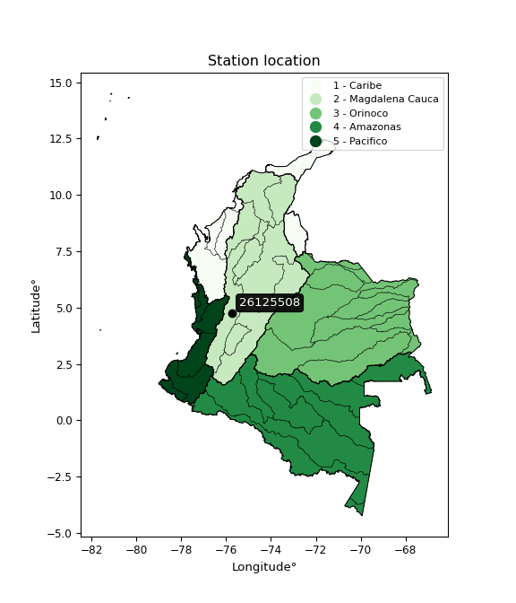</img>

</div>


## A. General information


### 1. General running parameters

• app_version: _v20260312_. • runtime: _2026-03-12 07:15:23.203550_. • Python version: _3.14.0_. • SciPy version: _1.16.3_. • Pandas version: _2.3.3_. • NumPy version: _2.3.5_. • Stations dataset (station_dataset_file): _dataset/pmax24h_in/automatic_colombia_2003_2025.csv_. • Stations catalog (station_catalog_file): _dataset/CNE.xls_. • Minimum year to eval til year_max (date_min): _1900_. • Maximum year to eval since year_min (date_max): _2025_. • Creates, save and include plots into reports (create_plot): _True_. • Plot only fit distributions with Δo > Δ (plot_only_fit): _True_. • Plot only simple graphs avoiding multiple CDFs and multiple Extreme values plots (plot_only_simple): _True_. • Eval low extreme values, if False, evaluates high extreme values (low_extreme): _False_. • Eval every SciPy distribution as logarithmic (pdist_logarithmic_on): _True_. • Standard deviation normalized (ddof): _1.0_. • Return periods to eval in years (Tr): _[2, 2.33, 5, 10, 15, 20, 25, 50, 75, 100, 200, 250, 500, 750, 1000]_. • Minimum data sample per station, 0 means any (minimum_sample): _5_. • Z-Score maximum threshold to adjust a value, 0 means disable (zscore_max): _3.5_. • Z-Score minimum threshold to adjust a value, 0 means disable (zscore_min): _-2.5_. • Avoid zeros, e.g. rain = 0 (avoid_zeros): _True_. • Avoid null values (avoid_nans): _True_. 

:file_folder:Table: [dataset.csv](../../dataset/pmax24h_in/automatic_colombia_2003_2025.csv)

> Delta Degrees of Freedom (DDOF): is a parameter used in the formulas for calculating variance and standard deviation. When ddof=0, the divisor is $N$ (the total number of observations) and this is used when your data set is the entire population. When ddof=1, the divisor is $N-1$ and this is used when your data set is a sample drawn from a larger population. Using $N-1$ provides an unbiased estimate of the population variance (known as Bessel´s correction).


### 2. Station info and location

|   id |   CODIGO | NOMBRE                        | CATEGORIA               | TECNOLOGIA                | ESTADO   | FECHA_INSTALACION   |   FECHA_SUSPENSION |   ALTITUD |   LATITUD |   LONGITUD | DEPARTAMENTO   | MUNICIPIO   | AREA_OPERATIVA                         | ENTIDAD                                    | AREA_HIDROGRAFICA   | ZONA_HIDROGRAFICA   | SUBZONA_HIDROGRAFICA   |   CORRIENTE | Catalogo   |   Version |
|-----:|---------:|:------------------------------|:------------------------|:--------------------------|:---------|:--------------------|-------------------:|----------:|----------:|-----------:|:---------------|:------------|:---------------------------------------|:-------------------------------------------|:--------------------|:--------------------|:-----------------------|------------:|:-----------|----------:|
|    0 | 26125508 | LACATALINA  - AUT  [26125508] | Climatológica Principal | Automática con Telemetría | Activa   | 06/03/2013          |                nan |      1321 |    4.7475 |   -75.7381 | Risaralda      | Pereira     | Area Operativa 09 - Cauca-Valle-Caldas | CENTRO NACIONAL DE INVESTIGACIONES DE CAFE | Magdalena Cauca     | Cauca               | Río La Vieja           |         nan | CNE_OE     |  20251226 |

<div align="center">

Dynamic map: [:earth_americas:Google](http://maps.google.com/maps?q=4.7475,-75.73805556) [:earth_americas:OSM](https://www.openstreetmap.org/#map=18/4.7475/-75.73805556&layers=P) [:earth_americas:Bing](https://www.bing.com/maps?cp=4.7475~-75.73805556&lvl=18) [:earth_americas:Apple](https://maps.apple.com/frame?center=4.7475%2C-75.73805556&span=0.003%2C0.006)

</div>


<div align="center">

```geojson
{
  "type": "Feature",
  "geometry": {
    "type": "Point", 
    "coordinates": [-75.73805556, 4.7475]
  }, 
  "properties": {
    "Name": "26125508"
  }
}
```

</div>


### 3. Discrete values table and plot

<div align="center">

|               |          0 |           1 |            2 |           3 |           4 |           5 |           6 |
|:--------------|-----------:|------------:|-------------:|------------:|------------:|------------:|------------:|
| Date          | 2017       | 2018        | 2019         | 2020        | 2021        | 2022        | 2023        |
| Value         |  124.6     |   54.7      |   68         |   75.6      |   54.7      |   56.5      |   46.4      |
| Value_initial |  124.6     |   54.7      |   68         |   75.6      |   54.7      |   56.5      |   46.4      |
| count         |    7       |    7        |    7         |    7        |    7        |    7        |    7        |
| mean          |   68.6429  |   68.6429   |   68.6429    |   68.6429   |   68.6429   |   68.6429   |   68.6429   |
| std           |   26.4922  |   26.4922   |   26.4922    |   26.4922   |   26.4922   |   26.4922   |   26.4922   |
| zscore        |    2.11221 |   -0.526301 |   -0.0242659 |    0.262611 |   -0.526301 |   -0.458356 |   -0.839601 |


</div>


<div align="center">

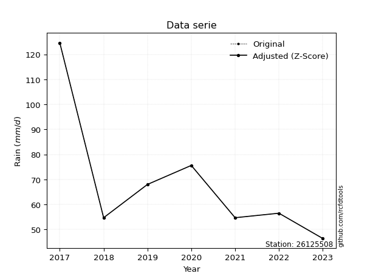</img>

</div>


> The initial value (value_initial) correspond to the initial obtained or null completed value, and value (value) is adjusted only when the initial value is outside the valid range (outlier) definite through the Z-Score value. If Z-Score is active, values out of range or outliers are replaced with the station mean value. A Z-Score (or standard score) measures how many standard deviations a data point is from the mean of a dataset, indicating its relative position; positive scores mean above the mean, negative mean below, and a score of zero is exactly at the mean, allowing for comparison of values from different distributions. It´s calculated using the formula $z=(x–μ)/σ$, where $x$ is the data point, $μ$ is the mean, and $σ$ is the standard deviation, helping identify outliers and understand probability.
>
> <sub>**Note**: In this study, "completing" (filling gaps in) and "extending" (forecasting or lengthening the historical record) rainfall data series are avoided for certain critical analyses because they introduce artificial bias and uncertainty, which can distort the statistics of rare events (extremes), alter day-to-day variability, and compromise the integrity and homogeneity of the original data. Some reasons against Completing/Extending rainfall data are: **Distortion of Extremes and Variability**: The primary issue is that most gap-filling or extension methods rely on averaging or regression with nearby stations, which inherently smooths the data. Rainfall is highly variable in space and time, with a large percentage of zero values and occasional large storms. Infilling methods often underestimate the highest values and overestimate the lowest (zero) values, which severely distorts analyses focused on flood frequency, drought severity, and intensity-duration-frequency (IDF) curves, **Loss of Data Homogeneity**: Infilled or extended data are synthetic estimates, not actual measurements. Combining these estimates with observed data can violate the assumption of data homogeneity, which requires that the data properties do not change over time. Inhomogeneity can lead to incorrect conclusions about long-term trends or changes in climate patterns, **Propagation of Errors**: Errors and biases from the original data (e.g., wind-induced undercatch, instrument errors, site changes) or the data used for imputation can propagate through the analysis, leading to unreliable hydrological models and inaccurate predictions, **Compromised Statistical Integrity**: For statistical analyses, especially those involving the frequency of events, using artificial data can introduce time bias or autocorrelation that doesn´t exist in reality, making it difficult to assess the true probability of events, **Difficulty in Validation**: It is difficult to accurately validate the quality of filled or extended data, especially for past periods where ground-truth measurements are unavailable. The reliability of imputation techniques heavily depends on the density of the surrounding station network and the complexity of the local topography.</sub>


### 4. Active continuous probability distributions from SciPy (80 of 104 available)

A Probability Density Function (PDF) describes the relative likelihood of a continuous random variable falling within a specific range, where the total area under its curve equals 1, and the area over any interval gives the actual probability for that range. Unlike discrete probabilities (like rolling a die), a PDF shows density, not direct probability for a single point (which is zero), with higher points indicating higher likelihood, often visualized as a bell curve for normal distributions.

A log of a probability density function (log-PDF) is simply the logarithm of the PDF´s value, denoted as $log(f(x))$, useful for converting multiplication of probabilities into addition, improving numerical stability with tiny numbers, and connecting to information theory concepts like entropy. Instead of dealing with very small probabilities (e.g., 0.000001), log-PDFs use negative numbers (e.g., $log(0.00001) ≈ -11.51$ that are easier for computers to handle, preventing underflow errors and simplifying complex calculations. In this study, each active probability distribution from SciPy is also evaluated in the $log$ form.

[scipy.stats](https://docs.scipy.org/doc/scipy/reference/stats.html) is a Python´s powerful submodule within the SciPy library for comprehensive statistical analysis, offering over 130 probability distributions (like Normal, Poisson, etc.), functions for descriptive stats (mean, variance), hypothesis testing (t-tests, chi-square), random variable generation, and statistical tests, making it essential for data science, modeling, and research. It provides tools to explore, model, and draw conclusions from data efficiently, working seamlessly with [NumPy](https://numpy.org/).

<div align="center">

|   id | p_dist           |   n_parameter | fit_method   | label                                                                       | active   | ref                                                                                                      |
|-----:|:-----------------|--------------:|:-------------|:----------------------------------------------------------------------------|:---------|:---------------------------------------------------------------------------------------------------------|
|    0 | alpha            |             3 | MLE          | Alpha                                                                       | True     | [:mortar_board:](https://docs.scipy.org/doc/scipy/reference/generated/scipy.stats.alpha.html)            |
|    1 | anglit           |             2 | MM           | Anglit                                                                      | True     | [:mortar_board:](https://docs.scipy.org/doc/scipy/reference/generated/scipy.stats.anglit.html)           |
|    2 | arcsine          |             2 | MM           | Arcsine                                                                     | True     | [:mortar_board:](https://docs.scipy.org/doc/scipy/reference/generated/scipy.stats.arcsine.html)          |
|    3 | argus            |             3 | MLE          | Argus                                                                       | True     | [:mortar_board:](https://docs.scipy.org/doc/scipy/reference/generated/scipy.stats.argus.html)            |
|    4 | beta             |             4 | MLE          | Beta                                                                        | True     | [:mortar_board:](https://docs.scipy.org/doc/scipy/reference/generated/scipy.stats.beta.html)             |
|    5 | betaprime        |             4 | MLE          | Beta prime                                                                  | True     | [:mortar_board:](https://docs.scipy.org/doc/scipy/reference/generated/scipy.stats.betaprime.html)        |
|    6 | bradford         |             3 | MLE          | Bradford                                                                    | True     | [:mortar_board:](https://docs.scipy.org/doc/scipy/reference/generated/scipy.stats.bradford.html)         |
|    7 | burr             |             4 | MLE          | Burr (Type III)                                                             | True     | [:mortar_board:](https://docs.scipy.org/doc/scipy/reference/generated/scipy.stats.burr.html)             |
|    8 | burr12           |             4 | MLE          | Burr (Type III) 12                                                          | True     | [:mortar_board:](https://docs.scipy.org/doc/scipy/reference/generated/scipy.stats.burr12.html)           |
|    9 | cosine           |             2 | MLE          | Cosine                                                                      | True     | [:mortar_board:](https://docs.scipy.org/doc/scipy/reference/generated/scipy.stats.cosine.html)           |
|   10 | crystalball      |             4 | MLE          | Crystalball                                                                 | True     | [:mortar_board:](https://docs.scipy.org/doc/scipy/reference/generated/scipy.stats.crystalball.html)      |
|   11 | dgamma           |             3 | MLE          | Double gamma                                                                | True     | [:mortar_board:](https://docs.scipy.org/doc/scipy/reference/generated/scipy.stats.dgamma.html)           |
|   12 | dweibull         |             3 | MLE          | Double Weibull                                                              | True     | [:mortar_board:](https://docs.scipy.org/doc/scipy/reference/generated/scipy.stats.dweibull.html)         |
|   13 | erlang           |             3 | MLE          | Erlang                                                                      | True     | [:mortar_board:](https://docs.scipy.org/doc/scipy/reference/generated/scipy.stats.erlang.html)           |
|   14 | exponnorm        |             3 | MLE          | Exponentially modified Normal                                               | True     | [:mortar_board:](https://docs.scipy.org/doc/scipy/reference/generated/scipy.stats.exponnorm.html)        |
|   15 | exponpow         |             3 | MLE          | Exponential power                                                           | True     | [:mortar_board:](https://docs.scipy.org/doc/scipy/reference/generated/scipy.stats.exponpow.html)         |
|   16 | exponweib        |             4 | MLE          | Exponentiated Weibull                                                       | True     | [:mortar_board:](https://docs.scipy.org/doc/scipy/reference/generated/scipy.stats.exponweib.html)        |
|   17 | f                |             4 | MLE          | F                                                                           | True     | [:mortar_board:](https://docs.scipy.org/doc/scipy/reference/generated/scipy.stats.f.html)                |
|   18 | fatiguelife      |             3 | MLE          | Fatigue-life (Birnbaum-Saunders)                                            | True     | [:mortar_board:](https://docs.scipy.org/doc/scipy/reference/generated/scipy.stats.fatiguelife.html)      |
|   19 | foldnorm         |             3 | MM           | Fold Normal                                                                 | True     | [:mortar_board:](https://docs.scipy.org/doc/scipy/reference/generated/scipy.stats.foldnorm.html)         |
|   20 | gamma            |             3 | MLE          | Gamma                                                                       | True     | [:mortar_board:](https://docs.scipy.org/doc/scipy/reference/generated/scipy.stats.gamma.html)            |
|   21 | gausshyper       |             6 | MLE          | Gauss hypergeometric                                                        | True     | [:mortar_board:](https://docs.scipy.org/doc/scipy/reference/generated/scipy.stats.gausshyper.html)       |
|   22 | genexpon         |             5 | MLE          | Generalized exponential                                                     | True     | [:mortar_board:](https://docs.scipy.org/doc/scipy/reference/generated/scipy.stats.genexpon.html)         |
|   23 | genextreme       |             3 | MLE          | Generalized exponential                                                     | True     | [:mortar_board:](https://docs.scipy.org/doc/scipy/reference/generated/scipy.stats.genextreme.html)       |
|   24 | gengamma         |             4 | MLE          | Generalized gamma                                                           | True     | [:mortar_board:](https://docs.scipy.org/doc/scipy/reference/generated/scipy.stats.gengamma.html)         |
|   25 | genhalflogistic  |             3 | MLE          | Generalized half-logistic                                                   | True     | [:mortar_board:](https://docs.scipy.org/doc/scipy/reference/generated/scipy.stats.genhalflogistic.html)  |
|   26 | genlogistic      |             3 | MLE          | Generalized logistic                                                        | True     | [:mortar_board:](https://docs.scipy.org/doc/scipy/reference/generated/scipy.stats.genlogistic.html)      |
|   27 | gennorm          |             3 | MLE          | Generalized Normal                                                          | True     | [:mortar_board:](https://docs.scipy.org/doc/scipy/reference/generated/scipy.stats.gennorm.html)          |
|   28 | genpareto        |             3 | MLE          | Generalized Pareto                                                          | True     | [:mortar_board:](https://docs.scipy.org/doc/scipy/reference/generated/scipy.stats.genpareto.html)        |
|   29 | gompertz         |             3 | MLE          | Gompertz (or truncated Gumbel)                                              | True     | [:mortar_board:](https://docs.scipy.org/doc/scipy/reference/generated/scipy.stats.gompertz.html)         |
|   30 | gumbel_l         |             2 | MM           | Gumbel Left Skew                                                            | True     | [:mortar_board:](https://docs.scipy.org/doc/scipy/reference/generated/scipy.stats.gumbel_l.html)         |
|   31 | gumbel_r         |             2 | MM           | Gumbel Right Skew                                                           | True     | [:mortar_board:](https://docs.scipy.org/doc/scipy/reference/generated/scipy.stats.gumbel_r.html)         |
|   32 | halfgennorm      |             3 | MLE          | Upper half of a generalized normal                                          | True     | [:mortar_board:](https://docs.scipy.org/doc/scipy/reference/generated/scipy.stats.halfgennorm.html)      |
|   33 | halflogistic     |             2 | MM           | Half-logistic                                                               | True     | [:mortar_board:](https://docs.scipy.org/doc/scipy/reference/generated/scipy.stats.halflogistic.html)     |
|   34 | halfnorm         |             2 | MM           | Half Normal                                                                 | True     | [:mortar_board:](https://docs.scipy.org/doc/scipy/reference/generated/scipy.stats.halfnorm.html)         |
|   35 | hypsecant        |             2 | MM           | hyperbolic secant                                                           | True     | [:mortar_board:](https://docs.scipy.org/doc/scipy/reference/generated/scipy.stats.hypsecant.html)        |
|   36 | invgamma         |             3 | MLE          | Inverted gamma                                                              | True     | [:mortar_board:](https://docs.scipy.org/doc/scipy/reference/generated/scipy.stats.invgamma.html)         |
|   37 | invgauss         |             3 | MLE          | Inverse Gaussian                                                            | True     | [:mortar_board:](https://docs.scipy.org/doc/scipy/reference/generated/scipy.stats.invgauss.html)         |
|   38 | invweibull       |             3 | MLE          | Inverted Weibull                                                            | True     | [:mortar_board:](https://docs.scipy.org/doc/scipy/reference/generated/scipy.stats.invweibull.html)       |
|   39 | johnsonsb        |             4 | MLE          | Johnson SB                                                                  | True     | [:mortar_board:](https://docs.scipy.org/doc/scipy/reference/generated/scipy.stats.johnsonsb.html)        |
|   40 | johnsonsu        |             4 | MLE          | Johnson Su                                                                  | True     | [:mortar_board:](https://docs.scipy.org/doc/scipy/reference/generated/scipy.stats.johnsonsu.html)        |
|   41 | kappa3           |             3 | MLE          | Kappa 3                                                                     | True     | [:mortar_board:](https://docs.scipy.org/doc/scipy/reference/generated/scipy.stats.kappa3.html)           |
|   42 | kappa4           |             4 | MLE          | Kappa 4                                                                     | True     | [:mortar_board:](https://docs.scipy.org/doc/scipy/reference/generated/scipy.stats.kappa4.html)           |
|   43 | ksone            |             3 | MLE          | Kolmogorov-Smirnov one-sided test statistic distribution                    | True     | [:mortar_board:](https://docs.scipy.org/doc/scipy/reference/generated/scipy.stats.ksone.html)            |
|   44 | kstwobign        |             2 | MLE          | Limiting distribution of scaled Kolmogorov-Smirnov two-sided test statistic | True     | [:mortar_board:](https://docs.scipy.org/doc/scipy/reference/generated/scipy.stats.kstwobign.html)        |
|   45 | laplace          |             2 | MM           | Laplace                                                                     | True     | [:mortar_board:](https://docs.scipy.org/doc/scipy/reference/generated/scipy.stats.laplace.html)          |
|   46 | levy_l           |             2 | MLE          | Left-skewed Levy                                                            | True     | [:mortar_board:](https://docs.scipy.org/doc/scipy/reference/generated/scipy.stats.levy_l.html)           |
|   47 | loggamma         |             3 | MLE          | Log gamma                                                                   | True     | [:mortar_board:](https://docs.scipy.org/doc/scipy/reference/generated/scipy.stats.loggamma.html)         |
|   48 | logistic         |             2 | MM           | Logistic (or Sech-squared)                                                  | True     | [:mortar_board:](https://docs.scipy.org/doc/scipy/reference/generated/scipy.stats.logistic.html)         |
|   49 | loglaplace       |             3 | MLE          | Log-Laplace                                                                 | True     | [:mortar_board:](https://docs.scipy.org/doc/scipy/reference/generated/scipy.stats.loglaplace.html)       |
|   50 | lomax            |             3 | MLE          | Lomax (Pareto of the second kind)                                           | True     | [:mortar_board:](https://docs.scipy.org/doc/scipy/reference/generated/scipy.stats.lomax.html)            |
|   51 | maxwell          |             2 | MM           | Maxwell                                                                     | True     | [:mortar_board:](https://docs.scipy.org/doc/scipy/reference/generated/scipy.stats.maxwell.html)          |
|   52 | mielke           |             4 | MLE          | Mielke Beta-Kappa / Dagum                                                   | True     | [:mortar_board:](https://docs.scipy.org/doc/scipy/reference/generated/scipy.stats.mielke.html)           |
|   53 | moyal            |             2 | MM           | Moyal                                                                       | True     | [:mortar_board:](https://docs.scipy.org/doc/scipy/reference/generated/scipy.stats.moyal.html)            |
|   54 | nakagami         |             3 | MLE          | Nakagami                                                                    | True     | [:mortar_board:](https://docs.scipy.org/doc/scipy/reference/generated/scipy.stats.nakagami.html)         |
|   55 | ncf              |             5 | MLE          | Non-central F distribution                                                  | True     | [:mortar_board:](https://docs.scipy.org/doc/scipy/reference/generated/scipy.stats.ncf.html)              |
|   56 | nct              |             4 | MLE          | Non-central Student’s t                                                     | True     | [:mortar_board:](https://docs.scipy.org/doc/scipy/reference/generated/scipy.stats.nct.html)              |
|   57 | norm             |             2 | MM           | Normal                                                                      | True     | [:mortar_board:](https://docs.scipy.org/doc/scipy/reference/generated/scipy.stats.norm.html)             |
|   58 | pearson3         |             3 | MM           | Pearson type III                                                            | True     | [:mortar_board:](https://docs.scipy.org/doc/scipy/reference/generated/scipy.stats.pearson3.html)         |
|   59 | powerlaw         |             3 | MLE          | Power-function                                                              | True     | [:mortar_board:](https://docs.scipy.org/doc/scipy/reference/generated/scipy.stats.powerlaw.html)         |
|   60 | rayleigh         |             2 | MM           | Rayleigh                                                                    | True     | [:mortar_board:](https://docs.scipy.org/doc/scipy/reference/generated/scipy.stats.rayleigh.html)         |
|   61 | rdist            |             3 | MLE          | R-distributed (symmetric beta)                                              | True     | [:mortar_board:](https://docs.scipy.org/doc/scipy/reference/generated/scipy.stats.rdist.html)            |
|   62 | rice             |             3 | MLE          | Rice                                                                        | True     | [:mortar_board:](https://docs.scipy.org/doc/scipy/reference/generated/scipy.stats.rice.html)             |
|   63 | semicircular     |             2 | MM           | Semicircular                                                                | True     | [:mortar_board:](https://docs.scipy.org/doc/scipy/reference/generated/scipy.stats.semicircular.html)     |
|   64 | skewnorm         |             3 | MLE          | Skew normal                                                                 | True     | [:mortar_board:](https://docs.scipy.org/doc/scipy/reference/generated/scipy.stats.skewnorm.html)         |
|   65 | t                |             3 | MLE          | Student’s t                                                                 | True     | [:mortar_board:](https://docs.scipy.org/doc/scipy/reference/generated/scipy.stats.t.html)                |
|   66 | trapezoid        |             4 | MLE          | Trapezoid                                                                   | True     | [:mortar_board:](https://docs.scipy.org/doc/scipy/reference/generated/scipy.stats.trapezoid.html)        |
|   67 | triang           |             3 | MLE          | Triangular                                                                  | True     | [:mortar_board:](https://docs.scipy.org/doc/scipy/reference/generated/scipy.stats.triang.html)           |
|   68 | truncexpon       |             3 | MLE          | Truncated exponential                                                       | True     | [:mortar_board:](https://docs.scipy.org/doc/scipy/reference/generated/scipy.stats.truncexpon.html)       |
|   69 | truncnorm        |             4 | MLE          | Truncated normal                                                            | True     | [:mortar_board:](https://docs.scipy.org/doc/scipy/reference/generated/scipy.stats.truncnorm.html)        |
|   70 | truncpareto      |             4 | MLE          | Upper truncated Pareto                                                      | True     | [:mortar_board:](https://docs.scipy.org/doc/scipy/reference/generated/scipy.stats.truncpareto.html)      |
|   71 | truncweibull_min |             5 | MLE          | Doubly truncated Weibull minimum                                            | True     | [:mortar_board:](https://docs.scipy.org/doc/scipy/reference/generated/scipy.stats.truncweibull_min.html) |
|   72 | tukeylambda      |             3 | MLE          | Tukey-Lamdba                                                                | True     | [:mortar_board:](https://docs.scipy.org/doc/scipy/reference/generated/scipy.stats.tukeylambda.html)      |
|   73 | uniform          |             2 | MLE          | Uniform                                                                     | True     | [:mortar_board:](https://docs.scipy.org/doc/scipy/reference/generated/scipy.stats.uniform.html)          |
|   74 | vonmises         |             3 | MLE          | Von Mises                                                                   | True     | [:mortar_board:](https://docs.scipy.org/doc/scipy/reference/generated/scipy.stats.vonmises.html)         |
|   75 | vonmises_line    |             3 | MLE          | Von Mises line                                                              | True     | [:mortar_board:](https://docs.scipy.org/doc/scipy/reference/generated/scipy.stats.vonmises_line.html)    |
|   76 | wald             |             2 | MM           | Wald                                                                        | True     | [:mortar_board:](https://docs.scipy.org/doc/scipy/reference/generated/scipy.stats.wald.html)             |
|   77 | weibull_max      |             3 | MLE          | Weibull maximum                                                             | True     | [:mortar_board:](https://docs.scipy.org/doc/scipy/reference/generated/scipy.stats.weibull_max.html)      |
|   78 | weibull_min      |             3 | MLE          | Weibull minimum                                                             | True     | [:mortar_board:](https://docs.scipy.org/doc/scipy/reference/generated/scipy.stats.weibull_min.html)      |
|   79 | wrapcauchy       |             3 | MLE          | Wrapped  Cauchy                                                             | True     | [:mortar_board:](https://docs.scipy.org/doc/scipy/reference/generated/scipy.stats.wrapcauchy.html)       |

</div>

> **n_parameter:** # arguments & localization & scale.
>
> **Fit methods:** (MLE) maximum likelihood, (MM) L-moments.
>
>**Inactive** (With the only purpose of prevent loops, zero divisions, infinite values, over high estimated values or horizontal trending for recurrence intervals estimations, the follow distributions were disabled.)**:** lognorm, norminvgauss, powernorm, powerlognorm, cauchy, halfcauchy, foldcauchy, skewcauchy, chi2, expon, fisk, genhyperbolic, geninvgauss, gibrat, kstwo, laplace_asymmetric, levy, levy_stable, ncx2, pareto, rel_breitwigner, recipinvgauss, studentized_range, loguniform, 


## B. Probability (PDF) vs. Empirical (EDF) distributions functions

A continuous probability distribution (CPD) describes probabilities for variables that can take any value within a range (like rain any time), unlike discrete variables with specific outcomes (like temperature). It uses a Probability Density Function (PDF), a curve where the total area under it equals 1, and the probability of the variable falling within an interval (a to b) is found by calculating the area under the curve between those points. A key feature is that the probability of hitting any single exact value is zero, so probabilities are always expressed for ranges, e.g., $P(a ≤ X ≤ b)$.

<div align="center">

Distributions parameters from station values
|     |   station | p_dist              |   n |              loc |          scale | shape                  | shape1                 | shape2             | shape3             |
|----:|----------:|:--------------------|----:|-----------------:|---------------:|:-----------------------|:-----------------------|:-------------------|:-------------------|
|   0 |  26125508 | alpha               |   7 |     29.5912      |   65.4547      | 2.1538658378037825     |                        |                    |                    |
|   1 |  26125508 | anglit              |   7 |     68.6429      |   71.7513      |                        |                        |                    |                    |
|   2 |  26125508 | arcsine             |   7 |     33.9564      |   69.3729      |                        |                        |                    |                    |
|   3 |  26125508 | argus               |   7 |     10.8045      |  118.201       | 4.6924934579503115e-06 |                        |                    |                    |
|   4 |  26125508 | beta                |   7 |     46.4         |   81.2935      | 0.17650611803351018    | 0.5657630172291579     |                    |                    |
|   5 |  26125508 | betaprime           |   7 |     -1.0058      |    1.87151     | 442.91410803961        | 12.989354479980397     |                    |                    |
|   6 |  26125508 | bradford            |   7 |     46.4         |   89.8921      | 11.62490732223152      |                        |                    |                    |
|   7 |  26125508 | burr                |   7 |     -0.0680769   |   20.3499      | 4.8498392814606        | 151.46466080402863     |                    |                    |
|   8 |  26125508 | burr12              |   7 |     -4.89035     |   51.0541      | 762.6162153581558      | 0.00409719236581409    |                    |                    |
|   9 |  26125508 | cosine              |   7 |     74.0377      |   22.212       |                        |                        |                    |                    |
|  10 |  26125508 | crystalball         |   7 |     68.6429      |   24.527       | 4286.841768341381      | 5989.072103622913      |                    |                    |
|  11 |  26125508 | dgamma              |   7 |     54.7         |   18.9659      | 0.8888468555591524     |                        |                    |                    |
|  12 |  26125508 | dweibull            |   7 |     54.7         |   20.1111      | 0.8455076270576903     |                        |                    |                    |
|  13 |  26125508 | erlang              |   7 |     46.4         |   46.0242      | 0.3861264963772898     |                        |                    |                    |
|  14 |  26125508 | exponnorm           |   7 |     46.3618      |    0.0124438   | 1783.7846109416487     |                        |                    |                    |
|  15 |  26125508 | exponpow            |   7 |     46.4         |   59.3474      | 0.7622412105113512     |                        |                    |                    |
|  16 |  26125508 | exponweib           |   7 |     46.4         |   27.8627      | 0.7996851804228107     | 0.8971106599173788     |                    |                    |
|  17 |  26125508 | f                   |   7 |     41.0077      |   17.2698      | 12.944941492099332     | 4.904333241463556      |                    |                    |
|  18 |  26125508 | fatiguelife         |   7 |     43.3951      |   16.1945      | 1.0531560040556802     |                        |                    |                    |
|  19 |  26125508 | foldnorm            |   7 |     34.8555      |   41.888       | 0.10185403689401695    |                        |                    |                    |
|  20 |  26125508 | gamma               |   7 |     46.4         |   20.3932      | 0.622830317918308      |                        |                    |                    |
|  21 |  26125508 | gausshyper          |   7 |     46.4         |   78.3737      | 0.8413611328984388     | 1.0420474947561575     | 1.1360203103689457 | 0.8822732978637517 |
|  22 |  26125508 | genexpon            |   7 |     46.4         |   41.3746      | 1.8601309418271077     | 1.0144358934500994e-09 | 1.4871491159710906 |                    |
|  23 |  26125508 | genextreme          |   7 |     55.5531      |   10.318       | -0.4939557334628406    |                        |                    |                    |
|  24 |  26125508 | gengamma            |   7 |     46.4         |   27.6638      | 0.887231961991995      | 0.822273072107522      |                    |                    |
|  25 |  26125508 | genhalflogistic     |   7 |     40.7404      |   87.7263      | 1.0461094652359666     |                        |                    |                    |
|  26 |  26125508 | genlogistic         |   7 |    -50.5574      |   14.3894      | 1979.9967376949844     |                        |                    |                    |
|  27 |  26125508 | gennorm             |   7 |     54.7         |    0.116255    | 0.3176604747761539     |                        |                    |                    |
|  28 |  26125508 | genpareto           |   7 |     -1.23589     |  179.609       | -1.427330329194789     |                        |                    |                    |
|  29 |  26125508 | gompertz            |   7 |     46.4         |    2.89276e+06 | 124522.20124821035     |                        |                    |                    |
|  30 |  26125508 | gumbel_l            |   7 |     79.6813      |   19.1236      |                        |                        |                    |                    |
|  31 |  26125508 | gumbel_r            |   7 |     57.6044      |   19.1236      |                        |                        |                    |                    |
|  32 |  26125508 | halfgennorm         |   7 |     46.4         |   24.331       | 1.0203124978026987     |                        |                    |                    |
|  33 |  26125508 | halflogistic        |   7 |     39.5727      |   20.9697      |                        |                        |                    |                    |
|  34 |  26125508 | halfnorm            |   7 |     36.1787      |   40.6878      |                        |                        |                    |                    |
|  35 |  26125508 | hypsecant           |   7 |     68.6429      |   15.6144      |                        |                        |                    |                    |
|  36 |  26125508 | invgamma            |   7 |     38.9465      |   41.3044      | 2.309893657701366      |                        |                    |                    |
|  37 |  26125508 | invgauss            |   7 |     42.1806      |   24.7485      | 1.0692463133053414     |                        |                    |                    |
|  38 |  26125508 | invweibull          |   7 |     46.4         |    1.61547     | 0.05637599752283569    |                        |                    |                    |
|  39 |  26125508 | johnsonsb           |   7 |     46.4         |   78.2403      | 1.370947549845495      | 0.09339052806915357    |                    |                    |
|  40 |  26125508 | johnsonsu           |   7 |     43.8779      |    0.0994791   | -5.741455358858863     | 0.9984123309669257     |                    |                    |
|  41 |  26125508 | kappa3              |   7 |     46.4         |   65.2902      | 13.876493470334706     |                        |                    |                    |
|  42 |  26125508 | kappa4              |   7 |     35.9231      |   87.5857      | 1.135675964036099      | 0.9795415750947649     |                    |                    |
|  43 |  26125508 | ksone               |   7 |     38.58        |   93.84        | 1.0                    |                        |                    |                    |
|  44 |  26125508 | kstwobign           |   7 |      3.87911     |   75.4833      |                        |                        |                    |                    |
|  45 |  26125508 | laplace             |   7 |     68.6429      |   17.3432      |                        |                        |                    |                    |
|  46 |  26125508 | levy_l              |   7 |    131.294       |   29.862       |                        |                        |                    |                    |
|  47 |  26125508 | loggamma            |   7 |  -5769.82        |  831.408       | 1121.918470779421      |                        |                    |                    |
|  48 |  26125508 | logistic            |   7 |     68.6429      |   13.5224      |                        |                        |                    |                    |
|  49 |  26125508 | loglaplace          |   7 |     -0.172461    |   56.6725      | 4.595738035895128      |                        |                    |                    |
|  50 |  26125508 | lomax               |   7 |     46.4         | 1163.14        | 53.53534047401055      |                        |                    |                    |
|  51 |  26125508 | maxwell             |   7 |     10.5242      |   36.4205      |                        |                        |                    |                    |
|  52 |  26125508 | mielke              |   7 |     -0.839028    |   20.4834      | 803.2094542116574      | 4.892964585380835      |                    |                    |
|  53 |  26125508 | moyal               |   7 |     54.6167      |   11.041       |                        |                        |                    |                    |
|  54 |  26125508 | nakagami            |   7 |     46.4         |   44.5797      | 0.32194337293407665    |                        |                    |                    |
|  55 |  26125508 | ncf                 |   7 |     -2.29507     |   20.0486      | 159.74771833897267     | 26.86310122849443      | 361.94920389587924 |                    |
|  56 |  26125508 | nct                 |   7 |     -0.317749    |    1.30408     | 7.2841719065621895     | 46.760890448597664     |                    |                    |
|  57 |  26125508 | norm                |   7 |     68.6429      |   24.527       |                        |                        |                    |                    |
|  58 |  26125508 | pearson3            |   7 |     68.6429      |   24.527       | 1.5233458132008122     |                        |                    |                    |
|  59 |  26125508 | powerlaw            |   7 |     46.4         |   78.2         | 0.15303347246895402    |                        |                    |                    |
|  60 |  26125508 | rayleigh            |   7 |     21.7213      |   37.438       |                        |                        |                    |                    |
|  61 |  26125508 | rdist               |   7 |     46.4936      |   29.1064      | 1.2077534546344944     |                        |                    |                    |
|  62 |  26125508 | rice                |   7 |     32.4263      |   30.9291      | 0.0004185531053532184  |                        |                    |                    |
|  63 |  26125508 | semicircular        |   7 |     68.6429      |   49.054       |                        |                        |                    |                    |
|  64 |  26125508 | skewnorm            |   7 |     46.4         |   33.1134      | 29571336.937942248     |                        |                    |                    |
|  65 |  26125508 | t                   |   7 |     54.7003      |    0.000992033 | 0.26426954751724197    |                        |                    |                    |
|  66 |  26125508 | trapezoid           |   7 |     38.58        |   93.84        | 1.0                    | 1.0                    |                    |                    |
|  67 |  26125508 | triang              |   7 |      0.579308    |  124.021       | 0.9999999263058006     |                        |                    |                    |
|  68 |  26125508 | truncexpon          |   7 |     46.4         |   64.3474      | 1.2152792134145303     |                        |                    |                    |
|  69 |  26125508 | truncnorm           |   7 | -52833.4         | 1139.66        | 46.39982970355742      | 126.4150236755879      |                    |                    |
|  70 |  26125508 | truncpareto         |   7 |     46.3825      |    0.0175007   | 0.16814050678844478    | 4469.397687160768      |                    |                    |
|  71 |  26125508 | truncweibull_min    |   7 |     46.2877      |   70.9187      | 0.5846581669015125     | 0.001582901274945255   | 1.104253373252908  |                    |
|  72 |  26125508 | tukeylambda         |   7 |     61.207       |   16.4479      | 1.1108219707821916     |                        |                    |                    |
|  73 |  26125508 | uniform             |   7 |     46.4         |   78.2         |                        |                        |                    |                    |
|  74 |  26125508 | vonmises            |   7 |     -1.06218     |    1           | 1.0718449164105992     |                        |                    |                    |
|  75 |  26125508 | vonmises_line       |   7 |     62.7663      |   19.6823      | 1.5266758421044653     |                        |                    |                    |
|  76 |  26125508 | wald                |   7 |     44.1159      |   24.527       |                        |                        |                    |                    |
|  77 |  26125508 | weibull_max         |   7 |    124.6         |    1.56734     | 0.24380494556129828    |                        |                    |                    |
|  78 |  26125508 | weibull_min         |   7 |     46.4         |   18.6928      | 0.5891554510656506     |                        |                    |                    |
|  79 |  26125508 | wrapcauchy          |   7 |     46.3999      |   12.4459      | 0.4840139403019124     |                        |                    |                    |
|  80 |  26125508 | logalpha            |   7 |      3.33143     |    2.56454     | 3.363289560702625      |                        |                    |                    |
|  81 |  26125508 | loganglit           |   7 |      4.17791     |    0.885253    |                        |                        |                    |                    |
|  82 |  26125508 | logarcsine          |   7 |      3.74995     |    0.855904    |                        |                        |                    |                    |
|  83 |  26125508 | logargus            |   7 |      3.47327     |    1.40515     | 0.00020365347839682474 |                        |                    |                    |
|  84 |  26125508 | logbeta             |   7 |      3.8373      |    1.20654     | 0.4105159957282848     | 1.3036235325763093     |                    |                    |
|  85 |  26125508 | logbetaprime        |   7 |     -1.77951     |    6.00467     | 821.102193085404       | 828.5539811913366      |                    |                    |
|  86 |  26125508 | logbradford         |   7 |      3.8373      |    0.987817    | 1.0962562103901186     |                        |                    |                    |
|  87 |  26125508 | logburr             |   7 |     -0.583425    |    3.60528     | 22.89548233940765      | 300.72485679925103     |                    |                    |
|  88 |  26125508 | logburr12           |   7 |     -0.130735    |    4.03311     | 78.47343550110921      | 0.18977117291499998    |                    |                    |
|  89 |  26125508 | logcosine           |   7 |      4.22997     |    0.266946    |                        |                        |                    |                    |
|  90 |  26125508 | logcrystalball      |   7 |      4.17791     |    0.302609    | 12.28481643377346      | 701.5091439051571      |                    |                    |
|  91 |  26125508 | logdgamma           |   7 |      4.00186     |    0.244586    | 0.8171368335824972     |                        |                    |                    |
|  92 |  26125508 | logdweibull         |   7 |      4.00186     |    0.230013    | 0.9344064227709424     |                        |                    |                    |
|  93 |  26125508 | logerlang           |   7 |      3.8373      |    0.384124    | 0.36587582686068487    |                        |                    |                    |
|  94 |  26125508 | logexponnorm        |   7 |      3.87781     |    0.076207    | 3.9378669547056346     |                        |                    |                    |
|  95 |  26125508 | logexponpow         |   7 |      3.8373      |    0.988484    | 0.45950438909055913    |                        |                    |                    |
|  96 |  26125508 | logexponweib        |   7 |      3.8373      |    0.556274    | 0.4166476662142145     | 1.4461291636538858     |                    |                    |
|  97 |  26125508 | logf                |   7 |      3.8373      |    0.375028    | 1.6821992017043839     | 269.75768727384394     |                    |                    |
|  98 |  26125508 | logfatiguelife      |   7 |      3.72923     |    0.357779    | 0.71146906118656       |                        |                    |                    |
|  99 |  26125508 | logfoldnorm         |   7 |      3.73205     |    0.380495    | 1.0070996358170274     |                        |                    |                    |
| 100 |  26125508 | loggamma            |   7 |      3.8373      |    0.475929    | 0.3273215272222507     |                        |                    |                    |
| 101 |  26125508 | loggausshyper       |   7 |      3.8373      |    1.02259     | 0.8053893182426093     | 1.0068350354656164     | 1.045834847175382  | 1.0245029127087137 |
| 102 |  26125508 | loggenexpon         |   7 |      3.8373      |    0.679248    | 1.7223674283089374     | 0.8357727456635496     | 0.9968227109472076 |                    |
| 103 |  26125508 | loggenextreme       |   7 |      4.02081     |    0.182854    | -0.24694789771091247   |                        |                    |                    |
| 104 |  26125508 | loggengamma         |   7 |      3.8373      |    0.749586    | 0.4423208196153554     | 1.4174007704304028     |                    |                    |
| 105 |  26125508 | loggenhalflogistic  |   7 |      3.77134     |    1.13365     | 1.0758085583384005     |                        |                    |                    |
| 106 |  26125508 | loggenlogistic      |   7 |      2.55304     |    0.207344    | 1341.9174408789681     |                        |                    |                    |
| 107 |  26125508 | loggennorm          |   7 |      4.03424     |    0.018283    | 0.435905453046282      |                        |                    |                    |
| 108 |  26125508 | loggenpareto        |   7 |     -0.0103163   |   12.2218      | -2.5275522676014273    |                        |                    |                    |
| 109 |  26125508 | loggompertz         |   7 |      3.8373      |    2.02382     | 5.066963675094609      |                        |                    |                    |
| 110 |  26125508 | loggumbel_l         |   7 |      4.3141      |    0.235944    |                        |                        |                    |                    |
| 111 |  26125508 | loggumbel_r         |   7 |      4.04172     |    0.235944    |                        |                        |                    |                    |
| 112 |  26125508 | loghalfgennorm      |   7 |      3.8373      |    0.446067    | 1.25344106551935       |                        |                    |                    |
| 113 |  26125508 | loghalflogistic     |   7 |      3.81924     |    0.25872     |                        |                        |                    |                    |
| 114 |  26125508 | loghalfnorm         |   7 |      3.77737     |    0.501998    |                        |                        |                    |                    |
| 115 |  26125508 | loghypsecant        |   7 |      4.17791     |    0.192647    |                        |                        |                    |                    |
| 116 |  26125508 | loginvgamma         |   7 |      3.60869     |    1.99838     | 4.472216050692429      |                        |                    |                    |
| 117 |  26125508 | loginvgauss         |   7 |      3.70794     |    0.975751    | 0.48165338650572853    |                        |                    |                    |
| 118 |  26125508 | loginvweibull       |   7 |      3.28044     |    0.740361    | 4.048936704355036      |                        |                    |                    |
| 119 |  26125508 | logjohnsonsb        |   7 |      3.8373      |    0.987809    | 0.338445112008071      | 0.2357940928670339     |                    |                    |
| 120 |  26125508 | logjohnsonsu        |   7 |      3.73144     |    0.00839995  | -6.50498542467065      | 1.4641090647007102     |                    |                    |
| 121 |  26125508 | logkappa3           |   7 |      3.8373      |    0.987542    | 7277.3593766950435     |                        |                    |                    |
| 122 |  26125508 | logkappa4           |   7 |      3.80904     |    1.09161     | 1.018655887261209      | 1.0743413077775836     |                    |                    |
| 123 |  26125508 | logksone            |   7 |      3.73852     |    1.18537     | 1.0                    |                        |                    |                    |
| 124 |  26125508 | logkstwobign        |   7 |      3.29177     |    1.02452     |                        |                        |                    |                    |
| 125 |  26125508 | loglaplace          |   7 |      4.17791     |    0.213977    |                        |                        |                    |                    |
| 126 |  26125508 | loglevy_l           |   7 |      4.9009      |    0.337879    |                        |                        |                    |                    |
| 127 |  26125508 | logloggamma         |   7 |    -94.3603      |   13.1829      | 1763.4334825208034     |                        |                    |                    |
| 128 |  26125508 | loglogistic         |   7 |      4.17791     |    0.166837    |                        |                        |                    |                    |
| 129 |  26125508 | logloglaplace       |   7 |     -0.0110715   |    4.04531     | 19.24768618020124      |                        |                    |                    |
| 130 |  26125508 | loglomax            |   7 |      3.8373      |   12.6856      | 37.9970092394441       |                        |                    |                    |
| 131 |  26125508 | logmaxwell          |   7 |      3.46085     |    0.449349    |                        |                        |                    |                    |
| 132 |  26125508 | logmielke           |   7 |      2.7953      |    0.625271    | 466.8658331164736      | 6.3138590210664525     |                    |                    |
| 133 |  26125508 | logmoyal            |   7 |      4.00485     |    0.136222    |                        |                        |                    |                    |
| 134 |  26125508 | lognakagami         |   7 |      3.8373      |    0.753269    | 0.12706070457021304    |                        |                    |                    |
| 135 |  26125508 | logncf              |   7 |      2.49499     |    7.01463e-07 | 4.0771612534596036e-05 | 77.4084699153572       | 96.32611660482245  |                    |
| 136 |  26125508 | lognct              |   7 |     -0.868575    |    0.0939603   | 169.45278851720747     | 53.46717193474603      |                    |                    |
| 137 |  26125508 | lognorm             |   7 |      4.17791     |    0.302609    |                        |                        |                    |                    |
| 138 |  26125508 | logpearson3         |   7 |      4.17791     |    0.30261     | 1.1392152753106952     |                        |                    |                    |
| 139 |  26125508 | logpowerlaw         |   7 |      3.8373      |    0.987809    | 0.16591775181191057    |                        |                    |                    |
| 140 |  26125508 | lograyleigh         |   7 |      3.599       |    0.461903    |                        |                        |                    |                    |
| 141 |  26125508 | logrdist            |   7 |      4.43123     |    0.593926    | 1.0744038884856573     |                        |                    |                    |
| 142 |  26125508 | logrice             |   7 |      3.6942      |    0.403449    | 0.00022839217494604716 |                        |                    |                    |
| 143 |  26125508 | logsemicircular     |   7 |      4.17791     |    0.60523     |                        |                        |                    |                    |
| 144 |  26125508 | logskewnorm         |   7 |      3.8373      |    0.455582    | 10617813.529444123     |                        |                    |                    |
| 145 |  26125508 | logt                |   7 |      4.08789     |    0.188668    | 2.4560010652867765     |                        |                    |                    |
| 146 |  26125508 | logtrapezoid        |   7 |      3.73852     |    1.18537     | 1.0                    | 1.0                    |                    |                    |
| 147 |  26125508 | logtriang           |   7 |      3.3486      |    1.47652     | 0.9999931880803465     |                        |                    |                    |
| 148 |  26125508 | logtruncexpon       |   7 |      3.8373      |    0.955491    | 1.033828989525126      |                        |                    |                    |
| 149 |  26125508 | logtruncnorm        |   7 |     -0.0965641   |    1.0858      | 4.532773305429248      | 4.532773305429249      |                    |                    |
| 150 |  26125508 | logtruncpareto      |   7 |      3.83699     |    0.000304608 | 4.4188819508270145e-10 | 3267.7427051269424     |                    |                    |
| 151 |  26125508 | logtruncweibull_min |   7 |      3.83686     |    1.19105     | 0.923508681984091      | 1.6069213671533135e-09 | 0.8300735473464811 |                    |
| 152 |  26125508 | logtukeylambda      |   7 |      4.32895     |    0.566932    | 1.1426428857195043     |                        |                    |                    |
| 153 |  26125508 | loguniform          |   7 |      3.8373      |    0.987809    |                        |                        |                    |                    |
| 154 |  26125508 | logvonmises         |   7 |     -2.11065     |    1           | 11.468238601212363     |                        |                    |                    |
| 155 |  26125508 | logvonmises_line    |   7 |      4.12431     |    0.223073    | 1.0656468051646217     |                        |                    |                    |
| 156 |  26125508 | logwald             |   7 |      3.87531     |    0.302594    |                        |                        |                    |                    |
| 157 |  26125508 | logweibull_max      |   7 |      2.04628e+07 |    2.04628e+07 | 98710129.07408726      |                        |                    |                    |
| 158 |  26125508 | logweibull_min      |   7 |      3.8373      |    0.380699    | 0.9453044100479939     |                        |                    |                    |
| 159 |  26125508 | logwrapcauchy       |   7 |      3.8373      |    0.157215    | 0.5                    |                        |                    |                    |

</div>

> **loc** (Location parameter): This shifts the distribution along the x-axis. For many common distributions, like the normal (Gaussian) distribution, loc represents the mean $μ$. For others, like the uniform distribution, it might represent the minimum value, or for the beta distribution, the left end of the support interval.
>
> **scale** (Scale parameter): This determines the width or spread of the distribution. For the normal distribution, scale represents the standard deviation $σ$. For a uniform distribution, it defines the length of the interval (from $loc$ to $loc + scale$).
>
> **shape** (Shape parameters): Refers to parameters that define the specific form of a probability distribution, distinct from its location (loc) and scale (scale). These parameters are required arguments for most distribution functions. For example, a normal (Gaussian) distribution is fully defined by its location (mean) and scale (standard deviation), so it has no specific shape parameters beyond loc and scale. However, other distributions have intrinsic properties that need specification, as Gamma distribution that takes a shape parameter, often named $a$ or $alpha$.


### 0. Cumulative distribution values - CDF (160 evaluated)

Cumulative Distribution Function (CDF), denoted as $F$<sub>$X$</sub>$(x)$, is a function that gives the probability that a random variable $X$ will take a value less than or equal to a specific value, $x$ (i.e., $(P(X≥x)$. It essentially "accumulates" probabilities from a given point up to the far right (positive infinity), providing a complete picture of the distribution´s probabilities for both discrete (like rain) and continuous (like temperature) variables, helping to find probabilities over ranges or above certain values. Each station is evaluated separately ordering the $x$ values ascending, calculating the CDF and PDF values for the activated distributions and their logarithmic forms.

<div align="center">

CDF ordered by x ascending and calculating $log(f(x))$ separately
|   id |   Station |   date |     x |   count |    mean |     std |     zscore |   Value_initial |   station |   m |     alpha |   alpha_pdf |   anglit |   anglit_pdf |   arcsine |   arcsine_pdf |    argus |   argus_pdf |       beta |    beta_pdf |   betaprime |   betaprime_pdf |    bradford |   bradford_pdf |      burr |    burr_pdf |    burr12 |   burr12_pdf |   cosine |   cosine_pdf |   crystalball |   crystalball_pdf |   dgamma |   dgamma_pdf |   dweibull |   dweibull_pdf |      erlang |   erlang_pdf |   exponnorm |   exponnorm_pdf |   exponpow |   exponpow_pdf |   exponweib |   exponweib_pdf |        f |     f_pdf |   fatiguelife |   fatiguelife_pdf |   foldnorm |   foldnorm_pdf |      gamma |      gamma_pdf |   gausshyper |   gausshyper_pdf |    genexpon |   genexpon_pdf |   genextreme |   genextreme_pdf |   gengamma |   gengamma_pdf |   genhalflogistic |   genhalflogistic_pdf |   genlogistic |   genlogistic_pdf |   gennorm |   gennorm_pdf |   genpareto |   genpareto_pdf |    gompertz |   gompertz_pdf |   gumbel_l |   gumbel_l_pdf |   gumbel_r |   gumbel_r_pdf |   halfgennorm |   halfgennorm_pdf |   halflogistic |   halflogistic_pdf |   halfnorm |   halfnorm_pdf |   hypsecant |   hypsecant_pdf |   invgamma |   invgamma_pdf |   invgauss |   invgauss_pdf |   invweibull |   invweibull_pdf |   johnsonsb |   johnsonsb_pdf |   johnsonsu |   johnsonsu_pdf |      kappa3 |   kappa3_pdf |      kappa4 |   kappa4_pdf |     ksone |   ksone_pdf |   kstwobign |   kstwobign_pdf |   laplace |   laplace_pdf |   levy_l |   levy_l_pdf |    loggamma |   loggamma_pdf |   logistic |   logistic_pdf |   loglaplace |   loglaplace_pdf |       lomax |   lomax_pdf |   maxwell |   maxwell_pdf |      mielke |   mielke_pdf |    moyal |   moyal_pdf |    nakagami |   nakagami_pdf |      ncf |   ncf_pdf |      nct |    nct_pdf |     norm |   norm_pdf |   pearson3 |   pearson3_pdf |   powerlaw |   powerlaw_pdf |   rayleigh |   rayleigh_pdf |    rdist |     rdist_pdf |      rice |   rice_pdf |   semicircular |   semicircular_pdf |   skewnorm |   skewnorm_pdf |         t |         t_pdf |   trapezoid |   trapezoid_pdf |   triang |   triang_pdf |   truncexpon |   truncexpon_pdf |   truncnorm |   truncnorm_pdf |   truncpareto |   truncpareto_pdf |   truncweibull_min |   truncweibull_min_pdf |   tukeylambda |   tukeylambda_pdf |   uniform |   uniform_pdf |   vonmises |   vonmises_pdf |   vonmises_line |   vonmises_line_pdf |       wald |   wald_pdf |   weibull_max |   weibull_max_pdf |   weibull_min |   weibull_min_pdf |   wrapcauchy |   wrapcauchy_pdf |   logalpha |   logalpha_pdf |   loganglit |   loganglit_pdf |   logarcsine |   logarcsine_pdf |   logargus |   logargus_pdf |     logbeta |   logbeta_pdf |   logbetaprime |   logbetaprime_pdf |   logbradford |   logbradford_pdf |   logburr |   logburr_pdf |   logburr12 |   logburr12_pdf |   logcosine |   logcosine_pdf |   logcrystalball |   logcrystalball_pdf |   logdgamma |   logdgamma_pdf |   logdweibull |   logdweibull_pdf |   logerlang |   logerlang_pdf |   logexponnorm |   logexponnorm_pdf |   logexponpow |   logexponpow_pdf |   logexponweib |   logexponweib_pdf |       logf |   logf_pdf |   logfatiguelife |   logfatiguelife_pdf |   logfoldnorm |   logfoldnorm_pdf |   loggausshyper |   loggausshyper_pdf |   loggenexpon |   loggenexpon_pdf |   loggenextreme |   loggenextreme_pdf |   loggengamma |   loggengamma_pdf |   loggenhalflogistic |   loggenhalflogistic_pdf |   loggenlogistic |   loggenlogistic_pdf |   loggennorm |   loggennorm_pdf |   loggenpareto |   loggenpareto_pdf |   loggompertz |   loggompertz_pdf |   loggumbel_l |   loggumbel_l_pdf |   loggumbel_r |   loggumbel_r_pdf |   loghalfgennorm |   loghalfgennorm_pdf |   loghalflogistic |   loghalflogistic_pdf |   loghalfnorm |   loghalfnorm_pdf |   loghypsecant |   loghypsecant_pdf |   loginvgamma |   loginvgamma_pdf |   loginvgauss |   loginvgauss_pdf |   loginvweibull |   loginvweibull_pdf |   logjohnsonsb |   logjohnsonsb_pdf |   logjohnsonsu |   logjohnsonsu_pdf |   logkappa3 |   logkappa3_pdf |   logkappa4 |   logkappa4_pdf |   logksone |   logksone_pdf |   logkstwobign |   logkstwobign_pdf |   loglevy_l |   loglevy_l_pdf |   logloggamma |   logloggamma_pdf |   loglogistic |   loglogistic_pdf |   logloglaplace |   logloglaplace_pdf |    loglomax |   loglomax_pdf |   logmaxwell |   logmaxwell_pdf |   logmielke |   logmielke_pdf |   logmoyal |   logmoyal_pdf |   lognakagami |   lognakagami_pdf |   logncf |   logncf_pdf |   lognct |   lognct_pdf |   lognorm |   lognorm_pdf |   logpearson3 |   logpearson3_pdf |   logpowerlaw |   logpowerlaw_pdf |   lograyleigh |   lograyleigh_pdf |   logrdist |   logrdist_pdf |   logrice |   logrice_pdf |   logsemicircular |   logsemicircular_pdf |   logskewnorm |   logskewnorm_pdf |     logt |   logt_pdf |   logtrapezoid |   logtrapezoid_pdf |   logtriang |   logtriang_pdf |   logtruncexpon |   logtruncexpon_pdf |   logtruncnorm |   logtruncnorm_pdf |   logtruncpareto |   logtruncpareto_pdf |   logtruncweibull_min |   logtruncweibull_min_pdf |   logtukeylambda |   logtukeylambda_pdf |   loguniform |   loguniform_pdf |   logvonmises |   logvonmises_pdf |   logvonmises_line |   logvonmises_line_pdf |   logwald |   logwald_pdf |   logweibull_max |   logweibull_max_pdf |   logweibull_min |   logweibull_min_pdf |   logwrapcauchy |   logwrapcauchy_pdf |
|-----:|----------:|-------:|------:|--------:|--------:|--------:|-----------:|----------------:|----------:|----:|----------:|------------:|---------:|-------------:|----------:|--------------:|---------:|------------:|-----------:|------------:|------------:|----------------:|------------:|---------------:|----------:|------------:|----------:|-------------:|---------:|-------------:|--------------:|------------------:|---------:|-------------:|-----------:|---------------:|------------:|-------------:|------------:|----------------:|-----------:|---------------:|------------:|----------------:|---------:|----------:|--------------:|------------------:|-----------:|---------------:|-----------:|---------------:|-------------:|-----------------:|------------:|---------------:|-------------:|-----------------:|-----------:|---------------:|------------------:|----------------------:|--------------:|------------------:|----------:|--------------:|------------:|----------------:|------------:|---------------:|-----------:|---------------:|-----------:|---------------:|--------------:|------------------:|---------------:|-------------------:|-----------:|---------------:|------------:|----------------:|-----------:|---------------:|-----------:|---------------:|-------------:|-----------------:|------------:|----------------:|------------:|----------------:|------------:|-------------:|------------:|-------------:|----------:|------------:|------------:|----------------:|----------:|--------------:|---------:|-------------:|------------:|---------------:|-----------:|---------------:|-------------:|-----------------:|------------:|------------:|----------:|--------------:|------------:|-------------:|---------:|------------:|------------:|---------------:|---------:|----------:|---------:|-----------:|---------:|-----------:|-----------:|---------------:|-----------:|---------------:|-----------:|---------------:|---------:|--------------:|----------:|-----------:|---------------:|-------------------:|-----------:|---------------:|----------:|--------------:|------------:|----------------:|---------:|-------------:|-------------:|-----------------:|------------:|----------------:|--------------:|------------------:|-------------------:|-----------------------:|--------------:|------------------:|----------:|--------------:|-----------:|---------------:|----------------:|--------------------:|-----------:|-----------:|--------------:|------------------:|--------------:|------------------:|-------------:|-----------------:|-----------:|---------------:|------------:|----------------:|-------------:|-----------------:|-----------:|---------------:|------------:|--------------:|---------------:|-------------------:|--------------:|------------------:|----------:|--------------:|------------:|----------------:|------------:|----------------:|-----------------:|---------------------:|------------:|----------------:|--------------:|------------------:|------------:|----------------:|---------------:|-------------------:|--------------:|------------------:|---------------:|-------------------:|-----------:|-----------:|-----------------:|---------------------:|--------------:|------------------:|----------------:|--------------------:|--------------:|------------------:|----------------:|--------------------:|--------------:|------------------:|---------------------:|-------------------------:|-----------------:|---------------------:|-------------:|-----------------:|---------------:|-------------------:|--------------:|------------------:|--------------:|------------------:|--------------:|------------------:|-----------------:|---------------------:|------------------:|----------------------:|--------------:|------------------:|---------------:|-------------------:|--------------:|------------------:|--------------:|------------------:|----------------:|--------------------:|---------------:|-------------------:|---------------:|-------------------:|------------:|----------------:|------------:|----------------:|-----------:|---------------:|---------------:|-------------------:|------------:|----------------:|--------------:|------------------:|--------------:|------------------:|----------------:|--------------------:|------------:|---------------:|-------------:|-----------------:|------------:|----------------:|-----------:|---------------:|--------------:|------------------:|---------:|-------------:|---------:|-------------:|----------:|--------------:|--------------:|------------------:|--------------:|------------------:|--------------:|------------------:|-----------:|---------------:|----------:|--------------:|------------------:|----------------------:|--------------:|------------------:|---------:|-----------:|---------------:|-------------------:|------------:|----------------:|----------------:|--------------------:|---------------:|-------------------:|-----------------:|---------------------:|----------------------:|--------------------------:|-----------------:|---------------------:|-------------:|-----------------:|--------------:|------------------:|-------------------:|-----------------------:|----------:|--------------:|-----------------:|---------------------:|-----------------:|---------------------:|----------------:|--------------------:|
|    0 |  26125508 |   2023 |  46.4 |       7 | 68.6429 | 26.4922 | -0.839601  |            46.4 |  26125508 |   1 | 0.0415605 |  0.020655   | 0.209483 |  0.0113431   |  0.278414 |    0.0119594  | 0.132899 |  0.00728835 | 0.00124367 | 3.08941e+10 |    0.116382 |      0.0160887  | 2.83019e-13 |     0.0510005  | 0.0647673 | 0.0183349   | 0.0144402 |   0.0583154  | 0.151223 |   0.00946357 |      0.182237 |        0.0107815  | 0.294538 |  0.0173099   |   0.31151  |    0.0150153   | 8.83762e-07 |  4.80258e+07 |  0.00171969 |      0.0449254  |  7.307e-13 |    78.3865     | 6.50393e-12 |    656.676      | 0.042858 | 0.0241674 |     0.0363004 |        0.0346211  |   0.216052 |     0.0182505  | 2.6297e-10 | 23050.8        |  4.61232e-14 |       5.46285    | 1.86222e-11 |     0.0449583  |    0.0402235 |       0.0222971  | 4.4158e-12 |   453.391      |         0.0333849 |            0.00610523 |     0.0958835 |       0.0156141   |  0.142145 |   0.0122532   |    0.283435 |      0.00641985 | 3.90828e-07 |     0.0430462  |   0.160932 |    0.00769863  |   0.165863 |     0.0155822  |   2.45552e-12 |        0.0414419  |       0.161368 |         0.023223   |   0.19835  |     0.0190008  |    0.150329 |      0.0092737  |  0.0392794 |     0.0233948  |  0.0370695 |     0.0288363  |   0.00158489 |      8.10732e+10 |   0.0188232 |     6.04429e+11 |   0.0342832 |      0.0300501  | 3.06462e-12 |   0.0126717  | 8.94251e-15 |    0.917246  | 0.0833333 |   0.0106564 |    0.091175 |      0.0145286  |  0.13867  |    0.00799564 | 0.44688  |   0.00233762 | 1.68917e-05 |    6.22511e+09 |   0.161802 |      0.0100294 |     0.101781 |         0.475661 | 1.40626e-14 |  0.0460264  |  0.191566 |    0.013086   |   0.0652891 |     0.018302 | 0.146842 |  0.0183003  | 5.22608e-11 |  4735.82       | 0.122767 | 0.0158818 | 0.100829 | 0.0171196  | 0.182237 | 0.0107815  |   0.154657 |      0.0218131 | 0.00350829 |     7.556e+10  |   0.195283 |     0.014169   | 0.498836 |     0.0124366 | 0.0970257 | 0.0131903  |       0.221555 |          0.0115671 |   0        |     0.0240955  | 0.0328784 |   0.00104681  |  0.00694444 |      0.00177607 | 0.136501 |   0.00595804 |  5.99771e-09 |       0.0220945  |    0        |      0.0407328  |    1.4673e-16 |       12.6978     |         1.5771e-08 |             0.186005   |   7.10543e-15 |         0.0591971 |  0        |     0.0127877 |    8.01438 |      0.0442518 |        0.189498 |          0.0135175  | 0.00274024 | 0.00691841 |     0.0747111 |       0.000604243 |   8.22571e-10 |    68204.5        |  5.26765e-06 |       0.0367784  |  0.0439963 |       0.932864 |    0.152108 |        0.81135  |     0.206999 |         1.22854  |  0.0989656 |       0.534227 | 5.28712e-07 |   4.88741e+08 |       0.120566 |           0.72533  |   4.35583e-06 |          1.49938  | 0.0602313 |      0.872349 |   0.0456222 |        0.781281 |    0.107528 |        0.655631 |         0.130175 |             0.699721 |    0.20883  |       0.979042  |      0.240631 |         0.999248  | 4.96395e-06 |     2.04485e+09 |      0.0421003 |           0.851049 |   8.86659e-08 |       9.17437e+07 |    8.00141e-10 |        1.08561e+06 | 2.5547e-13 | 483.857    |        0.0371306 |             1.24954  |      0.132924 |          1.26291  |     6.02197e-13 |         1092.57     |   9.28629e-11 |          2.5357   |       0.0420654 |            0.96909  |   3.20595e-10 |     452603        |            0.0300329 |                 0.470078 |        0.0647472 |             0.853893 |     0.14714  |        0.612263  |       0.466539 |        0.213663    |   5.07449e-12 |          2.50367  |      0.124139 |         0.492041  |     0.0927102 |          0.934505 |        1.559e-10 |             2.40848  |         0.0348811 |              1.93024  |     0.0950281 |          1.57813  |       0.107614 |           0.548027 |     0.0406074 |          1.01524  |     0.0379297 |          1.16828  |       0.0420679 |            0.969163 |    1.12208e-05 |        3219.12     |      0.0377053 |           1.13229  | 1.39952e-09 |         1.01138 |  0.00846402 |        1.00333  |  0.0833333 |       0.843618 |      0.0606808 |           0.856783 |    0.426992 |        0.180361 |      0.138981 |          0.699373 |      0.114909 |          0.609607 |        0.191327 |           0.956924  | 1.42183e-11 |       2.9953   |     0.127233 |         0.877403 |   0.0559081 |        0.958218 |  0.0643615 |       0.979122 |   0.000110264 |       6.30962e+10 | 0.217127 |     0.809737 | 0.116964 |     0.751379 |  0.130175 |      0.699721 |     0.0910279 |          1.09606  |    0.00284202 |       1.06182e+12 |      0.124609 |          0.977756 | 1.7609e-09 |    7.17296e+06 | 0.0609634 |      0.825539 |          0.161659 |              0.869483 |      0        |          1.75135  | 0.147024 |  0.751284  |     0.00694444 |           0.140603 |    0.10955  |        0.448329 |     4.87069e-06 |            1.62422  |              0 |        0           |      0.000618965 |           403.678    |            0.00119149 |                  2.49134  |       0.00561042 |             1.19453  |     0        |          1.01234 |       1.13201 |          0.705417 |           0.143286 |               0.737269 |  0        |      0        |        0.0644205 |             0.852197 |      7.65004e-15 |            16.2842   |        0        |            3.03702  |
|    1 |  26125508 |   2018 |  54.7 |       7 | 68.6429 | 26.4922 | -0.526301  |            54.7 |  26125508 |   2 | 0.330446  |  0.0379737  | 0.310533 |  0.0128977   |  0.368326 |    0.0100221  | 0.19956  |  0.00875132 | 0.571755   | 0.0126532   |    0.280713 |      0.022382   | 0.287565    |     0.024598   | 0.289508  | 0.0316487   | 0.383123  |   0.0323456  | 0.239732 |   0.0117824  |      0.284858 |        0.0138386  | 0.5      |  1.17406     |   0.5      |    5.12676     | 0.553426    |  0.0225747   |  0.313154   |      0.0309431  |  0.221307  |     0.019959   | 0.367906    |      0.026736   | 0.337426 | 0.0356223 |     0.365747  |        0.0321041  |   0.362574 |     0.0169577  | 0.549211   |     0.0318367  |  0.208964    |       0.0199994  | 0.31144     |     0.0309564  |    0.33686   |       0.0370364  | 0.366565   |     0.0263049  |         0.0868074 |            0.00678626 |     0.267863  |       0.0245135   |  0.5      |   0.593229    |    0.337607 |      0.00663917 | 0.300426    |     0.0301141  |   0.237245 |    0.0108017   |   0.31223  |     0.0190048  |   0.292953    |        0.0296818  |       0.345826 |         0.0209923  |   0.351038 |     0.0176799  |    0.247405 |      0.0142969  |  0.338854  |     0.0364208  |  0.353853  |     0.0340516  |   0.401775   |      0.00248845  |   0.879381  |     0.00252709  |   0.356646  |      0.0344012  | 0.105175    |   0.0126717  | 0.139999    |    0.0148347 | 0.171782  |   0.0106564 |    0.244858 |      0.0214078  |  0.223782 |    0.0129031  | 0.467635 |   0.00267621 | 0.729139    |    1.11253     |   0.262873 |      0.0143296 |     0.219619 |         1.02637  | 0.316591    |  0.031232   |  0.311072 |    0.0154455  | nan         |   nan        | 0.319135 |  0.0219153  | 0.262273    |     0.0201751  | 0.282528 | 0.0216038 | 0.28202  | 0.0248287  | 0.284858 | 0.0138386  |   0.339232 |      0.0216917 | 0.709456   |     0.0130808  |   0.321576 |     0.0159628  | 0.603168 |     0.0128514 | 0.228417  | 0.0179656  |       0.321517 |          0.0124427 |   0.197918 |     0.0233503  | 0.443665  | 189.269       |  0.029509   |      0.00366116 | 0.190431 |   0.00703728 |  0.17205     |       0.0194207  |    0.286882 |      0.0290518  |    0.852807   |        0.00947736 |         0.360114   |             0.0237694  |   0.285719    |         0.0331546 |  0.106138 |     0.0127877 |    9.24788 |      0.259323  |        0.3279   |          0.0196021  | 0.301733   | 0.039458   |     0.0801285 |       0.000705445 |   0.461959    |        0.0236719  |  0.249397    |       0.0206735  |  0.322202  |       2.04666  |    0.306341 |        1.04145  |     0.365054 |         0.816039 |  0.204573  |       0.744157 | 0.499516    |   1.20678     |       0.278964 |           1.18001  |   0.226633    |          1.26784  | 0.295228  |      1.79483  |   0.322287  |        2.12778  |    0.243964 |        0.987677 |         0.280368 |             1.11311  |    0.5      |     779.953     |      0.5      |        17.913     | 0.740315    |     1.19405     |      0.323015  |           2.08336  |   0.42349     |       1.09527     |    0.463414    |        1.55513     | 0.389205   |   1.61678  |        0.350782  |             1.92882  |      0.339794 |          1.24337  |     0.30341     |            1.35943  |   0.355887    |          1.80332  |       0.32934   |            2.05295  |   0.421283    |          1.47947  |            0.114238  |                 0.557187 |        0.28984   |             1.73036  |     0.358172 |        2.84278   |       0.503647 |        0.23854     |   0.348989    |          1.76799  |      0.233749 |         0.864661  |     0.30605   |          1.53581  |        0.350282  |             1.80843  |         0.338972  |              1.71053  |     0.345271  |          1.43817  |       0.242784 |           1.14156  |     0.332435  |          2.02725  |     0.344784  |          1.95917  |       0.329354  |            2.05296  |    0.483579    |           0.685304 |      0.342096  |           1.98748  | 0.166437    |         1.01138 |  0.168054   |        0.960966 |  0.222163  |       0.843618 |      0.277304  |           1.61531  |    0.460154 |        0.225433 |      0.286321 |          1.07891  |      0.258233 |          1.14812  |        0.42835  |           2.05454   | 0.38722     |       1.81195  |     0.306052 |         1.24689  |   0.314696  |        1.88912  |  0.311999  |       1.77608  |   0.555132    |       0.852638    | 0.363293 |     0.940236 | 0.281938 |     1.22617  |  0.280369 |      1.11311  |     0.320766  |          1.54133  |    0.74278    |       0.748889    |      0.316384 |          1.29084  | 0.232104   |    0.79286     | 0.252308  |      1.41325  |          0.317473 |              1.00638  |      0.282063 |          1.64074  | 0.342817 |  1.66369   |     0.0493562  |           0.374841 |    0.195751 |        0.599298 |     0.245542    |            1.36725  |              0 |        0           |      0.777806    |             0.749565 |            0.261508   |                  1.34885  |       0.178471   |             1.0054   |     0.166595 |          1.01234 |       1.28411 |          1.13067  |           0.315422 |               1.35733  |  0.288748 |      3.25237  |        0.289437  |             1.73105  |      0.364002    |             1.65336  |        0.333262 |            1.01287  |
|    2 |  26125508 |   2021 |  54.7 |       7 | 68.6429 | 26.4922 | -0.526301  |            54.7 |  26125508 |   3 | 0.330446  |  0.0379737  | 0.310533 |  0.0128977   |  0.368326 |    0.0100221  | 0.19956  |  0.00875132 | 0.571755   | 0.0126532   |    0.280713 |      0.022382   | 0.287565    |     0.024598   | 0.289508  | 0.0316487   | 0.383123  |   0.0323456  | 0.239732 |   0.0117824  |      0.284858 |        0.0138386  | 0.5      |  1.17406     |   0.5      |    5.12676     | 0.553426    |  0.0225747   |  0.313154   |      0.0309431  |  0.221307  |     0.019959   | 0.367906    |      0.026736   | 0.337426 | 0.0356223 |     0.365747  |        0.0321041  |   0.362574 |     0.0169577  | 0.549211   |     0.0318367  |  0.208964    |       0.0199994  | 0.31144     |     0.0309564  |    0.33686   |       0.0370364  | 0.366565   |     0.0263049  |         0.0868074 |            0.00678626 |     0.267863  |       0.0245135   |  0.5      |   0.593229    |    0.337607 |      0.00663917 | 0.300426    |     0.0301141  |   0.237245 |    0.0108017   |   0.31223  |     0.0190048  |   0.292953    |        0.0296818  |       0.345826 |         0.0209923  |   0.351038 |     0.0176799  |    0.247405 |      0.0142969  |  0.338854  |     0.0364208  |  0.353853  |     0.0340516  |   0.401775   |      0.00248845  |   0.879381  |     0.00252709  |   0.356646  |      0.0344012  | 0.105175    |   0.0126717  | 0.139999    |    0.0148347 | 0.171782  |   0.0106564 |    0.244858 |      0.0214078  |  0.223782 |    0.0129031  | 0.467635 |   0.00267621 | 0.729139    |    1.11253     |   0.262873 |      0.0143296 |     0.219619 |         1.02637  | 0.316591    |  0.031232   |  0.311072 |    0.0154455  | nan         |   nan        | 0.319135 |  0.0219153  | 0.262273    |     0.0201751  | 0.282528 | 0.0216038 | 0.28202  | 0.0248287  | 0.284858 | 0.0138386  |   0.339232 |      0.0216917 | 0.709456   |     0.0130808  |   0.321576 |     0.0159628  | 0.603168 |     0.0128514 | 0.228417  | 0.0179656  |       0.321517 |          0.0124427 |   0.197918 |     0.0233503  | 0.443665  | 189.269       |  0.029509   |      0.00366116 | 0.190431 |   0.00703728 |  0.17205     |       0.0194207  |    0.286882 |      0.0290518  |    0.852807   |        0.00947736 |         0.360114   |             0.0237694  |   0.285719    |         0.0331546 |  0.106138 |     0.0127877 |    9.24788 |      0.259323  |        0.3279   |          0.0196021  | 0.301733   | 0.039458   |     0.0801285 |       0.000705445 |   0.461959    |        0.0236719  |  0.249397    |       0.0206735  |  0.322202  |       2.04666  |    0.306341 |        1.04145  |     0.365054 |         0.816039 |  0.204573  |       0.744157 | 0.499516    |   1.20678     |       0.278964 |           1.18001  |   0.226633    |          1.26784  | 0.295228  |      1.79483  |   0.322287  |        2.12778  |    0.243964 |        0.987677 |         0.280368 |             1.11311  |    0.5      |     779.953     |      0.5      |        17.913     | 0.740315    |     1.19405     |      0.323015  |           2.08336  |   0.42349     |       1.09527     |    0.463414    |        1.55513     | 0.389205   |   1.61678  |        0.350782  |             1.92882  |      0.339794 |          1.24337  |     0.30341     |            1.35943  |   0.355887    |          1.80332  |       0.32934   |            2.05295  |   0.421283    |          1.47947  |            0.114238  |                 0.557187 |        0.28984   |             1.73036  |     0.358172 |        2.84278   |       0.503647 |        0.23854     |   0.348989    |          1.76799  |      0.233749 |         0.864661  |     0.30605   |          1.53581  |        0.350282  |             1.80843  |         0.338972  |              1.71053  |     0.345271  |          1.43817  |       0.242784 |           1.14156  |     0.332435  |          2.02725  |     0.344784  |          1.95917  |       0.329354  |            2.05296  |    0.483579    |           0.685304 |      0.342096  |           1.98748  | 0.166437    |         1.01138 |  0.168054   |        0.960966 |  0.222163  |       0.843618 |      0.277304  |           1.61531  |    0.460154 |        0.225433 |      0.286321 |          1.07891  |      0.258233 |          1.14812  |        0.42835  |           2.05454   | 0.38722     |       1.81195  |     0.306052 |         1.24689  |   0.314696  |        1.88912  |  0.311999  |       1.77608  |   0.555132    |       0.852638    | 0.363293 |     0.940236 | 0.281938 |     1.22617  |  0.280369 |      1.11311  |     0.320766  |          1.54133  |    0.74278    |       0.748889    |      0.316384 |          1.29084  | 0.232104   |    0.79286     | 0.252308  |      1.41325  |          0.317473 |              1.00638  |      0.282063 |          1.64074  | 0.342817 |  1.66369   |     0.0493562  |           0.374841 |    0.195751 |        0.599298 |     0.245542    |            1.36725  |              0 |        0           |      0.777806    |             0.749565 |            0.261508   |                  1.34885  |       0.178471   |             1.0054   |     0.166595 |          1.01234 |       1.28411 |          1.13067  |           0.315422 |               1.35733  |  0.288748 |      3.25237  |        0.289437  |             1.73105  |      0.364002    |             1.65336  |        0.333262 |            1.01287  |
|    3 |  26125508 |   2022 |  56.5 |       7 | 68.6429 | 26.4922 | -0.458356  |            56.5 |  26125508 |   4 | 0.396471  |  0.035241   | 0.333977 |  0.0131463   |  0.386156 |    0.0097967  | 0.215581 |  0.00904899 | 0.59284    | 0.0108821   |    0.32144  |      0.0228158  | 0.329528    |     0.0221151  | 0.34636   | 0.031375    | 0.437897  |   0.0286094  | 0.261331 |   0.0122107  |      0.310271 |        0.0143894  | 0.561568 |  0.0289014   |   0.560929 |    0.0268009   | 0.59091     |  0.0192446   |  0.366653   |      0.0285329  |  0.256214  |     0.0188625  | 0.413337    |      0.0238476  | 0.399004 | 0.0327315 |     0.4202    |        0.0284844  |   0.392783 |     0.0166043  | 0.602044   |     0.0270673  |  0.244005    |       0.0189653  | 0.364967    |     0.02855    |    0.400853  |       0.0339751  | 0.411176   |     0.023373   |         0.0991687 |            0.0069495  |     0.312724  |       0.0252558   |  0.695653 |   0.0544983   |    0.349605 |      0.00669123 | 0.352585    |     0.0278688  |   0.257363 |    0.0115548   |   0.346646 |     0.0192042  |   0.344453    |        0.0275646  |       0.383037 |         0.0203456  |   0.382534 |     0.0173105  |    0.274195 |      0.0154679  |  0.401674  |     0.0333115  |  0.411952  |     0.0305331  |   0.405827   |      0.00204286  |   0.883499  |     0.00207988  |   0.41534   |      0.0308423  | 0.127984    |   0.0126717  | 0.166374    |    0.0144835 | 0.190963  |   0.0106564 |    0.283975 |      0.0220032  |  0.248255 |    0.0143143  | 0.472527 |   0.00276042 | 0.761903    |    0.921084    |   0.289466 |      0.0152099 |     0.255495 |         1.19403  | 0.370519    |  0.0287233  |  0.339148 |    0.0157371  | nan         |   nan        | 0.358487 |  0.0217654  | 0.297218    |     0.0187124  | 0.321828 | 0.022013  | 0.327051 | 0.0251306  | 0.310271 | 0.0143894  |   0.37775  |      0.0210863 | 0.73109    |     0.0110773  |   0.35046  |     0.0161174  | 0.626491 |     0.0130719 | 0.261339  | 0.0185889  |       0.344035 |          0.012574  |   0.239643 |     0.0230003  | 0.950756  |   0.00723094  |  0.036467   |      0.00406998 | 0.203309 |   0.00727134 |  0.206522    |       0.018885   |    0.337305 |      0.0269986  |    0.867998   |        0.00753879 |         0.400468   |             0.0211861  |   0.345237    |         0.032989  |  0.129156 |     0.0127877 |    9.80589 |      0.214406  |        0.364111 |          0.020601   | 0.369282   | 0.035565   |     0.0814211 |       0.000731107 |   0.501327    |        0.0202401  |  0.283417    |       0.0172429  |  0.387711  |       1.98924  |    0.340548 |        1.07064  |     0.391026 |         0.789622 |  0.229275  |       0.781476 | 0.536359    |   1.07519     |       0.318271 |           1.24604  |   0.26707     |          1.23045  | 0.353881  |      1.81955  |   0.389647  |        2.02051  |    0.276793 |        1.03921  |         0.317481 |             1.17784  |    0.596505 |       2.26275   |      0.573962 |         1.96827   | 0.775326    |     0.97939     |      0.388816  |           1.96983  |   0.456875    |       0.972405    |    0.511103    |        1.39597     | 0.438964   |   1.46089  |        0.411168  |             1.79837  |      0.379876 |          1.232    |     0.346021    |            1.27523  |   0.412135    |          1.6722   |       0.394637  |            1.97092  |   0.466812    |          1.33761  |            0.132601  |                 0.577334 |        0.346644  |             1.77053  |     0.5      |       10.2512    |       0.511464 |        0.244395    |   0.404208    |          1.64412  |      0.263176 |         0.953748  |     0.356227  |          1.55839  |        0.406781  |             1.68222  |         0.393134  |              1.6339   |     0.391138  |          1.39438  |       0.281987 |           1.27966  |     0.396718  |          1.93548  |     0.406335  |          1.83851  |       0.39465   |            1.97091  |    0.504244    |           0.596556 |      0.40468   |           1.87293  | 0.199182    |         1.01138 |  0.199159   |        0.960589 |  0.249476  |       0.843618 |      0.330176  |           1.64456  |    0.46763  |        0.236517 |      0.322235 |          1.13819  |      0.297108 |          1.25173  |        0.500002 |           2.379     | 0.443098    |       1.64259  |     0.347011 |         1.28088  |   0.375568  |        1.86202  |  0.369318  |       1.75714  |   0.580885    |       0.743785    | 0.39386  |     0.9469   | 0.322707 |     1.28979  |  0.317481 |      1.17783  |     0.37058   |          1.53178  |    0.765247   |       0.644701    |      0.358503 |          1.30866  | 0.256886   |    0.74056     | 0.298953  |      1.46453  |          0.350315 |              1.0218   |      0.334466 |          1.59513  | 0.399187 |  1.81028   |     0.0622385  |           0.420925 |    0.215635 |        0.629    |     0.289068    |            1.32169  |              0 |        0           |      0.799963    |             0.626528 |            0.30425    |                  1.29246  |       0.210895   |             0.997846 |     0.199372 |          1.01234 |       1.32182 |          1.19714  |           0.361039 |               1.45699  |  0.386724 |      2.79472  |        0.346267  |             1.77149  |      0.415094    |             1.50568  |        0.362579 |            0.810106 |
|    4 |  26125508 |   2019 |  68   |       7 | 68.6429 | 26.4922 | -0.0242659 |            68   |  26125508 |   5 | 0.68423   |  0.0162523  | 0.491041 |  0.0139348   |  0.4941   |    0.00917836 | 0.329773 |  0.0107476  | 0.685293   | 0.00628169  |    0.573418 |      0.0196517  | 0.525795    |     0.0134448  | 0.648535  | 0.0199813   | 0.671288  |   0.0140909  | 0.414007 |   0.0140674  |      0.489545 |        0.0162598  | 0.779516 |  0.0126194   |   0.752934 |    0.0110723   | 0.744326    |  0.00940011  |  0.622741   |      0.0169959  |  0.44487   |     0.0144029  | 0.618874    |      0.0134495  | 0.671148 | 0.0160989 |     0.655444  |        0.0145235  |   0.56882  |     0.0139012  | 0.807906   |     0.0115618  |  0.435023    |       0.0147219  | 0.621333    |     0.0170242  |    0.678289  |       0.0159903  | 0.611221   |     0.0130239  |         0.185723  |            0.00815327 |     0.592849  |       0.0215374   |  0.902616 |   0.006546    |    0.428657 |      0.00707223 | 0.605368    |     0.0169875  |   0.418939 |    0.0164957   |   0.559532 |     0.0169892  |   0.59661     |        0.0170932  |       0.5901   |         0.015541   |   0.565835 |     0.014443   |    0.486899 |      0.0203684  |  0.675056  |     0.0159504  |  0.662781  |     0.0151231  |   0.421474   |      0.000950437 |   0.899889  |     0.00104901  |   0.667424  |      0.0150357  | 0.273708    |   0.0126717  | 0.324417    |    0.0131786 | 0.313512  |   0.0106564 |    0.533877 |      0.0201439  |  0.481806 |    0.0277807  | 0.50784  |   0.00341963 | 0.874778    |    0.399514    |   0.488117 |      0.0184773 |     0.588345 |         1.92383  | 0.62658     |  0.0168738  |  0.522982 |    0.0157064  | nan         |   nan        | 0.585416 |  0.0169853  | 0.478069    |     0.0134561  | 0.566166 | 0.0192269 | 0.594355 | 0.0199148  | 0.489545 | 0.0162598  |   0.591116 |      0.0158159 | 0.821282   |     0.00581868 |   0.534212 |     0.0153796  | 0.793363 |     0.0170032 | 0.483896  | 0.0191926  |       0.491657 |          0.0129768 |   0.485795 |     0.0194778  | 0.970973  |   0.000576774 |  0.09829    |      0.00668185 | 0.295528 |   0.00876667 |  0.405399    |       0.0157943  |    0.58522  |      0.016902   |    0.922364   |        0.00310547 |         0.588314   |             0.012956   |   0.723768    |         0.0331879 |  0.276215 |     0.0127877 |   11.4812  |      0.354724  |        0.614364 |          0.0210816  | 0.657437   | 0.0169206  |     0.0909426 |       0.000939198 |   0.663413    |        0.0099968  |  0.408785    |       0.00702936 |  0.683067  |       1.15898  |    0.546925 |        1.12463  |     0.530993 |         0.747338 |  0.391653  |       0.960735 | 0.693336    |   0.683918    |       0.565293 |           1.33217  |   0.477723    |          1.05282  | 0.655406  |      1.3191   |   0.676227  |        1.10545  |    0.487531 |        1.19195  |         0.554673 |             1.30594  |    0.836699 |       0.748772  |      0.806564 |         0.78867   | 0.89209     |     0.397087    |      0.669248  |           1.10215  |   0.596792    |       0.597782    |    0.710811    |        0.8263      | 0.648626   |   0.867264 |        0.671712  |             1.04894  |      0.5969   |          1.08634  |     0.550118    |            0.962348 |   0.660235    |          1.04102  |       0.682566  |            1.12395  |   0.661818    |          0.826123 |            0.251897  |                 0.718751 |        0.648144  |             1.35532  |     0.845443 |        0.65934   |       0.560423 |        0.287176    |   0.651198    |          1.05481  |      0.488149 |         1.45288   |     0.624566  |          1.24599  |        0.657612  |             1.0566   |         0.648987  |              1.11861  |     0.621551  |          1.07842  |       0.568211 |           1.6145   |     0.679469  |          1.11289  |     0.673325  |          1.069    |       0.682571  |            1.1239   |    0.590923    |           0.390976 |      0.676348  |           1.07767  | 0.386557    |         1.01138 |  0.377523   |        0.96689  |  0.405771  |       0.843618 |      0.61486   |           1.33162  |    0.518678 |        0.321752 |      0.550874 |          1.26164  |      0.562018 |          1.47541  |        0.788824 |           0.960776  | 0.676294    |       0.941237 |     0.584751 |         1.21702  |   0.665098  |        1.19917  |  0.649248  |       1.20108  |   0.685649    |       0.442819    | 0.565525 |     0.87907  | 0.574239 |     1.33164  |  0.554673 |      1.30594  |     0.627029  |          1.17945  |    0.85424    |       0.370828    |      0.594379 |          1.17969  | 0.378306   |    0.599643    | 0.57158   |      1.38263  |          0.543725 |              1.04938  |      0.5985   |          1.2318   | 0.727192 |  1.40082   |     0.16465    |           0.684631 |    0.347912 |        0.798961 |     0.511658    |            1.08873  |              0 |        0           |      0.881812    |             0.323076 |            0.519391   |                  1.0467   |       0.393348   |             0.976368 |     0.386925 |          1.01234 |       1.56248 |          1.31887  |           0.64641  |               1.44264  |  0.717739 |      1.07776  |        0.647973  |             1.35628  |      0.633497    |             0.909859 |        0.460837 |            0.378105 |
|    5 |  26125508 |   2020 |  75.6 |       7 | 68.6429 | 26.4922 |  0.262611  |            75.6 |  26125508 |   6 | 0.77986   |  0.00959196 | 0.596355 |  0.0136758   |  0.56428  |    0.00936713 | 0.414966 |  0.0116363  | 0.728492   | 0.00519923  |    0.705604 |      0.0150651  | 0.616656    |     0.0106781  | 0.771577  | 0.0128131   | 0.758883  |   0.00936002 | 0.522379 |   0.0143128  |      0.611662 |        0.0156241  | 0.856567 |  0.00803879  |   0.822043 |    0.00743729  | 0.804319    |  0.00662283  |  0.732119   |      0.0120683  |  0.546298  |     0.0123488  | 0.706477    |      0.0098514  | 0.768686 | 0.010108  |     0.747191  |        0.00998706 |   0.666794 |     0.0118651  | 0.877289   |     0.00710872 |  0.539806    |       0.012934   | 0.730929    |     0.012097   |    0.774039  |       0.00980488 | 0.696026   |     0.00954214 |         0.251319  |            0.00913822 |     0.734685  |       0.0157405   |  0.937827 |   0.00326413  |    0.483554 |      0.00738421 | 0.715481    |     0.0122476  |   0.554171 |    0.0188327   |   0.6769   |     0.0138126  |   0.707857    |        0.0124251  |       0.695759 |         0.0123015  |   0.667392 |     0.0122641  |    0.637354 |      0.018517   |  0.771249  |     0.00992587 |  0.756628  |     0.0100132  |   0.427656   |      0.000701353 |   0.907004  |     0.000848985 |   0.759987  |      0.00978458 | 0.370013    |   0.0126717  | 0.422569    |    0.0126766 | 0.394501  |   0.0106564 |    0.672705 |      0.016259   |  0.665224 |    0.019303   | 0.535981 |   0.00401172 | 0.909756    |    0.271253    |   0.625858 |      0.0173164 |     0.749102 |         1.17255  | 0.734828    |  0.011906   |  0.637131 |    0.0141733  | nan         |   nan        | 0.699017 |  0.0129644  | 0.572012    |     0.0113535  | 0.696475 | 0.0149799 | 0.724732 | 0.0144517  | 0.611662 | 0.0156241  |   0.697734 |      0.0123093 | 0.86006    |     0.00450746 |   0.644976 |     0.0136474  | 1        | 15003.5       | 0.622529  | 0.0170361  |       0.589986 |          0.0128468 |   0.622125 |     0.0163336  | 0.974241  |   0.000325711 |  0.155631   |      0.00840796 | 0.36591  |   0.0097549  |  0.518618    |       0.0140348  |    0.695695 |      0.012402   |    0.942085   |        0.00218419 |         0.676309   |             0.0103905  |   0.983953    |         0.0372812 |  0.373402 |     0.0127877 |   12.8537  |      0.16813   |        0.757894 |          0.0162623  | 0.760816   | 0.0108389  |     0.098795  |       0.00113783  |   0.727616    |        0.00714748 |  0.453831    |       0.00512167 |  0.783589  |       0.762154 |    0.663606 |        1.06744  |     0.612048 |         0.792386 |  0.497343  |       1.02952  | 0.759294    |   0.56784     |       0.698425 |           1.15913  |   0.584902    |          0.972524 | 0.7738    |      0.925124 |   0.773641  |        0.75616  |    0.612657 |        1.15467  |         0.687081 |             1.17058  |    0.898816 |       0.451571  |      0.873668 |         0.501849  | 0.926161    |     0.258058    |      0.767633  |           0.774315 |   0.653831    |       0.485583    |    0.787148    |        0.624269    | 0.728845   |   0.657919 |        0.765968  |             0.746478 |      0.70455  |          0.938996 |     0.645769    |            0.848256 |   0.755763    |          0.773023 |       0.780578  |            0.749227 |   0.73919     |          0.642845 |            0.333549  |                 0.826693 |        0.770926  |             0.967216 |     0.897359 |        0.362573  |       0.592628 |        0.32257     |   0.74897     |          0.799938 |      0.649826 |         1.55735   |     0.740508  |          0.942862 |        0.75467   |             0.786109 |         0.75233   |              0.838743 |     0.725084  |          0.875765 |       0.722953 |           1.26329  |     0.777148  |          0.752215 |     0.768832  |          0.751256 |       0.780579  |            0.749195 |    0.630417    |           0.360426 |      0.771895  |           0.74488  | 0.493711    |         1.01138 |  0.480385   |        0.975448 |  0.495151  |       0.843618 |      0.739464  |           1.01943  |    0.556483 |        0.396084 |      0.67944  |          1.14411  |      0.707733 |          1.23981  |        0.868817 |           0.582258  | 0.761823    |       0.686974 |     0.704542 |         1.03249  |   0.771431  |        0.824605 |  0.757873  |       0.860924 |   0.727966    |       0.361412    | 0.653784 |     0.782289 | 0.705907 |     1.13422  |  0.687081 |      1.17058  |     0.737548  |          0.908207 |    0.889632   |       0.302374    |      0.709682 |          0.988517 | 0.440147   |    0.571551    | 0.705965  |      1.14032  |          0.653651 |              1.02013  |      0.716056 |          0.986423 | 0.842817 |  0.809571  |     0.245175   |           0.835437 |    0.43771  |        0.896157 |     0.620842    |            0.974464 |              0 |        0           |      0.912027    |             0.253    |            0.624484   |                  0.940078 |       0.496599   |             0.973598 |     0.494181 |          1.01234 |       1.69549 |          1.16835  |           0.779973 |               1.05906  |  0.808275 |      0.670815 |        0.770838  |             0.967823 |      0.717745    |             0.691394 |        0.49806  |            0.337547 |
|    6 |  26125508 |   2017 | 124.6 |       7 | 68.6429 | 26.4922 |  2.11221   |           124.6 |  26125508 |   7 | 0.943269  |  0.00100498 | 0.99997  |  0.000153904 |  1        |    0          | 0.980213 |  0.00660891 | 0.957822   | 0.00787314  |    0.981191 |      0.00105782 | 0.949691    |     0.00458932 | 0.977221  | 0.000875896 | 0.945422  |   0.00131697 | 0.983449 |   0.00251891 |      0.988739 |        0.00120507 | 0.990176 |  0.000530733 |   0.97157  |    0.000985977 | 0.954545    |  0.0012475   |  0.97054    |      0.00132722 |  0.912401  |     0.00361933 | 0.935376    |      0.00188706 | 0.951996 | 0.0011513 |     0.955643  |        0.00147127 |   0.966951 |     0.00195478 | 0.991637   |     0.00044353 |  0.99902     |       0.00588104 | 0.970274    |     0.00133643 |    0.94928   |       0.00111227 | 0.922553   |     0.00198304 |         1         |            0.115115   |     0.989816  |       0.000704103 |  0.989053 |   0.000286792 |    1        |    332.918      | 0.965481    |     0.00148593 |   0.999972 |    1.54845e-05 |   0.97035  |     0.00152721 |   0.964261    |        0.00154211 |       0.965912 |         0.00159787 |   0.970232 |     0.00184912 |    0.982324 |      0.00113147 |  0.950844  |     0.00113924 |  0.955112  |     0.00135543 |   0.447738   |      0.000259372 |   0.981146  |     0.106819    |   0.94937   |      0.00128843 | 0.946814    |   0.00643616 | 0.992529    |    0.0103394 | 0.916667  |   0.0106564 |    0.987995 |      0.00101745 |  0.980151 |    0.00114448 | 0.965328 |   0.0135278  | 0.97743     |    0.0590902   |   0.984297 |      0.001143  |     0.975712 |         0.113506 | 0.969298    |  0.00132407 |  0.979753 |    0.00159201 | nan         |   nan        | 0.96647  |  0.00151752 | 0.906969    |     0.00340825 | 0.979256 | 0.0011494 | 0.978343 | 0.00103391 | 0.988739 | 0.00120507 |   0.96558  |      0.0016076 | 1          |     0.00195695 |   0.977079 |     0.00168245 | 1        |     0         | 0.988212  | 0.00113581 |       1        |          0         |   0.981803 |     0.00148215 | 0.981278  |   7.07835e-05 |  0.840278   |      0.0195368  | 1        |   0.0161263  |  1           |       0.00655382 |    0.958732 |      0.00168346 |    1          |        0.00069139 |         1          |             0.00434753 |   1           |         0         |  1        |     0.0127877 |   20.4995  |      0.355255  |        1        |          0.00104991 | 0.962945   | 0.00123802 |     0.999623  |       6.46572e+09 |   0.902089    |        0.00171409 |  1           |       0.0367784  |  0.950522  |       0.118302 |    0.997054 |        0.122447 |     1        |         0        |  0.97969   |       0.56041  | 0.958424    |   0.261199    |       0.982864 |           0.130429 |   0.999996    |          0.715271 | 0.972503  |      0.11478  |   0.953494  |        0.139747 |    0.98069  |        0.231299 |         0.983772 |             0.133891 |    0.988435 |       0.0493595 |      0.981409 |         0.0694637 | 0.985538    |     0.0449461   |      0.956038  |           0.146494 |   0.820473    |       0.226866    |    0.956681    |        0.150138    | 0.91692    |   0.193089 |        0.951219  |             0.150548 |      0.968901 |          0.184543 |     0.98171     |            0.536058 |   0.953973    |          0.160055 |       0.950368  |            0.126823 |   0.927697    |          0.194174 |            1         |                23.4863   |        0.976897  |             0.110125 |     0.97404  |        0.0585148 |       1        |        3.59076e+08 |   0.958752    |          0.168249 |      0.999837 |         0.0060252 |     0.964502  |          0.147749 |        0.955885  |             0.160442 |         0.959844  |              0.152094 |     0.963124  |          0.180017 |       0.977885 |           0.114702 |     0.950285  |          0.130828 |     0.951781  |          0.145792 |       0.950364  |            0.126824 |    0.999989    |         182.382    |      0.949365  |           0.139461 | 0.999049    |         1.01038 |  1          |       11.6398   |  0.916667  |       0.843618 |      0.97733   |           0.132469 |    0.965265 |        1.19621  |      0.980946 |          0.15045  |      0.979752 |          0.118906 |        0.983919 |           0.0639998 | 0.942111    |       0.160867 |     0.973469 |         0.163067 |   0.957292  |        0.129929 |  0.960715  |       0.144077 |   0.855574    |       0.181117    | 0.910547 |     0.275519 | 0.98099  |     0.132701 |  0.983772 |      0.133891 |     0.963194  |          0.157791 |    1          |       0.167965    |      0.970493 |          0.169571 | 0.740824   |    0.736291    | 0.98033   |      0.136661 |          1        |              0        |      0.969859 |          0.166921 | 0.978811 |  0.0629257 |     0.840278   |           1.54663  |    0.99999  |        1.35453  |     0.999999    |            0.577645 |              0 |        2.44956e+15 |      0.999095    |             0.125067 |            0.999756   |                  0.595607 |       1          |             1.74712  |     1        |          1.01234 |       1.98402 |          0.126559 |           1        |               0.188391 |  0.958319 |      0.114397 |        0.9769    |             0.110133 |      0.91481     |             0.200783 |        1        |            3.03702  |


</div>

An Empirical Distribution Function (EDF) is a step-function estimate of a true cumulative distribution function (CDF) based on observed sample data, representing the proportion of data points less than or equal to a given value. It is calculated by ordering your data and jumping up by $1/n$ (where $n$ is sample size) at each unique data point, allowing analysis without assuming an underlying population distribution, and it gets closer to the true CDF as the sample size grows. For the empirical probability calculations, the parameter $m$ correspond to the order number which means the position of the $x$ values in an ascending order list.

The Kolmogorov-Smirnov (K-S) test is a non-parametric statistical test used to determine if a sample data set comes from a specific theoretical distribution (one-sample) or if two different samples come from the same underlying distribution (two-sample), by comparing their cumulative distribution functions (CDFs). It calculates the maximum vertical difference (D statistic) between these functions, with a small p-value indicating a significant difference and rejection of the null hypothesis (that the data/samples match).


### 1. EDF California (1923)

California´s estimates the true probability distribution of water-related data (like rainfall, streamflow) using observed samples, crucial for risk assessment.

<div align="center">


$P=m/n$


</div>


**1.1. Empirical values**

<div align="center">

|                | 0                   | 1                  | 2                   | 3                  | 4                  | 5                  | 6              |
|:---------------|:--------------------|:-------------------|:--------------------|:-------------------|:-------------------|:-------------------|:---------------|
| date           | 2023                | 2018               | 2021                | 2022               | 2019               | 2020               | 2017           |
| x              | 46.4                | 54.7               | 54.7                | 56.5               | 68.0               | 75.6               | 124.6          |
| m              | 1                   | 2                  | 3                   | 4                  | 5                  | 6                  | 7              |
| empirical_dist | edf_california      | edf_california     | edf_california      | edf_california     | edf_california     | edf_california     | edf_california |
| empirical      | 0.14285714285714285 | 0.2857142857142857 | 0.42857142857142855 | 0.5714285714285714 | 0.7142857142857143 | 0.8571428571428571 | 1.0            |
| empirical_tr   | 1.1666666666666665  | 1.4                | 1.75                | 2.333333333333333  | 3.5                | 6.999999999999997  | inf            |

</div>


**1.2. Kolmogorov-Smirnov fit test (sorted by Δ)**


<div align="center">

|                | 0                   | 1                   | 2                   | 3                   | 4                   | 5                   | 6                   | 7                   | 8                   | 9                   | 10                  | 11                  | 12                  | 13                  | 14                  | 15                  | 16                  | 17                  | 18                  | 19                  | 20                  | 21                  | 22                  | 23                  | 24                  | 25                  | 26                  | 27                  | 28                  | 29                  | 30                  | 31                  | 32                  | 33                  | 34                  | 35                  | 36                  | 37                  | 38                  | 39                  | 40                  | 41                  | 42                  | 43                  | 44                  | 45                  | 46                  | 47                  | 48                  | 49                  | 50                  | 51                  | 52                  | 53                  | 54                  | 55                  | 56                  | 57                  | 58                  | 59                  | 60                  | 61                  | 62                  | 63                  | 64                  | 65                  | 66                  | 67                  | 68                  | 69                  | 70                  | 71                  | 72                  | 73                  | 74                  | 75                  | 76                  | 77                  | 78                  | 79                  | 80                  | 81                  | 82                  | 83                  | 84                  | 85                  | 86                  | 87                  | 88                  | 89                  | 90                  | 91                  | 92                  | 93                  | 94                  | 95                  | 96                  | 97                  | 98                  | 99                  | 100                 | 101                 | 102                 | 103                 | 104                 | 105                 | 106                 | 107                 | 108                 | 109                 | 110                 | 111                 | 112                 | 113                 | 114                 | 115                 | 116                 | 117                 | 118                 | 119                 | 120                 | 121                 | 122                 | 123                 | 124                 | 125                 | 126                 | 127                 | 128                 | 129                 | 130                 | 131                 | 132                 | 133                 | 134                 | 135                 | 136                 | 137                 | 138                 | 139                 | 140                 | 141                 | 142                 | 143                 | 144                 | 145                 | 146                 | 147                 | 148                 | 149                 | 150                 | 151                 | 152                 | 153                 | 154                 | 155                 | 156                 | 157                 | 158                 | 159                 |
|:---------------|:--------------------|:--------------------|:--------------------|:--------------------|:--------------------|:--------------------|:--------------------|:--------------------|:--------------------|:--------------------|:--------------------|:--------------------|:--------------------|:--------------------|:--------------------|:--------------------|:--------------------|:--------------------|:--------------------|:--------------------|:--------------------|:--------------------|:--------------------|:--------------------|:--------------------|:--------------------|:--------------------|:--------------------|:--------------------|:--------------------|:--------------------|:--------------------|:--------------------|:--------------------|:--------------------|:--------------------|:--------------------|:--------------------|:--------------------|:--------------------|:--------------------|:--------------------|:--------------------|:--------------------|:--------------------|:--------------------|:--------------------|:--------------------|:--------------------|:--------------------|:--------------------|:--------------------|:--------------------|:--------------------|:--------------------|:--------------------|:--------------------|:--------------------|:--------------------|:--------------------|:--------------------|:--------------------|:--------------------|:--------------------|:--------------------|:--------------------|:--------------------|:--------------------|:--------------------|:--------------------|:--------------------|:--------------------|:--------------------|:--------------------|:--------------------|:--------------------|:--------------------|:--------------------|:--------------------|:--------------------|:--------------------|:--------------------|:--------------------|:--------------------|:--------------------|:--------------------|:--------------------|:--------------------|:--------------------|:--------------------|:--------------------|:--------------------|:--------------------|:--------------------|:--------------------|:--------------------|:--------------------|:--------------------|:--------------------|:--------------------|:--------------------|:--------------------|:--------------------|:--------------------|:--------------------|:--------------------|:--------------------|:--------------------|:--------------------|:--------------------|:--------------------|:--------------------|:--------------------|:--------------------|:--------------------|:--------------------|:--------------------|:--------------------|:--------------------|:--------------------|:--------------------|:--------------------|:--------------------|:--------------------|:--------------------|:--------------------|:--------------------|:--------------------|:--------------------|:--------------------|:--------------------|:--------------------|:--------------------|:--------------------|:--------------------|:--------------------|:--------------------|:--------------------|:--------------------|:--------------------|:--------------------|:--------------------|:--------------------|:--------------------|:--------------------|:--------------------|:--------------------|:--------------------|:--------------------|:--------------------|:--------------------|:--------------------|:--------------------|:--------------------|:--------------------|:--------------------|:--------------------|:--------------------|:--------------------|:--------------------|
| station        | 26125508            | 26125508            | 26125508            | 26125508            | 26125508            | 26125508            | 26125508            | 26125508            | 26125508            | 26125508            | 26125508            | 26125508            | 26125508            | 26125508            | 26125508            | 26125508            | 26125508            | 26125508            | 26125508            | 26125508            | 26125508            | 26125508            | 26125508            | 26125508            | 26125508            | 26125508            | 26125508            | 26125508            | 26125508            | 26125508            | 26125508            | 26125508            | 26125508            | 26125508            | 26125508            | 26125508            | 26125508            | 26125508            | 26125508            | 26125508            | 26125508            | 26125508            | 26125508            | 26125508            | 26125508            | 26125508            | 26125508            | 26125508            | 26125508            | 26125508            | 26125508            | 26125508            | 26125508            | 26125508            | 26125508            | 26125508            | 26125508            | 26125508            | 26125508            | 26125508            | 26125508            | 26125508            | 26125508            | 26125508            | 26125508            | 26125508            | 26125508            | 26125508            | 26125508            | 26125508            | 26125508            | 26125508            | 26125508            | 26125508            | 26125508            | 26125508            | 26125508            | 26125508            | 26125508            | 26125508            | 26125508            | 26125508            | 26125508            | 26125508            | 26125508            | 26125508            | 26125508            | 26125508            | 26125508            | 26125508            | 26125508            | 26125508            | 26125508            | 26125508            | 26125508            | 26125508            | 26125508            | 26125508            | 26125508            | 26125508            | 26125508            | 26125508            | 26125508            | 26125508            | 26125508            | 26125508            | 26125508            | 26125508            | 26125508            | 26125508            | 26125508            | 26125508            | 26125508            | 26125508            | 26125508            | 26125508            | 26125508            | 26125508            | 26125508            | 26125508            | 26125508            | 26125508            | 26125508            | 26125508            | 26125508            | 26125508            | 26125508            | 26125508            | 26125508            | 26125508            | 26125508            | 26125508            | 26125508            | 26125508            | 26125508            | 26125508            | 26125508            | 26125508            | 26125508            | 26125508            | 26125508            | 26125508            | 26125508            | 26125508            | 26125508            | 26125508            | 26125508            | 26125508            | 26125508            | 26125508            | 26125508            | 26125508            | 26125508            | 26125508            | 26125508            | 26125508            | 26125508            | 26125508            | 26125508            | 26125508            |
| empirical_dist | edf_california      | edf_california      | edf_california      | edf_california      | edf_california      | edf_california      | edf_california      | edf_california      | edf_california      | edf_california      | edf_california      | edf_california      | edf_california      | edf_california      | edf_california      | edf_california      | edf_california      | edf_california      | edf_california      | edf_california      | edf_california      | edf_california      | edf_california      | edf_california      | edf_california      | edf_california      | edf_california      | edf_california      | edf_california      | edf_california      | edf_california      | edf_california      | edf_california      | edf_california      | edf_california      | edf_california      | edf_california      | edf_california      | edf_california      | edf_california      | edf_california      | edf_california      | edf_california      | edf_california      | edf_california      | edf_california      | edf_california      | edf_california      | edf_california      | edf_california      | edf_california      | edf_california      | edf_california      | edf_california      | edf_california      | edf_california      | edf_california      | edf_california      | edf_california      | edf_california      | edf_california      | edf_california      | edf_california      | edf_california      | edf_california      | edf_california      | edf_california      | edf_california      | edf_california      | edf_california      | edf_california      | edf_california      | edf_california      | edf_california      | edf_california      | edf_california      | edf_california      | edf_california      | edf_california      | edf_california      | edf_california      | edf_california      | edf_california      | edf_california      | edf_california      | edf_california      | edf_california      | edf_california      | edf_california      | edf_california      | edf_california      | edf_california      | edf_california      | edf_california      | edf_california      | edf_california      | edf_california      | edf_california      | edf_california      | edf_california      | edf_california      | edf_california      | edf_california      | edf_california      | edf_california      | edf_california      | edf_california      | edf_california      | edf_california      | edf_california      | edf_california      | edf_california      | edf_california      | edf_california      | edf_california      | edf_california      | edf_california      | edf_california      | edf_california      | edf_california      | edf_california      | edf_california      | edf_california      | edf_california      | edf_california      | edf_california      | edf_california      | edf_california      | edf_california      | edf_california      | edf_california      | edf_california      | edf_california      | edf_california      | edf_california      | edf_california      | edf_california      | edf_california      | edf_california      | edf_california      | edf_california      | edf_california      | edf_california      | edf_california      | edf_california      | edf_california      | edf_california      | edf_california      | edf_california      | edf_california      | edf_california      | edf_california      | edf_california      | edf_california      | edf_california      | edf_california      | edf_california      | edf_california      | edf_california      | edf_california      |
| p_dist         | mielke              | loggennorm          | burr12              | logloglaplace       | loggengamma         | loglomax            | logf                | fatiguelife         | johnsonsu           | logweibull_min      | exponweib           | loggenexpon         | invgauss            | logfatiguelife      | gengamma            | loghalfgennorm      | loginvgauss         | logjohnsonsu        | loggompertz         | invgamma            | genextreme          | logt                | f                   | loginvgamma         | alpha               | weibull_min         | loginvweibull       | loggenextreme       | logexponweib        | loghalflogistic     | loghalfnorm         | truncweibull_min    | logburr12           | logexponnorm        | logalpha            | logwald             | halflogistic        | halfnorm            | foldnorm            | logfoldnorm         | pearson3            | logmielke           | logpearson3         | lomax               | logmoyal            | wald                | logexponpow         | logncf              | exponnorm           | genexpon            | vonmises_line       | logvonmises_line    | lograyleigh         | moyal               | logbeta             | logdgamma           | gennorm             | dweibull            | dgamma              | logdweibull         | loggumbel_r         | logburr             | gompertz            | rayleigh            | logsemicircular     | logmaxwell          | gumbel_r            | loggenlogistic      | burr                | logweibull_max      | loggausshyper       | tukeylambda         | logjohnsonsb        | halfgennorm         | loganglit           | maxwell             | truncnorm           | logskewnorm         | logkstwobign        | bradford            | nct                 | logarcsine          | lognct              | logloggamma         | ncf                 | betaprime           | logbetaprime        | lognorm             | logcrystalball      | genlogistic         | anglit              | norm                | crystalball         | gamma               | semicircular        | logtruncweibull_min | erlang              | lognakagami         | logrice             | loglogistic         | logistic            | logtruncexpon       | nakagami            | beta                | kstwobign           | loghypsecant        | arcsine             | logcosine           | hypsecant           | loglevy_l           | logbradford         | loggumbel_l         | rice                | gumbel_l            | exponpow            | loglaplace          | loglaplace          | levy_l              | laplace             | loggenpareto        | gausshyper          | skewnorm            | cosine              | rdist               | logwrapcauchy       | logargus            | logtukeylambda      | logksone            | truncexpon          | loguniform          | logkappa3           | genpareto           | logkappa4           | t                   | wrapcauchy          | logrdist            | logtriang           | powerlaw            | kappa4              | argus               | loggamma            | loggamma            | logerlang           | logpowerlaw         | ksone               | uniform             | kappa3              | triang              | logtruncpareto      | loggenhalflogistic  | invweibull          | truncpareto         | johnsonsb           | genhalflogistic     | logtrapezoid        | trapezoid           | weibull_max         | logvonmises         | logtruncnorm        | vonmises            |
| delta          | 0.07756807204638282 | 0.1311571653032656  | 0.13353144135611883 | 0.14263609446144743 | 0.14285714253654752 | 0.14285714284292456 | 0.1428571428568874  | 0.15122808207453697 | 0.15608823334564648 | 0.1563345412283672  | 0.1580920194326012  | 0.1592937552728214  | 0.15947635516549546 | 0.16026044237361609 | 0.1611167537920959  | 0.16464739037483417 | 0.16509406564162543 | 0.166748693891473   | 0.16722032779585205 | 0.16975502974163809 | 0.1705759306247187  | 0.17224176322266865 | 0.17242472786037066 | 0.1747104898306836  | 0.17495746705151077 | 0.1762448531398969  | 0.17677887269046894 | 0.17679186786504614 | 0.17769997054247227 | 0.178294534736742   | 0.18029104433151794 | 0.18083356634690428 | 0.18178158670417666 | 0.18261212203962485 | 0.1837173679986791  | 0.18470437492393027 | 0.18839159236985836 | 0.18975134967398943 | 0.19034900458510517 | 0.19155257873654058 | 0.19367838606607407 | 0.19586096237302575 | 0.20084833616675168 | 0.20090951944365537 | 0.20211044821109436 | 0.20214637511817907 | 0.20331178971983066 | 0.20335922426833397 | 0.20477581602383177 | 0.20646155077763478 | 0.20731764678043013 | 0.21039003170716597 | 0.21292548629622032 | 0.2129410944183171  | 0.21380135462930216 | 0.21428571428486654 | 0.2142857142854192  | 0.21428571428567122 | 0.21428571428569554 | 0.2142857142857314  | 0.21520165998189872 | 0.21754732602295868 | 0.21884372392533263 | 0.2209683507866555  | 0.2211137402877273  | 0.2244174047891016  | 0.2247824110006313  | 0.22478465482215992 | 0.22506835396793679 | 0.22516146963694839 | 0.22540736740657452 | 0.22619117308598846 | 0.22672630671983507 | 0.22697588556661963 | 0.23088107017006188 | 0.2322800753157226  | 0.23412350051961878 | 0.23696296953538248 | 0.241252774698399   | 0.24190071173460942 | 0.2443773004040945  | 0.24509511179834897 | 0.24872162653760527 | 0.2491938065521831  | 0.24960098422130372 | 0.2499881657560995  | 0.2531575411523242  | 0.2539474660965664  | 0.25394768176978355 | 0.25870411863287607 | 0.26078750601347067 | 0.26115715585036525 | 0.2611571654685557  | 0.26349627699240663 | 0.26715715588577416 | 0.26717856539169743 | 0.26771190720016835 | 0.26941778303170116 | 0.27247519058698616 | 0.2743208318946232  | 0.28196235379716117 | 0.28236045871233506 | 0.28513082271944545 | 0.2860405453603784  | 0.2874538106400404  | 0.2894416031193589  | 0.29286262605215874 | 0.2946360615154304  | 0.297233257160596   | 0.3006603083476461  | 0.30435812307962223 | 0.30825234972507365 | 0.3100894080445926  | 0.31406599375042876 | 0.31521496942209626 | 0.31593319107558204 | 0.31593319107558204 | 0.3211618296181825  | 0.32317328297981024 | 0.3236815409812062  | 0.32742384688126946 | 0.33178524025344913 | 0.3347635065758684  | 0.3559792382731541  | 0.35908261064265845 | 0.3597995484636538  | 0.36054413525220086 | 0.36199176075280115 | 0.36490611808432605 | 0.37205688156909944 | 0.3722464873029484  | 0.37358867998987505 | 0.3767574000210148  | 0.3793271710070054  | 0.40331153323560687 | 0.41699588096512646 | 0.4194331034760692  | 0.4237421103591339  | 0.43457343963252143 | 0.4421763738537927  | 0.44342464615019184 | 0.44342464615019184 | 0.45460110401153364 | 0.4570653421313803  | 0.4626415783704786  | 0.4837413226160029  | 0.48712960941097433 | 0.491233259934675   | 0.4920912707054713  | 0.5235938395717252  | 0.5522623087615718  | 0.5670926185441676  | 0.5936663604023774  | 0.6058240213304595  | 0.6119682488865826  | 0.7015115981898152  | 0.7583478329495154  | 0.9983937098372192  | 1.0                 | 19.49945791650642   |
| deltao         | 0.48442053926100004 | 0.48442053926100004 | 0.48442053926100004 | 0.48442053926100004 | 0.48442053926100004 | 0.48442053926100004 | 0.48442053926100004 | 0.48442053926100004 | 0.48442053926100004 | 0.48442053926100004 | 0.48442053926100004 | 0.48442053926100004 | 0.48442053926100004 | 0.48442053926100004 | 0.48442053926100004 | 0.48442053926100004 | 0.48442053926100004 | 0.48442053926100004 | 0.48442053926100004 | 0.48442053926100004 | 0.48442053926100004 | 0.48442053926100004 | 0.48442053926100004 | 0.48442053926100004 | 0.48442053926100004 | 0.48442053926100004 | 0.48442053926100004 | 0.48442053926100004 | 0.48442053926100004 | 0.48442053926100004 | 0.48442053926100004 | 0.48442053926100004 | 0.48442053926100004 | 0.48442053926100004 | 0.48442053926100004 | 0.48442053926100004 | 0.48442053926100004 | 0.48442053926100004 | 0.48442053926100004 | 0.48442053926100004 | 0.48442053926100004 | 0.48442053926100004 | 0.48442053926100004 | 0.48442053926100004 | 0.48442053926100004 | 0.48442053926100004 | 0.48442053926100004 | 0.48442053926100004 | 0.48442053926100004 | 0.48442053926100004 | 0.48442053926100004 | 0.48442053926100004 | 0.48442053926100004 | 0.48442053926100004 | 0.48442053926100004 | 0.48442053926100004 | 0.48442053926100004 | 0.48442053926100004 | 0.48442053926100004 | 0.48442053926100004 | 0.48442053926100004 | 0.48442053926100004 | 0.48442053926100004 | 0.48442053926100004 | 0.48442053926100004 | 0.48442053926100004 | 0.48442053926100004 | 0.48442053926100004 | 0.48442053926100004 | 0.48442053926100004 | 0.48442053926100004 | 0.48442053926100004 | 0.48442053926100004 | 0.48442053926100004 | 0.48442053926100004 | 0.48442053926100004 | 0.48442053926100004 | 0.48442053926100004 | 0.48442053926100004 | 0.48442053926100004 | 0.48442053926100004 | 0.48442053926100004 | 0.48442053926100004 | 0.48442053926100004 | 0.48442053926100004 | 0.48442053926100004 | 0.48442053926100004 | 0.48442053926100004 | 0.48442053926100004 | 0.48442053926100004 | 0.48442053926100004 | 0.48442053926100004 | 0.48442053926100004 | 0.48442053926100004 | 0.48442053926100004 | 0.48442053926100004 | 0.48442053926100004 | 0.48442053926100004 | 0.48442053926100004 | 0.48442053926100004 | 0.48442053926100004 | 0.48442053926100004 | 0.48442053926100004 | 0.48442053926100004 | 0.48442053926100004 | 0.48442053926100004 | 0.48442053926100004 | 0.48442053926100004 | 0.48442053926100004 | 0.48442053926100004 | 0.48442053926100004 | 0.48442053926100004 | 0.48442053926100004 | 0.48442053926100004 | 0.48442053926100004 | 0.48442053926100004 | 0.48442053926100004 | 0.48442053926100004 | 0.48442053926100004 | 0.48442053926100004 | 0.48442053926100004 | 0.48442053926100004 | 0.48442053926100004 | 0.48442053926100004 | 0.48442053926100004 | 0.48442053926100004 | 0.48442053926100004 | 0.48442053926100004 | 0.48442053926100004 | 0.48442053926100004 | 0.48442053926100004 | 0.48442053926100004 | 0.48442053926100004 | 0.48442053926100004 | 0.48442053926100004 | 0.48442053926100004 | 0.48442053926100004 | 0.48442053926100004 | 0.48442053926100004 | 0.48442053926100004 | 0.48442053926100004 | 0.48442053926100004 | 0.48442053926100004 | 0.48442053926100004 | 0.48442053926100004 | 0.48442053926100004 | 0.48442053926100004 | 0.48442053926100004 | 0.48442053926100004 | 0.48442053926100004 | 0.48442053926100004 | 0.48442053926100004 | 0.48442053926100004 | 0.48442053926100004 | 0.48442053926100004 | 0.48442053926100004 | 0.48442053926100004 | 0.48442053926100004 | 0.48442053926100004 | 0.48442053926100004 |
| eval           | Δo > Δ              | Δo > Δ              | Δo > Δ              | Δo > Δ              | Δo > Δ              | Δo > Δ              | Δo > Δ              | Δo > Δ              | Δo > Δ              | Δo > Δ              | Δo > Δ              | Δo > Δ              | Δo > Δ              | Δo > Δ              | Δo > Δ              | Δo > Δ              | Δo > Δ              | Δo > Δ              | Δo > Δ              | Δo > Δ              | Δo > Δ              | Δo > Δ              | Δo > Δ              | Δo > Δ              | Δo > Δ              | Δo > Δ              | Δo > Δ              | Δo > Δ              | Δo > Δ              | Δo > Δ              | Δo > Δ              | Δo > Δ              | Δo > Δ              | Δo > Δ              | Δo > Δ              | Δo > Δ              | Δo > Δ              | Δo > Δ              | Δo > Δ              | Δo > Δ              | Δo > Δ              | Δo > Δ              | Δo > Δ              | Δo > Δ              | Δo > Δ              | Δo > Δ              | Δo > Δ              | Δo > Δ              | Δo > Δ              | Δo > Δ              | Δo > Δ              | Δo > Δ              | Δo > Δ              | Δo > Δ              | Δo > Δ              | Δo > Δ              | Δo > Δ              | Δo > Δ              | Δo > Δ              | Δo > Δ              | Δo > Δ              | Δo > Δ              | Δo > Δ              | Δo > Δ              | Δo > Δ              | Δo > Δ              | Δo > Δ              | Δo > Δ              | Δo > Δ              | Δo > Δ              | Δo > Δ              | Δo > Δ              | Δo > Δ              | Δo > Δ              | Δo > Δ              | Δo > Δ              | Δo > Δ              | Δo > Δ              | Δo > Δ              | Δo > Δ              | Δo > Δ              | Δo > Δ              | Δo > Δ              | Δo > Δ              | Δo > Δ              | Δo > Δ              | Δo > Δ              | Δo > Δ              | Δo > Δ              | Δo > Δ              | Δo > Δ              | Δo > Δ              | Δo > Δ              | Δo > Δ              | Δo > Δ              | Δo > Δ              | Δo > Δ              | Δo > Δ              | Δo > Δ              | Δo > Δ              | Δo > Δ              | Δo > Δ              | Δo > Δ              | Δo > Δ              | Δo > Δ              | Δo > Δ              | Δo > Δ              | Δo > Δ              | Δo > Δ              | Δo > Δ              | Δo > Δ              | Δo > Δ              | Δo > Δ              | Δo > Δ              | Δo > Δ              | Δo > Δ              | Δo > Δ              | Δo > Δ              | Δo > Δ              | Δo > Δ              | Δo > Δ              | Δo > Δ              | Δo > Δ              | Δo > Δ              | Δo > Δ              | Δo > Δ              | Δo > Δ              | Δo > Δ              | Δo > Δ              | Δo > Δ              | Δo > Δ              | Δo > Δ              | Δo > Δ              | Δo > Δ              | Δo > Δ              | Δo > Δ              | Δo > Δ              | Δo > Δ              | Δo > Δ              | Δo > Δ              | Δo > Δ              | Δo > Δ              | Δo > Δ              | Δo > Δ              | Δo > Δ              | Δo > Δ              | Δo <= Δ             | Δo <= Δ             | Δo <= Δ             | Δo <= Δ             | Δo <= Δ             | Δo <= Δ             | Δo <= Δ             | Δo <= Δ             | Δo <= Δ             | Δo <= Δ             | Δo <= Δ             | Δo <= Δ             | Δo <= Δ             | Δo <= Δ             |
| fit            | 1                   | 1                   | 1                   | 1                   | 1                   | 1                   | 1                   | 1                   | 1                   | 1                   | 1                   | 1                   | 1                   | 1                   | 1                   | 1                   | 1                   | 1                   | 1                   | 1                   | 1                   | 1                   | 1                   | 1                   | 1                   | 1                   | 1                   | 1                   | 1                   | 1                   | 1                   | 1                   | 1                   | 1                   | 1                   | 1                   | 1                   | 1                   | 1                   | 1                   | 1                   | 1                   | 1                   | 1                   | 1                   | 1                   | 1                   | 1                   | 1                   | 1                   | 1                   | 1                   | 1                   | 1                   | 1                   | 1                   | 1                   | 1                   | 1                   | 1                   | 1                   | 1                   | 1                   | 1                   | 1                   | 1                   | 1                   | 1                   | 1                   | 1                   | 1                   | 1                   | 1                   | 1                   | 1                   | 1                   | 1                   | 1                   | 1                   | 1                   | 1                   | 1                   | 1                   | 1                   | 1                   | 1                   | 1                   | 1                   | 1                   | 1                   | 1                   | 1                   | 1                   | 1                   | 1                   | 1                   | 1                   | 1                   | 1                   | 1                   | 1                   | 1                   | 1                   | 1                   | 1                   | 1                   | 1                   | 1                   | 1                   | 1                   | 1                   | 1                   | 1                   | 1                   | 1                   | 1                   | 1                   | 1                   | 1                   | 1                   | 1                   | 1                   | 1                   | 1                   | 1                   | 1                   | 1                   | 1                   | 1                   | 1                   | 1                   | 1                   | 1                   | 1                   | 1                   | 1                   | 1                   | 1                   | 1                   | 1                   | 1                   | 1                   | 1                   | 1                   | 1                   | 1                   | 0                   | 0                   | 0                   | 0                   | 0                   | 0                   | 0                   | 0                   | 0                   | 0                   | 0                   | 0                   | 0                   | 0                   |
| n              | 7                   | 7                   | 7                   | 7                   | 7                   | 7                   | 7                   | 7                   | 7                   | 7                   | 7                   | 7                   | 7                   | 7                   | 7                   | 7                   | 7                   | 7                   | 7                   | 7                   | 7                   | 7                   | 7                   | 7                   | 7                   | 7                   | 7                   | 7                   | 7                   | 7                   | 7                   | 7                   | 7                   | 7                   | 7                   | 7                   | 7                   | 7                   | 7                   | 7                   | 7                   | 7                   | 7                   | 7                   | 7                   | 7                   | 7                   | 7                   | 7                   | 7                   | 7                   | 7                   | 7                   | 7                   | 7                   | 7                   | 7                   | 7                   | 7                   | 7                   | 7                   | 7                   | 7                   | 7                   | 7                   | 7                   | 7                   | 7                   | 7                   | 7                   | 7                   | 7                   | 7                   | 7                   | 7                   | 7                   | 7                   | 7                   | 7                   | 7                   | 7                   | 7                   | 7                   | 7                   | 7                   | 7                   | 7                   | 7                   | 7                   | 7                   | 7                   | 7                   | 7                   | 7                   | 7                   | 7                   | 7                   | 7                   | 7                   | 7                   | 7                   | 7                   | 7                   | 7                   | 7                   | 7                   | 7                   | 7                   | 7                   | 7                   | 7                   | 7                   | 7                   | 7                   | 7                   | 7                   | 7                   | 7                   | 7                   | 7                   | 7                   | 7                   | 7                   | 7                   | 7                   | 7                   | 7                   | 7                   | 7                   | 7                   | 7                   | 7                   | 7                   | 7                   | 7                   | 7                   | 7                   | 7                   | 7                   | 7                   | 7                   | 7                   | 7                   | 7                   | 7                   | 7                   | 7                   | 7                   | 7                   | 7                   | 7                   | 7                   | 7                   | 7                   | 7                   | 7                   | 7                   | 7                   | 7                   | 7                   |
| best_fit       | 1                   | 0                   | 0                   | 0                   | 0                   | 0                   | 0                   | 0                   | 0                   | 0                   | 0                   | 0                   | 0                   | 0                   | 0                   | 0                   | 0                   | 0                   | 0                   | 0                   | 0                   | 0                   | 0                   | 0                   | 0                   | 0                   | 0                   | 0                   | 0                   | 0                   | 0                   | 0                   | 0                   | 0                   | 0                   | 0                   | 0                   | 0                   | 0                   | 0                   | 0                   | 0                   | 0                   | 0                   | 0                   | 0                   | 0                   | 0                   | 0                   | 0                   | 0                   | 0                   | 0                   | 0                   | 0                   | 0                   | 0                   | 0                   | 0                   | 0                   | 0                   | 0                   | 0                   | 0                   | 0                   | 0                   | 0                   | 0                   | 0                   | 0                   | 0                   | 0                   | 0                   | 0                   | 0                   | 0                   | 0                   | 0                   | 0                   | 0                   | 0                   | 0                   | 0                   | 0                   | 0                   | 0                   | 0                   | 0                   | 0                   | 0                   | 0                   | 0                   | 0                   | 0                   | 0                   | 0                   | 0                   | 0                   | 0                   | 0                   | 0                   | 0                   | 0                   | 0                   | 0                   | 0                   | 0                   | 0                   | 0                   | 0                   | 0                   | 0                   | 0                   | 0                   | 0                   | 0                   | 0                   | 0                   | 0                   | 0                   | 0                   | 0                   | 0                   | 0                   | 0                   | 0                   | 0                   | 0                   | 0                   | 0                   | 0                   | 0                   | 0                   | 0                   | 0                   | 0                   | 0                   | 0                   | 0                   | 0                   | 0                   | 0                   | 0                   | 0                   | 0                   | 0                   | 0                   | 0                   | 0                   | 0                   | 0                   | 0                   | 0                   | 0                   | 0                   | 0                   | 0                   | 0                   | 0                   | 0                   |
| best_fit_sort  | 1                   | 2                   | 3                   | 4                   | 5                   | 6                   | 7                   | 8                   | 9                   | 10                  | 11                  | 12                  | 13                  | 14                  | 15                  | 16                  | 17                  | 18                  | 19                  | 20                  | 21                  | 22                  | 23                  | 24                  | 25                  | 26                  | 27                  | 28                  | 29                  | 30                  | 31                  | 32                  | 33                  | 34                  | 35                  | 36                  | 37                  | 38                  | 39                  | 40                  | 41                  | 42                  | 43                  | 44                  | 45                  | 46                  | 47                  | 48                  | 49                  | 50                  | 51                  | 52                  | 53                  | 54                  | 55                  | 56                  | 57                  | 58                  | 59                  | 60                  | 61                  | 62                  | 63                  | 64                  | 65                  | 66                  | 67                  | 68                  | 69                  | 70                  | 71                  | 72                  | 73                  | 74                  | 75                  | 76                  | 77                  | 78                  | 79                  | 80                  | 81                  | 82                  | 83                  | 84                  | 85                  | 86                  | 87                  | 88                  | 89                  | 90                  | 91                  | 92                  | 93                  | 94                  | 95                  | 96                  | 97                  | 98                  | 99                  | 100                 | 101                 | 102                 | 103                 | 104                 | 105                 | 106                 | 107                 | 108                 | 109                 | 110                 | 111                 | 112                 | 113                 | 114                 | 115                 | 116                 | 117                 | 118                 | 119                 | 120                 | 121                 | 122                 | 123                 | 124                 | 125                 | 126                 | 127                 | 128                 | 129                 | 130                 | 131                 | 132                 | 133                 | 134                 | 135                 | 136                 | 137                 | 138                 | 139                 | 140                 | 141                 | 142                 | 143                 | 144                 | 145                 | 146                 | 147                 | 148                 | 149                 | 150                 | 151                 | 152                 | 153                 | 154                 | 155                 | 156                 | 157                 | 158                 | 159                 | 160                 |

</div>


**1.3. Best fit**

<div align="center">

|   id |   station | empirical_dist   | p_dist   |     delta |   deltao | eval   |   fit |   n |   best_fit |   best_fit_sort |
|-----:|----------:|:-----------------|:---------|----------:|---------:|:-------|------:|----:|-----------:|----------------:|
|    0 |  26125508 | edf_california   | mielke   | 0.0775681 | 0.484421 | Δo > Δ |     1 |   7 |          1 |               1 |

</div>


<div align="center">

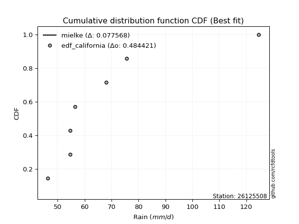</img></img>

</div>


### 2. EDF Hazen (1930)

Hazen method for plotting positions is a formula used to estimate the empirical cumulative probability distribution of flood events or other hydrological data. This formula often results in biased estimations, particularly when extrapolating to extreme events (high return periods).

<div align="center">


$P=(m-0.5)/n$


</div>


**2.1. Empirical values**

<div align="center">

|                | 0                   | 1                   | 2                   | 3         | 4                  | 5                  | 6                  |
|:---------------|:--------------------|:--------------------|:--------------------|:----------|:-------------------|:-------------------|:-------------------|
| date           | 2023                | 2018                | 2021                | 2022      | 2019               | 2020               | 2017               |
| x              | 46.4                | 54.7                | 54.7                | 56.5      | 68.0               | 75.6               | 124.6              |
| m              | 1                   | 2                   | 3                   | 4         | 5                  | 6                  | 7                  |
| empirical_dist | edf_hazen           | edf_hazen           | edf_hazen           | edf_hazen | edf_hazen          | edf_hazen          | edf_hazen          |
| empirical      | 0.07142857142857142 | 0.21428571428571427 | 0.35714285714285715 | 0.5       | 0.6428571428571429 | 0.7857142857142857 | 0.9285714285714286 |
| empirical_tr   | 1.0769230769230769  | 1.2727272727272727  | 1.5555555555555558  | 2.0       | 2.8000000000000003 | 4.666666666666666  | 14.000000000000007 |

</div>


**2.2. Kolmogorov-Smirnov fit test (sorted by Δ)**


<div align="center">

|                | 0                     | 1                   | 2                   | 3                   | 4                   | 5                   | 6                   | 7                   | 8                   | 9                   | 10                  | 11                  | 12                  | 13                  | 14                  | 15                  | 16                  | 17                  | 18                  | 19                  | 20                  | 21                  | 22                  | 23                  | 24                  | 25                  | 26                  | 27                  | 28                  | 29                  | 30                  | 31                  | 32                  | 33                  | 34                  | 35                  | 36                  | 37                  | 38                  | 39                  | 40                  | 41                  | 42                  | 43                  | 44                  | 45                  | 46                  | 47                  | 48                  | 49                  | 50                  | 51                  | 52                  | 53                  | 54                  | 55                  | 56                  | 57                  | 58                  | 59                  | 60                  | 61                  | 62                  | 63                  | 64                  | 65                  | 66                  | 67                  | 68                  | 69                  | 70                  | 71                  | 72                  | 73                  | 74                  | 75                  | 76                  | 77                  | 78                  | 79                  | 80                  | 81                  | 82                  | 83                  | 84                  | 85                  | 86                  | 87                  | 88                  | 89                  | 90                  | 91                  | 92                  | 93                  | 94                  | 95                  | 96                  | 97                  | 98                  | 99                  | 100                 | 101                 | 102                 | 103                 | 104                 | 105                 | 106                 | 107                 | 108                 | 109                 | 110                 | 111                 | 112                 | 113                 | 114                 | 115                 | 116                 | 117                 | 118                 | 119                 | 120                 | 121                 | 122                 | 123                 | 124                 | 125                 | 126                 | 127                 | 128                 | 129                 | 130                 | 131                 | 132                 | 133                 | 134                 | 135                 | 136                 | 137                 | 138                 | 139                 | 140                 | 141                 | 142                 | 143                 | 144                 | 145                 | 146                 | 147                 | 148                 | 149                 | 150                 | 151                 | 152                 | 153                 | 154                 | 155                 | 156                 | 157                 | 158                 | 159                 |
|:---------------|:----------------------|:--------------------|:--------------------|:--------------------|:--------------------|:--------------------|:--------------------|:--------------------|:--------------------|:--------------------|:--------------------|:--------------------|:--------------------|:--------------------|:--------------------|:--------------------|:--------------------|:--------------------|:--------------------|:--------------------|:--------------------|:--------------------|:--------------------|:--------------------|:--------------------|:--------------------|:--------------------|:--------------------|:--------------------|:--------------------|:--------------------|:--------------------|:--------------------|:--------------------|:--------------------|:--------------------|:--------------------|:--------------------|:--------------------|:--------------------|:--------------------|:--------------------|:--------------------|:--------------------|:--------------------|:--------------------|:--------------------|:--------------------|:--------------------|:--------------------|:--------------------|:--------------------|:--------------------|:--------------------|:--------------------|:--------------------|:--------------------|:--------------------|:--------------------|:--------------------|:--------------------|:--------------------|:--------------------|:--------------------|:--------------------|:--------------------|:--------------------|:--------------------|:--------------------|:--------------------|:--------------------|:--------------------|:--------------------|:--------------------|:--------------------|:--------------------|:--------------------|:--------------------|:--------------------|:--------------------|:--------------------|:--------------------|:--------------------|:--------------------|:--------------------|:--------------------|:--------------------|:--------------------|:--------------------|:--------------------|:--------------------|:--------------------|:--------------------|:--------------------|:--------------------|:--------------------|:--------------------|:--------------------|:--------------------|:--------------------|:--------------------|:--------------------|:--------------------|:--------------------|:--------------------|:--------------------|:--------------------|:--------------------|:--------------------|:--------------------|:--------------------|:--------------------|:--------------------|:--------------------|:--------------------|:--------------------|:--------------------|:--------------------|:--------------------|:--------------------|:--------------------|:--------------------|:--------------------|:--------------------|:--------------------|:--------------------|:--------------------|:--------------------|:--------------------|:--------------------|:--------------------|:--------------------|:--------------------|:--------------------|:--------------------|:--------------------|:--------------------|:--------------------|:--------------------|:--------------------|:--------------------|:--------------------|:--------------------|:--------------------|:--------------------|:--------------------|:--------------------|:--------------------|:--------------------|:--------------------|:--------------------|:--------------------|:--------------------|:--------------------|:--------------------|:--------------------|:--------------------|:--------------------|:--------------------|:--------------------|
| station        | 26125508              | 26125508            | 26125508            | 26125508            | 26125508            | 26125508            | 26125508            | 26125508            | 26125508            | 26125508            | 26125508            | 26125508            | 26125508            | 26125508            | 26125508            | 26125508            | 26125508            | 26125508            | 26125508            | 26125508            | 26125508            | 26125508            | 26125508            | 26125508            | 26125508            | 26125508            | 26125508            | 26125508            | 26125508            | 26125508            | 26125508            | 26125508            | 26125508            | 26125508            | 26125508            | 26125508            | 26125508            | 26125508            | 26125508            | 26125508            | 26125508            | 26125508            | 26125508            | 26125508            | 26125508            | 26125508            | 26125508            | 26125508            | 26125508            | 26125508            | 26125508            | 26125508            | 26125508            | 26125508            | 26125508            | 26125508            | 26125508            | 26125508            | 26125508            | 26125508            | 26125508            | 26125508            | 26125508            | 26125508            | 26125508            | 26125508            | 26125508            | 26125508            | 26125508            | 26125508            | 26125508            | 26125508            | 26125508            | 26125508            | 26125508            | 26125508            | 26125508            | 26125508            | 26125508            | 26125508            | 26125508            | 26125508            | 26125508            | 26125508            | 26125508            | 26125508            | 26125508            | 26125508            | 26125508            | 26125508            | 26125508            | 26125508            | 26125508            | 26125508            | 26125508            | 26125508            | 26125508            | 26125508            | 26125508            | 26125508            | 26125508            | 26125508            | 26125508            | 26125508            | 26125508            | 26125508            | 26125508            | 26125508            | 26125508            | 26125508            | 26125508            | 26125508            | 26125508            | 26125508            | 26125508            | 26125508            | 26125508            | 26125508            | 26125508            | 26125508            | 26125508            | 26125508            | 26125508            | 26125508            | 26125508            | 26125508            | 26125508            | 26125508            | 26125508            | 26125508            | 26125508            | 26125508            | 26125508            | 26125508            | 26125508            | 26125508            | 26125508            | 26125508            | 26125508            | 26125508            | 26125508            | 26125508            | 26125508            | 26125508            | 26125508            | 26125508            | 26125508            | 26125508            | 26125508            | 26125508            | 26125508            | 26125508            | 26125508            | 26125508            | 26125508            | 26125508            | 26125508            | 26125508            | 26125508            | 26125508            |
| empirical_dist | edf_hazen             | edf_hazen           | edf_hazen           | edf_hazen           | edf_hazen           | edf_hazen           | edf_hazen           | edf_hazen           | edf_hazen           | edf_hazen           | edf_hazen           | edf_hazen           | edf_hazen           | edf_hazen           | edf_hazen           | edf_hazen           | edf_hazen           | edf_hazen           | edf_hazen           | edf_hazen           | edf_hazen           | edf_hazen           | edf_hazen           | edf_hazen           | edf_hazen           | edf_hazen           | edf_hazen           | edf_hazen           | edf_hazen           | edf_hazen           | edf_hazen           | edf_hazen           | edf_hazen           | edf_hazen           | edf_hazen           | edf_hazen           | edf_hazen           | edf_hazen           | edf_hazen           | edf_hazen           | edf_hazen           | edf_hazen           | edf_hazen           | edf_hazen           | edf_hazen           | edf_hazen           | edf_hazen           | edf_hazen           | edf_hazen           | edf_hazen           | edf_hazen           | edf_hazen           | edf_hazen           | edf_hazen           | edf_hazen           | edf_hazen           | edf_hazen           | edf_hazen           | edf_hazen           | edf_hazen           | edf_hazen           | edf_hazen           | edf_hazen           | edf_hazen           | edf_hazen           | edf_hazen           | edf_hazen           | edf_hazen           | edf_hazen           | edf_hazen           | edf_hazen           | edf_hazen           | edf_hazen           | edf_hazen           | edf_hazen           | edf_hazen           | edf_hazen           | edf_hazen           | edf_hazen           | edf_hazen           | edf_hazen           | edf_hazen           | edf_hazen           | edf_hazen           | edf_hazen           | edf_hazen           | edf_hazen           | edf_hazen           | edf_hazen           | edf_hazen           | edf_hazen           | edf_hazen           | edf_hazen           | edf_hazen           | edf_hazen           | edf_hazen           | edf_hazen           | edf_hazen           | edf_hazen           | edf_hazen           | edf_hazen           | edf_hazen           | edf_hazen           | edf_hazen           | edf_hazen           | edf_hazen           | edf_hazen           | edf_hazen           | edf_hazen           | edf_hazen           | edf_hazen           | edf_hazen           | edf_hazen           | edf_hazen           | edf_hazen           | edf_hazen           | edf_hazen           | edf_hazen           | edf_hazen           | edf_hazen           | edf_hazen           | edf_hazen           | edf_hazen           | edf_hazen           | edf_hazen           | edf_hazen           | edf_hazen           | edf_hazen           | edf_hazen           | edf_hazen           | edf_hazen           | edf_hazen           | edf_hazen           | edf_hazen           | edf_hazen           | edf_hazen           | edf_hazen           | edf_hazen           | edf_hazen           | edf_hazen           | edf_hazen           | edf_hazen           | edf_hazen           | edf_hazen           | edf_hazen           | edf_hazen           | edf_hazen           | edf_hazen           | edf_hazen           | edf_hazen           | edf_hazen           | edf_hazen           | edf_hazen           | edf_hazen           | edf_hazen           | edf_hazen           | edf_hazen           | edf_hazen           | edf_hazen           | edf_hazen           |
| p_dist         | mielke                | logburr12           | logexponnorm        | logalpha            | logwald             | loggenextreme       | loginvweibull       | alpha               | loginvgamma         | genextreme          | f                   | logmielke           | invgamma            | loghalflogistic     | pearson3            | logfoldnorm         | logjohnsonsu        | logt                | logpearson3         | lomax               | loginvgauss         | logmoyal            | wald                | loghalfnorm         | halflogistic        | exponnorm           | loggompertz         | genexpon            | vonmises_line       | loghalfgennorm      | logfatiguelife      | halfnorm            | logvonmises_line    | invgauss            | lograyleigh         | moyal               | loggenexpon         | johnsonsu           | loggumbel_r         | truncweibull_min    | logburr             | gompertz            | foldnorm            | logncf              | rayleigh            | logsemicircular     | logweibull_min      | fatiguelife         | gengamma            | logmaxwell          | gumbel_r            | loggenlogistic      | exponweib           | burr                | logweibull_max      | loggausshyper       | halfgennorm         | loganglit           | maxwell             | truncnorm           | logskewnorm         | burr12              | logkstwobign        | bradford            | loglomax            | nct                 | logarcsine          | logf                | lognct              | logloggamma         | ncf                 | betaprime           | logbetaprime        | lognorm             | logcrystalball      | genlogistic         | anglit              | norm                | crystalball         | semicircular        | logtruncweibull_min | tukeylambda         | logrice             | loggennorm          | loglogistic         | loggengamma         | logexponpow         | logistic            | logtruncexpon       | nakagami            | logloglaplace       | kstwobign           | loghypsecant        | arcsine             | logcosine           | hypsecant           | logbradford         | loggumbel_l         | rice                | gumbel_l            | exponpow            | loglaplace          | loglaplace          | weibull_min         | logexponweib        | laplace             | gausshyper          | skewnorm            | cosine              | logjohnsonsb        | logbeta             | logdgamma           | gennorm             | dweibull            | dgamma              | logdweibull         | logwrapcauchy       | logargus            | logtukeylambda      | logksone            | truncexpon          | loguniform          | logkappa3           | genpareto           | logkappa4           | wrapcauchy          | gamma               | erlang              | lognakagami         | logrdist            | logtriang           | loglevy_l           | beta                | kappa4              | argus               | levy_l              | ksone               | loggenpareto        | uniform             | kappa3              | triang              | rdist               | t                   | loggenhalflogistic  | invweibull          | powerlaw            | loggamma            | loggamma            | logerlang           | logpowerlaw         | genhalflogistic     | logtrapezoid        | logtruncpareto      | trapezoid           | truncpareto         | johnsonsb           | weibull_max         | logtruncnorm        | logvonmises         | vonmises            |
| delta          | 0.0061395006178113914 | 0.11035301527560526 | 0.11118355061105345 | 0.11228879657010771 | 0.11327580349535887 | 0.11505466456549565 | 0.11506784376562498 | 0.11615985458693837 | 0.11814904686869818 | 0.12257438232567544 | 0.1231406751749888  | 0.12443239094445435 | 0.1245686953515944  | 0.12468602996538478 | 0.12494631574143791 | 0.12550843995551667 | 0.1278104984296534  | 0.1285317625441417  | 0.1294197647381803  | 0.12948094801508397 | 0.1304983965908922  | 0.13068187678252297 | 0.13071780368960767 | 0.13098486750325514 | 0.13154030647849693 | 0.13334724459526037 | 0.13470350128792605 | 0.1350329793490634  | 0.13588907535185873 | 0.13599638336125744 | 0.136496598380323   | 0.13675267090648094 | 0.13896146027859457 | 0.13956721015899817 | 0.14149691486764893 | 0.1415125229897457  | 0.14160088793191258 | 0.14236040645668466 | 0.14377308855332732 | 0.1458283917350908  | 0.14611875459438728 | 0.14741515249676124 | 0.14828831810039592 | 0.1490075711954695  | 0.1495397793580841  | 0.1496851688591559  | 0.14971656742385644 | 0.1514614665318629  | 0.152279473433335   | 0.1529888333605302  | 0.1533538395720599  | 0.15335608339358853 | 0.1536205808105305  | 0.1536397825393654  | 0.153732898208377   | 0.15397879597800312 | 0.15554731413804823 | 0.15945249874149048 | 0.1608515038871512  | 0.16269492909104738 | 0.1655343981068111  | 0.16883741608315747 | 0.1698242032698276  | 0.17047214030603802 | 0.17293411011725193 | 0.1729487289755231  | 0.17366654036977758 | 0.17491968032671637 | 0.17729305510903387 | 0.1777652351236117  | 0.17817241279273233 | 0.1785595943275281  | 0.1817289697237528  | 0.18251889466799498 | 0.18251911034121215 | 0.18727554720430467 | 0.18935893458489927 | 0.18972858442179386 | 0.18972859403998432 | 0.19572858445720276 | 0.19574999396312603 | 0.19823911069771227 | 0.20104661915841476 | 0.202585736731837   | 0.2028922604660518  | 0.20699696539138554 | 0.20920453380014528 | 0.21053378236858977 | 0.21093188728376366 | 0.21370225129087406 | 0.21406466589001885 | 0.216025239211469   | 0.2180130316907875  | 0.22143405462358734 | 0.22320749008685903 | 0.2258046857320246  | 0.23292955165105084 | 0.23682377829650225 | 0.23866083661602122 | 0.24263742232185737 | 0.24378639799352486 | 0.24450461964701065 | 0.24450461964701065 | 0.24767342456846833 | 0.2491285419710437  | 0.25174471155123884 | 0.25599527545269807 | 0.26035666882487773 | 0.263334935147297   | 0.2692935838581866  | 0.28522992605787356 | 0.28571428571343793 | 0.2857142857139906  | 0.2857142857142426  | 0.28571428571426694 | 0.2857142857143028  | 0.28765403921408705 | 0.2883709770350824  | 0.28911556382362946 | 0.29056318932422975 | 0.29347754665575465 | 0.30062831014052804 | 0.300817915874377   | 0.30216010856130365 | 0.3053288285924434  | 0.33188296180703547 | 0.334924848420978   | 0.33914047862873975 | 0.34084635446027256 | 0.34556730953655507 | 0.3480045320474978  | 0.3555635330849083  | 0.35746911678894977 | 0.36314486820395003 | 0.3707478024252213  | 0.3754515128046816  | 0.3912130069419072  | 0.39511011240977767 | 0.4123127511874315  | 0.41570103798240293 | 0.4198046885061036  | 0.42740780970172554 | 0.4507557424355768  | 0.4521652681431539  | 0.4808337373330004  | 0.4951706817877053  | 0.5148532175787632  | 0.5148532175787632  | 0.526029675440105   | 0.5284939135599517  | 0.5343954499018881  | 0.5405396774580112  | 0.5635198421340427  | 0.6300830267612438  | 0.638521189972739   | 0.6650949318309488  | 0.686919261520944   | 0.9285714285714286  | 1.0698222812657907  | 19.57088648793499   |
| deltao         | 0.48442053926100004   | 0.48442053926100004 | 0.48442053926100004 | 0.48442053926100004 | 0.48442053926100004 | 0.48442053926100004 | 0.48442053926100004 | 0.48442053926100004 | 0.48442053926100004 | 0.48442053926100004 | 0.48442053926100004 | 0.48442053926100004 | 0.48442053926100004 | 0.48442053926100004 | 0.48442053926100004 | 0.48442053926100004 | 0.48442053926100004 | 0.48442053926100004 | 0.48442053926100004 | 0.48442053926100004 | 0.48442053926100004 | 0.48442053926100004 | 0.48442053926100004 | 0.48442053926100004 | 0.48442053926100004 | 0.48442053926100004 | 0.48442053926100004 | 0.48442053926100004 | 0.48442053926100004 | 0.48442053926100004 | 0.48442053926100004 | 0.48442053926100004 | 0.48442053926100004 | 0.48442053926100004 | 0.48442053926100004 | 0.48442053926100004 | 0.48442053926100004 | 0.48442053926100004 | 0.48442053926100004 | 0.48442053926100004 | 0.48442053926100004 | 0.48442053926100004 | 0.48442053926100004 | 0.48442053926100004 | 0.48442053926100004 | 0.48442053926100004 | 0.48442053926100004 | 0.48442053926100004 | 0.48442053926100004 | 0.48442053926100004 | 0.48442053926100004 | 0.48442053926100004 | 0.48442053926100004 | 0.48442053926100004 | 0.48442053926100004 | 0.48442053926100004 | 0.48442053926100004 | 0.48442053926100004 | 0.48442053926100004 | 0.48442053926100004 | 0.48442053926100004 | 0.48442053926100004 | 0.48442053926100004 | 0.48442053926100004 | 0.48442053926100004 | 0.48442053926100004 | 0.48442053926100004 | 0.48442053926100004 | 0.48442053926100004 | 0.48442053926100004 | 0.48442053926100004 | 0.48442053926100004 | 0.48442053926100004 | 0.48442053926100004 | 0.48442053926100004 | 0.48442053926100004 | 0.48442053926100004 | 0.48442053926100004 | 0.48442053926100004 | 0.48442053926100004 | 0.48442053926100004 | 0.48442053926100004 | 0.48442053926100004 | 0.48442053926100004 | 0.48442053926100004 | 0.48442053926100004 | 0.48442053926100004 | 0.48442053926100004 | 0.48442053926100004 | 0.48442053926100004 | 0.48442053926100004 | 0.48442053926100004 | 0.48442053926100004 | 0.48442053926100004 | 0.48442053926100004 | 0.48442053926100004 | 0.48442053926100004 | 0.48442053926100004 | 0.48442053926100004 | 0.48442053926100004 | 0.48442053926100004 | 0.48442053926100004 | 0.48442053926100004 | 0.48442053926100004 | 0.48442053926100004 | 0.48442053926100004 | 0.48442053926100004 | 0.48442053926100004 | 0.48442053926100004 | 0.48442053926100004 | 0.48442053926100004 | 0.48442053926100004 | 0.48442053926100004 | 0.48442053926100004 | 0.48442053926100004 | 0.48442053926100004 | 0.48442053926100004 | 0.48442053926100004 | 0.48442053926100004 | 0.48442053926100004 | 0.48442053926100004 | 0.48442053926100004 | 0.48442053926100004 | 0.48442053926100004 | 0.48442053926100004 | 0.48442053926100004 | 0.48442053926100004 | 0.48442053926100004 | 0.48442053926100004 | 0.48442053926100004 | 0.48442053926100004 | 0.48442053926100004 | 0.48442053926100004 | 0.48442053926100004 | 0.48442053926100004 | 0.48442053926100004 | 0.48442053926100004 | 0.48442053926100004 | 0.48442053926100004 | 0.48442053926100004 | 0.48442053926100004 | 0.48442053926100004 | 0.48442053926100004 | 0.48442053926100004 | 0.48442053926100004 | 0.48442053926100004 | 0.48442053926100004 | 0.48442053926100004 | 0.48442053926100004 | 0.48442053926100004 | 0.48442053926100004 | 0.48442053926100004 | 0.48442053926100004 | 0.48442053926100004 | 0.48442053926100004 | 0.48442053926100004 | 0.48442053926100004 | 0.48442053926100004 | 0.48442053926100004 | 0.48442053926100004 |
| eval           | Δo > Δ                | Δo > Δ              | Δo > Δ              | Δo > Δ              | Δo > Δ              | Δo > Δ              | Δo > Δ              | Δo > Δ              | Δo > Δ              | Δo > Δ              | Δo > Δ              | Δo > Δ              | Δo > Δ              | Δo > Δ              | Δo > Δ              | Δo > Δ              | Δo > Δ              | Δo > Δ              | Δo > Δ              | Δo > Δ              | Δo > Δ              | Δo > Δ              | Δo > Δ              | Δo > Δ              | Δo > Δ              | Δo > Δ              | Δo > Δ              | Δo > Δ              | Δo > Δ              | Δo > Δ              | Δo > Δ              | Δo > Δ              | Δo > Δ              | Δo > Δ              | Δo > Δ              | Δo > Δ              | Δo > Δ              | Δo > Δ              | Δo > Δ              | Δo > Δ              | Δo > Δ              | Δo > Δ              | Δo > Δ              | Δo > Δ              | Δo > Δ              | Δo > Δ              | Δo > Δ              | Δo > Δ              | Δo > Δ              | Δo > Δ              | Δo > Δ              | Δo > Δ              | Δo > Δ              | Δo > Δ              | Δo > Δ              | Δo > Δ              | Δo > Δ              | Δo > Δ              | Δo > Δ              | Δo > Δ              | Δo > Δ              | Δo > Δ              | Δo > Δ              | Δo > Δ              | Δo > Δ              | Δo > Δ              | Δo > Δ              | Δo > Δ              | Δo > Δ              | Δo > Δ              | Δo > Δ              | Δo > Δ              | Δo > Δ              | Δo > Δ              | Δo > Δ              | Δo > Δ              | Δo > Δ              | Δo > Δ              | Δo > Δ              | Δo > Δ              | Δo > Δ              | Δo > Δ              | Δo > Δ              | Δo > Δ              | Δo > Δ              | Δo > Δ              | Δo > Δ              | Δo > Δ              | Δo > Δ              | Δo > Δ              | Δo > Δ              | Δo > Δ              | Δo > Δ              | Δo > Δ              | Δo > Δ              | Δo > Δ              | Δo > Δ              | Δo > Δ              | Δo > Δ              | Δo > Δ              | Δo > Δ              | Δo > Δ              | Δo > Δ              | Δo > Δ              | Δo > Δ              | Δo > Δ              | Δo > Δ              | Δo > Δ              | Δo > Δ              | Δo > Δ              | Δo > Δ              | Δo > Δ              | Δo > Δ              | Δo > Δ              | Δo > Δ              | Δo > Δ              | Δo > Δ              | Δo > Δ              | Δo > Δ              | Δo > Δ              | Δo > Δ              | Δo > Δ              | Δo > Δ              | Δo > Δ              | Δo > Δ              | Δo > Δ              | Δo > Δ              | Δo > Δ              | Δo > Δ              | Δo > Δ              | Δo > Δ              | Δo > Δ              | Δo > Δ              | Δo > Δ              | Δo > Δ              | Δo > Δ              | Δo > Δ              | Δo > Δ              | Δo > Δ              | Δo > Δ              | Δo > Δ              | Δo > Δ              | Δo > Δ              | Δo > Δ              | Δo > Δ              | Δo <= Δ             | Δo <= Δ             | Δo <= Δ             | Δo <= Δ             | Δo <= Δ             | Δo <= Δ             | Δo <= Δ             | Δo <= Δ             | Δo <= Δ             | Δo <= Δ             | Δo <= Δ             | Δo <= Δ             | Δo <= Δ             | Δo <= Δ             | Δo <= Δ             |
| fit            | 1                     | 1                   | 1                   | 1                   | 1                   | 1                   | 1                   | 1                   | 1                   | 1                   | 1                   | 1                   | 1                   | 1                   | 1                   | 1                   | 1                   | 1                   | 1                   | 1                   | 1                   | 1                   | 1                   | 1                   | 1                   | 1                   | 1                   | 1                   | 1                   | 1                   | 1                   | 1                   | 1                   | 1                   | 1                   | 1                   | 1                   | 1                   | 1                   | 1                   | 1                   | 1                   | 1                   | 1                   | 1                   | 1                   | 1                   | 1                   | 1                   | 1                   | 1                   | 1                   | 1                   | 1                   | 1                   | 1                   | 1                   | 1                   | 1                   | 1                   | 1                   | 1                   | 1                   | 1                   | 1                   | 1                   | 1                   | 1                   | 1                   | 1                   | 1                   | 1                   | 1                   | 1                   | 1                   | 1                   | 1                   | 1                   | 1                   | 1                   | 1                   | 1                   | 1                   | 1                   | 1                   | 1                   | 1                   | 1                   | 1                   | 1                   | 1                   | 1                   | 1                   | 1                   | 1                   | 1                   | 1                   | 1                   | 1                   | 1                   | 1                   | 1                   | 1                   | 1                   | 1                   | 1                   | 1                   | 1                   | 1                   | 1                   | 1                   | 1                   | 1                   | 1                   | 1                   | 1                   | 1                   | 1                   | 1                   | 1                   | 1                   | 1                   | 1                   | 1                   | 1                   | 1                   | 1                   | 1                   | 1                   | 1                   | 1                   | 1                   | 1                   | 1                   | 1                   | 1                   | 1                   | 1                   | 1                   | 1                   | 1                   | 1                   | 1                   | 1                   | 1                   | 0                   | 0                   | 0                   | 0                   | 0                   | 0                   | 0                   | 0                   | 0                   | 0                   | 0                   | 0                   | 0                   | 0                   | 0                   |
| n              | 7                     | 7                   | 7                   | 7                   | 7                   | 7                   | 7                   | 7                   | 7                   | 7                   | 7                   | 7                   | 7                   | 7                   | 7                   | 7                   | 7                   | 7                   | 7                   | 7                   | 7                   | 7                   | 7                   | 7                   | 7                   | 7                   | 7                   | 7                   | 7                   | 7                   | 7                   | 7                   | 7                   | 7                   | 7                   | 7                   | 7                   | 7                   | 7                   | 7                   | 7                   | 7                   | 7                   | 7                   | 7                   | 7                   | 7                   | 7                   | 7                   | 7                   | 7                   | 7                   | 7                   | 7                   | 7                   | 7                   | 7                   | 7                   | 7                   | 7                   | 7                   | 7                   | 7                   | 7                   | 7                   | 7                   | 7                   | 7                   | 7                   | 7                   | 7                   | 7                   | 7                   | 7                   | 7                   | 7                   | 7                   | 7                   | 7                   | 7                   | 7                   | 7                   | 7                   | 7                   | 7                   | 7                   | 7                   | 7                   | 7                   | 7                   | 7                   | 7                   | 7                   | 7                   | 7                   | 7                   | 7                   | 7                   | 7                   | 7                   | 7                   | 7                   | 7                   | 7                   | 7                   | 7                   | 7                   | 7                   | 7                   | 7                   | 7                   | 7                   | 7                   | 7                   | 7                   | 7                   | 7                   | 7                   | 7                   | 7                   | 7                   | 7                   | 7                   | 7                   | 7                   | 7                   | 7                   | 7                   | 7                   | 7                   | 7                   | 7                   | 7                   | 7                   | 7                   | 7                   | 7                   | 7                   | 7                   | 7                   | 7                   | 7                   | 7                   | 7                   | 7                   | 7                   | 7                   | 7                   | 7                   | 7                   | 7                   | 7                   | 7                   | 7                   | 7                   | 7                   | 7                   | 7                   | 7                   | 7                   |
| best_fit       | 1                     | 0                   | 0                   | 0                   | 0                   | 0                   | 0                   | 0                   | 0                   | 0                   | 0                   | 0                   | 0                   | 0                   | 0                   | 0                   | 0                   | 0                   | 0                   | 0                   | 0                   | 0                   | 0                   | 0                   | 0                   | 0                   | 0                   | 0                   | 0                   | 0                   | 0                   | 0                   | 0                   | 0                   | 0                   | 0                   | 0                   | 0                   | 0                   | 0                   | 0                   | 0                   | 0                   | 0                   | 0                   | 0                   | 0                   | 0                   | 0                   | 0                   | 0                   | 0                   | 0                   | 0                   | 0                   | 0                   | 0                   | 0                   | 0                   | 0                   | 0                   | 0                   | 0                   | 0                   | 0                   | 0                   | 0                   | 0                   | 0                   | 0                   | 0                   | 0                   | 0                   | 0                   | 0                   | 0                   | 0                   | 0                   | 0                   | 0                   | 0                   | 0                   | 0                   | 0                   | 0                   | 0                   | 0                   | 0                   | 0                   | 0                   | 0                   | 0                   | 0                   | 0                   | 0                   | 0                   | 0                   | 0                   | 0                   | 0                   | 0                   | 0                   | 0                   | 0                   | 0                   | 0                   | 0                   | 0                   | 0                   | 0                   | 0                   | 0                   | 0                   | 0                   | 0                   | 0                   | 0                   | 0                   | 0                   | 0                   | 0                   | 0                   | 0                   | 0                   | 0                   | 0                   | 0                   | 0                   | 0                   | 0                   | 0                   | 0                   | 0                   | 0                   | 0                   | 0                   | 0                   | 0                   | 0                   | 0                   | 0                   | 0                   | 0                   | 0                   | 0                   | 0                   | 0                   | 0                   | 0                   | 0                   | 0                   | 0                   | 0                   | 0                   | 0                   | 0                   | 0                   | 0                   | 0                   | 0                   |
| best_fit_sort  | 1                     | 2                   | 3                   | 4                   | 5                   | 6                   | 7                   | 8                   | 9                   | 10                  | 11                  | 12                  | 13                  | 14                  | 15                  | 16                  | 17                  | 18                  | 19                  | 20                  | 21                  | 22                  | 23                  | 24                  | 25                  | 26                  | 27                  | 28                  | 29                  | 30                  | 31                  | 32                  | 33                  | 34                  | 35                  | 36                  | 37                  | 38                  | 39                  | 40                  | 41                  | 42                  | 43                  | 44                  | 45                  | 46                  | 47                  | 48                  | 49                  | 50                  | 51                  | 52                  | 53                  | 54                  | 55                  | 56                  | 57                  | 58                  | 59                  | 60                  | 61                  | 62                  | 63                  | 64                  | 65                  | 66                  | 67                  | 68                  | 69                  | 70                  | 71                  | 72                  | 73                  | 74                  | 75                  | 76                  | 77                  | 78                  | 79                  | 80                  | 81                  | 82                  | 83                  | 84                  | 85                  | 86                  | 87                  | 88                  | 89                  | 90                  | 91                  | 92                  | 93                  | 94                  | 95                  | 96                  | 97                  | 98                  | 99                  | 100                 | 101                 | 102                 | 103                 | 104                 | 105                 | 106                 | 107                 | 108                 | 109                 | 110                 | 111                 | 112                 | 113                 | 114                 | 115                 | 116                 | 117                 | 118                 | 119                 | 120                 | 121                 | 122                 | 123                 | 124                 | 125                 | 126                 | 127                 | 128                 | 129                 | 130                 | 131                 | 132                 | 133                 | 134                 | 135                 | 136                 | 137                 | 138                 | 139                 | 140                 | 141                 | 142                 | 143                 | 144                 | 145                 | 146                 | 147                 | 148                 | 149                 | 150                 | 151                 | 152                 | 153                 | 154                 | 155                 | 156                 | 157                 | 158                 | 159                 | 160                 |

</div>


**2.3. Best fit**

<div align="center">

|   id |   station | empirical_dist   | p_dist   |     delta |   deltao | eval   |   fit |   n |   best_fit |   best_fit_sort |
|-----:|----------:|:-----------------|:---------|----------:|---------:|:-------|------:|----:|-----------:|----------------:|
|    0 |  26125508 | edf_hazen        | mielke   | 0.0061395 | 0.484421 | Δo > Δ |     1 |   7 |          1 |               1 |

</div>


<div align="center">

</img></img>

</div>


### 3. EDF Weibull (1939)

Weibull plotting position formula is an empirical method used to estimate the non-exceedance probability or plotting position for a set of observed data, is often recommended or widely used in practice, particularly in flood frequency analysis.

<div align="center">


$P=m/(n+1)$


</div>


**3.1. Empirical values**

<div align="center">

|                | 0                  | 1                  | 2           | 3           | 4                  | 5           | 6           |
|:---------------|:-------------------|:-------------------|:------------|:------------|:-------------------|:------------|:------------|
| date           | 2023               | 2018               | 2021        | 2022        | 2019               | 2020        | 2017        |
| x              | 46.4               | 54.7               | 54.7        | 56.5        | 68.0               | 75.6        | 124.6       |
| m              | 1                  | 2                  | 3           | 4           | 5                  | 6           | 7           |
| empirical_dist | edf_weibull        | edf_weibull        | edf_weibull | edf_weibull | edf_weibull        | edf_weibull | edf_weibull |
| empirical      | 0.125              | 0.25               | 0.375       | 0.5         | 0.625              | 0.75        | 0.875       |
| empirical_tr   | 1.1428571428571428 | 1.3333333333333333 | 1.6         | 2.0         | 2.6666666666666665 | 4.0         | 8.0         |

</div>


**3.2. Kolmogorov-Smirnov fit test (sorted by Δ)**


<div align="center">

|                | 0                   | 1                   | 2                   | 3                   | 4                   | 5                   | 6                   | 7                   | 8                   | 9                   | 10                  | 11                  | 12                  | 13                  | 14                  | 15                  | 16                  | 17                  | 18                  | 19                  | 20                  | 21                  | 22                  | 23                  | 24                  | 25                  | 26                  | 27                  | 28                  | 29                  | 30                  | 31                  | 32                  | 33                  | 34                  | 35                  | 36                  | 37                  | 38                  | 39                  | 40                  | 41                  | 42                  | 43                  | 44                  | 45                  | 46                  | 47                  | 48                  | 49                  | 50                  | 51                  | 52                  | 53                  | 54                  | 55                  | 56                  | 57                  | 58                  | 59                  | 60                  | 61                  | 62                  | 63                  | 64                  | 65                  | 66                  | 67                  | 68                  | 69                  | 70                  | 71                  | 72                  | 73                  | 74                  | 75                  | 76                  | 77                  | 78                  | 79                  | 80                  | 81                  | 82                  | 83                  | 84                  | 85                  | 86                  | 87                  | 88                  | 89                  | 90                  | 91                  | 92                  | 93                  | 94                  | 95                  | 96                  | 97                  | 98                  | 99                  | 100                 | 101                 | 102                 | 103                 | 104                 | 105                 | 106                 | 107                 | 108                 | 109                 | 110                 | 111                 | 112                 | 113                 | 114                 | 115                 | 116                 | 117                 | 118                 | 119                 | 120                 | 121                 | 122                 | 123                 | 124                 | 125                 | 126                 | 127                 | 128                 | 129                 | 130                 | 131                 | 132                 | 133                 | 134                 | 135                 | 136                 | 137                 | 138                 | 139                 | 140                 | 141                 | 142                 | 143                 | 144                 | 145                 | 146                 | 147                 | 148                 | 149                 | 150                 | 151                 | 152                 | 153                 | 154                 | 155                 | 156                 | 157                 | 158                 | 159                 |
|:---------------|:--------------------|:--------------------|:--------------------|:--------------------|:--------------------|:--------------------|:--------------------|:--------------------|:--------------------|:--------------------|:--------------------|:--------------------|:--------------------|:--------------------|:--------------------|:--------------------|:--------------------|:--------------------|:--------------------|:--------------------|:--------------------|:--------------------|:--------------------|:--------------------|:--------------------|:--------------------|:--------------------|:--------------------|:--------------------|:--------------------|:--------------------|:--------------------|:--------------------|:--------------------|:--------------------|:--------------------|:--------------------|:--------------------|:--------------------|:--------------------|:--------------------|:--------------------|:--------------------|:--------------------|:--------------------|:--------------------|:--------------------|:--------------------|:--------------------|:--------------------|:--------------------|:--------------------|:--------------------|:--------------------|:--------------------|:--------------------|:--------------------|:--------------------|:--------------------|:--------------------|:--------------------|:--------------------|:--------------------|:--------------------|:--------------------|:--------------------|:--------------------|:--------------------|:--------------------|:--------------------|:--------------------|:--------------------|:--------------------|:--------------------|:--------------------|:--------------------|:--------------------|:--------------------|:--------------------|:--------------------|:--------------------|:--------------------|:--------------------|:--------------------|:--------------------|:--------------------|:--------------------|:--------------------|:--------------------|:--------------------|:--------------------|:--------------------|:--------------------|:--------------------|:--------------------|:--------------------|:--------------------|:--------------------|:--------------------|:--------------------|:--------------------|:--------------------|:--------------------|:--------------------|:--------------------|:--------------------|:--------------------|:--------------------|:--------------------|:--------------------|:--------------------|:--------------------|:--------------------|:--------------------|:--------------------|:--------------------|:--------------------|:--------------------|:--------------------|:--------------------|:--------------------|:--------------------|:--------------------|:--------------------|:--------------------|:--------------------|:--------------------|:--------------------|:--------------------|:--------------------|:--------------------|:--------------------|:--------------------|:--------------------|:--------------------|:--------------------|:--------------------|:--------------------|:--------------------|:--------------------|:--------------------|:--------------------|:--------------------|:--------------------|:--------------------|:--------------------|:--------------------|:--------------------|:--------------------|:--------------------|:--------------------|:--------------------|:--------------------|:--------------------|:--------------------|:--------------------|:--------------------|:--------------------|:--------------------|:--------------------|
| station        | 26125508            | 26125508            | 26125508            | 26125508            | 26125508            | 26125508            | 26125508            | 26125508            | 26125508            | 26125508            | 26125508            | 26125508            | 26125508            | 26125508            | 26125508            | 26125508            | 26125508            | 26125508            | 26125508            | 26125508            | 26125508            | 26125508            | 26125508            | 26125508            | 26125508            | 26125508            | 26125508            | 26125508            | 26125508            | 26125508            | 26125508            | 26125508            | 26125508            | 26125508            | 26125508            | 26125508            | 26125508            | 26125508            | 26125508            | 26125508            | 26125508            | 26125508            | 26125508            | 26125508            | 26125508            | 26125508            | 26125508            | 26125508            | 26125508            | 26125508            | 26125508            | 26125508            | 26125508            | 26125508            | 26125508            | 26125508            | 26125508            | 26125508            | 26125508            | 26125508            | 26125508            | 26125508            | 26125508            | 26125508            | 26125508            | 26125508            | 26125508            | 26125508            | 26125508            | 26125508            | 26125508            | 26125508            | 26125508            | 26125508            | 26125508            | 26125508            | 26125508            | 26125508            | 26125508            | 26125508            | 26125508            | 26125508            | 26125508            | 26125508            | 26125508            | 26125508            | 26125508            | 26125508            | 26125508            | 26125508            | 26125508            | 26125508            | 26125508            | 26125508            | 26125508            | 26125508            | 26125508            | 26125508            | 26125508            | 26125508            | 26125508            | 26125508            | 26125508            | 26125508            | 26125508            | 26125508            | 26125508            | 26125508            | 26125508            | 26125508            | 26125508            | 26125508            | 26125508            | 26125508            | 26125508            | 26125508            | 26125508            | 26125508            | 26125508            | 26125508            | 26125508            | 26125508            | 26125508            | 26125508            | 26125508            | 26125508            | 26125508            | 26125508            | 26125508            | 26125508            | 26125508            | 26125508            | 26125508            | 26125508            | 26125508            | 26125508            | 26125508            | 26125508            | 26125508            | 26125508            | 26125508            | 26125508            | 26125508            | 26125508            | 26125508            | 26125508            | 26125508            | 26125508            | 26125508            | 26125508            | 26125508            | 26125508            | 26125508            | 26125508            | 26125508            | 26125508            | 26125508            | 26125508            | 26125508            | 26125508            |
| empirical_dist | edf_weibull         | edf_weibull         | edf_weibull         | edf_weibull         | edf_weibull         | edf_weibull         | edf_weibull         | edf_weibull         | edf_weibull         | edf_weibull         | edf_weibull         | edf_weibull         | edf_weibull         | edf_weibull         | edf_weibull         | edf_weibull         | edf_weibull         | edf_weibull         | edf_weibull         | edf_weibull         | edf_weibull         | edf_weibull         | edf_weibull         | edf_weibull         | edf_weibull         | edf_weibull         | edf_weibull         | edf_weibull         | edf_weibull         | edf_weibull         | edf_weibull         | edf_weibull         | edf_weibull         | edf_weibull         | edf_weibull         | edf_weibull         | edf_weibull         | edf_weibull         | edf_weibull         | edf_weibull         | edf_weibull         | edf_weibull         | edf_weibull         | edf_weibull         | edf_weibull         | edf_weibull         | edf_weibull         | edf_weibull         | edf_weibull         | edf_weibull         | edf_weibull         | edf_weibull         | edf_weibull         | edf_weibull         | edf_weibull         | edf_weibull         | edf_weibull         | edf_weibull         | edf_weibull         | edf_weibull         | edf_weibull         | edf_weibull         | edf_weibull         | edf_weibull         | edf_weibull         | edf_weibull         | edf_weibull         | edf_weibull         | edf_weibull         | edf_weibull         | edf_weibull         | edf_weibull         | edf_weibull         | edf_weibull         | edf_weibull         | edf_weibull         | edf_weibull         | edf_weibull         | edf_weibull         | edf_weibull         | edf_weibull         | edf_weibull         | edf_weibull         | edf_weibull         | edf_weibull         | edf_weibull         | edf_weibull         | edf_weibull         | edf_weibull         | edf_weibull         | edf_weibull         | edf_weibull         | edf_weibull         | edf_weibull         | edf_weibull         | edf_weibull         | edf_weibull         | edf_weibull         | edf_weibull         | edf_weibull         | edf_weibull         | edf_weibull         | edf_weibull         | edf_weibull         | edf_weibull         | edf_weibull         | edf_weibull         | edf_weibull         | edf_weibull         | edf_weibull         | edf_weibull         | edf_weibull         | edf_weibull         | edf_weibull         | edf_weibull         | edf_weibull         | edf_weibull         | edf_weibull         | edf_weibull         | edf_weibull         | edf_weibull         | edf_weibull         | edf_weibull         | edf_weibull         | edf_weibull         | edf_weibull         | edf_weibull         | edf_weibull         | edf_weibull         | edf_weibull         | edf_weibull         | edf_weibull         | edf_weibull         | edf_weibull         | edf_weibull         | edf_weibull         | edf_weibull         | edf_weibull         | edf_weibull         | edf_weibull         | edf_weibull         | edf_weibull         | edf_weibull         | edf_weibull         | edf_weibull         | edf_weibull         | edf_weibull         | edf_weibull         | edf_weibull         | edf_weibull         | edf_weibull         | edf_weibull         | edf_weibull         | edf_weibull         | edf_weibull         | edf_weibull         | edf_weibull         | edf_weibull         | edf_weibull         | edf_weibull         |
| p_dist         | mielke              | loginvgauss         | logjohnsonsu        | invgamma            | genextreme          | logfatiguelife      | f                   | loginvgamma         | alpha               | logt                | invgauss            | loginvweibull       | loggenextreme       | johnsonsu           | loghalflogistic     | loghalfnorm         | logburr12           | logexponnorm        | logalpha            | foldnorm            | logncf              | fatiguelife         | halflogistic        | halfnorm            | logfoldnorm         | pearson3            | logmielke           | truncweibull_min    | loghalfgennorm      | loggenexpon         | exponweib           | loggompertz         | gengamma            | logweibull_min      | logwald             | logpearson3         | lomax               | logmoyal            | wald                | burr12              | exponnorm           | genexpon            | vonmises_line       | loglomax            | logarcsine          | logvonmises_line    | logf                | lograyleigh         | moyal               | loggumbel_r         | logburr             | gompertz            | rayleigh            | logsemicircular     | logmaxwell          | gumbel_r            | loggenlogistic      | burr                | logweibull_max      | loggausshyper       | halfgennorm         | loganglit           | semicircular        | maxwell             | truncnorm           | logskewnorm         | anglit              | logkstwobign        | bradford            | loggengamma         | nct                 | logexponpow         | lognct              | logloggamma         | ncf                 | logloglaplace       | betaprime           | logbetaprime        | lognorm             | logcrystalball      | arcsine             | genlogistic         | norm                | crystalball         | logtruncweibull_min | logrice             | nakagami            | loglogistic         | logistic            | logtruncexpon       | weibull_min         | logexponweib        | kstwobign           | loghypsecant        | loggennorm          | logcosine           | hypsecant           | logbradford         | logjohnsonsb        | tukeylambda         | loggumbel_l         | rice                | cosine              | gumbel_l            | exponpow            | loglaplace          | loglaplace          | logbeta             | logdgamma           | dweibull            | dgamma              | logdweibull         | laplace             | logwrapcauchy       | logksone            | gausshyper          | skewnorm            | genpareto           | logargus            | gennorm             | logtukeylambda      | truncexpon          | wrapcauchy          | gamma               | loguniform          | logkappa3           | logkappa4           | loglevy_l           | erlang              | lognakagami         | logrdist            | logtriang           | beta                | levy_l              | kappa4              | argus               | loggenpareto        | ksone               | rdist               | uniform             | kappa3              | triang              | loggenhalflogistic  | invweibull          | t                   | powerlaw            | loggamma            | loggamma            | logerlang           | logpowerlaw         | genhalflogistic     | logtrapezoid        | logtruncpareto      | trapezoid           | truncpareto         | johnsonsb           | weibull_max         | logtruncnorm        | logvonmises         | vonmises            |
| delta          | 0.05971092918923997 | 0.09478411087660649 | 0.09532012246290161 | 0.09832645831306669 | 0.09914735919614731 | 0.10078231266603727 | 0.10099615643179927 | 0.1032819184021122  | 0.10352889562293938 | 0.10381070804573622 | 0.10385292444471245 | 0.10535030126189754 | 0.10536329643647474 | 0.10664612074239893 | 0.10686596330817061 | 0.10886247290294654 | 0.11035301527560526 | 0.11118355061105345 | 0.11228879657010771 | 0.11257403238611019 | 0.11329328548118378 | 0.11574718081757718 | 0.11696302094128697 | 0.11746624125396443 | 0.12012400730796918 | 0.12224981463750267 | 0.12443239094445435 | 0.12499999972130982 | 0.12499999984410047 | 0.12499999990713709 | 0.12499999999349606 | 0.1249999999949255  | 0.1249999999955842  | 0.12499999999999235 | 0.125               | 0.1294197647381803  | 0.12948094801508397 | 0.13068187678252297 | 0.13071780368960767 | 0.13312313036887174 | 0.13334724459526037 | 0.1350329793490634  | 0.13588907535185873 | 0.1372198244029662  | 0.13795225465549188 | 0.13896146027859457 | 0.13920539461243064 | 0.14149691486764893 | 0.1415125229897457  | 0.14377308855332732 | 0.14611875459438728 | 0.14741515249676124 | 0.1495397793580841  | 0.1496851688591559  | 0.1529888333605302  | 0.1533538395720599  | 0.15335608339358853 | 0.1536397825393654  | 0.153732898208377   | 0.15397879597800312 | 0.15554731413804823 | 0.15945249874149048 | 0.16001429874291706 | 0.1608515038871512  | 0.16269492909104738 | 0.1655343981068111  | 0.16602254260389643 | 0.1698242032698276  | 0.17047214030603802 | 0.17128267967709981 | 0.1729487289755231  | 0.17349024808585956 | 0.17729305510903387 | 0.1777652351236117  | 0.17817241279273233 | 0.17835038017573313 | 0.1785595943275281  | 0.1817289697237528  | 0.18251889466799498 | 0.18251911034121215 | 0.18571976890930164 | 0.18727554720430467 | 0.18972858442179386 | 0.18972859403998432 | 0.19574999396312603 | 0.20104661915841476 | 0.20278161808257228 | 0.2028922604660518  | 0.21053378236858977 | 0.21093188728376366 | 0.2119591388541826  | 0.21341425625675797 | 0.216025239211469   | 0.2180130316907875  | 0.2204428795889799  | 0.22320749008685903 | 0.2258046857320246  | 0.23292955165105084 | 0.23357929814390088 | 0.23395339641199797 | 0.23682377829650225 | 0.23866083661602122 | 0.2386691637501961  | 0.24263742232185737 | 0.24378639799352486 | 0.24450461964701065 | 0.24450461964701065 | 0.24951564034358786 | 0.24999999999915223 | 0.24999999999995692 | 0.24999999999998124 | 0.2500000000000171  | 0.25174471155123884 | 0.25193975349980136 | 0.25484890360994406 | 0.25599527545269807 | 0.26035666882487773 | 0.26644582284701795 | 0.27072492233398504 | 0.27761606920353576 | 0.2891046614205166  | 0.29347754665575465 | 0.29616867609274977 | 0.29921056270669233 | 0.30062831014052804 | 0.300817915874377   | 0.30084087429696155 | 0.3019921045134797  | 0.30342619291445405 | 0.30513206874598686 | 0.30985302382226937 | 0.3122902463332121  | 0.32175483107466407 | 0.321880084233253   | 0.333625890809938   | 0.3350335167109356  | 0.34153868383834907 | 0.3554987212276215  | 0.37383638113029694 | 0.3765984654731458  | 0.37998675226811723 | 0.3840904027918179  | 0.4164509824288682  | 0.4272623087615718  | 0.4507557424355768  | 0.4594563960734196  | 0.47913893186447754 | 0.47913893186447754 | 0.49031538972581934 | 0.492779627845666   | 0.4986811641876024  | 0.5048253917437255  | 0.527805556419757   | 0.5943687410469581  | 0.6028069042584533  | 0.6293806461166631  | 0.6512049758066583  | 0.875               | 1.1090166907354777  | 19.62445791650642   |
| deltao         | 0.48442053926100004 | 0.48442053926100004 | 0.48442053926100004 | 0.48442053926100004 | 0.48442053926100004 | 0.48442053926100004 | 0.48442053926100004 | 0.48442053926100004 | 0.48442053926100004 | 0.48442053926100004 | 0.48442053926100004 | 0.48442053926100004 | 0.48442053926100004 | 0.48442053926100004 | 0.48442053926100004 | 0.48442053926100004 | 0.48442053926100004 | 0.48442053926100004 | 0.48442053926100004 | 0.48442053926100004 | 0.48442053926100004 | 0.48442053926100004 | 0.48442053926100004 | 0.48442053926100004 | 0.48442053926100004 | 0.48442053926100004 | 0.48442053926100004 | 0.48442053926100004 | 0.48442053926100004 | 0.48442053926100004 | 0.48442053926100004 | 0.48442053926100004 | 0.48442053926100004 | 0.48442053926100004 | 0.48442053926100004 | 0.48442053926100004 | 0.48442053926100004 | 0.48442053926100004 | 0.48442053926100004 | 0.48442053926100004 | 0.48442053926100004 | 0.48442053926100004 | 0.48442053926100004 | 0.48442053926100004 | 0.48442053926100004 | 0.48442053926100004 | 0.48442053926100004 | 0.48442053926100004 | 0.48442053926100004 | 0.48442053926100004 | 0.48442053926100004 | 0.48442053926100004 | 0.48442053926100004 | 0.48442053926100004 | 0.48442053926100004 | 0.48442053926100004 | 0.48442053926100004 | 0.48442053926100004 | 0.48442053926100004 | 0.48442053926100004 | 0.48442053926100004 | 0.48442053926100004 | 0.48442053926100004 | 0.48442053926100004 | 0.48442053926100004 | 0.48442053926100004 | 0.48442053926100004 | 0.48442053926100004 | 0.48442053926100004 | 0.48442053926100004 | 0.48442053926100004 | 0.48442053926100004 | 0.48442053926100004 | 0.48442053926100004 | 0.48442053926100004 | 0.48442053926100004 | 0.48442053926100004 | 0.48442053926100004 | 0.48442053926100004 | 0.48442053926100004 | 0.48442053926100004 | 0.48442053926100004 | 0.48442053926100004 | 0.48442053926100004 | 0.48442053926100004 | 0.48442053926100004 | 0.48442053926100004 | 0.48442053926100004 | 0.48442053926100004 | 0.48442053926100004 | 0.48442053926100004 | 0.48442053926100004 | 0.48442053926100004 | 0.48442053926100004 | 0.48442053926100004 | 0.48442053926100004 | 0.48442053926100004 | 0.48442053926100004 | 0.48442053926100004 | 0.48442053926100004 | 0.48442053926100004 | 0.48442053926100004 | 0.48442053926100004 | 0.48442053926100004 | 0.48442053926100004 | 0.48442053926100004 | 0.48442053926100004 | 0.48442053926100004 | 0.48442053926100004 | 0.48442053926100004 | 0.48442053926100004 | 0.48442053926100004 | 0.48442053926100004 | 0.48442053926100004 | 0.48442053926100004 | 0.48442053926100004 | 0.48442053926100004 | 0.48442053926100004 | 0.48442053926100004 | 0.48442053926100004 | 0.48442053926100004 | 0.48442053926100004 | 0.48442053926100004 | 0.48442053926100004 | 0.48442053926100004 | 0.48442053926100004 | 0.48442053926100004 | 0.48442053926100004 | 0.48442053926100004 | 0.48442053926100004 | 0.48442053926100004 | 0.48442053926100004 | 0.48442053926100004 | 0.48442053926100004 | 0.48442053926100004 | 0.48442053926100004 | 0.48442053926100004 | 0.48442053926100004 | 0.48442053926100004 | 0.48442053926100004 | 0.48442053926100004 | 0.48442053926100004 | 0.48442053926100004 | 0.48442053926100004 | 0.48442053926100004 | 0.48442053926100004 | 0.48442053926100004 | 0.48442053926100004 | 0.48442053926100004 | 0.48442053926100004 | 0.48442053926100004 | 0.48442053926100004 | 0.48442053926100004 | 0.48442053926100004 | 0.48442053926100004 | 0.48442053926100004 | 0.48442053926100004 | 0.48442053926100004 | 0.48442053926100004 | 0.48442053926100004 |
| eval           | Δo > Δ              | Δo > Δ              | Δo > Δ              | Δo > Δ              | Δo > Δ              | Δo > Δ              | Δo > Δ              | Δo > Δ              | Δo > Δ              | Δo > Δ              | Δo > Δ              | Δo > Δ              | Δo > Δ              | Δo > Δ              | Δo > Δ              | Δo > Δ              | Δo > Δ              | Δo > Δ              | Δo > Δ              | Δo > Δ              | Δo > Δ              | Δo > Δ              | Δo > Δ              | Δo > Δ              | Δo > Δ              | Δo > Δ              | Δo > Δ              | Δo > Δ              | Δo > Δ              | Δo > Δ              | Δo > Δ              | Δo > Δ              | Δo > Δ              | Δo > Δ              | Δo > Δ              | Δo > Δ              | Δo > Δ              | Δo > Δ              | Δo > Δ              | Δo > Δ              | Δo > Δ              | Δo > Δ              | Δo > Δ              | Δo > Δ              | Δo > Δ              | Δo > Δ              | Δo > Δ              | Δo > Δ              | Δo > Δ              | Δo > Δ              | Δo > Δ              | Δo > Δ              | Δo > Δ              | Δo > Δ              | Δo > Δ              | Δo > Δ              | Δo > Δ              | Δo > Δ              | Δo > Δ              | Δo > Δ              | Δo > Δ              | Δo > Δ              | Δo > Δ              | Δo > Δ              | Δo > Δ              | Δo > Δ              | Δo > Δ              | Δo > Δ              | Δo > Δ              | Δo > Δ              | Δo > Δ              | Δo > Δ              | Δo > Δ              | Δo > Δ              | Δo > Δ              | Δo > Δ              | Δo > Δ              | Δo > Δ              | Δo > Δ              | Δo > Δ              | Δo > Δ              | Δo > Δ              | Δo > Δ              | Δo > Δ              | Δo > Δ              | Δo > Δ              | Δo > Δ              | Δo > Δ              | Δo > Δ              | Δo > Δ              | Δo > Δ              | Δo > Δ              | Δo > Δ              | Δo > Δ              | Δo > Δ              | Δo > Δ              | Δo > Δ              | Δo > Δ              | Δo > Δ              | Δo > Δ              | Δo > Δ              | Δo > Δ              | Δo > Δ              | Δo > Δ              | Δo > Δ              | Δo > Δ              | Δo > Δ              | Δo > Δ              | Δo > Δ              | Δo > Δ              | Δo > Δ              | Δo > Δ              | Δo > Δ              | Δo > Δ              | Δo > Δ              | Δo > Δ              | Δo > Δ              | Δo > Δ              | Δo > Δ              | Δo > Δ              | Δo > Δ              | Δo > Δ              | Δo > Δ              | Δo > Δ              | Δo > Δ              | Δo > Δ              | Δo > Δ              | Δo > Δ              | Δo > Δ              | Δo > Δ              | Δo > Δ              | Δo > Δ              | Δo > Δ              | Δo > Δ              | Δo > Δ              | Δo > Δ              | Δo > Δ              | Δo > Δ              | Δo > Δ              | Δo > Δ              | Δo > Δ              | Δo > Δ              | Δo > Δ              | Δo > Δ              | Δo > Δ              | Δo > Δ              | Δo > Δ              | Δo > Δ              | Δo <= Δ             | Δo <= Δ             | Δo <= Δ             | Δo <= Δ             | Δo <= Δ             | Δo <= Δ             | Δo <= Δ             | Δo <= Δ             | Δo <= Δ             | Δo <= Δ             | Δo <= Δ             | Δo <= Δ             |
| fit            | 1                   | 1                   | 1                   | 1                   | 1                   | 1                   | 1                   | 1                   | 1                   | 1                   | 1                   | 1                   | 1                   | 1                   | 1                   | 1                   | 1                   | 1                   | 1                   | 1                   | 1                   | 1                   | 1                   | 1                   | 1                   | 1                   | 1                   | 1                   | 1                   | 1                   | 1                   | 1                   | 1                   | 1                   | 1                   | 1                   | 1                   | 1                   | 1                   | 1                   | 1                   | 1                   | 1                   | 1                   | 1                   | 1                   | 1                   | 1                   | 1                   | 1                   | 1                   | 1                   | 1                   | 1                   | 1                   | 1                   | 1                   | 1                   | 1                   | 1                   | 1                   | 1                   | 1                   | 1                   | 1                   | 1                   | 1                   | 1                   | 1                   | 1                   | 1                   | 1                   | 1                   | 1                   | 1                   | 1                   | 1                   | 1                   | 1                   | 1                   | 1                   | 1                   | 1                   | 1                   | 1                   | 1                   | 1                   | 1                   | 1                   | 1                   | 1                   | 1                   | 1                   | 1                   | 1                   | 1                   | 1                   | 1                   | 1                   | 1                   | 1                   | 1                   | 1                   | 1                   | 1                   | 1                   | 1                   | 1                   | 1                   | 1                   | 1                   | 1                   | 1                   | 1                   | 1                   | 1                   | 1                   | 1                   | 1                   | 1                   | 1                   | 1                   | 1                   | 1                   | 1                   | 1                   | 1                   | 1                   | 1                   | 1                   | 1                   | 1                   | 1                   | 1                   | 1                   | 1                   | 1                   | 1                   | 1                   | 1                   | 1                   | 1                   | 1                   | 1                   | 1                   | 1                   | 1                   | 1                   | 0                   | 0                   | 0                   | 0                   | 0                   | 0                   | 0                   | 0                   | 0                   | 0                   | 0                   | 0                   |
| n              | 7                   | 7                   | 7                   | 7                   | 7                   | 7                   | 7                   | 7                   | 7                   | 7                   | 7                   | 7                   | 7                   | 7                   | 7                   | 7                   | 7                   | 7                   | 7                   | 7                   | 7                   | 7                   | 7                   | 7                   | 7                   | 7                   | 7                   | 7                   | 7                   | 7                   | 7                   | 7                   | 7                   | 7                   | 7                   | 7                   | 7                   | 7                   | 7                   | 7                   | 7                   | 7                   | 7                   | 7                   | 7                   | 7                   | 7                   | 7                   | 7                   | 7                   | 7                   | 7                   | 7                   | 7                   | 7                   | 7                   | 7                   | 7                   | 7                   | 7                   | 7                   | 7                   | 7                   | 7                   | 7                   | 7                   | 7                   | 7                   | 7                   | 7                   | 7                   | 7                   | 7                   | 7                   | 7                   | 7                   | 7                   | 7                   | 7                   | 7                   | 7                   | 7                   | 7                   | 7                   | 7                   | 7                   | 7                   | 7                   | 7                   | 7                   | 7                   | 7                   | 7                   | 7                   | 7                   | 7                   | 7                   | 7                   | 7                   | 7                   | 7                   | 7                   | 7                   | 7                   | 7                   | 7                   | 7                   | 7                   | 7                   | 7                   | 7                   | 7                   | 7                   | 7                   | 7                   | 7                   | 7                   | 7                   | 7                   | 7                   | 7                   | 7                   | 7                   | 7                   | 7                   | 7                   | 7                   | 7                   | 7                   | 7                   | 7                   | 7                   | 7                   | 7                   | 7                   | 7                   | 7                   | 7                   | 7                   | 7                   | 7                   | 7                   | 7                   | 7                   | 7                   | 7                   | 7                   | 7                   | 7                   | 7                   | 7                   | 7                   | 7                   | 7                   | 7                   | 7                   | 7                   | 7                   | 7                   | 7                   |
| best_fit       | 1                   | 0                   | 0                   | 0                   | 0                   | 0                   | 0                   | 0                   | 0                   | 0                   | 0                   | 0                   | 0                   | 0                   | 0                   | 0                   | 0                   | 0                   | 0                   | 0                   | 0                   | 0                   | 0                   | 0                   | 0                   | 0                   | 0                   | 0                   | 0                   | 0                   | 0                   | 0                   | 0                   | 0                   | 0                   | 0                   | 0                   | 0                   | 0                   | 0                   | 0                   | 0                   | 0                   | 0                   | 0                   | 0                   | 0                   | 0                   | 0                   | 0                   | 0                   | 0                   | 0                   | 0                   | 0                   | 0                   | 0                   | 0                   | 0                   | 0                   | 0                   | 0                   | 0                   | 0                   | 0                   | 0                   | 0                   | 0                   | 0                   | 0                   | 0                   | 0                   | 0                   | 0                   | 0                   | 0                   | 0                   | 0                   | 0                   | 0                   | 0                   | 0                   | 0                   | 0                   | 0                   | 0                   | 0                   | 0                   | 0                   | 0                   | 0                   | 0                   | 0                   | 0                   | 0                   | 0                   | 0                   | 0                   | 0                   | 0                   | 0                   | 0                   | 0                   | 0                   | 0                   | 0                   | 0                   | 0                   | 0                   | 0                   | 0                   | 0                   | 0                   | 0                   | 0                   | 0                   | 0                   | 0                   | 0                   | 0                   | 0                   | 0                   | 0                   | 0                   | 0                   | 0                   | 0                   | 0                   | 0                   | 0                   | 0                   | 0                   | 0                   | 0                   | 0                   | 0                   | 0                   | 0                   | 0                   | 0                   | 0                   | 0                   | 0                   | 0                   | 0                   | 0                   | 0                   | 0                   | 0                   | 0                   | 0                   | 0                   | 0                   | 0                   | 0                   | 0                   | 0                   | 0                   | 0                   | 0                   |
| best_fit_sort  | 1                   | 2                   | 3                   | 4                   | 5                   | 6                   | 7                   | 8                   | 9                   | 10                  | 11                  | 12                  | 13                  | 14                  | 15                  | 16                  | 17                  | 18                  | 19                  | 20                  | 21                  | 22                  | 23                  | 24                  | 25                  | 26                  | 27                  | 28                  | 29                  | 30                  | 31                  | 32                  | 33                  | 34                  | 35                  | 36                  | 37                  | 38                  | 39                  | 40                  | 41                  | 42                  | 43                  | 44                  | 45                  | 46                  | 47                  | 48                  | 49                  | 50                  | 51                  | 52                  | 53                  | 54                  | 55                  | 56                  | 57                  | 58                  | 59                  | 60                  | 61                  | 62                  | 63                  | 64                  | 65                  | 66                  | 67                  | 68                  | 69                  | 70                  | 71                  | 72                  | 73                  | 74                  | 75                  | 76                  | 77                  | 78                  | 79                  | 80                  | 81                  | 82                  | 83                  | 84                  | 85                  | 86                  | 87                  | 88                  | 89                  | 90                  | 91                  | 92                  | 93                  | 94                  | 95                  | 96                  | 97                  | 98                  | 99                  | 100                 | 101                 | 102                 | 103                 | 104                 | 105                 | 106                 | 107                 | 108                 | 109                 | 110                 | 111                 | 112                 | 113                 | 114                 | 115                 | 116                 | 117                 | 118                 | 119                 | 120                 | 121                 | 122                 | 123                 | 124                 | 125                 | 126                 | 127                 | 128                 | 129                 | 130                 | 131                 | 132                 | 133                 | 134                 | 135                 | 136                 | 137                 | 138                 | 139                 | 140                 | 141                 | 142                 | 143                 | 144                 | 145                 | 146                 | 147                 | 148                 | 149                 | 150                 | 151                 | 152                 | 153                 | 154                 | 155                 | 156                 | 157                 | 158                 | 159                 | 160                 |

</div>


**3.3. Best fit**

<div align="center">

|   id |   station | empirical_dist   | p_dist   |     delta |   deltao | eval   |   fit |   n |   best_fit |   best_fit_sort |
|-----:|----------:|:-----------------|:---------|----------:|---------:|:-------|------:|----:|-----------:|----------------:|
|    0 |  26125508 | edf_weibull      | mielke   | 0.0597109 | 0.484421 | Δo > Δ |     1 |   7 |          1 |               1 |

</div>


<div align="center">

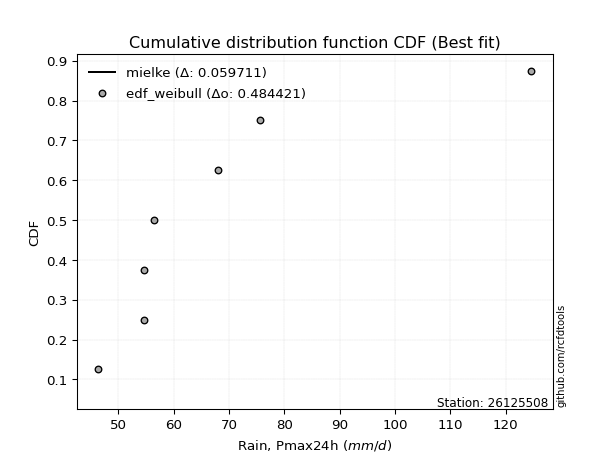</img>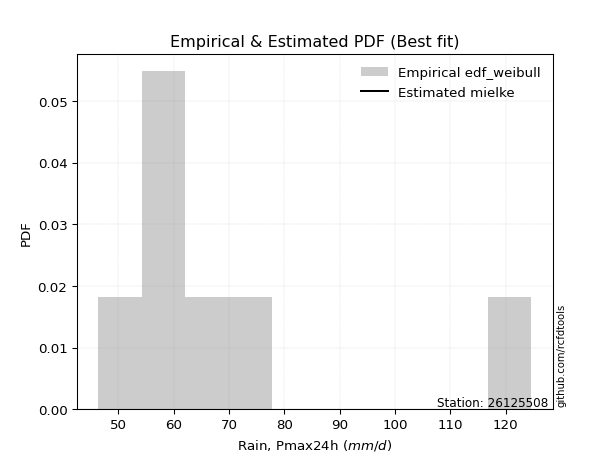</img>

</div>


### 4. EDF Beard (1943)

The Beard formula (or Beard´s plotting position formula) in hydrology is used to estimate the empirical non-exceedance probability _(P)_ of a flood event (or other extreme hydrological data point) within a given dataset.

<div align="center">


$P=(m-0.31)/(n+0.38)$


</div>


**4.1. Empirical values**

<div align="center">

|                | 0                   | 1                   | 2                   | 3         | 4                  | 5                  | 6                  |
|:---------------|:--------------------|:--------------------|:--------------------|:----------|:-------------------|:-------------------|:-------------------|
| date           | 2023                | 2018                | 2021                | 2022      | 2019               | 2020               | 2017               |
| x              | 46.4                | 54.7                | 54.7                | 56.5      | 68.0               | 75.6               | 124.6              |
| m              | 1                   | 2                   | 3                   | 4         | 5                  | 6                  | 7                  |
| empirical_dist | edf_beard           | edf_beard           | edf_beard           | edf_beard | edf_beard          | edf_beard          | edf_beard          |
| empirical      | 0.09349593495934959 | 0.22899728997289973 | 0.36449864498644985 | 0.5       | 0.6355013550135502 | 0.7710027100271003 | 0.9065040650406505 |
| empirical_tr   | 1.1031390134529149  | 1.29701230228471    | 1.5735607675906182  | 2.0       | 2.743494423791822  | 4.366863905325444  | 10.695652173913055 |

</div>


**4.2. Kolmogorov-Smirnov fit test (sorted by Δ)**


<div align="center">

|                | 0                    | 1                   | 2                   | 3                   | 4                   | 5                   | 6                   | 7                   | 8                   | 9                   | 10                  | 11                  | 12                  | 13                  | 14                  | 15                  | 16                  | 17                  | 18                  | 19                  | 20                  | 21                  | 22                  | 23                  | 24                  | 25                  | 26                  | 27                  | 28                  | 29                  | 30                  | 31                  | 32                  | 33                  | 34                  | 35                  | 36                  | 37                  | 38                  | 39                  | 40                  | 41                  | 42                  | 43                  | 44                  | 45                  | 46                  | 47                  | 48                  | 49                  | 50                  | 51                  | 52                  | 53                  | 54                  | 55                  | 56                  | 57                  | 58                  | 59                  | 60                  | 61                  | 62                  | 63                  | 64                  | 65                  | 66                  | 67                  | 68                  | 69                  | 70                  | 71                  | 72                  | 73                  | 74                  | 75                  | 76                  | 77                  | 78                  | 79                  | 80                  | 81                  | 82                  | 83                  | 84                  | 85                  | 86                  | 87                  | 88                  | 89                  | 90                  | 91                  | 92                  | 93                  | 94                  | 95                  | 96                  | 97                  | 98                  | 99                  | 100                 | 101                 | 102                 | 103                 | 104                 | 105                 | 106                 | 107                 | 108                 | 109                 | 110                 | 111                 | 112                 | 113                 | 114                 | 115                 | 116                 | 117                 | 118                 | 119                 | 120                 | 121                 | 122                 | 123                 | 124                 | 125                 | 126                 | 127                 | 128                 | 129                 | 130                 | 131                 | 132                 | 133                 | 134                 | 135                 | 136                 | 137                 | 138                 | 139                 | 140                 | 141                 | 142                 | 143                 | 144                 | 145                 | 146                 | 147                 | 148                 | 149                 | 150                 | 151                 | 152                 | 153                 | 154                 | 155                 | 156                 | 157                 | 158                 | 159                 |
|:---------------|:---------------------|:--------------------|:--------------------|:--------------------|:--------------------|:--------------------|:--------------------|:--------------------|:--------------------|:--------------------|:--------------------|:--------------------|:--------------------|:--------------------|:--------------------|:--------------------|:--------------------|:--------------------|:--------------------|:--------------------|:--------------------|:--------------------|:--------------------|:--------------------|:--------------------|:--------------------|:--------------------|:--------------------|:--------------------|:--------------------|:--------------------|:--------------------|:--------------------|:--------------------|:--------------------|:--------------------|:--------------------|:--------------------|:--------------------|:--------------------|:--------------------|:--------------------|:--------------------|:--------------------|:--------------------|:--------------------|:--------------------|:--------------------|:--------------------|:--------------------|:--------------------|:--------------------|:--------------------|:--------------------|:--------------------|:--------------------|:--------------------|:--------------------|:--------------------|:--------------------|:--------------------|:--------------------|:--------------------|:--------------------|:--------------------|:--------------------|:--------------------|:--------------------|:--------------------|:--------------------|:--------------------|:--------------------|:--------------------|:--------------------|:--------------------|:--------------------|:--------------------|:--------------------|:--------------------|:--------------------|:--------------------|:--------------------|:--------------------|:--------------------|:--------------------|:--------------------|:--------------------|:--------------------|:--------------------|:--------------------|:--------------------|:--------------------|:--------------------|:--------------------|:--------------------|:--------------------|:--------------------|:--------------------|:--------------------|:--------------------|:--------------------|:--------------------|:--------------------|:--------------------|:--------------------|:--------------------|:--------------------|:--------------------|:--------------------|:--------------------|:--------------------|:--------------------|:--------------------|:--------------------|:--------------------|:--------------------|:--------------------|:--------------------|:--------------------|:--------------------|:--------------------|:--------------------|:--------------------|:--------------------|:--------------------|:--------------------|:--------------------|:--------------------|:--------------------|:--------------------|:--------------------|:--------------------|:--------------------|:--------------------|:--------------------|:--------------------|:--------------------|:--------------------|:--------------------|:--------------------|:--------------------|:--------------------|:--------------------|:--------------------|:--------------------|:--------------------|:--------------------|:--------------------|:--------------------|:--------------------|:--------------------|:--------------------|:--------------------|:--------------------|:--------------------|:--------------------|:--------------------|:--------------------|:--------------------|:--------------------|
| station        | 26125508             | 26125508            | 26125508            | 26125508            | 26125508            | 26125508            | 26125508            | 26125508            | 26125508            | 26125508            | 26125508            | 26125508            | 26125508            | 26125508            | 26125508            | 26125508            | 26125508            | 26125508            | 26125508            | 26125508            | 26125508            | 26125508            | 26125508            | 26125508            | 26125508            | 26125508            | 26125508            | 26125508            | 26125508            | 26125508            | 26125508            | 26125508            | 26125508            | 26125508            | 26125508            | 26125508            | 26125508            | 26125508            | 26125508            | 26125508            | 26125508            | 26125508            | 26125508            | 26125508            | 26125508            | 26125508            | 26125508            | 26125508            | 26125508            | 26125508            | 26125508            | 26125508            | 26125508            | 26125508            | 26125508            | 26125508            | 26125508            | 26125508            | 26125508            | 26125508            | 26125508            | 26125508            | 26125508            | 26125508            | 26125508            | 26125508            | 26125508            | 26125508            | 26125508            | 26125508            | 26125508            | 26125508            | 26125508            | 26125508            | 26125508            | 26125508            | 26125508            | 26125508            | 26125508            | 26125508            | 26125508            | 26125508            | 26125508            | 26125508            | 26125508            | 26125508            | 26125508            | 26125508            | 26125508            | 26125508            | 26125508            | 26125508            | 26125508            | 26125508            | 26125508            | 26125508            | 26125508            | 26125508            | 26125508            | 26125508            | 26125508            | 26125508            | 26125508            | 26125508            | 26125508            | 26125508            | 26125508            | 26125508            | 26125508            | 26125508            | 26125508            | 26125508            | 26125508            | 26125508            | 26125508            | 26125508            | 26125508            | 26125508            | 26125508            | 26125508            | 26125508            | 26125508            | 26125508            | 26125508            | 26125508            | 26125508            | 26125508            | 26125508            | 26125508            | 26125508            | 26125508            | 26125508            | 26125508            | 26125508            | 26125508            | 26125508            | 26125508            | 26125508            | 26125508            | 26125508            | 26125508            | 26125508            | 26125508            | 26125508            | 26125508            | 26125508            | 26125508            | 26125508            | 26125508            | 26125508            | 26125508            | 26125508            | 26125508            | 26125508            | 26125508            | 26125508            | 26125508            | 26125508            | 26125508            | 26125508            |
| empirical_dist | edf_beard            | edf_beard           | edf_beard           | edf_beard           | edf_beard           | edf_beard           | edf_beard           | edf_beard           | edf_beard           | edf_beard           | edf_beard           | edf_beard           | edf_beard           | edf_beard           | edf_beard           | edf_beard           | edf_beard           | edf_beard           | edf_beard           | edf_beard           | edf_beard           | edf_beard           | edf_beard           | edf_beard           | edf_beard           | edf_beard           | edf_beard           | edf_beard           | edf_beard           | edf_beard           | edf_beard           | edf_beard           | edf_beard           | edf_beard           | edf_beard           | edf_beard           | edf_beard           | edf_beard           | edf_beard           | edf_beard           | edf_beard           | edf_beard           | edf_beard           | edf_beard           | edf_beard           | edf_beard           | edf_beard           | edf_beard           | edf_beard           | edf_beard           | edf_beard           | edf_beard           | edf_beard           | edf_beard           | edf_beard           | edf_beard           | edf_beard           | edf_beard           | edf_beard           | edf_beard           | edf_beard           | edf_beard           | edf_beard           | edf_beard           | edf_beard           | edf_beard           | edf_beard           | edf_beard           | edf_beard           | edf_beard           | edf_beard           | edf_beard           | edf_beard           | edf_beard           | edf_beard           | edf_beard           | edf_beard           | edf_beard           | edf_beard           | edf_beard           | edf_beard           | edf_beard           | edf_beard           | edf_beard           | edf_beard           | edf_beard           | edf_beard           | edf_beard           | edf_beard           | edf_beard           | edf_beard           | edf_beard           | edf_beard           | edf_beard           | edf_beard           | edf_beard           | edf_beard           | edf_beard           | edf_beard           | edf_beard           | edf_beard           | edf_beard           | edf_beard           | edf_beard           | edf_beard           | edf_beard           | edf_beard           | edf_beard           | edf_beard           | edf_beard           | edf_beard           | edf_beard           | edf_beard           | edf_beard           | edf_beard           | edf_beard           | edf_beard           | edf_beard           | edf_beard           | edf_beard           | edf_beard           | edf_beard           | edf_beard           | edf_beard           | edf_beard           | edf_beard           | edf_beard           | edf_beard           | edf_beard           | edf_beard           | edf_beard           | edf_beard           | edf_beard           | edf_beard           | edf_beard           | edf_beard           | edf_beard           | edf_beard           | edf_beard           | edf_beard           | edf_beard           | edf_beard           | edf_beard           | edf_beard           | edf_beard           | edf_beard           | edf_beard           | edf_beard           | edf_beard           | edf_beard           | edf_beard           | edf_beard           | edf_beard           | edf_beard           | edf_beard           | edf_beard           | edf_beard           | edf_beard           | edf_beard           | edf_beard           |
| p_dist         | mielke               | loginvgamma         | alpha               | loginvweibull       | loggenextreme       | genextreme          | f                   | invgamma            | loghalflogistic     | logburr12           | logexponnorm        | logalpha            | logjohnsonsu        | logwald             | logt                | loginvgauss         | loghalfnorm         | halflogistic        | loggompertz         | logfoldnorm         | loghalfgennorm      | logfatiguelife      | halfnorm            | pearson3            | logmielke           | invgauss            | loggenexpon         | johnsonsu           | logpearson3         | lomax               | logmoyal            | wald                | truncweibull_min    | exponnorm           | foldnorm            | logncf              | logweibull_min      | genexpon            | vonmises_line       | fatiguelife         | gengamma            | exponweib           | logvonmises_line    | lograyleigh         | moyal               | loggumbel_r         | logburr             | gompertz            | rayleigh            | logsemicircular     | logmaxwell          | gumbel_r            | loggenlogistic      | burr                | logweibull_max      | loggausshyper       | burr12              | halfgennorm         | loglomax            | logarcsine          | loganglit           | logf                | maxwell             | truncnorm           | logskewnorm         | logkstwobign        | bradford            | nct                 | anglit              | lognct              | logloggamma         | ncf                 | betaprime           | semicircular        | logbetaprime        | lognorm             | logcrystalball      | genlogistic         | norm                | crystalball         | loggengamma         | logexponpow         | logtruncweibull_min | logloglaplace       | logrice             | nakagami            | loglogistic         | arcsine             | loggennorm          | logistic            | logtruncexpon       | tukeylambda         | kstwobign           | loghypsecant        | logcosine           | hypsecant           | logbradford         | weibull_min         | logexponweib        | loggumbel_l         | rice                | gumbel_l            | exponpow            | loglaplace          | loglaplace          | cosine              | laplace             | logjohnsonsb        | gausshyper          | skewnorm            | logbeta             | logdgamma           | gennorm             | dweibull            | dgamma              | logdweibull         | logwrapcauchy       | logargus            | logksone            | genpareto           | logtukeylambda      | truncexpon          | loguniform          | logkappa3           | logkappa4           | wrapcauchy          | gamma               | erlang              | lognakagami         | logrdist            | logtriang           | loglevy_l           | beta                | kappa4              | levy_l              | argus               | loggenpareto        | ksone               | uniform             | kappa3              | triang              | rdist               | loggenhalflogistic  | t                   | invweibull          | powerlaw            | loggamma            | loggamma            | logerlang           | logpowerlaw         | genhalflogistic     | logtrapezoid        | logtruncpareto      | trapezoid           | truncpareto         | johnsonsb           | weibull_max         | logtruncnorm        | logvonmises         | vonmises            |
| delta          | 0.028206864148589555 | 0.10343747118151272 | 0.10352889562293938 | 0.10535030126189754 | 0.10536329643647474 | 0.10786280663848999 | 0.10842909948780335 | 0.10985711966440895 | 0.10997445427819932 | 0.11035301527560526 | 0.11118355061105345 | 0.11228879657010771 | 0.11309892274246794 | 0.11327580349535887 | 0.11382018685695625 | 0.11578682090370676 | 0.11627329181606968 | 0.11696302094128697 | 0.1199919256007406  | 0.12012400730796918 | 0.12128480767407199 | 0.12178502269313754 | 0.12204109521929549 | 0.12224981463750267 | 0.12443239094445435 | 0.12485563447181272 | 0.12688931224472713 | 0.1276488307694992  | 0.1294197647381803  | 0.12948094801508397 | 0.13068187678252297 | 0.13071780368960767 | 0.13111681604790534 | 0.13334724459526037 | 0.13357674241321046 | 0.13429599550828406 | 0.135004991736671   | 0.1350329793490634  | 0.13588907535185873 | 0.13674989084467745 | 0.13756789774614955 | 0.13890900512334506 | 0.13896146027859457 | 0.14149691486764893 | 0.1415125229897457  | 0.14377308855332732 | 0.14611875459438728 | 0.14741515249676124 | 0.1495397793580841  | 0.1496851688591559  | 0.1529888333605302  | 0.1533538395720599  | 0.15335608339358853 | 0.1536397825393654  | 0.153732898208377   | 0.15397879597800312 | 0.15412584039597202 | 0.15554731413804823 | 0.15822253443006648 | 0.15895496468259218 | 0.15945249874149048 | 0.16020810463953092 | 0.1608515038871512  | 0.16269492909104738 | 0.1655343981068111  | 0.1698242032698276  | 0.17047214030603802 | 0.1729487289755231  | 0.17464735889771388 | 0.17729305510903387 | 0.1777652351236117  | 0.17817241279273233 | 0.1785595943275281  | 0.18101700877001736 | 0.1817289697237528  | 0.18251889466799498 | 0.18251911034121215 | 0.18727554720430467 | 0.18972858442179386 | 0.18972859403998432 | 0.1922853897042001  | 0.19449295811295983 | 0.19574999396312603 | 0.1993530902028334  | 0.20104661915841476 | 0.20278161808257228 | 0.2028922604660518  | 0.20672247893640194 | 0.2099415245754297  | 0.21053378236858977 | 0.21093188728376366 | 0.21295068638489767 | 0.216025239211469   | 0.2180130316907875  | 0.22320749008685903 | 0.2258046857320246  | 0.23292955165105084 | 0.23296184888128288 | 0.23441696628385825 | 0.23682377829650225 | 0.23866083661602122 | 0.24263742232185737 | 0.24378639799352486 | 0.24450461964701065 | 0.24450461964701065 | 0.2486233594601116  | 0.25174471155123884 | 0.2545820081710012  | 0.25599527545269807 | 0.26035666882487773 | 0.27051835037068817 | 0.27100271002625254 | 0.2710027100268052  | 0.2710027100270572  | 0.27100271002708154 | 0.2710027100271174  | 0.27294246352690166 | 0.273659401347897   | 0.27585161363704436 | 0.28744853287411826 | 0.2891046614205166  | 0.29347754665575465 | 0.30062831014052804 | 0.300817915874377   | 0.30084087429696155 | 0.3171713861198501  | 0.32021327273379263 | 0.32442890294155435 | 0.32613477877308716 | 0.33085573384936967 | 0.3332929563603124  | 0.3334961695541301  | 0.3427575411017644  | 0.34843329251676464 | 0.3533841492739034  | 0.3560362267380359  | 0.37304274887899946 | 0.3765014312547218  | 0.3976011755002461  | 0.40098946229521754 | 0.4050931128189182  | 0.40534044617094733 | 0.4374536924559685  | 0.4507557424355768  | 0.4587663738022223  | 0.4804591061005199  | 0.5001416418915778  | 0.5001416418915778  | 0.5113180997529196  | 0.5137823378727663  | 0.5196838742147027  | 0.5258281017708258  | 0.5488082664468573  | 0.6153714510740584  | 0.6238096142855536  | 0.6503833561437634  | 0.6722076858337586  | 0.9065040650406505  | 1.077512625694827   | 19.59295385146577   |
| deltao         | 0.48442053926100004  | 0.48442053926100004 | 0.48442053926100004 | 0.48442053926100004 | 0.48442053926100004 | 0.48442053926100004 | 0.48442053926100004 | 0.48442053926100004 | 0.48442053926100004 | 0.48442053926100004 | 0.48442053926100004 | 0.48442053926100004 | 0.48442053926100004 | 0.48442053926100004 | 0.48442053926100004 | 0.48442053926100004 | 0.48442053926100004 | 0.48442053926100004 | 0.48442053926100004 | 0.48442053926100004 | 0.48442053926100004 | 0.48442053926100004 | 0.48442053926100004 | 0.48442053926100004 | 0.48442053926100004 | 0.48442053926100004 | 0.48442053926100004 | 0.48442053926100004 | 0.48442053926100004 | 0.48442053926100004 | 0.48442053926100004 | 0.48442053926100004 | 0.48442053926100004 | 0.48442053926100004 | 0.48442053926100004 | 0.48442053926100004 | 0.48442053926100004 | 0.48442053926100004 | 0.48442053926100004 | 0.48442053926100004 | 0.48442053926100004 | 0.48442053926100004 | 0.48442053926100004 | 0.48442053926100004 | 0.48442053926100004 | 0.48442053926100004 | 0.48442053926100004 | 0.48442053926100004 | 0.48442053926100004 | 0.48442053926100004 | 0.48442053926100004 | 0.48442053926100004 | 0.48442053926100004 | 0.48442053926100004 | 0.48442053926100004 | 0.48442053926100004 | 0.48442053926100004 | 0.48442053926100004 | 0.48442053926100004 | 0.48442053926100004 | 0.48442053926100004 | 0.48442053926100004 | 0.48442053926100004 | 0.48442053926100004 | 0.48442053926100004 | 0.48442053926100004 | 0.48442053926100004 | 0.48442053926100004 | 0.48442053926100004 | 0.48442053926100004 | 0.48442053926100004 | 0.48442053926100004 | 0.48442053926100004 | 0.48442053926100004 | 0.48442053926100004 | 0.48442053926100004 | 0.48442053926100004 | 0.48442053926100004 | 0.48442053926100004 | 0.48442053926100004 | 0.48442053926100004 | 0.48442053926100004 | 0.48442053926100004 | 0.48442053926100004 | 0.48442053926100004 | 0.48442053926100004 | 0.48442053926100004 | 0.48442053926100004 | 0.48442053926100004 | 0.48442053926100004 | 0.48442053926100004 | 0.48442053926100004 | 0.48442053926100004 | 0.48442053926100004 | 0.48442053926100004 | 0.48442053926100004 | 0.48442053926100004 | 0.48442053926100004 | 0.48442053926100004 | 0.48442053926100004 | 0.48442053926100004 | 0.48442053926100004 | 0.48442053926100004 | 0.48442053926100004 | 0.48442053926100004 | 0.48442053926100004 | 0.48442053926100004 | 0.48442053926100004 | 0.48442053926100004 | 0.48442053926100004 | 0.48442053926100004 | 0.48442053926100004 | 0.48442053926100004 | 0.48442053926100004 | 0.48442053926100004 | 0.48442053926100004 | 0.48442053926100004 | 0.48442053926100004 | 0.48442053926100004 | 0.48442053926100004 | 0.48442053926100004 | 0.48442053926100004 | 0.48442053926100004 | 0.48442053926100004 | 0.48442053926100004 | 0.48442053926100004 | 0.48442053926100004 | 0.48442053926100004 | 0.48442053926100004 | 0.48442053926100004 | 0.48442053926100004 | 0.48442053926100004 | 0.48442053926100004 | 0.48442053926100004 | 0.48442053926100004 | 0.48442053926100004 | 0.48442053926100004 | 0.48442053926100004 | 0.48442053926100004 | 0.48442053926100004 | 0.48442053926100004 | 0.48442053926100004 | 0.48442053926100004 | 0.48442053926100004 | 0.48442053926100004 | 0.48442053926100004 | 0.48442053926100004 | 0.48442053926100004 | 0.48442053926100004 | 0.48442053926100004 | 0.48442053926100004 | 0.48442053926100004 | 0.48442053926100004 | 0.48442053926100004 | 0.48442053926100004 | 0.48442053926100004 | 0.48442053926100004 | 0.48442053926100004 | 0.48442053926100004 | 0.48442053926100004 |
| eval           | Δo > Δ               | Δo > Δ              | Δo > Δ              | Δo > Δ              | Δo > Δ              | Δo > Δ              | Δo > Δ              | Δo > Δ              | Δo > Δ              | Δo > Δ              | Δo > Δ              | Δo > Δ              | Δo > Δ              | Δo > Δ              | Δo > Δ              | Δo > Δ              | Δo > Δ              | Δo > Δ              | Δo > Δ              | Δo > Δ              | Δo > Δ              | Δo > Δ              | Δo > Δ              | Δo > Δ              | Δo > Δ              | Δo > Δ              | Δo > Δ              | Δo > Δ              | Δo > Δ              | Δo > Δ              | Δo > Δ              | Δo > Δ              | Δo > Δ              | Δo > Δ              | Δo > Δ              | Δo > Δ              | Δo > Δ              | Δo > Δ              | Δo > Δ              | Δo > Δ              | Δo > Δ              | Δo > Δ              | Δo > Δ              | Δo > Δ              | Δo > Δ              | Δo > Δ              | Δo > Δ              | Δo > Δ              | Δo > Δ              | Δo > Δ              | Δo > Δ              | Δo > Δ              | Δo > Δ              | Δo > Δ              | Δo > Δ              | Δo > Δ              | Δo > Δ              | Δo > Δ              | Δo > Δ              | Δo > Δ              | Δo > Δ              | Δo > Δ              | Δo > Δ              | Δo > Δ              | Δo > Δ              | Δo > Δ              | Δo > Δ              | Δo > Δ              | Δo > Δ              | Δo > Δ              | Δo > Δ              | Δo > Δ              | Δo > Δ              | Δo > Δ              | Δo > Δ              | Δo > Δ              | Δo > Δ              | Δo > Δ              | Δo > Δ              | Δo > Δ              | Δo > Δ              | Δo > Δ              | Δo > Δ              | Δo > Δ              | Δo > Δ              | Δo > Δ              | Δo > Δ              | Δo > Δ              | Δo > Δ              | Δo > Δ              | Δo > Δ              | Δo > Δ              | Δo > Δ              | Δo > Δ              | Δo > Δ              | Δo > Δ              | Δo > Δ              | Δo > Δ              | Δo > Δ              | Δo > Δ              | Δo > Δ              | Δo > Δ              | Δo > Δ              | Δo > Δ              | Δo > Δ              | Δo > Δ              | Δo > Δ              | Δo > Δ              | Δo > Δ              | Δo > Δ              | Δo > Δ              | Δo > Δ              | Δo > Δ              | Δo > Δ              | Δo > Δ              | Δo > Δ              | Δo > Δ              | Δo > Δ              | Δo > Δ              | Δo > Δ              | Δo > Δ              | Δo > Δ              | Δo > Δ              | Δo > Δ              | Δo > Δ              | Δo > Δ              | Δo > Δ              | Δo > Δ              | Δo > Δ              | Δo > Δ              | Δo > Δ              | Δo > Δ              | Δo > Δ              | Δo > Δ              | Δo > Δ              | Δo > Δ              | Δo > Δ              | Δo > Δ              | Δo > Δ              | Δo > Δ              | Δo > Δ              | Δo > Δ              | Δo > Δ              | Δo > Δ              | Δo > Δ              | Δo > Δ              | Δo <= Δ             | Δo <= Δ             | Δo <= Δ             | Δo <= Δ             | Δo <= Δ             | Δo <= Δ             | Δo <= Δ             | Δo <= Δ             | Δo <= Δ             | Δo <= Δ             | Δo <= Δ             | Δo <= Δ             | Δo <= Δ             | Δo <= Δ             |
| fit            | 1                    | 1                   | 1                   | 1                   | 1                   | 1                   | 1                   | 1                   | 1                   | 1                   | 1                   | 1                   | 1                   | 1                   | 1                   | 1                   | 1                   | 1                   | 1                   | 1                   | 1                   | 1                   | 1                   | 1                   | 1                   | 1                   | 1                   | 1                   | 1                   | 1                   | 1                   | 1                   | 1                   | 1                   | 1                   | 1                   | 1                   | 1                   | 1                   | 1                   | 1                   | 1                   | 1                   | 1                   | 1                   | 1                   | 1                   | 1                   | 1                   | 1                   | 1                   | 1                   | 1                   | 1                   | 1                   | 1                   | 1                   | 1                   | 1                   | 1                   | 1                   | 1                   | 1                   | 1                   | 1                   | 1                   | 1                   | 1                   | 1                   | 1                   | 1                   | 1                   | 1                   | 1                   | 1                   | 1                   | 1                   | 1                   | 1                   | 1                   | 1                   | 1                   | 1                   | 1                   | 1                   | 1                   | 1                   | 1                   | 1                   | 1                   | 1                   | 1                   | 1                   | 1                   | 1                   | 1                   | 1                   | 1                   | 1                   | 1                   | 1                   | 1                   | 1                   | 1                   | 1                   | 1                   | 1                   | 1                   | 1                   | 1                   | 1                   | 1                   | 1                   | 1                   | 1                   | 1                   | 1                   | 1                   | 1                   | 1                   | 1                   | 1                   | 1                   | 1                   | 1                   | 1                   | 1                   | 1                   | 1                   | 1                   | 1                   | 1                   | 1                   | 1                   | 1                   | 1                   | 1                   | 1                   | 1                   | 1                   | 1                   | 1                   | 1                   | 1                   | 1                   | 1                   | 0                   | 0                   | 0                   | 0                   | 0                   | 0                   | 0                   | 0                   | 0                   | 0                   | 0                   | 0                   | 0                   | 0                   |
| n              | 7                    | 7                   | 7                   | 7                   | 7                   | 7                   | 7                   | 7                   | 7                   | 7                   | 7                   | 7                   | 7                   | 7                   | 7                   | 7                   | 7                   | 7                   | 7                   | 7                   | 7                   | 7                   | 7                   | 7                   | 7                   | 7                   | 7                   | 7                   | 7                   | 7                   | 7                   | 7                   | 7                   | 7                   | 7                   | 7                   | 7                   | 7                   | 7                   | 7                   | 7                   | 7                   | 7                   | 7                   | 7                   | 7                   | 7                   | 7                   | 7                   | 7                   | 7                   | 7                   | 7                   | 7                   | 7                   | 7                   | 7                   | 7                   | 7                   | 7                   | 7                   | 7                   | 7                   | 7                   | 7                   | 7                   | 7                   | 7                   | 7                   | 7                   | 7                   | 7                   | 7                   | 7                   | 7                   | 7                   | 7                   | 7                   | 7                   | 7                   | 7                   | 7                   | 7                   | 7                   | 7                   | 7                   | 7                   | 7                   | 7                   | 7                   | 7                   | 7                   | 7                   | 7                   | 7                   | 7                   | 7                   | 7                   | 7                   | 7                   | 7                   | 7                   | 7                   | 7                   | 7                   | 7                   | 7                   | 7                   | 7                   | 7                   | 7                   | 7                   | 7                   | 7                   | 7                   | 7                   | 7                   | 7                   | 7                   | 7                   | 7                   | 7                   | 7                   | 7                   | 7                   | 7                   | 7                   | 7                   | 7                   | 7                   | 7                   | 7                   | 7                   | 7                   | 7                   | 7                   | 7                   | 7                   | 7                   | 7                   | 7                   | 7                   | 7                   | 7                   | 7                   | 7                   | 7                   | 7                   | 7                   | 7                   | 7                   | 7                   | 7                   | 7                   | 7                   | 7                   | 7                   | 7                   | 7                   | 7                   |
| best_fit       | 1                    | 0                   | 0                   | 0                   | 0                   | 0                   | 0                   | 0                   | 0                   | 0                   | 0                   | 0                   | 0                   | 0                   | 0                   | 0                   | 0                   | 0                   | 0                   | 0                   | 0                   | 0                   | 0                   | 0                   | 0                   | 0                   | 0                   | 0                   | 0                   | 0                   | 0                   | 0                   | 0                   | 0                   | 0                   | 0                   | 0                   | 0                   | 0                   | 0                   | 0                   | 0                   | 0                   | 0                   | 0                   | 0                   | 0                   | 0                   | 0                   | 0                   | 0                   | 0                   | 0                   | 0                   | 0                   | 0                   | 0                   | 0                   | 0                   | 0                   | 0                   | 0                   | 0                   | 0                   | 0                   | 0                   | 0                   | 0                   | 0                   | 0                   | 0                   | 0                   | 0                   | 0                   | 0                   | 0                   | 0                   | 0                   | 0                   | 0                   | 0                   | 0                   | 0                   | 0                   | 0                   | 0                   | 0                   | 0                   | 0                   | 0                   | 0                   | 0                   | 0                   | 0                   | 0                   | 0                   | 0                   | 0                   | 0                   | 0                   | 0                   | 0                   | 0                   | 0                   | 0                   | 0                   | 0                   | 0                   | 0                   | 0                   | 0                   | 0                   | 0                   | 0                   | 0                   | 0                   | 0                   | 0                   | 0                   | 0                   | 0                   | 0                   | 0                   | 0                   | 0                   | 0                   | 0                   | 0                   | 0                   | 0                   | 0                   | 0                   | 0                   | 0                   | 0                   | 0                   | 0                   | 0                   | 0                   | 0                   | 0                   | 0                   | 0                   | 0                   | 0                   | 0                   | 0                   | 0                   | 0                   | 0                   | 0                   | 0                   | 0                   | 0                   | 0                   | 0                   | 0                   | 0                   | 0                   | 0                   |
| best_fit_sort  | 1                    | 2                   | 3                   | 4                   | 5                   | 6                   | 7                   | 8                   | 9                   | 10                  | 11                  | 12                  | 13                  | 14                  | 15                  | 16                  | 17                  | 18                  | 19                  | 20                  | 21                  | 22                  | 23                  | 24                  | 25                  | 26                  | 27                  | 28                  | 29                  | 30                  | 31                  | 32                  | 33                  | 34                  | 35                  | 36                  | 37                  | 38                  | 39                  | 40                  | 41                  | 42                  | 43                  | 44                  | 45                  | 46                  | 47                  | 48                  | 49                  | 50                  | 51                  | 52                  | 53                  | 54                  | 55                  | 56                  | 57                  | 58                  | 59                  | 60                  | 61                  | 62                  | 63                  | 64                  | 65                  | 66                  | 67                  | 68                  | 69                  | 70                  | 71                  | 72                  | 73                  | 74                  | 75                  | 76                  | 77                  | 78                  | 79                  | 80                  | 81                  | 82                  | 83                  | 84                  | 85                  | 86                  | 87                  | 88                  | 89                  | 90                  | 91                  | 92                  | 93                  | 94                  | 95                  | 96                  | 97                  | 98                  | 99                  | 100                 | 101                 | 102                 | 103                 | 104                 | 105                 | 106                 | 107                 | 108                 | 109                 | 110                 | 111                 | 112                 | 113                 | 114                 | 115                 | 116                 | 117                 | 118                 | 119                 | 120                 | 121                 | 122                 | 123                 | 124                 | 125                 | 126                 | 127                 | 128                 | 129                 | 130                 | 131                 | 132                 | 133                 | 134                 | 135                 | 136                 | 137                 | 138                 | 139                 | 140                 | 141                 | 142                 | 143                 | 144                 | 145                 | 146                 | 147                 | 148                 | 149                 | 150                 | 151                 | 152                 | 153                 | 154                 | 155                 | 156                 | 157                 | 158                 | 159                 | 160                 |

</div>


**4.3. Best fit**

<div align="center">

|   id |   station | empirical_dist   | p_dist   |     delta |   deltao | eval   |   fit |   n |   best_fit |   best_fit_sort |
|-----:|----------:|:-----------------|:---------|----------:|---------:|:-------|------:|----:|-----------:|----------------:|
|    0 |  26125508 | edf_beard        | mielke   | 0.0282069 | 0.484421 | Δo > Δ |     1 |   7 |          1 |               1 |

</div>


<div align="center">

</img></img>

</div>


### 5. EDF Chegodayev (1955)

The Chegodayev formula is an empirical plotting position formula used in hydrological frequency analysis to estimate the exceedance probability or return period of a specific event from a set of observed data. It is primarily used for plotting observed data points on probability paper to fit a theoretical distribution, particularly for analyzing extreme events like maximum flood flows or rainfall intensities. The constant _b_ value in the generalized plotting position formula is 0.3.

<div align="center">


$P=(m-b)/(n+1-2b)$


</div>


**5.1. Empirical values**

<div align="center">

|                | 0                   | 1                   | 2                   | 3              | 4                  | 5                  | 6                  |
|:---------------|:--------------------|:--------------------|:--------------------|:---------------|:-------------------|:-------------------|:-------------------|
| date           | 2023                | 2018                | 2021                | 2022           | 2019               | 2020               | 2017               |
| x              | 46.4                | 54.7                | 54.7                | 56.5           | 68.0               | 75.6               | 124.6              |
| m              | 1                   | 2                   | 3                   | 4              | 5                  | 6                  | 7                  |
| empirical_dist | edf_chegodayev      | edf_chegodayev      | edf_chegodayev      | edf_chegodayev | edf_chegodayev     | edf_chegodayev     | edf_chegodayev     |
| empirical      | 0.09459459459459459 | 0.22972972972972971 | 0.36486486486486486 | 0.5            | 0.6351351351351351 | 0.7702702702702703 | 0.9054054054054054 |
| empirical_tr   | 1.1044776119402986  | 1.2982456140350878  | 1.574468085106383   | 2.0            | 2.7407407407407405 | 4.352941176470589  | 10.571428571428568 |

</div>


**5.2. Kolmogorov-Smirnov fit test (sorted by Δ)**


<div align="center">

|                | 0                    | 1                   | 2                   | 3                   | 4                   | 5                   | 6                   | 7                   | 8                   | 9                   | 10                  | 11                  | 12                  | 13                  | 14                  | 15                  | 16                  | 17                  | 18                  | 19                  | 20                  | 21                  | 22                  | 23                  | 24                  | 25                  | 26                  | 27                  | 28                  | 29                  | 30                  | 31                  | 32                  | 33                  | 34                  | 35                  | 36                  | 37                  | 38                  | 39                  | 40                  | 41                  | 42                  | 43                  | 44                  | 45                  | 46                  | 47                  | 48                  | 49                  | 50                  | 51                  | 52                  | 53                  | 54                  | 55                  | 56                  | 57                  | 58                  | 59                  | 60                  | 61                  | 62                  | 63                  | 64                  | 65                  | 66                  | 67                  | 68                  | 69                  | 70                  | 71                  | 72                  | 73                  | 74                  | 75                  | 76                  | 77                  | 78                  | 79                  | 80                  | 81                  | 82                  | 83                  | 84                  | 85                  | 86                  | 87                  | 88                  | 89                  | 90                  | 91                  | 92                  | 93                  | 94                  | 95                  | 96                  | 97                  | 98                  | 99                  | 100                 | 101                 | 102                 | 103                 | 104                 | 105                 | 106                 | 107                 | 108                 | 109                 | 110                 | 111                 | 112                 | 113                 | 114                 | 115                 | 116                 | 117                 | 118                 | 119                 | 120                 | 121                 | 122                 | 123                 | 124                 | 125                 | 126                 | 127                 | 128                 | 129                 | 130                 | 131                 | 132                 | 133                 | 134                 | 135                 | 136                 | 137                 | 138                 | 139                 | 140                 | 141                 | 142                 | 143                 | 144                 | 145                 | 146                 | 147                 | 148                 | 149                 | 150                 | 151                 | 152                 | 153                 | 154                 | 155                 | 156                 | 157                 | 158                 | 159                 |
|:---------------|:---------------------|:--------------------|:--------------------|:--------------------|:--------------------|:--------------------|:--------------------|:--------------------|:--------------------|:--------------------|:--------------------|:--------------------|:--------------------|:--------------------|:--------------------|:--------------------|:--------------------|:--------------------|:--------------------|:--------------------|:--------------------|:--------------------|:--------------------|:--------------------|:--------------------|:--------------------|:--------------------|:--------------------|:--------------------|:--------------------|:--------------------|:--------------------|:--------------------|:--------------------|:--------------------|:--------------------|:--------------------|:--------------------|:--------------------|:--------------------|:--------------------|:--------------------|:--------------------|:--------------------|:--------------------|:--------------------|:--------------------|:--------------------|:--------------------|:--------------------|:--------------------|:--------------------|:--------------------|:--------------------|:--------------------|:--------------------|:--------------------|:--------------------|:--------------------|:--------------------|:--------------------|:--------------------|:--------------------|:--------------------|:--------------------|:--------------------|:--------------------|:--------------------|:--------------------|:--------------------|:--------------------|:--------------------|:--------------------|:--------------------|:--------------------|:--------------------|:--------------------|:--------------------|:--------------------|:--------------------|:--------------------|:--------------------|:--------------------|:--------------------|:--------------------|:--------------------|:--------------------|:--------------------|:--------------------|:--------------------|:--------------------|:--------------------|:--------------------|:--------------------|:--------------------|:--------------------|:--------------------|:--------------------|:--------------------|:--------------------|:--------------------|:--------------------|:--------------------|:--------------------|:--------------------|:--------------------|:--------------------|:--------------------|:--------------------|:--------------------|:--------------------|:--------------------|:--------------------|:--------------------|:--------------------|:--------------------|:--------------------|:--------------------|:--------------------|:--------------------|:--------------------|:--------------------|:--------------------|:--------------------|:--------------------|:--------------------|:--------------------|:--------------------|:--------------------|:--------------------|:--------------------|:--------------------|:--------------------|:--------------------|:--------------------|:--------------------|:--------------------|:--------------------|:--------------------|:--------------------|:--------------------|:--------------------|:--------------------|:--------------------|:--------------------|:--------------------|:--------------------|:--------------------|:--------------------|:--------------------|:--------------------|:--------------------|:--------------------|:--------------------|:--------------------|:--------------------|:--------------------|:--------------------|:--------------------|:--------------------|
| station        | 26125508             | 26125508            | 26125508            | 26125508            | 26125508            | 26125508            | 26125508            | 26125508            | 26125508            | 26125508            | 26125508            | 26125508            | 26125508            | 26125508            | 26125508            | 26125508            | 26125508            | 26125508            | 26125508            | 26125508            | 26125508            | 26125508            | 26125508            | 26125508            | 26125508            | 26125508            | 26125508            | 26125508            | 26125508            | 26125508            | 26125508            | 26125508            | 26125508            | 26125508            | 26125508            | 26125508            | 26125508            | 26125508            | 26125508            | 26125508            | 26125508            | 26125508            | 26125508            | 26125508            | 26125508            | 26125508            | 26125508            | 26125508            | 26125508            | 26125508            | 26125508            | 26125508            | 26125508            | 26125508            | 26125508            | 26125508            | 26125508            | 26125508            | 26125508            | 26125508            | 26125508            | 26125508            | 26125508            | 26125508            | 26125508            | 26125508            | 26125508            | 26125508            | 26125508            | 26125508            | 26125508            | 26125508            | 26125508            | 26125508            | 26125508            | 26125508            | 26125508            | 26125508            | 26125508            | 26125508            | 26125508            | 26125508            | 26125508            | 26125508            | 26125508            | 26125508            | 26125508            | 26125508            | 26125508            | 26125508            | 26125508            | 26125508            | 26125508            | 26125508            | 26125508            | 26125508            | 26125508            | 26125508            | 26125508            | 26125508            | 26125508            | 26125508            | 26125508            | 26125508            | 26125508            | 26125508            | 26125508            | 26125508            | 26125508            | 26125508            | 26125508            | 26125508            | 26125508            | 26125508            | 26125508            | 26125508            | 26125508            | 26125508            | 26125508            | 26125508            | 26125508            | 26125508            | 26125508            | 26125508            | 26125508            | 26125508            | 26125508            | 26125508            | 26125508            | 26125508            | 26125508            | 26125508            | 26125508            | 26125508            | 26125508            | 26125508            | 26125508            | 26125508            | 26125508            | 26125508            | 26125508            | 26125508            | 26125508            | 26125508            | 26125508            | 26125508            | 26125508            | 26125508            | 26125508            | 26125508            | 26125508            | 26125508            | 26125508            | 26125508            | 26125508            | 26125508            | 26125508            | 26125508            | 26125508            | 26125508            |
| empirical_dist | edf_chegodayev       | edf_chegodayev      | edf_chegodayev      | edf_chegodayev      | edf_chegodayev      | edf_chegodayev      | edf_chegodayev      | edf_chegodayev      | edf_chegodayev      | edf_chegodayev      | edf_chegodayev      | edf_chegodayev      | edf_chegodayev      | edf_chegodayev      | edf_chegodayev      | edf_chegodayev      | edf_chegodayev      | edf_chegodayev      | edf_chegodayev      | edf_chegodayev      | edf_chegodayev      | edf_chegodayev      | edf_chegodayev      | edf_chegodayev      | edf_chegodayev      | edf_chegodayev      | edf_chegodayev      | edf_chegodayev      | edf_chegodayev      | edf_chegodayev      | edf_chegodayev      | edf_chegodayev      | edf_chegodayev      | edf_chegodayev      | edf_chegodayev      | edf_chegodayev      | edf_chegodayev      | edf_chegodayev      | edf_chegodayev      | edf_chegodayev      | edf_chegodayev      | edf_chegodayev      | edf_chegodayev      | edf_chegodayev      | edf_chegodayev      | edf_chegodayev      | edf_chegodayev      | edf_chegodayev      | edf_chegodayev      | edf_chegodayev      | edf_chegodayev      | edf_chegodayev      | edf_chegodayev      | edf_chegodayev      | edf_chegodayev      | edf_chegodayev      | edf_chegodayev      | edf_chegodayev      | edf_chegodayev      | edf_chegodayev      | edf_chegodayev      | edf_chegodayev      | edf_chegodayev      | edf_chegodayev      | edf_chegodayev      | edf_chegodayev      | edf_chegodayev      | edf_chegodayev      | edf_chegodayev      | edf_chegodayev      | edf_chegodayev      | edf_chegodayev      | edf_chegodayev      | edf_chegodayev      | edf_chegodayev      | edf_chegodayev      | edf_chegodayev      | edf_chegodayev      | edf_chegodayev      | edf_chegodayev      | edf_chegodayev      | edf_chegodayev      | edf_chegodayev      | edf_chegodayev      | edf_chegodayev      | edf_chegodayev      | edf_chegodayev      | edf_chegodayev      | edf_chegodayev      | edf_chegodayev      | edf_chegodayev      | edf_chegodayev      | edf_chegodayev      | edf_chegodayev      | edf_chegodayev      | edf_chegodayev      | edf_chegodayev      | edf_chegodayev      | edf_chegodayev      | edf_chegodayev      | edf_chegodayev      | edf_chegodayev      | edf_chegodayev      | edf_chegodayev      | edf_chegodayev      | edf_chegodayev      | edf_chegodayev      | edf_chegodayev      | edf_chegodayev      | edf_chegodayev      | edf_chegodayev      | edf_chegodayev      | edf_chegodayev      | edf_chegodayev      | edf_chegodayev      | edf_chegodayev      | edf_chegodayev      | edf_chegodayev      | edf_chegodayev      | edf_chegodayev      | edf_chegodayev      | edf_chegodayev      | edf_chegodayev      | edf_chegodayev      | edf_chegodayev      | edf_chegodayev      | edf_chegodayev      | edf_chegodayev      | edf_chegodayev      | edf_chegodayev      | edf_chegodayev      | edf_chegodayev      | edf_chegodayev      | edf_chegodayev      | edf_chegodayev      | edf_chegodayev      | edf_chegodayev      | edf_chegodayev      | edf_chegodayev      | edf_chegodayev      | edf_chegodayev      | edf_chegodayev      | edf_chegodayev      | edf_chegodayev      | edf_chegodayev      | edf_chegodayev      | edf_chegodayev      | edf_chegodayev      | edf_chegodayev      | edf_chegodayev      | edf_chegodayev      | edf_chegodayev      | edf_chegodayev      | edf_chegodayev      | edf_chegodayev      | edf_chegodayev      | edf_chegodayev      | edf_chegodayev      | edf_chegodayev      | edf_chegodayev      |
| p_dist         | mielke               | loginvgamma         | alpha               | loginvweibull       | loggenextreme       | genextreme          | f                   | invgamma            | loghalflogistic     | logburr12           | logexponnorm        | logalpha            | logjohnsonsu        | logt                | logwald             | loginvgauss         | loghalfnorm         | halflogistic        | loggompertz         | logfoldnorm         | loghalfgennorm      | logfatiguelife      | halfnorm            | pearson3            | invgauss            | logmielke           | loggenexpon         | johnsonsu           | logpearson3         | lomax               | truncweibull_min    | logmoyal            | wald                | foldnorm            | exponnorm           | logncf              | logweibull_min      | genexpon            | vonmises_line       | fatiguelife         | gengamma            | exponweib           | logvonmises_line    | lograyleigh         | moyal               | loggumbel_r         | logburr             | gompertz            | rayleigh            | logsemicircular     | logmaxwell          | gumbel_r            | loggenlogistic      | burr12              | burr                | logweibull_max      | loggausshyper       | halfgennorm         | loglomax            | logarcsine          | loganglit           | logf                | maxwell             | truncnorm           | logskewnorm         | logkstwobign        | bradford            | nct                 | anglit              | lognct              | logloggamma         | ncf                 | betaprime           | semicircular        | logbetaprime        | lognorm             | logcrystalball      | genlogistic         | norm                | crystalball         | loggengamma         | logexponpow         | logtruncweibull_min | logloglaplace       | logrice             | nakagami            | loglogistic         | arcsine             | loggennorm          | logistic            | logtruncexpon       | tukeylambda         | kstwobign           | loghypsecant        | logcosine           | hypsecant           | weibull_min         | logbradford         | logexponweib        | loggumbel_l         | rice                | gumbel_l            | exponpow            | loglaplace          | loglaplace          | cosine              | laplace             | logjohnsonsb        | gausshyper          | skewnorm            | logbeta             | logdgamma           | gennorm             | dweibull            | dgamma              | logdweibull         | logwrapcauchy       | logargus            | logksone            | genpareto           | logtukeylambda      | truncexpon          | loguniform          | logkappa3           | logkappa4           | wrapcauchy          | gamma               | erlang              | lognakagami         | logrdist            | loglevy_l           | logtriang           | beta                | kappa4              | levy_l              | argus               | loggenpareto        | ksone               | uniform             | kappa3              | rdist               | triang              | loggenhalflogistic  | t                   | invweibull          | powerlaw            | loggamma            | loggamma            | logerlang           | logpowerlaw         | genhalflogistic     | logtrapezoid        | logtruncpareto      | trapezoid           | truncpareto         | johnsonsb           | weibull_max         | logtruncnorm        | logvonmises         | vonmises            |
| delta          | 0.029305523783834553 | 0.1032819184021122  | 0.10352889562293938 | 0.10535030126189754 | 0.10536329643647474 | 0.10713036688166    | 0.10769665973097337 | 0.10912467990757896 | 0.10924201452136933 | 0.11035301527560526 | 0.11118355061105345 | 0.11228879657010771 | 0.11236648298563795 | 0.11308774710012626 | 0.11327580349535887 | 0.11505438114687677 | 0.1155408520592397  | 0.11696302094128697 | 0.1192594858439106  | 0.12012400730796918 | 0.120552367917242   | 0.12105258293630755 | 0.1213086554624655  | 0.12224981463750267 | 0.12412319471498273 | 0.12443239094445435 | 0.12615687248789714 | 0.12691639101266922 | 0.1294197647381803  | 0.12948094801508397 | 0.13038437629107535 | 0.13068187678252297 | 0.13071780368960767 | 0.13284430265638048 | 0.13334724459526037 | 0.13356355575145407 | 0.134272551979841   | 0.1350329793490634  | 0.13588907535185873 | 0.13601745108784746 | 0.13683545798931956 | 0.13817656536651507 | 0.13896146027859457 | 0.14149691486764893 | 0.1415125229897457  | 0.14377308855332732 | 0.14611875459438728 | 0.14741515249676124 | 0.1495397793580841  | 0.1496851688591559  | 0.1529888333605302  | 0.1533538395720599  | 0.15335608339358853 | 0.15339340063914203 | 0.1536397825393654  | 0.153732898208377   | 0.15397879597800312 | 0.15554731413804823 | 0.1574900946732365  | 0.15822252492576216 | 0.15945249874149048 | 0.15947566488270093 | 0.1608515038871512  | 0.16269492909104738 | 0.1655343981068111  | 0.1698242032698276  | 0.17047214030603802 | 0.1729487289755231  | 0.17391491914088386 | 0.17729305510903387 | 0.1777652351236117  | 0.17817241279273233 | 0.1785595943275281  | 0.18028456901318735 | 0.1817289697237528  | 0.18251889466799498 | 0.18251911034121215 | 0.18727554720430467 | 0.18972858442179386 | 0.18972859403998432 | 0.1915529499473701  | 0.19376051835612984 | 0.19574999396312603 | 0.1986206504460034  | 0.20104661915841476 | 0.20278161808257228 | 0.2028922604660518  | 0.20599003917957193 | 0.2103077444538448  | 0.21053378236858977 | 0.21093188728376366 | 0.2136831261417277  | 0.216025239211469   | 0.2180130316907875  | 0.22320749008685903 | 0.2258046857320246  | 0.2322294091244529  | 0.23292955165105084 | 0.23368452652702826 | 0.23682377829650225 | 0.23866083661602122 | 0.24263742232185737 | 0.24378639799352486 | 0.24450461964701065 | 0.24450461964701065 | 0.2478909197032816  | 0.25174471155123884 | 0.25384956841417117 | 0.25599527545269807 | 0.26035666882487773 | 0.26978591061385815 | 0.2702702702694225  | 0.2702702702699752  | 0.2702702702702272  | 0.2702702702702515  | 0.2702702702702874  | 0.27221002377007164 | 0.272926961591067   | 0.27511917388021434 | 0.28671609311728824 | 0.2891046614205166  | 0.29347754665575465 | 0.30062831014052804 | 0.300817915874377   | 0.30084087429696155 | 0.31643894636302006 | 0.3194808329769626  | 0.32369646318472434 | 0.32540233901625715 | 0.33012329409253965 | 0.3323975099188851  | 0.3325605166034824  | 0.34202510134493436 | 0.3477008527599346  | 0.3522854896386584  | 0.3553037869812059  | 0.3719440892437545  | 0.3757689914978918  | 0.3968687357434161  | 0.4002570225383875  | 0.40424178653570236 | 0.40436067306208817 | 0.4367212526991385  | 0.4507557424355768  | 0.45766771416697716 | 0.4797266663436899  | 0.4994092021347478  | 0.4994092021347478  | 0.5105856599960896  | 0.5130498981159363  | 0.5189514344578727  | 0.5250956620139958  | 0.5480758266900273  | 0.6146390113172284  | 0.6230771745287236  | 0.6496509163869334  | 0.6714752460769285  | 0.9054054054054054  | 1.0786112853300724  | 19.59405251110101   |
| deltao         | 0.48442053926100004  | 0.48442053926100004 | 0.48442053926100004 | 0.48442053926100004 | 0.48442053926100004 | 0.48442053926100004 | 0.48442053926100004 | 0.48442053926100004 | 0.48442053926100004 | 0.48442053926100004 | 0.48442053926100004 | 0.48442053926100004 | 0.48442053926100004 | 0.48442053926100004 | 0.48442053926100004 | 0.48442053926100004 | 0.48442053926100004 | 0.48442053926100004 | 0.48442053926100004 | 0.48442053926100004 | 0.48442053926100004 | 0.48442053926100004 | 0.48442053926100004 | 0.48442053926100004 | 0.48442053926100004 | 0.48442053926100004 | 0.48442053926100004 | 0.48442053926100004 | 0.48442053926100004 | 0.48442053926100004 | 0.48442053926100004 | 0.48442053926100004 | 0.48442053926100004 | 0.48442053926100004 | 0.48442053926100004 | 0.48442053926100004 | 0.48442053926100004 | 0.48442053926100004 | 0.48442053926100004 | 0.48442053926100004 | 0.48442053926100004 | 0.48442053926100004 | 0.48442053926100004 | 0.48442053926100004 | 0.48442053926100004 | 0.48442053926100004 | 0.48442053926100004 | 0.48442053926100004 | 0.48442053926100004 | 0.48442053926100004 | 0.48442053926100004 | 0.48442053926100004 | 0.48442053926100004 | 0.48442053926100004 | 0.48442053926100004 | 0.48442053926100004 | 0.48442053926100004 | 0.48442053926100004 | 0.48442053926100004 | 0.48442053926100004 | 0.48442053926100004 | 0.48442053926100004 | 0.48442053926100004 | 0.48442053926100004 | 0.48442053926100004 | 0.48442053926100004 | 0.48442053926100004 | 0.48442053926100004 | 0.48442053926100004 | 0.48442053926100004 | 0.48442053926100004 | 0.48442053926100004 | 0.48442053926100004 | 0.48442053926100004 | 0.48442053926100004 | 0.48442053926100004 | 0.48442053926100004 | 0.48442053926100004 | 0.48442053926100004 | 0.48442053926100004 | 0.48442053926100004 | 0.48442053926100004 | 0.48442053926100004 | 0.48442053926100004 | 0.48442053926100004 | 0.48442053926100004 | 0.48442053926100004 | 0.48442053926100004 | 0.48442053926100004 | 0.48442053926100004 | 0.48442053926100004 | 0.48442053926100004 | 0.48442053926100004 | 0.48442053926100004 | 0.48442053926100004 | 0.48442053926100004 | 0.48442053926100004 | 0.48442053926100004 | 0.48442053926100004 | 0.48442053926100004 | 0.48442053926100004 | 0.48442053926100004 | 0.48442053926100004 | 0.48442053926100004 | 0.48442053926100004 | 0.48442053926100004 | 0.48442053926100004 | 0.48442053926100004 | 0.48442053926100004 | 0.48442053926100004 | 0.48442053926100004 | 0.48442053926100004 | 0.48442053926100004 | 0.48442053926100004 | 0.48442053926100004 | 0.48442053926100004 | 0.48442053926100004 | 0.48442053926100004 | 0.48442053926100004 | 0.48442053926100004 | 0.48442053926100004 | 0.48442053926100004 | 0.48442053926100004 | 0.48442053926100004 | 0.48442053926100004 | 0.48442053926100004 | 0.48442053926100004 | 0.48442053926100004 | 0.48442053926100004 | 0.48442053926100004 | 0.48442053926100004 | 0.48442053926100004 | 0.48442053926100004 | 0.48442053926100004 | 0.48442053926100004 | 0.48442053926100004 | 0.48442053926100004 | 0.48442053926100004 | 0.48442053926100004 | 0.48442053926100004 | 0.48442053926100004 | 0.48442053926100004 | 0.48442053926100004 | 0.48442053926100004 | 0.48442053926100004 | 0.48442053926100004 | 0.48442053926100004 | 0.48442053926100004 | 0.48442053926100004 | 0.48442053926100004 | 0.48442053926100004 | 0.48442053926100004 | 0.48442053926100004 | 0.48442053926100004 | 0.48442053926100004 | 0.48442053926100004 | 0.48442053926100004 | 0.48442053926100004 | 0.48442053926100004 | 0.48442053926100004 |
| eval           | Δo > Δ               | Δo > Δ              | Δo > Δ              | Δo > Δ              | Δo > Δ              | Δo > Δ              | Δo > Δ              | Δo > Δ              | Δo > Δ              | Δo > Δ              | Δo > Δ              | Δo > Δ              | Δo > Δ              | Δo > Δ              | Δo > Δ              | Δo > Δ              | Δo > Δ              | Δo > Δ              | Δo > Δ              | Δo > Δ              | Δo > Δ              | Δo > Δ              | Δo > Δ              | Δo > Δ              | Δo > Δ              | Δo > Δ              | Δo > Δ              | Δo > Δ              | Δo > Δ              | Δo > Δ              | Δo > Δ              | Δo > Δ              | Δo > Δ              | Δo > Δ              | Δo > Δ              | Δo > Δ              | Δo > Δ              | Δo > Δ              | Δo > Δ              | Δo > Δ              | Δo > Δ              | Δo > Δ              | Δo > Δ              | Δo > Δ              | Δo > Δ              | Δo > Δ              | Δo > Δ              | Δo > Δ              | Δo > Δ              | Δo > Δ              | Δo > Δ              | Δo > Δ              | Δo > Δ              | Δo > Δ              | Δo > Δ              | Δo > Δ              | Δo > Δ              | Δo > Δ              | Δo > Δ              | Δo > Δ              | Δo > Δ              | Δo > Δ              | Δo > Δ              | Δo > Δ              | Δo > Δ              | Δo > Δ              | Δo > Δ              | Δo > Δ              | Δo > Δ              | Δo > Δ              | Δo > Δ              | Δo > Δ              | Δo > Δ              | Δo > Δ              | Δo > Δ              | Δo > Δ              | Δo > Δ              | Δo > Δ              | Δo > Δ              | Δo > Δ              | Δo > Δ              | Δo > Δ              | Δo > Δ              | Δo > Δ              | Δo > Δ              | Δo > Δ              | Δo > Δ              | Δo > Δ              | Δo > Δ              | Δo > Δ              | Δo > Δ              | Δo > Δ              | Δo > Δ              | Δo > Δ              | Δo > Δ              | Δo > Δ              | Δo > Δ              | Δo > Δ              | Δo > Δ              | Δo > Δ              | Δo > Δ              | Δo > Δ              | Δo > Δ              | Δo > Δ              | Δo > Δ              | Δo > Δ              | Δo > Δ              | Δo > Δ              | Δo > Δ              | Δo > Δ              | Δo > Δ              | Δo > Δ              | Δo > Δ              | Δo > Δ              | Δo > Δ              | Δo > Δ              | Δo > Δ              | Δo > Δ              | Δo > Δ              | Δo > Δ              | Δo > Δ              | Δo > Δ              | Δo > Δ              | Δo > Δ              | Δo > Δ              | Δo > Δ              | Δo > Δ              | Δo > Δ              | Δo > Δ              | Δo > Δ              | Δo > Δ              | Δo > Δ              | Δo > Δ              | Δo > Δ              | Δo > Δ              | Δo > Δ              | Δo > Δ              | Δo > Δ              | Δo > Δ              | Δo > Δ              | Δo > Δ              | Δo > Δ              | Δo > Δ              | Δo > Δ              | Δo > Δ              | Δo > Δ              | Δo <= Δ             | Δo <= Δ             | Δo <= Δ             | Δo <= Δ             | Δo <= Δ             | Δo <= Δ             | Δo <= Δ             | Δo <= Δ             | Δo <= Δ             | Δo <= Δ             | Δo <= Δ             | Δo <= Δ             | Δo <= Δ             | Δo <= Δ             |
| fit            | 1                    | 1                   | 1                   | 1                   | 1                   | 1                   | 1                   | 1                   | 1                   | 1                   | 1                   | 1                   | 1                   | 1                   | 1                   | 1                   | 1                   | 1                   | 1                   | 1                   | 1                   | 1                   | 1                   | 1                   | 1                   | 1                   | 1                   | 1                   | 1                   | 1                   | 1                   | 1                   | 1                   | 1                   | 1                   | 1                   | 1                   | 1                   | 1                   | 1                   | 1                   | 1                   | 1                   | 1                   | 1                   | 1                   | 1                   | 1                   | 1                   | 1                   | 1                   | 1                   | 1                   | 1                   | 1                   | 1                   | 1                   | 1                   | 1                   | 1                   | 1                   | 1                   | 1                   | 1                   | 1                   | 1                   | 1                   | 1                   | 1                   | 1                   | 1                   | 1                   | 1                   | 1                   | 1                   | 1                   | 1                   | 1                   | 1                   | 1                   | 1                   | 1                   | 1                   | 1                   | 1                   | 1                   | 1                   | 1                   | 1                   | 1                   | 1                   | 1                   | 1                   | 1                   | 1                   | 1                   | 1                   | 1                   | 1                   | 1                   | 1                   | 1                   | 1                   | 1                   | 1                   | 1                   | 1                   | 1                   | 1                   | 1                   | 1                   | 1                   | 1                   | 1                   | 1                   | 1                   | 1                   | 1                   | 1                   | 1                   | 1                   | 1                   | 1                   | 1                   | 1                   | 1                   | 1                   | 1                   | 1                   | 1                   | 1                   | 1                   | 1                   | 1                   | 1                   | 1                   | 1                   | 1                   | 1                   | 1                   | 1                   | 1                   | 1                   | 1                   | 1                   | 1                   | 0                   | 0                   | 0                   | 0                   | 0                   | 0                   | 0                   | 0                   | 0                   | 0                   | 0                   | 0                   | 0                   | 0                   |
| n              | 7                    | 7                   | 7                   | 7                   | 7                   | 7                   | 7                   | 7                   | 7                   | 7                   | 7                   | 7                   | 7                   | 7                   | 7                   | 7                   | 7                   | 7                   | 7                   | 7                   | 7                   | 7                   | 7                   | 7                   | 7                   | 7                   | 7                   | 7                   | 7                   | 7                   | 7                   | 7                   | 7                   | 7                   | 7                   | 7                   | 7                   | 7                   | 7                   | 7                   | 7                   | 7                   | 7                   | 7                   | 7                   | 7                   | 7                   | 7                   | 7                   | 7                   | 7                   | 7                   | 7                   | 7                   | 7                   | 7                   | 7                   | 7                   | 7                   | 7                   | 7                   | 7                   | 7                   | 7                   | 7                   | 7                   | 7                   | 7                   | 7                   | 7                   | 7                   | 7                   | 7                   | 7                   | 7                   | 7                   | 7                   | 7                   | 7                   | 7                   | 7                   | 7                   | 7                   | 7                   | 7                   | 7                   | 7                   | 7                   | 7                   | 7                   | 7                   | 7                   | 7                   | 7                   | 7                   | 7                   | 7                   | 7                   | 7                   | 7                   | 7                   | 7                   | 7                   | 7                   | 7                   | 7                   | 7                   | 7                   | 7                   | 7                   | 7                   | 7                   | 7                   | 7                   | 7                   | 7                   | 7                   | 7                   | 7                   | 7                   | 7                   | 7                   | 7                   | 7                   | 7                   | 7                   | 7                   | 7                   | 7                   | 7                   | 7                   | 7                   | 7                   | 7                   | 7                   | 7                   | 7                   | 7                   | 7                   | 7                   | 7                   | 7                   | 7                   | 7                   | 7                   | 7                   | 7                   | 7                   | 7                   | 7                   | 7                   | 7                   | 7                   | 7                   | 7                   | 7                   | 7                   | 7                   | 7                   | 7                   |
| best_fit       | 1                    | 0                   | 0                   | 0                   | 0                   | 0                   | 0                   | 0                   | 0                   | 0                   | 0                   | 0                   | 0                   | 0                   | 0                   | 0                   | 0                   | 0                   | 0                   | 0                   | 0                   | 0                   | 0                   | 0                   | 0                   | 0                   | 0                   | 0                   | 0                   | 0                   | 0                   | 0                   | 0                   | 0                   | 0                   | 0                   | 0                   | 0                   | 0                   | 0                   | 0                   | 0                   | 0                   | 0                   | 0                   | 0                   | 0                   | 0                   | 0                   | 0                   | 0                   | 0                   | 0                   | 0                   | 0                   | 0                   | 0                   | 0                   | 0                   | 0                   | 0                   | 0                   | 0                   | 0                   | 0                   | 0                   | 0                   | 0                   | 0                   | 0                   | 0                   | 0                   | 0                   | 0                   | 0                   | 0                   | 0                   | 0                   | 0                   | 0                   | 0                   | 0                   | 0                   | 0                   | 0                   | 0                   | 0                   | 0                   | 0                   | 0                   | 0                   | 0                   | 0                   | 0                   | 0                   | 0                   | 0                   | 0                   | 0                   | 0                   | 0                   | 0                   | 0                   | 0                   | 0                   | 0                   | 0                   | 0                   | 0                   | 0                   | 0                   | 0                   | 0                   | 0                   | 0                   | 0                   | 0                   | 0                   | 0                   | 0                   | 0                   | 0                   | 0                   | 0                   | 0                   | 0                   | 0                   | 0                   | 0                   | 0                   | 0                   | 0                   | 0                   | 0                   | 0                   | 0                   | 0                   | 0                   | 0                   | 0                   | 0                   | 0                   | 0                   | 0                   | 0                   | 0                   | 0                   | 0                   | 0                   | 0                   | 0                   | 0                   | 0                   | 0                   | 0                   | 0                   | 0                   | 0                   | 0                   | 0                   |
| best_fit_sort  | 1                    | 2                   | 3                   | 4                   | 5                   | 6                   | 7                   | 8                   | 9                   | 10                  | 11                  | 12                  | 13                  | 14                  | 15                  | 16                  | 17                  | 18                  | 19                  | 20                  | 21                  | 22                  | 23                  | 24                  | 25                  | 26                  | 27                  | 28                  | 29                  | 30                  | 31                  | 32                  | 33                  | 34                  | 35                  | 36                  | 37                  | 38                  | 39                  | 40                  | 41                  | 42                  | 43                  | 44                  | 45                  | 46                  | 47                  | 48                  | 49                  | 50                  | 51                  | 52                  | 53                  | 54                  | 55                  | 56                  | 57                  | 58                  | 59                  | 60                  | 61                  | 62                  | 63                  | 64                  | 65                  | 66                  | 67                  | 68                  | 69                  | 70                  | 71                  | 72                  | 73                  | 74                  | 75                  | 76                  | 77                  | 78                  | 79                  | 80                  | 81                  | 82                  | 83                  | 84                  | 85                  | 86                  | 87                  | 88                  | 89                  | 90                  | 91                  | 92                  | 93                  | 94                  | 95                  | 96                  | 97                  | 98                  | 99                  | 100                 | 101                 | 102                 | 103                 | 104                 | 105                 | 106                 | 107                 | 108                 | 109                 | 110                 | 111                 | 112                 | 113                 | 114                 | 115                 | 116                 | 117                 | 118                 | 119                 | 120                 | 121                 | 122                 | 123                 | 124                 | 125                 | 126                 | 127                 | 128                 | 129                 | 130                 | 131                 | 132                 | 133                 | 134                 | 135                 | 136                 | 137                 | 138                 | 139                 | 140                 | 141                 | 142                 | 143                 | 144                 | 145                 | 146                 | 147                 | 148                 | 149                 | 150                 | 151                 | 152                 | 153                 | 154                 | 155                 | 156                 | 157                 | 158                 | 159                 | 160                 |

</div>


**5.3. Best fit**

<div align="center">

|   id |   station | empirical_dist   | p_dist   |     delta |   deltao | eval   |   fit |   n |   best_fit |   best_fit_sort |
|-----:|----------:|:-----------------|:---------|----------:|---------:|:-------|------:|----:|-----------:|----------------:|
|    0 |  26125508 | edf_chegodayev   | mielke   | 0.0293055 | 0.484421 | Δo > Δ |     1 |   7 |          1 |               1 |

</div>


<div align="center">

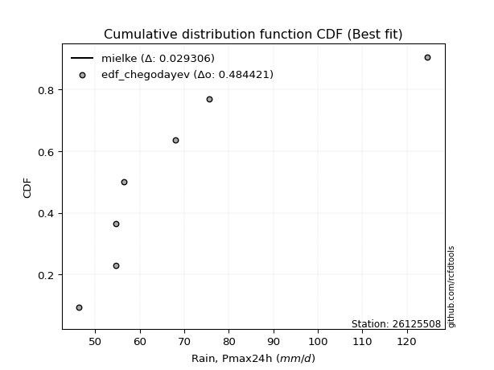</img>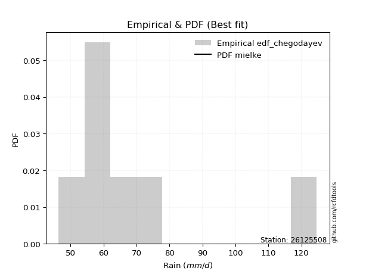</img>

</div>


### 6. EDF Blom (1958)

The Blom formula is a specific "plotting position" formula used in hydrology and statistical analysis to estimate the empirical cumulative probability (or non-exceedance probability) of a data series. It is particularly recommended for data that are approximately normally distributed. The constant _a_ is set to 0.375 (or 3/8).

<div align="center">


$P=(m-a)/(n+1-2a)$


</div>


**6.1. Empirical values**

<div align="center">

|                | 0                   | 1                   | 2                  | 3        | 4                  | 5                  | 6                  |
|:---------------|:--------------------|:--------------------|:-------------------|:---------|:-------------------|:-------------------|:-------------------|
| date           | 2023                | 2018                | 2021               | 2022     | 2019               | 2020               | 2017               |
| x              | 46.4                | 54.7                | 54.7               | 56.5     | 68.0               | 75.6               | 124.6              |
| m              | 1                   | 2                   | 3                  | 4        | 5                  | 6                  | 7                  |
| empirical_dist | edf_blom            | edf_blom            | edf_blom           | edf_blom | edf_blom           | edf_blom           | edf_blom           |
| empirical      | 0.08620689655172414 | 0.22413793103448276 | 0.3620689655172414 | 0.5      | 0.6379310344827587 | 0.7758620689655172 | 0.9137931034482759 |
| empirical_tr   | 1.0943396226415094  | 1.288888888888889   | 1.5675675675675675 | 2.0      | 2.7619047619047623 | 4.461538461538462  | 11.600000000000007 |

</div>


**6.2. Kolmogorov-Smirnov fit test (sorted by Δ)**


<div align="center">

|                | 0                   | 1                   | 2                   | 3                   | 4                   | 5                   | 6                   | 7                   | 8                   | 9                   | 10                  | 11                  | 12                  | 13                  | 14                  | 15                  | 16                  | 17                  | 18                  | 19                  | 20                  | 21                  | 22                  | 23                  | 24                  | 25                  | 26                  | 27                  | 28                  | 29                  | 30                  | 31                  | 32                  | 33                  | 34                  | 35                  | 36                  | 37                  | 38                  | 39                  | 40                  | 41                  | 42                  | 43                  | 44                  | 45                  | 46                  | 47                  | 48                  | 49                  | 50                  | 51                  | 52                  | 53                  | 54                  | 55                  | 56                  | 57                  | 58                  | 59                  | 60                  | 61                  | 62                  | 63                  | 64                  | 65                  | 66                  | 67                  | 68                  | 69                  | 70                  | 71                  | 72                  | 73                  | 74                  | 75                  | 76                  | 77                  | 78                  | 79                  | 80                  | 81                  | 82                  | 83                  | 84                  | 85                  | 86                  | 87                  | 88                  | 89                  | 90                  | 91                  | 92                  | 93                  | 94                  | 95                  | 96                  | 97                  | 98                  | 99                  | 100                 | 101                 | 102                 | 103                 | 104                 | 105                 | 106                 | 107                 | 108                 | 109                 | 110                 | 111                 | 112                 | 113                 | 114                 | 115                 | 116                 | 117                 | 118                 | 119                 | 120                 | 121                 | 122                 | 123                 | 124                 | 125                 | 126                 | 127                 | 128                 | 129                 | 130                 | 131                 | 132                 | 133                 | 134                 | 135                 | 136                 | 137                 | 138                 | 139                 | 140                 | 141                 | 142                 | 143                 | 144                 | 145                 | 146                 | 147                 | 148                 | 149                 | 150                 | 151                 | 152                 | 153                 | 154                 | 155                 | 156                 | 157                 | 158                 | 159                 |
|:---------------|:--------------------|:--------------------|:--------------------|:--------------------|:--------------------|:--------------------|:--------------------|:--------------------|:--------------------|:--------------------|:--------------------|:--------------------|:--------------------|:--------------------|:--------------------|:--------------------|:--------------------|:--------------------|:--------------------|:--------------------|:--------------------|:--------------------|:--------------------|:--------------------|:--------------------|:--------------------|:--------------------|:--------------------|:--------------------|:--------------------|:--------------------|:--------------------|:--------------------|:--------------------|:--------------------|:--------------------|:--------------------|:--------------------|:--------------------|:--------------------|:--------------------|:--------------------|:--------------------|:--------------------|:--------------------|:--------------------|:--------------------|:--------------------|:--------------------|:--------------------|:--------------------|:--------------------|:--------------------|:--------------------|:--------------------|:--------------------|:--------------------|:--------------------|:--------------------|:--------------------|:--------------------|:--------------------|:--------------------|:--------------------|:--------------------|:--------------------|:--------------------|:--------------------|:--------------------|:--------------------|:--------------------|:--------------------|:--------------------|:--------------------|:--------------------|:--------------------|:--------------------|:--------------------|:--------------------|:--------------------|:--------------------|:--------------------|:--------------------|:--------------------|:--------------------|:--------------------|:--------------------|:--------------------|:--------------------|:--------------------|:--------------------|:--------------------|:--------------------|:--------------------|:--------------------|:--------------------|:--------------------|:--------------------|:--------------------|:--------------------|:--------------------|:--------------------|:--------------------|:--------------------|:--------------------|:--------------------|:--------------------|:--------------------|:--------------------|:--------------------|:--------------------|:--------------------|:--------------------|:--------------------|:--------------------|:--------------------|:--------------------|:--------------------|:--------------------|:--------------------|:--------------------|:--------------------|:--------------------|:--------------------|:--------------------|:--------------------|:--------------------|:--------------------|:--------------------|:--------------------|:--------------------|:--------------------|:--------------------|:--------------------|:--------------------|:--------------------|:--------------------|:--------------------|:--------------------|:--------------------|:--------------------|:--------------------|:--------------------|:--------------------|:--------------------|:--------------------|:--------------------|:--------------------|:--------------------|:--------------------|:--------------------|:--------------------|:--------------------|:--------------------|:--------------------|:--------------------|:--------------------|:--------------------|:--------------------|:--------------------|
| station        | 26125508            | 26125508            | 26125508            | 26125508            | 26125508            | 26125508            | 26125508            | 26125508            | 26125508            | 26125508            | 26125508            | 26125508            | 26125508            | 26125508            | 26125508            | 26125508            | 26125508            | 26125508            | 26125508            | 26125508            | 26125508            | 26125508            | 26125508            | 26125508            | 26125508            | 26125508            | 26125508            | 26125508            | 26125508            | 26125508            | 26125508            | 26125508            | 26125508            | 26125508            | 26125508            | 26125508            | 26125508            | 26125508            | 26125508            | 26125508            | 26125508            | 26125508            | 26125508            | 26125508            | 26125508            | 26125508            | 26125508            | 26125508            | 26125508            | 26125508            | 26125508            | 26125508            | 26125508            | 26125508            | 26125508            | 26125508            | 26125508            | 26125508            | 26125508            | 26125508            | 26125508            | 26125508            | 26125508            | 26125508            | 26125508            | 26125508            | 26125508            | 26125508            | 26125508            | 26125508            | 26125508            | 26125508            | 26125508            | 26125508            | 26125508            | 26125508            | 26125508            | 26125508            | 26125508            | 26125508            | 26125508            | 26125508            | 26125508            | 26125508            | 26125508            | 26125508            | 26125508            | 26125508            | 26125508            | 26125508            | 26125508            | 26125508            | 26125508            | 26125508            | 26125508            | 26125508            | 26125508            | 26125508            | 26125508            | 26125508            | 26125508            | 26125508            | 26125508            | 26125508            | 26125508            | 26125508            | 26125508            | 26125508            | 26125508            | 26125508            | 26125508            | 26125508            | 26125508            | 26125508            | 26125508            | 26125508            | 26125508            | 26125508            | 26125508            | 26125508            | 26125508            | 26125508            | 26125508            | 26125508            | 26125508            | 26125508            | 26125508            | 26125508            | 26125508            | 26125508            | 26125508            | 26125508            | 26125508            | 26125508            | 26125508            | 26125508            | 26125508            | 26125508            | 26125508            | 26125508            | 26125508            | 26125508            | 26125508            | 26125508            | 26125508            | 26125508            | 26125508            | 26125508            | 26125508            | 26125508            | 26125508            | 26125508            | 26125508            | 26125508            | 26125508            | 26125508            | 26125508            | 26125508            | 26125508            | 26125508            |
| empirical_dist | edf_blom            | edf_blom            | edf_blom            | edf_blom            | edf_blom            | edf_blom            | edf_blom            | edf_blom            | edf_blom            | edf_blom            | edf_blom            | edf_blom            | edf_blom            | edf_blom            | edf_blom            | edf_blom            | edf_blom            | edf_blom            | edf_blom            | edf_blom            | edf_blom            | edf_blom            | edf_blom            | edf_blom            | edf_blom            | edf_blom            | edf_blom            | edf_blom            | edf_blom            | edf_blom            | edf_blom            | edf_blom            | edf_blom            | edf_blom            | edf_blom            | edf_blom            | edf_blom            | edf_blom            | edf_blom            | edf_blom            | edf_blom            | edf_blom            | edf_blom            | edf_blom            | edf_blom            | edf_blom            | edf_blom            | edf_blom            | edf_blom            | edf_blom            | edf_blom            | edf_blom            | edf_blom            | edf_blom            | edf_blom            | edf_blom            | edf_blom            | edf_blom            | edf_blom            | edf_blom            | edf_blom            | edf_blom            | edf_blom            | edf_blom            | edf_blom            | edf_blom            | edf_blom            | edf_blom            | edf_blom            | edf_blom            | edf_blom            | edf_blom            | edf_blom            | edf_blom            | edf_blom            | edf_blom            | edf_blom            | edf_blom            | edf_blom            | edf_blom            | edf_blom            | edf_blom            | edf_blom            | edf_blom            | edf_blom            | edf_blom            | edf_blom            | edf_blom            | edf_blom            | edf_blom            | edf_blom            | edf_blom            | edf_blom            | edf_blom            | edf_blom            | edf_blom            | edf_blom            | edf_blom            | edf_blom            | edf_blom            | edf_blom            | edf_blom            | edf_blom            | edf_blom            | edf_blom            | edf_blom            | edf_blom            | edf_blom            | edf_blom            | edf_blom            | edf_blom            | edf_blom            | edf_blom            | edf_blom            | edf_blom            | edf_blom            | edf_blom            | edf_blom            | edf_blom            | edf_blom            | edf_blom            | edf_blom            | edf_blom            | edf_blom            | edf_blom            | edf_blom            | edf_blom            | edf_blom            | edf_blom            | edf_blom            | edf_blom            | edf_blom            | edf_blom            | edf_blom            | edf_blom            | edf_blom            | edf_blom            | edf_blom            | edf_blom            | edf_blom            | edf_blom            | edf_blom            | edf_blom            | edf_blom            | edf_blom            | edf_blom            | edf_blom            | edf_blom            | edf_blom            | edf_blom            | edf_blom            | edf_blom            | edf_blom            | edf_blom            | edf_blom            | edf_blom            | edf_blom            | edf_blom            | edf_blom            | edf_blom            |
| p_dist         | mielke              | loginvweibull       | loggenextreme       | alpha               | loginvgamma         | logburr12           | logexponnorm        | logalpha            | genextreme          | logwald             | f                   | invgamma            | loghalflogistic     | logjohnsonsu        | logt                | logfoldnorm         | loginvgauss         | loghalfnorm         | halflogistic        | pearson3            | logmielke           | loggompertz         | loghalfgennorm      | logfatiguelife      | halfnorm            | logpearson3         | lomax               | invgauss            | logmoyal            | wald                | loggenexpon         | johnsonsu           | exponnorm           | genexpon            | vonmises_line       | truncweibull_min    | foldnorm            | logvonmises_line    | logncf              | logweibull_min      | lograyleigh         | moyal               | fatiguelife         | gengamma            | exponweib           | loggumbel_r         | logburr             | gompertz            | rayleigh            | logsemicircular     | logmaxwell          | gumbel_r            | loggenlogistic      | burr                | logweibull_max      | loggausshyper       | halfgennorm         | burr12              | loganglit           | maxwell             | truncnorm           | loglomax            | logarcsine          | logf                | logskewnorm         | logkstwobign        | bradford            | nct                 | lognct              | logloggamma         | ncf                 | betaprime           | anglit              | logbetaprime        | lognorm             | logcrystalball      | semicircular        | genlogistic         | norm                | crystalball         | logtruncweibull_min | loggengamma         | logexponpow         | logrice             | loglogistic         | nakagami            | logloglaplace       | loggennorm          | tukeylambda         | logistic            | logtruncexpon       | arcsine             | kstwobign           | loghypsecant        | logcosine           | hypsecant           | logbradford         | loggumbel_l         | weibull_min         | rice                | logexponweib        | gumbel_l            | exponpow            | loglaplace          | loglaplace          | laplace             | cosine              | gausshyper          | logjohnsonsb        | skewnorm            | logbeta             | logdgamma           | gennorm             | dweibull            | dgamma              | logdweibull         | logwrapcauchy       | logargus            | logksone            | logtukeylambda      | genpareto           | truncexpon          | loguniform          | logkappa3           | logkappa4           | wrapcauchy          | gamma               | erlang              | lognakagami         | logrdist            | logtriang           | loglevy_l           | beta                | kappa4              | levy_l              | argus               | loggenpareto        | ksone               | uniform             | kappa3              | triang              | rdist               | loggenhalflogistic  | t                   | invweibull          | powerlaw            | loggamma            | loggamma            | logerlang           | logpowerlaw         | genhalflogistic     | logtrapezoid        | logtruncpareto      | trapezoid           | truncpareto         | johnsonsb           | weibull_max         | logtruncnorm        | logvonmises         | vonmises            |
| delta          | 0.02091782574096411 | 0.10535030126189754 | 0.10536329643647474 | 0.10630763783816988 | 0.10829683011992969 | 0.11035301527560526 | 0.11118355061105345 | 0.11228879657010771 | 0.11272216557690695 | 0.11327580349535887 | 0.11328845842622032 | 0.11471647860282591 | 0.11483381321661629 | 0.1179582816808849  | 0.11867954579537321 | 0.12012400730796918 | 0.12064617984212372 | 0.12113265075448665 | 0.12168808972972844 | 0.12224981463750267 | 0.12443239094445435 | 0.12485128453915756 | 0.12614416661248895 | 0.1266443816315545  | 0.12690045415771245 | 0.1294197647381803  | 0.12948094801508397 | 0.12971499341022968 | 0.13068187678252297 | 0.13071780368960767 | 0.1317486711831441  | 0.13250818970791617 | 0.13334724459526037 | 0.1350329793490634  | 0.13588907535185873 | 0.1359761749863223  | 0.13843610135162743 | 0.13896146027859457 | 0.13915535444670102 | 0.13986435067508796 | 0.14149691486764893 | 0.1415125229897457  | 0.14160924978309442 | 0.14242725668456652 | 0.14376836406176202 | 0.14377308855332732 | 0.14611875459438728 | 0.14741515249676124 | 0.1495397793580841  | 0.1496851688591559  | 0.1529888333605302  | 0.1533538395720599  | 0.15335608339358853 | 0.1536397825393654  | 0.153732898208377   | 0.15397879597800312 | 0.15554731413804823 | 0.15898519933438898 | 0.15945249874149048 | 0.1608515038871512  | 0.16269492909104738 | 0.16308189336848344 | 0.16381432362100912 | 0.16506746357794788 | 0.1655343981068111  | 0.1698242032698276  | 0.17047214030603802 | 0.1729487289755231  | 0.17729305510903387 | 0.1777652351236117  | 0.17817241279273233 | 0.1785595943275281  | 0.1795067178361308  | 0.1817289697237528  | 0.18251889466799498 | 0.18251911034121215 | 0.1858763677084343  | 0.18727554720430467 | 0.18972858442179386 | 0.18972859403998432 | 0.19574999396312603 | 0.19714474864261705 | 0.1993523170513768  | 0.20104661915841476 | 0.2028922604660518  | 0.2038500345421056  | 0.20421244914125036 | 0.20751184510622123 | 0.20809132744648073 | 0.21053378236858977 | 0.21093188728376366 | 0.21158183787481888 | 0.216025239211469   | 0.2180130316907875  | 0.22320749008685903 | 0.2258046857320246  | 0.23292955165105084 | 0.23682377829650225 | 0.23782120781969984 | 0.23866083661602122 | 0.2392763252222752  | 0.24263742232185737 | 0.24378639799352486 | 0.24450461964701065 | 0.24450461964701065 | 0.25174471155123884 | 0.25348271839852854 | 0.25599527545269807 | 0.2594413671094181  | 0.26035666882487773 | 0.2753777093091051  | 0.27586206896466947 | 0.27586206896522214 | 0.27586206896547416 | 0.2758620689654985  | 0.27586206896553433 | 0.2778018224653186  | 0.27851876028631395 | 0.2807109725754613  | 0.2891046614205166  | 0.2923078918125352  | 0.29347754665575465 | 0.30062831014052804 | 0.300817915874377   | 0.30084087429696155 | 0.322030745058267   | 0.32507263167220957 | 0.3292882618799713  | 0.3309941377115041  | 0.3357150927877866  | 0.33815231529872936 | 0.34078520796175554 | 0.3476169000401813  | 0.35329265145518157 | 0.36067318768152884 | 0.36089558567645286 | 0.3803317872866249  | 0.38136079019313873 | 0.40246053443866303 | 0.40584882123363447 | 0.4099524717573351  | 0.4126294845785728  | 0.4423130513943854  | 0.4507557424355768  | 0.4660554122098477  | 0.48531846503893683 | 0.5050010008299948  | 0.5050010008299948  | 0.5161774586913366  | 0.5186416968111832  | 0.5245432331531197  | 0.5306874607092428  | 0.5536676253852743  | 0.6202308100124754  | 0.6286689732239705  | 0.6552427150821803  | 0.6770670447721755  | 0.9137931034482759  | 1.070223587287202   | 19.58566481305814   |
| deltao         | 0.48442053926100004 | 0.48442053926100004 | 0.48442053926100004 | 0.48442053926100004 | 0.48442053926100004 | 0.48442053926100004 | 0.48442053926100004 | 0.48442053926100004 | 0.48442053926100004 | 0.48442053926100004 | 0.48442053926100004 | 0.48442053926100004 | 0.48442053926100004 | 0.48442053926100004 | 0.48442053926100004 | 0.48442053926100004 | 0.48442053926100004 | 0.48442053926100004 | 0.48442053926100004 | 0.48442053926100004 | 0.48442053926100004 | 0.48442053926100004 | 0.48442053926100004 | 0.48442053926100004 | 0.48442053926100004 | 0.48442053926100004 | 0.48442053926100004 | 0.48442053926100004 | 0.48442053926100004 | 0.48442053926100004 | 0.48442053926100004 | 0.48442053926100004 | 0.48442053926100004 | 0.48442053926100004 | 0.48442053926100004 | 0.48442053926100004 | 0.48442053926100004 | 0.48442053926100004 | 0.48442053926100004 | 0.48442053926100004 | 0.48442053926100004 | 0.48442053926100004 | 0.48442053926100004 | 0.48442053926100004 | 0.48442053926100004 | 0.48442053926100004 | 0.48442053926100004 | 0.48442053926100004 | 0.48442053926100004 | 0.48442053926100004 | 0.48442053926100004 | 0.48442053926100004 | 0.48442053926100004 | 0.48442053926100004 | 0.48442053926100004 | 0.48442053926100004 | 0.48442053926100004 | 0.48442053926100004 | 0.48442053926100004 | 0.48442053926100004 | 0.48442053926100004 | 0.48442053926100004 | 0.48442053926100004 | 0.48442053926100004 | 0.48442053926100004 | 0.48442053926100004 | 0.48442053926100004 | 0.48442053926100004 | 0.48442053926100004 | 0.48442053926100004 | 0.48442053926100004 | 0.48442053926100004 | 0.48442053926100004 | 0.48442053926100004 | 0.48442053926100004 | 0.48442053926100004 | 0.48442053926100004 | 0.48442053926100004 | 0.48442053926100004 | 0.48442053926100004 | 0.48442053926100004 | 0.48442053926100004 | 0.48442053926100004 | 0.48442053926100004 | 0.48442053926100004 | 0.48442053926100004 | 0.48442053926100004 | 0.48442053926100004 | 0.48442053926100004 | 0.48442053926100004 | 0.48442053926100004 | 0.48442053926100004 | 0.48442053926100004 | 0.48442053926100004 | 0.48442053926100004 | 0.48442053926100004 | 0.48442053926100004 | 0.48442053926100004 | 0.48442053926100004 | 0.48442053926100004 | 0.48442053926100004 | 0.48442053926100004 | 0.48442053926100004 | 0.48442053926100004 | 0.48442053926100004 | 0.48442053926100004 | 0.48442053926100004 | 0.48442053926100004 | 0.48442053926100004 | 0.48442053926100004 | 0.48442053926100004 | 0.48442053926100004 | 0.48442053926100004 | 0.48442053926100004 | 0.48442053926100004 | 0.48442053926100004 | 0.48442053926100004 | 0.48442053926100004 | 0.48442053926100004 | 0.48442053926100004 | 0.48442053926100004 | 0.48442053926100004 | 0.48442053926100004 | 0.48442053926100004 | 0.48442053926100004 | 0.48442053926100004 | 0.48442053926100004 | 0.48442053926100004 | 0.48442053926100004 | 0.48442053926100004 | 0.48442053926100004 | 0.48442053926100004 | 0.48442053926100004 | 0.48442053926100004 | 0.48442053926100004 | 0.48442053926100004 | 0.48442053926100004 | 0.48442053926100004 | 0.48442053926100004 | 0.48442053926100004 | 0.48442053926100004 | 0.48442053926100004 | 0.48442053926100004 | 0.48442053926100004 | 0.48442053926100004 | 0.48442053926100004 | 0.48442053926100004 | 0.48442053926100004 | 0.48442053926100004 | 0.48442053926100004 | 0.48442053926100004 | 0.48442053926100004 | 0.48442053926100004 | 0.48442053926100004 | 0.48442053926100004 | 0.48442053926100004 | 0.48442053926100004 | 0.48442053926100004 | 0.48442053926100004 | 0.48442053926100004 |
| eval           | Δo > Δ              | Δo > Δ              | Δo > Δ              | Δo > Δ              | Δo > Δ              | Δo > Δ              | Δo > Δ              | Δo > Δ              | Δo > Δ              | Δo > Δ              | Δo > Δ              | Δo > Δ              | Δo > Δ              | Δo > Δ              | Δo > Δ              | Δo > Δ              | Δo > Δ              | Δo > Δ              | Δo > Δ              | Δo > Δ              | Δo > Δ              | Δo > Δ              | Δo > Δ              | Δo > Δ              | Δo > Δ              | Δo > Δ              | Δo > Δ              | Δo > Δ              | Δo > Δ              | Δo > Δ              | Δo > Δ              | Δo > Δ              | Δo > Δ              | Δo > Δ              | Δo > Δ              | Δo > Δ              | Δo > Δ              | Δo > Δ              | Δo > Δ              | Δo > Δ              | Δo > Δ              | Δo > Δ              | Δo > Δ              | Δo > Δ              | Δo > Δ              | Δo > Δ              | Δo > Δ              | Δo > Δ              | Δo > Δ              | Δo > Δ              | Δo > Δ              | Δo > Δ              | Δo > Δ              | Δo > Δ              | Δo > Δ              | Δo > Δ              | Δo > Δ              | Δo > Δ              | Δo > Δ              | Δo > Δ              | Δo > Δ              | Δo > Δ              | Δo > Δ              | Δo > Δ              | Δo > Δ              | Δo > Δ              | Δo > Δ              | Δo > Δ              | Δo > Δ              | Δo > Δ              | Δo > Δ              | Δo > Δ              | Δo > Δ              | Δo > Δ              | Δo > Δ              | Δo > Δ              | Δo > Δ              | Δo > Δ              | Δo > Δ              | Δo > Δ              | Δo > Δ              | Δo > Δ              | Δo > Δ              | Δo > Δ              | Δo > Δ              | Δo > Δ              | Δo > Δ              | Δo > Δ              | Δo > Δ              | Δo > Δ              | Δo > Δ              | Δo > Δ              | Δo > Δ              | Δo > Δ              | Δo > Δ              | Δo > Δ              | Δo > Δ              | Δo > Δ              | Δo > Δ              | Δo > Δ              | Δo > Δ              | Δo > Δ              | Δo > Δ              | Δo > Δ              | Δo > Δ              | Δo > Δ              | Δo > Δ              | Δo > Δ              | Δo > Δ              | Δo > Δ              | Δo > Δ              | Δo > Δ              | Δo > Δ              | Δo > Δ              | Δo > Δ              | Δo > Δ              | Δo > Δ              | Δo > Δ              | Δo > Δ              | Δo > Δ              | Δo > Δ              | Δo > Δ              | Δo > Δ              | Δo > Δ              | Δo > Δ              | Δo > Δ              | Δo > Δ              | Δo > Δ              | Δo > Δ              | Δo > Δ              | Δo > Δ              | Δo > Δ              | Δo > Δ              | Δo > Δ              | Δo > Δ              | Δo > Δ              | Δo > Δ              | Δo > Δ              | Δo > Δ              | Δo > Δ              | Δo > Δ              | Δo > Δ              | Δo > Δ              | Δo > Δ              | Δo > Δ              | Δo <= Δ             | Δo <= Δ             | Δo <= Δ             | Δo <= Δ             | Δo <= Δ             | Δo <= Δ             | Δo <= Δ             | Δo <= Δ             | Δo <= Δ             | Δo <= Δ             | Δo <= Δ             | Δo <= Δ             | Δo <= Δ             | Δo <= Δ             | Δo <= Δ             |
| fit            | 1                   | 1                   | 1                   | 1                   | 1                   | 1                   | 1                   | 1                   | 1                   | 1                   | 1                   | 1                   | 1                   | 1                   | 1                   | 1                   | 1                   | 1                   | 1                   | 1                   | 1                   | 1                   | 1                   | 1                   | 1                   | 1                   | 1                   | 1                   | 1                   | 1                   | 1                   | 1                   | 1                   | 1                   | 1                   | 1                   | 1                   | 1                   | 1                   | 1                   | 1                   | 1                   | 1                   | 1                   | 1                   | 1                   | 1                   | 1                   | 1                   | 1                   | 1                   | 1                   | 1                   | 1                   | 1                   | 1                   | 1                   | 1                   | 1                   | 1                   | 1                   | 1                   | 1                   | 1                   | 1                   | 1                   | 1                   | 1                   | 1                   | 1                   | 1                   | 1                   | 1                   | 1                   | 1                   | 1                   | 1                   | 1                   | 1                   | 1                   | 1                   | 1                   | 1                   | 1                   | 1                   | 1                   | 1                   | 1                   | 1                   | 1                   | 1                   | 1                   | 1                   | 1                   | 1                   | 1                   | 1                   | 1                   | 1                   | 1                   | 1                   | 1                   | 1                   | 1                   | 1                   | 1                   | 1                   | 1                   | 1                   | 1                   | 1                   | 1                   | 1                   | 1                   | 1                   | 1                   | 1                   | 1                   | 1                   | 1                   | 1                   | 1                   | 1                   | 1                   | 1                   | 1                   | 1                   | 1                   | 1                   | 1                   | 1                   | 1                   | 1                   | 1                   | 1                   | 1                   | 1                   | 1                   | 1                   | 1                   | 1                   | 1                   | 1                   | 1                   | 1                   | 0                   | 0                   | 0                   | 0                   | 0                   | 0                   | 0                   | 0                   | 0                   | 0                   | 0                   | 0                   | 0                   | 0                   | 0                   |
| n              | 7                   | 7                   | 7                   | 7                   | 7                   | 7                   | 7                   | 7                   | 7                   | 7                   | 7                   | 7                   | 7                   | 7                   | 7                   | 7                   | 7                   | 7                   | 7                   | 7                   | 7                   | 7                   | 7                   | 7                   | 7                   | 7                   | 7                   | 7                   | 7                   | 7                   | 7                   | 7                   | 7                   | 7                   | 7                   | 7                   | 7                   | 7                   | 7                   | 7                   | 7                   | 7                   | 7                   | 7                   | 7                   | 7                   | 7                   | 7                   | 7                   | 7                   | 7                   | 7                   | 7                   | 7                   | 7                   | 7                   | 7                   | 7                   | 7                   | 7                   | 7                   | 7                   | 7                   | 7                   | 7                   | 7                   | 7                   | 7                   | 7                   | 7                   | 7                   | 7                   | 7                   | 7                   | 7                   | 7                   | 7                   | 7                   | 7                   | 7                   | 7                   | 7                   | 7                   | 7                   | 7                   | 7                   | 7                   | 7                   | 7                   | 7                   | 7                   | 7                   | 7                   | 7                   | 7                   | 7                   | 7                   | 7                   | 7                   | 7                   | 7                   | 7                   | 7                   | 7                   | 7                   | 7                   | 7                   | 7                   | 7                   | 7                   | 7                   | 7                   | 7                   | 7                   | 7                   | 7                   | 7                   | 7                   | 7                   | 7                   | 7                   | 7                   | 7                   | 7                   | 7                   | 7                   | 7                   | 7                   | 7                   | 7                   | 7                   | 7                   | 7                   | 7                   | 7                   | 7                   | 7                   | 7                   | 7                   | 7                   | 7                   | 7                   | 7                   | 7                   | 7                   | 7                   | 7                   | 7                   | 7                   | 7                   | 7                   | 7                   | 7                   | 7                   | 7                   | 7                   | 7                   | 7                   | 7                   | 7                   |
| best_fit       | 1                   | 0                   | 0                   | 0                   | 0                   | 0                   | 0                   | 0                   | 0                   | 0                   | 0                   | 0                   | 0                   | 0                   | 0                   | 0                   | 0                   | 0                   | 0                   | 0                   | 0                   | 0                   | 0                   | 0                   | 0                   | 0                   | 0                   | 0                   | 0                   | 0                   | 0                   | 0                   | 0                   | 0                   | 0                   | 0                   | 0                   | 0                   | 0                   | 0                   | 0                   | 0                   | 0                   | 0                   | 0                   | 0                   | 0                   | 0                   | 0                   | 0                   | 0                   | 0                   | 0                   | 0                   | 0                   | 0                   | 0                   | 0                   | 0                   | 0                   | 0                   | 0                   | 0                   | 0                   | 0                   | 0                   | 0                   | 0                   | 0                   | 0                   | 0                   | 0                   | 0                   | 0                   | 0                   | 0                   | 0                   | 0                   | 0                   | 0                   | 0                   | 0                   | 0                   | 0                   | 0                   | 0                   | 0                   | 0                   | 0                   | 0                   | 0                   | 0                   | 0                   | 0                   | 0                   | 0                   | 0                   | 0                   | 0                   | 0                   | 0                   | 0                   | 0                   | 0                   | 0                   | 0                   | 0                   | 0                   | 0                   | 0                   | 0                   | 0                   | 0                   | 0                   | 0                   | 0                   | 0                   | 0                   | 0                   | 0                   | 0                   | 0                   | 0                   | 0                   | 0                   | 0                   | 0                   | 0                   | 0                   | 0                   | 0                   | 0                   | 0                   | 0                   | 0                   | 0                   | 0                   | 0                   | 0                   | 0                   | 0                   | 0                   | 0                   | 0                   | 0                   | 0                   | 0                   | 0                   | 0                   | 0                   | 0                   | 0                   | 0                   | 0                   | 0                   | 0                   | 0                   | 0                   | 0                   | 0                   |
| best_fit_sort  | 1                   | 2                   | 3                   | 4                   | 5                   | 6                   | 7                   | 8                   | 9                   | 10                  | 11                  | 12                  | 13                  | 14                  | 15                  | 16                  | 17                  | 18                  | 19                  | 20                  | 21                  | 22                  | 23                  | 24                  | 25                  | 26                  | 27                  | 28                  | 29                  | 30                  | 31                  | 32                  | 33                  | 34                  | 35                  | 36                  | 37                  | 38                  | 39                  | 40                  | 41                  | 42                  | 43                  | 44                  | 45                  | 46                  | 47                  | 48                  | 49                  | 50                  | 51                  | 52                  | 53                  | 54                  | 55                  | 56                  | 57                  | 58                  | 59                  | 60                  | 61                  | 62                  | 63                  | 64                  | 65                  | 66                  | 67                  | 68                  | 69                  | 70                  | 71                  | 72                  | 73                  | 74                  | 75                  | 76                  | 77                  | 78                  | 79                  | 80                  | 81                  | 82                  | 83                  | 84                  | 85                  | 86                  | 87                  | 88                  | 89                  | 90                  | 91                  | 92                  | 93                  | 94                  | 95                  | 96                  | 97                  | 98                  | 99                  | 100                 | 101                 | 102                 | 103                 | 104                 | 105                 | 106                 | 107                 | 108                 | 109                 | 110                 | 111                 | 112                 | 113                 | 114                 | 115                 | 116                 | 117                 | 118                 | 119                 | 120                 | 121                 | 122                 | 123                 | 124                 | 125                 | 126                 | 127                 | 128                 | 129                 | 130                 | 131                 | 132                 | 133                 | 134                 | 135                 | 136                 | 137                 | 138                 | 139                 | 140                 | 141                 | 142                 | 143                 | 144                 | 145                 | 146                 | 147                 | 148                 | 149                 | 150                 | 151                 | 152                 | 153                 | 154                 | 155                 | 156                 | 157                 | 158                 | 159                 | 160                 |

</div>


**6.3. Best fit**

<div align="center">

|   id |   station | empirical_dist   | p_dist   |     delta |   deltao | eval   |   fit |   n |   best_fit |   best_fit_sort |
|-----:|----------:|:-----------------|:---------|----------:|---------:|:-------|------:|----:|-----------:|----------------:|
|    0 |  26125508 | edf_blom         | mielke   | 0.0209178 | 0.484421 | Δo > Δ |     1 |   7 |          1 |               1 |

</div>


<div align="center">

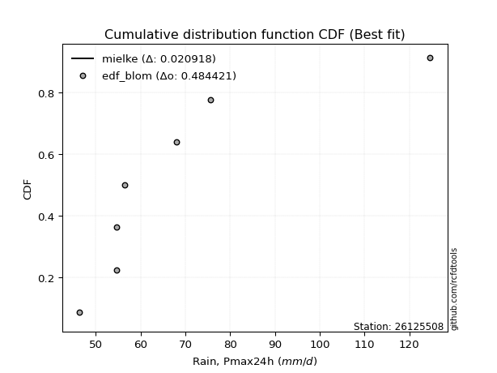</img></img>

</div>


### 7. EDF Tukey (1962)

In hydrology, the Tukey formula is used as a plotting position formula to estimate the empirical probability or frequency of a flood event (or other hydrological data). The formula parameter is given as _c=0.333_ (or 1/3).

<div align="center">


$P=(m-c)/(n+1-2c)$


</div>


**7.1. Empirical values**

<div align="center">

|                | 0                   | 1                   | 2                   | 3         | 4                  | 5                  | 6                  |
|:---------------|:--------------------|:--------------------|:--------------------|:----------|:-------------------|:-------------------|:-------------------|
| date           | 2023                | 2018                | 2021                | 2022      | 2019               | 2020               | 2017               |
| x              | 46.4                | 54.7                | 54.7                | 56.5      | 68.0               | 75.6               | 124.6              |
| m              | 1                   | 2                   | 3                   | 4         | 5                  | 6                  | 7                  |
| empirical_dist | edf_tukey           | edf_tukey           | edf_tukey           | edf_tukey | edf_tukey          | edf_tukey          | edf_tukey          |
| empirical      | 0.09090909090909091 | 0.22727272727272727 | 0.36363636363636365 | 0.5       | 0.6363636363636364 | 0.7727272727272727 | 0.9090909090909091 |
| empirical_tr   | 1.1                 | 1.2941176470588236  | 1.5714285714285714  | 2.0       | 2.75               | 4.3999999999999995 | 10.999999999999996 |

</div>


**7.2. Kolmogorov-Smirnov fit test (sorted by Δ)**


<div align="center">

|                | 0                   | 1                   | 2                   | 3                   | 4                   | 5                   | 6                   | 7                   | 8                   | 9                   | 10                  | 11                  | 12                  | 13                  | 14                  | 15                  | 16                  | 17                  | 18                  | 19                  | 20                  | 21                  | 22                  | 23                  | 24                  | 25                  | 26                  | 27                  | 28                  | 29                  | 30                  | 31                  | 32                  | 33                  | 34                  | 35                  | 36                  | 37                  | 38                  | 39                  | 40                  | 41                  | 42                  | 43                  | 44                  | 45                  | 46                  | 47                  | 48                  | 49                  | 50                  | 51                  | 52                  | 53                  | 54                  | 55                  | 56                  | 57                  | 58                  | 59                  | 60                  | 61                  | 62                  | 63                  | 64                  | 65                  | 66                  | 67                  | 68                  | 69                  | 70                  | 71                  | 72                  | 73                  | 74                  | 75                  | 76                  | 77                  | 78                  | 79                  | 80                  | 81                  | 82                  | 83                  | 84                  | 85                  | 86                  | 87                  | 88                  | 89                  | 90                  | 91                  | 92                  | 93                  | 94                  | 95                  | 96                  | 97                  | 98                  | 99                  | 100                 | 101                 | 102                 | 103                 | 104                 | 105                 | 106                 | 107                 | 108                 | 109                 | 110                 | 111                 | 112                 | 113                 | 114                 | 115                 | 116                 | 117                 | 118                 | 119                 | 120                 | 121                 | 122                 | 123                 | 124                 | 125                 | 126                 | 127                 | 128                 | 129                 | 130                 | 131                 | 132                 | 133                 | 134                 | 135                 | 136                 | 137                 | 138                 | 139                 | 140                 | 141                 | 142                 | 143                 | 144                 | 145                 | 146                 | 147                 | 148                 | 149                 | 150                 | 151                 | 152                 | 153                 | 154                 | 155                 | 156                 | 157                 | 158                 | 159                 |
|:---------------|:--------------------|:--------------------|:--------------------|:--------------------|:--------------------|:--------------------|:--------------------|:--------------------|:--------------------|:--------------------|:--------------------|:--------------------|:--------------------|:--------------------|:--------------------|:--------------------|:--------------------|:--------------------|:--------------------|:--------------------|:--------------------|:--------------------|:--------------------|:--------------------|:--------------------|:--------------------|:--------------------|:--------------------|:--------------------|:--------------------|:--------------------|:--------------------|:--------------------|:--------------------|:--------------------|:--------------------|:--------------------|:--------------------|:--------------------|:--------------------|:--------------------|:--------------------|:--------------------|:--------------------|:--------------------|:--------------------|:--------------------|:--------------------|:--------------------|:--------------------|:--------------------|:--------------------|:--------------------|:--------------------|:--------------------|:--------------------|:--------------------|:--------------------|:--------------------|:--------------------|:--------------------|:--------------------|:--------------------|:--------------------|:--------------------|:--------------------|:--------------------|:--------------------|:--------------------|:--------------------|:--------------------|:--------------------|:--------------------|:--------------------|:--------------------|:--------------------|:--------------------|:--------------------|:--------------------|:--------------------|:--------------------|:--------------------|:--------------------|:--------------------|:--------------------|:--------------------|:--------------------|:--------------------|:--------------------|:--------------------|:--------------------|:--------------------|:--------------------|:--------------------|:--------------------|:--------------------|:--------------------|:--------------------|:--------------------|:--------------------|:--------------------|:--------------------|:--------------------|:--------------------|:--------------------|:--------------------|:--------------------|:--------------------|:--------------------|:--------------------|:--------------------|:--------------------|:--------------------|:--------------------|:--------------------|:--------------------|:--------------------|:--------------------|:--------------------|:--------------------|:--------------------|:--------------------|:--------------------|:--------------------|:--------------------|:--------------------|:--------------------|:--------------------|:--------------------|:--------------------|:--------------------|:--------------------|:--------------------|:--------------------|:--------------------|:--------------------|:--------------------|:--------------------|:--------------------|:--------------------|:--------------------|:--------------------|:--------------------|:--------------------|:--------------------|:--------------------|:--------------------|:--------------------|:--------------------|:--------------------|:--------------------|:--------------------|:--------------------|:--------------------|:--------------------|:--------------------|:--------------------|:--------------------|:--------------------|:--------------------|
| station        | 26125508            | 26125508            | 26125508            | 26125508            | 26125508            | 26125508            | 26125508            | 26125508            | 26125508            | 26125508            | 26125508            | 26125508            | 26125508            | 26125508            | 26125508            | 26125508            | 26125508            | 26125508            | 26125508            | 26125508            | 26125508            | 26125508            | 26125508            | 26125508            | 26125508            | 26125508            | 26125508            | 26125508            | 26125508            | 26125508            | 26125508            | 26125508            | 26125508            | 26125508            | 26125508            | 26125508            | 26125508            | 26125508            | 26125508            | 26125508            | 26125508            | 26125508            | 26125508            | 26125508            | 26125508            | 26125508            | 26125508            | 26125508            | 26125508            | 26125508            | 26125508            | 26125508            | 26125508            | 26125508            | 26125508            | 26125508            | 26125508            | 26125508            | 26125508            | 26125508            | 26125508            | 26125508            | 26125508            | 26125508            | 26125508            | 26125508            | 26125508            | 26125508            | 26125508            | 26125508            | 26125508            | 26125508            | 26125508            | 26125508            | 26125508            | 26125508            | 26125508            | 26125508            | 26125508            | 26125508            | 26125508            | 26125508            | 26125508            | 26125508            | 26125508            | 26125508            | 26125508            | 26125508            | 26125508            | 26125508            | 26125508            | 26125508            | 26125508            | 26125508            | 26125508            | 26125508            | 26125508            | 26125508            | 26125508            | 26125508            | 26125508            | 26125508            | 26125508            | 26125508            | 26125508            | 26125508            | 26125508            | 26125508            | 26125508            | 26125508            | 26125508            | 26125508            | 26125508            | 26125508            | 26125508            | 26125508            | 26125508            | 26125508            | 26125508            | 26125508            | 26125508            | 26125508            | 26125508            | 26125508            | 26125508            | 26125508            | 26125508            | 26125508            | 26125508            | 26125508            | 26125508            | 26125508            | 26125508            | 26125508            | 26125508            | 26125508            | 26125508            | 26125508            | 26125508            | 26125508            | 26125508            | 26125508            | 26125508            | 26125508            | 26125508            | 26125508            | 26125508            | 26125508            | 26125508            | 26125508            | 26125508            | 26125508            | 26125508            | 26125508            | 26125508            | 26125508            | 26125508            | 26125508            | 26125508            | 26125508            |
| empirical_dist | edf_tukey           | edf_tukey           | edf_tukey           | edf_tukey           | edf_tukey           | edf_tukey           | edf_tukey           | edf_tukey           | edf_tukey           | edf_tukey           | edf_tukey           | edf_tukey           | edf_tukey           | edf_tukey           | edf_tukey           | edf_tukey           | edf_tukey           | edf_tukey           | edf_tukey           | edf_tukey           | edf_tukey           | edf_tukey           | edf_tukey           | edf_tukey           | edf_tukey           | edf_tukey           | edf_tukey           | edf_tukey           | edf_tukey           | edf_tukey           | edf_tukey           | edf_tukey           | edf_tukey           | edf_tukey           | edf_tukey           | edf_tukey           | edf_tukey           | edf_tukey           | edf_tukey           | edf_tukey           | edf_tukey           | edf_tukey           | edf_tukey           | edf_tukey           | edf_tukey           | edf_tukey           | edf_tukey           | edf_tukey           | edf_tukey           | edf_tukey           | edf_tukey           | edf_tukey           | edf_tukey           | edf_tukey           | edf_tukey           | edf_tukey           | edf_tukey           | edf_tukey           | edf_tukey           | edf_tukey           | edf_tukey           | edf_tukey           | edf_tukey           | edf_tukey           | edf_tukey           | edf_tukey           | edf_tukey           | edf_tukey           | edf_tukey           | edf_tukey           | edf_tukey           | edf_tukey           | edf_tukey           | edf_tukey           | edf_tukey           | edf_tukey           | edf_tukey           | edf_tukey           | edf_tukey           | edf_tukey           | edf_tukey           | edf_tukey           | edf_tukey           | edf_tukey           | edf_tukey           | edf_tukey           | edf_tukey           | edf_tukey           | edf_tukey           | edf_tukey           | edf_tukey           | edf_tukey           | edf_tukey           | edf_tukey           | edf_tukey           | edf_tukey           | edf_tukey           | edf_tukey           | edf_tukey           | edf_tukey           | edf_tukey           | edf_tukey           | edf_tukey           | edf_tukey           | edf_tukey           | edf_tukey           | edf_tukey           | edf_tukey           | edf_tukey           | edf_tukey           | edf_tukey           | edf_tukey           | edf_tukey           | edf_tukey           | edf_tukey           | edf_tukey           | edf_tukey           | edf_tukey           | edf_tukey           | edf_tukey           | edf_tukey           | edf_tukey           | edf_tukey           | edf_tukey           | edf_tukey           | edf_tukey           | edf_tukey           | edf_tukey           | edf_tukey           | edf_tukey           | edf_tukey           | edf_tukey           | edf_tukey           | edf_tukey           | edf_tukey           | edf_tukey           | edf_tukey           | edf_tukey           | edf_tukey           | edf_tukey           | edf_tukey           | edf_tukey           | edf_tukey           | edf_tukey           | edf_tukey           | edf_tukey           | edf_tukey           | edf_tukey           | edf_tukey           | edf_tukey           | edf_tukey           | edf_tukey           | edf_tukey           | edf_tukey           | edf_tukey           | edf_tukey           | edf_tukey           | edf_tukey           | edf_tukey           | edf_tukey           |
| p_dist         | mielke              | alpha               | loginvgamma         | loginvweibull       | loggenextreme       | genextreme          | f                   | logburr12           | logexponnorm        | invgamma            | loghalflogistic     | logalpha            | logwald             | logjohnsonsu        | logt                | loginvgauss         | loghalfnorm         | halflogistic        | logfoldnorm         | loggompertz         | pearson3            | loghalfgennorm      | logfatiguelife      | halfnorm            | logmielke           | invgauss            | loggenexpon         | johnsonsu           | logpearson3         | lomax               | logmoyal            | wald                | truncweibull_min    | exponnorm           | genexpon            | foldnorm            | vonmises_line       | logncf              | logweibull_min      | fatiguelife         | logvonmises_line    | gengamma            | exponweib           | lograyleigh         | moyal               | loggumbel_r         | logburr             | gompertz            | rayleigh            | logsemicircular     | logmaxwell          | gumbel_r            | loggenlogistic      | burr                | logweibull_max      | loggausshyper       | halfgennorm         | burr12              | loganglit           | loglomax            | logarcsine          | maxwell             | logf                | truncnorm           | logskewnorm         | logkstwobign        | bradford            | nct                 | anglit              | lognct              | logloggamma         | ncf                 | betaprime           | logbetaprime        | lognorm             | logcrystalball      | semicircular        | genlogistic         | norm                | crystalball         | loggengamma         | logtruncweibull_min | logexponpow         | logrice             | logloglaplace       | nakagami            | loglogistic         | arcsine             | loggennorm          | logistic            | logtruncexpon       | tukeylambda         | kstwobign           | loghypsecant        | logcosine           | hypsecant           | logbradford         | weibull_min         | logexponweib        | loggumbel_l         | rice                | gumbel_l            | exponpow            | loglaplace          | loglaplace          | cosine              | laplace             | gausshyper          | logjohnsonsb        | skewnorm            | logbeta             | logdgamma           | gennorm             | dweibull            | dgamma              | logdweibull         | logwrapcauchy       | logargus            | logksone            | logtukeylambda      | genpareto           | truncexpon          | loguniform          | logkappa3           | logkappa4           | wrapcauchy          | gamma               | erlang              | lognakagami         | logrdist            | logtriang           | loglevy_l           | beta                | kappa4              | levy_l              | argus               | loggenpareto        | ksone               | uniform             | kappa3              | triang              | rdist               | loggenhalflogistic  | t                   | invweibull          | powerlaw            | loggamma            | loggamma            | logerlang           | logpowerlaw         | genhalflogistic     | logtrapezoid        | logtruncpareto      | trapezoid           | truncpareto         | johnsonsb           | weibull_max         | logtruncnorm        | logvonmises         | vonmises            |
| delta          | 0.02562002009833088 | 0.10352889562293938 | 0.10516203388168519 | 0.10535030126189754 | 0.10536329643647474 | 0.10958736933866245 | 0.11015366218797581 | 0.11035301527560526 | 0.11118355061105345 | 0.11158168236458141 | 0.11169901697837178 | 0.11228879657010771 | 0.11327580349535887 | 0.1148234854426404  | 0.1155447495571287  | 0.11751138360387922 | 0.11799785451624215 | 0.11855329349148394 | 0.12012400730796918 | 0.12171648830091306 | 0.12224981463750267 | 0.12300937037424445 | 0.12350958539331    | 0.12376565791946795 | 0.12443239094445435 | 0.12658019717198518 | 0.1286138749448996  | 0.12937339346967167 | 0.1294197647381803  | 0.12948094801508397 | 0.13068187678252297 | 0.13071780368960767 | 0.1328413787480778  | 0.13334724459526037 | 0.1350329793490634  | 0.13530130511338292 | 0.13588907535185873 | 0.13602055820845652 | 0.13672955443684345 | 0.1384744535448499  | 0.13896146027859457 | 0.13929246044632201 | 0.14063356782351752 | 0.14149691486764893 | 0.1415125229897457  | 0.14377308855332732 | 0.14611875459438728 | 0.14741515249676124 | 0.1495397793580841  | 0.1496851688591559  | 0.1529888333605302  | 0.1533538395720599  | 0.15335608339358853 | 0.1536397825393654  | 0.153732898208377   | 0.15397879597800312 | 0.15554731413804823 | 0.15585040309614448 | 0.15945249874149048 | 0.15994709713023894 | 0.1606795273827646  | 0.1608515038871512  | 0.16193266733970338 | 0.16269492909104738 | 0.1655343981068111  | 0.1698242032698276  | 0.17047214030603802 | 0.1729487289755231  | 0.17637192159788628 | 0.17729305510903387 | 0.1777652351236117  | 0.17817241279273233 | 0.1785595943275281  | 0.1817289697237528  | 0.18251889466799498 | 0.18251911034121215 | 0.18274157147018977 | 0.18727554720430467 | 0.18972858442179386 | 0.18972859403998432 | 0.19400995240437255 | 0.19574999396312603 | 0.1962175208131323  | 0.20104661915841476 | 0.20107765290300586 | 0.20278161808257228 | 0.2028922604660518  | 0.20844704163657435 | 0.20907924322534355 | 0.21053378236858977 | 0.21093188728376366 | 0.21122612368472526 | 0.216025239211469   | 0.2180130316907875  | 0.22320749008685903 | 0.2258046857320246  | 0.23292955165105084 | 0.23468641158145534 | 0.2361415289840307  | 0.23682377829650225 | 0.23866083661602122 | 0.24263742232185737 | 0.24378639799352486 | 0.24450461964701065 | 0.24450461964701065 | 0.250347922160284   | 0.25174471155123884 | 0.25599527545269807 | 0.2563065708711736  | 0.26035666882487773 | 0.27224291307086057 | 0.27272727272642494 | 0.2727272727269776  | 0.27272727272722963 | 0.27272727272725394 | 0.2727272727272898  | 0.27466702622707406 | 0.2753839640480694  | 0.27757617633721676 | 0.2891046614205166  | 0.28917309557429066 | 0.29347754665575465 | 0.30062831014052804 | 0.300817915874377   | 0.30084087429696155 | 0.3188959488200225  | 0.32193783543396504 | 0.32615346564172676 | 0.32785934147325957 | 0.3325802965495421  | 0.3350175190604848  | 0.33608301360438875 | 0.3444821038019368  | 0.35015785521693704 | 0.35597099332416204 | 0.3577607894382083  | 0.3756295929292581  | 0.3782259939548942  | 0.3993257382004185  | 0.40271402499538994 | 0.4068176755190906  | 0.407927290221206   | 0.4391782551561409  | 0.4507557424355768  | 0.46135321785248085 | 0.4821836688006923  | 0.5018662045917502  | 0.5018662045917502  | 0.513042662453092   | 0.5155069005729387  | 0.521408436914875   | 0.5275526644709982  | 0.5505328291470297  | 0.6170960137742308  | 0.625534176985726   | 0.6521079188439358  | 0.673932248533931   | 0.9090909090909091  | 1.0749257816445685  | 19.59036700741551   |
| deltao         | 0.48442053926100004 | 0.48442053926100004 | 0.48442053926100004 | 0.48442053926100004 | 0.48442053926100004 | 0.48442053926100004 | 0.48442053926100004 | 0.48442053926100004 | 0.48442053926100004 | 0.48442053926100004 | 0.48442053926100004 | 0.48442053926100004 | 0.48442053926100004 | 0.48442053926100004 | 0.48442053926100004 | 0.48442053926100004 | 0.48442053926100004 | 0.48442053926100004 | 0.48442053926100004 | 0.48442053926100004 | 0.48442053926100004 | 0.48442053926100004 | 0.48442053926100004 | 0.48442053926100004 | 0.48442053926100004 | 0.48442053926100004 | 0.48442053926100004 | 0.48442053926100004 | 0.48442053926100004 | 0.48442053926100004 | 0.48442053926100004 | 0.48442053926100004 | 0.48442053926100004 | 0.48442053926100004 | 0.48442053926100004 | 0.48442053926100004 | 0.48442053926100004 | 0.48442053926100004 | 0.48442053926100004 | 0.48442053926100004 | 0.48442053926100004 | 0.48442053926100004 | 0.48442053926100004 | 0.48442053926100004 | 0.48442053926100004 | 0.48442053926100004 | 0.48442053926100004 | 0.48442053926100004 | 0.48442053926100004 | 0.48442053926100004 | 0.48442053926100004 | 0.48442053926100004 | 0.48442053926100004 | 0.48442053926100004 | 0.48442053926100004 | 0.48442053926100004 | 0.48442053926100004 | 0.48442053926100004 | 0.48442053926100004 | 0.48442053926100004 | 0.48442053926100004 | 0.48442053926100004 | 0.48442053926100004 | 0.48442053926100004 | 0.48442053926100004 | 0.48442053926100004 | 0.48442053926100004 | 0.48442053926100004 | 0.48442053926100004 | 0.48442053926100004 | 0.48442053926100004 | 0.48442053926100004 | 0.48442053926100004 | 0.48442053926100004 | 0.48442053926100004 | 0.48442053926100004 | 0.48442053926100004 | 0.48442053926100004 | 0.48442053926100004 | 0.48442053926100004 | 0.48442053926100004 | 0.48442053926100004 | 0.48442053926100004 | 0.48442053926100004 | 0.48442053926100004 | 0.48442053926100004 | 0.48442053926100004 | 0.48442053926100004 | 0.48442053926100004 | 0.48442053926100004 | 0.48442053926100004 | 0.48442053926100004 | 0.48442053926100004 | 0.48442053926100004 | 0.48442053926100004 | 0.48442053926100004 | 0.48442053926100004 | 0.48442053926100004 | 0.48442053926100004 | 0.48442053926100004 | 0.48442053926100004 | 0.48442053926100004 | 0.48442053926100004 | 0.48442053926100004 | 0.48442053926100004 | 0.48442053926100004 | 0.48442053926100004 | 0.48442053926100004 | 0.48442053926100004 | 0.48442053926100004 | 0.48442053926100004 | 0.48442053926100004 | 0.48442053926100004 | 0.48442053926100004 | 0.48442053926100004 | 0.48442053926100004 | 0.48442053926100004 | 0.48442053926100004 | 0.48442053926100004 | 0.48442053926100004 | 0.48442053926100004 | 0.48442053926100004 | 0.48442053926100004 | 0.48442053926100004 | 0.48442053926100004 | 0.48442053926100004 | 0.48442053926100004 | 0.48442053926100004 | 0.48442053926100004 | 0.48442053926100004 | 0.48442053926100004 | 0.48442053926100004 | 0.48442053926100004 | 0.48442053926100004 | 0.48442053926100004 | 0.48442053926100004 | 0.48442053926100004 | 0.48442053926100004 | 0.48442053926100004 | 0.48442053926100004 | 0.48442053926100004 | 0.48442053926100004 | 0.48442053926100004 | 0.48442053926100004 | 0.48442053926100004 | 0.48442053926100004 | 0.48442053926100004 | 0.48442053926100004 | 0.48442053926100004 | 0.48442053926100004 | 0.48442053926100004 | 0.48442053926100004 | 0.48442053926100004 | 0.48442053926100004 | 0.48442053926100004 | 0.48442053926100004 | 0.48442053926100004 | 0.48442053926100004 | 0.48442053926100004 | 0.48442053926100004 |
| eval           | Δo > Δ              | Δo > Δ              | Δo > Δ              | Δo > Δ              | Δo > Δ              | Δo > Δ              | Δo > Δ              | Δo > Δ              | Δo > Δ              | Δo > Δ              | Δo > Δ              | Δo > Δ              | Δo > Δ              | Δo > Δ              | Δo > Δ              | Δo > Δ              | Δo > Δ              | Δo > Δ              | Δo > Δ              | Δo > Δ              | Δo > Δ              | Δo > Δ              | Δo > Δ              | Δo > Δ              | Δo > Δ              | Δo > Δ              | Δo > Δ              | Δo > Δ              | Δo > Δ              | Δo > Δ              | Δo > Δ              | Δo > Δ              | Δo > Δ              | Δo > Δ              | Δo > Δ              | Δo > Δ              | Δo > Δ              | Δo > Δ              | Δo > Δ              | Δo > Δ              | Δo > Δ              | Δo > Δ              | Δo > Δ              | Δo > Δ              | Δo > Δ              | Δo > Δ              | Δo > Δ              | Δo > Δ              | Δo > Δ              | Δo > Δ              | Δo > Δ              | Δo > Δ              | Δo > Δ              | Δo > Δ              | Δo > Δ              | Δo > Δ              | Δo > Δ              | Δo > Δ              | Δo > Δ              | Δo > Δ              | Δo > Δ              | Δo > Δ              | Δo > Δ              | Δo > Δ              | Δo > Δ              | Δo > Δ              | Δo > Δ              | Δo > Δ              | Δo > Δ              | Δo > Δ              | Δo > Δ              | Δo > Δ              | Δo > Δ              | Δo > Δ              | Δo > Δ              | Δo > Δ              | Δo > Δ              | Δo > Δ              | Δo > Δ              | Δo > Δ              | Δo > Δ              | Δo > Δ              | Δo > Δ              | Δo > Δ              | Δo > Δ              | Δo > Δ              | Δo > Δ              | Δo > Δ              | Δo > Δ              | Δo > Δ              | Δo > Δ              | Δo > Δ              | Δo > Δ              | Δo > Δ              | Δo > Δ              | Δo > Δ              | Δo > Δ              | Δo > Δ              | Δo > Δ              | Δo > Δ              | Δo > Δ              | Δo > Δ              | Δo > Δ              | Δo > Δ              | Δo > Δ              | Δo > Δ              | Δo > Δ              | Δo > Δ              | Δo > Δ              | Δo > Δ              | Δo > Δ              | Δo > Δ              | Δo > Δ              | Δo > Δ              | Δo > Δ              | Δo > Δ              | Δo > Δ              | Δo > Δ              | Δo > Δ              | Δo > Δ              | Δo > Δ              | Δo > Δ              | Δo > Δ              | Δo > Δ              | Δo > Δ              | Δo > Δ              | Δo > Δ              | Δo > Δ              | Δo > Δ              | Δo > Δ              | Δo > Δ              | Δo > Δ              | Δo > Δ              | Δo > Δ              | Δo > Δ              | Δo > Δ              | Δo > Δ              | Δo > Δ              | Δo > Δ              | Δo > Δ              | Δo > Δ              | Δo > Δ              | Δo > Δ              | Δo > Δ              | Δo > Δ              | Δo > Δ              | Δo <= Δ             | Δo <= Δ             | Δo <= Δ             | Δo <= Δ             | Δo <= Δ             | Δo <= Δ             | Δo <= Δ             | Δo <= Δ             | Δo <= Δ             | Δo <= Δ             | Δo <= Δ             | Δo <= Δ             | Δo <= Δ             | Δo <= Δ             |
| fit            | 1                   | 1                   | 1                   | 1                   | 1                   | 1                   | 1                   | 1                   | 1                   | 1                   | 1                   | 1                   | 1                   | 1                   | 1                   | 1                   | 1                   | 1                   | 1                   | 1                   | 1                   | 1                   | 1                   | 1                   | 1                   | 1                   | 1                   | 1                   | 1                   | 1                   | 1                   | 1                   | 1                   | 1                   | 1                   | 1                   | 1                   | 1                   | 1                   | 1                   | 1                   | 1                   | 1                   | 1                   | 1                   | 1                   | 1                   | 1                   | 1                   | 1                   | 1                   | 1                   | 1                   | 1                   | 1                   | 1                   | 1                   | 1                   | 1                   | 1                   | 1                   | 1                   | 1                   | 1                   | 1                   | 1                   | 1                   | 1                   | 1                   | 1                   | 1                   | 1                   | 1                   | 1                   | 1                   | 1                   | 1                   | 1                   | 1                   | 1                   | 1                   | 1                   | 1                   | 1                   | 1                   | 1                   | 1                   | 1                   | 1                   | 1                   | 1                   | 1                   | 1                   | 1                   | 1                   | 1                   | 1                   | 1                   | 1                   | 1                   | 1                   | 1                   | 1                   | 1                   | 1                   | 1                   | 1                   | 1                   | 1                   | 1                   | 1                   | 1                   | 1                   | 1                   | 1                   | 1                   | 1                   | 1                   | 1                   | 1                   | 1                   | 1                   | 1                   | 1                   | 1                   | 1                   | 1                   | 1                   | 1                   | 1                   | 1                   | 1                   | 1                   | 1                   | 1                   | 1                   | 1                   | 1                   | 1                   | 1                   | 1                   | 1                   | 1                   | 1                   | 1                   | 1                   | 0                   | 0                   | 0                   | 0                   | 0                   | 0                   | 0                   | 0                   | 0                   | 0                   | 0                   | 0                   | 0                   | 0                   |
| n              | 7                   | 7                   | 7                   | 7                   | 7                   | 7                   | 7                   | 7                   | 7                   | 7                   | 7                   | 7                   | 7                   | 7                   | 7                   | 7                   | 7                   | 7                   | 7                   | 7                   | 7                   | 7                   | 7                   | 7                   | 7                   | 7                   | 7                   | 7                   | 7                   | 7                   | 7                   | 7                   | 7                   | 7                   | 7                   | 7                   | 7                   | 7                   | 7                   | 7                   | 7                   | 7                   | 7                   | 7                   | 7                   | 7                   | 7                   | 7                   | 7                   | 7                   | 7                   | 7                   | 7                   | 7                   | 7                   | 7                   | 7                   | 7                   | 7                   | 7                   | 7                   | 7                   | 7                   | 7                   | 7                   | 7                   | 7                   | 7                   | 7                   | 7                   | 7                   | 7                   | 7                   | 7                   | 7                   | 7                   | 7                   | 7                   | 7                   | 7                   | 7                   | 7                   | 7                   | 7                   | 7                   | 7                   | 7                   | 7                   | 7                   | 7                   | 7                   | 7                   | 7                   | 7                   | 7                   | 7                   | 7                   | 7                   | 7                   | 7                   | 7                   | 7                   | 7                   | 7                   | 7                   | 7                   | 7                   | 7                   | 7                   | 7                   | 7                   | 7                   | 7                   | 7                   | 7                   | 7                   | 7                   | 7                   | 7                   | 7                   | 7                   | 7                   | 7                   | 7                   | 7                   | 7                   | 7                   | 7                   | 7                   | 7                   | 7                   | 7                   | 7                   | 7                   | 7                   | 7                   | 7                   | 7                   | 7                   | 7                   | 7                   | 7                   | 7                   | 7                   | 7                   | 7                   | 7                   | 7                   | 7                   | 7                   | 7                   | 7                   | 7                   | 7                   | 7                   | 7                   | 7                   | 7                   | 7                   | 7                   |
| best_fit       | 1                   | 0                   | 0                   | 0                   | 0                   | 0                   | 0                   | 0                   | 0                   | 0                   | 0                   | 0                   | 0                   | 0                   | 0                   | 0                   | 0                   | 0                   | 0                   | 0                   | 0                   | 0                   | 0                   | 0                   | 0                   | 0                   | 0                   | 0                   | 0                   | 0                   | 0                   | 0                   | 0                   | 0                   | 0                   | 0                   | 0                   | 0                   | 0                   | 0                   | 0                   | 0                   | 0                   | 0                   | 0                   | 0                   | 0                   | 0                   | 0                   | 0                   | 0                   | 0                   | 0                   | 0                   | 0                   | 0                   | 0                   | 0                   | 0                   | 0                   | 0                   | 0                   | 0                   | 0                   | 0                   | 0                   | 0                   | 0                   | 0                   | 0                   | 0                   | 0                   | 0                   | 0                   | 0                   | 0                   | 0                   | 0                   | 0                   | 0                   | 0                   | 0                   | 0                   | 0                   | 0                   | 0                   | 0                   | 0                   | 0                   | 0                   | 0                   | 0                   | 0                   | 0                   | 0                   | 0                   | 0                   | 0                   | 0                   | 0                   | 0                   | 0                   | 0                   | 0                   | 0                   | 0                   | 0                   | 0                   | 0                   | 0                   | 0                   | 0                   | 0                   | 0                   | 0                   | 0                   | 0                   | 0                   | 0                   | 0                   | 0                   | 0                   | 0                   | 0                   | 0                   | 0                   | 0                   | 0                   | 0                   | 0                   | 0                   | 0                   | 0                   | 0                   | 0                   | 0                   | 0                   | 0                   | 0                   | 0                   | 0                   | 0                   | 0                   | 0                   | 0                   | 0                   | 0                   | 0                   | 0                   | 0                   | 0                   | 0                   | 0                   | 0                   | 0                   | 0                   | 0                   | 0                   | 0                   | 0                   |
| best_fit_sort  | 1                   | 2                   | 3                   | 4                   | 5                   | 6                   | 7                   | 8                   | 9                   | 10                  | 11                  | 12                  | 13                  | 14                  | 15                  | 16                  | 17                  | 18                  | 19                  | 20                  | 21                  | 22                  | 23                  | 24                  | 25                  | 26                  | 27                  | 28                  | 29                  | 30                  | 31                  | 32                  | 33                  | 34                  | 35                  | 36                  | 37                  | 38                  | 39                  | 40                  | 41                  | 42                  | 43                  | 44                  | 45                  | 46                  | 47                  | 48                  | 49                  | 50                  | 51                  | 52                  | 53                  | 54                  | 55                  | 56                  | 57                  | 58                  | 59                  | 60                  | 61                  | 62                  | 63                  | 64                  | 65                  | 66                  | 67                  | 68                  | 69                  | 70                  | 71                  | 72                  | 73                  | 74                  | 75                  | 76                  | 77                  | 78                  | 79                  | 80                  | 81                  | 82                  | 83                  | 84                  | 85                  | 86                  | 87                  | 88                  | 89                  | 90                  | 91                  | 92                  | 93                  | 94                  | 95                  | 96                  | 97                  | 98                  | 99                  | 100                 | 101                 | 102                 | 103                 | 104                 | 105                 | 106                 | 107                 | 108                 | 109                 | 110                 | 111                 | 112                 | 113                 | 114                 | 115                 | 116                 | 117                 | 118                 | 119                 | 120                 | 121                 | 122                 | 123                 | 124                 | 125                 | 126                 | 127                 | 128                 | 129                 | 130                 | 131                 | 132                 | 133                 | 134                 | 135                 | 136                 | 137                 | 138                 | 139                 | 140                 | 141                 | 142                 | 143                 | 144                 | 145                 | 146                 | 147                 | 148                 | 149                 | 150                 | 151                 | 152                 | 153                 | 154                 | 155                 | 156                 | 157                 | 158                 | 159                 | 160                 |

</div>


**7.3. Best fit**

<div align="center">

|   id |   station | empirical_dist   | p_dist   |   delta |   deltao | eval   |   fit |   n |   best_fit |   best_fit_sort |
|-----:|----------:|:-----------------|:---------|--------:|---------:|:-------|------:|----:|-----------:|----------------:|
|    0 |  26125508 | edf_tukey        | mielke   | 0.02562 | 0.484421 | Δo > Δ |     1 |   7 |          1 |               1 |

</div>


<div align="center">

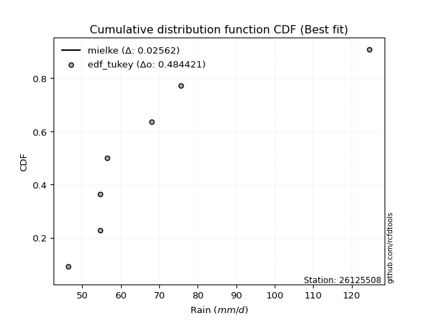</img>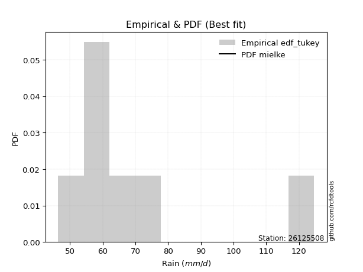</img>

</div>


### 8. EDF Gringorten (1963)

Gringorten plotting position formula is essential for estimating the probability and return periods of extreme events like floods and heavy rainfall. The constant _a=0.44_.

<div align="center">


$P=(m-a)/(n+1-2a)$


</div>


**8.1. Empirical values**

<div align="center">

|                | 0                   | 1                   | 2                  | 3              | 4                  | 5                  | 6                  |
|:---------------|:--------------------|:--------------------|:-------------------|:---------------|:-------------------|:-------------------|:-------------------|
| date           | 2023                | 2018                | 2021               | 2022           | 2019               | 2020               | 2017               |
| x              | 46.4                | 54.7                | 54.7               | 56.5           | 68.0               | 75.6               | 124.6              |
| m              | 1                   | 2                   | 3                  | 4              | 5                  | 6                  | 7                  |
| empirical_dist | edf_gringorten      | edf_gringorten      | edf_gringorten     | edf_gringorten | edf_gringorten     | edf_gringorten     | edf_gringorten     |
| empirical      | 0.07865168539325844 | 0.21910112359550563 | 0.3595505617977528 | 0.5            | 0.6404494382022471 | 0.7808988764044943 | 0.9213483146067415 |
| empirical_tr   | 1.0853658536585364  | 1.2805755395683454  | 1.5614035087719298 | 2.0            | 2.781249999999999  | 4.564102564102562  | 12.714285714285701 |

</div>


**8.2. Kolmogorov-Smirnov fit test (sorted by Δ)**


<div align="center">

|                | 0                    | 1                   | 2                   | 3                   | 4                   | 5                   | 6                   | 7                   | 8                   | 9                   | 10                  | 11                  | 12                  | 13                  | 14                  | 15                  | 16                  | 17                  | 18                  | 19                  | 20                  | 21                  | 22                  | 23                  | 24                  | 25                  | 26                  | 27                  | 28                  | 29                  | 30                  | 31                  | 32                  | 33                  | 34                  | 35                  | 36                  | 37                  | 38                  | 39                  | 40                  | 41                  | 42                  | 43                  | 44                  | 45                  | 46                  | 47                  | 48                  | 49                  | 50                  | 51                  | 52                  | 53                  | 54                  | 55                  | 56                  | 57                  | 58                  | 59                  | 60                  | 61                  | 62                  | 63                  | 64                  | 65                  | 66                  | 67                  | 68                  | 69                  | 70                  | 71                  | 72                  | 73                  | 74                  | 75                  | 76                  | 77                  | 78                  | 79                  | 80                  | 81                  | 82                  | 83                  | 84                  | 85                  | 86                  | 87                  | 88                  | 89                  | 90                  | 91                  | 92                  | 93                  | 94                  | 95                  | 96                  | 97                  | 98                  | 99                  | 100                 | 101                 | 102                 | 103                 | 104                 | 105                 | 106                 | 107                 | 108                 | 109                 | 110                 | 111                 | 112                 | 113                 | 114                 | 115                 | 116                 | 117                 | 118                 | 119                 | 120                 | 121                 | 122                 | 123                 | 124                 | 125                 | 126                 | 127                 | 128                 | 129                 | 130                 | 131                 | 132                 | 133                 | 134                 | 135                 | 136                 | 137                 | 138                 | 139                 | 140                 | 141                 | 142                 | 143                 | 144                 | 145                 | 146                 | 147                 | 148                 | 149                 | 150                 | 151                 | 152                 | 153                 | 154                 | 155                 | 156                 | 157                 | 158                 | 159                 |
|:---------------|:---------------------|:--------------------|:--------------------|:--------------------|:--------------------|:--------------------|:--------------------|:--------------------|:--------------------|:--------------------|:--------------------|:--------------------|:--------------------|:--------------------|:--------------------|:--------------------|:--------------------|:--------------------|:--------------------|:--------------------|:--------------------|:--------------------|:--------------------|:--------------------|:--------------------|:--------------------|:--------------------|:--------------------|:--------------------|:--------------------|:--------------------|:--------------------|:--------------------|:--------------------|:--------------------|:--------------------|:--------------------|:--------------------|:--------------------|:--------------------|:--------------------|:--------------------|:--------------------|:--------------------|:--------------------|:--------------------|:--------------------|:--------------------|:--------------------|:--------------------|:--------------------|:--------------------|:--------------------|:--------------------|:--------------------|:--------------------|:--------------------|:--------------------|:--------------------|:--------------------|:--------------------|:--------------------|:--------------------|:--------------------|:--------------------|:--------------------|:--------------------|:--------------------|:--------------------|:--------------------|:--------------------|:--------------------|:--------------------|:--------------------|:--------------------|:--------------------|:--------------------|:--------------------|:--------------------|:--------------------|:--------------------|:--------------------|:--------------------|:--------------------|:--------------------|:--------------------|:--------------------|:--------------------|:--------------------|:--------------------|:--------------------|:--------------------|:--------------------|:--------------------|:--------------------|:--------------------|:--------------------|:--------------------|:--------------------|:--------------------|:--------------------|:--------------------|:--------------------|:--------------------|:--------------------|:--------------------|:--------------------|:--------------------|:--------------------|:--------------------|:--------------------|:--------------------|:--------------------|:--------------------|:--------------------|:--------------------|:--------------------|:--------------------|:--------------------|:--------------------|:--------------------|:--------------------|:--------------------|:--------------------|:--------------------|:--------------------|:--------------------|:--------------------|:--------------------|:--------------------|:--------------------|:--------------------|:--------------------|:--------------------|:--------------------|:--------------------|:--------------------|:--------------------|:--------------------|:--------------------|:--------------------|:--------------------|:--------------------|:--------------------|:--------------------|:--------------------|:--------------------|:--------------------|:--------------------|:--------------------|:--------------------|:--------------------|:--------------------|:--------------------|:--------------------|:--------------------|:--------------------|:--------------------|:--------------------|:--------------------|
| station        | 26125508             | 26125508            | 26125508            | 26125508            | 26125508            | 26125508            | 26125508            | 26125508            | 26125508            | 26125508            | 26125508            | 26125508            | 26125508            | 26125508            | 26125508            | 26125508            | 26125508            | 26125508            | 26125508            | 26125508            | 26125508            | 26125508            | 26125508            | 26125508            | 26125508            | 26125508            | 26125508            | 26125508            | 26125508            | 26125508            | 26125508            | 26125508            | 26125508            | 26125508            | 26125508            | 26125508            | 26125508            | 26125508            | 26125508            | 26125508            | 26125508            | 26125508            | 26125508            | 26125508            | 26125508            | 26125508            | 26125508            | 26125508            | 26125508            | 26125508            | 26125508            | 26125508            | 26125508            | 26125508            | 26125508            | 26125508            | 26125508            | 26125508            | 26125508            | 26125508            | 26125508            | 26125508            | 26125508            | 26125508            | 26125508            | 26125508            | 26125508            | 26125508            | 26125508            | 26125508            | 26125508            | 26125508            | 26125508            | 26125508            | 26125508            | 26125508            | 26125508            | 26125508            | 26125508            | 26125508            | 26125508            | 26125508            | 26125508            | 26125508            | 26125508            | 26125508            | 26125508            | 26125508            | 26125508            | 26125508            | 26125508            | 26125508            | 26125508            | 26125508            | 26125508            | 26125508            | 26125508            | 26125508            | 26125508            | 26125508            | 26125508            | 26125508            | 26125508            | 26125508            | 26125508            | 26125508            | 26125508            | 26125508            | 26125508            | 26125508            | 26125508            | 26125508            | 26125508            | 26125508            | 26125508            | 26125508            | 26125508            | 26125508            | 26125508            | 26125508            | 26125508            | 26125508            | 26125508            | 26125508            | 26125508            | 26125508            | 26125508            | 26125508            | 26125508            | 26125508            | 26125508            | 26125508            | 26125508            | 26125508            | 26125508            | 26125508            | 26125508            | 26125508            | 26125508            | 26125508            | 26125508            | 26125508            | 26125508            | 26125508            | 26125508            | 26125508            | 26125508            | 26125508            | 26125508            | 26125508            | 26125508            | 26125508            | 26125508            | 26125508            | 26125508            | 26125508            | 26125508            | 26125508            | 26125508            | 26125508            |
| empirical_dist | edf_gringorten       | edf_gringorten      | edf_gringorten      | edf_gringorten      | edf_gringorten      | edf_gringorten      | edf_gringorten      | edf_gringorten      | edf_gringorten      | edf_gringorten      | edf_gringorten      | edf_gringorten      | edf_gringorten      | edf_gringorten      | edf_gringorten      | edf_gringorten      | edf_gringorten      | edf_gringorten      | edf_gringorten      | edf_gringorten      | edf_gringorten      | edf_gringorten      | edf_gringorten      | edf_gringorten      | edf_gringorten      | edf_gringorten      | edf_gringorten      | edf_gringorten      | edf_gringorten      | edf_gringorten      | edf_gringorten      | edf_gringorten      | edf_gringorten      | edf_gringorten      | edf_gringorten      | edf_gringorten      | edf_gringorten      | edf_gringorten      | edf_gringorten      | edf_gringorten      | edf_gringorten      | edf_gringorten      | edf_gringorten      | edf_gringorten      | edf_gringorten      | edf_gringorten      | edf_gringorten      | edf_gringorten      | edf_gringorten      | edf_gringorten      | edf_gringorten      | edf_gringorten      | edf_gringorten      | edf_gringorten      | edf_gringorten      | edf_gringorten      | edf_gringorten      | edf_gringorten      | edf_gringorten      | edf_gringorten      | edf_gringorten      | edf_gringorten      | edf_gringorten      | edf_gringorten      | edf_gringorten      | edf_gringorten      | edf_gringorten      | edf_gringorten      | edf_gringorten      | edf_gringorten      | edf_gringorten      | edf_gringorten      | edf_gringorten      | edf_gringorten      | edf_gringorten      | edf_gringorten      | edf_gringorten      | edf_gringorten      | edf_gringorten      | edf_gringorten      | edf_gringorten      | edf_gringorten      | edf_gringorten      | edf_gringorten      | edf_gringorten      | edf_gringorten      | edf_gringorten      | edf_gringorten      | edf_gringorten      | edf_gringorten      | edf_gringorten      | edf_gringorten      | edf_gringorten      | edf_gringorten      | edf_gringorten      | edf_gringorten      | edf_gringorten      | edf_gringorten      | edf_gringorten      | edf_gringorten      | edf_gringorten      | edf_gringorten      | edf_gringorten      | edf_gringorten      | edf_gringorten      | edf_gringorten      | edf_gringorten      | edf_gringorten      | edf_gringorten      | edf_gringorten      | edf_gringorten      | edf_gringorten      | edf_gringorten      | edf_gringorten      | edf_gringorten      | edf_gringorten      | edf_gringorten      | edf_gringorten      | edf_gringorten      | edf_gringorten      | edf_gringorten      | edf_gringorten      | edf_gringorten      | edf_gringorten      | edf_gringorten      | edf_gringorten      | edf_gringorten      | edf_gringorten      | edf_gringorten      | edf_gringorten      | edf_gringorten      | edf_gringorten      | edf_gringorten      | edf_gringorten      | edf_gringorten      | edf_gringorten      | edf_gringorten      | edf_gringorten      | edf_gringorten      | edf_gringorten      | edf_gringorten      | edf_gringorten      | edf_gringorten      | edf_gringorten      | edf_gringorten      | edf_gringorten      | edf_gringorten      | edf_gringorten      | edf_gringorten      | edf_gringorten      | edf_gringorten      | edf_gringorten      | edf_gringorten      | edf_gringorten      | edf_gringorten      | edf_gringorten      | edf_gringorten      | edf_gringorten      | edf_gringorten      | edf_gringorten      |
| p_dist         | mielke               | loggenextreme       | loginvweibull       | logburr12           | logexponnorm        | alpha               | logalpha            | logwald             | loginvgamma         | genextreme          | f                   | invgamma            | loghalflogistic     | logfoldnorm         | pearson3            | logjohnsonsu        | logt                | logmielke           | loginvgauss         | loghalfnorm         | halflogistic        | logpearson3         | lomax               | loggompertz         | logmoyal            | wald                | loghalfgennorm      | logfatiguelife      | halfnorm            | exponnorm           | invgauss            | genexpon            | vonmises_line       | loggenexpon         | johnsonsu           | logvonmises_line    | truncweibull_min    | lograyleigh         | moyal               | foldnorm            | loggumbel_r         | logncf              | logweibull_min      | logburr             | fatiguelife         | gompertz            | gengamma            | exponweib           | rayleigh            | logsemicircular     | logmaxwell          | gumbel_r            | loggenlogistic      | burr                | logweibull_max      | loggausshyper       | halfgennorm         | loganglit           | maxwell             | truncnorm           | burr12              | logskewnorm         | loglomax            | logarcsine          | logkstwobign        | logf                | bradford            | nct                 | lognct              | logloggamma         | ncf                 | betaprime           | logbetaprime        | lognorm             | logcrystalball      | anglit              | genlogistic         | norm                | crystalball         | semicircular        | logtruncweibull_min | logrice             | loggengamma         | loglogistic         | tukeylambda         | logexponpow         | loggennorm          | nakagami            | logloglaplace       | logistic            | logtruncexpon       | kstwobign           | arcsine             | loghypsecant        | logcosine           | hypsecant           | logbradford         | loggumbel_l         | rice                | gumbel_l            | weibull_min         | exponpow            | logexponweib        | loglaplace          | loglaplace          | laplace             | gausshyper          | cosine              | skewnorm            | logjohnsonsb        | logbeta             | logdgamma           | gennorm             | dweibull            | dgamma              | logdweibull         | logwrapcauchy       | logargus            | logksone            | logtukeylambda      | truncexpon          | genpareto           | loguniform          | logkappa3           | logkappa4           | wrapcauchy          | gamma               | erlang              | lognakagami         | logrdist            | logtriang           | loglevy_l           | beta                | kappa4              | argus               | levy_l              | ksone               | loggenpareto        | uniform             | kappa3              | triang              | rdist               | loggenhalflogistic  | t                   | invweibull          | powerlaw            | loggamma            | loggamma            | logerlang           | logpowerlaw         | genhalflogistic     | logtrapezoid        | logtruncpareto      | trapezoid           | truncpareto         | johnsonsb           | weibull_max         | logtruncnorm        | logvonmises         | vonmises            |
| delta          | 0.013362614582498406 | 0.1102392552557043  | 0.11025243445583363 | 0.11035301527560526 | 0.11118355061105345 | 0.11134444527714701 | 0.11228879657010771 | 0.11327580349535887 | 0.11333363755890682 | 0.11775897301588409 | 0.11832526586519745 | 0.11975328604180305 | 0.11987062065559342 | 0.12069303064572531 | 0.12224981463750267 | 0.12299508911986204 | 0.12371635323435035 | 0.12443239094445435 | 0.12568298728110086 | 0.12616945819346378 | 0.12672489716870558 | 0.1294197647381803  | 0.12948094801508397 | 0.1298880919781347  | 0.13068187678252297 | 0.13071780368960767 | 0.1311809740514661  | 0.13168118907053164 | 0.1319372615966896  | 0.13334724459526037 | 0.13475180084920682 | 0.1350329793490634  | 0.13588907535185873 | 0.13678547862212123 | 0.1375449971468933  | 0.13896146027859457 | 0.14101298242529944 | 0.14149691486764893 | 0.1415125229897457  | 0.14347290879060456 | 0.14377308855332732 | 0.14419216188567816 | 0.1449011581140651  | 0.14611875459438728 | 0.14664605722207155 | 0.14741515249676124 | 0.14746406412354365 | 0.14880517150073916 | 0.1495397793580841  | 0.1496851688591559  | 0.1529888333605302  | 0.1533538395720599  | 0.15335608339358853 | 0.1536397825393654  | 0.153732898208377   | 0.15397879597800312 | 0.15554731413804823 | 0.15945249874149048 | 0.1608515038871512  | 0.16269492909104738 | 0.16402200677336612 | 0.1655343981068111  | 0.16811870080746058 | 0.16885113105998617 | 0.1698242032698276  | 0.17010427101692502 | 0.17047214030603802 | 0.1729487289755231  | 0.17729305510903387 | 0.1777652351236117  | 0.17817241279273233 | 0.1785595943275281  | 0.1817289697237528  | 0.18251889466799498 | 0.18251911034121215 | 0.18454352527510787 | 0.18727554720430467 | 0.18972858442179386 | 0.18972859403998432 | 0.19091317514741135 | 0.19574999396312603 | 0.20104661915841476 | 0.2021815560815942  | 0.2028922604660518  | 0.20305452000750368 | 0.20438912449035393 | 0.2049934413867328  | 0.20888684198108265 | 0.2092492565802275  | 0.21053378236858977 | 0.21093188728376366 | 0.216025239211469   | 0.21661864531379593 | 0.2180130316907875  | 0.22320749008685903 | 0.2258046857320246  | 0.23292955165105084 | 0.23682377829650225 | 0.23866083661602122 | 0.24263742232185737 | 0.24285801525867698 | 0.24378639799352486 | 0.24431313266125235 | 0.24450461964701065 | 0.24450461964701065 | 0.25174471155123884 | 0.25599527545269807 | 0.2585195258375056  | 0.26035666882487773 | 0.2644781745483953  | 0.28041451674808227 | 0.28089887640364664 | 0.2808988764041993  | 0.2808988764044513  | 0.28089887640447564 | 0.2808988764045115  | 0.28283862990429565 | 0.283555567725291   | 0.28574778001443835 | 0.2891046614205166  | 0.29347754665575465 | 0.29734469925151225 | 0.30062831014052804 | 0.300817915874377   | 0.30084087429696155 | 0.32706755249724406 | 0.33010943911118673 | 0.33432506931894845 | 0.33603094515048126 | 0.34075190022676366 | 0.3431891227377064  | 0.34834041912022123 | 0.3526537074791585  | 0.3583294588941586  | 0.3659323931154299  | 0.36822839883999453 | 0.3863975976321158  | 0.3878869984450906  | 0.4074973418776401  | 0.4108856286726115  | 0.4149892791963122  | 0.4201846957370385  | 0.4473498588333625  | 0.4507557424355768  | 0.4736106233683133  | 0.490355272477914   | 0.5100378082689719  | 0.5100378082689719  | 0.5212142661303137  | 0.5236785042501604  | 0.5295800405920967  | 0.5357242681482198  | 0.5587044328242514  | 0.6252676174514524  | 0.6337057806629477  | 0.6602795225211575  | 0.6821038522111526  | 0.9213483146067415  | 1.0650068719559993  | 19.578109601899676  |
| deltao         | 0.48442053926100004  | 0.48442053926100004 | 0.48442053926100004 | 0.48442053926100004 | 0.48442053926100004 | 0.48442053926100004 | 0.48442053926100004 | 0.48442053926100004 | 0.48442053926100004 | 0.48442053926100004 | 0.48442053926100004 | 0.48442053926100004 | 0.48442053926100004 | 0.48442053926100004 | 0.48442053926100004 | 0.48442053926100004 | 0.48442053926100004 | 0.48442053926100004 | 0.48442053926100004 | 0.48442053926100004 | 0.48442053926100004 | 0.48442053926100004 | 0.48442053926100004 | 0.48442053926100004 | 0.48442053926100004 | 0.48442053926100004 | 0.48442053926100004 | 0.48442053926100004 | 0.48442053926100004 | 0.48442053926100004 | 0.48442053926100004 | 0.48442053926100004 | 0.48442053926100004 | 0.48442053926100004 | 0.48442053926100004 | 0.48442053926100004 | 0.48442053926100004 | 0.48442053926100004 | 0.48442053926100004 | 0.48442053926100004 | 0.48442053926100004 | 0.48442053926100004 | 0.48442053926100004 | 0.48442053926100004 | 0.48442053926100004 | 0.48442053926100004 | 0.48442053926100004 | 0.48442053926100004 | 0.48442053926100004 | 0.48442053926100004 | 0.48442053926100004 | 0.48442053926100004 | 0.48442053926100004 | 0.48442053926100004 | 0.48442053926100004 | 0.48442053926100004 | 0.48442053926100004 | 0.48442053926100004 | 0.48442053926100004 | 0.48442053926100004 | 0.48442053926100004 | 0.48442053926100004 | 0.48442053926100004 | 0.48442053926100004 | 0.48442053926100004 | 0.48442053926100004 | 0.48442053926100004 | 0.48442053926100004 | 0.48442053926100004 | 0.48442053926100004 | 0.48442053926100004 | 0.48442053926100004 | 0.48442053926100004 | 0.48442053926100004 | 0.48442053926100004 | 0.48442053926100004 | 0.48442053926100004 | 0.48442053926100004 | 0.48442053926100004 | 0.48442053926100004 | 0.48442053926100004 | 0.48442053926100004 | 0.48442053926100004 | 0.48442053926100004 | 0.48442053926100004 | 0.48442053926100004 | 0.48442053926100004 | 0.48442053926100004 | 0.48442053926100004 | 0.48442053926100004 | 0.48442053926100004 | 0.48442053926100004 | 0.48442053926100004 | 0.48442053926100004 | 0.48442053926100004 | 0.48442053926100004 | 0.48442053926100004 | 0.48442053926100004 | 0.48442053926100004 | 0.48442053926100004 | 0.48442053926100004 | 0.48442053926100004 | 0.48442053926100004 | 0.48442053926100004 | 0.48442053926100004 | 0.48442053926100004 | 0.48442053926100004 | 0.48442053926100004 | 0.48442053926100004 | 0.48442053926100004 | 0.48442053926100004 | 0.48442053926100004 | 0.48442053926100004 | 0.48442053926100004 | 0.48442053926100004 | 0.48442053926100004 | 0.48442053926100004 | 0.48442053926100004 | 0.48442053926100004 | 0.48442053926100004 | 0.48442053926100004 | 0.48442053926100004 | 0.48442053926100004 | 0.48442053926100004 | 0.48442053926100004 | 0.48442053926100004 | 0.48442053926100004 | 0.48442053926100004 | 0.48442053926100004 | 0.48442053926100004 | 0.48442053926100004 | 0.48442053926100004 | 0.48442053926100004 | 0.48442053926100004 | 0.48442053926100004 | 0.48442053926100004 | 0.48442053926100004 | 0.48442053926100004 | 0.48442053926100004 | 0.48442053926100004 | 0.48442053926100004 | 0.48442053926100004 | 0.48442053926100004 | 0.48442053926100004 | 0.48442053926100004 | 0.48442053926100004 | 0.48442053926100004 | 0.48442053926100004 | 0.48442053926100004 | 0.48442053926100004 | 0.48442053926100004 | 0.48442053926100004 | 0.48442053926100004 | 0.48442053926100004 | 0.48442053926100004 | 0.48442053926100004 | 0.48442053926100004 | 0.48442053926100004 | 0.48442053926100004 | 0.48442053926100004 |
| eval           | Δo > Δ               | Δo > Δ              | Δo > Δ              | Δo > Δ              | Δo > Δ              | Δo > Δ              | Δo > Δ              | Δo > Δ              | Δo > Δ              | Δo > Δ              | Δo > Δ              | Δo > Δ              | Δo > Δ              | Δo > Δ              | Δo > Δ              | Δo > Δ              | Δo > Δ              | Δo > Δ              | Δo > Δ              | Δo > Δ              | Δo > Δ              | Δo > Δ              | Δo > Δ              | Δo > Δ              | Δo > Δ              | Δo > Δ              | Δo > Δ              | Δo > Δ              | Δo > Δ              | Δo > Δ              | Δo > Δ              | Δo > Δ              | Δo > Δ              | Δo > Δ              | Δo > Δ              | Δo > Δ              | Δo > Δ              | Δo > Δ              | Δo > Δ              | Δo > Δ              | Δo > Δ              | Δo > Δ              | Δo > Δ              | Δo > Δ              | Δo > Δ              | Δo > Δ              | Δo > Δ              | Δo > Δ              | Δo > Δ              | Δo > Δ              | Δo > Δ              | Δo > Δ              | Δo > Δ              | Δo > Δ              | Δo > Δ              | Δo > Δ              | Δo > Δ              | Δo > Δ              | Δo > Δ              | Δo > Δ              | Δo > Δ              | Δo > Δ              | Δo > Δ              | Δo > Δ              | Δo > Δ              | Δo > Δ              | Δo > Δ              | Δo > Δ              | Δo > Δ              | Δo > Δ              | Δo > Δ              | Δo > Δ              | Δo > Δ              | Δo > Δ              | Δo > Δ              | Δo > Δ              | Δo > Δ              | Δo > Δ              | Δo > Δ              | Δo > Δ              | Δo > Δ              | Δo > Δ              | Δo > Δ              | Δo > Δ              | Δo > Δ              | Δo > Δ              | Δo > Δ              | Δo > Δ              | Δo > Δ              | Δo > Δ              | Δo > Δ              | Δo > Δ              | Δo > Δ              | Δo > Δ              | Δo > Δ              | Δo > Δ              | Δo > Δ              | Δo > Δ              | Δo > Δ              | Δo > Δ              | Δo > Δ              | Δo > Δ              | Δo > Δ              | Δo > Δ              | Δo > Δ              | Δo > Δ              | Δo > Δ              | Δo > Δ              | Δo > Δ              | Δo > Δ              | Δo > Δ              | Δo > Δ              | Δo > Δ              | Δo > Δ              | Δo > Δ              | Δo > Δ              | Δo > Δ              | Δo > Δ              | Δo > Δ              | Δo > Δ              | Δo > Δ              | Δo > Δ              | Δo > Δ              | Δo > Δ              | Δo > Δ              | Δo > Δ              | Δo > Δ              | Δo > Δ              | Δo > Δ              | Δo > Δ              | Δo > Δ              | Δo > Δ              | Δo > Δ              | Δo > Δ              | Δo > Δ              | Δo > Δ              | Δo > Δ              | Δo > Δ              | Δo > Δ              | Δo > Δ              | Δo > Δ              | Δo > Δ              | Δo > Δ              | Δo > Δ              | Δo > Δ              | Δo <= Δ             | Δo <= Δ             | Δo <= Δ             | Δo <= Δ             | Δo <= Δ             | Δo <= Δ             | Δo <= Δ             | Δo <= Δ             | Δo <= Δ             | Δo <= Δ             | Δo <= Δ             | Δo <= Δ             | Δo <= Δ             | Δo <= Δ             | Δo <= Δ             |
| fit            | 1                    | 1                   | 1                   | 1                   | 1                   | 1                   | 1                   | 1                   | 1                   | 1                   | 1                   | 1                   | 1                   | 1                   | 1                   | 1                   | 1                   | 1                   | 1                   | 1                   | 1                   | 1                   | 1                   | 1                   | 1                   | 1                   | 1                   | 1                   | 1                   | 1                   | 1                   | 1                   | 1                   | 1                   | 1                   | 1                   | 1                   | 1                   | 1                   | 1                   | 1                   | 1                   | 1                   | 1                   | 1                   | 1                   | 1                   | 1                   | 1                   | 1                   | 1                   | 1                   | 1                   | 1                   | 1                   | 1                   | 1                   | 1                   | 1                   | 1                   | 1                   | 1                   | 1                   | 1                   | 1                   | 1                   | 1                   | 1                   | 1                   | 1                   | 1                   | 1                   | 1                   | 1                   | 1                   | 1                   | 1                   | 1                   | 1                   | 1                   | 1                   | 1                   | 1                   | 1                   | 1                   | 1                   | 1                   | 1                   | 1                   | 1                   | 1                   | 1                   | 1                   | 1                   | 1                   | 1                   | 1                   | 1                   | 1                   | 1                   | 1                   | 1                   | 1                   | 1                   | 1                   | 1                   | 1                   | 1                   | 1                   | 1                   | 1                   | 1                   | 1                   | 1                   | 1                   | 1                   | 1                   | 1                   | 1                   | 1                   | 1                   | 1                   | 1                   | 1                   | 1                   | 1                   | 1                   | 1                   | 1                   | 1                   | 1                   | 1                   | 1                   | 1                   | 1                   | 1                   | 1                   | 1                   | 1                   | 1                   | 1                   | 1                   | 1                   | 1                   | 1                   | 0                   | 0                   | 0                   | 0                   | 0                   | 0                   | 0                   | 0                   | 0                   | 0                   | 0                   | 0                   | 0                   | 0                   | 0                   |
| n              | 7                    | 7                   | 7                   | 7                   | 7                   | 7                   | 7                   | 7                   | 7                   | 7                   | 7                   | 7                   | 7                   | 7                   | 7                   | 7                   | 7                   | 7                   | 7                   | 7                   | 7                   | 7                   | 7                   | 7                   | 7                   | 7                   | 7                   | 7                   | 7                   | 7                   | 7                   | 7                   | 7                   | 7                   | 7                   | 7                   | 7                   | 7                   | 7                   | 7                   | 7                   | 7                   | 7                   | 7                   | 7                   | 7                   | 7                   | 7                   | 7                   | 7                   | 7                   | 7                   | 7                   | 7                   | 7                   | 7                   | 7                   | 7                   | 7                   | 7                   | 7                   | 7                   | 7                   | 7                   | 7                   | 7                   | 7                   | 7                   | 7                   | 7                   | 7                   | 7                   | 7                   | 7                   | 7                   | 7                   | 7                   | 7                   | 7                   | 7                   | 7                   | 7                   | 7                   | 7                   | 7                   | 7                   | 7                   | 7                   | 7                   | 7                   | 7                   | 7                   | 7                   | 7                   | 7                   | 7                   | 7                   | 7                   | 7                   | 7                   | 7                   | 7                   | 7                   | 7                   | 7                   | 7                   | 7                   | 7                   | 7                   | 7                   | 7                   | 7                   | 7                   | 7                   | 7                   | 7                   | 7                   | 7                   | 7                   | 7                   | 7                   | 7                   | 7                   | 7                   | 7                   | 7                   | 7                   | 7                   | 7                   | 7                   | 7                   | 7                   | 7                   | 7                   | 7                   | 7                   | 7                   | 7                   | 7                   | 7                   | 7                   | 7                   | 7                   | 7                   | 7                   | 7                   | 7                   | 7                   | 7                   | 7                   | 7                   | 7                   | 7                   | 7                   | 7                   | 7                   | 7                   | 7                   | 7                   | 7                   |
| best_fit       | 1                    | 0                   | 0                   | 0                   | 0                   | 0                   | 0                   | 0                   | 0                   | 0                   | 0                   | 0                   | 0                   | 0                   | 0                   | 0                   | 0                   | 0                   | 0                   | 0                   | 0                   | 0                   | 0                   | 0                   | 0                   | 0                   | 0                   | 0                   | 0                   | 0                   | 0                   | 0                   | 0                   | 0                   | 0                   | 0                   | 0                   | 0                   | 0                   | 0                   | 0                   | 0                   | 0                   | 0                   | 0                   | 0                   | 0                   | 0                   | 0                   | 0                   | 0                   | 0                   | 0                   | 0                   | 0                   | 0                   | 0                   | 0                   | 0                   | 0                   | 0                   | 0                   | 0                   | 0                   | 0                   | 0                   | 0                   | 0                   | 0                   | 0                   | 0                   | 0                   | 0                   | 0                   | 0                   | 0                   | 0                   | 0                   | 0                   | 0                   | 0                   | 0                   | 0                   | 0                   | 0                   | 0                   | 0                   | 0                   | 0                   | 0                   | 0                   | 0                   | 0                   | 0                   | 0                   | 0                   | 0                   | 0                   | 0                   | 0                   | 0                   | 0                   | 0                   | 0                   | 0                   | 0                   | 0                   | 0                   | 0                   | 0                   | 0                   | 0                   | 0                   | 0                   | 0                   | 0                   | 0                   | 0                   | 0                   | 0                   | 0                   | 0                   | 0                   | 0                   | 0                   | 0                   | 0                   | 0                   | 0                   | 0                   | 0                   | 0                   | 0                   | 0                   | 0                   | 0                   | 0                   | 0                   | 0                   | 0                   | 0                   | 0                   | 0                   | 0                   | 0                   | 0                   | 0                   | 0                   | 0                   | 0                   | 0                   | 0                   | 0                   | 0                   | 0                   | 0                   | 0                   | 0                   | 0                   | 0                   |
| best_fit_sort  | 1                    | 2                   | 3                   | 4                   | 5                   | 6                   | 7                   | 8                   | 9                   | 10                  | 11                  | 12                  | 13                  | 14                  | 15                  | 16                  | 17                  | 18                  | 19                  | 20                  | 21                  | 22                  | 23                  | 24                  | 25                  | 26                  | 27                  | 28                  | 29                  | 30                  | 31                  | 32                  | 33                  | 34                  | 35                  | 36                  | 37                  | 38                  | 39                  | 40                  | 41                  | 42                  | 43                  | 44                  | 45                  | 46                  | 47                  | 48                  | 49                  | 50                  | 51                  | 52                  | 53                  | 54                  | 55                  | 56                  | 57                  | 58                  | 59                  | 60                  | 61                  | 62                  | 63                  | 64                  | 65                  | 66                  | 67                  | 68                  | 69                  | 70                  | 71                  | 72                  | 73                  | 74                  | 75                  | 76                  | 77                  | 78                  | 79                  | 80                  | 81                  | 82                  | 83                  | 84                  | 85                  | 86                  | 87                  | 88                  | 89                  | 90                  | 91                  | 92                  | 93                  | 94                  | 95                  | 96                  | 97                  | 98                  | 99                  | 100                 | 101                 | 102                 | 103                 | 104                 | 105                 | 106                 | 107                 | 108                 | 109                 | 110                 | 111                 | 112                 | 113                 | 114                 | 115                 | 116                 | 117                 | 118                 | 119                 | 120                 | 121                 | 122                 | 123                 | 124                 | 125                 | 126                 | 127                 | 128                 | 129                 | 130                 | 131                 | 132                 | 133                 | 134                 | 135                 | 136                 | 137                 | 138                 | 139                 | 140                 | 141                 | 142                 | 143                 | 144                 | 145                 | 146                 | 147                 | 148                 | 149                 | 150                 | 151                 | 152                 | 153                 | 154                 | 155                 | 156                 | 157                 | 158                 | 159                 | 160                 |

</div>


**8.3. Best fit**

<div align="center">

|   id |   station | empirical_dist   | p_dist   |     delta |   deltao | eval   |   fit |   n |   best_fit |   best_fit_sort |
|-----:|----------:|:-----------------|:---------|----------:|---------:|:-------|------:|----:|-----------:|----------------:|
|    0 |  26125508 | edf_gringorten   | mielke   | 0.0133626 | 0.484421 | Δo > Δ |     1 |   7 |          1 |               1 |

</div>


<div align="center">

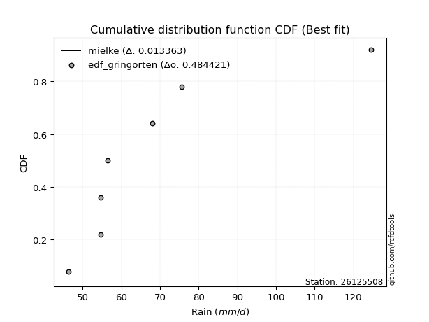</img></img>

</div>


### 9. EDF Filliben (1975)

The specific values of the constants (0.3175) (often denoted as $alpha$) and (0.365) are derived from a method proposed by James J. Filliben in a 1975 paper. This particular formula is the mean value of the $i$-th order statistic of the normal distribution and is considered a robust and effective plotting position formula for the normal probability plot correlation coefficient test for normality.

<div align="center">


$P=(m-0.3175)/(n+0.365)$


</div>


**9.1. Empirical values**

<div align="center">

|                | 0                   | 1                   | 2                   | 3            | 4                  | 5                  | 6                  |
|:---------------|:--------------------|:--------------------|:--------------------|:-------------|:-------------------|:-------------------|:-------------------|
| date           | 2023                | 2018                | 2021                | 2022         | 2019               | 2020               | 2017               |
| x              | 46.4                | 54.7                | 54.7                | 56.5         | 68.0               | 75.6               | 124.6              |
| m              | 1                   | 2                   | 3                   | 4            | 5                  | 6                  | 7                  |
| empirical_dist | edf_filliben        | edf_filliben        | edf_filliben        | edf_filliben | edf_filliben       | edf_filliben       | edf_filliben       |
| empirical      | 0.09266802443991853 | 0.22844534962661237 | 0.36422267481330617 | 0.5          | 0.6357773251866938 | 0.7715546503733877 | 0.9073319755600815 |
| empirical_tr   | 1.1021324354657687  | 1.2960844698636163  | 1.5728777362520021  | 2.0          | 2.7455731593662627 | 4.377414561664191  | 10.791208791208794 |

</div>


**9.2. Kolmogorov-Smirnov fit test (sorted by Δ)**


<div align="center">

|                | 0                   | 1                   | 2                   | 3                   | 4                   | 5                   | 6                   | 7                   | 8                   | 9                   | 10                  | 11                  | 12                  | 13                  | 14                  | 15                  | 16                  | 17                  | 18                  | 19                  | 20                  | 21                  | 22                  | 23                  | 24                  | 25                  | 26                  | 27                  | 28                  | 29                  | 30                  | 31                  | 32                  | 33                  | 34                  | 35                  | 36                  | 37                  | 38                  | 39                  | 40                  | 41                  | 42                  | 43                  | 44                  | 45                  | 46                  | 47                  | 48                  | 49                  | 50                  | 51                  | 52                  | 53                  | 54                  | 55                  | 56                  | 57                  | 58                  | 59                  | 60                  | 61                  | 62                  | 63                  | 64                  | 65                  | 66                  | 67                  | 68                  | 69                  | 70                  | 71                  | 72                  | 73                  | 74                  | 75                  | 76                  | 77                  | 78                  | 79                  | 80                  | 81                  | 82                  | 83                  | 84                  | 85                  | 86                  | 87                  | 88                  | 89                  | 90                  | 91                  | 92                  | 93                  | 94                  | 95                  | 96                  | 97                  | 98                  | 99                  | 100                 | 101                 | 102                 | 103                 | 104                 | 105                 | 106                 | 107                 | 108                 | 109                 | 110                 | 111                 | 112                 | 113                 | 114                 | 115                 | 116                 | 117                 | 118                 | 119                 | 120                 | 121                 | 122                 | 123                 | 124                 | 125                 | 126                 | 127                 | 128                 | 129                 | 130                 | 131                 | 132                 | 133                 | 134                 | 135                 | 136                 | 137                 | 138                 | 139                 | 140                 | 141                 | 142                 | 143                 | 144                 | 145                 | 146                 | 147                 | 148                 | 149                 | 150                 | 151                 | 152                 | 153                 | 154                 | 155                 | 156                 | 157                 | 158                 | 159                 |
|:---------------|:--------------------|:--------------------|:--------------------|:--------------------|:--------------------|:--------------------|:--------------------|:--------------------|:--------------------|:--------------------|:--------------------|:--------------------|:--------------------|:--------------------|:--------------------|:--------------------|:--------------------|:--------------------|:--------------------|:--------------------|:--------------------|:--------------------|:--------------------|:--------------------|:--------------------|:--------------------|:--------------------|:--------------------|:--------------------|:--------------------|:--------------------|:--------------------|:--------------------|:--------------------|:--------------------|:--------------------|:--------------------|:--------------------|:--------------------|:--------------------|:--------------------|:--------------------|:--------------------|:--------------------|:--------------------|:--------------------|:--------------------|:--------------------|:--------------------|:--------------------|:--------------------|:--------------------|:--------------------|:--------------------|:--------------------|:--------------------|:--------------------|:--------------------|:--------------------|:--------------------|:--------------------|:--------------------|:--------------------|:--------------------|:--------------------|:--------------------|:--------------------|:--------------------|:--------------------|:--------------------|:--------------------|:--------------------|:--------------------|:--------------------|:--------------------|:--------------------|:--------------------|:--------------------|:--------------------|:--------------------|:--------------------|:--------------------|:--------------------|:--------------------|:--------------------|:--------------------|:--------------------|:--------------------|:--------------------|:--------------------|:--------------------|:--------------------|:--------------------|:--------------------|:--------------------|:--------------------|:--------------------|:--------------------|:--------------------|:--------------------|:--------------------|:--------------------|:--------------------|:--------------------|:--------------------|:--------------------|:--------------------|:--------------------|:--------------------|:--------------------|:--------------------|:--------------------|:--------------------|:--------------------|:--------------------|:--------------------|:--------------------|:--------------------|:--------------------|:--------------------|:--------------------|:--------------------|:--------------------|:--------------------|:--------------------|:--------------------|:--------------------|:--------------------|:--------------------|:--------------------|:--------------------|:--------------------|:--------------------|:--------------------|:--------------------|:--------------------|:--------------------|:--------------------|:--------------------|:--------------------|:--------------------|:--------------------|:--------------------|:--------------------|:--------------------|:--------------------|:--------------------|:--------------------|:--------------------|:--------------------|:--------------------|:--------------------|:--------------------|:--------------------|:--------------------|:--------------------|:--------------------|:--------------------|:--------------------|:--------------------|
| station        | 26125508            | 26125508            | 26125508            | 26125508            | 26125508            | 26125508            | 26125508            | 26125508            | 26125508            | 26125508            | 26125508            | 26125508            | 26125508            | 26125508            | 26125508            | 26125508            | 26125508            | 26125508            | 26125508            | 26125508            | 26125508            | 26125508            | 26125508            | 26125508            | 26125508            | 26125508            | 26125508            | 26125508            | 26125508            | 26125508            | 26125508            | 26125508            | 26125508            | 26125508            | 26125508            | 26125508            | 26125508            | 26125508            | 26125508            | 26125508            | 26125508            | 26125508            | 26125508            | 26125508            | 26125508            | 26125508            | 26125508            | 26125508            | 26125508            | 26125508            | 26125508            | 26125508            | 26125508            | 26125508            | 26125508            | 26125508            | 26125508            | 26125508            | 26125508            | 26125508            | 26125508            | 26125508            | 26125508            | 26125508            | 26125508            | 26125508            | 26125508            | 26125508            | 26125508            | 26125508            | 26125508            | 26125508            | 26125508            | 26125508            | 26125508            | 26125508            | 26125508            | 26125508            | 26125508            | 26125508            | 26125508            | 26125508            | 26125508            | 26125508            | 26125508            | 26125508            | 26125508            | 26125508            | 26125508            | 26125508            | 26125508            | 26125508            | 26125508            | 26125508            | 26125508            | 26125508            | 26125508            | 26125508            | 26125508            | 26125508            | 26125508            | 26125508            | 26125508            | 26125508            | 26125508            | 26125508            | 26125508            | 26125508            | 26125508            | 26125508            | 26125508            | 26125508            | 26125508            | 26125508            | 26125508            | 26125508            | 26125508            | 26125508            | 26125508            | 26125508            | 26125508            | 26125508            | 26125508            | 26125508            | 26125508            | 26125508            | 26125508            | 26125508            | 26125508            | 26125508            | 26125508            | 26125508            | 26125508            | 26125508            | 26125508            | 26125508            | 26125508            | 26125508            | 26125508            | 26125508            | 26125508            | 26125508            | 26125508            | 26125508            | 26125508            | 26125508            | 26125508            | 26125508            | 26125508            | 26125508            | 26125508            | 26125508            | 26125508            | 26125508            | 26125508            | 26125508            | 26125508            | 26125508            | 26125508            | 26125508            |
| empirical_dist | edf_filliben        | edf_filliben        | edf_filliben        | edf_filliben        | edf_filliben        | edf_filliben        | edf_filliben        | edf_filliben        | edf_filliben        | edf_filliben        | edf_filliben        | edf_filliben        | edf_filliben        | edf_filliben        | edf_filliben        | edf_filliben        | edf_filliben        | edf_filliben        | edf_filliben        | edf_filliben        | edf_filliben        | edf_filliben        | edf_filliben        | edf_filliben        | edf_filliben        | edf_filliben        | edf_filliben        | edf_filliben        | edf_filliben        | edf_filliben        | edf_filliben        | edf_filliben        | edf_filliben        | edf_filliben        | edf_filliben        | edf_filliben        | edf_filliben        | edf_filliben        | edf_filliben        | edf_filliben        | edf_filliben        | edf_filliben        | edf_filliben        | edf_filliben        | edf_filliben        | edf_filliben        | edf_filliben        | edf_filliben        | edf_filliben        | edf_filliben        | edf_filliben        | edf_filliben        | edf_filliben        | edf_filliben        | edf_filliben        | edf_filliben        | edf_filliben        | edf_filliben        | edf_filliben        | edf_filliben        | edf_filliben        | edf_filliben        | edf_filliben        | edf_filliben        | edf_filliben        | edf_filliben        | edf_filliben        | edf_filliben        | edf_filliben        | edf_filliben        | edf_filliben        | edf_filliben        | edf_filliben        | edf_filliben        | edf_filliben        | edf_filliben        | edf_filliben        | edf_filliben        | edf_filliben        | edf_filliben        | edf_filliben        | edf_filliben        | edf_filliben        | edf_filliben        | edf_filliben        | edf_filliben        | edf_filliben        | edf_filliben        | edf_filliben        | edf_filliben        | edf_filliben        | edf_filliben        | edf_filliben        | edf_filliben        | edf_filliben        | edf_filliben        | edf_filliben        | edf_filliben        | edf_filliben        | edf_filliben        | edf_filliben        | edf_filliben        | edf_filliben        | edf_filliben        | edf_filliben        | edf_filliben        | edf_filliben        | edf_filliben        | edf_filliben        | edf_filliben        | edf_filliben        | edf_filliben        | edf_filliben        | edf_filliben        | edf_filliben        | edf_filliben        | edf_filliben        | edf_filliben        | edf_filliben        | edf_filliben        | edf_filliben        | edf_filliben        | edf_filliben        | edf_filliben        | edf_filliben        | edf_filliben        | edf_filliben        | edf_filliben        | edf_filliben        | edf_filliben        | edf_filliben        | edf_filliben        | edf_filliben        | edf_filliben        | edf_filliben        | edf_filliben        | edf_filliben        | edf_filliben        | edf_filliben        | edf_filliben        | edf_filliben        | edf_filliben        | edf_filliben        | edf_filliben        | edf_filliben        | edf_filliben        | edf_filliben        | edf_filliben        | edf_filliben        | edf_filliben        | edf_filliben        | edf_filliben        | edf_filliben        | edf_filliben        | edf_filliben        | edf_filliben        | edf_filliben        | edf_filliben        | edf_filliben        | edf_filliben        |
| p_dist         | mielke              | alpha               | loginvgamma         | loginvweibull       | loggenextreme       | genextreme          | f                   | logburr12           | invgamma            | loghalflogistic     | logexponnorm        | logalpha            | logwald             | logjohnsonsu        | logt                | loginvgauss         | loghalfnorm         | halflogistic        | logfoldnorm         | loggompertz         | loghalfgennorm      | pearson3            | logfatiguelife      | halfnorm            | logmielke           | invgauss            | loggenexpon         | johnsonsu           | logpearson3         | lomax               | logmoyal            | wald                | truncweibull_min    | exponnorm           | foldnorm            | logncf              | genexpon            | logweibull_min      | vonmises_line       | fatiguelife         | gengamma            | logvonmises_line    | exponweib           | lograyleigh         | moyal               | loggumbel_r         | logburr             | gompertz            | rayleigh            | logsemicircular     | logmaxwell          | gumbel_r            | loggenlogistic      | burr                | logweibull_max      | loggausshyper       | burr12              | halfgennorm         | loglomax            | loganglit           | logarcsine          | logf                | maxwell             | truncnorm           | logskewnorm         | logkstwobign        | bradford            | nct                 | anglit              | lognct              | logloggamma         | ncf                 | betaprime           | semicircular        | logbetaprime        | lognorm             | logcrystalball      | genlogistic         | norm                | crystalball         | loggengamma         | logexponpow         | logtruncweibull_min | logloglaplace       | logrice             | nakagami            | loglogistic         | arcsine             | loggennorm          | logistic            | logtruncexpon       | tukeylambda         | kstwobign           | loghypsecant        | logcosine           | hypsecant           | logbradford         | weibull_min         | logexponweib        | loggumbel_l         | rice                | gumbel_l            | exponpow            | loglaplace          | loglaplace          | cosine              | laplace             | logjohnsonsb        | gausshyper          | skewnorm            | logbeta             | logdgamma           | gennorm             | dweibull            | dgamma              | logdweibull         | logwrapcauchy       | logargus            | logksone            | genpareto           | logtukeylambda      | truncexpon          | loguniform          | logkappa3           | logkappa4           | wrapcauchy          | gamma               | erlang              | lognakagami         | logrdist            | logtriang           | loglevy_l           | beta                | kappa4              | levy_l              | argus               | loggenpareto        | ksone               | uniform             | kappa3              | triang              | rdist               | loggenhalflogistic  | t                   | invweibull          | powerlaw            | loggamma            | loggamma            | logerlang           | logpowerlaw         | genhalflogistic     | logtrapezoid        | logtruncpareto      | trapezoid           | truncpareto         | johnsonsb           | weibull_max         | logtruncnorm        | logvonmises         | vonmises            |
| delta          | 0.0273789536291585  | 0.10352889562293938 | 0.10398941152780009 | 0.10535030126189754 | 0.10536329643647474 | 0.10841474698477735 | 0.10898103983409071 | 0.11035301527560526 | 0.11040906001069631 | 0.11052639462448668 | 0.11118355061105345 | 0.11228879657010771 | 0.11327580349535887 | 0.1136508630887553  | 0.1143721272032436  | 0.11633876124999412 | 0.11682523216235705 | 0.11738067113759884 | 0.12012400730796918 | 0.12054386594702796 | 0.12183674802035935 | 0.12224981463750267 | 0.1223369630394249  | 0.12259303556558285 | 0.12443239094445435 | 0.12540757481810008 | 0.1274412525910145  | 0.12820077111578657 | 0.1294197647381803  | 0.12948094801508397 | 0.13068187678252297 | 0.13071780368960767 | 0.1316687563941927  | 0.13334724459526037 | 0.13412868275949782 | 0.13484793585457142 | 0.1350329793490634  | 0.13555693208295835 | 0.13588907535185873 | 0.1373018311909648  | 0.13811983809243691 | 0.13896146027859457 | 0.13946094546963242 | 0.14149691486764893 | 0.1415125229897457  | 0.14377308855332732 | 0.14611875459438728 | 0.14741515249676124 | 0.1495397793580841  | 0.1496851688591559  | 0.1529888333605302  | 0.1533538395720599  | 0.15335608339358853 | 0.1536397825393654  | 0.153732898208377   | 0.15397879597800312 | 0.15467778074225938 | 0.15554731413804823 | 0.15877447477635384 | 0.15945249874149048 | 0.15950690502887954 | 0.16076004498581828 | 0.1608515038871512  | 0.16269492909104738 | 0.1655343981068111  | 0.1698242032698276  | 0.17047214030603802 | 0.1729487289755231  | 0.17519929924400124 | 0.17729305510903387 | 0.1777652351236117  | 0.17817241279273233 | 0.1785595943275281  | 0.18156894911630472 | 0.1817289697237528  | 0.18251889466799498 | 0.18251911034121215 | 0.18727554720430467 | 0.18972858442179386 | 0.18972859403998432 | 0.19283733005048745 | 0.1950448984592472  | 0.19574999396312603 | 0.19990503054912076 | 0.20104661915841476 | 0.20278161808257228 | 0.2028922604660518  | 0.2072744192826893  | 0.20966555440228607 | 0.21053378236858977 | 0.21093188728376366 | 0.2123987460386103  | 0.216025239211469   | 0.2180130316907875  | 0.22320749008685903 | 0.2258046857320246  | 0.23292955165105084 | 0.23351378922757024 | 0.2349689066301456  | 0.23682377829650225 | 0.23866083661602122 | 0.24263742232185737 | 0.24378639799352486 | 0.24450461964701065 | 0.24450461964701065 | 0.24917529980639896 | 0.25174471155123884 | 0.25513394851728854 | 0.25599527545269807 | 0.26035666882487773 | 0.2710702907169755  | 0.2715546503725399  | 0.27155465037309257 | 0.2715546503733446  | 0.2715546503733689  | 0.27155465037340476 | 0.273494403873189   | 0.2742113416941844  | 0.2764035539833317  | 0.2880004732204056  | 0.2891046614205166  | 0.29347754665575465 | 0.30062831014052804 | 0.300817915874377   | 0.30084087429696155 | 0.31772332646613743 | 0.32076521308008    | 0.3249808432878417  | 0.3266867191193745  | 0.33140767419565703 | 0.3338448967065998  | 0.3343240800735612  | 0.34330948144805173 | 0.348985232863052   | 0.3542120597933345  | 0.3565881670843233  | 0.37387065939843056 | 0.37705337160100916 | 0.39815311584653346 | 0.4015414026415049  | 0.40564505316520555 | 0.40616835669037843 | 0.43800563280225585 | 0.4507557424355768  | 0.4595942843216533  | 0.48101104644680726 | 0.5006935822378652  | 0.5006935822378652  | 0.511870040099207   | 0.5143342782190536  | 0.52023581456099    | 0.5263800421171132  | 0.5493602067931447  | 0.6159233914203458  | 0.624361554631841   | 0.6509352964900508  | 0.6727596261800459  | 0.9073319755600815  | 1.0766847151753962  | 19.59212594094634   |
| deltao         | 0.48442053926100004 | 0.48442053926100004 | 0.48442053926100004 | 0.48442053926100004 | 0.48442053926100004 | 0.48442053926100004 | 0.48442053926100004 | 0.48442053926100004 | 0.48442053926100004 | 0.48442053926100004 | 0.48442053926100004 | 0.48442053926100004 | 0.48442053926100004 | 0.48442053926100004 | 0.48442053926100004 | 0.48442053926100004 | 0.48442053926100004 | 0.48442053926100004 | 0.48442053926100004 | 0.48442053926100004 | 0.48442053926100004 | 0.48442053926100004 | 0.48442053926100004 | 0.48442053926100004 | 0.48442053926100004 | 0.48442053926100004 | 0.48442053926100004 | 0.48442053926100004 | 0.48442053926100004 | 0.48442053926100004 | 0.48442053926100004 | 0.48442053926100004 | 0.48442053926100004 | 0.48442053926100004 | 0.48442053926100004 | 0.48442053926100004 | 0.48442053926100004 | 0.48442053926100004 | 0.48442053926100004 | 0.48442053926100004 | 0.48442053926100004 | 0.48442053926100004 | 0.48442053926100004 | 0.48442053926100004 | 0.48442053926100004 | 0.48442053926100004 | 0.48442053926100004 | 0.48442053926100004 | 0.48442053926100004 | 0.48442053926100004 | 0.48442053926100004 | 0.48442053926100004 | 0.48442053926100004 | 0.48442053926100004 | 0.48442053926100004 | 0.48442053926100004 | 0.48442053926100004 | 0.48442053926100004 | 0.48442053926100004 | 0.48442053926100004 | 0.48442053926100004 | 0.48442053926100004 | 0.48442053926100004 | 0.48442053926100004 | 0.48442053926100004 | 0.48442053926100004 | 0.48442053926100004 | 0.48442053926100004 | 0.48442053926100004 | 0.48442053926100004 | 0.48442053926100004 | 0.48442053926100004 | 0.48442053926100004 | 0.48442053926100004 | 0.48442053926100004 | 0.48442053926100004 | 0.48442053926100004 | 0.48442053926100004 | 0.48442053926100004 | 0.48442053926100004 | 0.48442053926100004 | 0.48442053926100004 | 0.48442053926100004 | 0.48442053926100004 | 0.48442053926100004 | 0.48442053926100004 | 0.48442053926100004 | 0.48442053926100004 | 0.48442053926100004 | 0.48442053926100004 | 0.48442053926100004 | 0.48442053926100004 | 0.48442053926100004 | 0.48442053926100004 | 0.48442053926100004 | 0.48442053926100004 | 0.48442053926100004 | 0.48442053926100004 | 0.48442053926100004 | 0.48442053926100004 | 0.48442053926100004 | 0.48442053926100004 | 0.48442053926100004 | 0.48442053926100004 | 0.48442053926100004 | 0.48442053926100004 | 0.48442053926100004 | 0.48442053926100004 | 0.48442053926100004 | 0.48442053926100004 | 0.48442053926100004 | 0.48442053926100004 | 0.48442053926100004 | 0.48442053926100004 | 0.48442053926100004 | 0.48442053926100004 | 0.48442053926100004 | 0.48442053926100004 | 0.48442053926100004 | 0.48442053926100004 | 0.48442053926100004 | 0.48442053926100004 | 0.48442053926100004 | 0.48442053926100004 | 0.48442053926100004 | 0.48442053926100004 | 0.48442053926100004 | 0.48442053926100004 | 0.48442053926100004 | 0.48442053926100004 | 0.48442053926100004 | 0.48442053926100004 | 0.48442053926100004 | 0.48442053926100004 | 0.48442053926100004 | 0.48442053926100004 | 0.48442053926100004 | 0.48442053926100004 | 0.48442053926100004 | 0.48442053926100004 | 0.48442053926100004 | 0.48442053926100004 | 0.48442053926100004 | 0.48442053926100004 | 0.48442053926100004 | 0.48442053926100004 | 0.48442053926100004 | 0.48442053926100004 | 0.48442053926100004 | 0.48442053926100004 | 0.48442053926100004 | 0.48442053926100004 | 0.48442053926100004 | 0.48442053926100004 | 0.48442053926100004 | 0.48442053926100004 | 0.48442053926100004 | 0.48442053926100004 | 0.48442053926100004 | 0.48442053926100004 |
| eval           | Δo > Δ              | Δo > Δ              | Δo > Δ              | Δo > Δ              | Δo > Δ              | Δo > Δ              | Δo > Δ              | Δo > Δ              | Δo > Δ              | Δo > Δ              | Δo > Δ              | Δo > Δ              | Δo > Δ              | Δo > Δ              | Δo > Δ              | Δo > Δ              | Δo > Δ              | Δo > Δ              | Δo > Δ              | Δo > Δ              | Δo > Δ              | Δo > Δ              | Δo > Δ              | Δo > Δ              | Δo > Δ              | Δo > Δ              | Δo > Δ              | Δo > Δ              | Δo > Δ              | Δo > Δ              | Δo > Δ              | Δo > Δ              | Δo > Δ              | Δo > Δ              | Δo > Δ              | Δo > Δ              | Δo > Δ              | Δo > Δ              | Δo > Δ              | Δo > Δ              | Δo > Δ              | Δo > Δ              | Δo > Δ              | Δo > Δ              | Δo > Δ              | Δo > Δ              | Δo > Δ              | Δo > Δ              | Δo > Δ              | Δo > Δ              | Δo > Δ              | Δo > Δ              | Δo > Δ              | Δo > Δ              | Δo > Δ              | Δo > Δ              | Δo > Δ              | Δo > Δ              | Δo > Δ              | Δo > Δ              | Δo > Δ              | Δo > Δ              | Δo > Δ              | Δo > Δ              | Δo > Δ              | Δo > Δ              | Δo > Δ              | Δo > Δ              | Δo > Δ              | Δo > Δ              | Δo > Δ              | Δo > Δ              | Δo > Δ              | Δo > Δ              | Δo > Δ              | Δo > Δ              | Δo > Δ              | Δo > Δ              | Δo > Δ              | Δo > Δ              | Δo > Δ              | Δo > Δ              | Δo > Δ              | Δo > Δ              | Δo > Δ              | Δo > Δ              | Δo > Δ              | Δo > Δ              | Δo > Δ              | Δo > Δ              | Δo > Δ              | Δo > Δ              | Δo > Δ              | Δo > Δ              | Δo > Δ              | Δo > Δ              | Δo > Δ              | Δo > Δ              | Δo > Δ              | Δo > Δ              | Δo > Δ              | Δo > Δ              | Δo > Δ              | Δo > Δ              | Δo > Δ              | Δo > Δ              | Δo > Δ              | Δo > Δ              | Δo > Δ              | Δo > Δ              | Δo > Δ              | Δo > Δ              | Δo > Δ              | Δo > Δ              | Δo > Δ              | Δo > Δ              | Δo > Δ              | Δo > Δ              | Δo > Δ              | Δo > Δ              | Δo > Δ              | Δo > Δ              | Δo > Δ              | Δo > Δ              | Δo > Δ              | Δo > Δ              | Δo > Δ              | Δo > Δ              | Δo > Δ              | Δo > Δ              | Δo > Δ              | Δo > Δ              | Δo > Δ              | Δo > Δ              | Δo > Δ              | Δo > Δ              | Δo > Δ              | Δo > Δ              | Δo > Δ              | Δo > Δ              | Δo > Δ              | Δo > Δ              | Δo > Δ              | Δo > Δ              | Δo > Δ              | Δo > Δ              | Δo <= Δ             | Δo <= Δ             | Δo <= Δ             | Δo <= Δ             | Δo <= Δ             | Δo <= Δ             | Δo <= Δ             | Δo <= Δ             | Δo <= Δ             | Δo <= Δ             | Δo <= Δ             | Δo <= Δ             | Δo <= Δ             | Δo <= Δ             |
| fit            | 1                   | 1                   | 1                   | 1                   | 1                   | 1                   | 1                   | 1                   | 1                   | 1                   | 1                   | 1                   | 1                   | 1                   | 1                   | 1                   | 1                   | 1                   | 1                   | 1                   | 1                   | 1                   | 1                   | 1                   | 1                   | 1                   | 1                   | 1                   | 1                   | 1                   | 1                   | 1                   | 1                   | 1                   | 1                   | 1                   | 1                   | 1                   | 1                   | 1                   | 1                   | 1                   | 1                   | 1                   | 1                   | 1                   | 1                   | 1                   | 1                   | 1                   | 1                   | 1                   | 1                   | 1                   | 1                   | 1                   | 1                   | 1                   | 1                   | 1                   | 1                   | 1                   | 1                   | 1                   | 1                   | 1                   | 1                   | 1                   | 1                   | 1                   | 1                   | 1                   | 1                   | 1                   | 1                   | 1                   | 1                   | 1                   | 1                   | 1                   | 1                   | 1                   | 1                   | 1                   | 1                   | 1                   | 1                   | 1                   | 1                   | 1                   | 1                   | 1                   | 1                   | 1                   | 1                   | 1                   | 1                   | 1                   | 1                   | 1                   | 1                   | 1                   | 1                   | 1                   | 1                   | 1                   | 1                   | 1                   | 1                   | 1                   | 1                   | 1                   | 1                   | 1                   | 1                   | 1                   | 1                   | 1                   | 1                   | 1                   | 1                   | 1                   | 1                   | 1                   | 1                   | 1                   | 1                   | 1                   | 1                   | 1                   | 1                   | 1                   | 1                   | 1                   | 1                   | 1                   | 1                   | 1                   | 1                   | 1                   | 1                   | 1                   | 1                   | 1                   | 1                   | 1                   | 0                   | 0                   | 0                   | 0                   | 0                   | 0                   | 0                   | 0                   | 0                   | 0                   | 0                   | 0                   | 0                   | 0                   |
| n              | 7                   | 7                   | 7                   | 7                   | 7                   | 7                   | 7                   | 7                   | 7                   | 7                   | 7                   | 7                   | 7                   | 7                   | 7                   | 7                   | 7                   | 7                   | 7                   | 7                   | 7                   | 7                   | 7                   | 7                   | 7                   | 7                   | 7                   | 7                   | 7                   | 7                   | 7                   | 7                   | 7                   | 7                   | 7                   | 7                   | 7                   | 7                   | 7                   | 7                   | 7                   | 7                   | 7                   | 7                   | 7                   | 7                   | 7                   | 7                   | 7                   | 7                   | 7                   | 7                   | 7                   | 7                   | 7                   | 7                   | 7                   | 7                   | 7                   | 7                   | 7                   | 7                   | 7                   | 7                   | 7                   | 7                   | 7                   | 7                   | 7                   | 7                   | 7                   | 7                   | 7                   | 7                   | 7                   | 7                   | 7                   | 7                   | 7                   | 7                   | 7                   | 7                   | 7                   | 7                   | 7                   | 7                   | 7                   | 7                   | 7                   | 7                   | 7                   | 7                   | 7                   | 7                   | 7                   | 7                   | 7                   | 7                   | 7                   | 7                   | 7                   | 7                   | 7                   | 7                   | 7                   | 7                   | 7                   | 7                   | 7                   | 7                   | 7                   | 7                   | 7                   | 7                   | 7                   | 7                   | 7                   | 7                   | 7                   | 7                   | 7                   | 7                   | 7                   | 7                   | 7                   | 7                   | 7                   | 7                   | 7                   | 7                   | 7                   | 7                   | 7                   | 7                   | 7                   | 7                   | 7                   | 7                   | 7                   | 7                   | 7                   | 7                   | 7                   | 7                   | 7                   | 7                   | 7                   | 7                   | 7                   | 7                   | 7                   | 7                   | 7                   | 7                   | 7                   | 7                   | 7                   | 7                   | 7                   | 7                   |
| best_fit       | 1                   | 0                   | 0                   | 0                   | 0                   | 0                   | 0                   | 0                   | 0                   | 0                   | 0                   | 0                   | 0                   | 0                   | 0                   | 0                   | 0                   | 0                   | 0                   | 0                   | 0                   | 0                   | 0                   | 0                   | 0                   | 0                   | 0                   | 0                   | 0                   | 0                   | 0                   | 0                   | 0                   | 0                   | 0                   | 0                   | 0                   | 0                   | 0                   | 0                   | 0                   | 0                   | 0                   | 0                   | 0                   | 0                   | 0                   | 0                   | 0                   | 0                   | 0                   | 0                   | 0                   | 0                   | 0                   | 0                   | 0                   | 0                   | 0                   | 0                   | 0                   | 0                   | 0                   | 0                   | 0                   | 0                   | 0                   | 0                   | 0                   | 0                   | 0                   | 0                   | 0                   | 0                   | 0                   | 0                   | 0                   | 0                   | 0                   | 0                   | 0                   | 0                   | 0                   | 0                   | 0                   | 0                   | 0                   | 0                   | 0                   | 0                   | 0                   | 0                   | 0                   | 0                   | 0                   | 0                   | 0                   | 0                   | 0                   | 0                   | 0                   | 0                   | 0                   | 0                   | 0                   | 0                   | 0                   | 0                   | 0                   | 0                   | 0                   | 0                   | 0                   | 0                   | 0                   | 0                   | 0                   | 0                   | 0                   | 0                   | 0                   | 0                   | 0                   | 0                   | 0                   | 0                   | 0                   | 0                   | 0                   | 0                   | 0                   | 0                   | 0                   | 0                   | 0                   | 0                   | 0                   | 0                   | 0                   | 0                   | 0                   | 0                   | 0                   | 0                   | 0                   | 0                   | 0                   | 0                   | 0                   | 0                   | 0                   | 0                   | 0                   | 0                   | 0                   | 0                   | 0                   | 0                   | 0                   | 0                   |
| best_fit_sort  | 1                   | 2                   | 3                   | 4                   | 5                   | 6                   | 7                   | 8                   | 9                   | 10                  | 11                  | 12                  | 13                  | 14                  | 15                  | 16                  | 17                  | 18                  | 19                  | 20                  | 21                  | 22                  | 23                  | 24                  | 25                  | 26                  | 27                  | 28                  | 29                  | 30                  | 31                  | 32                  | 33                  | 34                  | 35                  | 36                  | 37                  | 38                  | 39                  | 40                  | 41                  | 42                  | 43                  | 44                  | 45                  | 46                  | 47                  | 48                  | 49                  | 50                  | 51                  | 52                  | 53                  | 54                  | 55                  | 56                  | 57                  | 58                  | 59                  | 60                  | 61                  | 62                  | 63                  | 64                  | 65                  | 66                  | 67                  | 68                  | 69                  | 70                  | 71                  | 72                  | 73                  | 74                  | 75                  | 76                  | 77                  | 78                  | 79                  | 80                  | 81                  | 82                  | 83                  | 84                  | 85                  | 86                  | 87                  | 88                  | 89                  | 90                  | 91                  | 92                  | 93                  | 94                  | 95                  | 96                  | 97                  | 98                  | 99                  | 100                 | 101                 | 102                 | 103                 | 104                 | 105                 | 106                 | 107                 | 108                 | 109                 | 110                 | 111                 | 112                 | 113                 | 114                 | 115                 | 116                 | 117                 | 118                 | 119                 | 120                 | 121                 | 122                 | 123                 | 124                 | 125                 | 126                 | 127                 | 128                 | 129                 | 130                 | 131                 | 132                 | 133                 | 134                 | 135                 | 136                 | 137                 | 138                 | 139                 | 140                 | 141                 | 142                 | 143                 | 144                 | 145                 | 146                 | 147                 | 148                 | 149                 | 150                 | 151                 | 152                 | 153                 | 154                 | 155                 | 156                 | 157                 | 158                 | 159                 | 160                 |

</div>


**9.3. Best fit**

<div align="center">

|   id |   station | empirical_dist   | p_dist   |    delta |   deltao | eval   |   fit |   n |   best_fit |   best_fit_sort |
|-----:|----------:|:-----------------|:---------|---------:|---------:|:-------|------:|----:|-----------:|----------------:|
|    0 |  26125508 | edf_filliben     | mielke   | 0.027379 | 0.484421 | Δo > Δ |     1 |   7 |          1 |               1 |

</div>


<div align="center">

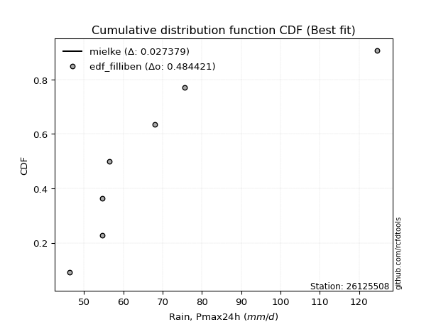</img>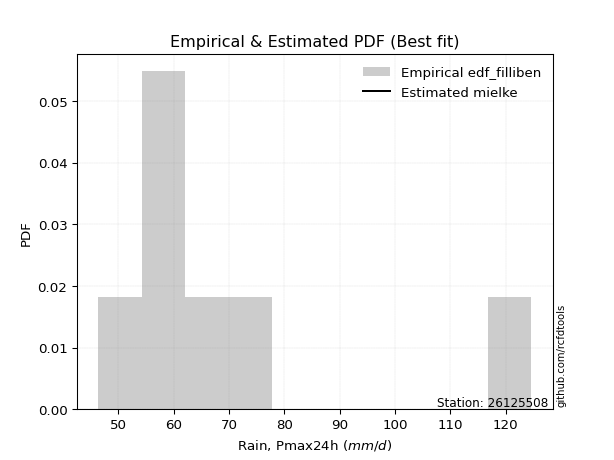</img>

</div>


### 10. EDF Jenkinson (1977)

The Jenkinson formula in hydrology is an empirical plotting position formula used to estimate the non-exceedance probability _(P)_ or return period _(T)_ of a given ordered observation within a sample. It is a widely used method in the frequency analysis of extreme events such as floods and rainfall, as it provides a distribution-free way to plot data. _a≈0.31_ and _b≈0.38_ are constants derived to approximate the median of the probability distribution for the given rank.

<div align="center">


$P=(m-a)/(n+b)$


</div>


**10.1. Empirical values**

<div align="center">

|                | 0                   | 1                   | 2                   | 3             | 4                  | 5                  | 6                  |
|:---------------|:--------------------|:--------------------|:--------------------|:--------------|:-------------------|:-------------------|:-------------------|
| date           | 2023                | 2018                | 2021                | 2022          | 2019               | 2020               | 2017               |
| x              | 46.4                | 54.7                | 54.7                | 56.5          | 68.0               | 75.6               | 124.6              |
| m              | 1                   | 2                   | 3                   | 4             | 5                  | 6                  | 7                  |
| empirical_dist | edf_jenkinson       | edf_jenkinson       | edf_jenkinson       | edf_jenkinson | edf_jenkinson      | edf_jenkinson      | edf_jenkinson      |
| empirical      | 0.09349593495934959 | 0.22899728997289973 | 0.36449864498644985 | 0.5           | 0.6355013550135502 | 0.7710027100271003 | 0.9065040650406505 |
| empirical_tr   | 1.1031390134529149  | 1.29701230228471    | 1.5735607675906182  | 2.0           | 2.743494423791822  | 4.366863905325444  | 10.695652173913055 |

</div>


**10.2. Kolmogorov-Smirnov fit test (sorted by Δ)**


<div align="center">

|                | 0                    | 1                   | 2                   | 3                   | 4                   | 5                   | 6                   | 7                   | 8                   | 9                   | 10                  | 11                  | 12                  | 13                  | 14                  | 15                  | 16                  | 17                  | 18                  | 19                  | 20                  | 21                  | 22                  | 23                  | 24                  | 25                  | 26                  | 27                  | 28                  | 29                  | 30                  | 31                  | 32                  | 33                  | 34                  | 35                  | 36                  | 37                  | 38                  | 39                  | 40                  | 41                  | 42                  | 43                  | 44                  | 45                  | 46                  | 47                  | 48                  | 49                  | 50                  | 51                  | 52                  | 53                  | 54                  | 55                  | 56                  | 57                  | 58                  | 59                  | 60                  | 61                  | 62                  | 63                  | 64                  | 65                  | 66                  | 67                  | 68                  | 69                  | 70                  | 71                  | 72                  | 73                  | 74                  | 75                  | 76                  | 77                  | 78                  | 79                  | 80                  | 81                  | 82                  | 83                  | 84                  | 85                  | 86                  | 87                  | 88                  | 89                  | 90                  | 91                  | 92                  | 93                  | 94                  | 95                  | 96                  | 97                  | 98                  | 99                  | 100                 | 101                 | 102                 | 103                 | 104                 | 105                 | 106                 | 107                 | 108                 | 109                 | 110                 | 111                 | 112                 | 113                 | 114                 | 115                 | 116                 | 117                 | 118                 | 119                 | 120                 | 121                 | 122                 | 123                 | 124                 | 125                 | 126                 | 127                 | 128                 | 129                 | 130                 | 131                 | 132                 | 133                 | 134                 | 135                 | 136                 | 137                 | 138                 | 139                 | 140                 | 141                 | 142                 | 143                 | 144                 | 145                 | 146                 | 147                 | 148                 | 149                 | 150                 | 151                 | 152                 | 153                 | 154                 | 155                 | 156                 | 157                 | 158                 | 159                 |
|:---------------|:---------------------|:--------------------|:--------------------|:--------------------|:--------------------|:--------------------|:--------------------|:--------------------|:--------------------|:--------------------|:--------------------|:--------------------|:--------------------|:--------------------|:--------------------|:--------------------|:--------------------|:--------------------|:--------------------|:--------------------|:--------------------|:--------------------|:--------------------|:--------------------|:--------------------|:--------------------|:--------------------|:--------------------|:--------------------|:--------------------|:--------------------|:--------------------|:--------------------|:--------------------|:--------------------|:--------------------|:--------------------|:--------------------|:--------------------|:--------------------|:--------------------|:--------------------|:--------------------|:--------------------|:--------------------|:--------------------|:--------------------|:--------------------|:--------------------|:--------------------|:--------------------|:--------------------|:--------------------|:--------------------|:--------------------|:--------------------|:--------------------|:--------------------|:--------------------|:--------------------|:--------------------|:--------------------|:--------------------|:--------------------|:--------------------|:--------------------|:--------------------|:--------------------|:--------------------|:--------------------|:--------------------|:--------------------|:--------------------|:--------------------|:--------------------|:--------------------|:--------------------|:--------------------|:--------------------|:--------------------|:--------------------|:--------------------|:--------------------|:--------------------|:--------------------|:--------------------|:--------------------|:--------------------|:--------------------|:--------------------|:--------------------|:--------------------|:--------------------|:--------------------|:--------------------|:--------------------|:--------------------|:--------------------|:--------------------|:--------------------|:--------------------|:--------------------|:--------------------|:--------------------|:--------------------|:--------------------|:--------------------|:--------------------|:--------------------|:--------------------|:--------------------|:--------------------|:--------------------|:--------------------|:--------------------|:--------------------|:--------------------|:--------------------|:--------------------|:--------------------|:--------------------|:--------------------|:--------------------|:--------------------|:--------------------|:--------------------|:--------------------|:--------------------|:--------------------|:--------------------|:--------------------|:--------------------|:--------------------|:--------------------|:--------------------|:--------------------|:--------------------|:--------------------|:--------------------|:--------------------|:--------------------|:--------------------|:--------------------|:--------------------|:--------------------|:--------------------|:--------------------|:--------------------|:--------------------|:--------------------|:--------------------|:--------------------|:--------------------|:--------------------|:--------------------|:--------------------|:--------------------|:--------------------|:--------------------|:--------------------|
| station        | 26125508             | 26125508            | 26125508            | 26125508            | 26125508            | 26125508            | 26125508            | 26125508            | 26125508            | 26125508            | 26125508            | 26125508            | 26125508            | 26125508            | 26125508            | 26125508            | 26125508            | 26125508            | 26125508            | 26125508            | 26125508            | 26125508            | 26125508            | 26125508            | 26125508            | 26125508            | 26125508            | 26125508            | 26125508            | 26125508            | 26125508            | 26125508            | 26125508            | 26125508            | 26125508            | 26125508            | 26125508            | 26125508            | 26125508            | 26125508            | 26125508            | 26125508            | 26125508            | 26125508            | 26125508            | 26125508            | 26125508            | 26125508            | 26125508            | 26125508            | 26125508            | 26125508            | 26125508            | 26125508            | 26125508            | 26125508            | 26125508            | 26125508            | 26125508            | 26125508            | 26125508            | 26125508            | 26125508            | 26125508            | 26125508            | 26125508            | 26125508            | 26125508            | 26125508            | 26125508            | 26125508            | 26125508            | 26125508            | 26125508            | 26125508            | 26125508            | 26125508            | 26125508            | 26125508            | 26125508            | 26125508            | 26125508            | 26125508            | 26125508            | 26125508            | 26125508            | 26125508            | 26125508            | 26125508            | 26125508            | 26125508            | 26125508            | 26125508            | 26125508            | 26125508            | 26125508            | 26125508            | 26125508            | 26125508            | 26125508            | 26125508            | 26125508            | 26125508            | 26125508            | 26125508            | 26125508            | 26125508            | 26125508            | 26125508            | 26125508            | 26125508            | 26125508            | 26125508            | 26125508            | 26125508            | 26125508            | 26125508            | 26125508            | 26125508            | 26125508            | 26125508            | 26125508            | 26125508            | 26125508            | 26125508            | 26125508            | 26125508            | 26125508            | 26125508            | 26125508            | 26125508            | 26125508            | 26125508            | 26125508            | 26125508            | 26125508            | 26125508            | 26125508            | 26125508            | 26125508            | 26125508            | 26125508            | 26125508            | 26125508            | 26125508            | 26125508            | 26125508            | 26125508            | 26125508            | 26125508            | 26125508            | 26125508            | 26125508            | 26125508            | 26125508            | 26125508            | 26125508            | 26125508            | 26125508            | 26125508            |
| empirical_dist | edf_jenkinson        | edf_jenkinson       | edf_jenkinson       | edf_jenkinson       | edf_jenkinson       | edf_jenkinson       | edf_jenkinson       | edf_jenkinson       | edf_jenkinson       | edf_jenkinson       | edf_jenkinson       | edf_jenkinson       | edf_jenkinson       | edf_jenkinson       | edf_jenkinson       | edf_jenkinson       | edf_jenkinson       | edf_jenkinson       | edf_jenkinson       | edf_jenkinson       | edf_jenkinson       | edf_jenkinson       | edf_jenkinson       | edf_jenkinson       | edf_jenkinson       | edf_jenkinson       | edf_jenkinson       | edf_jenkinson       | edf_jenkinson       | edf_jenkinson       | edf_jenkinson       | edf_jenkinson       | edf_jenkinson       | edf_jenkinson       | edf_jenkinson       | edf_jenkinson       | edf_jenkinson       | edf_jenkinson       | edf_jenkinson       | edf_jenkinson       | edf_jenkinson       | edf_jenkinson       | edf_jenkinson       | edf_jenkinson       | edf_jenkinson       | edf_jenkinson       | edf_jenkinson       | edf_jenkinson       | edf_jenkinson       | edf_jenkinson       | edf_jenkinson       | edf_jenkinson       | edf_jenkinson       | edf_jenkinson       | edf_jenkinson       | edf_jenkinson       | edf_jenkinson       | edf_jenkinson       | edf_jenkinson       | edf_jenkinson       | edf_jenkinson       | edf_jenkinson       | edf_jenkinson       | edf_jenkinson       | edf_jenkinson       | edf_jenkinson       | edf_jenkinson       | edf_jenkinson       | edf_jenkinson       | edf_jenkinson       | edf_jenkinson       | edf_jenkinson       | edf_jenkinson       | edf_jenkinson       | edf_jenkinson       | edf_jenkinson       | edf_jenkinson       | edf_jenkinson       | edf_jenkinson       | edf_jenkinson       | edf_jenkinson       | edf_jenkinson       | edf_jenkinson       | edf_jenkinson       | edf_jenkinson       | edf_jenkinson       | edf_jenkinson       | edf_jenkinson       | edf_jenkinson       | edf_jenkinson       | edf_jenkinson       | edf_jenkinson       | edf_jenkinson       | edf_jenkinson       | edf_jenkinson       | edf_jenkinson       | edf_jenkinson       | edf_jenkinson       | edf_jenkinson       | edf_jenkinson       | edf_jenkinson       | edf_jenkinson       | edf_jenkinson       | edf_jenkinson       | edf_jenkinson       | edf_jenkinson       | edf_jenkinson       | edf_jenkinson       | edf_jenkinson       | edf_jenkinson       | edf_jenkinson       | edf_jenkinson       | edf_jenkinson       | edf_jenkinson       | edf_jenkinson       | edf_jenkinson       | edf_jenkinson       | edf_jenkinson       | edf_jenkinson       | edf_jenkinson       | edf_jenkinson       | edf_jenkinson       | edf_jenkinson       | edf_jenkinson       | edf_jenkinson       | edf_jenkinson       | edf_jenkinson       | edf_jenkinson       | edf_jenkinson       | edf_jenkinson       | edf_jenkinson       | edf_jenkinson       | edf_jenkinson       | edf_jenkinson       | edf_jenkinson       | edf_jenkinson       | edf_jenkinson       | edf_jenkinson       | edf_jenkinson       | edf_jenkinson       | edf_jenkinson       | edf_jenkinson       | edf_jenkinson       | edf_jenkinson       | edf_jenkinson       | edf_jenkinson       | edf_jenkinson       | edf_jenkinson       | edf_jenkinson       | edf_jenkinson       | edf_jenkinson       | edf_jenkinson       | edf_jenkinson       | edf_jenkinson       | edf_jenkinson       | edf_jenkinson       | edf_jenkinson       | edf_jenkinson       | edf_jenkinson       | edf_jenkinson       |
| p_dist         | mielke               | loginvgamma         | alpha               | loginvweibull       | loggenextreme       | genextreme          | f                   | invgamma            | loghalflogistic     | logburr12           | logexponnorm        | logalpha            | logjohnsonsu        | logwald             | logt                | loginvgauss         | loghalfnorm         | halflogistic        | loggompertz         | logfoldnorm         | loghalfgennorm      | logfatiguelife      | halfnorm            | pearson3            | logmielke           | invgauss            | loggenexpon         | johnsonsu           | logpearson3         | lomax               | logmoyal            | wald                | truncweibull_min    | exponnorm           | foldnorm            | logncf              | logweibull_min      | genexpon            | vonmises_line       | fatiguelife         | gengamma            | exponweib           | logvonmises_line    | lograyleigh         | moyal               | loggumbel_r         | logburr             | gompertz            | rayleigh            | logsemicircular     | logmaxwell          | gumbel_r            | loggenlogistic      | burr                | logweibull_max      | loggausshyper       | burr12              | halfgennorm         | loglomax            | logarcsine          | loganglit           | logf                | maxwell             | truncnorm           | logskewnorm         | logkstwobign        | bradford            | nct                 | anglit              | lognct              | logloggamma         | ncf                 | betaprime           | semicircular        | logbetaprime        | lognorm             | logcrystalball      | genlogistic         | norm                | crystalball         | loggengamma         | logexponpow         | logtruncweibull_min | logloglaplace       | logrice             | nakagami            | loglogistic         | arcsine             | loggennorm          | logistic            | logtruncexpon       | tukeylambda         | kstwobign           | loghypsecant        | logcosine           | hypsecant           | logbradford         | weibull_min         | logexponweib        | loggumbel_l         | rice                | gumbel_l            | exponpow            | loglaplace          | loglaplace          | cosine              | laplace             | logjohnsonsb        | gausshyper          | skewnorm            | logbeta             | logdgamma           | gennorm             | dweibull            | dgamma              | logdweibull         | logwrapcauchy       | logargus            | logksone            | genpareto           | logtukeylambda      | truncexpon          | loguniform          | logkappa3           | logkappa4           | wrapcauchy          | gamma               | erlang              | lognakagami         | logrdist            | logtriang           | loglevy_l           | beta                | kappa4              | levy_l              | argus               | loggenpareto        | ksone               | uniform             | kappa3              | triang              | rdist               | loggenhalflogistic  | t                   | invweibull          | powerlaw            | loggamma            | loggamma            | logerlang           | logpowerlaw         | genhalflogistic     | logtrapezoid        | logtruncpareto      | trapezoid           | truncpareto         | johnsonsb           | weibull_max         | logtruncnorm        | logvonmises         | vonmises            |
| delta          | 0.028206864148589555 | 0.10343747118151272 | 0.10352889562293938 | 0.10535030126189754 | 0.10536329643647474 | 0.10786280663848999 | 0.10842909948780335 | 0.10985711966440895 | 0.10997445427819932 | 0.11035301527560526 | 0.11118355061105345 | 0.11228879657010771 | 0.11309892274246794 | 0.11327580349535887 | 0.11382018685695625 | 0.11578682090370676 | 0.11627329181606968 | 0.11696302094128697 | 0.1199919256007406  | 0.12012400730796918 | 0.12128480767407199 | 0.12178502269313754 | 0.12204109521929549 | 0.12224981463750267 | 0.12443239094445435 | 0.12485563447181272 | 0.12688931224472713 | 0.1276488307694992  | 0.1294197647381803  | 0.12948094801508397 | 0.13068187678252297 | 0.13071780368960767 | 0.13111681604790534 | 0.13334724459526037 | 0.13357674241321046 | 0.13429599550828406 | 0.135004991736671   | 0.1350329793490634  | 0.13588907535185873 | 0.13674989084467745 | 0.13756789774614955 | 0.13890900512334506 | 0.13896146027859457 | 0.14149691486764893 | 0.1415125229897457  | 0.14377308855332732 | 0.14611875459438728 | 0.14741515249676124 | 0.1495397793580841  | 0.1496851688591559  | 0.1529888333605302  | 0.1533538395720599  | 0.15335608339358853 | 0.1536397825393654  | 0.153732898208377   | 0.15397879597800312 | 0.15412584039597202 | 0.15554731413804823 | 0.15822253443006648 | 0.15895496468259218 | 0.15945249874149048 | 0.16020810463953092 | 0.1608515038871512  | 0.16269492909104738 | 0.1655343981068111  | 0.1698242032698276  | 0.17047214030603802 | 0.1729487289755231  | 0.17464735889771388 | 0.17729305510903387 | 0.1777652351236117  | 0.17817241279273233 | 0.1785595943275281  | 0.18101700877001736 | 0.1817289697237528  | 0.18251889466799498 | 0.18251911034121215 | 0.18727554720430467 | 0.18972858442179386 | 0.18972859403998432 | 0.1922853897042001  | 0.19449295811295983 | 0.19574999396312603 | 0.1993530902028334  | 0.20104661915841476 | 0.20278161808257228 | 0.2028922604660518  | 0.20672247893640194 | 0.2099415245754297  | 0.21053378236858977 | 0.21093188728376366 | 0.21295068638489767 | 0.216025239211469   | 0.2180130316907875  | 0.22320749008685903 | 0.2258046857320246  | 0.23292955165105084 | 0.23296184888128288 | 0.23441696628385825 | 0.23682377829650225 | 0.23866083661602122 | 0.24263742232185737 | 0.24378639799352486 | 0.24450461964701065 | 0.24450461964701065 | 0.2486233594601116  | 0.25174471155123884 | 0.2545820081710012  | 0.25599527545269807 | 0.26035666882487773 | 0.27051835037068817 | 0.27100271002625254 | 0.2710027100268052  | 0.2710027100270572  | 0.27100271002708154 | 0.2710027100271174  | 0.27294246352690166 | 0.273659401347897   | 0.27585161363704436 | 0.28744853287411826 | 0.2891046614205166  | 0.29347754665575465 | 0.30062831014052804 | 0.300817915874377   | 0.30084087429696155 | 0.3171713861198501  | 0.32021327273379263 | 0.32442890294155435 | 0.32613477877308716 | 0.33085573384936967 | 0.3332929563603124  | 0.3334961695541301  | 0.3427575411017644  | 0.34843329251676464 | 0.3533841492739034  | 0.3560362267380359  | 0.37304274887899946 | 0.3765014312547218  | 0.3976011755002461  | 0.40098946229521754 | 0.4050931128189182  | 0.40534044617094733 | 0.4374536924559685  | 0.4507557424355768  | 0.4587663738022223  | 0.4804591061005199  | 0.5001416418915778  | 0.5001416418915778  | 0.5113180997529196  | 0.5137823378727663  | 0.5196838742147027  | 0.5258281017708258  | 0.5488082664468573  | 0.6153714510740584  | 0.6238096142855536  | 0.6503833561437634  | 0.6722076858337586  | 0.9065040650406505  | 1.077512625694827   | 19.59295385146577   |
| deltao         | 0.48442053926100004  | 0.48442053926100004 | 0.48442053926100004 | 0.48442053926100004 | 0.48442053926100004 | 0.48442053926100004 | 0.48442053926100004 | 0.48442053926100004 | 0.48442053926100004 | 0.48442053926100004 | 0.48442053926100004 | 0.48442053926100004 | 0.48442053926100004 | 0.48442053926100004 | 0.48442053926100004 | 0.48442053926100004 | 0.48442053926100004 | 0.48442053926100004 | 0.48442053926100004 | 0.48442053926100004 | 0.48442053926100004 | 0.48442053926100004 | 0.48442053926100004 | 0.48442053926100004 | 0.48442053926100004 | 0.48442053926100004 | 0.48442053926100004 | 0.48442053926100004 | 0.48442053926100004 | 0.48442053926100004 | 0.48442053926100004 | 0.48442053926100004 | 0.48442053926100004 | 0.48442053926100004 | 0.48442053926100004 | 0.48442053926100004 | 0.48442053926100004 | 0.48442053926100004 | 0.48442053926100004 | 0.48442053926100004 | 0.48442053926100004 | 0.48442053926100004 | 0.48442053926100004 | 0.48442053926100004 | 0.48442053926100004 | 0.48442053926100004 | 0.48442053926100004 | 0.48442053926100004 | 0.48442053926100004 | 0.48442053926100004 | 0.48442053926100004 | 0.48442053926100004 | 0.48442053926100004 | 0.48442053926100004 | 0.48442053926100004 | 0.48442053926100004 | 0.48442053926100004 | 0.48442053926100004 | 0.48442053926100004 | 0.48442053926100004 | 0.48442053926100004 | 0.48442053926100004 | 0.48442053926100004 | 0.48442053926100004 | 0.48442053926100004 | 0.48442053926100004 | 0.48442053926100004 | 0.48442053926100004 | 0.48442053926100004 | 0.48442053926100004 | 0.48442053926100004 | 0.48442053926100004 | 0.48442053926100004 | 0.48442053926100004 | 0.48442053926100004 | 0.48442053926100004 | 0.48442053926100004 | 0.48442053926100004 | 0.48442053926100004 | 0.48442053926100004 | 0.48442053926100004 | 0.48442053926100004 | 0.48442053926100004 | 0.48442053926100004 | 0.48442053926100004 | 0.48442053926100004 | 0.48442053926100004 | 0.48442053926100004 | 0.48442053926100004 | 0.48442053926100004 | 0.48442053926100004 | 0.48442053926100004 | 0.48442053926100004 | 0.48442053926100004 | 0.48442053926100004 | 0.48442053926100004 | 0.48442053926100004 | 0.48442053926100004 | 0.48442053926100004 | 0.48442053926100004 | 0.48442053926100004 | 0.48442053926100004 | 0.48442053926100004 | 0.48442053926100004 | 0.48442053926100004 | 0.48442053926100004 | 0.48442053926100004 | 0.48442053926100004 | 0.48442053926100004 | 0.48442053926100004 | 0.48442053926100004 | 0.48442053926100004 | 0.48442053926100004 | 0.48442053926100004 | 0.48442053926100004 | 0.48442053926100004 | 0.48442053926100004 | 0.48442053926100004 | 0.48442053926100004 | 0.48442053926100004 | 0.48442053926100004 | 0.48442053926100004 | 0.48442053926100004 | 0.48442053926100004 | 0.48442053926100004 | 0.48442053926100004 | 0.48442053926100004 | 0.48442053926100004 | 0.48442053926100004 | 0.48442053926100004 | 0.48442053926100004 | 0.48442053926100004 | 0.48442053926100004 | 0.48442053926100004 | 0.48442053926100004 | 0.48442053926100004 | 0.48442053926100004 | 0.48442053926100004 | 0.48442053926100004 | 0.48442053926100004 | 0.48442053926100004 | 0.48442053926100004 | 0.48442053926100004 | 0.48442053926100004 | 0.48442053926100004 | 0.48442053926100004 | 0.48442053926100004 | 0.48442053926100004 | 0.48442053926100004 | 0.48442053926100004 | 0.48442053926100004 | 0.48442053926100004 | 0.48442053926100004 | 0.48442053926100004 | 0.48442053926100004 | 0.48442053926100004 | 0.48442053926100004 | 0.48442053926100004 | 0.48442053926100004 | 0.48442053926100004 |
| eval           | Δo > Δ               | Δo > Δ              | Δo > Δ              | Δo > Δ              | Δo > Δ              | Δo > Δ              | Δo > Δ              | Δo > Δ              | Δo > Δ              | Δo > Δ              | Δo > Δ              | Δo > Δ              | Δo > Δ              | Δo > Δ              | Δo > Δ              | Δo > Δ              | Δo > Δ              | Δo > Δ              | Δo > Δ              | Δo > Δ              | Δo > Δ              | Δo > Δ              | Δo > Δ              | Δo > Δ              | Δo > Δ              | Δo > Δ              | Δo > Δ              | Δo > Δ              | Δo > Δ              | Δo > Δ              | Δo > Δ              | Δo > Δ              | Δo > Δ              | Δo > Δ              | Δo > Δ              | Δo > Δ              | Δo > Δ              | Δo > Δ              | Δo > Δ              | Δo > Δ              | Δo > Δ              | Δo > Δ              | Δo > Δ              | Δo > Δ              | Δo > Δ              | Δo > Δ              | Δo > Δ              | Δo > Δ              | Δo > Δ              | Δo > Δ              | Δo > Δ              | Δo > Δ              | Δo > Δ              | Δo > Δ              | Δo > Δ              | Δo > Δ              | Δo > Δ              | Δo > Δ              | Δo > Δ              | Δo > Δ              | Δo > Δ              | Δo > Δ              | Δo > Δ              | Δo > Δ              | Δo > Δ              | Δo > Δ              | Δo > Δ              | Δo > Δ              | Δo > Δ              | Δo > Δ              | Δo > Δ              | Δo > Δ              | Δo > Δ              | Δo > Δ              | Δo > Δ              | Δo > Δ              | Δo > Δ              | Δo > Δ              | Δo > Δ              | Δo > Δ              | Δo > Δ              | Δo > Δ              | Δo > Δ              | Δo > Δ              | Δo > Δ              | Δo > Δ              | Δo > Δ              | Δo > Δ              | Δo > Δ              | Δo > Δ              | Δo > Δ              | Δo > Δ              | Δo > Δ              | Δo > Δ              | Δo > Δ              | Δo > Δ              | Δo > Δ              | Δo > Δ              | Δo > Δ              | Δo > Δ              | Δo > Δ              | Δo > Δ              | Δo > Δ              | Δo > Δ              | Δo > Δ              | Δo > Δ              | Δo > Δ              | Δo > Δ              | Δo > Δ              | Δo > Δ              | Δo > Δ              | Δo > Δ              | Δo > Δ              | Δo > Δ              | Δo > Δ              | Δo > Δ              | Δo > Δ              | Δo > Δ              | Δo > Δ              | Δo > Δ              | Δo > Δ              | Δo > Δ              | Δo > Δ              | Δo > Δ              | Δo > Δ              | Δo > Δ              | Δo > Δ              | Δo > Δ              | Δo > Δ              | Δo > Δ              | Δo > Δ              | Δo > Δ              | Δo > Δ              | Δo > Δ              | Δo > Δ              | Δo > Δ              | Δo > Δ              | Δo > Δ              | Δo > Δ              | Δo > Δ              | Δo > Δ              | Δo > Δ              | Δo > Δ              | Δo > Δ              | Δo > Δ              | Δo > Δ              | Δo <= Δ             | Δo <= Δ             | Δo <= Δ             | Δo <= Δ             | Δo <= Δ             | Δo <= Δ             | Δo <= Δ             | Δo <= Δ             | Δo <= Δ             | Δo <= Δ             | Δo <= Δ             | Δo <= Δ             | Δo <= Δ             | Δo <= Δ             |
| fit            | 1                    | 1                   | 1                   | 1                   | 1                   | 1                   | 1                   | 1                   | 1                   | 1                   | 1                   | 1                   | 1                   | 1                   | 1                   | 1                   | 1                   | 1                   | 1                   | 1                   | 1                   | 1                   | 1                   | 1                   | 1                   | 1                   | 1                   | 1                   | 1                   | 1                   | 1                   | 1                   | 1                   | 1                   | 1                   | 1                   | 1                   | 1                   | 1                   | 1                   | 1                   | 1                   | 1                   | 1                   | 1                   | 1                   | 1                   | 1                   | 1                   | 1                   | 1                   | 1                   | 1                   | 1                   | 1                   | 1                   | 1                   | 1                   | 1                   | 1                   | 1                   | 1                   | 1                   | 1                   | 1                   | 1                   | 1                   | 1                   | 1                   | 1                   | 1                   | 1                   | 1                   | 1                   | 1                   | 1                   | 1                   | 1                   | 1                   | 1                   | 1                   | 1                   | 1                   | 1                   | 1                   | 1                   | 1                   | 1                   | 1                   | 1                   | 1                   | 1                   | 1                   | 1                   | 1                   | 1                   | 1                   | 1                   | 1                   | 1                   | 1                   | 1                   | 1                   | 1                   | 1                   | 1                   | 1                   | 1                   | 1                   | 1                   | 1                   | 1                   | 1                   | 1                   | 1                   | 1                   | 1                   | 1                   | 1                   | 1                   | 1                   | 1                   | 1                   | 1                   | 1                   | 1                   | 1                   | 1                   | 1                   | 1                   | 1                   | 1                   | 1                   | 1                   | 1                   | 1                   | 1                   | 1                   | 1                   | 1                   | 1                   | 1                   | 1                   | 1                   | 1                   | 1                   | 0                   | 0                   | 0                   | 0                   | 0                   | 0                   | 0                   | 0                   | 0                   | 0                   | 0                   | 0                   | 0                   | 0                   |
| n              | 7                    | 7                   | 7                   | 7                   | 7                   | 7                   | 7                   | 7                   | 7                   | 7                   | 7                   | 7                   | 7                   | 7                   | 7                   | 7                   | 7                   | 7                   | 7                   | 7                   | 7                   | 7                   | 7                   | 7                   | 7                   | 7                   | 7                   | 7                   | 7                   | 7                   | 7                   | 7                   | 7                   | 7                   | 7                   | 7                   | 7                   | 7                   | 7                   | 7                   | 7                   | 7                   | 7                   | 7                   | 7                   | 7                   | 7                   | 7                   | 7                   | 7                   | 7                   | 7                   | 7                   | 7                   | 7                   | 7                   | 7                   | 7                   | 7                   | 7                   | 7                   | 7                   | 7                   | 7                   | 7                   | 7                   | 7                   | 7                   | 7                   | 7                   | 7                   | 7                   | 7                   | 7                   | 7                   | 7                   | 7                   | 7                   | 7                   | 7                   | 7                   | 7                   | 7                   | 7                   | 7                   | 7                   | 7                   | 7                   | 7                   | 7                   | 7                   | 7                   | 7                   | 7                   | 7                   | 7                   | 7                   | 7                   | 7                   | 7                   | 7                   | 7                   | 7                   | 7                   | 7                   | 7                   | 7                   | 7                   | 7                   | 7                   | 7                   | 7                   | 7                   | 7                   | 7                   | 7                   | 7                   | 7                   | 7                   | 7                   | 7                   | 7                   | 7                   | 7                   | 7                   | 7                   | 7                   | 7                   | 7                   | 7                   | 7                   | 7                   | 7                   | 7                   | 7                   | 7                   | 7                   | 7                   | 7                   | 7                   | 7                   | 7                   | 7                   | 7                   | 7                   | 7                   | 7                   | 7                   | 7                   | 7                   | 7                   | 7                   | 7                   | 7                   | 7                   | 7                   | 7                   | 7                   | 7                   | 7                   |
| best_fit       | 1                    | 0                   | 0                   | 0                   | 0                   | 0                   | 0                   | 0                   | 0                   | 0                   | 0                   | 0                   | 0                   | 0                   | 0                   | 0                   | 0                   | 0                   | 0                   | 0                   | 0                   | 0                   | 0                   | 0                   | 0                   | 0                   | 0                   | 0                   | 0                   | 0                   | 0                   | 0                   | 0                   | 0                   | 0                   | 0                   | 0                   | 0                   | 0                   | 0                   | 0                   | 0                   | 0                   | 0                   | 0                   | 0                   | 0                   | 0                   | 0                   | 0                   | 0                   | 0                   | 0                   | 0                   | 0                   | 0                   | 0                   | 0                   | 0                   | 0                   | 0                   | 0                   | 0                   | 0                   | 0                   | 0                   | 0                   | 0                   | 0                   | 0                   | 0                   | 0                   | 0                   | 0                   | 0                   | 0                   | 0                   | 0                   | 0                   | 0                   | 0                   | 0                   | 0                   | 0                   | 0                   | 0                   | 0                   | 0                   | 0                   | 0                   | 0                   | 0                   | 0                   | 0                   | 0                   | 0                   | 0                   | 0                   | 0                   | 0                   | 0                   | 0                   | 0                   | 0                   | 0                   | 0                   | 0                   | 0                   | 0                   | 0                   | 0                   | 0                   | 0                   | 0                   | 0                   | 0                   | 0                   | 0                   | 0                   | 0                   | 0                   | 0                   | 0                   | 0                   | 0                   | 0                   | 0                   | 0                   | 0                   | 0                   | 0                   | 0                   | 0                   | 0                   | 0                   | 0                   | 0                   | 0                   | 0                   | 0                   | 0                   | 0                   | 0                   | 0                   | 0                   | 0                   | 0                   | 0                   | 0                   | 0                   | 0                   | 0                   | 0                   | 0                   | 0                   | 0                   | 0                   | 0                   | 0                   | 0                   |
| best_fit_sort  | 1                    | 2                   | 3                   | 4                   | 5                   | 6                   | 7                   | 8                   | 9                   | 10                  | 11                  | 12                  | 13                  | 14                  | 15                  | 16                  | 17                  | 18                  | 19                  | 20                  | 21                  | 22                  | 23                  | 24                  | 25                  | 26                  | 27                  | 28                  | 29                  | 30                  | 31                  | 32                  | 33                  | 34                  | 35                  | 36                  | 37                  | 38                  | 39                  | 40                  | 41                  | 42                  | 43                  | 44                  | 45                  | 46                  | 47                  | 48                  | 49                  | 50                  | 51                  | 52                  | 53                  | 54                  | 55                  | 56                  | 57                  | 58                  | 59                  | 60                  | 61                  | 62                  | 63                  | 64                  | 65                  | 66                  | 67                  | 68                  | 69                  | 70                  | 71                  | 72                  | 73                  | 74                  | 75                  | 76                  | 77                  | 78                  | 79                  | 80                  | 81                  | 82                  | 83                  | 84                  | 85                  | 86                  | 87                  | 88                  | 89                  | 90                  | 91                  | 92                  | 93                  | 94                  | 95                  | 96                  | 97                  | 98                  | 99                  | 100                 | 101                 | 102                 | 103                 | 104                 | 105                 | 106                 | 107                 | 108                 | 109                 | 110                 | 111                 | 112                 | 113                 | 114                 | 115                 | 116                 | 117                 | 118                 | 119                 | 120                 | 121                 | 122                 | 123                 | 124                 | 125                 | 126                 | 127                 | 128                 | 129                 | 130                 | 131                 | 132                 | 133                 | 134                 | 135                 | 136                 | 137                 | 138                 | 139                 | 140                 | 141                 | 142                 | 143                 | 144                 | 145                 | 146                 | 147                 | 148                 | 149                 | 150                 | 151                 | 152                 | 153                 | 154                 | 155                 | 156                 | 157                 | 158                 | 159                 | 160                 |

</div>


**10.3. Best fit**

<div align="center">

|   id |   station | empirical_dist   | p_dist   |     delta |   deltao | eval   |   fit |   n |   best_fit |   best_fit_sort |
|-----:|----------:|:-----------------|:---------|----------:|---------:|:-------|------:|----:|-----------:|----------------:|
|    0 |  26125508 | edf_jenkinson    | mielke   | 0.0282069 | 0.484421 | Δo > Δ |     1 |   7 |          1 |               1 |

</div>


<div align="center">

</img></img>

</div>


### 11. EDF Cunnane (1978)

Cunnane´s work in statistical hydrology has focused on the performance and evaluation of different probability distributions (such as GEV, Gumbel, Lognormal) for flood frequency estimation. _b_ is a constant, typically set to 0.4.

<div align="center">


$P=(m-b)/(n+1-2b)$


</div>


**11.1. Empirical values**

<div align="center">

|                | 0                   | 1                   | 2                  | 3           | 4                  | 5                  | 6                  |
|:---------------|:--------------------|:--------------------|:-------------------|:------------|:-------------------|:-------------------|:-------------------|
| date           | 2023                | 2018                | 2021               | 2022        | 2019               | 2020               | 2017               |
| x              | 46.4                | 54.7                | 54.7               | 56.5        | 68.0               | 75.6               | 124.6              |
| m              | 1                   | 2                   | 3                  | 4           | 5                  | 6                  | 7                  |
| empirical_dist | edf_cunnane         | edf_cunnane         | edf_cunnane        | edf_cunnane | edf_cunnane        | edf_cunnane        | edf_cunnane        |
| empirical      | 0.08333333333333333 | 0.22222222222222224 | 0.3611111111111111 | 0.5         | 0.6388888888888888 | 0.7777777777777777 | 0.9166666666666666 |
| empirical_tr   | 1.090909090909091   | 1.2857142857142856  | 1.565217391304348  | 2.0         | 2.7692307692307687 | 4.499999999999998  | 11.999999999999995 |

</div>


**11.2. Kolmogorov-Smirnov fit test (sorted by Δ)**


<div align="center">

|                | 0                    | 1                   | 2                   | 3                   | 4                   | 5                   | 6                   | 7                   | 8                   | 9                   | 10                  | 11                  | 12                  | 13                  | 14                  | 15                  | 16                  | 17                  | 18                  | 19                  | 20                  | 21                  | 22                  | 23                  | 24                  | 25                  | 26                  | 27                  | 28                  | 29                  | 30                  | 31                  | 32                  | 33                  | 34                  | 35                  | 36                  | 37                  | 38                  | 39                  | 40                  | 41                  | 42                  | 43                  | 44                  | 45                  | 46                  | 47                  | 48                  | 49                  | 50                  | 51                  | 52                  | 53                  | 54                  | 55                  | 56                  | 57                  | 58                  | 59                  | 60                  | 61                  | 62                  | 63                  | 64                  | 65                  | 66                  | 67                  | 68                  | 69                  | 70                  | 71                  | 72                  | 73                  | 74                  | 75                  | 76                  | 77                  | 78                  | 79                  | 80                  | 81                  | 82                  | 83                  | 84                  | 85                  | 86                  | 87                  | 88                  | 89                  | 90                  | 91                  | 92                  | 93                  | 94                  | 95                  | 96                  | 97                  | 98                  | 99                  | 100                 | 101                 | 102                 | 103                 | 104                 | 105                 | 106                 | 107                 | 108                 | 109                 | 110                 | 111                 | 112                 | 113                 | 114                 | 115                 | 116                 | 117                 | 118                 | 119                 | 120                 | 121                 | 122                 | 123                 | 124                 | 125                 | 126                 | 127                 | 128                 | 129                 | 130                 | 131                 | 132                 | 133                 | 134                 | 135                 | 136                 | 137                 | 138                 | 139                 | 140                 | 141                 | 142                 | 143                 | 144                 | 145                 | 146                 | 147                 | 148                 | 149                 | 150                 | 151                 | 152                 | 153                 | 154                 | 155                 | 156                 | 157                 | 158                 | 159                 |
|:---------------|:---------------------|:--------------------|:--------------------|:--------------------|:--------------------|:--------------------|:--------------------|:--------------------|:--------------------|:--------------------|:--------------------|:--------------------|:--------------------|:--------------------|:--------------------|:--------------------|:--------------------|:--------------------|:--------------------|:--------------------|:--------------------|:--------------------|:--------------------|:--------------------|:--------------------|:--------------------|:--------------------|:--------------------|:--------------------|:--------------------|:--------------------|:--------------------|:--------------------|:--------------------|:--------------------|:--------------------|:--------------------|:--------------------|:--------------------|:--------------------|:--------------------|:--------------------|:--------------------|:--------------------|:--------------------|:--------------------|:--------------------|:--------------------|:--------------------|:--------------------|:--------------------|:--------------------|:--------------------|:--------------------|:--------------------|:--------------------|:--------------------|:--------------------|:--------------------|:--------------------|:--------------------|:--------------------|:--------------------|:--------------------|:--------------------|:--------------------|:--------------------|:--------------------|:--------------------|:--------------------|:--------------------|:--------------------|:--------------------|:--------------------|:--------------------|:--------------------|:--------------------|:--------------------|:--------------------|:--------------------|:--------------------|:--------------------|:--------------------|:--------------------|:--------------------|:--------------------|:--------------------|:--------------------|:--------------------|:--------------------|:--------------------|:--------------------|:--------------------|:--------------------|:--------------------|:--------------------|:--------------------|:--------------------|:--------------------|:--------------------|:--------------------|:--------------------|:--------------------|:--------------------|:--------------------|:--------------------|:--------------------|:--------------------|:--------------------|:--------------------|:--------------------|:--------------------|:--------------------|:--------------------|:--------------------|:--------------------|:--------------------|:--------------------|:--------------------|:--------------------|:--------------------|:--------------------|:--------------------|:--------------------|:--------------------|:--------------------|:--------------------|:--------------------|:--------------------|:--------------------|:--------------------|:--------------------|:--------------------|:--------------------|:--------------------|:--------------------|:--------------------|:--------------------|:--------------------|:--------------------|:--------------------|:--------------------|:--------------------|:--------------------|:--------------------|:--------------------|:--------------------|:--------------------|:--------------------|:--------------------|:--------------------|:--------------------|:--------------------|:--------------------|:--------------------|:--------------------|:--------------------|:--------------------|:--------------------|:--------------------|
| station        | 26125508             | 26125508            | 26125508            | 26125508            | 26125508            | 26125508            | 26125508            | 26125508            | 26125508            | 26125508            | 26125508            | 26125508            | 26125508            | 26125508            | 26125508            | 26125508            | 26125508            | 26125508            | 26125508            | 26125508            | 26125508            | 26125508            | 26125508            | 26125508            | 26125508            | 26125508            | 26125508            | 26125508            | 26125508            | 26125508            | 26125508            | 26125508            | 26125508            | 26125508            | 26125508            | 26125508            | 26125508            | 26125508            | 26125508            | 26125508            | 26125508            | 26125508            | 26125508            | 26125508            | 26125508            | 26125508            | 26125508            | 26125508            | 26125508            | 26125508            | 26125508            | 26125508            | 26125508            | 26125508            | 26125508            | 26125508            | 26125508            | 26125508            | 26125508            | 26125508            | 26125508            | 26125508            | 26125508            | 26125508            | 26125508            | 26125508            | 26125508            | 26125508            | 26125508            | 26125508            | 26125508            | 26125508            | 26125508            | 26125508            | 26125508            | 26125508            | 26125508            | 26125508            | 26125508            | 26125508            | 26125508            | 26125508            | 26125508            | 26125508            | 26125508            | 26125508            | 26125508            | 26125508            | 26125508            | 26125508            | 26125508            | 26125508            | 26125508            | 26125508            | 26125508            | 26125508            | 26125508            | 26125508            | 26125508            | 26125508            | 26125508            | 26125508            | 26125508            | 26125508            | 26125508            | 26125508            | 26125508            | 26125508            | 26125508            | 26125508            | 26125508            | 26125508            | 26125508            | 26125508            | 26125508            | 26125508            | 26125508            | 26125508            | 26125508            | 26125508            | 26125508            | 26125508            | 26125508            | 26125508            | 26125508            | 26125508            | 26125508            | 26125508            | 26125508            | 26125508            | 26125508            | 26125508            | 26125508            | 26125508            | 26125508            | 26125508            | 26125508            | 26125508            | 26125508            | 26125508            | 26125508            | 26125508            | 26125508            | 26125508            | 26125508            | 26125508            | 26125508            | 26125508            | 26125508            | 26125508            | 26125508            | 26125508            | 26125508            | 26125508            | 26125508            | 26125508            | 26125508            | 26125508            | 26125508            | 26125508            |
| empirical_dist | edf_cunnane          | edf_cunnane         | edf_cunnane         | edf_cunnane         | edf_cunnane         | edf_cunnane         | edf_cunnane         | edf_cunnane         | edf_cunnane         | edf_cunnane         | edf_cunnane         | edf_cunnane         | edf_cunnane         | edf_cunnane         | edf_cunnane         | edf_cunnane         | edf_cunnane         | edf_cunnane         | edf_cunnane         | edf_cunnane         | edf_cunnane         | edf_cunnane         | edf_cunnane         | edf_cunnane         | edf_cunnane         | edf_cunnane         | edf_cunnane         | edf_cunnane         | edf_cunnane         | edf_cunnane         | edf_cunnane         | edf_cunnane         | edf_cunnane         | edf_cunnane         | edf_cunnane         | edf_cunnane         | edf_cunnane         | edf_cunnane         | edf_cunnane         | edf_cunnane         | edf_cunnane         | edf_cunnane         | edf_cunnane         | edf_cunnane         | edf_cunnane         | edf_cunnane         | edf_cunnane         | edf_cunnane         | edf_cunnane         | edf_cunnane         | edf_cunnane         | edf_cunnane         | edf_cunnane         | edf_cunnane         | edf_cunnane         | edf_cunnane         | edf_cunnane         | edf_cunnane         | edf_cunnane         | edf_cunnane         | edf_cunnane         | edf_cunnane         | edf_cunnane         | edf_cunnane         | edf_cunnane         | edf_cunnane         | edf_cunnane         | edf_cunnane         | edf_cunnane         | edf_cunnane         | edf_cunnane         | edf_cunnane         | edf_cunnane         | edf_cunnane         | edf_cunnane         | edf_cunnane         | edf_cunnane         | edf_cunnane         | edf_cunnane         | edf_cunnane         | edf_cunnane         | edf_cunnane         | edf_cunnane         | edf_cunnane         | edf_cunnane         | edf_cunnane         | edf_cunnane         | edf_cunnane         | edf_cunnane         | edf_cunnane         | edf_cunnane         | edf_cunnane         | edf_cunnane         | edf_cunnane         | edf_cunnane         | edf_cunnane         | edf_cunnane         | edf_cunnane         | edf_cunnane         | edf_cunnane         | edf_cunnane         | edf_cunnane         | edf_cunnane         | edf_cunnane         | edf_cunnane         | edf_cunnane         | edf_cunnane         | edf_cunnane         | edf_cunnane         | edf_cunnane         | edf_cunnane         | edf_cunnane         | edf_cunnane         | edf_cunnane         | edf_cunnane         | edf_cunnane         | edf_cunnane         | edf_cunnane         | edf_cunnane         | edf_cunnane         | edf_cunnane         | edf_cunnane         | edf_cunnane         | edf_cunnane         | edf_cunnane         | edf_cunnane         | edf_cunnane         | edf_cunnane         | edf_cunnane         | edf_cunnane         | edf_cunnane         | edf_cunnane         | edf_cunnane         | edf_cunnane         | edf_cunnane         | edf_cunnane         | edf_cunnane         | edf_cunnane         | edf_cunnane         | edf_cunnane         | edf_cunnane         | edf_cunnane         | edf_cunnane         | edf_cunnane         | edf_cunnane         | edf_cunnane         | edf_cunnane         | edf_cunnane         | edf_cunnane         | edf_cunnane         | edf_cunnane         | edf_cunnane         | edf_cunnane         | edf_cunnane         | edf_cunnane         | edf_cunnane         | edf_cunnane         | edf_cunnane         | edf_cunnane         | edf_cunnane         |
| p_dist         | mielke               | loggenextreme       | loginvweibull       | alpha               | loginvgamma         | logburr12           | logexponnorm        | logalpha            | logwald             | genextreme          | f                   | invgamma            | loghalflogistic     | logjohnsonsu        | logfoldnorm         | logt                | pearson3            | loginvgauss         | loghalfnorm         | halflogistic        | logmielke           | loggompertz         | loghalfgennorm      | logfatiguelife      | halfnorm            | logpearson3         | lomax               | logmoyal            | wald                | invgauss            | exponnorm           | loggenexpon         | johnsonsu           | genexpon            | vonmises_line       | truncweibull_min    | logvonmises_line    | foldnorm            | logncf              | lograyleigh         | moyal               | logweibull_min      | fatiguelife         | loggumbel_r         | gengamma            | exponweib           | logburr             | gompertz            | rayleigh            | logsemicircular     | logmaxwell          | gumbel_r            | loggenlogistic      | burr                | logweibull_max      | loggausshyper       | halfgennorm         | loganglit           | maxwell             | burr12              | truncnorm           | loglomax            | logskewnorm         | logarcsine          | logf                | logkstwobign        | bradford            | nct                 | lognct              | logloggamma         | ncf                 | betaprime           | anglit              | logbetaprime        | lognorm             | logcrystalball      | genlogistic         | semicircular        | norm                | crystalball         | logtruncweibull_min | loggengamma         | logrice             | logexponpow         | loglogistic         | nakagami            | logloglaplace       | tukeylambda         | loggennorm          | logistic            | logtruncexpon       | arcsine             | kstwobign           | loghypsecant        | logcosine           | hypsecant           | logbradford         | loggumbel_l         | rice                | weibull_min         | logexponweib        | gumbel_l            | exponpow            | loglaplace          | loglaplace          | laplace             | cosine              | gausshyper          | skewnorm            | logjohnsonsb        | logbeta             | logdgamma           | gennorm             | dweibull            | dgamma              | logdweibull         | logwrapcauchy       | logargus            | logksone            | logtukeylambda      | truncexpon          | genpareto           | loguniform          | logkappa3           | logkappa4           | wrapcauchy          | gamma               | erlang              | lognakagami         | logrdist            | logtriang           | loglevy_l           | beta                | kappa4              | argus               | levy_l              | loggenpareto        | ksone               | uniform             | kappa3              | triang              | rdist               | loggenhalflogistic  | t                   | invweibull          | powerlaw            | loggamma            | loggamma            | logerlang           | logpowerlaw         | genhalflogistic     | logtrapezoid        | logtruncpareto      | trapezoid           | truncpareto         | johnsonsb           | weibull_max         | logtruncnorm        | logvonmises         | vonmises            |
| delta          | 0.018044262522573296 | 0.10711815662898769 | 0.10713133582911702 | 0.1082233466504304  | 0.11021253893219021 | 0.11035301527560526 | 0.11118355061105345 | 0.11228879657010771 | 0.11327580349535887 | 0.11463787438916748 | 0.11520416723848084 | 0.11663218741508644 | 0.11674952202887681 | 0.11987399049314543 | 0.12012400730796918 | 0.12059525460763373 | 0.12224981463750267 | 0.12256188865438425 | 0.12304835956674717 | 0.12360379854198897 | 0.12443239094445435 | 0.12676699335141808 | 0.12805987542474948 | 0.12856009044381503 | 0.12881616296997297 | 0.1294197647381803  | 0.12948094801508397 | 0.13068187678252297 | 0.13071780368960767 | 0.1316307022224902  | 0.13334724459526037 | 0.13366437999540462 | 0.1344238985201767  | 0.1350329793490634  | 0.13588907535185873 | 0.13789188379858283 | 0.13896146027859457 | 0.14035181016388795 | 0.14107106325896154 | 0.14149691486764893 | 0.1415125229897457  | 0.14178005948734848 | 0.14352495859535494 | 0.14377308855332732 | 0.14434296549682704 | 0.14568407287402255 | 0.14611875459438728 | 0.14741515249676124 | 0.1495397793580841  | 0.1496851688591559  | 0.1529888333605302  | 0.1533538395720599  | 0.15335608339358853 | 0.1536397825393654  | 0.153732898208377   | 0.15397879597800312 | 0.15554731413804823 | 0.15945249874149048 | 0.1608515038871512  | 0.1609009081466495  | 0.16269492909104738 | 0.16499760218074397 | 0.1655343981068111  | 0.16573003243326956 | 0.1669831723902084  | 0.1698242032698276  | 0.17047214030603802 | 0.1729487289755231  | 0.17729305510903387 | 0.1777652351236117  | 0.17817241279273233 | 0.1785595943275281  | 0.18142242664839126 | 0.1817289697237528  | 0.18251889466799498 | 0.18251911034121215 | 0.18727554720430467 | 0.18779207652069474 | 0.18972858442179386 | 0.18972859403998432 | 0.19574999396312603 | 0.19906045745487758 | 0.20104661915841476 | 0.20126802586363732 | 0.2028922604660518  | 0.20576574335436604 | 0.2061281579535109  | 0.2061756186342203  | 0.20655399070009106 | 0.21053378236858977 | 0.21093188728376366 | 0.21349754668707932 | 0.216025239211469   | 0.2180130316907875  | 0.22320749008685903 | 0.2258046857320246  | 0.23292955165105084 | 0.23682377829650225 | 0.23866083661602122 | 0.23973691663196037 | 0.24119203403453573 | 0.24263742232185737 | 0.24378639799352486 | 0.24450461964701065 | 0.24450461964701065 | 0.25174471155123884 | 0.255398427210789   | 0.25599527545269807 | 0.26035666882487773 | 0.26135707592167867 | 0.27729341812136565 | 0.27777777777693    | 0.2777777777774827  | 0.2777777777777347  | 0.277777777777759   | 0.2777777777777949  | 0.27971753127757903 | 0.2804344690985744  | 0.28262668138772173 | 0.2891046614205166  | 0.29347754665575465 | 0.29422360062479563 | 0.30062831014052804 | 0.300817915874377   | 0.30084087429696155 | 0.32394645387052745 | 0.3269883404844701  | 0.33120397069223184 | 0.33290984652376465 | 0.33763080160004705 | 0.3400680241109898  | 0.34365877118014637 | 0.34953260885244186 | 0.355208360267442   | 0.3628112944887133  | 0.36354675089991967 | 0.38320535050501575 | 0.3832764990053992  | 0.4043762432509235  | 0.4077645300458949  | 0.41186818056959557 | 0.4155030477969636  | 0.44422876020664587 | 0.4507557424355768  | 0.4689289754282384  | 0.4872341738511974  | 0.5069167096422553  | 0.5069167096422553  | 0.5180931675035971  | 0.5205574056234438  | 0.52645894196538    | 0.5326031695215032  | 0.5555833341975348  | 0.6221465188247358  | 0.6305846820362311  | 0.6571584238944409  | 0.6789827535844359  | 0.9166666666666666  | 1.0673500240688112  | 19.58279124983975   |
| deltao         | 0.48442053926100004  | 0.48442053926100004 | 0.48442053926100004 | 0.48442053926100004 | 0.48442053926100004 | 0.48442053926100004 | 0.48442053926100004 | 0.48442053926100004 | 0.48442053926100004 | 0.48442053926100004 | 0.48442053926100004 | 0.48442053926100004 | 0.48442053926100004 | 0.48442053926100004 | 0.48442053926100004 | 0.48442053926100004 | 0.48442053926100004 | 0.48442053926100004 | 0.48442053926100004 | 0.48442053926100004 | 0.48442053926100004 | 0.48442053926100004 | 0.48442053926100004 | 0.48442053926100004 | 0.48442053926100004 | 0.48442053926100004 | 0.48442053926100004 | 0.48442053926100004 | 0.48442053926100004 | 0.48442053926100004 | 0.48442053926100004 | 0.48442053926100004 | 0.48442053926100004 | 0.48442053926100004 | 0.48442053926100004 | 0.48442053926100004 | 0.48442053926100004 | 0.48442053926100004 | 0.48442053926100004 | 0.48442053926100004 | 0.48442053926100004 | 0.48442053926100004 | 0.48442053926100004 | 0.48442053926100004 | 0.48442053926100004 | 0.48442053926100004 | 0.48442053926100004 | 0.48442053926100004 | 0.48442053926100004 | 0.48442053926100004 | 0.48442053926100004 | 0.48442053926100004 | 0.48442053926100004 | 0.48442053926100004 | 0.48442053926100004 | 0.48442053926100004 | 0.48442053926100004 | 0.48442053926100004 | 0.48442053926100004 | 0.48442053926100004 | 0.48442053926100004 | 0.48442053926100004 | 0.48442053926100004 | 0.48442053926100004 | 0.48442053926100004 | 0.48442053926100004 | 0.48442053926100004 | 0.48442053926100004 | 0.48442053926100004 | 0.48442053926100004 | 0.48442053926100004 | 0.48442053926100004 | 0.48442053926100004 | 0.48442053926100004 | 0.48442053926100004 | 0.48442053926100004 | 0.48442053926100004 | 0.48442053926100004 | 0.48442053926100004 | 0.48442053926100004 | 0.48442053926100004 | 0.48442053926100004 | 0.48442053926100004 | 0.48442053926100004 | 0.48442053926100004 | 0.48442053926100004 | 0.48442053926100004 | 0.48442053926100004 | 0.48442053926100004 | 0.48442053926100004 | 0.48442053926100004 | 0.48442053926100004 | 0.48442053926100004 | 0.48442053926100004 | 0.48442053926100004 | 0.48442053926100004 | 0.48442053926100004 | 0.48442053926100004 | 0.48442053926100004 | 0.48442053926100004 | 0.48442053926100004 | 0.48442053926100004 | 0.48442053926100004 | 0.48442053926100004 | 0.48442053926100004 | 0.48442053926100004 | 0.48442053926100004 | 0.48442053926100004 | 0.48442053926100004 | 0.48442053926100004 | 0.48442053926100004 | 0.48442053926100004 | 0.48442053926100004 | 0.48442053926100004 | 0.48442053926100004 | 0.48442053926100004 | 0.48442053926100004 | 0.48442053926100004 | 0.48442053926100004 | 0.48442053926100004 | 0.48442053926100004 | 0.48442053926100004 | 0.48442053926100004 | 0.48442053926100004 | 0.48442053926100004 | 0.48442053926100004 | 0.48442053926100004 | 0.48442053926100004 | 0.48442053926100004 | 0.48442053926100004 | 0.48442053926100004 | 0.48442053926100004 | 0.48442053926100004 | 0.48442053926100004 | 0.48442053926100004 | 0.48442053926100004 | 0.48442053926100004 | 0.48442053926100004 | 0.48442053926100004 | 0.48442053926100004 | 0.48442053926100004 | 0.48442053926100004 | 0.48442053926100004 | 0.48442053926100004 | 0.48442053926100004 | 0.48442053926100004 | 0.48442053926100004 | 0.48442053926100004 | 0.48442053926100004 | 0.48442053926100004 | 0.48442053926100004 | 0.48442053926100004 | 0.48442053926100004 | 0.48442053926100004 | 0.48442053926100004 | 0.48442053926100004 | 0.48442053926100004 | 0.48442053926100004 | 0.48442053926100004 | 0.48442053926100004 |
| eval           | Δo > Δ               | Δo > Δ              | Δo > Δ              | Δo > Δ              | Δo > Δ              | Δo > Δ              | Δo > Δ              | Δo > Δ              | Δo > Δ              | Δo > Δ              | Δo > Δ              | Δo > Δ              | Δo > Δ              | Δo > Δ              | Δo > Δ              | Δo > Δ              | Δo > Δ              | Δo > Δ              | Δo > Δ              | Δo > Δ              | Δo > Δ              | Δo > Δ              | Δo > Δ              | Δo > Δ              | Δo > Δ              | Δo > Δ              | Δo > Δ              | Δo > Δ              | Δo > Δ              | Δo > Δ              | Δo > Δ              | Δo > Δ              | Δo > Δ              | Δo > Δ              | Δo > Δ              | Δo > Δ              | Δo > Δ              | Δo > Δ              | Δo > Δ              | Δo > Δ              | Δo > Δ              | Δo > Δ              | Δo > Δ              | Δo > Δ              | Δo > Δ              | Δo > Δ              | Δo > Δ              | Δo > Δ              | Δo > Δ              | Δo > Δ              | Δo > Δ              | Δo > Δ              | Δo > Δ              | Δo > Δ              | Δo > Δ              | Δo > Δ              | Δo > Δ              | Δo > Δ              | Δo > Δ              | Δo > Δ              | Δo > Δ              | Δo > Δ              | Δo > Δ              | Δo > Δ              | Δo > Δ              | Δo > Δ              | Δo > Δ              | Δo > Δ              | Δo > Δ              | Δo > Δ              | Δo > Δ              | Δo > Δ              | Δo > Δ              | Δo > Δ              | Δo > Δ              | Δo > Δ              | Δo > Δ              | Δo > Δ              | Δo > Δ              | Δo > Δ              | Δo > Δ              | Δo > Δ              | Δo > Δ              | Δo > Δ              | Δo > Δ              | Δo > Δ              | Δo > Δ              | Δo > Δ              | Δo > Δ              | Δo > Δ              | Δo > Δ              | Δo > Δ              | Δo > Δ              | Δo > Δ              | Δo > Δ              | Δo > Δ              | Δo > Δ              | Δo > Δ              | Δo > Δ              | Δo > Δ              | Δo > Δ              | Δo > Δ              | Δo > Δ              | Δo > Δ              | Δo > Δ              | Δo > Δ              | Δo > Δ              | Δo > Δ              | Δo > Δ              | Δo > Δ              | Δo > Δ              | Δo > Δ              | Δo > Δ              | Δo > Δ              | Δo > Δ              | Δo > Δ              | Δo > Δ              | Δo > Δ              | Δo > Δ              | Δo > Δ              | Δo > Δ              | Δo > Δ              | Δo > Δ              | Δo > Δ              | Δo > Δ              | Δo > Δ              | Δo > Δ              | Δo > Δ              | Δo > Δ              | Δo > Δ              | Δo > Δ              | Δo > Δ              | Δo > Δ              | Δo > Δ              | Δo > Δ              | Δo > Δ              | Δo > Δ              | Δo > Δ              | Δo > Δ              | Δo > Δ              | Δo > Δ              | Δo > Δ              | Δo > Δ              | Δo > Δ              | Δo > Δ              | Δo <= Δ             | Δo <= Δ             | Δo <= Δ             | Δo <= Δ             | Δo <= Δ             | Δo <= Δ             | Δo <= Δ             | Δo <= Δ             | Δo <= Δ             | Δo <= Δ             | Δo <= Δ             | Δo <= Δ             | Δo <= Δ             | Δo <= Δ             | Δo <= Δ             |
| fit            | 1                    | 1                   | 1                   | 1                   | 1                   | 1                   | 1                   | 1                   | 1                   | 1                   | 1                   | 1                   | 1                   | 1                   | 1                   | 1                   | 1                   | 1                   | 1                   | 1                   | 1                   | 1                   | 1                   | 1                   | 1                   | 1                   | 1                   | 1                   | 1                   | 1                   | 1                   | 1                   | 1                   | 1                   | 1                   | 1                   | 1                   | 1                   | 1                   | 1                   | 1                   | 1                   | 1                   | 1                   | 1                   | 1                   | 1                   | 1                   | 1                   | 1                   | 1                   | 1                   | 1                   | 1                   | 1                   | 1                   | 1                   | 1                   | 1                   | 1                   | 1                   | 1                   | 1                   | 1                   | 1                   | 1                   | 1                   | 1                   | 1                   | 1                   | 1                   | 1                   | 1                   | 1                   | 1                   | 1                   | 1                   | 1                   | 1                   | 1                   | 1                   | 1                   | 1                   | 1                   | 1                   | 1                   | 1                   | 1                   | 1                   | 1                   | 1                   | 1                   | 1                   | 1                   | 1                   | 1                   | 1                   | 1                   | 1                   | 1                   | 1                   | 1                   | 1                   | 1                   | 1                   | 1                   | 1                   | 1                   | 1                   | 1                   | 1                   | 1                   | 1                   | 1                   | 1                   | 1                   | 1                   | 1                   | 1                   | 1                   | 1                   | 1                   | 1                   | 1                   | 1                   | 1                   | 1                   | 1                   | 1                   | 1                   | 1                   | 1                   | 1                   | 1                   | 1                   | 1                   | 1                   | 1                   | 1                   | 1                   | 1                   | 1                   | 1                   | 1                   | 1                   | 0                   | 0                   | 0                   | 0                   | 0                   | 0                   | 0                   | 0                   | 0                   | 0                   | 0                   | 0                   | 0                   | 0                   | 0                   |
| n              | 7                    | 7                   | 7                   | 7                   | 7                   | 7                   | 7                   | 7                   | 7                   | 7                   | 7                   | 7                   | 7                   | 7                   | 7                   | 7                   | 7                   | 7                   | 7                   | 7                   | 7                   | 7                   | 7                   | 7                   | 7                   | 7                   | 7                   | 7                   | 7                   | 7                   | 7                   | 7                   | 7                   | 7                   | 7                   | 7                   | 7                   | 7                   | 7                   | 7                   | 7                   | 7                   | 7                   | 7                   | 7                   | 7                   | 7                   | 7                   | 7                   | 7                   | 7                   | 7                   | 7                   | 7                   | 7                   | 7                   | 7                   | 7                   | 7                   | 7                   | 7                   | 7                   | 7                   | 7                   | 7                   | 7                   | 7                   | 7                   | 7                   | 7                   | 7                   | 7                   | 7                   | 7                   | 7                   | 7                   | 7                   | 7                   | 7                   | 7                   | 7                   | 7                   | 7                   | 7                   | 7                   | 7                   | 7                   | 7                   | 7                   | 7                   | 7                   | 7                   | 7                   | 7                   | 7                   | 7                   | 7                   | 7                   | 7                   | 7                   | 7                   | 7                   | 7                   | 7                   | 7                   | 7                   | 7                   | 7                   | 7                   | 7                   | 7                   | 7                   | 7                   | 7                   | 7                   | 7                   | 7                   | 7                   | 7                   | 7                   | 7                   | 7                   | 7                   | 7                   | 7                   | 7                   | 7                   | 7                   | 7                   | 7                   | 7                   | 7                   | 7                   | 7                   | 7                   | 7                   | 7                   | 7                   | 7                   | 7                   | 7                   | 7                   | 7                   | 7                   | 7                   | 7                   | 7                   | 7                   | 7                   | 7                   | 7                   | 7                   | 7                   | 7                   | 7                   | 7                   | 7                   | 7                   | 7                   | 7                   |
| best_fit       | 1                    | 0                   | 0                   | 0                   | 0                   | 0                   | 0                   | 0                   | 0                   | 0                   | 0                   | 0                   | 0                   | 0                   | 0                   | 0                   | 0                   | 0                   | 0                   | 0                   | 0                   | 0                   | 0                   | 0                   | 0                   | 0                   | 0                   | 0                   | 0                   | 0                   | 0                   | 0                   | 0                   | 0                   | 0                   | 0                   | 0                   | 0                   | 0                   | 0                   | 0                   | 0                   | 0                   | 0                   | 0                   | 0                   | 0                   | 0                   | 0                   | 0                   | 0                   | 0                   | 0                   | 0                   | 0                   | 0                   | 0                   | 0                   | 0                   | 0                   | 0                   | 0                   | 0                   | 0                   | 0                   | 0                   | 0                   | 0                   | 0                   | 0                   | 0                   | 0                   | 0                   | 0                   | 0                   | 0                   | 0                   | 0                   | 0                   | 0                   | 0                   | 0                   | 0                   | 0                   | 0                   | 0                   | 0                   | 0                   | 0                   | 0                   | 0                   | 0                   | 0                   | 0                   | 0                   | 0                   | 0                   | 0                   | 0                   | 0                   | 0                   | 0                   | 0                   | 0                   | 0                   | 0                   | 0                   | 0                   | 0                   | 0                   | 0                   | 0                   | 0                   | 0                   | 0                   | 0                   | 0                   | 0                   | 0                   | 0                   | 0                   | 0                   | 0                   | 0                   | 0                   | 0                   | 0                   | 0                   | 0                   | 0                   | 0                   | 0                   | 0                   | 0                   | 0                   | 0                   | 0                   | 0                   | 0                   | 0                   | 0                   | 0                   | 0                   | 0                   | 0                   | 0                   | 0                   | 0                   | 0                   | 0                   | 0                   | 0                   | 0                   | 0                   | 0                   | 0                   | 0                   | 0                   | 0                   | 0                   |
| best_fit_sort  | 1                    | 2                   | 3                   | 4                   | 5                   | 6                   | 7                   | 8                   | 9                   | 10                  | 11                  | 12                  | 13                  | 14                  | 15                  | 16                  | 17                  | 18                  | 19                  | 20                  | 21                  | 22                  | 23                  | 24                  | 25                  | 26                  | 27                  | 28                  | 29                  | 30                  | 31                  | 32                  | 33                  | 34                  | 35                  | 36                  | 37                  | 38                  | 39                  | 40                  | 41                  | 42                  | 43                  | 44                  | 45                  | 46                  | 47                  | 48                  | 49                  | 50                  | 51                  | 52                  | 53                  | 54                  | 55                  | 56                  | 57                  | 58                  | 59                  | 60                  | 61                  | 62                  | 63                  | 64                  | 65                  | 66                  | 67                  | 68                  | 69                  | 70                  | 71                  | 72                  | 73                  | 74                  | 75                  | 76                  | 77                  | 78                  | 79                  | 80                  | 81                  | 82                  | 83                  | 84                  | 85                  | 86                  | 87                  | 88                  | 89                  | 90                  | 91                  | 92                  | 93                  | 94                  | 95                  | 96                  | 97                  | 98                  | 99                  | 100                 | 101                 | 102                 | 103                 | 104                 | 105                 | 106                 | 107                 | 108                 | 109                 | 110                 | 111                 | 112                 | 113                 | 114                 | 115                 | 116                 | 117                 | 118                 | 119                 | 120                 | 121                 | 122                 | 123                 | 124                 | 125                 | 126                 | 127                 | 128                 | 129                 | 130                 | 131                 | 132                 | 133                 | 134                 | 135                 | 136                 | 137                 | 138                 | 139                 | 140                 | 141                 | 142                 | 143                 | 144                 | 145                 | 146                 | 147                 | 148                 | 149                 | 150                 | 151                 | 152                 | 153                 | 154                 | 155                 | 156                 | 157                 | 158                 | 159                 | 160                 |

</div>


**11.3. Best fit**

<div align="center">

|   id |   station | empirical_dist   | p_dist   |     delta |   deltao | eval   |   fit |   n |   best_fit |   best_fit_sort |
|-----:|----------:|:-----------------|:---------|----------:|---------:|:-------|------:|----:|-----------:|----------------:|
|    0 |  26125508 | edf_cunnane      | mielke   | 0.0180443 | 0.484421 | Δo > Δ |     1 |   7 |          1 |               1 |

</div>


<div align="center">

</img>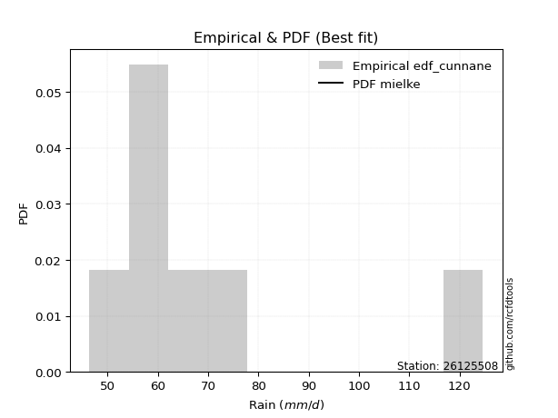</img>

</div>


### 12. EDF Adamowski (1981)

The Adamowski formula in hydrology refers to a specific plotting position formula used for estimating the non-parametric empirical distribution of hydrological events (like flood peaks) to calculate their return periods. This formula provides an alternative to traditional parametric methods (like the Gumbel or Log Pearson Type III distributions). 

<div align="center">


$P=(m-0.25)/(n+0.5)$


</div>


**12.1. Empirical values**

<div align="center">

|                | 0                  | 1                   | 2                   | 3             | 4                  | 5                  | 6                  |
|:---------------|:-------------------|:--------------------|:--------------------|:--------------|:-------------------|:-------------------|:-------------------|
| date           | 2023               | 2018                | 2021                | 2022          | 2019               | 2020               | 2017               |
| x              | 46.4               | 54.7                | 54.7                | 56.5          | 68.0               | 75.6               | 124.6              |
| m              | 1                  | 2                   | 3                   | 4             | 5                  | 6                  | 7                  |
| empirical_dist | edf_adamowski      | edf_adamowski       | edf_adamowski       | edf_adamowski | edf_adamowski      | edf_adamowski      | edf_adamowski      |
| empirical      | 0.1                | 0.23333333333333334 | 0.36666666666666664 | 0.5           | 0.6333333333333333 | 0.7666666666666667 | 0.9                |
| empirical_tr   | 1.1111111111111112 | 1.3043478260869565  | 1.5789473684210527  | 2.0           | 2.727272727272727  | 4.2857142857142865 | 10.000000000000002 |

</div>


**12.2. Kolmogorov-Smirnov fit test (sorted by Δ)**


<div align="center">

|                | 0                   | 1                   | 2                   | 3                   | 4                   | 5                   | 6                   | 7                   | 8                   | 9                   | 10                  | 11                  | 12                  | 13                  | 14                  | 15                  | 16                  | 17                  | 18                  | 19                  | 20                  | 21                  | 22                  | 23                  | 24                  | 25                  | 26                  | 27                  | 28                  | 29                  | 30                  | 31                  | 32                  | 33                  | 34                  | 35                  | 36                  | 37                  | 38                  | 39                  | 40                  | 41                  | 42                  | 43                  | 44                  | 45                  | 46                  | 47                  | 48                  | 49                  | 50                  | 51                  | 52                  | 53                  | 54                  | 55                  | 56                  | 57                  | 58                  | 59                  | 60                  | 61                  | 62                  | 63                  | 64                  | 65                  | 66                  | 67                  | 68                  | 69                  | 70                  | 71                  | 72                  | 73                  | 74                  | 75                  | 76                  | 77                  | 78                  | 79                  | 80                  | 81                  | 82                  | 83                  | 84                  | 85                  | 86                  | 87                  | 88                  | 89                  | 90                  | 91                  | 92                  | 93                  | 94                  | 95                  | 96                  | 97                  | 98                  | 99                  | 100                 | 101                 | 102                 | 103                 | 104                 | 105                 | 106                 | 107                 | 108                 | 109                 | 110                 | 111                 | 112                 | 113                 | 114                 | 115                 | 116                 | 117                 | 118                 | 119                 | 120                 | 121                 | 122                 | 123                 | 124                 | 125                 | 126                 | 127                 | 128                 | 129                 | 130                 | 131                 | 132                 | 133                 | 134                 | 135                 | 136                 | 137                 | 138                 | 139                 | 140                 | 141                 | 142                 | 143                 | 144                 | 145                 | 146                 | 147                 | 148                 | 149                 | 150                 | 151                 | 152                 | 153                 | 154                 | 155                 | 156                 | 157                 | 158                 | 159                 |
|:---------------|:--------------------|:--------------------|:--------------------|:--------------------|:--------------------|:--------------------|:--------------------|:--------------------|:--------------------|:--------------------|:--------------------|:--------------------|:--------------------|:--------------------|:--------------------|:--------------------|:--------------------|:--------------------|:--------------------|:--------------------|:--------------------|:--------------------|:--------------------|:--------------------|:--------------------|:--------------------|:--------------------|:--------------------|:--------------------|:--------------------|:--------------------|:--------------------|:--------------------|:--------------------|:--------------------|:--------------------|:--------------------|:--------------------|:--------------------|:--------------------|:--------------------|:--------------------|:--------------------|:--------------------|:--------------------|:--------------------|:--------------------|:--------------------|:--------------------|:--------------------|:--------------------|:--------------------|:--------------------|:--------------------|:--------------------|:--------------------|:--------------------|:--------------------|:--------------------|:--------------------|:--------------------|:--------------------|:--------------------|:--------------------|:--------------------|:--------------------|:--------------------|:--------------------|:--------------------|:--------------------|:--------------------|:--------------------|:--------------------|:--------------------|:--------------------|:--------------------|:--------------------|:--------------------|:--------------------|:--------------------|:--------------------|:--------------------|:--------------------|:--------------------|:--------------------|:--------------------|:--------------------|:--------------------|:--------------------|:--------------------|:--------------------|:--------------------|:--------------------|:--------------------|:--------------------|:--------------------|:--------------------|:--------------------|:--------------------|:--------------------|:--------------------|:--------------------|:--------------------|:--------------------|:--------------------|:--------------------|:--------------------|:--------------------|:--------------------|:--------------------|:--------------------|:--------------------|:--------------------|:--------------------|:--------------------|:--------------------|:--------------------|:--------------------|:--------------------|:--------------------|:--------------------|:--------------------|:--------------------|:--------------------|:--------------------|:--------------------|:--------------------|:--------------------|:--------------------|:--------------------|:--------------------|:--------------------|:--------------------|:--------------------|:--------------------|:--------------------|:--------------------|:--------------------|:--------------------|:--------------------|:--------------------|:--------------------|:--------------------|:--------------------|:--------------------|:--------------------|:--------------------|:--------------------|:--------------------|:--------------------|:--------------------|:--------------------|:--------------------|:--------------------|:--------------------|:--------------------|:--------------------|:--------------------|:--------------------|:--------------------|
| station        | 26125508            | 26125508            | 26125508            | 26125508            | 26125508            | 26125508            | 26125508            | 26125508            | 26125508            | 26125508            | 26125508            | 26125508            | 26125508            | 26125508            | 26125508            | 26125508            | 26125508            | 26125508            | 26125508            | 26125508            | 26125508            | 26125508            | 26125508            | 26125508            | 26125508            | 26125508            | 26125508            | 26125508            | 26125508            | 26125508            | 26125508            | 26125508            | 26125508            | 26125508            | 26125508            | 26125508            | 26125508            | 26125508            | 26125508            | 26125508            | 26125508            | 26125508            | 26125508            | 26125508            | 26125508            | 26125508            | 26125508            | 26125508            | 26125508            | 26125508            | 26125508            | 26125508            | 26125508            | 26125508            | 26125508            | 26125508            | 26125508            | 26125508            | 26125508            | 26125508            | 26125508            | 26125508            | 26125508            | 26125508            | 26125508            | 26125508            | 26125508            | 26125508            | 26125508            | 26125508            | 26125508            | 26125508            | 26125508            | 26125508            | 26125508            | 26125508            | 26125508            | 26125508            | 26125508            | 26125508            | 26125508            | 26125508            | 26125508            | 26125508            | 26125508            | 26125508            | 26125508            | 26125508            | 26125508            | 26125508            | 26125508            | 26125508            | 26125508            | 26125508            | 26125508            | 26125508            | 26125508            | 26125508            | 26125508            | 26125508            | 26125508            | 26125508            | 26125508            | 26125508            | 26125508            | 26125508            | 26125508            | 26125508            | 26125508            | 26125508            | 26125508            | 26125508            | 26125508            | 26125508            | 26125508            | 26125508            | 26125508            | 26125508            | 26125508            | 26125508            | 26125508            | 26125508            | 26125508            | 26125508            | 26125508            | 26125508            | 26125508            | 26125508            | 26125508            | 26125508            | 26125508            | 26125508            | 26125508            | 26125508            | 26125508            | 26125508            | 26125508            | 26125508            | 26125508            | 26125508            | 26125508            | 26125508            | 26125508            | 26125508            | 26125508            | 26125508            | 26125508            | 26125508            | 26125508            | 26125508            | 26125508            | 26125508            | 26125508            | 26125508            | 26125508            | 26125508            | 26125508            | 26125508            | 26125508            | 26125508            |
| empirical_dist | edf_adamowski       | edf_adamowski       | edf_adamowski       | edf_adamowski       | edf_adamowski       | edf_adamowski       | edf_adamowski       | edf_adamowski       | edf_adamowski       | edf_adamowski       | edf_adamowski       | edf_adamowski       | edf_adamowski       | edf_adamowski       | edf_adamowski       | edf_adamowski       | edf_adamowski       | edf_adamowski       | edf_adamowski       | edf_adamowski       | edf_adamowski       | edf_adamowski       | edf_adamowski       | edf_adamowski       | edf_adamowski       | edf_adamowski       | edf_adamowski       | edf_adamowski       | edf_adamowski       | edf_adamowski       | edf_adamowski       | edf_adamowski       | edf_adamowski       | edf_adamowski       | edf_adamowski       | edf_adamowski       | edf_adamowski       | edf_adamowski       | edf_adamowski       | edf_adamowski       | edf_adamowski       | edf_adamowski       | edf_adamowski       | edf_adamowski       | edf_adamowski       | edf_adamowski       | edf_adamowski       | edf_adamowski       | edf_adamowski       | edf_adamowski       | edf_adamowski       | edf_adamowski       | edf_adamowski       | edf_adamowski       | edf_adamowski       | edf_adamowski       | edf_adamowski       | edf_adamowski       | edf_adamowski       | edf_adamowski       | edf_adamowski       | edf_adamowski       | edf_adamowski       | edf_adamowski       | edf_adamowski       | edf_adamowski       | edf_adamowski       | edf_adamowski       | edf_adamowski       | edf_adamowski       | edf_adamowski       | edf_adamowski       | edf_adamowski       | edf_adamowski       | edf_adamowski       | edf_adamowski       | edf_adamowski       | edf_adamowski       | edf_adamowski       | edf_adamowski       | edf_adamowski       | edf_adamowski       | edf_adamowski       | edf_adamowski       | edf_adamowski       | edf_adamowski       | edf_adamowski       | edf_adamowski       | edf_adamowski       | edf_adamowski       | edf_adamowski       | edf_adamowski       | edf_adamowski       | edf_adamowski       | edf_adamowski       | edf_adamowski       | edf_adamowski       | edf_adamowski       | edf_adamowski       | edf_adamowski       | edf_adamowski       | edf_adamowski       | edf_adamowski       | edf_adamowski       | edf_adamowski       | edf_adamowski       | edf_adamowski       | edf_adamowski       | edf_adamowski       | edf_adamowski       | edf_adamowski       | edf_adamowski       | edf_adamowski       | edf_adamowski       | edf_adamowski       | edf_adamowski       | edf_adamowski       | edf_adamowski       | edf_adamowski       | edf_adamowski       | edf_adamowski       | edf_adamowski       | edf_adamowski       | edf_adamowski       | edf_adamowski       | edf_adamowski       | edf_adamowski       | edf_adamowski       | edf_adamowski       | edf_adamowski       | edf_adamowski       | edf_adamowski       | edf_adamowski       | edf_adamowski       | edf_adamowski       | edf_adamowski       | edf_adamowski       | edf_adamowski       | edf_adamowski       | edf_adamowski       | edf_adamowski       | edf_adamowski       | edf_adamowski       | edf_adamowski       | edf_adamowski       | edf_adamowski       | edf_adamowski       | edf_adamowski       | edf_adamowski       | edf_adamowski       | edf_adamowski       | edf_adamowski       | edf_adamowski       | edf_adamowski       | edf_adamowski       | edf_adamowski       | edf_adamowski       | edf_adamowski       | edf_adamowski       | edf_adamowski       |
| p_dist         | mielke              | loginvgamma         | genextreme          | alpha               | f                   | loginvweibull       | loggenextreme       | invgamma            | loghalflogistic     | logjohnsonsu        | logt                | logburr12           | logexponnorm        | loginvgauss         | loghalfnorm         | logalpha            | logwald             | loggompertz         | loghalfgennorm      | halflogistic        | logfatiguelife      | halfnorm            | logfoldnorm         | invgauss            | pearson3            | loggenexpon         | johnsonsu           | logmielke           | truncweibull_min    | foldnorm            | logpearson3         | lomax               | logncf              | logweibull_min      | logmoyal            | wald                | fatiguelife         | gengamma            | exponnorm           | exponweib           | genexpon            | vonmises_line       | logvonmises_line    | lograyleigh         | moyal               | loggumbel_r         | logburr             | gompertz            | rayleigh            | logsemicircular     | burr12              | logmaxwell          | gumbel_r            | loggenlogistic      | burr                | logweibull_max      | loglomax            | loggausshyper       | logarcsine          | halfgennorm         | logf                | loganglit           | maxwell             | truncnorm           | logskewnorm         | logkstwobign        | anglit              | bradford            | nct                 | semicircular        | lognct              | logloggamma         | ncf                 | betaprime           | logbetaprime        | lognorm             | logcrystalball      | genlogistic         | loggengamma         | norm                | crystalball         | logexponpow         | logloglaplace       | logtruncweibull_min | logrice             | arcsine             | nakagami            | loglogistic         | logistic            | logtruncexpon       | loggennorm          | kstwobign           | tukeylambda         | loghypsecant        | logcosine           | hypsecant           | weibull_min         | logexponweib        | logbradford         | loggumbel_l         | rice                | gumbel_l            | exponpow            | cosine              | loglaplace          | loglaplace          | logjohnsonsb        | laplace             | gausshyper          | skewnorm            | logbeta             | logdgamma           | dweibull            | dgamma              | logdweibull         | logwrapcauchy       | gennorm             | logargus            | logksone            | genpareto           | logtukeylambda      | truncexpon          | loguniform          | logkappa3           | logkappa4           | wrapcauchy          | gamma               | erlang              | lognakagami         | logrdist            | loglevy_l           | logtriang           | beta                | kappa4              | levy_l              | argus               | loggenpareto        | ksone               | uniform             | kappa3              | rdist               | triang              | loggenhalflogistic  | t                   | invweibull          | powerlaw            | loggamma            | loggamma            | logerlang           | logpowerlaw         | genhalflogistic     | logtrapezoid        | logtruncpareto      | trapezoid           | truncpareto         | johnsonsb           | weibull_max         | logtruncnorm        | logvonmises         | vonmises            |
| delta          | 0.03471092918923997 | 0.1032819184021122  | 0.10352676327805638 | 0.10352889562293938 | 0.10409305612736974 | 0.10535030126189754 | 0.10536329643647474 | 0.10552107630397534 | 0.10686596330817061 | 0.10876287938203433 | 0.10948414349652263 | 0.11035301527560526 | 0.11118355061105345 | 0.11145077754327315 | 0.11193724845563607 | 0.11228879657010771 | 0.11327580349535887 | 0.11565588224030698 | 0.11694876431363838 | 0.11696302094128697 | 0.11744897933270393 | 0.11770505185886188 | 0.12012400730796918 | 0.12051959111137911 | 0.12224981463750267 | 0.12255326888429352 | 0.1233127874090656  | 0.12443239094445435 | 0.12678077268747173 | 0.12924069905277685 | 0.1294197647381803  | 0.12948094801508397 | 0.12995995214785044 | 0.13066894837623738 | 0.13068187678252297 | 0.13071780368960767 | 0.13241384748424384 | 0.13323185438571594 | 0.13334724459526037 | 0.13457296176291145 | 0.1350329793490634  | 0.13588907535185873 | 0.13896146027859457 | 0.14149691486764893 | 0.1415125229897457  | 0.14377308855332732 | 0.14611875459438728 | 0.14741515249676124 | 0.1495397793580841  | 0.1496851688591559  | 0.1497897970355384  | 0.1529888333605302  | 0.1533538395720599  | 0.15335608339358853 | 0.1536397825393654  | 0.153732898208377   | 0.15388649106963287 | 0.15397879597800312 | 0.1546189213221586  | 0.15554731413804823 | 0.1558720612790973  | 0.15945249874149048 | 0.1608515038871512  | 0.16269492909104738 | 0.1655343981068111  | 0.1698242032698276  | 0.1703113155372803  | 0.17047214030603802 | 0.1729487289755231  | 0.17668096540958378 | 0.17729305510903387 | 0.1777652351236117  | 0.17817241279273233 | 0.1785595943275281  | 0.1817289697237528  | 0.18251889466799498 | 0.18251911034121215 | 0.18727554720430467 | 0.18794934634376648 | 0.18972858442179386 | 0.18972859403998432 | 0.19015691475252622 | 0.1950170468423998  | 0.19574999396312603 | 0.20104661915841476 | 0.20238643557596836 | 0.20278161808257228 | 0.2028922604660518  | 0.21053378236858977 | 0.21093188728376366 | 0.2121095462556466  | 0.216025239211469   | 0.21728672974533125 | 0.2180130316907875  | 0.22320749008685903 | 0.2258046857320246  | 0.22862580552084927 | 0.23008092292342464 | 0.23292955165105084 | 0.23682377829650225 | 0.23866083661602122 | 0.24263742232185737 | 0.24378639799352486 | 0.24428731609967802 | 0.24450461964701065 | 0.24450461964701065 | 0.25024596481056754 | 0.25174471155123884 | 0.25599527545269807 | 0.26035666882487773 | 0.2661823070102545  | 0.2666666666658189  | 0.2666666666666236  | 0.2666666666666479  | 0.26666666666668376 | 0.2686064201664681  | 0.26928273587020246 | 0.27072492233398504 | 0.2715155702766108  | 0.2831124895136847  | 0.2891046614205166  | 0.29347754665575465 | 0.30062831014052804 | 0.300817915874377   | 0.30084087429696155 | 0.3128353427594165  | 0.315877229373359   | 0.3200928595811207  | 0.3217987354126535  | 0.3265196904889361  | 0.3269921045134797  | 0.32895691299987884 | 0.33842149774133073 | 0.34409724915633105 | 0.346880084233253   | 0.35170018337760234 | 0.3665386838383491  | 0.3721653878942882  | 0.3932651321398125  | 0.39665341893478395 | 0.39883638113029696 | 0.4007570694584846  | 0.4331176490955349  | 0.4507557424355768  | 0.4522623087615718  | 0.47612306274008626 | 0.4958055985311442  | 0.4958055985311442  | 0.5069820563924861  | 0.5094462945123326  | 0.5153478308542692  | 0.5214920584103923  | 0.5444722230864236  | 0.6110354077136249  | 0.61947357092512    | 0.6460473127833297  | 0.667871642473325   | 0.9                 | 1.0840166907354778  | 19.59945791650642   |
| deltao         | 0.48442053926100004 | 0.48442053926100004 | 0.48442053926100004 | 0.48442053926100004 | 0.48442053926100004 | 0.48442053926100004 | 0.48442053926100004 | 0.48442053926100004 | 0.48442053926100004 | 0.48442053926100004 | 0.48442053926100004 | 0.48442053926100004 | 0.48442053926100004 | 0.48442053926100004 | 0.48442053926100004 | 0.48442053926100004 | 0.48442053926100004 | 0.48442053926100004 | 0.48442053926100004 | 0.48442053926100004 | 0.48442053926100004 | 0.48442053926100004 | 0.48442053926100004 | 0.48442053926100004 | 0.48442053926100004 | 0.48442053926100004 | 0.48442053926100004 | 0.48442053926100004 | 0.48442053926100004 | 0.48442053926100004 | 0.48442053926100004 | 0.48442053926100004 | 0.48442053926100004 | 0.48442053926100004 | 0.48442053926100004 | 0.48442053926100004 | 0.48442053926100004 | 0.48442053926100004 | 0.48442053926100004 | 0.48442053926100004 | 0.48442053926100004 | 0.48442053926100004 | 0.48442053926100004 | 0.48442053926100004 | 0.48442053926100004 | 0.48442053926100004 | 0.48442053926100004 | 0.48442053926100004 | 0.48442053926100004 | 0.48442053926100004 | 0.48442053926100004 | 0.48442053926100004 | 0.48442053926100004 | 0.48442053926100004 | 0.48442053926100004 | 0.48442053926100004 | 0.48442053926100004 | 0.48442053926100004 | 0.48442053926100004 | 0.48442053926100004 | 0.48442053926100004 | 0.48442053926100004 | 0.48442053926100004 | 0.48442053926100004 | 0.48442053926100004 | 0.48442053926100004 | 0.48442053926100004 | 0.48442053926100004 | 0.48442053926100004 | 0.48442053926100004 | 0.48442053926100004 | 0.48442053926100004 | 0.48442053926100004 | 0.48442053926100004 | 0.48442053926100004 | 0.48442053926100004 | 0.48442053926100004 | 0.48442053926100004 | 0.48442053926100004 | 0.48442053926100004 | 0.48442053926100004 | 0.48442053926100004 | 0.48442053926100004 | 0.48442053926100004 | 0.48442053926100004 | 0.48442053926100004 | 0.48442053926100004 | 0.48442053926100004 | 0.48442053926100004 | 0.48442053926100004 | 0.48442053926100004 | 0.48442053926100004 | 0.48442053926100004 | 0.48442053926100004 | 0.48442053926100004 | 0.48442053926100004 | 0.48442053926100004 | 0.48442053926100004 | 0.48442053926100004 | 0.48442053926100004 | 0.48442053926100004 | 0.48442053926100004 | 0.48442053926100004 | 0.48442053926100004 | 0.48442053926100004 | 0.48442053926100004 | 0.48442053926100004 | 0.48442053926100004 | 0.48442053926100004 | 0.48442053926100004 | 0.48442053926100004 | 0.48442053926100004 | 0.48442053926100004 | 0.48442053926100004 | 0.48442053926100004 | 0.48442053926100004 | 0.48442053926100004 | 0.48442053926100004 | 0.48442053926100004 | 0.48442053926100004 | 0.48442053926100004 | 0.48442053926100004 | 0.48442053926100004 | 0.48442053926100004 | 0.48442053926100004 | 0.48442053926100004 | 0.48442053926100004 | 0.48442053926100004 | 0.48442053926100004 | 0.48442053926100004 | 0.48442053926100004 | 0.48442053926100004 | 0.48442053926100004 | 0.48442053926100004 | 0.48442053926100004 | 0.48442053926100004 | 0.48442053926100004 | 0.48442053926100004 | 0.48442053926100004 | 0.48442053926100004 | 0.48442053926100004 | 0.48442053926100004 | 0.48442053926100004 | 0.48442053926100004 | 0.48442053926100004 | 0.48442053926100004 | 0.48442053926100004 | 0.48442053926100004 | 0.48442053926100004 | 0.48442053926100004 | 0.48442053926100004 | 0.48442053926100004 | 0.48442053926100004 | 0.48442053926100004 | 0.48442053926100004 | 0.48442053926100004 | 0.48442053926100004 | 0.48442053926100004 | 0.48442053926100004 | 0.48442053926100004 |
| eval           | Δo > Δ              | Δo > Δ              | Δo > Δ              | Δo > Δ              | Δo > Δ              | Δo > Δ              | Δo > Δ              | Δo > Δ              | Δo > Δ              | Δo > Δ              | Δo > Δ              | Δo > Δ              | Δo > Δ              | Δo > Δ              | Δo > Δ              | Δo > Δ              | Δo > Δ              | Δo > Δ              | Δo > Δ              | Δo > Δ              | Δo > Δ              | Δo > Δ              | Δo > Δ              | Δo > Δ              | Δo > Δ              | Δo > Δ              | Δo > Δ              | Δo > Δ              | Δo > Δ              | Δo > Δ              | Δo > Δ              | Δo > Δ              | Δo > Δ              | Δo > Δ              | Δo > Δ              | Δo > Δ              | Δo > Δ              | Δo > Δ              | Δo > Δ              | Δo > Δ              | Δo > Δ              | Δo > Δ              | Δo > Δ              | Δo > Δ              | Δo > Δ              | Δo > Δ              | Δo > Δ              | Δo > Δ              | Δo > Δ              | Δo > Δ              | Δo > Δ              | Δo > Δ              | Δo > Δ              | Δo > Δ              | Δo > Δ              | Δo > Δ              | Δo > Δ              | Δo > Δ              | Δo > Δ              | Δo > Δ              | Δo > Δ              | Δo > Δ              | Δo > Δ              | Δo > Δ              | Δo > Δ              | Δo > Δ              | Δo > Δ              | Δo > Δ              | Δo > Δ              | Δo > Δ              | Δo > Δ              | Δo > Δ              | Δo > Δ              | Δo > Δ              | Δo > Δ              | Δo > Δ              | Δo > Δ              | Δo > Δ              | Δo > Δ              | Δo > Δ              | Δo > Δ              | Δo > Δ              | Δo > Δ              | Δo > Δ              | Δo > Δ              | Δo > Δ              | Δo > Δ              | Δo > Δ              | Δo > Δ              | Δo > Δ              | Δo > Δ              | Δo > Δ              | Δo > Δ              | Δo > Δ              | Δo > Δ              | Δo > Δ              | Δo > Δ              | Δo > Δ              | Δo > Δ              | Δo > Δ              | Δo > Δ              | Δo > Δ              | Δo > Δ              | Δo > Δ              | Δo > Δ              | Δo > Δ              | Δo > Δ              | Δo > Δ              | Δo > Δ              | Δo > Δ              | Δo > Δ              | Δo > Δ              | Δo > Δ              | Δo > Δ              | Δo > Δ              | Δo > Δ              | Δo > Δ              | Δo > Δ              | Δo > Δ              | Δo > Δ              | Δo > Δ              | Δo > Δ              | Δo > Δ              | Δo > Δ              | Δo > Δ              | Δo > Δ              | Δo > Δ              | Δo > Δ              | Δo > Δ              | Δo > Δ              | Δo > Δ              | Δo > Δ              | Δo > Δ              | Δo > Δ              | Δo > Δ              | Δo > Δ              | Δo > Δ              | Δo > Δ              | Δo > Δ              | Δo > Δ              | Δo > Δ              | Δo > Δ              | Δo > Δ              | Δo > Δ              | Δo > Δ              | Δo > Δ              | Δo <= Δ             | Δo <= Δ             | Δo <= Δ             | Δo <= Δ             | Δo <= Δ             | Δo <= Δ             | Δo <= Δ             | Δo <= Δ             | Δo <= Δ             | Δo <= Δ             | Δo <= Δ             | Δo <= Δ             | Δo <= Δ             | Δo <= Δ             |
| fit            | 1                   | 1                   | 1                   | 1                   | 1                   | 1                   | 1                   | 1                   | 1                   | 1                   | 1                   | 1                   | 1                   | 1                   | 1                   | 1                   | 1                   | 1                   | 1                   | 1                   | 1                   | 1                   | 1                   | 1                   | 1                   | 1                   | 1                   | 1                   | 1                   | 1                   | 1                   | 1                   | 1                   | 1                   | 1                   | 1                   | 1                   | 1                   | 1                   | 1                   | 1                   | 1                   | 1                   | 1                   | 1                   | 1                   | 1                   | 1                   | 1                   | 1                   | 1                   | 1                   | 1                   | 1                   | 1                   | 1                   | 1                   | 1                   | 1                   | 1                   | 1                   | 1                   | 1                   | 1                   | 1                   | 1                   | 1                   | 1                   | 1                   | 1                   | 1                   | 1                   | 1                   | 1                   | 1                   | 1                   | 1                   | 1                   | 1                   | 1                   | 1                   | 1                   | 1                   | 1                   | 1                   | 1                   | 1                   | 1                   | 1                   | 1                   | 1                   | 1                   | 1                   | 1                   | 1                   | 1                   | 1                   | 1                   | 1                   | 1                   | 1                   | 1                   | 1                   | 1                   | 1                   | 1                   | 1                   | 1                   | 1                   | 1                   | 1                   | 1                   | 1                   | 1                   | 1                   | 1                   | 1                   | 1                   | 1                   | 1                   | 1                   | 1                   | 1                   | 1                   | 1                   | 1                   | 1                   | 1                   | 1                   | 1                   | 1                   | 1                   | 1                   | 1                   | 1                   | 1                   | 1                   | 1                   | 1                   | 1                   | 1                   | 1                   | 1                   | 1                   | 1                   | 1                   | 0                   | 0                   | 0                   | 0                   | 0                   | 0                   | 0                   | 0                   | 0                   | 0                   | 0                   | 0                   | 0                   | 0                   |
| n              | 7                   | 7                   | 7                   | 7                   | 7                   | 7                   | 7                   | 7                   | 7                   | 7                   | 7                   | 7                   | 7                   | 7                   | 7                   | 7                   | 7                   | 7                   | 7                   | 7                   | 7                   | 7                   | 7                   | 7                   | 7                   | 7                   | 7                   | 7                   | 7                   | 7                   | 7                   | 7                   | 7                   | 7                   | 7                   | 7                   | 7                   | 7                   | 7                   | 7                   | 7                   | 7                   | 7                   | 7                   | 7                   | 7                   | 7                   | 7                   | 7                   | 7                   | 7                   | 7                   | 7                   | 7                   | 7                   | 7                   | 7                   | 7                   | 7                   | 7                   | 7                   | 7                   | 7                   | 7                   | 7                   | 7                   | 7                   | 7                   | 7                   | 7                   | 7                   | 7                   | 7                   | 7                   | 7                   | 7                   | 7                   | 7                   | 7                   | 7                   | 7                   | 7                   | 7                   | 7                   | 7                   | 7                   | 7                   | 7                   | 7                   | 7                   | 7                   | 7                   | 7                   | 7                   | 7                   | 7                   | 7                   | 7                   | 7                   | 7                   | 7                   | 7                   | 7                   | 7                   | 7                   | 7                   | 7                   | 7                   | 7                   | 7                   | 7                   | 7                   | 7                   | 7                   | 7                   | 7                   | 7                   | 7                   | 7                   | 7                   | 7                   | 7                   | 7                   | 7                   | 7                   | 7                   | 7                   | 7                   | 7                   | 7                   | 7                   | 7                   | 7                   | 7                   | 7                   | 7                   | 7                   | 7                   | 7                   | 7                   | 7                   | 7                   | 7                   | 7                   | 7                   | 7                   | 7                   | 7                   | 7                   | 7                   | 7                   | 7                   | 7                   | 7                   | 7                   | 7                   | 7                   | 7                   | 7                   | 7                   |
| best_fit       | 1                   | 0                   | 0                   | 0                   | 0                   | 0                   | 0                   | 0                   | 0                   | 0                   | 0                   | 0                   | 0                   | 0                   | 0                   | 0                   | 0                   | 0                   | 0                   | 0                   | 0                   | 0                   | 0                   | 0                   | 0                   | 0                   | 0                   | 0                   | 0                   | 0                   | 0                   | 0                   | 0                   | 0                   | 0                   | 0                   | 0                   | 0                   | 0                   | 0                   | 0                   | 0                   | 0                   | 0                   | 0                   | 0                   | 0                   | 0                   | 0                   | 0                   | 0                   | 0                   | 0                   | 0                   | 0                   | 0                   | 0                   | 0                   | 0                   | 0                   | 0                   | 0                   | 0                   | 0                   | 0                   | 0                   | 0                   | 0                   | 0                   | 0                   | 0                   | 0                   | 0                   | 0                   | 0                   | 0                   | 0                   | 0                   | 0                   | 0                   | 0                   | 0                   | 0                   | 0                   | 0                   | 0                   | 0                   | 0                   | 0                   | 0                   | 0                   | 0                   | 0                   | 0                   | 0                   | 0                   | 0                   | 0                   | 0                   | 0                   | 0                   | 0                   | 0                   | 0                   | 0                   | 0                   | 0                   | 0                   | 0                   | 0                   | 0                   | 0                   | 0                   | 0                   | 0                   | 0                   | 0                   | 0                   | 0                   | 0                   | 0                   | 0                   | 0                   | 0                   | 0                   | 0                   | 0                   | 0                   | 0                   | 0                   | 0                   | 0                   | 0                   | 0                   | 0                   | 0                   | 0                   | 0                   | 0                   | 0                   | 0                   | 0                   | 0                   | 0                   | 0                   | 0                   | 0                   | 0                   | 0                   | 0                   | 0                   | 0                   | 0                   | 0                   | 0                   | 0                   | 0                   | 0                   | 0                   | 0                   |
| best_fit_sort  | 1                   | 2                   | 3                   | 4                   | 5                   | 6                   | 7                   | 8                   | 9                   | 10                  | 11                  | 12                  | 13                  | 14                  | 15                  | 16                  | 17                  | 18                  | 19                  | 20                  | 21                  | 22                  | 23                  | 24                  | 25                  | 26                  | 27                  | 28                  | 29                  | 30                  | 31                  | 32                  | 33                  | 34                  | 35                  | 36                  | 37                  | 38                  | 39                  | 40                  | 41                  | 42                  | 43                  | 44                  | 45                  | 46                  | 47                  | 48                  | 49                  | 50                  | 51                  | 52                  | 53                  | 54                  | 55                  | 56                  | 57                  | 58                  | 59                  | 60                  | 61                  | 62                  | 63                  | 64                  | 65                  | 66                  | 67                  | 68                  | 69                  | 70                  | 71                  | 72                  | 73                  | 74                  | 75                  | 76                  | 77                  | 78                  | 79                  | 80                  | 81                  | 82                  | 83                  | 84                  | 85                  | 86                  | 87                  | 88                  | 89                  | 90                  | 91                  | 92                  | 93                  | 94                  | 95                  | 96                  | 97                  | 98                  | 99                  | 100                 | 101                 | 102                 | 103                 | 104                 | 105                 | 106                 | 107                 | 108                 | 109                 | 110                 | 111                 | 112                 | 113                 | 114                 | 115                 | 116                 | 117                 | 118                 | 119                 | 120                 | 121                 | 122                 | 123                 | 124                 | 125                 | 126                 | 127                 | 128                 | 129                 | 130                 | 131                 | 132                 | 133                 | 134                 | 135                 | 136                 | 137                 | 138                 | 139                 | 140                 | 141                 | 142                 | 143                 | 144                 | 145                 | 146                 | 147                 | 148                 | 149                 | 150                 | 151                 | 152                 | 153                 | 154                 | 155                 | 156                 | 157                 | 158                 | 159                 | 160                 |

</div>


**12.3. Best fit**

<div align="center">

|   id |   station | empirical_dist   | p_dist   |     delta |   deltao | eval   |   fit |   n |   best_fit |   best_fit_sort |
|-----:|----------:|:-----------------|:---------|----------:|---------:|:-------|------:|----:|-----------:|----------------:|
|    0 |  26125508 | edf_adamowski    | mielke   | 0.0347109 | 0.484421 | Δo > Δ |     1 |   7 |          1 |               1 |

</div>


<div align="center">

</img>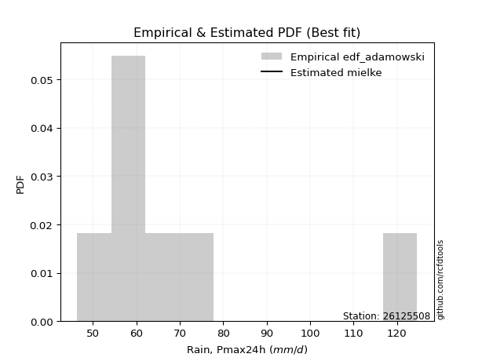</img>

</div>


## C. Best fit & Estimate extreme values for specific return periods - Tr

Best fit in probability distribution analysis means finding the theoretical distribution (like Normal, Poisson, Exponential, etc.) that most accurately mirrors your real-world data´s patterns (shape, center, spread) for better predictions, using methods like visual checks (Q-Q plots), goodness-of-fit tests (Kolmogorov-Smirnov, Chi-Squared), and information criteria (AIC) to score and select the simplest, most representative model.


### 1. Best fit (ordered by delta Δ)

:file_folder:Table: [bestfit_26125508.csv](table/bestfit_26125508.csv)

<div align="center">

|   id |   station | empirical_dist   | p_dist   |     delta |   deltao | eval   |   fit |   n |   best_fit |   best_fit_sort |
|-----:|----------:|:-----------------|:---------|----------:|---------:|:-------|------:|----:|-----------:|----------------:|
|    0 |  26125508 | edf_hazen        | mielke   | 0.0061395 | 0.484421 | Δo > Δ |     1 |   7 |          1 |               1 |
|    1 |  26125508 | edf_gringorten   | mielke   | 0.0133626 | 0.484421 | Δo > Δ |     1 |   7 |          1 |               2 |
|    2 |  26125508 | edf_cunnane      | mielke   | 0.0180443 | 0.484421 | Δo > Δ |     1 |   7 |          1 |               3 |
|    3 |  26125508 | edf_blom         | mielke   | 0.0209178 | 0.484421 | Δo > Δ |     1 |   7 |          1 |               4 |
|    4 |  26125508 | edf_tukey        | mielke   | 0.02562   | 0.484421 | Δo > Δ |     1 |   7 |          1 |               5 |
|    5 |  26125508 | edf_filliben     | mielke   | 0.027379  | 0.484421 | Δo > Δ |     1 |   7 |          1 |               6 |
|    6 |  26125508 | edf_beard        | mielke   | 0.0282069 | 0.484421 | Δo > Δ |     1 |   7 |          1 |               7 |
|    7 |  26125508 | edf_jenkinson    | mielke   | 0.0282069 | 0.484421 | Δo > Δ |     1 |   7 |          1 |               8 |
|    8 |  26125508 | edf_chegodayev   | mielke   | 0.0293055 | 0.484421 | Δo > Δ |     1 |   7 |          1 |               9 |
|    9 |  26125508 | edf_adamowski    | mielke   | 0.0347109 | 0.484421 | Δo > Δ |     1 |   7 |          1 |              10 |
|   10 |  26125508 | edf_weibull      | mielke   | 0.0597109 | 0.484421 | Δo > Δ |     1 |   7 |          1 |              11 |
|   11 |  26125508 | edf_california   | mielke   | 0.0775681 | 0.484421 | Δo > Δ |     1 |   7 |          1 |              12 |

</div>


### 2. Extreme values and % difference analysis

In hydrology, a return period (or recurrence interval $Tr$) is the statistical average time between extreme events like floods or droughts of a specific magnitude, indicating how rare an event is, with a 100-year flood, for example, having a 1% chance of occurring in any given year, not that it happens exactly every century. It is a key tool for infrastructure design (like bridges or dams) and risk assessment, calculated from historical data to determine the probability of future events, although it is important to remember it is statistical average, and events can cluster or be missed.

The extreme value porcentage difference is evaluated as $pdiff = 1 - (ETrBf / ETr) * 100$, where _ETrBf_ correspond to the bestfit extreme value for a specific recurrence interval and _ETr_ correspond to the extreme value for one of the most used PDFsused in hydrology.

> risk_rate: assuming the return period as the project useful life.

:file_folder:Table: [extreme_26125508.csv](table/extreme_26125508.csv), all PDFs.  
:file_folder:Table: [extremepdiff_26125508.csv](table/extremepdiff_26125508.csv), % difference between bestfit and most used PDFs in Hydrology.

<div align="center">

Extreme values table for only best fit PDFs
|   id |      tr |   prob_l |     prob_g |     alpha |   anglit |   arcsine |    argus |     beta |   betaprime |   bradford |     burr |   burr12 |   cosine |   crystalball |   dgamma |   dweibull |   erlang |   exponnorm |   exponpow |   exponweib |        f |   fatiguelife |   foldnorm |    gamma |   gausshyper |   genexpon |   genextreme |   gengamma |   genhalflogistic |   genlogistic |   gennorm |   genpareto |   gompertz |   gumbel_l |   gumbel_r |   halfgennorm |   halflogistic |   halfnorm |   hypsecant |   invgamma |   invgauss |      invweibull |   johnsonsb |   johnsonsu |   kappa3 |   kappa4 |    ksone |   kstwobign |   laplace |   levy_l |   loggamma |   logistic |   loglaplace |    lomax |   maxwell |   mielke |    moyal |   nakagami |      ncf |      nct |     norm |   pearson3 |   powerlaw |   rayleigh |   rdist |     rice |   semicircular |   skewnorm |                t |   trapezoid |   triang |   truncexpon |   truncnorm |   truncpareto |   truncweibull_min |   tukeylambda |   uniform |   vonmises |   vonmises_line |     wald |   weibull_max |   weibull_min |   wrapcauchy |   logalpha |   loganglit |   logarcsine |   logargus |   logbeta |   logbetaprime |   logbradford |   logburr |   logburr12 |   logcosine |   logcrystalball |   logdgamma |   logdweibull |   logerlang |   logexponnorm |   logexponpow |   logexponweib |     logf |   logfatiguelife |   logfoldnorm |   loggausshyper |   loggenexpon |   loggenextreme |   loggengamma |   loggenhalflogistic |   loggenlogistic |   loggennorm |   loggenpareto |   loggompertz |   loggumbel_l |   loggumbel_r |   loghalfgennorm |   loghalflogistic |   loghalfnorm |   loghypsecant |   loginvgamma |   loginvgauss |   loginvweibull |   logjohnsonsb |   logjohnsonsu |   logkappa3 |   logkappa4 |   logksone |   logkstwobign |   loglevy_l |   logloggamma |   loglogistic |   logloglaplace |   loglomax |   logmaxwell |   logmielke |   logmoyal |   lognakagami |   logncf |   lognct |   lognorm |   logpearson3 |   logpowerlaw |   lograyleigh |   logrdist |   logrice |   logsemicircular |   logskewnorm |     logt |   logtrapezoid |   logtriang |   logtruncexpon |   logtruncnorm |   logtruncpareto |   logtruncweibull_min |   logtukeylambda |   loguniform |   logvonmises |   logvonmises_line |   logwald |   logweibull_max |   logweibull_min |   logwrapcauchy |   station |   n |   risk_rate |
|-----:|--------:|---------:|-----------:|----------:|---------:|----------:|---------:|---------:|------------:|-----------:|---------:|---------:|---------:|--------------:|---------:|-----------:|---------:|------------:|-----------:|------------:|---------:|--------------:|-----------:|---------:|-------------:|-----------:|-------------:|-----------:|------------------:|--------------:|----------:|------------:|-----------:|-----------:|-----------:|--------------:|---------------:|-----------:|------------:|-----------:|-----------:|----------------:|------------:|------------:|---------:|---------:|---------:|------------:|----------:|---------:|-----------:|-----------:|-------------:|---------:|----------:|---------:|---------:|-----------:|---------:|---------:|---------:|-----------:|-----------:|-----------:|--------:|---------:|---------------:|-----------:|-----------------:|------------:|---------:|-------------:|------------:|--------------:|-------------------:|--------------:|----------:|-----------:|----------------:|---------:|--------------:|--------------:|-------------:|-----------:|------------:|-------------:|-----------:|----------:|---------------:|--------------:|----------:|------------:|------------:|-----------------:|------------:|--------------:|------------:|---------------:|--------------:|---------------:|---------:|-----------------:|--------------:|----------------:|--------------:|----------------:|--------------:|---------------------:|-----------------:|-------------:|---------------:|--------------:|--------------:|--------------:|-----------------:|------------------:|--------------:|---------------:|--------------:|--------------:|----------------:|---------------:|---------------:|------------:|------------:|-----------:|---------------:|------------:|--------------:|--------------:|----------------:|-----------:|-------------:|------------:|-----------:|--------------:|---------:|---------:|----------:|--------------:|--------------:|--------------:|-----------:|----------:|------------------:|--------------:|---------:|---------------:|------------:|----------------:|---------------:|-----------------:|----------------------:|-----------------:|-------------:|--------------:|-------------------:|----------:|-----------------:|-----------------:|----------------:|----------:|----:|------------:|
|    0 |    2    | 0.5      | 0.5        |   59.7068 |  68.6429 |   68.6429 |  82.7073 |  50.3642 |     64.4325 |    66.1428 |  61.6968 |  58.8439 |  74.0377 |       68.6429 |  54.7    |    54.7    |  52.5823 |     61.7476 |    71.9856 |     60.5714 |  59.8856 |       59.5897 |    63.2554 |  53.2601 |      72.5965 |    61.8176 |      59.6988 |    60.7976 |           98.0275 |       63.9414 |   54.7    |     77.8119 |    62.5024 |    72.6723 |    64.6135 |       62.9257 |        62.6102 |    63.6222 |     68.6429 |    59.7393 |    59.681  |  1122.23        |     46.4    |     59.5146 |  85.8582 |  81.7888 |  85.5    |     66.3471 |   68.6429 |  65.6537 |    48.4616 |    68.6429 |      65.2291 |  61.5577 |   66.5452 |  61.7488 |  63.3126 |    69.6615 |  64.6935 |  63.5976 |  68.6429 |    62.6748 |    47.2436 |    65.8012 | 46.4936 |  68.8425 |        68.6429 |    68.7347 |     54.7003      |     104.935 |  88.2752 |      74.2869 |     63.4142 |       46.6782 |            61.8928 |       61.207  |   85.5    | -1.06218   |         62.7663 |  60.6922 |       124.251 |       56.4346 |      85.4999 |    59.969  |     65.2291 |      65.2291 |    75.7952 |   54.722  |        64.7887 |       69.4663 |   61.3552 |     59.9268 |     68.7149 |          65.2291 |     54.7    |       54.7    |     48.5705 |        60.063  |       59.2701 |        56.058  |  59.0794 |          59.5618 |       62.4207 |         64.6592 |       59.7652 |         59.7969 |       57.9741 |              90.1903 |          61.6972 |      56.5    |        53.8654 |       60.1465 |       68.5539 |       62.0656 |          59.9547 |           60.5504 |       61.3112 |        65.2291 |       59.7975 |       59.6587 |         59.7965 |        56.1049 |        59.6504 |      46.4   |     77.134  |    76.0358 |        62.7802 |     63.9564 |       65.3255 |       65.2291 |         56.5    |    58.6059 |      63.5626 |     60.6034 |    61.0774 |       51.737  |  63.2435 |  64.3834 |   65.2291 |       61.6631 |       47.1082 |       62.9818 |    84.0343 |   64.6654 |           65.2291 |       63.0914 |  59.6139 |        97.1934 |     80.8547 |         67.2798 |          124.6 |          47.2006 |               66.7637 |          75.8646 |      76.0358 |      0.121159 |            61.8249 |   59.1346 |          61.7075 |          60.0779 |         76.0358 |  26125508 |   7 |    0.75     |
|    1 |    2.33 | 0.570815 | 0.429185   |   62.3499 |  73.7411 |   76.2962 |  88.4062 |  54.626  |     67.8678 |    71.5472 |  64.4635 |  62.0364 |  78.9999 |       73.0197 |  56.8258 |    56.8788 |  55.4994 |     65.1376 |    77.6263 |     64.682  |  62.7539 |       62.9326 |    68.1437 |  55.401  |      78.0438 |    65.2145 |      62.4635 |    65.0937 |          103.018  |       66.9935 |   55.0314 |     86.9759 |    66.0502 |    76.4802 |    68.6691 |       66.5366 |        66.7801 |    68.346  |     72.1457 |    62.5633 |    62.7992 | 46335.1         |     46.4002 |     62.5748 |  91.4479 |  87.5813 |  92.1453 |     69.8737 |   71.2915 |  83.5167 |    49.6449 |    72.4992 |      67.3959 |  64.9239 |   71.0924 |  64.5265 |  67.1518 |    75.4947 |  68.2426 |  66.842  |  73.0197 |    66.7408 |    48.4046 |    70.4157 | 52.1589 |  72.6547 |        74.1108 |    72.5791 |     54.7006      |     109.478 |  94.2798 |      79.4309 |     67.1622 |       46.8879 |            66.6788 |       63.3636 |   91.0378 | -0.86141   |         65.9714 |  63.5622 |       124.454 |       60.4696 |      99.8578 |    62.5847 |     69.4639 |      71.6885 |    81.108  |   58.441  |        68.2829 |       74.5185 |   64.1013 |     62.6434 |     72.9374 |          68.8484 |     55.8972 |       56.4102 |     49.6865 |        62.8855 |       65.2342 |        59.153  |  62.7491 |          62.5154 |       66.4065 |         69.4991 |       62.9419 |         62.4607 |       61.681  |              95.9824 |          64.4714 |      57.1906 |        70.46   |       63.4177 |       71.8515 |       65.2502 |          63.1302 |           63.7471 |       64.9906 |        68.1099 |       62.5209 |       62.5478 |         62.4603 |        64.7015 |        62.4768 |      46.4   |     82.9041 |    82.694  |        65.8582 |     78.2819 |       69.0871 |       68.4076 |         58.3503 |    61.7359 |      67.2306 |     63.387  |    64.0401 |       55.7598 |  68.4115 |  67.8256 |   68.8484 |       64.9781 |       47.9882 |       66.6716 |    95.2132 |   67.9624 |           69.7816 |       66.5183 |  61.8812 |       102.935  |     86.8464 |         71.9125 |          124.6 |          47.8407 |               71.5166 |          81.5859 |      81.5451 |      0.127793 |            64.6663 |   61.2659 |          64.4809 |          63.8296 |         91.7148 |  26125508 |   7 |    0.729209 |
|    2 |    5    | 0.8      | 0.2        |   77.8584 |  91.7289 |   96.7048 | 106.686  |  91.0055 |     82.9129 |    97.4588 |  77.9827 |  80.5633 |  96.8817 |       89.2853 |  69.709  |    72.8356 |  74.9569 |     82.0866 |   102.586  |     87.352  |  79.0147 |       81.6517 |    88.8155 |  67.3314 |      99.3782 |    82.1985 |      78.4851 |    89.5309 |          116.18   |       80.2524 |   59.5182 |    111.948  |    83.7884 |    88.782  |    86.2887 |       84.4931 |        85.6478 |    88.3222 |     86.1962 |    78.775  |    80.4872 |     5.79616e+11 |     46.6694 |     80.2059 | 109.744  | 107.118  | 113.652  |     84.8538 |   84.5343 | 113.111  |    59.1991 |    87.3889 |      79.3581 |  81.8987 |   88.9901 |  78.0867 |  84.9353 |   102.052  |  83.7414 |  81.6086 |  89.2853 |    85.4932 |    64.5948 |    88.8896 | 68.3869 |  87.9168 |        92.7707 |    88.8366 |     54.7092      |     122.513 | 111.507  |      99.6237 |     85.8973 |       50.7912 |            89.5772 |       70.2856 |  108.96   | -0.0757891 |         78.3722 |  79.6282 |       124.597 |       88.3249 |     118.441  |    77.3226 |     86.7245 |      92.2153 |   100.795  |   81.5782 |        83.3432 |       96.0828 |   77.8964 |     78.4662 |     90.4239 |          84.1489 |     65.083  |       67.4464 |     58.0574 |        79.0808 |      114.432  |        77.2175 |  85.7887 |          79.4226 |       84.6341 |         92.4859 |       80.4842 |         77.6936 |       84.132  |             112.842  |          78.0449 |      64.2715 |       114.705  |       81.0887 |       83.628  |       81.0946 |          80.5249 |           80.456  |       83.1549 |        81.0021 |       78.078  |       79.0544 |         77.6936 |       112.231  |        78.7233 |      46.4   |    104.084  |   108.507  |        80.7071 |    109.418  |       85.0069 |       82.203  |         68.8187 |    80.3316 |      83.843  |     78.4566 |    79.7518 |       96.0605 |  94.3365 |  82.9194 |   84.1489 |       81.6112 |       60.0206 |       83.7392 |   134.165  |   82.9335 |           87.8469 |       83.192  |  72.1779 |       121.358  |    106.616  |         92.7264 |          124.6 |          56.5033 |               92.8719 |         102.983  |     102.263  |      0.155893 |            77.0987 |   74.6965 |          78.0513 |          87.1052 |        115.63   |  26125508 |   7 |    0.67232  |
|    3 |   10    | 0.9      | 0.1        |   98.5879 | 101.91   |  101.632  | 115.501  | 114.45   |     95.3252 |   114.427  |  91.0514 | 101.787  | 107.685  |      100.075  |  82.0721 |    90.0081 |  96.9059 |     97.4724 |   121.348  |    109.837  |  98.0445 |      100.708  |   104.112  |  79.1568 |     110.943  |    97.6161 |      98.1481 |   114.75   |          120.747  |       91.051  |   67.6088 |    119.896  |    99.8905 |    95.631  |   100.64   |      100.689  |       101.317  |   103.104  |     97.4159 |    98.12   |    99.5277 |     3.50012e+17 |     68.1065 |    100.32   | 118.787  | 116.029  | 123.036  |     96.2592 |   96.5557 | 120.256  |    73.0823 |    98.3547 |      92.046  |  97.519  |  101.586  |  91.1757 | 100.419  |   122.615  |  96.4787 |  94.5035 | 100.075  |   101.322  |    85.6829 |   102.062  | 73.2603 |  98.799  |       102.345  |   100.867  |     54.8236      |     127.604 | 118.236  |     110.908  |    102.899  |       62.0152 |           104.671  |       73.2314 |  116.78   |  0.526929  |         87.7294 |  96.6781 |       124.6   |      123.398  |     121.8    |    95.7925 |     98.3322 |      97.9946 |   111.931  |  103.147  |        95.4719 |      108.892  |   91.8339 |     97.1999 |    102.961  |          96.1313 |     75.7996 |       80.2087 |     69.4299 |        97.3661 |      198.964  |        96.8473 | 115.069  |          98.9141 |       99.8757 |        107.956  |       99.3316 |         96.6521 |      110.274  |             119.193  |          91.185  |      76.163  |       122.825  |       99.0327 |       91.0019 |       96.8027 |          98.941  |           97.6148 |       99.7914 |        93.0282 |       97.1682 |       98.2922 |         96.6532 |       122.405  |        98.3319 |      46.4   |    114.386  |   122.163  |        94.2199 |    118.631  |       97.4845 |       94.1119 |         80.4023 |   102.494  |      97.9391 |     95.6373 |    96.5391 |      166.423  | 120.14   |  95.3845 |   96.1313 |       97.8721 |       78.3171 |       98.5165 |   146.879  |   95.5825 |           98.8624 |       98.1666 |  82.7896 |       129.42   |    115.509  |        106.273  |          124.6 |          72.2518 |              106.567  |         113.648  |     112.88   |      0.1781   |            88.2318 |   92.1834 |          91.1887 |         116.423  |        120.444  |  26125508 |   7 |    0.651322 |
|    4 |   15    | 0.933333 | 0.0666667  |  116.039  | 106.258  |  102.571  | 118.853  | 120.917  |    102.416  |   121.109  |  99.3661 | 116.569  | 112.606  |      105.46   |  89.4147 |   100.756  | 110.869  |    106.473  |   131.02   |    123.535  | 111.763  |      112.46   |   112.072  |  86.3257 |     115.212  |   106.635  |     112.915  |   130.497  |          122.124  |       97.1434 |   74.2941 |    121.963  |   109.31   |    98.7328 |   108.736  |      110.128  |       110.184  |   110.797  |    103.819  |   112.265  |   111.843  |     6.39209e+20 |    109.082  |    114.201  | 122.671  | 119.066  | 126.164  |    102.314  |  103.588  | 122.415  |    83.8014 |   104.329  |     100.389  | 106.75   |  108.048  |  99.4946 | 109.404  |   133.43   | 103.737  | 102.167  | 105.46   |   110.29   |    96.2209 |   108.849  | 74.3985 | 104.406  |       106.079  |   107.127  |     55.2723      |     129.238 | 120.395  |     115.156  |    112.842  |       71.8955 |           110.688  |       74.1904 |  119.387  |  0.858396  |         93.0449 | 107.627  |       124.6   |      147.801  |     122.764  |   110.668  |    103.751  |      99.1373 |   116.48   |  114.054  |       102.283  |      113.769  |  101.013  |    110.686  |    109.234  |         102.735  |     83.0699 |       89.0039 |     77.8563 |       109.964  |      275.289  |       109.727  | 137.01   |         112.642  |      108.532  |        114.226  |      111.925  |        111.428  |      128.412  |             121.141  |          99.5519 |      86.3621 |       123.96   |      110.371  |       94.552  |      106.972  |         111.077  |          108.9    |      109.726  |       100.675  |      111.802  |      112.029  |        111.431  |       123.721  |       112.954  |     116.761 |    117.891  |   127.086  |       102.29   |    121.563  |      104.362  |      101.311  |         88.2942 |   118.439  |     106.068  |    108.101  |   107.858  |      226.186  | 136.854  | 102.507  |  102.735  |      108.186  |       89.0369 |      107.121  |   149.659  |  102.835  |          103.523  |      106.997  |  90.5127 |       132.118  |    118.516  |        111.738  |          124.6 |          82.8776 |              112.019  |         117.333  |     116.659  |      0.19046  |            95.0158 |  105.515  |          99.5539 |         138.3    |        121.859  |  26125508 |   7 |    0.644736 |
|    5 |   20    | 0.95     | 0.05       |  132.099  | 108.815  |  102.902  | 120.692  | 123.544  |    107.428  |   124.667  | 105.635  | inf      | 115.633  |      108.986  |  94.6559 |   108.631  | 121.141  |    112.858  |   137.405  |    133.445  | 122.915  |      121.002  |   117.379  |  91.4934 |     117.445  |   113.034  |     125.255  |   142.047  |          122.784  |      101.409  |   79.9818 |    122.851  |   115.993  |   100.664  |   114.405  |      116.812  |       116.397  |   115.925  |    108.336  |   123.868  |   121.053  |     1.2283e+23  |    120.685  |    125.093  | 125.106  | 120.601  | 127.728  |    106.393  |  108.577  | 123.52   |    92.7574 |   108.459  |     106.762  | 113.343  |  112.337  | 105.762  | 115.768  |   140.661  | 108.86   | 107.718  | 108.986  |   116.558  |   102.33   |   113.36   | 74.8524 | 108.133  |       108.15   |   111.301  |     56.3992      |     130.044 | 121.46   |     117.39   |    119.895  |       79.5015 |           113.917  |       74.6627 |  120.69   |  1.07824   |         96.8321 | 115.786  |       124.6   |      166.755  |     123.231  |   124.056  |    107.077  |      99.5429 |   119.056  |  120.762  |       107.049  |      116.337  |  108.094  |    121.639  |    113.28   |         107.303  |     88.7086 |       95.9112 |     84.7201 |       119.879  |      345.913  |       119.514  | 155.222  |         123.607  |      114.614  |        117.616  |      121.664  |        124.241  |      142.698  |             122.076  |         105.863  |      95.5229 |       124.29   |      118.792  |       96.8313 |      114.722  |         120.368  |          117.576  |      116.894  |       106.445  |      124.329  |      123.116  |        124.245  |       124.12   |       125.173  |     118.701 |    119.638  |   129.622  |       108.113  |    123.093  |      109.119  |      106.607  |         94.4729 |   131.358  |     111.832  |    118.374  |   116.668  |      278.583  | 149.597  | 107.542  |  107.303  |      115.928  |       95.8153 |      113.252  |   150.702  |  107.958  |          106.203  |      113.321  |  97.0283 |       133.47   |    120.029  |        114.692  |          124.6 |          90.1215 |              114.946  |         119.186  |     118.595  |      0.199073 |            99.7914 |  116.689  |         105.864  |         156.416  |        122.551  |  26125508 |   7 |    0.641514 |
|    6 |   25    | 0.96     | 0.04       |  147.384  | 110.548  |  103.056  | 121.878  | 124.872  |    111.32   |   126.876  | 110.731  | inf      | 117.755  |      111.582  |  98.7355 |   114.866  | 129.281  |    117.811  |   142.117  |    141.227  | 132.489  |      127.726  |   121.327  |  95.5404 |     118.82   |   117.997  |     136.071  |   151.202  |          123.17   |      104.695  |   84.9607 |    123.328  |   121.176  |   102.037  |   118.772  |      121.989  |       121.183  |   119.741  |    111.832  |   133.894  |   128.446  |     7.05214e+24 |    123.322  |    134.175  | 126.877  | 121.528  | 128.666  |    109.448  |  112.447  | 124.214  |   100.569  |   111.618  |     111.984  | 118.481  |  115.521  | 110.856  | 120.701  |   146.048  | 112.835  | 112.104  | 111.582  |   121.376  |   106.29   |   116.712  | 75.0829 | 110.902  |       109.494  |   114.407  |     58.6529      |     130.524 | 122.094  |     118.769  |    125.365  |       85.3348 |           115.929  |       74.943  |  121.472  |  1.23503   |         99.7767 | 122.321  |       124.6   |      182.364  |     123.507  |   136.665  |    109.391  |      99.7316 |   120.746  |  125.359  |       110.722  |      117.921  |  113.953  |    131.042  |    116.207  |         110.795  |     93.3738 |      101.683  |     90.5962 |       128.182  |      412.262  |       127.488  | 171.084  |         132.892  |      119.312  |        119.739  |      129.719  |        135.865  |      154.652  |             122.621  |         110.996  |     103.981  |       124.424  |      125.54   |       98.4867 |      121.072  |         127.991  |          124.728  |      122.529  |       111.137  |      135.576  |      132.578  |        135.87   |       124.293  |       135.914  |     119.881 |    120.678  |   131.167  |       112.69   |    124.063  |      112.756  |      110.844  |         99.6316 |   142.419  |     116.313  |    127.324  |   123.988  |      325.678  | 160.044  | 111.452  |  110.795  |      122.199  |      100.45   |      118.034  |   151.207  |  111.929  |          107.978  |      118.268  | 102.851  |       134.282  |    120.939  |        116.543  |          124.6 |          95.3102 |              116.772  |         120.296  |     119.773  |      0.205694 |           103.337  |  126.487  |         110.995  |         172.169  |        122.962  |  26125508 |   7 |    0.639603 |
|    7 |   50    | 0.98     | 0.02       |  218.773  | 114.815  |  103.261  | 124.568  | 126.854  |    123.51   |   131.465  | 128.027  | inf      | 123.313  |      119.015  | 111.469  |   134.851  | 155.344  |    133.197  |   155.6    |    165.858  | 168.336  |      149.064  |   132.804  | 108.285  |     121.674  |   133.415  |     178.2    |   180.628  |          123.915  |      114.816  |  103.787  |    124.127  |   137.278  |   105.767  |   132.224  |      138.036  |       135.931  |   130.833  |    122.67   |   171.895  |   152.661  |     1.84936e+30 |    124.588  |    166.199  | 132.001  | 123.403  | 130.543  |    118.42   |  124.468  | 125.776  |   130.511  |   121.27   |     129.888  | 134.578  |  124.756  | 128.126  | 136.014  |   161.719  | 125.26   | 126.274  | 119.015  |   136.138  |   114.929  |   126.441  | 75.4357 | 118.94   |       112.563  |   123.433  |    109.149       |     131.477 | 123.354  |     121.618  |    142.354  |      101.019  |           120.136  |       75.4934 |  123.036  |  1.61721   |        108.586  | 143.658  |       124.6   |      235.714  |     124.056  |   196.033  |    115.303  |      99.9843 |   124.669  |  136.499  |       122.071  |      121.19   |  134.525  |    166.341  |    124.233  |         121.436  |    109.635  |      122.189  |    112.344  |       157.821  |      703.02   |       154.505  | 232.022  |         166.732  |      133.871  |        124.204  |      157.866  |        185.143  |      197.151  |             123.667  |         128.424  |     140.441  |       124.569  |      147.705  |      103.124  |      142.93   |         154.2    |          149.619  |      140.498  |       127.038  |      182.168  |      167.627  |        185.156  |       124.515  |       178.313  |     122.275 |    122.722  |   134.314  |       127.283  |    126.275  |      123.835  |      124.862  |        117.992  |   183.636  |     130.349  |    162.154  |   149.773  |      514.175  | 196.068  | 123.694  |  121.436  |      143.317  |      111.259  |      133.088  |   151.921  |  124.301  |          112.145  |      133.907  | 127.073  |       135.908  |    122.766  |        120.434  |          124.6 |         108.163  |              120.591  |         122.499  |     122.163  |      0.226098 |           112.489  |  164.577  |         128.42   |         232.504  |        123.781  |  26125508 |   7 |    0.63583  |
|    8 |   75    | 0.986667 | 0.0133333  |  286.901  | 116.693  |  103.299  | 125.634  | 127.282  |    130.755  |   133.047  | 139.294  | inf      | 125.967  |      123.004  | 118.951  |   146.925  | 171.028  |    142.197  |   162.794  |    180.544  | 194.454  |      161.803  |   139.051  | 115.839  |     122.664  |   142.433  |     210.322  |   198.466  |          124.153  |      120.699  |  117.312  |    124.335  |   146.697  |   107.653  |   140.042  |      147.401  |       144.504  |   136.87   |    129.004  |   199.966  |   167.607  |     2.60962e+33 |    124.631  |    187.835  | 134.871  | 124.037  | 131.169  |    123.356  |  131.501  | 126.418  |   152.813  |   126.844  |     141.66   | 144.091  |  129.776  | 139.366  | 144.969  |   170.251  | 132.631  | 135.01   | 123.004  |   144.657  |   118.033  |   131.734  | 75.516  | 123.312  |       113.789  |   128.347  |    307.235       |     131.792 | 123.77   |     122.597  |    152.289  |      107.813  |           121.594  |       75.6725 |  123.557  |  1.76486   |        112.993  | 156.788  |       124.6   |      270.211  |     124.237  |   256.275  |    118.006  |     100.031  |   126.26   |  141.131  |       128.711  |      122.311  |  148.5    |    192.251  |    128.259  |         127.561  |    120.518  |      136.234  |    127.905  |       178.241  |      952.235  |       171.985  | 277.713  |         190.616  |      142.407  |        125.763  |      176.808  |        227.536  |      226.209  |             123.998  |         139.786  |     171.859  |       124.589  |      161.516  |      105.552  |      157.404  |         171.483  |          166.312  |      151.363  |       137.364  |      221.091  |      192.852  |        227.558  |       124.557  |       211.478  |     123.084 |    123.382  |   135.38   |       136.102  |    127.196  |      130.21   |      133.752  |        130.636  |   213.536  |     138.679  |    189.043  |   167.269  |      659.529  | 220.005  | 130.969  |  127.561  |      156.944  |      115.393  |      142.069  |   152.065  |  131.598  |          113.854  |      143.272  | 147.685  |       136.45   |    123.376  |        121.791  |          124.6 |         113.36   |              121.917  |         123.221  |     122.97   |      0.238014 |           116.227  |  193.517  |         139.778  |         277.584  |        124.054  |  26125508 |   7 |    0.634587 |
|    9 |  100    | 0.99     | 0.01       |  353.84   | 117.809  |  103.312  | 126.23   | 127.446  |    135.965  |   133.848  | 147.863  | inf      | 127.63   |      125.701  | 124.271  |   155.644  | 182.315  |    148.583  |   167.632  |    191.073  | 215.768  |      170.936  |   143.307  | 121.234  |     123.169  |   148.832  |     237.312  |   211.376  |          124.27   |      124.863  |  128.105  |    124.424  |   153.38   |   108.887  |   145.576  |      154.036  |       150.572  |   140.983  |    133.497  |   223.074  |   178.52   |     4.42294e+35 |    124.637  |    204.6    | 136.892  | 124.356  | 131.482  |    126.738  |  136.49   | 126.793  |   171.24   |   130.78   |     150.655  | 150.885  |  133.196  | 147.908  | 151.322  |   176.061  | 137.924  | 141.436  | 125.701  |   150.66   |   119.629  |   135.34   | 75.5478 | 126.291  |       114.476  |   131.695  |    804.753       |     131.95  | 123.978  |     123.092  |    159.338  |      111.578  |           122.334  |       75.7607 |  123.818  |  1.84169   |        115.576  | 166.361  |       124.6   |      296.107  |     124.328  |   321.015  |    119.643  |     100.048  |   127.157  |  143.742  |       133.439  |      122.877  |  159.43   |    213.562  |    130.849  |         131.878  |    128.922  |      147.246  |    140.432  |       194.312  |     1176.15   |       185.19   | 315.686  |         209.708  |      148.489  |        126.556  |      191.504  |        266.757  |      248.929  |             124.159  |         148.43   |     200.664  |       124.595  |      171.693  |      107.171  |      168.526  |         184.706  |          179.241  |      159.243  |       145.193  |      256.324  |      213.28   |        266.788  |       124.573  |       240.018  |     123.49  |    123.704  |   135.916  |       142.495  |    127.737  |      134.702  |      140.407  |        140.604  |   237.892  |     144.655  |    212.029  |   180.907  |      781.286  | 238.454  | 136.199  |  131.878  |      167.242  |      117.572  |      148.533  |   152.118  |  136.812  |          114.823  |      150.025  | 166.739  |       136.722  |    123.682  |        122.481  |          124.6 |         116.164  |              122.59   |         123.578  |     123.375  |      0.246494 |           118.22   |  217.776  |         148.42   |         314.961  |        124.19   |  26125508 |   7 |    0.633968 |
|   10 |  200    | 0.995    | 0.005      |  617.737  | 119.918  |  103.325  | 127.265  | 127.621  |    148.797  |   135.062  | 170.68   | inf      | 131.012  |      131.82   | 137.121  |   177.125  | 209.957  |    163.969  |   178.502  |    216.774  | 278.607  |      193.209  |   153.04   | 134.336  |     123.946  |   164.25   |     320.408  |   243.274  |          124.441  |      134.873  |  158.441  |    124.535  |   169.482  |   111.568  |   158.88   |      169.995  |       165.159  |   150.391  |    144.321  |   292.083  |   205.753  |     1.01106e+41 |    124.64   |    250.224  | 141.789  | 124.84   | 131.951  |    134.527  |  148.511  | 127.504  |   226.506  |   140.221  |     174.741  | 167.404  |  141.02   | 170.634  | 166.628  |   189.341  | 150.94   | 157.781  | 131.82   |   165      |   122.08   |   143.591  | 75.5834 | 133.108  |       115.673  |   139.35   |  10386.9         |     132.185 | 124.29   |     123.842  |    176.316  |      117.743  |           123.459  |       75.8906 |  124.209  |  1.95965   |        119.906  | 190.206  |       124.6   |      363.201  |     124.464  |   655.544  |    122.797  |     100.063  |   128.731  |  148.262  |       144.923  |      123.734  |  189.819  |    277.472  |    136.278  |         142.22   |    151.763  |      177.857  |    176.583  |       239.242  |     1929.23   |       219.942  | 430.739  |         264.31   |      163.268  |        127.767  |      231.77   |        410.984  |      311.701  |             124.391  |         171.461  |     303.453  |       124.599  |      197.509  |      110.776  |      198.587  |         220.174  |          214.586  |      178.84   |       165.938  |      380.965  |      272.884  |        411.058  |       124.591  |       332.184  |     124.102 |    124.174  |   136.724  |       158.386  |    128.769  |      145.458  |      157.752  |        168.631  |   309.65   |     159.315  |    285.743  |   218.51   |     1149.76   | 288.607  | 149.076  |  142.22   |      194.417  |      120.991  |      164.45   |   152.173  |  149.535  |          116.531  |      166.69   | 237.545  |       137.129  |    124.141  |        123.531  |          124.6 |         120.651  |              123.612  |         124.103  |     123.986  |      0.267111 |           121.345  |  292.262  |         171.444  |         427.801  |        124.395  |  26125508 |   7 |    0.633042 |
|   11 |  250    | 0.996    | 0.004      |  748.847  | 120.455  |  103.327  | 127.507  | 127.644  |    153.023  |   135.307  | 178.738  | inf      | 131.94   |      133.69   | 141.266  |   184.172  | 218.972  |    168.922  |   181.79   |    225.14   | 302.907  |      200.449  |   156.034  | 138.581  |     124.105  |   169.213  |     353.784  |   253.767  |          124.474  |      138.091  |  169.574  |    124.552  |   174.665  |   112.357  |   163.156  |      175.125  |       169.849  |   153.285  |    147.806  |   319.07   |   214.774  |     5.34116e+42 |    124.64   |    266.599  | 143.388  | 124.938  | 132.045  |    136.938  |  152.381  | 127.689  |   248.194  |   143.252  |     183.287  | 172.768  |  143.429  | 178.653  | 171.556  |   193.424  | 155.22   | 163.325  | 133.69   |   169.585  |   122.578  |   146.131  | 75.5886 | 135.206  |       115.953  |   141.706  |  24093           |     132.232 | 124.352  |     123.993  |    181.78   |      119.056  |           123.686  |       75.9161 |  124.287  |  1.98352   |        120.826  | 198.095  |       124.6   |      386.178  |     124.491  |   885.675  |    123.613  |     100.065  |   129.102  |  149.304  |       148.656  |      123.907  |  200.998  |    302.665  |    137.805  |         145.539  |    159.974  |      189.091  |    190.289  |       255.811  |     2253.09   |       232.067  | 476.325  |         284.862  |      168.073  |        128.013  |      246.361  |        480.12   |      334.569  |             124.436  |         179.599  |     350.916  |       124.599  |      206.209  |      111.859  |      209.348  |         232.769  |          227.368  |      185.342  |       173.227  |      438.561  |      295.734  |        480.218  |       124.593  |       371.135  |     124.225 |    124.265  |   136.886  |       163.654  |    129.038  |      148.909  |      163.763  |        179.045  |   337.424  |     164.12   |    316.78   |   232.207  |     1294.38   | 306.672  | 153.314  |  145.539  |      203.936  |      121.697  |      169.685  |   152.18   |  153.684  |          116.936  |      172.18   | 272.129  |       137.211  |    124.233  |        123.744  |          124.6 |         121.592  |              123.819  |         124.206  |     124.109  |      0.273825 |           121.987  |  322.137  |         179.58   |         472.361  |        124.436  |  26125508 |   7 |    0.632858 |
|   12 |  500    | 0.998    | 0.002      | 1402.39   | 121.786  |  103.329  | 128.064  | 127.679  |    166.482  |   135.798  | 206.253  | inf      | 134.407  |      139.236  | 154.163  |   206.433  | 247.27   |    184.308  |   191.438  |    251.384  | 394.136  |      223.118  |   164.961  | 151.833  |     124.429  |   184.631  |     484.303  |   286.997  |          124.539  |      148.08   |  208.67   |    124.582  |   190.767  |   114.618  |   176.431  |      191.038  |       184.405  |   161.913  |    158.629  |   421.603  |   243.491  |     1.18862e+48 |    124.64   |    323.201  | 148.466  | 125.135  | 132.232  |    144.162  |  164.403  | 128.167  |   330.897  |   152.652  |     212.591  | 189.572  |  150.615  | 206.012  | 186.862  |   205.585  | 168.831  | 181.512  | 139.236  |   183.743  |   123.584  |   153.709  | 75.5964 | 141.467  |       116.6    |   148.728  | 331190           |     132.326 | 124.476  |     124.296  |    198.751  |      121.769  |           124.141  |       75.9662 |  124.444  |  2.03141   |        122.7    | 223.178  |       124.6   |      461.709  |     124.546  |  3202      |    125.66   |     100.068  |   129.959  |  151.641  |       160.395  |      124.253  |  240.929  |    399.827  |    141.952  |         155.845  |    188.509  |      228.999  |    240.658  |       314.961  |     3603.67   |       272.895  | 652.109  |         359.84   |      183.168  |        128.507  |      297.523  |        824.782  |      415.002  |             124.522  |         207.401  |     572.546  |       124.6    |      234.445  |      115.024  |      246.602  |         275.969  |          272.098  |      206.161  |       197.974  |      711.506  |      380.798  |        825.028  |       124.597  |       534.563  |     124.471 |    124.441  |   137.211  |       180.514  |    129.738  |      159.618  |      183.902  |        216.646  |   442.04   |     179.337  |    446.991  |   280.472  |     1840.47   | 369.708  | 166.809  |  155.845  |      236.164  |      123.133  |      186.315  |   152.19   |  166.761  |          117.873  |      189.645  | 452.171  |       137.374  |    124.417  |        124.17   |          124.6 |         123.519  |              124.234  |         124.408  |     124.354  |      0.294993 |           123.285  |  438.971  |         207.372  |         643.536  |        124.518  |  26125508 |   7 |    0.632489 |
|   13 |  750    | 0.998667 | 0.00133333 | 2054.95   | 122.376  |  103.329  | 128.288  | 127.686  |    174.607  |   135.963  | 224.259  | inf      | 135.603  |      142.316  | 161.72   |   219.698  | 264.005  |    193.308  |   196.726  |    266.903  | 460.736  |      236.489  |   169.949  | 159.627  |     124.54   |   193.649  |     584.1    |   306.855  |          124.56   |      153.919  |  234.861  |    124.59   |   200.186  |   115.827  |   184.191  |      200.331  |       192.915  |   166.734  |    164.96   |   497.478  |   260.727  |     1.58902e+51 |    124.64   |    360.645  | 151.53   | 125.201  | 132.295  |    148.22   |  171.435  | 128.393  |   392.37   |   158.144  |     231.86   | 199.503  |  154.635  | 223.899  | 195.816  |   212.372  | 177.034  | 192.883  | 142.316  |   191.974  |   123.921  |   157.947  | 75.5981 | 144.968  |       116.86   |   152.651  |      1.53586e+06 |     132.357 | 124.517  |     124.397  |    208.676  |      122.699  |           124.294  |       75.9826 |  124.496  |  2.0474    |        123.331  | 238.217  |       124.6   |      508.74   |     124.564  |  9830.3    |    126.577  |     100.068  |   130.306  |  152.546  |       167.374  |      124.369  |  268.542  |    473.428  |    144.007  |         161.883  |    207.562  |      256.346  |    276.533  |       355.714  |     4703.52   |       299.151  | 784.505  |         412.817  |      192.132  |        128.674  |      332.061  |       1184.6    |      469.37   |             124.55   |         225.607  |     783.217  |       124.6    |      251.811  |      116.752  |      271.381  |         304.363  |          302.218  |      218.795  |       214.058  |      979.047  |      442.357  |       1185.03   |       124.598  |       671.73   |     124.553 |    124.497  |   137.319  |       190.736  |    130.071  |      165.888  |      196.794  |        242.985  |   518.881  |     188.455  |    556.73   |   313.23   |     2238.53   | 412.075  | 174.951  |  161.883  |      257.048  |      123.618  |      196.316  |   152.192  |  174.553  |          118.252  |      200.163  | 654.119  |       137.428  |    124.478  |        124.313  |          124.6 |         124.175  |              124.373  |         124.474  |     124.436  |      0.307635 |           123.721  |  528.466  |         225.572  |         771.866  |        124.545  |  26125508 |   7 |    0.632366 |
|   14 | 1000    | 0.999    | 0.001      | 2707.24   | 122.727  |  103.329  | 128.413  | 127.689  |    180.494  |   136.045  | 237.977  | inf      | 136.357  |      144.437  | 167.086  |   229.211  | 275.948  |    199.694  |   200.335  |    277.984  | 515.127  |      246.018  |   173.393  | 165.173  |     124.597  |   200.048  |     668.048  |   321.122  |          124.57   |      158.061  |  255.003  |    124.593  |   206.869  |   116.64   |   189.696  |      206.919  |       198.951  |   170.063  |    169.452  |   559.982  |   273.133  |     2.6217e+53  |    124.64   |    389.304  | 153.751  | 125.235  | 132.326  |    151.032  |  176.424  | 128.536  |   443.166  |   162.039  |     246.581  | 206.595  |  157.413  | 237.517  | 202.168  |   217.056  | 182.971  | 201.305  | 144.437  |   197.794  |   124.09   |   160.875  | 75.5988 | 147.387  |       117.006  |   155.361  |      4.56155e+06 |     132.373 | 124.538  |     124.448  |    215.716  |      123.169  |           124.37   |       75.9907 |  124.522  |  2.0554    |        123.648  | 249.036  |       124.6   |      543.357  |     124.573  | 28083      |    127.127  |     100.069  |   130.5    |  153.04   |       172.382  |      124.427  |  290.369  |    535.235  |    145.318  |         166.175  |    222.262  |      277.8    |    305.374  |       387.787  |     5661.59   |       318.919  | 894.864  |         455.193  |      198.558  |        128.757  |      358.9    |       1566.93   |      511.595  |             124.563  |         239.482  |     990.165  |       124.6    |      264.514  |      117.93   |      290.452  |         326.04   |          325.584  |      227.968  |       226.256  |     1250.15   |      492.378  |       1567.59   |       124.599  |       795.444  |     124.594 |    124.524  |   137.374  |       198.156  |    130.281  |      170.343  |      206.481  |        263.982  |   581.978  |     195.027  |    656.281  |   338.768  |     2561.71   | 444.93   | 180.848  |  166.175  |      272.859  |      123.862  |      203.538  |   152.192  |  180.15   |          118.465  |      207.765  | 883.844  |       137.455  |    124.509  |        124.385  |          124.6 |         124.506  |              124.442  |         124.506  |     124.477  |      0.316738 |           123.94   |  603.922  |         239.442  |         878.501  |        124.559  |  26125508 |   7 |    0.632305 |


</div>


<div align="center">

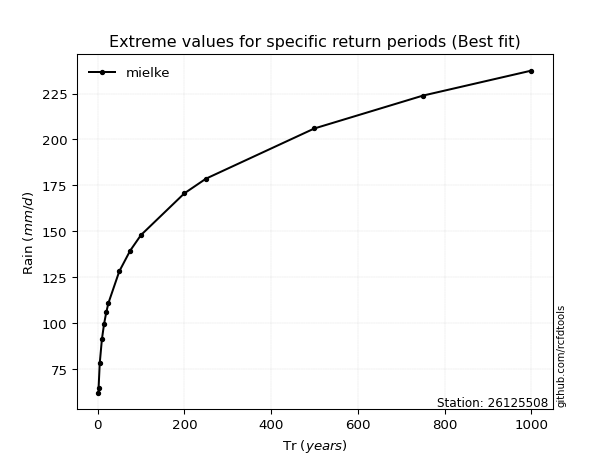</img>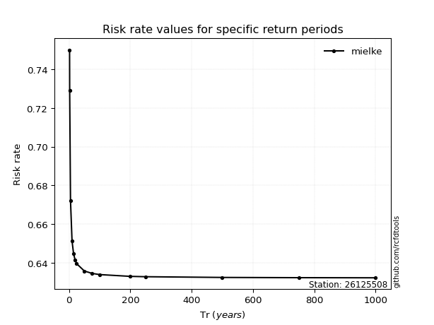</img>

</div>


<sub>**APP DISCLAIMER**: NO WARRANTY - This software is provided by [github.com/rcfdtools](https://github.com/rcfdtools) "as is", without any express or implied warranty, including warranties of merchantability, fitness for a particular purpose, or non-infringement. There is no guarantee that the software will be error-free or operate without interruption. LIMITATION OF LIABILITY - Neither the authors nor copyright holders will be liable for claims or damages arising from the software or its use. You are responsible for determining if the software is appropriate for your use and assume all associated risks, including errors, legal compliance, and data loss. NO PROFESSIONAL ADVICE - The software provides general information and does not offer professional advice. It should not replace consultation with professional advisors.</sub>