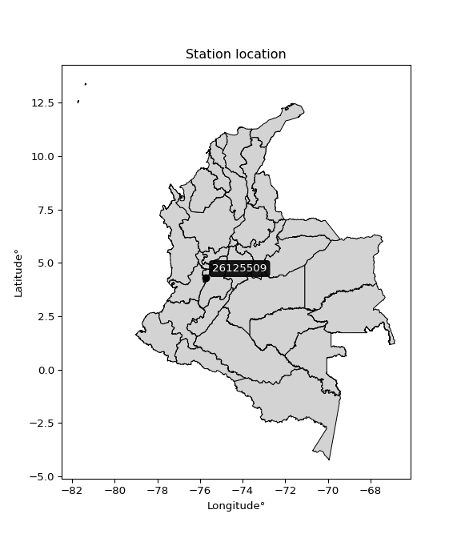

<div align="center">


</div>

# PMP Station (Rain, Pmax24h): 26125509

Probable Maximum Precipitation (PMP) is the greatest amount of rainfall for a specific duration that is meteorologically possible for a given location, acting as a "worst-case" scenario for extreme storms, crucial for designing safety-critical infrastructure like bridges, river deviations, dams, spillways, and nuclear plants to prevent catastrophic failure. PMP is calculated by hydrologists using meteorological data to determine the upper limit of extreme rainfall, often leading to the Probable Maximum Flood (PMF) for flood control design, and is increasingly being studied for climate change impacts. Probable Maximum Precipitation (PMP) is the theoretical upper limit of rainfall, a deterministic estimate for extreme events, while probability distributions (like GEV, Gumbel) describe the likelihood and frequency of various precipitation amounts, including rare ones, showing how often events occur, with PMP representing the extreme end of these distributions, used for critical infrastructure design to ensure safety against the worst conceivable weather, unlike standard statistical forecasts which cover typical probabilities.

The most common probability distributions in hydrology, used for analyzing floods, rainfall, and streamflow, include the Normal, Log-Normal, Gumbel, Gamma (including Log-Pearson Type III), and Generalized Extreme Value (GEV) distributions, often chosen based on the data´s skewness and whether modeling extremes or general conditions, with Gumbel and GEV popular for extreme events like floods, while the Normal distribution serves as a baseline, though often requiring transformations for skewed hydrological data. These distributions help in designing water infrastructure, managing water resources, and forecasting hydrologic events.

> Hydrological data often isn´t perfectly normal (it´s skewed), so different distributions are needed for different applications, such as: **Flood Frequency Analysis**: Using Gumbel, GEV, or Log-Pearson Type III for predicting extreme flood magnitudes and their return periods, **Rainfall Analysis**: Normal for annual totals, but Log-Normal, Weibull, or GEV for intensity or extreme daily rainfall, **Streamflow Modeling**: Gamma and Log-Normal for maximum flows, GEV for minimum flows, and Kappa for daily flows.

<div align="center">

</img>

</div>


## A. General information


### 1. General running parameters

• app_version: _v20260108_. • runtime: _2026-01-09 11:32:22.148588_. • Python version: _3.14.0_. • SciPy version: _1.16.3_. • Pandas version: _2.3.3_. • NumPy version: _2.3.5_. • Stations dataset (station_dataset_file): _dataset/pmax24h_in/automatic_colombia_2003_2024.csv_. • Stations catalog (station_catalog_file): _dataset/CNE.xls_. • Minimum year to eval til year_max (date_min): _1900_. • Maximum year to eval since year_min (date_max): _2024_. • Creates, save and include plots into reports (create_plot): _False_. • Plot only fit distributions with Δo > Δ (plot_only_fit): _True_. • Plot only simple graphs avoiding multiple CDFs and multiple Extreme values plots (plot_only_simple): _True_. • Eval low extreme values, if False, evaluates high extreme values (low_extreme): _False_. • Eval every SciPy distribution as logarithmic (pdist_logarithmic_on): _True_. • Standard deviation normalized (ddof): _1.0_. • Return periods to eval in years (Tr): _[2, 2.33, 5, 10, 15, 20, 25, 50, 75, 100, 200, 250, 500, 750, 1000]_. • Minimum data sample per station, 0 means any (minimum_sample): _5_. • Z-Score maximum threshold to adjust a value, 0 means disable (zscore_max): _3.5_. • Z-Score minimum threshold to adjust a value, 0 means disable (zscore_min): _-2.5_. • Avoid zeros, e.g. rain = 0 (avoid_zeros): _True_. • Avoid null values (avoid_nans): _True_. 

:file_folder:Table: [dataset.csv](../../dataset/pmax24h_in/automatic_colombia_2003_2024.csv)

> Delta Degrees of Freedom (DDOF): is a parameter used in the formulas for calculating variance and standard deviation. When ddof=0, the divisor is $N$ (the total number of observations) and this is used when your data set is the entire population. When ddof=1, the divisor is $N-1$ and this is used when your data set is a sample drawn from a larger population. Using $N-1$ provides an unbiased estimate of the population variance (known as Bessel´s correction).


### 2. Station info and location

|   id |   CODIGO | NOMBRE                          | CATEGORIA               | TECNOLOGIA                | ESTADO   | FECHA_INSTALACION   |   FECHA_SUSPENSION |   ALTITUD |   LATITUD |   LONGITUD | DEPARTAMENTO   | MUNICIPIO   | AREA_OPERATIVA                         | ENTIDAD                                    | AREA_HIDROGRAFICA   | ZONA_HIDROGRAFICA   | SUBZONA_HIDROGRAFICA   |   CORRIENTE | Catalogo   |   Version |
|-----:|---------:|:--------------------------------|:------------------------|:--------------------------|:---------|:--------------------|-------------------:|----------:|----------:|-----------:|:---------------|:------------|:---------------------------------------|:-------------------------------------------|:--------------------|:--------------------|:-----------------------|------------:|:-----------|----------:|
|    0 | 26125509 | ESPERANZA LA  - AUT  [26125509] | Climatológica Principal | Automática con Telemetría | Activa   | 11/10/2013          |                nan |      1667 |   4.29944 |   -75.7251 | Quindío        | Pijao       | Area Operativa 09 - Cauca-Valle-Caldas | CENTRO NACIONAL DE INVESTIGACIONES DE CAFE | Magdalena Cauca     | Cauca               | Río La Vieja           |         nan | CNE_OE     |  20251226 |

<div align="center">

Dynamic map: [:earth_americas:Google](http://maps.google.com/maps?q=4.299444444,-75.72508056) [:earth_americas:OSM](https://www.openstreetmap.org/#map=18/4.299444444/-75.72508056&layers=P) [:earth_americas:Bing](https://www.bing.com/maps?cp=4.299444444~-75.72508056&lvl=18) [:earth_americas:Apple](https://maps.apple.com/frame?center=4.299444444%2C-75.72508056&span=0.003%2C0.006)

</div>


<div align="center">

```geojson
{
  "type": "Feature",
  "geometry": {
    "type": "Point", 
    "coordinates": [-75.72508056, 4.299444444]
  }, 
  "properties": {
    "Name": "26125509"
  }
}
```

</div>


### 3. Discrete values table and plot

<div align="center">

|               |         0 |          1 |           2 |           3 |           4 |           5 |           6 |
|:--------------|----------:|-----------:|------------:|------------:|------------:|------------:|------------:|
| Date          | 2017      | 2018       | 2019        | 2020        | 2021        | 2022        | 2023        |
| Value         |   32.3    |   86.8     |   56.1      |   81.2      |   80        |   45.8      |   71.7      |
| Value_initial |   32.3    |   86.8     |   56.1      |   81.2      |   80        |   45.8      |   71.7      |
| count         |    7      |    7       |    7        |    7        |    7        |    7        |    7        |
| mean          |   64.8429 |   64.8429  |   64.8429   |   64.8429   |   64.8429   |   64.8429   |   64.8429   |
| std           |   20.5123 |   20.5123  |   20.5123   |   20.5123   |   20.5123   |   20.5123   |   20.5123   |
| zscore        |   -1.5865 |    1.07044 |   -0.426224 |    0.797429 |    0.738928 |   -0.928361 |    0.334294 |


</div>


> The initial value (value_initial) correspond to the initial obtained or null completed value, and value (value) is adjusted only when the initial value is outside the valid range (outlier) definite through the Z-Score value. If Z-Score is active, values out of range or outliers are replaced with the station mean value. A Z-Score (or standard score) measures how many standard deviations a data point is from the mean of a dataset, indicating its relative position; positive scores mean above the mean, negative mean below, and a score of zero is exactly at the mean, allowing for comparison of values from different distributions. It´s calculated using the formula $z=(x–μ)/σ$, where $x$ is the data point, $μ$ is the mean, and $σ$ is the standard deviation, helping identify outliers and understand probability.
>
> <sub>**Note**: In this study, "completing" (filling gaps in) and "extending" (forecasting or lengthening the historical record) rainfall data series are avoided for certain critical analyses because they introduce artificial bias and uncertainty, which can distort the statistics of rare events (extremes), alter day-to-day variability, and compromise the integrity and homogeneity of the original data. Some reasons against Completing/Extending rainfall data are: **Distortion of Extremes and Variability**: The primary issue is that most gap-filling or extension methods rely on averaging or regression with nearby stations, which inherently smooths the data. Rainfall is highly variable in space and time, with a large percentage of zero values and occasional large storms. Infilling methods often underestimate the highest values and overestimate the lowest (zero) values, which severely distorts analyses focused on flood frequency, drought severity, and intensity-duration-frequency (IDF) curves, **Loss of Data Homogeneity**: Infilled or extended data are synthetic estimates, not actual measurements. Combining these estimates with observed data can violate the assumption of data homogeneity, which requires that the data properties do not change over time. Inhomogeneity can lead to incorrect conclusions about long-term trends or changes in climate patterns, **Propagation of Errors**: Errors and biases from the original data (e.g., wind-induced undercatch, instrument errors, site changes) or the data used for imputation can propagate through the analysis, leading to unreliable hydrological models and inaccurate predictions, **Compromised Statistical Integrity**: For statistical analyses, especially those involving the frequency of events, using artificial data can introduce time bias or autocorrelation that doesn´t exist in reality, making it difficult to assess the true probability of events, **Difficulty in Validation**: It is difficult to accurately validate the quality of filled or extended data, especially for past periods where ground-truth measurements are unavailable. The reliability of imputation techniques heavily depends on the density of the surrounding station network and the complexity of the local topography.</sub>


### 4. Active continuous probability distributions from SciPy (45 of 104 available)

A Probability Density Function (PDF) describes the relative likelihood of a continuous random variable falling within a specific range, where the total area under its curve equals 1, and the area over any interval gives the actual probability for that range. Unlike discrete probabilities (like rolling a die), a PDF shows density, not direct probability for a single point (which is zero), with higher points indicating higher likelihood, often visualized as a bell curve for normal distributions.

A log of a probability density function (log-PDF) is simply the logarithm of the PDF´s value, denoted as $log(f(x))$, useful for converting multiplication of probabilities into addition, improving numerical stability with tiny numbers, and connecting to information theory concepts like entropy. Instead of dealing with very small probabilities (e.g., 0.000001), log-PDFs use negative numbers (e.g., $log(0.00001) ≈ -11.51$ that are easier for computers to handle, preventing underflow errors and simplifying complex calculations. In this study, each active probability distribution from SciPy is also evaluated in the $log$ form.

[scipy.stats](https://docs.scipy.org/doc/scipy/reference/stats.html) is a Python´s powerful submodule within the SciPy library for comprehensive statistical analysis, offering over 130 probability distributions (like Normal, Poisson), functions for descriptive stats (mean, variance), hypothesis testing (t-tests, chi-square), random variable generation, and statistical tests, making it essential for data science, modeling, and research. It provides tools to explore, model, and draw conclusions from data efficiently, working seamlessly with NumPy.

<div align="center">

|   id | p_dist             |   n_parameter | fit_method   | label                                                                       | active   | ref                                                                                                        |
|-----:|:-------------------|--------------:|:-------------|:----------------------------------------------------------------------------|:---------|:-----------------------------------------------------------------------------------------------------------|
|    0 | alpha              |             3 | MLE          | Alpha                                                                       | True     | [:mortar_board:](https://docs.scipy.org/doc/scipy/reference/generated/scipy.stats.alpha.html)              |
|    1 | betaprime          |             4 | MLE          | Beta prime                                                                  | True     | [:mortar_board:](https://docs.scipy.org/doc/scipy/reference/generated/scipy.stats.betaprime.html)          |
|    2 | chi2               |             3 | MLE          | Chi²                                                                        | True     | [:mortar_board:](https://docs.scipy.org/doc/scipy/reference/generated/scipy.stats.chi2.html)               |
|    3 | crystalball        |             4 | MLE          | Crystalball                                                                 | True     | [:mortar_board:](https://docs.scipy.org/doc/scipy/reference/generated/scipy.stats.crystalball.html)        |
|    4 | dweibull           |             3 | MLE          | Double Weibull                                                              | True     | [:mortar_board:](https://docs.scipy.org/doc/scipy/reference/generated/scipy.stats.dweibull.html)           |
|    5 | erlang             |             3 | MLE          | Erlang                                                                      | True     | [:mortar_board:](https://docs.scipy.org/doc/scipy/reference/generated/scipy.stats.erlang.html)             |
|    6 | expon              |             2 | MLE          | Exponential                                                                 | True     | [:mortar_board:](https://docs.scipy.org/doc/scipy/reference/generated/scipy.stats.expon.html)              |
|    7 | exponnorm          |             3 | MLE          | Exponentially modified Normal                                               | True     | [:mortar_board:](https://docs.scipy.org/doc/scipy/reference/generated/scipy.stats.exponnorm.html)          |
|    8 | f                  |             4 | MLE          | F                                                                           | True     | [:mortar_board:](https://docs.scipy.org/doc/scipy/reference/generated/scipy.stats.f.html)                  |
|    9 | fatiguelife        |             3 | MLE          | Fatigue-life (Birnbaum-Saunders)                                            | True     | [:mortar_board:](https://docs.scipy.org/doc/scipy/reference/generated/scipy.stats.fatiguelife.html)        |
|   10 | fisk               |             3 | MLE          | Fisk                                                                        | True     | [:mortar_board:](https://docs.scipy.org/doc/scipy/reference/generated/scipy.stats.fisk.html)               |
|   11 | gamma              |             3 | MLE          | Gamma                                                                       | True     | [:mortar_board:](https://docs.scipy.org/doc/scipy/reference/generated/scipy.stats.gamma.html)              |
|   12 | genexpon           |             5 | MLE          | Generalized exponential                                                     | True     | [:mortar_board:](https://docs.scipy.org/doc/scipy/reference/generated/scipy.stats.genexpon.html)           |
|   13 | genlogistic        |             3 | MLE          | Generalized logistic                                                        | True     | [:mortar_board:](https://docs.scipy.org/doc/scipy/reference/generated/scipy.stats.genlogistic.html)        |
|   14 | gibrat             |             2 | MM           | Gibrat                                                                      | True     | [:mortar_board:](https://docs.scipy.org/doc/scipy/reference/generated/scipy.stats.gibrat.html)             |
|   15 | gompertz           |             3 | MLE          | Gompertz (or truncated Gumbel)                                              | True     | [:mortar_board:](https://docs.scipy.org/doc/scipy/reference/generated/scipy.stats.gompertz.html)           |
|   16 | gumbel_l           |             2 | MM           | Gumbel Left Skew                                                            | True     | [:mortar_board:](https://docs.scipy.org/doc/scipy/reference/generated/scipy.stats.gumbel_l.html)           |
|   17 | gumbel_r           |             2 | MM           | Gumbel Right Skew                                                           | True     | [:mortar_board:](https://docs.scipy.org/doc/scipy/reference/generated/scipy.stats.gumbel_r.html)           |
|   18 | halflogistic       |             2 | MM           | Half-logistic                                                               | True     | [:mortar_board:](https://docs.scipy.org/doc/scipy/reference/generated/scipy.stats.halflogistic.html)       |
|   19 | halfnorm           |             2 | MM           | Half Normal                                                                 | True     | [:mortar_board:](https://docs.scipy.org/doc/scipy/reference/generated/scipy.stats.halfnorm.html)           |
|   20 | hypsecant          |             2 | MM           | hyperbolic secant                                                           | True     | [:mortar_board:](https://docs.scipy.org/doc/scipy/reference/generated/scipy.stats.hypsecant.html)          |
|   21 | invgamma           |             3 | MLE          | Inverted gamma                                                              | True     | [:mortar_board:](https://docs.scipy.org/doc/scipy/reference/generated/scipy.stats.invgamma.html)           |
|   22 | invgauss           |             3 | MLE          | Inverse Gaussian                                                            | True     | [:mortar_board:](https://docs.scipy.org/doc/scipy/reference/generated/scipy.stats.invgauss.html)           |
|   23 | invweibull         |             3 | MLE          | Inverted Weibull                                                            | True     | [:mortar_board:](https://docs.scipy.org/doc/scipy/reference/generated/scipy.stats.invweibull.html)         |
|   24 | kappa4             |             4 | MLE          | Kappa 4                                                                     | True     | [:mortar_board:](https://docs.scipy.org/doc/scipy/reference/generated/scipy.stats.kappa4.html)             |
|   25 | kstwobign          |             2 | MLE          | Limiting distribution of scaled Kolmogorov-Smirnov two-sided test statistic | True     | [:mortar_board:](https://docs.scipy.org/doc/scipy/reference/generated/scipy.stats.kstwobign.html)          |
|   26 | laplace            |             2 | MM           | Laplace                                                                     | True     | [:mortar_board:](https://docs.scipy.org/doc/scipy/reference/generated/scipy.stats.laplace.html)            |
|   27 | laplace_asymmetric |             3 | MLE          | Asymmetric Laplace                                                          | True     | [:mortar_board:](https://docs.scipy.org/doc/scipy/reference/generated/scipy.stats.laplace_asymmetric.html) |
|   28 | loggamma           |             3 | MLE          | Log gamma                                                                   | True     | [:mortar_board:](https://docs.scipy.org/doc/scipy/reference/generated/scipy.stats.loggamma.html)           |
|   29 | logistic           |             2 | MM           | Logistic (or Sech-squared)                                                  | True     | [:mortar_board:](https://docs.scipy.org/doc/scipy/reference/generated/scipy.stats.logistic.html)           |
|   30 | lognorm            |             3 | MLE          | Log Normal                                                                  | True     | [:mortar_board:](https://docs.scipy.org/doc/scipy/reference/generated/scipy.stats.lognorm.html)            |
|   31 | maxwell            |             2 | MM           | Maxwell                                                                     | True     | [:mortar_board:](https://docs.scipy.org/doc/scipy/reference/generated/scipy.stats.maxwell.html)            |
|   32 | mielke             |             4 | MLE          | Mielke Beta-Kappa / Dagum                                                   | True     | [:mortar_board:](https://docs.scipy.org/doc/scipy/reference/generated/scipy.stats.mielke.html)             |
|   33 | moyal              |             2 | MM           | Moyal                                                                       | True     | [:mortar_board:](https://docs.scipy.org/doc/scipy/reference/generated/scipy.stats.moyal.html)              |
|   34 | nakagami           |             3 | MLE          | Nakagami                                                                    | True     | [:mortar_board:](https://docs.scipy.org/doc/scipy/reference/generated/scipy.stats.nakagami.html)           |
|   35 | ncf                |             5 | MLE          | Non-central F distribution                                                  | True     | [:mortar_board:](https://docs.scipy.org/doc/scipy/reference/generated/scipy.stats.ncf.html)                |
|   36 | nct                |             4 | MLE          | Non-central Student’s t                                                     | True     | [:mortar_board:](https://docs.scipy.org/doc/scipy/reference/generated/scipy.stats.nct.html)                |
|   37 | norm               |             2 | MM           | Normal                                                                      | True     | [:mortar_board:](https://docs.scipy.org/doc/scipy/reference/generated/scipy.stats.norm.html)               |
|   38 | pearson3           |             3 | MM           | Pearson type III                                                            | True     | [:mortar_board:](https://docs.scipy.org/doc/scipy/reference/generated/scipy.stats.pearson3.html)           |
|   39 | rayleigh           |             2 | MM           | Rayleigh                                                                    | True     | [:mortar_board:](https://docs.scipy.org/doc/scipy/reference/generated/scipy.stats.rayleigh.html)           |
|   40 | rice               |             3 | MLE          | Rice                                                                        | True     | [:mortar_board:](https://docs.scipy.org/doc/scipy/reference/generated/scipy.stats.rice.html)               |
|   41 | t                  |             3 | MLE          | Student’s t                                                                 | True     | [:mortar_board:](https://docs.scipy.org/doc/scipy/reference/generated/scipy.stats.t.html)                  |
|   42 | truncnorm          |             4 | MLE          | Truncated normal                                                            | True     | [:mortar_board:](https://docs.scipy.org/doc/scipy/reference/generated/scipy.stats.truncnorm.html)          |
|   43 | wald               |             2 | MM           | Wald                                                                        | True     | [:mortar_board:](https://docs.scipy.org/doc/scipy/reference/generated/scipy.stats.wald.html)               |
|   44 | weibull_min        |             3 | MLE          | Weibull minimum                                                             | True     | [:mortar_board:](https://docs.scipy.org/doc/scipy/reference/generated/scipy.stats.weibull_min.html)        |

</div>

> **n_parameter:** # arguments & localization & scale.
>
> **Fit methods:** (MLE) maximum likelihood, (MM) L-moments.
>
>**Inactive** (With the only purpose of prevent loops, zero divisions, infinite values, over high estimated values or horizontal trending for recurrence intervals estimations, the follow distributions were disabled.)**:** foldnorm, gennorm, norminvgauss, powernorm, powerlognorm, skewnorm, genextreme, anglit, arcsine, argus, beta, bradford, burr, burr12, cauchy, cosine, halfcauchy, foldcauchy, skewcauchy, wrapcauchy, dgamma, gengamma, exponweib, exponpow, truncexpon, gausshyper, genhalflogistic, genhyperbolic, geninvgauss, halfgennorm, johnsonsb, johnsonsu, kappa3, ksone, kstwo, loglaplace, levy, levy_l, levy_stable, ncx2, pareto, genpareto, truncpareto, lomax, powerlaw, rdist, rel_breitwigner, recipinvgauss, semicircular, studentized_range, trapezoid, triang, truncweibull_min, tukeylambda, uniform, loguniform, vonmises, vonmises_line, weibull_max, 


## B. Probability (PDF) vs. Empirical (EDF) distributions functions

A continuous probability distribution (CPD) describes probabilities for variables that can take any value within a range (like rain any time), unlike discrete variables with specific outcomes (like temperature). It uses a Probability Density Function (PDF), a curve where the total area under it equals 1, and the probability of the variable falling within an interval (a to b) is found by calculating the area under the curve between those points. A key feature is that the probability of hitting any single exact value is zero, so probabilities are always expressed for ranges, e.g., $P(a ≤ X ≤ b)$.

<div align="center">

Distributions parameters from station values
|    |   station | p_dist                |   n |               loc |            scale | shape                  | shape1              | shape2                | shape3   |
|---:|----------:|:----------------------|----:|------------------:|-----------------:|:-----------------------|:--------------------|:----------------------|:---------|
|  0 |  26125509 | alpha                 |   7 |    -310.021       |   7132.68        | 19.085210389657746     |                     |                       |          |
|  1 |  26125509 | betaprime             |   7 |      -8.79461     |      0.300791    | 2660.176271509121      | 11.94860682092898   |                       |          |
|  2 |  26125509 | chi2                  |   7 |      32.3         |      1.70881     | 0.27055179802431184    |                     |                       |          |
|  3 |  26125509 | crystalball           |   7 |      64.8429      |     18.9907      | 12061.911577379848     | 986.5737300693129   |                       |          |
|  4 |  26125509 | dweibull              |   7 |      62.9177      |     19.7903      | 2.5121207019867686     |                     |                       |          |
|  5 |  26125509 | erlang                |   7 |    -231.937       |      1.26719     | 234.26291433457016     |                     |                       |          |
|  6 |  26125509 | expon                 |   7 |      32.3         |     32.5429      |                        |                     |                       |          |
|  7 |  26125509 | exponnorm             |   7 |      64.8311      |     18.9908      | 0.0006243935330547659  |                     |                       |          |
|  8 |  26125509 | f                     |   7 |   -7988.29        |   8053.1         | 970509.4552500155      | 568545.4141022034   |                       |          |
|  9 |  26125509 | fatiguelife           |   7 |      32.3         |      7.11907e-06 | 2071.8874573768603     |                     |                       |          |
| 10 |  26125509 | fisk                  |   7 |  -56654.4         |  56720.8         | 4911.5345322043795     |                     |                       |          |
| 11 |  26125509 | gamma                 |   7 |    -222.988       |      1.27728     | 225.29276733116524     |                     |                       |          |
| 12 |  26125509 | genexpon              |   7 |      31.6663      |      1.06727     | 0.2557913809300054     | 0.0096409677038562  | 9.044162714950505e-08 |          |
| 13 |  26125509 | genlogistic           |   7 |      86.8004      |      2.59911e-05 | 1.1859964648761699e-06 |                     |                       |          |
| 14 |  26125509 | gibrat                |   7 |      50.3553      |      8.78713     |                        |                     |                       |          |
| 15 |  26125509 | gompertz              |   7 |     -30.8744      |     14.6403      | 0.0007871823886157793  |                     |                       |          |
| 16 |  26125509 | gumbel_l              |   7 |      73.3897      |     14.807       |                        |                     |                       |          |
| 17 |  26125509 | gumbel_r              |   7 |      56.296       |     14.807       |                        |                     |                       |          |
| 18 |  26125509 | halflogistic          |   7 |      42.3344      |     16.2364      |                        |                     |                       |          |
| 19 |  26125509 | halfnorm              |   7 |      39.7066      |     31.5037      |                        |                     |                       |          |
| 20 |  26125509 | hypsecant             |   7 |      64.8429      |     12.0899      |                        |                     |                       |          |
| 21 |  26125509 | invgamma              |   7 |    -197.567       |  47154.7         | 180.86853948509605     |                     |                       |          |
| 22 |  26125509 | invgauss              |   7 |      -6.20542     |    688.72        | 0.10363859134854593    |                     |                       |          |
| 23 |  26125509 | invweibull            |   7 |      32.3         |      1.60868     | 0.07314521610327679    |                     |                       |          |
| 24 |  26125509 | kappa4                |   7 |      29.8871      |     63.1219      | 1.0172030974826578     | 1.1090955440236316  |                       |          |
| 25 |  26125509 | kstwobign             |   7 |     -10.6237      |     86.0198      |                        |                     |                       |          |
| 26 |  26125509 | laplace               |   7 |      64.8429      |     13.4285      |                        |                     |                       |          |
| 27 |  26125509 | laplace_asymmetric    |   7 |      81.2         |      9.6943      | 2.1519820714229048     |                     |                       |          |
| 28 |  26125509 | loggamma              |   7 |      86.8001      |      5.78236e-06 | 2.636650470011861e-07  |                     |                       |          |
| 29 |  26125509 | logistic              |   7 |      64.8429      |     10.4701      |                        |                     |                       |          |
| 30 |  26125509 | lognorm               |   7 |      32.3         |      0.196803    | 12.644563430673108     |                     |                       |          |
| 31 |  26125509 | maxwell               |   7 |      19.8428      |     28.1996      |                        |                     |                       |          |
| 32 |  26125509 | mielke                |   7 |     -16.9494      |    103.95        | 3.6981638969113693     | 2326.1919117153593  |                       |          |
| 33 |  26125509 | moyal                 |   7 |      53.9827      |      8.54884     |                        |                     |                       |          |
| 34 |  26125509 | nakagami              |   7 |      45.8         |     24.0856      | 0.14886766748358132    |                     |                       |          |
| 35 |  26125509 | ncf                   |   7 |      -0.605326    |      1.03661e-07 | 6.953681289436277e-08  | 419.0704635699083   | 43.72482541979009     |          |
| 36 |  26125509 | nct                   |   7 |    -599.229       |     18.8846      | 53178.4295147216       | 35.16392501121004   |                       |          |
| 37 |  26125509 | norm                  |   7 |      64.8429      |     18.9907      |                        |                     |                       |          |
| 38 |  26125509 | pearson3              |   7 |      64.8429      |     18.9907      | -0.48535295463645867   |                     |                       |          |
| 39 |  26125509 | rayleigh              |   7 |      28.5125      |     28.9875      |                        |                     |                       |          |
| 40 |  26125509 | rice                  |   7 |      21.7043      |     21.2951      | 1.7026306139802747     |                     |                       |          |
| 41 |  26125509 | t                     |   7 |      64.8428      |     18.9884      | 2104501.815911022      |                     |                       |          |
| 42 |  26125509 | truncnorm             |   7 |     653.28        |    162.929       | -15404.877725607344    | -3.4768504987007454 |                       |          |
| 43 |  26125509 | wald                  |   7 |      45.8521      |     18.9908      |                        |                     |                       |          |
| 44 |  26125509 | weibull_min           |   7 |      -9.93605e+08 |      9.93605e+08 | 67882484.12826666      |                     |                       |          |
| 45 |  26125509 | logalpha              |   7 |      -4.61571     |    217.301       | 24.938601388659144     |                     |                       |          |
| 46 |  26125509 | logbetaprime          |   7 |      -2.5805      |     15.1484      | 401.10062928154525     | 906.8163831317956   |                       |          |
| 47 |  26125509 | logchi2               |   7 |       3.47507     |      0.99081     | 1.0535412165857543     |                     |                       |          |
| 48 |  26125509 | logcrystalball        |   7 |       4.12022     |      0.33778     | 70.98651228485025      | 451.8017725346125   |                       |          |
| 49 |  26125509 | logdweibull           |   7 |       4.11832     |      0.334974    | 1.9322747691584286     |                     |                       |          |
| 50 |  26125509 | logerlang             |   7 |      -1.55625     |      0.0214021   | 265.1765808582884      |                     |                       |          |
| 51 |  26125509 | logexpon              |   7 |       3.47507     |      0.645151    |                        |                     |                       |          |
| 52 |  26125509 | logexponnorm          |   7 |       4.12        |      0.337779    | 0.0006450145687151782  |                     |                       |          |
| 53 |  26125509 | logf                  |   7 |    -359.742       |    363.862       | 9986846.649693213      | 3008727.006670937   |                       |          |
| 54 |  26125509 | logfatiguelife        |   7 |    -129.28        |    133.401       | 0.002532607657882978   |                     |                       |          |
| 55 |  26125509 | logfisk               |   7 |      -2.6805e+07  |      2.6805e+07  | 134411943.84388292     |                     |                       |          |
| 56 |  26125509 | loggamma              |   7 |      -1.81419     |      0.0201384   | 294.42952926721716     |                     |                       |          |
| 57 |  26125509 | loggenexpon           |   7 |       3.45949     |      0.00487359  | 0.0023507728285241747  | 2.9124271786846574  | 2.017676766057136e-05 |          |
| 58 |  26125509 | loggenlogistic        |   7 |       4.46364     |      5.86166e-07 | 1.708942122789195e-06  |                     |                       |          |
| 59 |  26125509 | loggibrat             |   7 |       3.86252     |      0.156302    |                        |                     |                       |          |
| 60 |  26125509 | loggompertz           |   7 |       3.44762     |      0.278771    | 0.05729831115208915    |                     |                       |          |
| 61 |  26125509 | loggumbel_l           |   7 |       4.27224     |      0.263366    |                        |                     |                       |          |
| 62 |  26125509 | loggumbel_r           |   7 |       3.9682      |      0.263366    |                        |                     |                       |          |
| 63 |  26125509 | loghalflogistic       |   7 |       3.71985     |      0.288806    |                        |                     |                       |          |
| 64 |  26125509 | loghalfnorm           |   7 |       3.67316     |      0.560304    |                        |                     |                       |          |
| 65 |  26125509 | loghypsecant          |   7 |       4.12022     |      0.215038    |                        |                     |                       |          |
| 66 |  26125509 | loginvgamma           |   7 |      -2.66461     |   2516.66        | 372.113448634223       |                     |                       |          |
| 67 |  26125509 | loginvgauss           |   7 |       0.918756    |    233.037       | 0.013733251461453988   |                     |                       |          |
| 68 |  26125509 | loginvweibull         |   7 |      -2.61114e+07 |      2.61114e+07 | 72400653.10016973      |                     |                       |          |
| 69 |  26125509 | logkappa4             |   7 |       3.37573     |      1.14413     | 1.0424110178091652     | 1.0517177897763506  |                       |          |
| 70 |  26125509 | logkstwobign          |   7 |       2.66927     |      1.65584     |                        |                     |                       |          |
| 71 |  26125509 | loglaplace            |   7 |       4.12022     |      0.238847    |                        |                     |                       |          |
| 72 |  26125509 | loglaplace_asymmetric |   7 |       4.46361     |      0.00353735  | 96.87082742036053      |                     |                       |          |
| 73 |  26125509 | logloggamma           |   7 |       4.46363     |      1.27398e-06 | 3.7070977062175913e-06 |                     |                       |          |
| 74 |  26125509 | loglogistic           |   7 |       4.12022     |      0.186228    |                        |                     |                       |          |
| 75 |  26125509 | loglognorm            |   7 |       3.47507     |      0.00477292  | 12.254547831084587     |                     |                       |          |
| 76 |  26125509 | logmaxwell            |   7 |       3.31982     |      0.501575    |                        |                     |                       |          |
| 77 |  26125509 | logmielke             |   7 | -214528           | 214533           | 613568.8563987826      | 115536780.63153699  |                       |          |
| 78 |  26125509 | logmoyal              |   7 |       3.92705     |      0.152055    |                        |                     |                       |          |
| 79 |  26125509 | lognakagami           |   7 |       3.82428     |      0.423009    | 0.29200700204748203    |                     |                       |          |
| 80 |  26125509 | logncf                |   7 |     -23.9767      |     25.7582      | 61133.73065851729      | 17292.666569376408  | 5546.1344299931225    |          |
| 81 |  26125509 | lognct                |   7 |      -6.86745     |      0.0704558   | 490.45527796128385     | 155.70792846777624  |                       |          |
| 82 |  26125509 | lognorm               |   7 |       4.12022     |      0.33778     |                        |                     |                       |          |
| 83 |  26125509 | logpearson3           |   7 |       4.12022     |      0.337781    | -0.786269697957156     |                     |                       |          |
| 84 |  26125509 | lograyleigh           |   7 |       3.47402     |      0.515588    |                        |                     |                       |          |
| 85 |  26125509 | logrice               |   7 |       3.25292     |      0.365813    | 2.1151116542639006     |                     |                       |          |
| 86 |  26125509 | logt                  |   7 |       4.12022     |      0.33778     | 685151096.5395503      |                     |                       |          |
| 87 |  26125509 | logtruncnorm          |   7 |      -0.070438    |      1.70454     | 2.0800373578402738     | 7.107211851203907   |                       |          |
| 88 |  26125509 | logwald               |   7 |       3.78246     |      0.337756    |                        |                     |                       |          |
| 89 |  26125509 | logweibull_min        |   7 | -188775           | 188779           | 785546.2535820967      |                     |                       |          |

</div>

> **loc** (Location parameter): This shifts the distribution along the x-axis. For many common distributions, like the normal (Gaussian) distribution, loc represents the mean $μ$. For others, like the uniform distribution, it might represent the minimum value, or for the beta distribution, the left end of the support interval.
>
> **scale** (Scale parameter): This determines the width or spread of the distribution. For the normal distribution, scale represents the standard deviation $σ$. For a uniform distribution, it defines the length of the interval (from $loc$ to $loc + scale$).
>
> **shape** (Shape parameters): Refers to parameters that define the specific form of a probability distribution, distinct from its location (loc) and scale (scale). These parameters are required arguments for most distribution functions. For example, a normal (Gaussian) distribution is fully defined by its location (mean) and scale (standard deviation), so it has no specific shape parameters beyond loc and scale. However, other distributions have intrinsic properties that need specification, as Gamma distribution that takes a shape parameter, often named $a$ or $alpha$.


### 0. Cumulative distribution values - CDF (90 evaluated)

Cumulative Distribution Function (CDF), denoted as $F$<sub>$X$</sub>$(x)$, is a function that gives the probability that a random variable $X$ will take a value less than or equal to a specific value, $x$ (i.e., $(P(X≥x)$. It essentially "accumulates" probabilities from a given point up to the far right (positive infinity), providing a complete picture of the distribution´s probabilities for both discrete (like rain) and continuous (like temperature) variables, helping to find probabilities over ranges or above certain values. Each station is evaluated separately ordering the $x$ values ascending, calculating the CDF and PDF values for the activated distributions and their logarithmic forms.

<div align="center">

CDF ordered by x ascending and calculating $log(f(x))$ separately
|   id |   Station |   date |    x |   count |    mean |     std |    zscore |   Value_initial |   station |   m |     alpha |   alpha_pdf |   betaprime |   betaprime_pdf |     chi2 |    chi2_pdf |   crystalball |   crystalball_pdf |   dweibull |   dweibull_pdf |    erlang |   erlang_pdf |    expon |   expon_pdf |   exponnorm |   exponnorm_pdf |         f |     f_pdf |   fatiguelife |   fatiguelife_pdf |      fisk |   fisk_pdf |     gamma |   gamma_pdf |   genexpon |   genexpon_pdf |   genlogistic |   genlogistic_pdf |   gibrat |   gibrat_pdf |   gompertz |   gompertz_pdf |   gumbel_l |   gumbel_l_pdf |   gumbel_r |   gumbel_r_pdf |   halflogistic |   halflogistic_pdf |   halfnorm |   halfnorm_pdf |   hypsecant |   hypsecant_pdf |   invgamma |   invgamma_pdf |   invgauss |   invgauss_pdf |   invweibull |   invweibull_pdf |    kappa4 |   kappa4_pdf |   kstwobign |   kstwobign_pdf |   laplace |   laplace_pdf |   laplace_asymmetric |   laplace_asymmetric_pdf |   loggamma |   loggamma_pdf |   logistic |   logistic_pdf |   lognorm |   lognorm_pdf |   maxwell |   maxwell_pdf |    mielke |   mielke_pdf |       moyal |   moyal_pdf |    nakagami |   nakagami_pdf |      ncf |    ncf_pdf |       nct |    nct_pdf |      norm |   norm_pdf |   pearson3 |   pearson3_pdf |   rayleigh |   rayleigh_pdf |      rice |   rice_pdf |         t |      t_pdf |   truncnorm |   truncnorm_pdf |     wald |   wald_pdf |   weibull_min |   weibull_min_pdf |   logalpha |   logalpha_pdf |   logbetaprime |   logbetaprime_pdf |     logchi2 |   logchi2_pdf |   logcrystalball |   logcrystalball_pdf |   logdweibull |   logdweibull_pdf |   logerlang |   logerlang_pdf |   logexpon |   logexpon_pdf |   logexponnorm |   logexponnorm_pdf |      logf |   logf_pdf |   logfatiguelife |   logfatiguelife_pdf |   logfisk |   logfisk_pdf |   loggenexpon |   loggenexpon_pdf |   loggenlogistic |   loggenlogistic_pdf |   loggibrat |   loggibrat_pdf |   loggompertz |   loggompertz_pdf |   loggumbel_l |   loggumbel_l_pdf |   loggumbel_r |   loggumbel_r_pdf |   loghalflogistic |   loghalflogistic_pdf |   loghalfnorm |   loghalfnorm_pdf |   loghypsecant |   loghypsecant_pdf |   loginvgamma |   loginvgamma_pdf |   loginvgauss |   loginvgauss_pdf |   loginvweibull |   loginvweibull_pdf |   logkappa4 |   logkappa4_pdf |   logkstwobign |   logkstwobign_pdf |   loglaplace |   loglaplace_pdf |   loglaplace_asymmetric |   loglaplace_asymmetric_pdf |   logloggamma |   logloggamma_pdf |   loglogistic |   loglogistic_pdf |   loglognorm |   loglognorm_pdf |   logmaxwell |   logmaxwell_pdf |   logmielke |   logmielke_pdf |    logmoyal |   logmoyal_pdf |   lognakagami |   lognakagami_pdf |    logncf |   logncf_pdf |    lognct |   lognct_pdf |   logpearson3 |   logpearson3_pdf |   lograyleigh |   lograyleigh_pdf |   logrice |   logrice_pdf |      logt |   logt_pdf |   logtruncnorm |   logtruncnorm_pdf |   logwald |   logwald_pdf |   logweibull_min |   logweibull_min_pdf |
|-----:|----------:|-------:|-----:|--------:|--------:|--------:|----------:|----------------:|----------:|----:|----------:|------------:|------------:|----------------:|---------:|------------:|--------------:|------------------:|-----------:|---------------:|----------:|-------------:|---------:|------------:|------------:|----------------:|----------:|----------:|--------------:|------------------:|----------:|-----------:|----------:|------------:|-----------:|---------------:|--------------:|------------------:|---------:|-------------:|-----------:|---------------:|-----------:|---------------:|-----------:|---------------:|---------------:|-------------------:|-----------:|---------------:|------------:|----------------:|-----------:|---------------:|-----------:|---------------:|-------------:|-----------------:|----------:|-------------:|------------:|----------------:|----------:|--------------:|---------------------:|-------------------------:|-----------:|---------------:|-----------:|---------------:|----------:|--------------:|----------:|--------------:|----------:|-------------:|------------:|------------:|------------:|---------------:|---------:|-----------:|----------:|-----------:|----------:|-----------:|-----------:|---------------:|-----------:|---------------:|----------:|-----------:|----------:|-----------:|------------:|----------------:|---------:|-----------:|--------------:|------------------:|-----------:|---------------:|---------------:|-------------------:|------------:|--------------:|-----------------:|---------------------:|--------------:|------------------:|------------:|----------------:|-----------:|---------------:|---------------:|-------------------:|----------:|-----------:|-----------------:|---------------------:|----------:|--------------:|--------------:|------------------:|-----------------:|---------------------:|------------:|----------------:|--------------:|------------------:|--------------:|------------------:|--------------:|------------------:|------------------:|----------------------:|--------------:|------------------:|---------------:|-------------------:|--------------:|------------------:|--------------:|------------------:|----------------:|--------------------:|------------:|----------------:|---------------:|-------------------:|-------------:|-----------------:|------------------------:|----------------------------:|--------------:|------------------:|--------------:|------------------:|-------------:|-----------------:|-------------:|-----------------:|------------:|----------------:|------------:|---------------:|--------------:|------------------:|----------:|-------------:|----------:|-------------:|--------------:|------------------:|--------------:|------------------:|----------:|--------------:|----------:|-----------:|---------------:|-------------------:|----------:|--------------:|-----------------:|---------------------:|
|    0 |  26125509 |   2017 | 32.3 |       7 | 64.8429 | 20.5123 | -1.5865   |            32.3 |  26125509 |   1 | 0.0399703 |  0.00524202 |    0.027232 |      0.00621409 | 0.011006 | 2.09537e+11 |     0.0432995 |        0.00483859 |  0.0250704 |     0.00615637 | 0.0422074 |   0.00501664 | 0        |  0.0307287  |   0.0432995 |      0.00483858 | 0.0433383 | 0.0048558 |     0.0726071 |       1.28678e+11 | 0.0495756 | 0.00408245 | 0.0409607 |  0.00496448 |   0.140903 |    0.205899    |      0        |        0.00379499 | 0        |   0          |  0.0564553 |     0.00379595 |  0.0604446 |     0.00395623 | 0.00637073 |     0.00217537 |       0        |         0          |   0        |     0          |   0.0430732 |      0.00355189 |   0.039694 |     0.00522662 |  0.0347141 |     0.00657452 |  1.34042e-05 |      1.5482e+09  | 0.0232187 |    0.016974  |   0.0354171 |      0.00735123 |  0.044309 |    0.00329963 |            0.0789065 |               0.00378231 |  0.0284596 |       0.203441 |   0.042772 |     0.00391041 | 0.0280684 |      0.190601 | 0.0216307 |    0.00500815 | 0.0631294 |   0.00474042 | 0.000378932 | 0.000299552 | 0           |    0           | 0.035611 | 0.00552518 | 0.0432949 | 0.00484255 | 0.0432995 | 0.00483859 |  0.0548523 |     0.00464366 | 0.00849984 |     0.00446919 | 0.0297985 | 0.00575433 | 0.0432805 | 0.00483746 |    0.272418 |      0.00676509 | 0        | 0          |      0.057115 |        0.00378845 |  0.0274753 |       0.209947 |      0.0476494 |           0.26957  | 6.42929e-09 |   7.62631e+06 |        0.0280683 |             0.1906   |     0.0146798 |          0.15558  |   0.0285778 |        0.203254 |   0        |       1.55003  |      0.0280677 |           0.190598 | 0.0281744 |   0.191243 |        0.0277498 |             0.189675 |  0.031108 |      0.151137 |    0.00778226 |          0.516828 |         0        |             0.16331  |    0        |        0        |    0.00591186 |          0.225468 |     0.0473123 |          0.175326 |    0.00149743 |          0.03698  |          0        |              0        |      0        |          0        |      0.0316637 |           0.147005 |      0.027848 |          0.207577 |     0.0309953 |          0.235253 |       0.0265313 |            0.266999 |   0.0546377 |        0.993372 |      0.0281473 |           0.329012 |    0.0335655 |         0.140532 |               0.0558572 |                    0.163008 |      0.056326 |          0.163901 |     0.0303451 |          0.158001 |   0.00717189 |      3.65825e+12 |   0.00766356 |         0.145269 |   0.0581605 |        0.166341 | 9.84502e-06 |    0.000662303 |   0           |       0           | 0.0280967 |     0.193678 | 0.0311822 |     0.216275 |     0.0449447 |          0.193822 |   2.04433e-06 |        0.00392182 | 0.0218299 |      0.21481  | 0.0280682 |   0.1906   |    2.87796e-09 |           1.43399  | 0         |      0        |        0.0354565 |             0.144895 |
|    1 |  26125509 |   2022 | 45.8 |       7 | 64.8429 | 20.5123 | -0.928361 |            45.8 |  26125509 |   2 | 0.168403  |  0.01417    |    0.205171 |      0.0191867  | 0.999285 | 0.000247654 |     0.157992  |        0.0127065  |  0.249645  |     0.0254468  | 0.16212   |   0.0132275  | 0.339552 |  0.0202947  |   0.157992  |      0.0127065  | 0.158423  | 0.012742  |     0.746861  |       0.00787427  | 0.143827  | 0.0106668  | 0.161105  |  0.0133416  |   0.966204 |    0.00809992  |      0        |        0.00702658 | 0        |   0          |  0.136982  |     0.00873065 |  0.143724  |     0.00897288 | 0.131117   |     0.0179905  |       0.106319 |         0.0304469  |   0.153369 |     0.0248574  |   0.129936  |      0.0104515  |   0.168199 |     0.0142108  |  0.199675  |     0.0171406  |  0.4249      |      0.00197044  | 0.249069  |    0.0167577 |   0.217241  |      0.0182296  |  0.121087 |    0.00901721 |            0.150713  |               0.00722427 |  0.201463  |       0.841465 |   0.139581 |     0.0114705  | 0.190484  |      0.804635 | 0.161873  |    0.0156943  | 0.154636  |   0.00911354 | 0.106572    | 0.0204799   | 1.91823e-05 |    8.03789e+08 | 0.17442  | 0.0151605  | 0.158097  | 0.012718   | 0.157992  | 0.0127065  |  0.156059  |     0.0108971  | 0.162919   |     0.0172219  | 0.164235  | 0.0142448  | 0.157963  | 0.0127066  |    0.379681 |      0.00924556 | 0        | 0          |      0.137496 |        0.00871603 |  0.20955   |       0.878062 |      0.228949  |           0.783773 | 0.425531    |   0.571126    |        0.190484  |             0.804635 |     0.229817  |          1.17398  |   0.200341  |        0.833208 |   0.418006 |       0.902106 |      0.190482  |           0.804634 | 0.190836  |   0.804818 |        0.190069  |             0.805176 |  0.156097 |      0.660556 |    0.288578   |          0.984739 |         0        |             0.452043 |    0        |        0        |    0.151245   |          0.673726 |     0.166835  |          0.577418 |    0.177799   |          1.16597  |          0.178865 |              1.67588  |      0.212621 |          1.37315  |      0.157478  |           0.702816 |      0.205727 |          0.858168 |     0.221239  |          0.874951 |       0.252031  |            0.963118 |   0.386442  |        0.934087 |      0.284673  |           1.00339  |    0.144835  |         0.606394 |               0.154766  |                    0.451654 |      0.155607 |          0.452795 |     0.169511  |          0.75594  |   0.636942   |      0.0876742   |   0.201543   |         0.970369 |   0.157903  |        0.451606 | 0.1609      |    1.37663     |   1.38801e-09 |       1.82535e+06 | 0.192777  |     0.810705 | 0.206904  |     0.83344  |     0.178779  |          0.633836 |   0.206063    |        1.04609    | 0.19899   |      0.843087 | 0.190484  |   0.804635 |    0.405204    |           0.916977 | 0.0115764 |      1.22126  |        0.14306   |             0.550529 |
|    2 |  26125509 |   2019 | 56.1 |       7 | 64.8429 | 20.5123 | -0.426224 |            56.1 |  26125509 |   3 | 0.345848  |  0.019623   |    0.418914 |      0.0209305  | 0.999977 | 7.44793e-06 |     0.322624  |        0.0188949  |  0.466775  |     0.0118266  | 0.33092   |   0.0190708  | 0.518738 |  0.0147886  |   0.322623  |      0.0188949  | 0.323323  | 0.0189044 |     0.811244  |       0.00501074  | 0.290753  | 0.0178598  | 0.331874  |  0.019321   |   0.997137 |    0.000686097 |      0        |        0.0112425  | 0.335412 |   0.0634484  |  0.258085  |     0.0151679  |  0.267353  |     0.0153927  | 0.36301    |     0.0248428  |       0.40022  |         0.0258624  |   0.397191 |     0.0221197  |   0.287595  |      0.0206812  |   0.346473 |     0.0197414  |  0.393483  |     0.0194699  |  0.439934    |      0.00111022  | 0.423167  |    0.017085  |   0.415828  |      0.019325   |  0.260744 |    0.0194173  |            0.246928  |               0.0118363  |  0.406511  |       1.1338   |   0.302583 |     0.0201551  | 0.391439  |      1.13707  | 0.352592  |    0.0204659  | 0.271279  |   0.0137336  | 0.376952    | 0.027907    | 0.624334    |    0.0176242   | 0.358675 | 0.0197915  | 0.322837  | 0.0189023  | 0.322624  | 0.0188949  |  0.299949  |     0.0170366  | 0.364201   |     0.0208743  | 0.339657  | 0.0193012  | 0.322604  | 0.0188968  |    0.486994 |      0.0116797  | 0.398768 | 0.0435453  |      0.258415 |        0.015147   |  0.419294  |       1.13671  |      0.411206  |           0.979823 | 0.523903    |   0.415098    |        0.391439  |             1.13707  |     0.461134  |          0.790765 |   0.403324  |        1.12296  |   0.575023 |       0.658725 |      0.391438  |           1.13707  | 0.391652  |   1.13546  |        0.391141  |             1.13738  |  0.338414 |      1.12268  |    0.489357   |          0.962604 |         0        |             0.816627 |    0.520674 |        2.42017  |    0.330224   |          1.10066  |     0.325847  |          1.00931  |    0.449559   |          1.3647   |          0.486909 |              1.32082  |      0.472452 |          1.16641  |      0.366326  |           1.35163  |      0.412005 |          1.12583  |     0.424332  |          1.0774   |       0.455979  |            0.992882 |   0.57588   |        0.935818 |      0.488102  |           0.959454 |    0.338625  |         1.41775  |               0.27975   |                    0.816394 |      0.280789 |          0.817058 |     0.377581  |          1.26197  |   0.65087    |      0.0546997   |   0.425231   |         1.1704   |   0.282066  |        0.806716 | 0.471789    |    1.4573      |   0.498139    |       1.36128     | 0.393719  |     1.12934  | 0.407354  |     1.09843  |     0.345841  |          1.01538  |   0.437535    |        1.17032    | 0.403139  |      1.12672  | 0.391439  |   1.13707  |    0.567711    |           0.693729 | 0.531025  |      1.81788  |        0.301688  |             1.04345  |
|    3 |  26125509 |   2023 | 71.7 |       7 | 64.8429 | 20.5123 |  0.334294 |            71.7 |  26125509 |   4 | 0.655281  |  0.0180299  |    0.69793  |      0.0140422  | 1        | 5.01596e-08 |     0.64098   |        0.0196814  |  0.560909  |     0.0163155  | 0.643865  |   0.0189276  | 0.702015 |  0.0091567  |   0.640978  |      0.0196814  | 0.641265  | 0.0196269 |     0.871908  |       0.00301714  | 0.612815  | 0.0205439  | 0.64826   |  0.0190484  |   0.999932 |    1.63166e-05 |      0        |        0.0229093  | 0.812599 |   0.012606   |  0.580185  |     0.0249111  |  0.590228  |     0.0246896  | 0.702336   |     0.01676    |       0.718391 |         0.0149021  |   0.690154 |     0.0151226  |   0.671572  |      0.0225957  |   0.658002 |     0.0181429  |  0.66749   |     0.0146732  |  0.453207    |      0.000665864 | 0.69681   |    0.0181635 |   0.68107   |      0.0140178  |  0.699945 |    0.0223447  |            0.521583  |               0.0250016  |  0.681088  |       1.01545  |   0.658119 |     0.0214895  | 0.673935  |      1.06696  | 0.663564  |    0.0176403  | 0.554983  |   0.0231521  | 0.722749    | 0.0155467   | 0.80689     |    0.00797891  | 0.659149 | 0.0170195  | 0.641156  | 0.0196698  | 0.64098   | 0.0196814  |  0.614319  |     0.0213788  | 0.670394   |     0.0169408  | 0.649621  | 0.0185409  | 0.640997  | 0.0196835  |    0.704899 |      0.016514   | 0.780357 | 0.0126108  |      0.580181 |        0.0248938  |  0.688054  |       0.973048 |      0.649424  |           0.904286 | 0.611515    |   0.308181    |        0.673935  |             1.06696  |     0.60005   |          1.11915  |   0.676058  |        1.01306  |   0.709464 |       0.450339 |      0.673935  |           1.06696  | 0.673621  |   1.06486  |        0.673542  |             1.06604  |  0.63644  |      1.16026  |    0.701465   |          0.743464 |         0        |             1.66988  |    0.832554 |        0.611268 |    0.649117   |          1.39034  |     0.632475  |          1.39684  |    0.729838   |          0.87274  |          0.742835 |              0.775948 |      0.715223 |          0.80365  |      0.708629  |           1.17353  |      0.680994 |          0.984698 |     0.676747  |          0.915524 |       0.671845  |            0.740912 |   0.8078    |        0.960716 |      0.694368  |           0.707087 |    0.735703  |         1.10656  |               0.572445  |                    1.67056  |      0.573383 |          1.66847  |     0.693741  |          1.14088  |   0.661908   |      0.0374147   |   0.692923   |         0.945031 |   0.568989  |        1.62732  | 0.748109    |    0.800207    |   0.749       |       0.754246    | 0.67253   |     1.04892  | 0.672789  |     0.98533  |     0.635732  |          1.26257  |   0.698553    |        0.905445   | 0.677437  |      1.02255  | 0.673935  |   1.06696  |    0.711142    |           0.485751 | 0.800628  |      0.630173 |        0.630937  |             1.53081  |
|    4 |  26125509 |   2021 | 80   |       7 | 64.8429 | 20.5123 |  0.738928 |            80   |  26125509 |   5 | 0.787351  |  0.0136132  |    0.797177 |      0.00998805 | 1        | 3.74832e-09 |     0.787603  |        0.0152771  |  0.749456  |     0.0254588  | 0.784224  |   0.0146053  | 0.769097 |  0.00709534 |   0.787602  |      0.0152772  | 0.787438  | 0.0152289 |     0.89423   |       0.00239391  | 0.764543  | 0.0155842  | 0.788948  |  0.0145667  |   0.999991 |    2.23207e-06 |      0        |        0.0334576  | 0.888006 |   0.00642511 |  0.783604  |     0.0226359  |  0.790435  |     0.0221173  | 0.817322   |     0.0111347  |       0.821011 |         0.0100373  |   0.799106 |     0.0111778  |   0.822987  |      0.0138983  |   0.790703 |     0.0136479  |  0.773973  |     0.0110095  |  0.458215    |      0.000548357 | 0.852552  |    0.0195782 |   0.783019  |      0.0105889  |  0.838278 |    0.0120432  |            0.776441  |               0.037218   |  0.782415  |       0.826782 |   0.809637 |     0.0147204  | 0.780855  |      0.874627 | 0.792198  |    0.0132309  | 0.772725  |   0.0294758  | 0.827161    | 0.00994928  | 0.863388    |    0.00577522  | 0.783401 | 0.0128199  | 0.787669  | 0.0152635  | 0.787603  | 0.0152771  |  0.780541  |     0.0179669  | 0.793498   |     0.0126534  | 0.787168  | 0.0143402  | 0.787633  | 0.0152778  |    0.85515  |      0.0197816  | 0.860534 | 0.00729806 |      0.783511 |        0.0226325  |  0.784642  |       0.785019 |      0.741888  |           0.777596 | 0.643364    |   0.274376    |        0.780855  |             0.874628 |     0.733677  |          1.22919  |   0.777424  |        0.829781 |   0.754832 |       0.380017 |      0.780856  |           0.87463  | 0.780356  |   0.8734   |        0.780365  |             0.873854 |  0.751981 |      0.935221 |    0.776075   |          0.618123 |         0        |             2.29813  |    0.885143 |        0.373295 |    0.793809   |          1.21024  |     0.780676  |          1.26349  |    0.81239    |          0.64091  |          0.816562 |              0.576905 |      0.79418  |          0.639666 |      0.81681   |           0.805644 |      0.779157 |          0.801273 |     0.768363  |          0.752968 |       0.745612  |            0.606887 |   0.914663  |        0.996522 |      0.765039  |           0.584227 |    0.83292   |         0.699527 |               0.78806   |                    2.29979  |      0.788623 |          2.29479  |     0.80311   |          0.849088 |   0.66574    |      0.0327502   |   0.786353   |         0.757673 |   0.778319  |        2.22601  | 0.822753    |    0.573156    |   0.821493    |       0.575334    | 0.777693  |     0.861449 | 0.771659  |     0.812715 |     0.769308  |          1.14691  |   0.787909    |        0.724444   | 0.779875  |      0.839235 | 0.780855  |   0.874628 |    0.760189    |           0.411539 | 0.857304  |      0.421657 |        0.792447  |             1.358    |
|    5 |  26125509 |   2020 | 81.2 |       7 | 64.8429 | 20.5123 |  0.797429 |            81.2 |  26125509 |   6 | 0.80327   |  0.0129178  |    0.808848 |      0.00946747 | 1        | 2.58235e-09 |     0.80547   |        0.0144968  |  0.779666  |     0.0248096  | 0.801313  |   0.0138742  | 0.777457 |  0.00683847 |   0.805468  |      0.0144968  | 0.805248  | 0.0144521 |     0.897057  |       0.00231839  | 0.782727  | 0.0147224  | 0.805978  |  0.0138157  |   0.999993 |    1.67419e-06 |      0        |        0.0353407  | 0.895383 |   0.00587962 |  0.810138  |     0.0215568  |  0.816335  |     0.0210202  | 0.830257   |     0.0104305  |       0.832696 |         0.00944228 |   0.812194 |     0.0106386  |   0.838975  |      0.0127582  |   0.806655 |     0.0129399  |  0.78688   |     0.010504   |  0.458865    |      0.000534686 | 0.876259  |    0.0199463 |   0.795444  |      0.0101211  |  0.852103 |    0.0110137  |            0.822412  |               0.0394216  |  0.794512  |       0.798272 |   0.826678 |     0.0136848  | 0.793653  |      0.84443  | 0.807671  |    0.0125582  | 0.808691  |   0.0304706  | 0.838709    | 0.00930393  | 0.870162    |    0.0055175   | 0.798405 | 0.0121879  | 0.805519  | 0.0144836  | 0.80547   | 0.0144968  |  0.801619  |     0.0171513  | 0.808301   |     0.0120201  | 0.803954  | 0.0136346  | 0.805499  | 0.0144972  |    0.879198 |      0.0203004  | 0.868975 | 0.00677776 |      0.810042 |        0.0215555  |  0.796126  |       0.757609 |      0.753318  |           0.757831 | 0.647418    |   0.270232    |        0.793653  |             0.844431 |     0.751812  |          1.20567  |   0.789571  |        0.801931 |   0.760425 |       0.371348 |      0.793654  |           0.844433 | 0.793137  |   0.843351 |        0.793152  |             0.843719 |  0.765642 |      0.899763 |    0.78515    |          0.600956 |         0        |             2.40008  |    0.89053  |        0.350645 |    0.811512   |          1.16703  |     0.7992    |          1.22405  |    0.821721   |          0.61264  |          0.824972 |              0.553003 |      0.803544 |          0.618301 |      0.82846   |           0.759663 |      0.790885 |          0.774099 |     0.779398  |          0.729404 |       0.754516  |            0.589298 |   0.929566  |        1.00576  |      0.773617  |           0.568088 |    0.843017  |         0.657253 |               0.823055  |                    2.40192  |      0.82354  |          2.39639  |     0.815447  |          0.808113 |   0.666223   |      0.0322029   |   0.797437   |         0.731273 |   0.812177  |        2.32285  | 0.831091    |    0.54705     |   0.829897    |       0.553647    | 0.790302  |     0.832273 | 0.783565  |     0.786585 |     0.786169  |          1.11754  |   0.798509    |        0.699521   | 0.792161  |      0.811085 | 0.793653  |   0.844431 |    0.766247    |           0.40224  | 0.863421  |      0.400288 |        0.812291  |             1.30666  |
|    6 |  26125509 |   2018 | 86.8 |       7 | 64.8429 | 20.5123 |  1.07044  |            86.8 |  26125509 |   7 | 0.86664   |  0.00975243 |    0.855592 |      0.0072987  | 1        | 4.56746e-10 |     0.876201  |        0.0107668  |  0.899397  |     0.0169677  | 0.869346  |   0.0104384  | 0.812638 |  0.00575738 |   0.8762    |      0.0107668  | 0.875786  | 0.0107432 |     0.909132  |       0.00200378  | 0.854009  | 0.0107922  | 0.873469  |  0.0103097  |   0.999998 |    4.37439e-07 |      0.999982 |        0.0456301  | 0.92256  |   0.00397991 |  0.912489  |     0.0145656  |  0.915719  |     0.0140797  | 0.880346   |     0.00757694 |       0.878536 |         0.00702661 |   0.865048 |     0.00828597 |   0.897353  |      0.00834393 |   0.869993 |     0.00972017 |  0.839419  |     0.00830884 |  0.461697    |      0.000478894 | 1         |    0.587739  |   0.846299  |      0.00808371 |  0.902535 |    0.00725806 |            0.948769  |               0.0113726  |  0.843423  |       0.668266 |   0.890623 |     0.00930396 | 0.845329  |      0.704463 | 0.869374  |    0.00951867 | 0.992872  |   0.0349979  | 0.883373    | 0.00677245  | 0.897995    |    0.00445933  | 0.858603 | 0.00935377 | 0.876186  | 0.0107574  | 0.876201  | 0.0107668  |  0.885585  |     0.0127026  | 0.86756    |     0.009187   | 0.870968  | 0.0103093  | 0.87623   | 0.0107663  |    1        |      0.0228907  | 0.901226 | 0.00486639 |      0.912409 |        0.0145719  |  0.842544  |       0.634681 |      0.800801  |           0.665238 | 0.664849    |   0.252793    |        0.845329  |             0.704463 |     0.826836  |          1.02754  |   0.838815  |        0.674475 |   0.783953 |       0.334878 |      0.84533   |           0.704464 | 0.844763  |   0.704066 |        0.844791  |             0.704119 |  0.820286 |      0.739214 |    0.822687   |          0.525101 |         0.999913 |             2.9152   |    0.911003 |        0.267918 |    0.881781   |          0.929783 |     0.873574  |          0.992768 |    0.85862    |          0.496944 |          0.858509 |              0.455257 |      0.841679 |          0.526442 |      0.872787  |           0.575961 |      0.838412 |          0.651195 |     0.824506  |          0.623467 |       0.791264  |            0.513663 |   1         |        5.3221   |      0.809152  |           0.498283 |    0.881263  |         0.497128 |               0.999893  |                    2.91798  |      0.99992  |          2.90963  |     0.863411  |          0.633269 |   0.668294   |      0.0299564   |   0.842288   |         0.614353 |   0.982654  |        2.70623  | 0.863989    |    0.442888    |   0.863752    |       0.463496    | 0.841334  |     0.697442 | 0.832047  |     0.666973 |     0.855409  |          0.949526 |   0.841486    |        0.590086   | 0.841951  |      0.681508 | 0.845329  |   0.704463 |    0.791737    |           0.36276  | 0.88729   |      0.319196 |        0.890071  |             1.00998  |


</div>

An Empirical Distribution Function (EDF) is a step-function estimate of a true cumulative distribution function (CDF) based on observed sample data, representing the proportion of data points less than or equal to a given value. It is calculated by ordering your data and jumping up by $1/n$ (where $n$ is sample size) at each unique data point, allowing analysis without assuming an underlying population distribution, and it gets closer to the true CDF as the sample size grows. For the empirical probability calculations, the parameter $m$ correspond to the order number which means the position of the $x$ values in an ascending order list.

The Kolmogorov-Smirnov (K-S) test is a non-parametric statistical test used to determine if a sample data set comes from a specific theoretical distribution (one-sample) or if two different samples come from the same underlying distribution (two-sample), by comparing their cumulative distribution functions (CDFs). It calculates the maximum vertical difference (D statistic) between these functions, with a small p-value indicating a significant difference and rejection of the null hypothesis (that the data/samples match).


### 1. EDF California (1923)

California´s estimates the true probability distribution of water-related data (like rainfall, streamflow) using observed samples, crucial for risk assessment.

<div align="center">


$P=m/n$


</div>


**1.1. Empirical values**

<div align="center">

|                | 0                   | 1                  | 2                   | 3                  | 4                  | 5                  | 6              |
|:---------------|:--------------------|:-------------------|:--------------------|:-------------------|:-------------------|:-------------------|:---------------|
| date           | 2017                | 2022               | 2019                | 2023               | 2021               | 2020               | 2018           |
| x              | 32.3                | 45.8               | 56.1                | 71.7               | 80.0               | 81.2               | 86.8           |
| m              | 1                   | 2                  | 3                   | 4                  | 5                  | 6                  | 7              |
| empirical_dist | edf_california      | edf_california     | edf_california      | edf_california     | edf_california     | edf_california     | edf_california |
| empirical      | 0.14285714285714285 | 0.2857142857142857 | 0.42857142857142855 | 0.5714285714285714 | 0.7142857142857143 | 0.8571428571428571 | 1.0            |
| empirical_tr   | 1.1666666666666665  | 1.4                | 1.75                | 2.333333333333333  | 3.5                | 6.999999999999997  | inf            |

</div>


**1.2. Kolmogorov-Smirnov fit test (sorted by Δ)**


<div align="center">

|                | 0                   | 1                   | 2                   | 3                   | 4                   | 5                   | 6                   | 7                   | 8                   | 9                   | 10                  | 11                  | 12                  | 13                  | 14                  | 15                  | 16                  | 17                  | 18                  | 19                  | 20                  | 21                  | 22                  | 23                  | 24                  | 25                  | 26                  | 27                  | 28                  | 29                  | 30                    | 31                  | 32                  | 33                  | 34                  | 35                  | 36                  | 37                  | 38                  | 39                  | 40                  | 41                  | 42                  | 43                  | 44                  | 45                  | 46                  | 47                  | 48                  | 49                  | 50                  | 51                  | 52                  | 53                  | 54                  | 55                  | 56                  | 57                  | 58                  | 59                  | 60                  | 61                  | 62                  | 63                  | 64                  | 65                  | 66                  | 67                  | 68                  | 69                  | 70                  | 71                  | 72                  | 73                  | 74                  | 75                  | 76                  | 77                  | 78                  | 79                  | 80                  | 81                  | 82                  | 83                  | 84                  | 85                  | 86                  | 87                  | 88                  | 89                  |
|:---------------|:--------------------|:--------------------|:--------------------|:--------------------|:--------------------|:--------------------|:--------------------|:--------------------|:--------------------|:--------------------|:--------------------|:--------------------|:--------------------|:--------------------|:--------------------|:--------------------|:--------------------|:--------------------|:--------------------|:--------------------|:--------------------|:--------------------|:--------------------|:--------------------|:--------------------|:--------------------|:--------------------|:--------------------|:--------------------|:--------------------|:----------------------|:--------------------|:--------------------|:--------------------|:--------------------|:--------------------|:--------------------|:--------------------|:--------------------|:--------------------|:--------------------|:--------------------|:--------------------|:--------------------|:--------------------|:--------------------|:--------------------|:--------------------|:--------------------|:--------------------|:--------------------|:--------------------|:--------------------|:--------------------|:--------------------|:--------------------|:--------------------|:--------------------|:--------------------|:--------------------|:--------------------|:--------------------|:--------------------|:--------------------|:--------------------|:--------------------|:--------------------|:--------------------|:--------------------|:--------------------|:--------------------|:--------------------|:--------------------|:--------------------|:--------------------|:--------------------|:--------------------|:--------------------|:--------------------|:--------------------|:--------------------|:--------------------|:--------------------|:--------------------|:--------------------|:--------------------|:--------------------|:--------------------|:--------------------|:--------------------|
| station        | 26125509            | 26125509            | 26125509            | 26125509            | 26125509            | 26125509            | 26125509            | 26125509            | 26125509            | 26125509            | 26125509            | 26125509            | 26125509            | 26125509            | 26125509            | 26125509            | 26125509            | 26125509            | 26125509            | 26125509            | 26125509            | 26125509            | 26125509            | 26125509            | 26125509            | 26125509            | 26125509            | 26125509            | 26125509            | 26125509            | 26125509              | 26125509            | 26125509            | 26125509            | 26125509            | 26125509            | 26125509            | 26125509            | 26125509            | 26125509            | 26125509            | 26125509            | 26125509            | 26125509            | 26125509            | 26125509            | 26125509            | 26125509            | 26125509            | 26125509            | 26125509            | 26125509            | 26125509            | 26125509            | 26125509            | 26125509            | 26125509            | 26125509            | 26125509            | 26125509            | 26125509            | 26125509            | 26125509            | 26125509            | 26125509            | 26125509            | 26125509            | 26125509            | 26125509            | 26125509            | 26125509            | 26125509            | 26125509            | 26125509            | 26125509            | 26125509            | 26125509            | 26125509            | 26125509            | 26125509            | 26125509            | 26125509            | 26125509            | 26125509            | 26125509            | 26125509            | 26125509            | 26125509            | 26125509            | 26125509            |
| empirical_dist | edf_california      | edf_california      | edf_california      | edf_california      | edf_california      | edf_california      | edf_california      | edf_california      | edf_california      | edf_california      | edf_california      | edf_california      | edf_california      | edf_california      | edf_california      | edf_california      | edf_california      | edf_california      | edf_california      | edf_california      | edf_california      | edf_california      | edf_california      | edf_california      | edf_california      | edf_california      | edf_california      | edf_california      | edf_california      | edf_california      | edf_california        | edf_california      | edf_california      | edf_california      | edf_california      | edf_california      | edf_california      | edf_california      | edf_california      | edf_california      | edf_california      | edf_california      | edf_california      | edf_california      | edf_california      | edf_california      | edf_california      | edf_california      | edf_california      | edf_california      | edf_california      | edf_california      | edf_california      | edf_california      | edf_california      | edf_california      | edf_california      | edf_california      | edf_california      | edf_california      | edf_california      | edf_california      | edf_california      | edf_california      | edf_california      | edf_california      | edf_california      | edf_california      | edf_california      | edf_california      | edf_california      | edf_california      | edf_california      | edf_california      | edf_california      | edf_california      | edf_california      | edf_california      | edf_california      | edf_california      | edf_california      | edf_california      | edf_california      | edf_california      | edf_california      | edf_california      | edf_california      | edf_california      | edf_california      | edf_california      |
| p_dist         | dweibull            | loggumbel_l         | gamma               | f                   | nct                 | crystalball         | norm                | exponnorm           | t                   | rice                | pearson3            | invgamma            | maxwell             | erlang              | alpha               | rayleigh            | loglogistic         | loggompertz         | loghypsecant        | kappa4              | truncnorm           | ncf                 | logweibull_min      | halfnorm            | betaprime           | logpearson3         | fisk                | logistic            | logmielke           | logloggamma         | loglaplace_asymmetric | kstwobign           | gumbel_r            | logexponnorm        | logcrystalball      | logt                | lognorm             | lognorm             | logfatiguelife      | logf                | hypsecant           | loggamma            | loggamma            | mielke              | logalpha            | logmaxwell          | logrice             | loghalfnorm         | loggumbel_r         | lograyleigh         | logncf              | invgauss            | logerlang           | gumbel_l            | loginvgamma         | loglaplace          | laplace             | lognct              | weibull_min         | gompertz            | loghalflogistic     | logdweibull         | loginvgauss         | logmoyal            | loggenexpon         | moyal               | halflogistic        | logfisk             | laplace_asymmetric  | expon               | logkstwobign        | logbetaprime        | logtruncnorm        | loginvweibull       | logexpon            | logkappa4           | logwald             | nakagami            | lognakagami         | loggibrat           | gibrat              | wald                | logchi2             | loglognorm          | fatiguelife         | invweibull          | genexpon            | chi2                | loggenlogistic      | genlogistic         |
| delta          | 0.11778673732866445 | 0.1264261428045459  | 0.12653096488628301 | 0.12729131270444938 | 0.1276167990551639  | 0.12772218371590344 | 0.1277221859967546  | 0.12772260658889883 | 0.12775129319252457 | 0.12903194272004959 | 0.1296555634807555  | 0.13000707511573262 | 0.13062597774812357 | 0.13065385139267915 | 0.13335950991770806 | 0.13435730312103783 | 0.13658897643066104 | 0.1369452801748191  | 0.1372001425785775  | 0.13826624703847845 | 0.1408643262901602  | 0.1413970691070583  | 0.1426543400136625  | 0.14285714285714285 | 0.14440845726446805 | 0.1445909997218111  | 0.14599146333280488 | 0.1461336172604695  | 0.14650578586760044 | 0.14778259827395934 | 0.14882094982068605   | 0.1537008899809983  | 0.15459681574971892 | 0.15467043754488674 | 0.15467096660454827 | 0.15467097152796905 | 0.15467106729815439 | 0.15467106729815439 | 0.155208748083699   | 0.15523717093592193 | 0.15577819237463167 | 0.1565770307270219  | 0.1565770307270219  | 0.15729292208417445 | 0.15745630509762953 | 0.15771234848798077 | 0.15804926394236052 | 0.15832061994763602 | 0.15840894526669747 | 0.15851437405355406 | 0.1586659706846022  | 0.16058067135423637 | 0.1611850105661764  | 0.1612185050425527  | 0.16158795952296257 | 0.16427403090485249 | 0.16782722922354876 | 0.16795269154463788 | 0.1701560127594361  | 0.17048593669164863 | 0.1714063918164377  | 0.17316418869302774 | 0.17549378729880216 | 0.17668075322634902 | 0.17731349182719436 | 0.17914204666764538 | 0.17939487122745235 | 0.17971421323052073 | 0.18164371275886862 | 0.18736163325206778 | 0.19084804038843972 | 0.1991990352463312  | 0.2082630678623324  | 0.20873560408525693 | 0.2160466521458977  | 0.23637120084425267 | 0.27413787012163077 | 0.28569510336765963 | 0.2857142843262755  | 0.2857142857142857  | 0.2857142857142857  | 0.2857142857142857  | 0.3351510366538395  | 0.3512279172370524  | 0.4611464787449774  | 0.5383028884121394  | 0.6804894376459693  | 0.7135711019841137  | 0.8571428571428571  | 0.8571428571428571  |
| deltao         | 0.48442053926100004 | 0.48442053926100004 | 0.48442053926100004 | 0.48442053926100004 | 0.48442053926100004 | 0.48442053926100004 | 0.48442053926100004 | 0.48442053926100004 | 0.48442053926100004 | 0.48442053926100004 | 0.48442053926100004 | 0.48442053926100004 | 0.48442053926100004 | 0.48442053926100004 | 0.48442053926100004 | 0.48442053926100004 | 0.48442053926100004 | 0.48442053926100004 | 0.48442053926100004 | 0.48442053926100004 | 0.48442053926100004 | 0.48442053926100004 | 0.48442053926100004 | 0.48442053926100004 | 0.48442053926100004 | 0.48442053926100004 | 0.48442053926100004 | 0.48442053926100004 | 0.48442053926100004 | 0.48442053926100004 | 0.48442053926100004   | 0.48442053926100004 | 0.48442053926100004 | 0.48442053926100004 | 0.48442053926100004 | 0.48442053926100004 | 0.48442053926100004 | 0.48442053926100004 | 0.48442053926100004 | 0.48442053926100004 | 0.48442053926100004 | 0.48442053926100004 | 0.48442053926100004 | 0.48442053926100004 | 0.48442053926100004 | 0.48442053926100004 | 0.48442053926100004 | 0.48442053926100004 | 0.48442053926100004 | 0.48442053926100004 | 0.48442053926100004 | 0.48442053926100004 | 0.48442053926100004 | 0.48442053926100004 | 0.48442053926100004 | 0.48442053926100004 | 0.48442053926100004 | 0.48442053926100004 | 0.48442053926100004 | 0.48442053926100004 | 0.48442053926100004 | 0.48442053926100004 | 0.48442053926100004 | 0.48442053926100004 | 0.48442053926100004 | 0.48442053926100004 | 0.48442053926100004 | 0.48442053926100004 | 0.48442053926100004 | 0.48442053926100004 | 0.48442053926100004 | 0.48442053926100004 | 0.48442053926100004 | 0.48442053926100004 | 0.48442053926100004 | 0.48442053926100004 | 0.48442053926100004 | 0.48442053926100004 | 0.48442053926100004 | 0.48442053926100004 | 0.48442053926100004 | 0.48442053926100004 | 0.48442053926100004 | 0.48442053926100004 | 0.48442053926100004 | 0.48442053926100004 | 0.48442053926100004 | 0.48442053926100004 | 0.48442053926100004 | 0.48442053926100004 |
| eval           | Δo > Δ              | Δo > Δ              | Δo > Δ              | Δo > Δ              | Δo > Δ              | Δo > Δ              | Δo > Δ              | Δo > Δ              | Δo > Δ              | Δo > Δ              | Δo > Δ              | Δo > Δ              | Δo > Δ              | Δo > Δ              | Δo > Δ              | Δo > Δ              | Δo > Δ              | Δo > Δ              | Δo > Δ              | Δo > Δ              | Δo > Δ              | Δo > Δ              | Δo > Δ              | Δo > Δ              | Δo > Δ              | Δo > Δ              | Δo > Δ              | Δo > Δ              | Δo > Δ              | Δo > Δ              | Δo > Δ                | Δo > Δ              | Δo > Δ              | Δo > Δ              | Δo > Δ              | Δo > Δ              | Δo > Δ              | Δo > Δ              | Δo > Δ              | Δo > Δ              | Δo > Δ              | Δo > Δ              | Δo > Δ              | Δo > Δ              | Δo > Δ              | Δo > Δ              | Δo > Δ              | Δo > Δ              | Δo > Δ              | Δo > Δ              | Δo > Δ              | Δo > Δ              | Δo > Δ              | Δo > Δ              | Δo > Δ              | Δo > Δ              | Δo > Δ              | Δo > Δ              | Δo > Δ              | Δo > Δ              | Δo > Δ              | Δo > Δ              | Δo > Δ              | Δo > Δ              | Δo > Δ              | Δo > Δ              | Δo > Δ              | Δo > Δ              | Δo > Δ              | Δo > Δ              | Δo > Δ              | Δo > Δ              | Δo > Δ              | Δo > Δ              | Δo > Δ              | Δo > Δ              | Δo > Δ              | Δo > Δ              | Δo > Δ              | Δo > Δ              | Δo > Δ              | Δo > Δ              | Δo > Δ              | Δo > Δ              | Δo > Δ              | Δo <= Δ             | Δo <= Δ             | Δo <= Δ             | Δo <= Δ             | Δo <= Δ             |
| fit            | 1                   | 1                   | 1                   | 1                   | 1                   | 1                   | 1                   | 1                   | 1                   | 1                   | 1                   | 1                   | 1                   | 1                   | 1                   | 1                   | 1                   | 1                   | 1                   | 1                   | 1                   | 1                   | 1                   | 1                   | 1                   | 1                   | 1                   | 1                   | 1                   | 1                   | 1                     | 1                   | 1                   | 1                   | 1                   | 1                   | 1                   | 1                   | 1                   | 1                   | 1                   | 1                   | 1                   | 1                   | 1                   | 1                   | 1                   | 1                   | 1                   | 1                   | 1                   | 1                   | 1                   | 1                   | 1                   | 1                   | 1                   | 1                   | 1                   | 1                   | 1                   | 1                   | 1                   | 1                   | 1                   | 1                   | 1                   | 1                   | 1                   | 1                   | 1                   | 1                   | 1                   | 1                   | 1                   | 1                   | 1                   | 1                   | 1                   | 1                   | 1                   | 1                   | 1                   | 1                   | 1                   | 0                   | 0                   | 0                   | 0                   | 0                   |
| n              | 7                   | 7                   | 7                   | 7                   | 7                   | 7                   | 7                   | 7                   | 7                   | 7                   | 7                   | 7                   | 7                   | 7                   | 7                   | 7                   | 7                   | 7                   | 7                   | 7                   | 7                   | 7                   | 7                   | 7                   | 7                   | 7                   | 7                   | 7                   | 7                   | 7                   | 7                     | 7                   | 7                   | 7                   | 7                   | 7                   | 7                   | 7                   | 7                   | 7                   | 7                   | 7                   | 7                   | 7                   | 7                   | 7                   | 7                   | 7                   | 7                   | 7                   | 7                   | 7                   | 7                   | 7                   | 7                   | 7                   | 7                   | 7                   | 7                   | 7                   | 7                   | 7                   | 7                   | 7                   | 7                   | 7                   | 7                   | 7                   | 7                   | 7                   | 7                   | 7                   | 7                   | 7                   | 7                   | 7                   | 7                   | 7                   | 7                   | 7                   | 7                   | 7                   | 7                   | 7                   | 7                   | 7                   | 7                   | 7                   | 7                   | 7                   |
| best_fit       | 1                   | 0                   | 0                   | 0                   | 0                   | 0                   | 0                   | 0                   | 0                   | 0                   | 0                   | 0                   | 0                   | 0                   | 0                   | 0                   | 0                   | 0                   | 0                   | 0                   | 0                   | 0                   | 0                   | 0                   | 0                   | 0                   | 0                   | 0                   | 0                   | 0                   | 0                     | 0                   | 0                   | 0                   | 0                   | 0                   | 0                   | 0                   | 0                   | 0                   | 0                   | 0                   | 0                   | 0                   | 0                   | 0                   | 0                   | 0                   | 0                   | 0                   | 0                   | 0                   | 0                   | 0                   | 0                   | 0                   | 0                   | 0                   | 0                   | 0                   | 0                   | 0                   | 0                   | 0                   | 0                   | 0                   | 0                   | 0                   | 0                   | 0                   | 0                   | 0                   | 0                   | 0                   | 0                   | 0                   | 0                   | 0                   | 0                   | 0                   | 0                   | 0                   | 0                   | 0                   | 0                   | 0                   | 0                   | 0                   | 0                   | 0                   |
| best_fit_sort  | 1                   | 2                   | 3                   | 4                   | 5                   | 6                   | 7                   | 8                   | 9                   | 10                  | 11                  | 12                  | 13                  | 14                  | 15                  | 16                  | 17                  | 18                  | 19                  | 20                  | 21                  | 22                  | 23                  | 24                  | 25                  | 26                  | 27                  | 28                  | 29                  | 30                  | 31                    | 32                  | 33                  | 34                  | 35                  | 36                  | 37                  | 38                  | 39                  | 40                  | 41                  | 42                  | 43                  | 44                  | 45                  | 46                  | 47                  | 48                  | 49                  | 50                  | 51                  | 52                  | 53                  | 54                  | 55                  | 56                  | 57                  | 58                  | 59                  | 60                  | 61                  | 62                  | 63                  | 64                  | 65                  | 66                  | 67                  | 68                  | 69                  | 70                  | 71                  | 72                  | 73                  | 74                  | 75                  | 76                  | 77                  | 78                  | 79                  | 80                  | 81                  | 82                  | 83                  | 84                  | 85                  | 86                  | 87                  | 88                  | 89                  | 90                  |

</div>


**1.3. Best fit**

<div align="center">

|   id |   station | empirical_dist   | p_dist   |    delta |   deltao | eval   |   fit |   n |   best_fit |   best_fit_sort |
|-----:|----------:|:-----------------|:---------|---------:|---------:|:-------|------:|----:|-----------:|----------------:|
|    0 |  26125509 | edf_california   | dweibull | 0.117787 | 0.484421 | Δo > Δ |     1 |   7 |          1 |               1 |

</div>


### 2. EDF Hazen (1930)

Hazen method for plotting positions is a formula used to estimate the empirical cumulative probability distribution of flood events or other hydrological data. This formula often results in biased estimations, particularly when extrapolating to extreme events (high return periods).

<div align="center">


$P=(m-0.5)/n$


</div>


**2.1. Empirical values**

<div align="center">

|                | 0                   | 1                   | 2                   | 3         | 4                  | 5                  | 6                  |
|:---------------|:--------------------|:--------------------|:--------------------|:----------|:-------------------|:-------------------|:-------------------|
| date           | 2017                | 2022                | 2019                | 2023      | 2021               | 2020               | 2018               |
| x              | 32.3                | 45.8                | 56.1                | 71.7      | 80.0               | 81.2               | 86.8               |
| m              | 1                   | 2                   | 3                   | 4         | 5                  | 6                  | 7                  |
| empirical_dist | edf_hazen           | edf_hazen           | edf_hazen           | edf_hazen | edf_hazen          | edf_hazen          | edf_hazen          |
| empirical      | 0.07142857142857142 | 0.21428571428571427 | 0.35714285714285715 | 0.5       | 0.6428571428571429 | 0.7857142857142857 | 0.9285714285714286 |
| empirical_tr   | 1.0769230769230769  | 1.2727272727272727  | 1.5555555555555558  | 2.0       | 2.8000000000000003 | 4.666666666666666  | 14.000000000000007 |

</div>


**2.2. Kolmogorov-Smirnov fit test (sorted by Δ)**


<div align="center">

|                | 0                   | 1                   | 2                   | 3                   | 4                   | 5                   | 6                   | 7                   | 8                   | 9                   | 10                  | 11                  | 12                  | 13                  | 14                  | 15                  | 16                  | 17                  | 18                  | 19                    | 20                  | 21                  | 22                  | 23                  | 24                  | 25                  | 26                  | 27                  | 28                  | 29                  | 30                  | 31                  | 32                  | 33                  | 34                  | 35                  | 36                  | 37                  | 38                  | 39                  | 40                  | 41                  | 42                  | 43                  | 44                  | 45                  | 46                  | 47                  | 48                  | 49                  | 50                  | 51                  | 52                  | 53                  | 54                  | 55                  | 56                  | 57                  | 58                  | 59                  | 60                  | 61                  | 62                  | 63                  | 64                  | 65                  | 66                  | 67                  | 68                  | 69                  | 70                  | 71                  | 72                  | 73                  | 74                  | 75                  | 76                  | 77                  | 78                  | 79                  | 80                  | 81                  | 82                  | 83                  | 84                  | 85                  | 86                  | 87                  | 88                  | 89                  |
|:---------------|:--------------------|:--------------------|:--------------------|:--------------------|:--------------------|:--------------------|:--------------------|:--------------------|:--------------------|:--------------------|:--------------------|:--------------------|:--------------------|:--------------------|:--------------------|:--------------------|:--------------------|:--------------------|:--------------------|:----------------------|:--------------------|:--------------------|:--------------------|:--------------------|:--------------------|:--------------------|:--------------------|:--------------------|:--------------------|:--------------------|:--------------------|:--------------------|:--------------------|:--------------------|:--------------------|:--------------------|:--------------------|:--------------------|:--------------------|:--------------------|:--------------------|:--------------------|:--------------------|:--------------------|:--------------------|:--------------------|:--------------------|:--------------------|:--------------------|:--------------------|:--------------------|:--------------------|:--------------------|:--------------------|:--------------------|:--------------------|:--------------------|:--------------------|:--------------------|:--------------------|:--------------------|:--------------------|:--------------------|:--------------------|:--------------------|:--------------------|:--------------------|:--------------------|:--------------------|:--------------------|:--------------------|:--------------------|:--------------------|:--------------------|:--------------------|:--------------------|:--------------------|:--------------------|:--------------------|:--------------------|:--------------------|:--------------------|:--------------------|:--------------------|:--------------------|:--------------------|:--------------------|:--------------------|:--------------------|:--------------------|
| station        | 26125509            | 26125509            | 26125509            | 26125509            | 26125509            | 26125509            | 26125509            | 26125509            | 26125509            | 26125509            | 26125509            | 26125509            | 26125509            | 26125509            | 26125509            | 26125509            | 26125509            | 26125509            | 26125509            | 26125509              | 26125509            | 26125509            | 26125509            | 26125509            | 26125509            | 26125509            | 26125509            | 26125509            | 26125509            | 26125509            | 26125509            | 26125509            | 26125509            | 26125509            | 26125509            | 26125509            | 26125509            | 26125509            | 26125509            | 26125509            | 26125509            | 26125509            | 26125509            | 26125509            | 26125509            | 26125509            | 26125509            | 26125509            | 26125509            | 26125509            | 26125509            | 26125509            | 26125509            | 26125509            | 26125509            | 26125509            | 26125509            | 26125509            | 26125509            | 26125509            | 26125509            | 26125509            | 26125509            | 26125509            | 26125509            | 26125509            | 26125509            | 26125509            | 26125509            | 26125509            | 26125509            | 26125509            | 26125509            | 26125509            | 26125509            | 26125509            | 26125509            | 26125509            | 26125509            | 26125509            | 26125509            | 26125509            | 26125509            | 26125509            | 26125509            | 26125509            | 26125509            | 26125509            | 26125509            | 26125509            |
| empirical_dist | edf_hazen           | edf_hazen           | edf_hazen           | edf_hazen           | edf_hazen           | edf_hazen           | edf_hazen           | edf_hazen           | edf_hazen           | edf_hazen           | edf_hazen           | edf_hazen           | edf_hazen           | edf_hazen           | edf_hazen           | edf_hazen           | edf_hazen           | edf_hazen           | edf_hazen           | edf_hazen             | edf_hazen           | edf_hazen           | edf_hazen           | edf_hazen           | edf_hazen           | edf_hazen           | edf_hazen           | edf_hazen           | edf_hazen           | edf_hazen           | edf_hazen           | edf_hazen           | edf_hazen           | edf_hazen           | edf_hazen           | edf_hazen           | edf_hazen           | edf_hazen           | edf_hazen           | edf_hazen           | edf_hazen           | edf_hazen           | edf_hazen           | edf_hazen           | edf_hazen           | edf_hazen           | edf_hazen           | edf_hazen           | edf_hazen           | edf_hazen           | edf_hazen           | edf_hazen           | edf_hazen           | edf_hazen           | edf_hazen           | edf_hazen           | edf_hazen           | edf_hazen           | edf_hazen           | edf_hazen           | edf_hazen           | edf_hazen           | edf_hazen           | edf_hazen           | edf_hazen           | edf_hazen           | edf_hazen           | edf_hazen           | edf_hazen           | edf_hazen           | edf_hazen           | edf_hazen           | edf_hazen           | edf_hazen           | edf_hazen           | edf_hazen           | edf_hazen           | edf_hazen           | edf_hazen           | edf_hazen           | edf_hazen           | edf_hazen           | edf_hazen           | edf_hazen           | edf_hazen           | edf_hazen           | edf_hazen           | edf_hazen           | edf_hazen           | edf_hazen           |
| p_dist         | logdweibull         | dweibull            | fisk                | mielke              | laplace_asymmetric  | logmielke           | logpearson3         | logfisk             | pearson3            | loggumbel_l         | weibull_min         | gompertz            | erlang              | f                   | exponnorm           | crystalball         | norm                | t                   | nct                 | loglaplace_asymmetric | logloggamma         | gumbel_l            | gamma               | logbetaprime        | logweibull_min      | rice                | loggompertz         | alpha               | invgamma            | ncf                 | maxwell             | logistic            | invgauss            | rayleigh            | loginvweibull       | logncf              | lognct              | logfatiguelife      | logf                | logt                | logcrystalball      | lognorm             | lognorm             | logexponnorm        | logerlang           | loginvgauss         | logrice             | hypsecant           | loginvgamma         | kstwobign           | loggamma            | loggamma            | logalpha            | halfnorm            | logmaxwell          | loglogistic         | logkstwobign        | betaprime           | lograyleigh         | laplace             | loggenexpon         | expon               | gumbel_r            | loghypsecant        | kappa4              | logtruncnorm        | truncnorm           | loghalfnorm         | logexpon            | halflogistic        | moyal               | loggumbel_r         | loglaplace          | loghalflogistic     | logmoyal            | lognakagami         | logchi2             | wald                | logwald             | nakagami            | logkappa4           | gibrat              | loggibrat           | loglognorm          | invweibull          | fatiguelife         | genexpon            | chi2                | loggenlogistic      | genlogistic         |
| delta          | 0.10399129108076116 | 0.10963168870414758 | 0.12168544710346418 | 0.12986815108625882 | 0.13358423454303192 | 0.13546219126781822 | 0.135732184625863   | 0.1364399716866832  | 0.1376840939190348  | 0.1378189030403124  | 0.14065378684248775 | 0.14074717130797754 | 0.14386500606583852 | 0.14458080306444143 | 0.14474478239373956 | 0.1447463135841437  | 0.14474631462330134 | 0.14477539390781824 | 0.1448114914532319  | 0.1452028493122567    | 0.1457655068181406  | 0.14757832934455817 | 0.1482602090053602  | 0.14942375164913924 | 0.14958987138528845 | 0.14962065839109895 | 0.15095229553714318 | 0.15528109944537838 | 0.15800185281910362 | 0.1591487570910214  | 0.16356438410286733 | 0.1667799522819592  | 0.16748989314842133 | 0.17039350259036234 | 0.1718454359784426  | 0.17253000286507347 | 0.17278868322269125 | 0.17354177127147175 | 0.1736212745495478  | 0.17393451697765472 | 0.17393458076535484 | 0.17393458894682423 | 0.17393458894682423 | 0.1739346239944788  | 0.17605825202832137 | 0.1767469068063966  | 0.17743724866854382 | 0.18013014406214345 | 0.18099428283451846 | 0.18107007206530268 | 0.18108769003611536 | 0.18108769003611536 | 0.18805392304516055 | 0.19015447862428214 | 0.19292274065625148 | 0.19374109684101537 | 0.1943676354846241  | 0.19792977940974832 | 0.1985532423031151  | 0.1999448374035352  | 0.2014647416676918  | 0.202014708218194   | 0.20233637409771965 | 0.20862871400714889 | 0.20969481846704985 | 0.2111417823923768  | 0.2122928977187316  | 0.2152228267414903  | 0.21788012354273084 | 0.21839133692217216 | 0.22274939617672906 | 0.22983751669526886 | 0.23570260233342388 | 0.24283496324500908 | 0.24810932465492042 | 0.24900016807846426 | 0.2637224652252681  | 0.28035744532072426 | 0.3006282109806264  | 0.3068895500581985  | 0.30779977227282407 | 0.3125988031087874  | 0.3325536527569469  | 0.4226564886656238  | 0.46687431698356796 | 0.5325750501735488  | 0.7519180090745406  | 0.7849996734126851  | 0.7857142857142857  | 0.7857142857142857  |
| deltao         | 0.48442053926100004 | 0.48442053926100004 | 0.48442053926100004 | 0.48442053926100004 | 0.48442053926100004 | 0.48442053926100004 | 0.48442053926100004 | 0.48442053926100004 | 0.48442053926100004 | 0.48442053926100004 | 0.48442053926100004 | 0.48442053926100004 | 0.48442053926100004 | 0.48442053926100004 | 0.48442053926100004 | 0.48442053926100004 | 0.48442053926100004 | 0.48442053926100004 | 0.48442053926100004 | 0.48442053926100004   | 0.48442053926100004 | 0.48442053926100004 | 0.48442053926100004 | 0.48442053926100004 | 0.48442053926100004 | 0.48442053926100004 | 0.48442053926100004 | 0.48442053926100004 | 0.48442053926100004 | 0.48442053926100004 | 0.48442053926100004 | 0.48442053926100004 | 0.48442053926100004 | 0.48442053926100004 | 0.48442053926100004 | 0.48442053926100004 | 0.48442053926100004 | 0.48442053926100004 | 0.48442053926100004 | 0.48442053926100004 | 0.48442053926100004 | 0.48442053926100004 | 0.48442053926100004 | 0.48442053926100004 | 0.48442053926100004 | 0.48442053926100004 | 0.48442053926100004 | 0.48442053926100004 | 0.48442053926100004 | 0.48442053926100004 | 0.48442053926100004 | 0.48442053926100004 | 0.48442053926100004 | 0.48442053926100004 | 0.48442053926100004 | 0.48442053926100004 | 0.48442053926100004 | 0.48442053926100004 | 0.48442053926100004 | 0.48442053926100004 | 0.48442053926100004 | 0.48442053926100004 | 0.48442053926100004 | 0.48442053926100004 | 0.48442053926100004 | 0.48442053926100004 | 0.48442053926100004 | 0.48442053926100004 | 0.48442053926100004 | 0.48442053926100004 | 0.48442053926100004 | 0.48442053926100004 | 0.48442053926100004 | 0.48442053926100004 | 0.48442053926100004 | 0.48442053926100004 | 0.48442053926100004 | 0.48442053926100004 | 0.48442053926100004 | 0.48442053926100004 | 0.48442053926100004 | 0.48442053926100004 | 0.48442053926100004 | 0.48442053926100004 | 0.48442053926100004 | 0.48442053926100004 | 0.48442053926100004 | 0.48442053926100004 | 0.48442053926100004 | 0.48442053926100004 |
| eval           | Δo > Δ              | Δo > Δ              | Δo > Δ              | Δo > Δ              | Δo > Δ              | Δo > Δ              | Δo > Δ              | Δo > Δ              | Δo > Δ              | Δo > Δ              | Δo > Δ              | Δo > Δ              | Δo > Δ              | Δo > Δ              | Δo > Δ              | Δo > Δ              | Δo > Δ              | Δo > Δ              | Δo > Δ              | Δo > Δ                | Δo > Δ              | Δo > Δ              | Δo > Δ              | Δo > Δ              | Δo > Δ              | Δo > Δ              | Δo > Δ              | Δo > Δ              | Δo > Δ              | Δo > Δ              | Δo > Δ              | Δo > Δ              | Δo > Δ              | Δo > Δ              | Δo > Δ              | Δo > Δ              | Δo > Δ              | Δo > Δ              | Δo > Δ              | Δo > Δ              | Δo > Δ              | Δo > Δ              | Δo > Δ              | Δo > Δ              | Δo > Δ              | Δo > Δ              | Δo > Δ              | Δo > Δ              | Δo > Δ              | Δo > Δ              | Δo > Δ              | Δo > Δ              | Δo > Δ              | Δo > Δ              | Δo > Δ              | Δo > Δ              | Δo > Δ              | Δo > Δ              | Δo > Δ              | Δo > Δ              | Δo > Δ              | Δo > Δ              | Δo > Δ              | Δo > Δ              | Δo > Δ              | Δo > Δ              | Δo > Δ              | Δo > Δ              | Δo > Δ              | Δo > Δ              | Δo > Δ              | Δo > Δ              | Δo > Δ              | Δo > Δ              | Δo > Δ              | Δo > Δ              | Δo > Δ              | Δo > Δ              | Δo > Δ              | Δo > Δ              | Δo > Δ              | Δo > Δ              | Δo > Δ              | Δo > Δ              | Δo > Δ              | Δo <= Δ             | Δo <= Δ             | Δo <= Δ             | Δo <= Δ             | Δo <= Δ             |
| fit            | 1                   | 1                   | 1                   | 1                   | 1                   | 1                   | 1                   | 1                   | 1                   | 1                   | 1                   | 1                   | 1                   | 1                   | 1                   | 1                   | 1                   | 1                   | 1                   | 1                     | 1                   | 1                   | 1                   | 1                   | 1                   | 1                   | 1                   | 1                   | 1                   | 1                   | 1                   | 1                   | 1                   | 1                   | 1                   | 1                   | 1                   | 1                   | 1                   | 1                   | 1                   | 1                   | 1                   | 1                   | 1                   | 1                   | 1                   | 1                   | 1                   | 1                   | 1                   | 1                   | 1                   | 1                   | 1                   | 1                   | 1                   | 1                   | 1                   | 1                   | 1                   | 1                   | 1                   | 1                   | 1                   | 1                   | 1                   | 1                   | 1                   | 1                   | 1                   | 1                   | 1                   | 1                   | 1                   | 1                   | 1                   | 1                   | 1                   | 1                   | 1                   | 1                   | 1                   | 1                   | 1                   | 0                   | 0                   | 0                   | 0                   | 0                   |
| n              | 7                   | 7                   | 7                   | 7                   | 7                   | 7                   | 7                   | 7                   | 7                   | 7                   | 7                   | 7                   | 7                   | 7                   | 7                   | 7                   | 7                   | 7                   | 7                   | 7                     | 7                   | 7                   | 7                   | 7                   | 7                   | 7                   | 7                   | 7                   | 7                   | 7                   | 7                   | 7                   | 7                   | 7                   | 7                   | 7                   | 7                   | 7                   | 7                   | 7                   | 7                   | 7                   | 7                   | 7                   | 7                   | 7                   | 7                   | 7                   | 7                   | 7                   | 7                   | 7                   | 7                   | 7                   | 7                   | 7                   | 7                   | 7                   | 7                   | 7                   | 7                   | 7                   | 7                   | 7                   | 7                   | 7                   | 7                   | 7                   | 7                   | 7                   | 7                   | 7                   | 7                   | 7                   | 7                   | 7                   | 7                   | 7                   | 7                   | 7                   | 7                   | 7                   | 7                   | 7                   | 7                   | 7                   | 7                   | 7                   | 7                   | 7                   |
| best_fit       | 1                   | 0                   | 0                   | 0                   | 0                   | 0                   | 0                   | 0                   | 0                   | 0                   | 0                   | 0                   | 0                   | 0                   | 0                   | 0                   | 0                   | 0                   | 0                   | 0                     | 0                   | 0                   | 0                   | 0                   | 0                   | 0                   | 0                   | 0                   | 0                   | 0                   | 0                   | 0                   | 0                   | 0                   | 0                   | 0                   | 0                   | 0                   | 0                   | 0                   | 0                   | 0                   | 0                   | 0                   | 0                   | 0                   | 0                   | 0                   | 0                   | 0                   | 0                   | 0                   | 0                   | 0                   | 0                   | 0                   | 0                   | 0                   | 0                   | 0                   | 0                   | 0                   | 0                   | 0                   | 0                   | 0                   | 0                   | 0                   | 0                   | 0                   | 0                   | 0                   | 0                   | 0                   | 0                   | 0                   | 0                   | 0                   | 0                   | 0                   | 0                   | 0                   | 0                   | 0                   | 0                   | 0                   | 0                   | 0                   | 0                   | 0                   |
| best_fit_sort  | 1                   | 2                   | 3                   | 4                   | 5                   | 6                   | 7                   | 8                   | 9                   | 10                  | 11                  | 12                  | 13                  | 14                  | 15                  | 16                  | 17                  | 18                  | 19                  | 20                    | 21                  | 22                  | 23                  | 24                  | 25                  | 26                  | 27                  | 28                  | 29                  | 30                  | 31                  | 32                  | 33                  | 34                  | 35                  | 36                  | 37                  | 38                  | 39                  | 40                  | 41                  | 42                  | 43                  | 44                  | 45                  | 46                  | 47                  | 48                  | 49                  | 50                  | 51                  | 52                  | 53                  | 54                  | 55                  | 56                  | 57                  | 58                  | 59                  | 60                  | 61                  | 62                  | 63                  | 64                  | 65                  | 66                  | 67                  | 68                  | 69                  | 70                  | 71                  | 72                  | 73                  | 74                  | 75                  | 76                  | 77                  | 78                  | 79                  | 80                  | 81                  | 82                  | 83                  | 84                  | 85                  | 86                  | 87                  | 88                  | 89                  | 90                  |

</div>


**2.3. Best fit**

<div align="center">

|   id |   station | empirical_dist   | p_dist      |    delta |   deltao | eval   |   fit |   n |   best_fit |   best_fit_sort |
|-----:|----------:|:-----------------|:------------|---------:|---------:|:-------|------:|----:|-----------:|----------------:|
|    0 |  26125509 | edf_hazen        | logdweibull | 0.103991 | 0.484421 | Δo > Δ |     1 |   7 |          1 |               1 |

</div>


### 3. EDF Weibull (1939)

Weibull plotting position formula is an empirical method used to estimate the non-exceedance probability or plotting position for a set of observed data, is often recommended or widely used in practice, particularly in flood frequency analysis.

<div align="center">


$P=m/(n+1)$


</div>


**3.1. Empirical values**

<div align="center">

|                | 0                  | 1                  | 2           | 3           | 4                  | 5           | 6           |
|:---------------|:-------------------|:-------------------|:------------|:------------|:-------------------|:------------|:------------|
| date           | 2017               | 2022               | 2019        | 2023        | 2021               | 2020        | 2018        |
| x              | 32.3               | 45.8               | 56.1        | 71.7        | 80.0               | 81.2        | 86.8        |
| m              | 1                  | 2                  | 3           | 4           | 5                  | 6           | 7           |
| empirical_dist | edf_weibull        | edf_weibull        | edf_weibull | edf_weibull | edf_weibull        | edf_weibull | edf_weibull |
| empirical      | 0.125              | 0.25               | 0.375       | 0.5         | 0.625              | 0.75        | 0.875       |
| empirical_tr   | 1.1428571428571428 | 1.3333333333333333 | 1.6         | 2.0         | 2.6666666666666665 | 4.0         | 8.0         |

</div>


**3.2. Kolmogorov-Smirnov fit test (sorted by Δ)**


<div align="center">

|                | 0                   | 1                   | 2                   | 3                   | 4                   | 5                   | 6                   | 7                   | 8                   | 9                   | 10                  | 11                  | 12                  | 13                  | 14                  | 15                  | 16                  | 17                  | 18                  | 19                  | 20                  | 21                  | 22                  | 23                    | 24                  | 25                  | 26                  | 27                  | 28                  | 29                  | 30                  | 31                  | 32                  | 33                  | 34                  | 35                  | 36                  | 37                  | 38                  | 39                  | 40                  | 41                  | 42                  | 43                  | 44                  | 45                  | 46                  | 47                  | 48                  | 49                  | 50                  | 51                  | 52                  | 53                  | 54                  | 55                  | 56                  | 57                  | 58                  | 59                  | 60                  | 61                  | 62                  | 63                  | 64                  | 65                  | 66                  | 67                  | 68                  | 69                  | 70                  | 71                  | 72                  | 73                  | 74                  | 75                  | 76                  | 77                  | 78                  | 79                  | 80                  | 81                  | 82                  | 83                  | 84                  | 85                  | 86                  | 87                  | 88                  | 89                  |
|:---------------|:--------------------|:--------------------|:--------------------|:--------------------|:--------------------|:--------------------|:--------------------|:--------------------|:--------------------|:--------------------|:--------------------|:--------------------|:--------------------|:--------------------|:--------------------|:--------------------|:--------------------|:--------------------|:--------------------|:--------------------|:--------------------|:--------------------|:--------------------|:----------------------|:--------------------|:--------------------|:--------------------|:--------------------|:--------------------|:--------------------|:--------------------|:--------------------|:--------------------|:--------------------|:--------------------|:--------------------|:--------------------|:--------------------|:--------------------|:--------------------|:--------------------|:--------------------|:--------------------|:--------------------|:--------------------|:--------------------|:--------------------|:--------------------|:--------------------|:--------------------|:--------------------|:--------------------|:--------------------|:--------------------|:--------------------|:--------------------|:--------------------|:--------------------|:--------------------|:--------------------|:--------------------|:--------------------|:--------------------|:--------------------|:--------------------|:--------------------|:--------------------|:--------------------|:--------------------|:--------------------|:--------------------|:--------------------|:--------------------|:--------------------|:--------------------|:--------------------|:--------------------|:--------------------|:--------------------|:--------------------|:--------------------|:--------------------|:--------------------|:--------------------|:--------------------|:--------------------|:--------------------|:--------------------|:--------------------|:--------------------|
| station        | 26125509            | 26125509            | 26125509            | 26125509            | 26125509            | 26125509            | 26125509            | 26125509            | 26125509            | 26125509            | 26125509            | 26125509            | 26125509            | 26125509            | 26125509            | 26125509            | 26125509            | 26125509            | 26125509            | 26125509            | 26125509            | 26125509            | 26125509            | 26125509              | 26125509            | 26125509            | 26125509            | 26125509            | 26125509            | 26125509            | 26125509            | 26125509            | 26125509            | 26125509            | 26125509            | 26125509            | 26125509            | 26125509            | 26125509            | 26125509            | 26125509            | 26125509            | 26125509            | 26125509            | 26125509            | 26125509            | 26125509            | 26125509            | 26125509            | 26125509            | 26125509            | 26125509            | 26125509            | 26125509            | 26125509            | 26125509            | 26125509            | 26125509            | 26125509            | 26125509            | 26125509            | 26125509            | 26125509            | 26125509            | 26125509            | 26125509            | 26125509            | 26125509            | 26125509            | 26125509            | 26125509            | 26125509            | 26125509            | 26125509            | 26125509            | 26125509            | 26125509            | 26125509            | 26125509            | 26125509            | 26125509            | 26125509            | 26125509            | 26125509            | 26125509            | 26125509            | 26125509            | 26125509            | 26125509            | 26125509            |
| empirical_dist | edf_weibull         | edf_weibull         | edf_weibull         | edf_weibull         | edf_weibull         | edf_weibull         | edf_weibull         | edf_weibull         | edf_weibull         | edf_weibull         | edf_weibull         | edf_weibull         | edf_weibull         | edf_weibull         | edf_weibull         | edf_weibull         | edf_weibull         | edf_weibull         | edf_weibull         | edf_weibull         | edf_weibull         | edf_weibull         | edf_weibull         | edf_weibull           | edf_weibull         | edf_weibull         | edf_weibull         | edf_weibull         | edf_weibull         | edf_weibull         | edf_weibull         | edf_weibull         | edf_weibull         | edf_weibull         | edf_weibull         | edf_weibull         | edf_weibull         | edf_weibull         | edf_weibull         | edf_weibull         | edf_weibull         | edf_weibull         | edf_weibull         | edf_weibull         | edf_weibull         | edf_weibull         | edf_weibull         | edf_weibull         | edf_weibull         | edf_weibull         | edf_weibull         | edf_weibull         | edf_weibull         | edf_weibull         | edf_weibull         | edf_weibull         | edf_weibull         | edf_weibull         | edf_weibull         | edf_weibull         | edf_weibull         | edf_weibull         | edf_weibull         | edf_weibull         | edf_weibull         | edf_weibull         | edf_weibull         | edf_weibull         | edf_weibull         | edf_weibull         | edf_weibull         | edf_weibull         | edf_weibull         | edf_weibull         | edf_weibull         | edf_weibull         | edf_weibull         | edf_weibull         | edf_weibull         | edf_weibull         | edf_weibull         | edf_weibull         | edf_weibull         | edf_weibull         | edf_weibull         | edf_weibull         | edf_weibull         | edf_weibull         | edf_weibull         | edf_weibull         |
| p_dist         | logdweibull         | dweibull            | logfisk             | fisk                | logpearson3         | mielke              | logbetaprime        | laplace_asymmetric  | logmielke           | pearson3            | loggumbel_l         | weibull_min         | gompertz            | ncf                 | erlang              | rice                | alpha               | f                   | exponnorm           | crystalball         | norm                | t                   | nct                 | loglaplace_asymmetric | logloggamma         | gamma               | gumbel_l            | invgamma            | maxwell             | logweibull_min      | invgauss            | loggompertz         | rayleigh            | loginvweibull       | logncf              | lognct              | logfatiguelife      | logf                | logt                | logcrystalball      | lognorm             | lognorm             | logexponnorm        | logerlang           | loginvgauss         | logrice             | loginvgamma         | kstwobign           | loggamma            | loggamma            | logistic            | logalpha            | halfnorm            | logmaxwell          | loglogistic         | logkstwobign        | betaprime           | hypsecant           | lograyleigh         | loggenexpon         | expon               | gumbel_r            | loghypsecant        | logexpon            | logchi2             | logtruncnorm        | laplace             | loghalfnorm         | halflogistic        | moyal               | kappa4              | loggumbel_r         | truncnorm           | loglaplace          | loghalflogistic     | logmoyal            | lognakagami         | wald                | logwald             | nakagami            | logkappa4           | gibrat              | loggibrat           | loglognorm          | invweibull          | fatiguelife         | genexpon            | chi2                | loggenlogistic      | genlogistic         |
| delta          | 0.11032023059839474 | 0.12445613655716481 | 0.1364399716866832  | 0.1395425899606071  | 0.14430752095215038 | 0.14772529394340173 | 0.14942375164913924 | 0.15144137740017483 | 0.15331933412496113 | 0.1555412367761777  | 0.15567604589745532 | 0.15851092969963065 | 0.15860431416512044 | 0.1591487570910214  | 0.15922367968749152 | 0.16216847074606888 | 0.16235124655589006 | 0.16243794592158434 | 0.16260192525088246 | 0.1626034564412866  | 0.16260345748044425 | 0.16263253676496114 | 0.16266863431037482 | 0.1630599921693996    | 0.1636226496752835  | 0.16394750814067416 | 0.16543547220170107 | 0.16570263757874204 | 0.16719769347163993 | 0.16744701424243136 | 0.16748989314842133 | 0.16880943839428608 | 0.17039350259036234 | 0.1718454359784426  | 0.17253000286507347 | 0.17278868322269125 | 0.17354177127147175 | 0.1736212745495478  | 0.17393451697765472 | 0.17393458076535484 | 0.17393458894682423 | 0.17393458894682423 | 0.1739346239944788  | 0.17605825202832137 | 0.1767469068063966  | 0.17743724866854382 | 0.18099428283451846 | 0.18107007206530268 | 0.18108769003611536 | 0.18108769003611536 | 0.1846370951391021  | 0.18805392304516055 | 0.19015447862428214 | 0.19292274065625148 | 0.19374109684101537 | 0.1943676354846241  | 0.19792977940974832 | 0.19798728691928635 | 0.1985532423031151  | 0.2014647416676918  | 0.202014708218194   | 0.20233637409771965 | 0.20862871400714889 | 0.209463627000942   | 0.2101510366538395  | 0.2111417823923768  | 0.2132782882123041  | 0.2152228267414903  | 0.21839133692217216 | 0.22274939617672906 | 0.22755196132419275 | 0.22983751669526886 | 0.23015004057587451 | 0.23570260233342388 | 0.24283496324500908 | 0.24810932465492042 | 0.2499999986119898  | 0.28035744532072426 | 0.3006282109806264  | 0.3068895500581985  | 0.30779977227282407 | 0.3125988031087874  | 0.3325536527569469  | 0.3869422029513381  | 0.41330288841213936 | 0.4968607644592631  | 0.716203723360255   | 0.7492853876983994  | 0.75                | 0.75                |
| deltao         | 0.48442053926100004 | 0.48442053926100004 | 0.48442053926100004 | 0.48442053926100004 | 0.48442053926100004 | 0.48442053926100004 | 0.48442053926100004 | 0.48442053926100004 | 0.48442053926100004 | 0.48442053926100004 | 0.48442053926100004 | 0.48442053926100004 | 0.48442053926100004 | 0.48442053926100004 | 0.48442053926100004 | 0.48442053926100004 | 0.48442053926100004 | 0.48442053926100004 | 0.48442053926100004 | 0.48442053926100004 | 0.48442053926100004 | 0.48442053926100004 | 0.48442053926100004 | 0.48442053926100004   | 0.48442053926100004 | 0.48442053926100004 | 0.48442053926100004 | 0.48442053926100004 | 0.48442053926100004 | 0.48442053926100004 | 0.48442053926100004 | 0.48442053926100004 | 0.48442053926100004 | 0.48442053926100004 | 0.48442053926100004 | 0.48442053926100004 | 0.48442053926100004 | 0.48442053926100004 | 0.48442053926100004 | 0.48442053926100004 | 0.48442053926100004 | 0.48442053926100004 | 0.48442053926100004 | 0.48442053926100004 | 0.48442053926100004 | 0.48442053926100004 | 0.48442053926100004 | 0.48442053926100004 | 0.48442053926100004 | 0.48442053926100004 | 0.48442053926100004 | 0.48442053926100004 | 0.48442053926100004 | 0.48442053926100004 | 0.48442053926100004 | 0.48442053926100004 | 0.48442053926100004 | 0.48442053926100004 | 0.48442053926100004 | 0.48442053926100004 | 0.48442053926100004 | 0.48442053926100004 | 0.48442053926100004 | 0.48442053926100004 | 0.48442053926100004 | 0.48442053926100004 | 0.48442053926100004 | 0.48442053926100004 | 0.48442053926100004 | 0.48442053926100004 | 0.48442053926100004 | 0.48442053926100004 | 0.48442053926100004 | 0.48442053926100004 | 0.48442053926100004 | 0.48442053926100004 | 0.48442053926100004 | 0.48442053926100004 | 0.48442053926100004 | 0.48442053926100004 | 0.48442053926100004 | 0.48442053926100004 | 0.48442053926100004 | 0.48442053926100004 | 0.48442053926100004 | 0.48442053926100004 | 0.48442053926100004 | 0.48442053926100004 | 0.48442053926100004 | 0.48442053926100004 |
| eval           | Δo > Δ              | Δo > Δ              | Δo > Δ              | Δo > Δ              | Δo > Δ              | Δo > Δ              | Δo > Δ              | Δo > Δ              | Δo > Δ              | Δo > Δ              | Δo > Δ              | Δo > Δ              | Δo > Δ              | Δo > Δ              | Δo > Δ              | Δo > Δ              | Δo > Δ              | Δo > Δ              | Δo > Δ              | Δo > Δ              | Δo > Δ              | Δo > Δ              | Δo > Δ              | Δo > Δ                | Δo > Δ              | Δo > Δ              | Δo > Δ              | Δo > Δ              | Δo > Δ              | Δo > Δ              | Δo > Δ              | Δo > Δ              | Δo > Δ              | Δo > Δ              | Δo > Δ              | Δo > Δ              | Δo > Δ              | Δo > Δ              | Δo > Δ              | Δo > Δ              | Δo > Δ              | Δo > Δ              | Δo > Δ              | Δo > Δ              | Δo > Δ              | Δo > Δ              | Δo > Δ              | Δo > Δ              | Δo > Δ              | Δo > Δ              | Δo > Δ              | Δo > Δ              | Δo > Δ              | Δo > Δ              | Δo > Δ              | Δo > Δ              | Δo > Δ              | Δo > Δ              | Δo > Δ              | Δo > Δ              | Δo > Δ              | Δo > Δ              | Δo > Δ              | Δo > Δ              | Δo > Δ              | Δo > Δ              | Δo > Δ              | Δo > Δ              | Δo > Δ              | Δo > Δ              | Δo > Δ              | Δo > Δ              | Δo > Δ              | Δo > Δ              | Δo > Δ              | Δo > Δ              | Δo > Δ              | Δo > Δ              | Δo > Δ              | Δo > Δ              | Δo > Δ              | Δo > Δ              | Δo > Δ              | Δo > Δ              | Δo > Δ              | Δo <= Δ             | Δo <= Δ             | Δo <= Δ             | Δo <= Δ             | Δo <= Δ             |
| fit            | 1                   | 1                   | 1                   | 1                   | 1                   | 1                   | 1                   | 1                   | 1                   | 1                   | 1                   | 1                   | 1                   | 1                   | 1                   | 1                   | 1                   | 1                   | 1                   | 1                   | 1                   | 1                   | 1                   | 1                     | 1                   | 1                   | 1                   | 1                   | 1                   | 1                   | 1                   | 1                   | 1                   | 1                   | 1                   | 1                   | 1                   | 1                   | 1                   | 1                   | 1                   | 1                   | 1                   | 1                   | 1                   | 1                   | 1                   | 1                   | 1                   | 1                   | 1                   | 1                   | 1                   | 1                   | 1                   | 1                   | 1                   | 1                   | 1                   | 1                   | 1                   | 1                   | 1                   | 1                   | 1                   | 1                   | 1                   | 1                   | 1                   | 1                   | 1                   | 1                   | 1                   | 1                   | 1                   | 1                   | 1                   | 1                   | 1                   | 1                   | 1                   | 1                   | 1                   | 1                   | 1                   | 0                   | 0                   | 0                   | 0                   | 0                   |
| n              | 7                   | 7                   | 7                   | 7                   | 7                   | 7                   | 7                   | 7                   | 7                   | 7                   | 7                   | 7                   | 7                   | 7                   | 7                   | 7                   | 7                   | 7                   | 7                   | 7                   | 7                   | 7                   | 7                   | 7                     | 7                   | 7                   | 7                   | 7                   | 7                   | 7                   | 7                   | 7                   | 7                   | 7                   | 7                   | 7                   | 7                   | 7                   | 7                   | 7                   | 7                   | 7                   | 7                   | 7                   | 7                   | 7                   | 7                   | 7                   | 7                   | 7                   | 7                   | 7                   | 7                   | 7                   | 7                   | 7                   | 7                   | 7                   | 7                   | 7                   | 7                   | 7                   | 7                   | 7                   | 7                   | 7                   | 7                   | 7                   | 7                   | 7                   | 7                   | 7                   | 7                   | 7                   | 7                   | 7                   | 7                   | 7                   | 7                   | 7                   | 7                   | 7                   | 7                   | 7                   | 7                   | 7                   | 7                   | 7                   | 7                   | 7                   |
| best_fit       | 1                   | 0                   | 0                   | 0                   | 0                   | 0                   | 0                   | 0                   | 0                   | 0                   | 0                   | 0                   | 0                   | 0                   | 0                   | 0                   | 0                   | 0                   | 0                   | 0                   | 0                   | 0                   | 0                   | 0                     | 0                   | 0                   | 0                   | 0                   | 0                   | 0                   | 0                   | 0                   | 0                   | 0                   | 0                   | 0                   | 0                   | 0                   | 0                   | 0                   | 0                   | 0                   | 0                   | 0                   | 0                   | 0                   | 0                   | 0                   | 0                   | 0                   | 0                   | 0                   | 0                   | 0                   | 0                   | 0                   | 0                   | 0                   | 0                   | 0                   | 0                   | 0                   | 0                   | 0                   | 0                   | 0                   | 0                   | 0                   | 0                   | 0                   | 0                   | 0                   | 0                   | 0                   | 0                   | 0                   | 0                   | 0                   | 0                   | 0                   | 0                   | 0                   | 0                   | 0                   | 0                   | 0                   | 0                   | 0                   | 0                   | 0                   |
| best_fit_sort  | 1                   | 2                   | 3                   | 4                   | 5                   | 6                   | 7                   | 8                   | 9                   | 10                  | 11                  | 12                  | 13                  | 14                  | 15                  | 16                  | 17                  | 18                  | 19                  | 20                  | 21                  | 22                  | 23                  | 24                    | 25                  | 26                  | 27                  | 28                  | 29                  | 30                  | 31                  | 32                  | 33                  | 34                  | 35                  | 36                  | 37                  | 38                  | 39                  | 40                  | 41                  | 42                  | 43                  | 44                  | 45                  | 46                  | 47                  | 48                  | 49                  | 50                  | 51                  | 52                  | 53                  | 54                  | 55                  | 56                  | 57                  | 58                  | 59                  | 60                  | 61                  | 62                  | 63                  | 64                  | 65                  | 66                  | 67                  | 68                  | 69                  | 70                  | 71                  | 72                  | 73                  | 74                  | 75                  | 76                  | 77                  | 78                  | 79                  | 80                  | 81                  | 82                  | 83                  | 84                  | 85                  | 86                  | 87                  | 88                  | 89                  | 90                  |

</div>


**3.3. Best fit**

<div align="center">

|   id |   station | empirical_dist   | p_dist      |   delta |   deltao | eval   |   fit |   n |   best_fit |   best_fit_sort |
|-----:|----------:|:-----------------|:------------|--------:|---------:|:-------|------:|----:|-----------:|----------------:|
|    0 |  26125509 | edf_weibull      | logdweibull | 0.11032 | 0.484421 | Δo > Δ |     1 |   7 |          1 |               1 |

</div>


### 4. EDF Beard (1943)

The Beard formula (or Beard´s plotting position formula) in hydrology is used to estimate the empirical non-exceedance probability _(P)_ of a flood event (or other extreme hydrological data point) within a given dataset.

<div align="center">


$P=(m-0.31)/(n+0.38)$


</div>


**4.1. Empirical values**

<div align="center">

|                | 0                   | 1                   | 2                   | 3         | 4                  | 5                  | 6                  |
|:---------------|:--------------------|:--------------------|:--------------------|:----------|:-------------------|:-------------------|:-------------------|
| date           | 2017                | 2022                | 2019                | 2023      | 2021               | 2020               | 2018               |
| x              | 32.3                | 45.8                | 56.1                | 71.7      | 80.0               | 81.2               | 86.8               |
| m              | 1                   | 2                   | 3                   | 4         | 5                  | 6                  | 7                  |
| empirical_dist | edf_beard           | edf_beard           | edf_beard           | edf_beard | edf_beard          | edf_beard          | edf_beard          |
| empirical      | 0.09349593495934959 | 0.22899728997289973 | 0.36449864498644985 | 0.5       | 0.6355013550135502 | 0.7710027100271003 | 0.9065040650406505 |
| empirical_tr   | 1.1031390134529149  | 1.29701230228471    | 1.5735607675906182  | 2.0       | 2.743494423791822  | 4.366863905325444  | 10.695652173913055 |

</div>


**4.2. Kolmogorov-Smirnov fit test (sorted by Δ)**


<div align="center">

|                | 0                   | 1                   | 2                   | 3                   | 4                   | 5                   | 6                   | 7                   | 8                   | 9                   | 10                  | 11                  | 12                  | 13                  | 14                  | 15                  | 16                  | 17                  | 18                  | 19                  | 20                  | 21                    | 22                  | 23                  | 24                  | 25                  | 26                  | 27                  | 28                  | 29                  | 30                  | 31                  | 32                  | 33                  | 34                  | 35                  | 36                  | 37                  | 38                  | 39                  | 40                  | 41                  | 42                  | 43                  | 44                  | 45                  | 46                  | 47                  | 48                  | 49                  | 50                  | 51                  | 52                  | 53                  | 54                  | 55                  | 56                  | 57                  | 58                  | 59                  | 60                  | 61                  | 62                  | 63                  | 64                  | 65                  | 66                  | 67                  | 68                  | 69                  | 70                  | 71                  | 72                  | 73                  | 74                  | 75                  | 76                  | 77                  | 78                  | 79                  | 80                  | 81                  | 82                  | 83                  | 84                  | 85                  | 86                  | 87                  | 88                  | 89                  |
|:---------------|:--------------------|:--------------------|:--------------------|:--------------------|:--------------------|:--------------------|:--------------------|:--------------------|:--------------------|:--------------------|:--------------------|:--------------------|:--------------------|:--------------------|:--------------------|:--------------------|:--------------------|:--------------------|:--------------------|:--------------------|:--------------------|:----------------------|:--------------------|:--------------------|:--------------------|:--------------------|:--------------------|:--------------------|:--------------------|:--------------------|:--------------------|:--------------------|:--------------------|:--------------------|:--------------------|:--------------------|:--------------------|:--------------------|:--------------------|:--------------------|:--------------------|:--------------------|:--------------------|:--------------------|:--------------------|:--------------------|:--------------------|:--------------------|:--------------------|:--------------------|:--------------------|:--------------------|:--------------------|:--------------------|:--------------------|:--------------------|:--------------------|:--------------------|:--------------------|:--------------------|:--------------------|:--------------------|:--------------------|:--------------------|:--------------------|:--------------------|:--------------------|:--------------------|:--------------------|:--------------------|:--------------------|:--------------------|:--------------------|:--------------------|:--------------------|:--------------------|:--------------------|:--------------------|:--------------------|:--------------------|:--------------------|:--------------------|:--------------------|:--------------------|:--------------------|:--------------------|:--------------------|:--------------------|:--------------------|:--------------------|
| station        | 26125509            | 26125509            | 26125509            | 26125509            | 26125509            | 26125509            | 26125509            | 26125509            | 26125509            | 26125509            | 26125509            | 26125509            | 26125509            | 26125509            | 26125509            | 26125509            | 26125509            | 26125509            | 26125509            | 26125509            | 26125509            | 26125509              | 26125509            | 26125509            | 26125509            | 26125509            | 26125509            | 26125509            | 26125509            | 26125509            | 26125509            | 26125509            | 26125509            | 26125509            | 26125509            | 26125509            | 26125509            | 26125509            | 26125509            | 26125509            | 26125509            | 26125509            | 26125509            | 26125509            | 26125509            | 26125509            | 26125509            | 26125509            | 26125509            | 26125509            | 26125509            | 26125509            | 26125509            | 26125509            | 26125509            | 26125509            | 26125509            | 26125509            | 26125509            | 26125509            | 26125509            | 26125509            | 26125509            | 26125509            | 26125509            | 26125509            | 26125509            | 26125509            | 26125509            | 26125509            | 26125509            | 26125509            | 26125509            | 26125509            | 26125509            | 26125509            | 26125509            | 26125509            | 26125509            | 26125509            | 26125509            | 26125509            | 26125509            | 26125509            | 26125509            | 26125509            | 26125509            | 26125509            | 26125509            | 26125509            |
| empirical_dist | edf_beard           | edf_beard           | edf_beard           | edf_beard           | edf_beard           | edf_beard           | edf_beard           | edf_beard           | edf_beard           | edf_beard           | edf_beard           | edf_beard           | edf_beard           | edf_beard           | edf_beard           | edf_beard           | edf_beard           | edf_beard           | edf_beard           | edf_beard           | edf_beard           | edf_beard             | edf_beard           | edf_beard           | edf_beard           | edf_beard           | edf_beard           | edf_beard           | edf_beard           | edf_beard           | edf_beard           | edf_beard           | edf_beard           | edf_beard           | edf_beard           | edf_beard           | edf_beard           | edf_beard           | edf_beard           | edf_beard           | edf_beard           | edf_beard           | edf_beard           | edf_beard           | edf_beard           | edf_beard           | edf_beard           | edf_beard           | edf_beard           | edf_beard           | edf_beard           | edf_beard           | edf_beard           | edf_beard           | edf_beard           | edf_beard           | edf_beard           | edf_beard           | edf_beard           | edf_beard           | edf_beard           | edf_beard           | edf_beard           | edf_beard           | edf_beard           | edf_beard           | edf_beard           | edf_beard           | edf_beard           | edf_beard           | edf_beard           | edf_beard           | edf_beard           | edf_beard           | edf_beard           | edf_beard           | edf_beard           | edf_beard           | edf_beard           | edf_beard           | edf_beard           | edf_beard           | edf_beard           | edf_beard           | edf_beard           | edf_beard           | edf_beard           | edf_beard           | edf_beard           | edf_beard           |
| p_dist         | logdweibull         | dweibull            | fisk                | logpearson3         | logfisk             | mielke              | laplace_asymmetric  | logmielke           | pearson3            | loggumbel_l         | weibull_min         | gompertz            | erlang              | logbetaprime        | rice                | f                   | exponnorm           | crystalball         | norm                | t                   | nct                 | loglaplace_asymmetric | logloggamma         | gamma               | gumbel_l            | alpha               | logweibull_min      | invgamma            | loggompertz         | ncf                 | maxwell             | invgauss            | rayleigh            | loginvweibull       | logncf              | lognct              | logfatiguelife      | logf                | logt                | logcrystalball      | lognorm             | lognorm             | logexponnorm        | logistic            | logerlang           | loginvgauss         | logrice             | loginvgamma         | kstwobign           | loggamma            | loggamma            | hypsecant           | logalpha            | halfnorm            | logmaxwell          | loglogistic         | logkstwobign        | betaprime           | lograyleigh         | loggenexpon         | expon               | gumbel_r            | laplace             | loghypsecant        | logexpon            | logtruncnorm        | loghalfnorm         | kappa4              | halflogistic        | truncnorm           | moyal               | loggumbel_r         | loglaplace          | logchi2             | loghalflogistic     | logmoyal            | lognakagami         | wald                | logwald             | nakagami            | logkappa4           | gibrat              | loggibrat           | loglognorm          | invweibull          | fatiguelife         | genexpon            | chi2                | loggenlogistic      | genlogistic         |
| delta          | 0.10005035319846822 | 0.1139547815436146  | 0.12904123494705688 | 0.135732184625863   | 0.1364399716866832  | 0.13722393892985152 | 0.14094002238662462 | 0.14281797911141092 | 0.1450398817626275  | 0.1451746908839051  | 0.14800957468608045 | 0.14810295915157023 | 0.1487223246739413  | 0.14942375164913924 | 0.15166711573251868 | 0.15193659090803413 | 0.15210057023733226 | 0.1521021014277364  | 0.15210210246689404 | 0.15213118175141094 | 0.1521672792968246  | 0.15255863715584939   | 0.1531212946617333  | 0.15344615312712395 | 0.15493411718815087 | 0.15528109944537838 | 0.15694565922888115 | 0.15800185281910362 | 0.15830808338073588 | 0.1591487570910214  | 0.16356438410286733 | 0.16748989314842133 | 0.17039350259036234 | 0.1718454359784426  | 0.17253000286507347 | 0.17278868322269125 | 0.17354177127147175 | 0.1736212745495478  | 0.17393451697765472 | 0.17393458076535484 | 0.17393458894682423 | 0.17393458894682423 | 0.1739346239944788  | 0.17413574012555189 | 0.17605825202832137 | 0.1767469068063966  | 0.17743724866854382 | 0.18099428283451846 | 0.18107007206530268 | 0.18108769003611536 | 0.18108769003611536 | 0.18748593190573615 | 0.18805392304516055 | 0.19015447862428214 | 0.19292274065625148 | 0.19374109684101537 | 0.1943676354846241  | 0.19792977940974832 | 0.1985532423031151  | 0.2014647416676918  | 0.202014708218194   | 0.20233637409771965 | 0.2027769331987539  | 0.20862871400714889 | 0.21052433569913814 | 0.2111417823923768  | 0.2152228267414903  | 0.21705060631064255 | 0.21839133692217216 | 0.2196486855623243  | 0.22274939617672906 | 0.22983751669526886 | 0.23570260233342388 | 0.24165510169449    | 0.24283496324500908 | 0.24810932465492042 | 0.24900016807846426 | 0.28035744532072426 | 0.3006282109806264  | 0.3068895500581985  | 0.30779977227282407 | 0.3125988031087874  | 0.3325536527569469  | 0.4079449129784384  | 0.44480695345278987 | 0.5178634744863634  | 0.7372064333873553  | 0.7702880977254997  | 0.7710027100271003  | 0.7710027100271003  |
| deltao         | 0.48442053926100004 | 0.48442053926100004 | 0.48442053926100004 | 0.48442053926100004 | 0.48442053926100004 | 0.48442053926100004 | 0.48442053926100004 | 0.48442053926100004 | 0.48442053926100004 | 0.48442053926100004 | 0.48442053926100004 | 0.48442053926100004 | 0.48442053926100004 | 0.48442053926100004 | 0.48442053926100004 | 0.48442053926100004 | 0.48442053926100004 | 0.48442053926100004 | 0.48442053926100004 | 0.48442053926100004 | 0.48442053926100004 | 0.48442053926100004   | 0.48442053926100004 | 0.48442053926100004 | 0.48442053926100004 | 0.48442053926100004 | 0.48442053926100004 | 0.48442053926100004 | 0.48442053926100004 | 0.48442053926100004 | 0.48442053926100004 | 0.48442053926100004 | 0.48442053926100004 | 0.48442053926100004 | 0.48442053926100004 | 0.48442053926100004 | 0.48442053926100004 | 0.48442053926100004 | 0.48442053926100004 | 0.48442053926100004 | 0.48442053926100004 | 0.48442053926100004 | 0.48442053926100004 | 0.48442053926100004 | 0.48442053926100004 | 0.48442053926100004 | 0.48442053926100004 | 0.48442053926100004 | 0.48442053926100004 | 0.48442053926100004 | 0.48442053926100004 | 0.48442053926100004 | 0.48442053926100004 | 0.48442053926100004 | 0.48442053926100004 | 0.48442053926100004 | 0.48442053926100004 | 0.48442053926100004 | 0.48442053926100004 | 0.48442053926100004 | 0.48442053926100004 | 0.48442053926100004 | 0.48442053926100004 | 0.48442053926100004 | 0.48442053926100004 | 0.48442053926100004 | 0.48442053926100004 | 0.48442053926100004 | 0.48442053926100004 | 0.48442053926100004 | 0.48442053926100004 | 0.48442053926100004 | 0.48442053926100004 | 0.48442053926100004 | 0.48442053926100004 | 0.48442053926100004 | 0.48442053926100004 | 0.48442053926100004 | 0.48442053926100004 | 0.48442053926100004 | 0.48442053926100004 | 0.48442053926100004 | 0.48442053926100004 | 0.48442053926100004 | 0.48442053926100004 | 0.48442053926100004 | 0.48442053926100004 | 0.48442053926100004 | 0.48442053926100004 | 0.48442053926100004 |
| eval           | Δo > Δ              | Δo > Δ              | Δo > Δ              | Δo > Δ              | Δo > Δ              | Δo > Δ              | Δo > Δ              | Δo > Δ              | Δo > Δ              | Δo > Δ              | Δo > Δ              | Δo > Δ              | Δo > Δ              | Δo > Δ              | Δo > Δ              | Δo > Δ              | Δo > Δ              | Δo > Δ              | Δo > Δ              | Δo > Δ              | Δo > Δ              | Δo > Δ                | Δo > Δ              | Δo > Δ              | Δo > Δ              | Δo > Δ              | Δo > Δ              | Δo > Δ              | Δo > Δ              | Δo > Δ              | Δo > Δ              | Δo > Δ              | Δo > Δ              | Δo > Δ              | Δo > Δ              | Δo > Δ              | Δo > Δ              | Δo > Δ              | Δo > Δ              | Δo > Δ              | Δo > Δ              | Δo > Δ              | Δo > Δ              | Δo > Δ              | Δo > Δ              | Δo > Δ              | Δo > Δ              | Δo > Δ              | Δo > Δ              | Δo > Δ              | Δo > Δ              | Δo > Δ              | Δo > Δ              | Δo > Δ              | Δo > Δ              | Δo > Δ              | Δo > Δ              | Δo > Δ              | Δo > Δ              | Δo > Δ              | Δo > Δ              | Δo > Δ              | Δo > Δ              | Δo > Δ              | Δo > Δ              | Δo > Δ              | Δo > Δ              | Δo > Δ              | Δo > Δ              | Δo > Δ              | Δo > Δ              | Δo > Δ              | Δo > Δ              | Δo > Δ              | Δo > Δ              | Δo > Δ              | Δo > Δ              | Δo > Δ              | Δo > Δ              | Δo > Δ              | Δo > Δ              | Δo > Δ              | Δo > Δ              | Δo > Δ              | Δo > Δ              | Δo <= Δ             | Δo <= Δ             | Δo <= Δ             | Δo <= Δ             | Δo <= Δ             |
| fit            | 1                   | 1                   | 1                   | 1                   | 1                   | 1                   | 1                   | 1                   | 1                   | 1                   | 1                   | 1                   | 1                   | 1                   | 1                   | 1                   | 1                   | 1                   | 1                   | 1                   | 1                   | 1                     | 1                   | 1                   | 1                   | 1                   | 1                   | 1                   | 1                   | 1                   | 1                   | 1                   | 1                   | 1                   | 1                   | 1                   | 1                   | 1                   | 1                   | 1                   | 1                   | 1                   | 1                   | 1                   | 1                   | 1                   | 1                   | 1                   | 1                   | 1                   | 1                   | 1                   | 1                   | 1                   | 1                   | 1                   | 1                   | 1                   | 1                   | 1                   | 1                   | 1                   | 1                   | 1                   | 1                   | 1                   | 1                   | 1                   | 1                   | 1                   | 1                   | 1                   | 1                   | 1                   | 1                   | 1                   | 1                   | 1                   | 1                   | 1                   | 1                   | 1                   | 1                   | 1                   | 1                   | 0                   | 0                   | 0                   | 0                   | 0                   |
| n              | 7                   | 7                   | 7                   | 7                   | 7                   | 7                   | 7                   | 7                   | 7                   | 7                   | 7                   | 7                   | 7                   | 7                   | 7                   | 7                   | 7                   | 7                   | 7                   | 7                   | 7                   | 7                     | 7                   | 7                   | 7                   | 7                   | 7                   | 7                   | 7                   | 7                   | 7                   | 7                   | 7                   | 7                   | 7                   | 7                   | 7                   | 7                   | 7                   | 7                   | 7                   | 7                   | 7                   | 7                   | 7                   | 7                   | 7                   | 7                   | 7                   | 7                   | 7                   | 7                   | 7                   | 7                   | 7                   | 7                   | 7                   | 7                   | 7                   | 7                   | 7                   | 7                   | 7                   | 7                   | 7                   | 7                   | 7                   | 7                   | 7                   | 7                   | 7                   | 7                   | 7                   | 7                   | 7                   | 7                   | 7                   | 7                   | 7                   | 7                   | 7                   | 7                   | 7                   | 7                   | 7                   | 7                   | 7                   | 7                   | 7                   | 7                   |
| best_fit       | 1                   | 0                   | 0                   | 0                   | 0                   | 0                   | 0                   | 0                   | 0                   | 0                   | 0                   | 0                   | 0                   | 0                   | 0                   | 0                   | 0                   | 0                   | 0                   | 0                   | 0                   | 0                     | 0                   | 0                   | 0                   | 0                   | 0                   | 0                   | 0                   | 0                   | 0                   | 0                   | 0                   | 0                   | 0                   | 0                   | 0                   | 0                   | 0                   | 0                   | 0                   | 0                   | 0                   | 0                   | 0                   | 0                   | 0                   | 0                   | 0                   | 0                   | 0                   | 0                   | 0                   | 0                   | 0                   | 0                   | 0                   | 0                   | 0                   | 0                   | 0                   | 0                   | 0                   | 0                   | 0                   | 0                   | 0                   | 0                   | 0                   | 0                   | 0                   | 0                   | 0                   | 0                   | 0                   | 0                   | 0                   | 0                   | 0                   | 0                   | 0                   | 0                   | 0                   | 0                   | 0                   | 0                   | 0                   | 0                   | 0                   | 0                   |
| best_fit_sort  | 1                   | 2                   | 3                   | 4                   | 5                   | 6                   | 7                   | 8                   | 9                   | 10                  | 11                  | 12                  | 13                  | 14                  | 15                  | 16                  | 17                  | 18                  | 19                  | 20                  | 21                  | 22                    | 23                  | 24                  | 25                  | 26                  | 27                  | 28                  | 29                  | 30                  | 31                  | 32                  | 33                  | 34                  | 35                  | 36                  | 37                  | 38                  | 39                  | 40                  | 41                  | 42                  | 43                  | 44                  | 45                  | 46                  | 47                  | 48                  | 49                  | 50                  | 51                  | 52                  | 53                  | 54                  | 55                  | 56                  | 57                  | 58                  | 59                  | 60                  | 61                  | 62                  | 63                  | 64                  | 65                  | 66                  | 67                  | 68                  | 69                  | 70                  | 71                  | 72                  | 73                  | 74                  | 75                  | 76                  | 77                  | 78                  | 79                  | 80                  | 81                  | 82                  | 83                  | 84                  | 85                  | 86                  | 87                  | 88                  | 89                  | 90                  |

</div>


**4.3. Best fit**

<div align="center">

|   id |   station | empirical_dist   | p_dist      |   delta |   deltao | eval   |   fit |   n |   best_fit |   best_fit_sort |
|-----:|----------:|:-----------------|:------------|--------:|---------:|:-------|------:|----:|-----------:|----------------:|
|    0 |  26125509 | edf_beard        | logdweibull | 0.10005 | 0.484421 | Δo > Δ |     1 |   7 |          1 |               1 |

</div>


### 5. EDF Chegodayev (1955)

The Chegodayev formula is an empirical plotting position formula used in hydrological frequency analysis to estimate the exceedance probability or return period of a specific event from a set of observed data. It is primarily used for plotting observed data points on probability paper to fit a theoretical distribution, particularly for analyzing extreme events like maximum flood flows or rainfall intensities. The constant _b_ value in the generalized plotting position formula is 0.3.

<div align="center">


$P=(m-b)/(n+1-2b)$


</div>


**5.1. Empirical values**

<div align="center">

|                | 0                   | 1                   | 2                   | 3              | 4                  | 5                  | 6                  |
|:---------------|:--------------------|:--------------------|:--------------------|:---------------|:-------------------|:-------------------|:-------------------|
| date           | 2017                | 2022                | 2019                | 2023           | 2021               | 2020               | 2018               |
| x              | 32.3                | 45.8                | 56.1                | 71.7           | 80.0               | 81.2               | 86.8               |
| m              | 1                   | 2                   | 3                   | 4              | 5                  | 6                  | 7                  |
| empirical_dist | edf_chegodayev      | edf_chegodayev      | edf_chegodayev      | edf_chegodayev | edf_chegodayev     | edf_chegodayev     | edf_chegodayev     |
| empirical      | 0.09459459459459459 | 0.22972972972972971 | 0.36486486486486486 | 0.5            | 0.6351351351351351 | 0.7702702702702703 | 0.9054054054054054 |
| empirical_tr   | 1.1044776119402986  | 1.2982456140350878  | 1.574468085106383   | 2.0            | 2.7407407407407405 | 4.352941176470589  | 10.571428571428568 |

</div>


**5.2. Kolmogorov-Smirnov fit test (sorted by Δ)**


<div align="center">

|                | 0                   | 1                   | 2                   | 3                   | 4                   | 5                   | 6                   | 7                   | 8                   | 9                   | 10                  | 11                  | 12                  | 13                  | 14                  | 15                  | 16                  | 17                  | 18                  | 19                  | 20                  | 21                    | 22                  | 23                  | 24                  | 25                  | 26                  | 27                  | 28                  | 29                  | 30                  | 31                  | 32                  | 33                  | 34                  | 35                  | 36                  | 37                  | 38                  | 39                  | 40                  | 41                  | 42                  | 43                  | 44                  | 45                  | 46                  | 47                  | 48                  | 49                  | 50                  | 51                  | 52                  | 53                  | 54                  | 55                  | 56                  | 57                  | 58                  | 59                  | 60                  | 61                  | 62                  | 63                  | 64                  | 65                  | 66                  | 67                  | 68                  | 69                  | 70                  | 71                  | 72                  | 73                  | 74                  | 75                  | 76                  | 77                  | 78                  | 79                  | 80                  | 81                  | 82                  | 83                  | 84                  | 85                  | 86                  | 87                  | 88                  | 89                  |
|:---------------|:--------------------|:--------------------|:--------------------|:--------------------|:--------------------|:--------------------|:--------------------|:--------------------|:--------------------|:--------------------|:--------------------|:--------------------|:--------------------|:--------------------|:--------------------|:--------------------|:--------------------|:--------------------|:--------------------|:--------------------|:--------------------|:----------------------|:--------------------|:--------------------|:--------------------|:--------------------|:--------------------|:--------------------|:--------------------|:--------------------|:--------------------|:--------------------|:--------------------|:--------------------|:--------------------|:--------------------|:--------------------|:--------------------|:--------------------|:--------------------|:--------------------|:--------------------|:--------------------|:--------------------|:--------------------|:--------------------|:--------------------|:--------------------|:--------------------|:--------------------|:--------------------|:--------------------|:--------------------|:--------------------|:--------------------|:--------------------|:--------------------|:--------------------|:--------------------|:--------------------|:--------------------|:--------------------|:--------------------|:--------------------|:--------------------|:--------------------|:--------------------|:--------------------|:--------------------|:--------------------|:--------------------|:--------------------|:--------------------|:--------------------|:--------------------|:--------------------|:--------------------|:--------------------|:--------------------|:--------------------|:--------------------|:--------------------|:--------------------|:--------------------|:--------------------|:--------------------|:--------------------|:--------------------|:--------------------|:--------------------|
| station        | 26125509            | 26125509            | 26125509            | 26125509            | 26125509            | 26125509            | 26125509            | 26125509            | 26125509            | 26125509            | 26125509            | 26125509            | 26125509            | 26125509            | 26125509            | 26125509            | 26125509            | 26125509            | 26125509            | 26125509            | 26125509            | 26125509              | 26125509            | 26125509            | 26125509            | 26125509            | 26125509            | 26125509            | 26125509            | 26125509            | 26125509            | 26125509            | 26125509            | 26125509            | 26125509            | 26125509            | 26125509            | 26125509            | 26125509            | 26125509            | 26125509            | 26125509            | 26125509            | 26125509            | 26125509            | 26125509            | 26125509            | 26125509            | 26125509            | 26125509            | 26125509            | 26125509            | 26125509            | 26125509            | 26125509            | 26125509            | 26125509            | 26125509            | 26125509            | 26125509            | 26125509            | 26125509            | 26125509            | 26125509            | 26125509            | 26125509            | 26125509            | 26125509            | 26125509            | 26125509            | 26125509            | 26125509            | 26125509            | 26125509            | 26125509            | 26125509            | 26125509            | 26125509            | 26125509            | 26125509            | 26125509            | 26125509            | 26125509            | 26125509            | 26125509            | 26125509            | 26125509            | 26125509            | 26125509            | 26125509            |
| empirical_dist | edf_chegodayev      | edf_chegodayev      | edf_chegodayev      | edf_chegodayev      | edf_chegodayev      | edf_chegodayev      | edf_chegodayev      | edf_chegodayev      | edf_chegodayev      | edf_chegodayev      | edf_chegodayev      | edf_chegodayev      | edf_chegodayev      | edf_chegodayev      | edf_chegodayev      | edf_chegodayev      | edf_chegodayev      | edf_chegodayev      | edf_chegodayev      | edf_chegodayev      | edf_chegodayev      | edf_chegodayev        | edf_chegodayev      | edf_chegodayev      | edf_chegodayev      | edf_chegodayev      | edf_chegodayev      | edf_chegodayev      | edf_chegodayev      | edf_chegodayev      | edf_chegodayev      | edf_chegodayev      | edf_chegodayev      | edf_chegodayev      | edf_chegodayev      | edf_chegodayev      | edf_chegodayev      | edf_chegodayev      | edf_chegodayev      | edf_chegodayev      | edf_chegodayev      | edf_chegodayev      | edf_chegodayev      | edf_chegodayev      | edf_chegodayev      | edf_chegodayev      | edf_chegodayev      | edf_chegodayev      | edf_chegodayev      | edf_chegodayev      | edf_chegodayev      | edf_chegodayev      | edf_chegodayev      | edf_chegodayev      | edf_chegodayev      | edf_chegodayev      | edf_chegodayev      | edf_chegodayev      | edf_chegodayev      | edf_chegodayev      | edf_chegodayev      | edf_chegodayev      | edf_chegodayev      | edf_chegodayev      | edf_chegodayev      | edf_chegodayev      | edf_chegodayev      | edf_chegodayev      | edf_chegodayev      | edf_chegodayev      | edf_chegodayev      | edf_chegodayev      | edf_chegodayev      | edf_chegodayev      | edf_chegodayev      | edf_chegodayev      | edf_chegodayev      | edf_chegodayev      | edf_chegodayev      | edf_chegodayev      | edf_chegodayev      | edf_chegodayev      | edf_chegodayev      | edf_chegodayev      | edf_chegodayev      | edf_chegodayev      | edf_chegodayev      | edf_chegodayev      | edf_chegodayev      | edf_chegodayev      |
| p_dist         | logdweibull         | dweibull            | fisk                | logpearson3         | logfisk             | mielke              | laplace_asymmetric  | logmielke           | pearson3            | loggumbel_l         | weibull_min         | gompertz            | erlang              | logbetaprime        | rice                | f                   | exponnorm           | crystalball         | norm                | t                   | nct                 | loglaplace_asymmetric | logloggamma         | gamma               | alpha               | gumbel_l            | logweibull_min      | invgamma            | loggompertz         | ncf                 | maxwell             | invgauss            | rayleigh            | loginvweibull       | logncf              | lognct              | logfatiguelife      | logf                | logt                | logcrystalball      | lognorm             | lognorm             | logexponnorm        | logistic            | logerlang           | loginvgauss         | logrice             | loginvgamma         | kstwobign           | loggamma            | loggamma            | hypsecant           | logalpha            | halfnorm            | logmaxwell          | loglogistic         | logkstwobign        | betaprime           | lograyleigh         | loggenexpon         | expon               | gumbel_r            | laplace             | loghypsecant        | logexpon            | logtruncnorm        | loghalfnorm         | kappa4              | halflogistic        | truncnorm           | moyal               | loggumbel_r         | loglaplace          | logchi2             | loghalflogistic     | logmoyal            | lognakagami         | wald                | logwald             | nakagami            | logkappa4           | gibrat              | loggibrat           | loglognorm          | invweibull          | fatiguelife         | genexpon            | chi2                | loggenlogistic      | genlogistic         |
| delta          | 0.10005035319846822 | 0.11432100142202972 | 0.129407454825472   | 0.135732184625863   | 0.1364399716866832  | 0.13759015880826664 | 0.14130624226503974 | 0.14318419898982604 | 0.14540610164104262 | 0.14554091076232023 | 0.14837579456449557 | 0.14846917902998535 | 0.14908854455235643 | 0.14942375164913924 | 0.1520333356109338  | 0.15230281078644925 | 0.15246679011574737 | 0.1524683213061515  | 0.15246832234530916 | 0.15249740162982606 | 0.15253349917523973 | 0.1529248570342645    | 0.15348751454014842 | 0.15381237300553907 | 0.15528109944537838 | 0.15530033706656599 | 0.15731187910729627 | 0.15800185281910362 | 0.158674303259151   | 0.1591487570910214  | 0.16356438410286733 | 0.16748989314842133 | 0.17039350259036234 | 0.1718454359784426  | 0.17253000286507347 | 0.17278868322269125 | 0.17354177127147175 | 0.1736212745495478  | 0.17393451697765472 | 0.17393458076535484 | 0.17393458894682423 | 0.17393458894682423 | 0.1739346239944788  | 0.174501960003967   | 0.17605825202832137 | 0.1767469068063966  | 0.17743724866854382 | 0.18099428283451846 | 0.18107007206530268 | 0.18108769003611536 | 0.18108769003611536 | 0.18785215178415127 | 0.18805392304516055 | 0.19015447862428214 | 0.19292274065625148 | 0.19374109684101537 | 0.1943676354846241  | 0.19792977940974832 | 0.1985532423031151  | 0.2014647416676918  | 0.202014708218194   | 0.20233637409771965 | 0.20314315307716901 | 0.20862871400714889 | 0.21015811582072313 | 0.2111417823923768  | 0.2152228267414903  | 0.21741682618905767 | 0.21839133692217216 | 0.22001490544073943 | 0.22274939617672906 | 0.22983751669526886 | 0.23570260233342388 | 0.24055644205924487 | 0.24283496324500908 | 0.24810932465492042 | 0.24900016807846426 | 0.28035744532072426 | 0.3006282109806264  | 0.3068895500581985  | 0.30779977227282407 | 0.3125988031087874  | 0.3325536527569469  | 0.40721247322160836 | 0.44370829381754473 | 0.5171310347295334  | 0.7364739936305252  | 0.7695556579686696  | 0.7702702702702703  | 0.7702702702702703  |
| deltao         | 0.48442053926100004 | 0.48442053926100004 | 0.48442053926100004 | 0.48442053926100004 | 0.48442053926100004 | 0.48442053926100004 | 0.48442053926100004 | 0.48442053926100004 | 0.48442053926100004 | 0.48442053926100004 | 0.48442053926100004 | 0.48442053926100004 | 0.48442053926100004 | 0.48442053926100004 | 0.48442053926100004 | 0.48442053926100004 | 0.48442053926100004 | 0.48442053926100004 | 0.48442053926100004 | 0.48442053926100004 | 0.48442053926100004 | 0.48442053926100004   | 0.48442053926100004 | 0.48442053926100004 | 0.48442053926100004 | 0.48442053926100004 | 0.48442053926100004 | 0.48442053926100004 | 0.48442053926100004 | 0.48442053926100004 | 0.48442053926100004 | 0.48442053926100004 | 0.48442053926100004 | 0.48442053926100004 | 0.48442053926100004 | 0.48442053926100004 | 0.48442053926100004 | 0.48442053926100004 | 0.48442053926100004 | 0.48442053926100004 | 0.48442053926100004 | 0.48442053926100004 | 0.48442053926100004 | 0.48442053926100004 | 0.48442053926100004 | 0.48442053926100004 | 0.48442053926100004 | 0.48442053926100004 | 0.48442053926100004 | 0.48442053926100004 | 0.48442053926100004 | 0.48442053926100004 | 0.48442053926100004 | 0.48442053926100004 | 0.48442053926100004 | 0.48442053926100004 | 0.48442053926100004 | 0.48442053926100004 | 0.48442053926100004 | 0.48442053926100004 | 0.48442053926100004 | 0.48442053926100004 | 0.48442053926100004 | 0.48442053926100004 | 0.48442053926100004 | 0.48442053926100004 | 0.48442053926100004 | 0.48442053926100004 | 0.48442053926100004 | 0.48442053926100004 | 0.48442053926100004 | 0.48442053926100004 | 0.48442053926100004 | 0.48442053926100004 | 0.48442053926100004 | 0.48442053926100004 | 0.48442053926100004 | 0.48442053926100004 | 0.48442053926100004 | 0.48442053926100004 | 0.48442053926100004 | 0.48442053926100004 | 0.48442053926100004 | 0.48442053926100004 | 0.48442053926100004 | 0.48442053926100004 | 0.48442053926100004 | 0.48442053926100004 | 0.48442053926100004 | 0.48442053926100004 |
| eval           | Δo > Δ              | Δo > Δ              | Δo > Δ              | Δo > Δ              | Δo > Δ              | Δo > Δ              | Δo > Δ              | Δo > Δ              | Δo > Δ              | Δo > Δ              | Δo > Δ              | Δo > Δ              | Δo > Δ              | Δo > Δ              | Δo > Δ              | Δo > Δ              | Δo > Δ              | Δo > Δ              | Δo > Δ              | Δo > Δ              | Δo > Δ              | Δo > Δ                | Δo > Δ              | Δo > Δ              | Δo > Δ              | Δo > Δ              | Δo > Δ              | Δo > Δ              | Δo > Δ              | Δo > Δ              | Δo > Δ              | Δo > Δ              | Δo > Δ              | Δo > Δ              | Δo > Δ              | Δo > Δ              | Δo > Δ              | Δo > Δ              | Δo > Δ              | Δo > Δ              | Δo > Δ              | Δo > Δ              | Δo > Δ              | Δo > Δ              | Δo > Δ              | Δo > Δ              | Δo > Δ              | Δo > Δ              | Δo > Δ              | Δo > Δ              | Δo > Δ              | Δo > Δ              | Δo > Δ              | Δo > Δ              | Δo > Δ              | Δo > Δ              | Δo > Δ              | Δo > Δ              | Δo > Δ              | Δo > Δ              | Δo > Δ              | Δo > Δ              | Δo > Δ              | Δo > Δ              | Δo > Δ              | Δo > Δ              | Δo > Δ              | Δo > Δ              | Δo > Δ              | Δo > Δ              | Δo > Δ              | Δo > Δ              | Δo > Δ              | Δo > Δ              | Δo > Δ              | Δo > Δ              | Δo > Δ              | Δo > Δ              | Δo > Δ              | Δo > Δ              | Δo > Δ              | Δo > Δ              | Δo > Δ              | Δo > Δ              | Δo > Δ              | Δo <= Δ             | Δo <= Δ             | Δo <= Δ             | Δo <= Δ             | Δo <= Δ             |
| fit            | 1                   | 1                   | 1                   | 1                   | 1                   | 1                   | 1                   | 1                   | 1                   | 1                   | 1                   | 1                   | 1                   | 1                   | 1                   | 1                   | 1                   | 1                   | 1                   | 1                   | 1                   | 1                     | 1                   | 1                   | 1                   | 1                   | 1                   | 1                   | 1                   | 1                   | 1                   | 1                   | 1                   | 1                   | 1                   | 1                   | 1                   | 1                   | 1                   | 1                   | 1                   | 1                   | 1                   | 1                   | 1                   | 1                   | 1                   | 1                   | 1                   | 1                   | 1                   | 1                   | 1                   | 1                   | 1                   | 1                   | 1                   | 1                   | 1                   | 1                   | 1                   | 1                   | 1                   | 1                   | 1                   | 1                   | 1                   | 1                   | 1                   | 1                   | 1                   | 1                   | 1                   | 1                   | 1                   | 1                   | 1                   | 1                   | 1                   | 1                   | 1                   | 1                   | 1                   | 1                   | 1                   | 0                   | 0                   | 0                   | 0                   | 0                   |
| n              | 7                   | 7                   | 7                   | 7                   | 7                   | 7                   | 7                   | 7                   | 7                   | 7                   | 7                   | 7                   | 7                   | 7                   | 7                   | 7                   | 7                   | 7                   | 7                   | 7                   | 7                   | 7                     | 7                   | 7                   | 7                   | 7                   | 7                   | 7                   | 7                   | 7                   | 7                   | 7                   | 7                   | 7                   | 7                   | 7                   | 7                   | 7                   | 7                   | 7                   | 7                   | 7                   | 7                   | 7                   | 7                   | 7                   | 7                   | 7                   | 7                   | 7                   | 7                   | 7                   | 7                   | 7                   | 7                   | 7                   | 7                   | 7                   | 7                   | 7                   | 7                   | 7                   | 7                   | 7                   | 7                   | 7                   | 7                   | 7                   | 7                   | 7                   | 7                   | 7                   | 7                   | 7                   | 7                   | 7                   | 7                   | 7                   | 7                   | 7                   | 7                   | 7                   | 7                   | 7                   | 7                   | 7                   | 7                   | 7                   | 7                   | 7                   |
| best_fit       | 1                   | 0                   | 0                   | 0                   | 0                   | 0                   | 0                   | 0                   | 0                   | 0                   | 0                   | 0                   | 0                   | 0                   | 0                   | 0                   | 0                   | 0                   | 0                   | 0                   | 0                   | 0                     | 0                   | 0                   | 0                   | 0                   | 0                   | 0                   | 0                   | 0                   | 0                   | 0                   | 0                   | 0                   | 0                   | 0                   | 0                   | 0                   | 0                   | 0                   | 0                   | 0                   | 0                   | 0                   | 0                   | 0                   | 0                   | 0                   | 0                   | 0                   | 0                   | 0                   | 0                   | 0                   | 0                   | 0                   | 0                   | 0                   | 0                   | 0                   | 0                   | 0                   | 0                   | 0                   | 0                   | 0                   | 0                   | 0                   | 0                   | 0                   | 0                   | 0                   | 0                   | 0                   | 0                   | 0                   | 0                   | 0                   | 0                   | 0                   | 0                   | 0                   | 0                   | 0                   | 0                   | 0                   | 0                   | 0                   | 0                   | 0                   |
| best_fit_sort  | 1                   | 2                   | 3                   | 4                   | 5                   | 6                   | 7                   | 8                   | 9                   | 10                  | 11                  | 12                  | 13                  | 14                  | 15                  | 16                  | 17                  | 18                  | 19                  | 20                  | 21                  | 22                    | 23                  | 24                  | 25                  | 26                  | 27                  | 28                  | 29                  | 30                  | 31                  | 32                  | 33                  | 34                  | 35                  | 36                  | 37                  | 38                  | 39                  | 40                  | 41                  | 42                  | 43                  | 44                  | 45                  | 46                  | 47                  | 48                  | 49                  | 50                  | 51                  | 52                  | 53                  | 54                  | 55                  | 56                  | 57                  | 58                  | 59                  | 60                  | 61                  | 62                  | 63                  | 64                  | 65                  | 66                  | 67                  | 68                  | 69                  | 70                  | 71                  | 72                  | 73                  | 74                  | 75                  | 76                  | 77                  | 78                  | 79                  | 80                  | 81                  | 82                  | 83                  | 84                  | 85                  | 86                  | 87                  | 88                  | 89                  | 90                  |

</div>


**5.3. Best fit**

<div align="center">

|   id |   station | empirical_dist   | p_dist      |   delta |   deltao | eval   |   fit |   n |   best_fit |   best_fit_sort |
|-----:|----------:|:-----------------|:------------|--------:|---------:|:-------|------:|----:|-----------:|----------------:|
|    0 |  26125509 | edf_chegodayev   | logdweibull | 0.10005 | 0.484421 | Δo > Δ |     1 |   7 |          1 |               1 |

</div>


### 6. EDF Blom (1958)

The Blom formula is a specific "plotting position" formula used in hydrology and statistical analysis to estimate the empirical cumulative probability (or non-exceedance probability) of a data series. It is particularly recommended for data that are approximately normally distributed. The constant _a_ is set to 0.375 (or 3/8).

<div align="center">


$P=(m-a)/(n+1-2a)$


</div>


**6.1. Empirical values**

<div align="center">

|                | 0                   | 1                   | 2                  | 3        | 4                  | 5                  | 6                  |
|:---------------|:--------------------|:--------------------|:-------------------|:---------|:-------------------|:-------------------|:-------------------|
| date           | 2017                | 2022                | 2019               | 2023     | 2021               | 2020               | 2018               |
| x              | 32.3                | 45.8                | 56.1               | 71.7     | 80.0               | 81.2               | 86.8               |
| m              | 1                   | 2                   | 3                  | 4        | 5                  | 6                  | 7                  |
| empirical_dist | edf_blom            | edf_blom            | edf_blom           | edf_blom | edf_blom           | edf_blom           | edf_blom           |
| empirical      | 0.08620689655172414 | 0.22413793103448276 | 0.3620689655172414 | 0.5      | 0.6379310344827587 | 0.7758620689655172 | 0.9137931034482759 |
| empirical_tr   | 1.0943396226415094  | 1.288888888888889   | 1.5675675675675675 | 2.0      | 2.7619047619047623 | 4.461538461538462  | 11.600000000000007 |

</div>


**6.2. Kolmogorov-Smirnov fit test (sorted by Δ)**


<div align="center">

|                | 0                   | 1                   | 2                   | 3                   | 4                   | 5                   | 6                   | 7                   | 8                   | 9                   | 10                  | 11                  | 12                  | 13                  | 14                  | 15                  | 16                  | 17                  | 18                  | 19                  | 20                  | 21                    | 22                  | 23                  | 24                  | 25                  | 26                  | 27                  | 28                  | 29                  | 30                  | 31                  | 32                  | 33                  | 34                  | 35                  | 36                  | 37                  | 38                  | 39                  | 40                  | 41                  | 42                  | 43                  | 44                  | 45                  | 46                  | 47                  | 48                  | 49                  | 50                  | 51                  | 52                  | 53                  | 54                  | 55                  | 56                  | 57                  | 58                  | 59                  | 60                  | 61                  | 62                  | 63                  | 64                  | 65                  | 66                  | 67                  | 68                  | 69                  | 70                  | 71                  | 72                  | 73                  | 74                  | 75                  | 76                  | 77                  | 78                  | 79                  | 80                  | 81                  | 82                  | 83                  | 84                  | 85                  | 86                  | 87                  | 88                  | 89                  |
|:---------------|:--------------------|:--------------------|:--------------------|:--------------------|:--------------------|:--------------------|:--------------------|:--------------------|:--------------------|:--------------------|:--------------------|:--------------------|:--------------------|:--------------------|:--------------------|:--------------------|:--------------------|:--------------------|:--------------------|:--------------------|:--------------------|:----------------------|:--------------------|:--------------------|:--------------------|:--------------------|:--------------------|:--------------------|:--------------------|:--------------------|:--------------------|:--------------------|:--------------------|:--------------------|:--------------------|:--------------------|:--------------------|:--------------------|:--------------------|:--------------------|:--------------------|:--------------------|:--------------------|:--------------------|:--------------------|:--------------------|:--------------------|:--------------------|:--------------------|:--------------------|:--------------------|:--------------------|:--------------------|:--------------------|:--------------------|:--------------------|:--------------------|:--------------------|:--------------------|:--------------------|:--------------------|:--------------------|:--------------------|:--------------------|:--------------------|:--------------------|:--------------------|:--------------------|:--------------------|:--------------------|:--------------------|:--------------------|:--------------------|:--------------------|:--------------------|:--------------------|:--------------------|:--------------------|:--------------------|:--------------------|:--------------------|:--------------------|:--------------------|:--------------------|:--------------------|:--------------------|:--------------------|:--------------------|:--------------------|:--------------------|
| station        | 26125509            | 26125509            | 26125509            | 26125509            | 26125509            | 26125509            | 26125509            | 26125509            | 26125509            | 26125509            | 26125509            | 26125509            | 26125509            | 26125509            | 26125509            | 26125509            | 26125509            | 26125509            | 26125509            | 26125509            | 26125509            | 26125509              | 26125509            | 26125509            | 26125509            | 26125509            | 26125509            | 26125509            | 26125509            | 26125509            | 26125509            | 26125509            | 26125509            | 26125509            | 26125509            | 26125509            | 26125509            | 26125509            | 26125509            | 26125509            | 26125509            | 26125509            | 26125509            | 26125509            | 26125509            | 26125509            | 26125509            | 26125509            | 26125509            | 26125509            | 26125509            | 26125509            | 26125509            | 26125509            | 26125509            | 26125509            | 26125509            | 26125509            | 26125509            | 26125509            | 26125509            | 26125509            | 26125509            | 26125509            | 26125509            | 26125509            | 26125509            | 26125509            | 26125509            | 26125509            | 26125509            | 26125509            | 26125509            | 26125509            | 26125509            | 26125509            | 26125509            | 26125509            | 26125509            | 26125509            | 26125509            | 26125509            | 26125509            | 26125509            | 26125509            | 26125509            | 26125509            | 26125509            | 26125509            | 26125509            |
| empirical_dist | edf_blom            | edf_blom            | edf_blom            | edf_blom            | edf_blom            | edf_blom            | edf_blom            | edf_blom            | edf_blom            | edf_blom            | edf_blom            | edf_blom            | edf_blom            | edf_blom            | edf_blom            | edf_blom            | edf_blom            | edf_blom            | edf_blom            | edf_blom            | edf_blom            | edf_blom              | edf_blom            | edf_blom            | edf_blom            | edf_blom            | edf_blom            | edf_blom            | edf_blom            | edf_blom            | edf_blom            | edf_blom            | edf_blom            | edf_blom            | edf_blom            | edf_blom            | edf_blom            | edf_blom            | edf_blom            | edf_blom            | edf_blom            | edf_blom            | edf_blom            | edf_blom            | edf_blom            | edf_blom            | edf_blom            | edf_blom            | edf_blom            | edf_blom            | edf_blom            | edf_blom            | edf_blom            | edf_blom            | edf_blom            | edf_blom            | edf_blom            | edf_blom            | edf_blom            | edf_blom            | edf_blom            | edf_blom            | edf_blom            | edf_blom            | edf_blom            | edf_blom            | edf_blom            | edf_blom            | edf_blom            | edf_blom            | edf_blom            | edf_blom            | edf_blom            | edf_blom            | edf_blom            | edf_blom            | edf_blom            | edf_blom            | edf_blom            | edf_blom            | edf_blom            | edf_blom            | edf_blom            | edf_blom            | edf_blom            | edf_blom            | edf_blom            | edf_blom            | edf_blom            | edf_blom            |
| p_dist         | logdweibull         | dweibull            | fisk                | mielke              | logpearson3         | logfisk             | laplace_asymmetric  | logmielke           | pearson3            | loggumbel_l         | weibull_min         | gompertz            | erlang              | logbetaprime        | f                   | rice                | exponnorm           | crystalball         | norm                | t                   | nct                 | loglaplace_asymmetric | logloggamma         | gamma               | gumbel_l            | logweibull_min      | alpha               | loggompertz         | invgamma            | ncf                 | maxwell             | invgauss            | rayleigh            | logistic            | loginvweibull       | logncf              | lognct              | logfatiguelife      | logf                | logt                | logcrystalball      | lognorm             | lognorm             | logexponnorm        | logerlang           | loginvgauss         | logrice             | loginvgamma         | kstwobign           | loggamma            | loggamma            | hypsecant           | logalpha            | halfnorm            | logmaxwell          | loglogistic         | logkstwobign        | betaprime           | lograyleigh         | laplace             | loggenexpon         | expon               | gumbel_r            | loghypsecant        | logtruncnorm        | logexpon            | kappa4              | loghalfnorm         | truncnorm           | halflogistic        | moyal               | loggumbel_r         | loglaplace          | loghalflogistic     | logmoyal            | logchi2             | lognakagami         | wald                | logwald             | nakagami            | logkappa4           | gibrat              | loggibrat           | loglognorm          | invweibull          | fatiguelife         | genexpon            | chi2                | loggenlogistic      | genlogistic         |
| delta          | 0.10005035319846822 | 0.11152510207440613 | 0.12661155547784841 | 0.13479425946064305 | 0.135732184625863   | 0.1364399716866832  | 0.13851034291741615 | 0.14038829964220245 | 0.14261020229341903 | 0.14274501141469664 | 0.14557989521687198 | 0.14567327968236177 | 0.14629264520473284 | 0.14942375164913924 | 0.14950691143882566 | 0.14962065839109895 | 0.1496708907681238  | 0.14967242195852792 | 0.14967242299768557 | 0.14970150228220247 | 0.14973759982761614 | 0.15012895768664092   | 0.15069161519252483 | 0.15101647365791548 | 0.1525044377189424  | 0.15451597975967268 | 0.15528109944537838 | 0.1558784039115274  | 0.15800185281910362 | 0.1591487570910214  | 0.16356438410286733 | 0.16748989314842133 | 0.17039350259036234 | 0.17170606065634342 | 0.1718454359784426  | 0.17253000286507347 | 0.17278868322269125 | 0.17354177127147175 | 0.1736212745495478  | 0.17393451697765472 | 0.17393458076535484 | 0.17393458894682423 | 0.17393458894682423 | 0.1739346239944788  | 0.17605825202832137 | 0.1767469068063966  | 0.17743724866854382 | 0.18099428283451846 | 0.18107007206530268 | 0.18108769003611536 | 0.18108769003611536 | 0.18505625243652768 | 0.18805392304516055 | 0.19015447862428214 | 0.19292274065625148 | 0.19374109684101537 | 0.1943676354846241  | 0.19792977940974832 | 0.1985532423031151  | 0.20034725372954543 | 0.2014647416676918  | 0.202014708218194   | 0.20233637409771965 | 0.20862871400714889 | 0.2111417823923768  | 0.2129540151683466  | 0.21462092684143408 | 0.2152228267414903  | 0.21721900609311584 | 0.21839133692217216 | 0.22274939617672906 | 0.22983751669526886 | 0.23570260233342388 | 0.24283496324500908 | 0.24810932465492042 | 0.2489441401021154  | 0.24900016807846426 | 0.28035744532072426 | 0.3006282109806264  | 0.3068895500581985  | 0.30779977227282407 | 0.3125988031087874  | 0.3325536527569469  | 0.4128042719168553  | 0.45209599186041527 | 0.5227228334247803  | 0.7420657923257722  | 0.7751474566639166  | 0.7758620689655172  | 0.7758620689655172  |
| deltao         | 0.48442053926100004 | 0.48442053926100004 | 0.48442053926100004 | 0.48442053926100004 | 0.48442053926100004 | 0.48442053926100004 | 0.48442053926100004 | 0.48442053926100004 | 0.48442053926100004 | 0.48442053926100004 | 0.48442053926100004 | 0.48442053926100004 | 0.48442053926100004 | 0.48442053926100004 | 0.48442053926100004 | 0.48442053926100004 | 0.48442053926100004 | 0.48442053926100004 | 0.48442053926100004 | 0.48442053926100004 | 0.48442053926100004 | 0.48442053926100004   | 0.48442053926100004 | 0.48442053926100004 | 0.48442053926100004 | 0.48442053926100004 | 0.48442053926100004 | 0.48442053926100004 | 0.48442053926100004 | 0.48442053926100004 | 0.48442053926100004 | 0.48442053926100004 | 0.48442053926100004 | 0.48442053926100004 | 0.48442053926100004 | 0.48442053926100004 | 0.48442053926100004 | 0.48442053926100004 | 0.48442053926100004 | 0.48442053926100004 | 0.48442053926100004 | 0.48442053926100004 | 0.48442053926100004 | 0.48442053926100004 | 0.48442053926100004 | 0.48442053926100004 | 0.48442053926100004 | 0.48442053926100004 | 0.48442053926100004 | 0.48442053926100004 | 0.48442053926100004 | 0.48442053926100004 | 0.48442053926100004 | 0.48442053926100004 | 0.48442053926100004 | 0.48442053926100004 | 0.48442053926100004 | 0.48442053926100004 | 0.48442053926100004 | 0.48442053926100004 | 0.48442053926100004 | 0.48442053926100004 | 0.48442053926100004 | 0.48442053926100004 | 0.48442053926100004 | 0.48442053926100004 | 0.48442053926100004 | 0.48442053926100004 | 0.48442053926100004 | 0.48442053926100004 | 0.48442053926100004 | 0.48442053926100004 | 0.48442053926100004 | 0.48442053926100004 | 0.48442053926100004 | 0.48442053926100004 | 0.48442053926100004 | 0.48442053926100004 | 0.48442053926100004 | 0.48442053926100004 | 0.48442053926100004 | 0.48442053926100004 | 0.48442053926100004 | 0.48442053926100004 | 0.48442053926100004 | 0.48442053926100004 | 0.48442053926100004 | 0.48442053926100004 | 0.48442053926100004 | 0.48442053926100004 |
| eval           | Δo > Δ              | Δo > Δ              | Δo > Δ              | Δo > Δ              | Δo > Δ              | Δo > Δ              | Δo > Δ              | Δo > Δ              | Δo > Δ              | Δo > Δ              | Δo > Δ              | Δo > Δ              | Δo > Δ              | Δo > Δ              | Δo > Δ              | Δo > Δ              | Δo > Δ              | Δo > Δ              | Δo > Δ              | Δo > Δ              | Δo > Δ              | Δo > Δ                | Δo > Δ              | Δo > Δ              | Δo > Δ              | Δo > Δ              | Δo > Δ              | Δo > Δ              | Δo > Δ              | Δo > Δ              | Δo > Δ              | Δo > Δ              | Δo > Δ              | Δo > Δ              | Δo > Δ              | Δo > Δ              | Δo > Δ              | Δo > Δ              | Δo > Δ              | Δo > Δ              | Δo > Δ              | Δo > Δ              | Δo > Δ              | Δo > Δ              | Δo > Δ              | Δo > Δ              | Δo > Δ              | Δo > Δ              | Δo > Δ              | Δo > Δ              | Δo > Δ              | Δo > Δ              | Δo > Δ              | Δo > Δ              | Δo > Δ              | Δo > Δ              | Δo > Δ              | Δo > Δ              | Δo > Δ              | Δo > Δ              | Δo > Δ              | Δo > Δ              | Δo > Δ              | Δo > Δ              | Δo > Δ              | Δo > Δ              | Δo > Δ              | Δo > Δ              | Δo > Δ              | Δo > Δ              | Δo > Δ              | Δo > Δ              | Δo > Δ              | Δo > Δ              | Δo > Δ              | Δo > Δ              | Δo > Δ              | Δo > Δ              | Δo > Δ              | Δo > Δ              | Δo > Δ              | Δo > Δ              | Δo > Δ              | Δo > Δ              | Δo > Δ              | Δo <= Δ             | Δo <= Δ             | Δo <= Δ             | Δo <= Δ             | Δo <= Δ             |
| fit            | 1                   | 1                   | 1                   | 1                   | 1                   | 1                   | 1                   | 1                   | 1                   | 1                   | 1                   | 1                   | 1                   | 1                   | 1                   | 1                   | 1                   | 1                   | 1                   | 1                   | 1                   | 1                     | 1                   | 1                   | 1                   | 1                   | 1                   | 1                   | 1                   | 1                   | 1                   | 1                   | 1                   | 1                   | 1                   | 1                   | 1                   | 1                   | 1                   | 1                   | 1                   | 1                   | 1                   | 1                   | 1                   | 1                   | 1                   | 1                   | 1                   | 1                   | 1                   | 1                   | 1                   | 1                   | 1                   | 1                   | 1                   | 1                   | 1                   | 1                   | 1                   | 1                   | 1                   | 1                   | 1                   | 1                   | 1                   | 1                   | 1                   | 1                   | 1                   | 1                   | 1                   | 1                   | 1                   | 1                   | 1                   | 1                   | 1                   | 1                   | 1                   | 1                   | 1                   | 1                   | 1                   | 0                   | 0                   | 0                   | 0                   | 0                   |
| n              | 7                   | 7                   | 7                   | 7                   | 7                   | 7                   | 7                   | 7                   | 7                   | 7                   | 7                   | 7                   | 7                   | 7                   | 7                   | 7                   | 7                   | 7                   | 7                   | 7                   | 7                   | 7                     | 7                   | 7                   | 7                   | 7                   | 7                   | 7                   | 7                   | 7                   | 7                   | 7                   | 7                   | 7                   | 7                   | 7                   | 7                   | 7                   | 7                   | 7                   | 7                   | 7                   | 7                   | 7                   | 7                   | 7                   | 7                   | 7                   | 7                   | 7                   | 7                   | 7                   | 7                   | 7                   | 7                   | 7                   | 7                   | 7                   | 7                   | 7                   | 7                   | 7                   | 7                   | 7                   | 7                   | 7                   | 7                   | 7                   | 7                   | 7                   | 7                   | 7                   | 7                   | 7                   | 7                   | 7                   | 7                   | 7                   | 7                   | 7                   | 7                   | 7                   | 7                   | 7                   | 7                   | 7                   | 7                   | 7                   | 7                   | 7                   |
| best_fit       | 1                   | 0                   | 0                   | 0                   | 0                   | 0                   | 0                   | 0                   | 0                   | 0                   | 0                   | 0                   | 0                   | 0                   | 0                   | 0                   | 0                   | 0                   | 0                   | 0                   | 0                   | 0                     | 0                   | 0                   | 0                   | 0                   | 0                   | 0                   | 0                   | 0                   | 0                   | 0                   | 0                   | 0                   | 0                   | 0                   | 0                   | 0                   | 0                   | 0                   | 0                   | 0                   | 0                   | 0                   | 0                   | 0                   | 0                   | 0                   | 0                   | 0                   | 0                   | 0                   | 0                   | 0                   | 0                   | 0                   | 0                   | 0                   | 0                   | 0                   | 0                   | 0                   | 0                   | 0                   | 0                   | 0                   | 0                   | 0                   | 0                   | 0                   | 0                   | 0                   | 0                   | 0                   | 0                   | 0                   | 0                   | 0                   | 0                   | 0                   | 0                   | 0                   | 0                   | 0                   | 0                   | 0                   | 0                   | 0                   | 0                   | 0                   |
| best_fit_sort  | 1                   | 2                   | 3                   | 4                   | 5                   | 6                   | 7                   | 8                   | 9                   | 10                  | 11                  | 12                  | 13                  | 14                  | 15                  | 16                  | 17                  | 18                  | 19                  | 20                  | 21                  | 22                    | 23                  | 24                  | 25                  | 26                  | 27                  | 28                  | 29                  | 30                  | 31                  | 32                  | 33                  | 34                  | 35                  | 36                  | 37                  | 38                  | 39                  | 40                  | 41                  | 42                  | 43                  | 44                  | 45                  | 46                  | 47                  | 48                  | 49                  | 50                  | 51                  | 52                  | 53                  | 54                  | 55                  | 56                  | 57                  | 58                  | 59                  | 60                  | 61                  | 62                  | 63                  | 64                  | 65                  | 66                  | 67                  | 68                  | 69                  | 70                  | 71                  | 72                  | 73                  | 74                  | 75                  | 76                  | 77                  | 78                  | 79                  | 80                  | 81                  | 82                  | 83                  | 84                  | 85                  | 86                  | 87                  | 88                  | 89                  | 90                  |

</div>


**6.3. Best fit**

<div align="center">

|   id |   station | empirical_dist   | p_dist      |   delta |   deltao | eval   |   fit |   n |   best_fit |   best_fit_sort |
|-----:|----------:|:-----------------|:------------|--------:|---------:|:-------|------:|----:|-----------:|----------------:|
|    0 |  26125509 | edf_blom         | logdweibull | 0.10005 | 0.484421 | Δo > Δ |     1 |   7 |          1 |               1 |

</div>


### 7. EDF Tukey (1962)

In hydrology, the Tukey formula is used as a plotting position formula to estimate the empirical probability or frequency of a flood event (or other hydrological data). The formula parameter is given as _c=0.333_ (or 1/3).

<div align="center">


$P=(m-c)/(n+1-2c)$


</div>


**7.1. Empirical values**

<div align="center">

|                | 0                   | 1                   | 2                   | 3         | 4                  | 5                  | 6                  |
|:---------------|:--------------------|:--------------------|:--------------------|:----------|:-------------------|:-------------------|:-------------------|
| date           | 2017                | 2022                | 2019                | 2023      | 2021               | 2020               | 2018               |
| x              | 32.3                | 45.8                | 56.1                | 71.7      | 80.0               | 81.2               | 86.8               |
| m              | 1                   | 2                   | 3                   | 4         | 5                  | 6                  | 7                  |
| empirical_dist | edf_tukey           | edf_tukey           | edf_tukey           | edf_tukey | edf_tukey          | edf_tukey          | edf_tukey          |
| empirical      | 0.09090909090909091 | 0.22727272727272727 | 0.36363636363636365 | 0.5       | 0.6363636363636364 | 0.7727272727272727 | 0.9090909090909091 |
| empirical_tr   | 1.1                 | 1.2941176470588236  | 1.5714285714285714  | 2.0       | 2.75               | 4.3999999999999995 | 10.999999999999996 |

</div>


**7.2. Kolmogorov-Smirnov fit test (sorted by Δ)**


<div align="center">

|                | 0                   | 1                   | 2                   | 3                   | 4                   | 5                   | 6                   | 7                   | 8                   | 9                   | 10                  | 11                  | 12                  | 13                  | 14                  | 15                  | 16                  | 17                  | 18                  | 19                  | 20                  | 21                    | 22                  | 23                  | 24                  | 25                  | 26                  | 27                  | 28                  | 29                  | 30                  | 31                  | 32                  | 33                  | 34                  | 35                  | 36                  | 37                  | 38                  | 39                  | 40                  | 41                  | 42                  | 43                  | 44                  | 45                  | 46                  | 47                  | 48                  | 49                  | 50                  | 51                  | 52                  | 53                  | 54                  | 55                  | 56                  | 57                  | 58                  | 59                  | 60                  | 61                  | 62                  | 63                  | 64                  | 65                  | 66                  | 67                  | 68                  | 69                  | 70                  | 71                  | 72                  | 73                  | 74                  | 75                  | 76                  | 77                  | 78                  | 79                  | 80                  | 81                  | 82                  | 83                  | 84                  | 85                  | 86                  | 87                  | 88                  | 89                  |
|:---------------|:--------------------|:--------------------|:--------------------|:--------------------|:--------------------|:--------------------|:--------------------|:--------------------|:--------------------|:--------------------|:--------------------|:--------------------|:--------------------|:--------------------|:--------------------|:--------------------|:--------------------|:--------------------|:--------------------|:--------------------|:--------------------|:----------------------|:--------------------|:--------------------|:--------------------|:--------------------|:--------------------|:--------------------|:--------------------|:--------------------|:--------------------|:--------------------|:--------------------|:--------------------|:--------------------|:--------------------|:--------------------|:--------------------|:--------------------|:--------------------|:--------------------|:--------------------|:--------------------|:--------------------|:--------------------|:--------------------|:--------------------|:--------------------|:--------------------|:--------------------|:--------------------|:--------------------|:--------------------|:--------------------|:--------------------|:--------------------|:--------------------|:--------------------|:--------------------|:--------------------|:--------------------|:--------------------|:--------------------|:--------------------|:--------------------|:--------------------|:--------------------|:--------------------|:--------------------|:--------------------|:--------------------|:--------------------|:--------------------|:--------------------|:--------------------|:--------------------|:--------------------|:--------------------|:--------------------|:--------------------|:--------------------|:--------------------|:--------------------|:--------------------|:--------------------|:--------------------|:--------------------|:--------------------|:--------------------|:--------------------|
| station        | 26125509            | 26125509            | 26125509            | 26125509            | 26125509            | 26125509            | 26125509            | 26125509            | 26125509            | 26125509            | 26125509            | 26125509            | 26125509            | 26125509            | 26125509            | 26125509            | 26125509            | 26125509            | 26125509            | 26125509            | 26125509            | 26125509              | 26125509            | 26125509            | 26125509            | 26125509            | 26125509            | 26125509            | 26125509            | 26125509            | 26125509            | 26125509            | 26125509            | 26125509            | 26125509            | 26125509            | 26125509            | 26125509            | 26125509            | 26125509            | 26125509            | 26125509            | 26125509            | 26125509            | 26125509            | 26125509            | 26125509            | 26125509            | 26125509            | 26125509            | 26125509            | 26125509            | 26125509            | 26125509            | 26125509            | 26125509            | 26125509            | 26125509            | 26125509            | 26125509            | 26125509            | 26125509            | 26125509            | 26125509            | 26125509            | 26125509            | 26125509            | 26125509            | 26125509            | 26125509            | 26125509            | 26125509            | 26125509            | 26125509            | 26125509            | 26125509            | 26125509            | 26125509            | 26125509            | 26125509            | 26125509            | 26125509            | 26125509            | 26125509            | 26125509            | 26125509            | 26125509            | 26125509            | 26125509            | 26125509            |
| empirical_dist | edf_tukey           | edf_tukey           | edf_tukey           | edf_tukey           | edf_tukey           | edf_tukey           | edf_tukey           | edf_tukey           | edf_tukey           | edf_tukey           | edf_tukey           | edf_tukey           | edf_tukey           | edf_tukey           | edf_tukey           | edf_tukey           | edf_tukey           | edf_tukey           | edf_tukey           | edf_tukey           | edf_tukey           | edf_tukey             | edf_tukey           | edf_tukey           | edf_tukey           | edf_tukey           | edf_tukey           | edf_tukey           | edf_tukey           | edf_tukey           | edf_tukey           | edf_tukey           | edf_tukey           | edf_tukey           | edf_tukey           | edf_tukey           | edf_tukey           | edf_tukey           | edf_tukey           | edf_tukey           | edf_tukey           | edf_tukey           | edf_tukey           | edf_tukey           | edf_tukey           | edf_tukey           | edf_tukey           | edf_tukey           | edf_tukey           | edf_tukey           | edf_tukey           | edf_tukey           | edf_tukey           | edf_tukey           | edf_tukey           | edf_tukey           | edf_tukey           | edf_tukey           | edf_tukey           | edf_tukey           | edf_tukey           | edf_tukey           | edf_tukey           | edf_tukey           | edf_tukey           | edf_tukey           | edf_tukey           | edf_tukey           | edf_tukey           | edf_tukey           | edf_tukey           | edf_tukey           | edf_tukey           | edf_tukey           | edf_tukey           | edf_tukey           | edf_tukey           | edf_tukey           | edf_tukey           | edf_tukey           | edf_tukey           | edf_tukey           | edf_tukey           | edf_tukey           | edf_tukey           | edf_tukey           | edf_tukey           | edf_tukey           | edf_tukey           | edf_tukey           |
| p_dist         | logdweibull         | dweibull            | fisk                | logpearson3         | mielke              | logfisk             | laplace_asymmetric  | logmielke           | pearson3            | loggumbel_l         | weibull_min         | gompertz            | erlang              | logbetaprime        | rice                | f                   | exponnorm           | crystalball         | norm                | t                   | nct                 | loglaplace_asymmetric | logloggamma         | gamma               | gumbel_l            | alpha               | logweibull_min      | loggompertz         | invgamma            | ncf                 | maxwell             | invgauss            | rayleigh            | loginvweibull       | logncf              | lognct              | logistic            | logfatiguelife      | logf                | logt                | logcrystalball      | lognorm             | lognorm             | logexponnorm        | logerlang           | loginvgauss         | logrice             | loginvgamma         | kstwobign           | loggamma            | loggamma            | hypsecant           | logalpha            | halfnorm            | logmaxwell          | loglogistic         | logkstwobign        | betaprime           | lograyleigh         | loggenexpon         | laplace             | expon               | gumbel_r            | loghypsecant        | logtruncnorm        | logexpon            | loghalfnorm         | kappa4              | halflogistic        | truncnorm           | moyal               | loggumbel_r         | loglaplace          | loghalflogistic     | logchi2             | logmoyal            | lognakagami         | wald                | logwald             | nakagami            | logkappa4           | gibrat              | loggibrat           | loglognorm          | invweibull          | fatiguelife         | genexpon            | chi2                | loggenlogistic      | genlogistic         |
| delta          | 0.10005035319846822 | 0.11309250019352846 | 0.12817895359697073 | 0.135732184625863   | 0.13636165757976537 | 0.1364399716866832  | 0.14007774103653847 | 0.14195569776132477 | 0.14417760041254135 | 0.14431240953381896 | 0.1471472933359943  | 0.1472406778014841  | 0.14786004332385516 | 0.14942375164913924 | 0.15080483438243253 | 0.15107430955794798 | 0.1512382888872461  | 0.15123982007765024 | 0.1512398211168079  | 0.1512689004013248  | 0.15130499794673846 | 0.15169635580576324   | 0.15225901331164715 | 0.1525838717770378  | 0.15407183583806472 | 0.15528109944537838 | 0.156083377878795   | 0.15744580203064973 | 0.15800185281910362 | 0.1591487570910214  | 0.16356438410286733 | 0.16748989314842133 | 0.17039350259036234 | 0.1718454359784426  | 0.17253000286507347 | 0.17278868322269125 | 0.17327345877546574 | 0.17354177127147175 | 0.1736212745495478  | 0.17393451697765472 | 0.17393458076535484 | 0.17393458894682423 | 0.17393458894682423 | 0.1739346239944788  | 0.17605825202832137 | 0.1767469068063966  | 0.17743724866854382 | 0.18099428283451846 | 0.18107007206530268 | 0.18108769003611536 | 0.18108769003611536 | 0.18662365055565    | 0.18805392304516055 | 0.19015447862428214 | 0.19292274065625148 | 0.19374109684101537 | 0.1943676354846241  | 0.19792977940974832 | 0.1985532423031151  | 0.2014647416676918  | 0.20191465184866775 | 0.202014708218194   | 0.20233637409771965 | 0.20862871400714889 | 0.2111417823923768  | 0.21138661704922435 | 0.2152228267414903  | 0.2161883249605564  | 0.21839133692217216 | 0.21878640421223816 | 0.22274939617672906 | 0.22983751669526886 | 0.23570260233342388 | 0.24283496324500908 | 0.24424194574474856 | 0.24810932465492042 | 0.24900016807846426 | 0.28035744532072426 | 0.3006282109806264  | 0.3068895500581985  | 0.30779977227282407 | 0.3125988031087874  | 0.3325536527569469  | 0.4096694756786108  | 0.4473937975030484  | 0.5195880371865358  | 0.7389309960875277  | 0.7720126604256721  | 0.7727272727272727  | 0.7727272727272727  |
| deltao         | 0.48442053926100004 | 0.48442053926100004 | 0.48442053926100004 | 0.48442053926100004 | 0.48442053926100004 | 0.48442053926100004 | 0.48442053926100004 | 0.48442053926100004 | 0.48442053926100004 | 0.48442053926100004 | 0.48442053926100004 | 0.48442053926100004 | 0.48442053926100004 | 0.48442053926100004 | 0.48442053926100004 | 0.48442053926100004 | 0.48442053926100004 | 0.48442053926100004 | 0.48442053926100004 | 0.48442053926100004 | 0.48442053926100004 | 0.48442053926100004   | 0.48442053926100004 | 0.48442053926100004 | 0.48442053926100004 | 0.48442053926100004 | 0.48442053926100004 | 0.48442053926100004 | 0.48442053926100004 | 0.48442053926100004 | 0.48442053926100004 | 0.48442053926100004 | 0.48442053926100004 | 0.48442053926100004 | 0.48442053926100004 | 0.48442053926100004 | 0.48442053926100004 | 0.48442053926100004 | 0.48442053926100004 | 0.48442053926100004 | 0.48442053926100004 | 0.48442053926100004 | 0.48442053926100004 | 0.48442053926100004 | 0.48442053926100004 | 0.48442053926100004 | 0.48442053926100004 | 0.48442053926100004 | 0.48442053926100004 | 0.48442053926100004 | 0.48442053926100004 | 0.48442053926100004 | 0.48442053926100004 | 0.48442053926100004 | 0.48442053926100004 | 0.48442053926100004 | 0.48442053926100004 | 0.48442053926100004 | 0.48442053926100004 | 0.48442053926100004 | 0.48442053926100004 | 0.48442053926100004 | 0.48442053926100004 | 0.48442053926100004 | 0.48442053926100004 | 0.48442053926100004 | 0.48442053926100004 | 0.48442053926100004 | 0.48442053926100004 | 0.48442053926100004 | 0.48442053926100004 | 0.48442053926100004 | 0.48442053926100004 | 0.48442053926100004 | 0.48442053926100004 | 0.48442053926100004 | 0.48442053926100004 | 0.48442053926100004 | 0.48442053926100004 | 0.48442053926100004 | 0.48442053926100004 | 0.48442053926100004 | 0.48442053926100004 | 0.48442053926100004 | 0.48442053926100004 | 0.48442053926100004 | 0.48442053926100004 | 0.48442053926100004 | 0.48442053926100004 | 0.48442053926100004 |
| eval           | Δo > Δ              | Δo > Δ              | Δo > Δ              | Δo > Δ              | Δo > Δ              | Δo > Δ              | Δo > Δ              | Δo > Δ              | Δo > Δ              | Δo > Δ              | Δo > Δ              | Δo > Δ              | Δo > Δ              | Δo > Δ              | Δo > Δ              | Δo > Δ              | Δo > Δ              | Δo > Δ              | Δo > Δ              | Δo > Δ              | Δo > Δ              | Δo > Δ                | Δo > Δ              | Δo > Δ              | Δo > Δ              | Δo > Δ              | Δo > Δ              | Δo > Δ              | Δo > Δ              | Δo > Δ              | Δo > Δ              | Δo > Δ              | Δo > Δ              | Δo > Δ              | Δo > Δ              | Δo > Δ              | Δo > Δ              | Δo > Δ              | Δo > Δ              | Δo > Δ              | Δo > Δ              | Δo > Δ              | Δo > Δ              | Δo > Δ              | Δo > Δ              | Δo > Δ              | Δo > Δ              | Δo > Δ              | Δo > Δ              | Δo > Δ              | Δo > Δ              | Δo > Δ              | Δo > Δ              | Δo > Δ              | Δo > Δ              | Δo > Δ              | Δo > Δ              | Δo > Δ              | Δo > Δ              | Δo > Δ              | Δo > Δ              | Δo > Δ              | Δo > Δ              | Δo > Δ              | Δo > Δ              | Δo > Δ              | Δo > Δ              | Δo > Δ              | Δo > Δ              | Δo > Δ              | Δo > Δ              | Δo > Δ              | Δo > Δ              | Δo > Δ              | Δo > Δ              | Δo > Δ              | Δo > Δ              | Δo > Δ              | Δo > Δ              | Δo > Δ              | Δo > Δ              | Δo > Δ              | Δo > Δ              | Δo > Δ              | Δo > Δ              | Δo <= Δ             | Δo <= Δ             | Δo <= Δ             | Δo <= Δ             | Δo <= Δ             |
| fit            | 1                   | 1                   | 1                   | 1                   | 1                   | 1                   | 1                   | 1                   | 1                   | 1                   | 1                   | 1                   | 1                   | 1                   | 1                   | 1                   | 1                   | 1                   | 1                   | 1                   | 1                   | 1                     | 1                   | 1                   | 1                   | 1                   | 1                   | 1                   | 1                   | 1                   | 1                   | 1                   | 1                   | 1                   | 1                   | 1                   | 1                   | 1                   | 1                   | 1                   | 1                   | 1                   | 1                   | 1                   | 1                   | 1                   | 1                   | 1                   | 1                   | 1                   | 1                   | 1                   | 1                   | 1                   | 1                   | 1                   | 1                   | 1                   | 1                   | 1                   | 1                   | 1                   | 1                   | 1                   | 1                   | 1                   | 1                   | 1                   | 1                   | 1                   | 1                   | 1                   | 1                   | 1                   | 1                   | 1                   | 1                   | 1                   | 1                   | 1                   | 1                   | 1                   | 1                   | 1                   | 1                   | 0                   | 0                   | 0                   | 0                   | 0                   |
| n              | 7                   | 7                   | 7                   | 7                   | 7                   | 7                   | 7                   | 7                   | 7                   | 7                   | 7                   | 7                   | 7                   | 7                   | 7                   | 7                   | 7                   | 7                   | 7                   | 7                   | 7                   | 7                     | 7                   | 7                   | 7                   | 7                   | 7                   | 7                   | 7                   | 7                   | 7                   | 7                   | 7                   | 7                   | 7                   | 7                   | 7                   | 7                   | 7                   | 7                   | 7                   | 7                   | 7                   | 7                   | 7                   | 7                   | 7                   | 7                   | 7                   | 7                   | 7                   | 7                   | 7                   | 7                   | 7                   | 7                   | 7                   | 7                   | 7                   | 7                   | 7                   | 7                   | 7                   | 7                   | 7                   | 7                   | 7                   | 7                   | 7                   | 7                   | 7                   | 7                   | 7                   | 7                   | 7                   | 7                   | 7                   | 7                   | 7                   | 7                   | 7                   | 7                   | 7                   | 7                   | 7                   | 7                   | 7                   | 7                   | 7                   | 7                   |
| best_fit       | 1                   | 0                   | 0                   | 0                   | 0                   | 0                   | 0                   | 0                   | 0                   | 0                   | 0                   | 0                   | 0                   | 0                   | 0                   | 0                   | 0                   | 0                   | 0                   | 0                   | 0                   | 0                     | 0                   | 0                   | 0                   | 0                   | 0                   | 0                   | 0                   | 0                   | 0                   | 0                   | 0                   | 0                   | 0                   | 0                   | 0                   | 0                   | 0                   | 0                   | 0                   | 0                   | 0                   | 0                   | 0                   | 0                   | 0                   | 0                   | 0                   | 0                   | 0                   | 0                   | 0                   | 0                   | 0                   | 0                   | 0                   | 0                   | 0                   | 0                   | 0                   | 0                   | 0                   | 0                   | 0                   | 0                   | 0                   | 0                   | 0                   | 0                   | 0                   | 0                   | 0                   | 0                   | 0                   | 0                   | 0                   | 0                   | 0                   | 0                   | 0                   | 0                   | 0                   | 0                   | 0                   | 0                   | 0                   | 0                   | 0                   | 0                   |
| best_fit_sort  | 1                   | 2                   | 3                   | 4                   | 5                   | 6                   | 7                   | 8                   | 9                   | 10                  | 11                  | 12                  | 13                  | 14                  | 15                  | 16                  | 17                  | 18                  | 19                  | 20                  | 21                  | 22                    | 23                  | 24                  | 25                  | 26                  | 27                  | 28                  | 29                  | 30                  | 31                  | 32                  | 33                  | 34                  | 35                  | 36                  | 37                  | 38                  | 39                  | 40                  | 41                  | 42                  | 43                  | 44                  | 45                  | 46                  | 47                  | 48                  | 49                  | 50                  | 51                  | 52                  | 53                  | 54                  | 55                  | 56                  | 57                  | 58                  | 59                  | 60                  | 61                  | 62                  | 63                  | 64                  | 65                  | 66                  | 67                  | 68                  | 69                  | 70                  | 71                  | 72                  | 73                  | 74                  | 75                  | 76                  | 77                  | 78                  | 79                  | 80                  | 81                  | 82                  | 83                  | 84                  | 85                  | 86                  | 87                  | 88                  | 89                  | 90                  |

</div>


**7.3. Best fit**

<div align="center">

|   id |   station | empirical_dist   | p_dist      |   delta |   deltao | eval   |   fit |   n |   best_fit |   best_fit_sort |
|-----:|----------:|:-----------------|:------------|--------:|---------:|:-------|------:|----:|-----------:|----------------:|
|    0 |  26125509 | edf_tukey        | logdweibull | 0.10005 | 0.484421 | Δo > Δ |     1 |   7 |          1 |               1 |

</div>


### 8. EDF Gringorten (1963)

Gringorten plotting position formula is essential for estimating the probability and return periods of extreme events like floods and heavy rainfall. The constant _a=0.44_.

<div align="center">


$P=(m-a)/(n+1-2a)$


</div>


**8.1. Empirical values**

<div align="center">

|                | 0                   | 1                   | 2                  | 3              | 4                  | 5                  | 6                  |
|:---------------|:--------------------|:--------------------|:-------------------|:---------------|:-------------------|:-------------------|:-------------------|
| date           | 2017                | 2022                | 2019               | 2023           | 2021               | 2020               | 2018               |
| x              | 32.3                | 45.8                | 56.1               | 71.7           | 80.0               | 81.2               | 86.8               |
| m              | 1                   | 2                   | 3                  | 4              | 5                  | 6                  | 7                  |
| empirical_dist | edf_gringorten      | edf_gringorten      | edf_gringorten     | edf_gringorten | edf_gringorten     | edf_gringorten     | edf_gringorten     |
| empirical      | 0.07865168539325844 | 0.21910112359550563 | 0.3595505617977528 | 0.5            | 0.6404494382022471 | 0.7808988764044943 | 0.9213483146067415 |
| empirical_tr   | 1.0853658536585364  | 1.2805755395683454  | 1.5614035087719298 | 2.0            | 2.781249999999999  | 4.564102564102562  | 12.714285714285701 |

</div>


**8.2. Kolmogorov-Smirnov fit test (sorted by Δ)**


<div align="center">

|                | 0                   | 1                   | 2                   | 3                   | 4                   | 5                   | 6                   | 7                   | 8                   | 9                   | 10                  | 11                  | 12                  | 13                  | 14                  | 15                  | 16                  | 17                  | 18                  | 19                    | 20                  | 21                  | 22                  | 23                  | 24                  | 25                  | 26                  | 27                  | 28                  | 29                  | 30                  | 31                  | 32                  | 33                  | 34                  | 35                  | 36                  | 37                  | 38                  | 39                  | 40                  | 41                  | 42                  | 43                  | 44                  | 45                  | 46                  | 47                  | 48                  | 49                  | 50                  | 51                  | 52                  | 53                  | 54                  | 55                  | 56                  | 57                  | 58                  | 59                  | 60                  | 61                  | 62                  | 63                  | 64                  | 65                  | 66                  | 67                  | 68                  | 69                  | 70                  | 71                  | 72                  | 73                  | 74                  | 75                  | 76                  | 77                  | 78                  | 79                  | 80                  | 81                  | 82                  | 83                  | 84                  | 85                  | 86                  | 87                  | 88                  | 89                  |
|:---------------|:--------------------|:--------------------|:--------------------|:--------------------|:--------------------|:--------------------|:--------------------|:--------------------|:--------------------|:--------------------|:--------------------|:--------------------|:--------------------|:--------------------|:--------------------|:--------------------|:--------------------|:--------------------|:--------------------|:----------------------|:--------------------|:--------------------|:--------------------|:--------------------|:--------------------|:--------------------|:--------------------|:--------------------|:--------------------|:--------------------|:--------------------|:--------------------|:--------------------|:--------------------|:--------------------|:--------------------|:--------------------|:--------------------|:--------------------|:--------------------|:--------------------|:--------------------|:--------------------|:--------------------|:--------------------|:--------------------|:--------------------|:--------------------|:--------------------|:--------------------|:--------------------|:--------------------|:--------------------|:--------------------|:--------------------|:--------------------|:--------------------|:--------------------|:--------------------|:--------------------|:--------------------|:--------------------|:--------------------|:--------------------|:--------------------|:--------------------|:--------------------|:--------------------|:--------------------|:--------------------|:--------------------|:--------------------|:--------------------|:--------------------|:--------------------|:--------------------|:--------------------|:--------------------|:--------------------|:--------------------|:--------------------|:--------------------|:--------------------|:--------------------|:--------------------|:--------------------|:--------------------|:--------------------|:--------------------|:--------------------|
| station        | 26125509            | 26125509            | 26125509            | 26125509            | 26125509            | 26125509            | 26125509            | 26125509            | 26125509            | 26125509            | 26125509            | 26125509            | 26125509            | 26125509            | 26125509            | 26125509            | 26125509            | 26125509            | 26125509            | 26125509              | 26125509            | 26125509            | 26125509            | 26125509            | 26125509            | 26125509            | 26125509            | 26125509            | 26125509            | 26125509            | 26125509            | 26125509            | 26125509            | 26125509            | 26125509            | 26125509            | 26125509            | 26125509            | 26125509            | 26125509            | 26125509            | 26125509            | 26125509            | 26125509            | 26125509            | 26125509            | 26125509            | 26125509            | 26125509            | 26125509            | 26125509            | 26125509            | 26125509            | 26125509            | 26125509            | 26125509            | 26125509            | 26125509            | 26125509            | 26125509            | 26125509            | 26125509            | 26125509            | 26125509            | 26125509            | 26125509            | 26125509            | 26125509            | 26125509            | 26125509            | 26125509            | 26125509            | 26125509            | 26125509            | 26125509            | 26125509            | 26125509            | 26125509            | 26125509            | 26125509            | 26125509            | 26125509            | 26125509            | 26125509            | 26125509            | 26125509            | 26125509            | 26125509            | 26125509            | 26125509            |
| empirical_dist | edf_gringorten      | edf_gringorten      | edf_gringorten      | edf_gringorten      | edf_gringorten      | edf_gringorten      | edf_gringorten      | edf_gringorten      | edf_gringorten      | edf_gringorten      | edf_gringorten      | edf_gringorten      | edf_gringorten      | edf_gringorten      | edf_gringorten      | edf_gringorten      | edf_gringorten      | edf_gringorten      | edf_gringorten      | edf_gringorten        | edf_gringorten      | edf_gringorten      | edf_gringorten      | edf_gringorten      | edf_gringorten      | edf_gringorten      | edf_gringorten      | edf_gringorten      | edf_gringorten      | edf_gringorten      | edf_gringorten      | edf_gringorten      | edf_gringorten      | edf_gringorten      | edf_gringorten      | edf_gringorten      | edf_gringorten      | edf_gringorten      | edf_gringorten      | edf_gringorten      | edf_gringorten      | edf_gringorten      | edf_gringorten      | edf_gringorten      | edf_gringorten      | edf_gringorten      | edf_gringorten      | edf_gringorten      | edf_gringorten      | edf_gringorten      | edf_gringorten      | edf_gringorten      | edf_gringorten      | edf_gringorten      | edf_gringorten      | edf_gringorten      | edf_gringorten      | edf_gringorten      | edf_gringorten      | edf_gringorten      | edf_gringorten      | edf_gringorten      | edf_gringorten      | edf_gringorten      | edf_gringorten      | edf_gringorten      | edf_gringorten      | edf_gringorten      | edf_gringorten      | edf_gringorten      | edf_gringorten      | edf_gringorten      | edf_gringorten      | edf_gringorten      | edf_gringorten      | edf_gringorten      | edf_gringorten      | edf_gringorten      | edf_gringorten      | edf_gringorten      | edf_gringorten      | edf_gringorten      | edf_gringorten      | edf_gringorten      | edf_gringorten      | edf_gringorten      | edf_gringorten      | edf_gringorten      | edf_gringorten      | edf_gringorten      |
| p_dist         | logdweibull         | dweibull            | fisk                | mielke              | logpearson3         | laplace_asymmetric  | logfisk             | logmielke           | pearson3            | loggumbel_l         | weibull_min         | gompertz            | erlang              | f                   | exponnorm           | crystalball         | norm                | t                   | nct                 | loglaplace_asymmetric | logloggamma         | gamma               | logbetaprime        | rice                | gumbel_l            | logweibull_min      | loggompertz         | alpha               | invgamma            | ncf                 | maxwell             | invgauss            | logistic            | rayleigh            | loginvweibull       | logncf              | lognct              | logfatiguelife      | logf                | logt                | logcrystalball      | lognorm             | lognorm             | logexponnorm        | logerlang           | loginvgauss         | logrice             | loginvgamma         | kstwobign           | loggamma            | loggamma            | hypsecant           | logalpha            | halfnorm            | logmaxwell          | loglogistic         | logkstwobign        | betaprime           | lograyleigh         | laplace             | loggenexpon         | expon               | gumbel_r            | loghypsecant        | logtruncnorm        | kappa4              | truncnorm           | loghalfnorm         | logexpon            | halflogistic        | moyal               | loggumbel_r         | loglaplace          | loghalflogistic     | logmoyal            | lognakagami         | logchi2             | wald                | logwald             | nakagami            | logkappa4           | gibrat              | loggibrat           | loglognorm          | invweibull          | fatiguelife         | genexpon            | chi2                | loggenlogistic      | genlogistic         |
| delta          | 0.10158358642586551 | 0.10900669835491772 | 0.12409315175836    | 0.13227585574115464 | 0.135732184625863   | 0.13599193919792774 | 0.1364399716866832  | 0.13786989592271404 | 0.14009179857393061 | 0.14022660769520823 | 0.14306149149738356 | 0.14315487596287335 | 0.14386500606583852 | 0.14698850771933725 | 0.14715248704863537 | 0.1471540182390395  | 0.14715401927819716 | 0.14718309856271405 | 0.14721919610812773 | 0.1476105539671525    | 0.14817321147303641 | 0.14849806993842707 | 0.14942375164913924 | 0.14962065839109895 | 0.14998603399945398 | 0.15199757604018427 | 0.153360000192039   | 0.15528109944537838 | 0.15800185281910362 | 0.1591487570910214  | 0.16356438410286733 | 0.16748989314842133 | 0.169187656936855   | 0.17039350259036234 | 0.1718454359784426  | 0.17253000286507347 | 0.17278868322269125 | 0.17354177127147175 | 0.1736212745495478  | 0.17393451697765472 | 0.17393458076535484 | 0.17393458894682423 | 0.17393458894682423 | 0.1739346239944788  | 0.17605825202832137 | 0.1767469068063966  | 0.17743724866854382 | 0.18099428283451846 | 0.18107007206530268 | 0.18108769003611536 | 0.18108769003611536 | 0.18253784871703926 | 0.18805392304516055 | 0.19015447862428214 | 0.19292274065625148 | 0.19374109684101537 | 0.1943676354846241  | 0.19792977940974832 | 0.1985532423031151  | 0.1999448374035352  | 0.2014647416676918  | 0.202014708218194   | 0.20233637409771965 | 0.20862871400714889 | 0.2111417823923768  | 0.21210252312194566 | 0.21470060237362742 | 0.2152228267414903  | 0.2154724188878352  | 0.21839133692217216 | 0.22274939617672906 | 0.22983751669526886 | 0.23570260233342388 | 0.24283496324500908 | 0.24810932465492042 | 0.24900016807846426 | 0.256499351260581   | 0.28035744532072426 | 0.3006282109806264  | 0.3068895500581985  | 0.30779977227282407 | 0.3125988031087874  | 0.3325536527569469  | 0.4178410793558325  | 0.45965120301888085 | 0.5277596408637575  | 0.7471025997647494  | 0.7801842641028938  | 0.7808988764044943  | 0.7808988764044943  |
| deltao         | 0.48442053926100004 | 0.48442053926100004 | 0.48442053926100004 | 0.48442053926100004 | 0.48442053926100004 | 0.48442053926100004 | 0.48442053926100004 | 0.48442053926100004 | 0.48442053926100004 | 0.48442053926100004 | 0.48442053926100004 | 0.48442053926100004 | 0.48442053926100004 | 0.48442053926100004 | 0.48442053926100004 | 0.48442053926100004 | 0.48442053926100004 | 0.48442053926100004 | 0.48442053926100004 | 0.48442053926100004   | 0.48442053926100004 | 0.48442053926100004 | 0.48442053926100004 | 0.48442053926100004 | 0.48442053926100004 | 0.48442053926100004 | 0.48442053926100004 | 0.48442053926100004 | 0.48442053926100004 | 0.48442053926100004 | 0.48442053926100004 | 0.48442053926100004 | 0.48442053926100004 | 0.48442053926100004 | 0.48442053926100004 | 0.48442053926100004 | 0.48442053926100004 | 0.48442053926100004 | 0.48442053926100004 | 0.48442053926100004 | 0.48442053926100004 | 0.48442053926100004 | 0.48442053926100004 | 0.48442053926100004 | 0.48442053926100004 | 0.48442053926100004 | 0.48442053926100004 | 0.48442053926100004 | 0.48442053926100004 | 0.48442053926100004 | 0.48442053926100004 | 0.48442053926100004 | 0.48442053926100004 | 0.48442053926100004 | 0.48442053926100004 | 0.48442053926100004 | 0.48442053926100004 | 0.48442053926100004 | 0.48442053926100004 | 0.48442053926100004 | 0.48442053926100004 | 0.48442053926100004 | 0.48442053926100004 | 0.48442053926100004 | 0.48442053926100004 | 0.48442053926100004 | 0.48442053926100004 | 0.48442053926100004 | 0.48442053926100004 | 0.48442053926100004 | 0.48442053926100004 | 0.48442053926100004 | 0.48442053926100004 | 0.48442053926100004 | 0.48442053926100004 | 0.48442053926100004 | 0.48442053926100004 | 0.48442053926100004 | 0.48442053926100004 | 0.48442053926100004 | 0.48442053926100004 | 0.48442053926100004 | 0.48442053926100004 | 0.48442053926100004 | 0.48442053926100004 | 0.48442053926100004 | 0.48442053926100004 | 0.48442053926100004 | 0.48442053926100004 | 0.48442053926100004 |
| eval           | Δo > Δ              | Δo > Δ              | Δo > Δ              | Δo > Δ              | Δo > Δ              | Δo > Δ              | Δo > Δ              | Δo > Δ              | Δo > Δ              | Δo > Δ              | Δo > Δ              | Δo > Δ              | Δo > Δ              | Δo > Δ              | Δo > Δ              | Δo > Δ              | Δo > Δ              | Δo > Δ              | Δo > Δ              | Δo > Δ                | Δo > Δ              | Δo > Δ              | Δo > Δ              | Δo > Δ              | Δo > Δ              | Δo > Δ              | Δo > Δ              | Δo > Δ              | Δo > Δ              | Δo > Δ              | Δo > Δ              | Δo > Δ              | Δo > Δ              | Δo > Δ              | Δo > Δ              | Δo > Δ              | Δo > Δ              | Δo > Δ              | Δo > Δ              | Δo > Δ              | Δo > Δ              | Δo > Δ              | Δo > Δ              | Δo > Δ              | Δo > Δ              | Δo > Δ              | Δo > Δ              | Δo > Δ              | Δo > Δ              | Δo > Δ              | Δo > Δ              | Δo > Δ              | Δo > Δ              | Δo > Δ              | Δo > Δ              | Δo > Δ              | Δo > Δ              | Δo > Δ              | Δo > Δ              | Δo > Δ              | Δo > Δ              | Δo > Δ              | Δo > Δ              | Δo > Δ              | Δo > Δ              | Δo > Δ              | Δo > Δ              | Δo > Δ              | Δo > Δ              | Δo > Δ              | Δo > Δ              | Δo > Δ              | Δo > Δ              | Δo > Δ              | Δo > Δ              | Δo > Δ              | Δo > Δ              | Δo > Δ              | Δo > Δ              | Δo > Δ              | Δo > Δ              | Δo > Δ              | Δo > Δ              | Δo > Δ              | Δo > Δ              | Δo <= Δ             | Δo <= Δ             | Δo <= Δ             | Δo <= Δ             | Δo <= Δ             |
| fit            | 1                   | 1                   | 1                   | 1                   | 1                   | 1                   | 1                   | 1                   | 1                   | 1                   | 1                   | 1                   | 1                   | 1                   | 1                   | 1                   | 1                   | 1                   | 1                   | 1                     | 1                   | 1                   | 1                   | 1                   | 1                   | 1                   | 1                   | 1                   | 1                   | 1                   | 1                   | 1                   | 1                   | 1                   | 1                   | 1                   | 1                   | 1                   | 1                   | 1                   | 1                   | 1                   | 1                   | 1                   | 1                   | 1                   | 1                   | 1                   | 1                   | 1                   | 1                   | 1                   | 1                   | 1                   | 1                   | 1                   | 1                   | 1                   | 1                   | 1                   | 1                   | 1                   | 1                   | 1                   | 1                   | 1                   | 1                   | 1                   | 1                   | 1                   | 1                   | 1                   | 1                   | 1                   | 1                   | 1                   | 1                   | 1                   | 1                   | 1                   | 1                   | 1                   | 1                   | 1                   | 1                   | 0                   | 0                   | 0                   | 0                   | 0                   |
| n              | 7                   | 7                   | 7                   | 7                   | 7                   | 7                   | 7                   | 7                   | 7                   | 7                   | 7                   | 7                   | 7                   | 7                   | 7                   | 7                   | 7                   | 7                   | 7                   | 7                     | 7                   | 7                   | 7                   | 7                   | 7                   | 7                   | 7                   | 7                   | 7                   | 7                   | 7                   | 7                   | 7                   | 7                   | 7                   | 7                   | 7                   | 7                   | 7                   | 7                   | 7                   | 7                   | 7                   | 7                   | 7                   | 7                   | 7                   | 7                   | 7                   | 7                   | 7                   | 7                   | 7                   | 7                   | 7                   | 7                   | 7                   | 7                   | 7                   | 7                   | 7                   | 7                   | 7                   | 7                   | 7                   | 7                   | 7                   | 7                   | 7                   | 7                   | 7                   | 7                   | 7                   | 7                   | 7                   | 7                   | 7                   | 7                   | 7                   | 7                   | 7                   | 7                   | 7                   | 7                   | 7                   | 7                   | 7                   | 7                   | 7                   | 7                   |
| best_fit       | 1                   | 0                   | 0                   | 0                   | 0                   | 0                   | 0                   | 0                   | 0                   | 0                   | 0                   | 0                   | 0                   | 0                   | 0                   | 0                   | 0                   | 0                   | 0                   | 0                     | 0                   | 0                   | 0                   | 0                   | 0                   | 0                   | 0                   | 0                   | 0                   | 0                   | 0                   | 0                   | 0                   | 0                   | 0                   | 0                   | 0                   | 0                   | 0                   | 0                   | 0                   | 0                   | 0                   | 0                   | 0                   | 0                   | 0                   | 0                   | 0                   | 0                   | 0                   | 0                   | 0                   | 0                   | 0                   | 0                   | 0                   | 0                   | 0                   | 0                   | 0                   | 0                   | 0                   | 0                   | 0                   | 0                   | 0                   | 0                   | 0                   | 0                   | 0                   | 0                   | 0                   | 0                   | 0                   | 0                   | 0                   | 0                   | 0                   | 0                   | 0                   | 0                   | 0                   | 0                   | 0                   | 0                   | 0                   | 0                   | 0                   | 0                   |
| best_fit_sort  | 1                   | 2                   | 3                   | 4                   | 5                   | 6                   | 7                   | 8                   | 9                   | 10                  | 11                  | 12                  | 13                  | 14                  | 15                  | 16                  | 17                  | 18                  | 19                  | 20                    | 21                  | 22                  | 23                  | 24                  | 25                  | 26                  | 27                  | 28                  | 29                  | 30                  | 31                  | 32                  | 33                  | 34                  | 35                  | 36                  | 37                  | 38                  | 39                  | 40                  | 41                  | 42                  | 43                  | 44                  | 45                  | 46                  | 47                  | 48                  | 49                  | 50                  | 51                  | 52                  | 53                  | 54                  | 55                  | 56                  | 57                  | 58                  | 59                  | 60                  | 61                  | 62                  | 63                  | 64                  | 65                  | 66                  | 67                  | 68                  | 69                  | 70                  | 71                  | 72                  | 73                  | 74                  | 75                  | 76                  | 77                  | 78                  | 79                  | 80                  | 81                  | 82                  | 83                  | 84                  | 85                  | 86                  | 87                  | 88                  | 89                  | 90                  |

</div>


**8.3. Best fit**

<div align="center">

|   id |   station | empirical_dist   | p_dist      |    delta |   deltao | eval   |   fit |   n |   best_fit |   best_fit_sort |
|-----:|----------:|:-----------------|:------------|---------:|---------:|:-------|------:|----:|-----------:|----------------:|
|    0 |  26125509 | edf_gringorten   | logdweibull | 0.101584 | 0.484421 | Δo > Δ |     1 |   7 |          1 |               1 |

</div>


### 9. EDF Filliben (1975)

The specific values of the constants (0.3175) (often denoted as $alpha$) and (0.365) are derived from a method proposed by James J. Filliben in a 1975 paper. This particular formula is the mean value of the $i$-th order statistic of the normal distribution and is considered a robust and effective plotting position formula for the normal probability plot correlation coefficient test for normality.

<div align="center">


$P=(m-0.3175)/(n+0.365)$


</div>


**9.1. Empirical values**

<div align="center">

|                | 0                   | 1                   | 2                   | 3            | 4                  | 5                  | 6                  |
|:---------------|:--------------------|:--------------------|:--------------------|:-------------|:-------------------|:-------------------|:-------------------|
| date           | 2017                | 2022                | 2019                | 2023         | 2021               | 2020               | 2018               |
| x              | 32.3                | 45.8                | 56.1                | 71.7         | 80.0               | 81.2               | 86.8               |
| m              | 1                   | 2                   | 3                   | 4            | 5                  | 6                  | 7                  |
| empirical_dist | edf_filliben        | edf_filliben        | edf_filliben        | edf_filliben | edf_filliben       | edf_filliben       | edf_filliben       |
| empirical      | 0.09266802443991853 | 0.22844534962661237 | 0.36422267481330617 | 0.5          | 0.6357773251866938 | 0.7715546503733877 | 0.9073319755600815 |
| empirical_tr   | 1.1021324354657687  | 1.2960844698636163  | 1.5728777362520021  | 2.0          | 2.7455731593662627 | 4.377414561664191  | 10.791208791208794 |

</div>


**9.2. Kolmogorov-Smirnov fit test (sorted by Δ)**


<div align="center">

|                | 0                   | 1                   | 2                   | 3                   | 4                   | 5                   | 6                   | 7                   | 8                   | 9                   | 10                  | 11                  | 12                  | 13                  | 14                  | 15                  | 16                  | 17                  | 18                  | 19                  | 20                  | 21                    | 22                  | 23                  | 24                  | 25                  | 26                  | 27                  | 28                  | 29                  | 30                  | 31                  | 32                  | 33                  | 34                  | 35                  | 36                  | 37                  | 38                  | 39                  | 40                  | 41                  | 42                  | 43                  | 44                  | 45                  | 46                  | 47                  | 48                  | 49                  | 50                  | 51                  | 52                  | 53                  | 54                  | 55                  | 56                  | 57                  | 58                  | 59                  | 60                  | 61                  | 62                  | 63                  | 64                  | 65                  | 66                  | 67                  | 68                  | 69                  | 70                  | 71                  | 72                  | 73                  | 74                  | 75                  | 76                  | 77                  | 78                  | 79                  | 80                  | 81                  | 82                  | 83                  | 84                  | 85                  | 86                  | 87                  | 88                  | 89                  |
|:---------------|:--------------------|:--------------------|:--------------------|:--------------------|:--------------------|:--------------------|:--------------------|:--------------------|:--------------------|:--------------------|:--------------------|:--------------------|:--------------------|:--------------------|:--------------------|:--------------------|:--------------------|:--------------------|:--------------------|:--------------------|:--------------------|:----------------------|:--------------------|:--------------------|:--------------------|:--------------------|:--------------------|:--------------------|:--------------------|:--------------------|:--------------------|:--------------------|:--------------------|:--------------------|:--------------------|:--------------------|:--------------------|:--------------------|:--------------------|:--------------------|:--------------------|:--------------------|:--------------------|:--------------------|:--------------------|:--------------------|:--------------------|:--------------------|:--------------------|:--------------------|:--------------------|:--------------------|:--------------------|:--------------------|:--------------------|:--------------------|:--------------------|:--------------------|:--------------------|:--------------------|:--------------------|:--------------------|:--------------------|:--------------------|:--------------------|:--------------------|:--------------------|:--------------------|:--------------------|:--------------------|:--------------------|:--------------------|:--------------------|:--------------------|:--------------------|:--------------------|:--------------------|:--------------------|:--------------------|:--------------------|:--------------------|:--------------------|:--------------------|:--------------------|:--------------------|:--------------------|:--------------------|:--------------------|:--------------------|:--------------------|
| station        | 26125509            | 26125509            | 26125509            | 26125509            | 26125509            | 26125509            | 26125509            | 26125509            | 26125509            | 26125509            | 26125509            | 26125509            | 26125509            | 26125509            | 26125509            | 26125509            | 26125509            | 26125509            | 26125509            | 26125509            | 26125509            | 26125509              | 26125509            | 26125509            | 26125509            | 26125509            | 26125509            | 26125509            | 26125509            | 26125509            | 26125509            | 26125509            | 26125509            | 26125509            | 26125509            | 26125509            | 26125509            | 26125509            | 26125509            | 26125509            | 26125509            | 26125509            | 26125509            | 26125509            | 26125509            | 26125509            | 26125509            | 26125509            | 26125509            | 26125509            | 26125509            | 26125509            | 26125509            | 26125509            | 26125509            | 26125509            | 26125509            | 26125509            | 26125509            | 26125509            | 26125509            | 26125509            | 26125509            | 26125509            | 26125509            | 26125509            | 26125509            | 26125509            | 26125509            | 26125509            | 26125509            | 26125509            | 26125509            | 26125509            | 26125509            | 26125509            | 26125509            | 26125509            | 26125509            | 26125509            | 26125509            | 26125509            | 26125509            | 26125509            | 26125509            | 26125509            | 26125509            | 26125509            | 26125509            | 26125509            |
| empirical_dist | edf_filliben        | edf_filliben        | edf_filliben        | edf_filliben        | edf_filliben        | edf_filliben        | edf_filliben        | edf_filliben        | edf_filliben        | edf_filliben        | edf_filliben        | edf_filliben        | edf_filliben        | edf_filliben        | edf_filliben        | edf_filliben        | edf_filliben        | edf_filliben        | edf_filliben        | edf_filliben        | edf_filliben        | edf_filliben          | edf_filliben        | edf_filliben        | edf_filliben        | edf_filliben        | edf_filliben        | edf_filliben        | edf_filliben        | edf_filliben        | edf_filliben        | edf_filliben        | edf_filliben        | edf_filliben        | edf_filliben        | edf_filliben        | edf_filliben        | edf_filliben        | edf_filliben        | edf_filliben        | edf_filliben        | edf_filliben        | edf_filliben        | edf_filliben        | edf_filliben        | edf_filliben        | edf_filliben        | edf_filliben        | edf_filliben        | edf_filliben        | edf_filliben        | edf_filliben        | edf_filliben        | edf_filliben        | edf_filliben        | edf_filliben        | edf_filliben        | edf_filliben        | edf_filliben        | edf_filliben        | edf_filliben        | edf_filliben        | edf_filliben        | edf_filliben        | edf_filliben        | edf_filliben        | edf_filliben        | edf_filliben        | edf_filliben        | edf_filliben        | edf_filliben        | edf_filliben        | edf_filliben        | edf_filliben        | edf_filliben        | edf_filliben        | edf_filliben        | edf_filliben        | edf_filliben        | edf_filliben        | edf_filliben        | edf_filliben        | edf_filliben        | edf_filliben        | edf_filliben        | edf_filliben        | edf_filliben        | edf_filliben        | edf_filliben        | edf_filliben        |
| p_dist         | logdweibull         | dweibull            | fisk                | logpearson3         | logfisk             | mielke              | laplace_asymmetric  | logmielke           | pearson3            | loggumbel_l         | weibull_min         | gompertz            | erlang              | logbetaprime        | rice                | f                   | exponnorm           | crystalball         | norm                | t                   | nct                 | loglaplace_asymmetric | logloggamma         | gamma               | gumbel_l            | alpha               | logweibull_min      | invgamma            | loggompertz         | ncf                 | maxwell             | invgauss            | rayleigh            | loginvweibull       | logncf              | lognct              | logfatiguelife      | logf                | logistic            | logt                | logcrystalball      | lognorm             | lognorm             | logexponnorm        | logerlang           | loginvgauss         | logrice             | loginvgamma         | kstwobign           | loggamma            | loggamma            | hypsecant           | logalpha            | halfnorm            | logmaxwell          | loglogistic         | logkstwobign        | betaprime           | lograyleigh         | loggenexpon         | expon               | gumbel_r            | laplace             | loghypsecant        | logexpon            | logtruncnorm        | loghalfnorm         | kappa4              | halflogistic        | truncnorm           | moyal               | loggumbel_r         | loglaplace          | logchi2             | loghalflogistic     | logmoyal            | lognakagami         | wald                | logwald             | nakagami            | logkappa4           | gibrat              | loggibrat           | loglognorm          | invweibull          | fatiguelife         | genexpon            | chi2                | loggenlogistic      | genlogistic         |
| delta          | 0.10005035319846822 | 0.11367881137047098 | 0.12876526477391326 | 0.135732184625863   | 0.1364399716866832  | 0.1369479687567079  | 0.140664052213481   | 0.1425420089382673  | 0.14476391158948387 | 0.14489872071076149 | 0.14773360451293682 | 0.1478269889784266  | 0.14844635450079768 | 0.14942375164913924 | 0.15139114555937505 | 0.1516606207348905  | 0.15182460006418863 | 0.15182613125459277 | 0.15182613229375042 | 0.1518552115782673  | 0.15189130912368098 | 0.15228266698270576   | 0.15284532448858967 | 0.15317018295398033 | 0.15465814701500724 | 0.15528109944537838 | 0.15666968905573753 | 0.15800185281910362 | 0.15803211320759225 | 0.1591487570910214  | 0.16356438410286733 | 0.16748989314842133 | 0.17039350259036234 | 0.1718454359784426  | 0.17253000286507347 | 0.17278868322269125 | 0.17354177127147175 | 0.1736212745495478  | 0.17385976995240826 | 0.17393451697765472 | 0.17393458076535484 | 0.17393458894682423 | 0.17393458894682423 | 0.1739346239944788  | 0.17605825202832137 | 0.1767469068063966  | 0.17743724866854382 | 0.18099428283451846 | 0.18107007206530268 | 0.18108769003611536 | 0.18108769003611536 | 0.18720996173259252 | 0.18805392304516055 | 0.19015447862428214 | 0.19292274065625148 | 0.19374109684101537 | 0.1943676354846241  | 0.19792977940974832 | 0.1985532423031151  | 0.2014647416676918  | 0.202014708218194   | 0.20233637409771965 | 0.20250096302561027 | 0.20862871400714889 | 0.21080030587228182 | 0.2111417823923768  | 0.2152228267414903  | 0.21677463613749892 | 0.21839133692217216 | 0.21937271538918068 | 0.22274939617672906 | 0.22983751669526886 | 0.23570260233342388 | 0.242483012213921   | 0.24283496324500908 | 0.24810932465492042 | 0.24900016807846426 | 0.28035744532072426 | 0.3006282109806264  | 0.3068895500581985  | 0.30779977227282407 | 0.3125988031087874  | 0.3325536527569469  | 0.40849685332472574 | 0.44563486397222085 | 0.5184154148326507  | 0.7377583737336426  | 0.770840038071787   | 0.7715546503733877  | 0.7715546503733877  |
| deltao         | 0.48442053926100004 | 0.48442053926100004 | 0.48442053926100004 | 0.48442053926100004 | 0.48442053926100004 | 0.48442053926100004 | 0.48442053926100004 | 0.48442053926100004 | 0.48442053926100004 | 0.48442053926100004 | 0.48442053926100004 | 0.48442053926100004 | 0.48442053926100004 | 0.48442053926100004 | 0.48442053926100004 | 0.48442053926100004 | 0.48442053926100004 | 0.48442053926100004 | 0.48442053926100004 | 0.48442053926100004 | 0.48442053926100004 | 0.48442053926100004   | 0.48442053926100004 | 0.48442053926100004 | 0.48442053926100004 | 0.48442053926100004 | 0.48442053926100004 | 0.48442053926100004 | 0.48442053926100004 | 0.48442053926100004 | 0.48442053926100004 | 0.48442053926100004 | 0.48442053926100004 | 0.48442053926100004 | 0.48442053926100004 | 0.48442053926100004 | 0.48442053926100004 | 0.48442053926100004 | 0.48442053926100004 | 0.48442053926100004 | 0.48442053926100004 | 0.48442053926100004 | 0.48442053926100004 | 0.48442053926100004 | 0.48442053926100004 | 0.48442053926100004 | 0.48442053926100004 | 0.48442053926100004 | 0.48442053926100004 | 0.48442053926100004 | 0.48442053926100004 | 0.48442053926100004 | 0.48442053926100004 | 0.48442053926100004 | 0.48442053926100004 | 0.48442053926100004 | 0.48442053926100004 | 0.48442053926100004 | 0.48442053926100004 | 0.48442053926100004 | 0.48442053926100004 | 0.48442053926100004 | 0.48442053926100004 | 0.48442053926100004 | 0.48442053926100004 | 0.48442053926100004 | 0.48442053926100004 | 0.48442053926100004 | 0.48442053926100004 | 0.48442053926100004 | 0.48442053926100004 | 0.48442053926100004 | 0.48442053926100004 | 0.48442053926100004 | 0.48442053926100004 | 0.48442053926100004 | 0.48442053926100004 | 0.48442053926100004 | 0.48442053926100004 | 0.48442053926100004 | 0.48442053926100004 | 0.48442053926100004 | 0.48442053926100004 | 0.48442053926100004 | 0.48442053926100004 | 0.48442053926100004 | 0.48442053926100004 | 0.48442053926100004 | 0.48442053926100004 | 0.48442053926100004 |
| eval           | Δo > Δ              | Δo > Δ              | Δo > Δ              | Δo > Δ              | Δo > Δ              | Δo > Δ              | Δo > Δ              | Δo > Δ              | Δo > Δ              | Δo > Δ              | Δo > Δ              | Δo > Δ              | Δo > Δ              | Δo > Δ              | Δo > Δ              | Δo > Δ              | Δo > Δ              | Δo > Δ              | Δo > Δ              | Δo > Δ              | Δo > Δ              | Δo > Δ                | Δo > Δ              | Δo > Δ              | Δo > Δ              | Δo > Δ              | Δo > Δ              | Δo > Δ              | Δo > Δ              | Δo > Δ              | Δo > Δ              | Δo > Δ              | Δo > Δ              | Δo > Δ              | Δo > Δ              | Δo > Δ              | Δo > Δ              | Δo > Δ              | Δo > Δ              | Δo > Δ              | Δo > Δ              | Δo > Δ              | Δo > Δ              | Δo > Δ              | Δo > Δ              | Δo > Δ              | Δo > Δ              | Δo > Δ              | Δo > Δ              | Δo > Δ              | Δo > Δ              | Δo > Δ              | Δo > Δ              | Δo > Δ              | Δo > Δ              | Δo > Δ              | Δo > Δ              | Δo > Δ              | Δo > Δ              | Δo > Δ              | Δo > Δ              | Δo > Δ              | Δo > Δ              | Δo > Δ              | Δo > Δ              | Δo > Δ              | Δo > Δ              | Δo > Δ              | Δo > Δ              | Δo > Δ              | Δo > Δ              | Δo > Δ              | Δo > Δ              | Δo > Δ              | Δo > Δ              | Δo > Δ              | Δo > Δ              | Δo > Δ              | Δo > Δ              | Δo > Δ              | Δo > Δ              | Δo > Δ              | Δo > Δ              | Δo > Δ              | Δo > Δ              | Δo <= Δ             | Δo <= Δ             | Δo <= Δ             | Δo <= Δ             | Δo <= Δ             |
| fit            | 1                   | 1                   | 1                   | 1                   | 1                   | 1                   | 1                   | 1                   | 1                   | 1                   | 1                   | 1                   | 1                   | 1                   | 1                   | 1                   | 1                   | 1                   | 1                   | 1                   | 1                   | 1                     | 1                   | 1                   | 1                   | 1                   | 1                   | 1                   | 1                   | 1                   | 1                   | 1                   | 1                   | 1                   | 1                   | 1                   | 1                   | 1                   | 1                   | 1                   | 1                   | 1                   | 1                   | 1                   | 1                   | 1                   | 1                   | 1                   | 1                   | 1                   | 1                   | 1                   | 1                   | 1                   | 1                   | 1                   | 1                   | 1                   | 1                   | 1                   | 1                   | 1                   | 1                   | 1                   | 1                   | 1                   | 1                   | 1                   | 1                   | 1                   | 1                   | 1                   | 1                   | 1                   | 1                   | 1                   | 1                   | 1                   | 1                   | 1                   | 1                   | 1                   | 1                   | 1                   | 1                   | 0                   | 0                   | 0                   | 0                   | 0                   |
| n              | 7                   | 7                   | 7                   | 7                   | 7                   | 7                   | 7                   | 7                   | 7                   | 7                   | 7                   | 7                   | 7                   | 7                   | 7                   | 7                   | 7                   | 7                   | 7                   | 7                   | 7                   | 7                     | 7                   | 7                   | 7                   | 7                   | 7                   | 7                   | 7                   | 7                   | 7                   | 7                   | 7                   | 7                   | 7                   | 7                   | 7                   | 7                   | 7                   | 7                   | 7                   | 7                   | 7                   | 7                   | 7                   | 7                   | 7                   | 7                   | 7                   | 7                   | 7                   | 7                   | 7                   | 7                   | 7                   | 7                   | 7                   | 7                   | 7                   | 7                   | 7                   | 7                   | 7                   | 7                   | 7                   | 7                   | 7                   | 7                   | 7                   | 7                   | 7                   | 7                   | 7                   | 7                   | 7                   | 7                   | 7                   | 7                   | 7                   | 7                   | 7                   | 7                   | 7                   | 7                   | 7                   | 7                   | 7                   | 7                   | 7                   | 7                   |
| best_fit       | 1                   | 0                   | 0                   | 0                   | 0                   | 0                   | 0                   | 0                   | 0                   | 0                   | 0                   | 0                   | 0                   | 0                   | 0                   | 0                   | 0                   | 0                   | 0                   | 0                   | 0                   | 0                     | 0                   | 0                   | 0                   | 0                   | 0                   | 0                   | 0                   | 0                   | 0                   | 0                   | 0                   | 0                   | 0                   | 0                   | 0                   | 0                   | 0                   | 0                   | 0                   | 0                   | 0                   | 0                   | 0                   | 0                   | 0                   | 0                   | 0                   | 0                   | 0                   | 0                   | 0                   | 0                   | 0                   | 0                   | 0                   | 0                   | 0                   | 0                   | 0                   | 0                   | 0                   | 0                   | 0                   | 0                   | 0                   | 0                   | 0                   | 0                   | 0                   | 0                   | 0                   | 0                   | 0                   | 0                   | 0                   | 0                   | 0                   | 0                   | 0                   | 0                   | 0                   | 0                   | 0                   | 0                   | 0                   | 0                   | 0                   | 0                   |
| best_fit_sort  | 1                   | 2                   | 3                   | 4                   | 5                   | 6                   | 7                   | 8                   | 9                   | 10                  | 11                  | 12                  | 13                  | 14                  | 15                  | 16                  | 17                  | 18                  | 19                  | 20                  | 21                  | 22                    | 23                  | 24                  | 25                  | 26                  | 27                  | 28                  | 29                  | 30                  | 31                  | 32                  | 33                  | 34                  | 35                  | 36                  | 37                  | 38                  | 39                  | 40                  | 41                  | 42                  | 43                  | 44                  | 45                  | 46                  | 47                  | 48                  | 49                  | 50                  | 51                  | 52                  | 53                  | 54                  | 55                  | 56                  | 57                  | 58                  | 59                  | 60                  | 61                  | 62                  | 63                  | 64                  | 65                  | 66                  | 67                  | 68                  | 69                  | 70                  | 71                  | 72                  | 73                  | 74                  | 75                  | 76                  | 77                  | 78                  | 79                  | 80                  | 81                  | 82                  | 83                  | 84                  | 85                  | 86                  | 87                  | 88                  | 89                  | 90                  |

</div>


**9.3. Best fit**

<div align="center">

|   id |   station | empirical_dist   | p_dist      |   delta |   deltao | eval   |   fit |   n |   best_fit |   best_fit_sort |
|-----:|----------:|:-----------------|:------------|--------:|---------:|:-------|------:|----:|-----------:|----------------:|
|    0 |  26125509 | edf_filliben     | logdweibull | 0.10005 | 0.484421 | Δo > Δ |     1 |   7 |          1 |               1 |

</div>


### 10. EDF Jenkinson (1977)

The Jenkinson formula in hydrology is an empirical plotting position formula used to estimate the non-exceedance probability _(P)_ or return period _(T)_ of a given ordered observation within a sample. It is a widely used method in the frequency analysis of extreme events such as floods and rainfall, as it provides a distribution-free way to plot data. _a≈0.31_ and _b≈0.38_ are constants derived to approximate the median of the probability distribution for the given rank.

<div align="center">


$P=(m-a)/(n+b)$


</div>


**10.1. Empirical values**

<div align="center">

|                | 0                   | 1                   | 2                   | 3             | 4                  | 5                  | 6                  |
|:---------------|:--------------------|:--------------------|:--------------------|:--------------|:-------------------|:-------------------|:-------------------|
| date           | 2017                | 2022                | 2019                | 2023          | 2021               | 2020               | 2018               |
| x              | 32.3                | 45.8                | 56.1                | 71.7          | 80.0               | 81.2               | 86.8               |
| m              | 1                   | 2                   | 3                   | 4             | 5                  | 6                  | 7                  |
| empirical_dist | edf_jenkinson       | edf_jenkinson       | edf_jenkinson       | edf_jenkinson | edf_jenkinson      | edf_jenkinson      | edf_jenkinson      |
| empirical      | 0.09349593495934959 | 0.22899728997289973 | 0.36449864498644985 | 0.5           | 0.6355013550135502 | 0.7710027100271003 | 0.9065040650406505 |
| empirical_tr   | 1.1031390134529149  | 1.29701230228471    | 1.5735607675906182  | 2.0           | 2.743494423791822  | 4.366863905325444  | 10.695652173913055 |

</div>


**10.2. Kolmogorov-Smirnov fit test (sorted by Δ)**


<div align="center">

|                | 0                   | 1                   | 2                   | 3                   | 4                   | 5                   | 6                   | 7                   | 8                   | 9                   | 10                  | 11                  | 12                  | 13                  | 14                  | 15                  | 16                  | 17                  | 18                  | 19                  | 20                  | 21                    | 22                  | 23                  | 24                  | 25                  | 26                  | 27                  | 28                  | 29                  | 30                  | 31                  | 32                  | 33                  | 34                  | 35                  | 36                  | 37                  | 38                  | 39                  | 40                  | 41                  | 42                  | 43                  | 44                  | 45                  | 46                  | 47                  | 48                  | 49                  | 50                  | 51                  | 52                  | 53                  | 54                  | 55                  | 56                  | 57                  | 58                  | 59                  | 60                  | 61                  | 62                  | 63                  | 64                  | 65                  | 66                  | 67                  | 68                  | 69                  | 70                  | 71                  | 72                  | 73                  | 74                  | 75                  | 76                  | 77                  | 78                  | 79                  | 80                  | 81                  | 82                  | 83                  | 84                  | 85                  | 86                  | 87                  | 88                  | 89                  |
|:---------------|:--------------------|:--------------------|:--------------------|:--------------------|:--------------------|:--------------------|:--------------------|:--------------------|:--------------------|:--------------------|:--------------------|:--------------------|:--------------------|:--------------------|:--------------------|:--------------------|:--------------------|:--------------------|:--------------------|:--------------------|:--------------------|:----------------------|:--------------------|:--------------------|:--------------------|:--------------------|:--------------------|:--------------------|:--------------------|:--------------------|:--------------------|:--------------------|:--------------------|:--------------------|:--------------------|:--------------------|:--------------------|:--------------------|:--------------------|:--------------------|:--------------------|:--------------------|:--------------------|:--------------------|:--------------------|:--------------------|:--------------------|:--------------------|:--------------------|:--------------------|:--------------------|:--------------------|:--------------------|:--------------------|:--------------------|:--------------------|:--------------------|:--------------------|:--------------------|:--------------------|:--------------------|:--------------------|:--------------------|:--------------------|:--------------------|:--------------------|:--------------------|:--------------------|:--------------------|:--------------------|:--------------------|:--------------------|:--------------------|:--------------------|:--------------------|:--------------------|:--------------------|:--------------------|:--------------------|:--------------------|:--------------------|:--------------------|:--------------------|:--------------------|:--------------------|:--------------------|:--------------------|:--------------------|:--------------------|:--------------------|
| station        | 26125509            | 26125509            | 26125509            | 26125509            | 26125509            | 26125509            | 26125509            | 26125509            | 26125509            | 26125509            | 26125509            | 26125509            | 26125509            | 26125509            | 26125509            | 26125509            | 26125509            | 26125509            | 26125509            | 26125509            | 26125509            | 26125509              | 26125509            | 26125509            | 26125509            | 26125509            | 26125509            | 26125509            | 26125509            | 26125509            | 26125509            | 26125509            | 26125509            | 26125509            | 26125509            | 26125509            | 26125509            | 26125509            | 26125509            | 26125509            | 26125509            | 26125509            | 26125509            | 26125509            | 26125509            | 26125509            | 26125509            | 26125509            | 26125509            | 26125509            | 26125509            | 26125509            | 26125509            | 26125509            | 26125509            | 26125509            | 26125509            | 26125509            | 26125509            | 26125509            | 26125509            | 26125509            | 26125509            | 26125509            | 26125509            | 26125509            | 26125509            | 26125509            | 26125509            | 26125509            | 26125509            | 26125509            | 26125509            | 26125509            | 26125509            | 26125509            | 26125509            | 26125509            | 26125509            | 26125509            | 26125509            | 26125509            | 26125509            | 26125509            | 26125509            | 26125509            | 26125509            | 26125509            | 26125509            | 26125509            |
| empirical_dist | edf_jenkinson       | edf_jenkinson       | edf_jenkinson       | edf_jenkinson       | edf_jenkinson       | edf_jenkinson       | edf_jenkinson       | edf_jenkinson       | edf_jenkinson       | edf_jenkinson       | edf_jenkinson       | edf_jenkinson       | edf_jenkinson       | edf_jenkinson       | edf_jenkinson       | edf_jenkinson       | edf_jenkinson       | edf_jenkinson       | edf_jenkinson       | edf_jenkinson       | edf_jenkinson       | edf_jenkinson         | edf_jenkinson       | edf_jenkinson       | edf_jenkinson       | edf_jenkinson       | edf_jenkinson       | edf_jenkinson       | edf_jenkinson       | edf_jenkinson       | edf_jenkinson       | edf_jenkinson       | edf_jenkinson       | edf_jenkinson       | edf_jenkinson       | edf_jenkinson       | edf_jenkinson       | edf_jenkinson       | edf_jenkinson       | edf_jenkinson       | edf_jenkinson       | edf_jenkinson       | edf_jenkinson       | edf_jenkinson       | edf_jenkinson       | edf_jenkinson       | edf_jenkinson       | edf_jenkinson       | edf_jenkinson       | edf_jenkinson       | edf_jenkinson       | edf_jenkinson       | edf_jenkinson       | edf_jenkinson       | edf_jenkinson       | edf_jenkinson       | edf_jenkinson       | edf_jenkinson       | edf_jenkinson       | edf_jenkinson       | edf_jenkinson       | edf_jenkinson       | edf_jenkinson       | edf_jenkinson       | edf_jenkinson       | edf_jenkinson       | edf_jenkinson       | edf_jenkinson       | edf_jenkinson       | edf_jenkinson       | edf_jenkinson       | edf_jenkinson       | edf_jenkinson       | edf_jenkinson       | edf_jenkinson       | edf_jenkinson       | edf_jenkinson       | edf_jenkinson       | edf_jenkinson       | edf_jenkinson       | edf_jenkinson       | edf_jenkinson       | edf_jenkinson       | edf_jenkinson       | edf_jenkinson       | edf_jenkinson       | edf_jenkinson       | edf_jenkinson       | edf_jenkinson       | edf_jenkinson       |
| p_dist         | logdweibull         | dweibull            | fisk                | logpearson3         | logfisk             | mielke              | laplace_asymmetric  | logmielke           | pearson3            | loggumbel_l         | weibull_min         | gompertz            | erlang              | logbetaprime        | rice                | f                   | exponnorm           | crystalball         | norm                | t                   | nct                 | loglaplace_asymmetric | logloggamma         | gamma               | gumbel_l            | alpha               | logweibull_min      | invgamma            | loggompertz         | ncf                 | maxwell             | invgauss            | rayleigh            | loginvweibull       | logncf              | lognct              | logfatiguelife      | logf                | logt                | logcrystalball      | lognorm             | lognorm             | logexponnorm        | logistic            | logerlang           | loginvgauss         | logrice             | loginvgamma         | kstwobign           | loggamma            | loggamma            | hypsecant           | logalpha            | halfnorm            | logmaxwell          | loglogistic         | logkstwobign        | betaprime           | lograyleigh         | loggenexpon         | expon               | gumbel_r            | laplace             | loghypsecant        | logexpon            | logtruncnorm        | loghalfnorm         | kappa4              | halflogistic        | truncnorm           | moyal               | loggumbel_r         | loglaplace          | logchi2             | loghalflogistic     | logmoyal            | lognakagami         | wald                | logwald             | nakagami            | logkappa4           | gibrat              | loggibrat           | loglognorm          | invweibull          | fatiguelife         | genexpon            | chi2                | loggenlogistic      | genlogistic         |
| delta          | 0.10005035319846822 | 0.1139547815436146  | 0.12904123494705688 | 0.135732184625863   | 0.1364399716866832  | 0.13722393892985152 | 0.14094002238662462 | 0.14281797911141092 | 0.1450398817626275  | 0.1451746908839051  | 0.14800957468608045 | 0.14810295915157023 | 0.1487223246739413  | 0.14942375164913924 | 0.15166711573251868 | 0.15193659090803413 | 0.15210057023733226 | 0.1521021014277364  | 0.15210210246689404 | 0.15213118175141094 | 0.1521672792968246  | 0.15255863715584939   | 0.1531212946617333  | 0.15344615312712395 | 0.15493411718815087 | 0.15528109944537838 | 0.15694565922888115 | 0.15800185281910362 | 0.15830808338073588 | 0.1591487570910214  | 0.16356438410286733 | 0.16748989314842133 | 0.17039350259036234 | 0.1718454359784426  | 0.17253000286507347 | 0.17278868322269125 | 0.17354177127147175 | 0.1736212745495478  | 0.17393451697765472 | 0.17393458076535484 | 0.17393458894682423 | 0.17393458894682423 | 0.1739346239944788  | 0.17413574012555189 | 0.17605825202832137 | 0.1767469068063966  | 0.17743724866854382 | 0.18099428283451846 | 0.18107007206530268 | 0.18108769003611536 | 0.18108769003611536 | 0.18748593190573615 | 0.18805392304516055 | 0.19015447862428214 | 0.19292274065625148 | 0.19374109684101537 | 0.1943676354846241  | 0.19792977940974832 | 0.1985532423031151  | 0.2014647416676918  | 0.202014708218194   | 0.20233637409771965 | 0.2027769331987539  | 0.20862871400714889 | 0.21052433569913814 | 0.2111417823923768  | 0.2152228267414903  | 0.21705060631064255 | 0.21839133692217216 | 0.2196486855623243  | 0.22274939617672906 | 0.22983751669526886 | 0.23570260233342388 | 0.24165510169449    | 0.24283496324500908 | 0.24810932465492042 | 0.24900016807846426 | 0.28035744532072426 | 0.3006282109806264  | 0.3068895500581985  | 0.30779977227282407 | 0.3125988031087874  | 0.3325536527569469  | 0.4079449129784384  | 0.44480695345278987 | 0.5178634744863634  | 0.7372064333873553  | 0.7702880977254997  | 0.7710027100271003  | 0.7710027100271003  |
| deltao         | 0.48442053926100004 | 0.48442053926100004 | 0.48442053926100004 | 0.48442053926100004 | 0.48442053926100004 | 0.48442053926100004 | 0.48442053926100004 | 0.48442053926100004 | 0.48442053926100004 | 0.48442053926100004 | 0.48442053926100004 | 0.48442053926100004 | 0.48442053926100004 | 0.48442053926100004 | 0.48442053926100004 | 0.48442053926100004 | 0.48442053926100004 | 0.48442053926100004 | 0.48442053926100004 | 0.48442053926100004 | 0.48442053926100004 | 0.48442053926100004   | 0.48442053926100004 | 0.48442053926100004 | 0.48442053926100004 | 0.48442053926100004 | 0.48442053926100004 | 0.48442053926100004 | 0.48442053926100004 | 0.48442053926100004 | 0.48442053926100004 | 0.48442053926100004 | 0.48442053926100004 | 0.48442053926100004 | 0.48442053926100004 | 0.48442053926100004 | 0.48442053926100004 | 0.48442053926100004 | 0.48442053926100004 | 0.48442053926100004 | 0.48442053926100004 | 0.48442053926100004 | 0.48442053926100004 | 0.48442053926100004 | 0.48442053926100004 | 0.48442053926100004 | 0.48442053926100004 | 0.48442053926100004 | 0.48442053926100004 | 0.48442053926100004 | 0.48442053926100004 | 0.48442053926100004 | 0.48442053926100004 | 0.48442053926100004 | 0.48442053926100004 | 0.48442053926100004 | 0.48442053926100004 | 0.48442053926100004 | 0.48442053926100004 | 0.48442053926100004 | 0.48442053926100004 | 0.48442053926100004 | 0.48442053926100004 | 0.48442053926100004 | 0.48442053926100004 | 0.48442053926100004 | 0.48442053926100004 | 0.48442053926100004 | 0.48442053926100004 | 0.48442053926100004 | 0.48442053926100004 | 0.48442053926100004 | 0.48442053926100004 | 0.48442053926100004 | 0.48442053926100004 | 0.48442053926100004 | 0.48442053926100004 | 0.48442053926100004 | 0.48442053926100004 | 0.48442053926100004 | 0.48442053926100004 | 0.48442053926100004 | 0.48442053926100004 | 0.48442053926100004 | 0.48442053926100004 | 0.48442053926100004 | 0.48442053926100004 | 0.48442053926100004 | 0.48442053926100004 | 0.48442053926100004 |
| eval           | Δo > Δ              | Δo > Δ              | Δo > Δ              | Δo > Δ              | Δo > Δ              | Δo > Δ              | Δo > Δ              | Δo > Δ              | Δo > Δ              | Δo > Δ              | Δo > Δ              | Δo > Δ              | Δo > Δ              | Δo > Δ              | Δo > Δ              | Δo > Δ              | Δo > Δ              | Δo > Δ              | Δo > Δ              | Δo > Δ              | Δo > Δ              | Δo > Δ                | Δo > Δ              | Δo > Δ              | Δo > Δ              | Δo > Δ              | Δo > Δ              | Δo > Δ              | Δo > Δ              | Δo > Δ              | Δo > Δ              | Δo > Δ              | Δo > Δ              | Δo > Δ              | Δo > Δ              | Δo > Δ              | Δo > Δ              | Δo > Δ              | Δo > Δ              | Δo > Δ              | Δo > Δ              | Δo > Δ              | Δo > Δ              | Δo > Δ              | Δo > Δ              | Δo > Δ              | Δo > Δ              | Δo > Δ              | Δo > Δ              | Δo > Δ              | Δo > Δ              | Δo > Δ              | Δo > Δ              | Δo > Δ              | Δo > Δ              | Δo > Δ              | Δo > Δ              | Δo > Δ              | Δo > Δ              | Δo > Δ              | Δo > Δ              | Δo > Δ              | Δo > Δ              | Δo > Δ              | Δo > Δ              | Δo > Δ              | Δo > Δ              | Δo > Δ              | Δo > Δ              | Δo > Δ              | Δo > Δ              | Δo > Δ              | Δo > Δ              | Δo > Δ              | Δo > Δ              | Δo > Δ              | Δo > Δ              | Δo > Δ              | Δo > Δ              | Δo > Δ              | Δo > Δ              | Δo > Δ              | Δo > Δ              | Δo > Δ              | Δo > Δ              | Δo <= Δ             | Δo <= Δ             | Δo <= Δ             | Δo <= Δ             | Δo <= Δ             |
| fit            | 1                   | 1                   | 1                   | 1                   | 1                   | 1                   | 1                   | 1                   | 1                   | 1                   | 1                   | 1                   | 1                   | 1                   | 1                   | 1                   | 1                   | 1                   | 1                   | 1                   | 1                   | 1                     | 1                   | 1                   | 1                   | 1                   | 1                   | 1                   | 1                   | 1                   | 1                   | 1                   | 1                   | 1                   | 1                   | 1                   | 1                   | 1                   | 1                   | 1                   | 1                   | 1                   | 1                   | 1                   | 1                   | 1                   | 1                   | 1                   | 1                   | 1                   | 1                   | 1                   | 1                   | 1                   | 1                   | 1                   | 1                   | 1                   | 1                   | 1                   | 1                   | 1                   | 1                   | 1                   | 1                   | 1                   | 1                   | 1                   | 1                   | 1                   | 1                   | 1                   | 1                   | 1                   | 1                   | 1                   | 1                   | 1                   | 1                   | 1                   | 1                   | 1                   | 1                   | 1                   | 1                   | 0                   | 0                   | 0                   | 0                   | 0                   |
| n              | 7                   | 7                   | 7                   | 7                   | 7                   | 7                   | 7                   | 7                   | 7                   | 7                   | 7                   | 7                   | 7                   | 7                   | 7                   | 7                   | 7                   | 7                   | 7                   | 7                   | 7                   | 7                     | 7                   | 7                   | 7                   | 7                   | 7                   | 7                   | 7                   | 7                   | 7                   | 7                   | 7                   | 7                   | 7                   | 7                   | 7                   | 7                   | 7                   | 7                   | 7                   | 7                   | 7                   | 7                   | 7                   | 7                   | 7                   | 7                   | 7                   | 7                   | 7                   | 7                   | 7                   | 7                   | 7                   | 7                   | 7                   | 7                   | 7                   | 7                   | 7                   | 7                   | 7                   | 7                   | 7                   | 7                   | 7                   | 7                   | 7                   | 7                   | 7                   | 7                   | 7                   | 7                   | 7                   | 7                   | 7                   | 7                   | 7                   | 7                   | 7                   | 7                   | 7                   | 7                   | 7                   | 7                   | 7                   | 7                   | 7                   | 7                   |
| best_fit       | 1                   | 0                   | 0                   | 0                   | 0                   | 0                   | 0                   | 0                   | 0                   | 0                   | 0                   | 0                   | 0                   | 0                   | 0                   | 0                   | 0                   | 0                   | 0                   | 0                   | 0                   | 0                     | 0                   | 0                   | 0                   | 0                   | 0                   | 0                   | 0                   | 0                   | 0                   | 0                   | 0                   | 0                   | 0                   | 0                   | 0                   | 0                   | 0                   | 0                   | 0                   | 0                   | 0                   | 0                   | 0                   | 0                   | 0                   | 0                   | 0                   | 0                   | 0                   | 0                   | 0                   | 0                   | 0                   | 0                   | 0                   | 0                   | 0                   | 0                   | 0                   | 0                   | 0                   | 0                   | 0                   | 0                   | 0                   | 0                   | 0                   | 0                   | 0                   | 0                   | 0                   | 0                   | 0                   | 0                   | 0                   | 0                   | 0                   | 0                   | 0                   | 0                   | 0                   | 0                   | 0                   | 0                   | 0                   | 0                   | 0                   | 0                   |
| best_fit_sort  | 1                   | 2                   | 3                   | 4                   | 5                   | 6                   | 7                   | 8                   | 9                   | 10                  | 11                  | 12                  | 13                  | 14                  | 15                  | 16                  | 17                  | 18                  | 19                  | 20                  | 21                  | 22                    | 23                  | 24                  | 25                  | 26                  | 27                  | 28                  | 29                  | 30                  | 31                  | 32                  | 33                  | 34                  | 35                  | 36                  | 37                  | 38                  | 39                  | 40                  | 41                  | 42                  | 43                  | 44                  | 45                  | 46                  | 47                  | 48                  | 49                  | 50                  | 51                  | 52                  | 53                  | 54                  | 55                  | 56                  | 57                  | 58                  | 59                  | 60                  | 61                  | 62                  | 63                  | 64                  | 65                  | 66                  | 67                  | 68                  | 69                  | 70                  | 71                  | 72                  | 73                  | 74                  | 75                  | 76                  | 77                  | 78                  | 79                  | 80                  | 81                  | 82                  | 83                  | 84                  | 85                  | 86                  | 87                  | 88                  | 89                  | 90                  |

</div>


**10.3. Best fit**

<div align="center">

|   id |   station | empirical_dist   | p_dist      |   delta |   deltao | eval   |   fit |   n |   best_fit |   best_fit_sort |
|-----:|----------:|:-----------------|:------------|--------:|---------:|:-------|------:|----:|-----------:|----------------:|
|    0 |  26125509 | edf_jenkinson    | logdweibull | 0.10005 | 0.484421 | Δo > Δ |     1 |   7 |          1 |               1 |

</div>


### 11. EDF Cunnane (1978)

Cunnane´s work in statistical hydrology has focused on the performance and evaluation of different probability distributions (such as GEV, Gumbel, Lognormal) for flood frequency estimation. _b_ is a constant, typically set to 0.4.

<div align="center">


$P=(m-b)/(n+1-2b)$


</div>


**11.1. Empirical values**

<div align="center">

|                | 0                   | 1                   | 2                  | 3           | 4                  | 5                  | 6                  |
|:---------------|:--------------------|:--------------------|:-------------------|:------------|:-------------------|:-------------------|:-------------------|
| date           | 2017                | 2022                | 2019               | 2023        | 2021               | 2020               | 2018               |
| x              | 32.3                | 45.8                | 56.1               | 71.7        | 80.0               | 81.2               | 86.8               |
| m              | 1                   | 2                   | 3                  | 4           | 5                  | 6                  | 7                  |
| empirical_dist | edf_cunnane         | edf_cunnane         | edf_cunnane        | edf_cunnane | edf_cunnane        | edf_cunnane        | edf_cunnane        |
| empirical      | 0.08333333333333333 | 0.22222222222222224 | 0.3611111111111111 | 0.5         | 0.6388888888888888 | 0.7777777777777777 | 0.9166666666666666 |
| empirical_tr   | 1.090909090909091   | 1.2857142857142856  | 1.565217391304348  | 2.0         | 2.7692307692307687 | 4.499999999999998  | 11.999999999999995 |

</div>


**11.2. Kolmogorov-Smirnov fit test (sorted by Δ)**


<div align="center">

|                | 0                   | 1                   | 2                   | 3                   | 4                   | 5                   | 6                   | 7                   | 8                   | 9                   | 10                  | 11                  | 12                  | 13                  | 14                  | 15                  | 16                  | 17                  | 18                  | 19                    | 20                  | 21                  | 22                  | 23                  | 24                  | 25                  | 26                  | 27                  | 28                  | 29                  | 30                  | 31                  | 32                  | 33                  | 34                  | 35                  | 36                  | 37                  | 38                  | 39                  | 40                  | 41                  | 42                  | 43                  | 44                  | 45                  | 46                  | 47                  | 48                  | 49                  | 50                  | 51                  | 52                  | 53                  | 54                  | 55                  | 56                  | 57                  | 58                  | 59                  | 60                  | 61                  | 62                  | 63                  | 64                  | 65                  | 66                  | 67                  | 68                  | 69                  | 70                  | 71                  | 72                  | 73                  | 74                  | 75                  | 76                  | 77                  | 78                  | 79                  | 80                  | 81                  | 82                  | 83                  | 84                  | 85                  | 86                  | 87                  | 88                  | 89                  |
|:---------------|:--------------------|:--------------------|:--------------------|:--------------------|:--------------------|:--------------------|:--------------------|:--------------------|:--------------------|:--------------------|:--------------------|:--------------------|:--------------------|:--------------------|:--------------------|:--------------------|:--------------------|:--------------------|:--------------------|:----------------------|:--------------------|:--------------------|:--------------------|:--------------------|:--------------------|:--------------------|:--------------------|:--------------------|:--------------------|:--------------------|:--------------------|:--------------------|:--------------------|:--------------------|:--------------------|:--------------------|:--------------------|:--------------------|:--------------------|:--------------------|:--------------------|:--------------------|:--------------------|:--------------------|:--------------------|:--------------------|:--------------------|:--------------------|:--------------------|:--------------------|:--------------------|:--------------------|:--------------------|:--------------------|:--------------------|:--------------------|:--------------------|:--------------------|:--------------------|:--------------------|:--------------------|:--------------------|:--------------------|:--------------------|:--------------------|:--------------------|:--------------------|:--------------------|:--------------------|:--------------------|:--------------------|:--------------------|:--------------------|:--------------------|:--------------------|:--------------------|:--------------------|:--------------------|:--------------------|:--------------------|:--------------------|:--------------------|:--------------------|:--------------------|:--------------------|:--------------------|:--------------------|:--------------------|:--------------------|:--------------------|
| station        | 26125509            | 26125509            | 26125509            | 26125509            | 26125509            | 26125509            | 26125509            | 26125509            | 26125509            | 26125509            | 26125509            | 26125509            | 26125509            | 26125509            | 26125509            | 26125509            | 26125509            | 26125509            | 26125509            | 26125509              | 26125509            | 26125509            | 26125509            | 26125509            | 26125509            | 26125509            | 26125509            | 26125509            | 26125509            | 26125509            | 26125509            | 26125509            | 26125509            | 26125509            | 26125509            | 26125509            | 26125509            | 26125509            | 26125509            | 26125509            | 26125509            | 26125509            | 26125509            | 26125509            | 26125509            | 26125509            | 26125509            | 26125509            | 26125509            | 26125509            | 26125509            | 26125509            | 26125509            | 26125509            | 26125509            | 26125509            | 26125509            | 26125509            | 26125509            | 26125509            | 26125509            | 26125509            | 26125509            | 26125509            | 26125509            | 26125509            | 26125509            | 26125509            | 26125509            | 26125509            | 26125509            | 26125509            | 26125509            | 26125509            | 26125509            | 26125509            | 26125509            | 26125509            | 26125509            | 26125509            | 26125509            | 26125509            | 26125509            | 26125509            | 26125509            | 26125509            | 26125509            | 26125509            | 26125509            | 26125509            |
| empirical_dist | edf_cunnane         | edf_cunnane         | edf_cunnane         | edf_cunnane         | edf_cunnane         | edf_cunnane         | edf_cunnane         | edf_cunnane         | edf_cunnane         | edf_cunnane         | edf_cunnane         | edf_cunnane         | edf_cunnane         | edf_cunnane         | edf_cunnane         | edf_cunnane         | edf_cunnane         | edf_cunnane         | edf_cunnane         | edf_cunnane           | edf_cunnane         | edf_cunnane         | edf_cunnane         | edf_cunnane         | edf_cunnane         | edf_cunnane         | edf_cunnane         | edf_cunnane         | edf_cunnane         | edf_cunnane         | edf_cunnane         | edf_cunnane         | edf_cunnane         | edf_cunnane         | edf_cunnane         | edf_cunnane         | edf_cunnane         | edf_cunnane         | edf_cunnane         | edf_cunnane         | edf_cunnane         | edf_cunnane         | edf_cunnane         | edf_cunnane         | edf_cunnane         | edf_cunnane         | edf_cunnane         | edf_cunnane         | edf_cunnane         | edf_cunnane         | edf_cunnane         | edf_cunnane         | edf_cunnane         | edf_cunnane         | edf_cunnane         | edf_cunnane         | edf_cunnane         | edf_cunnane         | edf_cunnane         | edf_cunnane         | edf_cunnane         | edf_cunnane         | edf_cunnane         | edf_cunnane         | edf_cunnane         | edf_cunnane         | edf_cunnane         | edf_cunnane         | edf_cunnane         | edf_cunnane         | edf_cunnane         | edf_cunnane         | edf_cunnane         | edf_cunnane         | edf_cunnane         | edf_cunnane         | edf_cunnane         | edf_cunnane         | edf_cunnane         | edf_cunnane         | edf_cunnane         | edf_cunnane         | edf_cunnane         | edf_cunnane         | edf_cunnane         | edf_cunnane         | edf_cunnane         | edf_cunnane         | edf_cunnane         | edf_cunnane         |
| p_dist         | logdweibull         | dweibull            | fisk                | mielke              | logpearson3         | logfisk             | laplace_asymmetric  | logmielke           | pearson3            | loggumbel_l         | weibull_min         | gompertz            | erlang              | f                   | exponnorm           | crystalball         | norm                | t                   | nct                 | loglaplace_asymmetric | logbetaprime        | rice                | logloggamma         | gamma               | gumbel_l            | logweibull_min      | loggompertz         | alpha               | invgamma            | ncf                 | maxwell             | invgauss            | rayleigh            | logistic            | loginvweibull       | logncf              | lognct              | logfatiguelife      | logf                | logt                | logcrystalball      | lognorm             | lognorm             | logexponnorm        | logerlang           | loginvgauss         | logrice             | loginvgamma         | kstwobign           | loggamma            | loggamma            | hypsecant           | logalpha            | halfnorm            | logmaxwell          | loglogistic         | logkstwobign        | betaprime           | lograyleigh         | laplace             | loggenexpon         | expon               | gumbel_r            | loghypsecant        | logtruncnorm        | kappa4              | logexpon            | loghalfnorm         | truncnorm           | halflogistic        | moyal               | loggumbel_r         | loglaplace          | loghalflogistic     | logmoyal            | lognakagami         | logchi2             | wald                | logwald             | nakagami            | logkappa4           | gibrat              | loggibrat           | loglognorm          | invweibull          | fatiguelife         | genexpon            | chi2                | loggenlogistic      | genlogistic         |
| delta          | 0.10005035319846822 | 0.11056724766827597 | 0.12565370107171825 | 0.13383640505451289 | 0.135732184625863   | 0.1364399716866832  | 0.137552488511286   | 0.1394304452360723  | 0.14165234788728887 | 0.14178715700856648 | 0.14462204081074181 | 0.1447154252762316  | 0.14533479079860268 | 0.1485490570326955  | 0.14871303636199362 | 0.14871456755239776 | 0.1487145685915554  | 0.1487436478760723  | 0.14877974542148598 | 0.14917110328051075   | 0.14942375164913924 | 0.14962065839109895 | 0.14973376078639467 | 0.15005861925178532 | 0.15154658331281223 | 0.15355812535354252 | 0.15492054950539724 | 0.15528109944537838 | 0.15800185281910362 | 0.1591487570910214  | 0.16356438410286733 | 0.16748989314842133 | 0.17039350259036234 | 0.17074820625021325 | 0.1718454359784426  | 0.17253000286507347 | 0.17278868322269125 | 0.17354177127147175 | 0.1736212745495478  | 0.17393451697765472 | 0.17393458076535484 | 0.17393458894682423 | 0.17393458894682423 | 0.1739346239944788  | 0.17605825202832137 | 0.1767469068063966  | 0.17743724866854382 | 0.18099428283451846 | 0.18107007206530268 | 0.18108769003611536 | 0.18108769003611536 | 0.18409839803039751 | 0.18805392304516055 | 0.19015447862428214 | 0.19292274065625148 | 0.19374109684101537 | 0.1943676354846241  | 0.19792977940974832 | 0.1985532423031151  | 0.1999448374035352  | 0.2014647416676918  | 0.202014708218194   | 0.20233637409771965 | 0.20862871400714889 | 0.2111417823923768  | 0.2136630724353039  | 0.2139118695744769  | 0.2152228267414903  | 0.21626115168698568 | 0.21839133692217216 | 0.22274939617672906 | 0.22983751669526886 | 0.23570260233342388 | 0.24283496324500908 | 0.24810932465492042 | 0.24900016807846426 | 0.2518177033205061  | 0.28035744532072426 | 0.3006282109806264  | 0.3068895500581985  | 0.30779977227282407 | 0.3125988031087874  | 0.3325536527569469  | 0.41471998072911587 | 0.454969555078806   | 0.5246385422370409  | 0.7439815011380327  | 0.7770631654761772  | 0.7777777777777777  | 0.7777777777777777  |
| deltao         | 0.48442053926100004 | 0.48442053926100004 | 0.48442053926100004 | 0.48442053926100004 | 0.48442053926100004 | 0.48442053926100004 | 0.48442053926100004 | 0.48442053926100004 | 0.48442053926100004 | 0.48442053926100004 | 0.48442053926100004 | 0.48442053926100004 | 0.48442053926100004 | 0.48442053926100004 | 0.48442053926100004 | 0.48442053926100004 | 0.48442053926100004 | 0.48442053926100004 | 0.48442053926100004 | 0.48442053926100004   | 0.48442053926100004 | 0.48442053926100004 | 0.48442053926100004 | 0.48442053926100004 | 0.48442053926100004 | 0.48442053926100004 | 0.48442053926100004 | 0.48442053926100004 | 0.48442053926100004 | 0.48442053926100004 | 0.48442053926100004 | 0.48442053926100004 | 0.48442053926100004 | 0.48442053926100004 | 0.48442053926100004 | 0.48442053926100004 | 0.48442053926100004 | 0.48442053926100004 | 0.48442053926100004 | 0.48442053926100004 | 0.48442053926100004 | 0.48442053926100004 | 0.48442053926100004 | 0.48442053926100004 | 0.48442053926100004 | 0.48442053926100004 | 0.48442053926100004 | 0.48442053926100004 | 0.48442053926100004 | 0.48442053926100004 | 0.48442053926100004 | 0.48442053926100004 | 0.48442053926100004 | 0.48442053926100004 | 0.48442053926100004 | 0.48442053926100004 | 0.48442053926100004 | 0.48442053926100004 | 0.48442053926100004 | 0.48442053926100004 | 0.48442053926100004 | 0.48442053926100004 | 0.48442053926100004 | 0.48442053926100004 | 0.48442053926100004 | 0.48442053926100004 | 0.48442053926100004 | 0.48442053926100004 | 0.48442053926100004 | 0.48442053926100004 | 0.48442053926100004 | 0.48442053926100004 | 0.48442053926100004 | 0.48442053926100004 | 0.48442053926100004 | 0.48442053926100004 | 0.48442053926100004 | 0.48442053926100004 | 0.48442053926100004 | 0.48442053926100004 | 0.48442053926100004 | 0.48442053926100004 | 0.48442053926100004 | 0.48442053926100004 | 0.48442053926100004 | 0.48442053926100004 | 0.48442053926100004 | 0.48442053926100004 | 0.48442053926100004 | 0.48442053926100004 |
| eval           | Δo > Δ              | Δo > Δ              | Δo > Δ              | Δo > Δ              | Δo > Δ              | Δo > Δ              | Δo > Δ              | Δo > Δ              | Δo > Δ              | Δo > Δ              | Δo > Δ              | Δo > Δ              | Δo > Δ              | Δo > Δ              | Δo > Δ              | Δo > Δ              | Δo > Δ              | Δo > Δ              | Δo > Δ              | Δo > Δ                | Δo > Δ              | Δo > Δ              | Δo > Δ              | Δo > Δ              | Δo > Δ              | Δo > Δ              | Δo > Δ              | Δo > Δ              | Δo > Δ              | Δo > Δ              | Δo > Δ              | Δo > Δ              | Δo > Δ              | Δo > Δ              | Δo > Δ              | Δo > Δ              | Δo > Δ              | Δo > Δ              | Δo > Δ              | Δo > Δ              | Δo > Δ              | Δo > Δ              | Δo > Δ              | Δo > Δ              | Δo > Δ              | Δo > Δ              | Δo > Δ              | Δo > Δ              | Δo > Δ              | Δo > Δ              | Δo > Δ              | Δo > Δ              | Δo > Δ              | Δo > Δ              | Δo > Δ              | Δo > Δ              | Δo > Δ              | Δo > Δ              | Δo > Δ              | Δo > Δ              | Δo > Δ              | Δo > Δ              | Δo > Δ              | Δo > Δ              | Δo > Δ              | Δo > Δ              | Δo > Δ              | Δo > Δ              | Δo > Δ              | Δo > Δ              | Δo > Δ              | Δo > Δ              | Δo > Δ              | Δo > Δ              | Δo > Δ              | Δo > Δ              | Δo > Δ              | Δo > Δ              | Δo > Δ              | Δo > Δ              | Δo > Δ              | Δo > Δ              | Δo > Δ              | Δo > Δ              | Δo > Δ              | Δo <= Δ             | Δo <= Δ             | Δo <= Δ             | Δo <= Δ             | Δo <= Δ             |
| fit            | 1                   | 1                   | 1                   | 1                   | 1                   | 1                   | 1                   | 1                   | 1                   | 1                   | 1                   | 1                   | 1                   | 1                   | 1                   | 1                   | 1                   | 1                   | 1                   | 1                     | 1                   | 1                   | 1                   | 1                   | 1                   | 1                   | 1                   | 1                   | 1                   | 1                   | 1                   | 1                   | 1                   | 1                   | 1                   | 1                   | 1                   | 1                   | 1                   | 1                   | 1                   | 1                   | 1                   | 1                   | 1                   | 1                   | 1                   | 1                   | 1                   | 1                   | 1                   | 1                   | 1                   | 1                   | 1                   | 1                   | 1                   | 1                   | 1                   | 1                   | 1                   | 1                   | 1                   | 1                   | 1                   | 1                   | 1                   | 1                   | 1                   | 1                   | 1                   | 1                   | 1                   | 1                   | 1                   | 1                   | 1                   | 1                   | 1                   | 1                   | 1                   | 1                   | 1                   | 1                   | 1                   | 0                   | 0                   | 0                   | 0                   | 0                   |
| n              | 7                   | 7                   | 7                   | 7                   | 7                   | 7                   | 7                   | 7                   | 7                   | 7                   | 7                   | 7                   | 7                   | 7                   | 7                   | 7                   | 7                   | 7                   | 7                   | 7                     | 7                   | 7                   | 7                   | 7                   | 7                   | 7                   | 7                   | 7                   | 7                   | 7                   | 7                   | 7                   | 7                   | 7                   | 7                   | 7                   | 7                   | 7                   | 7                   | 7                   | 7                   | 7                   | 7                   | 7                   | 7                   | 7                   | 7                   | 7                   | 7                   | 7                   | 7                   | 7                   | 7                   | 7                   | 7                   | 7                   | 7                   | 7                   | 7                   | 7                   | 7                   | 7                   | 7                   | 7                   | 7                   | 7                   | 7                   | 7                   | 7                   | 7                   | 7                   | 7                   | 7                   | 7                   | 7                   | 7                   | 7                   | 7                   | 7                   | 7                   | 7                   | 7                   | 7                   | 7                   | 7                   | 7                   | 7                   | 7                   | 7                   | 7                   |
| best_fit       | 1                   | 0                   | 0                   | 0                   | 0                   | 0                   | 0                   | 0                   | 0                   | 0                   | 0                   | 0                   | 0                   | 0                   | 0                   | 0                   | 0                   | 0                   | 0                   | 0                     | 0                   | 0                   | 0                   | 0                   | 0                   | 0                   | 0                   | 0                   | 0                   | 0                   | 0                   | 0                   | 0                   | 0                   | 0                   | 0                   | 0                   | 0                   | 0                   | 0                   | 0                   | 0                   | 0                   | 0                   | 0                   | 0                   | 0                   | 0                   | 0                   | 0                   | 0                   | 0                   | 0                   | 0                   | 0                   | 0                   | 0                   | 0                   | 0                   | 0                   | 0                   | 0                   | 0                   | 0                   | 0                   | 0                   | 0                   | 0                   | 0                   | 0                   | 0                   | 0                   | 0                   | 0                   | 0                   | 0                   | 0                   | 0                   | 0                   | 0                   | 0                   | 0                   | 0                   | 0                   | 0                   | 0                   | 0                   | 0                   | 0                   | 0                   |
| best_fit_sort  | 1                   | 2                   | 3                   | 4                   | 5                   | 6                   | 7                   | 8                   | 9                   | 10                  | 11                  | 12                  | 13                  | 14                  | 15                  | 16                  | 17                  | 18                  | 19                  | 20                    | 21                  | 22                  | 23                  | 24                  | 25                  | 26                  | 27                  | 28                  | 29                  | 30                  | 31                  | 32                  | 33                  | 34                  | 35                  | 36                  | 37                  | 38                  | 39                  | 40                  | 41                  | 42                  | 43                  | 44                  | 45                  | 46                  | 47                  | 48                  | 49                  | 50                  | 51                  | 52                  | 53                  | 54                  | 55                  | 56                  | 57                  | 58                  | 59                  | 60                  | 61                  | 62                  | 63                  | 64                  | 65                  | 66                  | 67                  | 68                  | 69                  | 70                  | 71                  | 72                  | 73                  | 74                  | 75                  | 76                  | 77                  | 78                  | 79                  | 80                  | 81                  | 82                  | 83                  | 84                  | 85                  | 86                  | 87                  | 88                  | 89                  | 90                  |

</div>


**11.3. Best fit**

<div align="center">

|   id |   station | empirical_dist   | p_dist      |   delta |   deltao | eval   |   fit |   n |   best_fit |   best_fit_sort |
|-----:|----------:|:-----------------|:------------|--------:|---------:|:-------|------:|----:|-----------:|----------------:|
|    0 |  26125509 | edf_cunnane      | logdweibull | 0.10005 | 0.484421 | Δo > Δ |     1 |   7 |          1 |               1 |

</div>


### 12. EDF Adamowski (1981)

The Adamowski formula in hydrology refers to a specific plotting position formula used for estimating the non-parametric empirical distribution of hydrological events (like flood peaks) to calculate their return periods. This formula provides an alternative to traditional parametric methods (like the Gumbel or Log Pearson Type III distributions). 

<div align="center">


$P=(m-0.25)/(n+0.5)$


</div>


**12.1. Empirical values**

<div align="center">

|                | 0                  | 1                   | 2                   | 3             | 4                  | 5                  | 6                  |
|:---------------|:-------------------|:--------------------|:--------------------|:--------------|:-------------------|:-------------------|:-------------------|
| date           | 2017               | 2022                | 2019                | 2023          | 2021               | 2020               | 2018               |
| x              | 32.3               | 45.8                | 56.1                | 71.7          | 80.0               | 81.2               | 86.8               |
| m              | 1                  | 2                   | 3                   | 4             | 5                  | 6                  | 7                  |
| empirical_dist | edf_adamowski      | edf_adamowski       | edf_adamowski       | edf_adamowski | edf_adamowski      | edf_adamowski      | edf_adamowski      |
| empirical      | 0.1                | 0.23333333333333334 | 0.36666666666666664 | 0.5           | 0.6333333333333333 | 0.7666666666666667 | 0.9                |
| empirical_tr   | 1.1111111111111112 | 1.3043478260869565  | 1.5789473684210527  | 2.0           | 2.727272727272727  | 4.2857142857142865 | 10.000000000000002 |

</div>


**12.2. Kolmogorov-Smirnov fit test (sorted by Δ)**


<div align="center">

|                | 0                   | 1                   | 2                   | 3                   | 4                   | 5                   | 6                   | 7                   | 8                   | 9                   | 10                  | 11                  | 12                  | 13                  | 14                  | 15                  | 16                  | 17                  | 18                  | 19                  | 20                  | 21                    | 22                  | 23                  | 24                  | 25                  | 26                  | 27                  | 28                  | 29                  | 30                  | 31                  | 32                  | 33                  | 34                  | 35                  | 36                  | 37                  | 38                  | 39                  | 40                  | 41                  | 42                  | 43                  | 44                  | 45                  | 46                  | 47                  | 48                  | 49                  | 50                  | 51                  | 52                  | 53                  | 54                  | 55                  | 56                  | 57                  | 58                  | 59                  | 60                  | 61                  | 62                  | 63                  | 64                  | 65                  | 66                  | 67                  | 68                  | 69                  | 70                  | 71                  | 72                  | 73                  | 74                  | 75                  | 76                  | 77                  | 78                  | 79                  | 80                  | 81                  | 82                  | 83                  | 84                  | 85                  | 86                  | 87                  | 88                  | 89                  |
|:---------------|:--------------------|:--------------------|:--------------------|:--------------------|:--------------------|:--------------------|:--------------------|:--------------------|:--------------------|:--------------------|:--------------------|:--------------------|:--------------------|:--------------------|:--------------------|:--------------------|:--------------------|:--------------------|:--------------------|:--------------------|:--------------------|:----------------------|:--------------------|:--------------------|:--------------------|:--------------------|:--------------------|:--------------------|:--------------------|:--------------------|:--------------------|:--------------------|:--------------------|:--------------------|:--------------------|:--------------------|:--------------------|:--------------------|:--------------------|:--------------------|:--------------------|:--------------------|:--------------------|:--------------------|:--------------------|:--------------------|:--------------------|:--------------------|:--------------------|:--------------------|:--------------------|:--------------------|:--------------------|:--------------------|:--------------------|:--------------------|:--------------------|:--------------------|:--------------------|:--------------------|:--------------------|:--------------------|:--------------------|:--------------------|:--------------------|:--------------------|:--------------------|:--------------------|:--------------------|:--------------------|:--------------------|:--------------------|:--------------------|:--------------------|:--------------------|:--------------------|:--------------------|:--------------------|:--------------------|:--------------------|:--------------------|:--------------------|:--------------------|:--------------------|:--------------------|:--------------------|:--------------------|:--------------------|:--------------------|:--------------------|
| station        | 26125509            | 26125509            | 26125509            | 26125509            | 26125509            | 26125509            | 26125509            | 26125509            | 26125509            | 26125509            | 26125509            | 26125509            | 26125509            | 26125509            | 26125509            | 26125509            | 26125509            | 26125509            | 26125509            | 26125509            | 26125509            | 26125509              | 26125509            | 26125509            | 26125509            | 26125509            | 26125509            | 26125509            | 26125509            | 26125509            | 26125509            | 26125509            | 26125509            | 26125509            | 26125509            | 26125509            | 26125509            | 26125509            | 26125509            | 26125509            | 26125509            | 26125509            | 26125509            | 26125509            | 26125509            | 26125509            | 26125509            | 26125509            | 26125509            | 26125509            | 26125509            | 26125509            | 26125509            | 26125509            | 26125509            | 26125509            | 26125509            | 26125509            | 26125509            | 26125509            | 26125509            | 26125509            | 26125509            | 26125509            | 26125509            | 26125509            | 26125509            | 26125509            | 26125509            | 26125509            | 26125509            | 26125509            | 26125509            | 26125509            | 26125509            | 26125509            | 26125509            | 26125509            | 26125509            | 26125509            | 26125509            | 26125509            | 26125509            | 26125509            | 26125509            | 26125509            | 26125509            | 26125509            | 26125509            | 26125509            |
| empirical_dist | edf_adamowski       | edf_adamowski       | edf_adamowski       | edf_adamowski       | edf_adamowski       | edf_adamowski       | edf_adamowski       | edf_adamowski       | edf_adamowski       | edf_adamowski       | edf_adamowski       | edf_adamowski       | edf_adamowski       | edf_adamowski       | edf_adamowski       | edf_adamowski       | edf_adamowski       | edf_adamowski       | edf_adamowski       | edf_adamowski       | edf_adamowski       | edf_adamowski         | edf_adamowski       | edf_adamowski       | edf_adamowski       | edf_adamowski       | edf_adamowski       | edf_adamowski       | edf_adamowski       | edf_adamowski       | edf_adamowski       | edf_adamowski       | edf_adamowski       | edf_adamowski       | edf_adamowski       | edf_adamowski       | edf_adamowski       | edf_adamowski       | edf_adamowski       | edf_adamowski       | edf_adamowski       | edf_adamowski       | edf_adamowski       | edf_adamowski       | edf_adamowski       | edf_adamowski       | edf_adamowski       | edf_adamowski       | edf_adamowski       | edf_adamowski       | edf_adamowski       | edf_adamowski       | edf_adamowski       | edf_adamowski       | edf_adamowski       | edf_adamowski       | edf_adamowski       | edf_adamowski       | edf_adamowski       | edf_adamowski       | edf_adamowski       | edf_adamowski       | edf_adamowski       | edf_adamowski       | edf_adamowski       | edf_adamowski       | edf_adamowski       | edf_adamowski       | edf_adamowski       | edf_adamowski       | edf_adamowski       | edf_adamowski       | edf_adamowski       | edf_adamowski       | edf_adamowski       | edf_adamowski       | edf_adamowski       | edf_adamowski       | edf_adamowski       | edf_adamowski       | edf_adamowski       | edf_adamowski       | edf_adamowski       | edf_adamowski       | edf_adamowski       | edf_adamowski       | edf_adamowski       | edf_adamowski       | edf_adamowski       | edf_adamowski       |
| p_dist         | logdweibull         | dweibull            | fisk                | logpearson3         | logfisk             | mielke              | laplace_asymmetric  | logmielke           | pearson3            | loggumbel_l         | logbetaprime        | weibull_min         | gompertz            | erlang              | rice                | f                   | exponnorm           | crystalball         | norm                | t                   | nct                 | loglaplace_asymmetric | alpha               | logloggamma         | gamma               | gumbel_l            | invgamma            | logweibull_min      | ncf                 | loggompertz         | maxwell             | invgauss            | rayleigh            | loginvweibull       | logncf              | lognct              | logfatiguelife      | logf                | logt                | logcrystalball      | lognorm             | lognorm             | logexponnorm        | logerlang           | logistic            | loginvgauss         | logrice             | loginvgamma         | kstwobign           | loggamma            | loggamma            | logalpha            | hypsecant           | halfnorm            | logmaxwell          | loglogistic         | logkstwobign        | betaprime           | lograyleigh         | loggenexpon         | expon               | gumbel_r            | laplace             | loghypsecant        | logexpon            | logtruncnorm        | loghalfnorm         | halflogistic        | kappa4              | truncnorm           | moyal               | loggumbel_r         | logchi2             | loglaplace          | loghalflogistic     | logmoyal            | lognakagami         | wald                | logwald             | nakagami            | logkappa4           | gibrat              | loggibrat           | loglognorm          | invweibull          | fatiguelife         | genexpon            | chi2                | loggenlogistic      | genlogistic         |
| delta          | 0.10034355145116058 | 0.1161228032238315  | 0.13120925662727378 | 0.13597418761881708 | 0.1364399716866832  | 0.13939196061006842 | 0.14310804406684152 | 0.14498600079162782 | 0.1472079034428444  | 0.147342712564122   | 0.14942375164913924 | 0.15017759636629735 | 0.15027098083178714 | 0.1508903463541582  | 0.15383513741273558 | 0.15410461258825103 | 0.15426859191754916 | 0.1542701231079533  | 0.15427012414711094 | 0.15429920343162784 | 0.1543353009770415  | 0.1547266588360663    | 0.15528109944537838 | 0.1552893163419502  | 0.15561417480734085 | 0.15710213886836777 | 0.15800185281910362 | 0.15911368090909805 | 0.1591487570910214  | 0.16047610506095278 | 0.16356438410286733 | 0.16748989314842133 | 0.17039350259036234 | 0.1718454359784426  | 0.17253000286507347 | 0.17278868322269125 | 0.17354177127147175 | 0.1736212745495478  | 0.17393451697765472 | 0.17393458076535484 | 0.17393458894682423 | 0.17393458894682423 | 0.1739346239944788  | 0.17605825202832137 | 0.1763037618057688  | 0.1767469068063966  | 0.17743724866854382 | 0.18099428283451846 | 0.18107007206530268 | 0.18108769003611536 | 0.18108769003611536 | 0.18805392304516055 | 0.18965395358595305 | 0.19015447862428214 | 0.19292274065625148 | 0.19374109684101537 | 0.1943676354846241  | 0.19792977940974832 | 0.1985532423031151  | 0.2014647416676918  | 0.202014708218194   | 0.20233637409771965 | 0.2049449548789708  | 0.20862871400714889 | 0.209463627000942   | 0.2111417823923768  | 0.2152228267414903  | 0.21839133692217216 | 0.21921862799085945 | 0.2218167072425412  | 0.22274939617672906 | 0.22983751669526886 | 0.23515103665383952 | 0.23570260233342388 | 0.24283496324500908 | 0.24810932465492042 | 0.24900016807846426 | 0.28035744532072426 | 0.3006282109806264  | 0.3068895500581985  | 0.30779977227282407 | 0.3125988031087874  | 0.3325536527569469  | 0.40360886961800474 | 0.4383028884121394  | 0.5135274311259297  | 0.7328703900269216  | 0.765952054365066   | 0.7666666666666667  | 0.7666666666666667  |
| deltao         | 0.48442053926100004 | 0.48442053926100004 | 0.48442053926100004 | 0.48442053926100004 | 0.48442053926100004 | 0.48442053926100004 | 0.48442053926100004 | 0.48442053926100004 | 0.48442053926100004 | 0.48442053926100004 | 0.48442053926100004 | 0.48442053926100004 | 0.48442053926100004 | 0.48442053926100004 | 0.48442053926100004 | 0.48442053926100004 | 0.48442053926100004 | 0.48442053926100004 | 0.48442053926100004 | 0.48442053926100004 | 0.48442053926100004 | 0.48442053926100004   | 0.48442053926100004 | 0.48442053926100004 | 0.48442053926100004 | 0.48442053926100004 | 0.48442053926100004 | 0.48442053926100004 | 0.48442053926100004 | 0.48442053926100004 | 0.48442053926100004 | 0.48442053926100004 | 0.48442053926100004 | 0.48442053926100004 | 0.48442053926100004 | 0.48442053926100004 | 0.48442053926100004 | 0.48442053926100004 | 0.48442053926100004 | 0.48442053926100004 | 0.48442053926100004 | 0.48442053926100004 | 0.48442053926100004 | 0.48442053926100004 | 0.48442053926100004 | 0.48442053926100004 | 0.48442053926100004 | 0.48442053926100004 | 0.48442053926100004 | 0.48442053926100004 | 0.48442053926100004 | 0.48442053926100004 | 0.48442053926100004 | 0.48442053926100004 | 0.48442053926100004 | 0.48442053926100004 | 0.48442053926100004 | 0.48442053926100004 | 0.48442053926100004 | 0.48442053926100004 | 0.48442053926100004 | 0.48442053926100004 | 0.48442053926100004 | 0.48442053926100004 | 0.48442053926100004 | 0.48442053926100004 | 0.48442053926100004 | 0.48442053926100004 | 0.48442053926100004 | 0.48442053926100004 | 0.48442053926100004 | 0.48442053926100004 | 0.48442053926100004 | 0.48442053926100004 | 0.48442053926100004 | 0.48442053926100004 | 0.48442053926100004 | 0.48442053926100004 | 0.48442053926100004 | 0.48442053926100004 | 0.48442053926100004 | 0.48442053926100004 | 0.48442053926100004 | 0.48442053926100004 | 0.48442053926100004 | 0.48442053926100004 | 0.48442053926100004 | 0.48442053926100004 | 0.48442053926100004 | 0.48442053926100004 |
| eval           | Δo > Δ              | Δo > Δ              | Δo > Δ              | Δo > Δ              | Δo > Δ              | Δo > Δ              | Δo > Δ              | Δo > Δ              | Δo > Δ              | Δo > Δ              | Δo > Δ              | Δo > Δ              | Δo > Δ              | Δo > Δ              | Δo > Δ              | Δo > Δ              | Δo > Δ              | Δo > Δ              | Δo > Δ              | Δo > Δ              | Δo > Δ              | Δo > Δ                | Δo > Δ              | Δo > Δ              | Δo > Δ              | Δo > Δ              | Δo > Δ              | Δo > Δ              | Δo > Δ              | Δo > Δ              | Δo > Δ              | Δo > Δ              | Δo > Δ              | Δo > Δ              | Δo > Δ              | Δo > Δ              | Δo > Δ              | Δo > Δ              | Δo > Δ              | Δo > Δ              | Δo > Δ              | Δo > Δ              | Δo > Δ              | Δo > Δ              | Δo > Δ              | Δo > Δ              | Δo > Δ              | Δo > Δ              | Δo > Δ              | Δo > Δ              | Δo > Δ              | Δo > Δ              | Δo > Δ              | Δo > Δ              | Δo > Δ              | Δo > Δ              | Δo > Δ              | Δo > Δ              | Δo > Δ              | Δo > Δ              | Δo > Δ              | Δo > Δ              | Δo > Δ              | Δo > Δ              | Δo > Δ              | Δo > Δ              | Δo > Δ              | Δo > Δ              | Δo > Δ              | Δo > Δ              | Δo > Δ              | Δo > Δ              | Δo > Δ              | Δo > Δ              | Δo > Δ              | Δo > Δ              | Δo > Δ              | Δo > Δ              | Δo > Δ              | Δo > Δ              | Δo > Δ              | Δo > Δ              | Δo > Δ              | Δo > Δ              | Δo > Δ              | Δo <= Δ             | Δo <= Δ             | Δo <= Δ             | Δo <= Δ             | Δo <= Δ             |
| fit            | 1                   | 1                   | 1                   | 1                   | 1                   | 1                   | 1                   | 1                   | 1                   | 1                   | 1                   | 1                   | 1                   | 1                   | 1                   | 1                   | 1                   | 1                   | 1                   | 1                   | 1                   | 1                     | 1                   | 1                   | 1                   | 1                   | 1                   | 1                   | 1                   | 1                   | 1                   | 1                   | 1                   | 1                   | 1                   | 1                   | 1                   | 1                   | 1                   | 1                   | 1                   | 1                   | 1                   | 1                   | 1                   | 1                   | 1                   | 1                   | 1                   | 1                   | 1                   | 1                   | 1                   | 1                   | 1                   | 1                   | 1                   | 1                   | 1                   | 1                   | 1                   | 1                   | 1                   | 1                   | 1                   | 1                   | 1                   | 1                   | 1                   | 1                   | 1                   | 1                   | 1                   | 1                   | 1                   | 1                   | 1                   | 1                   | 1                   | 1                   | 1                   | 1                   | 1                   | 1                   | 1                   | 0                   | 0                   | 0                   | 0                   | 0                   |
| n              | 7                   | 7                   | 7                   | 7                   | 7                   | 7                   | 7                   | 7                   | 7                   | 7                   | 7                   | 7                   | 7                   | 7                   | 7                   | 7                   | 7                   | 7                   | 7                   | 7                   | 7                   | 7                     | 7                   | 7                   | 7                   | 7                   | 7                   | 7                   | 7                   | 7                   | 7                   | 7                   | 7                   | 7                   | 7                   | 7                   | 7                   | 7                   | 7                   | 7                   | 7                   | 7                   | 7                   | 7                   | 7                   | 7                   | 7                   | 7                   | 7                   | 7                   | 7                   | 7                   | 7                   | 7                   | 7                   | 7                   | 7                   | 7                   | 7                   | 7                   | 7                   | 7                   | 7                   | 7                   | 7                   | 7                   | 7                   | 7                   | 7                   | 7                   | 7                   | 7                   | 7                   | 7                   | 7                   | 7                   | 7                   | 7                   | 7                   | 7                   | 7                   | 7                   | 7                   | 7                   | 7                   | 7                   | 7                   | 7                   | 7                   | 7                   |
| best_fit       | 1                   | 0                   | 0                   | 0                   | 0                   | 0                   | 0                   | 0                   | 0                   | 0                   | 0                   | 0                   | 0                   | 0                   | 0                   | 0                   | 0                   | 0                   | 0                   | 0                   | 0                   | 0                     | 0                   | 0                   | 0                   | 0                   | 0                   | 0                   | 0                   | 0                   | 0                   | 0                   | 0                   | 0                   | 0                   | 0                   | 0                   | 0                   | 0                   | 0                   | 0                   | 0                   | 0                   | 0                   | 0                   | 0                   | 0                   | 0                   | 0                   | 0                   | 0                   | 0                   | 0                   | 0                   | 0                   | 0                   | 0                   | 0                   | 0                   | 0                   | 0                   | 0                   | 0                   | 0                   | 0                   | 0                   | 0                   | 0                   | 0                   | 0                   | 0                   | 0                   | 0                   | 0                   | 0                   | 0                   | 0                   | 0                   | 0                   | 0                   | 0                   | 0                   | 0                   | 0                   | 0                   | 0                   | 0                   | 0                   | 0                   | 0                   |
| best_fit_sort  | 1                   | 2                   | 3                   | 4                   | 5                   | 6                   | 7                   | 8                   | 9                   | 10                  | 11                  | 12                  | 13                  | 14                  | 15                  | 16                  | 17                  | 18                  | 19                  | 20                  | 21                  | 22                    | 23                  | 24                  | 25                  | 26                  | 27                  | 28                  | 29                  | 30                  | 31                  | 32                  | 33                  | 34                  | 35                  | 36                  | 37                  | 38                  | 39                  | 40                  | 41                  | 42                  | 43                  | 44                  | 45                  | 46                  | 47                  | 48                  | 49                  | 50                  | 51                  | 52                  | 53                  | 54                  | 55                  | 56                  | 57                  | 58                  | 59                  | 60                  | 61                  | 62                  | 63                  | 64                  | 65                  | 66                  | 67                  | 68                  | 69                  | 70                  | 71                  | 72                  | 73                  | 74                  | 75                  | 76                  | 77                  | 78                  | 79                  | 80                  | 81                  | 82                  | 83                  | 84                  | 85                  | 86                  | 87                  | 88                  | 89                  | 90                  |

</div>


**12.3. Best fit**

<div align="center">

|   id |   station | empirical_dist   | p_dist      |    delta |   deltao | eval   |   fit |   n |   best_fit |   best_fit_sort |
|-----:|----------:|:-----------------|:------------|---------:|---------:|:-------|------:|----:|-----------:|----------------:|
|    0 |  26125509 | edf_adamowski    | logdweibull | 0.100344 | 0.484421 | Δo > Δ |     1 |   7 |          1 |               1 |

</div>


## C. Best fit & Estimate extreme values for specific return periods - Tr

Best fit in probability distribution analysis means finding the theoretical distribution (like Normal, Poisson, Exponential) that most accurately mirrors your real-world data´s patterns (shape, center, spread) for better predictions, using methods like visual checks (Q-Q plots), goodness-of-fit tests (Kolmogorov-Smirnov, Chi-Squared), and information criteria (AIC) to score and select the simplest, most representative model.


### 1. Best fit (ordered by delta Δ)

:file_folder:Table: [bestfit_26125509.csv](table/bestfit_26125509.csv)

<div align="center">

|   id |   station | empirical_dist   | p_dist      |    delta |   deltao | eval   |   fit |   n |   best_fit |   best_fit_sort |
|-----:|----------:|:-----------------|:------------|---------:|---------:|:-------|------:|----:|-----------:|----------------:|
|    0 |  26125509 | edf_cunnane      | logdweibull | 0.10005  | 0.484421 | Δo > Δ |     1 |   7 |          1 |               1 |
|    1 |  26125509 | edf_jenkinson    | logdweibull | 0.10005  | 0.484421 | Δo > Δ |     1 |   7 |          1 |               2 |
|    2 |  26125509 | edf_filliben     | logdweibull | 0.10005  | 0.484421 | Δo > Δ |     1 |   7 |          1 |               3 |
|    3 |  26125509 | edf_tukey        | logdweibull | 0.10005  | 0.484421 | Δo > Δ |     1 |   7 |          1 |               4 |
|    4 |  26125509 | edf_chegodayev   | logdweibull | 0.10005  | 0.484421 | Δo > Δ |     1 |   7 |          1 |               5 |
|    5 |  26125509 | edf_blom         | logdweibull | 0.10005  | 0.484421 | Δo > Δ |     1 |   7 |          1 |               6 |
|    6 |  26125509 | edf_beard        | logdweibull | 0.10005  | 0.484421 | Δo > Δ |     1 |   7 |          1 |               7 |
|    7 |  26125509 | edf_adamowski    | logdweibull | 0.100344 | 0.484421 | Δo > Δ |     1 |   7 |          1 |               8 |
|    8 |  26125509 | edf_gringorten   | logdweibull | 0.101584 | 0.484421 | Δo > Δ |     1 |   7 |          1 |               9 |
|    9 |  26125509 | edf_hazen        | logdweibull | 0.103991 | 0.484421 | Δo > Δ |     1 |   7 |          1 |              10 |
|   10 |  26125509 | edf_weibull      | logdweibull | 0.11032  | 0.484421 | Δo > Δ |     1 |   7 |          1 |              11 |
|   11 |  26125509 | edf_california   | dweibull    | 0.117787 | 0.484421 | Δo > Δ |     1 |   7 |          1 |              12 |

</div>


### 2. Extreme values and % difference analysis

In hydrology, a return period (or recurrence interval $Tr$) is the statistical average time between extreme events like floods or droughts of a specific magnitude, indicating how rare an event is, with a 100-year flood, for example, having a 1% chance of occurring in any given year, not that it happens exactly every century. It is a key tool for infrastructure design (like bridges or dams) and risk assessment, calculated from historical data to determine the probability of future events, although it is important to remember it is statistical average, and events can cluster or be missed.

The extreme value porcentage difference is evaluated as $pdiff = 1 - (ETrBf / ETr) * 100$, where _ETrBf_ correspond to the bestfit extreme value for a specific recurrence interval and _ETr_ correspond to the extreme value for one of the most used PDFsused in hydrology.

> risk_rate: assuming the return period as the project useful life.

:file_folder:Table: [extreme_26125509.csv](table/extreme_26125509.csv), all PDFs.  
:file_folder:Table: [extremepdiff_26125509.csv](table/extremepdiff_26125509.csv), % difference between bestfit and most used PDFs in Hydrology.

<div align="center">

Extreme values table for only best fit PDFs
|   id |      tr |   prob_l |     prob_g |    alpha |   betaprime |    chi2 |   crystalball |   dweibull |   erlang |    expon |   exponnorm |        f |   fatiguelife |     fisk |    gamma |   genexpon |   genlogistic |   gibrat |   gompertz |   gumbel_l |   gumbel_r |   halflogistic |   halfnorm |   hypsecant |   invgamma |   invgauss |     invweibull |   kappa4 |   kstwobign |   laplace |   laplace_asymmetric |   loggamma |   logistic |   lognorm |   maxwell |   mielke |    moyal |   nakagami |      ncf |      nct |     norm |   pearson3 |   rayleigh |     rice |        t |   truncnorm |     wald |   weibull_min |   logalpha |   logbetaprime |          logchi2 |   logcrystalball |   logdweibull |   logerlang |   logexpon |   logexponnorm |     logf |   logfatiguelife |   logfisk |   loggenexpon |   loggenlogistic |   loggibrat |   loggompertz |   loggumbel_l |   loggumbel_r |   loghalflogistic |   loghalfnorm |   loghypsecant |   loginvgamma |   loginvgauss |   loginvweibull |   logkappa4 |   logkstwobign |   loglaplace |   loglaplace_asymmetric |   logloggamma |   loglogistic |    loglognorm |   logmaxwell |   logmielke |   logmoyal |   lognakagami |   logncf |   lognct |   logpearson3 |   lograyleigh |   logrice |     logt |   logtruncnorm |   logwald |   logweibull_min |   station |   n |   risk_rate |
|-----:|--------:|---------:|-----------:|---------:|------------:|--------:|--------------:|-----------:|---------:|---------:|------------:|---------:|--------------:|---------:|---------:|-----------:|--------------:|---------:|-----------:|-----------:|-----------:|---------------:|-----------:|------------:|-----------:|-----------:|---------------:|---------:|------------:|----------:|---------------------:|-----------:|-----------:|----------:|----------:|---------:|---------:|-----------:|---------:|---------:|---------:|-----------:|-----------:|---------:|---------:|------------:|---------:|--------------:|-----------:|---------------:|-----------------:|-----------------:|--------------:|------------:|-----------:|---------------:|---------:|-----------------:|----------:|--------------:|-----------------:|------------:|--------------:|--------------:|--------------:|------------------:|--------------:|---------------:|--------------:|--------------:|----------------:|------------:|---------------:|-------------:|------------------------:|--------------:|--------------:|--------------:|-------------:|------------:|-----------:|--------------:|---------:|---------:|--------------:|--------------:|----------:|---------:|---------------:|----------:|-----------------:|----------:|----:|------------:|
|    0 |    2    | 0.5      | 0.5        |  63.7073 |     60.0749 | 32.3127 |       64.8429 |    62.9177 |  64.4953 |  54.857  |     64.8429 |  64.8144 |       32.3    |  66.3972 |  64.3473 |    34.5584 |           inf |  59.1425 |    68.411  |    67.9627 |    61.723  |        60.1719 |    60.9555 |     64.8429 |    63.6267 |    61.6818 |  273.631       |  60.5699 |     60.5641 |   64.8429 |              70.8184 |    60.8517 |    64.8429 |   61.5727 |   63.2186 |  69.234  |  60.7158 |    50.6408 |  63.1571 |  64.8318 |  64.8429 |    66.3736 |    62.6426 |  64.0868 |  64.8428 |     57.1998 |  58.6868 |       68.4085 |    60.2035 |        61.3608 |     53.077       |          61.5727 |       61.4557 |     61.0655 |    50.5141 |        61.5727 |  61.5704 |          61.588  |   64.1243 |       56.7258 |         inf      |     55.6353 |       64.375  |       65.086  |       58.249  |           56.6636 |       57.4595 |        61.5727 |       60.619  |       60.1778 |         58.6834 |     51.7249 |        56.8036 |      61.5727 |                 68.4515 |       68.4038 |       61.5727 |  32.4545      |      59.8193 |     68.5318 |    57.2147 |       56.1769 |  61.5079 |  60.9746 |       64.3318 |       59.2095 |   61.056  |  61.5727 |        51.1953 |   55.1873 |          65.7056 |  26125509 |   7 |    0.75     |
|    1 |    2.33 | 0.570815 | 0.429185   |  67.2347 |     63.8089 | 32.3341 |       68.2318 |    72.2844 |  67.9669 |  59.827  |     68.2318 |  68.2094 |       33.2732 |  69.6906 |  67.7791 |    35.1956 |           inf |  60.8592 |    71.3232 |    70.9111 |    64.8632 |        63.4006 |    64.613  |     67.555  |    67.1261 |    65.6443 | 4415.54        |  64.6347 |     64.5829 |   66.8937 |              73.5817 |    64.7334 |    67.8287 |   65.3982 |   66.7395 |  72.3768 |  63.6884 |    53.3818 |  66.8018 |  68.2216 |  68.2318 |    69.6749 |    66.2155 |  67.6041 |  68.2313 |     62.7548 |  60.909  |       71.3231 |    64.1055 |        65.9431 |     63.3966      |          65.3982 |       69.7545 |     64.9958 |    55.7446 |        65.3983 |  65.4042 |          65.4163 |   67.8769 |       61.2122 |         inf      |     57.3604 |       67.7866 |       68.5903 |       61.5949 |           60.013  |       61.3216 |        64.6157 |       64.563  |       64.3514 |         63.348  |     55.7972 |        61.3724 |      63.8601 |                 71.63   |       71.5895 |       64.9311 |  33.7027      |      63.6852 |     71.7804 |    60.3212 |       59.4195 |  65.3835 |  65.0135 |       68.109  |       63.0945 |   64.9636 |  65.3982 |        56.3524 |   57.412  |          68.9262 |  26125509 |   7 |    0.729209 |
|    2 |    5    | 0.8      | 0.2        |  80.9483 |     80.2844 | 32.7593 |       80.8259 |    82.0311 |  81.1056 |  84.6757 |     80.826  |  80.8398 |       53.9466 |  82.409  |  80.7715 |    38.3816 |           inf |  70.7426 |    80.7345 |    80.4361 |    78.5057 |        78.0095 |    80.0801 |     78.434  |    80.6916 |    82.4814 |    1.29495e+09 |  77.2699 |     81.654  |   77.1472 |              80.6236 |    81.7649 |    79.3576 |   81.8183 |   80.5973 |  80.9136 |  77.4577 |    70.8513 |  81.3312 |  80.8222 |  80.8259 |    81.1058 |    80.5195 |  80.9118 |  80.8239 |     77.1244 |  73.3486 |       80.7388 |    81.6189 |        86.6957 |    179.959       |          81.8183 |       84.6455 |     82.2798 |    91.2312 |        81.8183 |  81.8702 |          81.8685 |   84.5451 |       83.2826 |         inf      |     68.3852 |       80.4127 |       81.2531 |       78.5105 |           77.8215 |       80.7389 |        78.4105 |       82.1757 |       83.6037 |         88.3167 |     71.1198 |        85.2487 |      76.6363 |                 80.4133 |       80.3948 |       79.7092 |   9.77069e+63 |      81.4863 |     80.7722 |    77.0607 |       77.1954 |  82.1654 |  82.9573 |       82.2236 |       81.3737 |   81.9978 |  81.8183 |        88.8367 |   71.6287 |          80.4492 |  26125509 |   7 |    0.67232  |
|    3 |   10    | 0.9      | 0.1        |  90.6092 |     94.0141 | 33.6474 |       89.1805 |    86.8356 |  90.0289 | 107.233  |     89.1806 |  89.2303 |       82.4912 |  91.7775 |  89.5995 |    41.2737 |           inf |  82.0085 |    85.9757 |    85.7392 |    89.6172 |        90.1415 |    91.5255 |     87.1212 |    90.2045 |    95.6689 |    3.69712e+13 |  82.3773 |     94.6515 |   86.4552 |              83.7871 |    95.783  |    87.8481 |   94.9263 |   90.3497 |  84.0807 |  89.4461 |    87.2536 |  91.8509 |  89.1843 |  89.1805 |    87.9816 |    90.7186 |  89.8782 |  89.1774 |     82.2136 |  86.5499 |       85.9811 |    96.5206 |       104.502  |    527.682       |          94.9263 |       94.3333 |     96.5492 |   142.677  |        94.9262 |  95.0294 |          95.0255 |   99.3852 |      103.912  |         inf      |     83.5588 |       88.5984 |       89.2903 |       95.6666 |           96.5651 |       98.9664 |        91.5124 |       97.0439 |      100.586  |        115.766  |     78.827  |       109.483  |      90.4346 |                 83.7252 |       83.7157 |       92.7032 | inf           |      96.921  |     84.1681 |    95.3759 |       94.8116 |  95.7277 |  97.9868 |       91.3615 |       97.5591 |   95.8336 |  94.9263 |       130.293  |   90.5847 |          87.6801 |  26125509 |   7 |    0.651322 |
|    4 |   15    | 0.933333 | 0.0666667  |  95.611  |    101.908  | 34.3408 |       93.3496 |    89.0734 |  94.5442 | 120.428  |     93.3497 |  93.4209 |      101.16   |  96.8825 |  94.0677 |    42.9654 |           inf |  89.7793 |    88.3496 |    88.1409 |    95.8863 |        97.0072 |    97.4816 |     92.079  |    95.1135 |   102.907  |    1.20692e+16 |  83.9782 |    101.552  |   91.8999 |              85.6136 |   103.756  |    92.4742 |  102.233  |   95.3535 |  85.0791 |  96.4037 |    96.2588 |  97.3718 |  93.3581 |  93.3496 |    91.2086 |    95.9736 |  94.3811 |  93.3461 |     83.793  |  95.0272 |       88.3552 |   105.193  |       114.898  |   1023.13        |         102.233  |       99.452  |    104.68   |   185.336  |       102.233  | 102.37   |         102.368  |  108.54   |      116.502  |         inf      |     95.9448 |       92.6023 |       93.1872 |      106.951  |          109.108  |      110.025  |        99.9485 |      105.647  |      110.695  |        134.864  |     81.5043 |       125.035  |      99.6308 |                 84.7751 |       84.7685 |      100.654  | inf           |     105.943  |     85.2452 |   107.94   |      105.673  | 103.349  | 106.635  |       95.7679 |      107.118  |  103.62   | 102.233  |       161.203  |  105.326  |          91.1652 |  26125509 |   7 |    0.644736 |
|    5 |   20    | 0.95     | 0.05       |  98.9548 |    107.509  | 34.8923 |       96.0798 |    90.5006 |  97.5237 | 129.79   |     96.08   |  96.1666 |      114.982  | 100.411  |  97.0166 |    44.1658 |           inf |  95.8749 |    89.8272 |    89.6358 |   100.276  |       101.818  |   101.453  |     95.5764 |    98.3887 |   107.896  |    6.94688e+17 |  84.7487 |    106.2    |   95.7631 |              86.9096 |   109.372  |    95.6716 |  107.32   |   98.6743 |  85.5686 | 101.331  |   102.347  | 101.087  |  96.0917 |  96.0798 |    93.2498 |    99.4664 |  97.3382 |  96.076  |     84.5631 | 101.345  |       89.8329 |   111.388  |       122.333  |   1654.12        |         107.32   |      102.935  |    110.415  |   223.133  |       107.32   | 107.483  |         107.484  |  115.355  |      125.716  |         inf      |    106.933  |       95.1927 |       95.6982 |      115.636  |          118.855  |      118.077  |       106.364  |      111.77   |      118.012  |        150.082  |     82.8534 |       136.738  |     106.717  |                 85.2908 |       85.2857 |      106.544  | inf           |     112.389  |     85.7744 |   117.827  |      113.628  | 108.68   | 112.769  |       98.5808 |      113.983  |  109.069  | 107.32   |       186.657  |  117.85   |          93.4042 |  26125509 |   7 |    0.641514 |
|    6 |   25    | 0.96     | 0.04       | 101.452  |    111.87   | 35.3487 |       98.0897 |    91.5351 |  99.7285 | 137.051  |     98.0898 |  98.1883 |      125.964  | 103.111  |  99.199  |    45.0968 |           inf | 100.956  |    90.8788 |    90.6996 |   103.657  |       105.524  |   104.407  |     98.2832 |   100.831  |   111.697  |    1.57593e+19 |  85.1983 |    109.681  |   98.7596 |              87.9148 |   113.72   |    98.1175 |  111.226  |  101.14   |  85.8593 | 105.15   |   106.903  | 103.873  |  98.1042 |  98.0897 |    94.7164 |   102.062  |  99.5189 |  98.0856 |     85.0191 | 106.405  |       90.8845 |   116.233  |       128.15   |   2413.17        |         111.226  |      105.572  |    114.858  |   257.682  |       111.226  | 111.409  |         111.414  |  120.857  |      133.035  |         inf      |    117.048  |       97.0832 |       97.5262 |      122.803  |          126.954  |      124.448  |       111.61   |      116.546  |      123.787  |        162.964  |     83.6631 |       146.216  |     112.559  |                 85.5974 |       85.5932 |      111.281  | inf           |     117.427  |     86.0891 |   126.109  |      119.943  | 112.787  | 117.541  |      100.61   |      119.368  |  113.268  | 111.226  |       208.647  |  128.948  |          95.0308 |  26125509 |   7 |    0.639603 |
|    7 |   50    | 0.98     | 0.02       | 108.774  |    125.589  | 36.8938 |      103.845  |    94.4354 | 106.096  | 159.608  |    103.845  | 103.981  |      161.199  | 111.36   | 105.503  |    47.9889 |           inf | 118.869  |    93.7333 |    93.5873 |   114.072  |       116.943  |   112.995  |    106.675  |   107.973  |   123.207  |    2.36565e+23 |  86.0573 |    119.905  |  108.067  |              91.0373 |   127.261  |   105.591  |  123.215  |  108.29   |  86.4341 | 117.007  |   120.204  | 112.095  | 103.868  | 103.845  |    98.7499 |   109.595  | 105.779  | 103.84   |     85.918  | 122.925  |       93.7391 |   131.591  |       146.593  |   7978.8         |         123.215  |      113.493  |    128.713  |   402.99   |       123.215  | 123.468  |         123.487  |  139.344  |      156.816  |         inf      |    160.969  |      102.419  |      102.666  |      147.797  |          155.546  |      144.984  |       129.577  |      131.613  |      142.38   |        210.022  |     85.2717 |       178.019  |     132.825  |                 86.2043 |       86.2018 |      127.101  | inf           |     133.352  |     86.7155 |   155.717  |      140.387  | 125.466  | 132.532  |      106.204  |      136.483  |  126.23   | 123.215  |       291.382  |  172.99   |          99.5906 |  26125509 |   7 |    0.63583  |
|    8 |   75    | 0.986667 | 0.0133333  | 112.811  |    133.787  | 37.8688 |      106.933  |    95.9596 | 109.545  | 172.803  |    106.933  | 107.091  |      182.42   | 116.124  | 108.918  |    49.6807 |           inf | 130.968  |    95.1768 |    95.0475 |   120.126  |       123.581  |   117.67   |    111.579  |   111.899  |   129.775  |    6.33053e+25 |  86.3263 |    125.53   |  113.512  |              92.8639 |   135.251  |   109.907  |  130.173  |  112.177  |  86.6238 | 123.94   |   127.452  | 116.657  | 106.961  | 106.933  |   100.814  |   113.693  | 109.147  | 106.928  |     86.2139 | 133.092  |       95.1826 |   140.844  |       157.699  |  16267.4         |         130.173  |      117.988  |    136.9    |   523.48   |       130.172  | 130.47   |         130.5    |  151.284  |      171.51   |         inf      |    199.62   |      105.234  |      105.368  |      164.599  |          175.04   |      157.554  |       141.387  |      140.638  |      153.781  |        243.39   |     85.799  |       198.377  |     146.332  |                 86.4048 |       86.4029 |      137.243  | inf           |     142.899  |     86.9311 |   176.155  |      152.947  | 132.873  | 141.464  |      109.06   |      146.804  |  133.799  | 130.173  |       351.559  |  207.275  |         101.979  |  26125509 |   7 |    0.634587 |
|    9 |  100    | 0.99     | 0.01       | 115.586  |    139.7    | 38.586  |      109.022  |    96.9797 | 111.892  | 182.165  |    109.022  | 109.195  |      197.688  | 119.489  | 111.242  |    50.881  |           inf | 140.34   |    96.1211 |    96.0027 |   124.411  |       128.279  |   120.855  |    115.058  |   114.593  |   134.376  |    3.30769e+27 |  86.4557 |    129.384  |  117.375  |              94.1598 |   140.966  |   112.954  |  135.1    |  114.825  |  86.7184 | 128.859  |   132.384  | 119.804  | 109.054  | 109.022  |   102.172  |   116.485  | 111.428  | 109.016  |     86.3611 | 140.504  |       96.1268 |   147.55   |       165.742  |  27092.8         |         135.1    |      121.132  |    142.762  |   630.237  |       135.099  | 135.43   |         135.47   |  160.325  |      182.307  |         inf      |    235.832  |      107.119  |      107.173  |      177.634  |          190.296  |      166.736  |       150.412  |      147.156  |      162.132  |        270.163  |     86.0592 |       213.654  |     156.741  |                 86.5047 |       86.5031 |      144.888  | inf           |     149.79   |     87.0466 |   192.261  |      162.137  | 138.139  | 147.894  |      110.929  |      154.278  |  139.18   | 135.1    |       400.407  |  236.482  |         103.572  |  26125509 |   7 |    0.633968 |
|   10 |  200    | 0.995    | 0.005      | 122.017  |    154.329  | 40.3843 |      113.76   |    99.2649 | 117.253  | 204.722  |    113.76   | 113.97   |      235.064  | 127.56   | 116.551  |    53.7731 |           inf | 165.838  |    98.1734 |    98.0788 |   134.711  |       139.574  |   128.138  |    123.439  |   120.818  |   145.303  |    4.46657e+31 |  86.6404 |    138.261  |  126.683  |              97.2823 |   154.938  |   120.265  |  146.978  |  120.883  |  86.8615 | 140.711  |   143.637  | 127.125  | 113.8    | 113.76   |   105.137  |   122.874  | 116.61   | 113.754  |     86.5811 | 158.967  |       98.179  |   164.248  |       185.738  |  93836.3         |         146.978  |      128.593  |    157.11   |   985.63   |       146.977  | 147.394  |         147.46   |  184.276  |      209.658  |         inf      |    371.173  |      111.339  |      111.205  |      213.351  |          232.64   |      189.797  |       174.591  |      163.298  |      183.225  |        347.205  |     86.4418 |       253.467  |     184.962  |                 86.6542 |       86.653  |      165.006  | inf           |     166.831  |     87.2535 |   237.378  |      185.264  | 150.907  | 163.746  |      114.972  |      172.844  |  152.215  | 146.978  |       542.536  |  328.402  |         107.122  |  26125509 |   7 |    0.633042 |
|   11 |  250    | 0.996    | 0.004      | 124.022  |    159.166  | 40.9811 |      115.208  |    99.956  | 118.902  | 211.984  |    115.208  | 115.43   |      247.244  | 130.151  | 118.185  |    54.7042 |           inf | 174.986  |    98.7773 |    98.6896 |   138.023  |       143.205  |   130.379  |    126.137  |   122.753  |   148.779  |    9.50282e+32 |  86.6754 |    141.008  |  129.68   |              98.2876 |   159.505  |   122.611  |  150.812  |  122.748  |  86.8915 | 144.526  |   147.089  | 129.414  | 115.251  | 115.208  |   106.012  |   124.84   | 118.196  | 115.201  |     86.6249 | 165.075  |       98.7829 |   169.8    |       192.375  | 140457           |         150.812  |      130.969  |    161.806  |  1138.24   |       150.812  | 151.258  |         151.334  |  192.7    |      218.882  |         inf      |    436.768  |      112.613  |      112.419  |      226.295  |          248.162  |      197.514  |       183.173  |      168.639  |      190.329  |        376.37   |     86.5166 |       267.231  |     195.087  |                 86.684  |       86.6829 |      172.039  | inf           |     172.457  |     87.3072 |   254.046  |      193.014  | 155.05   | 168.968  |      116.152  |      178.997  |  156.441  | 150.812  |       596.655  |  366.087  |         108.189  |  26125509 |   7 |    0.632858 |
|   12 |  500    | 0.998    | 0.002      | 130.077  |    174.63   | 42.88   |      119.501  |   101.988  | 123.823  | 234.541  |    119.501  | 119.761  |      285.455  | 138.189  | 123.06   |    57.5963 |           inf | 206.604  |   100.508  |   100.441  |   148.301  |       154.475  |   137.06   |    134.517  |   128.584  |   159.476  |    1.25695e+37 |  86.7422 |    149.241  |  138.988  |             101.41   |   173.939  |   129.89   |  162.781  |  128.312  |  86.959  | 156.378  |   157.351  | 136.347  | 119.554  | 119.501  |   108.522  |   130.708  | 122.903  | 119.495  |     86.7126 | 184.496  |      100.514  |   187.644  |       213.658  | 496053           |         162.781  |      138.29   |    176.662  |  1780.1    |       162.78   | 163.323  |         163.434  |  221.355  |      248.898  |         inf      |    766.477  |      116.35   |      115.976  |      271.688  |          303.25   |      222.434  |       212.615  |      185.721  |      213.447  |        483.436  |     86.6632 |       313.121  |     230.212  |                 86.7436 |       86.7427 |      195.817  | inf           |     190.4    |     87.4533 |   313.659  |      218.069  | 168.044  | 185.6    |      119.489  |      198.688  |  169.686  | 162.781  |       795.543  |  517.128  |         111.308  |  26125509 |   7 |    0.632489 |
|   13 |  750    | 0.998667 | 0.00133333 | 133.514  |    184.008  | 44.0177 |      121.886  |   103.105  | 126.577  | 247.736  |    121.887  | 122.168  |      308.031  | 142.885  | 125.788  |    59.2881 |           inf | 227.514  |   101.434  |   101.377  |   154.31   |       161.064  |   140.793  |    139.419  |   131.884  |   165.673  |    3.2264e+39  |  86.7631 |    153.866  |  144.432  |             103.237  |   182.571  |   134.142  |  169.835  |  131.425  |  86.9882 | 163.31   |   163.062  | 140.293  | 121.944  | 121.886  |   109.863  |   133.989  | 125.522  | 121.879  |     86.7417 | 196.141  |      101.439  |   198.532  |       226.604  |      1.04334e+06 |         169.835  |      142.544  |    185.558  |  2312.33   |       169.835  | 170.438  |         170.572  |  240.029  |      267.453  |         inf      |   1111.81   |      118.4    |      117.922  |      302.332  |          340.956  |      237.701  |       231.986  |      196.081  |      227.756  |        559.628  |     86.7106 |       342.276  |     253.622  |                 86.7635 |       86.7626 |      211.202  | inf           |     201.237  |     87.53   |   354.821  |      233.436  | 175.748  | 195.636  |      121.238  |      210.628  |  177.53   | 169.835  |       936.643  |  636.125  |         113.011  |  26125509 |   7 |    0.632366 |
|   14 | 1000    | 0.999    | 0.001      | 135.912  |    190.823  | 44.8353 |      123.529  |   103.871  | 128.48   | 257.098  |    123.529  | 123.826  |      324.135  | 146.216  | 127.674  |    60.4884 |           inf | 243.516  |   102.056  |   102.006  |   158.572  |       165.738  |   143.37   |    142.897  |   134.181  |   170.046  |    1.6512e+41  |  86.7732 |    157.07   |  148.296  |             104.533  |   188.786  |   137.158  |  174.869  |  133.576  |  87.0063 | 168.229  |   166.998  | 143.049  | 123.59   | 123.529  |   110.764  |   136.257  | 127.326  | 123.521  |     86.7563 | 204.517  |      102.062  |   206.471  |       236.024  |      1.77189e+06 |         174.869  |      145.553  |    191.967  |  2783.91   |       174.868  | 175.516  |         175.669  |  254.219  |      281.081  |          86.7728 |   1477.89   |      119.8    |      119.251  |      326.143  |          370.512  |      248.852  |       246.79   |      203.606  |      238.281  |        620.847  |     86.734  |       364.051  |     271.661  |                 86.7734 |       86.7726 |      222.839  | inf           |     209.085  |     87.5821 |   387.261  |      244.667  | 181.265  | 202.903  |      122.398  |      219.296  |  183.142  | 174.869  |      1049.5    |  738.315  |         114.172  |  26125509 |   7 |    0.632305 |


</div>


<sub>**APP DISCLAIMER**: NO WARRANTY - This software is provided by [github.com/rcfdtools](https://github.com/rcfdtools) "as is", without any express or implied warranty, including warranties of merchantability, fitness for a particular purpose, or non-infringement. There is no guarantee that the software will be error-free or operate without interruption. LIMITATION OF LIABILITY - Neither the authors nor copyright holders will be liable for claims or damages arising from the software or its use. You are responsible for determining if the software is appropriate for your use and assume all associated risks, including errors, legal compliance, and data loss. NO PROFESSIONAL ADVICE - The software provides general information and does not offer professional advice. It should not replace consultation with professional advisors.</sub>