<div align="center">


</div>

# Station (rain, Pmax24h): 26125710

Probable Maximum Precipitation (PMP) is the greatest amount of rainfall for a specific duration that is meteorologically possible for a given location, acting as a "worst-case" scenario for extreme storms, crucial for designing safety-critical infrastructure like bridges, river deviations, dams, spillways, and nuclear plants to prevent catastrophic failure. PMP is calculated by hydrologists using meteorological data to determine the upper limit of extreme rainfall, often leading to the Probable Maximum Flood (PMF) for flood control design, and is increasingly being studied for climate change impacts.

<div align="center">

</img>

</div>


## A. General information


### 1. General running parameters

• app_version: _v20251225_. • runtime: _2025-12-26 14:29:50.888910_. • Python version: _3.14.0_. • SciPy version: _1.16.3_. • Pandas version: _2.3.3_. • NumPy version: _2.3.5_. • Stations dataset (station_dataset_file): _dataset/pmax24h_in/automatic_colombia.csv_. • Stations catalog (station_catalog_file): _dataset/CNE_IDEAM.xls_. • Plot only fit distributions with Δo > Δ (plot_only_fit): _True_. • Eval low extreme values, if False, evaluates high extreme values (low_extreme): _False_. • Eval every SciPy distribution as logarithmic (pdist_logarithmic_on): _True_. • Standard deviation normalized (ddof): _1.0_. • Return periods to eval in years (Tr): _[2, 2.33, 5, 10, 15, 20, 25, 50, 75, 100, 200, 250, 500, 750, 1000]_. • Minimum data sample per station, 0 means any (minimum_sample): _5_. • Z-Score threshold to adjust a value, 0 means disable (zscore): _3.5_. • Avoid zeros, e.g. rain = 0 (avoid_zeros): _True_. • Avoid null values (avoid_nans): _True_. [:file_folder:Dataset file.](../../dataset/pmax24h_in/automatic_colombia.csv)


### 2. Station info and location

|   id |   CODIGO | NOMBRE                         | CATEGORIA           | TECNOLOGIA                              | ESTADO           | FECHA_INSTALACION   |   FECHA_SUSPENSION |   ALTITUD |   LATITUD |   LONGITUD | DEPARTAMENTO   | MUNICIPIO   | AREA_OPERATIVA                         | ENTIDAD                                                     | AREA_HIDROGRAFICA   | ZONA_HIDROGRAFICA   | SUBZONA_HIDROGRAFICA   |   CORRIENTE | OBSERVACION                                                                                                              | SUBRED                                                   | Catalogo   |
|-----:|---------:|:-------------------------------|:--------------------|:----------------------------------------|:-----------------|:--------------------|-------------------:|----------:|----------:|-----------:|:---------------|:------------|:---------------------------------------|:------------------------------------------------------------|:--------------------|:--------------------|:-----------------------|------------:|:-------------------------------------------------------------------------------------------------------------------------|:---------------------------------------------------------|:-----------|
|    0 | 26125710 | AEROPUERTO MATECANA [26125710] | Sinóptica Principal | Automática con Telemetría, Convencional | En Mantenimiento | 12/09/2014          |                nan |      1342 |   4.81267 |   -75.7395 | Risaralda      | Pereira     | Area Operativa 09 - Cauca-Valle-Caldas | INSTITUTO DE HIDROLOGIA METEOROLOGIA Y ESTUDIOS AMBIENTALES | Magdalena Cauca     | Cauca               | Río La Vieja           |         nan | EL GRUPO DE AUTOMATIZACION REPORTA QUE LA ESTACION DEJO DE TRANSMITIR EL 9/11/22. ESTACION EN MANTENIMIENTO (07/12/2022) | Radición Global,Radiación Visible,Radiación Ultravioleta | CNE_IDEAM  |

<div align="center">

Map location in: [:earth_americas:Google](http://maps.google.com/maps?q=4.812675,-75.739519444) [:earth_americas:OSM](https://www.openstreetmap.org/#map=18/4.812675/-75.739519444&layers=P) [:earth_americas:Bing](https://www.bing.com/maps?cp=4.812675~-75.739519444&lvl=18) [:earth_americas:Apple](https://maps.apple.com/frame?center=4.812675%2C-75.739519444&span=0.003%2C0.006)

</div>


<div align="center">

```geojson
{
  "type": "Feature",
  "geometry": {
    "type": "Point", 
    "coordinates": [-75.739519444, 4.812675]
  }, 
  "properties": {
    "Name": "26125710"
  }
}
```

</div>


### 3. Discrete values table and plot

|               |           0 |           1 |             2 |           3 |          4 |          5 |           6 |           7 |
|:--------------|------------:|------------:|--------------:|------------:|-----------:|-----------:|------------:|------------:|
| Date          | 2017        | 2018        | 2019          | 2020        | 2021       | 2022       | 2024        | 2025        |
| Value         |   83.958    |   75.054    |  105.354      |   80.535    |   54.264   |  288       |   88        |   63.2      |
| Value_initial |   83.958    |   75.054    |  105.354      |   80.535    |   54.264   |  288       |   88        |   63.2      |
| count         |    8        |    8        |    8          |    8        |    8       |    8       |    8        |    8        |
| mean          |  104.796    |  104.796    |  104.796      |  104.796    |  104.796   |  104.796   |  104.796    |  104.796    |
| std           |   75.6281   |   75.6281   |   75.6281     |   75.6281   |   75.6281  |   75.6281  |   75.6281   |   75.6281   |
| zscore        |   -0.275528 |   -0.393262 |    0.00738317 |   -0.320789 |   -0.66816 |    2.42244 |   -0.222082 |   -0.550002 |

<div align="center">

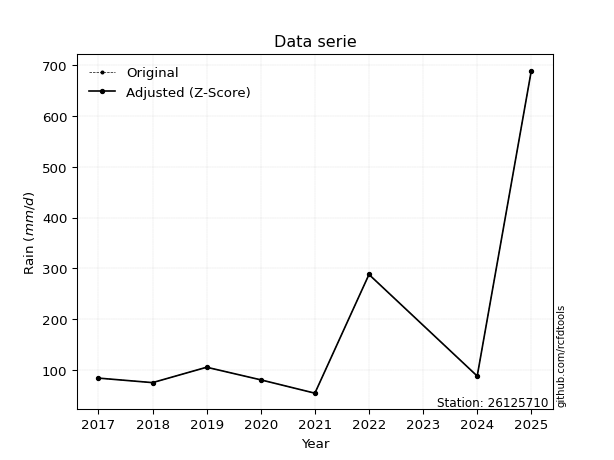</img>

</div>

> If Z-Score is active, values out of range or outliers are replaced with the station mean value.


### 4. Active continuous probability distributions from SciPy (45 of 104 available)

[scipy.stats](https://docs.scipy.org/doc/scipy/reference/stats.html) is a Python´s powerful submodule within the SciPy library for comprehensive statistical analysis, offering over 130 probability distributions (like Normal, Poisson), functions for descriptive stats (mean, variance), hypothesis testing (t-tests, chi-square), random variable generation, and statistical tests, making it essential for data science, modeling, and research. It provides tools to explore, model, and draw conclusions from data efficiently, working seamlessly with NumPy.

<div align="center">

|   id | p_dist             |   n_parameter | fit_method   | label                                                                       | active   | ref                                                                                                        |
|-----:|:-------------------|--------------:|:-------------|:----------------------------------------------------------------------------|:---------|:-----------------------------------------------------------------------------------------------------------|
|    0 | alpha              |             3 | MLE          | Alpha                                                                       | True     | [:mortar_board:](https://docs.scipy.org/doc/scipy/reference/generated/scipy.stats.alpha.html)              |
|    1 | betaprime          |             4 | MLE          | Beta prime                                                                  | True     | [:mortar_board:](https://docs.scipy.org/doc/scipy/reference/generated/scipy.stats.betaprime.html)          |
|    2 | chi2               |             3 | MLE          | Chi²                                                                        | True     | [:mortar_board:](https://docs.scipy.org/doc/scipy/reference/generated/scipy.stats.chi2.html)               |
|    3 | crystalball        |             4 | MLE          | Crystalball                                                                 | True     | [:mortar_board:](https://docs.scipy.org/doc/scipy/reference/generated/scipy.stats.crystalball.html)        |
|    4 | erlang             |             3 | MLE          | Erlang                                                                      | True     | [:mortar_board:](https://docs.scipy.org/doc/scipy/reference/generated/scipy.stats.erlang.html)             |
|    5 | expon              |             2 | MLE          | Exponential                                                                 | True     | [:mortar_board:](https://docs.scipy.org/doc/scipy/reference/generated/scipy.stats.expon.html)              |
|    6 | exponnorm          |             3 | MLE          | Exponentially modified Normal                                               | True     | [:mortar_board:](https://docs.scipy.org/doc/scipy/reference/generated/scipy.stats.exponnorm.html)          |
|    7 | f                  |             4 | MLE          | F                                                                           | True     | [:mortar_board:](https://docs.scipy.org/doc/scipy/reference/generated/scipy.stats.f.html)                  |
|    8 | fatiguelife        |             3 | MLE          | Fatigue-life (Birnbaum-Saunders)                                            | True     | [:mortar_board:](https://docs.scipy.org/doc/scipy/reference/generated/scipy.stats.fatiguelife.html)        |
|    9 | fisk               |             3 | MLE          | Fisk                                                                        | True     | [:mortar_board:](https://docs.scipy.org/doc/scipy/reference/generated/scipy.stats.fisk.html)               |
|   10 | gamma              |             3 | MLE          | Gamma                                                                       | True     | [:mortar_board:](https://docs.scipy.org/doc/scipy/reference/generated/scipy.stats.gamma.html)              |
|   11 | genexpon           |             5 | MLE          | Generalized exponential                                                     | True     | [:mortar_board:](https://docs.scipy.org/doc/scipy/reference/generated/scipy.stats.genexpon.html)           |
|   12 | genlogistic        |             3 | MLE          | Generalized logistic                                                        | True     | [:mortar_board:](https://docs.scipy.org/doc/scipy/reference/generated/scipy.stats.genlogistic.html)        |
|   13 | gibrat             |             2 | MM           | Gibrat                                                                      | True     | [:mortar_board:](https://docs.scipy.org/doc/scipy/reference/generated/scipy.stats.gibrat.html)             |
|   14 | gompertz           |             3 | MLE          | Gompertz (or truncated Gumbel)                                              | True     | [:mortar_board:](https://docs.scipy.org/doc/scipy/reference/generated/scipy.stats.gompertz.html)           |
|   15 | gumbel_l           |             2 | MM           | Gumbel Left Skew                                                            | True     | [:mortar_board:](https://docs.scipy.org/doc/scipy/reference/generated/scipy.stats.gumbel_l.html)           |
|   16 | gumbel_r           |             2 | MM           | Gumbel Right Skew                                                           | True     | [:mortar_board:](https://docs.scipy.org/doc/scipy/reference/generated/scipy.stats.gumbel_r.html)           |
|   17 | halflogistic       |             2 | MM           | Half-logistic                                                               | True     | [:mortar_board:](https://docs.scipy.org/doc/scipy/reference/generated/scipy.stats.halflogistic.html)       |
|   18 | halfnorm           |             2 | MM           | Half Normal                                                                 | True     | [:mortar_board:](https://docs.scipy.org/doc/scipy/reference/generated/scipy.stats.halfnorm.html)           |
|   19 | hypsecant          |             2 | MM           | hyperbolic secant                                                           | True     | [:mortar_board:](https://docs.scipy.org/doc/scipy/reference/generated/scipy.stats.hypsecant.html)          |
|   20 | invgamma           |             3 | MLE          | Inverted gamma                                                              | True     | [:mortar_board:](https://docs.scipy.org/doc/scipy/reference/generated/scipy.stats.invgamma.html)           |
|   21 | invgauss           |             3 | MLE          | Inverse Gaussian                                                            | True     | [:mortar_board:](https://docs.scipy.org/doc/scipy/reference/generated/scipy.stats.invgauss.html)           |
|   22 | invweibull         |             3 | MLE          | Inverted Weibull                                                            | True     | [:mortar_board:](https://docs.scipy.org/doc/scipy/reference/generated/scipy.stats.invweibull.html)         |
|   23 | johnsonsu          |             4 | MLE          | Johnson Su                                                                  | True     | [:mortar_board:](https://docs.scipy.org/doc/scipy/reference/generated/scipy.stats.johnsonsu.html)          |
|   24 | kstwobign          |             2 | MLE          | Limiting distribution of scaled Kolmogorov-Smirnov two-sided test statistic | True     | [:mortar_board:](https://docs.scipy.org/doc/scipy/reference/generated/scipy.stats.kstwobign.html)          |
|   25 | laplace            |             2 | MM           | Laplace                                                                     | True     | [:mortar_board:](https://docs.scipy.org/doc/scipy/reference/generated/scipy.stats.laplace.html)            |
|   26 | laplace_asymmetric |             3 | MLE          | Asymmetric Laplace                                                          | True     | [:mortar_board:](https://docs.scipy.org/doc/scipy/reference/generated/scipy.stats.laplace_asymmetric.html) |
|   27 | loggamma           |             3 | MLE          | Log gamma                                                                   | True     | [:mortar_board:](https://docs.scipy.org/doc/scipy/reference/generated/scipy.stats.loggamma.html)           |
|   28 | logistic           |             2 | MM           | Logistic (or Sech-squared)                                                  | True     | [:mortar_board:](https://docs.scipy.org/doc/scipy/reference/generated/scipy.stats.logistic.html)           |
|   29 | lognorm            |             3 | MLE          | Log Normal                                                                  | True     | [:mortar_board:](https://docs.scipy.org/doc/scipy/reference/generated/scipy.stats.lognorm.html)            |
|   30 | maxwell            |             2 | MM           | Maxwell                                                                     | True     | [:mortar_board:](https://docs.scipy.org/doc/scipy/reference/generated/scipy.stats.maxwell.html)            |
|   31 | mielke             |             4 | MLE          | Mielke Beta-Kappa / Dagum                                                   | True     | [:mortar_board:](https://docs.scipy.org/doc/scipy/reference/generated/scipy.stats.mielke.html)             |
|   32 | moyal              |             2 | MM           | Moyal                                                                       | True     | [:mortar_board:](https://docs.scipy.org/doc/scipy/reference/generated/scipy.stats.moyal.html)              |
|   33 | nakagami           |             3 | MLE          | Nakagami                                                                    | True     | [:mortar_board:](https://docs.scipy.org/doc/scipy/reference/generated/scipy.stats.nakagami.html)           |
|   34 | ncf                |             5 | MLE          | Non-central F distribution                                                  | True     | [:mortar_board:](https://docs.scipy.org/doc/scipy/reference/generated/scipy.stats.ncf.html)                |
|   35 | nct                |             4 | MLE          | Non-central Student’s t                                                     | True     | [:mortar_board:](https://docs.scipy.org/doc/scipy/reference/generated/scipy.stats.nct.html)                |
|   36 | norm               |             2 | MM           | Normal                                                                      | True     | [:mortar_board:](https://docs.scipy.org/doc/scipy/reference/generated/scipy.stats.norm.html)               |
|   37 | pareto             |             3 | MLE          | Pareto                                                                      | True     | [:mortar_board:](https://docs.scipy.org/doc/scipy/reference/generated/scipy.stats.pareto.html)             |
|   38 | pearson3           |             3 | MM           | Pearson type III                                                            | True     | [:mortar_board:](https://docs.scipy.org/doc/scipy/reference/generated/scipy.stats.pearson3.html)           |
|   39 | rayleigh           |             2 | MM           | Rayleigh                                                                    | True     | [:mortar_board:](https://docs.scipy.org/doc/scipy/reference/generated/scipy.stats.rayleigh.html)           |
|   40 | rice               |             3 | MLE          | Rice                                                                        | True     | [:mortar_board:](https://docs.scipy.org/doc/scipy/reference/generated/scipy.stats.rice.html)               |
|   41 | t                  |             3 | MLE          | Student’s t                                                                 | True     | [:mortar_board:](https://docs.scipy.org/doc/scipy/reference/generated/scipy.stats.t.html)                  |
|   42 | truncnorm          |             4 | MLE          | Truncated normal                                                            | True     | [:mortar_board:](https://docs.scipy.org/doc/scipy/reference/generated/scipy.stats.truncnorm.html)          |
|   43 | wald               |             2 | MM           | Wald                                                                        | True     | [:mortar_board:](https://docs.scipy.org/doc/scipy/reference/generated/scipy.stats.wald.html)               |
|   44 | weibull_min        |             3 | MLE          | Weibull minimum                                                             | True     | [:mortar_board:](https://docs.scipy.org/doc/scipy/reference/generated/scipy.stats.weibull_min.html)        |

</div>

> **n_parameter:** # arguments & localization & scale.
>
> **Fit methods:** (MLE) maximum likelihood, (MM) L-moments.
>
>**Inactive:** foldnorm, gennorm, norminvgauss, powernorm, powerlognorm, skewnorm, genextreme, anglit, arcsine, argus, beta, bradford, burr, burr12, cauchy, cosine, halfcauchy, foldcauchy, skewcauchy, wrapcauchy, dgamma, gengamma, exponweib, exponpow, truncexpon, gausshyper, genhalflogistic, genhyperbolic, geninvgauss, halfgennorm, johnsonsb, kappa4, kappa3, ksone, kstwo, loglaplace, levy, levy_l, levy_stable, ncx2, genpareto, truncpareto, lomax, powerlaw, rdist, rel_breitwigner, recipinvgauss, semicircular, studentized_range, trapezoid, triang, truncweibull_min, tukeylambda, uniform, loguniform, vonmises, vonmises_line, weibull_max, dweibull, 


## B. Probability distributions vs. Empirical distributions

A continuous probability distribution (CPD) describes probabilities for variables that can take any value within a range (like rain any time), unlike discrete variables with specific outcomes (like temperature). It uses a Probability Density Function (PDF), a curve where the total area under it equals 1, and the probability of the variable falling within an interval (a to b) is found by calculating the area under the curve between those points. A key feature is that the probability of hitting any single exact value is zero, so probabilities are always expressed for ranges, e.g., $P(a ≤ X ≤ b)$.

<div align="center">

Distributions parameters
|    |   station | p_dist                |   n |               loc |           scale | shape                  | shape1                 | shape2             | shape3   |
|---:|----------:|:----------------------|----:|------------------:|----------------:|:-----------------------|:-----------------------|:-------------------|:---------|
|  0 |  26125710 | alpha                 |   8 |      25.3226      |   110.108       | 1.9869275712804713     |                        |                    |          |
|  1 |  26125710 | betaprime             |   8 |      -1.08408     |     1.92797     | 258.55329661720157     | 5.897153452156218      |                    |          |
|  2 |  26125710 | chi2                  |   8 |      54.264       |     4.38299     | 0.2553374447111516     |                        |                    |          |
|  3 |  26125710 | crystalball           |   8 |     104.796       |    70.7436      | 9128.679992654821      | 1445.2131692607438     |                    |          |
|  4 |  26125710 | erlang                |   8 |      54.264       |    42.4547      | 0.646449344813173      |                        |                    |          |
|  5 |  26125710 | expon                 |   8 |      54.264       |    50.5316      |                        |                        |                    |          |
|  6 |  26125710 | exponnorm             |   8 |      54.2001      |     0.0203407   | 2475.208159859505      |                        |                    |          |
|  7 |  26125710 | f                     |   8 |      42.5806      |    31.1326      | 1130.3697748115371     | 3.8029857633748327     |                    |          |
|  8 |  26125710 | fatiguelife           |   8 |      49.815       |    31.447       | 1.230703145909735      |                        |                    |          |
|  9 |  26125710 | fisk                  |   8 |      51.9138      |    27.9484      | 1.5195685125835736     |                        |                    |          |
| 10 |  26125710 | gamma                 |   8 |      54.264       |    88.1018      | 0.47575346888672665    |                        |                    |          |
| 11 |  26125710 | genexpon              |   8 |      54.264       |    47.8265      | 0.9464476361907421     | 2.1136238256636428e-10 | 1.2117090713145489 |          |
| 12 |  26125710 | genlogistic           |   8 |    -173.437       |    33.0649      | 2095.99045691076       |                        |                    |          |
| 13 |  26125710 | gibrat                |   8 |      50.8272      |    32.7335      |                        |                        |                    |          |
| 14 |  26125710 | gompertz              |   8 |      54.2307      | 23305.5         | 455.1890389418945      |                        |                    |          |
| 15 |  26125710 | gumbel_l              |   8 |     136.634       |    55.1585      |                        |                        |                    |          |
| 16 |  26125710 | gumbel_r              |   8 |      72.9572      |    55.1585      |                        |                        |                    |          |
| 17 |  26125710 | halflogistic          |   8 |      20.948       |    60.4832      |                        |                        |                    |          |
| 18 |  26125710 | halfnorm              |   8 |      11.1588      |   117.356       |                        |                        |                    |          |
| 19 |  26125710 | hypsecant             |   8 |     104.796       |    45.0368      |                        |                        |                    |          |
| 20 |  26125710 | invgamma              |   8 |      42.5283      |    59.2454      | 1.901493150048707      |                        |                    |          |
| 21 |  26125710 | invgauss              |   8 |      47.9255      |    35.6547      | 1.5950262010703118     |                        |                    |          |
| 22 |  26125710 | invweibull            |   8 |      54.264       |     1.11301     | 0.067203399184882      |                        |                    |          |
| 23 |  26125710 | johnsonsu             |   8 |      51.0308      |     0.138032    | -5.2611174906143034    | 0.8735508988291321     |                    |          |
| 24 |  26125710 | kstwobign             |   8 |     -61.7979      |   197.147       |                        |                        |                    |          |
| 25 |  26125710 | laplace               |   8 |     104.796       |    50.0233      |                        |                        |                    |          |
| 26 |  26125710 | laplace_asymmetric    |   8 |      54.264       |     0.000671555 | 1.3289159503888722e-05 |                        |                    |          |
| 27 |  26125710 | loggamma              |   8 |  -35798.6         |  4397.12        | 3516.345597666321      |                        |                    |          |
| 28 |  26125710 | logistic              |   8 |     104.796       |    39.003       |                        |                        |                    |          |
| 29 |  26125710 | lognorm               |   8 |      54.264       |     0.377777    | 11.976682492753035     |                        |                    |          |
| 30 |  26125710 | maxwell               |   8 |     -62.837       |   105.048       |                        |                        |                    |          |
| 31 |  26125710 | mielke                |   8 |      34.0429      |     0.43729     | 8737.6772566016        | 1.8914456243963844     |                    |          |
| 32 |  26125710 | moyal                 |   8 |      64.3399      |    31.8458      |                        |                        |                    |          |
| 33 |  26125710 | nakagami              |   8 |      54.264       |   101.045       | 0.19777551210222405    |                        |                    |          |
| 34 |  26125710 | ncf                   |   8 |      -0.258186    |     6.14085     | 1.2403490016650762     | 13.44938278953019      | 16.326241607506596 |          |
| 35 |  26125710 | nct                   |   8 |      -0.246454    |     1.19677     | 3.778500164901068      | 65.90206862058781      |                    |          |
| 36 |  26125710 | norm                  |   8 |     104.796       |    70.7436      |                        |                        |                    |          |
| 37 |  26125710 | pareto                |   8 |      -4.29497e+09 |     4.29497e+09 | 84995631.3106863       |                        |                    |          |
| 38 |  26125710 | pearson3              |   8 |     104.796       |    70.7436      | 2.0808108479209233     |                        |                    |          |
| 39 |  26125710 | rayleigh              |   8 |     -30.541       |   107.983       |                        |                        |                    |          |
| 40 |  26125710 | rice                  |   8 |       7.85202     |    84.8608      | 0.0004030103126095491  |                        |                    |          |
| 41 |  26125710 | t                     |   8 |      95.7985      |    23.5742      | 1.7083384690676287     |                        |                    |          |
| 42 |  26125710 | truncnorm             |   8 | -208250           |  3835.12        | 54.314974111462675     | 233276.63184332894     |                    |          |
| 43 |  26125710 | wald                  |   8 |      34.052       |    70.7436      |                        |                        |                    |          |
| 44 |  26125710 | weibull_min           |   8 |      54.264       |    57.3986      | 0.4810189707696867     |                        |                    |          |
| 45 |  26125710 | logalpha              |   8 |       3.24143     |     3.95596     | 3.4624380861343034     |                        |                    |          |
| 46 |  26125710 | logbetaprime          |   8 |      -2.87764     |     9.00341     | 372.9920779866203      | 455.4252650146824      |                    |          |
| 47 |  26125710 | logchi2               |   8 |       3.99386     |     0.962746    | 1.0729598003829972     |                        |                    |          |
| 48 |  26125710 | logcrystalball        |   8 |       4.50938     |     0.475475    | 7.7682785064154425     | 205.59704882966656     |                    |          |
| 49 |  26125710 | logerlang             |   8 |       3.99386     |     0.965924    | 0.6573554605331584     |                        |                    |          |
| 50 |  26125710 | logexpon              |   8 |       3.99386     |     0.515515    |                        |                        |                    |          |
| 51 |  26125710 | logexponnorm          |   8 |       4.10058     |     0.149188    | 2.7400984538146744     |                        |                    |          |
| 52 |  26125710 | logf                  |   8 |       3.99386     |     0.58281     | 1.3785451536808238     | 383.2401673025712      |                    |          |
| 53 |  26125710 | logfatiguelife        |   8 |       3.8187      |     0.563385    | 0.6720940145325955     |                        |                    |          |
| 54 |  26125710 | logfisk               |   8 |       3.83552     |     0.548906    | 2.740893984928223      |                        |                    |          |
| 55 |  26125710 | loggamma              |   8 |       3.99386     |     0.67679     | 0.5402649757725673     |                        |                    |          |
| 56 |  26125710 | loggenexpon           |   8 |       3.99386     |     0.807564    | 1.3803207255410164     | 1.0680073967009602     | 0.353756407669912  |          |
| 57 |  26125710 | loggenlogistic        |   8 |       2.22408     |     0.302105    | 1011.5107698890606     |                        |                    |          |
| 58 |  26125710 | loggibrat             |   8 |       4.14662     |     0.220021    |                        |                        |                    |          |
| 59 |  26125710 | loggompertz           |   8 |       3.99386     |     5.3369      | 9.43344434642902       |                        |                    |          |
| 60 |  26125710 | loggumbel_l           |   8 |       4.72336     |     0.370726    |                        |                        |                    |          |
| 61 |  26125710 | loggumbel_r           |   8 |       4.29539     |     0.370726    |                        |                        |                    |          |
| 62 |  26125710 | loghalflogistic       |   8 |       3.94583     |     0.406514    |                        |                        |                    |          |
| 63 |  26125710 | loghalfnorm           |   8 |       3.88003     |     0.788764    |                        |                        |                    |          |
| 64 |  26125710 | loghypsecant          |   8 |       4.50938     |     0.302697    |                        |                        |                    |          |
| 65 |  26125710 | loginvgamma           |   8 |       3.64246     |     3.3409      | 4.843384092172603      |                        |                    |          |
| 66 |  26125710 | loginvgauss           |   8 |       3.79365     |     1.61098     | 0.44428379759362274    |                        |                    |          |
| 67 |  26125710 | loginvweibull         |   8 |       3.06205     |     1.21787     | 4.494755397802146      |                        |                    |          |
| 68 |  26125710 | logjohnsonsu          |   8 |       4.35538     |     0.140232    | -0.2590082970877804    | 0.7285012083235958     |                    |          |
| 69 |  26125710 | logkstwobign          |   8 |       3.17363     |     1.55522     |                        |                        |                    |          |
| 70 |  26125710 | loglaplace            |   8 |       4.50938     |     0.336211    |                        |                        |                    |          |
| 71 |  26125710 | loglaplace_asymmetric |   8 |       4.31821     |     0.266284    | 0.7035312529913618     |                        |                    |          |
| 72 |  26125710 | logloggamma           |   8 |    -192.435       |    25.1162      | 2543.8349154141824     |                        |                    |          |
| 73 |  26125710 | loglogistic           |   8 |       4.50938     |     0.262143    |                        |                        |                    |          |
| 74 |  26125710 | loglognorm            |   8 |       3.99386     |     0.00614224  | 11.453711911146183     |                        |                    |          |
| 75 |  26125710 | logmaxwell            |   8 |       3.3827      |     0.706039    |                        |                        |                    |          |
| 76 |  26125710 | logmielke             |   8 |       3.08125     |     0.499899    | 216.7519976773201      | 4.436663012105847      |                    |          |
| 77 |  26125710 | logmoyal              |   8 |       4.23747     |     0.214039    |                        |                        |                    |          |
| 78 |  26125710 | lognakagami           |   8 |       3.99386     |     0.76803     | 0.4038235781398363     |                        |                    |          |
| 79 |  26125710 | logncf                |   8 |      -0.371662    |     4.83396     | 497.39990186781006     | 457.2886388985762      | 2.434896809281595  |          |
| 80 |  26125710 | lognct                |   8 |       0.159147    |     0.0495564   | 53.57688666754265      | 86.50771123264911      |                    |          |
| 81 |  26125710 | lognorm               |   8 |       4.50938     |     0.475475    |                        |                        |                    |          |
| 82 |  26125710 | logpareto             |   8 |       3.9937      |     0.00015966  | 0.14334298276125929    |                        |                    |          |
| 83 |  26125710 | logpearson3           |   8 |       4.50938     |     0.475474    | 1.563203352665491      |                        |                    |          |
| 84 |  26125710 | lograyleigh           |   8 |       3.59976     |     0.725765    |                        |                        |                    |          |
| 85 |  26125710 | logrice               |   8 |       3.7752      |     0.618504    | 0.00016804142475155778 |                        |                    |          |
| 86 |  26125710 | logt                  |   8 |       4.4262      |     0.139482    | 0.987083236354926      |                        |                    |          |
| 87 |  26125710 | logtruncnorm          |   8 |      -0.115152    |     1.61559     | 2.5433453333547513     | 6.748999196394392      |                    |          |
| 88 |  26125710 | logwald               |   8 |       4.03388     |     0.475495    |                        |                        |                    |          |
| 89 |  26125710 | logweibull_min        |   8 |       3.99386     |     0.497615    | 0.6620947879385886     |                        |                    |          |

</div>

> **loc** (Location parameter): This shifts the distribution along the x-axis. For many common distributions, like the normal (Gaussian) distribution, loc represents the mean $μ$. For others, like the uniform distribution, it might represent the minimum value, or for the beta distribution, the left end of the support interval.
>
> **scale** (Scale parameter): This determines the width or spread of the distribution. For the normal distribution, scale represents the standard deviation $σ$. For a uniform distribution, it defines the length of the interval (from $loc$ to $loc + scale$).
>
> **shape** (Shape parameters): Refers to parameters that define the specific form of a probability distribution, distinct from its location (loc) and scale (scale). These parameters are required arguments for most distribution functions. For example, a normal (Gaussian) distribution is fully defined by its location (mean) and scale (standard deviation), so it has no specific shape parameters beyond loc and scale. However, other distributions have intrinsic properties that need specification, as Gamma distribution that takes a shape parameter, often named $a$ or $alpha$.


### 0. Cumulative distribution values - CDF (90 evaluated)

> Ordered by x ascending and calculating $log(f(x))$ separately. 

|   id |   Station |   date |       x |   count |    mean |     std |      zscore |   Value_initial |   station |   m |     alpha |   alpha_pdf |   betaprime |   betaprime_pdf |      chi2 |    chi2_pdf |   crystalball |   crystalball_pdf |      erlang |    erlang_pdf |    expon |   expon_pdf |   exponnorm |   exponnorm_pdf |         f |       f_pdf |   fatiguelife |   fatiguelife_pdf |      fisk |    fisk_pdf |       gamma |   gamma_pdf |    genexpon |   genexpon_pdf |   genlogistic |   genlogistic_pdf |    gibrat |   gibrat_pdf |   gompertz |   gompertz_pdf |   gumbel_l |   gumbel_l_pdf |   gumbel_r |   gumbel_r_pdf |   halflogistic |   halflogistic_pdf |   halfnorm |   halfnorm_pdf |   hypsecant |   hypsecant_pdf |   invgamma |   invgamma_pdf |   invgauss |   invgauss_pdf |   invweibull |   invweibull_pdf |   johnsonsu |   johnsonsu_pdf |   kstwobign |   kstwobign_pdf |   laplace |   laplace_pdf |   laplace_asymmetric |   laplace_asymmetric_pdf |   loggamma |   loggamma_pdf |   logistic |   logistic_pdf |   lognorm |   lognorm_pdf |   maxwell |   maxwell_pdf |   mielke |   mielke_pdf |    moyal |   moyal_pdf |    nakagami |   nakagami_pdf |      ncf |     ncf_pdf |       nct |     nct_pdf |     norm |    norm_pdf |   pareto |   pareto_pdf |   pearson3 |   pearson3_pdf |   rayleigh |   rayleigh_pdf |     rice |    rice_pdf |        t |       t_pdf |   truncnorm |   truncnorm_pdf |     wald |    wald_pdf |   weibull_min |   weibull_min_pdf |   logalpha |   logalpha_pdf |   logbetaprime |   logbetaprime_pdf |    logchi2 |   logchi2_pdf |   logcrystalball |   logcrystalball_pdf |   logerlang |   logerlang_pdf |   logexpon |   logexpon_pdf |   logexponnorm |   logexponnorm_pdf |        logf |     logf_pdf |   logfatiguelife |   logfatiguelife_pdf |   logfisk |   logfisk_pdf |   loggenexpon |   loggenexpon_pdf |   loggenlogistic |   loggenlogistic_pdf |   loggibrat |   loggibrat_pdf |   loggompertz |   loggompertz_pdf |   loggumbel_l |   loggumbel_l_pdf |   loggumbel_r |   loggumbel_r_pdf |   loghalflogistic |   loghalflogistic_pdf |   loghalfnorm |   loghalfnorm_pdf |   loghypsecant |   loghypsecant_pdf |   loginvgamma |   loginvgamma_pdf |   loginvgauss |   loginvgauss_pdf |   loginvweibull |   loginvweibull_pdf |   logjohnsonsu |   logjohnsonsu_pdf |   logkstwobign |   logkstwobign_pdf |   loglaplace |   loglaplace_pdf |   loglaplace_asymmetric |   loglaplace_asymmetric_pdf |   logloggamma |   logloggamma_pdf |   loglogistic |   loglogistic_pdf |   loglognorm |   loglognorm_pdf |   logmaxwell |   logmaxwell_pdf |   logmielke |   logmielke_pdf |   logmoyal |   logmoyal_pdf |   lognakagami |   lognakagami_pdf |   logncf |   logncf_pdf |   lognct |   lognct_pdf |   logpareto |   logpareto_pdf |   logpearson3 |   logpearson3_pdf |   lograyleigh |   lograyleigh_pdf |   logrice |   logrice_pdf |     logt |   logt_pdf |   logtruncnorm |   logtruncnorm_pdf |   logwald |   logwald_pdf |   logweibull_min |   logweibull_min_pdf |
|-----:|----------:|-------:|--------:|--------:|--------:|--------:|------------:|----------------:|----------:|----:|----------:|------------:|------------:|----------------:|----------:|------------:|--------------:|------------------:|------------:|--------------:|---------:|------------:|------------:|----------------:|----------:|------------:|--------------:|------------------:|----------:|------------:|------------:|------------:|------------:|---------------:|--------------:|------------------:|----------:|-------------:|-----------:|---------------:|-----------:|---------------:|-----------:|---------------:|---------------:|-------------------:|-----------:|---------------:|------------:|----------------:|-----------:|---------------:|-----------:|---------------:|-------------:|-----------------:|------------:|----------------:|------------:|----------------:|----------:|--------------:|---------------------:|-------------------------:|-----------:|---------------:|-----------:|---------------:|----------:|--------------:|----------:|--------------:|---------:|-------------:|---------:|------------:|------------:|---------------:|---------:|------------:|----------:|------------:|---------:|------------:|---------:|-------------:|-----------:|---------------:|-----------:|---------------:|---------:|------------:|---------:|------------:|------------:|----------------:|---------:|------------:|--------------:|------------------:|-----------:|---------------:|---------------:|-------------------:|-----------:|--------------:|-----------------:|---------------------:|------------:|----------------:|-----------:|---------------:|---------------:|-------------------:|------------:|-------------:|-----------------:|---------------------:|----------:|--------------:|--------------:|------------------:|-----------------:|---------------------:|------------:|----------------:|--------------:|------------------:|--------------:|------------------:|--------------:|------------------:|------------------:|----------------------:|--------------:|------------------:|---------------:|-------------------:|--------------:|------------------:|--------------:|------------------:|----------------:|--------------------:|---------------:|-------------------:|---------------:|-------------------:|-------------:|-----------------:|------------------------:|----------------------------:|--------------:|------------------:|--------------:|------------------:|-------------:|-----------------:|-------------:|-----------------:|------------:|----------------:|-----------:|---------------:|--------------:|------------------:|---------:|-------------:|---------:|-------------:|------------:|----------------:|--------------:|------------------:|--------------:|------------------:|----------:|--------------:|---------:|-----------:|---------------:|-------------------:|----------:|--------------:|-----------------:|---------------------:|
|    0 |  26125710 |   2021 |  54.264 |       8 | 104.796 | 75.6281 | -0.66816    |          54.264 |  26125710 |   1 | 0.0353932 | 0.0102949   |    0.111763 |     0.00942305  | 0.0125846 | 2.26118e+11 |      0.237523 |       0.0043695   | 1.03928e-08 | 416.719       | 0        | 0.0197896   |  0.00126799 |     0.0198201   | 0.0337595 | 0.0123527   |     0.0318248 |       0.0198006   | 0.0227042 | 0.0143466   | 2.49018e-08 | 1.66733e+06 | 3.58135e-13 |     0.0197892  |      0.117658 |       0.00761099  | 0.0121027 |  0.00915538  | 0.00064997 |    0.0195188   |   0.201183 |    0.00325304  |   0.245759 |    0.00625287  |       0.268656 |        0.00767009  |   0.286606 |    0.00635533  |    0.200406 |     0.00416163  |  0.0337599 |    0.0123528   |  0.0322366 |    0.016204    |   0.00012417 |      1.05624e+10 |   0.0286992 |     0.0177031   |    0.121128 |     0.00638647  |  0.18208  |   0.0036399   |          2.95127e-09 |               0.0197886  | 7.0576e-09 |    8.58606e+06 |   0.214909 |    0.00432591  |  0.139136 |     0.466148  |  0.257203 |   0.00507062  |      nan |          nan | 0.241439 | 0.00738922  | 3.22323e-07 |    1.79433e+07 | 0.244551 | 0.00844595  | 0.0831543 | 0.00986089  | 0.237523 | 0.0043695   | 0        |  0.0197896   |   0.244099 |    0.0113866   |   0.265372 |    0.00534291  | 0.138913 | 0.00554961  | 0.12052  | 0.00361906  | 2.20924e-05 |     0.014167    | 0.150409 | 0.0151203   |   2.22988e-08 |       1.50957e+06 |  0.0363245 |       0.556642 |       0.157137 |          0.4996    | 4.5987e-09 |   5.55544e+06 |         0.139136 |            0.466148  | 9.18297e-11 |   135929        |   0        |      1.93981   |      0.0429092 |          0.475268  | 3.23939e-11 | 50278.7      |        0.0329766 |            0.73466   | 0.0320632 |     0.537229  |   1.83766e-10 |         1.70924   |         0.055839 |            0.532536  |    0        |       0         |    4.7883e-13 |         1.76759   |      0.13044  |       0.327835    |      0.104829 |         0.637759  |         0.0590111 |             1.22569   |      0.114745 |         1.00109   |       0.114686 |          0.370737  |     0.0348002 |         0.607211  |     0.0332937 |         0.701099  |       0.0357454 |           0.574404  |      0.0694561 |          0.25074   |      0.0563275 |          0.540498  |     0.107911 |        0.320961  |               0.0586178 |                   0.312897  |      0.151235 |          0.467548 |      0.122761 |         0.410809  |   0.00412384 |      2.39358e+12 |     0.138448 |        0.58218   |    0.038011 |       0.584465  |  0.0772903 |      0.691593  |   3.85624e-13 |        701.319    | 0.121592 |    0.504925  | 0.105411 |    0.525368  |    0        |     897.801     |     0.0602468 |         0.964516  |      0.137076 |         0.645629  | 0.0605813 |     0.536971  | 0.100645 |  0.215357  |    4.95327e-10 |          1.77165   |  0        |     0         |      1.08606e-10 |       161922         |
|    1 |  26125710 |   2025 |  63.2   |       8 | 104.796 | 75.6281 | -0.550002   |          63.2   |  26125710 |   2 | 0.183072  | 0.020534    |    0.207022 |     0.0116019   | 0.969402  | 0.00549293  |      0.278274 |       0.00474407  | 0.374473    |   0.0237921   | 0.162086 | 0.016582    |  0.16369    |     0.0166108   | 0.199655  | 0.0211905   |     0.237199  |       0.0204871   | 0.201345  | 0.0216507   | 0.368036    | 0.0182846   | 0.162083    |     0.0165817  |      0.195267 |       0.00964231  | 0.165302  |  0.0200865   | 0.160725   |    0.0163986   |   0.232124 |    0.00367698  |   0.303157 |    0.00655962  |       0.335743 |        0.0073349   |   0.342557 |    0.00616216  |    0.240639 |     0.00484856  |  0.199655  |    0.0211905   |  0.224052  |    0.0213724   |   0.419215   |      0.00274088  |   0.228801  |     0.0217318   |    0.183725 |     0.00755169  |  0.217692 |   0.00435182  |          0.162079    |               0.0165813  | 0.466032   |    1.42374     |   0.256074 |    0.00488425  |  0.222554 |     0.626857  |  0.303703 |   0.00532331  |      nan |          nan | 0.30865  | 0.00759574  | 0.302569    |    0.0133759   | 0.320816 | 0.00854721  | 0.189532  | 0.013431    | 0.278274 | 0.00474407  | 0.162086 |  0.016582    |   0.338352 |    0.00977235  |   0.313951 |    0.00551536  | 0.191598 | 0.00621319  | 0.159922 | 0.0053208   | 0.118935    |     0.0124829   | 0.282619 | 0.0140165   |   0.335517    |       0.0146203   |  0.181616  |       1.27503  |       0.244195 |          0.638443  | 0.281079   |   0.939235    |         0.222554 |            0.626857  | 0.310001    |        1.21399  |   0.255997 |      1.44322   |      0.164782  |          1.11449   | 0.314818    |     1.27708  |        0.207089  |            1.34617   | 0.173773  |     1.26625   |   0.234439    |         1.37393   |         0.175002 |            1.00878   |    0        |       0         |    0.239168   |         1.38381   |      0.190111 |       0.460642    |      0.224245 |         0.904306  |         0.241701  |             1.15812   |      0.26432  |         0.955536  |       0.18634  |          0.581037  |     0.190104  |         1.31273   |     0.203182  |         1.34328   |       0.185266  |           1.29485   |      0.130139  |          0.612605  |      0.171063  |          0.933511  |     0.169816 |        0.505088  |               0.13226   |                   0.70599   |      0.233669 |          0.612177 |      0.200205 |         0.610823  |   0.610414   |      0.219676    |     0.239723 |        0.73653   |    0.187289 |       1.28473   |  0.215962  |      1.07264   |   0.210789    |          1.10417  | 0.214077 |    0.704226  | 0.20436  |    0.765754  |    0.626074 |       0.351236  |     0.231998  |         1.18834   |      0.246891 |         0.781427  | 0.164733  |     0.810288  | 0.148422 |  0.45287   |    0.239779    |          1.38747   |  0.098801 |     2.12683   |      0.366759    |            1.25663   |
|    2 |  26125710 |   2018 |  75.054 |       8 | 104.796 | 75.6281 | -0.393262   |          75.054 |  26125710 |   3 | 0.420016  | 0.0177247   |    0.349336 |     0.0120073   | 0.995372  | 0.000680182 |      0.337091 |       0.00516229  | 0.584257    |   0.0133512   | 0.337295 | 0.0131147   |  0.339131   |     0.0131262   | 0.426246  | 0.0161663   |     0.42895   |       0.0127158   | 0.428769  | 0.0160838   | 0.52768     | 0.0102661   | 0.337289    |     0.0131145  |      0.319367 |       0.0110217   | 0.38173   |  0.0157379   | 0.334283   |    0.013014    |   0.279241 |    0.00427881  |   0.38186  |    0.00666473  |       0.419661 |        0.00681085  |   0.413871 |    0.00586225  |    0.303591 |     0.00576446  |  0.426246  |    0.0161663   |  0.43278   |    0.0140855   |   0.439811   |      0.00116779  |   0.440892  |     0.0143469   |    0.279071 |     0.00840271  |  0.275904 |   0.00551551  |          0.337282    |               0.0131143  | 0.64602    |    0.780498    |   0.318093 |    0.00556137  |  0.343821 |     0.773893  |  0.368176 |   0.0055296   |      nan |          nan | 0.398016 | 0.00740783  | 0.422074    |    0.00797443  | 0.420056 | 0.00811082  | 0.354996  | 0.0138127   | 0.337091 | 0.00516229  | 0.337295 |  0.0131147   |   0.443797 |    0.00808697  |   0.380058 |    0.00561414  | 0.269159 | 0.0068201   | 0.24249  | 0.00886854  | 0.255152    |     0.0105535   | 0.430793 | 0.010973    |   0.458573    |       0.00768592  |  0.416377  |       1.33143  |       0.364226 |          0.7466    | 0.408911   |   0.605359    |         0.343821 |            0.773893  | 0.476372    |        0.78446  |   0.466966 |      1.03398   |      0.386032  |          1.325     | 0.489961    |     0.823852 |        0.428911  |            1.17152   | 0.412806  |     1.37644   |   0.442039    |         1.05142   |         0.372684 |            1.21702   |    0.401821 |       2.25426   |    0.446278   |         1.04008   |      0.284842 |       0.646725    |      0.390511 |         0.990481  |         0.428466  |             1.00417   |      0.421461 |         0.866924  |       0.31114  |          0.871853  |     0.421794  |         1.27583   |     0.427646  |         1.1945    |       0.418906  |           1.30423   |      0.326375  |          1.81044   |      0.349163  |          1.08463   |     0.283161 |        0.84221   |               0.331084  |                   1.7673    |      0.350898 |          0.742576 |      0.325359 |         0.837332  |   0.635448   |      0.101137    |     0.375366 |        0.824735  |    0.419111 |       1.29569   |  0.407608  |      1.09545   |   0.381731    |          0.902804 | 0.350209 |    0.862105  | 0.352728 |    0.935193  |    0.664403 |       0.148242  |     0.426991  |         1.04949   |      0.387351 |         0.835627  | 0.319815  |     0.965495  | 0.290968 |  1.42059   |    0.447378    |          1.04202   |  0.444853 |     1.58509   |      0.529156    |            0.72396   |
|    3 |  26125710 |   2020 |  80.535 |       8 | 104.796 | 75.6281 | -0.320789   |          80.535 |  26125710 |   4 | 0.509016  | 0.0147556   |    0.413978 |     0.0115307   | 0.997896  | 0.000296777 |      0.365823 |       0.00531723  | 0.650097    |   0.0108025   | 0.405415 | 0.0117666   |  0.407298   |     0.0117723   | 0.507054  | 0.0133799   |     0.492418  |       0.0105508   | 0.509036  | 0.0132688   | 0.57893     | 0.00853317  | 0.405409    |     0.0117665  |      0.380185 |       0.0111173   | 0.461367  |  0.0133659   | 0.401932   |    0.0116943   |   0.303481 |    0.00456689  |   0.418266 |    0.00660961  |       0.45627  |        0.00654576  |   0.445586 |    0.00570884  |    0.336269 |     0.00615321  |  0.507054  |    0.0133799   |  0.502836  |    0.0115809   |   0.445483   |      0.000921462 |   0.512291  |     0.011806    |    0.325572 |     0.00854064  |  0.307853 |   0.00615419  |          0.4054      |               0.0117663  | 0.695938   |    0.642511    |   0.349322 |    0.00582766  |  0.399818 |     0.812444  |  0.398621 |   0.00557462  |      nan |          nan | 0.438056 | 0.00719188  | 0.462624    |    0.00688818  | 0.4636   | 0.00776738  | 0.428538  | 0.0129566   | 0.365823 | 0.00531723  | 0.405415 |  0.0117666   |   0.486292 |    0.00743046  |   0.410838 |    0.00561235  | 0.307047 | 0.00699394  | 0.296694 | 0.0109304   | 0.310808    |     0.00976523  | 0.487332 | 0.00968158  |   0.496737    |       0.00632719  |  0.505822  |       1.19925  |       0.417716 |          0.768791  | 0.448906   |   0.532758    |         0.399818 |            0.812444  | 0.527902    |        0.681739 |   0.535083 |      0.90185   |      0.476002  |          1.21644   | 0.543973    |     0.712952 |        0.506925  |            1.04124   | 0.505301  |     1.23858   |   0.51204     |         0.936536  |         0.457622 |            1.18366   |    0.538044 |       1.64054   |    0.515367   |         0.92241   |      0.333326 |       0.729124    |      0.459557 |         0.96379   |         0.496545  |             0.926713  |      0.480996 |         0.821652  |       0.376326 |          0.973201  |     0.507083  |         1.13976   |     0.507205  |         1.06149   |       0.506223  |           1.16762   |      0.465112  |          2.00869   |      0.425121  |          1.06443   |     0.349204 |        1.03864   |               0.44474   |                   1.46702   |      0.404523 |          0.776787 |      0.386897 |         0.904879  |   0.641879   |      0.0825777   |     0.43383  |        0.831377  |    0.505919 |       1.16166   |  0.482434  |      1.02298   |   0.443108    |          0.839643 | 0.412167 |    0.892196  | 0.419587 |    0.957027  |    0.673727 |       0.118405  |     0.497816  |         0.958941  |      0.446125 |         0.829578  | 0.388557  |     0.980577  | 0.416601 |  2.12192   |    0.516576    |          0.923568  |  0.544172 |     1.24663   |      0.575977    |            0.610056  |
|    4 |  26125710 |   2017 |  83.958 |       8 | 104.796 | 75.6281 | -0.275528   |          83.958 |  26125710 |   5 | 0.556489  | 0.0130059   |    0.452741 |     0.011105    | 0.998695  | 0.000180486 |      0.384168 |       0.00539987  | 0.684859    |   0.00954334  | 0.444359 | 0.0109959   |  0.446255   |     0.0109985   | 0.550184  | 0.0118501   |     0.526651  |       0.00948094  | 0.551767  | 0.0117282   | 0.606666    | 0.00769752  | 0.444352    |     0.0109958  |      0.418111 |       0.0110244   | 0.504813  |  0.0120406   | 0.440654   |    0.0109388   |   0.319423 |    0.00474806  |   0.440788 |    0.00654639  |       0.478385 |        0.00637489  |   0.464957 |    0.00560886  |    0.357714 |     0.00637334  |  0.550184  |    0.0118501   |  0.540239  |    0.0103057   |   0.448446   |      0.000813934 |   0.550411  |     0.0104991   |    0.354846 |     0.00855503  |  0.329656 |   0.00659005  |          0.444343    |               0.0109957  | 0.721285   |    0.576976    |   0.369525 |    0.00597329  |  0.433971 |     0.827521  |  0.417728 |   0.00558681  |      nan |          nan | 0.462399 | 0.00702766  | 0.485293    |    0.00637295  | 0.489777 | 0.00752445  | 0.471729  | 0.0122654   | 0.384168 | 0.00539987  | 0.444359 |  0.0109959   |   0.511073 |    0.00705222  |   0.430025 |    0.00559689  | 0.331123 | 0.00706888  | 0.33632  | 0.0122094   | 0.343437    |     0.00930306  | 0.519203 | 0.00894991  |   0.517276    |       0.0056952   |  0.553835  |       1.10673  |       0.449865 |          0.775063  | 0.470336   |   0.497697    |         0.433971 |            0.827521  | 0.5552      |        0.63094  |   0.571147 |      0.831893  |      0.524853  |          1.12919   | 0.57248     |     0.657859 |        0.548655  |            0.964091  | 0.554794  |     1.1382    |   0.549696    |         0.873315  |         0.506045 |            1.14055   |    0.600321 |       1.36154   |    0.552419   |         0.858558  |      0.364683 |       0.777392    |      0.499115 |         0.935581  |         0.534131  |             0.879065  |      0.514606 |         0.793055  |       0.417793 |          1.01671   |     0.552695  |         1.05145   |     0.54972   |         0.981475  |       0.552935  |           1.07624   |      0.545294  |          1.81611   |      0.468888  |          1.03687   |     0.395227 |        1.17553   |               0.502566  |                   1.31424   |      0.437156 |          0.790295 |      0.42517  |         0.932317  |   0.645142   |      0.0744622   |     0.468375 |        0.827518  |    0.552411 |       1.07163   |  0.523922  |      0.969552  |   0.477319    |          0.80433  | 0.449477 |    0.89915   | 0.459442 |    0.956317  |    0.678379 |       0.10559   |     0.536575  |         0.903245  |      0.480457 |         0.819213  | 0.429335  |     0.977276  | 0.509365 |  2.27435   |    0.553667    |          0.859275  |  0.592587 |     1.08398   |      0.600218    |            0.556026  |
|    5 |  26125710 |   2024 |  88     |       8 | 104.796 | 75.6281 | -0.222082   |          88     |  26125710 |   6 | 0.605226  | 0.011151    |    0.496469 |     0.0105198   | 0.99925   | 0.000101822 |      0.406167 |       0.00548256  | 0.720831    |   0.00829386  | 0.487073 | 0.0101506   |  0.488973   |     0.01015     | 0.59481   | 0.0102712   |     0.56277   |       0.00842338  | 0.59588   | 0.0101402   | 0.636068    | 0.00687654  | 0.487066    |     0.0101505  |      0.462233 |       0.0107859   | 0.5506    |  0.0106457   | 0.48317    |    0.0101091   |   0.339047 |    0.00496175  |   0.467056 |    0.00644638  |       0.503737 |        0.00616905  |   0.487383 |    0.00548704  |    0.383952 |     0.00660325  |  0.59481   |    0.0102712   |  0.579244  |    0.00903264  |   0.451528   |      0.000715178 |   0.590116  |     0.00918507  |    0.389354 |     0.00850907  |  0.357399 |   0.00714465  |          0.487056    |               0.0101505  | 0.746883   |    0.51352     |   0.393977 |    0.00612156  |  0.473138 |     0.837137  |  0.440313 |   0.00558579  |      nan |          nan | 0.490374 | 0.00681128  | 0.510004    |    0.0058706   | 0.519578 | 0.00721806  | 0.519519  | 0.0113722   | 0.406167 | 0.00548256  | 0.487073 |  0.0101506   |   0.538722 |    0.00663369  |   0.452589 |    0.00556508  | 0.35982  | 0.00712492  | 0.388436 | 0.0135264   | 0.379984    |     0.00878539  | 0.553758 | 0.00816095  |   0.539029    |       0.00509001  |  0.603337  |       0.998737 |       0.486355 |          0.775961  | 0.492907   |   0.463194    |         0.473138 |            0.837137  | 0.583651    |        0.580259 |   0.608532 |      0.759374  |      0.57549   |          1.02432   | 0.60209     |     0.602777 |        0.59199   |            0.879831  | 0.605539  |     1.02007   |   0.589159    |         0.805931  |         0.55823  |            1.07693   |    0.658193 |       1.11017   |    0.591185   |         0.791137  |      0.402484 |       0.830007    |      0.542189 |         0.895259  |         0.574183  |             0.824466  |      0.551109 |         0.759399  |       0.466371 |          1.04572   |     0.599777  |         0.951486  |     0.593789  |         0.893595  |       0.601078  |           0.971711  |      0.623124  |          1.48877   |      0.516702  |          0.995311  |     0.454553 |        1.35199   |               0.560677  |                   1.1607    |      0.47455  |          0.799114 |      0.469483 |         0.950126  |   0.648461   |      0.0669946   |     0.507056 |        0.816647  |    0.600368 |       0.968382  |  0.567989  |      0.904197  |   0.514225    |          0.765643 | 0.491753 |    0.897331  | 0.504166 |    0.944055  |    0.68306  |       0.0939367 |     0.577562  |         0.840234  |      0.518594 |         0.802052  | 0.475004  |     0.963595  | 0.611542 |  2.00519   |    0.592455    |          0.791382  |  0.639807 |     0.929279  |      0.6251      |            0.5037    |
|    6 |  26125710 |   2019 | 105.354 |       8 | 104.796 | 75.6281 |  0.00738317 |         105.354 |  26125710 |   7 | 0.746966  | 0.00582674  |    0.654617 |     0.00769556  | 0.999924  | 9.7912e-06  |      0.503149 |       0.0056391   | 0.830707    |   0.00475891  | 0.636163 | 0.00720018  |  0.637967   |     0.00719071  | 0.729391  | 0.00576186  |     0.680256  |       0.00544308  | 0.728097  | 0.00562931  | 0.733028    | 0.00454289  | 0.636156    |     0.00720018 |      0.633434 |       0.00874626  | 0.695077  |  0.00642325  | 0.631976   |    0.00720382  |   0.432873 |    0.00583153  |   0.573611 |    0.00577998  |       0.602946 |        0.00526142  |   0.577819 |    0.00492651  |    0.503946 |     0.00706724  |  0.729391  |    0.00576185  |  0.701551  |    0.00547349  |   0.461512   |      0.000469415 |   0.713638  |     0.00547176  |    0.531417 |     0.00773325  |  0.50555  |   0.0098844   |          0.636145    |               0.00720018 | 0.822367   |    0.340307    |   0.503579 |    0.00640944  |  0.622162 |     0.799388  |  0.536071 |   0.00540417  |      nan |          nan | 0.599434 | 0.00573185  | 0.598208    |    0.00443968  | 0.63271  | 0.00581302  | 0.683245  | 0.00760565  | 0.503149 | 0.0056391   | 0.636163 |  0.00720018  |   0.640136 |    0.0051251   |   0.547013 |    0.00527932  | 0.483179 | 0.00699744  | 0.63487  | 0.0129925   | 0.515152    |     0.00687068  | 0.671232 | 0.00557299  |   0.611528    |       0.0034583   |  0.748284  |       0.629773 |       0.62248  |          0.722423  | 0.566735   |   0.3643      |         0.622162 |            0.799388  | 0.673847    |        0.432117 |   0.723901 |      0.535579  |      0.726203  |          0.669543  | 0.695081    |     0.441567 |        0.724346  |            0.604451  | 0.751411  |     0.622993  |   0.713502    |         0.585256  |         0.725175 |            0.771229  |    0.800125 |       0.547981  |    0.713136   |         0.57418   |      0.566919 |       0.977583    |      0.68612  |         0.697181  |         0.703967  |             0.620434  |      0.6756   |         0.622466  |       0.649733 |          0.937365  |     0.739534  |         0.618281  |     0.72746   |         0.606205  |       0.742892  |           0.622088  |      0.799856  |          0.612888  |      0.677414  |          0.7814    |     0.677998 |        0.957735  |               0.726938  |                   0.721437  |      0.617097 |          0.76783  |      0.637467 |         0.88159   |   0.658657   |      0.0482899   |     0.646635 |        0.721935  |    0.741883 |       0.62162   |  0.707652  |      0.651515  |   0.639254    |          0.625477 | 0.646843 |    0.805621  | 0.663602 |    0.807536  |    0.697113 |       0.0654237 |     0.708036  |         0.615524  |      0.654122 |         0.694443  | 0.638346  |     0.833952  | 0.825977 |  0.607136  |    0.714313    |          0.573001  |  0.767993 |     0.538577  |      0.701742    |            0.360086  |
|    7 |  26125710 |   2022 | 288     |       8 | 104.796 | 75.6281 |  2.42244    |         288     |  26125710 |   8 | 0.964154  | 0.000190758 |    0.989907 |     0.000155481 | 1         | 2.32212e-15 |      0.995197 |       0.000197206 | 0.998486    |   3.76384e-05 | 0.990202 | 0.000193906 |  0.990378   |     0.000191106 | 0.968684  | 0.000222844 |     0.973869  |       0.000322299 | 0.962403  | 0.000232894 | 0.980365    | 0.000257501 | 0.990201    |     0.00019392 |      0.998179 |       5.50098e-05 | 0.97617   |  0.000236704 | 0.989835   |    0.000200535 |   1        |    4.96555e-08 |   0.979934 |    0.000360106 |       0.976107 |        0.000390313 |   0.981675 |    0.000420781 |    0.989106 |     0.000241839 |  0.968684  |    0.000222843 |  0.970215  |    0.000296327 |   0.497513   |      9.98639e-05 |   0.967898  |     0.000265281 |    0.996314 |     0.000132702 |  0.987164 |   0.000256593 |          0.990199    |               0.00019394 | 0.970198   |    0.0503917   |   0.990962 |    0.000229643 |  0.992371 |     0.0442164 |  0.989079 |   0.000320558 |      nan |          nan | 0.976188 | 0.000373759 | 0.952672    |    0.000646458 | 0.977015 | 0.000306683 | 0.987467  | 0.000156334 | 0.995197 | 0.000197206 | 0.990202 |  0.000193906 |   0.971934 |    0.000388178 |   0.987106 |    0.000352238 | 0.9957   | 0.000167274 | 0.988551 | 9.98979e-05 | 0.963604    |     0.000516215 | 0.971119 | 0.000325797 |   0.859828    |       0.000566807 |  0.966542  |       0.050567 |       0.982548 |          0.0725244 | 0.795615   |   0.140904    |         0.992371 |            0.0442164 | 0.90594     |        0.111216 |   0.960747 |      0.0761428 |      0.976608  |          0.0572223 | 0.922383    |     0.10135  |        0.969235  |            0.0661965 | 0.964312  |     0.0516171 |   0.969635    |         0.0727289 |         0.988548 |            0.0376886 |    0.973217 |       0.0408304 |    0.968687   |         0.0756704 |      0.999997 |       0.000113576 |      0.975311 |         0.0657686 |         0.971144  |             0.0699604 |      0.976204 |         0.0786125 |       0.985917 |          0.0465106 |     0.967491  |         0.0569239 |     0.968756  |         0.0646835 |       0.967513  |           0.0552208 |      0.96957   |          0.0381397 |      0.988096  |          0.0490058 |     0.983825 |        0.0481102 |               0.980841  |                   0.0506191 |      0.990222 |          0.05329  |      0.987879 |         0.0456789 |   0.687702   |      0.0185133   |     0.984761 |        0.0640378 |    0.967036 |       0.0556861 |  0.971447  |      0.0666723 |   0.962678    |          0.105129 | 0.990854 |    0.0442994 | 0.989532 |    0.0442732 |    0.734626 |       0.0227882 |     0.97051   |         0.0704674 |      0.982415 |         0.0688785 | 0.990513  |     0.0468176 | 0.963315 |  0.0290369 |    0.96828     |          0.0750704 |  0.967061 |     0.0560428 |      0.892297    |            0.0952037 |

An Empirical Distribution Function (EDF) is a step-function estimate of a true cumulative distribution function (CDF) based on observed sample data, representing the proportion of data points less than or equal to a given value. It is calculated by ordering your data and jumping up by $1/n$ (where $n$ is sample size) at each unique data point, allowing analysis without assuming an underlying population distribution, and it gets closer to the true CDF as the sample size grows.


### 1. Empirical - EDF California (1923)

California´s estimates the true probability distribution of water-related data (like rainfall, streamflow) using observed samples, crucial for risk assessment.

<div align="center">


$P=m/n$


</div>


**1.1. Empirical values**

<div align="center">

|                | 0                  | 1                  | 2              | 3              | 4                  | 5              | 6              | 7              |
|:---------------|:-------------------|:-------------------|:---------------|:---------------|:-------------------|:---------------|:---------------|:---------------|
| date           | 2021               | 2025               | 2018           | 2020           | 2017               | 2024           | 2019           | 2022           |
| x              | 54.264             | 63.2               | 75.054         | 80.535         | 83.958             | 88.0           | 105.354        | 288.0          |
| m              | 1                  | 2                  | 3              | 4              | 5                  | 6              | 7              | 8              |
| empirical_dist | edf_california     | edf_california     | edf_california | edf_california | edf_california     | edf_california | edf_california | edf_california |
| empirical      | 0.125              | 0.25               | 0.375          | 0.5            | 0.625              | 0.75           | 0.875          | 1.0            |
| empirical_tr   | 1.1428571428571428 | 1.3333333333333333 | 1.6            | 2.0            | 2.6666666666666665 | 4.0            | 8.0            | inf            |

</div>


**1.2. Kolmogorov-Smirnov fit test (sorted by Δ)**


<div align="center">

|                | 0                   | 1                   | 2                  | 3                   | 4                   | 5                   | 6                   | 7                   | 8                   | 9                  | 10                  | 11                  | 12                  | 13                  | 14                  | 15                  | 16                 | 17                  | 18                  | 19                 | 20                  | 21                  | 22                 | 23                  | 24                  | 25                  | 26                  | 27                    | 28                 | 29                  | 30                  | 31                  | 32                  | 33                  | 34                 | 35                 | 36                  | 37                 | 38                  | 39                  | 40                  | 41                  | 42                 | 43                  | 44                 | 45                 | 46                  | 47                 | 48                 | 49                 | 50                  | 51                  | 52                  | 53                  | 54                 | 55                 | 56                 | 57                 | 58                  | 59                 | 60                  | 61                  | 62                 | 63                 | 64                 | 65                  | 66                  | 67                  | 68                  | 69                 | 70                 | 71                  | 72                 | 73                 | 74                  | 75                 | 76                  | 77                 | 78                  | 79                  | 80                 | 81                  | 82                  | 83                 | 84                  | 85                  | 86                  | 87                 | 88                 | 89                 |
|:---------------|:--------------------|:--------------------|:-------------------|:--------------------|:--------------------|:--------------------|:--------------------|:--------------------|:--------------------|:-------------------|:--------------------|:--------------------|:--------------------|:--------------------|:--------------------|:--------------------|:-------------------|:--------------------|:--------------------|:-------------------|:--------------------|:--------------------|:-------------------|:--------------------|:--------------------|:--------------------|:--------------------|:----------------------|:-------------------|:--------------------|:--------------------|:--------------------|:--------------------|:--------------------|:-------------------|:-------------------|:--------------------|:-------------------|:--------------------|:--------------------|:--------------------|:--------------------|:-------------------|:--------------------|:-------------------|:-------------------|:--------------------|:-------------------|:-------------------|:-------------------|:--------------------|:--------------------|:--------------------|:--------------------|:-------------------|:-------------------|:-------------------|:-------------------|:--------------------|:-------------------|:--------------------|:--------------------|:-------------------|:-------------------|:-------------------|:--------------------|:--------------------|:--------------------|:--------------------|:-------------------|:-------------------|:--------------------|:-------------------|:-------------------|:--------------------|:-------------------|:--------------------|:-------------------|:--------------------|:--------------------|:-------------------|:--------------------|:--------------------|:-------------------|:--------------------|:--------------------|:--------------------|:-------------------|:-------------------|:-------------------|
| station        | 26125710            | 26125710            | 26125710           | 26125710            | 26125710            | 26125710            | 26125710            | 26125710            | 26125710            | 26125710           | 26125710            | 26125710            | 26125710            | 26125710            | 26125710            | 26125710            | 26125710           | 26125710            | 26125710            | 26125710           | 26125710            | 26125710            | 26125710           | 26125710            | 26125710            | 26125710            | 26125710            | 26125710              | 26125710           | 26125710            | 26125710            | 26125710            | 26125710            | 26125710            | 26125710           | 26125710           | 26125710            | 26125710           | 26125710            | 26125710            | 26125710            | 26125710            | 26125710           | 26125710            | 26125710           | 26125710           | 26125710            | 26125710           | 26125710           | 26125710           | 26125710            | 26125710            | 26125710            | 26125710            | 26125710           | 26125710           | 26125710           | 26125710           | 26125710            | 26125710           | 26125710            | 26125710            | 26125710           | 26125710           | 26125710           | 26125710            | 26125710            | 26125710            | 26125710            | 26125710           | 26125710           | 26125710            | 26125710           | 26125710           | 26125710            | 26125710           | 26125710            | 26125710           | 26125710            | 26125710            | 26125710           | 26125710            | 26125710            | 26125710           | 26125710            | 26125710            | 26125710            | 26125710           | 26125710           | 26125710           |
| empirical_dist | edf_california      | edf_california      | edf_california     | edf_california      | edf_california      | edf_california      | edf_california      | edf_california      | edf_california      | edf_california     | edf_california      | edf_california      | edf_california      | edf_california      | edf_california      | edf_california      | edf_california     | edf_california      | edf_california      | edf_california     | edf_california      | edf_california      | edf_california     | edf_california      | edf_california      | edf_california      | edf_california      | edf_california        | edf_california     | edf_california      | edf_california      | edf_california      | edf_california      | edf_california      | edf_california     | edf_california     | edf_california      | edf_california     | edf_california      | edf_california      | edf_california      | edf_california      | edf_california     | edf_california      | edf_california     | edf_california     | edf_california      | edf_california     | edf_california     | edf_california     | edf_california      | edf_california      | edf_california      | edf_california      | edf_california     | edf_california     | edf_california     | edf_california     | edf_california      | edf_california     | edf_california      | edf_california      | edf_california     | edf_california     | edf_california     | edf_california      | edf_california      | edf_california      | edf_california      | edf_california     | edf_california     | edf_california      | edf_california     | edf_california     | edf_california      | edf_california     | edf_california      | edf_california     | edf_california      | edf_california      | edf_california     | edf_california      | edf_california      | edf_california     | edf_california      | edf_california      | edf_california      | edf_california     | edf_california     | edf_california     |
| p_dist         | logjohnsonsu        | logt                | logfisk            | alpha               | logalpha            | loginvweibull       | logmielke           | loginvgamma         | logexpon            | logwald            | gamma               | fisk                | invgamma            | f                   | loginvgauss         | logfatiguelife      | logtruncnorm       | johnsonsu           | loggenexpon         | loggompertz        | logpearson3         | logweibull_min      | invgauss           | logexponnorm        | loghalflogistic     | logf                | logmoyal            | loglaplace_asymmetric | loggenlogistic     | fatiguelife         | loghalfnorm         | gibrat              | logerlang           | wald                | loggumbel_r        | erlang             | nct                 | lograyleigh        | logkstwobign        | pearson3            | lognakagami         | ncf                 | logmaxwell         | lognct              | loggibrat          | betaprime          | logncf              | exponnorm          | pareto             | expon              | genexpon            | laplace_asymmetric  | weibull_min         | logbetaprime        | gompertz           | loggamma           | loggamma           | halflogistic       | logrice             | logloggamma        | moyal               | nakagami            | logcrystalball     | lognorm            | lognorm            | loglogistic         | loghypsecant        | genlogistic         | loglaplace          | halfnorm           | gumbel_r           | logchi2             | rayleigh           | maxwell            | loggumbel_l         | loglognorm         | kstwobign           | t                  | truncnorm           | hypsecant           | logistic           | crystalball         | norm                | logpareto          | rice                | laplace             | gumbel_l            | invweibull         | chi2               | mielke             |
| delta          | 0.12687640617107887 | 0.13845786199966748 | 0.1444611560133815 | 0.14477372196458416 | 0.14666271967245237 | 0.14892219494537406 | 0.14963179554905137 | 0.15022316178275374 | 0.15109902868900782 | 0.1511990007732035 | 0.15267992311339618 | 0.15411982195365703 | 0.15519014898355343 | 0.15519046824430172 | 0.15621143159420992 | 0.15800993064740498 | 0.1606874654642304 | 0.16136248452199475 | 0.16149829165215857 | 0.1618643237162889 | 0.17243802689230947 | 0.17325831295250282 | 0.1734487549399224 | 0.17450983983937496 | 0.17581741387688044 | 0.17991889638714187 | 0.18201124689786763 | 0.18932289691381143   | 0.1917699000727734 | 0.19474380642552935 | 0.19939953753940565 | 0.19939964792228704 | 0.20115320144057414 | 0.20376772113085106 | 0.207810796281091  | 0.2092565013145805 | 0.23048062536630154 | 0.2314056180799866 | 0.23329751439613977 | 0.23486400579574762 | 0.23577508804415193 | 0.24229016292721106 | 0.2429440393204917 | 0.24583424952223298 | 0.25               | 0.2535308958811956 | 0.25824745964770696 | 0.2610265535002051 | 0.2629271128951536 | 0.2629271179127972 | 0.26293427300805006 | 0.26294369321266386 | 0.26347204447094263 | 0.26364492594141337 | 0.2668304202338282 | 0.2710203340285363 | 0.2710203340285363 | 0.2720539737516938 | 0.27499583577288417 | 0.2754496575590091 | 0.27556600568689493 | 0.27679249504360803 | 0.2768615217643651 | 0.2768615243927359 | 0.2768615243927359 | 0.28051674846968166 | 0.28362867418439464 | 0.28776703405680093 | 0.29544704921648124 | 0.2971813920322106 | 0.3013893652275307 | 0.30826451619777395 | 0.327986768867498  | 0.3389294445397576 | 0.34751570379392527 | 0.3604140862265557 | 0.36064584543580824 | 0.3615638613129353 | 0.37001636533384635 | 0.37105363015685167 | 0.3714210078817899 | 0.37185120279511774 | 0.37185120445769126 | 0.3760742241410251 | 0.39182108302276797 | 0.39260134221653026 | 0.44212697709905757 | 0.502486882630927  | 0.7194020451894447 | nan                |
| deltao         | 0.4472608134160001  | 0.4472608134160001  | 0.4472608134160001 | 0.4472608134160001  | 0.4472608134160001  | 0.4472608134160001  | 0.4472608134160001  | 0.4472608134160001  | 0.4472608134160001  | 0.4472608134160001 | 0.4472608134160001  | 0.4472608134160001  | 0.4472608134160001  | 0.4472608134160001  | 0.4472608134160001  | 0.4472608134160001  | 0.4472608134160001 | 0.4472608134160001  | 0.4472608134160001  | 0.4472608134160001 | 0.4472608134160001  | 0.4472608134160001  | 0.4472608134160001 | 0.4472608134160001  | 0.4472608134160001  | 0.4472608134160001  | 0.4472608134160001  | 0.4472608134160001    | 0.4472608134160001 | 0.4472608134160001  | 0.4472608134160001  | 0.4472608134160001  | 0.4472608134160001  | 0.4472608134160001  | 0.4472608134160001 | 0.4472608134160001 | 0.4472608134160001  | 0.4472608134160001 | 0.4472608134160001  | 0.4472608134160001  | 0.4472608134160001  | 0.4472608134160001  | 0.4472608134160001 | 0.4472608134160001  | 0.4472608134160001 | 0.4472608134160001 | 0.4472608134160001  | 0.4472608134160001 | 0.4472608134160001 | 0.4472608134160001 | 0.4472608134160001  | 0.4472608134160001  | 0.4472608134160001  | 0.4472608134160001  | 0.4472608134160001 | 0.4472608134160001 | 0.4472608134160001 | 0.4472608134160001 | 0.4472608134160001  | 0.4472608134160001 | 0.4472608134160001  | 0.4472608134160001  | 0.4472608134160001 | 0.4472608134160001 | 0.4472608134160001 | 0.4472608134160001  | 0.4472608134160001  | 0.4472608134160001  | 0.4472608134160001  | 0.4472608134160001 | 0.4472608134160001 | 0.4472608134160001  | 0.4472608134160001 | 0.4472608134160001 | 0.4472608134160001  | 0.4472608134160001 | 0.4472608134160001  | 0.4472608134160001 | 0.4472608134160001  | 0.4472608134160001  | 0.4472608134160001 | 0.4472608134160001  | 0.4472608134160001  | 0.4472608134160001 | 0.4472608134160001  | 0.4472608134160001  | 0.4472608134160001  | 0.4472608134160001 | 0.4472608134160001 | 0.4472608134160001 |
| eval           | Δo > Δ              | Δo > Δ              | Δo > Δ             | Δo > Δ              | Δo > Δ              | Δo > Δ              | Δo > Δ              | Δo > Δ              | Δo > Δ              | Δo > Δ             | Δo > Δ              | Δo > Δ              | Δo > Δ              | Δo > Δ              | Δo > Δ              | Δo > Δ              | Δo > Δ             | Δo > Δ              | Δo > Δ              | Δo > Δ             | Δo > Δ              | Δo > Δ              | Δo > Δ             | Δo > Δ              | Δo > Δ              | Δo > Δ              | Δo > Δ              | Δo > Δ                | Δo > Δ             | Δo > Δ              | Δo > Δ              | Δo > Δ              | Δo > Δ              | Δo > Δ              | Δo > Δ             | Δo > Δ             | Δo > Δ              | Δo > Δ             | Δo > Δ              | Δo > Δ              | Δo > Δ              | Δo > Δ              | Δo > Δ             | Δo > Δ              | Δo > Δ             | Δo > Δ             | Δo > Δ              | Δo > Δ             | Δo > Δ             | Δo > Δ             | Δo > Δ              | Δo > Δ              | Δo > Δ              | Δo > Δ              | Δo > Δ             | Δo > Δ             | Δo > Δ             | Δo > Δ             | Δo > Δ              | Δo > Δ             | Δo > Δ              | Δo > Δ              | Δo > Δ             | Δo > Δ             | Δo > Δ             | Δo > Δ              | Δo > Δ              | Δo > Δ              | Δo > Δ              | Δo > Δ             | Δo > Δ             | Δo > Δ              | Δo > Δ             | Δo > Δ             | Δo > Δ              | Δo > Δ             | Δo > Δ              | Δo > Δ             | Δo > Δ              | Δo > Δ              | Δo > Δ             | Δo > Δ              | Δo > Δ              | Δo > Δ             | Δo > Δ              | Δo > Δ              | Δo > Δ              | Δo <= Δ            | Δo <= Δ            | Δo <= Δ            |
| fit            | 1                   | 1                   | 1                  | 1                   | 1                   | 1                   | 1                   | 1                   | 1                   | 1                  | 1                   | 1                   | 1                   | 1                   | 1                   | 1                   | 1                  | 1                   | 1                   | 1                  | 1                   | 1                   | 1                  | 1                   | 1                   | 1                   | 1                   | 1                     | 1                  | 1                   | 1                   | 1                   | 1                   | 1                   | 1                  | 1                  | 1                   | 1                  | 1                   | 1                   | 1                   | 1                   | 1                  | 1                   | 1                  | 1                  | 1                   | 1                  | 1                  | 1                  | 1                   | 1                   | 1                   | 1                   | 1                  | 1                  | 1                  | 1                  | 1                   | 1                  | 1                   | 1                   | 1                  | 1                  | 1                  | 1                   | 1                   | 1                   | 1                   | 1                  | 1                  | 1                   | 1                  | 1                  | 1                   | 1                  | 1                   | 1                  | 1                   | 1                   | 1                  | 1                   | 1                   | 1                  | 1                   | 1                   | 1                   | 0                  | 0                  | 0                  |
| n              | 8                   | 8                   | 8                  | 8                   | 8                   | 8                   | 8                   | 8                   | 8                   | 8                  | 8                   | 8                   | 8                   | 8                   | 8                   | 8                   | 8                  | 8                   | 8                   | 8                  | 8                   | 8                   | 8                  | 8                   | 8                   | 8                   | 8                   | 8                     | 8                  | 8                   | 8                   | 8                   | 8                   | 8                   | 8                  | 8                  | 8                   | 8                  | 8                   | 8                   | 8                   | 8                   | 8                  | 8                   | 8                  | 8                  | 8                   | 8                  | 8                  | 8                  | 8                   | 8                   | 8                   | 8                   | 8                  | 8                  | 8                  | 8                  | 8                   | 8                  | 8                   | 8                   | 8                  | 8                  | 8                  | 8                   | 8                   | 8                   | 8                   | 8                  | 8                  | 8                   | 8                  | 8                  | 8                   | 8                  | 8                   | 8                  | 8                   | 8                   | 8                  | 8                   | 8                   | 8                  | 8                   | 8                   | 8                   | 8                  | 8                  | 8                  |
| best_fit       | 1                   | 0                   | 0                  | 0                   | 0                   | 0                   | 0                   | 0                   | 0                   | 0                  | 0                   | 0                   | 0                   | 0                   | 0                   | 0                   | 0                  | 0                   | 0                   | 0                  | 0                   | 0                   | 0                  | 0                   | 0                   | 0                   | 0                   | 0                     | 0                  | 0                   | 0                   | 0                   | 0                   | 0                   | 0                  | 0                  | 0                   | 0                  | 0                   | 0                   | 0                   | 0                   | 0                  | 0                   | 0                  | 0                  | 0                   | 0                  | 0                  | 0                  | 0                   | 0                   | 0                   | 0                   | 0                  | 0                  | 0                  | 0                  | 0                   | 0                  | 0                   | 0                   | 0                  | 0                  | 0                  | 0                   | 0                   | 0                   | 0                   | 0                  | 0                  | 0                   | 0                  | 0                  | 0                   | 0                  | 0                   | 0                  | 0                   | 0                   | 0                  | 0                   | 0                   | 0                  | 0                   | 0                   | 0                   | 0                  | 0                  | 0                  |
| best_fit_sort  | 1                   | 2                   | 3                  | 4                   | 5                   | 6                   | 7                   | 8                   | 9                   | 10                 | 11                  | 12                  | 13                  | 14                  | 15                  | 16                  | 17                 | 18                  | 19                  | 20                 | 21                  | 22                  | 23                 | 24                  | 25                  | 26                  | 27                  | 28                    | 29                 | 30                  | 31                  | 32                  | 33                  | 34                  | 35                 | 36                 | 37                  | 38                 | 39                  | 40                  | 41                  | 42                  | 43                 | 44                  | 45                 | 46                 | 47                  | 48                 | 49                 | 50                 | 51                  | 52                  | 53                  | 54                  | 55                 | 56                 | 57                 | 58                 | 59                  | 60                 | 61                  | 62                  | 63                 | 64                 | 65                 | 66                  | 67                  | 68                  | 69                  | 70                 | 71                 | 72                  | 73                 | 74                 | 75                  | 76                 | 77                  | 78                 | 79                  | 80                  | 81                 | 82                  | 83                  | 84                 | 85                  | 86                  | 87                  | 88                 | 89                 | 90                 |

</div>


<div align="center">

</img>

</div>


**1.3. Best fit**

<div align="center">

|   id |   station | empirical_dist   | p_dist       |    delta |   deltao | eval   |   fit |   n |   best_fit |   best_fit_sort |
|-----:|----------:|:-----------------|:-------------|---------:|---------:|:-------|------:|----:|-----------:|----------------:|
|    0 |  26125710 | edf_california   | logjohnsonsu | 0.126876 | 0.447261 | Δo > Δ |     1 |   8 |          1 |               1 |

</div>


<div align="center">

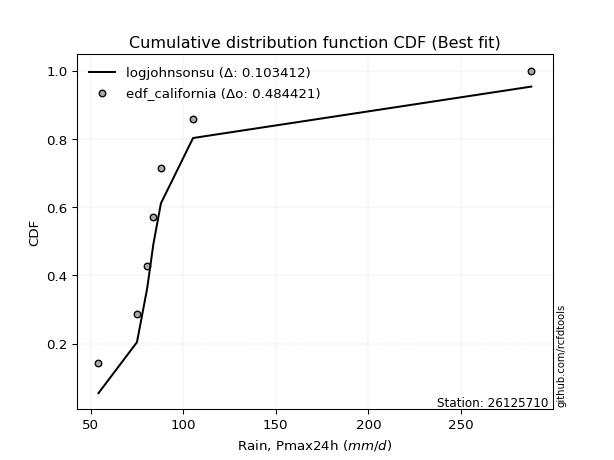</img>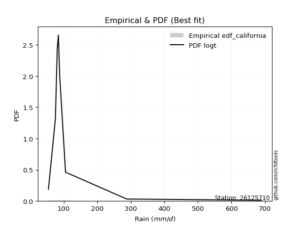</img>

</div>


### 2. Empirical - EDF Hazen (1930)

Hazen method for plotting positions is a formula used to estimate the empirical cumulative probability distribution of flood events or other hydrological data. This formula often results in biased estimations, particularly when extrapolating to extreme events (high return periods).

<div align="center">


$P=(m-0.5)/n$


</div>


**2.1. Empirical values**

<div align="center">

|                | 0                  | 1                  | 2                  | 3                  | 4                  | 5         | 6                 | 7         |
|:---------------|:-------------------|:-------------------|:-------------------|:-------------------|:-------------------|:----------|:------------------|:----------|
| date           | 2021               | 2025               | 2018               | 2020               | 2017               | 2024      | 2019              | 2022      |
| x              | 54.264             | 63.2               | 75.054             | 80.535             | 83.958             | 88.0      | 105.354           | 288.0     |
| m              | 1                  | 2                  | 3                  | 4                  | 5                  | 6         | 7                 | 8         |
| empirical_dist | edf_hazen          | edf_hazen          | edf_hazen          | edf_hazen          | edf_hazen          | edf_hazen | edf_hazen         | edf_hazen |
| empirical      | 0.0625             | 0.1875             | 0.3125             | 0.4375             | 0.5625             | 0.6875    | 0.8125            | 0.9375    |
| empirical_tr   | 1.0666666666666667 | 1.2307692307692308 | 1.4545454545454546 | 1.7777777777777777 | 2.2857142857142856 | 3.2       | 5.333333333333333 | 16.0      |

</div>


**2.2. Kolmogorov-Smirnov fit test (sorted by Δ)**


<div align="center">

|                | 0                   | 1                   | 2                  | 3                   | 4                   | 5                   | 6                  | 7                   | 8                   | 9                   | 10                 | 11                  | 12                  | 13                  | 14                 | 15                  | 16                  | 17                  | 18                    | 19                 | 20                 | 21                  | 22                  | 23                 | 24                  | 25                 | 26                  | 27                  | 28                  | 29                 | 30                 | 31                  | 32                  | 33                 | 34                  | 35                  | 36                 | 37                 | 38                  | 39                 | 40                  | 41                 | 42                 | 43                  | 44                 | 45                  | 46                  | 47                  | 48                  | 49                  | 50                  | 51                 | 52                  | 53                  | 54                  | 55                  | 56                  | 57                  | 58                  | 59                  | 60                  | 61                  | 62                  | 63                  | 64                  | 65                  | 66                 | 67                  | 68                  | 69                 | 70                 | 71                 | 72                  | 73                  | 74                 | 75                  | 76                  | 77                 | 78                  | 79                  | 80                  | 81                  | 82                 | 83                 | 84                  | 85                 | 86                 | 87                  | 88                 | 89                 |
|:---------------|:--------------------|:--------------------|:-------------------|:--------------------|:--------------------|:--------------------|:-------------------|:--------------------|:--------------------|:--------------------|:-------------------|:--------------------|:--------------------|:--------------------|:-------------------|:--------------------|:--------------------|:--------------------|:----------------------|:-------------------|:-------------------|:--------------------|:--------------------|:-------------------|:--------------------|:-------------------|:--------------------|:--------------------|:--------------------|:-------------------|:-------------------|:--------------------|:--------------------|:-------------------|:--------------------|:--------------------|:-------------------|:-------------------|:--------------------|:-------------------|:--------------------|:-------------------|:-------------------|:--------------------|:-------------------|:--------------------|:--------------------|:--------------------|:--------------------|:--------------------|:--------------------|:-------------------|:--------------------|:--------------------|:--------------------|:--------------------|:--------------------|:--------------------|:--------------------|:--------------------|:--------------------|:--------------------|:--------------------|:--------------------|:--------------------|:--------------------|:-------------------|:--------------------|:--------------------|:-------------------|:-------------------|:-------------------|:--------------------|:--------------------|:-------------------|:--------------------|:--------------------|:-------------------|:--------------------|:--------------------|:--------------------|:--------------------|:-------------------|:-------------------|:--------------------|:-------------------|:-------------------|:--------------------|:-------------------|:-------------------|
| station        | 26125710            | 26125710            | 26125710           | 26125710            | 26125710            | 26125710            | 26125710           | 26125710            | 26125710            | 26125710            | 26125710           | 26125710            | 26125710            | 26125710            | 26125710           | 26125710            | 26125710            | 26125710            | 26125710              | 26125710           | 26125710           | 26125710            | 26125710            | 26125710           | 26125710            | 26125710           | 26125710            | 26125710            | 26125710            | 26125710           | 26125710           | 26125710            | 26125710            | 26125710           | 26125710            | 26125710            | 26125710           | 26125710           | 26125710            | 26125710           | 26125710            | 26125710           | 26125710           | 26125710            | 26125710           | 26125710            | 26125710            | 26125710            | 26125710            | 26125710            | 26125710            | 26125710           | 26125710            | 26125710            | 26125710            | 26125710            | 26125710            | 26125710            | 26125710            | 26125710            | 26125710            | 26125710            | 26125710            | 26125710            | 26125710            | 26125710            | 26125710           | 26125710            | 26125710            | 26125710           | 26125710           | 26125710           | 26125710            | 26125710            | 26125710           | 26125710            | 26125710            | 26125710           | 26125710            | 26125710            | 26125710            | 26125710            | 26125710           | 26125710           | 26125710            | 26125710           | 26125710           | 26125710            | 26125710           | 26125710           |
| empirical_dist | edf_hazen           | edf_hazen           | edf_hazen          | edf_hazen           | edf_hazen           | edf_hazen           | edf_hazen          | edf_hazen           | edf_hazen           | edf_hazen           | edf_hazen          | edf_hazen           | edf_hazen           | edf_hazen           | edf_hazen          | edf_hazen           | edf_hazen           | edf_hazen           | edf_hazen             | edf_hazen          | edf_hazen          | edf_hazen           | edf_hazen           | edf_hazen          | edf_hazen           | edf_hazen          | edf_hazen           | edf_hazen           | edf_hazen           | edf_hazen          | edf_hazen          | edf_hazen           | edf_hazen           | edf_hazen          | edf_hazen           | edf_hazen           | edf_hazen          | edf_hazen          | edf_hazen           | edf_hazen          | edf_hazen           | edf_hazen          | edf_hazen          | edf_hazen           | edf_hazen          | edf_hazen           | edf_hazen           | edf_hazen           | edf_hazen           | edf_hazen           | edf_hazen           | edf_hazen          | edf_hazen           | edf_hazen           | edf_hazen           | edf_hazen           | edf_hazen           | edf_hazen           | edf_hazen           | edf_hazen           | edf_hazen           | edf_hazen           | edf_hazen           | edf_hazen           | edf_hazen           | edf_hazen           | edf_hazen          | edf_hazen           | edf_hazen           | edf_hazen          | edf_hazen          | edf_hazen          | edf_hazen           | edf_hazen           | edf_hazen          | edf_hazen           | edf_hazen           | edf_hazen          | edf_hazen           | edf_hazen           | edf_hazen           | edf_hazen           | edf_hazen          | edf_hazen          | edf_hazen           | edf_hazen          | edf_hazen          | edf_hazen           | edf_hazen          | edf_hazen          |
| p_dist         | logjohnsonsu        | logt                | logfisk            | logalpha            | loginvweibull       | logmielke           | alpha              | loginvgamma         | logexponnorm        | f                   | invgamma           | logpearson3         | loginvgauss         | loghalflogistic     | fisk               | logfatiguelife      | logmoyal            | invgauss            | loglaplace_asymmetric | johnsonsu          | loggenlogistic     | loggenexpon         | fatiguelife         | logwald            | loggompertz         | logtruncnorm       | loghalfnorm         | gibrat              | wald                | loggumbel_r        | logexpon           | logerlang           | nct                 | lograyleigh        | logkstwobign        | lognakagami         | logf               | logmaxwell         | pearson3            | ncf                | lognct              | loggibrat          | betaprime          | logncf              | exponnorm          | pareto              | expon               | genexpon            | laplace_asymmetric  | weibull_min         | logbetaprime        | gompertz           | halflogistic        | logrice             | logloggamma         | moyal               | nakagami            | logcrystalball      | lognorm             | lognorm             | gamma               | logweibull_min      | loglogistic         | loghypsecant        | genlogistic         | loglaplace          | halfnorm           | gumbel_r            | logchi2             | rayleigh           | erlang             | maxwell            | loggumbel_l         | kstwobign           | t                  | truncnorm           | hypsecant           | logistic           | crystalball         | norm                | rice                | laplace             | loggamma           | loggamma           | gumbel_l            | loglognorm         | logpareto          | invweibull          | chi2               | mielke             |
| delta          | 0.06437640617107887 | 0.07595786199966748 | 0.1003063835320242 | 0.10387679705603098 | 0.10640571755163036 | 0.10661083518787895 | 0.1075161224084864 | 0.10929371693739143 | 0.11200983983937496 | 0.11374601278042273 | 0.1137462940674906 | 0.11449130740567953 | 0.11514577760699835 | 0.11596626948047839 | 0.1162688950798424 | 0.11641086437608339 | 0.11951124689786763 | 0.12028048679438508 | 0.12682289691381143   | 0.1283917361165271 | 0.1292699000727734 | 0.12953903102854836 | 0.13224380642552935 | 0.1323532174678287 | 0.13377754556314791 | 0.1348780184038092 | 0.13689953753940565 | 0.13689964792228704 | 0.14126772113085106 | 0.145310796281091  | 0.1544664802353296 | 0.16387172131720001 | 0.16798062536630154 | 0.1689056180799866 | 0.17079751439613977 | 0.17327508804415193 | 0.1774608864648624 | 0.1804440393204917 | 0.18159905840733187 | 0.1820507822638521 | 0.18333424952223298 | 0.1875             | 0.1910308958811956 | 0.19574745964770696 | 0.1985265535002051 | 0.20042711289515358 | 0.20042711791279721 | 0.20043427300805006 | 0.20044369321266386 | 0.20097204447094263 | 0.20114492594141337 | 0.2043304202338282 | 0.20955397375169382 | 0.21249583577288417 | 0.21294965755900908 | 0.21306600568689493 | 0.21429249504360803 | 0.21436152176436513 | 0.21436152439273592 | 0.21436152439273592 | 0.21517992311339618 | 0.21665646000412964 | 0.21801674846968166 | 0.22112867418439464 | 0.22526703405680093 | 0.23294704921648124 | 0.2346813920322106 | 0.23888936522753068 | 0.24576451619777395 | 0.265486768867498  | 0.2717565013145805 | 0.2764294445397576 | 0.28501570379392527 | 0.29814584543580824 | 0.2990638613129353 | 0.30751636533384635 | 0.30855363015685167 | 0.3089210078817899 | 0.30935120279511774 | 0.30935120445769126 | 0.32932108302276797 | 0.33010134221653026 | 0.3335203340285363 | 0.3335203340285363 | 0.37962697709905757 | 0.4229140862265557 | 0.4385742241410251 | 0.43998688263092695 | 0.7819020451894447 | nan                |
| deltao         | 0.4472608134160001  | 0.4472608134160001  | 0.4472608134160001 | 0.4472608134160001  | 0.4472608134160001  | 0.4472608134160001  | 0.4472608134160001 | 0.4472608134160001  | 0.4472608134160001  | 0.4472608134160001  | 0.4472608134160001 | 0.4472608134160001  | 0.4472608134160001  | 0.4472608134160001  | 0.4472608134160001 | 0.4472608134160001  | 0.4472608134160001  | 0.4472608134160001  | 0.4472608134160001    | 0.4472608134160001 | 0.4472608134160001 | 0.4472608134160001  | 0.4472608134160001  | 0.4472608134160001 | 0.4472608134160001  | 0.4472608134160001 | 0.4472608134160001  | 0.4472608134160001  | 0.4472608134160001  | 0.4472608134160001 | 0.4472608134160001 | 0.4472608134160001  | 0.4472608134160001  | 0.4472608134160001 | 0.4472608134160001  | 0.4472608134160001  | 0.4472608134160001 | 0.4472608134160001 | 0.4472608134160001  | 0.4472608134160001 | 0.4472608134160001  | 0.4472608134160001 | 0.4472608134160001 | 0.4472608134160001  | 0.4472608134160001 | 0.4472608134160001  | 0.4472608134160001  | 0.4472608134160001  | 0.4472608134160001  | 0.4472608134160001  | 0.4472608134160001  | 0.4472608134160001 | 0.4472608134160001  | 0.4472608134160001  | 0.4472608134160001  | 0.4472608134160001  | 0.4472608134160001  | 0.4472608134160001  | 0.4472608134160001  | 0.4472608134160001  | 0.4472608134160001  | 0.4472608134160001  | 0.4472608134160001  | 0.4472608134160001  | 0.4472608134160001  | 0.4472608134160001  | 0.4472608134160001 | 0.4472608134160001  | 0.4472608134160001  | 0.4472608134160001 | 0.4472608134160001 | 0.4472608134160001 | 0.4472608134160001  | 0.4472608134160001  | 0.4472608134160001 | 0.4472608134160001  | 0.4472608134160001  | 0.4472608134160001 | 0.4472608134160001  | 0.4472608134160001  | 0.4472608134160001  | 0.4472608134160001  | 0.4472608134160001 | 0.4472608134160001 | 0.4472608134160001  | 0.4472608134160001 | 0.4472608134160001 | 0.4472608134160001  | 0.4472608134160001 | 0.4472608134160001 |
| eval           | Δo > Δ              | Δo > Δ              | Δo > Δ             | Δo > Δ              | Δo > Δ              | Δo > Δ              | Δo > Δ             | Δo > Δ              | Δo > Δ              | Δo > Δ              | Δo > Δ             | Δo > Δ              | Δo > Δ              | Δo > Δ              | Δo > Δ             | Δo > Δ              | Δo > Δ              | Δo > Δ              | Δo > Δ                | Δo > Δ             | Δo > Δ             | Δo > Δ              | Δo > Δ              | Δo > Δ             | Δo > Δ              | Δo > Δ             | Δo > Δ              | Δo > Δ              | Δo > Δ              | Δo > Δ             | Δo > Δ             | Δo > Δ              | Δo > Δ              | Δo > Δ             | Δo > Δ              | Δo > Δ              | Δo > Δ             | Δo > Δ             | Δo > Δ              | Δo > Δ             | Δo > Δ              | Δo > Δ             | Δo > Δ             | Δo > Δ              | Δo > Δ             | Δo > Δ              | Δo > Δ              | Δo > Δ              | Δo > Δ              | Δo > Δ              | Δo > Δ              | Δo > Δ             | Δo > Δ              | Δo > Δ              | Δo > Δ              | Δo > Δ              | Δo > Δ              | Δo > Δ              | Δo > Δ              | Δo > Δ              | Δo > Δ              | Δo > Δ              | Δo > Δ              | Δo > Δ              | Δo > Δ              | Δo > Δ              | Δo > Δ             | Δo > Δ              | Δo > Δ              | Δo > Δ             | Δo > Δ             | Δo > Δ             | Δo > Δ              | Δo > Δ              | Δo > Δ             | Δo > Δ              | Δo > Δ              | Δo > Δ             | Δo > Δ              | Δo > Δ              | Δo > Δ              | Δo > Δ              | Δo > Δ             | Δo > Δ             | Δo > Δ              | Δo > Δ             | Δo > Δ             | Δo > Δ              | Δo <= Δ            | Δo <= Δ            |
| fit            | 1                   | 1                   | 1                  | 1                   | 1                   | 1                   | 1                  | 1                   | 1                   | 1                   | 1                  | 1                   | 1                   | 1                   | 1                  | 1                   | 1                   | 1                   | 1                     | 1                  | 1                  | 1                   | 1                   | 1                  | 1                   | 1                  | 1                   | 1                   | 1                   | 1                  | 1                  | 1                   | 1                   | 1                  | 1                   | 1                   | 1                  | 1                  | 1                   | 1                  | 1                   | 1                  | 1                  | 1                   | 1                  | 1                   | 1                   | 1                   | 1                   | 1                   | 1                   | 1                  | 1                   | 1                   | 1                   | 1                   | 1                   | 1                   | 1                   | 1                   | 1                   | 1                   | 1                   | 1                   | 1                   | 1                   | 1                  | 1                   | 1                   | 1                  | 1                  | 1                  | 1                   | 1                   | 1                  | 1                   | 1                   | 1                  | 1                   | 1                   | 1                   | 1                   | 1                  | 1                  | 1                   | 1                  | 1                  | 1                   | 0                  | 0                  |
| n              | 8                   | 8                   | 8                  | 8                   | 8                   | 8                   | 8                  | 8                   | 8                   | 8                   | 8                  | 8                   | 8                   | 8                   | 8                  | 8                   | 8                   | 8                   | 8                     | 8                  | 8                  | 8                   | 8                   | 8                  | 8                   | 8                  | 8                   | 8                   | 8                   | 8                  | 8                  | 8                   | 8                   | 8                  | 8                   | 8                   | 8                  | 8                  | 8                   | 8                  | 8                   | 8                  | 8                  | 8                   | 8                  | 8                   | 8                   | 8                   | 8                   | 8                   | 8                   | 8                  | 8                   | 8                   | 8                   | 8                   | 8                   | 8                   | 8                   | 8                   | 8                   | 8                   | 8                   | 8                   | 8                   | 8                   | 8                  | 8                   | 8                   | 8                  | 8                  | 8                  | 8                   | 8                   | 8                  | 8                   | 8                   | 8                  | 8                   | 8                   | 8                   | 8                   | 8                  | 8                  | 8                   | 8                  | 8                  | 8                   | 8                  | 8                  |
| best_fit       | 1                   | 0                   | 0                  | 0                   | 0                   | 0                   | 0                  | 0                   | 0                   | 0                   | 0                  | 0                   | 0                   | 0                   | 0                  | 0                   | 0                   | 0                   | 0                     | 0                  | 0                  | 0                   | 0                   | 0                  | 0                   | 0                  | 0                   | 0                   | 0                   | 0                  | 0                  | 0                   | 0                   | 0                  | 0                   | 0                   | 0                  | 0                  | 0                   | 0                  | 0                   | 0                  | 0                  | 0                   | 0                  | 0                   | 0                   | 0                   | 0                   | 0                   | 0                   | 0                  | 0                   | 0                   | 0                   | 0                   | 0                   | 0                   | 0                   | 0                   | 0                   | 0                   | 0                   | 0                   | 0                   | 0                   | 0                  | 0                   | 0                   | 0                  | 0                  | 0                  | 0                   | 0                   | 0                  | 0                   | 0                   | 0                  | 0                   | 0                   | 0                   | 0                   | 0                  | 0                  | 0                   | 0                  | 0                  | 0                   | 0                  | 0                  |
| best_fit_sort  | 1                   | 2                   | 3                  | 4                   | 5                   | 6                   | 7                  | 8                   | 9                   | 10                  | 11                 | 12                  | 13                  | 14                  | 15                 | 16                  | 17                  | 18                  | 19                    | 20                 | 21                 | 22                  | 23                  | 24                 | 25                  | 26                 | 27                  | 28                  | 29                  | 30                 | 31                 | 32                  | 33                  | 34                 | 35                  | 36                  | 37                 | 38                 | 39                  | 40                 | 41                  | 42                 | 43                 | 44                  | 45                 | 46                  | 47                  | 48                  | 49                  | 50                  | 51                  | 52                 | 53                  | 54                  | 55                  | 56                  | 57                  | 58                  | 59                  | 60                  | 61                  | 62                  | 63                  | 64                  | 65                  | 66                  | 67                 | 68                  | 69                  | 70                 | 71                 | 72                 | 73                  | 74                  | 75                 | 76                  | 77                  | 78                 | 79                  | 80                  | 81                  | 82                  | 83                 | 84                 | 85                  | 86                 | 87                 | 88                  | 89                 | 90                 |

</div>


<div align="center">

</img>

</div>


**2.3. Best fit**

<div align="center">

|   id |   station | empirical_dist   | p_dist       |     delta |   deltao | eval   |   fit |   n |   best_fit |   best_fit_sort |
|-----:|----------:|:-----------------|:-------------|----------:|---------:|:-------|------:|----:|-----------:|----------------:|
|    0 |  26125710 | edf_hazen        | logjohnsonsu | 0.0643764 | 0.447261 | Δo > Δ |     1 |   8 |          1 |               1 |

</div>


<div align="center">

</img>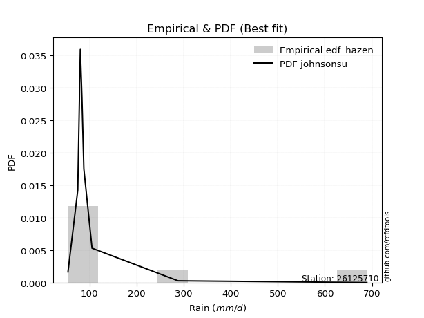</img>

</div>


### 3. Empirical - EDF Weibull (1939)

Weibull plotting position formula is an empirical method used to estimate the non-exceedance probability or plotting position for a set of observed data, is often recommended or widely used in practice, particularly in flood frequency analysis.

<div align="center">


$P=m/(n+1)$


</div>


**3.1. Empirical values**

<div align="center">

|                | 0                  | 1                  | 2                  | 3                  | 4                  | 5                  | 6                  | 7                  |
|:---------------|:-------------------|:-------------------|:-------------------|:-------------------|:-------------------|:-------------------|:-------------------|:-------------------|
| date           | 2021               | 2025               | 2018               | 2020               | 2017               | 2024               | 2019               | 2022               |
| x              | 54.264             | 63.2               | 75.054             | 80.535             | 83.958             | 88.0               | 105.354            | 288.0              |
| m              | 1                  | 2                  | 3                  | 4                  | 5                  | 6                  | 7                  | 8                  |
| empirical_dist | edf_weibull        | edf_weibull        | edf_weibull        | edf_weibull        | edf_weibull        | edf_weibull        | edf_weibull        | edf_weibull        |
| empirical      | 0.1111111111111111 | 0.2222222222222222 | 0.3333333333333333 | 0.4444444444444444 | 0.5555555555555556 | 0.6666666666666666 | 0.7777777777777778 | 0.8888888888888888 |
| empirical_tr   | 1.125              | 1.2857142857142856 | 1.4999999999999998 | 1.7999999999999998 | 2.25               | 2.9999999999999996 | 4.5                | 8.999999999999996  |

</div>


**3.2. Kolmogorov-Smirnov fit test (sorted by Δ)**


<div align="center">

|                | 0                   | 1                   | 2                   | 3                   | 4                   | 5                   | 6                   | 7                   | 8                   | 9                   | 10                  | 11                  | 12                  | 13                  | 14                  | 15                  | 16                  | 17                  | 18                  | 19                    | 20                  | 21                  | 22                  | 23                  | 24                 | 25                  | 26                  | 27                  | 28                  | 29                  | 30                 | 31                 | 32                 | 33                  | 34                  | 35                  | 36                 | 37                  | 38                 | 39                  | 40                 | 41                  | 42                  | 43                 | 44                  | 45                  | 46                  | 47                  | 48                 | 49                  | 50                 | 51                 | 52                 | 53                  | 54                 | 55                 | 56                  | 57                  | 58                  | 59                  | 60                  | 61                 | 62                 | 63                  | 64                  | 65                  | 66                  | 67                  | 68                 | 69                 | 70                 | 71                 | 72                 | 73                 | 74                  | 75                  | 76                 | 77                 | 78                 | 79                 | 80                 | 81                 | 82                 | 83                 | 84                  | 85                 | 86                 | 87                 | 88                 | 89                 |
|:---------------|:--------------------|:--------------------|:--------------------|:--------------------|:--------------------|:--------------------|:--------------------|:--------------------|:--------------------|:--------------------|:--------------------|:--------------------|:--------------------|:--------------------|:--------------------|:--------------------|:--------------------|:--------------------|:--------------------|:----------------------|:--------------------|:--------------------|:--------------------|:--------------------|:-------------------|:--------------------|:--------------------|:--------------------|:--------------------|:--------------------|:-------------------|:-------------------|:-------------------|:--------------------|:--------------------|:--------------------|:-------------------|:--------------------|:-------------------|:--------------------|:-------------------|:--------------------|:--------------------|:-------------------|:--------------------|:--------------------|:--------------------|:--------------------|:-------------------|:--------------------|:-------------------|:-------------------|:-------------------|:--------------------|:-------------------|:-------------------|:--------------------|:--------------------|:--------------------|:--------------------|:--------------------|:-------------------|:-------------------|:--------------------|:--------------------|:--------------------|:--------------------|:--------------------|:-------------------|:-------------------|:-------------------|:-------------------|:-------------------|:-------------------|:--------------------|:--------------------|:-------------------|:-------------------|:-------------------|:-------------------|:-------------------|:-------------------|:-------------------|:-------------------|:--------------------|:-------------------|:-------------------|:-------------------|:-------------------|:-------------------|
| station        | 26125710            | 26125710            | 26125710            | 26125710            | 26125710            | 26125710            | 26125710            | 26125710            | 26125710            | 26125710            | 26125710            | 26125710            | 26125710            | 26125710            | 26125710            | 26125710            | 26125710            | 26125710            | 26125710            | 26125710              | 26125710            | 26125710            | 26125710            | 26125710            | 26125710           | 26125710            | 26125710            | 26125710            | 26125710            | 26125710            | 26125710           | 26125710           | 26125710           | 26125710            | 26125710            | 26125710            | 26125710           | 26125710            | 26125710           | 26125710            | 26125710           | 26125710            | 26125710            | 26125710           | 26125710            | 26125710            | 26125710            | 26125710            | 26125710           | 26125710            | 26125710           | 26125710           | 26125710           | 26125710            | 26125710           | 26125710           | 26125710            | 26125710            | 26125710            | 26125710            | 26125710            | 26125710           | 26125710           | 26125710            | 26125710            | 26125710            | 26125710            | 26125710            | 26125710           | 26125710           | 26125710           | 26125710           | 26125710           | 26125710           | 26125710            | 26125710            | 26125710           | 26125710           | 26125710           | 26125710           | 26125710           | 26125710           | 26125710           | 26125710           | 26125710            | 26125710           | 26125710           | 26125710           | 26125710           | 26125710           |
| empirical_dist | edf_weibull         | edf_weibull         | edf_weibull         | edf_weibull         | edf_weibull         | edf_weibull         | edf_weibull         | edf_weibull         | edf_weibull         | edf_weibull         | edf_weibull         | edf_weibull         | edf_weibull         | edf_weibull         | edf_weibull         | edf_weibull         | edf_weibull         | edf_weibull         | edf_weibull         | edf_weibull           | edf_weibull         | edf_weibull         | edf_weibull         | edf_weibull         | edf_weibull        | edf_weibull         | edf_weibull         | edf_weibull         | edf_weibull         | edf_weibull         | edf_weibull        | edf_weibull        | edf_weibull        | edf_weibull         | edf_weibull         | edf_weibull         | edf_weibull        | edf_weibull         | edf_weibull        | edf_weibull         | edf_weibull        | edf_weibull         | edf_weibull         | edf_weibull        | edf_weibull         | edf_weibull         | edf_weibull         | edf_weibull         | edf_weibull        | edf_weibull         | edf_weibull        | edf_weibull        | edf_weibull        | edf_weibull         | edf_weibull        | edf_weibull        | edf_weibull         | edf_weibull         | edf_weibull         | edf_weibull         | edf_weibull         | edf_weibull        | edf_weibull        | edf_weibull         | edf_weibull         | edf_weibull         | edf_weibull         | edf_weibull         | edf_weibull        | edf_weibull        | edf_weibull        | edf_weibull        | edf_weibull        | edf_weibull        | edf_weibull         | edf_weibull         | edf_weibull        | edf_weibull        | edf_weibull        | edf_weibull        | edf_weibull        | edf_weibull        | edf_weibull        | edf_weibull        | edf_weibull         | edf_weibull        | edf_weibull        | edf_weibull        | edf_weibull        | edf_weibull        |
| p_dist         | logt                | logfisk             | logalpha            | loginvweibull       | logmielke           | alpha               | loginvgamma         | logexponnorm        | logjohnsonsu        | f                   | invgamma            | logpearson3         | loginvgauss         | loghalflogistic     | fisk                | logfatiguelife      | logmoyal            | invgauss            | fatiguelife         | loglaplace_asymmetric | johnsonsu           | loggenlogistic      | loggenexpon         | wald                | loggompertz        | logtruncnorm        | loghalfnorm         | gibrat              | logwald             | loggumbel_r         | logexpon           | pearson3           | logerlang          | ncf                 | nct                 | lograyleigh         | logkstwobign       | lognakagami         | logf               | logmaxwell          | lognct             | weibull_min         | betaprime           | halflogistic       | logncf              | exponnorm           | moyal               | nakagami            | pareto             | expon               | genexpon           | laplace_asymmetric | logbetaprime       | gompertz            | logrice            | logloggamma        | logcrystalball      | lognorm             | lognorm             | gamma               | logweibull_min      | loglogistic        | halfnorm           | loghypsecant        | gumbel_r            | genlogistic         | logchi2             | loglaplace          | loggibrat          | rayleigh           | maxwell            | erlang             | loggumbel_l        | logistic           | crystalball         | norm                | kstwobign          | t                  | hypsecant          | truncnorm          | rice               | laplace            | loggamma           | loggamma           | gumbel_l            | loglognorm         | invweibull         | logpareto          | chi2               | mielke             |
| delta          | 0.07442639325866651 | 0.07947305019869089 | 0.08304346372269766 | 0.08557238421829705 | 0.08577750185454563 | 0.08668278907515309 | 0.08846038360405811 | 0.09117650650604159 | 0.09208331634700356 | 0.09291267944708942 | 0.09291296073415728 | 0.09365797407234622 | 0.09431244427366503 | 0.09513293614714508 | 0.09543556174650908 | 0.09557753104275007 | 0.09867791356453426 | 0.09944715346105176 | 0.10389715492432383 | 0.10598956358047806   | 0.10755840278319379 | 0.10843656673944002 | 0.11111111092734535 | 0.11290902973358097 | 0.1129442122298146 | 0.11404468507047588 | 0.11555747712478925 | 0.11606631458895367 | 0.12342122299542571 | 0.12447746294775763 | 0.1336331469019963 | 0.1376417835735254 | 0.1430383879838667 | 0.14708902612948904 | 0.14714729203296817 | 0.14807228474665324 | 0.1499641810628064 | 0.15244175471081856 | 0.1566275531315291 | 0.15961070598715832 | 0.1625009161888996 | 0.16624982224872042 | 0.17019756254786222 | 0.1748317515294716 | 0.17491412631437359 | 0.17769322016687172 | 0.17834378346467272 | 0.17957027282138582 | 0.1795937795618202 | 0.17959378457946384 | 0.1796009396747167 | 0.1796103598793305 | 0.18031159260808   | 0.18349708690049482 | 0.1916625024395508 | 0.1921163242256757 | 0.19352818843103176 | 0.19352819105940255 | 0.19352819105940255 | 0.19434658978006286 | 0.19582312667079632 | 0.1971834151363483 | 0.1999591698099884 | 0.20029534085106127 | 0.20416714300530847 | 0.20443370072346756 | 0.21104229397555174 | 0.21211371588314787 | 0.2222222222222222 | 0.2307645466452758 | 0.2417072223175354 | 0.2509231679812472 | 0.2641823704605919 | 0.2741987856595677 | 0.27462898057289553 | 0.27462898223546905 | 0.2773125121024749 | 0.2782305279796019 | 0.282714793096459  | 0.286683032000513  | 0.3068465731012357 | 0.3092680088831969 | 0.312687000695203  | 0.312687000695203  | 0.34490475487683536 | 0.3881918640043335 | 0.3913757715198158 | 0.4038520019188029 | 0.7471798229672225 | nan                |
| deltao         | 0.4472608134160001  | 0.4472608134160001  | 0.4472608134160001  | 0.4472608134160001  | 0.4472608134160001  | 0.4472608134160001  | 0.4472608134160001  | 0.4472608134160001  | 0.4472608134160001  | 0.4472608134160001  | 0.4472608134160001  | 0.4472608134160001  | 0.4472608134160001  | 0.4472608134160001  | 0.4472608134160001  | 0.4472608134160001  | 0.4472608134160001  | 0.4472608134160001  | 0.4472608134160001  | 0.4472608134160001    | 0.4472608134160001  | 0.4472608134160001  | 0.4472608134160001  | 0.4472608134160001  | 0.4472608134160001 | 0.4472608134160001  | 0.4472608134160001  | 0.4472608134160001  | 0.4472608134160001  | 0.4472608134160001  | 0.4472608134160001 | 0.4472608134160001 | 0.4472608134160001 | 0.4472608134160001  | 0.4472608134160001  | 0.4472608134160001  | 0.4472608134160001 | 0.4472608134160001  | 0.4472608134160001 | 0.4472608134160001  | 0.4472608134160001 | 0.4472608134160001  | 0.4472608134160001  | 0.4472608134160001 | 0.4472608134160001  | 0.4472608134160001  | 0.4472608134160001  | 0.4472608134160001  | 0.4472608134160001 | 0.4472608134160001  | 0.4472608134160001 | 0.4472608134160001 | 0.4472608134160001 | 0.4472608134160001  | 0.4472608134160001 | 0.4472608134160001 | 0.4472608134160001  | 0.4472608134160001  | 0.4472608134160001  | 0.4472608134160001  | 0.4472608134160001  | 0.4472608134160001 | 0.4472608134160001 | 0.4472608134160001  | 0.4472608134160001  | 0.4472608134160001  | 0.4472608134160001  | 0.4472608134160001  | 0.4472608134160001 | 0.4472608134160001 | 0.4472608134160001 | 0.4472608134160001 | 0.4472608134160001 | 0.4472608134160001 | 0.4472608134160001  | 0.4472608134160001  | 0.4472608134160001 | 0.4472608134160001 | 0.4472608134160001 | 0.4472608134160001 | 0.4472608134160001 | 0.4472608134160001 | 0.4472608134160001 | 0.4472608134160001 | 0.4472608134160001  | 0.4472608134160001 | 0.4472608134160001 | 0.4472608134160001 | 0.4472608134160001 | 0.4472608134160001 |
| eval           | Δo > Δ              | Δo > Δ              | Δo > Δ              | Δo > Δ              | Δo > Δ              | Δo > Δ              | Δo > Δ              | Δo > Δ              | Δo > Δ              | Δo > Δ              | Δo > Δ              | Δo > Δ              | Δo > Δ              | Δo > Δ              | Δo > Δ              | Δo > Δ              | Δo > Δ              | Δo > Δ              | Δo > Δ              | Δo > Δ                | Δo > Δ              | Δo > Δ              | Δo > Δ              | Δo > Δ              | Δo > Δ             | Δo > Δ              | Δo > Δ              | Δo > Δ              | Δo > Δ              | Δo > Δ              | Δo > Δ             | Δo > Δ             | Δo > Δ             | Δo > Δ              | Δo > Δ              | Δo > Δ              | Δo > Δ             | Δo > Δ              | Δo > Δ             | Δo > Δ              | Δo > Δ             | Δo > Δ              | Δo > Δ              | Δo > Δ             | Δo > Δ              | Δo > Δ              | Δo > Δ              | Δo > Δ              | Δo > Δ             | Δo > Δ              | Δo > Δ             | Δo > Δ             | Δo > Δ             | Δo > Δ              | Δo > Δ             | Δo > Δ             | Δo > Δ              | Δo > Δ              | Δo > Δ              | Δo > Δ              | Δo > Δ              | Δo > Δ             | Δo > Δ             | Δo > Δ              | Δo > Δ              | Δo > Δ              | Δo > Δ              | Δo > Δ              | Δo > Δ             | Δo > Δ             | Δo > Δ             | Δo > Δ             | Δo > Δ             | Δo > Δ             | Δo > Δ              | Δo > Δ              | Δo > Δ             | Δo > Δ             | Δo > Δ             | Δo > Δ             | Δo > Δ             | Δo > Δ             | Δo > Δ             | Δo > Δ             | Δo > Δ              | Δo > Δ             | Δo > Δ             | Δo > Δ             | Δo <= Δ            | Δo <= Δ            |
| fit            | 1                   | 1                   | 1                   | 1                   | 1                   | 1                   | 1                   | 1                   | 1                   | 1                   | 1                   | 1                   | 1                   | 1                   | 1                   | 1                   | 1                   | 1                   | 1                   | 1                     | 1                   | 1                   | 1                   | 1                   | 1                  | 1                   | 1                   | 1                   | 1                   | 1                   | 1                  | 1                  | 1                  | 1                   | 1                   | 1                   | 1                  | 1                   | 1                  | 1                   | 1                  | 1                   | 1                   | 1                  | 1                   | 1                   | 1                   | 1                   | 1                  | 1                   | 1                  | 1                  | 1                  | 1                   | 1                  | 1                  | 1                   | 1                   | 1                   | 1                   | 1                   | 1                  | 1                  | 1                   | 1                   | 1                   | 1                   | 1                   | 1                  | 1                  | 1                  | 1                  | 1                  | 1                  | 1                   | 1                   | 1                  | 1                  | 1                  | 1                  | 1                  | 1                  | 1                  | 1                  | 1                   | 1                  | 1                  | 1                  | 0                  | 0                  |
| n              | 8                   | 8                   | 8                   | 8                   | 8                   | 8                   | 8                   | 8                   | 8                   | 8                   | 8                   | 8                   | 8                   | 8                   | 8                   | 8                   | 8                   | 8                   | 8                   | 8                     | 8                   | 8                   | 8                   | 8                   | 8                  | 8                   | 8                   | 8                   | 8                   | 8                   | 8                  | 8                  | 8                  | 8                   | 8                   | 8                   | 8                  | 8                   | 8                  | 8                   | 8                  | 8                   | 8                   | 8                  | 8                   | 8                   | 8                   | 8                   | 8                  | 8                   | 8                  | 8                  | 8                  | 8                   | 8                  | 8                  | 8                   | 8                   | 8                   | 8                   | 8                   | 8                  | 8                  | 8                   | 8                   | 8                   | 8                   | 8                   | 8                  | 8                  | 8                  | 8                  | 8                  | 8                  | 8                   | 8                   | 8                  | 8                  | 8                  | 8                  | 8                  | 8                  | 8                  | 8                  | 8                   | 8                  | 8                  | 8                  | 8                  | 8                  |
| best_fit       | 1                   | 0                   | 0                   | 0                   | 0                   | 0                   | 0                   | 0                   | 0                   | 0                   | 0                   | 0                   | 0                   | 0                   | 0                   | 0                   | 0                   | 0                   | 0                   | 0                     | 0                   | 0                   | 0                   | 0                   | 0                  | 0                   | 0                   | 0                   | 0                   | 0                   | 0                  | 0                  | 0                  | 0                   | 0                   | 0                   | 0                  | 0                   | 0                  | 0                   | 0                  | 0                   | 0                   | 0                  | 0                   | 0                   | 0                   | 0                   | 0                  | 0                   | 0                  | 0                  | 0                  | 0                   | 0                  | 0                  | 0                   | 0                   | 0                   | 0                   | 0                   | 0                  | 0                  | 0                   | 0                   | 0                   | 0                   | 0                   | 0                  | 0                  | 0                  | 0                  | 0                  | 0                  | 0                   | 0                   | 0                  | 0                  | 0                  | 0                  | 0                  | 0                  | 0                  | 0                  | 0                   | 0                  | 0                  | 0                  | 0                  | 0                  |
| best_fit_sort  | 1                   | 2                   | 3                   | 4                   | 5                   | 6                   | 7                   | 8                   | 9                   | 10                  | 11                  | 12                  | 13                  | 14                  | 15                  | 16                  | 17                  | 18                  | 19                  | 20                    | 21                  | 22                  | 23                  | 24                  | 25                 | 26                  | 27                  | 28                  | 29                  | 30                  | 31                 | 32                 | 33                 | 34                  | 35                  | 36                  | 37                 | 38                  | 39                 | 40                  | 41                 | 42                  | 43                  | 44                 | 45                  | 46                  | 47                  | 48                  | 49                 | 50                  | 51                 | 52                 | 53                 | 54                  | 55                 | 56                 | 57                  | 58                  | 59                  | 60                  | 61                  | 62                 | 63                 | 64                  | 65                  | 66                  | 67                  | 68                  | 69                 | 70                 | 71                 | 72                 | 73                 | 74                 | 75                  | 76                  | 77                 | 78                 | 79                 | 80                 | 81                 | 82                 | 83                 | 84                 | 85                  | 86                 | 87                 | 88                 | 89                 | 90                 |

</div>


<div align="center">

</img>

</div>


**3.3. Best fit**

<div align="center">

|   id |   station | empirical_dist   | p_dist   |     delta |   deltao | eval   |   fit |   n |   best_fit |   best_fit_sort |
|-----:|----------:|:-----------------|:---------|----------:|---------:|:-------|------:|----:|-----------:|----------------:|
|    0 |  26125710 | edf_weibull      | logt     | 0.0744264 | 0.447261 | Δo > Δ |     1 |   8 |          1 |               1 |

</div>


<div align="center">

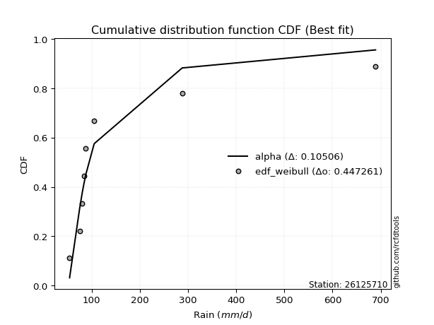</img>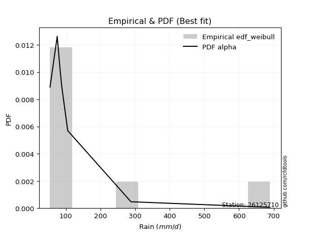</img>

</div>


### 4. Empirical - EDF Beard (1943)

The Beard formula (or Beard´s plotting position formula) in hydrology is used to estimate the empirical non-exceedance probability _(P)_ of a flood event (or other extreme hydrological data point) within a given dataset.

<div align="center">


$P=(m-0.31)/(n+0.38)$


</div>


**4.1. Empirical values**

<div align="center">

|                | 0                   | 1                   | 2                  | 3                   | 4                  | 5                  | 6                  | 7                  |
|:---------------|:--------------------|:--------------------|:-------------------|:--------------------|:-------------------|:-------------------|:-------------------|:-------------------|
| date           | 2021                | 2025                | 2018               | 2020                | 2017               | 2024               | 2019               | 2022               |
| x              | 54.264              | 63.2                | 75.054             | 80.535              | 83.958             | 88.0               | 105.354            | 288.0              |
| m              | 1                   | 2                   | 3                  | 4                   | 5                  | 6                  | 7                  | 8                  |
| empirical_dist | edf_beard           | edf_beard           | edf_beard          | edf_beard           | edf_beard          | edf_beard          | edf_beard          | edf_beard          |
| empirical      | 0.08233890214797135 | 0.20167064439140808 | 0.3210023866348448 | 0.44033412887828155 | 0.5596658711217184 | 0.6789976133651551 | 0.7983293556085919 | 0.9176610978520287 |
| empirical_tr   | 1.0897269180754225  | 1.2526158445440956  | 1.4727592267135323 | 1.7867803837953091  | 2.2710027100271004 | 3.115241635687732  | 4.958579881656804  | 12.144927536231886 |

</div>


**4.2. Kolmogorov-Smirnov fit test (sorted by Δ)**


<div align="center">

|                | 0                   | 1                   | 2                   | 3                   | 4                   | 5                   | 6                   | 7                   | 8                   | 9                   | 10                  | 11                  | 12                  | 13                  | 14                  | 15                  | 16                 | 17                  | 18                  | 19                    | 20                  | 21                  | 22                  | 23                  | 24                 | 25                  | 26                  | 27                 | 28                 | 29                  | 30                 | 31                 | 32                 | 33                  | 34                  | 35                  | 36                 | 37                  | 38                 | 39                  | 40                  | 41                  | 42                 | 43                  | 44                  | 45                  | 46                 | 47                  | 48                  | 49                  | 50                  | 51                  | 52                 | 53                 | 54                  | 55                  | 56                  | 57                 | 58                 | 59                 | 60                  | 61                  | 62                  | 63                 | 64                 | 65                  | 66                 | 67                  | 68                  | 69                  | 70                  | 71                 | 72                  | 73                 | 74                  | 75                  | 76                  | 77                 | 78                 | 79                 | 80                  | 81                  | 82                 | 83                 | 84                  | 85                 | 86                 | 87                 | 88                 | 89                 |
|:---------------|:--------------------|:--------------------|:--------------------|:--------------------|:--------------------|:--------------------|:--------------------|:--------------------|:--------------------|:--------------------|:--------------------|:--------------------|:--------------------|:--------------------|:--------------------|:--------------------|:-------------------|:--------------------|:--------------------|:----------------------|:--------------------|:--------------------|:--------------------|:--------------------|:-------------------|:--------------------|:--------------------|:-------------------|:-------------------|:--------------------|:-------------------|:-------------------|:-------------------|:--------------------|:--------------------|:--------------------|:-------------------|:--------------------|:-------------------|:--------------------|:--------------------|:--------------------|:-------------------|:--------------------|:--------------------|:--------------------|:-------------------|:--------------------|:--------------------|:--------------------|:--------------------|:--------------------|:-------------------|:-------------------|:--------------------|:--------------------|:--------------------|:-------------------|:-------------------|:-------------------|:--------------------|:--------------------|:--------------------|:-------------------|:-------------------|:--------------------|:-------------------|:--------------------|:--------------------|:--------------------|:--------------------|:-------------------|:--------------------|:-------------------|:--------------------|:--------------------|:--------------------|:-------------------|:-------------------|:-------------------|:--------------------|:--------------------|:-------------------|:-------------------|:--------------------|:-------------------|:-------------------|:-------------------|:-------------------|:-------------------|
| station        | 26125710            | 26125710            | 26125710            | 26125710            | 26125710            | 26125710            | 26125710            | 26125710            | 26125710            | 26125710            | 26125710            | 26125710            | 26125710            | 26125710            | 26125710            | 26125710            | 26125710           | 26125710            | 26125710            | 26125710              | 26125710            | 26125710            | 26125710            | 26125710            | 26125710           | 26125710            | 26125710            | 26125710           | 26125710           | 26125710            | 26125710           | 26125710           | 26125710           | 26125710            | 26125710            | 26125710            | 26125710           | 26125710            | 26125710           | 26125710            | 26125710            | 26125710            | 26125710           | 26125710            | 26125710            | 26125710            | 26125710           | 26125710            | 26125710            | 26125710            | 26125710            | 26125710            | 26125710           | 26125710           | 26125710            | 26125710            | 26125710            | 26125710           | 26125710           | 26125710           | 26125710            | 26125710            | 26125710            | 26125710           | 26125710           | 26125710            | 26125710           | 26125710            | 26125710            | 26125710            | 26125710            | 26125710           | 26125710            | 26125710           | 26125710            | 26125710            | 26125710            | 26125710           | 26125710           | 26125710           | 26125710            | 26125710            | 26125710           | 26125710           | 26125710            | 26125710           | 26125710           | 26125710           | 26125710           | 26125710           |
| empirical_dist | edf_beard           | edf_beard           | edf_beard           | edf_beard           | edf_beard           | edf_beard           | edf_beard           | edf_beard           | edf_beard           | edf_beard           | edf_beard           | edf_beard           | edf_beard           | edf_beard           | edf_beard           | edf_beard           | edf_beard          | edf_beard           | edf_beard           | edf_beard             | edf_beard           | edf_beard           | edf_beard           | edf_beard           | edf_beard          | edf_beard           | edf_beard           | edf_beard          | edf_beard          | edf_beard           | edf_beard          | edf_beard          | edf_beard          | edf_beard           | edf_beard           | edf_beard           | edf_beard          | edf_beard           | edf_beard          | edf_beard           | edf_beard           | edf_beard           | edf_beard          | edf_beard           | edf_beard           | edf_beard           | edf_beard          | edf_beard           | edf_beard           | edf_beard           | edf_beard           | edf_beard           | edf_beard          | edf_beard          | edf_beard           | edf_beard           | edf_beard           | edf_beard          | edf_beard          | edf_beard          | edf_beard           | edf_beard           | edf_beard           | edf_beard          | edf_beard          | edf_beard           | edf_beard          | edf_beard           | edf_beard           | edf_beard           | edf_beard           | edf_beard          | edf_beard           | edf_beard          | edf_beard           | edf_beard           | edf_beard           | edf_beard          | edf_beard          | edf_beard          | edf_beard           | edf_beard           | edf_beard          | edf_beard          | edf_beard           | edf_beard          | edf_beard          | edf_beard          | edf_beard          | edf_beard          |
| p_dist         | logt                | logjohnsonsu        | logfisk             | logalpha            | loginvweibull       | logmielke           | alpha               | loginvgamma         | logexponnorm        | f                   | invgamma            | logpearson3         | loginvgauss         | loghalflogistic     | fisk                | logfatiguelife      | logmoyal           | invgauss            | fatiguelife         | loglaplace_asymmetric | johnsonsu           | loggenlogistic      | loggenexpon         | logwald             | loggompertz        | logtruncnorm        | wald                | loghalfnorm        | gibrat             | loggumbel_r         | logexpon           | logerlang          | nct                | lograyleigh         | pearson3            | logkstwobign        | lognakagami        | ncf                 | logf               | logmaxwell          | lognct              | betaprime           | weibull_min        | logncf              | exponnorm           | pareto              | expon              | genexpon            | laplace_asymmetric  | logbetaprime        | halflogistic        | gompertz            | moyal              | nakagami           | loggibrat           | logrice             | logloggamma         | logcrystalball     | lognorm            | lognorm            | gamma               | logweibull_min      | loglogistic         | loghypsecant       | genlogistic        | halfnorm            | loglaplace         | gumbel_r            | logchi2             | rayleigh            | maxwell             | erlang             | loggumbel_l         | kstwobign          | t                   | logistic            | hypsecant           | crystalball        | norm               | truncnorm          | rice                | laplace             | loggamma           | loggamma           | gumbel_l            | loglognorm         | invweibull         | logpareto          | chi2               | mielke             |
| delta          | 0.06745547536482255 | 0.07153173851618944 | 0.09180399689717939 | 0.09537441042118616 | 0.09790333091678555 | 0.09810844855303413 | 0.09901373577364159 | 0.10079133030254661 | 0.10350745320453003 | 0.10524362614557792 | 0.10524390743264578 | 0.10598892077083472 | 0.10664339097215353 | 0.10746388284563357 | 0.10776650844499758 | 0.10790847774123857 | 0.1110088602630227 | 0.11177810015954026 | 0.11807316203412122 | 0.1183205102789665    | 0.11988934948168228 | 0.12076751343792846 | 0.12103664439370354 | 0.12385083083298387 | 0.1252751589283031 | 0.12637563176896438 | 0.12709707673944293 | 0.1278884238232777 | 0.1283972612874421 | 0.13680840964624608 | 0.1459640936004848 | 0.1553693346823552 | 0.1594782387314566 | 0.16040323144514168 | 0.16176015625936052 | 0.16229512776129484 | 0.164772701409307  | 0.16561951853580292 | 0.1689584998300176 | 0.17194165268564676 | 0.17483186288738806 | 0.18252850924635067 | 0.1868014000795345 | 0.18724507301286203 | 0.19002416686536017 | 0.19192472626030865 | 0.1919247312779523 | 0.19193188637320513 | 0.19194130657781894 | 0.19264253930656844 | 0.19538332936028568 | 0.19582803359898326 | 0.1988953612954868 | 0.2001218506521999 | 0.20167064439140808 | 0.20399344913803924 | 0.20444727092416415 | 0.2058591351295202 | 0.205859137757891  | 0.205859137757891  | 0.20667753647855136 | 0.20815407336928482 | 0.20951436183483674 | 0.2126262875495497 | 0.216764647421956  | 0.22051074764080247 | 0.2244446625816363 | 0.22471872083612254 | 0.23159387180636581 | 0.25131612447608986 | 0.26225880014834946 | 0.2632541146797357 | 0.27651331715908034 | 0.2896434588009633 | 0.29056147467809035 | 0.29475036349038175 | 0.29504573979494747 | 0.2951805584037096 | 0.2951805600662831 | 0.2990139786990014 | 0.31917751979972414 | 0.32159895558168533 | 0.3250179473936915 | 0.3250179473936915 | 0.36545633270764943 | 0.4087434418351476 | 0.4201479804829556 | 0.424403579749617  | 0.7677314007980367 | nan                |
| deltao         | 0.4472608134160001  | 0.4472608134160001  | 0.4472608134160001  | 0.4472608134160001  | 0.4472608134160001  | 0.4472608134160001  | 0.4472608134160001  | 0.4472608134160001  | 0.4472608134160001  | 0.4472608134160001  | 0.4472608134160001  | 0.4472608134160001  | 0.4472608134160001  | 0.4472608134160001  | 0.4472608134160001  | 0.4472608134160001  | 0.4472608134160001 | 0.4472608134160001  | 0.4472608134160001  | 0.4472608134160001    | 0.4472608134160001  | 0.4472608134160001  | 0.4472608134160001  | 0.4472608134160001  | 0.4472608134160001 | 0.4472608134160001  | 0.4472608134160001  | 0.4472608134160001 | 0.4472608134160001 | 0.4472608134160001  | 0.4472608134160001 | 0.4472608134160001 | 0.4472608134160001 | 0.4472608134160001  | 0.4472608134160001  | 0.4472608134160001  | 0.4472608134160001 | 0.4472608134160001  | 0.4472608134160001 | 0.4472608134160001  | 0.4472608134160001  | 0.4472608134160001  | 0.4472608134160001 | 0.4472608134160001  | 0.4472608134160001  | 0.4472608134160001  | 0.4472608134160001 | 0.4472608134160001  | 0.4472608134160001  | 0.4472608134160001  | 0.4472608134160001  | 0.4472608134160001  | 0.4472608134160001 | 0.4472608134160001 | 0.4472608134160001  | 0.4472608134160001  | 0.4472608134160001  | 0.4472608134160001 | 0.4472608134160001 | 0.4472608134160001 | 0.4472608134160001  | 0.4472608134160001  | 0.4472608134160001  | 0.4472608134160001 | 0.4472608134160001 | 0.4472608134160001  | 0.4472608134160001 | 0.4472608134160001  | 0.4472608134160001  | 0.4472608134160001  | 0.4472608134160001  | 0.4472608134160001 | 0.4472608134160001  | 0.4472608134160001 | 0.4472608134160001  | 0.4472608134160001  | 0.4472608134160001  | 0.4472608134160001 | 0.4472608134160001 | 0.4472608134160001 | 0.4472608134160001  | 0.4472608134160001  | 0.4472608134160001 | 0.4472608134160001 | 0.4472608134160001  | 0.4472608134160001 | 0.4472608134160001 | 0.4472608134160001 | 0.4472608134160001 | 0.4472608134160001 |
| eval           | Δo > Δ              | Δo > Δ              | Δo > Δ              | Δo > Δ              | Δo > Δ              | Δo > Δ              | Δo > Δ              | Δo > Δ              | Δo > Δ              | Δo > Δ              | Δo > Δ              | Δo > Δ              | Δo > Δ              | Δo > Δ              | Δo > Δ              | Δo > Δ              | Δo > Δ             | Δo > Δ              | Δo > Δ              | Δo > Δ                | Δo > Δ              | Δo > Δ              | Δo > Δ              | Δo > Δ              | Δo > Δ             | Δo > Δ              | Δo > Δ              | Δo > Δ             | Δo > Δ             | Δo > Δ              | Δo > Δ             | Δo > Δ             | Δo > Δ             | Δo > Δ              | Δo > Δ              | Δo > Δ              | Δo > Δ             | Δo > Δ              | Δo > Δ             | Δo > Δ              | Δo > Δ              | Δo > Δ              | Δo > Δ             | Δo > Δ              | Δo > Δ              | Δo > Δ              | Δo > Δ             | Δo > Δ              | Δo > Δ              | Δo > Δ              | Δo > Δ              | Δo > Δ              | Δo > Δ             | Δo > Δ             | Δo > Δ              | Δo > Δ              | Δo > Δ              | Δo > Δ             | Δo > Δ             | Δo > Δ             | Δo > Δ              | Δo > Δ              | Δo > Δ              | Δo > Δ             | Δo > Δ             | Δo > Δ              | Δo > Δ             | Δo > Δ              | Δo > Δ              | Δo > Δ              | Δo > Δ              | Δo > Δ             | Δo > Δ              | Δo > Δ             | Δo > Δ              | Δo > Δ              | Δo > Δ              | Δo > Δ             | Δo > Δ             | Δo > Δ             | Δo > Δ              | Δo > Δ              | Δo > Δ             | Δo > Δ             | Δo > Δ              | Δo > Δ             | Δo > Δ             | Δo > Δ             | Δo <= Δ            | Δo <= Δ            |
| fit            | 1                   | 1                   | 1                   | 1                   | 1                   | 1                   | 1                   | 1                   | 1                   | 1                   | 1                   | 1                   | 1                   | 1                   | 1                   | 1                   | 1                  | 1                   | 1                   | 1                     | 1                   | 1                   | 1                   | 1                   | 1                  | 1                   | 1                   | 1                  | 1                  | 1                   | 1                  | 1                  | 1                  | 1                   | 1                   | 1                   | 1                  | 1                   | 1                  | 1                   | 1                   | 1                   | 1                  | 1                   | 1                   | 1                   | 1                  | 1                   | 1                   | 1                   | 1                   | 1                   | 1                  | 1                  | 1                   | 1                   | 1                   | 1                  | 1                  | 1                  | 1                   | 1                   | 1                   | 1                  | 1                  | 1                   | 1                  | 1                   | 1                   | 1                   | 1                   | 1                  | 1                   | 1                  | 1                   | 1                   | 1                   | 1                  | 1                  | 1                  | 1                   | 1                   | 1                  | 1                  | 1                   | 1                  | 1                  | 1                  | 0                  | 0                  |
| n              | 8                   | 8                   | 8                   | 8                   | 8                   | 8                   | 8                   | 8                   | 8                   | 8                   | 8                   | 8                   | 8                   | 8                   | 8                   | 8                   | 8                  | 8                   | 8                   | 8                     | 8                   | 8                   | 8                   | 8                   | 8                  | 8                   | 8                   | 8                  | 8                  | 8                   | 8                  | 8                  | 8                  | 8                   | 8                   | 8                   | 8                  | 8                   | 8                  | 8                   | 8                   | 8                   | 8                  | 8                   | 8                   | 8                   | 8                  | 8                   | 8                   | 8                   | 8                   | 8                   | 8                  | 8                  | 8                   | 8                   | 8                   | 8                  | 8                  | 8                  | 8                   | 8                   | 8                   | 8                  | 8                  | 8                   | 8                  | 8                   | 8                   | 8                   | 8                   | 8                  | 8                   | 8                  | 8                   | 8                   | 8                   | 8                  | 8                  | 8                  | 8                   | 8                   | 8                  | 8                  | 8                   | 8                  | 8                  | 8                  | 8                  | 8                  |
| best_fit       | 1                   | 0                   | 0                   | 0                   | 0                   | 0                   | 0                   | 0                   | 0                   | 0                   | 0                   | 0                   | 0                   | 0                   | 0                   | 0                   | 0                  | 0                   | 0                   | 0                     | 0                   | 0                   | 0                   | 0                   | 0                  | 0                   | 0                   | 0                  | 0                  | 0                   | 0                  | 0                  | 0                  | 0                   | 0                   | 0                   | 0                  | 0                   | 0                  | 0                   | 0                   | 0                   | 0                  | 0                   | 0                   | 0                   | 0                  | 0                   | 0                   | 0                   | 0                   | 0                   | 0                  | 0                  | 0                   | 0                   | 0                   | 0                  | 0                  | 0                  | 0                   | 0                   | 0                   | 0                  | 0                  | 0                   | 0                  | 0                   | 0                   | 0                   | 0                   | 0                  | 0                   | 0                  | 0                   | 0                   | 0                   | 0                  | 0                  | 0                  | 0                   | 0                   | 0                  | 0                  | 0                   | 0                  | 0                  | 0                  | 0                  | 0                  |
| best_fit_sort  | 1                   | 2                   | 3                   | 4                   | 5                   | 6                   | 7                   | 8                   | 9                   | 10                  | 11                  | 12                  | 13                  | 14                  | 15                  | 16                  | 17                 | 18                  | 19                  | 20                    | 21                  | 22                  | 23                  | 24                  | 25                 | 26                  | 27                  | 28                 | 29                 | 30                  | 31                 | 32                 | 33                 | 34                  | 35                  | 36                  | 37                 | 38                  | 39                 | 40                  | 41                  | 42                  | 43                 | 44                  | 45                  | 46                  | 47                 | 48                  | 49                  | 50                  | 51                  | 52                  | 53                 | 54                 | 55                  | 56                  | 57                  | 58                 | 59                 | 60                 | 61                  | 62                  | 63                  | 64                 | 65                 | 66                  | 67                 | 68                  | 69                  | 70                  | 71                  | 72                 | 73                  | 74                 | 75                  | 76                  | 77                  | 78                 | 79                 | 80                 | 81                  | 82                  | 83                 | 84                 | 85                  | 86                 | 87                 | 88                 | 89                 | 90                 |

</div>


<div align="center">

</img>

</div>


**4.3. Best fit**

<div align="center">

|   id |   station | empirical_dist   | p_dist   |     delta |   deltao | eval   |   fit |   n |   best_fit |   best_fit_sort |
|-----:|----------:|:-----------------|:---------|----------:|---------:|:-------|------:|----:|-----------:|----------------:|
|    0 |  26125710 | edf_beard        | logt     | 0.0674555 | 0.447261 | Δo > Δ |     1 |   8 |          1 |               1 |

</div>


<div align="center">

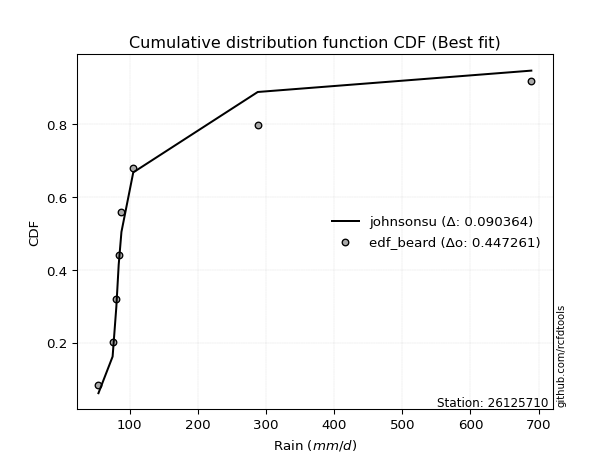</img></img>

</div>


### 5. Empirical - EDF Chegodayev (1955)

The Chegodayev formula is an empirical plotting position formula used in hydrological frequency analysis to estimate the exceedance probability or return period of a specific event from a set of observed data. It is primarily used for plotting observed data points on probability paper to fit a theoretical distribution, particularly for analyzing extreme events like maximum flood flows or rainfall intensities. The constant _b_ value in the generalized plotting position formula is 0.3.

<div align="center">


$P=(m-b)/(n+1-2b)$


</div>


**5.1. Empirical values**

<div align="center">

|                | 0                   | 1                   | 2                   | 3                   | 4                  | 5                  | 6                  | 7                  |
|:---------------|:--------------------|:--------------------|:--------------------|:--------------------|:-------------------|:-------------------|:-------------------|:-------------------|
| date           | 2021                | 2025                | 2018                | 2020                | 2017               | 2024               | 2019               | 2022               |
| x              | 54.264              | 63.2                | 75.054              | 80.535              | 83.958             | 88.0               | 105.354            | 288.0              |
| m              | 1                   | 2                   | 3                   | 4                   | 5                  | 6                  | 7                  | 8                  |
| empirical_dist | edf_chegodayev      | edf_chegodayev      | edf_chegodayev      | edf_chegodayev      | edf_chegodayev     | edf_chegodayev     | edf_chegodayev     | edf_chegodayev     |
| empirical      | 0.08333333333333333 | 0.20238095238095236 | 0.32142857142857145 | 0.44047619047619047 | 0.5595238095238095 | 0.6785714285714286 | 0.7976190476190476 | 0.9166666666666666 |
| empirical_tr   | 1.090909090909091   | 1.253731343283582   | 1.4736842105263157  | 1.7872340425531914  | 2.27027027027027   | 3.1111111111111116 | 4.941176470588234  | 11.999999999999995 |

</div>


**5.2. Kolmogorov-Smirnov fit test (sorted by Δ)**


<div align="center">

|                | 0                   | 1                   | 2                   | 3                   | 4                   | 5                  | 6                   | 7                   | 8                   | 9                   | 10                  | 11                  | 12                  | 13                  | 14                  | 15                  | 16                  | 17                  | 18                  | 19                    | 20                  | 21                 | 22                 | 23                  | 24                  | 25                  | 26                  | 27                  | 28                  | 29                 | 30                  | 31                  | 32                  | 33                 | 34                  | 35                  | 36                  | 37                  | 38                  | 39                 | 40                 | 41                 | 42                 | 43                  | 44                 | 45                  | 46                  | 47                  | 48                  | 49                  | 50                  | 51                 | 52                 | 53                 | 54                  | 55                  | 56                  | 57                  | 58                  | 59                  | 60                  | 61                  | 62                  | 63                  | 64                  | 65                  | 66                  | 67                  | 68                 | 69                  | 70                  | 71                  | 72                  | 73                  | 74                 | 75                  | 76                 | 77                 | 78                 | 79                  | 80                  | 81                  | 82                  | 83                  | 84                  | 85                  | 86                 | 87                  | 88                 | 89                 |
|:---------------|:--------------------|:--------------------|:--------------------|:--------------------|:--------------------|:-------------------|:--------------------|:--------------------|:--------------------|:--------------------|:--------------------|:--------------------|:--------------------|:--------------------|:--------------------|:--------------------|:--------------------|:--------------------|:--------------------|:----------------------|:--------------------|:-------------------|:-------------------|:--------------------|:--------------------|:--------------------|:--------------------|:--------------------|:--------------------|:-------------------|:--------------------|:--------------------|:--------------------|:-------------------|:--------------------|:--------------------|:--------------------|:--------------------|:--------------------|:-------------------|:-------------------|:-------------------|:-------------------|:--------------------|:-------------------|:--------------------|:--------------------|:--------------------|:--------------------|:--------------------|:--------------------|:-------------------|:-------------------|:-------------------|:--------------------|:--------------------|:--------------------|:--------------------|:--------------------|:--------------------|:--------------------|:--------------------|:--------------------|:--------------------|:--------------------|:--------------------|:--------------------|:--------------------|:-------------------|:--------------------|:--------------------|:--------------------|:--------------------|:--------------------|:-------------------|:--------------------|:-------------------|:-------------------|:-------------------|:--------------------|:--------------------|:--------------------|:--------------------|:--------------------|:--------------------|:--------------------|:-------------------|:--------------------|:-------------------|:-------------------|
| station        | 26125710            | 26125710            | 26125710            | 26125710            | 26125710            | 26125710           | 26125710            | 26125710            | 26125710            | 26125710            | 26125710            | 26125710            | 26125710            | 26125710            | 26125710            | 26125710            | 26125710            | 26125710            | 26125710            | 26125710              | 26125710            | 26125710           | 26125710           | 26125710            | 26125710            | 26125710            | 26125710            | 26125710            | 26125710            | 26125710           | 26125710            | 26125710            | 26125710            | 26125710           | 26125710            | 26125710            | 26125710            | 26125710            | 26125710            | 26125710           | 26125710           | 26125710           | 26125710           | 26125710            | 26125710           | 26125710            | 26125710            | 26125710            | 26125710            | 26125710            | 26125710            | 26125710           | 26125710           | 26125710           | 26125710            | 26125710            | 26125710            | 26125710            | 26125710            | 26125710            | 26125710            | 26125710            | 26125710            | 26125710            | 26125710            | 26125710            | 26125710            | 26125710            | 26125710           | 26125710            | 26125710            | 26125710            | 26125710            | 26125710            | 26125710           | 26125710            | 26125710           | 26125710           | 26125710           | 26125710            | 26125710            | 26125710            | 26125710            | 26125710            | 26125710            | 26125710            | 26125710           | 26125710            | 26125710           | 26125710           |
| empirical_dist | edf_chegodayev      | edf_chegodayev      | edf_chegodayev      | edf_chegodayev      | edf_chegodayev      | edf_chegodayev     | edf_chegodayev      | edf_chegodayev      | edf_chegodayev      | edf_chegodayev      | edf_chegodayev      | edf_chegodayev      | edf_chegodayev      | edf_chegodayev      | edf_chegodayev      | edf_chegodayev      | edf_chegodayev      | edf_chegodayev      | edf_chegodayev      | edf_chegodayev        | edf_chegodayev      | edf_chegodayev     | edf_chegodayev     | edf_chegodayev      | edf_chegodayev      | edf_chegodayev      | edf_chegodayev      | edf_chegodayev      | edf_chegodayev      | edf_chegodayev     | edf_chegodayev      | edf_chegodayev      | edf_chegodayev      | edf_chegodayev     | edf_chegodayev      | edf_chegodayev      | edf_chegodayev      | edf_chegodayev      | edf_chegodayev      | edf_chegodayev     | edf_chegodayev     | edf_chegodayev     | edf_chegodayev     | edf_chegodayev      | edf_chegodayev     | edf_chegodayev      | edf_chegodayev      | edf_chegodayev      | edf_chegodayev      | edf_chegodayev      | edf_chegodayev      | edf_chegodayev     | edf_chegodayev     | edf_chegodayev     | edf_chegodayev      | edf_chegodayev      | edf_chegodayev      | edf_chegodayev      | edf_chegodayev      | edf_chegodayev      | edf_chegodayev      | edf_chegodayev      | edf_chegodayev      | edf_chegodayev      | edf_chegodayev      | edf_chegodayev      | edf_chegodayev      | edf_chegodayev      | edf_chegodayev     | edf_chegodayev      | edf_chegodayev      | edf_chegodayev      | edf_chegodayev      | edf_chegodayev      | edf_chegodayev     | edf_chegodayev      | edf_chegodayev     | edf_chegodayev     | edf_chegodayev     | edf_chegodayev      | edf_chegodayev      | edf_chegodayev      | edf_chegodayev      | edf_chegodayev      | edf_chegodayev      | edf_chegodayev      | edf_chegodayev     | edf_chegodayev      | edf_chegodayev     | edf_chegodayev     |
| p_dist         | logt                | logjohnsonsu        | logfisk             | logalpha            | loginvweibull       | logmielke          | alpha               | loginvgamma         | logexponnorm        | f                   | invgamma            | logpearson3         | loginvgauss         | loghalflogistic     | fisk                | logfatiguelife      | logmoyal            | invgauss            | fatiguelife         | loglaplace_asymmetric | johnsonsu           | loggenlogistic     | loggenexpon        | logwald             | loggompertz         | logtruncnorm        | wald                | loghalfnorm         | gibrat              | loggumbel_r        | logexpon            | logerlang           | nct                 | lograyleigh        | pearson3            | logkstwobign        | lognakagami         | ncf                 | logf                | logmaxwell         | lognct             | betaprime          | weibull_min        | logncf              | exponnorm          | pareto              | expon               | genexpon            | laplace_asymmetric  | logbetaprime        | halflogistic        | gompertz           | moyal              | nakagami           | loggibrat           | logrice             | logloggamma         | logcrystalball      | lognorm             | lognorm             | gamma               | logweibull_min      | loglogistic         | loghypsecant        | genlogistic         | halfnorm            | gumbel_r            | loglaplace          | logchi2            | rayleigh            | maxwell             | erlang              | loggumbel_l         | kstwobign           | t                  | logistic            | crystalball        | norm               | hypsecant          | truncnorm           | rice                | laplace             | loggamma            | loggamma            | gumbel_l            | loglognorm          | invweibull         | logpareto           | chi2               | mielke             |
| delta          | 0.06702929057109608 | 0.07224204650573371 | 0.09137781210345275 | 0.09494822562745953 | 0.09747714612305891 | 0.0976822637593075 | 0.09858755097991495 | 0.10036514550881998 | 0.10308126841080356 | 0.10481744135185128 | 0.10481772263891914 | 0.10556273597710808 | 0.10621720617842689 | 0.10703769805190694 | 0.10734032365127094 | 0.10748229294751194 | 0.11058267546929623 | 0.11135191536581363 | 0.11736285404457691 | 0.11789432548524004   | 0.11946316468795565 | 0.120341328644202  | 0.1206104595999769 | 0.12342464603925724 | 0.12484897413457646 | 0.12594944697523774 | 0.12638676874989863 | 0.12746223902955123 | 0.12797107649371564 | 0.1363822248525196 | 0.14553790880675815 | 0.15494314988862856 | 0.15905205393773014 | 0.1599770466514152 | 0.16076572507399856 | 0.16186894296756837 | 0.16434651661558053 | 0.16490921054625862 | 0.16853231503629096 | 0.1715154678919203 | 0.1744056780936616 | 0.1821023244526242 | 0.1860910920899902 | 0.18681888821913556 | 0.1895979820716337 | 0.19149854146658218 | 0.19149854648422582 | 0.19150570157947866 | 0.19151512178409247 | 0.19221635451284197 | 0.19467302137074138 | 0.1954018488052568 | 0.1981850533059425 | 0.1994115426626556 | 0.20238095238095236 | 0.20356726434431277 | 0.20402108613043768 | 0.20543295033579373 | 0.20543295296416453 | 0.20543295296416453 | 0.20625135168482472 | 0.20772788857555818 | 0.20908817704111027 | 0.21220010275582324 | 0.21633846262822953 | 0.21980043965125817 | 0.22400841284657824 | 0.22401847778790984 | 0.2308835638168215 | 0.25060581648654556 | 0.26154849215880516 | 0.26282792988600906 | 0.27608713236535387 | 0.28921727400723685 | 0.2901352898843639 | 0.29404005550083745 | 0.2944702504141653 | 0.2944702520767388 | 0.294619555001221  | 0.29858779390527496 | 0.31875133500599767 | 0.32117277078795886 | 0.32459176259996486 | 0.32459176259996486 | 0.36474602471810513 | 0.40803313384560336 | 0.4191535492975936 | 0.42369327176007276 | 0.7670210928084924 | nan                |
| deltao         | 0.4472608134160001  | 0.4472608134160001  | 0.4472608134160001  | 0.4472608134160001  | 0.4472608134160001  | 0.4472608134160001 | 0.4472608134160001  | 0.4472608134160001  | 0.4472608134160001  | 0.4472608134160001  | 0.4472608134160001  | 0.4472608134160001  | 0.4472608134160001  | 0.4472608134160001  | 0.4472608134160001  | 0.4472608134160001  | 0.4472608134160001  | 0.4472608134160001  | 0.4472608134160001  | 0.4472608134160001    | 0.4472608134160001  | 0.4472608134160001 | 0.4472608134160001 | 0.4472608134160001  | 0.4472608134160001  | 0.4472608134160001  | 0.4472608134160001  | 0.4472608134160001  | 0.4472608134160001  | 0.4472608134160001 | 0.4472608134160001  | 0.4472608134160001  | 0.4472608134160001  | 0.4472608134160001 | 0.4472608134160001  | 0.4472608134160001  | 0.4472608134160001  | 0.4472608134160001  | 0.4472608134160001  | 0.4472608134160001 | 0.4472608134160001 | 0.4472608134160001 | 0.4472608134160001 | 0.4472608134160001  | 0.4472608134160001 | 0.4472608134160001  | 0.4472608134160001  | 0.4472608134160001  | 0.4472608134160001  | 0.4472608134160001  | 0.4472608134160001  | 0.4472608134160001 | 0.4472608134160001 | 0.4472608134160001 | 0.4472608134160001  | 0.4472608134160001  | 0.4472608134160001  | 0.4472608134160001  | 0.4472608134160001  | 0.4472608134160001  | 0.4472608134160001  | 0.4472608134160001  | 0.4472608134160001  | 0.4472608134160001  | 0.4472608134160001  | 0.4472608134160001  | 0.4472608134160001  | 0.4472608134160001  | 0.4472608134160001 | 0.4472608134160001  | 0.4472608134160001  | 0.4472608134160001  | 0.4472608134160001  | 0.4472608134160001  | 0.4472608134160001 | 0.4472608134160001  | 0.4472608134160001 | 0.4472608134160001 | 0.4472608134160001 | 0.4472608134160001  | 0.4472608134160001  | 0.4472608134160001  | 0.4472608134160001  | 0.4472608134160001  | 0.4472608134160001  | 0.4472608134160001  | 0.4472608134160001 | 0.4472608134160001  | 0.4472608134160001 | 0.4472608134160001 |
| eval           | Δo > Δ              | Δo > Δ              | Δo > Δ              | Δo > Δ              | Δo > Δ              | Δo > Δ             | Δo > Δ              | Δo > Δ              | Δo > Δ              | Δo > Δ              | Δo > Δ              | Δo > Δ              | Δo > Δ              | Δo > Δ              | Δo > Δ              | Δo > Δ              | Δo > Δ              | Δo > Δ              | Δo > Δ              | Δo > Δ                | Δo > Δ              | Δo > Δ             | Δo > Δ             | Δo > Δ              | Δo > Δ              | Δo > Δ              | Δo > Δ              | Δo > Δ              | Δo > Δ              | Δo > Δ             | Δo > Δ              | Δo > Δ              | Δo > Δ              | Δo > Δ             | Δo > Δ              | Δo > Δ              | Δo > Δ              | Δo > Δ              | Δo > Δ              | Δo > Δ             | Δo > Δ             | Δo > Δ             | Δo > Δ             | Δo > Δ              | Δo > Δ             | Δo > Δ              | Δo > Δ              | Δo > Δ              | Δo > Δ              | Δo > Δ              | Δo > Δ              | Δo > Δ             | Δo > Δ             | Δo > Δ             | Δo > Δ              | Δo > Δ              | Δo > Δ              | Δo > Δ              | Δo > Δ              | Δo > Δ              | Δo > Δ              | Δo > Δ              | Δo > Δ              | Δo > Δ              | Δo > Δ              | Δo > Δ              | Δo > Δ              | Δo > Δ              | Δo > Δ             | Δo > Δ              | Δo > Δ              | Δo > Δ              | Δo > Δ              | Δo > Δ              | Δo > Δ             | Δo > Δ              | Δo > Δ             | Δo > Δ             | Δo > Δ             | Δo > Δ              | Δo > Δ              | Δo > Δ              | Δo > Δ              | Δo > Δ              | Δo > Δ              | Δo > Δ              | Δo > Δ             | Δo > Δ              | Δo <= Δ            | Δo <= Δ            |
| fit            | 1                   | 1                   | 1                   | 1                   | 1                   | 1                  | 1                   | 1                   | 1                   | 1                   | 1                   | 1                   | 1                   | 1                   | 1                   | 1                   | 1                   | 1                   | 1                   | 1                     | 1                   | 1                  | 1                  | 1                   | 1                   | 1                   | 1                   | 1                   | 1                   | 1                  | 1                   | 1                   | 1                   | 1                  | 1                   | 1                   | 1                   | 1                   | 1                   | 1                  | 1                  | 1                  | 1                  | 1                   | 1                  | 1                   | 1                   | 1                   | 1                   | 1                   | 1                   | 1                  | 1                  | 1                  | 1                   | 1                   | 1                   | 1                   | 1                   | 1                   | 1                   | 1                   | 1                   | 1                   | 1                   | 1                   | 1                   | 1                   | 1                  | 1                   | 1                   | 1                   | 1                   | 1                   | 1                  | 1                   | 1                  | 1                  | 1                  | 1                   | 1                   | 1                   | 1                   | 1                   | 1                   | 1                   | 1                  | 1                   | 0                  | 0                  |
| n              | 8                   | 8                   | 8                   | 8                   | 8                   | 8                  | 8                   | 8                   | 8                   | 8                   | 8                   | 8                   | 8                   | 8                   | 8                   | 8                   | 8                   | 8                   | 8                   | 8                     | 8                   | 8                  | 8                  | 8                   | 8                   | 8                   | 8                   | 8                   | 8                   | 8                  | 8                   | 8                   | 8                   | 8                  | 8                   | 8                   | 8                   | 8                   | 8                   | 8                  | 8                  | 8                  | 8                  | 8                   | 8                  | 8                   | 8                   | 8                   | 8                   | 8                   | 8                   | 8                  | 8                  | 8                  | 8                   | 8                   | 8                   | 8                   | 8                   | 8                   | 8                   | 8                   | 8                   | 8                   | 8                   | 8                   | 8                   | 8                   | 8                  | 8                   | 8                   | 8                   | 8                   | 8                   | 8                  | 8                   | 8                  | 8                  | 8                  | 8                   | 8                   | 8                   | 8                   | 8                   | 8                   | 8                   | 8                  | 8                   | 8                  | 8                  |
| best_fit       | 1                   | 0                   | 0                   | 0                   | 0                   | 0                  | 0                   | 0                   | 0                   | 0                   | 0                   | 0                   | 0                   | 0                   | 0                   | 0                   | 0                   | 0                   | 0                   | 0                     | 0                   | 0                  | 0                  | 0                   | 0                   | 0                   | 0                   | 0                   | 0                   | 0                  | 0                   | 0                   | 0                   | 0                  | 0                   | 0                   | 0                   | 0                   | 0                   | 0                  | 0                  | 0                  | 0                  | 0                   | 0                  | 0                   | 0                   | 0                   | 0                   | 0                   | 0                   | 0                  | 0                  | 0                  | 0                   | 0                   | 0                   | 0                   | 0                   | 0                   | 0                   | 0                   | 0                   | 0                   | 0                   | 0                   | 0                   | 0                   | 0                  | 0                   | 0                   | 0                   | 0                   | 0                   | 0                  | 0                   | 0                  | 0                  | 0                  | 0                   | 0                   | 0                   | 0                   | 0                   | 0                   | 0                   | 0                  | 0                   | 0                  | 0                  |
| best_fit_sort  | 1                   | 2                   | 3                   | 4                   | 5                   | 6                  | 7                   | 8                   | 9                   | 10                  | 11                  | 12                  | 13                  | 14                  | 15                  | 16                  | 17                  | 18                  | 19                  | 20                    | 21                  | 22                 | 23                 | 24                  | 25                  | 26                  | 27                  | 28                  | 29                  | 30                 | 31                  | 32                  | 33                  | 34                 | 35                  | 36                  | 37                  | 38                  | 39                  | 40                 | 41                 | 42                 | 43                 | 44                  | 45                 | 46                  | 47                  | 48                  | 49                  | 50                  | 51                  | 52                 | 53                 | 54                 | 55                  | 56                  | 57                  | 58                  | 59                  | 60                  | 61                  | 62                  | 63                  | 64                  | 65                  | 66                  | 67                  | 68                  | 69                 | 70                  | 71                  | 72                  | 73                  | 74                  | 75                 | 76                  | 77                 | 78                 | 79                 | 80                  | 81                  | 82                  | 83                  | 84                  | 85                  | 86                  | 87                 | 88                  | 89                 | 90                 |

</div>


<div align="center">

</img>

</div>


**5.3. Best fit**

<div align="center">

|   id |   station | empirical_dist   | p_dist   |     delta |   deltao | eval   |   fit |   n |   best_fit |   best_fit_sort |
|-----:|----------:|:-----------------|:---------|----------:|---------:|:-------|------:|----:|-----------:|----------------:|
|    0 |  26125710 | edf_chegodayev   | logt     | 0.0670293 | 0.447261 | Δo > Δ |     1 |   8 |          1 |               1 |

</div>


<div align="center">

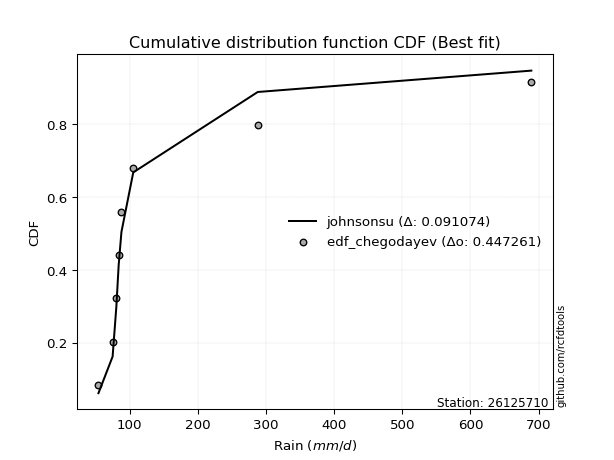</img></img>

</div>


### 6. Empirical - EDF Blom (1958)

The Blom formula is a specific "plotting position" formula used in hydrology and statistical analysis to estimate the empirical cumulative probability (or non-exceedance probability) of a data series. It is particularly recommended for data that are approximately normally distributed. The constant _a_ is set to 0.375 (or 3/8).

<div align="center">


$P=(m-a)/(n+1-2a)$


</div>


**6.1. Empirical values**

<div align="center">

|                | 0                   | 1                   | 2                  | 3                  | 4                  | 5                  | 6                 | 7                  |
|:---------------|:--------------------|:--------------------|:-------------------|:-------------------|:-------------------|:-------------------|:------------------|:-------------------|
| date           | 2021                | 2025                | 2018               | 2020               | 2017               | 2024               | 2019              | 2022               |
| x              | 54.264              | 63.2                | 75.054             | 80.535             | 83.958             | 88.0               | 105.354           | 288.0              |
| m              | 1                   | 2                   | 3                  | 4                  | 5                  | 6                  | 7                 | 8                  |
| empirical_dist | edf_blom            | edf_blom            | edf_blom           | edf_blom           | edf_blom           | edf_blom           | edf_blom          | edf_blom           |
| empirical      | 0.07575757575757576 | 0.19696969696969696 | 0.3181818181818182 | 0.4393939393939394 | 0.5606060606060606 | 0.6818181818181818 | 0.803030303030303 | 0.9242424242424242 |
| empirical_tr   | 1.0819672131147542  | 1.2452830188679247  | 1.4666666666666666 | 1.783783783783784  | 2.275862068965517  | 3.1428571428571423 | 5.076923076923076 | 13.199999999999992 |

</div>


**6.2. Kolmogorov-Smirnov fit test (sorted by Δ)**


<div align="center">

|                | 0                   | 1                   | 2                   | 3                  | 4                   | 5                   | 6                   | 7                   | 8                   | 9                   | 10                  | 11                  | 12                  | 13                  | 14                  | 15                  | 16                 | 17                 | 18                    | 19                  | 20                  | 21                  | 22                  | 23                 | 24                  | 25                  | 26                 | 27                 | 28                  | 29                  | 30                  | 31                  | 32                 | 33                  | 34                  | 35                 | 36                  | 37                  | 38                  | 39                  | 40                  | 41                  | 42                  | 43                  | 44                  | 45                  | 46                  | 47                  | 48                  | 49                  | 50                  | 51                  | 52                 | 53                  | 54                  | 55                  | 56                  | 57                 | 58                 | 59                 | 60                 | 61                  | 62                  | 63                 | 64                 | 65                 | 66                 | 67                  | 68                  | 69                 | 70                  | 71                 | 72                  | 73                 | 74                  | 75                  | 76                  | 77                 | 78                  | 79                 | 80                  | 81                 | 82                  | 83                  | 84                  | 85                 | 86                  | 87                  | 88                 | 89                 |
|:---------------|:--------------------|:--------------------|:--------------------|:-------------------|:--------------------|:--------------------|:--------------------|:--------------------|:--------------------|:--------------------|:--------------------|:--------------------|:--------------------|:--------------------|:--------------------|:--------------------|:-------------------|:-------------------|:----------------------|:--------------------|:--------------------|:--------------------|:--------------------|:-------------------|:--------------------|:--------------------|:-------------------|:-------------------|:--------------------|:--------------------|:--------------------|:--------------------|:-------------------|:--------------------|:--------------------|:-------------------|:--------------------|:--------------------|:--------------------|:--------------------|:--------------------|:--------------------|:--------------------|:--------------------|:--------------------|:--------------------|:--------------------|:--------------------|:--------------------|:--------------------|:--------------------|:--------------------|:-------------------|:--------------------|:--------------------|:--------------------|:--------------------|:-------------------|:-------------------|:-------------------|:-------------------|:--------------------|:--------------------|:-------------------|:-------------------|:-------------------|:-------------------|:--------------------|:--------------------|:-------------------|:--------------------|:-------------------|:--------------------|:-------------------|:--------------------|:--------------------|:--------------------|:-------------------|:--------------------|:-------------------|:--------------------|:-------------------|:--------------------|:--------------------|:--------------------|:-------------------|:--------------------|:--------------------|:-------------------|:-------------------|
| station        | 26125710            | 26125710            | 26125710            | 26125710           | 26125710            | 26125710            | 26125710            | 26125710            | 26125710            | 26125710            | 26125710            | 26125710            | 26125710            | 26125710            | 26125710            | 26125710            | 26125710           | 26125710           | 26125710              | 26125710            | 26125710            | 26125710            | 26125710            | 26125710           | 26125710            | 26125710            | 26125710           | 26125710           | 26125710            | 26125710            | 26125710            | 26125710            | 26125710           | 26125710            | 26125710            | 26125710           | 26125710            | 26125710            | 26125710            | 26125710            | 26125710            | 26125710            | 26125710            | 26125710            | 26125710            | 26125710            | 26125710            | 26125710            | 26125710            | 26125710            | 26125710            | 26125710            | 26125710           | 26125710            | 26125710            | 26125710            | 26125710            | 26125710           | 26125710           | 26125710           | 26125710           | 26125710            | 26125710            | 26125710           | 26125710           | 26125710           | 26125710           | 26125710            | 26125710            | 26125710           | 26125710            | 26125710           | 26125710            | 26125710           | 26125710            | 26125710            | 26125710            | 26125710           | 26125710            | 26125710           | 26125710            | 26125710           | 26125710            | 26125710            | 26125710            | 26125710           | 26125710            | 26125710            | 26125710           | 26125710           |
| empirical_dist | edf_blom            | edf_blom            | edf_blom            | edf_blom           | edf_blom            | edf_blom            | edf_blom            | edf_blom            | edf_blom            | edf_blom            | edf_blom            | edf_blom            | edf_blom            | edf_blom            | edf_blom            | edf_blom            | edf_blom           | edf_blom           | edf_blom              | edf_blom            | edf_blom            | edf_blom            | edf_blom            | edf_blom           | edf_blom            | edf_blom            | edf_blom           | edf_blom           | edf_blom            | edf_blom            | edf_blom            | edf_blom            | edf_blom           | edf_blom            | edf_blom            | edf_blom           | edf_blom            | edf_blom            | edf_blom            | edf_blom            | edf_blom            | edf_blom            | edf_blom            | edf_blom            | edf_blom            | edf_blom            | edf_blom            | edf_blom            | edf_blom            | edf_blom            | edf_blom            | edf_blom            | edf_blom           | edf_blom            | edf_blom            | edf_blom            | edf_blom            | edf_blom           | edf_blom           | edf_blom           | edf_blom           | edf_blom            | edf_blom            | edf_blom           | edf_blom           | edf_blom           | edf_blom           | edf_blom            | edf_blom            | edf_blom           | edf_blom            | edf_blom           | edf_blom            | edf_blom           | edf_blom            | edf_blom            | edf_blom            | edf_blom           | edf_blom            | edf_blom           | edf_blom            | edf_blom           | edf_blom            | edf_blom            | edf_blom            | edf_blom           | edf_blom            | edf_blom            | edf_blom           | edf_blom           |
| p_dist         | logjohnsonsu        | logt                | logfisk             | logalpha           | loginvweibull       | logmielke           | alpha               | loginvgamma         | logexponnorm        | f                   | invgamma            | logpearson3         | loginvgauss         | loghalflogistic     | fisk                | logfatiguelife      | logmoyal           | invgauss           | loglaplace_asymmetric | johnsonsu           | fatiguelife         | loggenlogistic      | loggenexpon         | logwald            | loggompertz         | logtruncnorm        | loghalfnorm        | gibrat             | wald                | loggumbel_r         | logexpon            | logerlang           | nct                | lograyleigh         | logkstwobign        | lognakagami        | pearson3            | ncf                 | logf                | logmaxwell          | lognct              | betaprime           | logncf              | weibull_min         | exponnorm           | pareto              | expon               | genexpon            | laplace_asymmetric  | logbetaprime        | loggibrat           | gompertz            | halflogistic       | moyal               | nakagami            | logrice             | logloggamma         | logcrystalball     | lognorm            | lognorm            | gamma              | logweibull_min      | loglogistic         | loghypsecant       | genlogistic        | halfnorm           | loglaplace         | gumbel_r            | logchi2             | rayleigh           | erlang              | maxwell            | loggumbel_l         | kstwobign          | t                   | hypsecant           | logistic            | crystalball        | norm                | truncnorm          | rice                | laplace            | loggamma            | loggamma            | gumbel_l            | loglognorm         | invweibull          | logpareto           | chi2               | mielke             |
| delta          | 0.06683079109447831 | 0.07027604381784924 | 0.09462456535020602 | 0.0981949788742128 | 0.10072389936981219 | 0.10092901700606077 | 0.10183430422666823 | 0.10361189875557325 | 0.10632802165755673 | 0.10806419459860456 | 0.10806447588567242 | 0.10880948922386136 | 0.10946395942518017 | 0.11028445129866021 | 0.11058707689802422 | 0.11072904619426521 | 0.1138294287160494 | 0.1145986686125669 | 0.1211410787319932    | 0.12270991793470892 | 0.12277410945583234 | 0.12358808189095516 | 0.12385721284673018 | 0.1266713992860105 | 0.12809572738132974 | 0.12919620022199102 | 0.1307089922763044 | 0.1312178297404688 | 0.13179802416115405 | 0.13962897809927277 | 0.14878466205351143 | 0.15818990313538184 | 0.1622988071844833 | 0.16322379989816838 | 0.16511569621432154 | 0.1675932698623337 | 0.16834148264975612 | 0.17032046595751404 | 0.17177906828304423 | 0.17476222113867346 | 0.17765243134041475 | 0.18534907769937736 | 0.19006564146588872 | 0.19150234750124562 | 0.19284473531838686 | 0.19474529471333535 | 0.19474529973097898 | 0.19475245482623182 | 0.19476187503084563 | 0.19546310775959513 | 0.19696969696969696 | 0.19864860205200996 | 0.2000842767819968 | 0.20359630871719792 | 0.20482279807391102 | 0.20681401759106594 | 0.20726783937719084 | 0.2086797035825469 | 0.2086797062109177 | 0.2086797062109177 | 0.209498104931578  | 0.21097464182231146 | 0.21233493028786343 | 0.2154468560025764 | 0.2195852158749827 | 0.2252116950625136 | 0.227265231034663  | 0.22941966825783366 | 0.23629481922807694 | 0.256017071897801  | 0.26607468313276234 | 0.2669597475700606 | 0.27933388561210704 | 0.29246402725399   | 0.29338204313111704 | 0.29908393318715465 | 0.29945131091209287 | 0.2998815058254207 | 0.29988150748799425 | 0.3018345471520281 | 0.32199808825275084 | 0.324419524034712  | 0.32783851584671814 | 0.32783851584671814 | 0.37015728012936056 | 0.4134443892568587 | 0.42672930687335114 | 0.42910452717132813 | 0.7724323482197477 | nan                |
| deltao         | 0.4472608134160001  | 0.4472608134160001  | 0.4472608134160001  | 0.4472608134160001 | 0.4472608134160001  | 0.4472608134160001  | 0.4472608134160001  | 0.4472608134160001  | 0.4472608134160001  | 0.4472608134160001  | 0.4472608134160001  | 0.4472608134160001  | 0.4472608134160001  | 0.4472608134160001  | 0.4472608134160001  | 0.4472608134160001  | 0.4472608134160001 | 0.4472608134160001 | 0.4472608134160001    | 0.4472608134160001  | 0.4472608134160001  | 0.4472608134160001  | 0.4472608134160001  | 0.4472608134160001 | 0.4472608134160001  | 0.4472608134160001  | 0.4472608134160001 | 0.4472608134160001 | 0.4472608134160001  | 0.4472608134160001  | 0.4472608134160001  | 0.4472608134160001  | 0.4472608134160001 | 0.4472608134160001  | 0.4472608134160001  | 0.4472608134160001 | 0.4472608134160001  | 0.4472608134160001  | 0.4472608134160001  | 0.4472608134160001  | 0.4472608134160001  | 0.4472608134160001  | 0.4472608134160001  | 0.4472608134160001  | 0.4472608134160001  | 0.4472608134160001  | 0.4472608134160001  | 0.4472608134160001  | 0.4472608134160001  | 0.4472608134160001  | 0.4472608134160001  | 0.4472608134160001  | 0.4472608134160001 | 0.4472608134160001  | 0.4472608134160001  | 0.4472608134160001  | 0.4472608134160001  | 0.4472608134160001 | 0.4472608134160001 | 0.4472608134160001 | 0.4472608134160001 | 0.4472608134160001  | 0.4472608134160001  | 0.4472608134160001 | 0.4472608134160001 | 0.4472608134160001 | 0.4472608134160001 | 0.4472608134160001  | 0.4472608134160001  | 0.4472608134160001 | 0.4472608134160001  | 0.4472608134160001 | 0.4472608134160001  | 0.4472608134160001 | 0.4472608134160001  | 0.4472608134160001  | 0.4472608134160001  | 0.4472608134160001 | 0.4472608134160001  | 0.4472608134160001 | 0.4472608134160001  | 0.4472608134160001 | 0.4472608134160001  | 0.4472608134160001  | 0.4472608134160001  | 0.4472608134160001 | 0.4472608134160001  | 0.4472608134160001  | 0.4472608134160001 | 0.4472608134160001 |
| eval           | Δo > Δ              | Δo > Δ              | Δo > Δ              | Δo > Δ             | Δo > Δ              | Δo > Δ              | Δo > Δ              | Δo > Δ              | Δo > Δ              | Δo > Δ              | Δo > Δ              | Δo > Δ              | Δo > Δ              | Δo > Δ              | Δo > Δ              | Δo > Δ              | Δo > Δ             | Δo > Δ             | Δo > Δ                | Δo > Δ              | Δo > Δ              | Δo > Δ              | Δo > Δ              | Δo > Δ             | Δo > Δ              | Δo > Δ              | Δo > Δ             | Δo > Δ             | Δo > Δ              | Δo > Δ              | Δo > Δ              | Δo > Δ              | Δo > Δ             | Δo > Δ              | Δo > Δ              | Δo > Δ             | Δo > Δ              | Δo > Δ              | Δo > Δ              | Δo > Δ              | Δo > Δ              | Δo > Δ              | Δo > Δ              | Δo > Δ              | Δo > Δ              | Δo > Δ              | Δo > Δ              | Δo > Δ              | Δo > Δ              | Δo > Δ              | Δo > Δ              | Δo > Δ              | Δo > Δ             | Δo > Δ              | Δo > Δ              | Δo > Δ              | Δo > Δ              | Δo > Δ             | Δo > Δ             | Δo > Δ             | Δo > Δ             | Δo > Δ              | Δo > Δ              | Δo > Δ             | Δo > Δ             | Δo > Δ             | Δo > Δ             | Δo > Δ              | Δo > Δ              | Δo > Δ             | Δo > Δ              | Δo > Δ             | Δo > Δ              | Δo > Δ             | Δo > Δ              | Δo > Δ              | Δo > Δ              | Δo > Δ             | Δo > Δ              | Δo > Δ             | Δo > Δ              | Δo > Δ             | Δo > Δ              | Δo > Δ              | Δo > Δ              | Δo > Δ             | Δo > Δ              | Δo > Δ              | Δo <= Δ            | Δo <= Δ            |
| fit            | 1                   | 1                   | 1                   | 1                  | 1                   | 1                   | 1                   | 1                   | 1                   | 1                   | 1                   | 1                   | 1                   | 1                   | 1                   | 1                   | 1                  | 1                  | 1                     | 1                   | 1                   | 1                   | 1                   | 1                  | 1                   | 1                   | 1                  | 1                  | 1                   | 1                   | 1                   | 1                   | 1                  | 1                   | 1                   | 1                  | 1                   | 1                   | 1                   | 1                   | 1                   | 1                   | 1                   | 1                   | 1                   | 1                   | 1                   | 1                   | 1                   | 1                   | 1                   | 1                   | 1                  | 1                   | 1                   | 1                   | 1                   | 1                  | 1                  | 1                  | 1                  | 1                   | 1                   | 1                  | 1                  | 1                  | 1                  | 1                   | 1                   | 1                  | 1                   | 1                  | 1                   | 1                  | 1                   | 1                   | 1                   | 1                  | 1                   | 1                  | 1                   | 1                  | 1                   | 1                   | 1                   | 1                  | 1                   | 1                   | 0                  | 0                  |
| n              | 8                   | 8                   | 8                   | 8                  | 8                   | 8                   | 8                   | 8                   | 8                   | 8                   | 8                   | 8                   | 8                   | 8                   | 8                   | 8                   | 8                  | 8                  | 8                     | 8                   | 8                   | 8                   | 8                   | 8                  | 8                   | 8                   | 8                  | 8                  | 8                   | 8                   | 8                   | 8                   | 8                  | 8                   | 8                   | 8                  | 8                   | 8                   | 8                   | 8                   | 8                   | 8                   | 8                   | 8                   | 8                   | 8                   | 8                   | 8                   | 8                   | 8                   | 8                   | 8                   | 8                  | 8                   | 8                   | 8                   | 8                   | 8                  | 8                  | 8                  | 8                  | 8                   | 8                   | 8                  | 8                  | 8                  | 8                  | 8                   | 8                   | 8                  | 8                   | 8                  | 8                   | 8                  | 8                   | 8                   | 8                   | 8                  | 8                   | 8                  | 8                   | 8                  | 8                   | 8                   | 8                   | 8                  | 8                   | 8                   | 8                  | 8                  |
| best_fit       | 1                   | 0                   | 0                   | 0                  | 0                   | 0                   | 0                   | 0                   | 0                   | 0                   | 0                   | 0                   | 0                   | 0                   | 0                   | 0                   | 0                  | 0                  | 0                     | 0                   | 0                   | 0                   | 0                   | 0                  | 0                   | 0                   | 0                  | 0                  | 0                   | 0                   | 0                   | 0                   | 0                  | 0                   | 0                   | 0                  | 0                   | 0                   | 0                   | 0                   | 0                   | 0                   | 0                   | 0                   | 0                   | 0                   | 0                   | 0                   | 0                   | 0                   | 0                   | 0                   | 0                  | 0                   | 0                   | 0                   | 0                   | 0                  | 0                  | 0                  | 0                  | 0                   | 0                   | 0                  | 0                  | 0                  | 0                  | 0                   | 0                   | 0                  | 0                   | 0                  | 0                   | 0                  | 0                   | 0                   | 0                   | 0                  | 0                   | 0                  | 0                   | 0                  | 0                   | 0                   | 0                   | 0                  | 0                   | 0                   | 0                  | 0                  |
| best_fit_sort  | 1                   | 2                   | 3                   | 4                  | 5                   | 6                   | 7                   | 8                   | 9                   | 10                  | 11                  | 12                  | 13                  | 14                  | 15                  | 16                  | 17                 | 18                 | 19                    | 20                  | 21                  | 22                  | 23                  | 24                 | 25                  | 26                  | 27                 | 28                 | 29                  | 30                  | 31                  | 32                  | 33                 | 34                  | 35                  | 36                 | 37                  | 38                  | 39                  | 40                  | 41                  | 42                  | 43                  | 44                  | 45                  | 46                  | 47                  | 48                  | 49                  | 50                  | 51                  | 52                  | 53                 | 54                  | 55                  | 56                  | 57                  | 58                 | 59                 | 60                 | 61                 | 62                  | 63                  | 64                 | 65                 | 66                 | 67                 | 68                  | 69                  | 70                 | 71                  | 72                 | 73                  | 74                 | 75                  | 76                  | 77                  | 78                 | 79                  | 80                 | 81                  | 82                 | 83                  | 84                  | 85                  | 86                 | 87                  | 88                  | 89                 | 90                 |

</div>


<div align="center">

</img>

</div>


**6.3. Best fit**

<div align="center">

|   id |   station | empirical_dist   | p_dist       |     delta |   deltao | eval   |   fit |   n |   best_fit |   best_fit_sort |
|-----:|----------:|:-----------------|:-------------|----------:|---------:|:-------|------:|----:|-----------:|----------------:|
|    0 |  26125710 | edf_blom         | logjohnsonsu | 0.0668308 | 0.447261 | Δo > Δ |     1 |   8 |          1 |               1 |

</div>


<div align="center">

</img>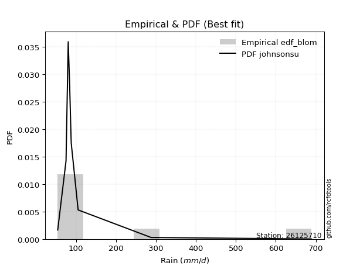</img>

</div>


### 7. Empirical - EDF Tukey (1962)

In hydrology, the Tukey formula is used as a plotting position formula to estimate the empirical probability or frequency of a flood event (or other hydrological data). The formula parameter is given as _c=0.333_ (or 1/3).

<div align="center">


$P=(m-c)/(n+1-2c)$


</div>


**7.1. Empirical values**

<div align="center">

|                | 0                  | 1         | 2                  | 3                  | 4                 | 5                  | 6                 | 7                  |
|:---------------|:-------------------|:----------|:-------------------|:-------------------|:------------------|:-------------------|:------------------|:-------------------|
| date           | 2021               | 2025      | 2018               | 2020               | 2017              | 2024               | 2019              | 2022               |
| x              | 54.264             | 63.2      | 75.054             | 80.535             | 83.958            | 88.0               | 105.354           | 288.0              |
| m              | 1                  | 2         | 3                  | 4                  | 5                 | 6                  | 7                 | 8                  |
| empirical_dist | edf_tukey          | edf_tukey | edf_tukey          | edf_tukey          | edf_tukey         | edf_tukey          | edf_tukey         | edf_tukey          |
| empirical      | 0.08               | 0.2       | 0.32               | 0.44               | 0.56              | 0.68               | 0.8               | 0.92               |
| empirical_tr   | 1.0869565217391304 | 1.25      | 1.4705882352941178 | 1.7857142857142856 | 2.272727272727273 | 3.1250000000000004 | 5.000000000000001 | 12.500000000000007 |

</div>


**7.2. Kolmogorov-Smirnov fit test (sorted by Δ)**


<div align="center">

|                | 0                   | 1                   | 2                  | 3                   | 4                   | 5                   | 6                  | 7                   | 8                   | 9                   | 10                  | 11                  | 12                  | 13                  | 14                  | 15                  | 16                  | 17                  | 18                    | 19                 | 20                 | 21                  | 22                  | 23                  | 24                 | 25                 | 26                 | 27                  | 28                 | 29                  | 30                 | 31                 | 32                 | 33                  | 34                  | 35                  | 36                  | 37                 | 38                 | 39                  | 40                  | 41                  | 42                 | 43                  | 44                  | 45                  | 46                  | 47                 | 48                 | 49                  | 50                  | 51                  | 52                 | 53                  | 54                  | 55                  | 56                  | 57                  | 58                  | 59                  | 60                  | 61                  | 62                 | 63                  | 64                  | 65                  | 66                 | 67                  | 68                 | 69                  | 70                  | 71                 | 72                 | 73                 | 74                 | 75                 | 76                  | 77                 | 78                 | 79                 | 80                 | 81                 | 82                 | 83                 | 84                 | 85                 | 86                 | 87                 | 88                 | 89                 |
|:---------------|:--------------------|:--------------------|:-------------------|:--------------------|:--------------------|:--------------------|:-------------------|:--------------------|:--------------------|:--------------------|:--------------------|:--------------------|:--------------------|:--------------------|:--------------------|:--------------------|:--------------------|:--------------------|:----------------------|:-------------------|:-------------------|:--------------------|:--------------------|:--------------------|:-------------------|:-------------------|:-------------------|:--------------------|:-------------------|:--------------------|:-------------------|:-------------------|:-------------------|:--------------------|:--------------------|:--------------------|:--------------------|:-------------------|:-------------------|:--------------------|:--------------------|:--------------------|:-------------------|:--------------------|:--------------------|:--------------------|:--------------------|:-------------------|:-------------------|:--------------------|:--------------------|:--------------------|:-------------------|:--------------------|:--------------------|:--------------------|:--------------------|:--------------------|:--------------------|:--------------------|:--------------------|:--------------------|:-------------------|:--------------------|:--------------------|:--------------------|:-------------------|:--------------------|:-------------------|:--------------------|:--------------------|:-------------------|:-------------------|:-------------------|:-------------------|:-------------------|:--------------------|:-------------------|:-------------------|:-------------------|:-------------------|:-------------------|:-------------------|:-------------------|:-------------------|:-------------------|:-------------------|:-------------------|:-------------------|:-------------------|
| station        | 26125710            | 26125710            | 26125710           | 26125710            | 26125710            | 26125710            | 26125710           | 26125710            | 26125710            | 26125710            | 26125710            | 26125710            | 26125710            | 26125710            | 26125710            | 26125710            | 26125710            | 26125710            | 26125710              | 26125710           | 26125710           | 26125710            | 26125710            | 26125710            | 26125710           | 26125710           | 26125710           | 26125710            | 26125710           | 26125710            | 26125710           | 26125710           | 26125710           | 26125710            | 26125710            | 26125710            | 26125710            | 26125710           | 26125710           | 26125710            | 26125710            | 26125710            | 26125710           | 26125710            | 26125710            | 26125710            | 26125710            | 26125710           | 26125710           | 26125710            | 26125710            | 26125710            | 26125710           | 26125710            | 26125710            | 26125710            | 26125710            | 26125710            | 26125710            | 26125710            | 26125710            | 26125710            | 26125710           | 26125710            | 26125710            | 26125710            | 26125710           | 26125710            | 26125710           | 26125710            | 26125710            | 26125710           | 26125710           | 26125710           | 26125710           | 26125710           | 26125710            | 26125710           | 26125710           | 26125710           | 26125710           | 26125710           | 26125710           | 26125710           | 26125710           | 26125710           | 26125710           | 26125710           | 26125710           | 26125710           |
| empirical_dist | edf_tukey           | edf_tukey           | edf_tukey          | edf_tukey           | edf_tukey           | edf_tukey           | edf_tukey          | edf_tukey           | edf_tukey           | edf_tukey           | edf_tukey           | edf_tukey           | edf_tukey           | edf_tukey           | edf_tukey           | edf_tukey           | edf_tukey           | edf_tukey           | edf_tukey             | edf_tukey          | edf_tukey          | edf_tukey           | edf_tukey           | edf_tukey           | edf_tukey          | edf_tukey          | edf_tukey          | edf_tukey           | edf_tukey          | edf_tukey           | edf_tukey          | edf_tukey          | edf_tukey          | edf_tukey           | edf_tukey           | edf_tukey           | edf_tukey           | edf_tukey          | edf_tukey          | edf_tukey           | edf_tukey           | edf_tukey           | edf_tukey          | edf_tukey           | edf_tukey           | edf_tukey           | edf_tukey           | edf_tukey          | edf_tukey          | edf_tukey           | edf_tukey           | edf_tukey           | edf_tukey          | edf_tukey           | edf_tukey           | edf_tukey           | edf_tukey           | edf_tukey           | edf_tukey           | edf_tukey           | edf_tukey           | edf_tukey           | edf_tukey          | edf_tukey           | edf_tukey           | edf_tukey           | edf_tukey          | edf_tukey           | edf_tukey          | edf_tukey           | edf_tukey           | edf_tukey          | edf_tukey          | edf_tukey          | edf_tukey          | edf_tukey          | edf_tukey           | edf_tukey          | edf_tukey          | edf_tukey          | edf_tukey          | edf_tukey          | edf_tukey          | edf_tukey          | edf_tukey          | edf_tukey          | edf_tukey          | edf_tukey          | edf_tukey          | edf_tukey          |
| p_dist         | logt                | logjohnsonsu        | logfisk            | logalpha            | loginvweibull       | logmielke           | alpha              | loginvgamma         | logexponnorm        | f                   | invgamma            | logpearson3         | loginvgauss         | loghalflogistic     | fisk                | logfatiguelife      | logmoyal            | invgauss            | loglaplace_asymmetric | fatiguelife        | johnsonsu          | loggenlogistic      | loggenexpon         | logwald             | loggompertz        | logtruncnorm       | wald               | loghalfnorm         | gibrat             | loggumbel_r         | logexpon           | logerlang          | nct                | lograyleigh         | logkstwobign        | pearson3            | lognakagami         | ncf                | logf               | logmaxwell          | lognct              | betaprime           | logncf             | weibull_min         | exponnorm           | pareto              | expon               | genexpon           | laplace_asymmetric | logbetaprime        | gompertz            | halflogistic        | loggibrat          | moyal               | nakagami            | logrice             | logloggamma         | logcrystalball      | lognorm             | lognorm             | gamma               | logweibull_min      | loglogistic        | loghypsecant        | genlogistic         | halfnorm            | loglaplace         | gumbel_r            | logchi2            | rayleigh            | maxwell             | erlang             | loggumbel_l        | kstwobign          | t                  | hypsecant          | logistic            | crystalball        | norm               | truncnorm          | rice               | laplace            | loggamma           | loggamma           | gumbel_l           | loglognorm         | invweibull         | logpareto          | chi2               | mielke             |
| delta          | 0.06845786199966752 | 0.06986109412478136 | 0.0928063835320242 | 0.09637679705603097 | 0.09890571755163036 | 0.09911083518787894 | 0.1000161224084864 | 0.10179371693739142 | 0.10450983983937501 | 0.10624601278042273 | 0.10624629406749059 | 0.10699130740567953 | 0.10764577760699834 | 0.10846626948047838 | 0.10876889507984239 | 0.10891086437608338 | 0.11201124689786768 | 0.11278048679438507 | 0.11932289691381148   | 0.1197438064255294 | 0.1208917361165271 | 0.12176990007277344 | 0.12203903102854835 | 0.12485321746782868 | 0.1262775455631479 | 0.1273780184038092 | 0.1287677211308511 | 0.12889081045812267 | 0.1293996479222871 | 0.13781079628109105 | 0.1469664802353296 | 0.1563717213172    | 0.1604806253663016 | 0.16140561807998666 | 0.16329751439613982 | 0.16409905840733185 | 0.16577508804415197 | 0.1672901629272111 | 0.1699608864648624 | 0.17294403932049174 | 0.17583424952223303 | 0.18353089588119564 | 0.188247459647707  | 0.18847204447094268 | 0.19102655350020514 | 0.19292711289515363 | 0.19292711791279726 | 0.1929342730080501 | 0.1929436932126639 | 0.19364492594141341 | 0.19683042023382824 | 0.19705397375169387 | 0.2                | 0.20056600568689498 | 0.20179249504360808 | 0.20499583577288422 | 0.20544965755900912 | 0.20686152176436517 | 0.20686152439273597 | 0.20686152439273597 | 0.20767992311339617 | 0.20915646000412963 | 0.2105167484696817 | 0.21362867418439468 | 0.21776703405680098 | 0.22218139203221066 | 0.2254470492164813 | 0.22638936522753073 | 0.233264516197774  | 0.25298676886749805 | 0.26392944453975764 | 0.2642565013145805 | 0.2775157037939253 | 0.2906458454358083 | 0.2915638613129353 | 0.2960536301568517 | 0.29642100788178993 | 0.2968512027951178 | 0.2968512044576913 | 0.3000163653338464 | 0.3201799064345691 | 0.3226013422165303 | 0.3260203340285363 | 0.3260203340285363 | 0.3671269770990576 | 0.4104140862265557 | 0.422486882630927  | 0.4260742241410251 | 0.7694020451894448 | nan                |
| deltao         | 0.4472608134160001  | 0.4472608134160001  | 0.4472608134160001 | 0.4472608134160001  | 0.4472608134160001  | 0.4472608134160001  | 0.4472608134160001 | 0.4472608134160001  | 0.4472608134160001  | 0.4472608134160001  | 0.4472608134160001  | 0.4472608134160001  | 0.4472608134160001  | 0.4472608134160001  | 0.4472608134160001  | 0.4472608134160001  | 0.4472608134160001  | 0.4472608134160001  | 0.4472608134160001    | 0.4472608134160001 | 0.4472608134160001 | 0.4472608134160001  | 0.4472608134160001  | 0.4472608134160001  | 0.4472608134160001 | 0.4472608134160001 | 0.4472608134160001 | 0.4472608134160001  | 0.4472608134160001 | 0.4472608134160001  | 0.4472608134160001 | 0.4472608134160001 | 0.4472608134160001 | 0.4472608134160001  | 0.4472608134160001  | 0.4472608134160001  | 0.4472608134160001  | 0.4472608134160001 | 0.4472608134160001 | 0.4472608134160001  | 0.4472608134160001  | 0.4472608134160001  | 0.4472608134160001 | 0.4472608134160001  | 0.4472608134160001  | 0.4472608134160001  | 0.4472608134160001  | 0.4472608134160001 | 0.4472608134160001 | 0.4472608134160001  | 0.4472608134160001  | 0.4472608134160001  | 0.4472608134160001 | 0.4472608134160001  | 0.4472608134160001  | 0.4472608134160001  | 0.4472608134160001  | 0.4472608134160001  | 0.4472608134160001  | 0.4472608134160001  | 0.4472608134160001  | 0.4472608134160001  | 0.4472608134160001 | 0.4472608134160001  | 0.4472608134160001  | 0.4472608134160001  | 0.4472608134160001 | 0.4472608134160001  | 0.4472608134160001 | 0.4472608134160001  | 0.4472608134160001  | 0.4472608134160001 | 0.4472608134160001 | 0.4472608134160001 | 0.4472608134160001 | 0.4472608134160001 | 0.4472608134160001  | 0.4472608134160001 | 0.4472608134160001 | 0.4472608134160001 | 0.4472608134160001 | 0.4472608134160001 | 0.4472608134160001 | 0.4472608134160001 | 0.4472608134160001 | 0.4472608134160001 | 0.4472608134160001 | 0.4472608134160001 | 0.4472608134160001 | 0.4472608134160001 |
| eval           | Δo > Δ              | Δo > Δ              | Δo > Δ             | Δo > Δ              | Δo > Δ              | Δo > Δ              | Δo > Δ             | Δo > Δ              | Δo > Δ              | Δo > Δ              | Δo > Δ              | Δo > Δ              | Δo > Δ              | Δo > Δ              | Δo > Δ              | Δo > Δ              | Δo > Δ              | Δo > Δ              | Δo > Δ                | Δo > Δ             | Δo > Δ             | Δo > Δ              | Δo > Δ              | Δo > Δ              | Δo > Δ             | Δo > Δ             | Δo > Δ             | Δo > Δ              | Δo > Δ             | Δo > Δ              | Δo > Δ             | Δo > Δ             | Δo > Δ             | Δo > Δ              | Δo > Δ              | Δo > Δ              | Δo > Δ              | Δo > Δ             | Δo > Δ             | Δo > Δ              | Δo > Δ              | Δo > Δ              | Δo > Δ             | Δo > Δ              | Δo > Δ              | Δo > Δ              | Δo > Δ              | Δo > Δ             | Δo > Δ             | Δo > Δ              | Δo > Δ              | Δo > Δ              | Δo > Δ             | Δo > Δ              | Δo > Δ              | Δo > Δ              | Δo > Δ              | Δo > Δ              | Δo > Δ              | Δo > Δ              | Δo > Δ              | Δo > Δ              | Δo > Δ             | Δo > Δ              | Δo > Δ              | Δo > Δ              | Δo > Δ             | Δo > Δ              | Δo > Δ             | Δo > Δ              | Δo > Δ              | Δo > Δ             | Δo > Δ             | Δo > Δ             | Δo > Δ             | Δo > Δ             | Δo > Δ              | Δo > Δ             | Δo > Δ             | Δo > Δ             | Δo > Δ             | Δo > Δ             | Δo > Δ             | Δo > Δ             | Δo > Δ             | Δo > Δ             | Δo > Δ             | Δo > Δ             | Δo <= Δ            | Δo <= Δ            |
| fit            | 1                   | 1                   | 1                  | 1                   | 1                   | 1                   | 1                  | 1                   | 1                   | 1                   | 1                   | 1                   | 1                   | 1                   | 1                   | 1                   | 1                   | 1                   | 1                     | 1                  | 1                  | 1                   | 1                   | 1                   | 1                  | 1                  | 1                  | 1                   | 1                  | 1                   | 1                  | 1                  | 1                  | 1                   | 1                   | 1                   | 1                   | 1                  | 1                  | 1                   | 1                   | 1                   | 1                  | 1                   | 1                   | 1                   | 1                   | 1                  | 1                  | 1                   | 1                   | 1                   | 1                  | 1                   | 1                   | 1                   | 1                   | 1                   | 1                   | 1                   | 1                   | 1                   | 1                  | 1                   | 1                   | 1                   | 1                  | 1                   | 1                  | 1                   | 1                   | 1                  | 1                  | 1                  | 1                  | 1                  | 1                   | 1                  | 1                  | 1                  | 1                  | 1                  | 1                  | 1                  | 1                  | 1                  | 1                  | 1                  | 0                  | 0                  |
| n              | 8                   | 8                   | 8                  | 8                   | 8                   | 8                   | 8                  | 8                   | 8                   | 8                   | 8                   | 8                   | 8                   | 8                   | 8                   | 8                   | 8                   | 8                   | 8                     | 8                  | 8                  | 8                   | 8                   | 8                   | 8                  | 8                  | 8                  | 8                   | 8                  | 8                   | 8                  | 8                  | 8                  | 8                   | 8                   | 8                   | 8                   | 8                  | 8                  | 8                   | 8                   | 8                   | 8                  | 8                   | 8                   | 8                   | 8                   | 8                  | 8                  | 8                   | 8                   | 8                   | 8                  | 8                   | 8                   | 8                   | 8                   | 8                   | 8                   | 8                   | 8                   | 8                   | 8                  | 8                   | 8                   | 8                   | 8                  | 8                   | 8                  | 8                   | 8                   | 8                  | 8                  | 8                  | 8                  | 8                  | 8                   | 8                  | 8                  | 8                  | 8                  | 8                  | 8                  | 8                  | 8                  | 8                  | 8                  | 8                  | 8                  | 8                  |
| best_fit       | 1                   | 0                   | 0                  | 0                   | 0                   | 0                   | 0                  | 0                   | 0                   | 0                   | 0                   | 0                   | 0                   | 0                   | 0                   | 0                   | 0                   | 0                   | 0                     | 0                  | 0                  | 0                   | 0                   | 0                   | 0                  | 0                  | 0                  | 0                   | 0                  | 0                   | 0                  | 0                  | 0                  | 0                   | 0                   | 0                   | 0                   | 0                  | 0                  | 0                   | 0                   | 0                   | 0                  | 0                   | 0                   | 0                   | 0                   | 0                  | 0                  | 0                   | 0                   | 0                   | 0                  | 0                   | 0                   | 0                   | 0                   | 0                   | 0                   | 0                   | 0                   | 0                   | 0                  | 0                   | 0                   | 0                   | 0                  | 0                   | 0                  | 0                   | 0                   | 0                  | 0                  | 0                  | 0                  | 0                  | 0                   | 0                  | 0                  | 0                  | 0                  | 0                  | 0                  | 0                  | 0                  | 0                  | 0                  | 0                  | 0                  | 0                  |
| best_fit_sort  | 1                   | 2                   | 3                  | 4                   | 5                   | 6                   | 7                  | 8                   | 9                   | 10                  | 11                  | 12                  | 13                  | 14                  | 15                  | 16                  | 17                  | 18                  | 19                    | 20                 | 21                 | 22                  | 23                  | 24                  | 25                 | 26                 | 27                 | 28                  | 29                 | 30                  | 31                 | 32                 | 33                 | 34                  | 35                  | 36                  | 37                  | 38                 | 39                 | 40                  | 41                  | 42                  | 43                 | 44                  | 45                  | 46                  | 47                  | 48                 | 49                 | 50                  | 51                  | 52                  | 53                 | 54                  | 55                  | 56                  | 57                  | 58                  | 59                  | 60                  | 61                  | 62                  | 63                 | 64                  | 65                  | 66                  | 67                 | 68                  | 69                 | 70                  | 71                  | 72                 | 73                 | 74                 | 75                 | 76                 | 77                  | 78                 | 79                 | 80                 | 81                 | 82                 | 83                 | 84                 | 85                 | 86                 | 87                 | 88                 | 89                 | 90                 |

</div>


<div align="center">

</img>

</div>


**7.3. Best fit**

<div align="center">

|   id |   station | empirical_dist   | p_dist   |     delta |   deltao | eval   |   fit |   n |   best_fit |   best_fit_sort |
|-----:|----------:|:-----------------|:---------|----------:|---------:|:-------|------:|----:|-----------:|----------------:|
|    0 |  26125710 | edf_tukey        | logt     | 0.0684579 | 0.447261 | Δo > Δ |     1 |   8 |          1 |               1 |

</div>


<div align="center">

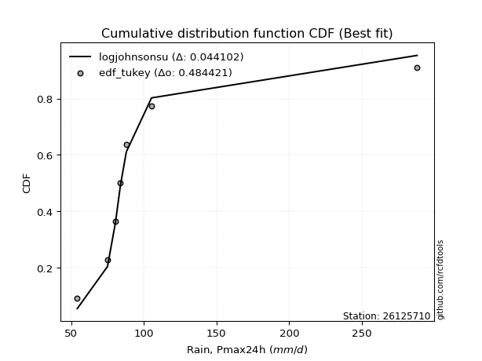</img>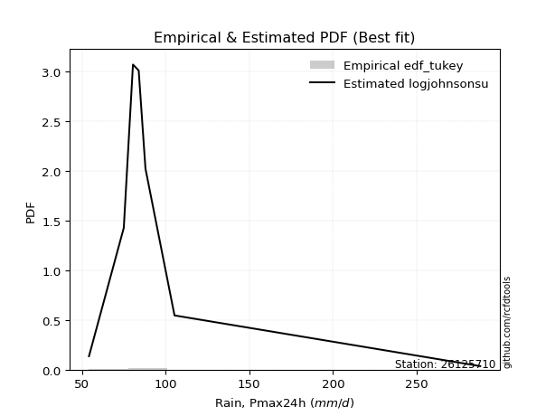</img>

</div>


### 8. Empirical - EDF Gringorten (1963)

Gringorten plotting position formula is essential for estimating the probability and return periods of extreme events like floods and heavy rainfall. The constant _a=0.44_.

<div align="center">


$P=(m-a)/(n+1-2a)$


</div>


**8.1. Empirical values**

<div align="center">

|                | 0                   | 1                   | 2                  | 3                  | 4                  | 5                  | 6                  | 7                  |
|:---------------|:--------------------|:--------------------|:-------------------|:-------------------|:-------------------|:-------------------|:-------------------|:-------------------|
| date           | 2021                | 2025                | 2018               | 2020               | 2017               | 2024               | 2019               | 2022               |
| x              | 54.264              | 63.2                | 75.054             | 80.535             | 83.958             | 88.0               | 105.354            | 288.0              |
| m              | 1                   | 2                   | 3                  | 4                  | 5                  | 6                  | 7                  | 8                  |
| empirical_dist | edf_gringorten      | edf_gringorten      | edf_gringorten     | edf_gringorten     | edf_gringorten     | edf_gringorten     | edf_gringorten     | edf_gringorten     |
| empirical      | 0.06896551724137932 | 0.19211822660098524 | 0.3152709359605912 | 0.4384236453201971 | 0.5615763546798029 | 0.6847290640394089 | 0.8078817733990148 | 0.9310344827586208 |
| empirical_tr   | 1.0740740740740742  | 1.2378048780487805  | 1.460431654676259  | 1.780701754385965  | 2.2808988764044944 | 3.1718750000000004 | 5.205128205128205  | 14.500000000000018 |

</div>


**8.2. Kolmogorov-Smirnov fit test (sorted by Δ)**


<div align="center">

|                | 0                   | 1                  | 2                   | 3                   | 4                   | 5                   | 6                   | 7                   | 8                   | 9                   | 10                 | 11                  | 12                  | 13                 | 14                 | 15                 | 16                  | 17                  | 18                    | 19                 | 20                 | 21                  | 22                  | 23                 | 24                  | 25                 | 26                  | 27                  | 28                  | 29                  | 30                  | 31                  | 32                  | 33                  | 34                 | 35                  | 36                  | 37                  | 38                 | 39                 | 40                 | 41                 | 42                  | 43                  | 44                 | 45                  | 46                 | 47                  | 48                  | 49                  | 50                  | 51                 | 52                 | 53                  | 54                  | 55                 | 56                 | 57                  | 58                  | 59                  | 60                  | 61                  | 62                  | 63                  | 64                  | 65                 | 66                  | 67                  | 68                  | 69                 | 70                 | 71                 | 72                 | 73                  | 74                 | 75                  | 76                 | 77                  | 78                  | 79                  | 80                 | 81                 | 82                 | 83                 | 84                  | 85                 | 86                 | 87                 | 88                 | 89                 |
|:---------------|:--------------------|:-------------------|:--------------------|:--------------------|:--------------------|:--------------------|:--------------------|:--------------------|:--------------------|:--------------------|:-------------------|:--------------------|:--------------------|:-------------------|:-------------------|:-------------------|:--------------------|:--------------------|:----------------------|:-------------------|:-------------------|:--------------------|:--------------------|:-------------------|:--------------------|:-------------------|:--------------------|:--------------------|:--------------------|:--------------------|:--------------------|:--------------------|:--------------------|:--------------------|:-------------------|:--------------------|:--------------------|:--------------------|:-------------------|:-------------------|:-------------------|:-------------------|:--------------------|:--------------------|:-------------------|:--------------------|:-------------------|:--------------------|:--------------------|:--------------------|:--------------------|:-------------------|:-------------------|:--------------------|:--------------------|:-------------------|:-------------------|:--------------------|:--------------------|:--------------------|:--------------------|:--------------------|:--------------------|:--------------------|:--------------------|:-------------------|:--------------------|:--------------------|:--------------------|:-------------------|:-------------------|:-------------------|:-------------------|:--------------------|:-------------------|:--------------------|:-------------------|:--------------------|:--------------------|:--------------------|:-------------------|:-------------------|:-------------------|:-------------------|:--------------------|:-------------------|:-------------------|:-------------------|:-------------------|:-------------------|
| station        | 26125710            | 26125710           | 26125710            | 26125710            | 26125710            | 26125710            | 26125710            | 26125710            | 26125710            | 26125710            | 26125710           | 26125710            | 26125710            | 26125710           | 26125710           | 26125710           | 26125710            | 26125710            | 26125710              | 26125710           | 26125710           | 26125710            | 26125710            | 26125710           | 26125710            | 26125710           | 26125710            | 26125710            | 26125710            | 26125710            | 26125710            | 26125710            | 26125710            | 26125710            | 26125710           | 26125710            | 26125710            | 26125710            | 26125710           | 26125710           | 26125710           | 26125710           | 26125710            | 26125710            | 26125710           | 26125710            | 26125710           | 26125710            | 26125710            | 26125710            | 26125710            | 26125710           | 26125710           | 26125710            | 26125710            | 26125710           | 26125710           | 26125710            | 26125710            | 26125710            | 26125710            | 26125710            | 26125710            | 26125710            | 26125710            | 26125710           | 26125710            | 26125710            | 26125710            | 26125710           | 26125710           | 26125710           | 26125710           | 26125710            | 26125710           | 26125710            | 26125710           | 26125710            | 26125710            | 26125710            | 26125710           | 26125710           | 26125710           | 26125710           | 26125710            | 26125710           | 26125710           | 26125710           | 26125710           | 26125710           |
| empirical_dist | edf_gringorten      | edf_gringorten     | edf_gringorten      | edf_gringorten      | edf_gringorten      | edf_gringorten      | edf_gringorten      | edf_gringorten      | edf_gringorten      | edf_gringorten      | edf_gringorten     | edf_gringorten      | edf_gringorten      | edf_gringorten     | edf_gringorten     | edf_gringorten     | edf_gringorten      | edf_gringorten      | edf_gringorten        | edf_gringorten     | edf_gringorten     | edf_gringorten      | edf_gringorten      | edf_gringorten     | edf_gringorten      | edf_gringorten     | edf_gringorten      | edf_gringorten      | edf_gringorten      | edf_gringorten      | edf_gringorten      | edf_gringorten      | edf_gringorten      | edf_gringorten      | edf_gringorten     | edf_gringorten      | edf_gringorten      | edf_gringorten      | edf_gringorten     | edf_gringorten     | edf_gringorten     | edf_gringorten     | edf_gringorten      | edf_gringorten      | edf_gringorten     | edf_gringorten      | edf_gringorten     | edf_gringorten      | edf_gringorten      | edf_gringorten      | edf_gringorten      | edf_gringorten     | edf_gringorten     | edf_gringorten      | edf_gringorten      | edf_gringorten     | edf_gringorten     | edf_gringorten      | edf_gringorten      | edf_gringorten      | edf_gringorten      | edf_gringorten      | edf_gringorten      | edf_gringorten      | edf_gringorten      | edf_gringorten     | edf_gringorten      | edf_gringorten      | edf_gringorten      | edf_gringorten     | edf_gringorten     | edf_gringorten     | edf_gringorten     | edf_gringorten      | edf_gringorten     | edf_gringorten      | edf_gringorten     | edf_gringorten      | edf_gringorten      | edf_gringorten      | edf_gringorten     | edf_gringorten     | edf_gringorten     | edf_gringorten     | edf_gringorten      | edf_gringorten     | edf_gringorten     | edf_gringorten     | edf_gringorten     | edf_gringorten     |
| p_dist         | logjohnsonsu        | logt               | logfisk             | logalpha            | loginvweibull       | logmielke           | alpha               | loginvgamma         | logexponnorm        | f                   | invgamma           | logpearson3         | loginvgauss         | loghalflogistic    | fisk               | logfatiguelife     | logmoyal            | invgauss            | loglaplace_asymmetric | johnsonsu          | loggenlogistic     | loggenexpon         | fatiguelife         | logwald            | loggompertz         | logtruncnorm       | loghalfnorm         | gibrat              | wald                | loggumbel_r         | logexpon            | logerlang           | nct                 | lograyleigh         | logkstwobign       | lognakagami         | logf                | pearson3            | ncf                | logmaxwell         | lognct             | betaprime          | loggibrat           | logncf              | exponnorm          | weibull_min         | pareto             | expon               | genexpon            | laplace_asymmetric  | logbetaprime        | gompertz           | halflogistic       | moyal               | nakagami            | logrice            | logloggamma        | logcrystalball      | lognorm             | lognorm             | gamma               | logweibull_min      | loglogistic         | loghypsecant        | genlogistic         | halfnorm           | loglaplace          | gumbel_r            | logchi2             | rayleigh           | erlang             | maxwell            | loggumbel_l        | kstwobign           | t                  | hypsecant           | logistic           | crystalball         | norm                | truncnorm           | rice               | laplace            | loggamma           | loggamma           | gumbel_l            | loglognorm         | invweibull         | logpareto          | chi2               | mielke             |
| delta          | 0.06197932072576659 | 0.0731869260390764 | 0.09753544757143301 | 0.10110586109543979 | 0.10363478159103917 | 0.10383989922728776 | 0.10474518644789521 | 0.10652278097680024 | 0.10923890387878388 | 0.11097507681983154 | 0.1109753581068994 | 0.11172037144508834 | 0.11237484164640715 | 0.1131953335198872 | 0.1134979591192512 | 0.1136399284154922 | 0.11674031093727655 | 0.11750955083379389 | 0.12405196095322035   | 0.1256208001559359 | 0.1264989641121823 | 0.12676809506795716 | 0.12762557982454414 | 0.1295822815072375 | 0.13100660960255672 | 0.132107082443218  | 0.13361987449753154 | 0.13412871196169596 | 0.13664949452986586 | 0.14253986032049992 | 0.15169554427473841 | 0.16110078535660882 | 0.16520968940571046 | 0.16613468211939553 | 0.1680265784355487 | 0.17050415208356084 | 0.17468995050427122 | 0.17513354116595253 | 0.1755852650224728 | 0.1776731033599006 | 0.1805633135616419 | 0.1882599599206045 | 0.19211822660098524 | 0.19297652368711588 | 0.195755617539614  | 0.19635381786995743 | 0.1976561769345625 | 0.19765618195220613 | 0.19766333704745898 | 0.19767275725207278 | 0.19837398998082229 | 0.2015594842732371 | 0.2049357471507086 | 0.20844777908590972 | 0.20967426844262282 | 0.2097248998122931 | 0.210178721598418  | 0.21159058580377405 | 0.21159058843214484 | 0.21159058843214484 | 0.21240898715280498 | 0.21388552404353844 | 0.21524581250909058 | 0.21835773822380355 | 0.22249609809620985 | 0.2300631654312254 | 0.23017611325589016 | 0.23427113862654547 | 0.24114628959678874 | 0.2608685422665128 | 0.2689855653539893 | 0.2718112179387724 | 0.2822447678333342 | 0.29537490947521716 | 0.2962929253523442 | 0.30393540355586646 | 0.3043027812808047 | 0.30473297619413253 | 0.30473297785670606 | 0.30474542937325527 | 0.324908970473978  | 0.3273304062559392 | 0.3307493980679451 | 0.3307493980679451 | 0.37500875049807236 | 0.4182958596255705 | 0.4335213653895477 | 0.4339559975400399 | 0.7772838185884595 | nan                |
| deltao         | 0.4472608134160001  | 0.4472608134160001 | 0.4472608134160001  | 0.4472608134160001  | 0.4472608134160001  | 0.4472608134160001  | 0.4472608134160001  | 0.4472608134160001  | 0.4472608134160001  | 0.4472608134160001  | 0.4472608134160001 | 0.4472608134160001  | 0.4472608134160001  | 0.4472608134160001 | 0.4472608134160001 | 0.4472608134160001 | 0.4472608134160001  | 0.4472608134160001  | 0.4472608134160001    | 0.4472608134160001 | 0.4472608134160001 | 0.4472608134160001  | 0.4472608134160001  | 0.4472608134160001 | 0.4472608134160001  | 0.4472608134160001 | 0.4472608134160001  | 0.4472608134160001  | 0.4472608134160001  | 0.4472608134160001  | 0.4472608134160001  | 0.4472608134160001  | 0.4472608134160001  | 0.4472608134160001  | 0.4472608134160001 | 0.4472608134160001  | 0.4472608134160001  | 0.4472608134160001  | 0.4472608134160001 | 0.4472608134160001 | 0.4472608134160001 | 0.4472608134160001 | 0.4472608134160001  | 0.4472608134160001  | 0.4472608134160001 | 0.4472608134160001  | 0.4472608134160001 | 0.4472608134160001  | 0.4472608134160001  | 0.4472608134160001  | 0.4472608134160001  | 0.4472608134160001 | 0.4472608134160001 | 0.4472608134160001  | 0.4472608134160001  | 0.4472608134160001 | 0.4472608134160001 | 0.4472608134160001  | 0.4472608134160001  | 0.4472608134160001  | 0.4472608134160001  | 0.4472608134160001  | 0.4472608134160001  | 0.4472608134160001  | 0.4472608134160001  | 0.4472608134160001 | 0.4472608134160001  | 0.4472608134160001  | 0.4472608134160001  | 0.4472608134160001 | 0.4472608134160001 | 0.4472608134160001 | 0.4472608134160001 | 0.4472608134160001  | 0.4472608134160001 | 0.4472608134160001  | 0.4472608134160001 | 0.4472608134160001  | 0.4472608134160001  | 0.4472608134160001  | 0.4472608134160001 | 0.4472608134160001 | 0.4472608134160001 | 0.4472608134160001 | 0.4472608134160001  | 0.4472608134160001 | 0.4472608134160001 | 0.4472608134160001 | 0.4472608134160001 | 0.4472608134160001 |
| eval           | Δo > Δ              | Δo > Δ             | Δo > Δ              | Δo > Δ              | Δo > Δ              | Δo > Δ              | Δo > Δ              | Δo > Δ              | Δo > Δ              | Δo > Δ              | Δo > Δ             | Δo > Δ              | Δo > Δ              | Δo > Δ             | Δo > Δ             | Δo > Δ             | Δo > Δ              | Δo > Δ              | Δo > Δ                | Δo > Δ             | Δo > Δ             | Δo > Δ              | Δo > Δ              | Δo > Δ             | Δo > Δ              | Δo > Δ             | Δo > Δ              | Δo > Δ              | Δo > Δ              | Δo > Δ              | Δo > Δ              | Δo > Δ              | Δo > Δ              | Δo > Δ              | Δo > Δ             | Δo > Δ              | Δo > Δ              | Δo > Δ              | Δo > Δ             | Δo > Δ             | Δo > Δ             | Δo > Δ             | Δo > Δ              | Δo > Δ              | Δo > Δ             | Δo > Δ              | Δo > Δ             | Δo > Δ              | Δo > Δ              | Δo > Δ              | Δo > Δ              | Δo > Δ             | Δo > Δ             | Δo > Δ              | Δo > Δ              | Δo > Δ             | Δo > Δ             | Δo > Δ              | Δo > Δ              | Δo > Δ              | Δo > Δ              | Δo > Δ              | Δo > Δ              | Δo > Δ              | Δo > Δ              | Δo > Δ             | Δo > Δ              | Δo > Δ              | Δo > Δ              | Δo > Δ             | Δo > Δ             | Δo > Δ             | Δo > Δ             | Δo > Δ              | Δo > Δ             | Δo > Δ              | Δo > Δ             | Δo > Δ              | Δo > Δ              | Δo > Δ              | Δo > Δ             | Δo > Δ             | Δo > Δ             | Δo > Δ             | Δo > Δ              | Δo > Δ             | Δo > Δ             | Δo > Δ             | Δo <= Δ            | Δo <= Δ            |
| fit            | 1                   | 1                  | 1                   | 1                   | 1                   | 1                   | 1                   | 1                   | 1                   | 1                   | 1                  | 1                   | 1                   | 1                  | 1                  | 1                  | 1                   | 1                   | 1                     | 1                  | 1                  | 1                   | 1                   | 1                  | 1                   | 1                  | 1                   | 1                   | 1                   | 1                   | 1                   | 1                   | 1                   | 1                   | 1                  | 1                   | 1                   | 1                   | 1                  | 1                  | 1                  | 1                  | 1                   | 1                   | 1                  | 1                   | 1                  | 1                   | 1                   | 1                   | 1                   | 1                  | 1                  | 1                   | 1                   | 1                  | 1                  | 1                   | 1                   | 1                   | 1                   | 1                   | 1                   | 1                   | 1                   | 1                  | 1                   | 1                   | 1                   | 1                  | 1                  | 1                  | 1                  | 1                   | 1                  | 1                   | 1                  | 1                   | 1                   | 1                   | 1                  | 1                  | 1                  | 1                  | 1                   | 1                  | 1                  | 1                  | 0                  | 0                  |
| n              | 8                   | 8                  | 8                   | 8                   | 8                   | 8                   | 8                   | 8                   | 8                   | 8                   | 8                  | 8                   | 8                   | 8                  | 8                  | 8                  | 8                   | 8                   | 8                     | 8                  | 8                  | 8                   | 8                   | 8                  | 8                   | 8                  | 8                   | 8                   | 8                   | 8                   | 8                   | 8                   | 8                   | 8                   | 8                  | 8                   | 8                   | 8                   | 8                  | 8                  | 8                  | 8                  | 8                   | 8                   | 8                  | 8                   | 8                  | 8                   | 8                   | 8                   | 8                   | 8                  | 8                  | 8                   | 8                   | 8                  | 8                  | 8                   | 8                   | 8                   | 8                   | 8                   | 8                   | 8                   | 8                   | 8                  | 8                   | 8                   | 8                   | 8                  | 8                  | 8                  | 8                  | 8                   | 8                  | 8                   | 8                  | 8                   | 8                   | 8                   | 8                  | 8                  | 8                  | 8                  | 8                   | 8                  | 8                  | 8                  | 8                  | 8                  |
| best_fit       | 1                   | 0                  | 0                   | 0                   | 0                   | 0                   | 0                   | 0                   | 0                   | 0                   | 0                  | 0                   | 0                   | 0                  | 0                  | 0                  | 0                   | 0                   | 0                     | 0                  | 0                  | 0                   | 0                   | 0                  | 0                   | 0                  | 0                   | 0                   | 0                   | 0                   | 0                   | 0                   | 0                   | 0                   | 0                  | 0                   | 0                   | 0                   | 0                  | 0                  | 0                  | 0                  | 0                   | 0                   | 0                  | 0                   | 0                  | 0                   | 0                   | 0                   | 0                   | 0                  | 0                  | 0                   | 0                   | 0                  | 0                  | 0                   | 0                   | 0                   | 0                   | 0                   | 0                   | 0                   | 0                   | 0                  | 0                   | 0                   | 0                   | 0                  | 0                  | 0                  | 0                  | 0                   | 0                  | 0                   | 0                  | 0                   | 0                   | 0                   | 0                  | 0                  | 0                  | 0                  | 0                   | 0                  | 0                  | 0                  | 0                  | 0                  |
| best_fit_sort  | 1                   | 2                  | 3                   | 4                   | 5                   | 6                   | 7                   | 8                   | 9                   | 10                  | 11                 | 12                  | 13                  | 14                 | 15                 | 16                 | 17                  | 18                  | 19                    | 20                 | 21                 | 22                  | 23                  | 24                 | 25                  | 26                 | 27                  | 28                  | 29                  | 30                  | 31                  | 32                  | 33                  | 34                  | 35                 | 36                  | 37                  | 38                  | 39                 | 40                 | 41                 | 42                 | 43                  | 44                  | 45                 | 46                  | 47                 | 48                  | 49                  | 50                  | 51                  | 52                 | 53                 | 54                  | 55                  | 56                 | 57                 | 58                  | 59                  | 60                  | 61                  | 62                  | 63                  | 64                  | 65                  | 66                 | 67                  | 68                  | 69                  | 70                 | 71                 | 72                 | 73                 | 74                  | 75                 | 76                  | 77                 | 78                  | 79                  | 80                  | 81                 | 82                 | 83                 | 84                 | 85                  | 86                 | 87                 | 88                 | 89                 | 90                 |

</div>


<div align="center">

</img>

</div>


**8.3. Best fit**

<div align="center">

|   id |   station | empirical_dist   | p_dist       |     delta |   deltao | eval   |   fit |   n |   best_fit |   best_fit_sort |
|-----:|----------:|:-----------------|:-------------|----------:|---------:|:-------|------:|----:|-----------:|----------------:|
|    0 |  26125710 | edf_gringorten   | logjohnsonsu | 0.0619793 | 0.447261 | Δo > Δ |     1 |   8 |          1 |               1 |

</div>


<div align="center">

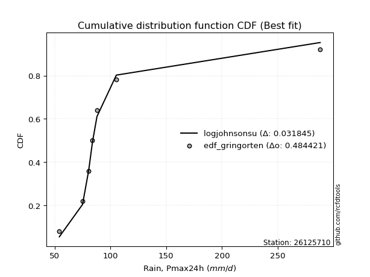</img>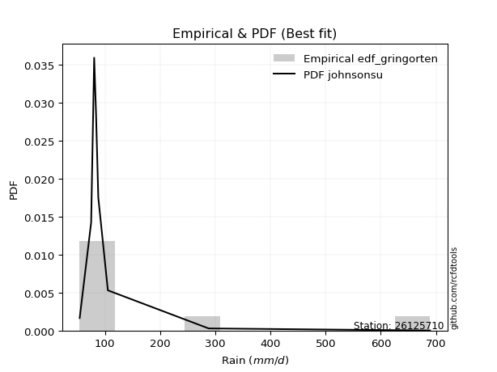</img>

</div>


### 9. Empirical - EDF Filliben (1975)

The specific values of the constants (0.3175) (often denoted as $alpha$) and (0.365) are derived from a method proposed by James J. Filliben in a 1975 paper. This particular formula is the mean value of the $i$-th order statistic of the normal distribution and is considered a robust and effective plotting position formula for the normal probability plot correlation coefficient test for normality.

<div align="center">


$P=(m-0.3175)/(n+0.365)$


</div>


**9.1. Empirical values**

<div align="center">

|                | 0                  | 1                   | 2                  | 3                   | 4                  | 5                  | 6                  | 7                  |
|:---------------|:-------------------|:--------------------|:-------------------|:--------------------|:-------------------|:-------------------|:-------------------|:-------------------|
| date           | 2021               | 2025                | 2018               | 2020                | 2017               | 2024               | 2019               | 2022               |
| x              | 54.264             | 63.2                | 75.054             | 80.535              | 83.958             | 88.0               | 105.354            | 288.0              |
| m              | 1                  | 2                   | 3                  | 4                   | 5                  | 6                  | 7                  | 8                  |
| empirical_dist | edf_filliben       | edf_filliben        | edf_filliben       | edf_filliben        | edf_filliben       | edf_filliben       | edf_filliben       | edf_filliben       |
| empirical      | 0.0815899581589958 | 0.20113568439928273 | 0.3206814106395696 | 0.44022713687985654 | 0.5597728631201434 | 0.6793185893604303 | 0.7988643156007172 | 0.9184100418410042 |
| empirical_tr   | 1.0888382687927107 | 1.2517770295548074  | 1.4720633523977125 | 1.7864388681260008  | 2.271554650373387  | 3.118359739049394  | 4.971768202080237  | 12.256410256410254 |

</div>


**9.2. Kolmogorov-Smirnov fit test (sorted by Δ)**


<div align="center">

|                | 0                  | 1                   | 2                   | 3                   | 4                   | 5                   | 6                   | 7                   | 8                   | 9                   | 10                  | 11                  | 12                  | 13                  | 14                  | 15                  | 16                  | 17                  | 18                 | 19                    | 20                  | 21                  | 22                  | 23                  | 24                 | 25                  | 26                 | 27                  | 28                  | 29                  | 30                 | 31                 | 32                  | 33                  | 34                  | 35                 | 36                  | 37                 | 38                 | 39                  | 40                 | 41                  | 42                  | 43                  | 44                  | 45                 | 46                  | 47                  | 48                 | 49                 | 50                  | 51                  | 52                  | 53                  | 54                  | 55                 | 56                 | 57                  | 58                  | 59                  | 60                  | 61                  | 62                 | 63                  | 64                  | 65                  | 66                  | 67                  | 68                 | 69                  | 70                  | 71                 | 72                 | 73                  | 74                 | 75                  | 76                 | 77                 | 78                 | 79                 | 80                 | 81                 | 82                 | 83                 | 84                 | 85                  | 86                 | 87                  | 88                 | 89                 |
|:---------------|:-------------------|:--------------------|:--------------------|:--------------------|:--------------------|:--------------------|:--------------------|:--------------------|:--------------------|:--------------------|:--------------------|:--------------------|:--------------------|:--------------------|:--------------------|:--------------------|:--------------------|:--------------------|:-------------------|:----------------------|:--------------------|:--------------------|:--------------------|:--------------------|:-------------------|:--------------------|:-------------------|:--------------------|:--------------------|:--------------------|:-------------------|:-------------------|:--------------------|:--------------------|:--------------------|:-------------------|:--------------------|:-------------------|:-------------------|:--------------------|:-------------------|:--------------------|:--------------------|:--------------------|:--------------------|:-------------------|:--------------------|:--------------------|:-------------------|:-------------------|:--------------------|:--------------------|:--------------------|:--------------------|:--------------------|:-------------------|:-------------------|:--------------------|:--------------------|:--------------------|:--------------------|:--------------------|:-------------------|:--------------------|:--------------------|:--------------------|:--------------------|:--------------------|:-------------------|:--------------------|:--------------------|:-------------------|:-------------------|:--------------------|:-------------------|:--------------------|:-------------------|:-------------------|:-------------------|:-------------------|:-------------------|:-------------------|:-------------------|:-------------------|:-------------------|:--------------------|:-------------------|:--------------------|:-------------------|:-------------------|
| station        | 26125710           | 26125710            | 26125710            | 26125710            | 26125710            | 26125710            | 26125710            | 26125710            | 26125710            | 26125710            | 26125710            | 26125710            | 26125710            | 26125710            | 26125710            | 26125710            | 26125710            | 26125710            | 26125710           | 26125710              | 26125710            | 26125710            | 26125710            | 26125710            | 26125710           | 26125710            | 26125710           | 26125710            | 26125710            | 26125710            | 26125710           | 26125710           | 26125710            | 26125710            | 26125710            | 26125710           | 26125710            | 26125710           | 26125710           | 26125710            | 26125710           | 26125710            | 26125710            | 26125710            | 26125710            | 26125710           | 26125710            | 26125710            | 26125710           | 26125710           | 26125710            | 26125710            | 26125710            | 26125710            | 26125710            | 26125710           | 26125710           | 26125710            | 26125710            | 26125710            | 26125710            | 26125710            | 26125710           | 26125710            | 26125710            | 26125710            | 26125710            | 26125710            | 26125710           | 26125710            | 26125710            | 26125710           | 26125710           | 26125710            | 26125710           | 26125710            | 26125710           | 26125710           | 26125710           | 26125710           | 26125710           | 26125710           | 26125710           | 26125710           | 26125710           | 26125710            | 26125710           | 26125710            | 26125710           | 26125710           |
| empirical_dist | edf_filliben       | edf_filliben        | edf_filliben        | edf_filliben        | edf_filliben        | edf_filliben        | edf_filliben        | edf_filliben        | edf_filliben        | edf_filliben        | edf_filliben        | edf_filliben        | edf_filliben        | edf_filliben        | edf_filliben        | edf_filliben        | edf_filliben        | edf_filliben        | edf_filliben       | edf_filliben          | edf_filliben        | edf_filliben        | edf_filliben        | edf_filliben        | edf_filliben       | edf_filliben        | edf_filliben       | edf_filliben        | edf_filliben        | edf_filliben        | edf_filliben       | edf_filliben       | edf_filliben        | edf_filliben        | edf_filliben        | edf_filliben       | edf_filliben        | edf_filliben       | edf_filliben       | edf_filliben        | edf_filliben       | edf_filliben        | edf_filliben        | edf_filliben        | edf_filliben        | edf_filliben       | edf_filliben        | edf_filliben        | edf_filliben       | edf_filliben       | edf_filliben        | edf_filliben        | edf_filliben        | edf_filliben        | edf_filliben        | edf_filliben       | edf_filliben       | edf_filliben        | edf_filliben        | edf_filliben        | edf_filliben        | edf_filliben        | edf_filliben       | edf_filliben        | edf_filliben        | edf_filliben        | edf_filliben        | edf_filliben        | edf_filliben       | edf_filliben        | edf_filliben        | edf_filliben       | edf_filliben       | edf_filliben        | edf_filliben       | edf_filliben        | edf_filliben       | edf_filliben       | edf_filliben       | edf_filliben       | edf_filliben       | edf_filliben       | edf_filliben       | edf_filliben       | edf_filliben       | edf_filliben        | edf_filliben       | edf_filliben        | edf_filliben       | edf_filliben       |
| p_dist         | logt               | logjohnsonsu        | logfisk             | logalpha            | loginvweibull       | logmielke           | alpha               | loginvgamma         | logexponnorm        | f                   | invgamma            | logpearson3         | loginvgauss         | loghalflogistic     | fisk                | logfatiguelife      | logmoyal            | invgauss            | fatiguelife        | loglaplace_asymmetric | johnsonsu           | loggenlogistic      | loggenexpon         | logwald             | loggompertz        | logtruncnorm        | wald               | loghalfnorm         | gibrat              | loggumbel_r         | logexpon           | logerlang          | nct                 | lograyleigh         | pearson3            | logkstwobign       | lognakagami         | ncf                | logf               | logmaxwell          | lognct             | betaprime           | weibull_min         | logncf              | exponnorm           | pareto             | expon               | genexpon            | laplace_asymmetric | logbetaprime       | halflogistic        | gompertz            | moyal               | nakagami            | loggibrat           | logrice            | logloggamma        | logcrystalball      | lognorm             | lognorm             | gamma               | logweibull_min      | loglogistic        | loghypsecant        | genlogistic         | halfnorm            | loglaplace          | gumbel_r            | logchi2            | rayleigh            | maxwell             | erlang             | loggumbel_l        | kstwobign           | t                  | logistic            | hypsecant          | crystalball        | norm               | truncnorm          | rice               | laplace            | loggamma           | loggamma           | gumbel_l           | loglognorm          | invweibull         | logpareto           | chi2               | mielke             |
| delta          | 0.0677764513600978 | 0.07099677852406408 | 0.09212497289245458 | 0.09569538641646136 | 0.09822430691206074 | 0.09842942454830933 | 0.09933471176891678 | 0.10111230629782181 | 0.10382842919980528 | 0.10556460214085311 | 0.10556488342792097 | 0.10630989676610991 | 0.10696436696742873 | 0.10778485884090877 | 0.10808748444027277 | 0.10822945373651377 | 0.11132983625829795 | 0.11209907615481546 | 0.1186081220262466 | 0.11864148627424176   | 0.12021032547695748 | 0.12108848943320372 | 0.12135762038897874 | 0.12417180682825907 | 0.1255961349235783 | 0.12669660776423958 | 0.1276320367315683 | 0.12820939981855295 | 0.12871823728271736 | 0.13712938564152133 | 0.14628506959576   | 0.1556903106776304 | 0.15979921472673186 | 0.16072420744041693 | 0.16250910024833606 | 0.1626161037565701 | 0.16509367740458225 | 0.1661544785279283 | 0.1692794758252928 | 0.17226262868092201 | 0.1751528388826633 | 0.18284948524162592 | 0.18733636007165988 | 0.18756604900813728 | 0.19034514286063542 | 0.1922457022555839 | 0.19224570727322754 | 0.19225286236848038 | 0.1922622825730942 | 0.1929635153018437 | 0.19591828935241107 | 0.19614900959425852 | 0.19943032128761218 | 0.20065681064432528 | 0.20113568439928273 | 0.2043144251333145 | 0.2047682469194394 | 0.20618011112479545 | 0.20618011375316625 | 0.20618011375316625 | 0.20699851247382656 | 0.20847504936456002 | 0.209835337830112  | 0.21294726354482496 | 0.21708562341723125 | 0.22104570763292786 | 0.22476563857691156 | 0.22525368082824793 | 0.2321288317984912 | 0.25185108446821525 | 0.26279376014047484 | 0.2635750906750109 | 0.2768342931543556 | 0.28996443479623857 | 0.2908824506733656 | 0.29528532348250713 | 0.2953667157902227 | 0.295715518395835  | 0.2957155200584085 | 0.2993349546942767 | 0.3194984957949994 | 0.3219199315769606 | 0.3253389233889667 | 0.3253389233889667 | 0.3659912926997748 | 0.40927840182727293 | 0.4208969244719311 | 0.42493853974174234 | 0.768266360790162  | nan                |
| deltao         | 0.4472608134160001 | 0.4472608134160001  | 0.4472608134160001  | 0.4472608134160001  | 0.4472608134160001  | 0.4472608134160001  | 0.4472608134160001  | 0.4472608134160001  | 0.4472608134160001  | 0.4472608134160001  | 0.4472608134160001  | 0.4472608134160001  | 0.4472608134160001  | 0.4472608134160001  | 0.4472608134160001  | 0.4472608134160001  | 0.4472608134160001  | 0.4472608134160001  | 0.4472608134160001 | 0.4472608134160001    | 0.4472608134160001  | 0.4472608134160001  | 0.4472608134160001  | 0.4472608134160001  | 0.4472608134160001 | 0.4472608134160001  | 0.4472608134160001 | 0.4472608134160001  | 0.4472608134160001  | 0.4472608134160001  | 0.4472608134160001 | 0.4472608134160001 | 0.4472608134160001  | 0.4472608134160001  | 0.4472608134160001  | 0.4472608134160001 | 0.4472608134160001  | 0.4472608134160001 | 0.4472608134160001 | 0.4472608134160001  | 0.4472608134160001 | 0.4472608134160001  | 0.4472608134160001  | 0.4472608134160001  | 0.4472608134160001  | 0.4472608134160001 | 0.4472608134160001  | 0.4472608134160001  | 0.4472608134160001 | 0.4472608134160001 | 0.4472608134160001  | 0.4472608134160001  | 0.4472608134160001  | 0.4472608134160001  | 0.4472608134160001  | 0.4472608134160001 | 0.4472608134160001 | 0.4472608134160001  | 0.4472608134160001  | 0.4472608134160001  | 0.4472608134160001  | 0.4472608134160001  | 0.4472608134160001 | 0.4472608134160001  | 0.4472608134160001  | 0.4472608134160001  | 0.4472608134160001  | 0.4472608134160001  | 0.4472608134160001 | 0.4472608134160001  | 0.4472608134160001  | 0.4472608134160001 | 0.4472608134160001 | 0.4472608134160001  | 0.4472608134160001 | 0.4472608134160001  | 0.4472608134160001 | 0.4472608134160001 | 0.4472608134160001 | 0.4472608134160001 | 0.4472608134160001 | 0.4472608134160001 | 0.4472608134160001 | 0.4472608134160001 | 0.4472608134160001 | 0.4472608134160001  | 0.4472608134160001 | 0.4472608134160001  | 0.4472608134160001 | 0.4472608134160001 |
| eval           | Δo > Δ             | Δo > Δ              | Δo > Δ              | Δo > Δ              | Δo > Δ              | Δo > Δ              | Δo > Δ              | Δo > Δ              | Δo > Δ              | Δo > Δ              | Δo > Δ              | Δo > Δ              | Δo > Δ              | Δo > Δ              | Δo > Δ              | Δo > Δ              | Δo > Δ              | Δo > Δ              | Δo > Δ             | Δo > Δ                | Δo > Δ              | Δo > Δ              | Δo > Δ              | Δo > Δ              | Δo > Δ             | Δo > Δ              | Δo > Δ             | Δo > Δ              | Δo > Δ              | Δo > Δ              | Δo > Δ             | Δo > Δ             | Δo > Δ              | Δo > Δ              | Δo > Δ              | Δo > Δ             | Δo > Δ              | Δo > Δ             | Δo > Δ             | Δo > Δ              | Δo > Δ             | Δo > Δ              | Δo > Δ              | Δo > Δ              | Δo > Δ              | Δo > Δ             | Δo > Δ              | Δo > Δ              | Δo > Δ             | Δo > Δ             | Δo > Δ              | Δo > Δ              | Δo > Δ              | Δo > Δ              | Δo > Δ              | Δo > Δ             | Δo > Δ             | Δo > Δ              | Δo > Δ              | Δo > Δ              | Δo > Δ              | Δo > Δ              | Δo > Δ             | Δo > Δ              | Δo > Δ              | Δo > Δ              | Δo > Δ              | Δo > Δ              | Δo > Δ             | Δo > Δ              | Δo > Δ              | Δo > Δ             | Δo > Δ             | Δo > Δ              | Δo > Δ             | Δo > Δ              | Δo > Δ             | Δo > Δ             | Δo > Δ             | Δo > Δ             | Δo > Δ             | Δo > Δ             | Δo > Δ             | Δo > Δ             | Δo > Δ             | Δo > Δ              | Δo > Δ             | Δo > Δ              | Δo <= Δ            | Δo <= Δ            |
| fit            | 1                  | 1                   | 1                   | 1                   | 1                   | 1                   | 1                   | 1                   | 1                   | 1                   | 1                   | 1                   | 1                   | 1                   | 1                   | 1                   | 1                   | 1                   | 1                  | 1                     | 1                   | 1                   | 1                   | 1                   | 1                  | 1                   | 1                  | 1                   | 1                   | 1                   | 1                  | 1                  | 1                   | 1                   | 1                   | 1                  | 1                   | 1                  | 1                  | 1                   | 1                  | 1                   | 1                   | 1                   | 1                   | 1                  | 1                   | 1                   | 1                  | 1                  | 1                   | 1                   | 1                   | 1                   | 1                   | 1                  | 1                  | 1                   | 1                   | 1                   | 1                   | 1                   | 1                  | 1                   | 1                   | 1                   | 1                   | 1                   | 1                  | 1                   | 1                   | 1                  | 1                  | 1                   | 1                  | 1                   | 1                  | 1                  | 1                  | 1                  | 1                  | 1                  | 1                  | 1                  | 1                  | 1                   | 1                  | 1                   | 0                  | 0                  |
| n              | 8                  | 8                   | 8                   | 8                   | 8                   | 8                   | 8                   | 8                   | 8                   | 8                   | 8                   | 8                   | 8                   | 8                   | 8                   | 8                   | 8                   | 8                   | 8                  | 8                     | 8                   | 8                   | 8                   | 8                   | 8                  | 8                   | 8                  | 8                   | 8                   | 8                   | 8                  | 8                  | 8                   | 8                   | 8                   | 8                  | 8                   | 8                  | 8                  | 8                   | 8                  | 8                   | 8                   | 8                   | 8                   | 8                  | 8                   | 8                   | 8                  | 8                  | 8                   | 8                   | 8                   | 8                   | 8                   | 8                  | 8                  | 8                   | 8                   | 8                   | 8                   | 8                   | 8                  | 8                   | 8                   | 8                   | 8                   | 8                   | 8                  | 8                   | 8                   | 8                  | 8                  | 8                   | 8                  | 8                   | 8                  | 8                  | 8                  | 8                  | 8                  | 8                  | 8                  | 8                  | 8                  | 8                   | 8                  | 8                   | 8                  | 8                  |
| best_fit       | 1                  | 0                   | 0                   | 0                   | 0                   | 0                   | 0                   | 0                   | 0                   | 0                   | 0                   | 0                   | 0                   | 0                   | 0                   | 0                   | 0                   | 0                   | 0                  | 0                     | 0                   | 0                   | 0                   | 0                   | 0                  | 0                   | 0                  | 0                   | 0                   | 0                   | 0                  | 0                  | 0                   | 0                   | 0                   | 0                  | 0                   | 0                  | 0                  | 0                   | 0                  | 0                   | 0                   | 0                   | 0                   | 0                  | 0                   | 0                   | 0                  | 0                  | 0                   | 0                   | 0                   | 0                   | 0                   | 0                  | 0                  | 0                   | 0                   | 0                   | 0                   | 0                   | 0                  | 0                   | 0                   | 0                   | 0                   | 0                   | 0                  | 0                   | 0                   | 0                  | 0                  | 0                   | 0                  | 0                   | 0                  | 0                  | 0                  | 0                  | 0                  | 0                  | 0                  | 0                  | 0                  | 0                   | 0                  | 0                   | 0                  | 0                  |
| best_fit_sort  | 1                  | 2                   | 3                   | 4                   | 5                   | 6                   | 7                   | 8                   | 9                   | 10                  | 11                  | 12                  | 13                  | 14                  | 15                  | 16                  | 17                  | 18                  | 19                 | 20                    | 21                  | 22                  | 23                  | 24                  | 25                 | 26                  | 27                 | 28                  | 29                  | 30                  | 31                 | 32                 | 33                  | 34                  | 35                  | 36                 | 37                  | 38                 | 39                 | 40                  | 41                 | 42                  | 43                  | 44                  | 45                  | 46                 | 47                  | 48                  | 49                 | 50                 | 51                  | 52                  | 53                  | 54                  | 55                  | 56                 | 57                 | 58                  | 59                  | 60                  | 61                  | 62                  | 63                 | 64                  | 65                  | 66                  | 67                  | 68                  | 69                 | 70                  | 71                  | 72                 | 73                 | 74                  | 75                 | 76                  | 77                 | 78                 | 79                 | 80                 | 81                 | 82                 | 83                 | 84                 | 85                 | 86                  | 87                 | 88                  | 89                 | 90                 |

</div>


<div align="center">

</img>

</div>


**9.3. Best fit**

<div align="center">

|   id |   station | empirical_dist   | p_dist   |     delta |   deltao | eval   |   fit |   n |   best_fit |   best_fit_sort |
|-----:|----------:|:-----------------|:---------|----------:|---------:|:-------|------:|----:|-----------:|----------------:|
|    0 |  26125710 | edf_filliben     | logt     | 0.0677765 | 0.447261 | Δo > Δ |     1 |   8 |          1 |               1 |

</div>


<div align="center">

</img>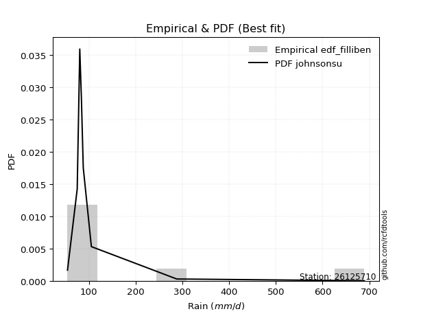</img>

</div>


### 10. Empirical - EDF Jenkinson (1977)

The Jenkinson formula in hydrology is an empirical plotting position formula used to estimate the non-exceedance probability _(P)_ or return period _(T)_ of a given ordered observation within a sample. It is a widely used method in the frequency analysis of extreme events such as floods and rainfall, as it provides a distribution-free way to plot data. _a≈0.31_ and _b≈0.38_ are constants derived to approximate the median of the probability distribution for the given rank.

<div align="center">


$P=(m-a)/(n+b)$


</div>


**10.1. Empirical values**

<div align="center">

|                | 0                   | 1                   | 2                  | 3                   | 4                  | 5                  | 6                  | 7                  |
|:---------------|:--------------------|:--------------------|:-------------------|:--------------------|:-------------------|:-------------------|:-------------------|:-------------------|
| date           | 2021                | 2025                | 2018               | 2020                | 2017               | 2024               | 2019               | 2022               |
| x              | 54.264              | 63.2                | 75.054             | 80.535              | 83.958             | 88.0               | 105.354            | 288.0              |
| m              | 1                   | 2                   | 3                  | 4                   | 5                  | 6                  | 7                  | 8                  |
| empirical_dist | edf_jenkinson       | edf_jenkinson       | edf_jenkinson      | edf_jenkinson       | edf_jenkinson      | edf_jenkinson      | edf_jenkinson      | edf_jenkinson      |
| empirical      | 0.08233890214797135 | 0.20167064439140808 | 0.3210023866348448 | 0.44033412887828155 | 0.5596658711217184 | 0.6789976133651551 | 0.7983293556085919 | 0.9176610978520287 |
| empirical_tr   | 1.0897269180754225  | 1.2526158445440956  | 1.4727592267135323 | 1.7867803837953091  | 2.2710027100271004 | 3.115241635687732  | 4.958579881656804  | 12.144927536231886 |

</div>


**10.2. Kolmogorov-Smirnov fit test (sorted by Δ)**


<div align="center">

|                | 0                   | 1                   | 2                   | 3                   | 4                   | 5                   | 6                   | 7                   | 8                   | 9                   | 10                  | 11                  | 12                  | 13                  | 14                  | 15                  | 16                 | 17                  | 18                  | 19                    | 20                  | 21                  | 22                  | 23                  | 24                 | 25                  | 26                  | 27                 | 28                 | 29                  | 30                 | 31                 | 32                 | 33                  | 34                  | 35                  | 36                 | 37                  | 38                 | 39                  | 40                  | 41                  | 42                 | 43                  | 44                  | 45                  | 46                 | 47                  | 48                  | 49                  | 50                  | 51                  | 52                 | 53                 | 54                  | 55                  | 56                  | 57                 | 58                 | 59                 | 60                  | 61                  | 62                  | 63                 | 64                 | 65                  | 66                 | 67                  | 68                  | 69                  | 70                  | 71                 | 72                  | 73                 | 74                  | 75                  | 76                  | 77                 | 78                 | 79                 | 80                  | 81                  | 82                 | 83                 | 84                  | 85                 | 86                 | 87                 | 88                 | 89                 |
|:---------------|:--------------------|:--------------------|:--------------------|:--------------------|:--------------------|:--------------------|:--------------------|:--------------------|:--------------------|:--------------------|:--------------------|:--------------------|:--------------------|:--------------------|:--------------------|:--------------------|:-------------------|:--------------------|:--------------------|:----------------------|:--------------------|:--------------------|:--------------------|:--------------------|:-------------------|:--------------------|:--------------------|:-------------------|:-------------------|:--------------------|:-------------------|:-------------------|:-------------------|:--------------------|:--------------------|:--------------------|:-------------------|:--------------------|:-------------------|:--------------------|:--------------------|:--------------------|:-------------------|:--------------------|:--------------------|:--------------------|:-------------------|:--------------------|:--------------------|:--------------------|:--------------------|:--------------------|:-------------------|:-------------------|:--------------------|:--------------------|:--------------------|:-------------------|:-------------------|:-------------------|:--------------------|:--------------------|:--------------------|:-------------------|:-------------------|:--------------------|:-------------------|:--------------------|:--------------------|:--------------------|:--------------------|:-------------------|:--------------------|:-------------------|:--------------------|:--------------------|:--------------------|:-------------------|:-------------------|:-------------------|:--------------------|:--------------------|:-------------------|:-------------------|:--------------------|:-------------------|:-------------------|:-------------------|:-------------------|:-------------------|
| station        | 26125710            | 26125710            | 26125710            | 26125710            | 26125710            | 26125710            | 26125710            | 26125710            | 26125710            | 26125710            | 26125710            | 26125710            | 26125710            | 26125710            | 26125710            | 26125710            | 26125710           | 26125710            | 26125710            | 26125710              | 26125710            | 26125710            | 26125710            | 26125710            | 26125710           | 26125710            | 26125710            | 26125710           | 26125710           | 26125710            | 26125710           | 26125710           | 26125710           | 26125710            | 26125710            | 26125710            | 26125710           | 26125710            | 26125710           | 26125710            | 26125710            | 26125710            | 26125710           | 26125710            | 26125710            | 26125710            | 26125710           | 26125710            | 26125710            | 26125710            | 26125710            | 26125710            | 26125710           | 26125710           | 26125710            | 26125710            | 26125710            | 26125710           | 26125710           | 26125710           | 26125710            | 26125710            | 26125710            | 26125710           | 26125710           | 26125710            | 26125710           | 26125710            | 26125710            | 26125710            | 26125710            | 26125710           | 26125710            | 26125710           | 26125710            | 26125710            | 26125710            | 26125710           | 26125710           | 26125710           | 26125710            | 26125710            | 26125710           | 26125710           | 26125710            | 26125710           | 26125710           | 26125710           | 26125710           | 26125710           |
| empirical_dist | edf_jenkinson       | edf_jenkinson       | edf_jenkinson       | edf_jenkinson       | edf_jenkinson       | edf_jenkinson       | edf_jenkinson       | edf_jenkinson       | edf_jenkinson       | edf_jenkinson       | edf_jenkinson       | edf_jenkinson       | edf_jenkinson       | edf_jenkinson       | edf_jenkinson       | edf_jenkinson       | edf_jenkinson      | edf_jenkinson       | edf_jenkinson       | edf_jenkinson         | edf_jenkinson       | edf_jenkinson       | edf_jenkinson       | edf_jenkinson       | edf_jenkinson      | edf_jenkinson       | edf_jenkinson       | edf_jenkinson      | edf_jenkinson      | edf_jenkinson       | edf_jenkinson      | edf_jenkinson      | edf_jenkinson      | edf_jenkinson       | edf_jenkinson       | edf_jenkinson       | edf_jenkinson      | edf_jenkinson       | edf_jenkinson      | edf_jenkinson       | edf_jenkinson       | edf_jenkinson       | edf_jenkinson      | edf_jenkinson       | edf_jenkinson       | edf_jenkinson       | edf_jenkinson      | edf_jenkinson       | edf_jenkinson       | edf_jenkinson       | edf_jenkinson       | edf_jenkinson       | edf_jenkinson      | edf_jenkinson      | edf_jenkinson       | edf_jenkinson       | edf_jenkinson       | edf_jenkinson      | edf_jenkinson      | edf_jenkinson      | edf_jenkinson       | edf_jenkinson       | edf_jenkinson       | edf_jenkinson      | edf_jenkinson      | edf_jenkinson       | edf_jenkinson      | edf_jenkinson       | edf_jenkinson       | edf_jenkinson       | edf_jenkinson       | edf_jenkinson      | edf_jenkinson       | edf_jenkinson      | edf_jenkinson       | edf_jenkinson       | edf_jenkinson       | edf_jenkinson      | edf_jenkinson      | edf_jenkinson      | edf_jenkinson       | edf_jenkinson       | edf_jenkinson      | edf_jenkinson      | edf_jenkinson       | edf_jenkinson      | edf_jenkinson      | edf_jenkinson      | edf_jenkinson      | edf_jenkinson      |
| p_dist         | logt                | logjohnsonsu        | logfisk             | logalpha            | loginvweibull       | logmielke           | alpha               | loginvgamma         | logexponnorm        | f                   | invgamma            | logpearson3         | loginvgauss         | loghalflogistic     | fisk                | logfatiguelife      | logmoyal           | invgauss            | fatiguelife         | loglaplace_asymmetric | johnsonsu           | loggenlogistic      | loggenexpon         | logwald             | loggompertz        | logtruncnorm        | wald                | loghalfnorm        | gibrat             | loggumbel_r         | logexpon           | logerlang          | nct                | lograyleigh         | pearson3            | logkstwobign        | lognakagami        | ncf                 | logf               | logmaxwell          | lognct              | betaprime           | weibull_min        | logncf              | exponnorm           | pareto              | expon              | genexpon            | laplace_asymmetric  | logbetaprime        | halflogistic        | gompertz            | moyal              | nakagami           | loggibrat           | logrice             | logloggamma         | logcrystalball     | lognorm            | lognorm            | gamma               | logweibull_min      | loglogistic         | loghypsecant       | genlogistic        | halfnorm            | loglaplace         | gumbel_r            | logchi2             | rayleigh            | maxwell             | erlang             | loggumbel_l         | kstwobign          | t                   | logistic            | hypsecant           | crystalball        | norm               | truncnorm          | rice                | laplace             | loggamma           | loggamma           | gumbel_l            | loglognorm         | invweibull         | logpareto          | chi2               | mielke             |
| delta          | 0.06745547536482255 | 0.07153173851618944 | 0.09180399689717939 | 0.09537441042118616 | 0.09790333091678555 | 0.09810844855303413 | 0.09901373577364159 | 0.10079133030254661 | 0.10350745320453003 | 0.10524362614557792 | 0.10524390743264578 | 0.10598892077083472 | 0.10664339097215353 | 0.10746388284563357 | 0.10776650844499758 | 0.10790847774123857 | 0.1110088602630227 | 0.11177810015954026 | 0.11807316203412122 | 0.1183205102789665    | 0.11988934948168228 | 0.12076751343792846 | 0.12103664439370354 | 0.12385083083298387 | 0.1252751589283031 | 0.12637563176896438 | 0.12709707673944293 | 0.1278884238232777 | 0.1283972612874421 | 0.13680840964624608 | 0.1459640936004848 | 0.1553693346823552 | 0.1594782387314566 | 0.16040323144514168 | 0.16176015625936052 | 0.16229512776129484 | 0.164772701409307  | 0.16561951853580292 | 0.1689584998300176 | 0.17194165268564676 | 0.17483186288738806 | 0.18252850924635067 | 0.1868014000795345 | 0.18724507301286203 | 0.19002416686536017 | 0.19192472626030865 | 0.1919247312779523 | 0.19193188637320513 | 0.19194130657781894 | 0.19264253930656844 | 0.19538332936028568 | 0.19582803359898326 | 0.1988953612954868 | 0.2001218506521999 | 0.20167064439140808 | 0.20399344913803924 | 0.20444727092416415 | 0.2058591351295202 | 0.205859137757891  | 0.205859137757891  | 0.20667753647855136 | 0.20815407336928482 | 0.20951436183483674 | 0.2126262875495497 | 0.216764647421956  | 0.22051074764080247 | 0.2244446625816363 | 0.22471872083612254 | 0.23159387180636581 | 0.25131612447608986 | 0.26225880014834946 | 0.2632541146797357 | 0.27651331715908034 | 0.2896434588009633 | 0.29056147467809035 | 0.29475036349038175 | 0.29504573979494747 | 0.2951805584037096 | 0.2951805600662831 | 0.2990139786990014 | 0.31917751979972414 | 0.32159895558168533 | 0.3250179473936915 | 0.3250179473936915 | 0.36545633270764943 | 0.4087434418351476 | 0.4201479804829556 | 0.424403579749617  | 0.7677314007980367 | nan                |
| deltao         | 0.4472608134160001  | 0.4472608134160001  | 0.4472608134160001  | 0.4472608134160001  | 0.4472608134160001  | 0.4472608134160001  | 0.4472608134160001  | 0.4472608134160001  | 0.4472608134160001  | 0.4472608134160001  | 0.4472608134160001  | 0.4472608134160001  | 0.4472608134160001  | 0.4472608134160001  | 0.4472608134160001  | 0.4472608134160001  | 0.4472608134160001 | 0.4472608134160001  | 0.4472608134160001  | 0.4472608134160001    | 0.4472608134160001  | 0.4472608134160001  | 0.4472608134160001  | 0.4472608134160001  | 0.4472608134160001 | 0.4472608134160001  | 0.4472608134160001  | 0.4472608134160001 | 0.4472608134160001 | 0.4472608134160001  | 0.4472608134160001 | 0.4472608134160001 | 0.4472608134160001 | 0.4472608134160001  | 0.4472608134160001  | 0.4472608134160001  | 0.4472608134160001 | 0.4472608134160001  | 0.4472608134160001 | 0.4472608134160001  | 0.4472608134160001  | 0.4472608134160001  | 0.4472608134160001 | 0.4472608134160001  | 0.4472608134160001  | 0.4472608134160001  | 0.4472608134160001 | 0.4472608134160001  | 0.4472608134160001  | 0.4472608134160001  | 0.4472608134160001  | 0.4472608134160001  | 0.4472608134160001 | 0.4472608134160001 | 0.4472608134160001  | 0.4472608134160001  | 0.4472608134160001  | 0.4472608134160001 | 0.4472608134160001 | 0.4472608134160001 | 0.4472608134160001  | 0.4472608134160001  | 0.4472608134160001  | 0.4472608134160001 | 0.4472608134160001 | 0.4472608134160001  | 0.4472608134160001 | 0.4472608134160001  | 0.4472608134160001  | 0.4472608134160001  | 0.4472608134160001  | 0.4472608134160001 | 0.4472608134160001  | 0.4472608134160001 | 0.4472608134160001  | 0.4472608134160001  | 0.4472608134160001  | 0.4472608134160001 | 0.4472608134160001 | 0.4472608134160001 | 0.4472608134160001  | 0.4472608134160001  | 0.4472608134160001 | 0.4472608134160001 | 0.4472608134160001  | 0.4472608134160001 | 0.4472608134160001 | 0.4472608134160001 | 0.4472608134160001 | 0.4472608134160001 |
| eval           | Δo > Δ              | Δo > Δ              | Δo > Δ              | Δo > Δ              | Δo > Δ              | Δo > Δ              | Δo > Δ              | Δo > Δ              | Δo > Δ              | Δo > Δ              | Δo > Δ              | Δo > Δ              | Δo > Δ              | Δo > Δ              | Δo > Δ              | Δo > Δ              | Δo > Δ             | Δo > Δ              | Δo > Δ              | Δo > Δ                | Δo > Δ              | Δo > Δ              | Δo > Δ              | Δo > Δ              | Δo > Δ             | Δo > Δ              | Δo > Δ              | Δo > Δ             | Δo > Δ             | Δo > Δ              | Δo > Δ             | Δo > Δ             | Δo > Δ             | Δo > Δ              | Δo > Δ              | Δo > Δ              | Δo > Δ             | Δo > Δ              | Δo > Δ             | Δo > Δ              | Δo > Δ              | Δo > Δ              | Δo > Δ             | Δo > Δ              | Δo > Δ              | Δo > Δ              | Δo > Δ             | Δo > Δ              | Δo > Δ              | Δo > Δ              | Δo > Δ              | Δo > Δ              | Δo > Δ             | Δo > Δ             | Δo > Δ              | Δo > Δ              | Δo > Δ              | Δo > Δ             | Δo > Δ             | Δo > Δ             | Δo > Δ              | Δo > Δ              | Δo > Δ              | Δo > Δ             | Δo > Δ             | Δo > Δ              | Δo > Δ             | Δo > Δ              | Δo > Δ              | Δo > Δ              | Δo > Δ              | Δo > Δ             | Δo > Δ              | Δo > Δ             | Δo > Δ              | Δo > Δ              | Δo > Δ              | Δo > Δ             | Δo > Δ             | Δo > Δ             | Δo > Δ              | Δo > Δ              | Δo > Δ             | Δo > Δ             | Δo > Δ              | Δo > Δ             | Δo > Δ             | Δo > Δ             | Δo <= Δ            | Δo <= Δ            |
| fit            | 1                   | 1                   | 1                   | 1                   | 1                   | 1                   | 1                   | 1                   | 1                   | 1                   | 1                   | 1                   | 1                   | 1                   | 1                   | 1                   | 1                  | 1                   | 1                   | 1                     | 1                   | 1                   | 1                   | 1                   | 1                  | 1                   | 1                   | 1                  | 1                  | 1                   | 1                  | 1                  | 1                  | 1                   | 1                   | 1                   | 1                  | 1                   | 1                  | 1                   | 1                   | 1                   | 1                  | 1                   | 1                   | 1                   | 1                  | 1                   | 1                   | 1                   | 1                   | 1                   | 1                  | 1                  | 1                   | 1                   | 1                   | 1                  | 1                  | 1                  | 1                   | 1                   | 1                   | 1                  | 1                  | 1                   | 1                  | 1                   | 1                   | 1                   | 1                   | 1                  | 1                   | 1                  | 1                   | 1                   | 1                   | 1                  | 1                  | 1                  | 1                   | 1                   | 1                  | 1                  | 1                   | 1                  | 1                  | 1                  | 0                  | 0                  |
| n              | 8                   | 8                   | 8                   | 8                   | 8                   | 8                   | 8                   | 8                   | 8                   | 8                   | 8                   | 8                   | 8                   | 8                   | 8                   | 8                   | 8                  | 8                   | 8                   | 8                     | 8                   | 8                   | 8                   | 8                   | 8                  | 8                   | 8                   | 8                  | 8                  | 8                   | 8                  | 8                  | 8                  | 8                   | 8                   | 8                   | 8                  | 8                   | 8                  | 8                   | 8                   | 8                   | 8                  | 8                   | 8                   | 8                   | 8                  | 8                   | 8                   | 8                   | 8                   | 8                   | 8                  | 8                  | 8                   | 8                   | 8                   | 8                  | 8                  | 8                  | 8                   | 8                   | 8                   | 8                  | 8                  | 8                   | 8                  | 8                   | 8                   | 8                   | 8                   | 8                  | 8                   | 8                  | 8                   | 8                   | 8                   | 8                  | 8                  | 8                  | 8                   | 8                   | 8                  | 8                  | 8                   | 8                  | 8                  | 8                  | 8                  | 8                  |
| best_fit       | 1                   | 0                   | 0                   | 0                   | 0                   | 0                   | 0                   | 0                   | 0                   | 0                   | 0                   | 0                   | 0                   | 0                   | 0                   | 0                   | 0                  | 0                   | 0                   | 0                     | 0                   | 0                   | 0                   | 0                   | 0                  | 0                   | 0                   | 0                  | 0                  | 0                   | 0                  | 0                  | 0                  | 0                   | 0                   | 0                   | 0                  | 0                   | 0                  | 0                   | 0                   | 0                   | 0                  | 0                   | 0                   | 0                   | 0                  | 0                   | 0                   | 0                   | 0                   | 0                   | 0                  | 0                  | 0                   | 0                   | 0                   | 0                  | 0                  | 0                  | 0                   | 0                   | 0                   | 0                  | 0                  | 0                   | 0                  | 0                   | 0                   | 0                   | 0                   | 0                  | 0                   | 0                  | 0                   | 0                   | 0                   | 0                  | 0                  | 0                  | 0                   | 0                   | 0                  | 0                  | 0                   | 0                  | 0                  | 0                  | 0                  | 0                  |
| best_fit_sort  | 1                   | 2                   | 3                   | 4                   | 5                   | 6                   | 7                   | 8                   | 9                   | 10                  | 11                  | 12                  | 13                  | 14                  | 15                  | 16                  | 17                 | 18                  | 19                  | 20                    | 21                  | 22                  | 23                  | 24                  | 25                 | 26                  | 27                  | 28                 | 29                 | 30                  | 31                 | 32                 | 33                 | 34                  | 35                  | 36                  | 37                 | 38                  | 39                 | 40                  | 41                  | 42                  | 43                 | 44                  | 45                  | 46                  | 47                 | 48                  | 49                  | 50                  | 51                  | 52                  | 53                 | 54                 | 55                  | 56                  | 57                  | 58                 | 59                 | 60                 | 61                  | 62                  | 63                  | 64                 | 65                 | 66                  | 67                 | 68                  | 69                  | 70                  | 71                  | 72                 | 73                  | 74                 | 75                  | 76                  | 77                  | 78                 | 79                 | 80                 | 81                  | 82                  | 83                 | 84                 | 85                  | 86                 | 87                 | 88                 | 89                 | 90                 |

</div>


<div align="center">

</img>

</div>


**10.3. Best fit**

<div align="center">

|   id |   station | empirical_dist   | p_dist   |     delta |   deltao | eval   |   fit |   n |   best_fit |   best_fit_sort |
|-----:|----------:|:-----------------|:---------|----------:|---------:|:-------|------:|----:|-----------:|----------------:|
|    0 |  26125710 | edf_jenkinson    | logt     | 0.0674555 | 0.447261 | Δo > Δ |     1 |   8 |          1 |               1 |

</div>


<div align="center">

</img>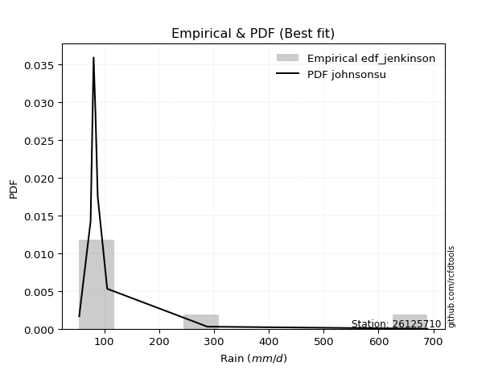</img>

</div>


### 11. Empirical - EDF Cunnane (1978)

Cunnane´s work in statistical hydrology has focused on the performance and evaluation of different probability distributions (such as GEV, Gumbel, Lognormal) for flood frequency estimation. _b_ is a constant, typically set to 0.4.

<div align="center">


$P=(m-b)/(n+1-2b)$


</div>


**11.1. Empirical values**

<div align="center">

|                | 0                   | 1                   | 2                  | 3                  | 4                  | 5                  | 6                  | 7                  |
|:---------------|:--------------------|:--------------------|:-------------------|:-------------------|:-------------------|:-------------------|:-------------------|:-------------------|
| date           | 2021                | 2025                | 2018               | 2020               | 2017               | 2024               | 2019               | 2022               |
| x              | 54.264              | 63.2                | 75.054             | 80.535             | 83.958             | 88.0               | 105.354            | 288.0              |
| m              | 1                   | 2                   | 3                  | 4                  | 5                  | 6                  | 7                  | 8                  |
| empirical_dist | edf_cunnane         | edf_cunnane         | edf_cunnane        | edf_cunnane        | edf_cunnane        | edf_cunnane        | edf_cunnane        | edf_cunnane        |
| empirical      | 0.07317073170731708 | 0.19512195121951223 | 0.3170731707317074 | 0.4390243902439025 | 0.5609756097560976 | 0.6829268292682927 | 0.8048780487804879 | 0.926829268292683  |
| empirical_tr   | 1.0789473684210527  | 1.2424242424242424  | 1.4642857142857144 | 1.782608695652174  | 2.277777777777778  | 3.153846153846154  | 5.125000000000001  | 13.666666666666675 |

</div>


**11.2. Kolmogorov-Smirnov fit test (sorted by Δ)**


<div align="center">

|                | 0                   | 1                   | 2                   | 3                  | 4                   | 5                   | 6                   | 7                   | 8                   | 9                   | 10                  | 11                  | 12                  | 13                  | 14                  | 15                  | 16                  | 17                 | 18                    | 19                  | 20                 | 21                  | 22                  | 23                 | 24                  | 25                  | 26                  | 27                  | 28                  | 29                  | 30                  | 31                  | 32                  | 33                  | 34                 | 35                  | 36                 | 37                  | 38                  | 39                  | 40                  | 41                  | 42                 | 43                 | 44                  | 45                  | 46                  | 47                  | 48                 | 49                 | 50                 | 51                  | 52                  | 53                 | 54                 | 55                 | 56                 | 57                  | 58                  | 59                  | 60                 | 61                  | 62                 | 63                  | 64                  | 65                  | 66                  | 67                  | 68                 | 69                  | 70                  | 71                  | 72                 | 73                 | 74                 | 75                 | 76                  | 77                 | 78                 | 79                 | 80                 | 81                 | 82                  | 83                  | 84                 | 85                  | 86                 | 87                  | 88                 | 89                 |
|:---------------|:--------------------|:--------------------|:--------------------|:-------------------|:--------------------|:--------------------|:--------------------|:--------------------|:--------------------|:--------------------|:--------------------|:--------------------|:--------------------|:--------------------|:--------------------|:--------------------|:--------------------|:-------------------|:----------------------|:--------------------|:-------------------|:--------------------|:--------------------|:-------------------|:--------------------|:--------------------|:--------------------|:--------------------|:--------------------|:--------------------|:--------------------|:--------------------|:--------------------|:--------------------|:-------------------|:--------------------|:-------------------|:--------------------|:--------------------|:--------------------|:--------------------|:--------------------|:-------------------|:-------------------|:--------------------|:--------------------|:--------------------|:--------------------|:-------------------|:-------------------|:-------------------|:--------------------|:--------------------|:-------------------|:-------------------|:-------------------|:-------------------|:--------------------|:--------------------|:--------------------|:-------------------|:--------------------|:-------------------|:--------------------|:--------------------|:--------------------|:--------------------|:--------------------|:-------------------|:--------------------|:--------------------|:--------------------|:-------------------|:-------------------|:-------------------|:-------------------|:--------------------|:-------------------|:-------------------|:-------------------|:-------------------|:-------------------|:--------------------|:--------------------|:-------------------|:--------------------|:-------------------|:--------------------|:-------------------|:-------------------|
| station        | 26125710            | 26125710            | 26125710            | 26125710           | 26125710            | 26125710            | 26125710            | 26125710            | 26125710            | 26125710            | 26125710            | 26125710            | 26125710            | 26125710            | 26125710            | 26125710            | 26125710            | 26125710           | 26125710              | 26125710            | 26125710           | 26125710            | 26125710            | 26125710           | 26125710            | 26125710            | 26125710            | 26125710            | 26125710            | 26125710            | 26125710            | 26125710            | 26125710            | 26125710            | 26125710           | 26125710            | 26125710           | 26125710            | 26125710            | 26125710            | 26125710            | 26125710            | 26125710           | 26125710           | 26125710            | 26125710            | 26125710            | 26125710            | 26125710           | 26125710           | 26125710           | 26125710            | 26125710            | 26125710           | 26125710           | 26125710           | 26125710           | 26125710            | 26125710            | 26125710            | 26125710           | 26125710            | 26125710           | 26125710            | 26125710            | 26125710            | 26125710            | 26125710            | 26125710           | 26125710            | 26125710            | 26125710            | 26125710           | 26125710           | 26125710           | 26125710           | 26125710            | 26125710           | 26125710           | 26125710           | 26125710           | 26125710           | 26125710            | 26125710            | 26125710           | 26125710            | 26125710           | 26125710            | 26125710           | 26125710           |
| empirical_dist | edf_cunnane         | edf_cunnane         | edf_cunnane         | edf_cunnane        | edf_cunnane         | edf_cunnane         | edf_cunnane         | edf_cunnane         | edf_cunnane         | edf_cunnane         | edf_cunnane         | edf_cunnane         | edf_cunnane         | edf_cunnane         | edf_cunnane         | edf_cunnane         | edf_cunnane         | edf_cunnane        | edf_cunnane           | edf_cunnane         | edf_cunnane        | edf_cunnane         | edf_cunnane         | edf_cunnane        | edf_cunnane         | edf_cunnane         | edf_cunnane         | edf_cunnane         | edf_cunnane         | edf_cunnane         | edf_cunnane         | edf_cunnane         | edf_cunnane         | edf_cunnane         | edf_cunnane        | edf_cunnane         | edf_cunnane        | edf_cunnane         | edf_cunnane         | edf_cunnane         | edf_cunnane         | edf_cunnane         | edf_cunnane        | edf_cunnane        | edf_cunnane         | edf_cunnane         | edf_cunnane         | edf_cunnane         | edf_cunnane        | edf_cunnane        | edf_cunnane        | edf_cunnane         | edf_cunnane         | edf_cunnane        | edf_cunnane        | edf_cunnane        | edf_cunnane        | edf_cunnane         | edf_cunnane         | edf_cunnane         | edf_cunnane        | edf_cunnane         | edf_cunnane        | edf_cunnane         | edf_cunnane         | edf_cunnane         | edf_cunnane         | edf_cunnane         | edf_cunnane        | edf_cunnane         | edf_cunnane         | edf_cunnane         | edf_cunnane        | edf_cunnane        | edf_cunnane        | edf_cunnane        | edf_cunnane         | edf_cunnane        | edf_cunnane        | edf_cunnane        | edf_cunnane        | edf_cunnane        | edf_cunnane         | edf_cunnane         | edf_cunnane        | edf_cunnane         | edf_cunnane        | edf_cunnane         | edf_cunnane        | edf_cunnane        |
| p_dist         | logjohnsonsu        | logt                | logfisk             | logalpha           | loginvweibull       | logmielke           | alpha               | loginvgamma         | logexponnorm        | f                   | invgamma            | logpearson3         | loginvgauss         | loghalflogistic     | fisk                | logfatiguelife      | logmoyal            | invgauss           | loglaplace_asymmetric | johnsonsu           | fatiguelife        | loggenlogistic      | loggenexpon         | logwald            | loggompertz         | logtruncnorm        | loghalfnorm         | gibrat              | wald                | loggumbel_r         | logexpon            | logerlang           | nct                 | lograyleigh         | logkstwobign       | lognakagami         | pearson3           | ncf                 | logf                | logmaxwell          | lognct              | betaprime           | logncf             | weibull_min        | exponnorm           | loggibrat           | pareto              | expon               | genexpon           | laplace_asymmetric | logbetaprime       | gompertz            | halflogistic        | moyal              | nakagami           | logrice            | logloggamma        | logcrystalball      | lognorm             | lognorm             | gamma              | logweibull_min      | loglogistic        | loghypsecant        | genlogistic         | halfnorm            | loglaplace          | gumbel_r            | logchi2            | rayleigh            | erlang              | maxwell             | loggumbel_l        | kstwobign          | t                  | hypsecant          | logistic            | crystalball        | norm               | truncnorm          | rice               | laplace            | loggamma            | loggamma            | gumbel_l           | loglognorm          | invweibull         | logpareto           | chi2               | mielke             |
| delta          | 0.06498304534429358 | 0.07138469126796021 | 0.09573321280031682 | 0.0993036263243236 | 0.10183254681992299 | 0.10203766445617157 | 0.10294295167677903 | 0.10472054620568405 | 0.10743666910766769 | 0.10917284204871536 | 0.10917312333578322 | 0.10991813667397216 | 0.11057260687529097 | 0.11139309874877101 | 0.11169572434813502 | 0.11183769364437601 | 0.11493807616616036 | 0.1157073160626777 | 0.12224972618210417   | 0.12381856538481972 | 0.1246218552060172 | 0.12469672934106613 | 0.12496586029684098 | 0.1277800467361213 | 0.12920437483144054 | 0.13030484767210182 | 0.13181763972641536 | 0.13232647719057977 | 0.13364576991133892 | 0.14073762554938374 | 0.14989330950362223 | 0.15929855058549264 | 0.16340745463459427 | 0.16433244734827934 | 0.1662243436644325 | 0.16870191731244466 | 0.1709283267000148 | 0.17216821170769891 | 0.17288771573315503 | 0.17587086858878442 | 0.17876107879052572 | 0.18645772514948833 | 0.1911742889159997 | 0.1933500932514305 | 0.19395338276849783 | 0.19512195121951223 | 0.19585394216344632 | 0.19585394718108995 | 0.1958611022763428 | 0.1958705224809566 | 0.1965717552097061 | 0.19975724950212093 | 0.20193202253218168 | 0.2054440544673828 | 0.2066705438240959 | 0.2079226650411769 | 0.2083764868273018 | 0.20978835103265786 | 0.20978835366102866 | 0.20978835366102866 | 0.2106067523816888 | 0.21208328927242226 | 0.2134435777379744 | 0.21655550345268737 | 0.22069386332509366 | 0.22705944081269847 | 0.22837387848477397 | 0.23126741400801853 | 0.2381425649782618 | 0.25786481764798586 | 0.26718333058287314 | 0.26880749332024545 | 0.280442533062218  | 0.293572674704101  | 0.294490690581228  | 0.3009316789373395 | 0.30129905666227774 | 0.3017292515756056 | 0.3017292532381791 | 0.3029431946021391 | 0.3231067357028618 | 0.325528171484823  | 0.32894716329682894 | 0.32894716329682894 | 0.3720050258795454 | 0.41529213500704343 | 0.4293161509236099 | 0.43095227292151284 | 0.7742800939699325 | nan                |
| deltao         | 0.4472608134160001  | 0.4472608134160001  | 0.4472608134160001  | 0.4472608134160001 | 0.4472608134160001  | 0.4472608134160001  | 0.4472608134160001  | 0.4472608134160001  | 0.4472608134160001  | 0.4472608134160001  | 0.4472608134160001  | 0.4472608134160001  | 0.4472608134160001  | 0.4472608134160001  | 0.4472608134160001  | 0.4472608134160001  | 0.4472608134160001  | 0.4472608134160001 | 0.4472608134160001    | 0.4472608134160001  | 0.4472608134160001 | 0.4472608134160001  | 0.4472608134160001  | 0.4472608134160001 | 0.4472608134160001  | 0.4472608134160001  | 0.4472608134160001  | 0.4472608134160001  | 0.4472608134160001  | 0.4472608134160001  | 0.4472608134160001  | 0.4472608134160001  | 0.4472608134160001  | 0.4472608134160001  | 0.4472608134160001 | 0.4472608134160001  | 0.4472608134160001 | 0.4472608134160001  | 0.4472608134160001  | 0.4472608134160001  | 0.4472608134160001  | 0.4472608134160001  | 0.4472608134160001 | 0.4472608134160001 | 0.4472608134160001  | 0.4472608134160001  | 0.4472608134160001  | 0.4472608134160001  | 0.4472608134160001 | 0.4472608134160001 | 0.4472608134160001 | 0.4472608134160001  | 0.4472608134160001  | 0.4472608134160001 | 0.4472608134160001 | 0.4472608134160001 | 0.4472608134160001 | 0.4472608134160001  | 0.4472608134160001  | 0.4472608134160001  | 0.4472608134160001 | 0.4472608134160001  | 0.4472608134160001 | 0.4472608134160001  | 0.4472608134160001  | 0.4472608134160001  | 0.4472608134160001  | 0.4472608134160001  | 0.4472608134160001 | 0.4472608134160001  | 0.4472608134160001  | 0.4472608134160001  | 0.4472608134160001 | 0.4472608134160001 | 0.4472608134160001 | 0.4472608134160001 | 0.4472608134160001  | 0.4472608134160001 | 0.4472608134160001 | 0.4472608134160001 | 0.4472608134160001 | 0.4472608134160001 | 0.4472608134160001  | 0.4472608134160001  | 0.4472608134160001 | 0.4472608134160001  | 0.4472608134160001 | 0.4472608134160001  | 0.4472608134160001 | 0.4472608134160001 |
| eval           | Δo > Δ              | Δo > Δ              | Δo > Δ              | Δo > Δ             | Δo > Δ              | Δo > Δ              | Δo > Δ              | Δo > Δ              | Δo > Δ              | Δo > Δ              | Δo > Δ              | Δo > Δ              | Δo > Δ              | Δo > Δ              | Δo > Δ              | Δo > Δ              | Δo > Δ              | Δo > Δ             | Δo > Δ                | Δo > Δ              | Δo > Δ             | Δo > Δ              | Δo > Δ              | Δo > Δ             | Δo > Δ              | Δo > Δ              | Δo > Δ              | Δo > Δ              | Δo > Δ              | Δo > Δ              | Δo > Δ              | Δo > Δ              | Δo > Δ              | Δo > Δ              | Δo > Δ             | Δo > Δ              | Δo > Δ             | Δo > Δ              | Δo > Δ              | Δo > Δ              | Δo > Δ              | Δo > Δ              | Δo > Δ             | Δo > Δ             | Δo > Δ              | Δo > Δ              | Δo > Δ              | Δo > Δ              | Δo > Δ             | Δo > Δ             | Δo > Δ             | Δo > Δ              | Δo > Δ              | Δo > Δ             | Δo > Δ             | Δo > Δ             | Δo > Δ             | Δo > Δ              | Δo > Δ              | Δo > Δ              | Δo > Δ             | Δo > Δ              | Δo > Δ             | Δo > Δ              | Δo > Δ              | Δo > Δ              | Δo > Δ              | Δo > Δ              | Δo > Δ             | Δo > Δ              | Δo > Δ              | Δo > Δ              | Δo > Δ             | Δo > Δ             | Δo > Δ             | Δo > Δ             | Δo > Δ              | Δo > Δ             | Δo > Δ             | Δo > Δ             | Δo > Δ             | Δo > Δ             | Δo > Δ              | Δo > Δ              | Δo > Δ             | Δo > Δ              | Δo > Δ             | Δo > Δ              | Δo <= Δ            | Δo <= Δ            |
| fit            | 1                   | 1                   | 1                   | 1                  | 1                   | 1                   | 1                   | 1                   | 1                   | 1                   | 1                   | 1                   | 1                   | 1                   | 1                   | 1                   | 1                   | 1                  | 1                     | 1                   | 1                  | 1                   | 1                   | 1                  | 1                   | 1                   | 1                   | 1                   | 1                   | 1                   | 1                   | 1                   | 1                   | 1                   | 1                  | 1                   | 1                  | 1                   | 1                   | 1                   | 1                   | 1                   | 1                  | 1                  | 1                   | 1                   | 1                   | 1                   | 1                  | 1                  | 1                  | 1                   | 1                   | 1                  | 1                  | 1                  | 1                  | 1                   | 1                   | 1                   | 1                  | 1                   | 1                  | 1                   | 1                   | 1                   | 1                   | 1                   | 1                  | 1                   | 1                   | 1                   | 1                  | 1                  | 1                  | 1                  | 1                   | 1                  | 1                  | 1                  | 1                  | 1                  | 1                   | 1                   | 1                  | 1                   | 1                  | 1                   | 0                  | 0                  |
| n              | 8                   | 8                   | 8                   | 8                  | 8                   | 8                   | 8                   | 8                   | 8                   | 8                   | 8                   | 8                   | 8                   | 8                   | 8                   | 8                   | 8                   | 8                  | 8                     | 8                   | 8                  | 8                   | 8                   | 8                  | 8                   | 8                   | 8                   | 8                   | 8                   | 8                   | 8                   | 8                   | 8                   | 8                   | 8                  | 8                   | 8                  | 8                   | 8                   | 8                   | 8                   | 8                   | 8                  | 8                  | 8                   | 8                   | 8                   | 8                   | 8                  | 8                  | 8                  | 8                   | 8                   | 8                  | 8                  | 8                  | 8                  | 8                   | 8                   | 8                   | 8                  | 8                   | 8                  | 8                   | 8                   | 8                   | 8                   | 8                   | 8                  | 8                   | 8                   | 8                   | 8                  | 8                  | 8                  | 8                  | 8                   | 8                  | 8                  | 8                  | 8                  | 8                  | 8                   | 8                   | 8                  | 8                   | 8                  | 8                   | 8                  | 8                  |
| best_fit       | 1                   | 0                   | 0                   | 0                  | 0                   | 0                   | 0                   | 0                   | 0                   | 0                   | 0                   | 0                   | 0                   | 0                   | 0                   | 0                   | 0                   | 0                  | 0                     | 0                   | 0                  | 0                   | 0                   | 0                  | 0                   | 0                   | 0                   | 0                   | 0                   | 0                   | 0                   | 0                   | 0                   | 0                   | 0                  | 0                   | 0                  | 0                   | 0                   | 0                   | 0                   | 0                   | 0                  | 0                  | 0                   | 0                   | 0                   | 0                   | 0                  | 0                  | 0                  | 0                   | 0                   | 0                  | 0                  | 0                  | 0                  | 0                   | 0                   | 0                   | 0                  | 0                   | 0                  | 0                   | 0                   | 0                   | 0                   | 0                   | 0                  | 0                   | 0                   | 0                   | 0                  | 0                  | 0                  | 0                  | 0                   | 0                  | 0                  | 0                  | 0                  | 0                  | 0                   | 0                   | 0                  | 0                   | 0                  | 0                   | 0                  | 0                  |
| best_fit_sort  | 1                   | 2                   | 3                   | 4                  | 5                   | 6                   | 7                   | 8                   | 9                   | 10                  | 11                  | 12                  | 13                  | 14                  | 15                  | 16                  | 17                  | 18                 | 19                    | 20                  | 21                 | 22                  | 23                  | 24                 | 25                  | 26                  | 27                  | 28                  | 29                  | 30                  | 31                  | 32                  | 33                  | 34                  | 35                 | 36                  | 37                 | 38                  | 39                  | 40                  | 41                  | 42                  | 43                 | 44                 | 45                  | 46                  | 47                  | 48                  | 49                 | 50                 | 51                 | 52                  | 53                  | 54                 | 55                 | 56                 | 57                 | 58                  | 59                  | 60                  | 61                 | 62                  | 63                 | 64                  | 65                  | 66                  | 67                  | 68                  | 69                 | 70                  | 71                  | 72                  | 73                 | 74                 | 75                 | 76                 | 77                  | 78                 | 79                 | 80                 | 81                 | 82                 | 83                  | 84                  | 85                 | 86                  | 87                 | 88                  | 89                 | 90                 |

</div>


<div align="center">

</img>

</div>


**11.3. Best fit**

<div align="center">

|   id |   station | empirical_dist   | p_dist       |    delta |   deltao | eval   |   fit |   n |   best_fit |   best_fit_sort |
|-----:|----------:|:-----------------|:-------------|---------:|---------:|:-------|------:|----:|-----------:|----------------:|
|    0 |  26125710 | edf_cunnane      | logjohnsonsu | 0.064983 | 0.447261 | Δo > Δ |     1 |   8 |          1 |               1 |

</div>


<div align="center">

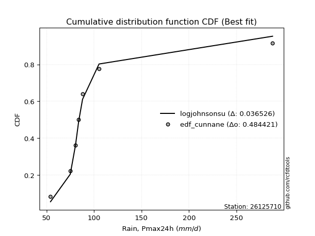</img>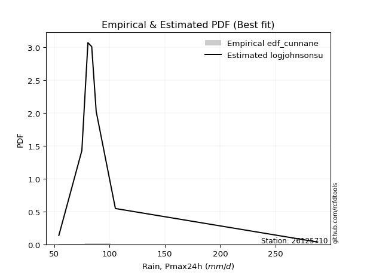</img>

</div>


### 12. Empirical - EDF Adamowski (1981)

The Adamowski formula in hydrology refers to a specific plotting position formula used for estimating the non-parametric empirical distribution of hydrological events (like flood peaks) to calculate their return periods. This formula provides an alternative to traditional parametric methods (like the Gumbel or Log Pearson Type III distributions). 

<div align="center">


$P=(m-0.25)/(n+0.5)$


</div>


**12.1. Empirical values**

<div align="center">

|                | 0                   | 1                   | 2                  | 3                  | 4                  | 5                  | 6                  | 7                  |
|:---------------|:--------------------|:--------------------|:-------------------|:-------------------|:-------------------|:-------------------|:-------------------|:-------------------|
| date           | 2021                | 2025                | 2018               | 2020               | 2017               | 2024               | 2019               | 2022               |
| x              | 54.264              | 63.2                | 75.054             | 80.535             | 83.958             | 88.0               | 105.354            | 288.0              |
| m              | 1                   | 2                   | 3                  | 4                  | 5                  | 6                  | 7                  | 8                  |
| empirical_dist | edf_adamowski       | edf_adamowski       | edf_adamowski      | edf_adamowski      | edf_adamowski      | edf_adamowski      | edf_adamowski      | edf_adamowski      |
| empirical      | 0.08823529411764706 | 0.20588235294117646 | 0.3235294117647059 | 0.4411764705882353 | 0.5588235294117647 | 0.6764705882352942 | 0.7941176470588235 | 0.9117647058823529 |
| empirical_tr   | 1.096774193548387   | 1.259259259259259   | 1.4782608695652173 | 1.7894736842105263 | 2.2666666666666666 | 3.0909090909090913 | 4.857142857142856  | 11.33333333333333  |

</div>


**12.2. Kolmogorov-Smirnov fit test (sorted by Δ)**


<div align="center">

|                | 0                   | 1                   | 2                  | 3                   | 4                   | 5                   | 6                  | 7                   | 8                   | 9                   | 10                 | 11                  | 12                  | 13                  | 14                 | 15                  | 16                  | 17                  | 18                  | 19                    | 20                 | 21                  | 22                  | 23                  | 24                  | 25                  | 26                 | 27                  | 28                 | 29                  | 30                 | 31                  | 32                 | 33                 | 34                  | 35                  | 36                  | 37                  | 38                 | 39                  | 40                  | 41                  | 42                  | 43                 | 44                  | 45                  | 46                  | 47                 | 48                  | 49                  | 50                 | 51                  | 52                  | 53                  | 54                  | 55                  | 56                  | 57                  | 58                  | 59                  | 60                  | 61                  | 62                  | 63                 | 64                 | 65                 | 66                  | 67                 | 68                  | 69                  | 70                 | 71                 | 72                 | 73                 | 74                  | 75                 | 76                 | 77                  | 78                  | 79                 | 80                 | 81                 | 82                 | 83                 | 84                  | 85                 | 86                  | 87                  | 88                 | 89                 |
|:---------------|:--------------------|:--------------------|:-------------------|:--------------------|:--------------------|:--------------------|:-------------------|:--------------------|:--------------------|:--------------------|:-------------------|:--------------------|:--------------------|:--------------------|:-------------------|:--------------------|:--------------------|:--------------------|:--------------------|:----------------------|:-------------------|:--------------------|:--------------------|:--------------------|:--------------------|:--------------------|:-------------------|:--------------------|:-------------------|:--------------------|:-------------------|:--------------------|:-------------------|:-------------------|:--------------------|:--------------------|:--------------------|:--------------------|:-------------------|:--------------------|:--------------------|:--------------------|:--------------------|:-------------------|:--------------------|:--------------------|:--------------------|:-------------------|:--------------------|:--------------------|:-------------------|:--------------------|:--------------------|:--------------------|:--------------------|:--------------------|:--------------------|:--------------------|:--------------------|:--------------------|:--------------------|:--------------------|:--------------------|:-------------------|:-------------------|:-------------------|:--------------------|:-------------------|:--------------------|:--------------------|:-------------------|:-------------------|:-------------------|:-------------------|:--------------------|:-------------------|:-------------------|:--------------------|:--------------------|:-------------------|:-------------------|:-------------------|:-------------------|:-------------------|:--------------------|:-------------------|:--------------------|:--------------------|:-------------------|:-------------------|
| station        | 26125710            | 26125710            | 26125710           | 26125710            | 26125710            | 26125710            | 26125710           | 26125710            | 26125710            | 26125710            | 26125710           | 26125710            | 26125710            | 26125710            | 26125710           | 26125710            | 26125710            | 26125710            | 26125710            | 26125710              | 26125710           | 26125710            | 26125710            | 26125710            | 26125710            | 26125710            | 26125710           | 26125710            | 26125710           | 26125710            | 26125710           | 26125710            | 26125710           | 26125710           | 26125710            | 26125710            | 26125710            | 26125710            | 26125710           | 26125710            | 26125710            | 26125710            | 26125710            | 26125710           | 26125710            | 26125710            | 26125710            | 26125710           | 26125710            | 26125710            | 26125710           | 26125710            | 26125710            | 26125710            | 26125710            | 26125710            | 26125710            | 26125710            | 26125710            | 26125710            | 26125710            | 26125710            | 26125710            | 26125710           | 26125710           | 26125710           | 26125710            | 26125710           | 26125710            | 26125710            | 26125710           | 26125710           | 26125710           | 26125710           | 26125710            | 26125710           | 26125710           | 26125710            | 26125710            | 26125710           | 26125710           | 26125710           | 26125710           | 26125710           | 26125710            | 26125710           | 26125710            | 26125710            | 26125710           | 26125710           |
| empirical_dist | edf_adamowski       | edf_adamowski       | edf_adamowski      | edf_adamowski       | edf_adamowski       | edf_adamowski       | edf_adamowski      | edf_adamowski       | edf_adamowski       | edf_adamowski       | edf_adamowski      | edf_adamowski       | edf_adamowski       | edf_adamowski       | edf_adamowski      | edf_adamowski       | edf_adamowski       | edf_adamowski       | edf_adamowski       | edf_adamowski         | edf_adamowski      | edf_adamowski       | edf_adamowski       | edf_adamowski       | edf_adamowski       | edf_adamowski       | edf_adamowski      | edf_adamowski       | edf_adamowski      | edf_adamowski       | edf_adamowski      | edf_adamowski       | edf_adamowski      | edf_adamowski      | edf_adamowski       | edf_adamowski       | edf_adamowski       | edf_adamowski       | edf_adamowski      | edf_adamowski       | edf_adamowski       | edf_adamowski       | edf_adamowski       | edf_adamowski      | edf_adamowski       | edf_adamowski       | edf_adamowski       | edf_adamowski      | edf_adamowski       | edf_adamowski       | edf_adamowski      | edf_adamowski       | edf_adamowski       | edf_adamowski       | edf_adamowski       | edf_adamowski       | edf_adamowski       | edf_adamowski       | edf_adamowski       | edf_adamowski       | edf_adamowski       | edf_adamowski       | edf_adamowski       | edf_adamowski      | edf_adamowski      | edf_adamowski      | edf_adamowski       | edf_adamowski      | edf_adamowski       | edf_adamowski       | edf_adamowski      | edf_adamowski      | edf_adamowski      | edf_adamowski      | edf_adamowski       | edf_adamowski      | edf_adamowski      | edf_adamowski       | edf_adamowski       | edf_adamowski      | edf_adamowski      | edf_adamowski      | edf_adamowski      | edf_adamowski      | edf_adamowski       | edf_adamowski      | edf_adamowski       | edf_adamowski       | edf_adamowski      | edf_adamowski      |
| p_dist         | logt                | logjohnsonsu        | logfisk            | logalpha            | loginvweibull       | logmielke           | alpha              | loginvgamma         | logexponnorm        | f                   | invgamma           | logpearson3         | loginvgauss         | loghalflogistic     | fisk               | logfatiguelife      | logmoyal            | invgauss            | fatiguelife         | loglaplace_asymmetric | johnsonsu          | loggenlogistic      | loggenexpon         | logwald             | loggompertz         | wald                | logtruncnorm       | loghalfnorm         | gibrat             | loggumbel_r         | logexpon           | logerlang           | pearson3           | nct                | lograyleigh         | logkstwobign        | ncf                 | lognakagami         | logf               | logmaxwell          | lognct              | betaprime           | weibull_min         | logncf             | exponnorm           | pareto              | expon               | genexpon           | laplace_asymmetric  | logbetaprime        | halflogistic       | gompertz            | moyal               | nakagami            | logrice             | logloggamma         | logcrystalball      | lognorm             | lognorm             | gamma               | logweibull_min      | loggibrat           | loglogistic         | loghypsecant       | genlogistic        | halfnorm           | gumbel_r            | loglaplace         | logchi2             | rayleigh            | maxwell            | erlang             | loggumbel_l        | kstwobign          | t                   | logistic           | crystalball        | norm                | hypsecant           | truncnorm          | rice               | laplace            | loggamma           | loggamma           | gumbel_l            | loglognorm         | invweibull          | logpareto           | chi2               | mielke             |
| delta          | 0.06492845023496163 | 0.07574344706595781 | 0.0892769717673183 | 0.09284738529132508 | 0.09537630578692446 | 0.09558142342317305 | 0.0964867106437805 | 0.09826430517268553 | 0.10098042807466912 | 0.10271660101571684 | 0.1027168823027847 | 0.10346189564097363 | 0.10411636584229245 | 0.10493685771577249 | 0.1052394833151365 | 0.10538145261137749 | 0.10848183513316179 | 0.10925107502967918 | 0.11386145348435284 | 0.11579348514910559   | 0.1173623243518212 | 0.11824048830806755 | 0.11850961926384246 | 0.12132380570312279 | 0.12274813379844202 | 0.12288536818967455 | 0.1238486066391033 | 0.12536139869341678 | 0.1258702361575812 | 0.13428138451638516 | 0.1434370684706237 | 0.15284230955249412 | 0.1558637642896848 | 0.1569512136015957 | 0.15787620631528076 | 0.15976810263143393 | 0.16140780998603454 | 0.16224567627944608 | 0.1664314747001565 | 0.16941462755578585 | 0.17230483775752714 | 0.18000148411648975 | 0.18258969152976612 | 0.1847180478830011 | 0.18749714173549925 | 0.18939770113044774 | 0.18939770614809137 | 0.1894048612433442 | 0.18941428144795802 | 0.19011551417670752 | 0.1911716208105173 | 0.19330100846912235 | 0.19468365274571842 | 0.19591014210243152 | 0.20146642400817832 | 0.20192024579430323 | 0.20333210999965928 | 0.20333211262803008 | 0.20333211262803008 | 0.20415051134869028 | 0.20562704823942374 | 0.20588235294117646 | 0.20698733670497582 | 0.2100992624196888 | 0.2142376222920951 | 0.2162990390910341 | 0.22050701228635416 | 0.2219176374517754 | 0.22738216325659744 | 0.24710441592632149 | 0.2580470915985811 | 0.2607270895498746 | 0.2739862920292194 | 0.2871164336711024 | 0.28803444954822943 | 0.2905386549406134 | 0.2909688498539412 | 0.29096885151651475 | 0.29251871466508655 | 0.2964869535691405 | 0.3166504946698632 | 0.3190719304518244 | 0.3224909222638304 | 0.3224909222638304 | 0.36124462415788106 | 0.4045317332853792 | 0.41425158851327987 | 0.42019187119984863 | 0.7635196922482683 | nan                |
| deltao         | 0.4472608134160001  | 0.4472608134160001  | 0.4472608134160001 | 0.4472608134160001  | 0.4472608134160001  | 0.4472608134160001  | 0.4472608134160001 | 0.4472608134160001  | 0.4472608134160001  | 0.4472608134160001  | 0.4472608134160001 | 0.4472608134160001  | 0.4472608134160001  | 0.4472608134160001  | 0.4472608134160001 | 0.4472608134160001  | 0.4472608134160001  | 0.4472608134160001  | 0.4472608134160001  | 0.4472608134160001    | 0.4472608134160001 | 0.4472608134160001  | 0.4472608134160001  | 0.4472608134160001  | 0.4472608134160001  | 0.4472608134160001  | 0.4472608134160001 | 0.4472608134160001  | 0.4472608134160001 | 0.4472608134160001  | 0.4472608134160001 | 0.4472608134160001  | 0.4472608134160001 | 0.4472608134160001 | 0.4472608134160001  | 0.4472608134160001  | 0.4472608134160001  | 0.4472608134160001  | 0.4472608134160001 | 0.4472608134160001  | 0.4472608134160001  | 0.4472608134160001  | 0.4472608134160001  | 0.4472608134160001 | 0.4472608134160001  | 0.4472608134160001  | 0.4472608134160001  | 0.4472608134160001 | 0.4472608134160001  | 0.4472608134160001  | 0.4472608134160001 | 0.4472608134160001  | 0.4472608134160001  | 0.4472608134160001  | 0.4472608134160001  | 0.4472608134160001  | 0.4472608134160001  | 0.4472608134160001  | 0.4472608134160001  | 0.4472608134160001  | 0.4472608134160001  | 0.4472608134160001  | 0.4472608134160001  | 0.4472608134160001 | 0.4472608134160001 | 0.4472608134160001 | 0.4472608134160001  | 0.4472608134160001 | 0.4472608134160001  | 0.4472608134160001  | 0.4472608134160001 | 0.4472608134160001 | 0.4472608134160001 | 0.4472608134160001 | 0.4472608134160001  | 0.4472608134160001 | 0.4472608134160001 | 0.4472608134160001  | 0.4472608134160001  | 0.4472608134160001 | 0.4472608134160001 | 0.4472608134160001 | 0.4472608134160001 | 0.4472608134160001 | 0.4472608134160001  | 0.4472608134160001 | 0.4472608134160001  | 0.4472608134160001  | 0.4472608134160001 | 0.4472608134160001 |
| eval           | Δo > Δ              | Δo > Δ              | Δo > Δ             | Δo > Δ              | Δo > Δ              | Δo > Δ              | Δo > Δ             | Δo > Δ              | Δo > Δ              | Δo > Δ              | Δo > Δ             | Δo > Δ              | Δo > Δ              | Δo > Δ              | Δo > Δ             | Δo > Δ              | Δo > Δ              | Δo > Δ              | Δo > Δ              | Δo > Δ                | Δo > Δ             | Δo > Δ              | Δo > Δ              | Δo > Δ              | Δo > Δ              | Δo > Δ              | Δo > Δ             | Δo > Δ              | Δo > Δ             | Δo > Δ              | Δo > Δ             | Δo > Δ              | Δo > Δ             | Δo > Δ             | Δo > Δ              | Δo > Δ              | Δo > Δ              | Δo > Δ              | Δo > Δ             | Δo > Δ              | Δo > Δ              | Δo > Δ              | Δo > Δ              | Δo > Δ             | Δo > Δ              | Δo > Δ              | Δo > Δ              | Δo > Δ             | Δo > Δ              | Δo > Δ              | Δo > Δ             | Δo > Δ              | Δo > Δ              | Δo > Δ              | Δo > Δ              | Δo > Δ              | Δo > Δ              | Δo > Δ              | Δo > Δ              | Δo > Δ              | Δo > Δ              | Δo > Δ              | Δo > Δ              | Δo > Δ             | Δo > Δ             | Δo > Δ             | Δo > Δ              | Δo > Δ             | Δo > Δ              | Δo > Δ              | Δo > Δ             | Δo > Δ             | Δo > Δ             | Δo > Δ             | Δo > Δ              | Δo > Δ             | Δo > Δ             | Δo > Δ              | Δo > Δ              | Δo > Δ             | Δo > Δ             | Δo > Δ             | Δo > Δ             | Δo > Δ             | Δo > Δ              | Δo > Δ             | Δo > Δ              | Δo > Δ              | Δo <= Δ            | Δo <= Δ            |
| fit            | 1                   | 1                   | 1                  | 1                   | 1                   | 1                   | 1                  | 1                   | 1                   | 1                   | 1                  | 1                   | 1                   | 1                   | 1                  | 1                   | 1                   | 1                   | 1                   | 1                     | 1                  | 1                   | 1                   | 1                   | 1                   | 1                   | 1                  | 1                   | 1                  | 1                   | 1                  | 1                   | 1                  | 1                  | 1                   | 1                   | 1                   | 1                   | 1                  | 1                   | 1                   | 1                   | 1                   | 1                  | 1                   | 1                   | 1                   | 1                  | 1                   | 1                   | 1                  | 1                   | 1                   | 1                   | 1                   | 1                   | 1                   | 1                   | 1                   | 1                   | 1                   | 1                   | 1                   | 1                  | 1                  | 1                  | 1                   | 1                  | 1                   | 1                   | 1                  | 1                  | 1                  | 1                  | 1                   | 1                  | 1                  | 1                   | 1                   | 1                  | 1                  | 1                  | 1                  | 1                  | 1                   | 1                  | 1                   | 1                   | 0                  | 0                  |
| n              | 8                   | 8                   | 8                  | 8                   | 8                   | 8                   | 8                  | 8                   | 8                   | 8                   | 8                  | 8                   | 8                   | 8                   | 8                  | 8                   | 8                   | 8                   | 8                   | 8                     | 8                  | 8                   | 8                   | 8                   | 8                   | 8                   | 8                  | 8                   | 8                  | 8                   | 8                  | 8                   | 8                  | 8                  | 8                   | 8                   | 8                   | 8                   | 8                  | 8                   | 8                   | 8                   | 8                   | 8                  | 8                   | 8                   | 8                   | 8                  | 8                   | 8                   | 8                  | 8                   | 8                   | 8                   | 8                   | 8                   | 8                   | 8                   | 8                   | 8                   | 8                   | 8                   | 8                   | 8                  | 8                  | 8                  | 8                   | 8                  | 8                   | 8                   | 8                  | 8                  | 8                  | 8                  | 8                   | 8                  | 8                  | 8                   | 8                   | 8                  | 8                  | 8                  | 8                  | 8                  | 8                   | 8                  | 8                   | 8                   | 8                  | 8                  |
| best_fit       | 1                   | 0                   | 0                  | 0                   | 0                   | 0                   | 0                  | 0                   | 0                   | 0                   | 0                  | 0                   | 0                   | 0                   | 0                  | 0                   | 0                   | 0                   | 0                   | 0                     | 0                  | 0                   | 0                   | 0                   | 0                   | 0                   | 0                  | 0                   | 0                  | 0                   | 0                  | 0                   | 0                  | 0                  | 0                   | 0                   | 0                   | 0                   | 0                  | 0                   | 0                   | 0                   | 0                   | 0                  | 0                   | 0                   | 0                   | 0                  | 0                   | 0                   | 0                  | 0                   | 0                   | 0                   | 0                   | 0                   | 0                   | 0                   | 0                   | 0                   | 0                   | 0                   | 0                   | 0                  | 0                  | 0                  | 0                   | 0                  | 0                   | 0                   | 0                  | 0                  | 0                  | 0                  | 0                   | 0                  | 0                  | 0                   | 0                   | 0                  | 0                  | 0                  | 0                  | 0                  | 0                   | 0                  | 0                   | 0                   | 0                  | 0                  |
| best_fit_sort  | 1                   | 2                   | 3                  | 4                   | 5                   | 6                   | 7                  | 8                   | 9                   | 10                  | 11                 | 12                  | 13                  | 14                  | 15                 | 16                  | 17                  | 18                  | 19                  | 20                    | 21                 | 22                  | 23                  | 24                  | 25                  | 26                  | 27                 | 28                  | 29                 | 30                  | 31                 | 32                  | 33                 | 34                 | 35                  | 36                  | 37                  | 38                  | 39                 | 40                  | 41                  | 42                  | 43                  | 44                 | 45                  | 46                  | 47                  | 48                 | 49                  | 50                  | 51                 | 52                  | 53                  | 54                  | 55                  | 56                  | 57                  | 58                  | 59                  | 60                  | 61                  | 62                  | 63                  | 64                 | 65                 | 66                 | 67                  | 68                 | 69                  | 70                  | 71                 | 72                 | 73                 | 74                 | 75                  | 76                 | 77                 | 78                  | 79                  | 80                 | 81                 | 82                 | 83                 | 84                 | 85                  | 86                 | 87                  | 88                  | 89                 | 90                 |

</div>


<div align="center">

</img>

</div>


**12.3. Best fit**

<div align="center">

|   id |   station | empirical_dist   | p_dist   |     delta |   deltao | eval   |   fit |   n |   best_fit |   best_fit_sort |
|-----:|----------:|:-----------------|:---------|----------:|---------:|:-------|------:|----:|-----------:|----------------:|
|    0 |  26125710 | edf_adamowski    | logt     | 0.0649285 | 0.447261 | Δo > Δ |     1 |   8 |          1 |               1 |

</div>


<div align="center">

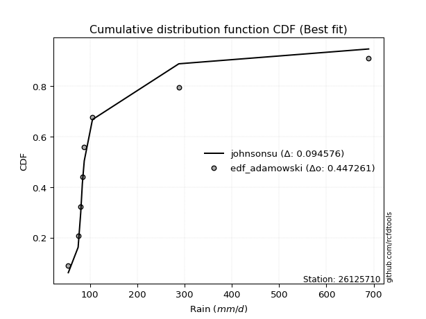</img></img>

</div>


## C. Best fit & Estimate extreme values for specific return periods - Tr


### 1. Best fit (ordered by delta Δ)

<div align="center">

|   id |   station | empirical_dist   | p_dist       |     delta |   deltao | eval   |   fit |   n |   best_fit |   best_fit_sort |
|-----:|----------:|:-----------------|:-------------|----------:|---------:|:-------|------:|----:|-----------:|----------------:|
|    0 |  26125710 | edf_gringorten   | logjohnsonsu | 0.0619793 | 0.447261 | Δo > Δ |     1 |   8 |          1 |               1 |
|    1 |  26125710 | edf_hazen        | logjohnsonsu | 0.0643764 | 0.447261 | Δo > Δ |     1 |   8 |          1 |               2 |
|    2 |  26125710 | edf_adamowski    | logt         | 0.0649285 | 0.447261 | Δo > Δ |     1 |   8 |          1 |               3 |
|    3 |  26125710 | edf_cunnane      | logjohnsonsu | 0.064983  | 0.447261 | Δo > Δ |     1 |   8 |          1 |               4 |
|    4 |  26125710 | edf_blom         | logjohnsonsu | 0.0668308 | 0.447261 | Δo > Δ |     1 |   8 |          1 |               5 |
|    5 |  26125710 | edf_chegodayev   | logt         | 0.0670293 | 0.447261 | Δo > Δ |     1 |   8 |          1 |               6 |
|    6 |  26125710 | edf_beard        | logt         | 0.0674555 | 0.447261 | Δo > Δ |     1 |   8 |          1 |               7 |
|    7 |  26125710 | edf_jenkinson    | logt         | 0.0674555 | 0.447261 | Δo > Δ |     1 |   8 |          1 |               8 |
|    8 |  26125710 | edf_filliben     | logt         | 0.0677765 | 0.447261 | Δo > Δ |     1 |   8 |          1 |               9 |
|    9 |  26125710 | edf_tukey        | logt         | 0.0684579 | 0.447261 | Δo > Δ |     1 |   8 |          1 |              10 |
|   10 |  26125710 | edf_weibull      | logt         | 0.0744264 | 0.447261 | Δo > Δ |     1 |   8 |          1 |              11 |
|   11 |  26125710 | edf_california   | logjohnsonsu | 0.126876  | 0.447261 | Δo > Δ |     1 |   8 |          1 |              12 |

</div>

:file_folder:Tables: [bestfit_26125710.csv](table/bestfit_26125710.csv) | [extreme_26125710.csv](table/extreme_26125710.csv)


### 2. Extreme values

In hydrology, a return period (or recurrence interval $Tr$) is the statistical average time between extreme events like floods or droughts of a specific magnitude, indicating how rare an event is, with a 100-year flood, for example, having a 1% chance of occurring in any given year, not that it happens exactly every century. It is a key tool for infrastructure design (like bridges or dams) and risk assessment, calculated from historical data to determine the probability of future events, although it is important to remember it is statistical average, and events can cluster or be missed.

> risk_rate: assuming the return period as the project useful life.

|   id |      tr |   prob_l |     prob_g |     alpha |   betaprime |    chi2 |   crystalball |   erlang |    expon |   exponnorm |         f |   fatiguelife |      fisk |    gamma |   genexpon |   genlogistic |   gibrat |   gompertz |   gumbel_l |   gumbel_r |   halflogistic |   halfnorm |   hypsecant |   invgamma |   invgauss |     invweibull |   johnsonsu |   kstwobign |   laplace |   laplace_asymmetric |   loggamma |   logistic |   lognorm |   maxwell |    mielke |    moyal |   nakagami |      ncf |      nct |    norm |   pareto |   pearson3 |   rayleigh |    rice |        t |   truncnorm |     wald |   weibull_min |    logalpha |   logbetaprime |          logchi2 |   logcrystalball |   logerlang |   logexpon |   logexponnorm |      logf |   logfatiguelife |    logfisk |   loggenexpon |   loggenlogistic |   loggibrat |   loggompertz |   loggumbel_l |   loggumbel_r |   loghalflogistic |   loghalfnorm |   loghypsecant |   loginvgamma |   loginvgauss |   loginvweibull |   logjohnsonsu |   logkstwobign |   loglaplace |   loglaplace_asymmetric |   logloggamma |   loglogistic |    loglognorm |   logmaxwell |   logmielke |   logmoyal |   lognakagami |   logncf |   lognct |     logpareto |   logpearson3 |   lograyleigh |   logrice |             logt |   logtruncnorm |   logwald |   logweibull_min |   station |   n |   risk_rate |
|-----:|--------:|---------:|-----------:|----------:|------------:|--------:|--------------:|---------:|---------:|------------:|----------:|--------------:|----------:|---------:|-----------:|--------------:|---------:|-----------:|-----------:|-----------:|---------------:|-----------:|------------:|-----------:|-----------:|---------------:|------------:|------------:|----------:|---------------------:|-----------:|-----------:|----------:|----------:|----------:|---------:|-----------:|---------:|---------:|--------:|---------:|-----------:|-----------:|--------:|---------:|------------:|---------:|--------------:|------------:|---------------:|-----------------:|-----------------:|------------:|-----------:|---------------:|----------:|-----------------:|-----------:|--------------:|-----------------:|------------:|--------------:|--------------:|--------------:|------------------:|--------------:|---------------:|--------------:|--------------:|----------------:|---------------:|---------------:|-------------:|------------------------:|--------------:|--------------:|--------------:|-------------:|------------:|-----------:|--------------:|---------:|---------:|--------------:|--------------:|--------------:|----------:|-----------------:|---------------:|----------:|-----------------:|----------:|----:|------------:|
|    0 |    2    | 0.5      | 0.5        |   79.9306 |     88.3365 | 54.2879 |       104.796 |  69.4614 |  89.2899 |     89.0982 |   80.0127 |       81.262  |   79.8622 |  72.4861 |    89.2906 |       91.5497 |  83.5607 |    89.6925 |    116.418 |    93.1736 |        87.3957 |    90.3145 |     104.796 |    80.0126 |    80.2911 |  314.308       |     79.5124 |     101.355 |   104.796 |              89.2915 |    64.812  |    104.796 |   90.8651 |   98.7452 |   80.0017 |  89.4216 |    86.3236 |  85.3258 |  86.3118 | 104.796 |  89.2899 |    82.4064 |    96.5993 | 107.768 |  95.7985 |     103.182 |  81.8635 |       81.0551 |     80.1466 |        89.5623 |     89.3735      |          90.8651 |     77.4245 |    77.5706 |        82.1669 |   75.9864 |          80.0043 |    80.1924 |        79.517 |          83.5154 |     78.7787 |       79.2229 |       98.2474 |       84.0375 |           80.8365 |       82.438  |        90.8651 |       80.0388 |       79.9935 |         80.109  |        81.9655 |        86.5471 |      90.8651 |                 83.7947 |       90.8431 |       90.8651 |  54.5983      |      87.2441 |     80.1276 |    81.9447 |       86.3957 |  88.8132 |  87.6129 |  55.3571      |       80.7189 |       85.9948 |   90.3264 |     83.6132      |        79.124  |   77.8853 |           72.236 |  26125710 |   8 |    0.75     |
|    1 |    2.33 | 0.570815 | 0.429185   |   85.0831 |     95.4918 | 54.3317 |       117.42  |  74.0674 |  97.0071 |     96.7874 |   85.7552 |       88.9683 |   85.6317 |  79.598  |    97.008  |       98.563  |  89.9556 |    97.4986 |    127.401 |   104.871  |        99.4228 |   103.939  |     114.899 |    85.7551 |    87.0805 | 6157.5         |     85.9676 |     110.566 |   112.435 |              97.0092 |    68.9721 |    115.918 |   98.9114 |  111.861  |   85.4551 | 100.495  |    99.44   |  95.4002 |  92.7356 | 117.42  |  97.0071 |    93.0228 |   109.909  | 118.228 | 100.666  |     113.959 |  90.1413 |       94.7933 |     85.2775 |        98.2383 |    106.549       |          98.9114 |     86.1109 |    83.9246 |        87.6013 |   83.7464 |          85.955  |    85.1672 |        86.057 |          89.0431 |     82.2387 |       85.8114 |      105.774  |       90.9113 |           87.6424 |       90.3436 |        97.2495 |       85.4442 |       85.822  |         85.3898 |        85.1781 |        93.0697 |      95.6525 |                 88.7811 |       99.2807 |       97.9183 |  56.8994      |      95.284  |     85.4392 |    88.2762 |       95.0451 |  96.2233 |  94.5665 |  57.5148      |       87.3007 |       94.0422 |   97.4818 |     86.301       |        85.6808 |   82.3416 |           79.863 |  26125710 |   8 |    0.729209 |
|    2 |    5    | 0.8      | 0.2        |  116.278  |    129.709  | 55.3136 |       164.335 |  99.4681 | 135.592  |    135.231  |  120.622  |      134.812  |  121.506  | 122.93   |   135.593  |      129.03   | 126.773  |   136.488  |    162.883 |   155.692  |       153.843  |   161.557  |     155.425 |   120.622  |   129.053  |    5.49152e+09 |    125.673  |     149.691 |   150.631 |             135.595  |    99.0799 |    158.865 |  135.578  |  163.483  |  117.724  | 151.788  |   169.913  | 143.045  | 124.903  | 164.335 | 135.592  |   146.905  |   163.194  | 160.103 | 121.889  |     167.834 | 136.481  |      208.633  |    115.634  |       139.905  |    297.22        |         135.578  |    154.37   |   124.406  |       119.788  |  142.018  |         121.923  |   115.096  |       125.233 |         117.627  |    105.33   |      125.783  |      134.261  |      127.926  |          126.347  |      133.07   |       127.697  |      117.884  |      121.109  |        117.022  |       105.379  |       126.721  |     123.649  |                118.532  |      137.979  |      130.684  |   5.18453e+42 |     134.804  |    117.275  |   124.614  |      144.042  | 131.165  | 128.194  |   8.88466e+06 |      125.607  |      134.542  |  132.273  |    101.45        |       125.511  |  112.431  |          150.642 |  26125710 |   8 |    0.67232  |
|    3 |   10    | 0.9      | 0.1        |  160.009  |    161.501  | 57.4852 |       195.457 | 124.443  | 170.617  |    170.129  |  165.571  |      183.541  |  170.58   | 168.824  |   170.62   |      153.844  | 168.741  |   171.825  |    182.638 |   197.084  |       199.037  |   204.193  |     187.786 |   165.571  |   178.654  |    3.8837e+14  |    174.541  |     179.48  |   185.305 |             170.623  |   143.605  |    190.494 |  167.121  |  199.813  |  158.476  | 196.447  |   229.985  | 186.499  | 157.021  | 195.457 | 170.617  |   196.446  |   201.187  | 189.96  | 143.795  |     216.727 | 185.658  |      379.29   |    156.681  |       178.475  |    851.858       |         167.121  |    273.485  |   177.839  |       159.028  |  237.461  |         167.236  |   157.456  |       172.211 |         147.561  |    139.656  |      174.069  |      153.325  |      168.959  |          171.192  |      177.227  |       158.724  |      160.925  |      166.187  |        159.383  |       138.1    |       160.289  |     156.098  |                154.09   |      171.513  |      161.639  | inf           |     172.086  |    160.016  |   168.237  |      197.071  | 162.855  | 159.951  | inf           |      171.072  |      173.683  |  164.43   |    129.225       |       173.881  |  156.473  |          313.442 |  26125710 |   8 |    0.651322 |
|    4 |   15    | 0.933333 | 0.0666667  |  198.096  |    181.122  | 59.2127 |       210.988 | 139.536  | 191.106  |    190.543  |  200.251  |      214.01   |  210.623  | 197.357  |   191.109  |      167.843  | 197.688  |   192.471  |    191.585 |   220.438  |       224.613  |   226.38   |     206.255 |   200.25   |   212.308  |    2.11506e+17 |    209.829  |     195.294 |   205.588 |             191.113  |   180.36   |    207.727 |  185.509  |  218.453  |  189.693  | 222.365  |   262.261  | 212.953  | 177.925  | 210.988 | 191.106  |   225.582  |   220.763  | 205.344 | 159.857  |     245.323 | 217.237  |      509.629  |    191.791  |       202.089  |   1626.82        |         185.509  |    386.207  |   219.182  |       187.697  |  323.693  |         201.421  |   195.036  |       205.974 |         167.696  |    169.653  |      208.663  |      162.828  |      197.673  |          203.3    |      205.729  |       179.7    |      196.016  |      200.733  |        194.372  |       169.784  |       181.587  |     178.897  |                179.649  |      191.137  |      181.487  | inf           |     195.054  |    195.414  |   200.251  |      232.159  | 182.046  | 179.778  | inf           |      203.889  |      198.106  |  183.94   |    163.174       |       208.766  |  193.473  |          510.014 |  26125710 |   8 |    0.644736 |
|    5 |   20    | 0.95     | 0.05       |  233.863  |    195.639  | 60.5963 |       221.158 | 150.4    | 205.643  |    205.027  |  229.666  |      236.272  |  245.949  | 218.147  |   205.646  |      177.645  | 220.395  |   207.108  |    197.153 |   236.789  |       242.532  |   241.173  |     219.283 |   229.665  |   238.063  |    1.74202e+19 |    238.238  |     205.947 |   219.978 |             205.651  |   212.752  |    219.638 |  198.634  |  230.823  |  216.103  | 240.72   |   283.963  | 232.36   | 193.918  | 221.158 | 205.643  |   246.304  |   233.774  | 215.57  | 173.359  |     265.609 | 240.77   |      615.975  |    224.749  |       219.444  |   2600.45        |         198.634  |    495.05   |   254.221  |       211.121  |  404.498  |         229.976  |   231.048  |       233.239 |         183.408  |    197.628  |      236.441  |      169.038  |      220.636  |          229.32   |      227.234  |       196.146  |      227.347  |      229.933  |        225.945  |       201.743  |       197.506  |     197.064  |                200.315  |      205.172  |      196.613  | inf           |     211.965  |    227.423  |   226.544  |      258.994  | 196.072  | 194.552  | inf           |      230.536  |      216.211  |  198.173  |    205.747       |       236.929  |  226.628  |          737.686 |  26125710 |   8 |    0.641514 |
|    6 |   25    | 0.96     | 0.04       |  268.375  |    207.281  | 61.7451 |       228.645 | 158.902  | 216.919  |    216.262  |  255.716  |      253.845  |  278.195  | 234.533  |   216.922  |      185.195  | 239.325  |   218.456  |    201.116 |   249.384  |       256.338  |   252.179  |     229.366 |   255.715  |   259.037  |    5.20798e+20 |    262.349  |     213.926 |   231.141 |             216.927  |   242.233  |    228.749 |  208.885  |  240.007  |  239.464  | 254.948  |   300.166  | 247.829  | 207.065  | 228.645 | 216.919  |   262.402  |   243.441  | 223.167 | 185.318  |     281.343 | 259.619  |      706.459  |    256.847  |       233.286  |   3759.44        |         208.885  |    601.165  |   285.214  |       231.284  |  481.543  |         254.977  |   266.564  |       256.494 |         196.507  |    224.443  |      259.995  |      173.6    |      240.127  |          251.617  |      244.681  |       209.899  |      256.404  |      255.741  |        255.491  |       234.46   |       210.338  |     212.418  |                217.968  |      216.149  |      209.03   | inf           |     225.461  |    257.43   |   249.276  |      280.966  | 207.217  | 206.465  | inf           |      253.378  |      230.725  |  209.455  |    259.373       |       260.92   |  257.239  |          994.883 |  26125710 |   8 |    0.639603 |
|    7 |   50    | 0.98     | 0.02       |  433.136  |    245.854  | 65.6525 |       250.085 | 185.644  | 251.945  |    251.16   |  359.024  |      309.806  |  413.859  | 286.595  |   251.949  |      208.453  | 306.053  |   253.669  |    211.873 |   288.183  |       298.876  |   284.17   |     260.628 |   359.024  |   329.191  |    1.82954e+25 |    349.987  |     237.358 |   265.814 |             251.954  |   365.209  |    256.588 |  241.261  |  266.643  |  332      | 299.115  |   347.382  | 298.518  | 252.627  | 250.085 | 251.945  |   312.513  |   271.504  | 245.22  | 233.263  |     330.21  | 321.163  |     1032.53   |    419.468  |       278.634  |  12069.1         |         241.261  |   1107.06   |   407.714  |       307.047  |  833.432  |         352.007  |   448.634  |       342.271 |         243.034  |    351.476  |      345.611  |      186.616  |      311.668  |          334.892  |      303.376  |       258.977  |      385.04   |      357.857  |        388.969  |       415.533  |       253.043  |     268.164  |                283.356  |      250.89   |      252.04   | inf           |     269.661  |    393.529  |   335.431  |      356.028  | 243.522  | 246.314  | inf           |      338.569  |      278.617  |  245.979  |    828.422       |       348.98   |  389.031  |         2694.47  |  26125710 |   8 |    0.63583  |
|    8 |   75    | 0.986667 | 0.0133333  |  593.132  |    270.309  | 68.1272 |       261.589 | 201.476  | 272.434  |    271.574  |  439.318  |      343.314  |  526.662  | 317.709  |   272.438  |      221.972  | 351.121  |   274.242  |    217.313 |   310.734  |       323.603  |   301.585  |     278.897 |   439.317  |   373.349  |    8.02527e+27 |    411.156  |     250.25  |   286.097 |             272.444  |   466.314  |    272.667 |  260.656  |  281.124  |  403.896  | 324.944  |   373.095  | 330.246  | 283.075  | 261.589 | 272.434  |   341.888  |   286.771  | 257.218 | 271.282  |     358.79  | 359.033  |     1255.13   |    599.915  |       306.968  |  24169.3         |         260.656  |   1588.89   |   502.497  |       362.4    | 1153.53   |         425.621  |   648.557  |       403.539 |         274.985  |    475.835  |      405.47   |      193.566  |      362.675  |          395.441  |      341.046  |       292.811  |      501.259  |      437.176  |        512.753  |       632.436  |       280.132  |     307.33   |                330.356  |      271.746  |      280.804  | inf           |     297.227  |    520.378  |   399.02   |      405.009  | 266.074  | 271.87   | inf           |      400.299  |      308.724  |  268.457  |   2662.01        |       411.343  |  501.801  |         5045.1   |  26125710 |   8 |    0.634587 |
|    9 |  100    | 0.99     | 0.01       |  751.503  |    288.6    | 69.9503 |       269.37  | 212.779  | 286.971  |    286.058  |  507.585  |      367.366  |  626.886  | 340.023  |   286.976  |      231.54   | 386.034  |   288.829  |    220.871 |   326.695  |       341.104  |   313.449  |     291.856 |   507.584  |   405.911  |    5.94908e+29 |    459.476  |     259.083 |   300.488 |             286.982  |   555.455  |    284.019 |  274.649  |  290.988  |  465.036  | 343.268  |   390.598  | 353.788  | 306.622  | 269.37  | 286.971  |   362.752  |   297.172  | 265.392 | 304.132  |     379.065 | 386.645  |     1427.47   |    807.261  |       327.949  |  39733.6         |         274.649  |   2056.31   |   582.829  |       407.626  | 1455.05   |         487.263  |   871.687  |       452.831 |         300.106  |    601.688  |      452.844  |      198.25   |      403.745  |          444.802  |      369.353  |       319.459  |      612.317  |      504.676  |        633.399  |       890.313  |       300.347  |     338.54   |                368.359  |      286.812  |      303.067  | inf           |     317.6    |    644.482  |   451.318  |      442.177  | 282.722  | 291.126  | inf           |      450.466  |      331.078  |  284.936  |   8594.47        |       461.154  |  604.131  |         8022.2   |  26125710 |   8 |    0.633968 |
|   10 |  200    | 0.995    | 0.005      | 1380.02   |    336.203  | 74.5291 |       287.019 | 240.207  | 321.997  |    320.956  |  721.366  |      426.105  |  962.224  | 394.465  |   322.002  |      254.542  | 481.018  |   323.935  |    228.605 |   365.067  |       383.18   |   340.582  |     323.076 |   721.365  |   488.077  |    1.86249e+34 |    594.488  |     279.427 |   335.161 |             322.01   |   850.321  |    311.25  |  309.24   |  313.554  |  656.631  | 387.417  |   430.56   | 414.368  | 370.919  | 287.019 | 321.997  |   413.086  |   320.97   | 284.095 | 409.766  |     427.909 | 455.422  |     1892.18   |   2027.52   |       381.724  | 133281           |         309.24   |   3844.12   |   833.156  |       541.153  | 2558.19   |         676.072  |  2042.4    |       594.934 |         370.295  |   1139.31   |      585.669  |      208.828  |      522.53   |          590.178  |      443.243  |       394.043  |     1041.75   |      716.745  |       1117      |      2411.34   |       352.634  |     427.386  |                478.861  |      324.11   |      363.936  | inf           |     369.616  |   1145.39   |   607.226  |      540.482  | 325.227  | 341.784  | inf           |      597.405  |      388.506  |  326.549  | 963249           |       602.88   |  959.171  |        26065     |  26125710 |   8 |    0.633042 |
|   11 |  250    | 0.996    | 0.004      | 1693.26   |    352.678  | 76.0505 |       292.413 | 249.088  | 333.272  |    332.191  |  808.489  |      445.216  | 1106.91   | 412.166  |   333.278  |      261.937  | 515.099  |   335.226  |    230.88  |   377.403  |       396.707  |   348.929  |     333.126 |   808.487  |   515.532  |    5.19251e+35 |    644.051  |     285.723 |   346.324 |             333.286  |   976.354  |    319.993 |  320.656  |  320.501  |  734.775  | 401.629  |   442.829  | 435.12   | 394.161  | 292.413 | 333.272  |   429.307  |   328.296  | 289.852 | 453.864  |     443.631 | 478.175  |     2056.76   |   2965.79   |       400.063  | 197417           |         320.656  |   4707.08   |   934.727  |       592.837  | 3071.77   |         751.579  |  2820.14   |       648.743 |         396.178  |   1432.61   |      634.595  |      212.046  |      567.7    |          646.349  |      468.822  |       421.579  |     1256.29   |      803.534  |       1366.81   |      3522.54   |       370.59   |     460.683  |                521.063  |      336.434  |      385.961  | inf           |     387.282  |   1405.8    |   668.091  |      574.902  | 339.679  | 359.492  | inf           |      653.873  |      408.113  |  340.543  |      1.03297e+07 |       655.827  | 1117.67   |        38766.1   |  26125710 |   8 |    0.632858 |
|   12 |  500    | 0.998    | 0.002      | 3257.08   |    407.806  | 80.8954 |       308.407 | 276.807  | 368.298  |    367.089  | 1154.52   |      505.1    | 1718.88   | 467.604  |   368.305  |      284.889  | 632.88   |   370.263  |    237.403 |   415.691  |       438.691  |   373.817  |     364.343 |  1154.52   |   603.526  |    1.58943e+40 |    819.229  |     304.591 |   380.997 |             368.313  |  1504.27   |    347.106 |  357.048  |  341.23   | 1045.47   | 445.777  |   479.334  | 503.845  | 475.508  | 308.407 | 368.298  |   479.737  |   350.154  | 307.03  | 633.853  |     492.46  | 550.524  |     2614.88   |  14480.8    |       460.462  | 674528           |         357.048  |   8855.66   |  1336.2    |       787.034  | 5442.12   |        1045.55   |  9235      |       846.018 |         488.613  |   3161.91   |      808.181  |      221.549  |      734.312  |          857.07   |      554.184  |       519.997  |     2378.3    |     1150.49   |       2737.08   |     14112.2    |       430.067  |     581.583  |                677.374  |      375.767  |      463.111  | inf           |     445.179  |   2847.32   |   898.878  |      691.046  | 387.157  | 419.375  | inf           |      864.35   |      472.697  |  385.962  |      1.58142e+12 |       846.737  | 1817.62   |       140143     |  26125710 |   8 |    0.632489 |
|   13 |  750    | 0.998667 | 0.00133333 | 4819.78   |    443.061  | 83.8008 |       317.292 | 293.101  | 388.787  |    387.503  | 1423.72   |      540.443  | 2229.62   | 500.308  |   388.794  |      298.306  | 710.773  |   390.734  |    240.89  |   438.074  |       463.235  |   387.721  |     382.604 |  1423.72   |   656.703  |    6.66304e+42 |    938.013  |     315.191 |   401.28  |             388.803  |  1940.46   |    362.946 |  379.019  |  352.824  | 1287.51   | 471.602  |   499.675  | 547.268  | 530.332  | 317.292 | 388.787  |   509.263  |   362.377  | 316.635 | 778.294  |     521.018 | 593.902  |     2974.44   |  55666.1    |       498.346  |      1.39112e+06 |         379.019  |  12839.3    |  1646.83   |       928.918  | 7622.13   |        1269.28   | 21514.7    |       986.022 |         552.341  |   5337.43   |      926.406  |      226.802  |      853.524  |         1010.79   |      608.468  |       587.9    |     3608.6    |     1422.85   |       4329.21   |     37550.3    |       467.574  |     666.524  |                789.73   |      399.542  |      515.136  | inf           |     481.256  |   4540.8    |  1069.26   |      765.826  | 416.86   | 458.16   | inf           |     1016.69   |      513.169  |  413.951  |      2.62748e+17 |       979.362  | 2432.92   |       307850     |  26125710 |   8 |    0.632366 |
|   14 | 1000    | 0.999    | 0.001      | 6382.2    |    469.539  | 85.8894 |       323.41  | 304.694  | 403.324  |    401.987  | 1652.69   |      565.642  | 2684.09   | 523.619  |   403.331  |      307.824  | 770.381  |   405.248  |    243.236 |   453.951  |       480.645  |   397.323  |     395.561 |  1652.69   |   695.114  |    4.82908e+44 |   1030.31   |     322.534 |   415.671 |             403.341  |  2326.29   |    374.18  |  394.928  |  360.837  | 1493.54   | 489.925  |   513.701  | 579.632  | 572.897  | 323.41  | 403.324  |   530.223  |   370.823  | 323.273 | 903.641  |     541.277 | 625.105  |     3244.45   | 192096      |       526.436  |      2.32957e+06 |         394.928  |  16722.6    |  1910.1    |      1044.84   | 9689.58   |        1456.96   | 42485.3    |      1098.24  |         602.523  |   7967.76   |     1018.52   |      230.407  |      949.644  |         1136.26   |      649.031  |       641.39   |     4956.29   |     1656.1    |       6151.15   |     81818.8    |       495.46   |     734.212  |                880.578  |      416.767  |      555.536  | inf           |     507.886  |   6494.95   |  1209.39   |      822.126  | 438.856  | 487.529  | inf           |     1140.38   |      543.144  |  434.47   |      4.60546e+22 |      1084.08   | 3000.63   |       546300     |  26125710 |   8 |    0.632305 |

<div align="center">

</img>

</div>


<div align="center">

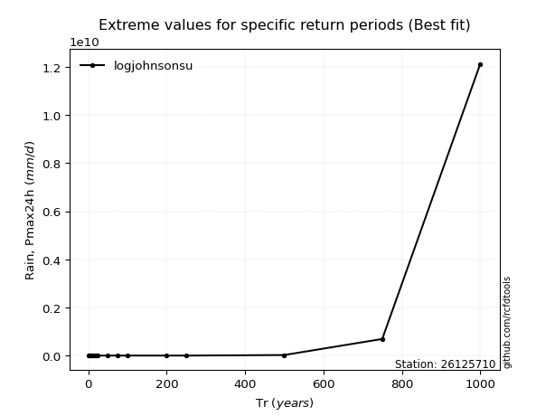</img>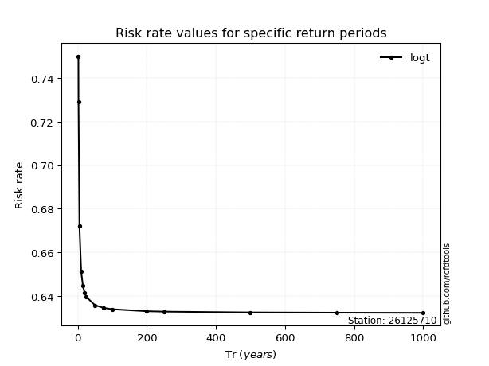</img>

</div>


<sub>**APP DISCLAIMER**: NO WARRANTY - This software is provided by [github.com/rcfdtools](https://github.com/rcfdtools) "as is", without any express or implied warranty, including warranties of merchantability, fitness for a particular purpose, or non-infringement. There is no guarantee that the software will be error-free or operate without interruption. LIMITATION OF LIABILITY - Neither the authors nor copyright holders will be liable for claims or damages arising from the software or its use. You are responsible for determining if the software is appropriate for your use and assume all associated risks, including errors, legal compliance, and data loss. NO PROFESSIONAL ADVICE - The software provides general information and does not offer professional advice. It should not replace consultation with professional advisors.</sub>