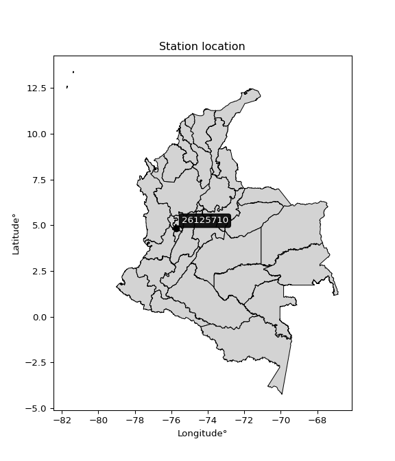

<div align="center">


</div>

# PMP Station (Rain, Pmax24h): 26125710

Probable Maximum Precipitation (PMP) is the greatest amount of rainfall for a specific duration that is meteorologically possible for a given location, acting as a "worst-case" scenario for extreme storms, crucial for designing safety-critical infrastructure like bridges, river deviations, dams, spillways, and nuclear plants to prevent catastrophic failure. PMP is calculated by hydrologists using meteorological data to determine the upper limit of extreme rainfall, often leading to the Probable Maximum Flood (PMF) for flood control design, and is increasingly being studied for climate change impacts. Probable Maximum Precipitation (PMP) is the theoretical upper limit of rainfall, a deterministic estimate for extreme events, while probability distributions (like GEV, Gumbel) describe the likelihood and frequency of various precipitation amounts, including rare ones, showing how often events occur, with PMP representing the extreme end of these distributions, used for critical infrastructure design to ensure safety against the worst conceivable weather, unlike standard statistical forecasts which cover typical probabilities.

The most common probability distributions in hydrology, used for analyzing floods, rainfall, and streamflow, include the Normal, Log-Normal, Gumbel, Gamma (including Log-Pearson Type III), and Generalized Extreme Value (GEV) distributions, often chosen based on the data´s skewness and whether modeling extremes or general conditions, with Gumbel and GEV popular for extreme events like floods, while the Normal distribution serves as a baseline, though often requiring transformations for skewed hydrological data. These distributions help in designing water infrastructure, managing water resources, and forecasting hydrologic events.

> Hydrological data often isn´t perfectly normal (it´s skewed), so different distributions are needed for different applications, such as: **Flood Frequency Analysis**: Using Gumbel, GEV, or Log-Pearson Type III for predicting extreme flood magnitudes and their return periods, **Rainfall Analysis**: Normal for annual totals, but Log-Normal, Weibull, or GEV for intensity or extreme daily rainfall, **Streamflow Modeling**: Gamma and Log-Normal for maximum flows, GEV for minimum flows, and Kappa for daily flows.

<div align="center">

</img>

</div>


## A. General information


### 1. General running parameters

• app_version: _v20260113_. • runtime: _2026-01-17 18:24:04.630693_. • Python version: _3.14.0_. • SciPy version: _1.16.3_. • Pandas version: _2.3.3_. • NumPy version: _2.3.5_. • Stations dataset (station_dataset_file): _dataset/pmax24h_in/automatic_colombia_2003_2025.csv_. • Stations catalog (station_catalog_file): _dataset/CNE.xls_. • Minimum year to eval til year_max (date_min): _1900_. • Maximum year to eval since year_min (date_max): _2025_. • Creates, save and include plots into reports (create_plot): _False_. • Plot only fit distributions with Δo > Δ (plot_only_fit): _True_. • Plot only simple graphs avoiding multiple CDFs and multiple Extreme values plots (plot_only_simple): _True_. • Eval low extreme values, if False, evaluates high extreme values (low_extreme): _False_. • Eval every SciPy distribution as logarithmic (pdist_logarithmic_on): _True_. • Standard deviation normalized (ddof): _1.0_. • Return periods to eval in years (Tr): _[2, 2.33, 5, 10, 15, 20, 25, 50, 75, 100, 200, 250, 500, 750, 1000]_. • Minimum data sample per station, 0 means any (minimum_sample): _5_. • Z-Score maximum threshold to adjust a value, 0 means disable (zscore_max): _3.5_. • Z-Score minimum threshold to adjust a value, 0 means disable (zscore_min): _-2.5_. • Avoid zeros, e.g. rain = 0 (avoid_zeros): _True_. • Avoid null values (avoid_nans): _True_. 

:file_folder:Table: [dataset.csv](../../dataset/pmax24h_in/automatic_colombia_2003_2025.csv)

> Delta Degrees of Freedom (DDOF): is a parameter used in the formulas for calculating variance and standard deviation. When ddof=0, the divisor is $N$ (the total number of observations) and this is used when your data set is the entire population. When ddof=1, the divisor is $N-1$ and this is used when your data set is a sample drawn from a larger population. Using $N-1$ provides an unbiased estimate of the population variance (known as Bessel´s correction).


### 2. Station info and location

|   id |   CODIGO | NOMBRE                         | CATEGORIA           | TECNOLOGIA                              | ESTADO           | FECHA_INSTALACION   |   FECHA_SUSPENSION |   ALTITUD |   LATITUD |   LONGITUD | DEPARTAMENTO   | MUNICIPIO   | AREA_OPERATIVA                         | ENTIDAD                                                     | AREA_HIDROGRAFICA   | ZONA_HIDROGRAFICA   | SUBZONA_HIDROGRAFICA   |   CORRIENTE | Catalogo   |   Version |
|-----:|---------:|:-------------------------------|:--------------------|:----------------------------------------|:-----------------|:--------------------|-------------------:|----------:|----------:|-----------:|:---------------|:------------|:---------------------------------------|:------------------------------------------------------------|:--------------------|:--------------------|:-----------------------|------------:|:-----------|----------:|
|    0 | 26125710 | AEROPUERTO MATECANA [26125710] | Sinóptica Principal | Automática con Telemetría, Convencional | En Mantenimiento | 12/09/2014          |                nan |      1342 |   4.81267 |   -75.7395 | Risaralda      | Pereira     | Area Operativa 09 - Cauca-Valle-Caldas | INSTITUTO DE HIDROLOGIA METEOROLOGIA Y ESTUDIOS AMBIENTALES | Magdalena Cauca     | Cauca               | Río La Vieja           |         nan | CNE_IDEAM  |  20251226 |

<div align="center">

Dynamic map: [:earth_americas:Google](http://maps.google.com/maps?q=4.812675,-75.739519444) [:earth_americas:OSM](https://www.openstreetmap.org/#map=18/4.812675/-75.739519444&layers=P) [:earth_americas:Bing](https://www.bing.com/maps?cp=4.812675~-75.739519444&lvl=18) [:earth_americas:Apple](https://maps.apple.com/frame?center=4.812675%2C-75.739519444&span=0.003%2C0.006)

</div>


<div align="center">

```geojson
{
  "type": "Feature",
  "geometry": {
    "type": "Point", 
    "coordinates": [-75.739519444, 4.812675]
  }, 
  "properties": {
    "Name": "26125710"
  }
}
```

</div>


### 3. Discrete values table and plot

<div align="center">

|               |           0 |           1 |           2 |           3 |           4 |         5 |           6 |          7 |
|:--------------|------------:|------------:|------------:|------------:|------------:|----------:|------------:|-----------:|
| Date          | 2017        | 2018        | 2019        | 2020        | 2021        | 2022      | 2024        | 2025       |
| Value         |   83.958    |   75.054    |  105.354    |   80.535    |   54.264    |  288      |   88        |  689.4     |
| Value_initial |   83.958    |   75.054    |  105.354    |   80.535    |   54.264    |  288      |   88        |  689.4     |
| count         |    8        |    8        |    8        |    8        |    8        |    8      |    8        |    8       |
| mean          |  183.071    |  183.071    |  183.071    |  183.071    |  183.071    |  183.071  |  183.071    |  183.071   |
| std           |  217.47     |  217.47     |  217.47     |  217.47     |  217.47     |  217.47   |  217.47     |  217.47    |
| zscore        |   -0.455752 |   -0.496696 |   -0.357367 |   -0.471492 |   -0.592295 |    0.4825 |   -0.437166 |    2.32827 |


</div>


> The initial value (value_initial) correspond to the initial obtained or null completed value, and value (value) is adjusted only when the initial value is outside the valid range (outlier) definite through the Z-Score value. If Z-Score is active, values out of range or outliers are replaced with the station mean value. A Z-Score (or standard score) measures how many standard deviations a data point is from the mean of a dataset, indicating its relative position; positive scores mean above the mean, negative mean below, and a score of zero is exactly at the mean, allowing for comparison of values from different distributions. It´s calculated using the formula $z=(x–μ)/σ$, where $x$ is the data point, $μ$ is the mean, and $σ$ is the standard deviation, helping identify outliers and understand probability.
>
> <sub>**Note**: In this study, "completing" (filling gaps in) and "extending" (forecasting or lengthening the historical record) rainfall data series are avoided for certain critical analyses because they introduce artificial bias and uncertainty, which can distort the statistics of rare events (extremes), alter day-to-day variability, and compromise the integrity and homogeneity of the original data. Some reasons against Completing/Extending rainfall data are: **Distortion of Extremes and Variability**: The primary issue is that most gap-filling or extension methods rely on averaging or regression with nearby stations, which inherently smooths the data. Rainfall is highly variable in space and time, with a large percentage of zero values and occasional large storms. Infilling methods often underestimate the highest values and overestimate the lowest (zero) values, which severely distorts analyses focused on flood frequency, drought severity, and intensity-duration-frequency (IDF) curves, **Loss of Data Homogeneity**: Infilled or extended data are synthetic estimates, not actual measurements. Combining these estimates with observed data can violate the assumption of data homogeneity, which requires that the data properties do not change over time. Inhomogeneity can lead to incorrect conclusions about long-term trends or changes in climate patterns, **Propagation of Errors**: Errors and biases from the original data (e.g., wind-induced undercatch, instrument errors, site changes) or the data used for imputation can propagate through the analysis, leading to unreliable hydrological models and inaccurate predictions, **Compromised Statistical Integrity**: For statistical analyses, especially those involving the frequency of events, using artificial data can introduce time bias or autocorrelation that doesn´t exist in reality, making it difficult to assess the true probability of events, **Difficulty in Validation**: It is difficult to accurately validate the quality of filled or extended data, especially for past periods where ground-truth measurements are unavailable. The reliability of imputation techniques heavily depends on the density of the surrounding station network and the complexity of the local topography.</sub>


### 4. Active continuous probability distributions from SciPy (80 of 104 available)

A Probability Density Function (PDF) describes the relative likelihood of a continuous random variable falling within a specific range, where the total area under its curve equals 1, and the area over any interval gives the actual probability for that range. Unlike discrete probabilities (like rolling a die), a PDF shows density, not direct probability for a single point (which is zero), with higher points indicating higher likelihood, often visualized as a bell curve for normal distributions.

A log of a probability density function (log-PDF) is simply the logarithm of the PDF´s value, denoted as $log(f(x))$, useful for converting multiplication of probabilities into addition, improving numerical stability with tiny numbers, and connecting to information theory concepts like entropy. Instead of dealing with very small probabilities (e.g., 0.000001), log-PDFs use negative numbers (e.g., $log(0.00001) ≈ -11.51$ that are easier for computers to handle, preventing underflow errors and simplifying complex calculations. In this study, each active probability distribution from SciPy is also evaluated in the $log$ form.

[scipy.stats](https://docs.scipy.org/doc/scipy/reference/stats.html) is a Python´s powerful submodule within the SciPy library for comprehensive statistical analysis, offering over 130 probability distributions (like Normal, Poisson), functions for descriptive stats (mean, variance), hypothesis testing (t-tests, chi-square), random variable generation, and statistical tests, making it essential for data science, modeling, and research. It provides tools to explore, model, and draw conclusions from data efficiently, working seamlessly with NumPy.

<div align="center">

|   id | p_dist           |   n_parameter | fit_method   | label                                                                       | active   | ref                                                                                                      |
|-----:|:-----------------|--------------:|:-------------|:----------------------------------------------------------------------------|:---------|:---------------------------------------------------------------------------------------------------------|
|    0 | alpha            |             3 | MLE          | Alpha                                                                       | True     | [:mortar_board:](https://docs.scipy.org/doc/scipy/reference/generated/scipy.stats.alpha.html)            |
|    1 | anglit           |             2 | MM           | Anglit                                                                      | True     | [:mortar_board:](https://docs.scipy.org/doc/scipy/reference/generated/scipy.stats.anglit.html)           |
|    2 | arcsine          |             2 | MM           | Arcsine                                                                     | True     | [:mortar_board:](https://docs.scipy.org/doc/scipy/reference/generated/scipy.stats.arcsine.html)          |
|    3 | argus            |             3 | MLE          | Argus                                                                       | True     | [:mortar_board:](https://docs.scipy.org/doc/scipy/reference/generated/scipy.stats.argus.html)            |
|    4 | beta             |             4 | MLE          | Beta                                                                        | True     | [:mortar_board:](https://docs.scipy.org/doc/scipy/reference/generated/scipy.stats.beta.html)             |
|    5 | betaprime        |             4 | MLE          | Beta prime                                                                  | True     | [:mortar_board:](https://docs.scipy.org/doc/scipy/reference/generated/scipy.stats.betaprime.html)        |
|    6 | bradford         |             3 | MLE          | Bradford                                                                    | True     | [:mortar_board:](https://docs.scipy.org/doc/scipy/reference/generated/scipy.stats.bradford.html)         |
|    7 | burr             |             4 | MLE          | Burr (Type III)                                                             | True     | [:mortar_board:](https://docs.scipy.org/doc/scipy/reference/generated/scipy.stats.burr.html)             |
|    8 | burr12           |             4 | MLE          | Burr (Type III) 12                                                          | True     | [:mortar_board:](https://docs.scipy.org/doc/scipy/reference/generated/scipy.stats.burr12.html)           |
|    9 | cosine           |             2 | MLE          | Cosine                                                                      | True     | [:mortar_board:](https://docs.scipy.org/doc/scipy/reference/generated/scipy.stats.cosine.html)           |
|   10 | crystalball      |             4 | MLE          | Crystalball                                                                 | True     | [:mortar_board:](https://docs.scipy.org/doc/scipy/reference/generated/scipy.stats.crystalball.html)      |
|   11 | dgamma           |             3 | MLE          | Double gamma                                                                | True     | [:mortar_board:](https://docs.scipy.org/doc/scipy/reference/generated/scipy.stats.dgamma.html)           |
|   12 | dweibull         |             3 | MLE          | Double Weibull                                                              | True     | [:mortar_board:](https://docs.scipy.org/doc/scipy/reference/generated/scipy.stats.dweibull.html)         |
|   13 | erlang           |             3 | MLE          | Erlang                                                                      | True     | [:mortar_board:](https://docs.scipy.org/doc/scipy/reference/generated/scipy.stats.erlang.html)           |
|   14 | exponnorm        |             3 | MLE          | Exponentially modified Normal                                               | True     | [:mortar_board:](https://docs.scipy.org/doc/scipy/reference/generated/scipy.stats.exponnorm.html)        |
|   15 | exponpow         |             3 | MLE          | Exponential power                                                           | True     | [:mortar_board:](https://docs.scipy.org/doc/scipy/reference/generated/scipy.stats.exponpow.html)         |
|   16 | exponweib        |             4 | MLE          | Exponentiated Weibull                                                       | True     | [:mortar_board:](https://docs.scipy.org/doc/scipy/reference/generated/scipy.stats.exponweib.html)        |
|   17 | f                |             4 | MLE          | F                                                                           | True     | [:mortar_board:](https://docs.scipy.org/doc/scipy/reference/generated/scipy.stats.f.html)                |
|   18 | fatiguelife      |             3 | MLE          | Fatigue-life (Birnbaum-Saunders)                                            | True     | [:mortar_board:](https://docs.scipy.org/doc/scipy/reference/generated/scipy.stats.fatiguelife.html)      |
|   19 | foldnorm         |             3 | MM           | Fold Normal                                                                 | True     | [:mortar_board:](https://docs.scipy.org/doc/scipy/reference/generated/scipy.stats.foldnorm.html)         |
|   20 | gamma            |             3 | MLE          | Gamma                                                                       | True     | [:mortar_board:](https://docs.scipy.org/doc/scipy/reference/generated/scipy.stats.gamma.html)            |
|   21 | gausshyper       |             6 | MLE          | Gauss hypergeometric                                                        | True     | [:mortar_board:](https://docs.scipy.org/doc/scipy/reference/generated/scipy.stats.gausshyper.html)       |
|   22 | genexpon         |             5 | MLE          | Generalized exponential                                                     | True     | [:mortar_board:](https://docs.scipy.org/doc/scipy/reference/generated/scipy.stats.genexpon.html)         |
|   23 | genextreme       |             3 | MLE          | Generalized exponential                                                     | True     | [:mortar_board:](https://docs.scipy.org/doc/scipy/reference/generated/scipy.stats.genextreme.html)       |
|   24 | gengamma         |             4 | MLE          | Generalized gamma                                                           | True     | [:mortar_board:](https://docs.scipy.org/doc/scipy/reference/generated/scipy.stats.gengamma.html)         |
|   25 | genhalflogistic  |             3 | MLE          | Generalized half-logistic                                                   | True     | [:mortar_board:](https://docs.scipy.org/doc/scipy/reference/generated/scipy.stats.genhalflogistic.html)  |
|   26 | genlogistic      |             3 | MLE          | Generalized logistic                                                        | True     | [:mortar_board:](https://docs.scipy.org/doc/scipy/reference/generated/scipy.stats.genlogistic.html)      |
|   27 | gennorm          |             3 | MLE          | Generalized Normal                                                          | True     | [:mortar_board:](https://docs.scipy.org/doc/scipy/reference/generated/scipy.stats.gennorm.html)          |
|   28 | genpareto        |             3 | MLE          | Generalized Pareto                                                          | True     | [:mortar_board:](https://docs.scipy.org/doc/scipy/reference/generated/scipy.stats.genpareto.html)        |
|   29 | gompertz         |             3 | MLE          | Gompertz (or truncated Gumbel)                                              | True     | [:mortar_board:](https://docs.scipy.org/doc/scipy/reference/generated/scipy.stats.gompertz.html)         |
|   30 | gumbel_l         |             2 | MM           | Gumbel Left Skew                                                            | True     | [:mortar_board:](https://docs.scipy.org/doc/scipy/reference/generated/scipy.stats.gumbel_l.html)         |
|   31 | gumbel_r         |             2 | MM           | Gumbel Right Skew                                                           | True     | [:mortar_board:](https://docs.scipy.org/doc/scipy/reference/generated/scipy.stats.gumbel_r.html)         |
|   32 | halfgennorm      |             3 | MLE          | Upper half of a generalized normal                                          | True     | [:mortar_board:](https://docs.scipy.org/doc/scipy/reference/generated/scipy.stats.halfgennorm.html)      |
|   33 | halflogistic     |             2 | MM           | Half-logistic                                                               | True     | [:mortar_board:](https://docs.scipy.org/doc/scipy/reference/generated/scipy.stats.halflogistic.html)     |
|   34 | halfnorm         |             2 | MM           | Half Normal                                                                 | True     | [:mortar_board:](https://docs.scipy.org/doc/scipy/reference/generated/scipy.stats.halfnorm.html)         |
|   35 | hypsecant        |             2 | MM           | hyperbolic secant                                                           | True     | [:mortar_board:](https://docs.scipy.org/doc/scipy/reference/generated/scipy.stats.hypsecant.html)        |
|   36 | invgamma         |             3 | MLE          | Inverted gamma                                                              | True     | [:mortar_board:](https://docs.scipy.org/doc/scipy/reference/generated/scipy.stats.invgamma.html)         |
|   37 | invgauss         |             3 | MLE          | Inverse Gaussian                                                            | True     | [:mortar_board:](https://docs.scipy.org/doc/scipy/reference/generated/scipy.stats.invgauss.html)         |
|   38 | invweibull       |             3 | MLE          | Inverted Weibull                                                            | True     | [:mortar_board:](https://docs.scipy.org/doc/scipy/reference/generated/scipy.stats.invweibull.html)       |
|   39 | johnsonsb        |             4 | MLE          | Johnson SB                                                                  | True     | [:mortar_board:](https://docs.scipy.org/doc/scipy/reference/generated/scipy.stats.johnsonsb.html)        |
|   40 | johnsonsu        |             4 | MLE          | Johnson Su                                                                  | True     | [:mortar_board:](https://docs.scipy.org/doc/scipy/reference/generated/scipy.stats.johnsonsu.html)        |
|   41 | kappa3           |             3 | MLE          | Kappa 3                                                                     | True     | [:mortar_board:](https://docs.scipy.org/doc/scipy/reference/generated/scipy.stats.kappa3.html)           |
|   42 | kappa4           |             4 | MLE          | Kappa 4                                                                     | True     | [:mortar_board:](https://docs.scipy.org/doc/scipy/reference/generated/scipy.stats.kappa4.html)           |
|   43 | ksone            |             3 | MLE          | Kolmogorov-Smirnov one-sided test statistic distribution                    | True     | [:mortar_board:](https://docs.scipy.org/doc/scipy/reference/generated/scipy.stats.ksone.html)            |
|   44 | kstwobign        |             2 | MLE          | Limiting distribution of scaled Kolmogorov-Smirnov two-sided test statistic | True     | [:mortar_board:](https://docs.scipy.org/doc/scipy/reference/generated/scipy.stats.kstwobign.html)        |
|   45 | laplace          |             2 | MM           | Laplace                                                                     | True     | [:mortar_board:](https://docs.scipy.org/doc/scipy/reference/generated/scipy.stats.laplace.html)          |
|   46 | levy_l           |             2 | MLE          | Left-skewed Levy                                                            | True     | [:mortar_board:](https://docs.scipy.org/doc/scipy/reference/generated/scipy.stats.levy_l.html)           |
|   47 | loggamma         |             3 | MLE          | Log gamma                                                                   | True     | [:mortar_board:](https://docs.scipy.org/doc/scipy/reference/generated/scipy.stats.loggamma.html)         |
|   48 | logistic         |             2 | MM           | Logistic (or Sech-squared)                                                  | True     | [:mortar_board:](https://docs.scipy.org/doc/scipy/reference/generated/scipy.stats.logistic.html)         |
|   49 | loglaplace       |             3 | MLE          | Log-Laplace                                                                 | True     | [:mortar_board:](https://docs.scipy.org/doc/scipy/reference/generated/scipy.stats.loglaplace.html)       |
|   50 | lomax            |             3 | MLE          | Lomax (Pareto of the second kind)                                           | True     | [:mortar_board:](https://docs.scipy.org/doc/scipy/reference/generated/scipy.stats.lomax.html)            |
|   51 | maxwell          |             2 | MM           | Maxwell                                                                     | True     | [:mortar_board:](https://docs.scipy.org/doc/scipy/reference/generated/scipy.stats.maxwell.html)          |
|   52 | mielke           |             4 | MLE          | Mielke Beta-Kappa / Dagum                                                   | True     | [:mortar_board:](https://docs.scipy.org/doc/scipy/reference/generated/scipy.stats.mielke.html)           |
|   53 | moyal            |             2 | MM           | Moyal                                                                       | True     | [:mortar_board:](https://docs.scipy.org/doc/scipy/reference/generated/scipy.stats.moyal.html)            |
|   54 | nakagami         |             3 | MLE          | Nakagami                                                                    | True     | [:mortar_board:](https://docs.scipy.org/doc/scipy/reference/generated/scipy.stats.nakagami.html)         |
|   55 | ncf              |             5 | MLE          | Non-central F distribution                                                  | True     | [:mortar_board:](https://docs.scipy.org/doc/scipy/reference/generated/scipy.stats.ncf.html)              |
|   56 | nct              |             4 | MLE          | Non-central Student’s t                                                     | True     | [:mortar_board:](https://docs.scipy.org/doc/scipy/reference/generated/scipy.stats.nct.html)              |
|   57 | norm             |             2 | MM           | Normal                                                                      | True     | [:mortar_board:](https://docs.scipy.org/doc/scipy/reference/generated/scipy.stats.norm.html)             |
|   58 | pearson3         |             3 | MM           | Pearson type III                                                            | True     | [:mortar_board:](https://docs.scipy.org/doc/scipy/reference/generated/scipy.stats.pearson3.html)         |
|   59 | powerlaw         |             3 | MLE          | Power-function                                                              | True     | [:mortar_board:](https://docs.scipy.org/doc/scipy/reference/generated/scipy.stats.powerlaw.html)         |
|   60 | rayleigh         |             2 | MM           | Rayleigh                                                                    | True     | [:mortar_board:](https://docs.scipy.org/doc/scipy/reference/generated/scipy.stats.rayleigh.html)         |
|   61 | rdist            |             3 | MLE          | R-distributed (symmetric beta)                                              | True     | [:mortar_board:](https://docs.scipy.org/doc/scipy/reference/generated/scipy.stats.rdist.html)            |
|   62 | rice             |             3 | MLE          | Rice                                                                        | True     | [:mortar_board:](https://docs.scipy.org/doc/scipy/reference/generated/scipy.stats.rice.html)             |
|   63 | semicircular     |             2 | MM           | Semicircular                                                                | True     | [:mortar_board:](https://docs.scipy.org/doc/scipy/reference/generated/scipy.stats.semicircular.html)     |
|   64 | skewnorm         |             3 | MLE          | Skew normal                                                                 | True     | [:mortar_board:](https://docs.scipy.org/doc/scipy/reference/generated/scipy.stats.skewnorm.html)         |
|   65 | t                |             3 | MLE          | Student’s t                                                                 | True     | [:mortar_board:](https://docs.scipy.org/doc/scipy/reference/generated/scipy.stats.t.html)                |
|   66 | trapezoid        |             4 | MLE          | Trapezoid                                                                   | True     | [:mortar_board:](https://docs.scipy.org/doc/scipy/reference/generated/scipy.stats.trapezoid.html)        |
|   67 | triang           |             3 | MLE          | Triangular                                                                  | True     | [:mortar_board:](https://docs.scipy.org/doc/scipy/reference/generated/scipy.stats.triang.html)           |
|   68 | truncexpon       |             3 | MLE          | Truncated exponential                                                       | True     | [:mortar_board:](https://docs.scipy.org/doc/scipy/reference/generated/scipy.stats.truncexpon.html)       |
|   69 | truncnorm        |             4 | MLE          | Truncated normal                                                            | True     | [:mortar_board:](https://docs.scipy.org/doc/scipy/reference/generated/scipy.stats.truncnorm.html)        |
|   70 | truncpareto      |             4 | MLE          | Upper truncated Pareto                                                      | True     | [:mortar_board:](https://docs.scipy.org/doc/scipy/reference/generated/scipy.stats.truncpareto.html)      |
|   71 | truncweibull_min |             5 | MLE          | Doubly truncated Weibull minimum                                            | True     | [:mortar_board:](https://docs.scipy.org/doc/scipy/reference/generated/scipy.stats.truncweibull_min.html) |
|   72 | tukeylambda      |             3 | MLE          | Tukey-Lamdba                                                                | True     | [:mortar_board:](https://docs.scipy.org/doc/scipy/reference/generated/scipy.stats.tukeylambda.html)      |
|   73 | uniform          |             2 | MLE          | Uniform                                                                     | True     | [:mortar_board:](https://docs.scipy.org/doc/scipy/reference/generated/scipy.stats.uniform.html)          |
|   74 | vonmises         |             3 | MLE          | Von Mises                                                                   | True     | [:mortar_board:](https://docs.scipy.org/doc/scipy/reference/generated/scipy.stats.vonmises.html)         |
|   75 | vonmises_line    |             3 | MLE          | Von Mises line                                                              | True     | [:mortar_board:](https://docs.scipy.org/doc/scipy/reference/generated/scipy.stats.vonmises_line.html)    |
|   76 | wald             |             2 | MM           | Wald                                                                        | True     | [:mortar_board:](https://docs.scipy.org/doc/scipy/reference/generated/scipy.stats.wald.html)             |
|   77 | weibull_max      |             3 | MLE          | Weibull maximum                                                             | True     | [:mortar_board:](https://docs.scipy.org/doc/scipy/reference/generated/scipy.stats.weibull_max.html)      |
|   78 | weibull_min      |             3 | MLE          | Weibull minimum                                                             | True     | [:mortar_board:](https://docs.scipy.org/doc/scipy/reference/generated/scipy.stats.weibull_min.html)      |
|   79 | wrapcauchy       |             3 | MLE          | Wrapped  Cauchy                                                             | True     | [:mortar_board:](https://docs.scipy.org/doc/scipy/reference/generated/scipy.stats.wrapcauchy.html)       |

</div>

> **n_parameter:** # arguments & localization & scale.
>
> **Fit methods:** (MLE) maximum likelihood, (MM) L-moments.
>
>**Inactive** (With the only purpose of prevent loops, zero divisions, infinite values, over high estimated values or horizontal trending for recurrence intervals estimations, the follow distributions were disabled.)**:** lognorm, norminvgauss, powernorm, powerlognorm, cauchy, halfcauchy, foldcauchy, skewcauchy, chi2, expon, fisk, genhyperbolic, geninvgauss, gibrat, kstwo, laplace_asymmetric, levy, levy_stable, ncx2, pareto, rel_breitwigner, recipinvgauss, studentized_range, loguniform, 


## B. Probability (PDF) vs. Empirical (EDF) distributions functions

A continuous probability distribution (CPD) describes probabilities for variables that can take any value within a range (like rain any time), unlike discrete variables with specific outcomes (like temperature). It uses a Probability Density Function (PDF), a curve where the total area under it equals 1, and the probability of the variable falling within an interval (a to b) is found by calculating the area under the curve between those points. A key feature is that the probability of hitting any single exact value is zero, so probabilities are always expressed for ranges, e.g., $P(a ≤ X ≤ b)$.

<div align="center">

Distributions parameters from station values
|     |   station | p_dist              |   n |             loc |           scale | shape                  | shape1                 | shape2             | shape3             |
|----:|----------:|:--------------------|----:|----------------:|----------------:|:-----------------------|:-----------------------|:-------------------|:-------------------|
|   0 |  26125710 | alpha               |   8 |      33.5191    |    49.8011      | 0.35318589006585144    |                        |                    |                    |
|   1 |  26125710 | anglit              |   8 |     183.071     |   595.099       |                        |                        |                    |                    |
|   2 |  26125710 | arcsine             |   8 |    -104.616     |   575.372       |                        |                        |                    |                    |
|   3 |  26125710 | argus               |   8 |    -314.715     |  1038.24        | 9.098772546054886e-08  |                        |                    |                    |
|   4 |  26125710 | beta                |   8 |      -9.05443   |   698.454       | 0.07600281690135656    | 0.3671856015060897     |                    |                    |
|   5 |  26125710 | betaprime           |   8 |      -0.546886  |     1.14349     | 207.20739409960038     | 2.4098583253596324     |                    |                    |
|   6 |  26125710 | bradford            |   8 |      54.264     |   635.136       | 15.646504739056674     |                        |                    |                    |
|   7 |  26125710 | burr                |   8 |       3.36395   |     4.78701     | 2.095945381016535      | 383.49149599139787     |                    |                    |
|   8 |  26125710 | burr12              |   8 |      -0.232048  |    53.8498      | 278.35063595990823     | 0.00435857905064024    |                    |                    |
|   9 |  26125710 | cosine              |   8 |     236.834     |   191.016       |                        |                        |                    |                    |
|  10 |  26125710 | crystalball         |   8 |      -0.163079  |   273.733       | 4.532051365617141      | 2.1231633009627404     |                    |                    |
|  11 |  26125710 | dgamma              |   8 |      80.535     |   144.813       | 0.7452189786936376     |                        |                    |                    |
|  12 |  26125710 | dweibull            |   8 |      80.535     |   189.55        | 0.5754736706465856     |                        |                    |                    |
|  13 |  26125710 | erlang              |   8 |      54.264     |   207.198       | 0.3704886679417681     |                        |                    |                    |
|  14 |  26125710 | exponnorm           |   8 |      54.1305    |     0.0439663   | 2911.968331314396      |                        |                    |                    |
|  15 |  26125710 | exponpow            |   8 |      54.264     |   476.603       | 0.3140542996690794     |                        |                    |                    |
|  16 |  26125710 | exponweib           |   8 |      54.264     |     0.016222    | 7.7882346414055235     | 0.08694509867173122    |                    |                    |
|  17 |  26125710 | f                   |   8 |      54.2638    |    34.4183      | 1.1830916590426257     | 3.203369941639775      |                    |                    |
|  18 |  26125710 | fatiguelife         |   8 |      50.052     |    53.9044      | 1.7592374792493706     |                        |                    |                    |
|  19 |  26125710 | foldnorm            |   8 |    -109.152     |   362.85        | 0.0014293894316726127  |                        |                    |                    |
|  20 |  26125710 | gamma               |   8 |      54.264     |   207.495       | 0.4277932537090513     |                        |                    |                    |
|  21 |  26125710 | gausshyper          |   8 |      -8.1754    |   697.575       | 0.705117099232951      | 0.8574099021908355     | 1.4571668531246682 | 1.1621228687875802 |
|  22 |  26125710 | genexpon            |   8 |      54.264     |   468.726       | 3.638998109363823      | 1.2045655492242703e-11 | 6.2715704654794    |                    |
|  23 |  26125710 | genextreme          |   8 |      54.5568    |     3.43809     | -11.740389609242113    |                        |                    |                    |
|  24 |  26125710 | gengamma            |   8 |      54.264     |     2.09107     | 2.9054553883835013     | 0.2743181622645138     |                    |                    |
|  25 |  26125710 | genhalflogistic     |   8 |      -9.5647    |   726.834       | 1.039872889927905      |                        |                    |                    |
|  26 |  26125710 | genlogistic         |   8 |    -660.171     |    99.9124      | 2153.850503500009      |                        |                    |                    |
|  27 |  26125710 | gennorm             |   8 |      83.958     |     4.69231     | 0.413808039652055      |                        |                    |                    |
|  28 |  26125710 | genpareto           |   8 |      54.264     |    42.5434      | 0.8386906862673451     |                        |                    |                    |
|  29 |  26125710 | gompertz            |   8 |      54.264     |     1.21148e+07 | 80835.88047927049      |                        |                    |                    |
|  30 |  26125710 | gumbel_l            |   8 |     274.623     |   158.61        |                        |                        |                    |                    |
|  31 |  26125710 | gumbel_r            |   8 |      91.5186    |   158.61        |                        |                        |                    |                    |
|  32 |  26125710 | halfgennorm         |   8 |      54.264     |     1.24365     | 0.31298489037001126    |                        |                    |                    |
|  33 |  26125710 | halflogistic        |   8 |     -58.0352    |   173.921       |                        |                        |                    |                    |
|  34 |  26125710 | halfnorm            |   8 |     -86.1842    |   337.461       |                        |                        |                    |                    |
|  35 |  26125710 | hypsecant           |   8 |     183.071     |   129.504       |                        |                        |                    |                    |
|  36 |  26125710 | invgamma            |   8 |      43.6146    |    38.2095      | 1.0600738336836728     |                        |                    |                    |
|  37 |  26125710 | invgauss            |   8 |      47.3086    |    35.4317      | 3.8316624287140875     |                        |                    |                    |
|  38 |  26125710 | invweibull          |   8 |      43.2513    |    36.0718      | 1.0473078199388897     |                        |                    |                    |
|  39 |  26125710 | johnsonsb           |   8 |      54.1703    |   635.23        | -0.8383125415201362    | 0.0957041832306623     |                    |                    |
|  40 |  26125710 | johnsonsu           |   8 |      80.3348    |     3.58844     | -0.5494503686189982    | 0.37232100663684087    |                    |                    |
|  41 |  26125710 | kappa3              |   8 |      54.264     |    40.8934      | 1.0818368955880482     |                        |                    |                    |
|  42 |  26125710 | kappa4              |   8 |      -9.13378   |   703.755       | 1.0989224086418221     | 0.9838736638881067     |                    |                    |
|  43 |  26125710 | ksone               |   8 |      -9.2496    |   762.163       | 1.0                    |                        |                    |                    |
|  44 |  26125710 | kstwobign           |   8 |    -303.659     |   572.523       |                        |                        |                    |                    |
|  45 |  26125710 | laplace             |   8 |     183.071     |   143.843       |                        |                        |                    |                    |
|  46 |  26125710 | levy_l              |   8 |     751.343     |   293.469       |                        |                        |                    |                    |
|  47 |  26125710 | loggamma            |   8 |  -50353         |  7173.07        | 1147.9804578452904     |                        |                    |                    |
|  48 |  26125710 | logistic            |   8 |     183.071     |   112.154       |                        |                        |                    |                    |
|  49 |  26125710 | loglaplace          |   8 |      -0.221403  |    84.1794      | 1.9067058467668891     |                        |                    |                    |
|  50 |  26125710 | lomax               |   8 |      54.264     |   168.01        | 2.9617503274536814     |                        |                    |                    |
|  51 |  26125710 | maxwell             |   8 |    -298.961     |   302.069       |                        |                        |                    |                    |
|  52 |  26125710 | mielke              |   8 |       7.17004   |    13.9027      | 48.65301121658072      | 1.8624550435105722     |                    |                    |
|  53 |  26125710 | moyal               |   8 |      66.7392    |    91.5734      |                        |                        |                    |                    |
|  54 |  26125710 | nakagami            |   8 |      54.264     |   288.228       | 0.16423108508074857    |                        |                    |                    |
|  55 |  26125710 | ncf                 |   8 |      -0.123335  |     3.15549e-06 | 6.552452922154319e-07  | 5.252681511639235      | 22.179312104598086 |                    |
|  56 |  26125710 | nct                 |   8 |       1.18214   |     2.69296     | 1.793929580961036      | 31.628205170453768     |                    |                    |
|  57 |  26125710 | norm                |   8 |     183.071     |   203.425       |                        |                        |                    |                    |
|  58 |  26125710 | pearson3            |   8 |     183.071     |   203.425       | 1.8440256153034706     |                        |                    |                    |
|  59 |  26125710 | powerlaw            |   8 |      54.264     |   635.136       | 0.14504693145255937    |                        |                    |                    |
|  60 |  26125710 | rayleigh            |   8 |    -206.093     |   310.508       |                        |                        |                    |                    |
|  61 |  26125710 | rdist               |   8 |      -7.99339   |   295.993       | 1.2720229460898835     |                        |                    |                    |
|  62 |  26125710 | rice                |   8 |     -99.5407    |   246.222       | 0.00036691724115782615 |                        |                    |                    |
|  63 |  26125710 | semicircular        |   8 |     183.071     |   406.85        |                        |                        |                    |                    |
|  64 |  26125710 | skewnorm            |   8 |      54.2639    |   240.784       | 19352510.538301814     |                        |                    |                    |
|  65 |  26125710 | t                   |   8 |      82.6397    |     7.13237     | 0.48841255542408846    |                        |                    |                    |
|  66 |  26125710 | trapezoid           |   8 |      -9.71208   |   762.163       | 1.0                    | 1.0                    |                    |                    |
|  67 |  26125710 | triang              |   8 |      -9.91998   |   699.32        | 0.9999999522295373     |                        |                    |                    |
|  68 |  26125710 | truncexpon          |   8 |      -9.55323   |   614.715       | 1.137035581791742      |                        |                    |                    |
|  69 |  26125710 | truncnorm           |   8 | -599581         | 11050.4         | 54.26343362400565      | 716.9835900093723      |                    |                    |
|  70 |  26125710 | truncpareto         |   8 |      40.4608    |    13.8032      | 0.2834764782982061     | 47.013839561353116     |                    |                    |
|  71 |  26125710 | truncweibull_min    |   8 |      -1.46912   |   406.506       | 0.8162575834265933     | 0.002224041049710541   | 1.6995310018447596 |                    |
|  72 |  26125710 | tukeylambda         |   8 |      -8.40254   |   321.357       | 1.0841895760670512     |                        |                    |                    |
|  73 |  26125710 | uniform             |   8 |      54.264     |   635.136       |                        |                        |                    |                    |
|  74 |  26125710 | vonmises            |   8 |      -1.21569   |     1           | 1.2866094411832174     |                        |                    |                    |
|  75 |  26125710 | vonmises_line       |   8 |      93.3302    |    61.9653      | 1.8980732565664764     |                        |                    |                    |
|  76 |  26125710 | wald                |   8 |     -20.3543    |   203.425       |                        |                        |                    |                    |
|  77 |  26125710 | weibull_max         |   8 |     689.4       |     1.6319      | 0.16613409566236825    |                        |                    |                    |
|  78 |  26125710 | weibull_min         |   8 |      54.264     |    41.9193      | 0.4384651225972326     |                        |                    |                    |
|  79 |  26125710 | wrapcauchy          |   8 |      54.264     |   101.326       | 0.780704438338873      |                        |                    |                    |
|  80 |  26125710 | logalpha            |   8 |       3.2314    |     3.3593      | 2.5665877682437537     |                        |                    |                    |
|  81 |  26125710 | loganglit           |   8 |       4.80807   |     2.32876     |                        |                        |                    |                    |
|  82 |  26125710 | logarcsine          |   8 |       3.68228   |     2.25158     |                        |                        |                    |                    |
|  83 |  26125710 | logargus            |   8 |       2.97484   |     3.68763     | 6.636021885899186e-05  |                        |                    |                    |
|  84 |  26125710 | logbeta             |   8 |       3.99386   |     2.77041     | 0.2086728411305584     | 0.6495343737451198     |                    |                    |
|  85 |  26125710 | logbetaprime        |   8 |       3.65055   |     0.0173579   | 140.28288282246655     | 3.0509547833966337     |                    |                    |
|  86 |  26125710 | logbradford         |   8 |       3.99301   |     2.54281     | 9.842060219772975      |                        |                    |                    |
|  87 |  26125710 | logburr             |   8 |       3.36484   |     0.210037    | 2.5948637397514682     | 60.56085708409189      |                    |                    |
|  88 |  26125710 | logburr12           |   8 |      -1.86415   |     6.00475     | 56.19600534720459      | 0.17225523482795868    |                    |                    |
|  89 |  26125710 | logcosine           |   8 |       4.95342   |     0.697053    |                        |                        |                    |                    |
|  90 |  26125710 | logcrystalball      |   8 |       4.80807   |     0.796049    | 30.861474956330706     | 995.5855648233779      |                    |                    |
|  91 |  26125710 | logdgamma           |   8 |       4.43032   |     0.785724    | 0.5319020735145701     |                        |                    |                    |
|  92 |  26125710 | logdweibull         |   8 |       4.43032   |     0.656104    | 0.6541252999521483     |                        |                    |                    |
|  93 |  26125710 | logerlang           |   8 |       3.99386   |     0.722709    | 0.6003803477027678     |                        |                    |                    |
|  94 |  26125710 | logexponnorm        |   8 |       4.08703   |     0.163601    | 4.407353975780064      |                        |                    |                    |
|  95 |  26125710 | logexponpow         |   8 |       3.99386   |     1.09154     | 0.5911078653207432     |                        |                    |                    |
|  96 |  26125710 | logexponweib        |   8 |       3.99386   |     0.902688    | 0.8056321469143244     | 0.7935792720437156     |                    |                    |
|  97 |  26125710 | logf                |   8 |       3.99386   |     0.736694    | 1.318621287974132      | 705.5925164075193      |                    |                    |
|  98 |  26125710 | logfatiguelife      |   8 |       3.81983   |     0.731474    | 0.837822969449084      |                        |                    |                    |
|  99 |  26125710 | logfoldnorm         |   8 |       3.61605   |     1.00911     | 1.0188471962648125     |                        |                    |                    |
| 100 |  26125710 | loggamma            |   8 |       3.99386   |     0.695531    | 0.7491530587279562     |                        |                    |                    |
| 101 |  26125710 | loggausshyper       |   8 |       3.99386   |     2.56911     | 0.9874665009313386     | 1.052319349096337      | 1.0018083258184927 | 1.0627161060446992 |
| 102 |  26125710 | loggenexpon         |   8 |       3.99386   |     1.25329     | 1.5394476992758888     | 2.750575306255025e-07  | 2.230954673326888  |                    |
| 103 |  26125710 | loggenextreme       |   8 |       4.38345   |     0.39623     | -0.3799866490550676    |                        |                    |                    |
| 104 |  26125710 | loggengamma         |   8 |       3.99386   |     0.873463    | 0.8521063654646148     | 0.9210092046737226     |                    |                    |
| 105 |  26125710 | loggenhalflogistic  |   8 |       3.70743   |     2.94919     | 1.0427110606545238     |                        |                    |                    |
| 106 |  26125710 | loggenlogistic      |   8 |       0.875542  |     0.501127    | 1308.4829920614452     |                        |                    |                    |
| 107 |  26125710 | loggennorm          |   8 |       4.43032   |     0.0110227   | 0.3502776934173698     |                        |                    |                    |
| 108 |  26125710 | loggenpareto        |   8 |      -0.0285669 |    12.4504      | -1.8966596026987839    |                        |                    |                    |
| 109 |  26125710 | loggompertz         |   8 |       3.99386   |    14.7997      | 16.628772609349014     |                        |                    |                    |
| 110 |  26125710 | loggumbel_l         |   8 |       5.16633   |     0.620677    |                        |                        |                    |                    |
| 111 |  26125710 | loggumbel_r         |   8 |       4.4498    |     0.620677    |                        |                        |                    |                    |
| 112 |  26125710 | loghalfgennorm      |   8 |       3.99386   |     0.727022    | 0.9277424622494872     |                        |                    |                    |
| 113 |  26125710 | loghalflogistic     |   8 |       3.86456   |     0.680593    |                        |                        |                    |                    |
| 114 |  26125710 | loghalfnorm         |   8 |       3.75441   |     1.32056     |                        |                        |                    |                    |
| 115 |  26125710 | loghypsecant        |   8 |       4.80807   |     0.50678     |                        |                        |                    |                    |
| 116 |  26125710 | loginvgamma         |   8 |       3.64192   |     2.45408     | 3.0522137211806655     |                        |                    |                    |
| 117 |  26125710 | loginvgauss         |   8 |       3.78406   |     1.45175     | 0.7053501193181351     |                        |                    |                    |
| 118 |  26125710 | loginvweibull       |   8 |       3.34077   |     1.04266     | 2.631478413835803      |                        |                    |                    |
| 119 |  26125710 | logjohnsonsb        |   8 |       3.99386   |     2.54196     | -0.6938900428756088    | 0.15865820585390833    |                    |                    |
| 120 |  26125710 | logjohnsonsu        |   8 |       4.38603   |     0.0658358   | -0.49860666082945293   | 0.47628148031945194    |                    |                    |
| 121 |  26125710 | logkappa3           |   8 |       3.99386   |     2.53296     | 599.2033725146302      |                        |                    |                    |
| 122 |  26125710 | logkappa4           |   8 |       3.26124   |     3.41207     | 1.2736381679259576     | 1.0053563295956036     |                    |                    |
| 123 |  26125710 | logksone            |   8 |       3.73966   |     3.05035     | 1.0                    |                        |                    |                    |
| 124 |  26125710 | logkstwobign        |   8 |       2.61923   |     2.53763     |                        |                        |                    |                    |
| 125 |  26125710 | loglaplace          |   8 |       4.80807   |     0.562891    |                        |                        |                    |                    |
| 126 |  26125710 | loglevy_l           |   8 |       6.73475   |     0.938646    |                        |                        |                    |                    |
| 127 |  26125710 | logloggamma         |   8 |    -300.059     |    39.3266      | 2326.922916112314      |                        |                    |                    |
| 128 |  26125710 | loglogistic         |   8 |       4.80807   |     0.438885    |                        |                        |                    |                    |
| 129 |  26125710 | logloglaplace       |   8 |       0.0887284 |     4.34159     | 9.343090669811435      |                        |                    |                    |
| 130 |  26125710 | loglomax            |   8 |       3.99386   |     6.37462e+12 | 1571589974022.0117     |                        |                    |                    |
| 131 |  26125710 | logmaxwell          |   8 |       2.92176   |     1.18206     |                        |                        |                    |                    |
| 132 |  26125710 | logmielke           |   8 |       3.3627    |     0.226752    | 132.14429499686548     | 2.6041153511340376     |                    |                    |
| 133 |  26125710 | logmoyal            |   8 |       4.35283   |     0.358348    |                        |                        |                    |                    |
| 134 |  26125710 | lognakagami         |   8 |       3.99386   |     1.42198     | 0.14530998000289985    |                        |                    |                    |
| 135 |  26125710 | logncf              |   8 |       3.64597   |     0.584733    | 557.0924642932116      | 6.104595737952243      | 206.3515481135394  |                    |
| 136 |  26125710 | lognct              |   8 |       0.104148  |     0.0668344   | 23.79292806814893      | 67.97504732038243      |                    |                    |
| 137 |  26125710 | lognorm             |   8 |       4.80807   |     0.796049    |                        |                        |                    |                    |
| 138 |  26125710 | logpearson3         |   8 |       4.80807   |     0.796048    | 1.228523704643167      |                        |                    |                    |
| 139 |  26125710 | logpowerlaw         |   8 |       3.99386   |     2.54196     | 0.1762498363202312     |                        |                    |                    |
| 140 |  26125710 | lograyleigh         |   8 |       3.28518   |     1.21509     |                        |                        |                    |                    |
| 141 |  26125710 | logrdist            |   8 |       5.26364   |     1.27218     | 1.0755845547522285     |                        |                    |                    |
| 142 |  26125710 | logrice             |   8 |       3.59258   |     1.0274      | 0.0003432055115197507  |                        |                    |                    |
| 143 |  26125710 | logsemicircular     |   8 |       4.80807   |     1.59208     |                        |                        |                    |                    |
| 144 |  26125710 | logskewnorm         |   8 |       3.99386   |     1.13858     | 9486976.08616871       |                        |                    |                    |
| 145 |  26125710 | logt                |   8 |       4.42008   |     0.10785     | 0.6519707653594546     |                        |                    |                    |
| 146 |  26125710 | logtrapezoid        |   8 |       3.73966   |     3.05035     | 1.0                    | 1.0                    |                    |                    |
| 147 |  26125710 | logtriang           |   8 |       2.67      |     3.86675     | 0.9999999998345884     |                        |                    |                    |
| 148 |  26125710 | logtruncexpon       |   8 |       3.99377   |     2.5702      | 0.9890484686730239     |                        |                    |                    |
| 149 |  26125710 | logtruncnorm        |   8 |     -10.7175    |     3.68103     | 3.996530851253631      | 4.687092290285026      |                    |                    |
| 150 |  26125710 | logtruncpareto      |   8 |       3.99362   |     0.000238661 | 0.1433431821547821     | 10651.923666941859     |                    |                    |
| 151 |  26125710 | logtruncweibull_min |   8 |       3.99165   |     2.18414     | 0.5977203893641514     | 0.0010111095479846907  | 1.164836342055838  |                    |
| 152 |  26125710 | logtukeylambda      |   8 |       4.82841   |     1.08787     | 1.3035398528747395     |                        |                    |                    |
| 153 |  26125710 | loguniform          |   8 |       3.99386   |     2.54196     |                        |                        |                    |                    |
| 154 |  26125710 | logvonmises         |   8 |      -1.59537   |     1           | 2.2593440888158534     |                        |                    |                    |
| 155 |  26125710 | logvonmises_line    |   8 |       4.61367   |     0.61184     | 1.2125185632832558     |                        |                    |                    |
| 156 |  26125710 | logwald             |   8 |       4.01198   |     0.796082    |                        |                        |                    |                    |
| 157 |  26125710 | logweibull_max      |   8 |       6.53582   |     1.42696     | 0.724313072263761      |                        |                    |                    |
| 158 |  26125710 | logweibull_min      |   8 |       3.99386   |     0.642886    | 0.6192492094722968     |                        |                    |                    |
| 159 |  26125710 | logwrapcauchy       |   8 |       3.99386   |     0.404566    | 0.5000000000000001     |                        |                    |                    |

</div>

> **loc** (Location parameter): This shifts the distribution along the x-axis. For many common distributions, like the normal (Gaussian) distribution, loc represents the mean $μ$. For others, like the uniform distribution, it might represent the minimum value, or for the beta distribution, the left end of the support interval.
>
> **scale** (Scale parameter): This determines the width or spread of the distribution. For the normal distribution, scale represents the standard deviation $σ$. For a uniform distribution, it defines the length of the interval (from $loc$ to $loc + scale$).
>
> **shape** (Shape parameters): Refers to parameters that define the specific form of a probability distribution, distinct from its location (loc) and scale (scale). These parameters are required arguments for most distribution functions. For example, a normal (Gaussian) distribution is fully defined by its location (mean) and scale (standard deviation), so it has no specific shape parameters beyond loc and scale. However, other distributions have intrinsic properties that need specification, as Gamma distribution that takes a shape parameter, often named $a$ or $alpha$.


### 0. Cumulative distribution values - CDF (160 evaluated)

Cumulative Distribution Function (CDF), denoted as $F$<sub>$X$</sub>$(x)$, is a function that gives the probability that a random variable $X$ will take a value less than or equal to a specific value, $x$ (i.e., $(P(X≥x)$. It essentially "accumulates" probabilities from a given point up to the far right (positive infinity), providing a complete picture of the distribution´s probabilities for both discrete (like rain) and continuous (like temperature) variables, helping to find probabilities over ranges or above certain values. Each station is evaluated separately ordering the $x$ values ascending, calculating the CDF and PDF values for the activated distributions and their logarithmic forms.

<div align="center">

CDF ordered by x ascending and calculating $log(f(x))$ separately
|   id |   Station |   date |       x |   count |    mean |    std |    zscore |   Value_initial |   station |   m |     alpha |   alpha_pdf |   anglit |   anglit_pdf |   arcsine |   arcsine_pdf |    argus |   argus_pdf |     beta |    beta_pdf |   betaprime |   betaprime_pdf |    bradford |   bradford_pdf |      burr |    burr_pdf |    burr12 |   burr12_pdf |   cosine |   cosine_pdf |   crystalball |   crystalball_pdf |   dgamma |   dgamma_pdf |   dweibull |    dweibull_pdf |      erlang |   erlang_pdf |   exponnorm |   exponnorm_pdf |    exponpow |   exponpow_pdf |   exponweib |    exponweib_pdf |           f |       f_pdf |   fatiguelife |   fatiguelife_pdf |   foldnorm |   foldnorm_pdf |       gamma |   gamma_pdf |   gausshyper |   gausshyper_pdf |    genexpon |   genexpon_pdf |   genextreme |   genextreme_pdf |    gengamma |   gengamma_pdf |   genhalflogistic |   genhalflogistic_pdf |   genlogistic |   genlogistic_pdf |   gennorm |   gennorm_pdf |   genpareto |   genpareto_pdf |    gompertz |   gompertz_pdf |   gumbel_l |   gumbel_l_pdf |   gumbel_r |   gumbel_r_pdf |   halfgennorm |   halfgennorm_pdf |   halflogistic |   halflogistic_pdf |   halfnorm |   halfnorm_pdf |   hypsecant |   hypsecant_pdf |   invgamma |   invgamma_pdf |   invgauss |   invgauss_pdf |   invweibull |   invweibull_pdf |   johnsonsb |   johnsonsb_pdf |   johnsonsu |   johnsonsu_pdf |      kappa3 |   kappa3_pdf |      kappa4 |   kappa4_pdf |     ksone |   ksone_pdf |   kstwobign |   kstwobign_pdf |   laplace |   laplace_pdf |   levy_l |   levy_l_pdf |    loggamma |   loggamma_pdf |   logistic |   logistic_pdf |   loglaplace |   loglaplace_pdf |       lomax |   lomax_pdf |   maxwell |   maxwell_pdf |    mielke |   mielke_pdf |    moyal |   moyal_pdf |    nakagami |   nakagami_pdf |      ncf |     ncf_pdf |       nct |     nct_pdf |     norm |    norm_pdf |   pearson3 |   pearson3_pdf |   powerlaw |   powerlaw_pdf |   rayleigh |   rayleigh_pdf |    rdist |    rdist_pdf |     rice |    rice_pdf |   semicircular |   semicircular_pdf |   skewnorm |   skewnorm_pdf |        t |       t_pdf |   trapezoid |   trapezoid_pdf |     triang |   triang_pdf |   truncexpon |   truncexpon_pdf |   truncnorm |   truncnorm_pdf |   truncpareto |   truncpareto_pdf |   truncweibull_min |   truncweibull_min_pdf |   tukeylambda |   tukeylambda_pdf |   uniform |   uniform_pdf |   vonmises |   vonmises_pdf |   vonmises_line |   vonmises_line_pdf |     wald |    wald_pdf |   weibull_max |   weibull_max_pdf |   weibull_min |   weibull_min_pdf |   wrapcauchy |   wrapcauchy_pdf |   logalpha |   logalpha_pdf |   loganglit |   loganglit_pdf |   logarcsine |   logarcsine_pdf |   logargus |   logargus_pdf |     logbeta |   logbeta_pdf |   logbetaprime |   logbetaprime_pdf |   logbradford |   logbradford_pdf |   logburr |   logburr_pdf |   logburr12 |   logburr12_pdf |   logcosine |   logcosine_pdf |   logcrystalball |   logcrystalball_pdf |   logdgamma |   logdgamma_pdf |   logdweibull |   logdweibull_pdf |   logerlang |   logerlang_pdf |   logexponnorm |   logexponnorm_pdf |   logexponpow |   logexponpow_pdf |   logexponweib |   logexponweib_pdf |        logf |       logf_pdf |   logfatiguelife |   logfatiguelife_pdf |   logfoldnorm |   logfoldnorm_pdf |   loggausshyper |   loggausshyper_pdf |   loggenexpon |   loggenexpon_pdf |   loggenextreme |   loggenextreme_pdf |   loggengamma |   loggengamma_pdf |   loggenhalflogistic |   loggenhalflogistic_pdf |   loggenlogistic |   loggenlogistic_pdf |   loggennorm |   loggennorm_pdf |   loggenpareto |   loggenpareto_pdf |   loggompertz |   loggompertz_pdf |   loggumbel_l |   loggumbel_l_pdf |   loggumbel_r |   loggumbel_r_pdf |   loghalfgennorm |   loghalfgennorm_pdf |   loghalflogistic |   loghalflogistic_pdf |   loghalfnorm |   loghalfnorm_pdf |   loghypsecant |   loghypsecant_pdf |   loginvgamma |   loginvgamma_pdf |   loginvgauss |   loginvgauss_pdf |   loginvweibull |   loginvweibull_pdf |   logjohnsonsb |   logjohnsonsb_pdf |   logjohnsonsu |   logjohnsonsu_pdf |   logkappa3 |   logkappa3_pdf |   logkappa4 |   logkappa4_pdf |   logksone |   logksone_pdf |   logkstwobign |   logkstwobign_pdf |   loglevy_l |   loglevy_l_pdf |   logloggamma |   logloggamma_pdf |   loglogistic |   loglogistic_pdf |   logloglaplace |   logloglaplace_pdf |    loglomax |   loglomax_pdf |   logmaxwell |   logmaxwell_pdf |   logmielke |   logmielke_pdf |   logmoyal |   logmoyal_pdf |   lognakagami |   lognakagami_pdf |    logncf |   logncf_pdf |   lognct |   lognct_pdf |   lognorm |   lognorm_pdf |   logpearson3 |   logpearson3_pdf |   logpowerlaw |   logpowerlaw_pdf |   lograyleigh |   lograyleigh_pdf |   logrdist |   logrdist_pdf |   logrice |   logrice_pdf |   logsemicircular |   logsemicircular_pdf |   logskewnorm |   logskewnorm_pdf |     logt |   logt_pdf |   logtrapezoid |   logtrapezoid_pdf |   logtriang |   logtriang_pdf |   logtruncexpon |   logtruncexpon_pdf |   logtruncnorm |   logtruncnorm_pdf |   logtruncpareto |   logtruncpareto_pdf |   logtruncweibull_min |   logtruncweibull_min_pdf |   logtukeylambda |   logtukeylambda_pdf |   loguniform |   loguniform_pdf |   logvonmises |   logvonmises_pdf |   logvonmises_line |   logvonmises_line_pdf |   logwald |   logwald_pdf |   logweibull_max |   logweibull_max_pdf |   logweibull_min |   logweibull_min_pdf |   logwrapcauchy |   logwrapcauchy_pdf |
|-----:|----------:|-------:|--------:|--------:|--------:|-------:|----------:|----------------:|----------:|----:|----------:|------------:|---------:|-------------:|----------:|--------------:|---------:|------------:|---------:|------------:|------------:|----------------:|------------:|---------------:|----------:|------------:|----------:|-------------:|---------:|-------------:|--------------:|------------------:|---------:|-------------:|-----------:|----------------:|------------:|-------------:|------------:|----------------:|------------:|---------------:|------------:|-----------------:|------------:|------------:|--------------:|------------------:|-----------:|---------------:|------------:|------------:|-------------:|-----------------:|------------:|---------------:|-------------:|-----------------:|------------:|---------------:|------------------:|----------------------:|--------------:|------------------:|----------:|--------------:|------------:|----------------:|------------:|---------------:|-----------:|---------------:|-----------:|---------------:|--------------:|------------------:|---------------:|-------------------:|-----------:|---------------:|------------:|----------------:|-----------:|---------------:|-----------:|---------------:|-------------:|-----------------:|------------:|----------------:|------------:|----------------:|------------:|-------------:|------------:|-------------:|----------:|------------:|------------:|----------------:|----------:|--------------:|---------:|-------------:|------------:|---------------:|-----------:|---------------:|-------------:|-----------------:|------------:|------------:|----------:|--------------:|----------:|-------------:|---------:|------------:|------------:|---------------:|---------:|------------:|----------:|------------:|---------:|------------:|-----------:|---------------:|-----------:|---------------:|-----------:|---------------:|---------:|-------------:|---------:|------------:|---------------:|-------------------:|-----------:|---------------:|---------:|------------:|------------:|----------------:|-----------:|-------------:|-------------:|-----------------:|------------:|----------------:|--------------:|------------------:|-------------------:|-----------------------:|--------------:|------------------:|----------:|--------------:|-----------:|---------------:|----------------:|--------------------:|---------:|------------:|--------------:|------------------:|--------------:|------------------:|-------------:|-----------------:|-----------:|---------------:|------------:|----------------:|-------------:|-----------------:|-----------:|---------------:|------------:|--------------:|---------------:|-------------------:|--------------:|------------------:|----------:|--------------:|------------:|----------------:|------------:|----------------:|-----------------:|---------------------:|------------:|----------------:|--------------:|------------------:|------------:|----------------:|---------------:|-------------------:|--------------:|------------------:|---------------:|-------------------:|------------:|---------------:|-----------------:|---------------------:|--------------:|------------------:|----------------:|--------------------:|--------------:|------------------:|----------------:|--------------------:|--------------:|------------------:|---------------------:|-------------------------:|-----------------:|---------------------:|-------------:|-----------------:|---------------:|-------------------:|--------------:|------------------:|--------------:|------------------:|--------------:|------------------:|-----------------:|---------------------:|------------------:|----------------------:|--------------:|------------------:|---------------:|-------------------:|--------------:|------------------:|--------------:|------------------:|----------------:|--------------------:|---------------:|-------------------:|---------------:|-------------------:|------------:|----------------:|------------:|----------------:|-----------:|---------------:|---------------:|-------------------:|------------:|----------------:|--------------:|------------------:|--------------:|------------------:|----------------:|--------------------:|------------:|---------------:|-------------:|-----------------:|------------:|----------------:|-----------:|---------------:|--------------:|------------------:|----------:|-------------:|---------:|-------------:|----------:|--------------:|--------------:|------------------:|--------------:|------------------:|--------------:|------------------:|-----------:|---------------:|----------:|--------------:|------------------:|----------------------:|--------------:|------------------:|---------:|-----------:|---------------:|-------------------:|------------:|----------------:|----------------:|--------------------:|---------------:|-------------------:|-----------------:|---------------------:|----------------------:|--------------------------:|-----------------:|---------------------:|-------------:|-----------------:|--------------:|------------------:|-------------------:|-----------------------:|----------:|--------------:|-----------------:|---------------------:|-----------------:|---------------------:|----------------:|--------------------:|
|    0 |  26125710 |   2021 |  54.264 |       8 | 183.071 | 217.47 | -0.592295 |          54.264 |  26125710 |   1 | 0.0318278 | 0.00889598  | 0.290251 |   0.00152539 |  0.352231 |    0.00123741 | 0.183339 | 0.000959866 | 0.717937 | 0.00091133  |    0.115649 |     0.00660883  | 2.23796e-07 |    0.00876     | 0.0676012 | 0.00747326  | 0.0145207 |  0.021174    | 0.21789  |  0.00131393  |      0.578805 |       0.00142889  | 0.358527 |  0.00361162  |   0.36282  |     0.00254883  | 8.93192e-07 |  4.65725e+07 |  0.00104263 |     0.0077933   | 5.19451e-06 |    2.29593e+08 | 3.09023e-09 | 282270           | 0.000605145 | 1.81591     |     0.0304244 |       0.0179154   |   0.347554 |     0.00198687 | 1.02029e-07 | 6.14281e+06 |     0.254828 |       0.0026663  | 5.42314e-13 |    0.00776359  |  2.91539e-06 |      1.02579e+08 | 5.50733e-13 |   61.7743      |         0.0460121 |           0.000755445 |      0.184743 |       0.00312143  |  0.242644 |   0.00410759  | 7.03637e-13 |     0.0235054   | 2.83231e-07 |    0.00667247  |   0.220612 |    0.00122476  |   0.282307 |    0.00225113  |      0        |       0.104339    |       0.312077 |        0.00259488  |   0.32273  |    0.00216822  |    0.225531 |     0.0015994   |  0.0312488 |    0.0103856   |  0.0310034 |    0.0130733   |    0.0312863 |      0.0103082   |   0.0462256 |     0.0989852   |   0.0608564 |     0.00170412  | 1.25795e-10 |  0.0227389   | 3.03113e-15 |   0.0387358  | 0.0833333 |  0.00131205 |    0.170692 |      0.0025338  |  0.204209 |   0.00141966  | 0.483561 |  0.00030085  | 4.50277e-12 |   7595.92      |   0.240767 |    0.00162989  |     0.1177   |         0.209099 | 4.72219e-14 | 0.0176284   |  0.286803 |   0.00182306  | 0.0770972 |  0.00744264  | 0.284399 | 0.00262956  | 2.80696e-06 |    1.29757e+08 | 0.164824 | 0.005974    | 0.0830646 | 0.00740775  | 0.263305 | 0.00160489  |   0.307408 |    0.00311528  | 0.00347752 |    7.09885e+10 |   0.29639  |    0.00190001  | 0.579244 |   0.00128694 | 0.177247 | 0.0020873   |       0.301869 |         0.00148426 |  0         |    0.00331369  | 0.163187 | 0.00275827  |  0.00704595 |     0.000220268 | 0.00842367 |  0.000262485 |     0.145177 |      0.00215884  |   0         |      0.00491219 |   1.67129e-16 |       0.0309158   |           0.221291 |            0.00304721  |      0.60342  |        0.00165218 | 0         |    0.00157447 |    9.15835 |      0.2026    |        0.219813 |         0.00559986  | 0.236653 | 0.00511091  |     0.0676441 |       4.76582e-05 |   1.21631e-07 |       7.50565e+06 |  2.23888e-08 |       0.0127544  |  0.0331057 |      0.426924  |    0.178174 |       0.328638  |     0.242656 |         0.409414 |   0.112326 |       0.216053 | 0.000440307 |   2.06896e+11 |      0.0321832 |          0.47611   |    0.00138341 |          1.61859  | 0.0327783 |      0.449377 |   0.0375751 |       0.317049  |    0.124744 |       0.272388  |         0.1532   |            0.297033  |    0.155701 |     0.288106    |      0.232447 |         0.266835  |  8.2451e-10 |     1.11468e+06 |      0.0359236 |          0.34476   |    7.9894e-10 |       1.06343e+06 |    1.63323e-10 |     235128         | 7.78045e-11 | 115511         |        0.0311032 |            0.610154  |      0.177872 |         0.470993  |     4.16283e-16 |            0.925642 |   2.32688e-09 |         1.22832   |       0.0325508 |           0.44919   |   1.05068e-12 |      1856.78      |            0.0511547 |                 0.188148 |        0.0747565 |            0.38651   |     0.134428 |        0.240396  |       0.393595 |        0.125778    |   1.46699e-13 |         1.12359   |      0.140342 |        0.209445   |      0.124355 |          0.41766  |      2.76215e-10 |            1.32836   |         0.0947048 |             0.728064  |      0.143888 |         0.594349  |       0.126011 |           0.242206 |     0.0321451 |         0.475654  |     0.0312469 |         0.561293  |       0.0325544 |           0.44924   |    1.31311e-08 |   101133           |      0.0462843 |          0.116125  | 3.66353e-13 |        0.390603 | 2.97315e-13 |      785.871    |  0.0833333 |       0.327831 |      0.0690917 |          0.372372  |    0.441588 |       0.0717727 |      0.16025  |         0.296687  |      0.135267 |         0.266517  |        0.185809 |           0.444552  | 1.61819e-13 |       0.246539 |     0.155945 |        0.368011  |   0.0329927 |        0.449118 |  0.0989104 |      0.470797  |   2.52034e-05 |       1.64936e+10 | 0.0321439 |    0.475649  | 0.112035 |     0.371973 |  0.1532   |     0.297033  |      0.122034 |         0.501499  |    0.00166997 |       6.62776e+11 |      0.156404 |         0.404921  |  0.0154765 |    3.47118     | 0.0734394 |     0.352244  |          0.189234 |              0.343621 |      0        |         0.700771  | 0.126275 |  0.188302  |     0.00694444 |          0.0546385 |    0.117217 |        0.177084 |     5.75192e-05 |            0.619455 |     6.4647e-06 |           1.19872  |         0        |          816.789     |           1.87528e-09 |                  6.64471  |      4.04899e-08 |             0.914017 |     0        |         0.393397 |       1.17344 |         0.329172  |           0.178103 |               0.352314 |  0        |     0         |         0.218879 |            0.0947516 |      4.09045e-10 |       570383         |        0        |            1.18019  |
|    1 |  26125710 |   2018 |  75.054 |       8 | 183.071 | 217.47 | -0.496696 |          75.054 |  26125710 |   2 | 0.311624  | 0.0126221   | 0.32245  |   0.00157088 |  0.377482 |    0.00119379 | 0.203771 | 0.00100542  | 0.734666 | 0.000715953 |    0.263891 |     0.00719375  | 0.147052    |    0.00579304  | 0.268051  | 0.0103001   | 0.334051  |  0.0107316   | 0.245956 |  0.00138501  |      0.60826  |       0.00140342  | 0.453282 |  0.00621527  |   0.438985 |     0.00599845  | 0.467111    |  0.00773329  |  0.150773   |     0.00663311  | 0.364559    |    0.0052169   | 0.268839    |      0.00299712  | 0.481943    | 0.010365    |     0.327251  |       0.0088187   |   0.38831  |     0.00193308 | 0.409483    | 0.00785149  |     0.306823 |       0.00235296 | 0.149053    |    0.00660641  |  0.498806    |      0.0014214   | 0.311858    |    0.0068552   |         0.0619675 |           0.000779661 |      0.253692 |       0.00348167  |  0.370273 |   0.00953573  | 0.336048    |     0.0110696   | 0.129529    |    0.0058082   |   0.24735  |    0.0013484   |   0.329762 |    0.0023065   |      0.387154 |       0.00932905  |       0.364975 |        0.00249192  |   0.367206 |    0.00210933  |    0.260823 |     0.00179608  |  0.319736  |    0.0119758   |  0.33051   |    0.0108462   |    0.319494  |      0.0120051   |   0.122629  |     0.00096245  |   0.161482  |     0.0142744   | 0.336475    |  0.0112032   | 0.044126    |   0.00193089 | 0.110611  |  0.00131205 |    0.225981 |      0.00276815 |  0.235963 |   0.00164042  | 0.489938 |  0.000312798 | 0.508106    |      0.890395  |   0.276256 |    0.00178271  |     0.209423 |         0.372049 | 0.292156    | 0.0111041   |  0.325345 |   0.00188146  | 0.264906  |  0.00941321  | 0.339267 | 0.00263709  | 0.337494    |    0.00532818  | 0.291257 | 0.00598428  | 0.264244  | 0.00896579  | 0.297713 | 0.00170326  |   0.369848 |    0.00289059  | 0.608981   |    0.00424871  |   0.336292 |    0.00193538  | 0.606169 |   0.00130427 | 0.222294 | 0.00223971  |       0.332988 |         0.0015086  |  0.0688064 |    0.00330136  | 0.295774 | 0.0153901   |  0.0123694  |     0.000291848 | 0.0147645  |  0.000347507 |     0.189309 |      0.00208705  |   0.0970844 |      0.00443545 |   0.345169    |       0.00950732  |           0.280981 |            0.00271188  |      0.637791 |        0.00165443 | 0.0327331 |    0.00157447 |   12.797   |      0.249771  |        0.35653  |         0.00743104  | 0.337109 | 0.00452056  |     0.0686562 |       4.97325e-05 |   0.520636    |       0.00743374  |  0.221638    |       0.00758725 |  0.301548  |      0.993979  |    0.295799 |       0.391969  |     0.356704 |         0.314031 |   0.192303 |       0.275997 | 0.560505    |   0.373922    |      0.30844   |          0.955422  |    0.341855   |          0.718969 | 0.30617   |      0.976768 |   0.268574  |       0.958872  |    0.229185 |       0.368227  |         0.269158 |            0.414709  |    0.309542 |     0.822523    |      0.364959 |         0.670398  |  0.589804   |     0.817487    |      0.264256  |          0.91107   |    0.466953   |       0.772417    |    0.437541    |          0.685169  | 0.438688    |      0.745633  |        0.322473  |            0.875058  |      0.330137 |         0.46614   |     0.185218    |            0.527604 |   0.328608    |         0.824685  |       0.305639  |           0.975368  |   0.406574    |         0.7865    |            0.116129  |                 0.213316 |        0.257091  |            0.696495  |     0.286173 |        0.949971  |       0.435705 |        0.134162    |   0.308198    |         0.794526  |      0.225092 |        0.318379   |      0.290495 |          0.578564 |      0.340193    |            0.827804  |         0.321458  |             0.658738  |      0.330576 |         0.551569  |       0.231393 |           0.41743  |     0.30833   |         0.955508  |     0.318432  |         0.902216  |       0.305656  |           0.975376  |    0.158924    |        0.135825    |      0.176578  |          1.30629   | 0.126691    |        0.390603 | 0.190811    |        0.462062 |  0.189664  |       0.327831 |      0.2388    |          0.633137  |    0.466872 |       0.0847274 |      0.274989 |         0.407562  |      0.246728 |         0.423467  |        0.391576 |           0.865008  | 0.0768505   |       0.227604 |     0.293437 |        0.468825  |   0.305879  |        0.976055 |  0.293948  |      0.673614  |   0.525635    |       0.467878    | 0.308327  |    0.955504  | 0.2664   |     0.560731 |  0.269158 |     0.414709  |      0.307432 |         0.60416   |    0.695672   |       0.378028    |      0.303295 |         0.487468  |  0.222264  |    0.381416    | 0.220742  |     0.535694  |          0.307258 |              0.38047  |      0.224256 |         0.672906  | 0.28819  |  1.31696   |     0.0359725  |          0.124356  |    0.18169  |        0.22047  |     0.188815    |            0.546014 |     0.327337   |           0.839644 |         0.876484 |            0.213496  |           0.39812     |                  0.656373 |      0.206707    |             0.592352 |     0.127597 |         0.393397 |       1.30485 |         0.476535  |           0.324031 |               0.542726 |  0.255074 |     1.28404   |         0.252533 |            0.113513  |      0.480374    |            0.649461  |        0.287856 |            0.532073 |
|    2 |  26125710 |   2020 |  80.535 |       8 | 183.071 | 217.47 | -0.471492 |          80.535 |  26125710 |   3 | 0.376283  | 0.0109792   | 0.33109  |   0.0015816  |  0.383999 |    0.00118422 | 0.209314 | 0.00101719  | 0.738488 | 0.000679226 |    0.302825 |     0.00699915  | 0.177465    |    0.00531817  | 0.323526  | 0.00990121  | 0.388475  |  0.0091858   | 0.253596 |  0.00140269  |      0.61593  |       0.00139544  | 0.5      | 33.5888      |   0.5      | 10636.6         | 0.505908    |  0.00649985  |  0.186362   |     0.00635513  | 0.390719    |    0.0043836   | 0.283633    |      0.002441    | 0.533352    | 0.00849822  |     0.371292  |       0.00733687  |   0.398865 |     0.00191809 | 0.449141    | 0.00668854  |     0.319532 |       0.00228533 | 0.184503    |    0.00633119  |  0.5057      |      0.00111789  | 0.346285    |    0.00577207  |         0.0662588 |           0.000786245 |      0.272958 |       0.00354623  |  0.434164 |   0.0145987   | 0.392008    |     0.00941503  | 0.160789    |    0.00559963  |   0.254832 |    0.00138193  |   0.342425 |    0.00231372  |      0.433756 |       0.00776532  |       0.378554 |        0.00246289  |   0.378722 |    0.00209274  |    0.27081  |     0.00184783  |  0.380695  |    0.0103011   |  0.385122  |    0.00914736  |    0.380609  |      0.0103277   |   0.127397  |     0.000789999 |   0.298511  |     0.0359379   | 0.393073    |  0.00951367  | 0.0545936   |   0.00189039 | 0.117802  |  0.00131205 |    0.24128  |      0.00281306 |  0.245128 |   0.00170413  | 0.491662 |  0.000316079 | 0.566318    |      0.76586   |   0.286133 |    0.00182125  |     0.237359 |         0.421678 | 0.349678    | 0.00991392  |  0.335691 |   0.00189367  | 0.315559  |  0.00903876  | 0.353698 | 0.00262814  | 0.36443     |    0.00455108  | 0.323646 | 0.00582764  | 0.312473  | 0.00860637  | 0.307114 | 0.00172718  |   0.385528 |    0.00283097  | 0.630004   |    0.00347837  |   0.346918 |    0.00194152  | 0.613333 |   0.00130984 | 0.234663 | 0.00227328  |       0.341272 |         0.00151425 |  0.0868818 |    0.00329403  | 0.424158 | 0.0332399   |  0.0140207  |     0.000310719 | 0.0167307  |  0.000369922 |     0.200697 |      0.00206853  |   0.121071  |      0.00431766 |   0.392546    |       0.00787186  |           0.29564  |            0.00263813  |      0.646861 |        0.00165514 | 0.0413628 |    0.00157447 |   13.5273  |      0.393811  |        0.398169 |         0.007747    | 0.361409 | 0.00434617  |     0.0689303 |       5.03056e-05 |   0.557246    |       0.00602061  |  0.259058    |       0.00611669 |  0.370282  |      0.950551  |    0.323784 |       0.401861  |     0.378495 |         0.304672 |   0.212185 |       0.288075 | 0.584971    |   0.323333    |      0.373977  |          0.900395  |    0.389697   |          0.641488 | 0.373348  |      0.924716 |   0.335523  |       0.932803  |    0.255765 |       0.385727  |         0.29916  |            0.436218  |    0.384091 |     1.43062     |      0.424088 |         1.09742   |  0.642568   |     0.685484    |      0.327868  |          0.886948  |    0.518169   |       0.684208    |    0.482562    |          0.596146  | 0.487913    |      0.654649  |        0.381751  |            0.806335  |      0.362897 |         0.463312  |     0.221858    |            0.512236 |   0.38429     |         0.75629   |       0.372732  |           0.923726  |   0.458719    |         0.696136  |            0.13138   |                 0.219475 |        0.307223  |            0.723201  |     0.377781 |        1.83943   |       0.445234 |        0.136227    |   0.362116    |         0.736099  |      0.248496 |        0.345895   |      0.33172  |          0.589745 |      0.395858    |            0.753046  |         0.367088  |             0.635656  |      0.368995 |         0.538375  |       0.262351 |           0.46103  |     0.373875  |         0.900549  |     0.379742  |         0.835941  |       0.37275   |           0.92372   |    0.167883    |        0.11942     |      0.315837  |          2.57074   | 0.154222    |        0.390603 | 0.222681    |        0.443012 |  0.212771  |       0.327831 |      0.284257  |          0.654591  |    0.47296  |       0.0880589 |      0.30444  |         0.427761  |      0.277771 |         0.457101  |        0.456962 |           0.9929    | 0.0927535   |       0.223667 |     0.326942 |        0.481301  |   0.37303   |        0.924624 |  0.341504  |      0.673606  |   0.556293    |       0.405479    | 0.373872  |    0.900547  | 0.306762 |     0.583241 |  0.29916  |     0.436218  |      0.349934 |         0.600662  |    0.720206   |       0.321495    |      0.337935 |         0.494837  |  0.248121  |    0.353731    | 0.259344  |     0.558614  |          0.334266 |              0.385746 |      0.27124  |         0.659878  | 0.418542 |  2.427     |     0.0452715  |          0.139506  |    0.197562 |        0.229898 |     0.226777    |            0.531244 |     0.38426    |           0.776333 |         0.889912 |            0.170534  |           0.441682    |                  0.583075 |      0.248176    |             0.584705 |     0.155325 |         0.393397 |       1.33937 |         0.502096  |           0.363456 |               0.574906 |  0.340963 |     1.14822   |         0.260698 |            0.118231  |      0.522609    |            0.55363   |        0.321506 |            0.427848 |
|    3 |  26125710 |   2017 |  83.958 |       8 | 183.071 | 217.47 | -0.455752 |          83.958 |  26125710 |   4 | 0.412187  | 0.0100103   | 0.336515 |   0.00158803 |  0.388043 |    0.0011786  | 0.212808 | 0.00102448  | 0.740777 | 0.000658441 |    0.326519 |     0.0068408   | 0.195218    |    0.00505917  | 0.356833  | 0.00954995  | 0.418508  |  0.00837954  | 0.258416 |  0.0014135   |      0.620698 |       0.00139019  | 0.533093 |  0.0071076   |   0.547246 |     0.00755524  | 0.52713     |  0.00591894  |  0.207827   |     0.00618747  | 0.405042    |    0.00399822  | 0.291544    |      0.00219065  | 0.560854    | 0.00759789  |     0.395158  |       0.00663012  |   0.405414 |     0.00190857 | 0.471057    | 0.0061338   |     0.327286 |       0.0022455  | 0.205889    |    0.00616515  |  0.509291    |      0.000985709 | 0.365135    |    0.00525803  |         0.0689572 |           0.0007904   |      0.285156 |       0.00358     |  0.5      |   0.0351029   | 0.422737    |     0.0085587   | 0.179739    |    0.00547318  |   0.259598 |    0.00140305  |   0.35035  |    0.00231672  |      0.459014 |       0.00701564  |       0.386953 |        0.00244441  |   0.385868 |    0.00208218  |    0.27719  |     0.00187995  |  0.414333  |    0.00936898  |  0.414898  |    0.00827216  |    0.414333  |      0.00939238  |   0.129964  |     0.000712973 |   0.413422  |     0.0284389   | 0.424101    |  0.00863583  | 0.0610278   |   0.0018695  | 0.122293  |  0.00131205 |    0.250952 |      0.0028376  |  0.251031 |   0.00174517  | 0.492747 |  0.000318157 | 0.596874    |      0.70346   |   0.292408 |    0.00184483  |     0.255577 |         0.454042 | 0.382463    | 0.00925114  |  0.342185 |   0.00190061  | 0.34598   |  0.0087281   | 0.362681 | 0.0026205   | 0.37937     |    0.00419015  | 0.343399 | 0.0057114   | 0.341447  | 0.00831666  | 0.313051 | 0.00174164  |   0.395155 |    0.00279381  | 0.641296   |    0.00313255  |   0.353569 |    0.0019447   | 0.617823 |   0.00131356 | 0.242479 | 0.00229284  |       0.346461 |         0.00151761 |  0.0981481 |    0.00328859  | 0.548681 | 0.0357138   |  0.0151045  |     0.000322504 | 0.0180209  |  0.000383921 |     0.207758 |      0.00205704  |   0.135727  |      0.00424568 |   0.418104    |       0.00708582  |           0.304595 |            0.00259443  |      0.652527 |        0.00165561 | 0.0467522 |    0.00157447 |   14.0109  |      0.0325913 |        0.424949 |         0.00789286  | 0.376099 | 0.00423725  |     0.0691031 |       5.06694e-05 |   0.576707    |       0.00537341  |  0.27865     |       0.00534947 |  0.409062  |      0.91157   |    0.34062  |       0.407013  |     0.391081 |         0.300145 |   0.224321 |       0.295025 | 0.597941    |   0.300535    |      0.410622  |          0.859631  |    0.415583   |          0.603105 | 0.411     |      0.883507 |   0.37369   |       0.899502  |    0.272023 |       0.395318  |         0.317561 |            0.447789  |    0.5      |     3.78293e+06 |      0.5      |     54471.4       |  0.669743   |     0.621711    |      0.364191  |          0.856906  |    0.545717   |       0.640255    |    0.506457    |          0.552904  | 0.514205    |      0.609518  |        0.414455  |            0.765093  |      0.38214  |         0.46123   |     0.242999    |            0.503608 |   0.414979    |         0.718594  |       0.410349  |           0.88281   |   0.486724    |         0.650299  |            0.140594  |                 0.223244 |        0.337512  |            0.731228  |     0.5      |        9.01813   |       0.45093  |        0.137493    |   0.392073    |         0.703506  |      0.263241 |        0.36263    |      0.356333 |          0.592412 |      0.426351    |            0.712527  |         0.393245  |             0.621045  |      0.391232 |         0.530022  |       0.282074 |           0.486559 |     0.410527  |         0.859809  |     0.413669  |         0.794094  |       0.410367  |           0.882798  |    0.172698    |        0.112181    |      0.421329  |          2.34803   | 0.170481    |        0.390603 | 0.240921    |        0.433613 |  0.226417  |       0.327831 |      0.311662  |          0.661525  |    0.476668 |       0.0901292 |      0.322475 |         0.43863   |      0.297193 |         0.475909  |        0.5      |           1.076     | 0.102016    |       0.221415 |     0.347098 |        0.486936  |   0.410685  |        0.883701 |  0.369438  |      0.667927  |   0.572556    |       0.376713    | 0.410524  |    0.859808  | 0.331248 |     0.592769 |  0.317561 |     0.447789  |      0.374837 |         0.59554   |    0.733042   |       0.296017    |      0.358592 |         0.497481  |  0.26257   |    0.340878    | 0.282824  |     0.569187  |          0.35038  |              0.388449 |      0.298528 |         0.65113   | 0.52737  |  2.65444   |     0.0512647  |          0.148453  |    0.207247 |        0.235466 |     0.248712    |            0.522709 |     0.415836   |           0.741083 |         0.896613 |            0.15208   |           0.465203    |                  0.547875 |      0.272437    |             0.58111  |     0.1717   |         0.393397 |       1.36054 |         0.515237  |           0.387723 |               0.590647 |  0.386957 |     1.06183   |         0.26568  |            0.121142  |      0.544686    |            0.508256  |        0.338277 |            0.379416 |
|    4 |  26125710 |   2024 |  88     |       8 | 183.071 | 217.47 | -0.437166 |          88     |  26125710 |   5 | 0.450496  | 0.00896399  | 0.342948 |   0.00159535 |  0.392794 |    0.00117231 | 0.216966 | 0.00103305  | 0.743392 | 0.000635752 |    0.353748 |     0.00662849  | 0.215101    |    0.00478406  | 0.394493  | 0.00907595  | 0.450667  |  0.00755348  | 0.264155 |  0.00142602  |      0.626304 |       0.00138375  | 0.558472 |  0.00566665  |   0.571992 |     0.00512959  | 0.54988     |  0.0053565   |  0.232446   |     0.00599518  | 0.420432    |    0.0036299   | 0.299906    |      0.00195596  | 0.589728    | 0.00671783  |     0.420529  |       0.00594726  |   0.413105 |     0.00189717 | 0.49472     | 0.00559185  |     0.336271 |       0.00220062 | 0.230422    |    0.00597469  |  0.51302     |      0.000864512 | 0.385346    |    0.0047592   |         0.072162  |           0.000795351 |      0.299696 |       0.00361345  |  0.574592 |   0.0137143   | 0.455522    |     0.0076863   | 0.201566    |    0.00532754  |   0.26532  |    0.00142814  |   0.359719 |    0.00231883  |      0.485845 |       0.00628479  |       0.396789 |        0.00242224  |   0.394258 |    0.00206949  |    0.284865 |     0.00191757  |  0.45018   |    0.00838926  |  0.446501  |    0.00738977  |    0.450265  |      0.00840854  |   0.132695  |     0.000641146 |   0.504032  |     0.017549    | 0.457151    |  0.00774043  | 0.0685398   |   0.00184795 | 0.127597  |  0.00131205 |    0.262474 |      0.00286319 |  0.258185 |   0.00179491  | 0.494038 |  0.000320639 | 0.628448    |      0.640816  |   0.29992  |    0.00187214  |     0.277843 |         0.493599 | 0.418391    | 0.00853834  |  0.349883 |   0.00190813  | 0.38044   |  0.00831687  | 0.373252 | 0.00260957  | 0.395582    |    0.00384405  | 0.366184 | 0.00556073  | 0.374306  | 0.0079368   | 0.320125 | 0.00175824  |   0.406359 |    0.00275007  | 0.653278   |    0.00280875  |   0.361436 |    0.0019478   | 0.623142 |   0.00131818 | 0.251791 | 0.00231454  |       0.352603 |         0.00152143 |  0.111426  |    0.00328133  | 0.663947 | 0.0211991   |  0.0164362  |     0.00033642  | 0.0196061  |  0.000400451 |     0.216045 |      0.00204356  |   0.152718  |      0.00416224 |   0.445149    |       0.00632208  |           0.314981 |            0.00254494  |      0.65922  |        0.0016562  | 0.0531162 |    0.00157447 |   14.8749  |      0.163483  |        0.457108 |         0.00800935  | 0.392968 | 0.00410961  |     0.0693088 |       5.11049e-05 |   0.59714     |       0.00476035  |  0.298675    |       0.00458294 |  0.450746  |      0.860512  |    0.359883 |       0.412207  |     0.405088 |         0.295796 |   0.238374 |       0.302706 | 0.611553    |   0.279145    |      0.449883  |          0.809913  |    0.443024   |          0.564922 | 0.451347  |      0.83201  |   0.414925  |       0.853334  |    0.290851 |       0.405434  |         0.338902 |            0.459715  |    0.623382 |     1.34204     |      0.581668 |         1.03784   |  0.697471   |     0.559212    |      0.403529  |          0.815408  |    0.574761   |       0.595992    |    0.531429    |          0.510269  | 0.541781    |      0.564365  |        0.44935   |            0.719376  |      0.403764 |         0.458479  |     0.266456    |            0.494219 |   0.44781     |         0.678266  |       0.450671  |           0.831647  |   0.516188    |         0.603808  |            0.151193  |                 0.227623 |        0.371981  |            0.733782  |     0.631802 |        1.71599   |       0.45743  |        0.138969    |   0.424318    |         0.668311  |      0.280743 |        0.381876   |      0.384195 |          0.592133 |      0.458835    |            0.669678  |         0.422044  |             0.603796  |      0.415923 |         0.520121  |       0.305615 |           0.514579 |     0.449797  |         0.810105  |     0.449889  |         0.746564  |       0.450687  |           0.83163   |    0.17781     |        0.105518    |      0.515851  |          1.68666   | 0.188847    |        0.390603 | 0.261085    |        0.424229 |  0.241832  |       0.327831 |      0.34286   |          0.664661  |    0.480963 |       0.0925663 |      0.343367 |         0.449842  |      0.320045 |         0.495839  |        0.547872 |           0.962554  | 0.112366    |       0.218803 |     0.370114 |        0.491747  |   0.451047  |        0.83245  |  0.400609  |      0.657274  |   0.589605    |       0.349252    | 0.449794  |    0.810105  | 0.359307 |     0.600155 |  0.338902 |     0.459715  |      0.402657 |         0.587413  |    0.74638    |       0.272091    |      0.382025 |         0.498987  |  0.278302  |    0.328625    | 0.309818  |     0.578508  |          0.368709 |              0.391145 |      0.328894 |         0.640357  | 0.638789 |  1.99537   |     0.0584825  |          0.15856   |    0.218466 |        0.241755 |     0.273067    |            0.513234 |     0.449781   |           0.703077 |         0.903355 |            0.135299  |           0.490134    |                  0.513395 |      0.299679    |             0.577706 |     0.190198 |         0.393397 |       1.38508 |         0.528085  |           0.415848 |               0.605031 |  0.434643 |     0.967371  |         0.271456 |            0.124549  |      0.567524    |            0.464318  |        0.355017 |            0.33413  |
|    5 |  26125710 |   2019 | 105.354 |       8 | 183.071 | 217.47 | -0.357367 |         105.354 |  26125710 |   6 | 0.57505   | 0.0056954   | 0.370885 |   0.0016234  |  0.412929 |    0.00114917 | 0.235208 | 0.00106913  | 0.753698 | 0.000556317 |    0.459849 |     0.00558178  | 0.289718    |    0.00387852  | 0.532894  | 0.00688741  | 0.558196  |  0.00507645  | 0.289349 |  0.00147669  |      0.650058 |       0.00135306  | 0.636164 |  0.00370125  |   0.633415 |     0.0026382   | 0.62779     |  0.00379351  |  0.329743   |     0.00523521  | 0.473777    |    0.00263417  | 0.327896    |      0.00134759  | 0.682755    | 0.004281    |     0.505805  |       0.00410047  |   0.445593 |     0.00184639 | 0.577043    | 0.00405599  |     0.372934 |       0.00203019 | 0.327425    |    0.0052216   |  0.525051    |      0.000563954 | 0.454615    |    0.00337793  |         0.0861525 |           0.00081716  |      0.363163 |       0.00368085  |  0.718352 |   0.00539231  | 0.56427     |     0.00510269  | 0.288868    |    0.00474503  |   0.291049 |    0.00153747  |   0.399929 |    0.00231084  |      0.57534  |       0.00425641  |       0.437975 |        0.0023234   |   0.429684 |    0.00201262  |    0.31951  |     0.00207325  |  0.567445  |    0.00541448  |  0.55041   |    0.00485868  |    0.567734  |      0.00542006  |   0.142015  |     0.000457059 |   0.66769   |     0.00534955  | 0.566208    |  0.00509292  | 0.09997     |   0.0017794  | 0.150366  |  0.00131205 |    0.31286  |      0.00293305 |  0.29129  |   0.00202506  | 0.499697 |  0.000331669 | 0.726105    |      0.456951  |   0.333378 |    0.00198154  |     0.382533 |         0.679585 | 0.544499    | 0.00615736  |  0.383224 |   0.00193212  | 0.508389  |  0.00644026  | 0.417996 | 0.00254178  | 0.45317     |    0.00290059  | 0.456467 | 0.00483104  | 0.496988  | 0.00621204  | 0.351216 | 0.00182311  |   0.45247  |    0.00256492  | 0.693812   |    0.00196976  |   0.395304 |    0.00195333  | 0.646209 |   0.00134114 | 0.292657 | 0.00239059  |       0.379136 |         0.00153594 |  0.168035  |    0.00323993  | 0.81852  | 0.00379411  |  0.0227929  |     0.00039617  | 0.0271713  |  0.000471421 |     0.251013 |      0.00198667  |   0.221958  |      0.00382222 |   0.534669    |       0.00424035  |           0.357446 |            0.00235438  |      0.687986 |        0.0016591  | 0.0804395 |    0.00157447 |   17.4047  |      0.380202  |        0.59584  |         0.0077835   | 0.459682 | 0.00358739  |     0.0702124 |       5.30507e-05 |   0.663992    |       0.00314501  |  0.358043    |       0.00253038 |  0.586454  |      0.647981  |    0.435451 |       0.42582   |     0.457251 |         0.285313 |   0.295385 |       0.33029  | 0.656311    |   0.223637    |      0.578159  |          0.618275  |    0.534071   |          0.454722 | 0.58262   |      0.629087 |   0.551007  |       0.660076  |    0.366802 |       0.436359  |         0.424906 |            0.492248  |    0.764196 |     0.510754    |      0.696569 |         0.436689  |  0.781104   |     0.384141    |      0.534768  |          0.644877  |    0.669307   |       0.462423    |    0.61149     |          0.388312  | 0.630593    |      0.431269  |        0.56422   |            0.562462  |      0.485054 |         0.443588  |     0.352379    |            0.461271 |   0.557338    |         0.543731  |       0.581975  |           0.629702  |   0.611478    |         0.463534  |            0.193756  |                 0.245685 |        0.501279  |            0.69062   |     0.792828 |        0.505064  |       0.482983 |        0.145113    |   0.533467    |         0.548227  |      0.356219 |        0.45679    |      0.4888   |          0.563714 |      0.566272    |            0.530102  |         0.524412  |             0.532618  |      0.505859 |         0.478262  |       0.406686 |           0.601306 |     0.578108  |         0.618459  |     0.568692  |         0.578518  |       0.581988  |           0.629678  |    0.195167    |        0.0892646   |      0.695962  |          0.596763  | 0.259152    |        0.390603 | 0.334786    |        0.396507 |  0.300838  |       0.327831 |      0.460973  |          0.638986  |    0.498534 |       0.102981  |      0.427409 |         0.480584  |      0.414969 |         0.553152  |        0.689424 |           0.635148  | 0.150893    |       0.209318 |     0.459283 |        0.495202  |   0.582443  |        0.629901 |  0.5132    |      0.587833  |   0.645202    |       0.274914    | 0.578105  |    0.618462  | 0.467764 |     0.597066 |  0.424906 |     0.492248  |      0.504379 |         0.539054  |    0.789195   |       0.20965     |      0.471447 |         0.491218  |  0.334264  |    0.296353    | 0.415507  |     0.589585  |          0.439814 |              0.398072 |      0.439913 |         0.591348  | 0.818213 |  0.461866  |     0.0905033  |          0.197248  |    0.264146 |        0.265831 |     0.362283    |            0.478522 |     0.56433    |           0.573887 |         0.923596 |            0.0942357 |           0.573082    |                  0.415637 |      0.402823    |             0.569549 |     0.261005 |         0.393397 |       1.48308 |         0.554501  |           0.52719  |               0.621522 |  0.580471 |     0.671571  |         0.29513  |            0.138871  |      0.639298    |            0.343297  |        0.404011 |            0.223675 |
|    6 |  26125710 |   2022 | 288     |       8 | 183.071 | 217.47 |  0.4825   |         288     |  26125710 |   7 | 0.881737  | 0.000474913 | 0.672691 |   0.00157699 |  0.618841 |    0.00118831 | 0.460155 | 0.00136583  | 0.823073 | 0.000292082 |    0.882223 |     0.000758683 | 0.679445    |    0.00129623  | 0.929333  | 0.00050148  | 0.869352  |  0.000549919 | 0.584755 |  0.00163669  |      0.853765 |       0.000837407 | 0.921149 |  0.000610438 |   0.825615 |     0.000509518 | 0.908946    |  0.000603234 |  0.839056   |     0.00125709  | 0.706078    |    0.00070235  | 0.43888     |      0.000326047 | 0.926171    | 0.000382546 |     0.822186  |       0.000801491 |   0.726279 |     0.00120801 | 0.890656    | 0.000704584 |     0.648203 |       0.00115818 | 0.837102    |    0.00126467  |  0.567796    |      0.00011711  | 0.724334    |    0.000715229 |         0.26054   |           0.00111656  |      0.849735 |       0.00138479  |  0.959036 |   0.000299619 | 0.872007    |     0.00053649  | 0.789783    |    0.0014027   |   0.66311  |    0.00231093  |   0.748458 |    0.00136724  |      0.865743 |       0.000605616 |       0.759404 |        0.00121695  |   0.732493 |    0.00127861  |    0.733587 |     0.00182527  |  0.87421   |    0.000505257 |  0.858755  |    0.000608583 |    0.874048  |      0.000503498 |   0.186725  |     0.000173893 |   0.888693  |     0.000339942 | 0.868957    |  0.000524097 | 0.397871    |   0.00154295 | 0.390008  |  0.00131205 |    0.764121 |      0.00169464 |  0.758918 |   0.00167601  | 0.57388  |  0.000499232 | 0.944989    |      0.0853964 |   0.718207 |    0.00180454  |     0.890508 |         0.194517 | 0.92438     | 0.000557482 |  0.713285 |   0.00150987  | 0.907899  |  0.000580701 | 0.765121 | 0.00124476  | 0.736229    |    0.000942638 | 0.86475  | 0.000838767 | 0.896912  | 0.00061816  | 0.697008 | 0.00171684  |   0.774156 |    0.00111996  | 0.865026   |    0.000536799 |   0.71805  |    0.00144489  | 1        | 490.4        | 0.710226 | 0.00185235  |       0.66235  |         0.00151182 |  0.668317  |    0.00206867  | 0.937661 | 0.000148209 |  0.15258    |     0.00102502  | 0.181488   |  0.00121837  |     0.564929 |      0.001476    |   0.68285   |      0.00155851 |   0.841229    |       0.000760554 |           0.673217 |            0.00128544  |      1        |        0.00292355 | 0.368009  |    0.00157447 |   46.5742  |      0.386065  |        1        |         0.000181134 | 0.813896 | 0.000962548 |     0.0824315 |       8.51496e-05 |   0.880493    |       0.000476251 |  0.482633    |       0.00023079 |  0.886553  |      0.112896  |    0.834999 |       0.31878   |     0.774495 |         0.434553 |   0.679199 |       0.405963 | 0.821529    |   0.135279    |      0.883584  |          0.12653   |    0.843338   |          0.21758  | 0.885364  |      0.121597 |   0.887782  |       0.144315  |    0.797448 |       0.348229  |         0.858571 |            0.281535  |    0.958275 |     0.0643295   |      0.889608 |         0.0884915 |  0.957813   |     0.0660793   |      0.88466   |          0.159962  |    0.926904   |       0.120318    |    0.83867     |          0.127698  | 0.875783    |      0.128175  |        0.873423  |            0.149091  |      0.842501 |         0.241293  |     0.744751    |            0.330363 |   0.87129     |         0.158098  |       0.885514  |           0.122012  |   0.873202    |         0.134423  |            0.510765  |                 0.406046 |        0.911326  |            0.168855  |     0.953364 |        0.0489706 |       0.654853 |        0.208482    |   0.862651    |         0.172748  |      0.892026 |        0.387216   |      0.867947 |          0.198046 |      0.869329    |            0.152888  |         0.867082  |             0.182318  |      0.851614 |         0.212623  |       0.883487 |           0.224809 |     0.883611  |         0.126542  |     0.876735  |         0.142579  |       0.885513  |           0.122008  |    0.277248    |        0.0927383   |      0.893258  |          0.0685434 | 0.651956    |        0.390603 | 0.691597    |        0.326325 |  0.630516  |       0.327831 |      0.887447  |          0.212683  |    0.650638 |       0.224814  |      0.854099 |         0.28277   |      0.875215 |         0.248843  |        0.951593 |           0.0811353 | 0.337343    |       0.163382 |     0.853862 |        0.246683  |   0.8856    |        0.121658 |  0.872304  |      0.176645  |   0.826556    |       0.120716    | 0.883611  |    0.126544  | 0.884931 |     0.210512 |  0.858571 |     0.281535  |      0.863868 |         0.195071  |    0.928542   |       0.0980501   |      0.852613 |         0.237365  |  0.606721  |    0.276       | 0.868723  |     0.257489  |          0.824621 |              0.337329 |      0.857338 |         0.239291  | 0.93669  |  0.033109  |     0.39755    |          0.413405  |    0.599113 |        0.400348 |     0.760524    |            0.323576 |     0.90542    |           0.176628 |         0.977633 |            0.0328267 |           0.858195    |                  0.200108 |      1           |             0.919163 |     0.656619 |         0.393397 |       1.90118 |         0.205898  |           0.926419 |               0.155792 |  0.893265 |     0.127064  |         0.496358 |            0.288508  |      0.835599    |            0.110122  |        0.556278 |            0.163585 |
|    7 |  26125710 |   2025 | 689.4   |       8 | 183.071 | 217.47 |  2.32827  |         689.4   |  26125710 |   8 | 0.954834  | 6.96576e-05 | 1        |   0          |  1        |    0          | 0.983562 | 0.000710554 | 1        | 1.16543e+06 |    0.980017 |     6.28625e-05 | 1           |    0.000526237 | 0.988471  | 3.50178e-05 | 0.954664  |  7.97567e-05 | 0.988139 |  0.000236396 |      0.994117 |       6.10354e-05 | 0.996    |  2.90208e-05 |   0.929377 |     0.000130646 | 0.991767    |  4.63276e-05 |  0.993001   |     5.46702e-05 | 0.862937    |    0.000221567 | 0.516048    |      0.000122329 | 0.980476    | 4.38923e-05 |     0.96348   |       0.000132818 |   0.972248 |     0.0001952  | 0.989639    | 5.74606e-05 |     1        |       0.0913358  | 0.99278     |    5.60511e-05 |  0.594642    |      4.14514e-05 | 0.868825    |    0.000184774 |         1         |           0.0112553   |      0.997074 |       2.92465e-05 |  0.995308 |   1.99782e-05 | 0.955181    |     7.79155e-05 | 0.985564    |    9.63279e-05 |   0.999999 |    9.98406e-08 |   0.977201 |    0.000142094 |      0.964034 |       9.13507e-05 |       0.973161 |        0.000152244 |   0.978455 |    0.000168543 |    0.98724  |     9.85006e-05 |  0.952834  |    7.52212e-05 |  0.959785  |    9.94353e-05 |    0.952464  |      7.51868e-05 |   0.995489  |     8.95082e+09 |   0.947405  |     6.56348e-05 | 0.951173    |  7.8947e-05  | 0.977948    |   0.00133911 | 0.916667  |  0.00131205 |    0.995127 |      5.9053e-05 |  0.9852   |   0.000102887 | 0.970493 |  0.00131194  | 0.985575    |      0.0219075 |   0.98917  |    9.55138e-05 |     0.976776 |         0.041258 | 0.990281    | 3.584e-05   |  0.986572 |   0.000133879 | 0.981645  |  4.96281e-05 | 0.973371 | 0.000145341 | 0.942099    |    0.000241751 | 0.977075 | 7.42777e-05 | 0.977886  | 5.72247e-05 | 0.993595 | 8.85578e-05 |   0.970429 |    0.000151803 | 1          |    0.000228371 |   0.984371 |    0.000145161 | 1        |   0          | 0.994103 | 7.67341e-05 |       1        |         0          |  0.991655  |    0.000102194 | 0.963272 | 2.95627e-05 |  0.841391   |     0.00240703  | 1          |  0.00285992  |     1        |      0.000768245 |   0.955912  |      0.0002168  |   1           |       0.000220759 |           1        |            0.000500308 |      1        |        0          | 1         |    0.00157447 |  110.301   |      0.330094  |        1        |         0           | 0.968692 | 0.000123844 |     0.993502  |       9.46442e+09 |   0.962856    |       8.44381e-05 |  0.980713    |       0.0127084  |  0.944276  |      0.0371127 |    0.998111 |       0.0372922 |     1        |         0        |   0.982459 |       0.204116 | 0.943214    |   0.168295    |      0.949473  |          0.0426177 |    1          |          0.149781 | 0.948536  |      0.040993 |   0.961202  |       0.0447108 |    0.983099 |       0.0813512 |         0.985012 |            0.0475395 |    0.98861  |     0.0164858   |      0.941411 |         0.0390262 |  0.988963   |     0.016693    |      0.965625  |          0.0476741 |    0.98497    |       0.0299424   |    0.916248    |          0.0601025 | 0.948498    |      0.0509891 |        0.95357   |            0.0522389 |      0.969529 |         0.0684067 |     0.994202    |            0.225384 |   0.955946    |         0.0541121 |       0.94885   |           0.0410337 |   0.948541    |         0.0520058 |            1         |                 3.05388  |        0.983863  |            0.0319408 |     0.978744 |        0.0166888 |       1        |        2.80198e+06 |   0.955669    |         0.0591437 |      0.999886 |        0.00166153 |      0.965891 |          0.054007 |      0.952352    |            0.0544705 |         0.961276  |             0.0557954 |      0.964816 |         0.0657459 |       0.978958 |           0.041491 |     0.9495    |         0.0426106 |     0.952868  |         0.0496929 |       0.948847  |           0.0410335 |    0.999525    |        9.34801e+06 |      0.932142  |          0.029029  | 0.992875    |        0.385211 | 0.964035    |        0.301358 |  0.916667  |       0.327831 |      0.982941  |          0.0415026 |    0.97016  |       0.411629  |      0.983685 |         0.0506624 |      0.980861 |         0.0427738 |        0.987566 |           0.0180196 | 0.465643    |       0.131734 |     0.974993 |        0.0589066 |   0.948756  |        0.040937 |  0.962072  |      0.0528803 |   0.907032    |       0.0687783   | 0.949501  |    0.0426109 | 0.979397 |     0.042645 |  0.985012 |     0.0475395 |      0.963677 |         0.0574223 |    1          |       0.0693362   |      0.972081 |         0.0614695 |  1         |    2.38236e+06 | 0.983484  |     0.0460537 |          1        |              0        |      0.974423 |         0.0579741 | 0.955216 |  0.0137859 |     0.840278   |          0.601023  |    0.999518 |        0.517105 |     1           |            0.230402 |     0.999999   |           0.059784 |         1        |            0.0202945 |           1           |                  0.13249  |      1           |             0        |     1        |         0.393397 |       1.98404 |         0.0312325 |           1        |               0.055159 |  0.959394 |     0.0422344 |         1        |         7899.23      |      0.90393     |            0.0548272 |        1        |            1.18019  |


</div>

An Empirical Distribution Function (EDF) is a step-function estimate of a true cumulative distribution function (CDF) based on observed sample data, representing the proportion of data points less than or equal to a given value. It is calculated by ordering your data and jumping up by $1/n$ (where $n$ is sample size) at each unique data point, allowing analysis without assuming an underlying population distribution, and it gets closer to the true CDF as the sample size grows. For the empirical probability calculations, the parameter $m$ correspond to the order number which means the position of the $x$ values in an ascending order list.

The Kolmogorov-Smirnov (K-S) test is a non-parametric statistical test used to determine if a sample data set comes from a specific theoretical distribution (one-sample) or if two different samples come from the same underlying distribution (two-sample), by comparing their cumulative distribution functions (CDFs). It calculates the maximum vertical difference (D statistic) between these functions, with a small p-value indicating a significant difference and rejection of the null hypothesis (that the data/samples match).


### 1. EDF California (1923)

California´s estimates the true probability distribution of water-related data (like rainfall, streamflow) using observed samples, crucial for risk assessment.

<div align="center">


$P=m/n$


</div>


**1.1. Empirical values**

<div align="center">

|                | 0                  | 1                  | 2              | 3              | 4                  | 5              | 6              | 7              |
|:---------------|:-------------------|:-------------------|:---------------|:---------------|:-------------------|:---------------|:---------------|:---------------|
| date           | 2021               | 2018               | 2020           | 2017           | 2024               | 2019           | 2022           | 2025           |
| x              | 54.264             | 75.054             | 80.535         | 83.958         | 88.0               | 105.354        | 288.0          | 689.4          |
| m              | 1                  | 2                  | 3              | 4              | 5                  | 6              | 7              | 8              |
| empirical_dist | edf_california     | edf_california     | edf_california | edf_california | edf_california     | edf_california | edf_california | edf_california |
| empirical      | 0.125              | 0.25               | 0.375          | 0.5            | 0.625              | 0.75           | 0.875          | 1.0            |
| empirical_tr   | 1.1428571428571428 | 1.3333333333333333 | 1.6            | 2.0            | 2.6666666666666665 | 4.0            | 8.0            | inf            |

</div>


**1.2. Kolmogorov-Smirnov fit test (sorted by Δ)**


<div align="center">

|                | 0                   | 1                   | 2                  | 3                   | 4                   | 5                   | 6                   | 7                  | 8                   | 9                   | 10                  | 11                  | 12                 | 13                  | 14                  | 15                  | 16                  | 17                 | 18                  | 19                  | 20                  | 21                 | 22                  | 23                  | 24                  | 25                  | 26                  | 27                 | 28                 | 29                  | 30                 | 31                 | 32                 | 33                  | 34                 | 35                  | 36                  | 37                  | 38                  | 39                  | 40                  | 41                  | 42                  | 43                  | 44                 | 45                  | 46                  | 47                  | 48                  | 49                  | 50                  | 51                  | 52                  | 53                  | 54                 | 55                  | 56                  | 57                 | 58                 | 59                 | 60                 | 61                  | 62                  | 63                 | 64                 | 65                 | 66                  | 67                  | 68                 | 69                 | 70                  | 71                 | 72                 | 73                 | 74                 | 75                  | 76                  | 77                 | 78                 | 79                  | 80                  | 81                 | 82                  | 83                 | 84                  | 85                  | 86                 | 87                 | 88                  | 89                 | 90                  | 91                 | 92                 | 93                  | 94                 | 95                 | 96                  | 97                 | 98                 | 99                  | 100                | 101                | 102                | 103                | 104                | 105                 | 106                | 107                | 108                | 109                 | 110                | 111                | 112                | 113                 | 114                 | 115                | 116                 | 117                | 118                | 119                | 120                 | 121                 | 122                | 123                 | 124                 | 125                | 126                | 127                 | 128                 | 129                 | 130                | 131                 | 132                 | 133                | 134                | 135                 | 136                | 137                | 138                 | 139                | 140                 | 141                | 142                | 143                | 144                | 145                | 146                | 147                | 148                | 149                | 150                | 151                | 152                | 153                | 154                | 155                | 156                | 157                | 158                | 159                |
|:---------------|:--------------------|:--------------------|:-------------------|:--------------------|:--------------------|:--------------------|:--------------------|:-------------------|:--------------------|:--------------------|:--------------------|:--------------------|:-------------------|:--------------------|:--------------------|:--------------------|:--------------------|:-------------------|:--------------------|:--------------------|:--------------------|:-------------------|:--------------------|:--------------------|:--------------------|:--------------------|:--------------------|:-------------------|:-------------------|:--------------------|:-------------------|:-------------------|:-------------------|:--------------------|:-------------------|:--------------------|:--------------------|:--------------------|:--------------------|:--------------------|:--------------------|:--------------------|:--------------------|:--------------------|:-------------------|:--------------------|:--------------------|:--------------------|:--------------------|:--------------------|:--------------------|:--------------------|:--------------------|:--------------------|:-------------------|:--------------------|:--------------------|:-------------------|:-------------------|:-------------------|:-------------------|:--------------------|:--------------------|:-------------------|:-------------------|:-------------------|:--------------------|:--------------------|:-------------------|:-------------------|:--------------------|:-------------------|:-------------------|:-------------------|:-------------------|:--------------------|:--------------------|:-------------------|:-------------------|:--------------------|:--------------------|:-------------------|:--------------------|:-------------------|:--------------------|:--------------------|:-------------------|:-------------------|:--------------------|:-------------------|:--------------------|:-------------------|:-------------------|:--------------------|:-------------------|:-------------------|:--------------------|:-------------------|:-------------------|:--------------------|:-------------------|:-------------------|:-------------------|:-------------------|:-------------------|:--------------------|:-------------------|:-------------------|:-------------------|:--------------------|:-------------------|:-------------------|:-------------------|:--------------------|:--------------------|:-------------------|:--------------------|:-------------------|:-------------------|:-------------------|:--------------------|:--------------------|:-------------------|:--------------------|:--------------------|:-------------------|:-------------------|:--------------------|:--------------------|:--------------------|:-------------------|:--------------------|:--------------------|:-------------------|:-------------------|:--------------------|:-------------------|:-------------------|:--------------------|:-------------------|:--------------------|:-------------------|:-------------------|:-------------------|:-------------------|:-------------------|:-------------------|:-------------------|:-------------------|:-------------------|:-------------------|:-------------------|:-------------------|:-------------------|:-------------------|:-------------------|:-------------------|:-------------------|:-------------------|:-------------------|
| station        | 26125710            | 26125710            | 26125710           | 26125710            | 26125710            | 26125710            | 26125710            | 26125710           | 26125710            | 26125710            | 26125710            | 26125710            | 26125710           | 26125710            | 26125710            | 26125710            | 26125710            | 26125710           | 26125710            | 26125710            | 26125710            | 26125710           | 26125710            | 26125710            | 26125710            | 26125710            | 26125710            | 26125710           | 26125710           | 26125710            | 26125710           | 26125710           | 26125710           | 26125710            | 26125710           | 26125710            | 26125710            | 26125710            | 26125710            | 26125710            | 26125710            | 26125710            | 26125710            | 26125710            | 26125710           | 26125710            | 26125710            | 26125710            | 26125710            | 26125710            | 26125710            | 26125710            | 26125710            | 26125710            | 26125710           | 26125710            | 26125710            | 26125710           | 26125710           | 26125710           | 26125710           | 26125710            | 26125710            | 26125710           | 26125710           | 26125710           | 26125710            | 26125710            | 26125710           | 26125710           | 26125710            | 26125710           | 26125710           | 26125710           | 26125710           | 26125710            | 26125710            | 26125710           | 26125710           | 26125710            | 26125710            | 26125710           | 26125710            | 26125710           | 26125710            | 26125710            | 26125710           | 26125710           | 26125710            | 26125710           | 26125710            | 26125710           | 26125710           | 26125710            | 26125710           | 26125710           | 26125710            | 26125710           | 26125710           | 26125710            | 26125710           | 26125710           | 26125710           | 26125710           | 26125710           | 26125710            | 26125710           | 26125710           | 26125710           | 26125710            | 26125710           | 26125710           | 26125710           | 26125710            | 26125710            | 26125710           | 26125710            | 26125710           | 26125710           | 26125710           | 26125710            | 26125710            | 26125710           | 26125710            | 26125710            | 26125710           | 26125710           | 26125710            | 26125710            | 26125710            | 26125710           | 26125710            | 26125710            | 26125710           | 26125710           | 26125710            | 26125710           | 26125710           | 26125710            | 26125710           | 26125710            | 26125710           | 26125710           | 26125710           | 26125710           | 26125710           | 26125710           | 26125710           | 26125710           | 26125710           | 26125710           | 26125710           | 26125710           | 26125710           | 26125710           | 26125710           | 26125710           | 26125710           | 26125710           | 26125710           |
| empirical_dist | edf_california      | edf_california      | edf_california     | edf_california      | edf_california      | edf_california      | edf_california      | edf_california     | edf_california      | edf_california      | edf_california      | edf_california      | edf_california     | edf_california      | edf_california      | edf_california      | edf_california      | edf_california     | edf_california      | edf_california      | edf_california      | edf_california     | edf_california      | edf_california      | edf_california      | edf_california      | edf_california      | edf_california     | edf_california     | edf_california      | edf_california     | edf_california     | edf_california     | edf_california      | edf_california     | edf_california      | edf_california      | edf_california      | edf_california      | edf_california      | edf_california      | edf_california      | edf_california      | edf_california      | edf_california     | edf_california      | edf_california      | edf_california      | edf_california      | edf_california      | edf_california      | edf_california      | edf_california      | edf_california      | edf_california     | edf_california      | edf_california      | edf_california     | edf_california     | edf_california     | edf_california     | edf_california      | edf_california      | edf_california     | edf_california     | edf_california     | edf_california      | edf_california      | edf_california     | edf_california     | edf_california      | edf_california     | edf_california     | edf_california     | edf_california     | edf_california      | edf_california      | edf_california     | edf_california     | edf_california      | edf_california      | edf_california     | edf_california      | edf_california     | edf_california      | edf_california      | edf_california     | edf_california     | edf_california      | edf_california     | edf_california      | edf_california     | edf_california     | edf_california      | edf_california     | edf_california     | edf_california      | edf_california     | edf_california     | edf_california      | edf_california     | edf_california     | edf_california     | edf_california     | edf_california     | edf_california      | edf_california     | edf_california     | edf_california     | edf_california      | edf_california     | edf_california     | edf_california     | edf_california      | edf_california      | edf_california     | edf_california      | edf_california     | edf_california     | edf_california     | edf_california      | edf_california      | edf_california     | edf_california      | edf_california      | edf_california     | edf_california     | edf_california      | edf_california      | edf_california      | edf_california     | edf_california      | edf_california      | edf_california     | edf_california     | edf_california      | edf_california     | edf_california     | edf_california      | edf_california     | edf_california      | edf_california     | edf_california     | edf_california     | edf_california     | edf_california     | edf_california     | edf_california     | edf_california     | edf_california     | edf_california     | edf_california     | edf_california     | edf_california     | edf_california     | edf_california     | edf_california     | edf_california     | edf_california     | edf_california     |
| p_dist         | logt                | t                   | loggennorm         | logdgamma           | logjohnsonsu        | logdweibull         | gennorm             | johnsonsu          | logloglaplace       | loggengamma         | vonmises_line       | gamma               | logburr            | logmielke           | logalpha            | loginvweibull       | loggenextreme       | halfgennorm        | alpha               | logbetaprime        | loginvgamma         | logncf             | logtruncweibull_min | loginvgauss         | invweibull          | invgamma            | loghalfgennorm      | kappa3             | logtruncnorm       | genpareto           | logfatiguelife     | logexponweib       | logf               | logwald             | burr12             | loggenexpon         | invgauss            | lomax               | logburr12           | truncpareto         | logbradford         | loggompertz         | logexponpow         | erlang              | logexponnorm       | logvonmises_line    | loghalflogistic     | logweibull_min      | burr                | f                   | dgamma              | logmoyal            | dweibull            | loghalfnorm         | fatiguelife        | mielke              | logpearson3         | nct                | loggenlogistic     | loggamma           | loggamma           | loggumbel_r         | logfoldnorm         | loggenpareto       | weibull_min        | lognakagami        | exponpow            | lograyleigh         | lognct             | logkstwobign       | betaprime           | wald               | logmaxwell         | logarcsine         | ncf                | gengamma            | nakagami            | pearson3           | foldnorm           | logskewnorm         | logsemicircular     | logbeta            | halflogistic        | loganglit          | loglevy_l           | halfnorm            | logloggamma        | lognorm            | logcrystalball      | moyal              | logrice             | loglogistic        | arcsine            | logerlang           | loghypsecant       | logwrapcauchy      | logtukeylambda      | gumbel_r           | rayleigh           | levy_l              | powerlaw           | maxwell            | loglaplace         | loglaplace         | semicircular       | gausshyper          | anglit             | logcosine          | genlogistic        | logtruncexpon       | wrapcauchy         | truncweibull_min   | loggumbel_l        | loggausshyper       | norm                | genextreme         | logkappa4           | logrdist           | logistic           | exponnorm          | genexpon            | hypsecant           | kstwobign          | logpowerlaw         | logksone            | crystalball        | rdist              | logargus            | logweibull_max      | rice                | laplace            | gumbel_l            | bradford            | cosine             | gompertz           | tukeylambda         | exponweib          | logtriang          | loguniform          | logkappa3          | truncexpon          | argus              | truncnorm          | loggenhalflogistic | skewnorm           | beta               | logjohnsonsb       | loglomax           | ksone              | logtruncpareto     | kappa4             | logtrapezoid       | genhalflogistic    | uniform            | johnsonsb          | triang             | trapezoid          | weibull_max        | logvonmises        | vonmises           |
| delta          | 0.06821317139525473 | 0.06852041953583332 | 0.0783636545865567 | 0.08327512885536137 | 0.10914930867166206 | 0.11495855578701591 | 0.12027337926481435 | 0.1209680697408525 | 0.14157635561347742 | 0.15657385051030742 | 0.16789199723014459 | 0.17295650218389025 | 0.173653057753751  | 0.17395329777870522 | 0.17425361609548484 | 0.17431262579310558 | 0.17432906674996806 | 0.1746600316445306 | 0.17495030144863644 | 0.17511703078762453 | 0.17520286459788303 | 0.1752061440173157 | 0.1769183164181819  | 0.18130787723051534 | 0.18226641650264042 | 0.18255522237335664 | 0.18372792733523613 | 0.183792035319988  | 0.1856696303398151 | 0.18572960665299776 | 0.1857800379516843 | 0.1875414635343033 | 0.1886883319500498 | 0.19035670841291302 | 0.1918038389103227 | 0.19266213126179643 | 0.19959011198847965 | 0.20660870338047055 | 0.21007544521655708 | 0.21533065219172998 | 0.21592948379918764 | 0.21653330894173395 | 0.21695305225969896 | 0.21711141536446077 | 0.2214708069978637 | 0.22281002219829638 | 0.22558792293558083 | 0.23037367942763598 | 0.23050746806050487 | 0.23194320567598065 | 0.23352707611434625 | 0.23680046254706655 | 0.23781987601807564 | 0.24414135078043098 | 0.2441952580200235 | 0.24455987783087252 | 0.24562083403916202 | 0.2530123468926405 | 0.2530191154131236 | 0.2581057624163211 | 0.2581057624163211 | 0.26119961479422765 | 0.26494611225460596 | 0.2685952877031276 | 0.2706356623868943 | 0.2756351397839544 | 0.27622268919417026 | 0.27855320525667226 | 0.282235573384223  | 0.2890268576402559 | 0.29015068392094845 | 0.2903181297223413 | 0.2907168428820898 | 0.2927491300332352 | 0.2935329833880029 | 0.29538489556060227 | 0.29682970555942684 | 0.2975302250289077 | 0.3044074678919716 | 0.31008654555837567 | 0.31018581612602736 | 0.310504583850698  | 0.31202519110466836 | 0.3145487237185796 | 0.31658754685679114 | 0.32031584492874055 | 0.3225910226825101 | 0.3250943769431295 | 0.32509439453186034 | 0.33200411214812   | 0.33449259645414237 | 0.3350306848168559 | 0.3370712273392856 | 0.33980443328171483 | 0.3433136362027664 | 0.3459893323586866 | 0.34717677935073965 | 0.3500705038198521 | 0.3546957491337135 | 0.35856083081217327 | 0.3589807032568073 | 0.3667756420835791 | 0.3674674861786412 | 0.3674674861786412 | 0.3708637527136541 | 0.37706586052864205 | 0.3791146660806997 | 0.3831979483975326 | 0.3868366193699546 | 0.38771714706506283 | 0.3923668481007664 | 0.3925544848874378 | 0.3937806975336354 | 0.39762057033129733 | 0.39878447526124583 | 0.4053581602602866 | 0.41521401319573537 | 0.4157356646927274 | 0.4166218446039522 | 0.4202565153384561 | 0.42257487582060577 | 0.43049029936739386 | 0.4371403856262864 | 0.44567211268318396 | 0.44916228683981996 | 0.453804526357207  | 0.4542437344437704 | 0.45461467437129555 | 0.45487013225042766 | 0.45734305515005386 | 0.4587095970148375 | 0.45895050929707204 | 0.46028246559471847 | 0.4606506942476212 | 0.4611316079878648 | 0.47841985304372514 | 0.4839520469331938 | 0.4858535194576603 | 0.48899474420778405 | 0.4908483118999875 | 0.49898665881989657 | 0.514791626553328  | 0.5280422831803702 | 0.556243872433991  | 0.5819650436487052 | 0.5929372996900194 | 0.5977524528953606 | 0.5991072061250666 | 0.5996337792220878 | 0.6264843134035949 | 0.6500299679657806 | 0.6594966703405533 | 0.663847541319684  | 0.6695605350665055 | 0.6882745161546385 | 0.7228286863551677 | 0.727207147246684  | 0.7925684571357864 | 1.0548537247646501 | 109.30088373491789 |
| deltao         | 0.4472608134160001  | 0.4472608134160001  | 0.4472608134160001 | 0.4472608134160001  | 0.4472608134160001  | 0.4472608134160001  | 0.4472608134160001  | 0.4472608134160001 | 0.4472608134160001  | 0.4472608134160001  | 0.4472608134160001  | 0.4472608134160001  | 0.4472608134160001 | 0.4472608134160001  | 0.4472608134160001  | 0.4472608134160001  | 0.4472608134160001  | 0.4472608134160001 | 0.4472608134160001  | 0.4472608134160001  | 0.4472608134160001  | 0.4472608134160001 | 0.4472608134160001  | 0.4472608134160001  | 0.4472608134160001  | 0.4472608134160001  | 0.4472608134160001  | 0.4472608134160001 | 0.4472608134160001 | 0.4472608134160001  | 0.4472608134160001 | 0.4472608134160001 | 0.4472608134160001 | 0.4472608134160001  | 0.4472608134160001 | 0.4472608134160001  | 0.4472608134160001  | 0.4472608134160001  | 0.4472608134160001  | 0.4472608134160001  | 0.4472608134160001  | 0.4472608134160001  | 0.4472608134160001  | 0.4472608134160001  | 0.4472608134160001 | 0.4472608134160001  | 0.4472608134160001  | 0.4472608134160001  | 0.4472608134160001  | 0.4472608134160001  | 0.4472608134160001  | 0.4472608134160001  | 0.4472608134160001  | 0.4472608134160001  | 0.4472608134160001 | 0.4472608134160001  | 0.4472608134160001  | 0.4472608134160001 | 0.4472608134160001 | 0.4472608134160001 | 0.4472608134160001 | 0.4472608134160001  | 0.4472608134160001  | 0.4472608134160001 | 0.4472608134160001 | 0.4472608134160001 | 0.4472608134160001  | 0.4472608134160001  | 0.4472608134160001 | 0.4472608134160001 | 0.4472608134160001  | 0.4472608134160001 | 0.4472608134160001 | 0.4472608134160001 | 0.4472608134160001 | 0.4472608134160001  | 0.4472608134160001  | 0.4472608134160001 | 0.4472608134160001 | 0.4472608134160001  | 0.4472608134160001  | 0.4472608134160001 | 0.4472608134160001  | 0.4472608134160001 | 0.4472608134160001  | 0.4472608134160001  | 0.4472608134160001 | 0.4472608134160001 | 0.4472608134160001  | 0.4472608134160001 | 0.4472608134160001  | 0.4472608134160001 | 0.4472608134160001 | 0.4472608134160001  | 0.4472608134160001 | 0.4472608134160001 | 0.4472608134160001  | 0.4472608134160001 | 0.4472608134160001 | 0.4472608134160001  | 0.4472608134160001 | 0.4472608134160001 | 0.4472608134160001 | 0.4472608134160001 | 0.4472608134160001 | 0.4472608134160001  | 0.4472608134160001 | 0.4472608134160001 | 0.4472608134160001 | 0.4472608134160001  | 0.4472608134160001 | 0.4472608134160001 | 0.4472608134160001 | 0.4472608134160001  | 0.4472608134160001  | 0.4472608134160001 | 0.4472608134160001  | 0.4472608134160001 | 0.4472608134160001 | 0.4472608134160001 | 0.4472608134160001  | 0.4472608134160001  | 0.4472608134160001 | 0.4472608134160001  | 0.4472608134160001  | 0.4472608134160001 | 0.4472608134160001 | 0.4472608134160001  | 0.4472608134160001  | 0.4472608134160001  | 0.4472608134160001 | 0.4472608134160001  | 0.4472608134160001  | 0.4472608134160001 | 0.4472608134160001 | 0.4472608134160001  | 0.4472608134160001 | 0.4472608134160001 | 0.4472608134160001  | 0.4472608134160001 | 0.4472608134160001  | 0.4472608134160001 | 0.4472608134160001 | 0.4472608134160001 | 0.4472608134160001 | 0.4472608134160001 | 0.4472608134160001 | 0.4472608134160001 | 0.4472608134160001 | 0.4472608134160001 | 0.4472608134160001 | 0.4472608134160001 | 0.4472608134160001 | 0.4472608134160001 | 0.4472608134160001 | 0.4472608134160001 | 0.4472608134160001 | 0.4472608134160001 | 0.4472608134160001 | 0.4472608134160001 |
| eval           | Δo > Δ              | Δo > Δ              | Δo > Δ             | Δo > Δ              | Δo > Δ              | Δo > Δ              | Δo > Δ              | Δo > Δ             | Δo > Δ              | Δo > Δ              | Δo > Δ              | Δo > Δ              | Δo > Δ             | Δo > Δ              | Δo > Δ              | Δo > Δ              | Δo > Δ              | Δo > Δ             | Δo > Δ              | Δo > Δ              | Δo > Δ              | Δo > Δ             | Δo > Δ              | Δo > Δ              | Δo > Δ              | Δo > Δ              | Δo > Δ              | Δo > Δ             | Δo > Δ             | Δo > Δ              | Δo > Δ             | Δo > Δ             | Δo > Δ             | Δo > Δ              | Δo > Δ             | Δo > Δ              | Δo > Δ              | Δo > Δ              | Δo > Δ              | Δo > Δ              | Δo > Δ              | Δo > Δ              | Δo > Δ              | Δo > Δ              | Δo > Δ             | Δo > Δ              | Δo > Δ              | Δo > Δ              | Δo > Δ              | Δo > Δ              | Δo > Δ              | Δo > Δ              | Δo > Δ              | Δo > Δ              | Δo > Δ             | Δo > Δ              | Δo > Δ              | Δo > Δ             | Δo > Δ             | Δo > Δ             | Δo > Δ             | Δo > Δ              | Δo > Δ              | Δo > Δ             | Δo > Δ             | Δo > Δ             | Δo > Δ              | Δo > Δ              | Δo > Δ             | Δo > Δ             | Δo > Δ              | Δo > Δ             | Δo > Δ             | Δo > Δ             | Δo > Δ             | Δo > Δ              | Δo > Δ              | Δo > Δ             | Δo > Δ             | Δo > Δ              | Δo > Δ              | Δo > Δ             | Δo > Δ              | Δo > Δ             | Δo > Δ              | Δo > Δ              | Δo > Δ             | Δo > Δ             | Δo > Δ              | Δo > Δ             | Δo > Δ              | Δo > Δ             | Δo > Δ             | Δo > Δ              | Δo > Δ             | Δo > Δ             | Δo > Δ              | Δo > Δ             | Δo > Δ             | Δo > Δ              | Δo > Δ             | Δo > Δ             | Δo > Δ             | Δo > Δ             | Δo > Δ             | Δo > Δ              | Δo > Δ             | Δo > Δ             | Δo > Δ             | Δo > Δ              | Δo > Δ             | Δo > Δ             | Δo > Δ             | Δo > Δ              | Δo > Δ              | Δo > Δ             | Δo > Δ              | Δo > Δ             | Δo > Δ             | Δo > Δ             | Δo > Δ              | Δo > Δ              | Δo > Δ             | Δo > Δ              | Δo <= Δ             | Δo <= Δ            | Δo <= Δ            | Δo <= Δ             | Δo <= Δ             | Δo <= Δ             | Δo <= Δ            | Δo <= Δ             | Δo <= Δ             | Δo <= Δ            | Δo <= Δ            | Δo <= Δ             | Δo <= Δ            | Δo <= Δ            | Δo <= Δ             | Δo <= Δ            | Δo <= Δ             | Δo <= Δ            | Δo <= Δ            | Δo <= Δ            | Δo <= Δ            | Δo <= Δ            | Δo <= Δ            | Δo <= Δ            | Δo <= Δ            | Δo <= Δ            | Δo <= Δ            | Δo <= Δ            | Δo <= Δ            | Δo <= Δ            | Δo <= Δ            | Δo <= Δ            | Δo <= Δ            | Δo <= Δ            | Δo <= Δ            | Δo <= Δ            |
| fit            | 1                   | 1                   | 1                  | 1                   | 1                   | 1                   | 1                   | 1                  | 1                   | 1                   | 1                   | 1                   | 1                  | 1                   | 1                   | 1                   | 1                   | 1                  | 1                   | 1                   | 1                   | 1                  | 1                   | 1                   | 1                   | 1                   | 1                   | 1                  | 1                  | 1                   | 1                  | 1                  | 1                  | 1                   | 1                  | 1                   | 1                   | 1                   | 1                   | 1                   | 1                   | 1                   | 1                   | 1                   | 1                  | 1                   | 1                   | 1                   | 1                   | 1                   | 1                   | 1                   | 1                   | 1                   | 1                  | 1                   | 1                   | 1                  | 1                  | 1                  | 1                  | 1                   | 1                   | 1                  | 1                  | 1                  | 1                   | 1                   | 1                  | 1                  | 1                   | 1                  | 1                  | 1                  | 1                  | 1                   | 1                   | 1                  | 1                  | 1                   | 1                   | 1                  | 1                   | 1                  | 1                   | 1                   | 1                  | 1                  | 1                   | 1                  | 1                   | 1                  | 1                  | 1                   | 1                  | 1                  | 1                   | 1                  | 1                  | 1                   | 1                  | 1                  | 1                  | 1                  | 1                  | 1                   | 1                  | 1                  | 1                  | 1                   | 1                  | 1                  | 1                  | 1                   | 1                   | 1                  | 1                   | 1                  | 1                  | 1                  | 1                   | 1                   | 1                  | 1                   | 0                   | 0                  | 0                  | 0                   | 0                   | 0                   | 0                  | 0                   | 0                   | 0                  | 0                  | 0                   | 0                  | 0                  | 0                   | 0                  | 0                   | 0                  | 0                  | 0                  | 0                  | 0                  | 0                  | 0                  | 0                  | 0                  | 0                  | 0                  | 0                  | 0                  | 0                  | 0                  | 0                  | 0                  | 0                  | 0                  |
| n              | 8                   | 8                   | 8                  | 8                   | 8                   | 8                   | 8                   | 8                  | 8                   | 8                   | 8                   | 8                   | 8                  | 8                   | 8                   | 8                   | 8                   | 8                  | 8                   | 8                   | 8                   | 8                  | 8                   | 8                   | 8                   | 8                   | 8                   | 8                  | 8                  | 8                   | 8                  | 8                  | 8                  | 8                   | 8                  | 8                   | 8                   | 8                   | 8                   | 8                   | 8                   | 8                   | 8                   | 8                   | 8                  | 8                   | 8                   | 8                   | 8                   | 8                   | 8                   | 8                   | 8                   | 8                   | 8                  | 8                   | 8                   | 8                  | 8                  | 8                  | 8                  | 8                   | 8                   | 8                  | 8                  | 8                  | 8                   | 8                   | 8                  | 8                  | 8                   | 8                  | 8                  | 8                  | 8                  | 8                   | 8                   | 8                  | 8                  | 8                   | 8                   | 8                  | 8                   | 8                  | 8                   | 8                   | 8                  | 8                  | 8                   | 8                  | 8                   | 8                  | 8                  | 8                   | 8                  | 8                  | 8                   | 8                  | 8                  | 8                   | 8                  | 8                  | 8                  | 8                  | 8                  | 8                   | 8                  | 8                  | 8                  | 8                   | 8                  | 8                  | 8                  | 8                   | 8                   | 8                  | 8                   | 8                  | 8                  | 8                  | 8                   | 8                   | 8                  | 8                   | 8                   | 8                  | 8                  | 8                   | 8                   | 8                   | 8                  | 8                   | 8                   | 8                  | 8                  | 8                   | 8                  | 8                  | 8                   | 8                  | 8                   | 8                  | 8                  | 8                  | 8                  | 8                  | 8                  | 8                  | 8                  | 8                  | 8                  | 8                  | 8                  | 8                  | 8                  | 8                  | 8                  | 8                  | 8                  | 8                  |
| best_fit       | 1                   | 0                   | 0                  | 0                   | 0                   | 0                   | 0                   | 0                  | 0                   | 0                   | 0                   | 0                   | 0                  | 0                   | 0                   | 0                   | 0                   | 0                  | 0                   | 0                   | 0                   | 0                  | 0                   | 0                   | 0                   | 0                   | 0                   | 0                  | 0                  | 0                   | 0                  | 0                  | 0                  | 0                   | 0                  | 0                   | 0                   | 0                   | 0                   | 0                   | 0                   | 0                   | 0                   | 0                   | 0                  | 0                   | 0                   | 0                   | 0                   | 0                   | 0                   | 0                   | 0                   | 0                   | 0                  | 0                   | 0                   | 0                  | 0                  | 0                  | 0                  | 0                   | 0                   | 0                  | 0                  | 0                  | 0                   | 0                   | 0                  | 0                  | 0                   | 0                  | 0                  | 0                  | 0                  | 0                   | 0                   | 0                  | 0                  | 0                   | 0                   | 0                  | 0                   | 0                  | 0                   | 0                   | 0                  | 0                  | 0                   | 0                  | 0                   | 0                  | 0                  | 0                   | 0                  | 0                  | 0                   | 0                  | 0                  | 0                   | 0                  | 0                  | 0                  | 0                  | 0                  | 0                   | 0                  | 0                  | 0                  | 0                   | 0                  | 0                  | 0                  | 0                   | 0                   | 0                  | 0                   | 0                  | 0                  | 0                  | 0                   | 0                   | 0                  | 0                   | 0                   | 0                  | 0                  | 0                   | 0                   | 0                   | 0                  | 0                   | 0                   | 0                  | 0                  | 0                   | 0                  | 0                  | 0                   | 0                  | 0                   | 0                  | 0                  | 0                  | 0                  | 0                  | 0                  | 0                  | 0                  | 0                  | 0                  | 0                  | 0                  | 0                  | 0                  | 0                  | 0                  | 0                  | 0                  | 0                  |
| best_fit_sort  | 1                   | 2                   | 3                  | 4                   | 5                   | 6                   | 7                   | 8                  | 9                   | 10                  | 11                  | 12                  | 13                 | 14                  | 15                  | 16                  | 17                  | 18                 | 19                  | 20                  | 21                  | 22                 | 23                  | 24                  | 25                  | 26                  | 27                  | 28                 | 29                 | 30                  | 31                 | 32                 | 33                 | 34                  | 35                 | 36                  | 37                  | 38                  | 39                  | 40                  | 41                  | 42                  | 43                  | 44                  | 45                 | 46                  | 47                  | 48                  | 49                  | 50                  | 51                  | 52                  | 53                  | 54                  | 55                 | 56                  | 57                  | 58                 | 59                 | 60                 | 61                 | 62                  | 63                  | 64                 | 65                 | 66                 | 67                  | 68                  | 69                 | 70                 | 71                  | 72                 | 73                 | 74                 | 75                 | 76                  | 77                  | 78                 | 79                 | 80                  | 81                  | 82                 | 83                  | 84                 | 85                  | 86                  | 87                 | 88                 | 89                  | 90                 | 91                  | 92                 | 93                 | 94                  | 95                 | 96                 | 97                  | 98                 | 99                 | 100                 | 101                | 102                | 103                | 104                | 105                | 106                 | 107                | 108                | 109                | 110                 | 111                | 112                | 113                | 114                 | 115                 | 116                | 117                 | 118                | 119                | 120                | 121                 | 122                 | 123                | 124                 | 125                 | 126                | 127                | 128                 | 129                 | 130                 | 131                | 132                 | 133                 | 134                | 135                | 136                 | 137                | 138                | 139                 | 140                | 141                 | 142                | 143                | 144                | 145                | 146                | 147                | 148                | 149                | 150                | 151                | 152                | 153                | 154                | 155                | 156                | 157                | 158                | 159                | 160                |

</div>


**1.3. Best fit**

<div align="center">

|   id |   station | empirical_dist   | p_dist   |     delta |   deltao | eval   |   fit |   n |   best_fit |   best_fit_sort |
|-----:|----------:|:-----------------|:---------|----------:|---------:|:-------|------:|----:|-----------:|----------------:|
|    0 |  26125710 | edf_california   | logt     | 0.0682132 | 0.447261 | Δo > Δ |     1 |   8 |          1 |               1 |

</div>


### 2. EDF Hazen (1930)

Hazen method for plotting positions is a formula used to estimate the empirical cumulative probability distribution of flood events or other hydrological data. This formula often results in biased estimations, particularly when extrapolating to extreme events (high return periods).

<div align="center">


$P=(m-0.5)/n$


</div>


**2.1. Empirical values**

<div align="center">

|                | 0                  | 1                  | 2                  | 3                  | 4                  | 5         | 6                 | 7         |
|:---------------|:-------------------|:-------------------|:-------------------|:-------------------|:-------------------|:----------|:------------------|:----------|
| date           | 2021               | 2018               | 2020               | 2017               | 2024               | 2019      | 2022              | 2025      |
| x              | 54.264             | 75.054             | 80.535             | 83.958             | 88.0               | 105.354   | 288.0             | 689.4     |
| m              | 1                  | 2                  | 3                  | 4                  | 5                  | 6         | 7                 | 8         |
| empirical_dist | edf_hazen          | edf_hazen          | edf_hazen          | edf_hazen          | edf_hazen          | edf_hazen | edf_hazen         | edf_hazen |
| empirical      | 0.0625             | 0.1875             | 0.3125             | 0.4375             | 0.5625             | 0.6875    | 0.8125            | 0.9375    |
| empirical_tr   | 1.0666666666666667 | 1.2307692307692308 | 1.4545454545454546 | 1.7777777777777777 | 2.2857142857142856 | 3.2       | 5.333333333333333 | 16.0      |

</div>


**2.2. Kolmogorov-Smirnov fit test (sorted by Δ)**


<div align="center">

|                | 0                   | 1                   | 2                  | 3                  | 4                   | 5                   | 6                   | 7                   | 8                  | 9                   | 10                  | 11                  | 12                  | 13                  | 14                  | 15                 | 16                 | 17                  | 18                  | 19                 | 20                  | 21                  | 22                  | 23                  | 24                  | 25                  | 26                  | 27                  | 28                  | 29                  | 30                  | 31                  | 32                 | 33                  | 34                  | 35                  | 36                  | 37                  | 38                  | 39                 | 40                  | 41                  | 42                  | 43                 | 44                  | 45                 | 46                  | 47                  | 48                  | 49                  | 50                  | 51                  | 52                  | 53                  | 54                 | 55                 | 56                  | 57                  | 58                  | 59                  | 60                  | 61                  | 62                  | 63                  | 64                  | 65                  | 66                  | 67                 | 68                 | 69                 | 70                 | 71                 | 72                  | 73                 | 74                  | 75                 | 76                  | 77                 | 78                  | 79                  | 80                 | 81                 | 82                  | 83                  | 84                 | 85                 | 86                 | 87                 | 88                  | 89                  | 90                  | 91                 | 92                 | 93                 | 94                 | 95                  | 96                 | 97                 | 98                 | 99                 | 100                | 101                 | 102                | 103                | 104                | 105                | 106                | 107                 | 108                 | 109                | 110                | 111                 | 112                | 113                | 114                | 115                 | 116                 | 117                | 118                | 119                 | 120                 | 121                 | 122                 | 123                 | 124                | 125                 | 126                 | 127                | 128                | 129                 | 130                 | 131                | 132                | 133                | 134                 | 135                | 136                 | 137                | 138                 | 139                | 140                | 141                | 142                | 143                | 144                | 145                | 146                | 147                | 148                | 149                | 150                | 151                | 152                | 153                | 154                | 155                | 156                | 157                | 158                | 159                |
|:---------------|:--------------------|:--------------------|:-------------------|:-------------------|:--------------------|:--------------------|:--------------------|:--------------------|:-------------------|:--------------------|:--------------------|:--------------------|:--------------------|:--------------------|:--------------------|:-------------------|:-------------------|:--------------------|:--------------------|:-------------------|:--------------------|:--------------------|:--------------------|:--------------------|:--------------------|:--------------------|:--------------------|:--------------------|:--------------------|:--------------------|:--------------------|:--------------------|:-------------------|:--------------------|:--------------------|:--------------------|:--------------------|:--------------------|:--------------------|:-------------------|:--------------------|:--------------------|:--------------------|:-------------------|:--------------------|:-------------------|:--------------------|:--------------------|:--------------------|:--------------------|:--------------------|:--------------------|:--------------------|:--------------------|:-------------------|:-------------------|:--------------------|:--------------------|:--------------------|:--------------------|:--------------------|:--------------------|:--------------------|:--------------------|:--------------------|:--------------------|:--------------------|:-------------------|:-------------------|:-------------------|:-------------------|:-------------------|:--------------------|:-------------------|:--------------------|:-------------------|:--------------------|:-------------------|:--------------------|:--------------------|:-------------------|:-------------------|:--------------------|:--------------------|:-------------------|:-------------------|:-------------------|:-------------------|:--------------------|:--------------------|:--------------------|:-------------------|:-------------------|:-------------------|:-------------------|:--------------------|:-------------------|:-------------------|:-------------------|:-------------------|:-------------------|:--------------------|:-------------------|:-------------------|:-------------------|:-------------------|:-------------------|:--------------------|:--------------------|:-------------------|:-------------------|:--------------------|:-------------------|:-------------------|:-------------------|:--------------------|:--------------------|:-------------------|:-------------------|:--------------------|:--------------------|:--------------------|:--------------------|:--------------------|:-------------------|:--------------------|:--------------------|:-------------------|:-------------------|:--------------------|:--------------------|:-------------------|:-------------------|:-------------------|:--------------------|:-------------------|:--------------------|:-------------------|:--------------------|:-------------------|:-------------------|:-------------------|:-------------------|:-------------------|:-------------------|:-------------------|:-------------------|:-------------------|:-------------------|:-------------------|:-------------------|:-------------------|:-------------------|:-------------------|:-------------------|:-------------------|:-------------------|:-------------------|:-------------------|:-------------------|
| station        | 26125710            | 26125710            | 26125710           | 26125710           | 26125710            | 26125710            | 26125710            | 26125710            | 26125710           | 26125710            | 26125710            | 26125710            | 26125710            | 26125710            | 26125710            | 26125710           | 26125710           | 26125710            | 26125710            | 26125710           | 26125710            | 26125710            | 26125710            | 26125710            | 26125710            | 26125710            | 26125710            | 26125710            | 26125710            | 26125710            | 26125710            | 26125710            | 26125710           | 26125710            | 26125710            | 26125710            | 26125710            | 26125710            | 26125710            | 26125710           | 26125710            | 26125710            | 26125710            | 26125710           | 26125710            | 26125710           | 26125710            | 26125710            | 26125710            | 26125710            | 26125710            | 26125710            | 26125710            | 26125710            | 26125710           | 26125710           | 26125710            | 26125710            | 26125710            | 26125710            | 26125710            | 26125710            | 26125710            | 26125710            | 26125710            | 26125710            | 26125710            | 26125710           | 26125710           | 26125710           | 26125710           | 26125710           | 26125710            | 26125710           | 26125710            | 26125710           | 26125710            | 26125710           | 26125710            | 26125710            | 26125710           | 26125710           | 26125710            | 26125710            | 26125710           | 26125710           | 26125710           | 26125710           | 26125710            | 26125710            | 26125710            | 26125710           | 26125710           | 26125710           | 26125710           | 26125710            | 26125710           | 26125710           | 26125710           | 26125710           | 26125710           | 26125710            | 26125710           | 26125710           | 26125710           | 26125710           | 26125710           | 26125710            | 26125710            | 26125710           | 26125710           | 26125710            | 26125710           | 26125710           | 26125710           | 26125710            | 26125710            | 26125710           | 26125710           | 26125710            | 26125710            | 26125710            | 26125710            | 26125710            | 26125710           | 26125710            | 26125710            | 26125710           | 26125710           | 26125710            | 26125710            | 26125710           | 26125710           | 26125710           | 26125710            | 26125710           | 26125710            | 26125710           | 26125710            | 26125710           | 26125710           | 26125710           | 26125710           | 26125710           | 26125710           | 26125710           | 26125710           | 26125710           | 26125710           | 26125710           | 26125710           | 26125710           | 26125710           | 26125710           | 26125710           | 26125710           | 26125710           | 26125710           | 26125710           | 26125710           |
| empirical_dist | edf_hazen           | edf_hazen           | edf_hazen          | edf_hazen          | edf_hazen           | edf_hazen           | edf_hazen           | edf_hazen           | edf_hazen          | edf_hazen           | edf_hazen           | edf_hazen           | edf_hazen           | edf_hazen           | edf_hazen           | edf_hazen          | edf_hazen          | edf_hazen           | edf_hazen           | edf_hazen          | edf_hazen           | edf_hazen           | edf_hazen           | edf_hazen           | edf_hazen           | edf_hazen           | edf_hazen           | edf_hazen           | edf_hazen           | edf_hazen           | edf_hazen           | edf_hazen           | edf_hazen          | edf_hazen           | edf_hazen           | edf_hazen           | edf_hazen           | edf_hazen           | edf_hazen           | edf_hazen          | edf_hazen           | edf_hazen           | edf_hazen           | edf_hazen          | edf_hazen           | edf_hazen          | edf_hazen           | edf_hazen           | edf_hazen           | edf_hazen           | edf_hazen           | edf_hazen           | edf_hazen           | edf_hazen           | edf_hazen          | edf_hazen          | edf_hazen           | edf_hazen           | edf_hazen           | edf_hazen           | edf_hazen           | edf_hazen           | edf_hazen           | edf_hazen           | edf_hazen           | edf_hazen           | edf_hazen           | edf_hazen          | edf_hazen          | edf_hazen          | edf_hazen          | edf_hazen          | edf_hazen           | edf_hazen          | edf_hazen           | edf_hazen          | edf_hazen           | edf_hazen          | edf_hazen           | edf_hazen           | edf_hazen          | edf_hazen          | edf_hazen           | edf_hazen           | edf_hazen          | edf_hazen          | edf_hazen          | edf_hazen          | edf_hazen           | edf_hazen           | edf_hazen           | edf_hazen          | edf_hazen          | edf_hazen          | edf_hazen          | edf_hazen           | edf_hazen          | edf_hazen          | edf_hazen          | edf_hazen          | edf_hazen          | edf_hazen           | edf_hazen          | edf_hazen          | edf_hazen          | edf_hazen          | edf_hazen          | edf_hazen           | edf_hazen           | edf_hazen          | edf_hazen          | edf_hazen           | edf_hazen          | edf_hazen          | edf_hazen          | edf_hazen           | edf_hazen           | edf_hazen          | edf_hazen          | edf_hazen           | edf_hazen           | edf_hazen           | edf_hazen           | edf_hazen           | edf_hazen          | edf_hazen           | edf_hazen           | edf_hazen          | edf_hazen          | edf_hazen           | edf_hazen           | edf_hazen          | edf_hazen          | edf_hazen          | edf_hazen           | edf_hazen          | edf_hazen           | edf_hazen          | edf_hazen           | edf_hazen          | edf_hazen          | edf_hazen          | edf_hazen          | edf_hazen          | edf_hazen          | edf_hazen          | edf_hazen          | edf_hazen          | edf_hazen          | edf_hazen          | edf_hazen          | edf_hazen          | edf_hazen          | edf_hazen          | edf_hazen          | edf_hazen          | edf_hazen          | edf_hazen          | edf_hazen          | edf_hazen          |
| p_dist         | johnsonsu           | logjohnsonsu        | logalpha           | loggenextreme      | loginvweibull       | logmielke           | logburr             | logncf              | loginvgamma        | logbetaprime        | alpha               | logwald             | logt                | loginvgauss         | t                   | invweibull         | invgamma           | logfatiguelife      | logtruncnorm        | loggennorm         | loggenexpon         | invgauss            | lomax               | logdgamma           | burr12              | logburr12           | genpareto           | kappa3              | loghalfgennorm      | loggompertz         | logbradford         | truncpareto         | logexponnorm       | logvonmises_line    | loghalflogistic     | burr                | logmoyal            | logdweibull         | loghalfnorm         | fatiguelife        | mielke              | gennorm             | logpearson3         | vonmises_line      | nct                 | loggenlogistic     | loggumbel_r         | halfgennorm         | logfoldnorm         | logloglaplace       | logtruncweibull_min | exponpow            | lograyleigh         | loggengamma         | lognct             | gamma              | logkstwobign        | betaprime           | wald                | logmaxwell          | logarcsine          | ncf                 | gengamma            | nakagami            | pearson3            | logskewnorm         | logsemicircular     | halflogistic       | logexponweib       | logf               | loganglit          | logloggamma        | halfnorm            | lognorm            | logcrystalball      | moyal              | logrice             | loglogistic        | logexponpow         | erlang              | loghypsecant       | logwrapcauchy      | logtukeylambda      | foldnorm            | gumbel_r           | arcsine            | rayleigh           | logweibull_min     | f                   | dgamma              | dweibull            | maxwell            | loglaplace         | loglaplace         | semicircular       | gausshyper          | anglit             | loggamma           | loggamma           | logcosine          | genlogistic        | logtruncexpon       | wrapcauchy         | truncweibull_min   | loggenpareto       | loggumbel_l        | weibull_min        | loggausshyper       | norm                | lognakagami        | genextreme         | logkappa4           | logrdist           | logistic           | exponnorm          | genexpon            | hypsecant           | logbeta            | kstwobign          | loglevy_l           | logksone            | logargus            | logweibull_max      | rice                | laplace            | gumbel_l            | bradford            | cosine             | gompertz           | logerlang           | levy_l              | exponweib          | powerlaw           | logtriang          | loguniform          | logkappa3          | truncexpon          | argus              | truncnorm           | loggenhalflogistic | logpowerlaw        | crystalball        | rdist              | skewnorm           | logjohnsonsb       | loglomax           | ksone              | tukeylambda        | kappa4             | logtrapezoid       | genhalflogistic    | uniform            | johnsonsb          | beta               | triang             | trapezoid          | logtruncpareto     | weibull_max        | logvonmises        | vonmises           |
| delta          | 0.07619318601459413 | 0.08075770886077593 | 0.1140480661679159 | 0.1181388833799421 | 0.11815641011928979 | 0.11837926099164853 | 0.11866961047957703 | 0.12082698332418251 | 0.1208299470052942 | 0.12094016949225539 | 0.12412358913993515 | 0.12785670841291302 | 0.13071317139525473 | 0.13093229516262106 | 0.13102041953583332 | 0.131994300394082  | 0.1322363283331749 | 0.13497330981198213 | 0.13983736361474464 | 0.1408636545865567 | 0.14110806165285256 | 0.14301036889899815 | 0.14410870338047055 | 0.14577512885536137 | 0.14655118770980824 | 0.14757544521655708 | 0.14854839307186057 | 0.14897506472511318 | 0.15269300622484044 | 0.15403330894173395 | 0.15435534028238074 | 0.15766907864272223 | 0.1589708069978637 | 0.16031002219829638 | 0.16308792293558083 | 0.16800746806050487 | 0.17430046254706655 | 0.17745855578701591 | 0.18164135078043098 | 0.1816952580200235 | 0.18205987783087252 | 0.18277337926481435 | 0.18312083403916202 | 0.1874999998875384 | 0.19051234689264052 | 0.1905191154131236 | 0.19869961479422765 | 0.19965404652219743 | 0.20244611225460596 | 0.20407635561347742 | 0.2106198638477469  | 0.21372268919417026 | 0.21605320525667226 | 0.21907385051030742 | 0.219735573384223  | 0.2219830175388539 | 0.22652685764025587 | 0.22765068392094845 | 0.22781812972234128 | 0.22821684288208982 | 0.23024913003323522 | 0.23103298338800288 | 0.23288489556060227 | 0.23432970555942684 | 0.24490810953286313 | 0.24758654555837567 | 0.24768581612602736 | 0.2495772852957367 | 0.2500414635343033 | 0.2511883319500498 | 0.2520487237185796 | 0.2600910226825101 | 0.26022981448205224 | 0.2625943769431295 | 0.26259439453186034 | 0.26950411214812   | 0.27199259645414237 | 0.2725306848168559 | 0.27945305225969896 | 0.27961141536446077 | 0.2808136362027664 | 0.2834893323586866 | 0.28467677935073965 | 0.28505398150019645 | 0.2875705038198521 | 0.2897314879881969 | 0.2921957491337135 | 0.292873679427636  | 0.29444320567598065 | 0.29602707611434625 | 0.30031987601807564 | 0.3042756420835791 | 0.3049674861786412 | 0.3049674861786412 | 0.3083637527136541 | 0.31456586052864205 | 0.3166146660806997 | 0.3206057624163211 | 0.3206057624163211 | 0.3206979483975326 | 0.3243366193699546 | 0.32521714706506283 | 0.3298668481007664 | 0.3300544848874378 | 0.3310952877031276 | 0.3312806975336354 | 0.3331356623868943 | 0.33512057033129733 | 0.33628447526124583 | 0.3381351397839544 | 0.3428581602602866 | 0.35271401319573537 | 0.3532356646927274 | 0.3541218446039522 | 0.3577565153384561 | 0.36007487582060577 | 0.36799029936739386 | 0.373004583850698  | 0.3746403856262864 | 0.37908754685679114 | 0.38666228683981996 | 0.39211467437129555 | 0.39237013225042766 | 0.39484305515005386 | 0.3962095970148375 | 0.39645050929707204 | 0.39778246559471847 | 0.3981506942476212 | 0.3986316079878648 | 0.40230443328171483 | 0.42106083081217327 | 0.4214520469331938 | 0.4214807032568073 | 0.4233535194576603 | 0.42649474420778405 | 0.4283483118999875 | 0.43648665881989657 | 0.452291626553328  | 0.46554228318037016 | 0.493743872433991  | 0.508172112683184  | 0.516304526357207  | 0.5167437344437704 | 0.5194650436487052 | 0.5352524528953606 | 0.5366072061250666 | 0.5371337792220878 | 0.5409198530437251 | 0.5875299679657806 | 0.5969966703405533 | 0.601347541319684  | 0.6070605350665055 | 0.6257745161546385 | 0.6554372996900194 | 0.6603286863551677 | 0.664707147246684  | 0.6889843134035949 | 0.7300684571357864 | 1.1173537247646501 | 109.36338373491789 |
| deltao         | 0.4472608134160001  | 0.4472608134160001  | 0.4472608134160001 | 0.4472608134160001 | 0.4472608134160001  | 0.4472608134160001  | 0.4472608134160001  | 0.4472608134160001  | 0.4472608134160001 | 0.4472608134160001  | 0.4472608134160001  | 0.4472608134160001  | 0.4472608134160001  | 0.4472608134160001  | 0.4472608134160001  | 0.4472608134160001 | 0.4472608134160001 | 0.4472608134160001  | 0.4472608134160001  | 0.4472608134160001 | 0.4472608134160001  | 0.4472608134160001  | 0.4472608134160001  | 0.4472608134160001  | 0.4472608134160001  | 0.4472608134160001  | 0.4472608134160001  | 0.4472608134160001  | 0.4472608134160001  | 0.4472608134160001  | 0.4472608134160001  | 0.4472608134160001  | 0.4472608134160001 | 0.4472608134160001  | 0.4472608134160001  | 0.4472608134160001  | 0.4472608134160001  | 0.4472608134160001  | 0.4472608134160001  | 0.4472608134160001 | 0.4472608134160001  | 0.4472608134160001  | 0.4472608134160001  | 0.4472608134160001 | 0.4472608134160001  | 0.4472608134160001 | 0.4472608134160001  | 0.4472608134160001  | 0.4472608134160001  | 0.4472608134160001  | 0.4472608134160001  | 0.4472608134160001  | 0.4472608134160001  | 0.4472608134160001  | 0.4472608134160001 | 0.4472608134160001 | 0.4472608134160001  | 0.4472608134160001  | 0.4472608134160001  | 0.4472608134160001  | 0.4472608134160001  | 0.4472608134160001  | 0.4472608134160001  | 0.4472608134160001  | 0.4472608134160001  | 0.4472608134160001  | 0.4472608134160001  | 0.4472608134160001 | 0.4472608134160001 | 0.4472608134160001 | 0.4472608134160001 | 0.4472608134160001 | 0.4472608134160001  | 0.4472608134160001 | 0.4472608134160001  | 0.4472608134160001 | 0.4472608134160001  | 0.4472608134160001 | 0.4472608134160001  | 0.4472608134160001  | 0.4472608134160001 | 0.4472608134160001 | 0.4472608134160001  | 0.4472608134160001  | 0.4472608134160001 | 0.4472608134160001 | 0.4472608134160001 | 0.4472608134160001 | 0.4472608134160001  | 0.4472608134160001  | 0.4472608134160001  | 0.4472608134160001 | 0.4472608134160001 | 0.4472608134160001 | 0.4472608134160001 | 0.4472608134160001  | 0.4472608134160001 | 0.4472608134160001 | 0.4472608134160001 | 0.4472608134160001 | 0.4472608134160001 | 0.4472608134160001  | 0.4472608134160001 | 0.4472608134160001 | 0.4472608134160001 | 0.4472608134160001 | 0.4472608134160001 | 0.4472608134160001  | 0.4472608134160001  | 0.4472608134160001 | 0.4472608134160001 | 0.4472608134160001  | 0.4472608134160001 | 0.4472608134160001 | 0.4472608134160001 | 0.4472608134160001  | 0.4472608134160001  | 0.4472608134160001 | 0.4472608134160001 | 0.4472608134160001  | 0.4472608134160001  | 0.4472608134160001  | 0.4472608134160001  | 0.4472608134160001  | 0.4472608134160001 | 0.4472608134160001  | 0.4472608134160001  | 0.4472608134160001 | 0.4472608134160001 | 0.4472608134160001  | 0.4472608134160001  | 0.4472608134160001 | 0.4472608134160001 | 0.4472608134160001 | 0.4472608134160001  | 0.4472608134160001 | 0.4472608134160001  | 0.4472608134160001 | 0.4472608134160001  | 0.4472608134160001 | 0.4472608134160001 | 0.4472608134160001 | 0.4472608134160001 | 0.4472608134160001 | 0.4472608134160001 | 0.4472608134160001 | 0.4472608134160001 | 0.4472608134160001 | 0.4472608134160001 | 0.4472608134160001 | 0.4472608134160001 | 0.4472608134160001 | 0.4472608134160001 | 0.4472608134160001 | 0.4472608134160001 | 0.4472608134160001 | 0.4472608134160001 | 0.4472608134160001 | 0.4472608134160001 | 0.4472608134160001 |
| eval           | Δo > Δ              | Δo > Δ              | Δo > Δ             | Δo > Δ             | Δo > Δ              | Δo > Δ              | Δo > Δ              | Δo > Δ              | Δo > Δ             | Δo > Δ              | Δo > Δ              | Δo > Δ              | Δo > Δ              | Δo > Δ              | Δo > Δ              | Δo > Δ             | Δo > Δ             | Δo > Δ              | Δo > Δ              | Δo > Δ             | Δo > Δ              | Δo > Δ              | Δo > Δ              | Δo > Δ              | Δo > Δ              | Δo > Δ              | Δo > Δ              | Δo > Δ              | Δo > Δ              | Δo > Δ              | Δo > Δ              | Δo > Δ              | Δo > Δ             | Δo > Δ              | Δo > Δ              | Δo > Δ              | Δo > Δ              | Δo > Δ              | Δo > Δ              | Δo > Δ             | Δo > Δ              | Δo > Δ              | Δo > Δ              | Δo > Δ             | Δo > Δ              | Δo > Δ             | Δo > Δ              | Δo > Δ              | Δo > Δ              | Δo > Δ              | Δo > Δ              | Δo > Δ              | Δo > Δ              | Δo > Δ              | Δo > Δ             | Δo > Δ             | Δo > Δ              | Δo > Δ              | Δo > Δ              | Δo > Δ              | Δo > Δ              | Δo > Δ              | Δo > Δ              | Δo > Δ              | Δo > Δ              | Δo > Δ              | Δo > Δ              | Δo > Δ             | Δo > Δ             | Δo > Δ             | Δo > Δ             | Δo > Δ             | Δo > Δ              | Δo > Δ             | Δo > Δ              | Δo > Δ             | Δo > Δ              | Δo > Δ             | Δo > Δ              | Δo > Δ              | Δo > Δ             | Δo > Δ             | Δo > Δ              | Δo > Δ              | Δo > Δ             | Δo > Δ             | Δo > Δ             | Δo > Δ             | Δo > Δ              | Δo > Δ              | Δo > Δ              | Δo > Δ             | Δo > Δ             | Δo > Δ             | Δo > Δ             | Δo > Δ              | Δo > Δ             | Δo > Δ             | Δo > Δ             | Δo > Δ             | Δo > Δ             | Δo > Δ              | Δo > Δ             | Δo > Δ             | Δo > Δ             | Δo > Δ             | Δo > Δ             | Δo > Δ              | Δo > Δ              | Δo > Δ             | Δo > Δ             | Δo > Δ              | Δo > Δ             | Δo > Δ             | Δo > Δ             | Δo > Δ              | Δo > Δ              | Δo > Δ             | Δo > Δ             | Δo > Δ              | Δo > Δ              | Δo > Δ              | Δo > Δ              | Δo > Δ              | Δo > Δ             | Δo > Δ              | Δo > Δ              | Δo > Δ             | Δo > Δ             | Δo > Δ              | Δo > Δ              | Δo > Δ             | Δo > Δ             | Δo > Δ             | Δo > Δ              | Δo > Δ             | Δo > Δ              | Δo <= Δ            | Δo <= Δ             | Δo <= Δ            | Δo <= Δ            | Δo <= Δ            | Δo <= Δ            | Δo <= Δ            | Δo <= Δ            | Δo <= Δ            | Δo <= Δ            | Δo <= Δ            | Δo <= Δ            | Δo <= Δ            | Δo <= Δ            | Δo <= Δ            | Δo <= Δ            | Δo <= Δ            | Δo <= Δ            | Δo <= Δ            | Δo <= Δ            | Δo <= Δ            | Δo <= Δ            | Δo <= Δ            |
| fit            | 1                   | 1                   | 1                  | 1                  | 1                   | 1                   | 1                   | 1                   | 1                  | 1                   | 1                   | 1                   | 1                   | 1                   | 1                   | 1                  | 1                  | 1                   | 1                   | 1                  | 1                   | 1                   | 1                   | 1                   | 1                   | 1                   | 1                   | 1                   | 1                   | 1                   | 1                   | 1                   | 1                  | 1                   | 1                   | 1                   | 1                   | 1                   | 1                   | 1                  | 1                   | 1                   | 1                   | 1                  | 1                   | 1                  | 1                   | 1                   | 1                   | 1                   | 1                   | 1                   | 1                   | 1                   | 1                  | 1                  | 1                   | 1                   | 1                   | 1                   | 1                   | 1                   | 1                   | 1                   | 1                   | 1                   | 1                   | 1                  | 1                  | 1                  | 1                  | 1                  | 1                   | 1                  | 1                   | 1                  | 1                   | 1                  | 1                   | 1                   | 1                  | 1                  | 1                   | 1                   | 1                  | 1                  | 1                  | 1                  | 1                   | 1                   | 1                   | 1                  | 1                  | 1                  | 1                  | 1                   | 1                  | 1                  | 1                  | 1                  | 1                  | 1                   | 1                  | 1                  | 1                  | 1                  | 1                  | 1                   | 1                   | 1                  | 1                  | 1                   | 1                  | 1                  | 1                  | 1                   | 1                   | 1                  | 1                  | 1                   | 1                   | 1                   | 1                   | 1                   | 1                  | 1                   | 1                   | 1                  | 1                  | 1                   | 1                   | 1                  | 1                  | 1                  | 1                   | 1                  | 1                   | 0                  | 0                   | 0                  | 0                  | 0                  | 0                  | 0                  | 0                  | 0                  | 0                  | 0                  | 0                  | 0                  | 0                  | 0                  | 0                  | 0                  | 0                  | 0                  | 0                  | 0                  | 0                  | 0                  |
| n              | 8                   | 8                   | 8                  | 8                  | 8                   | 8                   | 8                   | 8                   | 8                  | 8                   | 8                   | 8                   | 8                   | 8                   | 8                   | 8                  | 8                  | 8                   | 8                   | 8                  | 8                   | 8                   | 8                   | 8                   | 8                   | 8                   | 8                   | 8                   | 8                   | 8                   | 8                   | 8                   | 8                  | 8                   | 8                   | 8                   | 8                   | 8                   | 8                   | 8                  | 8                   | 8                   | 8                   | 8                  | 8                   | 8                  | 8                   | 8                   | 8                   | 8                   | 8                   | 8                   | 8                   | 8                   | 8                  | 8                  | 8                   | 8                   | 8                   | 8                   | 8                   | 8                   | 8                   | 8                   | 8                   | 8                   | 8                   | 8                  | 8                  | 8                  | 8                  | 8                  | 8                   | 8                  | 8                   | 8                  | 8                   | 8                  | 8                   | 8                   | 8                  | 8                  | 8                   | 8                   | 8                  | 8                  | 8                  | 8                  | 8                   | 8                   | 8                   | 8                  | 8                  | 8                  | 8                  | 8                   | 8                  | 8                  | 8                  | 8                  | 8                  | 8                   | 8                  | 8                  | 8                  | 8                  | 8                  | 8                   | 8                   | 8                  | 8                  | 8                   | 8                  | 8                  | 8                  | 8                   | 8                   | 8                  | 8                  | 8                   | 8                   | 8                   | 8                   | 8                   | 8                  | 8                   | 8                   | 8                  | 8                  | 8                   | 8                   | 8                  | 8                  | 8                  | 8                   | 8                  | 8                   | 8                  | 8                   | 8                  | 8                  | 8                  | 8                  | 8                  | 8                  | 8                  | 8                  | 8                  | 8                  | 8                  | 8                  | 8                  | 8                  | 8                  | 8                  | 8                  | 8                  | 8                  | 8                  | 8                  |
| best_fit       | 1                   | 0                   | 0                  | 0                  | 0                   | 0                   | 0                   | 0                   | 0                  | 0                   | 0                   | 0                   | 0                   | 0                   | 0                   | 0                  | 0                  | 0                   | 0                   | 0                  | 0                   | 0                   | 0                   | 0                   | 0                   | 0                   | 0                   | 0                   | 0                   | 0                   | 0                   | 0                   | 0                  | 0                   | 0                   | 0                   | 0                   | 0                   | 0                   | 0                  | 0                   | 0                   | 0                   | 0                  | 0                   | 0                  | 0                   | 0                   | 0                   | 0                   | 0                   | 0                   | 0                   | 0                   | 0                  | 0                  | 0                   | 0                   | 0                   | 0                   | 0                   | 0                   | 0                   | 0                   | 0                   | 0                   | 0                   | 0                  | 0                  | 0                  | 0                  | 0                  | 0                   | 0                  | 0                   | 0                  | 0                   | 0                  | 0                   | 0                   | 0                  | 0                  | 0                   | 0                   | 0                  | 0                  | 0                  | 0                  | 0                   | 0                   | 0                   | 0                  | 0                  | 0                  | 0                  | 0                   | 0                  | 0                  | 0                  | 0                  | 0                  | 0                   | 0                  | 0                  | 0                  | 0                  | 0                  | 0                   | 0                   | 0                  | 0                  | 0                   | 0                  | 0                  | 0                  | 0                   | 0                   | 0                  | 0                  | 0                   | 0                   | 0                   | 0                   | 0                   | 0                  | 0                   | 0                   | 0                  | 0                  | 0                   | 0                   | 0                  | 0                  | 0                  | 0                   | 0                  | 0                   | 0                  | 0                   | 0                  | 0                  | 0                  | 0                  | 0                  | 0                  | 0                  | 0                  | 0                  | 0                  | 0                  | 0                  | 0                  | 0                  | 0                  | 0                  | 0                  | 0                  | 0                  | 0                  | 0                  |
| best_fit_sort  | 1                   | 2                   | 3                  | 4                  | 5                   | 6                   | 7                   | 8                   | 9                  | 10                  | 11                  | 12                  | 13                  | 14                  | 15                  | 16                 | 17                 | 18                  | 19                  | 20                 | 21                  | 22                  | 23                  | 24                  | 25                  | 26                  | 27                  | 28                  | 29                  | 30                  | 31                  | 32                  | 33                 | 34                  | 35                  | 36                  | 37                  | 38                  | 39                  | 40                 | 41                  | 42                  | 43                  | 44                 | 45                  | 46                 | 47                  | 48                  | 49                  | 50                  | 51                  | 52                  | 53                  | 54                  | 55                 | 56                 | 57                  | 58                  | 59                  | 60                  | 61                  | 62                  | 63                  | 64                  | 65                  | 66                  | 67                  | 68                 | 69                 | 70                 | 71                 | 72                 | 73                  | 74                 | 75                  | 76                 | 77                  | 78                 | 79                  | 80                  | 81                 | 82                 | 83                  | 84                  | 85                 | 86                 | 87                 | 88                 | 89                  | 90                  | 91                  | 92                 | 93                 | 94                 | 95                 | 96                  | 97                 | 98                 | 99                 | 100                | 101                | 102                 | 103                | 104                | 105                | 106                | 107                | 108                 | 109                 | 110                | 111                | 112                 | 113                | 114                | 115                | 116                 | 117                 | 118                | 119                | 120                 | 121                 | 122                 | 123                 | 124                 | 125                | 126                 | 127                 | 128                | 129                | 130                 | 131                 | 132                | 133                | 134                | 135                 | 136                | 137                 | 138                | 139                 | 140                | 141                | 142                | 143                | 144                | 145                | 146                | 147                | 148                | 149                | 150                | 151                | 152                | 153                | 154                | 155                | 156                | 157                | 158                | 159                | 160                |

</div>


**2.3. Best fit**

<div align="center">

|   id |   station | empirical_dist   | p_dist    |     delta |   deltao | eval   |   fit |   n |   best_fit |   best_fit_sort |
|-----:|----------:|:-----------------|:----------|----------:|---------:|:-------|------:|----:|-----------:|----------------:|
|    0 |  26125710 | edf_hazen        | johnsonsu | 0.0761932 | 0.447261 | Δo > Δ |     1 |   8 |          1 |               1 |

</div>


### 3. EDF Weibull (1939)

Weibull plotting position formula is an empirical method used to estimate the non-exceedance probability or plotting position for a set of observed data, is often recommended or widely used in practice, particularly in flood frequency analysis.

<div align="center">


$P=m/(n+1)$


</div>


**3.1. Empirical values**

<div align="center">

|                | 0                  | 1                  | 2                  | 3                  | 4                  | 5                  | 6                  | 7                  |
|:---------------|:-------------------|:-------------------|:-------------------|:-------------------|:-------------------|:-------------------|:-------------------|:-------------------|
| date           | 2021               | 2018               | 2020               | 2017               | 2024               | 2019               | 2022               | 2025               |
| x              | 54.264             | 75.054             | 80.535             | 83.958             | 88.0               | 105.354            | 288.0              | 689.4              |
| m              | 1                  | 2                  | 3                  | 4                  | 5                  | 6                  | 7                  | 8                  |
| empirical_dist | edf_weibull        | edf_weibull        | edf_weibull        | edf_weibull        | edf_weibull        | edf_weibull        | edf_weibull        | edf_weibull        |
| empirical      | 0.1111111111111111 | 0.2222222222222222 | 0.3333333333333333 | 0.4444444444444444 | 0.5555555555555556 | 0.6666666666666666 | 0.7777777777777778 | 0.8888888888888888 |
| empirical_tr   | 1.125              | 1.2857142857142856 | 1.4999999999999998 | 1.7999999999999998 | 2.25               | 2.9999999999999996 | 4.5                | 8.999999999999996  |

</div>


**3.2. Kolmogorov-Smirnov fit test (sorted by Δ)**


<div align="center">

|                | 0                   | 1                   | 2                   | 3                   | 4                   | 5                   | 6                   | 7                   | 8                   | 9                   | 10                  | 11                  | 12                  | 13                  | 14                  | 15                  | 16                  | 17                  | 18                  | 19                  | 20                  | 21                 | 22                  | 23                 | 24                  | 25                  | 26                  | 27                  | 28                 | 29                 | 30                 | 31                  | 32                  | 33                 | 34                  | 35                 | 36                  | 37                  | 38                  | 39                  | 40                  | 41                 | 42                 | 43                  | 44                  | 45                  | 46                  | 47                  | 48                 | 49                 | 50                 | 51                 | 52                 | 53                 | 54                  | 55                  | 56                 | 57                  | 58                  | 59                 | 60                 | 61                 | 62                  | 63                  | 64                  | 65                 | 66                  | 67                 | 68                 | 69                 | 70                  | 71                  | 72                  | 73                  | 74                 | 75                  | 76                  | 77                  | 78                  | 79                 | 80                 | 81                 | 82                  | 83                 | 84                  | 85                  | 86                 | 87                  | 88                 | 89                  | 90                 | 91                 | 92                  | 93                  | 94                  | 95                 | 96                 | 97                  | 98                 | 99                  | 100                 | 101                | 102                | 103                 | 104                 | 105                 | 106                | 107                 | 108                 | 109                 | 110                 | 111                 | 112                | 113                | 114                | 115                | 116                | 117                | 118                | 119                | 120                | 121                | 122                | 123                | 124                 | 125                 | 126                | 127                | 128                 | 129                | 130                | 131                | 132                | 133                 | 134                | 135                 | 136                | 137                | 138                | 139                | 140                | 141                | 142                 | 143                 | 144                | 145                | 146                | 147                | 148                | 149                | 150                | 151                | 152                | 153                | 154                | 155                | 156                | 157                | 158                | 159                |
|:---------------|:--------------------|:--------------------|:--------------------|:--------------------|:--------------------|:--------------------|:--------------------|:--------------------|:--------------------|:--------------------|:--------------------|:--------------------|:--------------------|:--------------------|:--------------------|:--------------------|:--------------------|:--------------------|:--------------------|:--------------------|:--------------------|:-------------------|:--------------------|:-------------------|:--------------------|:--------------------|:--------------------|:--------------------|:-------------------|:-------------------|:-------------------|:--------------------|:--------------------|:-------------------|:--------------------|:-------------------|:--------------------|:--------------------|:--------------------|:--------------------|:--------------------|:-------------------|:-------------------|:--------------------|:--------------------|:--------------------|:--------------------|:--------------------|:-------------------|:-------------------|:-------------------|:-------------------|:-------------------|:-------------------|:--------------------|:--------------------|:-------------------|:--------------------|:--------------------|:-------------------|:-------------------|:-------------------|:--------------------|:--------------------|:--------------------|:-------------------|:--------------------|:-------------------|:-------------------|:-------------------|:--------------------|:--------------------|:--------------------|:--------------------|:-------------------|:--------------------|:--------------------|:--------------------|:--------------------|:-------------------|:-------------------|:-------------------|:--------------------|:-------------------|:--------------------|:--------------------|:-------------------|:--------------------|:-------------------|:--------------------|:-------------------|:-------------------|:--------------------|:--------------------|:--------------------|:-------------------|:-------------------|:--------------------|:-------------------|:--------------------|:--------------------|:-------------------|:-------------------|:--------------------|:--------------------|:--------------------|:-------------------|:--------------------|:--------------------|:--------------------|:--------------------|:--------------------|:-------------------|:-------------------|:-------------------|:-------------------|:-------------------|:-------------------|:-------------------|:-------------------|:-------------------|:-------------------|:-------------------|:-------------------|:--------------------|:--------------------|:-------------------|:-------------------|:--------------------|:-------------------|:-------------------|:-------------------|:-------------------|:--------------------|:-------------------|:--------------------|:-------------------|:-------------------|:-------------------|:-------------------|:-------------------|:-------------------|:--------------------|:--------------------|:-------------------|:-------------------|:-------------------|:-------------------|:-------------------|:-------------------|:-------------------|:-------------------|:-------------------|:-------------------|:-------------------|:-------------------|:-------------------|:-------------------|:-------------------|:-------------------|
| station        | 26125710            | 26125710            | 26125710            | 26125710            | 26125710            | 26125710            | 26125710            | 26125710            | 26125710            | 26125710            | 26125710            | 26125710            | 26125710            | 26125710            | 26125710            | 26125710            | 26125710            | 26125710            | 26125710            | 26125710            | 26125710            | 26125710           | 26125710            | 26125710           | 26125710            | 26125710            | 26125710            | 26125710            | 26125710           | 26125710           | 26125710           | 26125710            | 26125710            | 26125710           | 26125710            | 26125710           | 26125710            | 26125710            | 26125710            | 26125710            | 26125710            | 26125710           | 26125710           | 26125710            | 26125710            | 26125710            | 26125710            | 26125710            | 26125710           | 26125710           | 26125710           | 26125710           | 26125710           | 26125710           | 26125710            | 26125710            | 26125710           | 26125710            | 26125710            | 26125710           | 26125710           | 26125710           | 26125710            | 26125710            | 26125710            | 26125710           | 26125710            | 26125710           | 26125710           | 26125710           | 26125710            | 26125710            | 26125710            | 26125710            | 26125710           | 26125710            | 26125710            | 26125710            | 26125710            | 26125710           | 26125710           | 26125710           | 26125710            | 26125710           | 26125710            | 26125710            | 26125710           | 26125710            | 26125710           | 26125710            | 26125710           | 26125710           | 26125710            | 26125710            | 26125710            | 26125710           | 26125710           | 26125710            | 26125710           | 26125710            | 26125710            | 26125710           | 26125710           | 26125710            | 26125710            | 26125710            | 26125710           | 26125710            | 26125710            | 26125710            | 26125710            | 26125710            | 26125710           | 26125710           | 26125710           | 26125710           | 26125710           | 26125710           | 26125710           | 26125710           | 26125710           | 26125710           | 26125710           | 26125710           | 26125710            | 26125710            | 26125710           | 26125710           | 26125710            | 26125710           | 26125710           | 26125710           | 26125710           | 26125710            | 26125710           | 26125710            | 26125710           | 26125710           | 26125710           | 26125710           | 26125710           | 26125710           | 26125710            | 26125710            | 26125710           | 26125710           | 26125710           | 26125710           | 26125710           | 26125710           | 26125710           | 26125710           | 26125710           | 26125710           | 26125710           | 26125710           | 26125710           | 26125710           | 26125710           | 26125710           |
| empirical_dist | edf_weibull         | edf_weibull         | edf_weibull         | edf_weibull         | edf_weibull         | edf_weibull         | edf_weibull         | edf_weibull         | edf_weibull         | edf_weibull         | edf_weibull         | edf_weibull         | edf_weibull         | edf_weibull         | edf_weibull         | edf_weibull         | edf_weibull         | edf_weibull         | edf_weibull         | edf_weibull         | edf_weibull         | edf_weibull        | edf_weibull         | edf_weibull        | edf_weibull         | edf_weibull         | edf_weibull         | edf_weibull         | edf_weibull        | edf_weibull        | edf_weibull        | edf_weibull         | edf_weibull         | edf_weibull        | edf_weibull         | edf_weibull        | edf_weibull         | edf_weibull         | edf_weibull         | edf_weibull         | edf_weibull         | edf_weibull        | edf_weibull        | edf_weibull         | edf_weibull         | edf_weibull         | edf_weibull         | edf_weibull         | edf_weibull        | edf_weibull        | edf_weibull        | edf_weibull        | edf_weibull        | edf_weibull        | edf_weibull         | edf_weibull         | edf_weibull        | edf_weibull         | edf_weibull         | edf_weibull        | edf_weibull        | edf_weibull        | edf_weibull         | edf_weibull         | edf_weibull         | edf_weibull        | edf_weibull         | edf_weibull        | edf_weibull        | edf_weibull        | edf_weibull         | edf_weibull         | edf_weibull         | edf_weibull         | edf_weibull        | edf_weibull         | edf_weibull         | edf_weibull         | edf_weibull         | edf_weibull        | edf_weibull        | edf_weibull        | edf_weibull         | edf_weibull        | edf_weibull         | edf_weibull         | edf_weibull        | edf_weibull         | edf_weibull        | edf_weibull         | edf_weibull        | edf_weibull        | edf_weibull         | edf_weibull         | edf_weibull         | edf_weibull        | edf_weibull        | edf_weibull         | edf_weibull        | edf_weibull         | edf_weibull         | edf_weibull        | edf_weibull        | edf_weibull         | edf_weibull         | edf_weibull         | edf_weibull        | edf_weibull         | edf_weibull         | edf_weibull         | edf_weibull         | edf_weibull         | edf_weibull        | edf_weibull        | edf_weibull        | edf_weibull        | edf_weibull        | edf_weibull        | edf_weibull        | edf_weibull        | edf_weibull        | edf_weibull        | edf_weibull        | edf_weibull        | edf_weibull         | edf_weibull         | edf_weibull        | edf_weibull        | edf_weibull         | edf_weibull        | edf_weibull        | edf_weibull        | edf_weibull        | edf_weibull         | edf_weibull        | edf_weibull         | edf_weibull        | edf_weibull        | edf_weibull        | edf_weibull        | edf_weibull        | edf_weibull        | edf_weibull         | edf_weibull         | edf_weibull        | edf_weibull        | edf_weibull        | edf_weibull        | edf_weibull        | edf_weibull        | edf_weibull        | edf_weibull        | edf_weibull        | edf_weibull        | edf_weibull        | edf_weibull        | edf_weibull        | edf_weibull        | edf_weibull        | edf_weibull        |
| p_dist         | alpha               | invweibull          | invgamma            | loginvgauss         | logbetaprime        | logncf              | loginvgamma         | logfatiguelife      | logburr             | loginvweibull       | loggenextreme       | logmielke           | logalpha            | johnsonsu           | loggenexpon         | burr12              | genpareto           | kappa3              | logjohnsonsu        | invgauss            | loghalfgennorm      | logwald            | logtruncnorm        | truncpareto        | logbradford         | loggompertz         | logburr12           | loghalflogistic     | logdweibull        | lomax              | logvonmises_line   | logexponnorm        | logmoyal            | logt               | t                   | loghalfnorm        | fatiguelife         | burr                | logpearson3         | halfgennorm         | logloglaplace       | mielke             | loggennorm         | logtruncweibull_min | loggumbel_r         | logdgamma           | nct                 | gennorm             | logfoldnorm        | loggenlogistic     | loggengamma        | gamma              | exponpow           | lograyleigh        | lognct              | betaprime           | wald               | logmaxwell          | logarcsine          | ncf                | gengamma           | logkstwobign       | nakagami            | pearson3            | logexponweib        | logf               | vonmises_line       | logskewnorm        | logsemicircular    | halflogistic       | loganglit           | foldnorm            | halfnorm            | logloggamma         | lognorm            | logcrystalball      | logexponpow         | erlang              | dgamma              | moyal              | logrice            | loglogistic        | dweibull            | arcsine            | logweibull_min      | f                   | loghypsecant       | logwrapcauchy       | logtukeylambda     | gumbel_r            | rayleigh           | loggenpareto       | maxwell             | loglaplace          | loglaplace          | loggamma           | loggamma           | semicircular        | gausshyper         | genextreme          | anglit              | weibull_min        | logcosine          | lognakagami         | genlogistic         | logtruncexpon       | wrapcauchy         | truncweibull_min    | loggumbel_l         | loggausshyper       | norm                | loglevy_l           | logkappa4          | logrdist           | logistic           | exponnorm          | logbeta            | genexpon           | hypsecant          | kstwobign          | logksone           | logerlang          | logargus           | logweibull_max     | levy_l              | exponweib           | rice               | laplace            | gumbel_l            | bradford           | cosine             | gompertz           | powerlaw           | logtriang           | loguniform         | logkappa3           | truncexpon         | argus              | truncnorm          | crystalball        | rdist              | loggenhalflogistic | logpowerlaw         | tukeylambda         | skewnorm           | logjohnsonsb       | loglomax           | ksone              | kappa4             | logtrapezoid       | genhalflogistic    | uniform            | johnsonsb          | beta               | triang             | trapezoid          | logtruncpareto     | weibull_max        | logvonmises        | vonmises           |
| delta          | 0.10505962939752139 | 0.10529055585387326 | 0.10537601756408721 | 0.10566672561221685 | 0.10580581927181543 | 0.10583329304399158 | 0.10583363112635091 | 0.10620592581225308 | 0.10758574197444393 | 0.10773531858677121 | 0.10773628759492893 | 0.10782267178533333 | 0.10877498806835184 | 0.11091540823681634 | 0.11111110878423101 | 0.11182896548758603 | 0.11382617084963836 | 0.11425284250289097 | 0.11547993108299814 | 0.11625677865514628 | 0.11797078400261823 | 0.1209122639684686 | 0.12764208534187182 | 0.1319973188583966 | 0.13259615046585427 | 0.13319997560840058 | 0.14063100077211266 | 0.14225458960224746 | 0.1427363335647937 | 0.1466025529813365 | 0.1486412266326046 | 0.15202636255341928 | 0.15494623320966705 | 0.1589123713102396 | 0.15988348336077762 | 0.1608080174470976 | 0.16086192468669014 | 0.16106302361606045 | 0.16228750070582865 | 0.16493182429997522 | 0.17381563349319296 | 0.1751154333864281 | 0.1755858768087789 | 0.17589764162552468 | 0.17786628146089428 | 0.18049735107758358 | 0.18124969568167215 | 0.18125810944327558 | 0.1816127789212726 | 0.1835746709686792 | 0.1843516282880852 | 0.1872607953166317 | 0.1928893558608369 | 0.1952198719233389 | 0.19890224005088963 | 0.20681735058761508 | 0.2069847963890079 | 0.20738350954875645 | 0.20941579669990185 | 0.2101996500546695 | 0.2120515622272689 | 0.2126957201795826 | 0.21349637222609347 | 0.21419689169557432 | 0.21531924131208108 | 0.2164661097278276 | 0.22222222210976061 | 0.2267532122250423 | 0.226852482792694  | 0.228691857771335  | 0.23121539038524624 | 0.23644287038908535 | 0.23698251159540717 | 0.23925768934917674 | 0.2417610436097961 | 0.24176106119852697 | 0.24473083003747675 | 0.24488919314223856 | 0.24741596500323515 | 0.2486707788147866 | 0.251159263120809  | 0.2516973514835225 | 0.25170876490696453 | 0.2537378940059522 | 0.25815145720541377 | 0.25972098345375844 | 0.259980302869433  | 0.26265599902535325 | 0.2638434460174063 | 0.26673717048651874 | 0.2713624158003801 | 0.2824841765920165 | 0.28344230875024573 | 0.28413415284530785 | 0.28413415284530785 | 0.2858835401940989 | 0.2858835401940989 | 0.28753041938032076 | 0.2937325271953087 | 0.29424704914917543 | 0.29578133274736634 | 0.2984134401646721 | 0.2998646150641992 | 0.30341291756173216 | 0.30350328603662124 | 0.30438381373172946 | 0.3086231792635097 | 0.30922115155410446 | 0.31044736420030206 | 0.31428723699796396 | 0.31545114192791246 | 0.33047643574568003 | 0.331880679862402  | 0.332402331359394  | 0.3332885112706188 | 0.3369231820051227 | 0.3382823616284758 | 0.3392415424872724 | 0.3471569660340605 | 0.353807052292953  | 0.3658289535064866 | 0.3675822110594926 | 0.3712813410379622 | 0.3715367989170943 | 0.37244971970106217 | 0.37284093582208266 | 0.3740097218167205 | 0.3753762636815041 | 0.37561717596373867 | 0.3769491322613851 | 0.3773173609142878 | 0.3777982746545314 | 0.3867584810345851 | 0.40252018612432694 | 0.4056614108744507 | 0.40751497856665414 | 0.4156533254865632 | 0.4314582932199946 | 0.4447089498470368 | 0.4676934152460959 | 0.4681326233326593 | 0.4729105391006576 | 0.47344989046096175 | 0.49230874193261404 | 0.4986317103153718 | 0.5005302306731384 | 0.5157738727917333 | 0.5163004458887545 | 0.5666966346324473 | 0.5761633370072199 | 0.5805142079863507 | 0.5862272017331721 | 0.5910522939324163 | 0.6068261885789084 | 0.6394953530218344 | 0.6438738139133506 | 0.6542620911813727 | 0.6953462349135642 | 1.1233995562147676 | 109.411994846029   |
| deltao         | 0.4472608134160001  | 0.4472608134160001  | 0.4472608134160001  | 0.4472608134160001  | 0.4472608134160001  | 0.4472608134160001  | 0.4472608134160001  | 0.4472608134160001  | 0.4472608134160001  | 0.4472608134160001  | 0.4472608134160001  | 0.4472608134160001  | 0.4472608134160001  | 0.4472608134160001  | 0.4472608134160001  | 0.4472608134160001  | 0.4472608134160001  | 0.4472608134160001  | 0.4472608134160001  | 0.4472608134160001  | 0.4472608134160001  | 0.4472608134160001 | 0.4472608134160001  | 0.4472608134160001 | 0.4472608134160001  | 0.4472608134160001  | 0.4472608134160001  | 0.4472608134160001  | 0.4472608134160001 | 0.4472608134160001 | 0.4472608134160001 | 0.4472608134160001  | 0.4472608134160001  | 0.4472608134160001 | 0.4472608134160001  | 0.4472608134160001 | 0.4472608134160001  | 0.4472608134160001  | 0.4472608134160001  | 0.4472608134160001  | 0.4472608134160001  | 0.4472608134160001 | 0.4472608134160001 | 0.4472608134160001  | 0.4472608134160001  | 0.4472608134160001  | 0.4472608134160001  | 0.4472608134160001  | 0.4472608134160001 | 0.4472608134160001 | 0.4472608134160001 | 0.4472608134160001 | 0.4472608134160001 | 0.4472608134160001 | 0.4472608134160001  | 0.4472608134160001  | 0.4472608134160001 | 0.4472608134160001  | 0.4472608134160001  | 0.4472608134160001 | 0.4472608134160001 | 0.4472608134160001 | 0.4472608134160001  | 0.4472608134160001  | 0.4472608134160001  | 0.4472608134160001 | 0.4472608134160001  | 0.4472608134160001 | 0.4472608134160001 | 0.4472608134160001 | 0.4472608134160001  | 0.4472608134160001  | 0.4472608134160001  | 0.4472608134160001  | 0.4472608134160001 | 0.4472608134160001  | 0.4472608134160001  | 0.4472608134160001  | 0.4472608134160001  | 0.4472608134160001 | 0.4472608134160001 | 0.4472608134160001 | 0.4472608134160001  | 0.4472608134160001 | 0.4472608134160001  | 0.4472608134160001  | 0.4472608134160001 | 0.4472608134160001  | 0.4472608134160001 | 0.4472608134160001  | 0.4472608134160001 | 0.4472608134160001 | 0.4472608134160001  | 0.4472608134160001  | 0.4472608134160001  | 0.4472608134160001 | 0.4472608134160001 | 0.4472608134160001  | 0.4472608134160001 | 0.4472608134160001  | 0.4472608134160001  | 0.4472608134160001 | 0.4472608134160001 | 0.4472608134160001  | 0.4472608134160001  | 0.4472608134160001  | 0.4472608134160001 | 0.4472608134160001  | 0.4472608134160001  | 0.4472608134160001  | 0.4472608134160001  | 0.4472608134160001  | 0.4472608134160001 | 0.4472608134160001 | 0.4472608134160001 | 0.4472608134160001 | 0.4472608134160001 | 0.4472608134160001 | 0.4472608134160001 | 0.4472608134160001 | 0.4472608134160001 | 0.4472608134160001 | 0.4472608134160001 | 0.4472608134160001 | 0.4472608134160001  | 0.4472608134160001  | 0.4472608134160001 | 0.4472608134160001 | 0.4472608134160001  | 0.4472608134160001 | 0.4472608134160001 | 0.4472608134160001 | 0.4472608134160001 | 0.4472608134160001  | 0.4472608134160001 | 0.4472608134160001  | 0.4472608134160001 | 0.4472608134160001 | 0.4472608134160001 | 0.4472608134160001 | 0.4472608134160001 | 0.4472608134160001 | 0.4472608134160001  | 0.4472608134160001  | 0.4472608134160001 | 0.4472608134160001 | 0.4472608134160001 | 0.4472608134160001 | 0.4472608134160001 | 0.4472608134160001 | 0.4472608134160001 | 0.4472608134160001 | 0.4472608134160001 | 0.4472608134160001 | 0.4472608134160001 | 0.4472608134160001 | 0.4472608134160001 | 0.4472608134160001 | 0.4472608134160001 | 0.4472608134160001 |
| eval           | Δo > Δ              | Δo > Δ              | Δo > Δ              | Δo > Δ              | Δo > Δ              | Δo > Δ              | Δo > Δ              | Δo > Δ              | Δo > Δ              | Δo > Δ              | Δo > Δ              | Δo > Δ              | Δo > Δ              | Δo > Δ              | Δo > Δ              | Δo > Δ              | Δo > Δ              | Δo > Δ              | Δo > Δ              | Δo > Δ              | Δo > Δ              | Δo > Δ             | Δo > Δ              | Δo > Δ             | Δo > Δ              | Δo > Δ              | Δo > Δ              | Δo > Δ              | Δo > Δ             | Δo > Δ             | Δo > Δ             | Δo > Δ              | Δo > Δ              | Δo > Δ             | Δo > Δ              | Δo > Δ             | Δo > Δ              | Δo > Δ              | Δo > Δ              | Δo > Δ              | Δo > Δ              | Δo > Δ             | Δo > Δ             | Δo > Δ              | Δo > Δ              | Δo > Δ              | Δo > Δ              | Δo > Δ              | Δo > Δ             | Δo > Δ             | Δo > Δ             | Δo > Δ             | Δo > Δ             | Δo > Δ             | Δo > Δ              | Δo > Δ              | Δo > Δ             | Δo > Δ              | Δo > Δ              | Δo > Δ             | Δo > Δ             | Δo > Δ             | Δo > Δ              | Δo > Δ              | Δo > Δ              | Δo > Δ             | Δo > Δ              | Δo > Δ             | Δo > Δ             | Δo > Δ             | Δo > Δ              | Δo > Δ              | Δo > Δ              | Δo > Δ              | Δo > Δ             | Δo > Δ              | Δo > Δ              | Δo > Δ              | Δo > Δ              | Δo > Δ             | Δo > Δ             | Δo > Δ             | Δo > Δ              | Δo > Δ             | Δo > Δ              | Δo > Δ              | Δo > Δ             | Δo > Δ              | Δo > Δ             | Δo > Δ              | Δo > Δ             | Δo > Δ             | Δo > Δ              | Δo > Δ              | Δo > Δ              | Δo > Δ             | Δo > Δ             | Δo > Δ              | Δo > Δ             | Δo > Δ              | Δo > Δ              | Δo > Δ             | Δo > Δ             | Δo > Δ              | Δo > Δ              | Δo > Δ              | Δo > Δ             | Δo > Δ              | Δo > Δ              | Δo > Δ              | Δo > Δ              | Δo > Δ              | Δo > Δ             | Δo > Δ             | Δo > Δ             | Δo > Δ             | Δo > Δ             | Δo > Δ             | Δo > Δ             | Δo > Δ             | Δo > Δ             | Δo > Δ             | Δo > Δ             | Δo > Δ             | Δo > Δ              | Δo > Δ              | Δo > Δ             | Δo > Δ             | Δo > Δ              | Δo > Δ             | Δo > Δ             | Δo > Δ             | Δo > Δ             | Δo > Δ              | Δo > Δ             | Δo > Δ              | Δo > Δ             | Δo > Δ             | Δo > Δ             | Δo <= Δ            | Δo <= Δ            | Δo <= Δ            | Δo <= Δ             | Δo <= Δ             | Δo <= Δ            | Δo <= Δ            | Δo <= Δ            | Δo <= Δ            | Δo <= Δ            | Δo <= Δ            | Δo <= Δ            | Δo <= Δ            | Δo <= Δ            | Δo <= Δ            | Δo <= Δ            | Δo <= Δ            | Δo <= Δ            | Δo <= Δ            | Δo <= Δ            | Δo <= Δ            |
| fit            | 1                   | 1                   | 1                   | 1                   | 1                   | 1                   | 1                   | 1                   | 1                   | 1                   | 1                   | 1                   | 1                   | 1                   | 1                   | 1                   | 1                   | 1                   | 1                   | 1                   | 1                   | 1                  | 1                   | 1                  | 1                   | 1                   | 1                   | 1                   | 1                  | 1                  | 1                  | 1                   | 1                   | 1                  | 1                   | 1                  | 1                   | 1                   | 1                   | 1                   | 1                   | 1                  | 1                  | 1                   | 1                   | 1                   | 1                   | 1                   | 1                  | 1                  | 1                  | 1                  | 1                  | 1                  | 1                   | 1                   | 1                  | 1                   | 1                   | 1                  | 1                  | 1                  | 1                   | 1                   | 1                   | 1                  | 1                   | 1                  | 1                  | 1                  | 1                   | 1                   | 1                   | 1                   | 1                  | 1                   | 1                   | 1                   | 1                   | 1                  | 1                  | 1                  | 1                   | 1                  | 1                   | 1                   | 1                  | 1                   | 1                  | 1                   | 1                  | 1                  | 1                   | 1                   | 1                   | 1                  | 1                  | 1                   | 1                  | 1                   | 1                   | 1                  | 1                  | 1                   | 1                   | 1                   | 1                  | 1                   | 1                   | 1                   | 1                   | 1                   | 1                  | 1                  | 1                  | 1                  | 1                  | 1                  | 1                  | 1                  | 1                  | 1                  | 1                  | 1                  | 1                   | 1                   | 1                  | 1                  | 1                   | 1                  | 1                  | 1                  | 1                  | 1                   | 1                  | 1                   | 1                  | 1                  | 1                  | 0                  | 0                  | 0                  | 0                   | 0                   | 0                  | 0                  | 0                  | 0                  | 0                  | 0                  | 0                  | 0                  | 0                  | 0                  | 0                  | 0                  | 0                  | 0                  | 0                  | 0                  |
| n              | 8                   | 8                   | 8                   | 8                   | 8                   | 8                   | 8                   | 8                   | 8                   | 8                   | 8                   | 8                   | 8                   | 8                   | 8                   | 8                   | 8                   | 8                   | 8                   | 8                   | 8                   | 8                  | 8                   | 8                  | 8                   | 8                   | 8                   | 8                   | 8                  | 8                  | 8                  | 8                   | 8                   | 8                  | 8                   | 8                  | 8                   | 8                   | 8                   | 8                   | 8                   | 8                  | 8                  | 8                   | 8                   | 8                   | 8                   | 8                   | 8                  | 8                  | 8                  | 8                  | 8                  | 8                  | 8                   | 8                   | 8                  | 8                   | 8                   | 8                  | 8                  | 8                  | 8                   | 8                   | 8                   | 8                  | 8                   | 8                  | 8                  | 8                  | 8                   | 8                   | 8                   | 8                   | 8                  | 8                   | 8                   | 8                   | 8                   | 8                  | 8                  | 8                  | 8                   | 8                  | 8                   | 8                   | 8                  | 8                   | 8                  | 8                   | 8                  | 8                  | 8                   | 8                   | 8                   | 8                  | 8                  | 8                   | 8                  | 8                   | 8                   | 8                  | 8                  | 8                   | 8                   | 8                   | 8                  | 8                   | 8                   | 8                   | 8                   | 8                   | 8                  | 8                  | 8                  | 8                  | 8                  | 8                  | 8                  | 8                  | 8                  | 8                  | 8                  | 8                  | 8                   | 8                   | 8                  | 8                  | 8                   | 8                  | 8                  | 8                  | 8                  | 8                   | 8                  | 8                   | 8                  | 8                  | 8                  | 8                  | 8                  | 8                  | 8                   | 8                   | 8                  | 8                  | 8                  | 8                  | 8                  | 8                  | 8                  | 8                  | 8                  | 8                  | 8                  | 8                  | 8                  | 8                  | 8                  | 8                  |
| best_fit       | 1                   | 0                   | 0                   | 0                   | 0                   | 0                   | 0                   | 0                   | 0                   | 0                   | 0                   | 0                   | 0                   | 0                   | 0                   | 0                   | 0                   | 0                   | 0                   | 0                   | 0                   | 0                  | 0                   | 0                  | 0                   | 0                   | 0                   | 0                   | 0                  | 0                  | 0                  | 0                   | 0                   | 0                  | 0                   | 0                  | 0                   | 0                   | 0                   | 0                   | 0                   | 0                  | 0                  | 0                   | 0                   | 0                   | 0                   | 0                   | 0                  | 0                  | 0                  | 0                  | 0                  | 0                  | 0                   | 0                   | 0                  | 0                   | 0                   | 0                  | 0                  | 0                  | 0                   | 0                   | 0                   | 0                  | 0                   | 0                  | 0                  | 0                  | 0                   | 0                   | 0                   | 0                   | 0                  | 0                   | 0                   | 0                   | 0                   | 0                  | 0                  | 0                  | 0                   | 0                  | 0                   | 0                   | 0                  | 0                   | 0                  | 0                   | 0                  | 0                  | 0                   | 0                   | 0                   | 0                  | 0                  | 0                   | 0                  | 0                   | 0                   | 0                  | 0                  | 0                   | 0                   | 0                   | 0                  | 0                   | 0                   | 0                   | 0                   | 0                   | 0                  | 0                  | 0                  | 0                  | 0                  | 0                  | 0                  | 0                  | 0                  | 0                  | 0                  | 0                  | 0                   | 0                   | 0                  | 0                  | 0                   | 0                  | 0                  | 0                  | 0                  | 0                   | 0                  | 0                   | 0                  | 0                  | 0                  | 0                  | 0                  | 0                  | 0                   | 0                   | 0                  | 0                  | 0                  | 0                  | 0                  | 0                  | 0                  | 0                  | 0                  | 0                  | 0                  | 0                  | 0                  | 0                  | 0                  | 0                  |
| best_fit_sort  | 1                   | 2                   | 3                   | 4                   | 5                   | 6                   | 7                   | 8                   | 9                   | 10                  | 11                  | 12                  | 13                  | 14                  | 15                  | 16                  | 17                  | 18                  | 19                  | 20                  | 21                  | 22                 | 23                  | 24                 | 25                  | 26                  | 27                  | 28                  | 29                 | 30                 | 31                 | 32                  | 33                  | 34                 | 35                  | 36                 | 37                  | 38                  | 39                  | 40                  | 41                  | 42                 | 43                 | 44                  | 45                  | 46                  | 47                  | 48                  | 49                 | 50                 | 51                 | 52                 | 53                 | 54                 | 55                  | 56                  | 57                 | 58                  | 59                  | 60                 | 61                 | 62                 | 63                  | 64                  | 65                  | 66                 | 67                  | 68                 | 69                 | 70                 | 71                  | 72                  | 73                  | 74                  | 75                 | 76                  | 77                  | 78                  | 79                  | 80                 | 81                 | 82                 | 83                  | 84                 | 85                  | 86                  | 87                 | 88                  | 89                 | 90                  | 91                 | 92                 | 93                  | 94                  | 95                  | 96                 | 97                 | 98                  | 99                 | 100                 | 101                 | 102                | 103                | 104                 | 105                 | 106                 | 107                | 108                 | 109                 | 110                 | 111                 | 112                 | 113                | 114                | 115                | 116                | 117                | 118                | 119                | 120                | 121                | 122                | 123                | 124                | 125                 | 126                 | 127                | 128                | 129                 | 130                | 131                | 132                | 133                | 134                 | 135                | 136                 | 137                | 138                | 139                | 140                | 141                | 142                | 143                 | 144                 | 145                | 146                | 147                | 148                | 149                | 150                | 151                | 152                | 153                | 154                | 155                | 156                | 157                | 158                | 159                | 160                |

</div>


**3.3. Best fit**

<div align="center">

|   id |   station | empirical_dist   | p_dist   |   delta |   deltao | eval   |   fit |   n |   best_fit |   best_fit_sort |
|-----:|----------:|:-----------------|:---------|--------:|---------:|:-------|------:|----:|-----------:|----------------:|
|    0 |  26125710 | edf_weibull      | alpha    | 0.10506 | 0.447261 | Δo > Δ |     1 |   8 |          1 |               1 |

</div>


### 4. EDF Beard (1943)

The Beard formula (or Beard´s plotting position formula) in hydrology is used to estimate the empirical non-exceedance probability _(P)_ of a flood event (or other extreme hydrological data point) within a given dataset.

<div align="center">


$P=(m-0.31)/(n+0.38)$


</div>


**4.1. Empirical values**

<div align="center">

|                | 0                   | 1                   | 2                  | 3                   | 4                  | 5                  | 6                  | 7                  |
|:---------------|:--------------------|:--------------------|:-------------------|:--------------------|:-------------------|:-------------------|:-------------------|:-------------------|
| date           | 2021                | 2018                | 2020               | 2017                | 2024               | 2019               | 2022               | 2025               |
| x              | 54.264              | 75.054              | 80.535             | 83.958              | 88.0               | 105.354            | 288.0              | 689.4              |
| m              | 1                   | 2                   | 3                  | 4                   | 5                  | 6                  | 7                  | 8                  |
| empirical_dist | edf_beard           | edf_beard           | edf_beard          | edf_beard           | edf_beard          | edf_beard          | edf_beard          | edf_beard          |
| empirical      | 0.08233890214797135 | 0.20167064439140808 | 0.3210023866348448 | 0.44033412887828155 | 0.5596658711217184 | 0.6789976133651551 | 0.7983293556085919 | 0.9176610978520287 |
| empirical_tr   | 1.0897269180754225  | 1.2526158445440956  | 1.4727592267135323 | 1.7867803837953091  | 2.2710027100271004 | 3.115241635687732  | 4.958579881656804  | 12.144927536231886 |

</div>


**4.2. Kolmogorov-Smirnov fit test (sorted by Δ)**


<div align="center">

|                | 0                   | 1                   | 2                  | 3                   | 4                   | 5                   | 6                   | 7                   | 8                   | 9                   | 10                  | 11                  | 12                  | 13                  | 14                  | 15                  | 16                  | 17                  | 18                  | 19                  | 20                 | 21                 | 22                  | 23                  | 24                  | 25                  | 26                  | 27                  | 28                 | 29                  | 30                  | 31                 | 32                  | 33                 | 34                 | 35                  | 36                  | 37                  | 38                  | 39                  | 40                  | 41                 | 42                 | 43                  | 44                  | 45                 | 46                  | 47                  | 48                  | 49                  | 50                  | 51                  | 52                  | 53                  | 54                  | 55                  | 56                  | 57                  | 58                  | 59                 | 60                 | 61                  | 62                  | 63                 | 64                  | 65                 | 66                  | 67                  | 68                  | 69                  | 70                 | 71                  | 72                 | 73                  | 74                 | 75                  | 76                  | 77                  | 78                 | 79                 | 80                 | 81                 | 82                  | 83                 | 84                 | 85                 | 86                 | 87                 | 88                  | 89                 | 90                  | 91                 | 92                 | 93                 | 94                 | 95                 | 96                 | 97                 | 98                 | 99                 | 100                 | 101                | 102                | 103                | 104                | 105                | 106                | 107                 | 108                | 109                | 110                | 111                 | 112                 | 113                 | 114                 | 115                 | 116                 | 117                | 118                 | 119                 | 120                 | 121                | 122                 | 123                 | 124                 | 125                | 126                 | 127                 | 128                 | 129                 | 130                | 131                | 132                | 133                | 134                | 135                | 136                 | 137                 | 138                 | 139                 | 140                | 141                | 142                 | 143                | 144                | 145                | 146                | 147                | 148                | 149                | 150                | 151                | 152                | 153                | 154                | 155                | 156                | 157                | 158                | 159                |
|:---------------|:--------------------|:--------------------|:-------------------|:--------------------|:--------------------|:--------------------|:--------------------|:--------------------|:--------------------|:--------------------|:--------------------|:--------------------|:--------------------|:--------------------|:--------------------|:--------------------|:--------------------|:--------------------|:--------------------|:--------------------|:-------------------|:-------------------|:--------------------|:--------------------|:--------------------|:--------------------|:--------------------|:--------------------|:-------------------|:--------------------|:--------------------|:-------------------|:--------------------|:-------------------|:-------------------|:--------------------|:--------------------|:--------------------|:--------------------|:--------------------|:--------------------|:-------------------|:-------------------|:--------------------|:--------------------|:-------------------|:--------------------|:--------------------|:--------------------|:--------------------|:--------------------|:--------------------|:--------------------|:--------------------|:--------------------|:--------------------|:--------------------|:--------------------|:--------------------|:-------------------|:-------------------|:--------------------|:--------------------|:-------------------|:--------------------|:-------------------|:--------------------|:--------------------|:--------------------|:--------------------|:-------------------|:--------------------|:-------------------|:--------------------|:-------------------|:--------------------|:--------------------|:--------------------|:-------------------|:-------------------|:-------------------|:-------------------|:--------------------|:-------------------|:-------------------|:-------------------|:-------------------|:-------------------|:--------------------|:-------------------|:--------------------|:-------------------|:-------------------|:-------------------|:-------------------|:-------------------|:-------------------|:-------------------|:-------------------|:-------------------|:--------------------|:-------------------|:-------------------|:-------------------|:-------------------|:-------------------|:-------------------|:--------------------|:-------------------|:-------------------|:-------------------|:--------------------|:--------------------|:--------------------|:--------------------|:--------------------|:--------------------|:-------------------|:--------------------|:--------------------|:--------------------|:-------------------|:--------------------|:--------------------|:--------------------|:-------------------|:--------------------|:--------------------|:--------------------|:--------------------|:-------------------|:-------------------|:-------------------|:-------------------|:-------------------|:-------------------|:--------------------|:--------------------|:--------------------|:--------------------|:-------------------|:-------------------|:--------------------|:-------------------|:-------------------|:-------------------|:-------------------|:-------------------|:-------------------|:-------------------|:-------------------|:-------------------|:-------------------|:-------------------|:-------------------|:-------------------|:-------------------|:-------------------|:-------------------|:-------------------|
| station        | 26125710            | 26125710            | 26125710           | 26125710            | 26125710            | 26125710            | 26125710            | 26125710            | 26125710            | 26125710            | 26125710            | 26125710            | 26125710            | 26125710            | 26125710            | 26125710            | 26125710            | 26125710            | 26125710            | 26125710            | 26125710           | 26125710           | 26125710            | 26125710            | 26125710            | 26125710            | 26125710            | 26125710            | 26125710           | 26125710            | 26125710            | 26125710           | 26125710            | 26125710           | 26125710           | 26125710            | 26125710            | 26125710            | 26125710            | 26125710            | 26125710            | 26125710           | 26125710           | 26125710            | 26125710            | 26125710           | 26125710            | 26125710            | 26125710            | 26125710            | 26125710            | 26125710            | 26125710            | 26125710            | 26125710            | 26125710            | 26125710            | 26125710            | 26125710            | 26125710           | 26125710           | 26125710            | 26125710            | 26125710           | 26125710            | 26125710           | 26125710            | 26125710            | 26125710            | 26125710            | 26125710           | 26125710            | 26125710           | 26125710            | 26125710           | 26125710            | 26125710            | 26125710            | 26125710           | 26125710           | 26125710           | 26125710           | 26125710            | 26125710           | 26125710           | 26125710           | 26125710           | 26125710           | 26125710            | 26125710           | 26125710            | 26125710           | 26125710           | 26125710           | 26125710           | 26125710           | 26125710           | 26125710           | 26125710           | 26125710           | 26125710            | 26125710           | 26125710           | 26125710           | 26125710           | 26125710           | 26125710           | 26125710            | 26125710           | 26125710           | 26125710           | 26125710            | 26125710            | 26125710            | 26125710            | 26125710            | 26125710            | 26125710           | 26125710            | 26125710            | 26125710            | 26125710           | 26125710            | 26125710            | 26125710            | 26125710           | 26125710            | 26125710            | 26125710            | 26125710            | 26125710           | 26125710           | 26125710           | 26125710           | 26125710           | 26125710           | 26125710            | 26125710            | 26125710            | 26125710            | 26125710           | 26125710           | 26125710            | 26125710           | 26125710           | 26125710           | 26125710           | 26125710           | 26125710           | 26125710           | 26125710           | 26125710           | 26125710           | 26125710           | 26125710           | 26125710           | 26125710           | 26125710           | 26125710           | 26125710           |
| empirical_dist | edf_beard           | edf_beard           | edf_beard          | edf_beard           | edf_beard           | edf_beard           | edf_beard           | edf_beard           | edf_beard           | edf_beard           | edf_beard           | edf_beard           | edf_beard           | edf_beard           | edf_beard           | edf_beard           | edf_beard           | edf_beard           | edf_beard           | edf_beard           | edf_beard          | edf_beard          | edf_beard           | edf_beard           | edf_beard           | edf_beard           | edf_beard           | edf_beard           | edf_beard          | edf_beard           | edf_beard           | edf_beard          | edf_beard           | edf_beard          | edf_beard          | edf_beard           | edf_beard           | edf_beard           | edf_beard           | edf_beard           | edf_beard           | edf_beard          | edf_beard          | edf_beard           | edf_beard           | edf_beard          | edf_beard           | edf_beard           | edf_beard           | edf_beard           | edf_beard           | edf_beard           | edf_beard           | edf_beard           | edf_beard           | edf_beard           | edf_beard           | edf_beard           | edf_beard           | edf_beard          | edf_beard          | edf_beard           | edf_beard           | edf_beard          | edf_beard           | edf_beard          | edf_beard           | edf_beard           | edf_beard           | edf_beard           | edf_beard          | edf_beard           | edf_beard          | edf_beard           | edf_beard          | edf_beard           | edf_beard           | edf_beard           | edf_beard          | edf_beard          | edf_beard          | edf_beard          | edf_beard           | edf_beard          | edf_beard          | edf_beard          | edf_beard          | edf_beard          | edf_beard           | edf_beard          | edf_beard           | edf_beard          | edf_beard          | edf_beard          | edf_beard          | edf_beard          | edf_beard          | edf_beard          | edf_beard          | edf_beard          | edf_beard           | edf_beard          | edf_beard          | edf_beard          | edf_beard          | edf_beard          | edf_beard          | edf_beard           | edf_beard          | edf_beard          | edf_beard          | edf_beard           | edf_beard           | edf_beard           | edf_beard           | edf_beard           | edf_beard           | edf_beard          | edf_beard           | edf_beard           | edf_beard           | edf_beard          | edf_beard           | edf_beard           | edf_beard           | edf_beard          | edf_beard           | edf_beard           | edf_beard           | edf_beard           | edf_beard          | edf_beard          | edf_beard          | edf_beard          | edf_beard          | edf_beard          | edf_beard           | edf_beard           | edf_beard           | edf_beard           | edf_beard          | edf_beard          | edf_beard           | edf_beard          | edf_beard          | edf_beard          | edf_beard          | edf_beard          | edf_beard          | edf_beard          | edf_beard          | edf_beard          | edf_beard          | edf_beard          | edf_beard          | edf_beard          | edf_beard          | edf_beard          | edf_beard          | edf_beard          |
| p_dist         | johnsonsu           | logjohnsonsu        | logburr            | logmielke           | logalpha            | loginvweibull       | loggenextreme       | logbetaprime        | loginvgamma         | logncf              | alpha               | loginvgauss         | invweibull          | invgamma            | logfatiguelife      | logwald             | logtruncnorm        | loggenexpon         | invgauss            | burr12              | genpareto          | kappa3             | loghalfgennorm      | logt                | t                   | lomax               | truncpareto         | logburr12           | logbradford        | loggompertz         | logvonmises_line    | loghalflogistic    | loggennorm          | logexponnorm       | logdgamma          | logdweibull         | burr                | logmoyal            | gennorm             | loghalfnorm         | fatiguelife         | logpearson3        | mielke             | nct                 | halfgennorm         | loggenlogistic     | logloglaplace       | loggumbel_r         | logfoldnorm         | logtruncweibull_min | vonmises_line       | loggengamma         | exponpow            | lograyleigh         | gamma               | lognct              | logkstwobign        | betaprime           | wald                | logmaxwell         | logarcsine         | ncf                 | gengamma            | nakagami           | pearson3            | logexponweib       | logf                | logskewnorm         | logsemicircular     | halflogistic        | loganglit          | halfnorm            | logloggamma        | lognorm             | logcrystalball     | moyal               | logrice             | loglogistic         | foldnorm           | logexponpow        | erlang             | arcsine            | loghypsecant        | logwrapcauchy      | logtukeylambda     | dgamma             | logweibull_min     | gumbel_r           | f                   | dweibull           | rayleigh            | maxwell            | loglaplace         | loglaplace         | semicircular       | gausshyper         | loggamma           | loggamma           | anglit             | loggenpareto       | logcosine           | genlogistic        | logtruncexpon      | weibull_min        | wrapcauchy         | truncweibull_min   | loggumbel_l        | genextreme          | lognakagami        | loggausshyper      | norm               | logkappa4           | logrdist            | logistic            | exponnorm           | genexpon            | logbeta             | loglevy_l          | hypsecant           | kstwobign           | logksone            | logargus           | logweibull_max      | rice                | laplace             | gumbel_l           | logerlang           | bradford            | cosine              | gompertz            | levy_l             | exponweib          | powerlaw           | logtriang          | loguniform         | logkappa3          | truncexpon          | argus               | truncnorm           | loggenhalflogistic  | logpowerlaw        | crystalball        | rdist               | skewnorm           | tukeylambda        | logjohnsonsb       | loglomax           | ksone              | kappa4             | logtrapezoid       | genhalflogistic    | uniform            | johnsonsb          | beta               | triang             | trapezoid          | logtruncpareto     | weibull_max        | logvonmises        | vonmises           |
| delta          | 0.09036383040600227 | 0.09492835325218407 | 0.1083189288754694 | 0.10861916890042361 | 0.10891948721720324 | 0.10897849691482397 | 0.10899493787168646 | 0.10978290190934292 | 0.10986873571960143 | 0.10987201513903411 | 0.10995294474852707 | 0.11676165077121298 | 0.11782365600267392 | 0.11806568394176681 | 0.12080266542057405 | 0.12502257953463142 | 0.12566671922333655 | 0.12693741726144447 | 0.12883972450759007 | 0.13238054331840016 | 0.1343777486804525 | 0.1348044203337051 | 0.13852236183343236 | 0.13921555803009966 | 0.13952280617067825 | 0.14127457450218894 | 0.14432826555688505 | 0.14474131633827547 | 0.1449270971643427 | 0.14553092230688902 | 0.15180763556345145 | 0.1545855363007359 | 0.15503429897796484 | 0.1561366781195821 | 0.1599457732467695 | 0.16328791139560783 | 0.16517333918222327 | 0.16579807591222162 | 0.16860273487340627 | 0.17313896414558605 | 0.17319287138517858 | 0.1746184474043171 | 0.1792257489525909 | 0.18536001124783497 | 0.18548340213078934 | 0.187684986534842  | 0.18990571122206934 | 0.19019722815938273 | 0.19394372561976103 | 0.1964492194563388  | 0.20167064427894654 | 0.20490320611889934 | 0.20522030255932533 | 0.20755081862182734 | 0.20781237314744583 | 0.21123318674937808 | 0.21802447100541095 | 0.21914829728610352 | 0.21931574308749635 | 0.2197144562472449 | 0.2217467433983903 | 0.22253059675315795 | 0.22438250892575734 | 0.2258273189245819 | 0.22652783839406276 | 0.2358708191428952 | 0.23701768755864172 | 0.23908415892353074 | 0.23918342949118243 | 0.24102280446982344 | 0.2435463370837347 | 0.24931345829389562 | 0.2515886360476652 | 0.25409199030828455 | 0.2540920078970154 | 0.26100172551327505 | 0.26349020981929744 | 0.26402829818201096 | 0.2652150793522251 | 0.2652824078682909 | 0.2654407709730527 | 0.2698925858402256 | 0.27231124956792147 | 0.2749869457238417 | 0.2761743927158947 | 0.2761881739663749 | 0.2787030350362279 | 0.2790681171850072 | 0.28027256128457256 | 0.2804809738701043 | 0.28369336249886856 | 0.2957732554487342 | 0.2964650995437963 | 0.2964650995437963 | 0.2998613660788092 | 0.3060634738937971 | 0.306435118024913  | 0.306435118024913  | 0.3081122794458548 | 0.3112563855551563 | 0.31219556176268765 | 0.3158342327351097 | 0.3167147604302179 | 0.3189650179954862 | 0.3209541259619981 | 0.3215520982525929 | 0.3227783108987905 | 0.32301925811231524 | 0.3239644953925463 | 0.3266181836964524 | 0.3277820886264009 | 0.34421162656089044 | 0.34473327805788245 | 0.34561945796910726 | 0.34925412870361117 | 0.35157248918576084 | 0.35883393945928993 | 0.3592486447088198 | 0.35948791273254893 | 0.36613799899144145 | 0.37815990020497503 | 0.3836122877364506 | 0.38386774561558273 | 0.38634066851520893 | 0.38770721037999256 | 0.3879481226622271 | 0.38813378889030675 | 0.38928007895987354 | 0.38964830761277625 | 0.39012922135301986 | 0.4012219286642019 | 0.4016131447852225 | 0.4073100588653992 | 0.4148511328228154 | 0.4179923575729391 | 0.4198459252651426 | 0.42798427218505164 | 0.44378923991848307 | 0.45703989654552524 | 0.48524148579914606 | 0.4940014682917759 | 0.4964656242092357 | 0.49690483229579907 | 0.5109626570138602 | 0.5210809508957538 | 0.5210818085039525 | 0.5281048194902217 | 0.5286313925872429 | 0.5790275813309358 | 0.5884942837057083 | 0.5928451546848391 | 0.5985581484316606 | 0.6116038717632304 | 0.635598397542048  | 0.6518262997203228 | 0.6562047606118391 | 0.6748136690121869 | 0.7158978127443782 | 1.103183080373242  | 109.38322263706586 |
| deltao         | 0.4472608134160001  | 0.4472608134160001  | 0.4472608134160001 | 0.4472608134160001  | 0.4472608134160001  | 0.4472608134160001  | 0.4472608134160001  | 0.4472608134160001  | 0.4472608134160001  | 0.4472608134160001  | 0.4472608134160001  | 0.4472608134160001  | 0.4472608134160001  | 0.4472608134160001  | 0.4472608134160001  | 0.4472608134160001  | 0.4472608134160001  | 0.4472608134160001  | 0.4472608134160001  | 0.4472608134160001  | 0.4472608134160001 | 0.4472608134160001 | 0.4472608134160001  | 0.4472608134160001  | 0.4472608134160001  | 0.4472608134160001  | 0.4472608134160001  | 0.4472608134160001  | 0.4472608134160001 | 0.4472608134160001  | 0.4472608134160001  | 0.4472608134160001 | 0.4472608134160001  | 0.4472608134160001 | 0.4472608134160001 | 0.4472608134160001  | 0.4472608134160001  | 0.4472608134160001  | 0.4472608134160001  | 0.4472608134160001  | 0.4472608134160001  | 0.4472608134160001 | 0.4472608134160001 | 0.4472608134160001  | 0.4472608134160001  | 0.4472608134160001 | 0.4472608134160001  | 0.4472608134160001  | 0.4472608134160001  | 0.4472608134160001  | 0.4472608134160001  | 0.4472608134160001  | 0.4472608134160001  | 0.4472608134160001  | 0.4472608134160001  | 0.4472608134160001  | 0.4472608134160001  | 0.4472608134160001  | 0.4472608134160001  | 0.4472608134160001 | 0.4472608134160001 | 0.4472608134160001  | 0.4472608134160001  | 0.4472608134160001 | 0.4472608134160001  | 0.4472608134160001 | 0.4472608134160001  | 0.4472608134160001  | 0.4472608134160001  | 0.4472608134160001  | 0.4472608134160001 | 0.4472608134160001  | 0.4472608134160001 | 0.4472608134160001  | 0.4472608134160001 | 0.4472608134160001  | 0.4472608134160001  | 0.4472608134160001  | 0.4472608134160001 | 0.4472608134160001 | 0.4472608134160001 | 0.4472608134160001 | 0.4472608134160001  | 0.4472608134160001 | 0.4472608134160001 | 0.4472608134160001 | 0.4472608134160001 | 0.4472608134160001 | 0.4472608134160001  | 0.4472608134160001 | 0.4472608134160001  | 0.4472608134160001 | 0.4472608134160001 | 0.4472608134160001 | 0.4472608134160001 | 0.4472608134160001 | 0.4472608134160001 | 0.4472608134160001 | 0.4472608134160001 | 0.4472608134160001 | 0.4472608134160001  | 0.4472608134160001 | 0.4472608134160001 | 0.4472608134160001 | 0.4472608134160001 | 0.4472608134160001 | 0.4472608134160001 | 0.4472608134160001  | 0.4472608134160001 | 0.4472608134160001 | 0.4472608134160001 | 0.4472608134160001  | 0.4472608134160001  | 0.4472608134160001  | 0.4472608134160001  | 0.4472608134160001  | 0.4472608134160001  | 0.4472608134160001 | 0.4472608134160001  | 0.4472608134160001  | 0.4472608134160001  | 0.4472608134160001 | 0.4472608134160001  | 0.4472608134160001  | 0.4472608134160001  | 0.4472608134160001 | 0.4472608134160001  | 0.4472608134160001  | 0.4472608134160001  | 0.4472608134160001  | 0.4472608134160001 | 0.4472608134160001 | 0.4472608134160001 | 0.4472608134160001 | 0.4472608134160001 | 0.4472608134160001 | 0.4472608134160001  | 0.4472608134160001  | 0.4472608134160001  | 0.4472608134160001  | 0.4472608134160001 | 0.4472608134160001 | 0.4472608134160001  | 0.4472608134160001 | 0.4472608134160001 | 0.4472608134160001 | 0.4472608134160001 | 0.4472608134160001 | 0.4472608134160001 | 0.4472608134160001 | 0.4472608134160001 | 0.4472608134160001 | 0.4472608134160001 | 0.4472608134160001 | 0.4472608134160001 | 0.4472608134160001 | 0.4472608134160001 | 0.4472608134160001 | 0.4472608134160001 | 0.4472608134160001 |
| eval           | Δo > Δ              | Δo > Δ              | Δo > Δ             | Δo > Δ              | Δo > Δ              | Δo > Δ              | Δo > Δ              | Δo > Δ              | Δo > Δ              | Δo > Δ              | Δo > Δ              | Δo > Δ              | Δo > Δ              | Δo > Δ              | Δo > Δ              | Δo > Δ              | Δo > Δ              | Δo > Δ              | Δo > Δ              | Δo > Δ              | Δo > Δ             | Δo > Δ             | Δo > Δ              | Δo > Δ              | Δo > Δ              | Δo > Δ              | Δo > Δ              | Δo > Δ              | Δo > Δ             | Δo > Δ              | Δo > Δ              | Δo > Δ             | Δo > Δ              | Δo > Δ             | Δo > Δ             | Δo > Δ              | Δo > Δ              | Δo > Δ              | Δo > Δ              | Δo > Δ              | Δo > Δ              | Δo > Δ             | Δo > Δ             | Δo > Δ              | Δo > Δ              | Δo > Δ             | Δo > Δ              | Δo > Δ              | Δo > Δ              | Δo > Δ              | Δo > Δ              | Δo > Δ              | Δo > Δ              | Δo > Δ              | Δo > Δ              | Δo > Δ              | Δo > Δ              | Δo > Δ              | Δo > Δ              | Δo > Δ             | Δo > Δ             | Δo > Δ              | Δo > Δ              | Δo > Δ             | Δo > Δ              | Δo > Δ             | Δo > Δ              | Δo > Δ              | Δo > Δ              | Δo > Δ              | Δo > Δ             | Δo > Δ              | Δo > Δ             | Δo > Δ              | Δo > Δ             | Δo > Δ              | Δo > Δ              | Δo > Δ              | Δo > Δ             | Δo > Δ             | Δo > Δ             | Δo > Δ             | Δo > Δ              | Δo > Δ             | Δo > Δ             | Δo > Δ             | Δo > Δ             | Δo > Δ             | Δo > Δ              | Δo > Δ             | Δo > Δ              | Δo > Δ             | Δo > Δ             | Δo > Δ             | Δo > Δ             | Δo > Δ             | Δo > Δ             | Δo > Δ             | Δo > Δ             | Δo > Δ             | Δo > Δ              | Δo > Δ             | Δo > Δ             | Δo > Δ             | Δo > Δ             | Δo > Δ             | Δo > Δ             | Δo > Δ              | Δo > Δ             | Δo > Δ             | Δo > Δ             | Δo > Δ              | Δo > Δ              | Δo > Δ              | Δo > Δ              | Δo > Δ              | Δo > Δ              | Δo > Δ             | Δo > Δ              | Δo > Δ              | Δo > Δ              | Δo > Δ             | Δo > Δ              | Δo > Δ              | Δo > Δ              | Δo > Δ             | Δo > Δ              | Δo > Δ              | Δo > Δ              | Δo > Δ              | Δo > Δ             | Δo > Δ             | Δo > Δ             | Δo > Δ             | Δo > Δ             | Δo > Δ             | Δo > Δ              | Δo > Δ              | Δo <= Δ             | Δo <= Δ             | Δo <= Δ            | Δo <= Δ            | Δo <= Δ             | Δo <= Δ            | Δo <= Δ            | Δo <= Δ            | Δo <= Δ            | Δo <= Δ            | Δo <= Δ            | Δo <= Δ            | Δo <= Δ            | Δo <= Δ            | Δo <= Δ            | Δo <= Δ            | Δo <= Δ            | Δo <= Δ            | Δo <= Δ            | Δo <= Δ            | Δo <= Δ            | Δo <= Δ            |
| fit            | 1                   | 1                   | 1                  | 1                   | 1                   | 1                   | 1                   | 1                   | 1                   | 1                   | 1                   | 1                   | 1                   | 1                   | 1                   | 1                   | 1                   | 1                   | 1                   | 1                   | 1                  | 1                  | 1                   | 1                   | 1                   | 1                   | 1                   | 1                   | 1                  | 1                   | 1                   | 1                  | 1                   | 1                  | 1                  | 1                   | 1                   | 1                   | 1                   | 1                   | 1                   | 1                  | 1                  | 1                   | 1                   | 1                  | 1                   | 1                   | 1                   | 1                   | 1                   | 1                   | 1                   | 1                   | 1                   | 1                   | 1                   | 1                   | 1                   | 1                  | 1                  | 1                   | 1                   | 1                  | 1                   | 1                  | 1                   | 1                   | 1                   | 1                   | 1                  | 1                   | 1                  | 1                   | 1                  | 1                   | 1                   | 1                   | 1                  | 1                  | 1                  | 1                  | 1                   | 1                  | 1                  | 1                  | 1                  | 1                  | 1                   | 1                  | 1                   | 1                  | 1                  | 1                  | 1                  | 1                  | 1                  | 1                  | 1                  | 1                  | 1                   | 1                  | 1                  | 1                  | 1                  | 1                  | 1                  | 1                   | 1                  | 1                  | 1                  | 1                   | 1                   | 1                   | 1                   | 1                   | 1                   | 1                  | 1                   | 1                   | 1                   | 1                  | 1                   | 1                   | 1                   | 1                  | 1                   | 1                   | 1                   | 1                   | 1                  | 1                  | 1                  | 1                  | 1                  | 1                  | 1                   | 1                   | 0                   | 0                   | 0                  | 0                  | 0                   | 0                  | 0                  | 0                  | 0                  | 0                  | 0                  | 0                  | 0                  | 0                  | 0                  | 0                  | 0                  | 0                  | 0                  | 0                  | 0                  | 0                  |
| n              | 8                   | 8                   | 8                  | 8                   | 8                   | 8                   | 8                   | 8                   | 8                   | 8                   | 8                   | 8                   | 8                   | 8                   | 8                   | 8                   | 8                   | 8                   | 8                   | 8                   | 8                  | 8                  | 8                   | 8                   | 8                   | 8                   | 8                   | 8                   | 8                  | 8                   | 8                   | 8                  | 8                   | 8                  | 8                  | 8                   | 8                   | 8                   | 8                   | 8                   | 8                   | 8                  | 8                  | 8                   | 8                   | 8                  | 8                   | 8                   | 8                   | 8                   | 8                   | 8                   | 8                   | 8                   | 8                   | 8                   | 8                   | 8                   | 8                   | 8                  | 8                  | 8                   | 8                   | 8                  | 8                   | 8                  | 8                   | 8                   | 8                   | 8                   | 8                  | 8                   | 8                  | 8                   | 8                  | 8                   | 8                   | 8                   | 8                  | 8                  | 8                  | 8                  | 8                   | 8                  | 8                  | 8                  | 8                  | 8                  | 8                   | 8                  | 8                   | 8                  | 8                  | 8                  | 8                  | 8                  | 8                  | 8                  | 8                  | 8                  | 8                   | 8                  | 8                  | 8                  | 8                  | 8                  | 8                  | 8                   | 8                  | 8                  | 8                  | 8                   | 8                   | 8                   | 8                   | 8                   | 8                   | 8                  | 8                   | 8                   | 8                   | 8                  | 8                   | 8                   | 8                   | 8                  | 8                   | 8                   | 8                   | 8                   | 8                  | 8                  | 8                  | 8                  | 8                  | 8                  | 8                   | 8                   | 8                   | 8                   | 8                  | 8                  | 8                   | 8                  | 8                  | 8                  | 8                  | 8                  | 8                  | 8                  | 8                  | 8                  | 8                  | 8                  | 8                  | 8                  | 8                  | 8                  | 8                  | 8                  |
| best_fit       | 1                   | 0                   | 0                  | 0                   | 0                   | 0                   | 0                   | 0                   | 0                   | 0                   | 0                   | 0                   | 0                   | 0                   | 0                   | 0                   | 0                   | 0                   | 0                   | 0                   | 0                  | 0                  | 0                   | 0                   | 0                   | 0                   | 0                   | 0                   | 0                  | 0                   | 0                   | 0                  | 0                   | 0                  | 0                  | 0                   | 0                   | 0                   | 0                   | 0                   | 0                   | 0                  | 0                  | 0                   | 0                   | 0                  | 0                   | 0                   | 0                   | 0                   | 0                   | 0                   | 0                   | 0                   | 0                   | 0                   | 0                   | 0                   | 0                   | 0                  | 0                  | 0                   | 0                   | 0                  | 0                   | 0                  | 0                   | 0                   | 0                   | 0                   | 0                  | 0                   | 0                  | 0                   | 0                  | 0                   | 0                   | 0                   | 0                  | 0                  | 0                  | 0                  | 0                   | 0                  | 0                  | 0                  | 0                  | 0                  | 0                   | 0                  | 0                   | 0                  | 0                  | 0                  | 0                  | 0                  | 0                  | 0                  | 0                  | 0                  | 0                   | 0                  | 0                  | 0                  | 0                  | 0                  | 0                  | 0                   | 0                  | 0                  | 0                  | 0                   | 0                   | 0                   | 0                   | 0                   | 0                   | 0                  | 0                   | 0                   | 0                   | 0                  | 0                   | 0                   | 0                   | 0                  | 0                   | 0                   | 0                   | 0                   | 0                  | 0                  | 0                  | 0                  | 0                  | 0                  | 0                   | 0                   | 0                   | 0                   | 0                  | 0                  | 0                   | 0                  | 0                  | 0                  | 0                  | 0                  | 0                  | 0                  | 0                  | 0                  | 0                  | 0                  | 0                  | 0                  | 0                  | 0                  | 0                  | 0                  |
| best_fit_sort  | 1                   | 2                   | 3                  | 4                   | 5                   | 6                   | 7                   | 8                   | 9                   | 10                  | 11                  | 12                  | 13                  | 14                  | 15                  | 16                  | 17                  | 18                  | 19                  | 20                  | 21                 | 22                 | 23                  | 24                  | 25                  | 26                  | 27                  | 28                  | 29                 | 30                  | 31                  | 32                 | 33                  | 34                 | 35                 | 36                  | 37                  | 38                  | 39                  | 40                  | 41                  | 42                 | 43                 | 44                  | 45                  | 46                 | 47                  | 48                  | 49                  | 50                  | 51                  | 52                  | 53                  | 54                  | 55                  | 56                  | 57                  | 58                  | 59                  | 60                 | 61                 | 62                  | 63                  | 64                 | 65                  | 66                 | 67                  | 68                  | 69                  | 70                  | 71                 | 72                  | 73                 | 74                  | 75                 | 76                  | 77                  | 78                  | 79                 | 80                 | 81                 | 82                 | 83                  | 84                 | 85                 | 86                 | 87                 | 88                 | 89                  | 90                 | 91                  | 92                 | 93                 | 94                 | 95                 | 96                 | 97                 | 98                 | 99                 | 100                | 101                 | 102                | 103                | 104                | 105                | 106                | 107                | 108                 | 109                | 110                | 111                | 112                 | 113                 | 114                 | 115                 | 116                 | 117                 | 118                | 119                 | 120                 | 121                 | 122                | 123                 | 124                 | 125                 | 126                | 127                 | 128                 | 129                 | 130                 | 131                | 132                | 133                | 134                | 135                | 136                | 137                 | 138                 | 139                 | 140                 | 141                | 142                | 143                 | 144                | 145                | 146                | 147                | 148                | 149                | 150                | 151                | 152                | 153                | 154                | 155                | 156                | 157                | 158                | 159                | 160                |

</div>


**4.3. Best fit**

<div align="center">

|   id |   station | empirical_dist   | p_dist    |     delta |   deltao | eval   |   fit |   n |   best_fit |   best_fit_sort |
|-----:|----------:|:-----------------|:----------|----------:|---------:|:-------|------:|----:|-----------:|----------------:|
|    0 |  26125710 | edf_beard        | johnsonsu | 0.0903638 | 0.447261 | Δo > Δ |     1 |   8 |          1 |               1 |

</div>


### 5. EDF Chegodayev (1955)

The Chegodayev formula is an empirical plotting position formula used in hydrological frequency analysis to estimate the exceedance probability or return period of a specific event from a set of observed data. It is primarily used for plotting observed data points on probability paper to fit a theoretical distribution, particularly for analyzing extreme events like maximum flood flows or rainfall intensities. The constant _b_ value in the generalized plotting position formula is 0.3.

<div align="center">


$P=(m-b)/(n+1-2b)$


</div>


**5.1. Empirical values**

<div align="center">

|                | 0                   | 1                   | 2                   | 3                   | 4                  | 5                  | 6                  | 7                  |
|:---------------|:--------------------|:--------------------|:--------------------|:--------------------|:-------------------|:-------------------|:-------------------|:-------------------|
| date           | 2021                | 2018                | 2020                | 2017                | 2024               | 2019               | 2022               | 2025               |
| x              | 54.264              | 75.054              | 80.535              | 83.958              | 88.0               | 105.354            | 288.0              | 689.4              |
| m              | 1                   | 2                   | 3                   | 4                   | 5                  | 6                  | 7                  | 8                  |
| empirical_dist | edf_chegodayev      | edf_chegodayev      | edf_chegodayev      | edf_chegodayev      | edf_chegodayev     | edf_chegodayev     | edf_chegodayev     | edf_chegodayev     |
| empirical      | 0.08333333333333333 | 0.20238095238095236 | 0.32142857142857145 | 0.44047619047619047 | 0.5595238095238095 | 0.6785714285714286 | 0.7976190476190476 | 0.9166666666666666 |
| empirical_tr   | 1.090909090909091   | 1.253731343283582   | 1.4736842105263157  | 1.7872340425531914  | 2.27027027027027   | 3.1111111111111116 | 4.941176470588234  | 11.999999999999995 |

</div>


**5.2. Kolmogorov-Smirnov fit test (sorted by Δ)**


<div align="center">

|                | 0                   | 1                   | 2                   | 3                   | 4                   | 5                   | 6                  | 7                  | 8                   | 9                   | 10                  | 11                 | 12                  | 13                  | 14                  | 15                  | 16                  | 17                 | 18                  | 19                  | 20                  | 21                  | 22                 | 23                  | 24                  | 25                  | 26                  | 27                  | 28                 | 29                  | 30                  | 31                  | 32                  | 33                  | 34                 | 35                  | 36                 | 37                  | 38                 | 39                  | 40                 | 41                  | 42                  | 43                  | 44                 | 45                  | 46                  | 47                  | 48                  | 49                  | 50                  | 51                  | 52                  | 53                  | 54                  | 55                 | 56                  | 57                  | 58                  | 59                  | 60                  | 61                  | 62                  | 63                  | 64                 | 65                  | 66                  | 67                  | 68                  | 69                  | 70                  | 71                  | 72                 | 73                 | 74                  | 75                 | 76                  | 77                 | 78                  | 79                  | 80                  | 81                 | 82                 | 83                 | 84                  | 85                  | 86                  | 87                 | 88                 | 89                  | 90                 | 91                 | 92                 | 93                 | 94                  | 95                  | 96                 | 97                 | 98                 | 99                 | 100                | 101                | 102                 | 103                 | 104                 | 105                 | 106                | 107                 | 108                 | 109                 | 110                 | 111                 | 112                | 113                | 114                | 115                 | 116                | 117                | 118                 | 119                | 120                 | 121                 | 122                 | 123                 | 124                | 125                | 126                 | 127                | 128                | 129                | 130                 | 131                 | 132                | 133                | 134                 | 135                | 136                 | 137                | 138                 | 139                | 140                 | 141                | 142                | 143                | 144                | 145                | 146                | 147                | 148                | 149                | 150                | 151                | 152                | 153                | 154                | 155                | 156                | 157                | 158                | 159                |
|:---------------|:--------------------|:--------------------|:--------------------|:--------------------|:--------------------|:--------------------|:-------------------|:-------------------|:--------------------|:--------------------|:--------------------|:-------------------|:--------------------|:--------------------|:--------------------|:--------------------|:--------------------|:-------------------|:--------------------|:--------------------|:--------------------|:--------------------|:-------------------|:--------------------|:--------------------|:--------------------|:--------------------|:--------------------|:-------------------|:--------------------|:--------------------|:--------------------|:--------------------|:--------------------|:-------------------|:--------------------|:-------------------|:--------------------|:-------------------|:--------------------|:-------------------|:--------------------|:--------------------|:--------------------|:-------------------|:--------------------|:--------------------|:--------------------|:--------------------|:--------------------|:--------------------|:--------------------|:--------------------|:--------------------|:--------------------|:-------------------|:--------------------|:--------------------|:--------------------|:--------------------|:--------------------|:--------------------|:--------------------|:--------------------|:-------------------|:--------------------|:--------------------|:--------------------|:--------------------|:--------------------|:--------------------|:--------------------|:-------------------|:-------------------|:--------------------|:-------------------|:--------------------|:-------------------|:--------------------|:--------------------|:--------------------|:-------------------|:-------------------|:-------------------|:--------------------|:--------------------|:--------------------|:-------------------|:-------------------|:--------------------|:-------------------|:-------------------|:-------------------|:-------------------|:--------------------|:--------------------|:-------------------|:-------------------|:-------------------|:-------------------|:-------------------|:-------------------|:--------------------|:--------------------|:--------------------|:--------------------|:-------------------|:--------------------|:--------------------|:--------------------|:--------------------|:--------------------|:-------------------|:-------------------|:-------------------|:--------------------|:-------------------|:-------------------|:--------------------|:-------------------|:--------------------|:--------------------|:--------------------|:--------------------|:-------------------|:-------------------|:--------------------|:-------------------|:-------------------|:-------------------|:--------------------|:--------------------|:-------------------|:-------------------|:--------------------|:-------------------|:--------------------|:-------------------|:--------------------|:-------------------|:--------------------|:-------------------|:-------------------|:-------------------|:-------------------|:-------------------|:-------------------|:-------------------|:-------------------|:-------------------|:-------------------|:-------------------|:-------------------|:-------------------|:-------------------|:-------------------|:-------------------|:-------------------|:-------------------|:-------------------|
| station        | 26125710            | 26125710            | 26125710            | 26125710            | 26125710            | 26125710            | 26125710           | 26125710           | 26125710            | 26125710            | 26125710            | 26125710           | 26125710            | 26125710            | 26125710            | 26125710            | 26125710            | 26125710           | 26125710            | 26125710            | 26125710            | 26125710            | 26125710           | 26125710            | 26125710            | 26125710            | 26125710            | 26125710            | 26125710           | 26125710            | 26125710            | 26125710            | 26125710            | 26125710            | 26125710           | 26125710            | 26125710           | 26125710            | 26125710           | 26125710            | 26125710           | 26125710            | 26125710            | 26125710            | 26125710           | 26125710            | 26125710            | 26125710            | 26125710            | 26125710            | 26125710            | 26125710            | 26125710            | 26125710            | 26125710            | 26125710           | 26125710            | 26125710            | 26125710            | 26125710            | 26125710            | 26125710            | 26125710            | 26125710            | 26125710           | 26125710            | 26125710            | 26125710            | 26125710            | 26125710            | 26125710            | 26125710            | 26125710           | 26125710           | 26125710            | 26125710           | 26125710            | 26125710           | 26125710            | 26125710            | 26125710            | 26125710           | 26125710           | 26125710           | 26125710            | 26125710            | 26125710            | 26125710           | 26125710           | 26125710            | 26125710           | 26125710           | 26125710           | 26125710           | 26125710            | 26125710            | 26125710           | 26125710           | 26125710           | 26125710           | 26125710           | 26125710           | 26125710            | 26125710            | 26125710            | 26125710            | 26125710           | 26125710            | 26125710            | 26125710            | 26125710            | 26125710            | 26125710           | 26125710           | 26125710           | 26125710            | 26125710           | 26125710           | 26125710            | 26125710           | 26125710            | 26125710            | 26125710            | 26125710            | 26125710           | 26125710           | 26125710            | 26125710           | 26125710           | 26125710           | 26125710            | 26125710            | 26125710           | 26125710           | 26125710            | 26125710           | 26125710            | 26125710           | 26125710            | 26125710           | 26125710            | 26125710           | 26125710           | 26125710           | 26125710           | 26125710           | 26125710           | 26125710           | 26125710           | 26125710           | 26125710           | 26125710           | 26125710           | 26125710           | 26125710           | 26125710           | 26125710           | 26125710           | 26125710           | 26125710           |
| empirical_dist | edf_chegodayev      | edf_chegodayev      | edf_chegodayev      | edf_chegodayev      | edf_chegodayev      | edf_chegodayev      | edf_chegodayev     | edf_chegodayev     | edf_chegodayev      | edf_chegodayev      | edf_chegodayev      | edf_chegodayev     | edf_chegodayev      | edf_chegodayev      | edf_chegodayev      | edf_chegodayev      | edf_chegodayev      | edf_chegodayev     | edf_chegodayev      | edf_chegodayev      | edf_chegodayev      | edf_chegodayev      | edf_chegodayev     | edf_chegodayev      | edf_chegodayev      | edf_chegodayev      | edf_chegodayev      | edf_chegodayev      | edf_chegodayev     | edf_chegodayev      | edf_chegodayev      | edf_chegodayev      | edf_chegodayev      | edf_chegodayev      | edf_chegodayev     | edf_chegodayev      | edf_chegodayev     | edf_chegodayev      | edf_chegodayev     | edf_chegodayev      | edf_chegodayev     | edf_chegodayev      | edf_chegodayev      | edf_chegodayev      | edf_chegodayev     | edf_chegodayev      | edf_chegodayev      | edf_chegodayev      | edf_chegodayev      | edf_chegodayev      | edf_chegodayev      | edf_chegodayev      | edf_chegodayev      | edf_chegodayev      | edf_chegodayev      | edf_chegodayev     | edf_chegodayev      | edf_chegodayev      | edf_chegodayev      | edf_chegodayev      | edf_chegodayev      | edf_chegodayev      | edf_chegodayev      | edf_chegodayev      | edf_chegodayev     | edf_chegodayev      | edf_chegodayev      | edf_chegodayev      | edf_chegodayev      | edf_chegodayev      | edf_chegodayev      | edf_chegodayev      | edf_chegodayev     | edf_chegodayev     | edf_chegodayev      | edf_chegodayev     | edf_chegodayev      | edf_chegodayev     | edf_chegodayev      | edf_chegodayev      | edf_chegodayev      | edf_chegodayev     | edf_chegodayev     | edf_chegodayev     | edf_chegodayev      | edf_chegodayev      | edf_chegodayev      | edf_chegodayev     | edf_chegodayev     | edf_chegodayev      | edf_chegodayev     | edf_chegodayev     | edf_chegodayev     | edf_chegodayev     | edf_chegodayev      | edf_chegodayev      | edf_chegodayev     | edf_chegodayev     | edf_chegodayev     | edf_chegodayev     | edf_chegodayev     | edf_chegodayev     | edf_chegodayev      | edf_chegodayev      | edf_chegodayev      | edf_chegodayev      | edf_chegodayev     | edf_chegodayev      | edf_chegodayev      | edf_chegodayev      | edf_chegodayev      | edf_chegodayev      | edf_chegodayev     | edf_chegodayev     | edf_chegodayev     | edf_chegodayev      | edf_chegodayev     | edf_chegodayev     | edf_chegodayev      | edf_chegodayev     | edf_chegodayev      | edf_chegodayev      | edf_chegodayev      | edf_chegodayev      | edf_chegodayev     | edf_chegodayev     | edf_chegodayev      | edf_chegodayev     | edf_chegodayev     | edf_chegodayev     | edf_chegodayev      | edf_chegodayev      | edf_chegodayev     | edf_chegodayev     | edf_chegodayev      | edf_chegodayev     | edf_chegodayev      | edf_chegodayev     | edf_chegodayev      | edf_chegodayev     | edf_chegodayev      | edf_chegodayev     | edf_chegodayev     | edf_chegodayev     | edf_chegodayev     | edf_chegodayev     | edf_chegodayev     | edf_chegodayev     | edf_chegodayev     | edf_chegodayev     | edf_chegodayev     | edf_chegodayev     | edf_chegodayev     | edf_chegodayev     | edf_chegodayev     | edf_chegodayev     | edf_chegodayev     | edf_chegodayev     | edf_chegodayev     | edf_chegodayev     |
| p_dist         | johnsonsu           | logjohnsonsu        | logburr             | logmielke           | logalpha            | loginvweibull       | loggenextreme      | alpha              | logbetaprime        | loginvgamma         | logncf              | loginvgauss        | invweibull          | invgamma            | logfatiguelife      | logwald             | logtruncnorm        | loggenexpon        | invgauss            | burr12              | genpareto           | kappa3              | loghalfgennorm     | logt                | t                   | lomax               | truncpareto         | logbradford         | logburr12          | loggompertz         | logvonmises_line    | loghalflogistic     | loggennorm          | logexponnorm        | logdgamma          | logdweibull         | burr               | logmoyal            | gennorm            | loghalfnorm         | fatiguelife        | logpearson3         | mielke              | halfgennorm         | nct                | loggenlogistic      | logloglaplace       | loggumbel_r         | logfoldnorm         | logtruncweibull_min | vonmises_line       | loggengamma         | exponpow            | gamma               | lograyleigh         | lognct             | logkstwobign        | betaprime           | wald                | logmaxwell          | logarcsine          | ncf                 | gengamma            | nakagami            | pearson3           | logexponweib        | logf                | logskewnorm         | logsemicircular     | halflogistic        | loganglit           | halfnorm            | logloggamma        | lognorm            | logcrystalball      | moyal              | logrice             | loglogistic        | foldnorm            | logexponpow         | erlang              | arcsine            | loghypsecant       | logwrapcauchy      | dgamma              | logtukeylambda      | logweibull_min      | gumbel_r           | dweibull           | f                   | rayleigh           | maxwell            | loglaplace         | loglaplace         | semicircular        | gausshyper          | loggamma           | loggamma           | anglit             | loggenpareto       | logcosine          | genlogistic        | logtruncexpon       | weibull_min         | wrapcauchy          | truncweibull_min    | genextreme         | loggumbel_l         | lognakagami         | loggausshyper       | norm                | logkappa4           | logrdist           | logistic           | exponnorm          | genexpon            | logbeta            | loglevy_l          | hypsecant           | kstwobign          | logksone            | logargus            | logweibull_max      | rice                | laplace            | logerlang          | gumbel_l            | bradford           | cosine             | gompertz           | levy_l              | exponweib           | powerlaw           | logtriang          | loguniform          | logkappa3          | truncexpon          | argus              | truncnorm           | loggenhalflogistic | logpowerlaw         | crystalball        | rdist              | skewnorm           | tukeylambda        | logjohnsonsb       | loglomax           | ksone              | kappa4             | logtrapezoid       | genhalflogistic    | uniform            | johnsonsb          | beta               | triang             | trapezoid          | logtruncpareto     | weibull_max        | logvonmises        | vonmises           |
| delta          | 0.09107413839554657 | 0.09563866124172837 | 0.10817686727756054 | 0.10847710730251475 | 0.10877742561929438 | 0.10883643531691511 | 0.1088528762737776 | 0.1092426367589828 | 0.10964084031143406 | 0.10972667412169257 | 0.10972995354112525 | 0.1160513427816687 | 0.11711334801312964 | 0.11735537595222253 | 0.12009235743102978 | 0.12488051793672256 | 0.12495641123379228 | 0.1262271092719002 | 0.12816154055990825 | 0.13167023532885588 | 0.13366744069090822 | 0.13409411234416083 | 0.1378120538438881 | 0.13964174282382613 | 0.14004221351950785 | 0.14113251290428008 | 0.14390208076315858 | 0.14450091237061624 | 0.1445992547403666 | 0.14510473751316255 | 0.15138145076972498 | 0.15415935150700943 | 0.15574460696750914 | 0.15599461652167323 | 0.1606560812363138 | 0.16257760340606356 | 0.1650312775843144 | 0.16537189111849515 | 0.167892426883862  | 0.17271277935185958 | 0.1727666865914521 | 0.17419226261059062 | 0.17908368735468205 | 0.18477309414124507 | 0.1852179496499261 | 0.18754292493693314 | 0.18919540323252507 | 0.18977104336565626 | 0.19351754082603456 | 0.19573891146679454 | 0.20238095226849084 | 0.20419289812935507 | 0.20479411776559886 | 0.20710206515790155 | 0.20712463382810087 | 0.2108070019556516 | 0.21759828621168448 | 0.21872211249237705 | 0.21888955829376988 | 0.21928827145351842 | 0.22132055860466382 | 0.22210441195943148 | 0.22395632413203087 | 0.22540113413085544 | 0.2261016536003363 | 0.23516051115335093 | 0.23630737956909745 | 0.23865797412980427 | 0.23875724469745596 | 0.24059661967609697 | 0.24312015229000822 | 0.24888727350016915 | 0.2511624512539387 | 0.2536658055145581 | 0.25366582310328895 | 0.2605755407195486 | 0.26306402502557097 | 0.2636021133882845 | 0.26422064816686314 | 0.26457209987874664 | 0.26473046298350844 | 0.2688981546548636 | 0.271885064774195  | 0.2745607609301152 | 0.27519374278101294 | 0.27574820792216825 | 0.27799272704668365 | 0.2786419323912807 | 0.2794865426847423 | 0.27956225329502826 | 0.2832671777051421 | 0.2953470706550077 | 0.2960389147500698 | 0.2960389147500698 | 0.29943518128508273 | 0.30563728910007065 | 0.3057248100353688 | 0.3057248100353688 | 0.3076860946521283 | 0.3102619543697943 | 0.3117693769689612 | 0.3154080479413832 | 0.31628857563649143 | 0.31825471000594197 | 0.32052794116827166 | 0.32112591345886643 | 0.3220248269269532 | 0.32235212610506403 | 0.32325418740300205 | 0.32619199890272593 | 0.32735590383267443 | 0.34378544176716397 | 0.344307093264156  | 0.3451932731753808 | 0.3488279439098847 | 0.35114630439203437 | 0.3581236314697457 | 0.3582542135234578 | 0.35906172793882246 | 0.365711814197715  | 0.37773371541124856 | 0.38318610294272415 | 0.38344156082185626 | 0.38591448372148246 | 0.3872810255862661 | 0.3874234809007625 | 0.38752193786850064 | 0.3888538941661471 | 0.3892221228190498 | 0.3897030365592934 | 0.40022749747883996 | 0.40061871359986045 | 0.406599750875855  | 0.4144249480290889 | 0.41756617277921265 | 0.4194197404714161 | 0.42755808739132517 | 0.4433630551247566 | 0.45661371175179877 | 0.4848153010054196 | 0.49329116030223163 | 0.4954711930238737 | 0.4959104011104371 | 0.5105364722201338 | 0.5200865197103918 | 0.5203715005144082 | 0.5276786346964952 | 0.5282052077935164 | 0.5786013965372092 | 0.5880680989119819 | 0.5924189698911126 | 0.5981319636379341 | 0.6108935637736861 | 0.634603966356686  | 0.6514001149265963 | 0.6557785758181126 | 0.6741033610226426 | 0.715187504754834  | 1.1035582863734978 | 109.38421706825122 |
| deltao         | 0.4472608134160001  | 0.4472608134160001  | 0.4472608134160001  | 0.4472608134160001  | 0.4472608134160001  | 0.4472608134160001  | 0.4472608134160001 | 0.4472608134160001 | 0.4472608134160001  | 0.4472608134160001  | 0.4472608134160001  | 0.4472608134160001 | 0.4472608134160001  | 0.4472608134160001  | 0.4472608134160001  | 0.4472608134160001  | 0.4472608134160001  | 0.4472608134160001 | 0.4472608134160001  | 0.4472608134160001  | 0.4472608134160001  | 0.4472608134160001  | 0.4472608134160001 | 0.4472608134160001  | 0.4472608134160001  | 0.4472608134160001  | 0.4472608134160001  | 0.4472608134160001  | 0.4472608134160001 | 0.4472608134160001  | 0.4472608134160001  | 0.4472608134160001  | 0.4472608134160001  | 0.4472608134160001  | 0.4472608134160001 | 0.4472608134160001  | 0.4472608134160001 | 0.4472608134160001  | 0.4472608134160001 | 0.4472608134160001  | 0.4472608134160001 | 0.4472608134160001  | 0.4472608134160001  | 0.4472608134160001  | 0.4472608134160001 | 0.4472608134160001  | 0.4472608134160001  | 0.4472608134160001  | 0.4472608134160001  | 0.4472608134160001  | 0.4472608134160001  | 0.4472608134160001  | 0.4472608134160001  | 0.4472608134160001  | 0.4472608134160001  | 0.4472608134160001 | 0.4472608134160001  | 0.4472608134160001  | 0.4472608134160001  | 0.4472608134160001  | 0.4472608134160001  | 0.4472608134160001  | 0.4472608134160001  | 0.4472608134160001  | 0.4472608134160001 | 0.4472608134160001  | 0.4472608134160001  | 0.4472608134160001  | 0.4472608134160001  | 0.4472608134160001  | 0.4472608134160001  | 0.4472608134160001  | 0.4472608134160001 | 0.4472608134160001 | 0.4472608134160001  | 0.4472608134160001 | 0.4472608134160001  | 0.4472608134160001 | 0.4472608134160001  | 0.4472608134160001  | 0.4472608134160001  | 0.4472608134160001 | 0.4472608134160001 | 0.4472608134160001 | 0.4472608134160001  | 0.4472608134160001  | 0.4472608134160001  | 0.4472608134160001 | 0.4472608134160001 | 0.4472608134160001  | 0.4472608134160001 | 0.4472608134160001 | 0.4472608134160001 | 0.4472608134160001 | 0.4472608134160001  | 0.4472608134160001  | 0.4472608134160001 | 0.4472608134160001 | 0.4472608134160001 | 0.4472608134160001 | 0.4472608134160001 | 0.4472608134160001 | 0.4472608134160001  | 0.4472608134160001  | 0.4472608134160001  | 0.4472608134160001  | 0.4472608134160001 | 0.4472608134160001  | 0.4472608134160001  | 0.4472608134160001  | 0.4472608134160001  | 0.4472608134160001  | 0.4472608134160001 | 0.4472608134160001 | 0.4472608134160001 | 0.4472608134160001  | 0.4472608134160001 | 0.4472608134160001 | 0.4472608134160001  | 0.4472608134160001 | 0.4472608134160001  | 0.4472608134160001  | 0.4472608134160001  | 0.4472608134160001  | 0.4472608134160001 | 0.4472608134160001 | 0.4472608134160001  | 0.4472608134160001 | 0.4472608134160001 | 0.4472608134160001 | 0.4472608134160001  | 0.4472608134160001  | 0.4472608134160001 | 0.4472608134160001 | 0.4472608134160001  | 0.4472608134160001 | 0.4472608134160001  | 0.4472608134160001 | 0.4472608134160001  | 0.4472608134160001 | 0.4472608134160001  | 0.4472608134160001 | 0.4472608134160001 | 0.4472608134160001 | 0.4472608134160001 | 0.4472608134160001 | 0.4472608134160001 | 0.4472608134160001 | 0.4472608134160001 | 0.4472608134160001 | 0.4472608134160001 | 0.4472608134160001 | 0.4472608134160001 | 0.4472608134160001 | 0.4472608134160001 | 0.4472608134160001 | 0.4472608134160001 | 0.4472608134160001 | 0.4472608134160001 | 0.4472608134160001 |
| eval           | Δo > Δ              | Δo > Δ              | Δo > Δ              | Δo > Δ              | Δo > Δ              | Δo > Δ              | Δo > Δ             | Δo > Δ             | Δo > Δ              | Δo > Δ              | Δo > Δ              | Δo > Δ             | Δo > Δ              | Δo > Δ              | Δo > Δ              | Δo > Δ              | Δo > Δ              | Δo > Δ             | Δo > Δ              | Δo > Δ              | Δo > Δ              | Δo > Δ              | Δo > Δ             | Δo > Δ              | Δo > Δ              | Δo > Δ              | Δo > Δ              | Δo > Δ              | Δo > Δ             | Δo > Δ              | Δo > Δ              | Δo > Δ              | Δo > Δ              | Δo > Δ              | Δo > Δ             | Δo > Δ              | Δo > Δ             | Δo > Δ              | Δo > Δ             | Δo > Δ              | Δo > Δ             | Δo > Δ              | Δo > Δ              | Δo > Δ              | Δo > Δ             | Δo > Δ              | Δo > Δ              | Δo > Δ              | Δo > Δ              | Δo > Δ              | Δo > Δ              | Δo > Δ              | Δo > Δ              | Δo > Δ              | Δo > Δ              | Δo > Δ             | Δo > Δ              | Δo > Δ              | Δo > Δ              | Δo > Δ              | Δo > Δ              | Δo > Δ              | Δo > Δ              | Δo > Δ              | Δo > Δ             | Δo > Δ              | Δo > Δ              | Δo > Δ              | Δo > Δ              | Δo > Δ              | Δo > Δ              | Δo > Δ              | Δo > Δ             | Δo > Δ             | Δo > Δ              | Δo > Δ             | Δo > Δ              | Δo > Δ             | Δo > Δ              | Δo > Δ              | Δo > Δ              | Δo > Δ             | Δo > Δ             | Δo > Δ             | Δo > Δ              | Δo > Δ              | Δo > Δ              | Δo > Δ             | Δo > Δ             | Δo > Δ              | Δo > Δ             | Δo > Δ             | Δo > Δ             | Δo > Δ             | Δo > Δ              | Δo > Δ              | Δo > Δ             | Δo > Δ             | Δo > Δ             | Δo > Δ             | Δo > Δ             | Δo > Δ             | Δo > Δ              | Δo > Δ              | Δo > Δ              | Δo > Δ              | Δo > Δ             | Δo > Δ              | Δo > Δ              | Δo > Δ              | Δo > Δ              | Δo > Δ              | Δo > Δ             | Δo > Δ             | Δo > Δ             | Δo > Δ              | Δo > Δ             | Δo > Δ             | Δo > Δ              | Δo > Δ             | Δo > Δ              | Δo > Δ              | Δo > Δ              | Δo > Δ              | Δo > Δ             | Δo > Δ             | Δo > Δ              | Δo > Δ             | Δo > Δ             | Δo > Δ             | Δo > Δ              | Δo > Δ              | Δo > Δ             | Δo > Δ             | Δo > Δ              | Δo > Δ             | Δo > Δ              | Δo > Δ             | Δo <= Δ             | Δo <= Δ            | Δo <= Δ             | Δo <= Δ            | Δo <= Δ            | Δo <= Δ            | Δo <= Δ            | Δo <= Δ            | Δo <= Δ            | Δo <= Δ            | Δo <= Δ            | Δo <= Δ            | Δo <= Δ            | Δo <= Δ            | Δo <= Δ            | Δo <= Δ            | Δo <= Δ            | Δo <= Δ            | Δo <= Δ            | Δo <= Δ            | Δo <= Δ            | Δo <= Δ            |
| fit            | 1                   | 1                   | 1                   | 1                   | 1                   | 1                   | 1                  | 1                  | 1                   | 1                   | 1                   | 1                  | 1                   | 1                   | 1                   | 1                   | 1                   | 1                  | 1                   | 1                   | 1                   | 1                   | 1                  | 1                   | 1                   | 1                   | 1                   | 1                   | 1                  | 1                   | 1                   | 1                   | 1                   | 1                   | 1                  | 1                   | 1                  | 1                   | 1                  | 1                   | 1                  | 1                   | 1                   | 1                   | 1                  | 1                   | 1                   | 1                   | 1                   | 1                   | 1                   | 1                   | 1                   | 1                   | 1                   | 1                  | 1                   | 1                   | 1                   | 1                   | 1                   | 1                   | 1                   | 1                   | 1                  | 1                   | 1                   | 1                   | 1                   | 1                   | 1                   | 1                   | 1                  | 1                  | 1                   | 1                  | 1                   | 1                  | 1                   | 1                   | 1                   | 1                  | 1                  | 1                  | 1                   | 1                   | 1                   | 1                  | 1                  | 1                   | 1                  | 1                  | 1                  | 1                  | 1                   | 1                   | 1                  | 1                  | 1                  | 1                  | 1                  | 1                  | 1                   | 1                   | 1                   | 1                   | 1                  | 1                   | 1                   | 1                   | 1                   | 1                   | 1                  | 1                  | 1                  | 1                   | 1                  | 1                  | 1                   | 1                  | 1                   | 1                   | 1                   | 1                   | 1                  | 1                  | 1                   | 1                  | 1                  | 1                  | 1                   | 1                   | 1                  | 1                  | 1                   | 1                  | 1                   | 1                  | 0                   | 0                  | 0                   | 0                  | 0                  | 0                  | 0                  | 0                  | 0                  | 0                  | 0                  | 0                  | 0                  | 0                  | 0                  | 0                  | 0                  | 0                  | 0                  | 0                  | 0                  | 0                  |
| n              | 8                   | 8                   | 8                   | 8                   | 8                   | 8                   | 8                  | 8                  | 8                   | 8                   | 8                   | 8                  | 8                   | 8                   | 8                   | 8                   | 8                   | 8                  | 8                   | 8                   | 8                   | 8                   | 8                  | 8                   | 8                   | 8                   | 8                   | 8                   | 8                  | 8                   | 8                   | 8                   | 8                   | 8                   | 8                  | 8                   | 8                  | 8                   | 8                  | 8                   | 8                  | 8                   | 8                   | 8                   | 8                  | 8                   | 8                   | 8                   | 8                   | 8                   | 8                   | 8                   | 8                   | 8                   | 8                   | 8                  | 8                   | 8                   | 8                   | 8                   | 8                   | 8                   | 8                   | 8                   | 8                  | 8                   | 8                   | 8                   | 8                   | 8                   | 8                   | 8                   | 8                  | 8                  | 8                   | 8                  | 8                   | 8                  | 8                   | 8                   | 8                   | 8                  | 8                  | 8                  | 8                   | 8                   | 8                   | 8                  | 8                  | 8                   | 8                  | 8                  | 8                  | 8                  | 8                   | 8                   | 8                  | 8                  | 8                  | 8                  | 8                  | 8                  | 8                   | 8                   | 8                   | 8                   | 8                  | 8                   | 8                   | 8                   | 8                   | 8                   | 8                  | 8                  | 8                  | 8                   | 8                  | 8                  | 8                   | 8                  | 8                   | 8                   | 8                   | 8                   | 8                  | 8                  | 8                   | 8                  | 8                  | 8                  | 8                   | 8                   | 8                  | 8                  | 8                   | 8                  | 8                   | 8                  | 8                   | 8                  | 8                   | 8                  | 8                  | 8                  | 8                  | 8                  | 8                  | 8                  | 8                  | 8                  | 8                  | 8                  | 8                  | 8                  | 8                  | 8                  | 8                  | 8                  | 8                  | 8                  |
| best_fit       | 1                   | 0                   | 0                   | 0                   | 0                   | 0                   | 0                  | 0                  | 0                   | 0                   | 0                   | 0                  | 0                   | 0                   | 0                   | 0                   | 0                   | 0                  | 0                   | 0                   | 0                   | 0                   | 0                  | 0                   | 0                   | 0                   | 0                   | 0                   | 0                  | 0                   | 0                   | 0                   | 0                   | 0                   | 0                  | 0                   | 0                  | 0                   | 0                  | 0                   | 0                  | 0                   | 0                   | 0                   | 0                  | 0                   | 0                   | 0                   | 0                   | 0                   | 0                   | 0                   | 0                   | 0                   | 0                   | 0                  | 0                   | 0                   | 0                   | 0                   | 0                   | 0                   | 0                   | 0                   | 0                  | 0                   | 0                   | 0                   | 0                   | 0                   | 0                   | 0                   | 0                  | 0                  | 0                   | 0                  | 0                   | 0                  | 0                   | 0                   | 0                   | 0                  | 0                  | 0                  | 0                   | 0                   | 0                   | 0                  | 0                  | 0                   | 0                  | 0                  | 0                  | 0                  | 0                   | 0                   | 0                  | 0                  | 0                  | 0                  | 0                  | 0                  | 0                   | 0                   | 0                   | 0                   | 0                  | 0                   | 0                   | 0                   | 0                   | 0                   | 0                  | 0                  | 0                  | 0                   | 0                  | 0                  | 0                   | 0                  | 0                   | 0                   | 0                   | 0                   | 0                  | 0                  | 0                   | 0                  | 0                  | 0                  | 0                   | 0                   | 0                  | 0                  | 0                   | 0                  | 0                   | 0                  | 0                   | 0                  | 0                   | 0                  | 0                  | 0                  | 0                  | 0                  | 0                  | 0                  | 0                  | 0                  | 0                  | 0                  | 0                  | 0                  | 0                  | 0                  | 0                  | 0                  | 0                  | 0                  |
| best_fit_sort  | 1                   | 2                   | 3                   | 4                   | 5                   | 6                   | 7                  | 8                  | 9                   | 10                  | 11                  | 12                 | 13                  | 14                  | 15                  | 16                  | 17                  | 18                 | 19                  | 20                  | 21                  | 22                  | 23                 | 24                  | 25                  | 26                  | 27                  | 28                  | 29                 | 30                  | 31                  | 32                  | 33                  | 34                  | 35                 | 36                  | 37                 | 38                  | 39                 | 40                  | 41                 | 42                  | 43                  | 44                  | 45                 | 46                  | 47                  | 48                  | 49                  | 50                  | 51                  | 52                  | 53                  | 54                  | 55                  | 56                 | 57                  | 58                  | 59                  | 60                  | 61                  | 62                  | 63                  | 64                  | 65                 | 66                  | 67                  | 68                  | 69                  | 70                  | 71                  | 72                  | 73                 | 74                 | 75                  | 76                 | 77                  | 78                 | 79                  | 80                  | 81                  | 82                 | 83                 | 84                 | 85                  | 86                  | 87                  | 88                 | 89                 | 90                  | 91                 | 92                 | 93                 | 94                 | 95                  | 96                  | 97                 | 98                 | 99                 | 100                | 101                | 102                | 103                 | 104                 | 105                 | 106                 | 107                | 108                 | 109                 | 110                 | 111                 | 112                 | 113                | 114                | 115                | 116                 | 117                | 118                | 119                 | 120                | 121                 | 122                 | 123                 | 124                 | 125                | 126                | 127                 | 128                | 129                | 130                | 131                 | 132                 | 133                | 134                | 135                 | 136                | 137                 | 138                | 139                 | 140                | 141                 | 142                | 143                | 144                | 145                | 146                | 147                | 148                | 149                | 150                | 151                | 152                | 153                | 154                | 155                | 156                | 157                | 158                | 159                | 160                |

</div>


**5.3. Best fit**

<div align="center">

|   id |   station | empirical_dist   | p_dist    |     delta |   deltao | eval   |   fit |   n |   best_fit |   best_fit_sort |
|-----:|----------:|:-----------------|:----------|----------:|---------:|:-------|------:|----:|-----------:|----------------:|
|    0 |  26125710 | edf_chegodayev   | johnsonsu | 0.0910741 | 0.447261 | Δo > Δ |     1 |   8 |          1 |               1 |

</div>


### 6. EDF Blom (1958)

The Blom formula is a specific "plotting position" formula used in hydrology and statistical analysis to estimate the empirical cumulative probability (or non-exceedance probability) of a data series. It is particularly recommended for data that are approximately normally distributed. The constant _a_ is set to 0.375 (or 3/8).

<div align="center">


$P=(m-a)/(n+1-2a)$


</div>


**6.1. Empirical values**

<div align="center">

|                | 0                   | 1                   | 2                  | 3                  | 4                  | 5                  | 6                 | 7                  |
|:---------------|:--------------------|:--------------------|:-------------------|:-------------------|:-------------------|:-------------------|:------------------|:-------------------|
| date           | 2021                | 2018                | 2020               | 2017               | 2024               | 2019               | 2022              | 2025               |
| x              | 54.264              | 75.054              | 80.535             | 83.958             | 88.0               | 105.354            | 288.0             | 689.4              |
| m              | 1                   | 2                   | 3                  | 4                  | 5                  | 6                  | 7                 | 8                  |
| empirical_dist | edf_blom            | edf_blom            | edf_blom           | edf_blom           | edf_blom           | edf_blom           | edf_blom          | edf_blom           |
| empirical      | 0.07575757575757576 | 0.19696969696969696 | 0.3181818181818182 | 0.4393939393939394 | 0.5606060606060606 | 0.6818181818181818 | 0.803030303030303 | 0.9242424242424242 |
| empirical_tr   | 1.0819672131147542  | 1.2452830188679247  | 1.4666666666666666 | 1.783783783783784  | 2.275862068965517  | 3.1428571428571423 | 5.076923076923076 | 13.199999999999992 |

</div>


**6.2. Kolmogorov-Smirnov fit test (sorted by Δ)**


<div align="center">

|                | 0                   | 1                   | 2                   | 3                   | 4                  | 5                   | 6                   | 7                   | 8                   | 9                   | 10                  | 11                 | 12                  | 13                  | 14                  | 15                  | 16                  | 17                 | 18                 | 19                  | 20                  | 21                  | 22                 | 23                  | 24                 | 25                  | 26                  | 27                 | 28                  | 29                  | 30                 | 31                  | 32                  | 33                  | 34                 | 35                  | 36                  | 37                  | 38                 | 39                  | 40                  | 41                  | 42                  | 43                  | 44                  | 45                  | 46                  | 47                  | 48                  | 49                  | 50                  | 51                  | 52                  | 53                  | 54                  | 55                  | 56                  | 57                  | 58                  | 59                 | 60                  | 61                  | 62                  | 63                 | 64                  | 65                  | 66                  | 67                  | 68                  | 69                  | 70                  | 71                 | 72                 | 73                  | 74                 | 75                  | 76                  | 77                  | 78                 | 79                 | 80                 | 81                  | 82                 | 83                 | 84                 | 85                 | 86                 | 87                 | 88                 | 89                  | 90                 | 91                  | 92                 | 93                 | 94                 | 95                 | 96                 | 97                  | 98                  | 99                  | 100                | 101                | 102                | 103                 | 104                | 105                | 106                | 107                | 108                | 109                | 110                | 111                 | 112                 | 113                 | 114                 | 115                 | 116                | 117                 | 118                | 119                 | 120                | 121                | 122                 | 123                | 124                 | 125                | 126                 | 127                 | 128                | 129                 | 130                | 131                | 132                 | 133                | 134                | 135                | 136                 | 137                 | 138                 | 139                 | 140                | 141                | 142                | 143                | 144                | 145                | 146                | 147                | 148                | 149                | 150                | 151                | 152                | 153                | 154                | 155                | 156                | 157                | 158                | 159                |
|:---------------|:--------------------|:--------------------|:--------------------|:--------------------|:-------------------|:--------------------|:--------------------|:--------------------|:--------------------|:--------------------|:--------------------|:-------------------|:--------------------|:--------------------|:--------------------|:--------------------|:--------------------|:-------------------|:-------------------|:--------------------|:--------------------|:--------------------|:-------------------|:--------------------|:-------------------|:--------------------|:--------------------|:-------------------|:--------------------|:--------------------|:-------------------|:--------------------|:--------------------|:--------------------|:-------------------|:--------------------|:--------------------|:--------------------|:-------------------|:--------------------|:--------------------|:--------------------|:--------------------|:--------------------|:--------------------|:--------------------|:--------------------|:--------------------|:--------------------|:--------------------|:--------------------|:--------------------|:--------------------|:--------------------|:--------------------|:--------------------|:--------------------|:--------------------|:--------------------|:-------------------|:--------------------|:--------------------|:--------------------|:-------------------|:--------------------|:--------------------|:--------------------|:--------------------|:--------------------|:--------------------|:--------------------|:-------------------|:-------------------|:--------------------|:-------------------|:--------------------|:--------------------|:--------------------|:-------------------|:-------------------|:-------------------|:--------------------|:-------------------|:-------------------|:-------------------|:-------------------|:-------------------|:-------------------|:-------------------|:--------------------|:-------------------|:--------------------|:-------------------|:-------------------|:-------------------|:-------------------|:-------------------|:--------------------|:--------------------|:--------------------|:-------------------|:-------------------|:-------------------|:--------------------|:-------------------|:-------------------|:-------------------|:-------------------|:-------------------|:-------------------|:-------------------|:--------------------|:--------------------|:--------------------|:--------------------|:--------------------|:-------------------|:--------------------|:-------------------|:--------------------|:-------------------|:-------------------|:--------------------|:-------------------|:--------------------|:-------------------|:--------------------|:--------------------|:-------------------|:--------------------|:-------------------|:-------------------|:--------------------|:-------------------|:-------------------|:-------------------|:--------------------|:--------------------|:--------------------|:--------------------|:-------------------|:-------------------|:-------------------|:-------------------|:-------------------|:-------------------|:-------------------|:-------------------|:-------------------|:-------------------|:-------------------|:-------------------|:-------------------|:-------------------|:-------------------|:-------------------|:-------------------|:-------------------|:-------------------|:-------------------|
| station        | 26125710            | 26125710            | 26125710            | 26125710            | 26125710           | 26125710            | 26125710            | 26125710            | 26125710            | 26125710            | 26125710            | 26125710           | 26125710            | 26125710            | 26125710            | 26125710            | 26125710            | 26125710           | 26125710           | 26125710            | 26125710            | 26125710            | 26125710           | 26125710            | 26125710           | 26125710            | 26125710            | 26125710           | 26125710            | 26125710            | 26125710           | 26125710            | 26125710            | 26125710            | 26125710           | 26125710            | 26125710            | 26125710            | 26125710           | 26125710            | 26125710            | 26125710            | 26125710            | 26125710            | 26125710            | 26125710            | 26125710            | 26125710            | 26125710            | 26125710            | 26125710            | 26125710            | 26125710            | 26125710            | 26125710            | 26125710            | 26125710            | 26125710            | 26125710            | 26125710           | 26125710            | 26125710            | 26125710            | 26125710           | 26125710            | 26125710            | 26125710            | 26125710            | 26125710            | 26125710            | 26125710            | 26125710           | 26125710           | 26125710            | 26125710           | 26125710            | 26125710            | 26125710            | 26125710           | 26125710           | 26125710           | 26125710            | 26125710           | 26125710           | 26125710           | 26125710           | 26125710           | 26125710           | 26125710           | 26125710            | 26125710           | 26125710            | 26125710           | 26125710           | 26125710           | 26125710           | 26125710           | 26125710            | 26125710            | 26125710            | 26125710           | 26125710           | 26125710           | 26125710            | 26125710           | 26125710           | 26125710           | 26125710           | 26125710           | 26125710           | 26125710           | 26125710            | 26125710            | 26125710            | 26125710            | 26125710            | 26125710           | 26125710            | 26125710           | 26125710            | 26125710           | 26125710           | 26125710            | 26125710           | 26125710            | 26125710           | 26125710            | 26125710            | 26125710           | 26125710            | 26125710           | 26125710           | 26125710            | 26125710           | 26125710           | 26125710           | 26125710            | 26125710            | 26125710            | 26125710            | 26125710           | 26125710           | 26125710           | 26125710           | 26125710           | 26125710           | 26125710           | 26125710           | 26125710           | 26125710           | 26125710           | 26125710           | 26125710           | 26125710           | 26125710           | 26125710           | 26125710           | 26125710           | 26125710           | 26125710           |
| empirical_dist | edf_blom            | edf_blom            | edf_blom            | edf_blom            | edf_blom           | edf_blom            | edf_blom            | edf_blom            | edf_blom            | edf_blom            | edf_blom            | edf_blom           | edf_blom            | edf_blom            | edf_blom            | edf_blom            | edf_blom            | edf_blom           | edf_blom           | edf_blom            | edf_blom            | edf_blom            | edf_blom           | edf_blom            | edf_blom           | edf_blom            | edf_blom            | edf_blom           | edf_blom            | edf_blom            | edf_blom           | edf_blom            | edf_blom            | edf_blom            | edf_blom           | edf_blom            | edf_blom            | edf_blom            | edf_blom           | edf_blom            | edf_blom            | edf_blom            | edf_blom            | edf_blom            | edf_blom            | edf_blom            | edf_blom            | edf_blom            | edf_blom            | edf_blom            | edf_blom            | edf_blom            | edf_blom            | edf_blom            | edf_blom            | edf_blom            | edf_blom            | edf_blom            | edf_blom            | edf_blom           | edf_blom            | edf_blom            | edf_blom            | edf_blom           | edf_blom            | edf_blom            | edf_blom            | edf_blom            | edf_blom            | edf_blom            | edf_blom            | edf_blom           | edf_blom           | edf_blom            | edf_blom           | edf_blom            | edf_blom            | edf_blom            | edf_blom           | edf_blom           | edf_blom           | edf_blom            | edf_blom           | edf_blom           | edf_blom           | edf_blom           | edf_blom           | edf_blom           | edf_blom           | edf_blom            | edf_blom           | edf_blom            | edf_blom           | edf_blom           | edf_blom           | edf_blom           | edf_blom           | edf_blom            | edf_blom            | edf_blom            | edf_blom           | edf_blom           | edf_blom           | edf_blom            | edf_blom           | edf_blom           | edf_blom           | edf_blom           | edf_blom           | edf_blom           | edf_blom           | edf_blom            | edf_blom            | edf_blom            | edf_blom            | edf_blom            | edf_blom           | edf_blom            | edf_blom           | edf_blom            | edf_blom           | edf_blom           | edf_blom            | edf_blom           | edf_blom            | edf_blom           | edf_blom            | edf_blom            | edf_blom           | edf_blom            | edf_blom           | edf_blom           | edf_blom            | edf_blom           | edf_blom           | edf_blom           | edf_blom            | edf_blom            | edf_blom            | edf_blom            | edf_blom           | edf_blom           | edf_blom           | edf_blom           | edf_blom           | edf_blom           | edf_blom           | edf_blom           | edf_blom           | edf_blom           | edf_blom           | edf_blom           | edf_blom           | edf_blom           | edf_blom           | edf_blom           | edf_blom           | edf_blom           | edf_blom           | edf_blom           |
| p_dist         | johnsonsu           | logjohnsonsu        | logburr             | logmielke           | logalpha           | loginvweibull       | loggenextreme       | logncf              | loginvgamma         | logbetaprime        | alpha               | loginvgauss        | invweibull          | invgamma            | logfatiguelife      | logwald             | logtruncnorm        | loggenexpon        | invgauss           | logt                | t                   | burr12              | genpareto          | kappa3              | lomax              | loghalfgennorm      | logburr12           | logbradford        | truncpareto         | loggompertz         | loggennorm         | logvonmises_line    | logdgamma           | logexponnorm        | loghalflogistic    | burr                | logdweibull         | logmoyal            | gennorm            | loghalfnorm         | fatiguelife         | logpearson3         | mielke              | nct                 | loggenlogistic      | halfgennorm         | loggumbel_r         | logloglaplace       | logfoldnorm         | vonmises_line       | logtruncweibull_min | exponpow            | loggengamma         | lograyleigh         | gamma               | lognct              | logkstwobign        | betaprime           | wald                | logmaxwell         | logarcsine          | ncf                 | gengamma            | nakagami           | pearson3            | logexponweib        | logf                | logskewnorm         | logsemicircular     | halflogistic        | loganglit           | halfnorm           | logloggamma        | lognorm             | logcrystalball     | moyal               | logrice             | loglogistic         | logexponpow        | erlang             | foldnorm           | loghypsecant        | arcsine            | logwrapcauchy      | logtukeylambda     | gumbel_r           | dgamma             | logweibull_min     | f                  | rayleigh            | dweibull           | maxwell             | loglaplace         | loglaplace         | semicircular       | gausshyper         | anglit             | loggamma            | loggamma            | logcosine           | loggenpareto       | genlogistic        | logtruncexpon      | weibull_min         | wrapcauchy         | truncweibull_min   | loggumbel_l        | lognakagami        | loggausshyper      | genextreme         | norm               | logkappa4           | logrdist            | logistic            | exponnorm           | genexpon            | hypsecant          | logbeta             | loglevy_l          | kstwobign           | logksone           | logargus           | logweibull_max      | rice               | laplace             | gumbel_l           | bradford            | cosine              | logerlang          | gompertz            | levy_l             | exponweib          | powerlaw            | logtriang          | loguniform         | logkappa3          | truncexpon          | argus               | truncnorm           | loggenhalflogistic  | logpowerlaw        | crystalball        | rdist              | skewnorm           | logjohnsonsb       | tukeylambda        | loglomax           | ksone              | kappa4             | logtrapezoid       | genhalflogistic    | uniform            | johnsonsb          | beta               | triang             | trapezoid          | logtruncpareto     | weibull_max        | logvonmises        | vonmises           |
| delta          | 0.08566288298429114 | 0.09022740583047295 | 0.10925911835981156 | 0.10955935838476577 | 0.1098596767015454 | 0.10991868639916613 | 0.10993512735602862 | 0.11135728635448555 | 0.11136025003559724 | 0.11147047252255843 | 0.11465389217023819 | 0.1214625981929241 | 0.12252460342438504 | 0.12276663136347793 | 0.12550361284228517 | 0.12596276901897357 | 0.13036766664504768 | 0.1316383646831556 | 0.1335406719293012 | 0.13639498957707297 | 0.13670223771765155 | 0.13708149074011128 | 0.1390786961021636 | 0.13950536775541622 | 0.1422147639865311 | 0.14322330925514348 | 0.14568150582261763 | 0.1477476656173694 | 0.14819938167302527 | 0.14835149075991572 | 0.1503333515562537 | 0.15462820401647814 | 0.15524482582505839 | 0.15707686760392425 | 0.1574061047537626 | 0.16611352866656542 | 0.16798885881731895 | 0.16861864436524832 | 0.1733036822951174 | 0.17595953259861274 | 0.17601343983820528 | 0.17743901585734378 | 0.18016593843693307 | 0.18630020073217712 | 0.18862517601918416 | 0.19018434955250046 | 0.19301779661240942 | 0.19460665864378046 | 0.19676429407278773 | 0.19696969685723542 | 0.20115016687804993 | 0.20804087101235202 | 0.20960415354061046 | 0.21037138707485403 | 0.21251332056915695 | 0.21405375520240477 | 0.22084503945843764 | 0.22196886573913022 | 0.22213631154052305 | 0.2225350247002716 | 0.22456731185141698 | 0.22535116520618464 | 0.22720307737878404 | 0.2286478873776086 | 0.23165053377528738 | 0.24057176656460633 | 0.24171863498035284 | 0.24190472737655744 | 0.24200399794420913 | 0.24384337292285013 | 0.24636690553676138 | 0.2521340267469223 | 0.2544092045006919 | 0.25691255876131125 | 0.2569125763500421 | 0.26382229396630175 | 0.26631077827232413 | 0.26684886663503765 | 0.269983355290002  | 0.2701417183947638 | 0.2717964057426207 | 0.27513181802094816 | 0.2764739122306212 | 0.2778075141768684 | 0.2789949611689214 | 0.2818886856380339 | 0.2827695003567705 | 0.283403982457939  | 0.2849735087062837 | 0.28651393095189526 | 0.2870623002604999 | 0.29859382390176087 | 0.299285667996823  | 0.299285667996823  | 0.3026819345318359 | 0.3088840423468238 | 0.3109328478988815 | 0.31113606544662414 | 0.31113606544662414 | 0.31501613021571434 | 0.3178377119455519 | 0.3186548011881364 | 0.3195353288832446 | 0.32366596541719733 | 0.3237746944150248 | 0.3243726667056196 | 0.3255988793518172 | 0.3286654428142574 | 0.3294387521494791 | 0.3296005845027108 | 0.3306026570794276 | 0.34703219501391713 | 0.34755384651090915 | 0.34844002642213395 | 0.35207469715663786 | 0.35439305763878753 | 0.3623084811855756 | 0.36353488688100105 | 0.3658299710992154 | 0.36895856744446814 | 0.3809804686580017 | 0.3864328561894773 | 0.38668831406860943 | 0.3891612369682356 | 0.39052777883301926 | 0.3907686911152538 | 0.39210064741290024 | 0.39246887606580294 | 0.3928347363120179 | 0.39294978980604656 | 0.4078032550545975 | 0.408194471175618  | 0.41201100628711035 | 0.4176717012758421 | 0.4208129260259658 | 0.4226664937181693 | 0.43080484063807833 | 0.44660980837150976 | 0.45986046499855193 | 0.48806205425217275 | 0.498702415713487  | 0.5030469505996312 | 0.5034861586861946 | 0.5137832254668869 | 0.5257827559256636 | 0.5276622772861493 | 0.5309253879432484 | 0.5314519610402696 | 0.5818481497839625 | 0.591314852158735  | 0.5956657231378658 | 0.6013787168846872 | 0.6163048191849415 | 0.6421797239324436 | 0.6546468681733495 | 0.6590253290648658 | 0.6795146164338979 | 0.7205987601660894 | 1.107884027794953  | 109.37664131067547 |
| deltao         | 0.4472608134160001  | 0.4472608134160001  | 0.4472608134160001  | 0.4472608134160001  | 0.4472608134160001 | 0.4472608134160001  | 0.4472608134160001  | 0.4472608134160001  | 0.4472608134160001  | 0.4472608134160001  | 0.4472608134160001  | 0.4472608134160001 | 0.4472608134160001  | 0.4472608134160001  | 0.4472608134160001  | 0.4472608134160001  | 0.4472608134160001  | 0.4472608134160001 | 0.4472608134160001 | 0.4472608134160001  | 0.4472608134160001  | 0.4472608134160001  | 0.4472608134160001 | 0.4472608134160001  | 0.4472608134160001 | 0.4472608134160001  | 0.4472608134160001  | 0.4472608134160001 | 0.4472608134160001  | 0.4472608134160001  | 0.4472608134160001 | 0.4472608134160001  | 0.4472608134160001  | 0.4472608134160001  | 0.4472608134160001 | 0.4472608134160001  | 0.4472608134160001  | 0.4472608134160001  | 0.4472608134160001 | 0.4472608134160001  | 0.4472608134160001  | 0.4472608134160001  | 0.4472608134160001  | 0.4472608134160001  | 0.4472608134160001  | 0.4472608134160001  | 0.4472608134160001  | 0.4472608134160001  | 0.4472608134160001  | 0.4472608134160001  | 0.4472608134160001  | 0.4472608134160001  | 0.4472608134160001  | 0.4472608134160001  | 0.4472608134160001  | 0.4472608134160001  | 0.4472608134160001  | 0.4472608134160001  | 0.4472608134160001  | 0.4472608134160001 | 0.4472608134160001  | 0.4472608134160001  | 0.4472608134160001  | 0.4472608134160001 | 0.4472608134160001  | 0.4472608134160001  | 0.4472608134160001  | 0.4472608134160001  | 0.4472608134160001  | 0.4472608134160001  | 0.4472608134160001  | 0.4472608134160001 | 0.4472608134160001 | 0.4472608134160001  | 0.4472608134160001 | 0.4472608134160001  | 0.4472608134160001  | 0.4472608134160001  | 0.4472608134160001 | 0.4472608134160001 | 0.4472608134160001 | 0.4472608134160001  | 0.4472608134160001 | 0.4472608134160001 | 0.4472608134160001 | 0.4472608134160001 | 0.4472608134160001 | 0.4472608134160001 | 0.4472608134160001 | 0.4472608134160001  | 0.4472608134160001 | 0.4472608134160001  | 0.4472608134160001 | 0.4472608134160001 | 0.4472608134160001 | 0.4472608134160001 | 0.4472608134160001 | 0.4472608134160001  | 0.4472608134160001  | 0.4472608134160001  | 0.4472608134160001 | 0.4472608134160001 | 0.4472608134160001 | 0.4472608134160001  | 0.4472608134160001 | 0.4472608134160001 | 0.4472608134160001 | 0.4472608134160001 | 0.4472608134160001 | 0.4472608134160001 | 0.4472608134160001 | 0.4472608134160001  | 0.4472608134160001  | 0.4472608134160001  | 0.4472608134160001  | 0.4472608134160001  | 0.4472608134160001 | 0.4472608134160001  | 0.4472608134160001 | 0.4472608134160001  | 0.4472608134160001 | 0.4472608134160001 | 0.4472608134160001  | 0.4472608134160001 | 0.4472608134160001  | 0.4472608134160001 | 0.4472608134160001  | 0.4472608134160001  | 0.4472608134160001 | 0.4472608134160001  | 0.4472608134160001 | 0.4472608134160001 | 0.4472608134160001  | 0.4472608134160001 | 0.4472608134160001 | 0.4472608134160001 | 0.4472608134160001  | 0.4472608134160001  | 0.4472608134160001  | 0.4472608134160001  | 0.4472608134160001 | 0.4472608134160001 | 0.4472608134160001 | 0.4472608134160001 | 0.4472608134160001 | 0.4472608134160001 | 0.4472608134160001 | 0.4472608134160001 | 0.4472608134160001 | 0.4472608134160001 | 0.4472608134160001 | 0.4472608134160001 | 0.4472608134160001 | 0.4472608134160001 | 0.4472608134160001 | 0.4472608134160001 | 0.4472608134160001 | 0.4472608134160001 | 0.4472608134160001 | 0.4472608134160001 |
| eval           | Δo > Δ              | Δo > Δ              | Δo > Δ              | Δo > Δ              | Δo > Δ             | Δo > Δ              | Δo > Δ              | Δo > Δ              | Δo > Δ              | Δo > Δ              | Δo > Δ              | Δo > Δ             | Δo > Δ              | Δo > Δ              | Δo > Δ              | Δo > Δ              | Δo > Δ              | Δo > Δ             | Δo > Δ             | Δo > Δ              | Δo > Δ              | Δo > Δ              | Δo > Δ             | Δo > Δ              | Δo > Δ             | Δo > Δ              | Δo > Δ              | Δo > Δ             | Δo > Δ              | Δo > Δ              | Δo > Δ             | Δo > Δ              | Δo > Δ              | Δo > Δ              | Δo > Δ             | Δo > Δ              | Δo > Δ              | Δo > Δ              | Δo > Δ             | Δo > Δ              | Δo > Δ              | Δo > Δ              | Δo > Δ              | Δo > Δ              | Δo > Δ              | Δo > Δ              | Δo > Δ              | Δo > Δ              | Δo > Δ              | Δo > Δ              | Δo > Δ              | Δo > Δ              | Δo > Δ              | Δo > Δ              | Δo > Δ              | Δo > Δ              | Δo > Δ              | Δo > Δ              | Δo > Δ              | Δo > Δ             | Δo > Δ              | Δo > Δ              | Δo > Δ              | Δo > Δ             | Δo > Δ              | Δo > Δ              | Δo > Δ              | Δo > Δ              | Δo > Δ              | Δo > Δ              | Δo > Δ              | Δo > Δ             | Δo > Δ             | Δo > Δ              | Δo > Δ             | Δo > Δ              | Δo > Δ              | Δo > Δ              | Δo > Δ             | Δo > Δ             | Δo > Δ             | Δo > Δ              | Δo > Δ             | Δo > Δ             | Δo > Δ             | Δo > Δ             | Δo > Δ             | Δo > Δ             | Δo > Δ             | Δo > Δ              | Δo > Δ             | Δo > Δ              | Δo > Δ             | Δo > Δ             | Δo > Δ             | Δo > Δ             | Δo > Δ             | Δo > Δ              | Δo > Δ              | Δo > Δ              | Δo > Δ             | Δo > Δ             | Δo > Δ             | Δo > Δ              | Δo > Δ             | Δo > Δ             | Δo > Δ             | Δo > Δ             | Δo > Δ             | Δo > Δ             | Δo > Δ             | Δo > Δ              | Δo > Δ              | Δo > Δ              | Δo > Δ              | Δo > Δ              | Δo > Δ             | Δo > Δ              | Δo > Δ             | Δo > Δ              | Δo > Δ             | Δo > Δ             | Δo > Δ              | Δo > Δ             | Δo > Δ              | Δo > Δ             | Δo > Δ              | Δo > Δ              | Δo > Δ             | Δo > Δ              | Δo > Δ             | Δo > Δ             | Δo > Δ              | Δo > Δ             | Δo > Δ             | Δo > Δ             | Δo > Δ              | Δo > Δ              | Δo <= Δ             | Δo <= Δ             | Δo <= Δ            | Δo <= Δ            | Δo <= Δ            | Δo <= Δ            | Δo <= Δ            | Δo <= Δ            | Δo <= Δ            | Δo <= Δ            | Δo <= Δ            | Δo <= Δ            | Δo <= Δ            | Δo <= Δ            | Δo <= Δ            | Δo <= Δ            | Δo <= Δ            | Δo <= Δ            | Δo <= Δ            | Δo <= Δ            | Δo <= Δ            | Δo <= Δ            |
| fit            | 1                   | 1                   | 1                   | 1                   | 1                  | 1                   | 1                   | 1                   | 1                   | 1                   | 1                   | 1                  | 1                   | 1                   | 1                   | 1                   | 1                   | 1                  | 1                  | 1                   | 1                   | 1                   | 1                  | 1                   | 1                  | 1                   | 1                   | 1                  | 1                   | 1                   | 1                  | 1                   | 1                   | 1                   | 1                  | 1                   | 1                   | 1                   | 1                  | 1                   | 1                   | 1                   | 1                   | 1                   | 1                   | 1                   | 1                   | 1                   | 1                   | 1                   | 1                   | 1                   | 1                   | 1                   | 1                   | 1                   | 1                   | 1                   | 1                   | 1                  | 1                   | 1                   | 1                   | 1                  | 1                   | 1                   | 1                   | 1                   | 1                   | 1                   | 1                   | 1                  | 1                  | 1                   | 1                  | 1                   | 1                   | 1                   | 1                  | 1                  | 1                  | 1                   | 1                  | 1                  | 1                  | 1                  | 1                  | 1                  | 1                  | 1                   | 1                  | 1                   | 1                  | 1                  | 1                  | 1                  | 1                  | 1                   | 1                   | 1                   | 1                  | 1                  | 1                  | 1                   | 1                  | 1                  | 1                  | 1                  | 1                  | 1                  | 1                  | 1                   | 1                   | 1                   | 1                   | 1                   | 1                  | 1                   | 1                  | 1                   | 1                  | 1                  | 1                   | 1                  | 1                   | 1                  | 1                   | 1                   | 1                  | 1                   | 1                  | 1                  | 1                   | 1                  | 1                  | 1                  | 1                   | 1                   | 0                   | 0                   | 0                  | 0                  | 0                  | 0                  | 0                  | 0                  | 0                  | 0                  | 0                  | 0                  | 0                  | 0                  | 0                  | 0                  | 0                  | 0                  | 0                  | 0                  | 0                  | 0                  |
| n              | 8                   | 8                   | 8                   | 8                   | 8                  | 8                   | 8                   | 8                   | 8                   | 8                   | 8                   | 8                  | 8                   | 8                   | 8                   | 8                   | 8                   | 8                  | 8                  | 8                   | 8                   | 8                   | 8                  | 8                   | 8                  | 8                   | 8                   | 8                  | 8                   | 8                   | 8                  | 8                   | 8                   | 8                   | 8                  | 8                   | 8                   | 8                   | 8                  | 8                   | 8                   | 8                   | 8                   | 8                   | 8                   | 8                   | 8                   | 8                   | 8                   | 8                   | 8                   | 8                   | 8                   | 8                   | 8                   | 8                   | 8                   | 8                   | 8                   | 8                  | 8                   | 8                   | 8                   | 8                  | 8                   | 8                   | 8                   | 8                   | 8                   | 8                   | 8                   | 8                  | 8                  | 8                   | 8                  | 8                   | 8                   | 8                   | 8                  | 8                  | 8                  | 8                   | 8                  | 8                  | 8                  | 8                  | 8                  | 8                  | 8                  | 8                   | 8                  | 8                   | 8                  | 8                  | 8                  | 8                  | 8                  | 8                   | 8                   | 8                   | 8                  | 8                  | 8                  | 8                   | 8                  | 8                  | 8                  | 8                  | 8                  | 8                  | 8                  | 8                   | 8                   | 8                   | 8                   | 8                   | 8                  | 8                   | 8                  | 8                   | 8                  | 8                  | 8                   | 8                  | 8                   | 8                  | 8                   | 8                   | 8                  | 8                   | 8                  | 8                  | 8                   | 8                  | 8                  | 8                  | 8                   | 8                   | 8                   | 8                   | 8                  | 8                  | 8                  | 8                  | 8                  | 8                  | 8                  | 8                  | 8                  | 8                  | 8                  | 8                  | 8                  | 8                  | 8                  | 8                  | 8                  | 8                  | 8                  | 8                  |
| best_fit       | 1                   | 0                   | 0                   | 0                   | 0                  | 0                   | 0                   | 0                   | 0                   | 0                   | 0                   | 0                  | 0                   | 0                   | 0                   | 0                   | 0                   | 0                  | 0                  | 0                   | 0                   | 0                   | 0                  | 0                   | 0                  | 0                   | 0                   | 0                  | 0                   | 0                   | 0                  | 0                   | 0                   | 0                   | 0                  | 0                   | 0                   | 0                   | 0                  | 0                   | 0                   | 0                   | 0                   | 0                   | 0                   | 0                   | 0                   | 0                   | 0                   | 0                   | 0                   | 0                   | 0                   | 0                   | 0                   | 0                   | 0                   | 0                   | 0                   | 0                  | 0                   | 0                   | 0                   | 0                  | 0                   | 0                   | 0                   | 0                   | 0                   | 0                   | 0                   | 0                  | 0                  | 0                   | 0                  | 0                   | 0                   | 0                   | 0                  | 0                  | 0                  | 0                   | 0                  | 0                  | 0                  | 0                  | 0                  | 0                  | 0                  | 0                   | 0                  | 0                   | 0                  | 0                  | 0                  | 0                  | 0                  | 0                   | 0                   | 0                   | 0                  | 0                  | 0                  | 0                   | 0                  | 0                  | 0                  | 0                  | 0                  | 0                  | 0                  | 0                   | 0                   | 0                   | 0                   | 0                   | 0                  | 0                   | 0                  | 0                   | 0                  | 0                  | 0                   | 0                  | 0                   | 0                  | 0                   | 0                   | 0                  | 0                   | 0                  | 0                  | 0                   | 0                  | 0                  | 0                  | 0                   | 0                   | 0                   | 0                   | 0                  | 0                  | 0                  | 0                  | 0                  | 0                  | 0                  | 0                  | 0                  | 0                  | 0                  | 0                  | 0                  | 0                  | 0                  | 0                  | 0                  | 0                  | 0                  | 0                  |
| best_fit_sort  | 1                   | 2                   | 3                   | 4                   | 5                  | 6                   | 7                   | 8                   | 9                   | 10                  | 11                  | 12                 | 13                  | 14                  | 15                  | 16                  | 17                  | 18                 | 19                 | 20                  | 21                  | 22                  | 23                 | 24                  | 25                 | 26                  | 27                  | 28                 | 29                  | 30                  | 31                 | 32                  | 33                  | 34                  | 35                 | 36                  | 37                  | 38                  | 39                 | 40                  | 41                  | 42                  | 43                  | 44                  | 45                  | 46                  | 47                  | 48                  | 49                  | 50                  | 51                  | 52                  | 53                  | 54                  | 55                  | 56                  | 57                  | 58                  | 59                  | 60                 | 61                  | 62                  | 63                  | 64                 | 65                  | 66                  | 67                  | 68                  | 69                  | 70                  | 71                  | 72                 | 73                 | 74                  | 75                 | 76                  | 77                  | 78                  | 79                 | 80                 | 81                 | 82                  | 83                 | 84                 | 85                 | 86                 | 87                 | 88                 | 89                 | 90                  | 91                 | 92                  | 93                 | 94                 | 95                 | 96                 | 97                 | 98                  | 99                  | 100                 | 101                | 102                | 103                | 104                 | 105                | 106                | 107                | 108                | 109                | 110                | 111                | 112                 | 113                 | 114                 | 115                 | 116                 | 117                | 118                 | 119                | 120                 | 121                | 122                | 123                 | 124                | 125                 | 126                | 127                 | 128                 | 129                | 130                 | 131                | 132                | 133                 | 134                | 135                | 136                | 137                 | 138                 | 139                 | 140                 | 141                | 142                | 143                | 144                | 145                | 146                | 147                | 148                | 149                | 150                | 151                | 152                | 153                | 154                | 155                | 156                | 157                | 158                | 159                | 160                |

</div>


**6.3. Best fit**

<div align="center">

|   id |   station | empirical_dist   | p_dist    |     delta |   deltao | eval   |   fit |   n |   best_fit |   best_fit_sort |
|-----:|----------:|:-----------------|:----------|----------:|---------:|:-------|------:|----:|-----------:|----------------:|
|    0 |  26125710 | edf_blom         | johnsonsu | 0.0856629 | 0.447261 | Δo > Δ |     1 |   8 |          1 |               1 |

</div>


### 7. EDF Tukey (1962)

In hydrology, the Tukey formula is used as a plotting position formula to estimate the empirical probability or frequency of a flood event (or other hydrological data). The formula parameter is given as _c=0.333_ (or 1/3).

<div align="center">


$P=(m-c)/(n+1-2c)$


</div>


**7.1. Empirical values**

<div align="center">

|                | 0                  | 1         | 2                  | 3                  | 4                 | 5                  | 6                 | 7                  |
|:---------------|:-------------------|:----------|:-------------------|:-------------------|:------------------|:-------------------|:------------------|:-------------------|
| date           | 2021               | 2018      | 2020               | 2017               | 2024              | 2019               | 2022              | 2025               |
| x              | 54.264             | 75.054    | 80.535             | 83.958             | 88.0              | 105.354            | 288.0             | 689.4              |
| m              | 1                  | 2         | 3                  | 4                  | 5                 | 6                  | 7                 | 8                  |
| empirical_dist | edf_tukey          | edf_tukey | edf_tukey          | edf_tukey          | edf_tukey         | edf_tukey          | edf_tukey         | edf_tukey          |
| empirical      | 0.08               | 0.2       | 0.32               | 0.44               | 0.56              | 0.68               | 0.8               | 0.92               |
| empirical_tr   | 1.0869565217391304 | 1.25      | 1.4705882352941178 | 1.7857142857142856 | 2.272727272727273 | 3.1250000000000004 | 5.000000000000001 | 12.500000000000007 |

</div>


**7.2. Kolmogorov-Smirnov fit test (sorted by Δ)**


<div align="center">

|                | 0                   | 1                   | 2                   | 3                   | 4                  | 5                   | 6                   | 7                   | 8                   | 9                   | 10                  | 11                  | 12                  | 13                  | 14                  | 15                  | 16                  | 17                  | 18                  | 19                  | 20                  | 21                  | 22                  | 23                  | 24                  | 25                 | 26                  | 27                  | 28                 | 29                 | 30                  | 31                  | 32                  | 33                  | 34                  | 35                 | 36                  | 37                 | 38                  | 39                  | 40                  | 41                  | 42                  | 43                  | 44                  | 45                  | 46                 | 47                 | 48                 | 49                  | 50                  | 51                 | 52                 | 53                 | 54                 | 55                  | 56                  | 57                 | 58                  | 59                  | 60                  | 61                  | 62                  | 63                 | 64                  | 65                  | 66                 | 67                  | 68                 | 69                 | 70                  | 71                 | 72                  | 73                  | 74                 | 75                 | 76                 | 77                  | 78                  | 79                  | 80                  | 81                 | 82                  | 83                  | 84                 | 85                  | 86                  | 87                  | 88                  | 89                 | 90                  | 91                  | 92                  | 93                  | 94                 | 95                 | 96                 | 97                 | 98                  | 99                 | 100                | 101                 | 102                | 103                | 104                | 105                | 106                | 107                 | 108                 | 109                | 110                | 111                | 112                 | 113                 | 114                 | 115                | 116                | 117                | 118                | 119                | 120                | 121                | 122                | 123                | 124                 | 125                | 126                | 127                | 128                | 129                 | 130                 | 131                 | 132                | 133                 | 134                | 135                 | 136                | 137                 | 138                | 139                 | 140                 | 141                | 142                | 143                | 144                | 145                | 146                | 147                | 148                | 149                | 150                | 151                | 152                | 153                | 154                | 155                | 156                | 157                | 158                | 159                |
|:---------------|:--------------------|:--------------------|:--------------------|:--------------------|:-------------------|:--------------------|:--------------------|:--------------------|:--------------------|:--------------------|:--------------------|:--------------------|:--------------------|:--------------------|:--------------------|:--------------------|:--------------------|:--------------------|:--------------------|:--------------------|:--------------------|:--------------------|:--------------------|:--------------------|:--------------------|:-------------------|:--------------------|:--------------------|:-------------------|:-------------------|:--------------------|:--------------------|:--------------------|:--------------------|:--------------------|:-------------------|:--------------------|:-------------------|:--------------------|:--------------------|:--------------------|:--------------------|:--------------------|:--------------------|:--------------------|:--------------------|:-------------------|:-------------------|:-------------------|:--------------------|:--------------------|:-------------------|:-------------------|:-------------------|:-------------------|:--------------------|:--------------------|:-------------------|:--------------------|:--------------------|:--------------------|:--------------------|:--------------------|:-------------------|:--------------------|:--------------------|:-------------------|:--------------------|:-------------------|:-------------------|:--------------------|:-------------------|:--------------------|:--------------------|:-------------------|:-------------------|:-------------------|:--------------------|:--------------------|:--------------------|:--------------------|:-------------------|:--------------------|:--------------------|:-------------------|:--------------------|:--------------------|:--------------------|:--------------------|:-------------------|:--------------------|:--------------------|:--------------------|:--------------------|:-------------------|:-------------------|:-------------------|:-------------------|:--------------------|:-------------------|:-------------------|:--------------------|:-------------------|:-------------------|:-------------------|:-------------------|:-------------------|:--------------------|:--------------------|:-------------------|:-------------------|:-------------------|:--------------------|:--------------------|:--------------------|:-------------------|:-------------------|:-------------------|:-------------------|:-------------------|:-------------------|:-------------------|:-------------------|:-------------------|:--------------------|:-------------------|:-------------------|:-------------------|:-------------------|:--------------------|:--------------------|:--------------------|:-------------------|:--------------------|:-------------------|:--------------------|:-------------------|:--------------------|:-------------------|:--------------------|:--------------------|:-------------------|:-------------------|:-------------------|:-------------------|:-------------------|:-------------------|:-------------------|:-------------------|:-------------------|:-------------------|:-------------------|:-------------------|:-------------------|:-------------------|:-------------------|:-------------------|:-------------------|:-------------------|:-------------------|
| station        | 26125710            | 26125710            | 26125710            | 26125710            | 26125710           | 26125710            | 26125710            | 26125710            | 26125710            | 26125710            | 26125710            | 26125710            | 26125710            | 26125710            | 26125710            | 26125710            | 26125710            | 26125710            | 26125710            | 26125710            | 26125710            | 26125710            | 26125710            | 26125710            | 26125710            | 26125710           | 26125710            | 26125710            | 26125710           | 26125710           | 26125710            | 26125710            | 26125710            | 26125710            | 26125710            | 26125710           | 26125710            | 26125710           | 26125710            | 26125710            | 26125710            | 26125710            | 26125710            | 26125710            | 26125710            | 26125710            | 26125710           | 26125710           | 26125710           | 26125710            | 26125710            | 26125710           | 26125710           | 26125710           | 26125710           | 26125710            | 26125710            | 26125710           | 26125710            | 26125710            | 26125710            | 26125710            | 26125710            | 26125710           | 26125710            | 26125710            | 26125710           | 26125710            | 26125710           | 26125710           | 26125710            | 26125710           | 26125710            | 26125710            | 26125710           | 26125710           | 26125710           | 26125710            | 26125710            | 26125710            | 26125710            | 26125710           | 26125710            | 26125710            | 26125710           | 26125710            | 26125710            | 26125710            | 26125710            | 26125710           | 26125710            | 26125710            | 26125710            | 26125710            | 26125710           | 26125710           | 26125710           | 26125710           | 26125710            | 26125710           | 26125710           | 26125710            | 26125710           | 26125710           | 26125710           | 26125710           | 26125710           | 26125710            | 26125710            | 26125710           | 26125710           | 26125710           | 26125710            | 26125710            | 26125710            | 26125710           | 26125710           | 26125710           | 26125710           | 26125710           | 26125710           | 26125710           | 26125710           | 26125710           | 26125710            | 26125710           | 26125710           | 26125710           | 26125710           | 26125710            | 26125710            | 26125710            | 26125710           | 26125710            | 26125710           | 26125710            | 26125710           | 26125710            | 26125710           | 26125710            | 26125710            | 26125710           | 26125710           | 26125710           | 26125710           | 26125710           | 26125710           | 26125710           | 26125710           | 26125710           | 26125710           | 26125710           | 26125710           | 26125710           | 26125710           | 26125710           | 26125710           | 26125710           | 26125710           | 26125710           |
| empirical_dist | edf_tukey           | edf_tukey           | edf_tukey           | edf_tukey           | edf_tukey          | edf_tukey           | edf_tukey           | edf_tukey           | edf_tukey           | edf_tukey           | edf_tukey           | edf_tukey           | edf_tukey           | edf_tukey           | edf_tukey           | edf_tukey           | edf_tukey           | edf_tukey           | edf_tukey           | edf_tukey           | edf_tukey           | edf_tukey           | edf_tukey           | edf_tukey           | edf_tukey           | edf_tukey          | edf_tukey           | edf_tukey           | edf_tukey          | edf_tukey          | edf_tukey           | edf_tukey           | edf_tukey           | edf_tukey           | edf_tukey           | edf_tukey          | edf_tukey           | edf_tukey          | edf_tukey           | edf_tukey           | edf_tukey           | edf_tukey           | edf_tukey           | edf_tukey           | edf_tukey           | edf_tukey           | edf_tukey          | edf_tukey          | edf_tukey          | edf_tukey           | edf_tukey           | edf_tukey          | edf_tukey          | edf_tukey          | edf_tukey          | edf_tukey           | edf_tukey           | edf_tukey          | edf_tukey           | edf_tukey           | edf_tukey           | edf_tukey           | edf_tukey           | edf_tukey          | edf_tukey           | edf_tukey           | edf_tukey          | edf_tukey           | edf_tukey          | edf_tukey          | edf_tukey           | edf_tukey          | edf_tukey           | edf_tukey           | edf_tukey          | edf_tukey          | edf_tukey          | edf_tukey           | edf_tukey           | edf_tukey           | edf_tukey           | edf_tukey          | edf_tukey           | edf_tukey           | edf_tukey          | edf_tukey           | edf_tukey           | edf_tukey           | edf_tukey           | edf_tukey          | edf_tukey           | edf_tukey           | edf_tukey           | edf_tukey           | edf_tukey          | edf_tukey          | edf_tukey          | edf_tukey          | edf_tukey           | edf_tukey          | edf_tukey          | edf_tukey           | edf_tukey          | edf_tukey          | edf_tukey          | edf_tukey          | edf_tukey          | edf_tukey           | edf_tukey           | edf_tukey          | edf_tukey          | edf_tukey          | edf_tukey           | edf_tukey           | edf_tukey           | edf_tukey          | edf_tukey          | edf_tukey          | edf_tukey          | edf_tukey          | edf_tukey          | edf_tukey          | edf_tukey          | edf_tukey          | edf_tukey           | edf_tukey          | edf_tukey          | edf_tukey          | edf_tukey          | edf_tukey           | edf_tukey           | edf_tukey           | edf_tukey          | edf_tukey           | edf_tukey          | edf_tukey           | edf_tukey          | edf_tukey           | edf_tukey          | edf_tukey           | edf_tukey           | edf_tukey          | edf_tukey          | edf_tukey          | edf_tukey          | edf_tukey          | edf_tukey          | edf_tukey          | edf_tukey          | edf_tukey          | edf_tukey          | edf_tukey          | edf_tukey          | edf_tukey          | edf_tukey          | edf_tukey          | edf_tukey          | edf_tukey          | edf_tukey          | edf_tukey          |
| p_dist         | johnsonsu           | logjohnsonsu        | logburr             | logmielke           | logalpha           | loginvweibull       | loggenextreme       | logbetaprime        | loginvgamma         | logncf              | alpha               | loginvgauss         | invweibull          | invgamma            | logfatiguelife      | logwald             | logtruncnorm        | loggenexpon         | invgauss            | burr12              | genpareto           | kappa3              | logt                | t                   | loghalfgennorm      | lomax              | logburr12           | truncpareto         | logbradford        | loggompertz        | logvonmises_line    | loggennorm          | loghalflogistic     | logexponnorm        | logdgamma           | logdweibull        | burr                | logmoyal           | gennorm             | loghalfnorm         | fatiguelife         | logpearson3         | mielke              | nct                 | halfgennorm         | loggenlogistic      | loggumbel_r        | logloglaplace      | logfoldnorm        | logtruncweibull_min | vonmises_line       | exponpow           | loggengamma        | lograyleigh        | gamma              | lognct              | logkstwobign        | betaprime          | wald                | logmaxwell          | logarcsine          | ncf                 | gengamma            | nakagami           | pearson3            | logexponweib        | logf               | logskewnorm         | logsemicircular    | halflogistic       | loganglit           | halfnorm           | logloggamma         | lognorm             | logcrystalball     | moyal              | logrice            | loglogistic         | logexponpow         | erlang              | foldnorm            | arcsine            | loghypsecant        | logwrapcauchy       | logtukeylambda     | dgamma              | gumbel_r            | logweibull_min      | f                   | dweibull           | rayleigh            | maxwell             | loglaplace          | loglaplace          | semicircular       | gausshyper         | loggamma           | loggamma           | anglit              | logcosine          | loggenpareto       | genlogistic         | logtruncexpon      | weibull_min        | wrapcauchy         | truncweibull_min   | loggumbel_l        | genextreme          | lognakagami         | loggausshyper      | norm               | logkappa4          | logrdist            | logistic            | exponnorm           | genexpon           | hypsecant          | logbeta            | loglevy_l          | kstwobign          | logksone           | logargus           | logweibull_max     | rice               | laplace             | gumbel_l           | logerlang          | bradford           | cosine             | gompertz            | levy_l              | exponweib           | powerlaw           | logtriang           | loguniform         | logkappa3           | truncexpon         | argus               | truncnorm          | loggenhalflogistic  | logpowerlaw         | crystalball        | rdist              | skewnorm           | logjohnsonsb       | tukeylambda        | loglomax           | ksone              | kappa4             | logtrapezoid       | genhalflogistic    | uniform            | johnsonsb          | beta               | triang             | trapezoid          | logtruncpareto     | weibull_max        | logvonmises        | vonmises           |
| delta          | 0.08869318601459408 | 0.09325770886077589 | 0.10865305775375106 | 0.10895329777870527 | 0.1092536160954849 | 0.10931262579310563 | 0.10932906674996812 | 0.11011703078762458 | 0.11020286459788309 | 0.11020614401731577 | 0.11162358913993514 | 0.11843229516262105 | 0.11949430039408199 | 0.11973632833317488 | 0.12247330981198212 | 0.12535670841291308 | 0.12733736361474463 | 0.12860806165285255 | 0.13051036889899814 | 0.13405118770980823 | 0.13604839307186056 | 0.13647506472511317 | 0.13821317139525469 | 0.13852041953583327 | 0.14019300622484043 | 0.1416087033804706 | 0.14507544521655713 | 0.14533065219173003 | 0.1459294837991877 | 0.146533308941734  | 0.15281002219829642 | 0.15336365458655665 | 0.15558792293558088 | 0.15647080699786375 | 0.15827512885536132 | 0.1649585557870159 | 0.16550746806050493 | 0.1668004625470666 | 0.17027337926481434 | 0.17414135078043103 | 0.17419525802002356 | 0.17562083403916207 | 0.17955987783087257 | 0.18569414012611662 | 0.18715404652219741 | 0.18801911541312366 | 0.1911996147942277 | 0.1915763556134774 | 0.194946112254606  | 0.19811986384774688 | 0.19999999988753836 | 0.2062226891941703 | 0.2065738505103074 | 0.2085532052566723 | 0.2094830175388539 | 0.21223557338422305 | 0.21902685764025592 | 0.2201506839209485 | 0.22031812972234133 | 0.22071684288208987 | 0.22274913003323527 | 0.22353298338800293 | 0.22538489556060232 | 0.2268297055594269 | 0.22753022502890774 | 0.23754146353430328 | 0.2386883319500498 | 0.24008654555837572 | 0.2401858161260274 | 0.2420251911046684 | 0.24454872371857966 | 0.2503158449287406 | 0.25259102268251016 | 0.25509437694312953 | 0.2550943945318604 | 0.26200411214812   | 0.2644925964541424 | 0.26503068481685593 | 0.26695305225969895 | 0.26711141536446076 | 0.26755398150019644 | 0.2722314879881969 | 0.27331363620276644 | 0.27598933235868667 | 0.2771767793507397 | 0.27852707611434624 | 0.28007050381985216 | 0.28037367942763597 | 0.28194320567598063 | 0.2828198760180756 | 0.28469574913371354 | 0.29677564208357915 | 0.29746748617864127 | 0.29746748617864127 | 0.3008637527136542 | 0.3070658605286421 | 0.3081057624163211 | 0.3081057624163211 | 0.30911466608069976 | 0.3131979483975326 | 0.3135952877031276 | 0.31683661936995466 | 0.3177171470650629 | 0.3206356623868943 | 0.3219565125968431 | 0.3225544848874379 | 0.3237806975336355 | 0.32535816026028663 | 0.32563513978395436 | 0.3276205703312974 | 0.3287844752612459 | 0.3452140131957354 | 0.34573566469272743 | 0.34662184460395223 | 0.35025651533845614 | 0.3525748758206058 | 0.3604902993673939 | 0.360504583850698  | 0.3615875468567911 | 0.3671403856262864 | 0.37916228683982   | 0.3846146743712956 | 0.3848701322504277 | 0.3873430551500539 | 0.38870959701483754 | 0.3889505092970721 | 0.3898044332817148 | 0.3902824655947185 | 0.3906506942476212 | 0.39113160798786484 | 0.40356083081217325 | 0.40395204693319386 | 0.4089807032568073 | 0.41585351945766036 | 0.4189947442077841 | 0.42084831189998756 | 0.4289866588198966 | 0.44479162655332805 | 0.4580422831803702 | 0.48624387243399103 | 0.49567211268318395 | 0.498804526357207  | 0.4992437344437704 | 0.5119650436487052 | 0.5227524528953607 | 0.5234198530437252 | 0.5291072061250667 | 0.5296337792220879 | 0.5800299679657808 | 0.5894966703405533 | 0.5938475413196841 | 0.5995605350665055 | 0.6132745161546386 | 0.6379372996900194 | 0.6528286863551678 | 0.657207147246684  | 0.6764843134035949 | 0.7175684571357864 | 1.1048537247646502 | 109.38088373491789 |
| deltao         | 0.4472608134160001  | 0.4472608134160001  | 0.4472608134160001  | 0.4472608134160001  | 0.4472608134160001 | 0.4472608134160001  | 0.4472608134160001  | 0.4472608134160001  | 0.4472608134160001  | 0.4472608134160001  | 0.4472608134160001  | 0.4472608134160001  | 0.4472608134160001  | 0.4472608134160001  | 0.4472608134160001  | 0.4472608134160001  | 0.4472608134160001  | 0.4472608134160001  | 0.4472608134160001  | 0.4472608134160001  | 0.4472608134160001  | 0.4472608134160001  | 0.4472608134160001  | 0.4472608134160001  | 0.4472608134160001  | 0.4472608134160001 | 0.4472608134160001  | 0.4472608134160001  | 0.4472608134160001 | 0.4472608134160001 | 0.4472608134160001  | 0.4472608134160001  | 0.4472608134160001  | 0.4472608134160001  | 0.4472608134160001  | 0.4472608134160001 | 0.4472608134160001  | 0.4472608134160001 | 0.4472608134160001  | 0.4472608134160001  | 0.4472608134160001  | 0.4472608134160001  | 0.4472608134160001  | 0.4472608134160001  | 0.4472608134160001  | 0.4472608134160001  | 0.4472608134160001 | 0.4472608134160001 | 0.4472608134160001 | 0.4472608134160001  | 0.4472608134160001  | 0.4472608134160001 | 0.4472608134160001 | 0.4472608134160001 | 0.4472608134160001 | 0.4472608134160001  | 0.4472608134160001  | 0.4472608134160001 | 0.4472608134160001  | 0.4472608134160001  | 0.4472608134160001  | 0.4472608134160001  | 0.4472608134160001  | 0.4472608134160001 | 0.4472608134160001  | 0.4472608134160001  | 0.4472608134160001 | 0.4472608134160001  | 0.4472608134160001 | 0.4472608134160001 | 0.4472608134160001  | 0.4472608134160001 | 0.4472608134160001  | 0.4472608134160001  | 0.4472608134160001 | 0.4472608134160001 | 0.4472608134160001 | 0.4472608134160001  | 0.4472608134160001  | 0.4472608134160001  | 0.4472608134160001  | 0.4472608134160001 | 0.4472608134160001  | 0.4472608134160001  | 0.4472608134160001 | 0.4472608134160001  | 0.4472608134160001  | 0.4472608134160001  | 0.4472608134160001  | 0.4472608134160001 | 0.4472608134160001  | 0.4472608134160001  | 0.4472608134160001  | 0.4472608134160001  | 0.4472608134160001 | 0.4472608134160001 | 0.4472608134160001 | 0.4472608134160001 | 0.4472608134160001  | 0.4472608134160001 | 0.4472608134160001 | 0.4472608134160001  | 0.4472608134160001 | 0.4472608134160001 | 0.4472608134160001 | 0.4472608134160001 | 0.4472608134160001 | 0.4472608134160001  | 0.4472608134160001  | 0.4472608134160001 | 0.4472608134160001 | 0.4472608134160001 | 0.4472608134160001  | 0.4472608134160001  | 0.4472608134160001  | 0.4472608134160001 | 0.4472608134160001 | 0.4472608134160001 | 0.4472608134160001 | 0.4472608134160001 | 0.4472608134160001 | 0.4472608134160001 | 0.4472608134160001 | 0.4472608134160001 | 0.4472608134160001  | 0.4472608134160001 | 0.4472608134160001 | 0.4472608134160001 | 0.4472608134160001 | 0.4472608134160001  | 0.4472608134160001  | 0.4472608134160001  | 0.4472608134160001 | 0.4472608134160001  | 0.4472608134160001 | 0.4472608134160001  | 0.4472608134160001 | 0.4472608134160001  | 0.4472608134160001 | 0.4472608134160001  | 0.4472608134160001  | 0.4472608134160001 | 0.4472608134160001 | 0.4472608134160001 | 0.4472608134160001 | 0.4472608134160001 | 0.4472608134160001 | 0.4472608134160001 | 0.4472608134160001 | 0.4472608134160001 | 0.4472608134160001 | 0.4472608134160001 | 0.4472608134160001 | 0.4472608134160001 | 0.4472608134160001 | 0.4472608134160001 | 0.4472608134160001 | 0.4472608134160001 | 0.4472608134160001 | 0.4472608134160001 |
| eval           | Δo > Δ              | Δo > Δ              | Δo > Δ              | Δo > Δ              | Δo > Δ             | Δo > Δ              | Δo > Δ              | Δo > Δ              | Δo > Δ              | Δo > Δ              | Δo > Δ              | Δo > Δ              | Δo > Δ              | Δo > Δ              | Δo > Δ              | Δo > Δ              | Δo > Δ              | Δo > Δ              | Δo > Δ              | Δo > Δ              | Δo > Δ              | Δo > Δ              | Δo > Δ              | Δo > Δ              | Δo > Δ              | Δo > Δ             | Δo > Δ              | Δo > Δ              | Δo > Δ             | Δo > Δ             | Δo > Δ              | Δo > Δ              | Δo > Δ              | Δo > Δ              | Δo > Δ              | Δo > Δ             | Δo > Δ              | Δo > Δ             | Δo > Δ              | Δo > Δ              | Δo > Δ              | Δo > Δ              | Δo > Δ              | Δo > Δ              | Δo > Δ              | Δo > Δ              | Δo > Δ             | Δo > Δ             | Δo > Δ             | Δo > Δ              | Δo > Δ              | Δo > Δ             | Δo > Δ             | Δo > Δ             | Δo > Δ             | Δo > Δ              | Δo > Δ              | Δo > Δ             | Δo > Δ              | Δo > Δ              | Δo > Δ              | Δo > Δ              | Δo > Δ              | Δo > Δ             | Δo > Δ              | Δo > Δ              | Δo > Δ             | Δo > Δ              | Δo > Δ             | Δo > Δ             | Δo > Δ              | Δo > Δ             | Δo > Δ              | Δo > Δ              | Δo > Δ             | Δo > Δ             | Δo > Δ             | Δo > Δ              | Δo > Δ              | Δo > Δ              | Δo > Δ              | Δo > Δ             | Δo > Δ              | Δo > Δ              | Δo > Δ             | Δo > Δ              | Δo > Δ              | Δo > Δ              | Δo > Δ              | Δo > Δ             | Δo > Δ              | Δo > Δ              | Δo > Δ              | Δo > Δ              | Δo > Δ             | Δo > Δ             | Δo > Δ             | Δo > Δ             | Δo > Δ              | Δo > Δ             | Δo > Δ             | Δo > Δ              | Δo > Δ             | Δo > Δ             | Δo > Δ             | Δo > Δ             | Δo > Δ             | Δo > Δ              | Δo > Δ              | Δo > Δ             | Δo > Δ             | Δo > Δ             | Δo > Δ              | Δo > Δ              | Δo > Δ              | Δo > Δ             | Δo > Δ             | Δo > Δ             | Δo > Δ             | Δo > Δ             | Δo > Δ             | Δo > Δ             | Δo > Δ             | Δo > Δ             | Δo > Δ              | Δo > Δ             | Δo > Δ             | Δo > Δ             | Δo > Δ             | Δo > Δ              | Δo > Δ              | Δo > Δ              | Δo > Δ             | Δo > Δ              | Δo > Δ             | Δo > Δ              | Δo > Δ             | Δo > Δ              | Δo <= Δ            | Δo <= Δ             | Δo <= Δ             | Δo <= Δ            | Δo <= Δ            | Δo <= Δ            | Δo <= Δ            | Δo <= Δ            | Δo <= Δ            | Δo <= Δ            | Δo <= Δ            | Δo <= Δ            | Δo <= Δ            | Δo <= Δ            | Δo <= Δ            | Δo <= Δ            | Δo <= Δ            | Δo <= Δ            | Δo <= Δ            | Δo <= Δ            | Δo <= Δ            | Δo <= Δ            |
| fit            | 1                   | 1                   | 1                   | 1                   | 1                  | 1                   | 1                   | 1                   | 1                   | 1                   | 1                   | 1                   | 1                   | 1                   | 1                   | 1                   | 1                   | 1                   | 1                   | 1                   | 1                   | 1                   | 1                   | 1                   | 1                   | 1                  | 1                   | 1                   | 1                  | 1                  | 1                   | 1                   | 1                   | 1                   | 1                   | 1                  | 1                   | 1                  | 1                   | 1                   | 1                   | 1                   | 1                   | 1                   | 1                   | 1                   | 1                  | 1                  | 1                  | 1                   | 1                   | 1                  | 1                  | 1                  | 1                  | 1                   | 1                   | 1                  | 1                   | 1                   | 1                   | 1                   | 1                   | 1                  | 1                   | 1                   | 1                  | 1                   | 1                  | 1                  | 1                   | 1                  | 1                   | 1                   | 1                  | 1                  | 1                  | 1                   | 1                   | 1                   | 1                   | 1                  | 1                   | 1                   | 1                  | 1                   | 1                   | 1                   | 1                   | 1                  | 1                   | 1                   | 1                   | 1                   | 1                  | 1                  | 1                  | 1                  | 1                   | 1                  | 1                  | 1                   | 1                  | 1                  | 1                  | 1                  | 1                  | 1                   | 1                   | 1                  | 1                  | 1                  | 1                   | 1                   | 1                   | 1                  | 1                  | 1                  | 1                  | 1                  | 1                  | 1                  | 1                  | 1                  | 1                   | 1                  | 1                  | 1                  | 1                  | 1                   | 1                   | 1                   | 1                  | 1                   | 1                  | 1                   | 1                  | 1                   | 0                  | 0                   | 0                   | 0                  | 0                  | 0                  | 0                  | 0                  | 0                  | 0                  | 0                  | 0                  | 0                  | 0                  | 0                  | 0                  | 0                  | 0                  | 0                  | 0                  | 0                  | 0                  |
| n              | 8                   | 8                   | 8                   | 8                   | 8                  | 8                   | 8                   | 8                   | 8                   | 8                   | 8                   | 8                   | 8                   | 8                   | 8                   | 8                   | 8                   | 8                   | 8                   | 8                   | 8                   | 8                   | 8                   | 8                   | 8                   | 8                  | 8                   | 8                   | 8                  | 8                  | 8                   | 8                   | 8                   | 8                   | 8                   | 8                  | 8                   | 8                  | 8                   | 8                   | 8                   | 8                   | 8                   | 8                   | 8                   | 8                   | 8                  | 8                  | 8                  | 8                   | 8                   | 8                  | 8                  | 8                  | 8                  | 8                   | 8                   | 8                  | 8                   | 8                   | 8                   | 8                   | 8                   | 8                  | 8                   | 8                   | 8                  | 8                   | 8                  | 8                  | 8                   | 8                  | 8                   | 8                   | 8                  | 8                  | 8                  | 8                   | 8                   | 8                   | 8                   | 8                  | 8                   | 8                   | 8                  | 8                   | 8                   | 8                   | 8                   | 8                  | 8                   | 8                   | 8                   | 8                   | 8                  | 8                  | 8                  | 8                  | 8                   | 8                  | 8                  | 8                   | 8                  | 8                  | 8                  | 8                  | 8                  | 8                   | 8                   | 8                  | 8                  | 8                  | 8                   | 8                   | 8                   | 8                  | 8                  | 8                  | 8                  | 8                  | 8                  | 8                  | 8                  | 8                  | 8                   | 8                  | 8                  | 8                  | 8                  | 8                   | 8                   | 8                   | 8                  | 8                   | 8                  | 8                   | 8                  | 8                   | 8                  | 8                   | 8                   | 8                  | 8                  | 8                  | 8                  | 8                  | 8                  | 8                  | 8                  | 8                  | 8                  | 8                  | 8                  | 8                  | 8                  | 8                  | 8                  | 8                  | 8                  | 8                  |
| best_fit       | 1                   | 0                   | 0                   | 0                   | 0                  | 0                   | 0                   | 0                   | 0                   | 0                   | 0                   | 0                   | 0                   | 0                   | 0                   | 0                   | 0                   | 0                   | 0                   | 0                   | 0                   | 0                   | 0                   | 0                   | 0                   | 0                  | 0                   | 0                   | 0                  | 0                  | 0                   | 0                   | 0                   | 0                   | 0                   | 0                  | 0                   | 0                  | 0                   | 0                   | 0                   | 0                   | 0                   | 0                   | 0                   | 0                   | 0                  | 0                  | 0                  | 0                   | 0                   | 0                  | 0                  | 0                  | 0                  | 0                   | 0                   | 0                  | 0                   | 0                   | 0                   | 0                   | 0                   | 0                  | 0                   | 0                   | 0                  | 0                   | 0                  | 0                  | 0                   | 0                  | 0                   | 0                   | 0                  | 0                  | 0                  | 0                   | 0                   | 0                   | 0                   | 0                  | 0                   | 0                   | 0                  | 0                   | 0                   | 0                   | 0                   | 0                  | 0                   | 0                   | 0                   | 0                   | 0                  | 0                  | 0                  | 0                  | 0                   | 0                  | 0                  | 0                   | 0                  | 0                  | 0                  | 0                  | 0                  | 0                   | 0                   | 0                  | 0                  | 0                  | 0                   | 0                   | 0                   | 0                  | 0                  | 0                  | 0                  | 0                  | 0                  | 0                  | 0                  | 0                  | 0                   | 0                  | 0                  | 0                  | 0                  | 0                   | 0                   | 0                   | 0                  | 0                   | 0                  | 0                   | 0                  | 0                   | 0                  | 0                   | 0                   | 0                  | 0                  | 0                  | 0                  | 0                  | 0                  | 0                  | 0                  | 0                  | 0                  | 0                  | 0                  | 0                  | 0                  | 0                  | 0                  | 0                  | 0                  | 0                  |
| best_fit_sort  | 1                   | 2                   | 3                   | 4                   | 5                  | 6                   | 7                   | 8                   | 9                   | 10                  | 11                  | 12                  | 13                  | 14                  | 15                  | 16                  | 17                  | 18                  | 19                  | 20                  | 21                  | 22                  | 23                  | 24                  | 25                  | 26                 | 27                  | 28                  | 29                 | 30                 | 31                  | 32                  | 33                  | 34                  | 35                  | 36                 | 37                  | 38                 | 39                  | 40                  | 41                  | 42                  | 43                  | 44                  | 45                  | 46                  | 47                 | 48                 | 49                 | 50                  | 51                  | 52                 | 53                 | 54                 | 55                 | 56                  | 57                  | 58                 | 59                  | 60                  | 61                  | 62                  | 63                  | 64                 | 65                  | 66                  | 67                 | 68                  | 69                 | 70                 | 71                  | 72                 | 73                  | 74                  | 75                 | 76                 | 77                 | 78                  | 79                  | 80                  | 81                  | 82                 | 83                  | 84                  | 85                 | 86                  | 87                  | 88                  | 89                  | 90                 | 91                  | 92                  | 93                  | 94                  | 95                 | 96                 | 97                 | 98                 | 99                  | 100                | 101                | 102                 | 103                | 104                | 105                | 106                | 107                | 108                 | 109                 | 110                | 111                | 112                | 113                 | 114                 | 115                 | 116                | 117                | 118                | 119                | 120                | 121                | 122                | 123                | 124                | 125                 | 126                | 127                | 128                | 129                | 130                 | 131                 | 132                 | 133                | 134                 | 135                | 136                 | 137                | 138                 | 139                | 140                 | 141                 | 142                | 143                | 144                | 145                | 146                | 147                | 148                | 149                | 150                | 151                | 152                | 153                | 154                | 155                | 156                | 157                | 158                | 159                | 160                |

</div>


**7.3. Best fit**

<div align="center">

|   id |   station | empirical_dist   | p_dist    |     delta |   deltao | eval   |   fit |   n |   best_fit |   best_fit_sort |
|-----:|----------:|:-----------------|:----------|----------:|---------:|:-------|------:|----:|-----------:|----------------:|
|    0 |  26125710 | edf_tukey        | johnsonsu | 0.0886932 | 0.447261 | Δo > Δ |     1 |   8 |          1 |               1 |

</div>


### 8. EDF Gringorten (1963)

Gringorten plotting position formula is essential for estimating the probability and return periods of extreme events like floods and heavy rainfall. The constant _a=0.44_.

<div align="center">


$P=(m-a)/(n+1-2a)$


</div>


**8.1. Empirical values**

<div align="center">

|                | 0                   | 1                   | 2                  | 3                  | 4                  | 5                  | 6                  | 7                  |
|:---------------|:--------------------|:--------------------|:-------------------|:-------------------|:-------------------|:-------------------|:-------------------|:-------------------|
| date           | 2021                | 2018                | 2020               | 2017               | 2024               | 2019               | 2022               | 2025               |
| x              | 54.264              | 75.054              | 80.535             | 83.958             | 88.0               | 105.354            | 288.0              | 689.4              |
| m              | 1                   | 2                   | 3                  | 4                  | 5                  | 6                  | 7                  | 8                  |
| empirical_dist | edf_gringorten      | edf_gringorten      | edf_gringorten     | edf_gringorten     | edf_gringorten     | edf_gringorten     | edf_gringorten     | edf_gringorten     |
| empirical      | 0.06896551724137932 | 0.19211822660098524 | 0.3152709359605912 | 0.4384236453201971 | 0.5615763546798029 | 0.6847290640394089 | 0.8078817733990148 | 0.9310344827586208 |
| empirical_tr   | 1.0740740740740742  | 1.2378048780487805  | 1.460431654676259  | 1.780701754385965  | 2.2808988764044944 | 3.1718750000000004 | 5.205128205128205  | 14.500000000000018 |

</div>


**8.2. Kolmogorov-Smirnov fit test (sorted by Δ)**


<div align="center">

|                | 0                   | 1                   | 2                   | 3                   | 4                   | 5                   | 6                   | 7                   | 8                   | 9                   | 10                  | 11                  | 12                  | 13                  | 14                  | 15                 | 16                  | 17                 | 18                 | 19                  | 20                  | 21                 | 22                  | 23                  | 24                  | 25                 | 26                 | 27                 | 28                  | 29                  | 30                  | 31                 | 32                 | 33                  | 34                  | 35                 | 36                  | 37                  | 38                 | 39                 | 40                  | 41                  | 42                  | 43                  | 44                  | 45                 | 46                 | 47                  | 48                  | 49                  | 50                  | 51                  | 52                  | 53                  | 54                  | 55                  | 56                 | 57                  | 58                 | 59                  | 60                  | 61                 | 62                 | 63                  | 64                 | 65                 | 66                  | 67                  | 68                  | 69                  | 70                  | 71                  | 72                  | 73                 | 74                  | 75                 | 76                 | 77                 | 78                  | 79                  | 80                 | 81                 | 82                  | 83                  | 84                 | 85                 | 86                  | 87                 | 88                 | 89                 | 90                 | 91                 | 92                  | 93                  | 94                  | 95                  | 96                  | 97                 | 98                 | 99                 | 100                 | 101                 | 102                | 103                | 104                 | 105                 | 106                | 107                 | 108                 | 109                 | 110                 | 111                | 112                | 113                | 114                | 115                | 116                | 117                | 118                | 119                | 120                | 121                 | 122                | 123                | 124                | 125                 | 126                | 127                | 128                | 129                | 130                 | 131                | 132                | 133                 | 134                 | 135                 | 136                | 137                | 138                | 139                | 140                | 141                | 142                | 143                | 144                | 145                | 146                | 147                | 148                | 149                | 150                | 151                | 152                | 153                | 154                | 155                | 156                | 157                | 158                | 159                |
|:---------------|:--------------------|:--------------------|:--------------------|:--------------------|:--------------------|:--------------------|:--------------------|:--------------------|:--------------------|:--------------------|:--------------------|:--------------------|:--------------------|:--------------------|:--------------------|:-------------------|:--------------------|:-------------------|:-------------------|:--------------------|:--------------------|:-------------------|:--------------------|:--------------------|:--------------------|:-------------------|:-------------------|:-------------------|:--------------------|:--------------------|:--------------------|:-------------------|:-------------------|:--------------------|:--------------------|:-------------------|:--------------------|:--------------------|:-------------------|:-------------------|:--------------------|:--------------------|:--------------------|:--------------------|:--------------------|:-------------------|:-------------------|:--------------------|:--------------------|:--------------------|:--------------------|:--------------------|:--------------------|:--------------------|:--------------------|:--------------------|:-------------------|:--------------------|:-------------------|:--------------------|:--------------------|:-------------------|:-------------------|:--------------------|:-------------------|:-------------------|:--------------------|:--------------------|:--------------------|:--------------------|:--------------------|:--------------------|:--------------------|:-------------------|:--------------------|:-------------------|:-------------------|:-------------------|:--------------------|:--------------------|:-------------------|:-------------------|:--------------------|:--------------------|:-------------------|:-------------------|:--------------------|:-------------------|:-------------------|:-------------------|:-------------------|:-------------------|:--------------------|:--------------------|:--------------------|:--------------------|:--------------------|:-------------------|:-------------------|:-------------------|:--------------------|:--------------------|:-------------------|:-------------------|:--------------------|:--------------------|:-------------------|:--------------------|:--------------------|:--------------------|:--------------------|:-------------------|:-------------------|:-------------------|:-------------------|:-------------------|:-------------------|:-------------------|:-------------------|:-------------------|:-------------------|:--------------------|:-------------------|:-------------------|:-------------------|:--------------------|:-------------------|:-------------------|:-------------------|:-------------------|:--------------------|:-------------------|:-------------------|:--------------------|:--------------------|:--------------------|:-------------------|:-------------------|:-------------------|:-------------------|:-------------------|:-------------------|:-------------------|:-------------------|:-------------------|:-------------------|:-------------------|:-------------------|:-------------------|:-------------------|:-------------------|:-------------------|:-------------------|:-------------------|:-------------------|:-------------------|:-------------------|:-------------------|:-------------------|:-------------------|
| station        | 26125710            | 26125710            | 26125710            | 26125710            | 26125710            | 26125710            | 26125710            | 26125710            | 26125710            | 26125710            | 26125710            | 26125710            | 26125710            | 26125710            | 26125710            | 26125710           | 26125710            | 26125710           | 26125710           | 26125710            | 26125710            | 26125710           | 26125710            | 26125710            | 26125710            | 26125710           | 26125710           | 26125710           | 26125710            | 26125710            | 26125710            | 26125710           | 26125710           | 26125710            | 26125710            | 26125710           | 26125710            | 26125710            | 26125710           | 26125710           | 26125710            | 26125710            | 26125710            | 26125710            | 26125710            | 26125710           | 26125710           | 26125710            | 26125710            | 26125710            | 26125710            | 26125710            | 26125710            | 26125710            | 26125710            | 26125710            | 26125710           | 26125710            | 26125710           | 26125710            | 26125710            | 26125710           | 26125710           | 26125710            | 26125710           | 26125710           | 26125710            | 26125710            | 26125710            | 26125710            | 26125710            | 26125710            | 26125710            | 26125710           | 26125710            | 26125710           | 26125710           | 26125710           | 26125710            | 26125710            | 26125710           | 26125710           | 26125710            | 26125710            | 26125710           | 26125710           | 26125710            | 26125710           | 26125710           | 26125710           | 26125710           | 26125710           | 26125710            | 26125710            | 26125710            | 26125710            | 26125710            | 26125710           | 26125710           | 26125710           | 26125710            | 26125710            | 26125710           | 26125710           | 26125710            | 26125710            | 26125710           | 26125710            | 26125710            | 26125710            | 26125710            | 26125710           | 26125710           | 26125710           | 26125710           | 26125710           | 26125710           | 26125710           | 26125710           | 26125710           | 26125710           | 26125710            | 26125710           | 26125710           | 26125710           | 26125710            | 26125710           | 26125710           | 26125710           | 26125710           | 26125710            | 26125710           | 26125710           | 26125710            | 26125710            | 26125710            | 26125710           | 26125710           | 26125710           | 26125710           | 26125710           | 26125710           | 26125710           | 26125710           | 26125710           | 26125710           | 26125710           | 26125710           | 26125710           | 26125710           | 26125710           | 26125710           | 26125710           | 26125710           | 26125710           | 26125710           | 26125710           | 26125710           | 26125710           | 26125710           |
| empirical_dist | edf_gringorten      | edf_gringorten      | edf_gringorten      | edf_gringorten      | edf_gringorten      | edf_gringorten      | edf_gringorten      | edf_gringorten      | edf_gringorten      | edf_gringorten      | edf_gringorten      | edf_gringorten      | edf_gringorten      | edf_gringorten      | edf_gringorten      | edf_gringorten     | edf_gringorten      | edf_gringorten     | edf_gringorten     | edf_gringorten      | edf_gringorten      | edf_gringorten     | edf_gringorten      | edf_gringorten      | edf_gringorten      | edf_gringorten     | edf_gringorten     | edf_gringorten     | edf_gringorten      | edf_gringorten      | edf_gringorten      | edf_gringorten     | edf_gringorten     | edf_gringorten      | edf_gringorten      | edf_gringorten     | edf_gringorten      | edf_gringorten      | edf_gringorten     | edf_gringorten     | edf_gringorten      | edf_gringorten      | edf_gringorten      | edf_gringorten      | edf_gringorten      | edf_gringorten     | edf_gringorten     | edf_gringorten      | edf_gringorten      | edf_gringorten      | edf_gringorten      | edf_gringorten      | edf_gringorten      | edf_gringorten      | edf_gringorten      | edf_gringorten      | edf_gringorten     | edf_gringorten      | edf_gringorten     | edf_gringorten      | edf_gringorten      | edf_gringorten     | edf_gringorten     | edf_gringorten      | edf_gringorten     | edf_gringorten     | edf_gringorten      | edf_gringorten      | edf_gringorten      | edf_gringorten      | edf_gringorten      | edf_gringorten      | edf_gringorten      | edf_gringorten     | edf_gringorten      | edf_gringorten     | edf_gringorten     | edf_gringorten     | edf_gringorten      | edf_gringorten      | edf_gringorten     | edf_gringorten     | edf_gringorten      | edf_gringorten      | edf_gringorten     | edf_gringorten     | edf_gringorten      | edf_gringorten     | edf_gringorten     | edf_gringorten     | edf_gringorten     | edf_gringorten     | edf_gringorten      | edf_gringorten      | edf_gringorten      | edf_gringorten      | edf_gringorten      | edf_gringorten     | edf_gringorten     | edf_gringorten     | edf_gringorten      | edf_gringorten      | edf_gringorten     | edf_gringorten     | edf_gringorten      | edf_gringorten      | edf_gringorten     | edf_gringorten      | edf_gringorten      | edf_gringorten      | edf_gringorten      | edf_gringorten     | edf_gringorten     | edf_gringorten     | edf_gringorten     | edf_gringorten     | edf_gringorten     | edf_gringorten     | edf_gringorten     | edf_gringorten     | edf_gringorten     | edf_gringorten      | edf_gringorten     | edf_gringorten     | edf_gringorten     | edf_gringorten      | edf_gringorten     | edf_gringorten     | edf_gringorten     | edf_gringorten     | edf_gringorten      | edf_gringorten     | edf_gringorten     | edf_gringorten      | edf_gringorten      | edf_gringorten      | edf_gringorten     | edf_gringorten     | edf_gringorten     | edf_gringorten     | edf_gringorten     | edf_gringorten     | edf_gringorten     | edf_gringorten     | edf_gringorten     | edf_gringorten     | edf_gringorten     | edf_gringorten     | edf_gringorten     | edf_gringorten     | edf_gringorten     | edf_gringorten     | edf_gringorten     | edf_gringorten     | edf_gringorten     | edf_gringorten     | edf_gringorten     | edf_gringorten     | edf_gringorten     | edf_gringorten     |
| p_dist         | johnsonsu           | logjohnsonsu        | logalpha            | loggenextreme       | loginvweibull       | logmielke           | logburr             | logncf              | loginvgamma         | logbetaprime        | alpha               | loginvgauss         | logwald             | invweibull          | invgamma            | logfatiguelife     | logt                | t                  | logtruncnorm       | loggenexpon         | invgauss            | burr12             | lomax               | genpareto           | kappa3              | loggennorm         | logburr12          | loghalfgennorm     | logdgamma           | logbradford         | loggompertz         | truncpareto        | logvonmises_line   | logexponnorm        | loghalflogistic     | burr               | logmoyal            | logdweibull         | gennorm            | loghalfnorm        | fatiguelife         | logpearson3         | mielke              | nct                 | loggenlogistic      | vonmises_line      | halfgennorm        | loggumbel_r         | logloglaplace       | logfoldnorm         | logtruncweibull_min | exponpow            | lograyleigh         | loggengamma         | lognct              | gamma               | logkstwobign       | betaprime           | wald               | logmaxwell          | logarcsine          | ncf                | gengamma           | nakagami            | pearson3           | logskewnorm        | logsemicircular     | logexponweib        | logf                | halflogistic        | loganglit           | halfnorm            | logloggamma         | lognorm            | logcrystalball      | moyal              | logrice            | loglogistic        | logexponpow         | erlang              | loghypsecant       | foldnorm           | logwrapcauchy       | logtukeylambda      | arcsine            | gumbel_r           | logweibull_min      | rayleigh           | dgamma             | f                  | dweibull           | maxwell            | loglaplace          | loglaplace          | semicircular        | gausshyper          | anglit              | loggamma           | loggamma           | logcosine          | genlogistic         | logtruncexpon       | loggenpareto       | wrapcauchy         | truncweibull_min    | loggumbel_l         | weibull_min        | loggausshyper       | norm                | lognakagami         | genextreme          | logkappa4          | logrdist           | logistic           | exponnorm          | genexpon           | hypsecant          | logbeta            | kstwobign          | loglevy_l          | logksone           | logargus            | logweibull_max     | rice               | laplace            | gumbel_l            | bradford           | cosine             | gompertz           | logerlang          | levy_l              | exponweib          | powerlaw           | logtriang           | loguniform          | logkappa3           | truncexpon         | argus              | truncnorm          | loggenhalflogistic | logpowerlaw        | crystalball        | rdist              | skewnorm           | logjohnsonsb       | loglomax           | ksone              | tukeylambda        | kappa4             | logtrapezoid       | genhalflogistic    | uniform            | johnsonsb          | beta               | triang             | trapezoid          | logtruncpareto     | weibull_max        | logvonmises        | vonmises           |
| delta          | 0.08081141261557934 | 0.08537593546176114 | 0.11082997077528778 | 0.11352065677895687 | 0.11353818351830455 | 0.11376103439066329 | 0.11405138387859179 | 0.11620875672319728 | 0.11621172040430897 | 0.11632194289127015 | 0.11950536253894992 | 0.12631406856163582 | 0.12693306309271596 | 0.12737607379309676 | 0.12761810173218965 | 0.1303550832109969 | 0.13348410735584582 | 0.1337913554964244 | 0.1352191370137594 | 0.13648983505186732 | 0.13839214229801292 | 0.141932961108823  | 0.14318505806027348 | 0.14393016647087534 | 0.14435683812412795 | 0.1454818811875419 | 0.14665179989636   | 0.1480747796238552 | 0.15039335545634658 | 0.15065854783859656 | 0.15126237298114287 | 0.153050852041737  | 0.1575390862377053 | 0.15804716167766664 | 0.16031698697498975 | 0.1670838227403078 | 0.17152952658647547 | 0.17284032918603068 | 0.1781551526638291 | 0.1788704148198399 | 0.17892432205943243 | 0.18034989807857094 | 0.18113623251067545 | 0.18774141093204944 | 0.18959547009292654 | 0.1921182264885236 | 0.1950358199212122 | 0.19592867883363657 | 0.19945812901249219 | 0.19967517629401488 | 0.20600163724676165 | 0.21095175323357918 | 0.21328226929608118 | 0.21445562390932218 | 0.21696463742363192 | 0.21736479093786867 | 0.2237559216796648 | 0.22487974796035737 | 0.2250471937617502 | 0.22544590692149874 | 0.22747819407264414 | 0.2282620474274118 | 0.2301139596000112 | 0.23155876959883576 | 0.2384425922914838 | 0.2448156095977846 | 0.24491488016543628 | 0.24542323693331805 | 0.24657010534906457 | 0.24675425514407728 | 0.24927778775798853 | 0.25504490896814946 | 0.25732008672191903 | 0.2598234409825384 | 0.25982345857126926 | 0.2667331761875289 | 0.2692216604935513 | 0.2697597488562648 | 0.27483482565871376 | 0.27499318876347556 | 0.2780427002421753 | 0.2785884642588171 | 0.28071839639809554 | 0.28190584339014857 | 0.2832659707468176 | 0.284799567859261  | 0.28825545282665077 | 0.2894248131731224 | 0.2895615588729669 | 0.2898249790749954 | 0.2938543587766963 | 0.301504706122988  | 0.30219655021805014 | 0.30219655021805014 | 0.30559281675306305 | 0.31179492456805097 | 0.31384373012010863 | 0.3159875358153359 | 0.3159875358153359 | 0.3179270124369415 | 0.32156568340936353 | 0.32244621110447175 | 0.3246297704617483 | 0.326685576636252  | 0.32728354892684675 | 0.32850976157304435 | 0.3285174357859091 | 0.33234963437070625 | 0.33351353930065475 | 0.33351691318296917 | 0.33639264301890737 | 0.3499430772351443 | 0.3504647287321363 | 0.3513509086433611 | 0.354985579377865  | 0.3573039398600147 | 0.3652193634068028 | 0.3683863572497128 | 0.3718694496656953 | 0.3726220296154118 | 0.3838913508792289 | 0.38934373841070447 | 0.3895991962898366 | 0.3920721191894628 | 0.3934386610542464 | 0.39367957333648096 | 0.3950115296341274 | 0.3953797582870301 | 0.3958606720272737 | 0.3976862066807296 | 0.41459531357079393 | 0.4149865296918146 | 0.4168624766558221 | 0.42058258349706923 | 0.42372380824719297 | 0.42557737593939643 | 0.4337157228593055 | 0.4495206905927369 | 0.4627713472197791 | 0.4909729364733999 | 0.5035538860821988 | 0.5098390091158277 | 0.5102782172023911 | 0.5166941076881141 | 0.5306342262943754 | 0.5338362701644755 | 0.5343628432614967 | 0.5344543358023458 | 0.5847590320051896 | 0.5942257343799622 | 0.598576605359093  | 0.6042895991059144 | 0.6211562895536533 | 0.6489717824486401 | 0.6575577503945766 | 0.6619362112860929 | 0.6843660868026097 | 0.7254502305348012 | 1.1127354981636648 | 109.36984925215927 |
| deltao         | 0.4472608134160001  | 0.4472608134160001  | 0.4472608134160001  | 0.4472608134160001  | 0.4472608134160001  | 0.4472608134160001  | 0.4472608134160001  | 0.4472608134160001  | 0.4472608134160001  | 0.4472608134160001  | 0.4472608134160001  | 0.4472608134160001  | 0.4472608134160001  | 0.4472608134160001  | 0.4472608134160001  | 0.4472608134160001 | 0.4472608134160001  | 0.4472608134160001 | 0.4472608134160001 | 0.4472608134160001  | 0.4472608134160001  | 0.4472608134160001 | 0.4472608134160001  | 0.4472608134160001  | 0.4472608134160001  | 0.4472608134160001 | 0.4472608134160001 | 0.4472608134160001 | 0.4472608134160001  | 0.4472608134160001  | 0.4472608134160001  | 0.4472608134160001 | 0.4472608134160001 | 0.4472608134160001  | 0.4472608134160001  | 0.4472608134160001 | 0.4472608134160001  | 0.4472608134160001  | 0.4472608134160001 | 0.4472608134160001 | 0.4472608134160001  | 0.4472608134160001  | 0.4472608134160001  | 0.4472608134160001  | 0.4472608134160001  | 0.4472608134160001 | 0.4472608134160001 | 0.4472608134160001  | 0.4472608134160001  | 0.4472608134160001  | 0.4472608134160001  | 0.4472608134160001  | 0.4472608134160001  | 0.4472608134160001  | 0.4472608134160001  | 0.4472608134160001  | 0.4472608134160001 | 0.4472608134160001  | 0.4472608134160001 | 0.4472608134160001  | 0.4472608134160001  | 0.4472608134160001 | 0.4472608134160001 | 0.4472608134160001  | 0.4472608134160001 | 0.4472608134160001 | 0.4472608134160001  | 0.4472608134160001  | 0.4472608134160001  | 0.4472608134160001  | 0.4472608134160001  | 0.4472608134160001  | 0.4472608134160001  | 0.4472608134160001 | 0.4472608134160001  | 0.4472608134160001 | 0.4472608134160001 | 0.4472608134160001 | 0.4472608134160001  | 0.4472608134160001  | 0.4472608134160001 | 0.4472608134160001 | 0.4472608134160001  | 0.4472608134160001  | 0.4472608134160001 | 0.4472608134160001 | 0.4472608134160001  | 0.4472608134160001 | 0.4472608134160001 | 0.4472608134160001 | 0.4472608134160001 | 0.4472608134160001 | 0.4472608134160001  | 0.4472608134160001  | 0.4472608134160001  | 0.4472608134160001  | 0.4472608134160001  | 0.4472608134160001 | 0.4472608134160001 | 0.4472608134160001 | 0.4472608134160001  | 0.4472608134160001  | 0.4472608134160001 | 0.4472608134160001 | 0.4472608134160001  | 0.4472608134160001  | 0.4472608134160001 | 0.4472608134160001  | 0.4472608134160001  | 0.4472608134160001  | 0.4472608134160001  | 0.4472608134160001 | 0.4472608134160001 | 0.4472608134160001 | 0.4472608134160001 | 0.4472608134160001 | 0.4472608134160001 | 0.4472608134160001 | 0.4472608134160001 | 0.4472608134160001 | 0.4472608134160001 | 0.4472608134160001  | 0.4472608134160001 | 0.4472608134160001 | 0.4472608134160001 | 0.4472608134160001  | 0.4472608134160001 | 0.4472608134160001 | 0.4472608134160001 | 0.4472608134160001 | 0.4472608134160001  | 0.4472608134160001 | 0.4472608134160001 | 0.4472608134160001  | 0.4472608134160001  | 0.4472608134160001  | 0.4472608134160001 | 0.4472608134160001 | 0.4472608134160001 | 0.4472608134160001 | 0.4472608134160001 | 0.4472608134160001 | 0.4472608134160001 | 0.4472608134160001 | 0.4472608134160001 | 0.4472608134160001 | 0.4472608134160001 | 0.4472608134160001 | 0.4472608134160001 | 0.4472608134160001 | 0.4472608134160001 | 0.4472608134160001 | 0.4472608134160001 | 0.4472608134160001 | 0.4472608134160001 | 0.4472608134160001 | 0.4472608134160001 | 0.4472608134160001 | 0.4472608134160001 | 0.4472608134160001 |
| eval           | Δo > Δ              | Δo > Δ              | Δo > Δ              | Δo > Δ              | Δo > Δ              | Δo > Δ              | Δo > Δ              | Δo > Δ              | Δo > Δ              | Δo > Δ              | Δo > Δ              | Δo > Δ              | Δo > Δ              | Δo > Δ              | Δo > Δ              | Δo > Δ             | Δo > Δ              | Δo > Δ             | Δo > Δ             | Δo > Δ              | Δo > Δ              | Δo > Δ             | Δo > Δ              | Δo > Δ              | Δo > Δ              | Δo > Δ             | Δo > Δ             | Δo > Δ             | Δo > Δ              | Δo > Δ              | Δo > Δ              | Δo > Δ             | Δo > Δ             | Δo > Δ              | Δo > Δ              | Δo > Δ             | Δo > Δ              | Δo > Δ              | Δo > Δ             | Δo > Δ             | Δo > Δ              | Δo > Δ              | Δo > Δ              | Δo > Δ              | Δo > Δ              | Δo > Δ             | Δo > Δ             | Δo > Δ              | Δo > Δ              | Δo > Δ              | Δo > Δ              | Δo > Δ              | Δo > Δ              | Δo > Δ              | Δo > Δ              | Δo > Δ              | Δo > Δ             | Δo > Δ              | Δo > Δ             | Δo > Δ              | Δo > Δ              | Δo > Δ             | Δo > Δ             | Δo > Δ              | Δo > Δ             | Δo > Δ             | Δo > Δ              | Δo > Δ              | Δo > Δ              | Δo > Δ              | Δo > Δ              | Δo > Δ              | Δo > Δ              | Δo > Δ             | Δo > Δ              | Δo > Δ             | Δo > Δ             | Δo > Δ             | Δo > Δ              | Δo > Δ              | Δo > Δ             | Δo > Δ             | Δo > Δ              | Δo > Δ              | Δo > Δ             | Δo > Δ             | Δo > Δ              | Δo > Δ             | Δo > Δ             | Δo > Δ             | Δo > Δ             | Δo > Δ             | Δo > Δ              | Δo > Δ              | Δo > Δ              | Δo > Δ              | Δo > Δ              | Δo > Δ             | Δo > Δ             | Δo > Δ             | Δo > Δ              | Δo > Δ              | Δo > Δ             | Δo > Δ             | Δo > Δ              | Δo > Δ              | Δo > Δ             | Δo > Δ              | Δo > Δ              | Δo > Δ              | Δo > Δ              | Δo > Δ             | Δo > Δ             | Δo > Δ             | Δo > Δ             | Δo > Δ             | Δo > Δ             | Δo > Δ             | Δo > Δ             | Δo > Δ             | Δo > Δ             | Δo > Δ              | Δo > Δ             | Δo > Δ             | Δo > Δ             | Δo > Δ              | Δo > Δ             | Δo > Δ             | Δo > Δ             | Δo > Δ             | Δo > Δ              | Δo > Δ             | Δo > Δ             | Δo > Δ              | Δo > Δ              | Δo > Δ              | Δo > Δ             | Δo <= Δ            | Δo <= Δ            | Δo <= Δ            | Δo <= Δ            | Δo <= Δ            | Δo <= Δ            | Δo <= Δ            | Δo <= Δ            | Δo <= Δ            | Δo <= Δ            | Δo <= Δ            | Δo <= Δ            | Δo <= Δ            | Δo <= Δ            | Δo <= Δ            | Δo <= Δ            | Δo <= Δ            | Δo <= Δ            | Δo <= Δ            | Δo <= Δ            | Δo <= Δ            | Δo <= Δ            | Δo <= Δ            |
| fit            | 1                   | 1                   | 1                   | 1                   | 1                   | 1                   | 1                   | 1                   | 1                   | 1                   | 1                   | 1                   | 1                   | 1                   | 1                   | 1                  | 1                   | 1                  | 1                  | 1                   | 1                   | 1                  | 1                   | 1                   | 1                   | 1                  | 1                  | 1                  | 1                   | 1                   | 1                   | 1                  | 1                  | 1                   | 1                   | 1                  | 1                   | 1                   | 1                  | 1                  | 1                   | 1                   | 1                   | 1                   | 1                   | 1                  | 1                  | 1                   | 1                   | 1                   | 1                   | 1                   | 1                   | 1                   | 1                   | 1                   | 1                  | 1                   | 1                  | 1                   | 1                   | 1                  | 1                  | 1                   | 1                  | 1                  | 1                   | 1                   | 1                   | 1                   | 1                   | 1                   | 1                   | 1                  | 1                   | 1                  | 1                  | 1                  | 1                   | 1                   | 1                  | 1                  | 1                   | 1                   | 1                  | 1                  | 1                   | 1                  | 1                  | 1                  | 1                  | 1                  | 1                   | 1                   | 1                   | 1                   | 1                   | 1                  | 1                  | 1                  | 1                   | 1                   | 1                  | 1                  | 1                   | 1                   | 1                  | 1                   | 1                   | 1                   | 1                   | 1                  | 1                  | 1                  | 1                  | 1                  | 1                  | 1                  | 1                  | 1                  | 1                  | 1                   | 1                  | 1                  | 1                  | 1                   | 1                  | 1                  | 1                  | 1                  | 1                   | 1                  | 1                  | 1                   | 1                   | 1                   | 1                  | 0                  | 0                  | 0                  | 0                  | 0                  | 0                  | 0                  | 0                  | 0                  | 0                  | 0                  | 0                  | 0                  | 0                  | 0                  | 0                  | 0                  | 0                  | 0                  | 0                  | 0                  | 0                  | 0                  |
| n              | 8                   | 8                   | 8                   | 8                   | 8                   | 8                   | 8                   | 8                   | 8                   | 8                   | 8                   | 8                   | 8                   | 8                   | 8                   | 8                  | 8                   | 8                  | 8                  | 8                   | 8                   | 8                  | 8                   | 8                   | 8                   | 8                  | 8                  | 8                  | 8                   | 8                   | 8                   | 8                  | 8                  | 8                   | 8                   | 8                  | 8                   | 8                   | 8                  | 8                  | 8                   | 8                   | 8                   | 8                   | 8                   | 8                  | 8                  | 8                   | 8                   | 8                   | 8                   | 8                   | 8                   | 8                   | 8                   | 8                   | 8                  | 8                   | 8                  | 8                   | 8                   | 8                  | 8                  | 8                   | 8                  | 8                  | 8                   | 8                   | 8                   | 8                   | 8                   | 8                   | 8                   | 8                  | 8                   | 8                  | 8                  | 8                  | 8                   | 8                   | 8                  | 8                  | 8                   | 8                   | 8                  | 8                  | 8                   | 8                  | 8                  | 8                  | 8                  | 8                  | 8                   | 8                   | 8                   | 8                   | 8                   | 8                  | 8                  | 8                  | 8                   | 8                   | 8                  | 8                  | 8                   | 8                   | 8                  | 8                   | 8                   | 8                   | 8                   | 8                  | 8                  | 8                  | 8                  | 8                  | 8                  | 8                  | 8                  | 8                  | 8                  | 8                   | 8                  | 8                  | 8                  | 8                   | 8                  | 8                  | 8                  | 8                  | 8                   | 8                  | 8                  | 8                   | 8                   | 8                   | 8                  | 8                  | 8                  | 8                  | 8                  | 8                  | 8                  | 8                  | 8                  | 8                  | 8                  | 8                  | 8                  | 8                  | 8                  | 8                  | 8                  | 8                  | 8                  | 8                  | 8                  | 8                  | 8                  | 8                  |
| best_fit       | 1                   | 0                   | 0                   | 0                   | 0                   | 0                   | 0                   | 0                   | 0                   | 0                   | 0                   | 0                   | 0                   | 0                   | 0                   | 0                  | 0                   | 0                  | 0                  | 0                   | 0                   | 0                  | 0                   | 0                   | 0                   | 0                  | 0                  | 0                  | 0                   | 0                   | 0                   | 0                  | 0                  | 0                   | 0                   | 0                  | 0                   | 0                   | 0                  | 0                  | 0                   | 0                   | 0                   | 0                   | 0                   | 0                  | 0                  | 0                   | 0                   | 0                   | 0                   | 0                   | 0                   | 0                   | 0                   | 0                   | 0                  | 0                   | 0                  | 0                   | 0                   | 0                  | 0                  | 0                   | 0                  | 0                  | 0                   | 0                   | 0                   | 0                   | 0                   | 0                   | 0                   | 0                  | 0                   | 0                  | 0                  | 0                  | 0                   | 0                   | 0                  | 0                  | 0                   | 0                   | 0                  | 0                  | 0                   | 0                  | 0                  | 0                  | 0                  | 0                  | 0                   | 0                   | 0                   | 0                   | 0                   | 0                  | 0                  | 0                  | 0                   | 0                   | 0                  | 0                  | 0                   | 0                   | 0                  | 0                   | 0                   | 0                   | 0                   | 0                  | 0                  | 0                  | 0                  | 0                  | 0                  | 0                  | 0                  | 0                  | 0                  | 0                   | 0                  | 0                  | 0                  | 0                   | 0                  | 0                  | 0                  | 0                  | 0                   | 0                  | 0                  | 0                   | 0                   | 0                   | 0                  | 0                  | 0                  | 0                  | 0                  | 0                  | 0                  | 0                  | 0                  | 0                  | 0                  | 0                  | 0                  | 0                  | 0                  | 0                  | 0                  | 0                  | 0                  | 0                  | 0                  | 0                  | 0                  | 0                  |
| best_fit_sort  | 1                   | 2                   | 3                   | 4                   | 5                   | 6                   | 7                   | 8                   | 9                   | 10                  | 11                  | 12                  | 13                  | 14                  | 15                  | 16                 | 17                  | 18                 | 19                 | 20                  | 21                  | 22                 | 23                  | 24                  | 25                  | 26                 | 27                 | 28                 | 29                  | 30                  | 31                  | 32                 | 33                 | 34                  | 35                  | 36                 | 37                  | 38                  | 39                 | 40                 | 41                  | 42                  | 43                  | 44                  | 45                  | 46                 | 47                 | 48                  | 49                  | 50                  | 51                  | 52                  | 53                  | 54                  | 55                  | 56                  | 57                 | 58                  | 59                 | 60                  | 61                  | 62                 | 63                 | 64                  | 65                 | 66                 | 67                  | 68                  | 69                  | 70                  | 71                  | 72                  | 73                  | 74                 | 75                  | 76                 | 77                 | 78                 | 79                  | 80                  | 81                 | 82                 | 83                  | 84                  | 85                 | 86                 | 87                  | 88                 | 89                 | 90                 | 91                 | 92                 | 93                  | 94                  | 95                  | 96                  | 97                  | 98                 | 99                 | 100                | 101                 | 102                 | 103                | 104                | 105                 | 106                 | 107                | 108                 | 109                 | 110                 | 111                 | 112                | 113                | 114                | 115                | 116                | 117                | 118                | 119                | 120                | 121                | 122                 | 123                | 124                | 125                | 126                 | 127                | 128                | 129                | 130                | 131                 | 132                | 133                | 134                 | 135                 | 136                 | 137                | 138                | 139                | 140                | 141                | 142                | 143                | 144                | 145                | 146                | 147                | 148                | 149                | 150                | 151                | 152                | 153                | 154                | 155                | 156                | 157                | 158                | 159                | 160                |

</div>


**8.3. Best fit**

<div align="center">

|   id |   station | empirical_dist   | p_dist    |     delta |   deltao | eval   |   fit |   n |   best_fit |   best_fit_sort |
|-----:|----------:|:-----------------|:----------|----------:|---------:|:-------|------:|----:|-----------:|----------------:|
|    0 |  26125710 | edf_gringorten   | johnsonsu | 0.0808114 | 0.447261 | Δo > Δ |     1 |   8 |          1 |               1 |

</div>


### 9. EDF Filliben (1975)

The specific values of the constants (0.3175) (often denoted as $alpha$) and (0.365) are derived from a method proposed by James J. Filliben in a 1975 paper. This particular formula is the mean value of the $i$-th order statistic of the normal distribution and is considered a robust and effective plotting position formula for the normal probability plot correlation coefficient test for normality.

<div align="center">


$P=(m-0.3175)/(n+0.365)$


</div>


**9.1. Empirical values**

<div align="center">

|                | 0                  | 1                   | 2                  | 3                   | 4                  | 5                  | 6                  | 7                  |
|:---------------|:-------------------|:--------------------|:-------------------|:--------------------|:-------------------|:-------------------|:-------------------|:-------------------|
| date           | 2021               | 2018                | 2020               | 2017                | 2024               | 2019               | 2022               | 2025               |
| x              | 54.264             | 75.054              | 80.535             | 83.958              | 88.0               | 105.354            | 288.0              | 689.4              |
| m              | 1                  | 2                   | 3                  | 4                   | 5                  | 6                  | 7                  | 8                  |
| empirical_dist | edf_filliben       | edf_filliben        | edf_filliben       | edf_filliben        | edf_filliben       | edf_filliben       | edf_filliben       | edf_filliben       |
| empirical      | 0.0815899581589958 | 0.20113568439928273 | 0.3206814106395696 | 0.44022713687985654 | 0.5597728631201434 | 0.6793185893604303 | 0.7988643156007172 | 0.9184100418410042 |
| empirical_tr   | 1.0888382687927107 | 1.2517770295548074  | 1.4720633523977125 | 1.7864388681260008  | 2.271554650373387  | 3.118359739049394  | 4.971768202080237  | 12.256410256410254 |

</div>


**9.2. Kolmogorov-Smirnov fit test (sorted by Δ)**


<div align="center">

|                | 0                   | 1                   | 2                   | 3                   | 4                   | 5                   | 6                   | 7                   | 8                   | 9                   | 10                  | 11                  | 12                  | 13                  | 14                 | 15                  | 16                 | 17                  | 18                  | 19                 | 20                  | 21                  | 22                 | 23                  | 24                 | 25                  | 26                 | 27                  | 28                  | 29                  | 30                 | 31                  | 32                  | 33                 | 34                  | 35                 | 36                  | 37                  | 38                  | 39                 | 40                  | 41                  | 42                  | 43                  | 44                 | 45                 | 46                 | 47                  | 48                  | 49                  | 50                  | 51                 | 52                  | 53                 | 54                  | 55                  | 56                 | 57                  | 58                 | 59                  | 60                  | 61                 | 62                 | 63                  | 64                  | 65                  | 66                  | 67                 | 68                  | 69                 | 70                  | 71                  | 72                  | 73                 | 74                  | 75                 | 76                 | 77                 | 78                 | 79                 | 80                 | 81                 | 82                 | 83                  | 84                 | 85                 | 86                 | 87                  | 88                  | 89                 | 90                 | 91                 | 92                  | 93                  | 94                  | 95                 | 96                  | 97                  | 98                  | 99                  | 100                | 101                 | 102                 | 103                 | 104                | 105                 | 106                 | 107                 | 108                | 109                 | 110                 | 111                | 112                | 113                | 114                | 115                | 116                 | 117                | 118                | 119                | 120                | 121                 | 122                | 123                | 124                | 125                 | 126                | 127                | 128                | 129                | 130                 | 131                | 132                 | 133                 | 134                | 135                 | 136                | 137                | 138                | 139                | 140                | 141                | 142                | 143                | 144                | 145                | 146                | 147                | 148                | 149                | 150                | 151                | 152                | 153                | 154                | 155                | 156                | 157                | 158                | 159                |
|:---------------|:--------------------|:--------------------|:--------------------|:--------------------|:--------------------|:--------------------|:--------------------|:--------------------|:--------------------|:--------------------|:--------------------|:--------------------|:--------------------|:--------------------|:-------------------|:--------------------|:-------------------|:--------------------|:--------------------|:-------------------|:--------------------|:--------------------|:-------------------|:--------------------|:-------------------|:--------------------|:-------------------|:--------------------|:--------------------|:--------------------|:-------------------|:--------------------|:--------------------|:-------------------|:--------------------|:-------------------|:--------------------|:--------------------|:--------------------|:-------------------|:--------------------|:--------------------|:--------------------|:--------------------|:-------------------|:-------------------|:-------------------|:--------------------|:--------------------|:--------------------|:--------------------|:-------------------|:--------------------|:-------------------|:--------------------|:--------------------|:-------------------|:--------------------|:-------------------|:--------------------|:--------------------|:-------------------|:-------------------|:--------------------|:--------------------|:--------------------|:--------------------|:-------------------|:--------------------|:-------------------|:--------------------|:--------------------|:--------------------|:-------------------|:--------------------|:-------------------|:-------------------|:-------------------|:-------------------|:-------------------|:-------------------|:-------------------|:-------------------|:--------------------|:-------------------|:-------------------|:-------------------|:--------------------|:--------------------|:-------------------|:-------------------|:-------------------|:--------------------|:--------------------|:--------------------|:-------------------|:--------------------|:--------------------|:--------------------|:--------------------|:-------------------|:--------------------|:--------------------|:--------------------|:-------------------|:--------------------|:--------------------|:--------------------|:-------------------|:--------------------|:--------------------|:-------------------|:-------------------|:-------------------|:-------------------|:-------------------|:--------------------|:-------------------|:-------------------|:-------------------|:-------------------|:--------------------|:-------------------|:-------------------|:-------------------|:--------------------|:-------------------|:-------------------|:-------------------|:-------------------|:--------------------|:-------------------|:--------------------|:--------------------|:-------------------|:--------------------|:-------------------|:-------------------|:-------------------|:-------------------|:-------------------|:-------------------|:-------------------|:-------------------|:-------------------|:-------------------|:-------------------|:-------------------|:-------------------|:-------------------|:-------------------|:-------------------|:-------------------|:-------------------|:-------------------|:-------------------|:-------------------|:-------------------|:-------------------|:-------------------|
| station        | 26125710            | 26125710            | 26125710            | 26125710            | 26125710            | 26125710            | 26125710            | 26125710            | 26125710            | 26125710            | 26125710            | 26125710            | 26125710            | 26125710            | 26125710           | 26125710            | 26125710           | 26125710            | 26125710            | 26125710           | 26125710            | 26125710            | 26125710           | 26125710            | 26125710           | 26125710            | 26125710           | 26125710            | 26125710            | 26125710            | 26125710           | 26125710            | 26125710            | 26125710           | 26125710            | 26125710           | 26125710            | 26125710            | 26125710            | 26125710           | 26125710            | 26125710            | 26125710            | 26125710            | 26125710           | 26125710           | 26125710           | 26125710            | 26125710            | 26125710            | 26125710            | 26125710           | 26125710            | 26125710           | 26125710            | 26125710            | 26125710           | 26125710            | 26125710           | 26125710            | 26125710            | 26125710           | 26125710           | 26125710            | 26125710            | 26125710            | 26125710            | 26125710           | 26125710            | 26125710           | 26125710            | 26125710            | 26125710            | 26125710           | 26125710            | 26125710           | 26125710           | 26125710           | 26125710           | 26125710           | 26125710           | 26125710           | 26125710           | 26125710            | 26125710           | 26125710           | 26125710           | 26125710            | 26125710            | 26125710           | 26125710           | 26125710           | 26125710            | 26125710            | 26125710            | 26125710           | 26125710            | 26125710            | 26125710            | 26125710            | 26125710           | 26125710            | 26125710            | 26125710            | 26125710           | 26125710            | 26125710            | 26125710            | 26125710           | 26125710            | 26125710            | 26125710           | 26125710           | 26125710           | 26125710           | 26125710           | 26125710            | 26125710           | 26125710           | 26125710           | 26125710           | 26125710            | 26125710           | 26125710           | 26125710           | 26125710            | 26125710           | 26125710           | 26125710           | 26125710           | 26125710            | 26125710           | 26125710            | 26125710            | 26125710           | 26125710            | 26125710           | 26125710           | 26125710           | 26125710           | 26125710           | 26125710           | 26125710           | 26125710           | 26125710           | 26125710           | 26125710           | 26125710           | 26125710           | 26125710           | 26125710           | 26125710           | 26125710           | 26125710           | 26125710           | 26125710           | 26125710           | 26125710           | 26125710           | 26125710           |
| empirical_dist | edf_filliben        | edf_filliben        | edf_filliben        | edf_filliben        | edf_filliben        | edf_filliben        | edf_filliben        | edf_filliben        | edf_filliben        | edf_filliben        | edf_filliben        | edf_filliben        | edf_filliben        | edf_filliben        | edf_filliben       | edf_filliben        | edf_filliben       | edf_filliben        | edf_filliben        | edf_filliben       | edf_filliben        | edf_filliben        | edf_filliben       | edf_filliben        | edf_filliben       | edf_filliben        | edf_filliben       | edf_filliben        | edf_filliben        | edf_filliben        | edf_filliben       | edf_filliben        | edf_filliben        | edf_filliben       | edf_filliben        | edf_filliben       | edf_filliben        | edf_filliben        | edf_filliben        | edf_filliben       | edf_filliben        | edf_filliben        | edf_filliben        | edf_filliben        | edf_filliben       | edf_filliben       | edf_filliben       | edf_filliben        | edf_filliben        | edf_filliben        | edf_filliben        | edf_filliben       | edf_filliben        | edf_filliben       | edf_filliben        | edf_filliben        | edf_filliben       | edf_filliben        | edf_filliben       | edf_filliben        | edf_filliben        | edf_filliben       | edf_filliben       | edf_filliben        | edf_filliben        | edf_filliben        | edf_filliben        | edf_filliben       | edf_filliben        | edf_filliben       | edf_filliben        | edf_filliben        | edf_filliben        | edf_filliben       | edf_filliben        | edf_filliben       | edf_filliben       | edf_filliben       | edf_filliben       | edf_filliben       | edf_filliben       | edf_filliben       | edf_filliben       | edf_filliben        | edf_filliben       | edf_filliben       | edf_filliben       | edf_filliben        | edf_filliben        | edf_filliben       | edf_filliben       | edf_filliben       | edf_filliben        | edf_filliben        | edf_filliben        | edf_filliben       | edf_filliben        | edf_filliben        | edf_filliben        | edf_filliben        | edf_filliben       | edf_filliben        | edf_filliben        | edf_filliben        | edf_filliben       | edf_filliben        | edf_filliben        | edf_filliben        | edf_filliben       | edf_filliben        | edf_filliben        | edf_filliben       | edf_filliben       | edf_filliben       | edf_filliben       | edf_filliben       | edf_filliben        | edf_filliben       | edf_filliben       | edf_filliben       | edf_filliben       | edf_filliben        | edf_filliben       | edf_filliben       | edf_filliben       | edf_filliben        | edf_filliben       | edf_filliben       | edf_filliben       | edf_filliben       | edf_filliben        | edf_filliben       | edf_filliben        | edf_filliben        | edf_filliben       | edf_filliben        | edf_filliben       | edf_filliben       | edf_filliben       | edf_filliben       | edf_filliben       | edf_filliben       | edf_filliben       | edf_filliben       | edf_filliben       | edf_filliben       | edf_filliben       | edf_filliben       | edf_filliben       | edf_filliben       | edf_filliben       | edf_filliben       | edf_filliben       | edf_filliben       | edf_filliben       | edf_filliben       | edf_filliben       | edf_filliben       | edf_filliben       | edf_filliben       |
| p_dist         | johnsonsu           | logjohnsonsu        | logburr             | logmielke           | logalpha            | loginvweibull       | loggenextreme       | logbetaprime        | loginvgamma         | logncf              | alpha               | loginvgauss         | invweibull          | invgamma            | logfatiguelife     | logwald             | logtruncnorm       | loggenexpon         | invgauss            | burr12             | genpareto           | kappa3              | logt               | loghalfgennorm      | t                  | lomax               | truncpareto        | logburr12           | logbradford         | loggompertz         | logvonmises_line   | loggennorm          | loghalflogistic     | logexponnorm       | logdgamma           | logdweibull        | burr                | logmoyal            | gennorm             | loghalfnorm        | fatiguelife         | logpearson3         | mielke              | nct                 | halfgennorm        | loggenlogistic     | logloglaplace      | loggumbel_r         | logfoldnorm         | logtruncweibull_min | vonmises_line       | loggengamma        | exponpow            | lograyleigh        | gamma               | lognct              | logkstwobign       | betaprime           | wald               | logmaxwell          | logarcsine          | ncf                | gengamma           | nakagami            | pearson3            | logexponweib        | logf                | logskewnorm        | logsemicircular     | halflogistic       | loganglit           | halfnorm            | logloggamma         | lognorm            | logcrystalball      | moyal              | logrice            | loglogistic        | logexponpow        | foldnorm           | erlang             | arcsine            | loghypsecant       | logwrapcauchy       | logtukeylambda     | dgamma             | logweibull_min     | gumbel_r            | f                   | dweibull           | rayleigh           | maxwell            | loglaplace          | loglaplace          | semicircular        | gausshyper         | loggamma            | loggamma            | anglit              | loggenpareto        | logcosine          | genlogistic         | logtruncexpon       | weibull_min         | wrapcauchy         | truncweibull_min    | loggumbel_l         | genextreme          | lognakagami        | loggausshyper       | norm                | logkappa4          | logrdist           | logistic           | exponnorm          | genexpon           | logbeta             | hypsecant          | loglevy_l          | kstwobign          | logksone           | logargus            | logweibull_max     | rice               | laplace            | gumbel_l            | logerlang          | bradford           | cosine             | gompertz           | levy_l              | exponweib          | powerlaw            | logtriang           | loguniform         | logkappa3           | truncexpon         | argus              | truncnorm          | loggenhalflogistic | logpowerlaw        | crystalball        | rdist              | skewnorm           | logjohnsonsb       | tukeylambda        | loglomax           | ksone              | kappa4             | logtrapezoid       | genhalflogistic    | uniform            | johnsonsb          | beta               | triang             | trapezoid          | logtruncpareto     | weibull_max        | logvonmises        | vonmises           |
| delta          | 0.08982887041387688 | 0.09439339326005869 | 0.10842592087389441 | 0.10872616089884862 | 0.10902647921562825 | 0.10908548891324898 | 0.10910192987011147 | 0.10988989390776793 | 0.10997572771802644 | 0.10997900713745912 | 0.11048790474065243 | 0.11729661076333833 | 0.11835861599479927 | 0.11860064393389216 | 0.1213376254126994 | 0.12512957153305643 | 0.1262016792154619 | 0.12747237725356983 | 0.12937468449971543 | 0.1329155033105255 | 0.13491270867257785 | 0.13533938032583046 | 0.1388945820348244 | 0.13905732182555772 | 0.139201830175403  | 0.14138156650061395 | 0.1446492415521603 | 0.14484830833670048 | 0.14524807315961796 | 0.14585189830216427 | 0.1521286115587267 | 0.15449933898583945 | 0.15490651229601116 | 0.1562436701180071 | 0.15941081325464412 | 0.1638228713877332 | 0.16528033118064828 | 0.16611905190749687 | 0.16913769486553162 | 0.1734599401408613 | 0.17351384738045383 | 0.17493942339959234 | 0.17933274095101592 | 0.18546700324625998 | 0.1860183621229147 | 0.187791978533267  | 0.1904406712141947 | 0.19051820415465798 | 0.19426470161503628 | 0.19698417944846416 | 0.20113568428682116 | 0.2054381661110247 | 0.20554127855460058 | 0.2078717946171026 | 0.20834733313957118 | 0.21155416274465333 | 0.2183454470006862 | 0.21946927328137877 | 0.2196367190827716 | 0.22003543224252015 | 0.22206771939366554 | 0.2228515727484332 | 0.2247034849210326 | 0.22614829491985716 | 0.22684881438933802 | 0.23640577913502056 | 0.23755264755076708 | 0.239405134918806  | 0.23950440548645768 | 0.2413437804650987 | 0.24386731307900994 | 0.24963443428917087 | 0.25190961204294043 | 0.2544129663035598 | 0.25441298389229067 | 0.2613227015085503 | 0.2638111858145727 | 0.2643492741772862 | 0.2658173678604162 | 0.2659640233412006 | 0.265975730965178  | 0.2706415298292011 | 0.2726322255631967 | 0.27530792171911694 | 0.27649536871117   | 0.2769371179553505 | 0.2792379950283532 | 0.27938909318028243 | 0.28080752127669795 | 0.2812299178590798 | 0.2840143384941438 | 0.2960942314440094 | 0.29678607553907155 | 0.29678607553907155 | 0.30018234207408445 | 0.3063844498890724 | 0.30697007801703835 | 0.30697007801703835 | 0.30843325544113004 | 0.31200532954413185 | 0.3125165377579629 | 0.31615520873038494 | 0.31703573642549315 | 0.31949997798761154 | 0.3212751019572734 | 0.32187307424786815 | 0.32309928689406575 | 0.32376820210129076 | 0.3244994553846716 | 0.32693915969172765 | 0.32810306462167615 | 0.3445326025561657 | 0.3450542540531577 | 0.3459404339643825 | 0.3495751046988864 | 0.3518934651810361 | 0.35936889945141526 | 0.3598088887278242 | 0.3599975886977953 | 0.3664589749867167 | 0.3784808762002503 | 0.38393326373172587 | 0.384188721610858  | 0.3866616445104842 | 0.3880281863752678 | 0.38826909865750237 | 0.3886687488824321 | 0.3896010549551488 | 0.3899692836080515 | 0.3904501973482951 | 0.40197087265317744 | 0.402362088774198  | 0.40784501885752455 | 0.41517210881809063 | 0.4183133335682144 | 0.42016690126041784 | 0.4283052481803269 | 0.4441102159137583 | 0.4573608725408005 | 0.4855624617944213 | 0.4945364282839012 | 0.4972145681982112 | 0.4976537762847746 | 0.5112836330091355 | 0.5216167684960779 | 0.5218298948847293 | 0.528425795485497  | 0.5289523685825182 | 0.5793485573262109 | 0.5888152597009836 | 0.5931661306801144 | 0.5988791244269358 | 0.6121388317553558 | 0.6363473415310236 | 0.652147275715598  | 0.6565257366071143 | 0.6753486290043121 | 0.7164327727365036 | 1.1037180403653675 | 109.38247369307689 |
| deltao         | 0.4472608134160001  | 0.4472608134160001  | 0.4472608134160001  | 0.4472608134160001  | 0.4472608134160001  | 0.4472608134160001  | 0.4472608134160001  | 0.4472608134160001  | 0.4472608134160001  | 0.4472608134160001  | 0.4472608134160001  | 0.4472608134160001  | 0.4472608134160001  | 0.4472608134160001  | 0.4472608134160001 | 0.4472608134160001  | 0.4472608134160001 | 0.4472608134160001  | 0.4472608134160001  | 0.4472608134160001 | 0.4472608134160001  | 0.4472608134160001  | 0.4472608134160001 | 0.4472608134160001  | 0.4472608134160001 | 0.4472608134160001  | 0.4472608134160001 | 0.4472608134160001  | 0.4472608134160001  | 0.4472608134160001  | 0.4472608134160001 | 0.4472608134160001  | 0.4472608134160001  | 0.4472608134160001 | 0.4472608134160001  | 0.4472608134160001 | 0.4472608134160001  | 0.4472608134160001  | 0.4472608134160001  | 0.4472608134160001 | 0.4472608134160001  | 0.4472608134160001  | 0.4472608134160001  | 0.4472608134160001  | 0.4472608134160001 | 0.4472608134160001 | 0.4472608134160001 | 0.4472608134160001  | 0.4472608134160001  | 0.4472608134160001  | 0.4472608134160001  | 0.4472608134160001 | 0.4472608134160001  | 0.4472608134160001 | 0.4472608134160001  | 0.4472608134160001  | 0.4472608134160001 | 0.4472608134160001  | 0.4472608134160001 | 0.4472608134160001  | 0.4472608134160001  | 0.4472608134160001 | 0.4472608134160001 | 0.4472608134160001  | 0.4472608134160001  | 0.4472608134160001  | 0.4472608134160001  | 0.4472608134160001 | 0.4472608134160001  | 0.4472608134160001 | 0.4472608134160001  | 0.4472608134160001  | 0.4472608134160001  | 0.4472608134160001 | 0.4472608134160001  | 0.4472608134160001 | 0.4472608134160001 | 0.4472608134160001 | 0.4472608134160001 | 0.4472608134160001 | 0.4472608134160001 | 0.4472608134160001 | 0.4472608134160001 | 0.4472608134160001  | 0.4472608134160001 | 0.4472608134160001 | 0.4472608134160001 | 0.4472608134160001  | 0.4472608134160001  | 0.4472608134160001 | 0.4472608134160001 | 0.4472608134160001 | 0.4472608134160001  | 0.4472608134160001  | 0.4472608134160001  | 0.4472608134160001 | 0.4472608134160001  | 0.4472608134160001  | 0.4472608134160001  | 0.4472608134160001  | 0.4472608134160001 | 0.4472608134160001  | 0.4472608134160001  | 0.4472608134160001  | 0.4472608134160001 | 0.4472608134160001  | 0.4472608134160001  | 0.4472608134160001  | 0.4472608134160001 | 0.4472608134160001  | 0.4472608134160001  | 0.4472608134160001 | 0.4472608134160001 | 0.4472608134160001 | 0.4472608134160001 | 0.4472608134160001 | 0.4472608134160001  | 0.4472608134160001 | 0.4472608134160001 | 0.4472608134160001 | 0.4472608134160001 | 0.4472608134160001  | 0.4472608134160001 | 0.4472608134160001 | 0.4472608134160001 | 0.4472608134160001  | 0.4472608134160001 | 0.4472608134160001 | 0.4472608134160001 | 0.4472608134160001 | 0.4472608134160001  | 0.4472608134160001 | 0.4472608134160001  | 0.4472608134160001  | 0.4472608134160001 | 0.4472608134160001  | 0.4472608134160001 | 0.4472608134160001 | 0.4472608134160001 | 0.4472608134160001 | 0.4472608134160001 | 0.4472608134160001 | 0.4472608134160001 | 0.4472608134160001 | 0.4472608134160001 | 0.4472608134160001 | 0.4472608134160001 | 0.4472608134160001 | 0.4472608134160001 | 0.4472608134160001 | 0.4472608134160001 | 0.4472608134160001 | 0.4472608134160001 | 0.4472608134160001 | 0.4472608134160001 | 0.4472608134160001 | 0.4472608134160001 | 0.4472608134160001 | 0.4472608134160001 | 0.4472608134160001 |
| eval           | Δo > Δ              | Δo > Δ              | Δo > Δ              | Δo > Δ              | Δo > Δ              | Δo > Δ              | Δo > Δ              | Δo > Δ              | Δo > Δ              | Δo > Δ              | Δo > Δ              | Δo > Δ              | Δo > Δ              | Δo > Δ              | Δo > Δ             | Δo > Δ              | Δo > Δ             | Δo > Δ              | Δo > Δ              | Δo > Δ             | Δo > Δ              | Δo > Δ              | Δo > Δ             | Δo > Δ              | Δo > Δ             | Δo > Δ              | Δo > Δ             | Δo > Δ              | Δo > Δ              | Δo > Δ              | Δo > Δ             | Δo > Δ              | Δo > Δ              | Δo > Δ             | Δo > Δ              | Δo > Δ             | Δo > Δ              | Δo > Δ              | Δo > Δ              | Δo > Δ             | Δo > Δ              | Δo > Δ              | Δo > Δ              | Δo > Δ              | Δo > Δ             | Δo > Δ             | Δo > Δ             | Δo > Δ              | Δo > Δ              | Δo > Δ              | Δo > Δ              | Δo > Δ             | Δo > Δ              | Δo > Δ             | Δo > Δ              | Δo > Δ              | Δo > Δ             | Δo > Δ              | Δo > Δ             | Δo > Δ              | Δo > Δ              | Δo > Δ             | Δo > Δ             | Δo > Δ              | Δo > Δ              | Δo > Δ              | Δo > Δ              | Δo > Δ             | Δo > Δ              | Δo > Δ             | Δo > Δ              | Δo > Δ              | Δo > Δ              | Δo > Δ             | Δo > Δ              | Δo > Δ             | Δo > Δ             | Δo > Δ             | Δo > Δ             | Δo > Δ             | Δo > Δ             | Δo > Δ             | Δo > Δ             | Δo > Δ              | Δo > Δ             | Δo > Δ             | Δo > Δ             | Δo > Δ              | Δo > Δ              | Δo > Δ             | Δo > Δ             | Δo > Δ             | Δo > Δ              | Δo > Δ              | Δo > Δ              | Δo > Δ             | Δo > Δ              | Δo > Δ              | Δo > Δ              | Δo > Δ              | Δo > Δ             | Δo > Δ              | Δo > Δ              | Δo > Δ              | Δo > Δ             | Δo > Δ              | Δo > Δ              | Δo > Δ              | Δo > Δ             | Δo > Δ              | Δo > Δ              | Δo > Δ             | Δo > Δ             | Δo > Δ             | Δo > Δ             | Δo > Δ             | Δo > Δ              | Δo > Δ             | Δo > Δ             | Δo > Δ             | Δo > Δ             | Δo > Δ              | Δo > Δ             | Δo > Δ             | Δo > Δ             | Δo > Δ              | Δo > Δ             | Δo > Δ             | Δo > Δ             | Δo > Δ             | Δo > Δ              | Δo > Δ             | Δo > Δ              | Δo > Δ              | Δo > Δ             | Δo > Δ              | Δo > Δ             | Δo > Δ             | Δo <= Δ            | Δo <= Δ            | Δo <= Δ            | Δo <= Δ            | Δo <= Δ            | Δo <= Δ            | Δo <= Δ            | Δo <= Δ            | Δo <= Δ            | Δo <= Δ            | Δo <= Δ            | Δo <= Δ            | Δo <= Δ            | Δo <= Δ            | Δo <= Δ            | Δo <= Δ            | Δo <= Δ            | Δo <= Δ            | Δo <= Δ            | Δo <= Δ            | Δo <= Δ            | Δo <= Δ            |
| fit            | 1                   | 1                   | 1                   | 1                   | 1                   | 1                   | 1                   | 1                   | 1                   | 1                   | 1                   | 1                   | 1                   | 1                   | 1                  | 1                   | 1                  | 1                   | 1                   | 1                  | 1                   | 1                   | 1                  | 1                   | 1                  | 1                   | 1                  | 1                   | 1                   | 1                   | 1                  | 1                   | 1                   | 1                  | 1                   | 1                  | 1                   | 1                   | 1                   | 1                  | 1                   | 1                   | 1                   | 1                   | 1                  | 1                  | 1                  | 1                   | 1                   | 1                   | 1                   | 1                  | 1                   | 1                  | 1                   | 1                   | 1                  | 1                   | 1                  | 1                   | 1                   | 1                  | 1                  | 1                   | 1                   | 1                   | 1                   | 1                  | 1                   | 1                  | 1                   | 1                   | 1                   | 1                  | 1                   | 1                  | 1                  | 1                  | 1                  | 1                  | 1                  | 1                  | 1                  | 1                   | 1                  | 1                  | 1                  | 1                   | 1                   | 1                  | 1                  | 1                  | 1                   | 1                   | 1                   | 1                  | 1                   | 1                   | 1                   | 1                   | 1                  | 1                   | 1                   | 1                   | 1                  | 1                   | 1                   | 1                   | 1                  | 1                   | 1                   | 1                  | 1                  | 1                  | 1                  | 1                  | 1                   | 1                  | 1                  | 1                  | 1                  | 1                   | 1                  | 1                  | 1                  | 1                   | 1                  | 1                  | 1                  | 1                  | 1                   | 1                  | 1                   | 1                   | 1                  | 1                   | 1                  | 1                  | 0                  | 0                  | 0                  | 0                  | 0                  | 0                  | 0                  | 0                  | 0                  | 0                  | 0                  | 0                  | 0                  | 0                  | 0                  | 0                  | 0                  | 0                  | 0                  | 0                  | 0                  | 0                  |
| n              | 8                   | 8                   | 8                   | 8                   | 8                   | 8                   | 8                   | 8                   | 8                   | 8                   | 8                   | 8                   | 8                   | 8                   | 8                  | 8                   | 8                  | 8                   | 8                   | 8                  | 8                   | 8                   | 8                  | 8                   | 8                  | 8                   | 8                  | 8                   | 8                   | 8                   | 8                  | 8                   | 8                   | 8                  | 8                   | 8                  | 8                   | 8                   | 8                   | 8                  | 8                   | 8                   | 8                   | 8                   | 8                  | 8                  | 8                  | 8                   | 8                   | 8                   | 8                   | 8                  | 8                   | 8                  | 8                   | 8                   | 8                  | 8                   | 8                  | 8                   | 8                   | 8                  | 8                  | 8                   | 8                   | 8                   | 8                   | 8                  | 8                   | 8                  | 8                   | 8                   | 8                   | 8                  | 8                   | 8                  | 8                  | 8                  | 8                  | 8                  | 8                  | 8                  | 8                  | 8                   | 8                  | 8                  | 8                  | 8                   | 8                   | 8                  | 8                  | 8                  | 8                   | 8                   | 8                   | 8                  | 8                   | 8                   | 8                   | 8                   | 8                  | 8                   | 8                   | 8                   | 8                  | 8                   | 8                   | 8                   | 8                  | 8                   | 8                   | 8                  | 8                  | 8                  | 8                  | 8                  | 8                   | 8                  | 8                  | 8                  | 8                  | 8                   | 8                  | 8                  | 8                  | 8                   | 8                  | 8                  | 8                  | 8                  | 8                   | 8                  | 8                   | 8                   | 8                  | 8                   | 8                  | 8                  | 8                  | 8                  | 8                  | 8                  | 8                  | 8                  | 8                  | 8                  | 8                  | 8                  | 8                  | 8                  | 8                  | 8                  | 8                  | 8                  | 8                  | 8                  | 8                  | 8                  | 8                  | 8                  |
| best_fit       | 1                   | 0                   | 0                   | 0                   | 0                   | 0                   | 0                   | 0                   | 0                   | 0                   | 0                   | 0                   | 0                   | 0                   | 0                  | 0                   | 0                  | 0                   | 0                   | 0                  | 0                   | 0                   | 0                  | 0                   | 0                  | 0                   | 0                  | 0                   | 0                   | 0                   | 0                  | 0                   | 0                   | 0                  | 0                   | 0                  | 0                   | 0                   | 0                   | 0                  | 0                   | 0                   | 0                   | 0                   | 0                  | 0                  | 0                  | 0                   | 0                   | 0                   | 0                   | 0                  | 0                   | 0                  | 0                   | 0                   | 0                  | 0                   | 0                  | 0                   | 0                   | 0                  | 0                  | 0                   | 0                   | 0                   | 0                   | 0                  | 0                   | 0                  | 0                   | 0                   | 0                   | 0                  | 0                   | 0                  | 0                  | 0                  | 0                  | 0                  | 0                  | 0                  | 0                  | 0                   | 0                  | 0                  | 0                  | 0                   | 0                   | 0                  | 0                  | 0                  | 0                   | 0                   | 0                   | 0                  | 0                   | 0                   | 0                   | 0                   | 0                  | 0                   | 0                   | 0                   | 0                  | 0                   | 0                   | 0                   | 0                  | 0                   | 0                   | 0                  | 0                  | 0                  | 0                  | 0                  | 0                   | 0                  | 0                  | 0                  | 0                  | 0                   | 0                  | 0                  | 0                  | 0                   | 0                  | 0                  | 0                  | 0                  | 0                   | 0                  | 0                   | 0                   | 0                  | 0                   | 0                  | 0                  | 0                  | 0                  | 0                  | 0                  | 0                  | 0                  | 0                  | 0                  | 0                  | 0                  | 0                  | 0                  | 0                  | 0                  | 0                  | 0                  | 0                  | 0                  | 0                  | 0                  | 0                  | 0                  |
| best_fit_sort  | 1                   | 2                   | 3                   | 4                   | 5                   | 6                   | 7                   | 8                   | 9                   | 10                  | 11                  | 12                  | 13                  | 14                  | 15                 | 16                  | 17                 | 18                  | 19                  | 20                 | 21                  | 22                  | 23                 | 24                  | 25                 | 26                  | 27                 | 28                  | 29                  | 30                  | 31                 | 32                  | 33                  | 34                 | 35                  | 36                 | 37                  | 38                  | 39                  | 40                 | 41                  | 42                  | 43                  | 44                  | 45                 | 46                 | 47                 | 48                  | 49                  | 50                  | 51                  | 52                 | 53                  | 54                 | 55                  | 56                  | 57                 | 58                  | 59                 | 60                  | 61                  | 62                 | 63                 | 64                  | 65                  | 66                  | 67                  | 68                 | 69                  | 70                 | 71                  | 72                  | 73                  | 74                 | 75                  | 76                 | 77                 | 78                 | 79                 | 80                 | 81                 | 82                 | 83                 | 84                  | 85                 | 86                 | 87                 | 88                  | 89                  | 90                 | 91                 | 92                 | 93                  | 94                  | 95                  | 96                 | 97                  | 98                  | 99                  | 100                 | 101                | 102                 | 103                 | 104                 | 105                | 106                 | 107                 | 108                 | 109                | 110                 | 111                 | 112                | 113                | 114                | 115                | 116                | 117                 | 118                | 119                | 120                | 121                | 122                 | 123                | 124                | 125                | 126                 | 127                | 128                | 129                | 130                | 131                 | 132                | 133                 | 134                 | 135                | 136                 | 137                | 138                | 139                | 140                | 141                | 142                | 143                | 144                | 145                | 146                | 147                | 148                | 149                | 150                | 151                | 152                | 153                | 154                | 155                | 156                | 157                | 158                | 159                | 160                |

</div>


**9.3. Best fit**

<div align="center">

|   id |   station | empirical_dist   | p_dist    |     delta |   deltao | eval   |   fit |   n |   best_fit |   best_fit_sort |
|-----:|----------:|:-----------------|:----------|----------:|---------:|:-------|------:|----:|-----------:|----------------:|
|    0 |  26125710 | edf_filliben     | johnsonsu | 0.0898289 | 0.447261 | Δo > Δ |     1 |   8 |          1 |               1 |

</div>


### 10. EDF Jenkinson (1977)

The Jenkinson formula in hydrology is an empirical plotting position formula used to estimate the non-exceedance probability _(P)_ or return period _(T)_ of a given ordered observation within a sample. It is a widely used method in the frequency analysis of extreme events such as floods and rainfall, as it provides a distribution-free way to plot data. _a≈0.31_ and _b≈0.38_ are constants derived to approximate the median of the probability distribution for the given rank.

<div align="center">


$P=(m-a)/(n+b)$


</div>


**10.1. Empirical values**

<div align="center">

|                | 0                   | 1                   | 2                  | 3                   | 4                  | 5                  | 6                  | 7                  |
|:---------------|:--------------------|:--------------------|:-------------------|:--------------------|:-------------------|:-------------------|:-------------------|:-------------------|
| date           | 2021                | 2018                | 2020               | 2017                | 2024               | 2019               | 2022               | 2025               |
| x              | 54.264              | 75.054              | 80.535             | 83.958              | 88.0               | 105.354            | 288.0              | 689.4              |
| m              | 1                   | 2                   | 3                  | 4                   | 5                  | 6                  | 7                  | 8                  |
| empirical_dist | edf_jenkinson       | edf_jenkinson       | edf_jenkinson      | edf_jenkinson       | edf_jenkinson      | edf_jenkinson      | edf_jenkinson      | edf_jenkinson      |
| empirical      | 0.08233890214797135 | 0.20167064439140808 | 0.3210023866348448 | 0.44033412887828155 | 0.5596658711217184 | 0.6789976133651551 | 0.7983293556085919 | 0.9176610978520287 |
| empirical_tr   | 1.0897269180754225  | 1.2526158445440956  | 1.4727592267135323 | 1.7867803837953091  | 2.2710027100271004 | 3.115241635687732  | 4.958579881656804  | 12.144927536231886 |

</div>


**10.2. Kolmogorov-Smirnov fit test (sorted by Δ)**


<div align="center">

|                | 0                   | 1                   | 2                  | 3                   | 4                   | 5                   | 6                   | 7                   | 8                   | 9                   | 10                  | 11                  | 12                  | 13                  | 14                  | 15                  | 16                  | 17                  | 18                  | 19                  | 20                 | 21                 | 22                  | 23                  | 24                  | 25                  | 26                  | 27                  | 28                 | 29                  | 30                  | 31                 | 32                  | 33                 | 34                 | 35                  | 36                  | 37                  | 38                  | 39                  | 40                  | 41                 | 42                 | 43                  | 44                  | 45                 | 46                  | 47                  | 48                  | 49                  | 50                  | 51                  | 52                  | 53                  | 54                  | 55                  | 56                  | 57                  | 58                  | 59                 | 60                 | 61                  | 62                  | 63                 | 64                  | 65                 | 66                  | 67                  | 68                  | 69                  | 70                 | 71                  | 72                 | 73                  | 74                 | 75                  | 76                  | 77                  | 78                 | 79                 | 80                 | 81                 | 82                  | 83                 | 84                 | 85                 | 86                 | 87                 | 88                  | 89                 | 90                  | 91                 | 92                 | 93                 | 94                 | 95                 | 96                 | 97                 | 98                 | 99                 | 100                 | 101                | 102                | 103                | 104                | 105                | 106                | 107                 | 108                | 109                | 110                | 111                 | 112                 | 113                 | 114                 | 115                 | 116                 | 117                | 118                 | 119                 | 120                 | 121                | 122                 | 123                 | 124                 | 125                | 126                 | 127                 | 128                 | 129                 | 130                | 131                | 132                | 133                | 134                | 135                | 136                 | 137                 | 138                 | 139                 | 140                | 141                | 142                 | 143                | 144                | 145                | 146                | 147                | 148                | 149                | 150                | 151                | 152                | 153                | 154                | 155                | 156                | 157                | 158                | 159                |
|:---------------|:--------------------|:--------------------|:-------------------|:--------------------|:--------------------|:--------------------|:--------------------|:--------------------|:--------------------|:--------------------|:--------------------|:--------------------|:--------------------|:--------------------|:--------------------|:--------------------|:--------------------|:--------------------|:--------------------|:--------------------|:-------------------|:-------------------|:--------------------|:--------------------|:--------------------|:--------------------|:--------------------|:--------------------|:-------------------|:--------------------|:--------------------|:-------------------|:--------------------|:-------------------|:-------------------|:--------------------|:--------------------|:--------------------|:--------------------|:--------------------|:--------------------|:-------------------|:-------------------|:--------------------|:--------------------|:-------------------|:--------------------|:--------------------|:--------------------|:--------------------|:--------------------|:--------------------|:--------------------|:--------------------|:--------------------|:--------------------|:--------------------|:--------------------|:--------------------|:-------------------|:-------------------|:--------------------|:--------------------|:-------------------|:--------------------|:-------------------|:--------------------|:--------------------|:--------------------|:--------------------|:-------------------|:--------------------|:-------------------|:--------------------|:-------------------|:--------------------|:--------------------|:--------------------|:-------------------|:-------------------|:-------------------|:-------------------|:--------------------|:-------------------|:-------------------|:-------------------|:-------------------|:-------------------|:--------------------|:-------------------|:--------------------|:-------------------|:-------------------|:-------------------|:-------------------|:-------------------|:-------------------|:-------------------|:-------------------|:-------------------|:--------------------|:-------------------|:-------------------|:-------------------|:-------------------|:-------------------|:-------------------|:--------------------|:-------------------|:-------------------|:-------------------|:--------------------|:--------------------|:--------------------|:--------------------|:--------------------|:--------------------|:-------------------|:--------------------|:--------------------|:--------------------|:-------------------|:--------------------|:--------------------|:--------------------|:-------------------|:--------------------|:--------------------|:--------------------|:--------------------|:-------------------|:-------------------|:-------------------|:-------------------|:-------------------|:-------------------|:--------------------|:--------------------|:--------------------|:--------------------|:-------------------|:-------------------|:--------------------|:-------------------|:-------------------|:-------------------|:-------------------|:-------------------|:-------------------|:-------------------|:-------------------|:-------------------|:-------------------|:-------------------|:-------------------|:-------------------|:-------------------|:-------------------|:-------------------|:-------------------|
| station        | 26125710            | 26125710            | 26125710           | 26125710            | 26125710            | 26125710            | 26125710            | 26125710            | 26125710            | 26125710            | 26125710            | 26125710            | 26125710            | 26125710            | 26125710            | 26125710            | 26125710            | 26125710            | 26125710            | 26125710            | 26125710           | 26125710           | 26125710            | 26125710            | 26125710            | 26125710            | 26125710            | 26125710            | 26125710           | 26125710            | 26125710            | 26125710           | 26125710            | 26125710           | 26125710           | 26125710            | 26125710            | 26125710            | 26125710            | 26125710            | 26125710            | 26125710           | 26125710           | 26125710            | 26125710            | 26125710           | 26125710            | 26125710            | 26125710            | 26125710            | 26125710            | 26125710            | 26125710            | 26125710            | 26125710            | 26125710            | 26125710            | 26125710            | 26125710            | 26125710           | 26125710           | 26125710            | 26125710            | 26125710           | 26125710            | 26125710           | 26125710            | 26125710            | 26125710            | 26125710            | 26125710           | 26125710            | 26125710           | 26125710            | 26125710           | 26125710            | 26125710            | 26125710            | 26125710           | 26125710           | 26125710           | 26125710           | 26125710            | 26125710           | 26125710           | 26125710           | 26125710           | 26125710           | 26125710            | 26125710           | 26125710            | 26125710           | 26125710           | 26125710           | 26125710           | 26125710           | 26125710           | 26125710           | 26125710           | 26125710           | 26125710            | 26125710           | 26125710           | 26125710           | 26125710           | 26125710           | 26125710           | 26125710            | 26125710           | 26125710           | 26125710           | 26125710            | 26125710            | 26125710            | 26125710            | 26125710            | 26125710            | 26125710           | 26125710            | 26125710            | 26125710            | 26125710           | 26125710            | 26125710            | 26125710            | 26125710           | 26125710            | 26125710            | 26125710            | 26125710            | 26125710           | 26125710           | 26125710           | 26125710           | 26125710           | 26125710           | 26125710            | 26125710            | 26125710            | 26125710            | 26125710           | 26125710           | 26125710            | 26125710           | 26125710           | 26125710           | 26125710           | 26125710           | 26125710           | 26125710           | 26125710           | 26125710           | 26125710           | 26125710           | 26125710           | 26125710           | 26125710           | 26125710           | 26125710           | 26125710           |
| empirical_dist | edf_jenkinson       | edf_jenkinson       | edf_jenkinson      | edf_jenkinson       | edf_jenkinson       | edf_jenkinson       | edf_jenkinson       | edf_jenkinson       | edf_jenkinson       | edf_jenkinson       | edf_jenkinson       | edf_jenkinson       | edf_jenkinson       | edf_jenkinson       | edf_jenkinson       | edf_jenkinson       | edf_jenkinson       | edf_jenkinson       | edf_jenkinson       | edf_jenkinson       | edf_jenkinson      | edf_jenkinson      | edf_jenkinson       | edf_jenkinson       | edf_jenkinson       | edf_jenkinson       | edf_jenkinson       | edf_jenkinson       | edf_jenkinson      | edf_jenkinson       | edf_jenkinson       | edf_jenkinson      | edf_jenkinson       | edf_jenkinson      | edf_jenkinson      | edf_jenkinson       | edf_jenkinson       | edf_jenkinson       | edf_jenkinson       | edf_jenkinson       | edf_jenkinson       | edf_jenkinson      | edf_jenkinson      | edf_jenkinson       | edf_jenkinson       | edf_jenkinson      | edf_jenkinson       | edf_jenkinson       | edf_jenkinson       | edf_jenkinson       | edf_jenkinson       | edf_jenkinson       | edf_jenkinson       | edf_jenkinson       | edf_jenkinson       | edf_jenkinson       | edf_jenkinson       | edf_jenkinson       | edf_jenkinson       | edf_jenkinson      | edf_jenkinson      | edf_jenkinson       | edf_jenkinson       | edf_jenkinson      | edf_jenkinson       | edf_jenkinson      | edf_jenkinson       | edf_jenkinson       | edf_jenkinson       | edf_jenkinson       | edf_jenkinson      | edf_jenkinson       | edf_jenkinson      | edf_jenkinson       | edf_jenkinson      | edf_jenkinson       | edf_jenkinson       | edf_jenkinson       | edf_jenkinson      | edf_jenkinson      | edf_jenkinson      | edf_jenkinson      | edf_jenkinson       | edf_jenkinson      | edf_jenkinson      | edf_jenkinson      | edf_jenkinson      | edf_jenkinson      | edf_jenkinson       | edf_jenkinson      | edf_jenkinson       | edf_jenkinson      | edf_jenkinson      | edf_jenkinson      | edf_jenkinson      | edf_jenkinson      | edf_jenkinson      | edf_jenkinson      | edf_jenkinson      | edf_jenkinson      | edf_jenkinson       | edf_jenkinson      | edf_jenkinson      | edf_jenkinson      | edf_jenkinson      | edf_jenkinson      | edf_jenkinson      | edf_jenkinson       | edf_jenkinson      | edf_jenkinson      | edf_jenkinson      | edf_jenkinson       | edf_jenkinson       | edf_jenkinson       | edf_jenkinson       | edf_jenkinson       | edf_jenkinson       | edf_jenkinson      | edf_jenkinson       | edf_jenkinson       | edf_jenkinson       | edf_jenkinson      | edf_jenkinson       | edf_jenkinson       | edf_jenkinson       | edf_jenkinson      | edf_jenkinson       | edf_jenkinson       | edf_jenkinson       | edf_jenkinson       | edf_jenkinson      | edf_jenkinson      | edf_jenkinson      | edf_jenkinson      | edf_jenkinson      | edf_jenkinson      | edf_jenkinson       | edf_jenkinson       | edf_jenkinson       | edf_jenkinson       | edf_jenkinson      | edf_jenkinson      | edf_jenkinson       | edf_jenkinson      | edf_jenkinson      | edf_jenkinson      | edf_jenkinson      | edf_jenkinson      | edf_jenkinson      | edf_jenkinson      | edf_jenkinson      | edf_jenkinson      | edf_jenkinson      | edf_jenkinson      | edf_jenkinson      | edf_jenkinson      | edf_jenkinson      | edf_jenkinson      | edf_jenkinson      | edf_jenkinson      |
| p_dist         | johnsonsu           | logjohnsonsu        | logburr            | logmielke           | logalpha            | loginvweibull       | loggenextreme       | logbetaprime        | loginvgamma         | logncf              | alpha               | loginvgauss         | invweibull          | invgamma            | logfatiguelife      | logwald             | logtruncnorm        | loggenexpon         | invgauss            | burr12              | genpareto          | kappa3             | loghalfgennorm      | logt                | t                   | lomax               | truncpareto         | logburr12           | logbradford        | loggompertz         | logvonmises_line    | loghalflogistic    | loggennorm          | logexponnorm       | logdgamma          | logdweibull         | burr                | logmoyal            | gennorm             | loghalfnorm         | fatiguelife         | logpearson3        | mielke             | nct                 | halfgennorm         | loggenlogistic     | logloglaplace       | loggumbel_r         | logfoldnorm         | logtruncweibull_min | vonmises_line       | loggengamma         | exponpow            | lograyleigh         | gamma               | lognct              | logkstwobign        | betaprime           | wald                | logmaxwell         | logarcsine         | ncf                 | gengamma            | nakagami           | pearson3            | logexponweib       | logf                | logskewnorm         | logsemicircular     | halflogistic        | loganglit          | halfnorm            | logloggamma        | lognorm             | logcrystalball     | moyal               | logrice             | loglogistic         | foldnorm           | logexponpow        | erlang             | arcsine            | loghypsecant        | logwrapcauchy      | logtukeylambda     | dgamma             | logweibull_min     | gumbel_r           | f                   | dweibull           | rayleigh            | maxwell            | loglaplace         | loglaplace         | semicircular       | gausshyper         | loggamma           | loggamma           | anglit             | loggenpareto       | logcosine           | genlogistic        | logtruncexpon      | weibull_min        | wrapcauchy         | truncweibull_min   | loggumbel_l        | genextreme          | lognakagami        | loggausshyper      | norm               | logkappa4           | logrdist            | logistic            | exponnorm           | genexpon            | logbeta             | loglevy_l          | hypsecant           | kstwobign           | logksone            | logargus           | logweibull_max      | rice                | laplace             | gumbel_l           | logerlang           | bradford            | cosine              | gompertz            | levy_l             | exponweib          | powerlaw           | logtriang          | loguniform         | logkappa3          | truncexpon          | argus               | truncnorm           | loggenhalflogistic  | logpowerlaw        | crystalball        | rdist               | skewnorm           | tukeylambda        | logjohnsonsb       | loglomax           | ksone              | kappa4             | logtrapezoid       | genhalflogistic    | uniform            | johnsonsb          | beta               | triang             | trapezoid          | logtruncpareto     | weibull_max        | logvonmises        | vonmises           |
| delta          | 0.09036383040600227 | 0.09492835325218407 | 0.1083189288754694 | 0.10861916890042361 | 0.10891948721720324 | 0.10897849691482397 | 0.10899493787168646 | 0.10978290190934292 | 0.10986873571960143 | 0.10987201513903411 | 0.10995294474852707 | 0.11676165077121298 | 0.11782365600267392 | 0.11806568394176681 | 0.12080266542057405 | 0.12502257953463142 | 0.12566671922333655 | 0.12693741726144447 | 0.12883972450759007 | 0.13238054331840016 | 0.1343777486804525 | 0.1348044203337051 | 0.13852236183343236 | 0.13921555803009966 | 0.13952280617067825 | 0.14127457450218894 | 0.14432826555688505 | 0.14474131633827547 | 0.1449270971643427 | 0.14553092230688902 | 0.15180763556345145 | 0.1545855363007359 | 0.15503429897796484 | 0.1561366781195821 | 0.1599457732467695 | 0.16328791139560783 | 0.16517333918222327 | 0.16579807591222162 | 0.16860273487340627 | 0.17313896414558605 | 0.17319287138517858 | 0.1746184474043171 | 0.1792257489525909 | 0.18536001124783497 | 0.18548340213078934 | 0.187684986534842  | 0.18990571122206934 | 0.19019722815938273 | 0.19394372561976103 | 0.1964492194563388  | 0.20167064427894654 | 0.20490320611889934 | 0.20522030255932533 | 0.20755081862182734 | 0.20781237314744583 | 0.21123318674937808 | 0.21802447100541095 | 0.21914829728610352 | 0.21931574308749635 | 0.2197144562472449 | 0.2217467433983903 | 0.22253059675315795 | 0.22438250892575734 | 0.2258273189245819 | 0.22652783839406276 | 0.2358708191428952 | 0.23701768755864172 | 0.23908415892353074 | 0.23918342949118243 | 0.24102280446982344 | 0.2435463370837347 | 0.24931345829389562 | 0.2515886360476652 | 0.25409199030828455 | 0.2540920078970154 | 0.26100172551327505 | 0.26349020981929744 | 0.26402829818201096 | 0.2652150793522251 | 0.2652824078682909 | 0.2654407709730527 | 0.2698925858402256 | 0.27231124956792147 | 0.2749869457238417 | 0.2761743927158947 | 0.2761881739663749 | 0.2787030350362279 | 0.2790681171850072 | 0.28027256128457256 | 0.2804809738701043 | 0.28369336249886856 | 0.2957732554487342 | 0.2964650995437963 | 0.2964650995437963 | 0.2998613660788092 | 0.3060634738937971 | 0.306435118024913  | 0.306435118024913  | 0.3081122794458548 | 0.3112563855551563 | 0.31219556176268765 | 0.3158342327351097 | 0.3167147604302179 | 0.3189650179954862 | 0.3209541259619981 | 0.3215520982525929 | 0.3227783108987905 | 0.32301925811231524 | 0.3239644953925463 | 0.3266181836964524 | 0.3277820886264009 | 0.34421162656089044 | 0.34473327805788245 | 0.34561945796910726 | 0.34925412870361117 | 0.35157248918576084 | 0.35883393945928993 | 0.3592486447088198 | 0.35948791273254893 | 0.36613799899144145 | 0.37815990020497503 | 0.3836122877364506 | 0.38386774561558273 | 0.38634066851520893 | 0.38770721037999256 | 0.3879481226622271 | 0.38813378889030675 | 0.38928007895987354 | 0.38964830761277625 | 0.39012922135301986 | 0.4012219286642019 | 0.4016131447852225 | 0.4073100588653992 | 0.4148511328228154 | 0.4179923575729391 | 0.4198459252651426 | 0.42798427218505164 | 0.44378923991848307 | 0.45703989654552524 | 0.48524148579914606 | 0.4940014682917759 | 0.4964656242092357 | 0.49690483229579907 | 0.5109626570138602 | 0.5210809508957538 | 0.5210818085039525 | 0.5281048194902217 | 0.5286313925872429 | 0.5790275813309358 | 0.5884942837057083 | 0.5928451546848391 | 0.5985581484316606 | 0.6116038717632304 | 0.635598397542048  | 0.6518262997203228 | 0.6562047606118391 | 0.6748136690121869 | 0.7158978127443782 | 1.103183080373242  | 109.38322263706586 |
| deltao         | 0.4472608134160001  | 0.4472608134160001  | 0.4472608134160001 | 0.4472608134160001  | 0.4472608134160001  | 0.4472608134160001  | 0.4472608134160001  | 0.4472608134160001  | 0.4472608134160001  | 0.4472608134160001  | 0.4472608134160001  | 0.4472608134160001  | 0.4472608134160001  | 0.4472608134160001  | 0.4472608134160001  | 0.4472608134160001  | 0.4472608134160001  | 0.4472608134160001  | 0.4472608134160001  | 0.4472608134160001  | 0.4472608134160001 | 0.4472608134160001 | 0.4472608134160001  | 0.4472608134160001  | 0.4472608134160001  | 0.4472608134160001  | 0.4472608134160001  | 0.4472608134160001  | 0.4472608134160001 | 0.4472608134160001  | 0.4472608134160001  | 0.4472608134160001 | 0.4472608134160001  | 0.4472608134160001 | 0.4472608134160001 | 0.4472608134160001  | 0.4472608134160001  | 0.4472608134160001  | 0.4472608134160001  | 0.4472608134160001  | 0.4472608134160001  | 0.4472608134160001 | 0.4472608134160001 | 0.4472608134160001  | 0.4472608134160001  | 0.4472608134160001 | 0.4472608134160001  | 0.4472608134160001  | 0.4472608134160001  | 0.4472608134160001  | 0.4472608134160001  | 0.4472608134160001  | 0.4472608134160001  | 0.4472608134160001  | 0.4472608134160001  | 0.4472608134160001  | 0.4472608134160001  | 0.4472608134160001  | 0.4472608134160001  | 0.4472608134160001 | 0.4472608134160001 | 0.4472608134160001  | 0.4472608134160001  | 0.4472608134160001 | 0.4472608134160001  | 0.4472608134160001 | 0.4472608134160001  | 0.4472608134160001  | 0.4472608134160001  | 0.4472608134160001  | 0.4472608134160001 | 0.4472608134160001  | 0.4472608134160001 | 0.4472608134160001  | 0.4472608134160001 | 0.4472608134160001  | 0.4472608134160001  | 0.4472608134160001  | 0.4472608134160001 | 0.4472608134160001 | 0.4472608134160001 | 0.4472608134160001 | 0.4472608134160001  | 0.4472608134160001 | 0.4472608134160001 | 0.4472608134160001 | 0.4472608134160001 | 0.4472608134160001 | 0.4472608134160001  | 0.4472608134160001 | 0.4472608134160001  | 0.4472608134160001 | 0.4472608134160001 | 0.4472608134160001 | 0.4472608134160001 | 0.4472608134160001 | 0.4472608134160001 | 0.4472608134160001 | 0.4472608134160001 | 0.4472608134160001 | 0.4472608134160001  | 0.4472608134160001 | 0.4472608134160001 | 0.4472608134160001 | 0.4472608134160001 | 0.4472608134160001 | 0.4472608134160001 | 0.4472608134160001  | 0.4472608134160001 | 0.4472608134160001 | 0.4472608134160001 | 0.4472608134160001  | 0.4472608134160001  | 0.4472608134160001  | 0.4472608134160001  | 0.4472608134160001  | 0.4472608134160001  | 0.4472608134160001 | 0.4472608134160001  | 0.4472608134160001  | 0.4472608134160001  | 0.4472608134160001 | 0.4472608134160001  | 0.4472608134160001  | 0.4472608134160001  | 0.4472608134160001 | 0.4472608134160001  | 0.4472608134160001  | 0.4472608134160001  | 0.4472608134160001  | 0.4472608134160001 | 0.4472608134160001 | 0.4472608134160001 | 0.4472608134160001 | 0.4472608134160001 | 0.4472608134160001 | 0.4472608134160001  | 0.4472608134160001  | 0.4472608134160001  | 0.4472608134160001  | 0.4472608134160001 | 0.4472608134160001 | 0.4472608134160001  | 0.4472608134160001 | 0.4472608134160001 | 0.4472608134160001 | 0.4472608134160001 | 0.4472608134160001 | 0.4472608134160001 | 0.4472608134160001 | 0.4472608134160001 | 0.4472608134160001 | 0.4472608134160001 | 0.4472608134160001 | 0.4472608134160001 | 0.4472608134160001 | 0.4472608134160001 | 0.4472608134160001 | 0.4472608134160001 | 0.4472608134160001 |
| eval           | Δo > Δ              | Δo > Δ              | Δo > Δ             | Δo > Δ              | Δo > Δ              | Δo > Δ              | Δo > Δ              | Δo > Δ              | Δo > Δ              | Δo > Δ              | Δo > Δ              | Δo > Δ              | Δo > Δ              | Δo > Δ              | Δo > Δ              | Δo > Δ              | Δo > Δ              | Δo > Δ              | Δo > Δ              | Δo > Δ              | Δo > Δ             | Δo > Δ             | Δo > Δ              | Δo > Δ              | Δo > Δ              | Δo > Δ              | Δo > Δ              | Δo > Δ              | Δo > Δ             | Δo > Δ              | Δo > Δ              | Δo > Δ             | Δo > Δ              | Δo > Δ             | Δo > Δ             | Δo > Δ              | Δo > Δ              | Δo > Δ              | Δo > Δ              | Δo > Δ              | Δo > Δ              | Δo > Δ             | Δo > Δ             | Δo > Δ              | Δo > Δ              | Δo > Δ             | Δo > Δ              | Δo > Δ              | Δo > Δ              | Δo > Δ              | Δo > Δ              | Δo > Δ              | Δo > Δ              | Δo > Δ              | Δo > Δ              | Δo > Δ              | Δo > Δ              | Δo > Δ              | Δo > Δ              | Δo > Δ             | Δo > Δ             | Δo > Δ              | Δo > Δ              | Δo > Δ             | Δo > Δ              | Δo > Δ             | Δo > Δ              | Δo > Δ              | Δo > Δ              | Δo > Δ              | Δo > Δ             | Δo > Δ              | Δo > Δ             | Δo > Δ              | Δo > Δ             | Δo > Δ              | Δo > Δ              | Δo > Δ              | Δo > Δ             | Δo > Δ             | Δo > Δ             | Δo > Δ             | Δo > Δ              | Δo > Δ             | Δo > Δ             | Δo > Δ             | Δo > Δ             | Δo > Δ             | Δo > Δ              | Δo > Δ             | Δo > Δ              | Δo > Δ             | Δo > Δ             | Δo > Δ             | Δo > Δ             | Δo > Δ             | Δo > Δ             | Δo > Δ             | Δo > Δ             | Δo > Δ             | Δo > Δ              | Δo > Δ             | Δo > Δ             | Δo > Δ             | Δo > Δ             | Δo > Δ             | Δo > Δ             | Δo > Δ              | Δo > Δ             | Δo > Δ             | Δo > Δ             | Δo > Δ              | Δo > Δ              | Δo > Δ              | Δo > Δ              | Δo > Δ              | Δo > Δ              | Δo > Δ             | Δo > Δ              | Δo > Δ              | Δo > Δ              | Δo > Δ             | Δo > Δ              | Δo > Δ              | Δo > Δ              | Δo > Δ             | Δo > Δ              | Δo > Δ              | Δo > Δ              | Δo > Δ              | Δo > Δ             | Δo > Δ             | Δo > Δ             | Δo > Δ             | Δo > Δ             | Δo > Δ             | Δo > Δ              | Δo > Δ              | Δo <= Δ             | Δo <= Δ             | Δo <= Δ            | Δo <= Δ            | Δo <= Δ             | Δo <= Δ            | Δo <= Δ            | Δo <= Δ            | Δo <= Δ            | Δo <= Δ            | Δo <= Δ            | Δo <= Δ            | Δo <= Δ            | Δo <= Δ            | Δo <= Δ            | Δo <= Δ            | Δo <= Δ            | Δo <= Δ            | Δo <= Δ            | Δo <= Δ            | Δo <= Δ            | Δo <= Δ            |
| fit            | 1                   | 1                   | 1                  | 1                   | 1                   | 1                   | 1                   | 1                   | 1                   | 1                   | 1                   | 1                   | 1                   | 1                   | 1                   | 1                   | 1                   | 1                   | 1                   | 1                   | 1                  | 1                  | 1                   | 1                   | 1                   | 1                   | 1                   | 1                   | 1                  | 1                   | 1                   | 1                  | 1                   | 1                  | 1                  | 1                   | 1                   | 1                   | 1                   | 1                   | 1                   | 1                  | 1                  | 1                   | 1                   | 1                  | 1                   | 1                   | 1                   | 1                   | 1                   | 1                   | 1                   | 1                   | 1                   | 1                   | 1                   | 1                   | 1                   | 1                  | 1                  | 1                   | 1                   | 1                  | 1                   | 1                  | 1                   | 1                   | 1                   | 1                   | 1                  | 1                   | 1                  | 1                   | 1                  | 1                   | 1                   | 1                   | 1                  | 1                  | 1                  | 1                  | 1                   | 1                  | 1                  | 1                  | 1                  | 1                  | 1                   | 1                  | 1                   | 1                  | 1                  | 1                  | 1                  | 1                  | 1                  | 1                  | 1                  | 1                  | 1                   | 1                  | 1                  | 1                  | 1                  | 1                  | 1                  | 1                   | 1                  | 1                  | 1                  | 1                   | 1                   | 1                   | 1                   | 1                   | 1                   | 1                  | 1                   | 1                   | 1                   | 1                  | 1                   | 1                   | 1                   | 1                  | 1                   | 1                   | 1                   | 1                   | 1                  | 1                  | 1                  | 1                  | 1                  | 1                  | 1                   | 1                   | 0                   | 0                   | 0                  | 0                  | 0                   | 0                  | 0                  | 0                  | 0                  | 0                  | 0                  | 0                  | 0                  | 0                  | 0                  | 0                  | 0                  | 0                  | 0                  | 0                  | 0                  | 0                  |
| n              | 8                   | 8                   | 8                  | 8                   | 8                   | 8                   | 8                   | 8                   | 8                   | 8                   | 8                   | 8                   | 8                   | 8                   | 8                   | 8                   | 8                   | 8                   | 8                   | 8                   | 8                  | 8                  | 8                   | 8                   | 8                   | 8                   | 8                   | 8                   | 8                  | 8                   | 8                   | 8                  | 8                   | 8                  | 8                  | 8                   | 8                   | 8                   | 8                   | 8                   | 8                   | 8                  | 8                  | 8                   | 8                   | 8                  | 8                   | 8                   | 8                   | 8                   | 8                   | 8                   | 8                   | 8                   | 8                   | 8                   | 8                   | 8                   | 8                   | 8                  | 8                  | 8                   | 8                   | 8                  | 8                   | 8                  | 8                   | 8                   | 8                   | 8                   | 8                  | 8                   | 8                  | 8                   | 8                  | 8                   | 8                   | 8                   | 8                  | 8                  | 8                  | 8                  | 8                   | 8                  | 8                  | 8                  | 8                  | 8                  | 8                   | 8                  | 8                   | 8                  | 8                  | 8                  | 8                  | 8                  | 8                  | 8                  | 8                  | 8                  | 8                   | 8                  | 8                  | 8                  | 8                  | 8                  | 8                  | 8                   | 8                  | 8                  | 8                  | 8                   | 8                   | 8                   | 8                   | 8                   | 8                   | 8                  | 8                   | 8                   | 8                   | 8                  | 8                   | 8                   | 8                   | 8                  | 8                   | 8                   | 8                   | 8                   | 8                  | 8                  | 8                  | 8                  | 8                  | 8                  | 8                   | 8                   | 8                   | 8                   | 8                  | 8                  | 8                   | 8                  | 8                  | 8                  | 8                  | 8                  | 8                  | 8                  | 8                  | 8                  | 8                  | 8                  | 8                  | 8                  | 8                  | 8                  | 8                  | 8                  |
| best_fit       | 1                   | 0                   | 0                  | 0                   | 0                   | 0                   | 0                   | 0                   | 0                   | 0                   | 0                   | 0                   | 0                   | 0                   | 0                   | 0                   | 0                   | 0                   | 0                   | 0                   | 0                  | 0                  | 0                   | 0                   | 0                   | 0                   | 0                   | 0                   | 0                  | 0                   | 0                   | 0                  | 0                   | 0                  | 0                  | 0                   | 0                   | 0                   | 0                   | 0                   | 0                   | 0                  | 0                  | 0                   | 0                   | 0                  | 0                   | 0                   | 0                   | 0                   | 0                   | 0                   | 0                   | 0                   | 0                   | 0                   | 0                   | 0                   | 0                   | 0                  | 0                  | 0                   | 0                   | 0                  | 0                   | 0                  | 0                   | 0                   | 0                   | 0                   | 0                  | 0                   | 0                  | 0                   | 0                  | 0                   | 0                   | 0                   | 0                  | 0                  | 0                  | 0                  | 0                   | 0                  | 0                  | 0                  | 0                  | 0                  | 0                   | 0                  | 0                   | 0                  | 0                  | 0                  | 0                  | 0                  | 0                  | 0                  | 0                  | 0                  | 0                   | 0                  | 0                  | 0                  | 0                  | 0                  | 0                  | 0                   | 0                  | 0                  | 0                  | 0                   | 0                   | 0                   | 0                   | 0                   | 0                   | 0                  | 0                   | 0                   | 0                   | 0                  | 0                   | 0                   | 0                   | 0                  | 0                   | 0                   | 0                   | 0                   | 0                  | 0                  | 0                  | 0                  | 0                  | 0                  | 0                   | 0                   | 0                   | 0                   | 0                  | 0                  | 0                   | 0                  | 0                  | 0                  | 0                  | 0                  | 0                  | 0                  | 0                  | 0                  | 0                  | 0                  | 0                  | 0                  | 0                  | 0                  | 0                  | 0                  |
| best_fit_sort  | 1                   | 2                   | 3                  | 4                   | 5                   | 6                   | 7                   | 8                   | 9                   | 10                  | 11                  | 12                  | 13                  | 14                  | 15                  | 16                  | 17                  | 18                  | 19                  | 20                  | 21                 | 22                 | 23                  | 24                  | 25                  | 26                  | 27                  | 28                  | 29                 | 30                  | 31                  | 32                 | 33                  | 34                 | 35                 | 36                  | 37                  | 38                  | 39                  | 40                  | 41                  | 42                 | 43                 | 44                  | 45                  | 46                 | 47                  | 48                  | 49                  | 50                  | 51                  | 52                  | 53                  | 54                  | 55                  | 56                  | 57                  | 58                  | 59                  | 60                 | 61                 | 62                  | 63                  | 64                 | 65                  | 66                 | 67                  | 68                  | 69                  | 70                  | 71                 | 72                  | 73                 | 74                  | 75                 | 76                  | 77                  | 78                  | 79                 | 80                 | 81                 | 82                 | 83                  | 84                 | 85                 | 86                 | 87                 | 88                 | 89                  | 90                 | 91                  | 92                 | 93                 | 94                 | 95                 | 96                 | 97                 | 98                 | 99                 | 100                | 101                 | 102                | 103                | 104                | 105                | 106                | 107                | 108                 | 109                | 110                | 111                | 112                 | 113                 | 114                 | 115                 | 116                 | 117                 | 118                | 119                 | 120                 | 121                 | 122                | 123                 | 124                 | 125                 | 126                | 127                 | 128                 | 129                 | 130                 | 131                | 132                | 133                | 134                | 135                | 136                | 137                 | 138                 | 139                 | 140                 | 141                | 142                | 143                 | 144                | 145                | 146                | 147                | 148                | 149                | 150                | 151                | 152                | 153                | 154                | 155                | 156                | 157                | 158                | 159                | 160                |

</div>


**10.3. Best fit**

<div align="center">

|   id |   station | empirical_dist   | p_dist    |     delta |   deltao | eval   |   fit |   n |   best_fit |   best_fit_sort |
|-----:|----------:|:-----------------|:----------|----------:|---------:|:-------|------:|----:|-----------:|----------------:|
|    0 |  26125710 | edf_jenkinson    | johnsonsu | 0.0903638 | 0.447261 | Δo > Δ |     1 |   8 |          1 |               1 |

</div>


### 11. EDF Cunnane (1978)

Cunnane´s work in statistical hydrology has focused on the performance and evaluation of different probability distributions (such as GEV, Gumbel, Lognormal) for flood frequency estimation. _b_ is a constant, typically set to 0.4.

<div align="center">


$P=(m-b)/(n+1-2b)$


</div>


**11.1. Empirical values**

<div align="center">

|                | 0                   | 1                   | 2                  | 3                  | 4                  | 5                  | 6                  | 7                  |
|:---------------|:--------------------|:--------------------|:-------------------|:-------------------|:-------------------|:-------------------|:-------------------|:-------------------|
| date           | 2021                | 2018                | 2020               | 2017               | 2024               | 2019               | 2022               | 2025               |
| x              | 54.264              | 75.054              | 80.535             | 83.958             | 88.0               | 105.354            | 288.0              | 689.4              |
| m              | 1                   | 2                   | 3                  | 4                  | 5                  | 6                  | 7                  | 8                  |
| empirical_dist | edf_cunnane         | edf_cunnane         | edf_cunnane        | edf_cunnane        | edf_cunnane        | edf_cunnane        | edf_cunnane        | edf_cunnane        |
| empirical      | 0.07317073170731708 | 0.19512195121951223 | 0.3170731707317074 | 0.4390243902439025 | 0.5609756097560976 | 0.6829268292682927 | 0.8048780487804879 | 0.926829268292683  |
| empirical_tr   | 1.0789473684210527  | 1.2424242424242424  | 1.4642857142857144 | 1.782608695652174  | 2.277777777777778  | 3.153846153846154  | 5.125000000000001  | 13.666666666666675 |

</div>


**11.2. Kolmogorov-Smirnov fit test (sorted by Δ)**


<div align="center">

|                | 0                   | 1                   | 2                   | 3                   | 4                   | 5                  | 6                  | 7                   | 8                   | 9                   | 10                  | 11                  | 12                  | 13                  | 14                  | 15                 | 16                 | 17                  | 18                 | 19                  | 20                 | 21                 | 22                  | 23                  | 24                  | 25                  | 26                 | 27                  | 28                  | 29                  | 30                 | 31                  | 32                 | 33                  | 34                  | 35                 | 36                  | 37                  | 38                  | 39                 | 40                  | 41                  | 42                  | 43                 | 44                  | 45                 | 46                 | 47                  | 48                 | 49                 | 50                  | 51                 | 52                 | 53                 | 54                  | 55                  | 56                 | 57                  | 58                 | 59                  | 60                  | 61                 | 62                 | 63                  | 64                  | 65                  | 66                 | 67                 | 68                  | 69                 | 70                  | 71                 | 72                  | 73                 | 74                 | 75                 | 76                 | 77                 | 78                 | 79                 | 80                  | 81                 | 82                  | 83                  | 84                 | 85                  | 86                 | 87                  | 88                  | 89                 | 90                  | 91                  | 92                  | 93                  | 94                  | 95                 | 96                  | 97                  | 98                  | 99                 | 100                 | 101                 | 102                 | 103                | 104                 | 105                 | 106                 | 107                | 108                 | 109                 | 110                 | 111                | 112                | 113                | 114                 | 115                | 116                | 117                 | 118                 | 119                | 120                | 121                | 122                | 123                | 124                | 125                | 126                | 127                | 128                | 129                | 130                | 131                | 132                 | 133                 | 134                | 135                 | 136                | 137                 | 138                | 139                | 140                | 141                | 142                | 143                | 144                | 145                | 146                | 147                | 148                | 149                | 150                | 151                | 152                | 153                | 154                | 155                | 156                | 157                | 158                | 159                |
|:---------------|:--------------------|:--------------------|:--------------------|:--------------------|:--------------------|:-------------------|:-------------------|:--------------------|:--------------------|:--------------------|:--------------------|:--------------------|:--------------------|:--------------------|:--------------------|:-------------------|:-------------------|:--------------------|:-------------------|:--------------------|:-------------------|:-------------------|:--------------------|:--------------------|:--------------------|:--------------------|:-------------------|:--------------------|:--------------------|:--------------------|:-------------------|:--------------------|:-------------------|:--------------------|:--------------------|:-------------------|:--------------------|:--------------------|:--------------------|:-------------------|:--------------------|:--------------------|:--------------------|:-------------------|:--------------------|:-------------------|:-------------------|:--------------------|:-------------------|:-------------------|:--------------------|:-------------------|:-------------------|:-------------------|:--------------------|:--------------------|:-------------------|:--------------------|:-------------------|:--------------------|:--------------------|:-------------------|:-------------------|:--------------------|:--------------------|:--------------------|:-------------------|:-------------------|:--------------------|:-------------------|:--------------------|:-------------------|:--------------------|:-------------------|:-------------------|:-------------------|:-------------------|:-------------------|:-------------------|:-------------------|:--------------------|:-------------------|:--------------------|:--------------------|:-------------------|:--------------------|:-------------------|:--------------------|:--------------------|:-------------------|:--------------------|:--------------------|:--------------------|:--------------------|:--------------------|:-------------------|:--------------------|:--------------------|:--------------------|:-------------------|:--------------------|:--------------------|:--------------------|:-------------------|:--------------------|:--------------------|:--------------------|:-------------------|:--------------------|:--------------------|:--------------------|:-------------------|:-------------------|:-------------------|:--------------------|:-------------------|:-------------------|:--------------------|:--------------------|:-------------------|:-------------------|:-------------------|:-------------------|:-------------------|:-------------------|:-------------------|:-------------------|:-------------------|:-------------------|:-------------------|:-------------------|:-------------------|:--------------------|:--------------------|:-------------------|:--------------------|:-------------------|:--------------------|:-------------------|:-------------------|:-------------------|:-------------------|:-------------------|:-------------------|:-------------------|:-------------------|:-------------------|:-------------------|:-------------------|:-------------------|:-------------------|:-------------------|:-------------------|:-------------------|:-------------------|:-------------------|:-------------------|:-------------------|:-------------------|:-------------------|
| station        | 26125710            | 26125710            | 26125710            | 26125710            | 26125710            | 26125710           | 26125710           | 26125710            | 26125710            | 26125710            | 26125710            | 26125710            | 26125710            | 26125710            | 26125710            | 26125710           | 26125710           | 26125710            | 26125710           | 26125710            | 26125710           | 26125710           | 26125710            | 26125710            | 26125710            | 26125710            | 26125710           | 26125710            | 26125710            | 26125710            | 26125710           | 26125710            | 26125710           | 26125710            | 26125710            | 26125710           | 26125710            | 26125710            | 26125710            | 26125710           | 26125710            | 26125710            | 26125710            | 26125710           | 26125710            | 26125710           | 26125710           | 26125710            | 26125710           | 26125710           | 26125710            | 26125710           | 26125710           | 26125710           | 26125710            | 26125710            | 26125710           | 26125710            | 26125710           | 26125710            | 26125710            | 26125710           | 26125710           | 26125710            | 26125710            | 26125710            | 26125710           | 26125710           | 26125710            | 26125710           | 26125710            | 26125710           | 26125710            | 26125710           | 26125710           | 26125710           | 26125710           | 26125710           | 26125710           | 26125710           | 26125710            | 26125710           | 26125710            | 26125710            | 26125710           | 26125710            | 26125710           | 26125710            | 26125710            | 26125710           | 26125710            | 26125710            | 26125710            | 26125710            | 26125710            | 26125710           | 26125710            | 26125710            | 26125710            | 26125710           | 26125710            | 26125710            | 26125710            | 26125710           | 26125710            | 26125710            | 26125710            | 26125710           | 26125710            | 26125710            | 26125710            | 26125710           | 26125710           | 26125710           | 26125710            | 26125710           | 26125710           | 26125710            | 26125710            | 26125710           | 26125710           | 26125710           | 26125710           | 26125710           | 26125710           | 26125710           | 26125710           | 26125710           | 26125710           | 26125710           | 26125710           | 26125710           | 26125710            | 26125710            | 26125710           | 26125710            | 26125710           | 26125710            | 26125710           | 26125710           | 26125710           | 26125710           | 26125710           | 26125710           | 26125710           | 26125710           | 26125710           | 26125710           | 26125710           | 26125710           | 26125710           | 26125710           | 26125710           | 26125710           | 26125710           | 26125710           | 26125710           | 26125710           | 26125710           | 26125710           |
| empirical_dist | edf_cunnane         | edf_cunnane         | edf_cunnane         | edf_cunnane         | edf_cunnane         | edf_cunnane        | edf_cunnane        | edf_cunnane         | edf_cunnane         | edf_cunnane         | edf_cunnane         | edf_cunnane         | edf_cunnane         | edf_cunnane         | edf_cunnane         | edf_cunnane        | edf_cunnane        | edf_cunnane         | edf_cunnane        | edf_cunnane         | edf_cunnane        | edf_cunnane        | edf_cunnane         | edf_cunnane         | edf_cunnane         | edf_cunnane         | edf_cunnane        | edf_cunnane         | edf_cunnane         | edf_cunnane         | edf_cunnane        | edf_cunnane         | edf_cunnane        | edf_cunnane         | edf_cunnane         | edf_cunnane        | edf_cunnane         | edf_cunnane         | edf_cunnane         | edf_cunnane        | edf_cunnane         | edf_cunnane         | edf_cunnane         | edf_cunnane        | edf_cunnane         | edf_cunnane        | edf_cunnane        | edf_cunnane         | edf_cunnane        | edf_cunnane        | edf_cunnane         | edf_cunnane        | edf_cunnane        | edf_cunnane        | edf_cunnane         | edf_cunnane         | edf_cunnane        | edf_cunnane         | edf_cunnane        | edf_cunnane         | edf_cunnane         | edf_cunnane        | edf_cunnane        | edf_cunnane         | edf_cunnane         | edf_cunnane         | edf_cunnane        | edf_cunnane        | edf_cunnane         | edf_cunnane        | edf_cunnane         | edf_cunnane        | edf_cunnane         | edf_cunnane        | edf_cunnane        | edf_cunnane        | edf_cunnane        | edf_cunnane        | edf_cunnane        | edf_cunnane        | edf_cunnane         | edf_cunnane        | edf_cunnane         | edf_cunnane         | edf_cunnane        | edf_cunnane         | edf_cunnane        | edf_cunnane         | edf_cunnane         | edf_cunnane        | edf_cunnane         | edf_cunnane         | edf_cunnane         | edf_cunnane         | edf_cunnane         | edf_cunnane        | edf_cunnane         | edf_cunnane         | edf_cunnane         | edf_cunnane        | edf_cunnane         | edf_cunnane         | edf_cunnane         | edf_cunnane        | edf_cunnane         | edf_cunnane         | edf_cunnane         | edf_cunnane        | edf_cunnane         | edf_cunnane         | edf_cunnane         | edf_cunnane        | edf_cunnane        | edf_cunnane        | edf_cunnane         | edf_cunnane        | edf_cunnane        | edf_cunnane         | edf_cunnane         | edf_cunnane        | edf_cunnane        | edf_cunnane        | edf_cunnane        | edf_cunnane        | edf_cunnane        | edf_cunnane        | edf_cunnane        | edf_cunnane        | edf_cunnane        | edf_cunnane        | edf_cunnane        | edf_cunnane        | edf_cunnane         | edf_cunnane         | edf_cunnane        | edf_cunnane         | edf_cunnane        | edf_cunnane         | edf_cunnane        | edf_cunnane        | edf_cunnane        | edf_cunnane        | edf_cunnane        | edf_cunnane        | edf_cunnane        | edf_cunnane        | edf_cunnane        | edf_cunnane        | edf_cunnane        | edf_cunnane        | edf_cunnane        | edf_cunnane        | edf_cunnane        | edf_cunnane        | edf_cunnane        | edf_cunnane        | edf_cunnane        | edf_cunnane        | edf_cunnane        | edf_cunnane        |
| p_dist         | johnsonsu           | logjohnsonsu        | logalpha            | loggenextreme       | loginvweibull       | logmielke          | logburr            | logncf              | loginvgamma         | logbetaprime        | alpha               | loginvgauss         | invweibull          | invgamma            | logwald             | logfatiguelife     | logtruncnorm       | loggenexpon         | logt               | invgauss            | t                  | burr12             | genpareto           | kappa3              | lomax               | loghalfgennorm      | logburr12          | loggennorm          | logbradford         | loggompertz         | truncpareto        | logdgamma           | logvonmises_line   | logexponnorm        | loghalflogistic     | burr               | logmoyal            | logdweibull         | gennorm             | loghalfnorm        | fatiguelife         | logpearson3         | mielke              | nct                | loggenlogistic      | halfgennorm        | loggumbel_r        | vonmises_line       | logloglaplace      | logfoldnorm        | logtruncweibull_min | exponpow           | loggengamma        | lograyleigh        | gamma               | lognct              | logkstwobign       | betaprime           | wald               | logmaxwell          | logarcsine          | ncf                | gengamma           | nakagami            | pearson3            | logexponweib        | logskewnorm        | logsemicircular    | logf                | halflogistic       | loganglit           | halfnorm           | logloggamma         | lognorm            | logcrystalball     | moyal              | logrice            | loglogistic        | logexponpow        | erlang             | foldnorm            | loghypsecant       | logwrapcauchy       | arcsine             | logtukeylambda     | gumbel_r            | logweibull_min     | dgamma              | f                   | rayleigh           | dweibull            | maxwell             | loglaplace          | loglaplace          | semicircular        | gausshyper         | anglit              | loggamma            | loggamma            | logcosine          | genlogistic         | loggenpareto        | logtruncexpon       | wrapcauchy         | truncweibull_min    | weibull_min         | loggumbel_l         | lognakagami        | loggausshyper       | norm                | genextreme          | logkappa4          | logrdist           | logistic           | exponnorm           | genexpon           | hypsecant          | logbeta             | loglevy_l           | kstwobign          | logksone           | logargus           | logweibull_max     | rice               | laplace            | gumbel_l           | bradford           | cosine             | gompertz           | logerlang          | levy_l             | exponweib          | powerlaw            | logtriang           | loguniform         | logkappa3           | truncexpon         | argus               | truncnorm          | loggenhalflogistic | logpowerlaw        | crystalball        | rdist              | skewnorm           | logjohnsonsb       | tukeylambda        | loglomax           | ksone              | kappa4             | logtrapezoid       | genhalflogistic    | uniform            | johnsonsb          | beta               | triang             | trapezoid          | logtruncpareto     | weibull_max        | logvonmises        | vonmises           |
| delta          | 0.08381513723410627 | 0.08837966008028808 | 0.11022922585158246 | 0.11051693216042988 | 0.11053445889977756 | 0.1107573097721363 | 0.1110476592600648 | 0.11320503210467028 | 0.11320799578578197 | 0.11331821827274316 | 0.11650163792042292 | 0.12331034394310883 | 0.12437234917456977 | 0.12461437711366266 | 0.12633231816901064 | 0.1273513585924699 | 0.1322154123952324 | 0.13348611043334033 | 0.135286342126962  | 0.13538841767948592 | 0.1355935902675406 | 0.138929236490296  | 0.14092644185234834 | 0.14135311350560095 | 0.14258431313656816 | 0.14507105500532821 | 0.1460510549726547 | 0.14848560580606884 | 0.14885631306748037 | 0.14946013821002668 | 0.15004712742321   | 0.15339708007487352 | 0.1557368514665891 | 0.15744641675396132 | 0.15851475220387357 | 0.1664830778166025 | 0.16972729181535928 | 0.16983660456750369 | 0.17515142804530212 | 0.1770681800487237 | 0.17712208728831624 | 0.17854766330745475 | 0.18053548758697013 | 0.1866697498822142 | 0.18899472516922122 | 0.1920320953026852 | 0.1941264440625204 | 0.19512195110705055 | 0.1964544043939652 | 0.1978729415228987 | 0.20299791262823466 | 0.209149518462463  | 0.2114518992907952 | 0.211480034524965  | 0.21436106631934168 | 0.21516240265251574 | 0.2219536869085486 | 0.22307751318924118 | 0.223244958990634  | 0.22364367215038256 | 0.22567595930152795 | 0.2264598126562956 | 0.228311724828895  | 0.22975653482771957 | 0.23423737782554604 | 0.24241951231479106 | 0.2430133748266684 | 0.2431126453943201 | 0.24356638073053757 | 0.2449520203729611 | 0.24747555298687235 | 0.2532426741970333 | 0.25551785195080284 | 0.2580212062114222 | 0.2580212238001531 | 0.2649309414164127 | 0.2674194257224351 | 0.2679575140851486 | 0.2718311010401867 | 0.2719894641449485 | 0.27438324979287937 | 0.2762404654710591 | 0.27891616162697935 | 0.27906075628087984 | 0.2801036086190324 | 0.28299733308814484 | 0.2852517282081237 | 0.28535634440702917 | 0.28682125445646844 | 0.2876225784020062 | 0.28964914431075856 | 0.29970247135187184 | 0.30039431544693396 | 0.30039431544693396 | 0.30379058198194686 | 0.3099926897969348 | 0.31204149534899245 | 0.31298381119680885 | 0.31298381119680885 | 0.3161247776658253 | 0.31976344863824735 | 0.32042455599581054 | 0.32064397633335556 | 0.3248833418651358 | 0.32548131415573056 | 0.32551371116738204 | 0.32670752680192816 | 0.3305131885644421 | 0.33054739959959006 | 0.33171130452953856 | 0.33218742855296957 | 0.3481408424640281 | 0.3486624939610201 | 0.3495486738722449 | 0.35318334460674883 | 0.3555017050888985 | 0.3634171286356866 | 0.36538263263118576 | 0.36841681514947405 | 0.3700672148945791 | 0.3820891161081127 | 0.3875415036395883 | 0.3877969615187204 | 0.3902698844183466 | 0.3916364262831302 | 0.3918773385653648 | 0.3932092948630112 | 0.3935775235159139 | 0.3940584372561575 | 0.3946824820622026 | 0.4103900991048562 | 0.4107813152258768 | 0.41385875203729505 | 0.41878034872595304 | 0.4219215734760768 | 0.42377514116828024 | 0.4319134880881893 | 0.44771845582162073 | 0.4609691124486629 | 0.4891707017022837 | 0.5005501614636717 | 0.5056337946498899 | 0.5060730027364533 | 0.5148918729169979 | 0.5276305016758485 | 0.530249121336408  | 0.5320340353933594 | 0.5325606084903806 | 0.5829567972340735 | 0.592423499608846  | 0.5967743705879768 | 0.6024873643347982 | 0.6181525649351264 | 0.6447665679827024 | 0.6557555156234605 | 0.6601339765149767 | 0.6813623621840826 | 0.7224465059162742 | 1.109731773545138  | 109.37405446662521 |
| deltao         | 0.4472608134160001  | 0.4472608134160001  | 0.4472608134160001  | 0.4472608134160001  | 0.4472608134160001  | 0.4472608134160001 | 0.4472608134160001 | 0.4472608134160001  | 0.4472608134160001  | 0.4472608134160001  | 0.4472608134160001  | 0.4472608134160001  | 0.4472608134160001  | 0.4472608134160001  | 0.4472608134160001  | 0.4472608134160001 | 0.4472608134160001 | 0.4472608134160001  | 0.4472608134160001 | 0.4472608134160001  | 0.4472608134160001 | 0.4472608134160001 | 0.4472608134160001  | 0.4472608134160001  | 0.4472608134160001  | 0.4472608134160001  | 0.4472608134160001 | 0.4472608134160001  | 0.4472608134160001  | 0.4472608134160001  | 0.4472608134160001 | 0.4472608134160001  | 0.4472608134160001 | 0.4472608134160001  | 0.4472608134160001  | 0.4472608134160001 | 0.4472608134160001  | 0.4472608134160001  | 0.4472608134160001  | 0.4472608134160001 | 0.4472608134160001  | 0.4472608134160001  | 0.4472608134160001  | 0.4472608134160001 | 0.4472608134160001  | 0.4472608134160001 | 0.4472608134160001 | 0.4472608134160001  | 0.4472608134160001 | 0.4472608134160001 | 0.4472608134160001  | 0.4472608134160001 | 0.4472608134160001 | 0.4472608134160001 | 0.4472608134160001  | 0.4472608134160001  | 0.4472608134160001 | 0.4472608134160001  | 0.4472608134160001 | 0.4472608134160001  | 0.4472608134160001  | 0.4472608134160001 | 0.4472608134160001 | 0.4472608134160001  | 0.4472608134160001  | 0.4472608134160001  | 0.4472608134160001 | 0.4472608134160001 | 0.4472608134160001  | 0.4472608134160001 | 0.4472608134160001  | 0.4472608134160001 | 0.4472608134160001  | 0.4472608134160001 | 0.4472608134160001 | 0.4472608134160001 | 0.4472608134160001 | 0.4472608134160001 | 0.4472608134160001 | 0.4472608134160001 | 0.4472608134160001  | 0.4472608134160001 | 0.4472608134160001  | 0.4472608134160001  | 0.4472608134160001 | 0.4472608134160001  | 0.4472608134160001 | 0.4472608134160001  | 0.4472608134160001  | 0.4472608134160001 | 0.4472608134160001  | 0.4472608134160001  | 0.4472608134160001  | 0.4472608134160001  | 0.4472608134160001  | 0.4472608134160001 | 0.4472608134160001  | 0.4472608134160001  | 0.4472608134160001  | 0.4472608134160001 | 0.4472608134160001  | 0.4472608134160001  | 0.4472608134160001  | 0.4472608134160001 | 0.4472608134160001  | 0.4472608134160001  | 0.4472608134160001  | 0.4472608134160001 | 0.4472608134160001  | 0.4472608134160001  | 0.4472608134160001  | 0.4472608134160001 | 0.4472608134160001 | 0.4472608134160001 | 0.4472608134160001  | 0.4472608134160001 | 0.4472608134160001 | 0.4472608134160001  | 0.4472608134160001  | 0.4472608134160001 | 0.4472608134160001 | 0.4472608134160001 | 0.4472608134160001 | 0.4472608134160001 | 0.4472608134160001 | 0.4472608134160001 | 0.4472608134160001 | 0.4472608134160001 | 0.4472608134160001 | 0.4472608134160001 | 0.4472608134160001 | 0.4472608134160001 | 0.4472608134160001  | 0.4472608134160001  | 0.4472608134160001 | 0.4472608134160001  | 0.4472608134160001 | 0.4472608134160001  | 0.4472608134160001 | 0.4472608134160001 | 0.4472608134160001 | 0.4472608134160001 | 0.4472608134160001 | 0.4472608134160001 | 0.4472608134160001 | 0.4472608134160001 | 0.4472608134160001 | 0.4472608134160001 | 0.4472608134160001 | 0.4472608134160001 | 0.4472608134160001 | 0.4472608134160001 | 0.4472608134160001 | 0.4472608134160001 | 0.4472608134160001 | 0.4472608134160001 | 0.4472608134160001 | 0.4472608134160001 | 0.4472608134160001 | 0.4472608134160001 |
| eval           | Δo > Δ              | Δo > Δ              | Δo > Δ              | Δo > Δ              | Δo > Δ              | Δo > Δ             | Δo > Δ             | Δo > Δ              | Δo > Δ              | Δo > Δ              | Δo > Δ              | Δo > Δ              | Δo > Δ              | Δo > Δ              | Δo > Δ              | Δo > Δ             | Δo > Δ             | Δo > Δ              | Δo > Δ             | Δo > Δ              | Δo > Δ             | Δo > Δ             | Δo > Δ              | Δo > Δ              | Δo > Δ              | Δo > Δ              | Δo > Δ             | Δo > Δ              | Δo > Δ              | Δo > Δ              | Δo > Δ             | Δo > Δ              | Δo > Δ             | Δo > Δ              | Δo > Δ              | Δo > Δ             | Δo > Δ              | Δo > Δ              | Δo > Δ              | Δo > Δ             | Δo > Δ              | Δo > Δ              | Δo > Δ              | Δo > Δ             | Δo > Δ              | Δo > Δ             | Δo > Δ             | Δo > Δ              | Δo > Δ             | Δo > Δ             | Δo > Δ              | Δo > Δ             | Δo > Δ             | Δo > Δ             | Δo > Δ              | Δo > Δ              | Δo > Δ             | Δo > Δ              | Δo > Δ             | Δo > Δ              | Δo > Δ              | Δo > Δ             | Δo > Δ             | Δo > Δ              | Δo > Δ              | Δo > Δ              | Δo > Δ             | Δo > Δ             | Δo > Δ              | Δo > Δ             | Δo > Δ              | Δo > Δ             | Δo > Δ              | Δo > Δ             | Δo > Δ             | Δo > Δ             | Δo > Δ             | Δo > Δ             | Δo > Δ             | Δo > Δ             | Δo > Δ              | Δo > Δ             | Δo > Δ              | Δo > Δ              | Δo > Δ             | Δo > Δ              | Δo > Δ             | Δo > Δ              | Δo > Δ              | Δo > Δ             | Δo > Δ              | Δo > Δ              | Δo > Δ              | Δo > Δ              | Δo > Δ              | Δo > Δ             | Δo > Δ              | Δo > Δ              | Δo > Δ              | Δo > Δ             | Δo > Δ              | Δo > Δ              | Δo > Δ              | Δo > Δ             | Δo > Δ              | Δo > Δ              | Δo > Δ              | Δo > Δ             | Δo > Δ              | Δo > Δ              | Δo > Δ              | Δo > Δ             | Δo > Δ             | Δo > Δ             | Δo > Δ              | Δo > Δ             | Δo > Δ             | Δo > Δ              | Δo > Δ              | Δo > Δ             | Δo > Δ             | Δo > Δ             | Δo > Δ             | Δo > Δ             | Δo > Δ             | Δo > Δ             | Δo > Δ             | Δo > Δ             | Δo > Δ             | Δo > Δ             | Δo > Δ             | Δo > Δ             | Δo > Δ              | Δo > Δ              | Δo > Δ             | Δo > Δ              | Δo > Δ             | Δo <= Δ             | Δo <= Δ            | Δo <= Δ            | Δo <= Δ            | Δo <= Δ            | Δo <= Δ            | Δo <= Δ            | Δo <= Δ            | Δo <= Δ            | Δo <= Δ            | Δo <= Δ            | Δo <= Δ            | Δo <= Δ            | Δo <= Δ            | Δo <= Δ            | Δo <= Δ            | Δo <= Δ            | Δo <= Δ            | Δo <= Δ            | Δo <= Δ            | Δo <= Δ            | Δo <= Δ            | Δo <= Δ            |
| fit            | 1                   | 1                   | 1                   | 1                   | 1                   | 1                  | 1                  | 1                   | 1                   | 1                   | 1                   | 1                   | 1                   | 1                   | 1                   | 1                  | 1                  | 1                   | 1                  | 1                   | 1                  | 1                  | 1                   | 1                   | 1                   | 1                   | 1                  | 1                   | 1                   | 1                   | 1                  | 1                   | 1                  | 1                   | 1                   | 1                  | 1                   | 1                   | 1                   | 1                  | 1                   | 1                   | 1                   | 1                  | 1                   | 1                  | 1                  | 1                   | 1                  | 1                  | 1                   | 1                  | 1                  | 1                  | 1                   | 1                   | 1                  | 1                   | 1                  | 1                   | 1                   | 1                  | 1                  | 1                   | 1                   | 1                   | 1                  | 1                  | 1                   | 1                  | 1                   | 1                  | 1                   | 1                  | 1                  | 1                  | 1                  | 1                  | 1                  | 1                  | 1                   | 1                  | 1                   | 1                   | 1                  | 1                   | 1                  | 1                   | 1                   | 1                  | 1                   | 1                   | 1                   | 1                   | 1                   | 1                  | 1                   | 1                   | 1                   | 1                  | 1                   | 1                   | 1                   | 1                  | 1                   | 1                   | 1                   | 1                  | 1                   | 1                   | 1                   | 1                  | 1                  | 1                  | 1                   | 1                  | 1                  | 1                   | 1                   | 1                  | 1                  | 1                  | 1                  | 1                  | 1                  | 1                  | 1                  | 1                  | 1                  | 1                  | 1                  | 1                  | 1                   | 1                   | 1                  | 1                   | 1                  | 0                   | 0                  | 0                  | 0                  | 0                  | 0                  | 0                  | 0                  | 0                  | 0                  | 0                  | 0                  | 0                  | 0                  | 0                  | 0                  | 0                  | 0                  | 0                  | 0                  | 0                  | 0                  | 0                  |
| n              | 8                   | 8                   | 8                   | 8                   | 8                   | 8                  | 8                  | 8                   | 8                   | 8                   | 8                   | 8                   | 8                   | 8                   | 8                   | 8                  | 8                  | 8                   | 8                  | 8                   | 8                  | 8                  | 8                   | 8                   | 8                   | 8                   | 8                  | 8                   | 8                   | 8                   | 8                  | 8                   | 8                  | 8                   | 8                   | 8                  | 8                   | 8                   | 8                   | 8                  | 8                   | 8                   | 8                   | 8                  | 8                   | 8                  | 8                  | 8                   | 8                  | 8                  | 8                   | 8                  | 8                  | 8                  | 8                   | 8                   | 8                  | 8                   | 8                  | 8                   | 8                   | 8                  | 8                  | 8                   | 8                   | 8                   | 8                  | 8                  | 8                   | 8                  | 8                   | 8                  | 8                   | 8                  | 8                  | 8                  | 8                  | 8                  | 8                  | 8                  | 8                   | 8                  | 8                   | 8                   | 8                  | 8                   | 8                  | 8                   | 8                   | 8                  | 8                   | 8                   | 8                   | 8                   | 8                   | 8                  | 8                   | 8                   | 8                   | 8                  | 8                   | 8                   | 8                   | 8                  | 8                   | 8                   | 8                   | 8                  | 8                   | 8                   | 8                   | 8                  | 8                  | 8                  | 8                   | 8                  | 8                  | 8                   | 8                   | 8                  | 8                  | 8                  | 8                  | 8                  | 8                  | 8                  | 8                  | 8                  | 8                  | 8                  | 8                  | 8                  | 8                   | 8                   | 8                  | 8                   | 8                  | 8                   | 8                  | 8                  | 8                  | 8                  | 8                  | 8                  | 8                  | 8                  | 8                  | 8                  | 8                  | 8                  | 8                  | 8                  | 8                  | 8                  | 8                  | 8                  | 8                  | 8                  | 8                  | 8                  |
| best_fit       | 1                   | 0                   | 0                   | 0                   | 0                   | 0                  | 0                  | 0                   | 0                   | 0                   | 0                   | 0                   | 0                   | 0                   | 0                   | 0                  | 0                  | 0                   | 0                  | 0                   | 0                  | 0                  | 0                   | 0                   | 0                   | 0                   | 0                  | 0                   | 0                   | 0                   | 0                  | 0                   | 0                  | 0                   | 0                   | 0                  | 0                   | 0                   | 0                   | 0                  | 0                   | 0                   | 0                   | 0                  | 0                   | 0                  | 0                  | 0                   | 0                  | 0                  | 0                   | 0                  | 0                  | 0                  | 0                   | 0                   | 0                  | 0                   | 0                  | 0                   | 0                   | 0                  | 0                  | 0                   | 0                   | 0                   | 0                  | 0                  | 0                   | 0                  | 0                   | 0                  | 0                   | 0                  | 0                  | 0                  | 0                  | 0                  | 0                  | 0                  | 0                   | 0                  | 0                   | 0                   | 0                  | 0                   | 0                  | 0                   | 0                   | 0                  | 0                   | 0                   | 0                   | 0                   | 0                   | 0                  | 0                   | 0                   | 0                   | 0                  | 0                   | 0                   | 0                   | 0                  | 0                   | 0                   | 0                   | 0                  | 0                   | 0                   | 0                   | 0                  | 0                  | 0                  | 0                   | 0                  | 0                  | 0                   | 0                   | 0                  | 0                  | 0                  | 0                  | 0                  | 0                  | 0                  | 0                  | 0                  | 0                  | 0                  | 0                  | 0                  | 0                   | 0                   | 0                  | 0                   | 0                  | 0                   | 0                  | 0                  | 0                  | 0                  | 0                  | 0                  | 0                  | 0                  | 0                  | 0                  | 0                  | 0                  | 0                  | 0                  | 0                  | 0                  | 0                  | 0                  | 0                  | 0                  | 0                  | 0                  |
| best_fit_sort  | 1                   | 2                   | 3                   | 4                   | 5                   | 6                  | 7                  | 8                   | 9                   | 10                  | 11                  | 12                  | 13                  | 14                  | 15                  | 16                 | 17                 | 18                  | 19                 | 20                  | 21                 | 22                 | 23                  | 24                  | 25                  | 26                  | 27                 | 28                  | 29                  | 30                  | 31                 | 32                  | 33                 | 34                  | 35                  | 36                 | 37                  | 38                  | 39                  | 40                 | 41                  | 42                  | 43                  | 44                 | 45                  | 46                 | 47                 | 48                  | 49                 | 50                 | 51                  | 52                 | 53                 | 54                 | 55                  | 56                  | 57                 | 58                  | 59                 | 60                  | 61                  | 62                 | 63                 | 64                  | 65                  | 66                  | 67                 | 68                 | 69                  | 70                 | 71                  | 72                 | 73                  | 74                 | 75                 | 76                 | 77                 | 78                 | 79                 | 80                 | 81                  | 82                 | 83                  | 84                  | 85                 | 86                  | 87                 | 88                  | 89                  | 90                 | 91                  | 92                  | 93                  | 94                  | 95                  | 96                 | 97                  | 98                  | 99                  | 100                | 101                 | 102                 | 103                 | 104                | 105                 | 106                 | 107                 | 108                | 109                 | 110                 | 111                 | 112                | 113                | 114                | 115                 | 116                | 117                | 118                 | 119                 | 120                | 121                | 122                | 123                | 124                | 125                | 126                | 127                | 128                | 129                | 130                | 131                | 132                | 133                 | 134                 | 135                | 136                 | 137                | 138                 | 139                | 140                | 141                | 142                | 143                | 144                | 145                | 146                | 147                | 148                | 149                | 150                | 151                | 152                | 153                | 154                | 155                | 156                | 157                | 158                | 159                | 160                |

</div>


**11.3. Best fit**

<div align="center">

|   id |   station | empirical_dist   | p_dist    |     delta |   deltao | eval   |   fit |   n |   best_fit |   best_fit_sort |
|-----:|----------:|:-----------------|:----------|----------:|---------:|:-------|------:|----:|-----------:|----------------:|
|    0 |  26125710 | edf_cunnane      | johnsonsu | 0.0838151 | 0.447261 | Δo > Δ |     1 |   8 |          1 |               1 |

</div>


### 12. EDF Adamowski (1981)

The Adamowski formula in hydrology refers to a specific plotting position formula used for estimating the non-parametric empirical distribution of hydrological events (like flood peaks) to calculate their return periods. This formula provides an alternative to traditional parametric methods (like the Gumbel or Log Pearson Type III distributions). 

<div align="center">


$P=(m-0.25)/(n+0.5)$


</div>


**12.1. Empirical values**

<div align="center">

|                | 0                   | 1                   | 2                  | 3                  | 4                  | 5                  | 6                  | 7                  |
|:---------------|:--------------------|:--------------------|:-------------------|:-------------------|:-------------------|:-------------------|:-------------------|:-------------------|
| date           | 2021                | 2018                | 2020               | 2017               | 2024               | 2019               | 2022               | 2025               |
| x              | 54.264              | 75.054              | 80.535             | 83.958             | 88.0               | 105.354            | 288.0              | 689.4              |
| m              | 1                   | 2                   | 3                  | 4                  | 5                  | 6                  | 7                  | 8                  |
| empirical_dist | edf_adamowski       | edf_adamowski       | edf_adamowski      | edf_adamowski      | edf_adamowski      | edf_adamowski      | edf_adamowski      | edf_adamowski      |
| empirical      | 0.08823529411764706 | 0.20588235294117646 | 0.3235294117647059 | 0.4411764705882353 | 0.5588235294117647 | 0.6764705882352942 | 0.7941176470588235 | 0.9117647058823529 |
| empirical_tr   | 1.096774193548387   | 1.259259259259259   | 1.4782608695652173 | 1.7894736842105263 | 2.2666666666666666 | 3.0909090909090913 | 4.857142857142856  | 11.33333333333333  |

</div>


**12.2. Kolmogorov-Smirnov fit test (sorted by Δ)**


<div align="center">

|                | 0                   | 1                   | 2                   | 3                   | 4                   | 5                  | 6                   | 7                   | 8                   | 9                   | 10                  | 11                 | 12                  | 13                  | 14                  | 15                  | 16                 | 17                  | 18                 | 19                  | 20                 | 21                  | 22                  | 23                  | 24                  | 25                 | 26                  | 27                 | 28                  | 29                 | 30                  | 31                 | 32                  | 33                  | 34                 | 35                 | 36                  | 37                 | 38                 | 39                  | 40                  | 41                  | 42                  | 43                  | 44                 | 45                  | 46                  | 47                 | 48                  | 49                  | 50                  | 51                 | 52                  | 53                  | 54                  | 55                  | 56                  | 57                 | 58                  | 59                  | 60                  | 61                  | 62                  | 63                 | 64                  | 65                  | 66                  | 67                  | 68                  | 69                  | 70                  | 71                 | 72                  | 73                  | 74                 | 75                  | 76                 | 77                 | 78                 | 79                 | 80                  | 81                  | 82                  | 83                 | 84                 | 85                 | 86                 | 87                  | 88                 | 89                  | 90                  | 91                  | 92                 | 93                 | 94                 | 95                  | 96                  | 97                 | 98                  | 99                  | 100                 | 101                 | 102                | 103                 | 104                | 105                | 106                | 107                | 108                | 109                | 110                | 111                | 112                 | 113                 | 114                 | 115                | 116                 | 117                 | 118                | 119                 | 120                | 121                | 122                | 123                | 124                | 125                 | 126                | 127                | 128                 | 129                 | 130                | 131                 | 132                 | 133                 | 134                | 135                 | 136                | 137                 | 138                | 139                 | 140                | 141                 | 142                 | 143                | 144                | 145                | 146                | 147                | 148                | 149                | 150                | 151                | 152                | 153                | 154                | 155                | 156                | 157                | 158                | 159                |
|:---------------|:--------------------|:--------------------|:--------------------|:--------------------|:--------------------|:-------------------|:--------------------|:--------------------|:--------------------|:--------------------|:--------------------|:-------------------|:--------------------|:--------------------|:--------------------|:--------------------|:-------------------|:--------------------|:-------------------|:--------------------|:-------------------|:--------------------|:--------------------|:--------------------|:--------------------|:-------------------|:--------------------|:-------------------|:--------------------|:-------------------|:--------------------|:-------------------|:--------------------|:--------------------|:-------------------|:-------------------|:--------------------|:-------------------|:-------------------|:--------------------|:--------------------|:--------------------|:--------------------|:--------------------|:-------------------|:--------------------|:--------------------|:-------------------|:--------------------|:--------------------|:--------------------|:-------------------|:--------------------|:--------------------|:--------------------|:--------------------|:--------------------|:-------------------|:--------------------|:--------------------|:--------------------|:--------------------|:--------------------|:-------------------|:--------------------|:--------------------|:--------------------|:--------------------|:--------------------|:--------------------|:--------------------|:-------------------|:--------------------|:--------------------|:-------------------|:--------------------|:-------------------|:-------------------|:-------------------|:-------------------|:--------------------|:--------------------|:--------------------|:-------------------|:-------------------|:-------------------|:-------------------|:--------------------|:-------------------|:--------------------|:--------------------|:--------------------|:-------------------|:-------------------|:-------------------|:--------------------|:--------------------|:-------------------|:--------------------|:--------------------|:--------------------|:--------------------|:-------------------|:--------------------|:-------------------|:-------------------|:-------------------|:-------------------|:-------------------|:-------------------|:-------------------|:-------------------|:--------------------|:--------------------|:--------------------|:-------------------|:--------------------|:--------------------|:-------------------|:--------------------|:-------------------|:-------------------|:-------------------|:-------------------|:-------------------|:--------------------|:-------------------|:-------------------|:--------------------|:--------------------|:-------------------|:--------------------|:--------------------|:--------------------|:-------------------|:--------------------|:-------------------|:--------------------|:-------------------|:--------------------|:-------------------|:--------------------|:--------------------|:-------------------|:-------------------|:-------------------|:-------------------|:-------------------|:-------------------|:-------------------|:-------------------|:-------------------|:-------------------|:-------------------|:-------------------|:-------------------|:-------------------|:-------------------|:-------------------|:-------------------|
| station        | 26125710            | 26125710            | 26125710            | 26125710            | 26125710            | 26125710           | 26125710            | 26125710            | 26125710            | 26125710            | 26125710            | 26125710           | 26125710            | 26125710            | 26125710            | 26125710            | 26125710           | 26125710            | 26125710           | 26125710            | 26125710           | 26125710            | 26125710            | 26125710            | 26125710            | 26125710           | 26125710            | 26125710           | 26125710            | 26125710           | 26125710            | 26125710           | 26125710            | 26125710            | 26125710           | 26125710           | 26125710            | 26125710           | 26125710           | 26125710            | 26125710            | 26125710            | 26125710            | 26125710            | 26125710           | 26125710            | 26125710            | 26125710           | 26125710            | 26125710            | 26125710            | 26125710           | 26125710            | 26125710            | 26125710            | 26125710            | 26125710            | 26125710           | 26125710            | 26125710            | 26125710            | 26125710            | 26125710            | 26125710           | 26125710            | 26125710            | 26125710            | 26125710            | 26125710            | 26125710            | 26125710            | 26125710           | 26125710            | 26125710            | 26125710           | 26125710            | 26125710           | 26125710           | 26125710           | 26125710           | 26125710            | 26125710            | 26125710            | 26125710           | 26125710           | 26125710           | 26125710           | 26125710            | 26125710           | 26125710            | 26125710            | 26125710            | 26125710           | 26125710           | 26125710           | 26125710            | 26125710            | 26125710           | 26125710            | 26125710            | 26125710            | 26125710            | 26125710           | 26125710            | 26125710           | 26125710           | 26125710           | 26125710           | 26125710           | 26125710           | 26125710           | 26125710           | 26125710            | 26125710            | 26125710            | 26125710           | 26125710            | 26125710            | 26125710           | 26125710            | 26125710           | 26125710           | 26125710           | 26125710           | 26125710           | 26125710            | 26125710           | 26125710           | 26125710            | 26125710            | 26125710           | 26125710            | 26125710            | 26125710            | 26125710           | 26125710            | 26125710           | 26125710            | 26125710           | 26125710            | 26125710           | 26125710            | 26125710            | 26125710           | 26125710           | 26125710           | 26125710           | 26125710           | 26125710           | 26125710           | 26125710           | 26125710           | 26125710           | 26125710           | 26125710           | 26125710           | 26125710           | 26125710           | 26125710           | 26125710           |
| empirical_dist | edf_adamowski       | edf_adamowski       | edf_adamowski       | edf_adamowski       | edf_adamowski       | edf_adamowski      | edf_adamowski       | edf_adamowski       | edf_adamowski       | edf_adamowski       | edf_adamowski       | edf_adamowski      | edf_adamowski       | edf_adamowski       | edf_adamowski       | edf_adamowski       | edf_adamowski      | edf_adamowski       | edf_adamowski      | edf_adamowski       | edf_adamowski      | edf_adamowski       | edf_adamowski       | edf_adamowski       | edf_adamowski       | edf_adamowski      | edf_adamowski       | edf_adamowski      | edf_adamowski       | edf_adamowski      | edf_adamowski       | edf_adamowski      | edf_adamowski       | edf_adamowski       | edf_adamowski      | edf_adamowski      | edf_adamowski       | edf_adamowski      | edf_adamowski      | edf_adamowski       | edf_adamowski       | edf_adamowski       | edf_adamowski       | edf_adamowski       | edf_adamowski      | edf_adamowski       | edf_adamowski       | edf_adamowski      | edf_adamowski       | edf_adamowski       | edf_adamowski       | edf_adamowski      | edf_adamowski       | edf_adamowski       | edf_adamowski       | edf_adamowski       | edf_adamowski       | edf_adamowski      | edf_adamowski       | edf_adamowski       | edf_adamowski       | edf_adamowski       | edf_adamowski       | edf_adamowski      | edf_adamowski       | edf_adamowski       | edf_adamowski       | edf_adamowski       | edf_adamowski       | edf_adamowski       | edf_adamowski       | edf_adamowski      | edf_adamowski       | edf_adamowski       | edf_adamowski      | edf_adamowski       | edf_adamowski      | edf_adamowski      | edf_adamowski      | edf_adamowski      | edf_adamowski       | edf_adamowski       | edf_adamowski       | edf_adamowski      | edf_adamowski      | edf_adamowski      | edf_adamowski      | edf_adamowski       | edf_adamowski      | edf_adamowski       | edf_adamowski       | edf_adamowski       | edf_adamowski      | edf_adamowski      | edf_adamowski      | edf_adamowski       | edf_adamowski       | edf_adamowski      | edf_adamowski       | edf_adamowski       | edf_adamowski       | edf_adamowski       | edf_adamowski      | edf_adamowski       | edf_adamowski      | edf_adamowski      | edf_adamowski      | edf_adamowski      | edf_adamowski      | edf_adamowski      | edf_adamowski      | edf_adamowski      | edf_adamowski       | edf_adamowski       | edf_adamowski       | edf_adamowski      | edf_adamowski       | edf_adamowski       | edf_adamowski      | edf_adamowski       | edf_adamowski      | edf_adamowski      | edf_adamowski      | edf_adamowski      | edf_adamowski      | edf_adamowski       | edf_adamowski      | edf_adamowski      | edf_adamowski       | edf_adamowski       | edf_adamowski      | edf_adamowski       | edf_adamowski       | edf_adamowski       | edf_adamowski      | edf_adamowski       | edf_adamowski      | edf_adamowski       | edf_adamowski      | edf_adamowski       | edf_adamowski      | edf_adamowski       | edf_adamowski       | edf_adamowski      | edf_adamowski      | edf_adamowski      | edf_adamowski      | edf_adamowski      | edf_adamowski      | edf_adamowski      | edf_adamowski      | edf_adamowski      | edf_adamowski      | edf_adamowski      | edf_adamowski      | edf_adamowski      | edf_adamowski      | edf_adamowski      | edf_adamowski      | edf_adamowski      |
| p_dist         | johnsonsu           | logjohnsonsu        | logburr             | logmielke           | logalpha            | loginvweibull      | loggenextreme       | alpha               | logbetaprime        | loginvgamma         | logncf              | loginvgauss        | invweibull          | invgamma            | logfatiguelife      | logtruncnorm        | loggenexpon        | logwald             | invgauss           | burr12              | genpareto          | kappa3              | loghalfgennorm      | lomax               | truncpareto         | logbradford        | logt                | loggompertz        | t                   | logburr12          | logvonmises_line    | loghalflogistic    | logexponnorm        | logdweibull         | loggennorm         | logmoyal           | logdgamma           | burr               | gennorm            | loghalfnorm         | fatiguelife         | logpearson3         | mielke              | halfgennorm         | nct                | logloglaplace       | loggenlogistic      | loggumbel_r        | logfoldnorm         | logtruncweibull_min | loggengamma         | exponpow           | gamma               | lograyleigh         | vonmises_line       | lognct              | logkstwobign        | betaprime          | wald                | logmaxwell          | logarcsine          | ncf                 | gengamma            | nakagami           | pearson3            | logexponweib        | logf                | logskewnorm         | logsemicircular     | halflogistic        | loganglit           | halfnorm           | logloggamma         | lognorm             | logcrystalball     | moyal               | foldnorm           | logrice            | logexponpow        | erlang             | loglogistic         | arcsine             | loghypsecant        | dgamma             | logwrapcauchy      | logtukeylambda     | logweibull_min     | dweibull            | f                  | gumbel_r            | rayleigh            | maxwell             | loglaplace         | loglaplace         | semicircular       | loggamma            | loggamma            | gausshyper         | loggenpareto        | anglit              | logcosine           | genlogistic         | logtruncexpon      | weibull_min         | genextreme         | wrapcauchy         | truncweibull_min   | lognakagami        | loggumbel_l        | loggausshyper      | norm               | logkappa4          | logrdist            | logistic            | exponnorm           | genexpon           | loglevy_l           | logbeta             | hypsecant          | kstwobign           | logksone           | logargus           | logweibull_max     | rice               | logerlang          | laplace             | gumbel_l           | bradford           | cosine              | gompertz            | levy_l             | exponweib           | powerlaw            | logtriang           | loguniform         | logkappa3           | truncexpon         | argus               | truncnorm          | loggenhalflogistic  | logpowerlaw        | crystalball         | rdist               | skewnorm           | tukeylambda        | logjohnsonsb       | loglomax           | ksone              | kappa4             | logtrapezoid       | genhalflogistic    | uniform            | johnsonsb          | beta               | triang             | trapezoid          | logtruncpareto     | weibull_max        | logvonmises        | vonmises           |
| delta          | 0.09457553895577064 | 0.09914006180195245 | 0.10747658716551572 | 0.10777682719046994 | 0.10807714550724956 | 0.1081361552048703 | 0.10815259616173278 | 0.10832760325373053 | 0.10894056019938925 | 0.10902639400964775 | 0.10902967342908043 | 0.1125499422214446 | 0.11361194745290554 | 0.11385397539199843 | 0.11659095687080567 | 0.12145501067356818 | 0.1227257087116761 | 0.12418023782467774 | 0.1260607002237738 | 0.12816883476863178 | 0.1301660401306841 | 0.13059271178393672 | 0.13431065328366398 | 0.14043223279223527 | 0.14180124042702413 | 0.1424000720344818 | 0.14257250202919391 | 0.1430038971770281 | 0.14354361407973193 | 0.1438989746283218 | 0.14928061043359053 | 0.152058511170875  | 0.15529433640962842 | 0.15907620284583945 | 0.1592460075277332 | 0.1632710507823607 | 0.16415748179653789 | 0.1643309974722696 | 0.1649182401622299 | 0.17061193901572513 | 0.17066584625531767 | 0.17209142227445617 | 0.17838340724263724 | 0.18127169358102097 | 0.1845176695378813 | 0.18569400267230096 | 0.18684264482488833 | 0.1876702030295218 | 0.19141670048990012 | 0.19223751090657043 | 0.20069149756913096 | 0.2026932774294644 | 0.20360066459767745 | 0.20502379349196642 | 0.20588235282871492 | 0.20870616161951716 | 0.21596369403579174 | 0.2166212721562426 | 0.21678871795763544 | 0.21718743111738398 | 0.21921971826852937 | 0.22000357162329703 | 0.22185548379589642 | 0.223300293794721  | 0.22400081326420185 | 0.23165911059312683 | 0.23280597900887334 | 0.23655713379366983 | 0.23665640436132152 | 0.23849577933996252 | 0.24101931195387377 | 0.2467864331640347 | 0.24906161091780427 | 0.25156496517842364 | 0.2515649827671545 | 0.25847470038341414 | 0.2593186873825494 | 0.2609631846894365 | 0.2610706993185225 | 0.2612290624232843 | 0.26150127305215004 | 0.26399619387054984 | 0.26978422443806055 | 0.2702917819966992 | 0.2724599205939808 | 0.2736473675860338 | 0.2744913264864595 | 0.27458458190042856 | 0.2760608527348042 | 0.27654109205514626 | 0.28116633736900765 | 0.29324623031887326 | 0.2939380744139354 | 0.2939380744139354 | 0.2973343409489483 | 0.30222340947514464 | 0.30222340947514464 | 0.3035364487639362 | 0.30535999358548055 | 0.30558525431599387 | 0.30966853663282673 | 0.31330720760524877 | 0.314187735300357  | 0.31475330944571783 | 0.3171228661426395 | 0.3184271008321372 | 0.319025073122732  | 0.3197527868427779 | 0.3202512857689296 | 0.3240911585665915 | 0.32525506349654   | 0.3416846014310295 | 0.34220625292802154 | 0.34309243283924634 | 0.34672710357375025 | 0.3490454640558999 | 0.35335225273914406 | 0.35462223090952155 | 0.356960887602688  | 0.36361097386158053 | 0.3756328750751141 | 0.3810852626065897 | 0.3813407204857218 | 0.383813643385348  | 0.3839220803405384 | 0.38518018525013165 | 0.3854210975323662 | 0.3867530538300126 | 0.38712128248291533 | 0.38760219622315895 | 0.3953255366945262 | 0.39571675281554675 | 0.40309835031563085 | 0.41232410769295447 | 0.4154653324430782 | 0.41731890013528167 | 0.4254572470551907 | 0.44126221478862215 | 0.4545128714156643 | 0.48271446066928514 | 0.4897897597420075 | 0.49056923223955995 | 0.49100844032612334 | 0.5084356318839993 | 0.5151845589260781 | 0.5168700999541841 | 0.5255777943603608 | 0.526104367457382  | 0.5765005562010748 | 0.5859672585758474 | 0.5903181295549782 | 0.5960311233017996 | 0.607392163213462  | 0.6297020055723723 | 0.6492992745904619 | 0.6536777354819782 | 0.6706019604624185 | 0.7116861041946099 | 1.107059686933722  | 109.38911902903554 |
| deltao         | 0.4472608134160001  | 0.4472608134160001  | 0.4472608134160001  | 0.4472608134160001  | 0.4472608134160001  | 0.4472608134160001 | 0.4472608134160001  | 0.4472608134160001  | 0.4472608134160001  | 0.4472608134160001  | 0.4472608134160001  | 0.4472608134160001 | 0.4472608134160001  | 0.4472608134160001  | 0.4472608134160001  | 0.4472608134160001  | 0.4472608134160001 | 0.4472608134160001  | 0.4472608134160001 | 0.4472608134160001  | 0.4472608134160001 | 0.4472608134160001  | 0.4472608134160001  | 0.4472608134160001  | 0.4472608134160001  | 0.4472608134160001 | 0.4472608134160001  | 0.4472608134160001 | 0.4472608134160001  | 0.4472608134160001 | 0.4472608134160001  | 0.4472608134160001 | 0.4472608134160001  | 0.4472608134160001  | 0.4472608134160001 | 0.4472608134160001 | 0.4472608134160001  | 0.4472608134160001 | 0.4472608134160001 | 0.4472608134160001  | 0.4472608134160001  | 0.4472608134160001  | 0.4472608134160001  | 0.4472608134160001  | 0.4472608134160001 | 0.4472608134160001  | 0.4472608134160001  | 0.4472608134160001 | 0.4472608134160001  | 0.4472608134160001  | 0.4472608134160001  | 0.4472608134160001 | 0.4472608134160001  | 0.4472608134160001  | 0.4472608134160001  | 0.4472608134160001  | 0.4472608134160001  | 0.4472608134160001 | 0.4472608134160001  | 0.4472608134160001  | 0.4472608134160001  | 0.4472608134160001  | 0.4472608134160001  | 0.4472608134160001 | 0.4472608134160001  | 0.4472608134160001  | 0.4472608134160001  | 0.4472608134160001  | 0.4472608134160001  | 0.4472608134160001  | 0.4472608134160001  | 0.4472608134160001 | 0.4472608134160001  | 0.4472608134160001  | 0.4472608134160001 | 0.4472608134160001  | 0.4472608134160001 | 0.4472608134160001 | 0.4472608134160001 | 0.4472608134160001 | 0.4472608134160001  | 0.4472608134160001  | 0.4472608134160001  | 0.4472608134160001 | 0.4472608134160001 | 0.4472608134160001 | 0.4472608134160001 | 0.4472608134160001  | 0.4472608134160001 | 0.4472608134160001  | 0.4472608134160001  | 0.4472608134160001  | 0.4472608134160001 | 0.4472608134160001 | 0.4472608134160001 | 0.4472608134160001  | 0.4472608134160001  | 0.4472608134160001 | 0.4472608134160001  | 0.4472608134160001  | 0.4472608134160001  | 0.4472608134160001  | 0.4472608134160001 | 0.4472608134160001  | 0.4472608134160001 | 0.4472608134160001 | 0.4472608134160001 | 0.4472608134160001 | 0.4472608134160001 | 0.4472608134160001 | 0.4472608134160001 | 0.4472608134160001 | 0.4472608134160001  | 0.4472608134160001  | 0.4472608134160001  | 0.4472608134160001 | 0.4472608134160001  | 0.4472608134160001  | 0.4472608134160001 | 0.4472608134160001  | 0.4472608134160001 | 0.4472608134160001 | 0.4472608134160001 | 0.4472608134160001 | 0.4472608134160001 | 0.4472608134160001  | 0.4472608134160001 | 0.4472608134160001 | 0.4472608134160001  | 0.4472608134160001  | 0.4472608134160001 | 0.4472608134160001  | 0.4472608134160001  | 0.4472608134160001  | 0.4472608134160001 | 0.4472608134160001  | 0.4472608134160001 | 0.4472608134160001  | 0.4472608134160001 | 0.4472608134160001  | 0.4472608134160001 | 0.4472608134160001  | 0.4472608134160001  | 0.4472608134160001 | 0.4472608134160001 | 0.4472608134160001 | 0.4472608134160001 | 0.4472608134160001 | 0.4472608134160001 | 0.4472608134160001 | 0.4472608134160001 | 0.4472608134160001 | 0.4472608134160001 | 0.4472608134160001 | 0.4472608134160001 | 0.4472608134160001 | 0.4472608134160001 | 0.4472608134160001 | 0.4472608134160001 | 0.4472608134160001 |
| eval           | Δo > Δ              | Δo > Δ              | Δo > Δ              | Δo > Δ              | Δo > Δ              | Δo > Δ             | Δo > Δ              | Δo > Δ              | Δo > Δ              | Δo > Δ              | Δo > Δ              | Δo > Δ             | Δo > Δ              | Δo > Δ              | Δo > Δ              | Δo > Δ              | Δo > Δ             | Δo > Δ              | Δo > Δ             | Δo > Δ              | Δo > Δ             | Δo > Δ              | Δo > Δ              | Δo > Δ              | Δo > Δ              | Δo > Δ             | Δo > Δ              | Δo > Δ             | Δo > Δ              | Δo > Δ             | Δo > Δ              | Δo > Δ             | Δo > Δ              | Δo > Δ              | Δo > Δ             | Δo > Δ             | Δo > Δ              | Δo > Δ             | Δo > Δ             | Δo > Δ              | Δo > Δ              | Δo > Δ              | Δo > Δ              | Δo > Δ              | Δo > Δ             | Δo > Δ              | Δo > Δ              | Δo > Δ             | Δo > Δ              | Δo > Δ              | Δo > Δ              | Δo > Δ             | Δo > Δ              | Δo > Δ              | Δo > Δ              | Δo > Δ              | Δo > Δ              | Δo > Δ             | Δo > Δ              | Δo > Δ              | Δo > Δ              | Δo > Δ              | Δo > Δ              | Δo > Δ             | Δo > Δ              | Δo > Δ              | Δo > Δ              | Δo > Δ              | Δo > Δ              | Δo > Δ              | Δo > Δ              | Δo > Δ             | Δo > Δ              | Δo > Δ              | Δo > Δ             | Δo > Δ              | Δo > Δ             | Δo > Δ             | Δo > Δ             | Δo > Δ             | Δo > Δ              | Δo > Δ              | Δo > Δ              | Δo > Δ             | Δo > Δ             | Δo > Δ             | Δo > Δ             | Δo > Δ              | Δo > Δ             | Δo > Δ              | Δo > Δ              | Δo > Δ              | Δo > Δ             | Δo > Δ             | Δo > Δ             | Δo > Δ              | Δo > Δ              | Δo > Δ             | Δo > Δ              | Δo > Δ              | Δo > Δ              | Δo > Δ              | Δo > Δ             | Δo > Δ              | Δo > Δ             | Δo > Δ             | Δo > Δ             | Δo > Δ             | Δo > Δ             | Δo > Δ             | Δo > Δ             | Δo > Δ             | Δo > Δ              | Δo > Δ              | Δo > Δ              | Δo > Δ             | Δo > Δ              | Δo > Δ              | Δo > Δ             | Δo > Δ              | Δo > Δ             | Δo > Δ             | Δo > Δ             | Δo > Δ             | Δo > Δ             | Δo > Δ              | Δo > Δ             | Δo > Δ             | Δo > Δ              | Δo > Δ              | Δo > Δ             | Δo > Δ              | Δo > Δ              | Δo > Δ              | Δo > Δ             | Δo > Δ              | Δo > Δ             | Δo > Δ              | Δo <= Δ            | Δo <= Δ             | Δo <= Δ            | Δo <= Δ             | Δo <= Δ             | Δo <= Δ            | Δo <= Δ            | Δo <= Δ            | Δo <= Δ            | Δo <= Δ            | Δo <= Δ            | Δo <= Δ            | Δo <= Δ            | Δo <= Δ            | Δo <= Δ            | Δo <= Δ            | Δo <= Δ            | Δo <= Δ            | Δo <= Δ            | Δo <= Δ            | Δo <= Δ            | Δo <= Δ            |
| fit            | 1                   | 1                   | 1                   | 1                   | 1                   | 1                  | 1                   | 1                   | 1                   | 1                   | 1                   | 1                  | 1                   | 1                   | 1                   | 1                   | 1                  | 1                   | 1                  | 1                   | 1                  | 1                   | 1                   | 1                   | 1                   | 1                  | 1                   | 1                  | 1                   | 1                  | 1                   | 1                  | 1                   | 1                   | 1                  | 1                  | 1                   | 1                  | 1                  | 1                   | 1                   | 1                   | 1                   | 1                   | 1                  | 1                   | 1                   | 1                  | 1                   | 1                   | 1                   | 1                  | 1                   | 1                   | 1                   | 1                   | 1                   | 1                  | 1                   | 1                   | 1                   | 1                   | 1                   | 1                  | 1                   | 1                   | 1                   | 1                   | 1                   | 1                   | 1                   | 1                  | 1                   | 1                   | 1                  | 1                   | 1                  | 1                  | 1                  | 1                  | 1                   | 1                   | 1                   | 1                  | 1                  | 1                  | 1                  | 1                   | 1                  | 1                   | 1                   | 1                   | 1                  | 1                  | 1                  | 1                   | 1                   | 1                  | 1                   | 1                   | 1                   | 1                   | 1                  | 1                   | 1                  | 1                  | 1                  | 1                  | 1                  | 1                  | 1                  | 1                  | 1                   | 1                   | 1                   | 1                  | 1                   | 1                   | 1                  | 1                   | 1                  | 1                  | 1                  | 1                  | 1                  | 1                   | 1                  | 1                  | 1                   | 1                   | 1                  | 1                   | 1                   | 1                   | 1                  | 1                   | 1                  | 1                   | 0                  | 0                   | 0                  | 0                   | 0                   | 0                  | 0                  | 0                  | 0                  | 0                  | 0                  | 0                  | 0                  | 0                  | 0                  | 0                  | 0                  | 0                  | 0                  | 0                  | 0                  | 0                  |
| n              | 8                   | 8                   | 8                   | 8                   | 8                   | 8                  | 8                   | 8                   | 8                   | 8                   | 8                   | 8                  | 8                   | 8                   | 8                   | 8                   | 8                  | 8                   | 8                  | 8                   | 8                  | 8                   | 8                   | 8                   | 8                   | 8                  | 8                   | 8                  | 8                   | 8                  | 8                   | 8                  | 8                   | 8                   | 8                  | 8                  | 8                   | 8                  | 8                  | 8                   | 8                   | 8                   | 8                   | 8                   | 8                  | 8                   | 8                   | 8                  | 8                   | 8                   | 8                   | 8                  | 8                   | 8                   | 8                   | 8                   | 8                   | 8                  | 8                   | 8                   | 8                   | 8                   | 8                   | 8                  | 8                   | 8                   | 8                   | 8                   | 8                   | 8                   | 8                   | 8                  | 8                   | 8                   | 8                  | 8                   | 8                  | 8                  | 8                  | 8                  | 8                   | 8                   | 8                   | 8                  | 8                  | 8                  | 8                  | 8                   | 8                  | 8                   | 8                   | 8                   | 8                  | 8                  | 8                  | 8                   | 8                   | 8                  | 8                   | 8                   | 8                   | 8                   | 8                  | 8                   | 8                  | 8                  | 8                  | 8                  | 8                  | 8                  | 8                  | 8                  | 8                   | 8                   | 8                   | 8                  | 8                   | 8                   | 8                  | 8                   | 8                  | 8                  | 8                  | 8                  | 8                  | 8                   | 8                  | 8                  | 8                   | 8                   | 8                  | 8                   | 8                   | 8                   | 8                  | 8                   | 8                  | 8                   | 8                  | 8                   | 8                  | 8                   | 8                   | 8                  | 8                  | 8                  | 8                  | 8                  | 8                  | 8                  | 8                  | 8                  | 8                  | 8                  | 8                  | 8                  | 8                  | 8                  | 8                  | 8                  |
| best_fit       | 1                   | 0                   | 0                   | 0                   | 0                   | 0                  | 0                   | 0                   | 0                   | 0                   | 0                   | 0                  | 0                   | 0                   | 0                   | 0                   | 0                  | 0                   | 0                  | 0                   | 0                  | 0                   | 0                   | 0                   | 0                   | 0                  | 0                   | 0                  | 0                   | 0                  | 0                   | 0                  | 0                   | 0                   | 0                  | 0                  | 0                   | 0                  | 0                  | 0                   | 0                   | 0                   | 0                   | 0                   | 0                  | 0                   | 0                   | 0                  | 0                   | 0                   | 0                   | 0                  | 0                   | 0                   | 0                   | 0                   | 0                   | 0                  | 0                   | 0                   | 0                   | 0                   | 0                   | 0                  | 0                   | 0                   | 0                   | 0                   | 0                   | 0                   | 0                   | 0                  | 0                   | 0                   | 0                  | 0                   | 0                  | 0                  | 0                  | 0                  | 0                   | 0                   | 0                   | 0                  | 0                  | 0                  | 0                  | 0                   | 0                  | 0                   | 0                   | 0                   | 0                  | 0                  | 0                  | 0                   | 0                   | 0                  | 0                   | 0                   | 0                   | 0                   | 0                  | 0                   | 0                  | 0                  | 0                  | 0                  | 0                  | 0                  | 0                  | 0                  | 0                   | 0                   | 0                   | 0                  | 0                   | 0                   | 0                  | 0                   | 0                  | 0                  | 0                  | 0                  | 0                  | 0                   | 0                  | 0                  | 0                   | 0                   | 0                  | 0                   | 0                   | 0                   | 0                  | 0                   | 0                  | 0                   | 0                  | 0                   | 0                  | 0                   | 0                   | 0                  | 0                  | 0                  | 0                  | 0                  | 0                  | 0                  | 0                  | 0                  | 0                  | 0                  | 0                  | 0                  | 0                  | 0                  | 0                  | 0                  |
| best_fit_sort  | 1                   | 2                   | 3                   | 4                   | 5                   | 6                  | 7                   | 8                   | 9                   | 10                  | 11                  | 12                 | 13                  | 14                  | 15                  | 16                  | 17                 | 18                  | 19                 | 20                  | 21                 | 22                  | 23                  | 24                  | 25                  | 26                 | 27                  | 28                 | 29                  | 30                 | 31                  | 32                 | 33                  | 34                  | 35                 | 36                 | 37                  | 38                 | 39                 | 40                  | 41                  | 42                  | 43                  | 44                  | 45                 | 46                  | 47                  | 48                 | 49                  | 50                  | 51                  | 52                 | 53                  | 54                  | 55                  | 56                  | 57                  | 58                 | 59                  | 60                  | 61                  | 62                  | 63                  | 64                 | 65                  | 66                  | 67                  | 68                  | 69                  | 70                  | 71                  | 72                 | 73                  | 74                  | 75                 | 76                  | 77                 | 78                 | 79                 | 80                 | 81                  | 82                  | 83                  | 84                 | 85                 | 86                 | 87                 | 88                  | 89                 | 90                  | 91                  | 92                  | 93                 | 94                 | 95                 | 96                  | 97                  | 98                 | 99                  | 100                 | 101                 | 102                 | 103                | 104                 | 105                | 106                | 107                | 108                | 109                | 110                | 111                | 112                | 113                 | 114                 | 115                 | 116                | 117                 | 118                 | 119                | 120                 | 121                | 122                | 123                | 124                | 125                | 126                 | 127                | 128                | 129                 | 130                 | 131                | 132                 | 133                 | 134                 | 135                | 136                 | 137                | 138                 | 139                | 140                 | 141                | 142                 | 143                 | 144                | 145                | 146                | 147                | 148                | 149                | 150                | 151                | 152                | 153                | 154                | 155                | 156                | 157                | 158                | 159                | 160                |

</div>


**12.3. Best fit**

<div align="center">

|   id |   station | empirical_dist   | p_dist    |     delta |   deltao | eval   |   fit |   n |   best_fit |   best_fit_sort |
|-----:|----------:|:-----------------|:----------|----------:|---------:|:-------|------:|----:|-----------:|----------------:|
|    0 |  26125710 | edf_adamowski    | johnsonsu | 0.0945755 | 0.447261 | Δo > Δ |     1 |   8 |          1 |               1 |

</div>


## C. Best fit & Estimate extreme values for specific return periods - Tr

Best fit in probability distribution analysis means finding the theoretical distribution (like Normal, Poisson, Exponential) that most accurately mirrors your real-world data´s patterns (shape, center, spread) for better predictions, using methods like visual checks (Q-Q plots), goodness-of-fit tests (Kolmogorov-Smirnov, Chi-Squared), and information criteria (AIC) to score and select the simplest, most representative model.


### 1. Best fit (ordered by delta Δ)

:file_folder:Table: [bestfit_26125710.csv](table/bestfit_26125710.csv)

<div align="center">

|   id |   station | empirical_dist   | p_dist    |     delta |   deltao | eval   |   fit |   n |   best_fit |   best_fit_sort |
|-----:|----------:|:-----------------|:----------|----------:|---------:|:-------|------:|----:|-----------:|----------------:|
|    0 |  26125710 | edf_california   | logt      | 0.0682132 | 0.447261 | Δo > Δ |     1 |   8 |          1 |               1 |
|    1 |  26125710 | edf_hazen        | johnsonsu | 0.0761932 | 0.447261 | Δo > Δ |     1 |   8 |          1 |               2 |
|    2 |  26125710 | edf_gringorten   | johnsonsu | 0.0808114 | 0.447261 | Δo > Δ |     1 |   8 |          1 |               3 |
|    3 |  26125710 | edf_cunnane      | johnsonsu | 0.0838151 | 0.447261 | Δo > Δ |     1 |   8 |          1 |               4 |
|    4 |  26125710 | edf_blom         | johnsonsu | 0.0856629 | 0.447261 | Δo > Δ |     1 |   8 |          1 |               5 |
|    5 |  26125710 | edf_tukey        | johnsonsu | 0.0886932 | 0.447261 | Δo > Δ |     1 |   8 |          1 |               6 |
|    6 |  26125710 | edf_filliben     | johnsonsu | 0.0898289 | 0.447261 | Δo > Δ |     1 |   8 |          1 |               7 |
|    7 |  26125710 | edf_jenkinson    | johnsonsu | 0.0903638 | 0.447261 | Δo > Δ |     1 |   8 |          1 |               8 |
|    8 |  26125710 | edf_beard        | johnsonsu | 0.0903638 | 0.447261 | Δo > Δ |     1 |   8 |          1 |               9 |
|    9 |  26125710 | edf_chegodayev   | johnsonsu | 0.0910741 | 0.447261 | Δo > Δ |     1 |   8 |          1 |              10 |
|   10 |  26125710 | edf_adamowski    | johnsonsu | 0.0945755 | 0.447261 | Δo > Δ |     1 |   8 |          1 |              11 |
|   11 |  26125710 | edf_weibull      | alpha     | 0.10506   | 0.447261 | Δo > Δ |     1 |   8 |          1 |              12 |

</div>


### 2. Extreme values and % difference analysis

In hydrology, a return period (or recurrence interval $Tr$) is the statistical average time between extreme events like floods or droughts of a specific magnitude, indicating how rare an event is, with a 100-year flood, for example, having a 1% chance of occurring in any given year, not that it happens exactly every century. It is a key tool for infrastructure design (like bridges or dams) and risk assessment, calculated from historical data to determine the probability of future events, although it is important to remember it is statistical average, and events can cluster or be missed.

The extreme value porcentage difference is evaluated as $pdiff = 1 - (ETrBf / ETr) * 100$, where _ETrBf_ correspond to the bestfit extreme value for a specific recurrence interval and _ETr_ correspond to the extreme value for one of the most used PDFsused in hydrology.

> risk_rate: assuming the return period as the project useful life.

:file_folder:Table: [extreme_26125710.csv](table/extreme_26125710.csv), all PDFs.  
:file_folder:Table: [extremepdiff_26125710.csv](table/extremepdiff_26125710.csv), % difference between bestfit and most used PDFs in Hydrology.

<div align="center">

Extreme values table for only best fit PDFs
|   id |      tr |   prob_l |     prob_g |      alpha |   anglit |   arcsine |   argus |      beta |   betaprime |   bradford |     burr |   burr12 |   cosine |   crystalball |   dgamma |   dweibull |    erlang |   exponnorm |   exponpow |        exponweib |         f |   fatiguelife |   foldnorm |     gamma |   gausshyper |   genexpon |    genextreme |   gengamma |   genhalflogistic |   genlogistic |   gennorm |   genpareto |   gompertz |   gumbel_l |   gumbel_r |   halfgennorm |   halflogistic |   halfnorm |   hypsecant |   invgamma |   invgauss |   invweibull |   johnsonsb |   johnsonsu |     kappa3 |   kappa4 |   ksone |   kstwobign |   laplace |   levy_l |   loggamma |   logistic |   loglaplace |    lomax |   maxwell |   mielke |    moyal |   nakagami |      ncf |      nct |    norm |   pearson3 |   powerlaw |   rayleigh |     rdist |    rice |   semicircular |   skewnorm |           t |   trapezoid |   triang |   truncexpon |   truncnorm |   truncpareto |   truncweibull_min |   tukeylambda |   uniform |   vonmises |   vonmises_line |     wald |   weibull_max |   weibull_min |   wrapcauchy |         logalpha |   loganglit |   logarcsine |   logargus |   logbeta |     logbetaprime |   logbradford |          logburr |   logburr12 |   logcosine |   logcrystalball |   logdgamma |      logdweibull |   logerlang |   logexponnorm |   logexponpow |     logexponweib |       logf |   logfatiguelife |   logfoldnorm |   loggausshyper |   loggenexpon |    loggenextreme |   loggengamma |   loggenhalflogistic |   loggenlogistic |   loggennorm |   loggenpareto |   loggompertz |   loggumbel_l |   loggumbel_r |   loghalfgennorm |   loghalflogistic |   loghalfnorm |   loghypsecant |      loginvgamma |   loginvgauss |    loginvweibull |   logjohnsonsb |    logjohnsonsu |   logkappa3 |   logkappa4 |   logksone |   logkstwobign |   loglevy_l |   logloggamma |   loglogistic |   logloglaplace |         loglomax |   logmaxwell |        logmielke |   logmoyal |   lognakagami |           logncf |   lognct |   lognorm |   logpearson3 |   logpowerlaw |   lograyleigh |   logrdist |   logrice |   logsemicircular |   logskewnorm |              logt |   logtrapezoid |   logtriang |   logtruncexpon |   logtruncnorm |   logtruncpareto |   logtruncweibull_min |   logtukeylambda |   loguniform |   logvonmises |   logvonmises_line |    logwald |   logweibull_max |   logweibull_min |   logwrapcauchy |   station |   n |   risk_rate |
|-----:|--------:|---------:|-----------:|-----------:|---------:|----------:|--------:|----------:|------------:|-----------:|---------:|---------:|---------:|--------------:|---------:|-----------:|----------:|------------:|-----------:|-----------------:|----------:|--------------:|-----------:|----------:|-------------:|-----------:|--------------:|-----------:|------------------:|--------------:|----------:|------------:|-----------:|-----------:|-----------:|--------------:|---------------:|-----------:|------------:|-----------:|-----------:|-------------:|------------:|------------:|-----------:|---------:|--------:|------------:|----------:|---------:|-----------:|-----------:|-------------:|---------:|----------:|---------:|---------:|-----------:|---------:|---------:|--------:|-----------:|-----------:|-----------:|----------:|--------:|---------------:|-----------:|------------:|------------:|---------:|-------------:|------------:|--------------:|-------------------:|--------------:|----------:|-----------:|----------------:|---------:|--------------:|--------------:|-------------:|-----------------:|------------:|-------------:|-----------:|----------:|-----------------:|--------------:|-----------------:|------------:|------------:|-----------------:|------------:|-----------------:|------------:|---------------:|--------------:|-----------------:|-----------:|-----------------:|--------------:|----------------:|--------------:|-----------------:|--------------:|---------------------:|-----------------:|-------------:|---------------:|--------------:|--------------:|--------------:|-----------------:|------------------:|--------------:|---------------:|-----------------:|--------------:|-----------------:|---------------:|----------------:|------------:|------------:|-----------:|---------------:|------------:|--------------:|--------------:|----------------:|-----------------:|-------------:|-----------------:|-----------:|--------------:|-----------------:|---------:|----------:|--------------:|--------------:|--------------:|-----------:|----------:|------------------:|--------------:|------------------:|---------------:|------------:|----------------:|---------------:|-----------------:|----------------------:|-----------------:|-------------:|--------------:|-------------------:|-----------:|-----------------:|-----------------:|----------------:|----------:|----:|------------:|
|    0 |    2    | 0.5      | 0.5        |    93.9831 |  183.071 |   183.071 | 316.853 |  -8.48148 |     112.855 |    179.29  |  100.764 |  95.1157 |  236.834 |     -0.164056 |  80.535  |    80.535  |   79.6379 |     142.873 |    116.105 |    570.844       |   76.8568 |       103.956 |    135.587 |   88.9541 |      177.13  |    143.546 |  75.9114      |    120.448 |           466.397 |       143.261 |   83.958  |     94.2577 |    158.145 |    216.49  |    149.651 |        90.32  |        133.037 |    141.43  |     183.071 |    94.4642 |    96.0262 |      94.4374 |     689.3   |     87.7731 |    93.9749 |  355.066 | 371.832 |     170.145 |   183.071 |  106.265 |    74.3806 |    183.071 |      122.494 |   98.566 |   165.672 |  104.065 |  138.862 |    123.313 |  114.761 |  105.841 | 183.071 |    124.636 |    59.6031 |    159.502 |  -7.99339 | 190.364 |        183.071 |    216.67  |     82.6397 |     529.219 |  484.574 |      245.513 |     195.355 |       97.7979 |            174.486 |      -8.40254 |   371.832 |  -1.21569  |         93.3302 |  117.129 |        689.22 |       72.4354 |      372.589 |     93.4091      |     122.494 |      122.494 |    184.575 |   65.6481 |     93.8813      |       98.0386 |     93.5386      |     97.9317 |     141.659 |          122.494 |     83.958  |     83.958       |     68.1881 |        100.014 |       78.469  |     82.9931      |    82.0606 |           94.756 |       108.979 |         148.015 |       95.4083 |     93.6228      |       85.7188 |              280.407 |          105.159 |      83.958  |        118.257 |       99.3107 |       139.609 |       107.478 |          93.8243 |           100.713 |       104.075 |        122.494 |     93.8905      |       94.4198 |     93.621       |        667.924 |    87.2041      |     195.182 |     163.867 |    193.416 |        112.09  |     106.858 |       122.315 |       122.494 |         83.958  |    902.687       |      114.432 |     93.5713      |    103.035 |       71.2846 |     93.891       |  111.244 |   122.494 |       104.504 |       57.0345 |       111.702 |    193.184 |   121.784 |           122.494 |       116.959 |     83.1032       |        363.795 |     222.34  |         142.958 |        94.8022 |          54.5688 |               89.7296 |          125.012 |      193.416 |      0.202834 |            100.853 |    94.6324 |          291.638 |     77.4448      |         193.416 |  26125710 |   8 |    0.75     |
|    1 |    2.33 | 0.570815 | 0.429185   |   104.617  |  225.355 |   246.546 | 366.91  |  -5.7884  |     127.941 |    215.787 |  111.144 | 107.906  |  279.507 |     48.6838   |  90.2737 |    87.7725 |   92.0935 |     162.426 |    154.56  |   1342.45        |   85.2968 |       123.742 |    177.713 |  103.837  |      226.03  |    163.217 | 315.32        |    152.359 |           508.055 |       164.454 |   87.7283 |    106.655  |    181.033 |    248.073 |    183.288 |       104.302 |        167.621 |    180.608 |     212.123 |   105.981  |   109.752  |     105.926  |     689.385 |     92.7555 |   106.268  |  402.518 | 425.805 |     196.894 |   205.039 |  281.814 |    81.0122 |    215.055 |      133.491 |  109.801 |   203.387 |  115.899 |  170.704 |    158.136 |  132.168 |  118.49  | 219.372 |    156.672 |    67.5707 |    197.774 |  47.7037  | 220.713 |        228.421 |    244.625 |     84.5944 |     566.12  |  518.433 |      292.001 |     226.437 |      114.649  |            216.255 |      34.5204  |   416.809 |  -1.03517  |        102.166  |  140.932 |        689.35 |       82.8804 |      589.887 |    102.892       |     144.537 |      157.034 |    220.49  |   77.2206 |    104.122       |      114.638  |    103.425       |    108.642  |     165.529 |          141.192 |     85.3242 |     87.1312      |     73.381  |        111.664 |       87.4222 |     95.5605      |    92.8502 |          106.607 |       128.504 |         176.917 |      108.04   |    103.53        |       96.9944 |              331.855 |          116.954 |      85.5206 |        184.235 |      113.088  |       157.974 |       122.599 |         106.266  |           115.308 |       121.32  |        137.243 |    104.13        |      105.742  |    103.528       |        682.292 |    91.3304      |     233.979 |     200.692 |    240.051 |        126.199 |     187.352 |       141.458 |       138.827 |         90.1853 |   1677.13        |      132.631 |    103.456       |    116.708 |       83.5725 |    104.131       |  125.915 |   141.192 |       119.801 |       60.3066 |       129.749 |    252.388 |   138.225 |           146.281 |       133.488 |     85.3828       |        421.693 |     268.117 |         169.838 |       106.559  |          54.8312 |              104.783  |          141.622 |      231.563 |      0.230616 |            113.076 |   103.871  |          362.811 |     88.6302      |         313.34  |  26125710 |   8 |    0.729209 |
|    2 |    5    | 0.8      | 0.2        |   185.787  |  374.544 |   415.814 | 527.477 | 214.457   |     213.587 |    398.713 |  170.682 | 202.684  |  433.286 |    230.216    | 171.694  |   243.371  |  176.915  |     260.184 |    471.574 |  36547.1         |  145.656  |       262.343 |    355.86  |  198.531  |      439.932 |    261.57  |   1.3017e+07  |    432.046 |           618.252 |       256.516 |  125.908  |    199.175  |    295.467 |    350.103 |    329.424 |       208.738 |        324.108 |    346.289 |     328.656 |   194.38   |   215.555  |     194.314  |     689.4   |    155.54   |   200.267  |  560.86  | 600.481 |     310.514 |   314.873 |  572.657 |   127.502  |    338.549 |      205.17  |  175.545 |   351.829 |  186.107 |  318.199 |    365.627 |  228.933 |  194.608 | 354.277 |    312.458 |   190.64   |    350.996 | 209.933   | 342.212 |        383.185 |    362.841 |    101.126  |     671.987 |  615.571 |      472.331 |     381.816 |      240.619  |            402.382 |     172.538   |   562.373 |  -0.332269 |        136.056  |  274.182 |        689.4  |      178.364  |      672.83  |    174.606       |     259.134 |      304.554 |    390.003 |  246.193  |    181.509       |      238.345  |    178.375       |    186.187  |     290.124 |          239.376 |    114.032  |    149.059       |    110.948  |        193.654 |      150.056  |    220.738       |   182.956  |          196.381 |       244.815 |         341.964 |      201.167  |    178.481       |      188.71   |              517.861 |          185.593 |     106.91   |        505.593 |      212.963  |       235.497 |       217.191 |         200.615  |           212.72  |       232.009 |        216.54  |    181.5         |      191.72   |    178.479       |        689.29  |   138.793       |     420.723 |     404.104 |    482.966 |        208.82  |     474.961 |       242.449 |       225.087 |        131.326  |  37123.1         |      237.093 |    178.27        |    207.858 |      234.586  |    181.501       |  210.1   |   239.376 |       218.816 |      111.112  |       236.322 |    526.023 |   229.49  |           268.043 |       233.46  |    101.713        |        644.183 |     458.761 |         326.343 |       183.577  |          60.9543 |              220.03   |          210.592 |      414.648 |      0.376116 |            176.673 |   174.97   |          575.887 |    217.075       |         568.822 |  26125710 |   8 |    0.67232  |
|    3 |   10    | 0.9      | 0.1        |   333.435  |  458.987 |   456.677 | 604.905 | 561.658   |     314.231 |    523.753 |  242.733 | 359.055  |  526.193 |    350.639    | 257.505  |   513.908  |  273.946  |     348.927 |    894.048 | 321603           |  234.725  |       424.089 |    487.684 |  301.941  |      563.495 |    350.852 |   8.72523e+10 |    900.818 |           656.687 |       331.496 |  183.343  |    353.42   |    399.346 |    406.908 |    448.449 |       358.476 |        454.065 |    468.89  |     421.712 |   351.75   |   376.493  |     352.525  |     689.4   |    325.595  |   364.683  |  632.294 | 676.697 |     397.022 |   414.577 |  642.873 |   196.56   |    429.498 |      303.082 |  251.827 |   456.294 |  275.219 |  446.616 |    553.189 |  339.357 |  293.113 | 443.77  |    450.493 |   361.449  |    460.246 | 261.202   | 428.844 |        462.596 |    450.319 |    160.594  |     713.339 |  653.513 |      571.334 |     522.83  |      383.699  |            523.034 |     231.587   |   625.886 |   0.205708 |        160.966  |  415.592 |        689.4  |      335.139  |      682.809 |    328.297       |     360.607 |      357.364 |    513.457 |  516.999  |    332.282       |      380.613  |    328.594       |    315.176  |     407.217 |          339.761 |    167.035  |    326.491       |    167.705  |        319.215 |      237.15   |    539.981       |   355.842  |          352.259 |       379.923 |         479.001 |      353.697  |    327.951       |      360.905  |              604.59  |          270.328 |     155.67   |        634.313 |      369.872  |       294.122 |       346.039 |         362.275  |           353.728 |       374.856 |        311.664 |    332.189       |      345.802  |    327.956       |        689.393 |   319.81        |     543.478 |     558.15  |    655.227 |        306.404 |     594.557 |       346.143 |       321.306 |        189.896  | 617547           |      356.827 |    327.809       |    343.566 |      624.405  |    332.189       |  310.757 |   339.761 |       355.988 |      219.643  |       362.388 |    638.718 |   329.423 |           365.731 |       353.067 |    153.497        |        760.126 |     565.848 |         461.637 |       279.452  |          85.9059 |              359.38   |          248.235 |      534.657 |      0.534773 |            248.811 |   304.298  |          646.763 |    642.864       |         631.771 |  26125710 |   8 |    0.651322 |
|    4 |   15    | 0.933333 | 0.0666667  |   480.188  |  495.046 |   464.47  | 634.341 | 643.14    |     387.045 |    573.881 |  296.322 | 501.632  |  568.514 |    410.733    | 309.769  |   720.898  |  335.982  |     400.838 |   1181.73  | 939481           |  308.344  |       527.688 |    556.285 |  366.961  |      607.682 |    403.078 |   1.25755e+13 |   1291.69  |           668.326 |       373.798 |  226.599  |    495.133  |    460.111 |    432.634 |    515.602 |       473.064 |        527.608 |    532.69  |     474.818 |   504.26   |   501.766  |     506.604  |     689.4   |    522.638  |   521.928  |  656.506 | 702.103 |     442.947 |   472.901 |  664.085 |   254.538  |    479.052 |      380.786 |  305.462 |   509.894 |  343.762 |  521.143 |    655.289 |  417.64  |  369.886 | 488.429 |    530.404 |   448.985  |    516.537 | 273.766   | 473.481 |        493.564 |    495.842 |    261.621  |     726.608 |  665.687 |      608.226 |     605.303 |      459.606  |            572.069 |     250.906   |   647.058 |   0.510428 |        174.845  |  506.399 |        689.4  |      460.864  |      685.611 |    534.285       |     415.256 |      368.431 |    570.046 |  648.802  |    503.177       |      456.819  |    505.635       |    436.58   |     475.222 |          404.642 |    213.733  |    569.655       |    215.608  |        427.615 |      304.467  |    951.607       |   531.863  |          500.936 |       473.658 |         540.962 |      492.028  |    503.144       |      534.372  |              633.561 |          334.225 |     210.066  |        663.298 |      506.126  |       325.273 |       450.04  |         514.41   |           471.69  |       481.164 |        383.654 |    502.94        |      498.588  |    503.163       |        689.398 |   718.766       |     591.894 |     622.788 |    725.355 |        375.575 |     636.295 |       413.283 |       390.063 |        238.707  |      3.19833e+06 |      440.1   |    503.602       |    459.906 |     1070.11   |    502.938       |  384.629 |   404.642 |       466.369 |      302.603  |       451.689 |    664.955 |   396.865 |           412.849 |       437.869 |    261.902        |        801.581 |     605.248 |         524.074 |       343.233  |         117.979  |              437.283  |          261.576 |      581.934 |      0.647814 |            301.685 |   434.141  |          665.3   |   1347.68        |         651.051 |  26125710 |   8 |    0.644736 |
|    5 |   20    | 0.95     | 0.05       |   626.71   |  516.258 |   467.215 | 650.499 | 667.736   |     446.382 |    600.763 |  340.834 | 635.93   |  594.54  |    450.087    | 347.443  |   888.041  |  381.71   |     437.67  |   1399.45  |      1.8851e+06  |  373.267  |       603.98  |    602.022 |  414.561  |      629.813 |    440.133 |   4.08344e+14 |   1628.77  |           673.914 |       403.417 |  261.618  |    629.276  |    503.224 |    448.647 |    562.62  |       567.391 |        579.135 |    575.227 |     512.282 |   653.799  |   604.39   |     658.201  |     689.4   |    731.096  |   674.881  |  668.714 | 714.805 |     473.883 |   514.282 |  674.947 |   306.296  |    513.301 |      447.721 |  348.224 |   545.467 |  401.908 |  573.925 |    724.169 |  480.635 |  435.542 | 517.675 |    586.833 |   500.214  |    553.951 | 278.927   | 503.149 |        510.741 |    526.192 |    405.254  |     733.153 |  671.693 |      627.537 |     663.811 |      505.688  |            598.74  |     260.45    |   657.643 |   0.722701 |        184.707  |  574.069 |        689.4  |      566.142  |      686.962 |    815.876       |     451.196 |      372.41  |    603.717 |  717.021  |    698.035       |      503.269  |    714.97        |    554.782  |     522.568 |          453.706 |    256.314  |    878.66        |    258.483  |        526.187 |      360.75   |   1445.79        |   710.336  |          645.528 |       547.372 |         576.216 |      621.878  |    709.308       |      709.319  |              647.944 |          387.755 |     269.775  |        674.152 |      629.763  |       346.308 |       540.953 |         660.956  |           577.067 |       568.308 |        444.232 |    697.588       |      651.926  |    709.351       |        689.399 |  1556.27        |     617.696 |     658.061 |    763.185 |        430.773 |     658.79  |       464.092 |       446.007 |        282.498  |      1.0273e+07  |      505.832 |    711.032       |    565.42  |     1540.66   |    697.582       |  445.431 |   453.706 |       562.228 |      362.842  |       522.909 |    674.95  |   449.166 |           441.553 |       505.444 |    495.972        |        822.856 |     625.684 |         559.748 |       389.337  |         151.338  |              485.903  |          268.319 |      607.118 |      0.740911 |            344.403 |   565.77   |          673.299 |   2380.27        |         660.597 |  26125710 |   8 |    0.641514 |
|    6 |   25    | 0.96     | 0.04       |   773.138  |  530.632 |   468.488 | 660.918 | 677.488   |     497.413 |    617.508 |  379.679 | inf      |  612.791 |    479.056    | 376.933  |  1028.85   |  417.992  |     466.238 |   1574.79  |      3.13773e+06 |  432.367  |       664.448 |    636.052 |  452.178  |      642.937 |    468.876 |   5.96043e+15 |   1927.28  |           677.186 |       426.231 |  291.269  |    758.057  |    536.665 |    460.043 |    598.837 |       648.358 |        618.834 |    606.876 |     541.276 |   801.188  |   691.568  |     808.014  |     689.4   |    945.047  |   824.779  |  676.079 | 722.427 |     497.056 |   546.379 |  681.765 |   353.873  |    539.502 |      507.642 |  384.374 |   571.875 |  453.443 |  614.836 |    775.665 |  534.318 |  494.074 | 539.204 |    630.475 |   533.599  |    581.75  | 281.605   | 525.192 |        521.884 |    548.774 |    592.111  |     737.052 |  675.271 |      639.421 |     709.19  |      536.485  |            615.52  |     266.126   |   663.995 |   0.882286 |        192.45   |  628.27  |        689.4  |      657.277  |      687.762 |   1200.72        |     477.305 |      374.27  |    626.478 |  756.566  |    918.919       |      534.376  |    960.437       |    671.419  |     558.558 |          493.586 |    296.007  |   1255.2         |    297.966  |        618.04  |      409.773  |   2016.77        |   890.872  |          787.337 |       608.918 |         599.001 |      745.764  |    950.016       |      885.708  |              656.511 |          434.763 |     334.888  |        679.375 |      744.473  |       362.1   |       623.318 |         803.615  |           674.054 |       643.237 |        497.605 |    918.19        |      806.318  |    950.095       |        689.4   |  3254.32        |     633.714 |     680.233 |    786.823 |        477.37  |     673.314 |       505.408 |       494.162 |        323.092  |      2.53967e+07 |      560.903 |    953.827       |    663.59  |     2023.85   |    918.178       |  498.137 |   493.586 |       648.503 |      407.596  |       583.001 |    679.815 |   492.439 |           461.233 |       562.403 |   1029.2          |        835.799 |     638.186 |         582.788 |       424.391  |         183.536  |              518.948  |          272.366 |      622.749 |      0.822489 |            379.851 |   699.453  |          677.615 |   3789.92        |         666.32  |  26125710 |   8 |    0.639603 |
|    7 |   50    | 0.98     | 0.02       |  1504.85   |  566.018 |   470.189 | 684.541 | 687.578   |     689.128 |    652.443 |  529.754 | inf      |  660.583 |    562.015    | 469.683  |  1525.85   |  534.344  |     554.981 |   2147.91  |      1.32779e+07 |  678.759  |       857.932 |    734.964 |  572.158  |      668.243 |    558.158 |   2.30031e+19 |   3082.77  |           683.522 |       496.51  |  397.373  |   1352.94   |    640.542 |    490.975 |    710.404 |       945.957 |        741.153 |    698.867 |     631.17  |  1517.73   |  1001.69   |    1540.22   |     689.4   |   2031.89   |  1545.89   |  690.933 | 737.67  |     565.102 |   646.084 |  697.116 |   556.188  |    619.554 |      749.902 |  515.721 |   648.466 |  658.371 |  741.841 |    925.893 |  732.632 |  729.329 | 600.854 |    765.46  |   606.82   |    662.443 | 285.846   | 589.18  |        547.34  |    614.412 |   2188.72   |     744.791 |  682.372 |      663.903 |     850.127 |      606.364  |            651.013 |     277.314   |   676.697 |   1.31405  |        217.272  |  805.239 |        689.4  |      995.057  |      689.344 |   6399.85        |     548.192 |      376.769 |    681.311 |  826.28   |   2471.09        |      605.119  |   2859.18        |   1250.1    |     664.983 |          628.257 |    469.087  |   4225.56        |    466.457  |       1018.76  |      595.908  |   5914.17        |  1817.05   |         1472.17  |       826.39  |         649.017 |     1311.22   |   2789.88        |     1786.36   |              673.403 |          618.502 |     745.584  |        686.693 |     1237.33   |       408.694 |       964.532 |        1482.17   |          1087.86  |       921.955 |        707.39  |   2467.61        |     1596.92   |   2790.37        |        689.4   | 87622.5         |     667.007 |     726.939 |    836.319 |        645.418 |     707.197 |       644.993 |       675.954 |        500.727  |      4.22477e+08 |      756.926 |   2822.97        |   1090.8   |     4488.55   |   2467.52        |  699.355 |   628.257 |      1000.23  |      523.495  |       799.48  |    686.742 |   643.144 |           509.544 |       767.083 | 121644            |        862.09  |     663.74  |         632.987 |       521.599  |         310.1    |              595.539  |          280.389 |      655.227 |      1.14889  |            490.492 |  1398.07   |          684.914 |  18250.1         |         677.802 |  26125710 |   8 |    0.63583  |
|    8 |   75    | 0.986667 | 0.0133333  |  2236.36   |  581.591 |   470.505 | 693.91  | 688.796   |     829.35  |    664.532 |  643.136 | inf      |  683.407 |    606.527    | 524.563  |  1856.75   |  604.464  |     606.892 |   2498.54  |      2.84721e+07 |  880.97   |       974.228 |    788.808 |  644.109  |      676.127 |    610.384 |   2.79513e+21 |   3935.87  |           685.557 |       537.359 |  469.383  |   1899.49   |    701.306 |    506.617 |    775.251 |      1154.39  |        812.256 |    748.944 |     683.703 |  2213.27   |  1208.18   |    2255.08   |     689.4   |   3100.72   |  2238.32   |  695.938 | 742.751 |     602.541 |   704.407 |  703.424 |   726.099  |    665.789 |      942.161 |  608.073 |   690.107 |  818.283 |  816.112 |   1007.73  |  874.954 |  915.07  | 633.934 |    844.092 |   633.261  |    706.344 | 286.861   | 623.992 |        557.509 |    650.142 |   4913.38   |     747.353 |  684.722 |      672.285 |     932.555 |      632.442  |            663.467 |     280.97    |   680.932 |   1.50042  |        231.974  |  914.137 |        689.4  |     1232.34   |      689.868 |  28288.6         |     582.638 |      377.235 |    704.364 |  844.562  |   4921.95        |      631.566  |   6262.17        |   1836.75   |     722.739 |          715.083 |    618.471  |   9211.11        |    608.559  |       1364.72  |      731.835  |  11394.4         |  2772.02   |         2134.3   |       973.623 |         667.322 |     1824.04   |   6037.37        |     2712.14   |              678.912 |          759.139 |    1308.64   |        688.144 |     1652.43   |       434.492 |      1243.15  |        2127.26   |          1436.86  |      1121.54  |        868.837 |   4912.65        |     2416.75   |   6038.92        |        689.4   |     1.50969e+06 |     678.49  |     743.22  |    853.501 |        761.919 |     721.611 |       735.01  |       810.016 |        657.093  |      2.18805e+09 |      890.886 |   6153.3         |   1458.7   |     6928.02   |   4912.4         |  849.525 |   715.083 |      1281.33  |      572.159  |       949.329 |    688.148 |   743.691 |           530.23  |       908.278 |      6.53761e+07  |        870.975 |     672.424 |         651.055 |       566.474  |         389.963  |              624.686  |          283.011 |      666.426 |      1.41262  |            545.228 |  2140.96   |          686.845 |  49828.6         |         681.651 |  26125710 |   8 |    0.634587 |
|    9 |  100    | 0.99     | 0.01       |  2967.82   |  590.851 |   470.615 | 699.14  | 689.124   |     944.057 |    670.662 |  737.851 | inf      |  697.712 |    636.634    | 563.719  |  2108.87   |  654.958  |     643.724 |   2752.5   |      4.74631e+07 | 1058.91   |      1057.84  |    825.489 |  695.8    |      679.88  |    647.439 |   8.35244e+22 |   4628.69  |           686.556 |       566.27  |  524.989  |   2416.84   |    744.418 |    516.848 |    821.147 |      1318.59  |        862.582 |    783.057 |     720.967 |  2895.52   |  1364.7    |    2958.96   |     689.4   |   4138.74   |  2912.91   |  698.455 | 745.292 |     628.193 |   745.788 |  707.111 |   877.947  |    698.432 |     1107.78  |  681.703 |   718.47  |  954.653 |  868.803 |   1063.43  |  989.987 | 1074.64  | 656.308 |    899.761 |   646.881  |    736.253 | 287.275   | 647.708 |        563.204 |    674.483 |   8788.66   |     748.631 |  685.895 |      676.519 |     991.031 |      646.059  |            669.819 |     282.776   |   683.049 |   1.60151  |        241.956  |  993.535 |        689.4  |     1419.06   |      690.13  | 115484           |     604.138 |      377.398 |    717.571 |  852.269  |   8501.64        |      645.385  |  11810.2         |   2437.43   |     761.469 |          780.513 |    754.384  |  16482.3         |    735.932  |       1679.31  |      842.054  |  18340.5         |  3748.19   |         2783.37  |      1087.83  |         676.875 |     2305.42   |  11263.1         |     3657.7    |              681.628 |          877.603 |    2038.66   |        688.672 |     2022.08   |       452.241 |      1487.73  |        2752.53   |          1749.61  |      1281.71  |       1005.24  |   8482.1         |     3261.76   |  11266.8         |        689.4   |     1.94607e+07 |     684.31  |     751.493 |    862.223 |        853.663 |     730.172 |       802.848 |       920.386 |        802.655  |      7.02794e+09 |      995.464 |  11556.5         |   1792.73  |     9308.75   |   8481.53        |  974.122 |   780.513 |      1524.25  |      598.799  |      1067.2   |    688.666 |   821.051 |           542.178 |      1019.07  |      1.21784e+11  |        875.441 |     676.797 |         660.358 |       592.381  |         442.939  |              640.027  |          284.302 |      672.097 |      1.64387  |            576.87  |  2921.12   |          687.686 | 105383           |         683.582 |  26125710 |   8 |    0.633968 |
|   10 |  200    | 0.995    | 0.005      |  5893.56   |  608.345 |   470.721 | 708.23  | 689.358   |    1283.48  |    679.965 | 1026.97  | inf      |  726.798 |    704.925    | 658.669  |  2773.59   |  778.721  |     732.466 |   3377.73  |      1.4889e+08  | 1645.12   |      1262.36  |    909.381 |  822.155  |      685.14  |    736.721 |   2.9434e+26  |   6625.12  |           688.02  |       635.776 |  674.585  |   4319.56   |    848.294 |    539.087 |    931.486 |      1773.1   |        983.571 |    861.08  |     810.741 |  5544.9    |  1772.09   |    5708.51   |     689.4   |   8011.98   |  5505.87   |  702.261 | 749.103 |     687.274 |   845.493 |  714.098 |  1390.32   |    776.736 |     1636.44  |  891.452 |   783.362 | 1383.78  |  995.755 |   1190.53  | 1324.48  | 1582.21  | 707.058 |   1033.55  |   667.826  |    804.686 | 287.756   | 701.974 |        573.132 |    730.153 |  36071.1    |     750.543 |  687.65  |      682.926 |    1131.9   |      667.249  |            679.509 |     285.445   |   686.224 |   1.76096  |        261.92   | 1191.3   |        689.4  |     1933.34   |      690.522 |      2.36857e+07 |     646.946 |      377.555 |    741.116 |  861.463  |  39918           |      666.898  |  75004.9         |   4993.98   |     846.738 |          951.987 |   1225.89   |  73527.3         |   1167.85   |       2768.14  |     1160.85   |  59708.3         |  7800.04   |         5308.35  |      1399.11  |         691.856 |     4053.44   |  68959.9         |     7584.67   |              685.626 |         1243.66  |    6940.77   |        689.204 |     3252.81   |       493.36  |      2291.1   |        5142.66   |          2809.07  |      1739.36  |       1428.36  |  39775.9         |     6839.25   |  68998.2         |        689.4   |     9.90922e+10 |     693.269 |     764.059 |    875.474 |       1109.21  |     746.671 |       980.602 |      1250.4   |       1334.25   |      1.1691e+11  |     1283.24  |  72412.9         |   2946.24  |    18262      |  39771.1         | 1351.38  |   951.987 |      2301.72  |      641.973  |      1394.92  |    689.198 |  1029.69  |           563.656 |      1325.96  |      2.88263e+28  |        882.168 |     683.396 |         674.662 |       636.733  |         545.963  |              664.063  |          286.2   |      680.693 |      2.36286  |            629.907 |  6333.92   |          688.743 | 721643           |         686.485 |  26125710 |   8 |    0.633042 |
|   11 |  250    | 0.996    | 0.004      |  7356.4    |  612.798 |   470.734 | 710.358 | 689.377   |    1415.16  |    681.842 | 1142.23  | inf      |  734.772 |    725.795    | 689.39   |  3004.38   |  819.105  |     761.035 |   3582.11  |      2.1017e+08  | 1894.61   |      1328.98  |    935.19  |  863.3    |      686.113 |    765.463 |   4.06603e+27 |   7373.87  |           688.307 |       658.121 |  727.5    |   5207.82   |    881.734 |    545.63  |    966.958 |      1937.98  |       1022.47  |    885.083 |     839.64  |  6838.16   |  1911.4    |    7057.16   |     689.4   |   9814.4    |  6761.18   |  703.029 | 749.865 |     705.558 |   877.59  |  715.916 |  1612.99   |    801.875 |     1855.45  |  970.112 |   803.337 | 1559.44  | 1036.62  |   1229.54  | 1452.26  | 1791.9   | 722.568 |   1076.53  |   672.09   |    825.752 | 287.828   | 718.678 |        575.461 |    747.28  |  56913.2    |     750.925 |  688     |      684.215 |    1177.25  |      671.601  |            681.471 |     285.97    |   686.859 |   1.79367  |        266.732  | 1256.73  |        689.4  |     2118.71   |      690.6   |      3.14183e+08 |     658.317 |      377.574 |    746.737 |  862.877  |  71066.1         |      671.318  | 152187           |   6361.7    |     871.737 |         1011.55  |   1435.78   | 122231           |   1356.39   |       3251.35  |     1281.23   |  88136.1         |  9891.17   |         6544.83  |      1510.97  |         694.975 |     4860.94   | 137747           |     9614.69   |              686.41  |         1391.15  |   10812.5    |        689.272 |     3778.66   |       506.156 |      2632.26  |        6296.32   |          3270.9   |      1910.66  |       1599.38  |  70777.1         |     8723.03   | 137837           |        689.4   |     3.75202e+12 |     695.177 |     766.593 |    878.149 |       1202.85  |     751.026 |      1042.33  |      1379.66  |       1584.33   |      2.89025e+11 |     1387.57  | 146110           |   3457.2   |    22455.6    |  70767.1         | 1500.97  |  1011.55  |      2624.09  |      651.103  |      1514.78  |    689.266 |  1104.03  |           568.817 |      1437.81  |      1.9568e+39   |        883.517 |     684.722 |         677.574 |       646.529  |         570.879  |              669.023  |          286.571 |      682.426 |      2.62827  |            641.307 |  8182.23   |          688.918 |      1.38803e+06 |         687.067 |  26125710 |   8 |    0.632858 |
|   12 |  500    | 0.998    | 0.002      | 14670.6    |  623.838 |   470.751 | 715.248 | 689.397   |    1911.18  |    685.61  | 1589.38  | inf      |  755.991 |    787.683    | 785.208  |  3771.93   |  945.942  |     849.778 |   4223.59  |      5.76233e+08 | 2933.51   |      1537.89  |   1012.14  |  992.314  |      687.933 |    854.745 |   1.40764e+31 |  10061.7   |           688.869 |       727.475 |  906.898  |   9311.01   |    985.608 |    564.387 |   1077.06  |      2511.26  |       1143.19  |    956.648 |     929.407 | 13126.4    |  2366.08   |   13651.7    |     689.4   |  17946      | 12807.5    |  704.575 | 751.389 |     760.352 |   977.295 |  720.611 |  2562.52   |    879.839 |     2740.92  | 1255.91  |   862.944 | 2260.58  | 1163.57  |   1345.52  | 1925.83  | 2637.25  | 768.56  |   1209.8   |   680.694  |    888.605 | 287.942   | 768.518 |        580.824 |    798.343 | 235006      |     751.689 |  688.7   |      686.802 |    1318.07  |      680.421  |            685.419 |     287.006   |   688.13  |   1.8596   |        277.067  | 1464.77  |        689.4  |     2757.85   |      690.757 |      1.03361e+14 |     687.381 |      377.599 |    759.823 |  865.146  | 571296           |      680.277  |      2.10704e+06 |  13996.4    |     941.919 |         1211.03  |   2356.21   | 641450           |   2164.82   |       5359.46  |     1718.23   | 303533           | 20773.9    |        12593.9   |      1898.1   |         701.4   |     8546.62   |      1.78766e+06 |    20219.4    |              687.948 |         1969.91  |   50219.1    |        689.366 |     5961.94   |       544.706 |      4049.88  |       11846.6    |          5246.17  |      2528.18  |       2272.54  | 567854           |    18826.9    |      1.78952e+06 |        689.4   |     1.13853e+19 |     699.532 |     771.676 |    883.523 |       1533.51  |     762.39  |      1248.98  |      1871.85  |       2775.21   |      4.80796e+12 |     1752.09  |      1.97807e+06 |   5681.62  |    41512      | 567723           | 2079.3   |  1211.02  |      3926.34  |      669.888  |      1937.17  |    689.363 |  1359.24  |           580.88  |      1830.49  |      1.34884e+110 |        886.221 |     687.378 |         683.452 |       667.187  |         626.044  |              679.103  |          287.302 |      685.904 |      3.41521  |            664.868 | 18469.2    |          689.215 |      1.17474e+07 |         688.233 |  26125710 |   8 |    0.632489 |
|   13 |  750    | 0.998667 | 0.00133333 | 21984.7    |  628.726 |   470.754 | 717.214 | 689.399   |    2274.69  |    686.871 | 1928.19  | inf      |  766.273 |    822.063    | 841.493  |  4255.66   | 1020.98   |     901.689 |   4602.15  |      9.99893e+08 | 3785.51   |      1661.29  |   1055.13  | 1068.52   |      688.486 |    906.972 |   1.65034e+33 |  11906.9   |           689.052 |       768.019 | 1022.52   |  13080.8    |   1046.37  |    574.412 |   1141.42  |      2891.51  |       1213.77  |    996.629 |     981.917 | 19230.7    |  2645.72   |   20091.8    |     689.4   |  25113.9    | 18618.2    |  705.095 | 751.897 |     791.134 |  1035.62  |  722.839 |  3362.43   |    925.389 |     3443.63  | 1456.86  |   896.282 | 2809.17  | 1237.83  |   1410.1   | 2266.52  | 3306.06  | 794.11  |   1287.62  |   683.584  |    923.752 | 287.969   | 796.389 |        582.982 |    826.87  | 538927      |     751.943 |  688.934 |      687.667 |    1400.44  |      683.396  |            686.742 |     287.345   |   688.553 |   1.88168  |        280.671  | 1589.51  |        689.4  |     3177.05   |      690.809 |      3.00805e+19 |     700.655 |      377.604 |    765.146 |  865.699  |      2.45194e+06 |      683.3    |      1.40206e+07 |  22803.3    |     977.934 |         1338.36  |   3156.47   |      1.78427e+06 |   2850.24   |       7179.45  |     2022.99   | 636951           | 32152.2    |        18516.1   |      2154.54  |         703.62  |    11889.2    |      1.12925e+07 |    31367.9    |              688.449 |         2414.14  |  138373      |        689.384 |     7735.2    |       566.499 |      5209.88  |       17184.4    |          6914.93  |      2956.34  |       2790.94  |      2.43355e+06 |    29784.5    |      1.13077e+07 |        689.4   |     1.70485e+24 |     701.442 |     773.373 |    885.321 |       1757.69  |     767.841 |      1380.82  |      2237.08  |       3929.23   |      2.49009e+13 |     1996.25  |      1.29334e+07 |   7597.6   |    58437.3    |      2.43282e+06 | 2516.95  |  1338.36  |      4957.17  |      676.31   |      2222.8   |    689.383 |  1526.87  |           585.806 |      2094.84  |      2.87614e+203 |        887.123 |     688.266 |         685.426 |       674.411  |         646.183  |              682.511  |          287.54  |      687.067 |      3.78026  |            672.94  | 30091.6    |          689.294 |      4.39807e+07 |         688.622 |  26125710 |   8 |    0.632366 |
|   14 | 1000    | 0.999    | 0.001      | 29298.9    |  631.638 |   470.755 | 718.318 | 689.399   |    2572.3   |    687.503 | 2211.55  | inf      |  772.76  |    845.734    | 881.519  |  4614.09   | 1074.55   |     938.52  |   4871.7   |      1.45562e+09 | 4535.06   |      1749.3   |   1084.82  | 1122.87   |      688.746 |    944.027 |   4.84455e+34 |  13347.6   |           689.142 |       796.779 | 1109.41   |  16649.3    |   1089.48  |    581.159 |   1187.08  |      3182.36  |       1263.83  |   1024.24  |    1019.17  | 25218.5    |  2849.53   |   26433.8    |     689.4   |  31658.7    | 24281.1    |  705.356 | 752.151 |     812.46  |  1077     |  724.239 |  4078.65   |    957.691 |     4048.96  | 1617.07  |   919.324 | 3277.5   | 1290.52  |   1454.61  | 2542.16  | 3881.07  | 811.701 |   1342.77  |   685.034  |    948.04  | 287.981   | 815.648 |        584.194 |    846.571 | 971194      |     752.07  |  689.05  |      688.1   |    1458.87  |      684.89   |            687.405 |     287.513   |   688.765 |   1.89273  |        282.493  | 1679.23  |        689.4  |     3495.19   |      690.836 |      8.43269e+24 |     708.688 |      377.605 |    768.151 |  865.928  |      7.79908e+06 |      684.818  |      6.51284e+07 |  32649.7    |    1001.36  |         1433.74  |   3888.14   |      3.77275e+06 |   3466.64   |       8834.42  |     2263.67   |      1.08585e+06 | 43880.8    |        24364     |      2350.97  |         704.753 |    15026.9    |      5.01523e+07 |    42911.8    |              688.695 |         2788.75  |  299609      |        689.391 |     9279.33   |       581.655 |      6229.01  |       22395.4    |          8411.42  |      3293.66  |       3229     |      7.73104e+06 |    41387.2    |      5.0233e+07  |        689.4   |     4.7496e+28  |     702.64  |     774.222 |    886.222 |       1931.93  |     771.287 |      1479.52  |      2538.51  |       5075.69   |      7.99809e+13 |     2184.62  |      5.9187e+07  |   9337.26  |    73963.7    |      7.72828e+06 | 2883.32  |  1433.74  |      5842.84  |      679.551  |      2444.43  |    689.39  |  1654.64  |           588.593 |      2299.37  |    inf            |        887.574 |     688.71  |         686.417 |       678.09   |         656.609  |              684.224  |          287.657 |      687.65  |      3.98548  |            677.016 | 42750.3    |          689.329 |      1.15723e+08 |         688.816 |  26125710 |   8 |    0.632305 |


</div>


<sub>**APP DISCLAIMER**: NO WARRANTY - This software is provided by [github.com/rcfdtools](https://github.com/rcfdtools) "as is", without any express or implied warranty, including warranties of merchantability, fitness for a particular purpose, or non-infringement. There is no guarantee that the software will be error-free or operate without interruption. LIMITATION OF LIABILITY - Neither the authors nor copyright holders will be liable for claims or damages arising from the software or its use. You are responsible for determining if the software is appropriate for your use and assume all associated risks, including errors, legal compliance, and data loss. NO PROFESSIONAL ADVICE - The software provides general information and does not offer professional advice. It should not replace consultation with professional advisors.</sub>