<div align="center">


</div>

# Station (rain, Pmax24h): 26127010

Probable Maximum Precipitation (PMP) is the greatest amount of rainfall for a specific duration that is meteorologically possible for a given location, acting as a "worst-case" scenario for extreme storms, crucial for designing safety-critical infrastructure like bridges, river deviations, dams, spillways, and nuclear plants to prevent catastrophic failure. PMP is calculated by hydrologists using meteorological data to determine the upper limit of extreme rainfall, often leading to the Probable Maximum Flood (PMF) for flood control design, and is increasingly being studied for climate change impacts.

<div align="center">

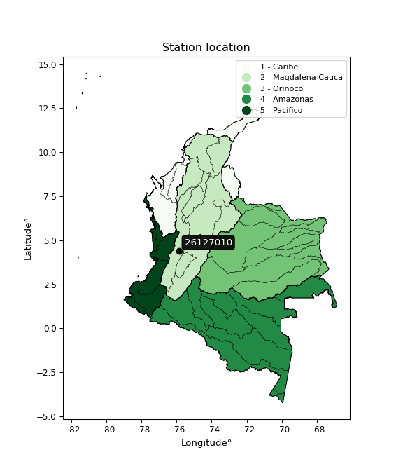</img>

</div>


## A. General information


### 1. General running parameters

• app_version: _v20251225_. • runtime: _2025-12-26 14:29:50.888910_. • Python version: _3.14.0_. • SciPy version: _1.16.3_. • Pandas version: _2.3.3_. • NumPy version: _2.3.5_. • Stations dataset (station_dataset_file): _dataset/pmax24h_in/automatic_colombia.csv_. • Stations catalog (station_catalog_file): _dataset/CNE_IDEAM.xls_. • Plot only fit distributions with Δo > Δ (plot_only_fit): _True_. • Eval low extreme values, if False, evaluates high extreme values (low_extreme): _False_. • Eval every SciPy distribution as logarithmic (pdist_logarithmic_on): _True_. • Standard deviation normalized (ddof): _1.0_. • Return periods to eval in years (Tr): _[2, 2.33, 5, 10, 15, 20, 25, 50, 75, 100, 200, 250, 500, 750, 1000]_. • Minimum data sample per station, 0 means any (minimum_sample): _5_. • Z-Score threshold to adjust a value, 0 means disable (zscore): _3.5_. • Avoid zeros, e.g. rain = 0 (avoid_zeros): _True_. • Avoid null values (avoid_nans): _True_. [:file_folder:Dataset file.](../../dataset/pmax24h_in/automatic_colombia.csv)


### 2. Station info and location

|   id |   CODIGO | NOMBRE                      | CATEGORIA    | TECNOLOGIA                              | ESTADO           | FECHA_INSTALACION   |   FECHA_SUSPENSION |   ALTITUD |   LATITUD |   LONGITUD | DEPARTAMENTO   | MUNICIPIO   | AREA_OPERATIVA                         | ENTIDAD                                                     | AREA_HIDROGRAFICA   | ZONA_HIDROGRAFICA   | SUBZONA_HIDROGRAFICA   | CORRIENTE   | OBSERVACION                                                                                                                                              | SUBRED                                        | Catalogo   |
|-----:|---------:|:----------------------------|:-------------|:----------------------------------------|:-----------------|:--------------------|-------------------:|----------:|----------:|-----------:|:---------------|:------------|:---------------------------------------|:------------------------------------------------------------|:--------------------|:--------------------|:-----------------------|:------------|:---------------------------------------------------------------------------------------------------------------------------------------------------------|:----------------------------------------------|:-----------|
|    0 | 26127010 | EL ALAMBRADO AUT [26127010] | Limnigráfica | Automática con Telemetría, Convencional | En Mantenimiento | 15/01/1953          |                nan |      1051 |   4.41025 |   -75.8754 | Quindío        | La Tebaida  | Area Operativa 09 - Cauca-Valle-Caldas | INSTITUTO DE HIDROLOGIA METEOROLOGIA Y ESTUDIOS AMBIENTALES | Magdalena Cauca     | Cauca               | Río La Vieja           | La Vieja    | EL GRUPO DE AUTOMATIZACION REPORTA QUE LA ESTACION DEJO DE TRANSMITIR EL 19/11/22 BATERIA 11.2 SIN DATO DE NIVEL. ESTACION EN MANTENIMIENTO (07/12/2022) | Zona cafetera,RED ALERTAS - AREA OPERATIVA 09 | CNE_IDEAM  |
|      |          |                             |              |                                         |                  |                     |                    |           |           |            |                |             |                                        |                                                             |                     |                     |                        |             | Actualizada Tecnologia y Tipo de Transmision por solicitud del coordinador del AO. (14032023)                                                            |                                               |            |

<div align="center">

Map location in: [:earth_americas:Google](http://maps.google.com/maps?q=4.41025,-75.875388889) [:earth_americas:OSM](https://www.openstreetmap.org/#map=18/4.41025/-75.875388889&layers=P) [:earth_americas:Bing](https://www.bing.com/maps?cp=4.41025~-75.875388889&lvl=18) [:earth_americas:Apple](https://maps.apple.com/frame?center=4.41025%2C-75.875388889&span=0.003%2C0.006)

</div>


<div align="center">

```geojson
{
  "type": "Feature",
  "geometry": {
    "type": "Point", 
    "coordinates": [-75.875388889, 4.41025]
  }, 
  "properties": {
    "Name": "26127010"
  }
}
```

</div>


### 3. Discrete values table and plot

|               |          0 |           1 |           2 |           3 |           4 |           5 |
|:--------------|-----------:|------------:|------------:|------------:|------------:|------------:|
| Date          | 2017       | 2018        | 2019        | 2020        | 2021        | 2022        |
| Value         |  295.4     |   36.7      |   57.8      |   63.9      |    6.2      |    7.8      |
| Value_initial |  295.4     |   36.7      |   57.8      |   63.9      |    6.2      |    7.8      |
| count         |    6       |    6        |    6        |    6        |    6        |    6        |
| mean          |   77.9667  |   77.9667   |   77.9667   |   77.9667   |   77.9667   |   77.9667   |
| std           |  109.232   |  109.232    |  109.232    |  109.232    |  109.232    |  109.232    |
| zscore        |    1.99056 |   -0.377788 |   -0.184622 |   -0.128777 |   -0.657009 |   -0.642361 |

<div align="center">

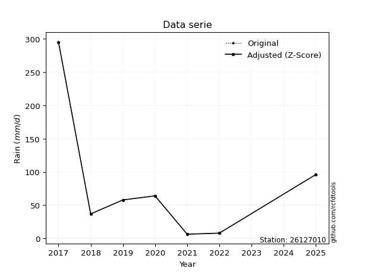</img>

</div>

> If Z-Score is active, values out of range or outliers are replaced with the station mean value.


### 4. Active continuous probability distributions from SciPy (45 of 104 available)

[scipy.stats](https://docs.scipy.org/doc/scipy/reference/stats.html) is a Python´s powerful submodule within the SciPy library for comprehensive statistical analysis, offering over 130 probability distributions (like Normal, Poisson), functions for descriptive stats (mean, variance), hypothesis testing (t-tests, chi-square), random variable generation, and statistical tests, making it essential for data science, modeling, and research. It provides tools to explore, model, and draw conclusions from data efficiently, working seamlessly with NumPy.

<div align="center">

|   id | p_dist             |   n_parameter | fit_method   | label                                                                       | active   | ref                                                                                                        |
|-----:|:-------------------|--------------:|:-------------|:----------------------------------------------------------------------------|:---------|:-----------------------------------------------------------------------------------------------------------|
|    0 | alpha              |             3 | MLE          | Alpha                                                                       | True     | [:mortar_board:](https://docs.scipy.org/doc/scipy/reference/generated/scipy.stats.alpha.html)              |
|    1 | betaprime          |             4 | MLE          | Beta prime                                                                  | True     | [:mortar_board:](https://docs.scipy.org/doc/scipy/reference/generated/scipy.stats.betaprime.html)          |
|    2 | chi2               |             3 | MLE          | Chi²                                                                        | True     | [:mortar_board:](https://docs.scipy.org/doc/scipy/reference/generated/scipy.stats.chi2.html)               |
|    3 | crystalball        |             4 | MLE          | Crystalball                                                                 | True     | [:mortar_board:](https://docs.scipy.org/doc/scipy/reference/generated/scipy.stats.crystalball.html)        |
|    4 | erlang             |             3 | MLE          | Erlang                                                                      | True     | [:mortar_board:](https://docs.scipy.org/doc/scipy/reference/generated/scipy.stats.erlang.html)             |
|    5 | expon              |             2 | MLE          | Exponential                                                                 | True     | [:mortar_board:](https://docs.scipy.org/doc/scipy/reference/generated/scipy.stats.expon.html)              |
|    6 | exponnorm          |             3 | MLE          | Exponentially modified Normal                                               | True     | [:mortar_board:](https://docs.scipy.org/doc/scipy/reference/generated/scipy.stats.exponnorm.html)          |
|    7 | f                  |             4 | MLE          | F                                                                           | True     | [:mortar_board:](https://docs.scipy.org/doc/scipy/reference/generated/scipy.stats.f.html)                  |
|    8 | fatiguelife        |             3 | MLE          | Fatigue-life (Birnbaum-Saunders)                                            | True     | [:mortar_board:](https://docs.scipy.org/doc/scipy/reference/generated/scipy.stats.fatiguelife.html)        |
|    9 | fisk               |             3 | MLE          | Fisk                                                                        | True     | [:mortar_board:](https://docs.scipy.org/doc/scipy/reference/generated/scipy.stats.fisk.html)               |
|   10 | gamma              |             3 | MLE          | Gamma                                                                       | True     | [:mortar_board:](https://docs.scipy.org/doc/scipy/reference/generated/scipy.stats.gamma.html)              |
|   11 | genexpon           |             5 | MLE          | Generalized exponential                                                     | True     | [:mortar_board:](https://docs.scipy.org/doc/scipy/reference/generated/scipy.stats.genexpon.html)           |
|   12 | genlogistic        |             3 | MLE          | Generalized logistic                                                        | True     | [:mortar_board:](https://docs.scipy.org/doc/scipy/reference/generated/scipy.stats.genlogistic.html)        |
|   13 | gibrat             |             2 | MM           | Gibrat                                                                      | True     | [:mortar_board:](https://docs.scipy.org/doc/scipy/reference/generated/scipy.stats.gibrat.html)             |
|   14 | gompertz           |             3 | MLE          | Gompertz (or truncated Gumbel)                                              | True     | [:mortar_board:](https://docs.scipy.org/doc/scipy/reference/generated/scipy.stats.gompertz.html)           |
|   15 | gumbel_l           |             2 | MM           | Gumbel Left Skew                                                            | True     | [:mortar_board:](https://docs.scipy.org/doc/scipy/reference/generated/scipy.stats.gumbel_l.html)           |
|   16 | gumbel_r           |             2 | MM           | Gumbel Right Skew                                                           | True     | [:mortar_board:](https://docs.scipy.org/doc/scipy/reference/generated/scipy.stats.gumbel_r.html)           |
|   17 | halflogistic       |             2 | MM           | Half-logistic                                                               | True     | [:mortar_board:](https://docs.scipy.org/doc/scipy/reference/generated/scipy.stats.halflogistic.html)       |
|   18 | halfnorm           |             2 | MM           | Half Normal                                                                 | True     | [:mortar_board:](https://docs.scipy.org/doc/scipy/reference/generated/scipy.stats.halfnorm.html)           |
|   19 | hypsecant          |             2 | MM           | hyperbolic secant                                                           | True     | [:mortar_board:](https://docs.scipy.org/doc/scipy/reference/generated/scipy.stats.hypsecant.html)          |
|   20 | invgamma           |             3 | MLE          | Inverted gamma                                                              | True     | [:mortar_board:](https://docs.scipy.org/doc/scipy/reference/generated/scipy.stats.invgamma.html)           |
|   21 | invgauss           |             3 | MLE          | Inverse Gaussian                                                            | True     | [:mortar_board:](https://docs.scipy.org/doc/scipy/reference/generated/scipy.stats.invgauss.html)           |
|   22 | invweibull         |             3 | MLE          | Inverted Weibull                                                            | True     | [:mortar_board:](https://docs.scipy.org/doc/scipy/reference/generated/scipy.stats.invweibull.html)         |
|   23 | johnsonsu          |             4 | MLE          | Johnson Su                                                                  | True     | [:mortar_board:](https://docs.scipy.org/doc/scipy/reference/generated/scipy.stats.johnsonsu.html)          |
|   24 | kstwobign          |             2 | MLE          | Limiting distribution of scaled Kolmogorov-Smirnov two-sided test statistic | True     | [:mortar_board:](https://docs.scipy.org/doc/scipy/reference/generated/scipy.stats.kstwobign.html)          |
|   25 | laplace            |             2 | MM           | Laplace                                                                     | True     | [:mortar_board:](https://docs.scipy.org/doc/scipy/reference/generated/scipy.stats.laplace.html)            |
|   26 | laplace_asymmetric |             3 | MLE          | Asymmetric Laplace                                                          | True     | [:mortar_board:](https://docs.scipy.org/doc/scipy/reference/generated/scipy.stats.laplace_asymmetric.html) |
|   27 | loggamma           |             3 | MLE          | Log gamma                                                                   | True     | [:mortar_board:](https://docs.scipy.org/doc/scipy/reference/generated/scipy.stats.loggamma.html)           |
|   28 | logistic           |             2 | MM           | Logistic (or Sech-squared)                                                  | True     | [:mortar_board:](https://docs.scipy.org/doc/scipy/reference/generated/scipy.stats.logistic.html)           |
|   29 | lognorm            |             3 | MLE          | Log Normal                                                                  | True     | [:mortar_board:](https://docs.scipy.org/doc/scipy/reference/generated/scipy.stats.lognorm.html)            |
|   30 | maxwell            |             2 | MM           | Maxwell                                                                     | True     | [:mortar_board:](https://docs.scipy.org/doc/scipy/reference/generated/scipy.stats.maxwell.html)            |
|   31 | mielke             |             4 | MLE          | Mielke Beta-Kappa / Dagum                                                   | True     | [:mortar_board:](https://docs.scipy.org/doc/scipy/reference/generated/scipy.stats.mielke.html)             |
|   32 | moyal              |             2 | MM           | Moyal                                                                       | True     | [:mortar_board:](https://docs.scipy.org/doc/scipy/reference/generated/scipy.stats.moyal.html)              |
|   33 | nakagami           |             3 | MLE          | Nakagami                                                                    | True     | [:mortar_board:](https://docs.scipy.org/doc/scipy/reference/generated/scipy.stats.nakagami.html)           |
|   34 | ncf                |             5 | MLE          | Non-central F distribution                                                  | True     | [:mortar_board:](https://docs.scipy.org/doc/scipy/reference/generated/scipy.stats.ncf.html)                |
|   35 | nct                |             4 | MLE          | Non-central Student’s t                                                     | True     | [:mortar_board:](https://docs.scipy.org/doc/scipy/reference/generated/scipy.stats.nct.html)                |
|   36 | norm               |             2 | MM           | Normal                                                                      | True     | [:mortar_board:](https://docs.scipy.org/doc/scipy/reference/generated/scipy.stats.norm.html)               |
|   37 | pareto             |             3 | MLE          | Pareto                                                                      | True     | [:mortar_board:](https://docs.scipy.org/doc/scipy/reference/generated/scipy.stats.pareto.html)             |
|   38 | pearson3           |             3 | MM           | Pearson type III                                                            | True     | [:mortar_board:](https://docs.scipy.org/doc/scipy/reference/generated/scipy.stats.pearson3.html)           |
|   39 | rayleigh           |             2 | MM           | Rayleigh                                                                    | True     | [:mortar_board:](https://docs.scipy.org/doc/scipy/reference/generated/scipy.stats.rayleigh.html)           |
|   40 | rice               |             3 | MLE          | Rice                                                                        | True     | [:mortar_board:](https://docs.scipy.org/doc/scipy/reference/generated/scipy.stats.rice.html)               |
|   41 | t                  |             3 | MLE          | Student’s t                                                                 | True     | [:mortar_board:](https://docs.scipy.org/doc/scipy/reference/generated/scipy.stats.t.html)                  |
|   42 | truncnorm          |             4 | MLE          | Truncated normal                                                            | True     | [:mortar_board:](https://docs.scipy.org/doc/scipy/reference/generated/scipy.stats.truncnorm.html)          |
|   43 | wald               |             2 | MM           | Wald                                                                        | True     | [:mortar_board:](https://docs.scipy.org/doc/scipy/reference/generated/scipy.stats.wald.html)               |
|   44 | weibull_min        |             3 | MLE          | Weibull minimum                                                             | True     | [:mortar_board:](https://docs.scipy.org/doc/scipy/reference/generated/scipy.stats.weibull_min.html)        |

</div>

> **n_parameter:** # arguments & localization & scale.
>
> **Fit methods:** (MLE) maximum likelihood, (MM) L-moments.
>
>**Inactive:** foldnorm, gennorm, norminvgauss, powernorm, powerlognorm, skewnorm, genextreme, anglit, arcsine, argus, beta, bradford, burr, burr12, cauchy, cosine, halfcauchy, foldcauchy, skewcauchy, wrapcauchy, dgamma, gengamma, exponweib, exponpow, truncexpon, gausshyper, genhalflogistic, genhyperbolic, geninvgauss, halfgennorm, johnsonsb, kappa4, kappa3, ksone, kstwo, loglaplace, levy, levy_l, levy_stable, ncx2, genpareto, truncpareto, lomax, powerlaw, rdist, rel_breitwigner, recipinvgauss, semicircular, studentized_range, trapezoid, triang, truncweibull_min, tukeylambda, uniform, loguniform, vonmises, vonmises_line, weibull_max, dweibull, 


## B. Probability distributions vs. Empirical distributions

A continuous probability distribution (CPD) describes probabilities for variables that can take any value within a range (like rain any time), unlike discrete variables with specific outcomes (like temperature). It uses a Probability Density Function (PDF), a curve where the total area under it equals 1, and the probability of the variable falling within an interval (a to b) is found by calculating the area under the curve between those points. A key feature is that the probability of hitting any single exact value is zero, so probabilities are always expressed for ranges, e.g., $P(a ≤ X ≤ b)$.

<div align="center">

Distributions parameters
|    |   station | p_dist                |   n |              loc |          scale | shape                  | shape1                 | shape2                | shape3   |
|---:|----------:|:----------------------|----:|-----------------:|---------------:|:-----------------------|:-----------------------|:----------------------|:---------|
|  0 |  26127010 | alpha                 |   6 |     -0.0307107   |   11.7688      | 1.1009013842238883e-09 |                        |                       |          |
|  1 |  26127010 | betaprime             |   6 |     -0.0530283   |    0.275135    | 51.87368335025954      | 0.8183891808779009     |                       |          |
|  2 |  26127010 | chi2                  |   6 |      6.2         |    4.88757     | 0.38917593500101194    |                        |                       |          |
|  3 |  26127010 | crystalball           |   6 |     77.9667      |   99.7151      | 6709.0257162939515     | 1420.4140391822        |                       |          |
|  4 |  26127010 | erlang                |   6 |      6.2         |   84.2772      | 0.4680249050412122     |                        |                       |          |
|  5 |  26127010 | expon                 |   6 |      6.2         |   71.7667      |                        |                        |                       |          |
|  6 |  26127010 | exponnorm             |   6 |      6.11085     |    0.0275072   | 2609.6302045568773     |                        |                       |          |
|  7 |  26127010 | f                     |   6 |      5.81747     |    1.88362     | 1160.0095346948124     | 0.6295661442301124     |                       |          |
|  8 |  26127010 | fatiguelife           |   6 |      6.2         |    1.73787e-05 | 1943.5552964238655     |                        |                       |          |
|  9 |  26127010 | fisk                  |   6 |      6.2         |   91.3488      | 0.149516738470656      |                        |                       |          |
| 10 |  26127010 | gamma                 |   6 |      6.2         |  118.82        | 0.130252096032213      |                        |                       |          |
| 11 |  26127010 | genexpon              |   6 |      6.2         |  126.766       | 1.7663577874916605     | 1.2403859302589924e-14 | 1.5897698012688795    |          |
| 12 |  26127010 | genlogistic           |   6 |   -373.569       |   53.5831      | 2195.847060332846      |                        |                       |          |
| 13 |  26127010 | gibrat                |   6 |      1.89663     |   46.1388      |                        |                        |                       |          |
| 14 |  26127010 | gompertz              |   6 |      6.2         |    5.1276e+13  | 618696705962.3839      |                        |                       |          |
| 15 |  26127010 | gumbel_l              |   6 |    122.844       |   77.7475      |                        |                        |                       |          |
| 16 |  26127010 | gumbel_r              |   6 |     33.0896      |   77.7475      |                        |                        |                       |          |
| 17 |  26127010 | halflogistic          |   6 |    -40.2189      |   85.2528      |                        |                        |                       |          |
| 18 |  26127010 | halfnorm              |   6 |    -54.017       |  165.417       |                        |                        |                       |          |
| 19 |  26127010 | hypsecant             |   6 |     77.9667      |   63.4806      |                        |                        |                       |          |
| 20 |  26127010 | invgamma              |   6 |      5.81694     |    0.592614    | 0.3147881790055059     |                        |                       |          |
| 21 |  26127010 | invgauss              |   6 |      4.07394     |    8.25371     | 8.952675413223531      |                        |                       |          |
| 22 |  26127010 | invweibull            |   6 |      6.2         |    2.0211      | 0.04417811335071026    |                        |                       |          |
| 23 |  26127010 | johnsonsu             |   6 |      6.2         |    2.29927e-13 | -2.2258419028251546    | 0.10586212551343233    |                       |          |
| 24 |  26127010 | kstwobign             |   6 |   -172.147       |  292.747       |                        |                        |                       |          |
| 25 |  26127010 | laplace               |   6 |     77.9667      |   70.5092      |                        |                        |                       |          |
| 26 |  26127010 | laplace_asymmetric    |   6 |      6.19847     |    0.09174     | 0.0012779442191783378  |                        |                       |          |
| 27 |  26127010 | loggamma              |   6 | -30143.2         | 4091.79        | 1613.090005653533      |                        |                       |          |
| 28 |  26127010 | logistic              |   6 |     77.9667      |   54.9758      |                        |                        |                       |          |
| 29 |  26127010 | lognorm               |   6 |      6.2         |    0.0578084   | 14.308451631923376     |                        |                       |          |
| 30 |  26127010 | maxwell               |   6 |   -158.316       |  148.068       |                        |                        |                       |          |
| 31 |  26127010 | mielke                |   6 |      3.9677      |    0.340326    | 12.195213271518465     | 0.7902565864458795     |                       |          |
| 32 |  26127010 | moyal                 |   6 |     20.9432      |   44.8876      |                        |                        |                       |          |
| 33 |  26127010 | nakagami              |   6 |      6.2         |  161.085       | 0.10204031018558876    |                        |                       |          |
| 34 |  26127010 | ncf                   |   6 |     -0.161245    |    1.80365e-06 | 1.135438385098473e-05  | 1.6568214274351725     | 112.6884135475344     |          |
| 35 |  26127010 | nct                   |   6 |      2.78329     |    1.60983     | 0.5004466241073793     | 4.588657404608513      |                       |          |
| 36 |  26127010 | norm                  |   6 |     77.9667      |   99.7151      |                        |                        |                       |          |
| 37 |  26127010 | pareto                |   6 |      6.02584     |    0.174157    | 0.22719863405062068    |                        |                       |          |
| 38 |  26127010 | pearson3              |   6 |     77.9667      |   99.7151      | 1.594137842797915      |                        |                       |          |
| 39 |  26127010 | rayleigh              |   6 |   -112.794       |  152.205       |                        |                        |                       |          |
| 40 |  26127010 | rice                  |   6 |    -64.6346      |  123.041       | 0.000989951780775679   |                        |                       |          |
| 41 |  26127010 | t                     |   6 |     38.5261      |   27.8513      | 1.2255787641339362     |                        |                       |          |
| 42 |  26127010 | truncnorm             |   6 |  -3824.19        |  557.191       | 6.874463956135266      | 272.62673329318557     |                       |          |
| 43 |  26127010 | wald                  |   6 |    -21.7484      |   99.7151      |                        |                        |                       |          |
| 44 |  26127010 | weibull_min           |   6 |      6.2         |  106.647       | 0.7200859846806196     |                        |                       |          |
| 45 |  26127010 | logalpha              |   6 |    -16.9044      |  316.649       | 15.542289620288777     |                        |                       |          |
| 46 |  26127010 | logbetaprime          |   6 |     -0.413613    |   61.4478      | 8.851503361378732      | 138.0344211408334      |                       |          |
| 47 |  26127010 | logchi2               |   6 |      1.82455     |    1.01255     | 1.2014213760238555     |                        |                       |          |
| 48 |  26127010 | logcrystalball        |   6 |      3.56401     |    1.3175      | 1662.6150832230583     | 94.71005367407106      |                       |          |
| 49 |  26127010 | logerlang             |   6 |    -17.9466      |    0.0804909   | 267.2245933706368      |                        |                       |          |
| 50 |  26127010 | logexpon              |   6 |      1.82455     |    1.73947     |                        |                        |                       |          |
| 51 |  26127010 | logexponnorm          |   6 |      3.45152     |    1.31268     | 0.08569045667616898    |                        |                       |          |
| 52 |  26127010 | logf                  |   6 |     -1.61522     |    5.14801     | 30.749325968566577     | 1147.7090296390777     |                       |          |
| 53 |  26127010 | logfatiguelife        |   6 |      1.82455     |    1.33968e-06 | 970.1159792831443      |                        |                       |          |
| 54 |  26127010 | logfisk               |   6 |   -847.908       |  851.478       | 1079.304663479586      |                        |                       |          |
| 55 |  26127010 | loggamma              |   6 |    -18.0763      |    0.0798251   | 271.11191534159855     |                        |                       |          |
| 56 |  26127010 | loggenexpon           |   6 |      1.82418     |    0.00809435  | 0.003236179162063418   | 0.9174532463345544     | 9.092717946036664e-06 |          |
| 57 |  26127010 | loggenlogistic        |   6 |     -3.80296     |    1.16162     | 324.0615721913408      |                        |                       |          |
| 58 |  26127010 | loggibrat             |   6 |      2.5589      |    0.609627    |                        |                        |                       |          |
| 59 |  26127010 | loggompertz           |   6 |      1.82455     |    2.94788     | 1.0138110648284109     |                        |                       |          |
| 60 |  26127010 | loggumbel_l           |   6 |      4.15696     |    1.02725     |                        |                        |                       |          |
| 61 |  26127010 | loggumbel_r           |   6 |      2.97107     |    1.02725     |                        |                        |                       |          |
| 62 |  26127010 | loghalflogistic       |   6 |      2.00244     |    1.12643     |                        |                        |                       |          |
| 63 |  26127010 | loghalfnorm           |   6 |      1.82017     |    2.18559     |                        |                        |                       |          |
| 64 |  26127010 | loghypsecant          |   6 |      3.56401     |    0.838744    |                        |                        |                       |          |
| 65 |  26127010 | loginvgamma           |   6 |     -8.01753     |  877.881       | 76.8885831539817       |                        |                       |          |
| 66 |  26127010 | loginvgauss           |   6 |     -2.5747      |  124.383       | 0.04929587273750541    |                        |                       |          |
| 67 |  26127010 | loginvweibull         |   6 |     -4.54254e+07 |    4.54254e+07 | 39029699.80228732      |                        |                       |          |
| 68 |  26127010 | logjohnsonsu          |   6 |      7.84912e+06 |    4.94872e+07 | 6002231.000963401      | 38000481.72603045      |                       |          |
| 69 |  26127010 | logkstwobign          |   6 |     -1.07413     |    5.29108     |                        |                        |                       |          |
| 70 |  26127010 | loglaplace            |   6 |      3.56401     |    0.93161     |                        |                        |                       |          |
| 71 |  26127010 | loglaplace_asymmetric |   6 |      4.05699     |    0.979533    | 1.2827239861456463     |                        |                       |          |
| 72 |  26127010 | logloggamma           |   6 |   -331.639       |   46.9398      | 1263.30134341572       |                        |                       |          |
| 73 |  26127010 | loglogistic           |   6 |      3.56401     |    0.726373    |                        |                        |                       |          |
| 74 |  26127010 | loglognorm            |   6 |      1.82455     |    0.00349545  | 13.619037483845805     |                        |                       |          |
| 75 |  26127010 | logmaxwell            |   6 |      0.442104    |    1.95637     |                        |                        |                       |          |
| 76 |  26127010 | logmielke             |   6 |      1.82455     |    3.71753     | 0.6757963300998739     | 7.68962518717365       |                       |          |
| 77 |  26127010 | logmoyal              |   6 |      2.81059     |    0.593081    |                        |                        |                       |          |
| 78 |  26127010 | lognakagami           |   6 |      1.82455     |    2.84666     | 0.06565325645142969    |                        |                       |          |
| 79 |  26127010 | logncf                |   6 |     -1.36651     |    3.16506     | 25.492019585517454     | 348.3131206869332      | 13.979659747255457    |          |
| 80 |  26127010 | lognct                |   6 |    -60.6246      |    1.30391     | 58059.24447864824      | 49.22725432309366      |                       |          |
| 81 |  26127010 | lognorm               |   6 |      3.56401     |    1.3175      |                        |                        |                       |          |
| 82 |  26127010 | logpareto             |   6 |      1.81995     |    0.00460384  | 0.2066267124388669     |                        |                       |          |
| 83 |  26127010 | logpearson3           |   6 |      3.56402     |    1.31749     | 0.08818375555566249    |                        |                       |          |
| 84 |  26127010 | lograyleigh           |   6 |      1.04357     |    2.01102     |                        |                        |                       |          |
| 85 |  26127010 | logrice               |   6 |      1.08014     |    1.62402     | 0.9986728598119803     |                        |                       |          |
| 86 |  26127010 | logt                  |   6 |      3.56401     |    1.31749     | 2290475454.6142893     |                        |                       |          |
| 87 |  26127010 | logtruncnorm          |   6 |      1.09199     |    2.48576     | 0.2947006523023713     | 22.211483736852458     |                       |          |
| 88 |  26127010 | logwald               |   6 |      2.24656     |    1.31746     |                        |                        |                       |          |
| 89 |  26127010 | logweibull_min        |   6 |      1.82455     |    2.1619      | 0.4930560088793041     |                        |                       |          |

</div>

> **loc** (Location parameter): This shifts the distribution along the x-axis. For many common distributions, like the normal (Gaussian) distribution, loc represents the mean $μ$. For others, like the uniform distribution, it might represent the minimum value, or for the beta distribution, the left end of the support interval.
>
> **scale** (Scale parameter): This determines the width or spread of the distribution. For the normal distribution, scale represents the standard deviation $σ$. For a uniform distribution, it defines the length of the interval (from $loc$ to $loc + scale$).
>
> **shape** (Shape parameters): Refers to parameters that define the specific form of a probability distribution, distinct from its location (loc) and scale (scale). These parameters are required arguments for most distribution functions. For example, a normal (Gaussian) distribution is fully defined by its location (mean) and scale (standard deviation), so it has no specific shape parameters beyond loc and scale. However, other distributions have intrinsic properties that need specification, as Gamma distribution that takes a shape parameter, often named $a$ or $alpha$.


### 0. Cumulative distribution values - CDF (90 evaluated)

> Ordered by x ascending and calculating $log(f(x))$ separately. 

|   id |   Station |   date |     x |   count |    mean |     std |    zscore |   Value_initial |   station |   m |    alpha |   alpha_pdf |   betaprime |   betaprime_pdf |        chi2 |    chi2_pdf |   crystalball |   crystalball_pdf |      erlang |   erlang_pdf |     expon |   expon_pdf |   exponnorm |   exponnorm_pdf |         f |       f_pdf |   fatiguelife |   fatiguelife_pdf |       fisk |    fisk_pdf |      gamma |   gamma_pdf |    genexpon |   genexpon_pdf |   genlogistic |   genlogistic_pdf |    gibrat |   gibrat_pdf |    gompertz |   gompertz_pdf |   gumbel_l |   gumbel_l_pdf |   gumbel_r |   gumbel_r_pdf |   halflogistic |   halflogistic_pdf |   halfnorm |   halfnorm_pdf |   hypsecant |   hypsecant_pdf |   invgamma |   invgamma_pdf |   invgauss |   invgauss_pdf |   invweibull |   invweibull_pdf |   johnsonsu |   johnsonsu_pdf |   kstwobign |   kstwobign_pdf |   laplace |   laplace_pdf |   laplace_asymmetric |   laplace_asymmetric_pdf |   loggamma |   loggamma_pdf |   logistic |   logistic_pdf |   lognorm |   lognorm_pdf |   maxwell |   maxwell_pdf |    mielke |   mielke_pdf |    moyal |   moyal_pdf |    nakagami |   nakagami_pdf |       ncf |    ncf_pdf |       nct |     nct_pdf |     norm |    norm_pdf |   pareto |   pareto_pdf |   pearson3 |   pearson3_pdf |   rayleigh |   rayleigh_pdf |     rice |    rice_pdf |        t |       t_pdf |   truncnorm |   truncnorm_pdf |     wald |    wald_pdf |   weibull_min |   weibull_min_pdf |   logalpha |   logalpha_pdf |   logbetaprime |   logbetaprime_pdf |     logchi2 |    logchi2_pdf |   logcrystalball |   logcrystalball_pdf |   logerlang |   logerlang_pdf |   logexpon |   logexpon_pdf |   logexponnorm |   logexponnorm_pdf |      logf |   logf_pdf |   logfatiguelife |   logfatiguelife_pdf |   logfisk |   logfisk_pdf |   loggenexpon |   loggenexpon_pdf |   loggenlogistic |   loggenlogistic_pdf |   loggibrat |   loggibrat_pdf |   loggompertz |   loggompertz_pdf |   loggumbel_l |   loggumbel_l_pdf |   loggumbel_r |   loggumbel_r_pdf |   loghalflogistic |   loghalflogistic_pdf |   loghalfnorm |   loghalfnorm_pdf |   loghypsecant |   loghypsecant_pdf |   loginvgamma |   loginvgamma_pdf |   loginvgauss |   loginvgauss_pdf |   loginvweibull |   loginvweibull_pdf |   logjohnsonsu |   logjohnsonsu_pdf |   logkstwobign |   logkstwobign_pdf |   loglaplace |   loglaplace_pdf |   loglaplace_asymmetric |   loglaplace_asymmetric_pdf |   logloggamma |   logloggamma_pdf |   loglogistic |   loglogistic_pdf |   loglognorm |   loglognorm_pdf |   logmaxwell |   logmaxwell_pdf |   logmielke |   logmielke_pdf |   logmoyal |   logmoyal_pdf |   lognakagami |   lognakagami_pdf |    logncf |   logncf_pdf |   lognct |   lognct_pdf |   logpareto |   logpareto_pdf |   logpearson3 |   logpearson3_pdf |   lograyleigh |   lograyleigh_pdf |   logrice |   logrice_pdf |      logt |   logt_pdf |   logtruncnorm |   logtruncnorm_pdf |   logwald |   logwald_pdf |   logweibull_min |   logweibull_min_pdf |
|-----:|----------:|-------:|------:|--------:|--------:|--------:|----------:|----------------:|----------:|----:|---------:|------------:|------------:|----------------:|------------:|------------:|--------------:|------------------:|------------:|-------------:|----------:|------------:|------------:|----------------:|----------:|------------:|--------------:|------------------:|-----------:|------------:|-----------:|------------:|------------:|---------------:|--------------:|------------------:|----------:|-------------:|------------:|---------------:|-----------:|---------------:|-----------:|---------------:|---------------:|-------------------:|-----------:|---------------:|------------:|----------------:|-----------:|---------------:|-----------:|---------------:|-------------:|-----------------:|------------:|----------------:|------------:|----------------:|----------:|--------------:|---------------------:|-------------------------:|-----------:|---------------:|-----------:|---------------:|----------:|--------------:|----------:|--------------:|----------:|-------------:|---------:|------------:|------------:|---------------:|----------:|-----------:|----------:|------------:|---------:|------------:|---------:|-------------:|-----------:|---------------:|-----------:|---------------:|---------:|------------:|---------:|------------:|------------:|----------------:|---------:|------------:|--------------:|------------------:|-----------:|---------------:|---------------:|-------------------:|------------:|---------------:|-----------------:|---------------------:|------------:|----------------:|-----------:|---------------:|---------------:|-------------------:|----------:|-----------:|-----------------:|---------------------:|----------:|--------------:|--------------:|------------------:|-----------------:|---------------------:|------------:|----------------:|--------------:|------------------:|--------------:|------------------:|--------------:|------------------:|------------------:|----------------------:|--------------:|------------------:|---------------:|-------------------:|--------------:|------------------:|--------------:|------------------:|----------------:|--------------------:|---------------:|-------------------:|---------------:|-------------------:|-------------:|-----------------:|------------------------:|----------------------------:|--------------:|------------------:|--------------:|------------------:|-------------:|-----------------:|-------------:|-----------------:|------------:|----------------:|-----------:|---------------:|--------------:|------------------:|----------:|-------------:|---------:|-------------:|------------:|----------------:|--------------:|------------------:|--------------:|------------------:|----------:|--------------:|----------:|-----------:|---------------:|-------------------:|----------:|--------------:|-----------------:|---------------------:|
|    0 |  26127010 |   2021 |   6.2 |       6 | 77.9667 | 109.232 | -0.657009 |             6.2 |  26127010 |   1 | 0.058913 | 0.0406328   |   0.0765886 |     0.0283614   | 0.000822022 | 1.80094e+11 |      0.23585  |       0.00308794  | 1.27937e-08 |  6.74162e+06 | 0         | 0.013934    |   0.0012411 |     0.0139052   | 0.0421036 | 0.224161    |     0.0320472 |       4.95717e+10 | 0.00285201 | 4.7874e+11  | 0.00625457 | 9.17238e+11 | 1.55689e-13 |    0.0139341   |      0.159795 |       0.00546665  | 0.0088399 |  0.00556011  | 3.15609e-14 |    0.012066    |   0.199938 |    0.00229546  |   0.243363 |    0.00442356  |       0.26571  |        0.00545083  |   0.284166 |    0.00451423  |    0.198815 |     0.0029322   |  0.0421042 |    0.224152    |  0.0545035 |    0.0592491   |   0.00848702 |      2.0133e+12  |    0.017594 |     1.16913e+10 |    0.148156 |     0.00469189  |  0.180688 |   0.00256262  |          2.29714e-05 |              0.0139297   |  0.0899246 |      0.130585  |   0.213254 |     0.00305183 | 0.0933704 |     0.126661  |  0.255259 |   0.00358841  | 0.0429911 |  0.0433243   | 0.238606 | 0.00523033  | 0.000250468 |    5.7551e+10  | 0.0780186 | 0.0277926  | 0.0654971 | 0.0524195   | 0.23585  | 0.00308794  | 0        |  1.30456     |   0.256399 |    0.00574194  |   0.263324 |    0.00378394  | 0.152712 | 0.00396439  | 0.211898 | 0.00519457  | 1.19533e-05 |     0.0125886   | 0.144613 | 0.0107015   |   5.02722e-13 |     407.579       |  0.0861806 |      0.141929  |       0.081266 |          0.164152  | 2.89409e-10 | 782956         |        0.0933704 |            0.126661  |   0.0904946 |       0.131093  |   0        |      0.574889  |      0.0933424 |          0.126698  | 0.0835358 |  0.152307  |        0.0654999 |          1.54304e+11 | 0.0984577 |     0.112745  |   0.000145941 |         0.399795  |        0.0788037 |             0.171692 |    0        |       0         |   1.71461e-09 |         0.343912  |      0.098104 |         0.0906561 |     0.0472189 |         0.140334  |         0         |             0         |    0.00159975 |         0.365065  |      0.0796027 |          0.0939209 |     0.0849385 |         0.145628  |     0.0804837 |         0.156013  |        0.078331 |           0.171406  |       0.093548 |          0.126736  |      0.0750327 |          0.186919  |    0.0772809 |        0.0829542 |                0.105231 |                   0.0837512 |      0.094773 |         0.126175  |     0.0835757 |         0.105443  |    0.0128326 |      1.09464e+13 |    0.0809633 |        0.158655  | 2.40807e-10 |    7478.57      |  0.0216608 |      0.110621  |    0.00664115 |       3.92725e+12 | 0.0820065 |    0.151126  | 0.09331  |    0.126742  |    0        |      44.8814    |     0.0914237 |         0.129794  |     0.0726346 |         0.179084  | 0.0621382 |     0.162515  | 0.0933701 |  0.126661  |     3.0321e-10 |          0.400068  |  0        |     0         |      1.30866e-08 |          2.90591e+07 |
|    1 |  26127010 |   2022 |   7.8 |       6 | 77.9667 | 109.232 | -0.642361 |             7.8 |  26127010 |   2 | 0.132863 | 0.0494987   |   0.12331   |     0.0295226   | 0.745105    | 0.0789503   |      0.240819 |       0.0031234   | 0.175543    |  0.0506885   | 0.0220478 | 0.0136268   |   0.0232563 |     0.0136068   | 0.286673  | 0.089905    |     0.56203   |       0.0192277   | 0.353258   | 0.0213498   | 0.60618    | 0.048763    | 0.0220478   |    0.0136268   |      0.168649 |       0.00559995  | 0.0198849 |  0.00816172  | 0.0191205   |    0.0118353   |   0.20364  |    0.00233235  |   0.25047  |    0.00446001  |       0.274409 |        0.00542328  |   0.291376 |    0.00449815  |    0.203554 |     0.00299244  |  0.286669  |    0.0899051   |  0.152532  |    0.0586999   |   0.364082   |      0.0101571   |    0.83596  |     0.0163621   |    0.155739 |     0.00478632  |  0.184835 |   0.00262144  |          0.022064    |              0.0136227   |  0.123594  |      0.163074  |   0.218177 |     0.00310275 | 0.125891  |     0.157023  |  0.261022 |   0.00361467  | 0.119535  |  0.048915    | 0.247003 | 0.00526441  | 0.325183    |    0.0414768   | 0.123743  | 0.0288855  | 0.152865  | 0.0532615   | 0.240819 | 0.0031234   | 0.409837 |  0.0755764   |   0.265572 |    0.00572379  |   0.269393 |    0.00380322  | 0.159102 | 0.00402336  | 0.220454 | 0.00550325  | 0.0199562   |     0.0123425   | 0.161788 | 0.0107558   |   0.0474432   |       0.0208373   |  0.12304   |      0.17936   |       0.124075 |          0.208287  | 0.290166    |      0.706938  |        0.125891  |            0.157023  |   0.12428   |       0.163565  |   0.123641 |      0.503809  |      0.125874  |          0.15708   | 0.123198  |  0.193139  |        0.665206  |          0.338499    | 0.127536  |     0.141295  |   0.0908972   |         0.390078  |        0.124106  |             0.222215 |    0        |       0         |   0.0788286   |         0.34246   |      0.121126 |         0.110465  |     0.0870272 |         0.206844  |         0.0229361 |             0.443646  |    0.0852468  |         0.362981  |      0.104271  |          0.122106  |     0.122834  |         0.184614  |     0.121299  |         0.19934   |        0.123577 |           0.222006  |       0.126082 |          0.157062  |      0.124324  |          0.240787  |    0.0988768 |        0.106135  |                0.126327 |                   0.100541  |      0.127122 |         0.156014  |     0.111187  |         0.136052  |    0.620682  |      0.121713    |    0.121857  |        0.197195  | 0.152313    |       0.448364  |  0.0584645 |      0.212464  |    0.621915   |       0.355566    | 0.121389  |    0.191872  | 0.125854 |    0.157144  |    0.555976 |       0.391784  |     0.124832  |         0.161593  |     0.118612  |         0.220238  | 0.104379  |     0.204551  | 0.125891  |  0.157023  |     0.0904791  |          0.38767   |  0        |     0         |      0.281783    |          0.510546    |
|    2 |  26127010 |   2018 |  36.7 |       6 | 77.9667 | 109.232 | -0.377788 |            36.7 |  26127010 |   3 | 0.748659 | 0.00661184  |   0.5853    |     0.00739131  | 0.996913    | 0.000382207 |      0.339494 |       0.00367247  | 0.628769    |  0.00749823  | 0.346223  | 0.00910976  |   0.346968  |     0.00909722  | 0.679705  | 0.00321734  |     0.752261  |       0.00353375  | 0.459088   | 0.00121734  | 0.866622   | 0.0029446   | 0.346223    |    0.00910977  |      0.354125 |       0.00685911  | 0.388995  |  0.0110161   | 0.307892    |    0.00835098  |   0.281235 |    0.00305285  |   0.384957 |    0.0047267   |       0.422821 |        0.00481639  |   0.416592 |    0.00415003  |    0.306278 |     0.00411398  |  0.679706  |    0.00321738  |  0.682235  |    0.00591228  |   0.411887   |      0.000529191 |    0.901482 |     0.000602524 |    0.311181 |     0.00573357  |  0.278479 |   0.00394954  |          0.346158    |              0.00910806  |  0.519467  |      0.302783  |   0.320683 |     0.00396257 | 0.511736  |     0.302673  |  0.370747 |   0.00392659  | 0.66197   |  0.00650577  | 0.401455 | 0.0052444   | 0.593254    |    0.00395641  | 0.582555  | 0.00744047 | 0.639396  | 0.00526575  | 0.339494 | 0.00367247  | 0.691148 |  0.00228762  |   0.422711 |    0.00507157  |   0.382667 |    0.00398369  | 0.287621 | 0.00476836  | 0.478379 | 0.0118095   | 0.319848    |     0.00862784  | 0.435866 | 0.00770341  |   0.33369     |       0.00638685  |  0.540378  |      0.298844  |       0.562378 |          0.283348  | 0.769542    |      0.145302  |        0.511736  |            0.302673  |   0.520311  |       0.302396  |   0.640228 |      0.206829  |      0.511819  |          0.302679  | 0.553314  |  0.293844  |        0.882504  |          0.0658114   | 0.510451  |     0.316741  |   0.59842     |         0.251405  |        0.576134  |             0.273255 |    0.70466  |       0.330707  |   0.568046    |         0.271557  |      0.441807 |         0.316822  |     0.582359  |         0.306511  |         0.6109    |             0.278224  |    0.585282   |         0.261769  |      0.514705  |          0.379103  |     0.546095  |         0.297174  |     0.557135  |         0.28962   |        0.575419 |           0.273235  |       0.511726 |          0.302429  |      0.584693  |          0.269796  |    0.520377  |        0.514833  |                0.433293 |                   0.344849  |      0.510487 |         0.302017  |     0.513338  |         0.343931  |    0.676376  |      0.0148357   |    0.544279  |        0.288649  | 0.607342    |       0.230021  |  0.608088  |      0.302444  |    0.812458   |       0.0585673   | 0.548836  |    0.292219  | 0.511896 |    0.302672  |    0.708088 |       0.0338321 |     0.517589  |         0.302232  |     0.555027  |         0.281582  | 0.538107  |     0.295252  | 0.511736  |  0.302673  |     0.593264   |          0.250872  |  0.679584 |     0.289803  |      0.596737    |          0.101546    |
|    3 |  26127010 |   2019 |  57.8 |       6 | 77.9667 | 109.232 | -0.184622 |            57.8 |  26127010 |   4 | 0.83874  | 0.00275019  |   0.696081  |     0.00373713  | 0.999751    | 2.8903e-05  |      0.419863 |       0.00391983  | 0.750078    |  0.00441317  | 0.512759  | 0.00678924  |   0.513281  |     0.00678036  | 0.727623  | 0.00163513  |     0.812348  |       0.00231348  | 0.478663   | 0.000723084 | 0.911707   | 0.00156062  | 0.512759    |    0.00678924  |      0.496457 |       0.00648698  | 0.576117  |  0.00700599  | 0.463456    |    0.00647395  |   0.351556 |    0.00361288  |   0.483006 |    0.004521    |       0.518928 |        0.00428557  |   0.500941 |    0.00383829  |    0.400538 |     0.00477148  |  0.727625  |    0.00163515  |  0.769016  |    0.00289383  |   0.420362   |      0.000311903 |    0.910801 |     0.000330953 |    0.432065 |     0.00563534  |  0.375626 |   0.00532733  |          0.51267     |              0.00678854  |  0.652315  |      0.276921  |   0.409308 |     0.00439784 | 0.645863  |     0.282331  |  0.454202 |   0.00395667  | 0.75606   |  0.00307569  | 0.507146 | 0.00473099  | 0.660039    |    0.0025858   | 0.694286  | 0.00377504 | 0.716473  | 0.00256887  | 0.419863 | 0.00391983  | 0.72578  |  0.00120335  |   0.522975 |    0.00442395  |   0.466404 |    0.00392933  | 0.39048  | 0.00492938  | 0.701772 | 0.00821326  | 0.479934    |     0.00663181  | 0.573502 | 0.0054728   |   0.44726     |       0.00457312  |  0.668573  |      0.261441  |       0.681301 |          0.237997  | 0.826055    |      0.106027  |        0.645863  |            0.282331  |   0.652943  |       0.276389  |   0.722908 |      0.159297  |      0.645935  |          0.282277  | 0.677975  |  0.251729  |        0.908349  |          0.0490542   | 0.649622  |     0.28835   |   0.701746    |         0.203929  |        0.688622  |             0.221029 |    0.8157   |       0.17776   |   0.68278     |         0.232649  |      0.596375 |         0.356483  |     0.706482  |         0.238961  |         0.722077  |             0.212443  |    0.693901   |         0.216234  |      0.677162  |          0.322229  |     0.672858  |         0.257162  |     0.679128  |         0.244771  |        0.68792  |           0.221107  |       0.645751 |          0.282136  |      0.696174  |          0.22037   |    0.705451  |        0.316172  |                0.621983 |                   0.495024  |      0.644615 |         0.282959  |     0.663444  |         0.307399  |    0.682354  |      0.0117256   |    0.667937  |        0.252578  | 0.70726     |       0.20994   |  0.726592  |      0.221257  |    0.836342   |       0.0473615   | 0.672938  |    0.250956  | 0.645996 |    0.282214  |    0.721461 |       0.0257275 |     0.650553  |         0.277915  |     0.674592  |         0.242467  | 0.664837  |     0.259412  | 0.645863  |  0.282332  |     0.696766   |          0.205138  |  0.783468 |     0.178641  |      0.637944    |          0.0812395   |
|    4 |  26127010 |   2020 |  63.9 |       6 | 77.9667 | 109.232 | -0.128777 |            63.9 |  26127010 |   5 | 0.853945 | 0.00225889  |   0.717139  |     0.0031894   | 0.999876    | 1.41529e-05 |      0.443908 |       0.00396121  | 0.775285    |  0.00386813  | 0.552462  | 0.00623601  |   0.552933  |     0.00622798  | 0.736897  | 0.00141487  |     0.825756  |       0.00208845  | 0.482834   | 0.000647056 | 0.920545   | 0.00134523  | 0.552462    |    0.00623601  |      0.535304 |       0.00624217  | 0.616207  |  0.00615927  | 0.501529    |    0.00601456  |   0.374082 |    0.00377202  |   0.510271 |    0.00441579  |       0.544583 |        0.00412555  |   0.52406  |    0.00374125  |    0.430036 |     0.00489365  |  0.736899  |    0.00141488  |  0.785322  |    0.00247066  |   0.422159   |      0.000278742 |    0.912694 |     0.000291271 |    0.466102 |     0.00551932  |  0.40957  |   0.00580874  |          0.55237     |              0.00623552  |  0.679628  |      0.267336  |   0.436379 |     0.00447383 | 0.673763  |     0.273605  |  0.47828  |   0.00393571  | 0.773306  |  0.00259965  | 0.535445 | 0.0045455   | 0.6751      |    0.00235957  | 0.715562  | 0.00322302 | 0.730956  | 0.00219599  | 0.443908 | 0.00396121  | 0.732632 |  0.00104961  |   0.549376 |    0.00423219  |   0.490252 |    0.00388794  | 0.420532 | 0.00491982  | 0.747065 | 0.00666803  | 0.518883    |     0.00614442  | 0.605317 | 0.00496799  |   0.474045    |       0.00421752  |  0.694251  |      0.250309  |       0.704609 |          0.226585  | 0.836343    |      0.0991461 |        0.673763  |            0.273605  |   0.680202  |       0.266795  |   0.738438 |      0.150369  |      0.673829  |          0.273541  | 0.702659  |  0.240236  |        0.913121  |          0.0461159   | 0.677973  |     0.276551  |   0.721698    |         0.193833  |        0.710199  |             0.209112 |    0.832458 |       0.15684   |   0.705657    |         0.223345  |      0.63225  |         0.358122  |     0.729697  |         0.223847  |         0.742714  |             0.199025  |    0.715087   |         0.206093  |      0.70844   |          0.301007  |     0.698092  |         0.245754  |     0.703105  |         0.23313   |        0.709506 |           0.20921   |       0.673632 |          0.27343   |      0.717723  |          0.209194  |    0.735525  |        0.283891  |                0.668524 |                   0.434076  |      0.67259  |         0.274467  |     0.693558  |         0.292598  |    0.683504  |      0.0112041   |    0.692771  |        0.242353  | 0.728089    |       0.205224  |  0.747981  |      0.205255  |    0.840995   |       0.045418    | 0.697556  |    0.239691  | 0.673883 |    0.27347   |    0.723975 |       0.024401  |     0.677979  |         0.26859   |     0.698408  |         0.232204  | 0.690353  |     0.24913   | 0.673763  |  0.273606  |     0.716855   |          0.195337  |  0.800522 |     0.161661  |      0.645915    |          0.0776999   |
|    5 |  26127010 |   2017 | 295.4 |       6 | 77.9667 | 109.232 |  1.99056  |           295.4 |  26127010 |   6 | 0.968224 | 0.000107502 |   0.912626  |     0.000235557 | 1           | 2.00377e-16 |      0.985392 |       0.000371246 | 0.992131    |  0.000105232 | 0.982221  | 0.000247736 |   0.982226  |     0.000247606 | 0.841021  | 0.000172545 |     0.982088  |       0.000159974 | 0.542971   | 0.000128296 | 0.995624   | 4.71855e-05 | 0.982221    |    0.000247736 |      0.991725 |       0.000153789 | 0.96786   |  0.000245427 | 0.969484    |    0.000368211 |   0.999899 |    1.19326e-05 |   0.966323 |    0.000425776 |       0.961724 |        0.000440382 |   0.965343 |    0.000518147 |    0.97929  |     0.000326014 |  0.841023  |    0.000172545 |  0.943272  |    0.000203891 |   0.447939   |      5.49536e-05 |    0.936764 |     4.54309e-05 |    0.987825 |     0.000265697 |  0.977107 |   0.000324687 |          0.982201    |              0.000247945 |  0.943566  |      0.0811601 |   0.981203 |     0.00033549 | 0.946561  |     0.0825319 |  0.975464 |   0.000462604 | 0.928576  |  0.000186142 | 0.962496 | 0.000417442 | 0.912883    |    0.000477002 | 0.913009  | 0.00023701 | 0.877035  | 0.000210271 | 0.985392 | 0.000371246 | 0.814518 |  0.000145629 |   0.960822 |    0.000438967 |   0.972573 |    0.000483274 | 0.986173 | 0.000328832 | 0.977941 | 0.000104211 | 0.977016    |     0.000310375 | 0.959735 | 0.000334019 |   0.8714      |       0.000656753 |  0.936588  |      0.0771593 |       0.925401 |          0.0754802 | 0.933201    |      0.0380576 |        0.946561  |            0.0825319 |   0.94357   |       0.0810316 |   0.891526 |      0.0623604 |      0.946527  |          0.0825135 | 0.934584  |  0.0753996 |        0.959991  |          0.0195252   | 0.935959  |     0.0757887 |   0.917431    |         0.0735476 |        0.912438  |             0.071968 |    0.949055 |       0.0334519 |   0.935827    |         0.0818518 |      0.988209 |         0.0509673 |     0.931469  |         0.0643731 |         0.926924  |             0.0625035 |    0.923248   |         0.0762407 |      0.949532  |          0.0599192 |     0.935223  |         0.0761676 |     0.928717  |         0.0754385 |        0.912018 |           0.0721666 |       0.94642  |          0.0826382 |      0.923764  |          0.0736485 |    0.948871  |        0.054882  |                0.955359 |                   0.0584587 |      0.947112 |         0.0828954 |     0.949047  |         0.0665731 |    0.696573  |      0.00664132  |    0.933949  |        0.0804939 | 0.952331    |       0.0710183 |  0.929574  |      0.0592188 |    0.894513   |       0.027132    | 0.930937  |    0.0772562 | 0.946491 |    0.0825068 |    0.751264 |       0.013286  |     0.944117  |         0.0816828 |     0.930556  |         0.0797556 | 0.937803  |     0.0808883 | 0.946562  |  0.0825315 |     0.916107   |          0.0756063 |  0.93467  |     0.0436012 |      0.735916    |          0.0448707   |

An Empirical Distribution Function (EDF) is a step-function estimate of a true cumulative distribution function (CDF) based on observed sample data, representing the proportion of data points less than or equal to a given value. It is calculated by ordering your data and jumping up by $1/n$ (where $n$ is sample size) at each unique data point, allowing analysis without assuming an underlying population distribution, and it gets closer to the true CDF as the sample size grows.


### 1. Empirical - EDF California (1923)

California´s estimates the true probability distribution of water-related data (like rainfall, streamflow) using observed samples, crucial for risk assessment.

<div align="center">


$P=m/n$


</div>


**1.1. Empirical values**

<div align="center">

|                | 0                   | 1                  | 2              | 3                  | 4                  | 5              |
|:---------------|:--------------------|:-------------------|:---------------|:-------------------|:-------------------|:---------------|
| date           | 2021                | 2022               | 2018           | 2019               | 2020               | 2017           |
| x              | 6.2                 | 7.8                | 36.7           | 57.8               | 63.9               | 295.4          |
| m              | 1                   | 2                  | 3              | 4                  | 5                  | 6              |
| empirical_dist | edf_california      | edf_california     | edf_california | edf_california     | edf_california     | edf_california |
| empirical      | 0.16666666666666666 | 0.3333333333333333 | 0.5            | 0.6666666666666666 | 0.8333333333333334 | 1.0            |
| empirical_tr   | 1.2                 | 1.4999999999999998 | 2.0            | 2.9999999999999996 | 6.000000000000002  | inf            |

</div>


**1.2. Kolmogorov-Smirnov fit test (sorted by Δ)**


<div align="center">

|                | 0                   | 1                  | 2                   | 3                   | 4                  | 5                   | 6                  | 7                   | 8                   | 9                   | 10                | 11                    | 12                  | 13                 | 14                  | 15                  | 16                  | 17                 | 18                  | 19                  | 20                 | 21                  | 22                  | 23                 | 24                  | 25                  | 26                 | 27                 | 28                  | 29                  | 30                  | 31                 | 32                  | 33                  | 34                  | 35                  | 36                  | 37                  | 38                  | 39                  | 40                 | 41                  | 42                  | 43                  | 44                 | 45                  | 46                  | 47                 | 48                  | 49                  | 50                  | 51                  | 52                 | 53                 | 54              | 55                 | 56                 | 57                  | 58                  | 59                 | 60                 | 61                  | 62                 | 63                  | 64                 | 65                  | 66                  | 67                 | 68                  | 69                | 70                  | 71                 | 72                 | 73                 | 74                 | 75                 | 76                 | 77                  | 78                 | 79                 | 80                  | 81                 | 82                  | 83                  | 84                 | 85                 | 86               | 87                 | 88                 | 89                |
|:---------------|:--------------------|:-------------------|:--------------------|:--------------------|:-------------------|:--------------------|:-------------------|:--------------------|:--------------------|:--------------------|:------------------|:----------------------|:--------------------|:-------------------|:--------------------|:--------------------|:--------------------|:-------------------|:--------------------|:--------------------|:-------------------|:--------------------|:--------------------|:-------------------|:--------------------|:--------------------|:-------------------|:-------------------|:--------------------|:--------------------|:--------------------|:-------------------|:--------------------|:--------------------|:--------------------|:--------------------|:--------------------|:--------------------|:--------------------|:--------------------|:-------------------|:--------------------|:--------------------|:--------------------|:-------------------|:--------------------|:--------------------|:-------------------|:--------------------|:--------------------|:--------------------|:--------------------|:-------------------|:-------------------|:----------------|:-------------------|:-------------------|:--------------------|:--------------------|:-------------------|:-------------------|:--------------------|:-------------------|:--------------------|:-------------------|:--------------------|:--------------------|:-------------------|:--------------------|:------------------|:--------------------|:-------------------|:-------------------|:-------------------|:-------------------|:-------------------|:-------------------|:--------------------|:-------------------|:-------------------|:--------------------|:-------------------|:--------------------|:--------------------|:-------------------|:-------------------|:-----------------|:-------------------|:-------------------|:------------------|
| station        | 26127010            | 26127010           | 26127010            | 26127010            | 26127010           | 26127010            | 26127010           | 26127010            | 26127010            | 26127010            | 26127010          | 26127010              | 26127010            | 26127010           | 26127010            | 26127010            | 26127010            | 26127010           | 26127010            | 26127010            | 26127010           | 26127010            | 26127010            | 26127010           | 26127010            | 26127010            | 26127010           | 26127010           | 26127010            | 26127010            | 26127010            | 26127010           | 26127010            | 26127010            | 26127010            | 26127010            | 26127010            | 26127010            | 26127010            | 26127010            | 26127010           | 26127010            | 26127010            | 26127010            | 26127010           | 26127010            | 26127010            | 26127010           | 26127010            | 26127010            | 26127010            | 26127010            | 26127010           | 26127010           | 26127010        | 26127010           | 26127010           | 26127010            | 26127010            | 26127010           | 26127010           | 26127010            | 26127010           | 26127010            | 26127010           | 26127010            | 26127010            | 26127010           | 26127010            | 26127010          | 26127010            | 26127010           | 26127010           | 26127010           | 26127010           | 26127010           | 26127010           | 26127010            | 26127010           | 26127010           | 26127010            | 26127010           | 26127010            | 26127010            | 26127010           | 26127010           | 26127010         | 26127010           | 26127010           | 26127010          |
| empirical_dist | edf_california      | edf_california     | edf_california      | edf_california      | edf_california     | edf_california      | edf_california     | edf_california      | edf_california      | edf_california      | edf_california    | edf_california        | edf_california      | edf_california     | edf_california      | edf_california      | edf_california      | edf_california     | edf_california      | edf_california      | edf_california     | edf_california      | edf_california      | edf_california     | edf_california      | edf_california      | edf_california     | edf_california     | edf_california      | edf_california      | edf_california      | edf_california     | edf_california      | edf_california      | edf_california      | edf_california      | edf_california      | edf_california      | edf_california      | edf_california      | edf_california     | edf_california      | edf_california      | edf_california      | edf_california     | edf_california      | edf_california      | edf_california     | edf_california      | edf_california      | edf_california      | edf_california      | edf_california     | edf_california     | edf_california  | edf_california     | edf_california     | edf_california      | edf_california      | edf_california     | edf_california     | edf_california      | edf_california     | edf_california      | edf_california     | edf_california      | edf_california      | edf_california     | edf_california      | edf_california    | edf_california      | edf_california     | edf_california     | edf_california     | edf_california     | edf_california     | edf_california     | edf_california      | edf_california     | edf_california     | edf_california      | edf_california     | edf_california      | edf_california      | edf_california     | edf_california     | edf_california   | edf_california     | edf_california     | edf_california    |
| p_dist         | t                   | nakagami           | erlang              | f                   | invgamma           | nct                 | logmielke          | invgauss            | pareto              | logfisk             | logloggamma       | loglaplace_asymmetric | logjohnsonsu        | logcrystalball     | lognorm             | lognorm             | logt                | logexponnorm       | lognct              | logpearson3         | logkstwobign       | logerlang           | loggenlogistic      | logbetaprime       | ncf                 | logexpon            | loggamma           | loggamma           | loginvweibull       | betaprime           | logf                | logalpha           | loginvgamma         | logmaxwell          | logncf              | loginvgauss         | loggumbel_l         | mielke              | lograyleigh         | loglogistic         | wald               | logrice             | loghypsecant        | loglaplace          | loggenexpon        | logtruncnorm        | loggumbel_r         | loghalfnorm        | alpha               | logpareto           | fatiguelife         | loggompertz         | logweibull_min     | logchi2            | logmoyal        | pearson3           | halflogistic       | moyal               | genlogistic         | loglognorm         | halfnorm           | exponnorm           | loghalflogistic    | laplace_asymmetric  | genexpon           | expon               | lognakagami         | gibrat             | truncnorm           | gumbel_r          | gompertz            | loggibrat          | logwald            | rayleigh           | maxwell            | weibull_min        | gamma              | kstwobign           | logfatiguelife     | norm               | crystalball         | logistic           | hypsecant           | rice                | laplace            | fisk               | gumbel_l         | chi2               | johnsonsu          | invweibull        |
| delta          | 0.11287923974057051 | 0.1664161990689546 | 0.16666665387299415 | 0.17970537484388815 | 0.1797060648287523 | 0.18046854646023086 | 0.1810198936615164 | 0.18223460959566418 | 0.19114808779158876 | 0.20579717697013133 | 0.206211254266553 | 0.20700671198885826   | 0.20725119630259348 | 0.2074422391302504 | 0.20744224314593546 | 0.20744224314593546 | 0.20744260404568507 | 0.2074594991071604 | 0.20747939271172158 | 0.20850108920434107 | 0.2090094630620355 | 0.20905346425661542 | 0.20922754138098137 | 0.2092578466008372 | 0.20959063777703335 | 0.20969195860389223 | 0.2097389196810569 | 0.2097389196810569 | 0.20975657546408594 | 0.21002303596202487 | 0.21013525852960419 | 0.2102936232883164 | 0.21049918277219712 | 0.21147616018042315 | 0.21194412237423838 | 0.21203412932163476 | 0.21220692398632302 | 0.21379814366934285 | 0.21472181214168543 | 0.22214609013573305 | 0.2280158830913689 | 0.22895437276962238 | 0.22906245278720622 | 0.23445649490505294 | 0.2424361215892954 | 0.24285424124999366 | 0.24630610940262382 | 0.2480865441825532 | 0.24865871363449277 | 0.24873615037878405 | 0.25226141545135916 | 0.25450473567553056 | 0.2640837976274697 | 0.2695417617658522 | 0.2748687902192 | 0.2839576782467971 | 0.2887506134744344 | 0.29788870799270495 | 0.29802911181996394 | 0.3034269570242175 | 0.3092738010444148 | 0.31007702138527576 | 0.3103972058620867 | 0.31126930237425504 | 0.3112855365702153 | 0.31128554562498617 | 0.31245786185606816 | 0.3134484148875059 | 0.31445008171614297 | 0.323062068255318 | 0.33180481527279804 | 0.3333333333333333 | 0.3333333333333333 | 0.3430814559529396 | 0.3550529789347475 | 0.3592881359384704 | 0.3666218202936815 | 0.36723100798449604 | 0.3825039512550036 | 0.3894254630542694 | 0.38942547080691375 | 0.3969541485408865 | 0.40329739400892406 | 0.41280157245755045 | 0.4237636909316426 | 0.4570292649085478 | 0.45925152388172 | 0.4969132171139852 | 0.5026263361514391 | 0.552061407088507 |
| deltao         | 0.530385761606      | 0.530385761606     | 0.530385761606      | 0.530385761606      | 0.530385761606     | 0.530385761606      | 0.530385761606     | 0.530385761606      | 0.530385761606      | 0.530385761606      | 0.530385761606    | 0.530385761606        | 0.530385761606      | 0.530385761606     | 0.530385761606      | 0.530385761606      | 0.530385761606      | 0.530385761606     | 0.530385761606      | 0.530385761606      | 0.530385761606     | 0.530385761606      | 0.530385761606      | 0.530385761606     | 0.530385761606      | 0.530385761606      | 0.530385761606     | 0.530385761606     | 0.530385761606      | 0.530385761606      | 0.530385761606      | 0.530385761606     | 0.530385761606      | 0.530385761606      | 0.530385761606      | 0.530385761606      | 0.530385761606      | 0.530385761606      | 0.530385761606      | 0.530385761606      | 0.530385761606     | 0.530385761606      | 0.530385761606      | 0.530385761606      | 0.530385761606     | 0.530385761606      | 0.530385761606      | 0.530385761606     | 0.530385761606      | 0.530385761606      | 0.530385761606      | 0.530385761606      | 0.530385761606     | 0.530385761606     | 0.530385761606  | 0.530385761606     | 0.530385761606     | 0.530385761606      | 0.530385761606      | 0.530385761606     | 0.530385761606     | 0.530385761606      | 0.530385761606     | 0.530385761606      | 0.530385761606     | 0.530385761606      | 0.530385761606      | 0.530385761606     | 0.530385761606      | 0.530385761606    | 0.530385761606      | 0.530385761606     | 0.530385761606     | 0.530385761606     | 0.530385761606     | 0.530385761606     | 0.530385761606     | 0.530385761606      | 0.530385761606     | 0.530385761606     | 0.530385761606      | 0.530385761606     | 0.530385761606      | 0.530385761606      | 0.530385761606     | 0.530385761606     | 0.530385761606   | 0.530385761606     | 0.530385761606     | 0.530385761606    |
| eval           | Δo > Δ              | Δo > Δ             | Δo > Δ              | Δo > Δ              | Δo > Δ             | Δo > Δ              | Δo > Δ             | Δo > Δ              | Δo > Δ              | Δo > Δ              | Δo > Δ            | Δo > Δ                | Δo > Δ              | Δo > Δ             | Δo > Δ              | Δo > Δ              | Δo > Δ              | Δo > Δ             | Δo > Δ              | Δo > Δ              | Δo > Δ             | Δo > Δ              | Δo > Δ              | Δo > Δ             | Δo > Δ              | Δo > Δ              | Δo > Δ             | Δo > Δ             | Δo > Δ              | Δo > Δ              | Δo > Δ              | Δo > Δ             | Δo > Δ              | Δo > Δ              | Δo > Δ              | Δo > Δ              | Δo > Δ              | Δo > Δ              | Δo > Δ              | Δo > Δ              | Δo > Δ             | Δo > Δ              | Δo > Δ              | Δo > Δ              | Δo > Δ             | Δo > Δ              | Δo > Δ              | Δo > Δ             | Δo > Δ              | Δo > Δ              | Δo > Δ              | Δo > Δ              | Δo > Δ             | Δo > Δ             | Δo > Δ          | Δo > Δ             | Δo > Δ             | Δo > Δ              | Δo > Δ              | Δo > Δ             | Δo > Δ             | Δo > Δ              | Δo > Δ             | Δo > Δ              | Δo > Δ             | Δo > Δ              | Δo > Δ              | Δo > Δ             | Δo > Δ              | Δo > Δ            | Δo > Δ              | Δo > Δ             | Δo > Δ             | Δo > Δ             | Δo > Δ             | Δo > Δ             | Δo > Δ             | Δo > Δ              | Δo > Δ             | Δo > Δ             | Δo > Δ              | Δo > Δ             | Δo > Δ              | Δo > Δ              | Δo > Δ             | Δo > Δ             | Δo > Δ           | Δo > Δ             | Δo > Δ             | Δo <= Δ           |
| fit            | 1                   | 1                  | 1                   | 1                   | 1                  | 1                   | 1                  | 1                   | 1                   | 1                   | 1                 | 1                     | 1                   | 1                  | 1                   | 1                   | 1                   | 1                  | 1                   | 1                   | 1                  | 1                   | 1                   | 1                  | 1                   | 1                   | 1                  | 1                  | 1                   | 1                   | 1                   | 1                  | 1                   | 1                   | 1                   | 1                   | 1                   | 1                   | 1                   | 1                   | 1                  | 1                   | 1                   | 1                   | 1                  | 1                   | 1                   | 1                  | 1                   | 1                   | 1                   | 1                   | 1                  | 1                  | 1               | 1                  | 1                  | 1                   | 1                   | 1                  | 1                  | 1                   | 1                  | 1                   | 1                  | 1                   | 1                   | 1                  | 1                   | 1                 | 1                   | 1                  | 1                  | 1                  | 1                  | 1                  | 1                  | 1                   | 1                  | 1                  | 1                   | 1                  | 1                   | 1                   | 1                  | 1                  | 1                | 1                  | 1                  | 0                 |
| n              | 6                   | 6                  | 6                   | 6                   | 6                  | 6                   | 6                  | 6                   | 6                   | 6                   | 6                 | 6                     | 6                   | 6                  | 6                   | 6                   | 6                   | 6                  | 6                   | 6                   | 6                  | 6                   | 6                   | 6                  | 6                   | 6                   | 6                  | 6                  | 6                   | 6                   | 6                   | 6                  | 6                   | 6                   | 6                   | 6                   | 6                   | 6                   | 6                   | 6                   | 6                  | 6                   | 6                   | 6                   | 6                  | 6                   | 6                   | 6                  | 6                   | 6                   | 6                   | 6                   | 6                  | 6                  | 6               | 6                  | 6                  | 6                   | 6                   | 6                  | 6                  | 6                   | 6                  | 6                   | 6                  | 6                   | 6                   | 6                  | 6                   | 6                 | 6                   | 6                  | 6                  | 6                  | 6                  | 6                  | 6                  | 6                   | 6                  | 6                  | 6                   | 6                  | 6                   | 6                   | 6                  | 6                  | 6                | 6                  | 6                  | 6                 |
| best_fit       | 1                   | 0                  | 0                   | 0                   | 0                  | 0                   | 0                  | 0                   | 0                   | 0                   | 0                 | 0                     | 0                   | 0                  | 0                   | 0                   | 0                   | 0                  | 0                   | 0                   | 0                  | 0                   | 0                   | 0                  | 0                   | 0                   | 0                  | 0                  | 0                   | 0                   | 0                   | 0                  | 0                   | 0                   | 0                   | 0                   | 0                   | 0                   | 0                   | 0                   | 0                  | 0                   | 0                   | 0                   | 0                  | 0                   | 0                   | 0                  | 0                   | 0                   | 0                   | 0                   | 0                  | 0                  | 0               | 0                  | 0                  | 0                   | 0                   | 0                  | 0                  | 0                   | 0                  | 0                   | 0                  | 0                   | 0                   | 0                  | 0                   | 0                 | 0                   | 0                  | 0                  | 0                  | 0                  | 0                  | 0                  | 0                   | 0                  | 0                  | 0                   | 0                  | 0                   | 0                   | 0                  | 0                  | 0                | 0                  | 0                  | 0                 |
| best_fit_sort  | 1                   | 2                  | 3                   | 4                   | 5                  | 6                   | 7                  | 8                   | 9                   | 10                  | 11                | 12                    | 13                  | 14                 | 15                  | 16                  | 17                  | 18                 | 19                  | 20                  | 21                 | 22                  | 23                  | 24                 | 25                  | 26                  | 27                 | 28                 | 29                  | 30                  | 31                  | 32                 | 33                  | 34                  | 35                  | 36                  | 37                  | 38                  | 39                  | 40                  | 41                 | 42                  | 43                  | 44                  | 45                 | 46                  | 47                  | 48                 | 49                  | 50                  | 51                  | 52                  | 53                 | 54                 | 55              | 56                 | 57                 | 58                  | 59                  | 60                 | 61                 | 62                  | 63                 | 64                  | 65                 | 66                  | 67                  | 68                 | 69                  | 70                | 71                  | 72                 | 73                 | 74                 | 75                 | 76                 | 77                 | 78                  | 79                 | 80                 | 81                  | 82                 | 83                  | 84                  | 85                 | 86                 | 87               | 88                 | 89                 | 90                |

</div>


<div align="center">

</img>

</div>


**1.3. Best fit**

<div align="center">

|   id |   station | empirical_dist   | p_dist   |    delta |   deltao | eval   |   fit |   n |   best_fit |   best_fit_sort |
|-----:|----------:|:-----------------|:---------|---------:|---------:|:-------|------:|----:|-----------:|----------------:|
|    0 |  26127010 | edf_california   | t        | 0.112879 | 0.530386 | Δo > Δ |     1 |   6 |          1 |               1 |

</div>


<div align="center">

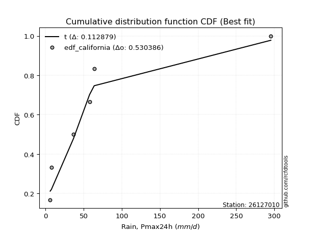</img></img>

</div>


### 2. Empirical - EDF Hazen (1930)

Hazen method for plotting positions is a formula used to estimate the empirical cumulative probability distribution of flood events or other hydrological data. This formula often results in biased estimations, particularly when extrapolating to extreme events (high return periods).

<div align="center">


$P=(m-0.5)/n$


</div>


**2.1. Empirical values**

<div align="center">

|                | 0                   | 1                  | 2                  | 3                  | 4         | 5                  |
|:---------------|:--------------------|:-------------------|:-------------------|:-------------------|:----------|:-------------------|
| date           | 2021                | 2022               | 2018               | 2019               | 2020      | 2017               |
| x              | 6.2                 | 7.8                | 36.7               | 57.8               | 63.9      | 295.4              |
| m              | 1                   | 2                  | 3                  | 4                  | 5         | 6                  |
| empirical_dist | edf_hazen           | edf_hazen          | edf_hazen          | edf_hazen          | edf_hazen | edf_hazen          |
| empirical      | 0.08333333333333333 | 0.25               | 0.4166666666666667 | 0.5833333333333334 | 0.75      | 0.9166666666666666 |
| empirical_tr   | 1.090909090909091   | 1.3333333333333333 | 1.7142857142857144 | 2.4000000000000004 | 4.0       | 11.999999999999995 |

</div>


**2.2. Kolmogorov-Smirnov fit test (sorted by Δ)**


<div align="center">

|                | 0                   | 1                  | 2                     | 3                   | 4                   | 5                   | 6                   | 7                   | 8                  | 9                   | 10                  | 11                 | 12                 | 13                 | 14                 | 15                  | 16                  | 17                 | 18                 | 19                  | 20                  | 21                 | 22                  | 23                | 24                  | 25                  | 26                  | 27                 | 28                  | 29                  | 30                  | 31                  | 32                  | 33                | 34                  | 35                 | 36                  | 37                  | 38                  | 39                  | 40                  | 41                  | 42                 | 43                 | 44                  | 45                  | 46                  | 47                  | 48                  | 49                  | 50                  | 51                  | 52                  | 53                  | 54                  | 55                  | 56                 | 57                 | 58                  | 59                 | 60                  | 61                 | 62                 | 63                  | 64                 | 65                 | 66                  | 67                 | 68                  | 69                  | 70                  | 71                  | 72                | 73                 | 74                  | 75                 | 76                 | 77                 | 78                 | 79                  | 80                 | 81                  | 82                 | 83                  | 84                 | 85                 | 86                 | 87                 | 88                 | 89                 |
|:---------------|:--------------------|:-------------------|:----------------------|:--------------------|:--------------------|:--------------------|:--------------------|:--------------------|:-------------------|:--------------------|:--------------------|:-------------------|:-------------------|:-------------------|:-------------------|:--------------------|:--------------------|:-------------------|:-------------------|:--------------------|:--------------------|:-------------------|:--------------------|:------------------|:--------------------|:--------------------|:--------------------|:-------------------|:--------------------|:--------------------|:--------------------|:--------------------|:--------------------|:------------------|:--------------------|:-------------------|:--------------------|:--------------------|:--------------------|:--------------------|:--------------------|:--------------------|:-------------------|:-------------------|:--------------------|:--------------------|:--------------------|:--------------------|:--------------------|:--------------------|:--------------------|:--------------------|:--------------------|:--------------------|:--------------------|:--------------------|:-------------------|:-------------------|:--------------------|:-------------------|:--------------------|:-------------------|:-------------------|:--------------------|:-------------------|:-------------------|:--------------------|:-------------------|:--------------------|:--------------------|:--------------------|:--------------------|:------------------|:-------------------|:--------------------|:-------------------|:-------------------|:-------------------|:-------------------|:--------------------|:-------------------|:--------------------|:-------------------|:--------------------|:-------------------|:-------------------|:-------------------|:-------------------|:-------------------|:-------------------|
| station        | 26127010            | 26127010           | 26127010              | 26127010            | 26127010            | 26127010            | 26127010            | 26127010            | 26127010           | 26127010            | 26127010            | 26127010           | 26127010           | 26127010           | 26127010           | 26127010            | 26127010            | 26127010           | 26127010           | 26127010            | 26127010            | 26127010           | 26127010            | 26127010          | 26127010            | 26127010            | 26127010            | 26127010           | 26127010            | 26127010            | 26127010            | 26127010            | 26127010            | 26127010          | 26127010            | 26127010           | 26127010            | 26127010            | 26127010            | 26127010            | 26127010            | 26127010            | 26127010           | 26127010           | 26127010            | 26127010            | 26127010            | 26127010            | 26127010            | 26127010            | 26127010            | 26127010            | 26127010            | 26127010            | 26127010            | 26127010            | 26127010           | 26127010           | 26127010            | 26127010           | 26127010            | 26127010           | 26127010           | 26127010            | 26127010           | 26127010           | 26127010            | 26127010           | 26127010            | 26127010            | 26127010            | 26127010            | 26127010          | 26127010           | 26127010            | 26127010           | 26127010           | 26127010           | 26127010           | 26127010            | 26127010           | 26127010            | 26127010           | 26127010            | 26127010           | 26127010           | 26127010           | 26127010           | 26127010           | 26127010           |
| empirical_dist | edf_hazen           | edf_hazen          | edf_hazen             | edf_hazen           | edf_hazen           | edf_hazen           | edf_hazen           | edf_hazen           | edf_hazen          | edf_hazen           | edf_hazen           | edf_hazen          | edf_hazen          | edf_hazen          | edf_hazen          | edf_hazen           | edf_hazen           | edf_hazen          | edf_hazen          | edf_hazen           | edf_hazen           | edf_hazen          | edf_hazen           | edf_hazen         | edf_hazen           | edf_hazen           | edf_hazen           | edf_hazen          | edf_hazen           | edf_hazen           | edf_hazen           | edf_hazen           | edf_hazen           | edf_hazen         | edf_hazen           | edf_hazen          | edf_hazen           | edf_hazen           | edf_hazen           | edf_hazen           | edf_hazen           | edf_hazen           | edf_hazen          | edf_hazen          | edf_hazen           | edf_hazen           | edf_hazen           | edf_hazen           | edf_hazen           | edf_hazen           | edf_hazen           | edf_hazen           | edf_hazen           | edf_hazen           | edf_hazen           | edf_hazen           | edf_hazen          | edf_hazen          | edf_hazen           | edf_hazen          | edf_hazen           | edf_hazen          | edf_hazen          | edf_hazen           | edf_hazen          | edf_hazen          | edf_hazen           | edf_hazen          | edf_hazen           | edf_hazen           | edf_hazen           | edf_hazen           | edf_hazen         | edf_hazen          | edf_hazen           | edf_hazen          | edf_hazen          | edf_hazen          | edf_hazen          | edf_hazen           | edf_hazen          | edf_hazen           | edf_hazen          | edf_hazen           | edf_hazen          | edf_hazen          | edf_hazen          | edf_hazen          | edf_hazen          | edf_hazen          |
| p_dist         | logfisk             | logloggamma        | loglaplace_asymmetric | logjohnsonsu        | logcrystalball      | lognorm             | lognorm             | logt                | logexponnorm       | lognct              | logpearson3         | logerlang          | loggamma           | loggamma           | logalpha           | logmaxwell          | t                   | loggumbel_l        | loginvgamma        | logncf              | logf                | lograyleigh        | loglogistic         | loginvgauss       | wald                | logrice             | logbetaprime        | loghypsecant       | loglaplace          | loginvweibull       | loggenlogistic      | loggumbel_r         | ncf                 | logkstwobign      | loghalfnorm         | betaprime          | loggompertz         | nakagami            | logtruncnorm        | logweibull_min      | loggenexpon         | logmielke           | logmoyal           | pearson3           | halflogistic        | erlang              | moyal               | genlogistic         | nct                 | logexpon            | halfnorm            | exponnorm           | loghalflogistic     | laplace_asymmetric  | genexpon            | expon               | gibrat             | truncnorm          | gumbel_r            | mielke             | gompertz            | rayleigh           | logwald            | f                   | invgamma           | invgauss           | maxwell             | pareto             | weibull_min         | kstwobign           | loggibrat           | logpareto           | norm              | crystalball        | logistic            | hypsecant          | rice               | alpha              | fatiguelife        | laplace             | logchi2            | loglognorm          | fisk               | gumbel_l            | lognakagami        | gamma              | logfatiguelife     | invweibull         | chi2               | johnsonsu          |
| delta          | 0.12246384363679802 | 0.1228779209332197 | 0.12367337865552494   | 0.12391786296926016 | 0.12410890579691708 | 0.12410890981260214 | 0.12410890981260214 | 0.12410927071235175 | 0.1241261657738271 | 0.12414605937838827 | 0.12516775587100776 | 0.1257201309232821 | 0.1264055863477236 | 0.1264055863477236 | 0.1269602899549831 | 0.12814282684708983 | 0.12856492908126693 | 0.1288735906529897 | 0.1294279998017293 | 0.13216970615859608 | 0.13664697517850805 | 0.1383601524058396 | 0.13881275680239974 | 0.140468162772086 | 0.14468254975803552 | 0.14562103943628907 | 0.14571169128780787 | 0.1457291194538729 | 0.15112316157171962 | 0.15875228389887436 | 0.15946728531358262 | 0.16569234725666798 | 0.16588811697210554 | 0.168026084969275 | 0.16861573838141025 | 0.1686334289999984 | 0.17117140234219724 | 0.17658751732310302 | 0.17659706982894535 | 0.18075046429413633 | 0.18175357884282134 | 0.19067486448247534 | 0.1915354568858667 | 0.2006243449134637 | 0.20541728014110106 | 0.21210189363484006 | 0.21455537465937158 | 0.21469577848663057 | 0.22272891653053634 | 0.22356100933961992 | 0.22594046771108145 | 0.22674368805194245 | 0.22706387252875335 | 0.22793596904092173 | 0.22795220323688195 | 0.22795221229165286 | 0.2301150815541726 | 0.2311167483828096 | 0.23972873492198465 | 0.2453033594943828 | 0.24847148193946467 | 0.2597481226196062 | 0.2629169596765128 | 0.26303870817722147 | 0.2630393981620856 | 0.2655679429289975 | 0.27171964560141415 | 0.2744814211249221 | 0.27595480260513705 | 0.28389767465116267 | 0.28799348423049237 | 0.30597569309697814 | 0.306092129720936 | 0.3060921374735804 | 0.31362081520755314 | 0.3199640606755907 | 0.3294682391242171 | 0.3319920469678261 | 0.3355947487846925 | 0.34043035759830925 | 0.3528750950991855 | 0.37068231918749417 | 0.3736959315752144 | 0.37591819054838665 | 0.3957911951894015 | 0.4499551536270148 | 0.4658372845883369 | 0.4687280737551737 | 0.5802465504473184 | 0.5859596694847725 |
| deltao         | 0.530385761606      | 0.530385761606     | 0.530385761606        | 0.530385761606      | 0.530385761606      | 0.530385761606      | 0.530385761606      | 0.530385761606      | 0.530385761606     | 0.530385761606      | 0.530385761606      | 0.530385761606     | 0.530385761606     | 0.530385761606     | 0.530385761606     | 0.530385761606      | 0.530385761606      | 0.530385761606     | 0.530385761606     | 0.530385761606      | 0.530385761606      | 0.530385761606     | 0.530385761606      | 0.530385761606    | 0.530385761606      | 0.530385761606      | 0.530385761606      | 0.530385761606     | 0.530385761606      | 0.530385761606      | 0.530385761606      | 0.530385761606      | 0.530385761606      | 0.530385761606    | 0.530385761606      | 0.530385761606     | 0.530385761606      | 0.530385761606      | 0.530385761606      | 0.530385761606      | 0.530385761606      | 0.530385761606      | 0.530385761606     | 0.530385761606     | 0.530385761606      | 0.530385761606      | 0.530385761606      | 0.530385761606      | 0.530385761606      | 0.530385761606      | 0.530385761606      | 0.530385761606      | 0.530385761606      | 0.530385761606      | 0.530385761606      | 0.530385761606      | 0.530385761606     | 0.530385761606     | 0.530385761606      | 0.530385761606     | 0.530385761606      | 0.530385761606     | 0.530385761606     | 0.530385761606      | 0.530385761606     | 0.530385761606     | 0.530385761606      | 0.530385761606     | 0.530385761606      | 0.530385761606      | 0.530385761606      | 0.530385761606      | 0.530385761606    | 0.530385761606     | 0.530385761606      | 0.530385761606     | 0.530385761606     | 0.530385761606     | 0.530385761606     | 0.530385761606      | 0.530385761606     | 0.530385761606      | 0.530385761606     | 0.530385761606      | 0.530385761606     | 0.530385761606     | 0.530385761606     | 0.530385761606     | 0.530385761606     | 0.530385761606     |
| eval           | Δo > Δ              | Δo > Δ             | Δo > Δ                | Δo > Δ              | Δo > Δ              | Δo > Δ              | Δo > Δ              | Δo > Δ              | Δo > Δ             | Δo > Δ              | Δo > Δ              | Δo > Δ             | Δo > Δ             | Δo > Δ             | Δo > Δ             | Δo > Δ              | Δo > Δ              | Δo > Δ             | Δo > Δ             | Δo > Δ              | Δo > Δ              | Δo > Δ             | Δo > Δ              | Δo > Δ            | Δo > Δ              | Δo > Δ              | Δo > Δ              | Δo > Δ             | Δo > Δ              | Δo > Δ              | Δo > Δ              | Δo > Δ              | Δo > Δ              | Δo > Δ            | Δo > Δ              | Δo > Δ             | Δo > Δ              | Δo > Δ              | Δo > Δ              | Δo > Δ              | Δo > Δ              | Δo > Δ              | Δo > Δ             | Δo > Δ             | Δo > Δ              | Δo > Δ              | Δo > Δ              | Δo > Δ              | Δo > Δ              | Δo > Δ              | Δo > Δ              | Δo > Δ              | Δo > Δ              | Δo > Δ              | Δo > Δ              | Δo > Δ              | Δo > Δ             | Δo > Δ             | Δo > Δ              | Δo > Δ             | Δo > Δ              | Δo > Δ             | Δo > Δ             | Δo > Δ              | Δo > Δ             | Δo > Δ             | Δo > Δ              | Δo > Δ             | Δo > Δ              | Δo > Δ              | Δo > Δ              | Δo > Δ              | Δo > Δ            | Δo > Δ             | Δo > Δ              | Δo > Δ             | Δo > Δ             | Δo > Δ             | Δo > Δ             | Δo > Δ              | Δo > Δ             | Δo > Δ              | Δo > Δ             | Δo > Δ              | Δo > Δ             | Δo > Δ             | Δo > Δ             | Δo > Δ             | Δo <= Δ            | Δo <= Δ            |
| fit            | 1                   | 1                  | 1                     | 1                   | 1                   | 1                   | 1                   | 1                   | 1                  | 1                   | 1                   | 1                  | 1                  | 1                  | 1                  | 1                   | 1                   | 1                  | 1                  | 1                   | 1                   | 1                  | 1                   | 1                 | 1                   | 1                   | 1                   | 1                  | 1                   | 1                   | 1                   | 1                   | 1                   | 1                 | 1                   | 1                  | 1                   | 1                   | 1                   | 1                   | 1                   | 1                   | 1                  | 1                  | 1                   | 1                   | 1                   | 1                   | 1                   | 1                   | 1                   | 1                   | 1                   | 1                   | 1                   | 1                   | 1                  | 1                  | 1                   | 1                  | 1                   | 1                  | 1                  | 1                   | 1                  | 1                  | 1                   | 1                  | 1                   | 1                   | 1                   | 1                   | 1                 | 1                  | 1                   | 1                  | 1                  | 1                  | 1                  | 1                   | 1                  | 1                   | 1                  | 1                   | 1                  | 1                  | 1                  | 1                  | 0                  | 0                  |
| n              | 6                   | 6                  | 6                     | 6                   | 6                   | 6                   | 6                   | 6                   | 6                  | 6                   | 6                   | 6                  | 6                  | 6                  | 6                  | 6                   | 6                   | 6                  | 6                  | 6                   | 6                   | 6                  | 6                   | 6                 | 6                   | 6                   | 6                   | 6                  | 6                   | 6                   | 6                   | 6                   | 6                   | 6                 | 6                   | 6                  | 6                   | 6                   | 6                   | 6                   | 6                   | 6                   | 6                  | 6                  | 6                   | 6                   | 6                   | 6                   | 6                   | 6                   | 6                   | 6                   | 6                   | 6                   | 6                   | 6                   | 6                  | 6                  | 6                   | 6                  | 6                   | 6                  | 6                  | 6                   | 6                  | 6                  | 6                   | 6                  | 6                   | 6                   | 6                   | 6                   | 6                 | 6                  | 6                   | 6                  | 6                  | 6                  | 6                  | 6                   | 6                  | 6                   | 6                  | 6                   | 6                  | 6                  | 6                  | 6                  | 6                  | 6                  |
| best_fit       | 1                   | 0                  | 0                     | 0                   | 0                   | 0                   | 0                   | 0                   | 0                  | 0                   | 0                   | 0                  | 0                  | 0                  | 0                  | 0                   | 0                   | 0                  | 0                  | 0                   | 0                   | 0                  | 0                   | 0                 | 0                   | 0                   | 0                   | 0                  | 0                   | 0                   | 0                   | 0                   | 0                   | 0                 | 0                   | 0                  | 0                   | 0                   | 0                   | 0                   | 0                   | 0                   | 0                  | 0                  | 0                   | 0                   | 0                   | 0                   | 0                   | 0                   | 0                   | 0                   | 0                   | 0                   | 0                   | 0                   | 0                  | 0                  | 0                   | 0                  | 0                   | 0                  | 0                  | 0                   | 0                  | 0                  | 0                   | 0                  | 0                   | 0                   | 0                   | 0                   | 0                 | 0                  | 0                   | 0                  | 0                  | 0                  | 0                  | 0                   | 0                  | 0                   | 0                  | 0                   | 0                  | 0                  | 0                  | 0                  | 0                  | 0                  |
| best_fit_sort  | 1                   | 2                  | 3                     | 4                   | 5                   | 6                   | 7                   | 8                   | 9                  | 10                  | 11                  | 12                 | 13                 | 14                 | 15                 | 16                  | 17                  | 18                 | 19                 | 20                  | 21                  | 22                 | 23                  | 24                | 25                  | 26                  | 27                  | 28                 | 29                  | 30                  | 31                  | 32                  | 33                  | 34                | 35                  | 36                 | 37                  | 38                  | 39                  | 40                  | 41                  | 42                  | 43                 | 44                 | 45                  | 46                  | 47                  | 48                  | 49                  | 50                  | 51                  | 52                  | 53                  | 54                  | 55                  | 56                  | 57                 | 58                 | 59                  | 60                 | 61                  | 62                 | 63                 | 64                  | 65                 | 66                 | 67                  | 68                 | 69                  | 70                  | 71                  | 72                  | 73                | 74                 | 75                  | 76                 | 77                 | 78                 | 79                 | 80                  | 81                 | 82                  | 83                 | 84                  | 85                 | 86                 | 87                 | 88                 | 89                 | 90                 |

</div>


<div align="center">

</img>

</div>


**2.3. Best fit**

<div align="center">

|   id |   station | empirical_dist   | p_dist   |    delta |   deltao | eval   |   fit |   n |   best_fit |   best_fit_sort |
|-----:|----------:|:-----------------|:---------|---------:|---------:|:-------|------:|----:|-----------:|----------------:|
|    0 |  26127010 | edf_hazen        | logfisk  | 0.122464 | 0.530386 | Δo > Δ |     1 |   6 |          1 |               1 |

</div>


<div align="center">

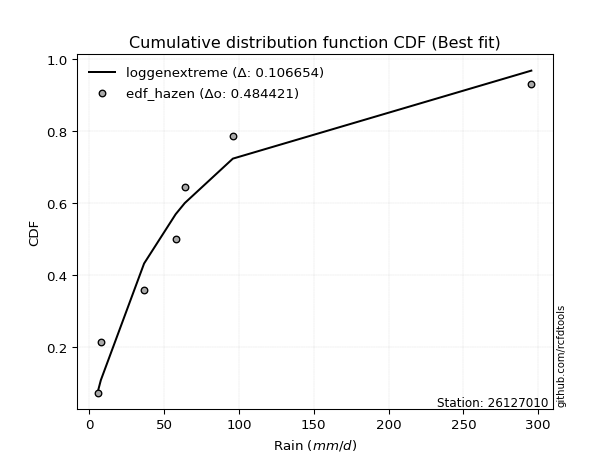</img>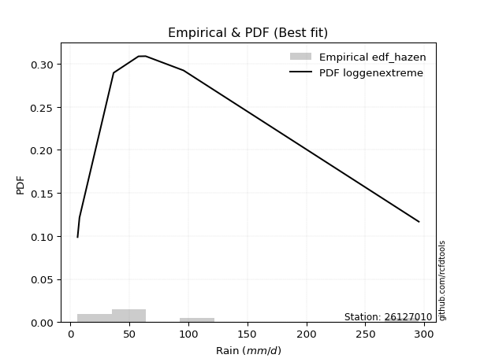</img>

</div>


### 3. Empirical - EDF Weibull (1939)

Weibull plotting position formula is an empirical method used to estimate the non-exceedance probability or plotting position for a set of observed data, is often recommended or widely used in practice, particularly in flood frequency analysis.

<div align="center">


$P=m/(n+1)$


</div>


**3.1. Empirical values**

<div align="center">

|                | 0                   | 1                  | 2                   | 3                  | 4                  | 5                  |
|:---------------|:--------------------|:-------------------|:--------------------|:-------------------|:-------------------|:-------------------|
| date           | 2021                | 2022               | 2018                | 2019               | 2020               | 2017               |
| x              | 6.2                 | 7.8                | 36.7                | 57.8               | 63.9               | 295.4              |
| m              | 1                   | 2                  | 3                   | 4                  | 5                  | 6                  |
| empirical_dist | edf_weibull         | edf_weibull        | edf_weibull         | edf_weibull        | edf_weibull        | edf_weibull        |
| empirical      | 0.14285714285714285 | 0.2857142857142857 | 0.42857142857142855 | 0.5714285714285714 | 0.7142857142857143 | 0.8571428571428571 |
| empirical_tr   | 1.1666666666666665  | 1.4                | 1.75                | 2.333333333333333  | 3.5                | 6.999999999999997  |

</div>


**3.2. Kolmogorov-Smirnov fit test (sorted by Δ)**


<div align="center">

|                | 0                   | 1                  | 2                   | 3                  | 4                     | 5                   | 6                   | 7                   | 8                   | 9                   | 10                 | 11                  | 12                  | 13                  | 14                 | 15                  | 16                 | 17                  | 18                  | 19                  | 20                  | 21                  | 22                  | 23                 | 24                 | 25                  | 26                  | 27                  | 28                 | 29                  | 30                | 31                 | 32                  | 33                  | 34                  | 35                  | 36                  | 37                  | 38                  | 39                 | 40                  | 41                  | 42                  | 43                  | 44                 | 45                 | 46                  | 47                  | 48                  | 49                  | 50                  | 51                  | 52                 | 53                  | 54                  | 55                  | 56                  | 57                 | 58                  | 59                  | 60                  | 61                 | 62                 | 63                 | 64                 | 65                  | 66                | 67                 | 68                 | 69                 | 70                 | 71                  | 72                  | 73                | 74                 | 75                 | 76                 | 77                  | 78                 | 79                 | 80                 | 81                  | 82                  | 83                  | 84                 | 85                 | 86                  | 87                  | 88                 | 89                 |
|:---------------|:--------------------|:-------------------|:--------------------|:-------------------|:----------------------|:--------------------|:--------------------|:--------------------|:--------------------|:--------------------|:-------------------|:--------------------|:--------------------|:--------------------|:-------------------|:--------------------|:-------------------|:--------------------|:--------------------|:--------------------|:--------------------|:--------------------|:--------------------|:-------------------|:-------------------|:--------------------|:--------------------|:--------------------|:-------------------|:--------------------|:------------------|:-------------------|:--------------------|:--------------------|:--------------------|:--------------------|:--------------------|:--------------------|:--------------------|:-------------------|:--------------------|:--------------------|:--------------------|:--------------------|:-------------------|:-------------------|:--------------------|:--------------------|:--------------------|:--------------------|:--------------------|:--------------------|:-------------------|:--------------------|:--------------------|:--------------------|:--------------------|:-------------------|:--------------------|:--------------------|:--------------------|:-------------------|:-------------------|:-------------------|:-------------------|:--------------------|:------------------|:-------------------|:-------------------|:-------------------|:-------------------|:--------------------|:--------------------|:------------------|:-------------------|:-------------------|:-------------------|:--------------------|:-------------------|:-------------------|:-------------------|:--------------------|:--------------------|:--------------------|:-------------------|:-------------------|:--------------------|:--------------------|:-------------------|:-------------------|
| station        | 26127010            | 26127010           | 26127010            | 26127010           | 26127010              | 26127010            | 26127010            | 26127010            | 26127010            | 26127010            | 26127010           | 26127010            | 26127010            | 26127010            | 26127010           | 26127010            | 26127010           | 26127010            | 26127010            | 26127010            | 26127010            | 26127010            | 26127010            | 26127010           | 26127010           | 26127010            | 26127010            | 26127010            | 26127010           | 26127010            | 26127010          | 26127010           | 26127010            | 26127010            | 26127010            | 26127010            | 26127010            | 26127010            | 26127010            | 26127010           | 26127010            | 26127010            | 26127010            | 26127010            | 26127010           | 26127010           | 26127010            | 26127010            | 26127010            | 26127010            | 26127010            | 26127010            | 26127010           | 26127010            | 26127010            | 26127010            | 26127010            | 26127010           | 26127010            | 26127010            | 26127010            | 26127010           | 26127010           | 26127010           | 26127010           | 26127010            | 26127010          | 26127010           | 26127010           | 26127010           | 26127010           | 26127010            | 26127010            | 26127010          | 26127010           | 26127010           | 26127010           | 26127010            | 26127010           | 26127010           | 26127010           | 26127010            | 26127010            | 26127010            | 26127010           | 26127010           | 26127010            | 26127010            | 26127010           | 26127010           |
| empirical_dist | edf_weibull         | edf_weibull        | edf_weibull         | edf_weibull        | edf_weibull           | edf_weibull         | edf_weibull         | edf_weibull         | edf_weibull         | edf_weibull         | edf_weibull        | edf_weibull         | edf_weibull         | edf_weibull         | edf_weibull        | edf_weibull         | edf_weibull        | edf_weibull         | edf_weibull         | edf_weibull         | edf_weibull         | edf_weibull         | edf_weibull         | edf_weibull        | edf_weibull        | edf_weibull         | edf_weibull         | edf_weibull         | edf_weibull        | edf_weibull         | edf_weibull       | edf_weibull        | edf_weibull         | edf_weibull         | edf_weibull         | edf_weibull         | edf_weibull         | edf_weibull         | edf_weibull         | edf_weibull        | edf_weibull         | edf_weibull         | edf_weibull         | edf_weibull         | edf_weibull        | edf_weibull        | edf_weibull         | edf_weibull         | edf_weibull         | edf_weibull         | edf_weibull         | edf_weibull         | edf_weibull        | edf_weibull         | edf_weibull         | edf_weibull         | edf_weibull         | edf_weibull        | edf_weibull         | edf_weibull         | edf_weibull         | edf_weibull        | edf_weibull        | edf_weibull        | edf_weibull        | edf_weibull         | edf_weibull       | edf_weibull        | edf_weibull        | edf_weibull        | edf_weibull        | edf_weibull         | edf_weibull         | edf_weibull       | edf_weibull        | edf_weibull        | edf_weibull        | edf_weibull         | edf_weibull        | edf_weibull        | edf_weibull        | edf_weibull         | edf_weibull         | edf_weibull         | edf_weibull        | edf_weibull        | edf_weibull         | edf_weibull         | edf_weibull        | edf_weibull        |
| p_dist         | wald                | t                  | logfisk             | logloggamma        | loglaplace_asymmetric | logjohnsonsu        | logcrystalball      | lognorm             | lognorm             | logt                | logexponnorm       | lognct              | logpearson3         | logkstwobign        | logerlang          | loggenlogistic      | logbetaprime       | ncf                 | loggamma            | loggamma            | loginvweibull       | betaprime           | logf                | logalpha           | loginvgamma        | logmaxwell          | logncf              | loginvgauss         | loggumbel_l        | nakagami            | pearson3          | lograyleigh        | logweibull_min      | halflogistic        | loglogistic         | logmielke           | moyal               | genlogistic         | logrice             | loghypsecant       | loglaplace          | halfnorm            | loggenexpon         | logtruncnorm        | loggumbel_r        | erlang             | loghalfnorm         | gumbel_r            | loggompertz         | nct                 | logexpon            | rayleigh            | logmoyal           | mielke              | maxwell             | weibull_min         | kstwobign           | f                  | invgamma            | invgauss            | exponnorm           | pareto             | loghalflogistic    | laplace_asymmetric | genexpon           | expon               | truncnorm         | gibrat             | gompertz           | norm               | crystalball        | logistic            | logpareto           | hypsecant         | loggibrat          | logwald            | rice               | laplace             | fisk               | alpha              | fatiguelife        | loglognorm          | gumbel_l            | logchi2             | lognakagami        | invweibull         | gamma               | logfatiguelife      | johnsonsu          | chi2               |
| delta          | 0.12392632405510864 | 0.1303439072487722 | 0.15817812935108372 | 0.1585922066475054 | 0.15938766436981064   | 0.15963214868354586 | 0.15982319151120278 | 0.15982319552688784 | 0.15982319552688784 | 0.15982355642663745 | 0.1598404514881128 | 0.15986034509267397 | 0.16088204158529346 | 0.16139041544298788 | 0.1614344166375678 | 0.16160849376193376 | 0.1616387989817896 | 0.16197159015798573 | 0.16211987206200928 | 0.16211987206200928 | 0.16213752784503832 | 0.16240398834297726 | 0.16251621091055657 | 0.1626745756692688 | 0.1628801351531495 | 0.16385711256137553 | 0.16432507475519076 | 0.16441508170258715 | 0.1645878763672754 | 0.16468275541834115 | 0.164910059199178 | 0.1671027645226378 | 0.16816542665157536 | 0.16970299442681536 | 0.17452704251668544 | 0.17877010257771347 | 0.17884108894508588 | 0.17898149277234487 | 0.18133532515057477 | 0.1814434051681586 | 0.18683744728600532 | 0.19022618199679575 | 0.19481707397024778 | 0.19523519363094605 | 0.1986870617835762 | 0.2001971317300782 | 0.20046749656350557 | 0.20401444920769896 | 0.20688568805648294 | 0.21082415462577447 | 0.21165624743485806 | 0.22403383690532053 | 0.2272497426001524 | 0.23339859758962095 | 0.23600535988712845 | 0.24024051689085135 | 0.24818338893687697 | 0.2511339462724596 | 0.25113463625732374 | 0.25366318102423563 | 0.26245797376622815 | 0.2625766592201602 | 0.2627781582430391 | 0.2636502547552074 | 0.2636664889511677 | 0.26366649800593855 | 0.265758077030719 | 0.2658293672684583 | 0.2665938263447991 | 0.2703778440066503 | 0.2703778517592947 | 0.27790652949326744 | 0.27951643629690787 | 0.284249774961305 | 0.2857142857142857 | 0.2857142857142857 | 0.2937539534099314 | 0.30471607188402355 | 0.3141721220514049 | 0.3200872850630642 | 0.3236899868799306 | 0.33496803347320847 | 0.34020390483410096 | 0.34097033319442366 | 0.3838864332846396 | 0.4092042642313642 | 0.43805039172225296 | 0.45393252268357503 | 0.5502453837704868 | 0.5683417885425566 |
| deltao         | 0.530385761606      | 0.530385761606     | 0.530385761606      | 0.530385761606     | 0.530385761606        | 0.530385761606      | 0.530385761606      | 0.530385761606      | 0.530385761606      | 0.530385761606      | 0.530385761606     | 0.530385761606      | 0.530385761606      | 0.530385761606      | 0.530385761606     | 0.530385761606      | 0.530385761606     | 0.530385761606      | 0.530385761606      | 0.530385761606      | 0.530385761606      | 0.530385761606      | 0.530385761606      | 0.530385761606     | 0.530385761606     | 0.530385761606      | 0.530385761606      | 0.530385761606      | 0.530385761606     | 0.530385761606      | 0.530385761606    | 0.530385761606     | 0.530385761606      | 0.530385761606      | 0.530385761606      | 0.530385761606      | 0.530385761606      | 0.530385761606      | 0.530385761606      | 0.530385761606     | 0.530385761606      | 0.530385761606      | 0.530385761606      | 0.530385761606      | 0.530385761606     | 0.530385761606     | 0.530385761606      | 0.530385761606      | 0.530385761606      | 0.530385761606      | 0.530385761606      | 0.530385761606      | 0.530385761606     | 0.530385761606      | 0.530385761606      | 0.530385761606      | 0.530385761606      | 0.530385761606     | 0.530385761606      | 0.530385761606      | 0.530385761606      | 0.530385761606     | 0.530385761606     | 0.530385761606     | 0.530385761606     | 0.530385761606      | 0.530385761606    | 0.530385761606     | 0.530385761606     | 0.530385761606     | 0.530385761606     | 0.530385761606      | 0.530385761606      | 0.530385761606    | 0.530385761606     | 0.530385761606     | 0.530385761606     | 0.530385761606      | 0.530385761606     | 0.530385761606     | 0.530385761606     | 0.530385761606      | 0.530385761606      | 0.530385761606      | 0.530385761606     | 0.530385761606     | 0.530385761606      | 0.530385761606      | 0.530385761606     | 0.530385761606     |
| eval           | Δo > Δ              | Δo > Δ             | Δo > Δ              | Δo > Δ             | Δo > Δ                | Δo > Δ              | Δo > Δ              | Δo > Δ              | Δo > Δ              | Δo > Δ              | Δo > Δ             | Δo > Δ              | Δo > Δ              | Δo > Δ              | Δo > Δ             | Δo > Δ              | Δo > Δ             | Δo > Δ              | Δo > Δ              | Δo > Δ              | Δo > Δ              | Δo > Δ              | Δo > Δ              | Δo > Δ             | Δo > Δ             | Δo > Δ              | Δo > Δ              | Δo > Δ              | Δo > Δ             | Δo > Δ              | Δo > Δ            | Δo > Δ             | Δo > Δ              | Δo > Δ              | Δo > Δ              | Δo > Δ              | Δo > Δ              | Δo > Δ              | Δo > Δ              | Δo > Δ             | Δo > Δ              | Δo > Δ              | Δo > Δ              | Δo > Δ              | Δo > Δ             | Δo > Δ             | Δo > Δ              | Δo > Δ              | Δo > Δ              | Δo > Δ              | Δo > Δ              | Δo > Δ              | Δo > Δ             | Δo > Δ              | Δo > Δ              | Δo > Δ              | Δo > Δ              | Δo > Δ             | Δo > Δ              | Δo > Δ              | Δo > Δ              | Δo > Δ             | Δo > Δ             | Δo > Δ             | Δo > Δ             | Δo > Δ              | Δo > Δ            | Δo > Δ             | Δo > Δ             | Δo > Δ             | Δo > Δ             | Δo > Δ              | Δo > Δ              | Δo > Δ            | Δo > Δ             | Δo > Δ             | Δo > Δ             | Δo > Δ              | Δo > Δ             | Δo > Δ             | Δo > Δ             | Δo > Δ              | Δo > Δ              | Δo > Δ              | Δo > Δ             | Δo > Δ             | Δo > Δ              | Δo > Δ              | Δo <= Δ            | Δo <= Δ            |
| fit            | 1                   | 1                  | 1                   | 1                  | 1                     | 1                   | 1                   | 1                   | 1                   | 1                   | 1                  | 1                   | 1                   | 1                   | 1                  | 1                   | 1                  | 1                   | 1                   | 1                   | 1                   | 1                   | 1                   | 1                  | 1                  | 1                   | 1                   | 1                   | 1                  | 1                   | 1                 | 1                  | 1                   | 1                   | 1                   | 1                   | 1                   | 1                   | 1                   | 1                  | 1                   | 1                   | 1                   | 1                   | 1                  | 1                  | 1                   | 1                   | 1                   | 1                   | 1                   | 1                   | 1                  | 1                   | 1                   | 1                   | 1                   | 1                  | 1                   | 1                   | 1                   | 1                  | 1                  | 1                  | 1                  | 1                   | 1                 | 1                  | 1                  | 1                  | 1                  | 1                   | 1                   | 1                 | 1                  | 1                  | 1                  | 1                   | 1                  | 1                  | 1                  | 1                   | 1                   | 1                   | 1                  | 1                  | 1                   | 1                   | 0                  | 0                  |
| n              | 6                   | 6                  | 6                   | 6                  | 6                     | 6                   | 6                   | 6                   | 6                   | 6                   | 6                  | 6                   | 6                   | 6                   | 6                  | 6                   | 6                  | 6                   | 6                   | 6                   | 6                   | 6                   | 6                   | 6                  | 6                  | 6                   | 6                   | 6                   | 6                  | 6                   | 6                 | 6                  | 6                   | 6                   | 6                   | 6                   | 6                   | 6                   | 6                   | 6                  | 6                   | 6                   | 6                   | 6                   | 6                  | 6                  | 6                   | 6                   | 6                   | 6                   | 6                   | 6                   | 6                  | 6                   | 6                   | 6                   | 6                   | 6                  | 6                   | 6                   | 6                   | 6                  | 6                  | 6                  | 6                  | 6                   | 6                 | 6                  | 6                  | 6                  | 6                  | 6                   | 6                   | 6                 | 6                  | 6                  | 6                  | 6                   | 6                  | 6                  | 6                  | 6                   | 6                   | 6                   | 6                  | 6                  | 6                   | 6                   | 6                  | 6                  |
| best_fit       | 1                   | 0                  | 0                   | 0                  | 0                     | 0                   | 0                   | 0                   | 0                   | 0                   | 0                  | 0                   | 0                   | 0                   | 0                  | 0                   | 0                  | 0                   | 0                   | 0                   | 0                   | 0                   | 0                   | 0                  | 0                  | 0                   | 0                   | 0                   | 0                  | 0                   | 0                 | 0                  | 0                   | 0                   | 0                   | 0                   | 0                   | 0                   | 0                   | 0                  | 0                   | 0                   | 0                   | 0                   | 0                  | 0                  | 0                   | 0                   | 0                   | 0                   | 0                   | 0                   | 0                  | 0                   | 0                   | 0                   | 0                   | 0                  | 0                   | 0                   | 0                   | 0                  | 0                  | 0                  | 0                  | 0                   | 0                 | 0                  | 0                  | 0                  | 0                  | 0                   | 0                   | 0                 | 0                  | 0                  | 0                  | 0                   | 0                  | 0                  | 0                  | 0                   | 0                   | 0                   | 0                  | 0                  | 0                   | 0                   | 0                  | 0                  |
| best_fit_sort  | 1                   | 2                  | 3                   | 4                  | 5                     | 6                   | 7                   | 8                   | 9                   | 10                  | 11                 | 12                  | 13                  | 14                  | 15                 | 16                  | 17                 | 18                  | 19                  | 20                  | 21                  | 22                  | 23                  | 24                 | 25                 | 26                  | 27                  | 28                  | 29                 | 30                  | 31                | 32                 | 33                  | 34                  | 35                  | 36                  | 37                  | 38                  | 39                  | 40                 | 41                  | 42                  | 43                  | 44                  | 45                 | 46                 | 47                  | 48                  | 49                  | 50                  | 51                  | 52                  | 53                 | 54                  | 55                  | 56                  | 57                  | 58                 | 59                  | 60                  | 61                  | 62                 | 63                 | 64                 | 65                 | 66                  | 67                | 68                 | 69                 | 70                 | 71                 | 72                  | 73                  | 74                | 75                 | 76                 | 77                 | 78                  | 79                 | 80                 | 81                 | 82                  | 83                  | 84                  | 85                 | 86                 | 87                  | 88                  | 89                 | 90                 |

</div>


<div align="center">

</img>

</div>


**3.3. Best fit**

<div align="center">

|   id |   station | empirical_dist   | p_dist   |    delta |   deltao | eval   |   fit |   n |   best_fit |   best_fit_sort |
|-----:|----------:|:-----------------|:---------|---------:|---------:|:-------|------:|----:|-----------:|----------------:|
|    0 |  26127010 | edf_weibull      | wald     | 0.123926 | 0.530386 | Δo > Δ |     1 |   6 |          1 |               1 |

</div>


<div align="center">

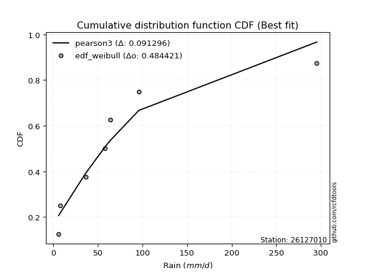</img>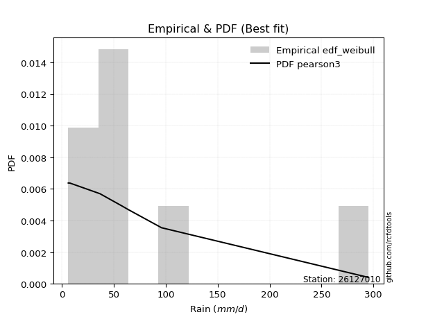</img>

</div>


### 4. Empirical - EDF Beard (1943)

The Beard formula (or Beard´s plotting position formula) in hydrology is used to estimate the empirical non-exceedance probability _(P)_ of a flood event (or other extreme hydrological data point) within a given dataset.

<div align="center">


$P=(m-0.31)/(n+0.38)$


</div>


**4.1. Empirical values**

<div align="center">

|                | 0                   | 1                   | 2                  | 3                  | 4                  | 5                  |
|:---------------|:--------------------|:--------------------|:-------------------|:-------------------|:-------------------|:-------------------|
| date           | 2021                | 2022                | 2018               | 2019               | 2020               | 2017               |
| x              | 6.2                 | 7.8                 | 36.7               | 57.8               | 63.9               | 295.4              |
| m              | 1                   | 2                   | 3                  | 4                  | 5                  | 6                  |
| empirical_dist | edf_beard           | edf_beard           | edf_beard          | edf_beard          | edf_beard          | edf_beard          |
| empirical      | 0.10815047021943573 | 0.26489028213166144 | 0.4216300940438871 | 0.5783699059561128 | 0.7351097178683387 | 0.8918495297805643 |
| empirical_tr   | 1.1212653778558874  | 1.3603411513859276  | 1.7289972899728996 | 2.3717472118959106 | 3.7751479289940844 | 9.246376811594207  |

</div>


**4.2. Kolmogorov-Smirnov fit test (sorted by Δ)**


<div align="center">

|                | 0                   | 1                  | 2                   | 3                   | 4                     | 5                  | 6                   | 7                   | 8                   | 9                  | 10                  | 11                 | 12                 | 13                  | 14                  | 15                  | 16                  | 17                 | 18                  | 19                  | 20                  | 21                 | 22                  | 23                  | 24                  | 25                  | 26                  | 27                  | 28                 | 29                  | 30                 | 31                  | 32                  | 33                  | 34                  | 35                  | 36                  | 37                 | 38                  | 39                 | 40                 | 41                  | 42                  | 43                  | 44                  | 45                  | 46                  | 47                 | 48                  | 49                 | 50                  | 51                  | 52                  | 53                  | 54                  | 55                  | 56                 | 57                 | 58                 | 59                  | 60                  | 61                  | 62                 | 63                  | 64                  | 65                  | 66                 | 67                  | 68                  | 69                  | 70                 | 71                 | 72                 | 73                  | 74                 | 75                  | 76                  | 77                 | 78                  | 79                  | 80                 | 81                 | 82                  | 83                  | 84                  | 85                 | 86                 | 87                  | 88                 | 89                 |
|:---------------|:--------------------|:-------------------|:--------------------|:--------------------|:----------------------|:-------------------|:--------------------|:--------------------|:--------------------|:-------------------|:--------------------|:-------------------|:-------------------|:--------------------|:--------------------|:--------------------|:--------------------|:-------------------|:--------------------|:--------------------|:--------------------|:-------------------|:--------------------|:--------------------|:--------------------|:--------------------|:--------------------|:--------------------|:-------------------|:--------------------|:-------------------|:--------------------|:--------------------|:--------------------|:--------------------|:--------------------|:--------------------|:-------------------|:--------------------|:-------------------|:-------------------|:--------------------|:--------------------|:--------------------|:--------------------|:--------------------|:--------------------|:-------------------|:--------------------|:-------------------|:--------------------|:--------------------|:--------------------|:--------------------|:--------------------|:--------------------|:-------------------|:-------------------|:-------------------|:--------------------|:--------------------|:--------------------|:-------------------|:--------------------|:--------------------|:--------------------|:-------------------|:--------------------|:--------------------|:--------------------|:-------------------|:-------------------|:-------------------|:--------------------|:-------------------|:--------------------|:--------------------|:-------------------|:--------------------|:--------------------|:-------------------|:-------------------|:--------------------|:--------------------|:--------------------|:-------------------|:-------------------|:--------------------|:-------------------|:-------------------|
| station        | 26127010            | 26127010           | 26127010            | 26127010            | 26127010              | 26127010           | 26127010            | 26127010            | 26127010            | 26127010           | 26127010            | 26127010           | 26127010           | 26127010            | 26127010            | 26127010            | 26127010            | 26127010           | 26127010            | 26127010            | 26127010            | 26127010           | 26127010            | 26127010            | 26127010            | 26127010            | 26127010            | 26127010            | 26127010           | 26127010            | 26127010           | 26127010            | 26127010            | 26127010            | 26127010            | 26127010            | 26127010            | 26127010           | 26127010            | 26127010           | 26127010           | 26127010            | 26127010            | 26127010            | 26127010            | 26127010            | 26127010            | 26127010           | 26127010            | 26127010           | 26127010            | 26127010            | 26127010            | 26127010            | 26127010            | 26127010            | 26127010           | 26127010           | 26127010           | 26127010            | 26127010            | 26127010            | 26127010           | 26127010            | 26127010            | 26127010            | 26127010           | 26127010            | 26127010            | 26127010            | 26127010           | 26127010           | 26127010           | 26127010            | 26127010           | 26127010            | 26127010            | 26127010           | 26127010            | 26127010            | 26127010           | 26127010           | 26127010            | 26127010            | 26127010            | 26127010           | 26127010           | 26127010            | 26127010           | 26127010           |
| empirical_dist | edf_beard           | edf_beard          | edf_beard           | edf_beard           | edf_beard             | edf_beard          | edf_beard           | edf_beard           | edf_beard           | edf_beard          | edf_beard           | edf_beard          | edf_beard          | edf_beard           | edf_beard           | edf_beard           | edf_beard           | edf_beard          | edf_beard           | edf_beard           | edf_beard           | edf_beard          | edf_beard           | edf_beard           | edf_beard           | edf_beard           | edf_beard           | edf_beard           | edf_beard          | edf_beard           | edf_beard          | edf_beard           | edf_beard           | edf_beard           | edf_beard           | edf_beard           | edf_beard           | edf_beard          | edf_beard           | edf_beard          | edf_beard          | edf_beard           | edf_beard           | edf_beard           | edf_beard           | edf_beard           | edf_beard           | edf_beard          | edf_beard           | edf_beard          | edf_beard           | edf_beard           | edf_beard           | edf_beard           | edf_beard           | edf_beard           | edf_beard          | edf_beard          | edf_beard          | edf_beard           | edf_beard           | edf_beard           | edf_beard          | edf_beard           | edf_beard           | edf_beard           | edf_beard          | edf_beard           | edf_beard           | edf_beard           | edf_beard          | edf_beard          | edf_beard          | edf_beard           | edf_beard          | edf_beard           | edf_beard           | edf_beard          | edf_beard           | edf_beard           | edf_beard          | edf_beard          | edf_beard           | edf_beard           | edf_beard           | edf_beard          | edf_beard          | edf_beard           | edf_beard          | edf_beard          |
| p_dist         | t                   | wald               | logfisk             | logloggamma         | loglaplace_asymmetric | logjohnsonsu       | logcrystalball      | lognorm             | lognorm             | logt               | logexponnorm        | lognct             | logpearson3        | logerlang           | logbetaprime        | loggamma            | loggamma            | logf               | logalpha            | loginvgamma         | logmaxwell          | logncf             | loginvgauss         | loggumbel_l         | lograyleigh         | loglogistic         | loginvweibull       | loggenlogistic      | logrice            | loghypsecant        | ncf                | logkstwobign        | betaprime           | loglaplace          | nakagami            | logtruncnorm        | logweibull_min      | loggenexpon        | loggumbel_r         | loghalfnorm        | logmielke          | pearson3            | loggompertz         | halflogistic        | moyal               | genlogistic         | logmoyal            | erlang             | halfnorm            | nct                | logexpon            | gumbel_r            | mielke              | exponnorm           | loghalflogistic     | laplace_asymmetric  | genexpon           | expon              | rayleigh           | truncnorm           | gibrat              | gompertz            | maxwell            | f                   | invgamma            | invgauss            | weibull_min        | logwald             | kstwobign           | pareto              | loggibrat          | logpareto          | norm               | crystalball         | logistic           | hypsecant           | rice                | laplace            | alpha               | fatiguelife         | logchi2            | fisk               | loglognorm          | gumbel_l            | lognakagami         | invweibull         | gamma              | logfatiguelife      | johnsonsu          | chi2               |
| delta          | 0.12340257272123079 | 0.1297922676263742 | 0.13735412576845946 | 0.13776820306488113 | 0.13856366078718638   | 0.1388081451009216 | 0.13899918792857852 | 0.13899919194426358 | 0.13899919194426358 | 0.1389995528440132 | 0.13901644790548853 | 0.1390363415100497 | 0.1400580380026692 | 0.14061041305494354 | 0.14081479539916533 | 0.14129586847938502 | 0.14129586847938502 | 0.1416922073279323 | 0.14185057208664453 | 0.14205613157052524 | 0.14303310897875127 | 0.1435010711725665 | 0.14359107811996288 | 0.14376387278465114 | 0.14627876094001355 | 0.15370303893406118 | 0.15378885652165392 | 0.15450385793636218 | 0.1605113215679505 | 0.16061940158553434 | 0.1609246895948851 | 0.16306265759205457 | 0.16367000162277795 | 0.16601344370338106 | 0.17162408994588257 | 0.17441119004832178 | 0.17510676117911678 | 0.1767901514656009 | 0.17786305820095194 | 0.1796434929808813 | 0.1857114371052549 | 0.18573406278180238 | 0.18606168447385868 | 0.19052699800943973 | 0.19966509252771025 | 0.19980549635496925 | 0.20642573901752814 | 0.2071384662576196 | 0.21105018557942012 | 0.2177654891533159 | 0.21859758196239948 | 0.22483845279032333 | 0.24033993211716237 | 0.24163397018360389 | 0.24195415466041478 | 0.24282625117258316 | 0.2428424853685434 | 0.2428424944233143 | 0.2448578404879449 | 0.24493407344809479 | 0.24500536368583403 | 0.24576982276217488 | 0.2568293634697528 | 0.25807528080000103 | 0.25807597078486516 | 0.26060451555177705 | 0.2610645204734757 | 0.26489028213166144 | 0.26900739251950134 | 0.26951799374770163 | 0.2830300568532719 | 0.2910854109653167 | 0.2912018475892747 | 0.29120185534191906 | 0.2987305330758918 | 0.30507377854392936 | 0.31457795699255575 | 0.3255400754666479 | 0.32702861959060564 | 0.33063132140747203 | 0.3479116677219651 | 0.3488787946891121 | 0.35579203705583273 | 0.36102790841672533 | 0.39082776781218104 | 0.4439109368690714 | 0.4449917262497944 | 0.46087385721111646 | 0.5710693873531111 | 0.5752831230700981 |
| deltao         | 0.530385761606      | 0.530385761606     | 0.530385761606      | 0.530385761606      | 0.530385761606        | 0.530385761606     | 0.530385761606      | 0.530385761606      | 0.530385761606      | 0.530385761606     | 0.530385761606      | 0.530385761606     | 0.530385761606     | 0.530385761606      | 0.530385761606      | 0.530385761606      | 0.530385761606      | 0.530385761606     | 0.530385761606      | 0.530385761606      | 0.530385761606      | 0.530385761606     | 0.530385761606      | 0.530385761606      | 0.530385761606      | 0.530385761606      | 0.530385761606      | 0.530385761606      | 0.530385761606     | 0.530385761606      | 0.530385761606     | 0.530385761606      | 0.530385761606      | 0.530385761606      | 0.530385761606      | 0.530385761606      | 0.530385761606      | 0.530385761606     | 0.530385761606      | 0.530385761606     | 0.530385761606     | 0.530385761606      | 0.530385761606      | 0.530385761606      | 0.530385761606      | 0.530385761606      | 0.530385761606      | 0.530385761606     | 0.530385761606      | 0.530385761606     | 0.530385761606      | 0.530385761606      | 0.530385761606      | 0.530385761606      | 0.530385761606      | 0.530385761606      | 0.530385761606     | 0.530385761606     | 0.530385761606     | 0.530385761606      | 0.530385761606      | 0.530385761606      | 0.530385761606     | 0.530385761606      | 0.530385761606      | 0.530385761606      | 0.530385761606     | 0.530385761606      | 0.530385761606      | 0.530385761606      | 0.530385761606     | 0.530385761606     | 0.530385761606     | 0.530385761606      | 0.530385761606     | 0.530385761606      | 0.530385761606      | 0.530385761606     | 0.530385761606      | 0.530385761606      | 0.530385761606     | 0.530385761606     | 0.530385761606      | 0.530385761606      | 0.530385761606      | 0.530385761606     | 0.530385761606     | 0.530385761606      | 0.530385761606     | 0.530385761606     |
| eval           | Δo > Δ              | Δo > Δ             | Δo > Δ              | Δo > Δ              | Δo > Δ                | Δo > Δ             | Δo > Δ              | Δo > Δ              | Δo > Δ              | Δo > Δ             | Δo > Δ              | Δo > Δ             | Δo > Δ             | Δo > Δ              | Δo > Δ              | Δo > Δ              | Δo > Δ              | Δo > Δ             | Δo > Δ              | Δo > Δ              | Δo > Δ              | Δo > Δ             | Δo > Δ              | Δo > Δ              | Δo > Δ              | Δo > Δ              | Δo > Δ              | Δo > Δ              | Δo > Δ             | Δo > Δ              | Δo > Δ             | Δo > Δ              | Δo > Δ              | Δo > Δ              | Δo > Δ              | Δo > Δ              | Δo > Δ              | Δo > Δ             | Δo > Δ              | Δo > Δ             | Δo > Δ             | Δo > Δ              | Δo > Δ              | Δo > Δ              | Δo > Δ              | Δo > Δ              | Δo > Δ              | Δo > Δ             | Δo > Δ              | Δo > Δ             | Δo > Δ              | Δo > Δ              | Δo > Δ              | Δo > Δ              | Δo > Δ              | Δo > Δ              | Δo > Δ             | Δo > Δ             | Δo > Δ             | Δo > Δ              | Δo > Δ              | Δo > Δ              | Δo > Δ             | Δo > Δ              | Δo > Δ              | Δo > Δ              | Δo > Δ             | Δo > Δ              | Δo > Δ              | Δo > Δ              | Δo > Δ             | Δo > Δ             | Δo > Δ             | Δo > Δ              | Δo > Δ             | Δo > Δ              | Δo > Δ              | Δo > Δ             | Δo > Δ              | Δo > Δ              | Δo > Δ             | Δo > Δ             | Δo > Δ              | Δo > Δ              | Δo > Δ              | Δo > Δ             | Δo > Δ             | Δo > Δ              | Δo <= Δ            | Δo <= Δ            |
| fit            | 1                   | 1                  | 1                   | 1                   | 1                     | 1                  | 1                   | 1                   | 1                   | 1                  | 1                   | 1                  | 1                  | 1                   | 1                   | 1                   | 1                   | 1                  | 1                   | 1                   | 1                   | 1                  | 1                   | 1                   | 1                   | 1                   | 1                   | 1                   | 1                  | 1                   | 1                  | 1                   | 1                   | 1                   | 1                   | 1                   | 1                   | 1                  | 1                   | 1                  | 1                  | 1                   | 1                   | 1                   | 1                   | 1                   | 1                   | 1                  | 1                   | 1                  | 1                   | 1                   | 1                   | 1                   | 1                   | 1                   | 1                  | 1                  | 1                  | 1                   | 1                   | 1                   | 1                  | 1                   | 1                   | 1                   | 1                  | 1                   | 1                   | 1                   | 1                  | 1                  | 1                  | 1                   | 1                  | 1                   | 1                   | 1                  | 1                   | 1                   | 1                  | 1                  | 1                   | 1                   | 1                   | 1                  | 1                  | 1                   | 0                  | 0                  |
| n              | 6                   | 6                  | 6                   | 6                   | 6                     | 6                  | 6                   | 6                   | 6                   | 6                  | 6                   | 6                  | 6                  | 6                   | 6                   | 6                   | 6                   | 6                  | 6                   | 6                   | 6                   | 6                  | 6                   | 6                   | 6                   | 6                   | 6                   | 6                   | 6                  | 6                   | 6                  | 6                   | 6                   | 6                   | 6                   | 6                   | 6                   | 6                  | 6                   | 6                  | 6                  | 6                   | 6                   | 6                   | 6                   | 6                   | 6                   | 6                  | 6                   | 6                  | 6                   | 6                   | 6                   | 6                   | 6                   | 6                   | 6                  | 6                  | 6                  | 6                   | 6                   | 6                   | 6                  | 6                   | 6                   | 6                   | 6                  | 6                   | 6                   | 6                   | 6                  | 6                  | 6                  | 6                   | 6                  | 6                   | 6                   | 6                  | 6                   | 6                   | 6                  | 6                  | 6                   | 6                   | 6                   | 6                  | 6                  | 6                   | 6                  | 6                  |
| best_fit       | 1                   | 0                  | 0                   | 0                   | 0                     | 0                  | 0                   | 0                   | 0                   | 0                  | 0                   | 0                  | 0                  | 0                   | 0                   | 0                   | 0                   | 0                  | 0                   | 0                   | 0                   | 0                  | 0                   | 0                   | 0                   | 0                   | 0                   | 0                   | 0                  | 0                   | 0                  | 0                   | 0                   | 0                   | 0                   | 0                   | 0                   | 0                  | 0                   | 0                  | 0                  | 0                   | 0                   | 0                   | 0                   | 0                   | 0                   | 0                  | 0                   | 0                  | 0                   | 0                   | 0                   | 0                   | 0                   | 0                   | 0                  | 0                  | 0                  | 0                   | 0                   | 0                   | 0                  | 0                   | 0                   | 0                   | 0                  | 0                   | 0                   | 0                   | 0                  | 0                  | 0                  | 0                   | 0                  | 0                   | 0                   | 0                  | 0                   | 0                   | 0                  | 0                  | 0                   | 0                   | 0                   | 0                  | 0                  | 0                   | 0                  | 0                  |
| best_fit_sort  | 1                   | 2                  | 3                   | 4                   | 5                     | 6                  | 7                   | 8                   | 9                   | 10                 | 11                  | 12                 | 13                 | 14                  | 15                  | 16                  | 17                  | 18                 | 19                  | 20                  | 21                  | 22                 | 23                  | 24                  | 25                  | 26                  | 27                  | 28                  | 29                 | 30                  | 31                 | 32                  | 33                  | 34                  | 35                  | 36                  | 37                  | 38                 | 39                  | 40                 | 41                 | 42                  | 43                  | 44                  | 45                  | 46                  | 47                  | 48                 | 49                  | 50                 | 51                  | 52                  | 53                  | 54                  | 55                  | 56                  | 57                 | 58                 | 59                 | 60                  | 61                  | 62                  | 63                 | 64                  | 65                  | 66                  | 67                 | 68                  | 69                  | 70                  | 71                 | 72                 | 73                 | 74                  | 75                 | 76                  | 77                  | 78                 | 79                  | 80                  | 81                 | 82                 | 83                  | 84                  | 85                  | 86                 | 87                 | 88                  | 89                 | 90                 |

</div>


<div align="center">

</img>

</div>


**4.3. Best fit**

<div align="center">

|   id |   station | empirical_dist   | p_dist   |    delta |   deltao | eval   |   fit |   n |   best_fit |   best_fit_sort |
|-----:|----------:|:-----------------|:---------|---------:|---------:|:-------|------:|----:|-----------:|----------------:|
|    0 |  26127010 | edf_beard        | t        | 0.123403 | 0.530386 | Δo > Δ |     1 |   6 |          1 |               1 |

</div>


<div align="center">

</img>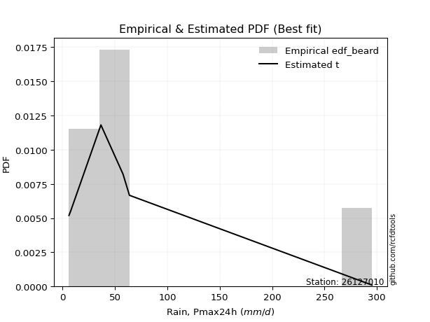</img>

</div>


### 5. Empirical - EDF Chegodayev (1955)

The Chegodayev formula is an empirical plotting position formula used in hydrological frequency analysis to estimate the exceedance probability or return period of a specific event from a set of observed data. It is primarily used for plotting observed data points on probability paper to fit a theoretical distribution, particularly for analyzing extreme events like maximum flood flows or rainfall intensities. The constant _b_ value in the generalized plotting position formula is 0.3.

<div align="center">


$P=(m-b)/(n+1-2b)$


</div>


**5.1. Empirical values**

<div align="center">

|                | 0                   | 1                  | 2                  | 3                  | 4                 | 5                 |
|:---------------|:--------------------|:-------------------|:-------------------|:-------------------|:------------------|:------------------|
| date           | 2021                | 2022               | 2018               | 2019               | 2020              | 2017              |
| x              | 6.2                 | 7.8                | 36.7               | 57.8               | 63.9              | 295.4             |
| m              | 1                   | 2                  | 3                  | 4                  | 5                 | 6                 |
| empirical_dist | edf_chegodayev      | edf_chegodayev     | edf_chegodayev     | edf_chegodayev     | edf_chegodayev    | edf_chegodayev    |
| empirical      | 0.10937499999999999 | 0.265625           | 0.421875           | 0.578125           | 0.734375          | 0.890625          |
| empirical_tr   | 1.1228070175438596  | 1.3617021276595744 | 1.7297297297297298 | 2.3703703703703702 | 3.764705882352941 | 9.142857142857142 |

</div>


**5.2. Kolmogorov-Smirnov fit test (sorted by Δ)**


<div align="center">

|                | 0                  | 1                   | 2                   | 3                  | 4                     | 5                   | 6                   | 7                   | 8                   | 9                   | 10                 | 11                  | 12                  | 13                 | 14                 | 15                 | 16                 | 17                  | 18                 | 19                 | 20                  | 21                  | 22                  | 23                 | 24                 | 25                  | 26                 | 27                  | 28                  | 29                  | 30                 | 31                 | 32                  | 33                  | 34                 | 35                 | 36                  | 37                  | 38                 | 39                  | 40                 | 41                  | 42                  | 43                  | 44                  | 45                  | 46                  | 47                 | 48                  | 49                  | 50                 | 51                  | 52                 | 53                  | 54                  | 55                  | 56                  | 57                  | 58                  | 59                  | 60                 | 61                  | 62                  | 63                  | 64                 | 65                  | 66                 | 67             | 68                  | 69                  | 70                  | 71                  | 72                | 73                 | 74                  | 75                 | 76                 | 77                  | 78                  | 79                  | 80                 | 81                 | 82                  | 83                  | 84                  | 85                 | 86                 | 87                 | 88                 | 89                 |
|:---------------|:-------------------|:--------------------|:--------------------|:-------------------|:----------------------|:--------------------|:--------------------|:--------------------|:--------------------|:--------------------|:-------------------|:--------------------|:--------------------|:-------------------|:-------------------|:-------------------|:-------------------|:--------------------|:-------------------|:-------------------|:--------------------|:--------------------|:--------------------|:-------------------|:-------------------|:--------------------|:-------------------|:--------------------|:--------------------|:--------------------|:-------------------|:-------------------|:--------------------|:--------------------|:-------------------|:-------------------|:--------------------|:--------------------|:-------------------|:--------------------|:-------------------|:--------------------|:--------------------|:--------------------|:--------------------|:--------------------|:--------------------|:-------------------|:--------------------|:--------------------|:-------------------|:--------------------|:-------------------|:--------------------|:--------------------|:--------------------|:--------------------|:--------------------|:--------------------|:--------------------|:-------------------|:--------------------|:--------------------|:--------------------|:-------------------|:--------------------|:-------------------|:---------------|:--------------------|:--------------------|:--------------------|:--------------------|:------------------|:-------------------|:--------------------|:-------------------|:-------------------|:--------------------|:--------------------|:--------------------|:-------------------|:-------------------|:--------------------|:--------------------|:--------------------|:-------------------|:-------------------|:-------------------|:-------------------|:-------------------|
| station        | 26127010           | 26127010            | 26127010            | 26127010           | 26127010              | 26127010            | 26127010            | 26127010            | 26127010            | 26127010            | 26127010           | 26127010            | 26127010            | 26127010           | 26127010           | 26127010           | 26127010           | 26127010            | 26127010           | 26127010           | 26127010            | 26127010            | 26127010            | 26127010           | 26127010           | 26127010            | 26127010           | 26127010            | 26127010            | 26127010            | 26127010           | 26127010           | 26127010            | 26127010            | 26127010           | 26127010           | 26127010            | 26127010            | 26127010           | 26127010            | 26127010           | 26127010            | 26127010            | 26127010            | 26127010            | 26127010            | 26127010            | 26127010           | 26127010            | 26127010            | 26127010           | 26127010            | 26127010           | 26127010            | 26127010            | 26127010            | 26127010            | 26127010            | 26127010            | 26127010            | 26127010           | 26127010            | 26127010            | 26127010            | 26127010           | 26127010            | 26127010           | 26127010       | 26127010            | 26127010            | 26127010            | 26127010            | 26127010          | 26127010           | 26127010            | 26127010           | 26127010           | 26127010            | 26127010            | 26127010            | 26127010           | 26127010           | 26127010            | 26127010            | 26127010            | 26127010           | 26127010           | 26127010           | 26127010           | 26127010           |
| empirical_dist | edf_chegodayev     | edf_chegodayev      | edf_chegodayev      | edf_chegodayev     | edf_chegodayev        | edf_chegodayev      | edf_chegodayev      | edf_chegodayev      | edf_chegodayev      | edf_chegodayev      | edf_chegodayev     | edf_chegodayev      | edf_chegodayev      | edf_chegodayev     | edf_chegodayev     | edf_chegodayev     | edf_chegodayev     | edf_chegodayev      | edf_chegodayev     | edf_chegodayev     | edf_chegodayev      | edf_chegodayev      | edf_chegodayev      | edf_chegodayev     | edf_chegodayev     | edf_chegodayev      | edf_chegodayev     | edf_chegodayev      | edf_chegodayev      | edf_chegodayev      | edf_chegodayev     | edf_chegodayev     | edf_chegodayev      | edf_chegodayev      | edf_chegodayev     | edf_chegodayev     | edf_chegodayev      | edf_chegodayev      | edf_chegodayev     | edf_chegodayev      | edf_chegodayev     | edf_chegodayev      | edf_chegodayev      | edf_chegodayev      | edf_chegodayev      | edf_chegodayev      | edf_chegodayev      | edf_chegodayev     | edf_chegodayev      | edf_chegodayev      | edf_chegodayev     | edf_chegodayev      | edf_chegodayev     | edf_chegodayev      | edf_chegodayev      | edf_chegodayev      | edf_chegodayev      | edf_chegodayev      | edf_chegodayev      | edf_chegodayev      | edf_chegodayev     | edf_chegodayev      | edf_chegodayev      | edf_chegodayev      | edf_chegodayev     | edf_chegodayev      | edf_chegodayev     | edf_chegodayev | edf_chegodayev      | edf_chegodayev      | edf_chegodayev      | edf_chegodayev      | edf_chegodayev    | edf_chegodayev     | edf_chegodayev      | edf_chegodayev     | edf_chegodayev     | edf_chegodayev      | edf_chegodayev      | edf_chegodayev      | edf_chegodayev     | edf_chegodayev     | edf_chegodayev      | edf_chegodayev      | edf_chegodayev      | edf_chegodayev     | edf_chegodayev     | edf_chegodayev     | edf_chegodayev     | edf_chegodayev     |
| p_dist         | t                  | wald                | logfisk             | logloggamma        | loglaplace_asymmetric | logjohnsonsu        | logcrystalball      | lognorm             | lognorm             | logt                | logexponnorm       | lognct              | logpearson3         | logerlang          | logbetaprime       | loggamma           | loggamma           | logf                | logalpha           | loginvgamma        | logmaxwell          | logncf              | loginvgauss         | loggumbel_l        | lograyleigh        | loginvweibull       | loggenlogistic     | loglogistic         | ncf                 | logrice             | loghypsecant       | logkstwobign       | betaprime           | loglaplace          | nakagami           | logweibull_min     | logtruncnorm        | loggenexpon         | loggumbel_r        | loghalfnorm         | pearson3           | logmielke           | loggompertz         | halflogistic        | moyal               | genlogistic         | erlang              | logmoyal           | halfnorm            | nct                 | logexpon           | gumbel_r            | mielke             | exponnorm           | loghalflogistic     | laplace_asymmetric  | genexpon            | expon               | rayleigh            | truncnorm           | gibrat             | gompertz            | maxwell             | f                   | invgamma           | weibull_min         | invgauss           | logwald        | kstwobign           | pareto              | loggibrat           | logpareto           | norm              | crystalball        | logistic            | hypsecant          | rice               | laplace             | alpha               | fatiguelife         | fisk               | logchi2            | loglognorm          | gumbel_l            | lognakagami         | invweibull         | gamma              | logfatiguelife     | johnsonsu          | chi2               |
| delta          | 0.1236474786773436 | 0.12905754975803552 | 0.13808884363679802 | 0.1385029209332197 | 0.13929837865552494   | 0.13954286296926016 | 0.13973390579691708 | 0.13973390981260214 | 0.13973390981260214 | 0.13973427071235175 | 0.1397511657738271 | 0.13977105937838827 | 0.14079275587100776 | 0.1413451309232821 | 0.1415495132675039 | 0.1420305863477236 | 0.1420305863477236 | 0.14242692519627087 | 0.1425852899549831 | 0.1427908494388638 | 0.14376782684708983 | 0.14423578904090506 | 0.14432579598830145 | 0.1444985906529897 | 0.1470134788083521 | 0.15354395056554104 | 0.1542589519802493 | 0.15443775680239974 | 0.16067978363877222 | 0.16124603943628907 | 0.1613541194538729 | 0.1628177516359417 | 0.16342509566666508 | 0.16674816157171962 | 0.1713791839897697 | 0.1748618552230039 | 0.17514590791666035 | 0.17654524550948802 | 0.1785977760692905 | 0.18037821084921987 | 0.1849993449134637 | 0.18546653114914202 | 0.18679640234219724 | 0.18979228014110106 | 0.19893037465937158 | 0.19907077848663057 | 0.20689356030150674 | 0.2071604568858667 | 0.21031546771108145 | 0.21752058319720302 | 0.2183526760062866 | 0.22410373492198465 | 0.2400950261610495 | 0.24236868805194245 | 0.24268887252875335 | 0.24356096904092173 | 0.24357720323688195 | 0.24357721229165286 | 0.24412312261960623 | 0.24566879131643335 | 0.2457400815541726 | 0.24650454063051344 | 0.25609464560141415 | 0.25783037484388815 | 0.2578310648287523 | 0.26032980260513705 | 0.2603596095956642 | 0.265625       | 0.26827267465116267 | 0.26927308779158876 | 0.28278515089715905 | 0.29035069309697814 | 0.290467129720936 | 0.2904671374735804 | 0.29799581520755314 | 0.3043390606755907 | 0.3138432391242171 | 0.32480535759830925 | 0.32678371363449277 | 0.33038641545135916 | 0.3476542649085478 | 0.3476667617658522 | 0.35505731918749417 | 0.36029319054838665 | 0.39058286185606816 | 0.4426864070885071 | 0.4447468202936815 | 0.4606289512550036 | 0.5703346694847725 | 0.5750382171139852 |
| deltao         | 0.530385761606     | 0.530385761606      | 0.530385761606      | 0.530385761606     | 0.530385761606        | 0.530385761606      | 0.530385761606      | 0.530385761606      | 0.530385761606      | 0.530385761606      | 0.530385761606     | 0.530385761606      | 0.530385761606      | 0.530385761606     | 0.530385761606     | 0.530385761606     | 0.530385761606     | 0.530385761606      | 0.530385761606     | 0.530385761606     | 0.530385761606      | 0.530385761606      | 0.530385761606      | 0.530385761606     | 0.530385761606     | 0.530385761606      | 0.530385761606     | 0.530385761606      | 0.530385761606      | 0.530385761606      | 0.530385761606     | 0.530385761606     | 0.530385761606      | 0.530385761606      | 0.530385761606     | 0.530385761606     | 0.530385761606      | 0.530385761606      | 0.530385761606     | 0.530385761606      | 0.530385761606     | 0.530385761606      | 0.530385761606      | 0.530385761606      | 0.530385761606      | 0.530385761606      | 0.530385761606      | 0.530385761606     | 0.530385761606      | 0.530385761606      | 0.530385761606     | 0.530385761606      | 0.530385761606     | 0.530385761606      | 0.530385761606      | 0.530385761606      | 0.530385761606      | 0.530385761606      | 0.530385761606      | 0.530385761606      | 0.530385761606     | 0.530385761606      | 0.530385761606      | 0.530385761606      | 0.530385761606     | 0.530385761606      | 0.530385761606     | 0.530385761606 | 0.530385761606      | 0.530385761606      | 0.530385761606      | 0.530385761606      | 0.530385761606    | 0.530385761606     | 0.530385761606      | 0.530385761606     | 0.530385761606     | 0.530385761606      | 0.530385761606      | 0.530385761606      | 0.530385761606     | 0.530385761606     | 0.530385761606      | 0.530385761606      | 0.530385761606      | 0.530385761606     | 0.530385761606     | 0.530385761606     | 0.530385761606     | 0.530385761606     |
| eval           | Δo > Δ             | Δo > Δ              | Δo > Δ              | Δo > Δ             | Δo > Δ                | Δo > Δ              | Δo > Δ              | Δo > Δ              | Δo > Δ              | Δo > Δ              | Δo > Δ             | Δo > Δ              | Δo > Δ              | Δo > Δ             | Δo > Δ             | Δo > Δ             | Δo > Δ             | Δo > Δ              | Δo > Δ             | Δo > Δ             | Δo > Δ              | Δo > Δ              | Δo > Δ              | Δo > Δ             | Δo > Δ             | Δo > Δ              | Δo > Δ             | Δo > Δ              | Δo > Δ              | Δo > Δ              | Δo > Δ             | Δo > Δ             | Δo > Δ              | Δo > Δ              | Δo > Δ             | Δo > Δ             | Δo > Δ              | Δo > Δ              | Δo > Δ             | Δo > Δ              | Δo > Δ             | Δo > Δ              | Δo > Δ              | Δo > Δ              | Δo > Δ              | Δo > Δ              | Δo > Δ              | Δo > Δ             | Δo > Δ              | Δo > Δ              | Δo > Δ             | Δo > Δ              | Δo > Δ             | Δo > Δ              | Δo > Δ              | Δo > Δ              | Δo > Δ              | Δo > Δ              | Δo > Δ              | Δo > Δ              | Δo > Δ             | Δo > Δ              | Δo > Δ              | Δo > Δ              | Δo > Δ             | Δo > Δ              | Δo > Δ             | Δo > Δ         | Δo > Δ              | Δo > Δ              | Δo > Δ              | Δo > Δ              | Δo > Δ            | Δo > Δ             | Δo > Δ              | Δo > Δ             | Δo > Δ             | Δo > Δ              | Δo > Δ              | Δo > Δ              | Δo > Δ             | Δo > Δ             | Δo > Δ              | Δo > Δ              | Δo > Δ              | Δo > Δ             | Δo > Δ             | Δo > Δ             | Δo <= Δ            | Δo <= Δ            |
| fit            | 1                  | 1                   | 1                   | 1                  | 1                     | 1                   | 1                   | 1                   | 1                   | 1                   | 1                  | 1                   | 1                   | 1                  | 1                  | 1                  | 1                  | 1                   | 1                  | 1                  | 1                   | 1                   | 1                   | 1                  | 1                  | 1                   | 1                  | 1                   | 1                   | 1                   | 1                  | 1                  | 1                   | 1                   | 1                  | 1                  | 1                   | 1                   | 1                  | 1                   | 1                  | 1                   | 1                   | 1                   | 1                   | 1                   | 1                   | 1                  | 1                   | 1                   | 1                  | 1                   | 1                  | 1                   | 1                   | 1                   | 1                   | 1                   | 1                   | 1                   | 1                  | 1                   | 1                   | 1                   | 1                  | 1                   | 1                  | 1              | 1                   | 1                   | 1                   | 1                   | 1                 | 1                  | 1                   | 1                  | 1                  | 1                   | 1                   | 1                   | 1                  | 1                  | 1                   | 1                   | 1                   | 1                  | 1                  | 1                  | 0                  | 0                  |
| n              | 6                  | 6                   | 6                   | 6                  | 6                     | 6                   | 6                   | 6                   | 6                   | 6                   | 6                  | 6                   | 6                   | 6                  | 6                  | 6                  | 6                  | 6                   | 6                  | 6                  | 6                   | 6                   | 6                   | 6                  | 6                  | 6                   | 6                  | 6                   | 6                   | 6                   | 6                  | 6                  | 6                   | 6                   | 6                  | 6                  | 6                   | 6                   | 6                  | 6                   | 6                  | 6                   | 6                   | 6                   | 6                   | 6                   | 6                   | 6                  | 6                   | 6                   | 6                  | 6                   | 6                  | 6                   | 6                   | 6                   | 6                   | 6                   | 6                   | 6                   | 6                  | 6                   | 6                   | 6                   | 6                  | 6                   | 6                  | 6              | 6                   | 6                   | 6                   | 6                   | 6                 | 6                  | 6                   | 6                  | 6                  | 6                   | 6                   | 6                   | 6                  | 6                  | 6                   | 6                   | 6                   | 6                  | 6                  | 6                  | 6                  | 6                  |
| best_fit       | 1                  | 0                   | 0                   | 0                  | 0                     | 0                   | 0                   | 0                   | 0                   | 0                   | 0                  | 0                   | 0                   | 0                  | 0                  | 0                  | 0                  | 0                   | 0                  | 0                  | 0                   | 0                   | 0                   | 0                  | 0                  | 0                   | 0                  | 0                   | 0                   | 0                   | 0                  | 0                  | 0                   | 0                   | 0                  | 0                  | 0                   | 0                   | 0                  | 0                   | 0                  | 0                   | 0                   | 0                   | 0                   | 0                   | 0                   | 0                  | 0                   | 0                   | 0                  | 0                   | 0                  | 0                   | 0                   | 0                   | 0                   | 0                   | 0                   | 0                   | 0                  | 0                   | 0                   | 0                   | 0                  | 0                   | 0                  | 0              | 0                   | 0                   | 0                   | 0                   | 0                 | 0                  | 0                   | 0                  | 0                  | 0                   | 0                   | 0                   | 0                  | 0                  | 0                   | 0                   | 0                   | 0                  | 0                  | 0                  | 0                  | 0                  |
| best_fit_sort  | 1                  | 2                   | 3                   | 4                  | 5                     | 6                   | 7                   | 8                   | 9                   | 10                  | 11                 | 12                  | 13                  | 14                 | 15                 | 16                 | 17                 | 18                  | 19                 | 20                 | 21                  | 22                  | 23                  | 24                 | 25                 | 26                  | 27                 | 28                  | 29                  | 30                  | 31                 | 32                 | 33                  | 34                  | 35                 | 36                 | 37                  | 38                  | 39                 | 40                  | 41                 | 42                  | 43                  | 44                  | 45                  | 46                  | 47                  | 48                 | 49                  | 50                  | 51                 | 52                  | 53                 | 54                  | 55                  | 56                  | 57                  | 58                  | 59                  | 60                  | 61                 | 62                  | 63                  | 64                  | 65                 | 66                  | 67                 | 68             | 69                  | 70                  | 71                  | 72                  | 73                | 74                 | 75                  | 76                 | 77                 | 78                  | 79                  | 80                  | 81                 | 82                 | 83                  | 84                  | 85                  | 86                 | 87                 | 88                 | 89                 | 90                 |

</div>


<div align="center">

</img>

</div>


**5.3. Best fit**

<div align="center">

|   id |   station | empirical_dist   | p_dist   |    delta |   deltao | eval   |   fit |   n |   best_fit |   best_fit_sort |
|-----:|----------:|:-----------------|:---------|---------:|---------:|:-------|------:|----:|-----------:|----------------:|
|    0 |  26127010 | edf_chegodayev   | t        | 0.123647 | 0.530386 | Δo > Δ |     1 |   6 |          1 |               1 |

</div>


<div align="center">

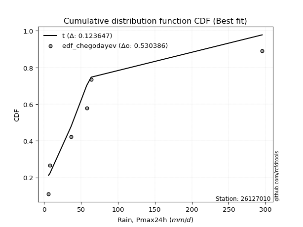</img>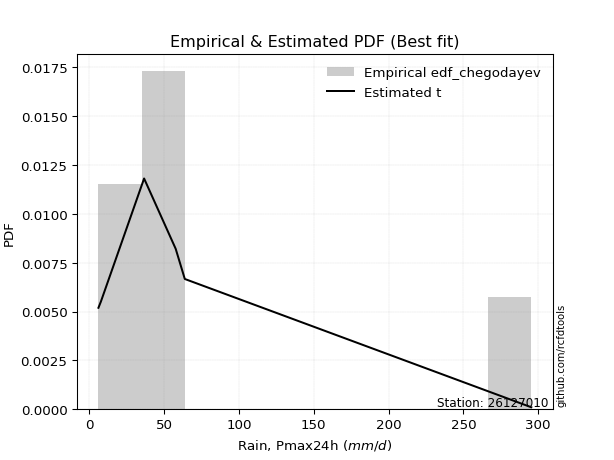</img>

</div>


### 6. Empirical - EDF Blom (1958)

The Blom formula is a specific "plotting position" formula used in hydrology and statistical analysis to estimate the empirical cumulative probability (or non-exceedance probability) of a data series. It is particularly recommended for data that are approximately normally distributed. The constant _a_ is set to 0.375 (or 3/8).

<div align="center">


$P=(m-a)/(n+1-2a)$


</div>


**6.1. Empirical values**

<div align="center">

|                | 0                  | 1                  | 2                  | 3                 | 4                 | 5                  |
|:---------------|:-------------------|:-------------------|:-------------------|:------------------|:------------------|:-------------------|
| date           | 2021               | 2022               | 2018               | 2019              | 2020              | 2017               |
| x              | 6.2                | 7.8                | 36.7               | 57.8              | 63.9              | 295.4              |
| m              | 1                  | 2                  | 3                  | 4                 | 5                 | 6                  |
| empirical_dist | edf_blom           | edf_blom           | edf_blom           | edf_blom          | edf_blom          | edf_blom           |
| empirical      | 0.1                | 0.26               | 0.42               | 0.58              | 0.74              | 0.9                |
| empirical_tr   | 1.1111111111111112 | 1.3513513513513513 | 1.7241379310344827 | 2.380952380952381 | 3.846153846153846 | 10.000000000000002 |

</div>


**6.2. Kolmogorov-Smirnov fit test (sorted by Δ)**


<div align="center">

|                | 0                   | 1                   | 2                  | 3                     | 4                   | 5                  | 6                   | 7                   | 8                   | 9                  | 10                  | 11                 | 12                  | 13                 | 14                 | 15                 | 16                  | 17                 | 18                 | 19                  | 20                  | 21                  | 22                 | 23                  | 24                  | 25                  | 26                  | 27                  | 28                 | 29                  | 30                  | 31                  | 32                  | 33                 | 34                 | 35                  | 36                  | 37                  | 38                  | 39                  | 40                  | 41                  | 42                 | 43                  | 44                  | 45                  | 46                  | 47                  | 48                  | 49                  | 50                  | 51                  | 52                  | 53                  | 54                  | 55                  | 56                  | 57                  | 58                 | 59                  | 60                 | 61                  | 62                  | 63                 | 64             | 65                  | 66                 | 67                  | 68                 | 69                  | 70                  | 71                  | 72                | 73                 | 74                  | 75                 | 76                  | 77                 | 78                  | 79                 | 80                 | 81                 | 82                  | 83                  | 84                 | 85                 | 86                 | 87                 | 88                 | 89                 |
|:---------------|:--------------------|:--------------------|:-------------------|:----------------------|:--------------------|:-------------------|:--------------------|:--------------------|:--------------------|:-------------------|:--------------------|:-------------------|:--------------------|:-------------------|:-------------------|:-------------------|:--------------------|:-------------------|:-------------------|:--------------------|:--------------------|:--------------------|:-------------------|:--------------------|:--------------------|:--------------------|:--------------------|:--------------------|:-------------------|:--------------------|:--------------------|:--------------------|:--------------------|:-------------------|:-------------------|:--------------------|:--------------------|:--------------------|:--------------------|:--------------------|:--------------------|:--------------------|:-------------------|:--------------------|:--------------------|:--------------------|:--------------------|:--------------------|:--------------------|:--------------------|:--------------------|:--------------------|:--------------------|:--------------------|:--------------------|:--------------------|:--------------------|:--------------------|:-------------------|:--------------------|:-------------------|:--------------------|:--------------------|:-------------------|:---------------|:--------------------|:-------------------|:--------------------|:-------------------|:--------------------|:--------------------|:--------------------|:------------------|:-------------------|:--------------------|:-------------------|:--------------------|:-------------------|:--------------------|:-------------------|:-------------------|:-------------------|:--------------------|:--------------------|:-------------------|:-------------------|:-------------------|:-------------------|:-------------------|:-------------------|
| station        | 26127010            | 26127010            | 26127010           | 26127010              | 26127010            | 26127010           | 26127010            | 26127010            | 26127010            | 26127010           | 26127010            | 26127010           | 26127010            | 26127010           | 26127010           | 26127010           | 26127010            | 26127010           | 26127010           | 26127010            | 26127010            | 26127010            | 26127010           | 26127010            | 26127010            | 26127010            | 26127010            | 26127010            | 26127010           | 26127010            | 26127010            | 26127010            | 26127010            | 26127010           | 26127010           | 26127010            | 26127010            | 26127010            | 26127010            | 26127010            | 26127010            | 26127010            | 26127010           | 26127010            | 26127010            | 26127010            | 26127010            | 26127010            | 26127010            | 26127010            | 26127010            | 26127010            | 26127010            | 26127010            | 26127010            | 26127010            | 26127010            | 26127010            | 26127010           | 26127010            | 26127010           | 26127010            | 26127010            | 26127010           | 26127010       | 26127010            | 26127010           | 26127010            | 26127010           | 26127010            | 26127010            | 26127010            | 26127010          | 26127010           | 26127010            | 26127010           | 26127010            | 26127010           | 26127010            | 26127010           | 26127010           | 26127010           | 26127010            | 26127010            | 26127010           | 26127010           | 26127010           | 26127010           | 26127010           | 26127010           |
| empirical_dist | edf_blom            | edf_blom            | edf_blom           | edf_blom              | edf_blom            | edf_blom           | edf_blom            | edf_blom            | edf_blom            | edf_blom           | edf_blom            | edf_blom           | edf_blom            | edf_blom           | edf_blom           | edf_blom           | edf_blom            | edf_blom           | edf_blom           | edf_blom            | edf_blom            | edf_blom            | edf_blom           | edf_blom            | edf_blom            | edf_blom            | edf_blom            | edf_blom            | edf_blom           | edf_blom            | edf_blom            | edf_blom            | edf_blom            | edf_blom           | edf_blom           | edf_blom            | edf_blom            | edf_blom            | edf_blom            | edf_blom            | edf_blom            | edf_blom            | edf_blom           | edf_blom            | edf_blom            | edf_blom            | edf_blom            | edf_blom            | edf_blom            | edf_blom            | edf_blom            | edf_blom            | edf_blom            | edf_blom            | edf_blom            | edf_blom            | edf_blom            | edf_blom            | edf_blom           | edf_blom            | edf_blom           | edf_blom            | edf_blom            | edf_blom           | edf_blom       | edf_blom            | edf_blom           | edf_blom            | edf_blom           | edf_blom            | edf_blom            | edf_blom            | edf_blom          | edf_blom           | edf_blom            | edf_blom           | edf_blom            | edf_blom           | edf_blom            | edf_blom           | edf_blom           | edf_blom           | edf_blom            | edf_blom            | edf_blom           | edf_blom           | edf_blom           | edf_blom           | edf_blom           | edf_blom           |
| p_dist         | t                   | logfisk             | logloggamma        | loglaplace_asymmetric | logjohnsonsu        | logcrystalball     | lognorm             | lognorm             | logt                | logexponnorm       | lognct              | wald               | logpearson3         | logerlang          | loggamma           | loggamma           | logf                | logalpha           | loginvgamma        | logmaxwell          | logncf              | loginvgauss         | loggumbel_l        | lograyleigh         | logbetaprime        | loglogistic         | loginvweibull       | logrice             | loghypsecant       | loggenlogistic      | loglaplace          | ncf                 | logkstwobign        | betaprime          | loggumbel_r        | nakagami            | logtruncnorm        | loghalfnorm         | logweibull_min      | loggenexpon         | loggompertz         | logmielke           | pearson3           | halflogistic        | logmoyal            | moyal               | genlogistic         | erlang              | halfnorm            | nct                 | logexpon            | gumbel_r            | exponnorm           | loghalflogistic     | laplace_asymmetric  | genexpon            | expon               | truncnorm           | gibrat             | gompertz            | mielke             | rayleigh            | f                   | invgamma           | logwald        | maxwell             | invgauss           | weibull_min         | pareto             | kstwobign           | loggibrat           | logpareto           | norm              | crystalball        | logistic            | hypsecant          | rice                | alpha              | laplace             | fatiguelife        | logchi2            | fisk               | loglognorm          | gumbel_l            | lognakagami        | gamma              | invweibull         | logfatiguelife     | johnsonsu          | chi2               |
| delta          | 0.12177247867734364 | 0.13246384363679803 | 0.1328779209332197 | 0.13367337865552495   | 0.13391786296926017 | 0.1341089057969171 | 0.13410890981260215 | 0.13410890981260215 | 0.13410927071235176 | 0.1341261657738271 | 0.13414605937838828 | 0.1346825497580355 | 0.13516775587100777 | 0.1357201309232821 | 0.1364055863477236 | 0.1364055863477236 | 0.13680192519627088 | 0.1369602899549831 | 0.1371658494388638 | 0.13814282684708984 | 0.13861078904090507 | 0.13870079598830146 | 0.1388735906529897 | 0.14138847880835212 | 0.14237835795447457 | 0.14881275680239975 | 0.15541895056554106 | 0.15562103943628908 | 0.1557291194538729 | 0.15613395198024932 | 0.16112316157171963 | 0.16255478363877224 | 0.16469275163594171 | 0.1653000956666651 | 0.1729727760692905 | 0.17325418398976972 | 0.17326373649561205 | 0.17475321084921988 | 0.17673685522300392 | 0.17842024550948804 | 0.18117140234219725 | 0.18734153114914204 | 0.1906243449134637 | 0.19541728014110105 | 0.20153545688586672 | 0.20455537465937157 | 0.20469577848663056 | 0.20876856030150676 | 0.21594046771108144 | 0.21939558319720304 | 0.22022767600628662 | 0.22972873492198465 | 0.23674368805194246 | 0.23706387252875336 | 0.23793596904092174 | 0.23795220323688196 | 0.23795221229165286 | 0.24004379131643336 | 0.2401150815541726 | 0.24087954063051345 | 0.2419700261610495 | 0.24974812261960622 | 0.25970537484388817 | 0.2597060648287523 | 0.26           | 0.26171964560141414 | 0.2622346095956642 | 0.26595480260513704 | 0.2711480877915888 | 0.27389767465116266 | 0.28466015089715907 | 0.29597569309697813 | 0.296092129720936 | 0.2960921374735804 | 0.30362081520755313 | 0.3099640606755907 | 0.31946823912421707 | 0.3286587136344928 | 0.33043035759830924 | 0.3322614154513592 | 0.3495417617658522 | 0.3570292649085478 | 0.36068231918749416 | 0.36591819054838665 | 0.3924578618560682 | 0.4466218202936815 | 0.4520614070885071 | 0.4625039512550036 | 0.5759596694847725 | 0.5769132171139852 |
| deltao         | 0.530385761606      | 0.530385761606      | 0.530385761606     | 0.530385761606        | 0.530385761606      | 0.530385761606     | 0.530385761606      | 0.530385761606      | 0.530385761606      | 0.530385761606     | 0.530385761606      | 0.530385761606     | 0.530385761606      | 0.530385761606     | 0.530385761606     | 0.530385761606     | 0.530385761606      | 0.530385761606     | 0.530385761606     | 0.530385761606      | 0.530385761606      | 0.530385761606      | 0.530385761606     | 0.530385761606      | 0.530385761606      | 0.530385761606      | 0.530385761606      | 0.530385761606      | 0.530385761606     | 0.530385761606      | 0.530385761606      | 0.530385761606      | 0.530385761606      | 0.530385761606     | 0.530385761606     | 0.530385761606      | 0.530385761606      | 0.530385761606      | 0.530385761606      | 0.530385761606      | 0.530385761606      | 0.530385761606      | 0.530385761606     | 0.530385761606      | 0.530385761606      | 0.530385761606      | 0.530385761606      | 0.530385761606      | 0.530385761606      | 0.530385761606      | 0.530385761606      | 0.530385761606      | 0.530385761606      | 0.530385761606      | 0.530385761606      | 0.530385761606      | 0.530385761606      | 0.530385761606      | 0.530385761606     | 0.530385761606      | 0.530385761606     | 0.530385761606      | 0.530385761606      | 0.530385761606     | 0.530385761606 | 0.530385761606      | 0.530385761606     | 0.530385761606      | 0.530385761606     | 0.530385761606      | 0.530385761606      | 0.530385761606      | 0.530385761606    | 0.530385761606     | 0.530385761606      | 0.530385761606     | 0.530385761606      | 0.530385761606     | 0.530385761606      | 0.530385761606     | 0.530385761606     | 0.530385761606     | 0.530385761606      | 0.530385761606      | 0.530385761606     | 0.530385761606     | 0.530385761606     | 0.530385761606     | 0.530385761606     | 0.530385761606     |
| eval           | Δo > Δ              | Δo > Δ              | Δo > Δ             | Δo > Δ                | Δo > Δ              | Δo > Δ             | Δo > Δ              | Δo > Δ              | Δo > Δ              | Δo > Δ             | Δo > Δ              | Δo > Δ             | Δo > Δ              | Δo > Δ             | Δo > Δ             | Δo > Δ             | Δo > Δ              | Δo > Δ             | Δo > Δ             | Δo > Δ              | Δo > Δ              | Δo > Δ              | Δo > Δ             | Δo > Δ              | Δo > Δ              | Δo > Δ              | Δo > Δ              | Δo > Δ              | Δo > Δ             | Δo > Δ              | Δo > Δ              | Δo > Δ              | Δo > Δ              | Δo > Δ             | Δo > Δ             | Δo > Δ              | Δo > Δ              | Δo > Δ              | Δo > Δ              | Δo > Δ              | Δo > Δ              | Δo > Δ              | Δo > Δ             | Δo > Δ              | Δo > Δ              | Δo > Δ              | Δo > Δ              | Δo > Δ              | Δo > Δ              | Δo > Δ              | Δo > Δ              | Δo > Δ              | Δo > Δ              | Δo > Δ              | Δo > Δ              | Δo > Δ              | Δo > Δ              | Δo > Δ              | Δo > Δ             | Δo > Δ              | Δo > Δ             | Δo > Δ              | Δo > Δ              | Δo > Δ             | Δo > Δ         | Δo > Δ              | Δo > Δ             | Δo > Δ              | Δo > Δ             | Δo > Δ              | Δo > Δ              | Δo > Δ              | Δo > Δ            | Δo > Δ             | Δo > Δ              | Δo > Δ             | Δo > Δ              | Δo > Δ             | Δo > Δ              | Δo > Δ             | Δo > Δ             | Δo > Δ             | Δo > Δ              | Δo > Δ              | Δo > Δ             | Δo > Δ             | Δo > Δ             | Δo > Δ             | Δo <= Δ            | Δo <= Δ            |
| fit            | 1                   | 1                   | 1                  | 1                     | 1                   | 1                  | 1                   | 1                   | 1                   | 1                  | 1                   | 1                  | 1                   | 1                  | 1                  | 1                  | 1                   | 1                  | 1                  | 1                   | 1                   | 1                   | 1                  | 1                   | 1                   | 1                   | 1                   | 1                   | 1                  | 1                   | 1                   | 1                   | 1                   | 1                  | 1                  | 1                   | 1                   | 1                   | 1                   | 1                   | 1                   | 1                   | 1                  | 1                   | 1                   | 1                   | 1                   | 1                   | 1                   | 1                   | 1                   | 1                   | 1                   | 1                   | 1                   | 1                   | 1                   | 1                   | 1                  | 1                   | 1                  | 1                   | 1                   | 1                  | 1              | 1                   | 1                  | 1                   | 1                  | 1                   | 1                   | 1                   | 1                 | 1                  | 1                   | 1                  | 1                   | 1                  | 1                   | 1                  | 1                  | 1                  | 1                   | 1                   | 1                  | 1                  | 1                  | 1                  | 0                  | 0                  |
| n              | 6                   | 6                   | 6                  | 6                     | 6                   | 6                  | 6                   | 6                   | 6                   | 6                  | 6                   | 6                  | 6                   | 6                  | 6                  | 6                  | 6                   | 6                  | 6                  | 6                   | 6                   | 6                   | 6                  | 6                   | 6                   | 6                   | 6                   | 6                   | 6                  | 6                   | 6                   | 6                   | 6                   | 6                  | 6                  | 6                   | 6                   | 6                   | 6                   | 6                   | 6                   | 6                   | 6                  | 6                   | 6                   | 6                   | 6                   | 6                   | 6                   | 6                   | 6                   | 6                   | 6                   | 6                   | 6                   | 6                   | 6                   | 6                   | 6                  | 6                   | 6                  | 6                   | 6                   | 6                  | 6              | 6                   | 6                  | 6                   | 6                  | 6                   | 6                   | 6                   | 6                 | 6                  | 6                   | 6                  | 6                   | 6                  | 6                   | 6                  | 6                  | 6                  | 6                   | 6                   | 6                  | 6                  | 6                  | 6                  | 6                  | 6                  |
| best_fit       | 1                   | 0                   | 0                  | 0                     | 0                   | 0                  | 0                   | 0                   | 0                   | 0                  | 0                   | 0                  | 0                   | 0                  | 0                  | 0                  | 0                   | 0                  | 0                  | 0                   | 0                   | 0                   | 0                  | 0                   | 0                   | 0                   | 0                   | 0                   | 0                  | 0                   | 0                   | 0                   | 0                   | 0                  | 0                  | 0                   | 0                   | 0                   | 0                   | 0                   | 0                   | 0                   | 0                  | 0                   | 0                   | 0                   | 0                   | 0                   | 0                   | 0                   | 0                   | 0                   | 0                   | 0                   | 0                   | 0                   | 0                   | 0                   | 0                  | 0                   | 0                  | 0                   | 0                   | 0                  | 0              | 0                   | 0                  | 0                   | 0                  | 0                   | 0                   | 0                   | 0                 | 0                  | 0                   | 0                  | 0                   | 0                  | 0                   | 0                  | 0                  | 0                  | 0                   | 0                   | 0                  | 0                  | 0                  | 0                  | 0                  | 0                  |
| best_fit_sort  | 1                   | 2                   | 3                  | 4                     | 5                   | 6                  | 7                   | 8                   | 9                   | 10                 | 11                  | 12                 | 13                  | 14                 | 15                 | 16                 | 17                  | 18                 | 19                 | 20                  | 21                  | 22                  | 23                 | 24                  | 25                  | 26                  | 27                  | 28                  | 29                 | 30                  | 31                  | 32                  | 33                  | 34                 | 35                 | 36                  | 37                  | 38                  | 39                  | 40                  | 41                  | 42                  | 43                 | 44                  | 45                  | 46                  | 47                  | 48                  | 49                  | 50                  | 51                  | 52                  | 53                  | 54                  | 55                  | 56                  | 57                  | 58                  | 59                 | 60                  | 61                 | 62                  | 63                  | 64                 | 65             | 66                  | 67                 | 68                  | 69                 | 70                  | 71                  | 72                  | 73                | 74                 | 75                  | 76                 | 77                  | 78                 | 79                  | 80                 | 81                 | 82                 | 83                  | 84                  | 85                 | 86                 | 87                 | 88                 | 89                 | 90                 |

</div>


<div align="center">

</img>

</div>


**6.3. Best fit**

<div align="center">

|   id |   station | empirical_dist   | p_dist   |    delta |   deltao | eval   |   fit |   n |   best_fit |   best_fit_sort |
|-----:|----------:|:-----------------|:---------|---------:|---------:|:-------|------:|----:|-----------:|----------------:|
|    0 |  26127010 | edf_blom         | t        | 0.121772 | 0.530386 | Δo > Δ |     1 |   6 |          1 |               1 |

</div>


<div align="center">

</img>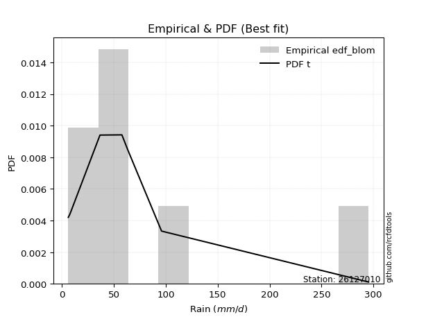</img>

</div>


### 7. Empirical - EDF Tukey (1962)

In hydrology, the Tukey formula is used as a plotting position formula to estimate the empirical probability or frequency of a flood event (or other hydrological data). The formula parameter is given as _c=0.333_ (or 1/3).

<div align="center">


$P=(m-c)/(n+1-2c)$


</div>


**7.1. Empirical values**

<div align="center">

|                | 0                   | 1                  | 2                   | 3                  | 4                  | 5                  |
|:---------------|:--------------------|:-------------------|:--------------------|:-------------------|:-------------------|:-------------------|
| date           | 2021                | 2022               | 2018                | 2019               | 2020               | 2017               |
| x              | 6.2                 | 7.8                | 36.7                | 57.8               | 63.9               | 295.4              |
| m              | 1                   | 2                  | 3                   | 4                  | 5                  | 6                  |
| empirical_dist | edf_tukey           | edf_tukey          | edf_tukey           | edf_tukey          | edf_tukey          | edf_tukey          |
| empirical      | 0.10526315789473684 | 0.2631578947368421 | 0.42105263157894735 | 0.5789473684210527 | 0.7368421052631579 | 0.8947368421052632 |
| empirical_tr   | 1.1176470588235294  | 1.357142857142857  | 1.7272727272727273  | 2.375              | 3.7999999999999994 | 9.5                |

</div>


**7.2. Kolmogorov-Smirnov fit test (sorted by Δ)**


<div align="center">

|                | 0                   | 1                   | 2                  | 3                  | 4                     | 5                   | 6                   | 7                   | 8                   | 9                   | 10                 | 11                  | 12                  | 13                 | 14                  | 15                  | 16                  | 17                 | 18                 | 19                  | 20                 | 21                  | 22                  | 23                 | 24                 | 25                  | 26                 | 27                  | 28                  | 29                | 30                  | 31                  | 32                  | 33                 | 34                  | 35                  | 36                  | 37                 | 38                  | 39                  | 40                  | 41                  | 42                  | 43                 | 44                  | 45                  | 46                 | 47                 | 48                 | 49                  | 50                  | 51                 | 52                  | 53                  | 54                  | 55                  | 56                  | 57                  | 58                  | 59                 | 60                  | 61                  | 62                | 63                 | 64                  | 65                  | 66                 | 67                 | 68                 | 69                 | 70                 | 71                  | 72                 | 73                  | 74                | 75                  | 76                  | 77                 | 78                 | 79                 | 80                  | 81                  | 82                 | 83                 | 84                 | 85                  | 86                  | 87                  | 88                 | 89                 |
|:---------------|:--------------------|:--------------------|:-------------------|:-------------------|:----------------------|:--------------------|:--------------------|:--------------------|:--------------------|:--------------------|:-------------------|:--------------------|:--------------------|:-------------------|:--------------------|:--------------------|:--------------------|:-------------------|:-------------------|:--------------------|:-------------------|:--------------------|:--------------------|:-------------------|:-------------------|:--------------------|:-------------------|:--------------------|:--------------------|:------------------|:--------------------|:--------------------|:--------------------|:-------------------|:--------------------|:--------------------|:--------------------|:-------------------|:--------------------|:--------------------|:--------------------|:--------------------|:--------------------|:-------------------|:--------------------|:--------------------|:-------------------|:-------------------|:-------------------|:--------------------|:--------------------|:-------------------|:--------------------|:--------------------|:--------------------|:--------------------|:--------------------|:--------------------|:--------------------|:-------------------|:--------------------|:--------------------|:------------------|:-------------------|:--------------------|:--------------------|:-------------------|:-------------------|:-------------------|:-------------------|:-------------------|:--------------------|:-------------------|:--------------------|:------------------|:--------------------|:--------------------|:-------------------|:-------------------|:-------------------|:--------------------|:--------------------|:-------------------|:-------------------|:-------------------|:--------------------|:--------------------|:--------------------|:-------------------|:-------------------|
| station        | 26127010            | 26127010            | 26127010           | 26127010           | 26127010              | 26127010            | 26127010            | 26127010            | 26127010            | 26127010            | 26127010           | 26127010            | 26127010            | 26127010           | 26127010            | 26127010            | 26127010            | 26127010           | 26127010           | 26127010            | 26127010           | 26127010            | 26127010            | 26127010           | 26127010           | 26127010            | 26127010           | 26127010            | 26127010            | 26127010          | 26127010            | 26127010            | 26127010            | 26127010           | 26127010            | 26127010            | 26127010            | 26127010           | 26127010            | 26127010            | 26127010            | 26127010            | 26127010            | 26127010           | 26127010            | 26127010            | 26127010           | 26127010           | 26127010           | 26127010            | 26127010            | 26127010           | 26127010            | 26127010            | 26127010            | 26127010            | 26127010            | 26127010            | 26127010            | 26127010           | 26127010            | 26127010            | 26127010          | 26127010           | 26127010            | 26127010            | 26127010           | 26127010           | 26127010           | 26127010           | 26127010           | 26127010            | 26127010           | 26127010            | 26127010          | 26127010            | 26127010            | 26127010           | 26127010           | 26127010           | 26127010            | 26127010            | 26127010           | 26127010           | 26127010           | 26127010            | 26127010            | 26127010            | 26127010           | 26127010           |
| empirical_dist | edf_tukey           | edf_tukey           | edf_tukey          | edf_tukey          | edf_tukey             | edf_tukey           | edf_tukey           | edf_tukey           | edf_tukey           | edf_tukey           | edf_tukey          | edf_tukey           | edf_tukey           | edf_tukey          | edf_tukey           | edf_tukey           | edf_tukey           | edf_tukey          | edf_tukey          | edf_tukey           | edf_tukey          | edf_tukey           | edf_tukey           | edf_tukey          | edf_tukey          | edf_tukey           | edf_tukey          | edf_tukey           | edf_tukey           | edf_tukey         | edf_tukey           | edf_tukey           | edf_tukey           | edf_tukey          | edf_tukey           | edf_tukey           | edf_tukey           | edf_tukey          | edf_tukey           | edf_tukey           | edf_tukey           | edf_tukey           | edf_tukey           | edf_tukey          | edf_tukey           | edf_tukey           | edf_tukey          | edf_tukey          | edf_tukey          | edf_tukey           | edf_tukey           | edf_tukey          | edf_tukey           | edf_tukey           | edf_tukey           | edf_tukey           | edf_tukey           | edf_tukey           | edf_tukey           | edf_tukey          | edf_tukey           | edf_tukey           | edf_tukey         | edf_tukey          | edf_tukey           | edf_tukey           | edf_tukey          | edf_tukey          | edf_tukey          | edf_tukey          | edf_tukey          | edf_tukey           | edf_tukey          | edf_tukey           | edf_tukey         | edf_tukey           | edf_tukey           | edf_tukey          | edf_tukey          | edf_tukey          | edf_tukey           | edf_tukey           | edf_tukey          | edf_tukey          | edf_tukey          | edf_tukey           | edf_tukey           | edf_tukey           | edf_tukey          | edf_tukey          |
| p_dist         | t                   | wald                | logfisk            | logloggamma        | loglaplace_asymmetric | logjohnsonsu        | logcrystalball      | lognorm             | lognorm             | logt                | logexponnorm       | lognct              | logpearson3         | logerlang          | loggamma            | loggamma            | logf                | logalpha           | loginvgamma        | logmaxwell          | logbetaprime       | logncf              | loginvgauss         | loggumbel_l        | lograyleigh        | loglogistic         | loginvweibull      | loggenlogistic      | logrice             | loghypsecant      | ncf                 | logkstwobign        | betaprime           | loglaplace         | nakagami            | logtruncnorm        | logweibull_min      | loggumbel_r        | loggenexpon         | loghalfnorm         | loggompertz         | logmielke           | pearson3            | halflogistic       | moyal               | genlogistic         | logmoyal           | erlang             | halfnorm           | nct                 | logexpon            | gumbel_r           | exponnorm           | loghalflogistic     | mielke              | laplace_asymmetric  | genexpon            | expon               | truncnorm           | gibrat             | gompertz            | rayleigh            | maxwell           | f                  | invgamma            | invgauss            | weibull_min        | logwald            | pareto             | kstwobign          | loggibrat          | logpareto           | norm               | crystalball         | logistic          | hypsecant           | rice                | laplace            | alpha              | fatiguelife        | logchi2             | fisk                | loglognorm         | gumbel_l           | lognakagami        | gamma               | invweibull          | logfatiguelife      | johnsonsu          | chi2               |
| delta          | 0.12282511025629095 | 0.13152465502119337 | 0.1356217383736401 | 0.1360358156700618 | 0.13683127339236703   | 0.13707575770610225 | 0.13726680053375917 | 0.13726680454944423 | 0.13726680454944423 | 0.13726716544919385 | 0.1372840605106692 | 0.13730395411523036 | 0.13832565060784985 | 0.1388780256601242 | 0.13956348108456568 | 0.13956348108456568 | 0.13995981993311296 | 0.1401181846918252 | 0.1403237441757059 | 0.14130072158393192 | 0.1413257263755272 | 0.14176868377774715 | 0.14185869072514354 | 0.1420314853898318 | 0.1445463735451942 | 0.15197065153924183 | 0.1543663189865937 | 0.15508132040130196 | 0.15877893417313116 | 0.158887014190715 | 0.16150215205982488 | 0.16364012005699435 | 0.16424746408771773 | 0.1642810563085617 | 0.17220155241082236 | 0.17267880265350244 | 0.17568422364405656 | 0.1761306708061326 | 0.17736761393054068 | 0.17791110558606196 | 0.18432929707903933 | 0.18628889957019468 | 0.18746645017662156 | 0.1922593854042589 | 0.20139747992252943 | 0.20153788374978843 | 0.2046933516227088 | 0.2077159287225594 | 0.2127825729742393 | 0.21834295161825568 | 0.21917504442733926 | 0.2265708401851425 | 0.23990158278878454 | 0.24022176726559544 | 0.24091739458210215 | 0.24109386377776382 | 0.24111009797372404 | 0.24111010702849495 | 0.24320168605327544 | 0.2432729762910147 | 0.24403743536735553 | 0.24659022788276408 | 0.258561750864572 | 0.2586527432649408 | 0.25865343324980494 | 0.26118197801671683 | 0.2627969078682949 | 0.2631578947368421 | 0.2700954562126414 | 0.2707397799143205 | 0.2836075193182117 | 0.29281779836013605 | 0.2929342349840939 | 0.29293424273673824 | 0.300462920470711 | 0.30680616593874854 | 0.31631034438737493 | 0.3272724628614671 | 0.3276060820555454 | 0.3312087838724118 | 0.34848913018690486 | 0.35176610701381095 | 0.3575244244506521 | 0.3627602958115445 | 0.3914052302771208 | 0.44556918871473417 | 0.44679824919377026 | 0.46145131967605624 | 0.5728017747479304 | 0.5758605855350378 |
| deltao         | 0.530385761606      | 0.530385761606      | 0.530385761606     | 0.530385761606     | 0.530385761606        | 0.530385761606      | 0.530385761606      | 0.530385761606      | 0.530385761606      | 0.530385761606      | 0.530385761606     | 0.530385761606      | 0.530385761606      | 0.530385761606     | 0.530385761606      | 0.530385761606      | 0.530385761606      | 0.530385761606     | 0.530385761606     | 0.530385761606      | 0.530385761606     | 0.530385761606      | 0.530385761606      | 0.530385761606     | 0.530385761606     | 0.530385761606      | 0.530385761606     | 0.530385761606      | 0.530385761606      | 0.530385761606    | 0.530385761606      | 0.530385761606      | 0.530385761606      | 0.530385761606     | 0.530385761606      | 0.530385761606      | 0.530385761606      | 0.530385761606     | 0.530385761606      | 0.530385761606      | 0.530385761606      | 0.530385761606      | 0.530385761606      | 0.530385761606     | 0.530385761606      | 0.530385761606      | 0.530385761606     | 0.530385761606     | 0.530385761606     | 0.530385761606      | 0.530385761606      | 0.530385761606     | 0.530385761606      | 0.530385761606      | 0.530385761606      | 0.530385761606      | 0.530385761606      | 0.530385761606      | 0.530385761606      | 0.530385761606     | 0.530385761606      | 0.530385761606      | 0.530385761606    | 0.530385761606     | 0.530385761606      | 0.530385761606      | 0.530385761606     | 0.530385761606     | 0.530385761606     | 0.530385761606     | 0.530385761606     | 0.530385761606      | 0.530385761606     | 0.530385761606      | 0.530385761606    | 0.530385761606      | 0.530385761606      | 0.530385761606     | 0.530385761606     | 0.530385761606     | 0.530385761606      | 0.530385761606      | 0.530385761606     | 0.530385761606     | 0.530385761606     | 0.530385761606      | 0.530385761606      | 0.530385761606      | 0.530385761606     | 0.530385761606     |
| eval           | Δo > Δ              | Δo > Δ              | Δo > Δ             | Δo > Δ             | Δo > Δ                | Δo > Δ              | Δo > Δ              | Δo > Δ              | Δo > Δ              | Δo > Δ              | Δo > Δ             | Δo > Δ              | Δo > Δ              | Δo > Δ             | Δo > Δ              | Δo > Δ              | Δo > Δ              | Δo > Δ             | Δo > Δ             | Δo > Δ              | Δo > Δ             | Δo > Δ              | Δo > Δ              | Δo > Δ             | Δo > Δ             | Δo > Δ              | Δo > Δ             | Δo > Δ              | Δo > Δ              | Δo > Δ            | Δo > Δ              | Δo > Δ              | Δo > Δ              | Δo > Δ             | Δo > Δ              | Δo > Δ              | Δo > Δ              | Δo > Δ             | Δo > Δ              | Δo > Δ              | Δo > Δ              | Δo > Δ              | Δo > Δ              | Δo > Δ             | Δo > Δ              | Δo > Δ              | Δo > Δ             | Δo > Δ             | Δo > Δ             | Δo > Δ              | Δo > Δ              | Δo > Δ             | Δo > Δ              | Δo > Δ              | Δo > Δ              | Δo > Δ              | Δo > Δ              | Δo > Δ              | Δo > Δ              | Δo > Δ             | Δo > Δ              | Δo > Δ              | Δo > Δ            | Δo > Δ             | Δo > Δ              | Δo > Δ              | Δo > Δ             | Δo > Δ             | Δo > Δ             | Δo > Δ             | Δo > Δ             | Δo > Δ              | Δo > Δ             | Δo > Δ              | Δo > Δ            | Δo > Δ              | Δo > Δ              | Δo > Δ             | Δo > Δ             | Δo > Δ             | Δo > Δ              | Δo > Δ              | Δo > Δ             | Δo > Δ             | Δo > Δ             | Δo > Δ              | Δo > Δ              | Δo > Δ              | Δo <= Δ            | Δo <= Δ            |
| fit            | 1                   | 1                   | 1                  | 1                  | 1                     | 1                   | 1                   | 1                   | 1                   | 1                   | 1                  | 1                   | 1                   | 1                  | 1                   | 1                   | 1                   | 1                  | 1                  | 1                   | 1                  | 1                   | 1                   | 1                  | 1                  | 1                   | 1                  | 1                   | 1                   | 1                 | 1                   | 1                   | 1                   | 1                  | 1                   | 1                   | 1                   | 1                  | 1                   | 1                   | 1                   | 1                   | 1                   | 1                  | 1                   | 1                   | 1                  | 1                  | 1                  | 1                   | 1                   | 1                  | 1                   | 1                   | 1                   | 1                   | 1                   | 1                   | 1                   | 1                  | 1                   | 1                   | 1                 | 1                  | 1                   | 1                   | 1                  | 1                  | 1                  | 1                  | 1                  | 1                   | 1                  | 1                   | 1                 | 1                   | 1                   | 1                  | 1                  | 1                  | 1                   | 1                   | 1                  | 1                  | 1                  | 1                   | 1                   | 1                   | 0                  | 0                  |
| n              | 6                   | 6                   | 6                  | 6                  | 6                     | 6                   | 6                   | 6                   | 6                   | 6                   | 6                  | 6                   | 6                   | 6                  | 6                   | 6                   | 6                   | 6                  | 6                  | 6                   | 6                  | 6                   | 6                   | 6                  | 6                  | 6                   | 6                  | 6                   | 6                   | 6                 | 6                   | 6                   | 6                   | 6                  | 6                   | 6                   | 6                   | 6                  | 6                   | 6                   | 6                   | 6                   | 6                   | 6                  | 6                   | 6                   | 6                  | 6                  | 6                  | 6                   | 6                   | 6                  | 6                   | 6                   | 6                   | 6                   | 6                   | 6                   | 6                   | 6                  | 6                   | 6                   | 6                 | 6                  | 6                   | 6                   | 6                  | 6                  | 6                  | 6                  | 6                  | 6                   | 6                  | 6                   | 6                 | 6                   | 6                   | 6                  | 6                  | 6                  | 6                   | 6                   | 6                  | 6                  | 6                  | 6                   | 6                   | 6                   | 6                  | 6                  |
| best_fit       | 1                   | 0                   | 0                  | 0                  | 0                     | 0                   | 0                   | 0                   | 0                   | 0                   | 0                  | 0                   | 0                   | 0                  | 0                   | 0                   | 0                   | 0                  | 0                  | 0                   | 0                  | 0                   | 0                   | 0                  | 0                  | 0                   | 0                  | 0                   | 0                   | 0                 | 0                   | 0                   | 0                   | 0                  | 0                   | 0                   | 0                   | 0                  | 0                   | 0                   | 0                   | 0                   | 0                   | 0                  | 0                   | 0                   | 0                  | 0                  | 0                  | 0                   | 0                   | 0                  | 0                   | 0                   | 0                   | 0                   | 0                   | 0                   | 0                   | 0                  | 0                   | 0                   | 0                 | 0                  | 0                   | 0                   | 0                  | 0                  | 0                  | 0                  | 0                  | 0                   | 0                  | 0                   | 0                 | 0                   | 0                   | 0                  | 0                  | 0                  | 0                   | 0                   | 0                  | 0                  | 0                  | 0                   | 0                   | 0                   | 0                  | 0                  |
| best_fit_sort  | 1                   | 2                   | 3                  | 4                  | 5                     | 6                   | 7                   | 8                   | 9                   | 10                  | 11                 | 12                  | 13                  | 14                 | 15                  | 16                  | 17                  | 18                 | 19                 | 20                  | 21                 | 22                  | 23                  | 24                 | 25                 | 26                  | 27                 | 28                  | 29                  | 30                | 31                  | 32                  | 33                  | 34                 | 35                  | 36                  | 37                  | 38                 | 39                  | 40                  | 41                  | 42                  | 43                  | 44                 | 45                  | 46                  | 47                 | 48                 | 49                 | 50                  | 51                  | 52                 | 53                  | 54                  | 55                  | 56                  | 57                  | 58                  | 59                  | 60                 | 61                  | 62                  | 63                | 64                 | 65                  | 66                  | 67                 | 68                 | 69                 | 70                 | 71                 | 72                  | 73                 | 74                  | 75                | 76                  | 77                  | 78                 | 79                 | 80                 | 81                  | 82                  | 83                 | 84                 | 85                 | 86                  | 87                  | 88                  | 89                 | 90                 |

</div>


<div align="center">

</img>

</div>


**7.3. Best fit**

<div align="center">

|   id |   station | empirical_dist   | p_dist   |    delta |   deltao | eval   |   fit |   n |   best_fit |   best_fit_sort |
|-----:|----------:|:-----------------|:---------|---------:|---------:|:-------|------:|----:|-----------:|----------------:|
|    0 |  26127010 | edf_tukey        | t        | 0.122825 | 0.530386 | Δo > Δ |     1 |   6 |          1 |               1 |

</div>


<div align="center">

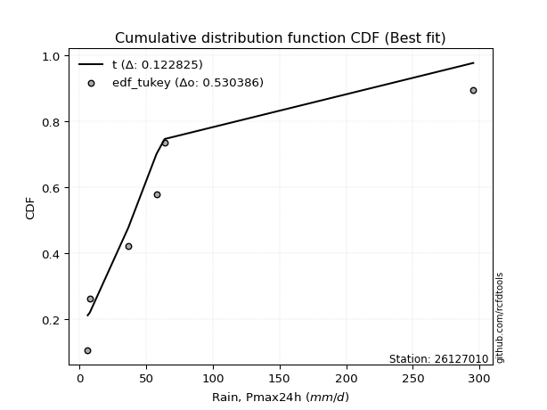</img>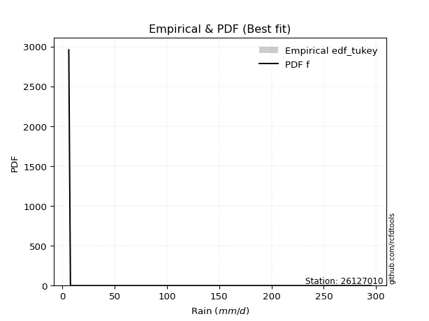</img>

</div>


### 8. Empirical - EDF Gringorten (1963)

Gringorten plotting position formula is essential for estimating the probability and return periods of extreme events like floods and heavy rainfall. The constant _a=0.44_.

<div align="center">


$P=(m-a)/(n+1-2a)$


</div>


**8.1. Empirical values**

<div align="center">

|                | 0                   | 1                  | 2                   | 3                  | 4                  | 5                  |
|:---------------|:--------------------|:-------------------|:--------------------|:-------------------|:-------------------|:-------------------|
| date           | 2021                | 2022               | 2018                | 2019               | 2020               | 2017               |
| x              | 6.2                 | 7.8                | 36.7                | 57.8               | 63.9               | 295.4              |
| m              | 1                   | 2                  | 3                   | 4                  | 5                  | 6                  |
| empirical_dist | edf_gringorten      | edf_gringorten     | edf_gringorten      | edf_gringorten     | edf_gringorten     | edf_gringorten     |
| empirical      | 0.09150326797385622 | 0.2549019607843137 | 0.41830065359477125 | 0.5816993464052288 | 0.7450980392156862 | 0.9084967320261437 |
| empirical_tr   | 1.1007194244604317  | 1.3421052631578947 | 1.7191011235955058  | 2.3906250000000004 | 3.9230769230769216 | 10.928571428571415 |

</div>


**8.2. Kolmogorov-Smirnov fit test (sorted by Δ)**


<div align="center">

|                | 0                   | 1                   | 2                  | 3                     | 4                   | 5                  | 6                   | 7                   | 8                   | 9                  | 10                  | 11                  | 12                 | 13                 | 14                 | 15                 | 16                 | 17                  | 18                  | 19                 | 20                  | 21                  | 22                  | 23                 | 24                  | 25                 | 26                  | 27                 | 28                  | 29                 | 30                  | 31                  | 32                  | 33                  | 34                 | 35                  | 36                  | 37                  | 38                  | 39                  | 40                  | 41                  | 42                  | 43                  | 44                  | 45                  | 46                  | 47                  | 48                  | 49                  | 50                  | 51                  | 52                  | 53                  | 54                  | 55                  | 56                  | 57                  | 58                 | 59                  | 60                  | 61                 | 62                 | 63                 | 64                  | 65                 | 66                  | 67                  | 68                 | 69                  | 70                 | 71                  | 72                 | 73                  | 74                 | 75                  | 76                  | 77                 | 78                 | 79                  | 80                  | 81                  | 82                  | 83                  | 84                 | 85                  | 86                  | 87                  | 88                 | 89                 |
|:---------------|:--------------------|:--------------------|:-------------------|:----------------------|:--------------------|:-------------------|:--------------------|:--------------------|:--------------------|:-------------------|:--------------------|:--------------------|:-------------------|:-------------------|:-------------------|:-------------------|:-------------------|:--------------------|:--------------------|:-------------------|:--------------------|:--------------------|:--------------------|:-------------------|:--------------------|:-------------------|:--------------------|:-------------------|:--------------------|:-------------------|:--------------------|:--------------------|:--------------------|:--------------------|:-------------------|:--------------------|:--------------------|:--------------------|:--------------------|:--------------------|:--------------------|:--------------------|:--------------------|:--------------------|:--------------------|:--------------------|:--------------------|:--------------------|:--------------------|:--------------------|:--------------------|:--------------------|:--------------------|:--------------------|:--------------------|:--------------------|:--------------------|:--------------------|:-------------------|:--------------------|:--------------------|:-------------------|:-------------------|:-------------------|:--------------------|:-------------------|:--------------------|:--------------------|:-------------------|:--------------------|:-------------------|:--------------------|:-------------------|:--------------------|:-------------------|:--------------------|:--------------------|:-------------------|:-------------------|:--------------------|:--------------------|:--------------------|:--------------------|:--------------------|:-------------------|:--------------------|:--------------------|:--------------------|:-------------------|:-------------------|
| station        | 26127010            | 26127010            | 26127010           | 26127010              | 26127010            | 26127010           | 26127010            | 26127010            | 26127010            | 26127010           | 26127010            | 26127010            | 26127010           | 26127010           | 26127010           | 26127010           | 26127010           | 26127010            | 26127010            | 26127010           | 26127010            | 26127010            | 26127010            | 26127010           | 26127010            | 26127010           | 26127010            | 26127010           | 26127010            | 26127010           | 26127010            | 26127010            | 26127010            | 26127010            | 26127010           | 26127010            | 26127010            | 26127010            | 26127010            | 26127010            | 26127010            | 26127010            | 26127010            | 26127010            | 26127010            | 26127010            | 26127010            | 26127010            | 26127010            | 26127010            | 26127010            | 26127010            | 26127010            | 26127010            | 26127010            | 26127010            | 26127010            | 26127010            | 26127010           | 26127010            | 26127010            | 26127010           | 26127010           | 26127010           | 26127010            | 26127010           | 26127010            | 26127010            | 26127010           | 26127010            | 26127010           | 26127010            | 26127010           | 26127010            | 26127010           | 26127010            | 26127010            | 26127010           | 26127010           | 26127010            | 26127010            | 26127010            | 26127010            | 26127010            | 26127010           | 26127010            | 26127010            | 26127010            | 26127010           | 26127010           |
| empirical_dist | edf_gringorten      | edf_gringorten      | edf_gringorten     | edf_gringorten        | edf_gringorten      | edf_gringorten     | edf_gringorten      | edf_gringorten      | edf_gringorten      | edf_gringorten     | edf_gringorten      | edf_gringorten      | edf_gringorten     | edf_gringorten     | edf_gringorten     | edf_gringorten     | edf_gringorten     | edf_gringorten      | edf_gringorten      | edf_gringorten     | edf_gringorten      | edf_gringorten      | edf_gringorten      | edf_gringorten     | edf_gringorten      | edf_gringorten     | edf_gringorten      | edf_gringorten     | edf_gringorten      | edf_gringorten     | edf_gringorten      | edf_gringorten      | edf_gringorten      | edf_gringorten      | edf_gringorten     | edf_gringorten      | edf_gringorten      | edf_gringorten      | edf_gringorten      | edf_gringorten      | edf_gringorten      | edf_gringorten      | edf_gringorten      | edf_gringorten      | edf_gringorten      | edf_gringorten      | edf_gringorten      | edf_gringorten      | edf_gringorten      | edf_gringorten      | edf_gringorten      | edf_gringorten      | edf_gringorten      | edf_gringorten      | edf_gringorten      | edf_gringorten      | edf_gringorten      | edf_gringorten      | edf_gringorten     | edf_gringorten      | edf_gringorten      | edf_gringorten     | edf_gringorten     | edf_gringorten     | edf_gringorten      | edf_gringorten     | edf_gringorten      | edf_gringorten      | edf_gringorten     | edf_gringorten      | edf_gringorten     | edf_gringorten      | edf_gringorten     | edf_gringorten      | edf_gringorten     | edf_gringorten      | edf_gringorten      | edf_gringorten     | edf_gringorten     | edf_gringorten      | edf_gringorten      | edf_gringorten      | edf_gringorten      | edf_gringorten      | edf_gringorten     | edf_gringorten      | edf_gringorten      | edf_gringorten      | edf_gringorten     | edf_gringorten     |
| p_dist         | t                   | logfisk             | logloggamma        | loglaplace_asymmetric | logjohnsonsu        | logcrystalball     | lognorm             | lognorm             | logt                | logexponnorm       | lognct              | logpearson3         | logerlang          | loggamma           | loggamma           | logalpha           | loginvgamma        | logmaxwell          | logncf              | loggumbel_l        | logf                | lograyleigh         | loginvgauss         | wald               | loglogistic         | logbetaprime       | logrice             | loghypsecant       | loglaplace          | loginvweibull      | loggenlogistic      | ncf                 | logkstwobign        | betaprime           | loggumbel_r        | loghalfnorm         | nakagami            | logtruncnorm        | loggompertz         | logweibull_min      | loggenexpon         | logmielke           | pearson3            | logmoyal            | halflogistic        | moyal               | genlogistic         | erlang              | halfnorm            | nct                 | logexpon            | exponnorm           | loghalflogistic     | laplace_asymmetric  | genexpon            | expon               | gumbel_r            | truncnorm           | gibrat             | gompertz            | mielke              | rayleigh           | logwald            | f                  | invgamma            | invgauss           | maxwell             | weibull_min         | pareto             | kstwobign           | loggibrat          | logpareto           | norm               | crystalball         | logistic           | hypsecant           | rice                | alpha              | fatiguelife        | laplace             | logchi2             | fisk                | loglognorm          | gumbel_l            | lognakagami        | gamma               | invweibull          | logfatiguelife      | chi2               | johnsonsu          |
| delta          | 0.12039499444074406 | 0.12736580442111173 | 0.1277798817175334 | 0.12857533943983865   | 0.12881982375357387 | 0.1290108665812308 | 0.12901087059691585 | 0.12901087059691585 | 0.12901123149666546 | 0.1290281265581408 | 0.12904802016270198 | 0.13006971665532147 | 0.1306220917075958 | 0.1313075471320373 | 0.1313075471320373 | 0.1318622507392968 | 0.1320678102231775 | 0.13304478763140354 | 0.13351274982521877 | 0.1337755514373034 | 0.13501298825040348 | 0.13672616547773503 | 0.13883417584398144 | 0.1397805889737217 | 0.14371471758671345 | 0.1440777043597033 | 0.15052300022060278 | 0.1506310802381866 | 0.15602512235603333 | 0.1571182969707698 | 0.15783329838547805 | 0.16425413004400097 | 0.16639209804117044 | 0.16699944207189382 | 0.1678747368536042 | 0.16965517163353358 | 0.17495353039499845 | 0.17496308290084078 | 0.17607336312651095 | 0.17843620162823265 | 0.18011959191471677 | 0.18904087755437077 | 0.19572238412914988 | 0.19643741767018041 | 0.20051531935678724 | 0.20965341387505776 | 0.20979381770231675 | 0.21046790670673549 | 0.22103850692676763 | 0.22109492960243177 | 0.22192702241151535 | 0.23164564883625616 | 0.23196583331306705 | 0.23283792982523543 | 0.23285416402119566 | 0.23285417307596656 | 0.23482677413767084 | 0.23494575210074706 | 0.2350170423384863 | 0.24356952115515085 | 0.24366937256627824 | 0.2548461618352924 | 0.2612829727484082 | 0.2614047212491169 | 0.26140541123398103 | 0.2639339560008929 | 0.26681768481710033 | 0.27105284182082323 | 0.2728474341968175 | 0.27899571386684885 | 0.2863594973023878 | 0.30107373231266443 | 0.3011901689366222 | 0.30119017668926656 | 0.3087188544232393 | 0.31506209989127687 | 0.32456627833990326 | 0.3303580600397215 | 0.3339607618565879 | 0.33552839681399543 | 0.35124110817108095 | 0.36552599693469146 | 0.36578035840318046 | 0.37101622976407284 | 0.3941572082612969 | 0.44832116669891026 | 0.46055813911465077 | 0.46420329766023233 | 0.5786125635192139 | 0.5810577087004588 |
| deltao         | 0.530385761606      | 0.530385761606      | 0.530385761606     | 0.530385761606        | 0.530385761606      | 0.530385761606     | 0.530385761606      | 0.530385761606      | 0.530385761606      | 0.530385761606     | 0.530385761606      | 0.530385761606      | 0.530385761606     | 0.530385761606     | 0.530385761606     | 0.530385761606     | 0.530385761606     | 0.530385761606      | 0.530385761606      | 0.530385761606     | 0.530385761606      | 0.530385761606      | 0.530385761606      | 0.530385761606     | 0.530385761606      | 0.530385761606     | 0.530385761606      | 0.530385761606     | 0.530385761606      | 0.530385761606     | 0.530385761606      | 0.530385761606      | 0.530385761606      | 0.530385761606      | 0.530385761606     | 0.530385761606      | 0.530385761606      | 0.530385761606      | 0.530385761606      | 0.530385761606      | 0.530385761606      | 0.530385761606      | 0.530385761606      | 0.530385761606      | 0.530385761606      | 0.530385761606      | 0.530385761606      | 0.530385761606      | 0.530385761606      | 0.530385761606      | 0.530385761606      | 0.530385761606      | 0.530385761606      | 0.530385761606      | 0.530385761606      | 0.530385761606      | 0.530385761606      | 0.530385761606      | 0.530385761606     | 0.530385761606      | 0.530385761606      | 0.530385761606     | 0.530385761606     | 0.530385761606     | 0.530385761606      | 0.530385761606     | 0.530385761606      | 0.530385761606      | 0.530385761606     | 0.530385761606      | 0.530385761606     | 0.530385761606      | 0.530385761606     | 0.530385761606      | 0.530385761606     | 0.530385761606      | 0.530385761606      | 0.530385761606     | 0.530385761606     | 0.530385761606      | 0.530385761606      | 0.530385761606      | 0.530385761606      | 0.530385761606      | 0.530385761606     | 0.530385761606      | 0.530385761606      | 0.530385761606      | 0.530385761606     | 0.530385761606     |
| eval           | Δo > Δ              | Δo > Δ              | Δo > Δ             | Δo > Δ                | Δo > Δ              | Δo > Δ             | Δo > Δ              | Δo > Δ              | Δo > Δ              | Δo > Δ             | Δo > Δ              | Δo > Δ              | Δo > Δ             | Δo > Δ             | Δo > Δ             | Δo > Δ             | Δo > Δ             | Δo > Δ              | Δo > Δ              | Δo > Δ             | Δo > Δ              | Δo > Δ              | Δo > Δ              | Δo > Δ             | Δo > Δ              | Δo > Δ             | Δo > Δ              | Δo > Δ             | Δo > Δ              | Δo > Δ             | Δo > Δ              | Δo > Δ              | Δo > Δ              | Δo > Δ              | Δo > Δ             | Δo > Δ              | Δo > Δ              | Δo > Δ              | Δo > Δ              | Δo > Δ              | Δo > Δ              | Δo > Δ              | Δo > Δ              | Δo > Δ              | Δo > Δ              | Δo > Δ              | Δo > Δ              | Δo > Δ              | Δo > Δ              | Δo > Δ              | Δo > Δ              | Δo > Δ              | Δo > Δ              | Δo > Δ              | Δo > Δ              | Δo > Δ              | Δo > Δ              | Δo > Δ              | Δo > Δ             | Δo > Δ              | Δo > Δ              | Δo > Δ             | Δo > Δ             | Δo > Δ             | Δo > Δ              | Δo > Δ             | Δo > Δ              | Δo > Δ              | Δo > Δ             | Δo > Δ              | Δo > Δ             | Δo > Δ              | Δo > Δ             | Δo > Δ              | Δo > Δ             | Δo > Δ              | Δo > Δ              | Δo > Δ             | Δo > Δ             | Δo > Δ              | Δo > Δ              | Δo > Δ              | Δo > Δ              | Δo > Δ              | Δo > Δ             | Δo > Δ              | Δo > Δ              | Δo > Δ              | Δo <= Δ            | Δo <= Δ            |
| fit            | 1                   | 1                   | 1                  | 1                     | 1                   | 1                  | 1                   | 1                   | 1                   | 1                  | 1                   | 1                   | 1                  | 1                  | 1                  | 1                  | 1                  | 1                   | 1                   | 1                  | 1                   | 1                   | 1                   | 1                  | 1                   | 1                  | 1                   | 1                  | 1                   | 1                  | 1                   | 1                   | 1                   | 1                   | 1                  | 1                   | 1                   | 1                   | 1                   | 1                   | 1                   | 1                   | 1                   | 1                   | 1                   | 1                   | 1                   | 1                   | 1                   | 1                   | 1                   | 1                   | 1                   | 1                   | 1                   | 1                   | 1                   | 1                   | 1                  | 1                   | 1                   | 1                  | 1                  | 1                  | 1                   | 1                  | 1                   | 1                   | 1                  | 1                   | 1                  | 1                   | 1                  | 1                   | 1                  | 1                   | 1                   | 1                  | 1                  | 1                   | 1                   | 1                   | 1                   | 1                   | 1                  | 1                   | 1                   | 1                   | 0                  | 0                  |
| n              | 6                   | 6                   | 6                  | 6                     | 6                   | 6                  | 6                   | 6                   | 6                   | 6                  | 6                   | 6                   | 6                  | 6                  | 6                  | 6                  | 6                  | 6                   | 6                   | 6                  | 6                   | 6                   | 6                   | 6                  | 6                   | 6                  | 6                   | 6                  | 6                   | 6                  | 6                   | 6                   | 6                   | 6                   | 6                  | 6                   | 6                   | 6                   | 6                   | 6                   | 6                   | 6                   | 6                   | 6                   | 6                   | 6                   | 6                   | 6                   | 6                   | 6                   | 6                   | 6                   | 6                   | 6                   | 6                   | 6                   | 6                   | 6                   | 6                  | 6                   | 6                   | 6                  | 6                  | 6                  | 6                   | 6                  | 6                   | 6                   | 6                  | 6                   | 6                  | 6                   | 6                  | 6                   | 6                  | 6                   | 6                   | 6                  | 6                  | 6                   | 6                   | 6                   | 6                   | 6                   | 6                  | 6                   | 6                   | 6                   | 6                  | 6                  |
| best_fit       | 1                   | 0                   | 0                  | 0                     | 0                   | 0                  | 0                   | 0                   | 0                   | 0                  | 0                   | 0                   | 0                  | 0                  | 0                  | 0                  | 0                  | 0                   | 0                   | 0                  | 0                   | 0                   | 0                   | 0                  | 0                   | 0                  | 0                   | 0                  | 0                   | 0                  | 0                   | 0                   | 0                   | 0                   | 0                  | 0                   | 0                   | 0                   | 0                   | 0                   | 0                   | 0                   | 0                   | 0                   | 0                   | 0                   | 0                   | 0                   | 0                   | 0                   | 0                   | 0                   | 0                   | 0                   | 0                   | 0                   | 0                   | 0                   | 0                  | 0                   | 0                   | 0                  | 0                  | 0                  | 0                   | 0                  | 0                   | 0                   | 0                  | 0                   | 0                  | 0                   | 0                  | 0                   | 0                  | 0                   | 0                   | 0                  | 0                  | 0                   | 0                   | 0                   | 0                   | 0                   | 0                  | 0                   | 0                   | 0                   | 0                  | 0                  |
| best_fit_sort  | 1                   | 2                   | 3                  | 4                     | 5                   | 6                  | 7                   | 8                   | 9                   | 10                 | 11                  | 12                  | 13                 | 14                 | 15                 | 16                 | 17                 | 18                  | 19                  | 20                 | 21                  | 22                  | 23                  | 24                 | 25                  | 26                 | 27                  | 28                 | 29                  | 30                 | 31                  | 32                  | 33                  | 34                  | 35                 | 36                  | 37                  | 38                  | 39                  | 40                  | 41                  | 42                  | 43                  | 44                  | 45                  | 46                  | 47                  | 48                  | 49                  | 50                  | 51                  | 52                  | 53                  | 54                  | 55                  | 56                  | 57                  | 58                  | 59                 | 60                  | 61                  | 62                 | 63                 | 64                 | 65                  | 66                 | 67                  | 68                  | 69                 | 70                  | 71                 | 72                  | 73                 | 74                  | 75                 | 76                  | 77                  | 78                 | 79                 | 80                  | 81                  | 82                  | 83                  | 84                  | 85                 | 86                  | 87                  | 88                  | 89                 | 90                 |

</div>


<div align="center">

</img>

</div>


**8.3. Best fit**

<div align="center">

|   id |   station | empirical_dist   | p_dist   |    delta |   deltao | eval   |   fit |   n |   best_fit |   best_fit_sort |
|-----:|----------:|:-----------------|:---------|---------:|---------:|:-------|------:|----:|-----------:|----------------:|
|    0 |  26127010 | edf_gringorten   | t        | 0.120395 | 0.530386 | Δo > Δ |     1 |   6 |          1 |               1 |

</div>


<div align="center">

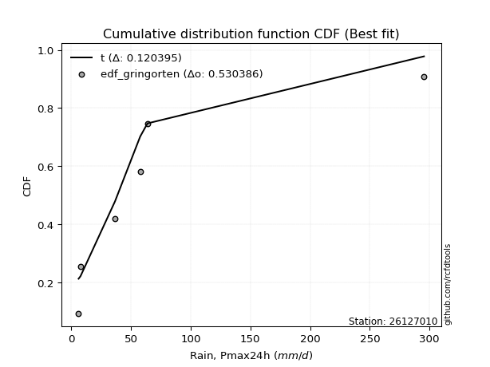</img>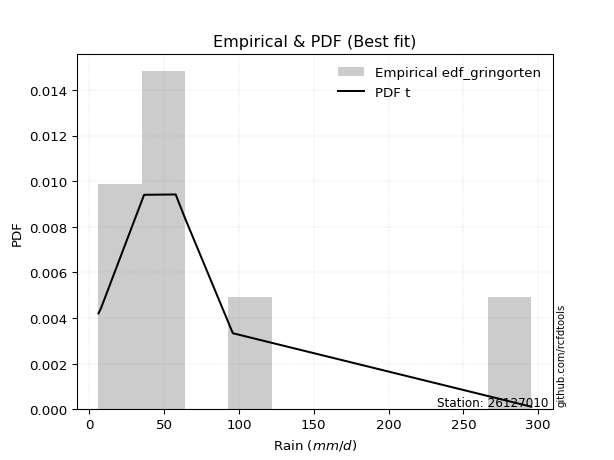</img>

</div>


### 9. Empirical - EDF Filliben (1975)

The specific values of the constants (0.3175) (often denoted as $alpha$) and (0.365) are derived from a method proposed by James J. Filliben in a 1975 paper. This particular formula is the mean value of the $i$-th order statistic of the normal distribution and is considered a robust and effective plotting position formula for the normal probability plot correlation coefficient test for normality.

<div align="center">


$P=(m-0.3175)/(n+0.365)$


</div>


**9.1. Empirical values**

<div align="center">

|                | 0                   | 1                   | 2                  | 3                  | 4                  | 5                  |
|:---------------|:--------------------|:--------------------|:-------------------|:-------------------|:-------------------|:-------------------|
| date           | 2021                | 2022                | 2018               | 2019               | 2020               | 2017               |
| x              | 6.2                 | 7.8                 | 36.7               | 57.8               | 63.9               | 295.4              |
| m              | 1                   | 2                   | 3                  | 4                  | 5                  | 6                  |
| empirical_dist | edf_filliben        | edf_filliben        | edf_filliben       | edf_filliben       | edf_filliben       | edf_filliben       |
| empirical      | 0.10722702278083267 | 0.26433621366849963 | 0.4214454045561665 | 0.5785545954438335 | 0.7356637863315004 | 0.8927729772191673 |
| empirical_tr   | 1.1201055873295205  | 1.3593166043780034  | 1.7284453496266123 | 2.3727865796831313 | 3.783060921248143  | 9.326007326007321  |

</div>


**9.2. Kolmogorov-Smirnov fit test (sorted by Δ)**


<div align="center">

|                | 0                   | 1                   | 2                   | 3                   | 4                     | 5                  | 6                  | 7                   | 8                   | 9                   | 10                  | 11                 | 12                 | 13                  | 14                  | 15                  | 16                  | 17                 | 18                  | 19                  | 20                  | 21                 | 22                  | 23                  | 24                  | 25                  | 26                  | 27                  | 28                 | 29                  | 30                 | 31                  | 32                  | 33                  | 34                  | 35                  | 36                  | 37                 | 38                  | 39                 | 40                  | 41                 | 42                  | 43                  | 44                | 45                | 46                  | 47                  | 48                  | 49                 | 50                  | 51                  | 52                  | 53                  | 54                  | 55                  | 56                  | 57                 | 58                  | 59                  | 60                  | 61                  | 62                 | 63                  | 64                  | 65                  | 66                 | 67                  | 68                 | 69                  | 70                  | 71                 | 72                  | 73                 | 74                  | 75                 | 76                 | 77                 | 78                  | 79                  | 80                 | 81                  | 82                  | 83                 | 84                  | 85                  | 86                | 87                  | 88                 | 89                 |
|:---------------|:--------------------|:--------------------|:--------------------|:--------------------|:----------------------|:-------------------|:-------------------|:--------------------|:--------------------|:--------------------|:--------------------|:-------------------|:-------------------|:--------------------|:--------------------|:--------------------|:--------------------|:-------------------|:--------------------|:--------------------|:--------------------|:-------------------|:--------------------|:--------------------|:--------------------|:--------------------|:--------------------|:--------------------|:-------------------|:--------------------|:-------------------|:--------------------|:--------------------|:--------------------|:--------------------|:--------------------|:--------------------|:-------------------|:--------------------|:-------------------|:--------------------|:-------------------|:--------------------|:--------------------|:------------------|:------------------|:--------------------|:--------------------|:--------------------|:-------------------|:--------------------|:--------------------|:--------------------|:--------------------|:--------------------|:--------------------|:--------------------|:-------------------|:--------------------|:--------------------|:--------------------|:--------------------|:-------------------|:--------------------|:--------------------|:--------------------|:-------------------|:--------------------|:-------------------|:--------------------|:--------------------|:-------------------|:--------------------|:-------------------|:--------------------|:-------------------|:-------------------|:-------------------|:--------------------|:--------------------|:-------------------|:--------------------|:--------------------|:-------------------|:--------------------|:--------------------|:------------------|:--------------------|:-------------------|:-------------------|
| station        | 26127010            | 26127010            | 26127010            | 26127010            | 26127010              | 26127010           | 26127010           | 26127010            | 26127010            | 26127010            | 26127010            | 26127010           | 26127010           | 26127010            | 26127010            | 26127010            | 26127010            | 26127010           | 26127010            | 26127010            | 26127010            | 26127010           | 26127010            | 26127010            | 26127010            | 26127010            | 26127010            | 26127010            | 26127010           | 26127010            | 26127010           | 26127010            | 26127010            | 26127010            | 26127010            | 26127010            | 26127010            | 26127010           | 26127010            | 26127010           | 26127010            | 26127010           | 26127010            | 26127010            | 26127010          | 26127010          | 26127010            | 26127010            | 26127010            | 26127010           | 26127010            | 26127010            | 26127010            | 26127010            | 26127010            | 26127010            | 26127010            | 26127010           | 26127010            | 26127010            | 26127010            | 26127010            | 26127010           | 26127010            | 26127010            | 26127010            | 26127010           | 26127010            | 26127010           | 26127010            | 26127010            | 26127010           | 26127010            | 26127010           | 26127010            | 26127010           | 26127010           | 26127010           | 26127010            | 26127010            | 26127010           | 26127010            | 26127010            | 26127010           | 26127010            | 26127010            | 26127010          | 26127010            | 26127010           | 26127010           |
| empirical_dist | edf_filliben        | edf_filliben        | edf_filliben        | edf_filliben        | edf_filliben          | edf_filliben       | edf_filliben       | edf_filliben        | edf_filliben        | edf_filliben        | edf_filliben        | edf_filliben       | edf_filliben       | edf_filliben        | edf_filliben        | edf_filliben        | edf_filliben        | edf_filliben       | edf_filliben        | edf_filliben        | edf_filliben        | edf_filliben       | edf_filliben        | edf_filliben        | edf_filliben        | edf_filliben        | edf_filliben        | edf_filliben        | edf_filliben       | edf_filliben        | edf_filliben       | edf_filliben        | edf_filliben        | edf_filliben        | edf_filliben        | edf_filliben        | edf_filliben        | edf_filliben       | edf_filliben        | edf_filliben       | edf_filliben        | edf_filliben       | edf_filliben        | edf_filliben        | edf_filliben      | edf_filliben      | edf_filliben        | edf_filliben        | edf_filliben        | edf_filliben       | edf_filliben        | edf_filliben        | edf_filliben        | edf_filliben        | edf_filliben        | edf_filliben        | edf_filliben        | edf_filliben       | edf_filliben        | edf_filliben        | edf_filliben        | edf_filliben        | edf_filliben       | edf_filliben        | edf_filliben        | edf_filliben        | edf_filliben       | edf_filliben        | edf_filliben       | edf_filliben        | edf_filliben        | edf_filliben       | edf_filliben        | edf_filliben       | edf_filliben        | edf_filliben       | edf_filliben       | edf_filliben       | edf_filliben        | edf_filliben        | edf_filliben       | edf_filliben        | edf_filliben        | edf_filliben       | edf_filliben        | edf_filliben        | edf_filliben      | edf_filliben        | edf_filliben       | edf_filliben       |
| p_dist         | t                   | wald                | logfisk             | logloggamma         | loglaplace_asymmetric | logjohnsonsu       | logcrystalball     | lognorm             | lognorm             | logt                | logexponnorm        | lognct             | logpearson3        | logerlang           | loggamma            | loggamma            | logbetaprime        | logf               | logalpha            | loginvgamma         | logmaxwell          | logncf             | loginvgauss         | loggumbel_l         | lograyleigh         | loglogistic         | loginvweibull       | loggenlogistic      | logrice            | loghypsecant        | ncf                | logkstwobign        | betaprime           | loglaplace          | nakagami            | logtruncnorm        | logweibull_min      | loggenexpon        | loggumbel_r         | loghalfnorm        | loggompertz         | logmielke          | pearson3            | halflogistic        | moyal             | genlogistic       | logmoyal            | erlang              | halfnorm            | nct                | logexpon            | gumbel_r            | mielke              | exponnorm           | loghalflogistic     | laplace_asymmetric  | genexpon            | expon              | truncnorm           | gibrat              | gompertz            | rayleigh            | maxwell            | f                   | invgamma            | invgauss            | weibull_min        | logwald             | kstwobign          | pareto              | loggibrat           | logpareto          | norm                | crystalball        | logistic            | hypsecant          | rice               | laplace            | alpha               | fatiguelife         | logchi2            | fisk                | loglognorm          | gumbel_l           | lognakagami         | invweibull          | gamma             | logfatiguelife      | johnsonsu          | chi2               |
| delta          | 0.12321788323351013 | 0.13034633608953594 | 0.13680005730529765 | 0.13721413460171933 | 0.13800959232402457   | 0.1382540766377598 | 0.1384451194654167 | 0.13844512348110177 | 0.13844512348110177 | 0.13844548438085139 | 0.13846237944232673 | 0.1384822730468879 | 0.1395039695395074 | 0.14005634459178173 | 0.14074180001622322 | 0.14074180001622322 | 0.14093295339830803 | 0.1411381388647705 | 0.14129650362348273 | 0.14150206310736343 | 0.14247904051558946 | 0.1429470027094047 | 0.14303700965680108 | 0.14320980432148933 | 0.14572469247685174 | 0.15314897047089937 | 0.15397354600937452 | 0.15468854742408278 | 0.1599572531047887 | 0.16006533312237253 | 0.1611093790826057 | 0.16324734707977517 | 0.16385469111049855 | 0.16545937524021925 | 0.17180877943360318 | 0.17385712158515998 | 0.17529145066683738 | 0.1769748409533215 | 0.17730898973779013 | 0.1790894245177195 | 0.18550761601069687 | 0.1858961265929755 | 0.18628813124496413 | 0.19108106647260148 | 0.200219160990872 | 0.200359564818131 | 0.20587167055436634 | 0.20732315574534022 | 0.21160425404258187 | 0.2179501786410365 | 0.21878227145012008 | 0.22539252125348508 | 0.24052462160488297 | 0.24107990172044208 | 0.24140008619725298 | 0.24227218270942136 | 0.24228841690538158 | 0.2422884259601525 | 0.24438000498493298 | 0.24445129522267223 | 0.24521575429901307 | 0.24541190895110665 | 0.2573834319329146 | 0.25825997028772163 | 0.25826066027258576 | 0.26078920503949765 | 0.2616185889366375 | 0.26433621366849963 | 0.2695614609826631 | 0.26970268323542224 | 0.28321474634099253 | 0.2916394794284785 | 0.29175591605243645 | 0.2917559238050808 | 0.29928460153905356 | 0.3056278470070911 | 0.3151320254557175 | 0.3260941439298097 | 0.32721330907832624 | 0.33081601089519264 | 0.3480963572096857 | 0.34980224212771505 | 0.35634610551899454 | 0.3615819768798871 | 0.39101245729990164 | 0.44483438430767436 | 0.445176415737515 | 0.46105854669883706 | 0.5716234558162729 | 0.5754678125578186 |
| deltao         | 0.530385761606      | 0.530385761606      | 0.530385761606      | 0.530385761606      | 0.530385761606        | 0.530385761606     | 0.530385761606     | 0.530385761606      | 0.530385761606      | 0.530385761606      | 0.530385761606      | 0.530385761606     | 0.530385761606     | 0.530385761606      | 0.530385761606      | 0.530385761606      | 0.530385761606      | 0.530385761606     | 0.530385761606      | 0.530385761606      | 0.530385761606      | 0.530385761606     | 0.530385761606      | 0.530385761606      | 0.530385761606      | 0.530385761606      | 0.530385761606      | 0.530385761606      | 0.530385761606     | 0.530385761606      | 0.530385761606     | 0.530385761606      | 0.530385761606      | 0.530385761606      | 0.530385761606      | 0.530385761606      | 0.530385761606      | 0.530385761606     | 0.530385761606      | 0.530385761606     | 0.530385761606      | 0.530385761606     | 0.530385761606      | 0.530385761606      | 0.530385761606    | 0.530385761606    | 0.530385761606      | 0.530385761606      | 0.530385761606      | 0.530385761606     | 0.530385761606      | 0.530385761606      | 0.530385761606      | 0.530385761606      | 0.530385761606      | 0.530385761606      | 0.530385761606      | 0.530385761606     | 0.530385761606      | 0.530385761606      | 0.530385761606      | 0.530385761606      | 0.530385761606     | 0.530385761606      | 0.530385761606      | 0.530385761606      | 0.530385761606     | 0.530385761606      | 0.530385761606     | 0.530385761606      | 0.530385761606      | 0.530385761606     | 0.530385761606      | 0.530385761606     | 0.530385761606      | 0.530385761606     | 0.530385761606     | 0.530385761606     | 0.530385761606      | 0.530385761606      | 0.530385761606     | 0.530385761606      | 0.530385761606      | 0.530385761606     | 0.530385761606      | 0.530385761606      | 0.530385761606    | 0.530385761606      | 0.530385761606     | 0.530385761606     |
| eval           | Δo > Δ              | Δo > Δ              | Δo > Δ              | Δo > Δ              | Δo > Δ                | Δo > Δ             | Δo > Δ             | Δo > Δ              | Δo > Δ              | Δo > Δ              | Δo > Δ              | Δo > Δ             | Δo > Δ             | Δo > Δ              | Δo > Δ              | Δo > Δ              | Δo > Δ              | Δo > Δ             | Δo > Δ              | Δo > Δ              | Δo > Δ              | Δo > Δ             | Δo > Δ              | Δo > Δ              | Δo > Δ              | Δo > Δ              | Δo > Δ              | Δo > Δ              | Δo > Δ             | Δo > Δ              | Δo > Δ             | Δo > Δ              | Δo > Δ              | Δo > Δ              | Δo > Δ              | Δo > Δ              | Δo > Δ              | Δo > Δ             | Δo > Δ              | Δo > Δ             | Δo > Δ              | Δo > Δ             | Δo > Δ              | Δo > Δ              | Δo > Δ            | Δo > Δ            | Δo > Δ              | Δo > Δ              | Δo > Δ              | Δo > Δ             | Δo > Δ              | Δo > Δ              | Δo > Δ              | Δo > Δ              | Δo > Δ              | Δo > Δ              | Δo > Δ              | Δo > Δ             | Δo > Δ              | Δo > Δ              | Δo > Δ              | Δo > Δ              | Δo > Δ             | Δo > Δ              | Δo > Δ              | Δo > Δ              | Δo > Δ             | Δo > Δ              | Δo > Δ             | Δo > Δ              | Δo > Δ              | Δo > Δ             | Δo > Δ              | Δo > Δ             | Δo > Δ              | Δo > Δ             | Δo > Δ             | Δo > Δ             | Δo > Δ              | Δo > Δ              | Δo > Δ             | Δo > Δ              | Δo > Δ              | Δo > Δ             | Δo > Δ              | Δo > Δ              | Δo > Δ            | Δo > Δ              | Δo <= Δ            | Δo <= Δ            |
| fit            | 1                   | 1                   | 1                   | 1                   | 1                     | 1                  | 1                  | 1                   | 1                   | 1                   | 1                   | 1                  | 1                  | 1                   | 1                   | 1                   | 1                   | 1                  | 1                   | 1                   | 1                   | 1                  | 1                   | 1                   | 1                   | 1                   | 1                   | 1                   | 1                  | 1                   | 1                  | 1                   | 1                   | 1                   | 1                   | 1                   | 1                   | 1                  | 1                   | 1                  | 1                   | 1                  | 1                   | 1                   | 1                 | 1                 | 1                   | 1                   | 1                   | 1                  | 1                   | 1                   | 1                   | 1                   | 1                   | 1                   | 1                   | 1                  | 1                   | 1                   | 1                   | 1                   | 1                  | 1                   | 1                   | 1                   | 1                  | 1                   | 1                  | 1                   | 1                   | 1                  | 1                   | 1                  | 1                   | 1                  | 1                  | 1                  | 1                   | 1                   | 1                  | 1                   | 1                   | 1                  | 1                   | 1                   | 1                 | 1                   | 0                  | 0                  |
| n              | 6                   | 6                   | 6                   | 6                   | 6                     | 6                  | 6                  | 6                   | 6                   | 6                   | 6                   | 6                  | 6                  | 6                   | 6                   | 6                   | 6                   | 6                  | 6                   | 6                   | 6                   | 6                  | 6                   | 6                   | 6                   | 6                   | 6                   | 6                   | 6                  | 6                   | 6                  | 6                   | 6                   | 6                   | 6                   | 6                   | 6                   | 6                  | 6                   | 6                  | 6                   | 6                  | 6                   | 6                   | 6                 | 6                 | 6                   | 6                   | 6                   | 6                  | 6                   | 6                   | 6                   | 6                   | 6                   | 6                   | 6                   | 6                  | 6                   | 6                   | 6                   | 6                   | 6                  | 6                   | 6                   | 6                   | 6                  | 6                   | 6                  | 6                   | 6                   | 6                  | 6                   | 6                  | 6                   | 6                  | 6                  | 6                  | 6                   | 6                   | 6                  | 6                   | 6                   | 6                  | 6                   | 6                   | 6                 | 6                   | 6                  | 6                  |
| best_fit       | 1                   | 0                   | 0                   | 0                   | 0                     | 0                  | 0                  | 0                   | 0                   | 0                   | 0                   | 0                  | 0                  | 0                   | 0                   | 0                   | 0                   | 0                  | 0                   | 0                   | 0                   | 0                  | 0                   | 0                   | 0                   | 0                   | 0                   | 0                   | 0                  | 0                   | 0                  | 0                   | 0                   | 0                   | 0                   | 0                   | 0                   | 0                  | 0                   | 0                  | 0                   | 0                  | 0                   | 0                   | 0                 | 0                 | 0                   | 0                   | 0                   | 0                  | 0                   | 0                   | 0                   | 0                   | 0                   | 0                   | 0                   | 0                  | 0                   | 0                   | 0                   | 0                   | 0                  | 0                   | 0                   | 0                   | 0                  | 0                   | 0                  | 0                   | 0                   | 0                  | 0                   | 0                  | 0                   | 0                  | 0                  | 0                  | 0                   | 0                   | 0                  | 0                   | 0                   | 0                  | 0                   | 0                   | 0                 | 0                   | 0                  | 0                  |
| best_fit_sort  | 1                   | 2                   | 3                   | 4                   | 5                     | 6                  | 7                  | 8                   | 9                   | 10                  | 11                  | 12                 | 13                 | 14                  | 15                  | 16                  | 17                  | 18                 | 19                  | 20                  | 21                  | 22                 | 23                  | 24                  | 25                  | 26                  | 27                  | 28                  | 29                 | 30                  | 31                 | 32                  | 33                  | 34                  | 35                  | 36                  | 37                  | 38                 | 39                  | 40                 | 41                  | 42                 | 43                  | 44                  | 45                | 46                | 47                  | 48                  | 49                  | 50                 | 51                  | 52                  | 53                  | 54                  | 55                  | 56                  | 57                  | 58                 | 59                  | 60                  | 61                  | 62                  | 63                 | 64                  | 65                  | 66                  | 67                 | 68                  | 69                 | 70                  | 71                  | 72                 | 73                  | 74                 | 75                  | 76                 | 77                 | 78                 | 79                  | 80                  | 81                 | 82                  | 83                  | 84                 | 85                  | 86                  | 87                | 88                  | 89                 | 90                 |

</div>


<div align="center">

</img>

</div>


**9.3. Best fit**

<div align="center">

|   id |   station | empirical_dist   | p_dist   |    delta |   deltao | eval   |   fit |   n |   best_fit |   best_fit_sort |
|-----:|----------:|:-----------------|:---------|---------:|---------:|:-------|------:|----:|-----------:|----------------:|
|    0 |  26127010 | edf_filliben     | t        | 0.123218 | 0.530386 | Δo > Δ |     1 |   6 |          1 |               1 |

</div>


<div align="center">

</img>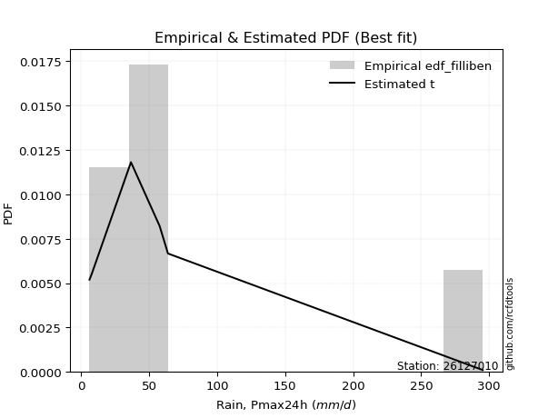</img>

</div>


### 10. Empirical - EDF Jenkinson (1977)

The Jenkinson formula in hydrology is an empirical plotting position formula used to estimate the non-exceedance probability _(P)_ or return period _(T)_ of a given ordered observation within a sample. It is a widely used method in the frequency analysis of extreme events such as floods and rainfall, as it provides a distribution-free way to plot data. _a≈0.31_ and _b≈0.38_ are constants derived to approximate the median of the probability distribution for the given rank.

<div align="center">


$P=(m-a)/(n+b)$


</div>


**10.1. Empirical values**

<div align="center">

|                | 0                   | 1                   | 2                  | 3                  | 4                  | 5                  |
|:---------------|:--------------------|:--------------------|:-------------------|:-------------------|:-------------------|:-------------------|
| date           | 2021                | 2022                | 2018               | 2019               | 2020               | 2017               |
| x              | 6.2                 | 7.8                 | 36.7               | 57.8               | 63.9               | 295.4              |
| m              | 1                   | 2                   | 3                  | 4                  | 5                  | 6                  |
| empirical_dist | edf_jenkinson       | edf_jenkinson       | edf_jenkinson      | edf_jenkinson      | edf_jenkinson      | edf_jenkinson      |
| empirical      | 0.10815047021943573 | 0.26489028213166144 | 0.4216300940438871 | 0.5783699059561128 | 0.7351097178683387 | 0.8918495297805643 |
| empirical_tr   | 1.1212653778558874  | 1.3603411513859276  | 1.7289972899728996 | 2.3717472118959106 | 3.7751479289940844 | 9.246376811594207  |

</div>


**10.2. Kolmogorov-Smirnov fit test (sorted by Δ)**


<div align="center">

|                | 0                   | 1                  | 2                   | 3                   | 4                     | 5                  | 6                   | 7                   | 8                   | 9                  | 10                  | 11                 | 12                 | 13                  | 14                  | 15                  | 16                  | 17                 | 18                  | 19                  | 20                  | 21                 | 22                  | 23                  | 24                  | 25                  | 26                  | 27                  | 28                 | 29                  | 30                 | 31                  | 32                  | 33                  | 34                  | 35                  | 36                  | 37                 | 38                  | 39                 | 40                 | 41                  | 42                  | 43                  | 44                  | 45                  | 46                  | 47                 | 48                  | 49                 | 50                  | 51                  | 52                  | 53                  | 54                  | 55                  | 56                 | 57                 | 58                 | 59                  | 60                  | 61                  | 62                 | 63                  | 64                  | 65                  | 66                 | 67                  | 68                  | 69                  | 70                 | 71                 | 72                 | 73                  | 74                 | 75                  | 76                  | 77                 | 78                  | 79                  | 80                 | 81                 | 82                  | 83                  | 84                  | 85                 | 86                 | 87                  | 88                 | 89                 |
|:---------------|:--------------------|:-------------------|:--------------------|:--------------------|:----------------------|:-------------------|:--------------------|:--------------------|:--------------------|:-------------------|:--------------------|:-------------------|:-------------------|:--------------------|:--------------------|:--------------------|:--------------------|:-------------------|:--------------------|:--------------------|:--------------------|:-------------------|:--------------------|:--------------------|:--------------------|:--------------------|:--------------------|:--------------------|:-------------------|:--------------------|:-------------------|:--------------------|:--------------------|:--------------------|:--------------------|:--------------------|:--------------------|:-------------------|:--------------------|:-------------------|:-------------------|:--------------------|:--------------------|:--------------------|:--------------------|:--------------------|:--------------------|:-------------------|:--------------------|:-------------------|:--------------------|:--------------------|:--------------------|:--------------------|:--------------------|:--------------------|:-------------------|:-------------------|:-------------------|:--------------------|:--------------------|:--------------------|:-------------------|:--------------------|:--------------------|:--------------------|:-------------------|:--------------------|:--------------------|:--------------------|:-------------------|:-------------------|:-------------------|:--------------------|:-------------------|:--------------------|:--------------------|:-------------------|:--------------------|:--------------------|:-------------------|:-------------------|:--------------------|:--------------------|:--------------------|:-------------------|:-------------------|:--------------------|:-------------------|:-------------------|
| station        | 26127010            | 26127010           | 26127010            | 26127010            | 26127010              | 26127010           | 26127010            | 26127010            | 26127010            | 26127010           | 26127010            | 26127010           | 26127010           | 26127010            | 26127010            | 26127010            | 26127010            | 26127010           | 26127010            | 26127010            | 26127010            | 26127010           | 26127010            | 26127010            | 26127010            | 26127010            | 26127010            | 26127010            | 26127010           | 26127010            | 26127010           | 26127010            | 26127010            | 26127010            | 26127010            | 26127010            | 26127010            | 26127010           | 26127010            | 26127010           | 26127010           | 26127010            | 26127010            | 26127010            | 26127010            | 26127010            | 26127010            | 26127010           | 26127010            | 26127010           | 26127010            | 26127010            | 26127010            | 26127010            | 26127010            | 26127010            | 26127010           | 26127010           | 26127010           | 26127010            | 26127010            | 26127010            | 26127010           | 26127010            | 26127010            | 26127010            | 26127010           | 26127010            | 26127010            | 26127010            | 26127010           | 26127010           | 26127010           | 26127010            | 26127010           | 26127010            | 26127010            | 26127010           | 26127010            | 26127010            | 26127010           | 26127010           | 26127010            | 26127010            | 26127010            | 26127010           | 26127010           | 26127010            | 26127010           | 26127010           |
| empirical_dist | edf_jenkinson       | edf_jenkinson      | edf_jenkinson       | edf_jenkinson       | edf_jenkinson         | edf_jenkinson      | edf_jenkinson       | edf_jenkinson       | edf_jenkinson       | edf_jenkinson      | edf_jenkinson       | edf_jenkinson      | edf_jenkinson      | edf_jenkinson       | edf_jenkinson       | edf_jenkinson       | edf_jenkinson       | edf_jenkinson      | edf_jenkinson       | edf_jenkinson       | edf_jenkinson       | edf_jenkinson      | edf_jenkinson       | edf_jenkinson       | edf_jenkinson       | edf_jenkinson       | edf_jenkinson       | edf_jenkinson       | edf_jenkinson      | edf_jenkinson       | edf_jenkinson      | edf_jenkinson       | edf_jenkinson       | edf_jenkinson       | edf_jenkinson       | edf_jenkinson       | edf_jenkinson       | edf_jenkinson      | edf_jenkinson       | edf_jenkinson      | edf_jenkinson      | edf_jenkinson       | edf_jenkinson       | edf_jenkinson       | edf_jenkinson       | edf_jenkinson       | edf_jenkinson       | edf_jenkinson      | edf_jenkinson       | edf_jenkinson      | edf_jenkinson       | edf_jenkinson       | edf_jenkinson       | edf_jenkinson       | edf_jenkinson       | edf_jenkinson       | edf_jenkinson      | edf_jenkinson      | edf_jenkinson      | edf_jenkinson       | edf_jenkinson       | edf_jenkinson       | edf_jenkinson      | edf_jenkinson       | edf_jenkinson       | edf_jenkinson       | edf_jenkinson      | edf_jenkinson       | edf_jenkinson       | edf_jenkinson       | edf_jenkinson      | edf_jenkinson      | edf_jenkinson      | edf_jenkinson       | edf_jenkinson      | edf_jenkinson       | edf_jenkinson       | edf_jenkinson      | edf_jenkinson       | edf_jenkinson       | edf_jenkinson      | edf_jenkinson      | edf_jenkinson       | edf_jenkinson       | edf_jenkinson       | edf_jenkinson      | edf_jenkinson      | edf_jenkinson       | edf_jenkinson      | edf_jenkinson      |
| p_dist         | t                   | wald               | logfisk             | logloggamma         | loglaplace_asymmetric | logjohnsonsu       | logcrystalball      | lognorm             | lognorm             | logt               | logexponnorm        | lognct             | logpearson3        | logerlang           | logbetaprime        | loggamma            | loggamma            | logf               | logalpha            | loginvgamma         | logmaxwell          | logncf             | loginvgauss         | loggumbel_l         | lograyleigh         | loglogistic         | loginvweibull       | loggenlogistic      | logrice            | loghypsecant        | ncf                | logkstwobign        | betaprime           | loglaplace          | nakagami            | logtruncnorm        | logweibull_min      | loggenexpon        | loggumbel_r         | loghalfnorm        | logmielke          | pearson3            | loggompertz         | halflogistic        | moyal               | genlogistic         | logmoyal            | erlang             | halfnorm            | nct                | logexpon            | gumbel_r            | mielke              | exponnorm           | loghalflogistic     | laplace_asymmetric  | genexpon           | expon              | rayleigh           | truncnorm           | gibrat              | gompertz            | maxwell            | f                   | invgamma            | invgauss            | weibull_min        | logwald             | kstwobign           | pareto              | loggibrat          | logpareto          | norm               | crystalball         | logistic           | hypsecant           | rice                | laplace            | alpha               | fatiguelife         | logchi2            | fisk               | loglognorm          | gumbel_l            | lognakagami         | invweibull         | gamma              | logfatiguelife      | johnsonsu          | chi2               |
| delta          | 0.12340257272123079 | 0.1297922676263742 | 0.13735412576845946 | 0.13776820306488113 | 0.13856366078718638   | 0.1388081451009216 | 0.13899918792857852 | 0.13899919194426358 | 0.13899919194426358 | 0.1389995528440132 | 0.13901644790548853 | 0.1390363415100497 | 0.1400580380026692 | 0.14061041305494354 | 0.14081479539916533 | 0.14129586847938502 | 0.14129586847938502 | 0.1416922073279323 | 0.14185057208664453 | 0.14205613157052524 | 0.14303310897875127 | 0.1435010711725665 | 0.14359107811996288 | 0.14376387278465114 | 0.14627876094001355 | 0.15370303893406118 | 0.15378885652165392 | 0.15450385793636218 | 0.1605113215679505 | 0.16061940158553434 | 0.1609246895948851 | 0.16306265759205457 | 0.16367000162277795 | 0.16601344370338106 | 0.17162408994588257 | 0.17441119004832178 | 0.17510676117911678 | 0.1767901514656009 | 0.17786305820095194 | 0.1796434929808813 | 0.1857114371052549 | 0.18573406278180238 | 0.18606168447385868 | 0.19052699800943973 | 0.19966509252771025 | 0.19980549635496925 | 0.20642573901752814 | 0.2071384662576196 | 0.21105018557942012 | 0.2177654891533159 | 0.21859758196239948 | 0.22483845279032333 | 0.24033993211716237 | 0.24163397018360389 | 0.24195415466041478 | 0.24282625117258316 | 0.2428424853685434 | 0.2428424944233143 | 0.2448578404879449 | 0.24493407344809479 | 0.24500536368583403 | 0.24576982276217488 | 0.2568293634697528 | 0.25807528080000103 | 0.25807597078486516 | 0.26060451555177705 | 0.2610645204734757 | 0.26489028213166144 | 0.26900739251950134 | 0.26951799374770163 | 0.2830300568532719 | 0.2910854109653167 | 0.2912018475892747 | 0.29120185534191906 | 0.2987305330758918 | 0.30507377854392936 | 0.31457795699255575 | 0.3255400754666479 | 0.32702861959060564 | 0.33063132140747203 | 0.3479116677219651 | 0.3488787946891121 | 0.35579203705583273 | 0.36102790841672533 | 0.39082776781218104 | 0.4439109368690714 | 0.4449917262497944 | 0.46087385721111646 | 0.5710693873531111 | 0.5752831230700981 |
| deltao         | 0.530385761606      | 0.530385761606     | 0.530385761606      | 0.530385761606      | 0.530385761606        | 0.530385761606     | 0.530385761606      | 0.530385761606      | 0.530385761606      | 0.530385761606     | 0.530385761606      | 0.530385761606     | 0.530385761606     | 0.530385761606      | 0.530385761606      | 0.530385761606      | 0.530385761606      | 0.530385761606     | 0.530385761606      | 0.530385761606      | 0.530385761606      | 0.530385761606     | 0.530385761606      | 0.530385761606      | 0.530385761606      | 0.530385761606      | 0.530385761606      | 0.530385761606      | 0.530385761606     | 0.530385761606      | 0.530385761606     | 0.530385761606      | 0.530385761606      | 0.530385761606      | 0.530385761606      | 0.530385761606      | 0.530385761606      | 0.530385761606     | 0.530385761606      | 0.530385761606     | 0.530385761606     | 0.530385761606      | 0.530385761606      | 0.530385761606      | 0.530385761606      | 0.530385761606      | 0.530385761606      | 0.530385761606     | 0.530385761606      | 0.530385761606     | 0.530385761606      | 0.530385761606      | 0.530385761606      | 0.530385761606      | 0.530385761606      | 0.530385761606      | 0.530385761606     | 0.530385761606     | 0.530385761606     | 0.530385761606      | 0.530385761606      | 0.530385761606      | 0.530385761606     | 0.530385761606      | 0.530385761606      | 0.530385761606      | 0.530385761606     | 0.530385761606      | 0.530385761606      | 0.530385761606      | 0.530385761606     | 0.530385761606     | 0.530385761606     | 0.530385761606      | 0.530385761606     | 0.530385761606      | 0.530385761606      | 0.530385761606     | 0.530385761606      | 0.530385761606      | 0.530385761606     | 0.530385761606     | 0.530385761606      | 0.530385761606      | 0.530385761606      | 0.530385761606     | 0.530385761606     | 0.530385761606      | 0.530385761606     | 0.530385761606     |
| eval           | Δo > Δ              | Δo > Δ             | Δo > Δ              | Δo > Δ              | Δo > Δ                | Δo > Δ             | Δo > Δ              | Δo > Δ              | Δo > Δ              | Δo > Δ             | Δo > Δ              | Δo > Δ             | Δo > Δ             | Δo > Δ              | Δo > Δ              | Δo > Δ              | Δo > Δ              | Δo > Δ             | Δo > Δ              | Δo > Δ              | Δo > Δ              | Δo > Δ             | Δo > Δ              | Δo > Δ              | Δo > Δ              | Δo > Δ              | Δo > Δ              | Δo > Δ              | Δo > Δ             | Δo > Δ              | Δo > Δ             | Δo > Δ              | Δo > Δ              | Δo > Δ              | Δo > Δ              | Δo > Δ              | Δo > Δ              | Δo > Δ             | Δo > Δ              | Δo > Δ             | Δo > Δ             | Δo > Δ              | Δo > Δ              | Δo > Δ              | Δo > Δ              | Δo > Δ              | Δo > Δ              | Δo > Δ             | Δo > Δ              | Δo > Δ             | Δo > Δ              | Δo > Δ              | Δo > Δ              | Δo > Δ              | Δo > Δ              | Δo > Δ              | Δo > Δ             | Δo > Δ             | Δo > Δ             | Δo > Δ              | Δo > Δ              | Δo > Δ              | Δo > Δ             | Δo > Δ              | Δo > Δ              | Δo > Δ              | Δo > Δ             | Δo > Δ              | Δo > Δ              | Δo > Δ              | Δo > Δ             | Δo > Δ             | Δo > Δ             | Δo > Δ              | Δo > Δ             | Δo > Δ              | Δo > Δ              | Δo > Δ             | Δo > Δ              | Δo > Δ              | Δo > Δ             | Δo > Δ             | Δo > Δ              | Δo > Δ              | Δo > Δ              | Δo > Δ             | Δo > Δ             | Δo > Δ              | Δo <= Δ            | Δo <= Δ            |
| fit            | 1                   | 1                  | 1                   | 1                   | 1                     | 1                  | 1                   | 1                   | 1                   | 1                  | 1                   | 1                  | 1                  | 1                   | 1                   | 1                   | 1                   | 1                  | 1                   | 1                   | 1                   | 1                  | 1                   | 1                   | 1                   | 1                   | 1                   | 1                   | 1                  | 1                   | 1                  | 1                   | 1                   | 1                   | 1                   | 1                   | 1                   | 1                  | 1                   | 1                  | 1                  | 1                   | 1                   | 1                   | 1                   | 1                   | 1                   | 1                  | 1                   | 1                  | 1                   | 1                   | 1                   | 1                   | 1                   | 1                   | 1                  | 1                  | 1                  | 1                   | 1                   | 1                   | 1                  | 1                   | 1                   | 1                   | 1                  | 1                   | 1                   | 1                   | 1                  | 1                  | 1                  | 1                   | 1                  | 1                   | 1                   | 1                  | 1                   | 1                   | 1                  | 1                  | 1                   | 1                   | 1                   | 1                  | 1                  | 1                   | 0                  | 0                  |
| n              | 6                   | 6                  | 6                   | 6                   | 6                     | 6                  | 6                   | 6                   | 6                   | 6                  | 6                   | 6                  | 6                  | 6                   | 6                   | 6                   | 6                   | 6                  | 6                   | 6                   | 6                   | 6                  | 6                   | 6                   | 6                   | 6                   | 6                   | 6                   | 6                  | 6                   | 6                  | 6                   | 6                   | 6                   | 6                   | 6                   | 6                   | 6                  | 6                   | 6                  | 6                  | 6                   | 6                   | 6                   | 6                   | 6                   | 6                   | 6                  | 6                   | 6                  | 6                   | 6                   | 6                   | 6                   | 6                   | 6                   | 6                  | 6                  | 6                  | 6                   | 6                   | 6                   | 6                  | 6                   | 6                   | 6                   | 6                  | 6                   | 6                   | 6                   | 6                  | 6                  | 6                  | 6                   | 6                  | 6                   | 6                   | 6                  | 6                   | 6                   | 6                  | 6                  | 6                   | 6                   | 6                   | 6                  | 6                  | 6                   | 6                  | 6                  |
| best_fit       | 1                   | 0                  | 0                   | 0                   | 0                     | 0                  | 0                   | 0                   | 0                   | 0                  | 0                   | 0                  | 0                  | 0                   | 0                   | 0                   | 0                   | 0                  | 0                   | 0                   | 0                   | 0                  | 0                   | 0                   | 0                   | 0                   | 0                   | 0                   | 0                  | 0                   | 0                  | 0                   | 0                   | 0                   | 0                   | 0                   | 0                   | 0                  | 0                   | 0                  | 0                  | 0                   | 0                   | 0                   | 0                   | 0                   | 0                   | 0                  | 0                   | 0                  | 0                   | 0                   | 0                   | 0                   | 0                   | 0                   | 0                  | 0                  | 0                  | 0                   | 0                   | 0                   | 0                  | 0                   | 0                   | 0                   | 0                  | 0                   | 0                   | 0                   | 0                  | 0                  | 0                  | 0                   | 0                  | 0                   | 0                   | 0                  | 0                   | 0                   | 0                  | 0                  | 0                   | 0                   | 0                   | 0                  | 0                  | 0                   | 0                  | 0                  |
| best_fit_sort  | 1                   | 2                  | 3                   | 4                   | 5                     | 6                  | 7                   | 8                   | 9                   | 10                 | 11                  | 12                 | 13                 | 14                  | 15                  | 16                  | 17                  | 18                 | 19                  | 20                  | 21                  | 22                 | 23                  | 24                  | 25                  | 26                  | 27                  | 28                  | 29                 | 30                  | 31                 | 32                  | 33                  | 34                  | 35                  | 36                  | 37                  | 38                 | 39                  | 40                 | 41                 | 42                  | 43                  | 44                  | 45                  | 46                  | 47                  | 48                 | 49                  | 50                 | 51                  | 52                  | 53                  | 54                  | 55                  | 56                  | 57                 | 58                 | 59                 | 60                  | 61                  | 62                  | 63                 | 64                  | 65                  | 66                  | 67                 | 68                  | 69                  | 70                  | 71                 | 72                 | 73                 | 74                  | 75                 | 76                  | 77                  | 78                 | 79                  | 80                  | 81                 | 82                 | 83                  | 84                  | 85                  | 86                 | 87                 | 88                  | 89                 | 90                 |

</div>


<div align="center">

</img>

</div>


**10.3. Best fit**

<div align="center">

|   id |   station | empirical_dist   | p_dist   |    delta |   deltao | eval   |   fit |   n |   best_fit |   best_fit_sort |
|-----:|----------:|:-----------------|:---------|---------:|---------:|:-------|------:|----:|-----------:|----------------:|
|    0 |  26127010 | edf_jenkinson    | t        | 0.123403 | 0.530386 | Δo > Δ |     1 |   6 |          1 |               1 |

</div>


<div align="center">

</img>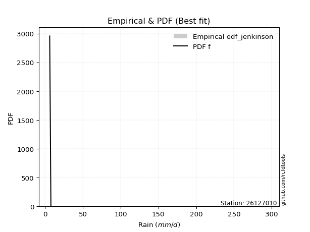</img>

</div>


### 11. Empirical - EDF Cunnane (1978)

Cunnane´s work in statistical hydrology has focused on the performance and evaluation of different probability distributions (such as GEV, Gumbel, Lognormal) for flood frequency estimation. _b_ is a constant, typically set to 0.4.

<div align="center">


$P=(m-b)/(n+1-2b)$


</div>


**11.1. Empirical values**

<div align="center">

|                | 0                  | 1                   | 2                   | 3                  | 4                  | 5                  |
|:---------------|:-------------------|:--------------------|:--------------------|:-------------------|:-------------------|:-------------------|
| date           | 2021               | 2022                | 2018                | 2019               | 2020               | 2017               |
| x              | 6.2                | 7.8                 | 36.7                | 57.8               | 63.9               | 295.4              |
| m              | 1                  | 2                   | 3                   | 4                  | 5                  | 6                  |
| empirical_dist | edf_cunnane        | edf_cunnane         | edf_cunnane         | edf_cunnane        | edf_cunnane        | edf_cunnane        |
| empirical      | 0.0967741935483871 | 0.25806451612903225 | 0.41935483870967744 | 0.5806451612903226 | 0.7419354838709676 | 0.9032258064516128 |
| empirical_tr   | 1.1071428571428572 | 1.3478260869565217  | 1.7222222222222225  | 2.384615384615385  | 3.8749999999999982 | 10.333333333333318 |

</div>


**11.2. Kolmogorov-Smirnov fit test (sorted by Δ)**


<div align="center">

|                | 0                   | 1                   | 2                   | 3                     | 4                  | 5                   | 6                  | 7                  | 8                 | 9                   | 10                  | 11               | 12                  | 13                  | 14                  | 15                  | 16                  | 17                  | 18                  | 19                  | 20                 | 21                  | 22                  | 23                  | 24                  | 25                | 26                  | 27                  | 28                 | 29                  | 30                  | 31                 | 32                  | 33                  | 34                  | 35                  | 36                  | 37                 | 38                  | 39                 | 40                 | 41                 | 42                  | 43                 | 44                  | 45                  | 46                 | 47                 | 48                 | 49                  | 50                  | 51                 | 52                 | 53                 | 54                  | 55                 | 56                 | 57                 | 58                  | 59                 | 60                  | 61                  | 62                  | 63                 | 64                  | 65                  | 66                 | 67                 | 68                 | 69                 | 70                 | 71                 | 72                  | 73                | 74                 | 75                 | 76                 | 77                  | 78                 | 79                 | 80                  | 81                  | 82                 | 83                 | 84                  | 85                 | 86                  | 87                  | 88                 | 89                 |
|:---------------|:--------------------|:--------------------|:--------------------|:----------------------|:-------------------|:--------------------|:-------------------|:-------------------|:------------------|:--------------------|:--------------------|:-----------------|:--------------------|:--------------------|:--------------------|:--------------------|:--------------------|:--------------------|:--------------------|:--------------------|:-------------------|:--------------------|:--------------------|:--------------------|:--------------------|:------------------|:--------------------|:--------------------|:-------------------|:--------------------|:--------------------|:-------------------|:--------------------|:--------------------|:--------------------|:--------------------|:--------------------|:-------------------|:--------------------|:-------------------|:-------------------|:-------------------|:--------------------|:-------------------|:--------------------|:--------------------|:-------------------|:-------------------|:-------------------|:--------------------|:--------------------|:-------------------|:-------------------|:-------------------|:--------------------|:-------------------|:-------------------|:-------------------|:--------------------|:-------------------|:--------------------|:--------------------|:--------------------|:-------------------|:--------------------|:--------------------|:-------------------|:-------------------|:-------------------|:-------------------|:-------------------|:-------------------|:--------------------|:------------------|:-------------------|:-------------------|:-------------------|:--------------------|:-------------------|:-------------------|:--------------------|:--------------------|:-------------------|:-------------------|:--------------------|:-------------------|:--------------------|:--------------------|:-------------------|:-------------------|
| station        | 26127010            | 26127010            | 26127010            | 26127010              | 26127010           | 26127010            | 26127010           | 26127010           | 26127010          | 26127010            | 26127010            | 26127010         | 26127010            | 26127010            | 26127010            | 26127010            | 26127010            | 26127010            | 26127010            | 26127010            | 26127010           | 26127010            | 26127010            | 26127010            | 26127010            | 26127010          | 26127010            | 26127010            | 26127010           | 26127010            | 26127010            | 26127010           | 26127010            | 26127010            | 26127010            | 26127010            | 26127010            | 26127010           | 26127010            | 26127010           | 26127010           | 26127010           | 26127010            | 26127010           | 26127010            | 26127010            | 26127010           | 26127010           | 26127010           | 26127010            | 26127010            | 26127010           | 26127010           | 26127010           | 26127010            | 26127010           | 26127010           | 26127010           | 26127010            | 26127010           | 26127010            | 26127010            | 26127010            | 26127010           | 26127010            | 26127010            | 26127010           | 26127010           | 26127010           | 26127010           | 26127010           | 26127010           | 26127010            | 26127010          | 26127010           | 26127010           | 26127010           | 26127010            | 26127010           | 26127010           | 26127010            | 26127010            | 26127010           | 26127010           | 26127010            | 26127010           | 26127010            | 26127010            | 26127010           | 26127010           |
| empirical_dist | edf_cunnane         | edf_cunnane         | edf_cunnane         | edf_cunnane           | edf_cunnane        | edf_cunnane         | edf_cunnane        | edf_cunnane        | edf_cunnane       | edf_cunnane         | edf_cunnane         | edf_cunnane      | edf_cunnane         | edf_cunnane         | edf_cunnane         | edf_cunnane         | edf_cunnane         | edf_cunnane         | edf_cunnane         | edf_cunnane         | edf_cunnane        | edf_cunnane         | edf_cunnane         | edf_cunnane         | edf_cunnane         | edf_cunnane       | edf_cunnane         | edf_cunnane         | edf_cunnane        | edf_cunnane         | edf_cunnane         | edf_cunnane        | edf_cunnane         | edf_cunnane         | edf_cunnane         | edf_cunnane         | edf_cunnane         | edf_cunnane        | edf_cunnane         | edf_cunnane        | edf_cunnane        | edf_cunnane        | edf_cunnane         | edf_cunnane        | edf_cunnane         | edf_cunnane         | edf_cunnane        | edf_cunnane        | edf_cunnane        | edf_cunnane         | edf_cunnane         | edf_cunnane        | edf_cunnane        | edf_cunnane        | edf_cunnane         | edf_cunnane        | edf_cunnane        | edf_cunnane        | edf_cunnane         | edf_cunnane        | edf_cunnane         | edf_cunnane         | edf_cunnane         | edf_cunnane        | edf_cunnane         | edf_cunnane         | edf_cunnane        | edf_cunnane        | edf_cunnane        | edf_cunnane        | edf_cunnane        | edf_cunnane        | edf_cunnane         | edf_cunnane       | edf_cunnane        | edf_cunnane        | edf_cunnane        | edf_cunnane         | edf_cunnane        | edf_cunnane        | edf_cunnane         | edf_cunnane         | edf_cunnane        | edf_cunnane        | edf_cunnane         | edf_cunnane        | edf_cunnane         | edf_cunnane         | edf_cunnane        | edf_cunnane        |
| p_dist         | t                   | logfisk             | logloggamma         | loglaplace_asymmetric | logjohnsonsu       | logcrystalball      | lognorm            | lognorm            | logt              | logexponnorm        | lognct              | logpearson3      | logerlang           | loggamma            | loggamma            | logf                | logalpha            | loginvgamma         | logmaxwell          | wald                | logncf             | loggumbel_l         | loginvgauss         | lograyleigh         | logbetaprime        | loglogistic       | logrice             | loghypsecant        | loginvweibull      | loggenlogistic      | loglaplace          | ncf                | logkstwobign        | betaprime           | loggumbel_r         | loghalfnorm         | nakagami            | logtruncnorm       | logweibull_min      | loggenexpon        | loggompertz        | logmielke          | pearson3            | halflogistic       | logmoyal            | moyal               | genlogistic        | erlang             | halfnorm           | nct                 | logexpon            | gumbel_r           | exponnorm          | loghalflogistic    | laplace_asymmetric  | genexpon           | expon              | truncnorm          | gibrat              | gompertz           | mielke              | rayleigh            | logwald             | f                  | invgamma            | invgauss            | maxwell            | weibull_min        | pareto             | kstwobign          | loggibrat          | logpareto          | norm                | crystalball       | logistic           | hypsecant          | rice               | alpha               | laplace            | fatiguelife        | logchi2             | fisk                | loglognorm         | gumbel_l           | lognakagami         | gamma              | invweibull          | logfatiguelife      | chi2               | johnsonsu          |
| delta          | 0.12112731738702098 | 0.13052835976583027 | 0.13094243706225195 | 0.1317378947845572    | 0.1319823790982924 | 0.13217342192594933 | 0.1321734259416344 | 0.1321734259416344 | 0.132173786841384 | 0.13219068190285935 | 0.13221057550742052 | 0.13323227200004 | 0.13378464705231435 | 0.13447010247675584 | 0.13447010247675584 | 0.13486644132530312 | 0.13502480608401535 | 0.13523036556789605 | 0.13620734297612208 | 0.13661803362900315 | 0.1366753051699373 | 0.13693810678202195 | 0.13777999072907526 | 0.13945299493738436 | 0.14302351924479711 | 0.146877272931432 | 0.15368555556532132 | 0.15379363558290515 | 0.1560641118558636 | 0.15677911327057187 | 0.15918767770075187 | 0.1631999449290948 | 0.16533791292626426 | 0.16594525695698764 | 0.17103729219832275 | 0.17281772697825212 | 0.17389934528009227 | 0.1739088977859346 | 0.17738201651332647 | 0.1790654067998106 | 0.1792359184712295 | 0.1879866924394646 | 0.19255982878443134 | 0.1973527640120687 | 0.19959997301489896 | 0.20649085853033922 | 0.2066312623575982 | 0.2094137215918293 | 0.2178759515820491 | 0.22004074448752559 | 0.22087283729660917 | 0.2316642187929523 | 0.2348082041809747 | 0.2351283886577856 | 0.23600048516995398 | 0.2360167193659142 | 0.2360167284206851 | 0.2381083074454656 | 0.23817959768320485 | 0.2404069658104323 | 0.24261518745137206 | 0.25168360649057386 | 0.26022878763350205 | 0.2603505361342107 | 0.26035122611907485 | 0.26287977088598674 | 0.2636551294723818 | 0.2678902864761047 | 0.2717932490819113 | 0.2758331585221303 | 0.2853053121874816 | 0.2979111769679459 | 0.29802761359190366 | 0.298027621344548 | 0.3055562990785208 | 0.3118995445465583 | 0.3214037229951847 | 0.32930387492481533 | 0.3323658414692769 | 0.3329065767416817 | 0.35018692305617477 | 0.36025507136016055 | 0.3626178030584619 | 0.3678536744193543 | 0.39310302314639073 | 0.4472669815840041 | 0.45528721354011986 | 0.46314911254532615 | 0.5775583784043077 | 0.5778951533557403 |
| deltao         | 0.530385761606      | 0.530385761606      | 0.530385761606      | 0.530385761606        | 0.530385761606     | 0.530385761606      | 0.530385761606     | 0.530385761606     | 0.530385761606    | 0.530385761606      | 0.530385761606      | 0.530385761606   | 0.530385761606      | 0.530385761606      | 0.530385761606      | 0.530385761606      | 0.530385761606      | 0.530385761606      | 0.530385761606      | 0.530385761606      | 0.530385761606     | 0.530385761606      | 0.530385761606      | 0.530385761606      | 0.530385761606      | 0.530385761606    | 0.530385761606      | 0.530385761606      | 0.530385761606     | 0.530385761606      | 0.530385761606      | 0.530385761606     | 0.530385761606      | 0.530385761606      | 0.530385761606      | 0.530385761606      | 0.530385761606      | 0.530385761606     | 0.530385761606      | 0.530385761606     | 0.530385761606     | 0.530385761606     | 0.530385761606      | 0.530385761606     | 0.530385761606      | 0.530385761606      | 0.530385761606     | 0.530385761606     | 0.530385761606     | 0.530385761606      | 0.530385761606      | 0.530385761606     | 0.530385761606     | 0.530385761606     | 0.530385761606      | 0.530385761606     | 0.530385761606     | 0.530385761606     | 0.530385761606      | 0.530385761606     | 0.530385761606      | 0.530385761606      | 0.530385761606      | 0.530385761606     | 0.530385761606      | 0.530385761606      | 0.530385761606     | 0.530385761606     | 0.530385761606     | 0.530385761606     | 0.530385761606     | 0.530385761606     | 0.530385761606      | 0.530385761606    | 0.530385761606     | 0.530385761606     | 0.530385761606     | 0.530385761606      | 0.530385761606     | 0.530385761606     | 0.530385761606      | 0.530385761606      | 0.530385761606     | 0.530385761606     | 0.530385761606      | 0.530385761606     | 0.530385761606      | 0.530385761606      | 0.530385761606     | 0.530385761606     |
| eval           | Δo > Δ              | Δo > Δ              | Δo > Δ              | Δo > Δ                | Δo > Δ             | Δo > Δ              | Δo > Δ             | Δo > Δ             | Δo > Δ            | Δo > Δ              | Δo > Δ              | Δo > Δ           | Δo > Δ              | Δo > Δ              | Δo > Δ              | Δo > Δ              | Δo > Δ              | Δo > Δ              | Δo > Δ              | Δo > Δ              | Δo > Δ             | Δo > Δ              | Δo > Δ              | Δo > Δ              | Δo > Δ              | Δo > Δ            | Δo > Δ              | Δo > Δ              | Δo > Δ             | Δo > Δ              | Δo > Δ              | Δo > Δ             | Δo > Δ              | Δo > Δ              | Δo > Δ              | Δo > Δ              | Δo > Δ              | Δo > Δ             | Δo > Δ              | Δo > Δ             | Δo > Δ             | Δo > Δ             | Δo > Δ              | Δo > Δ             | Δo > Δ              | Δo > Δ              | Δo > Δ             | Δo > Δ             | Δo > Δ             | Δo > Δ              | Δo > Δ              | Δo > Δ             | Δo > Δ             | Δo > Δ             | Δo > Δ              | Δo > Δ             | Δo > Δ             | Δo > Δ             | Δo > Δ              | Δo > Δ             | Δo > Δ              | Δo > Δ              | Δo > Δ              | Δo > Δ             | Δo > Δ              | Δo > Δ              | Δo > Δ             | Δo > Δ             | Δo > Δ             | Δo > Δ             | Δo > Δ             | Δo > Δ             | Δo > Δ              | Δo > Δ            | Δo > Δ             | Δo > Δ             | Δo > Δ             | Δo > Δ              | Δo > Δ             | Δo > Δ             | Δo > Δ              | Δo > Δ              | Δo > Δ             | Δo > Δ             | Δo > Δ              | Δo > Δ             | Δo > Δ              | Δo > Δ              | Δo <= Δ            | Δo <= Δ            |
| fit            | 1                   | 1                   | 1                   | 1                     | 1                  | 1                   | 1                  | 1                  | 1                 | 1                   | 1                   | 1                | 1                   | 1                   | 1                   | 1                   | 1                   | 1                   | 1                   | 1                   | 1                  | 1                   | 1                   | 1                   | 1                   | 1                 | 1                   | 1                   | 1                  | 1                   | 1                   | 1                  | 1                   | 1                   | 1                   | 1                   | 1                   | 1                  | 1                   | 1                  | 1                  | 1                  | 1                   | 1                  | 1                   | 1                   | 1                  | 1                  | 1                  | 1                   | 1                   | 1                  | 1                  | 1                  | 1                   | 1                  | 1                  | 1                  | 1                   | 1                  | 1                   | 1                   | 1                   | 1                  | 1                   | 1                   | 1                  | 1                  | 1                  | 1                  | 1                  | 1                  | 1                   | 1                 | 1                  | 1                  | 1                  | 1                   | 1                  | 1                  | 1                   | 1                   | 1                  | 1                  | 1                   | 1                  | 1                   | 1                   | 0                  | 0                  |
| n              | 6                   | 6                   | 6                   | 6                     | 6                  | 6                   | 6                  | 6                  | 6                 | 6                   | 6                   | 6                | 6                   | 6                   | 6                   | 6                   | 6                   | 6                   | 6                   | 6                   | 6                  | 6                   | 6                   | 6                   | 6                   | 6                 | 6                   | 6                   | 6                  | 6                   | 6                   | 6                  | 6                   | 6                   | 6                   | 6                   | 6                   | 6                  | 6                   | 6                  | 6                  | 6                  | 6                   | 6                  | 6                   | 6                   | 6                  | 6                  | 6                  | 6                   | 6                   | 6                  | 6                  | 6                  | 6                   | 6                  | 6                  | 6                  | 6                   | 6                  | 6                   | 6                   | 6                   | 6                  | 6                   | 6                   | 6                  | 6                  | 6                  | 6                  | 6                  | 6                  | 6                   | 6                 | 6                  | 6                  | 6                  | 6                   | 6                  | 6                  | 6                   | 6                   | 6                  | 6                  | 6                   | 6                  | 6                   | 6                   | 6                  | 6                  |
| best_fit       | 1                   | 0                   | 0                   | 0                     | 0                  | 0                   | 0                  | 0                  | 0                 | 0                   | 0                   | 0                | 0                   | 0                   | 0                   | 0                   | 0                   | 0                   | 0                   | 0                   | 0                  | 0                   | 0                   | 0                   | 0                   | 0                 | 0                   | 0                   | 0                  | 0                   | 0                   | 0                  | 0                   | 0                   | 0                   | 0                   | 0                   | 0                  | 0                   | 0                  | 0                  | 0                  | 0                   | 0                  | 0                   | 0                   | 0                  | 0                  | 0                  | 0                   | 0                   | 0                  | 0                  | 0                  | 0                   | 0                  | 0                  | 0                  | 0                   | 0                  | 0                   | 0                   | 0                   | 0                  | 0                   | 0                   | 0                  | 0                  | 0                  | 0                  | 0                  | 0                  | 0                   | 0                 | 0                  | 0                  | 0                  | 0                   | 0                  | 0                  | 0                   | 0                   | 0                  | 0                  | 0                   | 0                  | 0                   | 0                   | 0                  | 0                  |
| best_fit_sort  | 1                   | 2                   | 3                   | 4                     | 5                  | 6                   | 7                  | 8                  | 9                 | 10                  | 11                  | 12               | 13                  | 14                  | 15                  | 16                  | 17                  | 18                  | 19                  | 20                  | 21                 | 22                  | 23                  | 24                  | 25                  | 26                | 27                  | 28                  | 29                 | 30                  | 31                  | 32                 | 33                  | 34                  | 35                  | 36                  | 37                  | 38                 | 39                  | 40                 | 41                 | 42                 | 43                  | 44                 | 45                  | 46                  | 47                 | 48                 | 49                 | 50                  | 51                  | 52                 | 53                 | 54                 | 55                  | 56                 | 57                 | 58                 | 59                  | 60                 | 61                  | 62                  | 63                  | 64                 | 65                  | 66                  | 67                 | 68                 | 69                 | 70                 | 71                 | 72                 | 73                  | 74                | 75                 | 76                 | 77                 | 78                  | 79                 | 80                 | 81                  | 82                  | 83                 | 84                 | 85                  | 86                 | 87                  | 88                  | 89                 | 90                 |

</div>


<div align="center">

</img>

</div>


**11.3. Best fit**

<div align="center">

|   id |   station | empirical_dist   | p_dist   |    delta |   deltao | eval   |   fit |   n |   best_fit |   best_fit_sort |
|-----:|----------:|:-----------------|:---------|---------:|---------:|:-------|------:|----:|-----------:|----------------:|
|    0 |  26127010 | edf_cunnane      | t        | 0.121127 | 0.530386 | Δo > Δ |     1 |   6 |          1 |               1 |

</div>


<div align="center">

</img></img>

</div>


### 12. Empirical - EDF Adamowski (1981)

The Adamowski formula in hydrology refers to a specific plotting position formula used for estimating the non-parametric empirical distribution of hydrological events (like flood peaks) to calculate their return periods. This formula provides an alternative to traditional parametric methods (like the Gumbel or Log Pearson Type III distributions). 

<div align="center">


$P=(m-0.25)/(n+0.5)$


</div>


**12.1. Empirical values**

<div align="center">

|                | 0                   | 1                  | 2                  | 3                  | 4                  | 5                  |
|:---------------|:--------------------|:-------------------|:-------------------|:-------------------|:-------------------|:-------------------|
| date           | 2021                | 2022               | 2018               | 2019               | 2020               | 2017               |
| x              | 6.2                 | 7.8                | 36.7               | 57.8               | 63.9               | 295.4              |
| m              | 1                   | 2                  | 3                  | 4                  | 5                  | 6                  |
| empirical_dist | edf_adamowski       | edf_adamowski      | edf_adamowski      | edf_adamowski      | edf_adamowski      | edf_adamowski      |
| empirical      | 0.11538461538461539 | 0.2692307692307692 | 0.4230769230769231 | 0.5769230769230769 | 0.7307692307692307 | 0.8846153846153846 |
| empirical_tr   | 1.1304347826086958  | 1.3684210526315788 | 1.7333333333333334 | 2.3636363636363633 | 3.7142857142857135 | 8.666666666666664  |

</div>


**12.2. Kolmogorov-Smirnov fit test (sorted by Δ)**


<div align="center">

|                | 0                   | 1                   | 2                   | 3                   | 4                     | 5                   | 6                  | 7                   | 8                   | 9                   | 10                  | 11                 | 12                  | 13                  | 14                 | 15                 | 16                 | 17                 | 18                  | 19                  | 20                  | 21                  | 22                  | 23                  | 24                  | 25                  | 26                  | 27                  | 28                  | 29                  | 30                | 31                  | 32                  | 33                  | 34                  | 35                  | 36                 | 37                  | 38                  | 39                  | 40                 | 41                  | 42                  | 43                  | 44                 | 45                 | 46                  | 47                  | 48                  | 49                  | 50                  | 51                  | 52                  | 53                  | 54                  | 55                  | 56                  | 57                  | 58                  | 59                  | 60                 | 61                  | 62                 | 63                 | 64                 | 65                 | 66                 | 67                 | 68                 | 69                 | 70                | 71                 | 72                  | 73                 | 74                  | 75                 | 76                 | 77               | 78                 | 79                 | 80                  | 81                  | 82                  | 83                 | 84                 | 85                 | 86                  | 87                 | 88                 | 89                |
|:---------------|:--------------------|:--------------------|:--------------------|:--------------------|:----------------------|:--------------------|:-------------------|:--------------------|:--------------------|:--------------------|:--------------------|:-------------------|:--------------------|:--------------------|:-------------------|:-------------------|:-------------------|:-------------------|:--------------------|:--------------------|:--------------------|:--------------------|:--------------------|:--------------------|:--------------------|:--------------------|:--------------------|:--------------------|:--------------------|:--------------------|:------------------|:--------------------|:--------------------|:--------------------|:--------------------|:--------------------|:-------------------|:--------------------|:--------------------|:--------------------|:-------------------|:--------------------|:--------------------|:--------------------|:-------------------|:-------------------|:--------------------|:--------------------|:--------------------|:--------------------|:--------------------|:--------------------|:--------------------|:--------------------|:--------------------|:--------------------|:--------------------|:--------------------|:--------------------|:--------------------|:-------------------|:--------------------|:-------------------|:-------------------|:-------------------|:-------------------|:-------------------|:-------------------|:-------------------|:-------------------|:------------------|:-------------------|:--------------------|:-------------------|:--------------------|:-------------------|:-------------------|:-----------------|:-------------------|:-------------------|:--------------------|:--------------------|:--------------------|:-------------------|:-------------------|:-------------------|:--------------------|:-------------------|:-------------------|:------------------|
| station        | 26127010            | 26127010            | 26127010            | 26127010            | 26127010              | 26127010            | 26127010           | 26127010            | 26127010            | 26127010            | 26127010            | 26127010           | 26127010            | 26127010            | 26127010           | 26127010           | 26127010           | 26127010           | 26127010            | 26127010            | 26127010            | 26127010            | 26127010            | 26127010            | 26127010            | 26127010            | 26127010            | 26127010            | 26127010            | 26127010            | 26127010          | 26127010            | 26127010            | 26127010            | 26127010            | 26127010            | 26127010           | 26127010            | 26127010            | 26127010            | 26127010           | 26127010            | 26127010            | 26127010            | 26127010           | 26127010           | 26127010            | 26127010            | 26127010            | 26127010            | 26127010            | 26127010            | 26127010            | 26127010            | 26127010            | 26127010            | 26127010            | 26127010            | 26127010            | 26127010            | 26127010           | 26127010            | 26127010           | 26127010           | 26127010           | 26127010           | 26127010           | 26127010           | 26127010           | 26127010           | 26127010          | 26127010           | 26127010            | 26127010           | 26127010            | 26127010           | 26127010           | 26127010         | 26127010           | 26127010           | 26127010            | 26127010            | 26127010            | 26127010           | 26127010           | 26127010           | 26127010            | 26127010           | 26127010           | 26127010          |
| empirical_dist | edf_adamowski       | edf_adamowski       | edf_adamowski       | edf_adamowski       | edf_adamowski         | edf_adamowski       | edf_adamowski      | edf_adamowski       | edf_adamowski       | edf_adamowski       | edf_adamowski       | edf_adamowski      | edf_adamowski       | edf_adamowski       | edf_adamowski      | edf_adamowski      | edf_adamowski      | edf_adamowski      | edf_adamowski       | edf_adamowski       | edf_adamowski       | edf_adamowski       | edf_adamowski       | edf_adamowski       | edf_adamowski       | edf_adamowski       | edf_adamowski       | edf_adamowski       | edf_adamowski       | edf_adamowski       | edf_adamowski     | edf_adamowski       | edf_adamowski       | edf_adamowski       | edf_adamowski       | edf_adamowski       | edf_adamowski      | edf_adamowski       | edf_adamowski       | edf_adamowski       | edf_adamowski      | edf_adamowski       | edf_adamowski       | edf_adamowski       | edf_adamowski      | edf_adamowski      | edf_adamowski       | edf_adamowski       | edf_adamowski       | edf_adamowski       | edf_adamowski       | edf_adamowski       | edf_adamowski       | edf_adamowski       | edf_adamowski       | edf_adamowski       | edf_adamowski       | edf_adamowski       | edf_adamowski       | edf_adamowski       | edf_adamowski      | edf_adamowski       | edf_adamowski      | edf_adamowski      | edf_adamowski      | edf_adamowski      | edf_adamowski      | edf_adamowski      | edf_adamowski      | edf_adamowski      | edf_adamowski     | edf_adamowski      | edf_adamowski       | edf_adamowski      | edf_adamowski       | edf_adamowski      | edf_adamowski      | edf_adamowski    | edf_adamowski      | edf_adamowski      | edf_adamowski       | edf_adamowski       | edf_adamowski       | edf_adamowski      | edf_adamowski      | edf_adamowski      | edf_adamowski       | edf_adamowski      | edf_adamowski      | edf_adamowski     |
| p_dist         | t                   | wald                | logfisk             | logloggamma         | loglaplace_asymmetric | logjohnsonsu        | logcrystalball     | lognorm             | lognorm             | logt                | logexponnorm        | lognct             | logpearson3         | logerlang           | logbetaprime       | loggamma           | loggamma           | logf               | logalpha            | loginvgamma         | logmaxwell          | logncf              | loginvgauss         | loggumbel_l         | lograyleigh         | loginvweibull       | loggenlogistic      | loglogistic         | ncf                 | logkstwobign        | betaprime         | logrice             | loghypsecant        | nakagami            | loglaplace          | logweibull_min      | loggenexpon        | logtruncnorm        | pearson3            | loggumbel_r         | loghalfnorm        | logmielke           | halflogistic        | loggompertz         | moyal              | genlogistic        | erlang              | halfnorm            | logmoyal            | nct                 | logexpon            | gumbel_r            | mielke              | rayleigh            | exponnorm           | loghalflogistic     | laplace_asymmetric  | genexpon            | expon               | truncnorm           | gibrat             | gompertz            | maxwell            | f                  | invgamma           | weibull_min        | invgauss           | kstwobign          | pareto             | logwald            | loggibrat         | logpareto          | norm                | crystalball        | logistic            | hypsecant          | rice               | laplace          | alpha              | fatiguelife        | fisk                | logchi2             | loglognorm          | gumbel_l           | lognakagami        | invweibull         | gamma               | logfatiguelife     | johnsonsu          | chi2              |
| delta          | 0.12484940175426673 | 0.12545178052726624 | 0.14169461286756724 | 0.14210869016398892 | 0.14290414788629416   | 0.14314863220002938 | 0.1433396750276863 | 0.14333967904337136 | 0.14333967904337136 | 0.14334003994312097 | 0.14335693500459631 | 0.1433768286091575 | 0.14439852510177698 | 0.14495090015405132 | 0.1451552824982731 | 0.1456363555784928 | 0.1456363555784928 | 0.1460326944270401 | 0.14619105918575231 | 0.14639661866963302 | 0.14737359607785905 | 0.14784155827167428 | 0.14793156521907067 | 0.14810435988375892 | 0.15061924803912133 | 0.15234202748861797 | 0.15305702890332623 | 0.15804352603316896 | 0.15947786056184915 | 0.16161582855901863 | 0.162223172589742 | 0.16485180866705829 | 0.16495988868464212 | 0.17017726091284663 | 0.17035393080248884 | 0.17365993214608083 | 0.1783335574867313 | 0.17875167714742957 | 0.18139357568269443 | 0.18220354530005972 | 0.1839839800799891 | 0.18426460807221895 | 0.18618651091033178 | 0.19040217157296646 | 0.1953246054286023 | 0.1954650092558613 | 0.20569163722458367 | 0.20670969848031218 | 0.21076622611663592 | 0.21631866012027995 | 0.21715075292936353 | 0.22049796569121538 | 0.23889310308412642 | 0.24051735338883695 | 0.24597445728271167 | 0.24629464175952256 | 0.24716673827169094 | 0.24718297246765117 | 0.24718298152242207 | 0.24927456054720257 | 0.2493458507849418 | 0.25011030986128263 | 0.2524888763706449 | 0.2566284517669651 | 0.2566291417518292 | 0.2567240333743678 | 0.2591576865187411 | 0.2646669054203934 | 0.2680711647146657 | 0.2692307692307692 | 0.281583227820236 | 0.2867449238662089 | 0.28686136049016675 | 0.2868613682428111 | 0.29439004597678387 | 0.3007332914448214 | 0.3102374698934478 | 0.32119958836754 | 0.3255817905575697 | 0.3291844923744361 | 0.34164464952393236 | 0.34646483868892913 | 0.35145154995672495 | 0.3566874213176174 | 0.3893809387791451 | 0.4366767917038917 | 0.44354489721675844 | 0.4594270281780805 | 0.5667289002540032 | 0.573836294037062 |
| deltao         | 0.530385761606      | 0.530385761606      | 0.530385761606      | 0.530385761606      | 0.530385761606        | 0.530385761606      | 0.530385761606     | 0.530385761606      | 0.530385761606      | 0.530385761606      | 0.530385761606      | 0.530385761606     | 0.530385761606      | 0.530385761606      | 0.530385761606     | 0.530385761606     | 0.530385761606     | 0.530385761606     | 0.530385761606      | 0.530385761606      | 0.530385761606      | 0.530385761606      | 0.530385761606      | 0.530385761606      | 0.530385761606      | 0.530385761606      | 0.530385761606      | 0.530385761606      | 0.530385761606      | 0.530385761606      | 0.530385761606    | 0.530385761606      | 0.530385761606      | 0.530385761606      | 0.530385761606      | 0.530385761606      | 0.530385761606     | 0.530385761606      | 0.530385761606      | 0.530385761606      | 0.530385761606     | 0.530385761606      | 0.530385761606      | 0.530385761606      | 0.530385761606     | 0.530385761606     | 0.530385761606      | 0.530385761606      | 0.530385761606      | 0.530385761606      | 0.530385761606      | 0.530385761606      | 0.530385761606      | 0.530385761606      | 0.530385761606      | 0.530385761606      | 0.530385761606      | 0.530385761606      | 0.530385761606      | 0.530385761606      | 0.530385761606     | 0.530385761606      | 0.530385761606     | 0.530385761606     | 0.530385761606     | 0.530385761606     | 0.530385761606     | 0.530385761606     | 0.530385761606     | 0.530385761606     | 0.530385761606    | 0.530385761606     | 0.530385761606      | 0.530385761606     | 0.530385761606      | 0.530385761606     | 0.530385761606     | 0.530385761606   | 0.530385761606     | 0.530385761606     | 0.530385761606      | 0.530385761606      | 0.530385761606      | 0.530385761606     | 0.530385761606     | 0.530385761606     | 0.530385761606      | 0.530385761606     | 0.530385761606     | 0.530385761606    |
| eval           | Δo > Δ              | Δo > Δ              | Δo > Δ              | Δo > Δ              | Δo > Δ                | Δo > Δ              | Δo > Δ             | Δo > Δ              | Δo > Δ              | Δo > Δ              | Δo > Δ              | Δo > Δ             | Δo > Δ              | Δo > Δ              | Δo > Δ             | Δo > Δ             | Δo > Δ             | Δo > Δ             | Δo > Δ              | Δo > Δ              | Δo > Δ              | Δo > Δ              | Δo > Δ              | Δo > Δ              | Δo > Δ              | Δo > Δ              | Δo > Δ              | Δo > Δ              | Δo > Δ              | Δo > Δ              | Δo > Δ            | Δo > Δ              | Δo > Δ              | Δo > Δ              | Δo > Δ              | Δo > Δ              | Δo > Δ             | Δo > Δ              | Δo > Δ              | Δo > Δ              | Δo > Δ             | Δo > Δ              | Δo > Δ              | Δo > Δ              | Δo > Δ             | Δo > Δ             | Δo > Δ              | Δo > Δ              | Δo > Δ              | Δo > Δ              | Δo > Δ              | Δo > Δ              | Δo > Δ              | Δo > Δ              | Δo > Δ              | Δo > Δ              | Δo > Δ              | Δo > Δ              | Δo > Δ              | Δo > Δ              | Δo > Δ             | Δo > Δ              | Δo > Δ             | Δo > Δ             | Δo > Δ             | Δo > Δ             | Δo > Δ             | Δo > Δ             | Δo > Δ             | Δo > Δ             | Δo > Δ            | Δo > Δ             | Δo > Δ              | Δo > Δ             | Δo > Δ              | Δo > Δ             | Δo > Δ             | Δo > Δ           | Δo > Δ             | Δo > Δ             | Δo > Δ              | Δo > Δ              | Δo > Δ              | Δo > Δ             | Δo > Δ             | Δo > Δ             | Δo > Δ              | Δo > Δ             | Δo <= Δ            | Δo <= Δ           |
| fit            | 1                   | 1                   | 1                   | 1                   | 1                     | 1                   | 1                  | 1                   | 1                   | 1                   | 1                   | 1                  | 1                   | 1                   | 1                  | 1                  | 1                  | 1                  | 1                   | 1                   | 1                   | 1                   | 1                   | 1                   | 1                   | 1                   | 1                   | 1                   | 1                   | 1                   | 1                 | 1                   | 1                   | 1                   | 1                   | 1                   | 1                  | 1                   | 1                   | 1                   | 1                  | 1                   | 1                   | 1                   | 1                  | 1                  | 1                   | 1                   | 1                   | 1                   | 1                   | 1                   | 1                   | 1                   | 1                   | 1                   | 1                   | 1                   | 1                   | 1                   | 1                  | 1                   | 1                  | 1                  | 1                  | 1                  | 1                  | 1                  | 1                  | 1                  | 1                 | 1                  | 1                   | 1                  | 1                   | 1                  | 1                  | 1                | 1                  | 1                  | 1                   | 1                   | 1                   | 1                  | 1                  | 1                  | 1                   | 1                  | 0                  | 0                 |
| n              | 6                   | 6                   | 6                   | 6                   | 6                     | 6                   | 6                  | 6                   | 6                   | 6                   | 6                   | 6                  | 6                   | 6                   | 6                  | 6                  | 6                  | 6                  | 6                   | 6                   | 6                   | 6                   | 6                   | 6                   | 6                   | 6                   | 6                   | 6                   | 6                   | 6                   | 6                 | 6                   | 6                   | 6                   | 6                   | 6                   | 6                  | 6                   | 6                   | 6                   | 6                  | 6                   | 6                   | 6                   | 6                  | 6                  | 6                   | 6                   | 6                   | 6                   | 6                   | 6                   | 6                   | 6                   | 6                   | 6                   | 6                   | 6                   | 6                   | 6                   | 6                  | 6                   | 6                  | 6                  | 6                  | 6                  | 6                  | 6                  | 6                  | 6                  | 6                 | 6                  | 6                   | 6                  | 6                   | 6                  | 6                  | 6                | 6                  | 6                  | 6                   | 6                   | 6                   | 6                  | 6                  | 6                  | 6                   | 6                  | 6                  | 6                 |
| best_fit       | 1                   | 0                   | 0                   | 0                   | 0                     | 0                   | 0                  | 0                   | 0                   | 0                   | 0                   | 0                  | 0                   | 0                   | 0                  | 0                  | 0                  | 0                  | 0                   | 0                   | 0                   | 0                   | 0                   | 0                   | 0                   | 0                   | 0                   | 0                   | 0                   | 0                   | 0                 | 0                   | 0                   | 0                   | 0                   | 0                   | 0                  | 0                   | 0                   | 0                   | 0                  | 0                   | 0                   | 0                   | 0                  | 0                  | 0                   | 0                   | 0                   | 0                   | 0                   | 0                   | 0                   | 0                   | 0                   | 0                   | 0                   | 0                   | 0                   | 0                   | 0                  | 0                   | 0                  | 0                  | 0                  | 0                  | 0                  | 0                  | 0                  | 0                  | 0                 | 0                  | 0                   | 0                  | 0                   | 0                  | 0                  | 0                | 0                  | 0                  | 0                   | 0                   | 0                   | 0                  | 0                  | 0                  | 0                   | 0                  | 0                  | 0                 |
| best_fit_sort  | 1                   | 2                   | 3                   | 4                   | 5                     | 6                   | 7                  | 8                   | 9                   | 10                  | 11                  | 12                 | 13                  | 14                  | 15                 | 16                 | 17                 | 18                 | 19                  | 20                  | 21                  | 22                  | 23                  | 24                  | 25                  | 26                  | 27                  | 28                  | 29                  | 30                  | 31                | 32                  | 33                  | 34                  | 35                  | 36                  | 37                 | 38                  | 39                  | 40                  | 41                 | 42                  | 43                  | 44                  | 45                 | 46                 | 47                  | 48                  | 49                  | 50                  | 51                  | 52                  | 53                  | 54                  | 55                  | 56                  | 57                  | 58                  | 59                  | 60                  | 61                 | 62                  | 63                 | 64                 | 65                 | 66                 | 67                 | 68                 | 69                 | 70                 | 71                | 72                 | 73                  | 74                 | 75                  | 76                 | 77                 | 78               | 79                 | 80                 | 81                  | 82                  | 83                  | 84                 | 85                 | 86                 | 87                  | 88                 | 89                 | 90                |

</div>


<div align="center">

</img>

</div>


**12.3. Best fit**

<div align="center">

|   id |   station | empirical_dist   | p_dist   |    delta |   deltao | eval   |   fit |   n |   best_fit |   best_fit_sort |
|-----:|----------:|:-----------------|:---------|---------:|---------:|:-------|------:|----:|-----------:|----------------:|
|    0 |  26127010 | edf_adamowski    | t        | 0.124849 | 0.530386 | Δo > Δ |     1 |   6 |          1 |               1 |

</div>


<div align="center">

</img>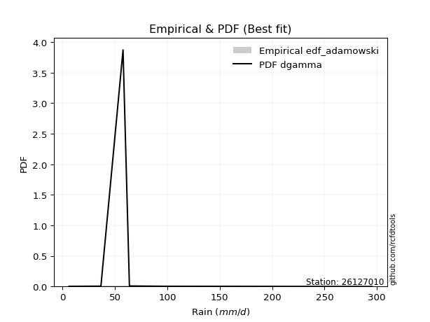</img>

</div>


## C. Best fit & Estimate extreme values for specific return periods - Tr


### 1. Best fit (ordered by delta Δ)

<div align="center">

|   id |   station | empirical_dist   | p_dist   |    delta |   deltao | eval   |   fit |   n |   best_fit |   best_fit_sort |
|-----:|----------:|:-----------------|:---------|---------:|---------:|:-------|------:|----:|-----------:|----------------:|
|    0 |  26127010 | edf_california   | t        | 0.112879 | 0.530386 | Δo > Δ |     1 |   6 |          1 |               1 |
|    1 |  26127010 | edf_gringorten   | t        | 0.120395 | 0.530386 | Δo > Δ |     1 |   6 |          1 |               2 |
|    2 |  26127010 | edf_cunnane      | t        | 0.121127 | 0.530386 | Δo > Δ |     1 |   6 |          1 |               3 |
|    3 |  26127010 | edf_blom         | t        | 0.121772 | 0.530386 | Δo > Δ |     1 |   6 |          1 |               4 |
|    4 |  26127010 | edf_hazen        | logfisk  | 0.122464 | 0.530386 | Δo > Δ |     1 |   6 |          1 |               5 |
|    5 |  26127010 | edf_tukey        | t        | 0.122825 | 0.530386 | Δo > Δ |     1 |   6 |          1 |               6 |
|    6 |  26127010 | edf_filliben     | t        | 0.123218 | 0.530386 | Δo > Δ |     1 |   6 |          1 |               7 |
|    7 |  26127010 | edf_jenkinson    | t        | 0.123403 | 0.530386 | Δo > Δ |     1 |   6 |          1 |               8 |
|    8 |  26127010 | edf_beard        | t        | 0.123403 | 0.530386 | Δo > Δ |     1 |   6 |          1 |               9 |
|    9 |  26127010 | edf_chegodayev   | t        | 0.123647 | 0.530386 | Δo > Δ |     1 |   6 |          1 |              10 |
|   10 |  26127010 | edf_weibull      | wald     | 0.123926 | 0.530386 | Δo > Δ |     1 |   6 |          1 |              11 |
|   11 |  26127010 | edf_adamowski    | t        | 0.124849 | 0.530386 | Δo > Δ |     1 |   6 |          1 |              12 |

</div>

:file_folder:Tables: [bestfit_26127010.csv](table/bestfit_26127010.csv) | [extreme_26127010.csv](table/extreme_26127010.csv)


### 2. Extreme values

In hydrology, a return period (or recurrence interval $Tr$) is the statistical average time between extreme events like floods or droughts of a specific magnitude, indicating how rare an event is, with a 100-year flood, for example, having a 1% chance of occurring in any given year, not that it happens exactly every century. It is a key tool for infrastructure design (like bridges or dams) and risk assessment, calculated from historical data to determine the probability of future events, although it is important to remember it is statistical average, and events can cluster or be missed.

> risk_rate: assuming the return period as the project useful life.

|   id |      tr |   prob_l |     prob_g |     alpha |   betaprime |     chi2 |   crystalball |   erlang |    expon |   exponnorm |                f |   fatiguelife |             fisk |     gamma |   genexpon |   genlogistic |    gibrat |   gompertz |   gumbel_l |   gumbel_r |   halflogistic |   halfnorm |   hypsecant |         invgamma |   invgauss |       invweibull |        johnsonsu |   kstwobign |   laplace |   laplace_asymmetric |   loggamma |   logistic |   lognorm |   maxwell |     mielke |    moyal |   nakagami |        ncf |              nct |     norm |           pareto |   pearson3 |   rayleigh |     rice |         t |   truncnorm |     wald |   weibull_min |   logalpha |   logbetaprime |     logchi2 |   logcrystalball |   logerlang |         logexpon |   logexponnorm |      logf |   logfatiguelife |   logfisk |   loggenexpon |   loggenlogistic |        loggibrat |   loggompertz |   loggumbel_l |   loggumbel_r |   loghalflogistic |   loghalfnorm |   loghypsecant |   loginvgamma |   loginvgauss |   loginvweibull |   logjohnsonsu |   logkstwobign |   loglaplace |   loglaplace_asymmetric |   logloggamma |   loglogistic |     loglognorm |   logmaxwell |   logmielke |   logmoyal |      lognakagami |    logncf |    lognct |         logpareto |   logpearson3 |   lograyleigh |   logrice |      logt |   logtruncnorm |     logwald |   logweibull_min |   station |   n |   risk_rate |
|-----:|--------:|---------:|-----------:|----------:|------------:|---------:|--------------:|---------:|---------:|------------:|-----------------:|--------------:|-----------------:|----------:|-----------:|--------------:|----------:|-----------:|-----------:|-----------:|---------------:|-----------:|------------:|-----------------:|-----------:|-----------------:|-----------------:|------------:|----------:|---------------------:|-----------:|-----------:|----------:|----------:|-----------:|---------:|-----------:|-----------:|-----------------:|---------:|-----------------:|-----------:|-----------:|---------:|----------:|------------:|---------:|--------------:|-----------:|---------------:|------------:|-----------------:|------------:|-----------------:|---------------:|----------:|-----------------:|----------:|--------------:|-----------------:|-----------------:|--------------:|--------------:|--------------:|------------------:|--------------:|---------------:|--------------:|--------------:|----------------:|---------------:|---------------:|-------------:|------------------------:|--------------:|--------------:|---------------:|-------------:|------------:|-----------:|-----------------:|----------:|----------:|------------------:|--------------:|--------------:|----------:|----------:|---------------:|------------:|-----------------:|----------:|----:|------------:|
|    0 |    2    | 0.5      | 0.5        |   17.4178 |     27.2719 |  6.38318 |       77.9667 |  23.0832 |  55.9449 |     55.8675 |     12.9717      |       6.20002 |     97.5488      |   6.56145 |    55.9448 |       58.347  |   48.0354 |    63.6463 |    94.3483 |    61.5851 |        53.441  |    57.5551 |     77.9667 |     12.9718      |    18.4923 |   8108.44        |      6.20016     |     70.1224 |   77.9667 |              55.9574 |    34.4186 |    77.9667 |   35.3047 |   69.4384 |    20.7469 |  56.2965 |    19.3761 |    27.5575 |     20.1834      |  77.9667 |      9.70633     |    52.6992 |    66.4137 |  80.2352 |   38.5261 |     60.8844 |  45.6432 |       70.3062 |    32.1047 |        29.6244 |     11.7656 |          35.3047 |     34.3203 |     20.7025      |        35.2949 |   30.7088 |      6.20001     |   35.5092 |       25.5138 |          28.1289 |     23.7724      |       28.8002 |       43.8361 |       28.4336 |           25.5326 |       26.9592 |        35.3047 |       31.4914 |       30.2634 |         28.1953 |        35.3047 |        27.2384 |      35.3047 |                 43.9343 |       35.4477 |       35.3047 |   6.22171      |      31.5424 |     23.513  |    26.5146 |      6.47609     |   31.1362 |   35.2859 |      7.04114      |       34.6277 |       30.3067 |   32.3004 |   35.3046 |        25.9317 |     23.0336 |     17.3323      |  26127010 |   6 |    0.75     |
|    1 |    2.33 | 0.570815 | 0.429185   |   20.7311 |     34.8121 |  6.56754 |       95.7609 |  29.7677 |  66.9051 |     66.8304 |     17.729       |       8.29052 |    621.447       |   7.2041  |    66.9051 |       69.7122 |   57.0493 |    76.3034 |   109.829  |    78.0734 |        70.3936 |    76.7597 |     92.2074 |     17.7291      |    23.3999 | 984968           |      6.20084     |     83.7995 |   88.7349 |              66.9208 |    43.5463 |    93.6446 |   44.662  |   87.9254 |    26.0322 |  71.9048 |    31.4361 |    35.1688 |     26.6078      |  95.7609 |     13.2342      |    69.0645 |    85.1741 |  95.401  |   44.5839 |     72.8339 |  57.311  |       90.7265 |    40.676  |        37.8142 |     14.4536 |          44.662  |     43.4332 |     27.0019      |        44.6497 |   38.9691 |      6.45401     |   44.4694 |       32.9639 |          35.9952 |     26.7792      |       37.0768 |       53.7856 |       35.3545 |           31.9428 |       34.7461 |        42.6135 |       39.9138 |       38.4871 |         36.0888 |        44.6705 |        34.877  |      40.7026 |                 51.89   |       44.8605 |       43.4305 |   6.4512       |      40.2695 |     31.3893 |    32.5873 |      6.98683     |   39.594  |   44.6387 |      8.13356      |       43.8287 |       38.832  |   41.0512 |   44.6619 |        33.6114 |     26.8727 |     28.9074      |  26127010 |   6 |    0.729209 |
|    2 |    5    | 0.8      | 0.2        |   46.4227 |    102.11   |  8.66985 |      161.889  |  70.7543 | 121.704  |    121.642  |    145.245       |      52.6991  | 971431           |  21.0147  |   121.704  |      119.085  |  108.944  |   139.586  |   159.843  |   149.706  |       147.101  |   157.973  |    149.33   |    145.241       |    70.3076 |      1.12408e+15 |      6.64125     |    141.897  |  142.574  |             121.735  |   105.945  |   154.179  |  107.002  |  160.689  |    75.7585 | 144.204  |   142.339  |   102.561  |    113.445       | 161.889  |    213.714       |   145.397  |   160.28   | 156.116  |   73.2426 |    132.057  | 122.628  |      212.72   |   103.068  |       103.251  |     46.0499 |         107.002  |    105.785  |    101.912       |       106.989  |  101.024  |     15.1441      |  106.076  |      100.764  |         105.031  |     53.1601      |      102.216  |      104.148  |       91.093  |           88.0114 |      101.607  |        90.6414 |      102.193  |      102.552  |        105.458  |       107.098  |        99.6706 |      82.9004 |                 93.9851 |      107.264  |       96.6389 |   1.17684e+145 |     105.318  |     92.3314 |    84.7056 |     30.0044      |  103.879  |  106.983  | 414313            |      106.359  |      104.752  |  104.917  |  107.002  |       103.402  |     63.6943 |   1808.15        |  26127010 |   6 |    0.67232  |
|    3 |   10    | 0.9      | 0.1        |   93.6244 |    249.244  | 11.9512  |      205.757  | 114.361  | 171.449  |    171.399  |   1270.29        |     114.016   |      2.20233e+08 |  50.949   |   171.449  |      159.297  |  168.099  |   197.032  |   187.688  |   208.05   |       210.803  |   218.07   |    194.944  |   1270.21        |   164.878  |      2.67856e+22 |     34.35        |    186.131  |  191.447  |             171.494  |   193.598  |   198.761  |  191.034  |  211.896  |   190.423  | 207.152  |   270.08   |   248.316  |    445.087       | 205.757  |   4395.14        |   210.516  |   213.833  | 199.407  |  109.315  |    185.088  | 191.944  |      345.799  |   200.311  |       219.893  |    146.589  |         191.034  |    193.466  |    340.296       |       191.06   |  201.893  |     49.1692      |  201.336  |      237.437  |         251.181  |    116.153       |      204.029  |      150.463  |      196.912  |          204.211  |      224.784  |       165.603  |      201.646  |      212.955  |        252.576  |       191.294  |       221.705  |     158.125  |                159.564  |      190.683  |      174.168  | inf            |     207.175  |    173.711  |   194.588  |    363.806       |  210.175  |  191.097  |      1.00862e+139 |      193.331  |      212.546  |  201.158  |  191.034  |       242.348  |    159.162  | 773881           |  26127010 |   6 |    0.651322 |
|    4 |   15    | 0.933333 | 0.0666667  |  140.658  |    414.294  | 14.2812  |      227.648  | 141.518  | 200.548  |    200.505  |   4591.73        |     154.118   |      4.22915e+09 |  74.6054  |   200.548  |      181.984  |  208.901  |   230.636  |   200.298  |   240.967  |       246.853  |   249.344  |    220.976  |   4591.34        |   252.748  |      3.89045e+26 |    230.128       |    209.613  |  220.036  |             200.602  |   262.577  |   223.051  |  255.108  |  238.169  |   323.048  | 243.684  |   343.667  |   410.568  |    997.271       | 227.648  |  26153.6         |   247.586  |   241.425  | 221.713  |  140.071  |    215.798  | 236.456  |      431.592  |   283.45   |       329.869  |    296.427  |         255.108  |    262.516  |    688.909       |       255.188  |  290.581  |    106.216       |  285.524  |      374.102  |         410.777  |    199.143       |      286.657  |      177.742  |      304.197  |          328.807  |      339.798  |       233.583  |      288.25   |      314.608  |        413.425  |       255.515  |       338.922  |     230.7    |                217.473  |      253.871  |      240.076  | inf            |     293.157  |    234.613  |   315.313  |   1799.48        |  304.85   |  255.277  |    inf            |      261.242  |      306.044  |  279.944  |  255.107  |       379.337  |    286.582  |      7.47826e+07 |  26127010 |   6 |    0.644736 |
|    5 |   20    | 0.95     | 0.05       |  187.65   |    592.222  | 16.0705  |      241.983  | 161.319  | 221.194  |    221.155  |  11444           |     183.809   |      3.26048e+10 |  93.5056  |   221.194  |      197.868  |  240.907  |   254.479  |   208.147  |   264.015  |       272.11   |   270.194  |    239.34   |  11442.8         |   331.927  |      3.19297e+29 |    876.981       |    225.432  |  240.32   |             221.253  |   321.034  |   239.84   |  308.309  |  255.606  |   468.621  | 269.556  |   394.047  |   584.605  |   1769.86        | 241.983  |  92761.7         |   273.558  |   259.765  | 236.539  |  168.438  |    237.451  | 269.627  |      495.618  |   357.927  |       434.786  |    492.79   |         308.309  |    321.058  |   1136.29        |       308.446  |  371.372  |    187.864       |  363.533  |      508.034  |         579.657  |    303.967       |      357.011  |      197.165  |      412.483  |          459.066  |      447.574  |       297.727  |      366.764  |      410.128  |        583.764  |       308.848  |       451.094  |     301.607  |                270.902  |      306.109  |      299.698  | inf            |     369.111  |    286.058  |   443.816  |   5548.61        |  391.836  |  308.59   |    inf            |      318.499  |      389.962  |  348.155  |  308.307  |       512.15   |    444.202  |      3.04048e+09 |  26127010 |   6 |    0.641514 |
|    6 |   25    | 0.96     | 0.04       |  234.625  |    780.392  | 17.5231  |      252.536  | 176.932  | 237.208  |    237.174  |  23245.4         |     207.4     |      1.55543e+11 | 109.179   |   237.208  |      210.103  |  267.589  |   272.972  |   213.733  |   281.768  |       291.57   |   285.708  |    253.552  |  23242.7         |   403.417  |      5.60905e+31 |   2372.56        |    237.281  |  256.054  |             237.272  |   372.498  |   252.683  |  354.439  |  268.551  |   624.553  | 289.61   |   431.942  |   767.976  |   2762.75        | 252.536  | 247682           |   293.547  |   273.392  | 247.554  |  195.295  |    254.17   | 296.195  |      546.967  |   426.312  |       535.712  |    733.96   |         354.439  |    372.611  |   1675.17        |       354.635  |  446.436  |    295.538       |  437.333  |      638.841  |         755.741  |    432.45        |      418.813  |      212.266  |      521.524  |          593.663  |      549.395  |       359.229  |      439.502  |      500.992  |        761.472  |       355.098  |       558.822  |     371.299  |                321.23   |      351.26   |      355.124  | inf            |     437.963  |    331.974  |   578.463  |  13075.5         |  473.181  |  354.832  |    inf            |      368.715  |      466.887  |  409.07   |  354.437  |       640.756  |    631.002  |      7.01703e+10 |  26127010 |   6 |    0.639603 |
|    7 |   50    | 0.98     | 0.02       |  469.429  |   1831.05   | 22.3252  |      282.756  | 226.567  | 286.953  |    286.93   | 210163           |     283.089   |      1.84118e+13 | 162.405   |   286.953  |      247.794  |  361.644  |   330.418  |   228.896  |   336.456  |       351.528  |   330.8    |    297.617  | 210132           |   682.086  |      4.61032e+38 |  41442.7         |    272.075  |  304.927  |             287.031  |   572.144  |   291.923  |  528.382  |  306.095  |  1516.6    | 351.866  |   543.051  |  1784.28   |  11029           | 282.756  |      5.23417e+06 |   354.93   |   312.946  | 279.53   |  316.98   |    305.686  | 382.942  |      715.175  |   714.105  |       999.791  |   2577.2    |         528.382  |    572.713  |   5593.6         |       528.863  |  769.015  |   1264.57        |  769.424  |     1251.29   |        1710.99   |   1498.48        |      654.904  |      259.35   |     1074.19   |         1310.98   |      996.857  |       643.01   |      750.864  |      909.939  |       1726.62   |       529.536  |      1048.06   |     708.218  |                545.373  |      520.486  |      596.41   | inf            |     719.23   |    521.808  |  1316.76   | 165775           |  827.201  |  529.307  |    inf            |      562.119  |      787.376  |  651.022  |  528.379  |      1232.34   |   1985.11   |      5.29748e+15 |  26127010 |   6 |    0.63583  |
|    8 |   75    | 0.986667 | 0.0133333  |  704.199  |   3010.32   | 25.2965  |      298.971  | 256.246  | 316.052  |    316.036  | 761997           |     328.672   |      2.90085e+14 | 196.073   |   316.052  |      269.701  |  425.17   |   364.022  |   236.563  |   368.242  |       386.382  |   355.347  |    323.367  | 761868           |   883.474  |      4.81837e+42 | 192536           |    291.218  |  333.516  |             316.139  |   721.792  |   314.586  |  654.625  |  326.506  |  2542.25   | 388.272  |   603.702  |  2916.29   |  24793.8         | 298.971  |      3.11819e+07 |   390.431  |   334.466  | 296.926  |  426.962  |    335.536  | 436.322  |      819.235  |   950.983  |      1420.46   |   5429.98   |         654.625  |    722.791  |  11323.9         |       655.367  | 1040.24   |   3034.99        | 1066.46   |     1810.84   |        2751.11   |   3468.77        |      826.889  |      287.001  |     1634.86   |         2077.76   |     1378.75   |       903.608  |     1012.01   |     1272.09   |       2778.77   |       656.168  |      1481.32   |    1033.27   |                743.298  |      642.461  |      804.622  | inf            |     941.874  |    681.039  |  2130.15   | 668070           | 1129.15   |  656.026  |    inf            |      705.901  |     1046.32   |  836.655  |  654.621  |      1762.05   |   4018.64   |      1.0722e+19  |  26127010 |   6 |    0.634587 |
|    9 |  100    | 0.99     | 0.01       |  938.962  |   4281.75   | 27.4627  |      309.939  | 277.537  | 336.698  |    336.687  |      1.90045e+06 |     361.471   |      2.03207e+15 | 220.861   |   336.698  |      285.207  |  474.38   |   387.865  |   241.578  |   390.74   |       411.05   |   372.069  |    341.634  |      1.9001e+06  |  1042.39   |      3.3691e+45  | 544142           |    304.335  |  353.8    |             336.79   |   845.316  |   330.587  |  756.7    |  340.41   |  3665.17   | 414.1    |   644.974  |  4130.66   |  44053.1         | 309.939  |      1.10614e+08 |   415.472  |   349.126  | 308.777  |  530.13   |    356.589  | 475.241  |      895.429  |  1158.92   |      1813.32   |   9248.95   |         756.7    |    846.714  |  18677.7         |       757.681  | 1281.34   |   5698.17        | 1343.01   |     2332.51   |        3850.27   |   6645.96        |      965.453  |      306.663  |     2200.77   |         2878.4    |     1719.64   |      1150.26   |     1244.05   |     1605.24   |       3891.49   |       758.572  |      1877.61   |    1350.86   |                925.914  |      740.65   |      994.049  | inf            |    1131.8    |    825.739  |  2996.53   |      1.72584e+06 | 1400.11   |  758.532  |    inf            |      823.957  |     1269.95   |  991.898  |  756.695  |      2249.26   |   6720.43   |      3.79692e+21 |  26127010 |   6 |    0.633968 |
|   10 |  200    | 0.995    | 0.005      | 1877.99   |   9998.13   | 32.8441  |      334.816  | 329.496  | 386.443  |    386.443  |      1.71856e+07 |     441.757   |      2.16733e+17 | 283.084   |   386.442  |      322.482  |  608.263  |   445.311  |   252.479  |   444.826  |       470.357  |   410.314  |    385.639  |      1.71818e+07 |  1474.92   |      2.32409e+52 |      5.74373e+06 |    334.545  |  402.674  |             386.549  |  1212.59   |   368.97   | 1051.17   |  372.218  |  8835.22   | 476.329  |   739.051  |  9547.94   | 175986           | 334.816  |      2.33763e+09 |   475.38   |   382.671  | 335.895  |  904.763  |    406.9    | 572.184  |     1086.58   |  1837.65   |      3219.99   |  33736      |        1051.17   |   1215.36   |  62366.8         |      1052.96   | 2081.85   |  26632           | 2335.56   |     4177.81   |        8638.67   |  38977.6         |     1360.36   |      354.17   |     4497.06   |         6301.85   |     2850.33   |      2057.33   |     2015.28   |     2770.97   |       8744.74   |      1054.05   |      3241.41   |    2576.63   |               1571.98   |     1022.08   |     1650.66   | inf            |    1723.03   |   1339.08   |  6818.67   |      1.49959e+07 | 2313      | 1054.44   |    inf            |     1172.25   |     1978.22   | 1461.35   | 1051.16   |      3936.89   |  24191.2    |      2.61073e+28 |  26127010 |   6 |    0.633042 |
|   11 |  250    | 0.996    | 0.004      | 2347.5    |  13134.6    | 34.618   |      342.418  | 346.395  | 402.457  |    402.462  |      3.49162e+07 |     467.922   |      9.70505e+17 | 303.75    |   402.457  |      334.466  |  656.3    |   463.804  |   255.686  |   462.214  |       489.423  |   422.08   |    399.805  |      3.49081e+07 |  1627.71   |      3.67119e+54 |      1.18023e+07 |    343.894  |  418.407  |             402.568  |  1354.87   |   381.293  | 1162.24   |  382.01   | 11724.5    | 496.362  |   767.879  | 12502.1    | 274867           | 342.418  |      6.24193e+09 |   494.555  |   392.997  | 344.242  | 1077.89   |    422.973  | 604.256  |     1150.28   |  2123.2    |      3859.73   |  51314.6    |        1162.24   |   1358.24   |  91944.4         |      1164.38   | 2423.16   |  44019.9         | 2789.81   |     5003.34   |       11201.4    |  73530.6         |     1507.06   |      369.502  |     5658.52   |         8107.29   |     3329.73   |      2480.79   |     2344.79   |     3290.95   |      11344.7    |      1165.52   |      3838.14   |    3172.01   |               1864.02   |     1127.63   |     1942.53   | inf            |    1961.01   |   1575.8    |  8884.88   |      2.90627e+07 | 2707.2    | 1166.12   |    inf            |     1306.25   |     2267.39   | 1645.64   | 1162.23   |      4678.46   |  36955.9    |      6.72191e+30 |  26127010 |   6 |    0.632858 |
|   12 |  500    | 0.998    | 0.002      | 4695.05   |  30647.9    | 40.2335  |      364.963  | 399.327  | 452.202  |    452.218  |      3.15745e+08 |     550.002   |      1.01433e+20 | 369.541   |   452.202  |      371.661  |  822.316  |   521.251  |   264.881  |   516.182  |       548.602  |   457.16   |    443.807  |      3.1566e+08  |  2138.97   |      2.4472e+61  |      9.98846e+07 |    371.912  |  467.28   |             452.327  |  1886.27   |   419.51   | 1565.53   |  411.228  | 28217.7    | 558.59   |   853.461  | 28875.8    |      1.0981e+06  | 364.963  |      1.31911e+11 |   553.827  |   423.806  | 369.148  | 1868.65   |    472.531  | 706.233  |     1354.48   |  3291.96   |      6713.8    | 190199      |        1565.53   |   1892.11   | 307013           |      1569.09   | 3838.25   | 212955           | 4842.23   |     8587.92   |       25087.8    | 659350           |     2028.56   |      417.23   |    11544.7    |        17719.7    |     5293.02   |      4436.91   |     3716.56   |     5560      |      25448.2    |      1570.32   |      6368.58   |    6050.3    |               3164.67   |     1508.54   |     3218.55   | inf            |    2884.94   |   2683.16   | 20217.3    |      2.06567e+08 | 4365.44   | 1571.86   |    inf            |     1803.07   |     3406.55   | 2342.47   | 1565.52   |      7833.56   | 142177      |      9.30712e+38 |  26127010 |   6 |    0.632489 |
|   13 |  750    | 0.998667 | 0.00133333 | 7042.59   |  50305.3    | 43.5819  |      377.487  | 430.559  | 481.301  |    481.324  |      1.14483e+09 |     598.498   |      1.5341e+21  | 408.984   |   481.3    |      393.405  |  932.109  |   554.855  |   269.795  |   547.732  |       583.197  |   476.758  |    469.546  |      1.1445e+09  |  2460.85   |      2.38721e+65 |      3.27156e+08 |    387.651  |  495.869  |             481.435  |  2269.69   |   441.837  | 1847.25   |  427.57   | 47154.2    | 594.99   |   901.02   | 47113.9    |      2.46894e+06 | 377.487  |      7.85845e+11 |   588.32   |   441.035  | 383.075  | 2586.41   |    501.265  | 767.376  |     1478.17   |  4228.9    |      9228.71   | 411118      |        1847.25   |   2277.51   | 621529           |      1851.94   | 4987.18   | 540504           | 6683.82   |    11632.3    |       40196      |      2.8128e+06  |     2382.64   |      445.218  |    17515.4    |        27988.1    |     6857.38   |      6234.14   |     4837.11   |     7511.06   |      40810.6    |      1853.15   |      8464.27   |    8827.24   |               4313.18   |     1772.77   |     4322.93   | inf            |    3580.22   |   3740.08   | 32703.7    |      6.12901e+08 | 5734.17   | 1855.5    |    inf            |     2158.55   |     4277.34   | 2851.52   | 1847.23   |     10453.2    | 318910      |      1.54907e+44 |  26127010 |   6 |    0.632366 |
|   14 | 1000    | 0.999    | 0.001      | 9390.13   |  71498.8    | 45.9819  |      386.109  | 452.823  | 501.947  |    501.975  |      2.85526e+09 |     633.092   |      1.05303e+22 | 437.334   |   501.946  |      408.829  | 1016.13   |   578.697  |   273.102  |   570.112  |       607.737  |   490.292  |    487.808  |      2.85439e+09 |  2698.23   |      1.61287e+68 |      7.40471e+08 |    398.556  |  516.154  |             502.086  |  2579.39   |   457.671  | 2070.16   |  438.864  | 67874.4    | 620.817  |   933.758  | 66679.1    |      4.38697e+06 | 386.109  |      2.7877e+12  |   612.724  |   452.94   | 392.7    | 3260.57   |    521.541  | 811.358  |     1567.75   |  5039.56   |     11540.6    | 711601      |        2070.16   |   2588.91   |      1.02515e+06 |      2075.82   | 5988.36   |      1.05038e+06 | 8400.89   |    14353.1    |       56156.4    |      8.53619e+06 |     2657.16   |      465.104  |    23541.7    |        38707.1    |     8200.13   |      7935.39   |     5818.37   |     9276.09   |      57051.8    |      2076.97   |     10308.2    |   11540.4    |               5372.86   |     1980.93   |     5328.88   | inf            |    4156.43   |   4782.46   | 46003.9    |      1.29448e+09 | 6939.92   | 2080.03   |    inf            |     2444.13   |     5005.99   | 3265.58   | 2070.14   |     12760.3    | 570212      |      1.26024e+48 |  26127010 |   6 |    0.632305 |

<div align="center">

</img>

</div>


<div align="center">

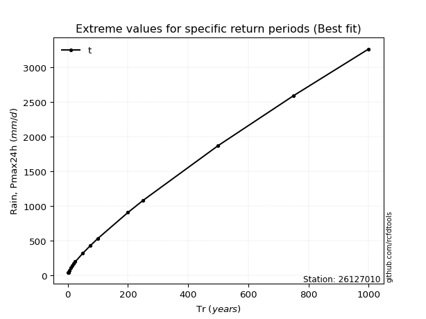</img>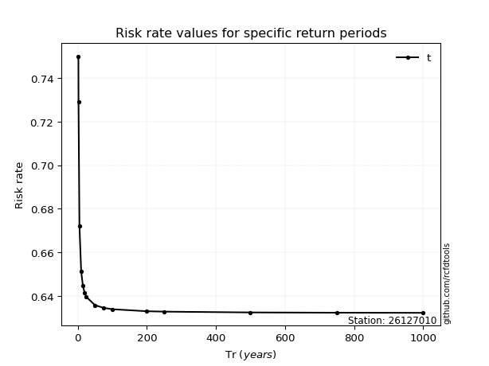</img>

</div>


<sub>**APP DISCLAIMER**: NO WARRANTY - This software is provided by [github.com/rcfdtools](https://github.com/rcfdtools) "as is", without any express or implied warranty, including warranties of merchantability, fitness for a particular purpose, or non-infringement. There is no guarantee that the software will be error-free or operate without interruption. LIMITATION OF LIABILITY - Neither the authors nor copyright holders will be liable for claims or damages arising from the software or its use. You are responsible for determining if the software is appropriate for your use and assume all associated risks, including errors, legal compliance, and data loss. NO PROFESSIONAL ADVICE - The software provides general information and does not offer professional advice. It should not replace consultation with professional advisors.</sub>