<div align="center">


</div>

# PMax24h Station (Rain): 26127040

Maximum Precipitation in 24 hours (PMax24h) is the greatest amount of rainfall for a specific duration that is meteorologically possible for a given location, acting as a "worst-case" scenario for extreme storms, crucial for designing safety-critical infrastructure like bridges, river deviations, dams, spillways, and nuclear plants to prevent catastrophic failure. The PMax24h is related with the Probable Maximum Precipitation (PMP) and it is calculated by hydrologists using meteorological data to determine the upper limit of extreme rainfall, often leading to the Probable Maximum Flood (PMF) for flood control design, and is increasingly being studied for climate change impacts. Probable Maximum Precipitation (PMP) is the theoretical upper limit of rainfall, a deterministic estimate for extreme events, while probability distributions (like GEV, Gumbel) describe the likelihood and frequency of various precipitation amounts, including rare ones, showing how often events occur, with PMP representing the extreme end of these distributions, used for critical infrastructure design to ensure safety against the worst conceivable weather, unlike standard statistical forecasts which cover typical probabilities.

The most common probability distributions in hydrology, used for analyzing floods, rainfall, and streamflow, include the Normal, Log-Normal, Gumbel, Gamma (including Log-Pearson Type III), and Generalized Extreme Value (GEV) distributions, often chosen based on the data´s skewness and whether modeling extremes or general conditions, with Gumbel and GEV popular for extreme events like floods, while the Normal distribution serves as a baseline, though often requiring transformations for skewed hydrological data. These distributions help in designing water infrastructure, managing water resources, and forecasting hydrologic events.

> Hydrological data often isn´t perfectly normal (it´s skewed), so different distributions are needed for different applications, such as: **Flood Frequency Analysis**: Using Gumbel, GEV, or Log-Pearson Type III for predicting extreme flood magnitudes and their return periods, **Rainfall Analysis**: Normal for annual totals, but Log-Normal, Weibull, or GEV for intensity or extreme daily rainfall, **Streamflow Modeling**: Gamma and Log-Normal for maximum flows, GEV for minimum flows, and Kappa for daily flows.

<div align="center">

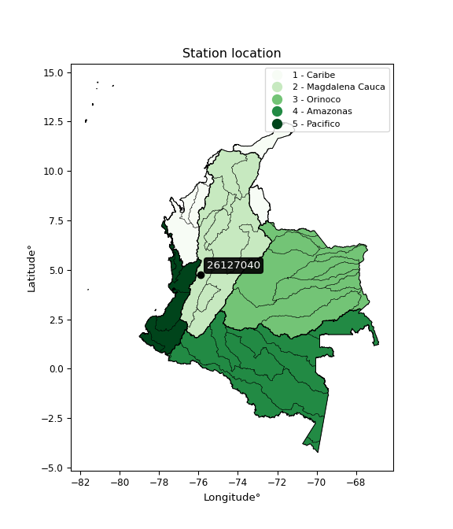</img>

</div>


## A. General information


### 1. General running parameters

• app_version: _v20260312_. • runtime: _2026-03-12 07:15:23.203550_. • Python version: _3.14.0_. • SciPy version: _1.16.3_. • Pandas version: _2.3.3_. • NumPy version: _2.3.5_. • Stations dataset (station_dataset_file): _dataset/pmax24h_in/automatic_colombia_2003_2025.csv_. • Stations catalog (station_catalog_file): _dataset/CNE.xls_. • Minimum year to eval til year_max (date_min): _1900_. • Maximum year to eval since year_min (date_max): _2025_. • Creates, save and include plots into reports (create_plot): _True_. • Plot only fit distributions with Δo > Δ (plot_only_fit): _True_. • Plot only simple graphs avoiding multiple CDFs and multiple Extreme values plots (plot_only_simple): _True_. • Eval low extreme values, if False, evaluates high extreme values (low_extreme): _False_. • Eval every SciPy distribution as logarithmic (pdist_logarithmic_on): _True_. • Standard deviation normalized (ddof): _1.0_. • Return periods to eval in years (Tr): _[2, 2.33, 5, 10, 15, 20, 25, 50, 75, 100, 200, 250, 500, 750, 1000]_. • Minimum data sample per station, 0 means any (minimum_sample): _5_. • Z-Score maximum threshold to adjust a value, 0 means disable (zscore_max): _3.5_. • Z-Score minimum threshold to adjust a value, 0 means disable (zscore_min): _-2.5_. • Avoid zeros, e.g. rain = 0 (avoid_zeros): _True_. • Avoid null values (avoid_nans): _True_. 

:file_folder:Table: [dataset.csv](../../dataset/pmax24h_in/automatic_colombia_2003_2025.csv)

> Delta Degrees of Freedom (DDOF): is a parameter used in the formulas for calculating variance and standard deviation. When ddof=0, the divisor is $N$ (the total number of observations) and this is used when your data set is the entire population. When ddof=1, the divisor is $N-1$ and this is used when your data set is a sample drawn from a larger population. Using $N-1$ provides an unbiased estimate of the population variance (known as Bessel´s correction).


### 2. Station info and location

|   id |   CODIGO | NOMBRE                 | CATEGORIA    | TECNOLOGIA                              | ESTADO   | FECHA_INSTALACION   |   FECHA_SUSPENSION |   ALTITUD |   LATITUD |   LONGITUD | DEPARTAMENTO   | MUNICIPIO   | AREA_OPERATIVA                         | ENTIDAD                                                     | AREA_HIDROGRAFICA   | ZONA_HIDROGRAFICA   | SUBZONA_HIDROGRAFICA   | CORRIENTE   | Catalogo   |   Version |
|-----:|---------:|:-----------------------|:-------------|:----------------------------------------|:---------|:--------------------|-------------------:|----------:|----------:|-----------:|:---------------|:------------|:---------------------------------------|:------------------------------------------------------------|:--------------------|:--------------------|:-----------------------|:------------|:-----------|----------:|
|    0 | 26127040 | CARTAGO AUT [26127040] | Limnigráfica | Automática con Telemetría, Convencional | Activa   | 15/01/1945          |                nan |       937 |   4.75761 |   -75.8992 | Risaralda      | Pereira     | Area Operativa 09 - Cauca-Valle-Caldas | INSTITUTO DE HIDROLOGIA METEOROLOGIA Y ESTUDIOS AMBIENTALES | Magdalena Cauca     | Cauca               | Río La Vieja           | La Vieja    | CNE_IDEAM  |  20251226 |

<div align="center">

Dynamic map: [:earth_americas:Google](http://maps.google.com/maps?q=4.757611111,-75.89925) [:earth_americas:OSM](https://www.openstreetmap.org/#map=18/4.757611111/-75.89925&layers=P) [:earth_americas:Bing](https://www.bing.com/maps?cp=4.757611111~-75.89925&lvl=18) [:earth_americas:Apple](https://maps.apple.com/frame?center=4.757611111%2C-75.89925&span=0.003%2C0.006)

</div>


<div align="center">

```geojson
{
  "type": "Feature",
  "geometry": {
    "type": "Point", 
    "coordinates": [-75.89925, 4.757611111]
  }, 
  "properties": {
    "Name": "26127040"
  }
}
```

</div>


### 3. Discrete values table and plot

<div align="center">

|               |           0 |          1 |           2 |         3 |          4 |
|:--------------|------------:|-----------:|------------:|----------:|-----------:|
| Date          | 2017        | 2018       | 2019        | 2020      | 2025       |
| Value         |   66.6      |   83.8     |   51.9      |    4.4    |   33.3     |
| Value_initial |   66.6      |   83.8     |   51.9      |    4.4    |   33.3     |
| count         |    5        |    5       |    5        |    5      |    5       |
| mean          |   48        |   48       |   48        |   48      |   48       |
| std           |   30.6588   |   30.6588  |   30.6588   |   30.6588 |   30.6588  |
| zscore        |    0.606676 |    1.16769 |    0.127206 |   -1.4221 |   -0.47947 |


</div>


<div align="center">

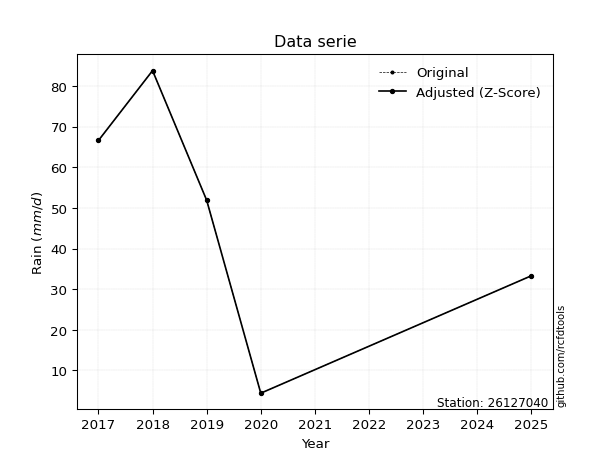</img>

</div>


> The initial value (value_initial) correspond to the initial obtained or null completed value, and value (value) is adjusted only when the initial value is outside the valid range (outlier) definite through the Z-Score value. If Z-Score is active, values out of range or outliers are replaced with the station mean value. A Z-Score (or standard score) measures how many standard deviations a data point is from the mean of a dataset, indicating its relative position; positive scores mean above the mean, negative mean below, and a score of zero is exactly at the mean, allowing for comparison of values from different distributions. It´s calculated using the formula $z=(x–μ)/σ$, where $x$ is the data point, $μ$ is the mean, and $σ$ is the standard deviation, helping identify outliers and understand probability.
>
> <sub>**Note**: In this study, "completing" (filling gaps in) and "extending" (forecasting or lengthening the historical record) rainfall data series are avoided for certain critical analyses because they introduce artificial bias and uncertainty, which can distort the statistics of rare events (extremes), alter day-to-day variability, and compromise the integrity and homogeneity of the original data. Some reasons against Completing/Extending rainfall data are: **Distortion of Extremes and Variability**: The primary issue is that most gap-filling or extension methods rely on averaging or regression with nearby stations, which inherently smooths the data. Rainfall is highly variable in space and time, with a large percentage of zero values and occasional large storms. Infilling methods often underestimate the highest values and overestimate the lowest (zero) values, which severely distorts analyses focused on flood frequency, drought severity, and intensity-duration-frequency (IDF) curves, **Loss of Data Homogeneity**: Infilled or extended data are synthetic estimates, not actual measurements. Combining these estimates with observed data can violate the assumption of data homogeneity, which requires that the data properties do not change over time. Inhomogeneity can lead to incorrect conclusions about long-term trends or changes in climate patterns, **Propagation of Errors**: Errors and biases from the original data (e.g., wind-induced undercatch, instrument errors, site changes) or the data used for imputation can propagate through the analysis, leading to unreliable hydrological models and inaccurate predictions, **Compromised Statistical Integrity**: For statistical analyses, especially those involving the frequency of events, using artificial data can introduce time bias or autocorrelation that doesn´t exist in reality, making it difficult to assess the true probability of events, **Difficulty in Validation**: It is difficult to accurately validate the quality of filled or extended data, especially for past periods where ground-truth measurements are unavailable. The reliability of imputation techniques heavily depends on the density of the surrounding station network and the complexity of the local topography.</sub>


### 4. Active continuous probability distributions from SciPy (80 of 104 available)

A Probability Density Function (PDF) describes the relative likelihood of a continuous random variable falling within a specific range, where the total area under its curve equals 1, and the area over any interval gives the actual probability for that range. Unlike discrete probabilities (like rolling a die), a PDF shows density, not direct probability for a single point (which is zero), with higher points indicating higher likelihood, often visualized as a bell curve for normal distributions.

A log of a probability density function (log-PDF) is simply the logarithm of the PDF´s value, denoted as $log(f(x))$, useful for converting multiplication of probabilities into addition, improving numerical stability with tiny numbers, and connecting to information theory concepts like entropy. Instead of dealing with very small probabilities (e.g., 0.000001), log-PDFs use negative numbers (e.g., $log(0.00001) ≈ -11.51$ that are easier for computers to handle, preventing underflow errors and simplifying complex calculations. In this study, each active probability distribution from SciPy is also evaluated in the $log$ form.

[scipy.stats](https://docs.scipy.org/doc/scipy/reference/stats.html) is a Python´s powerful submodule within the SciPy library for comprehensive statistical analysis, offering over 130 probability distributions (like Normal, Poisson, etc.), functions for descriptive stats (mean, variance), hypothesis testing (t-tests, chi-square), random variable generation, and statistical tests, making it essential for data science, modeling, and research. It provides tools to explore, model, and draw conclusions from data efficiently, working seamlessly with [NumPy](https://numpy.org/).

<div align="center">

|   id | p_dist           |   n_parameter | fit_method   | label                                                                       | active   | ref                                                                                                      |
|-----:|:-----------------|--------------:|:-------------|:----------------------------------------------------------------------------|:---------|:---------------------------------------------------------------------------------------------------------|
|    0 | alpha            |             3 | MLE          | Alpha                                                                       | True     | [:mortar_board:](https://docs.scipy.org/doc/scipy/reference/generated/scipy.stats.alpha.html)            |
|    1 | anglit           |             2 | MM           | Anglit                                                                      | True     | [:mortar_board:](https://docs.scipy.org/doc/scipy/reference/generated/scipy.stats.anglit.html)           |
|    2 | arcsine          |             2 | MM           | Arcsine                                                                     | True     | [:mortar_board:](https://docs.scipy.org/doc/scipy/reference/generated/scipy.stats.arcsine.html)          |
|    3 | argus            |             3 | MLE          | Argus                                                                       | True     | [:mortar_board:](https://docs.scipy.org/doc/scipy/reference/generated/scipy.stats.argus.html)            |
|    4 | beta             |             4 | MLE          | Beta                                                                        | True     | [:mortar_board:](https://docs.scipy.org/doc/scipy/reference/generated/scipy.stats.beta.html)             |
|    5 | betaprime        |             4 | MLE          | Beta prime                                                                  | True     | [:mortar_board:](https://docs.scipy.org/doc/scipy/reference/generated/scipy.stats.betaprime.html)        |
|    6 | bradford         |             3 | MLE          | Bradford                                                                    | True     | [:mortar_board:](https://docs.scipy.org/doc/scipy/reference/generated/scipy.stats.bradford.html)         |
|    7 | burr             |             4 | MLE          | Burr (Type III)                                                             | True     | [:mortar_board:](https://docs.scipy.org/doc/scipy/reference/generated/scipy.stats.burr.html)             |
|    8 | burr12           |             4 | MLE          | Burr (Type III) 12                                                          | True     | [:mortar_board:](https://docs.scipy.org/doc/scipy/reference/generated/scipy.stats.burr12.html)           |
|    9 | cosine           |             2 | MLE          | Cosine                                                                      | True     | [:mortar_board:](https://docs.scipy.org/doc/scipy/reference/generated/scipy.stats.cosine.html)           |
|   10 | crystalball      |             4 | MLE          | Crystalball                                                                 | True     | [:mortar_board:](https://docs.scipy.org/doc/scipy/reference/generated/scipy.stats.crystalball.html)      |
|   11 | dgamma           |             3 | MLE          | Double gamma                                                                | True     | [:mortar_board:](https://docs.scipy.org/doc/scipy/reference/generated/scipy.stats.dgamma.html)           |
|   12 | dweibull         |             3 | MLE          | Double Weibull                                                              | True     | [:mortar_board:](https://docs.scipy.org/doc/scipy/reference/generated/scipy.stats.dweibull.html)         |
|   13 | erlang           |             3 | MLE          | Erlang                                                                      | True     | [:mortar_board:](https://docs.scipy.org/doc/scipy/reference/generated/scipy.stats.erlang.html)           |
|   14 | exponnorm        |             3 | MLE          | Exponentially modified Normal                                               | True     | [:mortar_board:](https://docs.scipy.org/doc/scipy/reference/generated/scipy.stats.exponnorm.html)        |
|   15 | exponpow         |             3 | MLE          | Exponential power                                                           | True     | [:mortar_board:](https://docs.scipy.org/doc/scipy/reference/generated/scipy.stats.exponpow.html)         |
|   16 | exponweib        |             4 | MLE          | Exponentiated Weibull                                                       | True     | [:mortar_board:](https://docs.scipy.org/doc/scipy/reference/generated/scipy.stats.exponweib.html)        |
|   17 | f                |             4 | MLE          | F                                                                           | True     | [:mortar_board:](https://docs.scipy.org/doc/scipy/reference/generated/scipy.stats.f.html)                |
|   18 | fatiguelife      |             3 | MLE          | Fatigue-life (Birnbaum-Saunders)                                            | True     | [:mortar_board:](https://docs.scipy.org/doc/scipy/reference/generated/scipy.stats.fatiguelife.html)      |
|   19 | foldnorm         |             3 | MM           | Fold Normal                                                                 | True     | [:mortar_board:](https://docs.scipy.org/doc/scipy/reference/generated/scipy.stats.foldnorm.html)         |
|   20 | gamma            |             3 | MLE          | Gamma                                                                       | True     | [:mortar_board:](https://docs.scipy.org/doc/scipy/reference/generated/scipy.stats.gamma.html)            |
|   21 | gausshyper       |             6 | MLE          | Gauss hypergeometric                                                        | True     | [:mortar_board:](https://docs.scipy.org/doc/scipy/reference/generated/scipy.stats.gausshyper.html)       |
|   22 | genexpon         |             5 | MLE          | Generalized exponential                                                     | True     | [:mortar_board:](https://docs.scipy.org/doc/scipy/reference/generated/scipy.stats.genexpon.html)         |
|   23 | genextreme       |             3 | MLE          | Generalized exponential                                                     | True     | [:mortar_board:](https://docs.scipy.org/doc/scipy/reference/generated/scipy.stats.genextreme.html)       |
|   24 | gengamma         |             4 | MLE          | Generalized gamma                                                           | True     | [:mortar_board:](https://docs.scipy.org/doc/scipy/reference/generated/scipy.stats.gengamma.html)         |
|   25 | genhalflogistic  |             3 | MLE          | Generalized half-logistic                                                   | True     | [:mortar_board:](https://docs.scipy.org/doc/scipy/reference/generated/scipy.stats.genhalflogistic.html)  |
|   26 | genlogistic      |             3 | MLE          | Generalized logistic                                                        | True     | [:mortar_board:](https://docs.scipy.org/doc/scipy/reference/generated/scipy.stats.genlogistic.html)      |
|   27 | gennorm          |             3 | MLE          | Generalized Normal                                                          | True     | [:mortar_board:](https://docs.scipy.org/doc/scipy/reference/generated/scipy.stats.gennorm.html)          |
|   28 | genpareto        |             3 | MLE          | Generalized Pareto                                                          | True     | [:mortar_board:](https://docs.scipy.org/doc/scipy/reference/generated/scipy.stats.genpareto.html)        |
|   29 | gompertz         |             3 | MLE          | Gompertz (or truncated Gumbel)                                              | True     | [:mortar_board:](https://docs.scipy.org/doc/scipy/reference/generated/scipy.stats.gompertz.html)         |
|   30 | gumbel_l         |             2 | MM           | Gumbel Left Skew                                                            | True     | [:mortar_board:](https://docs.scipy.org/doc/scipy/reference/generated/scipy.stats.gumbel_l.html)         |
|   31 | gumbel_r         |             2 | MM           | Gumbel Right Skew                                                           | True     | [:mortar_board:](https://docs.scipy.org/doc/scipy/reference/generated/scipy.stats.gumbel_r.html)         |
|   32 | halfgennorm      |             3 | MLE          | Upper half of a generalized normal                                          | True     | [:mortar_board:](https://docs.scipy.org/doc/scipy/reference/generated/scipy.stats.halfgennorm.html)      |
|   33 | halflogistic     |             2 | MM           | Half-logistic                                                               | True     | [:mortar_board:](https://docs.scipy.org/doc/scipy/reference/generated/scipy.stats.halflogistic.html)     |
|   34 | halfnorm         |             2 | MM           | Half Normal                                                                 | True     | [:mortar_board:](https://docs.scipy.org/doc/scipy/reference/generated/scipy.stats.halfnorm.html)         |
|   35 | hypsecant        |             2 | MM           | hyperbolic secant                                                           | True     | [:mortar_board:](https://docs.scipy.org/doc/scipy/reference/generated/scipy.stats.hypsecant.html)        |
|   36 | invgamma         |             3 | MLE          | Inverted gamma                                                              | True     | [:mortar_board:](https://docs.scipy.org/doc/scipy/reference/generated/scipy.stats.invgamma.html)         |
|   37 | invgauss         |             3 | MLE          | Inverse Gaussian                                                            | True     | [:mortar_board:](https://docs.scipy.org/doc/scipy/reference/generated/scipy.stats.invgauss.html)         |
|   38 | invweibull       |             3 | MLE          | Inverted Weibull                                                            | True     | [:mortar_board:](https://docs.scipy.org/doc/scipy/reference/generated/scipy.stats.invweibull.html)       |
|   39 | johnsonsb        |             4 | MLE          | Johnson SB                                                                  | True     | [:mortar_board:](https://docs.scipy.org/doc/scipy/reference/generated/scipy.stats.johnsonsb.html)        |
|   40 | johnsonsu        |             4 | MLE          | Johnson Su                                                                  | True     | [:mortar_board:](https://docs.scipy.org/doc/scipy/reference/generated/scipy.stats.johnsonsu.html)        |
|   41 | kappa3           |             3 | MLE          | Kappa 3                                                                     | True     | [:mortar_board:](https://docs.scipy.org/doc/scipy/reference/generated/scipy.stats.kappa3.html)           |
|   42 | kappa4           |             4 | MLE          | Kappa 4                                                                     | True     | [:mortar_board:](https://docs.scipy.org/doc/scipy/reference/generated/scipy.stats.kappa4.html)           |
|   43 | ksone            |             3 | MLE          | Kolmogorov-Smirnov one-sided test statistic distribution                    | True     | [:mortar_board:](https://docs.scipy.org/doc/scipy/reference/generated/scipy.stats.ksone.html)            |
|   44 | kstwobign        |             2 | MLE          | Limiting distribution of scaled Kolmogorov-Smirnov two-sided test statistic | True     | [:mortar_board:](https://docs.scipy.org/doc/scipy/reference/generated/scipy.stats.kstwobign.html)        |
|   45 | laplace          |             2 | MM           | Laplace                                                                     | True     | [:mortar_board:](https://docs.scipy.org/doc/scipy/reference/generated/scipy.stats.laplace.html)          |
|   46 | levy_l           |             2 | MLE          | Left-skewed Levy                                                            | True     | [:mortar_board:](https://docs.scipy.org/doc/scipy/reference/generated/scipy.stats.levy_l.html)           |
|   47 | loggamma         |             3 | MLE          | Log gamma                                                                   | True     | [:mortar_board:](https://docs.scipy.org/doc/scipy/reference/generated/scipy.stats.loggamma.html)         |
|   48 | logistic         |             2 | MM           | Logistic (or Sech-squared)                                                  | True     | [:mortar_board:](https://docs.scipy.org/doc/scipy/reference/generated/scipy.stats.logistic.html)         |
|   49 | loglaplace       |             3 | MLE          | Log-Laplace                                                                 | True     | [:mortar_board:](https://docs.scipy.org/doc/scipy/reference/generated/scipy.stats.loglaplace.html)       |
|   50 | lomax            |             3 | MLE          | Lomax (Pareto of the second kind)                                           | True     | [:mortar_board:](https://docs.scipy.org/doc/scipy/reference/generated/scipy.stats.lomax.html)            |
|   51 | maxwell          |             2 | MM           | Maxwell                                                                     | True     | [:mortar_board:](https://docs.scipy.org/doc/scipy/reference/generated/scipy.stats.maxwell.html)          |
|   52 | mielke           |             4 | MLE          | Mielke Beta-Kappa / Dagum                                                   | True     | [:mortar_board:](https://docs.scipy.org/doc/scipy/reference/generated/scipy.stats.mielke.html)           |
|   53 | moyal            |             2 | MM           | Moyal                                                                       | True     | [:mortar_board:](https://docs.scipy.org/doc/scipy/reference/generated/scipy.stats.moyal.html)            |
|   54 | nakagami         |             3 | MLE          | Nakagami                                                                    | True     | [:mortar_board:](https://docs.scipy.org/doc/scipy/reference/generated/scipy.stats.nakagami.html)         |
|   55 | ncf              |             5 | MLE          | Non-central F distribution                                                  | True     | [:mortar_board:](https://docs.scipy.org/doc/scipy/reference/generated/scipy.stats.ncf.html)              |
|   56 | nct              |             4 | MLE          | Non-central Student’s t                                                     | True     | [:mortar_board:](https://docs.scipy.org/doc/scipy/reference/generated/scipy.stats.nct.html)              |
|   57 | norm             |             2 | MM           | Normal                                                                      | True     | [:mortar_board:](https://docs.scipy.org/doc/scipy/reference/generated/scipy.stats.norm.html)             |
|   58 | pearson3         |             3 | MM           | Pearson type III                                                            | True     | [:mortar_board:](https://docs.scipy.org/doc/scipy/reference/generated/scipy.stats.pearson3.html)         |
|   59 | powerlaw         |             3 | MLE          | Power-function                                                              | True     | [:mortar_board:](https://docs.scipy.org/doc/scipy/reference/generated/scipy.stats.powerlaw.html)         |
|   60 | rayleigh         |             2 | MM           | Rayleigh                                                                    | True     | [:mortar_board:](https://docs.scipy.org/doc/scipy/reference/generated/scipy.stats.rayleigh.html)         |
|   61 | rdist            |             3 | MLE          | R-distributed (symmetric beta)                                              | True     | [:mortar_board:](https://docs.scipy.org/doc/scipy/reference/generated/scipy.stats.rdist.html)            |
|   62 | rice             |             3 | MLE          | Rice                                                                        | True     | [:mortar_board:](https://docs.scipy.org/doc/scipy/reference/generated/scipy.stats.rice.html)             |
|   63 | semicircular     |             2 | MM           | Semicircular                                                                | True     | [:mortar_board:](https://docs.scipy.org/doc/scipy/reference/generated/scipy.stats.semicircular.html)     |
|   64 | skewnorm         |             3 | MLE          | Skew normal                                                                 | True     | [:mortar_board:](https://docs.scipy.org/doc/scipy/reference/generated/scipy.stats.skewnorm.html)         |
|   65 | t                |             3 | MLE          | Student’s t                                                                 | True     | [:mortar_board:](https://docs.scipy.org/doc/scipy/reference/generated/scipy.stats.t.html)                |
|   66 | trapezoid        |             4 | MLE          | Trapezoid                                                                   | True     | [:mortar_board:](https://docs.scipy.org/doc/scipy/reference/generated/scipy.stats.trapezoid.html)        |
|   67 | triang           |             3 | MLE          | Triangular                                                                  | True     | [:mortar_board:](https://docs.scipy.org/doc/scipy/reference/generated/scipy.stats.triang.html)           |
|   68 | truncexpon       |             3 | MLE          | Truncated exponential                                                       | True     | [:mortar_board:](https://docs.scipy.org/doc/scipy/reference/generated/scipy.stats.truncexpon.html)       |
|   69 | truncnorm        |             4 | MLE          | Truncated normal                                                            | True     | [:mortar_board:](https://docs.scipy.org/doc/scipy/reference/generated/scipy.stats.truncnorm.html)        |
|   70 | truncpareto      |             4 | MLE          | Upper truncated Pareto                                                      | True     | [:mortar_board:](https://docs.scipy.org/doc/scipy/reference/generated/scipy.stats.truncpareto.html)      |
|   71 | truncweibull_min |             5 | MLE          | Doubly truncated Weibull minimum                                            | True     | [:mortar_board:](https://docs.scipy.org/doc/scipy/reference/generated/scipy.stats.truncweibull_min.html) |
|   72 | tukeylambda      |             3 | MLE          | Tukey-Lamdba                                                                | True     | [:mortar_board:](https://docs.scipy.org/doc/scipy/reference/generated/scipy.stats.tukeylambda.html)      |
|   73 | uniform          |             2 | MLE          | Uniform                                                                     | True     | [:mortar_board:](https://docs.scipy.org/doc/scipy/reference/generated/scipy.stats.uniform.html)          |
|   74 | vonmises         |             3 | MLE          | Von Mises                                                                   | True     | [:mortar_board:](https://docs.scipy.org/doc/scipy/reference/generated/scipy.stats.vonmises.html)         |
|   75 | vonmises_line    |             3 | MLE          | Von Mises line                                                              | True     | [:mortar_board:](https://docs.scipy.org/doc/scipy/reference/generated/scipy.stats.vonmises_line.html)    |
|   76 | wald             |             2 | MM           | Wald                                                                        | True     | [:mortar_board:](https://docs.scipy.org/doc/scipy/reference/generated/scipy.stats.wald.html)             |
|   77 | weibull_max      |             3 | MLE          | Weibull maximum                                                             | True     | [:mortar_board:](https://docs.scipy.org/doc/scipy/reference/generated/scipy.stats.weibull_max.html)      |
|   78 | weibull_min      |             3 | MLE          | Weibull minimum                                                             | True     | [:mortar_board:](https://docs.scipy.org/doc/scipy/reference/generated/scipy.stats.weibull_min.html)      |
|   79 | wrapcauchy       |             3 | MLE          | Wrapped  Cauchy                                                             | True     | [:mortar_board:](https://docs.scipy.org/doc/scipy/reference/generated/scipy.stats.wrapcauchy.html)       |

</div>

> **n_parameter:** # arguments & localization & scale.
>
> **Fit methods:** (MLE) maximum likelihood, (MM) L-moments.
>
>**Inactive** (With the only purpose of prevent loops, zero divisions, infinite values, over high estimated values or horizontal trending for recurrence intervals estimations, the follow distributions were disabled.)**:** lognorm, norminvgauss, powernorm, powerlognorm, cauchy, halfcauchy, foldcauchy, skewcauchy, chi2, expon, fisk, genhyperbolic, geninvgauss, gibrat, kstwo, laplace_asymmetric, levy, levy_stable, ncx2, pareto, rel_breitwigner, recipinvgauss, studentized_range, loguniform, 


## B. Probability (PDF) vs. Empirical (EDF) distributions functions

A continuous probability distribution (CPD) describes probabilities for variables that can take any value within a range (like rain any time), unlike discrete variables with specific outcomes (like temperature). It uses a Probability Density Function (PDF), a curve where the total area under it equals 1, and the probability of the variable falling within an interval (a to b) is found by calculating the area under the curve between those points. A key feature is that the probability of hitting any single exact value is zero, so probabilities are always expressed for ranges, e.g., $P(a ≤ X ≤ b)$.

<div align="center">

Distributions parameters from station values
|     |   station | p_dist              |   n |              loc |           scale | shape                  | shape1                | shape2                 | shape3             |
|----:|----------:|:--------------------|----:|-----------------:|----------------:|:-----------------------|:----------------------|:-----------------------|:-------------------|
|   0 |  26127040 | alpha               |   5 |     -0.0240314   |     9.75074     | 1.7390221535587853e-09 |                       |                        |                    |
|   1 |  26127040 | anglit              |   5 |     48           |    80.2206      |                        |                       |                        |                    |
|   2 |  26127040 | arcsine             |   5 |      9.21928     |    77.5614      |                        |                       |                        |                    |
|   3 |  26127040 | argus               |   5 |    -18.3011      |   106.888       | 1.1990525123745956     |                       |                        |                    |
|   4 |  26127040 | beta                |   5 |     -9.14111     |    92.9411      | 1.2670641072485396     | 0.7566493089438722    |                        |                    |
|   5 |  26127040 | betaprime           |   5 |   -764.691       | 52335.3         | 878.1747636344932      | 56551.49873802851     |                        |                    |
|   6 |  26127040 | bradford            |   5 |     -4.73991     |    88.54        | 2.9274198460978098e-06 |                       |                        |                    |
|   7 |  26127040 | burr                |   5 |      0.561905    |    84.6092      | 229.47479589689476     | 0.004523852607410447  |                        |                    |
|   8 |  26127040 | burr12              |   5 |     -0.975009    |     5.28015     | 255.681080523096       | 0.0020542368365881625 |                        |                    |
|   9 |  26127040 | cosine              |   5 |     46.6684      |    22.4749      |                        |                       |                        |                    |
|  10 |  26127040 | crystalball         |   5 |     48           |    27.4221      | 21485.251975800842     | 773.1307583464841     |                        |                    |
|  11 |  26127040 | dgamma              |   5 |     57.4888      |    12.7105      | 1.8612797318038616     |                       |                        |                    |
|  12 |  26127040 | dweibull            |   5 |     43.5506      |    27.3708      | 1.8674006665025231     |                       |                        |                    |
|  13 |  26127040 | erlang              |   5 |   -421.145       |     1.64589     | 284.9667646829138      |                       |                        |                    |
|  14 |  26127040 | exponnorm           |   5 |     47.9747      |    27.4222      | 0.0009268389015130973  |                       |                        |                    |
|  15 |  26127040 | exponpow            |   5 |      4.4         |     4.68604     | 0.1118017472445299     |                       |                        |                    |
|  16 |  26127040 | exponweib           |   5 |  -6900.11        |  6759.58        | 80.39730964622197      | 57.23314104989237     |                        |                    |
|  17 |  26127040 | f                   |   5 |  -3556.35        |  3604.2         | 35042.4105002693       | 1569030.571608814     |                        |                    |
|  18 |  26127040 | fatiguelife         |   5 |      4.4         |     1.15893e-05 | 1479.2531706660532     |                       |                        |                    |
|  19 |  26127040 | foldnorm            |   5 |   -102.365       |    26.3848      | 5.708673577043323      |                       |                        |                    |
|  20 |  26127040 | gamma               |   5 |   -402.722       |     1.71357     | 263.0076169015149      |                       |                        |                    |
|  21 |  26127040 | gausshyper          |   5 |     -4.12675     |    87.9267      | 1.3044494850002883     | 0.7387894069804617    | 0.9808608951274824     | 0.7604091070343781 |
|  22 |  26127040 | genexpon            |   5 |      4.39994     |     2.87661     | 0.06789338160685963    | 6.575651699734878e-08 | 2.75644672410301       |                    |
|  23 |  26127040 | genextreme          |   5 |     53.3442      |    36.737       | 1.2062396130129875     |                       |                        |                    |
|  24 |  26127040 | gengamma            |   5 |      4.4         |    80.6592      | 0.08575411576983731    | 5.368604710535514     |                        |                    |
|  25 |  26127040 | genhalflogistic     |   5 |     -6.86696     |   102.903       | 1.1349529910884186     |                       |                        |                    |
|  26 |  26127040 | genlogistic         |   5 |     83.8003      |     1.45633e-05 | 4.0638283552398435e-07 |                       |                        |                    |
|  27 |  26127040 | gennorm             |   5 |     44.1         |    39.7001      | 3828062.106989437      |                       |                        |                    |
|  28 |  26127040 | genpareto           |   5 |     -0.392425    |   145.406       | -1.7270669543051316    |                       |                        |                    |
|  29 |  26127040 | gompertz            |   5 |      4.37785     |    33.227       | 0.2511301678357307     |                       |                        |                    |
|  30 |  26127040 | gumbel_l            |   5 |     60.3414      |    21.3809      |                        |                       |                        |                    |
|  31 |  26127040 | gumbel_r            |   5 |     35.6586      |    21.3809      |                        |                       |                        |                    |
|  32 |  26127040 | halfgennorm         |   5 |      4.4         |     2.46062     | 0.40886265241373443    |                       |                        |                    |
|  33 |  26127040 | halflogistic        |   5 |     15.4984      |    23.4449      |                        |                       |                        |                    |
|  34 |  26127040 | halfnorm            |   5 |     11.7039      |    45.4905      |                        |                       |                        |                    |
|  35 |  26127040 | hypsecant           |   5 |     48           |    17.4575      |                        |                       |                        |                    |
|  36 |  26127040 | invgamma            |   5 |   -303.519       | 55304.4         | 158.46644614281666     |                       |                        |                    |
|  37 |  26127040 | invgauss            |   5 |   -135.815       |  7215.39        | 0.025466984336314558   |                       |                        |                    |
|  38 |  26127040 | invweibull          |   5 |     -1.98409e+09 |     1.98409e+09 | 74514409.86210826      |                       |                        |                    |
|  39 |  26127040 | johnsonsb           |   5 |      1.85228     |    81.9477      | 0.5093549823450823     | 0.08115404710075265   |                        |                    |
|  40 |  26127040 | johnsonsu           |   5 |    123.888       |     3.7135      | 9.735431946751742      | 2.672716550776113     |                        |                    |
|  41 |  26127040 | kappa3              |   5 |      4.4         |    82.4836      | 398.64484013764445     |                       |                        |                    |
|  42 |  26127040 | kappa4              |   5 |      0.517349    |    88.3414      | 1.0458209691290756     | 1.0607417228822973    |                        |                    |
|  43 |  26127040 | ksone               |   5 |      0.503516    |    94.993       | 1.0                    |                       |                        |                    |
|  44 |  26127040 | kstwobign           |   5 |    -58.8534      |   121.877       |                        |                       |                        |                    |
|  45 |  26127040 | laplace             |   5 |     48           |    19.3904      |                        |                       |                        |                    |
|  46 |  26127040 | levy_l              |   5 |     86.634       |    10.8113      |                        |                       |                        |                    |
|  47 |  26127040 | loggamma            |   5 |     57.7603      |    24.5498      | 1.1184847987031952     |                       |                        |                    |
|  48 |  26127040 | logistic            |   5 |     48           |    15.1186      |                        |                       |                        |                    |
|  49 |  26127040 | loglaplace          |   5 |     -0.130106    |    52.0301      | 1.3827434952153288     |                       |                        |                    |
|  50 |  26127040 | lomax               |   5 |      4.4         |     1.07958e+09 | 23570286.856938288     |                       |                        |                    |
|  51 |  26127040 | maxwell             |   5 |    -16.9789      |    40.7195      |                        |                       |                        |                    |
|  52 |  26127040 | mielke              |   5 |      4.39995     |    80.9463      | 0.5282940453631457     | 112.75565934645586    |                        |                    |
|  53 |  26127040 | moyal               |   5 |     32.3183      |    12.3443      |                        |                       |                        |                    |
|  54 |  26127040 | nakagami            |   5 |      4.4         |    46.4856      | 0.23010118329246498    |                       |                        |                    |
|  55 |  26127040 | ncf                 |   5 |      4.4         |     9.5029      | 0.9816980253394803     | 10161.437220623784    | 4.7124236794181735     |                    |
|  56 |  26127040 | nct                 |   5 |  -2238.57        |    27.3795      | 1079911.5070013474     | 83.51398083629479     |                        |                    |
|  57 |  26127040 | norm                |   5 |     48           |    27.4221      |                        |                       |                        |                    |
|  58 |  26127040 | pearson3            |   5 |     48           |    27.4221      | -0.32668516952526305   |                       |                        |                    |
|  59 |  26127040 | powerlaw            |   5 |      4.4         |    79.4         | 0.12254773947924613    |                       |                        |                    |
|  60 |  26127040 | rayleigh            |   5 |     -4.46009     |    41.8571      |                        |                       |                        |                    |
|  61 |  26127040 | rdist               |   5 |     -2.70985     |    36.0098      | 1.2088053027352283     |                       |                        |                    |
|  62 |  26127040 | rice                |   5 |    -12.0872      |    31.0646      | 1.5876459098655613     |                       |                        |                    |
|  63 |  26127040 | semicircular        |   5 |     48           |    54.8442      |                        |                       |                        |                    |
|  64 |  26127040 | skewnorm            |   5 |     83.8         |    45.1034      | -12957585.28041755     |                       |                        |                    |
|  65 |  26127040 | t                   |   5 |     48           |    27.4221      | 4969883986.010897      |                       |                        |                    |
|  66 |  26127040 | trapezoid           |   5 |    -31.0395      |   116.342       | 1.0                    | 1.0                   |                        |                    |
|  67 |  26127040 | triang              |   5 |    -19.1195      |   102.945       | 0.9997478908616636     |                       |                        |                    |
|  68 |  26127040 | truncexpon          |   5 |     -3.3105      |   119.392       | 0.7296171745066273     |                       |                        |                    |
|  69 |  26127040 | truncnorm           |   5 |     54.8023      |    31.5402      | -163.80592526079624    | 0.9193875056847927    |                        |                    |
|  70 |  26127040 | truncpareto         |   5 |      3.96898     |     0.431017    | 0.26134209271437936    | 185.215456524674      |                        |                    |
|  71 |  26127040 | truncweibull_min    |   5 |     -0.847394    |    89.4849      | 1.36582892476725       | 0.0012557464247378255 | 0.945940329720155      |                    |
|  72 |  26127040 | tukeylambda         |   5 |     43.9588      |    43.4088      | 1.089544500077964      |                       |                        |                    |
|  73 |  26127040 | uniform             |   5 |      4.4         |    79.4         |                        |                       |                        |                    |
|  74 |  26127040 | vonmises            |   5 |      2.57987     |     1           | 1.0829084688292205     |                       |                        |                    |
|  75 |  26127040 | vonmises_line       |   5 |     44.1         |    12.6369      | 4.827072924609168e-06  |                       |                        |                    |
|  76 |  26127040 | wald                |   5 |     20.5779      |    27.4221      |                        |                       |                        |                    |
|  77 |  26127040 | weibull_max         |   5 |     83.8         |     1.54329     | 0.23617041061873312    |                       |                        |                    |
|  78 |  26127040 | weibull_min         |   5 |   -134.574       |   194.204       | 8.060412608016115      |                       |                        |                    |
|  79 |  26127040 | wrapcauchy          |   5 |      4.39986     |    12.6369      | 0.22155685584365353    |                       |                        |                    |
|  80 |  26127040 | logalpha            |   5 |    -25.8228      |   763.067       | 26.069653586167462     |                       |                        |                    |
|  81 |  26127040 | loganglit           |   5 |      3.51272     |     3.10291     |                        |                       |                        |                    |
|  82 |  26127040 | logarcsine          |   5 |      2.01269     |     3.00007     |                        |                       |                        |                    |
|  83 |  26127040 | logargus            |   5 |      0.0305881   |     4.48873     | 2.7586802554378558     |                       |                        |                    |
|  84 |  26127040 | logbeta             |   5 |      1.31008     |     3.11835     | 0.37914963623802256    | 0.12837117286761862   |                        |                    |
|  85 |  26127040 | logbetaprime        |   5 |    -21.752       |    95.3395      | 648.2935006716125      | 2445.424498374852     |                        |                    |
|  86 |  26127040 | logbradford         |   5 |      1.4816      |     2.94696     | 0.9944502602208893     |                       |                        |                    |
|  87 |  26127040 | logburr             |   5 | -13695.8         | 13700.3         | 2408884.6109764087     | 0.006073481705732419  |                        |                    |
|  88 |  26127040 | logburr12           |   5 |  -5000.39        |  5014.67        | 7056.953694848244      | 2117000.209341796     |                        |                    |
|  89 |  26127040 | logcosine           |   5 |      3.33624     |     0.902016    |                        |                       |                        |                    |
|  90 |  26127040 | logcrystalball      |   5 |      3.51272     |     1.06068     | 325.59581978254266     | 111.06638887349462    |                        |                    |
|  91 |  26127040 | logdgamma           |   5 |      3.94932     |     0.740619    | 0.8818531431695        |                       |                        |                    |
|  92 |  26127040 | logdweibull         |   5 |      3.94932     |     0.810002    | 0.3967613632078814     |                       |                        |                    |
|  93 |  26127040 | logerlang           |   5 |    -14.7432      |     0.0661977   | 275.5435180057226      |                       |                        |                    |
|  94 |  26127040 | logexponnorm        |   5 |      3.51239     |     1.06069     | 0.0003086610364760779  |                       |                        |                    |
|  95 |  26127040 | logexponpow         |   5 |      1.4816      |     1.38633     | 0.34507182335358577    |                       |                        |                    |
|  96 |  26127040 | logexponweib        |   5 |      1.4816      |     1.14661     | 1.3198856839007589     | 0.41502184197597514   |                        |                    |
|  97 |  26127040 | logf                |   5 |  -2791.63        |  2795.14        | 34476677.00522633      | 23028798.224774834    |                        |                    |
|  98 |  26127040 | logfatiguelife      |   5 |   -664.196       |   667.712       | 0.001589924337344437   |                       |                        |                    |
|  99 |  26127040 | logfoldnorm         |   5 |     -2.86784     |     0.967943    | 6.608723197615815      |                       |                        |                    |
| 100 |  26127040 | loggamma            |   5 |    -14.1096      |     0.069618    | 253.17600544943963     |                       |                        |                    |
| 101 |  26127040 | loggausshyper       |   5 |      1.44247     |     2.98596     | 1.3263619948711813     | 0.40772782510506994   | 1.281500438687577      | 0.9950941093943583 |
| 102 |  26127040 | loggenexpon         |   5 |      1.46175     |     0.0113884   | 0.0022354871437272657  | 2.1409098848076153    | 1.3644838379492132e-05 |                    |
| 103 |  26127040 | loggenextreme       |   5 |      3.61579     |     0.971507    | 1.1954897738042443     |                       |                        |                    |
| 104 |  26127040 | loggengamma         |   5 |      1.4816      |     1.37231     | 1.226428670254367      | 0.5098691238456776    |                        |                    |
| 105 |  26127040 | loggenhalflogistic  |   5 |      1.2071      |     3.41616     | 1.0604814004627443     |                       |                        |                    |
| 106 |  26127040 | loggenlogistic      |   5 |      4.42873     |     1.46161e-05 | 1.609191544454934e-05  |                       |                        |                    |
| 107 |  26127040 | loggennorm          |   5 |      3.9491      |     8.51537e-07 | 0.1512107048591424     |                       |                        |                    |
| 108 |  26127040 | loggenpareto        |   5 |     -0.0065989   |    12.99        | -2.928947238991231     |                       |                        |                    |
| 109 |  26127040 | loggompertz         |   5 |      1.4816      |     1.49756     | 0.2814433400542355     |                       |                        |                    |
| 110 |  26127040 | loggumbel_l         |   5 |      3.99009     |     0.827008    |                        |                       |                        |                    |
| 111 |  26127040 | loggumbel_r         |   5 |      3.03536     |     0.827008    |                        |                       |                        |                    |
| 112 |  26127040 | loghalfgennorm      |   5 |      1.4816      |     1.06794     | 0.7090043383538905     |                       |                        |                    |
| 113 |  26127040 | loghalflogistic     |   5 |      2.25554     |     0.906862    |                        |                       |                        |                    |
| 114 |  26127040 | loghalfnorm         |   5 |      2.10874     |     1.75962     |                        |                       |                        |                    |
| 115 |  26127040 | loghypsecant        |   5 |      3.51272     |     0.67525     |                        |                       |                        |                    |
| 116 |  26127040 | loginvgamma         |   5 |    -19.6302      | 10042           | 434.9094114275633      |                       |                        |                    |
| 117 |  26127040 | loginvgauss         |   5 |     -6.55535     |   710.214       | 0.014187241431326079   |                       |                        |                    |
| 118 |  26127040 | loginvweibull       |   5 |     -1.70166e+08 |     1.70166e+08 | 140660126.08548695     |                       |                        |                    |
| 119 |  26127040 | logjohnsonsb        |   5 |      1.4816      |     2.94683     | -0.043444757788654545  | 0.23955810854182308   |                        |                    |
| 120 |  26127040 | logjohnsonsu        |   5 |      4.42843     |     5.68872e-14 | 2.771101490231519      | 0.11606698788112274   |                        |                    |
| 121 |  26127040 | logkappa3           |   5 |      1.4816      |     2.94683     | 1773765.2182116676     |                       |                        |                    |
| 122 |  26127040 | logkappa4           |   5 |      1.13026     |     3.46453     | 1.1131875666519089     | 1.0498079730526895    |                        |                    |
| 123 |  26127040 | logksone            |   5 |      1.18692     |     3.53619     | 1.0                    |                       |                        |                    |
| 124 |  26127040 | logkstwobign        |   5 |     -1.30164     |     5.48694     |                        |                       |                        |                    |
| 125 |  26127040 | loglaplace          |   5 |      3.51272     |     0.750014    |                        |                       |                        |                    |
| 126 |  26127040 | loglevy_l           |   5 |      4.47406     |     0.173484    |                        |                       |                        |                    |
| 127 |  26127040 | logloggamma         |   5 |      4.42848     |     4.20402e-06 | 4.597149853674928e-06  |                       |                        |                    |
| 128 |  26127040 | loglogistic         |   5 |      3.51272     |     0.584783    |                        |                       |                        |                    |
| 129 |  26127040 | logloglaplace       |   5 |     -0.0115044   |     3.96082     | 3.9414043853891267     |                       |                        |                    |
| 130 |  26127040 | loglomax            |   5 |      1.4816      |  2772.41        | 1381.0210924526532     |                       |                        |                    |
| 131 |  26127040 | logmaxwell          |   5 |      0.999359    |     1.57502     |                        |                       |                        |                    |
| 132 |  26127040 | logmielke           |   5 |     -3.66866e+07 |     3.66866e+07 | 41175344.861720465     | 190766283133.36386    |                        |                    |
| 133 |  26127040 | logmoyal            |   5 |      2.90616     |     0.477474    |                        |                       |                        |                    |
| 134 |  26127040 | lognakagami         |   5 |      3.50556     |     0.56166     | 0.3038766468601505     |                       |                        |                    |
| 135 |  26127040 | logncf              |   5 |    -31.8979      |    35.3979      | 3439.31153947855       | 5250.588773545957     | 0.00012106557955148694 |                    |
| 136 |  26127040 | lognct              |   5 |     61.4129      |     1.03798     | 36944.21227474646      | -55.780676790490475   |                        |                    |
| 137 |  26127040 | lognorm             |   5 |      3.51272     |     1.06068     |                        |                       |                        |                    |
| 138 |  26127040 | logpearson3         |   5 |      3.51272     |     1.06068     | -1.2076599819957856    |                       |                        |                    |
| 139 |  26127040 | logpowerlaw         |   5 |      1.4816      |     2.94683     | 0.1324199483820178     |                       |                        |                    |
| 140 |  26127040 | lograyleigh         |   5 |      1.48362     |     1.619       |                        |                       |                        |                    |
| 141 |  26127040 | logrdist            |   5 |      2.18372     |     1.7656      | 1.0262281657210202     |                       |                        |                    |
| 142 |  26127040 | logrice             |   5 |      0.648047    |     1.14143     | 2.2720332064813062     |                       |                        |                    |
| 143 |  26127040 | logsemicircular     |   5 |      3.51272     |     2.12136     |                        |                       |                        |                    |
| 144 |  26127040 | logskewnorm         |   5 |      4.42843     |     1.40123     | -9908804.537374292     |                       |                        |                    |
| 145 |  26127040 | logt                |   5 |      3.51272     |     1.06068     | 193439645.27396786     |                       |                        |                    |
| 146 |  26127040 | logtrapezoid        |   5 |      0.512669    |     4.50008     | 1.0                    | 1.0                   |                        |                    |
| 147 |  26127040 | logtriang           |   5 |      0.681363    |     3.74712     | 0.9999861888596262     |                       |                        |                    |
| 148 |  26127040 | logtruncexpon       |   5 |      1.4816      |     4.09305     | 0.719958530143145      |                       |                        |                    |
| 149 |  26127040 | logtruncnorm        |   5 |      0.0717997   |     3.01647     | 0.46736893818026615    | 1.4442933211000095    |                        |                    |
| 150 |  26127040 | logtruncpareto      |   5 |      1.46071     |     0.0208977   | 0.26049079442647843    | 142.0120525799777     |                        |                    |
| 151 |  26127040 | logtruncweibull_min |   5 |      1.31117     |     5.64406     | 1.3654722028764217     | 9.848644325532474e-07 | 0.5523073903056622     |                    |
| 152 |  26127040 | logtukeylambda      |   5 |      3.85293     |     0.283233    | 0.7503858782489732     |                       |                        |                    |
| 153 |  26127040 | loguniform          |   5 |      1.4816      |     2.94683     |                        |                       |                        |                    |
| 154 |  26127040 | logvonmises         |   5 |     -2.44938     |     1           | 1.5142525895027794     |                       |                        |                    |
| 155 |  26127040 | logvonmises_line    |   5 |      3.79996     |     0.737956    | 1.0547827991298866     |                       |                        |                    |
| 156 |  26127040 | logwald             |   5 |      2.45206     |     1.06067     |                        |                       |                        |                    |
| 157 |  26127040 | logweibull_max      |   5 |      4.42843     |     1.13013     | 0.4810580609959906     |                       |                        |                    |
| 158 |  26127040 | logweibull_min      |   5 |      1.4816      |     1.3045      | 0.5395889077548194     |                       |                        |                    |
| 159 |  26127040 | logwrapcauchy       |   5 |      1.48083     |     0.469125    | 0.6747692803139074     |                       |                        |                    |

</div>

> **loc** (Location parameter): This shifts the distribution along the x-axis. For many common distributions, like the normal (Gaussian) distribution, loc represents the mean $μ$. For others, like the uniform distribution, it might represent the minimum value, or for the beta distribution, the left end of the support interval.
>
> **scale** (Scale parameter): This determines the width or spread of the distribution. For the normal distribution, scale represents the standard deviation $σ$. For a uniform distribution, it defines the length of the interval (from $loc$ to $loc + scale$).
>
> **shape** (Shape parameters): Refers to parameters that define the specific form of a probability distribution, distinct from its location (loc) and scale (scale). These parameters are required arguments for most distribution functions. For example, a normal (Gaussian) distribution is fully defined by its location (mean) and scale (standard deviation), so it has no specific shape parameters beyond loc and scale. However, other distributions have intrinsic properties that need specification, as Gamma distribution that takes a shape parameter, often named $a$ or $alpha$.


### 0. Cumulative distribution values - CDF (160 evaluated)

Cumulative Distribution Function (CDF), denoted as $F$<sub>$X$</sub>$(x)$, is a function that gives the probability that a random variable $X$ will take a value less than or equal to a specific value, $x$ (i.e., $(P(X≥x)$. It essentially "accumulates" probabilities from a given point up to the far right (positive infinity), providing a complete picture of the distribution´s probabilities for both discrete (like rain) and continuous (like temperature) variables, helping to find probabilities over ranges or above certain values. Each station is evaluated separately ordering the $x$ values ascending, calculating the CDF and PDF values for the activated distributions and their logarithmic forms.

<div align="center">

CDF ordered by x ascending and calculating $log(f(x))$ separately
|   id |   Station |   date |    x |   count |   mean |     std |    zscore |   Value_initial |   station |   m |     alpha |   alpha_pdf |    anglit |   anglit_pdf |   arcsine |   arcsine_pdf |     argus |   argus_pdf |      beta |    beta_pdf |   betaprime |   betaprime_pdf |   bradford |   bradford_pdf |      burr |    burr_pdf |     burr12 |   burr12_pdf |    cosine |   cosine_pdf |   crystalball |   crystalball_pdf |    dgamma |   dgamma_pdf |   dweibull |   dweibull_pdf |    erlang |   erlang_pdf |   exponnorm |   exponnorm_pdf |   exponpow |   exponpow_pdf |   exponweib |   exponweib_pdf |         f |      f_pdf |   fatiguelife |   fatiguelife_pdf |   foldnorm |   foldnorm_pdf |     gamma |   gamma_pdf |   gausshyper |   gausshyper_pdf |    genexpon |   genexpon_pdf |   genextreme |   genextreme_pdf |    gengamma |   gengamma_pdf |   genhalflogistic |   genhalflogistic_pdf |   genlogistic |   genlogistic_pdf |     gennorm |   gennorm_pdf |   genpareto |   genpareto_pdf |    gompertz |   gompertz_pdf |   gumbel_l |   gumbel_l_pdf |   gumbel_r |   gumbel_r_pdf |   halfgennorm |   halfgennorm_pdf |   halflogistic |   halflogistic_pdf |   halfnorm |   halfnorm_pdf |   hypsecant |   hypsecant_pdf |   invgamma |   invgamma_pdf |   invgauss |   invgauss_pdf |   invweibull |   invweibull_pdf |   johnsonsb |   johnsonsb_pdf |   johnsonsu |   johnsonsu_pdf |   kappa3 |   kappa3_pdf |     kappa4 |   kappa4_pdf |     ksone |   ksone_pdf |   kstwobign |   kstwobign_pdf |   laplace |   laplace_pdf |   levy_l |   levy_l_pdf |   loggamma |   loggamma_pdf |   logistic |   logistic_pdf |   loglaplace |   loglaplace_pdf |       lomax |   lomax_pdf |   maxwell |   maxwell_pdf |      mielke |   mielke_pdf |      moyal |   moyal_pdf |    nakagami |   nakagami_pdf |         ncf |         ncf_pdf |       nct |    nct_pdf |      norm |   norm_pdf |   pearson3 |   pearson3_pdf |   powerlaw |   powerlaw_pdf |   rayleigh |   rayleigh_pdf |    rdist |     rdist_pdf |      rice |   rice_pdf |   semicircular |   semicircular_pdf |   skewnorm |   skewnorm_pdf |         t |      t_pdf |   trapezoid |   trapezoid_pdf |    triang |   triang_pdf |   truncexpon |   truncexpon_pdf |   truncnorm |   truncnorm_pdf |   truncpareto |   truncpareto_pdf |   truncweibull_min |   truncweibull_min_pdf |   tukeylambda |   tukeylambda_pdf |   uniform |   uniform_pdf |   vonmises |   vonmises_pdf |   vonmises_line |   vonmises_line_pdf |     wald |   wald_pdf |   weibull_max |   weibull_max_pdf |   weibull_min |   weibull_min_pdf |   wrapcauchy |   wrapcauchy_pdf |   logalpha |   logalpha_pdf |   loganglit |   loganglit_pdf |   logarcsine |   logarcsine_pdf |   logargus |   logargus_pdf |   logbeta |   logbeta_pdf |   logbetaprime |   logbetaprime_pdf |   logbradford |   logbradford_pdf |   logburr |   logburr_pdf |   logburr12 |   logburr12_pdf |   logcosine |   logcosine_pdf |   logcrystalball |   logcrystalball_pdf |   logdgamma |   logdgamma_pdf |   logdweibull |   logdweibull_pdf |   logerlang |   logerlang_pdf |   logexponnorm |   logexponnorm_pdf |   logexponpow |   logexponpow_pdf |   logexponweib |   logexponweib_pdf |      logf |   logf_pdf |   logfatiguelife |   logfatiguelife_pdf |   logfoldnorm |   logfoldnorm_pdf |   loggausshyper |   loggausshyper_pdf |   loggenexpon |   loggenexpon_pdf |   loggenextreme |   loggenextreme_pdf |   loggengamma |   loggengamma_pdf |   loggenhalflogistic |   loggenhalflogistic_pdf |   loggenlogistic |   loggenlogistic_pdf |   loggennorm |   loggennorm_pdf |   loggenpareto |   loggenpareto_pdf |   loggompertz |   loggompertz_pdf |   loggumbel_l |   loggumbel_l_pdf |   loggumbel_r |   loggumbel_r_pdf |   loghalfgennorm |   loghalfgennorm_pdf |   loghalflogistic |   loghalflogistic_pdf |   loghalfnorm |   loghalfnorm_pdf |   loghypsecant |   loghypsecant_pdf |   loginvgamma |   loginvgamma_pdf |   loginvgauss |   loginvgauss_pdf |   loginvweibull |   loginvweibull_pdf |   logjohnsonsb |   logjohnsonsb_pdf |   logjohnsonsu |   logjohnsonsu_pdf |   logkappa3 |   logkappa3_pdf |   logkappa4 |   logkappa4_pdf |   logksone |   logksone_pdf |   logkstwobign |   logkstwobign_pdf |   loglevy_l |   loglevy_l_pdf |   logloggamma |   logloggamma_pdf |   loglogistic |   loglogistic_pdf |   logloglaplace |   logloglaplace_pdf |    loglomax |   loglomax_pdf |   logmaxwell |   logmaxwell_pdf |   logmielke |   logmielke_pdf |    logmoyal |   logmoyal_pdf |   lognakagami |   lognakagami_pdf |    logncf |   logncf_pdf |    lognct |   lognct_pdf |   lognorm |   lognorm_pdf |   logpearson3 |   logpearson3_pdf |   logpowerlaw |   logpowerlaw_pdf |   lograyleigh |   lograyleigh_pdf |   logrdist |   logrdist_pdf |   logrice |   logrice_pdf |   logsemicircular |   logsemicircular_pdf |   logskewnorm |   logskewnorm_pdf |      logt |   logt_pdf |   logtrapezoid |   logtrapezoid_pdf |   logtriang |   logtriang_pdf |   logtruncexpon |   logtruncexpon_pdf |   logtruncnorm |   logtruncnorm_pdf |   logtruncpareto |   logtruncpareto_pdf |   logtruncweibull_min |   logtruncweibull_min_pdf |   logtukeylambda |   logtukeylambda_pdf |   loguniform |   loguniform_pdf |   logvonmises |   logvonmises_pdf |   logvonmises_line |   logvonmises_line_pdf |   logwald |   logwald_pdf |   logweibull_max |   logweibull_max_pdf |   logweibull_min |   logweibull_min_pdf |   logwrapcauchy |   logwrapcauchy_pdf |
|-----:|----------:|-------:|-----:|--------:|-------:|--------:|----------:|----------------:|----------:|----:|----------:|------------:|----------:|-------------:|----------:|--------------:|----------:|------------:|----------:|------------:|------------:|----------------:|-----------:|---------------:|----------:|------------:|-----------:|-------------:|----------:|-------------:|--------------:|------------------:|----------:|-------------:|-----------:|---------------:|----------:|-------------:|------------:|----------------:|-----------:|---------------:|------------:|----------------:|----------:|-----------:|--------------:|------------------:|-----------:|---------------:|----------:|------------:|-------------:|-----------------:|------------:|---------------:|-------------:|-----------------:|------------:|---------------:|------------------:|----------------------:|--------------:|------------------:|------------:|--------------:|------------:|----------------:|------------:|---------------:|-----------:|---------------:|-----------:|---------------:|--------------:|------------------:|---------------:|-------------------:|-----------:|---------------:|------------:|----------------:|-----------:|---------------:|-----------:|---------------:|-------------:|-----------------:|------------:|----------------:|------------:|----------------:|---------:|-------------:|-----------:|-------------:|----------:|------------:|------------:|----------------:|----------:|--------------:|---------:|-------------:|-----------:|---------------:|-----------:|---------------:|-------------:|-----------------:|------------:|------------:|----------:|--------------:|------------:|-------------:|-----------:|------------:|------------:|---------------:|------------:|----------------:|----------:|-----------:|----------:|-----------:|-----------:|---------------:|-----------:|---------------:|-----------:|---------------:|---------:|--------------:|----------:|-----------:|---------------:|-------------------:|-----------:|---------------:|----------:|-----------:|------------:|----------------:|----------:|-------------:|-------------:|-----------------:|------------:|----------------:|--------------:|------------------:|-------------------:|-----------------------:|--------------:|------------------:|----------:|--------------:|-----------:|---------------:|----------------:|--------------------:|---------:|-----------:|--------------:|------------------:|--------------:|------------------:|-------------:|-----------------:|-----------:|---------------:|------------:|----------------:|-------------:|-----------------:|-----------:|---------------:|----------:|--------------:|---------------:|-------------------:|--------------:|------------------:|----------:|--------------:|------------:|----------------:|------------:|----------------:|-----------------:|---------------------:|------------:|----------------:|--------------:|------------------:|------------:|----------------:|---------------:|-------------------:|--------------:|------------------:|---------------:|-------------------:|----------:|-----------:|-----------------:|---------------------:|--------------:|------------------:|----------------:|--------------------:|--------------:|------------------:|----------------:|--------------------:|--------------:|------------------:|---------------------:|-------------------------:|-----------------:|---------------------:|-------------:|-----------------:|---------------:|-------------------:|--------------:|------------------:|--------------:|------------------:|--------------:|------------------:|-----------------:|---------------------:|------------------:|----------------------:|--------------:|------------------:|---------------:|-------------------:|--------------:|------------------:|--------------:|------------------:|----------------:|--------------------:|---------------:|-------------------:|---------------:|-------------------:|------------:|----------------:|------------:|----------------:|-----------:|---------------:|---------------:|-------------------:|------------:|----------------:|--------------:|------------------:|--------------:|------------------:|----------------:|--------------------:|------------:|---------------:|-------------:|-----------------:|------------:|----------------:|------------:|---------------:|--------------:|------------------:|----------:|-------------:|----------:|-------------:|----------:|--------------:|--------------:|------------------:|--------------:|------------------:|--------------:|------------------:|-----------:|---------------:|----------:|--------------:|------------------:|----------------------:|--------------:|------------------:|----------:|-----------:|---------------:|-------------------:|------------:|----------------:|----------------:|--------------------:|---------------:|-------------------:|-----------------:|---------------------:|----------------------:|--------------------------:|-----------------:|---------------------:|-------------:|-----------------:|--------------:|------------------:|-------------------:|-----------------------:|----------:|--------------:|-----------------:|---------------------:|-----------------:|---------------------:|----------------:|--------------------:|
|    0 |  26127040 |   2020 |  4.4 |       5 |     48 | 30.6588 | -1.4221   |             4.4 |  26127040 |   1 | 0.0275215 |  0.0350336  | 0.0573817 |   0.00579827 |  0        |    0          | 0.0500819 |  0.00443255 | 0.0645483 |  0.00614568 |   0.0551832 |      0.00418938 |   0.103229 |      0.0112943 | 0.0403185 | nan         | 0.00933023 |   0.0957958  | 0.0491053 |   0.00492191 |     0.0559221 |        0.00411025 | 0.0332546 |   0.00217907 |  0.0710554 |     0.00661282 | 0.0552335 |   0.00428709 |   0.0559223 |      0.00411025 |  0.0174661 |    2.19837e+12 |   0.0595618 |      0.004773   | 0.0567931 | 0.00417855 |     0.0625863 |       4.1908e+10  |  0.0482326 |     0.00379814 | 0.0547675 |  0.00427009 |    0.0470973 |       0.00707563 | 1.37423e-06 |     0.0236018  |     0.109363 |       0.00252705 | 1.62847e-08 |    8.44105e+06 |         0.0583917 |            0.00552953 |      0        |        0.00304396 | 1.63265e-06 |     0.0125944 |   0.0333649 |      0.00704909 | 0.000167442 |     0.00756178 |  0.0704589 |     0.00317649 |   0.013373 |     0.00269858 |   5.30575e-11 |        0.129744   |       0        |          0         |   0        |     0          |    0.05227  |      0.0029807  |  0.0508986 |     0.0044601  |  0.0519851 |     0.00481388 |    0.0485856 |       0.00551862 |    0.591048 |     0.0127724   |   0.0814403 |      0.00336885 | 0        |    0.0119429 | 0.00029853 |    0.0164643 | 0.0410187 |   0.0105271 |   0.0495199 |      0.0063886  | 0.0527766 |    0.0027218  | 0.283088 |   0.00164712 |  0.0292956 |       0.065377 |   0.052957 |     0.00331727 |    0.0333314 |         0.044441 | 6.51557e-11 |  0.0218328  | 0.0354598 |    0.00470593 | 0.000523353 |   5.5516     | 0.00194707 | 0.000824525 | 1.58397e-08 |    8.20721e+06 | 1.02233e-09 | 564987          | 0.0559301 | 0.00411098 | 0.0559221 | 0.00411025 |  0.0638281 |     0.00391137 | 0.00836862 |    1.15467e+12 |   0.022154 |     0.00494505 | 0.571886 |     0.0102177 | 0.0405775 | 0.00498905 |      0.0539725 |         0.00704171 |  0.0783398 |     0.00375655 | 0.0559217 | 0.00411023 |    0.09279  |      0.00523653 | 0.0522098 |   0.0044397  |     0.120756 |       0.0151609  |   0.0670084 |      0.00429676 |    1.4912e-16 |        0.814404   |          0.0338557 |             0.00876748 |    0.00416592 |         0.0142928 |  0        |     0.0125945 |   0.925376 |      0.0926238 |     8.45293e-07 |           0.0125944 | 0        | 0          |     0.0791703 |       0.000597232 |     0.0651731 |        0.00365407 |  2.82241e-06 |       0.0197636  |  0.0302606 |      0.0701434 |   0.0170147 |       0.0833578 |     0        |         0        |  0.0245881 |      0.0400038 | 0.0905527 |   0.207463    |      0.0299147 |          0.0650486 |   1.70715e-06 |          0.488796 | 0.0420758 |     0.0449419 |   0.0305665 |       0.0424592 |   0.0319838 |       0.0941369 |        0.0277511 |             0.060126 |   0.0139005 |       0.0193042 |      0.105509 |       0.0263925   |   0.0296328 |       0.0662866 |      0.0277527 |          0.0601282 |   3.54359e-06 |       5.50696e+09 |    2.47015e-09 |        6.09384e+06 | 0.0281028 |  0.0606265 |        0.0274972 |            0.0597968 |     0.0172054 |         0.0440053 |      0.00223448 |         0.075456    |    0.00393384 |          0.199978 |       0.0530004 |           0.0441926 |   1.19442e-10 |    336370         |            0.0419678 |                 0.159715 |         0        |             0.042916 |    0.0663995 |        0.0190669 |       0.130271 |        0.100767    |   3.44963e-08 |          0.187934 |     0.0470199 |         0.0554973 |    0.00143666 |         0.0113706 |      1.56421e-11 |             0.748689 |          0        |              0        |      0        |          0        |      0.0314188 |          0.0464537 |     0.0279351 |         0.0652748 |     0.0324168 |         0.0764094 |       0.0365612 |           0.0999964 |    1.48662e-05 |         164.454    |       0.164888 |        0.00977289  | 2.11228e-06 |        0.339344 | 4.65215e-15 |       12.1596   |  0.0833333 |        0.28279 |      0.0408811 |           0.126166 |    0.190273 |       0.0311824 |     0.0398578 |          0.043585 |      0.030082 |         0.0498938 |       0.0106911 |           0.0282215 | 1.59043e-06 |       0.49813  |   0.00742312 |        0.0453172 |   0.0365578 |       0.0410309 | 8.79229e-06 |    0.000190358 |   0           |          0        | 0.0296348 |    0.0647615 | 0.0277672 |     0.060042 | 0.0277512 |      0.060126 |     0.0497621 |         0.0584043 |    0.00732832 |       4.37036e+12 |      0        |          0        |   0.367568 |    0.199586    |  0.024234 |     0.0673643 |        0.00523226 |             0.0865974 |     0.0354633 |         0.0623803 | 0.0277511 |   0.060126 |      0.0463606 |          0.0956938 |   0.0456092 |        0.113989 |     2.55449e-07 |            0.476039 |    4.27682e-07 |           0.482409 |      1.53135e-16 |           17.1933    |             0.0233136 |                  0.186004 |        0         |             0        |     0        |         0.339348 |       1.01956 |         0.0329871 |        1.59546e-10 |              0.0578627 |  0        |      0        |         0.204798 |          0.0530149   |      4.50456e-09 |          5.47325e+06 |      0.00134571 |           1.74698   |
|    1 |  26127040 |   2025 | 33.3 |       5 |     48 | 30.6588 | -0.47947  |            33.3 |  26127040 |   2 | 0.769825  |  0.0067123  | 0.32083   |   0.0116378  |  0.376249 |    0.00886986 | 0.262846  |  0.0103359  | 0.290021  |  0.00930882 |   0.299935  |      0.0127357  |   0.429636 |      0.0112943 | 0.373182  |   0.0118334 | 0.625597   |   0.00573735 | 0.31615   |   0.0129467  |     0.295957  |        0.0126011  | 0.195519  |   0.0107572  |  0.426172  |     0.0124038  | 0.304875  |   0.0128721  |   0.295957  |      0.0126011  |  0.909831  |    0.00145612  |   0.324904  |      0.012986   | 0.29918   | 0.0126482  |     0.857133  |       0.00416771  |  0.285387  |     0.0128756  | 0.30407   |  0.0128671  |    0.304953  |       0.010175   | 0.494444    |     0.0119321  |     0.218538 |       0.00545598 | 0.651056    |    0.0103328   |         0.252252  |            0.0081686  |      0        |        0.00681823 | 0.5         |     0.0125944 |   0.256178  |      0.00852842 | 0.294296    |     0.0127367  |  0.245961  |     0.00995625 |   0.327382 |     0.0170977  |   0.65273     |        0.00839576 |       0.3624   |          0.0185257 |   0.365028 |     0.0156704  |    0.258975 |      0.0132513  |  0.316972  |     0.0134686  |  0.329     |     0.0134575  |    0.360025  |       0.0138129  |    0.68115  |     0.00149528  |   0.255954  |      0.00948455 | 0.345149 |    0.0119429 | 0.363889   |    0.012201  | 0.345252  |   0.0105271 |   0.383127  |      0.0137853  | 0.234276  |    0.0120821  | 0.347458 |   0.00304317 |  0.504588  |       0.360224 |   0.27442  |     0.0131701  |    0.495245  |         0.660315 | 0.467924    |  0.0116167  | 0.323404  |    0.0139391  | 0.580356    |   0.0106089  | 0.336544   | 0.0195717   | 0.618988    |    0.0091668   | 0.330651    |      0.0108234  | 0.295991  | 0.0126016  | 0.295957  | 0.0126011  |  0.282555  |     0.0116522  | 0.883509   |    0.00374644  |   0.334296 |     0.0143475  | 1        | 11910.8       | 0.312653  | 0.0131697  |      0.331431  |         0.0111831  |  0.262863  |     0.00945173 | 0.295957  | 0.0126011  |    0.305831 |      0.00950678 | 0.259347  |   0.00989505 |     0.509909 |       0.0119015  |   0.301686  |      0.012211   |    0.897363   |        0.00397201 |          0.389295  |             0.0135821  |    0.369242   |         0.0122914 |  0.36398  |     0.0125945 |   5.27105  |      0.277809  |     0.363979    |           0.0125945 | 0.332427 | 0.0337769  |     0.102377  |       0.00109119  |     0.265829  |        0.0108931  |  0.410099    |       0.00893754 |  0.520584  |      0.353442  |   0.49769   |       0.322275  |     0.498479 |         0.212204 |  0.348377  |      0.421178  | 0.305866  |   0.117225    |      0.497191  |          0.357462  |   0.754044    |          0.290435 | 0.365451  |     0.390287  |   0.416862  |       0.443543  |   0.559575  |       0.349788  |        0.497305  |             0.376111 |   0.244597  |       0.363515  |      0.227465 |       0.160179    |   0.51107   |       0.362767  |      0.497308  |          0.376108  |   0.880584    |       0.0725017   |    0.645842    |        0.086898    | 0.477998  |  0.374997  |        0.496208  |            0.375778  |     0.49033   |         0.412034  |      0.396757   |         0.284647    |    0.581565   |          0.274525 |       0.328812  |           0.331489  |   0.61716     |         0.10412   |            0.52945   |                 0.367676 |         0        |             0.398442 |    0.173385  |        0.166729  |       0.414892 |        0.216462    |   0.553283    |          0.324329 |     0.426854  |         0.385754  |    0.567596   |         0.388697  |      0.660465    |             0.155223 |          0.597468 |              0.354537 |      0.572697 |          0.330892 |      0.496622  |          0.471369  |     0.510088  |         0.359231  |     0.51866   |         0.333131  |       0.537409  |           0.275861  |    0.55752     |           0.149206 |       0.200507 |        0.0352635   | 0.686819    |        0.339344 | 0.696559    |        0.319406 |  0.655687  |        0.28279 |      0.573461  |           0.264184 |    0.327875 |       0.159401  |     0.364503  |          0.398589 |      0.496936 |         0.427493  |       0.31302   |           0.350787  | 0.634989    |       0.181691 |   0.53046    |        0.361662  |   0.354422  |       0.397787  | 0.593459    |    0.386797    |   5.14959e-10 |     704741        | 0.502898  |    0.363203  | 0.497076  |     0.376483 | 0.497305  |      0.376111 |     0.417066  |         0.36342   |    0.95147    |       0.0622513   |      0.541528 |          0.353662 |   0.773242 |    0.273885    |  0.50601  |     0.366019  |        0.497849   |             0.300098  |     0.510141  |         0.458391  | 0.497305  |   0.376111 |      0.442324  |          0.295583  |   0.568067  |        0.402286 |     0.760121    |            0.290329 |    0.783711    |           0.281492 |      0.961352    |            0.0532442 |             0.670476  |                  0.362416 |        0.0242757 |             0.998509 |     0.686824 |         0.339348 |       1.36078 |         0.401808  |        0.363356    |              0.439135  |  0.665391 |      0.379962 |         0.403677 |          0.190881    |      0.71845     |          0.0951365   |      0.540909   |           0.0934978 |
|    2 |  26127040 |   2019 | 51.9 |       5 |     48 | 30.6588 |  0.127206 |            51.9 |  26127040 |   3 | 0.851042  |  0.0028352  | 0.548539  |   0.0124067  |  0.532065 |    0.00824976 | 0.48979   |  0.013963   | 0.482313  |  0.0114709  |   0.5602    |      0.014224   |   0.63971  |      0.0112943 | 0.595324  |   0.0120381 | 0.701838   |   0.00296177 | 0.573761  |   0.0139719  |     0.556547  |        0.0144018  | 0.45366   |   0.0131583  |  0.551599  |     0.0109234  | 0.565164  |   0.0140849  |   0.556546  |      0.0144018  |  0.929565  |    0.000784621 |   0.576109  |      0.0130847  | 0.559425  | 0.0143186  |     0.914438  |       0.00225285  |  0.554895  |     0.0149768  | 0.564319  |  0.0140853  |    0.506783  |       0.0115914  | 0.674076    |     0.00769242 |     0.353753 |       0.00955337 | 0.814951    |    0.00748552  |         0.430239  |            0.0112539  |      0        |        0.0114573  | 0.5         |     0.0125944 |   0.429895  |      0.010348   | 0.549998    |     0.0142154  |  0.490236  |     0.0160649  |   0.626351 |     0.0137054  |   0.76754     |        0.00453108 |       0.65059  |          0.0122997 |   0.623097 |     0.0118707  |    0.570526 |      0.0177877  |  0.580162  |     0.0137575  |  0.584502  |     0.0130592  |    0.601672  |       0.0114799  |    0.707434 |     0.00143176  |   0.483139  |      0.0147787  | 0.567286 |    0.0119429 | 0.590862   |    0.012251  | 0.541056  |   0.0105271 |   0.619216  |      0.0111151  | 0.591097  |    0.0210879  | 0.423093 |   0.00548439 |  0.658695  |       0.32591  |   0.564135 |     0.0162639  |    0.720643  |         0.37247  | 0.645505    |  0.00773964 | 0.586497  |    0.0134084  | 0.754568    |   0.00839228 | 0.650968   | 0.0131989   | 0.75755     |    0.00602581  | 0.519393    |      0.00928061 | 0.556575  | 0.0144007  | 0.556547  | 0.0144018  |  0.535359  |     0.0147092  | 0.93898    |    0.00242252  |   0.596071 |     0.0129939  | 1        |     0         | 0.571191  | 0.0137264  |      0.545232  |         0.0115784  |  0.479402  |     0.0137756  | 0.556547  | 0.0144018  |    0.508216 |      0.0122551  | 0.476048  |   0.0134061  |     0.714895 |       0.0101846  |   0.564325  |      0.0153404  |    0.95106    |        0.00213786 |          0.636799  |             0.0128104  |    0.597378   |         0.0122753 |  0.598237 |     0.0125945 |   8.20789  |      0.228092  |     0.598237    |           0.0125945 | 0.719278 | 0.0118124  |     0.12941   |       0.00195905  |     0.513637  |        0.0151536  |  0.5638      |       0.00849114 |  0.669823  |      0.311833  |   0.638855  |       0.309601  |     0.594007 |         0.221805 |  0.590299  |      0.680001  | 0.369685  |   0.185156    |      0.650918  |          0.32695   |   0.877513    |          0.266704 | 0.587012  |     0.626884  |   0.635203  |       0.518753  |   0.70821   |       0.313677  |        0.65969   |             0.345569 |   0.5       |      39.1657    |      0.5      |       3.93593e+08 |   0.665748  |       0.325859  |      0.659692  |          0.345565  |   0.908161    |       0.0530842   |    0.6805      |        0.0703074   | 0.659428  |  0.344587  |        0.658499  |            0.345501  |     0.667935  |         0.375075  |      0.544423   |         0.401596    |    0.694099   |          0.231187 |       0.52583   |           0.590094  |   0.658863    |         0.0849112 |            0.715549  |                 0.480217 |         0        |             0.649454 |    0.507749  |       24.7333    |       0.53223  |        0.333336    |   0.692978    |          0.299788 |     0.613993  |         0.4443    |    0.718086   |         0.287549  |      0.721709    |             0.122414 |          0.732392 |              0.255608 |      0.704442 |          0.262382 |      0.692807  |          0.387531  |     0.662746  |         0.320787  |     0.659033  |         0.293736  |       0.650307  |           0.231312  |    0.636537    |           0.224109 |       0.222516 |        0.0721978   | 0.837407    |        0.339344 | 0.838727    |        0.322611 |  0.781178  |        0.28279 |      0.681022  |           0.219782 |    0.434699 |       0.370537  |     0.59217   |          0.647545 |      0.678436 |         0.373062  |       0.5       |           0.497549  | 0.707327    |       0.14566  |   0.680276   |        0.307582  |   0.583209  |       0.654567  | 0.737309    |    0.264922    |   0.644571    |          0.762206 | 0.658709  |    0.330224  | 0.65968   |     0.346128 | 0.65969   |      0.345569 |     0.596656  |         0.438506  |    0.976778   |       0.0524148   |      0.686431 |          0.294972 |   1        |    5.47852e+06 |  0.66289  |     0.33218   |        0.630091   |             0.293675  |     0.732408  |         0.537085  | 0.659691  |   0.345569 |      0.583216  |          0.33941   |   0.760611  |        0.465497 |     0.882219    |            0.260498 |    0.89833     |           0.235525 |      0.982197    |            0.0415679 |             0.830625  |                  0.358307 |        0.642504  |             1.46532  |     0.837414 |         0.339348 |       1.55015 |         0.431268  |        0.570743    |              0.466897  |  0.792065 |      0.211199 |         0.515931 |          0.342819    |      0.755988    |          0.07526     |      0.606215   |           0.246223  |
|    3 |  26127040 |   2017 | 66.6 |       5 |     48 | 30.6588 |  0.606676 |            66.6 |  26127040 |   4 | 0.883641  |  0.00173406 | 0.72364   |   0.0111492  |  0.659225 |    0.00935403 | 0.710199  |  0.0157035  | 0.6685    |  0.0141223  |   0.751256  |      0.0112931  |   0.805737 |      0.0112943 | 0.773171  |   0.0121541 | 0.737882   |   0.00203732 | 0.764502  |   0.011556   |     0.751204  |        0.0115586  | 0.597046  |   0.0151935  |  0.757961  |     0.0142267  | 0.75325   |   0.0110647  |   0.751203  |      0.0115586  |  0.93924   |    0.000554252 |   0.748177  |      0.0100508  | 0.752477  | 0.0114409  |     0.941339  |       0.00147337  |  0.756528  |     0.0118745  | 0.752451  |  0.0110713  |    0.689414  |       0.0134901  | 0.769623    |     0.00543733 |     0.536489 |       0.0161022  | 0.909828    |    0.0053546   |         0.624479  |            0.0156247  |      0        |        0.0172674  | 0.5         |     0.0125944 |   0.601318  |      0.0134211  | 0.749069    |     0.0123378  |  0.738171  |     0.0164103  |   0.790381 |     0.00869603 |   0.822384    |        0.00306481 |       0.796813 |          0.0077861 |   0.772476 |     0.00846826 |    0.788749 |      0.011232   |  0.759878  |     0.0103703  |  0.754137  |     0.00979154 |    0.74639   |       0.00819941 |    0.73136  |     0.0019695   |   0.714699  |      0.0158138  | 0.742846 |    0.0119429 | 0.772671   |    0.012537  | 0.695804  |   0.0105271 |   0.760141  |      0.00806101 | 0.808408  |    0.00988079 | 0.537422 |   0.011169   |  0.735454  |       0.288022 |   0.773866 |     0.011575   |    0.799666  |         0.267106 | 0.742826    |  0.00561484 | 0.760634  |    0.0100436  | 0.870081    |   0.00739001 | 0.803026   | 0.00781425  | 0.833496    |    0.00438765  | 0.643552    |      0.00758874 | 0.751212  | 0.0115572  | 0.751204  | 0.0115586  |  0.742182  |     0.0127317  | 0.970524   |    0.00191215  |   0.763324 |     0.00959934 | 1        |     0         | 0.753936  | 0.0107647  |      0.711691  |         0.0109198  |  0.702946  |     0.0164495  | 0.751205  | 0.0115586  |    0.704331 |      0.0144272  | 0.693513  |   0.016181   |     0.855758 |       0.00900472 |   0.786571  |      0.0143646  |    0.977534   |        0.00152562 |          0.816248  |             0.0115461  |    0.778787   |         0.0124423 |  0.783375 |     0.0125945 |  10.8417   |      0.181266  |     0.783375    |           0.0125944 | 0.842679 | 0.00583423 |     0.170808  |       0.00414471  |     0.735185  |        0.0140982  |  0.712269    |       0.0125164  |  0.742907  |      0.273025  |   0.713943  |       0.291285  |     0.651187 |         0.238615 |  0.777362  |      0.805591  | 0.429993  |   0.33223     |      0.728169  |          0.290848  |   0.942543    |          0.254995 | 0.766142  |     0.818167  |   0.761502  |       0.482058  |   0.782203  |       0.278193  |        0.741099  |             0.305141 |   0.671939  |       0.505909  |      0.732805 |       0.266377    |   0.742308  |       0.286509  |      0.7411    |          0.305138  |   0.920362    |       0.0450376   |    0.697121    |        0.0632046   | 0.740625  |  0.304443  |        0.739916  |            0.305279  |     0.755488  |         0.324428  |      0.664957   |         0.604856    |    0.74841    |          0.20423  |       0.706405  |           0.893986  |   0.678964    |         0.0765295 |            0.846883  |                 0.580385 |         0        |             0.854656 |    0.783169  |        0.306652  |       0.636049 |        0.5409      |   0.764441    |          0.271685 |     0.723882  |         0.429674  |    0.782741   |         0.231842  |      0.750357    |             0.107715 |          0.789976 |              0.207274 |      0.765062 |          0.223969 |      0.778841  |          0.301799  |     0.738086  |         0.281963  |     0.728149  |         0.259598  |       0.704582  |           0.203932  |    0.708279    |           0.388202 |       0.248756 |        0.160127    | 0.922035    |        0.339344 | 0.919988    |        0.330512 |  0.851702  |        0.28279 |      0.732609  |           0.193991 |    0.572659 |       0.839246  |     0.777824  |          0.85056  |      0.763696 |         0.3086    |       0.606947  |           0.367958  | 0.741487    |       0.128647 |   0.751846   |        0.265589  |   0.771583  |       0.865989  | 0.796154    |    0.208757    |   0.798309    |          0.486957 | 0.736519  |    0.292014  | 0.741225  |     0.305658 | 0.741099  |      0.305141 |     0.708069  |         0.449367  |    0.98931    |       0.0482148   |      0.754926 |          0.253857 |   1        |    0           |  0.741106 |     0.293278  |        0.702217   |             0.283977  |     0.869772  |         0.561815  | 0.741099  |   0.305141 |      0.670932  |          0.36404   |   0.881129  |        0.50102  |     0.945244    |            0.2451   |    0.953992    |           0.211057 |      0.991955    |            0.0368534 |             0.919416  |                  0.353518 |        0.97412   |             1.00984  |     0.922042 |         0.339348 |       1.65381 |         0.394305  |        0.681022    |              0.410497  |  0.837534 |      0.156761 |         0.628339 |          0.611401    |      0.773667    |          0.0667806   |      0.710304   |           0.698961  |
|    4 |  26127040 |   2018 | 83.8 |       5 |     48 | 30.6588 |  1.16769  |            83.8 |  26127040 |   5 | 0.907396  |  0.00109977 | 0.889334  |   0.0078214  |  0.874386 |    0.0213489  | 0.962274  |  0.0112617  | 1         | 75.4922     |   0.900971  |      0.00612385 |   0.999999 |      0.0112943 | 0.983079  |   0.0119786 | 0.767313   |   0.00144163 | 0.921574  |   0.00650608 |     0.904141  |        0.00620454 | 0.826278  |   0.00978681 |  0.935931  |     0.00610747 | 0.899887  |   0.00601853 |   0.90414   |      0.00620458 |  0.947339  |    0.000401281 |   0.883798  |      0.00580108 | 0.903857  | 0.00615173 |     0.961591  |       0.000929004 |  0.911021  |     0.00610271 | 0.899276  |  0.00603312 |    1         |     126.942      | 0.84649     |     0.00362312 |     1        |      14.5469     | 0.97668     |    0.00239888  |         1         |            1.41224    |      0.999991 |        0.0279043  | 0.999998    |     0.0125944 |   1         |  35812.9        | 0.91712     |     0.00683824 |  0.949998  |     0.00700583 |   0.900117 |     0.00443009 |   0.865764    |        0.00206843 |       0.896998 |          0.0041671 |   0.887002 |     0.00499564 |    0.918549 |      0.00461491 |  0.896601  |     0.00564567 |  0.885202  |     0.00556974 |    0.857855  |       0.00493961 |    0.999703 |     4.88545e+09 |   0.935548  |      0.00836219 | 0.948264 |    0.0119429 | 1          |    0.0927792 | 0.87687   |   0.0105271 |   0.870897  |      0.0049555  | 0.921088  |    0.00406964 | 0.949201 |   0.0408188  |  0.79694   |       0.246597 |   0.91435  |     0.00517998 |    0.852521  |         0.196635 | 0.82334     |  0.00385699 | 0.894334  |    0.00561252 | 0.989363    |   0.00591109 | 0.901096   | 0.00398547  | 0.896115    |    0.00296733  | 0.757015    |      0.00563848 | 0.904131  | 0.00620406 | 0.904141  | 0.00620454 |  0.912512  |     0.00680969 | 1          |    0.00154342  |   0.891728 |     0.00545435 | 1        |     0         | 0.897874  | 0.00599306 |      0.883795  |         0.00879367 |  1         |     0.0176901  | 0.904142  | 0.00620454 |    0.974335 |      0.0169686  | 0.999748  |   0.0194278  |     1        |       0.00779659 |   1         |      0.0100954  |    1          |        0.00112337 |          1         |             0.00979828 |    1          |         0.0216823 |  1        |     0.0125945 |  13.3412   |      0.319093  |     0.999999    |           0.0125944 | 0.913972 | 0.00287163 |     0.999516  |       8.0454e+09  |     0.923775  |        0.00724225 |  1           |       0.0197636  |  0.801043  |      0.232706  |   0.778274  |       0.267753  |     0.709015 |         0.267915 |  0.956702  |      0.664901  | 0.992907  |   2.63016e+12 |      0.790445  |          0.250553  |   0.999969    |          0.245084 | 0.978976  |     1.01382   |   0.862172  |       0.385137  |   0.841666  |       0.238593  |        0.80602   |             0.259108 |   0.767895  |       0.343446  |      0.778    |       0.149267    |   0.803314  |       0.243978  |      0.80602   |          0.259105  |   0.929984    |       0.0389156   |    0.710989    |        0.0576657   | 0.805422  |  0.258733  |        0.804892  |            0.259441  |     0.823607  |         0.267654  |      1          |         3.63888e+08 |    0.792445   |          0.179187 |       1         |         418.304     |   0.695768    |         0.0699242 |            1         |                 4.75789  |         0.999674 |             1.10061  |    0.83233   |        0.152928  |       0.999996 |        2.47612e+09 |   0.823098    |          0.23786  |     0.817134  |         0.375679  |    0.830653   |         0.18636   |      0.773729    |             0.096028 |          0.833052 |              0.168727 |      0.812593 |          0.190171 |      0.839459  |          0.227798  |     0.798179  |         0.240676  |     0.783807  |         0.224649  |       0.748569  |           0.179191  |    0.999981    |         235.989    |       0.993902 |        7.12113e+09 | 0.999992    |        0.339344 | 0.999147    |        0.410459 |  0.916667  |        0.28279 |      0.774506  |           0.170928 |    0.948816 |       2.5472    |     0.999955  |          1.09343  |      0.827198 |         0.244435  |       0.681206  |           0.282999  | 0.769413    |       0.11474  |   0.808148   |        0.224465  |   0.998526  |       1.11949   | 0.839063    |    0.166226    |   0.888085    |          0.304382 | 0.798831  |    0.24972   | 0.806252  |     0.259504 | 0.80602   |      0.259108 |     0.809006  |         0.422259  |    1          |       0.0449364   |      0.80876  |          0.214855 |   1        |    0           |  0.803618 |     0.250173  |        0.766014   |             0.270701  |     1         |         0.569417  | 0.80602   |   0.259108 |      0.757168  |          0.386728  |   0.999986  |        0.533743 |     1           |            0.231723 |    0.999994    |           0.189622 |      1           |            0.0332945 |             1         |                  0.347855 |        1         |             0        |     1        |         0.339348 |       1.73801 |         0.335933  |        0.766652    |              0.332851  |  0.869233 |      0.12107  |         1        |          2.93423e+07 |      0.788232    |          0.0601913   |      1          |           1.74701   |


</div>

An Empirical Distribution Function (EDF) is a step-function estimate of a true cumulative distribution function (CDF) based on observed sample data, representing the proportion of data points less than or equal to a given value. It is calculated by ordering your data and jumping up by $1/n$ (where $n$ is sample size) at each unique data point, allowing analysis without assuming an underlying population distribution, and it gets closer to the true CDF as the sample size grows. For the empirical probability calculations, the parameter $m$ correspond to the order number which means the position of the $x$ values in an ascending order list.

The Kolmogorov-Smirnov (K-S) test is a non-parametric statistical test used to determine if a sample data set comes from a specific theoretical distribution (one-sample) or if two different samples come from the same underlying distribution (two-sample), by comparing their cumulative distribution functions (CDFs). It calculates the maximum vertical difference (D statistic) between these functions, with a small p-value indicating a significant difference and rejection of the null hypothesis (that the data/samples match).


### 1. EDF California (1923)

California´s estimates the true probability distribution of water-related data (like rainfall, streamflow) using observed samples, crucial for risk assessment.

<div align="center">


$P=m/n$


</div>


**1.1. Empirical values**

<div align="center">

|                | 0              | 1                  | 2              | 3                 | 4              |
|:---------------|:---------------|:-------------------|:---------------|:------------------|:---------------|
| date           | 2020           | 2025               | 2019           | 2017              | 2018           |
| x              | 4.4            | 33.3               | 51.9           | 66.6              | 83.8           |
| m              | 1              | 2                  | 3              | 4                 | 5              |
| empirical_dist | edf_california | edf_california     | edf_california | edf_california    | edf_california |
| empirical      | 0.2            | 0.4                | 0.6            | 0.8               | 1.0            |
| empirical_tr   | 1.25           | 1.6666666666666667 | 2.5            | 5.000000000000001 | inf            |

</div>


**1.2. Kolmogorov-Smirnov fit test (sorted by Δ)**


<div align="center">

|                | 0                  | 1                  | 2                   | 3                  | 4                   | 5                   | 6                  | 7                   | 8                  | 9                   | 10                  | 11                  | 12                 | 13                  | 14                  | 15                  | 16                 | 17                 | 18                  | 19                  | 20                  | 21                  | 22                 | 23                 | 24                  | 25                 | 26                  | 27                  | 28                 | 29                  | 30                  | 31                  | 32                  | 33                 | 34                  | 35                  | 36                  | 37                  | 38                 | 39                  | 40                  | 41                  | 42                  | 43                 | 44                  | 45                  | 46                  | 47                  | 48                  | 49                  | 50                  | 51                  | 52                  | 53                  | 54                 | 55                  | 56                  | 57                  | 58                 | 59                 | 60                  | 61                  | 62                  | 63                  | 64                  | 65                  | 66                 | 67                  | 68                  | 69                  | 70                  | 71                  | 72                  | 73                 | 74                  | 75                 | 76                 | 77                  | 78                 | 79                  | 80                  | 81                  | 82                  | 83                  | 84                  | 85                  | 86                 | 87                  | 88                  | 89                 | 90                 | 91                 | 92                 | 93                 | 94                 | 95                 | 96                 | 97                 | 98                  | 99                  | 100                 | 101                 | 102                 | 103                 | 104                | 105                | 106                 | 107                 | 108                 | 109                | 110                 | 111                 | 112                | 113                | 114                 | 115                 | 116                 | 117                 | 118                 | 119                | 120                | 121                | 122                | 123                 | 124                | 125                | 126                | 127                 | 128                | 129                | 130                 | 131                | 132                | 133                 | 134                | 135                 | 136                | 137                 | 138                | 139                | 140                 | 141                 | 142                | 143                | 144                 | 145                 | 146                | 147                | 148                | 149                | 150                | 151                | 152                | 153                | 154                | 155                | 156                | 157                | 158                | 159                |
|:---------------|:-------------------|:-------------------|:--------------------|:-------------------|:--------------------|:--------------------|:-------------------|:--------------------|:-------------------|:--------------------|:--------------------|:--------------------|:-------------------|:--------------------|:--------------------|:--------------------|:-------------------|:-------------------|:--------------------|:--------------------|:--------------------|:--------------------|:-------------------|:-------------------|:--------------------|:-------------------|:--------------------|:--------------------|:-------------------|:--------------------|:--------------------|:--------------------|:--------------------|:-------------------|:--------------------|:--------------------|:--------------------|:--------------------|:-------------------|:--------------------|:--------------------|:--------------------|:--------------------|:-------------------|:--------------------|:--------------------|:--------------------|:--------------------|:--------------------|:--------------------|:--------------------|:--------------------|:--------------------|:--------------------|:-------------------|:--------------------|:--------------------|:--------------------|:-------------------|:-------------------|:--------------------|:--------------------|:--------------------|:--------------------|:--------------------|:--------------------|:-------------------|:--------------------|:--------------------|:--------------------|:--------------------|:--------------------|:--------------------|:-------------------|:--------------------|:-------------------|:-------------------|:--------------------|:-------------------|:--------------------|:--------------------|:--------------------|:--------------------|:--------------------|:--------------------|:--------------------|:-------------------|:--------------------|:--------------------|:-------------------|:-------------------|:-------------------|:-------------------|:-------------------|:-------------------|:-------------------|:-------------------|:-------------------|:--------------------|:--------------------|:--------------------|:--------------------|:--------------------|:--------------------|:-------------------|:-------------------|:--------------------|:--------------------|:--------------------|:-------------------|:--------------------|:--------------------|:-------------------|:-------------------|:--------------------|:--------------------|:--------------------|:--------------------|:--------------------|:-------------------|:-------------------|:-------------------|:-------------------|:--------------------|:-------------------|:-------------------|:-------------------|:--------------------|:-------------------|:-------------------|:--------------------|:-------------------|:-------------------|:--------------------|:-------------------|:--------------------|:-------------------|:--------------------|:-------------------|:-------------------|:--------------------|:--------------------|:-------------------|:-------------------|:--------------------|:--------------------|:-------------------|:-------------------|:-------------------|:-------------------|:-------------------|:-------------------|:-------------------|:-------------------|:-------------------|:-------------------|:-------------------|:-------------------|:-------------------|:-------------------|
| station        | 26127040           | 26127040           | 26127040            | 26127040           | 26127040            | 26127040            | 26127040           | 26127040            | 26127040           | 26127040            | 26127040            | 26127040            | 26127040           | 26127040            | 26127040            | 26127040            | 26127040           | 26127040           | 26127040            | 26127040            | 26127040            | 26127040            | 26127040           | 26127040           | 26127040            | 26127040           | 26127040            | 26127040            | 26127040           | 26127040            | 26127040            | 26127040            | 26127040            | 26127040           | 26127040            | 26127040            | 26127040            | 26127040            | 26127040           | 26127040            | 26127040            | 26127040            | 26127040            | 26127040           | 26127040            | 26127040            | 26127040            | 26127040            | 26127040            | 26127040            | 26127040            | 26127040            | 26127040            | 26127040            | 26127040           | 26127040            | 26127040            | 26127040            | 26127040           | 26127040           | 26127040            | 26127040            | 26127040            | 26127040            | 26127040            | 26127040            | 26127040           | 26127040            | 26127040            | 26127040            | 26127040            | 26127040            | 26127040            | 26127040           | 26127040            | 26127040           | 26127040           | 26127040            | 26127040           | 26127040            | 26127040            | 26127040            | 26127040            | 26127040            | 26127040            | 26127040            | 26127040           | 26127040            | 26127040            | 26127040           | 26127040           | 26127040           | 26127040           | 26127040           | 26127040           | 26127040           | 26127040           | 26127040           | 26127040            | 26127040            | 26127040            | 26127040            | 26127040            | 26127040            | 26127040           | 26127040           | 26127040            | 26127040            | 26127040            | 26127040           | 26127040            | 26127040            | 26127040           | 26127040           | 26127040            | 26127040            | 26127040            | 26127040            | 26127040            | 26127040           | 26127040           | 26127040           | 26127040           | 26127040            | 26127040           | 26127040           | 26127040           | 26127040            | 26127040           | 26127040           | 26127040            | 26127040           | 26127040           | 26127040            | 26127040           | 26127040            | 26127040           | 26127040            | 26127040           | 26127040           | 26127040            | 26127040            | 26127040           | 26127040           | 26127040            | 26127040            | 26127040           | 26127040           | 26127040           | 26127040           | 26127040           | 26127040           | 26127040           | 26127040           | 26127040           | 26127040           | 26127040           | 26127040           | 26127040           | 26127040           |
| empirical_dist | edf_california     | edf_california     | edf_california      | edf_california     | edf_california      | edf_california      | edf_california     | edf_california      | edf_california     | edf_california      | edf_california      | edf_california      | edf_california     | edf_california      | edf_california      | edf_california      | edf_california     | edf_california     | edf_california      | edf_california      | edf_california      | edf_california      | edf_california     | edf_california     | edf_california      | edf_california     | edf_california      | edf_california      | edf_california     | edf_california      | edf_california      | edf_california      | edf_california      | edf_california     | edf_california      | edf_california      | edf_california      | edf_california      | edf_california     | edf_california      | edf_california      | edf_california      | edf_california      | edf_california     | edf_california      | edf_california      | edf_california      | edf_california      | edf_california      | edf_california      | edf_california      | edf_california      | edf_california      | edf_california      | edf_california     | edf_california      | edf_california      | edf_california      | edf_california     | edf_california     | edf_california      | edf_california      | edf_california      | edf_california      | edf_california      | edf_california      | edf_california     | edf_california      | edf_california      | edf_california      | edf_california      | edf_california      | edf_california      | edf_california     | edf_california      | edf_california     | edf_california     | edf_california      | edf_california     | edf_california      | edf_california      | edf_california      | edf_california      | edf_california      | edf_california      | edf_california      | edf_california     | edf_california      | edf_california      | edf_california     | edf_california     | edf_california     | edf_california     | edf_california     | edf_california     | edf_california     | edf_california     | edf_california     | edf_california      | edf_california      | edf_california      | edf_california      | edf_california      | edf_california      | edf_california     | edf_california     | edf_california      | edf_california      | edf_california      | edf_california     | edf_california      | edf_california      | edf_california     | edf_california     | edf_california      | edf_california      | edf_california      | edf_california      | edf_california      | edf_california     | edf_california     | edf_california     | edf_california     | edf_california      | edf_california     | edf_california     | edf_california     | edf_california      | edf_california     | edf_california     | edf_california      | edf_california     | edf_california     | edf_california      | edf_california     | edf_california      | edf_california     | edf_california      | edf_california     | edf_california     | edf_california      | edf_california      | edf_california     | edf_california     | edf_california      | edf_california      | edf_california     | edf_california     | edf_california     | edf_california     | edf_california     | edf_california     | edf_california     | edf_california     | edf_california     | edf_california     | edf_california     | edf_california     | edf_california     | edf_california     |
| p_dist         | bradford           | trapezoid          | truncexpon          | dweibull           | truncnorm           | weibull_min         | beta               | pearson3            | skewnorm           | exponweib           | anglit              | f                   | johnsonsu          | nct                 | exponnorm           | norm                | crystalball        | t                  | erlang              | betaprime           | gamma               | semicircular        | loggenextreme      | logistic           | hypsecant           | triang             | invgauss            | invgamma            | argus              | kstwobign           | cosine              | invweibull          | foldnorm            | gausshyper         | gumbel_l            | logburr             | loggenhalflogistic  | ksone               | rice               | burr                | logloggamma         | logmielke           | loggenpareto        | logskewnorm        | maxwell             | laplace             | truncweibull_min    | loglaplace          | loglaplace          | logcosine           | logtriang           | loghypsecant        | logburr12           | logweibull_max      | loglogistic        | logargus            | genhalflogistic     | rayleigh            | logfoldnorm        | loggumbel_l        | gumbel_r            | logpearson3         | logmaxwell          | lognct              | logt                | logexponnorm        | lognorm            | logcrystalball      | logf                | logfatiguelife      | tukeylambda         | logrice             | logerlang           | loggausshyper      | moyal               | loggumbel_r        | logwrapcauchy      | genpareto           | logalpha           | mielke              | kappa4              | gompertz            | logjohnsonsb        | logmoyal            | wrapcauchy          | genexpon            | vonmises_line      | loggompertz         | lomax               | arcsine            | halflogistic       | halfnorm           | loghalfnorm        | wald               | loghalflogistic    | uniform            | lograyleigh        | kappa3             | logncf              | loginvgamma         | loggamma            | loggamma            | dgamma              | loggenexpon         | logbetaprime       | loginvgauss        | nakagami            | loganglit           | logdweibull         | logkstwobign       | loggennorm          | loglevy_l           | logdgamma          | burr12             | logvonmises_line    | logsemicircular     | loglomax            | logtrapezoid        | ncf                 | gengamma           | loginvweibull      | halfgennorm        | logksone           | loghalfgennorm      | levy_l             | genextreme         | logwald            | logtruncweibull_min | logkappa3          | loguniform         | logexponweib        | logarcsine         | logkappa4          | gennorm             | loggengamma        | logweibull_min      | logloglaplace      | logbradford         | logtruncexpon      | alpha              | logbeta             | logtukeylambda      | logtruncnorm       | johnsonsb          | logrdist            | lognakagami         | fatiguelife        | logexponpow        | powerlaw           | truncpareto        | exponpow           | logjohnsonsu       | logpowerlaw        | logtruncpareto     | rdist              | weibull_max        | genlogistic        | loggenlogistic     | logvonmises        | vonmises           |
| delta          | 0.0967706752180186 | 0.1072100096601464 | 0.11489480639855165 | 0.1289445819250037 | 0.13299158189290705 | 0.13482693249335764 | 0.1354517264660136 | 0.13617194562442864 | 0.137137408795021  | 0.14043816747534724 | 0.14261830315212173 | 0.14320692352693745 | 0.144045750634758  | 0.14406988885176755 | 0.14407768315478986 | 0.14407786463449093 | 0.1440778661475743 | 0.1440783396364304 | 0.14476652299949003 | 0.14481677327801268 | 0.14523248484281304 | 0.14602746348721596 | 0.1469995738266482 | 0.1470430295226285 | 0.14773004499076337 | 0.1477901802209285 | 0.14801493850972075 | 0.14910140240082903 | 0.1499180710935874 | 0.15048009171489937 | 0.15089465049172063 | 0.15141441118222934 | 0.15176738520606992 | 0.1529027422065035 | 0.15403876982505998 | 0.15792420073775454 | 0.15803223867916033 | 0.15898134192620264 | 0.1594225269884819 | 0.15968145439176376 | 0.16014222357385277 | 0.16344215208454801 | 0.16395103782967846 | 0.1645366923072164 | 0.16454017310413047 | 0.16572412625702365 | 0.16614425328711452 | 0.16666864288811317 | 0.16666864288811317 | 0.16801623816266267 | 0.16806698651737018 | 0.16858118683252116 | 0.16943350208127153 | 0.17166091566334374 | 0.1728023380856346 | 0.17541194695786028 | 0.17552108196688532 | 0.17784597406971006 | 0.1827946347390792 | 0.1828664012085841 | 0.18662695395996023 | 0.19099360462844583 | 0.19257688205247125 | 0.19374773557992941 | 0.19397954118984428 | 0.19397985945344776 | 0.1939798627808782 | 0.19397992671934716 | 0.19457790581853462 | 0.19510837666844394 | 0.19583407791812563 | 0.19638220625267055 | 0.19668598756963374 | 0.1977655245303806 | 0.19805293106952832 | 0.1985633420359781 | 0.1986542949735284 | 0.19868198969058182 | 0.1989570450739485 | 0.19947664656203862 | 0.19970147028928734 | 0.19983255838260275 | 0.19998513377902968 | 0.19999120771031817 | 0.19999717759292301 | 0.19999862577449432 | 0.1999991547073267 | 0.19999996550374663 | 0.19999999993484427 | 0.2                | 0.2                | 0.2                | 0.2                | 0.2                | 0.2                | 0.2                | 0.2                | 0.2                | 0.20116942060611065 | 0.20182078164007333 | 0.20306014130875272 | 0.20306014130875272 | 0.20448090176726424 | 0.20755481605078696 | 0.209554894866546  | 0.2161933593501555 | 0.21898751164985653 | 0.22172559871695563 | 0.22199969063647973 | 0.225493936620492  | 0.22661523320648055 | 0.22734136551783934 | 0.2321048781280357 | 0.2326868334704344 | 0.23334819310781107 | 0.23398579524719265 | 0.23498872421949324 | 0.24283214710456935 | 0.24298516821900118 | 0.2510558988068472 | 0.2514305308405096 | 0.2527297961844629 | 0.2556867631950067 | 0.26046484551140703 | 0.262577929582416  | 0.2635108564261509 | 0.2653911595566919 | 0.27047605135666986 | 0.28681930141806   | 0.286824115834008  | 0.28901128091981787 | 0.2909851283030127 | 0.2965594184730912 | 0.30000000000000004 | 0.3042320282255583 | 0.31845021570698473 | 0.318794099366398  | 0.35404403656580596 | 0.3601209766324166 | 0.3698249454453748 | 0.37000732269246434 | 0.37572425022249123 | 0.3837106467589083 | 0.3910481372935009 | 0.39999999581416723 | 0.39999999948504134 | 0.4571326156814771 | 0.4805839224406404 | 0.4835090862128193 | 0.4973629020019038 | 0.5098305222916861 | 0.5512437407068453 | 0.5514699886079889 | 0.5613519222564374 | 0.5999999998424294 | 0.6291920329106548 | 0.8                | 0.8                | 0.9607763992554842 | 12.341224061090184 |
| deltao         | 0.5865427407550001 | 0.5865427407550001 | 0.5865427407550001  | 0.5865427407550001 | 0.5865427407550001  | 0.5865427407550001  | 0.5865427407550001 | 0.5865427407550001  | 0.5865427407550001 | 0.5865427407550001  | 0.5865427407550001  | 0.5865427407550001  | 0.5865427407550001 | 0.5865427407550001  | 0.5865427407550001  | 0.5865427407550001  | 0.5865427407550001 | 0.5865427407550001 | 0.5865427407550001  | 0.5865427407550001  | 0.5865427407550001  | 0.5865427407550001  | 0.5865427407550001 | 0.5865427407550001 | 0.5865427407550001  | 0.5865427407550001 | 0.5865427407550001  | 0.5865427407550001  | 0.5865427407550001 | 0.5865427407550001  | 0.5865427407550001  | 0.5865427407550001  | 0.5865427407550001  | 0.5865427407550001 | 0.5865427407550001  | 0.5865427407550001  | 0.5865427407550001  | 0.5865427407550001  | 0.5865427407550001 | 0.5865427407550001  | 0.5865427407550001  | 0.5865427407550001  | 0.5865427407550001  | 0.5865427407550001 | 0.5865427407550001  | 0.5865427407550001  | 0.5865427407550001  | 0.5865427407550001  | 0.5865427407550001  | 0.5865427407550001  | 0.5865427407550001  | 0.5865427407550001  | 0.5865427407550001  | 0.5865427407550001  | 0.5865427407550001 | 0.5865427407550001  | 0.5865427407550001  | 0.5865427407550001  | 0.5865427407550001 | 0.5865427407550001 | 0.5865427407550001  | 0.5865427407550001  | 0.5865427407550001  | 0.5865427407550001  | 0.5865427407550001  | 0.5865427407550001  | 0.5865427407550001 | 0.5865427407550001  | 0.5865427407550001  | 0.5865427407550001  | 0.5865427407550001  | 0.5865427407550001  | 0.5865427407550001  | 0.5865427407550001 | 0.5865427407550001  | 0.5865427407550001 | 0.5865427407550001 | 0.5865427407550001  | 0.5865427407550001 | 0.5865427407550001  | 0.5865427407550001  | 0.5865427407550001  | 0.5865427407550001  | 0.5865427407550001  | 0.5865427407550001  | 0.5865427407550001  | 0.5865427407550001 | 0.5865427407550001  | 0.5865427407550001  | 0.5865427407550001 | 0.5865427407550001 | 0.5865427407550001 | 0.5865427407550001 | 0.5865427407550001 | 0.5865427407550001 | 0.5865427407550001 | 0.5865427407550001 | 0.5865427407550001 | 0.5865427407550001  | 0.5865427407550001  | 0.5865427407550001  | 0.5865427407550001  | 0.5865427407550001  | 0.5865427407550001  | 0.5865427407550001 | 0.5865427407550001 | 0.5865427407550001  | 0.5865427407550001  | 0.5865427407550001  | 0.5865427407550001 | 0.5865427407550001  | 0.5865427407550001  | 0.5865427407550001 | 0.5865427407550001 | 0.5865427407550001  | 0.5865427407550001  | 0.5865427407550001  | 0.5865427407550001  | 0.5865427407550001  | 0.5865427407550001 | 0.5865427407550001 | 0.5865427407550001 | 0.5865427407550001 | 0.5865427407550001  | 0.5865427407550001 | 0.5865427407550001 | 0.5865427407550001 | 0.5865427407550001  | 0.5865427407550001 | 0.5865427407550001 | 0.5865427407550001  | 0.5865427407550001 | 0.5865427407550001 | 0.5865427407550001  | 0.5865427407550001 | 0.5865427407550001  | 0.5865427407550001 | 0.5865427407550001  | 0.5865427407550001 | 0.5865427407550001 | 0.5865427407550001  | 0.5865427407550001  | 0.5865427407550001 | 0.5865427407550001 | 0.5865427407550001  | 0.5865427407550001  | 0.5865427407550001 | 0.5865427407550001 | 0.5865427407550001 | 0.5865427407550001 | 0.5865427407550001 | 0.5865427407550001 | 0.5865427407550001 | 0.5865427407550001 | 0.5865427407550001 | 0.5865427407550001 | 0.5865427407550001 | 0.5865427407550001 | 0.5865427407550001 | 0.5865427407550001 |
| eval           | Δo > Δ             | Δo > Δ             | Δo > Δ              | Δo > Δ             | Δo > Δ              | Δo > Δ              | Δo > Δ             | Δo > Δ              | Δo > Δ             | Δo > Δ              | Δo > Δ              | Δo > Δ              | Δo > Δ             | Δo > Δ              | Δo > Δ              | Δo > Δ              | Δo > Δ             | Δo > Δ             | Δo > Δ              | Δo > Δ              | Δo > Δ              | Δo > Δ              | Δo > Δ             | Δo > Δ             | Δo > Δ              | Δo > Δ             | Δo > Δ              | Δo > Δ              | Δo > Δ             | Δo > Δ              | Δo > Δ              | Δo > Δ              | Δo > Δ              | Δo > Δ             | Δo > Δ              | Δo > Δ              | Δo > Δ              | Δo > Δ              | Δo > Δ             | Δo > Δ              | Δo > Δ              | Δo > Δ              | Δo > Δ              | Δo > Δ             | Δo > Δ              | Δo > Δ              | Δo > Δ              | Δo > Δ              | Δo > Δ              | Δo > Δ              | Δo > Δ              | Δo > Δ              | Δo > Δ              | Δo > Δ              | Δo > Δ             | Δo > Δ              | Δo > Δ              | Δo > Δ              | Δo > Δ             | Δo > Δ             | Δo > Δ              | Δo > Δ              | Δo > Δ              | Δo > Δ              | Δo > Δ              | Δo > Δ              | Δo > Δ             | Δo > Δ              | Δo > Δ              | Δo > Δ              | Δo > Δ              | Δo > Δ              | Δo > Δ              | Δo > Δ             | Δo > Δ              | Δo > Δ             | Δo > Δ             | Δo > Δ              | Δo > Δ             | Δo > Δ              | Δo > Δ              | Δo > Δ              | Δo > Δ              | Δo > Δ              | Δo > Δ              | Δo > Δ              | Δo > Δ             | Δo > Δ              | Δo > Δ              | Δo > Δ             | Δo > Δ             | Δo > Δ             | Δo > Δ             | Δo > Δ             | Δo > Δ             | Δo > Δ             | Δo > Δ             | Δo > Δ             | Δo > Δ              | Δo > Δ              | Δo > Δ              | Δo > Δ              | Δo > Δ              | Δo > Δ              | Δo > Δ             | Δo > Δ             | Δo > Δ              | Δo > Δ              | Δo > Δ              | Δo > Δ             | Δo > Δ              | Δo > Δ              | Δo > Δ             | Δo > Δ             | Δo > Δ              | Δo > Δ              | Δo > Δ              | Δo > Δ              | Δo > Δ              | Δo > Δ             | Δo > Δ             | Δo > Δ             | Δo > Δ             | Δo > Δ              | Δo > Δ             | Δo > Δ             | Δo > Δ             | Δo > Δ              | Δo > Δ             | Δo > Δ             | Δo > Δ              | Δo > Δ             | Δo > Δ             | Δo > Δ              | Δo > Δ             | Δo > Δ              | Δo > Δ             | Δo > Δ              | Δo > Δ             | Δo > Δ             | Δo > Δ              | Δo > Δ              | Δo > Δ             | Δo > Δ             | Δo > Δ              | Δo > Δ              | Δo > Δ             | Δo > Δ             | Δo > Δ             | Δo > Δ             | Δo > Δ             | Δo > Δ             | Δo > Δ             | Δo > Δ             | Δo <= Δ            | Δo <= Δ            | Δo <= Δ            | Δo <= Δ            | Δo <= Δ            | Δo <= Δ            |
| fit            | 1                  | 1                  | 1                   | 1                  | 1                   | 1                   | 1                  | 1                   | 1                  | 1                   | 1                   | 1                   | 1                  | 1                   | 1                   | 1                   | 1                  | 1                  | 1                   | 1                   | 1                   | 1                   | 1                  | 1                  | 1                   | 1                  | 1                   | 1                   | 1                  | 1                   | 1                   | 1                   | 1                   | 1                  | 1                   | 1                   | 1                   | 1                   | 1                  | 1                   | 1                   | 1                   | 1                   | 1                  | 1                   | 1                   | 1                   | 1                   | 1                   | 1                   | 1                   | 1                   | 1                   | 1                   | 1                  | 1                   | 1                   | 1                   | 1                  | 1                  | 1                   | 1                   | 1                   | 1                   | 1                   | 1                   | 1                  | 1                   | 1                   | 1                   | 1                   | 1                   | 1                   | 1                  | 1                   | 1                  | 1                  | 1                   | 1                  | 1                   | 1                   | 1                   | 1                   | 1                   | 1                   | 1                   | 1                  | 1                   | 1                   | 1                  | 1                  | 1                  | 1                  | 1                  | 1                  | 1                  | 1                  | 1                  | 1                   | 1                   | 1                   | 1                   | 1                   | 1                   | 1                  | 1                  | 1                   | 1                   | 1                   | 1                  | 1                   | 1                   | 1                  | 1                  | 1                   | 1                   | 1                   | 1                   | 1                   | 1                  | 1                  | 1                  | 1                  | 1                   | 1                  | 1                  | 1                  | 1                   | 1                  | 1                  | 1                   | 1                  | 1                  | 1                   | 1                  | 1                   | 1                  | 1                   | 1                  | 1                  | 1                   | 1                   | 1                  | 1                  | 1                   | 1                   | 1                  | 1                  | 1                  | 1                  | 1                  | 1                  | 1                  | 1                  | 0                  | 0                  | 0                  | 0                  | 0                  | 0                  |
| n              | 5                  | 5                  | 5                   | 5                  | 5                   | 5                   | 5                  | 5                   | 5                  | 5                   | 5                   | 5                   | 5                  | 5                   | 5                   | 5                   | 5                  | 5                  | 5                   | 5                   | 5                   | 5                   | 5                  | 5                  | 5                   | 5                  | 5                   | 5                   | 5                  | 5                   | 5                   | 5                   | 5                   | 5                  | 5                   | 5                   | 5                   | 5                   | 5                  | 5                   | 5                   | 5                   | 5                   | 5                  | 5                   | 5                   | 5                   | 5                   | 5                   | 5                   | 5                   | 5                   | 5                   | 5                   | 5                  | 5                   | 5                   | 5                   | 5                  | 5                  | 5                   | 5                   | 5                   | 5                   | 5                   | 5                   | 5                  | 5                   | 5                   | 5                   | 5                   | 5                   | 5                   | 5                  | 5                   | 5                  | 5                  | 5                   | 5                  | 5                   | 5                   | 5                   | 5                   | 5                   | 5                   | 5                   | 5                  | 5                   | 5                   | 5                  | 5                  | 5                  | 5                  | 5                  | 5                  | 5                  | 5                  | 5                  | 5                   | 5                   | 5                   | 5                   | 5                   | 5                   | 5                  | 5                  | 5                   | 5                   | 5                   | 5                  | 5                   | 5                   | 5                  | 5                  | 5                   | 5                   | 5                   | 5                   | 5                   | 5                  | 5                  | 5                  | 5                  | 5                   | 5                  | 5                  | 5                  | 5                   | 5                  | 5                  | 5                   | 5                  | 5                  | 5                   | 5                  | 5                   | 5                  | 5                   | 5                  | 5                  | 5                   | 5                   | 5                  | 5                  | 5                   | 5                   | 5                  | 5                  | 5                  | 5                  | 5                  | 5                  | 5                  | 5                  | 5                  | 5                  | 5                  | 5                  | 5                  | 5                  |
| best_fit       | 1                  | 0                  | 0                   | 0                  | 0                   | 0                   | 0                  | 0                   | 0                  | 0                   | 0                   | 0                   | 0                  | 0                   | 0                   | 0                   | 0                  | 0                  | 0                   | 0                   | 0                   | 0                   | 0                  | 0                  | 0                   | 0                  | 0                   | 0                   | 0                  | 0                   | 0                   | 0                   | 0                   | 0                  | 0                   | 0                   | 0                   | 0                   | 0                  | 0                   | 0                   | 0                   | 0                   | 0                  | 0                   | 0                   | 0                   | 0                   | 0                   | 0                   | 0                   | 0                   | 0                   | 0                   | 0                  | 0                   | 0                   | 0                   | 0                  | 0                  | 0                   | 0                   | 0                   | 0                   | 0                   | 0                   | 0                  | 0                   | 0                   | 0                   | 0                   | 0                   | 0                   | 0                  | 0                   | 0                  | 0                  | 0                   | 0                  | 0                   | 0                   | 0                   | 0                   | 0                   | 0                   | 0                   | 0                  | 0                   | 0                   | 0                  | 0                  | 0                  | 0                  | 0                  | 0                  | 0                  | 0                  | 0                  | 0                   | 0                   | 0                   | 0                   | 0                   | 0                   | 0                  | 0                  | 0                   | 0                   | 0                   | 0                  | 0                   | 0                   | 0                  | 0                  | 0                   | 0                   | 0                   | 0                   | 0                   | 0                  | 0                  | 0                  | 0                  | 0                   | 0                  | 0                  | 0                  | 0                   | 0                  | 0                  | 0                   | 0                  | 0                  | 0                   | 0                  | 0                   | 0                  | 0                   | 0                  | 0                  | 0                   | 0                   | 0                  | 0                  | 0                   | 0                   | 0                  | 0                  | 0                  | 0                  | 0                  | 0                  | 0                  | 0                  | 0                  | 0                  | 0                  | 0                  | 0                  | 0                  |
| best_fit_sort  | 1                  | 2                  | 3                   | 4                  | 5                   | 6                   | 7                  | 8                   | 9                  | 10                  | 11                  | 12                  | 13                 | 14                  | 15                  | 16                  | 17                 | 18                 | 19                  | 20                  | 21                  | 22                  | 23                 | 24                 | 25                  | 26                 | 27                  | 28                  | 29                 | 30                  | 31                  | 32                  | 33                  | 34                 | 35                  | 36                  | 37                  | 38                  | 39                 | 40                  | 41                  | 42                  | 43                  | 44                 | 45                  | 46                  | 47                  | 48                  | 49                  | 50                  | 51                  | 52                  | 53                  | 54                  | 55                 | 56                  | 57                  | 58                  | 59                 | 60                 | 61                  | 62                  | 63                  | 64                  | 65                  | 66                  | 67                 | 68                  | 69                  | 70                  | 71                  | 72                  | 73                  | 74                 | 75                  | 76                 | 77                 | 78                  | 79                 | 80                  | 81                  | 82                  | 83                  | 84                  | 85                  | 86                  | 87                 | 88                  | 89                  | 90                 | 91                 | 92                 | 93                 | 94                 | 95                 | 96                 | 97                 | 98                 | 99                  | 100                 | 101                 | 102                 | 103                 | 104                 | 105                | 106                | 107                 | 108                 | 109                 | 110                | 111                 | 112                 | 113                | 114                | 115                 | 116                 | 117                 | 118                 | 119                 | 120                | 121                | 122                | 123                | 124                 | 125                | 126                | 127                | 128                 | 129                | 130                | 131                 | 132                | 133                | 134                 | 135                | 136                 | 137                | 138                 | 139                | 140                | 141                 | 142                 | 143                | 144                | 145                 | 146                 | 147                | 148                | 149                | 150                | 151                | 152                | 153                | 154                | 155                | 156                | 157                | 158                | 159                | 160                |

</div>


**1.3. Best fit**

<div align="center">

|   id |   station | empirical_dist   | p_dist   |     delta |   deltao | eval   |   fit |   n |   best_fit |   best_fit_sort |
|-----:|----------:|:-----------------|:---------|----------:|---------:|:-------|------:|----:|-----------:|----------------:|
|    0 |  26127040 | edf_california   | bradford | 0.0967707 | 0.586543 | Δo > Δ |     1 |   5 |          1 |               1 |

</div>


<div align="center">

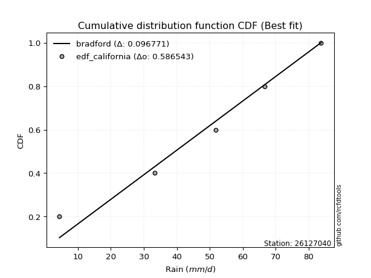</img>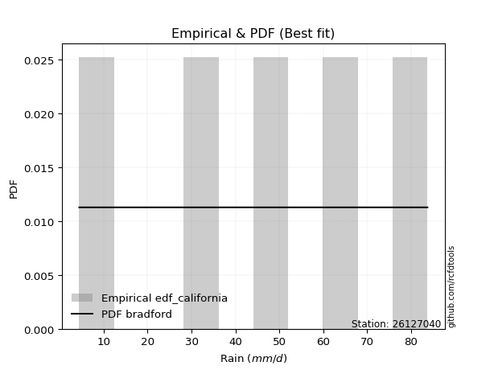</img>

</div>


### 2. EDF Hazen (1930)

Hazen method for plotting positions is a formula used to estimate the empirical cumulative probability distribution of flood events or other hydrological data. This formula often results in biased estimations, particularly when extrapolating to extreme events (high return periods).

<div align="center">


$P=(m-0.5)/n$


</div>


**2.1. Empirical values**

<div align="center">

|                | 0                  | 1                  | 2         | 3                 | 4                  |
|:---------------|:-------------------|:-------------------|:----------|:------------------|:-------------------|
| date           | 2020               | 2025               | 2019      | 2017              | 2018               |
| x              | 4.4                | 33.3               | 51.9      | 66.6              | 83.8               |
| m              | 1                  | 2                  | 3         | 4                 | 5                  |
| empirical_dist | edf_hazen          | edf_hazen          | edf_hazen | edf_hazen         | edf_hazen          |
| empirical      | 0.1                | 0.3                | 0.5       | 0.7               | 0.9                |
| empirical_tr   | 1.1111111111111112 | 1.4285714285714286 | 2.0       | 3.333333333333333 | 10.000000000000002 |

</div>


**2.2. Kolmogorov-Smirnov fit test (sorted by Δ)**


<div align="center">

|                | 0                   | 1                   | 2                   | 3                   | 4                   | 5                   | 6                   | 7                   | 8                   | 9                    | 10                  | 11                  | 12                  | 13                   | 14                  | 15                  | 16                  | 17                  | 18                  | 19                  | 20                  | 21                  | 22                 | 23                  | 24                  | 25                  | 26                  | 27                  | 28                  | 29                  | 30                  | 31                  | 32                  | 33                  | 34                  | 35                  | 36                  | 37                  | 38                  | 39                  | 40                 | 41                  | 42                  | 43                  | 44                 | 45                 | 46                 | 47                  | 48                  | 49                  | 50                  | 51                  | 52                  | 53                 | 54                  | 55                  | 56                  | 57                  | 58                  | 59                  | 60                 | 61                  | 62                  | 63                  | 64                  | 65                 | 66                  | 67                  | 68                 | 69                  | 70                 | 71                  | 72                  | 73                  | 74                  | 75                 | 76                  | 77                  | 78                 | 79                  | 80                  | 81                  | 82                  | 83                 | 84                 | 85                  | 86                 | 87                  | 88                  | 89                  | 90                  | 91                 | 92                  | 93                  | 94                  | 95                  | 96                 | 97                  | 98                  | 99                  | 100                 | 101                 | 102                | 103                 | 104                 | 105                | 106                | 107                 | 108                 | 109                 | 110                 | 111                 | 112                | 113                 | 114                | 115                | 116                 | 117                | 118                 | 119                | 120                | 121                | 122                | 123                | 124                | 125                | 126                 | 127                 | 128                | 129                | 130                 | 131                 | 132                 | 133                 | 134                 | 135                 | 136                 | 137                 | 138                 | 139                 | 140                | 141                | 142                 | 143                 | 144                 | 145                 | 146                | 147                | 148                | 149                | 150                | 151                | 152                | 153                | 154                | 155                | 156                | 157                | 158                | 159                |
|:---------------|:--------------------|:--------------------|:--------------------|:--------------------|:--------------------|:--------------------|:--------------------|:--------------------|:--------------------|:---------------------|:--------------------|:--------------------|:--------------------|:---------------------|:--------------------|:--------------------|:--------------------|:--------------------|:--------------------|:--------------------|:--------------------|:--------------------|:-------------------|:--------------------|:--------------------|:--------------------|:--------------------|:--------------------|:--------------------|:--------------------|:--------------------|:--------------------|:--------------------|:--------------------|:--------------------|:--------------------|:--------------------|:--------------------|:--------------------|:--------------------|:-------------------|:--------------------|:--------------------|:--------------------|:-------------------|:-------------------|:-------------------|:--------------------|:--------------------|:--------------------|:--------------------|:--------------------|:--------------------|:-------------------|:--------------------|:--------------------|:--------------------|:--------------------|:--------------------|:--------------------|:-------------------|:--------------------|:--------------------|:--------------------|:--------------------|:-------------------|:--------------------|:--------------------|:-------------------|:--------------------|:-------------------|:--------------------|:--------------------|:--------------------|:--------------------|:-------------------|:--------------------|:--------------------|:-------------------|:--------------------|:--------------------|:--------------------|:--------------------|:-------------------|:-------------------|:--------------------|:-------------------|:--------------------|:--------------------|:--------------------|:--------------------|:-------------------|:--------------------|:--------------------|:--------------------|:--------------------|:-------------------|:--------------------|:--------------------|:--------------------|:--------------------|:--------------------|:-------------------|:--------------------|:--------------------|:-------------------|:-------------------|:--------------------|:--------------------|:--------------------|:--------------------|:--------------------|:-------------------|:--------------------|:-------------------|:-------------------|:--------------------|:-------------------|:--------------------|:-------------------|:-------------------|:-------------------|:-------------------|:-------------------|:-------------------|:-------------------|:--------------------|:--------------------|:-------------------|:-------------------|:--------------------|:--------------------|:--------------------|:--------------------|:--------------------|:--------------------|:--------------------|:--------------------|:--------------------|:--------------------|:-------------------|:-------------------|:--------------------|:--------------------|:--------------------|:--------------------|:-------------------|:-------------------|:-------------------|:-------------------|:-------------------|:-------------------|:-------------------|:-------------------|:-------------------|:-------------------|:-------------------|:-------------------|:-------------------|:-------------------|
| station        | 26127040            | 26127040            | 26127040            | 26127040            | 26127040            | 26127040            | 26127040            | 26127040            | 26127040            | 26127040             | 26127040            | 26127040            | 26127040            | 26127040             | 26127040            | 26127040            | 26127040            | 26127040            | 26127040            | 26127040            | 26127040            | 26127040            | 26127040           | 26127040            | 26127040            | 26127040            | 26127040            | 26127040            | 26127040            | 26127040            | 26127040            | 26127040            | 26127040            | 26127040            | 26127040            | 26127040            | 26127040            | 26127040            | 26127040            | 26127040            | 26127040           | 26127040            | 26127040            | 26127040            | 26127040           | 26127040           | 26127040           | 26127040            | 26127040            | 26127040            | 26127040            | 26127040            | 26127040            | 26127040           | 26127040            | 26127040            | 26127040            | 26127040            | 26127040            | 26127040            | 26127040           | 26127040            | 26127040            | 26127040            | 26127040            | 26127040           | 26127040            | 26127040            | 26127040           | 26127040            | 26127040           | 26127040            | 26127040            | 26127040            | 26127040            | 26127040           | 26127040            | 26127040            | 26127040           | 26127040            | 26127040            | 26127040            | 26127040            | 26127040           | 26127040           | 26127040            | 26127040           | 26127040            | 26127040            | 26127040            | 26127040            | 26127040           | 26127040            | 26127040            | 26127040            | 26127040            | 26127040           | 26127040            | 26127040            | 26127040            | 26127040            | 26127040            | 26127040           | 26127040            | 26127040            | 26127040           | 26127040           | 26127040            | 26127040            | 26127040            | 26127040            | 26127040            | 26127040           | 26127040            | 26127040           | 26127040           | 26127040            | 26127040           | 26127040            | 26127040           | 26127040           | 26127040           | 26127040           | 26127040           | 26127040           | 26127040           | 26127040            | 26127040            | 26127040           | 26127040           | 26127040            | 26127040            | 26127040            | 26127040            | 26127040            | 26127040            | 26127040            | 26127040            | 26127040            | 26127040            | 26127040           | 26127040           | 26127040            | 26127040            | 26127040            | 26127040            | 26127040           | 26127040           | 26127040           | 26127040           | 26127040           | 26127040           | 26127040           | 26127040           | 26127040           | 26127040           | 26127040           | 26127040           | 26127040           | 26127040           |
| empirical_dist | edf_hazen           | edf_hazen           | edf_hazen           | edf_hazen           | edf_hazen           | edf_hazen           | edf_hazen           | edf_hazen           | edf_hazen           | edf_hazen            | edf_hazen           | edf_hazen           | edf_hazen           | edf_hazen            | edf_hazen           | edf_hazen           | edf_hazen           | edf_hazen           | edf_hazen           | edf_hazen           | edf_hazen           | edf_hazen           | edf_hazen          | edf_hazen           | edf_hazen           | edf_hazen           | edf_hazen           | edf_hazen           | edf_hazen           | edf_hazen           | edf_hazen           | edf_hazen           | edf_hazen           | edf_hazen           | edf_hazen           | edf_hazen           | edf_hazen           | edf_hazen           | edf_hazen           | edf_hazen           | edf_hazen          | edf_hazen           | edf_hazen           | edf_hazen           | edf_hazen          | edf_hazen          | edf_hazen          | edf_hazen           | edf_hazen           | edf_hazen           | edf_hazen           | edf_hazen           | edf_hazen           | edf_hazen          | edf_hazen           | edf_hazen           | edf_hazen           | edf_hazen           | edf_hazen           | edf_hazen           | edf_hazen          | edf_hazen           | edf_hazen           | edf_hazen           | edf_hazen           | edf_hazen          | edf_hazen           | edf_hazen           | edf_hazen          | edf_hazen           | edf_hazen          | edf_hazen           | edf_hazen           | edf_hazen           | edf_hazen           | edf_hazen          | edf_hazen           | edf_hazen           | edf_hazen          | edf_hazen           | edf_hazen           | edf_hazen           | edf_hazen           | edf_hazen          | edf_hazen          | edf_hazen           | edf_hazen          | edf_hazen           | edf_hazen           | edf_hazen           | edf_hazen           | edf_hazen          | edf_hazen           | edf_hazen           | edf_hazen           | edf_hazen           | edf_hazen          | edf_hazen           | edf_hazen           | edf_hazen           | edf_hazen           | edf_hazen           | edf_hazen          | edf_hazen           | edf_hazen           | edf_hazen          | edf_hazen          | edf_hazen           | edf_hazen           | edf_hazen           | edf_hazen           | edf_hazen           | edf_hazen          | edf_hazen           | edf_hazen          | edf_hazen          | edf_hazen           | edf_hazen          | edf_hazen           | edf_hazen          | edf_hazen          | edf_hazen          | edf_hazen          | edf_hazen          | edf_hazen          | edf_hazen          | edf_hazen           | edf_hazen           | edf_hazen          | edf_hazen          | edf_hazen           | edf_hazen           | edf_hazen           | edf_hazen           | edf_hazen           | edf_hazen           | edf_hazen           | edf_hazen           | edf_hazen           | edf_hazen           | edf_hazen          | edf_hazen          | edf_hazen           | edf_hazen           | edf_hazen           | edf_hazen           | edf_hazen          | edf_hazen          | edf_hazen          | edf_hazen          | edf_hazen          | edf_hazen          | edf_hazen          | edf_hazen          | edf_hazen          | edf_hazen          | edf_hazen          | edf_hazen          | edf_hazen          | edf_hazen          |
| p_dist         | weibull_min         | pearson3            | johnsonsu           | semicircular        | anglit              | gumbel_l            | foldnorm            | exponnorm           | t                   | crystalball          | norm                | nct                 | ksone               | f                    | betaprime           | argus               | gamma               | erlang              | rice                | cosine              | logistic            | trapezoid           | exponweib          | invgamma            | invgauss            | maxwell             | logburr             | hypsecant           | logargus            | burr                | rayleigh            | logmielke           | triang              | gompertz            | logloggamma         | vonmises_line       | skewnorm            | truncnorm           | genpareto           | beta                | loggenextreme      | tukeylambda         | genhalflogistic     | kappa4              | kappa3             | arcsine            | uniform            | gausshyper          | loggausshyper       | invweibull          | dgamma              | logweibull_max      | laplace             | wrapcauchy         | loggenpareto        | logpearson3         | kstwobign           | logdweibull         | halfnorm            | dweibull            | gumbel_r           | loggennorm          | loggumbel_l         | loglevy_l           | logdgamma           | logvonmises_line   | logburr12           | truncweibull_min    | bradford           | logtrapezoid        | ncf                | halflogistic        | moyal               | genextreme          | lomax               | logf               | levy_l              | logfoldnorm         | genexpon           | logfatiguelife      | loghypsecant        | loglogistic         | lognct              | logbetaprime       | logcrystalball     | lognorm             | logt               | logexponnorm        | loganglit           | logsemicircular     | logarcsine          | gennorm            | logncf              | loggamma            | loggamma            | logrice             | loginvgamma        | logerlang           | truncexpon          | loginvgauss         | logloglaplace       | wald                | logalpha           | loglaplace          | loglaplace          | loggenhalflogistic | logmaxwell         | logskewnorm         | loginvweibull       | logwrapcauchy       | lograyleigh         | loggompertz         | logjohnsonsb       | logcosine           | loggumbel_r        | logtriang          | logbeta             | loghalfnorm        | logkstwobign        | logtukeylambda     | mielke             | loggenexpon        | logmoyal           | loghalflogistic    | lognakagami        | loggengamma        | nakagami            | burr12              | loglomax           | logexponweib       | gengamma            | halfgennorm         | logksone            | loghalfgennorm      | logwald             | logtruncweibull_min | logkappa3           | loguniform          | logkappa4           | logweibull_min      | logjohnsonsu       | logbradford        | logtruncexpon       | alpha               | logtruncnorm        | johnsonsb           | logrdist           | weibull_max        | fatiguelife        | logexponpow        | powerlaw           | truncpareto        | exponpow           | logpowerlaw        | logtruncpareto     | rdist              | genlogistic        | loggenlogistic     | logvonmises        | vonmises           |
| delta          | 0.03518486923674313 | 0.04218225333476899 | 0.04404575063475796 | 0.04602746348721595 | 0.04853936828652394 | 0.05403876982505995 | 0.05652782112520116 | 0.05654567652849962 | 0.05654702270519241 | 0.056547278858575356 | 0.05654728331765513 | 0.05657468779693242 | 0.05898134192620263 | 0.059425121692360694 | 0.06019974472772005 | 0.06227384269713521 | 0.06431876861078933 | 0.06516444045999281 | 0.07119052219658539 | 0.07376133918722128 | 0.07386628354396929 | 0.07433533287612093 | 0.0761092710359309 | 0.08016213080946444 | 0.08450154791464659 | 0.08649670501795359 | 0.08701155383844095 | 0.08874885197510063 | 0.09029855456323188 | 0.09532380306131072 | 0.09607068036074862 | 0.09852636402462978 | 0.09974789084984947 | 0.09983255838260276 | 0.09995537411364541 | 0.09999915470732672 | 0.09999966027446894 | 0.09999999228291034 | 0.09999999942186177 | 0.09999999999897047 | 0.0999999999999549 | 0.09999999999996445 | 0.09999999999996767 | 0.09999999999999909 | 0.1                | 0.1                | 0.1                | 0.10000000000167508 | 0.10000000002748866 | 0.10167228606703693 | 0.10448090176726421 | 0.10479816621285312 | 0.10840792910341646 | 0.110098545188543  | 0.11489209681582008 | 0.11706560552473155 | 0.11921555202585465 | 0.12199969063647975 | 0.12309695562787837 | 0.12617190388742067 | 0.1263514703061177 | 0.12661523320648052 | 0.12685428586274267 | 0.12734136551783926 | 0.13210487812803573 | 0.1333481931078111 | 0.13520308786420265 | 0.13679878523325628 | 0.1397101802216788 | 0.14283214710456937 | 0.1429851682190012 | 0.15058996126024793 | 0.15096804654195917 | 0.16351085642615082 | 0.16792417211243355 | 0.1779977683275888 | 0.18308761319364217 | 0.19033003766634038 | 0.1944435800601923 | 0.19620826665265717 | 0.19662191494065567 | 0.19693639656453404 | 0.19707609936570109 | 0.1971909068249063 | 0.1973045054238971 | 0.19730464799654707 | 0.1973048379853995 | 0.19730760969511013 | 0.19769047826372832 | 0.19784940797945483 | 0.19847929019701138 | 0.2                | 0.20289776019100209 | 0.20458842090360346 | 0.20458842090360346 | 0.20600982765518389 | 0.2100875748311835 | 0.21107027376660487 | 0.21489480639855163 | 0.21865966745098137 | 0.21879409936639804 | 0.21927773765601621 | 0.2205842879008682 | 0.22064262745296714 | 0.22064262745296714 | 0.2294501052532641 | 0.230460423592671  | 0.23240793924329184 | 0.23740936462759793 | 0.24090938469029316 | 0.24152841601240854 | 0.25328316020187064 | 0.2575195751100812 | 0.25957527544849396 | 0.2675957441830525 | 0.2680669865173702 | 0.27000732269246425 | 0.2726971878906777 | 0.27346134177835474 | 0.2757242502224912 | 0.2803564631211733 | 0.2815651973887772 | 0.2934588680872336 | 0.2974675229308312 | 0.2999999994850413 | 0.317159982486161  | 0.31898751164985656 | 0.32559688099671696 | 0.3349887242194933 | 0.3458420533679228 | 0.35105589880684723 | 0.35272979618446293 | 0.35568676319500675 | 0.36046484551140706 | 0.36539115955669194 | 0.3704760513566699  | 0.38681930141806004 | 0.38682411583400805 | 0.39655941847309123 | 0.41845021570698476 | 0.4512437407068453 | 0.454044036565806  | 0.46012097663241663 | 0.46982494544537484 | 0.48371064675890835 | 0.49104813729350094 | 0.4999999958141672 | 0.5291920329106548 | 0.5571326156814771 | 0.5805839224406404 | 0.5835090862128194 | 0.5973629020019038 | 0.6098305222916862 | 0.6514699886079889 | 0.6613519222564375 | 0.6999999998424293 | 0.7                | 0.7                | 1.0607763992554842 | 12.441224061090184 |
| deltao         | 0.5865427407550001  | 0.5865427407550001  | 0.5865427407550001  | 0.5865427407550001  | 0.5865427407550001  | 0.5865427407550001  | 0.5865427407550001  | 0.5865427407550001  | 0.5865427407550001  | 0.5865427407550001   | 0.5865427407550001  | 0.5865427407550001  | 0.5865427407550001  | 0.5865427407550001   | 0.5865427407550001  | 0.5865427407550001  | 0.5865427407550001  | 0.5865427407550001  | 0.5865427407550001  | 0.5865427407550001  | 0.5865427407550001  | 0.5865427407550001  | 0.5865427407550001 | 0.5865427407550001  | 0.5865427407550001  | 0.5865427407550001  | 0.5865427407550001  | 0.5865427407550001  | 0.5865427407550001  | 0.5865427407550001  | 0.5865427407550001  | 0.5865427407550001  | 0.5865427407550001  | 0.5865427407550001  | 0.5865427407550001  | 0.5865427407550001  | 0.5865427407550001  | 0.5865427407550001  | 0.5865427407550001  | 0.5865427407550001  | 0.5865427407550001 | 0.5865427407550001  | 0.5865427407550001  | 0.5865427407550001  | 0.5865427407550001 | 0.5865427407550001 | 0.5865427407550001 | 0.5865427407550001  | 0.5865427407550001  | 0.5865427407550001  | 0.5865427407550001  | 0.5865427407550001  | 0.5865427407550001  | 0.5865427407550001 | 0.5865427407550001  | 0.5865427407550001  | 0.5865427407550001  | 0.5865427407550001  | 0.5865427407550001  | 0.5865427407550001  | 0.5865427407550001 | 0.5865427407550001  | 0.5865427407550001  | 0.5865427407550001  | 0.5865427407550001  | 0.5865427407550001 | 0.5865427407550001  | 0.5865427407550001  | 0.5865427407550001 | 0.5865427407550001  | 0.5865427407550001 | 0.5865427407550001  | 0.5865427407550001  | 0.5865427407550001  | 0.5865427407550001  | 0.5865427407550001 | 0.5865427407550001  | 0.5865427407550001  | 0.5865427407550001 | 0.5865427407550001  | 0.5865427407550001  | 0.5865427407550001  | 0.5865427407550001  | 0.5865427407550001 | 0.5865427407550001 | 0.5865427407550001  | 0.5865427407550001 | 0.5865427407550001  | 0.5865427407550001  | 0.5865427407550001  | 0.5865427407550001  | 0.5865427407550001 | 0.5865427407550001  | 0.5865427407550001  | 0.5865427407550001  | 0.5865427407550001  | 0.5865427407550001 | 0.5865427407550001  | 0.5865427407550001  | 0.5865427407550001  | 0.5865427407550001  | 0.5865427407550001  | 0.5865427407550001 | 0.5865427407550001  | 0.5865427407550001  | 0.5865427407550001 | 0.5865427407550001 | 0.5865427407550001  | 0.5865427407550001  | 0.5865427407550001  | 0.5865427407550001  | 0.5865427407550001  | 0.5865427407550001 | 0.5865427407550001  | 0.5865427407550001 | 0.5865427407550001 | 0.5865427407550001  | 0.5865427407550001 | 0.5865427407550001  | 0.5865427407550001 | 0.5865427407550001 | 0.5865427407550001 | 0.5865427407550001 | 0.5865427407550001 | 0.5865427407550001 | 0.5865427407550001 | 0.5865427407550001  | 0.5865427407550001  | 0.5865427407550001 | 0.5865427407550001 | 0.5865427407550001  | 0.5865427407550001  | 0.5865427407550001  | 0.5865427407550001  | 0.5865427407550001  | 0.5865427407550001  | 0.5865427407550001  | 0.5865427407550001  | 0.5865427407550001  | 0.5865427407550001  | 0.5865427407550001 | 0.5865427407550001 | 0.5865427407550001  | 0.5865427407550001  | 0.5865427407550001  | 0.5865427407550001  | 0.5865427407550001 | 0.5865427407550001 | 0.5865427407550001 | 0.5865427407550001 | 0.5865427407550001 | 0.5865427407550001 | 0.5865427407550001 | 0.5865427407550001 | 0.5865427407550001 | 0.5865427407550001 | 0.5865427407550001 | 0.5865427407550001 | 0.5865427407550001 | 0.5865427407550001 |
| eval           | Δo > Δ              | Δo > Δ              | Δo > Δ              | Δo > Δ              | Δo > Δ              | Δo > Δ              | Δo > Δ              | Δo > Δ              | Δo > Δ              | Δo > Δ               | Δo > Δ              | Δo > Δ              | Δo > Δ              | Δo > Δ               | Δo > Δ              | Δo > Δ              | Δo > Δ              | Δo > Δ              | Δo > Δ              | Δo > Δ              | Δo > Δ              | Δo > Δ              | Δo > Δ             | Δo > Δ              | Δo > Δ              | Δo > Δ              | Δo > Δ              | Δo > Δ              | Δo > Δ              | Δo > Δ              | Δo > Δ              | Δo > Δ              | Δo > Δ              | Δo > Δ              | Δo > Δ              | Δo > Δ              | Δo > Δ              | Δo > Δ              | Δo > Δ              | Δo > Δ              | Δo > Δ             | Δo > Δ              | Δo > Δ              | Δo > Δ              | Δo > Δ             | Δo > Δ             | Δo > Δ             | Δo > Δ              | Δo > Δ              | Δo > Δ              | Δo > Δ              | Δo > Δ              | Δo > Δ              | Δo > Δ             | Δo > Δ              | Δo > Δ              | Δo > Δ              | Δo > Δ              | Δo > Δ              | Δo > Δ              | Δo > Δ             | Δo > Δ              | Δo > Δ              | Δo > Δ              | Δo > Δ              | Δo > Δ             | Δo > Δ              | Δo > Δ              | Δo > Δ             | Δo > Δ              | Δo > Δ             | Δo > Δ              | Δo > Δ              | Δo > Δ              | Δo > Δ              | Δo > Δ             | Δo > Δ              | Δo > Δ              | Δo > Δ             | Δo > Δ              | Δo > Δ              | Δo > Δ              | Δo > Δ              | Δo > Δ             | Δo > Δ             | Δo > Δ              | Δo > Δ             | Δo > Δ              | Δo > Δ              | Δo > Δ              | Δo > Δ              | Δo > Δ             | Δo > Δ              | Δo > Δ              | Δo > Δ              | Δo > Δ              | Δo > Δ             | Δo > Δ              | Δo > Δ              | Δo > Δ              | Δo > Δ              | Δo > Δ              | Δo > Δ             | Δo > Δ              | Δo > Δ              | Δo > Δ             | Δo > Δ             | Δo > Δ              | Δo > Δ              | Δo > Δ              | Δo > Δ              | Δo > Δ              | Δo > Δ             | Δo > Δ              | Δo > Δ             | Δo > Δ             | Δo > Δ              | Δo > Δ             | Δo > Δ              | Δo > Δ             | Δo > Δ             | Δo > Δ             | Δo > Δ             | Δo > Δ             | Δo > Δ             | Δo > Δ             | Δo > Δ              | Δo > Δ              | Δo > Δ             | Δo > Δ             | Δo > Δ              | Δo > Δ              | Δo > Δ              | Δo > Δ              | Δo > Δ              | Δo > Δ              | Δo > Δ              | Δo > Δ              | Δo > Δ              | Δo > Δ              | Δo > Δ             | Δo > Δ             | Δo > Δ              | Δo > Δ              | Δo > Δ              | Δo > Δ              | Δo > Δ             | Δo > Δ             | Δo > Δ             | Δo > Δ             | Δo > Δ             | Δo <= Δ            | Δo <= Δ            | Δo <= Δ            | Δo <= Δ            | Δo <= Δ            | Δo <= Δ            | Δo <= Δ            | Δo <= Δ            | Δo <= Δ            |
| fit            | 1                   | 1                   | 1                   | 1                   | 1                   | 1                   | 1                   | 1                   | 1                   | 1                    | 1                   | 1                   | 1                   | 1                    | 1                   | 1                   | 1                   | 1                   | 1                   | 1                   | 1                   | 1                   | 1                  | 1                   | 1                   | 1                   | 1                   | 1                   | 1                   | 1                   | 1                   | 1                   | 1                   | 1                   | 1                   | 1                   | 1                   | 1                   | 1                   | 1                   | 1                  | 1                   | 1                   | 1                   | 1                  | 1                  | 1                  | 1                   | 1                   | 1                   | 1                   | 1                   | 1                   | 1                  | 1                   | 1                   | 1                   | 1                   | 1                   | 1                   | 1                  | 1                   | 1                   | 1                   | 1                   | 1                  | 1                   | 1                   | 1                  | 1                   | 1                  | 1                   | 1                   | 1                   | 1                   | 1                  | 1                   | 1                   | 1                  | 1                   | 1                   | 1                   | 1                   | 1                  | 1                  | 1                   | 1                  | 1                   | 1                   | 1                   | 1                   | 1                  | 1                   | 1                   | 1                   | 1                   | 1                  | 1                   | 1                   | 1                   | 1                   | 1                   | 1                  | 1                   | 1                   | 1                  | 1                  | 1                   | 1                   | 1                   | 1                   | 1                   | 1                  | 1                   | 1                  | 1                  | 1                   | 1                  | 1                   | 1                  | 1                  | 1                  | 1                  | 1                  | 1                  | 1                  | 1                   | 1                   | 1                  | 1                  | 1                   | 1                   | 1                   | 1                   | 1                   | 1                   | 1                   | 1                   | 1                   | 1                   | 1                  | 1                  | 1                   | 1                   | 1                   | 1                   | 1                  | 1                  | 1                  | 1                  | 1                  | 0                  | 0                  | 0                  | 0                  | 0                  | 0                  | 0                  | 0                  | 0                  |
| n              | 5                   | 5                   | 5                   | 5                   | 5                   | 5                   | 5                   | 5                   | 5                   | 5                    | 5                   | 5                   | 5                   | 5                    | 5                   | 5                   | 5                   | 5                   | 5                   | 5                   | 5                   | 5                   | 5                  | 5                   | 5                   | 5                   | 5                   | 5                   | 5                   | 5                   | 5                   | 5                   | 5                   | 5                   | 5                   | 5                   | 5                   | 5                   | 5                   | 5                   | 5                  | 5                   | 5                   | 5                   | 5                  | 5                  | 5                  | 5                   | 5                   | 5                   | 5                   | 5                   | 5                   | 5                  | 5                   | 5                   | 5                   | 5                   | 5                   | 5                   | 5                  | 5                   | 5                   | 5                   | 5                   | 5                  | 5                   | 5                   | 5                  | 5                   | 5                  | 5                   | 5                   | 5                   | 5                   | 5                  | 5                   | 5                   | 5                  | 5                   | 5                   | 5                   | 5                   | 5                  | 5                  | 5                   | 5                  | 5                   | 5                   | 5                   | 5                   | 5                  | 5                   | 5                   | 5                   | 5                   | 5                  | 5                   | 5                   | 5                   | 5                   | 5                   | 5                  | 5                   | 5                   | 5                  | 5                  | 5                   | 5                   | 5                   | 5                   | 5                   | 5                  | 5                   | 5                  | 5                  | 5                   | 5                  | 5                   | 5                  | 5                  | 5                  | 5                  | 5                  | 5                  | 5                  | 5                   | 5                   | 5                  | 5                  | 5                   | 5                   | 5                   | 5                   | 5                   | 5                   | 5                   | 5                   | 5                   | 5                   | 5                  | 5                  | 5                   | 5                   | 5                   | 5                   | 5                  | 5                  | 5                  | 5                  | 5                  | 5                  | 5                  | 5                  | 5                  | 5                  | 5                  | 5                  | 5                  | 5                  |
| best_fit       | 1                   | 0                   | 0                   | 0                   | 0                   | 0                   | 0                   | 0                   | 0                   | 0                    | 0                   | 0                   | 0                   | 0                    | 0                   | 0                   | 0                   | 0                   | 0                   | 0                   | 0                   | 0                   | 0                  | 0                   | 0                   | 0                   | 0                   | 0                   | 0                   | 0                   | 0                   | 0                   | 0                   | 0                   | 0                   | 0                   | 0                   | 0                   | 0                   | 0                   | 0                  | 0                   | 0                   | 0                   | 0                  | 0                  | 0                  | 0                   | 0                   | 0                   | 0                   | 0                   | 0                   | 0                  | 0                   | 0                   | 0                   | 0                   | 0                   | 0                   | 0                  | 0                   | 0                   | 0                   | 0                   | 0                  | 0                   | 0                   | 0                  | 0                   | 0                  | 0                   | 0                   | 0                   | 0                   | 0                  | 0                   | 0                   | 0                  | 0                   | 0                   | 0                   | 0                   | 0                  | 0                  | 0                   | 0                  | 0                   | 0                   | 0                   | 0                   | 0                  | 0                   | 0                   | 0                   | 0                   | 0                  | 0                   | 0                   | 0                   | 0                   | 0                   | 0                  | 0                   | 0                   | 0                  | 0                  | 0                   | 0                   | 0                   | 0                   | 0                   | 0                  | 0                   | 0                  | 0                  | 0                   | 0                  | 0                   | 0                  | 0                  | 0                  | 0                  | 0                  | 0                  | 0                  | 0                   | 0                   | 0                  | 0                  | 0                   | 0                   | 0                   | 0                   | 0                   | 0                   | 0                   | 0                   | 0                   | 0                   | 0                  | 0                  | 0                   | 0                   | 0                   | 0                   | 0                  | 0                  | 0                  | 0                  | 0                  | 0                  | 0                  | 0                  | 0                  | 0                  | 0                  | 0                  | 0                  | 0                  |
| best_fit_sort  | 1                   | 2                   | 3                   | 4                   | 5                   | 6                   | 7                   | 8                   | 9                   | 10                   | 11                  | 12                  | 13                  | 14                   | 15                  | 16                  | 17                  | 18                  | 19                  | 20                  | 21                  | 22                  | 23                 | 24                  | 25                  | 26                  | 27                  | 28                  | 29                  | 30                  | 31                  | 32                  | 33                  | 34                  | 35                  | 36                  | 37                  | 38                  | 39                  | 40                  | 41                 | 42                  | 43                  | 44                  | 45                 | 46                 | 47                 | 48                  | 49                  | 50                  | 51                  | 52                  | 53                  | 54                 | 55                  | 56                  | 57                  | 58                  | 59                  | 60                  | 61                 | 62                  | 63                  | 64                  | 65                  | 66                 | 67                  | 68                  | 69                 | 70                  | 71                 | 72                  | 73                  | 74                  | 75                  | 76                 | 77                  | 78                  | 79                 | 80                  | 81                  | 82                  | 83                  | 84                 | 85                 | 86                  | 87                 | 88                  | 89                  | 90                  | 91                  | 92                 | 93                  | 94                  | 95                  | 96                  | 97                 | 98                  | 99                  | 100                 | 101                 | 102                 | 103                | 104                 | 105                 | 106                | 107                | 108                 | 109                 | 110                 | 111                 | 112                 | 113                | 114                 | 115                | 116                | 117                 | 118                | 119                 | 120                | 121                | 122                | 123                | 124                | 125                | 126                | 127                 | 128                 | 129                | 130                | 131                 | 132                 | 133                 | 134                 | 135                 | 136                 | 137                 | 138                 | 139                 | 140                 | 141                | 142                | 143                 | 144                 | 145                 | 146                 | 147                | 148                | 149                | 150                | 151                | 152                | 153                | 154                | 155                | 156                | 157                | 158                | 159                | 160                |

</div>


**2.3. Best fit**

<div align="center">

|   id |   station | empirical_dist   | p_dist      |     delta |   deltao | eval   |   fit |   n |   best_fit |   best_fit_sort |
|-----:|----------:|:-----------------|:------------|----------:|---------:|:-------|------:|----:|-----------:|----------------:|
|    0 |  26127040 | edf_hazen        | weibull_min | 0.0351849 | 0.586543 | Δo > Δ |     1 |   5 |          1 |               1 |

</div>


<div align="center">

</img></img>

</div>


### 3. EDF Weibull (1939)

Weibull plotting position formula is an empirical method used to estimate the non-exceedance probability or plotting position for a set of observed data, is often recommended or widely used in practice, particularly in flood frequency analysis.

<div align="center">


$P=m/(n+1)$


</div>


**3.1. Empirical values**

<div align="center">

|                | 0                   | 1                  | 2           | 3                  | 4                  |
|:---------------|:--------------------|:-------------------|:------------|:-------------------|:-------------------|
| date           | 2020                | 2025               | 2019        | 2017               | 2018               |
| x              | 4.4                 | 33.3               | 51.9        | 66.6               | 83.8               |
| m              | 1                   | 2                  | 3           | 4                  | 5                  |
| empirical_dist | edf_weibull         | edf_weibull        | edf_weibull | edf_weibull        | edf_weibull        |
| empirical      | 0.16666666666666666 | 0.3333333333333333 | 0.5         | 0.6666666666666666 | 0.8333333333333334 |
| empirical_tr   | 1.2                 | 1.4999999999999998 | 2.0         | 2.9999999999999996 | 6.000000000000002  |

</div>


**3.2. Kolmogorov-Smirnov fit test (sorted by Δ)**


<div align="center">

|                | 0                  | 1                   | 2                   | 3                  | 4                   | 5                   | 6                   | 7                  | 8                  | 9                   | 10                  | 11                  | 12                  | 13                  | 14                  | 15                 | 16                 | 17                  | 18                 | 19                  | 20                  | 21                  | 22                  | 23                  | 24                  | 25                  | 26                  | 27                  | 28                  | 29                  | 30                 | 31                  | 32                  | 33                  | 34                 | 35                  | 36                  | 37                  | 38                  | 39                  | 40                 | 41                  | 42                 | 43                 | 44                  | 45                  | 46                  | 47                  | 48                  | 49                  | 50                  | 51                  | 52                  | 53                  | 54                 | 55                 | 56                 | 57                  | 58                  | 59                  | 60                 | 61                  | 62                  | 63                  | 64                  | 65                 | 66                 | 67                 | 68                 | 69                  | 70                  | 71                  | 72                 | 73                  | 74                  | 75                  | 76                 | 77                  | 78                  | 79                  | 80                  | 81                  | 82                  | 83                  | 84                  | 85                  | 86                  | 87                  | 88                 | 89                  | 90                  | 91                  | 92                  | 93                  | 94                  | 95                  | 96                  | 97                  | 98                  | 99                  | 100                 | 101                 | 102                | 103                 | 104                 | 105                 | 106                | 107                 | 108                | 109                 | 110                 | 111                | 112                 | 113                 | 114                 | 115                 | 116                 | 117                | 118                | 119                 | 120                 | 121                | 122                 | 123                | 124                 | 125                 | 126                 | 127                | 128                 | 129                | 130                | 131                | 132                 | 133                | 134                 | 135                 | 136                | 137                | 138                | 139                 | 140                | 141                 | 142                | 143                | 144                | 145                | 146                | 147                | 148                | 149                | 150                | 151                | 152                | 153                | 154                | 155                | 156                | 157                | 158                | 159                |
|:---------------|:-------------------|:--------------------|:--------------------|:-------------------|:--------------------|:--------------------|:--------------------|:-------------------|:-------------------|:--------------------|:--------------------|:--------------------|:--------------------|:--------------------|:--------------------|:-------------------|:-------------------|:--------------------|:-------------------|:--------------------|:--------------------|:--------------------|:--------------------|:--------------------|:--------------------|:--------------------|:--------------------|:--------------------|:--------------------|:--------------------|:-------------------|:--------------------|:--------------------|:--------------------|:-------------------|:--------------------|:--------------------|:--------------------|:--------------------|:--------------------|:-------------------|:--------------------|:-------------------|:-------------------|:--------------------|:--------------------|:--------------------|:--------------------|:--------------------|:--------------------|:--------------------|:--------------------|:--------------------|:--------------------|:-------------------|:-------------------|:-------------------|:--------------------|:--------------------|:--------------------|:-------------------|:--------------------|:--------------------|:--------------------|:--------------------|:-------------------|:-------------------|:-------------------|:-------------------|:--------------------|:--------------------|:--------------------|:-------------------|:--------------------|:--------------------|:--------------------|:-------------------|:--------------------|:--------------------|:--------------------|:--------------------|:--------------------|:--------------------|:--------------------|:--------------------|:--------------------|:--------------------|:--------------------|:-------------------|:--------------------|:--------------------|:--------------------|:--------------------|:--------------------|:--------------------|:--------------------|:--------------------|:--------------------|:--------------------|:--------------------|:--------------------|:--------------------|:-------------------|:--------------------|:--------------------|:--------------------|:-------------------|:--------------------|:-------------------|:--------------------|:--------------------|:-------------------|:--------------------|:--------------------|:--------------------|:--------------------|:--------------------|:-------------------|:-------------------|:--------------------|:--------------------|:-------------------|:--------------------|:-------------------|:--------------------|:--------------------|:--------------------|:-------------------|:--------------------|:-------------------|:-------------------|:-------------------|:--------------------|:-------------------|:--------------------|:--------------------|:-------------------|:-------------------|:-------------------|:--------------------|:-------------------|:--------------------|:-------------------|:-------------------|:-------------------|:-------------------|:-------------------|:-------------------|:-------------------|:-------------------|:-------------------|:-------------------|:-------------------|:-------------------|:-------------------|:-------------------|:-------------------|:-------------------|:-------------------|:-------------------|
| station        | 26127040           | 26127040            | 26127040            | 26127040           | 26127040            | 26127040            | 26127040            | 26127040           | 26127040           | 26127040            | 26127040            | 26127040            | 26127040            | 26127040            | 26127040            | 26127040           | 26127040           | 26127040            | 26127040           | 26127040            | 26127040            | 26127040            | 26127040            | 26127040            | 26127040            | 26127040            | 26127040            | 26127040            | 26127040            | 26127040            | 26127040           | 26127040            | 26127040            | 26127040            | 26127040           | 26127040            | 26127040            | 26127040            | 26127040            | 26127040            | 26127040           | 26127040            | 26127040           | 26127040           | 26127040            | 26127040            | 26127040            | 26127040            | 26127040            | 26127040            | 26127040            | 26127040            | 26127040            | 26127040            | 26127040           | 26127040           | 26127040           | 26127040            | 26127040            | 26127040            | 26127040           | 26127040            | 26127040            | 26127040            | 26127040            | 26127040           | 26127040           | 26127040           | 26127040           | 26127040            | 26127040            | 26127040            | 26127040           | 26127040            | 26127040            | 26127040            | 26127040           | 26127040            | 26127040            | 26127040            | 26127040            | 26127040            | 26127040            | 26127040            | 26127040            | 26127040            | 26127040            | 26127040            | 26127040           | 26127040            | 26127040            | 26127040            | 26127040            | 26127040            | 26127040            | 26127040            | 26127040            | 26127040            | 26127040            | 26127040            | 26127040            | 26127040            | 26127040           | 26127040            | 26127040            | 26127040            | 26127040           | 26127040            | 26127040           | 26127040            | 26127040            | 26127040           | 26127040            | 26127040            | 26127040            | 26127040            | 26127040            | 26127040           | 26127040           | 26127040            | 26127040            | 26127040           | 26127040            | 26127040           | 26127040            | 26127040            | 26127040            | 26127040           | 26127040            | 26127040           | 26127040           | 26127040           | 26127040            | 26127040           | 26127040            | 26127040            | 26127040           | 26127040           | 26127040           | 26127040            | 26127040           | 26127040            | 26127040           | 26127040           | 26127040           | 26127040           | 26127040           | 26127040           | 26127040           | 26127040           | 26127040           | 26127040           | 26127040           | 26127040           | 26127040           | 26127040           | 26127040           | 26127040           | 26127040           | 26127040           |
| empirical_dist | edf_weibull        | edf_weibull         | edf_weibull         | edf_weibull        | edf_weibull         | edf_weibull         | edf_weibull         | edf_weibull        | edf_weibull        | edf_weibull         | edf_weibull         | edf_weibull         | edf_weibull         | edf_weibull         | edf_weibull         | edf_weibull        | edf_weibull        | edf_weibull         | edf_weibull        | edf_weibull         | edf_weibull         | edf_weibull         | edf_weibull         | edf_weibull         | edf_weibull         | edf_weibull         | edf_weibull         | edf_weibull         | edf_weibull         | edf_weibull         | edf_weibull        | edf_weibull         | edf_weibull         | edf_weibull         | edf_weibull        | edf_weibull         | edf_weibull         | edf_weibull         | edf_weibull         | edf_weibull         | edf_weibull        | edf_weibull         | edf_weibull        | edf_weibull        | edf_weibull         | edf_weibull         | edf_weibull         | edf_weibull         | edf_weibull         | edf_weibull         | edf_weibull         | edf_weibull         | edf_weibull         | edf_weibull         | edf_weibull        | edf_weibull        | edf_weibull        | edf_weibull         | edf_weibull         | edf_weibull         | edf_weibull        | edf_weibull         | edf_weibull         | edf_weibull         | edf_weibull         | edf_weibull        | edf_weibull        | edf_weibull        | edf_weibull        | edf_weibull         | edf_weibull         | edf_weibull         | edf_weibull        | edf_weibull         | edf_weibull         | edf_weibull         | edf_weibull        | edf_weibull         | edf_weibull         | edf_weibull         | edf_weibull         | edf_weibull         | edf_weibull         | edf_weibull         | edf_weibull         | edf_weibull         | edf_weibull         | edf_weibull         | edf_weibull        | edf_weibull         | edf_weibull         | edf_weibull         | edf_weibull         | edf_weibull         | edf_weibull         | edf_weibull         | edf_weibull         | edf_weibull         | edf_weibull         | edf_weibull         | edf_weibull         | edf_weibull         | edf_weibull        | edf_weibull         | edf_weibull         | edf_weibull         | edf_weibull        | edf_weibull         | edf_weibull        | edf_weibull         | edf_weibull         | edf_weibull        | edf_weibull         | edf_weibull         | edf_weibull         | edf_weibull         | edf_weibull         | edf_weibull        | edf_weibull        | edf_weibull         | edf_weibull         | edf_weibull        | edf_weibull         | edf_weibull        | edf_weibull         | edf_weibull         | edf_weibull         | edf_weibull        | edf_weibull         | edf_weibull        | edf_weibull        | edf_weibull        | edf_weibull         | edf_weibull        | edf_weibull         | edf_weibull         | edf_weibull        | edf_weibull        | edf_weibull        | edf_weibull         | edf_weibull        | edf_weibull         | edf_weibull        | edf_weibull        | edf_weibull        | edf_weibull        | edf_weibull        | edf_weibull        | edf_weibull        | edf_weibull        | edf_weibull        | edf_weibull        | edf_weibull        | edf_weibull        | edf_weibull        | edf_weibull        | edf_weibull        | edf_weibull        | edf_weibull        | edf_weibull        |
| p_dist         | weibull_min        | johnsonsu           | dweibull            | pearson3           | logdweibull         | exponweib           | anglit              | f                  | nct                | exponnorm           | norm                | crystalball         | t                   | erlang              | betaprime           | gamma              | semicircular       | logistic            | invgauss           | loglevy_l           | invgamma            | gumbel_l            | logpearson3         | cosine              | invweibull          | foldnorm            | kstwobign           | loggumbel_l         | logtrapezoid        | hypsecant           | ksone              | rice                | argus               | levy_l              | maxwell            | logburr12           | dgamma              | trapezoid           | laplace             | logargus            | rayleigh           | logburr             | burr               | logdgamma          | gumbel_r            | logloglaplace       | logf                | loggennorm          | logfatiguelife      | lognct              | logbetaprime        | logcrystalball      | lognorm             | logt                | logexponnorm       | loganglit          | logsemicircular    | moyal               | logmielke           | triang              | gompertz           | logloggamma         | loggenpareto        | bradford            | vonmises_line       | skewnorm           | logweibull_max     | wrapcauchy         | truncnorm          | truncweibull_min    | ncf                 | genpareto           | logvonmises_line   | lomax               | beta                | loggenextreme       | tukeylambda        | genhalflogistic     | kappa4              | genextreme          | uniform             | kappa3              | halfnorm            | logarcsine          | arcsine             | halflogistic        | gennorm             | gausshyper          | loggausshyper      | logfoldnorm         | logncf              | loggamma            | loggamma            | logrice             | genexpon            | loginvgamma         | logerlang           | loglogistic         | loginvgauss         | logalpha            | loghypsecant        | logmaxwell          | loginvweibull      | logwrapcauchy       | lograyleigh         | truncexpon          | loggenhalflogistic | wald                | loggompertz        | loglaplace          | loglaplace          | logjohnsonsb       | logcosine           | logskewnorm         | loggumbel_r         | logbeta             | loghalfnorm         | logkstwobign       | loggenexpon        | mielke              | logmoyal            | logtriang          | loghalflogistic     | loggengamma        | nakagami            | burr12              | loglomax            | logtukeylambda     | logexponweib        | gengamma           | halfgennorm        | logksone           | loghalfgennorm      | logwald            | lognakagami         | logtruncweibull_min | logkappa3          | loguniform         | logkappa4          | logweibull_min      | logjohnsonsu       | logbradford         | johnsonsb          | logtruncexpon      | alpha              | logtruncnorm       | weibull_max        | logrdist           | fatiguelife        | logexponpow        | powerlaw           | truncpareto        | exponpow           | logpowerlaw        | logtruncpareto     | rdist              | genlogistic        | loggenlogistic     | logvonmises        | vonmises           |
| delta          | 0.1014935991600243 | 0.10221515857211416 | 0.10259811671926145 | 0.1028386122910953 | 0.10586814527456667 | 0.10710483414201388 | 0.10928496981878838 | 0.1098735901936041 | 0.1107365555184342 | 0.11074434982145649 | 0.11074453130115758 | 0.11074453281424096 | 0.11074500630309704 | 0.11143318966615667 | 0.11148343994467934 | 0.1118991515094797 | 0.1126941301538826 | 0.11370969618929513 | 0.1146816051763874 | 0.11548296141053782 | 0.11576806906749568 | 0.11666440961971458 | 0.11690456662624403 | 0.11756131715838727 | 0.11808107784889599 | 0.11843405187273656 | 0.11921555202585465 | 0.11964671717558226 | 0.12030608080244806 | 0.12208218530843395 | 0.1256480085928693 | 0.12608919365514853 | 0.12894050936380186 | 0.12924459624908258 | 0.1312068397707971 | 0.13610016874793818 | 0.13781423510059754 | 0.14100199954278758 | 0.14174126243674978 | 0.14207861362452692 | 0.1445126407363767 | 0.14564275581178987 | 0.14974600227503   | 0.1527661471093099 | 0.15329362062662688 | 0.15597560602771077 | 0.15942766136424757 | 0.15994856653981385 | 0.16287493331932384 | 0.16374276603236776 | 0.16385757349157298 | 0.16397117209056378 | 0.16397131466321374 | 0.16397150465206617 | 0.1639742763617768 | 0.164357144930395  | 0.1645160746461215 | 0.16471959773619496 | 0.16519303069129643 | 0.16641455751651613 | 0.1664992250492694 | 0.16662204078031206 | 0.16666309566285342 | 0.16666562214938163 | 0.16666582137399336 | 0.1666663269411356 | 0.1666666124918954 | 0.1666666380882984 | 0.166666658949577  | 0.16666666270366826 | 0.16666666564433663 | 0.16666666608852843 | 0.1666666665071207 | 0.16666666660151092 | 0.16666666666563712 | 0.16666666666662155 | 0.1666666666666311 | 0.16666666666663432 | 0.16666666666666574 | 0.16666666666666663 | 0.16666666666666666 | 0.16666666666666666 | 0.16666666666666666 | 0.16666666666666666 | 0.16666666666666666 | 0.16666666666666666 | 0.16666666666666669 | 0.16666666666834173 | 0.1666666666941553 | 0.16793454770302285 | 0.16956442685766876 | 0.17125508757027014 | 0.17125508757027014 | 0.17267649432185056 | 0.17407584298005097 | 0.17675424149785018 | 0.17773694043327154 | 0.17843589417701577 | 0.18532633411764804 | 0.18725095456753488 | 0.19280716251848085 | 0.19712709025933767 | 0.2040760312942646 | 0.20757605135695983 | 0.20819508267907522 | 0.21489480639855163 | 0.215549466154776  | 0.21927773765601621 | 0.2199498268685373 | 0.22064262745296714 | 0.22064262745296714 | 0.2241862417767479 | 0.22624194211516063 | 0.23240793924329184 | 0.23426241084971916 | 0.23667398935913092 | 0.23936385455734438 | 0.2401280084450214 | 0.2482318640554439 | 0.25456783599341215 | 0.26012553475390027 | 0.2606112070614074 | 0.26413418959749785 | 0.2838266491528277 | 0.28565417831652323 | 0.29226354766338364 | 0.30165539088615995 | 0.3090575835558245 | 0.31250872003458946 | 0.3177225654735139 | 0.3193964628511296 | 0.3223534298616734 | 0.32713151217807374 | 0.3320578262233586 | 0.33333333281837463 | 0.33714271802333656 | 0.3534859680847267 | 0.3534907825006747 | 0.3632260851397579 | 0.38511688237365144 | 0.417910407373512  | 0.42071070323247267 | 0.4243814706268343 | 0.4267876432990833 | 0.4364916121120415 | 0.450377313425575  | 0.4958586995773214 | 0.4999999958141672 | 0.5237992823481439 | 0.5472505891073072 | 0.550175752879486  | 0.5640295686685706 | 0.5764971889583528 | 0.6181366552746557 | 0.628018588923104  | 0.6666666665090961 | 0.6666666666666666 | 0.6666666666666666 | 1.0501534208086418 | 12.50789072775685  |
| deltao         | 0.5865427407550001 | 0.5865427407550001  | 0.5865427407550001  | 0.5865427407550001 | 0.5865427407550001  | 0.5865427407550001  | 0.5865427407550001  | 0.5865427407550001 | 0.5865427407550001 | 0.5865427407550001  | 0.5865427407550001  | 0.5865427407550001  | 0.5865427407550001  | 0.5865427407550001  | 0.5865427407550001  | 0.5865427407550001 | 0.5865427407550001 | 0.5865427407550001  | 0.5865427407550001 | 0.5865427407550001  | 0.5865427407550001  | 0.5865427407550001  | 0.5865427407550001  | 0.5865427407550001  | 0.5865427407550001  | 0.5865427407550001  | 0.5865427407550001  | 0.5865427407550001  | 0.5865427407550001  | 0.5865427407550001  | 0.5865427407550001 | 0.5865427407550001  | 0.5865427407550001  | 0.5865427407550001  | 0.5865427407550001 | 0.5865427407550001  | 0.5865427407550001  | 0.5865427407550001  | 0.5865427407550001  | 0.5865427407550001  | 0.5865427407550001 | 0.5865427407550001  | 0.5865427407550001 | 0.5865427407550001 | 0.5865427407550001  | 0.5865427407550001  | 0.5865427407550001  | 0.5865427407550001  | 0.5865427407550001  | 0.5865427407550001  | 0.5865427407550001  | 0.5865427407550001  | 0.5865427407550001  | 0.5865427407550001  | 0.5865427407550001 | 0.5865427407550001 | 0.5865427407550001 | 0.5865427407550001  | 0.5865427407550001  | 0.5865427407550001  | 0.5865427407550001 | 0.5865427407550001  | 0.5865427407550001  | 0.5865427407550001  | 0.5865427407550001  | 0.5865427407550001 | 0.5865427407550001 | 0.5865427407550001 | 0.5865427407550001 | 0.5865427407550001  | 0.5865427407550001  | 0.5865427407550001  | 0.5865427407550001 | 0.5865427407550001  | 0.5865427407550001  | 0.5865427407550001  | 0.5865427407550001 | 0.5865427407550001  | 0.5865427407550001  | 0.5865427407550001  | 0.5865427407550001  | 0.5865427407550001  | 0.5865427407550001  | 0.5865427407550001  | 0.5865427407550001  | 0.5865427407550001  | 0.5865427407550001  | 0.5865427407550001  | 0.5865427407550001 | 0.5865427407550001  | 0.5865427407550001  | 0.5865427407550001  | 0.5865427407550001  | 0.5865427407550001  | 0.5865427407550001  | 0.5865427407550001  | 0.5865427407550001  | 0.5865427407550001  | 0.5865427407550001  | 0.5865427407550001  | 0.5865427407550001  | 0.5865427407550001  | 0.5865427407550001 | 0.5865427407550001  | 0.5865427407550001  | 0.5865427407550001  | 0.5865427407550001 | 0.5865427407550001  | 0.5865427407550001 | 0.5865427407550001  | 0.5865427407550001  | 0.5865427407550001 | 0.5865427407550001  | 0.5865427407550001  | 0.5865427407550001  | 0.5865427407550001  | 0.5865427407550001  | 0.5865427407550001 | 0.5865427407550001 | 0.5865427407550001  | 0.5865427407550001  | 0.5865427407550001 | 0.5865427407550001  | 0.5865427407550001 | 0.5865427407550001  | 0.5865427407550001  | 0.5865427407550001  | 0.5865427407550001 | 0.5865427407550001  | 0.5865427407550001 | 0.5865427407550001 | 0.5865427407550001 | 0.5865427407550001  | 0.5865427407550001 | 0.5865427407550001  | 0.5865427407550001  | 0.5865427407550001 | 0.5865427407550001 | 0.5865427407550001 | 0.5865427407550001  | 0.5865427407550001 | 0.5865427407550001  | 0.5865427407550001 | 0.5865427407550001 | 0.5865427407550001 | 0.5865427407550001 | 0.5865427407550001 | 0.5865427407550001 | 0.5865427407550001 | 0.5865427407550001 | 0.5865427407550001 | 0.5865427407550001 | 0.5865427407550001 | 0.5865427407550001 | 0.5865427407550001 | 0.5865427407550001 | 0.5865427407550001 | 0.5865427407550001 | 0.5865427407550001 | 0.5865427407550001 |
| eval           | Δo > Δ             | Δo > Δ              | Δo > Δ              | Δo > Δ             | Δo > Δ              | Δo > Δ              | Δo > Δ              | Δo > Δ             | Δo > Δ             | Δo > Δ              | Δo > Δ              | Δo > Δ              | Δo > Δ              | Δo > Δ              | Δo > Δ              | Δo > Δ             | Δo > Δ             | Δo > Δ              | Δo > Δ             | Δo > Δ              | Δo > Δ              | Δo > Δ              | Δo > Δ              | Δo > Δ              | Δo > Δ              | Δo > Δ              | Δo > Δ              | Δo > Δ              | Δo > Δ              | Δo > Δ              | Δo > Δ             | Δo > Δ              | Δo > Δ              | Δo > Δ              | Δo > Δ             | Δo > Δ              | Δo > Δ              | Δo > Δ              | Δo > Δ              | Δo > Δ              | Δo > Δ             | Δo > Δ              | Δo > Δ             | Δo > Δ             | Δo > Δ              | Δo > Δ              | Δo > Δ              | Δo > Δ              | Δo > Δ              | Δo > Δ              | Δo > Δ              | Δo > Δ              | Δo > Δ              | Δo > Δ              | Δo > Δ             | Δo > Δ             | Δo > Δ             | Δo > Δ              | Δo > Δ              | Δo > Δ              | Δo > Δ             | Δo > Δ              | Δo > Δ              | Δo > Δ              | Δo > Δ              | Δo > Δ             | Δo > Δ             | Δo > Δ             | Δo > Δ             | Δo > Δ              | Δo > Δ              | Δo > Δ              | Δo > Δ             | Δo > Δ              | Δo > Δ              | Δo > Δ              | Δo > Δ             | Δo > Δ              | Δo > Δ              | Δo > Δ              | Δo > Δ              | Δo > Δ              | Δo > Δ              | Δo > Δ              | Δo > Δ              | Δo > Δ              | Δo > Δ              | Δo > Δ              | Δo > Δ             | Δo > Δ              | Δo > Δ              | Δo > Δ              | Δo > Δ              | Δo > Δ              | Δo > Δ              | Δo > Δ              | Δo > Δ              | Δo > Δ              | Δo > Δ              | Δo > Δ              | Δo > Δ              | Δo > Δ              | Δo > Δ             | Δo > Δ              | Δo > Δ              | Δo > Δ              | Δo > Δ             | Δo > Δ              | Δo > Δ             | Δo > Δ              | Δo > Δ              | Δo > Δ             | Δo > Δ              | Δo > Δ              | Δo > Δ              | Δo > Δ              | Δo > Δ              | Δo > Δ             | Δo > Δ             | Δo > Δ              | Δo > Δ              | Δo > Δ             | Δo > Δ              | Δo > Δ             | Δo > Δ              | Δo > Δ              | Δo > Δ              | Δo > Δ             | Δo > Δ              | Δo > Δ             | Δo > Δ             | Δo > Δ             | Δo > Δ              | Δo > Δ             | Δo > Δ              | Δo > Δ              | Δo > Δ             | Δo > Δ             | Δo > Δ             | Δo > Δ              | Δo > Δ             | Δo > Δ              | Δo > Δ             | Δo > Δ             | Δo > Δ             | Δo > Δ             | Δo > Δ             | Δo > Δ             | Δo > Δ             | Δo > Δ             | Δo > Δ             | Δo > Δ             | Δo > Δ             | Δo <= Δ            | Δo <= Δ            | Δo <= Δ            | Δo <= Δ            | Δo <= Δ            | Δo <= Δ            | Δo <= Δ            |
| fit            | 1                  | 1                   | 1                   | 1                  | 1                   | 1                   | 1                   | 1                  | 1                  | 1                   | 1                   | 1                   | 1                   | 1                   | 1                   | 1                  | 1                  | 1                   | 1                  | 1                   | 1                   | 1                   | 1                   | 1                   | 1                   | 1                   | 1                   | 1                   | 1                   | 1                   | 1                  | 1                   | 1                   | 1                   | 1                  | 1                   | 1                   | 1                   | 1                   | 1                   | 1                  | 1                   | 1                  | 1                  | 1                   | 1                   | 1                   | 1                   | 1                   | 1                   | 1                   | 1                   | 1                   | 1                   | 1                  | 1                  | 1                  | 1                   | 1                   | 1                   | 1                  | 1                   | 1                   | 1                   | 1                   | 1                  | 1                  | 1                  | 1                  | 1                   | 1                   | 1                   | 1                  | 1                   | 1                   | 1                   | 1                  | 1                   | 1                   | 1                   | 1                   | 1                   | 1                   | 1                   | 1                   | 1                   | 1                   | 1                   | 1                  | 1                   | 1                   | 1                   | 1                   | 1                   | 1                   | 1                   | 1                   | 1                   | 1                   | 1                   | 1                   | 1                   | 1                  | 1                   | 1                   | 1                   | 1                  | 1                   | 1                  | 1                   | 1                   | 1                  | 1                   | 1                   | 1                   | 1                   | 1                   | 1                  | 1                  | 1                   | 1                   | 1                  | 1                   | 1                  | 1                   | 1                   | 1                   | 1                  | 1                   | 1                  | 1                  | 1                  | 1                   | 1                  | 1                   | 1                   | 1                  | 1                  | 1                  | 1                   | 1                  | 1                   | 1                  | 1                  | 1                  | 1                  | 1                  | 1                  | 1                  | 1                  | 1                  | 1                  | 1                  | 0                  | 0                  | 0                  | 0                  | 0                  | 0                  | 0                  |
| n              | 5                  | 5                   | 5                   | 5                  | 5                   | 5                   | 5                   | 5                  | 5                  | 5                   | 5                   | 5                   | 5                   | 5                   | 5                   | 5                  | 5                  | 5                   | 5                  | 5                   | 5                   | 5                   | 5                   | 5                   | 5                   | 5                   | 5                   | 5                   | 5                   | 5                   | 5                  | 5                   | 5                   | 5                   | 5                  | 5                   | 5                   | 5                   | 5                   | 5                   | 5                  | 5                   | 5                  | 5                  | 5                   | 5                   | 5                   | 5                   | 5                   | 5                   | 5                   | 5                   | 5                   | 5                   | 5                  | 5                  | 5                  | 5                   | 5                   | 5                   | 5                  | 5                   | 5                   | 5                   | 5                   | 5                  | 5                  | 5                  | 5                  | 5                   | 5                   | 5                   | 5                  | 5                   | 5                   | 5                   | 5                  | 5                   | 5                   | 5                   | 5                   | 5                   | 5                   | 5                   | 5                   | 5                   | 5                   | 5                   | 5                  | 5                   | 5                   | 5                   | 5                   | 5                   | 5                   | 5                   | 5                   | 5                   | 5                   | 5                   | 5                   | 5                   | 5                  | 5                   | 5                   | 5                   | 5                  | 5                   | 5                  | 5                   | 5                   | 5                  | 5                   | 5                   | 5                   | 5                   | 5                   | 5                  | 5                  | 5                   | 5                   | 5                  | 5                   | 5                  | 5                   | 5                   | 5                   | 5                  | 5                   | 5                  | 5                  | 5                  | 5                   | 5                  | 5                   | 5                   | 5                  | 5                  | 5                  | 5                   | 5                  | 5                   | 5                  | 5                  | 5                  | 5                  | 5                  | 5                  | 5                  | 5                  | 5                  | 5                  | 5                  | 5                  | 5                  | 5                  | 5                  | 5                  | 5                  | 5                  |
| best_fit       | 1                  | 0                   | 0                   | 0                  | 0                   | 0                   | 0                   | 0                  | 0                  | 0                   | 0                   | 0                   | 0                   | 0                   | 0                   | 0                  | 0                  | 0                   | 0                  | 0                   | 0                   | 0                   | 0                   | 0                   | 0                   | 0                   | 0                   | 0                   | 0                   | 0                   | 0                  | 0                   | 0                   | 0                   | 0                  | 0                   | 0                   | 0                   | 0                   | 0                   | 0                  | 0                   | 0                  | 0                  | 0                   | 0                   | 0                   | 0                   | 0                   | 0                   | 0                   | 0                   | 0                   | 0                   | 0                  | 0                  | 0                  | 0                   | 0                   | 0                   | 0                  | 0                   | 0                   | 0                   | 0                   | 0                  | 0                  | 0                  | 0                  | 0                   | 0                   | 0                   | 0                  | 0                   | 0                   | 0                   | 0                  | 0                   | 0                   | 0                   | 0                   | 0                   | 0                   | 0                   | 0                   | 0                   | 0                   | 0                   | 0                  | 0                   | 0                   | 0                   | 0                   | 0                   | 0                   | 0                   | 0                   | 0                   | 0                   | 0                   | 0                   | 0                   | 0                  | 0                   | 0                   | 0                   | 0                  | 0                   | 0                  | 0                   | 0                   | 0                  | 0                   | 0                   | 0                   | 0                   | 0                   | 0                  | 0                  | 0                   | 0                   | 0                  | 0                   | 0                  | 0                   | 0                   | 0                   | 0                  | 0                   | 0                  | 0                  | 0                  | 0                   | 0                  | 0                   | 0                   | 0                  | 0                  | 0                  | 0                   | 0                  | 0                   | 0                  | 0                  | 0                  | 0                  | 0                  | 0                  | 0                  | 0                  | 0                  | 0                  | 0                  | 0                  | 0                  | 0                  | 0                  | 0                  | 0                  | 0                  |
| best_fit_sort  | 1                  | 2                   | 3                   | 4                  | 5                   | 6                   | 7                   | 8                  | 9                  | 10                  | 11                  | 12                  | 13                  | 14                  | 15                  | 16                 | 17                 | 18                  | 19                 | 20                  | 21                  | 22                  | 23                  | 24                  | 25                  | 26                  | 27                  | 28                  | 29                  | 30                  | 31                 | 32                  | 33                  | 34                  | 35                 | 36                  | 37                  | 38                  | 39                  | 40                  | 41                 | 42                  | 43                 | 44                 | 45                  | 46                  | 47                  | 48                  | 49                  | 50                  | 51                  | 52                  | 53                  | 54                  | 55                 | 56                 | 57                 | 58                  | 59                  | 60                  | 61                 | 62                  | 63                  | 64                  | 65                  | 66                 | 67                 | 68                 | 69                 | 70                  | 71                  | 72                  | 73                 | 74                  | 75                  | 76                  | 77                 | 78                  | 79                  | 80                  | 81                  | 82                  | 83                  | 84                  | 85                  | 86                  | 87                  | 88                  | 89                 | 90                  | 91                  | 92                  | 93                  | 94                  | 95                  | 96                  | 97                  | 98                  | 99                  | 100                 | 101                 | 102                 | 103                | 104                 | 105                 | 106                 | 107                | 108                 | 109                | 110                 | 111                 | 112                | 113                 | 114                 | 115                 | 116                 | 117                 | 118                | 119                | 120                 | 121                 | 122                | 123                 | 124                | 125                 | 126                 | 127                 | 128                | 129                 | 130                | 131                | 132                | 133                 | 134                | 135                 | 136                 | 137                | 138                | 139                | 140                 | 141                | 142                 | 143                | 144                | 145                | 146                | 147                | 148                | 149                | 150                | 151                | 152                | 153                | 154                | 155                | 156                | 157                | 158                | 159                | 160                |

</div>


**3.3. Best fit**

<div align="center">

|   id |   station | empirical_dist   | p_dist      |    delta |   deltao | eval   |   fit |   n |   best_fit |   best_fit_sort |
|-----:|----------:|:-----------------|:------------|---------:|---------:|:-------|------:|----:|-----------:|----------------:|
|    0 |  26127040 | edf_weibull      | weibull_min | 0.101494 | 0.586543 | Δo > Δ |     1 |   5 |          1 |               1 |

</div>


<div align="center">

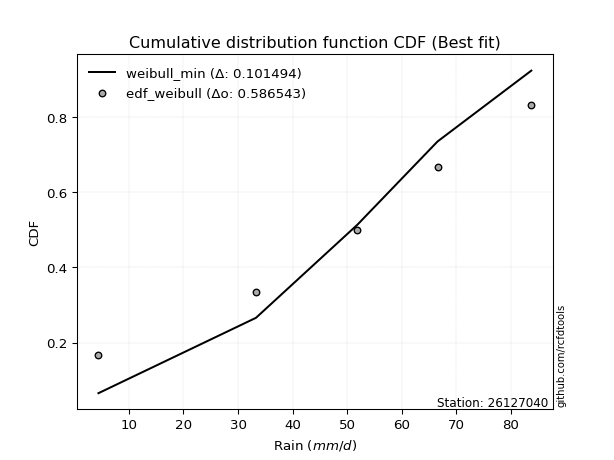</img></img>

</div>


### 4. EDF Beard (1943)

The Beard formula (or Beard´s plotting position formula) in hydrology is used to estimate the empirical non-exceedance probability _(P)_ of a flood event (or other extreme hydrological data point) within a given dataset.

<div align="center">


$P=(m-0.31)/(n+0.38)$


</div>


**4.1. Empirical values**

<div align="center">

|                | 0                   | 1                  | 2         | 3                  | 4                  |
|:---------------|:--------------------|:-------------------|:----------|:-------------------|:-------------------|
| date           | 2020                | 2025               | 2019      | 2017               | 2018               |
| x              | 4.4                 | 33.3               | 51.9      | 66.6               | 83.8               |
| m              | 1                   | 2                  | 3         | 4                  | 5                  |
| empirical_dist | edf_beard           | edf_beard          | edf_beard | edf_beard          | edf_beard          |
| empirical      | 0.12825278810408922 | 0.3141263940520446 | 0.5       | 0.6858736059479554 | 0.8717472118959109 |
| empirical_tr   | 1.1471215351812367  | 1.4579945799457996 | 2.0       | 3.183431952662722  | 7.797101449275368  |

</div>


**4.2. Kolmogorov-Smirnov fit test (sorted by Δ)**


<div align="center">

|                | 0                   | 1                   | 2                   | 3                   | 4                   | 5                   | 6                   | 7                   | 8                   | 9                  | 10                  | 11                 | 12                  | 13                  | 14                 | 15                  | 16                  | 17                  | 18                  | 19                  | 20                  | 21                 | 22                  | 23                  | 24                  | 25                 | 26                  | 27                  | 28                  | 29                  | 30                  | 31                  | 32                  | 33                  | 34                  | 35                  | 36                  | 37                  | 38                  | 39                  | 40                  | 41                 | 42                  | 43                  | 44                  | 45                 | 46                  | 47                  | 48                  | 49                 | 50                 | 51                 | 52                 | 53                 | 54                  | 55                  | 56                  | 57                  | 58                 | 59                  | 60                  | 61                  | 62                  | 63                  | 64                  | 65                  | 66                 | 67                  | 68                  | 69                 | 70                  | 71                 | 72                  | 73                  | 74                 | 75                  | 76                  | 77                  | 78                  | 79                  | 80                 | 81                  | 82                  | 83                  | 84                  | 85                  | 86                 | 87                 | 88                 | 89                  | 90                  | 91                  | 92                  | 93                  | 94                 | 95                  | 96                  | 97                  | 98                  | 99                  | 100                 | 101                 | 102                | 103                 | 104                 | 105                 | 106                 | 107                | 108                 | 109                | 110                 | 111                | 112                | 113                 | 114                 | 115                | 116                | 117                | 118                | 119                 | 120                | 121                 | 122                 | 123                 | 124                | 125                | 126                 | 127                 | 128                 | 129                 | 130                | 131                | 132                | 133                 | 134                | 135                 | 136                | 137                | 138                | 139                 | 140                | 141                 | 142                | 143                | 144                | 145                | 146                | 147                | 148                | 149                | 150                | 151                | 152                | 153                | 154                | 155                | 156                | 157                | 158                | 159                |
|:---------------|:--------------------|:--------------------|:--------------------|:--------------------|:--------------------|:--------------------|:--------------------|:--------------------|:--------------------|:-------------------|:--------------------|:-------------------|:--------------------|:--------------------|:-------------------|:--------------------|:--------------------|:--------------------|:--------------------|:--------------------|:--------------------|:-------------------|:--------------------|:--------------------|:--------------------|:-------------------|:--------------------|:--------------------|:--------------------|:--------------------|:--------------------|:--------------------|:--------------------|:--------------------|:--------------------|:--------------------|:--------------------|:--------------------|:--------------------|:--------------------|:--------------------|:-------------------|:--------------------|:--------------------|:--------------------|:-------------------|:--------------------|:--------------------|:--------------------|:-------------------|:-------------------|:-------------------|:-------------------|:-------------------|:--------------------|:--------------------|:--------------------|:--------------------|:-------------------|:--------------------|:--------------------|:--------------------|:--------------------|:--------------------|:--------------------|:--------------------|:-------------------|:--------------------|:--------------------|:-------------------|:--------------------|:-------------------|:--------------------|:--------------------|:-------------------|:--------------------|:--------------------|:--------------------|:--------------------|:--------------------|:-------------------|:--------------------|:--------------------|:--------------------|:--------------------|:--------------------|:-------------------|:-------------------|:-------------------|:--------------------|:--------------------|:--------------------|:--------------------|:--------------------|:-------------------|:--------------------|:--------------------|:--------------------|:--------------------|:--------------------|:--------------------|:--------------------|:-------------------|:--------------------|:--------------------|:--------------------|:--------------------|:-------------------|:--------------------|:-------------------|:--------------------|:-------------------|:-------------------|:--------------------|:--------------------|:-------------------|:-------------------|:-------------------|:-------------------|:--------------------|:-------------------|:--------------------|:--------------------|:--------------------|:-------------------|:-------------------|:--------------------|:--------------------|:--------------------|:--------------------|:-------------------|:-------------------|:-------------------|:--------------------|:-------------------|:--------------------|:-------------------|:-------------------|:-------------------|:--------------------|:-------------------|:--------------------|:-------------------|:-------------------|:-------------------|:-------------------|:-------------------|:-------------------|:-------------------|:-------------------|:-------------------|:-------------------|:-------------------|:-------------------|:-------------------|:-------------------|:-------------------|:-------------------|:-------------------|:-------------------|
| station        | 26127040            | 26127040            | 26127040            | 26127040            | 26127040            | 26127040            | 26127040            | 26127040            | 26127040            | 26127040           | 26127040            | 26127040           | 26127040            | 26127040            | 26127040           | 26127040            | 26127040            | 26127040            | 26127040            | 26127040            | 26127040            | 26127040           | 26127040            | 26127040            | 26127040            | 26127040           | 26127040            | 26127040            | 26127040            | 26127040            | 26127040            | 26127040            | 26127040            | 26127040            | 26127040            | 26127040            | 26127040            | 26127040            | 26127040            | 26127040            | 26127040            | 26127040           | 26127040            | 26127040            | 26127040            | 26127040           | 26127040            | 26127040            | 26127040            | 26127040           | 26127040           | 26127040           | 26127040           | 26127040           | 26127040            | 26127040            | 26127040            | 26127040            | 26127040           | 26127040            | 26127040            | 26127040            | 26127040            | 26127040            | 26127040            | 26127040            | 26127040           | 26127040            | 26127040            | 26127040           | 26127040            | 26127040           | 26127040            | 26127040            | 26127040           | 26127040            | 26127040            | 26127040            | 26127040            | 26127040            | 26127040           | 26127040            | 26127040            | 26127040            | 26127040            | 26127040            | 26127040           | 26127040           | 26127040           | 26127040            | 26127040            | 26127040            | 26127040            | 26127040            | 26127040           | 26127040            | 26127040            | 26127040            | 26127040            | 26127040            | 26127040            | 26127040            | 26127040           | 26127040            | 26127040            | 26127040            | 26127040            | 26127040           | 26127040            | 26127040           | 26127040            | 26127040           | 26127040           | 26127040            | 26127040            | 26127040           | 26127040           | 26127040           | 26127040           | 26127040            | 26127040           | 26127040            | 26127040            | 26127040            | 26127040           | 26127040           | 26127040            | 26127040            | 26127040            | 26127040            | 26127040           | 26127040           | 26127040           | 26127040            | 26127040           | 26127040            | 26127040           | 26127040           | 26127040           | 26127040            | 26127040           | 26127040            | 26127040           | 26127040           | 26127040           | 26127040           | 26127040           | 26127040           | 26127040           | 26127040           | 26127040           | 26127040           | 26127040           | 26127040           | 26127040           | 26127040           | 26127040           | 26127040           | 26127040           | 26127040           |
| empirical_dist | edf_beard           | edf_beard           | edf_beard           | edf_beard           | edf_beard           | edf_beard           | edf_beard           | edf_beard           | edf_beard           | edf_beard          | edf_beard           | edf_beard          | edf_beard           | edf_beard           | edf_beard          | edf_beard           | edf_beard           | edf_beard           | edf_beard           | edf_beard           | edf_beard           | edf_beard          | edf_beard           | edf_beard           | edf_beard           | edf_beard          | edf_beard           | edf_beard           | edf_beard           | edf_beard           | edf_beard           | edf_beard           | edf_beard           | edf_beard           | edf_beard           | edf_beard           | edf_beard           | edf_beard           | edf_beard           | edf_beard           | edf_beard           | edf_beard          | edf_beard           | edf_beard           | edf_beard           | edf_beard          | edf_beard           | edf_beard           | edf_beard           | edf_beard          | edf_beard          | edf_beard          | edf_beard          | edf_beard          | edf_beard           | edf_beard           | edf_beard           | edf_beard           | edf_beard          | edf_beard           | edf_beard           | edf_beard           | edf_beard           | edf_beard           | edf_beard           | edf_beard           | edf_beard          | edf_beard           | edf_beard           | edf_beard          | edf_beard           | edf_beard          | edf_beard           | edf_beard           | edf_beard          | edf_beard           | edf_beard           | edf_beard           | edf_beard           | edf_beard           | edf_beard          | edf_beard           | edf_beard           | edf_beard           | edf_beard           | edf_beard           | edf_beard          | edf_beard          | edf_beard          | edf_beard           | edf_beard           | edf_beard           | edf_beard           | edf_beard           | edf_beard          | edf_beard           | edf_beard           | edf_beard           | edf_beard           | edf_beard           | edf_beard           | edf_beard           | edf_beard          | edf_beard           | edf_beard           | edf_beard           | edf_beard           | edf_beard          | edf_beard           | edf_beard          | edf_beard           | edf_beard          | edf_beard          | edf_beard           | edf_beard           | edf_beard          | edf_beard          | edf_beard          | edf_beard          | edf_beard           | edf_beard          | edf_beard           | edf_beard           | edf_beard           | edf_beard          | edf_beard          | edf_beard           | edf_beard           | edf_beard           | edf_beard           | edf_beard          | edf_beard          | edf_beard          | edf_beard           | edf_beard          | edf_beard           | edf_beard          | edf_beard          | edf_beard          | edf_beard           | edf_beard          | edf_beard           | edf_beard          | edf_beard          | edf_beard          | edf_beard          | edf_beard          | edf_beard          | edf_beard          | edf_beard          | edf_beard          | edf_beard          | edf_beard          | edf_beard          | edf_beard          | edf_beard          | edf_beard          | edf_beard          | edf_beard          | edf_beard          |
| p_dist         | weibull_min         | johnsonsu           | pearson3            | anglit              | f                   | nct                 | exponnorm           | norm                | crystalball         | t                  | erlang              | betaprime          | gamma               | semicircular        | exponweib          | gumbel_l            | cosine              | foldnorm            | invgamma            | invgauss            | ksone               | rice               | logistic            | argus               | maxwell             | logdweibull        | invweibull          | trapezoid           | hypsecant           | logpearson3         | logargus            | rayleigh            | logburr             | burr                | dweibull            | loglevy_l           | loggumbel_l         | logdgamma           | dgamma              | kstwobign           | laplace             | gumbel_r           | logmielke           | triang              | gompertz            | logtrapezoid       | logloggamma         | loggenpareto        | vonmises_line       | skewnorm           | logweibull_max     | wrapcauchy         | truncnorm          | ncf                | genpareto           | logvonmises_line    | beta                | loggenextreme       | tukeylambda        | genhalflogistic     | kappa4              | arcsine             | kappa3              | uniform             | halfnorm            | gausshyper          | loggausshyper      | logburr12           | truncweibull_min    | bradford           | loggennorm          | genextreme         | halflogistic        | moyal               | lomax              | levy_l              | logf                | logfoldnorm         | genexpon            | logfatiguelife      | loglogistic        | lognct              | logbetaprime        | logcrystalball      | lognorm             | logt                | logexponnorm       | loganglit          | logsemicircular    | logarcsine          | gennorm             | logncf              | loggamma            | loggamma            | logloglaplace      | logrice             | loghypsecant        | loginvgamma         | logerlang           | loginvgauss         | logalpha            | truncexpon          | loggenhalflogistic | logmaxwell          | wald                | loglaplace          | loglaplace          | loginvweibull      | logwrapcauchy       | lograyleigh        | logskewnorm         | loggompertz        | logjohnsonsb       | logcosine           | loggumbel_r         | logbeta            | loghalfnorm        | logkstwobign       | logtriang          | mielke              | loggenexpon        | logmoyal            | loghalflogistic     | logtukeylambda      | loggengamma        | nakagami           | burr12              | lognakagami         | loglomax            | logexponweib        | gengamma           | halfgennorm        | logksone           | loghalfgennorm      | logwald            | logtruncweibull_min | logkappa3          | loguniform         | logkappa4          | logweibull_min      | logjohnsonsu       | logbradford         | logtruncexpon      | alpha              | johnsonsb          | logtruncnorm       | logrdist           | weibull_max        | fatiguelife        | logexponpow        | powerlaw           | truncpareto        | exponpow           | logpowerlaw        | logtruncpareto     | rdist              | genlogistic        | loggenlogistic     | logvonmises        | vonmises           |
| delta          | 0.06307972059744686 | 0.06380128000953667 | 0.06442473372851786 | 0.07087109125621094 | 0.07145971163102666 | 0.07232267695585676 | 0.07233047125887905 | 0.07233065273858014 | 0.07233065425166352 | 0.0723311277405196 | 0.07301931110357923 | 0.0730695613821019 | 0.07348527294690226 | 0.07428025159130516 | 0.0761092710359309 | 0.07825053105713708 | 0.07914743859580983 | 0.08002017331015912 | 0.08016213080946444 | 0.08450154791464659 | 0.08723413003029185 | 0.0876753150925711 | 0.08799267759601381 | 0.09052663080122436 | 0.09279296120821967 | 0.0937469025323906 | 0.10167228606703693 | 0.10258812098021008 | 0.10287524602714515 | 0.10293921147268692 | 0.10366473506194948 | 0.10609876217379927 | 0.10722887724921237 | 0.11133212371245249 | 0.11204550983537603 | 0.11321497146579473 | 0.11399332633942949 | 0.11435226854673247 | 0.11860729581930884 | 0.11921555202585465 | 0.12253432315546098 | 0.1263514703061177 | 0.12677915212871893 | 0.12800067895393863 | 0.12808534648669195 | 0.12819728708549   | 0.12820816221773457 | 0.12824921710027593 | 0.12825194281141591 | 0.1282524483785581 | 0.1282527339293179 | 0.1282527595257209 | 0.1282527803869995 | 0.1282527870817592 | 0.12825278752595093 | 0.12825278794454326 | 0.12825278810305962 | 0.12825278810404406 | 0.1282527881040536 | 0.12825278810405683 | 0.12825278810408824 | 0.12825278810408922 | 0.12825278810408922 | 0.12825278810408922 | 0.12825278810408922 | 0.12825278810576424 | 0.1282527881315778 | 0.13520308786420265 | 0.13679878523325628 | 0.1397101802216788 | 0.14074162725852515 | 0.1493844623741063 | 0.15058996126024793 | 0.15096804654195917 | 0.1537977780603889 | 0.15483482508955296 | 0.16387137427554416 | 0.17620364361429575 | 0.18031718600814767 | 0.18208187260061254 | 0.1828100025124894 | 0.18294970531365645 | 0.18306451277286168 | 0.18317811137185247 | 0.18317825394450243 | 0.18317844393335486 | 0.1831812156430655 | 0.1835640842116837 | 0.1837230139274102 | 0.18435289614496675 | 0.18587360594795543 | 0.18877136613895745 | 0.19046202685155883 | 0.19046202685155883 | 0.1905413112623089 | 0.19188343360313925 | 0.19280716251848085 | 0.19596118077913888 | 0.19694387971456023 | 0.20453327339893673 | 0.20645789384882357 | 0.21489480639855163 | 0.215549466154776  | 0.21633402954062636 | 0.21927773765601621 | 0.22064262745296714 | 0.22064262745296714 | 0.2232829705755533 | 0.22678299063824853 | 0.2274020219603639 | 0.23240793924329184 | 0.239156766149826  | 0.2433931810580366 | 0.24544888139644933 | 0.25346935013100785 | 0.2558809286404197 | 0.2585707938386331 | 0.2593349477263101 | 0.2606112070614074 | 0.26623006906912866 | 0.2674388033367326 | 0.27933247403518896 | 0.28334112887878654 | 0.28985064427453583 | 0.3030335884341164 | 0.3048611175978119 | 0.31147048694467233 | 0.31412639353708594 | 0.32086233016744864 | 0.33171565931587815 | 0.3369295047548026 | 0.3386034021324183 | 0.3415603691429621 | 0.34633845145936243 | 0.3512647655046473 | 0.35634965730462526 | 0.3726929073660154 | 0.3726977217819634 | 0.3824330244210466 | 0.40432382165494013 | 0.4371173466548008 | 0.43991764251376136 | 0.445994582580372  | 0.4556985513933302 | 0.4627953491894117 | 0.4695842527068637 | 0.4999999958141672 | 0.5150656388586102 | 0.5430062216294325 | 0.5664575283885958 | 0.5693826921607748 | 0.5832365079498592 | 0.5957041282396416 | 0.6373435945559442 | 0.6472255282043928 | 0.6858736057903847 | 0.6858736059479554 | 0.6858736059479554 | 1.0501534208086418 | 12.469476849194272 |
| deltao         | 0.5865427407550001  | 0.5865427407550001  | 0.5865427407550001  | 0.5865427407550001  | 0.5865427407550001  | 0.5865427407550001  | 0.5865427407550001  | 0.5865427407550001  | 0.5865427407550001  | 0.5865427407550001 | 0.5865427407550001  | 0.5865427407550001 | 0.5865427407550001  | 0.5865427407550001  | 0.5865427407550001 | 0.5865427407550001  | 0.5865427407550001  | 0.5865427407550001  | 0.5865427407550001  | 0.5865427407550001  | 0.5865427407550001  | 0.5865427407550001 | 0.5865427407550001  | 0.5865427407550001  | 0.5865427407550001  | 0.5865427407550001 | 0.5865427407550001  | 0.5865427407550001  | 0.5865427407550001  | 0.5865427407550001  | 0.5865427407550001  | 0.5865427407550001  | 0.5865427407550001  | 0.5865427407550001  | 0.5865427407550001  | 0.5865427407550001  | 0.5865427407550001  | 0.5865427407550001  | 0.5865427407550001  | 0.5865427407550001  | 0.5865427407550001  | 0.5865427407550001 | 0.5865427407550001  | 0.5865427407550001  | 0.5865427407550001  | 0.5865427407550001 | 0.5865427407550001  | 0.5865427407550001  | 0.5865427407550001  | 0.5865427407550001 | 0.5865427407550001 | 0.5865427407550001 | 0.5865427407550001 | 0.5865427407550001 | 0.5865427407550001  | 0.5865427407550001  | 0.5865427407550001  | 0.5865427407550001  | 0.5865427407550001 | 0.5865427407550001  | 0.5865427407550001  | 0.5865427407550001  | 0.5865427407550001  | 0.5865427407550001  | 0.5865427407550001  | 0.5865427407550001  | 0.5865427407550001 | 0.5865427407550001  | 0.5865427407550001  | 0.5865427407550001 | 0.5865427407550001  | 0.5865427407550001 | 0.5865427407550001  | 0.5865427407550001  | 0.5865427407550001 | 0.5865427407550001  | 0.5865427407550001  | 0.5865427407550001  | 0.5865427407550001  | 0.5865427407550001  | 0.5865427407550001 | 0.5865427407550001  | 0.5865427407550001  | 0.5865427407550001  | 0.5865427407550001  | 0.5865427407550001  | 0.5865427407550001 | 0.5865427407550001 | 0.5865427407550001 | 0.5865427407550001  | 0.5865427407550001  | 0.5865427407550001  | 0.5865427407550001  | 0.5865427407550001  | 0.5865427407550001 | 0.5865427407550001  | 0.5865427407550001  | 0.5865427407550001  | 0.5865427407550001  | 0.5865427407550001  | 0.5865427407550001  | 0.5865427407550001  | 0.5865427407550001 | 0.5865427407550001  | 0.5865427407550001  | 0.5865427407550001  | 0.5865427407550001  | 0.5865427407550001 | 0.5865427407550001  | 0.5865427407550001 | 0.5865427407550001  | 0.5865427407550001 | 0.5865427407550001 | 0.5865427407550001  | 0.5865427407550001  | 0.5865427407550001 | 0.5865427407550001 | 0.5865427407550001 | 0.5865427407550001 | 0.5865427407550001  | 0.5865427407550001 | 0.5865427407550001  | 0.5865427407550001  | 0.5865427407550001  | 0.5865427407550001 | 0.5865427407550001 | 0.5865427407550001  | 0.5865427407550001  | 0.5865427407550001  | 0.5865427407550001  | 0.5865427407550001 | 0.5865427407550001 | 0.5865427407550001 | 0.5865427407550001  | 0.5865427407550001 | 0.5865427407550001  | 0.5865427407550001 | 0.5865427407550001 | 0.5865427407550001 | 0.5865427407550001  | 0.5865427407550001 | 0.5865427407550001  | 0.5865427407550001 | 0.5865427407550001 | 0.5865427407550001 | 0.5865427407550001 | 0.5865427407550001 | 0.5865427407550001 | 0.5865427407550001 | 0.5865427407550001 | 0.5865427407550001 | 0.5865427407550001 | 0.5865427407550001 | 0.5865427407550001 | 0.5865427407550001 | 0.5865427407550001 | 0.5865427407550001 | 0.5865427407550001 | 0.5865427407550001 | 0.5865427407550001 |
| eval           | Δo > Δ              | Δo > Δ              | Δo > Δ              | Δo > Δ              | Δo > Δ              | Δo > Δ              | Δo > Δ              | Δo > Δ              | Δo > Δ              | Δo > Δ             | Δo > Δ              | Δo > Δ             | Δo > Δ              | Δo > Δ              | Δo > Δ             | Δo > Δ              | Δo > Δ              | Δo > Δ              | Δo > Δ              | Δo > Δ              | Δo > Δ              | Δo > Δ             | Δo > Δ              | Δo > Δ              | Δo > Δ              | Δo > Δ             | Δo > Δ              | Δo > Δ              | Δo > Δ              | Δo > Δ              | Δo > Δ              | Δo > Δ              | Δo > Δ              | Δo > Δ              | Δo > Δ              | Δo > Δ              | Δo > Δ              | Δo > Δ              | Δo > Δ              | Δo > Δ              | Δo > Δ              | Δo > Δ             | Δo > Δ              | Δo > Δ              | Δo > Δ              | Δo > Δ             | Δo > Δ              | Δo > Δ              | Δo > Δ              | Δo > Δ             | Δo > Δ             | Δo > Δ             | Δo > Δ             | Δo > Δ             | Δo > Δ              | Δo > Δ              | Δo > Δ              | Δo > Δ              | Δo > Δ             | Δo > Δ              | Δo > Δ              | Δo > Δ              | Δo > Δ              | Δo > Δ              | Δo > Δ              | Δo > Δ              | Δo > Δ             | Δo > Δ              | Δo > Δ              | Δo > Δ             | Δo > Δ              | Δo > Δ             | Δo > Δ              | Δo > Δ              | Δo > Δ             | Δo > Δ              | Δo > Δ              | Δo > Δ              | Δo > Δ              | Δo > Δ              | Δo > Δ             | Δo > Δ              | Δo > Δ              | Δo > Δ              | Δo > Δ              | Δo > Δ              | Δo > Δ             | Δo > Δ             | Δo > Δ             | Δo > Δ              | Δo > Δ              | Δo > Δ              | Δo > Δ              | Δo > Δ              | Δo > Δ             | Δo > Δ              | Δo > Δ              | Δo > Δ              | Δo > Δ              | Δo > Δ              | Δo > Δ              | Δo > Δ              | Δo > Δ             | Δo > Δ              | Δo > Δ              | Δo > Δ              | Δo > Δ              | Δo > Δ             | Δo > Δ              | Δo > Δ             | Δo > Δ              | Δo > Δ             | Δo > Δ             | Δo > Δ              | Δo > Δ              | Δo > Δ             | Δo > Δ             | Δo > Δ             | Δo > Δ             | Δo > Δ              | Δo > Δ             | Δo > Δ              | Δo > Δ              | Δo > Δ              | Δo > Δ             | Δo > Δ             | Δo > Δ              | Δo > Δ              | Δo > Δ              | Δo > Δ              | Δo > Δ             | Δo > Δ             | Δo > Δ             | Δo > Δ              | Δo > Δ             | Δo > Δ              | Δo > Δ             | Δo > Δ             | Δo > Δ             | Δo > Δ              | Δo > Δ             | Δo > Δ              | Δo > Δ             | Δo > Δ             | Δo > Δ             | Δo > Δ             | Δo > Δ             | Δo > Δ             | Δo > Δ             | Δo > Δ             | Δo > Δ             | Δo > Δ             | Δo <= Δ            | Δo <= Δ            | Δo <= Δ            | Δo <= Δ            | Δo <= Δ            | Δo <= Δ            | Δo <= Δ            | Δo <= Δ            |
| fit            | 1                   | 1                   | 1                   | 1                   | 1                   | 1                   | 1                   | 1                   | 1                   | 1                  | 1                   | 1                  | 1                   | 1                   | 1                  | 1                   | 1                   | 1                   | 1                   | 1                   | 1                   | 1                  | 1                   | 1                   | 1                   | 1                  | 1                   | 1                   | 1                   | 1                   | 1                   | 1                   | 1                   | 1                   | 1                   | 1                   | 1                   | 1                   | 1                   | 1                   | 1                   | 1                  | 1                   | 1                   | 1                   | 1                  | 1                   | 1                   | 1                   | 1                  | 1                  | 1                  | 1                  | 1                  | 1                   | 1                   | 1                   | 1                   | 1                  | 1                   | 1                   | 1                   | 1                   | 1                   | 1                   | 1                   | 1                  | 1                   | 1                   | 1                  | 1                   | 1                  | 1                   | 1                   | 1                  | 1                   | 1                   | 1                   | 1                   | 1                   | 1                  | 1                   | 1                   | 1                   | 1                   | 1                   | 1                  | 1                  | 1                  | 1                   | 1                   | 1                   | 1                   | 1                   | 1                  | 1                   | 1                   | 1                   | 1                   | 1                   | 1                   | 1                   | 1                  | 1                   | 1                   | 1                   | 1                   | 1                  | 1                   | 1                  | 1                   | 1                  | 1                  | 1                   | 1                   | 1                  | 1                  | 1                  | 1                  | 1                   | 1                  | 1                   | 1                   | 1                   | 1                  | 1                  | 1                   | 1                   | 1                   | 1                   | 1                  | 1                  | 1                  | 1                   | 1                  | 1                   | 1                  | 1                  | 1                  | 1                   | 1                  | 1                   | 1                  | 1                  | 1                  | 1                  | 1                  | 1                  | 1                  | 1                  | 1                  | 1                  | 0                  | 0                  | 0                  | 0                  | 0                  | 0                  | 0                  | 0                  |
| n              | 5                   | 5                   | 5                   | 5                   | 5                   | 5                   | 5                   | 5                   | 5                   | 5                  | 5                   | 5                  | 5                   | 5                   | 5                  | 5                   | 5                   | 5                   | 5                   | 5                   | 5                   | 5                  | 5                   | 5                   | 5                   | 5                  | 5                   | 5                   | 5                   | 5                   | 5                   | 5                   | 5                   | 5                   | 5                   | 5                   | 5                   | 5                   | 5                   | 5                   | 5                   | 5                  | 5                   | 5                   | 5                   | 5                  | 5                   | 5                   | 5                   | 5                  | 5                  | 5                  | 5                  | 5                  | 5                   | 5                   | 5                   | 5                   | 5                  | 5                   | 5                   | 5                   | 5                   | 5                   | 5                   | 5                   | 5                  | 5                   | 5                   | 5                  | 5                   | 5                  | 5                   | 5                   | 5                  | 5                   | 5                   | 5                   | 5                   | 5                   | 5                  | 5                   | 5                   | 5                   | 5                   | 5                   | 5                  | 5                  | 5                  | 5                   | 5                   | 5                   | 5                   | 5                   | 5                  | 5                   | 5                   | 5                   | 5                   | 5                   | 5                   | 5                   | 5                  | 5                   | 5                   | 5                   | 5                   | 5                  | 5                   | 5                  | 5                   | 5                  | 5                  | 5                   | 5                   | 5                  | 5                  | 5                  | 5                  | 5                   | 5                  | 5                   | 5                   | 5                   | 5                  | 5                  | 5                   | 5                   | 5                   | 5                   | 5                  | 5                  | 5                  | 5                   | 5                  | 5                   | 5                  | 5                  | 5                  | 5                   | 5                  | 5                   | 5                  | 5                  | 5                  | 5                  | 5                  | 5                  | 5                  | 5                  | 5                  | 5                  | 5                  | 5                  | 5                  | 5                  | 5                  | 5                  | 5                  | 5                  |
| best_fit       | 1                   | 0                   | 0                   | 0                   | 0                   | 0                   | 0                   | 0                   | 0                   | 0                  | 0                   | 0                  | 0                   | 0                   | 0                  | 0                   | 0                   | 0                   | 0                   | 0                   | 0                   | 0                  | 0                   | 0                   | 0                   | 0                  | 0                   | 0                   | 0                   | 0                   | 0                   | 0                   | 0                   | 0                   | 0                   | 0                   | 0                   | 0                   | 0                   | 0                   | 0                   | 0                  | 0                   | 0                   | 0                   | 0                  | 0                   | 0                   | 0                   | 0                  | 0                  | 0                  | 0                  | 0                  | 0                   | 0                   | 0                   | 0                   | 0                  | 0                   | 0                   | 0                   | 0                   | 0                   | 0                   | 0                   | 0                  | 0                   | 0                   | 0                  | 0                   | 0                  | 0                   | 0                   | 0                  | 0                   | 0                   | 0                   | 0                   | 0                   | 0                  | 0                   | 0                   | 0                   | 0                   | 0                   | 0                  | 0                  | 0                  | 0                   | 0                   | 0                   | 0                   | 0                   | 0                  | 0                   | 0                   | 0                   | 0                   | 0                   | 0                   | 0                   | 0                  | 0                   | 0                   | 0                   | 0                   | 0                  | 0                   | 0                  | 0                   | 0                  | 0                  | 0                   | 0                   | 0                  | 0                  | 0                  | 0                  | 0                   | 0                  | 0                   | 0                   | 0                   | 0                  | 0                  | 0                   | 0                   | 0                   | 0                   | 0                  | 0                  | 0                  | 0                   | 0                  | 0                   | 0                  | 0                  | 0                  | 0                   | 0                  | 0                   | 0                  | 0                  | 0                  | 0                  | 0                  | 0                  | 0                  | 0                  | 0                  | 0                  | 0                  | 0                  | 0                  | 0                  | 0                  | 0                  | 0                  | 0                  |
| best_fit_sort  | 1                   | 2                   | 3                   | 4                   | 5                   | 6                   | 7                   | 8                   | 9                   | 10                 | 11                  | 12                 | 13                  | 14                  | 15                 | 16                  | 17                  | 18                  | 19                  | 20                  | 21                  | 22                 | 23                  | 24                  | 25                  | 26                 | 27                  | 28                  | 29                  | 30                  | 31                  | 32                  | 33                  | 34                  | 35                  | 36                  | 37                  | 38                  | 39                  | 40                  | 41                  | 42                 | 43                  | 44                  | 45                  | 46                 | 47                  | 48                  | 49                  | 50                 | 51                 | 52                 | 53                 | 54                 | 55                  | 56                  | 57                  | 58                  | 59                 | 60                  | 61                  | 62                  | 63                  | 64                  | 65                  | 66                  | 67                 | 68                  | 69                  | 70                 | 71                  | 72                 | 73                  | 74                  | 75                 | 76                  | 77                  | 78                  | 79                  | 80                  | 81                 | 82                  | 83                  | 84                  | 85                  | 86                  | 87                 | 88                 | 89                 | 90                  | 91                  | 92                  | 93                  | 94                  | 95                 | 96                  | 97                  | 98                  | 99                  | 100                 | 101                 | 102                 | 103                | 104                 | 105                 | 106                 | 107                 | 108                | 109                 | 110                | 111                 | 112                | 113                | 114                 | 115                 | 116                | 117                | 118                | 119                | 120                 | 121                | 122                 | 123                 | 124                 | 125                | 126                | 127                 | 128                 | 129                 | 130                 | 131                | 132                | 133                | 134                 | 135                | 136                 | 137                | 138                | 139                | 140                 | 141                | 142                 | 143                | 144                | 145                | 146                | 147                | 148                | 149                | 150                | 151                | 152                | 153                | 154                | 155                | 156                | 157                | 158                | 159                | 160                |

</div>


**4.3. Best fit**

<div align="center">

|   id |   station | empirical_dist   | p_dist      |     delta |   deltao | eval   |   fit |   n |   best_fit |   best_fit_sort |
|-----:|----------:|:-----------------|:------------|----------:|---------:|:-------|------:|----:|-----------:|----------------:|
|    0 |  26127040 | edf_beard        | weibull_min | 0.0630797 | 0.586543 | Δo > Δ |     1 |   5 |          1 |               1 |

</div>


<div align="center">

</img></img>

</div>


### 5. EDF Chegodayev (1955)

The Chegodayev formula is an empirical plotting position formula used in hydrological frequency analysis to estimate the exceedance probability or return period of a specific event from a set of observed data. It is primarily used for plotting observed data points on probability paper to fit a theoretical distribution, particularly for analyzing extreme events like maximum flood flows or rainfall intensities. The constant _b_ value in the generalized plotting position formula is 0.3.

<div align="center">


$P=(m-b)/(n+1-2b)$


</div>


**5.1. Empirical values**

<div align="center">

|                | 0                   | 1                   | 2              | 3                  | 4                  |
|:---------------|:--------------------|:--------------------|:---------------|:-------------------|:-------------------|
| date           | 2020                | 2025                | 2019           | 2017               | 2018               |
| x              | 4.4                 | 33.3                | 51.9           | 66.6               | 83.8               |
| m              | 1                   | 2                   | 3              | 4                  | 5                  |
| empirical_dist | edf_chegodayev      | edf_chegodayev      | edf_chegodayev | edf_chegodayev     | edf_chegodayev     |
| empirical      | 0.12962962962962962 | 0.31481481481481477 | 0.5            | 0.6851851851851851 | 0.8703703703703703 |
| empirical_tr   | 1.148936170212766   | 1.4594594594594594  | 2.0            | 3.1764705882352935 | 7.714285714285713  |

</div>


**5.2. Kolmogorov-Smirnov fit test (sorted by Δ)**


<div align="center">

|                | 0                   | 1                   | 2                   | 3                   | 4                   | 5                   | 6                   | 7                   | 8                   | 9                  | 10                  | 11                 | 12                  | 13                  | 14                 | 15                 | 16                  | 17                  | 18                  | 19                  | 20                  | 21                  | 22                 | 23                  | 24                  | 25                  | 26                  | 27                  | 28                  | 29                 | 30                  | 31                  | 32                  | 33                  | 34                  | 35                  | 36                  | 37                  | 38                  | 39                  | 40                  | 41                 | 42                  | 43                  | 44                  | 45                  | 46                  | 47                  | 48                  | 49                 | 50                  | 51                  | 52                  | 53                 | 54                  | 55                  | 56                  | 57                  | 58                  | 59                  | 60                  | 61                  | 62                  | 63                  | 64                  | 65                  | 66                  | 67                  | 68                  | 69                 | 70                 | 71                  | 72                  | 73                  | 74                  | 75                  | 76                 | 77                 | 78                  | 79                 | 80                  | 81                 | 82                  | 83                  | 84                  | 85                  | 86                  | 87                  | 88                  | 89                 | 90                  | 91                 | 92                  | 93                  | 94                  | 95                 | 96                  | 97                  | 98                  | 99                  | 100                 | 101                 | 102                | 103                | 104                 | 105                 | 106                 | 107                 | 108                 | 109                 | 110                 | 111                 | 112                 | 113                 | 114                | 115                | 116                | 117                 | 118                | 119                | 120                 | 121                | 122                | 123                | 124                | 125                | 126                | 127                | 128                | 129                | 130                 | 131                 | 132                 | 133                | 134                 | 135                 | 136                 | 137                | 138                 | 139                | 140                | 141                | 142                 | 143                 | 144                 | 145                 | 146                | 147                | 148                | 149                | 150                | 151                | 152                | 153                | 154                | 155                | 156                | 157                | 158                | 159                |
|:---------------|:--------------------|:--------------------|:--------------------|:--------------------|:--------------------|:--------------------|:--------------------|:--------------------|:--------------------|:-------------------|:--------------------|:-------------------|:--------------------|:--------------------|:-------------------|:-------------------|:--------------------|:--------------------|:--------------------|:--------------------|:--------------------|:--------------------|:-------------------|:--------------------|:--------------------|:--------------------|:--------------------|:--------------------|:--------------------|:-------------------|:--------------------|:--------------------|:--------------------|:--------------------|:--------------------|:--------------------|:--------------------|:--------------------|:--------------------|:--------------------|:--------------------|:-------------------|:--------------------|:--------------------|:--------------------|:--------------------|:--------------------|:--------------------|:--------------------|:-------------------|:--------------------|:--------------------|:--------------------|:-------------------|:--------------------|:--------------------|:--------------------|:--------------------|:--------------------|:--------------------|:--------------------|:--------------------|:--------------------|:--------------------|:--------------------|:--------------------|:--------------------|:--------------------|:--------------------|:-------------------|:-------------------|:--------------------|:--------------------|:--------------------|:--------------------|:--------------------|:-------------------|:-------------------|:--------------------|:-------------------|:--------------------|:-------------------|:--------------------|:--------------------|:--------------------|:--------------------|:--------------------|:--------------------|:--------------------|:-------------------|:--------------------|:-------------------|:--------------------|:--------------------|:--------------------|:-------------------|:--------------------|:--------------------|:--------------------|:--------------------|:--------------------|:--------------------|:-------------------|:-------------------|:--------------------|:--------------------|:--------------------|:--------------------|:--------------------|:--------------------|:--------------------|:--------------------|:--------------------|:--------------------|:-------------------|:-------------------|:-------------------|:--------------------|:-------------------|:-------------------|:--------------------|:-------------------|:-------------------|:-------------------|:-------------------|:-------------------|:-------------------|:-------------------|:-------------------|:-------------------|:--------------------|:--------------------|:--------------------|:-------------------|:--------------------|:--------------------|:--------------------|:-------------------|:--------------------|:-------------------|:-------------------|:-------------------|:--------------------|:--------------------|:--------------------|:--------------------|:-------------------|:-------------------|:-------------------|:-------------------|:-------------------|:-------------------|:-------------------|:-------------------|:-------------------|:-------------------|:-------------------|:-------------------|:-------------------|:-------------------|
| station        | 26127040            | 26127040            | 26127040            | 26127040            | 26127040            | 26127040            | 26127040            | 26127040            | 26127040            | 26127040           | 26127040            | 26127040           | 26127040            | 26127040            | 26127040           | 26127040           | 26127040            | 26127040            | 26127040            | 26127040            | 26127040            | 26127040            | 26127040           | 26127040            | 26127040            | 26127040            | 26127040            | 26127040            | 26127040            | 26127040           | 26127040            | 26127040            | 26127040            | 26127040            | 26127040            | 26127040            | 26127040            | 26127040            | 26127040            | 26127040            | 26127040            | 26127040           | 26127040            | 26127040            | 26127040            | 26127040            | 26127040            | 26127040            | 26127040            | 26127040           | 26127040            | 26127040            | 26127040            | 26127040           | 26127040            | 26127040            | 26127040            | 26127040            | 26127040            | 26127040            | 26127040            | 26127040            | 26127040            | 26127040            | 26127040            | 26127040            | 26127040            | 26127040            | 26127040            | 26127040           | 26127040           | 26127040            | 26127040            | 26127040            | 26127040            | 26127040            | 26127040           | 26127040           | 26127040            | 26127040           | 26127040            | 26127040           | 26127040            | 26127040            | 26127040            | 26127040            | 26127040            | 26127040            | 26127040            | 26127040           | 26127040            | 26127040           | 26127040            | 26127040            | 26127040            | 26127040           | 26127040            | 26127040            | 26127040            | 26127040            | 26127040            | 26127040            | 26127040           | 26127040           | 26127040            | 26127040            | 26127040            | 26127040            | 26127040            | 26127040            | 26127040            | 26127040            | 26127040            | 26127040            | 26127040           | 26127040           | 26127040           | 26127040            | 26127040           | 26127040           | 26127040            | 26127040           | 26127040           | 26127040           | 26127040           | 26127040           | 26127040           | 26127040           | 26127040           | 26127040           | 26127040            | 26127040            | 26127040            | 26127040           | 26127040            | 26127040            | 26127040            | 26127040           | 26127040            | 26127040           | 26127040           | 26127040           | 26127040            | 26127040            | 26127040            | 26127040            | 26127040           | 26127040           | 26127040           | 26127040           | 26127040           | 26127040           | 26127040           | 26127040           | 26127040           | 26127040           | 26127040           | 26127040           | 26127040           | 26127040           |
| empirical_dist | edf_chegodayev      | edf_chegodayev      | edf_chegodayev      | edf_chegodayev      | edf_chegodayev      | edf_chegodayev      | edf_chegodayev      | edf_chegodayev      | edf_chegodayev      | edf_chegodayev     | edf_chegodayev      | edf_chegodayev     | edf_chegodayev      | edf_chegodayev      | edf_chegodayev     | edf_chegodayev     | edf_chegodayev      | edf_chegodayev      | edf_chegodayev      | edf_chegodayev      | edf_chegodayev      | edf_chegodayev      | edf_chegodayev     | edf_chegodayev      | edf_chegodayev      | edf_chegodayev      | edf_chegodayev      | edf_chegodayev      | edf_chegodayev      | edf_chegodayev     | edf_chegodayev      | edf_chegodayev      | edf_chegodayev      | edf_chegodayev      | edf_chegodayev      | edf_chegodayev      | edf_chegodayev      | edf_chegodayev      | edf_chegodayev      | edf_chegodayev      | edf_chegodayev      | edf_chegodayev     | edf_chegodayev      | edf_chegodayev      | edf_chegodayev      | edf_chegodayev      | edf_chegodayev      | edf_chegodayev      | edf_chegodayev      | edf_chegodayev     | edf_chegodayev      | edf_chegodayev      | edf_chegodayev      | edf_chegodayev     | edf_chegodayev      | edf_chegodayev      | edf_chegodayev      | edf_chegodayev      | edf_chegodayev      | edf_chegodayev      | edf_chegodayev      | edf_chegodayev      | edf_chegodayev      | edf_chegodayev      | edf_chegodayev      | edf_chegodayev      | edf_chegodayev      | edf_chegodayev      | edf_chegodayev      | edf_chegodayev     | edf_chegodayev     | edf_chegodayev      | edf_chegodayev      | edf_chegodayev      | edf_chegodayev      | edf_chegodayev      | edf_chegodayev     | edf_chegodayev     | edf_chegodayev      | edf_chegodayev     | edf_chegodayev      | edf_chegodayev     | edf_chegodayev      | edf_chegodayev      | edf_chegodayev      | edf_chegodayev      | edf_chegodayev      | edf_chegodayev      | edf_chegodayev      | edf_chegodayev     | edf_chegodayev      | edf_chegodayev     | edf_chegodayev      | edf_chegodayev      | edf_chegodayev      | edf_chegodayev     | edf_chegodayev      | edf_chegodayev      | edf_chegodayev      | edf_chegodayev      | edf_chegodayev      | edf_chegodayev      | edf_chegodayev     | edf_chegodayev     | edf_chegodayev      | edf_chegodayev      | edf_chegodayev      | edf_chegodayev      | edf_chegodayev      | edf_chegodayev      | edf_chegodayev      | edf_chegodayev      | edf_chegodayev      | edf_chegodayev      | edf_chegodayev     | edf_chegodayev     | edf_chegodayev     | edf_chegodayev      | edf_chegodayev     | edf_chegodayev     | edf_chegodayev      | edf_chegodayev     | edf_chegodayev     | edf_chegodayev     | edf_chegodayev     | edf_chegodayev     | edf_chegodayev     | edf_chegodayev     | edf_chegodayev     | edf_chegodayev     | edf_chegodayev      | edf_chegodayev      | edf_chegodayev      | edf_chegodayev     | edf_chegodayev      | edf_chegodayev      | edf_chegodayev      | edf_chegodayev     | edf_chegodayev      | edf_chegodayev     | edf_chegodayev     | edf_chegodayev     | edf_chegodayev      | edf_chegodayev      | edf_chegodayev      | edf_chegodayev      | edf_chegodayev     | edf_chegodayev     | edf_chegodayev     | edf_chegodayev     | edf_chegodayev     | edf_chegodayev     | edf_chegodayev     | edf_chegodayev     | edf_chegodayev     | edf_chegodayev     | edf_chegodayev     | edf_chegodayev     | edf_chegodayev     | edf_chegodayev     |
| p_dist         | weibull_min         | johnsonsu           | pearson3            | anglit              | f                   | nct                 | exponnorm           | norm                | crystalball         | t                  | erlang              | betaprime          | gamma               | semicircular        | exponweib          | gumbel_l           | invgamma            | cosine              | foldnorm            | invgauss            | ksone               | logistic            | rice               | argus               | logdweibull         | maxwell             | invweibull          | logpearson3         | hypsecant           | trapezoid          | logargus            | rayleigh            | logburr             | dweibull            | loglevy_l           | burr                | loggumbel_l         | logdgamma           | kstwobign           | dgamma              | laplace             | gumbel_r           | logtrapezoid        | logmielke           | triang              | gompertz            | logloggamma         | loggenpareto        | vonmises_line       | skewnorm           | logweibull_max      | wrapcauchy          | truncnorm           | ncf                | genpareto           | logvonmises_line    | beta                | loggenextreme       | tukeylambda         | genhalflogistic     | kappa4              | arcsine             | kappa3              | halfnorm            | uniform             | gausshyper          | loggausshyper       | logburr12           | truncweibull_min    | bradford           | loggennorm         | genextreme          | halflogistic        | moyal               | lomax               | levy_l              | logf               | logfoldnorm        | genexpon            | logfatiguelife     | loglogistic         | lognct             | logbetaprime        | logcrystalball      | lognorm             | logt                | logexponnorm        | loganglit           | logsemicircular     | logarcsine         | gennorm             | logncf             | logloglaplace       | loggamma            | loggamma            | logrice            | loghypsecant        | loginvgamma         | logerlang           | loginvgauss         | logalpha            | truncexpon          | loggenhalflogistic | logmaxwell         | wald                | loglaplace          | loglaplace          | loginvweibull       | logwrapcauchy       | lograyleigh         | logskewnorm         | loggompertz         | logjohnsonsb        | logcosine           | loggumbel_r        | logbeta            | loghalfnorm        | logkstwobign        | logtriang          | mielke             | loggenexpon         | logmoyal           | loghalflogistic    | logtukeylambda     | loggengamma        | nakagami           | burr12             | lognakagami        | loglomax           | logexponweib       | gengamma            | halfgennorm         | logksone            | loghalfgennorm     | logwald             | logtruncweibull_min | logkappa3           | loguniform         | logkappa4           | logweibull_min     | logjohnsonsu       | logbradford        | logtruncexpon       | alpha               | johnsonsb           | logtruncnorm        | logrdist           | weibull_max        | fatiguelife        | logexponpow        | powerlaw           | truncpareto        | exponpow           | logpowerlaw        | logtruncpareto     | rdist              | genlogistic        | loggenlogistic     | logvonmises        | vonmises           |
| delta          | 0.06445656212298727 | 0.06517812153507718 | 0.06580157525405826 | 0.07224793278175135 | 0.07283655315656706 | 0.07369951848139716 | 0.07370731278441946 | 0.07370749426412054 | 0.07370749577720392 | 0.07370796926606   | 0.07439615262911964 | 0.0744464029076423 | 0.07486211447244266 | 0.07565709311684557 | 0.0761092710359309 | 0.0796273725826776 | 0.08016213080946444 | 0.08052428012135024 | 0.08139701483569953 | 0.08450154791464659 | 0.08861097155583225 | 0.08868109835878413 | 0.0890521566181115 | 0.09190347232676488 | 0.09237006100685008 | 0.09416980273376008 | 0.10167228606703693 | 0.10225079070991677 | 0.10356366678991547 | 0.1039649625057506 | 0.10504157658748989 | 0.10747560369933967 | 0.10860571877475289 | 0.11135708907260589 | 0.11252655070302442 | 0.11270896523799301 | 0.11399332633942949 | 0.11572911007227288 | 0.11921555202585465 | 0.11929571658207899 | 0.12322274391823129 | 0.1263514703061177 | 0.12750886632271985 | 0.12815599365425945 | 0.12937752047947915 | 0.12946218801223236 | 0.12958500374327508 | 0.12962605862581644 | 0.12962878433695632 | 0.1296292899040986 | 0.12962957545485843 | 0.12962960105126142 | 0.12962962191254002 | 0.1296296286072996 | 0.12962962905149145 | 0.12962962947008366 | 0.12962962962860014 | 0.12962962962958458 | 0.12962962962959412 | 0.12962962962959734 | 0.12962962962962876 | 0.12962962962962962 | 0.12962962962962962 | 0.12962962962962962 | 0.12962962962962965 | 0.12962962963130475 | 0.12962962965711833 | 0.13520308786420265 | 0.13679878523325628 | 0.1397101802216788 | 0.1414300480212953 | 0.14869604161133598 | 0.15058996126024793 | 0.15096804654195917 | 0.15310935729761876 | 0.15345798356401255 | 0.163182953512774  | 0.1755152228515256 | 0.17962876524537752 | 0.1813934518378424 | 0.18212158174971926 | 0.1822612845508863 | 0.18237609201009153 | 0.18248969060908232 | 0.18248983318173229 | 0.18249002317058471 | 0.18249279488029535 | 0.18287566344891354 | 0.18303459316464005 | 0.1836644753821966 | 0.18518518518518523 | 0.1880829453761873 | 0.18916446973676837 | 0.18977360608878868 | 0.18977360608878868 | 0.1911950128403691 | 0.19280716251848085 | 0.19527276001636873 | 0.19625545895179008 | 0.20384485263616658 | 0.20576947308605342 | 0.21489480639855163 | 0.215549466154776  | 0.2156456087778562 | 0.21927773765601621 | 0.22064262745296714 | 0.22064262745296714 | 0.22259454981278315 | 0.22609456987547838 | 0.22671360119759376 | 0.23240793924329184 | 0.23846834538705586 | 0.24270476029526644 | 0.24476046063367918 | 0.2527809293682377 | 0.2551925078776494 | 0.2578823730758629 | 0.25864652696353996 | 0.2606112070614074 | 0.2655416483063585 | 0.26675038257396244 | 0.2786440532724188 | 0.2826527081160164 | 0.290539065037306  | 0.3023451676713462 | 0.3041726968350418 | 0.3107820661819022 | 0.3148148142998561 | 0.3201739094046785 | 0.331027238553108  | 0.33624108399203245 | 0.33791498136964815 | 0.34087194838019197 | 0.3456500306965923 | 0.35057634474187716 | 0.3556612365418551  | 0.37200448660324525 | 0.3720093010191933 | 0.38174460365827645 | 0.40363540089217   | 0.4364289258920305 | 0.4392292217509912 | 0.44530616181760185 | 0.45501013063056006 | 0.46141850766387127 | 0.46889583194409357 | 0.4999999958141672 | 0.5143772180958399 | 0.5423178008666624 | 0.5657691076258257 | 0.5686942713980045 | 0.5825480871870891 | 0.5950157074768714 | 0.6366551737931742 | 0.6465371074416226 | 0.6851851850276146 | 0.6851851851851851 | 0.6851851851851851 | 1.0501534208086418 | 12.470853690719814 |
| deltao         | 0.5865427407550001  | 0.5865427407550001  | 0.5865427407550001  | 0.5865427407550001  | 0.5865427407550001  | 0.5865427407550001  | 0.5865427407550001  | 0.5865427407550001  | 0.5865427407550001  | 0.5865427407550001 | 0.5865427407550001  | 0.5865427407550001 | 0.5865427407550001  | 0.5865427407550001  | 0.5865427407550001 | 0.5865427407550001 | 0.5865427407550001  | 0.5865427407550001  | 0.5865427407550001  | 0.5865427407550001  | 0.5865427407550001  | 0.5865427407550001  | 0.5865427407550001 | 0.5865427407550001  | 0.5865427407550001  | 0.5865427407550001  | 0.5865427407550001  | 0.5865427407550001  | 0.5865427407550001  | 0.5865427407550001 | 0.5865427407550001  | 0.5865427407550001  | 0.5865427407550001  | 0.5865427407550001  | 0.5865427407550001  | 0.5865427407550001  | 0.5865427407550001  | 0.5865427407550001  | 0.5865427407550001  | 0.5865427407550001  | 0.5865427407550001  | 0.5865427407550001 | 0.5865427407550001  | 0.5865427407550001  | 0.5865427407550001  | 0.5865427407550001  | 0.5865427407550001  | 0.5865427407550001  | 0.5865427407550001  | 0.5865427407550001 | 0.5865427407550001  | 0.5865427407550001  | 0.5865427407550001  | 0.5865427407550001 | 0.5865427407550001  | 0.5865427407550001  | 0.5865427407550001  | 0.5865427407550001  | 0.5865427407550001  | 0.5865427407550001  | 0.5865427407550001  | 0.5865427407550001  | 0.5865427407550001  | 0.5865427407550001  | 0.5865427407550001  | 0.5865427407550001  | 0.5865427407550001  | 0.5865427407550001  | 0.5865427407550001  | 0.5865427407550001 | 0.5865427407550001 | 0.5865427407550001  | 0.5865427407550001  | 0.5865427407550001  | 0.5865427407550001  | 0.5865427407550001  | 0.5865427407550001 | 0.5865427407550001 | 0.5865427407550001  | 0.5865427407550001 | 0.5865427407550001  | 0.5865427407550001 | 0.5865427407550001  | 0.5865427407550001  | 0.5865427407550001  | 0.5865427407550001  | 0.5865427407550001  | 0.5865427407550001  | 0.5865427407550001  | 0.5865427407550001 | 0.5865427407550001  | 0.5865427407550001 | 0.5865427407550001  | 0.5865427407550001  | 0.5865427407550001  | 0.5865427407550001 | 0.5865427407550001  | 0.5865427407550001  | 0.5865427407550001  | 0.5865427407550001  | 0.5865427407550001  | 0.5865427407550001  | 0.5865427407550001 | 0.5865427407550001 | 0.5865427407550001  | 0.5865427407550001  | 0.5865427407550001  | 0.5865427407550001  | 0.5865427407550001  | 0.5865427407550001  | 0.5865427407550001  | 0.5865427407550001  | 0.5865427407550001  | 0.5865427407550001  | 0.5865427407550001 | 0.5865427407550001 | 0.5865427407550001 | 0.5865427407550001  | 0.5865427407550001 | 0.5865427407550001 | 0.5865427407550001  | 0.5865427407550001 | 0.5865427407550001 | 0.5865427407550001 | 0.5865427407550001 | 0.5865427407550001 | 0.5865427407550001 | 0.5865427407550001 | 0.5865427407550001 | 0.5865427407550001 | 0.5865427407550001  | 0.5865427407550001  | 0.5865427407550001  | 0.5865427407550001 | 0.5865427407550001  | 0.5865427407550001  | 0.5865427407550001  | 0.5865427407550001 | 0.5865427407550001  | 0.5865427407550001 | 0.5865427407550001 | 0.5865427407550001 | 0.5865427407550001  | 0.5865427407550001  | 0.5865427407550001  | 0.5865427407550001  | 0.5865427407550001 | 0.5865427407550001 | 0.5865427407550001 | 0.5865427407550001 | 0.5865427407550001 | 0.5865427407550001 | 0.5865427407550001 | 0.5865427407550001 | 0.5865427407550001 | 0.5865427407550001 | 0.5865427407550001 | 0.5865427407550001 | 0.5865427407550001 | 0.5865427407550001 |
| eval           | Δo > Δ              | Δo > Δ              | Δo > Δ              | Δo > Δ              | Δo > Δ              | Δo > Δ              | Δo > Δ              | Δo > Δ              | Δo > Δ              | Δo > Δ             | Δo > Δ              | Δo > Δ             | Δo > Δ              | Δo > Δ              | Δo > Δ             | Δo > Δ             | Δo > Δ              | Δo > Δ              | Δo > Δ              | Δo > Δ              | Δo > Δ              | Δo > Δ              | Δo > Δ             | Δo > Δ              | Δo > Δ              | Δo > Δ              | Δo > Δ              | Δo > Δ              | Δo > Δ              | Δo > Δ             | Δo > Δ              | Δo > Δ              | Δo > Δ              | Δo > Δ              | Δo > Δ              | Δo > Δ              | Δo > Δ              | Δo > Δ              | Δo > Δ              | Δo > Δ              | Δo > Δ              | Δo > Δ             | Δo > Δ              | Δo > Δ              | Δo > Δ              | Δo > Δ              | Δo > Δ              | Δo > Δ              | Δo > Δ              | Δo > Δ             | Δo > Δ              | Δo > Δ              | Δo > Δ              | Δo > Δ             | Δo > Δ              | Δo > Δ              | Δo > Δ              | Δo > Δ              | Δo > Δ              | Δo > Δ              | Δo > Δ              | Δo > Δ              | Δo > Δ              | Δo > Δ              | Δo > Δ              | Δo > Δ              | Δo > Δ              | Δo > Δ              | Δo > Δ              | Δo > Δ             | Δo > Δ             | Δo > Δ              | Δo > Δ              | Δo > Δ              | Δo > Δ              | Δo > Δ              | Δo > Δ             | Δo > Δ             | Δo > Δ              | Δo > Δ             | Δo > Δ              | Δo > Δ             | Δo > Δ              | Δo > Δ              | Δo > Δ              | Δo > Δ              | Δo > Δ              | Δo > Δ              | Δo > Δ              | Δo > Δ             | Δo > Δ              | Δo > Δ             | Δo > Δ              | Δo > Δ              | Δo > Δ              | Δo > Δ             | Δo > Δ              | Δo > Δ              | Δo > Δ              | Δo > Δ              | Δo > Δ              | Δo > Δ              | Δo > Δ             | Δo > Δ             | Δo > Δ              | Δo > Δ              | Δo > Δ              | Δo > Δ              | Δo > Δ              | Δo > Δ              | Δo > Δ              | Δo > Δ              | Δo > Δ              | Δo > Δ              | Δo > Δ             | Δo > Δ             | Δo > Δ             | Δo > Δ              | Δo > Δ             | Δo > Δ             | Δo > Δ              | Δo > Δ             | Δo > Δ             | Δo > Δ             | Δo > Δ             | Δo > Δ             | Δo > Δ             | Δo > Δ             | Δo > Δ             | Δo > Δ             | Δo > Δ              | Δo > Δ              | Δo > Δ              | Δo > Δ             | Δo > Δ              | Δo > Δ              | Δo > Δ              | Δo > Δ             | Δo > Δ              | Δo > Δ             | Δo > Δ             | Δo > Δ             | Δo > Δ              | Δo > Δ              | Δo > Δ              | Δo > Δ              | Δo > Δ             | Δo > Δ             | Δo > Δ             | Δo > Δ             | Δo > Δ             | Δo > Δ             | Δo <= Δ            | Δo <= Δ            | Δo <= Δ            | Δo <= Δ            | Δo <= Δ            | Δo <= Δ            | Δo <= Δ            | Δo <= Δ            |
| fit            | 1                   | 1                   | 1                   | 1                   | 1                   | 1                   | 1                   | 1                   | 1                   | 1                  | 1                   | 1                  | 1                   | 1                   | 1                  | 1                  | 1                   | 1                   | 1                   | 1                   | 1                   | 1                   | 1                  | 1                   | 1                   | 1                   | 1                   | 1                   | 1                   | 1                  | 1                   | 1                   | 1                   | 1                   | 1                   | 1                   | 1                   | 1                   | 1                   | 1                   | 1                   | 1                  | 1                   | 1                   | 1                   | 1                   | 1                   | 1                   | 1                   | 1                  | 1                   | 1                   | 1                   | 1                  | 1                   | 1                   | 1                   | 1                   | 1                   | 1                   | 1                   | 1                   | 1                   | 1                   | 1                   | 1                   | 1                   | 1                   | 1                   | 1                  | 1                  | 1                   | 1                   | 1                   | 1                   | 1                   | 1                  | 1                  | 1                   | 1                  | 1                   | 1                  | 1                   | 1                   | 1                   | 1                   | 1                   | 1                   | 1                   | 1                  | 1                   | 1                  | 1                   | 1                   | 1                   | 1                  | 1                   | 1                   | 1                   | 1                   | 1                   | 1                   | 1                  | 1                  | 1                   | 1                   | 1                   | 1                   | 1                   | 1                   | 1                   | 1                   | 1                   | 1                   | 1                  | 1                  | 1                  | 1                   | 1                  | 1                  | 1                   | 1                  | 1                  | 1                  | 1                  | 1                  | 1                  | 1                  | 1                  | 1                  | 1                   | 1                   | 1                   | 1                  | 1                   | 1                   | 1                   | 1                  | 1                   | 1                  | 1                  | 1                  | 1                   | 1                   | 1                   | 1                   | 1                  | 1                  | 1                  | 1                  | 1                  | 1                  | 0                  | 0                  | 0                  | 0                  | 0                  | 0                  | 0                  | 0                  |
| n              | 5                   | 5                   | 5                   | 5                   | 5                   | 5                   | 5                   | 5                   | 5                   | 5                  | 5                   | 5                  | 5                   | 5                   | 5                  | 5                  | 5                   | 5                   | 5                   | 5                   | 5                   | 5                   | 5                  | 5                   | 5                   | 5                   | 5                   | 5                   | 5                   | 5                  | 5                   | 5                   | 5                   | 5                   | 5                   | 5                   | 5                   | 5                   | 5                   | 5                   | 5                   | 5                  | 5                   | 5                   | 5                   | 5                   | 5                   | 5                   | 5                   | 5                  | 5                   | 5                   | 5                   | 5                  | 5                   | 5                   | 5                   | 5                   | 5                   | 5                   | 5                   | 5                   | 5                   | 5                   | 5                   | 5                   | 5                   | 5                   | 5                   | 5                  | 5                  | 5                   | 5                   | 5                   | 5                   | 5                   | 5                  | 5                  | 5                   | 5                  | 5                   | 5                  | 5                   | 5                   | 5                   | 5                   | 5                   | 5                   | 5                   | 5                  | 5                   | 5                  | 5                   | 5                   | 5                   | 5                  | 5                   | 5                   | 5                   | 5                   | 5                   | 5                   | 5                  | 5                  | 5                   | 5                   | 5                   | 5                   | 5                   | 5                   | 5                   | 5                   | 5                   | 5                   | 5                  | 5                  | 5                  | 5                   | 5                  | 5                  | 5                   | 5                  | 5                  | 5                  | 5                  | 5                  | 5                  | 5                  | 5                  | 5                  | 5                   | 5                   | 5                   | 5                  | 5                   | 5                   | 5                   | 5                  | 5                   | 5                  | 5                  | 5                  | 5                   | 5                   | 5                   | 5                   | 5                  | 5                  | 5                  | 5                  | 5                  | 5                  | 5                  | 5                  | 5                  | 5                  | 5                  | 5                  | 5                  | 5                  |
| best_fit       | 1                   | 0                   | 0                   | 0                   | 0                   | 0                   | 0                   | 0                   | 0                   | 0                  | 0                   | 0                  | 0                   | 0                   | 0                  | 0                  | 0                   | 0                   | 0                   | 0                   | 0                   | 0                   | 0                  | 0                   | 0                   | 0                   | 0                   | 0                   | 0                   | 0                  | 0                   | 0                   | 0                   | 0                   | 0                   | 0                   | 0                   | 0                   | 0                   | 0                   | 0                   | 0                  | 0                   | 0                   | 0                   | 0                   | 0                   | 0                   | 0                   | 0                  | 0                   | 0                   | 0                   | 0                  | 0                   | 0                   | 0                   | 0                   | 0                   | 0                   | 0                   | 0                   | 0                   | 0                   | 0                   | 0                   | 0                   | 0                   | 0                   | 0                  | 0                  | 0                   | 0                   | 0                   | 0                   | 0                   | 0                  | 0                  | 0                   | 0                  | 0                   | 0                  | 0                   | 0                   | 0                   | 0                   | 0                   | 0                   | 0                   | 0                  | 0                   | 0                  | 0                   | 0                   | 0                   | 0                  | 0                   | 0                   | 0                   | 0                   | 0                   | 0                   | 0                  | 0                  | 0                   | 0                   | 0                   | 0                   | 0                   | 0                   | 0                   | 0                   | 0                   | 0                   | 0                  | 0                  | 0                  | 0                   | 0                  | 0                  | 0                   | 0                  | 0                  | 0                  | 0                  | 0                  | 0                  | 0                  | 0                  | 0                  | 0                   | 0                   | 0                   | 0                  | 0                   | 0                   | 0                   | 0                  | 0                   | 0                  | 0                  | 0                  | 0                   | 0                   | 0                   | 0                   | 0                  | 0                  | 0                  | 0                  | 0                  | 0                  | 0                  | 0                  | 0                  | 0                  | 0                  | 0                  | 0                  | 0                  |
| best_fit_sort  | 1                   | 2                   | 3                   | 4                   | 5                   | 6                   | 7                   | 8                   | 9                   | 10                 | 11                  | 12                 | 13                  | 14                  | 15                 | 16                 | 17                  | 18                  | 19                  | 20                  | 21                  | 22                  | 23                 | 24                  | 25                  | 26                  | 27                  | 28                  | 29                  | 30                 | 31                  | 32                  | 33                  | 34                  | 35                  | 36                  | 37                  | 38                  | 39                  | 40                  | 41                  | 42                 | 43                  | 44                  | 45                  | 46                  | 47                  | 48                  | 49                  | 50                 | 51                  | 52                  | 53                  | 54                 | 55                  | 56                  | 57                  | 58                  | 59                  | 60                  | 61                  | 62                  | 63                  | 64                  | 65                  | 66                  | 67                  | 68                  | 69                  | 70                 | 71                 | 72                  | 73                  | 74                  | 75                  | 76                  | 77                 | 78                 | 79                  | 80                 | 81                  | 82                 | 83                  | 84                  | 85                  | 86                  | 87                  | 88                  | 89                  | 90                 | 91                  | 92                 | 93                  | 94                  | 95                  | 96                 | 97                  | 98                  | 99                  | 100                 | 101                 | 102                 | 103                | 104                | 105                 | 106                 | 107                 | 108                 | 109                 | 110                 | 111                 | 112                 | 113                 | 114                 | 115                | 116                | 117                | 118                 | 119                | 120                | 121                 | 122                | 123                | 124                | 125                | 126                | 127                | 128                | 129                | 130                | 131                 | 132                 | 133                 | 134                | 135                 | 136                 | 137                 | 138                | 139                 | 140                | 141                | 142                | 143                 | 144                 | 145                 | 146                 | 147                | 148                | 149                | 150                | 151                | 152                | 153                | 154                | 155                | 156                | 157                | 158                | 159                | 160                |

</div>


**5.3. Best fit**

<div align="center">

|   id |   station | empirical_dist   | p_dist      |     delta |   deltao | eval   |   fit |   n |   best_fit |   best_fit_sort |
|-----:|----------:|:-----------------|:------------|----------:|---------:|:-------|------:|----:|-----------:|----------------:|
|    0 |  26127040 | edf_chegodayev   | weibull_min | 0.0644566 | 0.586543 | Δo > Δ |     1 |   5 |          1 |               1 |

</div>


<div align="center">

</img>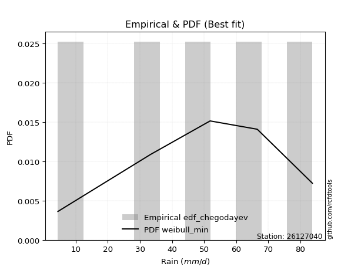</img>

</div>


### 6. EDF Blom (1958)

The Blom formula is a specific "plotting position" formula used in hydrology and statistical analysis to estimate the empirical cumulative probability (or non-exceedance probability) of a data series. It is particularly recommended for data that are approximately normally distributed. The constant _a_ is set to 0.375 (or 3/8).

<div align="center">


$P=(m-a)/(n+1-2a)$


</div>


**6.1. Empirical values**

<div align="center">

|                | 0                   | 1                   | 2        | 3                  | 4                  |
|:---------------|:--------------------|:--------------------|:---------|:-------------------|:-------------------|
| date           | 2020                | 2025                | 2019     | 2017               | 2018               |
| x              | 4.4                 | 33.3                | 51.9     | 66.6               | 83.8               |
| m              | 1                   | 2                   | 3        | 4                  | 5                  |
| empirical_dist | edf_blom            | edf_blom            | edf_blom | edf_blom           | edf_blom           |
| empirical      | 0.11904761904761904 | 0.30952380952380953 | 0.5      | 0.6904761904761905 | 0.8809523809523809 |
| empirical_tr   | 1.135135135135135   | 1.4482758620689655  | 2.0      | 3.230769230769231  | 8.399999999999999  |

</div>


**6.2. Kolmogorov-Smirnov fit test (sorted by Δ)**


<div align="center">

|                | 0                   | 1                  | 2                   | 3                   | 4                   | 5                   | 6                   | 7                   | 8                   | 9                   | 10                  | 11                  | 12                  | 13                  | 14                  | 15                  | 16                  | 17                 | 18                  | 19                  | 20                  | 21                 | 22                  | 23                  | 24                  | 25                  | 26                 | 27                  | 28                  | 29                  | 30                  | 31                  | 32                  | 33                  | 34                  | 35                  | 36                  | 37                  | 38                  | 39                  | 40                  | 41                  | 42                  | 43                 | 44                  | 45                  | 46                  | 47                  | 48                  | 49                  | 50                  | 51                  | 52                  | 53                 | 54                  | 55                  | 56                  | 57                  | 58                  | 59                  | 60                  | 61                  | 62                  | 63                  | 64                  | 65                 | 66                  | 67                  | 68                  | 69                  | 70                 | 71                  | 72                  | 73                  | 74                 | 75                  | 76                  | 77                  | 78                  | 79                  | 80                 | 81                  | 82                  | 83                  | 84                  | 85                  | 86                  | 87                  | 88                  | 89                  | 90                  | 91                  | 92                  | 93                  | 94                  | 95                  | 96                  | 97                  | 98                  | 99                  | 100                 | 101                 | 102                 | 103                 | 104                 | 105                 | 106                 | 107                 | 108                 | 109                | 110                 | 111                | 112                 | 113                | 114                 | 115                 | 116                | 117                 | 118                | 119                 | 120                | 121                 | 122                 | 123                 | 124                 | 125                | 126                 | 127                | 128                | 129                 | 130                | 131                | 132                | 133                | 134                | 135                 | 136                | 137                | 138                | 139                | 140                | 141                 | 142                | 143                | 144                 | 145                | 146                | 147                | 148                | 149                | 150                | 151                | 152                | 153                | 154                | 155                | 156                | 157                | 158                | 159                |
|:---------------|:--------------------|:-------------------|:--------------------|:--------------------|:--------------------|:--------------------|:--------------------|:--------------------|:--------------------|:--------------------|:--------------------|:--------------------|:--------------------|:--------------------|:--------------------|:--------------------|:--------------------|:-------------------|:--------------------|:--------------------|:--------------------|:-------------------|:--------------------|:--------------------|:--------------------|:--------------------|:-------------------|:--------------------|:--------------------|:--------------------|:--------------------|:--------------------|:--------------------|:--------------------|:--------------------|:--------------------|:--------------------|:--------------------|:--------------------|:--------------------|:--------------------|:--------------------|:--------------------|:-------------------|:--------------------|:--------------------|:--------------------|:--------------------|:--------------------|:--------------------|:--------------------|:--------------------|:--------------------|:-------------------|:--------------------|:--------------------|:--------------------|:--------------------|:--------------------|:--------------------|:--------------------|:--------------------|:--------------------|:--------------------|:--------------------|:-------------------|:--------------------|:--------------------|:--------------------|:--------------------|:-------------------|:--------------------|:--------------------|:--------------------|:-------------------|:--------------------|:--------------------|:--------------------|:--------------------|:--------------------|:-------------------|:--------------------|:--------------------|:--------------------|:--------------------|:--------------------|:--------------------|:--------------------|:--------------------|:--------------------|:--------------------|:--------------------|:--------------------|:--------------------|:--------------------|:--------------------|:--------------------|:--------------------|:--------------------|:--------------------|:--------------------|:--------------------|:--------------------|:--------------------|:--------------------|:--------------------|:--------------------|:--------------------|:--------------------|:-------------------|:--------------------|:-------------------|:--------------------|:-------------------|:--------------------|:--------------------|:-------------------|:--------------------|:-------------------|:--------------------|:-------------------|:--------------------|:--------------------|:--------------------|:--------------------|:-------------------|:--------------------|:-------------------|:-------------------|:--------------------|:-------------------|:-------------------|:-------------------|:-------------------|:-------------------|:--------------------|:-------------------|:-------------------|:-------------------|:-------------------|:-------------------|:--------------------|:-------------------|:-------------------|:--------------------|:-------------------|:-------------------|:-------------------|:-------------------|:-------------------|:-------------------|:-------------------|:-------------------|:-------------------|:-------------------|:-------------------|:-------------------|:-------------------|:-------------------|:-------------------|
| station        | 26127040            | 26127040           | 26127040            | 26127040            | 26127040            | 26127040            | 26127040            | 26127040            | 26127040            | 26127040            | 26127040            | 26127040            | 26127040            | 26127040            | 26127040            | 26127040            | 26127040            | 26127040           | 26127040            | 26127040            | 26127040            | 26127040           | 26127040            | 26127040            | 26127040            | 26127040            | 26127040           | 26127040            | 26127040            | 26127040            | 26127040            | 26127040            | 26127040            | 26127040            | 26127040            | 26127040            | 26127040            | 26127040            | 26127040            | 26127040            | 26127040            | 26127040            | 26127040            | 26127040           | 26127040            | 26127040            | 26127040            | 26127040            | 26127040            | 26127040            | 26127040            | 26127040            | 26127040            | 26127040           | 26127040            | 26127040            | 26127040            | 26127040            | 26127040            | 26127040            | 26127040            | 26127040            | 26127040            | 26127040            | 26127040            | 26127040           | 26127040            | 26127040            | 26127040            | 26127040            | 26127040           | 26127040            | 26127040            | 26127040            | 26127040           | 26127040            | 26127040            | 26127040            | 26127040            | 26127040            | 26127040           | 26127040            | 26127040            | 26127040            | 26127040            | 26127040            | 26127040            | 26127040            | 26127040            | 26127040            | 26127040            | 26127040            | 26127040            | 26127040            | 26127040            | 26127040            | 26127040            | 26127040            | 26127040            | 26127040            | 26127040            | 26127040            | 26127040            | 26127040            | 26127040            | 26127040            | 26127040            | 26127040            | 26127040            | 26127040           | 26127040            | 26127040           | 26127040            | 26127040           | 26127040            | 26127040            | 26127040           | 26127040            | 26127040           | 26127040            | 26127040           | 26127040            | 26127040            | 26127040            | 26127040            | 26127040           | 26127040            | 26127040           | 26127040           | 26127040            | 26127040           | 26127040           | 26127040           | 26127040           | 26127040           | 26127040            | 26127040           | 26127040           | 26127040           | 26127040           | 26127040           | 26127040            | 26127040           | 26127040           | 26127040            | 26127040           | 26127040           | 26127040           | 26127040           | 26127040           | 26127040           | 26127040           | 26127040           | 26127040           | 26127040           | 26127040           | 26127040           | 26127040           | 26127040           | 26127040           |
| empirical_dist | edf_blom            | edf_blom           | edf_blom            | edf_blom            | edf_blom            | edf_blom            | edf_blom            | edf_blom            | edf_blom            | edf_blom            | edf_blom            | edf_blom            | edf_blom            | edf_blom            | edf_blom            | edf_blom            | edf_blom            | edf_blom           | edf_blom            | edf_blom            | edf_blom            | edf_blom           | edf_blom            | edf_blom            | edf_blom            | edf_blom            | edf_blom           | edf_blom            | edf_blom            | edf_blom            | edf_blom            | edf_blom            | edf_blom            | edf_blom            | edf_blom            | edf_blom            | edf_blom            | edf_blom            | edf_blom            | edf_blom            | edf_blom            | edf_blom            | edf_blom            | edf_blom           | edf_blom            | edf_blom            | edf_blom            | edf_blom            | edf_blom            | edf_blom            | edf_blom            | edf_blom            | edf_blom            | edf_blom           | edf_blom            | edf_blom            | edf_blom            | edf_blom            | edf_blom            | edf_blom            | edf_blom            | edf_blom            | edf_blom            | edf_blom            | edf_blom            | edf_blom           | edf_blom            | edf_blom            | edf_blom            | edf_blom            | edf_blom           | edf_blom            | edf_blom            | edf_blom            | edf_blom           | edf_blom            | edf_blom            | edf_blom            | edf_blom            | edf_blom            | edf_blom           | edf_blom            | edf_blom            | edf_blom            | edf_blom            | edf_blom            | edf_blom            | edf_blom            | edf_blom            | edf_blom            | edf_blom            | edf_blom            | edf_blom            | edf_blom            | edf_blom            | edf_blom            | edf_blom            | edf_blom            | edf_blom            | edf_blom            | edf_blom            | edf_blom            | edf_blom            | edf_blom            | edf_blom            | edf_blom            | edf_blom            | edf_blom            | edf_blom            | edf_blom           | edf_blom            | edf_blom           | edf_blom            | edf_blom           | edf_blom            | edf_blom            | edf_blom           | edf_blom            | edf_blom           | edf_blom            | edf_blom           | edf_blom            | edf_blom            | edf_blom            | edf_blom            | edf_blom           | edf_blom            | edf_blom           | edf_blom           | edf_blom            | edf_blom           | edf_blom           | edf_blom           | edf_blom           | edf_blom           | edf_blom            | edf_blom           | edf_blom           | edf_blom           | edf_blom           | edf_blom           | edf_blom            | edf_blom           | edf_blom           | edf_blom            | edf_blom           | edf_blom           | edf_blom           | edf_blom           | edf_blom           | edf_blom           | edf_blom           | edf_blom           | edf_blom           | edf_blom           | edf_blom           | edf_blom           | edf_blom           | edf_blom           | edf_blom           |
| p_dist         | weibull_min         | johnsonsu          | pearson3            | anglit              | f                   | nct                 | exponnorm           | norm                | crystalball         | t                   | betaprime           | gamma               | semicircular        | erlang              | gumbel_l            | foldnorm            | cosine              | exponweib          | ksone               | rice                | invgamma            | argus              | logistic            | invgauss            | maxwell             | trapezoid           | logargus           | rayleigh            | logburr             | hypsecant           | invweibull          | burr                | logdweibull         | logpearson3         | logdgamma           | dgamma              | dweibull            | loggumbel_l         | logmielke           | loglevy_l           | laplace             | triang              | gompertz            | logloggamma        | loggenpareto        | vonmises_line       | skewnorm            | logweibull_max      | wrapcauchy          | truncnorm           | genpareto           | logvonmises_line    | beta                | loggenextreme      | tukeylambda         | genhalflogistic     | kappa4              | kappa3              | arcsine             | uniform             | gausshyper          | loggausshyper       | kstwobign           | halfnorm            | ncf                 | gumbel_r           | logtrapezoid        | logburr12           | loggennorm          | truncweibull_min    | bradford           | halflogistic        | moyal               | genextreme          | lomax              | levy_l              | logf                | logfoldnorm         | genexpon            | logfatiguelife      | loglogistic        | lognct              | logbetaprime        | logcrystalball      | lognorm             | logt                | logexponnorm        | loganglit           | logsemicircular     | logarcsine          | gennorm             | loghypsecant        | logncf              | loggamma            | loggamma            | logrice             | logloglaplace       | loginvgamma         | logerlang           | loginvgauss         | logalpha            | truncexpon          | wald                | loggenhalflogistic  | loglaplace          | loglaplace          | logmaxwell          | loginvweibull       | logwrapcauchy       | lograyleigh        | logskewnorm         | loggompertz        | logjohnsonsb        | logcosine          | loggumbel_r         | logbeta             | logtriang          | loghalfnorm         | logkstwobign       | mielke              | loggenexpon        | logmoyal            | logtukeylambda      | loghalflogistic     | loggengamma         | nakagami           | lognakagami         | burr12             | loglomax           | logexponweib        | gengamma           | halfgennorm        | logksone           | loghalfgennorm     | logwald            | logtruncweibull_min | logkappa3          | loguniform         | logkappa4          | logweibull_min     | logjohnsonsu       | logbradford         | logtruncexpon      | alpha              | johnsonsb           | logtruncnorm       | logrdist           | weibull_max        | fatiguelife        | logexponpow        | powerlaw           | truncpareto        | exponpow           | logpowerlaw        | logtruncpareto     | rdist              | genlogistic        | loggenlogistic     | logvonmises        | vonmises           |
| delta          | 0.05387455154097669 | 0.0545961109530666 | 0.05521956467204768 | 0.06166592219974076 | 0.06225454257455649 | 0.06311750789938658 | 0.06312530220240888 | 0.06312548368210996 | 0.06312548519519334 | 0.06312595868404942 | 0.06386439232563172 | 0.06431876861078933 | 0.06507508253483499 | 0.06516444045999281 | 0.06904536200066702 | 0.07081500425368895 | 0.07402588152820522 | 0.0761092710359309 | 0.07802896097382167 | 0.07847014603610092 | 0.08016213080946444 | 0.0813214617447543 | 0.08339009306777878 | 0.08450154791464659 | 0.08649670501795359 | 0.09338295192374002 | 0.0944595660054793 | 0.09689359311732909 | 0.09802370819274231 | 0.09827266149891012 | 0.10167228606703693 | 0.10212695465598243 | 0.10295207158886066 | 0.10754179600092201 | 0.11305725908041664 | 0.11400471129107376 | 0.11664809436361112 | 0.11733047633893312 | 0.11757398307224887 | 0.11781755599402977 | 0.11793173862722595 | 0.11879550989746857 | 0.11888017743022179 | 0.1190029931612645 | 0.11904404804380586 | 0.11904677375494575 | 0.11904727932208803 | 0.11904756487284784 | 0.11904759046925084 | 0.11904761133052943 | 0.11904761846948086 | 0.11904761888807308 | 0.11904761904658956 | 0.119047619047574  | 0.11904761904758354 | 0.11904761904758676 | 0.11904761904761818 | 0.11904761904761904 | 0.11904761904761904 | 0.11904761904761907 | 0.11904761904929417 | 0.11904761907510775 | 0.11921555202585465 | 0.12309695562787837 | 0.12393754917138211 | 0.1263514703061177 | 0.13279987161372508 | 0.13520308786420265 | 0.13613904273029007 | 0.13679878523325628 | 0.1397101802216788 | 0.15058996126024793 | 0.15096804654195917 | 0.15398704690234133 | 0.158400362588624  | 0.16403999414602313 | 0.16847395880377924 | 0.18080622814253083 | 0.18491977053638275 | 0.18668445712884763 | 0.1874125870407245 | 0.18755228984189154 | 0.18766709730109676 | 0.18778069590008756 | 0.18778083847273752 | 0.18778102846158995 | 0.18778380017130059 | 0.18816666873991877 | 0.18832559845564528 | 0.18895548067320184 | 0.19047619047619047 | 0.19280716251848085 | 0.19337395066719254 | 0.19506461137979392 | 0.19506461137979392 | 0.19648601813137434 | 0.19974648031877895 | 0.20056376530737396 | 0.20154646424279532 | 0.20913585792717182 | 0.21106047837705866 | 0.21489480639855163 | 0.21927773765601621 | 0.21992629572945455 | 0.22064262745296714 | 0.22064262745296714 | 0.22093661406886145 | 0.22788555510378838 | 0.23138557516648361 | 0.232004606488599  | 0.23240793924329184 | 0.2437593506780611 | 0.24799576558627168 | 0.2500514659246844 | 0.25807193465924294 | 0.26048351316865476 | 0.2606112070614074 | 0.26317337836686816 | 0.2639375322545452 | 0.27083265359736375 | 0.2720413878649677 | 0.28393505856342405 | 0.28524805974630074 | 0.28794371340702163 | 0.30763617296235146 | 0.309463702126047  | 0.30952380900885085 | 0.3160730714729074 | 0.3254649146956837 | 0.33631824384411324 | 0.3415320892830377 | 0.3432059866606534 | 0.3461629536711972 | 0.3509410359875975 | 0.3558673500328824 | 0.36095224183286034 | 0.3772954918942505 | 0.3773003063101985 | 0.3870356089492817 | 0.4089264061831752 | 0.4417199311830358 | 0.44452022704199645 | 0.4505971671086071 | 0.4603011359215653 | 0.47200051824588185 | 0.4741868372350988 | 0.4999999958141672 | 0.5196682233868453 | 0.5476088061576676 | 0.5710601129168309 | 0.5739852766890098 | 0.5878390924780943 | 0.6003067127678766 | 0.6419461790841794 | 0.6518281127326279 | 0.6904761903186198 | 0.6904761904761905 | 0.6904761904761905 | 1.0512525897316747 | 12.460271680137803 |
| deltao         | 0.5865427407550001  | 0.5865427407550001 | 0.5865427407550001  | 0.5865427407550001  | 0.5865427407550001  | 0.5865427407550001  | 0.5865427407550001  | 0.5865427407550001  | 0.5865427407550001  | 0.5865427407550001  | 0.5865427407550001  | 0.5865427407550001  | 0.5865427407550001  | 0.5865427407550001  | 0.5865427407550001  | 0.5865427407550001  | 0.5865427407550001  | 0.5865427407550001 | 0.5865427407550001  | 0.5865427407550001  | 0.5865427407550001  | 0.5865427407550001 | 0.5865427407550001  | 0.5865427407550001  | 0.5865427407550001  | 0.5865427407550001  | 0.5865427407550001 | 0.5865427407550001  | 0.5865427407550001  | 0.5865427407550001  | 0.5865427407550001  | 0.5865427407550001  | 0.5865427407550001  | 0.5865427407550001  | 0.5865427407550001  | 0.5865427407550001  | 0.5865427407550001  | 0.5865427407550001  | 0.5865427407550001  | 0.5865427407550001  | 0.5865427407550001  | 0.5865427407550001  | 0.5865427407550001  | 0.5865427407550001 | 0.5865427407550001  | 0.5865427407550001  | 0.5865427407550001  | 0.5865427407550001  | 0.5865427407550001  | 0.5865427407550001  | 0.5865427407550001  | 0.5865427407550001  | 0.5865427407550001  | 0.5865427407550001 | 0.5865427407550001  | 0.5865427407550001  | 0.5865427407550001  | 0.5865427407550001  | 0.5865427407550001  | 0.5865427407550001  | 0.5865427407550001  | 0.5865427407550001  | 0.5865427407550001  | 0.5865427407550001  | 0.5865427407550001  | 0.5865427407550001 | 0.5865427407550001  | 0.5865427407550001  | 0.5865427407550001  | 0.5865427407550001  | 0.5865427407550001 | 0.5865427407550001  | 0.5865427407550001  | 0.5865427407550001  | 0.5865427407550001 | 0.5865427407550001  | 0.5865427407550001  | 0.5865427407550001  | 0.5865427407550001  | 0.5865427407550001  | 0.5865427407550001 | 0.5865427407550001  | 0.5865427407550001  | 0.5865427407550001  | 0.5865427407550001  | 0.5865427407550001  | 0.5865427407550001  | 0.5865427407550001  | 0.5865427407550001  | 0.5865427407550001  | 0.5865427407550001  | 0.5865427407550001  | 0.5865427407550001  | 0.5865427407550001  | 0.5865427407550001  | 0.5865427407550001  | 0.5865427407550001  | 0.5865427407550001  | 0.5865427407550001  | 0.5865427407550001  | 0.5865427407550001  | 0.5865427407550001  | 0.5865427407550001  | 0.5865427407550001  | 0.5865427407550001  | 0.5865427407550001  | 0.5865427407550001  | 0.5865427407550001  | 0.5865427407550001  | 0.5865427407550001 | 0.5865427407550001  | 0.5865427407550001 | 0.5865427407550001  | 0.5865427407550001 | 0.5865427407550001  | 0.5865427407550001  | 0.5865427407550001 | 0.5865427407550001  | 0.5865427407550001 | 0.5865427407550001  | 0.5865427407550001 | 0.5865427407550001  | 0.5865427407550001  | 0.5865427407550001  | 0.5865427407550001  | 0.5865427407550001 | 0.5865427407550001  | 0.5865427407550001 | 0.5865427407550001 | 0.5865427407550001  | 0.5865427407550001 | 0.5865427407550001 | 0.5865427407550001 | 0.5865427407550001 | 0.5865427407550001 | 0.5865427407550001  | 0.5865427407550001 | 0.5865427407550001 | 0.5865427407550001 | 0.5865427407550001 | 0.5865427407550001 | 0.5865427407550001  | 0.5865427407550001 | 0.5865427407550001 | 0.5865427407550001  | 0.5865427407550001 | 0.5865427407550001 | 0.5865427407550001 | 0.5865427407550001 | 0.5865427407550001 | 0.5865427407550001 | 0.5865427407550001 | 0.5865427407550001 | 0.5865427407550001 | 0.5865427407550001 | 0.5865427407550001 | 0.5865427407550001 | 0.5865427407550001 | 0.5865427407550001 | 0.5865427407550001 |
| eval           | Δo > Δ              | Δo > Δ             | Δo > Δ              | Δo > Δ              | Δo > Δ              | Δo > Δ              | Δo > Δ              | Δo > Δ              | Δo > Δ              | Δo > Δ              | Δo > Δ              | Δo > Δ              | Δo > Δ              | Δo > Δ              | Δo > Δ              | Δo > Δ              | Δo > Δ              | Δo > Δ             | Δo > Δ              | Δo > Δ              | Δo > Δ              | Δo > Δ             | Δo > Δ              | Δo > Δ              | Δo > Δ              | Δo > Δ              | Δo > Δ             | Δo > Δ              | Δo > Δ              | Δo > Δ              | Δo > Δ              | Δo > Δ              | Δo > Δ              | Δo > Δ              | Δo > Δ              | Δo > Δ              | Δo > Δ              | Δo > Δ              | Δo > Δ              | Δo > Δ              | Δo > Δ              | Δo > Δ              | Δo > Δ              | Δo > Δ             | Δo > Δ              | Δo > Δ              | Δo > Δ              | Δo > Δ              | Δo > Δ              | Δo > Δ              | Δo > Δ              | Δo > Δ              | Δo > Δ              | Δo > Δ             | Δo > Δ              | Δo > Δ              | Δo > Δ              | Δo > Δ              | Δo > Δ              | Δo > Δ              | Δo > Δ              | Δo > Δ              | Δo > Δ              | Δo > Δ              | Δo > Δ              | Δo > Δ             | Δo > Δ              | Δo > Δ              | Δo > Δ              | Δo > Δ              | Δo > Δ             | Δo > Δ              | Δo > Δ              | Δo > Δ              | Δo > Δ             | Δo > Δ              | Δo > Δ              | Δo > Δ              | Δo > Δ              | Δo > Δ              | Δo > Δ             | Δo > Δ              | Δo > Δ              | Δo > Δ              | Δo > Δ              | Δo > Δ              | Δo > Δ              | Δo > Δ              | Δo > Δ              | Δo > Δ              | Δo > Δ              | Δo > Δ              | Δo > Δ              | Δo > Δ              | Δo > Δ              | Δo > Δ              | Δo > Δ              | Δo > Δ              | Δo > Δ              | Δo > Δ              | Δo > Δ              | Δo > Δ              | Δo > Δ              | Δo > Δ              | Δo > Δ              | Δo > Δ              | Δo > Δ              | Δo > Δ              | Δo > Δ              | Δo > Δ             | Δo > Δ              | Δo > Δ             | Δo > Δ              | Δo > Δ             | Δo > Δ              | Δo > Δ              | Δo > Δ             | Δo > Δ              | Δo > Δ             | Δo > Δ              | Δo > Δ             | Δo > Δ              | Δo > Δ              | Δo > Δ              | Δo > Δ              | Δo > Δ             | Δo > Δ              | Δo > Δ             | Δo > Δ             | Δo > Δ              | Δo > Δ             | Δo > Δ             | Δo > Δ             | Δo > Δ             | Δo > Δ             | Δo > Δ              | Δo > Δ             | Δo > Δ             | Δo > Δ             | Δo > Δ             | Δo > Δ             | Δo > Δ              | Δo > Δ             | Δo > Δ             | Δo > Δ              | Δo > Δ             | Δo > Δ             | Δo > Δ             | Δo > Δ             | Δo > Δ             | Δo > Δ             | Δo <= Δ            | Δo <= Δ            | Δo <= Δ            | Δo <= Δ            | Δo <= Δ            | Δo <= Δ            | Δo <= Δ            | Δo <= Δ            | Δo <= Δ            |
| fit            | 1                   | 1                  | 1                   | 1                   | 1                   | 1                   | 1                   | 1                   | 1                   | 1                   | 1                   | 1                   | 1                   | 1                   | 1                   | 1                   | 1                   | 1                  | 1                   | 1                   | 1                   | 1                  | 1                   | 1                   | 1                   | 1                   | 1                  | 1                   | 1                   | 1                   | 1                   | 1                   | 1                   | 1                   | 1                   | 1                   | 1                   | 1                   | 1                   | 1                   | 1                   | 1                   | 1                   | 1                  | 1                   | 1                   | 1                   | 1                   | 1                   | 1                   | 1                   | 1                   | 1                   | 1                  | 1                   | 1                   | 1                   | 1                   | 1                   | 1                   | 1                   | 1                   | 1                   | 1                   | 1                   | 1                  | 1                   | 1                   | 1                   | 1                   | 1                  | 1                   | 1                   | 1                   | 1                  | 1                   | 1                   | 1                   | 1                   | 1                   | 1                  | 1                   | 1                   | 1                   | 1                   | 1                   | 1                   | 1                   | 1                   | 1                   | 1                   | 1                   | 1                   | 1                   | 1                   | 1                   | 1                   | 1                   | 1                   | 1                   | 1                   | 1                   | 1                   | 1                   | 1                   | 1                   | 1                   | 1                   | 1                   | 1                  | 1                   | 1                  | 1                   | 1                  | 1                   | 1                   | 1                  | 1                   | 1                  | 1                   | 1                  | 1                   | 1                   | 1                   | 1                   | 1                  | 1                   | 1                  | 1                  | 1                   | 1                  | 1                  | 1                  | 1                  | 1                  | 1                   | 1                  | 1                  | 1                  | 1                  | 1                  | 1                   | 1                  | 1                  | 1                   | 1                  | 1                  | 1                  | 1                  | 1                  | 1                  | 0                  | 0                  | 0                  | 0                  | 0                  | 0                  | 0                  | 0                  | 0                  |
| n              | 5                   | 5                  | 5                   | 5                   | 5                   | 5                   | 5                   | 5                   | 5                   | 5                   | 5                   | 5                   | 5                   | 5                   | 5                   | 5                   | 5                   | 5                  | 5                   | 5                   | 5                   | 5                  | 5                   | 5                   | 5                   | 5                   | 5                  | 5                   | 5                   | 5                   | 5                   | 5                   | 5                   | 5                   | 5                   | 5                   | 5                   | 5                   | 5                   | 5                   | 5                   | 5                   | 5                   | 5                  | 5                   | 5                   | 5                   | 5                   | 5                   | 5                   | 5                   | 5                   | 5                   | 5                  | 5                   | 5                   | 5                   | 5                   | 5                   | 5                   | 5                   | 5                   | 5                   | 5                   | 5                   | 5                  | 5                   | 5                   | 5                   | 5                   | 5                  | 5                   | 5                   | 5                   | 5                  | 5                   | 5                   | 5                   | 5                   | 5                   | 5                  | 5                   | 5                   | 5                   | 5                   | 5                   | 5                   | 5                   | 5                   | 5                   | 5                   | 5                   | 5                   | 5                   | 5                   | 5                   | 5                   | 5                   | 5                   | 5                   | 5                   | 5                   | 5                   | 5                   | 5                   | 5                   | 5                   | 5                   | 5                   | 5                  | 5                   | 5                  | 5                   | 5                  | 5                   | 5                   | 5                  | 5                   | 5                  | 5                   | 5                  | 5                   | 5                   | 5                   | 5                   | 5                  | 5                   | 5                  | 5                  | 5                   | 5                  | 5                  | 5                  | 5                  | 5                  | 5                   | 5                  | 5                  | 5                  | 5                  | 5                  | 5                   | 5                  | 5                  | 5                   | 5                  | 5                  | 5                  | 5                  | 5                  | 5                  | 5                  | 5                  | 5                  | 5                  | 5                  | 5                  | 5                  | 5                  | 5                  |
| best_fit       | 1                   | 0                  | 0                   | 0                   | 0                   | 0                   | 0                   | 0                   | 0                   | 0                   | 0                   | 0                   | 0                   | 0                   | 0                   | 0                   | 0                   | 0                  | 0                   | 0                   | 0                   | 0                  | 0                   | 0                   | 0                   | 0                   | 0                  | 0                   | 0                   | 0                   | 0                   | 0                   | 0                   | 0                   | 0                   | 0                   | 0                   | 0                   | 0                   | 0                   | 0                   | 0                   | 0                   | 0                  | 0                   | 0                   | 0                   | 0                   | 0                   | 0                   | 0                   | 0                   | 0                   | 0                  | 0                   | 0                   | 0                   | 0                   | 0                   | 0                   | 0                   | 0                   | 0                   | 0                   | 0                   | 0                  | 0                   | 0                   | 0                   | 0                   | 0                  | 0                   | 0                   | 0                   | 0                  | 0                   | 0                   | 0                   | 0                   | 0                   | 0                  | 0                   | 0                   | 0                   | 0                   | 0                   | 0                   | 0                   | 0                   | 0                   | 0                   | 0                   | 0                   | 0                   | 0                   | 0                   | 0                   | 0                   | 0                   | 0                   | 0                   | 0                   | 0                   | 0                   | 0                   | 0                   | 0                   | 0                   | 0                   | 0                  | 0                   | 0                  | 0                   | 0                  | 0                   | 0                   | 0                  | 0                   | 0                  | 0                   | 0                  | 0                   | 0                   | 0                   | 0                   | 0                  | 0                   | 0                  | 0                  | 0                   | 0                  | 0                  | 0                  | 0                  | 0                  | 0                   | 0                  | 0                  | 0                  | 0                  | 0                  | 0                   | 0                  | 0                  | 0                   | 0                  | 0                  | 0                  | 0                  | 0                  | 0                  | 0                  | 0                  | 0                  | 0                  | 0                  | 0                  | 0                  | 0                  | 0                  |
| best_fit_sort  | 1                   | 2                  | 3                   | 4                   | 5                   | 6                   | 7                   | 8                   | 9                   | 10                  | 11                  | 12                  | 13                  | 14                  | 15                  | 16                  | 17                  | 18                 | 19                  | 20                  | 21                  | 22                 | 23                  | 24                  | 25                  | 26                  | 27                 | 28                  | 29                  | 30                  | 31                  | 32                  | 33                  | 34                  | 35                  | 36                  | 37                  | 38                  | 39                  | 40                  | 41                  | 42                  | 43                  | 44                 | 45                  | 46                  | 47                  | 48                  | 49                  | 50                  | 51                  | 52                  | 53                  | 54                 | 55                  | 56                  | 57                  | 58                  | 59                  | 60                  | 61                  | 62                  | 63                  | 64                  | 65                  | 66                 | 67                  | 68                  | 69                  | 70                  | 71                 | 72                  | 73                  | 74                  | 75                 | 76                  | 77                  | 78                  | 79                  | 80                  | 81                 | 82                  | 83                  | 84                  | 85                  | 86                  | 87                  | 88                  | 89                  | 90                  | 91                  | 92                  | 93                  | 94                  | 95                  | 96                  | 97                  | 98                  | 99                  | 100                 | 101                 | 102                 | 103                 | 104                 | 105                 | 106                 | 107                 | 108                 | 109                 | 110                | 111                 | 112                | 113                 | 114                | 115                 | 116                 | 117                | 118                 | 119                | 120                 | 121                | 122                 | 123                 | 124                 | 125                 | 126                | 127                 | 128                | 129                | 130                 | 131                | 132                | 133                | 134                | 135                | 136                 | 137                | 138                | 139                | 140                | 141                | 142                 | 143                | 144                | 145                 | 146                | 147                | 148                | 149                | 150                | 151                | 152                | 153                | 154                | 155                | 156                | 157                | 158                | 159                | 160                |

</div>


**6.3. Best fit**

<div align="center">

|   id |   station | empirical_dist   | p_dist      |     delta |   deltao | eval   |   fit |   n |   best_fit |   best_fit_sort |
|-----:|----------:|:-----------------|:------------|----------:|---------:|:-------|------:|----:|-----------:|----------------:|
|    0 |  26127040 | edf_blom         | weibull_min | 0.0538746 | 0.586543 | Δo > Δ |     1 |   5 |          1 |               1 |

</div>


<div align="center">

</img></img>

</div>


### 7. EDF Tukey (1962)

In hydrology, the Tukey formula is used as a plotting position formula to estimate the empirical probability or frequency of a flood event (or other hydrological data). The formula parameter is given as _c=0.333_ (or 1/3).

<div align="center">


$P=(m-c)/(n+1-2c)$


</div>


**7.1. Empirical values**

<div align="center">

|                | 0                  | 1                  | 2         | 3         | 4         |
|:---------------|:-------------------|:-------------------|:----------|:----------|:----------|
| date           | 2020               | 2025               | 2019      | 2017      | 2018      |
| x              | 4.4                | 33.3               | 51.9      | 66.6      | 83.8      |
| m              | 1                  | 2                  | 3         | 4         | 5         |
| empirical_dist | edf_tukey          | edf_tukey          | edf_tukey | edf_tukey | edf_tukey |
| empirical      | 0.125              | 0.3125             | 0.5       | 0.6875    | 0.875     |
| empirical_tr   | 1.1428571428571428 | 1.4545454545454546 | 2.0       | 3.2       | 8.0       |

</div>


**7.2. Kolmogorov-Smirnov fit test (sorted by Δ)**


<div align="center">

|                | 0                    | 1                   | 2                   | 3                   | 4                   | 5                   | 6                   | 7                   | 8                  | 9                   | 10                  | 11                  | 12                  | 13                  | 14                  | 15                 | 16                 | 17                  | 18                  | 19                  | 20                  | 21                  | 22                  | 23                  | 24                  | 25                  | 26                  | 27                  | 28                  | 29                  | 30                  | 31                  | 32                  | 33                  | 34                  | 35                  | 36                  | 37                 | 38                  | 39                  | 40                  | 41                 | 42                 | 43                  | 44                  | 45                  | 46                  | 47                  | 48                  | 49                  | 50                  | 51                  | 52                 | 53                  | 54                  | 55                  | 56                  | 57                  | 58                  | 59                 | 60                 | 61                 | 62                 | 63                 | 64                  | 65                 | 66                  | 67                  | 68                  | 69                  | 70                 | 71                  | 72                  | 73                  | 74                  | 75                  | 76                  | 77                  | 78                 | 79                  | 80                  | 81                  | 82                 | 83                 | 84                  | 85                  | 86                  | 87                 | 88                  | 89                  | 90                 | 91                  | 92                  | 93                  | 94                  | 95                  | 96                  | 97                 | 98                  | 99                  | 100                | 101                 | 102                 | 103                 | 104                 | 105                 | 106                 | 107                 | 108                 | 109                 | 110                 | 111                 | 112                | 113                 | 114                | 115                | 116                | 117                | 118                | 119                | 120                | 121                | 122                 | 123                | 124                | 125                 | 126                | 127                 | 128                 | 129                | 130                | 131                | 132                 | 133                 | 134                | 135                 | 136                | 137                 | 138                | 139                 | 140                 | 141                | 142                | 143                 | 144                | 145                 | 146                | 147                | 148                | 149                | 150                | 151                | 152                | 153                | 154                | 155                | 156                | 157                | 158                | 159                |
|:---------------|:---------------------|:--------------------|:--------------------|:--------------------|:--------------------|:--------------------|:--------------------|:--------------------|:-------------------|:--------------------|:--------------------|:--------------------|:--------------------|:--------------------|:--------------------|:-------------------|:-------------------|:--------------------|:--------------------|:--------------------|:--------------------|:--------------------|:--------------------|:--------------------|:--------------------|:--------------------|:--------------------|:--------------------|:--------------------|:--------------------|:--------------------|:--------------------|:--------------------|:--------------------|:--------------------|:--------------------|:--------------------|:-------------------|:--------------------|:--------------------|:--------------------|:-------------------|:-------------------|:--------------------|:--------------------|:--------------------|:--------------------|:--------------------|:--------------------|:--------------------|:--------------------|:--------------------|:-------------------|:--------------------|:--------------------|:--------------------|:--------------------|:--------------------|:--------------------|:-------------------|:-------------------|:-------------------|:-------------------|:-------------------|:--------------------|:-------------------|:--------------------|:--------------------|:--------------------|:--------------------|:-------------------|:--------------------|:--------------------|:--------------------|:--------------------|:--------------------|:--------------------|:--------------------|:-------------------|:--------------------|:--------------------|:--------------------|:-------------------|:-------------------|:--------------------|:--------------------|:--------------------|:-------------------|:--------------------|:--------------------|:-------------------|:--------------------|:--------------------|:--------------------|:--------------------|:--------------------|:--------------------|:-------------------|:--------------------|:--------------------|:-------------------|:--------------------|:--------------------|:--------------------|:--------------------|:--------------------|:--------------------|:--------------------|:--------------------|:--------------------|:--------------------|:--------------------|:-------------------|:--------------------|:-------------------|:-------------------|:-------------------|:-------------------|:-------------------|:-------------------|:-------------------|:-------------------|:--------------------|:-------------------|:-------------------|:--------------------|:-------------------|:--------------------|:--------------------|:-------------------|:-------------------|:-------------------|:--------------------|:--------------------|:-------------------|:--------------------|:-------------------|:--------------------|:-------------------|:--------------------|:--------------------|:-------------------|:-------------------|:--------------------|:-------------------|:--------------------|:-------------------|:-------------------|:-------------------|:-------------------|:-------------------|:-------------------|:-------------------|:-------------------|:-------------------|:-------------------|:-------------------|:-------------------|:-------------------|:-------------------|
| station        | 26127040             | 26127040            | 26127040            | 26127040            | 26127040            | 26127040            | 26127040            | 26127040            | 26127040           | 26127040            | 26127040            | 26127040            | 26127040            | 26127040            | 26127040            | 26127040           | 26127040           | 26127040            | 26127040            | 26127040            | 26127040            | 26127040            | 26127040            | 26127040            | 26127040            | 26127040            | 26127040            | 26127040            | 26127040            | 26127040            | 26127040            | 26127040            | 26127040            | 26127040            | 26127040            | 26127040            | 26127040            | 26127040           | 26127040            | 26127040            | 26127040            | 26127040           | 26127040           | 26127040            | 26127040            | 26127040            | 26127040            | 26127040            | 26127040            | 26127040            | 26127040            | 26127040            | 26127040           | 26127040            | 26127040            | 26127040            | 26127040            | 26127040            | 26127040            | 26127040           | 26127040           | 26127040           | 26127040           | 26127040           | 26127040            | 26127040           | 26127040            | 26127040            | 26127040            | 26127040            | 26127040           | 26127040            | 26127040            | 26127040            | 26127040            | 26127040            | 26127040            | 26127040            | 26127040           | 26127040            | 26127040            | 26127040            | 26127040           | 26127040           | 26127040            | 26127040            | 26127040            | 26127040           | 26127040            | 26127040            | 26127040           | 26127040            | 26127040            | 26127040            | 26127040            | 26127040            | 26127040            | 26127040           | 26127040            | 26127040            | 26127040           | 26127040            | 26127040            | 26127040            | 26127040            | 26127040            | 26127040            | 26127040            | 26127040            | 26127040            | 26127040            | 26127040            | 26127040           | 26127040            | 26127040           | 26127040           | 26127040           | 26127040           | 26127040           | 26127040           | 26127040           | 26127040           | 26127040            | 26127040           | 26127040           | 26127040            | 26127040           | 26127040            | 26127040            | 26127040           | 26127040           | 26127040           | 26127040            | 26127040            | 26127040           | 26127040            | 26127040           | 26127040            | 26127040           | 26127040            | 26127040            | 26127040           | 26127040           | 26127040            | 26127040           | 26127040            | 26127040           | 26127040           | 26127040           | 26127040           | 26127040           | 26127040           | 26127040           | 26127040           | 26127040           | 26127040           | 26127040           | 26127040           | 26127040           | 26127040           |
| empirical_dist | edf_tukey            | edf_tukey           | edf_tukey           | edf_tukey           | edf_tukey           | edf_tukey           | edf_tukey           | edf_tukey           | edf_tukey          | edf_tukey           | edf_tukey           | edf_tukey           | edf_tukey           | edf_tukey           | edf_tukey           | edf_tukey          | edf_tukey          | edf_tukey           | edf_tukey           | edf_tukey           | edf_tukey           | edf_tukey           | edf_tukey           | edf_tukey           | edf_tukey           | edf_tukey           | edf_tukey           | edf_tukey           | edf_tukey           | edf_tukey           | edf_tukey           | edf_tukey           | edf_tukey           | edf_tukey           | edf_tukey           | edf_tukey           | edf_tukey           | edf_tukey          | edf_tukey           | edf_tukey           | edf_tukey           | edf_tukey          | edf_tukey          | edf_tukey           | edf_tukey           | edf_tukey           | edf_tukey           | edf_tukey           | edf_tukey           | edf_tukey           | edf_tukey           | edf_tukey           | edf_tukey          | edf_tukey           | edf_tukey           | edf_tukey           | edf_tukey           | edf_tukey           | edf_tukey           | edf_tukey          | edf_tukey          | edf_tukey          | edf_tukey          | edf_tukey          | edf_tukey           | edf_tukey          | edf_tukey           | edf_tukey           | edf_tukey           | edf_tukey           | edf_tukey          | edf_tukey           | edf_tukey           | edf_tukey           | edf_tukey           | edf_tukey           | edf_tukey           | edf_tukey           | edf_tukey          | edf_tukey           | edf_tukey           | edf_tukey           | edf_tukey          | edf_tukey          | edf_tukey           | edf_tukey           | edf_tukey           | edf_tukey          | edf_tukey           | edf_tukey           | edf_tukey          | edf_tukey           | edf_tukey           | edf_tukey           | edf_tukey           | edf_tukey           | edf_tukey           | edf_tukey          | edf_tukey           | edf_tukey           | edf_tukey          | edf_tukey           | edf_tukey           | edf_tukey           | edf_tukey           | edf_tukey           | edf_tukey           | edf_tukey           | edf_tukey           | edf_tukey           | edf_tukey           | edf_tukey           | edf_tukey          | edf_tukey           | edf_tukey          | edf_tukey          | edf_tukey          | edf_tukey          | edf_tukey          | edf_tukey          | edf_tukey          | edf_tukey          | edf_tukey           | edf_tukey          | edf_tukey          | edf_tukey           | edf_tukey          | edf_tukey           | edf_tukey           | edf_tukey          | edf_tukey          | edf_tukey          | edf_tukey           | edf_tukey           | edf_tukey          | edf_tukey           | edf_tukey          | edf_tukey           | edf_tukey          | edf_tukey           | edf_tukey           | edf_tukey          | edf_tukey          | edf_tukey           | edf_tukey          | edf_tukey           | edf_tukey          | edf_tukey          | edf_tukey          | edf_tukey          | edf_tukey          | edf_tukey          | edf_tukey          | edf_tukey          | edf_tukey          | edf_tukey          | edf_tukey          | edf_tukey          | edf_tukey          | edf_tukey          |
| p_dist         | weibull_min          | johnsonsu           | pearson3            | anglit              | f                   | nct                 | exponnorm           | norm                | crystalball        | t                   | erlang              | betaprime           | gamma               | semicircular        | gumbel_l            | exponweib          | foldnorm           | cosine              | invgamma            | ksone               | rice                | invgauss            | logistic            | argus               | maxwell             | logdweibull         | trapezoid           | logargus            | hypsecant           | invweibull          | rayleigh            | logburr             | logpearson3         | burr                | logdgamma           | dweibull            | loggumbel_l         | loglevy_l          | dgamma              | kstwobign           | laplace             | logmielke          | triang             | gompertz            | logloggamma         | loggenpareto        | vonmises_line       | skewnorm            | logweibull_max      | wrapcauchy          | truncnorm           | ncf                 | genpareto          | logvonmises_line    | beta                | loggenextreme       | tukeylambda         | genhalflogistic     | kappa4              | arcsine            | kappa3             | uniform            | halfnorm           | gausshyper         | loggausshyper       | gumbel_r           | logtrapezoid        | logburr12           | truncweibull_min    | loggennorm          | bradford           | halflogistic        | moyal               | genextreme          | lomax               | levy_l              | logf                | logfoldnorm         | genexpon           | logfatiguelife      | loglogistic         | lognct              | logbetaprime       | logcrystalball     | lognorm             | logt                | logexponnorm        | loganglit          | logsemicircular     | logarcsine          | gennorm            | logncf              | loggamma            | loggamma            | loghypsecant        | logrice             | logloglaplace       | loginvgamma        | logerlang           | loginvgauss         | logalpha           | truncexpon          | loggenhalflogistic  | logmaxwell          | wald                | loglaplace          | loglaplace          | loginvweibull       | logwrapcauchy       | lograyleigh         | logskewnorm         | loggompertz         | logjohnsonsb       | logcosine           | loggumbel_r        | logbeta            | loghalfnorm        | logtriang          | logkstwobign       | mielke             | loggenexpon        | logmoyal           | loghalflogistic     | logtukeylambda     | loggengamma        | nakagami            | lognakagami        | burr12              | loglomax            | logexponweib       | gengamma           | halfgennorm        | logksone            | loghalfgennorm      | logwald            | logtruncweibull_min | logkappa3          | loguniform          | logkappa4          | logweibull_min      | logjohnsonsu        | logbradford        | logtruncexpon      | alpha               | johnsonsb          | logtruncnorm        | logrdist           | weibull_max        | fatiguelife        | logexponpow        | powerlaw           | truncpareto        | exponpow           | logpowerlaw        | logtruncpareto     | rdist              | genlogistic        | loggenlogistic     | logvonmises        | vonmises           |
| delta          | 0.059826932493357646 | 0.06054849190544753 | 0.06117194562442864 | 0.06761830315212172 | 0.06820692352693744 | 0.06906988885176754 | 0.06907768315478983 | 0.06907786463449092 | 0.0690778661475743 | 0.06907833963643038 | 0.06976652299949002 | 0.06981677327801268 | 0.07023248484281304 | 0.07102746348721595 | 0.07499774295304795 | 0.0761092710359309 | 0.0767673852060699 | 0.07700207200439568 | 0.08016213080946444 | 0.08398134192620263 | 0.08442252698848188 | 0.08450154791464659 | 0.08636628354396925 | 0.08727384269713523 | 0.08954017310413045 | 0.09699969063647973 | 0.09933533287612095 | 0.10041194695786027 | 0.10124885197510058 | 0.10167228606703693 | 0.10284597406971005 | 0.10397608914512324 | 0.10456560552473154 | 0.10807933560836336 | 0.11109948044264326 | 0.11367190388742066 | 0.11435428586274266 | 0.1148413655178393 | 0.11698090176726422 | 0.11921555202585465 | 0.12090792910341641 | 0.1235263640246298 | 0.1247478908498495 | 0.12483255838260275 | 0.12495537411364543 | 0.12499642899618679 | 0.12499915470732671 | 0.12499966027446896 | 0.12499994582522878 | 0.12499997142163177 | 0.12499999228291037 | 0.12499999897766999 | 0.1249999994218618 | 0.12499999984045404 | 0.12499999999897049 | 0.12499999999995492 | 0.12499999999996447 | 0.12499999999996769 | 0.12499999999999911 | 0.125              | 0.125              | 0.125              | 0.125              | 0.1250000000016751 | 0.12500000002748868 | 0.1263514703061177 | 0.12982368113753462 | 0.13520308786420265 | 0.13679878523325628 | 0.13911523320648053 | 0.1397101802216788 | 0.15058996126024793 | 0.15096804654195917 | 0.15101085642615086 | 0.15542417211243353 | 0.15808761319364217 | 0.16549776832758878 | 0.17783003766634037 | 0.1819435800601923 | 0.18370826665265716 | 0.18443639656453403 | 0.18457609936570107 | 0.1846909068249063 | 0.1848045054238971 | 0.18480464799654706 | 0.18480483798539948 | 0.18480760969511012 | 0.1851904782637283 | 0.18534940797945482 | 0.18597929019701137 | 0.1875             | 0.19039776019100207 | 0.19208842090360345 | 0.19208842090360345 | 0.19280716251848085 | 0.19350982765518387 | 0.19379409936639802 | 0.1975875748311835 | 0.19857027376660485 | 0.20615966745098135 | 0.2080842879008682 | 0.21489480639855163 | 0.21695010525326408 | 0.21796042359267098 | 0.21927773765601621 | 0.22064262745296714 | 0.22064262745296714 | 0.22490936462759792 | 0.22840938469029315 | 0.22902841601240853 | 0.23240793924329184 | 0.24078316020187063 | 0.2450195751100812 | 0.24707527544849395 | 0.2550957441830525 | 0.2575073226924643 | 0.2601971878906777 | 0.2606112070614074 | 0.2609613417783547 | 0.2678564631211733 | 0.2690651973887772 | 0.2809588680872336 | 0.28496752293083116 | 0.2882242502224912 | 0.304659982486161  | 0.30648751164985655 | 0.3124999994850413 | 0.31309688099671695 | 0.32248872421949326 | 0.3333420533679228 | 0.3385558988068472 | 0.3402297961844629 | 0.34318676319500674 | 0.34796484551140705 | 0.3528911595566919 | 0.3579760513566699  | 0.37431930141806   | 0.37432411583400804 | 0.3840594184730912 | 0.40595021570698475 | 0.43874374070684535 | 0.441544036565806  | 0.4476209766324166 | 0.45732494544537483 | 0.4660481372935009 | 0.47121064675890834 | 0.4999999958141672 | 0.5166920329106548 | 0.5446326156814771 | 0.5680839224406404 | 0.5710090862128193 | 0.5848629020019038 | 0.5973305222916862 | 0.6389699886079889 | 0.6488519222564374 | 0.6874999998424294 | 0.6875             | 0.6875             | 1.0501534208086418 | 12.466224061090184 |
| deltao         | 0.5865427407550001   | 0.5865427407550001  | 0.5865427407550001  | 0.5865427407550001  | 0.5865427407550001  | 0.5865427407550001  | 0.5865427407550001  | 0.5865427407550001  | 0.5865427407550001 | 0.5865427407550001  | 0.5865427407550001  | 0.5865427407550001  | 0.5865427407550001  | 0.5865427407550001  | 0.5865427407550001  | 0.5865427407550001 | 0.5865427407550001 | 0.5865427407550001  | 0.5865427407550001  | 0.5865427407550001  | 0.5865427407550001  | 0.5865427407550001  | 0.5865427407550001  | 0.5865427407550001  | 0.5865427407550001  | 0.5865427407550001  | 0.5865427407550001  | 0.5865427407550001  | 0.5865427407550001  | 0.5865427407550001  | 0.5865427407550001  | 0.5865427407550001  | 0.5865427407550001  | 0.5865427407550001  | 0.5865427407550001  | 0.5865427407550001  | 0.5865427407550001  | 0.5865427407550001 | 0.5865427407550001  | 0.5865427407550001  | 0.5865427407550001  | 0.5865427407550001 | 0.5865427407550001 | 0.5865427407550001  | 0.5865427407550001  | 0.5865427407550001  | 0.5865427407550001  | 0.5865427407550001  | 0.5865427407550001  | 0.5865427407550001  | 0.5865427407550001  | 0.5865427407550001  | 0.5865427407550001 | 0.5865427407550001  | 0.5865427407550001  | 0.5865427407550001  | 0.5865427407550001  | 0.5865427407550001  | 0.5865427407550001  | 0.5865427407550001 | 0.5865427407550001 | 0.5865427407550001 | 0.5865427407550001 | 0.5865427407550001 | 0.5865427407550001  | 0.5865427407550001 | 0.5865427407550001  | 0.5865427407550001  | 0.5865427407550001  | 0.5865427407550001  | 0.5865427407550001 | 0.5865427407550001  | 0.5865427407550001  | 0.5865427407550001  | 0.5865427407550001  | 0.5865427407550001  | 0.5865427407550001  | 0.5865427407550001  | 0.5865427407550001 | 0.5865427407550001  | 0.5865427407550001  | 0.5865427407550001  | 0.5865427407550001 | 0.5865427407550001 | 0.5865427407550001  | 0.5865427407550001  | 0.5865427407550001  | 0.5865427407550001 | 0.5865427407550001  | 0.5865427407550001  | 0.5865427407550001 | 0.5865427407550001  | 0.5865427407550001  | 0.5865427407550001  | 0.5865427407550001  | 0.5865427407550001  | 0.5865427407550001  | 0.5865427407550001 | 0.5865427407550001  | 0.5865427407550001  | 0.5865427407550001 | 0.5865427407550001  | 0.5865427407550001  | 0.5865427407550001  | 0.5865427407550001  | 0.5865427407550001  | 0.5865427407550001  | 0.5865427407550001  | 0.5865427407550001  | 0.5865427407550001  | 0.5865427407550001  | 0.5865427407550001  | 0.5865427407550001 | 0.5865427407550001  | 0.5865427407550001 | 0.5865427407550001 | 0.5865427407550001 | 0.5865427407550001 | 0.5865427407550001 | 0.5865427407550001 | 0.5865427407550001 | 0.5865427407550001 | 0.5865427407550001  | 0.5865427407550001 | 0.5865427407550001 | 0.5865427407550001  | 0.5865427407550001 | 0.5865427407550001  | 0.5865427407550001  | 0.5865427407550001 | 0.5865427407550001 | 0.5865427407550001 | 0.5865427407550001  | 0.5865427407550001  | 0.5865427407550001 | 0.5865427407550001  | 0.5865427407550001 | 0.5865427407550001  | 0.5865427407550001 | 0.5865427407550001  | 0.5865427407550001  | 0.5865427407550001 | 0.5865427407550001 | 0.5865427407550001  | 0.5865427407550001 | 0.5865427407550001  | 0.5865427407550001 | 0.5865427407550001 | 0.5865427407550001 | 0.5865427407550001 | 0.5865427407550001 | 0.5865427407550001 | 0.5865427407550001 | 0.5865427407550001 | 0.5865427407550001 | 0.5865427407550001 | 0.5865427407550001 | 0.5865427407550001 | 0.5865427407550001 | 0.5865427407550001 |
| eval           | Δo > Δ               | Δo > Δ              | Δo > Δ              | Δo > Δ              | Δo > Δ              | Δo > Δ              | Δo > Δ              | Δo > Δ              | Δo > Δ             | Δo > Δ              | Δo > Δ              | Δo > Δ              | Δo > Δ              | Δo > Δ              | Δo > Δ              | Δo > Δ             | Δo > Δ             | Δo > Δ              | Δo > Δ              | Δo > Δ              | Δo > Δ              | Δo > Δ              | Δo > Δ              | Δo > Δ              | Δo > Δ              | Δo > Δ              | Δo > Δ              | Δo > Δ              | Δo > Δ              | Δo > Δ              | Δo > Δ              | Δo > Δ              | Δo > Δ              | Δo > Δ              | Δo > Δ              | Δo > Δ              | Δo > Δ              | Δo > Δ             | Δo > Δ              | Δo > Δ              | Δo > Δ              | Δo > Δ             | Δo > Δ             | Δo > Δ              | Δo > Δ              | Δo > Δ              | Δo > Δ              | Δo > Δ              | Δo > Δ              | Δo > Δ              | Δo > Δ              | Δo > Δ              | Δo > Δ             | Δo > Δ              | Δo > Δ              | Δo > Δ              | Δo > Δ              | Δo > Δ              | Δo > Δ              | Δo > Δ             | Δo > Δ             | Δo > Δ             | Δo > Δ             | Δo > Δ             | Δo > Δ              | Δo > Δ             | Δo > Δ              | Δo > Δ              | Δo > Δ              | Δo > Δ              | Δo > Δ             | Δo > Δ              | Δo > Δ              | Δo > Δ              | Δo > Δ              | Δo > Δ              | Δo > Δ              | Δo > Δ              | Δo > Δ             | Δo > Δ              | Δo > Δ              | Δo > Δ              | Δo > Δ             | Δo > Δ             | Δo > Δ              | Δo > Δ              | Δo > Δ              | Δo > Δ             | Δo > Δ              | Δo > Δ              | Δo > Δ             | Δo > Δ              | Δo > Δ              | Δo > Δ              | Δo > Δ              | Δo > Δ              | Δo > Δ              | Δo > Δ             | Δo > Δ              | Δo > Δ              | Δo > Δ             | Δo > Δ              | Δo > Δ              | Δo > Δ              | Δo > Δ              | Δo > Δ              | Δo > Δ              | Δo > Δ              | Δo > Δ              | Δo > Δ              | Δo > Δ              | Δo > Δ              | Δo > Δ             | Δo > Δ              | Δo > Δ             | Δo > Δ             | Δo > Δ             | Δo > Δ             | Δo > Δ             | Δo > Δ             | Δo > Δ             | Δo > Δ             | Δo > Δ              | Δo > Δ             | Δo > Δ             | Δo > Δ              | Δo > Δ             | Δo > Δ              | Δo > Δ              | Δo > Δ             | Δo > Δ             | Δo > Δ             | Δo > Δ              | Δo > Δ              | Δo > Δ             | Δo > Δ              | Δo > Δ             | Δo > Δ              | Δo > Δ             | Δo > Δ              | Δo > Δ              | Δo > Δ             | Δo > Δ             | Δo > Δ              | Δo > Δ             | Δo > Δ              | Δo > Δ             | Δo > Δ             | Δo > Δ             | Δo > Δ             | Δo > Δ             | Δo > Δ             | Δo <= Δ            | Δo <= Δ            | Δo <= Δ            | Δo <= Δ            | Δo <= Δ            | Δo <= Δ            | Δo <= Δ            | Δo <= Δ            |
| fit            | 1                    | 1                   | 1                   | 1                   | 1                   | 1                   | 1                   | 1                   | 1                  | 1                   | 1                   | 1                   | 1                   | 1                   | 1                   | 1                  | 1                  | 1                   | 1                   | 1                   | 1                   | 1                   | 1                   | 1                   | 1                   | 1                   | 1                   | 1                   | 1                   | 1                   | 1                   | 1                   | 1                   | 1                   | 1                   | 1                   | 1                   | 1                  | 1                   | 1                   | 1                   | 1                  | 1                  | 1                   | 1                   | 1                   | 1                   | 1                   | 1                   | 1                   | 1                   | 1                   | 1                  | 1                   | 1                   | 1                   | 1                   | 1                   | 1                   | 1                  | 1                  | 1                  | 1                  | 1                  | 1                   | 1                  | 1                   | 1                   | 1                   | 1                   | 1                  | 1                   | 1                   | 1                   | 1                   | 1                   | 1                   | 1                   | 1                  | 1                   | 1                   | 1                   | 1                  | 1                  | 1                   | 1                   | 1                   | 1                  | 1                   | 1                   | 1                  | 1                   | 1                   | 1                   | 1                   | 1                   | 1                   | 1                  | 1                   | 1                   | 1                  | 1                   | 1                   | 1                   | 1                   | 1                   | 1                   | 1                   | 1                   | 1                   | 1                   | 1                   | 1                  | 1                   | 1                  | 1                  | 1                  | 1                  | 1                  | 1                  | 1                  | 1                  | 1                   | 1                  | 1                  | 1                   | 1                  | 1                   | 1                   | 1                  | 1                  | 1                  | 1                   | 1                   | 1                  | 1                   | 1                  | 1                   | 1                  | 1                   | 1                   | 1                  | 1                  | 1                   | 1                  | 1                   | 1                  | 1                  | 1                  | 1                  | 1                  | 1                  | 0                  | 0                  | 0                  | 0                  | 0                  | 0                  | 0                  | 0                  |
| n              | 5                    | 5                   | 5                   | 5                   | 5                   | 5                   | 5                   | 5                   | 5                  | 5                   | 5                   | 5                   | 5                   | 5                   | 5                   | 5                  | 5                  | 5                   | 5                   | 5                   | 5                   | 5                   | 5                   | 5                   | 5                   | 5                   | 5                   | 5                   | 5                   | 5                   | 5                   | 5                   | 5                   | 5                   | 5                   | 5                   | 5                   | 5                  | 5                   | 5                   | 5                   | 5                  | 5                  | 5                   | 5                   | 5                   | 5                   | 5                   | 5                   | 5                   | 5                   | 5                   | 5                  | 5                   | 5                   | 5                   | 5                   | 5                   | 5                   | 5                  | 5                  | 5                  | 5                  | 5                  | 5                   | 5                  | 5                   | 5                   | 5                   | 5                   | 5                  | 5                   | 5                   | 5                   | 5                   | 5                   | 5                   | 5                   | 5                  | 5                   | 5                   | 5                   | 5                  | 5                  | 5                   | 5                   | 5                   | 5                  | 5                   | 5                   | 5                  | 5                   | 5                   | 5                   | 5                   | 5                   | 5                   | 5                  | 5                   | 5                   | 5                  | 5                   | 5                   | 5                   | 5                   | 5                   | 5                   | 5                   | 5                   | 5                   | 5                   | 5                   | 5                  | 5                   | 5                  | 5                  | 5                  | 5                  | 5                  | 5                  | 5                  | 5                  | 5                   | 5                  | 5                  | 5                   | 5                  | 5                   | 5                   | 5                  | 5                  | 5                  | 5                   | 5                   | 5                  | 5                   | 5                  | 5                   | 5                  | 5                   | 5                   | 5                  | 5                  | 5                   | 5                  | 5                   | 5                  | 5                  | 5                  | 5                  | 5                  | 5                  | 5                  | 5                  | 5                  | 5                  | 5                  | 5                  | 5                  | 5                  |
| best_fit       | 1                    | 0                   | 0                   | 0                   | 0                   | 0                   | 0                   | 0                   | 0                  | 0                   | 0                   | 0                   | 0                   | 0                   | 0                   | 0                  | 0                  | 0                   | 0                   | 0                   | 0                   | 0                   | 0                   | 0                   | 0                   | 0                   | 0                   | 0                   | 0                   | 0                   | 0                   | 0                   | 0                   | 0                   | 0                   | 0                   | 0                   | 0                  | 0                   | 0                   | 0                   | 0                  | 0                  | 0                   | 0                   | 0                   | 0                   | 0                   | 0                   | 0                   | 0                   | 0                   | 0                  | 0                   | 0                   | 0                   | 0                   | 0                   | 0                   | 0                  | 0                  | 0                  | 0                  | 0                  | 0                   | 0                  | 0                   | 0                   | 0                   | 0                   | 0                  | 0                   | 0                   | 0                   | 0                   | 0                   | 0                   | 0                   | 0                  | 0                   | 0                   | 0                   | 0                  | 0                  | 0                   | 0                   | 0                   | 0                  | 0                   | 0                   | 0                  | 0                   | 0                   | 0                   | 0                   | 0                   | 0                   | 0                  | 0                   | 0                   | 0                  | 0                   | 0                   | 0                   | 0                   | 0                   | 0                   | 0                   | 0                   | 0                   | 0                   | 0                   | 0                  | 0                   | 0                  | 0                  | 0                  | 0                  | 0                  | 0                  | 0                  | 0                  | 0                   | 0                  | 0                  | 0                   | 0                  | 0                   | 0                   | 0                  | 0                  | 0                  | 0                   | 0                   | 0                  | 0                   | 0                  | 0                   | 0                  | 0                   | 0                   | 0                  | 0                  | 0                   | 0                  | 0                   | 0                  | 0                  | 0                  | 0                  | 0                  | 0                  | 0                  | 0                  | 0                  | 0                  | 0                  | 0                  | 0                  | 0                  |
| best_fit_sort  | 1                    | 2                   | 3                   | 4                   | 5                   | 6                   | 7                   | 8                   | 9                  | 10                  | 11                  | 12                  | 13                  | 14                  | 15                  | 16                 | 17                 | 18                  | 19                  | 20                  | 21                  | 22                  | 23                  | 24                  | 25                  | 26                  | 27                  | 28                  | 29                  | 30                  | 31                  | 32                  | 33                  | 34                  | 35                  | 36                  | 37                  | 38                 | 39                  | 40                  | 41                  | 42                 | 43                 | 44                  | 45                  | 46                  | 47                  | 48                  | 49                  | 50                  | 51                  | 52                  | 53                 | 54                  | 55                  | 56                  | 57                  | 58                  | 59                  | 60                 | 61                 | 62                 | 63                 | 64                 | 65                  | 66                 | 67                  | 68                  | 69                  | 70                  | 71                 | 72                  | 73                  | 74                  | 75                  | 76                  | 77                  | 78                  | 79                 | 80                  | 81                  | 82                  | 83                 | 84                 | 85                  | 86                  | 87                  | 88                 | 89                  | 90                  | 91                 | 92                  | 93                  | 94                  | 95                  | 96                  | 97                  | 98                 | 99                  | 100                 | 101                | 102                 | 103                 | 104                 | 105                 | 106                 | 107                 | 108                 | 109                 | 110                 | 111                 | 112                 | 113                | 114                 | 115                | 116                | 117                | 118                | 119                | 120                | 121                | 122                | 123                 | 124                | 125                | 126                 | 127                | 128                 | 129                 | 130                | 131                | 132                | 133                 | 134                 | 135                | 136                 | 137                | 138                 | 139                | 140                 | 141                 | 142                | 143                | 144                 | 145                | 146                 | 147                | 148                | 149                | 150                | 151                | 152                | 153                | 154                | 155                | 156                | 157                | 158                | 159                | 160                |

</div>


**7.3. Best fit**

<div align="center">

|   id |   station | empirical_dist   | p_dist      |     delta |   deltao | eval   |   fit |   n |   best_fit |   best_fit_sort |
|-----:|----------:|:-----------------|:------------|----------:|---------:|:-------|------:|----:|-----------:|----------------:|
|    0 |  26127040 | edf_tukey        | weibull_min | 0.0598269 | 0.586543 | Δo > Δ |     1 |   5 |          1 |               1 |

</div>


<div align="center">

</img>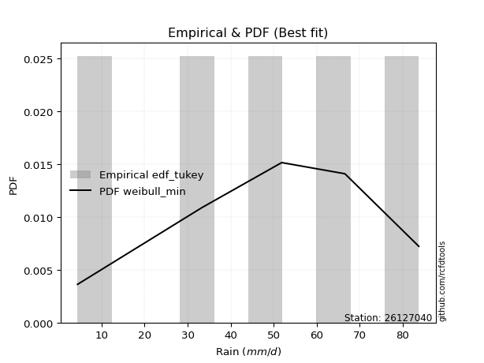</img>

</div>


### 8. EDF Gringorten (1963)

Gringorten plotting position formula is essential for estimating the probability and return periods of extreme events like floods and heavy rainfall. The constant _a=0.44_.

<div align="center">


$P=(m-a)/(n+1-2a)$


</div>


**8.1. Empirical values**

<div align="center">

|                | 0                   | 1                  | 2              | 3                 | 4                  |
|:---------------|:--------------------|:-------------------|:---------------|:------------------|:-------------------|
| date           | 2020                | 2025               | 2019           | 2017              | 2018               |
| x              | 4.4                 | 33.3               | 51.9           | 66.6              | 83.8               |
| m              | 1                   | 2                  | 3              | 4                 | 5                  |
| empirical_dist | edf_gringorten      | edf_gringorten     | edf_gringorten | edf_gringorten    | edf_gringorten     |
| empirical      | 0.10937500000000001 | 0.3046875          | 0.5            | 0.6953125         | 0.8906249999999999 |
| empirical_tr   | 1.1228070175438596  | 1.4382022471910112 | 2.0            | 3.282051282051282 | 9.142857142857133  |

</div>


**8.2. Kolmogorov-Smirnov fit test (sorted by Δ)**


<div align="center">

|                | 0                   | 1                   | 2                    | 3                   | 4                   | 5                   | 6                   | 7                    | 8                   | 9                   | 10                  | 11                   | 12                  | 13                   | 14                  | 15                  | 16                  | 17                  | 18                  | 19                  | 20                 | 21                  | 22                  | 23                  | 24                  | 25                  | 26                  | 27                  | 28                  | 29                  | 30                  | 31                  | 32                  | 33                  | 34                  | 35                  | 36                  | 37                  | 38                  | 39                  | 40                  | 41                  | 42                  | 43                 | 44                  | 45                  | 46                 | 47                  | 48                  | 49                  | 50                  | 51                  | 52                  | 53                  | 54                  | 55                  | 56                  | 57                  | 58                  | 59                  | 60                 | 61                 | 62                  | 63                  | 64                 | 65                  | 66                  | 67                  | 68                  | 69                  | 70                 | 71                  | 72                  | 73                  | 74                  | 75                  | 76                  | 77                  | 78                 | 79                  | 80                  | 81                  | 82                 | 83                 | 84                  | 85                  | 86                  | 87                  | 88                 | 89                  | 90                  | 91                 | 92                  | 93                  | 94                  | 95                  | 96                 | 97                  | 98                 | 99                  | 100                 | 101                | 102                 | 103                 | 104                 | 105                 | 106                 | 107                 | 108                 | 109                 | 110                 | 111                 | 112                | 113                 | 114                | 115                | 116                | 117                | 118                | 119                | 120                | 121                | 122                | 123                 | 124                | 125                | 126                 | 127                 | 128                 | 129                | 130                | 131                | 132                 | 133                 | 134                | 135                 | 136                | 137                 | 138                | 139                 | 140                 | 141                | 142                | 143                 | 144                 | 145                | 146                | 147                | 148                | 149                | 150                | 151                | 152                | 153                | 154                | 155                | 156                | 157                | 158                | 159                |
|:---------------|:--------------------|:--------------------|:---------------------|:--------------------|:--------------------|:--------------------|:--------------------|:---------------------|:--------------------|:--------------------|:--------------------|:---------------------|:--------------------|:---------------------|:--------------------|:--------------------|:--------------------|:--------------------|:--------------------|:--------------------|:-------------------|:--------------------|:--------------------|:--------------------|:--------------------|:--------------------|:--------------------|:--------------------|:--------------------|:--------------------|:--------------------|:--------------------|:--------------------|:--------------------|:--------------------|:--------------------|:--------------------|:--------------------|:--------------------|:--------------------|:--------------------|:--------------------|:--------------------|:-------------------|:--------------------|:--------------------|:-------------------|:--------------------|:--------------------|:--------------------|:--------------------|:--------------------|:--------------------|:--------------------|:--------------------|:--------------------|:--------------------|:--------------------|:--------------------|:--------------------|:-------------------|:-------------------|:--------------------|:--------------------|:-------------------|:--------------------|:--------------------|:--------------------|:--------------------|:--------------------|:-------------------|:--------------------|:--------------------|:--------------------|:--------------------|:--------------------|:--------------------|:--------------------|:-------------------|:--------------------|:--------------------|:--------------------|:-------------------|:-------------------|:--------------------|:--------------------|:--------------------|:--------------------|:-------------------|:--------------------|:--------------------|:-------------------|:--------------------|:--------------------|:--------------------|:--------------------|:-------------------|:--------------------|:-------------------|:--------------------|:--------------------|:-------------------|:--------------------|:--------------------|:--------------------|:--------------------|:--------------------|:--------------------|:--------------------|:--------------------|:--------------------|:--------------------|:-------------------|:--------------------|:-------------------|:-------------------|:-------------------|:-------------------|:-------------------|:-------------------|:-------------------|:-------------------|:-------------------|:--------------------|:-------------------|:-------------------|:--------------------|:--------------------|:--------------------|:-------------------|:-------------------|:-------------------|:--------------------|:--------------------|:-------------------|:--------------------|:-------------------|:--------------------|:-------------------|:--------------------|:--------------------|:-------------------|:-------------------|:--------------------|:--------------------|:-------------------|:-------------------|:-------------------|:-------------------|:-------------------|:-------------------|:-------------------|:-------------------|:-------------------|:-------------------|:-------------------|:-------------------|:-------------------|:-------------------|:-------------------|
| station        | 26127040            | 26127040            | 26127040             | 26127040            | 26127040            | 26127040            | 26127040            | 26127040             | 26127040            | 26127040            | 26127040            | 26127040             | 26127040            | 26127040             | 26127040            | 26127040            | 26127040            | 26127040            | 26127040            | 26127040            | 26127040           | 26127040            | 26127040            | 26127040            | 26127040            | 26127040            | 26127040            | 26127040            | 26127040            | 26127040            | 26127040            | 26127040            | 26127040            | 26127040            | 26127040            | 26127040            | 26127040            | 26127040            | 26127040            | 26127040            | 26127040            | 26127040            | 26127040            | 26127040           | 26127040            | 26127040            | 26127040           | 26127040            | 26127040            | 26127040            | 26127040            | 26127040            | 26127040            | 26127040            | 26127040            | 26127040            | 26127040            | 26127040            | 26127040            | 26127040            | 26127040           | 26127040           | 26127040            | 26127040            | 26127040           | 26127040            | 26127040            | 26127040            | 26127040            | 26127040            | 26127040           | 26127040            | 26127040            | 26127040            | 26127040            | 26127040            | 26127040            | 26127040            | 26127040           | 26127040            | 26127040            | 26127040            | 26127040           | 26127040           | 26127040            | 26127040            | 26127040            | 26127040            | 26127040           | 26127040            | 26127040            | 26127040           | 26127040            | 26127040            | 26127040            | 26127040            | 26127040           | 26127040            | 26127040           | 26127040            | 26127040            | 26127040           | 26127040            | 26127040            | 26127040            | 26127040            | 26127040            | 26127040            | 26127040            | 26127040            | 26127040            | 26127040            | 26127040           | 26127040            | 26127040           | 26127040           | 26127040           | 26127040           | 26127040           | 26127040           | 26127040           | 26127040           | 26127040           | 26127040            | 26127040           | 26127040           | 26127040            | 26127040            | 26127040            | 26127040           | 26127040           | 26127040           | 26127040            | 26127040            | 26127040           | 26127040            | 26127040           | 26127040            | 26127040           | 26127040            | 26127040            | 26127040           | 26127040           | 26127040            | 26127040            | 26127040           | 26127040           | 26127040           | 26127040           | 26127040           | 26127040           | 26127040           | 26127040           | 26127040           | 26127040           | 26127040           | 26127040           | 26127040           | 26127040           | 26127040           |
| empirical_dist | edf_gringorten      | edf_gringorten      | edf_gringorten       | edf_gringorten      | edf_gringorten      | edf_gringorten      | edf_gringorten      | edf_gringorten       | edf_gringorten      | edf_gringorten      | edf_gringorten      | edf_gringorten       | edf_gringorten      | edf_gringorten       | edf_gringorten      | edf_gringorten      | edf_gringorten      | edf_gringorten      | edf_gringorten      | edf_gringorten      | edf_gringorten     | edf_gringorten      | edf_gringorten      | edf_gringorten      | edf_gringorten      | edf_gringorten      | edf_gringorten      | edf_gringorten      | edf_gringorten      | edf_gringorten      | edf_gringorten      | edf_gringorten      | edf_gringorten      | edf_gringorten      | edf_gringorten      | edf_gringorten      | edf_gringorten      | edf_gringorten      | edf_gringorten      | edf_gringorten      | edf_gringorten      | edf_gringorten      | edf_gringorten      | edf_gringorten     | edf_gringorten      | edf_gringorten      | edf_gringorten     | edf_gringorten      | edf_gringorten      | edf_gringorten      | edf_gringorten      | edf_gringorten      | edf_gringorten      | edf_gringorten      | edf_gringorten      | edf_gringorten      | edf_gringorten      | edf_gringorten      | edf_gringorten      | edf_gringorten      | edf_gringorten     | edf_gringorten     | edf_gringorten      | edf_gringorten      | edf_gringorten     | edf_gringorten      | edf_gringorten      | edf_gringorten      | edf_gringorten      | edf_gringorten      | edf_gringorten     | edf_gringorten      | edf_gringorten      | edf_gringorten      | edf_gringorten      | edf_gringorten      | edf_gringorten      | edf_gringorten      | edf_gringorten     | edf_gringorten      | edf_gringorten      | edf_gringorten      | edf_gringorten     | edf_gringorten     | edf_gringorten      | edf_gringorten      | edf_gringorten      | edf_gringorten      | edf_gringorten     | edf_gringorten      | edf_gringorten      | edf_gringorten     | edf_gringorten      | edf_gringorten      | edf_gringorten      | edf_gringorten      | edf_gringorten     | edf_gringorten      | edf_gringorten     | edf_gringorten      | edf_gringorten      | edf_gringorten     | edf_gringorten      | edf_gringorten      | edf_gringorten      | edf_gringorten      | edf_gringorten      | edf_gringorten      | edf_gringorten      | edf_gringorten      | edf_gringorten      | edf_gringorten      | edf_gringorten     | edf_gringorten      | edf_gringorten     | edf_gringorten     | edf_gringorten     | edf_gringorten     | edf_gringorten     | edf_gringorten     | edf_gringorten     | edf_gringorten     | edf_gringorten     | edf_gringorten      | edf_gringorten     | edf_gringorten     | edf_gringorten      | edf_gringorten      | edf_gringorten      | edf_gringorten     | edf_gringorten     | edf_gringorten     | edf_gringorten      | edf_gringorten      | edf_gringorten     | edf_gringorten      | edf_gringorten     | edf_gringorten      | edf_gringorten     | edf_gringorten      | edf_gringorten      | edf_gringorten     | edf_gringorten     | edf_gringorten      | edf_gringorten      | edf_gringorten     | edf_gringorten     | edf_gringorten     | edf_gringorten     | edf_gringorten     | edf_gringorten     | edf_gringorten     | edf_gringorten     | edf_gringorten     | edf_gringorten     | edf_gringorten     | edf_gringorten     | edf_gringorten     | edf_gringorten     | edf_gringorten     |
| p_dist         | weibull_min         | pearson3            | johnsonsu            | anglit              | semicircular        | exponnorm           | t                   | crystalball          | norm                | nct                 | gumbel_l            | f                    | betaprime           | foldnorm             | gamma               | erlang              | ksone               | rice                | argus               | cosine              | exponweib          | logistic            | invgamma            | trapezoid           | invgauss            | maxwell             | logburr             | logargus            | hypsecant           | burr                | rayleigh            | invweibull          | logmielke           | triang              | dgamma              | gompertz            | logloggamma         | vonmises_line       | skewnorm            | logweibull_max      | wrapcauchy          | truncnorm           | genpareto           | beta               | loggenextreme       | tukeylambda         | genhalflogistic    | kappa4              | kappa3              | arcsine             | uniform             | gausshyper          | loggausshyper       | loggenpareto        | logpearson3         | logdweibull         | laplace             | kstwobign           | dweibull            | loggumbel_l         | loglevy_l          | logdgamma          | halfnorm            | logvonmises_line    | gumbel_r           | loggennorm          | ncf                 | logburr12           | truncweibull_min    | logtrapezoid        | bradford           | halflogistic        | moyal               | genextreme          | lomax               | logf                | levy_l              | logfoldnorm         | genexpon           | logfatiguelife      | loglogistic         | lognct              | logbetaprime       | logcrystalball     | lognorm             | logt                | logexponnorm        | loghypsecant        | loganglit          | logsemicircular     | logarcsine          | gennorm            | logncf              | loggamma            | loggamma            | logrice             | loginvgamma        | logerlang           | logloglaplace      | loginvgauss         | truncexpon          | logalpha           | wald                | loglaplace          | loglaplace          | loggenhalflogistic  | logmaxwell          | logskewnorm         | loginvweibull       | logwrapcauchy       | lograyleigh         | loggompertz         | logjohnsonsb       | logcosine           | loggumbel_r        | logtriang          | logbeta            | loghalfnorm        | logkstwobign       | mielke             | loggenexpon        | logtukeylambda     | logmoyal           | loghalflogistic     | lognakagami        | loggengamma        | nakagami            | burr12              | loglomax            | logexponweib       | gengamma           | halfgennorm        | logksone            | loghalfgennorm      | logwald            | logtruncweibull_min | logkappa3          | loguniform          | logkappa4          | logweibull_min      | logjohnsonsu        | logbradford        | logtruncexpon      | alpha               | logtruncnorm        | johnsonsb          | logrdist           | weibull_max        | fatiguelife        | logexponpow        | powerlaw           | truncpareto        | exponpow           | logpowerlaw        | logtruncpareto     | rdist              | genlogistic        | loggenlogistic     | logvonmises        | vonmises           |
| delta          | 0.04420193249335766 | 0.04686975333476895 | 0.048733250634757974 | 0.05199330315212173 | 0.05540246348721596 | 0.05654567652849962 | 0.05654702270519241 | 0.056547278858575356 | 0.05654728331765513 | 0.05657468779693242 | 0.05937274295304806 | 0.059425121692360694 | 0.06019974472772005 | 0.061215321125201116 | 0.06431876861078933 | 0.06516444045999281 | 0.06835634192620263 | 0.07119052219658539 | 0.07164884269713534 | 0.07376133918722128 | 0.0761092710359309 | 0.07855378354396925 | 0.08016213080946444 | 0.08371033287612106 | 0.08450154791464659 | 0.08649670501795359 | 0.08835108914512335 | 0.09029855456323188 | 0.09343635197510058 | 0.09532380306131072 | 0.09607068036074862 | 0.10167228606703693 | 0.10790136402462991 | 0.10912289084984961 | 0.10916840176726422 | 0.10920755838260277 | 0.10933037411364555 | 0.10937415470732673 | 0.10937466027446907 | 0.10937494582522889 | 0.10937497142163188 | 0.10937499228291048 | 0.10937499942186191 | 0.1093749999989706 | 0.10937499999995504 | 0.10937499999996458 | 0.1093749999999678 | 0.10937499999999922 | 0.10937500000000001 | 0.10937500000000001 | 0.10937500000000011 | 0.10937500000167522 | 0.10937500002748879 | 0.11020459681582007 | 0.11237810552473154 | 0.11262469063647962 | 0.11309542910341641 | 0.11921555202585465 | 0.12148440388742066 | 0.12216678586274266 | 0.1226538655178393 | 0.1227298781280356 | 0.12309695562787837 | 0.12397319310781096 | 0.1263514703061177 | 0.13130273320648053 | 0.13361016821900107 | 0.13520308786420265 | 0.13679878523325628 | 0.13763618113753462 | 0.1397101802216788 | 0.15058996126024793 | 0.15096804654195917 | 0.15882335642615086 | 0.16323667211243353 | 0.17331026832758878 | 0.17371261319364217 | 0.18564253766634037 | 0.1897560800601923 | 0.19152076665265716 | 0.19224889656453403 | 0.19238859936570107 | 0.1925034068249063 | 0.1926170054238971 | 0.19261714799654706 | 0.19261733798539948 | 0.19262010969511012 | 0.19280716251848085 | 0.1930029782637283 | 0.19316190797945482 | 0.19379179019701137 | 0.1953125          | 0.19821026019100207 | 0.19990092090360345 | 0.19990092090360345 | 0.20132232765518387 | 0.2054000748311835 | 0.20638277376660485 | 0.2094190993663979 | 0.21397216745098135 | 0.21489480639855163 | 0.2158967879008682 | 0.21927773765601621 | 0.22064262745296714 | 0.22064262745296714 | 0.22476260525326408 | 0.22577292359267098 | 0.23240793924329184 | 0.23272186462759792 | 0.23622188469029315 | 0.23684091601240853 | 0.24859566020187063 | 0.2528320751100812 | 0.25488777544849395 | 0.2629082441830525 | 0.2633794865173702 | 0.2653198226924643 | 0.2680096878906777 | 0.2687738417783547 | 0.2756689631211733 | 0.2768776973887772 | 0.2804117502224912 | 0.2887713680872336 | 0.29278002293083116 | 0.3046874994850413 | 0.312472482486161  | 0.31430001164985655 | 0.32090938099671695 | 0.33030122421949326 | 0.3411545533679228 | 0.3463683988068472 | 0.3480422961844629 | 0.35099926319500674 | 0.35577734551140705 | 0.3607036595566919 | 0.3657885513566699  | 0.38213180141806   | 0.38213661583400804 | 0.3918719184730912 | 0.41376271570698475 | 0.44655624070684535 | 0.449356536565806  | 0.4554334766324166 | 0.46513744544537483 | 0.47902314675890834 | 0.4816731372935009 | 0.4999999958141672 | 0.5245045329106548 | 0.5524451156814771 | 0.5758964224406404 | 0.5788215862128193 | 0.5926754020019038 | 0.6051430222916862 | 0.6467824886079889 | 0.6566644222564374 | 0.6953124998424294 | 0.6953125          | 0.6953125          | 1.0560888992554842 | 12.450599061090184 |
| deltao         | 0.5865427407550001  | 0.5865427407550001  | 0.5865427407550001   | 0.5865427407550001  | 0.5865427407550001  | 0.5865427407550001  | 0.5865427407550001  | 0.5865427407550001   | 0.5865427407550001  | 0.5865427407550001  | 0.5865427407550001  | 0.5865427407550001   | 0.5865427407550001  | 0.5865427407550001   | 0.5865427407550001  | 0.5865427407550001  | 0.5865427407550001  | 0.5865427407550001  | 0.5865427407550001  | 0.5865427407550001  | 0.5865427407550001 | 0.5865427407550001  | 0.5865427407550001  | 0.5865427407550001  | 0.5865427407550001  | 0.5865427407550001  | 0.5865427407550001  | 0.5865427407550001  | 0.5865427407550001  | 0.5865427407550001  | 0.5865427407550001  | 0.5865427407550001  | 0.5865427407550001  | 0.5865427407550001  | 0.5865427407550001  | 0.5865427407550001  | 0.5865427407550001  | 0.5865427407550001  | 0.5865427407550001  | 0.5865427407550001  | 0.5865427407550001  | 0.5865427407550001  | 0.5865427407550001  | 0.5865427407550001 | 0.5865427407550001  | 0.5865427407550001  | 0.5865427407550001 | 0.5865427407550001  | 0.5865427407550001  | 0.5865427407550001  | 0.5865427407550001  | 0.5865427407550001  | 0.5865427407550001  | 0.5865427407550001  | 0.5865427407550001  | 0.5865427407550001  | 0.5865427407550001  | 0.5865427407550001  | 0.5865427407550001  | 0.5865427407550001  | 0.5865427407550001 | 0.5865427407550001 | 0.5865427407550001  | 0.5865427407550001  | 0.5865427407550001 | 0.5865427407550001  | 0.5865427407550001  | 0.5865427407550001  | 0.5865427407550001  | 0.5865427407550001  | 0.5865427407550001 | 0.5865427407550001  | 0.5865427407550001  | 0.5865427407550001  | 0.5865427407550001  | 0.5865427407550001  | 0.5865427407550001  | 0.5865427407550001  | 0.5865427407550001 | 0.5865427407550001  | 0.5865427407550001  | 0.5865427407550001  | 0.5865427407550001 | 0.5865427407550001 | 0.5865427407550001  | 0.5865427407550001  | 0.5865427407550001  | 0.5865427407550001  | 0.5865427407550001 | 0.5865427407550001  | 0.5865427407550001  | 0.5865427407550001 | 0.5865427407550001  | 0.5865427407550001  | 0.5865427407550001  | 0.5865427407550001  | 0.5865427407550001 | 0.5865427407550001  | 0.5865427407550001 | 0.5865427407550001  | 0.5865427407550001  | 0.5865427407550001 | 0.5865427407550001  | 0.5865427407550001  | 0.5865427407550001  | 0.5865427407550001  | 0.5865427407550001  | 0.5865427407550001  | 0.5865427407550001  | 0.5865427407550001  | 0.5865427407550001  | 0.5865427407550001  | 0.5865427407550001 | 0.5865427407550001  | 0.5865427407550001 | 0.5865427407550001 | 0.5865427407550001 | 0.5865427407550001 | 0.5865427407550001 | 0.5865427407550001 | 0.5865427407550001 | 0.5865427407550001 | 0.5865427407550001 | 0.5865427407550001  | 0.5865427407550001 | 0.5865427407550001 | 0.5865427407550001  | 0.5865427407550001  | 0.5865427407550001  | 0.5865427407550001 | 0.5865427407550001 | 0.5865427407550001 | 0.5865427407550001  | 0.5865427407550001  | 0.5865427407550001 | 0.5865427407550001  | 0.5865427407550001 | 0.5865427407550001  | 0.5865427407550001 | 0.5865427407550001  | 0.5865427407550001  | 0.5865427407550001 | 0.5865427407550001 | 0.5865427407550001  | 0.5865427407550001  | 0.5865427407550001 | 0.5865427407550001 | 0.5865427407550001 | 0.5865427407550001 | 0.5865427407550001 | 0.5865427407550001 | 0.5865427407550001 | 0.5865427407550001 | 0.5865427407550001 | 0.5865427407550001 | 0.5865427407550001 | 0.5865427407550001 | 0.5865427407550001 | 0.5865427407550001 | 0.5865427407550001 |
| eval           | Δo > Δ              | Δo > Δ              | Δo > Δ               | Δo > Δ              | Δo > Δ              | Δo > Δ              | Δo > Δ              | Δo > Δ               | Δo > Δ              | Δo > Δ              | Δo > Δ              | Δo > Δ               | Δo > Δ              | Δo > Δ               | Δo > Δ              | Δo > Δ              | Δo > Δ              | Δo > Δ              | Δo > Δ              | Δo > Δ              | Δo > Δ             | Δo > Δ              | Δo > Δ              | Δo > Δ              | Δo > Δ              | Δo > Δ              | Δo > Δ              | Δo > Δ              | Δo > Δ              | Δo > Δ              | Δo > Δ              | Δo > Δ              | Δo > Δ              | Δo > Δ              | Δo > Δ              | Δo > Δ              | Δo > Δ              | Δo > Δ              | Δo > Δ              | Δo > Δ              | Δo > Δ              | Δo > Δ              | Δo > Δ              | Δo > Δ             | Δo > Δ              | Δo > Δ              | Δo > Δ             | Δo > Δ              | Δo > Δ              | Δo > Δ              | Δo > Δ              | Δo > Δ              | Δo > Δ              | Δo > Δ              | Δo > Δ              | Δo > Δ              | Δo > Δ              | Δo > Δ              | Δo > Δ              | Δo > Δ              | Δo > Δ             | Δo > Δ             | Δo > Δ              | Δo > Δ              | Δo > Δ             | Δo > Δ              | Δo > Δ              | Δo > Δ              | Δo > Δ              | Δo > Δ              | Δo > Δ             | Δo > Δ              | Δo > Δ              | Δo > Δ              | Δo > Δ              | Δo > Δ              | Δo > Δ              | Δo > Δ              | Δo > Δ             | Δo > Δ              | Δo > Δ              | Δo > Δ              | Δo > Δ             | Δo > Δ             | Δo > Δ              | Δo > Δ              | Δo > Δ              | Δo > Δ              | Δo > Δ             | Δo > Δ              | Δo > Δ              | Δo > Δ             | Δo > Δ              | Δo > Δ              | Δo > Δ              | Δo > Δ              | Δo > Δ             | Δo > Δ              | Δo > Δ             | Δo > Δ              | Δo > Δ              | Δo > Δ             | Δo > Δ              | Δo > Δ              | Δo > Δ              | Δo > Δ              | Δo > Δ              | Δo > Δ              | Δo > Δ              | Δo > Δ              | Δo > Δ              | Δo > Δ              | Δo > Δ             | Δo > Δ              | Δo > Δ             | Δo > Δ             | Δo > Δ             | Δo > Δ             | Δo > Δ             | Δo > Δ             | Δo > Δ             | Δo > Δ             | Δo > Δ             | Δo > Δ              | Δo > Δ             | Δo > Δ             | Δo > Δ              | Δo > Δ              | Δo > Δ              | Δo > Δ             | Δo > Δ             | Δo > Δ             | Δo > Δ              | Δo > Δ              | Δo > Δ             | Δo > Δ              | Δo > Δ             | Δo > Δ              | Δo > Δ             | Δo > Δ              | Δo > Δ              | Δo > Δ             | Δo > Δ             | Δo > Δ              | Δo > Δ              | Δo > Δ             | Δo > Δ             | Δo > Δ             | Δo > Δ             | Δo > Δ             | Δo > Δ             | Δo <= Δ            | Δo <= Δ            | Δo <= Δ            | Δo <= Δ            | Δo <= Δ            | Δo <= Δ            | Δo <= Δ            | Δo <= Δ            | Δo <= Δ            |
| fit            | 1                   | 1                   | 1                    | 1                   | 1                   | 1                   | 1                   | 1                    | 1                   | 1                   | 1                   | 1                    | 1                   | 1                    | 1                   | 1                   | 1                   | 1                   | 1                   | 1                   | 1                  | 1                   | 1                   | 1                   | 1                   | 1                   | 1                   | 1                   | 1                   | 1                   | 1                   | 1                   | 1                   | 1                   | 1                   | 1                   | 1                   | 1                   | 1                   | 1                   | 1                   | 1                   | 1                   | 1                  | 1                   | 1                   | 1                  | 1                   | 1                   | 1                   | 1                   | 1                   | 1                   | 1                   | 1                   | 1                   | 1                   | 1                   | 1                   | 1                   | 1                  | 1                  | 1                   | 1                   | 1                  | 1                   | 1                   | 1                   | 1                   | 1                   | 1                  | 1                   | 1                   | 1                   | 1                   | 1                   | 1                   | 1                   | 1                  | 1                   | 1                   | 1                   | 1                  | 1                  | 1                   | 1                   | 1                   | 1                   | 1                  | 1                   | 1                   | 1                  | 1                   | 1                   | 1                   | 1                   | 1                  | 1                   | 1                  | 1                   | 1                   | 1                  | 1                   | 1                   | 1                   | 1                   | 1                   | 1                   | 1                   | 1                   | 1                   | 1                   | 1                  | 1                   | 1                  | 1                  | 1                  | 1                  | 1                  | 1                  | 1                  | 1                  | 1                  | 1                   | 1                  | 1                  | 1                   | 1                   | 1                   | 1                  | 1                  | 1                  | 1                   | 1                   | 1                  | 1                   | 1                  | 1                   | 1                  | 1                   | 1                   | 1                  | 1                  | 1                   | 1                   | 1                  | 1                  | 1                  | 1                  | 1                  | 1                  | 0                  | 0                  | 0                  | 0                  | 0                  | 0                  | 0                  | 0                  | 0                  |
| n              | 5                   | 5                   | 5                    | 5                   | 5                   | 5                   | 5                   | 5                    | 5                   | 5                   | 5                   | 5                    | 5                   | 5                    | 5                   | 5                   | 5                   | 5                   | 5                   | 5                   | 5                  | 5                   | 5                   | 5                   | 5                   | 5                   | 5                   | 5                   | 5                   | 5                   | 5                   | 5                   | 5                   | 5                   | 5                   | 5                   | 5                   | 5                   | 5                   | 5                   | 5                   | 5                   | 5                   | 5                  | 5                   | 5                   | 5                  | 5                   | 5                   | 5                   | 5                   | 5                   | 5                   | 5                   | 5                   | 5                   | 5                   | 5                   | 5                   | 5                   | 5                  | 5                  | 5                   | 5                   | 5                  | 5                   | 5                   | 5                   | 5                   | 5                   | 5                  | 5                   | 5                   | 5                   | 5                   | 5                   | 5                   | 5                   | 5                  | 5                   | 5                   | 5                   | 5                  | 5                  | 5                   | 5                   | 5                   | 5                   | 5                  | 5                   | 5                   | 5                  | 5                   | 5                   | 5                   | 5                   | 5                  | 5                   | 5                  | 5                   | 5                   | 5                  | 5                   | 5                   | 5                   | 5                   | 5                   | 5                   | 5                   | 5                   | 5                   | 5                   | 5                  | 5                   | 5                  | 5                  | 5                  | 5                  | 5                  | 5                  | 5                  | 5                  | 5                  | 5                   | 5                  | 5                  | 5                   | 5                   | 5                   | 5                  | 5                  | 5                  | 5                   | 5                   | 5                  | 5                   | 5                  | 5                   | 5                  | 5                   | 5                   | 5                  | 5                  | 5                   | 5                   | 5                  | 5                  | 5                  | 5                  | 5                  | 5                  | 5                  | 5                  | 5                  | 5                  | 5                  | 5                  | 5                  | 5                  | 5                  |
| best_fit       | 1                   | 0                   | 0                    | 0                   | 0                   | 0                   | 0                   | 0                    | 0                   | 0                   | 0                   | 0                    | 0                   | 0                    | 0                   | 0                   | 0                   | 0                   | 0                   | 0                   | 0                  | 0                   | 0                   | 0                   | 0                   | 0                   | 0                   | 0                   | 0                   | 0                   | 0                   | 0                   | 0                   | 0                   | 0                   | 0                   | 0                   | 0                   | 0                   | 0                   | 0                   | 0                   | 0                   | 0                  | 0                   | 0                   | 0                  | 0                   | 0                   | 0                   | 0                   | 0                   | 0                   | 0                   | 0                   | 0                   | 0                   | 0                   | 0                   | 0                   | 0                  | 0                  | 0                   | 0                   | 0                  | 0                   | 0                   | 0                   | 0                   | 0                   | 0                  | 0                   | 0                   | 0                   | 0                   | 0                   | 0                   | 0                   | 0                  | 0                   | 0                   | 0                   | 0                  | 0                  | 0                   | 0                   | 0                   | 0                   | 0                  | 0                   | 0                   | 0                  | 0                   | 0                   | 0                   | 0                   | 0                  | 0                   | 0                  | 0                   | 0                   | 0                  | 0                   | 0                   | 0                   | 0                   | 0                   | 0                   | 0                   | 0                   | 0                   | 0                   | 0                  | 0                   | 0                  | 0                  | 0                  | 0                  | 0                  | 0                  | 0                  | 0                  | 0                  | 0                   | 0                  | 0                  | 0                   | 0                   | 0                   | 0                  | 0                  | 0                  | 0                   | 0                   | 0                  | 0                   | 0                  | 0                   | 0                  | 0                   | 0                   | 0                  | 0                  | 0                   | 0                   | 0                  | 0                  | 0                  | 0                  | 0                  | 0                  | 0                  | 0                  | 0                  | 0                  | 0                  | 0                  | 0                  | 0                  | 0                  |
| best_fit_sort  | 1                   | 2                   | 3                    | 4                   | 5                   | 6                   | 7                   | 8                    | 9                   | 10                  | 11                  | 12                   | 13                  | 14                   | 15                  | 16                  | 17                  | 18                  | 19                  | 20                  | 21                 | 22                  | 23                  | 24                  | 25                  | 26                  | 27                  | 28                  | 29                  | 30                  | 31                  | 32                  | 33                  | 34                  | 35                  | 36                  | 37                  | 38                  | 39                  | 40                  | 41                  | 42                  | 43                  | 44                 | 45                  | 46                  | 47                 | 48                  | 49                  | 50                  | 51                  | 52                  | 53                  | 54                  | 55                  | 56                  | 57                  | 58                  | 59                  | 60                  | 61                 | 62                 | 63                  | 64                  | 65                 | 66                  | 67                  | 68                  | 69                  | 70                  | 71                 | 72                  | 73                  | 74                  | 75                  | 76                  | 77                  | 78                  | 79                 | 80                  | 81                  | 82                  | 83                 | 84                 | 85                  | 86                  | 87                  | 88                  | 89                 | 90                  | 91                  | 92                 | 93                  | 94                  | 95                  | 96                  | 97                 | 98                  | 99                 | 100                 | 101                 | 102                | 103                 | 104                 | 105                 | 106                 | 107                 | 108                 | 109                 | 110                 | 111                 | 112                 | 113                | 114                 | 115                | 116                | 117                | 118                | 119                | 120                | 121                | 122                | 123                | 124                 | 125                | 126                | 127                 | 128                 | 129                 | 130                | 131                | 132                | 133                 | 134                 | 135                | 136                 | 137                | 138                 | 139                | 140                 | 141                 | 142                | 143                | 144                 | 145                 | 146                | 147                | 148                | 149                | 150                | 151                | 152                | 153                | 154                | 155                | 156                | 157                | 158                | 159                | 160                |

</div>


**8.3. Best fit**

<div align="center">

|   id |   station | empirical_dist   | p_dist      |     delta |   deltao | eval   |   fit |   n |   best_fit |   best_fit_sort |
|-----:|----------:|:-----------------|:------------|----------:|---------:|:-------|------:|----:|-----------:|----------------:|
|    0 |  26127040 | edf_gringorten   | weibull_min | 0.0442019 | 0.586543 | Δo > Δ |     1 |   5 |          1 |               1 |

</div>


<div align="center">

</img></img>

</div>


### 9. EDF Filliben (1975)

The specific values of the constants (0.3175) (often denoted as $alpha$) and (0.365) are derived from a method proposed by James J. Filliben in a 1975 paper. This particular formula is the mean value of the $i$-th order statistic of the normal distribution and is considered a robust and effective plotting position formula for the normal probability plot correlation coefficient test for normality.

<div align="center">


$P=(m-0.3175)/(n+0.365)$


</div>


**9.1. Empirical values**

<div align="center">

|                | 0                   | 1                  | 2            | 3                  | 4                  |
|:---------------|:--------------------|:-------------------|:-------------|:-------------------|:-------------------|
| date           | 2020                | 2025               | 2019         | 2017               | 2018               |
| x              | 4.4                 | 33.3               | 51.9         | 66.6               | 83.8               |
| m              | 1                   | 2                  | 3            | 4                  | 5                  |
| empirical_dist | edf_filliben        | edf_filliben       | edf_filliben | edf_filliben       | edf_filliben       |
| empirical      | 0.12721342031686858 | 0.3136067101584343 | 0.5          | 0.6863932898415657 | 0.8727865796831314 |
| empirical_tr   | 1.1457554725040042  | 1.456890699253225  | 2.0          | 3.188707280832095  | 7.860805860805863  |

</div>


**9.2. Kolmogorov-Smirnov fit test (sorted by Δ)**


<div align="center">

|                | 0                    | 1                   | 2                   | 3                  | 4                   | 5                   | 6                   | 7                  | 8                   | 9                   | 10                 | 11                  | 12                  | 13                  | 14                 | 15                 | 16                  | 17                  | 18                  | 19                  | 20                  | 21                  | 22                  | 23                  | 24                  | 25                  | 26                 | 27                  | 28                  | 29                  | 30                  | 31                  | 32                 | 33                  | 34                  | 35                  | 36                  | 37                  | 38                 | 39                  | 40                  | 41                  | 42                 | 43                  | 44                  | 45                 | 46                  | 47                  | 48                 | 49                  | 50                  | 51                  | 52                  | 53                  | 54                  | 55                  | 56                  | 57                  | 58                  | 59                  | 60                  | 61                  | 62                  | 63                  | 64                  | 65                  | 66                  | 67                  | 68                  | 69                 | 70                 | 71                  | 72                  | 73                  | 74                  | 75                 | 76                 | 77                 | 78                 | 79                  | 80                  | 81                 | 82                  | 83                  | 84                  | 85                 | 86                  | 87                  | 88                  | 89                 | 90                  | 91                 | 92                  | 93                  | 94                  | 95                 | 96                  | 97                  | 98                  | 99                  | 100                 | 101                 | 102                | 103                | 104                 | 105                 | 106                 | 107                 | 108                 | 109                 | 110                 | 111                 | 112                 | 113                 | 114                | 115                 | 116                | 117                 | 118                | 119                | 120                 | 121                | 122                | 123                | 124                | 125                 | 126                | 127                | 128                | 129                | 130                 | 131                 | 132                 | 133                | 134                 | 135                 | 136                 | 137                 | 138                 | 139                | 140                | 141                | 142                 | 143                 | 144                 | 145                 | 146                | 147                | 148                | 149                | 150                | 151                | 152                | 153                | 154                | 155                | 156                | 157                | 158                | 159                |
|:---------------|:---------------------|:--------------------|:--------------------|:-------------------|:--------------------|:--------------------|:--------------------|:-------------------|:--------------------|:--------------------|:-------------------|:--------------------|:--------------------|:--------------------|:-------------------|:-------------------|:--------------------|:--------------------|:--------------------|:--------------------|:--------------------|:--------------------|:--------------------|:--------------------|:--------------------|:--------------------|:-------------------|:--------------------|:--------------------|:--------------------|:--------------------|:--------------------|:-------------------|:--------------------|:--------------------|:--------------------|:--------------------|:--------------------|:-------------------|:--------------------|:--------------------|:--------------------|:-------------------|:--------------------|:--------------------|:-------------------|:--------------------|:--------------------|:-------------------|:--------------------|:--------------------|:--------------------|:--------------------|:--------------------|:--------------------|:--------------------|:--------------------|:--------------------|:--------------------|:--------------------|:--------------------|:--------------------|:--------------------|:--------------------|:--------------------|:--------------------|:--------------------|:--------------------|:--------------------|:-------------------|:-------------------|:--------------------|:--------------------|:--------------------|:--------------------|:-------------------|:-------------------|:-------------------|:-------------------|:--------------------|:--------------------|:-------------------|:--------------------|:--------------------|:--------------------|:-------------------|:--------------------|:--------------------|:--------------------|:-------------------|:--------------------|:-------------------|:--------------------|:--------------------|:--------------------|:-------------------|:--------------------|:--------------------|:--------------------|:--------------------|:--------------------|:--------------------|:-------------------|:-------------------|:--------------------|:--------------------|:--------------------|:--------------------|:--------------------|:--------------------|:--------------------|:--------------------|:--------------------|:--------------------|:-------------------|:--------------------|:-------------------|:--------------------|:-------------------|:-------------------|:--------------------|:-------------------|:-------------------|:-------------------|:-------------------|:--------------------|:-------------------|:-------------------|:-------------------|:-------------------|:--------------------|:--------------------|:--------------------|:-------------------|:--------------------|:--------------------|:--------------------|:--------------------|:--------------------|:-------------------|:-------------------|:-------------------|:--------------------|:--------------------|:--------------------|:--------------------|:-------------------|:-------------------|:-------------------|:-------------------|:-------------------|:-------------------|:-------------------|:-------------------|:-------------------|:-------------------|:-------------------|:-------------------|:-------------------|:-------------------|
| station        | 26127040             | 26127040            | 26127040            | 26127040           | 26127040            | 26127040            | 26127040            | 26127040           | 26127040            | 26127040            | 26127040           | 26127040            | 26127040            | 26127040            | 26127040           | 26127040           | 26127040            | 26127040            | 26127040            | 26127040            | 26127040            | 26127040            | 26127040            | 26127040            | 26127040            | 26127040            | 26127040           | 26127040            | 26127040            | 26127040            | 26127040            | 26127040            | 26127040           | 26127040            | 26127040            | 26127040            | 26127040            | 26127040            | 26127040           | 26127040            | 26127040            | 26127040            | 26127040           | 26127040            | 26127040            | 26127040           | 26127040            | 26127040            | 26127040           | 26127040            | 26127040            | 26127040            | 26127040            | 26127040            | 26127040            | 26127040            | 26127040            | 26127040            | 26127040            | 26127040            | 26127040            | 26127040            | 26127040            | 26127040            | 26127040            | 26127040            | 26127040            | 26127040            | 26127040            | 26127040           | 26127040           | 26127040            | 26127040            | 26127040            | 26127040            | 26127040           | 26127040           | 26127040           | 26127040           | 26127040            | 26127040            | 26127040           | 26127040            | 26127040            | 26127040            | 26127040           | 26127040            | 26127040            | 26127040            | 26127040           | 26127040            | 26127040           | 26127040            | 26127040            | 26127040            | 26127040           | 26127040            | 26127040            | 26127040            | 26127040            | 26127040            | 26127040            | 26127040           | 26127040           | 26127040            | 26127040            | 26127040            | 26127040            | 26127040            | 26127040            | 26127040            | 26127040            | 26127040            | 26127040            | 26127040           | 26127040            | 26127040           | 26127040            | 26127040           | 26127040           | 26127040            | 26127040           | 26127040           | 26127040           | 26127040           | 26127040            | 26127040           | 26127040           | 26127040           | 26127040           | 26127040            | 26127040            | 26127040            | 26127040           | 26127040            | 26127040            | 26127040            | 26127040            | 26127040            | 26127040           | 26127040           | 26127040           | 26127040            | 26127040            | 26127040            | 26127040            | 26127040           | 26127040           | 26127040           | 26127040           | 26127040           | 26127040           | 26127040           | 26127040           | 26127040           | 26127040           | 26127040           | 26127040           | 26127040           | 26127040           |
| empirical_dist | edf_filliben         | edf_filliben        | edf_filliben        | edf_filliben       | edf_filliben        | edf_filliben        | edf_filliben        | edf_filliben       | edf_filliben        | edf_filliben        | edf_filliben       | edf_filliben        | edf_filliben        | edf_filliben        | edf_filliben       | edf_filliben       | edf_filliben        | edf_filliben        | edf_filliben        | edf_filliben        | edf_filliben        | edf_filliben        | edf_filliben        | edf_filliben        | edf_filliben        | edf_filliben        | edf_filliben       | edf_filliben        | edf_filliben        | edf_filliben        | edf_filliben        | edf_filliben        | edf_filliben       | edf_filliben        | edf_filliben        | edf_filliben        | edf_filliben        | edf_filliben        | edf_filliben       | edf_filliben        | edf_filliben        | edf_filliben        | edf_filliben       | edf_filliben        | edf_filliben        | edf_filliben       | edf_filliben        | edf_filliben        | edf_filliben       | edf_filliben        | edf_filliben        | edf_filliben        | edf_filliben        | edf_filliben        | edf_filliben        | edf_filliben        | edf_filliben        | edf_filliben        | edf_filliben        | edf_filliben        | edf_filliben        | edf_filliben        | edf_filliben        | edf_filliben        | edf_filliben        | edf_filliben        | edf_filliben        | edf_filliben        | edf_filliben        | edf_filliben       | edf_filliben       | edf_filliben        | edf_filliben        | edf_filliben        | edf_filliben        | edf_filliben       | edf_filliben       | edf_filliben       | edf_filliben       | edf_filliben        | edf_filliben        | edf_filliben       | edf_filliben        | edf_filliben        | edf_filliben        | edf_filliben       | edf_filliben        | edf_filliben        | edf_filliben        | edf_filliben       | edf_filliben        | edf_filliben       | edf_filliben        | edf_filliben        | edf_filliben        | edf_filliben       | edf_filliben        | edf_filliben        | edf_filliben        | edf_filliben        | edf_filliben        | edf_filliben        | edf_filliben       | edf_filliben       | edf_filliben        | edf_filliben        | edf_filliben        | edf_filliben        | edf_filliben        | edf_filliben        | edf_filliben        | edf_filliben        | edf_filliben        | edf_filliben        | edf_filliben       | edf_filliben        | edf_filliben       | edf_filliben        | edf_filliben       | edf_filliben       | edf_filliben        | edf_filliben       | edf_filliben       | edf_filliben       | edf_filliben       | edf_filliben        | edf_filliben       | edf_filliben       | edf_filliben       | edf_filliben       | edf_filliben        | edf_filliben        | edf_filliben        | edf_filliben       | edf_filliben        | edf_filliben        | edf_filliben        | edf_filliben        | edf_filliben        | edf_filliben       | edf_filliben       | edf_filliben       | edf_filliben        | edf_filliben        | edf_filliben        | edf_filliben        | edf_filliben       | edf_filliben       | edf_filliben       | edf_filliben       | edf_filliben       | edf_filliben       | edf_filliben       | edf_filliben       | edf_filliben       | edf_filliben       | edf_filliben       | edf_filliben       | edf_filliben       | edf_filliben       |
| p_dist         | weibull_min          | johnsonsu           | pearson3            | anglit             | f                   | nct                 | exponnorm           | norm               | crystalball         | t                   | erlang             | betaprime           | gamma               | semicircular        | exponweib          | gumbel_l           | cosine              | foldnorm            | invgamma            | invgauss            | ksone               | rice                | logistic            | argus               | maxwell             | logdweibull         | trapezoid          | invweibull          | hypsecant           | logargus            | logpearson3         | rayleigh            | logburr            | burr                | dweibull            | logdgamma           | loglevy_l           | loggumbel_l         | dgamma             | kstwobign           | laplace             | logmielke           | gumbel_r           | triang              | gompertz            | logloggamma        | loggenpareto        | vonmises_line       | skewnorm           | logweibull_max      | wrapcauchy          | truncnorm           | ncf                 | genpareto           | logvonmises_line    | beta                | loggenextreme       | tukeylambda         | genhalflogistic     | kappa4              | arcsine             | uniform             | kappa3              | halfnorm            | gausshyper          | loggausshyper       | logtrapezoid        | logburr12           | truncweibull_min    | bradford           | loggennorm         | genextreme          | halflogistic        | moyal               | lomax               | levy_l             | logf               | logfoldnorm        | genexpon           | logfatiguelife      | loglogistic         | lognct             | logbetaprime        | logcrystalball      | lognorm             | logt               | logexponnorm        | loganglit           | logsemicircular     | logarcsine         | gennorm             | logncf             | loggamma            | loggamma            | logloglaplace       | logrice            | loghypsecant        | loginvgamma         | logerlang           | loginvgauss         | logalpha            | truncexpon          | loggenhalflogistic | logmaxwell         | wald                | loglaplace          | loglaplace          | loginvweibull       | logwrapcauchy       | lograyleigh         | logskewnorm         | loggompertz         | logjohnsonsb        | logcosine           | loggumbel_r        | logbeta             | loghalfnorm        | logkstwobign        | logtriang          | mielke             | loggenexpon         | logmoyal           | loghalflogistic    | logtukeylambda     | loggengamma        | nakagami            | burr12             | lognakagami        | loglomax           | logexponweib       | gengamma            | halfgennorm         | logksone            | loghalfgennorm     | logwald             | logtruncweibull_min | logkappa3           | loguniform          | logkappa4           | logweibull_min     | logjohnsonsu       | logbradford        | logtruncexpon       | alpha               | johnsonsb           | logtruncnorm        | logrdist           | weibull_max        | fatiguelife        | logexponpow        | powerlaw           | truncpareto        | exponpow           | logpowerlaw        | logtruncpareto     | rdist              | genlogistic        | loggenlogistic     | logvonmises        | vonmises           |
| delta          | 0.062040352810226226 | 0.06276191222231609 | 0.06338536594129722 | 0.0698317234689903 | 0.07042034384380602 | 0.07128330916863612 | 0.07129110347165842 | 0.0712912849513595 | 0.07129128646444288 | 0.07129175995329896 | 0.0719799433163586 | 0.07203019359488126 | 0.07244590515968162 | 0.07324088380408453 | 0.0761092710359309 | 0.0772111632699165 | 0.07810878216283001 | 0.07898080552293849 | 0.08016213080946444 | 0.08450154791464659 | 0.08619476224307121 | 0.08663594730535046 | 0.08747299370240358 | 0.08948726301400378 | 0.09175359342099904 | 0.09478627031961118 | 0.1015487531929895 | 0.10167228606703693 | 0.10235556213353492 | 0.10262536727472885 | 0.10345889536629727 | 0.10505939438657863 | 0.1061895094619918 | 0.11029275592523191 | 0.11256519372898638 | 0.11331290075951184 | 0.11373465535940497 | 0.11399332633942949 | 0.1180876119256985 | 0.11921555202585465 | 0.12201463926185074 | 0.12573978434149835 | 0.1263514703061177 | 0.12696131116671805 | 0.12704597869947132 | 0.127168794430514  | 0.12720984931305535 | 0.12721257502419528 | 0.1272130805913375 | 0.12721336614209733 | 0.12721339173850033 | 0.12721341259977892 | 0.12721341929453855 | 0.12721341973873035 | 0.12721342015732262 | 0.12721342031583904 | 0.12721342031682348 | 0.12721342031683303 | 0.12721342031683625 | 0.12721342031686766 | 0.12721342031686858 | 0.12721342031686858 | 0.12721342031686858 | 0.12721342031686858 | 0.12721342031854366 | 0.12721342034435723 | 0.12871697097910034 | 0.13520308786420265 | 0.13679878523325628 | 0.1397101802216788 | 0.1402219433649148 | 0.14990414626771653 | 0.15058996126024793 | 0.15096804654195917 | 0.15431746195399926 | 0.1558741928767736 | 0.1643910581691545 | 0.1767233275079061 | 0.180836869901758  | 0.18260155649422288 | 0.18332968640609976 | 0.1834693892072668 | 0.18358419666647202 | 0.18369779526546282 | 0.18369793783811278 | 0.1836981278269652 | 0.18370089953667584 | 0.18408376810529403 | 0.18424269782102054 | 0.1848725800385771 | 0.18639328984156572 | 0.1892910500325678 | 0.19098171074516918 | 0.19098171074516918 | 0.19158067904952947 | 0.1924031174967496 | 0.19280716251848085 | 0.19648086467274922 | 0.19746356360817058 | 0.20505295729254708 | 0.20697757774243392 | 0.21489480639855163 | 0.2158433950948298 | 0.2168537134342367 | 0.21927773765601621 | 0.22064262745296714 | 0.22064262745296714 | 0.22380265446916364 | 0.22730267453185887 | 0.22792170585397425 | 0.23240793924329184 | 0.23967645004343635 | 0.24391286495164693 | 0.24596856529005967 | 0.2539890340246182 | 0.25640061253402996 | 0.2590904777322434 | 0.25985463161992045 | 0.2606112070614074 | 0.266749752962739  | 0.26795848723034293 | 0.2798521579287993 | 0.2838608127723969 | 0.2893309603809255 | 0.3035532723277267 | 0.30538080149142227 | 0.3119901708382827 | 0.3136067096434756 | 0.321382014061059  | 0.3322353432094885 | 0.33744918864841295 | 0.33912308602602864 | 0.34208005303657246 | 0.3468581353529728 | 0.35178444939825765 | 0.3568693411982356  | 0.37321259125962575 | 0.37321740567557377 | 0.38295270831465694 | 0.4048435055485505 | 0.437637030548411  | 0.4404373264073717 | 0.44651426647398235 | 0.45621823528694055 | 0.46383471697663237 | 0.47010393660047406 | 0.4999999958141672 | 0.5155853227522205 | 0.5435259055230428 | 0.5669772122822061 | 0.5699023760543851 | 0.5837561918434695 | 0.5962238121332519 | 0.6378632784495546 | 0.6477452120980032 | 0.686393289683995  | 0.6863932898415657 | 0.6863932898415657 | 1.0501534208086418 | 12.468437481407053 |
| deltao         | 0.5865427407550001   | 0.5865427407550001  | 0.5865427407550001  | 0.5865427407550001 | 0.5865427407550001  | 0.5865427407550001  | 0.5865427407550001  | 0.5865427407550001 | 0.5865427407550001  | 0.5865427407550001  | 0.5865427407550001 | 0.5865427407550001  | 0.5865427407550001  | 0.5865427407550001  | 0.5865427407550001 | 0.5865427407550001 | 0.5865427407550001  | 0.5865427407550001  | 0.5865427407550001  | 0.5865427407550001  | 0.5865427407550001  | 0.5865427407550001  | 0.5865427407550001  | 0.5865427407550001  | 0.5865427407550001  | 0.5865427407550001  | 0.5865427407550001 | 0.5865427407550001  | 0.5865427407550001  | 0.5865427407550001  | 0.5865427407550001  | 0.5865427407550001  | 0.5865427407550001 | 0.5865427407550001  | 0.5865427407550001  | 0.5865427407550001  | 0.5865427407550001  | 0.5865427407550001  | 0.5865427407550001 | 0.5865427407550001  | 0.5865427407550001  | 0.5865427407550001  | 0.5865427407550001 | 0.5865427407550001  | 0.5865427407550001  | 0.5865427407550001 | 0.5865427407550001  | 0.5865427407550001  | 0.5865427407550001 | 0.5865427407550001  | 0.5865427407550001  | 0.5865427407550001  | 0.5865427407550001  | 0.5865427407550001  | 0.5865427407550001  | 0.5865427407550001  | 0.5865427407550001  | 0.5865427407550001  | 0.5865427407550001  | 0.5865427407550001  | 0.5865427407550001  | 0.5865427407550001  | 0.5865427407550001  | 0.5865427407550001  | 0.5865427407550001  | 0.5865427407550001  | 0.5865427407550001  | 0.5865427407550001  | 0.5865427407550001  | 0.5865427407550001 | 0.5865427407550001 | 0.5865427407550001  | 0.5865427407550001  | 0.5865427407550001  | 0.5865427407550001  | 0.5865427407550001 | 0.5865427407550001 | 0.5865427407550001 | 0.5865427407550001 | 0.5865427407550001  | 0.5865427407550001  | 0.5865427407550001 | 0.5865427407550001  | 0.5865427407550001  | 0.5865427407550001  | 0.5865427407550001 | 0.5865427407550001  | 0.5865427407550001  | 0.5865427407550001  | 0.5865427407550001 | 0.5865427407550001  | 0.5865427407550001 | 0.5865427407550001  | 0.5865427407550001  | 0.5865427407550001  | 0.5865427407550001 | 0.5865427407550001  | 0.5865427407550001  | 0.5865427407550001  | 0.5865427407550001  | 0.5865427407550001  | 0.5865427407550001  | 0.5865427407550001 | 0.5865427407550001 | 0.5865427407550001  | 0.5865427407550001  | 0.5865427407550001  | 0.5865427407550001  | 0.5865427407550001  | 0.5865427407550001  | 0.5865427407550001  | 0.5865427407550001  | 0.5865427407550001  | 0.5865427407550001  | 0.5865427407550001 | 0.5865427407550001  | 0.5865427407550001 | 0.5865427407550001  | 0.5865427407550001 | 0.5865427407550001 | 0.5865427407550001  | 0.5865427407550001 | 0.5865427407550001 | 0.5865427407550001 | 0.5865427407550001 | 0.5865427407550001  | 0.5865427407550001 | 0.5865427407550001 | 0.5865427407550001 | 0.5865427407550001 | 0.5865427407550001  | 0.5865427407550001  | 0.5865427407550001  | 0.5865427407550001 | 0.5865427407550001  | 0.5865427407550001  | 0.5865427407550001  | 0.5865427407550001  | 0.5865427407550001  | 0.5865427407550001 | 0.5865427407550001 | 0.5865427407550001 | 0.5865427407550001  | 0.5865427407550001  | 0.5865427407550001  | 0.5865427407550001  | 0.5865427407550001 | 0.5865427407550001 | 0.5865427407550001 | 0.5865427407550001 | 0.5865427407550001 | 0.5865427407550001 | 0.5865427407550001 | 0.5865427407550001 | 0.5865427407550001 | 0.5865427407550001 | 0.5865427407550001 | 0.5865427407550001 | 0.5865427407550001 | 0.5865427407550001 |
| eval           | Δo > Δ               | Δo > Δ              | Δo > Δ              | Δo > Δ             | Δo > Δ              | Δo > Δ              | Δo > Δ              | Δo > Δ             | Δo > Δ              | Δo > Δ              | Δo > Δ             | Δo > Δ              | Δo > Δ              | Δo > Δ              | Δo > Δ             | Δo > Δ             | Δo > Δ              | Δo > Δ              | Δo > Δ              | Δo > Δ              | Δo > Δ              | Δo > Δ              | Δo > Δ              | Δo > Δ              | Δo > Δ              | Δo > Δ              | Δo > Δ             | Δo > Δ              | Δo > Δ              | Δo > Δ              | Δo > Δ              | Δo > Δ              | Δo > Δ             | Δo > Δ              | Δo > Δ              | Δo > Δ              | Δo > Δ              | Δo > Δ              | Δo > Δ             | Δo > Δ              | Δo > Δ              | Δo > Δ              | Δo > Δ             | Δo > Δ              | Δo > Δ              | Δo > Δ             | Δo > Δ              | Δo > Δ              | Δo > Δ             | Δo > Δ              | Δo > Δ              | Δo > Δ              | Δo > Δ              | Δo > Δ              | Δo > Δ              | Δo > Δ              | Δo > Δ              | Δo > Δ              | Δo > Δ              | Δo > Δ              | Δo > Δ              | Δo > Δ              | Δo > Δ              | Δo > Δ              | Δo > Δ              | Δo > Δ              | Δo > Δ              | Δo > Δ              | Δo > Δ              | Δo > Δ             | Δo > Δ             | Δo > Δ              | Δo > Δ              | Δo > Δ              | Δo > Δ              | Δo > Δ             | Δo > Δ             | Δo > Δ             | Δo > Δ             | Δo > Δ              | Δo > Δ              | Δo > Δ             | Δo > Δ              | Δo > Δ              | Δo > Δ              | Δo > Δ             | Δo > Δ              | Δo > Δ              | Δo > Δ              | Δo > Δ             | Δo > Δ              | Δo > Δ             | Δo > Δ              | Δo > Δ              | Δo > Δ              | Δo > Δ             | Δo > Δ              | Δo > Δ              | Δo > Δ              | Δo > Δ              | Δo > Δ              | Δo > Δ              | Δo > Δ             | Δo > Δ             | Δo > Δ              | Δo > Δ              | Δo > Δ              | Δo > Δ              | Δo > Δ              | Δo > Δ              | Δo > Δ              | Δo > Δ              | Δo > Δ              | Δo > Δ              | Δo > Δ             | Δo > Δ              | Δo > Δ             | Δo > Δ              | Δo > Δ             | Δo > Δ             | Δo > Δ              | Δo > Δ             | Δo > Δ             | Δo > Δ             | Δo > Δ             | Δo > Δ              | Δo > Δ             | Δo > Δ             | Δo > Δ             | Δo > Δ             | Δo > Δ              | Δo > Δ              | Δo > Δ              | Δo > Δ             | Δo > Δ              | Δo > Δ              | Δo > Δ              | Δo > Δ              | Δo > Δ              | Δo > Δ             | Δo > Δ             | Δo > Δ             | Δo > Δ              | Δo > Δ              | Δo > Δ              | Δo > Δ              | Δo > Δ             | Δo > Δ             | Δo > Δ             | Δo > Δ             | Δo > Δ             | Δo > Δ             | Δo <= Δ            | Δo <= Δ            | Δo <= Δ            | Δo <= Δ            | Δo <= Δ            | Δo <= Δ            | Δo <= Δ            | Δo <= Δ            |
| fit            | 1                    | 1                   | 1                   | 1                  | 1                   | 1                   | 1                   | 1                  | 1                   | 1                   | 1                  | 1                   | 1                   | 1                   | 1                  | 1                  | 1                   | 1                   | 1                   | 1                   | 1                   | 1                   | 1                   | 1                   | 1                   | 1                   | 1                  | 1                   | 1                   | 1                   | 1                   | 1                   | 1                  | 1                   | 1                   | 1                   | 1                   | 1                   | 1                  | 1                   | 1                   | 1                   | 1                  | 1                   | 1                   | 1                  | 1                   | 1                   | 1                  | 1                   | 1                   | 1                   | 1                   | 1                   | 1                   | 1                   | 1                   | 1                   | 1                   | 1                   | 1                   | 1                   | 1                   | 1                   | 1                   | 1                   | 1                   | 1                   | 1                   | 1                  | 1                  | 1                   | 1                   | 1                   | 1                   | 1                  | 1                  | 1                  | 1                  | 1                   | 1                   | 1                  | 1                   | 1                   | 1                   | 1                  | 1                   | 1                   | 1                   | 1                  | 1                   | 1                  | 1                   | 1                   | 1                   | 1                  | 1                   | 1                   | 1                   | 1                   | 1                   | 1                   | 1                  | 1                  | 1                   | 1                   | 1                   | 1                   | 1                   | 1                   | 1                   | 1                   | 1                   | 1                   | 1                  | 1                   | 1                  | 1                   | 1                  | 1                  | 1                   | 1                  | 1                  | 1                  | 1                  | 1                   | 1                  | 1                  | 1                  | 1                  | 1                   | 1                   | 1                   | 1                  | 1                   | 1                   | 1                   | 1                   | 1                   | 1                  | 1                  | 1                  | 1                   | 1                   | 1                   | 1                   | 1                  | 1                  | 1                  | 1                  | 1                  | 1                  | 0                  | 0                  | 0                  | 0                  | 0                  | 0                  | 0                  | 0                  |
| n              | 5                    | 5                   | 5                   | 5                  | 5                   | 5                   | 5                   | 5                  | 5                   | 5                   | 5                  | 5                   | 5                   | 5                   | 5                  | 5                  | 5                   | 5                   | 5                   | 5                   | 5                   | 5                   | 5                   | 5                   | 5                   | 5                   | 5                  | 5                   | 5                   | 5                   | 5                   | 5                   | 5                  | 5                   | 5                   | 5                   | 5                   | 5                   | 5                  | 5                   | 5                   | 5                   | 5                  | 5                   | 5                   | 5                  | 5                   | 5                   | 5                  | 5                   | 5                   | 5                   | 5                   | 5                   | 5                   | 5                   | 5                   | 5                   | 5                   | 5                   | 5                   | 5                   | 5                   | 5                   | 5                   | 5                   | 5                   | 5                   | 5                   | 5                  | 5                  | 5                   | 5                   | 5                   | 5                   | 5                  | 5                  | 5                  | 5                  | 5                   | 5                   | 5                  | 5                   | 5                   | 5                   | 5                  | 5                   | 5                   | 5                   | 5                  | 5                   | 5                  | 5                   | 5                   | 5                   | 5                  | 5                   | 5                   | 5                   | 5                   | 5                   | 5                   | 5                  | 5                  | 5                   | 5                   | 5                   | 5                   | 5                   | 5                   | 5                   | 5                   | 5                   | 5                   | 5                  | 5                   | 5                  | 5                   | 5                  | 5                  | 5                   | 5                  | 5                  | 5                  | 5                  | 5                   | 5                  | 5                  | 5                  | 5                  | 5                   | 5                   | 5                   | 5                  | 5                   | 5                   | 5                   | 5                   | 5                   | 5                  | 5                  | 5                  | 5                   | 5                   | 5                   | 5                   | 5                  | 5                  | 5                  | 5                  | 5                  | 5                  | 5                  | 5                  | 5                  | 5                  | 5                  | 5                  | 5                  | 5                  |
| best_fit       | 1                    | 0                   | 0                   | 0                  | 0                   | 0                   | 0                   | 0                  | 0                   | 0                   | 0                  | 0                   | 0                   | 0                   | 0                  | 0                  | 0                   | 0                   | 0                   | 0                   | 0                   | 0                   | 0                   | 0                   | 0                   | 0                   | 0                  | 0                   | 0                   | 0                   | 0                   | 0                   | 0                  | 0                   | 0                   | 0                   | 0                   | 0                   | 0                  | 0                   | 0                   | 0                   | 0                  | 0                   | 0                   | 0                  | 0                   | 0                   | 0                  | 0                   | 0                   | 0                   | 0                   | 0                   | 0                   | 0                   | 0                   | 0                   | 0                   | 0                   | 0                   | 0                   | 0                   | 0                   | 0                   | 0                   | 0                   | 0                   | 0                   | 0                  | 0                  | 0                   | 0                   | 0                   | 0                   | 0                  | 0                  | 0                  | 0                  | 0                   | 0                   | 0                  | 0                   | 0                   | 0                   | 0                  | 0                   | 0                   | 0                   | 0                  | 0                   | 0                  | 0                   | 0                   | 0                   | 0                  | 0                   | 0                   | 0                   | 0                   | 0                   | 0                   | 0                  | 0                  | 0                   | 0                   | 0                   | 0                   | 0                   | 0                   | 0                   | 0                   | 0                   | 0                   | 0                  | 0                   | 0                  | 0                   | 0                  | 0                  | 0                   | 0                  | 0                  | 0                  | 0                  | 0                   | 0                  | 0                  | 0                  | 0                  | 0                   | 0                   | 0                   | 0                  | 0                   | 0                   | 0                   | 0                   | 0                   | 0                  | 0                  | 0                  | 0                   | 0                   | 0                   | 0                   | 0                  | 0                  | 0                  | 0                  | 0                  | 0                  | 0                  | 0                  | 0                  | 0                  | 0                  | 0                  | 0                  | 0                  |
| best_fit_sort  | 1                    | 2                   | 3                   | 4                  | 5                   | 6                   | 7                   | 8                  | 9                   | 10                  | 11                 | 12                  | 13                  | 14                  | 15                 | 16                 | 17                  | 18                  | 19                  | 20                  | 21                  | 22                  | 23                  | 24                  | 25                  | 26                  | 27                 | 28                  | 29                  | 30                  | 31                  | 32                  | 33                 | 34                  | 35                  | 36                  | 37                  | 38                  | 39                 | 40                  | 41                  | 42                  | 43                 | 44                  | 45                  | 46                 | 47                  | 48                  | 49                 | 50                  | 51                  | 52                  | 53                  | 54                  | 55                  | 56                  | 57                  | 58                  | 59                  | 60                  | 61                  | 62                  | 63                  | 64                  | 65                  | 66                  | 67                  | 68                  | 69                  | 70                 | 71                 | 72                  | 73                  | 74                  | 75                  | 76                 | 77                 | 78                 | 79                 | 80                  | 81                  | 82                 | 83                  | 84                  | 85                  | 86                 | 87                  | 88                  | 89                  | 90                 | 91                  | 92                 | 93                  | 94                  | 95                  | 96                 | 97                  | 98                  | 99                  | 100                 | 101                 | 102                 | 103                | 104                | 105                 | 106                 | 107                 | 108                 | 109                 | 110                 | 111                 | 112                 | 113                 | 114                 | 115                | 116                 | 117                | 118                 | 119                | 120                | 121                 | 122                | 123                | 124                | 125                | 126                 | 127                | 128                | 129                | 130                | 131                 | 132                 | 133                 | 134                | 135                 | 136                 | 137                 | 138                 | 139                 | 140                | 141                | 142                | 143                 | 144                 | 145                 | 146                 | 147                | 148                | 149                | 150                | 151                | 152                | 153                | 154                | 155                | 156                | 157                | 158                | 159                | 160                |

</div>


**9.3. Best fit**

<div align="center">

|   id |   station | empirical_dist   | p_dist      |     delta |   deltao | eval   |   fit |   n |   best_fit |   best_fit_sort |
|-----:|----------:|:-----------------|:------------|----------:|---------:|:-------|------:|----:|-----------:|----------------:|
|    0 |  26127040 | edf_filliben     | weibull_min | 0.0620404 | 0.586543 | Δo > Δ |     1 |   5 |          1 |               1 |

</div>


<div align="center">

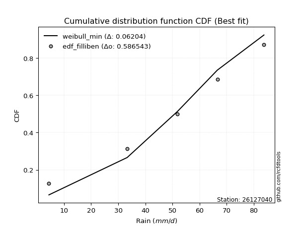</img></img>

</div>


### 10. EDF Jenkinson (1977)

The Jenkinson formula in hydrology is an empirical plotting position formula used to estimate the non-exceedance probability _(P)_ or return period _(T)_ of a given ordered observation within a sample. It is a widely used method in the frequency analysis of extreme events such as floods and rainfall, as it provides a distribution-free way to plot data. _a≈0.31_ and _b≈0.38_ are constants derived to approximate the median of the probability distribution for the given rank.

<div align="center">


$P=(m-a)/(n+b)$


</div>


**10.1. Empirical values**

<div align="center">

|                | 0                   | 1                  | 2             | 3                  | 4                  |
|:---------------|:--------------------|:-------------------|:--------------|:-------------------|:-------------------|
| date           | 2020                | 2025               | 2019          | 2017               | 2018               |
| x              | 4.4                 | 33.3               | 51.9          | 66.6               | 83.8               |
| m              | 1                   | 2                  | 3             | 4                  | 5                  |
| empirical_dist | edf_jenkinson       | edf_jenkinson      | edf_jenkinson | edf_jenkinson      | edf_jenkinson      |
| empirical      | 0.12825278810408922 | 0.3141263940520446 | 0.5           | 0.6858736059479554 | 0.8717472118959109 |
| empirical_tr   | 1.1471215351812367  | 1.4579945799457996 | 2.0           | 3.183431952662722  | 7.797101449275368  |

</div>


**10.2. Kolmogorov-Smirnov fit test (sorted by Δ)**


<div align="center">

|                | 0                   | 1                   | 2                   | 3                   | 4                   | 5                   | 6                   | 7                   | 8                   | 9                  | 10                  | 11                 | 12                  | 13                  | 14                 | 15                  | 16                  | 17                  | 18                  | 19                  | 20                  | 21                 | 22                  | 23                  | 24                  | 25                 | 26                  | 27                  | 28                  | 29                  | 30                  | 31                  | 32                  | 33                  | 34                  | 35                  | 36                  | 37                  | 38                  | 39                  | 40                  | 41                 | 42                  | 43                  | 44                  | 45                 | 46                  | 47                  | 48                  | 49                 | 50                 | 51                 | 52                 | 53                 | 54                  | 55                  | 56                  | 57                  | 58                 | 59                  | 60                  | 61                  | 62                  | 63                  | 64                  | 65                  | 66                 | 67                  | 68                  | 69                 | 70                  | 71                 | 72                  | 73                  | 74                 | 75                  | 76                  | 77                  | 78                  | 79                  | 80                 | 81                  | 82                  | 83                  | 84                  | 85                  | 86                 | 87                 | 88                 | 89                  | 90                  | 91                  | 92                  | 93                  | 94                 | 95                  | 96                  | 97                  | 98                  | 99                  | 100                 | 101                 | 102                | 103                 | 104                 | 105                 | 106                 | 107                | 108                 | 109                | 110                 | 111                | 112                | 113                 | 114                 | 115                | 116                | 117                | 118                | 119                 | 120                | 121                 | 122                 | 123                 | 124                | 125                | 126                 | 127                 | 128                 | 129                 | 130                | 131                | 132                | 133                 | 134                | 135                 | 136                | 137                | 138                | 139                 | 140                | 141                 | 142                | 143                | 144                | 145                | 146                | 147                | 148                | 149                | 150                | 151                | 152                | 153                | 154                | 155                | 156                | 157                | 158                | 159                |
|:---------------|:--------------------|:--------------------|:--------------------|:--------------------|:--------------------|:--------------------|:--------------------|:--------------------|:--------------------|:-------------------|:--------------------|:-------------------|:--------------------|:--------------------|:-------------------|:--------------------|:--------------------|:--------------------|:--------------------|:--------------------|:--------------------|:-------------------|:--------------------|:--------------------|:--------------------|:-------------------|:--------------------|:--------------------|:--------------------|:--------------------|:--------------------|:--------------------|:--------------------|:--------------------|:--------------------|:--------------------|:--------------------|:--------------------|:--------------------|:--------------------|:--------------------|:-------------------|:--------------------|:--------------------|:--------------------|:-------------------|:--------------------|:--------------------|:--------------------|:-------------------|:-------------------|:-------------------|:-------------------|:-------------------|:--------------------|:--------------------|:--------------------|:--------------------|:-------------------|:--------------------|:--------------------|:--------------------|:--------------------|:--------------------|:--------------------|:--------------------|:-------------------|:--------------------|:--------------------|:-------------------|:--------------------|:-------------------|:--------------------|:--------------------|:-------------------|:--------------------|:--------------------|:--------------------|:--------------------|:--------------------|:-------------------|:--------------------|:--------------------|:--------------------|:--------------------|:--------------------|:-------------------|:-------------------|:-------------------|:--------------------|:--------------------|:--------------------|:--------------------|:--------------------|:-------------------|:--------------------|:--------------------|:--------------------|:--------------------|:--------------------|:--------------------|:--------------------|:-------------------|:--------------------|:--------------------|:--------------------|:--------------------|:-------------------|:--------------------|:-------------------|:--------------------|:-------------------|:-------------------|:--------------------|:--------------------|:-------------------|:-------------------|:-------------------|:-------------------|:--------------------|:-------------------|:--------------------|:--------------------|:--------------------|:-------------------|:-------------------|:--------------------|:--------------------|:--------------------|:--------------------|:-------------------|:-------------------|:-------------------|:--------------------|:-------------------|:--------------------|:-------------------|:-------------------|:-------------------|:--------------------|:-------------------|:--------------------|:-------------------|:-------------------|:-------------------|:-------------------|:-------------------|:-------------------|:-------------------|:-------------------|:-------------------|:-------------------|:-------------------|:-------------------|:-------------------|:-------------------|:-------------------|:-------------------|:-------------------|:-------------------|
| station        | 26127040            | 26127040            | 26127040            | 26127040            | 26127040            | 26127040            | 26127040            | 26127040            | 26127040            | 26127040           | 26127040            | 26127040           | 26127040            | 26127040            | 26127040           | 26127040            | 26127040            | 26127040            | 26127040            | 26127040            | 26127040            | 26127040           | 26127040            | 26127040            | 26127040            | 26127040           | 26127040            | 26127040            | 26127040            | 26127040            | 26127040            | 26127040            | 26127040            | 26127040            | 26127040            | 26127040            | 26127040            | 26127040            | 26127040            | 26127040            | 26127040            | 26127040           | 26127040            | 26127040            | 26127040            | 26127040           | 26127040            | 26127040            | 26127040            | 26127040           | 26127040           | 26127040           | 26127040           | 26127040           | 26127040            | 26127040            | 26127040            | 26127040            | 26127040           | 26127040            | 26127040            | 26127040            | 26127040            | 26127040            | 26127040            | 26127040            | 26127040           | 26127040            | 26127040            | 26127040           | 26127040            | 26127040           | 26127040            | 26127040            | 26127040           | 26127040            | 26127040            | 26127040            | 26127040            | 26127040            | 26127040           | 26127040            | 26127040            | 26127040            | 26127040            | 26127040            | 26127040           | 26127040           | 26127040           | 26127040            | 26127040            | 26127040            | 26127040            | 26127040            | 26127040           | 26127040            | 26127040            | 26127040            | 26127040            | 26127040            | 26127040            | 26127040            | 26127040           | 26127040            | 26127040            | 26127040            | 26127040            | 26127040           | 26127040            | 26127040           | 26127040            | 26127040           | 26127040           | 26127040            | 26127040            | 26127040           | 26127040           | 26127040           | 26127040           | 26127040            | 26127040           | 26127040            | 26127040            | 26127040            | 26127040           | 26127040           | 26127040            | 26127040            | 26127040            | 26127040            | 26127040           | 26127040           | 26127040           | 26127040            | 26127040           | 26127040            | 26127040           | 26127040           | 26127040           | 26127040            | 26127040           | 26127040            | 26127040           | 26127040           | 26127040           | 26127040           | 26127040           | 26127040           | 26127040           | 26127040           | 26127040           | 26127040           | 26127040           | 26127040           | 26127040           | 26127040           | 26127040           | 26127040           | 26127040           | 26127040           |
| empirical_dist | edf_jenkinson       | edf_jenkinson       | edf_jenkinson       | edf_jenkinson       | edf_jenkinson       | edf_jenkinson       | edf_jenkinson       | edf_jenkinson       | edf_jenkinson       | edf_jenkinson      | edf_jenkinson       | edf_jenkinson      | edf_jenkinson       | edf_jenkinson       | edf_jenkinson      | edf_jenkinson       | edf_jenkinson       | edf_jenkinson       | edf_jenkinson       | edf_jenkinson       | edf_jenkinson       | edf_jenkinson      | edf_jenkinson       | edf_jenkinson       | edf_jenkinson       | edf_jenkinson      | edf_jenkinson       | edf_jenkinson       | edf_jenkinson       | edf_jenkinson       | edf_jenkinson       | edf_jenkinson       | edf_jenkinson       | edf_jenkinson       | edf_jenkinson       | edf_jenkinson       | edf_jenkinson       | edf_jenkinson       | edf_jenkinson       | edf_jenkinson       | edf_jenkinson       | edf_jenkinson      | edf_jenkinson       | edf_jenkinson       | edf_jenkinson       | edf_jenkinson      | edf_jenkinson       | edf_jenkinson       | edf_jenkinson       | edf_jenkinson      | edf_jenkinson      | edf_jenkinson      | edf_jenkinson      | edf_jenkinson      | edf_jenkinson       | edf_jenkinson       | edf_jenkinson       | edf_jenkinson       | edf_jenkinson      | edf_jenkinson       | edf_jenkinson       | edf_jenkinson       | edf_jenkinson       | edf_jenkinson       | edf_jenkinson       | edf_jenkinson       | edf_jenkinson      | edf_jenkinson       | edf_jenkinson       | edf_jenkinson      | edf_jenkinson       | edf_jenkinson      | edf_jenkinson       | edf_jenkinson       | edf_jenkinson      | edf_jenkinson       | edf_jenkinson       | edf_jenkinson       | edf_jenkinson       | edf_jenkinson       | edf_jenkinson      | edf_jenkinson       | edf_jenkinson       | edf_jenkinson       | edf_jenkinson       | edf_jenkinson       | edf_jenkinson      | edf_jenkinson      | edf_jenkinson      | edf_jenkinson       | edf_jenkinson       | edf_jenkinson       | edf_jenkinson       | edf_jenkinson       | edf_jenkinson      | edf_jenkinson       | edf_jenkinson       | edf_jenkinson       | edf_jenkinson       | edf_jenkinson       | edf_jenkinson       | edf_jenkinson       | edf_jenkinson      | edf_jenkinson       | edf_jenkinson       | edf_jenkinson       | edf_jenkinson       | edf_jenkinson      | edf_jenkinson       | edf_jenkinson      | edf_jenkinson       | edf_jenkinson      | edf_jenkinson      | edf_jenkinson       | edf_jenkinson       | edf_jenkinson      | edf_jenkinson      | edf_jenkinson      | edf_jenkinson      | edf_jenkinson       | edf_jenkinson      | edf_jenkinson       | edf_jenkinson       | edf_jenkinson       | edf_jenkinson      | edf_jenkinson      | edf_jenkinson       | edf_jenkinson       | edf_jenkinson       | edf_jenkinson       | edf_jenkinson      | edf_jenkinson      | edf_jenkinson      | edf_jenkinson       | edf_jenkinson      | edf_jenkinson       | edf_jenkinson      | edf_jenkinson      | edf_jenkinson      | edf_jenkinson       | edf_jenkinson      | edf_jenkinson       | edf_jenkinson      | edf_jenkinson      | edf_jenkinson      | edf_jenkinson      | edf_jenkinson      | edf_jenkinson      | edf_jenkinson      | edf_jenkinson      | edf_jenkinson      | edf_jenkinson      | edf_jenkinson      | edf_jenkinson      | edf_jenkinson      | edf_jenkinson      | edf_jenkinson      | edf_jenkinson      | edf_jenkinson      | edf_jenkinson      |
| p_dist         | weibull_min         | johnsonsu           | pearson3            | anglit              | f                   | nct                 | exponnorm           | norm                | crystalball         | t                  | erlang              | betaprime          | gamma               | semicircular        | exponweib          | gumbel_l            | cosine              | foldnorm            | invgamma            | invgauss            | ksone               | rice               | logistic            | argus               | maxwell             | logdweibull        | invweibull          | trapezoid           | hypsecant           | logpearson3         | logargus            | rayleigh            | logburr             | burr                | dweibull            | loglevy_l           | loggumbel_l         | logdgamma           | dgamma              | kstwobign           | laplace             | gumbel_r           | logmielke           | triang              | gompertz            | logtrapezoid       | logloggamma         | loggenpareto        | vonmises_line       | skewnorm           | logweibull_max     | wrapcauchy         | truncnorm          | ncf                | genpareto           | logvonmises_line    | beta                | loggenextreme       | tukeylambda        | genhalflogistic     | kappa4              | arcsine             | kappa3              | uniform             | halfnorm            | gausshyper          | loggausshyper      | logburr12           | truncweibull_min    | bradford           | loggennorm          | genextreme         | halflogistic        | moyal               | lomax              | levy_l              | logf                | logfoldnorm         | genexpon            | logfatiguelife      | loglogistic        | lognct              | logbetaprime        | logcrystalball      | lognorm             | logt                | logexponnorm       | loganglit          | logsemicircular    | logarcsine          | gennorm             | logncf              | loggamma            | loggamma            | logloglaplace      | logrice             | loghypsecant        | loginvgamma         | logerlang           | loginvgauss         | logalpha            | truncexpon          | loggenhalflogistic | logmaxwell          | wald                | loglaplace          | loglaplace          | loginvweibull      | logwrapcauchy       | lograyleigh        | logskewnorm         | loggompertz        | logjohnsonsb       | logcosine           | loggumbel_r         | logbeta            | loghalfnorm        | logkstwobign       | logtriang          | mielke              | loggenexpon        | logmoyal            | loghalflogistic     | logtukeylambda      | loggengamma        | nakagami           | burr12              | lognakagami         | loglomax            | logexponweib        | gengamma           | halfgennorm        | logksone           | loghalfgennorm      | logwald            | logtruncweibull_min | logkappa3          | loguniform         | logkappa4          | logweibull_min      | logjohnsonsu       | logbradford         | logtruncexpon      | alpha              | johnsonsb          | logtruncnorm       | logrdist           | weibull_max        | fatiguelife        | logexponpow        | powerlaw           | truncpareto        | exponpow           | logpowerlaw        | logtruncpareto     | rdist              | genlogistic        | loggenlogistic     | logvonmises        | vonmises           |
| delta          | 0.06307972059744686 | 0.06380128000953667 | 0.06442473372851786 | 0.07087109125621094 | 0.07145971163102666 | 0.07232267695585676 | 0.07233047125887905 | 0.07233065273858014 | 0.07233065425166352 | 0.0723311277405196 | 0.07301931110357923 | 0.0730695613821019 | 0.07348527294690226 | 0.07428025159130516 | 0.0761092710359309 | 0.07825053105713708 | 0.07914743859580983 | 0.08002017331015912 | 0.08016213080946444 | 0.08450154791464659 | 0.08723413003029185 | 0.0876753150925711 | 0.08799267759601381 | 0.09052663080122436 | 0.09279296120821967 | 0.0937469025323906 | 0.10167228606703693 | 0.10258812098021008 | 0.10287524602714515 | 0.10293921147268692 | 0.10366473506194948 | 0.10609876217379927 | 0.10722887724921237 | 0.11133212371245249 | 0.11204550983537603 | 0.11321497146579473 | 0.11399332633942949 | 0.11435226854673247 | 0.11860729581930884 | 0.11921555202585465 | 0.12253432315546098 | 0.1263514703061177 | 0.12677915212871893 | 0.12800067895393863 | 0.12808534648669195 | 0.12819728708549   | 0.12820816221773457 | 0.12824921710027593 | 0.12825194281141591 | 0.1282524483785581 | 0.1282527339293179 | 0.1282527595257209 | 0.1282527803869995 | 0.1282527870817592 | 0.12825278752595093 | 0.12825278794454326 | 0.12825278810305962 | 0.12825278810404406 | 0.1282527881040536 | 0.12825278810405683 | 0.12825278810408824 | 0.12825278810408922 | 0.12825278810408922 | 0.12825278810408922 | 0.12825278810408922 | 0.12825278810576424 | 0.1282527881315778 | 0.13520308786420265 | 0.13679878523325628 | 0.1397101802216788 | 0.14074162725852515 | 0.1493844623741063 | 0.15058996126024793 | 0.15096804654195917 | 0.1537977780603889 | 0.15483482508955296 | 0.16387137427554416 | 0.17620364361429575 | 0.18031718600814767 | 0.18208187260061254 | 0.1828100025124894 | 0.18294970531365645 | 0.18306451277286168 | 0.18317811137185247 | 0.18317825394450243 | 0.18317844393335486 | 0.1831812156430655 | 0.1835640842116837 | 0.1837230139274102 | 0.18435289614496675 | 0.18587360594795543 | 0.18877136613895745 | 0.19046202685155883 | 0.19046202685155883 | 0.1905413112623089 | 0.19188343360313925 | 0.19280716251848085 | 0.19596118077913888 | 0.19694387971456023 | 0.20453327339893673 | 0.20645789384882357 | 0.21489480639855163 | 0.215549466154776  | 0.21633402954062636 | 0.21927773765601621 | 0.22064262745296714 | 0.22064262745296714 | 0.2232829705755533 | 0.22678299063824853 | 0.2274020219603639 | 0.23240793924329184 | 0.239156766149826  | 0.2433931810580366 | 0.24544888139644933 | 0.25346935013100785 | 0.2558809286404197 | 0.2585707938386331 | 0.2593349477263101 | 0.2606112070614074 | 0.26623006906912866 | 0.2674388033367326 | 0.27933247403518896 | 0.28334112887878654 | 0.28985064427453583 | 0.3030335884341164 | 0.3048611175978119 | 0.31147048694467233 | 0.31412639353708594 | 0.32086233016744864 | 0.33171565931587815 | 0.3369295047548026 | 0.3386034021324183 | 0.3415603691429621 | 0.34633845145936243 | 0.3512647655046473 | 0.35634965730462526 | 0.3726929073660154 | 0.3726977217819634 | 0.3824330244210466 | 0.40432382165494013 | 0.4371173466548008 | 0.43991764251376136 | 0.445994582580372  | 0.4556985513933302 | 0.4627953491894117 | 0.4695842527068637 | 0.4999999958141672 | 0.5150656388586102 | 0.5430062216294325 | 0.5664575283885958 | 0.5693826921607748 | 0.5832365079498592 | 0.5957041282396416 | 0.6373435945559442 | 0.6472255282043928 | 0.6858736057903847 | 0.6858736059479554 | 0.6858736059479554 | 1.0501534208086418 | 12.469476849194272 |
| deltao         | 0.5865427407550001  | 0.5865427407550001  | 0.5865427407550001  | 0.5865427407550001  | 0.5865427407550001  | 0.5865427407550001  | 0.5865427407550001  | 0.5865427407550001  | 0.5865427407550001  | 0.5865427407550001 | 0.5865427407550001  | 0.5865427407550001 | 0.5865427407550001  | 0.5865427407550001  | 0.5865427407550001 | 0.5865427407550001  | 0.5865427407550001  | 0.5865427407550001  | 0.5865427407550001  | 0.5865427407550001  | 0.5865427407550001  | 0.5865427407550001 | 0.5865427407550001  | 0.5865427407550001  | 0.5865427407550001  | 0.5865427407550001 | 0.5865427407550001  | 0.5865427407550001  | 0.5865427407550001  | 0.5865427407550001  | 0.5865427407550001  | 0.5865427407550001  | 0.5865427407550001  | 0.5865427407550001  | 0.5865427407550001  | 0.5865427407550001  | 0.5865427407550001  | 0.5865427407550001  | 0.5865427407550001  | 0.5865427407550001  | 0.5865427407550001  | 0.5865427407550001 | 0.5865427407550001  | 0.5865427407550001  | 0.5865427407550001  | 0.5865427407550001 | 0.5865427407550001  | 0.5865427407550001  | 0.5865427407550001  | 0.5865427407550001 | 0.5865427407550001 | 0.5865427407550001 | 0.5865427407550001 | 0.5865427407550001 | 0.5865427407550001  | 0.5865427407550001  | 0.5865427407550001  | 0.5865427407550001  | 0.5865427407550001 | 0.5865427407550001  | 0.5865427407550001  | 0.5865427407550001  | 0.5865427407550001  | 0.5865427407550001  | 0.5865427407550001  | 0.5865427407550001  | 0.5865427407550001 | 0.5865427407550001  | 0.5865427407550001  | 0.5865427407550001 | 0.5865427407550001  | 0.5865427407550001 | 0.5865427407550001  | 0.5865427407550001  | 0.5865427407550001 | 0.5865427407550001  | 0.5865427407550001  | 0.5865427407550001  | 0.5865427407550001  | 0.5865427407550001  | 0.5865427407550001 | 0.5865427407550001  | 0.5865427407550001  | 0.5865427407550001  | 0.5865427407550001  | 0.5865427407550001  | 0.5865427407550001 | 0.5865427407550001 | 0.5865427407550001 | 0.5865427407550001  | 0.5865427407550001  | 0.5865427407550001  | 0.5865427407550001  | 0.5865427407550001  | 0.5865427407550001 | 0.5865427407550001  | 0.5865427407550001  | 0.5865427407550001  | 0.5865427407550001  | 0.5865427407550001  | 0.5865427407550001  | 0.5865427407550001  | 0.5865427407550001 | 0.5865427407550001  | 0.5865427407550001  | 0.5865427407550001  | 0.5865427407550001  | 0.5865427407550001 | 0.5865427407550001  | 0.5865427407550001 | 0.5865427407550001  | 0.5865427407550001 | 0.5865427407550001 | 0.5865427407550001  | 0.5865427407550001  | 0.5865427407550001 | 0.5865427407550001 | 0.5865427407550001 | 0.5865427407550001 | 0.5865427407550001  | 0.5865427407550001 | 0.5865427407550001  | 0.5865427407550001  | 0.5865427407550001  | 0.5865427407550001 | 0.5865427407550001 | 0.5865427407550001  | 0.5865427407550001  | 0.5865427407550001  | 0.5865427407550001  | 0.5865427407550001 | 0.5865427407550001 | 0.5865427407550001 | 0.5865427407550001  | 0.5865427407550001 | 0.5865427407550001  | 0.5865427407550001 | 0.5865427407550001 | 0.5865427407550001 | 0.5865427407550001  | 0.5865427407550001 | 0.5865427407550001  | 0.5865427407550001 | 0.5865427407550001 | 0.5865427407550001 | 0.5865427407550001 | 0.5865427407550001 | 0.5865427407550001 | 0.5865427407550001 | 0.5865427407550001 | 0.5865427407550001 | 0.5865427407550001 | 0.5865427407550001 | 0.5865427407550001 | 0.5865427407550001 | 0.5865427407550001 | 0.5865427407550001 | 0.5865427407550001 | 0.5865427407550001 | 0.5865427407550001 |
| eval           | Δo > Δ              | Δo > Δ              | Δo > Δ              | Δo > Δ              | Δo > Δ              | Δo > Δ              | Δo > Δ              | Δo > Δ              | Δo > Δ              | Δo > Δ             | Δo > Δ              | Δo > Δ             | Δo > Δ              | Δo > Δ              | Δo > Δ             | Δo > Δ              | Δo > Δ              | Δo > Δ              | Δo > Δ              | Δo > Δ              | Δo > Δ              | Δo > Δ             | Δo > Δ              | Δo > Δ              | Δo > Δ              | Δo > Δ             | Δo > Δ              | Δo > Δ              | Δo > Δ              | Δo > Δ              | Δo > Δ              | Δo > Δ              | Δo > Δ              | Δo > Δ              | Δo > Δ              | Δo > Δ              | Δo > Δ              | Δo > Δ              | Δo > Δ              | Δo > Δ              | Δo > Δ              | Δo > Δ             | Δo > Δ              | Δo > Δ              | Δo > Δ              | Δo > Δ             | Δo > Δ              | Δo > Δ              | Δo > Δ              | Δo > Δ             | Δo > Δ             | Δo > Δ             | Δo > Δ             | Δo > Δ             | Δo > Δ              | Δo > Δ              | Δo > Δ              | Δo > Δ              | Δo > Δ             | Δo > Δ              | Δo > Δ              | Δo > Δ              | Δo > Δ              | Δo > Δ              | Δo > Δ              | Δo > Δ              | Δo > Δ             | Δo > Δ              | Δo > Δ              | Δo > Δ             | Δo > Δ              | Δo > Δ             | Δo > Δ              | Δo > Δ              | Δo > Δ             | Δo > Δ              | Δo > Δ              | Δo > Δ              | Δo > Δ              | Δo > Δ              | Δo > Δ             | Δo > Δ              | Δo > Δ              | Δo > Δ              | Δo > Δ              | Δo > Δ              | Δo > Δ             | Δo > Δ             | Δo > Δ             | Δo > Δ              | Δo > Δ              | Δo > Δ              | Δo > Δ              | Δo > Δ              | Δo > Δ             | Δo > Δ              | Δo > Δ              | Δo > Δ              | Δo > Δ              | Δo > Δ              | Δo > Δ              | Δo > Δ              | Δo > Δ             | Δo > Δ              | Δo > Δ              | Δo > Δ              | Δo > Δ              | Δo > Δ             | Δo > Δ              | Δo > Δ             | Δo > Δ              | Δo > Δ             | Δo > Δ             | Δo > Δ              | Δo > Δ              | Δo > Δ             | Δo > Δ             | Δo > Δ             | Δo > Δ             | Δo > Δ              | Δo > Δ             | Δo > Δ              | Δo > Δ              | Δo > Δ              | Δo > Δ             | Δo > Δ             | Δo > Δ              | Δo > Δ              | Δo > Δ              | Δo > Δ              | Δo > Δ             | Δo > Δ             | Δo > Δ             | Δo > Δ              | Δo > Δ             | Δo > Δ              | Δo > Δ             | Δo > Δ             | Δo > Δ             | Δo > Δ              | Δo > Δ             | Δo > Δ              | Δo > Δ             | Δo > Δ             | Δo > Δ             | Δo > Δ             | Δo > Δ             | Δo > Δ             | Δo > Δ             | Δo > Δ             | Δo > Δ             | Δo > Δ             | Δo <= Δ            | Δo <= Δ            | Δo <= Δ            | Δo <= Δ            | Δo <= Δ            | Δo <= Δ            | Δo <= Δ            | Δo <= Δ            |
| fit            | 1                   | 1                   | 1                   | 1                   | 1                   | 1                   | 1                   | 1                   | 1                   | 1                  | 1                   | 1                  | 1                   | 1                   | 1                  | 1                   | 1                   | 1                   | 1                   | 1                   | 1                   | 1                  | 1                   | 1                   | 1                   | 1                  | 1                   | 1                   | 1                   | 1                   | 1                   | 1                   | 1                   | 1                   | 1                   | 1                   | 1                   | 1                   | 1                   | 1                   | 1                   | 1                  | 1                   | 1                   | 1                   | 1                  | 1                   | 1                   | 1                   | 1                  | 1                  | 1                  | 1                  | 1                  | 1                   | 1                   | 1                   | 1                   | 1                  | 1                   | 1                   | 1                   | 1                   | 1                   | 1                   | 1                   | 1                  | 1                   | 1                   | 1                  | 1                   | 1                  | 1                   | 1                   | 1                  | 1                   | 1                   | 1                   | 1                   | 1                   | 1                  | 1                   | 1                   | 1                   | 1                   | 1                   | 1                  | 1                  | 1                  | 1                   | 1                   | 1                   | 1                   | 1                   | 1                  | 1                   | 1                   | 1                   | 1                   | 1                   | 1                   | 1                   | 1                  | 1                   | 1                   | 1                   | 1                   | 1                  | 1                   | 1                  | 1                   | 1                  | 1                  | 1                   | 1                   | 1                  | 1                  | 1                  | 1                  | 1                   | 1                  | 1                   | 1                   | 1                   | 1                  | 1                  | 1                   | 1                   | 1                   | 1                   | 1                  | 1                  | 1                  | 1                   | 1                  | 1                   | 1                  | 1                  | 1                  | 1                   | 1                  | 1                   | 1                  | 1                  | 1                  | 1                  | 1                  | 1                  | 1                  | 1                  | 1                  | 1                  | 0                  | 0                  | 0                  | 0                  | 0                  | 0                  | 0                  | 0                  |
| n              | 5                   | 5                   | 5                   | 5                   | 5                   | 5                   | 5                   | 5                   | 5                   | 5                  | 5                   | 5                  | 5                   | 5                   | 5                  | 5                   | 5                   | 5                   | 5                   | 5                   | 5                   | 5                  | 5                   | 5                   | 5                   | 5                  | 5                   | 5                   | 5                   | 5                   | 5                   | 5                   | 5                   | 5                   | 5                   | 5                   | 5                   | 5                   | 5                   | 5                   | 5                   | 5                  | 5                   | 5                   | 5                   | 5                  | 5                   | 5                   | 5                   | 5                  | 5                  | 5                  | 5                  | 5                  | 5                   | 5                   | 5                   | 5                   | 5                  | 5                   | 5                   | 5                   | 5                   | 5                   | 5                   | 5                   | 5                  | 5                   | 5                   | 5                  | 5                   | 5                  | 5                   | 5                   | 5                  | 5                   | 5                   | 5                   | 5                   | 5                   | 5                  | 5                   | 5                   | 5                   | 5                   | 5                   | 5                  | 5                  | 5                  | 5                   | 5                   | 5                   | 5                   | 5                   | 5                  | 5                   | 5                   | 5                   | 5                   | 5                   | 5                   | 5                   | 5                  | 5                   | 5                   | 5                   | 5                   | 5                  | 5                   | 5                  | 5                   | 5                  | 5                  | 5                   | 5                   | 5                  | 5                  | 5                  | 5                  | 5                   | 5                  | 5                   | 5                   | 5                   | 5                  | 5                  | 5                   | 5                   | 5                   | 5                   | 5                  | 5                  | 5                  | 5                   | 5                  | 5                   | 5                  | 5                  | 5                  | 5                   | 5                  | 5                   | 5                  | 5                  | 5                  | 5                  | 5                  | 5                  | 5                  | 5                  | 5                  | 5                  | 5                  | 5                  | 5                  | 5                  | 5                  | 5                  | 5                  | 5                  |
| best_fit       | 1                   | 0                   | 0                   | 0                   | 0                   | 0                   | 0                   | 0                   | 0                   | 0                  | 0                   | 0                  | 0                   | 0                   | 0                  | 0                   | 0                   | 0                   | 0                   | 0                   | 0                   | 0                  | 0                   | 0                   | 0                   | 0                  | 0                   | 0                   | 0                   | 0                   | 0                   | 0                   | 0                   | 0                   | 0                   | 0                   | 0                   | 0                   | 0                   | 0                   | 0                   | 0                  | 0                   | 0                   | 0                   | 0                  | 0                   | 0                   | 0                   | 0                  | 0                  | 0                  | 0                  | 0                  | 0                   | 0                   | 0                   | 0                   | 0                  | 0                   | 0                   | 0                   | 0                   | 0                   | 0                   | 0                   | 0                  | 0                   | 0                   | 0                  | 0                   | 0                  | 0                   | 0                   | 0                  | 0                   | 0                   | 0                   | 0                   | 0                   | 0                  | 0                   | 0                   | 0                   | 0                   | 0                   | 0                  | 0                  | 0                  | 0                   | 0                   | 0                   | 0                   | 0                   | 0                  | 0                   | 0                   | 0                   | 0                   | 0                   | 0                   | 0                   | 0                  | 0                   | 0                   | 0                   | 0                   | 0                  | 0                   | 0                  | 0                   | 0                  | 0                  | 0                   | 0                   | 0                  | 0                  | 0                  | 0                  | 0                   | 0                  | 0                   | 0                   | 0                   | 0                  | 0                  | 0                   | 0                   | 0                   | 0                   | 0                  | 0                  | 0                  | 0                   | 0                  | 0                   | 0                  | 0                  | 0                  | 0                   | 0                  | 0                   | 0                  | 0                  | 0                  | 0                  | 0                  | 0                  | 0                  | 0                  | 0                  | 0                  | 0                  | 0                  | 0                  | 0                  | 0                  | 0                  | 0                  | 0                  |
| best_fit_sort  | 1                   | 2                   | 3                   | 4                   | 5                   | 6                   | 7                   | 8                   | 9                   | 10                 | 11                  | 12                 | 13                  | 14                  | 15                 | 16                  | 17                  | 18                  | 19                  | 20                  | 21                  | 22                 | 23                  | 24                  | 25                  | 26                 | 27                  | 28                  | 29                  | 30                  | 31                  | 32                  | 33                  | 34                  | 35                  | 36                  | 37                  | 38                  | 39                  | 40                  | 41                  | 42                 | 43                  | 44                  | 45                  | 46                 | 47                  | 48                  | 49                  | 50                 | 51                 | 52                 | 53                 | 54                 | 55                  | 56                  | 57                  | 58                  | 59                 | 60                  | 61                  | 62                  | 63                  | 64                  | 65                  | 66                  | 67                 | 68                  | 69                  | 70                 | 71                  | 72                 | 73                  | 74                  | 75                 | 76                  | 77                  | 78                  | 79                  | 80                  | 81                 | 82                  | 83                  | 84                  | 85                  | 86                  | 87                 | 88                 | 89                 | 90                  | 91                  | 92                  | 93                  | 94                  | 95                 | 96                  | 97                  | 98                  | 99                  | 100                 | 101                 | 102                 | 103                | 104                 | 105                 | 106                 | 107                 | 108                | 109                 | 110                | 111                 | 112                | 113                | 114                 | 115                 | 116                | 117                | 118                | 119                | 120                 | 121                | 122                 | 123                 | 124                 | 125                | 126                | 127                 | 128                 | 129                 | 130                 | 131                | 132                | 133                | 134                 | 135                | 136                 | 137                | 138                | 139                | 140                 | 141                | 142                 | 143                | 144                | 145                | 146                | 147                | 148                | 149                | 150                | 151                | 152                | 153                | 154                | 155                | 156                | 157                | 158                | 159                | 160                |

</div>


**10.3. Best fit**

<div align="center">

|   id |   station | empirical_dist   | p_dist      |     delta |   deltao | eval   |   fit |   n |   best_fit |   best_fit_sort |
|-----:|----------:|:-----------------|:------------|----------:|---------:|:-------|------:|----:|-----------:|----------------:|
|    0 |  26127040 | edf_jenkinson    | weibull_min | 0.0630797 | 0.586543 | Δo > Δ |     1 |   5 |          1 |               1 |

</div>


<div align="center">

</img></img>

</div>


### 11. EDF Cunnane (1978)

Cunnane´s work in statistical hydrology has focused on the performance and evaluation of different probability distributions (such as GEV, Gumbel, Lognormal) for flood frequency estimation. _b_ is a constant, typically set to 0.4.

<div align="center">


$P=(m-b)/(n+1-2b)$


</div>


**11.1. Empirical values**

<div align="center">

|                | 0                   | 1                  | 2           | 3                  | 4                  |
|:---------------|:--------------------|:-------------------|:------------|:-------------------|:-------------------|
| date           | 2020                | 2025               | 2019        | 2017               | 2018               |
| x              | 4.4                 | 33.3               | 51.9        | 66.6               | 83.8               |
| m              | 1                   | 2                  | 3           | 4                  | 5                  |
| empirical_dist | edf_cunnane         | edf_cunnane        | edf_cunnane | edf_cunnane        | edf_cunnane        |
| empirical      | 0.11538461538461538 | 0.3076923076923077 | 0.5         | 0.6923076923076923 | 0.8846153846153845 |
| empirical_tr   | 1.1304347826086958  | 1.4444444444444444 | 2.0         | 3.25               | 8.666666666666655  |

</div>


**11.2. Kolmogorov-Smirnov fit test (sorted by Δ)**


<div align="center">

|                | 0                   | 1                    | 2                    | 3                   | 4                   | 5                   | 6                    | 7                   | 8                   | 9                   | 10                  | 11                   | 12                  | 13                  | 14                  | 15                  | 16                  | 17                  | 18                  | 19                 | 20                  | 21                  | 22                  | 23                  | 24                  | 25                  | 26                  | 27                  | 28                  | 29                 | 30                  | 31                  | 32                 | 33                  | 34                  | 35                  | 36                  | 37                  | 38                  | 39                  | 40                  | 41                  | 42                 | 43                 | 44                 | 45                  | 46                  | 47                  | 48                 | 49                  | 50                  | 51                  | 52                  | 53                  | 54                  | 55                  | 56                  | 57                  | 58                  | 59                  | 60                  | 61                  | 62                  | 63                  | 64                 | 65                  | 66                  | 67                 | 68                  | 69                  | 70                 | 71                  | 72                  | 73                  | 74                  | 75                 | 76                  | 77                  | 78                  | 79                  | 80                  | 81                  | 82                 | 83                  | 84                  | 85                  | 86                 | 87                 | 88                 | 89                  | 90                 | 91                  | 92                  | 93                  | 94                  | 95                  | 96                 | 97                  | 98                 | 99                  | 100                 | 101                 | 102                 | 103                 | 104                 | 105                 | 106                 | 107                | 108                 | 109                 | 110                 | 111                 | 112                | 113                 | 114                 | 115                | 116                | 117                | 118                | 119                | 120                | 121                | 122                | 123                 | 124                | 125                | 126                 | 127                 | 128                 | 129                 | 130                | 131                | 132                 | 133                 | 134                | 135                 | 136                | 137                 | 138                | 139                 | 140                 | 141                | 142                | 143                | 144                 | 145                | 146                | 147                | 148                | 149                | 150                | 151                | 152                | 153                | 154                | 155                | 156                | 157                | 158                | 159                |
|:---------------|:--------------------|:---------------------|:---------------------|:--------------------|:--------------------|:--------------------|:---------------------|:--------------------|:--------------------|:--------------------|:--------------------|:---------------------|:--------------------|:--------------------|:--------------------|:--------------------|:--------------------|:--------------------|:--------------------|:-------------------|:--------------------|:--------------------|:--------------------|:--------------------|:--------------------|:--------------------|:--------------------|:--------------------|:--------------------|:-------------------|:--------------------|:--------------------|:-------------------|:--------------------|:--------------------|:--------------------|:--------------------|:--------------------|:--------------------|:--------------------|:--------------------|:--------------------|:-------------------|:-------------------|:-------------------|:--------------------|:--------------------|:--------------------|:-------------------|:--------------------|:--------------------|:--------------------|:--------------------|:--------------------|:--------------------|:--------------------|:--------------------|:--------------------|:--------------------|:--------------------|:--------------------|:--------------------|:--------------------|:--------------------|:-------------------|:--------------------|:--------------------|:-------------------|:--------------------|:--------------------|:-------------------|:--------------------|:--------------------|:--------------------|:--------------------|:-------------------|:--------------------|:--------------------|:--------------------|:--------------------|:--------------------|:--------------------|:-------------------|:--------------------|:--------------------|:--------------------|:-------------------|:-------------------|:-------------------|:--------------------|:-------------------|:--------------------|:--------------------|:--------------------|:--------------------|:--------------------|:-------------------|:--------------------|:-------------------|:--------------------|:--------------------|:--------------------|:--------------------|:--------------------|:--------------------|:--------------------|:--------------------|:-------------------|:--------------------|:--------------------|:--------------------|:--------------------|:-------------------|:--------------------|:--------------------|:-------------------|:-------------------|:-------------------|:-------------------|:-------------------|:-------------------|:-------------------|:-------------------|:--------------------|:-------------------|:-------------------|:--------------------|:--------------------|:--------------------|:--------------------|:-------------------|:-------------------|:--------------------|:--------------------|:-------------------|:--------------------|:-------------------|:--------------------|:-------------------|:--------------------|:--------------------|:-------------------|:-------------------|:-------------------|:--------------------|:-------------------|:-------------------|:-------------------|:-------------------|:-------------------|:-------------------|:-------------------|:-------------------|:-------------------|:-------------------|:-------------------|:-------------------|:-------------------|:-------------------|:-------------------|
| station        | 26127040            | 26127040             | 26127040             | 26127040            | 26127040            | 26127040            | 26127040             | 26127040            | 26127040            | 26127040            | 26127040            | 26127040             | 26127040            | 26127040            | 26127040            | 26127040            | 26127040            | 26127040            | 26127040            | 26127040           | 26127040            | 26127040            | 26127040            | 26127040            | 26127040            | 26127040            | 26127040            | 26127040            | 26127040            | 26127040           | 26127040            | 26127040            | 26127040           | 26127040            | 26127040            | 26127040            | 26127040            | 26127040            | 26127040            | 26127040            | 26127040            | 26127040            | 26127040           | 26127040           | 26127040           | 26127040            | 26127040            | 26127040            | 26127040           | 26127040            | 26127040            | 26127040            | 26127040            | 26127040            | 26127040            | 26127040            | 26127040            | 26127040            | 26127040            | 26127040            | 26127040            | 26127040            | 26127040            | 26127040            | 26127040           | 26127040            | 26127040            | 26127040           | 26127040            | 26127040            | 26127040           | 26127040            | 26127040            | 26127040            | 26127040            | 26127040           | 26127040            | 26127040            | 26127040            | 26127040            | 26127040            | 26127040            | 26127040           | 26127040            | 26127040            | 26127040            | 26127040           | 26127040           | 26127040           | 26127040            | 26127040           | 26127040            | 26127040            | 26127040            | 26127040            | 26127040            | 26127040           | 26127040            | 26127040           | 26127040            | 26127040            | 26127040            | 26127040            | 26127040            | 26127040            | 26127040            | 26127040            | 26127040           | 26127040            | 26127040            | 26127040            | 26127040            | 26127040           | 26127040            | 26127040            | 26127040           | 26127040           | 26127040           | 26127040           | 26127040           | 26127040           | 26127040           | 26127040           | 26127040            | 26127040           | 26127040           | 26127040            | 26127040            | 26127040            | 26127040            | 26127040           | 26127040           | 26127040            | 26127040            | 26127040           | 26127040            | 26127040           | 26127040            | 26127040           | 26127040            | 26127040            | 26127040           | 26127040           | 26127040           | 26127040            | 26127040           | 26127040           | 26127040           | 26127040           | 26127040           | 26127040           | 26127040           | 26127040           | 26127040           | 26127040           | 26127040           | 26127040           | 26127040           | 26127040           | 26127040           |
| empirical_dist | edf_cunnane         | edf_cunnane          | edf_cunnane          | edf_cunnane         | edf_cunnane         | edf_cunnane         | edf_cunnane          | edf_cunnane         | edf_cunnane         | edf_cunnane         | edf_cunnane         | edf_cunnane          | edf_cunnane         | edf_cunnane         | edf_cunnane         | edf_cunnane         | edf_cunnane         | edf_cunnane         | edf_cunnane         | edf_cunnane        | edf_cunnane         | edf_cunnane         | edf_cunnane         | edf_cunnane         | edf_cunnane         | edf_cunnane         | edf_cunnane         | edf_cunnane         | edf_cunnane         | edf_cunnane        | edf_cunnane         | edf_cunnane         | edf_cunnane        | edf_cunnane         | edf_cunnane         | edf_cunnane         | edf_cunnane         | edf_cunnane         | edf_cunnane         | edf_cunnane         | edf_cunnane         | edf_cunnane         | edf_cunnane        | edf_cunnane        | edf_cunnane        | edf_cunnane         | edf_cunnane         | edf_cunnane         | edf_cunnane        | edf_cunnane         | edf_cunnane         | edf_cunnane         | edf_cunnane         | edf_cunnane         | edf_cunnane         | edf_cunnane         | edf_cunnane         | edf_cunnane         | edf_cunnane         | edf_cunnane         | edf_cunnane         | edf_cunnane         | edf_cunnane         | edf_cunnane         | edf_cunnane        | edf_cunnane         | edf_cunnane         | edf_cunnane        | edf_cunnane         | edf_cunnane         | edf_cunnane        | edf_cunnane         | edf_cunnane         | edf_cunnane         | edf_cunnane         | edf_cunnane        | edf_cunnane         | edf_cunnane         | edf_cunnane         | edf_cunnane         | edf_cunnane         | edf_cunnane         | edf_cunnane        | edf_cunnane         | edf_cunnane         | edf_cunnane         | edf_cunnane        | edf_cunnane        | edf_cunnane        | edf_cunnane         | edf_cunnane        | edf_cunnane         | edf_cunnane         | edf_cunnane         | edf_cunnane         | edf_cunnane         | edf_cunnane        | edf_cunnane         | edf_cunnane        | edf_cunnane         | edf_cunnane         | edf_cunnane         | edf_cunnane         | edf_cunnane         | edf_cunnane         | edf_cunnane         | edf_cunnane         | edf_cunnane        | edf_cunnane         | edf_cunnane         | edf_cunnane         | edf_cunnane         | edf_cunnane        | edf_cunnane         | edf_cunnane         | edf_cunnane        | edf_cunnane        | edf_cunnane        | edf_cunnane        | edf_cunnane        | edf_cunnane        | edf_cunnane        | edf_cunnane        | edf_cunnane         | edf_cunnane        | edf_cunnane        | edf_cunnane         | edf_cunnane         | edf_cunnane         | edf_cunnane         | edf_cunnane        | edf_cunnane        | edf_cunnane         | edf_cunnane         | edf_cunnane        | edf_cunnane         | edf_cunnane        | edf_cunnane         | edf_cunnane        | edf_cunnane         | edf_cunnane         | edf_cunnane        | edf_cunnane        | edf_cunnane        | edf_cunnane         | edf_cunnane        | edf_cunnane        | edf_cunnane        | edf_cunnane        | edf_cunnane        | edf_cunnane        | edf_cunnane        | edf_cunnane        | edf_cunnane        | edf_cunnane        | edf_cunnane        | edf_cunnane        | edf_cunnane        | edf_cunnane        | edf_cunnane        |
| p_dist         | weibull_min         | pearson3             | johnsonsu            | anglit              | nct                 | exponnorm           | norm                 | crystalball         | t                   | f                   | betaprime           | semicircular         | gamma               | erlang              | gumbel_l            | foldnorm            | cosine              | ksone               | rice                | exponweib          | argus               | invgamma            | logistic            | invgauss            | maxwell             | trapezoid           | logargus            | logburr             | rayleigh            | hypsecant          | burr                | invweibull          | logdweibull        | logpearson3         | dgamma              | logmielke           | triang              | gompertz            | logloggamma         | loggenpareto        | vonmises_line       | skewnorm            | logweibull_max     | wrapcauchy         | truncnorm          | genpareto           | beta                | loggenextreme       | tukeylambda        | genhalflogistic     | kappa4              | kappa3              | arcsine             | uniform             | gausshyper          | loggausshyper       | laplace             | logdgamma           | logvonmises_line    | dweibull            | loggumbel_l         | kstwobign           | loglevy_l           | halfnorm            | gumbel_r           | ncf                 | loggennorm          | logtrapezoid       | logburr12           | truncweibull_min    | bradford           | halflogistic        | moyal               | genextreme          | lomax               | levy_l             | logf                | logfoldnorm         | genexpon            | logfatiguelife      | loglogistic         | lognct              | logbetaprime       | logcrystalball      | lognorm             | logt                | logexponnorm       | loganglit          | logsemicircular    | logarcsine          | gennorm            | loghypsecant        | logncf              | loggamma            | loggamma            | logrice             | loginvgamma        | logerlang           | logloglaplace      | loginvgauss         | logalpha            | truncexpon          | wald                | loglaplace          | loglaplace          | loggenhalflogistic  | logmaxwell          | loginvweibull      | logskewnorm         | logwrapcauchy       | lograyleigh         | loggompertz         | logjohnsonsb       | logcosine           | loggumbel_r         | logtriang          | logbeta            | loghalfnorm        | logkstwobign       | mielke             | loggenexpon        | logtukeylambda     | logmoyal           | loghalflogistic     | lognakagami        | loggengamma        | nakagami            | burr12              | loglomax            | logexponweib        | gengamma           | halfgennorm        | logksone            | loghalfgennorm      | logwald            | logtruncweibull_min | logkappa3          | loguniform          | logkappa4          | logweibull_min      | logjohnsonsu        | logbradford        | logtruncexpon      | alpha              | johnsonsb           | logtruncnorm       | logrdist           | weibull_max        | fatiguelife        | logexponpow        | powerlaw           | truncpareto        | exponpow           | logpowerlaw        | logtruncpareto     | rdist              | genlogistic        | loggenlogistic     | logvonmises        | vonmises           |
| delta          | 0.05021154787797302 | 0.051556561009044016 | 0.051738058327065684 | 0.05800291853673709 | 0.05945450423638292 | 0.05946229853940521 | 0.059462480019106305 | 0.05946248153218967 | 0.05946295502104576 | 0.06016957179093618 | 0.06020138866262806 | 0.061412078871831324 | 0.06431876861078933 | 0.06516444045999281 | 0.06538235833766348 | 0.06715200059068528 | 0.07376133918722128 | 0.07436595731081799 | 0.07480714237309725 | 0.0761092710359309 | 0.07765845808175076 | 0.08016213080946444 | 0.08155859123627696 | 0.08450154791464659 | 0.08649670501795359 | 0.08971994826073648 | 0.09079656234247564 | 0.09436070452973877 | 0.09607068036074862 | 0.0964411596674083 | 0.09846395099297889 | 0.10167228606703693 | 0.1066150752518642 | 0.10937329783242383 | 0.11217320945957193 | 0.11391097940924533 | 0.11513250623446503 | 0.11521717376721813 | 0.11533998949826096 | 0.11538104438080232 | 0.11538377009194209 | 0.11538427565908449 | 0.1153845612098443 | 0.1153845868062473 | 0.1153846076675259 | 0.11538461480647733 | 0.11538461538358602 | 0.11538461538457045 | 0.11538461538458   | 0.11538461538458322 | 0.11538461538461464 | 0.11538461538461538 | 0.11538461538461538 | 0.11538461538461553 | 0.11538461538629063 | 0.11538461541210421 | 0.11610023679572412 | 0.11672026274342018 | 0.11796357772319555 | 0.11847959619511295 | 0.11916197817043495 | 0.11921555202585465 | 0.11964905782553159 | 0.12309695562787837 | 0.1263514703061177 | 0.12760055283438565 | 0.13430754089878824 | 0.1346313734452269 | 0.13520308786420265 | 0.13679878523325628 | 0.1397101802216788 | 0.15058996126024793 | 0.15096804654195917 | 0.15581854873384315 | 0.16023186442012582 | 0.1677029978090268 | 0.17030546063528107 | 0.18263772997403266 | 0.18675127236788458 | 0.18851595896034945 | 0.18924408887222632 | 0.18938379167339336 | 0.1894985991325986 | 0.18961219773158938 | 0.18961234030423935 | 0.18961253029309177 | 0.1896153020028024 | 0.1899981705714206 | 0.1901571002871471 | 0.19078698250470366 | 0.1923076923076923 | 0.19280716251848085 | 0.19520545249869437 | 0.19689611321129574 | 0.19689611321129574 | 0.19831751996287617 | 0.2023952671388758 | 0.20337796607429715 | 0.2034094839817825 | 0.21096735975867364 | 0.21289198020856048 | 0.21489480639855163 | 0.21927773765601621 | 0.22064262745296714 | 0.22064262745296714 | 0.22175779756095637 | 0.22276811590036327 | 0.2297170569352902 | 0.23240793924329184 | 0.23321707699798544 | 0.23383610832010082 | 0.24559085250956292 | 0.2498272674177735 | 0.25188296775618624 | 0.25990343649074477 | 0.2606112070614074 | 0.2623150150001566 | 0.26500488019837   | 0.265769034086047  | 0.2726641554288656 | 0.2738728896964695 | 0.2834165579147989 | 0.2857665603949259 | 0.28977521523852345 | 0.307692307177349  | 0.3094676747938533 | 0.31129520395754884 | 0.31790457330440924 | 0.32729641652718555 | 0.33814974567561507 | 0.3433635911145395 | 0.3450374884921552 | 0.34799445550269903 | 0.35277253781909934 | 0.3576988518643842 | 0.36278374366436217 | 0.3791269937257523 | 0.37913180814170033 | 0.3888671107807835 | 0.41075790801467704 | 0.44355143301453764 | 0.4463517288734983 | 0.4524286689401089 | 0.4621326377530671 | 0.47566352190888556 | 0.4760183390666006 | 0.4999999958141672 | 0.5214997252183471 | 0.5494403079891694 | 0.5728916147483327 | 0.5758167785205116 | 0.5896705943095961 | 0.6021382145993784 | 0.6437776809156812 | 0.6536596145641297 | 0.6923076921501217 | 0.6923076923076923 | 0.6923076923076923 | 1.0530840915631765 | 12.456608676474799 |
| deltao         | 0.5865427407550001  | 0.5865427407550001   | 0.5865427407550001   | 0.5865427407550001  | 0.5865427407550001  | 0.5865427407550001  | 0.5865427407550001   | 0.5865427407550001  | 0.5865427407550001  | 0.5865427407550001  | 0.5865427407550001  | 0.5865427407550001   | 0.5865427407550001  | 0.5865427407550001  | 0.5865427407550001  | 0.5865427407550001  | 0.5865427407550001  | 0.5865427407550001  | 0.5865427407550001  | 0.5865427407550001 | 0.5865427407550001  | 0.5865427407550001  | 0.5865427407550001  | 0.5865427407550001  | 0.5865427407550001  | 0.5865427407550001  | 0.5865427407550001  | 0.5865427407550001  | 0.5865427407550001  | 0.5865427407550001 | 0.5865427407550001  | 0.5865427407550001  | 0.5865427407550001 | 0.5865427407550001  | 0.5865427407550001  | 0.5865427407550001  | 0.5865427407550001  | 0.5865427407550001  | 0.5865427407550001  | 0.5865427407550001  | 0.5865427407550001  | 0.5865427407550001  | 0.5865427407550001 | 0.5865427407550001 | 0.5865427407550001 | 0.5865427407550001  | 0.5865427407550001  | 0.5865427407550001  | 0.5865427407550001 | 0.5865427407550001  | 0.5865427407550001  | 0.5865427407550001  | 0.5865427407550001  | 0.5865427407550001  | 0.5865427407550001  | 0.5865427407550001  | 0.5865427407550001  | 0.5865427407550001  | 0.5865427407550001  | 0.5865427407550001  | 0.5865427407550001  | 0.5865427407550001  | 0.5865427407550001  | 0.5865427407550001  | 0.5865427407550001 | 0.5865427407550001  | 0.5865427407550001  | 0.5865427407550001 | 0.5865427407550001  | 0.5865427407550001  | 0.5865427407550001 | 0.5865427407550001  | 0.5865427407550001  | 0.5865427407550001  | 0.5865427407550001  | 0.5865427407550001 | 0.5865427407550001  | 0.5865427407550001  | 0.5865427407550001  | 0.5865427407550001  | 0.5865427407550001  | 0.5865427407550001  | 0.5865427407550001 | 0.5865427407550001  | 0.5865427407550001  | 0.5865427407550001  | 0.5865427407550001 | 0.5865427407550001 | 0.5865427407550001 | 0.5865427407550001  | 0.5865427407550001 | 0.5865427407550001  | 0.5865427407550001  | 0.5865427407550001  | 0.5865427407550001  | 0.5865427407550001  | 0.5865427407550001 | 0.5865427407550001  | 0.5865427407550001 | 0.5865427407550001  | 0.5865427407550001  | 0.5865427407550001  | 0.5865427407550001  | 0.5865427407550001  | 0.5865427407550001  | 0.5865427407550001  | 0.5865427407550001  | 0.5865427407550001 | 0.5865427407550001  | 0.5865427407550001  | 0.5865427407550001  | 0.5865427407550001  | 0.5865427407550001 | 0.5865427407550001  | 0.5865427407550001  | 0.5865427407550001 | 0.5865427407550001 | 0.5865427407550001 | 0.5865427407550001 | 0.5865427407550001 | 0.5865427407550001 | 0.5865427407550001 | 0.5865427407550001 | 0.5865427407550001  | 0.5865427407550001 | 0.5865427407550001 | 0.5865427407550001  | 0.5865427407550001  | 0.5865427407550001  | 0.5865427407550001  | 0.5865427407550001 | 0.5865427407550001 | 0.5865427407550001  | 0.5865427407550001  | 0.5865427407550001 | 0.5865427407550001  | 0.5865427407550001 | 0.5865427407550001  | 0.5865427407550001 | 0.5865427407550001  | 0.5865427407550001  | 0.5865427407550001 | 0.5865427407550001 | 0.5865427407550001 | 0.5865427407550001  | 0.5865427407550001 | 0.5865427407550001 | 0.5865427407550001 | 0.5865427407550001 | 0.5865427407550001 | 0.5865427407550001 | 0.5865427407550001 | 0.5865427407550001 | 0.5865427407550001 | 0.5865427407550001 | 0.5865427407550001 | 0.5865427407550001 | 0.5865427407550001 | 0.5865427407550001 | 0.5865427407550001 |
| eval           | Δo > Δ              | Δo > Δ               | Δo > Δ               | Δo > Δ              | Δo > Δ              | Δo > Δ              | Δo > Δ               | Δo > Δ              | Δo > Δ              | Δo > Δ              | Δo > Δ              | Δo > Δ               | Δo > Δ              | Δo > Δ              | Δo > Δ              | Δo > Δ              | Δo > Δ              | Δo > Δ              | Δo > Δ              | Δo > Δ             | Δo > Δ              | Δo > Δ              | Δo > Δ              | Δo > Δ              | Δo > Δ              | Δo > Δ              | Δo > Δ              | Δo > Δ              | Δo > Δ              | Δo > Δ             | Δo > Δ              | Δo > Δ              | Δo > Δ             | Δo > Δ              | Δo > Δ              | Δo > Δ              | Δo > Δ              | Δo > Δ              | Δo > Δ              | Δo > Δ              | Δo > Δ              | Δo > Δ              | Δo > Δ             | Δo > Δ             | Δo > Δ             | Δo > Δ              | Δo > Δ              | Δo > Δ              | Δo > Δ             | Δo > Δ              | Δo > Δ              | Δo > Δ              | Δo > Δ              | Δo > Δ              | Δo > Δ              | Δo > Δ              | Δo > Δ              | Δo > Δ              | Δo > Δ              | Δo > Δ              | Δo > Δ              | Δo > Δ              | Δo > Δ              | Δo > Δ              | Δo > Δ             | Δo > Δ              | Δo > Δ              | Δo > Δ             | Δo > Δ              | Δo > Δ              | Δo > Δ             | Δo > Δ              | Δo > Δ              | Δo > Δ              | Δo > Δ              | Δo > Δ             | Δo > Δ              | Δo > Δ              | Δo > Δ              | Δo > Δ              | Δo > Δ              | Δo > Δ              | Δo > Δ             | Δo > Δ              | Δo > Δ              | Δo > Δ              | Δo > Δ             | Δo > Δ             | Δo > Δ             | Δo > Δ              | Δo > Δ             | Δo > Δ              | Δo > Δ              | Δo > Δ              | Δo > Δ              | Δo > Δ              | Δo > Δ             | Δo > Δ              | Δo > Δ             | Δo > Δ              | Δo > Δ              | Δo > Δ              | Δo > Δ              | Δo > Δ              | Δo > Δ              | Δo > Δ              | Δo > Δ              | Δo > Δ             | Δo > Δ              | Δo > Δ              | Δo > Δ              | Δo > Δ              | Δo > Δ             | Δo > Δ              | Δo > Δ              | Δo > Δ             | Δo > Δ             | Δo > Δ             | Δo > Δ             | Δo > Δ             | Δo > Δ             | Δo > Δ             | Δo > Δ             | Δo > Δ              | Δo > Δ             | Δo > Δ             | Δo > Δ              | Δo > Δ              | Δo > Δ              | Δo > Δ              | Δo > Δ             | Δo > Δ             | Δo > Δ              | Δo > Δ              | Δo > Δ             | Δo > Δ              | Δo > Δ             | Δo > Δ              | Δo > Δ             | Δo > Δ              | Δo > Δ              | Δo > Δ             | Δo > Δ             | Δo > Δ             | Δo > Δ              | Δo > Δ             | Δo > Δ             | Δo > Δ             | Δo > Δ             | Δo > Δ             | Δo > Δ             | Δo <= Δ            | Δo <= Δ            | Δo <= Δ            | Δo <= Δ            | Δo <= Δ            | Δo <= Δ            | Δo <= Δ            | Δo <= Δ            | Δo <= Δ            |
| fit            | 1                   | 1                    | 1                    | 1                   | 1                   | 1                   | 1                    | 1                   | 1                   | 1                   | 1                   | 1                    | 1                   | 1                   | 1                   | 1                   | 1                   | 1                   | 1                   | 1                  | 1                   | 1                   | 1                   | 1                   | 1                   | 1                   | 1                   | 1                   | 1                   | 1                  | 1                   | 1                   | 1                  | 1                   | 1                   | 1                   | 1                   | 1                   | 1                   | 1                   | 1                   | 1                   | 1                  | 1                  | 1                  | 1                   | 1                   | 1                   | 1                  | 1                   | 1                   | 1                   | 1                   | 1                   | 1                   | 1                   | 1                   | 1                   | 1                   | 1                   | 1                   | 1                   | 1                   | 1                   | 1                  | 1                   | 1                   | 1                  | 1                   | 1                   | 1                  | 1                   | 1                   | 1                   | 1                   | 1                  | 1                   | 1                   | 1                   | 1                   | 1                   | 1                   | 1                  | 1                   | 1                   | 1                   | 1                  | 1                  | 1                  | 1                   | 1                  | 1                   | 1                   | 1                   | 1                   | 1                   | 1                  | 1                   | 1                  | 1                   | 1                   | 1                   | 1                   | 1                   | 1                   | 1                   | 1                   | 1                  | 1                   | 1                   | 1                   | 1                   | 1                  | 1                   | 1                   | 1                  | 1                  | 1                  | 1                  | 1                  | 1                  | 1                  | 1                  | 1                   | 1                  | 1                  | 1                   | 1                   | 1                   | 1                   | 1                  | 1                  | 1                   | 1                   | 1                  | 1                   | 1                  | 1                   | 1                  | 1                   | 1                   | 1                  | 1                  | 1                  | 1                   | 1                  | 1                  | 1                  | 1                  | 1                  | 1                  | 0                  | 0                  | 0                  | 0                  | 0                  | 0                  | 0                  | 0                  | 0                  |
| n              | 5                   | 5                    | 5                    | 5                   | 5                   | 5                   | 5                    | 5                   | 5                   | 5                   | 5                   | 5                    | 5                   | 5                   | 5                   | 5                   | 5                   | 5                   | 5                   | 5                  | 5                   | 5                   | 5                   | 5                   | 5                   | 5                   | 5                   | 5                   | 5                   | 5                  | 5                   | 5                   | 5                  | 5                   | 5                   | 5                   | 5                   | 5                   | 5                   | 5                   | 5                   | 5                   | 5                  | 5                  | 5                  | 5                   | 5                   | 5                   | 5                  | 5                   | 5                   | 5                   | 5                   | 5                   | 5                   | 5                   | 5                   | 5                   | 5                   | 5                   | 5                   | 5                   | 5                   | 5                   | 5                  | 5                   | 5                   | 5                  | 5                   | 5                   | 5                  | 5                   | 5                   | 5                   | 5                   | 5                  | 5                   | 5                   | 5                   | 5                   | 5                   | 5                   | 5                  | 5                   | 5                   | 5                   | 5                  | 5                  | 5                  | 5                   | 5                  | 5                   | 5                   | 5                   | 5                   | 5                   | 5                  | 5                   | 5                  | 5                   | 5                   | 5                   | 5                   | 5                   | 5                   | 5                   | 5                   | 5                  | 5                   | 5                   | 5                   | 5                   | 5                  | 5                   | 5                   | 5                  | 5                  | 5                  | 5                  | 5                  | 5                  | 5                  | 5                  | 5                   | 5                  | 5                  | 5                   | 5                   | 5                   | 5                   | 5                  | 5                  | 5                   | 5                   | 5                  | 5                   | 5                  | 5                   | 5                  | 5                   | 5                   | 5                  | 5                  | 5                  | 5                   | 5                  | 5                  | 5                  | 5                  | 5                  | 5                  | 5                  | 5                  | 5                  | 5                  | 5                  | 5                  | 5                  | 5                  | 5                  |
| best_fit       | 1                   | 0                    | 0                    | 0                   | 0                   | 0                   | 0                    | 0                   | 0                   | 0                   | 0                   | 0                    | 0                   | 0                   | 0                   | 0                   | 0                   | 0                   | 0                   | 0                  | 0                   | 0                   | 0                   | 0                   | 0                   | 0                   | 0                   | 0                   | 0                   | 0                  | 0                   | 0                   | 0                  | 0                   | 0                   | 0                   | 0                   | 0                   | 0                   | 0                   | 0                   | 0                   | 0                  | 0                  | 0                  | 0                   | 0                   | 0                   | 0                  | 0                   | 0                   | 0                   | 0                   | 0                   | 0                   | 0                   | 0                   | 0                   | 0                   | 0                   | 0                   | 0                   | 0                   | 0                   | 0                  | 0                   | 0                   | 0                  | 0                   | 0                   | 0                  | 0                   | 0                   | 0                   | 0                   | 0                  | 0                   | 0                   | 0                   | 0                   | 0                   | 0                   | 0                  | 0                   | 0                   | 0                   | 0                  | 0                  | 0                  | 0                   | 0                  | 0                   | 0                   | 0                   | 0                   | 0                   | 0                  | 0                   | 0                  | 0                   | 0                   | 0                   | 0                   | 0                   | 0                   | 0                   | 0                   | 0                  | 0                   | 0                   | 0                   | 0                   | 0                  | 0                   | 0                   | 0                  | 0                  | 0                  | 0                  | 0                  | 0                  | 0                  | 0                  | 0                   | 0                  | 0                  | 0                   | 0                   | 0                   | 0                   | 0                  | 0                  | 0                   | 0                   | 0                  | 0                   | 0                  | 0                   | 0                  | 0                   | 0                   | 0                  | 0                  | 0                  | 0                   | 0                  | 0                  | 0                  | 0                  | 0                  | 0                  | 0                  | 0                  | 0                  | 0                  | 0                  | 0                  | 0                  | 0                  | 0                  |
| best_fit_sort  | 1                   | 2                    | 3                    | 4                   | 5                   | 6                   | 7                    | 8                   | 9                   | 10                  | 11                  | 12                   | 13                  | 14                  | 15                  | 16                  | 17                  | 18                  | 19                  | 20                 | 21                  | 22                  | 23                  | 24                  | 25                  | 26                  | 27                  | 28                  | 29                  | 30                 | 31                  | 32                  | 33                 | 34                  | 35                  | 36                  | 37                  | 38                  | 39                  | 40                  | 41                  | 42                  | 43                 | 44                 | 45                 | 46                  | 47                  | 48                  | 49                 | 50                  | 51                  | 52                  | 53                  | 54                  | 55                  | 56                  | 57                  | 58                  | 59                  | 60                  | 61                  | 62                  | 63                  | 64                  | 65                 | 66                  | 67                  | 68                 | 69                  | 70                  | 71                 | 72                  | 73                  | 74                  | 75                  | 76                 | 77                  | 78                  | 79                  | 80                  | 81                  | 82                  | 83                 | 84                  | 85                  | 86                  | 87                 | 88                 | 89                 | 90                  | 91                 | 92                  | 93                  | 94                  | 95                  | 96                  | 97                 | 98                  | 99                 | 100                 | 101                 | 102                 | 103                 | 104                 | 105                 | 106                 | 107                 | 108                | 109                 | 110                 | 111                 | 112                 | 113                | 114                 | 115                 | 116                | 117                | 118                | 119                | 120                | 121                | 122                | 123                | 124                 | 125                | 126                | 127                 | 128                 | 129                 | 130                 | 131                | 132                | 133                 | 134                 | 135                | 136                 | 137                | 138                 | 139                | 140                 | 141                 | 142                | 143                | 144                | 145                 | 146                | 147                | 148                | 149                | 150                | 151                | 152                | 153                | 154                | 155                | 156                | 157                | 158                | 159                | 160                |

</div>


**11.3. Best fit**

<div align="center">

|   id |   station | empirical_dist   | p_dist      |     delta |   deltao | eval   |   fit |   n |   best_fit |   best_fit_sort |
|-----:|----------:|:-----------------|:------------|----------:|---------:|:-------|------:|----:|-----------:|----------------:|
|    0 |  26127040 | edf_cunnane      | weibull_min | 0.0502115 | 0.586543 | Δo > Δ |     1 |   5 |          1 |               1 |

</div>


<div align="center">

</img>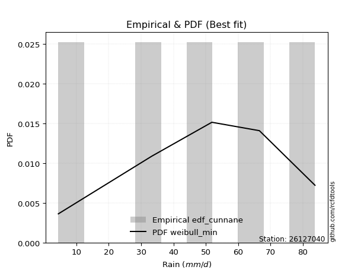</img>

</div>


### 12. EDF Adamowski (1981)

The Adamowski formula in hydrology refers to a specific plotting position formula used for estimating the non-parametric empirical distribution of hydrological events (like flood peaks) to calculate their return periods. This formula provides an alternative to traditional parametric methods (like the Gumbel or Log Pearson Type III distributions). 

<div align="center">


$P=(m-0.25)/(n+0.5)$


</div>


**12.1. Empirical values**

<div align="center">

|                | 0                   | 1                  | 2             | 3                  | 4                  |
|:---------------|:--------------------|:-------------------|:--------------|:-------------------|:-------------------|
| date           | 2020                | 2025               | 2019          | 2017               | 2018               |
| x              | 4.4                 | 33.3               | 51.9          | 66.6               | 83.8               |
| m              | 1                   | 2                  | 3             | 4                  | 5                  |
| empirical_dist | edf_adamowski       | edf_adamowski      | edf_adamowski | edf_adamowski      | edf_adamowski      |
| empirical      | 0.13636363636363635 | 0.3181818181818182 | 0.5           | 0.6818181818181818 | 0.8636363636363636 |
| empirical_tr   | 1.1578947368421053  | 1.4666666666666666 | 2.0           | 3.1428571428571423 | 7.333333333333334  |

</div>


**12.2. Kolmogorov-Smirnov fit test (sorted by Δ)**


<div align="center">

|                | 0                  | 1                   | 2                   | 3                   | 4                   | 5                  | 6                  | 7                   | 8                   | 9                   | 10                  | 11                  | 12                  | 13                  | 14                 | 15                  | 16                  | 17                 | 18                  | 19                  | 20                  | 21                  | 22                  | 23                  | 24                  | 25                  | 26                  | 27                  | 28                  | 29                  | 30                  | 31                 | 32                  | 33                  | 34                 | 35                 | 36                  | 37                  | 38                  | 39                 | 40                  | 41                 | 42                  | 43                  | 44                  | 45                  | 46                 | 47                 | 48                  | 49                  | 50                 | 51                  | 52                  | 53                  | 54                  | 55                  | 56                 | 57                  | 58                  | 59                  | 60                  | 61                  | 62                  | 63                  | 64                  | 65                  | 66                  | 67                  | 68                  | 69                 | 70                 | 71                 | 72                  | 73                  | 74                  | 75                  | 76                 | 77                 | 78                 | 79                  | 80                  | 81                 | 82                  | 83                  | 84                  | 85                 | 86                  | 87                  | 88                  | 89                 | 90                  | 91                  | 92                 | 93                  | 94                  | 95                 | 96                  | 97                  | 98                  | 99                  | 100                 | 101                | 102                 | 103                | 104                 | 105                 | 106                 | 107                 | 108                 | 109                 | 110                 | 111                 | 112                 | 113                 | 114                | 115                 | 116                | 117                 | 118                | 119                | 120                 | 121                | 122                | 123                | 124                | 125                 | 126                | 127                | 128                | 129                | 130                 | 131                 | 132                 | 133                | 134                 | 135                 | 136                 | 137                 | 138                 | 139                | 140                | 141                | 142                 | 143                 | 144                 | 145                 | 146                | 147                | 148                | 149                | 150                | 151                | 152                | 153                | 154                | 155                | 156                | 157                | 158                | 159                |
|:---------------|:-------------------|:--------------------|:--------------------|:--------------------|:--------------------|:-------------------|:-------------------|:--------------------|:--------------------|:--------------------|:--------------------|:--------------------|:--------------------|:--------------------|:-------------------|:--------------------|:--------------------|:-------------------|:--------------------|:--------------------|:--------------------|:--------------------|:--------------------|:--------------------|:--------------------|:--------------------|:--------------------|:--------------------|:--------------------|:--------------------|:--------------------|:-------------------|:--------------------|:--------------------|:-------------------|:-------------------|:--------------------|:--------------------|:--------------------|:-------------------|:--------------------|:-------------------|:--------------------|:--------------------|:--------------------|:--------------------|:-------------------|:-------------------|:--------------------|:--------------------|:-------------------|:--------------------|:--------------------|:--------------------|:--------------------|:--------------------|:-------------------|:--------------------|:--------------------|:--------------------|:--------------------|:--------------------|:--------------------|:--------------------|:--------------------|:--------------------|:--------------------|:--------------------|:--------------------|:-------------------|:-------------------|:-------------------|:--------------------|:--------------------|:--------------------|:--------------------|:-------------------|:-------------------|:-------------------|:--------------------|:--------------------|:-------------------|:--------------------|:--------------------|:--------------------|:-------------------|:--------------------|:--------------------|:--------------------|:-------------------|:--------------------|:--------------------|:-------------------|:--------------------|:--------------------|:-------------------|:--------------------|:--------------------|:--------------------|:--------------------|:--------------------|:-------------------|:--------------------|:-------------------|:--------------------|:--------------------|:--------------------|:--------------------|:--------------------|:--------------------|:--------------------|:--------------------|:--------------------|:--------------------|:-------------------|:--------------------|:-------------------|:--------------------|:-------------------|:-------------------|:--------------------|:-------------------|:-------------------|:-------------------|:-------------------|:--------------------|:-------------------|:-------------------|:-------------------|:-------------------|:--------------------|:--------------------|:--------------------|:-------------------|:--------------------|:--------------------|:--------------------|:--------------------|:--------------------|:-------------------|:-------------------|:-------------------|:--------------------|:--------------------|:--------------------|:--------------------|:-------------------|:-------------------|:-------------------|:-------------------|:-------------------|:-------------------|:-------------------|:-------------------|:-------------------|:-------------------|:-------------------|:-------------------|:-------------------|:-------------------|
| station        | 26127040           | 26127040            | 26127040            | 26127040            | 26127040            | 26127040           | 26127040           | 26127040            | 26127040            | 26127040            | 26127040            | 26127040            | 26127040            | 26127040            | 26127040           | 26127040            | 26127040            | 26127040           | 26127040            | 26127040            | 26127040            | 26127040            | 26127040            | 26127040            | 26127040            | 26127040            | 26127040            | 26127040            | 26127040            | 26127040            | 26127040            | 26127040           | 26127040            | 26127040            | 26127040           | 26127040           | 26127040            | 26127040            | 26127040            | 26127040           | 26127040            | 26127040           | 26127040            | 26127040            | 26127040            | 26127040            | 26127040           | 26127040           | 26127040            | 26127040            | 26127040           | 26127040            | 26127040            | 26127040            | 26127040            | 26127040            | 26127040           | 26127040            | 26127040            | 26127040            | 26127040            | 26127040            | 26127040            | 26127040            | 26127040            | 26127040            | 26127040            | 26127040            | 26127040            | 26127040           | 26127040           | 26127040           | 26127040            | 26127040            | 26127040            | 26127040            | 26127040           | 26127040           | 26127040           | 26127040            | 26127040            | 26127040           | 26127040            | 26127040            | 26127040            | 26127040           | 26127040            | 26127040            | 26127040            | 26127040           | 26127040            | 26127040            | 26127040           | 26127040            | 26127040            | 26127040           | 26127040            | 26127040            | 26127040            | 26127040            | 26127040            | 26127040           | 26127040            | 26127040           | 26127040            | 26127040            | 26127040            | 26127040            | 26127040            | 26127040            | 26127040            | 26127040            | 26127040            | 26127040            | 26127040           | 26127040            | 26127040           | 26127040            | 26127040           | 26127040           | 26127040            | 26127040           | 26127040           | 26127040           | 26127040           | 26127040            | 26127040           | 26127040           | 26127040           | 26127040           | 26127040            | 26127040            | 26127040            | 26127040           | 26127040            | 26127040            | 26127040            | 26127040            | 26127040            | 26127040           | 26127040           | 26127040           | 26127040            | 26127040            | 26127040            | 26127040            | 26127040           | 26127040           | 26127040           | 26127040           | 26127040           | 26127040           | 26127040           | 26127040           | 26127040           | 26127040           | 26127040           | 26127040           | 26127040           | 26127040           |
| empirical_dist | edf_adamowski      | edf_adamowski       | edf_adamowski       | edf_adamowski       | edf_adamowski       | edf_adamowski      | edf_adamowski      | edf_adamowski       | edf_adamowski       | edf_adamowski       | edf_adamowski       | edf_adamowski       | edf_adamowski       | edf_adamowski       | edf_adamowski      | edf_adamowski       | edf_adamowski       | edf_adamowski      | edf_adamowski       | edf_adamowski       | edf_adamowski       | edf_adamowski       | edf_adamowski       | edf_adamowski       | edf_adamowski       | edf_adamowski       | edf_adamowski       | edf_adamowski       | edf_adamowski       | edf_adamowski       | edf_adamowski       | edf_adamowski      | edf_adamowski       | edf_adamowski       | edf_adamowski      | edf_adamowski      | edf_adamowski       | edf_adamowski       | edf_adamowski       | edf_adamowski      | edf_adamowski       | edf_adamowski      | edf_adamowski       | edf_adamowski       | edf_adamowski       | edf_adamowski       | edf_adamowski      | edf_adamowski      | edf_adamowski       | edf_adamowski       | edf_adamowski      | edf_adamowski       | edf_adamowski       | edf_adamowski       | edf_adamowski       | edf_adamowski       | edf_adamowski      | edf_adamowski       | edf_adamowski       | edf_adamowski       | edf_adamowski       | edf_adamowski       | edf_adamowski       | edf_adamowski       | edf_adamowski       | edf_adamowski       | edf_adamowski       | edf_adamowski       | edf_adamowski       | edf_adamowski      | edf_adamowski      | edf_adamowski      | edf_adamowski       | edf_adamowski       | edf_adamowski       | edf_adamowski       | edf_adamowski      | edf_adamowski      | edf_adamowski      | edf_adamowski       | edf_adamowski       | edf_adamowski      | edf_adamowski       | edf_adamowski       | edf_adamowski       | edf_adamowski      | edf_adamowski       | edf_adamowski       | edf_adamowski       | edf_adamowski      | edf_adamowski       | edf_adamowski       | edf_adamowski      | edf_adamowski       | edf_adamowski       | edf_adamowski      | edf_adamowski       | edf_adamowski       | edf_adamowski       | edf_adamowski       | edf_adamowski       | edf_adamowski      | edf_adamowski       | edf_adamowski      | edf_adamowski       | edf_adamowski       | edf_adamowski       | edf_adamowski       | edf_adamowski       | edf_adamowski       | edf_adamowski       | edf_adamowski       | edf_adamowski       | edf_adamowski       | edf_adamowski      | edf_adamowski       | edf_adamowski      | edf_adamowski       | edf_adamowski      | edf_adamowski      | edf_adamowski       | edf_adamowski      | edf_adamowski      | edf_adamowski      | edf_adamowski      | edf_adamowski       | edf_adamowski      | edf_adamowski      | edf_adamowski      | edf_adamowski      | edf_adamowski       | edf_adamowski       | edf_adamowski       | edf_adamowski      | edf_adamowski       | edf_adamowski       | edf_adamowski       | edf_adamowski       | edf_adamowski       | edf_adamowski      | edf_adamowski      | edf_adamowski      | edf_adamowski       | edf_adamowski       | edf_adamowski       | edf_adamowski       | edf_adamowski      | edf_adamowski      | edf_adamowski      | edf_adamowski      | edf_adamowski      | edf_adamowski      | edf_adamowski      | edf_adamowski      | edf_adamowski      | edf_adamowski      | edf_adamowski      | edf_adamowski      | edf_adamowski      | edf_adamowski      |
| p_dist         | weibull_min        | johnsonsu           | pearson3            | exponweib           | anglit              | f                  | nct                | exponnorm           | norm                | crystalball         | t                   | erlang              | betaprime           | gamma               | semicircular       | invgauss            | invgamma            | gumbel_l           | cosine              | foldnorm            | logdweibull         | logistic            | ksone               | rice                | argus               | logpearson3         | maxwell             | invweibull          | hypsecant           | dweibull            | loglevy_l           | trapezoid          | logargus            | loggumbel_l         | rayleigh           | logburr            | kstwobign           | burr                | logdgamma           | dgamma             | logtrapezoid        | gumbel_r           | laplace             | logmielke           | logburr12           | triang              | gompertz           | logloggamma        | loggenpareto        | vonmises_line       | skewnorm           | logweibull_max      | wrapcauchy          | truncnorm           | ncf                 | genpareto           | logvonmises_line   | beta                | loggenextreme       | tukeylambda         | genhalflogistic     | kappa4              | kappa3              | arcsine             | uniform             | halfnorm            | gausshyper          | loggausshyper       | truncweibull_min    | bradford           | loggennorm         | genextreme         | levy_l              | lomax               | halflogistic        | moyal               | logf               | logfoldnorm        | genexpon           | logfatiguelife      | loglogistic         | lognct             | logbetaprime        | logcrystalball      | lognorm             | logt               | logexponnorm        | loganglit           | logsemicircular     | logarcsine         | gennorm             | logloglaplace       | logncf             | loggamma            | loggamma            | logrice            | loginvgamma         | loghypsecant        | logerlang           | loginvgauss         | logalpha            | logmaxwell         | truncexpon          | loggenhalflogistic | loginvweibull       | wald                | loglaplace          | loglaplace          | logwrapcauchy       | lograyleigh         | logskewnorm         | loggompertz         | logjohnsonsb        | logcosine           | loggumbel_r        | logbeta             | loghalfnorm        | logkstwobign        | logtriang          | mielke             | loggenexpon         | logmoyal           | loghalflogistic    | logtukeylambda     | loggengamma        | nakagami            | burr12             | loglomax           | lognakagami        | logexponweib       | gengamma            | halfgennorm         | logksone            | loghalfgennorm     | logwald             | logtruncweibull_min | logkappa3           | loguniform          | logkappa4           | logweibull_min     | logjohnsonsu       | logbradford        | logtruncexpon       | alpha               | johnsonsb           | logtruncnorm        | logrdist           | weibull_max        | fatiguelife        | logexponpow        | powerlaw           | truncpareto        | exponpow           | logpowerlaw        | logtruncpareto     | rdist              | genlogistic        | loggenlogistic     | logvonmises        | vonmises           |
| delta          | 0.071190568856994  | 0.07191212826908389 | 0.07253558198806499 | 0.07680180383898358 | 0.07898193951575808 | 0.0795705598905738 | 0.0804335252154039 | 0.08044131951842619 | 0.08044150099812727 | 0.08044150251121066 | 0.08044197600006674 | 0.08113015936312637 | 0.08118040964164903 | 0.08159612120644939 | 0.0823910998508523 | 0.08450154791464659 | 0.08546503876446537 | 0.0863613793166843 | 0.08725828685535697 | 0.08813102156970626 | 0.09071663012305153 | 0.09204810172578748 | 0.09534497828983898 | 0.09578616335211823 | 0.09863747906077158 | 0.09888378734291337 | 0.10090380946776681 | 0.10167228606703693 | 0.10693067015691882 | 0.10799008570560248 | 0.10915954733602107 | 0.1106989692397573 | 0.11177558332149662 | 0.11399332633942949 | 0.1142096104333464 | 0.1153397255087596 | 0.11921555202585465 | 0.11944297197199971 | 0.12246311680627961 | 0.1226627199490824 | 0.12414186295571644 | 0.1263514703061177 | 0.12658974728523464 | 0.13489000038826615 | 0.13520308786420265 | 0.13611152721348585 | 0.1361961947462391 | 0.1363190104772818 | 0.13636006535982315 | 0.13636279107096305 | 0.1363632966381053 | 0.13636358218886513 | 0.13636360778526813 | 0.13636362864654672 | 0.13636363534130633 | 0.13636363578549815 | 0.1363636362040904 | 0.13636363636260684 | 0.13636363636359128 | 0.13636363636360083 | 0.13636363636360405 | 0.13636363636363547 | 0.13636363636363635 | 0.13636363636363635 | 0.13636363636363635 | 0.13636363636363635 | 0.13636363636531146 | 0.13636363639112503 | 0.13679878523325628 | 0.1397101802216788 | 0.1447970513882987 | 0.1462467399430054 | 0.14672397683000582 | 0.14974235393061536 | 0.15058996126024793 | 0.15096804654195917 | 0.1598159501457706 | 0.1721482194845222 | 0.1762617618783741 | 0.17802644847083898 | 0.17875457838271586 | 0.1788942811838829 | 0.17900908864308812 | 0.17912268724207892 | 0.17912282981472888 | 0.1791230198035813 | 0.17912579151329194 | 0.17950866008191013 | 0.17966758979763664 | 0.1802974720151932 | 0.18181818181818182 | 0.18243046300276167 | 0.1847159420091839 | 0.18640660272178528 | 0.18640660272178528 | 0.1878280094733657 | 0.19190575664936532 | 0.19280716251848085 | 0.19288845558478668 | 0.20047784926916318 | 0.20240246971905002 | 0.2122786054108528 | 0.21489480639855163 | 0.215549466154776  | 0.21922754644577974 | 0.21927773765601621 | 0.22064262745296714 | 0.22064262745296714 | 0.22272756650847497 | 0.22334659783059035 | 0.23240793924329184 | 0.23510134202005245 | 0.23933775692826303 | 0.24139345726667577 | 0.2494139260012343 | 0.25182550451064606 | 0.2545153697088595 | 0.25527952359653655 | 0.2606112070614074 | 0.2621746449393551 | 0.26338337920695903 | 0.2752770499054154 | 0.279285704749013  | 0.2939060684043094 | 0.2989781643043428 | 0.30080569346803837 | 0.3074150628148988 | 0.3168069060376751 | 0.3181818176668595 | 0.3276602351861046 | 0.33287408062502905 | 0.33454797800264474 | 0.33750494501318856 | 0.3422830273295889 | 0.34720934137487375 | 0.3522942331748517  | 0.36863748323624185 | 0.36864229765218987 | 0.37837760029127304 | 0.4002683975251666 | 0.4330619225250271 | 0.4358622183839878 | 0.44193915845059845 | 0.45164312726355665 | 0.45468450092986457 | 0.46552882857709016 | 0.4999999958141672 | 0.5110102147288366 | 0.538950797499659  | 0.5624021042588223 | 0.5653272680310011 | 0.5791810838200857 | 0.5916487041098679 | 0.6332881704261708 | 0.6431701040746192 | 0.6818181816606113 | 0.6818181818181818 | 0.6818181818181818 | 1.0501534208086418 | 12.47758769745382  |
| deltao         | 0.5865427407550001 | 0.5865427407550001  | 0.5865427407550001  | 0.5865427407550001  | 0.5865427407550001  | 0.5865427407550001 | 0.5865427407550001 | 0.5865427407550001  | 0.5865427407550001  | 0.5865427407550001  | 0.5865427407550001  | 0.5865427407550001  | 0.5865427407550001  | 0.5865427407550001  | 0.5865427407550001 | 0.5865427407550001  | 0.5865427407550001  | 0.5865427407550001 | 0.5865427407550001  | 0.5865427407550001  | 0.5865427407550001  | 0.5865427407550001  | 0.5865427407550001  | 0.5865427407550001  | 0.5865427407550001  | 0.5865427407550001  | 0.5865427407550001  | 0.5865427407550001  | 0.5865427407550001  | 0.5865427407550001  | 0.5865427407550001  | 0.5865427407550001 | 0.5865427407550001  | 0.5865427407550001  | 0.5865427407550001 | 0.5865427407550001 | 0.5865427407550001  | 0.5865427407550001  | 0.5865427407550001  | 0.5865427407550001 | 0.5865427407550001  | 0.5865427407550001 | 0.5865427407550001  | 0.5865427407550001  | 0.5865427407550001  | 0.5865427407550001  | 0.5865427407550001 | 0.5865427407550001 | 0.5865427407550001  | 0.5865427407550001  | 0.5865427407550001 | 0.5865427407550001  | 0.5865427407550001  | 0.5865427407550001  | 0.5865427407550001  | 0.5865427407550001  | 0.5865427407550001 | 0.5865427407550001  | 0.5865427407550001  | 0.5865427407550001  | 0.5865427407550001  | 0.5865427407550001  | 0.5865427407550001  | 0.5865427407550001  | 0.5865427407550001  | 0.5865427407550001  | 0.5865427407550001  | 0.5865427407550001  | 0.5865427407550001  | 0.5865427407550001 | 0.5865427407550001 | 0.5865427407550001 | 0.5865427407550001  | 0.5865427407550001  | 0.5865427407550001  | 0.5865427407550001  | 0.5865427407550001 | 0.5865427407550001 | 0.5865427407550001 | 0.5865427407550001  | 0.5865427407550001  | 0.5865427407550001 | 0.5865427407550001  | 0.5865427407550001  | 0.5865427407550001  | 0.5865427407550001 | 0.5865427407550001  | 0.5865427407550001  | 0.5865427407550001  | 0.5865427407550001 | 0.5865427407550001  | 0.5865427407550001  | 0.5865427407550001 | 0.5865427407550001  | 0.5865427407550001  | 0.5865427407550001 | 0.5865427407550001  | 0.5865427407550001  | 0.5865427407550001  | 0.5865427407550001  | 0.5865427407550001  | 0.5865427407550001 | 0.5865427407550001  | 0.5865427407550001 | 0.5865427407550001  | 0.5865427407550001  | 0.5865427407550001  | 0.5865427407550001  | 0.5865427407550001  | 0.5865427407550001  | 0.5865427407550001  | 0.5865427407550001  | 0.5865427407550001  | 0.5865427407550001  | 0.5865427407550001 | 0.5865427407550001  | 0.5865427407550001 | 0.5865427407550001  | 0.5865427407550001 | 0.5865427407550001 | 0.5865427407550001  | 0.5865427407550001 | 0.5865427407550001 | 0.5865427407550001 | 0.5865427407550001 | 0.5865427407550001  | 0.5865427407550001 | 0.5865427407550001 | 0.5865427407550001 | 0.5865427407550001 | 0.5865427407550001  | 0.5865427407550001  | 0.5865427407550001  | 0.5865427407550001 | 0.5865427407550001  | 0.5865427407550001  | 0.5865427407550001  | 0.5865427407550001  | 0.5865427407550001  | 0.5865427407550001 | 0.5865427407550001 | 0.5865427407550001 | 0.5865427407550001  | 0.5865427407550001  | 0.5865427407550001  | 0.5865427407550001  | 0.5865427407550001 | 0.5865427407550001 | 0.5865427407550001 | 0.5865427407550001 | 0.5865427407550001 | 0.5865427407550001 | 0.5865427407550001 | 0.5865427407550001 | 0.5865427407550001 | 0.5865427407550001 | 0.5865427407550001 | 0.5865427407550001 | 0.5865427407550001 | 0.5865427407550001 |
| eval           | Δo > Δ             | Δo > Δ              | Δo > Δ              | Δo > Δ              | Δo > Δ              | Δo > Δ             | Δo > Δ             | Δo > Δ              | Δo > Δ              | Δo > Δ              | Δo > Δ              | Δo > Δ              | Δo > Δ              | Δo > Δ              | Δo > Δ             | Δo > Δ              | Δo > Δ              | Δo > Δ             | Δo > Δ              | Δo > Δ              | Δo > Δ              | Δo > Δ              | Δo > Δ              | Δo > Δ              | Δo > Δ              | Δo > Δ              | Δo > Δ              | Δo > Δ              | Δo > Δ              | Δo > Δ              | Δo > Δ              | Δo > Δ             | Δo > Δ              | Δo > Δ              | Δo > Δ             | Δo > Δ             | Δo > Δ              | Δo > Δ              | Δo > Δ              | Δo > Δ             | Δo > Δ              | Δo > Δ             | Δo > Δ              | Δo > Δ              | Δo > Δ              | Δo > Δ              | Δo > Δ             | Δo > Δ             | Δo > Δ              | Δo > Δ              | Δo > Δ             | Δo > Δ              | Δo > Δ              | Δo > Δ              | Δo > Δ              | Δo > Δ              | Δo > Δ             | Δo > Δ              | Δo > Δ              | Δo > Δ              | Δo > Δ              | Δo > Δ              | Δo > Δ              | Δo > Δ              | Δo > Δ              | Δo > Δ              | Δo > Δ              | Δo > Δ              | Δo > Δ              | Δo > Δ             | Δo > Δ             | Δo > Δ             | Δo > Δ              | Δo > Δ              | Δo > Δ              | Δo > Δ              | Δo > Δ             | Δo > Δ             | Δo > Δ             | Δo > Δ              | Δo > Δ              | Δo > Δ             | Δo > Δ              | Δo > Δ              | Δo > Δ              | Δo > Δ             | Δo > Δ              | Δo > Δ              | Δo > Δ              | Δo > Δ             | Δo > Δ              | Δo > Δ              | Δo > Δ             | Δo > Δ              | Δo > Δ              | Δo > Δ             | Δo > Δ              | Δo > Δ              | Δo > Δ              | Δo > Δ              | Δo > Δ              | Δo > Δ             | Δo > Δ              | Δo > Δ             | Δo > Δ              | Δo > Δ              | Δo > Δ              | Δo > Δ              | Δo > Δ              | Δo > Δ              | Δo > Δ              | Δo > Δ              | Δo > Δ              | Δo > Δ              | Δo > Δ             | Δo > Δ              | Δo > Δ             | Δo > Δ              | Δo > Δ             | Δo > Δ             | Δo > Δ              | Δo > Δ             | Δo > Δ             | Δo > Δ             | Δo > Δ             | Δo > Δ              | Δo > Δ             | Δo > Δ             | Δo > Δ             | Δo > Δ             | Δo > Δ              | Δo > Δ              | Δo > Δ              | Δo > Δ             | Δo > Δ              | Δo > Δ              | Δo > Δ              | Δo > Δ              | Δo > Δ              | Δo > Δ             | Δo > Δ             | Δo > Δ             | Δo > Δ              | Δo > Δ              | Δo > Δ              | Δo > Δ              | Δo > Δ             | Δo > Δ             | Δo > Δ             | Δo > Δ             | Δo > Δ             | Δo > Δ             | Δo <= Δ            | Δo <= Δ            | Δo <= Δ            | Δo <= Δ            | Δo <= Δ            | Δo <= Δ            | Δo <= Δ            | Δo <= Δ            |
| fit            | 1                  | 1                   | 1                   | 1                   | 1                   | 1                  | 1                  | 1                   | 1                   | 1                   | 1                   | 1                   | 1                   | 1                   | 1                  | 1                   | 1                   | 1                  | 1                   | 1                   | 1                   | 1                   | 1                   | 1                   | 1                   | 1                   | 1                   | 1                   | 1                   | 1                   | 1                   | 1                  | 1                   | 1                   | 1                  | 1                  | 1                   | 1                   | 1                   | 1                  | 1                   | 1                  | 1                   | 1                   | 1                   | 1                   | 1                  | 1                  | 1                   | 1                   | 1                  | 1                   | 1                   | 1                   | 1                   | 1                   | 1                  | 1                   | 1                   | 1                   | 1                   | 1                   | 1                   | 1                   | 1                   | 1                   | 1                   | 1                   | 1                   | 1                  | 1                  | 1                  | 1                   | 1                   | 1                   | 1                   | 1                  | 1                  | 1                  | 1                   | 1                   | 1                  | 1                   | 1                   | 1                   | 1                  | 1                   | 1                   | 1                   | 1                  | 1                   | 1                   | 1                  | 1                   | 1                   | 1                  | 1                   | 1                   | 1                   | 1                   | 1                   | 1                  | 1                   | 1                  | 1                   | 1                   | 1                   | 1                   | 1                   | 1                   | 1                   | 1                   | 1                   | 1                   | 1                  | 1                   | 1                  | 1                   | 1                  | 1                  | 1                   | 1                  | 1                  | 1                  | 1                  | 1                   | 1                  | 1                  | 1                  | 1                  | 1                   | 1                   | 1                   | 1                  | 1                   | 1                   | 1                   | 1                   | 1                   | 1                  | 1                  | 1                  | 1                   | 1                   | 1                   | 1                   | 1                  | 1                  | 1                  | 1                  | 1                  | 1                  | 0                  | 0                  | 0                  | 0                  | 0                  | 0                  | 0                  | 0                  |
| n              | 5                  | 5                   | 5                   | 5                   | 5                   | 5                  | 5                  | 5                   | 5                   | 5                   | 5                   | 5                   | 5                   | 5                   | 5                  | 5                   | 5                   | 5                  | 5                   | 5                   | 5                   | 5                   | 5                   | 5                   | 5                   | 5                   | 5                   | 5                   | 5                   | 5                   | 5                   | 5                  | 5                   | 5                   | 5                  | 5                  | 5                   | 5                   | 5                   | 5                  | 5                   | 5                  | 5                   | 5                   | 5                   | 5                   | 5                  | 5                  | 5                   | 5                   | 5                  | 5                   | 5                   | 5                   | 5                   | 5                   | 5                  | 5                   | 5                   | 5                   | 5                   | 5                   | 5                   | 5                   | 5                   | 5                   | 5                   | 5                   | 5                   | 5                  | 5                  | 5                  | 5                   | 5                   | 5                   | 5                   | 5                  | 5                  | 5                  | 5                   | 5                   | 5                  | 5                   | 5                   | 5                   | 5                  | 5                   | 5                   | 5                   | 5                  | 5                   | 5                   | 5                  | 5                   | 5                   | 5                  | 5                   | 5                   | 5                   | 5                   | 5                   | 5                  | 5                   | 5                  | 5                   | 5                   | 5                   | 5                   | 5                   | 5                   | 5                   | 5                   | 5                   | 5                   | 5                  | 5                   | 5                  | 5                   | 5                  | 5                  | 5                   | 5                  | 5                  | 5                  | 5                  | 5                   | 5                  | 5                  | 5                  | 5                  | 5                   | 5                   | 5                   | 5                  | 5                   | 5                   | 5                   | 5                   | 5                   | 5                  | 5                  | 5                  | 5                   | 5                   | 5                   | 5                   | 5                  | 5                  | 5                  | 5                  | 5                  | 5                  | 5                  | 5                  | 5                  | 5                  | 5                  | 5                  | 5                  | 5                  |
| best_fit       | 1                  | 0                   | 0                   | 0                   | 0                   | 0                  | 0                  | 0                   | 0                   | 0                   | 0                   | 0                   | 0                   | 0                   | 0                  | 0                   | 0                   | 0                  | 0                   | 0                   | 0                   | 0                   | 0                   | 0                   | 0                   | 0                   | 0                   | 0                   | 0                   | 0                   | 0                   | 0                  | 0                   | 0                   | 0                  | 0                  | 0                   | 0                   | 0                   | 0                  | 0                   | 0                  | 0                   | 0                   | 0                   | 0                   | 0                  | 0                  | 0                   | 0                   | 0                  | 0                   | 0                   | 0                   | 0                   | 0                   | 0                  | 0                   | 0                   | 0                   | 0                   | 0                   | 0                   | 0                   | 0                   | 0                   | 0                   | 0                   | 0                   | 0                  | 0                  | 0                  | 0                   | 0                   | 0                   | 0                   | 0                  | 0                  | 0                  | 0                   | 0                   | 0                  | 0                   | 0                   | 0                   | 0                  | 0                   | 0                   | 0                   | 0                  | 0                   | 0                   | 0                  | 0                   | 0                   | 0                  | 0                   | 0                   | 0                   | 0                   | 0                   | 0                  | 0                   | 0                  | 0                   | 0                   | 0                   | 0                   | 0                   | 0                   | 0                   | 0                   | 0                   | 0                   | 0                  | 0                   | 0                  | 0                   | 0                  | 0                  | 0                   | 0                  | 0                  | 0                  | 0                  | 0                   | 0                  | 0                  | 0                  | 0                  | 0                   | 0                   | 0                   | 0                  | 0                   | 0                   | 0                   | 0                   | 0                   | 0                  | 0                  | 0                  | 0                   | 0                   | 0                   | 0                   | 0                  | 0                  | 0                  | 0                  | 0                  | 0                  | 0                  | 0                  | 0                  | 0                  | 0                  | 0                  | 0                  | 0                  |
| best_fit_sort  | 1                  | 2                   | 3                   | 4                   | 5                   | 6                  | 7                  | 8                   | 9                   | 10                  | 11                  | 12                  | 13                  | 14                  | 15                 | 16                  | 17                  | 18                 | 19                  | 20                  | 21                  | 22                  | 23                  | 24                  | 25                  | 26                  | 27                  | 28                  | 29                  | 30                  | 31                  | 32                 | 33                  | 34                  | 35                 | 36                 | 37                  | 38                  | 39                  | 40                 | 41                  | 42                 | 43                  | 44                  | 45                  | 46                  | 47                 | 48                 | 49                  | 50                  | 51                 | 52                  | 53                  | 54                  | 55                  | 56                  | 57                 | 58                  | 59                  | 60                  | 61                  | 62                  | 63                  | 64                  | 65                  | 66                  | 67                  | 68                  | 69                  | 70                 | 71                 | 72                 | 73                  | 74                  | 75                  | 76                  | 77                 | 78                 | 79                 | 80                  | 81                  | 82                 | 83                  | 84                  | 85                  | 86                 | 87                  | 88                  | 89                  | 90                 | 91                  | 92                  | 93                 | 94                  | 95                  | 96                 | 97                  | 98                  | 99                  | 100                 | 101                 | 102                | 103                 | 104                | 105                 | 106                 | 107                 | 108                 | 109                 | 110                 | 111                 | 112                 | 113                 | 114                 | 115                | 116                 | 117                | 118                 | 119                | 120                | 121                 | 122                | 123                | 124                | 125                | 126                 | 127                | 128                | 129                | 130                | 131                 | 132                 | 133                 | 134                | 135                 | 136                 | 137                 | 138                 | 139                 | 140                | 141                | 142                | 143                 | 144                 | 145                 | 146                 | 147                | 148                | 149                | 150                | 151                | 152                | 153                | 154                | 155                | 156                | 157                | 158                | 159                | 160                |

</div>


**12.3. Best fit**

<div align="center">

|   id |   station | empirical_dist   | p_dist      |     delta |   deltao | eval   |   fit |   n |   best_fit |   best_fit_sort |
|-----:|----------:|:-----------------|:------------|----------:|---------:|:-------|------:|----:|-----------:|----------------:|
|    0 |  26127040 | edf_adamowski    | weibull_min | 0.0711906 | 0.586543 | Δo > Δ |     1 |   5 |          1 |               1 |

</div>


<div align="center">

</img>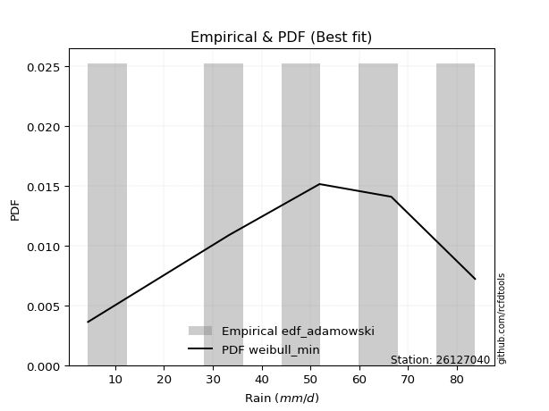</img>

</div>


## C. Best fit & Estimate extreme values for specific return periods - Tr

Best fit in probability distribution analysis means finding the theoretical distribution (like Normal, Poisson, Exponential, etc.) that most accurately mirrors your real-world data´s patterns (shape, center, spread) for better predictions, using methods like visual checks (Q-Q plots), goodness-of-fit tests (Kolmogorov-Smirnov, Chi-Squared), and information criteria (AIC) to score and select the simplest, most representative model.


### 1. Best fit (ordered by delta Δ)

:file_folder:Table: [bestfit_26127040.csv](table/bestfit_26127040.csv)

<div align="center">

|   id |   station | empirical_dist   | p_dist      |     delta |   deltao | eval   |   fit |   n |   best_fit |   best_fit_sort |
|-----:|----------:|:-----------------|:------------|----------:|---------:|:-------|------:|----:|-----------:|----------------:|
|    0 |  26127040 | edf_hazen        | weibull_min | 0.0351849 | 0.586543 | Δo > Δ |     1 |   5 |          1 |               1 |
|    1 |  26127040 | edf_gringorten   | weibull_min | 0.0442019 | 0.586543 | Δo > Δ |     1 |   5 |          1 |               2 |
|    2 |  26127040 | edf_cunnane      | weibull_min | 0.0502115 | 0.586543 | Δo > Δ |     1 |   5 |          1 |               3 |
|    3 |  26127040 | edf_blom         | weibull_min | 0.0538746 | 0.586543 | Δo > Δ |     1 |   5 |          1 |               4 |
|    4 |  26127040 | edf_tukey        | weibull_min | 0.0598269 | 0.586543 | Δo > Δ |     1 |   5 |          1 |               5 |
|    5 |  26127040 | edf_filliben     | weibull_min | 0.0620404 | 0.586543 | Δo > Δ |     1 |   5 |          1 |               6 |
|    6 |  26127040 | edf_beard        | weibull_min | 0.0630797 | 0.586543 | Δo > Δ |     1 |   5 |          1 |               7 |
|    7 |  26127040 | edf_jenkinson    | weibull_min | 0.0630797 | 0.586543 | Δo > Δ |     1 |   5 |          1 |               8 |
|    8 |  26127040 | edf_chegodayev   | weibull_min | 0.0644566 | 0.586543 | Δo > Δ |     1 |   5 |          1 |               9 |
|    9 |  26127040 | edf_adamowski    | weibull_min | 0.0711906 | 0.586543 | Δo > Δ |     1 |   5 |          1 |              10 |
|   10 |  26127040 | edf_california   | bradford    | 0.0967707 | 0.586543 | Δo > Δ |     1 |   5 |          1 |              11 |
|   11 |  26127040 | edf_weibull      | weibull_min | 0.101494  | 0.586543 | Δo > Δ |     1 |   5 |          1 |              12 |

</div>


### 2. Extreme values and % difference analysis

In hydrology, a return period (or recurrence interval $Tr$) is the statistical average time between extreme events like floods or droughts of a specific magnitude, indicating how rare an event is, with a 100-year flood, for example, having a 1% chance of occurring in any given year, not that it happens exactly every century. It is a key tool for infrastructure design (like bridges or dams) and risk assessment, calculated from historical data to determine the probability of future events, although it is important to remember it is statistical average, and events can cluster or be missed.

The extreme value porcentage difference is evaluated as $pdiff = 1 - (ETrBf / ETr) * 100$, where _ETrBf_ correspond to the bestfit extreme value for a specific recurrence interval and _ETr_ correspond to the extreme value for one of the most used PDFsused in hydrology.

> risk_rate: assuming the return period as the project useful life.

:file_folder:Table: [extreme_26127040.csv](table/extreme_26127040.csv), all PDFs.  
:file_folder:Table: [extremepdiff_26127040.csv](table/extremepdiff_26127040.csv), % difference between bestfit and most used PDFs in Hydrology.

<div align="center">

Extreme values table for only best fit PDFs
|   id |      tr |   prob_l |     prob_g |     alpha |   anglit |   arcsine |   argus |    beta |   betaprime |   bradford |    burr |   burr12 |   cosine |   crystalball |   dgamma |   dweibull |   erlang |   exponnorm |   exponpow |   exponweib |        f |   fatiguelife |   foldnorm |    gamma |   gausshyper |   genexpon |   genextreme |   gengamma |   genhalflogistic |   genlogistic |   gennorm |   genpareto |   gompertz |   gumbel_l |   gumbel_r |   halfgennorm |   halflogistic |   halfnorm |   hypsecant |   invgamma |   invgauss |   invweibull |   johnsonsb |   johnsonsu |   kappa3 |   kappa4 |   ksone |   kstwobign |   laplace |   levy_l |   loggamma |   logistic |   loglaplace |    lomax |   maxwell |   mielke |    moyal |   nakagami |      ncf |      nct |     norm |   pearson3 |   powerlaw |   rayleigh |    rdist |     rice |   semicircular |   skewnorm |        t |   trapezoid |   triang |   truncexpon |   truncnorm |   truncpareto |   truncweibull_min |   tukeylambda |   uniform |   vonmises |   vonmises_line |     wald |   weibull_max |   weibull_min |   wrapcauchy |   logalpha |   loganglit |   logarcsine |   logargus |   logbeta |   logbetaprime |   logbradford |   logburr |   logburr12 |   logcosine |   logcrystalball |   logdgamma |      logdweibull |   logerlang |   logexponnorm |   logexponpow |     logexponweib |     logf |   logfatiguelife |   logfoldnorm |   loggausshyper |   loggenexpon |   loggenextreme |     loggengamma |   loggenhalflogistic |   loggenlogistic |     loggennorm |   loggenpareto |   loggompertz |   loggumbel_l |   loggumbel_r |   loghalfgennorm |   loghalflogistic |   loghalfnorm |   loghypsecant |   loginvgamma |   loginvgauss |   loginvweibull |   logjohnsonsb |   logjohnsonsu |   logkappa3 |   logkappa4 |   logksone |   logkstwobign |   loglevy_l |   logloggamma |   loglogistic |    logloglaplace |         loglomax |   logmaxwell |   logmielke |   logmoyal |   lognakagami |    logncf |   lognct |   lognorm |   logpearson3 |   logpowerlaw |   lograyleigh |   logrdist |   logrice |   logsemicircular |   logskewnorm |     logt |   logtrapezoid |   logtriang |   logtruncexpon |   logtruncnorm |   logtruncpareto |   logtruncweibull_min |   logtukeylambda |   loguniform |   logvonmises |   logvonmises_line |    logwald |   logweibull_max |   logweibull_min |   logwrapcauchy |   station |   n |   risk_rate |
|-----:|--------:|---------:|-----------:|----------:|---------:|----------:|--------:|--------:|------------:|-----------:|--------:|---------:|---------:|--------------:|---------:|-----------:|---------:|------------:|-----------:|------------:|---------:|--------------:|-----------:|---------:|-------------:|-----------:|-------------:|-----------:|------------------:|--------------:|----------:|------------:|-----------:|-----------:|-----------:|--------------:|---------------:|-----------:|------------:|-----------:|-----------:|-------------:|------------:|------------:|---------:|---------:|--------:|------------:|----------:|---------:|-----------:|-----------:|-------------:|---------:|----------:|---------:|---------:|-----------:|---------:|---------:|---------:|-----------:|-----------:|-----------:|---------:|---------:|---------------:|-----------:|---------:|------------:|---------:|-------------:|------------:|--------------:|-------------------:|--------------:|----------:|-----------:|----------------:|---------:|--------------:|--------------:|-------------:|-----------:|------------:|-------------:|-----------:|----------:|---------------:|--------------:|----------:|------------:|------------:|-----------------:|------------:|-----------------:|------------:|---------------:|--------------:|-----------------:|---------:|-----------------:|--------------:|----------------:|--------------:|----------------:|----------------:|---------------------:|-----------------:|---------------:|---------------:|--------------:|--------------:|--------------:|-----------------:|------------------:|--------------:|---------------:|--------------:|--------------:|----------------:|---------------:|---------------:|------------:|------------:|-----------:|---------------:|------------:|--------------:|--------------:|-----------------:|-----------------:|-------------:|------------:|-----------:|--------------:|----------:|---------:|----------:|--------------:|--------------:|--------------:|-----------:|----------:|------------------:|--------------:|---------:|---------------:|------------:|----------------:|---------------:|-----------------:|----------------------:|-----------------:|-------------:|--------------:|-------------------:|-----------:|-----------------:|-----------------:|----------------:|----------:|----:|------------:|
|    0 |    2    | 0.5      | 0.5        |   14.4324 |  48      |   48      | 52.628  | 53.4277 |     47.7073 |    39.5301 | 43.9568 |  18.7849 |  46.6684 |       48      |  57.4888 |    43.5506 |  47.3296 |     48.0001 |    4.41512 |     46.2215 |  47.7822 |       4.40001 |    48.2579 |  47.3884 |      51.3135 |    33.7682 |      64.2266 |    20.6772 |           57.7421 |           inf |      44.1 |     58.3684 |    48.3853 |    52.505  |    43.495  |       19.8912 |        41.2553 |    42.3867 |     48      |    46.2136 |    45.6338 |      43.6276 |     2.00606 |     53.0312 |  46.266  |  44.4648 | 48      |     42.0084 |   48      |  62.8695 |    32.8786 |    48      |      33.5395 |  36.1479 |   45.6547 |  26.1962 |  42.0406 |    22.1785 |  49.835  |  47.9979 |  48      |    49.4907 |    4.67758 |    44.8229 | -2.70985 |  46.7983 |        48      |    53.3783 |  48      |     51.2268 |  53.6647 |      32.4703 |     47.6683 |       6.52915 |            41.4871 |       43.9588 |   44.1    |    2.57987 |         44.1    |  39.1109 |       83.4731 |       50.9972 |      44.0999 |    31.4213 |     33.5395 |      33.5395 |    45.0236 |   76.971  |        33.5627 |       14.9284 |   44.6604 |     39.7845 |     28.1132 |          33.5395 |     51.9    |     51.9         |     32.3    |        33.5392 |       5.46154 |     10.5876      |  33.5193 |          33.6377 |       34.0906 |         46.1442 |       25.0323 |         49.6053 |    13.8957      |              30.6823 |         inf      |   51.8885      |        46.8086 |       28.2673 |       39.924  |       28.176  |     14.803       |           25.8376 |       26.9933 |        33.5395 |       32.3788 |       31.4922 |         29.1537 |        21.9388 |        83.7443 |     4.39997 |     18.0474 |    19.2021 |        25.5136 |     59.9028 |       44.4605 |       33.5395 |     51.9         |     17.6979      |      30.6308 |      0      |    26.6347 |       44.0695 |   33.0354 |  33.5596 |   33.5395 |       41.305  |       4.46965 |       29.6612 |    8.87926 |   32.7578 |           33.5395 |       32.5676 |  33.5395 |        40.2338 |     27.9652 |         14.8108 |        14.0212 |          4.84709 |               20.7738 |          47.1309 |      19.2021 |     0.0863472 |            44.6995 |    23.7814 |          49.4473 |      8.52487     |         19.1947 |  26127040 |   5 |    0.75     |
|    1 |    2.33 | 0.570815 | 0.429185   |   17.1776 |  53.7    |   56.5567 | 57.5197 | 59.2655 |     52.6482 |    45.8001 | 49.8625 |  25.4531 |  51.6893 |       52.8935 |  64.839  |    53.5566 |  52.3018 |     52.8936 |    4.45881 |     51.4963 |  52.6974 |       5.20759 |    52.9663 |  52.362  |      57.3011 |    40.239  |      68.6446 |    26.1062 |           63.0066 |           inf |      44.1 |     64.2645 |    53.3665 |    56.7624 |    48.0293 |       25.1009 |        45.9174 |    47.6681 |     51.9163 |    51.223  |    50.8586 |      49.2745 |     3.21814 |     57.6142 |  52.1955 |  50.2626 | 54.727  |     47.7025 |   50.9613 |  69.3367 |    40.0883 |    52.3115 |      37.6099 |  43.1429 |   50.7387 |  32.4073 |  46.333  |    28.3703 |  57.6374 |  52.8917 |  52.8935 |    54.3114 |    5.2181  |    49.9821 |  4.29521 |  51.8727 |        54.1134 |    58.2331 |  52.8935 |     56.8597 |  58.6484 |      38.5305 |     52.3229 |       7.55037 |            46.8178 |       49.7352 |   49.7227 |    2.77948 |         49.7228 |  42.3196 |       83.6668 |       55.6386 |      52.7211 |    38.4449 |     41.8127 |      46.6977 |    50.4145 |   81.6377 |        40.987  |       18.4111 |   50.5579 |     45.8179 |     34.3894 |          40.5284 |     56.2923 |     52.2701      |     39.3195 |        40.5281 |       6.1547  |     16.5127      |  40.5249 |          40.6549 |       40.5182 |         55.2899 |       32.0288 |         55.7859 |    22.3083      |              37.1408 |         inf      |   52.2951      |        57.7487 |       35.1531 |       47.0707 |       33.5776 |     20.203       |           30.9434 |       33.1114 |        39.025  |       39.5052 |       39.0286 |         37.6805 |        36.3237 |        83.788  |     4.39997 |     22.4807 |    24.6663 |        32.9687 |     66.4532 |       50.1858 |       39.6262 |     60.6915      |     24.0517      |      37.2874 |      0      |    31.4451 |       47.4614 |   40.2073 |  40.544  |   40.5284 |       48.9076 |       4.59197 |       36.2121 |   13.021   |   39.8044 |           42.4865 |       37.8694 |  40.5284 |        50.0281 |     33.528  |         18.1837 |        17.0316 |          5.06895 |               25.2889 |          49.4356 |      23.658  |     0.1017    |            51.908  |    26.9239 |          59.6788 |     11.4521      |         43.0716 |  26127040 |   5 |    0.729209 |
|    2 |    5    | 0.8      | 0.2        |   38.4636 |  73.811  |   79.3743 | 72.3184 | 75.1123 |     71.1878 |    66.0921 | 68.806  | inf      |  69.7828 |       71.079  |  81.2647 |    69.6695 |  71.0876 |     71.0792 |    7.62649 |     72.1436 |  71.0035 |      22.3628  |    70.4639 |  71.1659 |      74.2703 |    72.591  |      78.8122 |    49.9372 |           76.3109 |           inf |      44.1 |     78.5748 |    70.9205 |    70.5163 |    67.7287 |       59.8956 |        67.0122 |    70.0022 |     67.6253 |    70.6993 |    71.615  |      73.8072 |    82.4565  |     72.2033 |  71.3856 |  68.7733 | 76.4979 |     71.8896 |   65.7672 |  80.0512 |    84.8514 |    68.9588 |      66.6833 |  78.1164 |   70.7489 |  57.4588 |  66.2156 |    59.5377 |  92.0458 |  71.0789 |  71.079  |    71.4054 |   17.2537  |    70.6367 | 24.3665  |  71.1397 |        74.9758 |    72.3732 |  71.079  |     73.0201 |  72.9461 |      60.5631 |     67.5402 |      17.7427  |            65.2009 |       68.3024 |   67.92   |    3.56036 |         67.92   |  60.282  |       83.7973 |       71.441  |      72.8411 |    83.4259 |     91.0207 |     112.875  |    68.4909 |   83.7943 |        87.1054 |       39.108  |   69.3523 |     72.3022 |     71.0881 |          81.8931 |     92.7203 |     99.3989      |     82.6753 |        81.893  |      15.03    |    736.326       |  82.0764 |          82.2464 |       76.989  |         78.4783 |       87.4567 |         73.199  |   668.148       |              61.2551 |         inf      |   70.8304      |        80.532  |       76.2688 |       80.1297 |       71.9394 |    112.41        |           69.9737 |       78.5542 |        71.6522 |       84.4382 |       90.2342 |        114.866  |        78.0194 |        83.8    |     4.39997 |     46.0136 |    55.4719 |        97.9517 |     78.9196 |       68.3343 |       75.4451 |    146.344       |    111.546       |      80.8541 |      0      |    67.8498 |       66.8325 |   84.1941 |  81.8241 |   81.893  |       82.0407 |       7.59896 |       80.5031 |   36.5491  |   82.6036 |           95.2152 |       58.7585 |  81.8929 |        93.4723 |     56.4225 |         38.2932 |        35.3066 |          7.72673 |               47.6557 |          57.9379 |      46.4821 |     0.191602  |            93.1949 |    53.9354 |          79.7128 |    102.795       |         73.4734 |  26127040 |   5 |    0.67232  |
|    3 |   10    | 0.9      | 0.1        |   77.5714 |  85.1941 |   84.8827 | 78.9741 | 80.355  |     83.642  |    74.9461 | 77.0053 | inf      |  80.7143 |       83.1428 |  93.2079 |    78.8658 |  83.8188 |     83.1431 |   27.4069  |     86.7583 |  83.1821 |      46.0499  |    82.0714 |  83.9203 |      80.0549 |   101.959  |      81.7826 |    64.8122 |           80.5928 |           inf |      44.1 |     82.2216 |    81.4424 |    78.1738 |    83.7735 |      103.988  |        84.5306 |    86.529  |     80.1694 |    84.4101 |    86.6068 |      93.7888 |    83.794   |     80.0694 |  79.7588 |  76.5769 | 85.9972 |     90.3049 |   79.2076 |  82.638  |   141.133  |    81.219  |     112.149  | 109.864  |   84.8311 |  70.7106 |  83.5264 |    85.1301 | 119.579  |  83.1444 |  83.1428 |    82.0448 |   38.0074  |    85.3638 | 30.3994  |  84.1575 |        85.6807 |    78.1323 |  83.1428 |     79.3323 |  78.5308 |      71.6171 |     74.9914 |      33.9735  |            74.0931 |       76.2374 |   75.86   |    4.15963 |         75.8601 |  79.3444 |       83.7999 |       80.8012 |      78.6398 |   142.703  |    141.37   |     139.678  |    77.5521 |   83.8    |       145.052  |       56.5029 |   77.4392 |     93.2098 |    110.239  |         130.587  |    149.958  |    762.858       |    136.834  |       130.587  |      44.8395  | 297464           | 131.088  |         131.308  |      117.859  |         82.7976 |      180.806  |         79.3038 | 60166.8         |              72.7149 |         inf      |  193.065       |        83.3634 |      121.749  |      107.753  |      133.812  |    646.804       |          137.791  |      148.868  |       116.399  |      142.334  |      163.23   |        284.749  |        82.8311 |        83.8    |     4.39997 |     62.6747 |    79.0038 |       224.426  |     82.2644 |       76.1057 |      121.222  |    382.544       |    449.397       |     139.399  |     76.3916 |   132.539  |       87.3031 |  138.557  | 130.323  |  130.587  |      105.948  |      16.6343  |      142.299  |   47.2867  |  134.582  |          144.056  |       70.2706 | 130.587  |       119.322  |     69.1426 |         55.5982 |        52.2698 |         14.4312  |               63.0466 |          62.4662 |      62.4115 |     0.309131  |           145.97   |   112.742  |          82.924  |   2000.68        |         78.9891 |  26127040 |   5 |    0.651322 |
|    4 |   15    | 0.933333 | 0.0666667  |  116.539  |  90.0549 |   85.9333 | 81.4244 | 81.7889 |     89.9036 |    77.8974 | 79.7307 | inf      |  85.6937 |       89.1629 |  99.7607 |    83.3811 |  90.2527 |     89.1632 |   57.0294  |     94.3066 |  89.2699 |      61.5416  |    87.8638 |  90.3692 |      81.6341 |   119.139  |      82.5894 |    71.3345 |           81.8153 |           inf |      44.1 |     83.0164 |    86.3388 |    81.6417 |    92.8259 |      135.348  |        94.4444 |    95.1295 |     87.3282 |    91.502  |    94.4705 |     105.062  |    83.7996  |     83.5377 |  82.5498 |  79.0977 | 89.1636 |    100.081  |   87.0697 |  83.4194 |   182.551  |    87.8989 |     152.007  | 128.436  |   92.0565 |  75.4362 |  93.5729 |    98.7679 | 134.723  |  89.1655 |  89.1629 |    87.1493 |   49.6187  |    92.9519 | 31.8096  |  90.7013 |        89.8552 |    80.027  |  89.1629 |     81.3577 |  80.3227 |      75.5416 |     77.7248 |      44.4392  |            77.2255 |       78.8308 |   78.5067 |    4.49    |         78.5067 |  91.5854 |       83.8    |       85.179  |      80.3973 |   187.886  |    170.613  |     145.471  |    81.0455 |   83.8    |       187.648  |       64.2449 |   80.1219 |    104.573  |    134.625  |         164.827  |    199.575  |   5910.18        |    176.523  |       164.828  |      91.5508  |      3.50013e+07 | 165.596  |         165.856  |      145.764  |         83.4276 |      263.367  |         81.06   |     1.52599e+06 |              76.5405 |         inf      |  603.431       |        83.6666 |      151.447  |      123.221  |      189.915  |   1933.69        |          202.191  |      207.626  |       153.535  |      185.748  |      221.924  |        475.234  |        83.4102 |        83.8    |     4.39997 |     69.3343 |    88.8873 |       348.514  |     83.3024 |       78.6794 |      156.961  |    729.555       |   1015.73        |     184.346  |     78.9074 |   195.483  |      100.502  |  178.084  | 164.378  |  164.827  |      117.62   |      25.3246  |      190.839  |   49.7435  |  171.845  |          169.3    |       74.5312 | 164.826  |       129.045  |     73.8032 |         63.459  |        60.5166 |         21.2147  |               69.2776 |          64.1912 |      68.8533 |     0.40569   |           186.644  |   181.015  |          83.4356 |  17105.4         |         80.6184 |  26127040 |   5 |    0.644736 |
|    5 |   20    | 0.95     | 0.05       |  155.473  |  92.9143 |   86.3033 | 82.751  | 82.4265 |     94.0209 |    79.3731 | 81.0921 | inf      |  88.756  |       93.1054 | 104.289  |    86.3319 |  94.4954 |     93.1056 |   90.8223  |     99.3324 |  93.2604 |      73.0113  |    91.6571 |  94.6229 |      82.3319 |   131.328  |      82.9534 |    75.2797 |           82.382  |           inf |      44.1 |     83.3232 |    89.4215 |    83.8003 |    99.1641 |      160.124  |       101.39   |   100.864  |     92.3784 |    96.2397 |    99.7619 |     112.956  |    83.7999  |     85.66   |  83.9454 |  80.3329 | 90.7468 |    106.667  |   92.648  |  83.8196 |   216.326  |    92.5158 |     188.612  | 141.612  |   96.8517 |  77.8565 | 100.688  |   107.918  | 145.148  |  93.1086 |  93.1054 |    90.4193 |   56.6448  |    97.9955 | 32.3723  |  95.0007 |        92.1706 |    80.9717 |  93.1053 |     82.3568 |  81.2067 |      77.5532 |     79.1576 |      51.4074  |            78.8283 |       80.1111 |   79.83   |    4.70982 |         79.8301 | 100.707  |       83.8    |       87.9488 |      81.2577 |   225.575  |    190.566  |     147.568  |    82.9734 |   83.8    |       222.354  |       68.5815 |   81.461  |    112.336  |    152.23   |         191.979  |    244.767  |  39255.5         |    208.808  |       191.98   |     155.402   |      1.88325e+09 | 192.981  |         193.278  |      167.527  |         83.6159 |      338.355  |         81.8681 |     1.96998e+07 |              78.4335 |         inf      | 1915.11        |        83.7425 |      173.787  |      133.95   |      242.679  |   4329.79        |          264.511  |      259.184  |       186.656  |      221.585  |      272.513  |        680.233  |        83.5857 |        83.8    |     4.39997 |     72.872  |    94.2835 |       468.797  |     83.839  |       79.9632 |      187.651  |   1202.89        |   1811.8         |     221.915  |     80.1617 |   257.413  |      110.428  |  210.078  | 191.361  |  191.979  |      124.993  |      32.5267  |      231.948  |   50.6558  |  201.726  |          185.162  |       76.751  | 191.979  |       134.13   |     76.2167 |         67.908  |        65.3575 |         27.2664  |               72.636  |          65.122  |      72.3193 |     0.492333  |           219.509  |   257.6    |          83.603  |  93696.9         |         81.417  |  26127040 |   5 |    0.641514 |
|    6 |   25    | 0.96     | 0.04       |  194.394  |  94.8521 |   86.4749 | 83.5997 | 82.7778 |     97.0604 |    80.2585 | 81.9086 | inf      |  90.9034 |       96.0075 | 107.746  |    88.5044 |  97.6334 |     96.0078 |  126.327   |    103.07   |  96.1998 |      82.1245  |    94.4494 |  97.7697 |      82.7143 |   140.782  |      83.1572 |    78.0297 |           82.7057 |           inf |      44.1 |     83.4757 |    91.63   |    85.3364 |   104.046  |      180.8    |       106.742  |   105.13   |     96.2869 |    99.7756 |   103.73   |     119.035  |    83.8     |     87.1513 |  84.7827 |  81.063  | 91.6968 |    111.6    |   96.9748 |  84.0708 |   245.274  |    96.0477 |     222.974  | 151.833  |  100.412  |  79.3271 | 106.203  |   114.743  | 153.079  |  96.0113 |  96.0075 |    92.7899 |   61.3052  |   101.743  | 32.658   |  98.1719 |        93.6728 |    81.5379 |  96.0074 |     82.9521 |  81.7333 |      78.7767 |     80.0418 |      56.3225  |            79.8025 |       80.8722 |   80.624  |    4.86709 |         80.6241 | 108.014  |       83.8    |       89.941  |      81.7697 |   258.426  |    205.398  |     148.551  |    84.2205 |   83.8    |       252.08   |       71.3487 |   82.2642 |    118.208  |    165.933  |         214.786  |    286.926  | 223718           |    236.431  |       214.787  |     236.631   |      5.93114e+10 | 215.995  |         216.325  |      185.598  |         83.6934 |      407.681  |         82.3255 |     1.66352e+08 |              79.5575 |         inf      | 5975.24        |        83.7701 |      191.805  |      142.15   |      293.118  |   8219.53        |          325.344  |      305.688  |       217.119  |      252.581  |      317.665  |        896.656  |        83.6622 |        83.8    |     4.39997 |     75.0557 |    97.6772 |       585.375  |     84.1776 |       80.7326 |      215.12   |   1819.43        |   2838.54        |     254.676  |     80.913  |   318.619  |      118.455  |  237.352  | 214.012  |  214.786  |      130.238  |      38.3469  |      268.125  |   51.0905  |  227.021  |          196.239  |       78.113  | 214.785  |       137.254  |     77.692  |         70.7642 |        68.5359 |         32.4715  |               74.7341 |          65.7115 |      74.4822 |     0.572204  |           246.29   |   341.729  |          83.6774 | 387381           |         81.8935 |  26127040 |   5 |    0.639603 |
|    7 |   50    | 0.98     | 0.02       |  388.934  |  99.6221 |   86.7042 | 85.504  | 83.3915 |    105.804  |    82.0293 | 83.5446 | inf      |  96.5266 |      104.318  | 118.253  |    94.7381 | 106.689  |    104.318  |  303.833   |    113.927  | 104.626  |     111.364   |   102.446  | 106.854  |      83.3749 |   170.15   |      83.5248 |    85.2562 |           83.3074 |           inf |      44.1 |     83.702  |    97.6812 |    89.5062 |   119.086  |      253.265  |       123.231  |   117.531  |    108.405  |   110.133  |   115.441  |     137.765  |    83.8     |     91.1108 |  86.4574 |  82.4873 | 93.5966 |    126.085  |  110.415  |  84.6363 |   352.473  |   106.839  |     374.999  | 183.581  |  110.736  |  82.3185 | 123.323  |   134.621  | 176.994  | 104.324  | 104.318  |    99.4083 |   71.7325  |   112.62   | 33.0958  | 107.279  |        97.1043 |    82.6693 | 104.318  |     84.1333 |  82.7785 |      81.2619 |     81.8728 |      68.2429  |            81.7805 |       82.3713 |   82.212  |    5.2524  |         82.2121 | 131.87   |       83.8    |       95.4394 |      82.7872 |   383.973  |    247.015  |     149.875  |    87.0587 |   83.8    |       362.007  |       77.286  |   83.8849 |    135.744  |    207.943  |         296.217  |    471.258  |      2.58429e+08 |    338.404  |       296.22   |     909.584   |      2.17163e+16 | 298.245  |         298.716  |      248.871  |         83.7805 |      701.016  |         83.1608 |     2.86331e+11 |              81.7601 |         inf      |    1.15045e+06 |        83.7961 |      251.401  |      167.03   |      524.422  |  65366.1         |          615.651  |      493.852  |       346.944  |      369.345  |      497.815  |       2099.87   |        83.7611 |        83.8    |     4.39997 |     79.532  |   104.835  |      1123.71   |     84.945  |       82.2694 |      326.554  |   7721.46        |  11454.5         |     379.687  |     82.4133 |   617.831  |      145.289  |  337.368  | 294.797  |  296.217  |      144.199  |      55.2277  |      408.378  |   51.6889  |  318.566  |          224.094  |       80.9075 | 296.217  |       143.671  |     80.7049 |         76.9396 |        75.607  |         49.262   |               79.1278 |          66.9976 |      79.0038 |     0.895485  |           325.35   |   859.834  |          83.7716 |      5.50735e+07 |         82.8449 |  26127040 |   5 |    0.63583  |
|    8 |   75    | 0.986667 | 0.0133333  |  583.446  | 101.721  |   86.7467 | 86.2517 | 83.561  |    110.521  |    82.6196 | 84.1033 | inf      |  99.212  |      108.777  | 124.271  |    98.0957 | 111.591  |    108.778  |  466.994   |    119.829  | 109.153  |     128.973   |   106.736  | 111.772  |      83.5544 |   187.33   |      83.632  |    88.7847 |           83.4903 |           inf |      44.1 |     83.7514 |   100.769  |    91.6147 |   127.827  |      301.525  |       132.816  |   124.281  |    115.486  |   115.836  |   121.941  |     148.651  |    83.8     |     93.0583 |  87.0165 |  82.946  | 94.2299 |    134.055  |  118.277  |  84.8687 |   428.952  |   113.071  |     508.278  | 202.152  |  116.35   |  83.3566 | 133.335  |   145.444  | 190.562  | 108.784  | 108.777  |   102.857  |   75.5625  |   118.538  | 33.1956  | 112.18   |        98.4751 |    83.0463 | 108.777  |     84.5244 |  83.1245 |      82.102  |     82.5037 |      72.9651  |            82.4489 |       82.8607 |   82.7413 |    5.40198 |         82.7414 | 146.549  |       83.8    |       98.2709 |      83.1251 |   476.839  |    267.91   |     150.121  |    88.1883 |   83.8    |       440.301  |       79.3925 |   84.4574 |    145.579  |    231.607  |         351.98   |    630.829  |      5.57915e+10 |    410.905  |       351.984  |    2038.21    |      1.81987e+20 | 354.625  |         355.211  |      291.294  |         83.7928 |      941.948  |         83.4074 |     3.96363e+13 |              82.472  |         inf      |    1.17175e+08 |        83.7988 |      288.666  |      181.223  |      735.401  | 232116           |          891.967  |      641.205  |       456.266  |      454.306  |      637.53   |       3443.48   |        83.7803 |        83.8    |     4.39997 |     81.0408 |   107.336  |      1608.73   |     85.2623 |       82.781  |      415.577  |  20392.8         |  25914.1         |     471.759  |     82.9126 |   910.022  |      162.372  |  407.941  | 350.048  |  351.98   |      150.943  |      63.0774  |      513.419  |   51.8041  |  382.179  |          236.296  |       81.8605 | 351.979  |       145.86   |     81.7278 |         79.146  |        78.2025 |         57.9643  |               80.6533 |          67.4786 |      80.5713 |     1.11853   |           362.014  |  1517.08   |          83.7878 |      1.45961e+09 |         83.1625 |  26127040 |   5 |    0.634587 |
|    9 |  100    | 0.99     | 0.01       |  777.952  | 102.97   |   86.7616 | 86.6672 | 83.6366 |    113.72   |    82.9147 | 84.3978 | inf      | 100.895  |      111.793  | 128.497  |   100.373  | 114.923  |    111.794  |  615.048   |    123.845  | 112.217  |     141.643   |   109.638  | 115.117  |      83.6336 |   199.519  |      83.6815 |    91.0507 |           83.577  |           inf |      44.1 |     83.7704 |   102.798  |    92.9939 |   134.014  |      338.437  |       139.6    |   128.88   |    120.51   |   119.752  |   126.424  |     156.356  |    83.8     |     94.3105 |  87.2985 |  83.1705 | 94.5466 |    139.516  |  123.856  |  85.0045 |   490.233  |   117.472  |     630.677  | 215.329  |  120.173  |  83.9086 | 140.438  |   152.812  | 200.03   | 111.801  | 111.793  |   105.149  |   77.5481  |   122.57   | 33.2351  | 115.5    |        99.2428 |    83.2347 | 111.793  |     84.7195 |  83.297  |      82.5242 |     82.8233 |      75.4905  |            82.7849 |       83.1023 |   83.006  |    5.47995 |         83.0061 | 157.252  |       83.8    |      100.142  |      83.2939 |   553.003  |    281.163  |     150.208  |    88.8199 |   83.8    |       502.967  |       80.4709 |   84.7708 |    152.394  |    247.793  |         395.533  |    776.219  |      4.61187e+12 |    468.878  |       395.538  |    3632.4     |      2.27319e+23 | 398.686  |         399.373  |      324.016  |         83.7964 |     1152.16   |         83.522  |     1.68855e+15 |              82.8209 |          83.0631 |    7.45944e+09 |        83.7995 |      316.124  |      191.153  |      934.231  | 583633           |         1159.61   |      766.036  |       554.117  |      523.255  |      755.556  |       4886.85   |        83.7875 |        83.8    |     4.39997 |     81.7929 |   108.609  |      2057.07   |     85.4484 |       83.0367 |      492.686  |  43267.9         |  46255.4         |     546.95   |     83.1621 |  1197.76   |      175.141  |  464.103  | 393.167  |  395.533  |      155.181  |      67.5625  |      600.064  |   51.8452  |  432.302  |          243.418  |       82.3412 | 395.532  |       146.965  |     82.2428 |         80.2787 |        79.5496 |         63.1997  |               81.4278 |          67.7367 |      81.3666 |     1.27346   |           382.651  |  2295.07   |          83.7933 |      1.763e+10   |         83.3215 |  26127040 |   5 |    0.633968 |
|   10 |  200    | 0.995    | 0.005      | 1555.96   | 105.328  |   86.7759 | 87.3863 | 83.7346 |    121.007  |    83.3574 | 84.9107 | inf      | 104.317  |      118.635  | 138.552  |   105.56   | 122.533  |    118.635  | 1100.98    |    133      | 119.173  |     172.658   |   116.221  | 122.756  |      83.7349 |   228.887  |      83.7488 |    95.8725 |           83.6987 |           inf |      44.1 |     83.7911 |   107.232  |    95.9917 |   148.888  |      436.632  |       155.909  |   139.397  |    132.611  |   128.816  |   136.859  |     174.879  |    83.8     |     96.9681 |  87.7438 |  83.4982 | 95.0215 |    152.093  |  137.296  |  85.2619 |   665.099  |   128.027  |    1060.68   | 247.076  |  128.921  |  84.8812 | 157.552  |   169.642  | 222.38   | 118.644  | 118.635  |   110.229  |   80.6178  |   131.795  | 33.2794  | 123.043  |       100.581  |    83.5174 | 118.635  |     85.0114 |  83.5553 |      83.1604 |     83.3082 |      79.5013  |            83.2911 |       83.4591 |   83.403  |    5.59975 |         83.4031 | 183.912  |       83.8    |      104.26   |      83.547  |   777.933  |    308.016  |     150.291  |    89.9192 |   83.8    |       681.487  |       82.1209 |   85.3483 |    168.329  |    284.275  |         515.353  |   1281.12   |      1.70497e+18 |    633.818  |       515.361  |   14770       |      8.47902e+31 | 520.01   |         521.017  |      412.517  |         83.7993 |     1827.67   |         83.6789 |     3.36021e+19 |              83.3303 |          83.4441 |    6.72614e+15 |        83.7999 |      385.592  |      214.655  |     1660.78   |      5.79653e+06 |         2179.17   |     1150.63   |       884.892  |      723.725  |     1119.27   |      11337.8    |        83.7956 |        83.8    |     4.39997 |     82.9089 |   110.546  |      3623.74   |     85.802  |       83.4202 |      741.118  | 337710           | 186919           |     767.169  |     83.5362 |  2321.91   |      208.22   |  622.789  | 511.665  |  515.353  |      163.792  |      75.1113  |      857.355  |   51.8858  |  571.881  |          256.35   |       83.0674 | 515.352  |       148.634  |     83.0198 |         82.0158 |        81.6353 |         72.4522  |               82.6048 |          68.1615 |      82.5743 |     1.58136   |           416.595  |  6436.25   |          83.7984 |      1.24648e+13 |         83.5605 |  26127040 |   5 |    0.633042 |
|   11 |  250    | 0.996    | 0.004      | 1944.96   | 105.928  |   86.7777 | 87.554  | 83.7513 |    123.242  |    83.4459 | 85.0405 | inf      | 105.256  |      120.725  | 141.757  |   107.151  | 124.873  |    120.726  | 1301.11    |    135.807  | 121.301  |     182.766   |   118.232  | 125.105  |      83.7519 |   238.342  |      83.7609 |    97.2666 |           83.7214 |           inf |      44.1 |     83.7939 |   108.541  |    96.8738 |   153.67   |      471.066  |       161.152  |   142.633  |    136.507  |   131.637  |   140.122  |     180.834  |    83.8     |     97.7325 |  87.8444 |  83.5618 | 95.1165 |    155.985  |  141.623  |  85.3289 |   730.521  |   131.416  |    1253.91   | 257.297  |  131.613  |  85.1298 | 163.061  |   174.811  | 229.451  | 120.735  | 120.725  |   111.748  |   81.2452  |   134.635  | 33.2857  | 125.352  |       100.895  |    83.5739 | 120.725  |     85.0697 |  83.6069 |      83.2881 |     83.406  |      80.3372  |            83.3926 |       83.5292 |   83.4824 |    5.624   |         83.4825 | 192.732  |       83.8    |      105.486  |      83.5976 |   864.701  |    315.251  |     150.301  |    90.1767 |   83.8    |       748.175  |       82.4556 |   85.502  |    173.327  |    295.183  |         558.76   |   1505.89   |      2.10739e+20 |    695.368  |       558.769  |   23237.1     |      1.07821e+35 | 563.992  |         565.131  |      444.11   |         83.7996 |     2106.85   |         83.7073 |     1.05144e+21 |              83.4293 |          83.5202 |    2.0979e+18  |        83.8    |      408.914  |      222.104  |     1998.19   |      1.24002e+07 |         2669.15   |     1304.04   |      1028.8    |      799.994  |     1264.81   |      14860.4    |        83.7968 |        83.8    |     4.39997 |     83.1285 |   110.938  |      4317.77   |     85.8943 |       83.4968 |      844.916  | 709358           | 293065           |     851.381  |     83.611  |  2873.37   |      219.591  |  681.646  | 554.55   |  558.76   |      166.144  |      76.7517  |      956.89   |   51.8908  |  622.977  |          259.482  |       83.2134 | 558.758  |       148.97   |     83.1759 |         82.3688 |        82.0621 |         74.5371  |               82.8423 |          68.2553 |      82.818  |     1.65557   |           423.814  |  9052.93   |          83.799  |      1.21628e+14 |         83.6083 |  26127040 |   5 |    0.632858 |
|   12 |  500    | 0.998    | 0.002      | 3889.95   | 107.416  |   86.78   | 87.9388 | 83.7805 |    129.892  |    83.623  | 85.3873 | inf      | 107.752  |      126.925  | 151.63   |   111.888  | 131.85   |    126.926  | 2077.67    |    144.137  | 127.615  |     214.474   |   124.198  | 132.112  |      83.7812 |   267.71   |      83.7831 |   101.208  |           83.7643 |           inf |      44.1 |     83.7982 |   112.309  |    99.4023 |   168.511  |      586.959  |       177.427  |   152.28   |    148.608  |   140.148  |   150.007  |     199.317  |    83.8     |     99.8763 |  88.09   |  83.6858 | 95.3065 |    167.649  |  155.063  |  85.5018 |   966.458  |   141.926  |    2108.84   | 289.045  |  139.648  |  85.7991 | 180.174  |   190.197  | 251.087  | 126.936  | 126.925  |   116.165  |   82.5134  |   143.107  | 33.2955  | 132.207  |       101.618  |    83.687  | 126.925  |     85.1862 |  83.71   |      83.5438 |     83.6025 |      82.0444  |            83.5961 |       83.6675 |   83.6412 |    5.67267 |         83.6413 | 220.776  |       83.8    |      109.034  |      83.6988 |  1188.03   |    333.93   |     150.314  |    90.7693 |   83.8    |       988.286  |       83.1298 |   85.9275 |    188.494  |    326.293  |         710.189  |   2490.22   |      6.45105e+27 |    916.766  |       710.202  |   94955.9     |      6.16234e+45 | 717.545  |         719.197  |      552.756  |         83.7999 |     3220.83   |         83.7595 |     1.02557e+26 |              83.6222 |          83.6725 |    2.01137e+28 |        83.8    |      484.193  |      244.924  |     3547.74   |      1.40189e+08 |         5009.11   |     1893.88   |      1642.87   |     1080.01   |     1828.39   |      34413.8    |        83.7988 |        83.8    |     4.39997 |     83.5604 |   111.725  |      7299.99   |     86.133  |       83.6501 |     1268.7    |      9.4798e+06  |      1.18538e+06 |    1161.72   |     83.7606 |  5570.06   |      257.278  |  892.012  | 704.009  |  710.189  |      172.366  |      80.1754  |     1327.97   |   51.8976  |  803.091  |          266.84   |       83.5062 | 710.187  |       149.642  |     83.4886 |         83.0806 |        82.9257 |         78.9742  |               83.3197 |          68.4601 |      83.3076 |     1.81766   |           438.679  | 26784.3    |          83.7998 |      2.39195e+17 |         83.7041 |  26127040 |   5 |    0.632489 |
|   13 |  750    | 0.998667 | 0.00133333 | 5834.95   | 108.075  |   86.7804 | 88.0931 | 83.7886 |    133.601  |    83.682  | 85.5665 | inf      | 108.962  |      130.369  | 157.357  |   114.531  | 135.751  |    130.37   | 2650.94    |    148.762  | 131.126  |     233.208   |   127.512  | 136.031  |      83.7891 |   284.889  |      83.7896 |   103.285  |           83.7775 |           inf |      44.1 |     83.7991 |   114.33   |   100.754  |   177.188  |      661.106  |       186.941  |   157.669  |    155.686  |   144.971  |   155.633  |     210.123  |    83.8     |    100.992  |  88.2063 |  83.7257 | 95.3698 |    174.202  |  162.925  |  85.5839 |  1130.24   |   148.066  |    2858.35   | 307.616  |  144.142  |  86.1473 | 190.184  |   198.775  | 263.537  | 130.382  | 130.369  |   118.562  |   82.9402  |   147.845  | 33.2977  | 136.02   |       101.909  |    83.7246 | 130.369  |     85.2251 |  83.7443 |      83.6291 |     83.6682 |      82.6241  |            83.664  |       83.7128 |   83.6941 |    5.68893 |         83.6942 | 237.591  |       83.8    |      110.952  |      83.7325 |  1421.14   |    342.55   |     150.317  |    91.0076 |   83.8    |      1154.65   |       83.356  |   86.1542 |    197.137  |    342.528  |         811.39   |   3343.86   |      8.17211e+32 |   1070      |       811.406  |  215899       |      7.70738e+52 | 820.251  |         822.292  |      624.211  |         83.8    |     4084.35   |         83.7751 |     1.47744e+29 |              83.6844 |          83.7233 |    1.00335e+36 |        83.8    |      530.148  |      258.067  |     4962.51   |      6.04411e+08 |         7237.4    |     2332.87   |      2160.28   |     1278.46   |     2252.57   |      56226.1    |        83.7993 |        83.8    |     4.39997 |     83.7008 |   111.989  |      9804.89   |     86.2465 |       83.7012 |     1608.81   |      5.41107e+07 |      2.68538e+06 |    1382.28   |     83.8105 |  8203.85   |      281.051  | 1036.56   | 803.779  |  811.39   |      175.353  |      81.3606  |     1595.05   |   51.8989  |  924.87   |          269.86   |       83.6041 | 811.388  |       149.867  |     83.593  |         83.3195 |        83.2165 |         80.5376  |               83.4795 |          68.537  |      83.4714 |     1.87578   |           443.758  | 51325.7    |          83.7999 |      2.87364e+19 |         83.7361 |  26127040 |   5 |    0.632366 |
|   14 | 1000    | 0.999    | 0.001      | 7779.94   | 108.468  |   86.7805 | 88.1797 | 83.7922 |    136.16   |    83.7116 | 85.6875 | inf      | 109.725  |      132.741  | 161.4    |   116.356  | 138.447  |    132.741  | 3115.57    |    151.942  | 133.544  |     246.572   |   129.793  | 138.74   |      83.7926 |   297.078  |      83.7927 |   104.672  |           83.7837 |           inf |      44.1 |     83.7994 |   115.693  |   101.663  |   183.342  |      716.601  |       193.689  |   161.391  |    160.708  |   148.331  |   159.564  |     217.787  |    83.8     |    101.731  |  88.2819 |  83.7453 | 95.4015 |    178.742  |  168.503  |  85.6355 |  1259.42   |   152.42   |    3546.67   | 320.793  |  147.249  |  86.3832 | 197.286  |   204.692  | 272.287  | 132.754  | 132.741  |   120.188  |   83.1544  |   151.119  | 33.2986  | 138.647  |       102.072  |    83.7435 | 132.741  |     85.2445 |  83.7615 |      83.6718 |     83.7011 |      82.916   |            83.698  |       83.7351 |   83.7206 |    5.69706 |         83.7207 | 249.686  |       83.8    |      112.251  |      83.7494 |  1609.54   |    347.792  |     150.318  |    91.1415 |   83.8    |      1285.71   |       83.4694 |   86.3093 |    203.176  |    353.182  |         889.331  |   4122.5    |      7.428e+36   |   1190.65   |       889.349  |  386036       |      1.96426e+58 | 899.391  |         901.754  |      678.707  |         83.8    |     4813.25   |         83.7823 |     3.2922e+31  |              83.7148 |          83.7487 |    2.80121e+42 |        83.8    |      563.583  |      267.307  |     6296.31   |      1.73607e+09 |         9396.16   |     2694.12   |      2623.46   |     1437.09   |     2604.81   |      79647.6    |        83.7995 |        83.8    |     4.39997 |     83.7698 |   112.121  |     12028.3    |     86.3179 |       83.7268 |     1903.94   |      2.08556e+08 |      4.79792e+06 |    1558.74   |     83.8356 | 10797.6    |      298.725  | 1149.84   | 880.562  |  889.331  |      177.224  |      81.9617  |     1810.4    |   51.8994  | 1019.33   |          271.572  |       83.653  | 889.328  |       149.98   |     83.6453 |         83.4393 |        83.3625 |         81.336   |               83.5595 |          68.5785 |      83.5534 |     1.90561   |           446.321  | 81943.1    |          83.7999 |      1.00401e+21 |         83.752  |  26127040 |   5 |    0.632305 |


</div>


<div align="center">

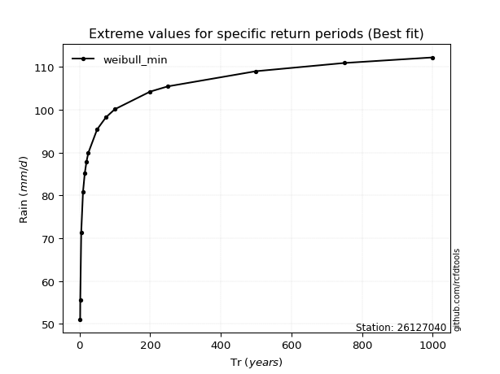</img>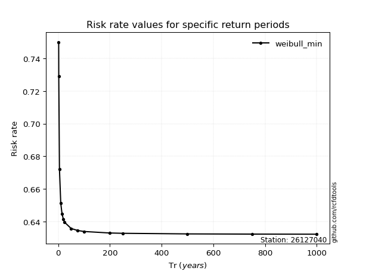</img>

</div>


<sub>**APP DISCLAIMER**: NO WARRANTY - This software is provided by [github.com/rcfdtools](https://github.com/rcfdtools) "as is", without any express or implied warranty, including warranties of merchantability, fitness for a particular purpose, or non-infringement. There is no guarantee that the software will be error-free or operate without interruption. LIMITATION OF LIABILITY - Neither the authors nor copyright holders will be liable for claims or damages arising from the software or its use. You are responsible for determining if the software is appropriate for your use and assume all associated risks, including errors, legal compliance, and data loss. NO PROFESSIONAL ADVICE - The software provides general information and does not offer professional advice. It should not replace consultation with professional advisors.</sub>