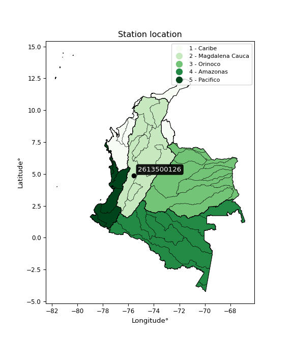

<div align="center">


</div>

# PMP Station (Rain, Pmax24h): 2613500126

Probable Maximum Precipitation (PMP) is the greatest amount of rainfall for a specific duration that is meteorologically possible for a given location, acting as a "worst-case" scenario for extreme storms, crucial for designing safety-critical infrastructure like bridges, river deviations, dams, spillways, and nuclear plants to prevent catastrophic failure. PMP is calculated by hydrologists using meteorological data to determine the upper limit of extreme rainfall, often leading to the Probable Maximum Flood (PMF) for flood control design, and is increasingly being studied for climate change impacts. Probable Maximum Precipitation (PMP) is the theoretical upper limit of rainfall, a deterministic estimate for extreme events, while probability distributions (like GEV, Gumbel) describe the likelihood and frequency of various precipitation amounts, including rare ones, showing how often events occur, with PMP representing the extreme end of these distributions, used for critical infrastructure design to ensure safety against the worst conceivable weather, unlike standard statistical forecasts which cover typical probabilities.

The most common probability distributions in hydrology, used for analyzing floods, rainfall, and streamflow, include the Normal, Log-Normal, Gumbel, Gamma (including Log-Pearson Type III), and Generalized Extreme Value (GEV) distributions, often chosen based on the data´s skewness and whether modeling extremes or general conditions, with Gumbel and GEV popular for extreme events like floods, while the Normal distribution serves as a baseline, though often requiring transformations for skewed hydrological data. These distributions help in designing water infrastructure, managing water resources, and forecasting hydrologic events.

> Hydrological data often isn´t perfectly normal (it´s skewed), so different distributions are needed for different applications, such as: **Flood Frequency Analysis**: Using Gumbel, GEV, or Log-Pearson Type III for predicting extreme flood magnitudes and their return periods, **Rainfall Analysis**: Normal for annual totals, but Log-Normal, Weibull, or GEV for intensity or extreme daily rainfall, **Streamflow Modeling**: Gamma and Log-Normal for maximum flows, GEV for minimum flows, and Kappa for daily flows.

<div align="center">

</img>

</div>


## A. General information


### 1. General running parameters

• app_version: _v20260108_. • runtime: _2026-01-09 11:32:22.148588_. • Python version: _3.14.0_. • SciPy version: _1.16.3_. • Pandas version: _2.3.3_. • NumPy version: _2.3.5_. • Stations dataset (station_dataset_file): _dataset/pmax24h_in/automatic_colombia_2003_2024.csv_. • Stations catalog (station_catalog_file): _dataset/CNE.xls_. • Minimum year to eval til year_max (date_min): _1900_. • Maximum year to eval since year_min (date_max): _2024_. • Creates, save and include plots into reports (create_plot): _False_. • Plot only fit distributions with Δo > Δ (plot_only_fit): _True_. • Plot only simple graphs avoiding multiple CDFs and multiple Extreme values plots (plot_only_simple): _True_. • Eval low extreme values, if False, evaluates high extreme values (low_extreme): _False_. • Eval every SciPy distribution as logarithmic (pdist_logarithmic_on): _True_. • Standard deviation normalized (ddof): _1.0_. • Return periods to eval in years (Tr): _[2, 2.33, 5, 10, 15, 20, 25, 50, 75, 100, 200, 250, 500, 750, 1000]_. • Minimum data sample per station, 0 means any (minimum_sample): _5_. • Z-Score maximum threshold to adjust a value, 0 means disable (zscore_max): _3.5_. • Z-Score minimum threshold to adjust a value, 0 means disable (zscore_min): _-2.5_. • Avoid zeros, e.g. rain = 0 (avoid_zeros): _True_. • Avoid null values (avoid_nans): _True_. 

:file_folder:Table: [dataset.csv](../../dataset/pmax24h_in/automatic_colombia_2003_2024.csv)

> Delta Degrees of Freedom (DDOF): is a parameter used in the formulas for calculating variance and standard deviation. When ddof=0, the divisor is $N$ (the total number of observations) and this is used when your data set is the entire population. When ddof=1, the divisor is $N-1$ and this is used when your data set is a sample drawn from a larger population. Using $N-1$ provides an unbiased estimate of the population variance (known as Bessel´s correction).


### 2. Station info and location

|   id |     CODIGO | NOMBRE                        | CATEGORIA               | TECNOLOGIA                | ESTADO           | FECHA_INSTALACION   |   FECHA_SUSPENSION |   ALTITUD |   LATITUD |   LONGITUD | DEPARTAMENTO   | MUNICIPIO           | AREA_OPERATIVA                         | ENTIDAD                                                     | AREA_HIDROGRAFICA   | ZONA_HIDROGRAFICA   | SUBZONA_HIDROGRAFICA               |   CORRIENTE | Catalogo   |   Version |
|-----:|-----------:|:------------------------------|:------------------------|:--------------------------|:-----------------|:--------------------|-------------------:|----------:|----------:|-----------:|:---------------|:--------------------|:---------------------------------------|:------------------------------------------------------------|:--------------------|:--------------------|:-----------------------------------|------------:|:-----------|----------:|
|    0 | 2613500126 | POTREROS - AUT   [2613500126] | Climatológica Principal | Automática con Telemetría | En Mantenimiento | 03/12/2017          |                nan |      2102 |   4.88568 |   -75.5581 | Risaralda      | Santa Rosa De Cabal | Area Operativa 09 - Cauca-Valle-Caldas | INSTITUTO DE HIDROLOGIA METEOROLOGIA Y ESTUDIOS AMBIENTALES | Magdalena Cauca     | Cauca               | Río Otún y otros directos al Cauca |         nan | CNE_IDEAM  |  20251226 |

<div align="center">

Dynamic map: [:earth_americas:Google](http://maps.google.com/maps?q=4.885680556,-75.558080556) [:earth_americas:OSM](https://www.openstreetmap.org/#map=18/4.885680556/-75.558080556&layers=P) [:earth_americas:Bing](https://www.bing.com/maps?cp=4.885680556~-75.558080556&lvl=18) [:earth_americas:Apple](https://maps.apple.com/frame?center=4.885680556%2C-75.558080556&span=0.003%2C0.006)

</div>


<div align="center">

```geojson
{
  "type": "Feature",
  "geometry": {
    "type": "Point", 
    "coordinates": [-75.558080556, 4.885680556]
  }, 
  "properties": {
    "Name": "2613500126"
  }
}
```

</div>


### 3. Discrete values table and plot

<div align="center">

|               |           0 |           1 |           2 |           3 |              4 |          5 |
|:--------------|------------:|------------:|------------:|------------:|---------------:|-----------:|
| Date          | 2019        | 2020        | 2021        | 2022        | 2023           | 2024       |
| Value         |   99.9      |   53.2      |   47.5      |   69.2      |   83.7         |  148.6     |
| Value_initial |   99.9      |   53.2      |   47.5      |   69.2      |   83.7         |  148.6     |
| count         |    6        |    6        |    6        |    6        |    6           |    6       |
| mean          |   83.6833   |   83.6833   |   83.6833   |   83.6833   |   83.6833      |   83.6833  |
| std           |   37.2166   |   37.2166   |   37.2166   |   37.2166   |   37.2166      |   37.2166  |
| zscore        |    0.435737 |   -0.819078 |   -0.972236 |   -0.389163 |    0.000447828 |    1.74429 |


</div>


> The initial value (value_initial) correspond to the initial obtained or null completed value, and value (value) is adjusted only when the initial value is outside the valid range (outlier) definite through the Z-Score value. If Z-Score is active, values out of range or outliers are replaced with the station mean value. A Z-Score (or standard score) measures how many standard deviations a data point is from the mean of a dataset, indicating its relative position; positive scores mean above the mean, negative mean below, and a score of zero is exactly at the mean, allowing for comparison of values from different distributions. It´s calculated using the formula $z=(x–μ)/σ$, where $x$ is the data point, $μ$ is the mean, and $σ$ is the standard deviation, helping identify outliers and understand probability.
>
> <sub>**Note**: In this study, "completing" (filling gaps in) and "extending" (forecasting or lengthening the historical record) rainfall data series are avoided for certain critical analyses because they introduce artificial bias and uncertainty, which can distort the statistics of rare events (extremes), alter day-to-day variability, and compromise the integrity and homogeneity of the original data. Some reasons against Completing/Extending rainfall data are: **Distortion of Extremes and Variability**: The primary issue is that most gap-filling or extension methods rely on averaging or regression with nearby stations, which inherently smooths the data. Rainfall is highly variable in space and time, with a large percentage of zero values and occasional large storms. Infilling methods often underestimate the highest values and overestimate the lowest (zero) values, which severely distorts analyses focused on flood frequency, drought severity, and intensity-duration-frequency (IDF) curves, **Loss of Data Homogeneity**: Infilled or extended data are synthetic estimates, not actual measurements. Combining these estimates with observed data can violate the assumption of data homogeneity, which requires that the data properties do not change over time. Inhomogeneity can lead to incorrect conclusions about long-term trends or changes in climate patterns, **Propagation of Errors**: Errors and biases from the original data (e.g., wind-induced undercatch, instrument errors, site changes) or the data used for imputation can propagate through the analysis, leading to unreliable hydrological models and inaccurate predictions, **Compromised Statistical Integrity**: For statistical analyses, especially those involving the frequency of events, using artificial data can introduce time bias or autocorrelation that doesn´t exist in reality, making it difficult to assess the true probability of events, **Difficulty in Validation**: It is difficult to accurately validate the quality of filled or extended data, especially for past periods where ground-truth measurements are unavailable. The reliability of imputation techniques heavily depends on the density of the surrounding station network and the complexity of the local topography.</sub>


### 4. Active continuous probability distributions from SciPy (45 of 104 available)

A Probability Density Function (PDF) describes the relative likelihood of a continuous random variable falling within a specific range, where the total area under its curve equals 1, and the area over any interval gives the actual probability for that range. Unlike discrete probabilities (like rolling a die), a PDF shows density, not direct probability for a single point (which is zero), with higher points indicating higher likelihood, often visualized as a bell curve for normal distributions.

A log of a probability density function (log-PDF) is simply the logarithm of the PDF´s value, denoted as $log(f(x))$, useful for converting multiplication of probabilities into addition, improving numerical stability with tiny numbers, and connecting to information theory concepts like entropy. Instead of dealing with very small probabilities (e.g., 0.000001), log-PDFs use negative numbers (e.g., $log(0.00001) ≈ -11.51$ that are easier for computers to handle, preventing underflow errors and simplifying complex calculations. In this study, each active probability distribution from SciPy is also evaluated in the $log$ form.

[scipy.stats](https://docs.scipy.org/doc/scipy/reference/stats.html) is a Python´s powerful submodule within the SciPy library for comprehensive statistical analysis, offering over 130 probability distributions (like Normal, Poisson), functions for descriptive stats (mean, variance), hypothesis testing (t-tests, chi-square), random variable generation, and statistical tests, making it essential for data science, modeling, and research. It provides tools to explore, model, and draw conclusions from data efficiently, working seamlessly with NumPy.

<div align="center">

|   id | p_dist             |   n_parameter | fit_method   | label                                                                       | active   | ref                                                                                                        |
|-----:|:-------------------|--------------:|:-------------|:----------------------------------------------------------------------------|:---------|:-----------------------------------------------------------------------------------------------------------|
|    0 | alpha              |             3 | MLE          | Alpha                                                                       | True     | [:mortar_board:](https://docs.scipy.org/doc/scipy/reference/generated/scipy.stats.alpha.html)              |
|    1 | betaprime          |             4 | MLE          | Beta prime                                                                  | True     | [:mortar_board:](https://docs.scipy.org/doc/scipy/reference/generated/scipy.stats.betaprime.html)          |
|    2 | chi2               |             3 | MLE          | Chi²                                                                        | True     | [:mortar_board:](https://docs.scipy.org/doc/scipy/reference/generated/scipy.stats.chi2.html)               |
|    3 | crystalball        |             4 | MLE          | Crystalball                                                                 | True     | [:mortar_board:](https://docs.scipy.org/doc/scipy/reference/generated/scipy.stats.crystalball.html)        |
|    4 | dweibull           |             3 | MLE          | Double Weibull                                                              | True     | [:mortar_board:](https://docs.scipy.org/doc/scipy/reference/generated/scipy.stats.dweibull.html)           |
|    5 | erlang             |             3 | MLE          | Erlang                                                                      | True     | [:mortar_board:](https://docs.scipy.org/doc/scipy/reference/generated/scipy.stats.erlang.html)             |
|    6 | expon              |             2 | MLE          | Exponential                                                                 | True     | [:mortar_board:](https://docs.scipy.org/doc/scipy/reference/generated/scipy.stats.expon.html)              |
|    7 | exponnorm          |             3 | MLE          | Exponentially modified Normal                                               | True     | [:mortar_board:](https://docs.scipy.org/doc/scipy/reference/generated/scipy.stats.exponnorm.html)          |
|    8 | f                  |             4 | MLE          | F                                                                           | True     | [:mortar_board:](https://docs.scipy.org/doc/scipy/reference/generated/scipy.stats.f.html)                  |
|    9 | fatiguelife        |             3 | MLE          | Fatigue-life (Birnbaum-Saunders)                                            | True     | [:mortar_board:](https://docs.scipy.org/doc/scipy/reference/generated/scipy.stats.fatiguelife.html)        |
|   10 | fisk               |             3 | MLE          | Fisk                                                                        | True     | [:mortar_board:](https://docs.scipy.org/doc/scipy/reference/generated/scipy.stats.fisk.html)               |
|   11 | gamma              |             3 | MLE          | Gamma                                                                       | True     | [:mortar_board:](https://docs.scipy.org/doc/scipy/reference/generated/scipy.stats.gamma.html)              |
|   12 | genexpon           |             5 | MLE          | Generalized exponential                                                     | True     | [:mortar_board:](https://docs.scipy.org/doc/scipy/reference/generated/scipy.stats.genexpon.html)           |
|   13 | genlogistic        |             3 | MLE          | Generalized logistic                                                        | True     | [:mortar_board:](https://docs.scipy.org/doc/scipy/reference/generated/scipy.stats.genlogistic.html)        |
|   14 | gibrat             |             2 | MM           | Gibrat                                                                      | True     | [:mortar_board:](https://docs.scipy.org/doc/scipy/reference/generated/scipy.stats.gibrat.html)             |
|   15 | gompertz           |             3 | MLE          | Gompertz (or truncated Gumbel)                                              | True     | [:mortar_board:](https://docs.scipy.org/doc/scipy/reference/generated/scipy.stats.gompertz.html)           |
|   16 | gumbel_l           |             2 | MM           | Gumbel Left Skew                                                            | True     | [:mortar_board:](https://docs.scipy.org/doc/scipy/reference/generated/scipy.stats.gumbel_l.html)           |
|   17 | gumbel_r           |             2 | MM           | Gumbel Right Skew                                                           | True     | [:mortar_board:](https://docs.scipy.org/doc/scipy/reference/generated/scipy.stats.gumbel_r.html)           |
|   18 | halflogistic       |             2 | MM           | Half-logistic                                                               | True     | [:mortar_board:](https://docs.scipy.org/doc/scipy/reference/generated/scipy.stats.halflogistic.html)       |
|   19 | halfnorm           |             2 | MM           | Half Normal                                                                 | True     | [:mortar_board:](https://docs.scipy.org/doc/scipy/reference/generated/scipy.stats.halfnorm.html)           |
|   20 | hypsecant          |             2 | MM           | hyperbolic secant                                                           | True     | [:mortar_board:](https://docs.scipy.org/doc/scipy/reference/generated/scipy.stats.hypsecant.html)          |
|   21 | invgamma           |             3 | MLE          | Inverted gamma                                                              | True     | [:mortar_board:](https://docs.scipy.org/doc/scipy/reference/generated/scipy.stats.invgamma.html)           |
|   22 | invgauss           |             3 | MLE          | Inverse Gaussian                                                            | True     | [:mortar_board:](https://docs.scipy.org/doc/scipy/reference/generated/scipy.stats.invgauss.html)           |
|   23 | invweibull         |             3 | MLE          | Inverted Weibull                                                            | True     | [:mortar_board:](https://docs.scipy.org/doc/scipy/reference/generated/scipy.stats.invweibull.html)         |
|   24 | kappa4             |             4 | MLE          | Kappa 4                                                                     | True     | [:mortar_board:](https://docs.scipy.org/doc/scipy/reference/generated/scipy.stats.kappa4.html)             |
|   25 | kstwobign          |             2 | MLE          | Limiting distribution of scaled Kolmogorov-Smirnov two-sided test statistic | True     | [:mortar_board:](https://docs.scipy.org/doc/scipy/reference/generated/scipy.stats.kstwobign.html)          |
|   26 | laplace            |             2 | MM           | Laplace                                                                     | True     | [:mortar_board:](https://docs.scipy.org/doc/scipy/reference/generated/scipy.stats.laplace.html)            |
|   27 | laplace_asymmetric |             3 | MLE          | Asymmetric Laplace                                                          | True     | [:mortar_board:](https://docs.scipy.org/doc/scipy/reference/generated/scipy.stats.laplace_asymmetric.html) |
|   28 | loggamma           |             3 | MLE          | Log gamma                                                                   | True     | [:mortar_board:](https://docs.scipy.org/doc/scipy/reference/generated/scipy.stats.loggamma.html)           |
|   29 | logistic           |             2 | MM           | Logistic (or Sech-squared)                                                  | True     | [:mortar_board:](https://docs.scipy.org/doc/scipy/reference/generated/scipy.stats.logistic.html)           |
|   30 | lognorm            |             3 | MLE          | Log Normal                                                                  | True     | [:mortar_board:](https://docs.scipy.org/doc/scipy/reference/generated/scipy.stats.lognorm.html)            |
|   31 | maxwell            |             2 | MM           | Maxwell                                                                     | True     | [:mortar_board:](https://docs.scipy.org/doc/scipy/reference/generated/scipy.stats.maxwell.html)            |
|   32 | mielke             |             4 | MLE          | Mielke Beta-Kappa / Dagum                                                   | True     | [:mortar_board:](https://docs.scipy.org/doc/scipy/reference/generated/scipy.stats.mielke.html)             |
|   33 | moyal              |             2 | MM           | Moyal                                                                       | True     | [:mortar_board:](https://docs.scipy.org/doc/scipy/reference/generated/scipy.stats.moyal.html)              |
|   34 | nakagami           |             3 | MLE          | Nakagami                                                                    | True     | [:mortar_board:](https://docs.scipy.org/doc/scipy/reference/generated/scipy.stats.nakagami.html)           |
|   35 | ncf                |             5 | MLE          | Non-central F distribution                                                  | True     | [:mortar_board:](https://docs.scipy.org/doc/scipy/reference/generated/scipy.stats.ncf.html)                |
|   36 | nct                |             4 | MLE          | Non-central Student’s t                                                     | True     | [:mortar_board:](https://docs.scipy.org/doc/scipy/reference/generated/scipy.stats.nct.html)                |
|   37 | norm               |             2 | MM           | Normal                                                                      | True     | [:mortar_board:](https://docs.scipy.org/doc/scipy/reference/generated/scipy.stats.norm.html)               |
|   38 | pearson3           |             3 | MM           | Pearson type III                                                            | True     | [:mortar_board:](https://docs.scipy.org/doc/scipy/reference/generated/scipy.stats.pearson3.html)           |
|   39 | rayleigh           |             2 | MM           | Rayleigh                                                                    | True     | [:mortar_board:](https://docs.scipy.org/doc/scipy/reference/generated/scipy.stats.rayleigh.html)           |
|   40 | rice               |             3 | MLE          | Rice                                                                        | True     | [:mortar_board:](https://docs.scipy.org/doc/scipy/reference/generated/scipy.stats.rice.html)               |
|   41 | t                  |             3 | MLE          | Student’s t                                                                 | True     | [:mortar_board:](https://docs.scipy.org/doc/scipy/reference/generated/scipy.stats.t.html)                  |
|   42 | truncnorm          |             4 | MLE          | Truncated normal                                                            | True     | [:mortar_board:](https://docs.scipy.org/doc/scipy/reference/generated/scipy.stats.truncnorm.html)          |
|   43 | wald               |             2 | MM           | Wald                                                                        | True     | [:mortar_board:](https://docs.scipy.org/doc/scipy/reference/generated/scipy.stats.wald.html)               |
|   44 | weibull_min        |             3 | MLE          | Weibull minimum                                                             | True     | [:mortar_board:](https://docs.scipy.org/doc/scipy/reference/generated/scipy.stats.weibull_min.html)        |

</div>

> **n_parameter:** # arguments & localization & scale.
>
> **Fit methods:** (MLE) maximum likelihood, (MM) L-moments.
>
>**Inactive** (With the only purpose of prevent loops, zero divisions, infinite values, over high estimated values or horizontal trending for recurrence intervals estimations, the follow distributions were disabled.)**:** foldnorm, gennorm, norminvgauss, powernorm, powerlognorm, skewnorm, genextreme, anglit, arcsine, argus, beta, bradford, burr, burr12, cauchy, cosine, halfcauchy, foldcauchy, skewcauchy, wrapcauchy, dgamma, gengamma, exponweib, exponpow, truncexpon, gausshyper, genhalflogistic, genhyperbolic, geninvgauss, halfgennorm, johnsonsb, johnsonsu, kappa3, ksone, kstwo, loglaplace, levy, levy_l, levy_stable, ncx2, pareto, genpareto, truncpareto, lomax, powerlaw, rdist, rel_breitwigner, recipinvgauss, semicircular, studentized_range, trapezoid, triang, truncweibull_min, tukeylambda, uniform, loguniform, vonmises, vonmises_line, weibull_max, 


## B. Probability (PDF) vs. Empirical (EDF) distributions functions

A continuous probability distribution (CPD) describes probabilities for variables that can take any value within a range (like rain any time), unlike discrete variables with specific outcomes (like temperature). It uses a Probability Density Function (PDF), a curve where the total area under it equals 1, and the probability of the variable falling within an interval (a to b) is found by calculating the area under the curve between those points. A key feature is that the probability of hitting any single exact value is zero, so probabilities are always expressed for ranges, e.g., $P(a ≤ X ≤ b)$.

<div align="center">

Distributions parameters from station values
|    |    station | p_dist                |   n |              loc |           scale | shape                 | shape1                | shape2             | shape3   |
|---:|-----------:|:----------------------|----:|-----------------:|----------------:|:----------------------|:----------------------|:-------------------|:---------|
|  0 | 2613500126 | alpha                 |   6 |     -8.18059     |   250.305       | 3.070537605532868     |                       |                    |          |
|  1 | 2613500126 | betaprime             |   6 |     -0.562962    |     3.14102     | 180.46289277375672    | 7.735251385832266     |                    |          |
|  2 | 2613500126 | chi2                  |   6 |     47.5         |     1.36843     | 0.8201422811331389    |                       |                    |          |
|  3 | 2613500126 | crystalball           |   6 |     83.6833      |    33.974       | 7629.384103117158     | 56.23002232836015     |                    |          |
|  4 | 2613500126 | dweibull              |   6 |     77.6475      |    29.6265      | 1.3370220043231864    |                       |                    |          |
|  5 | 2613500126 | erlang                |   6 |     47.5         |    37.2986      | 0.3078278404614436    |                       |                    |          |
|  6 | 2613500126 | expon                 |   6 |     47.5         |    36.1833      |                       |                       |                    |          |
|  7 | 2613500126 | exponnorm             |   6 |     47.4377      |     0.0197188   | 1822.6593450746432    |                       |                    |          |
|  8 | 2613500126 | f                     |   6 |     30.5908      |    35.1016      | 4999.6859219898       | 5.174748783464381     |                    |          |
|  9 | 2613500126 | fatiguelife           |   6 |     47.5         |     0.000175465 | 513.0353398691259     |                       |                    |          |
| 10 | 2613500126 | fisk                  |   6 |     47.5         |    21.5462      | 0.43958469167128134   |                       |                    |          |
| 11 | 2613500126 | gamma                 |   6 |     47.5         |    53.6975      | 0.3325851904032159    |                       |                    |          |
| 12 | 2613500126 | genexpon              |   6 |     47.5         |    60.443       | 1.6669114587582343    | 0.0002594648390864319 | 1.3096576439245893 |          |
| 13 | 2613500126 | genlogistic           |   6 |   -108.569       |    24.6208      | 1321.485215492687     |                       |                    |          |
| 14 | 2613500126 | gibrat                |   6 |     57.7655      |    15.72        |                       |                       |                    |          |
| 15 | 2613500126 | gompertz              |   6 |     47.5         |   355           | 8.887500459982611     |                       |                    |          |
| 16 | 2613500126 | gumbel_l              |   6 |     98.9734      |    26.4894      |                       |                       |                    |          |
| 17 | 2613500126 | gumbel_r              |   6 |     68.3932      |    26.4894      |                       |                       |                    |          |
| 18 | 2613500126 | halflogistic          |   6 |     43.4163      |    29.0465      |                       |                       |                    |          |
| 19 | 2613500126 | halfnorm              |   6 |     38.7151      |    56.3593      |                       |                       |                    |          |
| 20 | 2613500126 | hypsecant             |   6 |     83.6833      |    21.6285      |                       |                       |                    |          |
| 21 | 2613500126 | invgamma              |   6 |     30.5727      |    90.8489      | 2.5873599421118887    |                       |                    |          |
| 22 | 2613500126 | invgauss              |   6 |     40.4437      |    36.2964      | 1.1912941362269343    |                       |                    |          |
| 23 | 2613500126 | invweibull            |   6 |     47.5         |     1.33771     | 0.04854149201603264   |                       |                    |          |
| 24 | 2613500126 | kappa4                |   6 |     34.7907      |   117.319       | 1.121500654817761     | 1.000970650972071     |                    |          |
| 25 | 2613500126 | kstwobign             |   6 |    -18.7256      |   117.819       |                       |                       |                    |          |
| 26 | 2613500126 | laplace               |   6 |     83.6833      |    24.0232      |                       |                       |                    |          |
| 27 | 2613500126 | laplace_asymmetric    |   6 |     69.2         |    23.8735      | 0.7416660205999472    |                       |                    |          |
| 28 | 2613500126 | loggamma              |   6 | -10488           |  1421.87        | 1694.593438820712     |                       |                    |          |
| 29 | 2613500126 | logistic              |   6 |     83.6833      |    18.7308      |                       |                       |                    |          |
| 30 | 2613500126 | lognorm               |   6 |     47.5         |     0.0743223   | 13.435915854859465    |                       |                    |          |
| 31 | 2613500126 | maxwell               |   6 |      3.17926     |    50.4484      |                       |                       |                    |          |
| 32 | 2613500126 | mielke                |   6 |      0.881424    |     7.31153     | 2593.363860099689     | 3.1111130386145414    |                    |          |
| 33 | 2613500126 | moyal                 |   6 |     64.2548      |    15.2937      |                       |                       |                    |          |
| 34 | 2613500126 | nakagami              |   6 |     47.5         |    43.2091      | 0.4118589748872998    |                       |                    |          |
| 35 | 2613500126 | ncf                   |   6 |     -2.52445     |    29.5335      | 169.5542373699268     | 16.32893516282779     | 264.633960139221   |          |
| 36 | 2613500126 | nct                   |   6 |     -0.246989    |     1.28402     | 4.186887313903744     | 53.30721779676294     |                    |          |
| 37 | 2613500126 | norm                  |   6 |     83.6833      |    33.974       |                       |                       |                    |          |
| 38 | 2613500126 | pearson3              |   6 |     83.6834      |    33.9739      | 0.8462237919737899    |                       |                    |          |
| 39 | 2613500126 | rayleigh              |   6 |     18.6891      |    51.8579      |                       |                       |                    |          |
| 40 | 2613500126 | rice                  |   6 |     28.3958      |    45.8854      | 0.0004244883586644245 |                       |                    |          |
| 41 | 2613500126 | t                     |   6 |     83.6839      |    33.9781      | 1352064.0457690894    |                       |                    |          |
| 42 | 2613500126 | truncnorm             |   6 |     83.6833      |    33.974       | -1622.2450211331534   | 1840.7294850891985    |                    |          |
| 43 | 2613500126 | wald                  |   6 |     49.7094      |    33.9739      |                       |                       |                    |          |
| 44 | 2613500126 | weibull_min           |   6 |     47.5         |    50.4547      | 0.8294164009657934    |                       |                    |          |
| 45 | 2613500126 | logalpha              |   6 |      1.66945     |    18.7611      | 7.139337882722987     |                       |                    |          |
| 46 | 2613500126 | logbetaprime          |   6 |     -2.55155     |    18.776       | 303.40873110309656    | 826.0285663516984     |                    |          |
| 47 | 2613500126 | logchi2               |   6 |      3.86073     |     0.988429    | 1.0888465100721092    |                       |                    |          |
| 48 | 2613500126 | logcrystalball        |   6 |      4.35074     |     0.384748    | 71.13275268029273     | 13.412617944698852    |                    |          |
| 49 | 2613500126 | logdweibull           |   6 |      4.3342      |     0.366041    | 1.6393211960116618    |                       |                    |          |
| 50 | 2613500126 | logerlang             |   6 |      3.86073     |     0.680986    | 0.30024192501995484   |                       |                    |          |
| 51 | 2613500126 | logexpon              |   6 |      3.86073     |     0.490013    |                       |                       |                    |          |
| 52 | 2613500126 | logexponnorm          |   6 |      4.17239     |     0.343013    | 0.5199695750892983    |                       |                    |          |
| 53 | 2613500126 | logf                  |   6 |      3.86073     |     0.515508    | 1.0328185283474474    | 70.77648687947453     |                    |          |
| 54 | 2613500126 | logfatiguelife        |   6 |      3.70311     |     0.504174    | 0.7477977335497767    |                       |                    |          |
| 55 | 2613500126 | logfisk               |   6 |      3.60646     |     0.659224    | 2.8435878538298773    |                       |                    |          |
| 56 | 2613500126 | loggamma              |   6 |      3.86073     |     0.477615    | 0.3623741496054359    |                       |                    |          |
| 57 | 2613500126 | loggenexpon           |   6 |      3.86073     |     2.06552e+07 | 33445508.686772767    | 62966642.85888315     | 8139125.733420456  |          |
| 58 | 2613500126 | loggenlogistic        |   6 |      2.05382     |     0.318607    | 756.862767365275      |                       |                    |          |
| 59 | 2613500126 | loggibrat             |   6 |      4.05723     |     0.178023    |                       |                       |                    |          |
| 60 | 2613500126 | loggompertz           |   6 |      3.86073     |     0.988844    | 1.2909667082238       |                       |                    |          |
| 61 | 2613500126 | loggumbel_l           |   6 |      4.5239      |     0.299987    |                       |                       |                    |          |
| 62 | 2613500126 | loggumbel_r           |   6 |      4.17759     |     0.299987    |                       |                       |                    |          |
| 63 | 2613500126 | loghalflogistic       |   6 |      3.89477     |     0.328914    |                       |                       |                    |          |
| 64 | 2613500126 | loghalfnorm           |   6 |      3.84149     |     0.638258    |                       |                       |                    |          |
| 65 | 2613500126 | loghypsecant          |   6 |      4.35074     |     0.244938    |                       |                       |                    |          |
| 66 | 2613500126 | loginvgamma           |   6 |      2.92794     |    18.2856      | 13.829234951498949    |                       |                    |          |
| 67 | 2613500126 | loginvgauss           |   6 |      3.5563      |     2.51077     | 0.3164153385650028    |                       |                    |          |
| 68 | 2613500126 | loginvweibull         |   6 |     -1.31552e+07 |     1.31552e+07 | 41293184.733298495    |                       |                    |          |
| 69 | 2613500126 | logkappa4             |   6 |      3.77799     |     1.22464     | 1.0724107443554987    | 0.9816434046558529    |                    |          |
| 70 | 2613500126 | logkstwobign          |   6 |      3.06446     |     1.47105     |                       |                       |                    |          |
| 71 | 2613500126 | loglaplace            |   6 |      4.35074     |     0.272058    |                       |                       |                    |          |
| 72 | 2613500126 | loglaplace_asymmetric |   6 |      4.237       |     0.311353    | 0.8342012870276587    |                       |                    |          |
| 73 | 2613500126 | logloggamma           |   6 |   -101.987       |    14.6521      | 1418.9205341190686    |                       |                    |          |
| 74 | 2613500126 | loglogistic           |   6 |      4.35074     |     0.212123    |                       |                       |                    |          |
| 75 | 2613500126 | loglognorm            |   6 |      3.86073     |     0.00144481  | 12.904593313817669    |                       |                    |          |
| 76 | 2613500126 | logmaxwell            |   6 |      3.43905     |     0.571318    |                       |                       |                    |          |
| 77 | 2613500126 | logmielke             |   6 | -20994.1         | 20997           | 3571989.5582165956    | 66632.26220020143     |                    |          |
| 78 | 2613500126 | logmoyal              |   6 |      4.13072     |     0.173198    |                       |                       |                    |          |
| 79 | 2613500126 | lognakagami           |   6 |      3.86073     |     0.76404     | 0.2706869448081663    |                       |                    |          |
| 80 | 2613500126 | logncf                |   6 |     -2.77536     |     7.09324     | 1504.6581209442647    | 1308.7217040960709    | 4.800876763185961  |          |
| 81 | 2613500126 | lognct                |   6 |      0.13589     |     0.103539    | 67.37199752834721     | 40.242584532594606    |                    |          |
| 82 | 2613500126 | lognorm               |   6 |      4.35074     |     0.384748    |                       |                       |                    |          |
| 83 | 2613500126 | logpearson3           |   6 |      4.35074     |     0.384748    | 0.3494801498758937    |                       |                    |          |
| 84 | 2613500126 | lograyleigh           |   6 |      3.6147      |     0.58728     |                       |                       |                    |          |
| 85 | 2613500126 | logrice               |   6 |      3.66659     |     0.524065    | 0.4932289836462612    |                       |                    |          |
| 86 | 2613500126 | logt                  |   6 |      4.35071     |     0.384703    | 4202.69737355474      |                       |                    |          |
| 87 | 2613500126 | logtruncnorm          |   6 |     -0.150442    |     1.5416      | 2.6019579497557537    | 5.818989496891078     |                    |          |
| 88 | 2613500126 | logwald               |   6 |      3.96596     |     0.384777    |                       |                       |                    |          |
| 89 | 2613500126 | logweibull_min        |   6 |      3.86073     |     0.486743    | 0.5442125601463654    |                       |                    |          |

</div>

> **loc** (Location parameter): This shifts the distribution along the x-axis. For many common distributions, like the normal (Gaussian) distribution, loc represents the mean $μ$. For others, like the uniform distribution, it might represent the minimum value, or for the beta distribution, the left end of the support interval.
>
> **scale** (Scale parameter): This determines the width or spread of the distribution. For the normal distribution, scale represents the standard deviation $σ$. For a uniform distribution, it defines the length of the interval (from $loc$ to $loc + scale$).
>
> **shape** (Shape parameters): Refers to parameters that define the specific form of a probability distribution, distinct from its location (loc) and scale (scale). These parameters are required arguments for most distribution functions. For example, a normal (Gaussian) distribution is fully defined by its location (mean) and scale (standard deviation), so it has no specific shape parameters beyond loc and scale. However, other distributions have intrinsic properties that need specification, as Gamma distribution that takes a shape parameter, often named $a$ or $alpha$.


### 0. Cumulative distribution values - CDF (90 evaluated)

Cumulative Distribution Function (CDF), denoted as $F$<sub>$X$</sub>$(x)$, is a function that gives the probability that a random variable $X$ will take a value less than or equal to a specific value, $x$ (i.e., $(P(X≥x)$. It essentially "accumulates" probabilities from a given point up to the far right (positive infinity), providing a complete picture of the distribution´s probabilities for both discrete (like rain) and continuous (like temperature) variables, helping to find probabilities over ranges or above certain values. Each station is evaluated separately ordering the $x$ values ascending, calculating the CDF and PDF values for the activated distributions and their logarithmic forms.

<div align="center">

CDF ordered by x ascending and calculating $log(f(x))$ separately
|   id |    Station |   date |     x |   count |    mean |     std |       zscore |   Value_initial |    station |   m |     alpha |   alpha_pdf |   betaprime |   betaprime_pdf |       chi2 |    chi2_pdf |   crystalball |   crystalball_pdf |   dweibull |   dweibull_pdf |      erlang |   erlang_pdf |    expon |   expon_pdf |   exponnorm |   exponnorm_pdf |         f |      f_pdf |   fatiguelife |   fatiguelife_pdf |        fisk |        fisk_pdf |       gamma |   gamma_pdf |    genexpon |   genexpon_pdf |   genlogistic |   genlogistic_pdf |   gibrat |   gibrat_pdf |   gompertz |   gompertz_pdf |   gumbel_l |   gumbel_l_pdf |   gumbel_r |   gumbel_r_pdf |   halflogistic |   halflogistic_pdf |   halfnorm |   halfnorm_pdf |   hypsecant |   hypsecant_pdf |   invgamma |   invgamma_pdf |   invgauss |   invgauss_pdf |   invweibull |   invweibull_pdf |      kappa4 |   kappa4_pdf |   kstwobign |   kstwobign_pdf |   laplace |   laplace_pdf |   laplace_asymmetric |   laplace_asymmetric_pdf |    loggamma |   loggamma_pdf |   logistic |   logistic_pdf |   lognorm |   lognorm_pdf |   maxwell |   maxwell_pdf |   mielke |   mielke_pdf |     moyal |   moyal_pdf |   nakagami |   nakagami_pdf |       ncf |    ncf_pdf |       nct |    nct_pdf |     norm |   norm_pdf |   pearson3 |   pearson3_pdf |   rayleigh |   rayleigh_pdf |      rice |   rice_pdf |        t |      t_pdf |   truncnorm |   truncnorm_pdf |      wald |   wald_pdf |   weibull_min |   weibull_min_pdf |   logalpha |   logalpha_pdf |   logbetaprime |   logbetaprime_pdf |     logchi2 |   logchi2_pdf |   logcrystalball |   logcrystalball_pdf |   logdweibull |   logdweibull_pdf |   logerlang |   logerlang_pdf |   logexpon |   logexpon_pdf |   logexponnorm |   logexponnorm_pdf |        logf |    logf_pdf |   logfatiguelife |   logfatiguelife_pdf |   logfisk |   logfisk_pdf |   loggenexpon |   loggenexpon_pdf |   loggenlogistic |   loggenlogistic_pdf |   loggibrat |   loggibrat_pdf |   loggompertz |   loggompertz_pdf |   loggumbel_l |   loggumbel_l_pdf |   loggumbel_r |   loggumbel_r_pdf |   loghalflogistic |   loghalflogistic_pdf |   loghalfnorm |   loghalfnorm_pdf |   loghypsecant |   loghypsecant_pdf |   loginvgamma |   loginvgamma_pdf |   loginvgauss |   loginvgauss_pdf |   loginvweibull |   loginvweibull_pdf |   logkappa4 |   logkappa4_pdf |   logkstwobign |   logkstwobign_pdf |   loglaplace |   loglaplace_pdf |   loglaplace_asymmetric |   loglaplace_asymmetric_pdf |   logloggamma |   logloggamma_pdf |   loglogistic |   loglogistic_pdf |   loglognorm |   loglognorm_pdf |   logmaxwell |   logmaxwell_pdf |   logmielke |   logmielke_pdf |   logmoyal |   logmoyal_pdf |   lognakagami |   lognakagami_pdf |    logncf |   logncf_pdf |   lognct |   lognct_pdf |   logpearson3 |   logpearson3_pdf |   lograyleigh |   lograyleigh_pdf |   logrice |   logrice_pdf |     logt |   logt_pdf |   logtruncnorm |   logtruncnorm_pdf |     logwald |   logwald_pdf |   logweibull_min |   logweibull_min_pdf |
|-----:|-----------:|-------:|------:|--------:|--------:|--------:|-------------:|----------------:|-----------:|----:|----------:|------------:|------------:|----------------:|-----------:|------------:|--------------:|------------------:|-----------:|---------------:|------------:|-------------:|---------:|------------:|------------:|----------------:|----------:|-----------:|--------------:|------------------:|------------:|----------------:|------------:|------------:|------------:|---------------:|--------------:|------------------:|---------:|-------------:|-----------:|---------------:|-----------:|---------------:|-----------:|---------------:|---------------:|-------------------:|-----------:|---------------:|------------:|----------------:|-----------:|---------------:|-----------:|---------------:|-------------:|-----------------:|------------:|-------------:|------------:|----------------:|----------:|--------------:|---------------------:|-------------------------:|------------:|---------------:|-----------:|---------------:|----------:|--------------:|----------:|--------------:|---------:|-------------:|----------:|------------:|-----------:|---------------:|----------:|-----------:|----------:|-----------:|---------:|-----------:|-----------:|---------------:|-----------:|---------------:|----------:|-----------:|---------:|-----------:|------------:|----------------:|----------:|-----------:|--------------:|------------------:|-----------:|---------------:|---------------:|-------------------:|------------:|--------------:|-----------------:|---------------------:|--------------:|------------------:|------------:|----------------:|-----------:|---------------:|---------------:|-------------------:|------------:|------------:|-----------------:|---------------------:|----------:|--------------:|--------------:|------------------:|-----------------:|---------------------:|------------:|----------------:|--------------:|------------------:|--------------:|------------------:|--------------:|------------------:|------------------:|----------------------:|--------------:|------------------:|---------------:|-------------------:|--------------:|------------------:|--------------:|------------------:|----------------:|--------------------:|------------:|----------------:|---------------:|-------------------:|-------------:|-----------------:|------------------------:|----------------------------:|--------------:|------------------:|--------------:|------------------:|-------------:|-----------------:|-------------:|-----------------:|------------:|----------------:|-----------:|---------------:|--------------:|------------------:|----------:|-------------:|---------:|-------------:|--------------:|------------------:|--------------:|------------------:|----------:|--------------:|---------:|-----------:|---------------:|-------------------:|------------:|--------------:|-----------------:|---------------------:|
|    0 | 2613500126 |   2021 |  47.5 |       6 | 83.6833 | 37.2166 | -0.972236    |            47.5 | 2613500126 |   1 | 0.0771844 |  0.011684   |   0.0910708 |      0.0105349  | 1.1777e-06 | 6.79678e+07 |      0.143431 |        0.00665971 |   0.179653 |     0.00815538 | 1.61605e-05 |  7.0012e+08  | 0        |  0.027637   |  0.00173174 |      0.0277535  | 0.0629427 | 0.0150491  |     0.0871576 |       2.98129e+08 | 2.15951e-05 | 18103.1         | 7.38457e-06 | 1.72825e+08 | 4.71671e-07 |     0.0275782  |     0.0971005 |        0.00918896 | 0        |  0           | 5.1594e-12 |     0.0250352  |   0.133462 |    0.00468605  |   0.110734 |     0.00919932 |      0.0701807 |         0.017129   |   0.123867 |     0.0139862  |    0.118115 |      0.00533661 |   0.062943 |     0.0150492  |  0.0511962 |     0.0211749  |   0.00850015 |      1.38429e+11 | 5.94144e-15 |   0.456208   |    0.089845 |      0.00923794 |  0.110878 |    0.00461543 |             0.104186 |               0.00588419 | 5.15994e-06 |    2.10524e+09 |   0.126557 |     0.00590151 |  0.101404 |      0.460799 |  0.143806 |    0.00829872 |      nan |          nan | 0.0837388 |  0.0101123  | 7.7985e-14 |     9.04064    | 0.0932157 | 0.0104026  | 0.0810829 | 0.0115456  | 0.143431 | 0.00665971 |   0.127202 |     0.00919473 |   0.143012 |     0.00918125 | 0.0830219 | 0.00832028 | 0.143456 | 0.0066597  |    0.143431 |      0.00665971 | 0         | 0          |   7.12298e-14 |        8.31466    |  0.0774611 |       0.56684  |       0.142767 |           0.517877 | 3.40365e-09 |   4.17265e+06 |         0.101404 |             0.460799 |      0.108833 |          0.574573 | 3.78447e-05 |     1.27931e+10 |   0        |       2.04076  |      0.0973546 |           0.473371 | 1.12722e-07 | 2.08061e+06 |        0.0500933 |             1.02861  | 0.0624428 |      0.654722 |   1.23351e-11 |          1.61923  |        0.0741452 |             0.604428 |    0        |        0        |   5.78984e-11 |          1.30553  |      0.103833 |          0.327498 |     0.0563873 |          0.540497 |          0        |              0        |     0.0240523 |          1.24953  |      0.0855899 |           0.345239 |     0.0715187 |          0.612131 |     0.0580403 |          0.783874 |       0.0737441 |            0.603498 | 1.32644e-15 |        9.74345  |      0.0687081 |           0.640362 |    0.0825559 |         0.303449 |               0.0963792 |                    0.371073 |      0.105707 |          0.464523 |     0.0902947 |          0.387236 |    0.0127878 |      5.75876e+12 |    0.0910475 |         0.579397 |   0.0742072 |        0.597839 |  0.0292413 |       0.466328 |   4.39347e-09 |       5.35593e+06 | 0.0954724 |     0.478759 | 0.089588 |     0.515539 |     0.0928882 |          0.511498 |     0.0840139 |          0.65342  |  0.058963 |      0.589299 | 0.101426 |   0.460767 |    5.98729e-08 |           1.89145  | 0           |   0           |      6.53335e-09 |          8.00634e+06 |
|    1 | 2613500126 |   2020 |  53.2 |       6 | 83.6833 | 37.2166 | -0.819078    |            53.2 | 2613500126 |   2 | 0.157043  |  0.0159741  |   0.160156  |      0.0135134  | 0.969217   | 0.0136565   |      0.184791 |        0.00785137 |   0.23071  |     0.00975891 | 0.604193    |  0.029005    | 0.14575  |  0.0236089  |  0.148136   |      0.023702   | 0.167651  | 0.0205356  |     0.637319  |       0.0115588   | 0.357891    |     0.0177226   | 0.517416    | 0.0278663   | 0.145465    |     0.023567   |     0.157175  |        0.0118043  | 0        |  0           | 0.133984   |     0.0220318  |   0.162757 |    0.00561465  |   0.169556 |     0.0113589  |      0.16684   |         0.0167346  |   0.202829 |     0.0136972  |    0.152532 |      0.00678552 |   0.167652 |     0.0205357  |  0.194703  |     0.0260119  |   0.393743   |      0.00312531  | 0.0746907   |   0.0116843  |    0.149887 |      0.011713   |  0.140569 |    0.00585137 |             0.143754 |               0.00811887 | 0.62779     |    1.68269     |   0.164181 |     0.00732619 |  0.16378  |      0.642086 |  0.194663 |    0.00951078 |      nan |          nan | 0.151183  |  0.0133653  | 0.147242   |     0.0211704  | 0.161174  | 0.0132653  | 0.158548  | 0.0153054  | 0.184791 | 0.00785137 |   0.184381 |     0.0107984  |   0.198635 |     0.0102839  | 0.135935  | 0.0101794  | 0.184816 | 0.00785107 |    0.184791 |      0.00785137 | 0.0047079 | 0.0070897  |   0.151154    |        0.0202417  |  0.158332  |       0.853581 |       0.209065 |           0.650351 | 0.232631    |   1.07666     |         0.16378  |             0.642086 |      0.188841 |          0.836982 | 0.626522    |     1.4589      |   0.20648  |       1.61939  |      0.162043  |           0.670132 | 0.35147     | 1.48376     |        0.199382  |             1.44618  | 0.159643  |      1.03779  |   0.173955    |          1.44754  |        0.161391  |             0.922803 |    0        |        0        |   0.145096    |          1.25164  |      0.147815 |          0.454381 |     0.139342  |          0.915434 |          0.119946 |              1.49828  |     0.164544  |          1.22342  |      0.134722  |           0.533749 |     0.160004  |          0.934727 |     0.173557  |          1.1913   |       0.160939  |            0.922819 | 0.115755    |        0.951512 |      0.16088   |           0.964565 |    0.125215  |         0.460252 |               0.149101  |                    0.574058 |      0.168224 |          0.640645 |     0.144825  |          0.583862 |    0.632335  |      0.257639    |    0.169008  |         0.789957 |   0.160657  |        0.916455 |  0.115983  |       1.05261  |   0.276541    |       1.31487     | 0.160919  |     0.677511 | 0.160932 |     0.742473 |     0.16304   |          0.72561  |     0.170736  |          0.864042 |  0.141432 |      0.852125 | 0.163799 |   0.642062 |    0.194934    |           1.55793  | 1.45266e-11 |   4.35017e-08 |      0.363909    |          1.38192     |
|    2 | 2613500126 |   2022 |  69.2 |       6 | 83.6833 | 37.2166 | -0.389163    |            69.2 | 2613500126 |   3 | 0.435255  |  0.0164712  |   0.402429  |      0.0152675  | 0.999954   | 1.79432e-05 |      0.334942 |        0.0107226  |   0.414803 |     0.0122642  | 0.833751    |  0.00748701  | 0.451037 |  0.0151717  |  0.454202   |      0.0151861  | 0.476367  | 0.0159063  |     0.753474  |       0.00498176  | 0.500782    |     0.00506433  | 0.753659    | 0.00847585  | 0.450346    |     0.0151594  |     0.38043   |        0.0149278  | 0.375131 |  0.033166    | 0.428911   |     0.0151985  |   0.277462 |    0.00886446  |   0.379082 |     0.0138814  |      0.416818  |         0.0142231  |   0.411425 |     0.0122304  |    0.301195 |      0.0119388  |   0.476368 |     0.0159063  |  0.51786   |     0.0145208  |   0.41749    |      0.000815755 | 0.246028    |   0.0101106  |    0.366566 |      0.0143013  |  0.273614 |    0.0113896  |             0.354867 |               0.020042   | 0.855865    |    0.451445    |   0.31578  |     0.0115351  |  0.383758 |      0.992557 |  0.365872 |    0.0115044  |      nan |          nan | 0.394926  |  0.0154536  | 0.43074    |     0.0151838  | 0.399612  | 0.0151078  | 0.424365  | 0.0159421  | 0.334942 | 0.0107226  |   0.377809 |     0.0127267  |   0.377718 |     0.0116881  | 0.326585  | 0.0130508  | 0.334955 | 0.0107215  |    0.334942 |      0.0107226  | 0.426197  | 0.0230651  |   0.391445    |        0.0115526  |  0.433428  |       1.11951  |       0.411141 |           0.851311 | 0.427239    |   0.545614    |         0.383758 |             0.992557 |      0.446241 |          0.856115 | 0.829941    |     0.428203    |   0.536004 |       0.946905 |      0.39161   |           1.02657  | 0.599994    | 0.636897    |        0.530528  |             0.996727 | 0.468414  |      1.12295  |   0.498551    |          1.02261  |        0.449501  |             1.12753  |    0.503895 |        2.21908  |   0.449963    |          1.0506   |      0.319063 |          0.872284 |     0.440291  |          1.20398  |          0.477885 |              1.17299  |     0.46453   |          1.03171  |      0.35723   |           1.17101  |     0.449458  |          1.12572  |     0.492395  |          1.08382  |       0.449216  |            1.1284   | 0.353598    |        0.872891 |      0.451093  |           1.10938  |    0.329155  |         1.20987  |               0.41034   |                    1.57986  |      0.386283 |          0.981059 |     0.36907   |          1.09775  |    0.666779  |      0.0748722   |    0.417303  |         1.02722  |   0.448657  |        1.13259  |  0.461864  |       1.29288  |   0.522936    |       0.714395    | 0.391524  |     1.02485  | 0.408387 |     1.06458  |     0.404261  |          1.04233  |     0.4296    |          1.02918  |  0.408786 |      1.09165  | 0.383782 |   0.992618 |    0.522435    |           0.972848 | 0.518539    |   1.6483      |      0.580745    |          0.527113    |
|    3 | 2613500126 |   2023 |  83.7 |       6 | 83.6833 | 37.2166 |  0.000447828 |            83.7 | 2613500126 |   4 | 0.636118  |  0.0111521  |   0.60181   |      0.0119015  | 1          | 6.6356e-08  |      0.500196 |        0.0117426  |   0.556371 |     0.0117225  | 0.909216    |  0.00356156  | 0.63229  |  0.0101624  |  0.635398   |      0.0101446  | 0.658427  | 0.0096333  |     0.812013  |       0.0032967   | 0.556775    |     0.00299666  | 0.84427     | 0.00459809  | 0.631524    |     0.0101628  |     0.584855  |        0.0127391  | 0.691689 |  0.0135708   | 0.614838   |     0.0106777  |   0.429826 |    0.0120928   |   0.570577 |     0.0120861  |      0.600184  |         0.011013   |   0.575234 |     0.0102951  |    0.500245 |      0.0147171  |   0.658428 |     0.00963327 |  0.67939   |     0.00844826 |   0.426534   |      0.000487338 | 0.388318    |   0.00956698 |    0.56359  |      0.012462   |  0.500347 |    0.0207988  |             0.588836 |               0.0127734  | 0.918201    |    0.233513    |   0.500222 |     0.013347   |  0.578799 |      1.0166   |  0.533238 |    0.0112726  |      nan |          nan | 0.596423  |  0.0120064  | 0.623937   |     0.0115285  | 0.598107  | 0.0119231  | 0.623159  | 0.0113344  | 0.500196 | 0.0117426  |   0.556491 |     0.0115665  |   0.544246 |     0.0110176  | 0.516321  | 0.0127047  | 0.500189 | 0.0117412  |    0.500196 |      0.0117426  | 0.668298  | 0.011734   |   0.531998    |        0.0081417  |  0.631715  |       0.929978 |       0.574117 |           0.838129 | 0.517084    |   0.411276    |         0.578799 |             1.0166   |      0.550237 |          0.839102 | 0.891551    |     0.243207    |   0.685292 |       0.642244 |      0.590123  |           1.01555  | 0.699702    | 0.431784    |        0.686801  |             0.665162 | 0.650963  |      0.787172 |   0.665958    |          0.744624 |        0.643894  |             0.889414 |    0.767797 |        0.82503  |   0.631546    |          0.853058 |      0.515453 |          1.1703   |     0.64721   |          0.938677 |          0.669276 |              0.83923  |     0.641243  |          0.820453 |      0.597833  |           1.23865  |     0.64321   |          0.885738 |     0.668324  |          0.767408 |       0.643751  |            0.889999 | 0.516839    |        0.844853 |      0.64267   |           0.884361 |    0.622552  |         1.38738  |               0.645806  |                    0.948985 |      0.579187 |          1.00703  |     0.589191  |          1.14106  |    0.678226  |      0.0490299   |    0.607099  |         0.936134 |   0.6442    |        0.895238 |  0.670945  |       0.894149 |   0.641564    |       0.544903    | 0.589137  |     1.00973  | 0.607033 |     0.981882 |     0.600518  |          0.980406 |     0.616007  |          0.904646 |  0.607814 |      0.968467 | 0.578834 |   1.01663  |    0.67814     |           0.679532 | 0.736891    |   0.77699     |      0.662468    |          0.352163    |
|    4 | 2613500126 |   2019 |  99.9 |       6 | 83.6833 | 37.2166 |  0.435737    |            99.9 | 2613500126 |   5 | 0.775592  |  0.00643713 |   0.759039  |      0.00764741 | 1          | 1.43368e-10 |      0.683435 |        0.0104782  |   0.747207 |     0.0103593  | 0.950561    |  0.0017858   | 0.765003 |  0.00649463 |  0.767692   |      0.00646365 | 0.777774  | 0.00552922 |     0.856602  |       0.00229931  | 0.596442    |     0.00201923  | 0.90117     | 0.00265677  | 0.764299    |     0.00650091 |     0.757432  |        0.00854599 | 0.837918 |  0.00582358  | 0.756735   |     0.00705885 |   0.644986 |    0.0138792   |   0.737565 |     0.00847567 |      0.749712  |         0.00753845 |   0.722354 |     0.00785326 |    0.719008 |      0.0113689  |   0.777775 |     0.0055292  |  0.785407  |     0.00502226 |   0.43305    |      0.000335733 | 0.54007     |   0.00919353 |    0.737269 |      0.00891928 |  0.745432 |    0.0105967  |             0.751433 |               0.00772212 | 0.949946    |    0.13557     |   0.703866 |     0.0111281  |  0.74495  |      0.834682 |  0.701325 |    0.00925255 |      nan |          nan | 0.755184  |  0.00774779 | 0.780367   |     0.00786951 | 0.756401  | 0.00773592 | 0.768305  | 0.00686974 | 0.683435 | 0.0104783  |   0.721705 |     0.00870399 |   0.706601 |     0.0088602  | 0.703047  | 0.0100849  | 0.683409 | 0.0104774  |    0.683435 |      0.0104783  | 0.806172  | 0.00605424 |   0.643661    |        0.0058201  |  0.772329  |       0.657678 |       0.712643 |           0.713352 | 0.58243     |   0.332268    |         0.74495  |             0.834682 |      0.727537 |          1.00442  | 0.926054    |     0.155074    |   0.780671 |       0.447597 |      0.75297   |           0.801637 | 0.765253    | 0.317328    |        0.784486  |             0.452668 | 0.764655  |      0.512902 |   0.778113    |          0.531054 |        0.776726  |             0.615871 |    0.869159 |        0.38851  |   0.764727    |          0.651439 |      0.729314 |          1.17916  |     0.785662  |          0.631775 |          0.792602 |              0.565165 |     0.767892  |          0.612182 |      0.782638  |           0.820038 |     0.775522  |          0.613733 |     0.781334  |          0.521682 |       0.77666   |            0.61618  | 0.664452    |        0.824201 |      0.776713  |           0.632819 |    0.803022  |         0.724028 |               0.779522  |                    0.590722 |      0.744203 |          0.831604 |     0.767584  |          0.841017 |    0.685738  |      0.0369907   |    0.755197  |         0.726006 |   0.777813  |        0.618713 |  0.798783  |       0.568415 |   0.727568    |       0.432025    | 0.75142   |     0.802255 | 0.760952 |     0.743725 |     0.755762  |          0.758159 |     0.758128  |          0.693905 |  0.759381 |      0.734745 | 0.744982 |   0.834611 |    0.779819    |           0.480108 | 0.839498    |   0.425874    |      0.716128    |          0.261668    |
|    5 | 2613500126 |   2024 | 148.6 |       6 | 83.6833 | 37.2166 |  1.74429     |           148.6 | 2613500126 |   6 | 0.930754  |  0.00137235 |   0.947815  |      0.00157442 | 1          | 1.8205e-18  |      0.971983 |        0.0018921  |   0.979913 |     0.00121677 | 0.990479    |  0.000307061 | 0.93883  |  0.00169055 |  0.940078   |      0.00166726 | 0.919332  | 0.00140776 |     0.930504  |       0.000977028 | 0.66364     |     0.000970573 | 0.970616    | 0.000691806 | 0.938482    |     0.00169681 |     0.962291  |        0.00150234 | 0.960294 |  0.000943019 | 0.94651    |     0.00178035 |   0.998513 |    0.000365585 |   0.952735 |     0.00174144 |      0.947893  |         0.00174716 |   0.94879  |     0.00211597 |    0.968376 |      0.00145973 |   0.919332 |     0.00140776 |  0.921732  |     0.0014639  |   0.44458    |      0.000173034 | 0.970878    |   0.00858389 |    0.96459  |      0.0017073  |  0.966473 |    0.00139562 |             0.94525  |               0.00170089 | 0.982224    |    0.0449348   |   0.969698 |     0.00156875 |  0.954558 |      0.248304 |  0.959964 |    0.00206224 |      nan |          nan | 0.949409  |  0.00165177 | 0.97483    |     0.00134728 | 0.948008  | 0.00159509 | 0.937948  | 0.001504   | 0.971983 | 0.0018921  |   0.954233 |     0.00191429 |   0.956624 |     0.0020954  | 0.967655  | 0.00184659 | 0.971967 | 0.00189277 |    0.971983 |      0.0018921  | 0.949518  | 0.00126292 |   0.831319    |        0.00246289 |  0.934279  |       0.216129 |       0.915163 |           0.310602 | 0.690632    |   0.223655    |         0.954558 |             0.248304 |      0.965534 |          0.226545 | 0.966527    |     0.0641568   |   0.902465 |       0.199045 |      0.950174  |           0.235425 | 0.859276    | 0.174142    |        0.905309  |             0.193478 | 0.893889  |      0.193375 |   0.919787    |          0.218402 |        0.929912  |             0.212077 |    0.952366 |        0.105099 |   0.939191    |          0.251574 |      0.992627 |          0.120674 |     0.937814  |          0.200713 |          0.933124 |              0.196524 |     0.930797  |          0.239863 |      0.955357  |           0.181665 |     0.928322  |          0.211896 |     0.916118  |          0.203257 |       0.929904  |            0.212127 | 0.981918    |        0.759575 |      0.937575  |           0.223463 |    0.954235  |         0.168218 |               0.923912  |                    0.20386  |      0.954268 |          0.250543 |     0.955498  |          0.200459 |    0.697411  |      0.0237151   |    0.941845  |         0.248426 |   0.931097  |        0.210785 |  0.935431  |       0.185995 |   0.860614    |       0.250966    | 0.951301  |     0.242273 | 0.94521  |     0.232859 |     0.945764  |          0.240867 |     0.938403  |          0.247635 |  0.944987 |      0.241129 | 0.954548 |   0.248238 |    0.9102      |           0.209851 | 0.938992    |   0.138116    |      0.795967    |          0.154745    |


</div>

An Empirical Distribution Function (EDF) is a step-function estimate of a true cumulative distribution function (CDF) based on observed sample data, representing the proportion of data points less than or equal to a given value. It is calculated by ordering your data and jumping up by $1/n$ (where $n$ is sample size) at each unique data point, allowing analysis without assuming an underlying population distribution, and it gets closer to the true CDF as the sample size grows. For the empirical probability calculations, the parameter $m$ correspond to the order number which means the position of the $x$ values in an ascending order list.

The Kolmogorov-Smirnov (K-S) test is a non-parametric statistical test used to determine if a sample data set comes from a specific theoretical distribution (one-sample) or if two different samples come from the same underlying distribution (two-sample), by comparing their cumulative distribution functions (CDFs). It calculates the maximum vertical difference (D statistic) between these functions, with a small p-value indicating a significant difference and rejection of the null hypothesis (that the data/samples match).


### 1. EDF California (1923)

California´s estimates the true probability distribution of water-related data (like rainfall, streamflow) using observed samples, crucial for risk assessment.

<div align="center">


$P=m/n$


</div>


**1.1. Empirical values**

<div align="center">

|                | 0                   | 1                  | 2              | 3                  | 4                  | 5              |
|:---------------|:--------------------|:-------------------|:---------------|:-------------------|:-------------------|:---------------|
| date           | 2021                | 2020               | 2022           | 2023               | 2019               | 2024           |
| x              | 47.5                | 53.2               | 69.2           | 83.7               | 99.9               | 148.6          |
| m              | 1                   | 2                  | 3              | 4                  | 5                  | 6              |
| empirical_dist | edf_california      | edf_california     | edf_california | edf_california     | edf_california     | edf_california |
| empirical      | 0.16666666666666666 | 0.3333333333333333 | 0.5            | 0.6666666666666666 | 0.8333333333333334 | 1.0            |
| empirical_tr   | 1.2                 | 1.4999999999999998 | 2.0            | 2.9999999999999996 | 6.000000000000002  | inf            |

</div>


**1.2. Kolmogorov-Smirnov fit test (sorted by Δ)**


<div align="center">

|                | 0                   | 1                   | 2                   | 3                  | 4                   | 5                  | 6                  | 7                   | 8                   | 9                   | 10                 | 11                  | 12                 | 13                  | 14                  | 15                  | 16                  | 17                  | 18                  | 19                  | 20                  | 21                  | 22                  | 23                  | 24                  | 25                  | 26                  | 27                  | 28                | 29                | 30                  | 31                  | 32                 | 33                 | 34                  | 35                  | 36                  | 37                  | 38                 | 39                  | 40                  | 41                  | 42                  | 43                  | 44                  | 45                 | 46                  | 47                  | 48                  | 49                  | 50                    | 51                  | 52                  | 53                  | 54                  | 55                  | 56                  | 57                  | 58                  | 59                 | 60                  | 61                  | 62                  | 63                  | 64                 | 65                  | 66                 | 67                  | 68                  | 69                 | 70                  | 71                  | 72                  | 73                  | 74                 | 75                | 76                 | 77                | 78                  | 79                  | 80                 | 81                 | 82                 | 83                 | 84                  | 85                 | 86                 | 87                 | 88                 | 89             |
|:---------------|:--------------------|:--------------------|:--------------------|:-------------------|:--------------------|:-------------------|:-------------------|:--------------------|:--------------------|:--------------------|:-------------------|:--------------------|:-------------------|:--------------------|:--------------------|:--------------------|:--------------------|:--------------------|:--------------------|:--------------------|:--------------------|:--------------------|:--------------------|:--------------------|:--------------------|:--------------------|:--------------------|:--------------------|:------------------|:------------------|:--------------------|:--------------------|:-------------------|:-------------------|:--------------------|:--------------------|:--------------------|:--------------------|:-------------------|:--------------------|:--------------------|:--------------------|:--------------------|:--------------------|:--------------------|:-------------------|:--------------------|:--------------------|:--------------------|:--------------------|:----------------------|:--------------------|:--------------------|:--------------------|:--------------------|:--------------------|:--------------------|:--------------------|:--------------------|:-------------------|:--------------------|:--------------------|:--------------------|:--------------------|:-------------------|:--------------------|:-------------------|:--------------------|:--------------------|:-------------------|:--------------------|:--------------------|:--------------------|:--------------------|:-------------------|:------------------|:-------------------|:------------------|:--------------------|:--------------------|:-------------------|:-------------------|:-------------------|:-------------------|:--------------------|:-------------------|:-------------------|:-------------------|:-------------------|:---------------|
| station        | 2613500126          | 2613500126          | 2613500126          | 2613500126         | 2613500126          | 2613500126         | 2613500126         | 2613500126          | 2613500126          | 2613500126          | 2613500126         | 2613500126          | 2613500126         | 2613500126          | 2613500126          | 2613500126          | 2613500126          | 2613500126          | 2613500126          | 2613500126          | 2613500126          | 2613500126          | 2613500126          | 2613500126          | 2613500126          | 2613500126          | 2613500126          | 2613500126          | 2613500126        | 2613500126        | 2613500126          | 2613500126          | 2613500126         | 2613500126         | 2613500126          | 2613500126          | 2613500126          | 2613500126          | 2613500126         | 2613500126          | 2613500126          | 2613500126          | 2613500126          | 2613500126          | 2613500126          | 2613500126         | 2613500126          | 2613500126          | 2613500126          | 2613500126          | 2613500126            | 2613500126          | 2613500126          | 2613500126          | 2613500126          | 2613500126          | 2613500126          | 2613500126          | 2613500126          | 2613500126         | 2613500126          | 2613500126          | 2613500126          | 2613500126          | 2613500126         | 2613500126          | 2613500126         | 2613500126          | 2613500126          | 2613500126         | 2613500126          | 2613500126          | 2613500126          | 2613500126          | 2613500126         | 2613500126        | 2613500126         | 2613500126        | 2613500126          | 2613500126          | 2613500126         | 2613500126         | 2613500126         | 2613500126         | 2613500126          | 2613500126         | 2613500126         | 2613500126         | 2613500126         | 2613500126     |
| empirical_dist | edf_california      | edf_california      | edf_california      | edf_california     | edf_california      | edf_california     | edf_california     | edf_california      | edf_california      | edf_california      | edf_california     | edf_california      | edf_california     | edf_california      | edf_california      | edf_california      | edf_california      | edf_california      | edf_california      | edf_california      | edf_california      | edf_california      | edf_california      | edf_california      | edf_california      | edf_california      | edf_california      | edf_california      | edf_california    | edf_california    | edf_california      | edf_california      | edf_california     | edf_california     | edf_california      | edf_california      | edf_california      | edf_california      | edf_california     | edf_california      | edf_california      | edf_california      | edf_california      | edf_california      | edf_california      | edf_california     | edf_california      | edf_california      | edf_california      | edf_california      | edf_california        | edf_california      | edf_california      | edf_california      | edf_california      | edf_california      | edf_california      | edf_california      | edf_california      | edf_california     | edf_california      | edf_california      | edf_california      | edf_california      | edf_california     | edf_california      | edf_california     | edf_california      | edf_california      | edf_california     | edf_california      | edf_california      | edf_california      | edf_california      | edf_california     | edf_california    | edf_california     | edf_california    | edf_california      | edf_california      | edf_california     | edf_california     | edf_california     | edf_california     | edf_california      | edf_california     | edf_california     | edf_california     | edf_california     | edf_california |
| p_dist         | dweibull            | logbetaprime        | halfnorm            | logfatiguelife     | rayleigh            | invgauss           | maxwell            | logdweibull         | pearson3            | loginvgauss         | lograyleigh        | gumbel_r            | logmaxwell         | logloggamma         | invgamma            | f                   | crystalball         | norm                | truncnorm           | t                   | halflogistic        | logf                | logtruncnorm        | lognakagami         | loggenexpon         | logexpon            | loghalfnorm         | logt                | lognorm           | lognorm           | logcrystalball      | logpearson3         | logexponnorm       | loggenlogistic     | ncf                 | loginvweibull       | lognct              | logncf              | logkstwobign       | logmielke           | betaprime           | loginvgamma         | logfisk             | nct                 | logalpha            | genlogistic        | alpha               | moyal               | kstwobign           | logistic            | loglaplace_asymmetric | exponnorm           | loggumbel_l         | nakagami            | expon               | genexpon            | loggompertz         | loglogistic         | laplace_asymmetric  | weibull_min        | logrice             | loggumbel_r         | rice                | loghypsecant        | hypsecant          | gompertz            | logweibull_min     | loglaplace          | loghalflogistic     | logmoyal           | logkappa4           | laplace             | gumbel_l            | gamma               | kappa4             | loglognorm        | fatiguelife        | logchi2           | wald                | logerlang           | logwald            | loggibrat          | gibrat             | erlang             | fisk                | loggamma           | loggamma           | invweibull         | chi2               | mielke         |
| delta          | 0.11029609901442827 | 0.12426828187015634 | 0.13050448824344482 | 0.1339514275187006 | 0.13469878906345994 | 0.1386298670373316 | 0.1386707110065561 | 0.14449258270042176 | 0.14895192021305056 | 0.15977673643083448 | 0.1625975473332863 | 0.16377722531590125 | 0.1643249439240412 | 0.16510898110481267 | 0.16568139996873654 | 0.16568223169854163 | 0.16647094435703047 | 0.16647095696373948 | 0.16647096766551706 | 0.16647756487095844 | 0.16649307605441263 | 0.16666655394491664 | 0.16666660679379283 | 0.16666666227319774 | 0.16666666665433152 | 0.16666666666666666 | 0.16878950184605432 | 0.16953424458802813 | 0.169553291715002 | 0.169553291715002 | 0.16955343108999094 | 0.17029353111141135 | 0.1712903590770058 | 0.1719419411549114 | 0.17215980288195115 | 0.17239464984361905 | 0.17240181290192866 | 0.17241433697767578 | 0.1724530366063112 | 0.17267622947086705 | 0.17317755583880515 | 0.17332981937152872 | 0.17368992400864114 | 0.17478536137139072 | 0.17500175023902417 | 0.1761587198853491 | 0.17629030184346758 | 0.18214998639042862 | 0.18344664653401915 | 0.18422020691113583 | 0.1842327195166597    | 0.18519774139169282 | 0.18551831051404125 | 0.18609168387317868 | 0.18758358646806886 | 0.18786831549932823 | 0.18823750465440334 | 0.18850865618416723 | 0.18957939175670646 | 0.1896718770900131 | 0.19190167748570566 | 0.19399148928997864 | 0.19739880979646038 | 0.19861126133111426 | 0.1988048846218715 | 0.19934897826803416 | 0.2040331342683751 | 0.20811785587160608 | 0.21338697130475404 | 0.2173500448486445 | 0.21757880886979822 | 0.22638569132565883 | 0.23684114928380684 | 0.25365892698068604 | 0.2932637588784387 | 0.302589108225109 | 0.3039859510194846 | 0.309367942228313 | 0.32862542918336773 | 0.32994141776313823 | 0.3333333333188067 | 0.3333333333333333 | 0.3333333333333333 | 0.3337514409237228 | 0.33635986975174714 | 0.3558650729866234 | 0.3558650729866234 | 0.5554201000737853 | 0.6358834621870968 | nan            |
| deltao         | 0.530385761606      | 0.530385761606      | 0.530385761606      | 0.530385761606     | 0.530385761606      | 0.530385761606     | 0.530385761606     | 0.530385761606      | 0.530385761606      | 0.530385761606      | 0.530385761606     | 0.530385761606      | 0.530385761606     | 0.530385761606      | 0.530385761606      | 0.530385761606      | 0.530385761606      | 0.530385761606      | 0.530385761606      | 0.530385761606      | 0.530385761606      | 0.530385761606      | 0.530385761606      | 0.530385761606      | 0.530385761606      | 0.530385761606      | 0.530385761606      | 0.530385761606      | 0.530385761606    | 0.530385761606    | 0.530385761606      | 0.530385761606      | 0.530385761606     | 0.530385761606     | 0.530385761606      | 0.530385761606      | 0.530385761606      | 0.530385761606      | 0.530385761606     | 0.530385761606      | 0.530385761606      | 0.530385761606      | 0.530385761606      | 0.530385761606      | 0.530385761606      | 0.530385761606     | 0.530385761606      | 0.530385761606      | 0.530385761606      | 0.530385761606      | 0.530385761606        | 0.530385761606      | 0.530385761606      | 0.530385761606      | 0.530385761606      | 0.530385761606      | 0.530385761606      | 0.530385761606      | 0.530385761606      | 0.530385761606     | 0.530385761606      | 0.530385761606      | 0.530385761606      | 0.530385761606      | 0.530385761606     | 0.530385761606      | 0.530385761606     | 0.530385761606      | 0.530385761606      | 0.530385761606     | 0.530385761606      | 0.530385761606      | 0.530385761606      | 0.530385761606      | 0.530385761606     | 0.530385761606    | 0.530385761606     | 0.530385761606    | 0.530385761606      | 0.530385761606      | 0.530385761606     | 0.530385761606     | 0.530385761606     | 0.530385761606     | 0.530385761606      | 0.530385761606     | 0.530385761606     | 0.530385761606     | 0.530385761606     | 0.530385761606 |
| eval           | Δo > Δ              | Δo > Δ              | Δo > Δ              | Δo > Δ             | Δo > Δ              | Δo > Δ             | Δo > Δ             | Δo > Δ              | Δo > Δ              | Δo > Δ              | Δo > Δ             | Δo > Δ              | Δo > Δ             | Δo > Δ              | Δo > Δ              | Δo > Δ              | Δo > Δ              | Δo > Δ              | Δo > Δ              | Δo > Δ              | Δo > Δ              | Δo > Δ              | Δo > Δ              | Δo > Δ              | Δo > Δ              | Δo > Δ              | Δo > Δ              | Δo > Δ              | Δo > Δ            | Δo > Δ            | Δo > Δ              | Δo > Δ              | Δo > Δ             | Δo > Δ             | Δo > Δ              | Δo > Δ              | Δo > Δ              | Δo > Δ              | Δo > Δ             | Δo > Δ              | Δo > Δ              | Δo > Δ              | Δo > Δ              | Δo > Δ              | Δo > Δ              | Δo > Δ             | Δo > Δ              | Δo > Δ              | Δo > Δ              | Δo > Δ              | Δo > Δ                | Δo > Δ              | Δo > Δ              | Δo > Δ              | Δo > Δ              | Δo > Δ              | Δo > Δ              | Δo > Δ              | Δo > Δ              | Δo > Δ             | Δo > Δ              | Δo > Δ              | Δo > Δ              | Δo > Δ              | Δo > Δ             | Δo > Δ              | Δo > Δ             | Δo > Δ              | Δo > Δ              | Δo > Δ             | Δo > Δ              | Δo > Δ              | Δo > Δ              | Δo > Δ              | Δo > Δ             | Δo > Δ            | Δo > Δ             | Δo > Δ            | Δo > Δ              | Δo > Δ              | Δo > Δ             | Δo > Δ             | Δo > Δ             | Δo > Δ             | Δo > Δ              | Δo > Δ             | Δo > Δ             | Δo <= Δ            | Δo <= Δ            | Δo <= Δ        |
| fit            | 1                   | 1                   | 1                   | 1                  | 1                   | 1                  | 1                  | 1                   | 1                   | 1                   | 1                  | 1                   | 1                  | 1                   | 1                   | 1                   | 1                   | 1                   | 1                   | 1                   | 1                   | 1                   | 1                   | 1                   | 1                   | 1                   | 1                   | 1                   | 1                 | 1                 | 1                   | 1                   | 1                  | 1                  | 1                   | 1                   | 1                   | 1                   | 1                  | 1                   | 1                   | 1                   | 1                   | 1                   | 1                   | 1                  | 1                   | 1                   | 1                   | 1                   | 1                     | 1                   | 1                   | 1                   | 1                   | 1                   | 1                   | 1                   | 1                   | 1                  | 1                   | 1                   | 1                   | 1                   | 1                  | 1                   | 1                  | 1                   | 1                   | 1                  | 1                   | 1                   | 1                   | 1                   | 1                  | 1                 | 1                  | 1                 | 1                   | 1                   | 1                  | 1                  | 1                  | 1                  | 1                   | 1                  | 1                  | 0                  | 0                  | 0              |
| n              | 6                   | 6                   | 6                   | 6                  | 6                   | 6                  | 6                  | 6                   | 6                   | 6                   | 6                  | 6                   | 6                  | 6                   | 6                   | 6                   | 6                   | 6                   | 6                   | 6                   | 6                   | 6                   | 6                   | 6                   | 6                   | 6                   | 6                   | 6                   | 6                 | 6                 | 6                   | 6                   | 6                  | 6                  | 6                   | 6                   | 6                   | 6                   | 6                  | 6                   | 6                   | 6                   | 6                   | 6                   | 6                   | 6                  | 6                   | 6                   | 6                   | 6                   | 6                     | 6                   | 6                   | 6                   | 6                   | 6                   | 6                   | 6                   | 6                   | 6                  | 6                   | 6                   | 6                   | 6                   | 6                  | 6                   | 6                  | 6                   | 6                   | 6                  | 6                   | 6                   | 6                   | 6                   | 6                  | 6                 | 6                  | 6                 | 6                   | 6                   | 6                  | 6                  | 6                  | 6                  | 6                   | 6                  | 6                  | 6                  | 6                  | 6              |
| best_fit       | 1                   | 0                   | 0                   | 0                  | 0                   | 0                  | 0                  | 0                   | 0                   | 0                   | 0                  | 0                   | 0                  | 0                   | 0                   | 0                   | 0                   | 0                   | 0                   | 0                   | 0                   | 0                   | 0                   | 0                   | 0                   | 0                   | 0                   | 0                   | 0                 | 0                 | 0                   | 0                   | 0                  | 0                  | 0                   | 0                   | 0                   | 0                   | 0                  | 0                   | 0                   | 0                   | 0                   | 0                   | 0                   | 0                  | 0                   | 0                   | 0                   | 0                   | 0                     | 0                   | 0                   | 0                   | 0                   | 0                   | 0                   | 0                   | 0                   | 0                  | 0                   | 0                   | 0                   | 0                   | 0                  | 0                   | 0                  | 0                   | 0                   | 0                  | 0                   | 0                   | 0                   | 0                   | 0                  | 0                 | 0                  | 0                 | 0                   | 0                   | 0                  | 0                  | 0                  | 0                  | 0                   | 0                  | 0                  | 0                  | 0                  | 0              |
| best_fit_sort  | 1                   | 2                   | 3                   | 4                  | 5                   | 6                  | 7                  | 8                   | 9                   | 10                  | 11                 | 12                  | 13                 | 14                  | 15                  | 16                  | 17                  | 18                  | 19                  | 20                  | 21                  | 22                  | 23                  | 24                  | 25                  | 26                  | 27                  | 28                  | 29                | 30                | 31                  | 32                  | 33                 | 34                 | 35                  | 36                  | 37                  | 38                  | 39                 | 40                  | 41                  | 42                  | 43                  | 44                  | 45                  | 46                 | 47                  | 48                  | 49                  | 50                  | 51                    | 52                  | 53                  | 54                  | 55                  | 56                  | 57                  | 58                  | 59                  | 60                 | 61                  | 62                  | 63                  | 64                  | 65                 | 66                  | 67                 | 68                  | 69                  | 70                 | 71                  | 72                  | 73                  | 74                  | 75                 | 76                | 77                 | 78                | 79                  | 80                  | 81                 | 82                 | 83                 | 84                 | 85                  | 86                 | 87                 | 88                 | 89                 | 90             |

</div>


**1.3. Best fit**

<div align="center">

|   id |    station | empirical_dist   | p_dist   |    delta |   deltao | eval   |   fit |   n |   best_fit |   best_fit_sort |
|-----:|-----------:|:-----------------|:---------|---------:|---------:|:-------|------:|----:|-----------:|----------------:|
|    0 | 2613500126 | edf_california   | dweibull | 0.110296 | 0.530386 | Δo > Δ |     1 |   6 |          1 |               1 |

</div>


### 2. EDF Hazen (1930)

Hazen method for plotting positions is a formula used to estimate the empirical cumulative probability distribution of flood events or other hydrological data. This formula often results in biased estimations, particularly when extrapolating to extreme events (high return periods).

<div align="center">


$P=(m-0.5)/n$


</div>


**2.1. Empirical values**

<div align="center">

|                | 0                   | 1                  | 2                  | 3                  | 4         | 5                  |
|:---------------|:--------------------|:-------------------|:-------------------|:-------------------|:----------|:-------------------|
| date           | 2021                | 2020               | 2022               | 2023               | 2019      | 2024               |
| x              | 47.5                | 53.2               | 69.2               | 83.7               | 99.9      | 148.6              |
| m              | 1                   | 2                  | 3                  | 4                  | 5         | 6                  |
| empirical_dist | edf_hazen           | edf_hazen          | edf_hazen          | edf_hazen          | edf_hazen | edf_hazen          |
| empirical      | 0.08333333333333333 | 0.25               | 0.4166666666666667 | 0.5833333333333334 | 0.75      | 0.9166666666666666 |
| empirical_tr   | 1.090909090909091   | 1.3333333333333333 | 1.7142857142857144 | 2.4000000000000004 | 4.0       | 11.999999999999995 |

</div>


**2.2. Kolmogorov-Smirnov fit test (sorted by Δ)**


<div align="center">

|                | 0                   | 1                   | 2                   | 3                   | 4                   | 5                   | 6                   | 7                   | 8                   | 9                   | 10                  | 11                  | 12                  | 13                  | 14                 | 15                  | 16                  | 17                 | 18                  | 19                | 20                  | 21                  | 22                  | 23                  | 24                  | 25                  | 26                  | 27                  | 28                  | 29                  | 30                  | 31                  | 32                  | 33                  | 34                 | 35                  | 36                  | 37                  | 38                  | 39                  | 40                 | 41                 | 42                  | 43                  | 44                    | 45                  | 46                 | 47                  | 48                  | 49                  | 50                  | 51                  | 52                  | 53                 | 54                  | 55                  | 56                  | 57                  | 58                  | 59                  | 60                  | 61                  | 62                 | 63                  | 64                  | 65                  | 66                  | 67                 | 68                 | 69                  | 70                  | 71                  | 72                  | 73                  | 74                  | 75                  | 76                  | 77             | 78             | 79                  | 80                  | 81                  | 82                 | 83                  | 84                 | 85                 | 86                 | 87                 | 88                 | 89             |
|:---------------|:--------------------|:--------------------|:--------------------|:--------------------|:--------------------|:--------------------|:--------------------|:--------------------|:--------------------|:--------------------|:--------------------|:--------------------|:--------------------|:--------------------|:-------------------|:--------------------|:--------------------|:-------------------|:--------------------|:------------------|:--------------------|:--------------------|:--------------------|:--------------------|:--------------------|:--------------------|:--------------------|:--------------------|:--------------------|:--------------------|:--------------------|:--------------------|:--------------------|:--------------------|:-------------------|:--------------------|:--------------------|:--------------------|:--------------------|:--------------------|:-------------------|:-------------------|:--------------------|:--------------------|:----------------------|:--------------------|:-------------------|:--------------------|:--------------------|:--------------------|:--------------------|:--------------------|:--------------------|:-------------------|:--------------------|:--------------------|:--------------------|:--------------------|:--------------------|:--------------------|:--------------------|:--------------------|:-------------------|:--------------------|:--------------------|:--------------------|:--------------------|:-------------------|:-------------------|:--------------------|:--------------------|:--------------------|:--------------------|:--------------------|:--------------------|:--------------------|:--------------------|:---------------|:---------------|:--------------------|:--------------------|:--------------------|:-------------------|:--------------------|:-------------------|:-------------------|:-------------------|:-------------------|:-------------------|:---------------|
| station        | 2613500126          | 2613500126          | 2613500126          | 2613500126          | 2613500126          | 2613500126          | 2613500126          | 2613500126          | 2613500126          | 2613500126          | 2613500126          | 2613500126          | 2613500126          | 2613500126          | 2613500126         | 2613500126          | 2613500126          | 2613500126         | 2613500126          | 2613500126        | 2613500126          | 2613500126          | 2613500126          | 2613500126          | 2613500126          | 2613500126          | 2613500126          | 2613500126          | 2613500126          | 2613500126          | 2613500126          | 2613500126          | 2613500126          | 2613500126          | 2613500126         | 2613500126          | 2613500126          | 2613500126          | 2613500126          | 2613500126          | 2613500126         | 2613500126         | 2613500126          | 2613500126          | 2613500126            | 2613500126          | 2613500126         | 2613500126          | 2613500126          | 2613500126          | 2613500126          | 2613500126          | 2613500126          | 2613500126         | 2613500126          | 2613500126          | 2613500126          | 2613500126          | 2613500126          | 2613500126          | 2613500126          | 2613500126          | 2613500126         | 2613500126          | 2613500126          | 2613500126          | 2613500126          | 2613500126         | 2613500126         | 2613500126          | 2613500126          | 2613500126          | 2613500126          | 2613500126          | 2613500126          | 2613500126          | 2613500126          | 2613500126     | 2613500126     | 2613500126          | 2613500126          | 2613500126          | 2613500126         | 2613500126          | 2613500126         | 2613500126         | 2613500126         | 2613500126         | 2613500126         | 2613500126     |
| empirical_dist | edf_hazen           | edf_hazen           | edf_hazen           | edf_hazen           | edf_hazen           | edf_hazen           | edf_hazen           | edf_hazen           | edf_hazen           | edf_hazen           | edf_hazen           | edf_hazen           | edf_hazen           | edf_hazen           | edf_hazen          | edf_hazen           | edf_hazen           | edf_hazen          | edf_hazen           | edf_hazen         | edf_hazen           | edf_hazen           | edf_hazen           | edf_hazen           | edf_hazen           | edf_hazen           | edf_hazen           | edf_hazen           | edf_hazen           | edf_hazen           | edf_hazen           | edf_hazen           | edf_hazen           | edf_hazen           | edf_hazen          | edf_hazen           | edf_hazen           | edf_hazen           | edf_hazen           | edf_hazen           | edf_hazen          | edf_hazen          | edf_hazen           | edf_hazen           | edf_hazen             | edf_hazen           | edf_hazen          | edf_hazen           | edf_hazen           | edf_hazen           | edf_hazen           | edf_hazen           | edf_hazen           | edf_hazen          | edf_hazen           | edf_hazen           | edf_hazen           | edf_hazen           | edf_hazen           | edf_hazen           | edf_hazen           | edf_hazen           | edf_hazen          | edf_hazen           | edf_hazen           | edf_hazen           | edf_hazen           | edf_hazen          | edf_hazen          | edf_hazen           | edf_hazen           | edf_hazen           | edf_hazen           | edf_hazen           | edf_hazen           | edf_hazen           | edf_hazen           | edf_hazen      | edf_hazen      | edf_hazen           | edf_hazen           | edf_hazen           | edf_hazen          | edf_hazen           | edf_hazen          | edf_hazen          | edf_hazen          | edf_hazen          | edf_hazen          | edf_hazen      |
| p_dist         | halfnorm            | logbetaprime        | rayleigh            | maxwell             | logdweibull         | pearson3            | lograyleigh         | gumbel_r            | logmaxwell          | logloggamma         | invgamma            | f                   | crystalball         | norm                | truncnorm          | t                   | halflogistic        | loggenexpon        | loginvgauss         | loghalfnorm       | logt                | lognorm             | lognorm             | logcrystalball      | logpearson3         | logexponnorm        | loggenlogistic      | ncf                 | loginvweibull       | lognct              | logncf              | logkstwobign        | logmielke           | betaprime           | loginvgamma        | logfisk             | nct                 | logalpha            | genlogistic         | alpha               | dweibull           | moyal              | kstwobign           | logistic            | loglaplace_asymmetric | invgauss            | exponnorm          | loggumbel_l         | nakagami            | expon               | genexpon            | loggompertz         | loglogistic         | logtruncnorm       | laplace_asymmetric  | lognakagami         | weibull_min         | logrice             | loggumbel_r         | logfatiguelife      | rice                | loghypsecant        | hypsecant          | gompertz            | logexpon            | loglaplace          | loghalflogistic     | logmoyal           | logkappa4          | laplace             | gumbel_l            | logweibull_min      | logf                | kappa4              | logchi2             | wald                | logwald             | loggibrat      | gibrat         | fisk                | gamma               | loglognorm          | fatiguelife        | logerlang           | erlang             | loggamma           | loggamma           | invweibull         | chi2               | mielke         |
| delta          | 0.04717115491011151 | 0.05943383218474384 | 0.05967844871555118 | 0.06047291081720778 | 0.06115924936708844 | 0.06561858687971725 | 0.07926421399995298 | 0.08044389198256793 | 0.08099161059070789 | 0.08177564777147936 | 0.08234806663540323 | 0.08234889836520831 | 0.08313761102369721 | 0.08313762363040622 | 0.0831376343321838 | 0.08314423153762518 | 0.08315974272107932 | 0.0833333333209982 | 0.08499111184287744 | 0.085456168512721 | 0.08620091125469481 | 0.08621995838166868 | 0.08621995838166868 | 0.08622009775665762 | 0.08696019777807804 | 0.08795702574367248 | 0.08860860782157809 | 0.08882646954861784 | 0.08906131651028573 | 0.08906847956859534 | 0.08908100364434246 | 0.08911970327297788 | 0.08934289613753374 | 0.08984422250547183 | 0.0899964860381954 | 0.09035659067530782 | 0.09145202803805741 | 0.09166841690569086 | 0.09282538655201578 | 0.09295696851013427 | 0.0963198922636805 | 0.0988166530570953 | 0.10011331320068584 | 0.10088687357780252 | 0.10089938618332639   | 0.10119291567690897 | 0.1018644080583595 | 0.10218497718070793 | 0.10275835053984536 | 0.10425025313473554 | 0.10453498216599491 | 0.10490417132107002 | 0.10517532285083392 | 0.1057680242094225 | 0.10624605842337315 | 0.10626929693545667 | 0.10633854375667973 | 0.10856834415237235 | 0.11065815595664533 | 0.11386153910302327 | 0.11406547646312706 | 0.11527792799778094 | 0.1154715512885382 | 0.11601564493470085 | 0.11933766756920933 | 0.12478452253827277 | 0.13005363797142072 | 0.1340167115153112 | 0.1342454755364649 | 0.14305235799232552 | 0.15350781595047358 | 0.16407821787860893 | 0.18332707522765695 | 0.20993042554510533 | 0.22603460889497962 | 0.24529209585003442 | 0.24999999998547343 | 0.25           | 0.25           | 0.25302653641841377 | 0.33699226031401935 | 0.38233475126456073 | 0.3873192843528179 | 0.41327475109647155 | 0.4170847742570561 | 0.4391984063199567 | 0.4391984063199567 | 0.4720867667404519 | 0.7192167955204302 | nan            |
| deltao         | 0.530385761606      | 0.530385761606      | 0.530385761606      | 0.530385761606      | 0.530385761606      | 0.530385761606      | 0.530385761606      | 0.530385761606      | 0.530385761606      | 0.530385761606      | 0.530385761606      | 0.530385761606      | 0.530385761606      | 0.530385761606      | 0.530385761606     | 0.530385761606      | 0.530385761606      | 0.530385761606     | 0.530385761606      | 0.530385761606    | 0.530385761606      | 0.530385761606      | 0.530385761606      | 0.530385761606      | 0.530385761606      | 0.530385761606      | 0.530385761606      | 0.530385761606      | 0.530385761606      | 0.530385761606      | 0.530385761606      | 0.530385761606      | 0.530385761606      | 0.530385761606      | 0.530385761606     | 0.530385761606      | 0.530385761606      | 0.530385761606      | 0.530385761606      | 0.530385761606      | 0.530385761606     | 0.530385761606     | 0.530385761606      | 0.530385761606      | 0.530385761606        | 0.530385761606      | 0.530385761606     | 0.530385761606      | 0.530385761606      | 0.530385761606      | 0.530385761606      | 0.530385761606      | 0.530385761606      | 0.530385761606     | 0.530385761606      | 0.530385761606      | 0.530385761606      | 0.530385761606      | 0.530385761606      | 0.530385761606      | 0.530385761606      | 0.530385761606      | 0.530385761606     | 0.530385761606      | 0.530385761606      | 0.530385761606      | 0.530385761606      | 0.530385761606     | 0.530385761606     | 0.530385761606      | 0.530385761606      | 0.530385761606      | 0.530385761606      | 0.530385761606      | 0.530385761606      | 0.530385761606      | 0.530385761606      | 0.530385761606 | 0.530385761606 | 0.530385761606      | 0.530385761606      | 0.530385761606      | 0.530385761606     | 0.530385761606      | 0.530385761606     | 0.530385761606     | 0.530385761606     | 0.530385761606     | 0.530385761606     | 0.530385761606 |
| eval           | Δo > Δ              | Δo > Δ              | Δo > Δ              | Δo > Δ              | Δo > Δ              | Δo > Δ              | Δo > Δ              | Δo > Δ              | Δo > Δ              | Δo > Δ              | Δo > Δ              | Δo > Δ              | Δo > Δ              | Δo > Δ              | Δo > Δ             | Δo > Δ              | Δo > Δ              | Δo > Δ             | Δo > Δ              | Δo > Δ            | Δo > Δ              | Δo > Δ              | Δo > Δ              | Δo > Δ              | Δo > Δ              | Δo > Δ              | Δo > Δ              | Δo > Δ              | Δo > Δ              | Δo > Δ              | Δo > Δ              | Δo > Δ              | Δo > Δ              | Δo > Δ              | Δo > Δ             | Δo > Δ              | Δo > Δ              | Δo > Δ              | Δo > Δ              | Δo > Δ              | Δo > Δ             | Δo > Δ             | Δo > Δ              | Δo > Δ              | Δo > Δ                | Δo > Δ              | Δo > Δ             | Δo > Δ              | Δo > Δ              | Δo > Δ              | Δo > Δ              | Δo > Δ              | Δo > Δ              | Δo > Δ             | Δo > Δ              | Δo > Δ              | Δo > Δ              | Δo > Δ              | Δo > Δ              | Δo > Δ              | Δo > Δ              | Δo > Δ              | Δo > Δ             | Δo > Δ              | Δo > Δ              | Δo > Δ              | Δo > Δ              | Δo > Δ             | Δo > Δ             | Δo > Δ              | Δo > Δ              | Δo > Δ              | Δo > Δ              | Δo > Δ              | Δo > Δ              | Δo > Δ              | Δo > Δ              | Δo > Δ         | Δo > Δ         | Δo > Δ              | Δo > Δ              | Δo > Δ              | Δo > Δ             | Δo > Δ              | Δo > Δ             | Δo > Δ             | Δo > Δ             | Δo > Δ             | Δo <= Δ            | Δo <= Δ        |
| fit            | 1                   | 1                   | 1                   | 1                   | 1                   | 1                   | 1                   | 1                   | 1                   | 1                   | 1                   | 1                   | 1                   | 1                   | 1                  | 1                   | 1                   | 1                  | 1                   | 1                 | 1                   | 1                   | 1                   | 1                   | 1                   | 1                   | 1                   | 1                   | 1                   | 1                   | 1                   | 1                   | 1                   | 1                   | 1                  | 1                   | 1                   | 1                   | 1                   | 1                   | 1                  | 1                  | 1                   | 1                   | 1                     | 1                   | 1                  | 1                   | 1                   | 1                   | 1                   | 1                   | 1                   | 1                  | 1                   | 1                   | 1                   | 1                   | 1                   | 1                   | 1                   | 1                   | 1                  | 1                   | 1                   | 1                   | 1                   | 1                  | 1                  | 1                   | 1                   | 1                   | 1                   | 1                   | 1                   | 1                   | 1                   | 1              | 1              | 1                   | 1                   | 1                   | 1                  | 1                   | 1                  | 1                  | 1                  | 1                  | 0                  | 0              |
| n              | 6                   | 6                   | 6                   | 6                   | 6                   | 6                   | 6                   | 6                   | 6                   | 6                   | 6                   | 6                   | 6                   | 6                   | 6                  | 6                   | 6                   | 6                  | 6                   | 6                 | 6                   | 6                   | 6                   | 6                   | 6                   | 6                   | 6                   | 6                   | 6                   | 6                   | 6                   | 6                   | 6                   | 6                   | 6                  | 6                   | 6                   | 6                   | 6                   | 6                   | 6                  | 6                  | 6                   | 6                   | 6                     | 6                   | 6                  | 6                   | 6                   | 6                   | 6                   | 6                   | 6                   | 6                  | 6                   | 6                   | 6                   | 6                   | 6                   | 6                   | 6                   | 6                   | 6                  | 6                   | 6                   | 6                   | 6                   | 6                  | 6                  | 6                   | 6                   | 6                   | 6                   | 6                   | 6                   | 6                   | 6                   | 6              | 6              | 6                   | 6                   | 6                   | 6                  | 6                   | 6                  | 6                  | 6                  | 6                  | 6                  | 6              |
| best_fit       | 1                   | 0                   | 0                   | 0                   | 0                   | 0                   | 0                   | 0                   | 0                   | 0                   | 0                   | 0                   | 0                   | 0                   | 0                  | 0                   | 0                   | 0                  | 0                   | 0                 | 0                   | 0                   | 0                   | 0                   | 0                   | 0                   | 0                   | 0                   | 0                   | 0                   | 0                   | 0                   | 0                   | 0                   | 0                  | 0                   | 0                   | 0                   | 0                   | 0                   | 0                  | 0                  | 0                   | 0                   | 0                     | 0                   | 0                  | 0                   | 0                   | 0                   | 0                   | 0                   | 0                   | 0                  | 0                   | 0                   | 0                   | 0                   | 0                   | 0                   | 0                   | 0                   | 0                  | 0                   | 0                   | 0                   | 0                   | 0                  | 0                  | 0                   | 0                   | 0                   | 0                   | 0                   | 0                   | 0                   | 0                   | 0              | 0              | 0                   | 0                   | 0                   | 0                  | 0                   | 0                  | 0                  | 0                  | 0                  | 0                  | 0              |
| best_fit_sort  | 1                   | 2                   | 3                   | 4                   | 5                   | 6                   | 7                   | 8                   | 9                   | 10                  | 11                  | 12                  | 13                  | 14                  | 15                 | 16                  | 17                  | 18                 | 19                  | 20                | 21                  | 22                  | 23                  | 24                  | 25                  | 26                  | 27                  | 28                  | 29                  | 30                  | 31                  | 32                  | 33                  | 34                  | 35                 | 36                  | 37                  | 38                  | 39                  | 40                  | 41                 | 42                 | 43                  | 44                  | 45                    | 46                  | 47                 | 48                  | 49                  | 50                  | 51                  | 52                  | 53                  | 54                 | 55                  | 56                  | 57                  | 58                  | 59                  | 60                  | 61                  | 62                  | 63                 | 64                  | 65                  | 66                  | 67                  | 68                 | 69                 | 70                  | 71                  | 72                  | 73                  | 74                  | 75                  | 76                  | 77                  | 78             | 79             | 80                  | 81                  | 82                  | 83                 | 84                  | 85                 | 86                 | 87                 | 88                 | 89                 | 90             |

</div>


**2.3. Best fit**

<div align="center">

|   id |    station | empirical_dist   | p_dist   |     delta |   deltao | eval   |   fit |   n |   best_fit |   best_fit_sort |
|-----:|-----------:|:-----------------|:---------|----------:|---------:|:-------|------:|----:|-----------:|----------------:|
|    0 | 2613500126 | edf_hazen        | halfnorm | 0.0471712 | 0.530386 | Δo > Δ |     1 |   6 |          1 |               1 |

</div>


### 3. EDF Weibull (1939)

Weibull plotting position formula is an empirical method used to estimate the non-exceedance probability or plotting position for a set of observed data, is often recommended or widely used in practice, particularly in flood frequency analysis.

<div align="center">


$P=m/(n+1)$


</div>


**3.1. Empirical values**

<div align="center">

|                | 0                   | 1                  | 2                   | 3                  | 4                  | 5                  |
|:---------------|:--------------------|:-------------------|:--------------------|:-------------------|:-------------------|:-------------------|
| date           | 2021                | 2020               | 2022                | 2023               | 2019               | 2024               |
| x              | 47.5                | 53.2               | 69.2                | 83.7               | 99.9               | 148.6              |
| m              | 1                   | 2                  | 3                   | 4                  | 5                  | 6                  |
| empirical_dist | edf_weibull         | edf_weibull        | edf_weibull         | edf_weibull        | edf_weibull        | edf_weibull        |
| empirical      | 0.14285714285714285 | 0.2857142857142857 | 0.42857142857142855 | 0.5714285714285714 | 0.7142857142857143 | 0.8571428571428571 |
| empirical_tr   | 1.1666666666666665  | 1.4                | 1.75                | 2.333333333333333  | 3.5                | 6.999999999999997  |

</div>


**3.2. Kolmogorov-Smirnov fit test (sorted by Δ)**


<div align="center">

|                | 0                   | 1                   | 2                   | 3                   | 4                   | 5                   | 6                   | 7                   | 8                   | 9                   | 10                  | 11                  | 12                  | 13                  | 14                  | 15                  | 16                  | 17                  | 18                  | 19                  | 20                 | 21                  | 22                  | 23                  | 24                  | 25                  | 26                  | 27                  | 28                  | 29                  | 30                  | 31                  | 32                  | 33                  | 34                  | 35                  | 36                  | 37                 | 38                  | 39                 | 40                  | 41                  | 42                  | 43                | 44                | 45                  | 46                    | 47                  | 48                  | 49                  | 50                  | 51                 | 52                  | 53                  | 54                  | 55                  | 56                  | 57                  | 58                  | 59                  | 60                  | 61                  | 62                  | 63                  | 64                | 65                  | 66                  | 67                  | 68                  | 69                  | 70                  | 71                 | 72                 | 73                 | 74                  | 75                 | 76                 | 77                 | 78                 | 79                 | 80                 | 81                  | 82                  | 83                 | 84                 | 85                 | 86                  | 87                  | 88                 | 89             |
|:---------------|:--------------------|:--------------------|:--------------------|:--------------------|:--------------------|:--------------------|:--------------------|:--------------------|:--------------------|:--------------------|:--------------------|:--------------------|:--------------------|:--------------------|:--------------------|:--------------------|:--------------------|:--------------------|:--------------------|:--------------------|:-------------------|:--------------------|:--------------------|:--------------------|:--------------------|:--------------------|:--------------------|:--------------------|:--------------------|:--------------------|:--------------------|:--------------------|:--------------------|:--------------------|:--------------------|:--------------------|:--------------------|:-------------------|:--------------------|:-------------------|:--------------------|:--------------------|:--------------------|:------------------|:------------------|:--------------------|:----------------------|:--------------------|:--------------------|:--------------------|:--------------------|:-------------------|:--------------------|:--------------------|:--------------------|:--------------------|:--------------------|:--------------------|:--------------------|:--------------------|:--------------------|:--------------------|:--------------------|:--------------------|:------------------|:--------------------|:--------------------|:--------------------|:--------------------|:--------------------|:--------------------|:-------------------|:-------------------|:-------------------|:--------------------|:-------------------|:-------------------|:-------------------|:-------------------|:-------------------|:-------------------|:--------------------|:--------------------|:-------------------|:-------------------|:-------------------|:--------------------|:--------------------|:-------------------|:---------------|
| station        | 2613500126          | 2613500126          | 2613500126          | 2613500126          | 2613500126          | 2613500126          | 2613500126          | 2613500126          | 2613500126          | 2613500126          | 2613500126          | 2613500126          | 2613500126          | 2613500126          | 2613500126          | 2613500126          | 2613500126          | 2613500126          | 2613500126          | 2613500126          | 2613500126         | 2613500126          | 2613500126          | 2613500126          | 2613500126          | 2613500126          | 2613500126          | 2613500126          | 2613500126          | 2613500126          | 2613500126          | 2613500126          | 2613500126          | 2613500126          | 2613500126          | 2613500126          | 2613500126          | 2613500126         | 2613500126          | 2613500126         | 2613500126          | 2613500126          | 2613500126          | 2613500126        | 2613500126        | 2613500126          | 2613500126            | 2613500126          | 2613500126          | 2613500126          | 2613500126          | 2613500126         | 2613500126          | 2613500126          | 2613500126          | 2613500126          | 2613500126          | 2613500126          | 2613500126          | 2613500126          | 2613500126          | 2613500126          | 2613500126          | 2613500126          | 2613500126        | 2613500126          | 2613500126          | 2613500126          | 2613500126          | 2613500126          | 2613500126          | 2613500126         | 2613500126         | 2613500126         | 2613500126          | 2613500126         | 2613500126         | 2613500126         | 2613500126         | 2613500126         | 2613500126         | 2613500126          | 2613500126          | 2613500126         | 2613500126         | 2613500126         | 2613500126          | 2613500126          | 2613500126         | 2613500126     |
| empirical_dist | edf_weibull         | edf_weibull         | edf_weibull         | edf_weibull         | edf_weibull         | edf_weibull         | edf_weibull         | edf_weibull         | edf_weibull         | edf_weibull         | edf_weibull         | edf_weibull         | edf_weibull         | edf_weibull         | edf_weibull         | edf_weibull         | edf_weibull         | edf_weibull         | edf_weibull         | edf_weibull         | edf_weibull        | edf_weibull         | edf_weibull         | edf_weibull         | edf_weibull         | edf_weibull         | edf_weibull         | edf_weibull         | edf_weibull         | edf_weibull         | edf_weibull         | edf_weibull         | edf_weibull         | edf_weibull         | edf_weibull         | edf_weibull         | edf_weibull         | edf_weibull        | edf_weibull         | edf_weibull        | edf_weibull         | edf_weibull         | edf_weibull         | edf_weibull       | edf_weibull       | edf_weibull         | edf_weibull           | edf_weibull         | edf_weibull         | edf_weibull         | edf_weibull         | edf_weibull        | edf_weibull         | edf_weibull         | edf_weibull         | edf_weibull         | edf_weibull         | edf_weibull         | edf_weibull         | edf_weibull         | edf_weibull         | edf_weibull         | edf_weibull         | edf_weibull         | edf_weibull       | edf_weibull         | edf_weibull         | edf_weibull         | edf_weibull         | edf_weibull         | edf_weibull         | edf_weibull        | edf_weibull        | edf_weibull        | edf_weibull         | edf_weibull        | edf_weibull        | edf_weibull        | edf_weibull        | edf_weibull        | edf_weibull        | edf_weibull         | edf_weibull         | edf_weibull        | edf_weibull        | edf_weibull        | edf_weibull         | edf_weibull         | edf_weibull        | edf_weibull    |
| p_dist         | logbetaprime        | halfnorm            | rayleigh            | pearson3            | maxwell             | invgauss            | logdweibull         | loginvgauss         | t                   | truncnorm           | norm                | crystalball         | lograyleigh         | logfatiguelife      | gumbel_r            | logmaxwell          | logloggamma         | invgamma            | f                   | halflogistic        | loghalfnorm        | logistic            | logt                | lognorm             | lognorm             | logcrystalball      | logpearson3         | dweibull            | logexponnorm        | loggenlogistic      | ncf                 | loginvweibull       | lognct              | logncf              | logkstwobign        | logmielke           | betaprime           | loginvgamma        | logfisk             | nct                | logalpha            | genlogistic         | alpha               | hypsecant         | moyal             | kstwobign           | loglaplace_asymmetric | loggumbel_l         | loglogistic         | exponnorm           | laplace_asymmetric  | genexpon           | logtruncnorm        | lognakagami         | loggompertz         | loggenexpon         | nakagami            | weibull_min         | logexpon            | expon               | logrice             | loggumbel_r         | rice                | loghypsecant        | gumbel_l          | gompertz            | logweibull_min      | laplace             | loglaplace          | loghalflogistic     | logchi2             | logmoyal           | logkappa4          | logf               | fisk                | kappa4             | wald               | logwald            | loggibrat          | gibrat             | gamma              | loglognorm          | fatiguelife         | logerlang          | erlang             | invweibull         | loggamma            | loggamma            | chi2               | mielke         |
| delta          | 0.07664923425110873 | 0.09164763567165579 | 0.09948099762864149 | 0.10133287259400295 | 0.10282086914031385 | 0.10796103205253405 | 0.10839119371820605 | 0.11215768881178687 | 0.11482451227232382 | 0.11484045231721751 | 0.11484045443525526 | 0.11484045640479812 | 0.11497849971423868 | 0.11537227668560057 | 0.11615817769685363 | 0.11670589630499359 | 0.11748993348576506 | 0.11806235234968893 | 0.11806318407949401 | 0.11887402843536501 | 0.1211704542270067 | 0.12153306920028309 | 0.12191519696898051 | 0.12193424409595438 | 0.12193424409595438 | 0.12193438347094332 | 0.12267448349236373 | 0.12276976365494208 | 0.12367131145795818 | 0.12432289353586379 | 0.12454075526290354 | 0.12477560222457143 | 0.12478276528288104 | 0.12479528935862816 | 0.12483398898726358 | 0.12505718185181944 | 0.12555850821975753 | 0.1257107717524811 | 0.12607087638959352 | 0.1271663137523431 | 0.12738270261997656 | 0.12853967226630147 | 0.12867125422441997 | 0.133182750290718 | 0.134530938771381 | 0.13582759891497154 | 0.1366136718976121    | 0.13789926289499363 | 0.14088960856511962 | 0.14112540221735864 | 0.14196034413765884 | 0.1428566711862652 | 0.14285708298426902 | 0.14285713846367393 | 0.14285714279924444 | 0.14285714284480772 | 0.14285714285706486 | 0.14285714285707163 | 0.14285714285714285 | 0.14285714285714285 | 0.14428262986665805 | 0.14637244167093102 | 0.14977976217741276 | 0.15099221371206664 | 0.151109363734369 | 0.15172993064898654 | 0.15217345597384707 | 0.15495711989708738 | 0.16049880825255847 | 0.16576792368570642 | 0.16651079937117008 | 0.1697309972295969 | 0.1699597612507506 | 0.1714223133228951 | 0.19350272689460424 | 0.2110235764956322 | 0.2810063815643201 | 0.2857142856997591 | 0.2857142857142857 | 0.2857142857142857 | 0.3250874984092575 | 0.34662046555027504 | 0.35160499863853223 | 0.4013699891917097 | 0.4051800123522942 | 0.4125629572166424 | 0.42729364441519485 | 0.42729364441519485 | 0.6835025098061445 | nan            |
| deltao         | 0.530385761606      | 0.530385761606      | 0.530385761606      | 0.530385761606      | 0.530385761606      | 0.530385761606      | 0.530385761606      | 0.530385761606      | 0.530385761606      | 0.530385761606      | 0.530385761606      | 0.530385761606      | 0.530385761606      | 0.530385761606      | 0.530385761606      | 0.530385761606      | 0.530385761606      | 0.530385761606      | 0.530385761606      | 0.530385761606      | 0.530385761606     | 0.530385761606      | 0.530385761606      | 0.530385761606      | 0.530385761606      | 0.530385761606      | 0.530385761606      | 0.530385761606      | 0.530385761606      | 0.530385761606      | 0.530385761606      | 0.530385761606      | 0.530385761606      | 0.530385761606      | 0.530385761606      | 0.530385761606      | 0.530385761606      | 0.530385761606     | 0.530385761606      | 0.530385761606     | 0.530385761606      | 0.530385761606      | 0.530385761606      | 0.530385761606    | 0.530385761606    | 0.530385761606      | 0.530385761606        | 0.530385761606      | 0.530385761606      | 0.530385761606      | 0.530385761606      | 0.530385761606     | 0.530385761606      | 0.530385761606      | 0.530385761606      | 0.530385761606      | 0.530385761606      | 0.530385761606      | 0.530385761606      | 0.530385761606      | 0.530385761606      | 0.530385761606      | 0.530385761606      | 0.530385761606      | 0.530385761606    | 0.530385761606      | 0.530385761606      | 0.530385761606      | 0.530385761606      | 0.530385761606      | 0.530385761606      | 0.530385761606     | 0.530385761606     | 0.530385761606     | 0.530385761606      | 0.530385761606     | 0.530385761606     | 0.530385761606     | 0.530385761606     | 0.530385761606     | 0.530385761606     | 0.530385761606      | 0.530385761606      | 0.530385761606     | 0.530385761606     | 0.530385761606     | 0.530385761606      | 0.530385761606      | 0.530385761606     | 0.530385761606 |
| eval           | Δo > Δ              | Δo > Δ              | Δo > Δ              | Δo > Δ              | Δo > Δ              | Δo > Δ              | Δo > Δ              | Δo > Δ              | Δo > Δ              | Δo > Δ              | Δo > Δ              | Δo > Δ              | Δo > Δ              | Δo > Δ              | Δo > Δ              | Δo > Δ              | Δo > Δ              | Δo > Δ              | Δo > Δ              | Δo > Δ              | Δo > Δ             | Δo > Δ              | Δo > Δ              | Δo > Δ              | Δo > Δ              | Δo > Δ              | Δo > Δ              | Δo > Δ              | Δo > Δ              | Δo > Δ              | Δo > Δ              | Δo > Δ              | Δo > Δ              | Δo > Δ              | Δo > Δ              | Δo > Δ              | Δo > Δ              | Δo > Δ             | Δo > Δ              | Δo > Δ             | Δo > Δ              | Δo > Δ              | Δo > Δ              | Δo > Δ            | Δo > Δ            | Δo > Δ              | Δo > Δ                | Δo > Δ              | Δo > Δ              | Δo > Δ              | Δo > Δ              | Δo > Δ             | Δo > Δ              | Δo > Δ              | Δo > Δ              | Δo > Δ              | Δo > Δ              | Δo > Δ              | Δo > Δ              | Δo > Δ              | Δo > Δ              | Δo > Δ              | Δo > Δ              | Δo > Δ              | Δo > Δ            | Δo > Δ              | Δo > Δ              | Δo > Δ              | Δo > Δ              | Δo > Δ              | Δo > Δ              | Δo > Δ             | Δo > Δ             | Δo > Δ             | Δo > Δ              | Δo > Δ             | Δo > Δ             | Δo > Δ             | Δo > Δ             | Δo > Δ             | Δo > Δ             | Δo > Δ              | Δo > Δ              | Δo > Δ             | Δo > Δ             | Δo > Δ             | Δo > Δ              | Δo > Δ              | Δo <= Δ            | Δo <= Δ        |
| fit            | 1                   | 1                   | 1                   | 1                   | 1                   | 1                   | 1                   | 1                   | 1                   | 1                   | 1                   | 1                   | 1                   | 1                   | 1                   | 1                   | 1                   | 1                   | 1                   | 1                   | 1                  | 1                   | 1                   | 1                   | 1                   | 1                   | 1                   | 1                   | 1                   | 1                   | 1                   | 1                   | 1                   | 1                   | 1                   | 1                   | 1                   | 1                  | 1                   | 1                  | 1                   | 1                   | 1                   | 1                 | 1                 | 1                   | 1                     | 1                   | 1                   | 1                   | 1                   | 1                  | 1                   | 1                   | 1                   | 1                   | 1                   | 1                   | 1                   | 1                   | 1                   | 1                   | 1                   | 1                   | 1                 | 1                   | 1                   | 1                   | 1                   | 1                   | 1                   | 1                  | 1                  | 1                  | 1                   | 1                  | 1                  | 1                  | 1                  | 1                  | 1                  | 1                   | 1                   | 1                  | 1                  | 1                  | 1                   | 1                   | 0                  | 0              |
| n              | 6                   | 6                   | 6                   | 6                   | 6                   | 6                   | 6                   | 6                   | 6                   | 6                   | 6                   | 6                   | 6                   | 6                   | 6                   | 6                   | 6                   | 6                   | 6                   | 6                   | 6                  | 6                   | 6                   | 6                   | 6                   | 6                   | 6                   | 6                   | 6                   | 6                   | 6                   | 6                   | 6                   | 6                   | 6                   | 6                   | 6                   | 6                  | 6                   | 6                  | 6                   | 6                   | 6                   | 6                 | 6                 | 6                   | 6                     | 6                   | 6                   | 6                   | 6                   | 6                  | 6                   | 6                   | 6                   | 6                   | 6                   | 6                   | 6                   | 6                   | 6                   | 6                   | 6                   | 6                   | 6                 | 6                   | 6                   | 6                   | 6                   | 6                   | 6                   | 6                  | 6                  | 6                  | 6                   | 6                  | 6                  | 6                  | 6                  | 6                  | 6                  | 6                   | 6                   | 6                  | 6                  | 6                  | 6                   | 6                   | 6                  | 6              |
| best_fit       | 1                   | 0                   | 0                   | 0                   | 0                   | 0                   | 0                   | 0                   | 0                   | 0                   | 0                   | 0                   | 0                   | 0                   | 0                   | 0                   | 0                   | 0                   | 0                   | 0                   | 0                  | 0                   | 0                   | 0                   | 0                   | 0                   | 0                   | 0                   | 0                   | 0                   | 0                   | 0                   | 0                   | 0                   | 0                   | 0                   | 0                   | 0                  | 0                   | 0                  | 0                   | 0                   | 0                   | 0                 | 0                 | 0                   | 0                     | 0                   | 0                   | 0                   | 0                   | 0                  | 0                   | 0                   | 0                   | 0                   | 0                   | 0                   | 0                   | 0                   | 0                   | 0                   | 0                   | 0                   | 0                 | 0                   | 0                   | 0                   | 0                   | 0                   | 0                   | 0                  | 0                  | 0                  | 0                   | 0                  | 0                  | 0                  | 0                  | 0                  | 0                  | 0                   | 0                   | 0                  | 0                  | 0                  | 0                   | 0                   | 0                  | 0              |
| best_fit_sort  | 1                   | 2                   | 3                   | 4                   | 5                   | 6                   | 7                   | 8                   | 9                   | 10                  | 11                  | 12                  | 13                  | 14                  | 15                  | 16                  | 17                  | 18                  | 19                  | 20                  | 21                 | 22                  | 23                  | 24                  | 25                  | 26                  | 27                  | 28                  | 29                  | 30                  | 31                  | 32                  | 33                  | 34                  | 35                  | 36                  | 37                  | 38                 | 39                  | 40                 | 41                  | 42                  | 43                  | 44                | 45                | 46                  | 47                    | 48                  | 49                  | 50                  | 51                  | 52                 | 53                  | 54                  | 55                  | 56                  | 57                  | 58                  | 59                  | 60                  | 61                  | 62                  | 63                  | 64                  | 65                | 66                  | 67                  | 68                  | 69                  | 70                  | 71                  | 72                 | 73                 | 74                 | 75                  | 76                 | 77                 | 78                 | 79                 | 80                 | 81                 | 82                  | 83                  | 84                 | 85                 | 86                 | 87                  | 88                  | 89                 | 90             |

</div>


**3.3. Best fit**

<div align="center">

|   id |    station | empirical_dist   | p_dist       |     delta |   deltao | eval   |   fit |   n |   best_fit |   best_fit_sort |
|-----:|-----------:|:-----------------|:-------------|----------:|---------:|:-------|------:|----:|-----------:|----------------:|
|    0 | 2613500126 | edf_weibull      | logbetaprime | 0.0766492 | 0.530386 | Δo > Δ |     1 |   6 |          1 |               1 |

</div>


### 4. EDF Beard (1943)

The Beard formula (or Beard´s plotting position formula) in hydrology is used to estimate the empirical non-exceedance probability _(P)_ of a flood event (or other extreme hydrological data point) within a given dataset.

<div align="center">


$P=(m-0.31)/(n+0.38)$


</div>


**4.1. Empirical values**

<div align="center">

|                | 0                   | 1                   | 2                  | 3                  | 4                  | 5                  |
|:---------------|:--------------------|:--------------------|:-------------------|:-------------------|:-------------------|:-------------------|
| date           | 2021                | 2020                | 2022               | 2023               | 2019               | 2024               |
| x              | 47.5                | 53.2                | 69.2               | 83.7               | 99.9               | 148.6              |
| m              | 1                   | 2                   | 3                  | 4                  | 5                  | 6                  |
| empirical_dist | edf_beard           | edf_beard           | edf_beard          | edf_beard          | edf_beard          | edf_beard          |
| empirical      | 0.10815047021943573 | 0.26489028213166144 | 0.4216300940438871 | 0.5783699059561128 | 0.7351097178683387 | 0.8918495297805643 |
| empirical_tr   | 1.1212653778558874  | 1.3603411513859276  | 1.7289972899728996 | 2.3717472118959106 | 3.7751479289940844 | 9.246376811594207  |

</div>


**4.2. Kolmogorov-Smirnov fit test (sorted by Δ)**


<div align="center">

|                | 0                    | 1                   | 2                   | 3                   | 4                   | 5                   | 6                  | 7                   | 8                   | 9                   | 10                  | 11                 | 12                  | 13                  | 14                  | 15                 | 16                  | 17                  | 18                  | 19                  | 20                  | 21                  | 22                  | 23                  | 24                  | 25                  | 26                  | 27                  | 28                  | 29                  | 30                  | 31                 | 32                  | 33                  | 34                  | 35                  | 36                  | 37                  | 38                  | 39                 | 40                  | 41                 | 42                 | 43                  | 44                 | 45                  | 46                  | 47                  | 48                  | 49                  | 50                    | 51                  | 52                  | 53                 | 54                  | 55                  | 56                  | 57                  | 58                  | 59                  | 60                  | 61                  | 62                 | 63                  | 64                  | 65                 | 66                  | 67                  | 68                  | 69                  | 70                  | 71                 | 72                 | 73                | 74                 | 75                  | 76                  | 77                  | 78                  | 79                  | 80                 | 81                 | 82                 | 83                 | 84                  | 85                  | 86                  | 87                 | 88                 | 89             |
|:---------------|:---------------------|:--------------------|:--------------------|:--------------------|:--------------------|:--------------------|:-------------------|:--------------------|:--------------------|:--------------------|:--------------------|:-------------------|:--------------------|:--------------------|:--------------------|:-------------------|:--------------------|:--------------------|:--------------------|:--------------------|:--------------------|:--------------------|:--------------------|:--------------------|:--------------------|:--------------------|:--------------------|:--------------------|:--------------------|:--------------------|:--------------------|:-------------------|:--------------------|:--------------------|:--------------------|:--------------------|:--------------------|:--------------------|:--------------------|:-------------------|:--------------------|:-------------------|:-------------------|:--------------------|:-------------------|:--------------------|:--------------------|:--------------------|:--------------------|:--------------------|:----------------------|:--------------------|:--------------------|:-------------------|:--------------------|:--------------------|:--------------------|:--------------------|:--------------------|:--------------------|:--------------------|:--------------------|:-------------------|:--------------------|:--------------------|:-------------------|:--------------------|:--------------------|:--------------------|:--------------------|:--------------------|:-------------------|:-------------------|:------------------|:-------------------|:--------------------|:--------------------|:--------------------|:--------------------|:--------------------|:-------------------|:-------------------|:-------------------|:-------------------|:--------------------|:--------------------|:--------------------|:-------------------|:-------------------|:---------------|
| station        | 2613500126           | 2613500126          | 2613500126          | 2613500126          | 2613500126          | 2613500126          | 2613500126         | 2613500126          | 2613500126          | 2613500126          | 2613500126          | 2613500126         | 2613500126          | 2613500126          | 2613500126          | 2613500126         | 2613500126          | 2613500126          | 2613500126          | 2613500126          | 2613500126          | 2613500126          | 2613500126          | 2613500126          | 2613500126          | 2613500126          | 2613500126          | 2613500126          | 2613500126          | 2613500126          | 2613500126          | 2613500126         | 2613500126          | 2613500126          | 2613500126          | 2613500126          | 2613500126          | 2613500126          | 2613500126          | 2613500126         | 2613500126          | 2613500126         | 2613500126         | 2613500126          | 2613500126         | 2613500126          | 2613500126          | 2613500126          | 2613500126          | 2613500126          | 2613500126            | 2613500126          | 2613500126          | 2613500126         | 2613500126          | 2613500126          | 2613500126          | 2613500126          | 2613500126          | 2613500126          | 2613500126          | 2613500126          | 2613500126         | 2613500126          | 2613500126          | 2613500126         | 2613500126          | 2613500126          | 2613500126          | 2613500126          | 2613500126          | 2613500126         | 2613500126         | 2613500126        | 2613500126         | 2613500126          | 2613500126          | 2613500126          | 2613500126          | 2613500126          | 2613500126         | 2613500126         | 2613500126         | 2613500126         | 2613500126          | 2613500126          | 2613500126          | 2613500126         | 2613500126         | 2613500126     |
| empirical_dist | edf_beard            | edf_beard           | edf_beard           | edf_beard           | edf_beard           | edf_beard           | edf_beard          | edf_beard           | edf_beard           | edf_beard           | edf_beard           | edf_beard          | edf_beard           | edf_beard           | edf_beard           | edf_beard          | edf_beard           | edf_beard           | edf_beard           | edf_beard           | edf_beard           | edf_beard           | edf_beard           | edf_beard           | edf_beard           | edf_beard           | edf_beard           | edf_beard           | edf_beard           | edf_beard           | edf_beard           | edf_beard          | edf_beard           | edf_beard           | edf_beard           | edf_beard           | edf_beard           | edf_beard           | edf_beard           | edf_beard          | edf_beard           | edf_beard          | edf_beard          | edf_beard           | edf_beard          | edf_beard           | edf_beard           | edf_beard           | edf_beard           | edf_beard           | edf_beard             | edf_beard           | edf_beard           | edf_beard          | edf_beard           | edf_beard           | edf_beard           | edf_beard           | edf_beard           | edf_beard           | edf_beard           | edf_beard           | edf_beard          | edf_beard           | edf_beard           | edf_beard          | edf_beard           | edf_beard           | edf_beard           | edf_beard           | edf_beard           | edf_beard          | edf_beard          | edf_beard         | edf_beard          | edf_beard           | edf_beard           | edf_beard           | edf_beard           | edf_beard           | edf_beard          | edf_beard          | edf_beard          | edf_beard          | edf_beard           | edf_beard           | edf_beard           | edf_beard          | edf_beard          | edf_beard      |
| p_dist         | logbetaprime         | halfnorm            | rayleigh            | maxwell             | logdweibull         | pearson3            | t                  | crystalball         | norm                | truncnorm           | dweibull            | loginvgauss        | lograyleigh         | gumbel_r            | logmaxwell          | logloggamma        | invgamma            | f                   | halflogistic        | loghalfnorm         | invgauss            | logt                | lognorm             | lognorm             | logcrystalball      | logpearson3         | logexponnorm        | loggenlogistic      | ncf                 | loginvweibull       | lognct              | logncf             | logkstwobign        | logmielke           | betaprime           | loginvgamma         | logfisk             | logistic            | nct                 | logalpha           | genlogistic         | alpha              | logtruncnorm       | lognakagami         | loggenexpon        | logfatiguelife      | moyal               | weibull_min         | logexpon            | kstwobign           | loglaplace_asymmetric | exponnorm           | loggumbel_l         | nakagami           | expon               | genexpon            | loggompertz         | loglogistic         | hypsecant           | laplace_asymmetric  | logrice             | loggumbel_r         | rice               | loghypsecant        | gompertz            | loglaplace         | loghalflogistic     | laplace             | gumbel_l            | logmoyal            | logkappa4           | logweibull_min     | logf               | kappa4            | logchi2            | fisk                | wald                | logwald             | loggibrat           | gibrat              | gamma              | loglognorm         | fatiguelife        | logerlang          | erlang              | loggamma            | loggamma            | invweibull         | chi2               | mielke         |
| delta          | 0.055825230668484466 | 0.06206143704177294 | 0.06625573786178807 | 0.07022765980488421 | 0.07604953149874988 | 0.08050886901137869 | 0.0866751815250652 | 0.08668786833032732 | 0.08668787992023513 | 0.08668788919403209 | 0.08806309101723486 | 0.0913336852291626 | 0.09415449613161442 | 0.09533417411422937 | 0.09588189272236933 | 0.0966659299031408 | 0.09723834876706466 | 0.09723918049686975 | 0.09805002485274075 | 0.10034645064438244 | 0.10101969752499262 | 0.10109119338635625 | 0.10111024051333012 | 0.10111024051333012 | 0.10111037988831906 | 0.10185047990973947 | 0.10284730787533392 | 0.10349888995323953 | 0.10371675168027927 | 0.10395159864194717 | 0.10395876170025678 | 0.1039712857760039 | 0.10400998540463932 | 0.10423317826919518 | 0.10473450463713327 | 0.10488676816985684 | 0.10524687280696926 | 0.10585030095502296 | 0.10634231016971885 | 0.1065586990373523 | 0.10771566868367721 | 0.1078472506417957 | 0.1081504103465619 | 0.10815046582596682 | 0.1081504702071006 | 0.10889811172580283 | 0.11370693518875674 | 0.11373602874238001 | 0.11437424019198889 | 0.11500359533234727 | 0.11578966831498783   | 0.11675469019002094 | 0.11707525931236937 | 0.1176486326715068 | 0.11914053526639698 | 0.11942526429765635 | 0.11979445345273146 | 0.12006560498249536 | 0.12043497866575864 | 0.12113634055503458 | 0.12345862628403378 | 0.12554843808830676 | 0.1289557585947885 | 0.13016821012944238 | 0.13090592706636228 | 0.1396748046699342 | 0.14494392010308216 | 0.14801578536954596 | 0.14854438857325303 | 0.14890699364697263 | 0.14913575766812634 | 0.1591147905013885 | 0.1783636478504365 | 0.195040143413444 | 0.2012174720088773 | 0.22820939953231145 | 0.26018237798169586 | 0.26489028211713483 | 0.26489028213166144 | 0.26489028213166144 | 0.3320288329367989 | 0.3674444691328993 | 0.3724290022211565 | 0.4083113237192511 | 0.41212134687983565 | 0.43423497894273627 | 0.43423497894273627 | 0.4472696298543496 | 0.7043265133887687 | nan            |
| deltao         | 0.530385761606       | 0.530385761606      | 0.530385761606      | 0.530385761606      | 0.530385761606      | 0.530385761606      | 0.530385761606     | 0.530385761606      | 0.530385761606      | 0.530385761606      | 0.530385761606      | 0.530385761606     | 0.530385761606      | 0.530385761606      | 0.530385761606      | 0.530385761606     | 0.530385761606      | 0.530385761606      | 0.530385761606      | 0.530385761606      | 0.530385761606      | 0.530385761606      | 0.530385761606      | 0.530385761606      | 0.530385761606      | 0.530385761606      | 0.530385761606      | 0.530385761606      | 0.530385761606      | 0.530385761606      | 0.530385761606      | 0.530385761606     | 0.530385761606      | 0.530385761606      | 0.530385761606      | 0.530385761606      | 0.530385761606      | 0.530385761606      | 0.530385761606      | 0.530385761606     | 0.530385761606      | 0.530385761606     | 0.530385761606     | 0.530385761606      | 0.530385761606     | 0.530385761606      | 0.530385761606      | 0.530385761606      | 0.530385761606      | 0.530385761606      | 0.530385761606        | 0.530385761606      | 0.530385761606      | 0.530385761606     | 0.530385761606      | 0.530385761606      | 0.530385761606      | 0.530385761606      | 0.530385761606      | 0.530385761606      | 0.530385761606      | 0.530385761606      | 0.530385761606     | 0.530385761606      | 0.530385761606      | 0.530385761606     | 0.530385761606      | 0.530385761606      | 0.530385761606      | 0.530385761606      | 0.530385761606      | 0.530385761606     | 0.530385761606     | 0.530385761606    | 0.530385761606     | 0.530385761606      | 0.530385761606      | 0.530385761606      | 0.530385761606      | 0.530385761606      | 0.530385761606     | 0.530385761606     | 0.530385761606     | 0.530385761606     | 0.530385761606      | 0.530385761606      | 0.530385761606      | 0.530385761606     | 0.530385761606     | 0.530385761606 |
| eval           | Δo > Δ               | Δo > Δ              | Δo > Δ              | Δo > Δ              | Δo > Δ              | Δo > Δ              | Δo > Δ             | Δo > Δ              | Δo > Δ              | Δo > Δ              | Δo > Δ              | Δo > Δ             | Δo > Δ              | Δo > Δ              | Δo > Δ              | Δo > Δ             | Δo > Δ              | Δo > Δ              | Δo > Δ              | Δo > Δ              | Δo > Δ              | Δo > Δ              | Δo > Δ              | Δo > Δ              | Δo > Δ              | Δo > Δ              | Δo > Δ              | Δo > Δ              | Δo > Δ              | Δo > Δ              | Δo > Δ              | Δo > Δ             | Δo > Δ              | Δo > Δ              | Δo > Δ              | Δo > Δ              | Δo > Δ              | Δo > Δ              | Δo > Δ              | Δo > Δ             | Δo > Δ              | Δo > Δ             | Δo > Δ             | Δo > Δ              | Δo > Δ             | Δo > Δ              | Δo > Δ              | Δo > Δ              | Δo > Δ              | Δo > Δ              | Δo > Δ                | Δo > Δ              | Δo > Δ              | Δo > Δ             | Δo > Δ              | Δo > Δ              | Δo > Δ              | Δo > Δ              | Δo > Δ              | Δo > Δ              | Δo > Δ              | Δo > Δ              | Δo > Δ             | Δo > Δ              | Δo > Δ              | Δo > Δ             | Δo > Δ              | Δo > Δ              | Δo > Δ              | Δo > Δ              | Δo > Δ              | Δo > Δ             | Δo > Δ             | Δo > Δ            | Δo > Δ             | Δo > Δ              | Δo > Δ              | Δo > Δ              | Δo > Δ              | Δo > Δ              | Δo > Δ             | Δo > Δ             | Δo > Δ             | Δo > Δ             | Δo > Δ              | Δo > Δ              | Δo > Δ              | Δo > Δ             | Δo <= Δ            | Δo <= Δ        |
| fit            | 1                    | 1                   | 1                   | 1                   | 1                   | 1                   | 1                  | 1                   | 1                   | 1                   | 1                   | 1                  | 1                   | 1                   | 1                   | 1                  | 1                   | 1                   | 1                   | 1                   | 1                   | 1                   | 1                   | 1                   | 1                   | 1                   | 1                   | 1                   | 1                   | 1                   | 1                   | 1                  | 1                   | 1                   | 1                   | 1                   | 1                   | 1                   | 1                   | 1                  | 1                   | 1                  | 1                  | 1                   | 1                  | 1                   | 1                   | 1                   | 1                   | 1                   | 1                     | 1                   | 1                   | 1                  | 1                   | 1                   | 1                   | 1                   | 1                   | 1                   | 1                   | 1                   | 1                  | 1                   | 1                   | 1                  | 1                   | 1                   | 1                   | 1                   | 1                   | 1                  | 1                  | 1                 | 1                  | 1                   | 1                   | 1                   | 1                   | 1                   | 1                  | 1                  | 1                  | 1                  | 1                   | 1                   | 1                   | 1                  | 0                  | 0              |
| n              | 6                    | 6                   | 6                   | 6                   | 6                   | 6                   | 6                  | 6                   | 6                   | 6                   | 6                   | 6                  | 6                   | 6                   | 6                   | 6                  | 6                   | 6                   | 6                   | 6                   | 6                   | 6                   | 6                   | 6                   | 6                   | 6                   | 6                   | 6                   | 6                   | 6                   | 6                   | 6                  | 6                   | 6                   | 6                   | 6                   | 6                   | 6                   | 6                   | 6                  | 6                   | 6                  | 6                  | 6                   | 6                  | 6                   | 6                   | 6                   | 6                   | 6                   | 6                     | 6                   | 6                   | 6                  | 6                   | 6                   | 6                   | 6                   | 6                   | 6                   | 6                   | 6                   | 6                  | 6                   | 6                   | 6                  | 6                   | 6                   | 6                   | 6                   | 6                   | 6                  | 6                  | 6                 | 6                  | 6                   | 6                   | 6                   | 6                   | 6                   | 6                  | 6                  | 6                  | 6                  | 6                   | 6                   | 6                   | 6                  | 6                  | 6              |
| best_fit       | 1                    | 0                   | 0                   | 0                   | 0                   | 0                   | 0                  | 0                   | 0                   | 0                   | 0                   | 0                  | 0                   | 0                   | 0                   | 0                  | 0                   | 0                   | 0                   | 0                   | 0                   | 0                   | 0                   | 0                   | 0                   | 0                   | 0                   | 0                   | 0                   | 0                   | 0                   | 0                  | 0                   | 0                   | 0                   | 0                   | 0                   | 0                   | 0                   | 0                  | 0                   | 0                  | 0                  | 0                   | 0                  | 0                   | 0                   | 0                   | 0                   | 0                   | 0                     | 0                   | 0                   | 0                  | 0                   | 0                   | 0                   | 0                   | 0                   | 0                   | 0                   | 0                   | 0                  | 0                   | 0                   | 0                  | 0                   | 0                   | 0                   | 0                   | 0                   | 0                  | 0                  | 0                 | 0                  | 0                   | 0                   | 0                   | 0                   | 0                   | 0                  | 0                  | 0                  | 0                  | 0                   | 0                   | 0                   | 0                  | 0                  | 0              |
| best_fit_sort  | 1                    | 2                   | 3                   | 4                   | 5                   | 6                   | 7                  | 8                   | 9                   | 10                  | 11                  | 12                 | 13                  | 14                  | 15                  | 16                 | 17                  | 18                  | 19                  | 20                  | 21                  | 22                  | 23                  | 24                  | 25                  | 26                  | 27                  | 28                  | 29                  | 30                  | 31                  | 32                 | 33                  | 34                  | 35                  | 36                  | 37                  | 38                  | 39                  | 40                 | 41                  | 42                 | 43                 | 44                  | 45                 | 46                  | 47                  | 48                  | 49                  | 50                  | 51                    | 52                  | 53                  | 54                 | 55                  | 56                  | 57                  | 58                  | 59                  | 60                  | 61                  | 62                  | 63                 | 64                  | 65                  | 66                 | 67                  | 68                  | 69                  | 70                  | 71                  | 72                 | 73                 | 74                | 75                 | 76                  | 77                  | 78                  | 79                  | 80                  | 81                 | 82                 | 83                 | 84                 | 85                  | 86                  | 87                  | 88                 | 89                 | 90             |

</div>


**4.3. Best fit**

<div align="center">

|   id |    station | empirical_dist   | p_dist       |     delta |   deltao | eval   |   fit |   n |   best_fit |   best_fit_sort |
|-----:|-----------:|:-----------------|:-------------|----------:|---------:|:-------|------:|----:|-----------:|----------------:|
|    0 | 2613500126 | edf_beard        | logbetaprime | 0.0558252 | 0.530386 | Δo > Δ |     1 |   6 |          1 |               1 |

</div>


### 5. EDF Chegodayev (1955)

The Chegodayev formula is an empirical plotting position formula used in hydrological frequency analysis to estimate the exceedance probability or return period of a specific event from a set of observed data. It is primarily used for plotting observed data points on probability paper to fit a theoretical distribution, particularly for analyzing extreme events like maximum flood flows or rainfall intensities. The constant _b_ value in the generalized plotting position formula is 0.3.

<div align="center">


$P=(m-b)/(n+1-2b)$


</div>


**5.1. Empirical values**

<div align="center">

|                | 0                   | 1                  | 2                  | 3                  | 4                 | 5                 |
|:---------------|:--------------------|:-------------------|:-------------------|:-------------------|:------------------|:------------------|
| date           | 2021                | 2020               | 2022               | 2023               | 2019              | 2024              |
| x              | 47.5                | 53.2               | 69.2               | 83.7               | 99.9              | 148.6             |
| m              | 1                   | 2                  | 3                  | 4                  | 5                 | 6                 |
| empirical_dist | edf_chegodayev      | edf_chegodayev     | edf_chegodayev     | edf_chegodayev     | edf_chegodayev    | edf_chegodayev    |
| empirical      | 0.10937499999999999 | 0.265625           | 0.421875           | 0.578125           | 0.734375          | 0.890625          |
| empirical_tr   | 1.1228070175438596  | 1.3617021276595744 | 1.7297297297297298 | 2.3703703703703702 | 3.764705882352941 | 9.142857142857142 |

</div>


**5.2. Kolmogorov-Smirnov fit test (sorted by Δ)**


<div align="center">

|                | 0                   | 1                  | 2                   | 3                   | 4                   | 5                   | 6                   | 7                  | 8                 | 9                   | 10                  | 11                  | 12                  | 13                  | 14                  | 15                  | 16                  | 17                  | 18                  | 19                | 20                  | 21                  | 22                  | 23                  | 24                  | 25                  | 26                  | 27                  | 28                  | 29                  | 30                  | 31                  | 32                  | 33                  | 34                  | 35                 | 36                  | 37                  | 38                  | 39                  | 40                  | 41                  | 42                  | 43                  | 44                  | 45                  | 46                  | 47                 | 48                  | 49                  | 50                    | 51                 | 52                  | 53                  | 54                  | 55                  | 56                  | 57                  | 58                  | 59                  | 60                  | 61                  | 62                  | 63                  | 64                  | 65                  | 66                  | 67                  | 68                 | 69                 | 70                 | 71                  | 72                  | 73                  | 74                | 75                  | 76                 | 77                 | 78             | 79             | 80                  | 81                  | 82                 | 83                  | 84                 | 85                 | 86                 | 87                 | 88                 | 89             |
|:---------------|:--------------------|:-------------------|:--------------------|:--------------------|:--------------------|:--------------------|:--------------------|:-------------------|:------------------|:--------------------|:--------------------|:--------------------|:--------------------|:--------------------|:--------------------|:--------------------|:--------------------|:--------------------|:--------------------|:------------------|:--------------------|:--------------------|:--------------------|:--------------------|:--------------------|:--------------------|:--------------------|:--------------------|:--------------------|:--------------------|:--------------------|:--------------------|:--------------------|:--------------------|:--------------------|:-------------------|:--------------------|:--------------------|:--------------------|:--------------------|:--------------------|:--------------------|:--------------------|:--------------------|:--------------------|:--------------------|:--------------------|:-------------------|:--------------------|:--------------------|:----------------------|:-------------------|:--------------------|:--------------------|:--------------------|:--------------------|:--------------------|:--------------------|:--------------------|:--------------------|:--------------------|:--------------------|:--------------------|:--------------------|:--------------------|:--------------------|:--------------------|:--------------------|:-------------------|:-------------------|:-------------------|:--------------------|:--------------------|:--------------------|:------------------|:--------------------|:-------------------|:-------------------|:---------------|:---------------|:--------------------|:--------------------|:-------------------|:--------------------|:-------------------|:-------------------|:-------------------|:-------------------|:-------------------|:---------------|
| station        | 2613500126          | 2613500126         | 2613500126          | 2613500126          | 2613500126          | 2613500126          | 2613500126          | 2613500126         | 2613500126        | 2613500126          | 2613500126          | 2613500126          | 2613500126          | 2613500126          | 2613500126          | 2613500126          | 2613500126          | 2613500126          | 2613500126          | 2613500126        | 2613500126          | 2613500126          | 2613500126          | 2613500126          | 2613500126          | 2613500126          | 2613500126          | 2613500126          | 2613500126          | 2613500126          | 2613500126          | 2613500126          | 2613500126          | 2613500126          | 2613500126          | 2613500126         | 2613500126          | 2613500126          | 2613500126          | 2613500126          | 2613500126          | 2613500126          | 2613500126          | 2613500126          | 2613500126          | 2613500126          | 2613500126          | 2613500126         | 2613500126          | 2613500126          | 2613500126            | 2613500126         | 2613500126          | 2613500126          | 2613500126          | 2613500126          | 2613500126          | 2613500126          | 2613500126          | 2613500126          | 2613500126          | 2613500126          | 2613500126          | 2613500126          | 2613500126          | 2613500126          | 2613500126          | 2613500126          | 2613500126         | 2613500126         | 2613500126         | 2613500126          | 2613500126          | 2613500126          | 2613500126        | 2613500126          | 2613500126         | 2613500126         | 2613500126     | 2613500126     | 2613500126          | 2613500126          | 2613500126         | 2613500126          | 2613500126         | 2613500126         | 2613500126         | 2613500126         | 2613500126         | 2613500126     |
| empirical_dist | edf_chegodayev      | edf_chegodayev     | edf_chegodayev      | edf_chegodayev      | edf_chegodayev      | edf_chegodayev      | edf_chegodayev      | edf_chegodayev     | edf_chegodayev    | edf_chegodayev      | edf_chegodayev      | edf_chegodayev      | edf_chegodayev      | edf_chegodayev      | edf_chegodayev      | edf_chegodayev      | edf_chegodayev      | edf_chegodayev      | edf_chegodayev      | edf_chegodayev    | edf_chegodayev      | edf_chegodayev      | edf_chegodayev      | edf_chegodayev      | edf_chegodayev      | edf_chegodayev      | edf_chegodayev      | edf_chegodayev      | edf_chegodayev      | edf_chegodayev      | edf_chegodayev      | edf_chegodayev      | edf_chegodayev      | edf_chegodayev      | edf_chegodayev      | edf_chegodayev     | edf_chegodayev      | edf_chegodayev      | edf_chegodayev      | edf_chegodayev      | edf_chegodayev      | edf_chegodayev      | edf_chegodayev      | edf_chegodayev      | edf_chegodayev      | edf_chegodayev      | edf_chegodayev      | edf_chegodayev     | edf_chegodayev      | edf_chegodayev      | edf_chegodayev        | edf_chegodayev     | edf_chegodayev      | edf_chegodayev      | edf_chegodayev      | edf_chegodayev      | edf_chegodayev      | edf_chegodayev      | edf_chegodayev      | edf_chegodayev      | edf_chegodayev      | edf_chegodayev      | edf_chegodayev      | edf_chegodayev      | edf_chegodayev      | edf_chegodayev      | edf_chegodayev      | edf_chegodayev      | edf_chegodayev     | edf_chegodayev     | edf_chegodayev     | edf_chegodayev      | edf_chegodayev      | edf_chegodayev      | edf_chegodayev    | edf_chegodayev      | edf_chegodayev     | edf_chegodayev     | edf_chegodayev | edf_chegodayev | edf_chegodayev      | edf_chegodayev      | edf_chegodayev     | edf_chegodayev      | edf_chegodayev     | edf_chegodayev     | edf_chegodayev     | edf_chegodayev     | edf_chegodayev     | edf_chegodayev |
| p_dist         | logbetaprime        | halfnorm           | rayleigh            | maxwell             | logdweibull         | pearson3            | t                   | crystalball        | norm              | truncnorm           | dweibull            | loginvgauss         | lograyleigh         | gumbel_r            | logmaxwell          | logloggamma         | invgamma            | f                   | halflogistic        | loghalfnorm       | invgauss            | logt                | lognorm             | lognorm             | logcrystalball      | logpearson3         | logexponnorm        | loggenlogistic      | ncf                 | loginvweibull       | lognct              | logncf              | logkstwobign        | logmielke           | betaprime           | loginvgamma        | logfisk             | logistic            | nct                 | logalpha            | genlogistic         | alpha               | logfatiguelife      | logtruncnorm        | lognakagami         | loggenexpon         | logexpon            | moyal              | weibull_min         | kstwobign           | loglaplace_asymmetric | exponnorm          | loggumbel_l         | nakagami            | expon               | genexpon            | loggompertz         | hypsecant           | loglogistic         | laplace_asymmetric  | logrice             | loggumbel_r         | rice                | loghypsecant        | gompertz            | loglaplace          | loghalflogistic     | laplace             | gumbel_l           | logmoyal           | logkappa4          | logweibull_min      | logf                | kappa4              | logchi2           | fisk                | wald               | logwald            | loggibrat      | gibrat         | gamma               | loglognorm          | fatiguelife        | logerlang           | erlang             | loggamma           | loggamma           | invweibull         | chi2               | mielke         |
| delta          | 0.05655994853682303 | 0.0627961549101115 | 0.06699045573012663 | 0.07096237767322278 | 0.07678424936708844 | 0.08124358687971725 | 0.08692008748117808 | 0.0869327742864402 | 0.086932785876348 | 0.08693279515014496 | 0.08928762079779917 | 0.09206840309750117 | 0.09488921399995298 | 0.09606889198256793 | 0.09661661059070789 | 0.09740064777147936 | 0.09797306663540323 | 0.09797389836520831 | 0.09878474272107932 | 0.101081168512721 | 0.10126460348110544 | 0.10182591125469481 | 0.10184495838166868 | 0.10184495838166868 | 0.10184509775665762 | 0.10258519777807804 | 0.10358202574367248 | 0.10423360782157809 | 0.10445146954861784 | 0.10468631651028573 | 0.10469347956859534 | 0.10470600364434246 | 0.10474470327297788 | 0.10496789613753374 | 0.10546922250547183 | 0.1056214860381954 | 0.10598159067530782 | 0.10609520691113583 | 0.10707702803805741 | 0.10729341690569086 | 0.10845038655201578 | 0.10858196851013427 | 0.10867584811417197 | 0.10937494012712616 | 0.10937499560653108 | 0.10937499998766485 | 0.11412933423587601 | 0.1144416530570953 | 0.11447074661071857 | 0.11573831320068584 | 0.11652438618332639   | 0.1174894080583595 | 0.11780997718070793 | 0.11838335053984536 | 0.11987525313473554 | 0.12015998216599491 | 0.12052917132107002 | 0.12067988462187151 | 0.12080032285083392 | 0.12187105842337315 | 0.12419334415237235 | 0.12628315595664533 | 0.12969047646312706 | 0.13090292799778094 | 0.13164064493470085 | 0.14040952253827277 | 0.14567863797142072 | 0.14826069132565883 | 0.1482994826171402 | 0.1496417115153112 | 0.1498704755364649 | 0.15886988454527562 | 0.17811874189432364 | 0.19430542554510533 | 0.199992942228313 | 0.22698486975174714 | 0.2609170958500344 | 0.2656249999854734 | 0.265625       | 0.265625       | 0.33178392698068604 | 0.36670975126456073 | 0.3716942843528179 | 0.40806641776313823 | 0.4118764409237228 | 0.4339900729866234 | 0.4339900729866234 | 0.4460451000737853 | 0.7035917955204302 | nan            |
| deltao         | 0.530385761606      | 0.530385761606     | 0.530385761606      | 0.530385761606      | 0.530385761606      | 0.530385761606      | 0.530385761606      | 0.530385761606     | 0.530385761606    | 0.530385761606      | 0.530385761606      | 0.530385761606      | 0.530385761606      | 0.530385761606      | 0.530385761606      | 0.530385761606      | 0.530385761606      | 0.530385761606      | 0.530385761606      | 0.530385761606    | 0.530385761606      | 0.530385761606      | 0.530385761606      | 0.530385761606      | 0.530385761606      | 0.530385761606      | 0.530385761606      | 0.530385761606      | 0.530385761606      | 0.530385761606      | 0.530385761606      | 0.530385761606      | 0.530385761606      | 0.530385761606      | 0.530385761606      | 0.530385761606     | 0.530385761606      | 0.530385761606      | 0.530385761606      | 0.530385761606      | 0.530385761606      | 0.530385761606      | 0.530385761606      | 0.530385761606      | 0.530385761606      | 0.530385761606      | 0.530385761606      | 0.530385761606     | 0.530385761606      | 0.530385761606      | 0.530385761606        | 0.530385761606     | 0.530385761606      | 0.530385761606      | 0.530385761606      | 0.530385761606      | 0.530385761606      | 0.530385761606      | 0.530385761606      | 0.530385761606      | 0.530385761606      | 0.530385761606      | 0.530385761606      | 0.530385761606      | 0.530385761606      | 0.530385761606      | 0.530385761606      | 0.530385761606      | 0.530385761606     | 0.530385761606     | 0.530385761606     | 0.530385761606      | 0.530385761606      | 0.530385761606      | 0.530385761606    | 0.530385761606      | 0.530385761606     | 0.530385761606     | 0.530385761606 | 0.530385761606 | 0.530385761606      | 0.530385761606      | 0.530385761606     | 0.530385761606      | 0.530385761606     | 0.530385761606     | 0.530385761606     | 0.530385761606     | 0.530385761606     | 0.530385761606 |
| eval           | Δo > Δ              | Δo > Δ             | Δo > Δ              | Δo > Δ              | Δo > Δ              | Δo > Δ              | Δo > Δ              | Δo > Δ             | Δo > Δ            | Δo > Δ              | Δo > Δ              | Δo > Δ              | Δo > Δ              | Δo > Δ              | Δo > Δ              | Δo > Δ              | Δo > Δ              | Δo > Δ              | Δo > Δ              | Δo > Δ            | Δo > Δ              | Δo > Δ              | Δo > Δ              | Δo > Δ              | Δo > Δ              | Δo > Δ              | Δo > Δ              | Δo > Δ              | Δo > Δ              | Δo > Δ              | Δo > Δ              | Δo > Δ              | Δo > Δ              | Δo > Δ              | Δo > Δ              | Δo > Δ             | Δo > Δ              | Δo > Δ              | Δo > Δ              | Δo > Δ              | Δo > Δ              | Δo > Δ              | Δo > Δ              | Δo > Δ              | Δo > Δ              | Δo > Δ              | Δo > Δ              | Δo > Δ             | Δo > Δ              | Δo > Δ              | Δo > Δ                | Δo > Δ             | Δo > Δ              | Δo > Δ              | Δo > Δ              | Δo > Δ              | Δo > Δ              | Δo > Δ              | Δo > Δ              | Δo > Δ              | Δo > Δ              | Δo > Δ              | Δo > Δ              | Δo > Δ              | Δo > Δ              | Δo > Δ              | Δo > Δ              | Δo > Δ              | Δo > Δ             | Δo > Δ             | Δo > Δ             | Δo > Δ              | Δo > Δ              | Δo > Δ              | Δo > Δ            | Δo > Δ              | Δo > Δ             | Δo > Δ             | Δo > Δ         | Δo > Δ         | Δo > Δ              | Δo > Δ              | Δo > Δ             | Δo > Δ              | Δo > Δ             | Δo > Δ             | Δo > Δ             | Δo > Δ             | Δo <= Δ            | Δo <= Δ        |
| fit            | 1                   | 1                  | 1                   | 1                   | 1                   | 1                   | 1                   | 1                  | 1                 | 1                   | 1                   | 1                   | 1                   | 1                   | 1                   | 1                   | 1                   | 1                   | 1                   | 1                 | 1                   | 1                   | 1                   | 1                   | 1                   | 1                   | 1                   | 1                   | 1                   | 1                   | 1                   | 1                   | 1                   | 1                   | 1                   | 1                  | 1                   | 1                   | 1                   | 1                   | 1                   | 1                   | 1                   | 1                   | 1                   | 1                   | 1                   | 1                  | 1                   | 1                   | 1                     | 1                  | 1                   | 1                   | 1                   | 1                   | 1                   | 1                   | 1                   | 1                   | 1                   | 1                   | 1                   | 1                   | 1                   | 1                   | 1                   | 1                   | 1                  | 1                  | 1                  | 1                   | 1                   | 1                   | 1                 | 1                   | 1                  | 1                  | 1              | 1              | 1                   | 1                   | 1                  | 1                   | 1                  | 1                  | 1                  | 1                  | 0                  | 0              |
| n              | 6                   | 6                  | 6                   | 6                   | 6                   | 6                   | 6                   | 6                  | 6                 | 6                   | 6                   | 6                   | 6                   | 6                   | 6                   | 6                   | 6                   | 6                   | 6                   | 6                 | 6                   | 6                   | 6                   | 6                   | 6                   | 6                   | 6                   | 6                   | 6                   | 6                   | 6                   | 6                   | 6                   | 6                   | 6                   | 6                  | 6                   | 6                   | 6                   | 6                   | 6                   | 6                   | 6                   | 6                   | 6                   | 6                   | 6                   | 6                  | 6                   | 6                   | 6                     | 6                  | 6                   | 6                   | 6                   | 6                   | 6                   | 6                   | 6                   | 6                   | 6                   | 6                   | 6                   | 6                   | 6                   | 6                   | 6                   | 6                   | 6                  | 6                  | 6                  | 6                   | 6                   | 6                   | 6                 | 6                   | 6                  | 6                  | 6              | 6              | 6                   | 6                   | 6                  | 6                   | 6                  | 6                  | 6                  | 6                  | 6                  | 6              |
| best_fit       | 1                   | 0                  | 0                   | 0                   | 0                   | 0                   | 0                   | 0                  | 0                 | 0                   | 0                   | 0                   | 0                   | 0                   | 0                   | 0                   | 0                   | 0                   | 0                   | 0                 | 0                   | 0                   | 0                   | 0                   | 0                   | 0                   | 0                   | 0                   | 0                   | 0                   | 0                   | 0                   | 0                   | 0                   | 0                   | 0                  | 0                   | 0                   | 0                   | 0                   | 0                   | 0                   | 0                   | 0                   | 0                   | 0                   | 0                   | 0                  | 0                   | 0                   | 0                     | 0                  | 0                   | 0                   | 0                   | 0                   | 0                   | 0                   | 0                   | 0                   | 0                   | 0                   | 0                   | 0                   | 0                   | 0                   | 0                   | 0                   | 0                  | 0                  | 0                  | 0                   | 0                   | 0                   | 0                 | 0                   | 0                  | 0                  | 0              | 0              | 0                   | 0                   | 0                  | 0                   | 0                  | 0                  | 0                  | 0                  | 0                  | 0              |
| best_fit_sort  | 1                   | 2                  | 3                   | 4                   | 5                   | 6                   | 7                   | 8                  | 9                 | 10                  | 11                  | 12                  | 13                  | 14                  | 15                  | 16                  | 17                  | 18                  | 19                  | 20                | 21                  | 22                  | 23                  | 24                  | 25                  | 26                  | 27                  | 28                  | 29                  | 30                  | 31                  | 32                  | 33                  | 34                  | 35                  | 36                 | 37                  | 38                  | 39                  | 40                  | 41                  | 42                  | 43                  | 44                  | 45                  | 46                  | 47                  | 48                 | 49                  | 50                  | 51                    | 52                 | 53                  | 54                  | 55                  | 56                  | 57                  | 58                  | 59                  | 60                  | 61                  | 62                  | 63                  | 64                  | 65                  | 66                  | 67                  | 68                  | 69                 | 70                 | 71                 | 72                  | 73                  | 74                  | 75                | 76                  | 77                 | 78                 | 79             | 80             | 81                  | 82                  | 83                 | 84                  | 85                 | 86                 | 87                 | 88                 | 89                 | 90             |

</div>


**5.3. Best fit**

<div align="center">

|   id |    station | empirical_dist   | p_dist       |     delta |   deltao | eval   |   fit |   n |   best_fit |   best_fit_sort |
|-----:|-----------:|:-----------------|:-------------|----------:|---------:|:-------|------:|----:|-----------:|----------------:|
|    0 | 2613500126 | edf_chegodayev   | logbetaprime | 0.0565599 | 0.530386 | Δo > Δ |     1 |   6 |          1 |               1 |

</div>


### 6. EDF Blom (1958)

The Blom formula is a specific "plotting position" formula used in hydrology and statistical analysis to estimate the empirical cumulative probability (or non-exceedance probability) of a data series. It is particularly recommended for data that are approximately normally distributed. The constant _a_ is set to 0.375 (or 3/8).

<div align="center">


$P=(m-a)/(n+1-2a)$


</div>


**6.1. Empirical values**

<div align="center">

|                | 0                  | 1                  | 2                  | 3                 | 4                 | 5                  |
|:---------------|:-------------------|:-------------------|:-------------------|:------------------|:------------------|:-------------------|
| date           | 2021               | 2020               | 2022               | 2023              | 2019              | 2024               |
| x              | 47.5               | 53.2               | 69.2               | 83.7              | 99.9              | 148.6              |
| m              | 1                  | 2                  | 3                  | 4                 | 5                 | 6                  |
| empirical_dist | edf_blom           | edf_blom           | edf_blom           | edf_blom          | edf_blom          | edf_blom           |
| empirical      | 0.1                | 0.26               | 0.42               | 0.58              | 0.74              | 0.9                |
| empirical_tr   | 1.1111111111111112 | 1.3513513513513513 | 1.7241379310344827 | 2.380952380952381 | 3.846153846153846 | 10.000000000000002 |

</div>


**6.2. Kolmogorov-Smirnov fit test (sorted by Δ)**


<div align="center">

|                | 0                   | 1                    | 2                   | 3                   | 4                   | 5                   | 6                   | 7                   | 8                   | 9                   | 10                  | 11                  | 12                  | 13                  | 14                 | 15                  | 16                  | 17                  | 18                  | 19                  | 20                  | 21                  | 22                  | 23                  | 24                  | 25                  | 26                 | 27                  | 28                  | 29                  | 30                  | 31                 | 32                  | 33                  | 34                  | 35                  | 36                  | 37                  | 38                  | 39                  | 40                 | 41                  | 42                  | 43                  | 44                  | 45                  | 46                  | 47                  | 48                  | 49                    | 50                  | 51                  | 52                  | 53                  | 54                  | 55                  | 56                  | 57                  | 58                  | 59                  | 60                 | 61                  | 62                  | 63                  | 64                  | 65                  | 66                  | 67                 | 68                 | 69                  | 70                  | 71                  | 72                  | 73                  | 74                | 75                  | 76                  | 77                 | 78             | 79             | 80                  | 81                 | 82                 | 83                  | 84                 | 85                 | 86                 | 87                 | 88                 | 89             |
|:---------------|:--------------------|:---------------------|:--------------------|:--------------------|:--------------------|:--------------------|:--------------------|:--------------------|:--------------------|:--------------------|:--------------------|:--------------------|:--------------------|:--------------------|:-------------------|:--------------------|:--------------------|:--------------------|:--------------------|:--------------------|:--------------------|:--------------------|:--------------------|:--------------------|:--------------------|:--------------------|:-------------------|:--------------------|:--------------------|:--------------------|:--------------------|:-------------------|:--------------------|:--------------------|:--------------------|:--------------------|:--------------------|:--------------------|:--------------------|:--------------------|:-------------------|:--------------------|:--------------------|:--------------------|:--------------------|:--------------------|:--------------------|:--------------------|:--------------------|:----------------------|:--------------------|:--------------------|:--------------------|:--------------------|:--------------------|:--------------------|:--------------------|:--------------------|:--------------------|:--------------------|:-------------------|:--------------------|:--------------------|:--------------------|:--------------------|:--------------------|:--------------------|:-------------------|:-------------------|:--------------------|:--------------------|:--------------------|:--------------------|:--------------------|:------------------|:--------------------|:--------------------|:-------------------|:---------------|:---------------|:--------------------|:-------------------|:-------------------|:--------------------|:-------------------|:-------------------|:-------------------|:-------------------|:-------------------|:---------------|
| station        | 2613500126          | 2613500126           | 2613500126          | 2613500126          | 2613500126          | 2613500126          | 2613500126          | 2613500126          | 2613500126          | 2613500126          | 2613500126          | 2613500126          | 2613500126          | 2613500126          | 2613500126         | 2613500126          | 2613500126          | 2613500126          | 2613500126          | 2613500126          | 2613500126          | 2613500126          | 2613500126          | 2613500126          | 2613500126          | 2613500126          | 2613500126         | 2613500126          | 2613500126          | 2613500126          | 2613500126          | 2613500126         | 2613500126          | 2613500126          | 2613500126          | 2613500126          | 2613500126          | 2613500126          | 2613500126          | 2613500126          | 2613500126         | 2613500126          | 2613500126          | 2613500126          | 2613500126          | 2613500126          | 2613500126          | 2613500126          | 2613500126          | 2613500126            | 2613500126          | 2613500126          | 2613500126          | 2613500126          | 2613500126          | 2613500126          | 2613500126          | 2613500126          | 2613500126          | 2613500126          | 2613500126         | 2613500126          | 2613500126          | 2613500126          | 2613500126          | 2613500126          | 2613500126          | 2613500126         | 2613500126         | 2613500126          | 2613500126          | 2613500126          | 2613500126          | 2613500126          | 2613500126        | 2613500126          | 2613500126          | 2613500126         | 2613500126     | 2613500126     | 2613500126          | 2613500126         | 2613500126         | 2613500126          | 2613500126         | 2613500126         | 2613500126         | 2613500126         | 2613500126         | 2613500126     |
| empirical_dist | edf_blom            | edf_blom             | edf_blom            | edf_blom            | edf_blom            | edf_blom            | edf_blom            | edf_blom            | edf_blom            | edf_blom            | edf_blom            | edf_blom            | edf_blom            | edf_blom            | edf_blom           | edf_blom            | edf_blom            | edf_blom            | edf_blom            | edf_blom            | edf_blom            | edf_blom            | edf_blom            | edf_blom            | edf_blom            | edf_blom            | edf_blom           | edf_blom            | edf_blom            | edf_blom            | edf_blom            | edf_blom           | edf_blom            | edf_blom            | edf_blom            | edf_blom            | edf_blom            | edf_blom            | edf_blom            | edf_blom            | edf_blom           | edf_blom            | edf_blom            | edf_blom            | edf_blom            | edf_blom            | edf_blom            | edf_blom            | edf_blom            | edf_blom              | edf_blom            | edf_blom            | edf_blom            | edf_blom            | edf_blom            | edf_blom            | edf_blom            | edf_blom            | edf_blom            | edf_blom            | edf_blom           | edf_blom            | edf_blom            | edf_blom            | edf_blom            | edf_blom            | edf_blom            | edf_blom           | edf_blom           | edf_blom            | edf_blom            | edf_blom            | edf_blom            | edf_blom            | edf_blom          | edf_blom            | edf_blom            | edf_blom           | edf_blom       | edf_blom       | edf_blom            | edf_blom           | edf_blom           | edf_blom            | edf_blom           | edf_blom           | edf_blom           | edf_blom           | edf_blom           | edf_blom       |
| p_dist         | logbetaprime        | halfnorm             | rayleigh            | maxwell             | logdweibull         | pearson3            | dweibull            | t                   | crystalball         | norm                | truncnorm           | loginvgauss         | lograyleigh         | gumbel_r            | logmaxwell         | logloggamma         | invgamma            | f                   | halflogistic        | loghalfnorm         | logt                | lognorm             | lognorm             | logcrystalball      | logpearson3         | logexponnorm        | loggenlogistic     | ncf                 | loginvweibull       | lognct              | logncf              | logkstwobign       | logmielke           | invgauss            | betaprime           | loginvgamma         | loggenexpon         | logfisk             | nct                 | logalpha            | logtruncnorm       | genlogistic         | lognakagami         | alpha               | logistic            | moyal               | weibull_min         | kstwobign           | logfatiguelife      | loglaplace_asymmetric | exponnorm           | loggumbel_l         | nakagami            | expon               | genexpon            | loggompertz         | loglogistic         | logexpon            | laplace_asymmetric  | logrice             | hypsecant          | loggumbel_r         | rice                | loghypsecant        | gompertz            | loglaplace          | loghalflogistic     | logmoyal           | logkappa4          | laplace             | gumbel_l            | logweibull_min      | logf                | kappa4              | logchi2           | fisk                | wald                | logwald            | loggibrat      | gibrat         | gamma               | loglognorm         | fatiguelife        | logerlang           | erlang             | loggamma           | loggamma           | invweibull         | chi2               | mielke         |
| delta          | 0.05093494853682304 | 0.057171154910111516 | 0.06136545573012664 | 0.06533737767322279 | 0.07115924936708845 | 0.07561858687971726 | 0.07991262079779915 | 0.08504508748117806 | 0.08505777428644018 | 0.08505778587634799 | 0.08505779515014494 | 0.08832444517621085 | 0.08926421399995299 | 0.09044389198256794 | 0.0909916105907079 | 0.09177564777147937 | 0.09234806663540324 | 0.09234889836520832 | 0.09315974272107932 | 0.09545616851272101 | 0.09620091125469482 | 0.09621995838166869 | 0.09621995838166869 | 0.09622009775665763 | 0.09696019777807804 | 0.09795702574367249 | 0.0986086078215781 | 0.09882646954861785 | 0.09906131651028574 | 0.09906847956859535 | 0.09908100364434247 | 0.0991197032729779 | 0.09934289613753375 | 0.09938960348110548 | 0.09984422250547184 | 0.09999648603819541 | 0.09999999998766487 | 0.10035659067530783 | 0.10145202803805742 | 0.10166841690569087 | 0.1024346908760892 | 0.10282538655201579 | 0.10293596360212337 | 0.10295696851013428 | 0.10422020691113582 | 0.10881665305709531 | 0.10884574661071858 | 0.11011331320068585 | 0.11052820576968997 | 0.1108993861833264    | 0.11186440805835951 | 0.11218497718070794 | 0.11275835053984537 | 0.11425025313473555 | 0.11453498216599492 | 0.11490417132107003 | 0.11517532285083393 | 0.11600433423587603 | 0.11624605842337316 | 0.11856834415237236 | 0.1188048846218715 | 0.12065815595664534 | 0.12406547646312707 | 0.12527792799778095 | 0.12601564493470085 | 0.13478452253827278 | 0.14005363797142073 | 0.1440167115153112 | 0.1442454755364649 | 0.14638569132565882 | 0.15017448261714017 | 0.16074488454527563 | 0.17999374189432366 | 0.19993042554510532 | 0.209367942228313 | 0.23635986975174716 | 0.25529209585003443 | 0.2599999999854734 | 0.26           | 0.26           | 0.33365892698068605 | 0.3723347512645607 | 0.3773192843528179 | 0.40994141776313825 | 0.4137514409237228 | 0.4358650729866234 | 0.4358650729866234 | 0.4554201000737853 | 0.7092167955204302 | nan            |
| deltao         | 0.530385761606      | 0.530385761606       | 0.530385761606      | 0.530385761606      | 0.530385761606      | 0.530385761606      | 0.530385761606      | 0.530385761606      | 0.530385761606      | 0.530385761606      | 0.530385761606      | 0.530385761606      | 0.530385761606      | 0.530385761606      | 0.530385761606     | 0.530385761606      | 0.530385761606      | 0.530385761606      | 0.530385761606      | 0.530385761606      | 0.530385761606      | 0.530385761606      | 0.530385761606      | 0.530385761606      | 0.530385761606      | 0.530385761606      | 0.530385761606     | 0.530385761606      | 0.530385761606      | 0.530385761606      | 0.530385761606      | 0.530385761606     | 0.530385761606      | 0.530385761606      | 0.530385761606      | 0.530385761606      | 0.530385761606      | 0.530385761606      | 0.530385761606      | 0.530385761606      | 0.530385761606     | 0.530385761606      | 0.530385761606      | 0.530385761606      | 0.530385761606      | 0.530385761606      | 0.530385761606      | 0.530385761606      | 0.530385761606      | 0.530385761606        | 0.530385761606      | 0.530385761606      | 0.530385761606      | 0.530385761606      | 0.530385761606      | 0.530385761606      | 0.530385761606      | 0.530385761606      | 0.530385761606      | 0.530385761606      | 0.530385761606     | 0.530385761606      | 0.530385761606      | 0.530385761606      | 0.530385761606      | 0.530385761606      | 0.530385761606      | 0.530385761606     | 0.530385761606     | 0.530385761606      | 0.530385761606      | 0.530385761606      | 0.530385761606      | 0.530385761606      | 0.530385761606    | 0.530385761606      | 0.530385761606      | 0.530385761606     | 0.530385761606 | 0.530385761606 | 0.530385761606      | 0.530385761606     | 0.530385761606     | 0.530385761606      | 0.530385761606     | 0.530385761606     | 0.530385761606     | 0.530385761606     | 0.530385761606     | 0.530385761606 |
| eval           | Δo > Δ              | Δo > Δ               | Δo > Δ              | Δo > Δ              | Δo > Δ              | Δo > Δ              | Δo > Δ              | Δo > Δ              | Δo > Δ              | Δo > Δ              | Δo > Δ              | Δo > Δ              | Δo > Δ              | Δo > Δ              | Δo > Δ             | Δo > Δ              | Δo > Δ              | Δo > Δ              | Δo > Δ              | Δo > Δ              | Δo > Δ              | Δo > Δ              | Δo > Δ              | Δo > Δ              | Δo > Δ              | Δo > Δ              | Δo > Δ             | Δo > Δ              | Δo > Δ              | Δo > Δ              | Δo > Δ              | Δo > Δ             | Δo > Δ              | Δo > Δ              | Δo > Δ              | Δo > Δ              | Δo > Δ              | Δo > Δ              | Δo > Δ              | Δo > Δ              | Δo > Δ             | Δo > Δ              | Δo > Δ              | Δo > Δ              | Δo > Δ              | Δo > Δ              | Δo > Δ              | Δo > Δ              | Δo > Δ              | Δo > Δ                | Δo > Δ              | Δo > Δ              | Δo > Δ              | Δo > Δ              | Δo > Δ              | Δo > Δ              | Δo > Δ              | Δo > Δ              | Δo > Δ              | Δo > Δ              | Δo > Δ             | Δo > Δ              | Δo > Δ              | Δo > Δ              | Δo > Δ              | Δo > Δ              | Δo > Δ              | Δo > Δ             | Δo > Δ             | Δo > Δ              | Δo > Δ              | Δo > Δ              | Δo > Δ              | Δo > Δ              | Δo > Δ            | Δo > Δ              | Δo > Δ              | Δo > Δ             | Δo > Δ         | Δo > Δ         | Δo > Δ              | Δo > Δ             | Δo > Δ             | Δo > Δ              | Δo > Δ             | Δo > Δ             | Δo > Δ             | Δo > Δ             | Δo <= Δ            | Δo <= Δ        |
| fit            | 1                   | 1                    | 1                   | 1                   | 1                   | 1                   | 1                   | 1                   | 1                   | 1                   | 1                   | 1                   | 1                   | 1                   | 1                  | 1                   | 1                   | 1                   | 1                   | 1                   | 1                   | 1                   | 1                   | 1                   | 1                   | 1                   | 1                  | 1                   | 1                   | 1                   | 1                   | 1                  | 1                   | 1                   | 1                   | 1                   | 1                   | 1                   | 1                   | 1                   | 1                  | 1                   | 1                   | 1                   | 1                   | 1                   | 1                   | 1                   | 1                   | 1                     | 1                   | 1                   | 1                   | 1                   | 1                   | 1                   | 1                   | 1                   | 1                   | 1                   | 1                  | 1                   | 1                   | 1                   | 1                   | 1                   | 1                   | 1                  | 1                  | 1                   | 1                   | 1                   | 1                   | 1                   | 1                 | 1                   | 1                   | 1                  | 1              | 1              | 1                   | 1                  | 1                  | 1                   | 1                  | 1                  | 1                  | 1                  | 0                  | 0              |
| n              | 6                   | 6                    | 6                   | 6                   | 6                   | 6                   | 6                   | 6                   | 6                   | 6                   | 6                   | 6                   | 6                   | 6                   | 6                  | 6                   | 6                   | 6                   | 6                   | 6                   | 6                   | 6                   | 6                   | 6                   | 6                   | 6                   | 6                  | 6                   | 6                   | 6                   | 6                   | 6                  | 6                   | 6                   | 6                   | 6                   | 6                   | 6                   | 6                   | 6                   | 6                  | 6                   | 6                   | 6                   | 6                   | 6                   | 6                   | 6                   | 6                   | 6                     | 6                   | 6                   | 6                   | 6                   | 6                   | 6                   | 6                   | 6                   | 6                   | 6                   | 6                  | 6                   | 6                   | 6                   | 6                   | 6                   | 6                   | 6                  | 6                  | 6                   | 6                   | 6                   | 6                   | 6                   | 6                 | 6                   | 6                   | 6                  | 6              | 6              | 6                   | 6                  | 6                  | 6                   | 6                  | 6                  | 6                  | 6                  | 6                  | 6              |
| best_fit       | 1                   | 0                    | 0                   | 0                   | 0                   | 0                   | 0                   | 0                   | 0                   | 0                   | 0                   | 0                   | 0                   | 0                   | 0                  | 0                   | 0                   | 0                   | 0                   | 0                   | 0                   | 0                   | 0                   | 0                   | 0                   | 0                   | 0                  | 0                   | 0                   | 0                   | 0                   | 0                  | 0                   | 0                   | 0                   | 0                   | 0                   | 0                   | 0                   | 0                   | 0                  | 0                   | 0                   | 0                   | 0                   | 0                   | 0                   | 0                   | 0                   | 0                     | 0                   | 0                   | 0                   | 0                   | 0                   | 0                   | 0                   | 0                   | 0                   | 0                   | 0                  | 0                   | 0                   | 0                   | 0                   | 0                   | 0                   | 0                  | 0                  | 0                   | 0                   | 0                   | 0                   | 0                   | 0                 | 0                   | 0                   | 0                  | 0              | 0              | 0                   | 0                  | 0                  | 0                   | 0                  | 0                  | 0                  | 0                  | 0                  | 0              |
| best_fit_sort  | 1                   | 2                    | 3                   | 4                   | 5                   | 6                   | 7                   | 8                   | 9                   | 10                  | 11                  | 12                  | 13                  | 14                  | 15                 | 16                  | 17                  | 18                  | 19                  | 20                  | 21                  | 22                  | 23                  | 24                  | 25                  | 26                  | 27                 | 28                  | 29                  | 30                  | 31                  | 32                 | 33                  | 34                  | 35                  | 36                  | 37                  | 38                  | 39                  | 40                  | 41                 | 42                  | 43                  | 44                  | 45                  | 46                  | 47                  | 48                  | 49                  | 50                    | 51                  | 52                  | 53                  | 54                  | 55                  | 56                  | 57                  | 58                  | 59                  | 60                  | 61                 | 62                  | 63                  | 64                  | 65                  | 66                  | 67                  | 68                 | 69                 | 70                  | 71                  | 72                  | 73                  | 74                  | 75                | 76                  | 77                  | 78                 | 79             | 80             | 81                  | 82                 | 83                 | 84                  | 85                 | 86                 | 87                 | 88                 | 89                 | 90             |

</div>


**6.3. Best fit**

<div align="center">

|   id |    station | empirical_dist   | p_dist       |     delta |   deltao | eval   |   fit |   n |   best_fit |   best_fit_sort |
|-----:|-----------:|:-----------------|:-------------|----------:|---------:|:-------|------:|----:|-----------:|----------------:|
|    0 | 2613500126 | edf_blom         | logbetaprime | 0.0509349 | 0.530386 | Δo > Δ |     1 |   6 |          1 |               1 |

</div>


### 7. EDF Tukey (1962)

In hydrology, the Tukey formula is used as a plotting position formula to estimate the empirical probability or frequency of a flood event (or other hydrological data). The formula parameter is given as _c=0.333_ (or 1/3).

<div align="center">


$P=(m-c)/(n+1-2c)$


</div>


**7.1. Empirical values**

<div align="center">

|                | 0                   | 1                  | 2                   | 3                  | 4                  | 5                  |
|:---------------|:--------------------|:-------------------|:--------------------|:-------------------|:-------------------|:-------------------|
| date           | 2021                | 2020               | 2022                | 2023               | 2019               | 2024               |
| x              | 47.5                | 53.2               | 69.2                | 83.7               | 99.9               | 148.6              |
| m              | 1                   | 2                  | 3                   | 4                  | 5                  | 6                  |
| empirical_dist | edf_tukey           | edf_tukey          | edf_tukey           | edf_tukey          | edf_tukey          | edf_tukey          |
| empirical      | 0.10526315789473684 | 0.2631578947368421 | 0.42105263157894735 | 0.5789473684210527 | 0.7368421052631579 | 0.8947368421052632 |
| empirical_tr   | 1.1176470588235294  | 1.357142857142857  | 1.7272727272727273  | 2.375              | 3.7999999999999994 | 9.5                |

</div>


**7.2. Kolmogorov-Smirnov fit test (sorted by Δ)**


<div align="center">

|                | 0                   | 1                  | 2                   | 3                   | 4                   | 5                   | 6                   | 7                   | 8                   | 9                   | 10                 | 11                  | 12                  | 13                  | 14                  | 15                  | 16                  | 17                 | 18                 | 19                 | 20                 | 21                  | 22                  | 23                  | 24                  | 25                  | 26                  | 27                  | 28                  | 29                  | 30                  | 31                  | 32                  | 33                  | 34                  | 35                 | 36                  | 37                 | 38                  | 39                  | 40                  | 41                 | 42                  | 43                  | 44                  | 45                  | 46                 | 47                  | 48                  | 49                    | 50                  | 51                  | 52                  | 53                  | 54                  | 55                | 56                  | 57                  | 58                  | 59                  | 60                  | 61                  | 62                  | 63                  | 64                  | 65                  | 66                 | 67                  | 68                | 69                  | 70                  | 71                  | 72                 | 73                  | 74                  | 75                 | 76                 | 77                 | 78                 | 79                 | 80                 | 81                  | 82                  | 83                 | 84                  | 85                  | 86                  | 87                  | 88                | 89             |
|:---------------|:--------------------|:-------------------|:--------------------|:--------------------|:--------------------|:--------------------|:--------------------|:--------------------|:--------------------|:--------------------|:-------------------|:--------------------|:--------------------|:--------------------|:--------------------|:--------------------|:--------------------|:-------------------|:-------------------|:-------------------|:-------------------|:--------------------|:--------------------|:--------------------|:--------------------|:--------------------|:--------------------|:--------------------|:--------------------|:--------------------|:--------------------|:--------------------|:--------------------|:--------------------|:--------------------|:-------------------|:--------------------|:-------------------|:--------------------|:--------------------|:--------------------|:-------------------|:--------------------|:--------------------|:--------------------|:--------------------|:-------------------|:--------------------|:--------------------|:----------------------|:--------------------|:--------------------|:--------------------|:--------------------|:--------------------|:------------------|:--------------------|:--------------------|:--------------------|:--------------------|:--------------------|:--------------------|:--------------------|:--------------------|:--------------------|:--------------------|:-------------------|:--------------------|:------------------|:--------------------|:--------------------|:--------------------|:-------------------|:--------------------|:--------------------|:-------------------|:-------------------|:-------------------|:-------------------|:-------------------|:-------------------|:--------------------|:--------------------|:-------------------|:--------------------|:--------------------|:--------------------|:--------------------|:------------------|:---------------|
| station        | 2613500126          | 2613500126         | 2613500126          | 2613500126          | 2613500126          | 2613500126          | 2613500126          | 2613500126          | 2613500126          | 2613500126          | 2613500126         | 2613500126          | 2613500126          | 2613500126          | 2613500126          | 2613500126          | 2613500126          | 2613500126         | 2613500126         | 2613500126         | 2613500126         | 2613500126          | 2613500126          | 2613500126          | 2613500126          | 2613500126          | 2613500126          | 2613500126          | 2613500126          | 2613500126          | 2613500126          | 2613500126          | 2613500126          | 2613500126          | 2613500126          | 2613500126         | 2613500126          | 2613500126         | 2613500126          | 2613500126          | 2613500126          | 2613500126         | 2613500126          | 2613500126          | 2613500126          | 2613500126          | 2613500126         | 2613500126          | 2613500126          | 2613500126            | 2613500126          | 2613500126          | 2613500126          | 2613500126          | 2613500126          | 2613500126        | 2613500126          | 2613500126          | 2613500126          | 2613500126          | 2613500126          | 2613500126          | 2613500126          | 2613500126          | 2613500126          | 2613500126          | 2613500126         | 2613500126          | 2613500126        | 2613500126          | 2613500126          | 2613500126          | 2613500126         | 2613500126          | 2613500126          | 2613500126         | 2613500126         | 2613500126         | 2613500126         | 2613500126         | 2613500126         | 2613500126          | 2613500126          | 2613500126         | 2613500126          | 2613500126          | 2613500126          | 2613500126          | 2613500126        | 2613500126     |
| empirical_dist | edf_tukey           | edf_tukey          | edf_tukey           | edf_tukey           | edf_tukey           | edf_tukey           | edf_tukey           | edf_tukey           | edf_tukey           | edf_tukey           | edf_tukey          | edf_tukey           | edf_tukey           | edf_tukey           | edf_tukey           | edf_tukey           | edf_tukey           | edf_tukey          | edf_tukey          | edf_tukey          | edf_tukey          | edf_tukey           | edf_tukey           | edf_tukey           | edf_tukey           | edf_tukey           | edf_tukey           | edf_tukey           | edf_tukey           | edf_tukey           | edf_tukey           | edf_tukey           | edf_tukey           | edf_tukey           | edf_tukey           | edf_tukey          | edf_tukey           | edf_tukey          | edf_tukey           | edf_tukey           | edf_tukey           | edf_tukey          | edf_tukey           | edf_tukey           | edf_tukey           | edf_tukey           | edf_tukey          | edf_tukey           | edf_tukey           | edf_tukey             | edf_tukey           | edf_tukey           | edf_tukey           | edf_tukey           | edf_tukey           | edf_tukey         | edf_tukey           | edf_tukey           | edf_tukey           | edf_tukey           | edf_tukey           | edf_tukey           | edf_tukey           | edf_tukey           | edf_tukey           | edf_tukey           | edf_tukey          | edf_tukey           | edf_tukey         | edf_tukey           | edf_tukey           | edf_tukey           | edf_tukey          | edf_tukey           | edf_tukey           | edf_tukey          | edf_tukey          | edf_tukey          | edf_tukey          | edf_tukey          | edf_tukey          | edf_tukey           | edf_tukey           | edf_tukey          | edf_tukey           | edf_tukey           | edf_tukey           | edf_tukey           | edf_tukey         | edf_tukey      |
| p_dist         | logbetaprime        | halfnorm           | rayleigh            | maxwell             | logdweibull         | pearson3            | dweibull            | t                   | crystalball         | norm                | truncnorm          | loginvgauss         | lograyleigh         | gumbel_r            | logmaxwell          | logloggamma         | invgamma            | f                  | halflogistic       | loghalfnorm        | logt               | lognorm             | lognorm             | logcrystalball      | logpearson3         | invgauss            | logexponnorm        | loggenlogistic      | ncf                 | loginvweibull       | lognct              | logncf              | logkstwobign        | logmielke           | betaprime           | loginvgamma        | logfisk             | nct                | logalpha            | logtruncnorm        | lognakagami         | loggenexpon        | logistic            | genlogistic         | alpha               | logfatiguelife      | moyal              | weibull_min         | kstwobign           | loglaplace_asymmetric | logexpon            | exponnorm           | loggumbel_l         | nakagami            | expon               | genexpon          | loggompertz         | loglogistic         | laplace_asymmetric  | hypsecant           | logrice             | loggumbel_r         | rice                | loghypsecant        | gompertz            | loglaplace          | loghalflogistic    | logmoyal            | logkappa4         | laplace             | gumbel_l            | logweibull_min      | logf               | kappa4              | logchi2             | fisk               | wald               | logwald            | loggibrat          | gibrat             | gamma              | loglognorm          | fatiguelife         | logerlang          | erlang              | loggamma            | loggamma            | invweibull          | chi2              | mielke         |
| delta          | 0.05409284327366512 | 0.0603290496469536 | 0.06452335046696872 | 0.06849527241006487 | 0.07431714410393053 | 0.07877648161655934 | 0.08517577869253601 | 0.08609771906012542 | 0.08611040586538754 | 0.08611041745529535 | 0.0861104267290923 | 0.08960129783434326 | 0.09242210873679507 | 0.09360178671941002 | 0.09414950532754998 | 0.09493354250832145 | 0.09550596137224532 | 0.0955067931020504 | 0.0963176374579214 | 0.0986140632495631 | 0.0993588059915369 | 0.09937785311851077 | 0.09937785311851077 | 0.09937799249349971 | 0.10011809251492013 | 0.10044223506005279 | 0.10111492048051457 | 0.10176650255842018 | 0.10198436428545993 | 0.10221921124712782 | 0.10222637430543743 | 0.10223889838118455 | 0.10227759800981998 | 0.10250079087437583 | 0.10300211724231392 | 0.1031543807750375 | 0.10351448541214991 | 0.1046099227748995 | 0.10482631164253295 | 0.10526309802186301 | 0.10526315350126793 | 0.1052631578824017 | 0.10527283849008318 | 0.10598328128885787 | 0.10611486324697636 | 0.10947557419074261 | 0.1119745477939374 | 0.11200364134756066 | 0.11327120793752793 | 0.11405728092016848   | 0.11495170265692867 | 0.11502230279520159 | 0.11534287191755002 | 0.11591624527668745 | 0.11740814787157763 | 0.117692876902837 | 0.11806206605791211 | 0.11833321758767601 | 0.11940395316021524 | 0.11985751620081886 | 0.12172623888921444 | 0.12381605069348742 | 0.12722337119996915 | 0.12843582273462303 | 0.12917353967154294 | 0.13794241727511486 | 0.1432115327082628 | 0.14717460625215328 | 0.147403370273307 | 0.14743832290460618 | 0.14912185103819287 | 0.15969225296632827 | 0.1789411103153763 | 0.19677253080826318 | 0.20410478433357615 | 0.2310967118570103 | 0.2584499905868765 | 0.2631578947223155 | 0.2631578947368421 | 0.2631578947368421 | 0.3326062954017387 | 0.36917685652771864 | 0.37416138961597584 | 0.4088887861841909 | 0.41269880934477543 | 0.43481244140767605 | 0.43481244140767605 | 0.45015694217904845 | 0.706058900783588 | nan            |
| deltao         | 0.530385761606      | 0.530385761606     | 0.530385761606      | 0.530385761606      | 0.530385761606      | 0.530385761606      | 0.530385761606      | 0.530385761606      | 0.530385761606      | 0.530385761606      | 0.530385761606     | 0.530385761606      | 0.530385761606      | 0.530385761606      | 0.530385761606      | 0.530385761606      | 0.530385761606      | 0.530385761606     | 0.530385761606     | 0.530385761606     | 0.530385761606     | 0.530385761606      | 0.530385761606      | 0.530385761606      | 0.530385761606      | 0.530385761606      | 0.530385761606      | 0.530385761606      | 0.530385761606      | 0.530385761606      | 0.530385761606      | 0.530385761606      | 0.530385761606      | 0.530385761606      | 0.530385761606      | 0.530385761606     | 0.530385761606      | 0.530385761606     | 0.530385761606      | 0.530385761606      | 0.530385761606      | 0.530385761606     | 0.530385761606      | 0.530385761606      | 0.530385761606      | 0.530385761606      | 0.530385761606     | 0.530385761606      | 0.530385761606      | 0.530385761606        | 0.530385761606      | 0.530385761606      | 0.530385761606      | 0.530385761606      | 0.530385761606      | 0.530385761606    | 0.530385761606      | 0.530385761606      | 0.530385761606      | 0.530385761606      | 0.530385761606      | 0.530385761606      | 0.530385761606      | 0.530385761606      | 0.530385761606      | 0.530385761606      | 0.530385761606     | 0.530385761606      | 0.530385761606    | 0.530385761606      | 0.530385761606      | 0.530385761606      | 0.530385761606     | 0.530385761606      | 0.530385761606      | 0.530385761606     | 0.530385761606     | 0.530385761606     | 0.530385761606     | 0.530385761606     | 0.530385761606     | 0.530385761606      | 0.530385761606      | 0.530385761606     | 0.530385761606      | 0.530385761606      | 0.530385761606      | 0.530385761606      | 0.530385761606    | 0.530385761606 |
| eval           | Δo > Δ              | Δo > Δ             | Δo > Δ              | Δo > Δ              | Δo > Δ              | Δo > Δ              | Δo > Δ              | Δo > Δ              | Δo > Δ              | Δo > Δ              | Δo > Δ             | Δo > Δ              | Δo > Δ              | Δo > Δ              | Δo > Δ              | Δo > Δ              | Δo > Δ              | Δo > Δ             | Δo > Δ             | Δo > Δ             | Δo > Δ             | Δo > Δ              | Δo > Δ              | Δo > Δ              | Δo > Δ              | Δo > Δ              | Δo > Δ              | Δo > Δ              | Δo > Δ              | Δo > Δ              | Δo > Δ              | Δo > Δ              | Δo > Δ              | Δo > Δ              | Δo > Δ              | Δo > Δ             | Δo > Δ              | Δo > Δ             | Δo > Δ              | Δo > Δ              | Δo > Δ              | Δo > Δ             | Δo > Δ              | Δo > Δ              | Δo > Δ              | Δo > Δ              | Δo > Δ             | Δo > Δ              | Δo > Δ              | Δo > Δ                | Δo > Δ              | Δo > Δ              | Δo > Δ              | Δo > Δ              | Δo > Δ              | Δo > Δ            | Δo > Δ              | Δo > Δ              | Δo > Δ              | Δo > Δ              | Δo > Δ              | Δo > Δ              | Δo > Δ              | Δo > Δ              | Δo > Δ              | Δo > Δ              | Δo > Δ             | Δo > Δ              | Δo > Δ            | Δo > Δ              | Δo > Δ              | Δo > Δ              | Δo > Δ             | Δo > Δ              | Δo > Δ              | Δo > Δ             | Δo > Δ             | Δo > Δ             | Δo > Δ             | Δo > Δ             | Δo > Δ             | Δo > Δ              | Δo > Δ              | Δo > Δ             | Δo > Δ              | Δo > Δ              | Δo > Δ              | Δo > Δ              | Δo <= Δ           | Δo <= Δ        |
| fit            | 1                   | 1                  | 1                   | 1                   | 1                   | 1                   | 1                   | 1                   | 1                   | 1                   | 1                  | 1                   | 1                   | 1                   | 1                   | 1                   | 1                   | 1                  | 1                  | 1                  | 1                  | 1                   | 1                   | 1                   | 1                   | 1                   | 1                   | 1                   | 1                   | 1                   | 1                   | 1                   | 1                   | 1                   | 1                   | 1                  | 1                   | 1                  | 1                   | 1                   | 1                   | 1                  | 1                   | 1                   | 1                   | 1                   | 1                  | 1                   | 1                   | 1                     | 1                   | 1                   | 1                   | 1                   | 1                   | 1                 | 1                   | 1                   | 1                   | 1                   | 1                   | 1                   | 1                   | 1                   | 1                   | 1                   | 1                  | 1                   | 1                 | 1                   | 1                   | 1                   | 1                  | 1                   | 1                   | 1                  | 1                  | 1                  | 1                  | 1                  | 1                  | 1                   | 1                   | 1                  | 1                   | 1                   | 1                   | 1                   | 0                 | 0              |
| n              | 6                   | 6                  | 6                   | 6                   | 6                   | 6                   | 6                   | 6                   | 6                   | 6                   | 6                  | 6                   | 6                   | 6                   | 6                   | 6                   | 6                   | 6                  | 6                  | 6                  | 6                  | 6                   | 6                   | 6                   | 6                   | 6                   | 6                   | 6                   | 6                   | 6                   | 6                   | 6                   | 6                   | 6                   | 6                   | 6                  | 6                   | 6                  | 6                   | 6                   | 6                   | 6                  | 6                   | 6                   | 6                   | 6                   | 6                  | 6                   | 6                   | 6                     | 6                   | 6                   | 6                   | 6                   | 6                   | 6                 | 6                   | 6                   | 6                   | 6                   | 6                   | 6                   | 6                   | 6                   | 6                   | 6                   | 6                  | 6                   | 6                 | 6                   | 6                   | 6                   | 6                  | 6                   | 6                   | 6                  | 6                  | 6                  | 6                  | 6                  | 6                  | 6                   | 6                   | 6                  | 6                   | 6                   | 6                   | 6                   | 6                 | 6              |
| best_fit       | 1                   | 0                  | 0                   | 0                   | 0                   | 0                   | 0                   | 0                   | 0                   | 0                   | 0                  | 0                   | 0                   | 0                   | 0                   | 0                   | 0                   | 0                  | 0                  | 0                  | 0                  | 0                   | 0                   | 0                   | 0                   | 0                   | 0                   | 0                   | 0                   | 0                   | 0                   | 0                   | 0                   | 0                   | 0                   | 0                  | 0                   | 0                  | 0                   | 0                   | 0                   | 0                  | 0                   | 0                   | 0                   | 0                   | 0                  | 0                   | 0                   | 0                     | 0                   | 0                   | 0                   | 0                   | 0                   | 0                 | 0                   | 0                   | 0                   | 0                   | 0                   | 0                   | 0                   | 0                   | 0                   | 0                   | 0                  | 0                   | 0                 | 0                   | 0                   | 0                   | 0                  | 0                   | 0                   | 0                  | 0                  | 0                  | 0                  | 0                  | 0                  | 0                   | 0                   | 0                  | 0                   | 0                   | 0                   | 0                   | 0                 | 0              |
| best_fit_sort  | 1                   | 2                  | 3                   | 4                   | 5                   | 6                   | 7                   | 8                   | 9                   | 10                  | 11                 | 12                  | 13                  | 14                  | 15                  | 16                  | 17                  | 18                 | 19                 | 20                 | 21                 | 22                  | 23                  | 24                  | 25                  | 26                  | 27                  | 28                  | 29                  | 30                  | 31                  | 32                  | 33                  | 34                  | 35                  | 36                 | 37                  | 38                 | 39                  | 40                  | 41                  | 42                 | 43                  | 44                  | 45                  | 46                  | 47                 | 48                  | 49                  | 50                    | 51                  | 52                  | 53                  | 54                  | 55                  | 56                | 57                  | 58                  | 59                  | 60                  | 61                  | 62                  | 63                  | 64                  | 65                  | 66                  | 67                 | 68                  | 69                | 70                  | 71                  | 72                  | 73                 | 74                  | 75                  | 76                 | 77                 | 78                 | 79                 | 80                 | 81                 | 82                  | 83                  | 84                 | 85                  | 86                  | 87                  | 88                  | 89                | 90             |

</div>


**7.3. Best fit**

<div align="center">

|   id |    station | empirical_dist   | p_dist       |     delta |   deltao | eval   |   fit |   n |   best_fit |   best_fit_sort |
|-----:|-----------:|:-----------------|:-------------|----------:|---------:|:-------|------:|----:|-----------:|----------------:|
|    0 | 2613500126 | edf_tukey        | logbetaprime | 0.0540928 | 0.530386 | Δo > Δ |     1 |   6 |          1 |               1 |

</div>


### 8. EDF Gringorten (1963)

Gringorten plotting position formula is essential for estimating the probability and return periods of extreme events like floods and heavy rainfall. The constant _a=0.44_.

<div align="center">


$P=(m-a)/(n+1-2a)$


</div>


**8.1. Empirical values**

<div align="center">

|                | 0                   | 1                  | 2                   | 3                  | 4                  | 5                  |
|:---------------|:--------------------|:-------------------|:--------------------|:-------------------|:-------------------|:-------------------|
| date           | 2021                | 2020               | 2022                | 2023               | 2019               | 2024               |
| x              | 47.5                | 53.2               | 69.2                | 83.7               | 99.9               | 148.6              |
| m              | 1                   | 2                  | 3                   | 4                  | 5                  | 6                  |
| empirical_dist | edf_gringorten      | edf_gringorten     | edf_gringorten      | edf_gringorten     | edf_gringorten     | edf_gringorten     |
| empirical      | 0.09150326797385622 | 0.2549019607843137 | 0.41830065359477125 | 0.5816993464052288 | 0.7450980392156862 | 0.9084967320261437 |
| empirical_tr   | 1.1007194244604317  | 1.3421052631578947 | 1.7191011235955058  | 2.3906250000000004 | 3.9230769230769216 | 10.928571428571415 |

</div>


**8.2. Kolmogorov-Smirnov fit test (sorted by Δ)**


<div align="center">

|                | 0                   | 1                    | 2                   | 3                    | 4                   | 5                   | 6                   | 7                   | 8                   | 9                   | 10                  | 11                  | 12                 | 13                  | 14                  | 15                  | 16                  | 17                  | 18                  | 19                  | 20                  | 21                  | 22                  | 23                  | 24                  | 25                  | 26                  | 27                 | 28                  | 29                  | 30                  | 31                  | 32                  | 33                  | 34                  | 35                  | 36                  | 37                  | 38                  | 39                  | 40                  | 41                 | 42                  | 43                  | 44                  | 45                  | 46                 | 47                  | 48                    | 49                  | 50                  | 51                  | 52                  | 53                  | 54                  | 55                  | 56                  | 57                 | 58                  | 59                  | 60                  | 61                  | 62                  | 63                  | 64                  | 65                  | 66                  | 67                 | 68                 | 69                 | 70                | 71                  | 72                  | 73                 | 74                  | 75                  | 76                 | 77                 | 78                 | 79                 | 80                 | 81                | 82                 | 83                | 84                 | 85                  | 86                  | 87                  | 88                 | 89             |
|:---------------|:--------------------|:---------------------|:--------------------|:---------------------|:--------------------|:--------------------|:--------------------|:--------------------|:--------------------|:--------------------|:--------------------|:--------------------|:-------------------|:--------------------|:--------------------|:--------------------|:--------------------|:--------------------|:--------------------|:--------------------|:--------------------|:--------------------|:--------------------|:--------------------|:--------------------|:--------------------|:--------------------|:-------------------|:--------------------|:--------------------|:--------------------|:--------------------|:--------------------|:--------------------|:--------------------|:--------------------|:--------------------|:--------------------|:--------------------|:--------------------|:--------------------|:-------------------|:--------------------|:--------------------|:--------------------|:--------------------|:-------------------|:--------------------|:----------------------|:--------------------|:--------------------|:--------------------|:--------------------|:--------------------|:--------------------|:--------------------|:--------------------|:-------------------|:--------------------|:--------------------|:--------------------|:--------------------|:--------------------|:--------------------|:--------------------|:--------------------|:--------------------|:-------------------|:-------------------|:-------------------|:------------------|:--------------------|:--------------------|:-------------------|:--------------------|:--------------------|:-------------------|:-------------------|:-------------------|:-------------------|:-------------------|:------------------|:-------------------|:------------------|:-------------------|:--------------------|:--------------------|:--------------------|:-------------------|:---------------|
| station        | 2613500126          | 2613500126           | 2613500126          | 2613500126           | 2613500126          | 2613500126          | 2613500126          | 2613500126          | 2613500126          | 2613500126          | 2613500126          | 2613500126          | 2613500126         | 2613500126          | 2613500126          | 2613500126          | 2613500126          | 2613500126          | 2613500126          | 2613500126          | 2613500126          | 2613500126          | 2613500126          | 2613500126          | 2613500126          | 2613500126          | 2613500126          | 2613500126         | 2613500126          | 2613500126          | 2613500126          | 2613500126          | 2613500126          | 2613500126          | 2613500126          | 2613500126          | 2613500126          | 2613500126          | 2613500126          | 2613500126          | 2613500126          | 2613500126         | 2613500126          | 2613500126          | 2613500126          | 2613500126          | 2613500126         | 2613500126          | 2613500126            | 2613500126          | 2613500126          | 2613500126          | 2613500126          | 2613500126          | 2613500126          | 2613500126          | 2613500126          | 2613500126         | 2613500126          | 2613500126          | 2613500126          | 2613500126          | 2613500126          | 2613500126          | 2613500126          | 2613500126          | 2613500126          | 2613500126         | 2613500126         | 2613500126         | 2613500126        | 2613500126          | 2613500126          | 2613500126         | 2613500126          | 2613500126          | 2613500126         | 2613500126         | 2613500126         | 2613500126         | 2613500126         | 2613500126        | 2613500126         | 2613500126        | 2613500126         | 2613500126          | 2613500126          | 2613500126          | 2613500126         | 2613500126     |
| empirical_dist | edf_gringorten      | edf_gringorten       | edf_gringorten      | edf_gringorten       | edf_gringorten      | edf_gringorten      | edf_gringorten      | edf_gringorten      | edf_gringorten      | edf_gringorten      | edf_gringorten      | edf_gringorten      | edf_gringorten     | edf_gringorten      | edf_gringorten      | edf_gringorten      | edf_gringorten      | edf_gringorten      | edf_gringorten      | edf_gringorten      | edf_gringorten      | edf_gringorten      | edf_gringorten      | edf_gringorten      | edf_gringorten      | edf_gringorten      | edf_gringorten      | edf_gringorten     | edf_gringorten      | edf_gringorten      | edf_gringorten      | edf_gringorten      | edf_gringorten      | edf_gringorten      | edf_gringorten      | edf_gringorten      | edf_gringorten      | edf_gringorten      | edf_gringorten      | edf_gringorten      | edf_gringorten      | edf_gringorten     | edf_gringorten      | edf_gringorten      | edf_gringorten      | edf_gringorten      | edf_gringorten     | edf_gringorten      | edf_gringorten        | edf_gringorten      | edf_gringorten      | edf_gringorten      | edf_gringorten      | edf_gringorten      | edf_gringorten      | edf_gringorten      | edf_gringorten      | edf_gringorten     | edf_gringorten      | edf_gringorten      | edf_gringorten      | edf_gringorten      | edf_gringorten      | edf_gringorten      | edf_gringorten      | edf_gringorten      | edf_gringorten      | edf_gringorten     | edf_gringorten     | edf_gringorten     | edf_gringorten    | edf_gringorten      | edf_gringorten      | edf_gringorten     | edf_gringorten      | edf_gringorten      | edf_gringorten     | edf_gringorten     | edf_gringorten     | edf_gringorten     | edf_gringorten     | edf_gringorten    | edf_gringorten     | edf_gringorten    | edf_gringorten     | edf_gringorten      | edf_gringorten      | edf_gringorten      | edf_gringorten     | edf_gringorten |
| p_dist         | logbetaprime        | halfnorm             | rayleigh            | maxwell              | logdweibull         | pearson3            | t                   | crystalball         | norm                | truncnorm           | lograyleigh         | gumbel_r            | logmaxwell         | loginvgauss         | logloggamma         | invgamma            | f                   | halflogistic        | dweibull            | loghalfnorm         | logt                | lognorm             | lognorm             | logcrystalball      | loggenexpon         | logpearson3         | logexponnorm        | loggenlogistic     | ncf                 | loginvweibull       | lognct              | logncf              | logkstwobign        | logmielke           | betaprime           | loginvgamma         | logfisk             | nct                 | logalpha            | genlogistic         | alpha               | invgauss           | logistic            | moyal               | weibull_min         | logtruncnorm        | lognakagami        | kstwobign           | loglaplace_asymmetric | exponnorm           | loggumbel_l         | nakagami            | expon               | genexpon            | loggompertz         | loglogistic         | laplace_asymmetric  | logfatiguelife     | logrice             | loggumbel_r         | hypsecant           | logexpon            | rice                | loghypsecant        | gompertz            | loglaplace          | loghalflogistic     | logmoyal           | logkappa4          | laplace            | gumbel_l          | logweibull_min      | logf                | kappa4             | logchi2             | fisk                | wald               | logwald            | loggibrat          | gibrat             | gamma              | loglognorm        | fatiguelife        | logerlang         | erlang             | loggamma            | loggamma            | invweibull          | chi2               | mielke         |
| delta          | 0.05126389754422095 | 0.052073115694425215 | 0.05626741651444034 | 0.060239338457536484 | 0.06606121015140215 | 0.07052054766403096 | 0.08334574107594933 | 0.08335842788121145 | 0.08335843947111926 | 0.08335844874491621 | 0.08416617478426669 | 0.08534585276688164 | 0.0858935713750216 | 0.08662509877098201 | 0.08667760855579307 | 0.08725002741971694 | 0.08725085914952202 | 0.08806170350539302 | 0.08814995762315761 | 0.09035812929703471 | 0.09110287203900852 | 0.09112191916598239 | 0.09112191916598239 | 0.09112205854097133 | 0.09150326796152108 | 0.09186215856239174 | 0.09285898652798619 | 0.0935105686058918 | 0.09372843033293154 | 0.09396327729459944 | 0.09397044035290905 | 0.09398296442865617 | 0.09402166405729159 | 0.09424485692184745 | 0.09474618328978554 | 0.09489844682250911 | 0.09525855145962153 | 0.09635398882237112 | 0.09657037769000457 | 0.09772734733632948 | 0.09785892929444798 | 0.0995589287488044 | 0.10252086050590709 | 0.10371861384140901 | 0.10374770739503228 | 0.10413403728131793 | 0.1046353100073521 | 0.10501527398499955 | 0.1058013469676401    | 0.10676636884267321 | 0.10708693796502164 | 0.10766031132415907 | 0.10915221391904925 | 0.10943694295030862 | 0.10980613210538373 | 0.11007728363514763 | 0.11114801920768685 | 0.1122275521749187 | 0.11347030493668606 | 0.11556011674095903 | 0.11710553821664277 | 0.11770368064110476 | 0.11896743724744077 | 0.12017988878209465 | 0.12091760571901455 | 0.12968648332258648 | 0.13495559875573443 | 0.1389186722996249 | 0.1391474363207786 | 0.1446863449204301 | 0.151873829022369 | 0.16244423095050436 | 0.18169308829955239 | 0.2050284647607915 | 0.21786467425445666 | 0.24485660177789081 | 0.2501940566343481 | 0.2549019607697871 | 0.2549019607843137 | 0.2549019607843137 | 0.3353582733859148 | 0.377432790480247 | 0.3824173235685042 | 0.411640764168367 | 0.4154507873289515 | 0.43756441939185214 | 0.43756441939185214 | 0.46391683209992896 | 0.7143148347361165 | nan            |
| deltao         | 0.530385761606      | 0.530385761606       | 0.530385761606      | 0.530385761606       | 0.530385761606      | 0.530385761606      | 0.530385761606      | 0.530385761606      | 0.530385761606      | 0.530385761606      | 0.530385761606      | 0.530385761606      | 0.530385761606     | 0.530385761606      | 0.530385761606      | 0.530385761606      | 0.530385761606      | 0.530385761606      | 0.530385761606      | 0.530385761606      | 0.530385761606      | 0.530385761606      | 0.530385761606      | 0.530385761606      | 0.530385761606      | 0.530385761606      | 0.530385761606      | 0.530385761606     | 0.530385761606      | 0.530385761606      | 0.530385761606      | 0.530385761606      | 0.530385761606      | 0.530385761606      | 0.530385761606      | 0.530385761606      | 0.530385761606      | 0.530385761606      | 0.530385761606      | 0.530385761606      | 0.530385761606      | 0.530385761606     | 0.530385761606      | 0.530385761606      | 0.530385761606      | 0.530385761606      | 0.530385761606     | 0.530385761606      | 0.530385761606        | 0.530385761606      | 0.530385761606      | 0.530385761606      | 0.530385761606      | 0.530385761606      | 0.530385761606      | 0.530385761606      | 0.530385761606      | 0.530385761606     | 0.530385761606      | 0.530385761606      | 0.530385761606      | 0.530385761606      | 0.530385761606      | 0.530385761606      | 0.530385761606      | 0.530385761606      | 0.530385761606      | 0.530385761606     | 0.530385761606     | 0.530385761606     | 0.530385761606    | 0.530385761606      | 0.530385761606      | 0.530385761606     | 0.530385761606      | 0.530385761606      | 0.530385761606     | 0.530385761606     | 0.530385761606     | 0.530385761606     | 0.530385761606     | 0.530385761606    | 0.530385761606     | 0.530385761606    | 0.530385761606     | 0.530385761606      | 0.530385761606      | 0.530385761606      | 0.530385761606     | 0.530385761606 |
| eval           | Δo > Δ              | Δo > Δ               | Δo > Δ              | Δo > Δ               | Δo > Δ              | Δo > Δ              | Δo > Δ              | Δo > Δ              | Δo > Δ              | Δo > Δ              | Δo > Δ              | Δo > Δ              | Δo > Δ             | Δo > Δ              | Δo > Δ              | Δo > Δ              | Δo > Δ              | Δo > Δ              | Δo > Δ              | Δo > Δ              | Δo > Δ              | Δo > Δ              | Δo > Δ              | Δo > Δ              | Δo > Δ              | Δo > Δ              | Δo > Δ              | Δo > Δ             | Δo > Δ              | Δo > Δ              | Δo > Δ              | Δo > Δ              | Δo > Δ              | Δo > Δ              | Δo > Δ              | Δo > Δ              | Δo > Δ              | Δo > Δ              | Δo > Δ              | Δo > Δ              | Δo > Δ              | Δo > Δ             | Δo > Δ              | Δo > Δ              | Δo > Δ              | Δo > Δ              | Δo > Δ             | Δo > Δ              | Δo > Δ                | Δo > Δ              | Δo > Δ              | Δo > Δ              | Δo > Δ              | Δo > Δ              | Δo > Δ              | Δo > Δ              | Δo > Δ              | Δo > Δ             | Δo > Δ              | Δo > Δ              | Δo > Δ              | Δo > Δ              | Δo > Δ              | Δo > Δ              | Δo > Δ              | Δo > Δ              | Δo > Δ              | Δo > Δ             | Δo > Δ             | Δo > Δ             | Δo > Δ            | Δo > Δ              | Δo > Δ              | Δo > Δ             | Δo > Δ              | Δo > Δ              | Δo > Δ             | Δo > Δ             | Δo > Δ             | Δo > Δ             | Δo > Δ             | Δo > Δ            | Δo > Δ             | Δo > Δ            | Δo > Δ             | Δo > Δ              | Δo > Δ              | Δo > Δ              | Δo <= Δ            | Δo <= Δ        |
| fit            | 1                   | 1                    | 1                   | 1                    | 1                   | 1                   | 1                   | 1                   | 1                   | 1                   | 1                   | 1                   | 1                  | 1                   | 1                   | 1                   | 1                   | 1                   | 1                   | 1                   | 1                   | 1                   | 1                   | 1                   | 1                   | 1                   | 1                   | 1                  | 1                   | 1                   | 1                   | 1                   | 1                   | 1                   | 1                   | 1                   | 1                   | 1                   | 1                   | 1                   | 1                   | 1                  | 1                   | 1                   | 1                   | 1                   | 1                  | 1                   | 1                     | 1                   | 1                   | 1                   | 1                   | 1                   | 1                   | 1                   | 1                   | 1                  | 1                   | 1                   | 1                   | 1                   | 1                   | 1                   | 1                   | 1                   | 1                   | 1                  | 1                  | 1                  | 1                 | 1                   | 1                   | 1                  | 1                   | 1                   | 1                  | 1                  | 1                  | 1                  | 1                  | 1                 | 1                  | 1                 | 1                  | 1                   | 1                   | 1                   | 0                  | 0              |
| n              | 6                   | 6                    | 6                   | 6                    | 6                   | 6                   | 6                   | 6                   | 6                   | 6                   | 6                   | 6                   | 6                  | 6                   | 6                   | 6                   | 6                   | 6                   | 6                   | 6                   | 6                   | 6                   | 6                   | 6                   | 6                   | 6                   | 6                   | 6                  | 6                   | 6                   | 6                   | 6                   | 6                   | 6                   | 6                   | 6                   | 6                   | 6                   | 6                   | 6                   | 6                   | 6                  | 6                   | 6                   | 6                   | 6                   | 6                  | 6                   | 6                     | 6                   | 6                   | 6                   | 6                   | 6                   | 6                   | 6                   | 6                   | 6                  | 6                   | 6                   | 6                   | 6                   | 6                   | 6                   | 6                   | 6                   | 6                   | 6                  | 6                  | 6                  | 6                 | 6                   | 6                   | 6                  | 6                   | 6                   | 6                  | 6                  | 6                  | 6                  | 6                  | 6                 | 6                  | 6                 | 6                  | 6                   | 6                   | 6                   | 6                  | 6              |
| best_fit       | 1                   | 0                    | 0                   | 0                    | 0                   | 0                   | 0                   | 0                   | 0                   | 0                   | 0                   | 0                   | 0                  | 0                   | 0                   | 0                   | 0                   | 0                   | 0                   | 0                   | 0                   | 0                   | 0                   | 0                   | 0                   | 0                   | 0                   | 0                  | 0                   | 0                   | 0                   | 0                   | 0                   | 0                   | 0                   | 0                   | 0                   | 0                   | 0                   | 0                   | 0                   | 0                  | 0                   | 0                   | 0                   | 0                   | 0                  | 0                   | 0                     | 0                   | 0                   | 0                   | 0                   | 0                   | 0                   | 0                   | 0                   | 0                  | 0                   | 0                   | 0                   | 0                   | 0                   | 0                   | 0                   | 0                   | 0                   | 0                  | 0                  | 0                  | 0                 | 0                   | 0                   | 0                  | 0                   | 0                   | 0                  | 0                  | 0                  | 0                  | 0                  | 0                 | 0                  | 0                 | 0                  | 0                   | 0                   | 0                   | 0                  | 0              |
| best_fit_sort  | 1                   | 2                    | 3                   | 4                    | 5                   | 6                   | 7                   | 8                   | 9                   | 10                  | 11                  | 12                  | 13                 | 14                  | 15                  | 16                  | 17                  | 18                  | 19                  | 20                  | 21                  | 22                  | 23                  | 24                  | 25                  | 26                  | 27                  | 28                 | 29                  | 30                  | 31                  | 32                  | 33                  | 34                  | 35                  | 36                  | 37                  | 38                  | 39                  | 40                  | 41                  | 42                 | 43                  | 44                  | 45                  | 46                  | 47                 | 48                  | 49                    | 50                  | 51                  | 52                  | 53                  | 54                  | 55                  | 56                  | 57                  | 58                 | 59                  | 60                  | 61                  | 62                  | 63                  | 64                  | 65                  | 66                  | 67                  | 68                 | 69                 | 70                 | 71                | 72                  | 73                  | 74                 | 75                  | 76                  | 77                 | 78                 | 79                 | 80                 | 81                 | 82                | 83                 | 84                | 85                 | 86                  | 87                  | 88                  | 89                 | 90             |

</div>


**8.3. Best fit**

<div align="center">

|   id |    station | empirical_dist   | p_dist       |     delta |   deltao | eval   |   fit |   n |   best_fit |   best_fit_sort |
|-----:|-----------:|:-----------------|:-------------|----------:|---------:|:-------|------:|----:|-----------:|----------------:|
|    0 | 2613500126 | edf_gringorten   | logbetaprime | 0.0512639 | 0.530386 | Δo > Δ |     1 |   6 |          1 |               1 |

</div>


### 9. EDF Filliben (1975)

The specific values of the constants (0.3175) (often denoted as $alpha$) and (0.365) are derived from a method proposed by James J. Filliben in a 1975 paper. This particular formula is the mean value of the $i$-th order statistic of the normal distribution and is considered a robust and effective plotting position formula for the normal probability plot correlation coefficient test for normality.

<div align="center">


$P=(m-0.3175)/(n+0.365)$


</div>


**9.1. Empirical values**

<div align="center">

|                | 0                   | 1                   | 2                  | 3                  | 4                  | 5                  |
|:---------------|:--------------------|:--------------------|:-------------------|:-------------------|:-------------------|:-------------------|
| date           | 2021                | 2020                | 2022               | 2023               | 2019               | 2024               |
| x              | 47.5                | 53.2                | 69.2               | 83.7               | 99.9               | 148.6              |
| m              | 1                   | 2                   | 3                  | 4                  | 5                  | 6                  |
| empirical_dist | edf_filliben        | edf_filliben        | edf_filliben       | edf_filliben       | edf_filliben       | edf_filliben       |
| empirical      | 0.10722702278083267 | 0.26433621366849963 | 0.4214454045561665 | 0.5785545954438335 | 0.7356637863315004 | 0.8927729772191673 |
| empirical_tr   | 1.1201055873295205  | 1.3593166043780034  | 1.7284453496266123 | 2.3727865796831313 | 3.783060921248143  | 9.326007326007321  |

</div>


**9.2. Kolmogorov-Smirnov fit test (sorted by Δ)**


<div align="center">

|                | 0                   | 1                   | 2                   | 3                   | 4                   | 5                   | 6                  | 7                   | 8                   | 9                   | 10                  | 11                 | 12                  | 13                  | 14                  | 15                  | 16                  | 17                  | 18                  | 19                  | 20                  | 21                  | 22                  | 23                  | 24                  | 25                  | 26                  | 27                  | 28                  | 29                  | 30                  | 31                  | 32                  | 33                  | 34                  | 35                  | 36                  | 37                  | 38                  | 39                  | 40                  | 41                  | 42                  | 43                  | 44                 | 45                  | 46                  | 47                 | 48                  | 49                  | 50                    | 51                  | 52                  | 53                  | 54                  | 55                  | 56                  | 57                  | 58                  | 59                  | 60                  | 61                  | 62                 | 63                  | 64                  | 65                 | 66                  | 67                  | 68                  | 69                  | 70                  | 71                 | 72                  | 73                  | 74                  | 75                 | 76                  | 77                  | 78                  | 79                  | 80                 | 81                 | 82                 | 83                 | 84                  | 85                 | 86                 | 87                  | 88                 | 89             |
|:---------------|:--------------------|:--------------------|:--------------------|:--------------------|:--------------------|:--------------------|:-------------------|:--------------------|:--------------------|:--------------------|:--------------------|:-------------------|:--------------------|:--------------------|:--------------------|:--------------------|:--------------------|:--------------------|:--------------------|:--------------------|:--------------------|:--------------------|:--------------------|:--------------------|:--------------------|:--------------------|:--------------------|:--------------------|:--------------------|:--------------------|:--------------------|:--------------------|:--------------------|:--------------------|:--------------------|:--------------------|:--------------------|:--------------------|:--------------------|:--------------------|:--------------------|:--------------------|:--------------------|:--------------------|:-------------------|:--------------------|:--------------------|:-------------------|:--------------------|:--------------------|:----------------------|:--------------------|:--------------------|:--------------------|:--------------------|:--------------------|:--------------------|:--------------------|:--------------------|:--------------------|:--------------------|:--------------------|:-------------------|:--------------------|:--------------------|:-------------------|:--------------------|:--------------------|:--------------------|:--------------------|:--------------------|:-------------------|:--------------------|:--------------------|:--------------------|:-------------------|:--------------------|:--------------------|:--------------------|:--------------------|:-------------------|:-------------------|:-------------------|:-------------------|:--------------------|:-------------------|:-------------------|:--------------------|:-------------------|:---------------|
| station        | 2613500126          | 2613500126          | 2613500126          | 2613500126          | 2613500126          | 2613500126          | 2613500126         | 2613500126          | 2613500126          | 2613500126          | 2613500126          | 2613500126         | 2613500126          | 2613500126          | 2613500126          | 2613500126          | 2613500126          | 2613500126          | 2613500126          | 2613500126          | 2613500126          | 2613500126          | 2613500126          | 2613500126          | 2613500126          | 2613500126          | 2613500126          | 2613500126          | 2613500126          | 2613500126          | 2613500126          | 2613500126          | 2613500126          | 2613500126          | 2613500126          | 2613500126          | 2613500126          | 2613500126          | 2613500126          | 2613500126          | 2613500126          | 2613500126          | 2613500126          | 2613500126          | 2613500126         | 2613500126          | 2613500126          | 2613500126         | 2613500126          | 2613500126          | 2613500126            | 2613500126          | 2613500126          | 2613500126          | 2613500126          | 2613500126          | 2613500126          | 2613500126          | 2613500126          | 2613500126          | 2613500126          | 2613500126          | 2613500126         | 2613500126          | 2613500126          | 2613500126         | 2613500126          | 2613500126          | 2613500126          | 2613500126          | 2613500126          | 2613500126         | 2613500126          | 2613500126          | 2613500126          | 2613500126         | 2613500126          | 2613500126          | 2613500126          | 2613500126          | 2613500126         | 2613500126         | 2613500126         | 2613500126         | 2613500126          | 2613500126         | 2613500126         | 2613500126          | 2613500126         | 2613500126     |
| empirical_dist | edf_filliben        | edf_filliben        | edf_filliben        | edf_filliben        | edf_filliben        | edf_filliben        | edf_filliben       | edf_filliben        | edf_filliben        | edf_filliben        | edf_filliben        | edf_filliben       | edf_filliben        | edf_filliben        | edf_filliben        | edf_filliben        | edf_filliben        | edf_filliben        | edf_filliben        | edf_filliben        | edf_filliben        | edf_filliben        | edf_filliben        | edf_filliben        | edf_filliben        | edf_filliben        | edf_filliben        | edf_filliben        | edf_filliben        | edf_filliben        | edf_filliben        | edf_filliben        | edf_filliben        | edf_filliben        | edf_filliben        | edf_filliben        | edf_filliben        | edf_filliben        | edf_filliben        | edf_filliben        | edf_filliben        | edf_filliben        | edf_filliben        | edf_filliben        | edf_filliben       | edf_filliben        | edf_filliben        | edf_filliben       | edf_filliben        | edf_filliben        | edf_filliben          | edf_filliben        | edf_filliben        | edf_filliben        | edf_filliben        | edf_filliben        | edf_filliben        | edf_filliben        | edf_filliben        | edf_filliben        | edf_filliben        | edf_filliben        | edf_filliben       | edf_filliben        | edf_filliben        | edf_filliben       | edf_filliben        | edf_filliben        | edf_filliben        | edf_filliben        | edf_filliben        | edf_filliben       | edf_filliben        | edf_filliben        | edf_filliben        | edf_filliben       | edf_filliben        | edf_filliben        | edf_filliben        | edf_filliben        | edf_filliben       | edf_filliben       | edf_filliben       | edf_filliben       | edf_filliben        | edf_filliben       | edf_filliben       | edf_filliben        | edf_filliben       | edf_filliben   |
| p_dist         | logbetaprime        | halfnorm            | rayleigh            | maxwell             | logdweibull         | pearson3            | t                  | crystalball         | norm                | truncnorm           | dweibull            | loginvgauss        | lograyleigh         | gumbel_r            | logmaxwell          | logloggamma         | invgamma            | f                   | halflogistic        | loghalfnorm         | logt                | lognorm             | lognorm             | logcrystalball      | invgauss            | logpearson3         | logexponnorm        | loggenlogistic      | ncf                 | loginvweibull       | lognct              | logncf              | logkstwobign        | logmielke           | betaprime           | loginvgamma         | logfisk             | logistic            | nct                 | logalpha            | genlogistic         | logtruncnorm        | lognakagami         | loggenexpon         | alpha              | logfatiguelife      | moyal               | weibull_min        | kstwobign           | logexpon            | loglaplace_asymmetric | exponnorm           | loggumbel_l         | nakagami            | expon               | genexpon            | loggompertz         | loglogistic         | hypsecant           | laplace_asymmetric  | logrice             | loggumbel_r         | rice               | loghypsecant        | gompertz            | loglaplace         | loghalflogistic     | laplace             | logmoyal            | logkappa4           | gumbel_l            | logweibull_min     | logf                | kappa4              | logchi2             | fisk               | wald                | logwald             | loggibrat           | gibrat              | gamma              | loglognorm         | fatiguelife        | logerlang          | erlang              | loggamma           | loggamma           | invweibull          | chi2               | mielke         |
| delta          | 0.05527116220532266 | 0.06150736857861114 | 0.06570166939862626 | 0.06967359134172241 | 0.07549546303558807 | 0.07995480054821688 | 0.0864904920373446 | 0.08650317884260672 | 0.08650319043251453 | 0.08650319970631148 | 0.08713964357863191 | 0.0907796167660008 | 0.09360042766845261 | 0.09478010565106756 | 0.09532782425920752 | 0.09611186143997899 | 0.09668428030390286 | 0.09668511203370794 | 0.09749595638957895 | 0.09979238218122063 | 0.10053712492319444 | 0.10055617205016831 | 0.10055617205016831 | 0.10055631142515725 | 0.10083500803727197 | 0.10129641144657767 | 0.10229323941217211 | 0.10294482149007772 | 0.10316268321711747 | 0.10339753017878536 | 0.10340469323709497 | 0.10341721731284209 | 0.10345591694147752 | 0.10367910980603337 | 0.10418043617397146 | 0.10433269970669504 | 0.10469280434380746 | 0.10566561146730236 | 0.10578824170655704 | 0.10600463057419049 | 0.10716160022051541 | 0.10722696290795884 | 0.10722701838736376 | 0.10722702276849753 | 0.1072931821786339 | 0.10908280121352343 | 0.11315286672559494 | 0.1131819602792182 | 0.11444952686918547 | 0.11455892967970949 | 0.11523559985182602   | 0.11620062172685913 | 0.11652119084920756 | 0.11709456420834499 | 0.11858646680323517 | 0.11887119583449454 | 0.11924038498956965 | 0.11951153651933355 | 0.12025028917803804 | 0.12058227209187278 | 0.12290455782087198 | 0.12499436962514496 | 0.1284016901316267 | 0.12961414166628057 | 0.13035185860320048 | 0.1391207362067724 | 0.14438985163992035 | 0.14783109588182536 | 0.14835292518381082 | 0.14858168920496453 | 0.14872907806097369 | 0.1592994799891091 | 0.17854833733815711 | 0.19559421187660575 | 0.20214091944748025 | 0.2291328469709144 | 0.25962830951853405 | 0.26433621365397303 | 0.26433621366849963 | 0.26433621366849963 | 0.3322135224245195 | 0.3679985375960611 | 0.3729830706843183 | 0.4084960132069717 | 0.41230603636755625 | 0.4344196684304569 | 0.4344196684304569 | 0.44819307729295255 | 0.7048805818519306 | nan            |
| deltao         | 0.530385761606      | 0.530385761606      | 0.530385761606      | 0.530385761606      | 0.530385761606      | 0.530385761606      | 0.530385761606     | 0.530385761606      | 0.530385761606      | 0.530385761606      | 0.530385761606      | 0.530385761606     | 0.530385761606      | 0.530385761606      | 0.530385761606      | 0.530385761606      | 0.530385761606      | 0.530385761606      | 0.530385761606      | 0.530385761606      | 0.530385761606      | 0.530385761606      | 0.530385761606      | 0.530385761606      | 0.530385761606      | 0.530385761606      | 0.530385761606      | 0.530385761606      | 0.530385761606      | 0.530385761606      | 0.530385761606      | 0.530385761606      | 0.530385761606      | 0.530385761606      | 0.530385761606      | 0.530385761606      | 0.530385761606      | 0.530385761606      | 0.530385761606      | 0.530385761606      | 0.530385761606      | 0.530385761606      | 0.530385761606      | 0.530385761606      | 0.530385761606     | 0.530385761606      | 0.530385761606      | 0.530385761606     | 0.530385761606      | 0.530385761606      | 0.530385761606        | 0.530385761606      | 0.530385761606      | 0.530385761606      | 0.530385761606      | 0.530385761606      | 0.530385761606      | 0.530385761606      | 0.530385761606      | 0.530385761606      | 0.530385761606      | 0.530385761606      | 0.530385761606     | 0.530385761606      | 0.530385761606      | 0.530385761606     | 0.530385761606      | 0.530385761606      | 0.530385761606      | 0.530385761606      | 0.530385761606      | 0.530385761606     | 0.530385761606      | 0.530385761606      | 0.530385761606      | 0.530385761606     | 0.530385761606      | 0.530385761606      | 0.530385761606      | 0.530385761606      | 0.530385761606     | 0.530385761606     | 0.530385761606     | 0.530385761606     | 0.530385761606      | 0.530385761606     | 0.530385761606     | 0.530385761606      | 0.530385761606     | 0.530385761606 |
| eval           | Δo > Δ              | Δo > Δ              | Δo > Δ              | Δo > Δ              | Δo > Δ              | Δo > Δ              | Δo > Δ             | Δo > Δ              | Δo > Δ              | Δo > Δ              | Δo > Δ              | Δo > Δ             | Δo > Δ              | Δo > Δ              | Δo > Δ              | Δo > Δ              | Δo > Δ              | Δo > Δ              | Δo > Δ              | Δo > Δ              | Δo > Δ              | Δo > Δ              | Δo > Δ              | Δo > Δ              | Δo > Δ              | Δo > Δ              | Δo > Δ              | Δo > Δ              | Δo > Δ              | Δo > Δ              | Δo > Δ              | Δo > Δ              | Δo > Δ              | Δo > Δ              | Δo > Δ              | Δo > Δ              | Δo > Δ              | Δo > Δ              | Δo > Δ              | Δo > Δ              | Δo > Δ              | Δo > Δ              | Δo > Δ              | Δo > Δ              | Δo > Δ             | Δo > Δ              | Δo > Δ              | Δo > Δ             | Δo > Δ              | Δo > Δ              | Δo > Δ                | Δo > Δ              | Δo > Δ              | Δo > Δ              | Δo > Δ              | Δo > Δ              | Δo > Δ              | Δo > Δ              | Δo > Δ              | Δo > Δ              | Δo > Δ              | Δo > Δ              | Δo > Δ             | Δo > Δ              | Δo > Δ              | Δo > Δ             | Δo > Δ              | Δo > Δ              | Δo > Δ              | Δo > Δ              | Δo > Δ              | Δo > Δ             | Δo > Δ              | Δo > Δ              | Δo > Δ              | Δo > Δ             | Δo > Δ              | Δo > Δ              | Δo > Δ              | Δo > Δ              | Δo > Δ             | Δo > Δ             | Δo > Δ             | Δo > Δ             | Δo > Δ              | Δo > Δ             | Δo > Δ             | Δo > Δ              | Δo <= Δ            | Δo <= Δ        |
| fit            | 1                   | 1                   | 1                   | 1                   | 1                   | 1                   | 1                  | 1                   | 1                   | 1                   | 1                   | 1                  | 1                   | 1                   | 1                   | 1                   | 1                   | 1                   | 1                   | 1                   | 1                   | 1                   | 1                   | 1                   | 1                   | 1                   | 1                   | 1                   | 1                   | 1                   | 1                   | 1                   | 1                   | 1                   | 1                   | 1                   | 1                   | 1                   | 1                   | 1                   | 1                   | 1                   | 1                   | 1                   | 1                  | 1                   | 1                   | 1                  | 1                   | 1                   | 1                     | 1                   | 1                   | 1                   | 1                   | 1                   | 1                   | 1                   | 1                   | 1                   | 1                   | 1                   | 1                  | 1                   | 1                   | 1                  | 1                   | 1                   | 1                   | 1                   | 1                   | 1                  | 1                   | 1                   | 1                   | 1                  | 1                   | 1                   | 1                   | 1                   | 1                  | 1                  | 1                  | 1                  | 1                   | 1                  | 1                  | 1                   | 0                  | 0              |
| n              | 6                   | 6                   | 6                   | 6                   | 6                   | 6                   | 6                  | 6                   | 6                   | 6                   | 6                   | 6                  | 6                   | 6                   | 6                   | 6                   | 6                   | 6                   | 6                   | 6                   | 6                   | 6                   | 6                   | 6                   | 6                   | 6                   | 6                   | 6                   | 6                   | 6                   | 6                   | 6                   | 6                   | 6                   | 6                   | 6                   | 6                   | 6                   | 6                   | 6                   | 6                   | 6                   | 6                   | 6                   | 6                  | 6                   | 6                   | 6                  | 6                   | 6                   | 6                     | 6                   | 6                   | 6                   | 6                   | 6                   | 6                   | 6                   | 6                   | 6                   | 6                   | 6                   | 6                  | 6                   | 6                   | 6                  | 6                   | 6                   | 6                   | 6                   | 6                   | 6                  | 6                   | 6                   | 6                   | 6                  | 6                   | 6                   | 6                   | 6                   | 6                  | 6                  | 6                  | 6                  | 6                   | 6                  | 6                  | 6                   | 6                  | 6              |
| best_fit       | 1                   | 0                   | 0                   | 0                   | 0                   | 0                   | 0                  | 0                   | 0                   | 0                   | 0                   | 0                  | 0                   | 0                   | 0                   | 0                   | 0                   | 0                   | 0                   | 0                   | 0                   | 0                   | 0                   | 0                   | 0                   | 0                   | 0                   | 0                   | 0                   | 0                   | 0                   | 0                   | 0                   | 0                   | 0                   | 0                   | 0                   | 0                   | 0                   | 0                   | 0                   | 0                   | 0                   | 0                   | 0                  | 0                   | 0                   | 0                  | 0                   | 0                   | 0                     | 0                   | 0                   | 0                   | 0                   | 0                   | 0                   | 0                   | 0                   | 0                   | 0                   | 0                   | 0                  | 0                   | 0                   | 0                  | 0                   | 0                   | 0                   | 0                   | 0                   | 0                  | 0                   | 0                   | 0                   | 0                  | 0                   | 0                   | 0                   | 0                   | 0                  | 0                  | 0                  | 0                  | 0                   | 0                  | 0                  | 0                   | 0                  | 0              |
| best_fit_sort  | 1                   | 2                   | 3                   | 4                   | 5                   | 6                   | 7                  | 8                   | 9                   | 10                  | 11                  | 12                 | 13                  | 14                  | 15                  | 16                  | 17                  | 18                  | 19                  | 20                  | 21                  | 22                  | 23                  | 24                  | 25                  | 26                  | 27                  | 28                  | 29                  | 30                  | 31                  | 32                  | 33                  | 34                  | 35                  | 36                  | 37                  | 38                  | 39                  | 40                  | 41                  | 42                  | 43                  | 44                  | 45                 | 46                  | 47                  | 48                 | 49                  | 50                  | 51                    | 52                  | 53                  | 54                  | 55                  | 56                  | 57                  | 58                  | 59                  | 60                  | 61                  | 62                  | 63                 | 64                  | 65                  | 66                 | 67                  | 68                  | 69                  | 70                  | 71                  | 72                 | 73                  | 74                  | 75                  | 76                 | 77                  | 78                  | 79                  | 80                  | 81                 | 82                 | 83                 | 84                 | 85                  | 86                 | 87                 | 88                  | 89                 | 90             |

</div>


**9.3. Best fit**

<div align="center">

|   id |    station | empirical_dist   | p_dist       |     delta |   deltao | eval   |   fit |   n |   best_fit |   best_fit_sort |
|-----:|-----------:|:-----------------|:-------------|----------:|---------:|:-------|------:|----:|-----------:|----------------:|
|    0 | 2613500126 | edf_filliben     | logbetaprime | 0.0552712 | 0.530386 | Δo > Δ |     1 |   6 |          1 |               1 |

</div>


### 10. EDF Jenkinson (1977)

The Jenkinson formula in hydrology is an empirical plotting position formula used to estimate the non-exceedance probability _(P)_ or return period _(T)_ of a given ordered observation within a sample. It is a widely used method in the frequency analysis of extreme events such as floods and rainfall, as it provides a distribution-free way to plot data. _a≈0.31_ and _b≈0.38_ are constants derived to approximate the median of the probability distribution for the given rank.

<div align="center">


$P=(m-a)/(n+b)$


</div>


**10.1. Empirical values**

<div align="center">

|                | 0                   | 1                   | 2                  | 3                  | 4                  | 5                  |
|:---------------|:--------------------|:--------------------|:-------------------|:-------------------|:-------------------|:-------------------|
| date           | 2021                | 2020                | 2022               | 2023               | 2019               | 2024               |
| x              | 47.5                | 53.2                | 69.2               | 83.7               | 99.9               | 148.6              |
| m              | 1                   | 2                   | 3                  | 4                  | 5                  | 6                  |
| empirical_dist | edf_jenkinson       | edf_jenkinson       | edf_jenkinson      | edf_jenkinson      | edf_jenkinson      | edf_jenkinson      |
| empirical      | 0.10815047021943573 | 0.26489028213166144 | 0.4216300940438871 | 0.5783699059561128 | 0.7351097178683387 | 0.8918495297805643 |
| empirical_tr   | 1.1212653778558874  | 1.3603411513859276  | 1.7289972899728996 | 2.3717472118959106 | 3.7751479289940844 | 9.246376811594207  |

</div>


**10.2. Kolmogorov-Smirnov fit test (sorted by Δ)**


<div align="center">

|                | 0                    | 1                   | 2                   | 3                   | 4                   | 5                   | 6                  | 7                   | 8                   | 9                   | 10                  | 11                 | 12                  | 13                  | 14                  | 15                 | 16                  | 17                  | 18                  | 19                  | 20                  | 21                  | 22                  | 23                  | 24                  | 25                  | 26                  | 27                  | 28                  | 29                  | 30                  | 31                 | 32                  | 33                  | 34                  | 35                  | 36                  | 37                  | 38                  | 39                 | 40                  | 41                 | 42                 | 43                  | 44                 | 45                  | 46                  | 47                  | 48                  | 49                  | 50                    | 51                  | 52                  | 53                 | 54                  | 55                  | 56                  | 57                  | 58                  | 59                  | 60                  | 61                  | 62                 | 63                  | 64                  | 65                 | 66                  | 67                  | 68                  | 69                  | 70                  | 71                 | 72                 | 73                | 74                 | 75                  | 76                  | 77                  | 78                  | 79                  | 80                 | 81                 | 82                 | 83                 | 84                  | 85                  | 86                  | 87                 | 88                 | 89             |
|:---------------|:---------------------|:--------------------|:--------------------|:--------------------|:--------------------|:--------------------|:-------------------|:--------------------|:--------------------|:--------------------|:--------------------|:-------------------|:--------------------|:--------------------|:--------------------|:-------------------|:--------------------|:--------------------|:--------------------|:--------------------|:--------------------|:--------------------|:--------------------|:--------------------|:--------------------|:--------------------|:--------------------|:--------------------|:--------------------|:--------------------|:--------------------|:-------------------|:--------------------|:--------------------|:--------------------|:--------------------|:--------------------|:--------------------|:--------------------|:-------------------|:--------------------|:-------------------|:-------------------|:--------------------|:-------------------|:--------------------|:--------------------|:--------------------|:--------------------|:--------------------|:----------------------|:--------------------|:--------------------|:-------------------|:--------------------|:--------------------|:--------------------|:--------------------|:--------------------|:--------------------|:--------------------|:--------------------|:-------------------|:--------------------|:--------------------|:-------------------|:--------------------|:--------------------|:--------------------|:--------------------|:--------------------|:-------------------|:-------------------|:------------------|:-------------------|:--------------------|:--------------------|:--------------------|:--------------------|:--------------------|:-------------------|:-------------------|:-------------------|:-------------------|:--------------------|:--------------------|:--------------------|:-------------------|:-------------------|:---------------|
| station        | 2613500126           | 2613500126          | 2613500126          | 2613500126          | 2613500126          | 2613500126          | 2613500126         | 2613500126          | 2613500126          | 2613500126          | 2613500126          | 2613500126         | 2613500126          | 2613500126          | 2613500126          | 2613500126         | 2613500126          | 2613500126          | 2613500126          | 2613500126          | 2613500126          | 2613500126          | 2613500126          | 2613500126          | 2613500126          | 2613500126          | 2613500126          | 2613500126          | 2613500126          | 2613500126          | 2613500126          | 2613500126         | 2613500126          | 2613500126          | 2613500126          | 2613500126          | 2613500126          | 2613500126          | 2613500126          | 2613500126         | 2613500126          | 2613500126         | 2613500126         | 2613500126          | 2613500126         | 2613500126          | 2613500126          | 2613500126          | 2613500126          | 2613500126          | 2613500126            | 2613500126          | 2613500126          | 2613500126         | 2613500126          | 2613500126          | 2613500126          | 2613500126          | 2613500126          | 2613500126          | 2613500126          | 2613500126          | 2613500126         | 2613500126          | 2613500126          | 2613500126         | 2613500126          | 2613500126          | 2613500126          | 2613500126          | 2613500126          | 2613500126         | 2613500126         | 2613500126        | 2613500126         | 2613500126          | 2613500126          | 2613500126          | 2613500126          | 2613500126          | 2613500126         | 2613500126         | 2613500126         | 2613500126         | 2613500126          | 2613500126          | 2613500126          | 2613500126         | 2613500126         | 2613500126     |
| empirical_dist | edf_jenkinson        | edf_jenkinson       | edf_jenkinson       | edf_jenkinson       | edf_jenkinson       | edf_jenkinson       | edf_jenkinson      | edf_jenkinson       | edf_jenkinson       | edf_jenkinson       | edf_jenkinson       | edf_jenkinson      | edf_jenkinson       | edf_jenkinson       | edf_jenkinson       | edf_jenkinson      | edf_jenkinson       | edf_jenkinson       | edf_jenkinson       | edf_jenkinson       | edf_jenkinson       | edf_jenkinson       | edf_jenkinson       | edf_jenkinson       | edf_jenkinson       | edf_jenkinson       | edf_jenkinson       | edf_jenkinson       | edf_jenkinson       | edf_jenkinson       | edf_jenkinson       | edf_jenkinson      | edf_jenkinson       | edf_jenkinson       | edf_jenkinson       | edf_jenkinson       | edf_jenkinson       | edf_jenkinson       | edf_jenkinson       | edf_jenkinson      | edf_jenkinson       | edf_jenkinson      | edf_jenkinson      | edf_jenkinson       | edf_jenkinson      | edf_jenkinson       | edf_jenkinson       | edf_jenkinson       | edf_jenkinson       | edf_jenkinson       | edf_jenkinson         | edf_jenkinson       | edf_jenkinson       | edf_jenkinson      | edf_jenkinson       | edf_jenkinson       | edf_jenkinson       | edf_jenkinson       | edf_jenkinson       | edf_jenkinson       | edf_jenkinson       | edf_jenkinson       | edf_jenkinson      | edf_jenkinson       | edf_jenkinson       | edf_jenkinson      | edf_jenkinson       | edf_jenkinson       | edf_jenkinson       | edf_jenkinson       | edf_jenkinson       | edf_jenkinson      | edf_jenkinson      | edf_jenkinson     | edf_jenkinson      | edf_jenkinson       | edf_jenkinson       | edf_jenkinson       | edf_jenkinson       | edf_jenkinson       | edf_jenkinson      | edf_jenkinson      | edf_jenkinson      | edf_jenkinson      | edf_jenkinson       | edf_jenkinson       | edf_jenkinson       | edf_jenkinson      | edf_jenkinson      | edf_jenkinson  |
| p_dist         | logbetaprime         | halfnorm            | rayleigh            | maxwell             | logdweibull         | pearson3            | t                  | crystalball         | norm                | truncnorm           | dweibull            | loginvgauss        | lograyleigh         | gumbel_r            | logmaxwell          | logloggamma        | invgamma            | f                   | halflogistic        | loghalfnorm         | invgauss            | logt                | lognorm             | lognorm             | logcrystalball      | logpearson3         | logexponnorm        | loggenlogistic      | ncf                 | loginvweibull       | lognct              | logncf             | logkstwobign        | logmielke           | betaprime           | loginvgamma         | logfisk             | logistic            | nct                 | logalpha           | genlogistic         | alpha              | logtruncnorm       | lognakagami         | loggenexpon        | logfatiguelife      | moyal               | weibull_min         | logexpon            | kstwobign           | loglaplace_asymmetric | exponnorm           | loggumbel_l         | nakagami           | expon               | genexpon            | loggompertz         | loglogistic         | hypsecant           | laplace_asymmetric  | logrice             | loggumbel_r         | rice               | loghypsecant        | gompertz            | loglaplace         | loghalflogistic     | laplace             | gumbel_l            | logmoyal            | logkappa4           | logweibull_min     | logf               | kappa4            | logchi2            | fisk                | wald                | logwald             | loggibrat           | gibrat              | gamma              | loglognorm         | fatiguelife        | logerlang          | erlang              | loggamma            | loggamma            | invweibull         | chi2               | mielke         |
| delta          | 0.055825230668484466 | 0.06206143704177294 | 0.06625573786178807 | 0.07022765980488421 | 0.07604953149874988 | 0.08050886901137869 | 0.0866751815250652 | 0.08668786833032732 | 0.08668787992023513 | 0.08668788919403209 | 0.08806309101723486 | 0.0913336852291626 | 0.09415449613161442 | 0.09533417411422937 | 0.09588189272236933 | 0.0966659299031408 | 0.09723834876706466 | 0.09723918049686975 | 0.09805002485274075 | 0.10034645064438244 | 0.10101969752499262 | 0.10109119338635625 | 0.10111024051333012 | 0.10111024051333012 | 0.10111037988831906 | 0.10185047990973947 | 0.10284730787533392 | 0.10349888995323953 | 0.10371675168027927 | 0.10395159864194717 | 0.10395876170025678 | 0.1039712857760039 | 0.10400998540463932 | 0.10423317826919518 | 0.10473450463713327 | 0.10488676816985684 | 0.10524687280696926 | 0.10585030095502296 | 0.10634231016971885 | 0.1065586990373523 | 0.10771566868367721 | 0.1078472506417957 | 0.1081504103465619 | 0.10815046582596682 | 0.1081504702071006 | 0.10889811172580283 | 0.11370693518875674 | 0.11373602874238001 | 0.11437424019198889 | 0.11500359533234727 | 0.11578966831498783   | 0.11675469019002094 | 0.11707525931236937 | 0.1176486326715068 | 0.11914053526639698 | 0.11942526429765635 | 0.11979445345273146 | 0.12006560498249536 | 0.12043497866575864 | 0.12113634055503458 | 0.12345862628403378 | 0.12554843808830676 | 0.1289557585947885 | 0.13016821012944238 | 0.13090592706636228 | 0.1396748046699342 | 0.14494392010308216 | 0.14801578536954596 | 0.14854438857325303 | 0.14890699364697263 | 0.14913575766812634 | 0.1591147905013885 | 0.1783636478504365 | 0.195040143413444 | 0.2012174720088773 | 0.22820939953231145 | 0.26018237798169586 | 0.26489028211713483 | 0.26489028213166144 | 0.26489028213166144 | 0.3320288329367989 | 0.3674444691328993 | 0.3724290022211565 | 0.4083113237192511 | 0.41212134687983565 | 0.43423497894273627 | 0.43423497894273627 | 0.4472696298543496 | 0.7043265133887687 | nan            |
| deltao         | 0.530385761606       | 0.530385761606      | 0.530385761606      | 0.530385761606      | 0.530385761606      | 0.530385761606      | 0.530385761606     | 0.530385761606      | 0.530385761606      | 0.530385761606      | 0.530385761606      | 0.530385761606     | 0.530385761606      | 0.530385761606      | 0.530385761606      | 0.530385761606     | 0.530385761606      | 0.530385761606      | 0.530385761606      | 0.530385761606      | 0.530385761606      | 0.530385761606      | 0.530385761606      | 0.530385761606      | 0.530385761606      | 0.530385761606      | 0.530385761606      | 0.530385761606      | 0.530385761606      | 0.530385761606      | 0.530385761606      | 0.530385761606     | 0.530385761606      | 0.530385761606      | 0.530385761606      | 0.530385761606      | 0.530385761606      | 0.530385761606      | 0.530385761606      | 0.530385761606     | 0.530385761606      | 0.530385761606     | 0.530385761606     | 0.530385761606      | 0.530385761606     | 0.530385761606      | 0.530385761606      | 0.530385761606      | 0.530385761606      | 0.530385761606      | 0.530385761606        | 0.530385761606      | 0.530385761606      | 0.530385761606     | 0.530385761606      | 0.530385761606      | 0.530385761606      | 0.530385761606      | 0.530385761606      | 0.530385761606      | 0.530385761606      | 0.530385761606      | 0.530385761606     | 0.530385761606      | 0.530385761606      | 0.530385761606     | 0.530385761606      | 0.530385761606      | 0.530385761606      | 0.530385761606      | 0.530385761606      | 0.530385761606     | 0.530385761606     | 0.530385761606    | 0.530385761606     | 0.530385761606      | 0.530385761606      | 0.530385761606      | 0.530385761606      | 0.530385761606      | 0.530385761606     | 0.530385761606     | 0.530385761606     | 0.530385761606     | 0.530385761606      | 0.530385761606      | 0.530385761606      | 0.530385761606     | 0.530385761606     | 0.530385761606 |
| eval           | Δo > Δ               | Δo > Δ              | Δo > Δ              | Δo > Δ              | Δo > Δ              | Δo > Δ              | Δo > Δ             | Δo > Δ              | Δo > Δ              | Δo > Δ              | Δo > Δ              | Δo > Δ             | Δo > Δ              | Δo > Δ              | Δo > Δ              | Δo > Δ             | Δo > Δ              | Δo > Δ              | Δo > Δ              | Δo > Δ              | Δo > Δ              | Δo > Δ              | Δo > Δ              | Δo > Δ              | Δo > Δ              | Δo > Δ              | Δo > Δ              | Δo > Δ              | Δo > Δ              | Δo > Δ              | Δo > Δ              | Δo > Δ             | Δo > Δ              | Δo > Δ              | Δo > Δ              | Δo > Δ              | Δo > Δ              | Δo > Δ              | Δo > Δ              | Δo > Δ             | Δo > Δ              | Δo > Δ             | Δo > Δ             | Δo > Δ              | Δo > Δ             | Δo > Δ              | Δo > Δ              | Δo > Δ              | Δo > Δ              | Δo > Δ              | Δo > Δ                | Δo > Δ              | Δo > Δ              | Δo > Δ             | Δo > Δ              | Δo > Δ              | Δo > Δ              | Δo > Δ              | Δo > Δ              | Δo > Δ              | Δo > Δ              | Δo > Δ              | Δo > Δ             | Δo > Δ              | Δo > Δ              | Δo > Δ             | Δo > Δ              | Δo > Δ              | Δo > Δ              | Δo > Δ              | Δo > Δ              | Δo > Δ             | Δo > Δ             | Δo > Δ            | Δo > Δ             | Δo > Δ              | Δo > Δ              | Δo > Δ              | Δo > Δ              | Δo > Δ              | Δo > Δ             | Δo > Δ             | Δo > Δ             | Δo > Δ             | Δo > Δ              | Δo > Δ              | Δo > Δ              | Δo > Δ             | Δo <= Δ            | Δo <= Δ        |
| fit            | 1                    | 1                   | 1                   | 1                   | 1                   | 1                   | 1                  | 1                   | 1                   | 1                   | 1                   | 1                  | 1                   | 1                   | 1                   | 1                  | 1                   | 1                   | 1                   | 1                   | 1                   | 1                   | 1                   | 1                   | 1                   | 1                   | 1                   | 1                   | 1                   | 1                   | 1                   | 1                  | 1                   | 1                   | 1                   | 1                   | 1                   | 1                   | 1                   | 1                  | 1                   | 1                  | 1                  | 1                   | 1                  | 1                   | 1                   | 1                   | 1                   | 1                   | 1                     | 1                   | 1                   | 1                  | 1                   | 1                   | 1                   | 1                   | 1                   | 1                   | 1                   | 1                   | 1                  | 1                   | 1                   | 1                  | 1                   | 1                   | 1                   | 1                   | 1                   | 1                  | 1                  | 1                 | 1                  | 1                   | 1                   | 1                   | 1                   | 1                   | 1                  | 1                  | 1                  | 1                  | 1                   | 1                   | 1                   | 1                  | 0                  | 0              |
| n              | 6                    | 6                   | 6                   | 6                   | 6                   | 6                   | 6                  | 6                   | 6                   | 6                   | 6                   | 6                  | 6                   | 6                   | 6                   | 6                  | 6                   | 6                   | 6                   | 6                   | 6                   | 6                   | 6                   | 6                   | 6                   | 6                   | 6                   | 6                   | 6                   | 6                   | 6                   | 6                  | 6                   | 6                   | 6                   | 6                   | 6                   | 6                   | 6                   | 6                  | 6                   | 6                  | 6                  | 6                   | 6                  | 6                   | 6                   | 6                   | 6                   | 6                   | 6                     | 6                   | 6                   | 6                  | 6                   | 6                   | 6                   | 6                   | 6                   | 6                   | 6                   | 6                   | 6                  | 6                   | 6                   | 6                  | 6                   | 6                   | 6                   | 6                   | 6                   | 6                  | 6                  | 6                 | 6                  | 6                   | 6                   | 6                   | 6                   | 6                   | 6                  | 6                  | 6                  | 6                  | 6                   | 6                   | 6                   | 6                  | 6                  | 6              |
| best_fit       | 1                    | 0                   | 0                   | 0                   | 0                   | 0                   | 0                  | 0                   | 0                   | 0                   | 0                   | 0                  | 0                   | 0                   | 0                   | 0                  | 0                   | 0                   | 0                   | 0                   | 0                   | 0                   | 0                   | 0                   | 0                   | 0                   | 0                   | 0                   | 0                   | 0                   | 0                   | 0                  | 0                   | 0                   | 0                   | 0                   | 0                   | 0                   | 0                   | 0                  | 0                   | 0                  | 0                  | 0                   | 0                  | 0                   | 0                   | 0                   | 0                   | 0                   | 0                     | 0                   | 0                   | 0                  | 0                   | 0                   | 0                   | 0                   | 0                   | 0                   | 0                   | 0                   | 0                  | 0                   | 0                   | 0                  | 0                   | 0                   | 0                   | 0                   | 0                   | 0                  | 0                  | 0                 | 0                  | 0                   | 0                   | 0                   | 0                   | 0                   | 0                  | 0                  | 0                  | 0                  | 0                   | 0                   | 0                   | 0                  | 0                  | 0              |
| best_fit_sort  | 1                    | 2                   | 3                   | 4                   | 5                   | 6                   | 7                  | 8                   | 9                   | 10                  | 11                  | 12                 | 13                  | 14                  | 15                  | 16                 | 17                  | 18                  | 19                  | 20                  | 21                  | 22                  | 23                  | 24                  | 25                  | 26                  | 27                  | 28                  | 29                  | 30                  | 31                  | 32                 | 33                  | 34                  | 35                  | 36                  | 37                  | 38                  | 39                  | 40                 | 41                  | 42                 | 43                 | 44                  | 45                 | 46                  | 47                  | 48                  | 49                  | 50                  | 51                    | 52                  | 53                  | 54                 | 55                  | 56                  | 57                  | 58                  | 59                  | 60                  | 61                  | 62                  | 63                 | 64                  | 65                  | 66                 | 67                  | 68                  | 69                  | 70                  | 71                  | 72                 | 73                 | 74                | 75                 | 76                  | 77                  | 78                  | 79                  | 80                  | 81                 | 82                 | 83                 | 84                 | 85                  | 86                  | 87                  | 88                 | 89                 | 90             |

</div>


**10.3. Best fit**

<div align="center">

|   id |    station | empirical_dist   | p_dist       |     delta |   deltao | eval   |   fit |   n |   best_fit |   best_fit_sort |
|-----:|-----------:|:-----------------|:-------------|----------:|---------:|:-------|------:|----:|-----------:|----------------:|
|    0 | 2613500126 | edf_jenkinson    | logbetaprime | 0.0558252 | 0.530386 | Δo > Δ |     1 |   6 |          1 |               1 |

</div>


### 11. EDF Cunnane (1978)

Cunnane´s work in statistical hydrology has focused on the performance and evaluation of different probability distributions (such as GEV, Gumbel, Lognormal) for flood frequency estimation. _b_ is a constant, typically set to 0.4.

<div align="center">


$P=(m-b)/(n+1-2b)$


</div>


**11.1. Empirical values**

<div align="center">

|                | 0                  | 1                   | 2                   | 3                  | 4                  | 5                  |
|:---------------|:-------------------|:--------------------|:--------------------|:-------------------|:-------------------|:-------------------|
| date           | 2021               | 2020                | 2022                | 2023               | 2019               | 2024               |
| x              | 47.5               | 53.2                | 69.2                | 83.7               | 99.9               | 148.6              |
| m              | 1                  | 2                   | 3                   | 4                  | 5                  | 6                  |
| empirical_dist | edf_cunnane        | edf_cunnane         | edf_cunnane         | edf_cunnane        | edf_cunnane        | edf_cunnane        |
| empirical      | 0.0967741935483871 | 0.25806451612903225 | 0.41935483870967744 | 0.5806451612903226 | 0.7419354838709676 | 0.9032258064516128 |
| empirical_tr   | 1.1071428571428572 | 1.3478260869565217  | 1.7222222222222225  | 2.384615384615385  | 3.8749999999999982 | 10.333333333333318 |

</div>


**11.2. Kolmogorov-Smirnov fit test (sorted by Δ)**


<div align="center">

|                | 0                   | 1                   | 2                   | 3                   | 4                   | 5                  | 6                   | 7                   | 8                   | 9                   | 10                 | 11                  | 12                  | 13                  | 14                  | 15                  | 16                  | 17                  | 18                  | 19                  | 20                  | 21                  | 22                  | 23                  | 24                  | 25                  | 26                  | 27                  | 28                  | 29                  | 30                 | 31                  | 32                  | 33                  | 34                  | 35                  | 36                  | 37                  | 38                  | 39                  | 40                  | 41                  | 42                  | 43                  | 44                  | 45                  | 46                  | 47                  | 48                    | 49                  | 50                  | 51                  | 52                  | 53                 | 54                  | 55                  | 56                  | 57                 | 58                 | 59                  | 60                  | 61                  | 62                  | 63                 | 64                 | 65                  | 66                  | 67                  | 68                  | 69                  | 70                  | 71                  | 72                 | 73                  | 74                  | 75                 | 76                  | 77                  | 78                  | 79                  | 80                 | 81                 | 82                 | 83                 | 84                  | 85                  | 86                  | 87                  | 88                 | 89             |
|:---------------|:--------------------|:--------------------|:--------------------|:--------------------|:--------------------|:-------------------|:--------------------|:--------------------|:--------------------|:--------------------|:-------------------|:--------------------|:--------------------|:--------------------|:--------------------|:--------------------|:--------------------|:--------------------|:--------------------|:--------------------|:--------------------|:--------------------|:--------------------|:--------------------|:--------------------|:--------------------|:--------------------|:--------------------|:--------------------|:--------------------|:-------------------|:--------------------|:--------------------|:--------------------|:--------------------|:--------------------|:--------------------|:--------------------|:--------------------|:--------------------|:--------------------|:--------------------|:--------------------|:--------------------|:--------------------|:--------------------|:--------------------|:--------------------|:----------------------|:--------------------|:--------------------|:--------------------|:--------------------|:-------------------|:--------------------|:--------------------|:--------------------|:-------------------|:-------------------|:--------------------|:--------------------|:--------------------|:--------------------|:-------------------|:-------------------|:--------------------|:--------------------|:--------------------|:--------------------|:--------------------|:--------------------|:--------------------|:-------------------|:--------------------|:--------------------|:-------------------|:--------------------|:--------------------|:--------------------|:--------------------|:-------------------|:-------------------|:-------------------|:-------------------|:--------------------|:--------------------|:--------------------|:--------------------|:-------------------|:---------------|
| station        | 2613500126          | 2613500126          | 2613500126          | 2613500126          | 2613500126          | 2613500126         | 2613500126          | 2613500126          | 2613500126          | 2613500126          | 2613500126         | 2613500126          | 2613500126          | 2613500126          | 2613500126          | 2613500126          | 2613500126          | 2613500126          | 2613500126          | 2613500126          | 2613500126          | 2613500126          | 2613500126          | 2613500126          | 2613500126          | 2613500126          | 2613500126          | 2613500126          | 2613500126          | 2613500126          | 2613500126         | 2613500126          | 2613500126          | 2613500126          | 2613500126          | 2613500126          | 2613500126          | 2613500126          | 2613500126          | 2613500126          | 2613500126          | 2613500126          | 2613500126          | 2613500126          | 2613500126          | 2613500126          | 2613500126          | 2613500126          | 2613500126            | 2613500126          | 2613500126          | 2613500126          | 2613500126          | 2613500126         | 2613500126          | 2613500126          | 2613500126          | 2613500126         | 2613500126         | 2613500126          | 2613500126          | 2613500126          | 2613500126          | 2613500126         | 2613500126         | 2613500126          | 2613500126          | 2613500126          | 2613500126          | 2613500126          | 2613500126          | 2613500126          | 2613500126         | 2613500126          | 2613500126          | 2613500126         | 2613500126          | 2613500126          | 2613500126          | 2613500126          | 2613500126         | 2613500126         | 2613500126         | 2613500126         | 2613500126          | 2613500126          | 2613500126          | 2613500126          | 2613500126         | 2613500126     |
| empirical_dist | edf_cunnane         | edf_cunnane         | edf_cunnane         | edf_cunnane         | edf_cunnane         | edf_cunnane        | edf_cunnane         | edf_cunnane         | edf_cunnane         | edf_cunnane         | edf_cunnane        | edf_cunnane         | edf_cunnane         | edf_cunnane         | edf_cunnane         | edf_cunnane         | edf_cunnane         | edf_cunnane         | edf_cunnane         | edf_cunnane         | edf_cunnane         | edf_cunnane         | edf_cunnane         | edf_cunnane         | edf_cunnane         | edf_cunnane         | edf_cunnane         | edf_cunnane         | edf_cunnane         | edf_cunnane         | edf_cunnane        | edf_cunnane         | edf_cunnane         | edf_cunnane         | edf_cunnane         | edf_cunnane         | edf_cunnane         | edf_cunnane         | edf_cunnane         | edf_cunnane         | edf_cunnane         | edf_cunnane         | edf_cunnane         | edf_cunnane         | edf_cunnane         | edf_cunnane         | edf_cunnane         | edf_cunnane         | edf_cunnane           | edf_cunnane         | edf_cunnane         | edf_cunnane         | edf_cunnane         | edf_cunnane        | edf_cunnane         | edf_cunnane         | edf_cunnane         | edf_cunnane        | edf_cunnane        | edf_cunnane         | edf_cunnane         | edf_cunnane         | edf_cunnane         | edf_cunnane        | edf_cunnane        | edf_cunnane         | edf_cunnane         | edf_cunnane         | edf_cunnane         | edf_cunnane         | edf_cunnane         | edf_cunnane         | edf_cunnane        | edf_cunnane         | edf_cunnane         | edf_cunnane        | edf_cunnane         | edf_cunnane         | edf_cunnane         | edf_cunnane         | edf_cunnane        | edf_cunnane        | edf_cunnane        | edf_cunnane        | edf_cunnane         | edf_cunnane         | edf_cunnane         | edf_cunnane         | edf_cunnane        | edf_cunnane    |
| p_dist         | logbetaprime        | halfnorm            | rayleigh            | maxwell             | logdweibull         | pearson3           | dweibull            | t                   | crystalball         | norm                | truncnorm          | lograyleigh         | loginvgauss         | gumbel_r            | logmaxwell          | logloggamma         | invgamma            | f                   | halflogistic        | loghalfnorm         | logt                | lognorm             | lognorm             | logcrystalball      | logpearson3         | logexponnorm        | loggenlogistic      | loggenexpon         | ncf                 | loginvweibull       | lognct             | logncf              | logkstwobign        | logmielke           | betaprime           | loginvgamma         | logfisk             | invgauss            | nct                 | logalpha            | genlogistic         | alpha               | logtruncnorm        | logistic            | lognakagami         | moyal               | weibull_min         | kstwobign           | loglaplace_asymmetric | exponnorm           | loggumbel_l         | nakagami            | logfatiguelife      | expon              | genexpon            | loggompertz         | loglogistic         | laplace_asymmetric | logrice            | logexpon            | hypsecant           | loggumbel_r         | rice                | loghypsecant       | gompertz           | loglaplace          | loghalflogistic     | logmoyal            | logkappa4           | laplace             | gumbel_l            | logweibull_min      | logf               | kappa4              | logchi2             | fisk               | wald                | logwald             | loggibrat           | gibrat              | gamma              | loglognorm         | fatiguelife        | logerlang          | erlang              | loggamma            | loggamma            | invweibull          | chi2               | mielke         |
| delta          | 0.04899946466585528 | 0.05523567103914376 | 0.05942997185915888 | 0.06340189380225503 | 0.06922376549612069 | 0.0736831030087495 | 0.08287903204862673 | 0.08439992619085551 | 0.08441261299611763 | 0.08441262458602544 | 0.0844126338598224 | 0.08732873012898523 | 0.08767928388588819 | 0.08850840811160018 | 0.08905612671974014 | 0.08984016390051161 | 0.09041258276443548 | 0.09041341449424056 | 0.09122425885011157 | 0.09352068464175325 | 0.09426542738372706 | 0.09428447451070093 | 0.09428447451070093 | 0.09428461388568987 | 0.09502471390711029 | 0.09602154187270473 | 0.09667312395061034 | 0.09677419353605196 | 0.09689098567765009 | 0.09712583263931798 | 0.0971329956976276 | 0.09714551977337471 | 0.09718421940201014 | 0.09740741226656599 | 0.09790873863450408 | 0.09806100216722766 | 0.09842110680434007 | 0.09874444219078282 | 0.09951654416708966 | 0.09973293303472311 | 0.10088990268104803 | 0.10102148463916652 | 0.10307985216641175 | 0.10357504562081327 | 0.10358112489244592 | 0.10688116918612756 | 0.10691026273975082 | 0.10817782932971809 | 0.10896390231235864   | 0.10992892418739175 | 0.11024949330974018 | 0.11082286666887761 | 0.11117336706001252 | 0.1123147692637678 | 0.11259949829502716 | 0.11296868745010227 | 0.11323983897986617 | 0.1143105745524054 | 0.1166328602814046 | 0.11664949552619858 | 0.11815972333154895 | 0.11872267208567758 | 0.12212999259215931 | 0.1233424441268132 | 0.1240801610637331 | 0.13284903866730502 | 0.13811815410045297 | 0.14208122764434344 | 0.14230999166549715 | 0.14574053003533627 | 0.15081964390746283 | 0.16139004583559818 | 0.1806389031846462 | 0.20186590941607296 | 0.21259374867992575 | 0.2395856762033599 | 0.25335661197906667 | 0.25806451611450565 | 0.25806451612903225 | 0.25806451612903225 | 0.3343040882710086 | 0.3742702351355285 | 0.3792547682237857 | 0.4105865790534608 | 0.41439660221404534 | 0.43651023427694596 | 0.43651023427694596 | 0.45864590652539805 | 0.7111522793913979 | nan            |
| deltao         | 0.530385761606      | 0.530385761606      | 0.530385761606      | 0.530385761606      | 0.530385761606      | 0.530385761606     | 0.530385761606      | 0.530385761606      | 0.530385761606      | 0.530385761606      | 0.530385761606     | 0.530385761606      | 0.530385761606      | 0.530385761606      | 0.530385761606      | 0.530385761606      | 0.530385761606      | 0.530385761606      | 0.530385761606      | 0.530385761606      | 0.530385761606      | 0.530385761606      | 0.530385761606      | 0.530385761606      | 0.530385761606      | 0.530385761606      | 0.530385761606      | 0.530385761606      | 0.530385761606      | 0.530385761606      | 0.530385761606     | 0.530385761606      | 0.530385761606      | 0.530385761606      | 0.530385761606      | 0.530385761606      | 0.530385761606      | 0.530385761606      | 0.530385761606      | 0.530385761606      | 0.530385761606      | 0.530385761606      | 0.530385761606      | 0.530385761606      | 0.530385761606      | 0.530385761606      | 0.530385761606      | 0.530385761606      | 0.530385761606        | 0.530385761606      | 0.530385761606      | 0.530385761606      | 0.530385761606      | 0.530385761606     | 0.530385761606      | 0.530385761606      | 0.530385761606      | 0.530385761606     | 0.530385761606     | 0.530385761606      | 0.530385761606      | 0.530385761606      | 0.530385761606      | 0.530385761606     | 0.530385761606     | 0.530385761606      | 0.530385761606      | 0.530385761606      | 0.530385761606      | 0.530385761606      | 0.530385761606      | 0.530385761606      | 0.530385761606     | 0.530385761606      | 0.530385761606      | 0.530385761606     | 0.530385761606      | 0.530385761606      | 0.530385761606      | 0.530385761606      | 0.530385761606     | 0.530385761606     | 0.530385761606     | 0.530385761606     | 0.530385761606      | 0.530385761606      | 0.530385761606      | 0.530385761606      | 0.530385761606     | 0.530385761606 |
| eval           | Δo > Δ              | Δo > Δ              | Δo > Δ              | Δo > Δ              | Δo > Δ              | Δo > Δ             | Δo > Δ              | Δo > Δ              | Δo > Δ              | Δo > Δ              | Δo > Δ             | Δo > Δ              | Δo > Δ              | Δo > Δ              | Δo > Δ              | Δo > Δ              | Δo > Δ              | Δo > Δ              | Δo > Δ              | Δo > Δ              | Δo > Δ              | Δo > Δ              | Δo > Δ              | Δo > Δ              | Δo > Δ              | Δo > Δ              | Δo > Δ              | Δo > Δ              | Δo > Δ              | Δo > Δ              | Δo > Δ             | Δo > Δ              | Δo > Δ              | Δo > Δ              | Δo > Δ              | Δo > Δ              | Δo > Δ              | Δo > Δ              | Δo > Δ              | Δo > Δ              | Δo > Δ              | Δo > Δ              | Δo > Δ              | Δo > Δ              | Δo > Δ              | Δo > Δ              | Δo > Δ              | Δo > Δ              | Δo > Δ                | Δo > Δ              | Δo > Δ              | Δo > Δ              | Δo > Δ              | Δo > Δ             | Δo > Δ              | Δo > Δ              | Δo > Δ              | Δo > Δ             | Δo > Δ             | Δo > Δ              | Δo > Δ              | Δo > Δ              | Δo > Δ              | Δo > Δ             | Δo > Δ             | Δo > Δ              | Δo > Δ              | Δo > Δ              | Δo > Δ              | Δo > Δ              | Δo > Δ              | Δo > Δ              | Δo > Δ             | Δo > Δ              | Δo > Δ              | Δo > Δ             | Δo > Δ              | Δo > Δ              | Δo > Δ              | Δo > Δ              | Δo > Δ             | Δo > Δ             | Δo > Δ             | Δo > Δ             | Δo > Δ              | Δo > Δ              | Δo > Δ              | Δo > Δ              | Δo <= Δ            | Δo <= Δ        |
| fit            | 1                   | 1                   | 1                   | 1                   | 1                   | 1                  | 1                   | 1                   | 1                   | 1                   | 1                  | 1                   | 1                   | 1                   | 1                   | 1                   | 1                   | 1                   | 1                   | 1                   | 1                   | 1                   | 1                   | 1                   | 1                   | 1                   | 1                   | 1                   | 1                   | 1                   | 1                  | 1                   | 1                   | 1                   | 1                   | 1                   | 1                   | 1                   | 1                   | 1                   | 1                   | 1                   | 1                   | 1                   | 1                   | 1                   | 1                   | 1                   | 1                     | 1                   | 1                   | 1                   | 1                   | 1                  | 1                   | 1                   | 1                   | 1                  | 1                  | 1                   | 1                   | 1                   | 1                   | 1                  | 1                  | 1                   | 1                   | 1                   | 1                   | 1                   | 1                   | 1                   | 1                  | 1                   | 1                   | 1                  | 1                   | 1                   | 1                   | 1                   | 1                  | 1                  | 1                  | 1                  | 1                   | 1                   | 1                   | 1                   | 0                  | 0              |
| n              | 6                   | 6                   | 6                   | 6                   | 6                   | 6                  | 6                   | 6                   | 6                   | 6                   | 6                  | 6                   | 6                   | 6                   | 6                   | 6                   | 6                   | 6                   | 6                   | 6                   | 6                   | 6                   | 6                   | 6                   | 6                   | 6                   | 6                   | 6                   | 6                   | 6                   | 6                  | 6                   | 6                   | 6                   | 6                   | 6                   | 6                   | 6                   | 6                   | 6                   | 6                   | 6                   | 6                   | 6                   | 6                   | 6                   | 6                   | 6                   | 6                     | 6                   | 6                   | 6                   | 6                   | 6                  | 6                   | 6                   | 6                   | 6                  | 6                  | 6                   | 6                   | 6                   | 6                   | 6                  | 6                  | 6                   | 6                   | 6                   | 6                   | 6                   | 6                   | 6                   | 6                  | 6                   | 6                   | 6                  | 6                   | 6                   | 6                   | 6                   | 6                  | 6                  | 6                  | 6                  | 6                   | 6                   | 6                   | 6                   | 6                  | 6              |
| best_fit       | 1                   | 0                   | 0                   | 0                   | 0                   | 0                  | 0                   | 0                   | 0                   | 0                   | 0                  | 0                   | 0                   | 0                   | 0                   | 0                   | 0                   | 0                   | 0                   | 0                   | 0                   | 0                   | 0                   | 0                   | 0                   | 0                   | 0                   | 0                   | 0                   | 0                   | 0                  | 0                   | 0                   | 0                   | 0                   | 0                   | 0                   | 0                   | 0                   | 0                   | 0                   | 0                   | 0                   | 0                   | 0                   | 0                   | 0                   | 0                   | 0                     | 0                   | 0                   | 0                   | 0                   | 0                  | 0                   | 0                   | 0                   | 0                  | 0                  | 0                   | 0                   | 0                   | 0                   | 0                  | 0                  | 0                   | 0                   | 0                   | 0                   | 0                   | 0                   | 0                   | 0                  | 0                   | 0                   | 0                  | 0                   | 0                   | 0                   | 0                   | 0                  | 0                  | 0                  | 0                  | 0                   | 0                   | 0                   | 0                   | 0                  | 0              |
| best_fit_sort  | 1                   | 2                   | 3                   | 4                   | 5                   | 6                  | 7                   | 8                   | 9                   | 10                  | 11                 | 12                  | 13                  | 14                  | 15                  | 16                  | 17                  | 18                  | 19                  | 20                  | 21                  | 22                  | 23                  | 24                  | 25                  | 26                  | 27                  | 28                  | 29                  | 30                  | 31                 | 32                  | 33                  | 34                  | 35                  | 36                  | 37                  | 38                  | 39                  | 40                  | 41                  | 42                  | 43                  | 44                  | 45                  | 46                  | 47                  | 48                  | 49                    | 50                  | 51                  | 52                  | 53                  | 54                 | 55                  | 56                  | 57                  | 58                 | 59                 | 60                  | 61                  | 62                  | 63                  | 64                 | 65                 | 66                  | 67                  | 68                  | 69                  | 70                  | 71                  | 72                  | 73                 | 74                  | 75                  | 76                 | 77                  | 78                  | 79                  | 80                  | 81                 | 82                 | 83                 | 84                 | 85                  | 86                  | 87                  | 88                  | 89                 | 90             |

</div>


**11.3. Best fit**

<div align="center">

|   id |    station | empirical_dist   | p_dist       |     delta |   deltao | eval   |   fit |   n |   best_fit |   best_fit_sort |
|-----:|-----------:|:-----------------|:-------------|----------:|---------:|:-------|------:|----:|-----------:|----------------:|
|    0 | 2613500126 | edf_cunnane      | logbetaprime | 0.0489995 | 0.530386 | Δo > Δ |     1 |   6 |          1 |               1 |

</div>


### 12. EDF Adamowski (1981)

The Adamowski formula in hydrology refers to a specific plotting position formula used for estimating the non-parametric empirical distribution of hydrological events (like flood peaks) to calculate their return periods. This formula provides an alternative to traditional parametric methods (like the Gumbel or Log Pearson Type III distributions). 

<div align="center">


$P=(m-0.25)/(n+0.5)$


</div>


**12.1. Empirical values**

<div align="center">

|                | 0                   | 1                  | 2                  | 3                  | 4                  | 5                  |
|:---------------|:--------------------|:-------------------|:-------------------|:-------------------|:-------------------|:-------------------|
| date           | 2021                | 2020               | 2022               | 2023               | 2019               | 2024               |
| x              | 47.5                | 53.2               | 69.2               | 83.7               | 99.9               | 148.6              |
| m              | 1                   | 2                  | 3                  | 4                  | 5                  | 6                  |
| empirical_dist | edf_adamowski       | edf_adamowski      | edf_adamowski      | edf_adamowski      | edf_adamowski      | edf_adamowski      |
| empirical      | 0.11538461538461539 | 0.2692307692307692 | 0.4230769230769231 | 0.5769230769230769 | 0.7307692307692307 | 0.8846153846153846 |
| empirical_tr   | 1.1304347826086958  | 1.3684210526315788 | 1.7333333333333334 | 2.3636363636363633 | 3.7142857142857135 | 8.666666666666664  |

</div>


**12.2. Kolmogorov-Smirnov fit test (sorted by Δ)**


<div align="center">

|                | 0                   | 1                   | 2                 | 3                   | 4                   | 5                   | 6                   | 7                   | 8                   | 9                   | 10                  | 11                  | 12                 | 13                  | 14                  | 15                  | 16                  | 17                  | 18                  | 19                  | 20                  | 21                  | 22                 | 23                 | 24                  | 25                  | 26                 | 27                 | 28                  | 29                  | 30                  | 31                  | 32                  | 33                 | 34                  | 35                  | 36                  | 37                  | 38                 | 39                  | 40                  | 41                | 42                  | 43                  | 44                  | 45                  | 46                  | 47                  | 48                  | 49                  | 50                    | 51                  | 52                  | 53                  | 54                  | 55                  | 56                  | 57                  | 58                  | 59                  | 60                  | 61                  | 62                  | 63                  | 64                  | 65                | 66                  | 67                  | 68                 | 69                 | 70                  | 71                  | 72                  | 73                  | 74                 | 75                  | 76                  | 77                 | 78                 | 79                 | 80                  | 81                 | 82                 | 83                  | 84                 | 85                 | 86                 | 87                  | 88                 | 89             |
|:---------------|:--------------------|:--------------------|:------------------|:--------------------|:--------------------|:--------------------|:--------------------|:--------------------|:--------------------|:--------------------|:--------------------|:--------------------|:-------------------|:--------------------|:--------------------|:--------------------|:--------------------|:--------------------|:--------------------|:--------------------|:--------------------|:--------------------|:-------------------|:-------------------|:--------------------|:--------------------|:-------------------|:-------------------|:--------------------|:--------------------|:--------------------|:--------------------|:--------------------|:-------------------|:--------------------|:--------------------|:--------------------|:--------------------|:-------------------|:--------------------|:--------------------|:------------------|:--------------------|:--------------------|:--------------------|:--------------------|:--------------------|:--------------------|:--------------------|:--------------------|:----------------------|:--------------------|:--------------------|:--------------------|:--------------------|:--------------------|:--------------------|:--------------------|:--------------------|:--------------------|:--------------------|:--------------------|:--------------------|:--------------------|:--------------------|:------------------|:--------------------|:--------------------|:-------------------|:-------------------|:--------------------|:--------------------|:--------------------|:--------------------|:-------------------|:--------------------|:--------------------|:-------------------|:-------------------|:-------------------|:--------------------|:-------------------|:-------------------|:--------------------|:-------------------|:-------------------|:-------------------|:--------------------|:-------------------|:---------------|
| station        | 2613500126          | 2613500126          | 2613500126        | 2613500126          | 2613500126          | 2613500126          | 2613500126          | 2613500126          | 2613500126          | 2613500126          | 2613500126          | 2613500126          | 2613500126         | 2613500126          | 2613500126          | 2613500126          | 2613500126          | 2613500126          | 2613500126          | 2613500126          | 2613500126          | 2613500126          | 2613500126         | 2613500126         | 2613500126          | 2613500126          | 2613500126         | 2613500126         | 2613500126          | 2613500126          | 2613500126          | 2613500126          | 2613500126          | 2613500126         | 2613500126          | 2613500126          | 2613500126          | 2613500126          | 2613500126         | 2613500126          | 2613500126          | 2613500126        | 2613500126          | 2613500126          | 2613500126          | 2613500126          | 2613500126          | 2613500126          | 2613500126          | 2613500126          | 2613500126            | 2613500126          | 2613500126          | 2613500126          | 2613500126          | 2613500126          | 2613500126          | 2613500126          | 2613500126          | 2613500126          | 2613500126          | 2613500126          | 2613500126          | 2613500126          | 2613500126          | 2613500126        | 2613500126          | 2613500126          | 2613500126         | 2613500126         | 2613500126          | 2613500126          | 2613500126          | 2613500126          | 2613500126         | 2613500126          | 2613500126          | 2613500126         | 2613500126         | 2613500126         | 2613500126          | 2613500126         | 2613500126         | 2613500126          | 2613500126         | 2613500126         | 2613500126         | 2613500126          | 2613500126         | 2613500126     |
| empirical_dist | edf_adamowski       | edf_adamowski       | edf_adamowski     | edf_adamowski       | edf_adamowski       | edf_adamowski       | edf_adamowski       | edf_adamowski       | edf_adamowski       | edf_adamowski       | edf_adamowski       | edf_adamowski       | edf_adamowski      | edf_adamowski       | edf_adamowski       | edf_adamowski       | edf_adamowski       | edf_adamowski       | edf_adamowski       | edf_adamowski       | edf_adamowski       | edf_adamowski       | edf_adamowski      | edf_adamowski      | edf_adamowski       | edf_adamowski       | edf_adamowski      | edf_adamowski      | edf_adamowski       | edf_adamowski       | edf_adamowski       | edf_adamowski       | edf_adamowski       | edf_adamowski      | edf_adamowski       | edf_adamowski       | edf_adamowski       | edf_adamowski       | edf_adamowski      | edf_adamowski       | edf_adamowski       | edf_adamowski     | edf_adamowski       | edf_adamowski       | edf_adamowski       | edf_adamowski       | edf_adamowski       | edf_adamowski       | edf_adamowski       | edf_adamowski       | edf_adamowski         | edf_adamowski       | edf_adamowski       | edf_adamowski       | edf_adamowski       | edf_adamowski       | edf_adamowski       | edf_adamowski       | edf_adamowski       | edf_adamowski       | edf_adamowski       | edf_adamowski       | edf_adamowski       | edf_adamowski       | edf_adamowski       | edf_adamowski     | edf_adamowski       | edf_adamowski       | edf_adamowski      | edf_adamowski      | edf_adamowski       | edf_adamowski       | edf_adamowski       | edf_adamowski       | edf_adamowski      | edf_adamowski       | edf_adamowski       | edf_adamowski      | edf_adamowski      | edf_adamowski      | edf_adamowski       | edf_adamowski      | edf_adamowski      | edf_adamowski       | edf_adamowski      | edf_adamowski      | edf_adamowski      | edf_adamowski       | edf_adamowski      | edf_adamowski  |
| p_dist         | logbetaprime        | halfnorm            | rayleigh          | maxwell             | logdweibull         | pearson3            | t                   | crystalball         | norm                | truncnorm           | dweibull            | loginvgauss         | lograyleigh        | gumbel_r            | logmaxwell          | logloggamma         | invgamma            | f                   | halflogistic        | invgauss            | loghalfnorm         | logt                | lognorm            | lognorm            | logcrystalball      | logpearson3         | logexponnorm       | logistic           | loggenlogistic      | ncf                 | loginvweibull       | lognct              | logncf              | logkstwobign       | logmielke           | betaprime           | loginvgamma         | logfisk             | logfatiguelife     | nct                 | logalpha            | genlogistic       | alpha               | logtruncnorm        | lognakagami         | loggenexpon         | logexpon            | moyal               | weibull_min         | kstwobign           | loglaplace_asymmetric | exponnorm           | loggumbel_l         | hypsecant           | nakagami            | expon               | genexpon            | loggompertz         | loglogistic         | laplace_asymmetric  | logrice             | loggumbel_r         | rice                | loghypsecant        | gompertz            | loglaplace        | gumbel_l            | loghalflogistic     | laplace            | logmoyal           | logkappa4           | logweibull_min      | logf                | logchi2             | kappa4             | fisk                | wald                | logwald            | loggibrat          | gibrat             | gamma               | loglognorm         | fatiguelife        | logerlang           | erlang             | loggamma           | loggamma           | invweibull          | chi2               | mielke         |
| delta          | 0.06016571776759225 | 0.06640192414088072 | 0.072008470156114 | 0.07534834166778637 | 0.08091866624567856 | 0.08484935611048647 | 0.08812201055810115 | 0.08813469736336327 | 0.08813470895327108 | 0.08813471822706803 | 0.09529723618241459 | 0.09567417232827038 | 0.0984949832307222 | 0.09967466121333715 | 0.10022237982147711 | 0.10100641700224858 | 0.10157883586617245 | 0.10157966759597753 | 0.10239051195184853 | 0.10246652655802857 | 0.10468693774349022 | 0.10543168048546403 | 0.1054507276124379 | 0.1054507276124379 | 0.10545086698742684 | 0.10619096700884725 | 0.1071877949744417 | 0.1072971299880589 | 0.10783937705234731 | 0.10805723877938705 | 0.10829208574105495 | 0.10829924879936456 | 0.10831177287511168 | 0.1083504725037471 | 0.10857366536830296 | 0.10907499173624105 | 0.10922725526896462 | 0.10958735990607704 | 0.1098777711910951 | 0.11068279726882663 | 0.11089918613646008 | 0.112056155782785 | 0.11218773774090349 | 0.11538455551174157 | 0.11538461099114648 | 0.11538461537228026 | 0.11538461538461539 | 0.11804742228786452 | 0.11807651584148779 | 0.11934408243145506 | 0.12013015541409561   | 0.12109517728912872 | 0.12141574641147715 | 0.12188180769879459 | 0.12198911977061458 | 0.12348102236550476 | 0.12376575139676413 | 0.12413494055183924 | 0.12440609208160314 | 0.12547682765414236 | 0.12779911338314157 | 0.12988892518741454 | 0.13329624569389628 | 0.13450869722855016 | 0.13524641416547006 | 0.144015291769042 | 0.14709755954021708 | 0.14928440720218994 | 0.1494626144025819 | 0.1532474807460804 | 0.15347624476723412 | 0.15766796146835255 | 0.17691681881740057 | 0.19398332684369757 | 0.1945400600121157 | 0.22097525436713172 | 0.26452286508080364 | 0.2692307692162426 | 0.2692307692307692 | 0.2692307692307692 | 0.33058200390376297 | 0.3631039820337915 | 0.3680885151220487 | 0.40686449468621516 | 0.4106745178467997 | 0.4327881499097003 | 0.4327881499097003 | 0.44003548468916986 | 0.6999860262896609 | nan            |
| deltao         | 0.530385761606      | 0.530385761606      | 0.530385761606    | 0.530385761606      | 0.530385761606      | 0.530385761606      | 0.530385761606      | 0.530385761606      | 0.530385761606      | 0.530385761606      | 0.530385761606      | 0.530385761606      | 0.530385761606     | 0.530385761606      | 0.530385761606      | 0.530385761606      | 0.530385761606      | 0.530385761606      | 0.530385761606      | 0.530385761606      | 0.530385761606      | 0.530385761606      | 0.530385761606     | 0.530385761606     | 0.530385761606      | 0.530385761606      | 0.530385761606     | 0.530385761606     | 0.530385761606      | 0.530385761606      | 0.530385761606      | 0.530385761606      | 0.530385761606      | 0.530385761606     | 0.530385761606      | 0.530385761606      | 0.530385761606      | 0.530385761606      | 0.530385761606     | 0.530385761606      | 0.530385761606      | 0.530385761606    | 0.530385761606      | 0.530385761606      | 0.530385761606      | 0.530385761606      | 0.530385761606      | 0.530385761606      | 0.530385761606      | 0.530385761606      | 0.530385761606        | 0.530385761606      | 0.530385761606      | 0.530385761606      | 0.530385761606      | 0.530385761606      | 0.530385761606      | 0.530385761606      | 0.530385761606      | 0.530385761606      | 0.530385761606      | 0.530385761606      | 0.530385761606      | 0.530385761606      | 0.530385761606      | 0.530385761606    | 0.530385761606      | 0.530385761606      | 0.530385761606     | 0.530385761606     | 0.530385761606      | 0.530385761606      | 0.530385761606      | 0.530385761606      | 0.530385761606     | 0.530385761606      | 0.530385761606      | 0.530385761606     | 0.530385761606     | 0.530385761606     | 0.530385761606      | 0.530385761606     | 0.530385761606     | 0.530385761606      | 0.530385761606     | 0.530385761606     | 0.530385761606     | 0.530385761606      | 0.530385761606     | 0.530385761606 |
| eval           | Δo > Δ              | Δo > Δ              | Δo > Δ            | Δo > Δ              | Δo > Δ              | Δo > Δ              | Δo > Δ              | Δo > Δ              | Δo > Δ              | Δo > Δ              | Δo > Δ              | Δo > Δ              | Δo > Δ             | Δo > Δ              | Δo > Δ              | Δo > Δ              | Δo > Δ              | Δo > Δ              | Δo > Δ              | Δo > Δ              | Δo > Δ              | Δo > Δ              | Δo > Δ             | Δo > Δ             | Δo > Δ              | Δo > Δ              | Δo > Δ             | Δo > Δ             | Δo > Δ              | Δo > Δ              | Δo > Δ              | Δo > Δ              | Δo > Δ              | Δo > Δ             | Δo > Δ              | Δo > Δ              | Δo > Δ              | Δo > Δ              | Δo > Δ             | Δo > Δ              | Δo > Δ              | Δo > Δ            | Δo > Δ              | Δo > Δ              | Δo > Δ              | Δo > Δ              | Δo > Δ              | Δo > Δ              | Δo > Δ              | Δo > Δ              | Δo > Δ                | Δo > Δ              | Δo > Δ              | Δo > Δ              | Δo > Δ              | Δo > Δ              | Δo > Δ              | Δo > Δ              | Δo > Δ              | Δo > Δ              | Δo > Δ              | Δo > Δ              | Δo > Δ              | Δo > Δ              | Δo > Δ              | Δo > Δ            | Δo > Δ              | Δo > Δ              | Δo > Δ             | Δo > Δ             | Δo > Δ              | Δo > Δ              | Δo > Δ              | Δo > Δ              | Δo > Δ             | Δo > Δ              | Δo > Δ              | Δo > Δ             | Δo > Δ             | Δo > Δ             | Δo > Δ              | Δo > Δ             | Δo > Δ             | Δo > Δ              | Δo > Δ             | Δo > Δ             | Δo > Δ             | Δo > Δ              | Δo <= Δ            | Δo <= Δ        |
| fit            | 1                   | 1                   | 1                 | 1                   | 1                   | 1                   | 1                   | 1                   | 1                   | 1                   | 1                   | 1                   | 1                  | 1                   | 1                   | 1                   | 1                   | 1                   | 1                   | 1                   | 1                   | 1                   | 1                  | 1                  | 1                   | 1                   | 1                  | 1                  | 1                   | 1                   | 1                   | 1                   | 1                   | 1                  | 1                   | 1                   | 1                   | 1                   | 1                  | 1                   | 1                   | 1                 | 1                   | 1                   | 1                   | 1                   | 1                   | 1                   | 1                   | 1                   | 1                     | 1                   | 1                   | 1                   | 1                   | 1                   | 1                   | 1                   | 1                   | 1                   | 1                   | 1                   | 1                   | 1                   | 1                   | 1                 | 1                   | 1                   | 1                  | 1                  | 1                   | 1                   | 1                   | 1                   | 1                  | 1                   | 1                   | 1                  | 1                  | 1                  | 1                   | 1                  | 1                  | 1                   | 1                  | 1                  | 1                  | 1                   | 0                  | 0              |
| n              | 6                   | 6                   | 6                 | 6                   | 6                   | 6                   | 6                   | 6                   | 6                   | 6                   | 6                   | 6                   | 6                  | 6                   | 6                   | 6                   | 6                   | 6                   | 6                   | 6                   | 6                   | 6                   | 6                  | 6                  | 6                   | 6                   | 6                  | 6                  | 6                   | 6                   | 6                   | 6                   | 6                   | 6                  | 6                   | 6                   | 6                   | 6                   | 6                  | 6                   | 6                   | 6                 | 6                   | 6                   | 6                   | 6                   | 6                   | 6                   | 6                   | 6                   | 6                     | 6                   | 6                   | 6                   | 6                   | 6                   | 6                   | 6                   | 6                   | 6                   | 6                   | 6                   | 6                   | 6                   | 6                   | 6                 | 6                   | 6                   | 6                  | 6                  | 6                   | 6                   | 6                   | 6                   | 6                  | 6                   | 6                   | 6                  | 6                  | 6                  | 6                   | 6                  | 6                  | 6                   | 6                  | 6                  | 6                  | 6                   | 6                  | 6              |
| best_fit       | 1                   | 0                   | 0                 | 0                   | 0                   | 0                   | 0                   | 0                   | 0                   | 0                   | 0                   | 0                   | 0                  | 0                   | 0                   | 0                   | 0                   | 0                   | 0                   | 0                   | 0                   | 0                   | 0                  | 0                  | 0                   | 0                   | 0                  | 0                  | 0                   | 0                   | 0                   | 0                   | 0                   | 0                  | 0                   | 0                   | 0                   | 0                   | 0                  | 0                   | 0                   | 0                 | 0                   | 0                   | 0                   | 0                   | 0                   | 0                   | 0                   | 0                   | 0                     | 0                   | 0                   | 0                   | 0                   | 0                   | 0                   | 0                   | 0                   | 0                   | 0                   | 0                   | 0                   | 0                   | 0                   | 0                 | 0                   | 0                   | 0                  | 0                  | 0                   | 0                   | 0                   | 0                   | 0                  | 0                   | 0                   | 0                  | 0                  | 0                  | 0                   | 0                  | 0                  | 0                   | 0                  | 0                  | 0                  | 0                   | 0                  | 0              |
| best_fit_sort  | 1                   | 2                   | 3                 | 4                   | 5                   | 6                   | 7                   | 8                   | 9                   | 10                  | 11                  | 12                  | 13                 | 14                  | 15                  | 16                  | 17                  | 18                  | 19                  | 20                  | 21                  | 22                  | 23                 | 24                 | 25                  | 26                  | 27                 | 28                 | 29                  | 30                  | 31                  | 32                  | 33                  | 34                 | 35                  | 36                  | 37                  | 38                  | 39                 | 40                  | 41                  | 42                | 43                  | 44                  | 45                  | 46                  | 47                  | 48                  | 49                  | 50                  | 51                    | 52                  | 53                  | 54                  | 55                  | 56                  | 57                  | 58                  | 59                  | 60                  | 61                  | 62                  | 63                  | 64                  | 65                  | 66                | 67                  | 68                  | 69                 | 70                 | 71                  | 72                  | 73                  | 74                  | 75                 | 76                  | 77                  | 78                 | 79                 | 80                 | 81                  | 82                 | 83                 | 84                  | 85                 | 86                 | 87                 | 88                  | 89                 | 90             |

</div>


**12.3. Best fit**

<div align="center">

|   id |    station | empirical_dist   | p_dist       |     delta |   deltao | eval   |   fit |   n |   best_fit |   best_fit_sort |
|-----:|-----------:|:-----------------|:-------------|----------:|---------:|:-------|------:|----:|-----------:|----------------:|
|    0 | 2613500126 | edf_adamowski    | logbetaprime | 0.0601657 | 0.530386 | Δo > Δ |     1 |   6 |          1 |               1 |

</div>


## C. Best fit & Estimate extreme values for specific return periods - Tr

Best fit in probability distribution analysis means finding the theoretical distribution (like Normal, Poisson, Exponential) that most accurately mirrors your real-world data´s patterns (shape, center, spread) for better predictions, using methods like visual checks (Q-Q plots), goodness-of-fit tests (Kolmogorov-Smirnov, Chi-Squared), and information criteria (AIC) to score and select the simplest, most representative model.


### 1. Best fit (ordered by delta Δ)

:file_folder:Table: [bestfit_2613500126.csv](table/bestfit_2613500126.csv)

<div align="center">

|   id |    station | empirical_dist   | p_dist       |     delta |   deltao | eval   |   fit |   n |   best_fit |   best_fit_sort |
|-----:|-----------:|:-----------------|:-------------|----------:|---------:|:-------|------:|----:|-----------:|----------------:|
|    0 | 2613500126 | edf_hazen        | halfnorm     | 0.0471712 | 0.530386 | Δo > Δ |     1 |   6 |          1 |               1 |
|    1 | 2613500126 | edf_cunnane      | logbetaprime | 0.0489995 | 0.530386 | Δo > Δ |     1 |   6 |          1 |               2 |
|    2 | 2613500126 | edf_blom         | logbetaprime | 0.0509349 | 0.530386 | Δo > Δ |     1 |   6 |          1 |               3 |
|    3 | 2613500126 | edf_gringorten   | logbetaprime | 0.0512639 | 0.530386 | Δo > Δ |     1 |   6 |          1 |               4 |
|    4 | 2613500126 | edf_tukey        | logbetaprime | 0.0540928 | 0.530386 | Δo > Δ |     1 |   6 |          1 |               5 |
|    5 | 2613500126 | edf_filliben     | logbetaprime | 0.0552712 | 0.530386 | Δo > Δ |     1 |   6 |          1 |               6 |
|    6 | 2613500126 | edf_beard        | logbetaprime | 0.0558252 | 0.530386 | Δo > Δ |     1 |   6 |          1 |               7 |
|    7 | 2613500126 | edf_jenkinson    | logbetaprime | 0.0558252 | 0.530386 | Δo > Δ |     1 |   6 |          1 |               8 |
|    8 | 2613500126 | edf_chegodayev   | logbetaprime | 0.0565599 | 0.530386 | Δo > Δ |     1 |   6 |          1 |               9 |
|    9 | 2613500126 | edf_adamowski    | logbetaprime | 0.0601657 | 0.530386 | Δo > Δ |     1 |   6 |          1 |              10 |
|   10 | 2613500126 | edf_weibull      | logbetaprime | 0.0766492 | 0.530386 | Δo > Δ |     1 |   6 |          1 |              11 |
|   11 | 2613500126 | edf_california   | dweibull     | 0.110296  | 0.530386 | Δo > Δ |     1 |   6 |          1 |              12 |

</div>


### 2. Extreme values and % difference analysis

In hydrology, a return period (or recurrence interval $Tr$) is the statistical average time between extreme events like floods or droughts of a specific magnitude, indicating how rare an event is, with a 100-year flood, for example, having a 1% chance of occurring in any given year, not that it happens exactly every century. It is a key tool for infrastructure design (like bridges or dams) and risk assessment, calculated from historical data to determine the probability of future events, although it is important to remember it is statistical average, and events can cluster or be missed.

The extreme value porcentage difference is evaluated as $pdiff = 1 - (ETrBf / ETr) * 100$, where _ETrBf_ correspond to the bestfit extreme value for a specific recurrence interval and _ETr_ correspond to the extreme value for one of the most used PDFsused in hydrology.

> risk_rate: assuming the return period as the project useful life.

:file_folder:Table: [extreme_2613500126.csv](table/extreme_2613500126.csv), all PDFs.  
:file_folder:Table: [extremepdiff_2613500126.csv](table/extremepdiff_2613500126.csv), % difference between bestfit and most used PDFs in Hydrology.

<div align="center">

Extreme values table for only best fit PDFs
|   id |      tr |   prob_l |     prob_g |     alpha |   betaprime |    chi2 |   crystalball |   dweibull |   erlang |    expon |   exponnorm |        f |   fatiguelife |             fisk |    gamma |   genexpon |   genlogistic |   gibrat |   gompertz |   gumbel_l |   gumbel_r |   halflogistic |   halfnorm |   hypsecant |   invgamma |   invgauss |       invweibull |   kappa4 |   kstwobign |   laplace |   laplace_asymmetric |   loggamma |   logistic |   lognorm |   maxwell |   mielke |    moyal |   nakagami |      ncf |      nct |     norm |   pearson3 |   rayleigh |     rice |        t |   truncnorm |     wald |   weibull_min |   logalpha |   logbetaprime |          logchi2 |   logcrystalball |   logdweibull |   logerlang |   logexpon |   logexponnorm |       logf |   logfatiguelife |    logfisk |   loggenexpon |   loggenlogistic |   loggibrat |   loggompertz |   loggumbel_l |   loggumbel_r |   loghalflogistic |   loghalfnorm |   loghypsecant |   loginvgamma |   loginvgauss |   loginvweibull |   logkappa4 |   logkstwobign |   loglaplace |   loglaplace_asymmetric |   logloggamma |   loglogistic |    loglognorm |   logmaxwell |   logmielke |   logmoyal |   lognakagami |   logncf |   lognct |   logpearson3 |   lograyleigh |   logrice |     logt |   logtruncnorm |   logwald |   logweibull_min |    station |   n |   risk_rate |
|-----:|--------:|---------:|-----------:|----------:|------------:|--------:|--------------:|-----------:|---------:|---------:|------------:|---------:|--------------:|-----------------:|---------:|-----------:|--------------:|---------:|-----------:|-----------:|-----------:|---------------:|-----------:|------------:|-----------:|-----------:|-----------------:|---------:|------------:|----------:|---------------------:|-----------:|-----------:|----------:|----------:|---------:|---------:|-----------:|---------:|---------:|---------:|-----------:|-----------:|---------:|---------:|------------:|---------:|--------------:|-----------:|---------------:|-----------------:|-----------------:|--------------:|------------:|-----------:|---------------:|-----------:|-----------------:|-----------:|--------------:|-----------------:|------------:|--------------:|--------------:|--------------:|------------------:|--------------:|---------------:|--------------:|--------------:|----------------:|------------:|---------------:|-------------:|------------------------:|--------------:|--------------:|--------------:|-------------:|------------:|-----------:|--------------:|---------:|---------:|--------------:|--------------:|----------:|---------:|---------------:|----------:|-----------------:|-----------:|----:|------------:|
|    0 |    2    | 0.5      | 0.5        |   73.3022 |     75.8473 | 47.9188 |       83.6833 |    77.6475 |  50.4173 |  72.5804 |     72.3499 |  70.7226 |       47.5002 |     69.0462      |  52.6009 |    72.6329 |       77.3863 |  73.4854 |    74.1603 |    89.2647 |    78.1019 |        75.3272 |    76.7289 |     83.6833 |    70.7226 |    67.9994 |   2591.44        |  95.5615 |     78.778  |   83.6833 |              77.4033 |    50.216  |    83.6833 |   77.536  |   80.7777 |  72.3292 |  76.3001 |    73.958  |  76.1036 |  74.1626 |  83.6833 |    78.946  |    79.7471 |  82.4218 |  83.6839 |     83.6833 |  72.6704 |       79.9333 |    73.5007 |        76.7301 |     80.3833      |          77.536  |       76.2637 |     49.9307 |    66.7117 |        76.7476 |    60.6079 |          67.1738 |    71.2138 |       69.2982 |          72.4248 |     69.0792 |       72.6545 |       82.5951 |       72.7868 |           70.5359 |       71.6637 |        77.536  |       72.4352 |       69.6899 |         72.4412 |     82.0507 |        72.3752 |      77.536  |                 73.5938 |       77.4457 |       77.536  |  47.5687      |      75.0261 |     72.464  |    71.3166 |       67.0668 |  76.7826 |  75.4076 |       75.8208 |       74.1556 |   75.2975 |  77.5337 |        67.6547 |   68.4438 |     60.8819      | 2613500126 |   6 |    0.75     |
|    1 |    2.33 | 0.570815 | 0.429185   |   78.3213 |     81.1703 | 48.1055 |       89.746  |    84.9134 |  52.142  |  78.1063 |     77.8388 |  75.8144 |       48.971  |     88.7209      |  55.3862 |    78.1703 |       82.609  |  76.5566 |    79.7746 |    94.5393 |    83.7197 |        81.1031 |    83.2721 |     88.5353 |    75.8143 |    73.138  | 200919           | 103.256  |     84.2825 |   87.3522 |              82.3192 |    51.6361 |    89.025  |   83.0465 |   87.0764 |  77.3714 |  81.618  |    79.2961 |  81.4672 |  79.3557 |  89.746  |    84.9483 |    86.139  |  88.0775 |  89.7473 |     89.746  |  76.6457 |       88.7338 |    78.6229 |        83.3712 |     96.533       |          83.0466 |       85.6724 |     51.4662 |    71.8957 |        82.1339 |    66.2533 |          72.1828 |    76.3424 |       74.5819 |          77.4897 |     71.524  |       78.1822 |       87.6792 |       77.568  |           75.3035 |       77.1758 |        81.9156 |       77.5201 |       74.7294 |         77.5047 |     89.2488 |        77.5243 |      80.8254 |                 77.9106 |       83.0084 |       82.3712 |  48.1914      |      80.5734 |     77.5027 |    75.7435 |       74.2685 |  82.2042 |  80.7215 |       81.2344 |       79.7225 |   80.6242 |  83.0437 |        72.9063 |   71.5958 |     67.9378      | 2613500126 |   6 |    0.729209 |
|    2 |    5    | 0.8      | 0.2        |  103.965  |    105.75   | 49.3164 |      112.277  |   105.399  |  65.2167 | 105.735  |    105.282  | 104.208  |       80.2133 |    552.14        |  75.5157 |   105.855  |      105.297  |  94.2378 |   106.585  |   111.579  |   108.126  |       107.238  |   110.942  |    107.998  |   104.208  |   102.938  |      3.51668e+13 | 128.894  |    107.664  |  105.696  |             106.898  |    62.5732 |   109.65   |  107.185  |  111.868  | 103.742  | 106.251  |   102.482  | 106.079  | 104.896  | 112.277  |   110.011  |   111.729  | 110.72   | 112.281  |    112.277  |  98.8999 |      137.053  |   104.426  |       114.35   |    279.542       |         107.185  |      107.903  |     64.9975 |   104.52   |       106.345  |   112.691  |         103.522  |   107.755  |      104.294  |         103.935  |     87.38   |      105.758  |      106.342  |      102.263  |          101.238  |      105.578  |       102.115  |      104.175  |      103.7    |        103.945  |    117.977  |       103.807  |      99.487  |                103.602  |      107.315  |      104.043  |   2.30949e+34 |     106.69   |    103.717  |   100.115  |      120.739  | 106.558  | 105.622  |      106.305  |      106.522  |  105.938  | 107.181  |       104.385  |   92.1187 |    152.585       | 2613500126 |   6 |    0.67232  |
|    3 |   10    | 0.9      | 0.1        |  131.308  |    127.528  | 50.656  |      127.223  |   119.939  |  81.2563 | 130.815  |    130.194  | 136.762  |      123.351  |   3240.16        |  99.4627 |   130.986  |      123.774  | 114.392  |   129.286  |   121.066  |   128.004  |       128.942  |   131.418  |    123.539  |   136.762  |   135.79   |      1.82016e+20 | 140.374  |    125.467  |  122.347  |             129.21   |    78.0858 |   124.839  |  126.953  |  129.314  | 131.804  | 127.698  |   119.93   | 127.7    | 129.758  | 127.223  |   129.129  |   129.974  | 126.864  | 127.229  |    127.223  | 122.517  |      185.416  |   130.609  |       141.954  |    829.26        |         126.953  |      124.403  |     86.8082 |   146.793  |       127.198  |   197.047  |         144.688  |   153.557  |      136.91   |         132.01   |    109.783  |      130.72   |      118.404  |      128.081  |          129.443  |      133.13   |       121.766  |      132.705  |      138.203  |        132.017  |    133.735  |       129.646  |     120.133  |                134.19   |      127.142  |      123.572  | inf           |     129.996  |    131.434  |   127.638  |      177.702  | 127.247  | 128.144  |      128.504  |      130.971  |  128.625  | 126.952  |       141.888  |  120.368  |    452.295       | 2613500126 |   6 |    0.651322 |
|    4 |   15    | 0.933333 | 0.0666667  |  150.53   |    140.557  | 51.5023 |      134.681  |   127.679  |  91.7651 | 145.486  |    144.767  | 159.918  |      151.563  |   8770.55        | 114.986  |   145.686  |      134.198  | 128.294  |   141.921  |   125.363  |   139.219  |       141.225  |   142.073  |    132.408  |   159.918  |   157.298  |      1.11707e+24 | 144.235  |    134.917  |  132.088  |             142.261  |    89.9986 |   133.115  |  138.142  |  138.266  | 150.891  | 140.145  |   129.046  | 140.563  | 145.661  | 134.681  |   139.44   |   139.375  | 135.183  | 134.688  |    134.681  | 137.682  |      215.203  |   147.956  |       158.451  |   1616.04        |         138.142  |      133.675  |    105      |   179.058  |       139.544  |   279.31   |         176.603  |   195.206  |      158.946  |         151.076  |    128.502  |      145.296  |      124.307  |      145.427  |          148.758  |      150.204  |       134.631  |      152.286  |      163.381  |        151.081  |    139.537  |       145.883  |     134.144  |                156.115  |      138.333  |      135.714  | inf           |     143.866  |    150.211  |   146.96   |      218.022  | 139.254  | 141.806  |      141.742  |      145.685  |  142.118  | 138.144  |       168.575  |  142.924  |    989.121       | 2613500126 |   6 |    0.644736 |
|    5 |   20    | 0.95     | 0.05       |  166.194  |    150.02   | 52.1231 |      139.566  |   132.931  |  99.588  | 155.896  |    155.106  | 178.59   |      172.451  |  17520.8         | 126.493  |   156.116  |      141.497  | 139.199  |   150.621  |   128.037  |   147.072  |       149.83   |   149.177  |    138.665  |   178.591  |   173.476  |      5.01554e+26 | 146.17   |    141.284  |  138.999  |             151.521  |    99.9401 |   138.835  |  145.999  |  144.207  | 165.889  | 148.96   |   135.131  | 149.875  | 157.699  | 139.566  |   146.476  |   145.624  | 140.712  | 139.573  |    139.566  | 148.984  |      236.911  |   161.415  |       170.406  |   2620.65        |         145.999  |      140.192  |    121      |   206.165  |       148.49   |   360.585  |         203.714  |   235.831  |      176.072  |         166.041  |    145.392  |      155.628  |      128.13   |      158.953  |          163.984  |      162.788  |       144.517  |      167.804  |      184.013  |        166.045  |    142.557  |       157.952  |     145.065  |                173.811  |      146.178  |      144.796  | inf           |     153.878  |    164.929  |   162.388  |      250.021  | 147.813  | 151.814  |      151.329  |      156.367  |  151.848  | 146.004  |       189.944  |  162.441  |   1836.63        | 2613500126 |   6 |    0.641514 |
|    6 |   25    | 0.96     | 0.04       |  179.788  |    157.51   | 52.6142 |      143.161  |   136.891  | 105.83   | 163.97   |    163.126  | 194.527  |      189.048  |  29776.4         | 135.652  |   164.206  |      147.119  | 148.29   |   157.226  |   129.94   |   153.121  |       156.46   |   154.463  |    143.507  |   194.527  |   186.511  |      5.53653e+28 | 147.333  |    146.053  |  144.359  |             158.704  |   108.609  |   143.211  |  152.066  |  148.618  | 178.455  | 155.792  |   139.66   | 157.228  | 167.519  | 143.161  |   151.801  |   150.267  | 144.82   | 143.169  |    143.161  | 158.036  |      254.05   |   172.611  |       179.847  |   3831.22        |         152.066  |      145.235  |    135.511  |   229.986  |       155.574  |   441.352  |         227.742  |   276.466  |      190.276  |         178.571  |    161.158  |      163.636  |      130.921  |      170.222  |          176.77   |      172.83   |       152.664  |      180.91   |      201.833  |        178.574  |    144.411  |       167.643  |     154.144  |                188.906  |      152.229  |      152.152  | inf           |     161.759  |    177.24   |   175.452  |      276.891  | 154.494  | 159.784  |      158.898  |      164.809  |  159.498  | 152.074  |       208.04   |  179.978  |   3076.32        | 2613500126 |   6 |    0.639603 |
|    7 |   50    | 0.98     | 0.02       |  232.973  |    181.757  | 54.1832 |      153.457  |   148.672  | 126      | 189.05   |    188.038  | 253.565  |      242.297  | 150831           | 165.151  |   189.337  |      164.438  | 180.335  |   176.991  |   135.106  |   171.753  |       176.889  |   169.826  |    158.52   |   253.566  |   229.432  |      1.08769e+35 | 149.663  |    160.056  |  161.011  |             181.016  |   141.848  |   156.58   |  170.873  |  161.409  | 223.505  | 177.004  |   152.831  | 180.937  | 201.09   | 153.457  |   167.734  |   163.743  | 156.744  | 153.466  |    153.457  | 187.592  |      308.801  |   212.409  |       210.256  |  12734.8         |         170.873  |      160.943  |    195.476  |   323.006  |       178.621  |   843.439  |         323.153  |   491.367  |      240.073  |         223.431  |    231.665  |      188.486  |      138.809  |      210.212  |          222.777  |      205.675  |       180.957  |      228.78   |      269.358  |        223.429  |    148.226  |       199.672  |     186.134  |                244.681  |      170.941  |      177.024  | inf           |     186.974  |    221.24   |   223.09   |      372.688  | 175.601  | 185.868  |      183.28   |      191.983  |  183.921  | 170.894  |       273.761  |  251.532  |  18564.2         | 2613500126 |   6 |    0.63583  |
|    8 |   75    | 0.986667 | 0.0133333  |  274.976  |    196.729  | 55.1254 |      158.982  |   155.262  | 138.238  | 203.721  |    202.611  | 296.07   |      274.365  | 385205           | 182.998  |   204.037  |      174.504  | 201.979  |   188.062  |   137.719  |   182.583  |       188.764  |   178.19   |    167.294  |   296.071  |   256.057  |      4.94759e+38 | 150.441  |    167.76   |  170.752  |             194.067  |   166.633  |   164.302  |  181.905  |  168.363  | 254.771  | 189.407  |   160      | 195.508  | 223.176  | 158.982  |   176.709  |   171.075  | 163.232  | 158.992  |    158.982  | 205.779  |      341.793  |   239.936  |       228.893  |  26027.4         |         181.905  |      170.222  |    244.19   |   394.001  |       193.01   |  1247.41   |         397.423  |   736.101  |      273.636  |         254.516  |    296.011  |      203.004  |      142.977  |      237.642  |          254.841  |      226.107  |       199.86   |      262.904  |      319.273  |        254.51   |    149.535  |       219.833  |     207.841  |                284.659  |      181.889  |      193.201  | inf           |     202.295  |    251.669  |   256.736  |      438.127  | 188.259  | 202.18   |      198.232  |      208.604  |  198.718  | 181.936  |       319.758  |  309.064  |  60761.9         | 2613500126 |   6 |    0.634587 |
|    9 |  100    | 0.99     | 0.01       |  311.838  |    207.746  | 55.8028 |      162.719  |   159.826  | 147.079  | 214.13   |    212.951  | 330.494  |      297.44   | 746824           | 195.874  |   214.467  |      181.628  | 218.745  |   195.713  |   139.428  |   190.248  |       197.168  |   183.887  |    173.517  |   330.495  |   275.548  |      1.92002e+41 | 150.829  |    173.039  |  177.663  |             203.327  |   187.129  |   169.754  |  189.768  |  173.1    | 279.518  | 198.208  |   164.884  | 206.2    | 240.089  | 162.719  |   182.949  |   176.07   | 167.651  | 162.729  |    162.719  | 219.039  |      365.594  |   261.768  |       242.534  |  43412.1         |         189.768  |      176.867  |    286.797  |   453.648  |       203.707  |  1655.06   |         460.648  |  1016.53   |      299.668  |         279.096  |    357.906  |      213.298  |      145.771  |      259.192  |          280.287  |      241.177  |       214.454  |      290.477  |      360.406  |        279.088  |    150.198  |       234.811  |     224.762  |                316.924  |      189.68   |      205.506  | inf           |     213.444  |    275.702  |   283.64   |      489.145  | 197.404  | 214.281  |      209.184  |      220.744  |  209.463  | 189.807  |       356.232  |  359.146  | 149490           | 2613500126 |   6 |    0.633968 |
|   10 |  200    | 0.995    | 0.005      |  437.137  |    235.771  | 57.4599 |      171.195  |   170.489  | 168.827  | 239.211  |    237.863  | 430.884  |      353.922  |      3.65577e+06 | 227.498  |   239.597  |      198.756  | 264.361  |   213.497  |   143.142  |   208.676  |       217.375  |   196.918  |    188.511  |   430.886  |   324.324  |      3.21598e+47 | 151.413  |    185.197  |  194.314  |             225.639  |   248.701  |   182.831  |  208.886  |  183.938  | 349.339  | 219.41   |   176.051  | 233.289  | 285.632  | 171.195  |   197.616  |   187.499  | 177.764  | 171.206  |    171.195  | 252.068  |      424.179  |   323.939  |       276.937  | 150795           |         208.886  |      193.139  |    426.059  |   637.13   |       231.419  |  3324.81   |         659.107  |  2559.21   |      370.841  |         348.348  |    599.951  |      238.078  |      152.033  |      319.341  |          352.351  |      279.527  |       254.141  |      371.082  |      483.556  |        348.331  |    151.207  |       273.304  |     271.406  |                410.498  |      208.579  |      238.31   | inf           |     241.316  |    343.292  |   360.617  |      629.122  | 220.068  | 245.416  |      236.84   |      251.247  |  236.249  | 208.949  |       458.95   |  522.075  |      1.59421e+06 | 2613500126 |   6 |    0.633042 |
|   11 |  250    | 0.996    | 0.004      |  493.317  |    245.272  | 57.9998 |      173.785  |   173.834  | 175.943  | 247.285  |    245.883  | 469.334  |      372.33   |      6.08733e+06 | 237.833  |   247.687  |      204.262  | 280.728  |   219.038  |   144.234  |   214.6    |       223.871  |   200.926  |    193.337  |   469.336  |   340.519  |      3.22285e+49 | 151.529  |    188.96   |  199.675  |             232.822  |   272.899  |   187.03   |  215.104  |  187.274  | 375.311  | 226.235  |   179.485  | 242.44   | 301.891  | 173.785  |   202.242  |   191.017  | 180.877  | 173.796  |    173.785  | 262.995  |      443.388  |   347.375  |       288.501  | 225887           |         215.104  |      198.467  |    484.993  |   710.747  |       240.996  |  4181.39   |         740.187  |  3623.81   |      396.55   |         374.075  |    722.124  |      246.049  |      153.926  |      341.501  |          379.247  |      292.509  |       268.419  |      402.158  |      531.857  |        374.054  |    151.412  |       286.45   |     288.393  |                446.15   |      214.713  |      249.915  | inf           |     250.607  |    368.363  |   389.597  |      679.704  | 227.569  | 256.084  |      246.151  |      261.46   |  245.153  | 215.177  |       496.982  |  590.853  |      3.62209e+06 | 2613500126 |   6 |    0.632858 |
|   12 |  500    | 0.998    | 0.002      |  750.494  |    276.416  | 59.6936 |      181.466  |   183.985  | 198.342  | 272.365  |    270.795  | 612.224  |      430.075  |      2.95945e+07 | 270.335  |   272.817  |      221.353  | 337.291  |   235.717  |   147.367  |   232.988  |       244.034  |   212.879  |    208.329  |   612.229  |   392.162  |      5.23248e+55 | 151.763  |    200.236  |  216.327  |             255.134  |   365.326  |   200.051  |  234.654  |  197.229  | 468.907  | 247.437  |   189.722  | 272.329  | 358.076  | 181.466  |   216.356  |   201.515  | 190.165  | 181.478  |    181.466  | 297.74   |      504.057  |   433.651  |       326.052  | 799287           |         234.654  |      215.331  |    729.273  |   998.214  |       273.087  |  8640.81   |        1063.29   | 12914.3    |      486.273  |         466.668  |   1370.26   |      270.791  |      159.485  |      420.56   |          476.516  |      334.907  |       318.088  |      519.194  |      716.131  |        466.633  |    151.825  |       329.756  |     348.243  |                577.877  |      233.958  |      289.623  | inf           |     280.514  |    458.448  |   495.326  |      855.717  | 251.563  | 291.43   |      276.436  |      294.464  |  273.733  | 234.76   |       632.869  |  875.743  |      5.54624e+07 | 2613500126 |   6 |    0.632489 |
|   13 |  750    | 0.998667 | 0.00133333 |  991.374  |    295.86   | 60.6945 |      185.733  |   189.773  | 211.622  | 287.036  |    285.367  | 715.34   |      464.193  |      7.45515e+07 | 289.588  |   287.517  |      231.344  | 374.699  |   245.123  |   149.041  |   243.737  |       255.821  |   219.556  |    217.099  |   715.345  |   423.215  |      2.23531e+59 | 151.84   |    206.57   |  226.067  |             268.185  |   434.157  |   207.658  |  246.271  |  202.797  | 534.114  | 259.839  |   195.438  | 290.912  | 395.387  | 185.733  |   224.456  |   207.384  | 195.359  | 185.746  |    185.733  | 318.572  |      540.208  |   495.691  |       349.221  |      1.68254e+06 |         246.271  |      225.435  |    928.881  |  1217.62   |       293.683  | 13336.1    |        1315.76   | 31751.7    |      546.432  |         531.077  |   2093.07   |      285.252  |      162.537  |      475.003  |          544.558  |      361.213  |       351.301  |      605.465  |      853.26   |        531.032  |    151.964  |       356.896  |     388.857  |                672.294  |      245.367  |      315.68   | inf           |     298.771  |    520.996  |   570.018  |      973.004  | 266.115  | 313.782  |      295.165  |      314.704  |  291.121  | 246.4    |       726.297  | 1108.77   |      3.09879e+08 | 2613500126 |   6 |    0.632366 |
|   14 | 1000    | 0.999    | 0.001      | 1225.87   |    310.245  | 61.4086 |      188.671  |   193.819  | 221.114  | 297.446  |    295.707  | 798.933  |      488.53   |      1.43551e+08 | 303.343  |   297.947  |      238.431  | 403.325  |   251.648  |   150.168  |   251.362  |       264.182  |   224.167  |    223.321  |   798.939  |   445.587  |      8.40786e+61 | 151.879  |    210.959  |  232.978  |             277.445  |   491.103  |   213.053  |  254.603  |  206.645  | 585.805  | 268.638  |   199.384  | 304.624  | 424.087  | 188.671  |   230.141  |   211.441  | 198.948  | 188.684  |    188.671  | 333.557  |      566.136  |   546.118  |       366.227  |      2.85886e+06 |         254.603  |      232.718  |   1104.25   |  1401.95   |       309.197  | 18219.3    |        1531.18   | 65263.6    |      592.94   |         582.086  |   2894.5    |      295.507  |      164.625  |      517.843  |          598.635  |      380.578  |       376.948  |      676.644  |      966.691  |        582.032  |    152.035  |       376.997  |     420.514  |                748.498  |      253.536  |      335.568  | inf           |     312.08   |    570.472  |   629.748  |     1063.17   | 276.684  | 330.454  |      308.934  |      329.498  |  303.768  | 254.75   |       799.59   | 1313.86   |      1.10973e+09 | 2613500126 |   6 |    0.632305 |


</div>


<sub>**APP DISCLAIMER**: NO WARRANTY - This software is provided by [github.com/rcfdtools](https://github.com/rcfdtools) "as is", without any express or implied warranty, including warranties of merchantability, fitness for a particular purpose, or non-infringement. There is no guarantee that the software will be error-free or operate without interruption. LIMITATION OF LIABILITY - Neither the authors nor copyright holders will be liable for claims or damages arising from the software or its use. You are responsible for determining if the software is appropriate for your use and assume all associated risks, including errors, legal compliance, and data loss. NO PROFESSIONAL ADVICE - The software provides general information and does not offer professional advice. It should not replace consultation with professional advisors.</sub>