<div align="center">


</div>

# PMax24h Station (Rain): 26135300

Maximum Precipitation in 24 hours (PMax24h) is the greatest amount of rainfall for a specific duration that is meteorologically possible for a given location, acting as a "worst-case" scenario for extreme storms, crucial for designing safety-critical infrastructure like bridges, river deviations, dams, spillways, and nuclear plants to prevent catastrophic failure. The PMax24h is related with the Probable Maximum Precipitation (PMP) and it is calculated by hydrologists using meteorological data to determine the upper limit of extreme rainfall, often leading to the Probable Maximum Flood (PMF) for flood control design, and is increasingly being studied for climate change impacts. Probable Maximum Precipitation (PMP) is the theoretical upper limit of rainfall, a deterministic estimate for extreme events, while probability distributions (like GEV, Gumbel) describe the likelihood and frequency of various precipitation amounts, including rare ones, showing how often events occur, with PMP representing the extreme end of these distributions, used for critical infrastructure design to ensure safety against the worst conceivable weather, unlike standard statistical forecasts which cover typical probabilities.

The most common probability distributions in hydrology, used for analyzing floods, rainfall, and streamflow, include the Normal, Log-Normal, Gumbel, Gamma (including Log-Pearson Type III), and Generalized Extreme Value (GEV) distributions, often chosen based on the data´s skewness and whether modeling extremes or general conditions, with Gumbel and GEV popular for extreme events like floods, while the Normal distribution serves as a baseline, though often requiring transformations for skewed hydrological data. These distributions help in designing water infrastructure, managing water resources, and forecasting hydrologic events.

> Hydrological data often isn´t perfectly normal (it´s skewed), so different distributions are needed for different applications, such as: **Flood Frequency Analysis**: Using Gumbel, GEV, or Log-Pearson Type III for predicting extreme flood magnitudes and their return periods, **Rainfall Analysis**: Normal for annual totals, but Log-Normal, Weibull, or GEV for intensity or extreme daily rainfall, **Streamflow Modeling**: Gamma and Log-Normal for maximum flows, GEV for minimum flows, and Kappa for daily flows.

<div align="center">

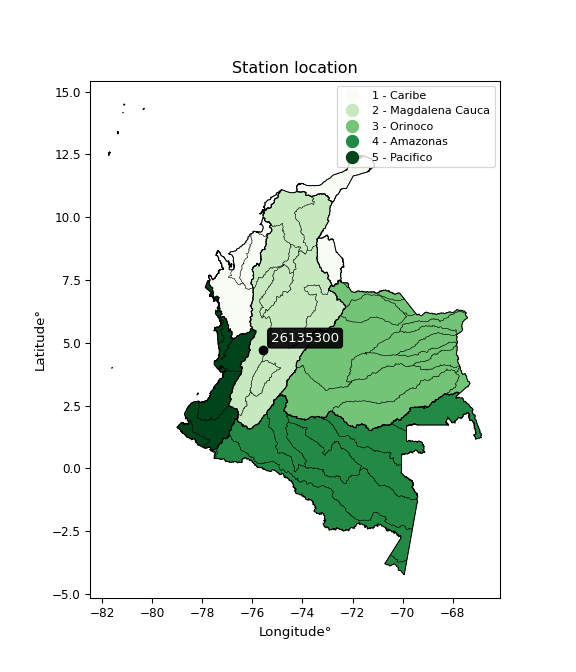</img>

</div>


## A. General information


### 1. General running parameters

• app_version: _v20260312_. • runtime: _2026-03-12 07:15:23.203550_. • Python version: _3.14.0_. • SciPy version: _1.16.3_. • Pandas version: _2.3.3_. • NumPy version: _2.3.5_. • Stations dataset (station_dataset_file): _dataset/pmax24h_in/automatic_colombia_2003_2025.csv_. • Stations catalog (station_catalog_file): _dataset/CNE.xls_. • Minimum year to eval til year_max (date_min): _1900_. • Maximum year to eval since year_min (date_max): _2025_. • Creates, save and include plots into reports (create_plot): _True_. • Plot only fit distributions with Δo > Δ (plot_only_fit): _True_. • Plot only simple graphs avoiding multiple CDFs and multiple Extreme values plots (plot_only_simple): _True_. • Eval low extreme values, if False, evaluates high extreme values (low_extreme): _False_. • Eval every SciPy distribution as logarithmic (pdist_logarithmic_on): _True_. • Standard deviation normalized (ddof): _1.0_. • Return periods to eval in years (Tr): _[2, 2.33, 5, 10, 15, 20, 25, 50, 75, 100, 200, 250, 500, 750, 1000]_. • Minimum data sample per station, 0 means any (minimum_sample): _5_. • Z-Score maximum threshold to adjust a value, 0 means disable (zscore_max): _3.5_. • Z-Score minimum threshold to adjust a value, 0 means disable (zscore_min): _-2.5_. • Avoid zeros, e.g. rain = 0 (avoid_zeros): _True_. • Avoid null values (avoid_nans): _True_. 

:file_folder:Table: [dataset.csv](../../dataset/pmax24h_in/automatic_colombia_2003_2025.csv)

> Delta Degrees of Freedom (DDOF): is a parameter used in the formulas for calculating variance and standard deviation. When ddof=0, the divisor is $N$ (the total number of observations) and this is used when your data set is the entire population. When ddof=1, the divisor is $N-1$ and this is used when your data set is a sample drawn from a larger population. Using $N-1$ provides an unbiased estimate of the population variance (known as Bessel´s correction).


### 2. Station info and location

|   id |   CODIGO | NOMBRE                        | CATEGORIA         | TECNOLOGIA                | ESTADO           | FECHA_INSTALACION   |   FECHA_SUSPENSION |   ALTITUD |   LATITUD |   LONGITUD | DEPARTAMENTO   | MUNICIPIO   | AREA_OPERATIVA                         | ENTIDAD                                                     | AREA_HIDROGRAFICA   | ZONA_HIDROGRAFICA   | SUBZONA_HIDROGRAFICA               |   CORRIENTE | Catalogo   |   Version |
|-----:|---------:|:------------------------------|:------------------|:--------------------------|:-----------------|:--------------------|-------------------:|----------:|----------:|-----------:|:---------------|:------------|:---------------------------------------|:------------------------------------------------------------|:--------------------|:--------------------|:-----------------------------------|------------:|:-----------|----------:|
|    0 | 26135300 | PNN QUIMBAYA - AUT [26135300] | Agrometeorológica | Automática con Telemetría | En Mantenimiento | 14/07/2004          |                nan |      1881 |   4.72858 |   -75.5782 | Risaralda      | Pereira     | Area Operativa 09 - Cauca-Valle-Caldas | INSTITUTO DE HIDROLOGIA METEOROLOGIA Y ESTUDIOS AMBIENTALES | Magdalena Cauca     | Cauca               | Río Otún y otros directos al Cauca |         nan | CNE_IDEAM  |  20251226 |

<div align="center">

Dynamic map: [:earth_americas:Google](http://maps.google.com/maps?q=4.728583056,-75.578222222) [:earth_americas:OSM](https://www.openstreetmap.org/#map=18/4.728583056/-75.578222222&layers=P) [:earth_americas:Bing](https://www.bing.com/maps?cp=4.728583056~-75.578222222&lvl=18) [:earth_americas:Apple](https://maps.apple.com/frame?center=4.728583056%2C-75.578222222&span=0.003%2C0.006)

</div>


<div align="center">

```geojson
{
  "type": "Feature",
  "geometry": {
    "type": "Point", 
    "coordinates": [-75.578222222, 4.728583056]
  }, 
  "properties": {
    "Name": "26135300"
  }
}
```

</div>


### 3. Discrete values table and plot

<div align="center">

|               |           0 |          1 |          2 |           3 |           4 |          5 |          6 |           7 |
|:--------------|------------:|-----------:|-----------:|------------:|------------:|-----------:|-----------:|------------:|
| Date          | 2017        | 2018       | 2019       | 2020        | 2021        | 2022       | 2023       | 2025        |
| Value         |   67        |   72.9     |   71.4     |   42.9      |   43.5      |   50.2     |   35.4     |   40.5      |
| Value_initial |   67        |   72.9     |   71.4     |   42.9      |   43.5      |   50.2     |   35.4     |   40.5      |
| count         |    8        |    8       |    8       |    8        |    8        |    8       |    8       |    8        |
| mean          |   52.975    |   52.975   |   52.975   |   52.975    |   52.975    |   52.975   |   52.975   |   52.975    |
| std           |   15.1029   |   15.1029  |   15.1029  |   15.1029   |   15.1029   |   15.1029  |   15.1029  |   15.1029   |
| zscore        |    0.928632 |    1.31929 |    1.21997 |   -0.667092 |   -0.627365 |   -0.18374 |   -1.16369 |   -0.826002 |


</div>


<div align="center">

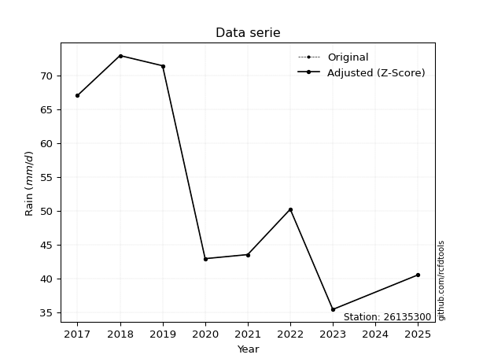</img>

</div>


> The initial value (value_initial) correspond to the initial obtained or null completed value, and value (value) is adjusted only when the initial value is outside the valid range (outlier) definite through the Z-Score value. If Z-Score is active, values out of range or outliers are replaced with the station mean value. A Z-Score (or standard score) measures how many standard deviations a data point is from the mean of a dataset, indicating its relative position; positive scores mean above the mean, negative mean below, and a score of zero is exactly at the mean, allowing for comparison of values from different distributions. It´s calculated using the formula $z=(x–μ)/σ$, where $x$ is the data point, $μ$ is the mean, and $σ$ is the standard deviation, helping identify outliers and understand probability.
>
> <sub>**Note**: In this study, "completing" (filling gaps in) and "extending" (forecasting or lengthening the historical record) rainfall data series are avoided for certain critical analyses because they introduce artificial bias and uncertainty, which can distort the statistics of rare events (extremes), alter day-to-day variability, and compromise the integrity and homogeneity of the original data. Some reasons against Completing/Extending rainfall data are: **Distortion of Extremes and Variability**: The primary issue is that most gap-filling or extension methods rely on averaging or regression with nearby stations, which inherently smooths the data. Rainfall is highly variable in space and time, with a large percentage of zero values and occasional large storms. Infilling methods often underestimate the highest values and overestimate the lowest (zero) values, which severely distorts analyses focused on flood frequency, drought severity, and intensity-duration-frequency (IDF) curves, **Loss of Data Homogeneity**: Infilled or extended data are synthetic estimates, not actual measurements. Combining these estimates with observed data can violate the assumption of data homogeneity, which requires that the data properties do not change over time. Inhomogeneity can lead to incorrect conclusions about long-term trends or changes in climate patterns, **Propagation of Errors**: Errors and biases from the original data (e.g., wind-induced undercatch, instrument errors, site changes) or the data used for imputation can propagate through the analysis, leading to unreliable hydrological models and inaccurate predictions, **Compromised Statistical Integrity**: For statistical analyses, especially those involving the frequency of events, using artificial data can introduce time bias or autocorrelation that doesn´t exist in reality, making it difficult to assess the true probability of events, **Difficulty in Validation**: It is difficult to accurately validate the quality of filled or extended data, especially for past periods where ground-truth measurements are unavailable. The reliability of imputation techniques heavily depends on the density of the surrounding station network and the complexity of the local topography.</sub>


### 4. Active continuous probability distributions from SciPy (80 of 104 available)

A Probability Density Function (PDF) describes the relative likelihood of a continuous random variable falling within a specific range, where the total area under its curve equals 1, and the area over any interval gives the actual probability for that range. Unlike discrete probabilities (like rolling a die), a PDF shows density, not direct probability for a single point (which is zero), with higher points indicating higher likelihood, often visualized as a bell curve for normal distributions.

A log of a probability density function (log-PDF) is simply the logarithm of the PDF´s value, denoted as $log(f(x))$, useful for converting multiplication of probabilities into addition, improving numerical stability with tiny numbers, and connecting to information theory concepts like entropy. Instead of dealing with very small probabilities (e.g., 0.000001), log-PDFs use negative numbers (e.g., $log(0.00001) ≈ -11.51$ that are easier for computers to handle, preventing underflow errors and simplifying complex calculations. In this study, each active probability distribution from SciPy is also evaluated in the $log$ form.

[scipy.stats](https://docs.scipy.org/doc/scipy/reference/stats.html) is a Python´s powerful submodule within the SciPy library for comprehensive statistical analysis, offering over 130 probability distributions (like Normal, Poisson, etc.), functions for descriptive stats (mean, variance), hypothesis testing (t-tests, chi-square), random variable generation, and statistical tests, making it essential for data science, modeling, and research. It provides tools to explore, model, and draw conclusions from data efficiently, working seamlessly with [NumPy](https://numpy.org/).

<div align="center">

|   id | p_dist           |   n_parameter | fit_method   | label                                                                       | active   | ref                                                                                                      |
|-----:|:-----------------|--------------:|:-------------|:----------------------------------------------------------------------------|:---------|:---------------------------------------------------------------------------------------------------------|
|    0 | alpha            |             3 | MLE          | Alpha                                                                       | True     | [:mortar_board:](https://docs.scipy.org/doc/scipy/reference/generated/scipy.stats.alpha.html)            |
|    1 | anglit           |             2 | MM           | Anglit                                                                      | True     | [:mortar_board:](https://docs.scipy.org/doc/scipy/reference/generated/scipy.stats.anglit.html)           |
|    2 | arcsine          |             2 | MM           | Arcsine                                                                     | True     | [:mortar_board:](https://docs.scipy.org/doc/scipy/reference/generated/scipy.stats.arcsine.html)          |
|    3 | argus            |             3 | MLE          | Argus                                                                       | True     | [:mortar_board:](https://docs.scipy.org/doc/scipy/reference/generated/scipy.stats.argus.html)            |
|    4 | beta             |             4 | MLE          | Beta                                                                        | True     | [:mortar_board:](https://docs.scipy.org/doc/scipy/reference/generated/scipy.stats.beta.html)             |
|    5 | betaprime        |             4 | MLE          | Beta prime                                                                  | True     | [:mortar_board:](https://docs.scipy.org/doc/scipy/reference/generated/scipy.stats.betaprime.html)        |
|    6 | bradford         |             3 | MLE          | Bradford                                                                    | True     | [:mortar_board:](https://docs.scipy.org/doc/scipy/reference/generated/scipy.stats.bradford.html)         |
|    7 | burr             |             4 | MLE          | Burr (Type III)                                                             | True     | [:mortar_board:](https://docs.scipy.org/doc/scipy/reference/generated/scipy.stats.burr.html)             |
|    8 | burr12           |             4 | MLE          | Burr (Type III) 12                                                          | True     | [:mortar_board:](https://docs.scipy.org/doc/scipy/reference/generated/scipy.stats.burr12.html)           |
|    9 | cosine           |             2 | MLE          | Cosine                                                                      | True     | [:mortar_board:](https://docs.scipy.org/doc/scipy/reference/generated/scipy.stats.cosine.html)           |
|   10 | crystalball      |             4 | MLE          | Crystalball                                                                 | True     | [:mortar_board:](https://docs.scipy.org/doc/scipy/reference/generated/scipy.stats.crystalball.html)      |
|   11 | dgamma           |             3 | MLE          | Double gamma                                                                | True     | [:mortar_board:](https://docs.scipy.org/doc/scipy/reference/generated/scipy.stats.dgamma.html)           |
|   12 | dweibull         |             3 | MLE          | Double Weibull                                                              | True     | [:mortar_board:](https://docs.scipy.org/doc/scipy/reference/generated/scipy.stats.dweibull.html)         |
|   13 | erlang           |             3 | MLE          | Erlang                                                                      | True     | [:mortar_board:](https://docs.scipy.org/doc/scipy/reference/generated/scipy.stats.erlang.html)           |
|   14 | exponnorm        |             3 | MLE          | Exponentially modified Normal                                               | True     | [:mortar_board:](https://docs.scipy.org/doc/scipy/reference/generated/scipy.stats.exponnorm.html)        |
|   15 | exponpow         |             3 | MLE          | Exponential power                                                           | True     | [:mortar_board:](https://docs.scipy.org/doc/scipy/reference/generated/scipy.stats.exponpow.html)         |
|   16 | exponweib        |             4 | MLE          | Exponentiated Weibull                                                       | True     | [:mortar_board:](https://docs.scipy.org/doc/scipy/reference/generated/scipy.stats.exponweib.html)        |
|   17 | f                |             4 | MLE          | F                                                                           | True     | [:mortar_board:](https://docs.scipy.org/doc/scipy/reference/generated/scipy.stats.f.html)                |
|   18 | fatiguelife      |             3 | MLE          | Fatigue-life (Birnbaum-Saunders)                                            | True     | [:mortar_board:](https://docs.scipy.org/doc/scipy/reference/generated/scipy.stats.fatiguelife.html)      |
|   19 | foldnorm         |             3 | MM           | Fold Normal                                                                 | True     | [:mortar_board:](https://docs.scipy.org/doc/scipy/reference/generated/scipy.stats.foldnorm.html)         |
|   20 | gamma            |             3 | MLE          | Gamma                                                                       | True     | [:mortar_board:](https://docs.scipy.org/doc/scipy/reference/generated/scipy.stats.gamma.html)            |
|   21 | gausshyper       |             6 | MLE          | Gauss hypergeometric                                                        | True     | [:mortar_board:](https://docs.scipy.org/doc/scipy/reference/generated/scipy.stats.gausshyper.html)       |
|   22 | genexpon         |             5 | MLE          | Generalized exponential                                                     | True     | [:mortar_board:](https://docs.scipy.org/doc/scipy/reference/generated/scipy.stats.genexpon.html)         |
|   23 | genextreme       |             3 | MLE          | Generalized exponential                                                     | True     | [:mortar_board:](https://docs.scipy.org/doc/scipy/reference/generated/scipy.stats.genextreme.html)       |
|   24 | gengamma         |             4 | MLE          | Generalized gamma                                                           | True     | [:mortar_board:](https://docs.scipy.org/doc/scipy/reference/generated/scipy.stats.gengamma.html)         |
|   25 | genhalflogistic  |             3 | MLE          | Generalized half-logistic                                                   | True     | [:mortar_board:](https://docs.scipy.org/doc/scipy/reference/generated/scipy.stats.genhalflogistic.html)  |
|   26 | genlogistic      |             3 | MLE          | Generalized logistic                                                        | True     | [:mortar_board:](https://docs.scipy.org/doc/scipy/reference/generated/scipy.stats.genlogistic.html)      |
|   27 | gennorm          |             3 | MLE          | Generalized Normal                                                          | True     | [:mortar_board:](https://docs.scipy.org/doc/scipy/reference/generated/scipy.stats.gennorm.html)          |
|   28 | genpareto        |             3 | MLE          | Generalized Pareto                                                          | True     | [:mortar_board:](https://docs.scipy.org/doc/scipy/reference/generated/scipy.stats.genpareto.html)        |
|   29 | gompertz         |             3 | MLE          | Gompertz (or truncated Gumbel)                                              | True     | [:mortar_board:](https://docs.scipy.org/doc/scipy/reference/generated/scipy.stats.gompertz.html)         |
|   30 | gumbel_l         |             2 | MM           | Gumbel Left Skew                                                            | True     | [:mortar_board:](https://docs.scipy.org/doc/scipy/reference/generated/scipy.stats.gumbel_l.html)         |
|   31 | gumbel_r         |             2 | MM           | Gumbel Right Skew                                                           | True     | [:mortar_board:](https://docs.scipy.org/doc/scipy/reference/generated/scipy.stats.gumbel_r.html)         |
|   32 | halfgennorm      |             3 | MLE          | Upper half of a generalized normal                                          | True     | [:mortar_board:](https://docs.scipy.org/doc/scipy/reference/generated/scipy.stats.halfgennorm.html)      |
|   33 | halflogistic     |             2 | MM           | Half-logistic                                                               | True     | [:mortar_board:](https://docs.scipy.org/doc/scipy/reference/generated/scipy.stats.halflogistic.html)     |
|   34 | halfnorm         |             2 | MM           | Half Normal                                                                 | True     | [:mortar_board:](https://docs.scipy.org/doc/scipy/reference/generated/scipy.stats.halfnorm.html)         |
|   35 | hypsecant        |             2 | MM           | hyperbolic secant                                                           | True     | [:mortar_board:](https://docs.scipy.org/doc/scipy/reference/generated/scipy.stats.hypsecant.html)        |
|   36 | invgamma         |             3 | MLE          | Inverted gamma                                                              | True     | [:mortar_board:](https://docs.scipy.org/doc/scipy/reference/generated/scipy.stats.invgamma.html)         |
|   37 | invgauss         |             3 | MLE          | Inverse Gaussian                                                            | True     | [:mortar_board:](https://docs.scipy.org/doc/scipy/reference/generated/scipy.stats.invgauss.html)         |
|   38 | invweibull       |             3 | MLE          | Inverted Weibull                                                            | True     | [:mortar_board:](https://docs.scipy.org/doc/scipy/reference/generated/scipy.stats.invweibull.html)       |
|   39 | johnsonsb        |             4 | MLE          | Johnson SB                                                                  | True     | [:mortar_board:](https://docs.scipy.org/doc/scipy/reference/generated/scipy.stats.johnsonsb.html)        |
|   40 | johnsonsu        |             4 | MLE          | Johnson Su                                                                  | True     | [:mortar_board:](https://docs.scipy.org/doc/scipy/reference/generated/scipy.stats.johnsonsu.html)        |
|   41 | kappa3           |             3 | MLE          | Kappa 3                                                                     | True     | [:mortar_board:](https://docs.scipy.org/doc/scipy/reference/generated/scipy.stats.kappa3.html)           |
|   42 | kappa4           |             4 | MLE          | Kappa 4                                                                     | True     | [:mortar_board:](https://docs.scipy.org/doc/scipy/reference/generated/scipy.stats.kappa4.html)           |
|   43 | ksone            |             3 | MLE          | Kolmogorov-Smirnov one-sided test statistic distribution                    | True     | [:mortar_board:](https://docs.scipy.org/doc/scipy/reference/generated/scipy.stats.ksone.html)            |
|   44 | kstwobign        |             2 | MLE          | Limiting distribution of scaled Kolmogorov-Smirnov two-sided test statistic | True     | [:mortar_board:](https://docs.scipy.org/doc/scipy/reference/generated/scipy.stats.kstwobign.html)        |
|   45 | laplace          |             2 | MM           | Laplace                                                                     | True     | [:mortar_board:](https://docs.scipy.org/doc/scipy/reference/generated/scipy.stats.laplace.html)          |
|   46 | levy_l           |             2 | MLE          | Left-skewed Levy                                                            | True     | [:mortar_board:](https://docs.scipy.org/doc/scipy/reference/generated/scipy.stats.levy_l.html)           |
|   47 | loggamma         |             3 | MLE          | Log gamma                                                                   | True     | [:mortar_board:](https://docs.scipy.org/doc/scipy/reference/generated/scipy.stats.loggamma.html)         |
|   48 | logistic         |             2 | MM           | Logistic (or Sech-squared)                                                  | True     | [:mortar_board:](https://docs.scipy.org/doc/scipy/reference/generated/scipy.stats.logistic.html)         |
|   49 | loglaplace       |             3 | MLE          | Log-Laplace                                                                 | True     | [:mortar_board:](https://docs.scipy.org/doc/scipy/reference/generated/scipy.stats.loglaplace.html)       |
|   50 | lomax            |             3 | MLE          | Lomax (Pareto of the second kind)                                           | True     | [:mortar_board:](https://docs.scipy.org/doc/scipy/reference/generated/scipy.stats.lomax.html)            |
|   51 | maxwell          |             2 | MM           | Maxwell                                                                     | True     | [:mortar_board:](https://docs.scipy.org/doc/scipy/reference/generated/scipy.stats.maxwell.html)          |
|   52 | mielke           |             4 | MLE          | Mielke Beta-Kappa / Dagum                                                   | True     | [:mortar_board:](https://docs.scipy.org/doc/scipy/reference/generated/scipy.stats.mielke.html)           |
|   53 | moyal            |             2 | MM           | Moyal                                                                       | True     | [:mortar_board:](https://docs.scipy.org/doc/scipy/reference/generated/scipy.stats.moyal.html)            |
|   54 | nakagami         |             3 | MLE          | Nakagami                                                                    | True     | [:mortar_board:](https://docs.scipy.org/doc/scipy/reference/generated/scipy.stats.nakagami.html)         |
|   55 | ncf              |             5 | MLE          | Non-central F distribution                                                  | True     | [:mortar_board:](https://docs.scipy.org/doc/scipy/reference/generated/scipy.stats.ncf.html)              |
|   56 | nct              |             4 | MLE          | Non-central Student’s t                                                     | True     | [:mortar_board:](https://docs.scipy.org/doc/scipy/reference/generated/scipy.stats.nct.html)              |
|   57 | norm             |             2 | MM           | Normal                                                                      | True     | [:mortar_board:](https://docs.scipy.org/doc/scipy/reference/generated/scipy.stats.norm.html)             |
|   58 | pearson3         |             3 | MM           | Pearson type III                                                            | True     | [:mortar_board:](https://docs.scipy.org/doc/scipy/reference/generated/scipy.stats.pearson3.html)         |
|   59 | powerlaw         |             3 | MLE          | Power-function                                                              | True     | [:mortar_board:](https://docs.scipy.org/doc/scipy/reference/generated/scipy.stats.powerlaw.html)         |
|   60 | rayleigh         |             2 | MM           | Rayleigh                                                                    | True     | [:mortar_board:](https://docs.scipy.org/doc/scipy/reference/generated/scipy.stats.rayleigh.html)         |
|   61 | rdist            |             3 | MLE          | R-distributed (symmetric beta)                                              | True     | [:mortar_board:](https://docs.scipy.org/doc/scipy/reference/generated/scipy.stats.rdist.html)            |
|   62 | rice             |             3 | MLE          | Rice                                                                        | True     | [:mortar_board:](https://docs.scipy.org/doc/scipy/reference/generated/scipy.stats.rice.html)             |
|   63 | semicircular     |             2 | MM           | Semicircular                                                                | True     | [:mortar_board:](https://docs.scipy.org/doc/scipy/reference/generated/scipy.stats.semicircular.html)     |
|   64 | skewnorm         |             3 | MLE          | Skew normal                                                                 | True     | [:mortar_board:](https://docs.scipy.org/doc/scipy/reference/generated/scipy.stats.skewnorm.html)         |
|   65 | t                |             3 | MLE          | Student’s t                                                                 | True     | [:mortar_board:](https://docs.scipy.org/doc/scipy/reference/generated/scipy.stats.t.html)                |
|   66 | trapezoid        |             4 | MLE          | Trapezoid                                                                   | True     | [:mortar_board:](https://docs.scipy.org/doc/scipy/reference/generated/scipy.stats.trapezoid.html)        |
|   67 | triang           |             3 | MLE          | Triangular                                                                  | True     | [:mortar_board:](https://docs.scipy.org/doc/scipy/reference/generated/scipy.stats.triang.html)           |
|   68 | truncexpon       |             3 | MLE          | Truncated exponential                                                       | True     | [:mortar_board:](https://docs.scipy.org/doc/scipy/reference/generated/scipy.stats.truncexpon.html)       |
|   69 | truncnorm        |             4 | MLE          | Truncated normal                                                            | True     | [:mortar_board:](https://docs.scipy.org/doc/scipy/reference/generated/scipy.stats.truncnorm.html)        |
|   70 | truncpareto      |             4 | MLE          | Upper truncated Pareto                                                      | True     | [:mortar_board:](https://docs.scipy.org/doc/scipy/reference/generated/scipy.stats.truncpareto.html)      |
|   71 | truncweibull_min |             5 | MLE          | Doubly truncated Weibull minimum                                            | True     | [:mortar_board:](https://docs.scipy.org/doc/scipy/reference/generated/scipy.stats.truncweibull_min.html) |
|   72 | tukeylambda      |             3 | MLE          | Tukey-Lamdba                                                                | True     | [:mortar_board:](https://docs.scipy.org/doc/scipy/reference/generated/scipy.stats.tukeylambda.html)      |
|   73 | uniform          |             2 | MLE          | Uniform                                                                     | True     | [:mortar_board:](https://docs.scipy.org/doc/scipy/reference/generated/scipy.stats.uniform.html)          |
|   74 | vonmises         |             3 | MLE          | Von Mises                                                                   | True     | [:mortar_board:](https://docs.scipy.org/doc/scipy/reference/generated/scipy.stats.vonmises.html)         |
|   75 | vonmises_line    |             3 | MLE          | Von Mises line                                                              | True     | [:mortar_board:](https://docs.scipy.org/doc/scipy/reference/generated/scipy.stats.vonmises_line.html)    |
|   76 | wald             |             2 | MM           | Wald                                                                        | True     | [:mortar_board:](https://docs.scipy.org/doc/scipy/reference/generated/scipy.stats.wald.html)             |
|   77 | weibull_max      |             3 | MLE          | Weibull maximum                                                             | True     | [:mortar_board:](https://docs.scipy.org/doc/scipy/reference/generated/scipy.stats.weibull_max.html)      |
|   78 | weibull_min      |             3 | MLE          | Weibull minimum                                                             | True     | [:mortar_board:](https://docs.scipy.org/doc/scipy/reference/generated/scipy.stats.weibull_min.html)      |
|   79 | wrapcauchy       |             3 | MLE          | Wrapped  Cauchy                                                             | True     | [:mortar_board:](https://docs.scipy.org/doc/scipy/reference/generated/scipy.stats.wrapcauchy.html)       |

</div>

> **n_parameter:** # arguments & localization & scale.
>
> **Fit methods:** (MLE) maximum likelihood, (MM) L-moments.
>
>**Inactive** (With the only purpose of prevent loops, zero divisions, infinite values, over high estimated values or horizontal trending for recurrence intervals estimations, the follow distributions were disabled.)**:** lognorm, norminvgauss, powernorm, powerlognorm, cauchy, halfcauchy, foldcauchy, skewcauchy, chi2, expon, fisk, genhyperbolic, geninvgauss, gibrat, kstwo, laplace_asymmetric, levy, levy_stable, ncx2, pareto, rel_breitwigner, recipinvgauss, studentized_range, loguniform, 


## B. Probability (PDF) vs. Empirical (EDF) distributions functions

A continuous probability distribution (CPD) describes probabilities for variables that can take any value within a range (like rain any time), unlike discrete variables with specific outcomes (like temperature). It uses a Probability Density Function (PDF), a curve where the total area under it equals 1, and the probability of the variable falling within an interval (a to b) is found by calculating the area under the curve between those points. A key feature is that the probability of hitting any single exact value is zero, so probabilities are always expressed for ranges, e.g., $P(a ≤ X ≤ b)$.

<div align="center">

Distributions parameters from station values
|     |   station | p_dist              |   n |               loc |            scale | shape                  | shape1                 | shape2                 | shape3            |
|----:|----------:|:--------------------|----:|------------------:|-----------------:|:-----------------------|:-----------------------|:-----------------------|:------------------|
|   0 |  26135300 | alpha               |   8 |       1.31891     |    184.509       | 3.840840165440027      |                        |                        |                   |
|   1 |  26135300 | anglit              |   8 |      52.975       |     41.3284      |                        |                        |                        |                   |
|   2 |  26135300 | arcsine             |   8 |      32.9958      |     39.9584      |                        |                        |                        |                   |
|   3 |  26135300 | argus               |   8 |      24.3915      |     51.4596      | 3.3789724993989076e-05 |                        |                        |                   |
|   4 |  26135300 | beta                |   8 |      35.4         |     41.6432      | 0.4405015859170199     | 0.20357912274623163    |                        |                   |
|   5 |  26135300 | betaprime           |   8 |      -0.562356    |      1.69616     | 463.10478528530143     | 15.671666095932224     |                        |                   |
|   6 |  26135300 | bradford            |   8 |      35.4         |     37.5001      | 0.8815976621574266     |                        |                        |                   |
|   7 |  26135300 | burr                |   8 |      -1.14217     |     10.9551      | 4.647195182512435      | 800.6321610547665      |                        |                   |
|   8 |  26135300 | burr12              |   8 |      -6.54421     |     41.8011      | 1105.3539287922652     | 0.00277798680772538    |                        |                   |
|   9 |  26135300 | cosine              |   8 |      53.5929      |     11.1501      |                        |                        |                        |                   |
|  10 |  26135300 | crystalball         |   8 |      52.975       |     14.1274      | 22953.01896469868      | 118.23780522379013     |                        |                   |
|  11 |  26135300 | dgamma              |   8 |      48.1224      |      6.71528     | 1.84653534774309       |                        |                        |                   |
|  12 |  26135300 | dweibull            |   8 |      48.6896      |     13.7166      | 1.5115990513300561     |                        |                        |                   |
|  13 |  26135300 | erlang              |   8 |      35.4         |     24.0297      | 0.26628025775230213    |                        |                        |                   |
|  14 |  26135300 | exponnorm           |   8 |      35.9428      |      2.46646     | 6.905509071582827      |                        |                        |                   |
|  15 |  26135300 | exponpow            |   8 |      35.4         |     38.5052      | 0.2123416589774939     |                        |                        |                   |
|  16 |  26135300 | exponweib           |   8 |      35.4         |      1.2346      | 1.2473589121162938     | 0.27225721346707743    |                        |                   |
|  17 |  26135300 | f                   |   8 |      24.6002      |     22.1874      | 97.82243085373958      | 8.461621650167169      |                        |                   |
|  18 |  26135300 | fatiguelife         |   8 |      35.4         |      0.000150719 | 294.4114948116627      |                        |                        |                   |
|  19 |  26135300 | foldnorm            |   8 |      27.4934      |     15.2735      | 1.6244875075640617     |                        |                        |                   |
|  20 |  26135300 | gamma               |   8 |      35.4         |     43.2342      | 0.1214693120187259     |                        |                        |                   |
|  21 |  26135300 | gausshyper          |   8 |      35.4         |     38.854       | 0.8834099227364061     | 1.07115848981299       | 1.1676520778279396     | 1.022665696734013 |
|  22 |  26135300 | genexpon            |   8 |      35.4         |      2.79558     | 0.15911646517058586    | 2.7559488342124423e-07 | 1.3435215748460068     |                   |
|  23 |  26135300 | genextreme          |   8 |      44.8089      |      9.75924     | -0.25689639942918474   |                        |                        |                   |
|  24 |  26135300 | gengamma            |   8 |      35.4         |      1.27929     | 1.2426733943481034     | 0.17039511892313544    |                        |                   |
|  25 |  26135300 | genhalflogistic     |   8 |      35.3932      |     39.1003      | 1.0424860314062263     |                        |                        |                   |
|  26 |  26135300 | genlogistic         |   8 |     -28.5616      |     11.1137      | 837.3946782040282      |                        |                        |                   |
|  27 |  26135300 | gennorm             |   8 |      43.5003      |      3.23008e-05 | 0.15646903956174535    |                        |                        |                   |
|  28 |  26135300 | genpareto           |   8 |      -0.0522643   |    109.738       | -1.504239270052543     |                        |                        |                   |
|  29 |  26135300 | gompertz            |   8 |      35.4         |     37.4654      | 1.390722235548393      |                        |                        |                   |
|  30 |  26135300 | gumbel_l            |   8 |      59.3331      |     11.0151      |                        |                        |                        |                   |
|  31 |  26135300 | gumbel_r            |   8 |      46.6169      |     11.0151      |                        |                        |                        |                   |
|  32 |  26135300 | halfgennorm         |   8 |      35.4         |      1.20918     | 0.39791138204010046    |                        |                        |                   |
|  33 |  26135300 | halflogistic        |   8 |      36.2307      |     12.0785      |                        |                        |                        |                   |
|  34 |  26135300 | halfnorm            |   8 |      34.2758      |     23.436       |                        |                        |                        |                   |
|  35 |  26135300 | hypsecant           |   8 |      52.975       |      8.9938      |                        |                        |                        |                   |
|  36 |  26135300 | invgamma            |   8 |      23.5004      |     99.0036      | 4.28157386463303       |                        |                        |                   |
|  37 |  26135300 | invgauss            |   8 |      29.3299      |     44.1073      | 0.5360808044661093     |                        |                        |                   |
|  38 |  26135300 | invweibull          |   8 |       6.81976     |     37.9892      | 3.8926262867097225     |                        |                        |                   |
|  39 |  26135300 | johnsonsb           |   8 |      35.3906      |     37.5094      | 0.33658217721104505    | 0.14587807628838315    |                        |                   |
|  40 |  26135300 | johnsonsu           |   8 |      88.5479      |      0.000746405 | 24.199356063081808     | 2.130862820362931      |                        |                   |
|  41 |  26135300 | kappa3              |   8 |      35.3918      |     37.4948      | 5313.980020632242      |                        |                        |                   |
|  42 |  26135300 | kappa4              |   8 |      30.541       |     43.3396      | 1.1264587651953595     | 1.0224485468867242     |                        |                   |
|  43 |  26135300 | ksone               |   8 |      28.5056      |     48.9389      | 1.0                    |                        |                        |                   |
|  44 |  26135300 | kstwobign           |   8 |       7.94388     |     51.47        |                        |                        |                        |                   |
|  45 |  26135300 | laplace             |   8 |      52.975       |      9.9896      |                        |                        |                        |                   |
|  46 |  26135300 | levy_l              |   8 |      74.1193      |      5.36751     |                        |                        |                        |                   |
|  47 |  26135300 | loggamma            |   8 |   -2915.92        |    435.06        | 920.0536176305181      |                        |                        |                   |
|  48 |  26135300 | logistic            |   8 |      52.975       |      7.78886     |                        |                        |                        |                   |
|  49 |  26135300 | loglaplace          |   8 |      -0.13162     |     43.6316      | 4.269816469229715      |                        |                        |                   |
|  50 |  26135300 | lomax               |   8 |      35.4         |   1167.21        | 66.93136166114061      |                        |                        |                   |
|  51 |  26135300 | maxwell             |   8 |      19.4989      |     20.978       |                        |                        |                        |                   |
|  52 |  26135300 | mielke              |   8 |      -2.65648     |     14.3115      | 1537.2607440678119     | 4.790487695415214      |                        |                   |
|  53 |  26135300 | moyal               |   8 |      44.896       |      6.35958     |                        |                        |                        |                   |
|  54 |  26135300 | nakagami            |   8 |      35.4         |     22.9847      | 0.08609629552615786    |                        |                        |                   |
|  55 |  26135300 | ncf                 |   8 |      -0.019173    |      1.24555e-05 | 1.4612756929174555e-06 | 10.805055207245097     | 5.213458607760913      |                   |
|  56 |  26135300 | nct                 |   8 |      -0.263992    |      0.846366    | 8.102300849414569      | 56.97016545813227      |                        |                   |
|  57 |  26135300 | norm                |   8 |      52.975       |     14.1274      |                        |                        |                        |                   |
|  58 |  26135300 | pearson3            |   8 |      52.975       |     14.1275      | 0.33952530476700993    |                        |                        |                   |
|  59 |  26135300 | powerlaw            |   8 |      35.4         |     37.5         | 0.18831951434700542    |                        |                        |                   |
|  60 |  26135300 | rayleigh            |   8 |      25.9484      |     21.5641      |                        |                        |                        |                   |
|  61 |  26135300 | rdist               |   8 |      54.1479      |     18.7521      | 1.0800794413561596     |                        |                        |                   |
|  62 |  26135300 | rice                |   8 |      28.7343      |     19.1098      | 0.39446019906589735    |                        |                        |                   |
|  63 |  26135300 | semicircular        |   8 |      52.975       |     28.2549      |                        |                        |                        |                   |
|  64 |  26135300 | skewnorm            |   8 |      35.4         |     22.5486      | 3465846.5362837464     |                        |                        |                   |
|  65 |  26135300 | t                   |   8 |      52.975       |     14.1275      | 1949376841.4659126     |                        |                        |                   |
|  66 |  26135300 | trapezoid           |   8 |      13.0166      |     59.9376      | 1.0                    | 1.0                    |                        |                   |
|  67 |  26135300 | triang              |   8 |      13.0389      |     59.8612      | 0.9999986736861599     |                        |                        |                   |
|  68 |  26135300 | truncexpon          |   8 |      35.4         |     42.7197      | 0.8778163904648242     |                        |                        |                   |
|  69 |  26135300 | truncnorm           |   8 |      52.975       |     14.1274      | -332.52189896168284    | 1580.6075088549633     |                        |                   |
|  70 |  26135300 | truncpareto         |   8 |       9.6533      |     25.7467      | 4.8004181746593546e-08 | 2.456497408681886      |                        |                   |
|  71 |  26135300 | truncweibull_min    |   8 |      35.3686      |     40.1288      | 0.7558501631097099     | 0.0007835262286719513  | 0.9352752434481695     |                   |
|  72 |  26135300 | tukeylambda         |   8 |      54.0967      |     20.796       | 1.1059769327279199     |                        |                        |                   |
|  73 |  26135300 | uniform             |   8 |      35.4         |     37.5         |                        |                        |                        |                   |
|  74 |  26135300 | vonmises            |   8 |      -2.02354     |      1           | 0.749974628358275      |                        |                        |                   |
|  75 |  26135300 | vonmises_line       |   8 |      55.2027      |      6.3034      | 1.8571163107849407e-05 |                        |                        |                   |
|  76 |  26135300 | wald                |   8 |      38.8476      |     14.1274      |                        |                        |                        |                   |
|  77 |  26135300 | weibull_max         |   8 |      72.9         |      1.50776     | 0.2809647319380866     |                        |                        |                   |
|  78 |  26135300 | weibull_min         |   8 |      35.4         |     15.509       | 0.7566063722149861     |                        |                        |                   |
|  79 |  26135300 | wrapcauchy          |   8 |      35.4         |      5.96831     | 0.5                    |                        |                        |                   |
|  80 |  26135300 | logalpha            |   8 |       1.3931      |     24.6136      | 9.795958100860261      |                        |                        |                   |
|  81 |  26135300 | loganglit           |   8 |       3.93472     |      0.772018    |                        |                        |                        |                   |
|  82 |  26135300 | logarcsine          |   8 |       3.5615      |      0.746427    |                        |                        |                        |                   |
|  83 |  26135300 | logargus            |   8 |       3.38921     |      0.959882    | 5.825258751046309e-05  |                        |                        |                   |
|  84 |  26135300 | logbeta             |   8 |       3.4626      |      0.826488    | 0.36884073074763024    | 0.4410989576004686     |                        |                   |
|  85 |  26135300 | logbetaprime        |   8 |      -3.70461     |      8.42628     | 811.6205565499577      | 896.1696504681643      |                        |                   |
|  86 |  26135300 | logbradford         |   8 |       3.56671     |      0.722379    | 0.9907269638863728     |                        |                        |                   |
|  87 |  26135300 | logburr             |   8 |      -0.534804    |      3.09829     | 20.07780257443065      | 851.0648417975935      |                        |                   |
|  88 |  26135300 | logburr12           |   8 |       3.15266     |      6.91126     | 3.532109224123955      | 1502.5985487251173     |                        |                   |
|  89 |  26135300 | logcosine           |   8 |       3.9403      |      0.209443    |                        |                        |                        |                   |
|  90 |  26135300 | logcrystalball      |   8 |       3.93472     |      0.263902    | 5453.8543731815025     | 30.94513192376837      |                        |                   |
|  91 |  26135300 | logdgamma           |   8 |       3.86845     |      0.10251     | 2.2905611755698034     |                        |                        |                   |
|  92 |  26135300 | logdweibull         |   8 |       3.88095     |      0.262945    | 1.7812687654710997     |                        |                        |                   |
|  93 |  26135300 | logerlang           |   8 |       3.55106     |      0.272581    | 1.3829500549476652     |                        |                        |                   |
|  94 |  26135300 | logexponnorm        |   8 |       3.90063     |      0.261693    | 0.13024260134679067    |                        |                        |                   |
|  95 |  26135300 | logexponpow         |   8 |       3.56671     |      0.910154    | 0.2202667276038387     |                        |                        |                   |
|  96 |  26135300 | logexponweib        |   8 |       3.56671     |      0.307558    | 0.20925900255833962    | 1.641355126263858      |                        |                   |
|  97 |  26135300 | logf                |   8 |       2.91993     |      0.948772    | 1322.8065494228572     | 30.040497969524065     |                        |                   |
|  98 |  26135300 | logfatiguelife      |   8 |       3.3223      |      0.550628    | 0.4730540092296941     |                        |                        |                   |
|  99 |  26135300 | logfoldnorm         |   8 |       3.45112     |      0.28292     | 1.6700399730884454     |                        |                        |                   |
| 100 |  26135300 | loggamma            |   8 |       3.53405     |      0.235693    | 1.6811757970751637     |                        |                        |                   |
| 101 |  26135300 | loggausshyper       |   8 |       3.53359     |      0.755496    | 1.3329482450450356     | 0.8652148091418045     | 1.144868125339634      | 0.916442212665632 |
| 102 |  26135300 | loggenexpon         |   8 |       3.56661     |      0.00453059  | 0.007283816035324665   | 0.23031750358106312    | 0.0003596344505926827  |                   |
| 103 |  26135300 | loggenextreme       |   8 |       3.9846      |      0.352074    | 1.1562675110277514     |                        |                        |                   |
| 104 |  26135300 | loggengamma         |   8 |       3.56671     |      0.578669    | 0.1381564854164392     | 1.5587834003199594     |                        |                   |
| 105 |  26135300 | loggenhalflogistic  |   8 |       3.34248     |      0.952969    | 1.0067213788242506     |                        |                        |                   |
| 106 |  26135300 | loggenlogistic      |   8 |       2.42824     |      0.220188    | 523.4207538373837      |                        |                        |                   |
| 107 |  26135300 | loggennorm          |   8 |       3.77276     |      0.000186663 | 0.22778063784997862    |                        |                        |                   |
| 108 |  26135300 | loggenpareto        |   8 |      -0.00360927  |     10.1697      | -2.3690609106522142    |                        |                        |                   |
| 109 |  26135300 | loggompertz         |   8 |       3.56671     |      0.481552    | 0.6695134968138531     |                        |                        |                   |
| 110 |  26135300 | loggumbel_l         |   8 |       4.05349     |      0.205763    |                        |                        |                        |                   |
| 111 |  26135300 | loggumbel_r         |   8 |       3.81595     |      0.205763    |                        |                        |                        |                   |
| 112 |  26135300 | loghalfgennorm      |   8 |       3.56668     |      0.723044    | 8211.119028617522      |                        |                        |                   |
| 113 |  26135300 | loghalflogistic     |   8 |       3.62194     |      0.225624    |                        |                        |                        |                   |
| 114 |  26135300 | loghalfnorm         |   8 |       3.58544     |      0.437758    |                        |                        |                        |                   |
| 115 |  26135300 | loghypsecant        |   8 |       3.93472     |      0.168005    |                        |                        |                        |                   |
| 116 |  26135300 | loginvgamma         |   8 |       2.9094      |     14.3924      | 15.014471649474835     |                        |                        |                   |
| 117 |  26135300 | loginvgauss         |   8 |       3.2803      |      3.3049      | 0.1980127199971996     |                        |                        |                   |
| 118 |  26135300 | loginvweibull       |   8 |      -4.01782e+06 |      4.01782e+06 | 18210836.870859317     |                        |                        |                   |
| 119 |  26135300 | logjohnsonsb        |   8 |       3.56671     |      0.722506    | 0.038973330607059514   | 0.07877229381017595    |                        |                   |
| 120 |  26135300 | logjohnsonsu        |   8 |      22.9242      |      0.0134941   | 565.711508110978       | 71.22828553167133      |                        |                   |
| 121 |  26135300 | logkappa3           |   8 |       3.54112     |      0.737761    | 155.90076621442472     |                        |                        |                   |
| 122 |  26135300 | logkappa4           |   8 |       3.46797     |      0.879374    | 1.090543347474939      | 1.0709440728572521     |                        |                   |
| 123 |  26135300 | logksone            |   8 |       3.47763     |      0.914183    | 1.0                    |                        |                        |                   |
| 124 |  26135300 | logkstwobign        |   8 |       3.0447      |      1.01686     |                        |                        |                        |                   |
| 125 |  26135300 | loglaplace          |   8 |       3.93472     |      0.186607    |                        |                        |                        |                   |
| 126 |  26135300 | loglevy_l           |   8 |       4.30824     |      0.0832075   |                        |                        |                        |                   |
| 127 |  26135300 | logloggamma         |   8 |     -55.6685      |      8.58406     | 1036.8470140033555     |                        |                        |                   |
| 128 |  26135300 | loglogistic         |   8 |       3.93472     |      0.145497    |                        |                        |                        |                   |
| 129 |  26135300 | logloglaplace       |   8 |       3.56671     |      0.283319    | 0.8306080064369425     |                        |                        |                   |
| 130 |  26135300 | loglomax            |   8 |       3.56671     |     20.1717      | 55.31231562876679      |                        |                        |                   |
| 131 |  26135300 | logmaxwell          |   8 |       3.30938     |      0.391872    |                        |                        |                        |                   |
| 132 |  26135300 | logmielke           |   8 | -105809           | 105812           | 25041418.233343594     | 484407.17398952704     |                        |                   |
| 133 |  26135300 | logmoyal            |   8 |       3.7838      |      0.118798    |                        |                        |                        |                   |
| 134 |  26135300 | lognakagami         |   8 |       3.56671     |      0.33689     | 0.08900879428559835    |                        |                        |                   |
| 135 |  26135300 | logncf              |   8 |       0.904198    |      3.03621     | 231.90503574690888     | 720.8521112089044      | 3.0143987984322472e-06 |                   |
| 136 |  26135300 | lognct              |   8 |      -0.865142    |      0.102295    | 196.9630680225299      | 46.7326007049366       |                        |                   |
| 137 |  26135300 | lognorm             |   8 |       3.93472     |      0.263902    |                        |                        |                        |                   |
| 138 |  26135300 | logpearson3         |   8 |       3.93472     |      0.263902    | 0.19761643655746092    |                        |                        |                   |
| 139 |  26135300 | logpowerlaw         |   8 |       3.56671     |      0.722377    | 0.19918181085870118    |                        |                        |                   |
| 140 |  26135300 | lograyleigh         |   8 |       3.42986     |      0.40282     |                        |                        |                        |                   |
| 141 |  26135300 | logrdist            |   8 |       3.9285      |      0.361788    | 1.0807197601498153     |                        |                        |                   |
| 142 |  26135300 | logrice             |   8 |       3.45414     |      0.343975    | 0.7352562225001342     |                        |                        |                   |
| 143 |  26135300 | logsemicircular     |   8 |       3.93472     |      0.527804    |                        |                        |                        |                   |
| 144 |  26135300 | logskewnorm         |   8 |       3.56671     |      0.452894    | 10000015.825740844     |                        |                        |                   |
| 145 |  26135300 | logt                |   8 |       3.93472     |      0.263902    | 21340398277.746933     |                        |                        |                   |
| 146 |  26135300 | logtrapezoid        |   8 |       3.18829     |      1.11964     | 1.0                    | 1.0                    |                        |                   |
| 147 |  26135300 | logtriang           |   8 |       3.29039     |      0.998703    | 0.999998199043231      |                        |                        |                   |
| 148 |  26135300 | logtruncexpon       |   8 |       3.55724     |      0.721636    | 1.0141562278334804     |                        |                        |                   |
| 149 |  26135300 | logtruncnorm        |   8 |      -0.0795999   |      1.07534     | 3.984142972834986      | 4.062626737697871      |                        |                   |
| 150 |  26135300 | logtruncpareto      |   8 |       3.56659     |      0.000119523 | 0.14333958823032467    | 6044.849985473708      |                        |                   |
| 151 |  26135300 | logtruncweibull_min |   8 |       3.56601     |      0.858134    | 0.980350065706683      | 0.0008167016901388     | 0.8426176108574033     |                   |
| 152 |  26135300 | logtukeylambda      |   8 |       3.9279      |      0.407546    | 1.128347973470602      |                        |                        |                   |
| 153 |  26135300 | loguniform          |   8 |       3.56671     |      0.722377    |                        |                        |                        |                   |
| 154 |  26135300 | logvonmises         |   8 |      -2.34909     |      1           | 14.74474169397366      |                        |                        |                   |
| 155 |  26135300 | logvonmises_line    |   8 |       3.9279      |      0.114971    | 0.04032896579762837    |                        |                        |                   |
| 156 |  26135300 | logwald             |   8 |       3.67086     |      0.263858    |                        |                        |                        |                   |
| 157 |  26135300 | logweibull_max      |   8 |       4.28909     |      0.415199    | 0.2235816415843373     |                        |                        |                   |
| 158 |  26135300 | logweibull_min      |   8 |       3.54511     |      0.420608    | 1.333717071792907      |                        |                        |                   |
| 159 |  26135300 | logwrapcauchy       |   8 |       3.56671     |      0.11497     | 0.5                    |                        |                        |                   |

</div>

> **loc** (Location parameter): This shifts the distribution along the x-axis. For many common distributions, like the normal (Gaussian) distribution, loc represents the mean $μ$. For others, like the uniform distribution, it might represent the minimum value, or for the beta distribution, the left end of the support interval.
>
> **scale** (Scale parameter): This determines the width or spread of the distribution. For the normal distribution, scale represents the standard deviation $σ$. For a uniform distribution, it defines the length of the interval (from $loc$ to $loc + scale$).
>
> **shape** (Shape parameters): Refers to parameters that define the specific form of a probability distribution, distinct from its location (loc) and scale (scale). These parameters are required arguments for most distribution functions. For example, a normal (Gaussian) distribution is fully defined by its location (mean) and scale (standard deviation), so it has no specific shape parameters beyond loc and scale. However, other distributions have intrinsic properties that need specification, as Gamma distribution that takes a shape parameter, often named $a$ or $alpha$.


### 0. Cumulative distribution values - CDF (160 evaluated)

Cumulative Distribution Function (CDF), denoted as $F$<sub>$X$</sub>$(x)$, is a function that gives the probability that a random variable $X$ will take a value less than or equal to a specific value, $x$ (i.e., $(P(X≥x)$. It essentially "accumulates" probabilities from a given point up to the far right (positive infinity), providing a complete picture of the distribution´s probabilities for both discrete (like rain) and continuous (like temperature) variables, helping to find probabilities over ranges or above certain values. Each station is evaluated separately ordering the $x$ values ascending, calculating the CDF and PDF values for the activated distributions and their logarithmic forms.

<div align="center">

CDF ordered by x ascending and calculating $log(f(x))$ separately
|   id |   Station |   date |    x |   count |   mean |     std |    zscore |   Value_initial |   station |   m |     alpha |   alpha_pdf |   anglit |   anglit_pdf |   arcsine |   arcsine_pdf |     argus |   argus_pdf |        beta |    beta_pdf |   betaprime |   betaprime_pdf |    bradford |   bradford_pdf |      burr |   burr_pdf |    burr12 |   burr12_pdf |    cosine |   cosine_pdf |   crystalball |   crystalball_pdf |   dgamma |   dgamma_pdf |   dweibull |   dweibull_pdf |      erlang |   erlang_pdf |   exponnorm |   exponnorm_pdf |   exponpow |   exponpow_pdf |   exponweib |   exponweib_pdf |         f |      f_pdf |   fatiguelife |   fatiguelife_pdf |   foldnorm |   foldnorm_pdf |     gamma |   gamma_pdf |   gausshyper |   gausshyper_pdf |    genexpon |   genexpon_pdf |   genextreme |   genextreme_pdf |    gengamma |   gengamma_pdf |   genhalflogistic |   genhalflogistic_pdf |   genlogistic |   genlogistic_pdf |   gennorm |   gennorm_pdf |   genpareto |   genpareto_pdf |    gompertz |   gompertz_pdf |   gumbel_l |   gumbel_l_pdf |   gumbel_r |   gumbel_r_pdf |   halfgennorm |   halfgennorm_pdf |   halflogistic |   halflogistic_pdf |   halfnorm |   halfnorm_pdf |   hypsecant |   hypsecant_pdf |   invgamma |   invgamma_pdf |   invgauss |   invgauss_pdf |   invweibull |   invweibull_pdf |   johnsonsb |   johnsonsb_pdf |   johnsonsu |   johnsonsu_pdf |      kappa3 |   kappa3_pdf |     kappa4 |   kappa4_pdf |    ksone |   ksone_pdf |   kstwobign |   kstwobign_pdf |   laplace |   laplace_pdf |   levy_l |   levy_l_pdf |   loggamma |   loggamma_pdf |   logistic |   logistic_pdf |   loglaplace |   loglaplace_pdf |       lomax |   lomax_pdf |   maxwell |   maxwell_pdf |   mielke |   mielke_pdf |     moyal |   moyal_pdf |   nakagami |   nakagami_pdf |      ncf |    ncf_pdf |       nct |    nct_pdf |     norm |   norm_pdf |   pearson3 |   pearson3_pdf |   powerlaw |   powerlaw_pdf |   rayleigh |   rayleigh_pdf |      rdist |      rdist_pdf |      rice |   rice_pdf |   semicircular |   semicircular_pdf |    skewnorm |   skewnorm_pdf |        t |     t_pdf |   trapezoid |   trapezoid_pdf |   triang |   triang_pdf |   truncexpon |   truncexpon_pdf |   truncnorm |   truncnorm_pdf |   truncpareto |   truncpareto_pdf |   truncweibull_min |   truncweibull_min_pdf |   tukeylambda |   tukeylambda_pdf |   uniform |   uniform_pdf |   vonmises |   vonmises_pdf |   vonmises_line |   vonmises_line_pdf |      wald |   wald_pdf |   weibull_max |   weibull_max_pdf |   weibull_min |   weibull_min_pdf |   wrapcauchy |   wrapcauchy_pdf |   logalpha |   logalpha_pdf |   loganglit |   loganglit_pdf |   logarcsine |   logarcsine_pdf |   logargus |   logargus_pdf |   logbeta |   logbeta_pdf |   logbetaprime |   logbetaprime_pdf |   logbradford |   logbradford_pdf |   logburr |   logburr_pdf |   logburr12 |   logburr12_pdf |   logcosine |   logcosine_pdf |   logcrystalball |   logcrystalball_pdf |   logdgamma |   logdgamma_pdf |   logdweibull |   logdweibull_pdf |   logerlang |   logerlang_pdf |   logexponnorm |   logexponnorm_pdf |   logexponpow |   logexponpow_pdf |   logexponweib |   logexponweib_pdf |      logf |   logf_pdf |   logfatiguelife |   logfatiguelife_pdf |   logfoldnorm |   logfoldnorm_pdf |   loggausshyper |   loggausshyper_pdf |   loggenexpon |   loggenexpon_pdf |   loggenextreme |   loggenextreme_pdf |   loggengamma |   loggengamma_pdf |   loggenhalflogistic |   loggenhalflogistic_pdf |   loggenlogistic |   loggenlogistic_pdf |   loggennorm |   loggennorm_pdf |   loggenpareto |   loggenpareto_pdf |   loggompertz |   loggompertz_pdf |   loggumbel_l |   loggumbel_l_pdf |   loggumbel_r |   loggumbel_r_pdf |   loghalfgennorm |   loghalfgennorm_pdf |   loghalflogistic |   loghalflogistic_pdf |   loghalfnorm |   loghalfnorm_pdf |   loghypsecant |   loghypsecant_pdf |   loginvgamma |   loginvgamma_pdf |   loginvgauss |   loginvgauss_pdf |   loginvweibull |   loginvweibull_pdf |   logjohnsonsb |   logjohnsonsb_pdf |   logjohnsonsu |   logjohnsonsu_pdf |   logkappa3 |   logkappa3_pdf |   logkappa4 |   logkappa4_pdf |   logksone |   logksone_pdf |   logkstwobign |   logkstwobign_pdf |   loglevy_l |   loglevy_l_pdf |   logloggamma |   logloggamma_pdf |   loglogistic |   loglogistic_pdf |   logloglaplace |   logloglaplace_pdf |    loglomax |   loglomax_pdf |   logmaxwell |   logmaxwell_pdf |   logmielke |   logmielke_pdf |   logmoyal |   logmoyal_pdf |   lognakagami |   lognakagami_pdf |   logncf |   logncf_pdf |    lognct |   lognct_pdf |   lognorm |   lognorm_pdf |   logpearson3 |   logpearson3_pdf |   logpowerlaw |   logpowerlaw_pdf |   lograyleigh |   lograyleigh_pdf |    logrdist |   logrdist_pdf |   logrice |   logrice_pdf |   logsemicircular |   logsemicircular_pdf |   logskewnorm |   logskewnorm_pdf |      logt |   logt_pdf |   logtrapezoid |   logtrapezoid_pdf |   logtriang |   logtriang_pdf |   logtruncexpon |   logtruncexpon_pdf |   logtruncnorm |   logtruncnorm_pdf |   logtruncpareto |   logtruncpareto_pdf |   logtruncweibull_min |   logtruncweibull_min_pdf |   logtukeylambda |   logtukeylambda_pdf |   loguniform |   loguniform_pdf |   logvonmises |   logvonmises_pdf |   logvonmises_line |   logvonmises_line_pdf |    logwald |   logwald_pdf |   logweibull_max |   logweibull_max_pdf |   logweibull_min |   logweibull_min_pdf |   logwrapcauchy |   logwrapcauchy_pdf |
|-----:|----------:|-------:|-----:|--------:|-------:|--------:|----------:|----------------:|----------:|----:|----------:|------------:|---------:|-------------:|----------:|--------------:|----------:|------------:|------------:|------------:|------------:|----------------:|------------:|---------------:|----------:|-----------:|----------:|-------------:|----------:|-------------:|--------------:|------------------:|---------:|-------------:|-----------:|---------------:|------------:|-------------:|------------:|----------------:|-----------:|---------------:|------------:|----------------:|----------:|-----------:|--------------:|------------------:|-----------:|---------------:|----------:|------------:|-------------:|-----------------:|------------:|---------------:|-------------:|-----------------:|------------:|---------------:|------------------:|----------------------:|--------------:|------------------:|----------:|--------------:|------------:|----------------:|------------:|---------------:|-----------:|---------------:|-----------:|---------------:|--------------:|------------------:|---------------:|-------------------:|-----------:|---------------:|------------:|----------------:|-----------:|---------------:|-----------:|---------------:|-------------:|-----------------:|------------:|----------------:|------------:|----------------:|------------:|-------------:|-----------:|-------------:|---------:|------------:|------------:|----------------:|----------:|--------------:|---------:|-------------:|-----------:|---------------:|-----------:|---------------:|-------------:|-----------------:|------------:|------------:|----------:|--------------:|---------:|-------------:|----------:|------------:|-----------:|---------------:|---------:|-----------:|----------:|-----------:|---------:|-----------:|-----------:|---------------:|-----------:|---------------:|-----------:|---------------:|-----------:|---------------:|----------:|-----------:|---------------:|-------------------:|------------:|---------------:|---------:|----------:|------------:|----------------:|---------:|-------------:|-------------:|-----------------:|------------:|----------------:|--------------:|------------------:|-------------------:|-----------------------:|--------------:|------------------:|----------:|--------------:|-----------:|---------------:|----------------:|--------------------:|----------:|-----------:|--------------:|------------------:|--------------:|------------------:|-------------:|-----------------:|-----------:|---------------:|------------:|----------------:|-------------:|-----------------:|-----------:|---------------:|----------:|--------------:|---------------:|-------------------:|--------------:|------------------:|----------:|--------------:|------------:|----------------:|------------:|----------------:|-----------------:|---------------------:|------------:|----------------:|--------------:|------------------:|------------:|----------------:|---------------:|-------------------:|--------------:|------------------:|---------------:|-------------------:|----------:|-----------:|-----------------:|---------------------:|--------------:|------------------:|----------------:|--------------------:|--------------:|------------------:|----------------:|--------------------:|--------------:|------------------:|---------------------:|-------------------------:|-----------------:|---------------------:|-------------:|-----------------:|---------------:|-------------------:|--------------:|------------------:|--------------:|------------------:|--------------:|------------------:|-----------------:|---------------------:|------------------:|----------------------:|--------------:|------------------:|---------------:|-------------------:|--------------:|------------------:|--------------:|------------------:|----------------:|--------------------:|---------------:|-------------------:|---------------:|-------------------:|------------:|----------------:|------------:|----------------:|-----------:|---------------:|---------------:|-------------------:|------------:|----------------:|--------------:|------------------:|--------------:|------------------:|----------------:|--------------------:|------------:|---------------:|-------------:|-----------------:|------------:|----------------:|-----------:|---------------:|--------------:|------------------:|---------:|-------------:|----------:|-------------:|----------:|--------------:|--------------:|------------------:|--------------:|------------------:|--------------:|------------------:|------------:|---------------:|----------:|--------------:|------------------:|----------------------:|--------------:|------------------:|----------:|-----------:|---------------:|-------------------:|------------:|----------------:|----------------:|--------------------:|---------------:|-------------------:|-----------------:|---------------------:|----------------------:|--------------------------:|-----------------:|---------------------:|-------------:|-----------------:|--------------:|------------------:|-------------------:|-----------------------:|-----------:|--------------:|-----------------:|---------------------:|-----------------:|---------------------:|----------------:|--------------------:|
|    0 |  26135300 |   2023 | 35.4 |       8 | 52.975 | 15.1029 | -1.16369  |            35.4 |  26135300 |   1 | 0.0578651 |  0.0183927  | 0.124193 |    0.0159601 |  0.157767 |     0.0334992 | 0.0678551 |   0.0121828 | 3.96321e-08 | 2.45699e+06 |    0.07496  |      0.0169796  | 9.42419e-07 |      0.037191  | 0.0518068 | 0.0194674  | 0.0104999 |   0.0708184  | 0.0814568 |    0.013406  |      0.106744 |         0.0130252 | 0.194453 |   0.0203612  |   0.192729 |     0.0208983  | 8.11167e-05 |   3.0399e+09 |   0.0398372 |      0.0219038  | 0.00045607 |    1.36294e+10 | 1.45897e-05 |     6.97266e+08 | 0.0444852 | 0.0207322  |     0.0830395 |       1.16793e+08 |   0.118096 |      0.0167899 | 0.0128283 | 2.19303e+11 |  1.96864e-14 |        2.44791   | 1.75426e-07 |     0.0569172  |    0.0484302 |       0.0199709  | 0.000847572 |    2.52162e+10 |       8.66194e-05 |             0.0127899 |     0.0708493 |        0.0168492  |  0.179097 |    0.00935949 |    0.357503 |       0.01139   | 7.14248e-13 |     0.0371202  |   0.107621 |     0.00922459 |  0.0627537 |     0.0157725  |   7.43581e-12 |        0.245249   |       0        |         0          |  0.0382586 |     0.0340062  |   0.0896053 |      0.00983194 |  0.0448123 |     0.0206162  |   0.03726  |     0.023804   |    0.0484298 |       0.0199707  |    0.191426 |     4.22314     |    0.138638 |      0.00886461 | 0.000218945 |    0.0266274 | 6.8629e-15 |    1.43012   | 0.140878 |   0.0204337 |   0.0615346 |      0.0171923  | 0.0860802 |    0.00861698 | 0.29035  |   0.00357934 |  0.0217346 |       1.06181  |  0.0947965 |     0.011017   |    0.0695827 |         0.372884 | 2.06747e-10 |  0.0573429  | 0.0977659 |    0.016396   |      nan |          nan | 0.0348757 |  0.0142938  | 0.00180578 |    4.37612e+10 | 0.483236 | 0.00970032 | 0.0666808 | 0.0178096  | 0.106744 |  0.0130252 |  0.0991179 |     0.0144685  | 0.00109435 |    2.90043e+10 |  0.0915856 |     0.018464   | 0.00487331 |      0.616389  | 0.0547306 | 0.0159652  |       0.131283 |          0.0176421 | 1.09233e-06 |     0.035385   | 0.106744 | 0.0130252 |    0.139461 |       0.0124611 | 0.139539 |    0.0124805 |  7.24087e-07 |        0.0400616 |    0.106744 |       0.0130252 |      0        |         0.0432161 |        2.35893e-11 |              0.176482  |    0.00342701 |         0.0310713 |  0        |     0.0266667 |    6.41972 |       0.285887 |     4.01088e-08 |           0.0252486 | 0         | 0          |     0.0848521 |       0.00156829  |   2.47981e-12 |      264.058      |     0        |       0.08       |  0.0632755 |       0.64689  |   0.0923173 |        0.749913 |    0.0532382 |         5.12325  |  0.0508504 |       0.56797  |  0.306779 |   1.14866     |       0.159671 |           0.688885 |   2.39367e-06 |           1.99198 | 0.0477057 |      0.709293 |    0.0697   |        0.573346 |   0.0605499 |        0.599306 |        0.0815864 |             0.571754 |    0.13487  |        0.892173 |      0.126596 |          0.985715 |   0.0151346 |        1.30545  |      0.0814753 |           0.572184 |   0.000423989 |       2.10297e+11 |    7.99416e-06 |        6.18286e+09 | 0.0501708 |   0.692731 |        0.0388181 |             0.788177 |      0.084743 |          0.798921 |       0.0203948 |            0.807305 |   0.000157938 |          1.60784  |        0.12112  |            0.30611  |   0.000593113 |       2.87624e+11 |             0.133465 |                 0.675291 |        0.0515255 |             0.692028 |     0.17092  |         0.439503 |       0.528695 |          0.275399  |   2.17608e-10 |          1.39033  |     0.0896108 |          0.415381 |     0.0348132 |          0.568101 |         0        |              1.38314 |          0        |              0        |      0        |          0        |       0.070922 |           0.418658 |     0.0501683 |          0.692745 |     0.0407324 |          0.763189 |       0.0513859 |            0.69136  |     0.00326347 |        1.75064e+12 |       0.082442 |           0.559588 |   0.0335831 |         1.31226 |   0.0431001 |         1.52458 |  0.0974485 |        1.09387 |      0.0452449 |           0.724837 |    0.262359 |        0.170386 |     0.0845795 |          0.57322  |     0.0738291 |          0.469965 |     2.42677e-05 |           11.1138   | 2.08779e-11 |       2.74208  |    0.0662792 |         0.707709 |   0.0522312 |        0.686103 |  0.0126483 |       0.373913 |    0.00189315 |       7.58887e+11 | 0.115618 |     0.669372 | 0.0754331 |     0.605977 | 0.0815864 |      0.571754 |     0.0762313 |          0.599715 |   0.000933656 |       4.18761e+11 |     0.0560779 |          0.796108 | 1.95703e-09 |    8.77599e+06 | 0.0400813 |      0.698236 |         0.0953175 |              0.864627 |      0        |          1.76175  | 0.0815862 |   0.571752 |       0.114234 |           0.603738 |   0.0765535 |        0.554085 |       0.0204682 |            2.14606  |    0           |             0      |         0        |         1682.15      |           3.27965e-06 |                  2.30373  |      1.33949e-07 |              2.16917 |     0        |          1.38432 |       1.08222 |          0.567684 |        1.65208e-06 |                1.32905 | 0          |      0        |         0.32245  |          0.112955    |        0.0188847 |             1.15504  |        0        |            4.15296  |
|    1 |  26135300 |   2025 | 40.5 |       8 | 52.975 | 15.1029 | -0.826002 |            40.5 |  26135300 |   2 | 0.192629  |  0.0328917  | 0.216153 |    0.0199195 |  0.285344 |     0.0203968 | 0.143323  |   0.0173321 | 0.143147    | 0.0132952   |    0.189574 |      0.0272995  | 0.179139    |      0.0332093 | 0.199008  | 0.0358182  | 0.304304  |   0.0454093  | 0.16631   |    0.019787  |      0.188609 |         0.0191217 | 0.319504 |   0.0282031  |   0.316086 |     0.0267551  | 0.701909    |   0.0309428  |   0.228623  |      0.0433915  | 0.600459   |    0.0207646   | 0.72225     |     0.0210907   | 0.204549  | 0.0382801  |     0.733946  |       0.020105    |   0.213147 |      0.0205934 | 0.807792  | 0.0173133   |  0.243221    |        0.0387714 | 0.251945    |     0.0425773  |    0.202341  |       0.0373658  | 0.626523    |    0.0139093   |       0.070084    |             0.0147305 |     0.187504  |        0.0282139  |  0.255909 |    0.0256173  |    0.417003 |       0.011962  | 0.183561    |     0.0347258  |   0.16549  |     0.0137059  |  0.175083  |     0.0276966  |   0.38005     |        0.0416484  |       0.174914 |         0.0401295  |  0.209439  |     0.0328656  |   0.155843  |      0.0166438  |  0.203664  |     0.0380257  |   0.218867 |     0.0409642  |    0.20234   |       0.0373657  |    0.526763 |     0.0131566   |    0.191741 |      0.0121022  | 0.136019    |    0.0266274 | 0.166938   |    0.029106  | 0.24509  |   0.0204337 |   0.181484  |      0.0288041  | 0.143425  |    0.0143574  | 0.310526 |   0.00437769 |  0.240461  |       1.82492  |  0.167752  |     0.0179244  |    0.143132  |         0.767024 | 0.253091    |  0.0426436  | 0.19928   |    0.0230943  |      nan |          nan | 0.157694  |  0.0326674  | 0.652543   |    0.0219461   | 0.5307   | 0.00891393 | 0.190842  | 0.0298264  | 0.188609 |  0.0191217 |  0.191031  |     0.0214749  | 0.686797   |    0.0253603   |  0.203623  |     0.0249211  | 0.229004   |      0.0253231 | 0.160876  | 0.0250254  |       0.228341 |          0.0202163 | 0.178938    |     0.0344914  | 0.18861  | 0.0191217 |    0.210253 |       0.0153004 | 0.210448 |    0.015327  |  0.19259     |        0.0355534 |    0.188609 |       0.0191217 |      0.201086 |         0.0360711 |        0.305354    |              0.041367  |    0.144826   |         0.0267385 |  0.136    |     0.0266667 |    7.15539 |       0.151074 |     0.128768    |           0.0252487 | 0.0089417 | 0.025184   |     0.0937073 |       0.00192391  |   0.350187    |        0.0415563  |     0.298843 |       0.0337033  |  0.192818  |       1.26502  |   0.215747  |        1.06562  |    0.284927  |         1.09304  |  0.154299  |       0.960954 |  0.428972 |   0.763472    |       0.268404 |           0.918003 |   0.246036    |           1.68158 | 0.203408  |      1.53392  |    0.177357 |        1.0339   |   0.173697  |        1.07645  |        0.188219  |             1.02233  |    0.301157 |        1.54734  |      0.301044 |          1.5144   |   0.262254  |        1.89447  |      0.18823   |           1.02366  |   0.604579    |       0.818869    |    0.733283    |        1.64064     | 0.197879  |   1.44933  |        0.213535  |             1.65167  |      0.210686 |          1.08957  |       0.163234  |            1.20551  |   0.22354     |          1.66808  |        0.170981 |            0.444335 |   0.770036    |       1.12527     |             0.232347 |                 0.799354 |        0.199594  |             1.45851  |     0.268801 |         1.26515  |       0.567979 |          0.310248  |   0.194176    |          1.48163  |     0.165211  |          0.732603 |     0.174518  |          1.48064  |         0        |              1.38314 |          0.174087 |              2.14892  |      0.20874  |          1.75993  |       0.155503 |           0.889206 |     0.197883  |          1.44939  |     0.209208  |          1.61141  |       0.199323  |            1.45709  |     0.469246   |        0.286091    |       0.186234 |           0.993164 |   0.2102    |         1.31226 |   0.230552  |         1.32783 |  0.244673  |        1.09387 |      0.201379  |           1.50829  |    0.288813 |        0.22725  |     0.190522  |          1.01029  |     0.167386  |          0.957877 |     0.269445    |            1.66283  | 0.307766    |       1.88558  |    0.198809  |         1.2351   |   0.198874  |        1.4477   |  0.157028  |       1.74598  |    0.715568   |       0.934186    | 0.228404 |     0.997865 | 0.190764  |     1.1105   | 0.188219  |      1.02233  |     0.189849  |          1.09235  |   0.715562    |       1.05897     |     0.203114  |          1.33308  | 0.273497    |    1.16869     | 0.179503  |      1.31892  |         0.227929  |              1.08181  |      0.23367  |          1.68564  | 0.188218  |   1.02233  |       0.209941 |           0.818464 |   0.16929   |        0.823966 |       0.28397   |            1.78091  |    0           |             0      |         0.890397 |            0.545069  |           0.263092    |                  1.7658   |      0.193726    |              1.37633 |     0.186316 |          1.38432 |       1.18834 |          1.02019  |        0.180429    |                1.36218 | 0.00838236 |      1.29828  |         0.339318 |          0.1395      |        0.23418   |             1.74477  |        0.351676 |            1.20662  |
|    2 |  26135300 |   2020 | 42.9 |       8 | 52.975 | 15.1029 | -0.667092 |            42.9 |  26135300 |   3 | 0.275441  |  0.0356371  | 0.265765 |    0.0213771 |  0.33176  |     0.0184496 | 0.187628  |   0.019565  | 0.172397    | 0.0113104   |    0.258947 |      0.0302582  | 0.256898    |      0.0316164 | 0.288062  | 0.0378001  | 0.402876  |   0.0370835  | 0.217084  |    0.0224719 |      0.237876 |         0.0218982 | 0.389168 |   0.0292747  |   0.38112  |     0.0270152  | 0.763051    |   0.0211005  |   0.328437  |      0.0392884  | 0.641912   |    0.0145195   | 0.762833    |     0.0136825   | 0.298141  | 0.0390785  |     0.775678  |       0.0151238   |   0.264793 |      0.0224243 | 0.841758  | 0.0116715   |  0.331037    |        0.0346115 | 0.347458    |     0.0371409  |    0.294571  |       0.0388435  | 0.653835    |    0.00941766  |       0.106704    |             0.0158054 |     0.259475  |        0.0314725  |  0.367045 |    0.0971457  |    0.44608  |       0.0122746 | 0.265249    |     0.0333188  |   0.201445 |     0.0163082  |  0.246264  |     0.0313299  |   0.466159    |        0.031037   |       0.269275 |         0.0383944  |  0.287119  |     0.0318165  |   0.200742  |      0.0208697  |  0.296742  |     0.0389103  |   0.316002 |     0.0394593  |    0.29457   |       0.0388434  |    0.55351  |     0.00960246  |    0.222937 |      0.013927   | 0.199924    |    0.0266274 | 0.235261   |    0.0279174 | 0.294131 |   0.0204337 |   0.254403  |      0.0316537  | 0.182374  |    0.0182564  | 0.321597 |   0.00486215 |  0.343819  |       1.74853  |  0.215259  |     0.0216877  |    0.194859  |         1.04422  | 0.348642    |  0.0371123  | 0.257612  |    0.0254045  |      nan |          nan | 0.242035  |  0.0370191  | 0.697077   |    0.0158697   | 0.551654 | 0.00854875 | 0.266262  | 0.0326769  | 0.237876 |  0.0218982 |  0.246063  |     0.0242996  | 0.738534   |    0.018544    |  0.265804  |     0.0267646  | 0.285331   |      0.0219738 | 0.224527  | 0.0278515  |       0.277903 |          0.0210503 | 0.260576    |     0.0334808  | 0.237877 | 0.0218982 |    0.248577 |       0.0166365 | 0.248841 |    0.0166665 |  0.275566    |        0.0336111 |    0.237876 |       0.0218982 |      0.284454 |         0.0334672 |        0.396563    |              0.035083  |    0.208539   |         0.0263854 |  0.2      |     0.0266667 |    7.75004 |       0.216046 |     0.189365    |           0.0252489 | 0.151627  | 0.0757469  |     0.0985754 |       0.00213901  |   0.438492    |        0.0326917  |     0.363081 |       0.0212544  |  0.271571  |       1.4583   |   0.280023  |        1.16321  |    0.343833  |         0.966946 |  0.213998  |       1.11078  |  0.471114 |   0.705648    |       0.323497 |           0.99277  |   0.339755    |           1.5765  | 0.296788  |      1.68463  |    0.24249  |        1.22564  |   0.24087   |        1.25207  |        0.2526    |             1.21075  |    0.392721 |        1.57333  |      0.387481 |          1.44138  |   0.36706   |        1.73665  |      0.252693  |           1.21222  |   0.64437     |       0.588609    |    0.812178    |        1.14202     | 0.286677  |   1.61442  |        0.311436  |             1.72326  |      0.277283 |          1.22167  |       0.234454  |            1.26424  |   0.318388    |          1.62062  |        0.198779 |            0.52382  |   0.824164    |       0.788375    |             0.280168 |                 0.863188 |        0.28905   |             1.62739  |     0.393707 |         4.22973  |       0.586373 |          0.32929   |   0.279873    |          1.4922   |     0.212486  |          0.914239 |     0.267222  |          1.71384  |         0        |              1.38314 |          0.294473 |              2.02391  |      0.308032 |          1.68509  |       0.214961 |           1.18443  |     0.286683  |          1.61447  |     0.305479  |          1.70726  |       0.288688  |            1.62567  |     0.483649   |        0.222606    |       0.248815 |           1.17804  |   0.285746  |         1.31226 |   0.306224  |         1.303   |  0.307647  |        1.09387 |      0.292643  |           1.63996  |    0.302856 |        0.262003 |     0.25406   |          1.19382  |     0.229951  |          1.21703  |     0.362178    |            1.56549  | 0.408103    |       1.60771  |    0.27459   |         1.38756  |   0.287837  |        1.62141  |  0.266729  |       2.0129   |    0.761487   |       0.686922    | 0.289183 |     1.10904  | 0.260373  |     1.3013   | 0.2526    |      1.21075  |     0.258358  |          1.28182  |   0.768158    |       0.796227    |     0.283633  |          1.45254  | 0.336678    |    1.04028     | 0.260199  |      1.47214  |         0.291892  |              1.13726  |      0.328649 |          1.61009  | 0.252599  |   1.21075  |       0.259704 |           0.910312 |   0.220048  |        0.939405 |       0.382514  |            1.64435  |    0           |             0      |         0.915869 |            0.362883  |           0.361011    |                  1.63835  |      0.272399    |              1.35843 |     0.266011 |          1.38432 |       1.25268 |          1.2116   |        0.25962     |                1.38936 | 0.201627   |      4.03316  |         0.347777 |          0.154891    |        0.333331  |             1.68655  |        0.406823 |            0.768822 |
|    3 |  26135300 |   2021 | 43.5 |       8 | 52.975 | 15.1029 | -0.627365 |            43.5 |  26135300 |   4 | 0.296907  |  0.0358875  | 0.278688 |    0.0216971 |  0.342722 |     0.0180965 | 0.199528  |   0.0201001 | 0.179084    | 0.0109878   |    0.277256 |      0.0307573  | 0.275755    |      0.0312418 | 0.310745  | 0.0377804  | 0.424587  |   0.0353067  | 0.230754  |    0.0230885 |      0.251212 |         0.0225513 | 0.406629 |   0.0288687  |   0.397223 |     0.0266239  | 0.775205    |   0.0194502  |   0.351625  |      0.0380035  | 0.650311   |    0.0135012   | 0.770686    |     0.0125226   | 0.321498  | 0.0387527  |     0.784477  |       0.0142225   |   0.278378 |      0.0228556 | 0.848481  | 0.0107581   |  0.351538    |        0.0337351 | 0.369366    |     0.035894   |    0.317832  |       0.0386617  | 0.659267    |    0.00870658  |       0.116273    |             0.0160931 |     0.278526  |        0.0320103  |  0.499175 |    2.54566    |    0.45347  |       0.012358  | 0.285128    |     0.0329407  |   0.211439 |     0.0170056  |  0.265256  |     0.0319571  |   0.48419     |        0.0291047  |       0.292154 |         0.0378627  |  0.306117  |     0.0315078  |   0.213604  |      0.0220073  |  0.320006  |     0.0386091  |   0.339451 |     0.0386876  |    0.31783   |       0.0386617  |    0.559103 |     0.00905529  |    0.231439 |      0.0144133  | 0.215901    |    0.0266274 | 0.251942   |    0.0276889 | 0.306391 |   0.0204337 |   0.27353   |      0.032082   | 0.193663  |    0.0193865  | 0.324555 |   0.00499734 |  0.367891  |       1.71718  |  0.228556  |     0.0226372  |    0.209915  |         1.12491  | 0.370528    |  0.035847   | 0.272998  |    0.0258742  |      nan |          nan | 0.264419  |  0.0375576  | 0.706291   |    0.0148675   | 0.556756 | 0.00845833 | 0.285992  | 0.0330679  | 0.251212 |  0.0225513 |  0.26083   |     0.024918   | 0.749315   |    0.0174211   |  0.281966  |     0.0271018  | 0.298342   |      0.021408  | 0.241406  | 0.0284012  |       0.290587 |          0.0212267 | 0.280573    |     0.033174   | 0.251212 | 0.0225512 |    0.258659 |       0.0169705 | 0.258941 |    0.0170014 |  0.295592    |        0.0331423 |    0.251212 |       0.0225513 |      0.304355 |         0.0328739 |        0.41724     |              0.0338574 |    0.224351   |         0.0263204 |  0.216    |     0.0266667 |    7.8567  |       0.142036 |     0.204515    |           0.0252489 | 0.197122  | 0.0754787  |     0.0998766 |       0.00219896  |   0.45759     |        0.0309938  |     0.375221 |       0.019268   |  0.292071  |       1.49279  |   0.296318  |        1.18296  |    0.357119  |         0.94667  |  0.229663  |       1.14481  |  0.480845 |   0.695782    |       0.337392 |           1.00778  |   0.361488    |           1.55309 | 0.320293  |      1.69856  |    0.259812 |        1.26829  |   0.258522  |        1.28935  |        0.269707  |             1.25223  |    0.41419  |        1.5125   |      0.407082 |          1.37794  |   0.390871  |        1.69178  |      0.26982   |           1.25369  |   0.652279    |       0.551065    |    0.827409    |        1.05261     | 0.309253  |   1.63529  |        0.33535   |             1.719    |      0.294455 |          1.25069  |       0.252089  |            1.27497  |   0.340782    |          1.60374  |        0.206202 |            0.545335 |   0.834709    |       0.73114     |             0.292271 |                 0.879743 |        0.311808  |             1.64844  |     0.5      |        60.8439   |       0.590982 |          0.334381  |   0.300596    |          1.49167  |     0.225514  |          0.961901 |     0.291261  |          1.74609  |         0        |              1.38314 |          0.322322 |              1.98584  |      0.331286 |          1.6632   |       0.231946 |           1.26161  |     0.30926   |          1.63533  |     0.32921   |          1.70876  |       0.311422  |            1.64669  |     0.486674   |        0.213245    |       0.265466 |           1.21929  |   0.303972  |         1.31226 |   0.32429   |         1.29854 |  0.32284   |        1.09387 |      0.315516  |           1.65249  |    0.306562 |        0.271728 |     0.270925  |          1.23442  |     0.247288  |          1.27932  |     0.383792    |            1.5471   | 0.43001     |       1.54715  |    0.294057  |         1.415    |   0.310521  |        1.64385  |  0.294839  |       2.0323   |    0.770737   |       0.645819    | 0.304745 |     1.13142  | 0.278724  |     1.34065  | 0.269707  |      1.25223  |     0.27644   |          1.3214   |   0.77891     |       0.75295     |     0.30394   |          1.47095  | 0.35098     |    1.01978     | 0.28083   |      1.49792  |         0.307764  |              1.14798  |      0.350863 |          1.58853  | 0.269706  |   1.25223  |       0.272501 |           0.932471 |   0.233289  |        0.967256 |       0.405134  |            1.61301  |    0           |             0      |         0.920711 |            0.33507   |           0.383566    |                  1.60962  |      0.291245    |              1.35538 |     0.285238 |          1.38432 |       1.26981 |          1.25388  |        0.278963    |                1.39606 | 0.256617   |      3.86807  |         0.349957 |          0.159108    |        0.356591  |             1.66227  |        0.417055 |            0.706477 |
|    4 |  26135300 |   2022 | 50.2 |       8 | 52.975 | 15.1029 | -0.18374  |            50.2 |  26135300 |   5 | 0.52642   |  0.0307412  | 0.433056 |    0.0239786 |  0.455645 |     0.016088  | 0.352471  |   0.0252953 | 0.245766    | 0.0093652   |    0.48766  |      0.030399   | 0.472339    |      0.0275911 | 0.543094  | 0.029998   | 0.60878   |   0.0211705  | 0.403883  |    0.0278919 |      0.422138 |         0.0276993 | 0.526956 |   0.0214289  |   0.517495 |     0.0171988  | 0.866021    |   0.00945722 |   0.56246   |      0.025689   | 0.716913   |    0.0074991   | 0.828572    |     0.0060837   | 0.55218   | 0.0290165  |     0.856417  |       0.00814175  |   0.444259 |      0.0260796 | 0.899308  | 0.00542566  |  0.550896    |        0.0263721 | 0.569314    |     0.0245135  |    0.550701  |       0.0294797  | 0.701396    |    0.00466836  |       0.236294    |             0.019949  |     0.496708  |        0.0312613  |  0.806396 |    0.0114859  |    0.539803 |       0.0134772 | 0.490186    |     0.028092   |   0.353656 |     0.0256084  |  0.485625  |     0.031845   |   0.629755    |        0.0163326  |       0.521409 |         0.0301418  |  0.503164  |     0.0270273  |   0.403309  |      0.0337718  |  0.550488  |     0.0290691  |   0.56161  |     0.0273878  |    0.550699  |       0.0294798  |    0.608064 |     0.00625376  |    0.347902 |      0.0205366  | 0.394304    |    0.0266274 | 0.43117    |    0.0260171 | 0.443297 |   0.0204337 |   0.489593  |      0.0308283  | 0.378728  |    0.0379123  | 0.364293 |   0.00706231 |  0.584372  |       1.288    |  0.411861  |     0.0310997  |    0.452317  |         2.4239   | 0.569729    |  0.0243641  | 0.456497  |    0.027917   |      nan |          nan | 0.509885  |  0.0332713  | 0.782002   |    0.00880393  | 0.610117 | 0.00748138 | 0.505212  | 0.0306021  | 0.422138 |  0.0276993 |  0.443592  |     0.0285734  | 0.839387   |    0.0106806   |  0.468682  |     0.0277097  | 0.428848   |      0.0182759 | 0.442442  | 0.030375   |       0.437576 |          0.0224224 | 0.488408    |     0.028528   | 0.422138 | 0.0276992 |    0.384857 |       0.0207005 | 0.385378 |    0.0207409 |  0.501108    |        0.0283315 |    0.422138 |       0.0276993 |      0.505318 |         0.0274418 |        0.60966     |              0.0246152 |    0.399104   |         0.0259267 |  0.394667 |     0.0266667 |    8.90762 |       0.104657 |     0.373684    |           0.0252494 | 0.576661  | 0.0382723  |     0.117379  |       0.00311248  |   0.619098    |        0.0187951  |     0.463707 |       0.00980936 |  0.515937  |       1.54146  |   0.475784  |        1.29379  |    0.484042  |         0.853962 |  0.415847  |       1.43387  |  0.576482 |   0.65655     |       0.488797 |           1.07976  |   0.568495    |           1.34678 | 0.554055  |      1.47534  |    0.465699 |        1.54927  |   0.463129  |        1.51469  |        0.471751  |             1.50792  |    0.523595 |        0.981372 |      0.513626 |          0.682679 |   0.598481  |        1.2106   |      0.472023  |           1.50842  |   0.712779    |       0.329649    |    0.930396    |        0.464103    | 0.540398  |   1.50047  |        0.563277  |             1.40354  |      0.488835 |          1.41541  |       0.440523  |            1.3476   |   0.553264    |          1.33943  |        0.303596 |            0.838958 |   0.910146    |       0.374331    |             0.432075 |                 1.08274  |        0.544256  |             1.5028   |     0.795598 |         0.650431 |       0.643409 |          0.403459  |   0.510007    |          1.40712  |     0.40111   |          1.49219  |     0.540704  |          1.61579  |         0        |              1.38314 |          0.572812 |              1.48895  |      0.549846 |          1.37049  |       0.464638 |           1.88296  |     0.540407  |          1.50045  |     0.558733  |          1.42784  |       0.543651  |            1.50174  |     0.513466   |        0.174073    |       0.463433 |           1.48865  |   0.491958  |         1.31226 |   0.508145  |         1.27392 |  0.479542  |        1.09387 |      0.54505   |           1.47669  |    0.354906 |        0.421329 |     0.470257  |          1.49098  |     0.467908  |          1.71117  |     0.579812    |            0.999159 | 0.613111    |       1.04282  |    0.505702  |         1.47225  |   0.543189  |        1.5087   |  0.566488  |       1.63335  |    0.842481   |       0.393178    | 0.477202 |     1.23617  | 0.489096  |     1.52301  | 0.471751  |      1.50792  |     0.484815  |          1.5173   |   0.865259    |       0.493393    |     0.517264  |          1.44632  | 0.488411    |    0.928611    | 0.502184  |      1.52252  |         0.477446  |              1.20541  |      0.559453 |          1.30849  | 0.47175   |   1.50791  |       0.422451 |           1.16102  |   0.392427  |        1.25451  |       0.614715  |            1.32259  |    0           |             0      |         0.955813 |            0.1833    |           0.594698    |                  1.34756  |      0.484062    |              1.34108 |     0.483547 |          1.38432 |       1.47257 |          1.51484  |        0.482877    |                1.44038 | 0.638248   |      1.68371  |         0.376678 |          0.220406    |        0.570692  |             1.30535  |        0.494511 |            0.462537 |
|    5 |  26135300 |   2017 | 67   |       8 | 52.975 | 15.1029 |  0.928632 |            67   |  26135300 |   6 | 0.84894   |  0.0100219  | 0.813895 |    0.0188341 |  0.7477   |     0.0223703 | 0.823699  |   0.0270668 | 0.41885     | 0.0134043   |    0.848071 |      0.0123414  | 0.87886     |      0.0213387 | 0.848867  | 0.00948469 | 0.823566  |   0.00736656 | 0.839847  |    0.0194139 |      0.839584 |         0.0172519 | 0.901586 |   0.0113712  |   0.89361  |     0.0135916  | 0.9534      |   0.00269418 |   0.836829  |      0.00958016 | 0.799878   |    0.00336405  | 0.890069    |     0.00226304  | 0.845141  | 0.00918687 |     0.940058  |       0.00292925  |   0.831993 |      0.016446  | 0.953314  | 0.00188922  |  0.898439    |        0.0160541 | 0.834467    |     0.00942167 |    0.846344  |       0.00913291 | 0.752662    |    0.00208234  |       0.709956    |             0.0403178 |     0.856948  |        0.0119026  |  0.895264 |    0.0026321  |    0.8121   |       0.0211718 | 0.841471    |     0.013678   |   0.865445 |     0.0245016  |  0.854564  |     0.0121929  |   0.800303    |        0.00628802 |       0.854804 |         0.0111483  |  0.837383  |     0.0128434  |   0.868066  |      0.014253   |  0.844737  |     0.0092425  |   0.84413  |     0.00932648 |    0.846343  |       0.00913294 |    0.719528 |     0.00988464  |    0.798783 |      0.0277863  | 0.841644    |    0.0266274 | 0.852513   |    0.024583  | 0.786582 |   0.0204337 |   0.856329  |      0.0127968  | 0.877189  |    0.0122939  | 0.614769 |   0.0333755  |  0.840336  |       0.555287 |  0.858228  |     0.0156214  |    0.882334  |         0.630555 | 0.832696    |  0.00934083 | 0.837282  |    0.0150211  |      nan |          nan | 0.860374  |  0.0108649  | 0.88256    |    0.00413813  | 0.717435 | 0.00538627 | 0.848698  | 0.0113018  | 0.839584 |  0.0172519 |  0.840803  |     0.015471   | 0.968277   |    0.00577042  |  0.836679  |     0.0144181  | 0.751408   |      0.0239632 | 0.844313  | 0.0151738  |       0.802498 |          0.0195596 | 0.83891     |     0.0132541  | 0.839582 | 0.0172519 |    0.811188 |       0.0300532 | 0.812589 |    0.0301176 |  0.894638    |        0.0191196 |    0.839584 |       0.0172519 |      0.891039 |         0.0194026 |        0.922461    |              0.0142153 |    0.836676   |         0.0266175 |  0.842667 |     0.0266667 |   11.4731  |       0.293171 |     0.797873    |           0.0252489 | 0.884676  | 0.00783924 |     0.23058   |       0.0161101   |   0.819755    |        0.0073946  |     0.676327 |       0.0285673  |  0.851212  |       0.722053 |   0.82188   |        0.991205 |    0.757412  |         1.23526  |  0.853229  |       1.40059  |  0.798551 |   1.10402     |       0.770145 |           0.792304 |   0.912995    |           1.0624  | 0.845993  |      0.599322 |    0.857043 |        0.93303  |   0.852552  |        0.990586 |        0.846849  |             0.8958   |    0.893114 |        0.732712 |      0.882534 |          0.93616  |   0.837913  |        0.524786 |      0.846875  |           0.894424 |   0.781543    |       0.175841    |    0.992263    |        0.0669082   | 0.84676   |   0.64043  |        0.842823  |             0.592223 |      0.839763 |          0.860926 |       0.850361  |            1.55326  |   0.840166    |          0.658264 |        0.719172 |            2.42947  |   0.973259    |       0.114834    |             0.833841 |                 1.79318  |        0.84871   |             0.632182 |     0.891639 |         0.177638 |       0.809581 |          0.952386  |   0.842594    |          0.823209 |     0.875714  |          1.25949  |     0.859692  |          0.631642 |         0        |              1.38314 |          0.859501 |              0.578969 |      0.842815 |          0.67015  |       0.874029 |           0.730388 |     0.846759  |          0.640401 |     0.844099  |          0.601974 |       0.848149  |            0.633143 |     0.578553   |        0.41286     |       0.840922 |           0.922314 |   0.870778  |         1.31226 |   0.87982   |         1.33757 |  0.795318  |        1.09387 |      0.851905  |           0.663742 |    0.629971 |        2.31093  |     0.844556  |          0.904839 |     0.864776  |          0.803718 |     0.745227    |            0.331696 | 0.821345    |       0.474867 |    0.843614  |         0.78158  |   0.849179  |        0.634544 |  0.864944  |       0.562968 |    0.92231    |       0.191638    | 0.789611 |     0.829804 | 0.84823   |     0.823785 | 0.846849  |      0.8958   |     0.846874  |          0.839997 |   0.975558    |       0.304576    |     0.842759  |          0.750848 | 0.788458    |    1.38707     | 0.846754  |      0.785723 |         0.810818  |              1.03643  |      0.841069 |          0.653196 | 0.846848  |   0.895802 |       0.824088 |           1.62158  |   0.838128  |        1.83337  |       0.92939   |            0.886527 |    3.42831e-06 |            13.8108 |         0.992767 |            0.0920739 |           0.923351    |                  0.954083 |      0.875976    |              1.40362 |     0.883169 |          1.38432 |       1.84773 |          0.887961 |        0.887433    |                1.34293 | 0.887988   |      0.40563  |         0.496427 |          0.921012    |        0.83833   |             0.595692 |        0.727367 |            2.0456   |
|    6 |  26135300 |   2019 | 71.4 |       8 | 52.975 | 15.1029 |  1.21997  |            71.4 |  26135300 |   7 | 0.88654   |  0.00722524 | 0.889051 |    0.0151987 |  0.873617 |     0.0412008 | 0.932666  |   0.0216659 | 0.489214    | 0.019722    |    0.894315 |      0.00883367 | 0.970069    |      0.0201432 | 0.884695  | 0.00694288 | 0.852398  |   0.00581487 | 0.913275  |    0.0138995 |      0.903917 |         0.012064  | 0.941485 |   0.00705139 |   0.941344 |     0.00836623 | 0.963735    |   0.00203875 |   0.873977  |      0.00739911 | 0.813626   |    0.00290435  | 0.899166    |     0.00188987  | 0.880042  | 0.00680809 |     0.951544  |       0.00231906  |   0.894384 |      0.0119566 | 0.960779  | 0.00152176  |  0.964231    |        0.0137743 | 0.871139    |     0.00733441 |    0.880945  |       0.0067309  | 0.761193    |    0.00180749  |       0.912779    |             0.0533452 |     0.901307  |        0.00842645 |  0.905607 |    0.00210191 |    0.924397 |       0.0335065 | 0.894035    |     0.0102821  |   0.949745 |     0.0136445  |  0.899957  |     0.00861204 |   0.825407    |        0.00517369 |       0.896847 |         0.00809975 |  0.886822  |     0.00970901 |   0.918383  |      0.00897571 |  0.879848  |     0.0068481  |   0.879941 |     0.00706266 |    0.880945  |       0.00673092 |    0.788211 |     0.0293413   |    0.907245 |      0.0206354  | 0.958804    |    0.0266274 | 0.961101   |    0.0249443 | 0.87649  |   0.0204337 |   0.904338  |      0.00916272 | 0.920941  |    0.0079141  | 0.839964 |   0.0768238  |  0.872237  |       0.450944 |  0.914163  |     0.0100745  |    0.91632   |         0.448428 | 0.869077    |  0.00728286 | 0.894131  |    0.0109103  |      nan |          nan | 0.900952  |  0.00774716 | 0.899405   |    0.00353904  | 0.740115 | 0.00492909 | 0.891126  | 0.00813932 | 0.903917 |  0.012064  |  0.898737  |     0.0109751  | 0.992342   |    0.00519104  |  0.891531  |     0.0106021  | 0.883741   |      0.0423714 | 0.901102  | 0.0107598  |       0.883477 |          0.0170817 | 0.889634    |     0.00989276 | 0.903916 | 0.0120641 |    0.948812 |       0.0325028 | 0.950509 |    0.0325734 |  0.974576    |        0.0172483 |    0.903917 |       0.012064  |      0.973293 |         0.01802   |        0.981419    |              0.0126303 |    0.956198   |         0.0280696 |  0.96     |     0.0266667 |   12.0907  |       0.103459 |     0.908968    |           0.0252487 | 0.913869  | 0.00558175 |     0.368413  |       0.0689074   |   0.849088    |        0.00599787 |     0.884688 |       0.071069   |  0.891642  |       0.553841 |   0.880281  |        0.840998 |    0.851974  |         1.90184  |  0.935241  |       1.14943  |  0.893099 |   2.29351     |       0.817185 |           0.68615  |   0.979044    |           1.01517 | 0.879877  |      0.470656 |    0.908648 |        0.691562 |   0.908395  |        0.763515 |        0.896891  |             0.68001  |    0.931706 |        0.49268  |      0.931908 |          0.624305 |   0.868207  |        0.430612 |      0.896839  |           0.678978 |   0.792157    |       0.158418    |    0.995605    |        0.0401426   | 0.882883  |   0.499959 |        0.876571  |             0.472744 |      0.888449 |          0.67136  |       0.955841  |            1.84348  |   0.87795     |          0.53236  |        0.906524 |            3.70074  |   0.979691    |       0.0885009   |             0.955932 |                 2.05907  |        0.884363  |             0.493508 |     0.901934 |         0.147548 |       0.894591 |          2.14009   |   0.889699    |          0.658312 |     0.941601  |          0.806163 |     0.894956  |          0.482704 |         0.970431 |              1.38314 |          0.892154 |              0.452214 |      0.881217 |          0.539912 |       0.913131 |           0.510668 |     0.88288   |          0.499939 |     0.878326  |          0.478213 |       0.883867  |            0.494553 |     0.623875   |        1.47181     |       0.892639 |           0.705491 |   0.95424   |         1.31137 |   0.96765   |         1.45506 |  0.864894  |        1.09387 |      0.889519  |           0.522688 |    0.85107  |        5.08722  |     0.895212  |          0.689879 |     0.908271  |          0.572625 |     0.764565    |            0.278731 | 0.849095    |       0.399886 |    0.887799  |         0.610682 |   0.884941  |        0.494612 |  0.896458  |       0.433337 |    0.933656   |       0.165782    | 0.838069 |     0.694124 | 0.894317  |     0.628848 | 0.896891  |      0.68001  |     0.893902  |          0.641914 |   0.9942      |       0.282256    |     0.885384  |          0.592236 | 0.900011    |    2.47982     | 0.891049  |      0.610217 |         0.873675  |              0.934726 |      0.878647 |          0.53069  | 0.89689   |   0.680012 |       0.930456 |           1.72306  |   0.958796  |        1.96091  |       0.983364  |            0.811733 |    0.782181    |            10.8922 |         0.998311 |            0.0825954 |           0.981818    |                  0.885248 |      0.967483    |              1.49618 |     0.971219 |          1.38432 |       1.89724 |          0.671607 |        0.972358    |                1.32993 | 0.910649   |      0.311802 |         0.599305 |          3.29967     |        0.872578  |             0.484149 |        0.915466 |            3.89866  |
|    7 |  26135300 |   2018 | 72.9 |       8 | 52.975 | 15.1029 |  1.31929  |            72.9 |  26135300 |   8 | 0.8968    |  0.00646921 | 0.910805 |    0.0137932 |  0.976547 |     0.216426  | 0.962816  |   0.0183425 | 0.522148    | 0.0246548   |    0.906811 |      0.00784442 | 0.999999    |      0.0197657 | 0.894583  | 0.00625427 | 0.860789  |   0.00538074 | 0.932688  |    0.0119891 |      0.920786 |         0.0104449 | 0.951212 |   0.005946   |   0.952811 |     0.00695457 | 0.966656    |   0.00185886 |   0.884601  |      0.00677535 | 0.817882   |    0.00277192  | 0.90192     |     0.00178499  | 0.88976   | 0.0061604  |     0.95489   |       0.00214544  |   0.911235 |      0.0105239 | 0.962983  | 0.00141809  |  0.984139    |        0.0126993 | 0.881684    |     0.00673421 |    0.890545  |       0.00608122 | 0.763844    |    0.00172882  |       1           |             0.228598  |     0.913208  |        0.00745989 |  0.908651 |    0.00196011 |    1        |    2031.5       | 0.908658    |     0.00922518 |   0.967513 |     0.010107   |  0.912116  |     0.00761717 |   0.832926    |        0.00485687 |       0.908342 |         0.00724078 |  0.900663  |     0.00875494 |   0.930813  |      0.00763229 |  0.889622  |     0.00619581 |   0.890053 |     0.00643112 |    0.890545  |       0.00608125 |    1        |     1.11636e+06 |    0.935623 |      0.0171376  | 0.998745    |    0.0265937 | 0.999196   |    0.0270791 | 0.907141 |   0.0204337 |   0.917281  |      0.00811117 | 0.931964  |    0.00681066 | 0.964108 |   0.0759823  |  0.881296  |       0.420797 |  0.928118  |     0.00856538 |    0.925143  |         0.40115  | 0.879552    |  0.00669184 | 0.909543  |    0.00965262 |      nan |          nan | 0.911923  |  0.00689655 | 0.904578   |    0.00336052  | 0.747398 | 0.00478166 | 0.902667  | 0.00726312 | 0.920786 |  0.0104449 |  0.914171  |     0.00962023 | 1          |    0.00502185  |  0.90655   |     0.00943558 | 1          | 149939         | 0.916237  | 0.00943741 |       0.90829  |          0.0159752 | 0.903702    |     0.00887629 | 0.920785 | 0.010445  |    0.998192 |       0.0333378 | 0.999997 |    0.0334106 |  1           |        0.0166532 |    0.920786 |       0.0104449 |      1        |         0.0175926 |        1           |              0.0121494 |    1          |         0.0466102 |  1        |     0.0266667 |   12.3642  |       0.27069  |     0.946841    |           0.0252486 | 0.921791  | 0.0049948  |     0.999885  |       2.26595e+09 |   0.857779    |        0.00559654 |     1        |       0.08       |  0.902644  |       0.50505  |   0.897206  |        0.786743 |    0.898422  |         2.71855  |  0.957847  |       1.01971  |  1        |   1.61593e+08 |       0.831085 |           0.650947 |   0.999999    |           1.00063 | 0.889279  |      0.434297 |    0.922243 |        0.616751 |   0.923485  |        0.688189 |        0.910334  |             0.613647 |    0.941279 |        0.42943  |      0.943949 |          0.535331 |   0.876874  |        0.403379 |      0.910262  |           0.612761 |   0.795397    |       0.153368    |    0.996371    |        0.0337229   | 0.892856  |   0.459879 |        0.88604   |             0.438493 |      0.901788 |          0.612201 |       1         |          159.667    |   0.888623    |          0.494637 |        1        |          407.006    |   0.981454    |       0.0812244   |             1        |                 2.68208  |        0.894209  |             0.45405  |     0.904916 |         0.139419 |       1        |          1.632e+08 |   0.902835    |          0.605498 |     0.956824  |          0.659394 |     0.904553  |          0.440992 |         0.999188 |              1.38216 |          0.901179 |              0.416349 |      0.892032 |          0.500793 |       0.923138 |           0.453064 |     0.892852  |          0.459862 |     0.887896  |          0.442777 |       0.893734  |            0.455102 |     0.763908   |      188.438       |       0.906601 |           0.637986 |   0.981192  |         1.24384 |   1         |        12.9637  |  0.887637  |        1.09387 |      0.899953  |           0.481429 |    0.962874 |        4.94599  |     0.908859  |          0.623313 |     0.919502  |          0.508729 |     0.770207    |            0.264221 | 0.85718     |       0.378084 |    0.899955  |         0.559052 |   0.894806  |        0.454817 |  0.90509   |       0.39757  |    0.937023   |       0.158135    | 0.852047 |     0.650577 | 0.906778  |     0.570341 | 0.910334  |      0.613647 |     0.906621  |          0.58207  |   1           |       0.275731    |     0.897196  |          0.544376 | 0.979334    |    9.31708     | 0.903182  |      0.557373 |         0.892692  |              0.893877 |      0.889293 |          0.49374  | 0.910333  |   0.61365  |       0.966625 |           1.75623  |   0.999998  |        2.0026   |       1         |            0.78868  |    0.999999    |            10.0712 |         1        |            0.0798835 |           1           |                  0.863899 |      1           |              2.41678 |     1        |          1.38432 |       1.91051 |          0.605537 |        0.999996    |                1.32905 | 0.916868   |      0.286886 |         0.999475 |          1.32075e+11 |        0.882301  |             0.451456 |        1        |            4.15296  |


</div>

An Empirical Distribution Function (EDF) is a step-function estimate of a true cumulative distribution function (CDF) based on observed sample data, representing the proportion of data points less than or equal to a given value. It is calculated by ordering your data and jumping up by $1/n$ (where $n$ is sample size) at each unique data point, allowing analysis without assuming an underlying population distribution, and it gets closer to the true CDF as the sample size grows. For the empirical probability calculations, the parameter $m$ correspond to the order number which means the position of the $x$ values in an ascending order list.

The Kolmogorov-Smirnov (K-S) test is a non-parametric statistical test used to determine if a sample data set comes from a specific theoretical distribution (one-sample) or if two different samples come from the same underlying distribution (two-sample), by comparing their cumulative distribution functions (CDFs). It calculates the maximum vertical difference (D statistic) between these functions, with a small p-value indicating a significant difference and rejection of the null hypothesis (that the data/samples match).


### 1. EDF California (1923)

California´s estimates the true probability distribution of water-related data (like rainfall, streamflow) using observed samples, crucial for risk assessment.

<div align="center">


$P=m/n$


</div>


**1.1. Empirical values**

<div align="center">

|                | 0                  | 1                  | 2              | 3              | 4                  | 5              | 6              | 7              |
|:---------------|:-------------------|:-------------------|:---------------|:---------------|:-------------------|:---------------|:---------------|:---------------|
| date           | 2023               | 2025               | 2020           | 2021           | 2022               | 2017           | 2019           | 2018           |
| x              | 35.4               | 40.5               | 42.9           | 43.5           | 50.2               | 67.0           | 71.4           | 72.9           |
| m              | 1                  | 2                  | 3              | 4              | 5                  | 6              | 7              | 8              |
| empirical_dist | edf_california     | edf_california     | edf_california | edf_california | edf_california     | edf_california | edf_california | edf_california |
| empirical      | 0.125              | 0.25               | 0.375          | 0.5            | 0.625              | 0.75           | 0.875          | 1.0            |
| empirical_tr   | 1.1428571428571428 | 1.3333333333333333 | 1.6            | 2.0            | 2.6666666666666665 | 4.0            | 8.0            | inf            |

</div>


**1.2. Kolmogorov-Smirnov fit test (sorted by Δ)**


<div align="center">

|                | 0                   | 1                   | 2                   | 3                   | 4                   | 5                   | 6                   | 7                   | 8                  | 9                   | 10                  | 11                 | 12                  | 13                 | 14                  | 15                  | 16                  | 17                  | 18                  | 19                  | 20                 | 21                  | 22                  | 23                  | 24                  | 25                 | 26                  | 27                 | 28                  | 29                 | 30                  | 31                  | 32                  | 33                  | 34                 | 35                  | 36                  | 37                 | 38                  | 39                  | 40                 | 41                 | 42                  | 43                  | 44                 | 45                  | 46                 | 47                  | 48                  | 49                 | 50                  | 51                  | 52                  | 53                  | 54                  | 55                  | 56                  | 57                  | 58                 | 59                  | 60                  | 61                 | 62                  | 63                  | 64                 | 65                  | 66                  | 67                 | 68                  | 69                  | 70                  | 71                  | 72                 | 73                  | 74                 | 75                  | 76                 | 77                  | 78                  | 79                  | 80                 | 81                  | 82                 | 83                  | 84                  | 85                  | 86                  | 87                  | 88                 | 89                 | 90                  | 91                  | 92                  | 93                  | 94                  | 95                  | 96                  | 97                  | 98                 | 99                 | 100                 | 101                 | 102                | 103                 | 104                 | 105                 | 106                | 107                 | 108                 | 109                 | 110                | 111                | 112                | 113                 | 114                | 115                | 116                | 117                 | 118                | 119                 | 120                | 121                | 122                | 123                | 124                | 125                 | 126                 | 127                | 128                | 129                | 130                | 131                | 132                | 133                | 134                 | 135                 | 136                | 137                | 138                 | 139                | 140                | 141                | 142                 | 143                 | 144                | 145                | 146                 | 147                | 148                | 149                | 150                | 151                | 152                | 153                | 154                | 155                | 156                | 157                | 158                | 159                |
|:---------------|:--------------------|:--------------------|:--------------------|:--------------------|:--------------------|:--------------------|:--------------------|:--------------------|:-------------------|:--------------------|:--------------------|:-------------------|:--------------------|:-------------------|:--------------------|:--------------------|:--------------------|:--------------------|:--------------------|:--------------------|:-------------------|:--------------------|:--------------------|:--------------------|:--------------------|:-------------------|:--------------------|:-------------------|:--------------------|:-------------------|:--------------------|:--------------------|:--------------------|:--------------------|:-------------------|:--------------------|:--------------------|:-------------------|:--------------------|:--------------------|:-------------------|:-------------------|:--------------------|:--------------------|:-------------------|:--------------------|:-------------------|:--------------------|:--------------------|:-------------------|:--------------------|:--------------------|:--------------------|:--------------------|:--------------------|:--------------------|:--------------------|:--------------------|:-------------------|:--------------------|:--------------------|:-------------------|:--------------------|:--------------------|:-------------------|:--------------------|:--------------------|:-------------------|:--------------------|:--------------------|:--------------------|:--------------------|:-------------------|:--------------------|:-------------------|:--------------------|:-------------------|:--------------------|:--------------------|:--------------------|:-------------------|:--------------------|:-------------------|:--------------------|:--------------------|:--------------------|:--------------------|:--------------------|:-------------------|:-------------------|:--------------------|:--------------------|:--------------------|:--------------------|:--------------------|:--------------------|:--------------------|:--------------------|:-------------------|:-------------------|:--------------------|:--------------------|:-------------------|:--------------------|:--------------------|:--------------------|:-------------------|:--------------------|:--------------------|:--------------------|:-------------------|:-------------------|:-------------------|:--------------------|:-------------------|:-------------------|:-------------------|:--------------------|:-------------------|:--------------------|:-------------------|:-------------------|:-------------------|:-------------------|:-------------------|:--------------------|:--------------------|:-------------------|:-------------------|:-------------------|:-------------------|:-------------------|:-------------------|:-------------------|:--------------------|:--------------------|:-------------------|:-------------------|:--------------------|:-------------------|:-------------------|:-------------------|:--------------------|:--------------------|:-------------------|:-------------------|:--------------------|:-------------------|:-------------------|:-------------------|:-------------------|:-------------------|:-------------------|:-------------------|:-------------------|:-------------------|:-------------------|:-------------------|:-------------------|:-------------------|
| station        | 26135300            | 26135300            | 26135300            | 26135300            | 26135300            | 26135300            | 26135300            | 26135300            | 26135300           | 26135300            | 26135300            | 26135300           | 26135300            | 26135300           | 26135300            | 26135300            | 26135300            | 26135300            | 26135300            | 26135300            | 26135300           | 26135300            | 26135300            | 26135300            | 26135300            | 26135300           | 26135300            | 26135300           | 26135300            | 26135300           | 26135300            | 26135300            | 26135300            | 26135300            | 26135300           | 26135300            | 26135300            | 26135300           | 26135300            | 26135300            | 26135300           | 26135300           | 26135300            | 26135300            | 26135300           | 26135300            | 26135300           | 26135300            | 26135300            | 26135300           | 26135300            | 26135300            | 26135300            | 26135300            | 26135300            | 26135300            | 26135300            | 26135300            | 26135300           | 26135300            | 26135300            | 26135300           | 26135300            | 26135300            | 26135300           | 26135300            | 26135300            | 26135300           | 26135300            | 26135300            | 26135300            | 26135300            | 26135300           | 26135300            | 26135300           | 26135300            | 26135300           | 26135300            | 26135300            | 26135300            | 26135300           | 26135300            | 26135300           | 26135300            | 26135300            | 26135300            | 26135300            | 26135300            | 26135300           | 26135300           | 26135300            | 26135300            | 26135300            | 26135300            | 26135300            | 26135300            | 26135300            | 26135300            | 26135300           | 26135300           | 26135300            | 26135300            | 26135300           | 26135300            | 26135300            | 26135300            | 26135300           | 26135300            | 26135300            | 26135300            | 26135300           | 26135300           | 26135300           | 26135300            | 26135300           | 26135300           | 26135300           | 26135300            | 26135300           | 26135300            | 26135300           | 26135300           | 26135300           | 26135300           | 26135300           | 26135300            | 26135300            | 26135300           | 26135300           | 26135300           | 26135300           | 26135300           | 26135300           | 26135300           | 26135300            | 26135300            | 26135300           | 26135300           | 26135300            | 26135300           | 26135300           | 26135300           | 26135300            | 26135300            | 26135300           | 26135300           | 26135300            | 26135300           | 26135300           | 26135300           | 26135300           | 26135300           | 26135300           | 26135300           | 26135300           | 26135300           | 26135300           | 26135300           | 26135300           | 26135300           |
| empirical_dist | edf_california      | edf_california      | edf_california      | edf_california      | edf_california      | edf_california      | edf_california      | edf_california      | edf_california     | edf_california      | edf_california      | edf_california     | edf_california      | edf_california     | edf_california      | edf_california      | edf_california      | edf_california      | edf_california      | edf_california      | edf_california     | edf_california      | edf_california      | edf_california      | edf_california      | edf_california     | edf_california      | edf_california     | edf_california      | edf_california     | edf_california      | edf_california      | edf_california      | edf_california      | edf_california     | edf_california      | edf_california      | edf_california     | edf_california      | edf_california      | edf_california     | edf_california     | edf_california      | edf_california      | edf_california     | edf_california      | edf_california     | edf_california      | edf_california      | edf_california     | edf_california      | edf_california      | edf_california      | edf_california      | edf_california      | edf_california      | edf_california      | edf_california      | edf_california     | edf_california      | edf_california      | edf_california     | edf_california      | edf_california      | edf_california     | edf_california      | edf_california      | edf_california     | edf_california      | edf_california      | edf_california      | edf_california      | edf_california     | edf_california      | edf_california     | edf_california      | edf_california     | edf_california      | edf_california      | edf_california      | edf_california     | edf_california      | edf_california     | edf_california      | edf_california      | edf_california      | edf_california      | edf_california      | edf_california     | edf_california     | edf_california      | edf_california      | edf_california      | edf_california      | edf_california      | edf_california      | edf_california      | edf_california      | edf_california     | edf_california     | edf_california      | edf_california      | edf_california     | edf_california      | edf_california      | edf_california      | edf_california     | edf_california      | edf_california      | edf_california      | edf_california     | edf_california     | edf_california     | edf_california      | edf_california     | edf_california     | edf_california     | edf_california      | edf_california     | edf_california      | edf_california     | edf_california     | edf_california     | edf_california     | edf_california     | edf_california      | edf_california      | edf_california     | edf_california     | edf_california     | edf_california     | edf_california     | edf_california     | edf_california     | edf_california      | edf_california      | edf_california     | edf_california     | edf_california      | edf_california     | edf_california     | edf_california     | edf_california      | edf_california      | edf_california     | edf_california     | edf_california      | edf_california     | edf_california     | edf_california     | edf_california     | edf_california     | edf_california     | edf_california     | edf_california     | edf_california     | edf_california     | edf_california     | edf_california     | edf_california     |
| p_dist         | logerlang           | lomax               | logwrapcauchy       | genexpon            | loggamma            | loggamma            | logdweibull         | burr12              | weibull_min        | loglomax            | logarcsine          | logdgamma          | logweibull_min      | dweibull           | exponnorm           | gausshyper          | logrdist            | logskewnorm         | dgamma              | loggenexpon         | invgauss           | wrapcauchy          | logbradford         | logfatiguelife      | halfgennorm         | loghalfnorm        | logbetaprime        | arcsine            | loggennorm          | loginvgauss        | truncweibull_min    | logtruncweibull_min | logkappa4           | logksone            | loghalflogistic    | f                   | logtruncexpon       | logburr            | invgamma            | gennorm             | logbeta            | genextreme         | invweibull          | logkstwobign        | loggenlogistic     | loginvweibull       | burr               | logmielke           | loginvgamma         | logf               | logsemicircular     | ksone               | halfnorm            | logncf              | truncpareto         | logkappa3           | lograyleigh         | loggompertz         | rdist              | alpha               | loganglit           | truncexpon         | logmoyal            | logfoldnorm         | logmaxwell         | loggenhalflogistic  | halflogistic        | logalpha           | loggumbel_r         | logtukeylambda      | semicircular        | nct                 | loguniform         | gompertz            | rayleigh           | logrice             | skewnorm           | logvonmises_line    | lognct              | anglit              | genlogistic        | foldnorm            | betaprime          | logpearson3         | bradford            | kstwobign           | maxwell             | logtrapezoid        | logloggamma        | logloglaplace      | logexponnorm        | logcrystalball      | lognorm             | logt                | genpareto           | logjohnsonsu        | gumbel_r            | moyal               | pearson3           | logburr12          | triang              | trapezoid           | logcosine          | logwald             | loggausshyper       | kappa4              | t                  | crystalball         | norm                | truncnorm           | logjohnsonsb       | loglogistic        | rice               | levy_l              | logtriang          | loghypsecant       | cosine             | loglevy_l           | logargus           | logistic            | loggumbel_l        | tukeylambda        | logweibull_max     | johnsonsb          | johnsonsu          | uniform             | kappa3              | hypsecant          | gumbel_l           | loglaplace         | loglaplace         | vonmises_line      | argus              | wald               | laplace             | loggenextreme       | exponpow           | logexponpow        | ncf                 | gengamma           | genhalflogistic    | nakagami           | loggenpareto        | powerlaw            | erlang             | logpowerlaw        | lognakagami         | exponweib          | beta               | logexponweib       | fatiguelife        | weibull_max        | loggengamma        | gamma              | logtruncpareto     | logtruncnorm       | loghalfgennorm     | logvonmises        | vonmises           | mielke             |
| delta          | 0.12312643261814082 | 0.12947236985095412 | 0.13048864960146422 | 0.13063373228202196 | 0.13210899285789485 | 0.13210899285789485 | 0.13253394991043455 | 0.13921065208227246 | 0.142220881823667  | 0.14282017004547176 | 0.14288110689119987 | 0.1431142707091112 | 0.14340913816457224 | 0.1436104348122681 | 0.14837500856886576 | 0.14846162587866546 | 0.14901965723705157 | 0.14913689948852604 | 0.15158564149567055 | 0.15921844566724147 | 0.1605489279429969 | 0.16129336065285643 | 0.16299500696765568 | 0.16465034599435485 | 0.16707350332337445 | 0.1687144171375899 | 0.16891542440829355 | 0.1693548595053178 | 0.17059836576549792 | 0.1707900717977892 | 0.17246107512779496 | 0.1733511588422173  | 0.17570965628867724 | 0.17715998559205415 | 0.1776775411868961 | 0.17850154518501593 | 0.17939003726245317 | 0.1797072680469758 | 0.17999410601229893 | 0.18139580186302284 | 0.1817785605654857 | 0.1821683577826212 | 0.18216965463957674 | 0.18448431364992435 | 0.1881924374811229 | 0.18857832819714526 | 0.1892550719635066 | 0.18947858057094902 | 0.19074005471568029 | 0.1907473395705222 | 0.19223647078774575 | 0.19360890398280034 | 0.19388286981788494 | 0.19525540679907916 | 0.19564488305437466 | 0.19602760242586287 | 0.19606023086427948 | 0.19940352038541337 | 0.2016583844920899 | 0.20309304459664201 | 0.20368243632195504 | 0.2044084822995652 | 0.20516077646907682 | 0.20554524176531386 | 0.2059433913190597 | 0.20772912312743647 | 0.20784591439302164 | 0.2079293206804076 | 0.20873934872211536 | 0.20875524154961766 | 0.20941283816842382 | 0.21400823979565825 | 0.2147622783967027 | 0.21487246970373286 | 0.2180340319726644 | 0.21917024144199665 | 0.2194269253567649 | 0.22103655916180848 | 0.22127601240680522 | 0.22131192981871572 | 0.2214744000669978 | 0.22162235866687474 | 0.222743878248989  | 0.22356001378812052 | 0.22424491961834586 | 0.22647032349861962 | 0.22700213169729816 | 0.22749914524306092 | 0.2290745592872529 | 0.2297929362684462 | 0.23017988255578187 | 0.23029326001252337 | 0.23029326933629762 | 0.23029397652602107 | 0.23250268355202836 | 0.23453418301936702 | 0.23474405330155768 | 0.23558116825642006 | 0.2391698944413953 | 0.2401883479874669 | 0.24105898135169396 | 0.24134062794010258 | 0.2414778958988793 | 0.24338346815503958 | 0.24791094748111991 | 0.24805843351829687 | 0.2487875699181299 | 0.24878808781965844 | 0.24878808892206972 | 0.24878809612753727 | 0.2511251903640578 | 0.2527119968845033 | 0.2585936098619053 | 0.26070673318236937 | 0.2667109830422085 | 0.2680543658528014 | 0.2692464995064205 | 0.27009361668713927 | 0.2703367386160733 | 0.27144361111970045 | 0.274486363248305  | 0.2756492917343323 | 0.2756954808802654 | 0.2767627912845665 | 0.27709823289325   | 0.28400000000000003 | 0.28409931314006664 | 0.2863957821727304 | 0.2885612478171708 | 0.2900845221344676 | 0.2900845221344676 | 0.2954854008755622 | 0.3004723255668674 | 0.3028783097768868 | 0.30633651304205356 | 0.32140352747113143 | 0.3504591681525925 | 0.3545787367290515 | 0.35823590310448106 | 0.3765232581880553 | 0.3887055873836846 | 0.4025428938179759 | 0.40369462268146816 | 0.43679712425711137 | 0.4519089241271945 | 0.4655615098079736 | 0.46556805006801905 | 0.4722497736121335 | 0.477852486549615  | 0.4832829468463765 | 0.4839455642810583 | 0.519420124882177  | 0.5200359698251118 | 0.5577919771200223 | 0.6403967850132382 | 0.7499965716925411 | 0.75               | 1.097730719262587  | 11.364191469010228 | nan                |
| deltao         | 0.4472608134160001  | 0.4472608134160001  | 0.4472608134160001  | 0.4472608134160001  | 0.4472608134160001  | 0.4472608134160001  | 0.4472608134160001  | 0.4472608134160001  | 0.4472608134160001 | 0.4472608134160001  | 0.4472608134160001  | 0.4472608134160001 | 0.4472608134160001  | 0.4472608134160001 | 0.4472608134160001  | 0.4472608134160001  | 0.4472608134160001  | 0.4472608134160001  | 0.4472608134160001  | 0.4472608134160001  | 0.4472608134160001 | 0.4472608134160001  | 0.4472608134160001  | 0.4472608134160001  | 0.4472608134160001  | 0.4472608134160001 | 0.4472608134160001  | 0.4472608134160001 | 0.4472608134160001  | 0.4472608134160001 | 0.4472608134160001  | 0.4472608134160001  | 0.4472608134160001  | 0.4472608134160001  | 0.4472608134160001 | 0.4472608134160001  | 0.4472608134160001  | 0.4472608134160001 | 0.4472608134160001  | 0.4472608134160001  | 0.4472608134160001 | 0.4472608134160001 | 0.4472608134160001  | 0.4472608134160001  | 0.4472608134160001 | 0.4472608134160001  | 0.4472608134160001 | 0.4472608134160001  | 0.4472608134160001  | 0.4472608134160001 | 0.4472608134160001  | 0.4472608134160001  | 0.4472608134160001  | 0.4472608134160001  | 0.4472608134160001  | 0.4472608134160001  | 0.4472608134160001  | 0.4472608134160001  | 0.4472608134160001 | 0.4472608134160001  | 0.4472608134160001  | 0.4472608134160001 | 0.4472608134160001  | 0.4472608134160001  | 0.4472608134160001 | 0.4472608134160001  | 0.4472608134160001  | 0.4472608134160001 | 0.4472608134160001  | 0.4472608134160001  | 0.4472608134160001  | 0.4472608134160001  | 0.4472608134160001 | 0.4472608134160001  | 0.4472608134160001 | 0.4472608134160001  | 0.4472608134160001 | 0.4472608134160001  | 0.4472608134160001  | 0.4472608134160001  | 0.4472608134160001 | 0.4472608134160001  | 0.4472608134160001 | 0.4472608134160001  | 0.4472608134160001  | 0.4472608134160001  | 0.4472608134160001  | 0.4472608134160001  | 0.4472608134160001 | 0.4472608134160001 | 0.4472608134160001  | 0.4472608134160001  | 0.4472608134160001  | 0.4472608134160001  | 0.4472608134160001  | 0.4472608134160001  | 0.4472608134160001  | 0.4472608134160001  | 0.4472608134160001 | 0.4472608134160001 | 0.4472608134160001  | 0.4472608134160001  | 0.4472608134160001 | 0.4472608134160001  | 0.4472608134160001  | 0.4472608134160001  | 0.4472608134160001 | 0.4472608134160001  | 0.4472608134160001  | 0.4472608134160001  | 0.4472608134160001 | 0.4472608134160001 | 0.4472608134160001 | 0.4472608134160001  | 0.4472608134160001 | 0.4472608134160001 | 0.4472608134160001 | 0.4472608134160001  | 0.4472608134160001 | 0.4472608134160001  | 0.4472608134160001 | 0.4472608134160001 | 0.4472608134160001 | 0.4472608134160001 | 0.4472608134160001 | 0.4472608134160001  | 0.4472608134160001  | 0.4472608134160001 | 0.4472608134160001 | 0.4472608134160001 | 0.4472608134160001 | 0.4472608134160001 | 0.4472608134160001 | 0.4472608134160001 | 0.4472608134160001  | 0.4472608134160001  | 0.4472608134160001 | 0.4472608134160001 | 0.4472608134160001  | 0.4472608134160001 | 0.4472608134160001 | 0.4472608134160001 | 0.4472608134160001  | 0.4472608134160001  | 0.4472608134160001 | 0.4472608134160001 | 0.4472608134160001  | 0.4472608134160001 | 0.4472608134160001 | 0.4472608134160001 | 0.4472608134160001 | 0.4472608134160001 | 0.4472608134160001 | 0.4472608134160001 | 0.4472608134160001 | 0.4472608134160001 | 0.4472608134160001 | 0.4472608134160001 | 0.4472608134160001 | 0.4472608134160001 |
| eval           | Δo > Δ              | Δo > Δ              | Δo > Δ              | Δo > Δ              | Δo > Δ              | Δo > Δ              | Δo > Δ              | Δo > Δ              | Δo > Δ             | Δo > Δ              | Δo > Δ              | Δo > Δ             | Δo > Δ              | Δo > Δ             | Δo > Δ              | Δo > Δ              | Δo > Δ              | Δo > Δ              | Δo > Δ              | Δo > Δ              | Δo > Δ             | Δo > Δ              | Δo > Δ              | Δo > Δ              | Δo > Δ              | Δo > Δ             | Δo > Δ              | Δo > Δ             | Δo > Δ              | Δo > Δ             | Δo > Δ              | Δo > Δ              | Δo > Δ              | Δo > Δ              | Δo > Δ             | Δo > Δ              | Δo > Δ              | Δo > Δ             | Δo > Δ              | Δo > Δ              | Δo > Δ             | Δo > Δ             | Δo > Δ              | Δo > Δ              | Δo > Δ             | Δo > Δ              | Δo > Δ             | Δo > Δ              | Δo > Δ              | Δo > Δ             | Δo > Δ              | Δo > Δ              | Δo > Δ              | Δo > Δ              | Δo > Δ              | Δo > Δ              | Δo > Δ              | Δo > Δ              | Δo > Δ             | Δo > Δ              | Δo > Δ              | Δo > Δ             | Δo > Δ              | Δo > Δ              | Δo > Δ             | Δo > Δ              | Δo > Δ              | Δo > Δ             | Δo > Δ              | Δo > Δ              | Δo > Δ              | Δo > Δ              | Δo > Δ             | Δo > Δ              | Δo > Δ             | Δo > Δ              | Δo > Δ             | Δo > Δ              | Δo > Δ              | Δo > Δ              | Δo > Δ             | Δo > Δ              | Δo > Δ             | Δo > Δ              | Δo > Δ              | Δo > Δ              | Δo > Δ              | Δo > Δ              | Δo > Δ             | Δo > Δ             | Δo > Δ              | Δo > Δ              | Δo > Δ              | Δo > Δ              | Δo > Δ              | Δo > Δ              | Δo > Δ              | Δo > Δ              | Δo > Δ             | Δo > Δ             | Δo > Δ              | Δo > Δ              | Δo > Δ             | Δo > Δ              | Δo > Δ              | Δo > Δ              | Δo > Δ             | Δo > Δ              | Δo > Δ              | Δo > Δ              | Δo > Δ             | Δo > Δ             | Δo > Δ             | Δo > Δ              | Δo > Δ             | Δo > Δ             | Δo > Δ             | Δo > Δ              | Δo > Δ             | Δo > Δ              | Δo > Δ             | Δo > Δ             | Δo > Δ             | Δo > Δ             | Δo > Δ             | Δo > Δ              | Δo > Δ              | Δo > Δ             | Δo > Δ             | Δo > Δ             | Δo > Δ             | Δo > Δ             | Δo > Δ             | Δo > Δ             | Δo > Δ              | Δo > Δ              | Δo > Δ             | Δo > Δ             | Δo > Δ              | Δo > Δ             | Δo > Δ             | Δo > Δ             | Δo > Δ              | Δo > Δ              | Δo <= Δ            | Δo <= Δ            | Δo <= Δ             | Δo <= Δ            | Δo <= Δ            | Δo <= Δ            | Δo <= Δ            | Δo <= Δ            | Δo <= Δ            | Δo <= Δ            | Δo <= Δ            | Δo <= Δ            | Δo <= Δ            | Δo <= Δ            | Δo <= Δ            | Δo <= Δ            |
| fit            | 1                   | 1                   | 1                   | 1                   | 1                   | 1                   | 1                   | 1                   | 1                  | 1                   | 1                   | 1                  | 1                   | 1                  | 1                   | 1                   | 1                   | 1                   | 1                   | 1                   | 1                  | 1                   | 1                   | 1                   | 1                   | 1                  | 1                   | 1                  | 1                   | 1                  | 1                   | 1                   | 1                   | 1                   | 1                  | 1                   | 1                   | 1                  | 1                   | 1                   | 1                  | 1                  | 1                   | 1                   | 1                  | 1                   | 1                  | 1                   | 1                   | 1                  | 1                   | 1                   | 1                   | 1                   | 1                   | 1                   | 1                   | 1                   | 1                  | 1                   | 1                   | 1                  | 1                   | 1                   | 1                  | 1                   | 1                   | 1                  | 1                   | 1                   | 1                   | 1                   | 1                  | 1                   | 1                  | 1                   | 1                  | 1                   | 1                   | 1                   | 1                  | 1                   | 1                  | 1                   | 1                   | 1                   | 1                   | 1                   | 1                  | 1                  | 1                   | 1                   | 1                   | 1                   | 1                   | 1                   | 1                   | 1                   | 1                  | 1                  | 1                   | 1                   | 1                  | 1                   | 1                   | 1                   | 1                  | 1                   | 1                   | 1                   | 1                  | 1                  | 1                  | 1                   | 1                  | 1                  | 1                  | 1                   | 1                  | 1                   | 1                  | 1                  | 1                  | 1                  | 1                  | 1                   | 1                   | 1                  | 1                  | 1                  | 1                  | 1                  | 1                  | 1                  | 1                   | 1                   | 1                  | 1                  | 1                   | 1                  | 1                  | 1                  | 1                   | 1                   | 0                  | 0                  | 0                   | 0                  | 0                  | 0                  | 0                  | 0                  | 0                  | 0                  | 0                  | 0                  | 0                  | 0                  | 0                  | 0                  |
| n              | 8                   | 8                   | 8                   | 8                   | 8                   | 8                   | 8                   | 8                   | 8                  | 8                   | 8                   | 8                  | 8                   | 8                  | 8                   | 8                   | 8                   | 8                   | 8                   | 8                   | 8                  | 8                   | 8                   | 8                   | 8                   | 8                  | 8                   | 8                  | 8                   | 8                  | 8                   | 8                   | 8                   | 8                   | 8                  | 8                   | 8                   | 8                  | 8                   | 8                   | 8                  | 8                  | 8                   | 8                   | 8                  | 8                   | 8                  | 8                   | 8                   | 8                  | 8                   | 8                   | 8                   | 8                   | 8                   | 8                   | 8                   | 8                   | 8                  | 8                   | 8                   | 8                  | 8                   | 8                   | 8                  | 8                   | 8                   | 8                  | 8                   | 8                   | 8                   | 8                   | 8                  | 8                   | 8                  | 8                   | 8                  | 8                   | 8                   | 8                   | 8                  | 8                   | 8                  | 8                   | 8                   | 8                   | 8                   | 8                   | 8                  | 8                  | 8                   | 8                   | 8                   | 8                   | 8                   | 8                   | 8                   | 8                   | 8                  | 8                  | 8                   | 8                   | 8                  | 8                   | 8                   | 8                   | 8                  | 8                   | 8                   | 8                   | 8                  | 8                  | 8                  | 8                   | 8                  | 8                  | 8                  | 8                   | 8                  | 8                   | 8                  | 8                  | 8                  | 8                  | 8                  | 8                   | 8                   | 8                  | 8                  | 8                  | 8                  | 8                  | 8                  | 8                  | 8                   | 8                   | 8                  | 8                  | 8                   | 8                  | 8                  | 8                  | 8                   | 8                   | 8                  | 8                  | 8                   | 8                  | 8                  | 8                  | 8                  | 8                  | 8                  | 8                  | 8                  | 8                  | 8                  | 8                  | 8                  | 8                  |
| best_fit       | 1                   | 0                   | 0                   | 0                   | 0                   | 0                   | 0                   | 0                   | 0                  | 0                   | 0                   | 0                  | 0                   | 0                  | 0                   | 0                   | 0                   | 0                   | 0                   | 0                   | 0                  | 0                   | 0                   | 0                   | 0                   | 0                  | 0                   | 0                  | 0                   | 0                  | 0                   | 0                   | 0                   | 0                   | 0                  | 0                   | 0                   | 0                  | 0                   | 0                   | 0                  | 0                  | 0                   | 0                   | 0                  | 0                   | 0                  | 0                   | 0                   | 0                  | 0                   | 0                   | 0                   | 0                   | 0                   | 0                   | 0                   | 0                   | 0                  | 0                   | 0                   | 0                  | 0                   | 0                   | 0                  | 0                   | 0                   | 0                  | 0                   | 0                   | 0                   | 0                   | 0                  | 0                   | 0                  | 0                   | 0                  | 0                   | 0                   | 0                   | 0                  | 0                   | 0                  | 0                   | 0                   | 0                   | 0                   | 0                   | 0                  | 0                  | 0                   | 0                   | 0                   | 0                   | 0                   | 0                   | 0                   | 0                   | 0                  | 0                  | 0                   | 0                   | 0                  | 0                   | 0                   | 0                   | 0                  | 0                   | 0                   | 0                   | 0                  | 0                  | 0                  | 0                   | 0                  | 0                  | 0                  | 0                   | 0                  | 0                   | 0                  | 0                  | 0                  | 0                  | 0                  | 0                   | 0                   | 0                  | 0                  | 0                  | 0                  | 0                  | 0                  | 0                  | 0                   | 0                   | 0                  | 0                  | 0                   | 0                  | 0                  | 0                  | 0                   | 0                   | 0                  | 0                  | 0                   | 0                  | 0                  | 0                  | 0                  | 0                  | 0                  | 0                  | 0                  | 0                  | 0                  | 0                  | 0                  | 0                  |
| best_fit_sort  | 1                   | 2                   | 3                   | 4                   | 5                   | 6                   | 7                   | 8                   | 9                  | 10                  | 11                  | 12                 | 13                  | 14                 | 15                  | 16                  | 17                  | 18                  | 19                  | 20                  | 21                 | 22                  | 23                  | 24                  | 25                  | 26                 | 27                  | 28                 | 29                  | 30                 | 31                  | 32                  | 33                  | 34                  | 35                 | 36                  | 37                  | 38                 | 39                  | 40                  | 41                 | 42                 | 43                  | 44                  | 45                 | 46                  | 47                 | 48                  | 49                  | 50                 | 51                  | 52                  | 53                  | 54                  | 55                  | 56                  | 57                  | 58                  | 59                 | 60                  | 61                  | 62                 | 63                  | 64                  | 65                 | 66                  | 67                  | 68                 | 69                  | 70                  | 71                  | 72                  | 73                 | 74                  | 75                 | 76                  | 77                 | 78                  | 79                  | 80                  | 81                 | 82                  | 83                 | 84                  | 85                  | 86                  | 87                  | 88                  | 89                 | 90                 | 91                  | 92                  | 93                  | 94                  | 95                  | 96                  | 97                  | 98                  | 99                 | 100                | 101                 | 102                 | 103                | 104                 | 105                 | 106                 | 107                | 108                 | 109                 | 110                 | 111                | 112                | 113                | 114                 | 115                | 116                | 117                | 118                 | 119                | 120                 | 121                | 122                | 123                | 124                | 125                | 126                 | 127                 | 128                | 129                | 130                | 131                | 132                | 133                | 134                | 135                 | 136                 | 137                | 138                | 139                 | 140                | 141                | 142                | 143                 | 144                 | 145                | 146                | 147                 | 148                | 149                | 150                | 151                | 152                | 153                | 154                | 155                | 156                | 157                | 158                | 159                | 160                |

</div>


**1.3. Best fit**

<div align="center">

|   id |   station | empirical_dist   | p_dist    |    delta |   deltao | eval   |   fit |   n |   best_fit |   best_fit_sort |
|-----:|----------:|:-----------------|:----------|---------:|---------:|:-------|------:|----:|-----------:|----------------:|
|    0 |  26135300 | edf_california   | logerlang | 0.123126 | 0.447261 | Δo > Δ |     1 |   8 |          1 |               1 |

</div>


<div align="center">

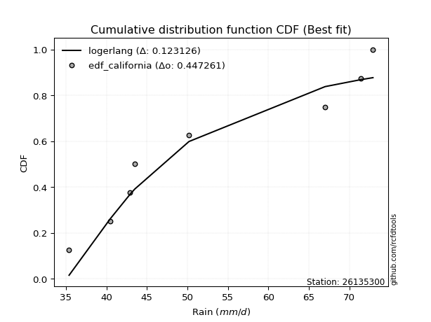</img>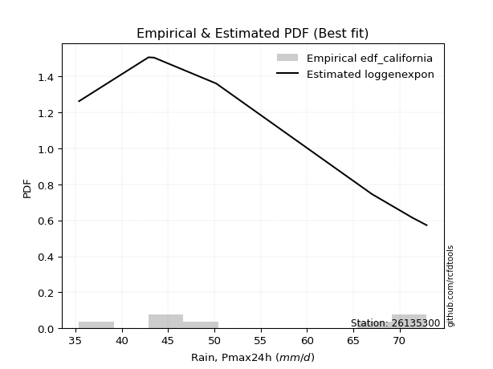</img>

</div>


### 2. EDF Hazen (1930)

Hazen method for plotting positions is a formula used to estimate the empirical cumulative probability distribution of flood events or other hydrological data. This formula often results in biased estimations, particularly when extrapolating to extreme events (high return periods).

<div align="center">


$P=(m-0.5)/n$


</div>


**2.1. Empirical values**

<div align="center">

|                | 0                  | 1                  | 2                  | 3                  | 4                  | 5         | 6                 | 7         |
|:---------------|:-------------------|:-------------------|:-------------------|:-------------------|:-------------------|:----------|:------------------|:----------|
| date           | 2023               | 2025               | 2020               | 2021               | 2022               | 2017      | 2019              | 2018      |
| x              | 35.4               | 40.5               | 42.9               | 43.5               | 50.2               | 67.0      | 71.4              | 72.9      |
| m              | 1                  | 2                  | 3                  | 4                  | 5                  | 6         | 7                 | 8         |
| empirical_dist | edf_hazen          | edf_hazen          | edf_hazen          | edf_hazen          | edf_hazen          | edf_hazen | edf_hazen         | edf_hazen |
| empirical      | 0.0625             | 0.1875             | 0.3125             | 0.4375             | 0.5625             | 0.6875    | 0.8125            | 0.9375    |
| empirical_tr   | 1.0666666666666667 | 1.2307692307692308 | 1.4545454545454546 | 1.7777777777777777 | 2.2857142857142856 | 3.2       | 5.333333333333333 | 16.0      |

</div>


**2.2. Kolmogorov-Smirnov fit test (sorted by Δ)**


<div align="center">

|                | 0                   | 1                   | 2                   | 3                   | 4                   | 5                   | 6                   | 7                   | 8                   | 9                   | 10                  | 11                 | 12                  | 13                  | 14                  | 15                  | 16                  | 17                  | 18                 | 19                  | 20                 | 21                 | 22                  | 23                  | 24                  | 25                 | 26                  | 27                  | 28                  | 29                  | 30                  | 31                 | 32                 | 33                  | 34                  | 35                 | 36                  | 37                 | 38                  | 39                  | 40                  | 41                 | 42                  | 43                  | 44                 | 45                  | 46                  | 47                 | 48                 | 49                  | 50                  | 51                  | 52                  | 53                 | 54                 | 55                 | 56                  | 57                  | 58                  | 59                  | 60                  | 61                 | 62                 | 63                  | 64                  | 65                  | 66                  | 67                  | 68                  | 69                  | 70                  | 71                  | 72                  | 73                  | 74                  | 75                 | 76                  | 77                 | 78                  | 79                  | 80                 | 81                  | 82                  | 83                  | 84                 | 85                  | 86                  | 87                  | 88                  | 89                  | 90                 | 91                  | 92                  | 93                  | 94                  | 95                  | 96                 | 97                 | 98                  | 99                  | 100                 | 101                | 102                | 103                | 104                | 105                 | 106                 | 107                 | 108                | 109                 | 110                 | 111                 | 112                 | 113                | 114                 | 115                 | 116                 | 117                | 118                 | 119                 | 120                 | 121                 | 122                 | 123                 | 124                 | 125                 | 126                 | 127                 | 128                 | 129                 | 130                | 131                 | 132                 | 133                 | 134                 | 135                | 136                | 137                | 138                | 139                | 140                 | 141                | 142                 | 143                | 144                 | 145                 | 146                | 147                | 148                | 149                | 150                | 151                | 152                | 153                | 154                | 155                | 156                | 157                | 158                | 159                |
|:---------------|:--------------------|:--------------------|:--------------------|:--------------------|:--------------------|:--------------------|:--------------------|:--------------------|:--------------------|:--------------------|:--------------------|:-------------------|:--------------------|:--------------------|:--------------------|:--------------------|:--------------------|:--------------------|:-------------------|:--------------------|:-------------------|:-------------------|:--------------------|:--------------------|:--------------------|:-------------------|:--------------------|:--------------------|:--------------------|:--------------------|:--------------------|:-------------------|:-------------------|:--------------------|:--------------------|:-------------------|:--------------------|:-------------------|:--------------------|:--------------------|:--------------------|:-------------------|:--------------------|:--------------------|:-------------------|:--------------------|:--------------------|:-------------------|:-------------------|:--------------------|:--------------------|:--------------------|:--------------------|:-------------------|:-------------------|:-------------------|:--------------------|:--------------------|:--------------------|:--------------------|:--------------------|:-------------------|:-------------------|:--------------------|:--------------------|:--------------------|:--------------------|:--------------------|:--------------------|:--------------------|:--------------------|:--------------------|:--------------------|:--------------------|:--------------------|:-------------------|:--------------------|:-------------------|:--------------------|:--------------------|:-------------------|:--------------------|:--------------------|:--------------------|:-------------------|:--------------------|:--------------------|:--------------------|:--------------------|:--------------------|:-------------------|:--------------------|:--------------------|:--------------------|:--------------------|:--------------------|:-------------------|:-------------------|:--------------------|:--------------------|:--------------------|:-------------------|:-------------------|:-------------------|:-------------------|:--------------------|:--------------------|:--------------------|:-------------------|:--------------------|:--------------------|:--------------------|:--------------------|:-------------------|:--------------------|:--------------------|:--------------------|:-------------------|:--------------------|:--------------------|:--------------------|:--------------------|:--------------------|:--------------------|:--------------------|:--------------------|:--------------------|:--------------------|:--------------------|:--------------------|:-------------------|:--------------------|:--------------------|:--------------------|:--------------------|:-------------------|:-------------------|:-------------------|:-------------------|:-------------------|:--------------------|:-------------------|:--------------------|:-------------------|:--------------------|:--------------------|:-------------------|:-------------------|:-------------------|:-------------------|:-------------------|:-------------------|:-------------------|:-------------------|:-------------------|:-------------------|:-------------------|:-------------------|:-------------------|:-------------------|
| station        | 26135300            | 26135300            | 26135300            | 26135300            | 26135300            | 26135300            | 26135300            | 26135300            | 26135300            | 26135300            | 26135300            | 26135300           | 26135300            | 26135300            | 26135300            | 26135300            | 26135300            | 26135300            | 26135300           | 26135300            | 26135300           | 26135300           | 26135300            | 26135300            | 26135300            | 26135300           | 26135300            | 26135300            | 26135300            | 26135300            | 26135300            | 26135300           | 26135300           | 26135300            | 26135300            | 26135300           | 26135300            | 26135300           | 26135300            | 26135300            | 26135300            | 26135300           | 26135300            | 26135300            | 26135300           | 26135300            | 26135300            | 26135300           | 26135300           | 26135300            | 26135300            | 26135300            | 26135300            | 26135300           | 26135300           | 26135300           | 26135300            | 26135300            | 26135300            | 26135300            | 26135300            | 26135300           | 26135300           | 26135300            | 26135300            | 26135300            | 26135300            | 26135300            | 26135300            | 26135300            | 26135300            | 26135300            | 26135300            | 26135300            | 26135300            | 26135300           | 26135300            | 26135300           | 26135300            | 26135300            | 26135300           | 26135300            | 26135300            | 26135300            | 26135300           | 26135300            | 26135300            | 26135300            | 26135300            | 26135300            | 26135300           | 26135300            | 26135300            | 26135300            | 26135300            | 26135300            | 26135300           | 26135300           | 26135300            | 26135300            | 26135300            | 26135300           | 26135300           | 26135300           | 26135300           | 26135300            | 26135300            | 26135300            | 26135300           | 26135300            | 26135300            | 26135300            | 26135300            | 26135300           | 26135300            | 26135300            | 26135300            | 26135300           | 26135300            | 26135300            | 26135300            | 26135300            | 26135300            | 26135300            | 26135300            | 26135300            | 26135300            | 26135300            | 26135300            | 26135300            | 26135300           | 26135300            | 26135300            | 26135300            | 26135300            | 26135300           | 26135300           | 26135300           | 26135300           | 26135300           | 26135300            | 26135300           | 26135300            | 26135300           | 26135300            | 26135300            | 26135300           | 26135300           | 26135300           | 26135300           | 26135300           | 26135300           | 26135300           | 26135300           | 26135300           | 26135300           | 26135300           | 26135300           | 26135300           | 26135300           |
| empirical_dist | edf_hazen           | edf_hazen           | edf_hazen           | edf_hazen           | edf_hazen           | edf_hazen           | edf_hazen           | edf_hazen           | edf_hazen           | edf_hazen           | edf_hazen           | edf_hazen          | edf_hazen           | edf_hazen           | edf_hazen           | edf_hazen           | edf_hazen           | edf_hazen           | edf_hazen          | edf_hazen           | edf_hazen          | edf_hazen          | edf_hazen           | edf_hazen           | edf_hazen           | edf_hazen          | edf_hazen           | edf_hazen           | edf_hazen           | edf_hazen           | edf_hazen           | edf_hazen          | edf_hazen          | edf_hazen           | edf_hazen           | edf_hazen          | edf_hazen           | edf_hazen          | edf_hazen           | edf_hazen           | edf_hazen           | edf_hazen          | edf_hazen           | edf_hazen           | edf_hazen          | edf_hazen           | edf_hazen           | edf_hazen          | edf_hazen          | edf_hazen           | edf_hazen           | edf_hazen           | edf_hazen           | edf_hazen          | edf_hazen          | edf_hazen          | edf_hazen           | edf_hazen           | edf_hazen           | edf_hazen           | edf_hazen           | edf_hazen          | edf_hazen          | edf_hazen           | edf_hazen           | edf_hazen           | edf_hazen           | edf_hazen           | edf_hazen           | edf_hazen           | edf_hazen           | edf_hazen           | edf_hazen           | edf_hazen           | edf_hazen           | edf_hazen          | edf_hazen           | edf_hazen          | edf_hazen           | edf_hazen           | edf_hazen          | edf_hazen           | edf_hazen           | edf_hazen           | edf_hazen          | edf_hazen           | edf_hazen           | edf_hazen           | edf_hazen           | edf_hazen           | edf_hazen          | edf_hazen           | edf_hazen           | edf_hazen           | edf_hazen           | edf_hazen           | edf_hazen          | edf_hazen          | edf_hazen           | edf_hazen           | edf_hazen           | edf_hazen          | edf_hazen          | edf_hazen          | edf_hazen          | edf_hazen           | edf_hazen           | edf_hazen           | edf_hazen          | edf_hazen           | edf_hazen           | edf_hazen           | edf_hazen           | edf_hazen          | edf_hazen           | edf_hazen           | edf_hazen           | edf_hazen          | edf_hazen           | edf_hazen           | edf_hazen           | edf_hazen           | edf_hazen           | edf_hazen           | edf_hazen           | edf_hazen           | edf_hazen           | edf_hazen           | edf_hazen           | edf_hazen           | edf_hazen          | edf_hazen           | edf_hazen           | edf_hazen           | edf_hazen           | edf_hazen          | edf_hazen          | edf_hazen          | edf_hazen          | edf_hazen          | edf_hazen           | edf_hazen          | edf_hazen           | edf_hazen          | edf_hazen           | edf_hazen           | edf_hazen          | edf_hazen          | edf_hazen          | edf_hazen          | edf_hazen          | edf_hazen          | edf_hazen          | edf_hazen          | edf_hazen          | edf_hazen          | edf_hazen          | edf_hazen          | edf_hazen          | edf_hazen          |
| p_dist         | logarcsine          | logrdist            | logbetaprime        | arcsine             | wrapcauchy          | logksone            | logsemicircular     | ksone               | logncf              | loglomax            | burr12              | rdist              | loganglit           | lomax               | loggenhalflogistic  | semicircular        | genexpon            | exponnorm           | halfnorm           | logerlang           | logweibull_min     | logfoldnorm        | loggenexpon         | loggamma            | loggamma            | logskewnorm        | gompertz            | loggompertz         | lograyleigh         | loghalfnorm         | logfatiguelife      | rayleigh           | logmaxwell         | loginvgauss         | invgauss            | skewnorm           | invgamma            | f                  | logburr             | anglit              | invweibull          | genextreme         | foldnorm            | logrice             | loginvgamma        | logf                | betaprime           | loginvweibull      | lognct             | logpearson3         | nct                 | loggenlogistic      | burr                | alpha              | logmielke          | weibull_min        | logalpha            | logwrapcauchy       | logkstwobign        | maxwell             | logtrapezoid        | logloggamma        | logloglaplace      | halflogistic        | logexponnorm        | logcrystalball      | lognorm             | logt                | kstwobign           | genlogistic         | loghalflogistic     | logjohnsonsu        | loggumbel_r         | gumbel_r            | moyal               | pearson3           | logmoyal            | logburr12          | triang              | trapezoid           | logcosine          | logkappa3           | loggausshyper       | kappa4              | t                  | crystalball         | norm                | truncnorm           | logtukeylambda      | loglogistic         | bradford           | logkappa4           | halfgennorm         | logdweibull         | loguniform          | rice                | logvonmises_line   | logwald            | truncpareto         | logtriang           | loghypsecant        | logdgamma          | dweibull           | cosine             | truncexpon         | loglevy_l           | logargus            | logistic            | gausshyper         | loggumbel_l         | tukeylambda         | dgamma              | johnsonsu           | uniform            | kappa3              | hypsecant           | logbradford         | gumbel_l           | loglaplace          | loglaplace          | levy_l              | vonmises_line       | loggennorm          | truncweibull_min    | logtruncweibull_min | argus               | wald                | logtruncexpon       | laplace             | gennorm             | logbeta            | loggenextreme       | logweibull_max      | logjohnsonsb        | genpareto           | genhalflogistic    | johnsonsb          | exponpow           | beta               | logexponpow        | ncf                 | gengamma           | weibull_max         | nakagami           | loggenpareto        | powerlaw            | erlang             | logpowerlaw        | lognakagami        | exponweib          | logexponweib       | fatiguelife        | loggengamma        | gamma              | logtruncnorm       | loghalfgennorm     | logtruncpareto     | logvonmises        | vonmises           | mielke             |
| delta          | 0.09742730017078677 | 0.10095791242885754 | 0.10641542440829355 | 0.10685485950531781 | 0.11134308489538897 | 0.11465998559205415 | 0.12973647078774575 | 0.13110890398280034 | 0.13275540679907916 | 0.13384473254375262 | 0.13606619772772155 | 0.1391583844920899 | 0.14118243632195504 | 0.14519572367229416 | 0.14634113389011805 | 0.14691283816842382 | 0.14696728043752694 | 0.14932891397898895 | 0.1498830667572566 | 0.15041296582396102 | 0.1508298112408295 | 0.1522631944201558 | 0.15266624315021882 | 0.15283644123586304 | 0.15283644123586304 | 0.1535690906287881 | 0.15397133247402417 | 0.15509398619572357 | 0.15525939632277452 | 0.15531522383649998 | 0.15532313123619046 | 0.1555340319726644 | 0.1561136820015867 | 0.15659889374866598 | 0.15662951660890123 | 0.1569269253567649 | 0.15723710726067996 | 0.1576408160095547 | 0.15849269655318476 | 0.15881192981871572 | 0.15884309745798553 | 0.1588436790673381 | 0.15912235866687474 | 0.15925367623494635 | 0.1592586900366847 | 0.15926037620678846 | 0.16057056499977518 | 0.1606489795310525 | 0.1607296230475238 | 0.16106001378812052 | 0.16119834039081693 | 0.16120992360729247 | 0.16136726123770795 | 0.1614401586707409 | 0.1616790589015168 | 0.1626866417602198 | 0.16371191133325602 | 0.16417645502171002 | 0.16440519043297697 | 0.16450213169729816 | 0.16499914524306092 | 0.1665745592872529 | 0.1672929362684462 | 0.16730434560670115 | 0.16767988255578187 | 0.16779326001252337 | 0.16779326933629762 | 0.16779397652602107 | 0.16882893602295346 | 0.16944824666527425 | 0.17200071785636017 | 0.17203418301936702 | 0.17219248074687477 | 0.17224405330155768 | 0.17308116825642006 | 0.1766698944413953 | 0.17744409127728922 | 0.1776883479874669 | 0.17855898135169396 | 0.17884062794010258 | 0.1789778958988793 | 0.18327750721900038 | 0.18541094748111991 | 0.18555843351829687 | 0.1862875699181299 | 0.18628808781965844 | 0.18628808892206972 | 0.18628809612753727 | 0.18847616789260968 | 0.19021199688450333 | 0.1913596259267305 | 0.19232018189984423 | 0.19254965780617572 | 0.19503394991043455 | 0.19566898131491106 | 0.19609360986190533 | 0.1999325265983014 | 0.2004877865863417 | 0.20353853385324572 | 0.20421098304220853 | 0.20555436585280137 | 0.2056142707091112 | 0.2061104348122681 | 0.2067464995064205 | 0.2071377449379107 | 0.20759361668713927 | 0.20783673861607332 | 0.20894361111970045 | 0.2109393841221181 | 0.21198636324830503 | 0.21314929173433228 | 0.21408564149567055 | 0.21459823289324997 | 0.2215             | 0.22159931314006662 | 0.22389578217273037 | 0.22549500696765568 | 0.2260612478171708 | 0.22758452213446762 | 0.22758452213446762 | 0.22784956026697367 | 0.23298540087556222 | 0.23309836576549792 | 0.23496107512779496 | 0.2358511588422173  | 0.23797232556686743 | 0.24037830977688676 | 0.24189003726245317 | 0.24383651304205356 | 0.24389580186302284 | 0.2442785605654857 | 0.25890352747113143 | 0.25994950280625173 | 0.28174633468061044 | 0.29500268355202836 | 0.3262055873836846 | 0.3392627912845665 | 0.4129591681525925 | 0.415352486549615  | 0.4170787367290515 | 0.42073590310448106 | 0.4390232581880553 | 0.45692012488217704 | 0.4650428938179759 | 0.46619462268146816 | 0.49929712425711137 | 0.5144089241271945 | 0.5280615098079736 | 0.528068050068019  | 0.5347497736121335 | 0.5457829468463765 | 0.5464455642810583 | 0.5825359698251118 | 0.6202919771200223 | 0.6874965716925411 | 0.6875             | 0.7028967850132382 | 1.160230719262587  | 11.426691469010228 | nan                |
| deltao         | 0.4472608134160001  | 0.4472608134160001  | 0.4472608134160001  | 0.4472608134160001  | 0.4472608134160001  | 0.4472608134160001  | 0.4472608134160001  | 0.4472608134160001  | 0.4472608134160001  | 0.4472608134160001  | 0.4472608134160001  | 0.4472608134160001 | 0.4472608134160001  | 0.4472608134160001  | 0.4472608134160001  | 0.4472608134160001  | 0.4472608134160001  | 0.4472608134160001  | 0.4472608134160001 | 0.4472608134160001  | 0.4472608134160001 | 0.4472608134160001 | 0.4472608134160001  | 0.4472608134160001  | 0.4472608134160001  | 0.4472608134160001 | 0.4472608134160001  | 0.4472608134160001  | 0.4472608134160001  | 0.4472608134160001  | 0.4472608134160001  | 0.4472608134160001 | 0.4472608134160001 | 0.4472608134160001  | 0.4472608134160001  | 0.4472608134160001 | 0.4472608134160001  | 0.4472608134160001 | 0.4472608134160001  | 0.4472608134160001  | 0.4472608134160001  | 0.4472608134160001 | 0.4472608134160001  | 0.4472608134160001  | 0.4472608134160001 | 0.4472608134160001  | 0.4472608134160001  | 0.4472608134160001 | 0.4472608134160001 | 0.4472608134160001  | 0.4472608134160001  | 0.4472608134160001  | 0.4472608134160001  | 0.4472608134160001 | 0.4472608134160001 | 0.4472608134160001 | 0.4472608134160001  | 0.4472608134160001  | 0.4472608134160001  | 0.4472608134160001  | 0.4472608134160001  | 0.4472608134160001 | 0.4472608134160001 | 0.4472608134160001  | 0.4472608134160001  | 0.4472608134160001  | 0.4472608134160001  | 0.4472608134160001  | 0.4472608134160001  | 0.4472608134160001  | 0.4472608134160001  | 0.4472608134160001  | 0.4472608134160001  | 0.4472608134160001  | 0.4472608134160001  | 0.4472608134160001 | 0.4472608134160001  | 0.4472608134160001 | 0.4472608134160001  | 0.4472608134160001  | 0.4472608134160001 | 0.4472608134160001  | 0.4472608134160001  | 0.4472608134160001  | 0.4472608134160001 | 0.4472608134160001  | 0.4472608134160001  | 0.4472608134160001  | 0.4472608134160001  | 0.4472608134160001  | 0.4472608134160001 | 0.4472608134160001  | 0.4472608134160001  | 0.4472608134160001  | 0.4472608134160001  | 0.4472608134160001  | 0.4472608134160001 | 0.4472608134160001 | 0.4472608134160001  | 0.4472608134160001  | 0.4472608134160001  | 0.4472608134160001 | 0.4472608134160001 | 0.4472608134160001 | 0.4472608134160001 | 0.4472608134160001  | 0.4472608134160001  | 0.4472608134160001  | 0.4472608134160001 | 0.4472608134160001  | 0.4472608134160001  | 0.4472608134160001  | 0.4472608134160001  | 0.4472608134160001 | 0.4472608134160001  | 0.4472608134160001  | 0.4472608134160001  | 0.4472608134160001 | 0.4472608134160001  | 0.4472608134160001  | 0.4472608134160001  | 0.4472608134160001  | 0.4472608134160001  | 0.4472608134160001  | 0.4472608134160001  | 0.4472608134160001  | 0.4472608134160001  | 0.4472608134160001  | 0.4472608134160001  | 0.4472608134160001  | 0.4472608134160001 | 0.4472608134160001  | 0.4472608134160001  | 0.4472608134160001  | 0.4472608134160001  | 0.4472608134160001 | 0.4472608134160001 | 0.4472608134160001 | 0.4472608134160001 | 0.4472608134160001 | 0.4472608134160001  | 0.4472608134160001 | 0.4472608134160001  | 0.4472608134160001 | 0.4472608134160001  | 0.4472608134160001  | 0.4472608134160001 | 0.4472608134160001 | 0.4472608134160001 | 0.4472608134160001 | 0.4472608134160001 | 0.4472608134160001 | 0.4472608134160001 | 0.4472608134160001 | 0.4472608134160001 | 0.4472608134160001 | 0.4472608134160001 | 0.4472608134160001 | 0.4472608134160001 | 0.4472608134160001 |
| eval           | Δo > Δ              | Δo > Δ              | Δo > Δ              | Δo > Δ              | Δo > Δ              | Δo > Δ              | Δo > Δ              | Δo > Δ              | Δo > Δ              | Δo > Δ              | Δo > Δ              | Δo > Δ             | Δo > Δ              | Δo > Δ              | Δo > Δ              | Δo > Δ              | Δo > Δ              | Δo > Δ              | Δo > Δ             | Δo > Δ              | Δo > Δ             | Δo > Δ             | Δo > Δ              | Δo > Δ              | Δo > Δ              | Δo > Δ             | Δo > Δ              | Δo > Δ              | Δo > Δ              | Δo > Δ              | Δo > Δ              | Δo > Δ             | Δo > Δ             | Δo > Δ              | Δo > Δ              | Δo > Δ             | Δo > Δ              | Δo > Δ             | Δo > Δ              | Δo > Δ              | Δo > Δ              | Δo > Δ             | Δo > Δ              | Δo > Δ              | Δo > Δ             | Δo > Δ              | Δo > Δ              | Δo > Δ             | Δo > Δ             | Δo > Δ              | Δo > Δ              | Δo > Δ              | Δo > Δ              | Δo > Δ             | Δo > Δ             | Δo > Δ             | Δo > Δ              | Δo > Δ              | Δo > Δ              | Δo > Δ              | Δo > Δ              | Δo > Δ             | Δo > Δ             | Δo > Δ              | Δo > Δ              | Δo > Δ              | Δo > Δ              | Δo > Δ              | Δo > Δ              | Δo > Δ              | Δo > Δ              | Δo > Δ              | Δo > Δ              | Δo > Δ              | Δo > Δ              | Δo > Δ             | Δo > Δ              | Δo > Δ             | Δo > Δ              | Δo > Δ              | Δo > Δ             | Δo > Δ              | Δo > Δ              | Δo > Δ              | Δo > Δ             | Δo > Δ              | Δo > Δ              | Δo > Δ              | Δo > Δ              | Δo > Δ              | Δo > Δ             | Δo > Δ              | Δo > Δ              | Δo > Δ              | Δo > Δ              | Δo > Δ              | Δo > Δ             | Δo > Δ             | Δo > Δ              | Δo > Δ              | Δo > Δ              | Δo > Δ             | Δo > Δ             | Δo > Δ             | Δo > Δ             | Δo > Δ              | Δo > Δ              | Δo > Δ              | Δo > Δ             | Δo > Δ              | Δo > Δ              | Δo > Δ              | Δo > Δ              | Δo > Δ             | Δo > Δ              | Δo > Δ              | Δo > Δ              | Δo > Δ             | Δo > Δ              | Δo > Δ              | Δo > Δ              | Δo > Δ              | Δo > Δ              | Δo > Δ              | Δo > Δ              | Δo > Δ              | Δo > Δ              | Δo > Δ              | Δo > Δ              | Δo > Δ              | Δo > Δ             | Δo > Δ              | Δo > Δ              | Δo > Δ              | Δo > Δ              | Δo > Δ             | Δo > Δ             | Δo > Δ             | Δo > Δ             | Δo > Δ             | Δo > Δ              | Δo > Δ             | Δo <= Δ             | Δo <= Δ            | Δo <= Δ             | Δo <= Δ             | Δo <= Δ            | Δo <= Δ            | Δo <= Δ            | Δo <= Δ            | Δo <= Δ            | Δo <= Δ            | Δo <= Δ            | Δo <= Δ            | Δo <= Δ            | Δo <= Δ            | Δo <= Δ            | Δo <= Δ            | Δo <= Δ            | Δo <= Δ            |
| fit            | 1                   | 1                   | 1                   | 1                   | 1                   | 1                   | 1                   | 1                   | 1                   | 1                   | 1                   | 1                  | 1                   | 1                   | 1                   | 1                   | 1                   | 1                   | 1                  | 1                   | 1                  | 1                  | 1                   | 1                   | 1                   | 1                  | 1                   | 1                   | 1                   | 1                   | 1                   | 1                  | 1                  | 1                   | 1                   | 1                  | 1                   | 1                  | 1                   | 1                   | 1                   | 1                  | 1                   | 1                   | 1                  | 1                   | 1                   | 1                  | 1                  | 1                   | 1                   | 1                   | 1                   | 1                  | 1                  | 1                  | 1                   | 1                   | 1                   | 1                   | 1                   | 1                  | 1                  | 1                   | 1                   | 1                   | 1                   | 1                   | 1                   | 1                   | 1                   | 1                   | 1                   | 1                   | 1                   | 1                  | 1                   | 1                  | 1                   | 1                   | 1                  | 1                   | 1                   | 1                   | 1                  | 1                   | 1                   | 1                   | 1                   | 1                   | 1                  | 1                   | 1                   | 1                   | 1                   | 1                   | 1                  | 1                  | 1                   | 1                   | 1                   | 1                  | 1                  | 1                  | 1                  | 1                   | 1                   | 1                   | 1                  | 1                   | 1                   | 1                   | 1                   | 1                  | 1                   | 1                   | 1                   | 1                  | 1                   | 1                   | 1                   | 1                   | 1                   | 1                   | 1                   | 1                   | 1                   | 1                   | 1                   | 1                   | 1                  | 1                   | 1                   | 1                   | 1                   | 1                  | 1                  | 1                  | 1                  | 1                  | 1                   | 1                  | 0                   | 0                  | 0                   | 0                   | 0                  | 0                  | 0                  | 0                  | 0                  | 0                  | 0                  | 0                  | 0                  | 0                  | 0                  | 0                  | 0                  | 0                  |
| n              | 8                   | 8                   | 8                   | 8                   | 8                   | 8                   | 8                   | 8                   | 8                   | 8                   | 8                   | 8                  | 8                   | 8                   | 8                   | 8                   | 8                   | 8                   | 8                  | 8                   | 8                  | 8                  | 8                   | 8                   | 8                   | 8                  | 8                   | 8                   | 8                   | 8                   | 8                   | 8                  | 8                  | 8                   | 8                   | 8                  | 8                   | 8                  | 8                   | 8                   | 8                   | 8                  | 8                   | 8                   | 8                  | 8                   | 8                   | 8                  | 8                  | 8                   | 8                   | 8                   | 8                   | 8                  | 8                  | 8                  | 8                   | 8                   | 8                   | 8                   | 8                   | 8                  | 8                  | 8                   | 8                   | 8                   | 8                   | 8                   | 8                   | 8                   | 8                   | 8                   | 8                   | 8                   | 8                   | 8                  | 8                   | 8                  | 8                   | 8                   | 8                  | 8                   | 8                   | 8                   | 8                  | 8                   | 8                   | 8                   | 8                   | 8                   | 8                  | 8                   | 8                   | 8                   | 8                   | 8                   | 8                  | 8                  | 8                   | 8                   | 8                   | 8                  | 8                  | 8                  | 8                  | 8                   | 8                   | 8                   | 8                  | 8                   | 8                   | 8                   | 8                   | 8                  | 8                   | 8                   | 8                   | 8                  | 8                   | 8                   | 8                   | 8                   | 8                   | 8                   | 8                   | 8                   | 8                   | 8                   | 8                   | 8                   | 8                  | 8                   | 8                   | 8                   | 8                   | 8                  | 8                  | 8                  | 8                  | 8                  | 8                   | 8                  | 8                   | 8                  | 8                   | 8                   | 8                  | 8                  | 8                  | 8                  | 8                  | 8                  | 8                  | 8                  | 8                  | 8                  | 8                  | 8                  | 8                  | 8                  |
| best_fit       | 1                   | 0                   | 0                   | 0                   | 0                   | 0                   | 0                   | 0                   | 0                   | 0                   | 0                   | 0                  | 0                   | 0                   | 0                   | 0                   | 0                   | 0                   | 0                  | 0                   | 0                  | 0                  | 0                   | 0                   | 0                   | 0                  | 0                   | 0                   | 0                   | 0                   | 0                   | 0                  | 0                  | 0                   | 0                   | 0                  | 0                   | 0                  | 0                   | 0                   | 0                   | 0                  | 0                   | 0                   | 0                  | 0                   | 0                   | 0                  | 0                  | 0                   | 0                   | 0                   | 0                   | 0                  | 0                  | 0                  | 0                   | 0                   | 0                   | 0                   | 0                   | 0                  | 0                  | 0                   | 0                   | 0                   | 0                   | 0                   | 0                   | 0                   | 0                   | 0                   | 0                   | 0                   | 0                   | 0                  | 0                   | 0                  | 0                   | 0                   | 0                  | 0                   | 0                   | 0                   | 0                  | 0                   | 0                   | 0                   | 0                   | 0                   | 0                  | 0                   | 0                   | 0                   | 0                   | 0                   | 0                  | 0                  | 0                   | 0                   | 0                   | 0                  | 0                  | 0                  | 0                  | 0                   | 0                   | 0                   | 0                  | 0                   | 0                   | 0                   | 0                   | 0                  | 0                   | 0                   | 0                   | 0                  | 0                   | 0                   | 0                   | 0                   | 0                   | 0                   | 0                   | 0                   | 0                   | 0                   | 0                   | 0                   | 0                  | 0                   | 0                   | 0                   | 0                   | 0                  | 0                  | 0                  | 0                  | 0                  | 0                   | 0                  | 0                   | 0                  | 0                   | 0                   | 0                  | 0                  | 0                  | 0                  | 0                  | 0                  | 0                  | 0                  | 0                  | 0                  | 0                  | 0                  | 0                  | 0                  |
| best_fit_sort  | 1                   | 2                   | 3                   | 4                   | 5                   | 6                   | 7                   | 8                   | 9                   | 10                  | 11                  | 12                 | 13                  | 14                  | 15                  | 16                  | 17                  | 18                  | 19                 | 20                  | 21                 | 22                 | 23                  | 24                  | 25                  | 26                 | 27                  | 28                  | 29                  | 30                  | 31                  | 32                 | 33                 | 34                  | 35                  | 36                 | 37                  | 38                 | 39                  | 40                  | 41                  | 42                 | 43                  | 44                  | 45                 | 46                  | 47                  | 48                 | 49                 | 50                  | 51                  | 52                  | 53                  | 54                 | 55                 | 56                 | 57                  | 58                  | 59                  | 60                  | 61                  | 62                 | 63                 | 64                  | 65                  | 66                  | 67                  | 68                  | 69                  | 70                  | 71                  | 72                  | 73                  | 74                  | 75                  | 76                 | 77                  | 78                 | 79                  | 80                  | 81                 | 82                  | 83                  | 84                  | 85                 | 86                  | 87                  | 88                  | 89                  | 90                  | 91                 | 92                  | 93                  | 94                  | 95                  | 96                  | 97                 | 98                 | 99                  | 100                 | 101                 | 102                | 103                | 104                | 105                | 106                 | 107                 | 108                 | 109                | 110                 | 111                 | 112                 | 113                 | 114                | 115                 | 116                 | 117                 | 118                | 119                 | 120                 | 121                 | 122                 | 123                 | 124                 | 125                 | 126                 | 127                 | 128                 | 129                 | 130                 | 131                | 132                 | 133                 | 134                 | 135                 | 136                | 137                | 138                | 139                | 140                | 141                 | 142                | 143                 | 144                | 145                 | 146                 | 147                | 148                | 149                | 150                | 151                | 152                | 153                | 154                | 155                | 156                | 157                | 158                | 159                | 160                |

</div>


**2.3. Best fit**

<div align="center">

|   id |   station | empirical_dist   | p_dist     |     delta |   deltao | eval   |   fit |   n |   best_fit |   best_fit_sort |
|-----:|----------:|:-----------------|:-----------|----------:|---------:|:-------|------:|----:|-----------:|----------------:|
|    0 |  26135300 | edf_hazen        | logarcsine | 0.0974273 | 0.447261 | Δo > Δ |     1 |   8 |          1 |               1 |

</div>


<div align="center">

</img></img>

</div>


### 3. EDF Weibull (1939)

Weibull plotting position formula is an empirical method used to estimate the non-exceedance probability or plotting position for a set of observed data, is often recommended or widely used in practice, particularly in flood frequency analysis.

<div align="center">


$P=m/(n+1)$


</div>


**3.1. Empirical values**

<div align="center">

|                | 0                  | 1                  | 2                  | 3                  | 4                  | 5                  | 6                  | 7                  |
|:---------------|:-------------------|:-------------------|:-------------------|:-------------------|:-------------------|:-------------------|:-------------------|:-------------------|
| date           | 2023               | 2025               | 2020               | 2021               | 2022               | 2017               | 2019               | 2018               |
| x              | 35.4               | 40.5               | 42.9               | 43.5               | 50.2               | 67.0               | 71.4               | 72.9               |
| m              | 1                  | 2                  | 3                  | 4                  | 5                  | 6                  | 7                  | 8                  |
| empirical_dist | edf_weibull        | edf_weibull        | edf_weibull        | edf_weibull        | edf_weibull        | edf_weibull        | edf_weibull        | edf_weibull        |
| empirical      | 0.1111111111111111 | 0.2222222222222222 | 0.3333333333333333 | 0.4444444444444444 | 0.5555555555555556 | 0.6666666666666666 | 0.7777777777777778 | 0.8888888888888888 |
| empirical_tr   | 1.125              | 1.2857142857142856 | 1.4999999999999998 | 1.7999999999999998 | 2.25               | 2.9999999999999996 | 4.5                | 8.999999999999996  |

</div>


**3.2. Kolmogorov-Smirnov fit test (sorted by Δ)**


<div align="center">

|                | 0                   | 1                   | 2                   | 3                   | 4                   | 5                  | 6                   | 7                  | 8                   | 9                   | 10                  | 11                 | 12                 | 13                  | 14                 | 15                 | 16                  | 17                 | 18                  | 19                  | 20                  | 21                 | 22                 | 23                  | 24                  | 25                 | 26                  | 27                  | 28                  | 29                 | 30                  | 31                 | 32                 | 33                 | 34                  | 35                  | 36                  | 37                 | 38                  | 39                  | 40                  | 41                  | 42                 | 43                 | 44                  | 45                  | 46                  | 47                  | 48                  | 49                 | 50                  | 51                  | 52                  | 53                  | 54                  | 55                  | 56                 | 57                 | 58                  | 59                  | 60                  | 61                  | 62                 | 63                  | 64                  | 65                  | 66                  | 67                  | 68                 | 69                  | 70                  | 71                 | 72                  | 73                  | 74                  | 75                  | 76                  | 77                  | 78                  | 79                  | 80                 | 81                  | 82                  | 83                 | 84                  | 85                  | 86                 | 87                  | 88                  | 89                 | 90                  | 91                  | 92                  | 93                  | 94                  | 95                  | 96                  | 97                  | 98                 | 99                  | 100                | 101                | 102                 | 103                 | 104                 | 105                 | 106                 | 107                | 108                 | 109                 | 110                | 111                 | 112                 | 113                 | 114                 | 115                 | 116                | 117                 | 118                 | 119                 | 120                 | 121                 | 122                 | 123                 | 124                 | 125                 | 126                 | 127                 | 128                 | 129                | 130                 | 131                | 132                 | 133                 | 134                 | 135                | 136                | 137                | 138                 | 139                 | 140                | 141                | 142                 | 143                | 144                | 145                 | 146                | 147                | 148                 | 149                | 150                | 151                | 152                | 153                | 154                | 155                | 156                | 157                | 158                | 159                |
|:---------------|:--------------------|:--------------------|:--------------------|:--------------------|:--------------------|:-------------------|:--------------------|:-------------------|:--------------------|:--------------------|:--------------------|:-------------------|:-------------------|:--------------------|:-------------------|:-------------------|:--------------------|:-------------------|:--------------------|:--------------------|:--------------------|:-------------------|:-------------------|:--------------------|:--------------------|:-------------------|:--------------------|:--------------------|:--------------------|:-------------------|:--------------------|:-------------------|:-------------------|:-------------------|:--------------------|:--------------------|:--------------------|:-------------------|:--------------------|:--------------------|:--------------------|:--------------------|:-------------------|:-------------------|:--------------------|:--------------------|:--------------------|:--------------------|:--------------------|:-------------------|:--------------------|:--------------------|:--------------------|:--------------------|:--------------------|:--------------------|:-------------------|:-------------------|:--------------------|:--------------------|:--------------------|:--------------------|:-------------------|:--------------------|:--------------------|:--------------------|:--------------------|:--------------------|:-------------------|:--------------------|:--------------------|:-------------------|:--------------------|:--------------------|:--------------------|:--------------------|:--------------------|:--------------------|:--------------------|:--------------------|:-------------------|:--------------------|:--------------------|:-------------------|:--------------------|:--------------------|:-------------------|:--------------------|:--------------------|:-------------------|:--------------------|:--------------------|:--------------------|:--------------------|:--------------------|:--------------------|:--------------------|:--------------------|:-------------------|:--------------------|:-------------------|:-------------------|:--------------------|:--------------------|:--------------------|:--------------------|:--------------------|:-------------------|:--------------------|:--------------------|:-------------------|:--------------------|:--------------------|:--------------------|:--------------------|:--------------------|:-------------------|:--------------------|:--------------------|:--------------------|:--------------------|:--------------------|:--------------------|:--------------------|:--------------------|:--------------------|:--------------------|:--------------------|:--------------------|:-------------------|:--------------------|:-------------------|:--------------------|:--------------------|:--------------------|:-------------------|:-------------------|:-------------------|:--------------------|:--------------------|:-------------------|:-------------------|:--------------------|:-------------------|:-------------------|:--------------------|:-------------------|:-------------------|:--------------------|:-------------------|:-------------------|:-------------------|:-------------------|:-------------------|:-------------------|:-------------------|:-------------------|:-------------------|:-------------------|:-------------------|
| station        | 26135300            | 26135300            | 26135300            | 26135300            | 26135300            | 26135300           | 26135300            | 26135300           | 26135300            | 26135300            | 26135300            | 26135300           | 26135300           | 26135300            | 26135300           | 26135300           | 26135300            | 26135300           | 26135300            | 26135300            | 26135300            | 26135300           | 26135300           | 26135300            | 26135300            | 26135300           | 26135300            | 26135300            | 26135300            | 26135300           | 26135300            | 26135300           | 26135300           | 26135300           | 26135300            | 26135300            | 26135300            | 26135300           | 26135300            | 26135300            | 26135300            | 26135300            | 26135300           | 26135300           | 26135300            | 26135300            | 26135300            | 26135300            | 26135300            | 26135300           | 26135300            | 26135300            | 26135300            | 26135300            | 26135300            | 26135300            | 26135300           | 26135300           | 26135300            | 26135300            | 26135300            | 26135300            | 26135300           | 26135300            | 26135300            | 26135300            | 26135300            | 26135300            | 26135300           | 26135300            | 26135300            | 26135300           | 26135300            | 26135300            | 26135300            | 26135300            | 26135300            | 26135300            | 26135300            | 26135300            | 26135300           | 26135300            | 26135300            | 26135300           | 26135300            | 26135300            | 26135300           | 26135300            | 26135300            | 26135300           | 26135300            | 26135300            | 26135300            | 26135300            | 26135300            | 26135300            | 26135300            | 26135300            | 26135300           | 26135300            | 26135300           | 26135300           | 26135300            | 26135300            | 26135300            | 26135300            | 26135300            | 26135300           | 26135300            | 26135300            | 26135300           | 26135300            | 26135300            | 26135300            | 26135300            | 26135300            | 26135300           | 26135300            | 26135300            | 26135300            | 26135300            | 26135300            | 26135300            | 26135300            | 26135300            | 26135300            | 26135300            | 26135300            | 26135300            | 26135300           | 26135300            | 26135300           | 26135300            | 26135300            | 26135300            | 26135300           | 26135300           | 26135300           | 26135300            | 26135300            | 26135300           | 26135300           | 26135300            | 26135300           | 26135300           | 26135300            | 26135300           | 26135300           | 26135300            | 26135300           | 26135300           | 26135300           | 26135300           | 26135300           | 26135300           | 26135300           | 26135300           | 26135300           | 26135300           | 26135300           |
| empirical_dist | edf_weibull         | edf_weibull         | edf_weibull         | edf_weibull         | edf_weibull         | edf_weibull        | edf_weibull         | edf_weibull        | edf_weibull         | edf_weibull         | edf_weibull         | edf_weibull        | edf_weibull        | edf_weibull         | edf_weibull        | edf_weibull        | edf_weibull         | edf_weibull        | edf_weibull         | edf_weibull         | edf_weibull         | edf_weibull        | edf_weibull        | edf_weibull         | edf_weibull         | edf_weibull        | edf_weibull         | edf_weibull         | edf_weibull         | edf_weibull        | edf_weibull         | edf_weibull        | edf_weibull        | edf_weibull        | edf_weibull         | edf_weibull         | edf_weibull         | edf_weibull        | edf_weibull         | edf_weibull         | edf_weibull         | edf_weibull         | edf_weibull        | edf_weibull        | edf_weibull         | edf_weibull         | edf_weibull         | edf_weibull         | edf_weibull         | edf_weibull        | edf_weibull         | edf_weibull         | edf_weibull         | edf_weibull         | edf_weibull         | edf_weibull         | edf_weibull        | edf_weibull        | edf_weibull         | edf_weibull         | edf_weibull         | edf_weibull         | edf_weibull        | edf_weibull         | edf_weibull         | edf_weibull         | edf_weibull         | edf_weibull         | edf_weibull        | edf_weibull         | edf_weibull         | edf_weibull        | edf_weibull         | edf_weibull         | edf_weibull         | edf_weibull         | edf_weibull         | edf_weibull         | edf_weibull         | edf_weibull         | edf_weibull        | edf_weibull         | edf_weibull         | edf_weibull        | edf_weibull         | edf_weibull         | edf_weibull        | edf_weibull         | edf_weibull         | edf_weibull        | edf_weibull         | edf_weibull         | edf_weibull         | edf_weibull         | edf_weibull         | edf_weibull         | edf_weibull         | edf_weibull         | edf_weibull        | edf_weibull         | edf_weibull        | edf_weibull        | edf_weibull         | edf_weibull         | edf_weibull         | edf_weibull         | edf_weibull         | edf_weibull        | edf_weibull         | edf_weibull         | edf_weibull        | edf_weibull         | edf_weibull         | edf_weibull         | edf_weibull         | edf_weibull         | edf_weibull        | edf_weibull         | edf_weibull         | edf_weibull         | edf_weibull         | edf_weibull         | edf_weibull         | edf_weibull         | edf_weibull         | edf_weibull         | edf_weibull         | edf_weibull         | edf_weibull         | edf_weibull        | edf_weibull         | edf_weibull        | edf_weibull         | edf_weibull         | edf_weibull         | edf_weibull        | edf_weibull        | edf_weibull        | edf_weibull         | edf_weibull         | edf_weibull        | edf_weibull        | edf_weibull         | edf_weibull        | edf_weibull        | edf_weibull         | edf_weibull        | edf_weibull        | edf_weibull         | edf_weibull        | edf_weibull        | edf_weibull        | edf_weibull        | edf_weibull        | edf_weibull        | edf_weibull        | edf_weibull        | edf_weibull        | edf_weibull        | edf_weibull        |
| p_dist         | logarcsine          | arcsine             | logbetaprime        | wrapcauchy          | logloglaplace       | logrdist           | logksone            | logwrapcauchy      | ksone               | logncf              | logsemicircular     | rdist              | weibull_min        | semicircular        | loglomax           | loganglit          | burr12              | halfgennorm        | anglit              | lomax               | foldnorm            | genexpon           | rayleigh           | exponnorm           | halfnorm            | logerlang          | maxwell             | logweibull_min      | logtrapezoid        | skewnorm           | logfoldnorm         | loggenexpon        | loggamma           | loggamma           | logskewnorm         | gompertz            | loggompertz         | lograyleigh        | loghalfnorm         | logfatiguelife      | logmaxwell          | loginvgauss         | invgauss           | logloggamma        | invgamma            | loggenhalflogistic  | f                   | logjohnsonsu        | logburr             | invweibull         | genextreme          | logrice             | loginvgamma         | logf                | logt                | lognorm             | logcrystalball     | logpearson3        | logexponnorm        | betaprime           | loginvweibull       | lognct              | nct                | loggenlogistic      | burr                | alpha               | logmielke           | pearson3            | logalpha           | logkstwobign        | triang              | trapezoid          | logcosine           | gumbel_r            | halflogistic        | kstwobign           | genlogistic         | logburr12           | levy_l              | loggausshyper       | kappa4             | loghalflogistic     | loggumbel_r         | t                  | crystalball         | norm                | truncnorm          | moyal               | loglogistic         | logmoyal           | loglevy_l           | rice                | logkappa3           | logbeta             | logtukeylambda      | logtriang           | logweibull_max      | bradford            | loghypsecant       | johnsonsu           | logkappa4          | cosine             | logargus            | logdweibull         | logistic            | loguniform          | loggumbel_l         | tukeylambda        | logvonmises_line    | logwald             | truncpareto        | logdgamma           | dweibull            | truncexpon          | uniform             | kappa3              | hypsecant          | gausshyper          | gumbel_l            | loglaplace          | loglaplace          | dgamma              | vonmises_line       | loggennorm          | argus               | logbradford         | genpareto           | logjohnsonsb        | wald                | laplace            | gennorm             | loggenextreme      | truncweibull_min    | logtruncweibull_min | logtruncexpon       | johnsonsb          | genhalflogistic    | beta               | ncf                 | exponpow            | logexponpow        | gengamma           | loggenpareto        | nakagami           | weibull_max        | powerlaw            | erlang             | logpowerlaw        | lognakagami         | exponweib          | logexponweib       | fatiguelife        | loggengamma        | gamma              | logtruncnorm       | loghalfgennorm     | logtruncpareto     | logvonmises        | vonmises           | mielke             |
| delta          | 0.09074550290012318 | 0.10172263811888665 | 0.10705262228170709 | 0.11111111111111116 | 0.11868182515733505 | 0.1222334840163356 | 0.12865169280678534 | 0.1376880438209679 | 0.13805334842724476 | 0.13969985124352358 | 0.14415145452295797 | 0.1461028289365343 | 0.1530884343104939 | 0.15385728261286824 | 0.154678065877086  | 0.1552128557733019 | 0.15689953106105492 | 0.1578274355839535 | 0.16575637426316014 | 0.16602905700562753 | 0.16606680311131916 | 0.1678006137708603 | 0.1700122993521137 | 0.17016224731232232 | 0.17071640009058997 | 0.1712462991572944 | 0.17144657614174258 | 0.17166314457416287 | 0.17194358968750534 | 0.1722436933551018 | 0.17309652775348916 | 0.1734995764835522 | 0.1736697745691964 | 0.1736697745691964 | 0.17440242396212147 | 0.17480466580735754 | 0.17592731952905694 | 0.1760927296561079 | 0.17614855716983335 | 0.17615646456952383 | 0.17694701533492008 | 0.17743222708199935 | 0.1774628499422346 | 0.1778897923209195 | 0.17807044059401334 | 0.17815390945995846 | 0.17847414934288808 | 0.17897862746381143 | 0.17932602988651813 | 0.1796764307913189 | 0.17967701240067147 | 0.18008700956827972 | 0.18009202337001806 | 0.18009370954012183 | 0.18018170371960496 | 0.18018243783341625 | 0.1801824705728331 | 0.1802074458847277 | 0.18020861753163753 | 0.18140389833310855 | 0.18148231286438588 | 0.18156295638085718 | 0.1820316737241503 | 0.18204325694062584 | 0.18220059457104132 | 0.18227349200407428 | 0.18251239223485016 | 0.18361433888583972 | 0.1845452446665894 | 0.18523852376631034 | 0.18550342579613838 | 0.185785072384547  | 0.18592234034332372 | 0.18789732768397382 | 0.18813767894003453 | 0.18966226935628683 | 0.19028157999860762 | 0.19037614549838622 | 0.19126228873792495 | 0.19235539192556433 | 0.1925028779627413 | 0.19283405118969354 | 0.19302581408020814 | 0.1932320143625743 | 0.19323253226410286 | 0.19323253336651414 | 0.1932325405719817 | 0.19370709011976683 | 0.19810958194121142 | 0.1982774246106226 | 0.20064917224269485 | 0.20303805430634975 | 0.20411084055233375 | 0.20674951231955174 | 0.20930950122594305 | 0.21115542748665295 | 0.21133839169514063 | 0.21219295926006387 | 0.2124988102972458 | 0.21300574077551915 | 0.2131535152331776 | 0.2136909439508649 | 0.21478118306051774 | 0.21586728324376792 | 0.21588805556414487 | 0.21650231464824443 | 0.21893080769274945 | 0.2200937361787767 | 0.22076585993163478 | 0.22132111991967507 | 0.2243718671865791 | 0.22644760404244457 | 0.22694376814560147 | 0.22797107827124408 | 0.22844444444444442 | 0.22854375758451104 | 0.2308402266171748 | 0.23177271745545147 | 0.23300569226161522 | 0.23452896657891203 | 0.23452896657891203 | 0.23491897482900392 | 0.23992984532000664 | 0.24004281020994234 | 0.24491677001131185 | 0.24632834030098905 | 0.24639157244091725 | 0.24702411245838823 | 0.24732275422133118 | 0.250780957486498  | 0.25084024630746726 | 0.251959083026687  | 0.25579440846112833 | 0.25668449217555067 | 0.26272337059578654 | 0.3045405690623443 | 0.3281716964651648 | 0.3667413754385038 | 0.37212479199336995 | 0.37823694593037027 | 0.3823565145068293 | 0.4043010359658331 | 0.41758351157035706 | 0.4303206715957537 | 0.4381766794074904 | 0.46457490203488916 | 0.4796867019049723 | 0.4933392875857514 | 0.49334582784579684 | 0.5000275513899113 | 0.5110607246241543 | 0.5117233420588361 | 0.5478137476028896 | 0.5855697548978    | 0.6666632383592077 | 0.6666666666666666 | 0.668174562791016  | 1.1810640525959202 | 11.475302580121339 | nan                |
| deltao         | 0.4472608134160001  | 0.4472608134160001  | 0.4472608134160001  | 0.4472608134160001  | 0.4472608134160001  | 0.4472608134160001 | 0.4472608134160001  | 0.4472608134160001 | 0.4472608134160001  | 0.4472608134160001  | 0.4472608134160001  | 0.4472608134160001 | 0.4472608134160001 | 0.4472608134160001  | 0.4472608134160001 | 0.4472608134160001 | 0.4472608134160001  | 0.4472608134160001 | 0.4472608134160001  | 0.4472608134160001  | 0.4472608134160001  | 0.4472608134160001 | 0.4472608134160001 | 0.4472608134160001  | 0.4472608134160001  | 0.4472608134160001 | 0.4472608134160001  | 0.4472608134160001  | 0.4472608134160001  | 0.4472608134160001 | 0.4472608134160001  | 0.4472608134160001 | 0.4472608134160001 | 0.4472608134160001 | 0.4472608134160001  | 0.4472608134160001  | 0.4472608134160001  | 0.4472608134160001 | 0.4472608134160001  | 0.4472608134160001  | 0.4472608134160001  | 0.4472608134160001  | 0.4472608134160001 | 0.4472608134160001 | 0.4472608134160001  | 0.4472608134160001  | 0.4472608134160001  | 0.4472608134160001  | 0.4472608134160001  | 0.4472608134160001 | 0.4472608134160001  | 0.4472608134160001  | 0.4472608134160001  | 0.4472608134160001  | 0.4472608134160001  | 0.4472608134160001  | 0.4472608134160001 | 0.4472608134160001 | 0.4472608134160001  | 0.4472608134160001  | 0.4472608134160001  | 0.4472608134160001  | 0.4472608134160001 | 0.4472608134160001  | 0.4472608134160001  | 0.4472608134160001  | 0.4472608134160001  | 0.4472608134160001  | 0.4472608134160001 | 0.4472608134160001  | 0.4472608134160001  | 0.4472608134160001 | 0.4472608134160001  | 0.4472608134160001  | 0.4472608134160001  | 0.4472608134160001  | 0.4472608134160001  | 0.4472608134160001  | 0.4472608134160001  | 0.4472608134160001  | 0.4472608134160001 | 0.4472608134160001  | 0.4472608134160001  | 0.4472608134160001 | 0.4472608134160001  | 0.4472608134160001  | 0.4472608134160001 | 0.4472608134160001  | 0.4472608134160001  | 0.4472608134160001 | 0.4472608134160001  | 0.4472608134160001  | 0.4472608134160001  | 0.4472608134160001  | 0.4472608134160001  | 0.4472608134160001  | 0.4472608134160001  | 0.4472608134160001  | 0.4472608134160001 | 0.4472608134160001  | 0.4472608134160001 | 0.4472608134160001 | 0.4472608134160001  | 0.4472608134160001  | 0.4472608134160001  | 0.4472608134160001  | 0.4472608134160001  | 0.4472608134160001 | 0.4472608134160001  | 0.4472608134160001  | 0.4472608134160001 | 0.4472608134160001  | 0.4472608134160001  | 0.4472608134160001  | 0.4472608134160001  | 0.4472608134160001  | 0.4472608134160001 | 0.4472608134160001  | 0.4472608134160001  | 0.4472608134160001  | 0.4472608134160001  | 0.4472608134160001  | 0.4472608134160001  | 0.4472608134160001  | 0.4472608134160001  | 0.4472608134160001  | 0.4472608134160001  | 0.4472608134160001  | 0.4472608134160001  | 0.4472608134160001 | 0.4472608134160001  | 0.4472608134160001 | 0.4472608134160001  | 0.4472608134160001  | 0.4472608134160001  | 0.4472608134160001 | 0.4472608134160001 | 0.4472608134160001 | 0.4472608134160001  | 0.4472608134160001  | 0.4472608134160001 | 0.4472608134160001 | 0.4472608134160001  | 0.4472608134160001 | 0.4472608134160001 | 0.4472608134160001  | 0.4472608134160001 | 0.4472608134160001 | 0.4472608134160001  | 0.4472608134160001 | 0.4472608134160001 | 0.4472608134160001 | 0.4472608134160001 | 0.4472608134160001 | 0.4472608134160001 | 0.4472608134160001 | 0.4472608134160001 | 0.4472608134160001 | 0.4472608134160001 | 0.4472608134160001 |
| eval           | Δo > Δ              | Δo > Δ              | Δo > Δ              | Δo > Δ              | Δo > Δ              | Δo > Δ             | Δo > Δ              | Δo > Δ             | Δo > Δ              | Δo > Δ              | Δo > Δ              | Δo > Δ             | Δo > Δ             | Δo > Δ              | Δo > Δ             | Δo > Δ             | Δo > Δ              | Δo > Δ             | Δo > Δ              | Δo > Δ              | Δo > Δ              | Δo > Δ             | Δo > Δ             | Δo > Δ              | Δo > Δ              | Δo > Δ             | Δo > Δ              | Δo > Δ              | Δo > Δ              | Δo > Δ             | Δo > Δ              | Δo > Δ             | Δo > Δ             | Δo > Δ             | Δo > Δ              | Δo > Δ              | Δo > Δ              | Δo > Δ             | Δo > Δ              | Δo > Δ              | Δo > Δ              | Δo > Δ              | Δo > Δ             | Δo > Δ             | Δo > Δ              | Δo > Δ              | Δo > Δ              | Δo > Δ              | Δo > Δ              | Δo > Δ             | Δo > Δ              | Δo > Δ              | Δo > Δ              | Δo > Δ              | Δo > Δ              | Δo > Δ              | Δo > Δ             | Δo > Δ             | Δo > Δ              | Δo > Δ              | Δo > Δ              | Δo > Δ              | Δo > Δ             | Δo > Δ              | Δo > Δ              | Δo > Δ              | Δo > Δ              | Δo > Δ              | Δo > Δ             | Δo > Δ              | Δo > Δ              | Δo > Δ             | Δo > Δ              | Δo > Δ              | Δo > Δ              | Δo > Δ              | Δo > Δ              | Δo > Δ              | Δo > Δ              | Δo > Δ              | Δo > Δ             | Δo > Δ              | Δo > Δ              | Δo > Δ             | Δo > Δ              | Δo > Δ              | Δo > Δ             | Δo > Δ              | Δo > Δ              | Δo > Δ             | Δo > Δ              | Δo > Δ              | Δo > Δ              | Δo > Δ              | Δo > Δ              | Δo > Δ              | Δo > Δ              | Δo > Δ              | Δo > Δ             | Δo > Δ              | Δo > Δ             | Δo > Δ             | Δo > Δ              | Δo > Δ              | Δo > Δ              | Δo > Δ              | Δo > Δ              | Δo > Δ             | Δo > Δ              | Δo > Δ              | Δo > Δ             | Δo > Δ              | Δo > Δ              | Δo > Δ              | Δo > Δ              | Δo > Δ              | Δo > Δ             | Δo > Δ              | Δo > Δ              | Δo > Δ              | Δo > Δ              | Δo > Δ              | Δo > Δ              | Δo > Δ              | Δo > Δ              | Δo > Δ              | Δo > Δ              | Δo > Δ              | Δo > Δ              | Δo > Δ             | Δo > Δ              | Δo > Δ             | Δo > Δ              | Δo > Δ              | Δo > Δ              | Δo > Δ             | Δo > Δ             | Δo > Δ             | Δo > Δ              | Δo > Δ              | Δo > Δ             | Δo > Δ             | Δo > Δ              | Δo > Δ             | Δo > Δ             | Δo <= Δ             | Δo <= Δ            | Δo <= Δ            | Δo <= Δ             | Δo <= Δ            | Δo <= Δ            | Δo <= Δ            | Δo <= Δ            | Δo <= Δ            | Δo <= Δ            | Δo <= Δ            | Δo <= Δ            | Δo <= Δ            | Δo <= Δ            | Δo <= Δ            |
| fit            | 1                   | 1                   | 1                   | 1                   | 1                   | 1                  | 1                   | 1                  | 1                   | 1                   | 1                   | 1                  | 1                  | 1                   | 1                  | 1                  | 1                   | 1                  | 1                   | 1                   | 1                   | 1                  | 1                  | 1                   | 1                   | 1                  | 1                   | 1                   | 1                   | 1                  | 1                   | 1                  | 1                  | 1                  | 1                   | 1                   | 1                   | 1                  | 1                   | 1                   | 1                   | 1                   | 1                  | 1                  | 1                   | 1                   | 1                   | 1                   | 1                   | 1                  | 1                   | 1                   | 1                   | 1                   | 1                   | 1                   | 1                  | 1                  | 1                   | 1                   | 1                   | 1                   | 1                  | 1                   | 1                   | 1                   | 1                   | 1                   | 1                  | 1                   | 1                   | 1                  | 1                   | 1                   | 1                   | 1                   | 1                   | 1                   | 1                   | 1                   | 1                  | 1                   | 1                   | 1                  | 1                   | 1                   | 1                  | 1                   | 1                   | 1                  | 1                   | 1                   | 1                   | 1                   | 1                   | 1                   | 1                   | 1                   | 1                  | 1                   | 1                  | 1                  | 1                   | 1                   | 1                   | 1                   | 1                   | 1                  | 1                   | 1                   | 1                  | 1                   | 1                   | 1                   | 1                   | 1                   | 1                  | 1                   | 1                   | 1                   | 1                   | 1                   | 1                   | 1                   | 1                   | 1                   | 1                   | 1                   | 1                   | 1                  | 1                   | 1                  | 1                   | 1                   | 1                   | 1                  | 1                  | 1                  | 1                   | 1                   | 1                  | 1                  | 1                   | 1                  | 1                  | 0                   | 0                  | 0                  | 0                   | 0                  | 0                  | 0                  | 0                  | 0                  | 0                  | 0                  | 0                  | 0                  | 0                  | 0                  |
| n              | 8                   | 8                   | 8                   | 8                   | 8                   | 8                  | 8                   | 8                  | 8                   | 8                   | 8                   | 8                  | 8                  | 8                   | 8                  | 8                  | 8                   | 8                  | 8                   | 8                   | 8                   | 8                  | 8                  | 8                   | 8                   | 8                  | 8                   | 8                   | 8                   | 8                  | 8                   | 8                  | 8                  | 8                  | 8                   | 8                   | 8                   | 8                  | 8                   | 8                   | 8                   | 8                   | 8                  | 8                  | 8                   | 8                   | 8                   | 8                   | 8                   | 8                  | 8                   | 8                   | 8                   | 8                   | 8                   | 8                   | 8                  | 8                  | 8                   | 8                   | 8                   | 8                   | 8                  | 8                   | 8                   | 8                   | 8                   | 8                   | 8                  | 8                   | 8                   | 8                  | 8                   | 8                   | 8                   | 8                   | 8                   | 8                   | 8                   | 8                   | 8                  | 8                   | 8                   | 8                  | 8                   | 8                   | 8                  | 8                   | 8                   | 8                  | 8                   | 8                   | 8                   | 8                   | 8                   | 8                   | 8                   | 8                   | 8                  | 8                   | 8                  | 8                  | 8                   | 8                   | 8                   | 8                   | 8                   | 8                  | 8                   | 8                   | 8                  | 8                   | 8                   | 8                   | 8                   | 8                   | 8                  | 8                   | 8                   | 8                   | 8                   | 8                   | 8                   | 8                   | 8                   | 8                   | 8                   | 8                   | 8                   | 8                  | 8                   | 8                  | 8                   | 8                   | 8                   | 8                  | 8                  | 8                  | 8                   | 8                   | 8                  | 8                  | 8                   | 8                  | 8                  | 8                   | 8                  | 8                  | 8                   | 8                  | 8                  | 8                  | 8                  | 8                  | 8                  | 8                  | 8                  | 8                  | 8                  | 8                  |
| best_fit       | 1                   | 0                   | 0                   | 0                   | 0                   | 0                  | 0                   | 0                  | 0                   | 0                   | 0                   | 0                  | 0                  | 0                   | 0                  | 0                  | 0                   | 0                  | 0                   | 0                   | 0                   | 0                  | 0                  | 0                   | 0                   | 0                  | 0                   | 0                   | 0                   | 0                  | 0                   | 0                  | 0                  | 0                  | 0                   | 0                   | 0                   | 0                  | 0                   | 0                   | 0                   | 0                   | 0                  | 0                  | 0                   | 0                   | 0                   | 0                   | 0                   | 0                  | 0                   | 0                   | 0                   | 0                   | 0                   | 0                   | 0                  | 0                  | 0                   | 0                   | 0                   | 0                   | 0                  | 0                   | 0                   | 0                   | 0                   | 0                   | 0                  | 0                   | 0                   | 0                  | 0                   | 0                   | 0                   | 0                   | 0                   | 0                   | 0                   | 0                   | 0                  | 0                   | 0                   | 0                  | 0                   | 0                   | 0                  | 0                   | 0                   | 0                  | 0                   | 0                   | 0                   | 0                   | 0                   | 0                   | 0                   | 0                   | 0                  | 0                   | 0                  | 0                  | 0                   | 0                   | 0                   | 0                   | 0                   | 0                  | 0                   | 0                   | 0                  | 0                   | 0                   | 0                   | 0                   | 0                   | 0                  | 0                   | 0                   | 0                   | 0                   | 0                   | 0                   | 0                   | 0                   | 0                   | 0                   | 0                   | 0                   | 0                  | 0                   | 0                  | 0                   | 0                   | 0                   | 0                  | 0                  | 0                  | 0                   | 0                   | 0                  | 0                  | 0                   | 0                  | 0                  | 0                   | 0                  | 0                  | 0                   | 0                  | 0                  | 0                  | 0                  | 0                  | 0                  | 0                  | 0                  | 0                  | 0                  | 0                  |
| best_fit_sort  | 1                   | 2                   | 3                   | 4                   | 5                   | 6                  | 7                   | 8                  | 9                   | 10                  | 11                  | 12                 | 13                 | 14                  | 15                 | 16                 | 17                  | 18                 | 19                  | 20                  | 21                  | 22                 | 23                 | 24                  | 25                  | 26                 | 27                  | 28                  | 29                  | 30                 | 31                  | 32                 | 33                 | 34                 | 35                  | 36                  | 37                  | 38                 | 39                  | 40                  | 41                  | 42                  | 43                 | 44                 | 45                  | 46                  | 47                  | 48                  | 49                  | 50                 | 51                  | 52                  | 53                  | 54                  | 55                  | 56                  | 57                 | 58                 | 59                  | 60                  | 61                  | 62                  | 63                 | 64                  | 65                  | 66                  | 67                  | 68                  | 69                 | 70                  | 71                  | 72                 | 73                  | 74                  | 75                  | 76                  | 77                  | 78                  | 79                  | 80                  | 81                 | 82                  | 83                  | 84                 | 85                  | 86                  | 87                 | 88                  | 89                  | 90                 | 91                  | 92                  | 93                  | 94                  | 95                  | 96                  | 97                  | 98                  | 99                 | 100                 | 101                | 102                | 103                 | 104                 | 105                 | 106                 | 107                 | 108                | 109                 | 110                 | 111                | 112                 | 113                 | 114                 | 115                 | 116                 | 117                | 118                 | 119                 | 120                 | 121                 | 122                 | 123                 | 124                 | 125                 | 126                 | 127                 | 128                 | 129                 | 130                | 131                 | 132                | 133                 | 134                 | 135                 | 136                | 137                | 138                | 139                 | 140                 | 141                | 142                | 143                 | 144                | 145                | 146                 | 147                | 148                | 149                 | 150                | 151                | 152                | 153                | 154                | 155                | 156                | 157                | 158                | 159                | 160                |

</div>


**3.3. Best fit**

<div align="center">

|   id |   station | empirical_dist   | p_dist     |     delta |   deltao | eval   |   fit |   n |   best_fit |   best_fit_sort |
|-----:|----------:|:-----------------|:-----------|----------:|---------:|:-------|------:|----:|-----------:|----------------:|
|    0 |  26135300 | edf_weibull      | logarcsine | 0.0907455 | 0.447261 | Δo > Δ |     1 |   8 |          1 |               1 |

</div>


<div align="center">

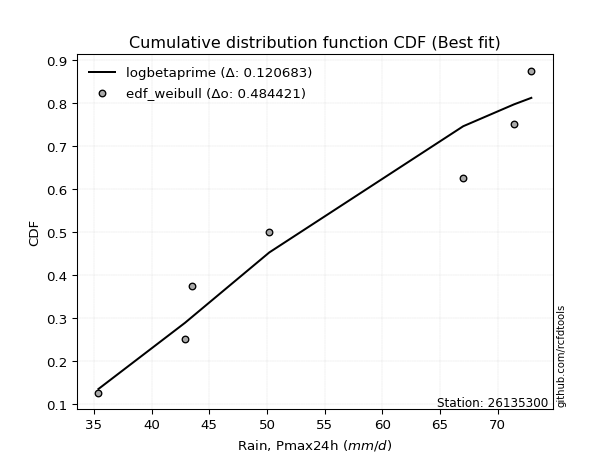</img>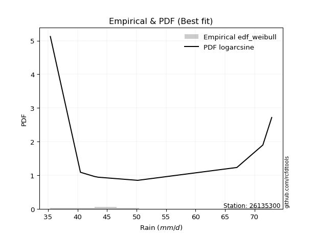</img>

</div>


### 4. EDF Beard (1943)

The Beard formula (or Beard´s plotting position formula) in hydrology is used to estimate the empirical non-exceedance probability _(P)_ of a flood event (or other extreme hydrological data point) within a given dataset.

<div align="center">


$P=(m-0.31)/(n+0.38)$


</div>


**4.1. Empirical values**

<div align="center">

|                | 0                   | 1                   | 2                  | 3                   | 4                  | 5                  | 6                  | 7                  |
|:---------------|:--------------------|:--------------------|:-------------------|:--------------------|:-------------------|:-------------------|:-------------------|:-------------------|
| date           | 2023                | 2025                | 2020               | 2021                | 2022               | 2017               | 2019               | 2018               |
| x              | 35.4                | 40.5                | 42.9               | 43.5                | 50.2               | 67.0               | 71.4               | 72.9               |
| m              | 1                   | 2                   | 3                  | 4                   | 5                  | 6                  | 7                  | 8                  |
| empirical_dist | edf_beard           | edf_beard           | edf_beard          | edf_beard           | edf_beard          | edf_beard          | edf_beard          | edf_beard          |
| empirical      | 0.08233890214797135 | 0.20167064439140808 | 0.3210023866348448 | 0.44033412887828155 | 0.5596658711217184 | 0.6789976133651551 | 0.7983293556085919 | 0.9176610978520287 |
| empirical_tr   | 1.0897269180754225  | 1.2526158445440956  | 1.4727592267135323 | 1.7867803837953091  | 2.2710027100271004 | 3.115241635687732  | 4.958579881656804  | 12.144927536231886 |

</div>


**4.2. Kolmogorov-Smirnov fit test (sorted by Δ)**


<div align="center">

|                | 0                   | 1                   | 2                   | 3                  | 4                   | 5                  | 6                  | 7                  | 8                  | 9                   | 10                  | 11                 | 12                  | 13                  | 14                  | 15                  | 16                  | 17                 | 18                  | 19                 | 20                  | 21                  | 22                  | 23                  | 24                  | 25                  | 26                  | 27                  | 28                  | 29                  | 30                  | 31                 | 32                  | 33                 | 34                 | 35                  | 36                 | 37                 | 38                  | 39                 | 40                  | 41                 | 42                  | 43                 | 44                 | 45                  | 46                  | 47                  | 48                  | 49                  | 50                  | 51                  | 52                 | 53                  | 54                  | 55                  | 56                  | 57                 | 58                  | 59                  | 60                  | 61                  | 62                  | 63                  | 64                  | 65                  | 66                 | 67                  | 68                  | 69                  | 70                  | 71                  | 72                  | 73                  | 74                 | 75                  | 76                 | 77                 | 78                 | 79                  | 80                  | 81                  | 82                  | 83                  | 84                  | 85                 | 86                  | 87                  | 88                 | 89                  | 90                 | 91                  | 92                  | 93                  | 94                  | 95                 | 96                  | 97                  | 98                  | 99                  | 100                 | 101                 | 102                 | 103                 | 104                 | 105                | 106                 | 107                 | 108                 | 109                 | 110                 | 111                 | 112                 | 113                 | 114                 | 115                 | 116                 | 117                 | 118                 | 119                 | 120                 | 121                | 122                 | 123                 | 124                 | 125                 | 126                | 127                | 128                 | 129                | 130                 | 131                | 132                 | 133                 | 134                | 135                 | 136                | 137                 | 138                | 139                | 140                | 141                 | 142                | 143                | 144                 | 145                | 146                | 147                | 148                | 149                | 150                | 151                | 152                | 153                | 154                | 155                | 156                | 157                | 158                | 159                |
|:---------------|:--------------------|:--------------------|:--------------------|:-------------------|:--------------------|:-------------------|:-------------------|:-------------------|:-------------------|:--------------------|:--------------------|:-------------------|:--------------------|:--------------------|:--------------------|:--------------------|:--------------------|:-------------------|:--------------------|:-------------------|:--------------------|:--------------------|:--------------------|:--------------------|:--------------------|:--------------------|:--------------------|:--------------------|:--------------------|:--------------------|:--------------------|:-------------------|:--------------------|:-------------------|:-------------------|:--------------------|:-------------------|:-------------------|:--------------------|:-------------------|:--------------------|:-------------------|:--------------------|:-------------------|:-------------------|:--------------------|:--------------------|:--------------------|:--------------------|:--------------------|:--------------------|:--------------------|:-------------------|:--------------------|:--------------------|:--------------------|:--------------------|:-------------------|:--------------------|:--------------------|:--------------------|:--------------------|:--------------------|:--------------------|:--------------------|:--------------------|:-------------------|:--------------------|:--------------------|:--------------------|:--------------------|:--------------------|:--------------------|:--------------------|:-------------------|:--------------------|:-------------------|:-------------------|:-------------------|:--------------------|:--------------------|:--------------------|:--------------------|:--------------------|:--------------------|:-------------------|:--------------------|:--------------------|:-------------------|:--------------------|:-------------------|:--------------------|:--------------------|:--------------------|:--------------------|:-------------------|:--------------------|:--------------------|:--------------------|:--------------------|:--------------------|:--------------------|:--------------------|:--------------------|:--------------------|:-------------------|:--------------------|:--------------------|:--------------------|:--------------------|:--------------------|:--------------------|:--------------------|:--------------------|:--------------------|:--------------------|:--------------------|:--------------------|:--------------------|:--------------------|:--------------------|:-------------------|:--------------------|:--------------------|:--------------------|:--------------------|:-------------------|:-------------------|:--------------------|:-------------------|:--------------------|:-------------------|:--------------------|:--------------------|:-------------------|:--------------------|:-------------------|:--------------------|:-------------------|:-------------------|:-------------------|:--------------------|:-------------------|:-------------------|:--------------------|:-------------------|:-------------------|:-------------------|:-------------------|:-------------------|:-------------------|:-------------------|:-------------------|:-------------------|:-------------------|:-------------------|:-------------------|:-------------------|:-------------------|:-------------------|
| station        | 26135300            | 26135300            | 26135300            | 26135300           | 26135300            | 26135300           | 26135300           | 26135300           | 26135300           | 26135300            | 26135300            | 26135300           | 26135300            | 26135300            | 26135300            | 26135300            | 26135300            | 26135300           | 26135300            | 26135300           | 26135300            | 26135300            | 26135300            | 26135300            | 26135300            | 26135300            | 26135300            | 26135300            | 26135300            | 26135300            | 26135300            | 26135300           | 26135300            | 26135300           | 26135300           | 26135300            | 26135300           | 26135300           | 26135300            | 26135300           | 26135300            | 26135300           | 26135300            | 26135300           | 26135300           | 26135300            | 26135300            | 26135300            | 26135300            | 26135300            | 26135300            | 26135300            | 26135300           | 26135300            | 26135300            | 26135300            | 26135300            | 26135300           | 26135300            | 26135300            | 26135300            | 26135300            | 26135300            | 26135300            | 26135300            | 26135300            | 26135300           | 26135300            | 26135300            | 26135300            | 26135300            | 26135300            | 26135300            | 26135300            | 26135300           | 26135300            | 26135300           | 26135300           | 26135300           | 26135300            | 26135300            | 26135300            | 26135300            | 26135300            | 26135300            | 26135300           | 26135300            | 26135300            | 26135300           | 26135300            | 26135300           | 26135300            | 26135300            | 26135300            | 26135300            | 26135300           | 26135300            | 26135300            | 26135300            | 26135300            | 26135300            | 26135300            | 26135300            | 26135300            | 26135300            | 26135300           | 26135300            | 26135300            | 26135300            | 26135300            | 26135300            | 26135300            | 26135300            | 26135300            | 26135300            | 26135300            | 26135300            | 26135300            | 26135300            | 26135300            | 26135300            | 26135300           | 26135300            | 26135300            | 26135300            | 26135300            | 26135300           | 26135300           | 26135300            | 26135300           | 26135300            | 26135300           | 26135300            | 26135300            | 26135300           | 26135300            | 26135300           | 26135300            | 26135300           | 26135300           | 26135300           | 26135300            | 26135300           | 26135300           | 26135300            | 26135300           | 26135300           | 26135300           | 26135300           | 26135300           | 26135300           | 26135300           | 26135300           | 26135300           | 26135300           | 26135300           | 26135300           | 26135300           | 26135300           | 26135300           |
| empirical_dist | edf_beard           | edf_beard           | edf_beard           | edf_beard          | edf_beard           | edf_beard          | edf_beard          | edf_beard          | edf_beard          | edf_beard           | edf_beard           | edf_beard          | edf_beard           | edf_beard           | edf_beard           | edf_beard           | edf_beard           | edf_beard          | edf_beard           | edf_beard          | edf_beard           | edf_beard           | edf_beard           | edf_beard           | edf_beard           | edf_beard           | edf_beard           | edf_beard           | edf_beard           | edf_beard           | edf_beard           | edf_beard          | edf_beard           | edf_beard          | edf_beard          | edf_beard           | edf_beard          | edf_beard          | edf_beard           | edf_beard          | edf_beard           | edf_beard          | edf_beard           | edf_beard          | edf_beard          | edf_beard           | edf_beard           | edf_beard           | edf_beard           | edf_beard           | edf_beard           | edf_beard           | edf_beard          | edf_beard           | edf_beard           | edf_beard           | edf_beard           | edf_beard          | edf_beard           | edf_beard           | edf_beard           | edf_beard           | edf_beard           | edf_beard           | edf_beard           | edf_beard           | edf_beard          | edf_beard           | edf_beard           | edf_beard           | edf_beard           | edf_beard           | edf_beard           | edf_beard           | edf_beard          | edf_beard           | edf_beard          | edf_beard          | edf_beard          | edf_beard           | edf_beard           | edf_beard           | edf_beard           | edf_beard           | edf_beard           | edf_beard          | edf_beard           | edf_beard           | edf_beard          | edf_beard           | edf_beard          | edf_beard           | edf_beard           | edf_beard           | edf_beard           | edf_beard          | edf_beard           | edf_beard           | edf_beard           | edf_beard           | edf_beard           | edf_beard           | edf_beard           | edf_beard           | edf_beard           | edf_beard          | edf_beard           | edf_beard           | edf_beard           | edf_beard           | edf_beard           | edf_beard           | edf_beard           | edf_beard           | edf_beard           | edf_beard           | edf_beard           | edf_beard           | edf_beard           | edf_beard           | edf_beard           | edf_beard          | edf_beard           | edf_beard           | edf_beard           | edf_beard           | edf_beard          | edf_beard          | edf_beard           | edf_beard          | edf_beard           | edf_beard          | edf_beard           | edf_beard           | edf_beard          | edf_beard           | edf_beard          | edf_beard           | edf_beard          | edf_beard          | edf_beard          | edf_beard           | edf_beard          | edf_beard          | edf_beard           | edf_beard          | edf_beard          | edf_beard          | edf_beard          | edf_beard          | edf_beard          | edf_beard          | edf_beard          | edf_beard          | edf_beard          | edf_beard          | edf_beard          | edf_beard          | edf_beard          | edf_beard          |
| p_dist         | logarcsine          | wrapcauchy          | logbetaprime        | arcsine            | logrdist            | logksone           | logsemicircular    | ksone              | logncf             | rdist               | loglomax            | loganglit          | burr12              | logloglaplace       | weibull_min         | semicircular        | logwrapcauchy       | lomax              | genexpon            | loggenhalflogistic | exponnorm           | rayleigh            | halfnorm            | logerlang           | logweibull_min      | skewnorm            | logfoldnorm         | loggenexpon         | loggamma            | loggamma            | anglit              | foldnorm           | logskewnorm         | gompertz           | loggompertz        | lograyleigh         | loghalfnorm        | logfatiguelife     | logmaxwell          | loginvgauss        | invgauss            | invgamma           | f                   | logburr            | maxwell            | invweibull          | genextreme          | logrice             | loginvgamma         | logf                | logtrapezoid        | logpearson3         | betaprime          | loginvweibull       | lognct              | logloggamma         | nct                 | loggenlogistic     | burr                | alpha               | logmielke           | logexponnorm        | logcrystalball      | lognorm             | logt                | logalpha            | logkstwobign       | logjohnsonsu        | gumbel_r            | halflogistic        | kstwobign           | genlogistic         | halfgennorm         | pearson3            | loghalflogistic    | logburr12           | loggumbel_r        | moyal              | triang             | trapezoid           | logcosine           | logmoyal            | loggausshyper       | kappa4              | t                   | crystalball        | norm                | truncnorm           | logkappa3          | loglogistic         | logtukeylambda     | rice                | bradford            | logkappa4           | logdweibull         | loguniform         | loglevy_l           | logtriang           | levy_l              | loghypsecant        | logvonmises_line    | logwald             | cosine              | logargus            | johnsonsu           | logistic           | truncpareto         | logdgamma           | dweibull            | loggumbel_l         | truncexpon          | tukeylambda         | gausshyper          | dgamma              | uniform             | kappa3              | hypsecant           | logbeta             | gumbel_l            | loglaplace          | loglaplace          | logbradford        | vonmises_line       | loggennorm          | logweibull_max      | argus               | wald               | truncweibull_min   | logtruncweibull_min | laplace            | gennorm             | logtruncexpon      | loggenextreme       | logjohnsonsb        | genpareto          | genhalflogistic     | johnsonsb          | beta                | exponpow           | ncf                | logexponpow        | gengamma            | loggenpareto       | weibull_max        | nakagami            | powerlaw           | erlang             | logpowerlaw        | lognakagami        | exponweib          | logexponweib       | fatiguelife        | loggengamma        | gamma              | logtruncnorm       | loghalfgennorm     | logtruncpareto     | logvonmises        | vonmises           | mielke             |
| delta          | 0.08325665577937869 | 0.09717244050398088 | 0.10294230671554422 | 0.1040207306270362 | 0.10946029906370247 | 0.1174941144703357 | 0.1325705996660273 | 0.1339430328610819 | 0.1355895356773607 | 0.14199251337037144 | 0.14234711917859755 | 0.1440165652002366 | 0.14456858436256648 | 0.14745403412047486 | 0.14851599736881171 | 0.14974696704670537 | 0.15000581063030194 | 0.1536981103071391 | 0.15546966707237186 | 0.1576023316291444 | 0.15783130061383388 | 0.15836816085094596 | 0.15838545339210153 | 0.15891535245880595 | 0.15933219787567443 | 0.15991274665661337 | 0.16076558105500072 | 0.16116862978506374 | 0.16133882787070797 | 0.16133882787070797 | 0.16164605869699727 | 0.1619564875451563 | 0.16207147726363302 | 0.1624737191088691 | 0.1635963728305685 | 0.16376178295761945 | 0.1638176104713449 | 0.1638255178710354 | 0.16461606863643163 | 0.1651012803835109 | 0.16513190324374616 | 0.1657394938955249 | 0.16614320264439963 | 0.1669950831880297 | 0.1673362605755797 | 0.16734548409283045 | 0.16734606570218302 | 0.16775606286979128 | 0.16776107667152962 | 0.16776276284163338 | 0.16783327412134247 | 0.16787649918623926 | 0.1690729516346201 | 0.16915136616589743 | 0.16923200968236873 | 0.16940868816553445 | 0.16970072702566186 | 0.1697123102421374 | 0.16986964787255288 | 0.16994254530558583 | 0.17018144553636172 | 0.17051401143406342 | 0.17062738889080492 | 0.17062739821457917 | 0.17062810540430262 | 0.17221429796810095 | 0.1729075770678219 | 0.17486831189764857 | 0.17556638098548538 | 0.17580673224154608 | 0.17733132265779838 | 0.17795063330011918 | 0.17837901341476764 | 0.17950402331967685 | 0.1805031044912051 | 0.18052247686574846 | 0.1806948673817197 | 0.1813761434212784 | 0.1813931102299755 | 0.18167475681838413 | 0.18181202477716085 | 0.18594647791213414 | 0.18824507635940146 | 0.18839256239657842 | 0.18912169879641144 | 0.18912221669794   | 0.18912221780035127 | 0.18912222500581882 | 0.1917798938538453 | 0.19304612576278488 | 0.1969785545274546 | 0.19892773874018688 | 0.19986201256157543 | 0.20082256853468916 | 0.20353633654527947 | 0.204171367949756  | 0.20475948780885767 | 0.20704511192049008 | 0.20801065811900232 | 0.20838849473108292 | 0.20843491323314634 | 0.20899017322118663 | 0.20958062838470204 | 0.21067086749435487 | 0.21176410401496837 | 0.211777739997982  | 0.21204092048809065 | 0.21411665734395613 | 0.21461282144711302 | 0.21482049212658658 | 0.21564013157275563 | 0.21598342061261383 | 0.21944177075696303 | 0.22258802813051548 | 0.22433412887828155 | 0.22443344201834817 | 0.22672991105101192 | 0.22730109015036587 | 0.22889537669545235 | 0.23041865101274916 | 0.23041865101274916 | 0.2339973936025006 | 0.23581952975384377 | 0.23593249464377952 | 0.24011060065828038 | 0.24080645444514898 | 0.2432124386551683 | 0.2434634617626399 | 0.24435354547706223 | 0.2466706419203351 | 0.24672993074130445 | 0.2503924238972981 | 0.25606939859284983 | 0.26757569028920236 | 0.275163781404057  | 0.32406138089900194 | 0.3250921468931584 | 0.39551358440164364 | 0.3987885237611844 | 0.4008970009565097 | 0.4029080923376434 | 0.42485261379664724 | 0.4463557205334968 | 0.4484177382473321 | 0.45087224942656784 | 0.4851264798657033 | 0.5002382797357865 | 0.5138908654165655 | 0.513897405676611  | 0.5205791292207254 | 0.5316123024549684 | 0.5322749198896501 | 0.5683653254337038 | 0.6061213327286141 | 0.6789941850576962 | 0.6789976133651551 | 0.6887261406218301 | 1.1687331058974317 | 11.446530371158198 | nan                |
| deltao         | 0.4472608134160001  | 0.4472608134160001  | 0.4472608134160001  | 0.4472608134160001 | 0.4472608134160001  | 0.4472608134160001 | 0.4472608134160001 | 0.4472608134160001 | 0.4472608134160001 | 0.4472608134160001  | 0.4472608134160001  | 0.4472608134160001 | 0.4472608134160001  | 0.4472608134160001  | 0.4472608134160001  | 0.4472608134160001  | 0.4472608134160001  | 0.4472608134160001 | 0.4472608134160001  | 0.4472608134160001 | 0.4472608134160001  | 0.4472608134160001  | 0.4472608134160001  | 0.4472608134160001  | 0.4472608134160001  | 0.4472608134160001  | 0.4472608134160001  | 0.4472608134160001  | 0.4472608134160001  | 0.4472608134160001  | 0.4472608134160001  | 0.4472608134160001 | 0.4472608134160001  | 0.4472608134160001 | 0.4472608134160001 | 0.4472608134160001  | 0.4472608134160001 | 0.4472608134160001 | 0.4472608134160001  | 0.4472608134160001 | 0.4472608134160001  | 0.4472608134160001 | 0.4472608134160001  | 0.4472608134160001 | 0.4472608134160001 | 0.4472608134160001  | 0.4472608134160001  | 0.4472608134160001  | 0.4472608134160001  | 0.4472608134160001  | 0.4472608134160001  | 0.4472608134160001  | 0.4472608134160001 | 0.4472608134160001  | 0.4472608134160001  | 0.4472608134160001  | 0.4472608134160001  | 0.4472608134160001 | 0.4472608134160001  | 0.4472608134160001  | 0.4472608134160001  | 0.4472608134160001  | 0.4472608134160001  | 0.4472608134160001  | 0.4472608134160001  | 0.4472608134160001  | 0.4472608134160001 | 0.4472608134160001  | 0.4472608134160001  | 0.4472608134160001  | 0.4472608134160001  | 0.4472608134160001  | 0.4472608134160001  | 0.4472608134160001  | 0.4472608134160001 | 0.4472608134160001  | 0.4472608134160001 | 0.4472608134160001 | 0.4472608134160001 | 0.4472608134160001  | 0.4472608134160001  | 0.4472608134160001  | 0.4472608134160001  | 0.4472608134160001  | 0.4472608134160001  | 0.4472608134160001 | 0.4472608134160001  | 0.4472608134160001  | 0.4472608134160001 | 0.4472608134160001  | 0.4472608134160001 | 0.4472608134160001  | 0.4472608134160001  | 0.4472608134160001  | 0.4472608134160001  | 0.4472608134160001 | 0.4472608134160001  | 0.4472608134160001  | 0.4472608134160001  | 0.4472608134160001  | 0.4472608134160001  | 0.4472608134160001  | 0.4472608134160001  | 0.4472608134160001  | 0.4472608134160001  | 0.4472608134160001 | 0.4472608134160001  | 0.4472608134160001  | 0.4472608134160001  | 0.4472608134160001  | 0.4472608134160001  | 0.4472608134160001  | 0.4472608134160001  | 0.4472608134160001  | 0.4472608134160001  | 0.4472608134160001  | 0.4472608134160001  | 0.4472608134160001  | 0.4472608134160001  | 0.4472608134160001  | 0.4472608134160001  | 0.4472608134160001 | 0.4472608134160001  | 0.4472608134160001  | 0.4472608134160001  | 0.4472608134160001  | 0.4472608134160001 | 0.4472608134160001 | 0.4472608134160001  | 0.4472608134160001 | 0.4472608134160001  | 0.4472608134160001 | 0.4472608134160001  | 0.4472608134160001  | 0.4472608134160001 | 0.4472608134160001  | 0.4472608134160001 | 0.4472608134160001  | 0.4472608134160001 | 0.4472608134160001 | 0.4472608134160001 | 0.4472608134160001  | 0.4472608134160001 | 0.4472608134160001 | 0.4472608134160001  | 0.4472608134160001 | 0.4472608134160001 | 0.4472608134160001 | 0.4472608134160001 | 0.4472608134160001 | 0.4472608134160001 | 0.4472608134160001 | 0.4472608134160001 | 0.4472608134160001 | 0.4472608134160001 | 0.4472608134160001 | 0.4472608134160001 | 0.4472608134160001 | 0.4472608134160001 | 0.4472608134160001 |
| eval           | Δo > Δ              | Δo > Δ              | Δo > Δ              | Δo > Δ             | Δo > Δ              | Δo > Δ             | Δo > Δ             | Δo > Δ             | Δo > Δ             | Δo > Δ              | Δo > Δ              | Δo > Δ             | Δo > Δ              | Δo > Δ              | Δo > Δ              | Δo > Δ              | Δo > Δ              | Δo > Δ             | Δo > Δ              | Δo > Δ             | Δo > Δ              | Δo > Δ              | Δo > Δ              | Δo > Δ              | Δo > Δ              | Δo > Δ              | Δo > Δ              | Δo > Δ              | Δo > Δ              | Δo > Δ              | Δo > Δ              | Δo > Δ             | Δo > Δ              | Δo > Δ             | Δo > Δ             | Δo > Δ              | Δo > Δ             | Δo > Δ             | Δo > Δ              | Δo > Δ             | Δo > Δ              | Δo > Δ             | Δo > Δ              | Δo > Δ             | Δo > Δ             | Δo > Δ              | Δo > Δ              | Δo > Δ              | Δo > Δ              | Δo > Δ              | Δo > Δ              | Δo > Δ              | Δo > Δ             | Δo > Δ              | Δo > Δ              | Δo > Δ              | Δo > Δ              | Δo > Δ             | Δo > Δ              | Δo > Δ              | Δo > Δ              | Δo > Δ              | Δo > Δ              | Δo > Δ              | Δo > Δ              | Δo > Δ              | Δo > Δ             | Δo > Δ              | Δo > Δ              | Δo > Δ              | Δo > Δ              | Δo > Δ              | Δo > Δ              | Δo > Δ              | Δo > Δ             | Δo > Δ              | Δo > Δ             | Δo > Δ             | Δo > Δ             | Δo > Δ              | Δo > Δ              | Δo > Δ              | Δo > Δ              | Δo > Δ              | Δo > Δ              | Δo > Δ             | Δo > Δ              | Δo > Δ              | Δo > Δ             | Δo > Δ              | Δo > Δ             | Δo > Δ              | Δo > Δ              | Δo > Δ              | Δo > Δ              | Δo > Δ             | Δo > Δ              | Δo > Δ              | Δo > Δ              | Δo > Δ              | Δo > Δ              | Δo > Δ              | Δo > Δ              | Δo > Δ              | Δo > Δ              | Δo > Δ             | Δo > Δ              | Δo > Δ              | Δo > Δ              | Δo > Δ              | Δo > Δ              | Δo > Δ              | Δo > Δ              | Δo > Δ              | Δo > Δ              | Δo > Δ              | Δo > Δ              | Δo > Δ              | Δo > Δ              | Δo > Δ              | Δo > Δ              | Δo > Δ             | Δo > Δ              | Δo > Δ              | Δo > Δ              | Δo > Δ              | Δo > Δ             | Δo > Δ             | Δo > Δ              | Δo > Δ             | Δo > Δ              | Δo > Δ             | Δo > Δ              | Δo > Δ              | Δo > Δ             | Δo > Δ              | Δo > Δ             | Δo > Δ              | Δo > Δ             | Δo > Δ             | Δo > Δ             | Δo > Δ              | Δo > Δ             | Δo <= Δ            | Δo <= Δ             | Δo <= Δ            | Δo <= Δ            | Δo <= Δ            | Δo <= Δ            | Δo <= Δ            | Δo <= Δ            | Δo <= Δ            | Δo <= Δ            | Δo <= Δ            | Δo <= Δ            | Δo <= Δ            | Δo <= Δ            | Δo <= Δ            | Δo <= Δ            | Δo <= Δ            |
| fit            | 1                   | 1                   | 1                   | 1                  | 1                   | 1                  | 1                  | 1                  | 1                  | 1                   | 1                   | 1                  | 1                   | 1                   | 1                   | 1                   | 1                   | 1                  | 1                   | 1                  | 1                   | 1                   | 1                   | 1                   | 1                   | 1                   | 1                   | 1                   | 1                   | 1                   | 1                   | 1                  | 1                   | 1                  | 1                  | 1                   | 1                  | 1                  | 1                   | 1                  | 1                   | 1                  | 1                   | 1                  | 1                  | 1                   | 1                   | 1                   | 1                   | 1                   | 1                   | 1                   | 1                  | 1                   | 1                   | 1                   | 1                   | 1                  | 1                   | 1                   | 1                   | 1                   | 1                   | 1                   | 1                   | 1                   | 1                  | 1                   | 1                   | 1                   | 1                   | 1                   | 1                   | 1                   | 1                  | 1                   | 1                  | 1                  | 1                  | 1                   | 1                   | 1                   | 1                   | 1                   | 1                   | 1                  | 1                   | 1                   | 1                  | 1                   | 1                  | 1                   | 1                   | 1                   | 1                   | 1                  | 1                   | 1                   | 1                   | 1                   | 1                   | 1                   | 1                   | 1                   | 1                   | 1                  | 1                   | 1                   | 1                   | 1                   | 1                   | 1                   | 1                   | 1                   | 1                   | 1                   | 1                   | 1                   | 1                   | 1                   | 1                   | 1                  | 1                   | 1                   | 1                   | 1                   | 1                  | 1                  | 1                   | 1                  | 1                   | 1                  | 1                   | 1                   | 1                  | 1                   | 1                  | 1                   | 1                  | 1                  | 1                  | 1                   | 1                  | 0                  | 0                   | 0                  | 0                  | 0                  | 0                  | 0                  | 0                  | 0                  | 0                  | 0                  | 0                  | 0                  | 0                  | 0                  | 0                  | 0                  |
| n              | 8                   | 8                   | 8                   | 8                  | 8                   | 8                  | 8                  | 8                  | 8                  | 8                   | 8                   | 8                  | 8                   | 8                   | 8                   | 8                   | 8                   | 8                  | 8                   | 8                  | 8                   | 8                   | 8                   | 8                   | 8                   | 8                   | 8                   | 8                   | 8                   | 8                   | 8                   | 8                  | 8                   | 8                  | 8                  | 8                   | 8                  | 8                  | 8                   | 8                  | 8                   | 8                  | 8                   | 8                  | 8                  | 8                   | 8                   | 8                   | 8                   | 8                   | 8                   | 8                   | 8                  | 8                   | 8                   | 8                   | 8                   | 8                  | 8                   | 8                   | 8                   | 8                   | 8                   | 8                   | 8                   | 8                   | 8                  | 8                   | 8                   | 8                   | 8                   | 8                   | 8                   | 8                   | 8                  | 8                   | 8                  | 8                  | 8                  | 8                   | 8                   | 8                   | 8                   | 8                   | 8                   | 8                  | 8                   | 8                   | 8                  | 8                   | 8                  | 8                   | 8                   | 8                   | 8                   | 8                  | 8                   | 8                   | 8                   | 8                   | 8                   | 8                   | 8                   | 8                   | 8                   | 8                  | 8                   | 8                   | 8                   | 8                   | 8                   | 8                   | 8                   | 8                   | 8                   | 8                   | 8                   | 8                   | 8                   | 8                   | 8                   | 8                  | 8                   | 8                   | 8                   | 8                   | 8                  | 8                  | 8                   | 8                  | 8                   | 8                  | 8                   | 8                   | 8                  | 8                   | 8                  | 8                   | 8                  | 8                  | 8                  | 8                   | 8                  | 8                  | 8                   | 8                  | 8                  | 8                  | 8                  | 8                  | 8                  | 8                  | 8                  | 8                  | 8                  | 8                  | 8                  | 8                  | 8                  | 8                  |
| best_fit       | 1                   | 0                   | 0                   | 0                  | 0                   | 0                  | 0                  | 0                  | 0                  | 0                   | 0                   | 0                  | 0                   | 0                   | 0                   | 0                   | 0                   | 0                  | 0                   | 0                  | 0                   | 0                   | 0                   | 0                   | 0                   | 0                   | 0                   | 0                   | 0                   | 0                   | 0                   | 0                  | 0                   | 0                  | 0                  | 0                   | 0                  | 0                  | 0                   | 0                  | 0                   | 0                  | 0                   | 0                  | 0                  | 0                   | 0                   | 0                   | 0                   | 0                   | 0                   | 0                   | 0                  | 0                   | 0                   | 0                   | 0                   | 0                  | 0                   | 0                   | 0                   | 0                   | 0                   | 0                   | 0                   | 0                   | 0                  | 0                   | 0                   | 0                   | 0                   | 0                   | 0                   | 0                   | 0                  | 0                   | 0                  | 0                  | 0                  | 0                   | 0                   | 0                   | 0                   | 0                   | 0                   | 0                  | 0                   | 0                   | 0                  | 0                   | 0                  | 0                   | 0                   | 0                   | 0                   | 0                  | 0                   | 0                   | 0                   | 0                   | 0                   | 0                   | 0                   | 0                   | 0                   | 0                  | 0                   | 0                   | 0                   | 0                   | 0                   | 0                   | 0                   | 0                   | 0                   | 0                   | 0                   | 0                   | 0                   | 0                   | 0                   | 0                  | 0                   | 0                   | 0                   | 0                   | 0                  | 0                  | 0                   | 0                  | 0                   | 0                  | 0                   | 0                   | 0                  | 0                   | 0                  | 0                   | 0                  | 0                  | 0                  | 0                   | 0                  | 0                  | 0                   | 0                  | 0                  | 0                  | 0                  | 0                  | 0                  | 0                  | 0                  | 0                  | 0                  | 0                  | 0                  | 0                  | 0                  | 0                  |
| best_fit_sort  | 1                   | 2                   | 3                   | 4                  | 5                   | 6                  | 7                  | 8                  | 9                  | 10                  | 11                  | 12                 | 13                  | 14                  | 15                  | 16                  | 17                  | 18                 | 19                  | 20                 | 21                  | 22                  | 23                  | 24                  | 25                  | 26                  | 27                  | 28                  | 29                  | 30                  | 31                  | 32                 | 33                  | 34                 | 35                 | 36                  | 37                 | 38                 | 39                  | 40                 | 41                  | 42                 | 43                  | 44                 | 45                 | 46                  | 47                  | 48                  | 49                  | 50                  | 51                  | 52                  | 53                 | 54                  | 55                  | 56                  | 57                  | 58                 | 59                  | 60                  | 61                  | 62                  | 63                  | 64                  | 65                  | 66                  | 67                 | 68                  | 69                  | 70                  | 71                  | 72                  | 73                  | 74                  | 75                 | 76                  | 77                 | 78                 | 79                 | 80                  | 81                  | 82                  | 83                  | 84                  | 85                  | 86                 | 87                  | 88                  | 89                 | 90                  | 91                 | 92                  | 93                  | 94                  | 95                  | 96                 | 97                  | 98                  | 99                  | 100                 | 101                 | 102                 | 103                 | 104                 | 105                 | 106                | 107                 | 108                 | 109                 | 110                 | 111                 | 112                 | 113                 | 114                 | 115                 | 116                 | 117                 | 118                 | 119                 | 120                 | 121                 | 122                | 123                 | 124                 | 125                 | 126                 | 127                | 128                | 129                 | 130                | 131                 | 132                | 133                 | 134                 | 135                | 136                 | 137                | 138                 | 139                | 140                | 141                | 142                 | 143                | 144                | 145                 | 146                | 147                | 148                | 149                | 150                | 151                | 152                | 153                | 154                | 155                | 156                | 157                | 158                | 159                | 160                |

</div>


**4.3. Best fit**

<div align="center">

|   id |   station | empirical_dist   | p_dist     |     delta |   deltao | eval   |   fit |   n |   best_fit |   best_fit_sort |
|-----:|----------:|:-----------------|:-----------|----------:|---------:|:-------|------:|----:|-----------:|----------------:|
|    0 |  26135300 | edf_beard        | logarcsine | 0.0832567 | 0.447261 | Δo > Δ |     1 |   8 |          1 |               1 |

</div>


<div align="center">

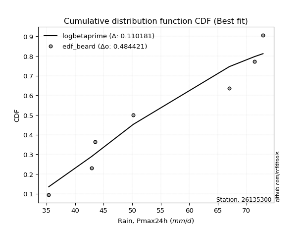</img></img>

</div>


### 5. EDF Chegodayev (1955)

The Chegodayev formula is an empirical plotting position formula used in hydrological frequency analysis to estimate the exceedance probability or return period of a specific event from a set of observed data. It is primarily used for plotting observed data points on probability paper to fit a theoretical distribution, particularly for analyzing extreme events like maximum flood flows or rainfall intensities. The constant _b_ value in the generalized plotting position formula is 0.3.

<div align="center">


$P=(m-b)/(n+1-2b)$


</div>


**5.1. Empirical values**

<div align="center">

|                | 0                   | 1                   | 2                   | 3                   | 4                  | 5                  | 6                  | 7                  |
|:---------------|:--------------------|:--------------------|:--------------------|:--------------------|:-------------------|:-------------------|:-------------------|:-------------------|
| date           | 2023                | 2025                | 2020                | 2021                | 2022               | 2017               | 2019               | 2018               |
| x              | 35.4                | 40.5                | 42.9                | 43.5                | 50.2               | 67.0               | 71.4               | 72.9               |
| m              | 1                   | 2                   | 3                   | 4                   | 5                  | 6                  | 7                  | 8                  |
| empirical_dist | edf_chegodayev      | edf_chegodayev      | edf_chegodayev      | edf_chegodayev      | edf_chegodayev     | edf_chegodayev     | edf_chegodayev     | edf_chegodayev     |
| empirical      | 0.08333333333333333 | 0.20238095238095236 | 0.32142857142857145 | 0.44047619047619047 | 0.5595238095238095 | 0.6785714285714286 | 0.7976190476190476 | 0.9166666666666666 |
| empirical_tr   | 1.090909090909091   | 1.253731343283582   | 1.4736842105263157  | 1.7872340425531914  | 2.27027027027027   | 3.1111111111111116 | 4.941176470588234  | 11.999999999999995 |

</div>


**5.2. Kolmogorov-Smirnov fit test (sorted by Δ)**


<div align="center">

|                | 0                   | 1                   | 2                   | 3                   | 4                   | 5                   | 6                   | 7                  | 8                   | 9                   | 10                  | 11                 | 12                  | 13                  | 14                  | 15                  | 16                  | 17                  | 18                  | 19                  | 20                 | 21                  | 22                 | 23                  | 24                 | 25                  | 26                 | 27                 | 28                  | 29                  | 30                 | 31                 | 32                 | 33                  | 34                  | 35                  | 36                  | 37                  | 38                 | 39                  | 40                  | 41                  | 42                 | 43                  | 44                  | 45                  | 46                 | 47                  | 48                  | 49                 | 50                  | 51                  | 52                  | 53                  | 54                 | 55                 | 56                  | 57                  | 58                  | 59                 | 60                 | 61                  | 62                  | 63                 | 64                  | 65                  | 66                  | 67                  | 68                  | 69                  | 70                  | 71                  | 72                  | 73                  | 74                  | 75                  | 76                  | 77                  | 78                  | 79                  | 80                  | 81                  | 82                  | 83                  | 84                  | 85                 | 86                  | 87                  | 88                  | 89                 | 90                  | 91                 | 92                 | 93                  | 94                  | 95                  | 96                 | 97                  | 98                 | 99                  | 100                | 101                | 102                 | 103                | 104                | 105                | 106                 | 107                | 108                | 109                | 110                | 111                 | 112                | 113                 | 114                 | 115                 | 116                | 117                 | 118                 | 119                 | 120                 | 121                 | 122                 | 123                 | 124                 | 125                | 126                 | 127                 | 128                 | 129                 | 130                | 131                 | 132                 | 133                 | 134                 | 135                 | 136                 | 137                | 138                 | 139                 | 140                 | 141                | 142                 | 143                 | 144                | 145                 | 146                | 147                | 148                | 149                | 150                | 151                | 152                | 153                | 154                | 155                | 156                | 157                | 158                | 159                |
|:---------------|:--------------------|:--------------------|:--------------------|:--------------------|:--------------------|:--------------------|:--------------------|:-------------------|:--------------------|:--------------------|:--------------------|:-------------------|:--------------------|:--------------------|:--------------------|:--------------------|:--------------------|:--------------------|:--------------------|:--------------------|:-------------------|:--------------------|:-------------------|:--------------------|:-------------------|:--------------------|:-------------------|:-------------------|:--------------------|:--------------------|:-------------------|:-------------------|:-------------------|:--------------------|:--------------------|:--------------------|:--------------------|:--------------------|:-------------------|:--------------------|:--------------------|:--------------------|:-------------------|:--------------------|:--------------------|:--------------------|:-------------------|:--------------------|:--------------------|:-------------------|:--------------------|:--------------------|:--------------------|:--------------------|:-------------------|:-------------------|:--------------------|:--------------------|:--------------------|:-------------------|:-------------------|:--------------------|:--------------------|:-------------------|:--------------------|:--------------------|:--------------------|:--------------------|:--------------------|:--------------------|:--------------------|:--------------------|:--------------------|:--------------------|:--------------------|:--------------------|:--------------------|:--------------------|:--------------------|:--------------------|:--------------------|:--------------------|:--------------------|:--------------------|:--------------------|:-------------------|:--------------------|:--------------------|:--------------------|:-------------------|:--------------------|:-------------------|:-------------------|:--------------------|:--------------------|:--------------------|:-------------------|:--------------------|:-------------------|:--------------------|:-------------------|:-------------------|:--------------------|:-------------------|:-------------------|:-------------------|:--------------------|:-------------------|:-------------------|:-------------------|:-------------------|:--------------------|:-------------------|:--------------------|:--------------------|:--------------------|:-------------------|:--------------------|:--------------------|:--------------------|:--------------------|:--------------------|:--------------------|:--------------------|:--------------------|:-------------------|:--------------------|:--------------------|:--------------------|:--------------------|:-------------------|:--------------------|:--------------------|:--------------------|:--------------------|:--------------------|:--------------------|:-------------------|:--------------------|:--------------------|:--------------------|:-------------------|:--------------------|:--------------------|:-------------------|:--------------------|:-------------------|:-------------------|:-------------------|:-------------------|:-------------------|:-------------------|:-------------------|:-------------------|:-------------------|:-------------------|:-------------------|:-------------------|:-------------------|:-------------------|
| station        | 26135300            | 26135300            | 26135300            | 26135300            | 26135300            | 26135300            | 26135300            | 26135300           | 26135300            | 26135300            | 26135300            | 26135300           | 26135300            | 26135300            | 26135300            | 26135300            | 26135300            | 26135300            | 26135300            | 26135300            | 26135300           | 26135300            | 26135300           | 26135300            | 26135300           | 26135300            | 26135300           | 26135300           | 26135300            | 26135300            | 26135300           | 26135300           | 26135300           | 26135300            | 26135300            | 26135300            | 26135300            | 26135300            | 26135300           | 26135300            | 26135300            | 26135300            | 26135300           | 26135300            | 26135300            | 26135300            | 26135300           | 26135300            | 26135300            | 26135300           | 26135300            | 26135300            | 26135300            | 26135300            | 26135300           | 26135300           | 26135300            | 26135300            | 26135300            | 26135300           | 26135300           | 26135300            | 26135300            | 26135300           | 26135300            | 26135300            | 26135300            | 26135300            | 26135300            | 26135300            | 26135300            | 26135300            | 26135300            | 26135300            | 26135300            | 26135300            | 26135300            | 26135300            | 26135300            | 26135300            | 26135300            | 26135300            | 26135300            | 26135300            | 26135300            | 26135300           | 26135300            | 26135300            | 26135300            | 26135300           | 26135300            | 26135300           | 26135300           | 26135300            | 26135300            | 26135300            | 26135300           | 26135300            | 26135300           | 26135300            | 26135300           | 26135300           | 26135300            | 26135300           | 26135300           | 26135300           | 26135300            | 26135300           | 26135300           | 26135300           | 26135300           | 26135300            | 26135300           | 26135300            | 26135300            | 26135300            | 26135300           | 26135300            | 26135300            | 26135300            | 26135300            | 26135300            | 26135300            | 26135300            | 26135300            | 26135300           | 26135300            | 26135300            | 26135300            | 26135300            | 26135300           | 26135300            | 26135300            | 26135300            | 26135300            | 26135300            | 26135300            | 26135300           | 26135300            | 26135300            | 26135300            | 26135300           | 26135300            | 26135300            | 26135300           | 26135300            | 26135300           | 26135300           | 26135300           | 26135300           | 26135300           | 26135300           | 26135300           | 26135300           | 26135300           | 26135300           | 26135300           | 26135300           | 26135300           | 26135300           |
| empirical_dist | edf_chegodayev      | edf_chegodayev      | edf_chegodayev      | edf_chegodayev      | edf_chegodayev      | edf_chegodayev      | edf_chegodayev      | edf_chegodayev     | edf_chegodayev      | edf_chegodayev      | edf_chegodayev      | edf_chegodayev     | edf_chegodayev      | edf_chegodayev      | edf_chegodayev      | edf_chegodayev      | edf_chegodayev      | edf_chegodayev      | edf_chegodayev      | edf_chegodayev      | edf_chegodayev     | edf_chegodayev      | edf_chegodayev     | edf_chegodayev      | edf_chegodayev     | edf_chegodayev      | edf_chegodayev     | edf_chegodayev     | edf_chegodayev      | edf_chegodayev      | edf_chegodayev     | edf_chegodayev     | edf_chegodayev     | edf_chegodayev      | edf_chegodayev      | edf_chegodayev      | edf_chegodayev      | edf_chegodayev      | edf_chegodayev     | edf_chegodayev      | edf_chegodayev      | edf_chegodayev      | edf_chegodayev     | edf_chegodayev      | edf_chegodayev      | edf_chegodayev      | edf_chegodayev     | edf_chegodayev      | edf_chegodayev      | edf_chegodayev     | edf_chegodayev      | edf_chegodayev      | edf_chegodayev      | edf_chegodayev      | edf_chegodayev     | edf_chegodayev     | edf_chegodayev      | edf_chegodayev      | edf_chegodayev      | edf_chegodayev     | edf_chegodayev     | edf_chegodayev      | edf_chegodayev      | edf_chegodayev     | edf_chegodayev      | edf_chegodayev      | edf_chegodayev      | edf_chegodayev      | edf_chegodayev      | edf_chegodayev      | edf_chegodayev      | edf_chegodayev      | edf_chegodayev      | edf_chegodayev      | edf_chegodayev      | edf_chegodayev      | edf_chegodayev      | edf_chegodayev      | edf_chegodayev      | edf_chegodayev      | edf_chegodayev      | edf_chegodayev      | edf_chegodayev      | edf_chegodayev      | edf_chegodayev      | edf_chegodayev     | edf_chegodayev      | edf_chegodayev      | edf_chegodayev      | edf_chegodayev     | edf_chegodayev      | edf_chegodayev     | edf_chegodayev     | edf_chegodayev      | edf_chegodayev      | edf_chegodayev      | edf_chegodayev     | edf_chegodayev      | edf_chegodayev     | edf_chegodayev      | edf_chegodayev     | edf_chegodayev     | edf_chegodayev      | edf_chegodayev     | edf_chegodayev     | edf_chegodayev     | edf_chegodayev      | edf_chegodayev     | edf_chegodayev     | edf_chegodayev     | edf_chegodayev     | edf_chegodayev      | edf_chegodayev     | edf_chegodayev      | edf_chegodayev      | edf_chegodayev      | edf_chegodayev     | edf_chegodayev      | edf_chegodayev      | edf_chegodayev      | edf_chegodayev      | edf_chegodayev      | edf_chegodayev      | edf_chegodayev      | edf_chegodayev      | edf_chegodayev     | edf_chegodayev      | edf_chegodayev      | edf_chegodayev      | edf_chegodayev      | edf_chegodayev     | edf_chegodayev      | edf_chegodayev      | edf_chegodayev      | edf_chegodayev      | edf_chegodayev      | edf_chegodayev      | edf_chegodayev     | edf_chegodayev      | edf_chegodayev      | edf_chegodayev      | edf_chegodayev     | edf_chegodayev      | edf_chegodayev      | edf_chegodayev     | edf_chegodayev      | edf_chegodayev     | edf_chegodayev     | edf_chegodayev     | edf_chegodayev     | edf_chegodayev     | edf_chegodayev     | edf_chegodayev     | edf_chegodayev     | edf_chegodayev     | edf_chegodayev     | edf_chegodayev     | edf_chegodayev     | edf_chegodayev     | edf_chegodayev     |
| p_dist         | logarcsine          | wrapcauchy          | logbetaprime        | arcsine             | logrdist            | logksone            | logsemicircular     | ksone              | logncf              | rdist               | loglomax            | loganglit          | burr12              | logloglaplace       | weibull_min         | logwrapcauchy       | semicircular        | lomax               | genexpon            | exponnorm           | loggenhalflogistic | rayleigh            | halfnorm           | logerlang           | logweibull_min     | skewnorm            | logfoldnorm        | loggenexpon        | loggamma            | loggamma            | anglit             | foldnorm           | logskewnorm        | gompertz            | loggompertz         | lograyleigh         | loghalfnorm         | logfatiguelife      | logmaxwell         | loginvgauss         | invgauss            | invgamma            | f                  | logburr             | maxwell             | invweibull          | genextreme         | logtrapezoid        | logrice             | loginvgamma        | logf                | logpearson3         | betaprime           | logloggamma         | loginvweibull      | lognct             | nct                 | loggenlogistic      | burr                | alpha              | logmielke          | logexponnorm        | logcrystalball      | lognorm            | logt                | logalpha            | logkstwobign        | logjohnsonsu        | gumbel_r            | halflogistic        | halfgennorm         | kstwobign           | genlogistic         | pearson3            | logburr12           | loghalflogistic     | loggumbel_r         | triang              | moyal               | trapezoid           | logcosine           | logmoyal            | loggausshyper       | kappa4              | t                   | crystalball        | norm                | truncnorm           | logkappa3           | loglogistic        | logtukeylambda      | rice               | bradford           | logkappa4           | logdweibull         | loguniform          | loglevy_l          | levy_l              | logtriang          | loghypsecant        | logvonmises_line   | logwald            | cosine              | logargus           | johnsonsu          | logistic           | truncpareto         | logdgamma          | loggumbel_l        | dweibull           | truncexpon         | tukeylambda         | gausshyper         | dgamma              | uniform             | kappa3              | logbeta            | hypsecant           | gumbel_l            | loglaplace          | loglaplace          | logbradford         | vonmises_line       | loggennorm          | logweibull_max      | argus              | wald                | truncweibull_min    | logtruncweibull_min | laplace             | gennorm            | logtruncexpon       | loggenextreme       | logjohnsonsb        | genpareto           | genhalflogistic     | johnsonsb           | beta               | exponpow            | ncf                 | logexponpow         | gengamma           | loggenpareto        | weibull_max         | nakagami           | powerlaw            | erlang             | logpowerlaw        | lognakagami        | exponweib          | logexponweib       | fatiguelife        | loggengamma        | gamma              | logtruncnorm       | loghalfgennorm     | logtruncpareto     | logvonmises        | vonmises           | mielke             |
| delta          | 0.08335729736739034 | 0.09646213251443661 | 0.10308436831345313 | 0.10387866902912735 | 0.10988648385742894 | 0.11763617606824461 | 0.13271266126393622 | 0.1340850944589908 | 0.13573159727526962 | 0.14213457496828036 | 0.14277330397232402 | 0.1441586267981455 | 0.14499476915629295 | 0.14645960293511284 | 0.14780568937926744 | 0.14929550264075767 | 0.14988902864461429 | 0.15412429510086556 | 0.15589585186609833 | 0.15825748540756035 | 0.1583126396186887 | 0.15851022244885488 | 0.158811638185828  | 0.15934153725253242 | 0.1597583826694009 | 0.16033893145033984 | 0.1611917658487272 | 0.1615948145787902 | 0.16176501266443444 | 0.16176501266443444 | 0.1617881202949062 | 0.1620985491430652 | 0.1624976620573595 | 0.16289990390259557 | 0.16402255762429496 | 0.16418796775134592 | 0.16424379526507138 | 0.16425170266476186 | 0.1650422534301581 | 0.16552746517723738 | 0.16555808803747263 | 0.16616567868925136 | 0.1665693874381261 | 0.16742126798175616 | 0.16747832217348863 | 0.16777166888655692 | 0.1677722504959095 | 0.16797533571925138 | 0.16818224766351775 | 0.1681872614652561 | 0.16818894763535985 | 0.16830268397996573 | 0.16949913642834658 | 0.16955074976344336 | 0.1695775509596239 | 0.1696581944760952 | 0.17012691181938833 | 0.17013849503586387 | 0.17029583266627935 | 0.1703687300993123 | 0.1706076303300882 | 0.17065607303197233 | 0.17076945048871384 | 0.1707694598124881 | 0.17077016700221154 | 0.17264048276182742 | 0.17333376186154836 | 0.17501037349555748 | 0.17599256577921185 | 0.17623291703527255 | 0.17766870542522337 | 0.17775750745152485 | 0.17837681809384565 | 0.17964608491758577 | 0.18066453846365738 | 0.18092928928493157 | 0.18112105217544616 | 0.18153517182788442 | 0.18180232821500486 | 0.18181681841629305 | 0.18195408637506977 | 0.18637266270586061 | 0.18838713795731038 | 0.18853462399448734 | 0.18926376039432036 | 0.1892642782958489 | 0.18926427939826018 | 0.18926428660372774 | 0.19220607864757178 | 0.1931881873606938 | 0.19740473932118108 | 0.1990698003380958 | 0.2002881973553019 | 0.20124875332841563 | 0.20396252133900594 | 0.20459755274348246 | 0.2046174262109488 | 0.20701622693364036 | 0.207187173518399  | 0.20853055632899184 | 0.2088610980268728 | 0.2094163580149131 | 0.20972268998261095 | 0.2108129290922638 | 0.2116220424170595 | 0.2119198015958909 | 0.21246710528181711 | 0.2145428421376826 | 0.2149625537244955 | 0.2150390062408395 | 0.2160663163664821 | 0.21612548221052275 | 0.2198679555506895 | 0.22301421292424195 | 0.22447619047619047 | 0.22457550361625708 | 0.2265907821608216 | 0.22687197264892084 | 0.22903743829336126 | 0.23056071261065808 | 0.23056071261065808 | 0.23442357839622707 | 0.23596159135175268 | 0.23607455624168838 | 0.23911616947291842 | 0.2409485160430579 | 0.24335450025307723 | 0.24388964655636636 | 0.2447797302707887  | 0.24681270351824403 | 0.2468719923392133 | 0.25081860869102457 | 0.25592733699494097 | 0.26686538229965806 | 0.27416935021869504 | 0.32420344249691085 | 0.32438183890361416 | 0.3945191532162816 | 0.39807821577164015 | 0.39990256977114774 | 0.40219778434809916 | 0.424142305807103  | 0.44536128934813485 | 0.44799155345360564 | 0.4501619414370236 | 0.48441617187615904 | 0.4995279717462422 | 0.5131805574270213 | 0.5131870976870667 | 0.5198688212311812 | 0.5309019944654242 | 0.531564611900106  | 0.5676550174441595 | 0.6054110247390699 | 0.6785680002639697 | 0.6785714285714286 | 0.6880158326322858 | 1.1691592906911583 | 11.447524802343562 | nan                |
| deltao         | 0.4472608134160001  | 0.4472608134160001  | 0.4472608134160001  | 0.4472608134160001  | 0.4472608134160001  | 0.4472608134160001  | 0.4472608134160001  | 0.4472608134160001 | 0.4472608134160001  | 0.4472608134160001  | 0.4472608134160001  | 0.4472608134160001 | 0.4472608134160001  | 0.4472608134160001  | 0.4472608134160001  | 0.4472608134160001  | 0.4472608134160001  | 0.4472608134160001  | 0.4472608134160001  | 0.4472608134160001  | 0.4472608134160001 | 0.4472608134160001  | 0.4472608134160001 | 0.4472608134160001  | 0.4472608134160001 | 0.4472608134160001  | 0.4472608134160001 | 0.4472608134160001 | 0.4472608134160001  | 0.4472608134160001  | 0.4472608134160001 | 0.4472608134160001 | 0.4472608134160001 | 0.4472608134160001  | 0.4472608134160001  | 0.4472608134160001  | 0.4472608134160001  | 0.4472608134160001  | 0.4472608134160001 | 0.4472608134160001  | 0.4472608134160001  | 0.4472608134160001  | 0.4472608134160001 | 0.4472608134160001  | 0.4472608134160001  | 0.4472608134160001  | 0.4472608134160001 | 0.4472608134160001  | 0.4472608134160001  | 0.4472608134160001 | 0.4472608134160001  | 0.4472608134160001  | 0.4472608134160001  | 0.4472608134160001  | 0.4472608134160001 | 0.4472608134160001 | 0.4472608134160001  | 0.4472608134160001  | 0.4472608134160001  | 0.4472608134160001 | 0.4472608134160001 | 0.4472608134160001  | 0.4472608134160001  | 0.4472608134160001 | 0.4472608134160001  | 0.4472608134160001  | 0.4472608134160001  | 0.4472608134160001  | 0.4472608134160001  | 0.4472608134160001  | 0.4472608134160001  | 0.4472608134160001  | 0.4472608134160001  | 0.4472608134160001  | 0.4472608134160001  | 0.4472608134160001  | 0.4472608134160001  | 0.4472608134160001  | 0.4472608134160001  | 0.4472608134160001  | 0.4472608134160001  | 0.4472608134160001  | 0.4472608134160001  | 0.4472608134160001  | 0.4472608134160001  | 0.4472608134160001 | 0.4472608134160001  | 0.4472608134160001  | 0.4472608134160001  | 0.4472608134160001 | 0.4472608134160001  | 0.4472608134160001 | 0.4472608134160001 | 0.4472608134160001  | 0.4472608134160001  | 0.4472608134160001  | 0.4472608134160001 | 0.4472608134160001  | 0.4472608134160001 | 0.4472608134160001  | 0.4472608134160001 | 0.4472608134160001 | 0.4472608134160001  | 0.4472608134160001 | 0.4472608134160001 | 0.4472608134160001 | 0.4472608134160001  | 0.4472608134160001 | 0.4472608134160001 | 0.4472608134160001 | 0.4472608134160001 | 0.4472608134160001  | 0.4472608134160001 | 0.4472608134160001  | 0.4472608134160001  | 0.4472608134160001  | 0.4472608134160001 | 0.4472608134160001  | 0.4472608134160001  | 0.4472608134160001  | 0.4472608134160001  | 0.4472608134160001  | 0.4472608134160001  | 0.4472608134160001  | 0.4472608134160001  | 0.4472608134160001 | 0.4472608134160001  | 0.4472608134160001  | 0.4472608134160001  | 0.4472608134160001  | 0.4472608134160001 | 0.4472608134160001  | 0.4472608134160001  | 0.4472608134160001  | 0.4472608134160001  | 0.4472608134160001  | 0.4472608134160001  | 0.4472608134160001 | 0.4472608134160001  | 0.4472608134160001  | 0.4472608134160001  | 0.4472608134160001 | 0.4472608134160001  | 0.4472608134160001  | 0.4472608134160001 | 0.4472608134160001  | 0.4472608134160001 | 0.4472608134160001 | 0.4472608134160001 | 0.4472608134160001 | 0.4472608134160001 | 0.4472608134160001 | 0.4472608134160001 | 0.4472608134160001 | 0.4472608134160001 | 0.4472608134160001 | 0.4472608134160001 | 0.4472608134160001 | 0.4472608134160001 | 0.4472608134160001 |
| eval           | Δo > Δ              | Δo > Δ              | Δo > Δ              | Δo > Δ              | Δo > Δ              | Δo > Δ              | Δo > Δ              | Δo > Δ             | Δo > Δ              | Δo > Δ              | Δo > Δ              | Δo > Δ             | Δo > Δ              | Δo > Δ              | Δo > Δ              | Δo > Δ              | Δo > Δ              | Δo > Δ              | Δo > Δ              | Δo > Δ              | Δo > Δ             | Δo > Δ              | Δo > Δ             | Δo > Δ              | Δo > Δ             | Δo > Δ              | Δo > Δ             | Δo > Δ             | Δo > Δ              | Δo > Δ              | Δo > Δ             | Δo > Δ             | Δo > Δ             | Δo > Δ              | Δo > Δ              | Δo > Δ              | Δo > Δ              | Δo > Δ              | Δo > Δ             | Δo > Δ              | Δo > Δ              | Δo > Δ              | Δo > Δ             | Δo > Δ              | Δo > Δ              | Δo > Δ              | Δo > Δ             | Δo > Δ              | Δo > Δ              | Δo > Δ             | Δo > Δ              | Δo > Δ              | Δo > Δ              | Δo > Δ              | Δo > Δ             | Δo > Δ             | Δo > Δ              | Δo > Δ              | Δo > Δ              | Δo > Δ             | Δo > Δ             | Δo > Δ              | Δo > Δ              | Δo > Δ             | Δo > Δ              | Δo > Δ              | Δo > Δ              | Δo > Δ              | Δo > Δ              | Δo > Δ              | Δo > Δ              | Δo > Δ              | Δo > Δ              | Δo > Δ              | Δo > Δ              | Δo > Δ              | Δo > Δ              | Δo > Δ              | Δo > Δ              | Δo > Δ              | Δo > Δ              | Δo > Δ              | Δo > Δ              | Δo > Δ              | Δo > Δ              | Δo > Δ             | Δo > Δ              | Δo > Δ              | Δo > Δ              | Δo > Δ             | Δo > Δ              | Δo > Δ             | Δo > Δ             | Δo > Δ              | Δo > Δ              | Δo > Δ              | Δo > Δ             | Δo > Δ              | Δo > Δ             | Δo > Δ              | Δo > Δ             | Δo > Δ             | Δo > Δ              | Δo > Δ             | Δo > Δ             | Δo > Δ             | Δo > Δ              | Δo > Δ             | Δo > Δ             | Δo > Δ             | Δo > Δ             | Δo > Δ              | Δo > Δ             | Δo > Δ              | Δo > Δ              | Δo > Δ              | Δo > Δ             | Δo > Δ              | Δo > Δ              | Δo > Δ              | Δo > Δ              | Δo > Δ              | Δo > Δ              | Δo > Δ              | Δo > Δ              | Δo > Δ             | Δo > Δ              | Δo > Δ              | Δo > Δ              | Δo > Δ              | Δo > Δ             | Δo > Δ              | Δo > Δ              | Δo > Δ              | Δo > Δ              | Δo > Δ              | Δo > Δ              | Δo > Δ             | Δo > Δ              | Δo > Δ              | Δo > Δ              | Δo > Δ             | Δo > Δ              | Δo <= Δ             | Δo <= Δ            | Δo <= Δ             | Δo <= Δ            | Δo <= Δ            | Δo <= Δ            | Δo <= Δ            | Δo <= Δ            | Δo <= Δ            | Δo <= Δ            | Δo <= Δ            | Δo <= Δ            | Δo <= Δ            | Δo <= Δ            | Δo <= Δ            | Δo <= Δ            | Δo <= Δ            |
| fit            | 1                   | 1                   | 1                   | 1                   | 1                   | 1                   | 1                   | 1                  | 1                   | 1                   | 1                   | 1                  | 1                   | 1                   | 1                   | 1                   | 1                   | 1                   | 1                   | 1                   | 1                  | 1                   | 1                  | 1                   | 1                  | 1                   | 1                  | 1                  | 1                   | 1                   | 1                  | 1                  | 1                  | 1                   | 1                   | 1                   | 1                   | 1                   | 1                  | 1                   | 1                   | 1                   | 1                  | 1                   | 1                   | 1                   | 1                  | 1                   | 1                   | 1                  | 1                   | 1                   | 1                   | 1                   | 1                  | 1                  | 1                   | 1                   | 1                   | 1                  | 1                  | 1                   | 1                   | 1                  | 1                   | 1                   | 1                   | 1                   | 1                   | 1                   | 1                   | 1                   | 1                   | 1                   | 1                   | 1                   | 1                   | 1                   | 1                   | 1                   | 1                   | 1                   | 1                   | 1                   | 1                   | 1                  | 1                   | 1                   | 1                   | 1                  | 1                   | 1                  | 1                  | 1                   | 1                   | 1                   | 1                  | 1                   | 1                  | 1                   | 1                  | 1                  | 1                   | 1                  | 1                  | 1                  | 1                   | 1                  | 1                  | 1                  | 1                  | 1                   | 1                  | 1                   | 1                   | 1                   | 1                  | 1                   | 1                   | 1                   | 1                   | 1                   | 1                   | 1                   | 1                   | 1                  | 1                   | 1                   | 1                   | 1                   | 1                  | 1                   | 1                   | 1                   | 1                   | 1                   | 1                   | 1                  | 1                   | 1                   | 1                   | 1                  | 1                   | 0                   | 0                  | 0                   | 0                  | 0                  | 0                  | 0                  | 0                  | 0                  | 0                  | 0                  | 0                  | 0                  | 0                  | 0                  | 0                  | 0                  |
| n              | 8                   | 8                   | 8                   | 8                   | 8                   | 8                   | 8                   | 8                  | 8                   | 8                   | 8                   | 8                  | 8                   | 8                   | 8                   | 8                   | 8                   | 8                   | 8                   | 8                   | 8                  | 8                   | 8                  | 8                   | 8                  | 8                   | 8                  | 8                  | 8                   | 8                   | 8                  | 8                  | 8                  | 8                   | 8                   | 8                   | 8                   | 8                   | 8                  | 8                   | 8                   | 8                   | 8                  | 8                   | 8                   | 8                   | 8                  | 8                   | 8                   | 8                  | 8                   | 8                   | 8                   | 8                   | 8                  | 8                  | 8                   | 8                   | 8                   | 8                  | 8                  | 8                   | 8                   | 8                  | 8                   | 8                   | 8                   | 8                   | 8                   | 8                   | 8                   | 8                   | 8                   | 8                   | 8                   | 8                   | 8                   | 8                   | 8                   | 8                   | 8                   | 8                   | 8                   | 8                   | 8                   | 8                  | 8                   | 8                   | 8                   | 8                  | 8                   | 8                  | 8                  | 8                   | 8                   | 8                   | 8                  | 8                   | 8                  | 8                   | 8                  | 8                  | 8                   | 8                  | 8                  | 8                  | 8                   | 8                  | 8                  | 8                  | 8                  | 8                   | 8                  | 8                   | 8                   | 8                   | 8                  | 8                   | 8                   | 8                   | 8                   | 8                   | 8                   | 8                   | 8                   | 8                  | 8                   | 8                   | 8                   | 8                   | 8                  | 8                   | 8                   | 8                   | 8                   | 8                   | 8                   | 8                  | 8                   | 8                   | 8                   | 8                  | 8                   | 8                   | 8                  | 8                   | 8                  | 8                  | 8                  | 8                  | 8                  | 8                  | 8                  | 8                  | 8                  | 8                  | 8                  | 8                  | 8                  | 8                  |
| best_fit       | 1                   | 0                   | 0                   | 0                   | 0                   | 0                   | 0                   | 0                  | 0                   | 0                   | 0                   | 0                  | 0                   | 0                   | 0                   | 0                   | 0                   | 0                   | 0                   | 0                   | 0                  | 0                   | 0                  | 0                   | 0                  | 0                   | 0                  | 0                  | 0                   | 0                   | 0                  | 0                  | 0                  | 0                   | 0                   | 0                   | 0                   | 0                   | 0                  | 0                   | 0                   | 0                   | 0                  | 0                   | 0                   | 0                   | 0                  | 0                   | 0                   | 0                  | 0                   | 0                   | 0                   | 0                   | 0                  | 0                  | 0                   | 0                   | 0                   | 0                  | 0                  | 0                   | 0                   | 0                  | 0                   | 0                   | 0                   | 0                   | 0                   | 0                   | 0                   | 0                   | 0                   | 0                   | 0                   | 0                   | 0                   | 0                   | 0                   | 0                   | 0                   | 0                   | 0                   | 0                   | 0                   | 0                  | 0                   | 0                   | 0                   | 0                  | 0                   | 0                  | 0                  | 0                   | 0                   | 0                   | 0                  | 0                   | 0                  | 0                   | 0                  | 0                  | 0                   | 0                  | 0                  | 0                  | 0                   | 0                  | 0                  | 0                  | 0                  | 0                   | 0                  | 0                   | 0                   | 0                   | 0                  | 0                   | 0                   | 0                   | 0                   | 0                   | 0                   | 0                   | 0                   | 0                  | 0                   | 0                   | 0                   | 0                   | 0                  | 0                   | 0                   | 0                   | 0                   | 0                   | 0                   | 0                  | 0                   | 0                   | 0                   | 0                  | 0                   | 0                   | 0                  | 0                   | 0                  | 0                  | 0                  | 0                  | 0                  | 0                  | 0                  | 0                  | 0                  | 0                  | 0                  | 0                  | 0                  | 0                  |
| best_fit_sort  | 1                   | 2                   | 3                   | 4                   | 5                   | 6                   | 7                   | 8                  | 9                   | 10                  | 11                  | 12                 | 13                  | 14                  | 15                  | 16                  | 17                  | 18                  | 19                  | 20                  | 21                 | 22                  | 23                 | 24                  | 25                 | 26                  | 27                 | 28                 | 29                  | 30                  | 31                 | 32                 | 33                 | 34                  | 35                  | 36                  | 37                  | 38                  | 39                 | 40                  | 41                  | 42                  | 43                 | 44                  | 45                  | 46                  | 47                 | 48                  | 49                  | 50                 | 51                  | 52                  | 53                  | 54                  | 55                 | 56                 | 57                  | 58                  | 59                  | 60                 | 61                 | 62                  | 63                  | 64                 | 65                  | 66                  | 67                  | 68                  | 69                  | 70                  | 71                  | 72                  | 73                  | 74                  | 75                  | 76                  | 77                  | 78                  | 79                  | 80                  | 81                  | 82                  | 83                  | 84                  | 85                  | 86                 | 87                  | 88                  | 89                  | 90                 | 91                  | 92                 | 93                 | 94                  | 95                  | 96                  | 97                 | 98                  | 99                 | 100                 | 101                | 102                | 103                 | 104                | 105                | 106                | 107                 | 108                | 109                | 110                | 111                | 112                 | 113                | 114                 | 115                 | 116                 | 117                | 118                 | 119                 | 120                 | 121                 | 122                 | 123                 | 124                 | 125                 | 126                | 127                 | 128                 | 129                 | 130                 | 131                | 132                 | 133                 | 134                 | 135                 | 136                 | 137                 | 138                | 139                 | 140                 | 141                 | 142                | 143                 | 144                 | 145                | 146                 | 147                | 148                | 149                | 150                | 151                | 152                | 153                | 154                | 155                | 156                | 157                | 158                | 159                | 160                |

</div>


**5.3. Best fit**

<div align="center">

|   id |   station | empirical_dist   | p_dist     |     delta |   deltao | eval   |   fit |   n |   best_fit |   best_fit_sort |
|-----:|----------:|:-----------------|:-----------|----------:|---------:|:-------|------:|----:|-----------:|----------------:|
|    0 |  26135300 | edf_chegodayev   | logarcsine | 0.0833573 | 0.447261 | Δo > Δ |     1 |   8 |          1 |               1 |

</div>


<div align="center">

</img></img>

</div>


### 6. EDF Blom (1958)

The Blom formula is a specific "plotting position" formula used in hydrology and statistical analysis to estimate the empirical cumulative probability (or non-exceedance probability) of a data series. It is particularly recommended for data that are approximately normally distributed. The constant _a_ is set to 0.375 (or 3/8).

<div align="center">


$P=(m-a)/(n+1-2a)$


</div>


**6.1. Empirical values**

<div align="center">

|                | 0                   | 1                   | 2                  | 3                  | 4                  | 5                  | 6                 | 7                  |
|:---------------|:--------------------|:--------------------|:-------------------|:-------------------|:-------------------|:-------------------|:------------------|:-------------------|
| date           | 2023                | 2025                | 2020               | 2021               | 2022               | 2017               | 2019              | 2018               |
| x              | 35.4                | 40.5                | 42.9               | 43.5               | 50.2               | 67.0               | 71.4              | 72.9               |
| m              | 1                   | 2                   | 3                  | 4                  | 5                  | 6                  | 7                 | 8                  |
| empirical_dist | edf_blom            | edf_blom            | edf_blom           | edf_blom           | edf_blom           | edf_blom           | edf_blom          | edf_blom           |
| empirical      | 0.07575757575757576 | 0.19696969696969696 | 0.3181818181818182 | 0.4393939393939394 | 0.5606060606060606 | 0.6818181818181818 | 0.803030303030303 | 0.9242424242424242 |
| empirical_tr   | 1.0819672131147542  | 1.2452830188679247  | 1.4666666666666666 | 1.783783783783784  | 2.275862068965517  | 3.1428571428571423 | 5.076923076923076 | 13.199999999999992 |

</div>


**6.2. Kolmogorov-Smirnov fit test (sorted by Δ)**


<div align="center">

|                | 0                  | 1                  | 2                   | 3                   | 4                   | 5                   | 6                   | 7                   | 8                   | 9                   | 10                  | 11                  | 12                  | 13                 | 14                 | 15                  | 16                  | 17                  | 18                 | 19                  | 20                  | 21                  | 22                  | 23                  | 24                 | 25                  | 26                  | 27                  | 28                  | 29                  | 30                  | 31                 | 32                  | 33                 | 34                  | 35                  | 36                 | 37                  | 38                  | 39                 | 40                  | 41                 | 42                  | 43                 | 44                  | 45                  | 46                  | 47                  | 48                 | 49                  | 50                 | 51                  | 52                  | 53                  | 54                  | 55                 | 56                 | 57                  | 58                  | 59                  | 60                 | 61                  | 62                  | 63                  | 64                  | 65                  | 66                 | 67                 | 68                 | 69                  | 70                 | 71                  | 72                 | 73                 | 74                 | 75                 | 76                 | 77                  | 78                  | 79                 | 80                  | 81                  | 82                 | 83                  | 84                  | 85                  | 86                 | 87                  | 88                 | 89                  | 90                 | 91                  | 92                  | 93                  | 94                  | 95                 | 96                  | 97                  | 98                  | 99                  | 100                 | 101                 | 102                 | 103                 | 104                 | 105                 | 106                 | 107                 | 108                 | 109                 | 110                 | 111                 | 112                 | 113                 | 114                | 115                | 116                 | 117                | 118                | 119                | 120                | 121                | 122                | 123                 | 124                 | 125                | 126                 | 127                 | 128                 | 129                | 130                 | 131                | 132                | 133                | 134                | 135                 | 136                 | 137                | 138                | 139                | 140                 | 141                 | 142                | 143                | 144                 | 145                | 146                | 147                | 148                | 149                | 150                | 151                | 152                | 153                | 154                | 155                | 156                | 157                | 158                | 159                |
|:---------------|:-------------------|:-------------------|:--------------------|:--------------------|:--------------------|:--------------------|:--------------------|:--------------------|:--------------------|:--------------------|:--------------------|:--------------------|:--------------------|:-------------------|:-------------------|:--------------------|:--------------------|:--------------------|:-------------------|:--------------------|:--------------------|:--------------------|:--------------------|:--------------------|:-------------------|:--------------------|:--------------------|:--------------------|:--------------------|:--------------------|:--------------------|:-------------------|:--------------------|:-------------------|:--------------------|:--------------------|:-------------------|:--------------------|:--------------------|:-------------------|:--------------------|:-------------------|:--------------------|:-------------------|:--------------------|:--------------------|:--------------------|:--------------------|:-------------------|:--------------------|:-------------------|:--------------------|:--------------------|:--------------------|:--------------------|:-------------------|:-------------------|:--------------------|:--------------------|:--------------------|:-------------------|:--------------------|:--------------------|:--------------------|:--------------------|:--------------------|:-------------------|:-------------------|:-------------------|:--------------------|:-------------------|:--------------------|:-------------------|:-------------------|:-------------------|:-------------------|:-------------------|:--------------------|:--------------------|:-------------------|:--------------------|:--------------------|:-------------------|:--------------------|:--------------------|:--------------------|:-------------------|:--------------------|:-------------------|:--------------------|:-------------------|:--------------------|:--------------------|:--------------------|:--------------------|:-------------------|:--------------------|:--------------------|:--------------------|:--------------------|:--------------------|:--------------------|:--------------------|:--------------------|:--------------------|:--------------------|:--------------------|:--------------------|:--------------------|:--------------------|:--------------------|:--------------------|:--------------------|:--------------------|:-------------------|:-------------------|:--------------------|:-------------------|:-------------------|:-------------------|:-------------------|:-------------------|:-------------------|:--------------------|:--------------------|:-------------------|:--------------------|:--------------------|:--------------------|:-------------------|:--------------------|:-------------------|:-------------------|:-------------------|:-------------------|:--------------------|:--------------------|:-------------------|:-------------------|:-------------------|:--------------------|:--------------------|:-------------------|:-------------------|:--------------------|:-------------------|:-------------------|:-------------------|:-------------------|:-------------------|:-------------------|:-------------------|:-------------------|:-------------------|:-------------------|:-------------------|:-------------------|:-------------------|:-------------------|:-------------------|
| station        | 26135300           | 26135300           | 26135300            | 26135300            | 26135300            | 26135300            | 26135300            | 26135300            | 26135300            | 26135300            | 26135300            | 26135300            | 26135300            | 26135300           | 26135300           | 26135300            | 26135300            | 26135300            | 26135300           | 26135300            | 26135300            | 26135300            | 26135300            | 26135300            | 26135300           | 26135300            | 26135300            | 26135300            | 26135300            | 26135300            | 26135300            | 26135300           | 26135300            | 26135300           | 26135300            | 26135300            | 26135300           | 26135300            | 26135300            | 26135300           | 26135300            | 26135300           | 26135300            | 26135300           | 26135300            | 26135300            | 26135300            | 26135300            | 26135300           | 26135300            | 26135300           | 26135300            | 26135300            | 26135300            | 26135300            | 26135300           | 26135300           | 26135300            | 26135300            | 26135300            | 26135300           | 26135300            | 26135300            | 26135300            | 26135300            | 26135300            | 26135300           | 26135300           | 26135300           | 26135300            | 26135300           | 26135300            | 26135300           | 26135300           | 26135300           | 26135300           | 26135300           | 26135300            | 26135300            | 26135300           | 26135300            | 26135300            | 26135300           | 26135300            | 26135300            | 26135300            | 26135300           | 26135300            | 26135300           | 26135300            | 26135300           | 26135300            | 26135300            | 26135300            | 26135300            | 26135300           | 26135300            | 26135300            | 26135300            | 26135300            | 26135300            | 26135300            | 26135300            | 26135300            | 26135300            | 26135300            | 26135300            | 26135300            | 26135300            | 26135300            | 26135300            | 26135300            | 26135300            | 26135300            | 26135300           | 26135300           | 26135300            | 26135300           | 26135300           | 26135300           | 26135300           | 26135300           | 26135300           | 26135300            | 26135300            | 26135300           | 26135300            | 26135300            | 26135300            | 26135300           | 26135300            | 26135300           | 26135300           | 26135300           | 26135300           | 26135300            | 26135300            | 26135300           | 26135300           | 26135300           | 26135300            | 26135300            | 26135300           | 26135300           | 26135300            | 26135300           | 26135300           | 26135300           | 26135300           | 26135300           | 26135300           | 26135300           | 26135300           | 26135300           | 26135300           | 26135300           | 26135300           | 26135300           | 26135300           | 26135300           |
| empirical_dist | edf_blom           | edf_blom           | edf_blom            | edf_blom            | edf_blom            | edf_blom            | edf_blom            | edf_blom            | edf_blom            | edf_blom            | edf_blom            | edf_blom            | edf_blom            | edf_blom           | edf_blom           | edf_blom            | edf_blom            | edf_blom            | edf_blom           | edf_blom            | edf_blom            | edf_blom            | edf_blom            | edf_blom            | edf_blom           | edf_blom            | edf_blom            | edf_blom            | edf_blom            | edf_blom            | edf_blom            | edf_blom           | edf_blom            | edf_blom           | edf_blom            | edf_blom            | edf_blom           | edf_blom            | edf_blom            | edf_blom           | edf_blom            | edf_blom           | edf_blom            | edf_blom           | edf_blom            | edf_blom            | edf_blom            | edf_blom            | edf_blom           | edf_blom            | edf_blom           | edf_blom            | edf_blom            | edf_blom            | edf_blom            | edf_blom           | edf_blom           | edf_blom            | edf_blom            | edf_blom            | edf_blom           | edf_blom            | edf_blom            | edf_blom            | edf_blom            | edf_blom            | edf_blom           | edf_blom           | edf_blom           | edf_blom            | edf_blom           | edf_blom            | edf_blom           | edf_blom           | edf_blom           | edf_blom           | edf_blom           | edf_blom            | edf_blom            | edf_blom           | edf_blom            | edf_blom            | edf_blom           | edf_blom            | edf_blom            | edf_blom            | edf_blom           | edf_blom            | edf_blom           | edf_blom            | edf_blom           | edf_blom            | edf_blom            | edf_blom            | edf_blom            | edf_blom           | edf_blom            | edf_blom            | edf_blom            | edf_blom            | edf_blom            | edf_blom            | edf_blom            | edf_blom            | edf_blom            | edf_blom            | edf_blom            | edf_blom            | edf_blom            | edf_blom            | edf_blom            | edf_blom            | edf_blom            | edf_blom            | edf_blom           | edf_blom           | edf_blom            | edf_blom           | edf_blom           | edf_blom           | edf_blom           | edf_blom           | edf_blom           | edf_blom            | edf_blom            | edf_blom           | edf_blom            | edf_blom            | edf_blom            | edf_blom           | edf_blom            | edf_blom           | edf_blom           | edf_blom           | edf_blom           | edf_blom            | edf_blom            | edf_blom           | edf_blom           | edf_blom           | edf_blom            | edf_blom            | edf_blom           | edf_blom           | edf_blom            | edf_blom           | edf_blom           | edf_blom           | edf_blom           | edf_blom           | edf_blom           | edf_blom           | edf_blom           | edf_blom           | edf_blom           | edf_blom           | edf_blom           | edf_blom           | edf_blom           | edf_blom           |
| p_dist         | logarcsine         | wrapcauchy         | logbetaprime        | arcsine             | logrdist            | logksone            | logsemicircular     | ksone               | logncf              | loglomax            | rdist               | burr12              | loganglit           | semicircular       | lomax              | genexpon            | loggenhalflogistic  | weibull_min         | logloglaplace      | logwrapcauchy       | exponnorm           | halfnorm            | logerlang           | logweibull_min      | rayleigh           | logfoldnorm         | loggenexpon         | loggamma            | loggamma            | skewnorm            | logskewnorm         | gompertz           | anglit              | loggompertz        | lograyleigh         | loghalfnorm         | logfatiguelife     | foldnorm            | logmaxwell          | loginvgauss        | invgauss            | invgamma           | f                   | logburr            | invweibull          | genextreme          | logrice             | loginvgamma         | logf               | logpearson3         | betaprime          | loginvweibull       | maxwell             | lognct              | nct                 | loggenlogistic     | logtrapezoid       | burr                | alpha               | logmielke           | logloggamma        | logalpha            | logexponnorm        | logcrystalball      | lognorm             | logt                | logkstwobign       | halflogistic       | logjohnsonsu       | gumbel_r            | kstwobign          | genlogistic         | loghalflogistic    | loggumbel_r        | moyal              | pearson3           | logburr12          | triang              | trapezoid           | logcosine          | halfgennorm         | logmoyal            | loggausshyper      | kappa4              | t                   | crystalball         | norm               | truncnorm           | logkappa3          | loglogistic         | logtukeylambda     | bradford            | rice                | logkappa4           | logdweibull         | loguniform         | logvonmises_line    | loglevy_l           | logtriang           | logwald             | loghypsecant        | cosine              | truncpareto         | logargus            | logistic            | logdgamma           | dweibull            | johnsonsu           | truncexpon          | loggumbel_l         | levy_l              | tukeylambda         | gausshyper          | dgamma              | uniform            | kappa3             | hypsecant           | gumbel_l           | loglaplace         | loglaplace         | logbradford        | logbeta            | vonmises_line      | loggennorm          | argus               | truncweibull_min   | logtruncweibull_min | wald                | laplace             | gennorm            | logweibull_max      | logtruncexpon      | loggenextreme      | logjohnsonsb       | genpareto          | genhalflogistic     | johnsonsb           | beta               | exponpow           | ncf                | logexponpow         | gengamma            | weibull_max        | loggenpareto       | nakagami            | powerlaw           | erlang             | logpowerlaw        | lognakagami        | exponweib          | logexponweib       | fatiguelife        | loggengamma        | gamma              | logtruncnorm       | loghalfgennorm     | logtruncpareto     | logvonmises        | vonmises           | mielke             |
| delta          | 0.0879576032010898 | 0.101873387925692  | 0.10200211723120206 | 0.10496092011137836 | 0.10663973061067578 | 0.11655392498599354 | 0.13163041018168514 | 0.13300284337673973 | 0.13464934619301855 | 0.13952655072557085 | 0.14105232388602928 | 0.14174801590953978 | 0.14307637571589443 | 0.1488067775623632 | 0.1508775418541124 | 0.15264909861934517 | 0.15290138420743327 | 0.15321694479052284 | 0.1540353605108704 | 0.15470675805201306 | 0.15501073216080719 | 0.15556488493907483 | 0.15609478400577925 | 0.15651162942264774 | 0.1574279713666038 | 0.15794501260197402 | 0.15834806133203705 | 0.15851825941768127 | 0.15851825941768127 | 0.15882086475070428 | 0.15925090881060633 | 0.1596531506558424 | 0.16070586921265512 | 0.1607758043775418 | 0.16094121450459276 | 0.16099704201831821 | 0.1610049494180087 | 0.16101629806081413 | 0.16179550018340494 | 0.1622807119304842 | 0.16231133479071946 | 0.1629189254424982 | 0.16332263419137294 | 0.164174514735003  | 0.16452491563980376 | 0.16452549724915633 | 0.16493549441676458 | 0.16494050821850292 | 0.1649421943886067 | 0.16505593073321256 | 0.1662523831815934 | 0.16633079771287074 | 0.16639607109123755 | 0.16641144122934204 | 0.16688015857263516 | 0.1668917417891107 | 0.1668930846370003 | 0.16704907941952618 | 0.16712197685255914 | 0.16736087708333502 | 0.1684684986811923 | 0.16939372951507425 | 0.16957382194972126 | 0.16968719940646276 | 0.16968720873023702 | 0.16968791591996046 | 0.1700870086147952 | 0.1729861637885194 | 0.1739281224133064 | 0.17413799269549707 | 0.1745107542047717 | 0.17513006484709248 | 0.1776825360381784 | 0.177874298928693  | 0.1785555749682517 | 0.1785638338353347 | 0.1795822873814063 | 0.18045292074563335 | 0.18073456733404197 | 0.1808718352928187 | 0.18307996083647876 | 0.18312590945910745 | 0.1873048868750593 | 0.18745237291223626 | 0.18818150931206928 | 0.18818202721359784 | 0.1881820283160091 | 0.18818203552147666 | 0.1889593254008186 | 0.19210593627844272 | 0.1941579860744279 | 0.19704144410854874 | 0.19798754925584472 | 0.19800200008166247 | 0.20071576809225278 | 0.2013507994967293 | 0.20561434478011964 | 0.20569967729319982 | 0.20610492243614792 | 0.20616960476815993 | 0.20744830524674077 | 0.20864043890035988 | 0.20922035203506395 | 0.20973067801001272 | 0.21083755051363984 | 0.21129608889092943 | 0.21179225299408633 | 0.21270429349931053 | 0.21281956311972894 | 0.21388030264224442 | 0.21459198450939793 | 0.21504323112827167 | 0.21662120230393633 | 0.21976745967748879 | 0.2233939393939394 | 0.223493252534006  | 0.22578972156666977 | 0.2279551872111102 | 0.229478461528407  | 0.229478461528407  | 0.2311768251494739 | 0.232002037572077  | 0.2348793402695016 | 0.23499230515943736 | 0.23986626496080682 | 0.2406428933096132 | 0.24153297702403553 | 0.24227224917082615 | 0.24573045243599295 | 0.2457897412569623 | 0.24669192704867599 | 0.2475718554442714 | 0.257009588077192  | 0.2722766377109135 | 0.2817451077944526 | 0.32431164798974516 | 0.32979309431486953 | 0.4020949107920392 | 0.4034894711828955 | 0.4074783273469053 | 0.40760903975935453 | 0.42955356121835836 | 0.4512383067003588 | 0.4529370469238924 | 0.45557319684827896 | 0.4898274272874144 | 0.5049392271574975 | 0.5185918128382767 | 0.518598353098322  | 0.5252800766424366 | 0.5363132498766796 | 0.5369758673113614 | 0.5730662728554148 | 0.6108222801503254 | 0.6818147535107228 | 0.6818181818181818 | 0.6934270880435411 | 1.165912537444405  | 11.439949044767804 | nan                |
| deltao         | 0.4472608134160001 | 0.4472608134160001 | 0.4472608134160001  | 0.4472608134160001  | 0.4472608134160001  | 0.4472608134160001  | 0.4472608134160001  | 0.4472608134160001  | 0.4472608134160001  | 0.4472608134160001  | 0.4472608134160001  | 0.4472608134160001  | 0.4472608134160001  | 0.4472608134160001 | 0.4472608134160001 | 0.4472608134160001  | 0.4472608134160001  | 0.4472608134160001  | 0.4472608134160001 | 0.4472608134160001  | 0.4472608134160001  | 0.4472608134160001  | 0.4472608134160001  | 0.4472608134160001  | 0.4472608134160001 | 0.4472608134160001  | 0.4472608134160001  | 0.4472608134160001  | 0.4472608134160001  | 0.4472608134160001  | 0.4472608134160001  | 0.4472608134160001 | 0.4472608134160001  | 0.4472608134160001 | 0.4472608134160001  | 0.4472608134160001  | 0.4472608134160001 | 0.4472608134160001  | 0.4472608134160001  | 0.4472608134160001 | 0.4472608134160001  | 0.4472608134160001 | 0.4472608134160001  | 0.4472608134160001 | 0.4472608134160001  | 0.4472608134160001  | 0.4472608134160001  | 0.4472608134160001  | 0.4472608134160001 | 0.4472608134160001  | 0.4472608134160001 | 0.4472608134160001  | 0.4472608134160001  | 0.4472608134160001  | 0.4472608134160001  | 0.4472608134160001 | 0.4472608134160001 | 0.4472608134160001  | 0.4472608134160001  | 0.4472608134160001  | 0.4472608134160001 | 0.4472608134160001  | 0.4472608134160001  | 0.4472608134160001  | 0.4472608134160001  | 0.4472608134160001  | 0.4472608134160001 | 0.4472608134160001 | 0.4472608134160001 | 0.4472608134160001  | 0.4472608134160001 | 0.4472608134160001  | 0.4472608134160001 | 0.4472608134160001 | 0.4472608134160001 | 0.4472608134160001 | 0.4472608134160001 | 0.4472608134160001  | 0.4472608134160001  | 0.4472608134160001 | 0.4472608134160001  | 0.4472608134160001  | 0.4472608134160001 | 0.4472608134160001  | 0.4472608134160001  | 0.4472608134160001  | 0.4472608134160001 | 0.4472608134160001  | 0.4472608134160001 | 0.4472608134160001  | 0.4472608134160001 | 0.4472608134160001  | 0.4472608134160001  | 0.4472608134160001  | 0.4472608134160001  | 0.4472608134160001 | 0.4472608134160001  | 0.4472608134160001  | 0.4472608134160001  | 0.4472608134160001  | 0.4472608134160001  | 0.4472608134160001  | 0.4472608134160001  | 0.4472608134160001  | 0.4472608134160001  | 0.4472608134160001  | 0.4472608134160001  | 0.4472608134160001  | 0.4472608134160001  | 0.4472608134160001  | 0.4472608134160001  | 0.4472608134160001  | 0.4472608134160001  | 0.4472608134160001  | 0.4472608134160001 | 0.4472608134160001 | 0.4472608134160001  | 0.4472608134160001 | 0.4472608134160001 | 0.4472608134160001 | 0.4472608134160001 | 0.4472608134160001 | 0.4472608134160001 | 0.4472608134160001  | 0.4472608134160001  | 0.4472608134160001 | 0.4472608134160001  | 0.4472608134160001  | 0.4472608134160001  | 0.4472608134160001 | 0.4472608134160001  | 0.4472608134160001 | 0.4472608134160001 | 0.4472608134160001 | 0.4472608134160001 | 0.4472608134160001  | 0.4472608134160001  | 0.4472608134160001 | 0.4472608134160001 | 0.4472608134160001 | 0.4472608134160001  | 0.4472608134160001  | 0.4472608134160001 | 0.4472608134160001 | 0.4472608134160001  | 0.4472608134160001 | 0.4472608134160001 | 0.4472608134160001 | 0.4472608134160001 | 0.4472608134160001 | 0.4472608134160001 | 0.4472608134160001 | 0.4472608134160001 | 0.4472608134160001 | 0.4472608134160001 | 0.4472608134160001 | 0.4472608134160001 | 0.4472608134160001 | 0.4472608134160001 | 0.4472608134160001 |
| eval           | Δo > Δ             | Δo > Δ             | Δo > Δ              | Δo > Δ              | Δo > Δ              | Δo > Δ              | Δo > Δ              | Δo > Δ              | Δo > Δ              | Δo > Δ              | Δo > Δ              | Δo > Δ              | Δo > Δ              | Δo > Δ             | Δo > Δ             | Δo > Δ              | Δo > Δ              | Δo > Δ              | Δo > Δ             | Δo > Δ              | Δo > Δ              | Δo > Δ              | Δo > Δ              | Δo > Δ              | Δo > Δ             | Δo > Δ              | Δo > Δ              | Δo > Δ              | Δo > Δ              | Δo > Δ              | Δo > Δ              | Δo > Δ             | Δo > Δ              | Δo > Δ             | Δo > Δ              | Δo > Δ              | Δo > Δ             | Δo > Δ              | Δo > Δ              | Δo > Δ             | Δo > Δ              | Δo > Δ             | Δo > Δ              | Δo > Δ             | Δo > Δ              | Δo > Δ              | Δo > Δ              | Δo > Δ              | Δo > Δ             | Δo > Δ              | Δo > Δ             | Δo > Δ              | Δo > Δ              | Δo > Δ              | Δo > Δ              | Δo > Δ             | Δo > Δ             | Δo > Δ              | Δo > Δ              | Δo > Δ              | Δo > Δ             | Δo > Δ              | Δo > Δ              | Δo > Δ              | Δo > Δ              | Δo > Δ              | Δo > Δ             | Δo > Δ             | Δo > Δ             | Δo > Δ              | Δo > Δ             | Δo > Δ              | Δo > Δ             | Δo > Δ             | Δo > Δ             | Δo > Δ             | Δo > Δ             | Δo > Δ              | Δo > Δ              | Δo > Δ             | Δo > Δ              | Δo > Δ              | Δo > Δ             | Δo > Δ              | Δo > Δ              | Δo > Δ              | Δo > Δ             | Δo > Δ              | Δo > Δ             | Δo > Δ              | Δo > Δ             | Δo > Δ              | Δo > Δ              | Δo > Δ              | Δo > Δ              | Δo > Δ             | Δo > Δ              | Δo > Δ              | Δo > Δ              | Δo > Δ              | Δo > Δ              | Δo > Δ              | Δo > Δ              | Δo > Δ              | Δo > Δ              | Δo > Δ              | Δo > Δ              | Δo > Δ              | Δo > Δ              | Δo > Δ              | Δo > Δ              | Δo > Δ              | Δo > Δ              | Δo > Δ              | Δo > Δ             | Δo > Δ             | Δo > Δ              | Δo > Δ             | Δo > Δ             | Δo > Δ             | Δo > Δ             | Δo > Δ             | Δo > Δ             | Δo > Δ              | Δo > Δ              | Δo > Δ             | Δo > Δ              | Δo > Δ              | Δo > Δ              | Δo > Δ             | Δo > Δ              | Δo > Δ             | Δo > Δ             | Δo > Δ             | Δo > Δ             | Δo > Δ              | Δo > Δ              | Δo > Δ             | Δo > Δ             | Δo > Δ             | Δo > Δ              | Δo > Δ              | Δo <= Δ            | Δo <= Δ            | Δo <= Δ             | Δo <= Δ            | Δo <= Δ            | Δo <= Δ            | Δo <= Δ            | Δo <= Δ            | Δo <= Δ            | Δo <= Δ            | Δo <= Δ            | Δo <= Δ            | Δo <= Δ            | Δo <= Δ            | Δo <= Δ            | Δo <= Δ            | Δo <= Δ            | Δo <= Δ            |
| fit            | 1                  | 1                  | 1                   | 1                   | 1                   | 1                   | 1                   | 1                   | 1                   | 1                   | 1                   | 1                   | 1                   | 1                  | 1                  | 1                   | 1                   | 1                   | 1                  | 1                   | 1                   | 1                   | 1                   | 1                   | 1                  | 1                   | 1                   | 1                   | 1                   | 1                   | 1                   | 1                  | 1                   | 1                  | 1                   | 1                   | 1                  | 1                   | 1                   | 1                  | 1                   | 1                  | 1                   | 1                  | 1                   | 1                   | 1                   | 1                   | 1                  | 1                   | 1                  | 1                   | 1                   | 1                   | 1                   | 1                  | 1                  | 1                   | 1                   | 1                   | 1                  | 1                   | 1                   | 1                   | 1                   | 1                   | 1                  | 1                  | 1                  | 1                   | 1                  | 1                   | 1                  | 1                  | 1                  | 1                  | 1                  | 1                   | 1                   | 1                  | 1                   | 1                   | 1                  | 1                   | 1                   | 1                   | 1                  | 1                   | 1                  | 1                   | 1                  | 1                   | 1                   | 1                   | 1                   | 1                  | 1                   | 1                   | 1                   | 1                   | 1                   | 1                   | 1                   | 1                   | 1                   | 1                   | 1                   | 1                   | 1                   | 1                   | 1                   | 1                   | 1                   | 1                   | 1                  | 1                  | 1                   | 1                  | 1                  | 1                  | 1                  | 1                  | 1                  | 1                   | 1                   | 1                  | 1                   | 1                   | 1                   | 1                  | 1                   | 1                  | 1                  | 1                  | 1                  | 1                   | 1                   | 1                  | 1                  | 1                  | 1                   | 1                   | 0                  | 0                  | 0                   | 0                  | 0                  | 0                  | 0                  | 0                  | 0                  | 0                  | 0                  | 0                  | 0                  | 0                  | 0                  | 0                  | 0                  | 0                  |
| n              | 8                  | 8                  | 8                   | 8                   | 8                   | 8                   | 8                   | 8                   | 8                   | 8                   | 8                   | 8                   | 8                   | 8                  | 8                  | 8                   | 8                   | 8                   | 8                  | 8                   | 8                   | 8                   | 8                   | 8                   | 8                  | 8                   | 8                   | 8                   | 8                   | 8                   | 8                   | 8                  | 8                   | 8                  | 8                   | 8                   | 8                  | 8                   | 8                   | 8                  | 8                   | 8                  | 8                   | 8                  | 8                   | 8                   | 8                   | 8                   | 8                  | 8                   | 8                  | 8                   | 8                   | 8                   | 8                   | 8                  | 8                  | 8                   | 8                   | 8                   | 8                  | 8                   | 8                   | 8                   | 8                   | 8                   | 8                  | 8                  | 8                  | 8                   | 8                  | 8                   | 8                  | 8                  | 8                  | 8                  | 8                  | 8                   | 8                   | 8                  | 8                   | 8                   | 8                  | 8                   | 8                   | 8                   | 8                  | 8                   | 8                  | 8                   | 8                  | 8                   | 8                   | 8                   | 8                   | 8                  | 8                   | 8                   | 8                   | 8                   | 8                   | 8                   | 8                   | 8                   | 8                   | 8                   | 8                   | 8                   | 8                   | 8                   | 8                   | 8                   | 8                   | 8                   | 8                  | 8                  | 8                   | 8                  | 8                  | 8                  | 8                  | 8                  | 8                  | 8                   | 8                   | 8                  | 8                   | 8                   | 8                   | 8                  | 8                   | 8                  | 8                  | 8                  | 8                  | 8                   | 8                   | 8                  | 8                  | 8                  | 8                   | 8                   | 8                  | 8                  | 8                   | 8                  | 8                  | 8                  | 8                  | 8                  | 8                  | 8                  | 8                  | 8                  | 8                  | 8                  | 8                  | 8                  | 8                  | 8                  |
| best_fit       | 1                  | 0                  | 0                   | 0                   | 0                   | 0                   | 0                   | 0                   | 0                   | 0                   | 0                   | 0                   | 0                   | 0                  | 0                  | 0                   | 0                   | 0                   | 0                  | 0                   | 0                   | 0                   | 0                   | 0                   | 0                  | 0                   | 0                   | 0                   | 0                   | 0                   | 0                   | 0                  | 0                   | 0                  | 0                   | 0                   | 0                  | 0                   | 0                   | 0                  | 0                   | 0                  | 0                   | 0                  | 0                   | 0                   | 0                   | 0                   | 0                  | 0                   | 0                  | 0                   | 0                   | 0                   | 0                   | 0                  | 0                  | 0                   | 0                   | 0                   | 0                  | 0                   | 0                   | 0                   | 0                   | 0                   | 0                  | 0                  | 0                  | 0                   | 0                  | 0                   | 0                  | 0                  | 0                  | 0                  | 0                  | 0                   | 0                   | 0                  | 0                   | 0                   | 0                  | 0                   | 0                   | 0                   | 0                  | 0                   | 0                  | 0                   | 0                  | 0                   | 0                   | 0                   | 0                   | 0                  | 0                   | 0                   | 0                   | 0                   | 0                   | 0                   | 0                   | 0                   | 0                   | 0                   | 0                   | 0                   | 0                   | 0                   | 0                   | 0                   | 0                   | 0                   | 0                  | 0                  | 0                   | 0                  | 0                  | 0                  | 0                  | 0                  | 0                  | 0                   | 0                   | 0                  | 0                   | 0                   | 0                   | 0                  | 0                   | 0                  | 0                  | 0                  | 0                  | 0                   | 0                   | 0                  | 0                  | 0                  | 0                   | 0                   | 0                  | 0                  | 0                   | 0                  | 0                  | 0                  | 0                  | 0                  | 0                  | 0                  | 0                  | 0                  | 0                  | 0                  | 0                  | 0                  | 0                  | 0                  |
| best_fit_sort  | 1                  | 2                  | 3                   | 4                   | 5                   | 6                   | 7                   | 8                   | 9                   | 10                  | 11                  | 12                  | 13                  | 14                 | 15                 | 16                  | 17                  | 18                  | 19                 | 20                  | 21                  | 22                  | 23                  | 24                  | 25                 | 26                  | 27                  | 28                  | 29                  | 30                  | 31                  | 32                 | 33                  | 34                 | 35                  | 36                  | 37                 | 38                  | 39                  | 40                 | 41                  | 42                 | 43                  | 44                 | 45                  | 46                  | 47                  | 48                  | 49                 | 50                  | 51                 | 52                  | 53                  | 54                  | 55                  | 56                 | 57                 | 58                  | 59                  | 60                  | 61                 | 62                  | 63                  | 64                  | 65                  | 66                  | 67                 | 68                 | 69                 | 70                  | 71                 | 72                  | 73                 | 74                 | 75                 | 76                 | 77                 | 78                  | 79                  | 80                 | 81                  | 82                  | 83                 | 84                  | 85                  | 86                  | 87                 | 88                  | 89                 | 90                  | 91                 | 92                  | 93                  | 94                  | 95                  | 96                 | 97                  | 98                  | 99                  | 100                 | 101                 | 102                 | 103                 | 104                 | 105                 | 106                 | 107                 | 108                 | 109                 | 110                 | 111                 | 112                 | 113                 | 114                 | 115                | 116                | 117                 | 118                | 119                | 120                | 121                | 122                | 123                | 124                 | 125                 | 126                | 127                 | 128                 | 129                 | 130                | 131                 | 132                | 133                | 134                | 135                | 136                 | 137                 | 138                | 139                | 140                | 141                 | 142                 | 143                | 144                | 145                 | 146                | 147                | 148                | 149                | 150                | 151                | 152                | 153                | 154                | 155                | 156                | 157                | 158                | 159                | 160                |

</div>


**6.3. Best fit**

<div align="center">

|   id |   station | empirical_dist   | p_dist     |     delta |   deltao | eval   |   fit |   n |   best_fit |   best_fit_sort |
|-----:|----------:|:-----------------|:-----------|----------:|---------:|:-------|------:|----:|-----------:|----------------:|
|    0 |  26135300 | edf_blom         | logarcsine | 0.0879576 | 0.447261 | Δo > Δ |     1 |   8 |          1 |               1 |

</div>


<div align="center">

</img></img>

</div>


### 7. EDF Tukey (1962)

In hydrology, the Tukey formula is used as a plotting position formula to estimate the empirical probability or frequency of a flood event (or other hydrological data). The formula parameter is given as _c=0.333_ (or 1/3).

<div align="center">


$P=(m-c)/(n+1-2c)$


</div>


**7.1. Empirical values**

<div align="center">

|                | 0                  | 1         | 2                  | 3                  | 4                 | 5                  | 6                 | 7                  |
|:---------------|:-------------------|:----------|:-------------------|:-------------------|:------------------|:-------------------|:------------------|:-------------------|
| date           | 2023               | 2025      | 2020               | 2021               | 2022              | 2017               | 2019              | 2018               |
| x              | 35.4               | 40.5      | 42.9               | 43.5               | 50.2              | 67.0               | 71.4              | 72.9               |
| m              | 1                  | 2         | 3                  | 4                  | 5                 | 6                  | 7                 | 8                  |
| empirical_dist | edf_tukey          | edf_tukey | edf_tukey          | edf_tukey          | edf_tukey         | edf_tukey          | edf_tukey         | edf_tukey          |
| empirical      | 0.08               | 0.2       | 0.32               | 0.44               | 0.56              | 0.68               | 0.8               | 0.92               |
| empirical_tr   | 1.0869565217391304 | 1.25      | 1.4705882352941178 | 1.7857142857142856 | 2.272727272727273 | 3.1250000000000004 | 5.000000000000001 | 12.500000000000007 |

</div>


**7.2. Kolmogorov-Smirnov fit test (sorted by Δ)**


<div align="center">

|                | 0                   | 1                   | 2                   | 3                   | 4                  | 5                   | 6                   | 7                   | 8                   | 9                   | 10                 | 11                 | 12                  | 13                  | 14                  | 15                  | 16                 | 17                  | 18                 | 19                 | 20                 | 21                  | 22                  | 23                 | 24                  | 25                 | 26                  | 27                  | 28                 | 29                 | 30                  | 31                  | 32                  | 33                  | 34                  | 35                  | 36                  | 37                 | 38                  | 39                  | 40                  | 41                  | 42                  | 43                  | 44                  | 45                  | 46                 | 47                  | 48                 | 49                  | 50                  | 51                  | 52                  | 53                  | 54                  | 55                  | 56                  | 57                 | 58                  | 59                 | 60                  | 61                  | 62                  | 63                  | 64                  | 65                  | 66                  | 67                  | 68                  | 69                 | 70                 | 71                 | 72                 | 73                  | 74                  | 75                 | 76                 | 77                  | 78                  | 79                  | 80                 | 81                  | 82                  | 83                  | 84                 | 85                  | 86                  | 87                  | 88                  | 89                  | 90                  | 91                  | 92                  | 93                  | 94                 | 95                 | 96                  | 97                  | 98                  | 99                  | 100                 | 101                | 102                 | 103                 | 104                 | 105                 | 106                 | 107                 | 108                 | 109                 | 110                 | 111                 | 112                 | 113                | 114                | 115                 | 116                 | 117                | 118                 | 119                 | 120                 | 121                 | 122                 | 123                 | 124                 | 125                 | 126                | 127                 | 128                 | 129                 | 130                | 131                 | 132                | 133                 | 134                 | 135                | 136                | 137                | 138                 | 139                 | 140                | 141                | 142                 | 143                | 144                | 145                 | 146                | 147                | 148                | 149                | 150                | 151                | 152                | 153                | 154                | 155                | 156                | 157                | 158                | 159                |
|:---------------|:--------------------|:--------------------|:--------------------|:--------------------|:-------------------|:--------------------|:--------------------|:--------------------|:--------------------|:--------------------|:-------------------|:-------------------|:--------------------|:--------------------|:--------------------|:--------------------|:-------------------|:--------------------|:-------------------|:-------------------|:-------------------|:--------------------|:--------------------|:-------------------|:--------------------|:-------------------|:--------------------|:--------------------|:-------------------|:-------------------|:--------------------|:--------------------|:--------------------|:--------------------|:--------------------|:--------------------|:--------------------|:-------------------|:--------------------|:--------------------|:--------------------|:--------------------|:--------------------|:--------------------|:--------------------|:--------------------|:-------------------|:--------------------|:-------------------|:--------------------|:--------------------|:--------------------|:--------------------|:--------------------|:--------------------|:--------------------|:--------------------|:-------------------|:--------------------|:-------------------|:--------------------|:--------------------|:--------------------|:--------------------|:--------------------|:--------------------|:--------------------|:--------------------|:--------------------|:-------------------|:-------------------|:-------------------|:-------------------|:--------------------|:--------------------|:-------------------|:-------------------|:--------------------|:--------------------|:--------------------|:-------------------|:--------------------|:--------------------|:--------------------|:-------------------|:--------------------|:--------------------|:--------------------|:--------------------|:--------------------|:--------------------|:--------------------|:--------------------|:--------------------|:-------------------|:-------------------|:--------------------|:--------------------|:--------------------|:--------------------|:--------------------|:-------------------|:--------------------|:--------------------|:--------------------|:--------------------|:--------------------|:--------------------|:--------------------|:--------------------|:--------------------|:--------------------|:--------------------|:-------------------|:-------------------|:--------------------|:--------------------|:-------------------|:--------------------|:--------------------|:--------------------|:--------------------|:--------------------|:--------------------|:--------------------|:--------------------|:-------------------|:--------------------|:--------------------|:--------------------|:-------------------|:--------------------|:-------------------|:--------------------|:--------------------|:-------------------|:-------------------|:-------------------|:--------------------|:--------------------|:-------------------|:-------------------|:--------------------|:-------------------|:-------------------|:--------------------|:-------------------|:-------------------|:-------------------|:-------------------|:-------------------|:-------------------|:-------------------|:-------------------|:-------------------|:-------------------|:-------------------|:-------------------|:-------------------|:-------------------|
| station        | 26135300            | 26135300            | 26135300            | 26135300            | 26135300           | 26135300            | 26135300            | 26135300            | 26135300            | 26135300            | 26135300           | 26135300           | 26135300            | 26135300            | 26135300            | 26135300            | 26135300           | 26135300            | 26135300           | 26135300           | 26135300           | 26135300            | 26135300            | 26135300           | 26135300            | 26135300           | 26135300            | 26135300            | 26135300           | 26135300           | 26135300            | 26135300            | 26135300            | 26135300            | 26135300            | 26135300            | 26135300            | 26135300           | 26135300            | 26135300            | 26135300            | 26135300            | 26135300            | 26135300            | 26135300            | 26135300            | 26135300           | 26135300            | 26135300           | 26135300            | 26135300            | 26135300            | 26135300            | 26135300            | 26135300            | 26135300            | 26135300            | 26135300           | 26135300            | 26135300           | 26135300            | 26135300            | 26135300            | 26135300            | 26135300            | 26135300            | 26135300            | 26135300            | 26135300            | 26135300           | 26135300           | 26135300           | 26135300           | 26135300            | 26135300            | 26135300           | 26135300           | 26135300            | 26135300            | 26135300            | 26135300           | 26135300            | 26135300            | 26135300            | 26135300           | 26135300            | 26135300            | 26135300            | 26135300            | 26135300            | 26135300            | 26135300            | 26135300            | 26135300            | 26135300           | 26135300           | 26135300            | 26135300            | 26135300            | 26135300            | 26135300            | 26135300           | 26135300            | 26135300            | 26135300            | 26135300            | 26135300            | 26135300            | 26135300            | 26135300            | 26135300            | 26135300            | 26135300            | 26135300           | 26135300           | 26135300            | 26135300            | 26135300           | 26135300            | 26135300            | 26135300            | 26135300            | 26135300            | 26135300            | 26135300            | 26135300            | 26135300           | 26135300            | 26135300            | 26135300            | 26135300           | 26135300            | 26135300           | 26135300            | 26135300            | 26135300           | 26135300           | 26135300           | 26135300            | 26135300            | 26135300           | 26135300           | 26135300            | 26135300           | 26135300           | 26135300            | 26135300           | 26135300           | 26135300           | 26135300           | 26135300           | 26135300           | 26135300           | 26135300           | 26135300           | 26135300           | 26135300           | 26135300           | 26135300           | 26135300           |
| empirical_dist | edf_tukey           | edf_tukey           | edf_tukey           | edf_tukey           | edf_tukey          | edf_tukey           | edf_tukey           | edf_tukey           | edf_tukey           | edf_tukey           | edf_tukey          | edf_tukey          | edf_tukey           | edf_tukey           | edf_tukey           | edf_tukey           | edf_tukey          | edf_tukey           | edf_tukey          | edf_tukey          | edf_tukey          | edf_tukey           | edf_tukey           | edf_tukey          | edf_tukey           | edf_tukey          | edf_tukey           | edf_tukey           | edf_tukey          | edf_tukey          | edf_tukey           | edf_tukey           | edf_tukey           | edf_tukey           | edf_tukey           | edf_tukey           | edf_tukey           | edf_tukey          | edf_tukey           | edf_tukey           | edf_tukey           | edf_tukey           | edf_tukey           | edf_tukey           | edf_tukey           | edf_tukey           | edf_tukey          | edf_tukey           | edf_tukey          | edf_tukey           | edf_tukey           | edf_tukey           | edf_tukey           | edf_tukey           | edf_tukey           | edf_tukey           | edf_tukey           | edf_tukey          | edf_tukey           | edf_tukey          | edf_tukey           | edf_tukey           | edf_tukey           | edf_tukey           | edf_tukey           | edf_tukey           | edf_tukey           | edf_tukey           | edf_tukey           | edf_tukey          | edf_tukey          | edf_tukey          | edf_tukey          | edf_tukey           | edf_tukey           | edf_tukey          | edf_tukey          | edf_tukey           | edf_tukey           | edf_tukey           | edf_tukey          | edf_tukey           | edf_tukey           | edf_tukey           | edf_tukey          | edf_tukey           | edf_tukey           | edf_tukey           | edf_tukey           | edf_tukey           | edf_tukey           | edf_tukey           | edf_tukey           | edf_tukey           | edf_tukey          | edf_tukey          | edf_tukey           | edf_tukey           | edf_tukey           | edf_tukey           | edf_tukey           | edf_tukey          | edf_tukey           | edf_tukey           | edf_tukey           | edf_tukey           | edf_tukey           | edf_tukey           | edf_tukey           | edf_tukey           | edf_tukey           | edf_tukey           | edf_tukey           | edf_tukey          | edf_tukey          | edf_tukey           | edf_tukey           | edf_tukey          | edf_tukey           | edf_tukey           | edf_tukey           | edf_tukey           | edf_tukey           | edf_tukey           | edf_tukey           | edf_tukey           | edf_tukey          | edf_tukey           | edf_tukey           | edf_tukey           | edf_tukey          | edf_tukey           | edf_tukey          | edf_tukey           | edf_tukey           | edf_tukey          | edf_tukey          | edf_tukey          | edf_tukey           | edf_tukey           | edf_tukey          | edf_tukey          | edf_tukey           | edf_tukey          | edf_tukey          | edf_tukey           | edf_tukey          | edf_tukey          | edf_tukey          | edf_tukey          | edf_tukey          | edf_tukey          | edf_tukey          | edf_tukey          | edf_tukey          | edf_tukey          | edf_tukey          | edf_tukey          | edf_tukey          | edf_tukey          |
| p_dist         | logarcsine          | wrapcauchy          | logbetaprime        | arcsine             | logrdist           | logksone            | logsemicircular     | ksone               | logncf              | loglomax            | rdist              | burr12             | loganglit           | semicircular        | logloglaplace       | weibull_min         | logwrapcauchy      | lomax               | genexpon           | loggenhalflogistic | exponnorm          | halfnorm            | logerlang           | rayleigh           | logweibull_min      | skewnorm           | logfoldnorm         | loggenexpon         | loggamma           | loggamma           | logskewnorm         | anglit              | gompertz            | foldnorm            | loggompertz         | lograyleigh         | loghalfnorm         | logfatiguelife     | logmaxwell          | loginvgauss         | invgauss            | invgamma            | f                   | logburr             | invweibull          | genextreme          | logrice            | loginvgamma         | logf               | logpearson3         | maxwell             | logtrapezoid        | betaprime           | loginvweibull       | lognct              | nct                 | loggenlogistic      | burr               | alpha               | logloggamma        | logmielke           | logexponnorm        | logcrystalball      | lognorm             | logt                | logalpha            | logkstwobign        | logjohnsonsu        | gumbel_r            | halflogistic       | kstwobign          | genlogistic        | pearson3           | loghalflogistic     | loggumbel_r         | halfgennorm        | logburr12          | moyal               | triang              | trapezoid           | logcosine          | logmoyal            | loggausshyper       | kappa4              | t                  | crystalball         | norm                | truncnorm           | logkappa3           | loglogistic         | logtukeylambda      | rice                | bradford            | logkappa4           | logdweibull        | loguniform         | loglevy_l           | logtriang           | logvonmises_line    | logwald             | loghypsecant        | cosine             | logargus            | levy_l              | truncpareto         | logistic            | johnsonsu           | logdgamma           | dweibull            | loggumbel_l         | truncexpon          | tukeylambda         | gausshyper          | dgamma             | uniform            | kappa3              | hypsecant           | gumbel_l           | logbeta             | loglaplace          | loglaplace          | logbradford         | vonmises_line       | loggennorm          | argus               | logweibull_max      | truncweibull_min   | wald                | logtruncweibull_min | laplace             | gennorm            | logtruncexpon       | loggenextreme      | logjohnsonsb        | genpareto           | genhalflogistic    | johnsonsb          | beta               | exponpow            | ncf                 | logexponpow        | gengamma           | loggenpareto        | weibull_max        | nakagami           | powerlaw            | erlang             | logpowerlaw        | lognakagami        | exponweib          | logexponweib       | fatiguelife        | loggengamma        | gamma              | logtruncnorm       | loghalfgennorm     | logtruncpareto     | logvonmises        | vonmises           | mielke             |
| delta          | 0.08492730017078676 | 0.09884308489538896 | 0.10260817783726267 | 0.10435485950531787 | 0.1084579124288575 | 0.11715998559205415 | 0.13223647078774575 | 0.13360890398280034 | 0.13525540679907916 | 0.14134473254375257 | 0.1416583844920899 | 0.1435661977277215 | 0.14368243632195504 | 0.14941283816842382 | 0.14979293626844625 | 0.15018664176021979 | 0.15167645502171   | 0.15269572367229411 | 0.1544672804375269 | 0.1559316872377362 | 0.1568289139789889 | 0.15738306675725655 | 0.15791296582396097 | 0.1580340319726644 | 0.15832981124082945 | 0.1594269253567649 | 0.15976319442015574 | 0.16016624315021877 | 0.160336441235863  | 0.160336441235863  | 0.16106909062878805 | 0.16131192981871573 | 0.16147133247402412 | 0.16162235866687474 | 0.16259398619572352 | 0.16275939632277447 | 0.16281522383649993 | 0.1628231312361904 | 0.16361368200158666 | 0.16409889374866593 | 0.16412951660890118 | 0.16473710726067992 | 0.16514081600955466 | 0.16599269655318472 | 0.16634309745798548 | 0.16634367906733805 | 0.1667536762349463 | 0.16675869003668464 | 0.1667603762067884 | 0.16687411255139428 | 0.16700213169729816 | 0.16749914524306092 | 0.16807056499977513 | 0.16814897953105246 | 0.16822962304752376 | 0.16869834039081688 | 0.16870992360729242 | 0.1688672612377079 | 0.16894015867074086 | 0.1690745592872529 | 0.16917905890151674 | 0.17017988255578187 | 0.17029326001252337 | 0.17029326933629763 | 0.17029397652602107 | 0.17121191133325597 | 0.17190519043297692 | 0.17453418301936702 | 0.17474405330155768 | 0.1748043456067011 | 0.1763289360229534 | 0.1769482466652742 | 0.1791698944413953 | 0.17950071785636013 | 0.17969248074687472 | 0.1800496578061757 | 0.1801883479874669 | 0.18037375678643341 | 0.18105898135169396 | 0.18134062794010258 | 0.1814778958988793 | 0.18494409127728917 | 0.18791094748111992 | 0.18805843351829687 | 0.1887875699181299 | 0.18878808781965845 | 0.18878808892206972 | 0.18878809612753727 | 0.19077750721900033 | 0.19271199688450333 | 0.19597616789260963 | 0.19859360986190533 | 0.19885962592673045 | 0.19982018189984418 | 0.2025339499104345 | 0.203168981314911  | 0.20509361668713932 | 0.20671098304220853 | 0.20743252659830136 | 0.20798778658634165 | 0.20805436585280138 | 0.2092464995064205 | 0.21033673861607333 | 0.21034956026697366 | 0.21103853385324567 | 0.21144361111970045 | 0.21209823289325003 | 0.21311427070911115 | 0.21361043481226805 | 0.21448636324830503 | 0.21463774493791066 | 0.21564929173433228 | 0.21843938412211805 | 0.2215856414956705 | 0.224              | 0.22409931314006662 | 0.22639578217273038 | 0.2285612478171708 | 0.22897173454177394 | 0.23008452213446762 | 0.23008452213446762 | 0.23299500696765563 | 0.23548540087556222 | 0.23559836576549786 | 0.24047232556686743 | 0.24244950280625172 | 0.2424610751277949 | 0.24287830977688676 | 0.24335115884221725 | 0.24633651304205356 | 0.2463958018630228 | 0.24939003726245312 | 0.2564035274711315 | 0.26924633468061043 | 0.27750268355202834 | 0.3237272520207204 | 0.3267627912845665 | 0.397852486549615  | 0.40045916815259247 | 0.40323590310448104 | 0.4045787367290515 | 0.4265232581880553 | 0.44869462268146815 | 0.4494201248821771 | 0.4525428938179759 | 0.48679712425711136 | 0.5019089241271946 | 0.5155615098079736 | 0.5155680500680191 | 0.5222497736121334 | 0.5332829468463764 | 0.5339455642810582 | 0.5700359698251118 | 0.6077919771200222 | 0.6799965716925411 | 0.68               | 0.6903967850132382 | 1.167730719262587  | 11.444191469010228 | nan                |
| deltao         | 0.4472608134160001  | 0.4472608134160001  | 0.4472608134160001  | 0.4472608134160001  | 0.4472608134160001 | 0.4472608134160001  | 0.4472608134160001  | 0.4472608134160001  | 0.4472608134160001  | 0.4472608134160001  | 0.4472608134160001 | 0.4472608134160001 | 0.4472608134160001  | 0.4472608134160001  | 0.4472608134160001  | 0.4472608134160001  | 0.4472608134160001 | 0.4472608134160001  | 0.4472608134160001 | 0.4472608134160001 | 0.4472608134160001 | 0.4472608134160001  | 0.4472608134160001  | 0.4472608134160001 | 0.4472608134160001  | 0.4472608134160001 | 0.4472608134160001  | 0.4472608134160001  | 0.4472608134160001 | 0.4472608134160001 | 0.4472608134160001  | 0.4472608134160001  | 0.4472608134160001  | 0.4472608134160001  | 0.4472608134160001  | 0.4472608134160001  | 0.4472608134160001  | 0.4472608134160001 | 0.4472608134160001  | 0.4472608134160001  | 0.4472608134160001  | 0.4472608134160001  | 0.4472608134160001  | 0.4472608134160001  | 0.4472608134160001  | 0.4472608134160001  | 0.4472608134160001 | 0.4472608134160001  | 0.4472608134160001 | 0.4472608134160001  | 0.4472608134160001  | 0.4472608134160001  | 0.4472608134160001  | 0.4472608134160001  | 0.4472608134160001  | 0.4472608134160001  | 0.4472608134160001  | 0.4472608134160001 | 0.4472608134160001  | 0.4472608134160001 | 0.4472608134160001  | 0.4472608134160001  | 0.4472608134160001  | 0.4472608134160001  | 0.4472608134160001  | 0.4472608134160001  | 0.4472608134160001  | 0.4472608134160001  | 0.4472608134160001  | 0.4472608134160001 | 0.4472608134160001 | 0.4472608134160001 | 0.4472608134160001 | 0.4472608134160001  | 0.4472608134160001  | 0.4472608134160001 | 0.4472608134160001 | 0.4472608134160001  | 0.4472608134160001  | 0.4472608134160001  | 0.4472608134160001 | 0.4472608134160001  | 0.4472608134160001  | 0.4472608134160001  | 0.4472608134160001 | 0.4472608134160001  | 0.4472608134160001  | 0.4472608134160001  | 0.4472608134160001  | 0.4472608134160001  | 0.4472608134160001  | 0.4472608134160001  | 0.4472608134160001  | 0.4472608134160001  | 0.4472608134160001 | 0.4472608134160001 | 0.4472608134160001  | 0.4472608134160001  | 0.4472608134160001  | 0.4472608134160001  | 0.4472608134160001  | 0.4472608134160001 | 0.4472608134160001  | 0.4472608134160001  | 0.4472608134160001  | 0.4472608134160001  | 0.4472608134160001  | 0.4472608134160001  | 0.4472608134160001  | 0.4472608134160001  | 0.4472608134160001  | 0.4472608134160001  | 0.4472608134160001  | 0.4472608134160001 | 0.4472608134160001 | 0.4472608134160001  | 0.4472608134160001  | 0.4472608134160001 | 0.4472608134160001  | 0.4472608134160001  | 0.4472608134160001  | 0.4472608134160001  | 0.4472608134160001  | 0.4472608134160001  | 0.4472608134160001  | 0.4472608134160001  | 0.4472608134160001 | 0.4472608134160001  | 0.4472608134160001  | 0.4472608134160001  | 0.4472608134160001 | 0.4472608134160001  | 0.4472608134160001 | 0.4472608134160001  | 0.4472608134160001  | 0.4472608134160001 | 0.4472608134160001 | 0.4472608134160001 | 0.4472608134160001  | 0.4472608134160001  | 0.4472608134160001 | 0.4472608134160001 | 0.4472608134160001  | 0.4472608134160001 | 0.4472608134160001 | 0.4472608134160001  | 0.4472608134160001 | 0.4472608134160001 | 0.4472608134160001 | 0.4472608134160001 | 0.4472608134160001 | 0.4472608134160001 | 0.4472608134160001 | 0.4472608134160001 | 0.4472608134160001 | 0.4472608134160001 | 0.4472608134160001 | 0.4472608134160001 | 0.4472608134160001 | 0.4472608134160001 |
| eval           | Δo > Δ              | Δo > Δ              | Δo > Δ              | Δo > Δ              | Δo > Δ             | Δo > Δ              | Δo > Δ              | Δo > Δ              | Δo > Δ              | Δo > Δ              | Δo > Δ             | Δo > Δ             | Δo > Δ              | Δo > Δ              | Δo > Δ              | Δo > Δ              | Δo > Δ             | Δo > Δ              | Δo > Δ             | Δo > Δ             | Δo > Δ             | Δo > Δ              | Δo > Δ              | Δo > Δ             | Δo > Δ              | Δo > Δ             | Δo > Δ              | Δo > Δ              | Δo > Δ             | Δo > Δ             | Δo > Δ              | Δo > Δ              | Δo > Δ              | Δo > Δ              | Δo > Δ              | Δo > Δ              | Δo > Δ              | Δo > Δ             | Δo > Δ              | Δo > Δ              | Δo > Δ              | Δo > Δ              | Δo > Δ              | Δo > Δ              | Δo > Δ              | Δo > Δ              | Δo > Δ             | Δo > Δ              | Δo > Δ             | Δo > Δ              | Δo > Δ              | Δo > Δ              | Δo > Δ              | Δo > Δ              | Δo > Δ              | Δo > Δ              | Δo > Δ              | Δo > Δ             | Δo > Δ              | Δo > Δ             | Δo > Δ              | Δo > Δ              | Δo > Δ              | Δo > Δ              | Δo > Δ              | Δo > Δ              | Δo > Δ              | Δo > Δ              | Δo > Δ              | Δo > Δ             | Δo > Δ             | Δo > Δ             | Δo > Δ             | Δo > Δ              | Δo > Δ              | Δo > Δ             | Δo > Δ             | Δo > Δ              | Δo > Δ              | Δo > Δ              | Δo > Δ             | Δo > Δ              | Δo > Δ              | Δo > Δ              | Δo > Δ             | Δo > Δ              | Δo > Δ              | Δo > Δ              | Δo > Δ              | Δo > Δ              | Δo > Δ              | Δo > Δ              | Δo > Δ              | Δo > Δ              | Δo > Δ             | Δo > Δ             | Δo > Δ              | Δo > Δ              | Δo > Δ              | Δo > Δ              | Δo > Δ              | Δo > Δ             | Δo > Δ              | Δo > Δ              | Δo > Δ              | Δo > Δ              | Δo > Δ              | Δo > Δ              | Δo > Δ              | Δo > Δ              | Δo > Δ              | Δo > Δ              | Δo > Δ              | Δo > Δ             | Δo > Δ             | Δo > Δ              | Δo > Δ              | Δo > Δ             | Δo > Δ              | Δo > Δ              | Δo > Δ              | Δo > Δ              | Δo > Δ              | Δo > Δ              | Δo > Δ              | Δo > Δ              | Δo > Δ             | Δo > Δ              | Δo > Δ              | Δo > Δ              | Δo > Δ             | Δo > Δ              | Δo > Δ             | Δo > Δ              | Δo > Δ              | Δo > Δ             | Δo > Δ             | Δo > Δ             | Δo > Δ              | Δo > Δ              | Δo > Δ             | Δo > Δ             | Δo <= Δ             | Δo <= Δ            | Δo <= Δ            | Δo <= Δ             | Δo <= Δ            | Δo <= Δ            | Δo <= Δ            | Δo <= Δ            | Δo <= Δ            | Δo <= Δ            | Δo <= Δ            | Δo <= Δ            | Δo <= Δ            | Δo <= Δ            | Δo <= Δ            | Δo <= Δ            | Δo <= Δ            | Δo <= Δ            |
| fit            | 1                   | 1                   | 1                   | 1                   | 1                  | 1                   | 1                   | 1                   | 1                   | 1                   | 1                  | 1                  | 1                   | 1                   | 1                   | 1                   | 1                  | 1                   | 1                  | 1                  | 1                  | 1                   | 1                   | 1                  | 1                   | 1                  | 1                   | 1                   | 1                  | 1                  | 1                   | 1                   | 1                   | 1                   | 1                   | 1                   | 1                   | 1                  | 1                   | 1                   | 1                   | 1                   | 1                   | 1                   | 1                   | 1                   | 1                  | 1                   | 1                  | 1                   | 1                   | 1                   | 1                   | 1                   | 1                   | 1                   | 1                   | 1                  | 1                   | 1                  | 1                   | 1                   | 1                   | 1                   | 1                   | 1                   | 1                   | 1                   | 1                   | 1                  | 1                  | 1                  | 1                  | 1                   | 1                   | 1                  | 1                  | 1                   | 1                   | 1                   | 1                  | 1                   | 1                   | 1                   | 1                  | 1                   | 1                   | 1                   | 1                   | 1                   | 1                   | 1                   | 1                   | 1                   | 1                  | 1                  | 1                   | 1                   | 1                   | 1                   | 1                   | 1                  | 1                   | 1                   | 1                   | 1                   | 1                   | 1                   | 1                   | 1                   | 1                   | 1                   | 1                   | 1                  | 1                  | 1                   | 1                   | 1                  | 1                   | 1                   | 1                   | 1                   | 1                   | 1                   | 1                   | 1                   | 1                  | 1                   | 1                   | 1                   | 1                  | 1                   | 1                  | 1                   | 1                   | 1                  | 1                  | 1                  | 1                   | 1                   | 1                  | 1                  | 0                   | 0                  | 0                  | 0                   | 0                  | 0                  | 0                  | 0                  | 0                  | 0                  | 0                  | 0                  | 0                  | 0                  | 0                  | 0                  | 0                  | 0                  |
| n              | 8                   | 8                   | 8                   | 8                   | 8                  | 8                   | 8                   | 8                   | 8                   | 8                   | 8                  | 8                  | 8                   | 8                   | 8                   | 8                   | 8                  | 8                   | 8                  | 8                  | 8                  | 8                   | 8                   | 8                  | 8                   | 8                  | 8                   | 8                   | 8                  | 8                  | 8                   | 8                   | 8                   | 8                   | 8                   | 8                   | 8                   | 8                  | 8                   | 8                   | 8                   | 8                   | 8                   | 8                   | 8                   | 8                   | 8                  | 8                   | 8                  | 8                   | 8                   | 8                   | 8                   | 8                   | 8                   | 8                   | 8                   | 8                  | 8                   | 8                  | 8                   | 8                   | 8                   | 8                   | 8                   | 8                   | 8                   | 8                   | 8                   | 8                  | 8                  | 8                  | 8                  | 8                   | 8                   | 8                  | 8                  | 8                   | 8                   | 8                   | 8                  | 8                   | 8                   | 8                   | 8                  | 8                   | 8                   | 8                   | 8                   | 8                   | 8                   | 8                   | 8                   | 8                   | 8                  | 8                  | 8                   | 8                   | 8                   | 8                   | 8                   | 8                  | 8                   | 8                   | 8                   | 8                   | 8                   | 8                   | 8                   | 8                   | 8                   | 8                   | 8                   | 8                  | 8                  | 8                   | 8                   | 8                  | 8                   | 8                   | 8                   | 8                   | 8                   | 8                   | 8                   | 8                   | 8                  | 8                   | 8                   | 8                   | 8                  | 8                   | 8                  | 8                   | 8                   | 8                  | 8                  | 8                  | 8                   | 8                   | 8                  | 8                  | 8                   | 8                  | 8                  | 8                   | 8                  | 8                  | 8                  | 8                  | 8                  | 8                  | 8                  | 8                  | 8                  | 8                  | 8                  | 8                  | 8                  | 8                  |
| best_fit       | 1                   | 0                   | 0                   | 0                   | 0                  | 0                   | 0                   | 0                   | 0                   | 0                   | 0                  | 0                  | 0                   | 0                   | 0                   | 0                   | 0                  | 0                   | 0                  | 0                  | 0                  | 0                   | 0                   | 0                  | 0                   | 0                  | 0                   | 0                   | 0                  | 0                  | 0                   | 0                   | 0                   | 0                   | 0                   | 0                   | 0                   | 0                  | 0                   | 0                   | 0                   | 0                   | 0                   | 0                   | 0                   | 0                   | 0                  | 0                   | 0                  | 0                   | 0                   | 0                   | 0                   | 0                   | 0                   | 0                   | 0                   | 0                  | 0                   | 0                  | 0                   | 0                   | 0                   | 0                   | 0                   | 0                   | 0                   | 0                   | 0                   | 0                  | 0                  | 0                  | 0                  | 0                   | 0                   | 0                  | 0                  | 0                   | 0                   | 0                   | 0                  | 0                   | 0                   | 0                   | 0                  | 0                   | 0                   | 0                   | 0                   | 0                   | 0                   | 0                   | 0                   | 0                   | 0                  | 0                  | 0                   | 0                   | 0                   | 0                   | 0                   | 0                  | 0                   | 0                   | 0                   | 0                   | 0                   | 0                   | 0                   | 0                   | 0                   | 0                   | 0                   | 0                  | 0                  | 0                   | 0                   | 0                  | 0                   | 0                   | 0                   | 0                   | 0                   | 0                   | 0                   | 0                   | 0                  | 0                   | 0                   | 0                   | 0                  | 0                   | 0                  | 0                   | 0                   | 0                  | 0                  | 0                  | 0                   | 0                   | 0                  | 0                  | 0                   | 0                  | 0                  | 0                   | 0                  | 0                  | 0                  | 0                  | 0                  | 0                  | 0                  | 0                  | 0                  | 0                  | 0                  | 0                  | 0                  | 0                  |
| best_fit_sort  | 1                   | 2                   | 3                   | 4                   | 5                  | 6                   | 7                   | 8                   | 9                   | 10                  | 11                 | 12                 | 13                  | 14                  | 15                  | 16                  | 17                 | 18                  | 19                 | 20                 | 21                 | 22                  | 23                  | 24                 | 25                  | 26                 | 27                  | 28                  | 29                 | 30                 | 31                  | 32                  | 33                  | 34                  | 35                  | 36                  | 37                  | 38                 | 39                  | 40                  | 41                  | 42                  | 43                  | 44                  | 45                  | 46                  | 47                 | 48                  | 49                 | 50                  | 51                  | 52                  | 53                  | 54                  | 55                  | 56                  | 57                  | 58                 | 59                  | 60                 | 61                  | 62                  | 63                  | 64                  | 65                  | 66                  | 67                  | 68                  | 69                  | 70                 | 71                 | 72                 | 73                 | 74                  | 75                  | 76                 | 77                 | 78                  | 79                  | 80                  | 81                 | 82                  | 83                  | 84                  | 85                 | 86                  | 87                  | 88                  | 89                  | 90                  | 91                  | 92                  | 93                  | 94                  | 95                 | 96                 | 97                  | 98                  | 99                  | 100                 | 101                 | 102                | 103                 | 104                 | 105                 | 106                 | 107                 | 108                 | 109                 | 110                 | 111                 | 112                 | 113                 | 114                | 115                | 116                 | 117                 | 118                | 119                 | 120                 | 121                 | 122                 | 123                 | 124                 | 125                 | 126                 | 127                | 128                 | 129                 | 130                 | 131                | 132                 | 133                | 134                 | 135                 | 136                | 137                | 138                | 139                 | 140                 | 141                | 142                | 143                 | 144                | 145                | 146                 | 147                | 148                | 149                | 150                | 151                | 152                | 153                | 154                | 155                | 156                | 157                | 158                | 159                | 160                |

</div>


**7.3. Best fit**

<div align="center">

|   id |   station | empirical_dist   | p_dist     |     delta |   deltao | eval   |   fit |   n |   best_fit |   best_fit_sort |
|-----:|----------:|:-----------------|:-----------|----------:|---------:|:-------|------:|----:|-----------:|----------------:|
|    0 |  26135300 | edf_tukey        | logarcsine | 0.0849273 | 0.447261 | Δo > Δ |     1 |   8 |          1 |               1 |

</div>


<div align="center">

</img>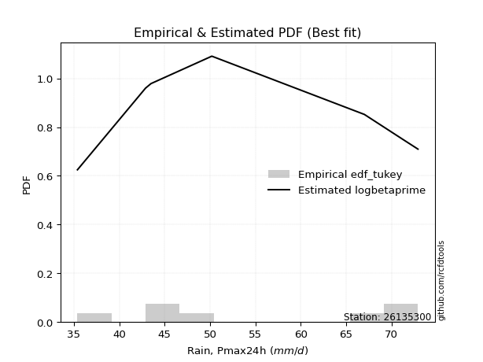</img>

</div>


### 8. EDF Gringorten (1963)

Gringorten plotting position formula is essential for estimating the probability and return periods of extreme events like floods and heavy rainfall. The constant _a=0.44_.

<div align="center">


$P=(m-a)/(n+1-2a)$


</div>


**8.1. Empirical values**

<div align="center">

|                | 0                   | 1                   | 2                  | 3                  | 4                  | 5                  | 6                  | 7                  |
|:---------------|:--------------------|:--------------------|:-------------------|:-------------------|:-------------------|:-------------------|:-------------------|:-------------------|
| date           | 2023                | 2025                | 2020               | 2021               | 2022               | 2017               | 2019               | 2018               |
| x              | 35.4                | 40.5                | 42.9               | 43.5               | 50.2               | 67.0               | 71.4               | 72.9               |
| m              | 1                   | 2                   | 3                  | 4                  | 5                  | 6                  | 7                  | 8                  |
| empirical_dist | edf_gringorten      | edf_gringorten      | edf_gringorten     | edf_gringorten     | edf_gringorten     | edf_gringorten     | edf_gringorten     | edf_gringorten     |
| empirical      | 0.06896551724137932 | 0.19211822660098524 | 0.3152709359605912 | 0.4384236453201971 | 0.5615763546798029 | 0.6847290640394089 | 0.8078817733990148 | 0.9310344827586208 |
| empirical_tr   | 1.0740740740740742  | 1.2378048780487805  | 1.460431654676259  | 1.780701754385965  | 2.2808988764044944 | 3.1718750000000004 | 5.205128205128205  | 14.500000000000018 |

</div>


**8.2. Kolmogorov-Smirnov fit test (sorted by Δ)**


<div align="center">

|                | 0                   | 1                   | 2                   | 3                   | 4                   | 5                   | 6                   | 7                   | 8                   | 9                  | 10                  | 11                 | 12                  | 13                  | 14                  | 15                  | 16                  | 17                  | 18                  | 19                 | 20                  | 21                  | 22                 | 23                  | 24                  | 25                  | 26                  | 27                  | 28                 | 29                  | 30                 | 31                  | 32                  | 33                  | 34                 | 35                  | 36                 | 37                  | 38                  | 39                  | 40                  | 41                 | 42                 | 43                  | 44                 | 45                  | 46                  | 47                  | 48                  | 49                 | 50                  | 51                  | 52                 | 53                 | 54                  | 55                  | 56                 | 57                  | 58                  | 59                  | 60                 | 61                  | 62                  | 63                 | 64                 | 65                  | 66                 | 67                  | 68                  | 69                  | 70                  | 71                 | 72                  | 73                  | 74                  | 75                  | 76                  | 77                  | 78                 | 79                  | 80                 | 81                  | 82                  | 83                 | 84                 | 85                  | 86                  | 87                 | 88                  | 89                  | 90                  | 91                  | 92                  | 93                  | 94                  | 95                  | 96                 | 97                  | 98                  | 99                 | 100                | 101                | 102                | 103                 | 104                 | 105                 | 106                 | 107                | 108                 | 109                | 110                 | 111                | 112                 | 113                 | 114                 | 115                 | 116                | 117                 | 118                 | 119                 | 120                 | 121                 | 122                 | 123                 | 124                 | 125                 | 126                 | 127                 | 128                 | 129                 | 130                | 131                | 132                 | 133                | 134                | 135                 | 136                | 137                | 138                 | 139                | 140                | 141                | 142                 | 143                | 144                | 145                 | 146                | 147                | 148                | 149                | 150                | 151                | 152                | 153                | 154                | 155                | 156                | 157                | 158                | 159                |
|:---------------|:--------------------|:--------------------|:--------------------|:--------------------|:--------------------|:--------------------|:--------------------|:--------------------|:--------------------|:-------------------|:--------------------|:-------------------|:--------------------|:--------------------|:--------------------|:--------------------|:--------------------|:--------------------|:--------------------|:-------------------|:--------------------|:--------------------|:-------------------|:--------------------|:--------------------|:--------------------|:--------------------|:--------------------|:-------------------|:--------------------|:-------------------|:--------------------|:--------------------|:--------------------|:-------------------|:--------------------|:-------------------|:--------------------|:--------------------|:--------------------|:--------------------|:-------------------|:-------------------|:--------------------|:-------------------|:--------------------|:--------------------|:--------------------|:--------------------|:-------------------|:--------------------|:--------------------|:-------------------|:-------------------|:--------------------|:--------------------|:-------------------|:--------------------|:--------------------|:--------------------|:-------------------|:--------------------|:--------------------|:-------------------|:-------------------|:--------------------|:-------------------|:--------------------|:--------------------|:--------------------|:--------------------|:-------------------|:--------------------|:--------------------|:--------------------|:--------------------|:--------------------|:--------------------|:-------------------|:--------------------|:-------------------|:--------------------|:--------------------|:-------------------|:-------------------|:--------------------|:--------------------|:-------------------|:--------------------|:--------------------|:--------------------|:--------------------|:--------------------|:--------------------|:--------------------|:--------------------|:-------------------|:--------------------|:--------------------|:-------------------|:-------------------|:-------------------|:-------------------|:--------------------|:--------------------|:--------------------|:--------------------|:-------------------|:--------------------|:-------------------|:--------------------|:-------------------|:--------------------|:--------------------|:--------------------|:--------------------|:-------------------|:--------------------|:--------------------|:--------------------|:--------------------|:--------------------|:--------------------|:--------------------|:--------------------|:--------------------|:--------------------|:--------------------|:--------------------|:--------------------|:-------------------|:-------------------|:--------------------|:-------------------|:-------------------|:--------------------|:-------------------|:-------------------|:--------------------|:-------------------|:-------------------|:-------------------|:--------------------|:-------------------|:-------------------|:--------------------|:-------------------|:-------------------|:-------------------|:-------------------|:-------------------|:-------------------|:-------------------|:-------------------|:-------------------|:-------------------|:-------------------|:-------------------|:-------------------|:-------------------|
| station        | 26135300            | 26135300            | 26135300            | 26135300            | 26135300            | 26135300            | 26135300            | 26135300            | 26135300            | 26135300           | 26135300            | 26135300           | 26135300            | 26135300            | 26135300            | 26135300            | 26135300            | 26135300            | 26135300            | 26135300           | 26135300            | 26135300            | 26135300           | 26135300            | 26135300            | 26135300            | 26135300            | 26135300            | 26135300           | 26135300            | 26135300           | 26135300            | 26135300            | 26135300            | 26135300           | 26135300            | 26135300           | 26135300            | 26135300            | 26135300            | 26135300            | 26135300           | 26135300           | 26135300            | 26135300           | 26135300            | 26135300            | 26135300            | 26135300            | 26135300           | 26135300            | 26135300            | 26135300           | 26135300           | 26135300            | 26135300            | 26135300           | 26135300            | 26135300            | 26135300            | 26135300           | 26135300            | 26135300            | 26135300           | 26135300           | 26135300            | 26135300           | 26135300            | 26135300            | 26135300            | 26135300            | 26135300           | 26135300            | 26135300            | 26135300            | 26135300            | 26135300            | 26135300            | 26135300           | 26135300            | 26135300           | 26135300            | 26135300            | 26135300           | 26135300           | 26135300            | 26135300            | 26135300           | 26135300            | 26135300            | 26135300            | 26135300            | 26135300            | 26135300            | 26135300            | 26135300            | 26135300           | 26135300            | 26135300            | 26135300           | 26135300           | 26135300           | 26135300           | 26135300            | 26135300            | 26135300            | 26135300            | 26135300           | 26135300            | 26135300           | 26135300            | 26135300           | 26135300            | 26135300            | 26135300            | 26135300            | 26135300           | 26135300            | 26135300            | 26135300            | 26135300            | 26135300            | 26135300            | 26135300            | 26135300            | 26135300            | 26135300            | 26135300            | 26135300            | 26135300            | 26135300           | 26135300           | 26135300            | 26135300           | 26135300           | 26135300            | 26135300           | 26135300           | 26135300            | 26135300           | 26135300           | 26135300           | 26135300            | 26135300           | 26135300           | 26135300            | 26135300           | 26135300           | 26135300           | 26135300           | 26135300           | 26135300           | 26135300           | 26135300           | 26135300           | 26135300           | 26135300           | 26135300           | 26135300           | 26135300           |
| empirical_dist | edf_gringorten      | edf_gringorten      | edf_gringorten      | edf_gringorten      | edf_gringorten      | edf_gringorten      | edf_gringorten      | edf_gringorten      | edf_gringorten      | edf_gringorten     | edf_gringorten      | edf_gringorten     | edf_gringorten      | edf_gringorten      | edf_gringorten      | edf_gringorten      | edf_gringorten      | edf_gringorten      | edf_gringorten      | edf_gringorten     | edf_gringorten      | edf_gringorten      | edf_gringorten     | edf_gringorten      | edf_gringorten      | edf_gringorten      | edf_gringorten      | edf_gringorten      | edf_gringorten     | edf_gringorten      | edf_gringorten     | edf_gringorten      | edf_gringorten      | edf_gringorten      | edf_gringorten     | edf_gringorten      | edf_gringorten     | edf_gringorten      | edf_gringorten      | edf_gringorten      | edf_gringorten      | edf_gringorten     | edf_gringorten     | edf_gringorten      | edf_gringorten     | edf_gringorten      | edf_gringorten      | edf_gringorten      | edf_gringorten      | edf_gringorten     | edf_gringorten      | edf_gringorten      | edf_gringorten     | edf_gringorten     | edf_gringorten      | edf_gringorten      | edf_gringorten     | edf_gringorten      | edf_gringorten      | edf_gringorten      | edf_gringorten     | edf_gringorten      | edf_gringorten      | edf_gringorten     | edf_gringorten     | edf_gringorten      | edf_gringorten     | edf_gringorten      | edf_gringorten      | edf_gringorten      | edf_gringorten      | edf_gringorten     | edf_gringorten      | edf_gringorten      | edf_gringorten      | edf_gringorten      | edf_gringorten      | edf_gringorten      | edf_gringorten     | edf_gringorten      | edf_gringorten     | edf_gringorten      | edf_gringorten      | edf_gringorten     | edf_gringorten     | edf_gringorten      | edf_gringorten      | edf_gringorten     | edf_gringorten      | edf_gringorten      | edf_gringorten      | edf_gringorten      | edf_gringorten      | edf_gringorten      | edf_gringorten      | edf_gringorten      | edf_gringorten     | edf_gringorten      | edf_gringorten      | edf_gringorten     | edf_gringorten     | edf_gringorten     | edf_gringorten     | edf_gringorten      | edf_gringorten      | edf_gringorten      | edf_gringorten      | edf_gringorten     | edf_gringorten      | edf_gringorten     | edf_gringorten      | edf_gringorten     | edf_gringorten      | edf_gringorten      | edf_gringorten      | edf_gringorten      | edf_gringorten     | edf_gringorten      | edf_gringorten      | edf_gringorten      | edf_gringorten      | edf_gringorten      | edf_gringorten      | edf_gringorten      | edf_gringorten      | edf_gringorten      | edf_gringorten      | edf_gringorten      | edf_gringorten      | edf_gringorten      | edf_gringorten     | edf_gringorten     | edf_gringorten      | edf_gringorten     | edf_gringorten     | edf_gringorten      | edf_gringorten     | edf_gringorten     | edf_gringorten      | edf_gringorten     | edf_gringorten     | edf_gringorten     | edf_gringorten      | edf_gringorten     | edf_gringorten     | edf_gringorten      | edf_gringorten     | edf_gringorten     | edf_gringorten     | edf_gringorten     | edf_gringorten     | edf_gringorten     | edf_gringorten     | edf_gringorten     | edf_gringorten     | edf_gringorten     | edf_gringorten     | edf_gringorten     | edf_gringorten     | edf_gringorten     |
| p_dist         | logarcsine          | logbetaprime        | logrdist            | arcsine             | wrapcauchy          | logksone            | logsemicircular     | ksone               | logncf              | loglomax           | burr12              | rdist              | loganglit           | semicircular        | lomax               | loggenhalflogistic  | genexpon            | exponnorm           | halfnorm            | logerlang          | logweibull_min      | logfoldnorm         | loggenexpon        | loggamma            | loggamma            | logskewnorm         | rayleigh            | gompertz            | skewnorm           | loggompertz         | lograyleigh        | weibull_min         | loghalfnorm         | logfatiguelife      | logmaxwell         | loginvgauss         | invgauss           | logwrapcauchy       | anglit              | invgamma            | foldnorm            | f                  | logloglaplace      | logburr             | invweibull         | genextreme          | logrice             | loginvgamma         | logf                | logpearson3        | betaprime           | loginvweibull       | lognct             | nct                | loggenlogistic      | burr                | alpha              | logmielke           | maxwell             | logtrapezoid        | logalpha           | logkstwobign        | logloggamma         | logexponnorm       | logcrystalball     | lognorm             | logt               | halflogistic        | kstwobign           | genlogistic         | logjohnsonsu        | gumbel_r           | loghalflogistic     | loggumbel_r         | moyal               | pearson3            | logburr12           | triang              | trapezoid          | logcosine           | logmoyal           | logkappa3           | loggausshyper       | kappa4             | t                  | crystalball         | norm                | truncnorm          | halfgennorm         | loglogistic         | logtukeylambda      | bradford            | logkappa4           | rice                | logdweibull         | loguniform          | logvonmises_line   | logwald             | logtriang           | truncpareto        | loghypsecant       | loglevy_l          | cosine             | logdgamma           | logargus            | dweibull            | logistic            | truncexpon         | loggumbel_l         | johnsonsu          | gausshyper          | tukeylambda        | dgamma              | levy_l              | uniform             | kappa3              | hypsecant          | gumbel_l            | logbradford         | loglaplace          | loglaplace          | vonmises_line       | loggennorm          | truncweibull_min    | logbeta             | logtruncweibull_min | argus               | wald                | logtruncexpon       | laplace             | gennorm            | logweibull_max     | loggenextreme       | logjohnsonsb       | genpareto          | genhalflogistic     | johnsonsb          | exponpow           | beta                | logexponpow        | ncf                | gengamma           | weibull_max         | loggenpareto       | nakagami           | powerlaw            | erlang             | logpowerlaw        | lognakagami        | exponweib          | logexponweib       | fatiguelife        | loggengamma        | gamma              | logtruncnorm       | loghalfgennorm     | logtruncpareto     | logvonmises        | vonmises           | mielke             |
| delta          | 0.09280907356980153 | 0.10103182315745979 | 0.10372884838944862 | 0.10593121418512075 | 0.10672485829440373 | 0.11558363091225127 | 0.13066011610794287 | 0.13203254930299746 | 0.13367905211927628 | 0.1366156685043437 | 0.13883713368831263 | 0.140082029812287  | 0.14210608164215216 | 0.14783648348862094 | 0.14796665963288524 | 0.14911206985070913 | 0.14973821639811802 | 0.15209984993958003 | 0.15265400271784768 | 0.1531839017845521 | 0.15360074720142058 | 0.15503413038074687 | 0.1554371791108099 | 0.15560737719645412 | 0.15560737719645412 | 0.15634002658937918 | 0.15645767729286153 | 0.15674226843461525 | 0.157850570676962  | 0.15786492215631465 | 0.1580303322833656 | 0.15806841515923456 | 0.15808615979709106 | 0.15809406719678154 | 0.1588846179621778 | 0.15936982970925706 | 0.1594004525694923 | 0.15955822842072478 | 0.15973557513891284 | 0.16000804322127105 | 0.16004600398707186 | 0.1604117519701458 | 0.160827419027067  | 0.16126363251377585 | 0.1616140334185766 | 0.16161461502792918 | 0.16202461219553743 | 0.16202962599727577 | 0.16203131216737954 | 0.1621450485119854 | 0.16334150096036626 | 0.16341991549164359 | 0.1635005590081149 | 0.163969276351408  | 0.16398085956788355 | 0.16413819719829903 | 0.164211094631332  | 0.16444999486210787 | 0.16542577701749528 | 0.16592279056325804 | 0.1664828472938471 | 0.16717612639356805 | 0.16749820460745002 | 0.168603527875979  | 0.1687169053327205 | 0.16871691465649474 | 0.1687176218462182 | 0.17007528156729224 | 0.17159987198354454 | 0.17221918262586533 | 0.17295782833956413 | 0.1731676986217548 | 0.17477165381695126 | 0.17496341670746585 | 0.17564469274702454 | 0.17759353976159242 | 0.17861199330766403 | 0.17948262667189108 | 0.1797642732602997 | 0.17990154121907642 | 0.1802150272378803 | 0.18604844317959146 | 0.18633459280131703 | 0.186482078838494  | 0.187211215238327  | 0.18721173313985556 | 0.18721173424226684 | 0.1872117414477344 | 0.18793143120519049 | 0.19113564220470045 | 0.19124710385320076 | 0.19413056188732158 | 0.19509111786043531 | 0.19701725518210245 | 0.19780488587102563 | 0.19843991727550214 | 0.2027034625588925 | 0.20325872254693278 | 0.20513462836240565 | 0.2063094698138368 | 0.2064780111729985 | 0.2066699713669422 | 0.2076701448266176 | 0.20838520666970228 | 0.20876038393627044 | 0.20888137077285918 | 0.20986725643989756 | 0.2099086808985018 | 0.21291000856850215 | 0.2136745875730529 | 0.21371032008270918 | 0.2140729370545294 | 0.21685657745626163 | 0.22138404302559433 | 0.22242364532019712 | 0.22252295846026374 | 0.2248194274929275 | 0.22698489313736792 | 0.22826594292824676 | 0.22850816745466473 | 0.22850816745466473 | 0.23390904619575933 | 0.23402201108569498 | 0.23773201108838604 | 0.23781304332410635 | 0.23862209480280838 | 0.23889597088706455 | 0.24130195509708388 | 0.24466097322304425 | 0.24476015836225068 | 0.2448194471832199 | 0.2534839855648724 | 0.25797988215093437 | 0.2771281080796252 | 0.288537166310649  | 0.32528194206348754 | 0.3346445646835813 | 0.4083409415516073 | 0.40888696930823576 | 0.4124605101280663 | 0.4142703858631017 | 0.4344050315870701 | 0.45414918892158596 | 0.4597291054400888 | 0.4604246672169907 | 0.49467889765612616 | 0.5097906975262093 | 0.5234432832069884 | 0.5234498234670338 | 0.5301315470111483 | 0.5411647202453913 | 0.5418273376800731 | 0.5779177432241266 | 0.615673750519037  | 0.68472563573195   | 0.6847290640394089 | 0.698278558412253  | 1.1630016552231779 | 11.433156986251607 | nan                |
| deltao         | 0.4472608134160001  | 0.4472608134160001  | 0.4472608134160001  | 0.4472608134160001  | 0.4472608134160001  | 0.4472608134160001  | 0.4472608134160001  | 0.4472608134160001  | 0.4472608134160001  | 0.4472608134160001 | 0.4472608134160001  | 0.4472608134160001 | 0.4472608134160001  | 0.4472608134160001  | 0.4472608134160001  | 0.4472608134160001  | 0.4472608134160001  | 0.4472608134160001  | 0.4472608134160001  | 0.4472608134160001 | 0.4472608134160001  | 0.4472608134160001  | 0.4472608134160001 | 0.4472608134160001  | 0.4472608134160001  | 0.4472608134160001  | 0.4472608134160001  | 0.4472608134160001  | 0.4472608134160001 | 0.4472608134160001  | 0.4472608134160001 | 0.4472608134160001  | 0.4472608134160001  | 0.4472608134160001  | 0.4472608134160001 | 0.4472608134160001  | 0.4472608134160001 | 0.4472608134160001  | 0.4472608134160001  | 0.4472608134160001  | 0.4472608134160001  | 0.4472608134160001 | 0.4472608134160001 | 0.4472608134160001  | 0.4472608134160001 | 0.4472608134160001  | 0.4472608134160001  | 0.4472608134160001  | 0.4472608134160001  | 0.4472608134160001 | 0.4472608134160001  | 0.4472608134160001  | 0.4472608134160001 | 0.4472608134160001 | 0.4472608134160001  | 0.4472608134160001  | 0.4472608134160001 | 0.4472608134160001  | 0.4472608134160001  | 0.4472608134160001  | 0.4472608134160001 | 0.4472608134160001  | 0.4472608134160001  | 0.4472608134160001 | 0.4472608134160001 | 0.4472608134160001  | 0.4472608134160001 | 0.4472608134160001  | 0.4472608134160001  | 0.4472608134160001  | 0.4472608134160001  | 0.4472608134160001 | 0.4472608134160001  | 0.4472608134160001  | 0.4472608134160001  | 0.4472608134160001  | 0.4472608134160001  | 0.4472608134160001  | 0.4472608134160001 | 0.4472608134160001  | 0.4472608134160001 | 0.4472608134160001  | 0.4472608134160001  | 0.4472608134160001 | 0.4472608134160001 | 0.4472608134160001  | 0.4472608134160001  | 0.4472608134160001 | 0.4472608134160001  | 0.4472608134160001  | 0.4472608134160001  | 0.4472608134160001  | 0.4472608134160001  | 0.4472608134160001  | 0.4472608134160001  | 0.4472608134160001  | 0.4472608134160001 | 0.4472608134160001  | 0.4472608134160001  | 0.4472608134160001 | 0.4472608134160001 | 0.4472608134160001 | 0.4472608134160001 | 0.4472608134160001  | 0.4472608134160001  | 0.4472608134160001  | 0.4472608134160001  | 0.4472608134160001 | 0.4472608134160001  | 0.4472608134160001 | 0.4472608134160001  | 0.4472608134160001 | 0.4472608134160001  | 0.4472608134160001  | 0.4472608134160001  | 0.4472608134160001  | 0.4472608134160001 | 0.4472608134160001  | 0.4472608134160001  | 0.4472608134160001  | 0.4472608134160001  | 0.4472608134160001  | 0.4472608134160001  | 0.4472608134160001  | 0.4472608134160001  | 0.4472608134160001  | 0.4472608134160001  | 0.4472608134160001  | 0.4472608134160001  | 0.4472608134160001  | 0.4472608134160001 | 0.4472608134160001 | 0.4472608134160001  | 0.4472608134160001 | 0.4472608134160001 | 0.4472608134160001  | 0.4472608134160001 | 0.4472608134160001 | 0.4472608134160001  | 0.4472608134160001 | 0.4472608134160001 | 0.4472608134160001 | 0.4472608134160001  | 0.4472608134160001 | 0.4472608134160001 | 0.4472608134160001  | 0.4472608134160001 | 0.4472608134160001 | 0.4472608134160001 | 0.4472608134160001 | 0.4472608134160001 | 0.4472608134160001 | 0.4472608134160001 | 0.4472608134160001 | 0.4472608134160001 | 0.4472608134160001 | 0.4472608134160001 | 0.4472608134160001 | 0.4472608134160001 | 0.4472608134160001 |
| eval           | Δo > Δ              | Δo > Δ              | Δo > Δ              | Δo > Δ              | Δo > Δ              | Δo > Δ              | Δo > Δ              | Δo > Δ              | Δo > Δ              | Δo > Δ             | Δo > Δ              | Δo > Δ             | Δo > Δ              | Δo > Δ              | Δo > Δ              | Δo > Δ              | Δo > Δ              | Δo > Δ              | Δo > Δ              | Δo > Δ             | Δo > Δ              | Δo > Δ              | Δo > Δ             | Δo > Δ              | Δo > Δ              | Δo > Δ              | Δo > Δ              | Δo > Δ              | Δo > Δ             | Δo > Δ              | Δo > Δ             | Δo > Δ              | Δo > Δ              | Δo > Δ              | Δo > Δ             | Δo > Δ              | Δo > Δ             | Δo > Δ              | Δo > Δ              | Δo > Δ              | Δo > Δ              | Δo > Δ             | Δo > Δ             | Δo > Δ              | Δo > Δ             | Δo > Δ              | Δo > Δ              | Δo > Δ              | Δo > Δ              | Δo > Δ             | Δo > Δ              | Δo > Δ              | Δo > Δ             | Δo > Δ             | Δo > Δ              | Δo > Δ              | Δo > Δ             | Δo > Δ              | Δo > Δ              | Δo > Δ              | Δo > Δ             | Δo > Δ              | Δo > Δ              | Δo > Δ             | Δo > Δ             | Δo > Δ              | Δo > Δ             | Δo > Δ              | Δo > Δ              | Δo > Δ              | Δo > Δ              | Δo > Δ             | Δo > Δ              | Δo > Δ              | Δo > Δ              | Δo > Δ              | Δo > Δ              | Δo > Δ              | Δo > Δ             | Δo > Δ              | Δo > Δ             | Δo > Δ              | Δo > Δ              | Δo > Δ             | Δo > Δ             | Δo > Δ              | Δo > Δ              | Δo > Δ             | Δo > Δ              | Δo > Δ              | Δo > Δ              | Δo > Δ              | Δo > Δ              | Δo > Δ              | Δo > Δ              | Δo > Δ              | Δo > Δ             | Δo > Δ              | Δo > Δ              | Δo > Δ             | Δo > Δ             | Δo > Δ             | Δo > Δ             | Δo > Δ              | Δo > Δ              | Δo > Δ              | Δo > Δ              | Δo > Δ             | Δo > Δ              | Δo > Δ             | Δo > Δ              | Δo > Δ             | Δo > Δ              | Δo > Δ              | Δo > Δ              | Δo > Δ              | Δo > Δ             | Δo > Δ              | Δo > Δ              | Δo > Δ              | Δo > Δ              | Δo > Δ              | Δo > Δ              | Δo > Δ              | Δo > Δ              | Δo > Δ              | Δo > Δ              | Δo > Δ              | Δo > Δ              | Δo > Δ              | Δo > Δ             | Δo > Δ             | Δo > Δ              | Δo > Δ             | Δo > Δ             | Δo > Δ              | Δo > Δ             | Δo > Δ             | Δo > Δ              | Δo > Δ             | Δo > Δ             | Δo > Δ             | Δo <= Δ             | Δo <= Δ            | Δo <= Δ            | Δo <= Δ             | Δo <= Δ            | Δo <= Δ            | Δo <= Δ            | Δo <= Δ            | Δo <= Δ            | Δo <= Δ            | Δo <= Δ            | Δo <= Δ            | Δo <= Δ            | Δo <= Δ            | Δo <= Δ            | Δo <= Δ            | Δo <= Δ            | Δo <= Δ            |
| fit            | 1                   | 1                   | 1                   | 1                   | 1                   | 1                   | 1                   | 1                   | 1                   | 1                  | 1                   | 1                  | 1                   | 1                   | 1                   | 1                   | 1                   | 1                   | 1                   | 1                  | 1                   | 1                   | 1                  | 1                   | 1                   | 1                   | 1                   | 1                   | 1                  | 1                   | 1                  | 1                   | 1                   | 1                   | 1                  | 1                   | 1                  | 1                   | 1                   | 1                   | 1                   | 1                  | 1                  | 1                   | 1                  | 1                   | 1                   | 1                   | 1                   | 1                  | 1                   | 1                   | 1                  | 1                  | 1                   | 1                   | 1                  | 1                   | 1                   | 1                   | 1                  | 1                   | 1                   | 1                  | 1                  | 1                   | 1                  | 1                   | 1                   | 1                   | 1                   | 1                  | 1                   | 1                   | 1                   | 1                   | 1                   | 1                   | 1                  | 1                   | 1                  | 1                   | 1                   | 1                  | 1                  | 1                   | 1                   | 1                  | 1                   | 1                   | 1                   | 1                   | 1                   | 1                   | 1                   | 1                   | 1                  | 1                   | 1                   | 1                  | 1                  | 1                  | 1                  | 1                   | 1                   | 1                   | 1                   | 1                  | 1                   | 1                  | 1                   | 1                  | 1                   | 1                   | 1                   | 1                   | 1                  | 1                   | 1                   | 1                   | 1                   | 1                   | 1                   | 1                   | 1                   | 1                   | 1                   | 1                   | 1                   | 1                   | 1                  | 1                  | 1                   | 1                  | 1                  | 1                   | 1                  | 1                  | 1                   | 1                  | 1                  | 1                  | 0                   | 0                  | 0                  | 0                   | 0                  | 0                  | 0                  | 0                  | 0                  | 0                  | 0                  | 0                  | 0                  | 0                  | 0                  | 0                  | 0                  | 0                  |
| n              | 8                   | 8                   | 8                   | 8                   | 8                   | 8                   | 8                   | 8                   | 8                   | 8                  | 8                   | 8                  | 8                   | 8                   | 8                   | 8                   | 8                   | 8                   | 8                   | 8                  | 8                   | 8                   | 8                  | 8                   | 8                   | 8                   | 8                   | 8                   | 8                  | 8                   | 8                  | 8                   | 8                   | 8                   | 8                  | 8                   | 8                  | 8                   | 8                   | 8                   | 8                   | 8                  | 8                  | 8                   | 8                  | 8                   | 8                   | 8                   | 8                   | 8                  | 8                   | 8                   | 8                  | 8                  | 8                   | 8                   | 8                  | 8                   | 8                   | 8                   | 8                  | 8                   | 8                   | 8                  | 8                  | 8                   | 8                  | 8                   | 8                   | 8                   | 8                   | 8                  | 8                   | 8                   | 8                   | 8                   | 8                   | 8                   | 8                  | 8                   | 8                  | 8                   | 8                   | 8                  | 8                  | 8                   | 8                   | 8                  | 8                   | 8                   | 8                   | 8                   | 8                   | 8                   | 8                   | 8                   | 8                  | 8                   | 8                   | 8                  | 8                  | 8                  | 8                  | 8                   | 8                   | 8                   | 8                   | 8                  | 8                   | 8                  | 8                   | 8                  | 8                   | 8                   | 8                   | 8                   | 8                  | 8                   | 8                   | 8                   | 8                   | 8                   | 8                   | 8                   | 8                   | 8                   | 8                   | 8                   | 8                   | 8                   | 8                  | 8                  | 8                   | 8                  | 8                  | 8                   | 8                  | 8                  | 8                   | 8                  | 8                  | 8                  | 8                   | 8                  | 8                  | 8                   | 8                  | 8                  | 8                  | 8                  | 8                  | 8                  | 8                  | 8                  | 8                  | 8                  | 8                  | 8                  | 8                  | 8                  |
| best_fit       | 1                   | 0                   | 0                   | 0                   | 0                   | 0                   | 0                   | 0                   | 0                   | 0                  | 0                   | 0                  | 0                   | 0                   | 0                   | 0                   | 0                   | 0                   | 0                   | 0                  | 0                   | 0                   | 0                  | 0                   | 0                   | 0                   | 0                   | 0                   | 0                  | 0                   | 0                  | 0                   | 0                   | 0                   | 0                  | 0                   | 0                  | 0                   | 0                   | 0                   | 0                   | 0                  | 0                  | 0                   | 0                  | 0                   | 0                   | 0                   | 0                   | 0                  | 0                   | 0                   | 0                  | 0                  | 0                   | 0                   | 0                  | 0                   | 0                   | 0                   | 0                  | 0                   | 0                   | 0                  | 0                  | 0                   | 0                  | 0                   | 0                   | 0                   | 0                   | 0                  | 0                   | 0                   | 0                   | 0                   | 0                   | 0                   | 0                  | 0                   | 0                  | 0                   | 0                   | 0                  | 0                  | 0                   | 0                   | 0                  | 0                   | 0                   | 0                   | 0                   | 0                   | 0                   | 0                   | 0                   | 0                  | 0                   | 0                   | 0                  | 0                  | 0                  | 0                  | 0                   | 0                   | 0                   | 0                   | 0                  | 0                   | 0                  | 0                   | 0                  | 0                   | 0                   | 0                   | 0                   | 0                  | 0                   | 0                   | 0                   | 0                   | 0                   | 0                   | 0                   | 0                   | 0                   | 0                   | 0                   | 0                   | 0                   | 0                  | 0                  | 0                   | 0                  | 0                  | 0                   | 0                  | 0                  | 0                   | 0                  | 0                  | 0                  | 0                   | 0                  | 0                  | 0                   | 0                  | 0                  | 0                  | 0                  | 0                  | 0                  | 0                  | 0                  | 0                  | 0                  | 0                  | 0                  | 0                  | 0                  |
| best_fit_sort  | 1                   | 2                   | 3                   | 4                   | 5                   | 6                   | 7                   | 8                   | 9                   | 10                 | 11                  | 12                 | 13                  | 14                  | 15                  | 16                  | 17                  | 18                  | 19                  | 20                 | 21                  | 22                  | 23                 | 24                  | 25                  | 26                  | 27                  | 28                  | 29                 | 30                  | 31                 | 32                  | 33                  | 34                  | 35                 | 36                  | 37                 | 38                  | 39                  | 40                  | 41                  | 42                 | 43                 | 44                  | 45                 | 46                  | 47                  | 48                  | 49                  | 50                 | 51                  | 52                  | 53                 | 54                 | 55                  | 56                  | 57                 | 58                  | 59                  | 60                  | 61                 | 62                  | 63                  | 64                 | 65                 | 66                  | 67                 | 68                  | 69                  | 70                  | 71                  | 72                 | 73                  | 74                  | 75                  | 76                  | 77                  | 78                  | 79                 | 80                  | 81                 | 82                  | 83                  | 84                 | 85                 | 86                  | 87                  | 88                 | 89                  | 90                  | 91                  | 92                  | 93                  | 94                  | 95                  | 96                  | 97                 | 98                  | 99                  | 100                | 101                | 102                | 103                | 104                 | 105                 | 106                 | 107                 | 108                | 109                 | 110                | 111                 | 112                | 113                 | 114                 | 115                 | 116                 | 117                | 118                 | 119                 | 120                 | 121                 | 122                 | 123                 | 124                 | 125                 | 126                 | 127                 | 128                 | 129                 | 130                 | 131                | 132                | 133                 | 134                | 135                | 136                 | 137                | 138                | 139                 | 140                | 141                | 142                | 143                 | 144                | 145                | 146                 | 147                | 148                | 149                | 150                | 151                | 152                | 153                | 154                | 155                | 156                | 157                | 158                | 159                | 160                |

</div>


**8.3. Best fit**

<div align="center">

|   id |   station | empirical_dist   | p_dist     |     delta |   deltao | eval   |   fit |   n |   best_fit |   best_fit_sort |
|-----:|----------:|:-----------------|:-----------|----------:|---------:|:-------|------:|----:|-----------:|----------------:|
|    0 |  26135300 | edf_gringorten   | logarcsine | 0.0928091 | 0.447261 | Δo > Δ |     1 |   8 |          1 |               1 |

</div>


<div align="center">

</img>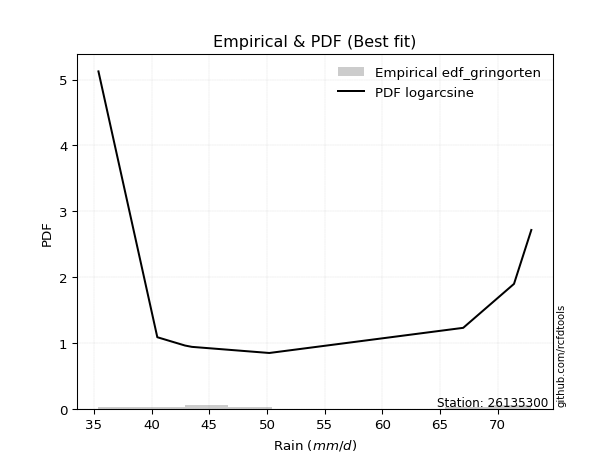</img>

</div>


### 9. EDF Filliben (1975)

The specific values of the constants (0.3175) (often denoted as $alpha$) and (0.365) are derived from a method proposed by James J. Filliben in a 1975 paper. This particular formula is the mean value of the $i$-th order statistic of the normal distribution and is considered a robust and effective plotting position formula for the normal probability plot correlation coefficient test for normality.

<div align="center">


$P=(m-0.3175)/(n+0.365)$


</div>


**9.1. Empirical values**

<div align="center">

|                | 0                  | 1                   | 2                  | 3                   | 4                  | 5                  | 6                  | 7                  |
|:---------------|:-------------------|:--------------------|:-------------------|:--------------------|:-------------------|:-------------------|:-------------------|:-------------------|
| date           | 2023               | 2025                | 2020               | 2021                | 2022               | 2017               | 2019               | 2018               |
| x              | 35.4               | 40.5                | 42.9               | 43.5                | 50.2               | 67.0               | 71.4               | 72.9               |
| m              | 1                  | 2                   | 3                  | 4                   | 5                  | 6                  | 7                  | 8                  |
| empirical_dist | edf_filliben       | edf_filliben        | edf_filliben       | edf_filliben        | edf_filliben       | edf_filliben       | edf_filliben       | edf_filliben       |
| empirical      | 0.0815899581589958 | 0.20113568439928273 | 0.3206814106395696 | 0.44022713687985654 | 0.5597728631201434 | 0.6793185893604303 | 0.7988643156007172 | 0.9184100418410042 |
| empirical_tr   | 1.0888382687927107 | 1.2517770295548074  | 1.4720633523977125 | 1.7864388681260008  | 2.271554650373387  | 3.118359739049394  | 4.971768202080237  | 12.256410256410254 |

</div>


**9.2. Kolmogorov-Smirnov fit test (sorted by Δ)**


<div align="center">

|                | 0                   | 1                   | 2                   | 3                   | 4                   | 5                   | 6                  | 7                   | 8                  | 9                   | 10                 | 11                  | 12                  | 13                  | 14                  | 15                  | 16                 | 17                  | 18                 | 19                 | 20                  | 21                  | 22                  | 23                 | 24                  | 25                  | 26                  | 27                 | 28                  | 29                  | 30                  | 31                  | 32                  | 33                  | 34                  | 35                 | 36                  | 37                  | 38                  | 39                  | 40                 | 41                  | 42                  | 43                  | 44                 | 45                  | 46                 | 47                  | 48                  | 49                  | 50                 | 51                  | 52                  | 53                  | 54                  | 55                  | 56                 | 57                  | 58                  | 59                  | 60                  | 61                 | 62                 | 63                  | 64                 | 65                 | 66                  | 67                  | 68                  | 69                  | 70                  | 71                  | 72                 | 73                  | 74                  | 75                  | 76                  | 77                  | 78                 | 79                  | 80                  | 81                 | 82                  | 83                 | 84                  | 85                  | 86                  | 87                 | 88                  | 89                  | 90                  | 91                  | 92                  | 93                 | 94                  | 95                  | 96                  | 97                  | 98                  | 99                 | 100                 | 101                 | 102                 | 103                 | 104                 | 105                | 106                 | 107                 | 108                 | 109                 | 110                 | 111                 | 112                 | 113                 | 114                 | 115                 | 116                | 117                 | 118                 | 119                 | 120                 | 121                 | 122                 | 123                | 124                 | 125                 | 126                | 127                 | 128                 | 129                | 130                 | 131                 | 132                 | 133                 | 134                | 135                 | 136                 | 137                 | 138                | 139                | 140                 | 141                 | 142                 | 143                 | 144                 | 145                | 146                | 147                | 148                | 149                | 150                | 151                | 152                | 153                | 154                | 155                | 156                | 157                | 158                | 159                |
|:---------------|:--------------------|:--------------------|:--------------------|:--------------------|:--------------------|:--------------------|:-------------------|:--------------------|:-------------------|:--------------------|:-------------------|:--------------------|:--------------------|:--------------------|:--------------------|:--------------------|:-------------------|:--------------------|:-------------------|:-------------------|:--------------------|:--------------------|:--------------------|:-------------------|:--------------------|:--------------------|:--------------------|:-------------------|:--------------------|:--------------------|:--------------------|:--------------------|:--------------------|:--------------------|:--------------------|:-------------------|:--------------------|:--------------------|:--------------------|:--------------------|:-------------------|:--------------------|:--------------------|:--------------------|:-------------------|:--------------------|:-------------------|:--------------------|:--------------------|:--------------------|:-------------------|:--------------------|:--------------------|:--------------------|:--------------------|:--------------------|:-------------------|:--------------------|:--------------------|:--------------------|:--------------------|:-------------------|:-------------------|:--------------------|:-------------------|:-------------------|:--------------------|:--------------------|:--------------------|:--------------------|:--------------------|:--------------------|:-------------------|:--------------------|:--------------------|:--------------------|:--------------------|:--------------------|:-------------------|:--------------------|:--------------------|:-------------------|:--------------------|:-------------------|:--------------------|:--------------------|:--------------------|:-------------------|:--------------------|:--------------------|:--------------------|:--------------------|:--------------------|:-------------------|:--------------------|:--------------------|:--------------------|:--------------------|:--------------------|:-------------------|:--------------------|:--------------------|:--------------------|:--------------------|:--------------------|:-------------------|:--------------------|:--------------------|:--------------------|:--------------------|:--------------------|:--------------------|:--------------------|:--------------------|:--------------------|:--------------------|:-------------------|:--------------------|:--------------------|:--------------------|:--------------------|:--------------------|:--------------------|:-------------------|:--------------------|:--------------------|:-------------------|:--------------------|:--------------------|:-------------------|:--------------------|:--------------------|:--------------------|:--------------------|:-------------------|:--------------------|:--------------------|:--------------------|:-------------------|:-------------------|:--------------------|:--------------------|:--------------------|:--------------------|:--------------------|:-------------------|:-------------------|:-------------------|:-------------------|:-------------------|:-------------------|:-------------------|:-------------------|:-------------------|:-------------------|:-------------------|:-------------------|:-------------------|:-------------------|:-------------------|
| station        | 26135300            | 26135300            | 26135300            | 26135300            | 26135300            | 26135300            | 26135300           | 26135300            | 26135300           | 26135300            | 26135300           | 26135300            | 26135300            | 26135300            | 26135300            | 26135300            | 26135300           | 26135300            | 26135300           | 26135300           | 26135300            | 26135300            | 26135300            | 26135300           | 26135300            | 26135300            | 26135300            | 26135300           | 26135300            | 26135300            | 26135300            | 26135300            | 26135300            | 26135300            | 26135300            | 26135300           | 26135300            | 26135300            | 26135300            | 26135300            | 26135300           | 26135300            | 26135300            | 26135300            | 26135300           | 26135300            | 26135300           | 26135300            | 26135300            | 26135300            | 26135300           | 26135300            | 26135300            | 26135300            | 26135300            | 26135300            | 26135300           | 26135300            | 26135300            | 26135300            | 26135300            | 26135300           | 26135300           | 26135300            | 26135300           | 26135300           | 26135300            | 26135300            | 26135300            | 26135300            | 26135300            | 26135300            | 26135300           | 26135300            | 26135300            | 26135300            | 26135300            | 26135300            | 26135300           | 26135300            | 26135300            | 26135300           | 26135300            | 26135300           | 26135300            | 26135300            | 26135300            | 26135300           | 26135300            | 26135300            | 26135300            | 26135300            | 26135300            | 26135300           | 26135300            | 26135300            | 26135300            | 26135300            | 26135300            | 26135300           | 26135300            | 26135300            | 26135300            | 26135300            | 26135300            | 26135300           | 26135300            | 26135300            | 26135300            | 26135300            | 26135300            | 26135300            | 26135300            | 26135300            | 26135300            | 26135300            | 26135300           | 26135300            | 26135300            | 26135300            | 26135300            | 26135300            | 26135300            | 26135300           | 26135300            | 26135300            | 26135300           | 26135300            | 26135300            | 26135300           | 26135300            | 26135300            | 26135300            | 26135300            | 26135300           | 26135300            | 26135300            | 26135300            | 26135300           | 26135300           | 26135300            | 26135300            | 26135300            | 26135300            | 26135300            | 26135300           | 26135300           | 26135300           | 26135300           | 26135300           | 26135300           | 26135300           | 26135300           | 26135300           | 26135300           | 26135300           | 26135300           | 26135300           | 26135300           | 26135300           |
| empirical_dist | edf_filliben        | edf_filliben        | edf_filliben        | edf_filliben        | edf_filliben        | edf_filliben        | edf_filliben       | edf_filliben        | edf_filliben       | edf_filliben        | edf_filliben       | edf_filliben        | edf_filliben        | edf_filliben        | edf_filliben        | edf_filliben        | edf_filliben       | edf_filliben        | edf_filliben       | edf_filliben       | edf_filliben        | edf_filliben        | edf_filliben        | edf_filliben       | edf_filliben        | edf_filliben        | edf_filliben        | edf_filliben       | edf_filliben        | edf_filliben        | edf_filliben        | edf_filliben        | edf_filliben        | edf_filliben        | edf_filliben        | edf_filliben       | edf_filliben        | edf_filliben        | edf_filliben        | edf_filliben        | edf_filliben       | edf_filliben        | edf_filliben        | edf_filliben        | edf_filliben       | edf_filliben        | edf_filliben       | edf_filliben        | edf_filliben        | edf_filliben        | edf_filliben       | edf_filliben        | edf_filliben        | edf_filliben        | edf_filliben        | edf_filliben        | edf_filliben       | edf_filliben        | edf_filliben        | edf_filliben        | edf_filliben        | edf_filliben       | edf_filliben       | edf_filliben        | edf_filliben       | edf_filliben       | edf_filliben        | edf_filliben        | edf_filliben        | edf_filliben        | edf_filliben        | edf_filliben        | edf_filliben       | edf_filliben        | edf_filliben        | edf_filliben        | edf_filliben        | edf_filliben        | edf_filliben       | edf_filliben        | edf_filliben        | edf_filliben       | edf_filliben        | edf_filliben       | edf_filliben        | edf_filliben        | edf_filliben        | edf_filliben       | edf_filliben        | edf_filliben        | edf_filliben        | edf_filliben        | edf_filliben        | edf_filliben       | edf_filliben        | edf_filliben        | edf_filliben        | edf_filliben        | edf_filliben        | edf_filliben       | edf_filliben        | edf_filliben        | edf_filliben        | edf_filliben        | edf_filliben        | edf_filliben       | edf_filliben        | edf_filliben        | edf_filliben        | edf_filliben        | edf_filliben        | edf_filliben        | edf_filliben        | edf_filliben        | edf_filliben        | edf_filliben        | edf_filliben       | edf_filliben        | edf_filliben        | edf_filliben        | edf_filliben        | edf_filliben        | edf_filliben        | edf_filliben       | edf_filliben        | edf_filliben        | edf_filliben       | edf_filliben        | edf_filliben        | edf_filliben       | edf_filliben        | edf_filliben        | edf_filliben        | edf_filliben        | edf_filliben       | edf_filliben        | edf_filliben        | edf_filliben        | edf_filliben       | edf_filliben       | edf_filliben        | edf_filliben        | edf_filliben        | edf_filliben        | edf_filliben        | edf_filliben       | edf_filliben       | edf_filliben       | edf_filliben       | edf_filliben       | edf_filliben       | edf_filliben       | edf_filliben       | edf_filliben       | edf_filliben       | edf_filliben       | edf_filliben       | edf_filliben       | edf_filliben       | edf_filliben       |
| p_dist         | logarcsine          | wrapcauchy          | logbetaprime        | arcsine             | logrdist            | logksone            | logsemicircular    | ksone               | logncf             | rdist               | loglomax           | loganglit           | burr12              | logloglaplace       | weibull_min         | semicircular        | logwrapcauchy      | lomax               | genexpon           | loggenhalflogistic | exponnorm           | halfnorm            | rayleigh            | logerlang          | logweibull_min      | skewnorm            | logfoldnorm         | loggenexpon        | loggamma            | loggamma            | anglit              | logskewnorm         | foldnorm            | gompertz            | loggompertz         | lograyleigh        | loghalfnorm         | logfatiguelife      | logmaxwell          | loginvgauss         | invgauss           | invgamma            | f                   | logburr             | invweibull         | genextreme          | maxwell            | logrice             | loginvgamma         | logf                | logpearson3        | logtrapezoid        | betaprime           | loginvweibull       | lognct              | logloggamma         | nct                | loggenlogistic      | burr                | alpha               | logmielke           | logexponnorm       | logcrystalball     | lognorm             | logt               | logalpha           | logkstwobign        | logjohnsonsu        | gumbel_r            | halflogistic        | kstwobign           | genlogistic         | halfgennorm        | pearson3            | loghalflogistic     | loggumbel_r         | logburr12           | moyal               | triang             | trapezoid           | logcosine           | logmoyal           | loggausshyper       | kappa4             | t                   | crystalball         | norm                | truncnorm          | logkappa3           | loglogistic         | logtukeylambda      | rice                | bradford            | logkappa4          | logdweibull         | loguniform          | loglevy_l           | logtriang           | logvonmises_line    | loghypsecant       | logwald             | levy_l              | cosine              | logargus            | logistic            | truncpareto        | johnsonsu           | logdgamma           | dweibull            | loggumbel_l         | truncexpon          | tukeylambda         | gausshyper          | dgamma              | uniform             | kappa3              | hypsecant          | logbeta             | gumbel_l            | loglaplace          | loglaplace          | logbradford         | vonmises_line       | loggennorm         | argus               | logweibull_max      | wald               | truncweibull_min    | logtruncweibull_min | laplace            | gennorm             | logtruncexpon       | loggenextreme       | logjohnsonsb        | genpareto          | genhalflogistic     | johnsonsb           | beta                | exponpow           | ncf                | logexponpow         | gengamma            | loggenpareto        | weibull_max         | nakagami            | powerlaw           | erlang             | logpowerlaw        | lognakagami        | exponweib          | logexponweib       | fatiguelife        | loggengamma        | gamma              | logtruncnorm       | loghalfgennorm     | logtruncpareto     | logvonmises        | vonmises           | mielke             |
| delta          | 0.08379161577150404 | 0.09770740049610624 | 0.10283531471711921 | 0.10412772262546122 | 0.10913932306842722 | 0.11738712247191069 | 0.1324636076676023 | 0.13383604086265688 | 0.1354825436789357 | 0.14188552137194643 | 0.1420261431833223 | 0.14390957320181158 | 0.14424760836729122 | 0.14820297810945038 | 0.14905095736093707 | 0.14963997504828036 | 0.1505407706224273 | 0.15337713431186384 | 0.1551486910770966 | 0.157067371637019  | 0.15751032461855863 | 0.15806447739682628 | 0.15826116885252095 | 0.1585943764635307 | 0.15901122188039918 | 0.15965406223662143 | 0.16044460505972546 | 0.1608476537897885 | 0.16101785187543272 | 0.16101785187543272 | 0.16153906669857226 | 0.16175050126835777 | 0.16184949554673128 | 0.16215274311359384 | 0.16327539683529324 | 0.1634408069623442 | 0.16349663447606966 | 0.16350454187576013 | 0.16429509264115638 | 0.16478030438823565 | 0.1648109272484709 | 0.16541851790024964 | 0.16582222664912438 | 0.16667410719275444 | 0.1670245080975552 | 0.16702508970690777 | 0.1672292685771547 | 0.16743508687451603 | 0.16744010067625437 | 0.16744178684635813 | 0.167555523190964  | 0.16772628212291746 | 0.16875197563934485 | 0.16883039017062218 | 0.16891103368709348 | 0.16930169616710944 | 0.1693797510303866 | 0.16939133424686215 | 0.16954867187727762 | 0.16962156931031058 | 0.16986046954108647 | 0.1704070194356384 | 0.1705203968923799 | 0.17052040621615416 | 0.1705211134058776 | 0.1718933219728257 | 0.17258660107254664 | 0.17476131989922356 | 0.17524540499021013 | 0.17548575624627083 | 0.17701034666252313 | 0.17762965730484392 | 0.178913973406893  | 0.17939703132125184 | 0.18018212849592985 | 0.18037389138644444 | 0.18041548486732345 | 0.18105516742600314 | 0.1812861182315505 | 0.18156776481995912 | 0.18170503277873584 | 0.1856255019168589 | 0.18813808436097645 | 0.1882855703981534 | 0.18901470679798643 | 0.18901522469951498 | 0.18901522580192626 | 0.1890152330073938 | 0.19145891785857005 | 0.19293913376435987 | 0.19665757853217936 | 0.19882074674176187 | 0.19954103656630018 | 0.2005015925394139 | 0.20321536055000422 | 0.20385039195448074 | 0.20486647980728268 | 0.20693811992206507 | 0.20811393723787108 | 0.2082815027326579 | 0.20866919722591137 | 0.20875960210797787 | 0.20947363638627703 | 0.21056387549592986 | 0.21167074799955699 | 0.2117199444928154 | 0.21187109601339338 | 0.21379568134868088 | 0.21429184545183777 | 0.21471350012816157 | 0.21531915557748038 | 0.21587642861418882 | 0.21912079476168778 | 0.22226705213524023 | 0.22422713687985654 | 0.22432645001992316 | 0.2266229190525869 | 0.22783605014249123 | 0.22878838469702734 | 0.23031165901432415 | 0.23031165901432415 | 0.23367641760722535 | 0.23571253775541876 | 0.2358255026453545 | 0.24069946244672397 | 0.24085954464725592 | 0.2431054466567433 | 0.24314248576736464 | 0.24403256948178698 | 0.2465636499219101 | 0.24662293874287944 | 0.25007144790202285 | 0.25617639059127484 | 0.26811065028132774 | 0.2759127253930326 | 0.32395438890057693 | 0.32562710688528373 | 0.39626252839061915 | 0.3993234837533097 | 0.4016459449454852 | 0.40344305232976874 | 0.42538757378877257 | 0.44710466452247233 | 0.44873871424260736 | 0.45140720941869317 | 0.4856614398578286 | 0.5007732397279118 | 0.5144258254086909 | 0.5144323656687363 | 0.5211140892128507 | 0.5321472624470938 | 0.5328098798817755 | 0.568900285425829  | 0.6066562927207395 | 0.6793151610529714 | 0.6793185893604303 | 0.6892611006139554 | 1.1684121299021566 | 11.445781427169223 | nan                |
| deltao         | 0.4472608134160001  | 0.4472608134160001  | 0.4472608134160001  | 0.4472608134160001  | 0.4472608134160001  | 0.4472608134160001  | 0.4472608134160001 | 0.4472608134160001  | 0.4472608134160001 | 0.4472608134160001  | 0.4472608134160001 | 0.4472608134160001  | 0.4472608134160001  | 0.4472608134160001  | 0.4472608134160001  | 0.4472608134160001  | 0.4472608134160001 | 0.4472608134160001  | 0.4472608134160001 | 0.4472608134160001 | 0.4472608134160001  | 0.4472608134160001  | 0.4472608134160001  | 0.4472608134160001 | 0.4472608134160001  | 0.4472608134160001  | 0.4472608134160001  | 0.4472608134160001 | 0.4472608134160001  | 0.4472608134160001  | 0.4472608134160001  | 0.4472608134160001  | 0.4472608134160001  | 0.4472608134160001  | 0.4472608134160001  | 0.4472608134160001 | 0.4472608134160001  | 0.4472608134160001  | 0.4472608134160001  | 0.4472608134160001  | 0.4472608134160001 | 0.4472608134160001  | 0.4472608134160001  | 0.4472608134160001  | 0.4472608134160001 | 0.4472608134160001  | 0.4472608134160001 | 0.4472608134160001  | 0.4472608134160001  | 0.4472608134160001  | 0.4472608134160001 | 0.4472608134160001  | 0.4472608134160001  | 0.4472608134160001  | 0.4472608134160001  | 0.4472608134160001  | 0.4472608134160001 | 0.4472608134160001  | 0.4472608134160001  | 0.4472608134160001  | 0.4472608134160001  | 0.4472608134160001 | 0.4472608134160001 | 0.4472608134160001  | 0.4472608134160001 | 0.4472608134160001 | 0.4472608134160001  | 0.4472608134160001  | 0.4472608134160001  | 0.4472608134160001  | 0.4472608134160001  | 0.4472608134160001  | 0.4472608134160001 | 0.4472608134160001  | 0.4472608134160001  | 0.4472608134160001  | 0.4472608134160001  | 0.4472608134160001  | 0.4472608134160001 | 0.4472608134160001  | 0.4472608134160001  | 0.4472608134160001 | 0.4472608134160001  | 0.4472608134160001 | 0.4472608134160001  | 0.4472608134160001  | 0.4472608134160001  | 0.4472608134160001 | 0.4472608134160001  | 0.4472608134160001  | 0.4472608134160001  | 0.4472608134160001  | 0.4472608134160001  | 0.4472608134160001 | 0.4472608134160001  | 0.4472608134160001  | 0.4472608134160001  | 0.4472608134160001  | 0.4472608134160001  | 0.4472608134160001 | 0.4472608134160001  | 0.4472608134160001  | 0.4472608134160001  | 0.4472608134160001  | 0.4472608134160001  | 0.4472608134160001 | 0.4472608134160001  | 0.4472608134160001  | 0.4472608134160001  | 0.4472608134160001  | 0.4472608134160001  | 0.4472608134160001  | 0.4472608134160001  | 0.4472608134160001  | 0.4472608134160001  | 0.4472608134160001  | 0.4472608134160001 | 0.4472608134160001  | 0.4472608134160001  | 0.4472608134160001  | 0.4472608134160001  | 0.4472608134160001  | 0.4472608134160001  | 0.4472608134160001 | 0.4472608134160001  | 0.4472608134160001  | 0.4472608134160001 | 0.4472608134160001  | 0.4472608134160001  | 0.4472608134160001 | 0.4472608134160001  | 0.4472608134160001  | 0.4472608134160001  | 0.4472608134160001  | 0.4472608134160001 | 0.4472608134160001  | 0.4472608134160001  | 0.4472608134160001  | 0.4472608134160001 | 0.4472608134160001 | 0.4472608134160001  | 0.4472608134160001  | 0.4472608134160001  | 0.4472608134160001  | 0.4472608134160001  | 0.4472608134160001 | 0.4472608134160001 | 0.4472608134160001 | 0.4472608134160001 | 0.4472608134160001 | 0.4472608134160001 | 0.4472608134160001 | 0.4472608134160001 | 0.4472608134160001 | 0.4472608134160001 | 0.4472608134160001 | 0.4472608134160001 | 0.4472608134160001 | 0.4472608134160001 | 0.4472608134160001 |
| eval           | Δo > Δ              | Δo > Δ              | Δo > Δ              | Δo > Δ              | Δo > Δ              | Δo > Δ              | Δo > Δ             | Δo > Δ              | Δo > Δ             | Δo > Δ              | Δo > Δ             | Δo > Δ              | Δo > Δ              | Δo > Δ              | Δo > Δ              | Δo > Δ              | Δo > Δ             | Δo > Δ              | Δo > Δ             | Δo > Δ             | Δo > Δ              | Δo > Δ              | Δo > Δ              | Δo > Δ             | Δo > Δ              | Δo > Δ              | Δo > Δ              | Δo > Δ             | Δo > Δ              | Δo > Δ              | Δo > Δ              | Δo > Δ              | Δo > Δ              | Δo > Δ              | Δo > Δ              | Δo > Δ             | Δo > Δ              | Δo > Δ              | Δo > Δ              | Δo > Δ              | Δo > Δ             | Δo > Δ              | Δo > Δ              | Δo > Δ              | Δo > Δ             | Δo > Δ              | Δo > Δ             | Δo > Δ              | Δo > Δ              | Δo > Δ              | Δo > Δ             | Δo > Δ              | Δo > Δ              | Δo > Δ              | Δo > Δ              | Δo > Δ              | Δo > Δ             | Δo > Δ              | Δo > Δ              | Δo > Δ              | Δo > Δ              | Δo > Δ             | Δo > Δ             | Δo > Δ              | Δo > Δ             | Δo > Δ             | Δo > Δ              | Δo > Δ              | Δo > Δ              | Δo > Δ              | Δo > Δ              | Δo > Δ              | Δo > Δ             | Δo > Δ              | Δo > Δ              | Δo > Δ              | Δo > Δ              | Δo > Δ              | Δo > Δ             | Δo > Δ              | Δo > Δ              | Δo > Δ             | Δo > Δ              | Δo > Δ             | Δo > Δ              | Δo > Δ              | Δo > Δ              | Δo > Δ             | Δo > Δ              | Δo > Δ              | Δo > Δ              | Δo > Δ              | Δo > Δ              | Δo > Δ             | Δo > Δ              | Δo > Δ              | Δo > Δ              | Δo > Δ              | Δo > Δ              | Δo > Δ             | Δo > Δ              | Δo > Δ              | Δo > Δ              | Δo > Δ              | Δo > Δ              | Δo > Δ             | Δo > Δ              | Δo > Δ              | Δo > Δ              | Δo > Δ              | Δo > Δ              | Δo > Δ              | Δo > Δ              | Δo > Δ              | Δo > Δ              | Δo > Δ              | Δo > Δ             | Δo > Δ              | Δo > Δ              | Δo > Δ              | Δo > Δ              | Δo > Δ              | Δo > Δ              | Δo > Δ             | Δo > Δ              | Δo > Δ              | Δo > Δ             | Δo > Δ              | Δo > Δ              | Δo > Δ             | Δo > Δ              | Δo > Δ              | Δo > Δ              | Δo > Δ              | Δo > Δ             | Δo > Δ              | Δo > Δ              | Δo > Δ              | Δo > Δ             | Δo > Δ             | Δo > Δ              | Δo > Δ              | Δo > Δ              | Δo <= Δ             | Δo <= Δ             | Δo <= Δ            | Δo <= Δ            | Δo <= Δ            | Δo <= Δ            | Δo <= Δ            | Δo <= Δ            | Δo <= Δ            | Δo <= Δ            | Δo <= Δ            | Δo <= Δ            | Δo <= Δ            | Δo <= Δ            | Δo <= Δ            | Δo <= Δ            | Δo <= Δ            |
| fit            | 1                   | 1                   | 1                   | 1                   | 1                   | 1                   | 1                  | 1                   | 1                  | 1                   | 1                  | 1                   | 1                   | 1                   | 1                   | 1                   | 1                  | 1                   | 1                  | 1                  | 1                   | 1                   | 1                   | 1                  | 1                   | 1                   | 1                   | 1                  | 1                   | 1                   | 1                   | 1                   | 1                   | 1                   | 1                   | 1                  | 1                   | 1                   | 1                   | 1                   | 1                  | 1                   | 1                   | 1                   | 1                  | 1                   | 1                  | 1                   | 1                   | 1                   | 1                  | 1                   | 1                   | 1                   | 1                   | 1                   | 1                  | 1                   | 1                   | 1                   | 1                   | 1                  | 1                  | 1                   | 1                  | 1                  | 1                   | 1                   | 1                   | 1                   | 1                   | 1                   | 1                  | 1                   | 1                   | 1                   | 1                   | 1                   | 1                  | 1                   | 1                   | 1                  | 1                   | 1                  | 1                   | 1                   | 1                   | 1                  | 1                   | 1                   | 1                   | 1                   | 1                   | 1                  | 1                   | 1                   | 1                   | 1                   | 1                   | 1                  | 1                   | 1                   | 1                   | 1                   | 1                   | 1                  | 1                   | 1                   | 1                   | 1                   | 1                   | 1                   | 1                   | 1                   | 1                   | 1                   | 1                  | 1                   | 1                   | 1                   | 1                   | 1                   | 1                   | 1                  | 1                   | 1                   | 1                  | 1                   | 1                   | 1                  | 1                   | 1                   | 1                   | 1                   | 1                  | 1                   | 1                   | 1                   | 1                  | 1                  | 1                   | 1                   | 1                   | 0                   | 0                   | 0                  | 0                  | 0                  | 0                  | 0                  | 0                  | 0                  | 0                  | 0                  | 0                  | 0                  | 0                  | 0                  | 0                  | 0                  |
| n              | 8                   | 8                   | 8                   | 8                   | 8                   | 8                   | 8                  | 8                   | 8                  | 8                   | 8                  | 8                   | 8                   | 8                   | 8                   | 8                   | 8                  | 8                   | 8                  | 8                  | 8                   | 8                   | 8                   | 8                  | 8                   | 8                   | 8                   | 8                  | 8                   | 8                   | 8                   | 8                   | 8                   | 8                   | 8                   | 8                  | 8                   | 8                   | 8                   | 8                   | 8                  | 8                   | 8                   | 8                   | 8                  | 8                   | 8                  | 8                   | 8                   | 8                   | 8                  | 8                   | 8                   | 8                   | 8                   | 8                   | 8                  | 8                   | 8                   | 8                   | 8                   | 8                  | 8                  | 8                   | 8                  | 8                  | 8                   | 8                   | 8                   | 8                   | 8                   | 8                   | 8                  | 8                   | 8                   | 8                   | 8                   | 8                   | 8                  | 8                   | 8                   | 8                  | 8                   | 8                  | 8                   | 8                   | 8                   | 8                  | 8                   | 8                   | 8                   | 8                   | 8                   | 8                  | 8                   | 8                   | 8                   | 8                   | 8                   | 8                  | 8                   | 8                   | 8                   | 8                   | 8                   | 8                  | 8                   | 8                   | 8                   | 8                   | 8                   | 8                   | 8                   | 8                   | 8                   | 8                   | 8                  | 8                   | 8                   | 8                   | 8                   | 8                   | 8                   | 8                  | 8                   | 8                   | 8                  | 8                   | 8                   | 8                  | 8                   | 8                   | 8                   | 8                   | 8                  | 8                   | 8                   | 8                   | 8                  | 8                  | 8                   | 8                   | 8                   | 8                   | 8                   | 8                  | 8                  | 8                  | 8                  | 8                  | 8                  | 8                  | 8                  | 8                  | 8                  | 8                  | 8                  | 8                  | 8                  | 8                  |
| best_fit       | 1                   | 0                   | 0                   | 0                   | 0                   | 0                   | 0                  | 0                   | 0                  | 0                   | 0                  | 0                   | 0                   | 0                   | 0                   | 0                   | 0                  | 0                   | 0                  | 0                  | 0                   | 0                   | 0                   | 0                  | 0                   | 0                   | 0                   | 0                  | 0                   | 0                   | 0                   | 0                   | 0                   | 0                   | 0                   | 0                  | 0                   | 0                   | 0                   | 0                   | 0                  | 0                   | 0                   | 0                   | 0                  | 0                   | 0                  | 0                   | 0                   | 0                   | 0                  | 0                   | 0                   | 0                   | 0                   | 0                   | 0                  | 0                   | 0                   | 0                   | 0                   | 0                  | 0                  | 0                   | 0                  | 0                  | 0                   | 0                   | 0                   | 0                   | 0                   | 0                   | 0                  | 0                   | 0                   | 0                   | 0                   | 0                   | 0                  | 0                   | 0                   | 0                  | 0                   | 0                  | 0                   | 0                   | 0                   | 0                  | 0                   | 0                   | 0                   | 0                   | 0                   | 0                  | 0                   | 0                   | 0                   | 0                   | 0                   | 0                  | 0                   | 0                   | 0                   | 0                   | 0                   | 0                  | 0                   | 0                   | 0                   | 0                   | 0                   | 0                   | 0                   | 0                   | 0                   | 0                   | 0                  | 0                   | 0                   | 0                   | 0                   | 0                   | 0                   | 0                  | 0                   | 0                   | 0                  | 0                   | 0                   | 0                  | 0                   | 0                   | 0                   | 0                   | 0                  | 0                   | 0                   | 0                   | 0                  | 0                  | 0                   | 0                   | 0                   | 0                   | 0                   | 0                  | 0                  | 0                  | 0                  | 0                  | 0                  | 0                  | 0                  | 0                  | 0                  | 0                  | 0                  | 0                  | 0                  | 0                  |
| best_fit_sort  | 1                   | 2                   | 3                   | 4                   | 5                   | 6                   | 7                  | 8                   | 9                  | 10                  | 11                 | 12                  | 13                  | 14                  | 15                  | 16                  | 17                 | 18                  | 19                 | 20                 | 21                  | 22                  | 23                  | 24                 | 25                  | 26                  | 27                  | 28                 | 29                  | 30                  | 31                  | 32                  | 33                  | 34                  | 35                  | 36                 | 37                  | 38                  | 39                  | 40                  | 41                 | 42                  | 43                  | 44                  | 45                 | 46                  | 47                 | 48                  | 49                  | 50                  | 51                 | 52                  | 53                  | 54                  | 55                  | 56                  | 57                 | 58                  | 59                  | 60                  | 61                  | 62                 | 63                 | 64                  | 65                 | 66                 | 67                  | 68                  | 69                  | 70                  | 71                  | 72                  | 73                 | 74                  | 75                  | 76                  | 77                  | 78                  | 79                 | 80                  | 81                  | 82                 | 83                  | 84                 | 85                  | 86                  | 87                  | 88                 | 89                  | 90                  | 91                  | 92                  | 93                  | 94                 | 95                  | 96                  | 97                  | 98                  | 99                  | 100                | 101                 | 102                 | 103                 | 104                 | 105                 | 106                | 107                 | 108                 | 109                 | 110                 | 111                 | 112                 | 113                 | 114                 | 115                 | 116                 | 117                | 118                 | 119                 | 120                 | 121                 | 122                 | 123                 | 124                | 125                 | 126                 | 127                | 128                 | 129                 | 130                | 131                 | 132                 | 133                 | 134                 | 135                | 136                 | 137                 | 138                 | 139                | 140                | 141                 | 142                 | 143                 | 144                 | 145                 | 146                | 147                | 148                | 149                | 150                | 151                | 152                | 153                | 154                | 155                | 156                | 157                | 158                | 159                | 160                |

</div>


**9.3. Best fit**

<div align="center">

|   id |   station | empirical_dist   | p_dist     |     delta |   deltao | eval   |   fit |   n |   best_fit |   best_fit_sort |
|-----:|----------:|:-----------------|:-----------|----------:|---------:|:-------|------:|----:|-----------:|----------------:|
|    0 |  26135300 | edf_filliben     | logarcsine | 0.0837916 | 0.447261 | Δo > Δ |     1 |   8 |          1 |               1 |

</div>


<div align="center">

</img></img>

</div>


### 10. EDF Jenkinson (1977)

The Jenkinson formula in hydrology is an empirical plotting position formula used to estimate the non-exceedance probability _(P)_ or return period _(T)_ of a given ordered observation within a sample. It is a widely used method in the frequency analysis of extreme events such as floods and rainfall, as it provides a distribution-free way to plot data. _a≈0.31_ and _b≈0.38_ are constants derived to approximate the median of the probability distribution for the given rank.

<div align="center">


$P=(m-a)/(n+b)$


</div>


**10.1. Empirical values**

<div align="center">

|                | 0                   | 1                   | 2                  | 3                   | 4                  | 5                  | 6                  | 7                  |
|:---------------|:--------------------|:--------------------|:-------------------|:--------------------|:-------------------|:-------------------|:-------------------|:-------------------|
| date           | 2023                | 2025                | 2020               | 2021                | 2022               | 2017               | 2019               | 2018               |
| x              | 35.4                | 40.5                | 42.9               | 43.5                | 50.2               | 67.0               | 71.4               | 72.9               |
| m              | 1                   | 2                   | 3                  | 4                   | 5                  | 6                  | 7                  | 8                  |
| empirical_dist | edf_jenkinson       | edf_jenkinson       | edf_jenkinson      | edf_jenkinson       | edf_jenkinson      | edf_jenkinson      | edf_jenkinson      | edf_jenkinson      |
| empirical      | 0.08233890214797135 | 0.20167064439140808 | 0.3210023866348448 | 0.44033412887828155 | 0.5596658711217184 | 0.6789976133651551 | 0.7983293556085919 | 0.9176610978520287 |
| empirical_tr   | 1.0897269180754225  | 1.2526158445440956  | 1.4727592267135323 | 1.7867803837953091  | 2.2710027100271004 | 3.115241635687732  | 4.958579881656804  | 12.144927536231886 |

</div>


**10.2. Kolmogorov-Smirnov fit test (sorted by Δ)**


<div align="center">

|                | 0                   | 1                   | 2                   | 3                  | 4                   | 5                  | 6                  | 7                  | 8                  | 9                   | 10                  | 11                 | 12                  | 13                  | 14                  | 15                  | 16                  | 17                 | 18                  | 19                 | 20                  | 21                  | 22                  | 23                  | 24                  | 25                  | 26                  | 27                  | 28                  | 29                  | 30                  | 31                 | 32                  | 33                 | 34                 | 35                  | 36                 | 37                 | 38                  | 39                 | 40                  | 41                 | 42                  | 43                 | 44                 | 45                  | 46                  | 47                  | 48                  | 49                  | 50                  | 51                  | 52                 | 53                  | 54                  | 55                  | 56                  | 57                 | 58                  | 59                  | 60                  | 61                  | 62                  | 63                  | 64                  | 65                  | 66                 | 67                  | 68                  | 69                  | 70                  | 71                  | 72                  | 73                  | 74                 | 75                  | 76                 | 77                 | 78                 | 79                  | 80                  | 81                  | 82                  | 83                  | 84                  | 85                 | 86                  | 87                  | 88                 | 89                  | 90                 | 91                  | 92                  | 93                  | 94                  | 95                 | 96                  | 97                  | 98                  | 99                  | 100                 | 101                 | 102                 | 103                 | 104                 | 105                | 106                 | 107                 | 108                 | 109                 | 110                 | 111                 | 112                 | 113                 | 114                 | 115                 | 116                 | 117                 | 118                 | 119                 | 120                 | 121                | 122                 | 123                 | 124                 | 125                 | 126                | 127                | 128                 | 129                | 130                 | 131                | 132                 | 133                 | 134                | 135                 | 136                | 137                 | 138                | 139                | 140                | 141                 | 142                | 143                | 144                 | 145                | 146                | 147                | 148                | 149                | 150                | 151                | 152                | 153                | 154                | 155                | 156                | 157                | 158                | 159                |
|:---------------|:--------------------|:--------------------|:--------------------|:-------------------|:--------------------|:-------------------|:-------------------|:-------------------|:-------------------|:--------------------|:--------------------|:-------------------|:--------------------|:--------------------|:--------------------|:--------------------|:--------------------|:-------------------|:--------------------|:-------------------|:--------------------|:--------------------|:--------------------|:--------------------|:--------------------|:--------------------|:--------------------|:--------------------|:--------------------|:--------------------|:--------------------|:-------------------|:--------------------|:-------------------|:-------------------|:--------------------|:-------------------|:-------------------|:--------------------|:-------------------|:--------------------|:-------------------|:--------------------|:-------------------|:-------------------|:--------------------|:--------------------|:--------------------|:--------------------|:--------------------|:--------------------|:--------------------|:-------------------|:--------------------|:--------------------|:--------------------|:--------------------|:-------------------|:--------------------|:--------------------|:--------------------|:--------------------|:--------------------|:--------------------|:--------------------|:--------------------|:-------------------|:--------------------|:--------------------|:--------------------|:--------------------|:--------------------|:--------------------|:--------------------|:-------------------|:--------------------|:-------------------|:-------------------|:-------------------|:--------------------|:--------------------|:--------------------|:--------------------|:--------------------|:--------------------|:-------------------|:--------------------|:--------------------|:-------------------|:--------------------|:-------------------|:--------------------|:--------------------|:--------------------|:--------------------|:-------------------|:--------------------|:--------------------|:--------------------|:--------------------|:--------------------|:--------------------|:--------------------|:--------------------|:--------------------|:-------------------|:--------------------|:--------------------|:--------------------|:--------------------|:--------------------|:--------------------|:--------------------|:--------------------|:--------------------|:--------------------|:--------------------|:--------------------|:--------------------|:--------------------|:--------------------|:-------------------|:--------------------|:--------------------|:--------------------|:--------------------|:-------------------|:-------------------|:--------------------|:-------------------|:--------------------|:-------------------|:--------------------|:--------------------|:-------------------|:--------------------|:-------------------|:--------------------|:-------------------|:-------------------|:-------------------|:--------------------|:-------------------|:-------------------|:--------------------|:-------------------|:-------------------|:-------------------|:-------------------|:-------------------|:-------------------|:-------------------|:-------------------|:-------------------|:-------------------|:-------------------|:-------------------|:-------------------|:-------------------|:-------------------|
| station        | 26135300            | 26135300            | 26135300            | 26135300           | 26135300            | 26135300           | 26135300           | 26135300           | 26135300           | 26135300            | 26135300            | 26135300           | 26135300            | 26135300            | 26135300            | 26135300            | 26135300            | 26135300           | 26135300            | 26135300           | 26135300            | 26135300            | 26135300            | 26135300            | 26135300            | 26135300            | 26135300            | 26135300            | 26135300            | 26135300            | 26135300            | 26135300           | 26135300            | 26135300           | 26135300           | 26135300            | 26135300           | 26135300           | 26135300            | 26135300           | 26135300            | 26135300           | 26135300            | 26135300           | 26135300           | 26135300            | 26135300            | 26135300            | 26135300            | 26135300            | 26135300            | 26135300            | 26135300           | 26135300            | 26135300            | 26135300            | 26135300            | 26135300           | 26135300            | 26135300            | 26135300            | 26135300            | 26135300            | 26135300            | 26135300            | 26135300            | 26135300           | 26135300            | 26135300            | 26135300            | 26135300            | 26135300            | 26135300            | 26135300            | 26135300           | 26135300            | 26135300           | 26135300           | 26135300           | 26135300            | 26135300            | 26135300            | 26135300            | 26135300            | 26135300            | 26135300           | 26135300            | 26135300            | 26135300           | 26135300            | 26135300           | 26135300            | 26135300            | 26135300            | 26135300            | 26135300           | 26135300            | 26135300            | 26135300            | 26135300            | 26135300            | 26135300            | 26135300            | 26135300            | 26135300            | 26135300           | 26135300            | 26135300            | 26135300            | 26135300            | 26135300            | 26135300            | 26135300            | 26135300            | 26135300            | 26135300            | 26135300            | 26135300            | 26135300            | 26135300            | 26135300            | 26135300           | 26135300            | 26135300            | 26135300            | 26135300            | 26135300           | 26135300           | 26135300            | 26135300           | 26135300            | 26135300           | 26135300            | 26135300            | 26135300           | 26135300            | 26135300           | 26135300            | 26135300           | 26135300           | 26135300           | 26135300            | 26135300           | 26135300           | 26135300            | 26135300           | 26135300           | 26135300           | 26135300           | 26135300           | 26135300           | 26135300           | 26135300           | 26135300           | 26135300           | 26135300           | 26135300           | 26135300           | 26135300           | 26135300           |
| empirical_dist | edf_jenkinson       | edf_jenkinson       | edf_jenkinson       | edf_jenkinson      | edf_jenkinson       | edf_jenkinson      | edf_jenkinson      | edf_jenkinson      | edf_jenkinson      | edf_jenkinson       | edf_jenkinson       | edf_jenkinson      | edf_jenkinson       | edf_jenkinson       | edf_jenkinson       | edf_jenkinson       | edf_jenkinson       | edf_jenkinson      | edf_jenkinson       | edf_jenkinson      | edf_jenkinson       | edf_jenkinson       | edf_jenkinson       | edf_jenkinson       | edf_jenkinson       | edf_jenkinson       | edf_jenkinson       | edf_jenkinson       | edf_jenkinson       | edf_jenkinson       | edf_jenkinson       | edf_jenkinson      | edf_jenkinson       | edf_jenkinson      | edf_jenkinson      | edf_jenkinson       | edf_jenkinson      | edf_jenkinson      | edf_jenkinson       | edf_jenkinson      | edf_jenkinson       | edf_jenkinson      | edf_jenkinson       | edf_jenkinson      | edf_jenkinson      | edf_jenkinson       | edf_jenkinson       | edf_jenkinson       | edf_jenkinson       | edf_jenkinson       | edf_jenkinson       | edf_jenkinson       | edf_jenkinson      | edf_jenkinson       | edf_jenkinson       | edf_jenkinson       | edf_jenkinson       | edf_jenkinson      | edf_jenkinson       | edf_jenkinson       | edf_jenkinson       | edf_jenkinson       | edf_jenkinson       | edf_jenkinson       | edf_jenkinson       | edf_jenkinson       | edf_jenkinson      | edf_jenkinson       | edf_jenkinson       | edf_jenkinson       | edf_jenkinson       | edf_jenkinson       | edf_jenkinson       | edf_jenkinson       | edf_jenkinson      | edf_jenkinson       | edf_jenkinson      | edf_jenkinson      | edf_jenkinson      | edf_jenkinson       | edf_jenkinson       | edf_jenkinson       | edf_jenkinson       | edf_jenkinson       | edf_jenkinson       | edf_jenkinson      | edf_jenkinson       | edf_jenkinson       | edf_jenkinson      | edf_jenkinson       | edf_jenkinson      | edf_jenkinson       | edf_jenkinson       | edf_jenkinson       | edf_jenkinson       | edf_jenkinson      | edf_jenkinson       | edf_jenkinson       | edf_jenkinson       | edf_jenkinson       | edf_jenkinson       | edf_jenkinson       | edf_jenkinson       | edf_jenkinson       | edf_jenkinson       | edf_jenkinson      | edf_jenkinson       | edf_jenkinson       | edf_jenkinson       | edf_jenkinson       | edf_jenkinson       | edf_jenkinson       | edf_jenkinson       | edf_jenkinson       | edf_jenkinson       | edf_jenkinson       | edf_jenkinson       | edf_jenkinson       | edf_jenkinson       | edf_jenkinson       | edf_jenkinson       | edf_jenkinson      | edf_jenkinson       | edf_jenkinson       | edf_jenkinson       | edf_jenkinson       | edf_jenkinson      | edf_jenkinson      | edf_jenkinson       | edf_jenkinson      | edf_jenkinson       | edf_jenkinson      | edf_jenkinson       | edf_jenkinson       | edf_jenkinson      | edf_jenkinson       | edf_jenkinson      | edf_jenkinson       | edf_jenkinson      | edf_jenkinson      | edf_jenkinson      | edf_jenkinson       | edf_jenkinson      | edf_jenkinson      | edf_jenkinson       | edf_jenkinson      | edf_jenkinson      | edf_jenkinson      | edf_jenkinson      | edf_jenkinson      | edf_jenkinson      | edf_jenkinson      | edf_jenkinson      | edf_jenkinson      | edf_jenkinson      | edf_jenkinson      | edf_jenkinson      | edf_jenkinson      | edf_jenkinson      | edf_jenkinson      |
| p_dist         | logarcsine          | wrapcauchy          | logbetaprime        | arcsine            | logrdist            | logksone           | logsemicircular    | ksone              | logncf             | rdist               | loglomax            | loganglit          | burr12              | logloglaplace       | weibull_min         | semicircular        | logwrapcauchy       | lomax              | genexpon            | loggenhalflogistic | exponnorm           | rayleigh            | halfnorm            | logerlang           | logweibull_min      | skewnorm            | logfoldnorm         | loggenexpon         | loggamma            | loggamma            | anglit              | foldnorm           | logskewnorm         | gompertz           | loggompertz        | lograyleigh         | loghalfnorm        | logfatiguelife     | logmaxwell          | loginvgauss        | invgauss            | invgamma           | f                   | logburr            | maxwell            | invweibull          | genextreme          | logrice             | loginvgamma         | logf                | logtrapezoid        | logpearson3         | betaprime          | loginvweibull       | lognct              | logloggamma         | nct                 | loggenlogistic     | burr                | alpha               | logmielke           | logexponnorm        | logcrystalball      | lognorm             | logt                | logalpha            | logkstwobign       | logjohnsonsu        | gumbel_r            | halflogistic        | kstwobign           | genlogistic         | halfgennorm         | pearson3            | loghalflogistic    | logburr12           | loggumbel_r        | moyal              | triang             | trapezoid           | logcosine           | logmoyal            | loggausshyper       | kappa4              | t                   | crystalball        | norm                | truncnorm           | logkappa3          | loglogistic         | logtukeylambda     | rice                | bradford            | logkappa4           | logdweibull         | loguniform         | loglevy_l           | logtriang           | levy_l              | loghypsecant        | logvonmises_line    | logwald             | cosine              | logargus            | johnsonsu           | logistic           | truncpareto         | logdgamma           | dweibull            | loggumbel_l         | truncexpon          | tukeylambda         | gausshyper          | dgamma              | uniform             | kappa3              | hypsecant           | logbeta             | gumbel_l            | loglaplace          | loglaplace          | logbradford        | vonmises_line       | loggennorm          | logweibull_max      | argus               | wald               | truncweibull_min   | logtruncweibull_min | laplace            | gennorm             | logtruncexpon      | loggenextreme       | logjohnsonsb        | genpareto          | genhalflogistic     | johnsonsb          | beta                | exponpow           | ncf                | logexponpow        | gengamma            | loggenpareto       | weibull_max        | nakagami            | powerlaw           | erlang             | logpowerlaw        | lognakagami        | exponweib          | logexponweib       | fatiguelife        | loggengamma        | gamma              | logtruncnorm       | loghalfgennorm     | logtruncpareto     | logvonmises        | vonmises           | mielke             |
| delta          | 0.08325665577937869 | 0.09717244050398088 | 0.10294230671554422 | 0.1040207306270362 | 0.10946029906370247 | 0.1174941144703357 | 0.1325705996660273 | 0.1339430328610819 | 0.1355895356773607 | 0.14199251337037144 | 0.14234711917859755 | 0.1440165652002366 | 0.14456858436256648 | 0.14745403412047486 | 0.14851599736881171 | 0.14974696704670537 | 0.15000581063030194 | 0.1536981103071391 | 0.15546966707237186 | 0.1576023316291444 | 0.15783130061383388 | 0.15836816085094596 | 0.15838545339210153 | 0.15891535245880595 | 0.15933219787567443 | 0.15991274665661337 | 0.16076558105500072 | 0.16116862978506374 | 0.16133882787070797 | 0.16133882787070797 | 0.16164605869699727 | 0.1619564875451563 | 0.16207147726363302 | 0.1624737191088691 | 0.1635963728305685 | 0.16376178295761945 | 0.1638176104713449 | 0.1638255178710354 | 0.16461606863643163 | 0.1651012803835109 | 0.16513190324374616 | 0.1657394938955249 | 0.16614320264439963 | 0.1669950831880297 | 0.1673362605755797 | 0.16734548409283045 | 0.16734606570218302 | 0.16775606286979128 | 0.16776107667152962 | 0.16776276284163338 | 0.16783327412134247 | 0.16787649918623926 | 0.1690729516346201 | 0.16915136616589743 | 0.16923200968236873 | 0.16940868816553445 | 0.16970072702566186 | 0.1697123102421374 | 0.16986964787255288 | 0.16994254530558583 | 0.17018144553636172 | 0.17051401143406342 | 0.17062738889080492 | 0.17062739821457917 | 0.17062810540430262 | 0.17221429796810095 | 0.1729075770678219 | 0.17486831189764857 | 0.17556638098548538 | 0.17580673224154608 | 0.17733132265779838 | 0.17795063330011918 | 0.17837901341476764 | 0.17950402331967685 | 0.1805031044912051 | 0.18052247686574846 | 0.1806948673817197 | 0.1813761434212784 | 0.1813931102299755 | 0.18167475681838413 | 0.18181202477716085 | 0.18594647791213414 | 0.18824507635940146 | 0.18839256239657842 | 0.18912169879641144 | 0.18912221669794   | 0.18912221780035127 | 0.18912222500581882 | 0.1917798938538453 | 0.19304612576278488 | 0.1969785545274546 | 0.19892773874018688 | 0.19986201256157543 | 0.20082256853468916 | 0.20353633654527947 | 0.204171367949756  | 0.20475948780885767 | 0.20704511192049008 | 0.20801065811900232 | 0.20838849473108292 | 0.20843491323314634 | 0.20899017322118663 | 0.20958062838470204 | 0.21067086749435487 | 0.21176410401496837 | 0.211777739997982  | 0.21204092048809065 | 0.21411665734395613 | 0.21461282144711302 | 0.21482049212658658 | 0.21564013157275563 | 0.21598342061261383 | 0.21944177075696303 | 0.22258802813051548 | 0.22433412887828155 | 0.22443344201834817 | 0.22672991105101192 | 0.22730109015036587 | 0.22889537669545235 | 0.23041865101274916 | 0.23041865101274916 | 0.2339973936025006 | 0.23581952975384377 | 0.23593249464377952 | 0.24011060065828038 | 0.24080645444514898 | 0.2432124386551683 | 0.2434634617626399 | 0.24435354547706223 | 0.2466706419203351 | 0.24672993074130445 | 0.2503924238972981 | 0.25606939859284983 | 0.26757569028920236 | 0.275163781404057  | 0.32406138089900194 | 0.3250921468931584 | 0.39551358440164364 | 0.3987885237611844 | 0.4008970009565097 | 0.4029080923376434 | 0.42485261379664724 | 0.4463557205334968 | 0.4484177382473321 | 0.45087224942656784 | 0.4851264798657033 | 0.5002382797357865 | 0.5138908654165655 | 0.513897405676611  | 0.5205791292207254 | 0.5316123024549684 | 0.5322749198896501 | 0.5683653254337038 | 0.6061213327286141 | 0.6789941850576962 | 0.6789976133651551 | 0.6887261406218301 | 1.1687331058974317 | 11.446530371158198 | nan                |
| deltao         | 0.4472608134160001  | 0.4472608134160001  | 0.4472608134160001  | 0.4472608134160001 | 0.4472608134160001  | 0.4472608134160001 | 0.4472608134160001 | 0.4472608134160001 | 0.4472608134160001 | 0.4472608134160001  | 0.4472608134160001  | 0.4472608134160001 | 0.4472608134160001  | 0.4472608134160001  | 0.4472608134160001  | 0.4472608134160001  | 0.4472608134160001  | 0.4472608134160001 | 0.4472608134160001  | 0.4472608134160001 | 0.4472608134160001  | 0.4472608134160001  | 0.4472608134160001  | 0.4472608134160001  | 0.4472608134160001  | 0.4472608134160001  | 0.4472608134160001  | 0.4472608134160001  | 0.4472608134160001  | 0.4472608134160001  | 0.4472608134160001  | 0.4472608134160001 | 0.4472608134160001  | 0.4472608134160001 | 0.4472608134160001 | 0.4472608134160001  | 0.4472608134160001 | 0.4472608134160001 | 0.4472608134160001  | 0.4472608134160001 | 0.4472608134160001  | 0.4472608134160001 | 0.4472608134160001  | 0.4472608134160001 | 0.4472608134160001 | 0.4472608134160001  | 0.4472608134160001  | 0.4472608134160001  | 0.4472608134160001  | 0.4472608134160001  | 0.4472608134160001  | 0.4472608134160001  | 0.4472608134160001 | 0.4472608134160001  | 0.4472608134160001  | 0.4472608134160001  | 0.4472608134160001  | 0.4472608134160001 | 0.4472608134160001  | 0.4472608134160001  | 0.4472608134160001  | 0.4472608134160001  | 0.4472608134160001  | 0.4472608134160001  | 0.4472608134160001  | 0.4472608134160001  | 0.4472608134160001 | 0.4472608134160001  | 0.4472608134160001  | 0.4472608134160001  | 0.4472608134160001  | 0.4472608134160001  | 0.4472608134160001  | 0.4472608134160001  | 0.4472608134160001 | 0.4472608134160001  | 0.4472608134160001 | 0.4472608134160001 | 0.4472608134160001 | 0.4472608134160001  | 0.4472608134160001  | 0.4472608134160001  | 0.4472608134160001  | 0.4472608134160001  | 0.4472608134160001  | 0.4472608134160001 | 0.4472608134160001  | 0.4472608134160001  | 0.4472608134160001 | 0.4472608134160001  | 0.4472608134160001 | 0.4472608134160001  | 0.4472608134160001  | 0.4472608134160001  | 0.4472608134160001  | 0.4472608134160001 | 0.4472608134160001  | 0.4472608134160001  | 0.4472608134160001  | 0.4472608134160001  | 0.4472608134160001  | 0.4472608134160001  | 0.4472608134160001  | 0.4472608134160001  | 0.4472608134160001  | 0.4472608134160001 | 0.4472608134160001  | 0.4472608134160001  | 0.4472608134160001  | 0.4472608134160001  | 0.4472608134160001  | 0.4472608134160001  | 0.4472608134160001  | 0.4472608134160001  | 0.4472608134160001  | 0.4472608134160001  | 0.4472608134160001  | 0.4472608134160001  | 0.4472608134160001  | 0.4472608134160001  | 0.4472608134160001  | 0.4472608134160001 | 0.4472608134160001  | 0.4472608134160001  | 0.4472608134160001  | 0.4472608134160001  | 0.4472608134160001 | 0.4472608134160001 | 0.4472608134160001  | 0.4472608134160001 | 0.4472608134160001  | 0.4472608134160001 | 0.4472608134160001  | 0.4472608134160001  | 0.4472608134160001 | 0.4472608134160001  | 0.4472608134160001 | 0.4472608134160001  | 0.4472608134160001 | 0.4472608134160001 | 0.4472608134160001 | 0.4472608134160001  | 0.4472608134160001 | 0.4472608134160001 | 0.4472608134160001  | 0.4472608134160001 | 0.4472608134160001 | 0.4472608134160001 | 0.4472608134160001 | 0.4472608134160001 | 0.4472608134160001 | 0.4472608134160001 | 0.4472608134160001 | 0.4472608134160001 | 0.4472608134160001 | 0.4472608134160001 | 0.4472608134160001 | 0.4472608134160001 | 0.4472608134160001 | 0.4472608134160001 |
| eval           | Δo > Δ              | Δo > Δ              | Δo > Δ              | Δo > Δ             | Δo > Δ              | Δo > Δ             | Δo > Δ             | Δo > Δ             | Δo > Δ             | Δo > Δ              | Δo > Δ              | Δo > Δ             | Δo > Δ              | Δo > Δ              | Δo > Δ              | Δo > Δ              | Δo > Δ              | Δo > Δ             | Δo > Δ              | Δo > Δ             | Δo > Δ              | Δo > Δ              | Δo > Δ              | Δo > Δ              | Δo > Δ              | Δo > Δ              | Δo > Δ              | Δo > Δ              | Δo > Δ              | Δo > Δ              | Δo > Δ              | Δo > Δ             | Δo > Δ              | Δo > Δ             | Δo > Δ             | Δo > Δ              | Δo > Δ             | Δo > Δ             | Δo > Δ              | Δo > Δ             | Δo > Δ              | Δo > Δ             | Δo > Δ              | Δo > Δ             | Δo > Δ             | Δo > Δ              | Δo > Δ              | Δo > Δ              | Δo > Δ              | Δo > Δ              | Δo > Δ              | Δo > Δ              | Δo > Δ             | Δo > Δ              | Δo > Δ              | Δo > Δ              | Δo > Δ              | Δo > Δ             | Δo > Δ              | Δo > Δ              | Δo > Δ              | Δo > Δ              | Δo > Δ              | Δo > Δ              | Δo > Δ              | Δo > Δ              | Δo > Δ             | Δo > Δ              | Δo > Δ              | Δo > Δ              | Δo > Δ              | Δo > Δ              | Δo > Δ              | Δo > Δ              | Δo > Δ             | Δo > Δ              | Δo > Δ             | Δo > Δ             | Δo > Δ             | Δo > Δ              | Δo > Δ              | Δo > Δ              | Δo > Δ              | Δo > Δ              | Δo > Δ              | Δo > Δ             | Δo > Δ              | Δo > Δ              | Δo > Δ             | Δo > Δ              | Δo > Δ             | Δo > Δ              | Δo > Δ              | Δo > Δ              | Δo > Δ              | Δo > Δ             | Δo > Δ              | Δo > Δ              | Δo > Δ              | Δo > Δ              | Δo > Δ              | Δo > Δ              | Δo > Δ              | Δo > Δ              | Δo > Δ              | Δo > Δ             | Δo > Δ              | Δo > Δ              | Δo > Δ              | Δo > Δ              | Δo > Δ              | Δo > Δ              | Δo > Δ              | Δo > Δ              | Δo > Δ              | Δo > Δ              | Δo > Δ              | Δo > Δ              | Δo > Δ              | Δo > Δ              | Δo > Δ              | Δo > Δ             | Δo > Δ              | Δo > Δ              | Δo > Δ              | Δo > Δ              | Δo > Δ             | Δo > Δ             | Δo > Δ              | Δo > Δ             | Δo > Δ              | Δo > Δ             | Δo > Δ              | Δo > Δ              | Δo > Δ             | Δo > Δ              | Δo > Δ             | Δo > Δ              | Δo > Δ             | Δo > Δ             | Δo > Δ             | Δo > Δ              | Δo > Δ             | Δo <= Δ            | Δo <= Δ             | Δo <= Δ            | Δo <= Δ            | Δo <= Δ            | Δo <= Δ            | Δo <= Δ            | Δo <= Δ            | Δo <= Δ            | Δo <= Δ            | Δo <= Δ            | Δo <= Δ            | Δo <= Δ            | Δo <= Δ            | Δo <= Δ            | Δo <= Δ            | Δo <= Δ            |
| fit            | 1                   | 1                   | 1                   | 1                  | 1                   | 1                  | 1                  | 1                  | 1                  | 1                   | 1                   | 1                  | 1                   | 1                   | 1                   | 1                   | 1                   | 1                  | 1                   | 1                  | 1                   | 1                   | 1                   | 1                   | 1                   | 1                   | 1                   | 1                   | 1                   | 1                   | 1                   | 1                  | 1                   | 1                  | 1                  | 1                   | 1                  | 1                  | 1                   | 1                  | 1                   | 1                  | 1                   | 1                  | 1                  | 1                   | 1                   | 1                   | 1                   | 1                   | 1                   | 1                   | 1                  | 1                   | 1                   | 1                   | 1                   | 1                  | 1                   | 1                   | 1                   | 1                   | 1                   | 1                   | 1                   | 1                   | 1                  | 1                   | 1                   | 1                   | 1                   | 1                   | 1                   | 1                   | 1                  | 1                   | 1                  | 1                  | 1                  | 1                   | 1                   | 1                   | 1                   | 1                   | 1                   | 1                  | 1                   | 1                   | 1                  | 1                   | 1                  | 1                   | 1                   | 1                   | 1                   | 1                  | 1                   | 1                   | 1                   | 1                   | 1                   | 1                   | 1                   | 1                   | 1                   | 1                  | 1                   | 1                   | 1                   | 1                   | 1                   | 1                   | 1                   | 1                   | 1                   | 1                   | 1                   | 1                   | 1                   | 1                   | 1                   | 1                  | 1                   | 1                   | 1                   | 1                   | 1                  | 1                  | 1                   | 1                  | 1                   | 1                  | 1                   | 1                   | 1                  | 1                   | 1                  | 1                   | 1                  | 1                  | 1                  | 1                   | 1                  | 0                  | 0                   | 0                  | 0                  | 0                  | 0                  | 0                  | 0                  | 0                  | 0                  | 0                  | 0                  | 0                  | 0                  | 0                  | 0                  | 0                  |
| n              | 8                   | 8                   | 8                   | 8                  | 8                   | 8                  | 8                  | 8                  | 8                  | 8                   | 8                   | 8                  | 8                   | 8                   | 8                   | 8                   | 8                   | 8                  | 8                   | 8                  | 8                   | 8                   | 8                   | 8                   | 8                   | 8                   | 8                   | 8                   | 8                   | 8                   | 8                   | 8                  | 8                   | 8                  | 8                  | 8                   | 8                  | 8                  | 8                   | 8                  | 8                   | 8                  | 8                   | 8                  | 8                  | 8                   | 8                   | 8                   | 8                   | 8                   | 8                   | 8                   | 8                  | 8                   | 8                   | 8                   | 8                   | 8                  | 8                   | 8                   | 8                   | 8                   | 8                   | 8                   | 8                   | 8                   | 8                  | 8                   | 8                   | 8                   | 8                   | 8                   | 8                   | 8                   | 8                  | 8                   | 8                  | 8                  | 8                  | 8                   | 8                   | 8                   | 8                   | 8                   | 8                   | 8                  | 8                   | 8                   | 8                  | 8                   | 8                  | 8                   | 8                   | 8                   | 8                   | 8                  | 8                   | 8                   | 8                   | 8                   | 8                   | 8                   | 8                   | 8                   | 8                   | 8                  | 8                   | 8                   | 8                   | 8                   | 8                   | 8                   | 8                   | 8                   | 8                   | 8                   | 8                   | 8                   | 8                   | 8                   | 8                   | 8                  | 8                   | 8                   | 8                   | 8                   | 8                  | 8                  | 8                   | 8                  | 8                   | 8                  | 8                   | 8                   | 8                  | 8                   | 8                  | 8                   | 8                  | 8                  | 8                  | 8                   | 8                  | 8                  | 8                   | 8                  | 8                  | 8                  | 8                  | 8                  | 8                  | 8                  | 8                  | 8                  | 8                  | 8                  | 8                  | 8                  | 8                  | 8                  |
| best_fit       | 1                   | 0                   | 0                   | 0                  | 0                   | 0                  | 0                  | 0                  | 0                  | 0                   | 0                   | 0                  | 0                   | 0                   | 0                   | 0                   | 0                   | 0                  | 0                   | 0                  | 0                   | 0                   | 0                   | 0                   | 0                   | 0                   | 0                   | 0                   | 0                   | 0                   | 0                   | 0                  | 0                   | 0                  | 0                  | 0                   | 0                  | 0                  | 0                   | 0                  | 0                   | 0                  | 0                   | 0                  | 0                  | 0                   | 0                   | 0                   | 0                   | 0                   | 0                   | 0                   | 0                  | 0                   | 0                   | 0                   | 0                   | 0                  | 0                   | 0                   | 0                   | 0                   | 0                   | 0                   | 0                   | 0                   | 0                  | 0                   | 0                   | 0                   | 0                   | 0                   | 0                   | 0                   | 0                  | 0                   | 0                  | 0                  | 0                  | 0                   | 0                   | 0                   | 0                   | 0                   | 0                   | 0                  | 0                   | 0                   | 0                  | 0                   | 0                  | 0                   | 0                   | 0                   | 0                   | 0                  | 0                   | 0                   | 0                   | 0                   | 0                   | 0                   | 0                   | 0                   | 0                   | 0                  | 0                   | 0                   | 0                   | 0                   | 0                   | 0                   | 0                   | 0                   | 0                   | 0                   | 0                   | 0                   | 0                   | 0                   | 0                   | 0                  | 0                   | 0                   | 0                   | 0                   | 0                  | 0                  | 0                   | 0                  | 0                   | 0                  | 0                   | 0                   | 0                  | 0                   | 0                  | 0                   | 0                  | 0                  | 0                  | 0                   | 0                  | 0                  | 0                   | 0                  | 0                  | 0                  | 0                  | 0                  | 0                  | 0                  | 0                  | 0                  | 0                  | 0                  | 0                  | 0                  | 0                  | 0                  |
| best_fit_sort  | 1                   | 2                   | 3                   | 4                  | 5                   | 6                  | 7                  | 8                  | 9                  | 10                  | 11                  | 12                 | 13                  | 14                  | 15                  | 16                  | 17                  | 18                 | 19                  | 20                 | 21                  | 22                  | 23                  | 24                  | 25                  | 26                  | 27                  | 28                  | 29                  | 30                  | 31                  | 32                 | 33                  | 34                 | 35                 | 36                  | 37                 | 38                 | 39                  | 40                 | 41                  | 42                 | 43                  | 44                 | 45                 | 46                  | 47                  | 48                  | 49                  | 50                  | 51                  | 52                  | 53                 | 54                  | 55                  | 56                  | 57                  | 58                 | 59                  | 60                  | 61                  | 62                  | 63                  | 64                  | 65                  | 66                  | 67                 | 68                  | 69                  | 70                  | 71                  | 72                  | 73                  | 74                  | 75                 | 76                  | 77                 | 78                 | 79                 | 80                  | 81                  | 82                  | 83                  | 84                  | 85                  | 86                 | 87                  | 88                  | 89                 | 90                  | 91                 | 92                  | 93                  | 94                  | 95                  | 96                 | 97                  | 98                  | 99                  | 100                 | 101                 | 102                 | 103                 | 104                 | 105                 | 106                | 107                 | 108                 | 109                 | 110                 | 111                 | 112                 | 113                 | 114                 | 115                 | 116                 | 117                 | 118                 | 119                 | 120                 | 121                 | 122                | 123                 | 124                 | 125                 | 126                 | 127                | 128                | 129                 | 130                | 131                 | 132                | 133                 | 134                 | 135                | 136                 | 137                | 138                 | 139                | 140                | 141                | 142                 | 143                | 144                | 145                 | 146                | 147                | 148                | 149                | 150                | 151                | 152                | 153                | 154                | 155                | 156                | 157                | 158                | 159                | 160                |

</div>


**10.3. Best fit**

<div align="center">

|   id |   station | empirical_dist   | p_dist     |     delta |   deltao | eval   |   fit |   n |   best_fit |   best_fit_sort |
|-----:|----------:|:-----------------|:-----------|----------:|---------:|:-------|------:|----:|-----------:|----------------:|
|    0 |  26135300 | edf_jenkinson    | logarcsine | 0.0832567 | 0.447261 | Δo > Δ |     1 |   8 |          1 |               1 |

</div>


<div align="center">

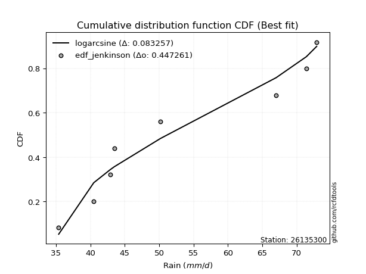</img></img>

</div>


### 11. EDF Cunnane (1978)

Cunnane´s work in statistical hydrology has focused on the performance and evaluation of different probability distributions (such as GEV, Gumbel, Lognormal) for flood frequency estimation. _b_ is a constant, typically set to 0.4.

<div align="center">


$P=(m-b)/(n+1-2b)$


</div>


**11.1. Empirical values**

<div align="center">

|                | 0                   | 1                   | 2                  | 3                  | 4                  | 5                  | 6                  | 7                  |
|:---------------|:--------------------|:--------------------|:-------------------|:-------------------|:-------------------|:-------------------|:-------------------|:-------------------|
| date           | 2023                | 2025                | 2020               | 2021               | 2022               | 2017               | 2019               | 2018               |
| x              | 35.4                | 40.5                | 42.9               | 43.5               | 50.2               | 67.0               | 71.4               | 72.9               |
| m              | 1                   | 2                   | 3                  | 4                  | 5                  | 6                  | 7                  | 8                  |
| empirical_dist | edf_cunnane         | edf_cunnane         | edf_cunnane        | edf_cunnane        | edf_cunnane        | edf_cunnane        | edf_cunnane        | edf_cunnane        |
| empirical      | 0.07317073170731708 | 0.19512195121951223 | 0.3170731707317074 | 0.4390243902439025 | 0.5609756097560976 | 0.6829268292682927 | 0.8048780487804879 | 0.926829268292683  |
| empirical_tr   | 1.0789473684210527  | 1.2424242424242424  | 1.4642857142857144 | 1.782608695652174  | 2.277777777777778  | 3.153846153846154  | 5.125000000000001  | 13.666666666666675 |

</div>


**11.2. Kolmogorov-Smirnov fit test (sorted by Δ)**


<div align="center">

|                | 0                   | 1                   | 2                   | 3                   | 4                   | 5                   | 6                   | 7                   | 8                   | 9                   | 10                  | 11                 | 12                  | 13                  | 14                  | 15                 | 16                 | 17                  | 18                  | 19                  | 20                  | 21                  | 22                 | 23                  | 24                  | 25                 | 26                  | 27                 | 28                 | 29                  | 30                 | 31                  | 32                  | 33                 | 34                  | 35                  | 36                  | 37                  | 38                  | 39                  | 40                 | 41                  | 42                  | 43                  | 44                 | 45                  | 46                  | 47                  | 48                  | 49                 | 50                  | 51                  | 52                  | 53                 | 54                  | 55                  | 56                  | 57                  | 58                  | 59                  | 60                 | 61                 | 62                  | 63                  | 64                  | 65                  | 66                  | 67                  | 68                  | 69                 | 70                  | 71                  | 72                  | 73                  | 74                  | 75                 | 76                 | 77                  | 78                  | 79                 | 80                  | 81                 | 82                 | 83                  | 84                 | 85                  | 86                 | 87                  | 88                  | 89                  | 90                  | 91                  | 92                 | 93                  | 94                 | 95                  | 96                  | 97                  | 98                  | 99                  | 100                 | 101                 | 102                 | 103                 | 104                 | 105                 | 106                 | 107                 | 108                | 109                 | 110                 | 111                 | 112                | 113                 | 114                | 115                | 116                 | 117                | 118                | 119                | 120                 | 121                 | 122                | 123                | 124                 | 125                 | 126                 | 127                 | 128                 | 129                 | 130                 | 131                 | 132                 | 133                 | 134                | 135                | 136                 | 137                 | 138                | 139                 | 140                | 141                 | 142                 | 143                | 144                 | 145                | 146                | 147                | 148                | 149                | 150                | 151                | 152                | 153                | 154                | 155                | 156                | 157                | 158                | 159                |
|:---------------|:--------------------|:--------------------|:--------------------|:--------------------|:--------------------|:--------------------|:--------------------|:--------------------|:--------------------|:--------------------|:--------------------|:-------------------|:--------------------|:--------------------|:--------------------|:-------------------|:-------------------|:--------------------|:--------------------|:--------------------|:--------------------|:--------------------|:-------------------|:--------------------|:--------------------|:-------------------|:--------------------|:-------------------|:-------------------|:--------------------|:-------------------|:--------------------|:--------------------|:-------------------|:--------------------|:--------------------|:--------------------|:--------------------|:--------------------|:--------------------|:-------------------|:--------------------|:--------------------|:--------------------|:-------------------|:--------------------|:--------------------|:--------------------|:--------------------|:-------------------|:--------------------|:--------------------|:--------------------|:-------------------|:--------------------|:--------------------|:--------------------|:--------------------|:--------------------|:--------------------|:-------------------|:-------------------|:--------------------|:--------------------|:--------------------|:--------------------|:--------------------|:--------------------|:--------------------|:-------------------|:--------------------|:--------------------|:--------------------|:--------------------|:--------------------|:-------------------|:-------------------|:--------------------|:--------------------|:-------------------|:--------------------|:-------------------|:-------------------|:--------------------|:-------------------|:--------------------|:-------------------|:--------------------|:--------------------|:--------------------|:--------------------|:--------------------|:-------------------|:--------------------|:-------------------|:--------------------|:--------------------|:--------------------|:--------------------|:--------------------|:--------------------|:--------------------|:--------------------|:--------------------|:--------------------|:--------------------|:--------------------|:--------------------|:-------------------|:--------------------|:--------------------|:--------------------|:-------------------|:--------------------|:-------------------|:-------------------|:--------------------|:-------------------|:-------------------|:-------------------|:--------------------|:--------------------|:-------------------|:-------------------|:--------------------|:--------------------|:--------------------|:--------------------|:--------------------|:--------------------|:--------------------|:--------------------|:--------------------|:--------------------|:-------------------|:-------------------|:--------------------|:--------------------|:-------------------|:--------------------|:-------------------|:--------------------|:--------------------|:-------------------|:--------------------|:-------------------|:-------------------|:-------------------|:-------------------|:-------------------|:-------------------|:-------------------|:-------------------|:-------------------|:-------------------|:-------------------|:-------------------|:-------------------|:-------------------|:-------------------|
| station        | 26135300            | 26135300            | 26135300            | 26135300            | 26135300            | 26135300            | 26135300            | 26135300            | 26135300            | 26135300            | 26135300            | 26135300           | 26135300            | 26135300            | 26135300            | 26135300           | 26135300           | 26135300            | 26135300            | 26135300            | 26135300            | 26135300            | 26135300           | 26135300            | 26135300            | 26135300           | 26135300            | 26135300           | 26135300           | 26135300            | 26135300           | 26135300            | 26135300            | 26135300           | 26135300            | 26135300            | 26135300            | 26135300            | 26135300            | 26135300            | 26135300           | 26135300            | 26135300            | 26135300            | 26135300           | 26135300            | 26135300            | 26135300            | 26135300            | 26135300           | 26135300            | 26135300            | 26135300            | 26135300           | 26135300            | 26135300            | 26135300            | 26135300            | 26135300            | 26135300            | 26135300           | 26135300           | 26135300            | 26135300            | 26135300            | 26135300            | 26135300            | 26135300            | 26135300            | 26135300           | 26135300            | 26135300            | 26135300            | 26135300            | 26135300            | 26135300           | 26135300           | 26135300            | 26135300            | 26135300           | 26135300            | 26135300           | 26135300           | 26135300            | 26135300           | 26135300            | 26135300           | 26135300            | 26135300            | 26135300            | 26135300            | 26135300            | 26135300           | 26135300            | 26135300           | 26135300            | 26135300            | 26135300            | 26135300            | 26135300            | 26135300            | 26135300            | 26135300            | 26135300            | 26135300            | 26135300            | 26135300            | 26135300            | 26135300           | 26135300            | 26135300            | 26135300            | 26135300           | 26135300            | 26135300           | 26135300           | 26135300            | 26135300           | 26135300           | 26135300           | 26135300            | 26135300            | 26135300           | 26135300           | 26135300            | 26135300            | 26135300            | 26135300            | 26135300            | 26135300            | 26135300            | 26135300            | 26135300            | 26135300            | 26135300           | 26135300           | 26135300            | 26135300            | 26135300           | 26135300            | 26135300           | 26135300            | 26135300            | 26135300           | 26135300            | 26135300           | 26135300           | 26135300           | 26135300           | 26135300           | 26135300           | 26135300           | 26135300           | 26135300           | 26135300           | 26135300           | 26135300           | 26135300           | 26135300           | 26135300           |
| empirical_dist | edf_cunnane         | edf_cunnane         | edf_cunnane         | edf_cunnane         | edf_cunnane         | edf_cunnane         | edf_cunnane         | edf_cunnane         | edf_cunnane         | edf_cunnane         | edf_cunnane         | edf_cunnane        | edf_cunnane         | edf_cunnane         | edf_cunnane         | edf_cunnane        | edf_cunnane        | edf_cunnane         | edf_cunnane         | edf_cunnane         | edf_cunnane         | edf_cunnane         | edf_cunnane        | edf_cunnane         | edf_cunnane         | edf_cunnane        | edf_cunnane         | edf_cunnane        | edf_cunnane        | edf_cunnane         | edf_cunnane        | edf_cunnane         | edf_cunnane         | edf_cunnane        | edf_cunnane         | edf_cunnane         | edf_cunnane         | edf_cunnane         | edf_cunnane         | edf_cunnane         | edf_cunnane        | edf_cunnane         | edf_cunnane         | edf_cunnane         | edf_cunnane        | edf_cunnane         | edf_cunnane         | edf_cunnane         | edf_cunnane         | edf_cunnane        | edf_cunnane         | edf_cunnane         | edf_cunnane         | edf_cunnane        | edf_cunnane         | edf_cunnane         | edf_cunnane         | edf_cunnane         | edf_cunnane         | edf_cunnane         | edf_cunnane        | edf_cunnane        | edf_cunnane         | edf_cunnane         | edf_cunnane         | edf_cunnane         | edf_cunnane         | edf_cunnane         | edf_cunnane         | edf_cunnane        | edf_cunnane         | edf_cunnane         | edf_cunnane         | edf_cunnane         | edf_cunnane         | edf_cunnane        | edf_cunnane        | edf_cunnane         | edf_cunnane         | edf_cunnane        | edf_cunnane         | edf_cunnane        | edf_cunnane        | edf_cunnane         | edf_cunnane        | edf_cunnane         | edf_cunnane        | edf_cunnane         | edf_cunnane         | edf_cunnane         | edf_cunnane         | edf_cunnane         | edf_cunnane        | edf_cunnane         | edf_cunnane        | edf_cunnane         | edf_cunnane         | edf_cunnane         | edf_cunnane         | edf_cunnane         | edf_cunnane         | edf_cunnane         | edf_cunnane         | edf_cunnane         | edf_cunnane         | edf_cunnane         | edf_cunnane         | edf_cunnane         | edf_cunnane        | edf_cunnane         | edf_cunnane         | edf_cunnane         | edf_cunnane        | edf_cunnane         | edf_cunnane        | edf_cunnane        | edf_cunnane         | edf_cunnane        | edf_cunnane        | edf_cunnane        | edf_cunnane         | edf_cunnane         | edf_cunnane        | edf_cunnane        | edf_cunnane         | edf_cunnane         | edf_cunnane         | edf_cunnane         | edf_cunnane         | edf_cunnane         | edf_cunnane         | edf_cunnane         | edf_cunnane         | edf_cunnane         | edf_cunnane        | edf_cunnane        | edf_cunnane         | edf_cunnane         | edf_cunnane        | edf_cunnane         | edf_cunnane        | edf_cunnane         | edf_cunnane         | edf_cunnane        | edf_cunnane         | edf_cunnane        | edf_cunnane        | edf_cunnane        | edf_cunnane        | edf_cunnane        | edf_cunnane        | edf_cunnane        | edf_cunnane        | edf_cunnane        | edf_cunnane        | edf_cunnane        | edf_cunnane        | edf_cunnane        | edf_cunnane        | edf_cunnane        |
| p_dist         | logarcsine          | logbetaprime        | wrapcauchy          | arcsine             | logrdist            | logksone            | logsemicircular     | ksone               | logncf              | loglomax            | burr12              | rdist              | loganglit           | semicircular        | lomax               | loggenhalflogistic | genexpon           | exponnorm           | halfnorm            | logerlang           | weibull_min         | logweibull_min      | logwrapcauchy      | logloglaplace       | logfoldnorm         | rayleigh           | loggenexpon         | loggamma           | loggamma           | logskewnorm         | skewnorm           | gompertz            | loggompertz         | lograyleigh        | loghalfnorm         | logfatiguelife      | anglit              | foldnorm            | logmaxwell          | loginvgauss         | invgauss           | invgamma            | f                   | logburr             | invweibull         | genextreme          | logrice             | loginvgamma         | logf                | logpearson3        | betaprime           | loginvweibull       | lognct              | nct                | loggenlogistic      | burr                | alpha               | maxwell             | logmielke           | logtrapezoid        | logloggamma        | logalpha           | logkstwobign        | logexponnorm        | logcrystalball      | lognorm             | logt                | halflogistic        | kstwobign           | logjohnsonsu       | gumbel_r            | genlogistic         | loghalflogistic     | loggumbel_r         | moyal               | pearson3           | logburr12          | triang              | trapezoid           | logcosine          | logmoyal            | halfgennorm        | loggausshyper      | kappa4              | t                  | crystalball         | norm               | truncnorm           | logkappa3           | loglogistic         | logtukeylambda      | bradford            | logkappa4          | rice                | logdweibull        | loguniform          | logvonmises_line    | logwald             | logtriang           | loglevy_l           | loghypsecant        | truncpareto         | cosine              | logargus            | logdgamma           | logistic            | dweibull            | truncexpon          | johnsonsu          | loggumbel_l         | tukeylambda         | gausshyper          | levy_l             | dgamma              | uniform            | kappa3             | hypsecant           | gumbel_l           | loglaplace         | loglaplace         | logbradford         | logbeta             | vonmises_line      | loggennorm         | argus               | truncweibull_min    | logtruncweibull_min | wald                | laplace             | gennorm             | logtruncexpon       | logweibull_max      | loggenextreme       | logjohnsonsb        | genpareto          | genhalflogistic    | johnsonsb           | beta                | exponpow           | logexponpow         | ncf                | gengamma            | weibull_max         | loggenpareto       | nakagami            | powerlaw           | erlang             | logpowerlaw        | lognakagami        | exponweib          | logexponweib       | fatiguelife        | loggengamma        | gamma              | logtruncnorm       | loghalfgennorm     | logtruncpareto     | logvonmises        | vonmises           | mielke             |
| delta          | 0.08980534895127454 | 0.10163256808116516 | 0.10372113367587674 | 0.10533046926141543 | 0.10553108316056481 | 0.11618437583595664 | 0.13126086103164825 | 0.13263329422670284 | 0.13427979704298165 | 0.13841790327545989 | 0.14063936845942882 | 0.1406827747359924 | 0.14270682656585754 | 0.14843722841232632 | 0.14976889440400143 | 0.1510536384572484 | 0.1515404511692342 | 0.15390208471069622 | 0.15445623748896387 | 0.15498613655566829 | 0.15506469054070757 | 0.15540298197253677 | 0.1565545038021978 | 0.15662220456112919 | 0.15683636515186306 | 0.1570584222165669 | 0.15723941388192608 | 0.1574096119675703 | 0.1574096119675703 | 0.15814226136049536 | 0.1584513156006674 | 0.15854450320573144 | 0.15966715692743083 | 0.1598325670544818 | 0.15988839456820725 | 0.15989630196789772 | 0.16033632006261822 | 0.16064674891077724 | 0.16068685273329397 | 0.16117206448037324 | 0.1612026873406085 | 0.16181027799238723 | 0.16221398674126197 | 0.16306586728489203 | 0.1634162681896928 | 0.16341684979904536 | 0.16382684696665362 | 0.16383186076839196 | 0.16383354693849572 | 0.1639472832831016 | 0.16514373573148244 | 0.16522215026275977 | 0.16530279377923107 | 0.1657715111225242 | 0.16578309433899974 | 0.16594043196941521 | 0.16601332940244817 | 0.16602652194120066 | 0.16625222963322406 | 0.16652353548696341 | 0.1680989495311554 | 0.1682850820649633 | 0.16897836116468423 | 0.16920427279968436 | 0.16931765025642587 | 0.16931765958020012 | 0.16931836676992357 | 0.17187751633840842 | 0.17340210675466072 | 0.1735585732632695 | 0.17376844354546017 | 0.17402141739698151 | 0.17657388858806744 | 0.17676565147858203 | 0.17744692751814073 | 0.1781942846852978 | 0.1792127382313694 | 0.18008337159559645 | 0.18036501818400508 | 0.1805022861427818 | 0.18201726200899648 | 0.1849277065866635 | 0.1869353377250224 | 0.18708282376219937 | 0.1878119601620324 | 0.18781247806356094 | 0.1878124791659722 | 0.18781248637143977 | 0.18785067795070765 | 0.19173638712840582 | 0.19304933862431695 | 0.19593279665843777 | 0.1968933526315515 | 0.19761800010580782 | 0.1996071206421418 | 0.20024215204661833 | 0.20450569733000867 | 0.20506095731804896 | 0.20573537328611102 | 0.20606922644323689 | 0.20707875609670387 | 0.20811170458495298 | 0.20827088975032299 | 0.20936112885997582 | 0.21018744144081847 | 0.21046800136360294 | 0.21068360554397536 | 0.21171091566961797 | 0.2130738426493476 | 0.21351075349220752 | 0.21467368197823478 | 0.21551255485382537 | 0.2171788285596566 | 0.21865881222737782 | 0.2230243902439025 | 0.2231237033839691 | 0.22542017241663287 | 0.2275856380610733 | 0.2291089123783701 | 0.2291089123783701 | 0.23006817769936294 | 0.23384978332226172 | 0.2345097911194647 | 0.2346227560094003 | 0.23949671581076992 | 0.23953424585950223 | 0.24042432957392457 | 0.24190270002078926 | 0.24536090328595606 | 0.24542019210692523 | 0.24646320799416044 | 0.24927877109893465 | 0.25737913722722905 | 0.27412438346109824 | 0.2843319518447113 | 0.3246811971397822 | 0.33164084006505423 | 0.40468175484229796 | 0.4053372169330802 | 0.40945678550953923 | 0.410065171397164  | 0.43140130696854306 | 0.45234695415046977 | 0.4555238909741511 | 0.45742094259846366 | 0.4916751730375991 | 0.5067869729076823 | 0.5204395585884614 | 0.5204460988485068 | 0.5271278223926212 | 0.5381609956268643 | 0.538823613061546  | 0.5749140186055995 | 0.61267002590051   | 0.6829234009608338 | 0.6829268292682927 | 0.6952748337937259 | 1.1648038899942943 | 11.437362200717544 | nan                |
| deltao         | 0.4472608134160001  | 0.4472608134160001  | 0.4472608134160001  | 0.4472608134160001  | 0.4472608134160001  | 0.4472608134160001  | 0.4472608134160001  | 0.4472608134160001  | 0.4472608134160001  | 0.4472608134160001  | 0.4472608134160001  | 0.4472608134160001 | 0.4472608134160001  | 0.4472608134160001  | 0.4472608134160001  | 0.4472608134160001 | 0.4472608134160001 | 0.4472608134160001  | 0.4472608134160001  | 0.4472608134160001  | 0.4472608134160001  | 0.4472608134160001  | 0.4472608134160001 | 0.4472608134160001  | 0.4472608134160001  | 0.4472608134160001 | 0.4472608134160001  | 0.4472608134160001 | 0.4472608134160001 | 0.4472608134160001  | 0.4472608134160001 | 0.4472608134160001  | 0.4472608134160001  | 0.4472608134160001 | 0.4472608134160001  | 0.4472608134160001  | 0.4472608134160001  | 0.4472608134160001  | 0.4472608134160001  | 0.4472608134160001  | 0.4472608134160001 | 0.4472608134160001  | 0.4472608134160001  | 0.4472608134160001  | 0.4472608134160001 | 0.4472608134160001  | 0.4472608134160001  | 0.4472608134160001  | 0.4472608134160001  | 0.4472608134160001 | 0.4472608134160001  | 0.4472608134160001  | 0.4472608134160001  | 0.4472608134160001 | 0.4472608134160001  | 0.4472608134160001  | 0.4472608134160001  | 0.4472608134160001  | 0.4472608134160001  | 0.4472608134160001  | 0.4472608134160001 | 0.4472608134160001 | 0.4472608134160001  | 0.4472608134160001  | 0.4472608134160001  | 0.4472608134160001  | 0.4472608134160001  | 0.4472608134160001  | 0.4472608134160001  | 0.4472608134160001 | 0.4472608134160001  | 0.4472608134160001  | 0.4472608134160001  | 0.4472608134160001  | 0.4472608134160001  | 0.4472608134160001 | 0.4472608134160001 | 0.4472608134160001  | 0.4472608134160001  | 0.4472608134160001 | 0.4472608134160001  | 0.4472608134160001 | 0.4472608134160001 | 0.4472608134160001  | 0.4472608134160001 | 0.4472608134160001  | 0.4472608134160001 | 0.4472608134160001  | 0.4472608134160001  | 0.4472608134160001  | 0.4472608134160001  | 0.4472608134160001  | 0.4472608134160001 | 0.4472608134160001  | 0.4472608134160001 | 0.4472608134160001  | 0.4472608134160001  | 0.4472608134160001  | 0.4472608134160001  | 0.4472608134160001  | 0.4472608134160001  | 0.4472608134160001  | 0.4472608134160001  | 0.4472608134160001  | 0.4472608134160001  | 0.4472608134160001  | 0.4472608134160001  | 0.4472608134160001  | 0.4472608134160001 | 0.4472608134160001  | 0.4472608134160001  | 0.4472608134160001  | 0.4472608134160001 | 0.4472608134160001  | 0.4472608134160001 | 0.4472608134160001 | 0.4472608134160001  | 0.4472608134160001 | 0.4472608134160001 | 0.4472608134160001 | 0.4472608134160001  | 0.4472608134160001  | 0.4472608134160001 | 0.4472608134160001 | 0.4472608134160001  | 0.4472608134160001  | 0.4472608134160001  | 0.4472608134160001  | 0.4472608134160001  | 0.4472608134160001  | 0.4472608134160001  | 0.4472608134160001  | 0.4472608134160001  | 0.4472608134160001  | 0.4472608134160001 | 0.4472608134160001 | 0.4472608134160001  | 0.4472608134160001  | 0.4472608134160001 | 0.4472608134160001  | 0.4472608134160001 | 0.4472608134160001  | 0.4472608134160001  | 0.4472608134160001 | 0.4472608134160001  | 0.4472608134160001 | 0.4472608134160001 | 0.4472608134160001 | 0.4472608134160001 | 0.4472608134160001 | 0.4472608134160001 | 0.4472608134160001 | 0.4472608134160001 | 0.4472608134160001 | 0.4472608134160001 | 0.4472608134160001 | 0.4472608134160001 | 0.4472608134160001 | 0.4472608134160001 | 0.4472608134160001 |
| eval           | Δo > Δ              | Δo > Δ              | Δo > Δ              | Δo > Δ              | Δo > Δ              | Δo > Δ              | Δo > Δ              | Δo > Δ              | Δo > Δ              | Δo > Δ              | Δo > Δ              | Δo > Δ             | Δo > Δ              | Δo > Δ              | Δo > Δ              | Δo > Δ             | Δo > Δ             | Δo > Δ              | Δo > Δ              | Δo > Δ              | Δo > Δ              | Δo > Δ              | Δo > Δ             | Δo > Δ              | Δo > Δ              | Δo > Δ             | Δo > Δ              | Δo > Δ             | Δo > Δ             | Δo > Δ              | Δo > Δ             | Δo > Δ              | Δo > Δ              | Δo > Δ             | Δo > Δ              | Δo > Δ              | Δo > Δ              | Δo > Δ              | Δo > Δ              | Δo > Δ              | Δo > Δ             | Δo > Δ              | Δo > Δ              | Δo > Δ              | Δo > Δ             | Δo > Δ              | Δo > Δ              | Δo > Δ              | Δo > Δ              | Δo > Δ             | Δo > Δ              | Δo > Δ              | Δo > Δ              | Δo > Δ             | Δo > Δ              | Δo > Δ              | Δo > Δ              | Δo > Δ              | Δo > Δ              | Δo > Δ              | Δo > Δ             | Δo > Δ             | Δo > Δ              | Δo > Δ              | Δo > Δ              | Δo > Δ              | Δo > Δ              | Δo > Δ              | Δo > Δ              | Δo > Δ             | Δo > Δ              | Δo > Δ              | Δo > Δ              | Δo > Δ              | Δo > Δ              | Δo > Δ             | Δo > Δ             | Δo > Δ              | Δo > Δ              | Δo > Δ             | Δo > Δ              | Δo > Δ             | Δo > Δ             | Δo > Δ              | Δo > Δ             | Δo > Δ              | Δo > Δ             | Δo > Δ              | Δo > Δ              | Δo > Δ              | Δo > Δ              | Δo > Δ              | Δo > Δ             | Δo > Δ              | Δo > Δ             | Δo > Δ              | Δo > Δ              | Δo > Δ              | Δo > Δ              | Δo > Δ              | Δo > Δ              | Δo > Δ              | Δo > Δ              | Δo > Δ              | Δo > Δ              | Δo > Δ              | Δo > Δ              | Δo > Δ              | Δo > Δ             | Δo > Δ              | Δo > Δ              | Δo > Δ              | Δo > Δ             | Δo > Δ              | Δo > Δ             | Δo > Δ             | Δo > Δ              | Δo > Δ             | Δo > Δ             | Δo > Δ             | Δo > Δ              | Δo > Δ              | Δo > Δ             | Δo > Δ             | Δo > Δ              | Δo > Δ              | Δo > Δ              | Δo > Δ              | Δo > Δ              | Δo > Δ              | Δo > Δ              | Δo > Δ              | Δo > Δ              | Δo > Δ              | Δo > Δ             | Δo > Δ             | Δo > Δ              | Δo > Δ              | Δo > Δ             | Δo > Δ              | Δo > Δ             | Δo > Δ              | Δo <= Δ             | Δo <= Δ            | Δo <= Δ             | Δo <= Δ            | Δo <= Δ            | Δo <= Δ            | Δo <= Δ            | Δo <= Δ            | Δo <= Δ            | Δo <= Δ            | Δo <= Δ            | Δo <= Δ            | Δo <= Δ            | Δo <= Δ            | Δo <= Δ            | Δo <= Δ            | Δo <= Δ            | Δo <= Δ            |
| fit            | 1                   | 1                   | 1                   | 1                   | 1                   | 1                   | 1                   | 1                   | 1                   | 1                   | 1                   | 1                  | 1                   | 1                   | 1                   | 1                  | 1                  | 1                   | 1                   | 1                   | 1                   | 1                   | 1                  | 1                   | 1                   | 1                  | 1                   | 1                  | 1                  | 1                   | 1                  | 1                   | 1                   | 1                  | 1                   | 1                   | 1                   | 1                   | 1                   | 1                   | 1                  | 1                   | 1                   | 1                   | 1                  | 1                   | 1                   | 1                   | 1                   | 1                  | 1                   | 1                   | 1                   | 1                  | 1                   | 1                   | 1                   | 1                   | 1                   | 1                   | 1                  | 1                  | 1                   | 1                   | 1                   | 1                   | 1                   | 1                   | 1                   | 1                  | 1                   | 1                   | 1                   | 1                   | 1                   | 1                  | 1                  | 1                   | 1                   | 1                  | 1                   | 1                  | 1                  | 1                   | 1                  | 1                   | 1                  | 1                   | 1                   | 1                   | 1                   | 1                   | 1                  | 1                   | 1                  | 1                   | 1                   | 1                   | 1                   | 1                   | 1                   | 1                   | 1                   | 1                   | 1                   | 1                   | 1                   | 1                   | 1                  | 1                   | 1                   | 1                   | 1                  | 1                   | 1                  | 1                  | 1                   | 1                  | 1                  | 1                  | 1                   | 1                   | 1                  | 1                  | 1                   | 1                   | 1                   | 1                   | 1                   | 1                   | 1                   | 1                   | 1                   | 1                   | 1                  | 1                  | 1                   | 1                   | 1                  | 1                   | 1                  | 1                   | 0                   | 0                  | 0                   | 0                  | 0                  | 0                  | 0                  | 0                  | 0                  | 0                  | 0                  | 0                  | 0                  | 0                  | 0                  | 0                  | 0                  | 0                  |
| n              | 8                   | 8                   | 8                   | 8                   | 8                   | 8                   | 8                   | 8                   | 8                   | 8                   | 8                   | 8                  | 8                   | 8                   | 8                   | 8                  | 8                  | 8                   | 8                   | 8                   | 8                   | 8                   | 8                  | 8                   | 8                   | 8                  | 8                   | 8                  | 8                  | 8                   | 8                  | 8                   | 8                   | 8                  | 8                   | 8                   | 8                   | 8                   | 8                   | 8                   | 8                  | 8                   | 8                   | 8                   | 8                  | 8                   | 8                   | 8                   | 8                   | 8                  | 8                   | 8                   | 8                   | 8                  | 8                   | 8                   | 8                   | 8                   | 8                   | 8                   | 8                  | 8                  | 8                   | 8                   | 8                   | 8                   | 8                   | 8                   | 8                   | 8                  | 8                   | 8                   | 8                   | 8                   | 8                   | 8                  | 8                  | 8                   | 8                   | 8                  | 8                   | 8                  | 8                  | 8                   | 8                  | 8                   | 8                  | 8                   | 8                   | 8                   | 8                   | 8                   | 8                  | 8                   | 8                  | 8                   | 8                   | 8                   | 8                   | 8                   | 8                   | 8                   | 8                   | 8                   | 8                   | 8                   | 8                   | 8                   | 8                  | 8                   | 8                   | 8                   | 8                  | 8                   | 8                  | 8                  | 8                   | 8                  | 8                  | 8                  | 8                   | 8                   | 8                  | 8                  | 8                   | 8                   | 8                   | 8                   | 8                   | 8                   | 8                   | 8                   | 8                   | 8                   | 8                  | 8                  | 8                   | 8                   | 8                  | 8                   | 8                  | 8                   | 8                   | 8                  | 8                   | 8                  | 8                  | 8                  | 8                  | 8                  | 8                  | 8                  | 8                  | 8                  | 8                  | 8                  | 8                  | 8                  | 8                  | 8                  |
| best_fit       | 1                   | 0                   | 0                   | 0                   | 0                   | 0                   | 0                   | 0                   | 0                   | 0                   | 0                   | 0                  | 0                   | 0                   | 0                   | 0                  | 0                  | 0                   | 0                   | 0                   | 0                   | 0                   | 0                  | 0                   | 0                   | 0                  | 0                   | 0                  | 0                  | 0                   | 0                  | 0                   | 0                   | 0                  | 0                   | 0                   | 0                   | 0                   | 0                   | 0                   | 0                  | 0                   | 0                   | 0                   | 0                  | 0                   | 0                   | 0                   | 0                   | 0                  | 0                   | 0                   | 0                   | 0                  | 0                   | 0                   | 0                   | 0                   | 0                   | 0                   | 0                  | 0                  | 0                   | 0                   | 0                   | 0                   | 0                   | 0                   | 0                   | 0                  | 0                   | 0                   | 0                   | 0                   | 0                   | 0                  | 0                  | 0                   | 0                   | 0                  | 0                   | 0                  | 0                  | 0                   | 0                  | 0                   | 0                  | 0                   | 0                   | 0                   | 0                   | 0                   | 0                  | 0                   | 0                  | 0                   | 0                   | 0                   | 0                   | 0                   | 0                   | 0                   | 0                   | 0                   | 0                   | 0                   | 0                   | 0                   | 0                  | 0                   | 0                   | 0                   | 0                  | 0                   | 0                  | 0                  | 0                   | 0                  | 0                  | 0                  | 0                   | 0                   | 0                  | 0                  | 0                   | 0                   | 0                   | 0                   | 0                   | 0                   | 0                   | 0                   | 0                   | 0                   | 0                  | 0                  | 0                   | 0                   | 0                  | 0                   | 0                  | 0                   | 0                   | 0                  | 0                   | 0                  | 0                  | 0                  | 0                  | 0                  | 0                  | 0                  | 0                  | 0                  | 0                  | 0                  | 0                  | 0                  | 0                  | 0                  |
| best_fit_sort  | 1                   | 2                   | 3                   | 4                   | 5                   | 6                   | 7                   | 8                   | 9                   | 10                  | 11                  | 12                 | 13                  | 14                  | 15                  | 16                 | 17                 | 18                  | 19                  | 20                  | 21                  | 22                  | 23                 | 24                  | 25                  | 26                 | 27                  | 28                 | 29                 | 30                  | 31                 | 32                  | 33                  | 34                 | 35                  | 36                  | 37                  | 38                  | 39                  | 40                  | 41                 | 42                  | 43                  | 44                  | 45                 | 46                  | 47                  | 48                  | 49                  | 50                 | 51                  | 52                  | 53                  | 54                 | 55                  | 56                  | 57                  | 58                  | 59                  | 60                  | 61                 | 62                 | 63                  | 64                  | 65                  | 66                  | 67                  | 68                  | 69                  | 70                 | 71                  | 72                  | 73                  | 74                  | 75                  | 76                 | 77                 | 78                  | 79                  | 80                 | 81                  | 82                 | 83                 | 84                  | 85                 | 86                  | 87                 | 88                  | 89                  | 90                  | 91                  | 92                  | 93                 | 94                  | 95                 | 96                  | 97                  | 98                  | 99                  | 100                 | 101                 | 102                 | 103                 | 104                 | 105                 | 106                 | 107                 | 108                 | 109                | 110                 | 111                 | 112                 | 113                | 114                 | 115                | 116                | 117                 | 118                | 119                | 120                | 121                 | 122                 | 123                | 124                | 125                 | 126                 | 127                 | 128                 | 129                 | 130                 | 131                 | 132                 | 133                 | 134                 | 135                | 136                | 137                 | 138                 | 139                | 140                 | 141                | 142                 | 143                 | 144                | 145                 | 146                | 147                | 148                | 149                | 150                | 151                | 152                | 153                | 154                | 155                | 156                | 157                | 158                | 159                | 160                |

</div>


**11.3. Best fit**

<div align="center">

|   id |   station | empirical_dist   | p_dist     |     delta |   deltao | eval   |   fit |   n |   best_fit |   best_fit_sort |
|-----:|----------:|:-----------------|:-----------|----------:|---------:|:-------|------:|----:|-----------:|----------------:|
|    0 |  26135300 | edf_cunnane      | logarcsine | 0.0898053 | 0.447261 | Δo > Δ |     1 |   8 |          1 |               1 |

</div>


<div align="center">

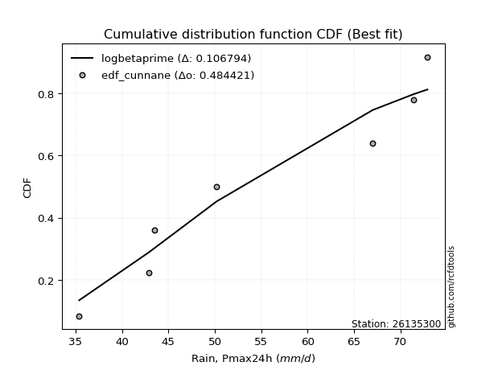</img>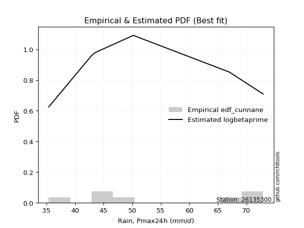</img>

</div>


### 12. EDF Adamowski (1981)

The Adamowski formula in hydrology refers to a specific plotting position formula used for estimating the non-parametric empirical distribution of hydrological events (like flood peaks) to calculate their return periods. This formula provides an alternative to traditional parametric methods (like the Gumbel or Log Pearson Type III distributions). 

<div align="center">


$P=(m-0.25)/(n+0.5)$


</div>


**12.1. Empirical values**

<div align="center">

|                | 0                   | 1                   | 2                  | 3                  | 4                  | 5                  | 6                  | 7                  |
|:---------------|:--------------------|:--------------------|:-------------------|:-------------------|:-------------------|:-------------------|:-------------------|:-------------------|
| date           | 2023                | 2025                | 2020               | 2021               | 2022               | 2017               | 2019               | 2018               |
| x              | 35.4                | 40.5                | 42.9               | 43.5               | 50.2               | 67.0               | 71.4               | 72.9               |
| m              | 1                   | 2                   | 3                  | 4                  | 5                  | 6                  | 7                  | 8                  |
| empirical_dist | edf_adamowski       | edf_adamowski       | edf_adamowski      | edf_adamowski      | edf_adamowski      | edf_adamowski      | edf_adamowski      | edf_adamowski      |
| empirical      | 0.08823529411764706 | 0.20588235294117646 | 0.3235294117647059 | 0.4411764705882353 | 0.5588235294117647 | 0.6764705882352942 | 0.7941176470588235 | 0.9117647058823529 |
| empirical_tr   | 1.096774193548387   | 1.259259259259259   | 1.4782608695652173 | 1.7894736842105263 | 2.2666666666666666 | 3.0909090909090913 | 4.857142857142856  | 11.33333333333333  |

</div>


**12.2. Kolmogorov-Smirnov fit test (sorted by Δ)**


<div align="center">

|                | 0                   | 1                   | 2                   | 3                   | 4                   | 5                   | 6                   | 7                   | 8                   | 9                   | 10                  | 11                  | 12                  | 13                  | 14                  | 15                 | 16                 | 17                 | 18                  | 19                  | 20                 | 21                  | 22                  | 23                  | 24                  | 25                  | 26                 | 27                  | 28                  | 29                  | 30                  | 31                  | 32                  | 33                 | 34                 | 35                  | 36                  | 37                 | 38                  | 39                  | 40                  | 41                  | 42                 | 43                  | 44                 | 45                 | 46                  | 47                  | 48                  | 49                 | 50                  | 51                 | 52                  | 53                  | 54                  | 55                 | 56                  | 57                  | 58                  | 59                  | 60                  | 61                  | 62                 | 63                  | 64                  | 65                  | 66                  | 67                 | 68                 | 69                 | 70                 | 71                 | 72                  | 73                 | 74                 | 75                  | 76                  | 77                  | 78                  | 79                 | 80                 | 81                  | 82                 | 83                  | 84                  | 85                  | 86                 | 87                  | 88                 | 89                  | 90                  | 91                 | 92                 | 93                  | 94                  | 95                 | 96                 | 97                 | 98                 | 99                  | 100                 | 101                | 102                 | 103                | 104                 | 105                 | 106                 | 107                | 108                 | 109                 | 110                 | 111                 | 112                 | 113                | 114                | 115                 | 116                | 117                 | 118                 | 119                | 120                | 121                 | 122                 | 123                | 124                | 125                | 126                 | 127                | 128                 | 129                 | 130                 | 131                | 132                 | 133                | 134                | 135                 | 136                 | 137                | 138                | 139                | 140                 | 141                 | 142                | 143                | 144                 | 145                | 146                 | 147                | 148                | 149                | 150                | 151                | 152                | 153                | 154                | 155                | 156                | 157                | 158                | 159                |
|:---------------|:--------------------|:--------------------|:--------------------|:--------------------|:--------------------|:--------------------|:--------------------|:--------------------|:--------------------|:--------------------|:--------------------|:--------------------|:--------------------|:--------------------|:--------------------|:-------------------|:-------------------|:-------------------|:--------------------|:--------------------|:-------------------|:--------------------|:--------------------|:--------------------|:--------------------|:--------------------|:-------------------|:--------------------|:--------------------|:--------------------|:--------------------|:--------------------|:--------------------|:-------------------|:-------------------|:--------------------|:--------------------|:-------------------|:--------------------|:--------------------|:--------------------|:--------------------|:-------------------|:--------------------|:-------------------|:-------------------|:--------------------|:--------------------|:--------------------|:-------------------|:--------------------|:-------------------|:--------------------|:--------------------|:--------------------|:-------------------|:--------------------|:--------------------|:--------------------|:--------------------|:--------------------|:--------------------|:-------------------|:--------------------|:--------------------|:--------------------|:--------------------|:-------------------|:-------------------|:-------------------|:-------------------|:-------------------|:--------------------|:-------------------|:-------------------|:--------------------|:--------------------|:--------------------|:--------------------|:-------------------|:-------------------|:--------------------|:-------------------|:--------------------|:--------------------|:--------------------|:-------------------|:--------------------|:-------------------|:--------------------|:--------------------|:-------------------|:-------------------|:--------------------|:--------------------|:-------------------|:-------------------|:-------------------|:-------------------|:--------------------|:--------------------|:-------------------|:--------------------|:-------------------|:--------------------|:--------------------|:--------------------|:-------------------|:--------------------|:--------------------|:--------------------|:--------------------|:--------------------|:-------------------|:-------------------|:--------------------|:-------------------|:--------------------|:--------------------|:-------------------|:-------------------|:--------------------|:--------------------|:-------------------|:-------------------|:-------------------|:--------------------|:-------------------|:--------------------|:--------------------|:--------------------|:-------------------|:--------------------|:-------------------|:-------------------|:--------------------|:--------------------|:-------------------|:-------------------|:-------------------|:--------------------|:--------------------|:-------------------|:-------------------|:--------------------|:-------------------|:--------------------|:-------------------|:-------------------|:-------------------|:-------------------|:-------------------|:-------------------|:-------------------|:-------------------|:-------------------|:-------------------|:-------------------|:-------------------|:-------------------|
| station        | 26135300            | 26135300            | 26135300            | 26135300            | 26135300            | 26135300            | 26135300            | 26135300            | 26135300            | 26135300            | 26135300            | 26135300            | 26135300            | 26135300            | 26135300            | 26135300           | 26135300           | 26135300           | 26135300            | 26135300            | 26135300           | 26135300            | 26135300            | 26135300            | 26135300            | 26135300            | 26135300           | 26135300            | 26135300            | 26135300            | 26135300            | 26135300            | 26135300            | 26135300           | 26135300           | 26135300            | 26135300            | 26135300           | 26135300            | 26135300            | 26135300            | 26135300            | 26135300           | 26135300            | 26135300           | 26135300           | 26135300            | 26135300            | 26135300            | 26135300           | 26135300            | 26135300           | 26135300            | 26135300            | 26135300            | 26135300           | 26135300            | 26135300            | 26135300            | 26135300            | 26135300            | 26135300            | 26135300           | 26135300            | 26135300            | 26135300            | 26135300            | 26135300           | 26135300           | 26135300           | 26135300           | 26135300           | 26135300            | 26135300           | 26135300           | 26135300            | 26135300            | 26135300            | 26135300            | 26135300           | 26135300           | 26135300            | 26135300           | 26135300            | 26135300            | 26135300            | 26135300           | 26135300            | 26135300           | 26135300            | 26135300            | 26135300           | 26135300           | 26135300            | 26135300            | 26135300           | 26135300           | 26135300           | 26135300           | 26135300            | 26135300            | 26135300           | 26135300            | 26135300           | 26135300            | 26135300            | 26135300            | 26135300           | 26135300            | 26135300            | 26135300            | 26135300            | 26135300            | 26135300           | 26135300           | 26135300            | 26135300           | 26135300            | 26135300            | 26135300           | 26135300           | 26135300            | 26135300            | 26135300           | 26135300           | 26135300           | 26135300            | 26135300           | 26135300            | 26135300            | 26135300            | 26135300           | 26135300            | 26135300           | 26135300           | 26135300            | 26135300            | 26135300           | 26135300           | 26135300           | 26135300            | 26135300            | 26135300           | 26135300           | 26135300            | 26135300           | 26135300            | 26135300           | 26135300           | 26135300           | 26135300           | 26135300           | 26135300           | 26135300           | 26135300           | 26135300           | 26135300           | 26135300           | 26135300           | 26135300           |
| empirical_dist | edf_adamowski       | edf_adamowski       | edf_adamowski       | edf_adamowski       | edf_adamowski       | edf_adamowski       | edf_adamowski       | edf_adamowski       | edf_adamowski       | edf_adamowski       | edf_adamowski       | edf_adamowski       | edf_adamowski       | edf_adamowski       | edf_adamowski       | edf_adamowski      | edf_adamowski      | edf_adamowski      | edf_adamowski       | edf_adamowski       | edf_adamowski      | edf_adamowski       | edf_adamowski       | edf_adamowski       | edf_adamowski       | edf_adamowski       | edf_adamowski      | edf_adamowski       | edf_adamowski       | edf_adamowski       | edf_adamowski       | edf_adamowski       | edf_adamowski       | edf_adamowski      | edf_adamowski      | edf_adamowski       | edf_adamowski       | edf_adamowski      | edf_adamowski       | edf_adamowski       | edf_adamowski       | edf_adamowski       | edf_adamowski      | edf_adamowski       | edf_adamowski      | edf_adamowski      | edf_adamowski       | edf_adamowski       | edf_adamowski       | edf_adamowski      | edf_adamowski       | edf_adamowski      | edf_adamowski       | edf_adamowski       | edf_adamowski       | edf_adamowski      | edf_adamowski       | edf_adamowski       | edf_adamowski       | edf_adamowski       | edf_adamowski       | edf_adamowski       | edf_adamowski      | edf_adamowski       | edf_adamowski       | edf_adamowski       | edf_adamowski       | edf_adamowski      | edf_adamowski      | edf_adamowski      | edf_adamowski      | edf_adamowski      | edf_adamowski       | edf_adamowski      | edf_adamowski      | edf_adamowski       | edf_adamowski       | edf_adamowski       | edf_adamowski       | edf_adamowski      | edf_adamowski      | edf_adamowski       | edf_adamowski      | edf_adamowski       | edf_adamowski       | edf_adamowski       | edf_adamowski      | edf_adamowski       | edf_adamowski      | edf_adamowski       | edf_adamowski       | edf_adamowski      | edf_adamowski      | edf_adamowski       | edf_adamowski       | edf_adamowski      | edf_adamowski      | edf_adamowski      | edf_adamowski      | edf_adamowski       | edf_adamowski       | edf_adamowski      | edf_adamowski       | edf_adamowski      | edf_adamowski       | edf_adamowski       | edf_adamowski       | edf_adamowski      | edf_adamowski       | edf_adamowski       | edf_adamowski       | edf_adamowski       | edf_adamowski       | edf_adamowski      | edf_adamowski      | edf_adamowski       | edf_adamowski      | edf_adamowski       | edf_adamowski       | edf_adamowski      | edf_adamowski      | edf_adamowski       | edf_adamowski       | edf_adamowski      | edf_adamowski      | edf_adamowski      | edf_adamowski       | edf_adamowski      | edf_adamowski       | edf_adamowski       | edf_adamowski       | edf_adamowski      | edf_adamowski       | edf_adamowski      | edf_adamowski      | edf_adamowski       | edf_adamowski       | edf_adamowski      | edf_adamowski      | edf_adamowski      | edf_adamowski       | edf_adamowski       | edf_adamowski      | edf_adamowski      | edf_adamowski       | edf_adamowski      | edf_adamowski       | edf_adamowski      | edf_adamowski      | edf_adamowski      | edf_adamowski      | edf_adamowski      | edf_adamowski      | edf_adamowski      | edf_adamowski      | edf_adamowski      | edf_adamowski      | edf_adamowski      | edf_adamowski      | edf_adamowski      |
| p_dist         | logarcsine          | wrapcauchy          | arcsine             | logbetaprime        | logrdist            | logksone            | logsemicircular     | ksone               | logncf              | logloglaplace       | rdist               | weibull_min         | loglomax            | loganglit           | logwrapcauchy       | burr12             | semicircular       | lomax              | genexpon            | rayleigh            | exponnorm          | halfnorm            | logerlang           | loggenhalflogistic  | logweibull_min      | skewnorm            | anglit             | foldnorm            | logfoldnorm         | loggenexpon         | loggamma            | loggamma            | logskewnorm         | gompertz           | loggompertz        | lograyleigh         | loghalfnorm         | logfatiguelife     | logmaxwell          | loginvgauss         | invgauss            | maxwell             | invgamma           | f                   | logtrapezoid       | logburr            | invweibull          | genextreme          | logloggamma         | logrice            | loginvgamma         | logf               | logpearson3         | logexponnorm        | logcrystalball      | lognorm            | logt                | betaprime           | loginvweibull       | lognct              | nct                 | loggenlogistic      | burr               | alpha               | logmielke           | halfgennorm         | logalpha            | logkstwobign       | logjohnsonsu       | gumbel_r           | halflogistic       | kstwobign          | pearson3            | genlogistic        | logburr12          | triang              | trapezoid           | logcosine           | loghalflogistic     | loggumbel_r        | moyal              | logmoyal            | loggausshyper      | kappa4              | t                   | crystalball         | norm               | truncnorm           | loglogistic        | logkappa3           | logtukeylambda      | rice               | levy_l             | bradford            | logkappa4           | loglevy_l          | logdweibull        | loguniform         | logtriang          | loghypsecant        | cosine              | johnsonsu          | logvonmises_line    | logargus           | logwald             | logistic            | truncpareto         | loggumbel_l        | logdgamma           | tukeylambda         | dweibull            | truncexpon          | gausshyper          | logbeta            | dgamma             | uniform             | kappa3             | hypsecant           | gumbel_l            | loglaplace         | loglaplace         | logweibull_max      | logbradford         | vonmises_line      | loggennorm         | argus              | wald                | truncweibull_min   | logtruncweibull_min | laplace             | gennorm             | logtruncexpon      | loggenextreme       | logjohnsonsb       | genpareto          | johnsonsb           | genhalflogistic     | beta               | exponpow           | ncf                | logexponpow         | gengamma            | loggenpareto       | weibull_max        | nakagami            | powerlaw           | erlang              | logpowerlaw        | lognakagami        | exponweib          | logexponweib       | fatiguelife        | loggengamma        | gamma              | logtruncnorm       | loghalfgennorm     | logtruncpareto     | logvonmises        | vonmises           | mielke             |
| delta          | 0.08405757747943515 | 0.09511689006462115 | 0.10317838891708253 | 0.10378464842549795 | 0.11198732419356339 | 0.11884777123815782 | 0.13434753295433044 | 0.13478537457103562 | 0.13643187738731444 | 0.14155764215079913 | 0.14283485508032517 | 0.14430428881904334 | 0.14487414430845846 | 0.14540893420467438 | 0.14579410208053356 | 0.1470956094924274 | 0.1505893087566591 | 0.156225135437     | 0.15799669220223278 | 0.16020837778348618 | 0.1603583257436948 | 0.16091247852196244 | 0.16144237758866686 | 0.16181404017891277 | 0.16185922300553535 | 0.16243977178647429 | 0.162488400406951  | 0.16279882925511002 | 0.16329260618486163 | 0.16369565491492466 | 0.16386585300056888 | 0.16386585300056888 | 0.16459850239349394 | 0.16500074423873   | 0.1661233979604294 | 0.16628880808748037 | 0.16634463560120583 | 0.1663525430008963 | 0.16714309376629255 | 0.16762830551337182 | 0.16765892837360707 | 0.16817860228553344 | 0.1682665190253858 | 0.16867022777426055 | 0.1686756158312962 | 0.1695221083178906 | 0.16987250922269137 | 0.16987309083204394 | 0.17025102987548818 | 0.1702830879996522 | 0.17028810180139053 | 0.1702897879714943 | 0.17040352431610017 | 0.17135635314401715 | 0.17146973060075865 | 0.1714697399245329 | 0.17147044711425635 | 0.17159997676448102 | 0.17167839129575835 | 0.17175903481222965 | 0.17222775215552277 | 0.17223933537199831 | 0.1723966730024138 | 0.17246957043544675 | 0.17270847066622264 | 0.17416730486499926 | 0.17474132309796186 | 0.1754346021976828 | 0.1757106536076023 | 0.1780934061153463 | 0.178333757371407  | 0.1798583477876593 | 0.18034636502963058 | 0.1804776584299801 | 0.1813648185757022 | 0.18223545193992924 | 0.18251709852833786 | 0.18265436648711458 | 0.18303012962106602 | 0.1832218925115806 | 0.1839031685511393 | 0.18847350304199506 | 0.1890874180693552 | 0.18923490410653215 | 0.18996404050636517 | 0.18996455840789372 | 0.189964559510305  | 0.18996456671577255 | 0.1938884674727386 | 0.19430691898370622 | 0.19950557965731552 | 0.1997700804501406 | 0.2021142661493266 | 0.20238903769143635 | 0.20334959366455008 | 0.203917146098904  | 0.2060633616751404 | 0.2066983930796169 | 0.2078874536304438 | 0.20923083644103666 | 0.21042297009465577 | 0.2109217623050147 | 0.21096193836300725 | 0.2115132092043086 | 0.21151719835104754 | 0.21262008170793573 | 0.21456794561795156 | 0.2156628338365403 | 0.21664368247381705 | 0.21682576232256756 | 0.21713984657697394 | 0.21816715670261655 | 0.22196879588682394 | 0.2230893816005975 | 0.2251150532603764 | 0.22517647058823528 | 0.2252757837283019 | 0.22757225276096565 | 0.22973771840540608 | 0.2312609927227029 | 0.2312609927227029 | 0.23421420868860465 | 0.23652441873236152 | 0.2366618714637975 | 0.2367748363537332 | 0.2416487961551027 | 0.24405478036512204 | 0.2459904868925008 | 0.24688057060692314 | 0.24751298363028884 | 0.24757227245125812 | 0.252919449027159  | 0.25522705688289615 | 0.263363981739434  | 0.2692673894343813 | 0.32088043834339003 | 0.32490372260895567 | 0.3896171924319679 | 0.394576815211416  | 0.395000608986834  | 0.39869638378787503 | 0.42064090524687886 | 0.4404593285638211 | 0.4458907131174712 | 0.44666054087679946 | 0.4809147713159349 | 0.49602657118601806 | 0.5096791568667971 | 0.5096856971268426 | 0.516367420670957  | 0.5274005939052    | 0.5280632113398818 | 0.5641536168839354 | 0.6019096241788457 | 0.6764671599278352 | 0.6764705882352942 | 0.6845144320720618 | 1.1712601310272928 | 11.452426763127875 | nan                |
| deltao         | 0.4472608134160001  | 0.4472608134160001  | 0.4472608134160001  | 0.4472608134160001  | 0.4472608134160001  | 0.4472608134160001  | 0.4472608134160001  | 0.4472608134160001  | 0.4472608134160001  | 0.4472608134160001  | 0.4472608134160001  | 0.4472608134160001  | 0.4472608134160001  | 0.4472608134160001  | 0.4472608134160001  | 0.4472608134160001 | 0.4472608134160001 | 0.4472608134160001 | 0.4472608134160001  | 0.4472608134160001  | 0.4472608134160001 | 0.4472608134160001  | 0.4472608134160001  | 0.4472608134160001  | 0.4472608134160001  | 0.4472608134160001  | 0.4472608134160001 | 0.4472608134160001  | 0.4472608134160001  | 0.4472608134160001  | 0.4472608134160001  | 0.4472608134160001  | 0.4472608134160001  | 0.4472608134160001 | 0.4472608134160001 | 0.4472608134160001  | 0.4472608134160001  | 0.4472608134160001 | 0.4472608134160001  | 0.4472608134160001  | 0.4472608134160001  | 0.4472608134160001  | 0.4472608134160001 | 0.4472608134160001  | 0.4472608134160001 | 0.4472608134160001 | 0.4472608134160001  | 0.4472608134160001  | 0.4472608134160001  | 0.4472608134160001 | 0.4472608134160001  | 0.4472608134160001 | 0.4472608134160001  | 0.4472608134160001  | 0.4472608134160001  | 0.4472608134160001 | 0.4472608134160001  | 0.4472608134160001  | 0.4472608134160001  | 0.4472608134160001  | 0.4472608134160001  | 0.4472608134160001  | 0.4472608134160001 | 0.4472608134160001  | 0.4472608134160001  | 0.4472608134160001  | 0.4472608134160001  | 0.4472608134160001 | 0.4472608134160001 | 0.4472608134160001 | 0.4472608134160001 | 0.4472608134160001 | 0.4472608134160001  | 0.4472608134160001 | 0.4472608134160001 | 0.4472608134160001  | 0.4472608134160001  | 0.4472608134160001  | 0.4472608134160001  | 0.4472608134160001 | 0.4472608134160001 | 0.4472608134160001  | 0.4472608134160001 | 0.4472608134160001  | 0.4472608134160001  | 0.4472608134160001  | 0.4472608134160001 | 0.4472608134160001  | 0.4472608134160001 | 0.4472608134160001  | 0.4472608134160001  | 0.4472608134160001 | 0.4472608134160001 | 0.4472608134160001  | 0.4472608134160001  | 0.4472608134160001 | 0.4472608134160001 | 0.4472608134160001 | 0.4472608134160001 | 0.4472608134160001  | 0.4472608134160001  | 0.4472608134160001 | 0.4472608134160001  | 0.4472608134160001 | 0.4472608134160001  | 0.4472608134160001  | 0.4472608134160001  | 0.4472608134160001 | 0.4472608134160001  | 0.4472608134160001  | 0.4472608134160001  | 0.4472608134160001  | 0.4472608134160001  | 0.4472608134160001 | 0.4472608134160001 | 0.4472608134160001  | 0.4472608134160001 | 0.4472608134160001  | 0.4472608134160001  | 0.4472608134160001 | 0.4472608134160001 | 0.4472608134160001  | 0.4472608134160001  | 0.4472608134160001 | 0.4472608134160001 | 0.4472608134160001 | 0.4472608134160001  | 0.4472608134160001 | 0.4472608134160001  | 0.4472608134160001  | 0.4472608134160001  | 0.4472608134160001 | 0.4472608134160001  | 0.4472608134160001 | 0.4472608134160001 | 0.4472608134160001  | 0.4472608134160001  | 0.4472608134160001 | 0.4472608134160001 | 0.4472608134160001 | 0.4472608134160001  | 0.4472608134160001  | 0.4472608134160001 | 0.4472608134160001 | 0.4472608134160001  | 0.4472608134160001 | 0.4472608134160001  | 0.4472608134160001 | 0.4472608134160001 | 0.4472608134160001 | 0.4472608134160001 | 0.4472608134160001 | 0.4472608134160001 | 0.4472608134160001 | 0.4472608134160001 | 0.4472608134160001 | 0.4472608134160001 | 0.4472608134160001 | 0.4472608134160001 | 0.4472608134160001 |
| eval           | Δo > Δ              | Δo > Δ              | Δo > Δ              | Δo > Δ              | Δo > Δ              | Δo > Δ              | Δo > Δ              | Δo > Δ              | Δo > Δ              | Δo > Δ              | Δo > Δ              | Δo > Δ              | Δo > Δ              | Δo > Δ              | Δo > Δ              | Δo > Δ             | Δo > Δ             | Δo > Δ             | Δo > Δ              | Δo > Δ              | Δo > Δ             | Δo > Δ              | Δo > Δ              | Δo > Δ              | Δo > Δ              | Δo > Δ              | Δo > Δ             | Δo > Δ              | Δo > Δ              | Δo > Δ              | Δo > Δ              | Δo > Δ              | Δo > Δ              | Δo > Δ             | Δo > Δ             | Δo > Δ              | Δo > Δ              | Δo > Δ             | Δo > Δ              | Δo > Δ              | Δo > Δ              | Δo > Δ              | Δo > Δ             | Δo > Δ              | Δo > Δ             | Δo > Δ             | Δo > Δ              | Δo > Δ              | Δo > Δ              | Δo > Δ             | Δo > Δ              | Δo > Δ             | Δo > Δ              | Δo > Δ              | Δo > Δ              | Δo > Δ             | Δo > Δ              | Δo > Δ              | Δo > Δ              | Δo > Δ              | Δo > Δ              | Δo > Δ              | Δo > Δ             | Δo > Δ              | Δo > Δ              | Δo > Δ              | Δo > Δ              | Δo > Δ             | Δo > Δ             | Δo > Δ             | Δo > Δ             | Δo > Δ             | Δo > Δ              | Δo > Δ             | Δo > Δ             | Δo > Δ              | Δo > Δ              | Δo > Δ              | Δo > Δ              | Δo > Δ             | Δo > Δ             | Δo > Δ              | Δo > Δ             | Δo > Δ              | Δo > Δ              | Δo > Δ              | Δo > Δ             | Δo > Δ              | Δo > Δ             | Δo > Δ              | Δo > Δ              | Δo > Δ             | Δo > Δ             | Δo > Δ              | Δo > Δ              | Δo > Δ             | Δo > Δ             | Δo > Δ             | Δo > Δ             | Δo > Δ              | Δo > Δ              | Δo > Δ             | Δo > Δ              | Δo > Δ             | Δo > Δ              | Δo > Δ              | Δo > Δ              | Δo > Δ             | Δo > Δ              | Δo > Δ              | Δo > Δ              | Δo > Δ              | Δo > Δ              | Δo > Δ             | Δo > Δ             | Δo > Δ              | Δo > Δ             | Δo > Δ              | Δo > Δ              | Δo > Δ             | Δo > Δ             | Δo > Δ              | Δo > Δ              | Δo > Δ             | Δo > Δ             | Δo > Δ             | Δo > Δ              | Δo > Δ             | Δo > Δ              | Δo > Δ              | Δo > Δ              | Δo > Δ             | Δo > Δ              | Δo > Δ             | Δo > Δ             | Δo > Δ              | Δo > Δ              | Δo > Δ             | Δo > Δ             | Δo > Δ             | Δo > Δ              | Δo > Δ              | Δo > Δ             | Δo > Δ             | Δo > Δ              | Δo <= Δ            | Δo <= Δ             | Δo <= Δ            | Δo <= Δ            | Δo <= Δ            | Δo <= Δ            | Δo <= Δ            | Δo <= Δ            | Δo <= Δ            | Δo <= Δ            | Δo <= Δ            | Δo <= Δ            | Δo <= Δ            | Δo <= Δ            | Δo <= Δ            |
| fit            | 1                   | 1                   | 1                   | 1                   | 1                   | 1                   | 1                   | 1                   | 1                   | 1                   | 1                   | 1                   | 1                   | 1                   | 1                   | 1                  | 1                  | 1                  | 1                   | 1                   | 1                  | 1                   | 1                   | 1                   | 1                   | 1                   | 1                  | 1                   | 1                   | 1                   | 1                   | 1                   | 1                   | 1                  | 1                  | 1                   | 1                   | 1                  | 1                   | 1                   | 1                   | 1                   | 1                  | 1                   | 1                  | 1                  | 1                   | 1                   | 1                   | 1                  | 1                   | 1                  | 1                   | 1                   | 1                   | 1                  | 1                   | 1                   | 1                   | 1                   | 1                   | 1                   | 1                  | 1                   | 1                   | 1                   | 1                   | 1                  | 1                  | 1                  | 1                  | 1                  | 1                   | 1                  | 1                  | 1                   | 1                   | 1                   | 1                   | 1                  | 1                  | 1                   | 1                  | 1                   | 1                   | 1                   | 1                  | 1                   | 1                  | 1                   | 1                   | 1                  | 1                  | 1                   | 1                   | 1                  | 1                  | 1                  | 1                  | 1                   | 1                   | 1                  | 1                   | 1                  | 1                   | 1                   | 1                   | 1                  | 1                   | 1                   | 1                   | 1                   | 1                   | 1                  | 1                  | 1                   | 1                  | 1                   | 1                   | 1                  | 1                  | 1                   | 1                   | 1                  | 1                  | 1                  | 1                   | 1                  | 1                   | 1                   | 1                   | 1                  | 1                   | 1                  | 1                  | 1                   | 1                   | 1                  | 1                  | 1                  | 1                   | 1                   | 1                  | 1                  | 1                   | 0                  | 0                   | 0                  | 0                  | 0                  | 0                  | 0                  | 0                  | 0                  | 0                  | 0                  | 0                  | 0                  | 0                  | 0                  |
| n              | 8                   | 8                   | 8                   | 8                   | 8                   | 8                   | 8                   | 8                   | 8                   | 8                   | 8                   | 8                   | 8                   | 8                   | 8                   | 8                  | 8                  | 8                  | 8                   | 8                   | 8                  | 8                   | 8                   | 8                   | 8                   | 8                   | 8                  | 8                   | 8                   | 8                   | 8                   | 8                   | 8                   | 8                  | 8                  | 8                   | 8                   | 8                  | 8                   | 8                   | 8                   | 8                   | 8                  | 8                   | 8                  | 8                  | 8                   | 8                   | 8                   | 8                  | 8                   | 8                  | 8                   | 8                   | 8                   | 8                  | 8                   | 8                   | 8                   | 8                   | 8                   | 8                   | 8                  | 8                   | 8                   | 8                   | 8                   | 8                  | 8                  | 8                  | 8                  | 8                  | 8                   | 8                  | 8                  | 8                   | 8                   | 8                   | 8                   | 8                  | 8                  | 8                   | 8                  | 8                   | 8                   | 8                   | 8                  | 8                   | 8                  | 8                   | 8                   | 8                  | 8                  | 8                   | 8                   | 8                  | 8                  | 8                  | 8                  | 8                   | 8                   | 8                  | 8                   | 8                  | 8                   | 8                   | 8                   | 8                  | 8                   | 8                   | 8                   | 8                   | 8                   | 8                  | 8                  | 8                   | 8                  | 8                   | 8                   | 8                  | 8                  | 8                   | 8                   | 8                  | 8                  | 8                  | 8                   | 8                  | 8                   | 8                   | 8                   | 8                  | 8                   | 8                  | 8                  | 8                   | 8                   | 8                  | 8                  | 8                  | 8                   | 8                   | 8                  | 8                  | 8                   | 8                  | 8                   | 8                  | 8                  | 8                  | 8                  | 8                  | 8                  | 8                  | 8                  | 8                  | 8                  | 8                  | 8                  | 8                  |
| best_fit       | 1                   | 0                   | 0                   | 0                   | 0                   | 0                   | 0                   | 0                   | 0                   | 0                   | 0                   | 0                   | 0                   | 0                   | 0                   | 0                  | 0                  | 0                  | 0                   | 0                   | 0                  | 0                   | 0                   | 0                   | 0                   | 0                   | 0                  | 0                   | 0                   | 0                   | 0                   | 0                   | 0                   | 0                  | 0                  | 0                   | 0                   | 0                  | 0                   | 0                   | 0                   | 0                   | 0                  | 0                   | 0                  | 0                  | 0                   | 0                   | 0                   | 0                  | 0                   | 0                  | 0                   | 0                   | 0                   | 0                  | 0                   | 0                   | 0                   | 0                   | 0                   | 0                   | 0                  | 0                   | 0                   | 0                   | 0                   | 0                  | 0                  | 0                  | 0                  | 0                  | 0                   | 0                  | 0                  | 0                   | 0                   | 0                   | 0                   | 0                  | 0                  | 0                   | 0                  | 0                   | 0                   | 0                   | 0                  | 0                   | 0                  | 0                   | 0                   | 0                  | 0                  | 0                   | 0                   | 0                  | 0                  | 0                  | 0                  | 0                   | 0                   | 0                  | 0                   | 0                  | 0                   | 0                   | 0                   | 0                  | 0                   | 0                   | 0                   | 0                   | 0                   | 0                  | 0                  | 0                   | 0                  | 0                   | 0                   | 0                  | 0                  | 0                   | 0                   | 0                  | 0                  | 0                  | 0                   | 0                  | 0                   | 0                   | 0                   | 0                  | 0                   | 0                  | 0                  | 0                   | 0                   | 0                  | 0                  | 0                  | 0                   | 0                   | 0                  | 0                  | 0                   | 0                  | 0                   | 0                  | 0                  | 0                  | 0                  | 0                  | 0                  | 0                  | 0                  | 0                  | 0                  | 0                  | 0                  | 0                  |
| best_fit_sort  | 1                   | 2                   | 3                   | 4                   | 5                   | 6                   | 7                   | 8                   | 9                   | 10                  | 11                  | 12                  | 13                  | 14                  | 15                  | 16                 | 17                 | 18                 | 19                  | 20                  | 21                 | 22                  | 23                  | 24                  | 25                  | 26                  | 27                 | 28                  | 29                  | 30                  | 31                  | 32                  | 33                  | 34                 | 35                 | 36                  | 37                  | 38                 | 39                  | 40                  | 41                  | 42                  | 43                 | 44                  | 45                 | 46                 | 47                  | 48                  | 49                  | 50                 | 51                  | 52                 | 53                  | 54                  | 55                  | 56                 | 57                  | 58                  | 59                  | 60                  | 61                  | 62                  | 63                 | 64                  | 65                  | 66                  | 67                  | 68                 | 69                 | 70                 | 71                 | 72                 | 73                  | 74                 | 75                 | 76                  | 77                  | 78                  | 79                  | 80                 | 81                 | 82                  | 83                 | 84                  | 85                  | 86                  | 87                 | 88                  | 89                 | 90                  | 91                  | 92                 | 93                 | 94                  | 95                  | 96                 | 97                 | 98                 | 99                 | 100                 | 101                 | 102                | 103                 | 104                | 105                 | 106                 | 107                 | 108                | 109                 | 110                 | 111                 | 112                 | 113                 | 114                | 115                | 116                 | 117                | 118                 | 119                 | 120                | 121                | 122                 | 123                 | 124                | 125                | 126                | 127                 | 128                | 129                 | 130                 | 131                 | 132                | 133                 | 134                | 135                | 136                 | 137                 | 138                | 139                | 140                | 141                 | 142                 | 143                | 144                | 145                 | 146                | 147                 | 148                | 149                | 150                | 151                | 152                | 153                | 154                | 155                | 156                | 157                | 158                | 159                | 160                |

</div>


**12.3. Best fit**

<div align="center">

|   id |   station | empirical_dist   | p_dist     |     delta |   deltao | eval   |   fit |   n |   best_fit |   best_fit_sort |
|-----:|----------:|:-----------------|:-----------|----------:|---------:|:-------|------:|----:|-----------:|----------------:|
|    0 |  26135300 | edf_adamowski    | logarcsine | 0.0840576 | 0.447261 | Δo > Δ |     1 |   8 |          1 |               1 |

</div>


<div align="center">

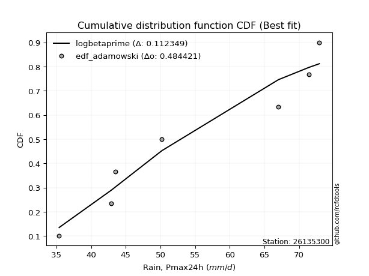</img></img>

</div>


## C. Best fit & Estimate extreme values for specific return periods - Tr

Best fit in probability distribution analysis means finding the theoretical distribution (like Normal, Poisson, Exponential, etc.) that most accurately mirrors your real-world data´s patterns (shape, center, spread) for better predictions, using methods like visual checks (Q-Q plots), goodness-of-fit tests (Kolmogorov-Smirnov, Chi-Squared), and information criteria (AIC) to score and select the simplest, most representative model.


### 1. Best fit (ordered by delta Δ)

:file_folder:Table: [bestfit_26135300.csv](table/bestfit_26135300.csv)

<div align="center">

|   id |   station | empirical_dist   | p_dist     |     delta |   deltao | eval   |   fit |   n |   best_fit |   best_fit_sort |
|-----:|----------:|:-----------------|:-----------|----------:|---------:|:-------|------:|----:|-----------:|----------------:|
|    0 |  26135300 | edf_jenkinson    | logarcsine | 0.0832567 | 0.447261 | Δo > Δ |     1 |   8 |          1 |               1 |
|    1 |  26135300 | edf_beard        | logarcsine | 0.0832567 | 0.447261 | Δo > Δ |     1 |   8 |          1 |               2 |
|    2 |  26135300 | edf_chegodayev   | logarcsine | 0.0833573 | 0.447261 | Δo > Δ |     1 |   8 |          1 |               3 |
|    3 |  26135300 | edf_filliben     | logarcsine | 0.0837916 | 0.447261 | Δo > Δ |     1 |   8 |          1 |               4 |
|    4 |  26135300 | edf_adamowski    | logarcsine | 0.0840576 | 0.447261 | Δo > Δ |     1 |   8 |          1 |               5 |
|    5 |  26135300 | edf_tukey        | logarcsine | 0.0849273 | 0.447261 | Δo > Δ |     1 |   8 |          1 |               6 |
|    6 |  26135300 | edf_blom         | logarcsine | 0.0879576 | 0.447261 | Δo > Δ |     1 |   8 |          1 |               7 |
|    7 |  26135300 | edf_cunnane      | logarcsine | 0.0898053 | 0.447261 | Δo > Δ |     1 |   8 |          1 |               8 |
|    8 |  26135300 | edf_weibull      | logarcsine | 0.0907455 | 0.447261 | Δo > Δ |     1 |   8 |          1 |               9 |
|    9 |  26135300 | edf_gringorten   | logarcsine | 0.0928091 | 0.447261 | Δo > Δ |     1 |   8 |          1 |              10 |
|   10 |  26135300 | edf_hazen        | logarcsine | 0.0974273 | 0.447261 | Δo > Δ |     1 |   8 |          1 |              11 |
|   11 |  26135300 | edf_california   | logerlang  | 0.123126  | 0.447261 | Δo > Δ |     1 |   8 |          1 |              12 |

</div>


### 2. Extreme values and % difference analysis

In hydrology, a return period (or recurrence interval $Tr$) is the statistical average time between extreme events like floods or droughts of a specific magnitude, indicating how rare an event is, with a 100-year flood, for example, having a 1% chance of occurring in any given year, not that it happens exactly every century. It is a key tool for infrastructure design (like bridges or dams) and risk assessment, calculated from historical data to determine the probability of future events, although it is important to remember it is statistical average, and events can cluster or be missed.

The extreme value porcentage difference is evaluated as $pdiff = 1 - (ETrBf / ETr) * 100$, where _ETrBf_ correspond to the bestfit extreme value for a specific recurrence interval and _ETr_ correspond to the extreme value for one of the most used PDFsused in hydrology.

> risk_rate: assuming the return period as the project useful life.

:file_folder:Table: [extreme_26135300.csv](table/extreme_26135300.csv), all PDFs.  
:file_folder:Table: [extremepdiff_26135300.csv](table/extremepdiff_26135300.csv), % difference between bestfit and most used PDFs in Hydrology.

<div align="center">

Extreme values table for only best fit PDFs
|   id |      tr |   prob_l |     prob_g |    alpha |   anglit |   arcsine |   argus |    beta |   betaprime |   bradford |     burr |   burr12 |   cosine |   crystalball |   dgamma |   dweibull |   erlang |   exponnorm |   exponpow |   exponweib |        f |   fatiguelife |   foldnorm |    gamma |   gausshyper |   genexpon |   genextreme |    gengamma |   genhalflogistic |   genlogistic |   gennorm |   genpareto |   gompertz |   gumbel_l |   gumbel_r |   halfgennorm |   halflogistic |   halfnorm |   hypsecant |   invgamma |   invgauss |   invweibull |   johnsonsb |   johnsonsu |   kappa3 |   kappa4 |   ksone |   kstwobign |   laplace |   levy_l |   loggamma |   logistic |   loglaplace |    lomax |   maxwell |   mielke |    moyal |   nakagami |      ncf |      nct |    norm |   pearson3 |   powerlaw |   rayleigh |   rdist |     rice |   semicircular |   skewnorm |       t |   trapezoid |   triang |   truncexpon |   truncnorm |   truncpareto |   truncweibull_min |   tukeylambda |   uniform |   vonmises |   vonmises_line |     wald |   weibull_max |   weibull_min |   wrapcauchy |   logalpha |   loganglit |   logarcsine |   logargus |   logbeta |   logbetaprime |   logbradford |   logburr |   logburr12 |   logcosine |   logcrystalball |   logdgamma |   logdweibull |   logerlang |   logexponnorm |      logexponpow |   logexponweib |     logf |   logfatiguelife |   logfoldnorm |   loggausshyper |   loggenexpon |   loggenextreme |   loggengamma |   loggenhalflogistic |   loggenlogistic |       loggennorm |   loggenpareto |   loggompertz |   loggumbel_l |   loggumbel_r |   loghalfgennorm |   loghalflogistic |   loghalfnorm |   loghypsecant |   loginvgamma |   loginvgauss |   loginvweibull |   logjohnsonsb |   logjohnsonsu |   logkappa3 |   logkappa4 |   logksone |   logkstwobign |   loglevy_l |   logloggamma |   loglogistic |    logloglaplace |   loglomax |   logmaxwell |   logmielke |   logmoyal |   lognakagami |   logncf |   lognct |   lognorm |   logpearson3 |   logpowerlaw |   lograyleigh |   logrdist |   logrice |   logsemicircular |   logskewnorm |     logt |   logtrapezoid |   logtriang |   logtruncexpon |   logtruncnorm |   logtruncpareto |   logtruncweibull_min |   logtukeylambda |   loguniform |   logvonmises |   logvonmises_line |   logwald |   logweibull_max |   logweibull_min |   logwrapcauchy |   station |   n |   risk_rate |
|-----:|--------:|---------:|-----------:|---------:|---------:|----------:|--------:|--------:|------------:|-----------:|---------:|---------:|---------:|--------------:|---------:|-----------:|---------:|------------:|-----------:|------------:|---------:|--------------:|-----------:|---------:|-------------:|-----------:|-------------:|------------:|------------------:|--------------:|----------:|------------:|-----------:|-----------:|-----------:|--------------:|---------------:|-----------:|------------:|-----------:|-----------:|-------------:|------------:|------------:|---------:|---------:|--------:|------------:|----------:|---------:|-----------:|-----------:|-------------:|---------:|----------:|---------:|---------:|-----------:|---------:|---------:|--------:|-----------:|-----------:|-----------:|--------:|---------:|---------------:|-----------:|--------:|------------:|---------:|-------------:|------------:|--------------:|-------------------:|--------------:|----------:|-----------:|----------------:|---------:|--------------:|--------------:|-------------:|-----------:|------------:|-------------:|-----------:|----------:|---------------:|--------------:|----------:|------------:|------------:|-----------------:|------------:|--------------:|------------:|---------------:|-----------------:|---------------:|---------:|-----------------:|--------------:|----------------:|--------------:|----------------:|--------------:|---------------------:|-----------------:|-----------------:|---------------:|--------------:|--------------:|--------------:|-----------------:|------------------:|--------------:|---------------:|--------------:|--------------:|----------------:|---------------:|---------------:|------------:|------------:|-----------:|---------------:|------------:|--------------:|--------------:|-----------------:|-----------:|-------------:|------------:|-----------:|--------------:|---------:|---------:|----------:|--------------:|--------------:|--------------:|-----------:|----------:|------------------:|--------------:|---------:|---------------:|------------:|----------------:|---------------:|-----------------:|----------------------:|-----------------:|-------------:|--------------:|-------------------:|----------:|-----------------:|-----------------:|----------------:|----------:|----:|------------:|
|    0 |    2    | 0.5      | 0.5        |  49.3566 |  52.975  |   52.975  | 55.6948 | 71.9283 |     50.6079 |    51.2114 |  48.8153 |  45.8427 |  53.5929 |       52.975  |  48.1224 |    48.6896 |  36.665  |     47.9272 |    37.2785 |     36.0872 |  48.489  |       35.4002 |    52.3271 |  35.4889 |      48.3299 |    47.5781 |      48.5596 |     36.2342 |           60.9679 |       50.3055 |   43.5003 |     47.1832 |    50.5511 |    55.2959 |    50.6541 |       44.059  |        49.5002 |    50.0831 |     52.975  |    48.544  |    48.0888 |      48.5596 |     38.786  |     56.6286 |  35.3918 |  52.8675 | 52.975  |     50.5391 |   52.975  |  62.3209 |    47.2331 |    52.975  |      51.1477 |  47.5506 |   51.7667 |  48.8677 |  49.9048 |    36.4844 |  37.1527 |  50.0302 | 52.975  |    52.1769 |    36.3452 |    51.3382 | 54.1479 |  52.1144 |        52.975  |    50.6088 | 52.975  |     55.3989 |  55.3671 |      50.1609 |     52.975  |       50.0067 |            46.123  |       54.0967 |   54.15   |  -2.02354  |         55.2027 |  48.3955 |       72.4909 |       44.9544 |      54.15   |    49.686  |     51.1477 |      51.1477 |    53.15   |   44.7293 |        50.7238 |       47.7671 |   48.4538 |     51.3199 |     51.4342 |          51.1477 |     47.8679 |       48.4703 |     46.6216 |        51.1382 |     37.1964      |        36.8941 |  48.8939 |          48.0832 |       50.5975 |         52.4511 |       48.302  |         59.7267 |       36.0127 |              53.2967 |          48.777  |     43.5         |        31.758  |       49.8453 |       53.414  |       48.9776 |          35.399  |           47.9333 |       48.4582 |        51.1477 |       48.8936 |       48.2544 |         48.7948 |        46.543  |        51.444  |     50.5086 |     49.8801 |    51.1477 |        48.7268 |     61.8889 |       51.2092 |       51.1477 |    46.9944       |    45.6537 |      50.0062 |     48.8148 |    48.2968 |       36.0377 |  51.1358 |  50.561  |   51.1477 |       50.7053 |       36.1967 |       49.6075 |    50.8307 |   50.1281 |           51.1477 |       48.0472 |  51.1477 |        53.5168 |     54.4116 |         46.2522 |        69.6564 |          35.4875 |               46.9274 |          50.8002 |      50.8002 |     0.0954559 |            50.8002 |   46.955  |          67.2549 |          47.6869 |         50.8002 |  26135300 |   8 |    0.75     |
|    1 |    2.33 | 0.570815 | 0.429185   |  51.6971 |  55.9116 |   57.3833 | 58.1758 | 74.5503 |     53.0469 |    53.8826 |  51.1488 |  48.514  |  56.0839 |       55.496  |  51.9492 |    52.6465 |  37.5394 |     50.5284 |    39.2408 |     36.7085 |  50.855  |       35.8163 |    55.0424 |  35.6654 |      50.9648 |    50.2614 |      50.8967 |     37.7216 |           63.2019 |       52.6633 |   43.6638 |     52.4616 |    53.2009 |    57.4893 |    52.9901 |       47.0127 |        51.9021 |    52.804  |     54.9926 |    50.9143 |    50.5396 |      50.8967 |     44.8711 |     59.1929 |  35.3918 |  55.6526 | 56.4406 |     52.9438 |   54.5006 |  65.5316 |    49.681  |    55.1962 |      52.6263 |  50.2447 |   54.3859 |  51.2023 |  52.1162 |    37.7411 |  45.1874 |  52.4342 | 55.496  |    54.7093 |    37.3098 |    53.9961 | 58.0773 |  54.5589 |        56.1245 |    53.2266 | 55.4961 |     58.3009 |  58.2654 |      52.7341 |     55.496  |       52.6584 |            48.6712 |       56.8326 |   56.8056 |  -1.78098  |         58.0073 |  50.0486 |       72.7077 |       47.8309 |      61.2673 |    52.0573 |     54.0318 |      55.5378 |    55.6675 |   49.7685 |        54.1995 |       50.2866 |   50.7806 |     53.7122 |     53.8979 |          53.614  |     52.1437 |       53.1178 |     49.0978 |        53.6039 |     39.0697      |        37.6425 |  51.2473 |          50.472  |       53.2102 |         55.2253 |       50.8697 |         62.3724 |       36.5461 |              56.4129 |          51.1102 |     43.8019      |        40.8703 |       52.4614 |       55.6479 |       51.1622 |          35.399  |           50.1328 |       50.9847 |        53.1122 |       51.247  |       50.6306 |         51.1321 |        65.6357 |        53.9466 |     53.3091 |     52.7334 |    54.5684 |        51.0976 |     65.0473 |       53.7022 |       53.3146 |    49.7603       |    48.3062 |      52.5137 |     51.1437 |    50.3337 |       36.7559 |  54.2027 |  53.0028 |   53.614  |       53.1603 |       36.9656 |       52.1327 |    54.8324 |   52.5678 |           54.2472 |       50.6411 |  53.6141 |        56.498  |     57.1072 |         48.5971 |        70.0751 |          35.5581 |               49.3275 |          53.5539 |      53.4665 |     0.100038  |            53.3628 |   48.4273 |          70.6595 |          50.2047 |         58.2651 |  26135300 |   8 |    0.729209 |
|    2 |    5    | 0.8      | 0.2        |  62.8343 |  66.2724 |   69.1385 | 66.1342 | 76.983  |     63.5634 |    63.395  |  62.618  |  64.0577 |  65.0603 |       64.8649 |  60.5753 |    61.6355 |  44.8912 |     63.5336 |    67.0362 |     46.2935 |  62.7738 |       44.6539 |    65.1607 |  40.0691 |      61.3582 |    63.6768 |      62.6674 |    101.98   |           69.104  |       62.9051 |   49.6669 |     66.4193 |    64.205  |    64.575  |    63.1389 |       66.9519 |        62.7698 |    64.3102 |     63.0856 |    62.8282 |    62.8669 |      62.6675 |     71.7593 |     67.0438 |  35.3918 |  64.8648 | 67.6567 |     63.1583 |   62.1284 |  70.8511 |    62.7628 |    63.7727 |      60.6854 |  63.8071 |   64.6949 |  62.6312 |  62.3594 |    52.3772 |  85.3509 |  63.2481 | 64.8649 |    64.5727 |    46.8664 |    64.6371 | 68.8896 |  64.3366 |        66.8725 |    64.2972 | 64.865  |     66.6264 |  66.5804 |      62.3166 |     64.8649 |       62.4947 |            59.3059 |       65.6168 |   65.4    |  -0.832085 |         67.0842 |  59.3025 |       72.8928 |       64.4901 |      70.0638 |    62.9214 |     65.5698 |      69.176  |    64.5762 |   67.0876 |        69.6847 |       60.4832 |   62.6211 |     63.4156 |     63.797  |          63.8683 |     60.8368 |       62.259  |     62.7668 |        63.8626 |     75.1741      |        42.4587 |  62.8064 |          62.8089 |       64.1827 |         64.8221 |       63.358  |         69.0852 |       41.7053 |              65.7232 |          62.61   |     50.5494      |        66.3063 |       63.8524 |       63.5233 |       61.8419 |          35.399  |           61.4168 |       63.2091 |        61.7803 |       62.8064 |       62.7688 |         62.6578 |        72.9074 |        64.2951 |     63.482  |     63.0609 |    67.2874 |        62.5234 |     70.6387 |       64.0292 |       62.5783 |    83.141        |    64.2175 |      63.6657 |     62.5904 |    60.9478 |       45.7333 |  67.8582 |  63.5412 |   63.8683 |       63.6826 |       44.8058 |       63.597  |    67.5488 |   63.4759 |           66.3089 |       63.2515 |  63.8683 |        66.0048 |     65.6051 |         58.6607 |        71.5173 |          36.964  |               59.4057 |          63.43   |      63.0932 |     0.119133  |            62.8133 |   57.5641 |          72.8631 |          63.1847 |         69.024  |  26135300 |   8 |    0.67232  |
|    3 |   10    | 0.9      | 0.1        |  73.4039 |  72.1368 |   71.9764 | 69.9719 | 77.0412 |     72.0604 |    67.9974 |  73.7931 | inf      |  70.4836 |       71.08   |  66.8616 |    67.4816 |  54.5092 |     75.3395 |   124.396  |     71.8453 |  74.6606 |       56.8563 |    71.8791 |  50.3283 |      67.0974 |    75.8549 |      74.5417 |    481.807  |           71.1581 |       71.2459 |   68.8926 |     70.6155 |    71.9924 |    68.5201 |    71.405  |       92.5229 |        71.795  |    72.8245 |     69.5482 |    74.6751 |    74.5261 |      74.5417 |     72.8424 |     71.0552 |  69.1916 |  68.9306 | 72.5505 |     70.9353 |   69.0526 |  72.1354 |    76.4952 |    70.0889 |      69.0651 |  76.2534 |   71.9498 |  73.706  |  71.2777 |    71.5687 | 124.211  |  72.5379 | 71.08   |    71.5156 |    56.8315 |    72.2242 | 71.7618 |  71.2981 |        72.3875 |    72.4892 | 71.0801 |     69.8784 |  69.8282 |      67.2814 |     71.08   |       67.4637 |            65.4538 |       69.3586 |   69.15   |  -0.136462 |         71.0448 |  69.1231 |       72.8995 |       82.1006 |      71.6122 |    72.5237 |     73.161  |      72.942  |    69.3683 |   71.6067 |        82.6941 |       66.1891 |   74.8167 |     70.5403 |     70.6385 |          71.7309 |     67.6511 |       68.3351 |     77.6607 |        71.737  |    272.562       |        47.4874 |  74.0792 |          75.4095 |       72.6888 |         69.1221 |       74.6719 |         71.2731 |       48.9295 |              69.4248 |          73.8609 |     70.4867      |        71.5744 |       72.5627 |       68.3814 |       72.1676 |          35.399  |           72.695  |       74.1053 |        69.7074 |       74.0799 |       75.0329 |         73.94   |        72.9094 |        72.1681 |     68.5088 |     68.0131 |    73.7286 |        72.9072 |     72.0591 |       71.9057 |       70.415  |   253.066        |    83.4426 |      72.9058 |     73.7575 |    71.9962 |       60.4365 |  79.3508 |  72.0621 |   71.7309 |       72.097  |       54.1819 |       73.2806 |    71.3997 |   72.4901 |           73.5043 |       74.5639 |  71.731  |        70.1387 |     69.2581 |         64.8632 |        72.1929 |          41.2774 |               65.4028 |          68.151  |      67.8196 |     0.133889  |            67.6306 |   69.1529 |          72.8987 |          76.0341 |         71.1138 |  26135300 |   8 |    0.651322 |
|    4 |   15    | 0.933333 | 0.0666667  |  80.1623 |  74.641  |   72.5176 | 71.4308 | 77.0429 |     76.8498 |    69.5973 |  80.9412 | inf      |  72.954  |       74.1815 |  70.3129 |    70.4931 |  60.9505 |     82.2454 |   172.99   |     98.8068 |  82.351  |       64.8369 |    75.232  |  58.6305 |      69.2508 |    82.9787 |      82.323  |   1100.84   |           71.7791 |       75.9515 |   90.377  |     71.6586 |    75.895  |    70.3067 |    76.0686 |      110.839  |        76.9024 |    77.2554 |     73.2363 |    82.3248 |    81.589  |      82.3231 |     72.8872 |     72.7676 |  70.4434 |  70.2815 | 74.1818 |     75.064  |   73.1031 |  72.5233 |    85.5816 |    73.5303 |      74.4935 |  83.5939 |   75.6722 |  80.7631 |  76.4534 |    82.9923 | 148.668  |  77.9992 | 74.1815 |    75.1016 |    61.397  |    76.1335 | 72.3602 |  74.8812 |        74.5381 |    76.7523 | 74.1816 |     70.9218 |  70.8703 |      69.0734 |     74.1815 |       69.2218 |            67.773  |       70.5778 |   70.4    |   0.202836 |         72.365  |  75.4294 |       72.8999 |       93.266  |      72.0557 |    78.2902 |     76.6647 |      73.6833 |    71.2821 |   72.3784 |        90.1906 |       68.3042 |   82.9636 |     74.298  |     73.9936 |          76.0094 |     71.6389 |       71.5646 |     87.745  |        76.0252 |    790.995       |        50.5248 |  81.3248 |          83.6522 |       77.3466 |         70.5051 |       81.4054 |         71.8985 |       53.9364 |              70.6104 |          81.0783 |     96.4145      |        72.3898 |       77.1719 |       70.7021 |       78.7366 |          69.5104 |           79.9723 |       80.4994 |        74.6791 |       81.3262 |       83.014  |         81.1797 |        72.9094 |        76.4301 |     70.2713 |     69.6905 |    76.0099 |        79.1033 |     72.4937 |       76.1766 |       75.0903 |   872.587        |    97.4051 |      78.1558 |     80.9105 |    79.3047 |       71.2613 |  85.9912 |  76.866  |   76.0094 |       76.8024 |       59.0041 |       78.8321 |    72.2297 |   77.5839 |           76.5175 |       81.2297 |  76.0095 |        71.5192 |     70.4727 |         67.2996 |        72.4249 |          45.363  |               67.7091 |          69.7577 |      69.4724 |     0.141983  |            69.3381 |   77.7971 |          72.8998 |          84.1696 |         71.7239 |  26135300 |   8 |    0.644736 |
|    5 |   20    | 0.95     | 0.05       |  85.3183 |  76.1141 |   72.7082 | 72.2317 | 77.0431 |     80.2096 |    70.41   |  86.348  | inf      |  74.4732 |       76.2126 |  72.6986 |    72.5057 |  65.7872 |     87.1453 |   214.048  |    125.095  |  88.2038 |       70.7455 |    77.4278 |  65.3207 |      70.3884 |    88.0331 |      88.2976 |   1871.09   |           72.0769 |       79.2462 |  111.946  |     72.0947 |    78.4364 |    71.4188 |    79.3339 |      125.367  |        80.4809 |    80.2094 |     75.8381 |    88.1398 |    86.7051 |      88.2977 |     72.8952 |     73.7972 |  71.0693 |  70.954  | 74.9975 |     77.8452 |   75.9769 |  72.722  |    92.5714 |    75.9088 |      78.6019 |  88.8292 |   78.1426 |  86.0889 |  80.119  |    90.8809 | 166.948  |  81.9287 | 76.2126 |    77.4942 |    63.9589 |    78.7319 | 72.5825 |  77.2614 |        75.731  |    79.5945 | 76.2127 |     71.4366 |  71.3844 |      69.9984 |     76.2126 |       70.1208 |            68.9906 |       71.1786 |   71.025  |   0.403225 |         73.0251 |  80.1289 |       72.9    |      101.526  |      72.2704 |    82.4968 |     78.8036 |      73.9461 |    72.3549 |   72.6274 |        95.512  |       69.4059 |   89.307  |     76.8319 |     76.1356 |          78.9486 |     74.5096 |       73.7673 |     95.6086 |        78.9727 |   1924.84        |        52.6996 |  86.8361 |          89.9587 |       80.5574 |         71.172  |       86.2576 |         72.1877 |       57.7914 |              71.1939 |          86.5474 |    128.357       |        72.6415 |       80.2701 |       72.1862 |       83.6888 |          70.3531 |           85.5007 |       85.0661 |        78.3983 |       86.8381 |       89.1052 |         86.6666 |        72.9094 |        79.3491 |     71.1696 |     70.5256 |    77.1769 |        83.5714 |     72.7174 |       79.1044 |       78.502  |  3287.58         |   108.782  |      81.847  |     86.3265 |    84.9252 |       79.8312 |  90.7147 |  80.2361 |   78.9486 |       80.0866 |       61.873  |       82.7529 |    72.5408 |   81.1513 |           78.2417 |       86.0017 |  78.9487 |        72.2102 |     71.0797 |         68.6021 |        72.5423 |          48.71   |               68.9302 |          70.5614 |      70.3139 |     0.147575  |            70.2105 |   84.9341 |          72.8999 |          90.2552 |         72.0212 |  26135300 |   8 |    0.641514 |
|    6 |   25    | 0.96     | 0.04       |  89.5654 |  77.1124 |   72.7967 | 72.7481 | 77.0432 |     82.8042 |    70.9017 |  90.7543 | inf      |  75.5386 |       77.7077 |  74.5206 |    74.0086 |  69.6653 |     90.9459 |   249.54   |    150.319  |  92.9939 |       75.4402 |    79.0442 |  70.894  |      71.0948 |    91.9536 |      93.22   |   2742.14   |           72.2512 |       81.784  |  133.061  |     72.3243 |    80.2954 |    72.2101 |    81.8491 |      137.523  |        83.2379 |    82.4074 |     77.8516 |    92.895  |    90.7308 |      93.2201 |     72.8977 |     74.5119 |  71.4449 |  71.3558 | 75.4869 |     79.9284 |   78.206  |  72.8467 |    98.3312 |    77.7284 |      81.944  |  92.9055 |   79.9767 |  90.4217 |  82.9602 |    96.8362 | 181.707  |  85.0194 | 77.7077 |    79.2779 |    65.5918 |    80.6624 | 72.6898 |  79.0291 |        76.5049 |    81.7092 | 77.7078 |     71.7432 |  71.6906 |      70.5632 |     77.7077 |       70.6667 |            69.7409 |       71.5352 |   71.4    |   0.533956 |         73.4212 |  83.8931 |       72.9    |      108.113  |      72.3976 |    85.8398 |     80.287  |      74.0684 |    73.0552 |   72.7354 |        99.6542 |       70.0816 |   94.5923 |     78.7341 |     77.6746 |          81.1847 |     76.7689 |       75.4372 |    102.152  |        81.2158 |   4127.16        |        54.3939 |  91.3519 |          95.1376 |       83.0059 |         71.5601 |       90.0702 |         72.3524 |       60.947  |              71.5409 |          91.0103 |    166.937       |        72.7475 |       82.5874 |       73.2612 |       87.7147 |          70.8636 |           90.0194 |       88.6312 |        81.4033 |       91.3545 |       94.0993 |         91.1445 |        72.9094 |        81.5649 |     71.7145 |     71.0228 |    77.8857 |        87.0828 |     72.8581 |       81.3285 |       81.2161 | 13285.3          |   118.561  |      84.6997 |     90.7435 |    89.5542 |       86.9711 |  94.3976 |  82.8385 |   81.1847 |       82.6134 |       63.7663 |       85.7916 |    72.6913 |   83.9    |           79.3809 |       89.7333 |  81.1848 |        72.6251 |     71.4438 |         69.413  |        72.6132 |          51.405  |               69.6862 |          71.042  |      70.8237 |     0.151848  |            70.7398 |   91.1202 |          72.9    |          95.1671 |         72.1979 |  26135300 |   8 |    0.639603 |
|    7 |   50    | 0.98     | 0.02       | 104.493  |  79.5699 |   72.9148 | 73.919  | 77.0432 |     90.8544 |    71.8946 | 105.772  | inf      |  78.3283 |       81.9892 |  80.0585 |    78.4144 |  82.2788 |    102.752  |   379.073  |    261.508  | 109.444  |       90.5028 |    83.673  |  89.9274 |      72.5776 |   104.132  |     110.332  |   7840.4    |           72.5883 |       89.6015 |  229.6    |     72.6971 |    85.5437 |    74.3583 |    89.5972 |      180.324  |        91.7327 |    88.796  |     84.0946 |   109.201  |   103.534  |     110.332  |     72.8997 |     76.3727 |  72.196  |  72.1536 | 76.4657 |     86.0458 |   85.1303 |  73.1275 |   118.322  |    83.2879 |      93.2591 | 105.655  |   85.2957 | 105.144  |  91.7805 |   114.352  | 231.156  |  94.9231 | 81.9892 |    84.4919 |    69.0853 |    86.2664 | 72.8417 |  84.1564 |        78.2727 |    87.856  | 81.9894 |     72.3518 |  72.2984 |      71.7156 |     81.9892 |       71.7733 |            71.2878 |       72.2361 |   72.15   |   0.816728 |         74.2133 |  96.1832 |       72.9    |      129.493  |      72.6497 |    96.7606 |     84.0584 |      74.232  |    74.6683 |   72.8657 |       112.672  |       71.4673 |  113.393  |     84.3557 |     81.8535 |          87.9445 |     84.0149 |       80.4643 |    125.257  |        88.0012 |  64533.4         |        59.6855 | 106.947  |         113.016  |       90.4371 |         72.2946 |      102.223  |         72.6567 |       71.6516 |              72.2273 |         106.257  |    490.167       |        72.8705 |       89.3759 |       76.2609 |      101.375  |          71.8957 |          105.5    |       99.8647 |        91.4721 |      106.952  |      111.299  |        106.446  |        72.9094 |        88.2384 |     72.8305 |     71.9994 |    79.3228 |        98.2698 |     73.1759 |       88.0347 |       90.104  |     3.01656e+07  |   155.25   |      93.5478 |    105.819  |   105.595  |      111.872  | 106.011  |  90.9123 |   87.9445 |       90.4002 |       67.9935 |       95.2595 |    72.9051 |   92.3796 |           82.0462 |      101.525  |  87.9446 |        73.4554 |     72.172  |         71.1055 |        72.7559 |          59.2504 |               71.2537 |          71.9935 |      71.8543 |     0.164877  |            71.8115 |  114.631  |          72.9    |         111.581  |         72.5494 |  26135300 |   8 |    0.63583  |
|    8 |   75    | 0.986667 | 0.0133333  | 114.776  |  80.6514 |   72.9367 | 74.3833 | 77.0432 |     95.5886 |    72.2283 | 115.604  | inf      |  79.6606 |       84.2865 |  83.2315 |    80.8414 |  89.9757 |    109.658  |   467.52   |    354.481  | 120.311  |       99.5741 |    86.1567 | 102.021  |      73.1005 |   111.255  |     121.796  |  13404.9    |           72.6965 |       94.1453 |  313.536  |     72.7897 |    88.3042 |    75.4446 |    94.1007 |      208.966  |        96.6707 |    92.2737 |     87.7429 |   119.955  |   111.215  |     121.796  |     72.8999 |     77.2673 |  72.4464 |  72.4165 | 76.7919 |     89.4116 |   89.1807 |  73.2428 |   131.667  |    86.4988 |     100.589  | 113.174  |   88.1876 | 114.748  |  96.9384 |   123.927  | 262.885  | 100.971  | 84.2865 |    87.3547 |    70.3201 |    89.3152 | 72.8725 |  86.9435 |        78.979  |    91.202  | 84.2867 |     72.5533 |  72.4997 |      72.1068 |     84.2865 |       72.1466 |            71.8178 |       72.4643 |   72.4    |   0.915912 |         74.4773 | 103.746  |       72.9    |      142.593  |      72.7332 |   103.59   |     85.7739 |      74.2623 |    75.3179 |   72.8863 |       120.434  |       71.9395 |  126.367  |     87.4793 |     83.9277 |          91.8007 |     88.4412 |       83.3228 |    140.988  |        91.8752 | 412413           |        62.7984 | 117.359  |         124.887  |       94.695  |         72.5203 |      109.571  |         72.7482 |       78.5497 |              72.4536 |         116.266  |   1135.29        |        72.8887 |       93.1011 |       77.8242 |      110.272  |          72.243  |          115.694  |      106.567  |        97.9234 |      117.366  |      122.693  |        116.494  |        72.9094 |        92.0289 |     73.2326 |     72.3152 |    79.8077 |       105.026  |     73.3069 |       91.8489 |       95.6739 |     1.62788e+11  |   182.058  |      98.7403 |    115.706  |   116.275  |      128.374  | 112.964  |  95.6595 |   91.8007 |       94.942  |       69.5476 |      100.842  |    72.9486 |   97.3236 |           83.1357 |      108.582  |  91.8008 |        73.7324 |     72.4147 |         71.6919 |        72.8038 |          62.9415 |               71.7934 |          72.3049 |      72.2012 |     0.172391  |            72.1726 |  132.022  |          72.9    |         122.06   |         72.6662 |  26135300 |   8 |    0.634587 |
|    9 |  100    | 0.99     | 0.01       | 122.965  |  81.2945 |   72.9443 | 74.6426 | 77.0432 |     98.9704 |    72.3957 | 123.105  | inf      |  80.4956 |       85.8403 |  85.4594 |    82.5078 |  95.5513 |    114.558  |   535.547  |    435.415  | 128.649  |      106.101  |    87.8365 | 110.943  |      73.3701 |   116.31   |     130.668  |  19064.6    |           72.7495 |       97.3613 |  388.456  |     72.8285 |    90.1463 |    76.1552 |    97.2881 |      230.936  |       100.166  |    94.6428 |     90.3308 |   128.197  |   116.743  |     130.668  |     72.9    |     77.8348 |  72.5716 |  72.547  | 76.955  |     91.7177 |   92.0546 |  73.3103 |   141.967  |    88.7658 |     106.137  | 118.537  |   90.1574 | 122.059  | 100.598  |   130.444  | 286.787  | 105.394  | 85.8403 |    89.3171 |    70.9511 |    91.3923 | 72.8838 |  88.8413 |        79.3745 |    93.4814 | 85.8405 |     72.6538 |  72.6    |      72.3037 |     85.8403 |       72.3341 |            72.0855 |       72.5767 |   72.525  |   0.966111 |         74.6094 | 109.26   |       72.9    |      152.132  |      72.775  |   108.664  |     86.8106 |      74.273  |    75.683  |   72.8929 |       126.022  |       72.1777 |  136.62   |     89.6348 |     85.2545 |          94.5043 |     91.6767 |       85.3243 |    153.278  |        94.5926 |      1.70133e+06 |        65.0157 | 125.423  |         134.021  |       97.6879 |         72.6275 |      114.902  |         72.7914 |       83.7357 |              72.5661 |         123.915  |   2293.3         |        72.8943 |       95.6498 |       78.864  |      117.037  |          72.4174 |          123.499  |      111.389  |       102.774  |      125.432  |      131.45   |        124.174  |        72.9094 |        94.6793 |     73.4555 |     72.4697 |    80.0513 |       109.922  |     73.3835 |       94.5181 |       99.8124 |     1.62544e+15  |   203.986  |     102.441  |    123.257  |   124.501  |      140.975  | 117.985  |  99.05   |   94.5043 |       98.1695 |       70.3543 |      104.832  |    72.9646 |  100.833  |           83.7522 |      113.669  |  94.5044 |        73.8709 |     72.536  |         71.9894 |        72.8278 |          65.0684 |               72.0666 |          72.4586 |      72.3753 |     0.177697  |            72.3538 |  146.343  |          72.9    |         129.92   |         72.7246 |  26135300 |   8 |    0.633968 |
|   10 |  200    | 0.995    | 0.005      | 146.692  |  82.5094 |   72.9517 | 75.0931 | 77.0432 |    107.227  |    72.6475 | 143.168  | inf      |  82.1935 |       89.3649 |  90.762  |    86.3615 | 109.307  |    126.363  |   716.114  |    690.538  | 151.144  |      122.079  |    91.647  | 133.383  |      73.7895 |   128.488  |     154.903  |  41127.5    |           72.8271 |      105.093  |  633.599  |     72.8748 |    94.2449 |    77.6996 |   104.951  |      289.6    |       108.568  |   100.061  |     96.5654 |   150.401  |   130.307  |     154.903  |     72.9    |     79.0184 |  72.7593 |  72.7409 | 77.1997 |     97.0291 |   98.9788 |  73.4381 |   169.967  |    94.2038 |     120.792  | 131.553  |   94.664  | 141.551  | 109.414  |   145.294  | 349.596  | 116.553  | 89.3649 |    93.8464 |    71.915  |    96.1449 | 72.8955 |  93.1807 |        80.0639 |    98.6948 | 89.365  |     72.8042 |  72.7502 |      72.6008 |     89.3649 |       72.6164 |            72.4906 |       72.7424 |   72.7125 |   1.04192  |         74.8074 | 122.995  |       72.9    |      175.899  |      72.8375 |   121.768  |     88.8033 |      74.2832 |    76.3217 |   72.8985 |       139.804  |       72.5373 |  165.573  |     94.6534 |     88.0173 |         100.936  |     99.828  |       90.0795 |    187.282  |       101.062  |      7.09189e+07 |        70.3936 | 147.562  |         158.756  |      104.832  |         72.7775 |      128.167  |         72.8514 |       97.2635 |              72.7341 |         144.427  |  18868.7         |        72.8989 |      101.509  |       81.1724 |      135.048  |          72.6796 |          144.487  |      123.253  |       115.468  |      147.576  |      155.131  |        144.773  |        72.9094 |       100.961  |     73.8723 |     72.6948 |    80.418  |       122.084  |     73.529  |      100.852  |      110.485  |     1.05133e+33  |   268.946  |     111.438  |    143.487  |   146.791  |      174.508  | 130.42   | 107.325  |  100.936  |      105.99   |       71.603  |      114.564  |    72.9811 |  109.318  |           84.8378 |      126.217  | 100.936  |        74.0787 |     72.7181 |         72.4413 |        72.8639 |          68.6819 |               72.4807 |          72.6851 |      72.6372 |     0.190458  |            72.6265 |  189.138  |          72.9    |         150.422  |         72.8123 |  26135300 |   8 |    0.633042 |
|   11 |  250    | 0.996    | 0.004      | 155.863  |  82.8187 |   72.9526 | 75.1985 | 77.0432 |    109.924  |    72.6979 | 150.283  | inf      |  82.6589 |       90.4419 |  92.4524 |    87.5594 | 113.818  |    130.164  |   778.927  |    793.258  | 159.185  |      127.286  |    92.8114 | 140.847  |      73.8766 |   132.408  |     163.66   |  51607.6    |           72.8423 |      107.578  |  735.535  |     72.882  |    95.4743 |    78.154  |   107.414  |      310.239  |       111.269  |   101.728  |     98.5724 |   158.328  |   134.741  |     163.66   |     72.9    |     79.3534 |  72.7969 |  72.7793 | 77.2487 |     98.6728 |  101.208  |  73.4713 |   180.039  |    95.9497 |     125.928  | 135.772  |   96.0512 | 148.443  | 112.252  |   149.842  | 371.518  | 120.31   | 90.4419 |    95.2522 |    72.1103 |    97.6079 | 72.897  |  94.5156 |        80.2257 |   100.299  | 90.4421 |     72.8342 |  72.7802 |      72.6605 |     90.4419 |       72.673  |            72.5721 |       72.7749 |   72.75   |   1.05713  |         74.847  | 127.538  |       72.9    |      183.772  |      72.85   |   126.28   |     89.3177 |      74.2845 |    76.472  |   72.8991 |       144.345  |       72.6097 |  176.379  |     96.2232 |     88.7901 |         102.987  |    102.567  |       91.5949 |    199.706  |       103.127  |      2.573e+08   |        72.1377 | 155.624  |         167.625  |      107.118  |         72.8053 |      132.571  |         72.8625 |      101.941  |              72.7675 |         151.717  |  42666.7         |        72.8993 |      103.319  |       81.8644 |      141.408  |          72.7322 |          151.965  |      127.151  |       119.879  |      155.64   |      163.614  |        152.095  |        72.9094 |       102.958  |     73.9847 |     72.7384 |    80.4916 |       126.113  |     73.567  |      102.867  |      114.147  |     5.26726e+42  |   294.197  |     114.364  |    150.671  |   154.783  |      186.295  | 134.534  | 110.028  |  102.987  |      108.527  |       71.8584 |      117.738  |    72.9833 |  112.063  |           85.0946 |      130.349  | 102.987  |        74.1203 |     72.7545 |         72.5325 |        72.8711 |          69.4733 |               72.5642 |          72.7295 |      72.6897 |     0.194572  |            72.6811 |  205.89   |          72.9    |         157.523  |         72.8298 |  26135300 |   8 |    0.632858 |
|   12 |  500    | 0.998    | 0.002      | 191.104  |  83.5854 |   72.9538 | 75.4409 | 77.0432 |    118.446  |    72.7989 | 174.678  | inf      |  83.8975 |       93.636  |  97.6606 |    91.1666 | 128.041  |    141.97   |   987.336  |   1187.34   | 186.994  |      143.62   |    96.2646 | 164.634  |      74.0561 |   144.587  |     194.277  |  99104.9    |           72.872  |      115.293  | 1140.56   |     72.8936 |    99.0546 |    79.4566 |   115.06   |      379.918  |       119.654  |   106.698  |    104.806  |   185.704  |   148.705  |     194.277  |     72.9    |     80.279  |  72.872  |  72.8553 | 77.3466 |    103.599  |  108.132  |  73.5572 |   215.078  |   101.364  |     143.317  | 148.967  |  100.191  | 172.003  | 121.069  |   163.335  | 445.495  | 132.544  | 93.636  |    99.4816 |    72.5035 |   101.973  | 72.8992 |  98.4962 |        80.5981 |   105.081  | 93.6362 |     72.8942 |  72.8402 |      72.7801 |     93.636  |       72.7864 |            72.7357 |       72.8389 |   72.825  |   1.08758  |         74.9262 | 141.986  |       72.9    |      208.873  |      72.875  |   141.331  |     90.6062 |      74.2861 |    76.8185 |   72.8998 |       158.808  |       72.7546 |  215.597  |    100.979  |     90.8801 |         109.319  |    111.461  |       96.2698 |    243.637  |       109.504  |      1.80273e+10 |        77.6034 | 184.16   |         198.388  |      114.194  |         72.8575 |      146.688  |         72.8832 |      117.529  |              72.8341 |         176.772  | 873053           |        72.8999 |      108.737  |       83.8808 |      163.119  |          72.8374 |          177.73   |      139.521  |       134.685  |      184.186  |      193.011  |        177.267  |        72.9094 |       109.103  |     74.2985 |     72.823  |    80.6389 |       139.004  |     73.665  |      109.075  |      126.296  |     2.49609e+96  |   389.68   |     123.558  |    175.341  |   182.494  |      226.167  | 147.694  | 118.564  |  109.319  |      116.486  |       72.3752 |      127.741  |    72.9863 |  120.646  |           85.6886 |      143.489  | 109.319  |        74.2035 |     72.8273 |         72.7157 |        72.8855 |          71.1323 |               72.7317 |          72.8169 |      72.7948 |     0.207411  |            72.7906 |  269.667  |          72.9    |         181.271  |         72.8649 |  26135300 |   8 |    0.632489 |
|   13 |  750    | 0.998667 | 0.00133333 | 218.192  |  83.9248 |   72.954  | 75.5384 | 77.0432 |    123.544  |    72.8326 | 190.721  | inf      |  84.4977 |       95.4104 | 100.681  |    93.2053 | 136.489  |    148.876  |  1117.91   |   1477.22   | 205.471  |      153.271  |    98.183  | 178.909  |      74.1184 |   151.71   |     214.874  | 140605      |           72.8817 |      119.803  | 1450.52   |     72.8965 |   101.001  |    80.1528 |   119.53   |      424.65   |       124.555  |   109.475  |    108.453  |   203.863  |   156.996  |     214.874  |     72.9    |     80.7523 |  72.897  |  72.8803 | 77.3792 |    106.366  |  112.183  |  73.5979 |   238.51   |   104.527  |     154.582  | 156.749  |  102.506  | 187.443  | 126.226  |   170.828  | 493.261  | 140.128  | 95.4104 |   101.87   |    72.6353 |   104.414  | 72.8996 | 100.721  |        80.748  |   107.752  | 95.4106 |     72.9142 |  72.8602 |      72.82   |     95.4104 |       72.8243 |            72.7904 |       72.8598 |   72.85   |   1.09774  |         74.9526 | 150.649  |       72.9    |      223.987  |      72.8833 |   150.943  |     91.1825 |      74.2864 |    76.9583 |   72.8999 |       167.535  |       72.8031 |  243.238  |    103.686  |     91.9106 |         113.003  |    116.953  |       98.9885 |    273.571  |       113.219  |      2.53815e+11 |        80.8393 | 203.715  |         218.894  |      118.325  |         72.8734 |      155.265  |         72.8895 |      127.425  |              72.8562 |         193.294  |      7.42013e+06 |        72.9    |      111.775  |       84.9788 |      177.324  |          72.8725 |          194.771  |      146.948  |       144.179  |      203.748  |      212.592  |        193.87   |        72.9094 |       112.664  |     74.4671 |     72.8501 |    80.688  |       146.815  |     73.7115 |      112.677  |      133.984  |     1.21872e+156 |   460.072  |     129.019  |    191.593  |   200.949  |      251.888  | 155.678  | 123.669  |  113.003  |      121.206  |       72.5493 |      133.7    |    72.9869 |  125.715  |           85.9289 |      151.399  | 113.003  |        74.2312 |     72.8515 |         72.777  |        72.8904 |          71.709  |               72.7877 |          72.8454 |      72.8298 |     0.214986  |            72.8271 |  317.025  |          72.9    |         196.429  |         72.8766 |  26135300 |   8 |    0.632366 |
|   14 | 1000    | 0.999    | 0.001      | 241.469  |  84.1271 |   72.9541 | 75.5931 | 77.0432 |    127.216  |    72.8495 | 202.981  | inf      |  84.8764 |       96.6321 | 102.814  |    94.6232 | 142.532  |    153.776  |  1214.14   |   1712.76   | 219.685  |      160.155  |    99.5037 | 189.175  |      74.1503 |   156.765  |     230.842  | 177995      |           72.8864 |      123.002  | 1708.85   |     72.8978 |   102.322  |    80.6214 |   122.701  |      458.2    |       128.032  |   111.392  |    111.041  |   217.82   |   162.928  |     230.842  |     72.9    |     81.0623 |  72.9096 |  72.8927 | 77.3955 |    108.283  |  115.056  |  73.6235 |   256.606  |   106.771  |     163.107  | 162.3    |  104.106  | 199.216  | 129.885  |   175.983  | 529.348  | 145.714  | 96.6321 |   103.531  |    72.7013 |   106.101  | 72.8998 | 102.257  |        80.8322 |   109.597  | 96.6323 |     72.9242 |  72.8701 |      72.84   |     96.632  |       72.8432 |            72.8178 |       72.8702 |   72.8625 |   1.10282  |         74.9658 | 156.88   |       72.9    |      234.894  |      72.8875 |   158.164  |     91.5277 |      74.2865 |    77.0368 |   72.9    |       173.855  |       72.8273 |  265.362  |    105.578  |     92.5666 |         115.612  |    120.986  |      100.913  |    296.964  |       115.85   |      1.76923e+12 |        83.1548 | 219.095  |         234.7    |      121.255  |         72.8809 |      161.5    |         72.8925 |      134.814  |              72.8672 |         205.942  |      4.07293e+07 |        72.9    |      113.878  |       85.7259 |      188.144  |          72.8901 |          207.84   |      152.306  |       151.319  |      219.135  |      227.681  |        206.582  |        72.9094 |       115.179  |     74.5829 |     72.8633 |    80.7126 |       152.483  |     73.7408 |      115.223  |      139.718  |     1.11837e+220 |   517.984  |     132.934  |    204.027  |   215.165  |      271.265  | 161.479  | 127.345  |  115.612  |      124.588  |       72.6366 |      137.98   |    72.9871 |  129.336  |           86.0642 |      157.114  | 115.612  |        74.2451 |     72.8637 |         72.8077 |        72.8928 |          72.002  |               72.8157 |          72.8595 |      72.8474 |     0.220398  |            72.8454 |  356.153  |          72.9    |         207.792  |         72.8824 |  26135300 |   8 |    0.632305 |


</div>


<div align="center">

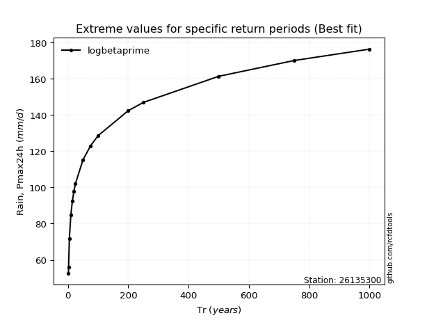</img>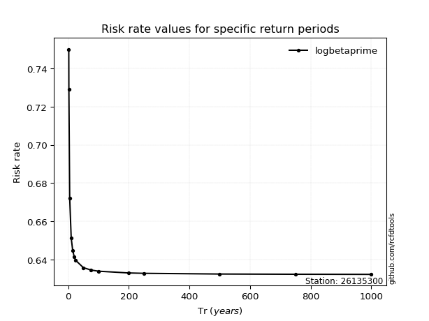</img>

</div>


<sub>**APP DISCLAIMER**: NO WARRANTY - This software is provided by [github.com/rcfdtools](https://github.com/rcfdtools) "as is", without any express or implied warranty, including warranties of merchantability, fitness for a particular purpose, or non-infringement. There is no guarantee that the software will be error-free or operate without interruption. LIMITATION OF LIABILITY - Neither the authors nor copyright holders will be liable for claims or damages arising from the software or its use. You are responsible for determining if the software is appropriate for your use and assume all associated risks, including errors, legal compliance, and data loss. NO PROFESSIONAL ADVICE - The software provides general information and does not offer professional advice. It should not replace consultation with professional advisors.</sub>