<div align="center">


</div>

# PMP Station (Rain, Pmax24h): 26135320

Probable Maximum Precipitation (PMP) is the greatest amount of rainfall for a specific duration that is meteorologically possible for a given location, acting as a "worst-case" scenario for extreme storms, crucial for designing safety-critical infrastructure like bridges, river deviations, dams, spillways, and nuclear plants to prevent catastrophic failure. PMP is calculated by hydrologists using meteorological data to determine the upper limit of extreme rainfall, often leading to the Probable Maximum Flood (PMF) for flood control design, and is increasingly being studied for climate change impacts. Probable Maximum Precipitation (PMP) is the theoretical upper limit of rainfall, a deterministic estimate for extreme events, while probability distributions (like GEV, Gumbel) describe the likelihood and frequency of various precipitation amounts, including rare ones, showing how often events occur, with PMP representing the extreme end of these distributions, used for critical infrastructure design to ensure safety against the worst conceivable weather, unlike standard statistical forecasts which cover typical probabilities.

The most common probability distributions in hydrology, used for analyzing floods, rainfall, and streamflow, include the Normal, Log-Normal, Gumbel, Gamma (including Log-Pearson Type III), and Generalized Extreme Value (GEV) distributions, often chosen based on the data´s skewness and whether modeling extremes or general conditions, with Gumbel and GEV popular for extreme events like floods, while the Normal distribution serves as a baseline, though often requiring transformations for skewed hydrological data. These distributions help in designing water infrastructure, managing water resources, and forecasting hydrologic events.

> Hydrological data often isn´t perfectly normal (it´s skewed), so different distributions are needed for different applications, such as: **Flood Frequency Analysis**: Using Gumbel, GEV, or Log-Pearson Type III for predicting extreme flood magnitudes and their return periods, **Rainfall Analysis**: Normal for annual totals, but Log-Normal, Weibull, or GEV for intensity or extreme daily rainfall, **Streamflow Modeling**: Gamma and Log-Normal for maximum flows, GEV for minimum flows, and Kappa for daily flows.

<div align="center">

</img>

</div>


## A. General information


### 1. General running parameters

• app_version: _v20260103_. • runtime: _2026-01-05 16:20:51.132608_. • Python version: _3.14.0_. • SciPy version: _1.16.3_. • Pandas version: _2.3.3_. • NumPy version: _2.3.5_. • Stations dataset (station_dataset_file): _dataset/pmax24h_in/automatic_colombia_2003_2024.csv_. • Stations catalog (station_catalog_file): _dataset/CNE.xls_. • Minimum year to eval til year_max (date_min): _1900_. • Maximum year to eval since year_min (date_max): _2024_. • Creates, save and include plots into reports (create_plot): _True_. • Plot only fit distributions with Δo > Δ (plot_only_fit): _True_. • Plot only simple graphs avoiding multiple CDFs and multiple Extreme values plots (plot_only_simple): _True_. • Eval low extreme values, if False, evaluates high extreme values (low_extreme): _False_. • Eval every SciPy distribution as logarithmic (pdist_logarithmic_on): _True_. • Standard deviation normalized (ddof): _1.0_. • Return periods to eval in years (Tr): _[2, 2.33, 5, 10, 15, 20, 25, 50, 75, 100, 200, 250, 500, 750, 1000]_. • Minimum data sample per station, 0 means any (minimum_sample): _5_. • Z-Score maximum threshold to adjust a value, 0 means disable (zscore_max): _3.5_. • Z-Score minimum threshold to adjust a value, 0 means disable (zscore_min): _-2.5_. • Avoid zeros, e.g. rain = 0 (avoid_zeros): _True_. • Avoid null values (avoid_nans): _True_. 

[:file_folder:Dataset file](../../dataset/pmax24h_in/automatic_colombia_2003_2024.csv)

> Delta Degrees of Freedom (DDOF): is a parameter used in the formulas for calculating variance and standard deviation. When ddof=0, the divisor is $N$ (the total number of observations) and this is used when your data set is the entire population. When ddof=1, the divisor is $N-1$ and this is used when your data set is a sample drawn from a larger population. Using $N-1$ provides an unbiased estimate of the population variance (known as Bessel´s correction).


### 2. Station info and location

|   id |   CODIGO | NOMBRE                                | CATEGORIA               | TECNOLOGIA                | ESTADO           | FECHA_INSTALACION   |   FECHA_SUSPENSION |   ALTITUD |   LATITUD |   LONGITUD | DEPARTAMENTO   | MUNICIPIO   | AREA_OPERATIVA                         | ENTIDAD                                                     | AREA_HIDROGRAFICA   | ZONA_HIDROGRAFICA   | SUBZONA_HIDROGRAFICA               |   CORRIENTE | Catalogo   |   Version |
|-----:|---------:|:--------------------------------------|:------------------------|:--------------------------|:-----------------|:--------------------|-------------------:|----------:|----------:|-----------:|:---------------|:------------|:---------------------------------------|:------------------------------------------------------------|:--------------------|:--------------------|:-----------------------------------|------------:|:-----------|----------:|
|    0 | 26135320 | NEVADO SANTA ISABEL  - AUT [26135320] | Climatológica Principal | Automática con Telemetría | En Mantenimiento | 17/10/2005          |                nan |      4757 |   4.80261 |   -75.3805 | Caldas         | Villamaria  | Area Operativa 09 - Cauca-Valle-Caldas | INSTITUTO DE HIDROLOGIA METEOROLOGIA Y ESTUDIOS AMBIENTALES | Magdalena Cauca     | Cauca               | Río Otún y otros directos al Cauca |         nan | CNE_IDEAM  |  20251226 |

<div align="center">

Dynamic map: [:earth_americas:Google](http://maps.google.com/maps?q=4.802611111,-75.380472222) [:earth_americas:OSM](https://www.openstreetmap.org/#map=18/4.802611111/-75.380472222&layers=P) [:earth_americas:Bing](https://www.bing.com/maps?cp=4.802611111~-75.380472222&lvl=18) [:earth_americas:Apple](https://maps.apple.com/frame?center=4.802611111%2C-75.380472222&span=0.003%2C0.006)

</div>


<div align="center">

```geojson
{
  "type": "Feature",
  "geometry": {
    "type": "Point", 
    "coordinates": [-75.380472222, 4.802611111]
  }, 
  "properties": {
    "Name": "26135320"
  }
}
```

</div>


### 3. Discrete values table and plot

<div align="center">

|               |           0 |           1 |        2 |           3 |           4 |          5 |           6 |
|:--------------|------------:|------------:|---------:|------------:|------------:|-----------:|------------:|
| Date          | 2016        | 2017        | 2018     | 2019        | 2020        | 2021       | 2022        |
| Value         |    3.7      |   13.6      |   20.7   |   25.9      |   24.8      |  664.7     |   25.6      |
| Value_initial |    3.7      |   13.6      |   20.7   |   25.9      |   24.8      |  664.7     |   25.6      |
| count         |    7        |    7        |    7     |    7        |    7        |    7       |    7        |
| mean          |  111.286    |  111.286    |  111.286 |  111.286    |  111.286    |  111.286   |  111.286    |
| std           |  244.166    |  244.166    |  244.166 |  244.166    |  244.166    |  244.166   |  244.166    |
| zscore        |   -0.440625 |   -0.400079 |   -0.371 |   -0.349703 |   -0.354208 |    2.26655 |   -0.350932 |


</div>


<div align="center">

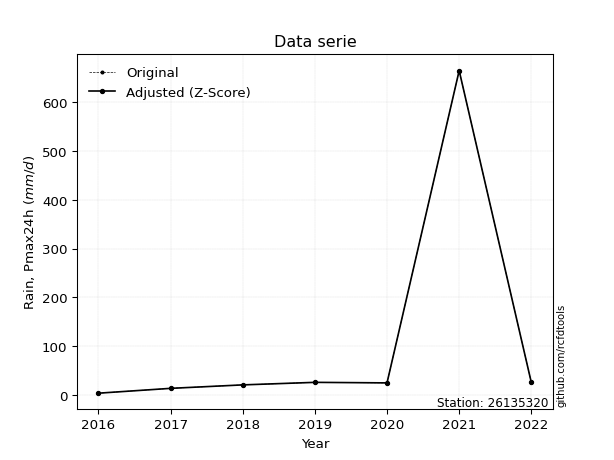</img>

</div>


> The initial value (value_initial) correspond to the initial obtained or null completed value, and value (value) is adjusted only when the initial value is outside the valid range (outlier) definite through the Z-Score value. If Z-Score is active, values out of range or outliers are replaced with the station mean value. A Z-Score (or standard score) measures how many standard deviations a data point is from the mean of a dataset, indicating its relative position; positive scores mean above the mean, negative mean below, and a score of zero is exactly at the mean, allowing for comparison of values from different distributions. It´s calculated using the formula $z=(x–μ)/σ$, where $x$ is the data point, $μ$ is the mean, and $σ$ is the standard deviation, helping identify outliers and understand probability.
>
> <sub>**Note**: In this study, "completing" (filling gaps in) and "extending" (forecasting or lengthening the historical record) rainfall data series are avoided for certain critical analyses because they introduce artificial bias and uncertainty, which can distort the statistics of rare events (extremes), alter day-to-day variability, and compromise the integrity and homogeneity of the original data. Some reasons against Completing/Extending rainfall data are: **Distortion of Extremes and Variability**: The primary issue is that most gap-filling or extension methods rely on averaging or regression with nearby stations, which inherently smooths the data. Rainfall is highly variable in space and time, with a large percentage of zero values and occasional large storms. Infilling methods often underestimate the highest values and overestimate the lowest (zero) values, which severely distorts analyses focused on flood frequency, drought severity, and intensity-duration-frequency (IDF) curves, **Loss of Data Homogeneity**: Infilled or extended data are synthetic estimates, not actual measurements. Combining these estimates with observed data can violate the assumption of data homogeneity, which requires that the data properties do not change over time. Inhomogeneity can lead to incorrect conclusions about long-term trends or changes in climate patterns, **Propagation of Errors**: Errors and biases from the original data (e.g., wind-induced undercatch, instrument errors, site changes) or the data used for imputation can propagate through the analysis, leading to unreliable hydrological models and inaccurate predictions, **Compromised Statistical Integrity**: For statistical analyses, especially those involving the frequency of events, using artificial data can introduce time bias or autocorrelation that doesn´t exist in reality, making it difficult to assess the true probability of events, **Difficulty in Validation**: It is difficult to accurately validate the quality of filled or extended data, especially for past periods where ground-truth measurements are unavailable. The reliability of imputation techniques heavily depends on the density of the surrounding station network and the complexity of the local topography.</sub>


### 4. Active continuous probability distributions from SciPy (44 of 104 available)

A Probability Density Function (PDF) describes the relative likelihood of a continuous random variable falling within a specific range, where the total area under its curve equals 1, and the area over any interval gives the actual probability for that range. Unlike discrete probabilities (like rolling a die), a PDF shows density, not direct probability for a single point (which is zero), with higher points indicating higher likelihood, often visualized as a bell curve for normal distributions.

A log of a probability density function (log-PDF) is simply the logarithm of the PDF´s value, denoted as $log(f(x))$, useful for converting multiplication of probabilities into addition, improving numerical stability with tiny numbers, and connecting to information theory concepts like entropy. Instead of dealing with very small probabilities (e.g., 0.000001), log-PDFs use negative numbers (e.g., $log(0.00001) ≈ -11.51$ that are easier for computers to handle, preventing underflow errors and simplifying complex calculations. In this study, each active probability distribution from SciPy is also evaluated in the $log$ form.

[scipy.stats](https://docs.scipy.org/doc/scipy/reference/stats.html) is a Python´s powerful submodule within the SciPy library for comprehensive statistical analysis, offering over 130 probability distributions (like Normal, Poisson), functions for descriptive stats (mean, variance), hypothesis testing (t-tests, chi-square), random variable generation, and statistical tests, making it essential for data science, modeling, and research. It provides tools to explore, model, and draw conclusions from data efficiently, working seamlessly with NumPy.

<div align="center">

|   id | p_dist             |   n_parameter | fit_method   | label                                                                       | active   | ref                                                                                                        |
|-----:|:-------------------|--------------:|:-------------|:----------------------------------------------------------------------------|:---------|:-----------------------------------------------------------------------------------------------------------|
|    0 | alpha              |             3 | MLE          | Alpha                                                                       | True     | [:mortar_board:](https://docs.scipy.org/doc/scipy/reference/generated/scipy.stats.alpha.html)              |
|    1 | betaprime          |             4 | MLE          | Beta prime                                                                  | True     | [:mortar_board:](https://docs.scipy.org/doc/scipy/reference/generated/scipy.stats.betaprime.html)          |
|    2 | chi2               |             3 | MLE          | Chi²                                                                        | True     | [:mortar_board:](https://docs.scipy.org/doc/scipy/reference/generated/scipy.stats.chi2.html)               |
|    3 | crystalball        |             4 | MLE          | Crystalball                                                                 | True     | [:mortar_board:](https://docs.scipy.org/doc/scipy/reference/generated/scipy.stats.crystalball.html)        |
|    4 | erlang             |             3 | MLE          | Erlang                                                                      | True     | [:mortar_board:](https://docs.scipy.org/doc/scipy/reference/generated/scipy.stats.erlang.html)             |
|    5 | expon              |             2 | MLE          | Exponential                                                                 | True     | [:mortar_board:](https://docs.scipy.org/doc/scipy/reference/generated/scipy.stats.expon.html)              |
|    6 | exponnorm          |             3 | MLE          | Exponentially modified Normal                                               | True     | [:mortar_board:](https://docs.scipy.org/doc/scipy/reference/generated/scipy.stats.exponnorm.html)          |
|    7 | f                  |             4 | MLE          | F                                                                           | True     | [:mortar_board:](https://docs.scipy.org/doc/scipy/reference/generated/scipy.stats.f.html)                  |
|    8 | fatiguelife        |             3 | MLE          | Fatigue-life (Birnbaum-Saunders)                                            | True     | [:mortar_board:](https://docs.scipy.org/doc/scipy/reference/generated/scipy.stats.fatiguelife.html)        |
|    9 | fisk               |             3 | MLE          | Fisk                                                                        | True     | [:mortar_board:](https://docs.scipy.org/doc/scipy/reference/generated/scipy.stats.fisk.html)               |
|   10 | gamma              |             3 | MLE          | Gamma                                                                       | True     | [:mortar_board:](https://docs.scipy.org/doc/scipy/reference/generated/scipy.stats.gamma.html)              |
|   11 | genexpon           |             5 | MLE          | Generalized exponential                                                     | True     | [:mortar_board:](https://docs.scipy.org/doc/scipy/reference/generated/scipy.stats.genexpon.html)           |
|   12 | genlogistic        |             3 | MLE          | Generalized logistic                                                        | True     | [:mortar_board:](https://docs.scipy.org/doc/scipy/reference/generated/scipy.stats.genlogistic.html)        |
|   13 | gibrat             |             2 | MM           | Gibrat                                                                      | True     | [:mortar_board:](https://docs.scipy.org/doc/scipy/reference/generated/scipy.stats.gibrat.html)             |
|   14 | gompertz           |             3 | MLE          | Gompertz (or truncated Gumbel)                                              | True     | [:mortar_board:](https://docs.scipy.org/doc/scipy/reference/generated/scipy.stats.gompertz.html)           |
|   15 | gumbel_l           |             2 | MM           | Gumbel Left Skew                                                            | True     | [:mortar_board:](https://docs.scipy.org/doc/scipy/reference/generated/scipy.stats.gumbel_l.html)           |
|   16 | gumbel_r           |             2 | MM           | Gumbel Right Skew                                                           | True     | [:mortar_board:](https://docs.scipy.org/doc/scipy/reference/generated/scipy.stats.gumbel_r.html)           |
|   17 | halflogistic       |             2 | MM           | Half-logistic                                                               | True     | [:mortar_board:](https://docs.scipy.org/doc/scipy/reference/generated/scipy.stats.halflogistic.html)       |
|   18 | halfnorm           |             2 | MM           | Half Normal                                                                 | True     | [:mortar_board:](https://docs.scipy.org/doc/scipy/reference/generated/scipy.stats.halfnorm.html)           |
|   19 | hypsecant          |             2 | MM           | hyperbolic secant                                                           | True     | [:mortar_board:](https://docs.scipy.org/doc/scipy/reference/generated/scipy.stats.hypsecant.html)          |
|   20 | invgamma           |             3 | MLE          | Inverted gamma                                                              | True     | [:mortar_board:](https://docs.scipy.org/doc/scipy/reference/generated/scipy.stats.invgamma.html)           |
|   21 | invgauss           |             3 | MLE          | Inverse Gaussian                                                            | True     | [:mortar_board:](https://docs.scipy.org/doc/scipy/reference/generated/scipy.stats.invgauss.html)           |
|   22 | invweibull         |             3 | MLE          | Inverted Weibull                                                            | True     | [:mortar_board:](https://docs.scipy.org/doc/scipy/reference/generated/scipy.stats.invweibull.html)         |
|   23 | johnsonsu          |             4 | MLE          | Johnson Su                                                                  | True     | [:mortar_board:](https://docs.scipy.org/doc/scipy/reference/generated/scipy.stats.johnsonsu.html)          |
|   24 | kstwobign          |             2 | MLE          | Limiting distribution of scaled Kolmogorov-Smirnov two-sided test statistic | True     | [:mortar_board:](https://docs.scipy.org/doc/scipy/reference/generated/scipy.stats.kstwobign.html)          |
|   25 | laplace            |             2 | MM           | Laplace                                                                     | True     | [:mortar_board:](https://docs.scipy.org/doc/scipy/reference/generated/scipy.stats.laplace.html)            |
|   26 | laplace_asymmetric |             3 | MLE          | Asymmetric Laplace                                                          | True     | [:mortar_board:](https://docs.scipy.org/doc/scipy/reference/generated/scipy.stats.laplace_asymmetric.html) |
|   27 | loggamma           |             3 | MLE          | Log gamma                                                                   | True     | [:mortar_board:](https://docs.scipy.org/doc/scipy/reference/generated/scipy.stats.loggamma.html)           |
|   28 | logistic           |             2 | MM           | Logistic (or Sech-squared)                                                  | True     | [:mortar_board:](https://docs.scipy.org/doc/scipy/reference/generated/scipy.stats.logistic.html)           |
|   29 | lognorm            |             3 | MLE          | Log Normal                                                                  | True     | [:mortar_board:](https://docs.scipy.org/doc/scipy/reference/generated/scipy.stats.lognorm.html)            |
|   30 | maxwell            |             2 | MM           | Maxwell                                                                     | True     | [:mortar_board:](https://docs.scipy.org/doc/scipy/reference/generated/scipy.stats.maxwell.html)            |
|   31 | mielke             |             4 | MLE          | Mielke Beta-Kappa / Dagum                                                   | True     | [:mortar_board:](https://docs.scipy.org/doc/scipy/reference/generated/scipy.stats.mielke.html)             |
|   32 | moyal              |             2 | MM           | Moyal                                                                       | True     | [:mortar_board:](https://docs.scipy.org/doc/scipy/reference/generated/scipy.stats.moyal.html)              |
|   33 | nakagami           |             3 | MLE          | Nakagami                                                                    | True     | [:mortar_board:](https://docs.scipy.org/doc/scipy/reference/generated/scipy.stats.nakagami.html)           |
|   34 | ncf                |             5 | MLE          | Non-central F distribution                                                  | True     | [:mortar_board:](https://docs.scipy.org/doc/scipy/reference/generated/scipy.stats.ncf.html)                |
|   35 | nct                |             4 | MLE          | Non-central Student’s t                                                     | True     | [:mortar_board:](https://docs.scipy.org/doc/scipy/reference/generated/scipy.stats.nct.html)                |
|   36 | norm               |             2 | MM           | Normal                                                                      | True     | [:mortar_board:](https://docs.scipy.org/doc/scipy/reference/generated/scipy.stats.norm.html)               |
|   37 | pearson3           |             3 | MM           | Pearson type III                                                            | True     | [:mortar_board:](https://docs.scipy.org/doc/scipy/reference/generated/scipy.stats.pearson3.html)           |
|   38 | rayleigh           |             2 | MM           | Rayleigh                                                                    | True     | [:mortar_board:](https://docs.scipy.org/doc/scipy/reference/generated/scipy.stats.rayleigh.html)           |
|   39 | rice               |             3 | MLE          | Rice                                                                        | True     | [:mortar_board:](https://docs.scipy.org/doc/scipy/reference/generated/scipy.stats.rice.html)               |
|   40 | t                  |             3 | MLE          | Student’s t                                                                 | True     | [:mortar_board:](https://docs.scipy.org/doc/scipy/reference/generated/scipy.stats.t.html)                  |
|   41 | truncnorm          |             4 | MLE          | Truncated normal                                                            | True     | [:mortar_board:](https://docs.scipy.org/doc/scipy/reference/generated/scipy.stats.truncnorm.html)          |
|   42 | wald               |             2 | MM           | Wald                                                                        | True     | [:mortar_board:](https://docs.scipy.org/doc/scipy/reference/generated/scipy.stats.wald.html)               |
|   43 | weibull_min        |             3 | MLE          | Weibull minimum                                                             | True     | [:mortar_board:](https://docs.scipy.org/doc/scipy/reference/generated/scipy.stats.weibull_min.html)        |

</div>

> **n_parameter:** # arguments & localization & scale.
>
> **Fit methods:** (MLE) maximum likelihood, (MM) L-moments.
>
>**Inactive** (With the only purpose of prevent loops, zero divisions, infinite values, over high estimated values or horizontal trending for recurrence intervals estimations, the follow distributions were disabled.)**:** foldnorm, gennorm, norminvgauss, powernorm, powerlognorm, skewnorm, genextreme, anglit, arcsine, argus, beta, bradford, burr, burr12, cauchy, cosine, halfcauchy, foldcauchy, skewcauchy, wrapcauchy, dgamma, gengamma, exponweib, exponpow, truncexpon, gausshyper, genhalflogistic, genhyperbolic, geninvgauss, halfgennorm, johnsonsb, kappa4, kappa3, ksone, kstwo, loglaplace, levy, levy_l, levy_stable, ncx2, pareto, genpareto, truncpareto, lomax, powerlaw, rdist, rel_breitwigner, recipinvgauss, semicircular, studentized_range, trapezoid, triang, truncweibull_min, tukeylambda, uniform, loguniform, vonmises, vonmises_line, weibull_max, dweibull, 


## B. Probability (PDF) vs. Empirical (EDF) distributions functions

A continuous probability distribution (CPD) describes probabilities for variables that can take any value within a range (like rain any time), unlike discrete variables with specific outcomes (like temperature). It uses a Probability Density Function (PDF), a curve where the total area under it equals 1, and the probability of the variable falling within an interval (a to b) is found by calculating the area under the curve between those points. A key feature is that the probability of hitting any single exact value is zero, so probabilities are always expressed for ranges, e.g., $P(a ≤ X ≤ b)$.

<div align="center">

Distributions parameters from station values
|    |   station | p_dist                |   n |           loc |           scale | shape                  | shape1                | shape2             | shape3   |
|---:|----------:|:----------------------|----:|--------------:|----------------:|:-----------------------|:----------------------|:-------------------|:---------|
|  0 |  26135320 | alpha                 |   7 |    -10.1801   |    42.2106      | 1.1720003111281923     |                       |                    |          |
|  1 |  26135320 | betaprime             |   7 |      3.6997   |    12.1751      | 0.8357967283134153     | 0.7663963399526292    |                    |          |
|  2 |  26135320 | chi2                  |   7 |      3.7      |   195.807       | 0.8783085546266396     |                       |                    |          |
|  3 |  26135320 | crystalball           |   7 |    111.286    |   226.054       | 763.0587144043977      | 36125.37423536322     |                    |          |
|  4 |  26135320 | erlang                |   7 |      3.7      |   341.729       | 0.34672019793714015    |                       |                    |          |
|  5 |  26135320 | expon                 |   7 |      3.7      |   107.586       |                        |                       |                    |          |
|  6 |  26135320 | exponnorm             |   7 |      3.57359  |     0.0418957   | 2540.451939393154      |                       |                    |          |
|  7 |  26135320 | f                     |   7 |      3.7      |    18.5837      | 1.1515621722880702     | 1.6070474274145832    |                    |          |
|  8 |  26135320 | fatiguelife           |   7 |      2.13852  |    33.2369      | 2.369321634361062      |                       |                    |          |
|  9 |  26135320 | fisk                  |   7 |      3.7      |    13.2869      | 0.6713912086360134     |                       |                    |          |
| 10 |  26135320 | gamma                 |   7 |      3.7      |   119.794       | 0.36247568116782675    |                       |                    |          |
| 11 |  26135320 | genexpon              |   7 |      3.7      |   230.124       | 2.1389822495387314     | 2.634375066122487e-12 | 1.085239599627223  |          |
| 12 |  26135320 | genlogistic           |   7 |   -700.091    |    92.8469      | 2687.8108147258135     |                       |                    |          |
| 13 |  26135320 | gibrat                |   7 |    -61.165    |   104.597       |                        |                       |                    |          |
| 14 |  26135320 | gompertz              |   7 |      3.6995   |     1.86783e+07 | 170632.78233684145     |                       |                    |          |
| 15 |  26135320 | gumbel_l              |   7 |    213.022    |   176.254       |                        |                       |                    |          |
| 16 |  26135320 | gumbel_r              |   7 |      9.54939  |   176.254       |                        |                       |                    |          |
| 17 |  26135320 | halflogistic          |   7 |   -156.641    |   193.268       |                        |                       |                    |          |
| 18 |  26135320 | halfnorm              |   7 |   -187.921    |   375           |                        |                       |                    |          |
| 19 |  26135320 | hypsecant             |   7 |    111.286    |   143.91        |                        |                       |                    |          |
| 20 |  26135320 | invgamma              |   7 |     -0.682686 |    13.9183      | 0.9173468310528805     |                       |                    |          |
| 21 |  26135320 | invgauss              |   7 |      0.993061 |    12.4929      | 8.8284570190777        |                       |                    |          |
| 22 |  26135320 | invweibull            |   7 |     -0.611783 |    15.3615      | 0.9506686599543633     |                       |                    |          |
| 23 |  26135320 | johnsonsu             |   7 |     25.6216   |     0.0940438   | 0.2266758838232804     | 0.19568052956504445   |                    |          |
| 24 |  26135320 | kstwobign             |   7 |   -394.393    |   600.697       |                        |                       |                    |          |
| 25 |  26135320 | laplace               |   7 |    111.286    |   159.844       |                        |                       |                    |          |
| 26 |  26135320 | laplace_asymmetric    |   7 |      3.7      |     0.00552854  | 5.138820337120474e-05  |                       |                    |          |
| 27 |  26135320 | loggamma              |   7 | -86733.5      | 11227.4         | 2287.6004371602594     |                       |                    |          |
| 28 |  26135320 | logistic              |   7 |    111.286    |   124.63        |                        |                       |                    |          |
| 29 |  26135320 | lognorm               |   7 |      3.7      |     0.126093    | 13.646189134772687     |                       |                    |          |
| 30 |  26135320 | maxwell               |   7 |   -424.367    |   335.671       |                        |                       |                    |          |
| 31 |  26135320 | mielke                |   7 |      0.755826 |     3.20493     | 4.3873009812317445     | 0.9605155691642677    |                    |          |
| 32 |  26135320 | moyal                 |   7 |    -17.9865   |   101.76        |                        |                       |                    |          |
| 33 |  26135320 | nakagami              |   7 |      3.7      |   402.113       | 0.1166375465702896     |                       |                    |          |
| 34 |  26135320 | ncf                   |   7 |     -0.234195 |    10.6451      | 22.988306511466106     | 1.8516971072986657    | 10.295269719017064 |          |
| 35 |  26135320 | nct                   |   7 |     -3.72752  |     2.98189     | 0.91252630479669       | 5.712033698903729     |                    |          |
| 36 |  26135320 | norm                  |   7 |    111.286    |   226.054       |                        |                       |                    |          |
| 37 |  26135320 | pearson3              |   7 |    111.286    |   226.054       | 2.0365238816000764     |                       |                    |          |
| 38 |  26135320 | rayleigh              |   7 |   -321.169    |   345.049       |                        |                       |                    |          |
| 39 |  26135320 | rice                  |   7 |   -191.676    |   267.288       | 0.00042486373447503324 |                       |                    |          |
| 40 |  26135320 | t                     |   7 |     25.6334   |     0.491257    | 0.29060749857503626    |                       |                    |          |
| 41 |  26135320 | truncnorm             |   7 |  -2871.05     |   575.997       | 4.990908143354179      | 1346.7714636111868    |                    |          |
| 42 |  26135320 | wald                  |   7 |   -114.768    |   226.054       |                        |                       |                    |          |
| 43 |  26135320 | weibull_min           |   7 |      3.7      |    53.4831      | 0.6581792448756076     |                       |                    |          |
| 44 |  26135320 | logalpha              |   7 |     -4.12907  |    41.0494      | 5.708220021229225      |                       |                    |          |
| 45 |  26135320 | logbetaprime          |   7 |     -0.752102 |     2.74909     | 21.15848095076589      | 15.337459173826685    |                    |          |
| 46 |  26135320 | logchi2               |   7 |      1.30833  |     0.893214    | 1.7038502106553557     |                       |                    |          |
| 47 |  26135320 | logcrystalball        |   7 |      3.30794  |     1.4523      | 936.5819102637049      | 30.584879568402894    |                    |          |
| 48 |  26135320 | logerlang             |   7 |      0.55144  |     0.754279    | 3.6544828248413803     |                       |                    |          |
| 49 |  26135320 | logexpon              |   7 |      1.30833  |     1.9996      |                        |                       |                    |          |
| 50 |  26135320 | logexponnorm          |   7 |      2.11389  |     0.708647    | 1.6849403883714387     |                       |                    |          |
| 51 |  26135320 | logf                  |   7 |     -1.32722  |     4.32029     | 120.53372986420925     | 29.377260874539303    |                    |          |
| 52 |  26135320 | logfatiguelife        |   7 |     -0.686812 |     3.76045     | 0.3530509643949827     |                       |                    |          |
| 53 |  26135320 | logfisk               |   7 |     -0.650847 |     3.71658     | 5.45761733700979       |                       |                    |          |
| 54 |  26135320 | loggamma              |   7 |      0.551464 |     0.754281    | 3.6544410048802805     |                       |                    |          |
| 55 |  26135320 | loggenexpon           |   7 |      1.30833  |     4.76212     | 1.2674486423754907     | 9.321570757546935     | 0.416048000416653  |          |
| 56 |  26135320 | loggenlogistic        |   7 |      0.505723 |     1.03399     | 8.809917780363664      |                       |                    |          |
| 57 |  26135320 | loggibrat             |   7 |      2.20005  |     0.67197     |                        |                       |                    |          |
| 58 |  26135320 | loggompertz           |   7 |      1.30833  |     3.44332     | 1.004870769796109      |                       |                    |          |
| 59 |  26135320 | loggumbel_l           |   7 |      3.96155  |     1.13235     |                        |                       |                    |          |
| 60 |  26135320 | loggumbel_r           |   7 |      2.65432  |     1.13235     |                        |                       |                    |          |
| 61 |  26135320 | loghalflogistic       |   7 |      1.58661  |     1.24167     |                        |                       |                    |          |
| 62 |  26135320 | loghalfnorm           |   7 |      1.38566  |     2.40921     |                        |                       |                    |          |
| 63 |  26135320 | loghypsecant          |   7 |      3.30794  |     0.924563    |                        |                       |                    |          |
| 64 |  26135320 | loginvgamma           |   7 |     -1.77933  |    68.5341      | 14.476290991816374     |                       |                    |          |
| 65 |  26135320 | loginvgauss           |   7 |     -0.737428 |    32.433       | 0.12472975557452806    |                       |                    |          |
| 66 |  26135320 | loginvweibull         |   7 |   -161.841    |   164.504       | 148.5645329233831      |                       |                    |          |
| 67 |  26135320 | logjohnsonsu          |   7 |      3.24643  |     0.00695569  | 0.44292529653103835    | 0.24465335804871416   |                    |          |
| 68 |  26135320 | logkstwobign          |   7 |     -1.42336  |     5.47369     |                        |                       |                    |          |
| 69 |  26135320 | loglaplace            |   7 |      3.30794  |     1.02693     |                        |                       |                    |          |
| 70 |  26135320 | loglaplace_asymmetric |   7 |      3.21084  |     0.859965    | 0.9450614163923716     |                       |                    |          |
| 71 |  26135320 | logloggamma           |   7 |   -527.999    |    69.1304      | 2176.932344420874      |                       |                    |          |
| 72 |  26135320 | loglogistic           |   7 |      3.30794  |     0.800695    |                        |                       |                    |          |
| 73 |  26135320 | loglognorm            |   7 |      1.30833  |     0.0109186   | 12.876739134924506     |                       |                    |          |
| 74 |  26135320 | logmaxwell            |   7 |     -0.133404 |     2.15654     |                        |                       |                    |          |
| 75 |  26135320 | logmielke             |   7 |      1.30833  |     2.94312     | 0.9150559738429243     | 3.776423589155417     |                    |          |
| 76 |  26135320 | logmoyal              |   7 |      2.47742  |     0.653764    |                        |                       |                    |          |
| 77 |  26135320 | lognakagami           |   7 |      2.61007  |     2.10958     | 0.22380849286823773    |                       |                    |          |
| 78 |  26135320 | logncf                |   7 |     -0.567209 |     2.79647     | 31.145672891368008     | 31.040948827445874    | 9.214206490333588  |          |
| 79 |  26135320 | lognct                |   7 |      3.2489   |     0.0222663   | 0.40825928995354777    | -0.545157362781872    |                    |          |
| 80 |  26135320 | lognorm               |   7 |      3.30794  |     1.4523      |                        |                       |                    |          |
| 81 |  26135320 | logpearson3           |   7 |      3.30793  |     1.4523      | 1.1260863990162813     |                       |                    |          |
| 82 |  26135320 | lograyleigh           |   7 |      0.529602 |     2.21679     |                        |                       |                    |          |
| 83 |  26135320 | logrice               |   7 |      0.747295 |     2.08159     | 0.0005063031250321203  |                       |                    |          |
| 84 |  26135320 | logt                  |   7 |      3.24389  |     0.0207619   | 0.30942423934972485    |                       |                    |          |
| 85 |  26135320 | logtruncnorm          |   7 |     -0.117298 |     3.76055     | 0.3790942533140258     | 1.7594877403437787    |                    |          |
| 86 |  26135320 | logwald               |   7 |      1.8556   |     1.45232     |                        |                       |                    |          |
| 87 |  26135320 | logweibull_min        |   7 |      1.10615  |     2.42706     | 1.5020322203509187     |                       |                    |          |

</div>

> **loc** (Location parameter): This shifts the distribution along the x-axis. For many common distributions, like the normal (Gaussian) distribution, loc represents the mean $μ$. For others, like the uniform distribution, it might represent the minimum value, or for the beta distribution, the left end of the support interval.
>
> **scale** (Scale parameter): This determines the width or spread of the distribution. For the normal distribution, scale represents the standard deviation $σ$. For a uniform distribution, it defines the length of the interval (from $loc$ to $loc + scale$).
>
> **shape** (Shape parameters): Refers to parameters that define the specific form of a probability distribution, distinct from its location (loc) and scale (scale). These parameters are required arguments for most distribution functions. For example, a normal (Gaussian) distribution is fully defined by its location (mean) and scale (standard deviation), so it has no specific shape parameters beyond loc and scale. However, other distributions have intrinsic properties that need specification, as Gamma distribution that takes a shape parameter, often named $a$ or $alpha$.


### 0. Cumulative distribution values - CDF (88 evaluated)

Cumulative Distribution Function (CDF), denoted as $F$<sub>$X$</sub>$(x)$, is a function that gives the probability that a random variable $X$ will take a value less than or equal to a specific value, $x$ (i.e., $(P(X≥x)$. It essentially "accumulates" probabilities from a given point up to the far right (positive infinity), providing a complete picture of the distribution´s probabilities for both discrete (like rain) and continuous (like temperature) variables, helping to find probabilities over ranges or above certain values. Each station is evaluated separately ordering the $x$ values ascending, calculating the CDF and PDF values for the activated distributions and their logarithmic forms.

<div align="center">

CDF ordered by x ascending and calculating $log(f(x))$ separately
|   id |   Station |   date |     x |   count |    mean |     std |    zscore |   Value_initial |   station |   m |     alpha |   alpha_pdf |   betaprime |   betaprime_pdf |        chi2 |    chi2_pdf |   crystalball |   crystalball_pdf |      erlang |   erlang_pdf |     expon |   expon_pdf |   exponnorm |   exponnorm_pdf |           f |        f_pdf |   fatiguelife |   fatiguelife_pdf |        fisk |        fisk_pdf |       gamma |   gamma_pdf |    genexpon |   genexpon_pdf |   genlogistic |   genlogistic_pdf |   gibrat |   gibrat_pdf |    gompertz |   gompertz_pdf |   gumbel_l |   gumbel_l_pdf |   gumbel_r |   gumbel_r_pdf |   halflogistic |   halflogistic_pdf |   halfnorm |   halfnorm_pdf |   hypsecant |   hypsecant_pdf |   invgamma |   invgamma_pdf |   invgauss |   invgauss_pdf |   invweibull |   invweibull_pdf |   johnsonsu |   johnsonsu_pdf |   kstwobign |   kstwobign_pdf |   laplace |   laplace_pdf |   laplace_asymmetric |   laplace_asymmetric_pdf |   loggamma |   loggamma_pdf |   logistic |   logistic_pdf |   lognorm |   lognorm_pdf |   maxwell |   maxwell_pdf |    mielke |   mielke_pdf |    moyal |   moyal_pdf |    nakagami |   nakagami_pdf |       ncf |     ncf_pdf |       nct |     nct_pdf |     norm |    norm_pdf |   pearson3 |   pearson3_pdf |   rayleigh |   rayleigh_pdf |     rice |    rice_pdf |        t |       t_pdf |   truncnorm |   truncnorm_pdf |     wald |   wald_pdf |   weibull_min |   weibull_min_pdf |   logalpha |   logalpha_pdf |   logbetaprime |   logbetaprime_pdf |     logchi2 |   logchi2_pdf |   logcrystalball |   logcrystalball_pdf |   logerlang |   logerlang_pdf |   logexpon |   logexpon_pdf |   logexponnorm |   logexponnorm_pdf |      logf |   logf_pdf |   logfatiguelife |   logfatiguelife_pdf |   logfisk |   logfisk_pdf |   loggenexpon |   loggenexpon_pdf |   loggenlogistic |   loggenlogistic_pdf |   loggibrat |   loggibrat_pdf |   loggompertz |   loggompertz_pdf |   loggumbel_l |   loggumbel_l_pdf |   loggumbel_r |   loggumbel_r_pdf |   loghalflogistic |   loghalflogistic_pdf |   loghalfnorm |   loghalfnorm_pdf |   loghypsecant |   loghypsecant_pdf |   loginvgamma |   loginvgamma_pdf |   loginvgauss |   loginvgauss_pdf |   loginvweibull |   loginvweibull_pdf |   logjohnsonsu |   logjohnsonsu_pdf |   logkstwobign |   logkstwobign_pdf |   loglaplace |   loglaplace_pdf |   loglaplace_asymmetric |   loglaplace_asymmetric_pdf |   logloggamma |   logloggamma_pdf |   loglogistic |   loglogistic_pdf |   loglognorm |   loglognorm_pdf |   logmaxwell |   logmaxwell_pdf |   logmielke |   logmielke_pdf |   logmoyal |   logmoyal_pdf |   lognakagami |   lognakagami_pdf |    logncf |   logncf_pdf |    lognct |   lognct_pdf |   logpearson3 |   logpearson3_pdf |   lograyleigh |   lograyleigh_pdf |   logrice |   logrice_pdf |      logt |    logt_pdf |   logtruncnorm |   logtruncnorm_pdf |   logwald |   logwald_pdf |   logweibull_min |   logweibull_min_pdf |
|-----:|----------:|-------:|------:|--------:|--------:|--------:|----------:|----------------:|----------:|----:|----------:|------------:|------------:|----------------:|------------:|------------:|--------------:|------------------:|------------:|-------------:|----------:|------------:|------------:|----------------:|------------:|-------------:|--------------:|------------------:|------------:|----------------:|------------:|------------:|------------:|---------------:|--------------:|------------------:|---------:|-------------:|------------:|---------------:|-----------:|---------------:|-----------:|---------------:|---------------:|-------------------:|-----------:|---------------:|------------:|----------------:|-----------:|---------------:|-----------:|---------------:|-------------:|-----------------:|------------:|----------------:|------------:|----------------:|----------:|--------------:|---------------------:|-------------------------:|-----------:|---------------:|-----------:|---------------:|----------:|--------------:|----------:|--------------:|----------:|-------------:|---------:|------------:|------------:|---------------:|----------:|------------:|----------:|------------:|---------:|------------:|-----------:|---------------:|-----------:|---------------:|---------:|------------:|---------:|------------:|------------:|----------------:|---------:|-----------:|--------------:|------------------:|-----------:|---------------:|---------------:|-------------------:|------------:|--------------:|-----------------:|---------------------:|------------:|----------------:|-----------:|---------------:|---------------:|-------------------:|----------:|-----------:|-----------------:|---------------------:|----------:|--------------:|--------------:|------------------:|-----------------:|---------------------:|------------:|----------------:|--------------:|------------------:|--------------:|------------------:|--------------:|------------------:|------------------:|----------------------:|--------------:|------------------:|---------------:|-------------------:|--------------:|------------------:|--------------:|------------------:|----------------:|--------------------:|---------------:|-------------------:|---------------:|-------------------:|-------------:|-----------------:|------------------------:|----------------------------:|--------------:|------------------:|--------------:|------------------:|-------------:|-----------------:|-------------:|-----------------:|------------:|----------------:|-----------:|---------------:|--------------:|------------------:|----------:|-------------:|----------:|-------------:|--------------:|------------------:|--------------:|------------------:|----------:|--------------:|----------:|------------:|---------------:|-------------------:|----------:|--------------:|-----------------:|---------------------:|
|    0 |  26135320 |   2016 |   3.7 |       7 | 111.286 | 244.166 | -0.440625 |             3.7 |  26135320 |   1 | 0.0350306 | 0.0173286   | 0.000111838 |     0.3086      | 1.48546e-08 | 1.46895e+07 |      0.317062 |       0.00157584  | 7.05298e-07 |  5.50658e+08 | 0         | 0.00929491  |  0.00118701 |     0.00937234  | 9.09402e-06 | 88.395       |     0.0317442 |       0.0465462   | 8.67342e-12 | 13112.8         | 5.39919e-07 | 4.40694e+08 | 1.63113e-13 |    0.00929491  |      0.253659 |       0.00374672  | 0.316395 |  0.00548688  | 4.53972e-06 |    0.00913532  |   0.262837 |    0.00127541  |   0.355673 |    0.00208605  |       0.392553 |        0.00218842  |   0.390642 |    0.00186728  |    0.281532 |     0.00171103  |  0.0352474 |    0.0260705   |   0.035454 |    0.0352329   |    0.0352163 |      0.0259821   |    0.164605 |     0.00221236  |    0.227945 |      0.00264422 |  0.255071 |   0.00159575  |          2.65289e-09 |              0.00929508  |  0.0323677 |       0.123988 |   0.296663 |    0.00167419  | 0.0842788 |     0.106464  |  0.346556 |   0.00171427  | 0.0348742 |  0.0270426   | 0.368693 | 0.00235281  | 5.33214e-05 |    2.80091e+10 | 0.0357949 | 0.0259968   | 0.0358647 | 0.021007    | 0.317062 | 0.00157584  |   0.40933  |    0.00265143  |   0.358038 |    0.00175169  | 0.23444  | 0.00209358  | 0.116554 | 0.00154417  | 1.22994e-07 |     0.00898913  | 0.385747 | 0.00374766 |   5.72542e-12 |    8485.58        |  0.0327947 |      0.101691  |      0.0328712 |           0.106474 | 2.97636e-14 |    114.195    |        0.0842788 |            0.106464  |   0.0323688 |       0.123989  |   0        |      0.500099  |      0.0299638 |          0.0819548 | 0.0334006 |  0.105797  |        0.0339648 |            0.112445  | 0.0294723 |     0.0796801 |    5.0824e-15 |         0.266152  |        0.0356202 |            0.0956417 |    0        |        0        |   5.01062e-10 |         0.291832  |     0.0915629 |       0.0770403   |     0.0375267 |         0.10879   |          0        |              0        |      0        |         0         |      0.0728959 |          0.0781563 |      0.033241 |         0.105565  |     0.0338732 |         0.111943  |       0.0329348 |           0.102364  |       0.13479  |         0.0273782  |      0.0354559 |          0.115606  |     0.071339 |        0.0694682 |               0.0454034 |                   0.0558661 |     0.0900646 |         0.108605  |     0.0760452 |         0.0877517 |   0.00717623 |      6.96668e+12 |    0.0696178 |        0.132247  | 1.76657e-15 |       7.28012   |  0.0144781 |      0.0750756 |   0           |       0           | 0.0333093 |    0.107999  | 0.0849243 |   0.0178657  |     0.0272475 |          0.123832 |     0.0598365 |         0.148985  | 0.0356697 |     0.124861  | 0.0854216 |  0.0136555  |    9.41566e-06 |          0.315371  |  0        |      0        |        0.0236377 |            0.173518  |
|    1 |  26135320 |   2017 |  13.6 |       7 | 111.286 | 244.166 | -0.400079 |            13.6 |  26135320 |   2 | 0.310714  | 0.0282325   | 0.427251    |     0.0215812   | 0.222786    | 0.00971023  |      0.332822 |       0.00160749  | 0.326128    |  0.0111783   | 0.0879128 | 0.00847777  |  0.0899019  |     0.00855081  | 0.418901    |  0.0183809   |     0.318862  |       0.0150567   | 0.450772    |     0.01679     | 0.445363    | 0.0153424   | 0.0879127   |    0.00847777  |      0.2914   |       0.00386907  | 0.368525 |  0.00504349  | 0.0864751   |    0.00834539  |   0.275711 |    0.00132554  |   0.376333 |    0.00208667  |       0.413998 |        0.00214367  |   0.409001 |    0.00184162  |    0.298838 |     0.00178467  |  0.341138  |    0.0244577   |   0.356619 |    0.0213563   |    0.340697  |      0.0245397   |    0.195405 |     0.00449335  |    0.254476 |      0.00271237 |  0.271369 |   0.00169771  |          0.0879143   |              0.00847791  |  0.362059  |       0.314318 |   0.3135   |    0.00172685  | 0.315427  |     0.244745  |  0.363595 |   0.00172749  | 0.343486  |  0.0244745   | 0.391863 | 0.00232663  | 0.347151    |    0.00817944  | 0.339759  | 0.0244081   | 0.324292  | 0.0256231   | 0.332822 | 0.00160749  |   0.434984 |    0.00253233  |   0.375404 |    0.00175624  | 0.255399 | 0.00213945  | 0.138766 | 0.0033503   | 0.0852783   |     0.00824896  | 0.42161  | 0.00349882 |   0.280703    |       0.0157561   |  0.350873  |      0.335089  |      0.353621  |           0.329263 | 0.59051     |      0.254875 |        0.315427  |            0.244745  |   0.362059  |       0.314317  |   0.478475 |      0.260814  |      0.33112   |          0.35759   | 0.352049  |  0.328657  |        0.354607  |            0.320414  | 0.328753  |     0.369331  |    0.384926   |         0.293129  |        0.338964  |            0.333745  |    0.310653 |        0.861212 |   0.369769    |         0.268421  |     0.261515  |       0.197708    |     0.353506  |         0.324629  |          0.390281 |              0.341347 |      0.388699 |         0.291057  |      0.279759  |          0.265107  |      0.35249  |         0.329529  |     0.354637  |         0.321153  |       0.350596  |           0.331967  |       0.202826 |         0.108536   |      0.350711  |          0.308166  |     0.253419 |        0.246773  |               0.225268  |                   0.277179  |     0.320068  |         0.24056   |     0.294927  |         0.259706  |   0.644789   |      0.022215    |    0.344776  |        0.266586  | 0.468904    |       0.315143  |  0.366248  |      0.366572  |   7.53772e-08 |       7.59759e+07 | 0.354749  |    0.327973  | 0.13366   |   0.0853824  |     0.367303  |          0.31834  |     0.356218  |         0.272553  | 0.329951  |     0.288055  | 0.120664  |  0.0588956  |    0.377441    |          0.260501  |  0.381853 |      0.587447 |        0.385715  |            0.298964  |
|    2 |  26135320 |   2018 |  20.7 |       7 | 111.286 | 244.166 | -0.371    |            20.7 |  26135320 |   3 | 0.480701  | 0.0197032   | 0.544196    |     0.0126322   | 0.28095     | 0.00704144  |      0.344311 |       0.00162865  | 0.391298    |  0.00769045  | 0.146162  | 0.00793635  |  0.148632   |     0.00799901  | 0.521162    |  0.0113886   |     0.401536  |       0.00916937  | 0.54127     |     0.00980613  | 0.533599    | 0.0102436   | 0.146162    |    0.00793635  |      0.319084 |       0.00392488  | 0.403213 |  0.00472904  | 0.143847    |    0.00782128  |   0.285251 |    0.00136184  |   0.391138 |    0.00208313  |       0.429101 |        0.00211073  |   0.42201  |    0.00182265  |    0.311692 |     0.00183597  |  0.480372  |    0.0155927   |   0.474821 |    0.0130153   |    0.480688  |      0.0157073   |    0.247174 |     0.0125561   |    0.273871 |      0.00274948 |  0.283694 |   0.00177481  |          0.146164    |              0.00793647  |  0.490936  |       0.294833 |   0.325889 |    0.0017627   | 0.424151  |     0.269717  |  0.375888 |   0.00173501  | 0.482989  |  0.0156486   | 0.408301 | 0.00230307  | 0.393811    |    0.00540289  | 0.479009  | 0.0156252   | 0.472356  | 0.0167052   | 0.344311 | 0.00162865  |   0.452672 |    0.00245057  |   0.38788  |    0.00175766  | 0.270693 | 0.00216798  | 0.179777 | 0.0105728   | 0.142073    |     0.00775454  | 0.445838 | 0.00332715 |   0.375188    |       0.0113769   |  0.489801  |      0.319407  |      0.489671  |           0.312296 | 0.683955    |      0.193295 |        0.424151  |            0.269717  |   0.490936  |       0.294832  |   0.577291 |      0.211396  |      0.482399  |          0.351404  | 0.488062  |  0.312642  |        0.486853  |            0.303849  | 0.486871  |     0.370408  |    0.50317    |         0.268053  |        0.479391  |            0.327043  |    0.58368  |        0.469992 |   0.47897     |         0.250703  |     0.35552   |       0.250034    |     0.487936  |         0.309204  |          0.523598 |              0.292285 |      0.505124 |         0.262358  |      0.405765  |          0.329304  |      0.488818 |         0.313231  |     0.487174  |         0.304437  |       0.487978  |           0.315488  |       0.285148 |         0.383902   |      0.477847  |          0.292636  |     0.381492 |        0.371488  |               0.377721  |                   0.464761  |     0.426741  |         0.264336  |     0.414122  |         0.303018  |   0.652843   |      0.0166564   |    0.458524  |        0.271472  | 0.594154    |       0.278931  |  0.512298  |      0.322603  |   0.380171    |       0.402179    | 0.490145  |    0.310608  | 0.206882  |   0.384678   |     0.496786  |          0.293995 |     0.470694  |         0.269333  | 0.45193   |     0.288749  | 0.168866  |  0.244037   |    0.482339    |          0.238735  |  0.579436 |      0.36925  |        0.506121  |            0.272004  |
|    3 |  26135320 |   2020 |  24.8 |       7 | 111.286 | 244.166 | -0.354208 |            24.8 |  26135320 |   4 | 0.55283   | 0.0156401   | 0.589971    |     0.0098759   | 0.307941    | 0.00617289  |      0.351012 |       0.00164026  | 0.420459    |  0.00659845  | 0.178089  | 0.0076396   |  0.180804   |     0.00769674  | 0.563018    |  0.00916284  |     0.435402  |       0.00746739  | 0.577011    |     0.00776616  | 0.57209     | 0.0086252   | 0.178089    |    0.00763959  |      0.335221 |       0.00394532  | 0.422238 |  0.00455231  | 0.175321    |    0.00753375  |   0.290878 |    0.00138292  |   0.399672 |    0.00207964  |       0.437716 |        0.00209141  |   0.42946  |    0.00181149  |    0.319279 |     0.00186485  |  0.537333  |    0.012369    |   0.522337 |    0.0103305   |    0.538104  |      0.0124751   |    0.36929  |     0.0892866   |    0.28518  |      0.00276658 |  0.291065 |   0.00182093  |          0.178092    |              0.00763971  |  0.54289   |       0.279674 |   0.333157 |    0.00178258  | 0.473349  |     0.274084  |  0.383009 |   0.0017386   | 0.540198  |  0.0124324   | 0.417713 | 0.00228781  | 0.414164    |    0.00457755  | 0.536128  | 0.0124113   | 0.533341  | 0.0132217   | 0.351012 | 0.00164026  |   0.462625 |    0.00240468  |   0.395087 |    0.0017578   | 0.279612 | 0.00218281  | 0.2991   | 0.098802    | 0.173305    |     0.00748213  | 0.459282 | 0.00323114 |   0.418518    |       0.00983416  |  0.546015  |      0.301948  |      0.544653  |           0.295519 | 0.716932    |      0.172135 |        0.473349  |            0.274084  |   0.54289   |       0.279674  |   0.613817 |      0.19313   |      0.544165  |          0.330829  | 0.54313   |  0.296105  |        0.540427  |            0.28847   | 0.552069  |     0.349486  |    0.550399   |         0.254432  |        0.537194  |            0.311714  |    0.658466 |        0.363119 |   0.523469    |         0.241647  |     0.402693  |       0.271829    |     0.542414  |         0.293026  |          0.574392 |              0.269827 |      0.551299 |         0.248563  |      0.466634  |          0.342392  |      0.543977 |         0.296524  |     0.540842  |         0.288912  |       0.543501  |           0.298282  |       0.448937 |         2.66951    |      0.52955   |          0.279086  |     0.454893 |        0.442964  |               0.471777  |                   0.580492  |     0.474952  |         0.268586  |     0.469722  |         0.311084  |   0.655701   |      0.015028    |    0.507261  |        0.267341  | 0.642817    |       0.259268  |  0.568216  |      0.295912  |   0.445454    |       0.327004    | 0.544825  |    0.293886  | 0.413157  |   3.9632     |     0.548451  |          0.277386 |     0.518796  |         0.262553  | 0.503577  |     0.282242  | 0.297912  |  2.61324    |    0.524609    |          0.229059  |  0.640041 |      0.304002 |        0.55394   |            0.256993  |
|    4 |  26135320 |   2022 |  25.6 |       7 | 111.286 | 244.166 | -0.350932 |            25.6 |  26135320 |   5 | 0.565066  | 0.0149571   | 0.597699    |     0.00944914  | 0.312823    | 0.00603305  |      0.352325 |       0.00164247  | 0.425668    |  0.00642491  | 0.184178  | 0.007583    |  0.186939   |     0.0076391   | 0.570206    |  0.00881192  |     0.441271  |       0.00720681  | 0.583097    |     0.00745259  | 0.578885    | 0.00836691  | 0.184178    |    0.007583    |      0.338379 |       0.00394833  | 0.425866 |  0.00451835  | 0.181326    |    0.0074789   |   0.291986 |    0.00138704  |   0.401335 |    0.00207884  |       0.439387 |        0.00208761  |   0.430908 |    0.00180929  |    0.320773 |     0.00187041  |  0.547019  |    0.0118527   |   0.530432 |    0.00991094  |    0.547875  |      0.0119564   |    0.572257 |     0.795727    |    0.287395 |      0.00276956 |  0.292525 |   0.00183006  |          0.184181    |              0.00758311  |  0.551723  |       0.276728 |   0.334585 |    0.00178639  | 0.482056  |     0.274419  |  0.3844   |   0.00173924  | 0.549935  |  0.0119163   | 0.419542 | 0.0022847   | 0.417773    |    0.00444867  | 0.545848  | 0.0118956   | 0.54369   | 0.0126581   | 0.352325 | 0.00164247  |   0.464545 |    0.00239583  |   0.396493 |    0.00175777  | 0.281359 | 0.00218556  | 0.484635 | 0.456965    | 0.17927     |     0.00743006  | 0.461859 | 0.00321268 |   0.426282    |       0.0095802   |  0.555546  |      0.298434  |      0.553982  |           0.292179 | 0.722342    |      0.168689 |        0.482056  |            0.274419  |   0.551723  |       0.276728  |   0.6199   |      0.190088  |      0.554599  |          0.326453  | 0.552479  |  0.292796  |        0.549538  |            0.285421  | 0.563092  |     0.344857  |    0.558437   |         0.251911  |        0.547039  |            0.308464  |    0.669744 |        0.347478 |   0.531114    |         0.239972  |     0.411382  |       0.275492    |     0.551666  |         0.289784  |          0.582896 |              0.265864 |      0.559151 |         0.246073  |      0.477522  |          0.343424  |      0.553339 |         0.293184  |     0.549966  |         0.285834  |       0.552917  |           0.294845  |       0.62321  |        11.6937     |      0.538369  |          0.276417  |     0.469176 |        0.456872  |               0.489889  |                   0.560588  |     0.483485  |         0.268927  |     0.479609  |         0.31171   |   0.656174   |      0.0147737   |    0.515732  |        0.266263  | 0.65099     |       0.255593  |  0.577534  |      0.291051  |   0.455679    |       0.317208    | 0.554103  |    0.290566  | 0.640332  |  10.9214     |     0.557208  |          0.274229 |     0.527108  |         0.261072  | 0.512514  |     0.280733  | 0.485538  | 11.0725     |    0.531854    |          0.227346  |  0.649533 |      0.294016 |        0.562056  |            0.254221  |
|    5 |  26135320 |   2019 |  25.9 |       7 | 111.286 | 244.166 | -0.349703 |            25.9 |  26135320 |   6 | 0.569516  | 0.0147098   | 0.600511    |     0.00929657  | 0.314625    | 0.00598261  |      0.352818 |       0.0016433   | 0.427586    |  0.00636247  | 0.186449  | 0.00756188  |  0.189227   |     0.0076176   | 0.572831    |  0.00868598  |     0.443419  |       0.00711378  | 0.585316    |     0.00734058  | 0.581381    | 0.00827391  | 0.186449    |    0.00756188  |      0.339563 |       0.00394937  | 0.42722  |  0.00450566  | 0.183566    |    0.00745843  |   0.292403 |    0.00138859  |   0.401959 |    0.00207853  |       0.440014 |        0.00208619  |   0.431451 |    0.00180847  |    0.321334 |     0.00187249  |  0.550547  |    0.0116671   |   0.533382 |    0.00976072  |    0.551434  |      0.0117699   |    0.719057 |     0.224524    |    0.288226 |      0.00277064 |  0.293075 |   0.0018335   |          0.186452    |              0.00756199  |  0.554941  |       0.27563  |   0.335121 |    0.00178781  | 0.485254  |     0.274509  |  0.384922 |   0.00173947  | 0.553482  |  0.0117308   | 0.420227 | 0.00228353  | 0.419101    |    0.00440247  | 0.549389  | 0.0117102   | 0.547457  | 0.0124553   | 0.352818 | 0.0016433   |   0.465263 |    0.00239252  |   0.39702  |    0.00175775  | 0.282015 | 0.00218658  | 0.60461  | 0.29388     | 0.181496    |     0.00741062  | 0.462822 | 0.00320579 |   0.429143    |       0.00948821  |  0.559015  |      0.297117  |      0.557379  |           0.290928 | 0.7243      |      0.167444 |        0.485254  |            0.274509  |   0.55494   |       0.275629  |   0.622109 |      0.188983  |      0.558393  |          0.3248    | 0.555883  |  0.291556  |        0.552856  |            0.284279  | 0.5671    |     0.343099  |    0.561367   |         0.250977  |        0.550625  |            0.307235  |    0.67376  |        0.341943 |   0.533907    |         0.239352  |     0.414599  |       0.27682     |     0.555035  |         0.288569  |          0.585985 |              0.26441  |      0.562013 |         0.245154  |      0.481525  |          0.343702  |      0.556747 |         0.291933  |     0.55329   |         0.284683  |       0.556344  |           0.293558  |       0.751488 |         7.40987    |      0.541583  |          0.275419  |     0.474529 |        0.462085  |               0.496379  |                   0.553456  |     0.486619  |         0.269022  |     0.483242  |         0.311878  |   0.656346   |      0.0146825   |    0.518832  |        0.265842  | 0.65396     |       0.25423   |  0.580914  |      0.289261  |   0.459355    |       0.313791    | 0.557481  |    0.289323  | 0.753527  |   7.43722    |     0.560396  |          0.273056 |     0.530147  |         0.260509  | 0.515781  |     0.280153  | 0.600745  |  7.58844    |    0.534499    |          0.226717  |  0.652938 |      0.290452 |        0.565011  |            0.253195  |
|    6 |  26135320 |   2021 | 664.7 |       7 | 111.286 | 244.166 |  2.26655  |           664.7 |  26135320 |   7 | 0.985196  | 2.27199e-05 | 0.960244    |     4.53389e-05 | 0.944914    | 0.000174529 |      0.99282  |       8.81533e-05 | 0.970842    |  0.000106895 | 0.997854  | 1.99511e-05 |  0.997994   |     1.88475e-05 | 0.955414    |  5.26297e-05 |     0.963265  |       0.000120063 | 0.932334    |     6.40789e-05 | 0.9995      | 4.59443e-06 | 0.997854    |    1.99512e-05 |      0.99889  |       1.19479e-05 | 0.973643 |  8.41612e-05 | 0.997615    |    2.17879e-05 |   0.999998 |    1.71354e-07 |   0.975988 |    0.000134584 |       0.971866 |        0.000143523 |   0.977013 |    0.000160459 |    0.986395 |     9.45126e-05 |  0.970543  |    4.01708e-05 |   0.964895 |    6.50683e-05 |    0.972577  |      3.86432e-05 |    0.981646 |     1.37813e-05 |    0.99601  |      4.6845e-05 |  0.98432  |   9.80968e-05 |          0.997854    |              1.99492e-05 |  0.967729  |       0.030281 |   0.988347 |    9.24125e-05 | 0.986007  |     0.0245622 |  0.985418 |   0.000129574 | 0.973229  |  3.80931e-05 | 0.972135 | 0.000136859 | 0.896921    |    0.000238198 | 0.971012  | 3.98829e-05 | 0.97231   | 3.77936e-05 | 0.99282  | 8.81533e-05 |   0.967996 |    0.000140217 |   0.983122 |    0.000139757 | 0.994099 | 7.07353e-05 | 0.956252 | 1.98938e-05 | 0.998614    |     1.51479e-05 | 0.967644 | 0.00011558 |   0.994661    |       2.78197e-05 |  0.967553  |      0.0263823 |      0.96815   |           0.027564 | 0.959563    |      0.023543 |        0.986007  |            0.0245622 |   0.967729  |       0.0302812 |   0.92543  |      0.0372924 |      0.969703  |          0.0253739 | 0.967965  |  0.0276396 |        0.969019  |            0.0290002 | 0.972645  |     0.0203087 |    0.965732   |         0.0335773 |        0.97363   |            0.0251253 |    0.968273 |        0.016577 |   0.970777    |         0.0385103 |     0.999918  |       0.000684108 |     0.967035  |         0.0286268 |          0.96246  |              0.029666 |      0.966208 |         0.0348154 |      0.979833  |          0.0217978 |      0.968136 |         0.0274747 |     0.968859  |         0.0289338 |       0.967995  |           0.0277884 |       0.982852 |         0.00319445 |      0.969708  |          0.0320403 |     0.977648 |        0.0217655 |               0.985766  |                   0.0156423 |     0.985119  |         0.0257797 |     0.981761  |         0.0223634 |   0.683927   |      0.0053222   |    0.976234  |        0.0308984 | 0.973481    |       0.0180168 |  0.963195  |      0.0281287 |   0.913163    |       0.0554618   | 0.967616  |    0.0278671 | 0.977229  |   0.00286004 |     0.966054  |          0.03061  |     0.973378  |         0.0323402 | 0.978026  |     0.0291706 | 0.927272  |  0.00691258 |    1           |          0.0720752 |  0.960294 |      0.022579 |        0.963768  |            0.0334794 |


</div>

An Empirical Distribution Function (EDF) is a step-function estimate of a true cumulative distribution function (CDF) based on observed sample data, representing the proportion of data points less than or equal to a given value. It is calculated by ordering your data and jumping up by $1/n$ (where $n$ is sample size) at each unique data point, allowing analysis without assuming an underlying population distribution, and it gets closer to the true CDF as the sample size grows. For the empirical probability calculations, the parameter $m$ correspond to the order number which means the position of the $x$ values in an ascending order list.

The Kolmogorov-Smirnov (K-S) test is a non-parametric statistical test used to determine if a sample data set comes from a specific theoretical distribution (one-sample) or if two different samples come from the same underlying distribution (two-sample), by comparing their cumulative distribution functions (CDFs). It calculates the maximum vertical difference (D statistic) between these functions, with a small p-value indicating a significant difference and rejection of the null hypothesis (that the data/samples match).


### 1. EDF California (1923)

California´s estimates the true probability distribution of water-related data (like rainfall, streamflow) using observed samples, crucial for risk assessment.

<div align="center">


$P=m/n$


</div>


**1.1. Empirical values**

<div align="center">

|                | 0                   | 1                  | 2                   | 3                  | 4                  | 5                  | 6              |
|:---------------|:--------------------|:-------------------|:--------------------|:-------------------|:-------------------|:-------------------|:---------------|
| date           | 2016                | 2017               | 2018                | 2020               | 2022               | 2019               | 2021           |
| x              | 3.7                 | 13.6               | 20.7                | 24.8               | 25.6               | 25.9               | 664.7          |
| m              | 1                   | 2                  | 3                   | 4                  | 5                  | 6                  | 7              |
| empirical_dist | edf_california      | edf_california     | edf_california      | edf_california     | edf_california     | edf_california     | edf_california |
| empirical      | 0.14285714285714285 | 0.2857142857142857 | 0.42857142857142855 | 0.5714285714285714 | 0.7142857142857143 | 0.8571428571428571 | 1.0            |
| empirical_tr   | 1.1666666666666665  | 1.4                | 1.75                | 2.333333333333333  | 3.5                | 6.999999999999997  | inf            |

</div>


**1.2. Kolmogorov-Smirnov fit test (sorted by Δ)**


<div align="center">

|                | 0                   | 1                   | 2                   | 3                   | 4                   | 5                   | 6                   | 7                   | 8                   | 9                   | 10                  | 11                  | 12                  | 13                  | 14                  | 15                  | 16                  | 17                  | 18                  | 19                  | 20                  | 21                  | 22                  | 23                  | 24                  | 25                  | 26                  | 27                  | 28                  | 29                  | 30                  | 31                  | 32                  | 33                  | 34                  | 35                  | 36                  | 37                  | 38                  | 39                  | 40                  | 41                  | 42                  | 43                  | 44                  | 45                  | 46                  | 47                  | 48                  | 49                    | 50                  | 51                  | 52                  | 53                  | 54                  | 55                  | 56                  | 57                  | 58                  | 59                  | 60                  | 61                  | 62                  | 63                  | 64                  | 65                  | 66                  | 67                  | 68                  | 69                  | 70                  | 71                  | 72                  | 73                  | 74                  | 75                  | 76                  | 77                  | 78                  | 79                  | 80                  | 81                  | 82                  | 83                  | 84                  | 85                  | 86                  | 87                  |
|:---------------|:--------------------|:--------------------|:--------------------|:--------------------|:--------------------|:--------------------|:--------------------|:--------------------|:--------------------|:--------------------|:--------------------|:--------------------|:--------------------|:--------------------|:--------------------|:--------------------|:--------------------|:--------------------|:--------------------|:--------------------|:--------------------|:--------------------|:--------------------|:--------------------|:--------------------|:--------------------|:--------------------|:--------------------|:--------------------|:--------------------|:--------------------|:--------------------|:--------------------|:--------------------|:--------------------|:--------------------|:--------------------|:--------------------|:--------------------|:--------------------|:--------------------|:--------------------|:--------------------|:--------------------|:--------------------|:--------------------|:--------------------|:--------------------|:--------------------|:----------------------|:--------------------|:--------------------|:--------------------|:--------------------|:--------------------|:--------------------|:--------------------|:--------------------|:--------------------|:--------------------|:--------------------|:--------------------|:--------------------|:--------------------|:--------------------|:--------------------|:--------------------|:--------------------|:--------------------|:--------------------|:--------------------|:--------------------|:--------------------|:--------------------|:--------------------|:--------------------|:--------------------|:--------------------|:--------------------|:--------------------|:--------------------|:--------------------|:--------------------|:--------------------|:--------------------|:--------------------|:--------------------|:--------------------|
| station        | 26135320            | 26135320            | 26135320            | 26135320            | 26135320            | 26135320            | 26135320            | 26135320            | 26135320            | 26135320            | 26135320            | 26135320            | 26135320            | 26135320            | 26135320            | 26135320            | 26135320            | 26135320            | 26135320            | 26135320            | 26135320            | 26135320            | 26135320            | 26135320            | 26135320            | 26135320            | 26135320            | 26135320            | 26135320            | 26135320            | 26135320            | 26135320            | 26135320            | 26135320            | 26135320            | 26135320            | 26135320            | 26135320            | 26135320            | 26135320            | 26135320            | 26135320            | 26135320            | 26135320            | 26135320            | 26135320            | 26135320            | 26135320            | 26135320            | 26135320              | 26135320            | 26135320            | 26135320            | 26135320            | 26135320            | 26135320            | 26135320            | 26135320            | 26135320            | 26135320            | 26135320            | 26135320            | 26135320            | 26135320            | 26135320            | 26135320            | 26135320            | 26135320            | 26135320            | 26135320            | 26135320            | 26135320            | 26135320            | 26135320            | 26135320            | 26135320            | 26135320            | 26135320            | 26135320            | 26135320            | 26135320            | 26135320            | 26135320            | 26135320            | 26135320            | 26135320            | 26135320            | 26135320            |
| empirical_dist | edf_california      | edf_california      | edf_california      | edf_california      | edf_california      | edf_california      | edf_california      | edf_california      | edf_california      | edf_california      | edf_california      | edf_california      | edf_california      | edf_california      | edf_california      | edf_california      | edf_california      | edf_california      | edf_california      | edf_california      | edf_california      | edf_california      | edf_california      | edf_california      | edf_california      | edf_california      | edf_california      | edf_california      | edf_california      | edf_california      | edf_california      | edf_california      | edf_california      | edf_california      | edf_california      | edf_california      | edf_california      | edf_california      | edf_california      | edf_california      | edf_california      | edf_california      | edf_california      | edf_california      | edf_california      | edf_california      | edf_california      | edf_california      | edf_california      | edf_california        | edf_california      | edf_california      | edf_california      | edf_california      | edf_california      | edf_california      | edf_california      | edf_california      | edf_california      | edf_california      | edf_california      | edf_california      | edf_california      | edf_california      | edf_california      | edf_california      | edf_california      | edf_california      | edf_california      | edf_california      | edf_california      | edf_california      | edf_california      | edf_california      | edf_california      | edf_california      | edf_california      | edf_california      | edf_california      | edf_california      | edf_california      | edf_california      | edf_california      | edf_california      | edf_california      | edf_california      | edf_california      | edf_california      |
| p_dist         | logjohnsonsu        | loggibrat           | johnsonsu           | logmielke           | logwald             | lognct              | logexpon            | betaprime           | loghalflogistic     | fisk                | t                   | logt                | gamma               | logmoyal            | f                   | alpha               | logfisk             | logweibull_min      | loghalfnorm         | loggenexpon         | logpearson3         | logalpha            | logexponnorm        | logncf              | logbetaprime        | loginvgamma         | loginvweibull       | logf                | loggumbel_r         | loggamma            | loggamma            | logerlang           | mielke              | loginvgauss         | logfatiguelife      | logchi2             | invweibull          | loggenlogistic      | invgamma            | ncf                 | nct                 | logkstwobign        | logtruncnorm        | loggompertz         | invgauss            | lograyleigh         | logmaxwell          | logrice             | loglognorm          | loglaplace_asymmetric | logloggamma         | lognorm             | lognorm             | logcrystalball      | loglogistic         | loghypsecant        | loglaplace          | pearson3            | wald                | lognakagami         | fatiguelife         | halflogistic        | halfnorm            | weibull_min         | erlang              | gibrat              | moyal               | nakagami            | loggumbel_l         | gumbel_r            | rayleigh            | maxwell             | norm                | crystalball         | genlogistic         | logistic            | hypsecant           | chi2                | laplace             | gumbel_l            | kstwobign           | rice                | exponnorm           | laplace_asymmetric  | expon               | genexpon            | gompertz            | truncnorm           |
| delta          | 0.1434237848865464  | 0.18338278950388986 | 0.20213807562880226 | 0.2031825908875431  | 0.20420529323322845 | 0.2216891757001705  | 0.2350343352795481  | 0.25663168185425245 | 0.2711582779946202  | 0.2718267013329603  | 0.27232833849993515 | 0.2735170402088622  | 0.27576136219031755 | 0.2762286250397723  | 0.2843121169777738  | 0.28762677702872885 | 0.2900432262913253  | 0.2921313759327083  | 0.29513022170506664 | 0.2957760341503691  | 0.29674673063540247 | 0.2981274315534449  | 0.29875007946701937 | 0.29966183883236586 | 0.2997639324411637  | 0.30039569735005534 | 0.3007984997744685  | 0.3012601739279873  | 0.3021075464132852  | 0.30220206789158277 | 0.30220206789158277 | 0.3022026955957232  | 0.30366042888549327 | 0.3038533348532605  | 0.3042864084741156  | 0.3047960714429765  | 0.30570925322150044 | 0.30651737851577787 | 0.30659552862598094 | 0.30775378165931344 | 0.30968549500905507 | 0.31555942008258475 | 0.32264388678395695 | 0.3232361915995837  | 0.323760380531412   | 0.3269960697045491  | 0.3383110607121933  | 0.3413613946534796  | 0.35907449756240195 | 0.3607638628298716    | 0.37052415444978964 | 0.371888775802652   | 0.371888775802652   | 0.3718887878802624  | 0.37390105248943734 | 0.3756179539078379  | 0.38261360272196165 | 0.3918797157484552  | 0.39432068763391354 | 0.3977882458991558  | 0.41372429440121833 | 0.41712934913817534 | 0.42569205565748797 | 0.4280001622519264  | 0.42955696110517305 | 0.42992294357306426 | 0.4369160367570095  | 0.438041755712543   | 0.4425439521920569  | 0.4551839165528816  | 0.46012275055792295 | 0.4722208823840715  | 0.5043245360169641  | 0.5043245388329366  | 0.5175796441770614  | 0.5220217876746654  | 0.5358086305705567  | 0.5425175125982165  | 0.564068132806725   | 0.5647403479164939  | 0.5689171026325853  | 0.5751275691495359  | 0.6679157454460469  | 0.6706904388101919  | 0.6706935020750576  | 0.6706935900721451  | 0.673576406303013   | 0.6756466045290062  |
| deltao         | 0.48442053926100004 | 0.48442053926100004 | 0.48442053926100004 | 0.48442053926100004 | 0.48442053926100004 | 0.48442053926100004 | 0.48442053926100004 | 0.48442053926100004 | 0.48442053926100004 | 0.48442053926100004 | 0.48442053926100004 | 0.48442053926100004 | 0.48442053926100004 | 0.48442053926100004 | 0.48442053926100004 | 0.48442053926100004 | 0.48442053926100004 | 0.48442053926100004 | 0.48442053926100004 | 0.48442053926100004 | 0.48442053926100004 | 0.48442053926100004 | 0.48442053926100004 | 0.48442053926100004 | 0.48442053926100004 | 0.48442053926100004 | 0.48442053926100004 | 0.48442053926100004 | 0.48442053926100004 | 0.48442053926100004 | 0.48442053926100004 | 0.48442053926100004 | 0.48442053926100004 | 0.48442053926100004 | 0.48442053926100004 | 0.48442053926100004 | 0.48442053926100004 | 0.48442053926100004 | 0.48442053926100004 | 0.48442053926100004 | 0.48442053926100004 | 0.48442053926100004 | 0.48442053926100004 | 0.48442053926100004 | 0.48442053926100004 | 0.48442053926100004 | 0.48442053926100004 | 0.48442053926100004 | 0.48442053926100004 | 0.48442053926100004   | 0.48442053926100004 | 0.48442053926100004 | 0.48442053926100004 | 0.48442053926100004 | 0.48442053926100004 | 0.48442053926100004 | 0.48442053926100004 | 0.48442053926100004 | 0.48442053926100004 | 0.48442053926100004 | 0.48442053926100004 | 0.48442053926100004 | 0.48442053926100004 | 0.48442053926100004 | 0.48442053926100004 | 0.48442053926100004 | 0.48442053926100004 | 0.48442053926100004 | 0.48442053926100004 | 0.48442053926100004 | 0.48442053926100004 | 0.48442053926100004 | 0.48442053926100004 | 0.48442053926100004 | 0.48442053926100004 | 0.48442053926100004 | 0.48442053926100004 | 0.48442053926100004 | 0.48442053926100004 | 0.48442053926100004 | 0.48442053926100004 | 0.48442053926100004 | 0.48442053926100004 | 0.48442053926100004 | 0.48442053926100004 | 0.48442053926100004 | 0.48442053926100004 | 0.48442053926100004 |
| eval           | Δo > Δ              | Δo > Δ              | Δo > Δ              | Δo > Δ              | Δo > Δ              | Δo > Δ              | Δo > Δ              | Δo > Δ              | Δo > Δ              | Δo > Δ              | Δo > Δ              | Δo > Δ              | Δo > Δ              | Δo > Δ              | Δo > Δ              | Δo > Δ              | Δo > Δ              | Δo > Δ              | Δo > Δ              | Δo > Δ              | Δo > Δ              | Δo > Δ              | Δo > Δ              | Δo > Δ              | Δo > Δ              | Δo > Δ              | Δo > Δ              | Δo > Δ              | Δo > Δ              | Δo > Δ              | Δo > Δ              | Δo > Δ              | Δo > Δ              | Δo > Δ              | Δo > Δ              | Δo > Δ              | Δo > Δ              | Δo > Δ              | Δo > Δ              | Δo > Δ              | Δo > Δ              | Δo > Δ              | Δo > Δ              | Δo > Δ              | Δo > Δ              | Δo > Δ              | Δo > Δ              | Δo > Δ              | Δo > Δ              | Δo > Δ                | Δo > Δ              | Δo > Δ              | Δo > Δ              | Δo > Δ              | Δo > Δ              | Δo > Δ              | Δo > Δ              | Δo > Δ              | Δo > Δ              | Δo > Δ              | Δo > Δ              | Δo > Δ              | Δo > Δ              | Δo > Δ              | Δo > Δ              | Δo > Δ              | Δo > Δ              | Δo > Δ              | Δo > Δ              | Δo > Δ              | Δo > Δ              | Δo > Δ              | Δo <= Δ             | Δo <= Δ             | Δo <= Δ             | Δo <= Δ             | Δo <= Δ             | Δo <= Δ             | Δo <= Δ             | Δo <= Δ             | Δo <= Δ             | Δo <= Δ             | Δo <= Δ             | Δo <= Δ             | Δo <= Δ             | Δo <= Δ             | Δo <= Δ             | Δo <= Δ             |
| fit            | 1                   | 1                   | 1                   | 1                   | 1                   | 1                   | 1                   | 1                   | 1                   | 1                   | 1                   | 1                   | 1                   | 1                   | 1                   | 1                   | 1                   | 1                   | 1                   | 1                   | 1                   | 1                   | 1                   | 1                   | 1                   | 1                   | 1                   | 1                   | 1                   | 1                   | 1                   | 1                   | 1                   | 1                   | 1                   | 1                   | 1                   | 1                   | 1                   | 1                   | 1                   | 1                   | 1                   | 1                   | 1                   | 1                   | 1                   | 1                   | 1                   | 1                     | 1                   | 1                   | 1                   | 1                   | 1                   | 1                   | 1                   | 1                   | 1                   | 1                   | 1                   | 1                   | 1                   | 1                   | 1                   | 1                   | 1                   | 1                   | 1                   | 1                   | 1                   | 1                   | 0                   | 0                   | 0                   | 0                   | 0                   | 0                   | 0                   | 0                   | 0                   | 0                   | 0                   | 0                   | 0                   | 0                   | 0                   | 0                   |
| n              | 7                   | 7                   | 7                   | 7                   | 7                   | 7                   | 7                   | 7                   | 7                   | 7                   | 7                   | 7                   | 7                   | 7                   | 7                   | 7                   | 7                   | 7                   | 7                   | 7                   | 7                   | 7                   | 7                   | 7                   | 7                   | 7                   | 7                   | 7                   | 7                   | 7                   | 7                   | 7                   | 7                   | 7                   | 7                   | 7                   | 7                   | 7                   | 7                   | 7                   | 7                   | 7                   | 7                   | 7                   | 7                   | 7                   | 7                   | 7                   | 7                   | 7                     | 7                   | 7                   | 7                   | 7                   | 7                   | 7                   | 7                   | 7                   | 7                   | 7                   | 7                   | 7                   | 7                   | 7                   | 7                   | 7                   | 7                   | 7                   | 7                   | 7                   | 7                   | 7                   | 7                   | 7                   | 7                   | 7                   | 7                   | 7                   | 7                   | 7                   | 7                   | 7                   | 7                   | 7                   | 7                   | 7                   | 7                   | 7                   |
| best_fit       | 1                   | 0                   | 0                   | 0                   | 0                   | 0                   | 0                   | 0                   | 0                   | 0                   | 0                   | 0                   | 0                   | 0                   | 0                   | 0                   | 0                   | 0                   | 0                   | 0                   | 0                   | 0                   | 0                   | 0                   | 0                   | 0                   | 0                   | 0                   | 0                   | 0                   | 0                   | 0                   | 0                   | 0                   | 0                   | 0                   | 0                   | 0                   | 0                   | 0                   | 0                   | 0                   | 0                   | 0                   | 0                   | 0                   | 0                   | 0                   | 0                   | 0                     | 0                   | 0                   | 0                   | 0                   | 0                   | 0                   | 0                   | 0                   | 0                   | 0                   | 0                   | 0                   | 0                   | 0                   | 0                   | 0                   | 0                   | 0                   | 0                   | 0                   | 0                   | 0                   | 0                   | 0                   | 0                   | 0                   | 0                   | 0                   | 0                   | 0                   | 0                   | 0                   | 0                   | 0                   | 0                   | 0                   | 0                   | 0                   |
| best_fit_sort  | 1                   | 2                   | 3                   | 4                   | 5                   | 6                   | 7                   | 8                   | 9                   | 10                  | 11                  | 12                  | 13                  | 14                  | 15                  | 16                  | 17                  | 18                  | 19                  | 20                  | 21                  | 22                  | 23                  | 24                  | 25                  | 26                  | 27                  | 28                  | 29                  | 30                  | 31                  | 32                  | 33                  | 34                  | 35                  | 36                  | 37                  | 38                  | 39                  | 40                  | 41                  | 42                  | 43                  | 44                  | 45                  | 46                  | 47                  | 48                  | 49                  | 50                    | 51                  | 52                  | 53                  | 54                  | 55                  | 56                  | 57                  | 58                  | 59                  | 60                  | 61                  | 62                  | 63                  | 64                  | 65                  | 66                  | 67                  | 68                  | 69                  | 70                  | 71                  | 72                  | 73                  | 74                  | 75                  | 76                  | 77                  | 78                  | 79                  | 80                  | 81                  | 82                  | 83                  | 84                  | 85                  | 86                  | 87                  | 88                  |

</div>


**1.3. Best fit**

<div align="center">

|   id |   station | empirical_dist   | p_dist       |    delta |   deltao | eval   |   fit |   n |   best_fit |   best_fit_sort |
|-----:|----------:|:-----------------|:-------------|---------:|---------:|:-------|------:|----:|-----------:|----------------:|
|    0 |  26135320 | edf_california   | logjohnsonsu | 0.143424 | 0.484421 | Δo > Δ |     1 |   7 |          1 |               1 |

</div>


<div align="center">

</img></img>

</div>


### 2. EDF Hazen (1930)

Hazen method for plotting positions is a formula used to estimate the empirical cumulative probability distribution of flood events or other hydrological data. This formula often results in biased estimations, particularly when extrapolating to extreme events (high return periods).

<div align="center">


$P=(m-0.5)/n$


</div>


**2.1. Empirical values**

<div align="center">

|                | 0                   | 1                   | 2                   | 3         | 4                  | 5                  | 6                  |
|:---------------|:--------------------|:--------------------|:--------------------|:----------|:-------------------|:-------------------|:-------------------|
| date           | 2016                | 2017                | 2018                | 2020      | 2022               | 2019               | 2021               |
| x              | 3.7                 | 13.6                | 20.7                | 24.8      | 25.6               | 25.9               | 664.7              |
| m              | 1                   | 2                   | 3                   | 4         | 5                  | 6                  | 7                  |
| empirical_dist | edf_hazen           | edf_hazen           | edf_hazen           | edf_hazen | edf_hazen          | edf_hazen          | edf_hazen          |
| empirical      | 0.07142857142857142 | 0.21428571428571427 | 0.35714285714285715 | 0.5       | 0.6428571428571429 | 0.7857142857142857 | 0.9285714285714286 |
| empirical_tr   | 1.0769230769230769  | 1.2727272727272727  | 1.5555555555555558  | 2.0       | 2.8000000000000003 | 4.666666666666666  | 14.000000000000007 |

</div>


**2.2. Kolmogorov-Smirnov fit test (sorted by Δ)**


<div align="center">

|                | 0                   | 1                   | 2                   | 3                   | 4                   | 5                   | 6                   | 7                   | 8                   | 9                   | 10                  | 11                  | 12                  | 13                  | 14                  | 15                  | 16                  | 17                  | 18                  | 19                  | 20                  | 21                  | 22                  | 23                  | 24                  | 25                  | 26                  | 27                  | 28                  | 29                  | 30                  | 31                  | 32                  | 33                  | 34                  | 35                  | 36                  | 37                  | 38                  | 39                  | 40                  | 41                  | 42                  | 43                  | 44                  | 45                  | 46                  | 47                    | 48                  | 49                  | 50                  | 51                  | 52                  | 53                  | 54                  | 55                  | 56                  | 57                  | 58                  | 59                  | 60                  | 61                  | 62                  | 63                  | 64                  | 65                  | 66                  | 67                  | 68                  | 69                  | 70                  | 71                  | 72                  | 73                  | 74                  | 75                  | 76                  | 77                  | 78                  | 79                  | 80                  | 81                  | 82                  | 83                  | 84                  | 85                  | 86                  | 87                  |
|:---------------|:--------------------|:--------------------|:--------------------|:--------------------|:--------------------|:--------------------|:--------------------|:--------------------|:--------------------|:--------------------|:--------------------|:--------------------|:--------------------|:--------------------|:--------------------|:--------------------|:--------------------|:--------------------|:--------------------|:--------------------|:--------------------|:--------------------|:--------------------|:--------------------|:--------------------|:--------------------|:--------------------|:--------------------|:--------------------|:--------------------|:--------------------|:--------------------|:--------------------|:--------------------|:--------------------|:--------------------|:--------------------|:--------------------|:--------------------|:--------------------|:--------------------|:--------------------|:--------------------|:--------------------|:--------------------|:--------------------|:--------------------|:----------------------|:--------------------|:--------------------|:--------------------|:--------------------|:--------------------|:--------------------|:--------------------|:--------------------|:--------------------|:--------------------|:--------------------|:--------------------|:--------------------|:--------------------|:--------------------|:--------------------|:--------------------|:--------------------|:--------------------|:--------------------|:--------------------|:--------------------|:--------------------|:--------------------|:--------------------|:--------------------|:--------------------|:--------------------|:--------------------|:--------------------|:--------------------|:--------------------|:--------------------|:--------------------|:--------------------|:--------------------|:--------------------|:--------------------|:--------------------|:--------------------|
| station        | 26135320            | 26135320            | 26135320            | 26135320            | 26135320            | 26135320            | 26135320            | 26135320            | 26135320            | 26135320            | 26135320            | 26135320            | 26135320            | 26135320            | 26135320            | 26135320            | 26135320            | 26135320            | 26135320            | 26135320            | 26135320            | 26135320            | 26135320            | 26135320            | 26135320            | 26135320            | 26135320            | 26135320            | 26135320            | 26135320            | 26135320            | 26135320            | 26135320            | 26135320            | 26135320            | 26135320            | 26135320            | 26135320            | 26135320            | 26135320            | 26135320            | 26135320            | 26135320            | 26135320            | 26135320            | 26135320            | 26135320            | 26135320              | 26135320            | 26135320            | 26135320            | 26135320            | 26135320            | 26135320            | 26135320            | 26135320            | 26135320            | 26135320            | 26135320            | 26135320            | 26135320            | 26135320            | 26135320            | 26135320            | 26135320            | 26135320            | 26135320            | 26135320            | 26135320            | 26135320            | 26135320            | 26135320            | 26135320            | 26135320            | 26135320            | 26135320            | 26135320            | 26135320            | 26135320            | 26135320            | 26135320            | 26135320            | 26135320            | 26135320            | 26135320            | 26135320            | 26135320            | 26135320            |
| empirical_dist | edf_hazen           | edf_hazen           | edf_hazen           | edf_hazen           | edf_hazen           | edf_hazen           | edf_hazen           | edf_hazen           | edf_hazen           | edf_hazen           | edf_hazen           | edf_hazen           | edf_hazen           | edf_hazen           | edf_hazen           | edf_hazen           | edf_hazen           | edf_hazen           | edf_hazen           | edf_hazen           | edf_hazen           | edf_hazen           | edf_hazen           | edf_hazen           | edf_hazen           | edf_hazen           | edf_hazen           | edf_hazen           | edf_hazen           | edf_hazen           | edf_hazen           | edf_hazen           | edf_hazen           | edf_hazen           | edf_hazen           | edf_hazen           | edf_hazen           | edf_hazen           | edf_hazen           | edf_hazen           | edf_hazen           | edf_hazen           | edf_hazen           | edf_hazen           | edf_hazen           | edf_hazen           | edf_hazen           | edf_hazen             | edf_hazen           | edf_hazen           | edf_hazen           | edf_hazen           | edf_hazen           | edf_hazen           | edf_hazen           | edf_hazen           | edf_hazen           | edf_hazen           | edf_hazen           | edf_hazen           | edf_hazen           | edf_hazen           | edf_hazen           | edf_hazen           | edf_hazen           | edf_hazen           | edf_hazen           | edf_hazen           | edf_hazen           | edf_hazen           | edf_hazen           | edf_hazen           | edf_hazen           | edf_hazen           | edf_hazen           | edf_hazen           | edf_hazen           | edf_hazen           | edf_hazen           | edf_hazen           | edf_hazen           | edf_hazen           | edf_hazen           | edf_hazen           | edf_hazen           | edf_hazen           | edf_hazen           | edf_hazen           |
| p_dist         | logjohnsonsu        | johnsonsu           | lognct              | loghalflogistic     | t                   | logt                | logmoyal            | f                   | betaprime           | alpha               | logfisk             | logweibull_min      | logwald             | loghalfnorm         | loggenexpon         | logpearson3         | loggibrat           | logalpha            | logexponnorm        | logncf              | logbetaprime        | loginvgamma         | loginvweibull       | logf                | loggumbel_r         | loggamma            | loggamma            | logerlang           | gamma               | mielke              | loginvgauss         | logfatiguelife      | invweibull          | loggenlogistic      | invgamma            | ncf                 | fisk                | nct                 | logkstwobign        | logtruncnorm        | loggompertz         | invgauss            | logmielke           | lograyleigh         | logexpon            | logmaxwell          | logrice             | loglaplace_asymmetric | logloggamma         | lognorm             | lognorm             | logcrystalball      | loglogistic         | loghypsecant        | loglaplace          | wald                | lognakagami         | pearson3            | fatiguelife         | halflogistic        | halfnorm            | weibull_min         | erlang              | gibrat              | moyal               | nakagami            | loggumbel_l         | logchi2             | gumbel_r            | rayleigh            | maxwell             | loglognorm          | norm                | crystalball         | genlogistic         | logistic            | hypsecant           | chi2                | laplace             | gumbel_l            | kstwobign           | rice                | exponnorm           | laplace_asymmetric  | expon               | genexpon            | gompertz            | truncnorm           |
| delta          | 0.071995213457975   | 0.13070950420023086 | 0.1502606042715991  | 0.19972970656604883 | 0.20089976707136376 | 0.2020884687802908  | 0.2048000536112009  | 0.2128835455492024  | 0.21296564435209245 | 0.21619820560015746 | 0.2186146548627539  | 0.22070280450413693 | 0.2222931540287369  | 0.22370165027649525 | 0.22434746272179773 | 0.22531815920683107 | 0.22653688412023826 | 0.2266988601248735  | 0.22732150803844797 | 0.22823326740379446 | 0.22833536101259233 | 0.22896712592148394 | 0.2293699283458971  | 0.22983160249941592 | 0.2306789749847138  | 0.23077349646301137 | 0.23077349646301137 | 0.23077412416715182 | 0.23107681786600184 | 0.23223185745692188 | 0.2324247634246891  | 0.2328578370455442  | 0.23428068179292905 | 0.23508880708720648 | 0.23516695719740954 | 0.23632521023074204 | 0.2364864565401811  | 0.23825692358048367 | 0.24413084865401335 | 0.25121531535538555 | 0.2518076201710123  | 0.2523318091028406  | 0.25461844447300463 | 0.2555674982759777  | 0.26418909056922146 | 0.2668824892836219  | 0.2699328232249082  | 0.2893352914013002    | 0.29909558302121825 | 0.3004602043740806  | 0.3004602043740806  | 0.300460216451691   | 0.30247248106086594 | 0.3041893824792665  | 0.31118503129339026 | 0.32289211620534214 | 0.3263596744705844  | 0.33790110897397974 | 0.34229572297264693 | 0.34570077770960395 | 0.35426348422891657 | 0.356571590823355   | 0.35812838967660166 | 0.35849437214449287 | 0.3654874653284381  | 0.3666131842839716  | 0.3711153807634855  | 0.3762246428715479  | 0.3837553451243102  | 0.38869417912935156 | 0.4007923109555001  | 0.43050306899097335 | 0.43289596458839275 | 0.4328959674043652  | 0.44615107274849    | 0.45059321624609405 | 0.46438005914198527 | 0.4710889411696451  | 0.4926395613781536  | 0.4933117764879224  | 0.49748853120401393 | 0.5036989977209645  | 0.5964871740174755  | 0.5992618673816205  | 0.5992649306464862  | 0.5992650186435737  | 0.6021478348744416  | 0.6042180331004348  |
| deltao         | 0.48442053926100004 | 0.48442053926100004 | 0.48442053926100004 | 0.48442053926100004 | 0.48442053926100004 | 0.48442053926100004 | 0.48442053926100004 | 0.48442053926100004 | 0.48442053926100004 | 0.48442053926100004 | 0.48442053926100004 | 0.48442053926100004 | 0.48442053926100004 | 0.48442053926100004 | 0.48442053926100004 | 0.48442053926100004 | 0.48442053926100004 | 0.48442053926100004 | 0.48442053926100004 | 0.48442053926100004 | 0.48442053926100004 | 0.48442053926100004 | 0.48442053926100004 | 0.48442053926100004 | 0.48442053926100004 | 0.48442053926100004 | 0.48442053926100004 | 0.48442053926100004 | 0.48442053926100004 | 0.48442053926100004 | 0.48442053926100004 | 0.48442053926100004 | 0.48442053926100004 | 0.48442053926100004 | 0.48442053926100004 | 0.48442053926100004 | 0.48442053926100004 | 0.48442053926100004 | 0.48442053926100004 | 0.48442053926100004 | 0.48442053926100004 | 0.48442053926100004 | 0.48442053926100004 | 0.48442053926100004 | 0.48442053926100004 | 0.48442053926100004 | 0.48442053926100004 | 0.48442053926100004   | 0.48442053926100004 | 0.48442053926100004 | 0.48442053926100004 | 0.48442053926100004 | 0.48442053926100004 | 0.48442053926100004 | 0.48442053926100004 | 0.48442053926100004 | 0.48442053926100004 | 0.48442053926100004 | 0.48442053926100004 | 0.48442053926100004 | 0.48442053926100004 | 0.48442053926100004 | 0.48442053926100004 | 0.48442053926100004 | 0.48442053926100004 | 0.48442053926100004 | 0.48442053926100004 | 0.48442053926100004 | 0.48442053926100004 | 0.48442053926100004 | 0.48442053926100004 | 0.48442053926100004 | 0.48442053926100004 | 0.48442053926100004 | 0.48442053926100004 | 0.48442053926100004 | 0.48442053926100004 | 0.48442053926100004 | 0.48442053926100004 | 0.48442053926100004 | 0.48442053926100004 | 0.48442053926100004 | 0.48442053926100004 | 0.48442053926100004 | 0.48442053926100004 | 0.48442053926100004 | 0.48442053926100004 | 0.48442053926100004 |
| eval           | Δo > Δ              | Δo > Δ              | Δo > Δ              | Δo > Δ              | Δo > Δ              | Δo > Δ              | Δo > Δ              | Δo > Δ              | Δo > Δ              | Δo > Δ              | Δo > Δ              | Δo > Δ              | Δo > Δ              | Δo > Δ              | Δo > Δ              | Δo > Δ              | Δo > Δ              | Δo > Δ              | Δo > Δ              | Δo > Δ              | Δo > Δ              | Δo > Δ              | Δo > Δ              | Δo > Δ              | Δo > Δ              | Δo > Δ              | Δo > Δ              | Δo > Δ              | Δo > Δ              | Δo > Δ              | Δo > Δ              | Δo > Δ              | Δo > Δ              | Δo > Δ              | Δo > Δ              | Δo > Δ              | Δo > Δ              | Δo > Δ              | Δo > Δ              | Δo > Δ              | Δo > Δ              | Δo > Δ              | Δo > Δ              | Δo > Δ              | Δo > Δ              | Δo > Δ              | Δo > Δ              | Δo > Δ                | Δo > Δ              | Δo > Δ              | Δo > Δ              | Δo > Δ              | Δo > Δ              | Δo > Δ              | Δo > Δ              | Δo > Δ              | Δo > Δ              | Δo > Δ              | Δo > Δ              | Δo > Δ              | Δo > Δ              | Δo > Δ              | Δo > Δ              | Δo > Δ              | Δo > Δ              | Δo > Δ              | Δo > Δ              | Δo > Δ              | Δo > Δ              | Δo > Δ              | Δo > Δ              | Δo > Δ              | Δo > Δ              | Δo > Δ              | Δo > Δ              | Δo > Δ              | Δo > Δ              | Δo > Δ              | Δo <= Δ             | Δo <= Δ             | Δo <= Δ             | Δo <= Δ             | Δo <= Δ             | Δo <= Δ             | Δo <= Δ             | Δo <= Δ             | Δo <= Δ             | Δo <= Δ             |
| fit            | 1                   | 1                   | 1                   | 1                   | 1                   | 1                   | 1                   | 1                   | 1                   | 1                   | 1                   | 1                   | 1                   | 1                   | 1                   | 1                   | 1                   | 1                   | 1                   | 1                   | 1                   | 1                   | 1                   | 1                   | 1                   | 1                   | 1                   | 1                   | 1                   | 1                   | 1                   | 1                   | 1                   | 1                   | 1                   | 1                   | 1                   | 1                   | 1                   | 1                   | 1                   | 1                   | 1                   | 1                   | 1                   | 1                   | 1                   | 1                     | 1                   | 1                   | 1                   | 1                   | 1                   | 1                   | 1                   | 1                   | 1                   | 1                   | 1                   | 1                   | 1                   | 1                   | 1                   | 1                   | 1                   | 1                   | 1                   | 1                   | 1                   | 1                   | 1                   | 1                   | 1                   | 1                   | 1                   | 1                   | 1                   | 1                   | 0                   | 0                   | 0                   | 0                   | 0                   | 0                   | 0                   | 0                   | 0                   | 0                   |
| n              | 7                   | 7                   | 7                   | 7                   | 7                   | 7                   | 7                   | 7                   | 7                   | 7                   | 7                   | 7                   | 7                   | 7                   | 7                   | 7                   | 7                   | 7                   | 7                   | 7                   | 7                   | 7                   | 7                   | 7                   | 7                   | 7                   | 7                   | 7                   | 7                   | 7                   | 7                   | 7                   | 7                   | 7                   | 7                   | 7                   | 7                   | 7                   | 7                   | 7                   | 7                   | 7                   | 7                   | 7                   | 7                   | 7                   | 7                   | 7                     | 7                   | 7                   | 7                   | 7                   | 7                   | 7                   | 7                   | 7                   | 7                   | 7                   | 7                   | 7                   | 7                   | 7                   | 7                   | 7                   | 7                   | 7                   | 7                   | 7                   | 7                   | 7                   | 7                   | 7                   | 7                   | 7                   | 7                   | 7                   | 7                   | 7                   | 7                   | 7                   | 7                   | 7                   | 7                   | 7                   | 7                   | 7                   | 7                   | 7                   |
| best_fit       | 1                   | 0                   | 0                   | 0                   | 0                   | 0                   | 0                   | 0                   | 0                   | 0                   | 0                   | 0                   | 0                   | 0                   | 0                   | 0                   | 0                   | 0                   | 0                   | 0                   | 0                   | 0                   | 0                   | 0                   | 0                   | 0                   | 0                   | 0                   | 0                   | 0                   | 0                   | 0                   | 0                   | 0                   | 0                   | 0                   | 0                   | 0                   | 0                   | 0                   | 0                   | 0                   | 0                   | 0                   | 0                   | 0                   | 0                   | 0                     | 0                   | 0                   | 0                   | 0                   | 0                   | 0                   | 0                   | 0                   | 0                   | 0                   | 0                   | 0                   | 0                   | 0                   | 0                   | 0                   | 0                   | 0                   | 0                   | 0                   | 0                   | 0                   | 0                   | 0                   | 0                   | 0                   | 0                   | 0                   | 0                   | 0                   | 0                   | 0                   | 0                   | 0                   | 0                   | 0                   | 0                   | 0                   | 0                   | 0                   |
| best_fit_sort  | 1                   | 2                   | 3                   | 4                   | 5                   | 6                   | 7                   | 8                   | 9                   | 10                  | 11                  | 12                  | 13                  | 14                  | 15                  | 16                  | 17                  | 18                  | 19                  | 20                  | 21                  | 22                  | 23                  | 24                  | 25                  | 26                  | 27                  | 28                  | 29                  | 30                  | 31                  | 32                  | 33                  | 34                  | 35                  | 36                  | 37                  | 38                  | 39                  | 40                  | 41                  | 42                  | 43                  | 44                  | 45                  | 46                  | 47                  | 48                    | 49                  | 50                  | 51                  | 52                  | 53                  | 54                  | 55                  | 56                  | 57                  | 58                  | 59                  | 60                  | 61                  | 62                  | 63                  | 64                  | 65                  | 66                  | 67                  | 68                  | 69                  | 70                  | 71                  | 72                  | 73                  | 74                  | 75                  | 76                  | 77                  | 78                  | 79                  | 80                  | 81                  | 82                  | 83                  | 84                  | 85                  | 86                  | 87                  | 88                  |

</div>


**2.3. Best fit**

<div align="center">

|   id |   station | empirical_dist   | p_dist       |     delta |   deltao | eval   |   fit |   n |   best_fit |   best_fit_sort |
|-----:|----------:|:-----------------|:-------------|----------:|---------:|:-------|------:|----:|-----------:|----------------:|
|    0 |  26135320 | edf_hazen        | logjohnsonsu | 0.0719952 | 0.484421 | Δo > Δ |     1 |   7 |          1 |               1 |

</div>


<div align="center">

</img></img>

</div>


### 3. EDF Weibull (1939)

Weibull plotting position formula is an empirical method used to estimate the non-exceedance probability or plotting position for a set of observed data, is often recommended or widely used in practice, particularly in flood frequency analysis.

<div align="center">


$P=m/(n+1)$


</div>


**3.1. Empirical values**

<div align="center">

|                | 0                  | 1                  | 2           | 3           | 4                  | 5           | 6           |
|:---------------|:-------------------|:-------------------|:------------|:------------|:-------------------|:------------|:------------|
| date           | 2016               | 2017               | 2018        | 2020        | 2022               | 2019        | 2021        |
| x              | 3.7                | 13.6               | 20.7        | 24.8        | 25.6               | 25.9        | 664.7       |
| m              | 1                  | 2                  | 3           | 4           | 5                  | 6           | 7           |
| empirical_dist | edf_weibull        | edf_weibull        | edf_weibull | edf_weibull | edf_weibull        | edf_weibull | edf_weibull |
| empirical      | 0.125              | 0.25               | 0.375       | 0.5         | 0.625              | 0.75        | 0.875       |
| empirical_tr   | 1.1428571428571428 | 1.3333333333333333 | 1.6         | 2.0         | 2.6666666666666665 | 4.0         | 8.0         |

</div>


**3.2. Kolmogorov-Smirnov fit test (sorted by Δ)**


<div align="center">

|                | 0                   | 1                   | 2                   | 3                   | 4                   | 5                   | 6                   | 7                   | 8                   | 9                   | 10                  | 11                  | 12                  | 13                  | 14                  | 15                  | 16                  | 17                  | 18                  | 19                  | 20                  | 21                  | 22                  | 23                  | 24                  | 25                  | 26                  | 27                  | 28                  | 29                  | 30                  | 31                  | 32                  | 33                  | 34                  | 35                  | 36                  | 37                  | 38                  | 39                  | 40                  | 41                  | 42                  | 43                  | 44                  | 45                  | 46                  | 47                    | 48                  | 49                  | 50                  | 51                  | 52                  | 53                  | 54                  | 55                  | 56                  | 57                  | 58                  | 59                  | 60                  | 61                  | 62                  | 63                  | 64                  | 65                  | 66                  | 67                  | 68                  | 69                  | 70                  | 71                  | 72                  | 73                  | 74                  | 75                  | 76                  | 77                  | 78                  | 79                  | 80                  | 81                  | 82                  | 83                  | 84                  | 85                  | 86                  | 87                  |
|:---------------|:--------------------|:--------------------|:--------------------|:--------------------|:--------------------|:--------------------|:--------------------|:--------------------|:--------------------|:--------------------|:--------------------|:--------------------|:--------------------|:--------------------|:--------------------|:--------------------|:--------------------|:--------------------|:--------------------|:--------------------|:--------------------|:--------------------|:--------------------|:--------------------|:--------------------|:--------------------|:--------------------|:--------------------|:--------------------|:--------------------|:--------------------|:--------------------|:--------------------|:--------------------|:--------------------|:--------------------|:--------------------|:--------------------|:--------------------|:--------------------|:--------------------|:--------------------|:--------------------|:--------------------|:--------------------|:--------------------|:--------------------|:----------------------|:--------------------|:--------------------|:--------------------|:--------------------|:--------------------|:--------------------|:--------------------|:--------------------|:--------------------|:--------------------|:--------------------|:--------------------|:--------------------|:--------------------|:--------------------|:--------------------|:--------------------|:--------------------|:--------------------|:--------------------|:--------------------|:--------------------|:--------------------|:--------------------|:--------------------|:--------------------|:--------------------|:--------------------|:--------------------|:--------------------|:--------------------|:--------------------|:--------------------|:--------------------|:--------------------|:--------------------|:--------------------|:--------------------|:--------------------|:--------------------|
| station        | 26135320            | 26135320            | 26135320            | 26135320            | 26135320            | 26135320            | 26135320            | 26135320            | 26135320            | 26135320            | 26135320            | 26135320            | 26135320            | 26135320            | 26135320            | 26135320            | 26135320            | 26135320            | 26135320            | 26135320            | 26135320            | 26135320            | 26135320            | 26135320            | 26135320            | 26135320            | 26135320            | 26135320            | 26135320            | 26135320            | 26135320            | 26135320            | 26135320            | 26135320            | 26135320            | 26135320            | 26135320            | 26135320            | 26135320            | 26135320            | 26135320            | 26135320            | 26135320            | 26135320            | 26135320            | 26135320            | 26135320            | 26135320              | 26135320            | 26135320            | 26135320            | 26135320            | 26135320            | 26135320            | 26135320            | 26135320            | 26135320            | 26135320            | 26135320            | 26135320            | 26135320            | 26135320            | 26135320            | 26135320            | 26135320            | 26135320            | 26135320            | 26135320            | 26135320            | 26135320            | 26135320            | 26135320            | 26135320            | 26135320            | 26135320            | 26135320            | 26135320            | 26135320            | 26135320            | 26135320            | 26135320            | 26135320            | 26135320            | 26135320            | 26135320            | 26135320            | 26135320            | 26135320            |
| empirical_dist | edf_weibull         | edf_weibull         | edf_weibull         | edf_weibull         | edf_weibull         | edf_weibull         | edf_weibull         | edf_weibull         | edf_weibull         | edf_weibull         | edf_weibull         | edf_weibull         | edf_weibull         | edf_weibull         | edf_weibull         | edf_weibull         | edf_weibull         | edf_weibull         | edf_weibull         | edf_weibull         | edf_weibull         | edf_weibull         | edf_weibull         | edf_weibull         | edf_weibull         | edf_weibull         | edf_weibull         | edf_weibull         | edf_weibull         | edf_weibull         | edf_weibull         | edf_weibull         | edf_weibull         | edf_weibull         | edf_weibull         | edf_weibull         | edf_weibull         | edf_weibull         | edf_weibull         | edf_weibull         | edf_weibull         | edf_weibull         | edf_weibull         | edf_weibull         | edf_weibull         | edf_weibull         | edf_weibull         | edf_weibull           | edf_weibull         | edf_weibull         | edf_weibull         | edf_weibull         | edf_weibull         | edf_weibull         | edf_weibull         | edf_weibull         | edf_weibull         | edf_weibull         | edf_weibull         | edf_weibull         | edf_weibull         | edf_weibull         | edf_weibull         | edf_weibull         | edf_weibull         | edf_weibull         | edf_weibull         | edf_weibull         | edf_weibull         | edf_weibull         | edf_weibull         | edf_weibull         | edf_weibull         | edf_weibull         | edf_weibull         | edf_weibull         | edf_weibull         | edf_weibull         | edf_weibull         | edf_weibull         | edf_weibull         | edf_weibull         | edf_weibull         | edf_weibull         | edf_weibull         | edf_weibull         | edf_weibull         | edf_weibull         |
| p_dist         | logjohnsonsu        | johnsonsu           | loghalflogistic     | lognct              | logmoyal            | f                   | betaprime           | alpha               | logfisk             | logweibull_min      | loghalfnorm         | loggenexpon         | logpearson3         | logalpha            | logexponnorm        | logncf              | logbetaprime        | loginvgamma         | loginvweibull       | logf                | loggumbel_r         | loggamma            | loggamma            | logerlang           | gamma               | mielke              | loginvgauss         | logfatiguelife      | invweibull          | loggenlogistic      | invgamma            | ncf                 | fisk                | t                   | nct                 | logwald             | logt                | logkstwobign        | loggibrat           | logtruncnorm        | loggompertz         | invgauss            | logmielke           | lograyleigh         | logexpon            | logmaxwell          | logrice             | loglaplace_asymmetric | logloggamma         | lognorm             | lognorm             | logcrystalball      | loglogistic         | loghypsecant        | loglaplace          | pearson3            | wald                | lognakagami         | fatiguelife         | halflogistic        | halfnorm            | weibull_min         | erlang              | gibrat              | moyal               | nakagami            | loggumbel_l         | logchi2             | gumbel_r            | rayleigh            | maxwell             | loglognorm          | norm                | crystalball         | genlogistic         | logistic            | hypsecant           | chi2                | laplace             | gumbel_l            | kstwobign           | rice                | exponnorm           | laplace_asymmetric  | expon               | genexpon            | gompertz            | truncnorm           |
| delta          | 0.10785191683189554 | 0.13070950420023086 | 0.16401542085176313 | 0.16811774712874195 | 0.1690857678969152  | 0.17716925983491671 | 0.17725135863780672 | 0.18048391988587176 | 0.1829003691484682  | 0.18498851878985123 | 0.18798736456220955 | 0.18863317700751203 | 0.18960387349254537 | 0.1909845744105878  | 0.19160722232416227 | 0.19251898168950876 | 0.19262107529830663 | 0.19325284020719824 | 0.1936556426316114  | 0.19411731678513022 | 0.1949646892704281  | 0.19505921074872568 | 0.19505921074872568 | 0.19505983845286612 | 0.19536253215171612 | 0.19651757174263618 | 0.1967104777104034  | 0.1971435513312585  | 0.19856639607864335 | 0.19937452137292078 | 0.19945267148312384 | 0.20061092451645635 | 0.20077217082589538 | 0.20089976707136376 | 0.20254263786619797 | 0.20443601117159405 | 0.206134347163152   | 0.20841656293972766 | 0.2086797412630954  | 0.21550102964109985 | 0.21609333445672663 | 0.2166175233885549  | 0.21915449117564412 | 0.219853212561692   | 0.22847480485493576 | 0.2311682035693362  | 0.2342185375106225  | 0.2536210056870145    | 0.26338129730693255 | 0.2647459186597949  | 0.2647459186597949  | 0.2647459307374053  | 0.26675819534658024 | 0.2684750967649808  | 0.27547074557910456 | 0.2847368586055981  | 0.28717783049105644 | 0.2906453887562987  | 0.30658143725836123 | 0.30998649199531825 | 0.31854919851463087 | 0.3208573051090693  | 0.32241410396231596 | 0.32278008643020717 | 0.3297731796141524  | 0.3308988985696859  | 0.3354010950491998  | 0.3405103571572622  | 0.3480410594100245  | 0.35297989341506586 | 0.3650780252412144  | 0.39478878327668765 | 0.39718167887410705 | 0.3971816816900795  | 0.4104367870342043  | 0.41487893053180835 | 0.42866577342769957 | 0.4353746554553594  | 0.4569252756638679  | 0.4575974907736367  | 0.46177424548972823 | 0.46798471200667885 | 0.5607728883031898  | 0.5635475816673348  | 0.5635506449322005  | 0.5635507329292879  | 0.5664335491601558  | 0.568503747386149   |
| deltao         | 0.48442053926100004 | 0.48442053926100004 | 0.48442053926100004 | 0.48442053926100004 | 0.48442053926100004 | 0.48442053926100004 | 0.48442053926100004 | 0.48442053926100004 | 0.48442053926100004 | 0.48442053926100004 | 0.48442053926100004 | 0.48442053926100004 | 0.48442053926100004 | 0.48442053926100004 | 0.48442053926100004 | 0.48442053926100004 | 0.48442053926100004 | 0.48442053926100004 | 0.48442053926100004 | 0.48442053926100004 | 0.48442053926100004 | 0.48442053926100004 | 0.48442053926100004 | 0.48442053926100004 | 0.48442053926100004 | 0.48442053926100004 | 0.48442053926100004 | 0.48442053926100004 | 0.48442053926100004 | 0.48442053926100004 | 0.48442053926100004 | 0.48442053926100004 | 0.48442053926100004 | 0.48442053926100004 | 0.48442053926100004 | 0.48442053926100004 | 0.48442053926100004 | 0.48442053926100004 | 0.48442053926100004 | 0.48442053926100004 | 0.48442053926100004 | 0.48442053926100004 | 0.48442053926100004 | 0.48442053926100004 | 0.48442053926100004 | 0.48442053926100004 | 0.48442053926100004 | 0.48442053926100004   | 0.48442053926100004 | 0.48442053926100004 | 0.48442053926100004 | 0.48442053926100004 | 0.48442053926100004 | 0.48442053926100004 | 0.48442053926100004 | 0.48442053926100004 | 0.48442053926100004 | 0.48442053926100004 | 0.48442053926100004 | 0.48442053926100004 | 0.48442053926100004 | 0.48442053926100004 | 0.48442053926100004 | 0.48442053926100004 | 0.48442053926100004 | 0.48442053926100004 | 0.48442053926100004 | 0.48442053926100004 | 0.48442053926100004 | 0.48442053926100004 | 0.48442053926100004 | 0.48442053926100004 | 0.48442053926100004 | 0.48442053926100004 | 0.48442053926100004 | 0.48442053926100004 | 0.48442053926100004 | 0.48442053926100004 | 0.48442053926100004 | 0.48442053926100004 | 0.48442053926100004 | 0.48442053926100004 | 0.48442053926100004 | 0.48442053926100004 | 0.48442053926100004 | 0.48442053926100004 | 0.48442053926100004 | 0.48442053926100004 |
| eval           | Δo > Δ              | Δo > Δ              | Δo > Δ              | Δo > Δ              | Δo > Δ              | Δo > Δ              | Δo > Δ              | Δo > Δ              | Δo > Δ              | Δo > Δ              | Δo > Δ              | Δo > Δ              | Δo > Δ              | Δo > Δ              | Δo > Δ              | Δo > Δ              | Δo > Δ              | Δo > Δ              | Δo > Δ              | Δo > Δ              | Δo > Δ              | Δo > Δ              | Δo > Δ              | Δo > Δ              | Δo > Δ              | Δo > Δ              | Δo > Δ              | Δo > Δ              | Δo > Δ              | Δo > Δ              | Δo > Δ              | Δo > Δ              | Δo > Δ              | Δo > Δ              | Δo > Δ              | Δo > Δ              | Δo > Δ              | Δo > Δ              | Δo > Δ              | Δo > Δ              | Δo > Δ              | Δo > Δ              | Δo > Δ              | Δo > Δ              | Δo > Δ              | Δo > Δ              | Δo > Δ              | Δo > Δ                | Δo > Δ              | Δo > Δ              | Δo > Δ              | Δo > Δ              | Δo > Δ              | Δo > Δ              | Δo > Δ              | Δo > Δ              | Δo > Δ              | Δo > Δ              | Δo > Δ              | Δo > Δ              | Δo > Δ              | Δo > Δ              | Δo > Δ              | Δo > Δ              | Δo > Δ              | Δo > Δ              | Δo > Δ              | Δo > Δ              | Δo > Δ              | Δo > Δ              | Δo > Δ              | Δo > Δ              | Δo > Δ              | Δo > Δ              | Δo > Δ              | Δo > Δ              | Δo > Δ              | Δo > Δ              | Δo > Δ              | Δo > Δ              | Δo > Δ              | Δo > Δ              | Δo <= Δ             | Δo <= Δ             | Δo <= Δ             | Δo <= Δ             | Δo <= Δ             | Δo <= Δ             |
| fit            | 1                   | 1                   | 1                   | 1                   | 1                   | 1                   | 1                   | 1                   | 1                   | 1                   | 1                   | 1                   | 1                   | 1                   | 1                   | 1                   | 1                   | 1                   | 1                   | 1                   | 1                   | 1                   | 1                   | 1                   | 1                   | 1                   | 1                   | 1                   | 1                   | 1                   | 1                   | 1                   | 1                   | 1                   | 1                   | 1                   | 1                   | 1                   | 1                   | 1                   | 1                   | 1                   | 1                   | 1                   | 1                   | 1                   | 1                   | 1                     | 1                   | 1                   | 1                   | 1                   | 1                   | 1                   | 1                   | 1                   | 1                   | 1                   | 1                   | 1                   | 1                   | 1                   | 1                   | 1                   | 1                   | 1                   | 1                   | 1                   | 1                   | 1                   | 1                   | 1                   | 1                   | 1                   | 1                   | 1                   | 1                   | 1                   | 1                   | 1                   | 1                   | 1                   | 0                   | 0                   | 0                   | 0                   | 0                   | 0                   |
| n              | 7                   | 7                   | 7                   | 7                   | 7                   | 7                   | 7                   | 7                   | 7                   | 7                   | 7                   | 7                   | 7                   | 7                   | 7                   | 7                   | 7                   | 7                   | 7                   | 7                   | 7                   | 7                   | 7                   | 7                   | 7                   | 7                   | 7                   | 7                   | 7                   | 7                   | 7                   | 7                   | 7                   | 7                   | 7                   | 7                   | 7                   | 7                   | 7                   | 7                   | 7                   | 7                   | 7                   | 7                   | 7                   | 7                   | 7                   | 7                     | 7                   | 7                   | 7                   | 7                   | 7                   | 7                   | 7                   | 7                   | 7                   | 7                   | 7                   | 7                   | 7                   | 7                   | 7                   | 7                   | 7                   | 7                   | 7                   | 7                   | 7                   | 7                   | 7                   | 7                   | 7                   | 7                   | 7                   | 7                   | 7                   | 7                   | 7                   | 7                   | 7                   | 7                   | 7                   | 7                   | 7                   | 7                   | 7                   | 7                   |
| best_fit       | 1                   | 0                   | 0                   | 0                   | 0                   | 0                   | 0                   | 0                   | 0                   | 0                   | 0                   | 0                   | 0                   | 0                   | 0                   | 0                   | 0                   | 0                   | 0                   | 0                   | 0                   | 0                   | 0                   | 0                   | 0                   | 0                   | 0                   | 0                   | 0                   | 0                   | 0                   | 0                   | 0                   | 0                   | 0                   | 0                   | 0                   | 0                   | 0                   | 0                   | 0                   | 0                   | 0                   | 0                   | 0                   | 0                   | 0                   | 0                     | 0                   | 0                   | 0                   | 0                   | 0                   | 0                   | 0                   | 0                   | 0                   | 0                   | 0                   | 0                   | 0                   | 0                   | 0                   | 0                   | 0                   | 0                   | 0                   | 0                   | 0                   | 0                   | 0                   | 0                   | 0                   | 0                   | 0                   | 0                   | 0                   | 0                   | 0                   | 0                   | 0                   | 0                   | 0                   | 0                   | 0                   | 0                   | 0                   | 0                   |
| best_fit_sort  | 1                   | 2                   | 3                   | 4                   | 5                   | 6                   | 7                   | 8                   | 9                   | 10                  | 11                  | 12                  | 13                  | 14                  | 15                  | 16                  | 17                  | 18                  | 19                  | 20                  | 21                  | 22                  | 23                  | 24                  | 25                  | 26                  | 27                  | 28                  | 29                  | 30                  | 31                  | 32                  | 33                  | 34                  | 35                  | 36                  | 37                  | 38                  | 39                  | 40                  | 41                  | 42                  | 43                  | 44                  | 45                  | 46                  | 47                  | 48                    | 49                  | 50                  | 51                  | 52                  | 53                  | 54                  | 55                  | 56                  | 57                  | 58                  | 59                  | 60                  | 61                  | 62                  | 63                  | 64                  | 65                  | 66                  | 67                  | 68                  | 69                  | 70                  | 71                  | 72                  | 73                  | 74                  | 75                  | 76                  | 77                  | 78                  | 79                  | 80                  | 81                  | 82                  | 83                  | 84                  | 85                  | 86                  | 87                  | 88                  |

</div>


**3.3. Best fit**

<div align="center">

|   id |   station | empirical_dist   | p_dist       |    delta |   deltao | eval   |   fit |   n |   best_fit |   best_fit_sort |
|-----:|----------:|:-----------------|:-------------|---------:|---------:|:-------|------:|----:|-----------:|----------------:|
|    0 |  26135320 | edf_weibull      | logjohnsonsu | 0.107852 | 0.484421 | Δo > Δ |     1 |   7 |          1 |               1 |

</div>


<div align="center">

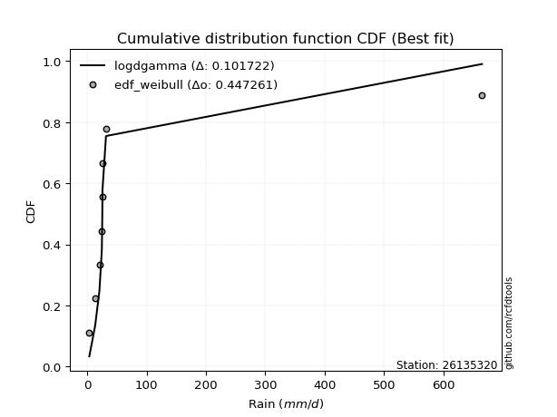</img></img>

</div>


### 4. EDF Beard (1943)

The Beard formula (or Beard´s plotting position formula) in hydrology is used to estimate the empirical non-exceedance probability _(P)_ of a flood event (or other extreme hydrological data point) within a given dataset.

<div align="center">


$P=(m-0.31)/(n+0.38)$


</div>


**4.1. Empirical values**

<div align="center">

|                | 0                   | 1                   | 2                   | 3         | 4                  | 5                  | 6                  |
|:---------------|:--------------------|:--------------------|:--------------------|:----------|:-------------------|:-------------------|:-------------------|
| date           | 2016                | 2017                | 2018                | 2020      | 2022               | 2019               | 2021               |
| x              | 3.7                 | 13.6                | 20.7                | 24.8      | 25.6               | 25.9               | 664.7              |
| m              | 1                   | 2                   | 3                   | 4         | 5                  | 6                  | 7                  |
| empirical_dist | edf_beard           | edf_beard           | edf_beard           | edf_beard | edf_beard          | edf_beard          | edf_beard          |
| empirical      | 0.09349593495934959 | 0.22899728997289973 | 0.36449864498644985 | 0.5       | 0.6355013550135502 | 0.7710027100271003 | 0.9065040650406505 |
| empirical_tr   | 1.1031390134529149  | 1.29701230228471    | 1.5735607675906182  | 2.0       | 2.743494423791822  | 4.366863905325444  | 10.695652173913055 |

</div>


**4.2. Kolmogorov-Smirnov fit test (sorted by Δ)**


<div align="center">

|                | 0                   | 1                   | 2                   | 3                   | 4                   | 5                   | 6                   | 7                   | 8                   | 9                   | 10                  | 11                  | 12                  | 13                  | 14                  | 15                  | 16                  | 17                  | 18                  | 19                  | 20                  | 21                  | 22                  | 23                  | 24                  | 25                  | 26                  | 27                  | 28                  | 29                  | 30                  | 31                  | 32                  | 33                  | 34                  | 35                  | 36                  | 37                  | 38                  | 39                  | 40                  | 41                  | 42                  | 43                  | 44                  | 45                  | 46                  | 47                    | 48                  | 49                  | 50                  | 51                  | 52                  | 53                  | 54                  | 55                  | 56                  | 57                  | 58                  | 59                  | 60                  | 61                  | 62                  | 63                  | 64                  | 65                  | 66                  | 67                  | 68                  | 69                  | 70                  | 71                  | 72                  | 73                  | 74                  | 75                  | 76                  | 77                  | 78                  | 79                  | 80                  | 81                  | 82                  | 83                  | 84                  | 85                  | 86                  | 87                  |
|:---------------|:--------------------|:--------------------|:--------------------|:--------------------|:--------------------|:--------------------|:--------------------|:--------------------|:--------------------|:--------------------|:--------------------|:--------------------|:--------------------|:--------------------|:--------------------|:--------------------|:--------------------|:--------------------|:--------------------|:--------------------|:--------------------|:--------------------|:--------------------|:--------------------|:--------------------|:--------------------|:--------------------|:--------------------|:--------------------|:--------------------|:--------------------|:--------------------|:--------------------|:--------------------|:--------------------|:--------------------|:--------------------|:--------------------|:--------------------|:--------------------|:--------------------|:--------------------|:--------------------|:--------------------|:--------------------|:--------------------|:--------------------|:----------------------|:--------------------|:--------------------|:--------------------|:--------------------|:--------------------|:--------------------|:--------------------|:--------------------|:--------------------|:--------------------|:--------------------|:--------------------|:--------------------|:--------------------|:--------------------|:--------------------|:--------------------|:--------------------|:--------------------|:--------------------|:--------------------|:--------------------|:--------------------|:--------------------|:--------------------|:--------------------|:--------------------|:--------------------|:--------------------|:--------------------|:--------------------|:--------------------|:--------------------|:--------------------|:--------------------|:--------------------|:--------------------|:--------------------|:--------------------|:--------------------|
| station        | 26135320            | 26135320            | 26135320            | 26135320            | 26135320            | 26135320            | 26135320            | 26135320            | 26135320            | 26135320            | 26135320            | 26135320            | 26135320            | 26135320            | 26135320            | 26135320            | 26135320            | 26135320            | 26135320            | 26135320            | 26135320            | 26135320            | 26135320            | 26135320            | 26135320            | 26135320            | 26135320            | 26135320            | 26135320            | 26135320            | 26135320            | 26135320            | 26135320            | 26135320            | 26135320            | 26135320            | 26135320            | 26135320            | 26135320            | 26135320            | 26135320            | 26135320            | 26135320            | 26135320            | 26135320            | 26135320            | 26135320            | 26135320              | 26135320            | 26135320            | 26135320            | 26135320            | 26135320            | 26135320            | 26135320            | 26135320            | 26135320            | 26135320            | 26135320            | 26135320            | 26135320            | 26135320            | 26135320            | 26135320            | 26135320            | 26135320            | 26135320            | 26135320            | 26135320            | 26135320            | 26135320            | 26135320            | 26135320            | 26135320            | 26135320            | 26135320            | 26135320            | 26135320            | 26135320            | 26135320            | 26135320            | 26135320            | 26135320            | 26135320            | 26135320            | 26135320            | 26135320            | 26135320            |
| empirical_dist | edf_beard           | edf_beard           | edf_beard           | edf_beard           | edf_beard           | edf_beard           | edf_beard           | edf_beard           | edf_beard           | edf_beard           | edf_beard           | edf_beard           | edf_beard           | edf_beard           | edf_beard           | edf_beard           | edf_beard           | edf_beard           | edf_beard           | edf_beard           | edf_beard           | edf_beard           | edf_beard           | edf_beard           | edf_beard           | edf_beard           | edf_beard           | edf_beard           | edf_beard           | edf_beard           | edf_beard           | edf_beard           | edf_beard           | edf_beard           | edf_beard           | edf_beard           | edf_beard           | edf_beard           | edf_beard           | edf_beard           | edf_beard           | edf_beard           | edf_beard           | edf_beard           | edf_beard           | edf_beard           | edf_beard           | edf_beard             | edf_beard           | edf_beard           | edf_beard           | edf_beard           | edf_beard           | edf_beard           | edf_beard           | edf_beard           | edf_beard           | edf_beard           | edf_beard           | edf_beard           | edf_beard           | edf_beard           | edf_beard           | edf_beard           | edf_beard           | edf_beard           | edf_beard           | edf_beard           | edf_beard           | edf_beard           | edf_beard           | edf_beard           | edf_beard           | edf_beard           | edf_beard           | edf_beard           | edf_beard           | edf_beard           | edf_beard           | edf_beard           | edf_beard           | edf_beard           | edf_beard           | edf_beard           | edf_beard           | edf_beard           | edf_beard           | edf_beard           |
| p_dist         | logjohnsonsu        | johnsonsu           | lognct              | loghalflogistic     | logmoyal            | f                   | betaprime           | t                   | alpha               | logt                | logfisk             | logweibull_min      | loghalfnorm         | loggenexpon         | logpearson3         | logalpha            | logexponnorm        | logncf              | logbetaprime        | loginvgamma         | loginvweibull       | logwald             | logf                | loggumbel_r         | loggamma            | loggamma            | logerlang           | gamma               | mielke              | loginvgauss         | logfatiguelife      | loggibrat           | invweibull          | loggenlogistic      | invgamma            | ncf                 | fisk                | nct                 | logkstwobign        | logtruncnorm        | loggompertz         | invgauss            | logmielke           | lograyleigh         | logexpon            | logmaxwell          | logrice             | loglaplace_asymmetric | logloggamma         | lognorm             | lognorm             | logcrystalball      | loglogistic         | loghypsecant        | loglaplace          | wald                | lognakagami         | pearson3            | fatiguelife         | halflogistic        | halfnorm            | weibull_min         | erlang              | gibrat              | moyal               | nakagami            | loggumbel_l         | logchi2             | gumbel_r            | rayleigh            | maxwell             | loglognorm          | norm                | crystalball         | genlogistic         | logistic            | hypsecant           | chi2                | laplace             | gumbel_l            | kstwobign           | rice                | exponnorm           | laplace_asymmetric  | expon               | genexpon            | gompertz            | truncnorm           |
| delta          | 0.07935100130156769 | 0.13070950420023086 | 0.1576163921151918  | 0.18501813087886343 | 0.1900884779240155  | 0.19817196986201702 | 0.198254068664907   | 0.20089976707136376 | 0.20148662991297206 | 0.2020884687802908  | 0.2039030791755685  | 0.20599122881695153 | 0.20899007458930985 | 0.20963588703461233 | 0.21060658351964567 | 0.2119872844376881  | 0.21260993235126258 | 0.21352169171660906 | 0.21362378532540693 | 0.21425555023429854 | 0.2146583526587117  | 0.2149373661851442  | 0.21512002681223052 | 0.2159673992975284  | 0.21606192077582598 | 0.21606192077582598 | 0.21606254847996642 | 0.2163652421788164  | 0.21752028176973648 | 0.2177131877375037  | 0.2181462613583588  | 0.21918109627664556 | 0.21956910610574365 | 0.22037723140002108 | 0.22045538151022415 | 0.22161363454355665 | 0.22177488085299565 | 0.22354534789329827 | 0.22941927296682796 | 0.23650373966820015 | 0.23709604448382693 | 0.2376202334156552  | 0.2399068687858192  | 0.2408559225887923  | 0.24947751488203604 | 0.2521709135964365  | 0.2552212475377228  | 0.2746237157141148    | 0.28438400733403285 | 0.2857486286868952  | 0.2857486286868952  | 0.2857486407645056  | 0.28776090537368054 | 0.2894778067920811  | 0.29647345560620486 | 0.30818054051815674 | 0.311648098783399   | 0.31583374544320153 | 0.32758414728546154 | 0.33098920202241855 | 0.3395519085417312  | 0.3418600151361696  | 0.34341681398941626 | 0.34378279645730747 | 0.3507758896412527  | 0.3519016085967862  | 0.3564038050763001  | 0.3615130671843625  | 0.3690437694371248  | 0.37398260344216616 | 0.3860807352683147  | 0.41579149330378795 | 0.41818438890120735 | 0.4181843917171798  | 0.4314394970613046  | 0.43588164055890866 | 0.44966848345479987 | 0.4563773654824597  | 0.4779279856909682  | 0.478600200800737   | 0.48277695551682853 | 0.48898742203377915 | 0.5817755983302901  | 0.5845502916944351  | 0.5845533549593008  | 0.5845534429563883  | 0.5874362591872562  | 0.5895064574132494  |
| deltao         | 0.48442053926100004 | 0.48442053926100004 | 0.48442053926100004 | 0.48442053926100004 | 0.48442053926100004 | 0.48442053926100004 | 0.48442053926100004 | 0.48442053926100004 | 0.48442053926100004 | 0.48442053926100004 | 0.48442053926100004 | 0.48442053926100004 | 0.48442053926100004 | 0.48442053926100004 | 0.48442053926100004 | 0.48442053926100004 | 0.48442053926100004 | 0.48442053926100004 | 0.48442053926100004 | 0.48442053926100004 | 0.48442053926100004 | 0.48442053926100004 | 0.48442053926100004 | 0.48442053926100004 | 0.48442053926100004 | 0.48442053926100004 | 0.48442053926100004 | 0.48442053926100004 | 0.48442053926100004 | 0.48442053926100004 | 0.48442053926100004 | 0.48442053926100004 | 0.48442053926100004 | 0.48442053926100004 | 0.48442053926100004 | 0.48442053926100004 | 0.48442053926100004 | 0.48442053926100004 | 0.48442053926100004 | 0.48442053926100004 | 0.48442053926100004 | 0.48442053926100004 | 0.48442053926100004 | 0.48442053926100004 | 0.48442053926100004 | 0.48442053926100004 | 0.48442053926100004 | 0.48442053926100004   | 0.48442053926100004 | 0.48442053926100004 | 0.48442053926100004 | 0.48442053926100004 | 0.48442053926100004 | 0.48442053926100004 | 0.48442053926100004 | 0.48442053926100004 | 0.48442053926100004 | 0.48442053926100004 | 0.48442053926100004 | 0.48442053926100004 | 0.48442053926100004 | 0.48442053926100004 | 0.48442053926100004 | 0.48442053926100004 | 0.48442053926100004 | 0.48442053926100004 | 0.48442053926100004 | 0.48442053926100004 | 0.48442053926100004 | 0.48442053926100004 | 0.48442053926100004 | 0.48442053926100004 | 0.48442053926100004 | 0.48442053926100004 | 0.48442053926100004 | 0.48442053926100004 | 0.48442053926100004 | 0.48442053926100004 | 0.48442053926100004 | 0.48442053926100004 | 0.48442053926100004 | 0.48442053926100004 | 0.48442053926100004 | 0.48442053926100004 | 0.48442053926100004 | 0.48442053926100004 | 0.48442053926100004 | 0.48442053926100004 |
| eval           | Δo > Δ              | Δo > Δ              | Δo > Δ              | Δo > Δ              | Δo > Δ              | Δo > Δ              | Δo > Δ              | Δo > Δ              | Δo > Δ              | Δo > Δ              | Δo > Δ              | Δo > Δ              | Δo > Δ              | Δo > Δ              | Δo > Δ              | Δo > Δ              | Δo > Δ              | Δo > Δ              | Δo > Δ              | Δo > Δ              | Δo > Δ              | Δo > Δ              | Δo > Δ              | Δo > Δ              | Δo > Δ              | Δo > Δ              | Δo > Δ              | Δo > Δ              | Δo > Δ              | Δo > Δ              | Δo > Δ              | Δo > Δ              | Δo > Δ              | Δo > Δ              | Δo > Δ              | Δo > Δ              | Δo > Δ              | Δo > Δ              | Δo > Δ              | Δo > Δ              | Δo > Δ              | Δo > Δ              | Δo > Δ              | Δo > Δ              | Δo > Δ              | Δo > Δ              | Δo > Δ              | Δo > Δ                | Δo > Δ              | Δo > Δ              | Δo > Δ              | Δo > Δ              | Δo > Δ              | Δo > Δ              | Δo > Δ              | Δo > Δ              | Δo > Δ              | Δo > Δ              | Δo > Δ              | Δo > Δ              | Δo > Δ              | Δo > Δ              | Δo > Δ              | Δo > Δ              | Δo > Δ              | Δo > Δ              | Δo > Δ              | Δo > Δ              | Δo > Δ              | Δo > Δ              | Δo > Δ              | Δo > Δ              | Δo > Δ              | Δo > Δ              | Δo > Δ              | Δo > Δ              | Δo > Δ              | Δo > Δ              | Δo > Δ              | Δo > Δ              | Δo > Δ              | Δo <= Δ             | Δo <= Δ             | Δo <= Δ             | Δo <= Δ             | Δo <= Δ             | Δo <= Δ             | Δo <= Δ             |
| fit            | 1                   | 1                   | 1                   | 1                   | 1                   | 1                   | 1                   | 1                   | 1                   | 1                   | 1                   | 1                   | 1                   | 1                   | 1                   | 1                   | 1                   | 1                   | 1                   | 1                   | 1                   | 1                   | 1                   | 1                   | 1                   | 1                   | 1                   | 1                   | 1                   | 1                   | 1                   | 1                   | 1                   | 1                   | 1                   | 1                   | 1                   | 1                   | 1                   | 1                   | 1                   | 1                   | 1                   | 1                   | 1                   | 1                   | 1                   | 1                     | 1                   | 1                   | 1                   | 1                   | 1                   | 1                   | 1                   | 1                   | 1                   | 1                   | 1                   | 1                   | 1                   | 1                   | 1                   | 1                   | 1                   | 1                   | 1                   | 1                   | 1                   | 1                   | 1                   | 1                   | 1                   | 1                   | 1                   | 1                   | 1                   | 1                   | 1                   | 1                   | 1                   | 0                   | 0                   | 0                   | 0                   | 0                   | 0                   | 0                   |
| n              | 7                   | 7                   | 7                   | 7                   | 7                   | 7                   | 7                   | 7                   | 7                   | 7                   | 7                   | 7                   | 7                   | 7                   | 7                   | 7                   | 7                   | 7                   | 7                   | 7                   | 7                   | 7                   | 7                   | 7                   | 7                   | 7                   | 7                   | 7                   | 7                   | 7                   | 7                   | 7                   | 7                   | 7                   | 7                   | 7                   | 7                   | 7                   | 7                   | 7                   | 7                   | 7                   | 7                   | 7                   | 7                   | 7                   | 7                   | 7                     | 7                   | 7                   | 7                   | 7                   | 7                   | 7                   | 7                   | 7                   | 7                   | 7                   | 7                   | 7                   | 7                   | 7                   | 7                   | 7                   | 7                   | 7                   | 7                   | 7                   | 7                   | 7                   | 7                   | 7                   | 7                   | 7                   | 7                   | 7                   | 7                   | 7                   | 7                   | 7                   | 7                   | 7                   | 7                   | 7                   | 7                   | 7                   | 7                   | 7                   |
| best_fit       | 1                   | 0                   | 0                   | 0                   | 0                   | 0                   | 0                   | 0                   | 0                   | 0                   | 0                   | 0                   | 0                   | 0                   | 0                   | 0                   | 0                   | 0                   | 0                   | 0                   | 0                   | 0                   | 0                   | 0                   | 0                   | 0                   | 0                   | 0                   | 0                   | 0                   | 0                   | 0                   | 0                   | 0                   | 0                   | 0                   | 0                   | 0                   | 0                   | 0                   | 0                   | 0                   | 0                   | 0                   | 0                   | 0                   | 0                   | 0                     | 0                   | 0                   | 0                   | 0                   | 0                   | 0                   | 0                   | 0                   | 0                   | 0                   | 0                   | 0                   | 0                   | 0                   | 0                   | 0                   | 0                   | 0                   | 0                   | 0                   | 0                   | 0                   | 0                   | 0                   | 0                   | 0                   | 0                   | 0                   | 0                   | 0                   | 0                   | 0                   | 0                   | 0                   | 0                   | 0                   | 0                   | 0                   | 0                   | 0                   |
| best_fit_sort  | 1                   | 2                   | 3                   | 4                   | 5                   | 6                   | 7                   | 8                   | 9                   | 10                  | 11                  | 12                  | 13                  | 14                  | 15                  | 16                  | 17                  | 18                  | 19                  | 20                  | 21                  | 22                  | 23                  | 24                  | 25                  | 26                  | 27                  | 28                  | 29                  | 30                  | 31                  | 32                  | 33                  | 34                  | 35                  | 36                  | 37                  | 38                  | 39                  | 40                  | 41                  | 42                  | 43                  | 44                  | 45                  | 46                  | 47                  | 48                    | 49                  | 50                  | 51                  | 52                  | 53                  | 54                  | 55                  | 56                  | 57                  | 58                  | 59                  | 60                  | 61                  | 62                  | 63                  | 64                  | 65                  | 66                  | 67                  | 68                  | 69                  | 70                  | 71                  | 72                  | 73                  | 74                  | 75                  | 76                  | 77                  | 78                  | 79                  | 80                  | 81                  | 82                  | 83                  | 84                  | 85                  | 86                  | 87                  | 88                  |

</div>


**4.3. Best fit**

<div align="center">

|   id |   station | empirical_dist   | p_dist       |    delta |   deltao | eval   |   fit |   n |   best_fit |   best_fit_sort |
|-----:|----------:|:-----------------|:-------------|---------:|---------:|:-------|------:|----:|-----------:|----------------:|
|    0 |  26135320 | edf_beard        | logjohnsonsu | 0.079351 | 0.484421 | Δo > Δ |     1 |   7 |          1 |               1 |

</div>


<div align="center">

</img>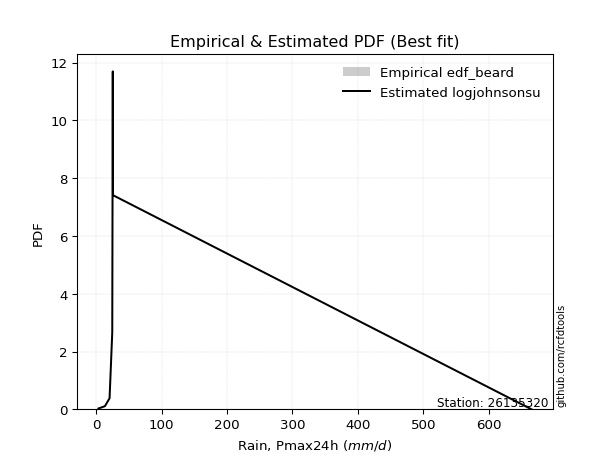</img>

</div>


### 5. EDF Chegodayev (1955)

The Chegodayev formula is an empirical plotting position formula used in hydrological frequency analysis to estimate the exceedance probability or return period of a specific event from a set of observed data. It is primarily used for plotting observed data points on probability paper to fit a theoretical distribution, particularly for analyzing extreme events like maximum flood flows or rainfall intensities. The constant _b_ value in the generalized plotting position formula is 0.3.

<div align="center">


$P=(m-b)/(n+1-2b)$


</div>


**5.1. Empirical values**

<div align="center">

|                | 0                   | 1                   | 2                   | 3              | 4                  | 5                  | 6                  |
|:---------------|:--------------------|:--------------------|:--------------------|:---------------|:-------------------|:-------------------|:-------------------|
| date           | 2016                | 2017                | 2018                | 2020           | 2022               | 2019               | 2021               |
| x              | 3.7                 | 13.6                | 20.7                | 24.8           | 25.6               | 25.9               | 664.7              |
| m              | 1                   | 2                   | 3                   | 4              | 5                  | 6                  | 7                  |
| empirical_dist | edf_chegodayev      | edf_chegodayev      | edf_chegodayev      | edf_chegodayev | edf_chegodayev     | edf_chegodayev     | edf_chegodayev     |
| empirical      | 0.09459459459459459 | 0.22972972972972971 | 0.36486486486486486 | 0.5            | 0.6351351351351351 | 0.7702702702702703 | 0.9054054054054054 |
| empirical_tr   | 1.1044776119402986  | 1.2982456140350878  | 1.574468085106383   | 2.0            | 2.7407407407407405 | 4.352941176470589  | 10.571428571428568 |

</div>


**5.2. Kolmogorov-Smirnov fit test (sorted by Δ)**


<div align="center">

|                | 0                   | 1                   | 2                   | 3                   | 4                   | 5                   | 6                   | 7                   | 8                   | 9                   | 10                  | 11                  | 12                  | 13                  | 14                  | 15                  | 16                  | 17                  | 18                  | 19                  | 20                  | 21                  | 22                  | 23                  | 24                  | 25                  | 26                  | 27                  | 28                  | 29                  | 30                  | 31                  | 32                  | 33                  | 34                  | 35                  | 36                  | 37                  | 38                  | 39                  | 40                  | 41                  | 42                  | 43                  | 44                  | 45                  | 46                  | 47                    | 48                  | 49                  | 50                  | 51                  | 52                  | 53                  | 54                  | 55                  | 56                  | 57                  | 58                  | 59                  | 60                  | 61                  | 62                  | 63                  | 64                  | 65                  | 66                  | 67                  | 68                  | 69                  | 70                  | 71                  | 72                  | 73                  | 74                  | 75                  | 76                  | 77                  | 78                  | 79                  | 80                  | 81                  | 82                  | 83                  | 84                  | 85                  | 86                  | 87                  |
|:---------------|:--------------------|:--------------------|:--------------------|:--------------------|:--------------------|:--------------------|:--------------------|:--------------------|:--------------------|:--------------------|:--------------------|:--------------------|:--------------------|:--------------------|:--------------------|:--------------------|:--------------------|:--------------------|:--------------------|:--------------------|:--------------------|:--------------------|:--------------------|:--------------------|:--------------------|:--------------------|:--------------------|:--------------------|:--------------------|:--------------------|:--------------------|:--------------------|:--------------------|:--------------------|:--------------------|:--------------------|:--------------------|:--------------------|:--------------------|:--------------------|:--------------------|:--------------------|:--------------------|:--------------------|:--------------------|:--------------------|:--------------------|:----------------------|:--------------------|:--------------------|:--------------------|:--------------------|:--------------------|:--------------------|:--------------------|:--------------------|:--------------------|:--------------------|:--------------------|:--------------------|:--------------------|:--------------------|:--------------------|:--------------------|:--------------------|:--------------------|:--------------------|:--------------------|:--------------------|:--------------------|:--------------------|:--------------------|:--------------------|:--------------------|:--------------------|:--------------------|:--------------------|:--------------------|:--------------------|:--------------------|:--------------------|:--------------------|:--------------------|:--------------------|:--------------------|:--------------------|:--------------------|:--------------------|
| station        | 26135320            | 26135320            | 26135320            | 26135320            | 26135320            | 26135320            | 26135320            | 26135320            | 26135320            | 26135320            | 26135320            | 26135320            | 26135320            | 26135320            | 26135320            | 26135320            | 26135320            | 26135320            | 26135320            | 26135320            | 26135320            | 26135320            | 26135320            | 26135320            | 26135320            | 26135320            | 26135320            | 26135320            | 26135320            | 26135320            | 26135320            | 26135320            | 26135320            | 26135320            | 26135320            | 26135320            | 26135320            | 26135320            | 26135320            | 26135320            | 26135320            | 26135320            | 26135320            | 26135320            | 26135320            | 26135320            | 26135320            | 26135320              | 26135320            | 26135320            | 26135320            | 26135320            | 26135320            | 26135320            | 26135320            | 26135320            | 26135320            | 26135320            | 26135320            | 26135320            | 26135320            | 26135320            | 26135320            | 26135320            | 26135320            | 26135320            | 26135320            | 26135320            | 26135320            | 26135320            | 26135320            | 26135320            | 26135320            | 26135320            | 26135320            | 26135320            | 26135320            | 26135320            | 26135320            | 26135320            | 26135320            | 26135320            | 26135320            | 26135320            | 26135320            | 26135320            | 26135320            | 26135320            |
| empirical_dist | edf_chegodayev      | edf_chegodayev      | edf_chegodayev      | edf_chegodayev      | edf_chegodayev      | edf_chegodayev      | edf_chegodayev      | edf_chegodayev      | edf_chegodayev      | edf_chegodayev      | edf_chegodayev      | edf_chegodayev      | edf_chegodayev      | edf_chegodayev      | edf_chegodayev      | edf_chegodayev      | edf_chegodayev      | edf_chegodayev      | edf_chegodayev      | edf_chegodayev      | edf_chegodayev      | edf_chegodayev      | edf_chegodayev      | edf_chegodayev      | edf_chegodayev      | edf_chegodayev      | edf_chegodayev      | edf_chegodayev      | edf_chegodayev      | edf_chegodayev      | edf_chegodayev      | edf_chegodayev      | edf_chegodayev      | edf_chegodayev      | edf_chegodayev      | edf_chegodayev      | edf_chegodayev      | edf_chegodayev      | edf_chegodayev      | edf_chegodayev      | edf_chegodayev      | edf_chegodayev      | edf_chegodayev      | edf_chegodayev      | edf_chegodayev      | edf_chegodayev      | edf_chegodayev      | edf_chegodayev        | edf_chegodayev      | edf_chegodayev      | edf_chegodayev      | edf_chegodayev      | edf_chegodayev      | edf_chegodayev      | edf_chegodayev      | edf_chegodayev      | edf_chegodayev      | edf_chegodayev      | edf_chegodayev      | edf_chegodayev      | edf_chegodayev      | edf_chegodayev      | edf_chegodayev      | edf_chegodayev      | edf_chegodayev      | edf_chegodayev      | edf_chegodayev      | edf_chegodayev      | edf_chegodayev      | edf_chegodayev      | edf_chegodayev      | edf_chegodayev      | edf_chegodayev      | edf_chegodayev      | edf_chegodayev      | edf_chegodayev      | edf_chegodayev      | edf_chegodayev      | edf_chegodayev      | edf_chegodayev      | edf_chegodayev      | edf_chegodayev      | edf_chegodayev      | edf_chegodayev      | edf_chegodayev      | edf_chegodayev      | edf_chegodayev      | edf_chegodayev      |
| p_dist         | logjohnsonsu        | johnsonsu           | lognct              | loghalflogistic     | logmoyal            | f                   | betaprime           | alpha               | t                   | logt                | logfisk             | logweibull_min      | loghalfnorm         | loggenexpon         | logpearson3         | logalpha            | logexponnorm        | logncf              | logbetaprime        | loginvgamma         | loginvweibull       | logf                | logwald             | loggumbel_r         | loggamma            | loggamma            | logerlang           | gamma               | mielke              | loginvgauss         | logfatiguelife      | loggibrat           | invweibull          | loggenlogistic      | invgamma            | ncf                 | fisk                | nct                 | logkstwobign        | logtruncnorm        | loggompertz         | invgauss            | logmielke           | lograyleigh         | logexpon            | logmaxwell          | logrice             | loglaplace_asymmetric | logloggamma         | lognorm             | lognorm             | logcrystalball      | loglogistic         | loghypsecant        | loglaplace          | wald                | lognakagami         | pearson3            | fatiguelife         | halflogistic        | halfnorm            | weibull_min         | erlang              | gibrat              | moyal               | nakagami            | loggumbel_l         | logchi2             | gumbel_r            | rayleigh            | maxwell             | loglognorm          | norm                | crystalball         | genlogistic         | logistic            | hypsecant           | chi2                | laplace             | gumbel_l            | kstwobign           | rice                | exponnorm           | laplace_asymmetric  | expon               | genexpon            | gompertz            | truncnorm           |
| delta          | 0.0797172211799827  | 0.13070950420023086 | 0.1579826119936068  | 0.1842856911220334  | 0.1893560381671855  | 0.197439530105187   | 0.197521628908077   | 0.20075419015614204 | 0.20089976707136376 | 0.2020884687802908  | 0.20317063941873847 | 0.20525878906012152 | 0.20825763483247983 | 0.20890344727778232 | 0.20987414376281566 | 0.2112548446808581  | 0.21187749259443256 | 0.21278925195977905 | 0.21289134556857692 | 0.21352311047746853 | 0.21392591290188168 | 0.2143875870554005  | 0.2145711463067292  | 0.21523495954069838 | 0.21532948101899596 | 0.21532948101899596 | 0.2153301087231364  | 0.2156328024219864  | 0.21678784201290646 | 0.21698074798067368 | 0.21741382160152878 | 0.21881487639823055 | 0.21883666634891363 | 0.21964479164319106 | 0.21972294175339413 | 0.22088119478672663 | 0.22104244109616566 | 0.22281290813646826 | 0.22868683320999794 | 0.23577129991137014 | 0.2363636047269969  | 0.23688779365882517 | 0.23917442902898922 | 0.24012348283196228 | 0.24874507512520605 | 0.2514384738396065  | 0.2544888077808928  | 0.2738912759572848    | 0.28365156757720283 | 0.2850161889300652  | 0.2850161889300652  | 0.2850162010076756  | 0.2870284656168505  | 0.2887453670352511  | 0.29574101584937484 | 0.3074481007613267  | 0.310915659026569   | 0.31473508580795656 | 0.3268517075286315  | 0.33025676226558853 | 0.33881946878490116 | 0.3411275753793396  | 0.34268437423258624 | 0.34305035670047745 | 0.3500434498844227  | 0.3511691688399562  | 0.3556713653194701  | 0.3607806274275325  | 0.3683113296802948  | 0.37325016368533614 | 0.3853482955114847  | 0.41505905354695793 | 0.41745194914437733 | 0.4174519519603498  | 0.43070705730447456 | 0.43514920080207864 | 0.44893604369796986 | 0.4556449257256297  | 0.4771955459341382  | 0.477867761043907   | 0.4820445157599985  | 0.48825498227694913 | 0.5810431585734601  | 0.583817851937605   | 0.5838209152024708  | 0.5838210031995583  | 0.5867038194304262  | 0.5887740176564193  |
| deltao         | 0.48442053926100004 | 0.48442053926100004 | 0.48442053926100004 | 0.48442053926100004 | 0.48442053926100004 | 0.48442053926100004 | 0.48442053926100004 | 0.48442053926100004 | 0.48442053926100004 | 0.48442053926100004 | 0.48442053926100004 | 0.48442053926100004 | 0.48442053926100004 | 0.48442053926100004 | 0.48442053926100004 | 0.48442053926100004 | 0.48442053926100004 | 0.48442053926100004 | 0.48442053926100004 | 0.48442053926100004 | 0.48442053926100004 | 0.48442053926100004 | 0.48442053926100004 | 0.48442053926100004 | 0.48442053926100004 | 0.48442053926100004 | 0.48442053926100004 | 0.48442053926100004 | 0.48442053926100004 | 0.48442053926100004 | 0.48442053926100004 | 0.48442053926100004 | 0.48442053926100004 | 0.48442053926100004 | 0.48442053926100004 | 0.48442053926100004 | 0.48442053926100004 | 0.48442053926100004 | 0.48442053926100004 | 0.48442053926100004 | 0.48442053926100004 | 0.48442053926100004 | 0.48442053926100004 | 0.48442053926100004 | 0.48442053926100004 | 0.48442053926100004 | 0.48442053926100004 | 0.48442053926100004   | 0.48442053926100004 | 0.48442053926100004 | 0.48442053926100004 | 0.48442053926100004 | 0.48442053926100004 | 0.48442053926100004 | 0.48442053926100004 | 0.48442053926100004 | 0.48442053926100004 | 0.48442053926100004 | 0.48442053926100004 | 0.48442053926100004 | 0.48442053926100004 | 0.48442053926100004 | 0.48442053926100004 | 0.48442053926100004 | 0.48442053926100004 | 0.48442053926100004 | 0.48442053926100004 | 0.48442053926100004 | 0.48442053926100004 | 0.48442053926100004 | 0.48442053926100004 | 0.48442053926100004 | 0.48442053926100004 | 0.48442053926100004 | 0.48442053926100004 | 0.48442053926100004 | 0.48442053926100004 | 0.48442053926100004 | 0.48442053926100004 | 0.48442053926100004 | 0.48442053926100004 | 0.48442053926100004 | 0.48442053926100004 | 0.48442053926100004 | 0.48442053926100004 | 0.48442053926100004 | 0.48442053926100004 | 0.48442053926100004 |
| eval           | Δo > Δ              | Δo > Δ              | Δo > Δ              | Δo > Δ              | Δo > Δ              | Δo > Δ              | Δo > Δ              | Δo > Δ              | Δo > Δ              | Δo > Δ              | Δo > Δ              | Δo > Δ              | Δo > Δ              | Δo > Δ              | Δo > Δ              | Δo > Δ              | Δo > Δ              | Δo > Δ              | Δo > Δ              | Δo > Δ              | Δo > Δ              | Δo > Δ              | Δo > Δ              | Δo > Δ              | Δo > Δ              | Δo > Δ              | Δo > Δ              | Δo > Δ              | Δo > Δ              | Δo > Δ              | Δo > Δ              | Δo > Δ              | Δo > Δ              | Δo > Δ              | Δo > Δ              | Δo > Δ              | Δo > Δ              | Δo > Δ              | Δo > Δ              | Δo > Δ              | Δo > Δ              | Δo > Δ              | Δo > Δ              | Δo > Δ              | Δo > Δ              | Δo > Δ              | Δo > Δ              | Δo > Δ                | Δo > Δ              | Δo > Δ              | Δo > Δ              | Δo > Δ              | Δo > Δ              | Δo > Δ              | Δo > Δ              | Δo > Δ              | Δo > Δ              | Δo > Δ              | Δo > Δ              | Δo > Δ              | Δo > Δ              | Δo > Δ              | Δo > Δ              | Δo > Δ              | Δo > Δ              | Δo > Δ              | Δo > Δ              | Δo > Δ              | Δo > Δ              | Δo > Δ              | Δo > Δ              | Δo > Δ              | Δo > Δ              | Δo > Δ              | Δo > Δ              | Δo > Δ              | Δo > Δ              | Δo > Δ              | Δo > Δ              | Δo > Δ              | Δo > Δ              | Δo <= Δ             | Δo <= Δ             | Δo <= Δ             | Δo <= Δ             | Δo <= Δ             | Δo <= Δ             | Δo <= Δ             |
| fit            | 1                   | 1                   | 1                   | 1                   | 1                   | 1                   | 1                   | 1                   | 1                   | 1                   | 1                   | 1                   | 1                   | 1                   | 1                   | 1                   | 1                   | 1                   | 1                   | 1                   | 1                   | 1                   | 1                   | 1                   | 1                   | 1                   | 1                   | 1                   | 1                   | 1                   | 1                   | 1                   | 1                   | 1                   | 1                   | 1                   | 1                   | 1                   | 1                   | 1                   | 1                   | 1                   | 1                   | 1                   | 1                   | 1                   | 1                   | 1                     | 1                   | 1                   | 1                   | 1                   | 1                   | 1                   | 1                   | 1                   | 1                   | 1                   | 1                   | 1                   | 1                   | 1                   | 1                   | 1                   | 1                   | 1                   | 1                   | 1                   | 1                   | 1                   | 1                   | 1                   | 1                   | 1                   | 1                   | 1                   | 1                   | 1                   | 1                   | 1                   | 1                   | 0                   | 0                   | 0                   | 0                   | 0                   | 0                   | 0                   |
| n              | 7                   | 7                   | 7                   | 7                   | 7                   | 7                   | 7                   | 7                   | 7                   | 7                   | 7                   | 7                   | 7                   | 7                   | 7                   | 7                   | 7                   | 7                   | 7                   | 7                   | 7                   | 7                   | 7                   | 7                   | 7                   | 7                   | 7                   | 7                   | 7                   | 7                   | 7                   | 7                   | 7                   | 7                   | 7                   | 7                   | 7                   | 7                   | 7                   | 7                   | 7                   | 7                   | 7                   | 7                   | 7                   | 7                   | 7                   | 7                     | 7                   | 7                   | 7                   | 7                   | 7                   | 7                   | 7                   | 7                   | 7                   | 7                   | 7                   | 7                   | 7                   | 7                   | 7                   | 7                   | 7                   | 7                   | 7                   | 7                   | 7                   | 7                   | 7                   | 7                   | 7                   | 7                   | 7                   | 7                   | 7                   | 7                   | 7                   | 7                   | 7                   | 7                   | 7                   | 7                   | 7                   | 7                   | 7                   | 7                   |
| best_fit       | 1                   | 0                   | 0                   | 0                   | 0                   | 0                   | 0                   | 0                   | 0                   | 0                   | 0                   | 0                   | 0                   | 0                   | 0                   | 0                   | 0                   | 0                   | 0                   | 0                   | 0                   | 0                   | 0                   | 0                   | 0                   | 0                   | 0                   | 0                   | 0                   | 0                   | 0                   | 0                   | 0                   | 0                   | 0                   | 0                   | 0                   | 0                   | 0                   | 0                   | 0                   | 0                   | 0                   | 0                   | 0                   | 0                   | 0                   | 0                     | 0                   | 0                   | 0                   | 0                   | 0                   | 0                   | 0                   | 0                   | 0                   | 0                   | 0                   | 0                   | 0                   | 0                   | 0                   | 0                   | 0                   | 0                   | 0                   | 0                   | 0                   | 0                   | 0                   | 0                   | 0                   | 0                   | 0                   | 0                   | 0                   | 0                   | 0                   | 0                   | 0                   | 0                   | 0                   | 0                   | 0                   | 0                   | 0                   | 0                   |
| best_fit_sort  | 1                   | 2                   | 3                   | 4                   | 5                   | 6                   | 7                   | 8                   | 9                   | 10                  | 11                  | 12                  | 13                  | 14                  | 15                  | 16                  | 17                  | 18                  | 19                  | 20                  | 21                  | 22                  | 23                  | 24                  | 25                  | 26                  | 27                  | 28                  | 29                  | 30                  | 31                  | 32                  | 33                  | 34                  | 35                  | 36                  | 37                  | 38                  | 39                  | 40                  | 41                  | 42                  | 43                  | 44                  | 45                  | 46                  | 47                  | 48                    | 49                  | 50                  | 51                  | 52                  | 53                  | 54                  | 55                  | 56                  | 57                  | 58                  | 59                  | 60                  | 61                  | 62                  | 63                  | 64                  | 65                  | 66                  | 67                  | 68                  | 69                  | 70                  | 71                  | 72                  | 73                  | 74                  | 75                  | 76                  | 77                  | 78                  | 79                  | 80                  | 81                  | 82                  | 83                  | 84                  | 85                  | 86                  | 87                  | 88                  |

</div>


**5.3. Best fit**

<div align="center">

|   id |   station | empirical_dist   | p_dist       |     delta |   deltao | eval   |   fit |   n |   best_fit |   best_fit_sort |
|-----:|----------:|:-----------------|:-------------|----------:|---------:|:-------|------:|----:|-----------:|----------------:|
|    0 |  26135320 | edf_chegodayev   | logjohnsonsu | 0.0797172 | 0.484421 | Δo > Δ |     1 |   7 |          1 |               1 |

</div>


<div align="center">

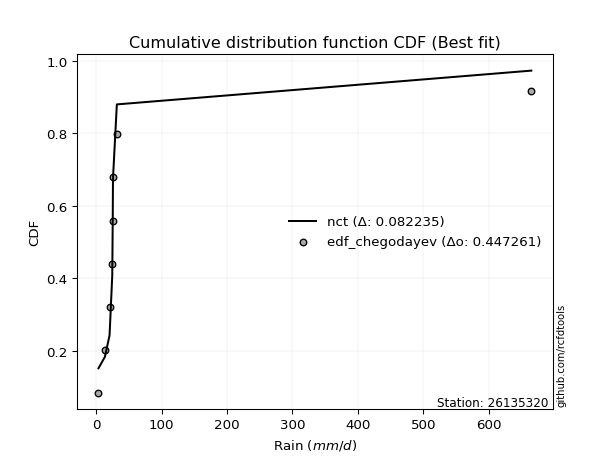</img>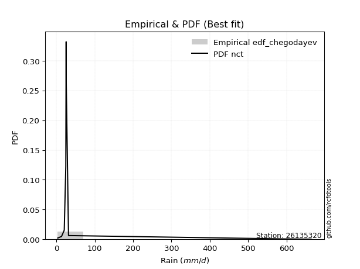</img>

</div>


### 6. EDF Blom (1958)

The Blom formula is a specific "plotting position" formula used in hydrology and statistical analysis to estimate the empirical cumulative probability (or non-exceedance probability) of a data series. It is particularly recommended for data that are approximately normally distributed. The constant _a_ is set to 0.375 (or 3/8).

<div align="center">


$P=(m-a)/(n+1-2a)$


</div>


**6.1. Empirical values**

<div align="center">

|                | 0                   | 1                   | 2                  | 3        | 4                  | 5                  | 6                  |
|:---------------|:--------------------|:--------------------|:-------------------|:---------|:-------------------|:-------------------|:-------------------|
| date           | 2016                | 2017                | 2018               | 2020     | 2022               | 2019               | 2021               |
| x              | 3.7                 | 13.6                | 20.7               | 24.8     | 25.6               | 25.9               | 664.7              |
| m              | 1                   | 2                   | 3                  | 4        | 5                  | 6                  | 7                  |
| empirical_dist | edf_blom            | edf_blom            | edf_blom           | edf_blom | edf_blom           | edf_blom           | edf_blom           |
| empirical      | 0.08620689655172414 | 0.22413793103448276 | 0.3620689655172414 | 0.5      | 0.6379310344827587 | 0.7758620689655172 | 0.9137931034482759 |
| empirical_tr   | 1.0943396226415094  | 1.288888888888889   | 1.5675675675675675 | 2.0      | 2.7619047619047623 | 4.461538461538462  | 11.600000000000007 |

</div>


**6.2. Kolmogorov-Smirnov fit test (sorted by Δ)**


<div align="center">

|                | 0                   | 1                   | 2                   | 3                   | 4                   | 5                   | 6                   | 7                   | 8                   | 9                   | 10                  | 11                  | 12                  | 13                  | 14                  | 15                  | 16                  | 17                  | 18                  | 19                  | 20                  | 21                  | 22                  | 23                  | 24                  | 25                  | 26                  | 27                  | 28                  | 29                  | 30                  | 31                  | 32                  | 33                  | 34                  | 35                  | 36                  | 37                  | 38                  | 39                  | 40                  | 41                  | 42                  | 43                  | 44                  | 45                  | 46                  | 47                    | 48                  | 49                  | 50                  | 51                  | 52                  | 53                  | 54                  | 55                  | 56                  | 57                  | 58                  | 59                  | 60                  | 61                  | 62                  | 63                  | 64                  | 65                  | 66                  | 67                  | 68                  | 69                  | 70                  | 71                  | 72                  | 73                  | 74                  | 75                  | 76                  | 77                  | 78                  | 79                  | 80                  | 81                  | 82                  | 83                  | 84                  | 85                  | 86                  | 87                  |
|:---------------|:--------------------|:--------------------|:--------------------|:--------------------|:--------------------|:--------------------|:--------------------|:--------------------|:--------------------|:--------------------|:--------------------|:--------------------|:--------------------|:--------------------|:--------------------|:--------------------|:--------------------|:--------------------|:--------------------|:--------------------|:--------------------|:--------------------|:--------------------|:--------------------|:--------------------|:--------------------|:--------------------|:--------------------|:--------------------|:--------------------|:--------------------|:--------------------|:--------------------|:--------------------|:--------------------|:--------------------|:--------------------|:--------------------|:--------------------|:--------------------|:--------------------|:--------------------|:--------------------|:--------------------|:--------------------|:--------------------|:--------------------|:----------------------|:--------------------|:--------------------|:--------------------|:--------------------|:--------------------|:--------------------|:--------------------|:--------------------|:--------------------|:--------------------|:--------------------|:--------------------|:--------------------|:--------------------|:--------------------|:--------------------|:--------------------|:--------------------|:--------------------|:--------------------|:--------------------|:--------------------|:--------------------|:--------------------|:--------------------|:--------------------|:--------------------|:--------------------|:--------------------|:--------------------|:--------------------|:--------------------|:--------------------|:--------------------|:--------------------|:--------------------|:--------------------|:--------------------|:--------------------|:--------------------|
| station        | 26135320            | 26135320            | 26135320            | 26135320            | 26135320            | 26135320            | 26135320            | 26135320            | 26135320            | 26135320            | 26135320            | 26135320            | 26135320            | 26135320            | 26135320            | 26135320            | 26135320            | 26135320            | 26135320            | 26135320            | 26135320            | 26135320            | 26135320            | 26135320            | 26135320            | 26135320            | 26135320            | 26135320            | 26135320            | 26135320            | 26135320            | 26135320            | 26135320            | 26135320            | 26135320            | 26135320            | 26135320            | 26135320            | 26135320            | 26135320            | 26135320            | 26135320            | 26135320            | 26135320            | 26135320            | 26135320            | 26135320            | 26135320              | 26135320            | 26135320            | 26135320            | 26135320            | 26135320            | 26135320            | 26135320            | 26135320            | 26135320            | 26135320            | 26135320            | 26135320            | 26135320            | 26135320            | 26135320            | 26135320            | 26135320            | 26135320            | 26135320            | 26135320            | 26135320            | 26135320            | 26135320            | 26135320            | 26135320            | 26135320            | 26135320            | 26135320            | 26135320            | 26135320            | 26135320            | 26135320            | 26135320            | 26135320            | 26135320            | 26135320            | 26135320            | 26135320            | 26135320            | 26135320            |
| empirical_dist | edf_blom            | edf_blom            | edf_blom            | edf_blom            | edf_blom            | edf_blom            | edf_blom            | edf_blom            | edf_blom            | edf_blom            | edf_blom            | edf_blom            | edf_blom            | edf_blom            | edf_blom            | edf_blom            | edf_blom            | edf_blom            | edf_blom            | edf_blom            | edf_blom            | edf_blom            | edf_blom            | edf_blom            | edf_blom            | edf_blom            | edf_blom            | edf_blom            | edf_blom            | edf_blom            | edf_blom            | edf_blom            | edf_blom            | edf_blom            | edf_blom            | edf_blom            | edf_blom            | edf_blom            | edf_blom            | edf_blom            | edf_blom            | edf_blom            | edf_blom            | edf_blom            | edf_blom            | edf_blom            | edf_blom            | edf_blom              | edf_blom            | edf_blom            | edf_blom            | edf_blom            | edf_blom            | edf_blom            | edf_blom            | edf_blom            | edf_blom            | edf_blom            | edf_blom            | edf_blom            | edf_blom            | edf_blom            | edf_blom            | edf_blom            | edf_blom            | edf_blom            | edf_blom            | edf_blom            | edf_blom            | edf_blom            | edf_blom            | edf_blom            | edf_blom            | edf_blom            | edf_blom            | edf_blom            | edf_blom            | edf_blom            | edf_blom            | edf_blom            | edf_blom            | edf_blom            | edf_blom            | edf_blom            | edf_blom            | edf_blom            | edf_blom            | edf_blom            |
| p_dist         | logjohnsonsu        | johnsonsu           | lognct              | loghalflogistic     | logmoyal            | t                   | logt                | f                   | betaprime           | alpha               | logfisk             | logweibull_min      | loghalfnorm         | loggenexpon         | logpearson3         | logalpha            | logwald             | logexponnorm        | logncf              | logbetaprime        | loginvgamma         | loginvweibull       | logf                | loggumbel_r         | loggamma            | loggamma            | logerlang           | gamma               | loggibrat           | mielke              | loginvgauss         | logfatiguelife      | invweibull          | loggenlogistic      | invgamma            | ncf                 | fisk                | nct                 | logkstwobign        | logtruncnorm        | loggompertz         | invgauss            | logmielke           | lograyleigh         | logexpon            | logmaxwell          | logrice             | loglaplace_asymmetric | logloggamma         | lognorm             | lognorm             | logcrystalball      | loglogistic         | loghypsecant        | loglaplace          | wald                | lognakagami         | pearson3            | fatiguelife         | halflogistic        | halfnorm            | weibull_min         | erlang              | gibrat              | moyal               | nakagami            | loggumbel_l         | logchi2             | gumbel_r            | rayleigh            | maxwell             | loglognorm          | norm                | crystalball         | genlogistic         | logistic            | hypsecant           | chi2                | laplace             | gumbel_l            | kstwobign           | rice                | exponnorm           | laplace_asymmetric  | expon               | genexpon            | gompertz            | truncnorm           |
| delta          | 0.07692132183235922 | 0.13070950420023086 | 0.15518671264598333 | 0.18987748981728036 | 0.19494783686243244 | 0.20089976707136376 | 0.2020884687802908  | 0.20303132880043395 | 0.20311342760332396 | 0.206345988851389   | 0.20876243811398543 | 0.21085058775536847 | 0.21384943352772678 | 0.21449524597302927 | 0.2154659424580626  | 0.21684664337610504 | 0.21736704565435266 | 0.2174692912896795  | 0.218381050655026   | 0.21848314426382387 | 0.21911490917271548 | 0.21951771159712863 | 0.21997938575064746 | 0.22082675823594533 | 0.2209212797142429  | 0.2209212797142429  | 0.22092190741838336 | 0.22122460111723335 | 0.22161077574585403 | 0.22237964070815341 | 0.22257254667592064 | 0.22300562029677573 | 0.22442846504416059 | 0.22523659033843801 | 0.22531474044864108 | 0.22647299348197358 | 0.22663423979141262 | 0.2284047068317152  | 0.2342786319052449  | 0.2413630986066171  | 0.24195540342224386 | 0.24247959235407213 | 0.24476622772423617 | 0.24571528152720923 | 0.254336873820453   | 0.25703027253485344 | 0.26008060647613973 | 0.27948307465253175   | 0.2892433662724498  | 0.29060798762531215 | 0.29060798762531215 | 0.29060799970292256 | 0.2926202643120975  | 0.29433716573049806 | 0.3013328145446218  | 0.3130398994565737  | 0.31650745772181593 | 0.323122783850827   | 0.33244350622387847 | 0.3358485609608355  | 0.3444112674801481  | 0.34671937407458653 | 0.3482761729278332  | 0.3486421553957244  | 0.35563524857966966 | 0.35676096753520314 | 0.36126316401471703 | 0.3663724261227794  | 0.37390312837554174 | 0.3788419623805831  | 0.39094009420673165 | 0.4206508522422049  | 0.4230437478396243  | 0.42304375065559674 | 0.4362988559997215  | 0.4407409994973256  | 0.4545278423932168  | 0.46123672442087665 | 0.48278734462938516 | 0.48345955973915394 | 0.48763631445524547 | 0.4938467809721961  | 0.5866349572687071  | 0.589409650632852   | 0.5894127138977178  | 0.5894128018948053  | 0.5922956181256731  | 0.5943658163516663  |
| deltao         | 0.48442053926100004 | 0.48442053926100004 | 0.48442053926100004 | 0.48442053926100004 | 0.48442053926100004 | 0.48442053926100004 | 0.48442053926100004 | 0.48442053926100004 | 0.48442053926100004 | 0.48442053926100004 | 0.48442053926100004 | 0.48442053926100004 | 0.48442053926100004 | 0.48442053926100004 | 0.48442053926100004 | 0.48442053926100004 | 0.48442053926100004 | 0.48442053926100004 | 0.48442053926100004 | 0.48442053926100004 | 0.48442053926100004 | 0.48442053926100004 | 0.48442053926100004 | 0.48442053926100004 | 0.48442053926100004 | 0.48442053926100004 | 0.48442053926100004 | 0.48442053926100004 | 0.48442053926100004 | 0.48442053926100004 | 0.48442053926100004 | 0.48442053926100004 | 0.48442053926100004 | 0.48442053926100004 | 0.48442053926100004 | 0.48442053926100004 | 0.48442053926100004 | 0.48442053926100004 | 0.48442053926100004 | 0.48442053926100004 | 0.48442053926100004 | 0.48442053926100004 | 0.48442053926100004 | 0.48442053926100004 | 0.48442053926100004 | 0.48442053926100004 | 0.48442053926100004 | 0.48442053926100004   | 0.48442053926100004 | 0.48442053926100004 | 0.48442053926100004 | 0.48442053926100004 | 0.48442053926100004 | 0.48442053926100004 | 0.48442053926100004 | 0.48442053926100004 | 0.48442053926100004 | 0.48442053926100004 | 0.48442053926100004 | 0.48442053926100004 | 0.48442053926100004 | 0.48442053926100004 | 0.48442053926100004 | 0.48442053926100004 | 0.48442053926100004 | 0.48442053926100004 | 0.48442053926100004 | 0.48442053926100004 | 0.48442053926100004 | 0.48442053926100004 | 0.48442053926100004 | 0.48442053926100004 | 0.48442053926100004 | 0.48442053926100004 | 0.48442053926100004 | 0.48442053926100004 | 0.48442053926100004 | 0.48442053926100004 | 0.48442053926100004 | 0.48442053926100004 | 0.48442053926100004 | 0.48442053926100004 | 0.48442053926100004 | 0.48442053926100004 | 0.48442053926100004 | 0.48442053926100004 | 0.48442053926100004 | 0.48442053926100004 |
| eval           | Δo > Δ              | Δo > Δ              | Δo > Δ              | Δo > Δ              | Δo > Δ              | Δo > Δ              | Δo > Δ              | Δo > Δ              | Δo > Δ              | Δo > Δ              | Δo > Δ              | Δo > Δ              | Δo > Δ              | Δo > Δ              | Δo > Δ              | Δo > Δ              | Δo > Δ              | Δo > Δ              | Δo > Δ              | Δo > Δ              | Δo > Δ              | Δo > Δ              | Δo > Δ              | Δo > Δ              | Δo > Δ              | Δo > Δ              | Δo > Δ              | Δo > Δ              | Δo > Δ              | Δo > Δ              | Δo > Δ              | Δo > Δ              | Δo > Δ              | Δo > Δ              | Δo > Δ              | Δo > Δ              | Δo > Δ              | Δo > Δ              | Δo > Δ              | Δo > Δ              | Δo > Δ              | Δo > Δ              | Δo > Δ              | Δo > Δ              | Δo > Δ              | Δo > Δ              | Δo > Δ              | Δo > Δ                | Δo > Δ              | Δo > Δ              | Δo > Δ              | Δo > Δ              | Δo > Δ              | Δo > Δ              | Δo > Δ              | Δo > Δ              | Δo > Δ              | Δo > Δ              | Δo > Δ              | Δo > Δ              | Δo > Δ              | Δo > Δ              | Δo > Δ              | Δo > Δ              | Δo > Δ              | Δo > Δ              | Δo > Δ              | Δo > Δ              | Δo > Δ              | Δo > Δ              | Δo > Δ              | Δo > Δ              | Δo > Δ              | Δo > Δ              | Δo > Δ              | Δo > Δ              | Δo > Δ              | Δo > Δ              | Δo > Δ              | Δo > Δ              | Δo <= Δ             | Δo <= Δ             | Δo <= Δ             | Δo <= Δ             | Δo <= Δ             | Δo <= Δ             | Δo <= Δ             | Δo <= Δ             |
| fit            | 1                   | 1                   | 1                   | 1                   | 1                   | 1                   | 1                   | 1                   | 1                   | 1                   | 1                   | 1                   | 1                   | 1                   | 1                   | 1                   | 1                   | 1                   | 1                   | 1                   | 1                   | 1                   | 1                   | 1                   | 1                   | 1                   | 1                   | 1                   | 1                   | 1                   | 1                   | 1                   | 1                   | 1                   | 1                   | 1                   | 1                   | 1                   | 1                   | 1                   | 1                   | 1                   | 1                   | 1                   | 1                   | 1                   | 1                   | 1                     | 1                   | 1                   | 1                   | 1                   | 1                   | 1                   | 1                   | 1                   | 1                   | 1                   | 1                   | 1                   | 1                   | 1                   | 1                   | 1                   | 1                   | 1                   | 1                   | 1                   | 1                   | 1                   | 1                   | 1                   | 1                   | 1                   | 1                   | 1                   | 1                   | 1                   | 1                   | 1                   | 0                   | 0                   | 0                   | 0                   | 0                   | 0                   | 0                   | 0                   |
| n              | 7                   | 7                   | 7                   | 7                   | 7                   | 7                   | 7                   | 7                   | 7                   | 7                   | 7                   | 7                   | 7                   | 7                   | 7                   | 7                   | 7                   | 7                   | 7                   | 7                   | 7                   | 7                   | 7                   | 7                   | 7                   | 7                   | 7                   | 7                   | 7                   | 7                   | 7                   | 7                   | 7                   | 7                   | 7                   | 7                   | 7                   | 7                   | 7                   | 7                   | 7                   | 7                   | 7                   | 7                   | 7                   | 7                   | 7                   | 7                     | 7                   | 7                   | 7                   | 7                   | 7                   | 7                   | 7                   | 7                   | 7                   | 7                   | 7                   | 7                   | 7                   | 7                   | 7                   | 7                   | 7                   | 7                   | 7                   | 7                   | 7                   | 7                   | 7                   | 7                   | 7                   | 7                   | 7                   | 7                   | 7                   | 7                   | 7                   | 7                   | 7                   | 7                   | 7                   | 7                   | 7                   | 7                   | 7                   | 7                   |
| best_fit       | 1                   | 0                   | 0                   | 0                   | 0                   | 0                   | 0                   | 0                   | 0                   | 0                   | 0                   | 0                   | 0                   | 0                   | 0                   | 0                   | 0                   | 0                   | 0                   | 0                   | 0                   | 0                   | 0                   | 0                   | 0                   | 0                   | 0                   | 0                   | 0                   | 0                   | 0                   | 0                   | 0                   | 0                   | 0                   | 0                   | 0                   | 0                   | 0                   | 0                   | 0                   | 0                   | 0                   | 0                   | 0                   | 0                   | 0                   | 0                     | 0                   | 0                   | 0                   | 0                   | 0                   | 0                   | 0                   | 0                   | 0                   | 0                   | 0                   | 0                   | 0                   | 0                   | 0                   | 0                   | 0                   | 0                   | 0                   | 0                   | 0                   | 0                   | 0                   | 0                   | 0                   | 0                   | 0                   | 0                   | 0                   | 0                   | 0                   | 0                   | 0                   | 0                   | 0                   | 0                   | 0                   | 0                   | 0                   | 0                   |
| best_fit_sort  | 1                   | 2                   | 3                   | 4                   | 5                   | 6                   | 7                   | 8                   | 9                   | 10                  | 11                  | 12                  | 13                  | 14                  | 15                  | 16                  | 17                  | 18                  | 19                  | 20                  | 21                  | 22                  | 23                  | 24                  | 25                  | 26                  | 27                  | 28                  | 29                  | 30                  | 31                  | 32                  | 33                  | 34                  | 35                  | 36                  | 37                  | 38                  | 39                  | 40                  | 41                  | 42                  | 43                  | 44                  | 45                  | 46                  | 47                  | 48                    | 49                  | 50                  | 51                  | 52                  | 53                  | 54                  | 55                  | 56                  | 57                  | 58                  | 59                  | 60                  | 61                  | 62                  | 63                  | 64                  | 65                  | 66                  | 67                  | 68                  | 69                  | 70                  | 71                  | 72                  | 73                  | 74                  | 75                  | 76                  | 77                  | 78                  | 79                  | 80                  | 81                  | 82                  | 83                  | 84                  | 85                  | 86                  | 87                  | 88                  |

</div>


**6.3. Best fit**

<div align="center">

|   id |   station | empirical_dist   | p_dist       |     delta |   deltao | eval   |   fit |   n |   best_fit |   best_fit_sort |
|-----:|----------:|:-----------------|:-------------|----------:|---------:|:-------|------:|----:|-----------:|----------------:|
|    0 |  26135320 | edf_blom         | logjohnsonsu | 0.0769213 | 0.484421 | Δo > Δ |     1 |   7 |          1 |               1 |

</div>


<div align="center">

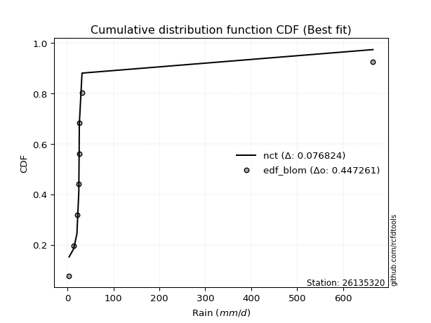</img>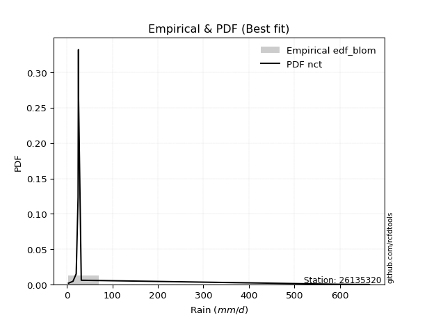</img>

</div>


### 7. EDF Tukey (1962)

In hydrology, the Tukey formula is used as a plotting position formula to estimate the empirical probability or frequency of a flood event (or other hydrological data). The formula parameter is given as _c=0.333_ (or 1/3).

<div align="center">


$P=(m-c)/(n+1-2c)$


</div>


**7.1. Empirical values**

<div align="center">

|                | 0                   | 1                   | 2                   | 3         | 4                  | 5                  | 6                  |
|:---------------|:--------------------|:--------------------|:--------------------|:----------|:-------------------|:-------------------|:-------------------|
| date           | 2016                | 2017                | 2018                | 2020      | 2022               | 2019               | 2021               |
| x              | 3.7                 | 13.6                | 20.7                | 24.8      | 25.6               | 25.9               | 664.7              |
| m              | 1                   | 2                   | 3                   | 4         | 5                  | 6                  | 7                  |
| empirical_dist | edf_tukey           | edf_tukey           | edf_tukey           | edf_tukey | edf_tukey          | edf_tukey          | edf_tukey          |
| empirical      | 0.09090909090909091 | 0.22727272727272727 | 0.36363636363636365 | 0.5       | 0.6363636363636364 | 0.7727272727272727 | 0.9090909090909091 |
| empirical_tr   | 1.1                 | 1.2941176470588236  | 1.5714285714285714  | 2.0       | 2.75               | 4.3999999999999995 | 10.999999999999996 |

</div>


**7.2. Kolmogorov-Smirnov fit test (sorted by Δ)**


<div align="center">

|                | 0                   | 1                   | 2                   | 3                   | 4                   | 5                   | 6                   | 7                   | 8                   | 9                   | 10                  | 11                  | 12                  | 13                  | 14                  | 15                  | 16                  | 17                  | 18                  | 19                  | 20                  | 21                  | 22                  | 23                  | 24                  | 25                  | 26                  | 27                  | 28                  | 29                  | 30                  | 31                  | 32                  | 33                  | 34                  | 35                  | 36                  | 37                  | 38                  | 39                  | 40                  | 41                  | 42                  | 43                  | 44                  | 45                  | 46                  | 47                    | 48                  | 49                  | 50                  | 51                  | 52                  | 53                  | 54                  | 55                  | 56                  | 57                  | 58                  | 59                  | 60                  | 61                  | 62                  | 63                  | 64                  | 65                  | 66                  | 67                  | 68                  | 69                  | 70                  | 71                  | 72                  | 73                  | 74                  | 75                  | 76                  | 77                  | 78                  | 79                  | 80                  | 81                  | 82                  | 83                  | 84                  | 85                  | 86                  | 87                  |
|:---------------|:--------------------|:--------------------|:--------------------|:--------------------|:--------------------|:--------------------|:--------------------|:--------------------|:--------------------|:--------------------|:--------------------|:--------------------|:--------------------|:--------------------|:--------------------|:--------------------|:--------------------|:--------------------|:--------------------|:--------------------|:--------------------|:--------------------|:--------------------|:--------------------|:--------------------|:--------------------|:--------------------|:--------------------|:--------------------|:--------------------|:--------------------|:--------------------|:--------------------|:--------------------|:--------------------|:--------------------|:--------------------|:--------------------|:--------------------|:--------------------|:--------------------|:--------------------|:--------------------|:--------------------|:--------------------|:--------------------|:--------------------|:----------------------|:--------------------|:--------------------|:--------------------|:--------------------|:--------------------|:--------------------|:--------------------|:--------------------|:--------------------|:--------------------|:--------------------|:--------------------|:--------------------|:--------------------|:--------------------|:--------------------|:--------------------|:--------------------|:--------------------|:--------------------|:--------------------|:--------------------|:--------------------|:--------------------|:--------------------|:--------------------|:--------------------|:--------------------|:--------------------|:--------------------|:--------------------|:--------------------|:--------------------|:--------------------|:--------------------|:--------------------|:--------------------|:--------------------|:--------------------|:--------------------|
| station        | 26135320            | 26135320            | 26135320            | 26135320            | 26135320            | 26135320            | 26135320            | 26135320            | 26135320            | 26135320            | 26135320            | 26135320            | 26135320            | 26135320            | 26135320            | 26135320            | 26135320            | 26135320            | 26135320            | 26135320            | 26135320            | 26135320            | 26135320            | 26135320            | 26135320            | 26135320            | 26135320            | 26135320            | 26135320            | 26135320            | 26135320            | 26135320            | 26135320            | 26135320            | 26135320            | 26135320            | 26135320            | 26135320            | 26135320            | 26135320            | 26135320            | 26135320            | 26135320            | 26135320            | 26135320            | 26135320            | 26135320            | 26135320              | 26135320            | 26135320            | 26135320            | 26135320            | 26135320            | 26135320            | 26135320            | 26135320            | 26135320            | 26135320            | 26135320            | 26135320            | 26135320            | 26135320            | 26135320            | 26135320            | 26135320            | 26135320            | 26135320            | 26135320            | 26135320            | 26135320            | 26135320            | 26135320            | 26135320            | 26135320            | 26135320            | 26135320            | 26135320            | 26135320            | 26135320            | 26135320            | 26135320            | 26135320            | 26135320            | 26135320            | 26135320            | 26135320            | 26135320            | 26135320            |
| empirical_dist | edf_tukey           | edf_tukey           | edf_tukey           | edf_tukey           | edf_tukey           | edf_tukey           | edf_tukey           | edf_tukey           | edf_tukey           | edf_tukey           | edf_tukey           | edf_tukey           | edf_tukey           | edf_tukey           | edf_tukey           | edf_tukey           | edf_tukey           | edf_tukey           | edf_tukey           | edf_tukey           | edf_tukey           | edf_tukey           | edf_tukey           | edf_tukey           | edf_tukey           | edf_tukey           | edf_tukey           | edf_tukey           | edf_tukey           | edf_tukey           | edf_tukey           | edf_tukey           | edf_tukey           | edf_tukey           | edf_tukey           | edf_tukey           | edf_tukey           | edf_tukey           | edf_tukey           | edf_tukey           | edf_tukey           | edf_tukey           | edf_tukey           | edf_tukey           | edf_tukey           | edf_tukey           | edf_tukey           | edf_tukey             | edf_tukey           | edf_tukey           | edf_tukey           | edf_tukey           | edf_tukey           | edf_tukey           | edf_tukey           | edf_tukey           | edf_tukey           | edf_tukey           | edf_tukey           | edf_tukey           | edf_tukey           | edf_tukey           | edf_tukey           | edf_tukey           | edf_tukey           | edf_tukey           | edf_tukey           | edf_tukey           | edf_tukey           | edf_tukey           | edf_tukey           | edf_tukey           | edf_tukey           | edf_tukey           | edf_tukey           | edf_tukey           | edf_tukey           | edf_tukey           | edf_tukey           | edf_tukey           | edf_tukey           | edf_tukey           | edf_tukey           | edf_tukey           | edf_tukey           | edf_tukey           | edf_tukey           | edf_tukey           |
| p_dist         | logjohnsonsu        | johnsonsu           | lognct              | loghalflogistic     | logmoyal            | f                   | betaprime           | t                   | logt                | alpha               | logfisk             | logweibull_min      | loghalfnorm         | loggenexpon         | logpearson3         | logalpha            | logexponnorm        | logncf              | logbetaprime        | logwald             | loginvgamma         | loginvweibull       | logf                | loggumbel_r         | loggamma            | loggamma            | logerlang           | gamma               | mielke              | loginvgauss         | logfatiguelife      | loggibrat           | invweibull          | loggenlogistic      | invgamma            | ncf                 | fisk                | nct                 | logkstwobign        | logtruncnorm        | loggompertz         | invgauss            | logmielke           | lograyleigh         | logexpon            | logmaxwell          | logrice             | loglaplace_asymmetric | logloggamma         | lognorm             | lognorm             | logcrystalball      | loglogistic         | loghypsecant        | loglaplace          | wald                | lognakagami         | pearson3            | fatiguelife         | halflogistic        | halfnorm            | weibull_min         | erlang              | gibrat              | moyal               | nakagami            | loggumbel_l         | logchi2             | gumbel_r            | rayleigh            | maxwell             | loglognorm          | norm                | crystalball         | genlogistic         | logistic            | hypsecant           | chi2                | laplace             | gumbel_l            | kstwobign           | rice                | exponnorm           | laplace_asymmetric  | expon               | genexpon            | gompertz            | truncnorm           |
| delta          | 0.07848871995148149 | 0.13070950420023086 | 0.1567541107651056  | 0.18674269357903583 | 0.1918130406241879  | 0.19989653256218942 | 0.19997863136507946 | 0.20089976707136376 | 0.2020884687802908  | 0.20321119261314446 | 0.2056276418757409  | 0.20771579151712394 | 0.21071463728948225 | 0.21136044973478474 | 0.21233114621981808 | 0.2137118471378605  | 0.21433449505143498 | 0.21524625441678147 | 0.21534834802557934 | 0.2157996475352304  | 0.21598011293447095 | 0.2163829153588841  | 0.21684458951240293 | 0.2176919619977008  | 0.21778648347599838 | 0.21778648347599838 | 0.21778711118013883 | 0.21808980487898885 | 0.21924484446990888 | 0.2194377504376761  | 0.2198708240585312  | 0.22004337762673176 | 0.22129366880591606 | 0.22210179410019348 | 0.22217994421039655 | 0.22333819724372905 | 0.22349944355316811 | 0.22526991059347068 | 0.23114383566700036 | 0.23822830236837256 | 0.23882060718399933 | 0.2393447961158276  | 0.24163143148599167 | 0.2425804852889647  | 0.25120207758220847 | 0.2538954762966089  | 0.2569458102378952  | 0.2763482784142872    | 0.28610857003420526 | 0.2874731913870676  | 0.2874731913870676  | 0.28747320346467803 | 0.28948546807385295 | 0.29120236949225353 | 0.29819801830637727 | 0.30990510321832915 | 0.3133726614835714  | 0.3184205894934602  | 0.32930870998563394 | 0.33271376472259095 | 0.3412764712419036  | 0.343584577836342   | 0.34514137668958866 | 0.3455073591574799  | 0.35250045234142513 | 0.3536261712969586  | 0.3581283677764725  | 0.3632376298845349  | 0.3707683321372972  | 0.37570716614233857 | 0.3878052979684871  | 0.41751605600396036 | 0.41990895160137975 | 0.4199089544173522  | 0.433164059761477   | 0.43760620325908106 | 0.4513930461549723  | 0.4581019281826321  | 0.47965254839114063 | 0.4803247635009094  | 0.48450151821700094 | 0.49071198473395156 | 0.5835001610304625  | 0.5862748543946075  | 0.5862779176594732  | 0.5862780056565606  | 0.5891608218874285  | 0.5912310201134217  |
| deltao         | 0.48442053926100004 | 0.48442053926100004 | 0.48442053926100004 | 0.48442053926100004 | 0.48442053926100004 | 0.48442053926100004 | 0.48442053926100004 | 0.48442053926100004 | 0.48442053926100004 | 0.48442053926100004 | 0.48442053926100004 | 0.48442053926100004 | 0.48442053926100004 | 0.48442053926100004 | 0.48442053926100004 | 0.48442053926100004 | 0.48442053926100004 | 0.48442053926100004 | 0.48442053926100004 | 0.48442053926100004 | 0.48442053926100004 | 0.48442053926100004 | 0.48442053926100004 | 0.48442053926100004 | 0.48442053926100004 | 0.48442053926100004 | 0.48442053926100004 | 0.48442053926100004 | 0.48442053926100004 | 0.48442053926100004 | 0.48442053926100004 | 0.48442053926100004 | 0.48442053926100004 | 0.48442053926100004 | 0.48442053926100004 | 0.48442053926100004 | 0.48442053926100004 | 0.48442053926100004 | 0.48442053926100004 | 0.48442053926100004 | 0.48442053926100004 | 0.48442053926100004 | 0.48442053926100004 | 0.48442053926100004 | 0.48442053926100004 | 0.48442053926100004 | 0.48442053926100004 | 0.48442053926100004   | 0.48442053926100004 | 0.48442053926100004 | 0.48442053926100004 | 0.48442053926100004 | 0.48442053926100004 | 0.48442053926100004 | 0.48442053926100004 | 0.48442053926100004 | 0.48442053926100004 | 0.48442053926100004 | 0.48442053926100004 | 0.48442053926100004 | 0.48442053926100004 | 0.48442053926100004 | 0.48442053926100004 | 0.48442053926100004 | 0.48442053926100004 | 0.48442053926100004 | 0.48442053926100004 | 0.48442053926100004 | 0.48442053926100004 | 0.48442053926100004 | 0.48442053926100004 | 0.48442053926100004 | 0.48442053926100004 | 0.48442053926100004 | 0.48442053926100004 | 0.48442053926100004 | 0.48442053926100004 | 0.48442053926100004 | 0.48442053926100004 | 0.48442053926100004 | 0.48442053926100004 | 0.48442053926100004 | 0.48442053926100004 | 0.48442053926100004 | 0.48442053926100004 | 0.48442053926100004 | 0.48442053926100004 | 0.48442053926100004 |
| eval           | Δo > Δ              | Δo > Δ              | Δo > Δ              | Δo > Δ              | Δo > Δ              | Δo > Δ              | Δo > Δ              | Δo > Δ              | Δo > Δ              | Δo > Δ              | Δo > Δ              | Δo > Δ              | Δo > Δ              | Δo > Δ              | Δo > Δ              | Δo > Δ              | Δo > Δ              | Δo > Δ              | Δo > Δ              | Δo > Δ              | Δo > Δ              | Δo > Δ              | Δo > Δ              | Δo > Δ              | Δo > Δ              | Δo > Δ              | Δo > Δ              | Δo > Δ              | Δo > Δ              | Δo > Δ              | Δo > Δ              | Δo > Δ              | Δo > Δ              | Δo > Δ              | Δo > Δ              | Δo > Δ              | Δo > Δ              | Δo > Δ              | Δo > Δ              | Δo > Δ              | Δo > Δ              | Δo > Δ              | Δo > Δ              | Δo > Δ              | Δo > Δ              | Δo > Δ              | Δo > Δ              | Δo > Δ                | Δo > Δ              | Δo > Δ              | Δo > Δ              | Δo > Δ              | Δo > Δ              | Δo > Δ              | Δo > Δ              | Δo > Δ              | Δo > Δ              | Δo > Δ              | Δo > Δ              | Δo > Δ              | Δo > Δ              | Δo > Δ              | Δo > Δ              | Δo > Δ              | Δo > Δ              | Δo > Δ              | Δo > Δ              | Δo > Δ              | Δo > Δ              | Δo > Δ              | Δo > Δ              | Δo > Δ              | Δo > Δ              | Δo > Δ              | Δo > Δ              | Δo > Δ              | Δo > Δ              | Δo > Δ              | Δo > Δ              | Δo > Δ              | Δo <= Δ             | Δo <= Δ             | Δo <= Δ             | Δo <= Δ             | Δo <= Δ             | Δo <= Δ             | Δo <= Δ             | Δo <= Δ             |
| fit            | 1                   | 1                   | 1                   | 1                   | 1                   | 1                   | 1                   | 1                   | 1                   | 1                   | 1                   | 1                   | 1                   | 1                   | 1                   | 1                   | 1                   | 1                   | 1                   | 1                   | 1                   | 1                   | 1                   | 1                   | 1                   | 1                   | 1                   | 1                   | 1                   | 1                   | 1                   | 1                   | 1                   | 1                   | 1                   | 1                   | 1                   | 1                   | 1                   | 1                   | 1                   | 1                   | 1                   | 1                   | 1                   | 1                   | 1                   | 1                     | 1                   | 1                   | 1                   | 1                   | 1                   | 1                   | 1                   | 1                   | 1                   | 1                   | 1                   | 1                   | 1                   | 1                   | 1                   | 1                   | 1                   | 1                   | 1                   | 1                   | 1                   | 1                   | 1                   | 1                   | 1                   | 1                   | 1                   | 1                   | 1                   | 1                   | 1                   | 1                   | 0                   | 0                   | 0                   | 0                   | 0                   | 0                   | 0                   | 0                   |
| n              | 7                   | 7                   | 7                   | 7                   | 7                   | 7                   | 7                   | 7                   | 7                   | 7                   | 7                   | 7                   | 7                   | 7                   | 7                   | 7                   | 7                   | 7                   | 7                   | 7                   | 7                   | 7                   | 7                   | 7                   | 7                   | 7                   | 7                   | 7                   | 7                   | 7                   | 7                   | 7                   | 7                   | 7                   | 7                   | 7                   | 7                   | 7                   | 7                   | 7                   | 7                   | 7                   | 7                   | 7                   | 7                   | 7                   | 7                   | 7                     | 7                   | 7                   | 7                   | 7                   | 7                   | 7                   | 7                   | 7                   | 7                   | 7                   | 7                   | 7                   | 7                   | 7                   | 7                   | 7                   | 7                   | 7                   | 7                   | 7                   | 7                   | 7                   | 7                   | 7                   | 7                   | 7                   | 7                   | 7                   | 7                   | 7                   | 7                   | 7                   | 7                   | 7                   | 7                   | 7                   | 7                   | 7                   | 7                   | 7                   |
| best_fit       | 1                   | 0                   | 0                   | 0                   | 0                   | 0                   | 0                   | 0                   | 0                   | 0                   | 0                   | 0                   | 0                   | 0                   | 0                   | 0                   | 0                   | 0                   | 0                   | 0                   | 0                   | 0                   | 0                   | 0                   | 0                   | 0                   | 0                   | 0                   | 0                   | 0                   | 0                   | 0                   | 0                   | 0                   | 0                   | 0                   | 0                   | 0                   | 0                   | 0                   | 0                   | 0                   | 0                   | 0                   | 0                   | 0                   | 0                   | 0                     | 0                   | 0                   | 0                   | 0                   | 0                   | 0                   | 0                   | 0                   | 0                   | 0                   | 0                   | 0                   | 0                   | 0                   | 0                   | 0                   | 0                   | 0                   | 0                   | 0                   | 0                   | 0                   | 0                   | 0                   | 0                   | 0                   | 0                   | 0                   | 0                   | 0                   | 0                   | 0                   | 0                   | 0                   | 0                   | 0                   | 0                   | 0                   | 0                   | 0                   |
| best_fit_sort  | 1                   | 2                   | 3                   | 4                   | 5                   | 6                   | 7                   | 8                   | 9                   | 10                  | 11                  | 12                  | 13                  | 14                  | 15                  | 16                  | 17                  | 18                  | 19                  | 20                  | 21                  | 22                  | 23                  | 24                  | 25                  | 26                  | 27                  | 28                  | 29                  | 30                  | 31                  | 32                  | 33                  | 34                  | 35                  | 36                  | 37                  | 38                  | 39                  | 40                  | 41                  | 42                  | 43                  | 44                  | 45                  | 46                  | 47                  | 48                    | 49                  | 50                  | 51                  | 52                  | 53                  | 54                  | 55                  | 56                  | 57                  | 58                  | 59                  | 60                  | 61                  | 62                  | 63                  | 64                  | 65                  | 66                  | 67                  | 68                  | 69                  | 70                  | 71                  | 72                  | 73                  | 74                  | 75                  | 76                  | 77                  | 78                  | 79                  | 80                  | 81                  | 82                  | 83                  | 84                  | 85                  | 86                  | 87                  | 88                  |

</div>


**7.3. Best fit**

<div align="center">

|   id |   station | empirical_dist   | p_dist       |     delta |   deltao | eval   |   fit |   n |   best_fit |   best_fit_sort |
|-----:|----------:|:-----------------|:-------------|----------:|---------:|:-------|------:|----:|-----------:|----------------:|
|    0 |  26135320 | edf_tukey        | logjohnsonsu | 0.0784887 | 0.484421 | Δo > Δ |     1 |   7 |          1 |               1 |

</div>


<div align="center">

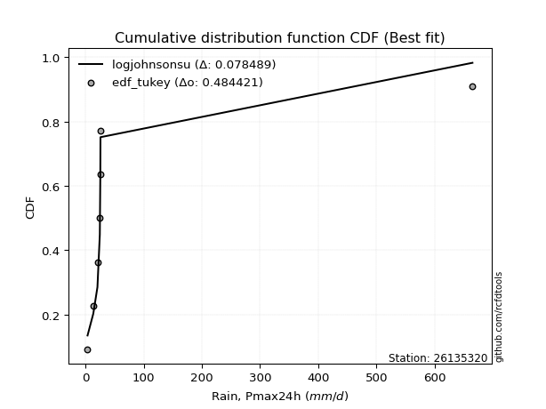</img>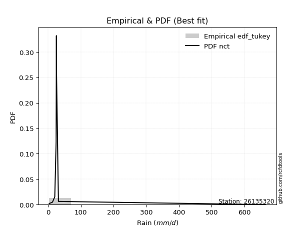</img>

</div>


### 8. EDF Gringorten (1963)

Gringorten plotting position formula is essential for estimating the probability and return periods of extreme events like floods and heavy rainfall. The constant _a=0.44_.

<div align="center">


$P=(m-a)/(n+1-2a)$


</div>


**8.1. Empirical values**

<div align="center">

|                | 0                   | 1                   | 2                  | 3              | 4                  | 5                  | 6                  |
|:---------------|:--------------------|:--------------------|:-------------------|:---------------|:-------------------|:-------------------|:-------------------|
| date           | 2016                | 2017                | 2018               | 2020           | 2022               | 2019               | 2021               |
| x              | 3.7                 | 13.6                | 20.7               | 24.8           | 25.6               | 25.9               | 664.7              |
| m              | 1                   | 2                   | 3                  | 4              | 5                  | 6                  | 7                  |
| empirical_dist | edf_gringorten      | edf_gringorten      | edf_gringorten     | edf_gringorten | edf_gringorten     | edf_gringorten     | edf_gringorten     |
| empirical      | 0.07865168539325844 | 0.21910112359550563 | 0.3595505617977528 | 0.5            | 0.6404494382022471 | 0.7808988764044943 | 0.9213483146067415 |
| empirical_tr   | 1.0853658536585364  | 1.2805755395683454  | 1.5614035087719298 | 2.0            | 2.781249999999999  | 4.564102564102562  | 12.714285714285701 |

</div>


**8.2. Kolmogorov-Smirnov fit test (sorted by Δ)**


<div align="center">

|                | 0                   | 1                   | 2                   | 3                   | 4                   | 5                   | 6                   | 7                   | 8                   | 9                   | 10                  | 11                  | 12                  | 13                  | 14                  | 15                  | 16                  | 17                  | 18                  | 19                  | 20                  | 21                  | 22                  | 23                  | 24                  | 25                  | 26                  | 27                  | 28                  | 29                  | 30                  | 31                  | 32                  | 33                  | 34                  | 35                  | 36                  | 37                  | 38                  | 39                  | 40                  | 41                  | 42                  | 43                  | 44                  | 45                  | 46                  | 47                    | 48                  | 49                  | 50                  | 51                  | 52                  | 53                  | 54                  | 55                  | 56                  | 57                  | 58                  | 59                  | 60                  | 61                  | 62                  | 63                  | 64                  | 65                  | 66                  | 67                  | 68                  | 69                  | 70                  | 71                  | 72                  | 73                  | 74                  | 75                  | 76                  | 77                  | 78                  | 79                  | 80                  | 81                  | 82                  | 83                  | 84                  | 85                  | 86                  | 87                  |
|:---------------|:--------------------|:--------------------|:--------------------|:--------------------|:--------------------|:--------------------|:--------------------|:--------------------|:--------------------|:--------------------|:--------------------|:--------------------|:--------------------|:--------------------|:--------------------|:--------------------|:--------------------|:--------------------|:--------------------|:--------------------|:--------------------|:--------------------|:--------------------|:--------------------|:--------------------|:--------------------|:--------------------|:--------------------|:--------------------|:--------------------|:--------------------|:--------------------|:--------------------|:--------------------|:--------------------|:--------------------|:--------------------|:--------------------|:--------------------|:--------------------|:--------------------|:--------------------|:--------------------|:--------------------|:--------------------|:--------------------|:--------------------|:----------------------|:--------------------|:--------------------|:--------------------|:--------------------|:--------------------|:--------------------|:--------------------|:--------------------|:--------------------|:--------------------|:--------------------|:--------------------|:--------------------|:--------------------|:--------------------|:--------------------|:--------------------|:--------------------|:--------------------|:--------------------|:--------------------|:--------------------|:--------------------|:--------------------|:--------------------|:--------------------|:--------------------|:--------------------|:--------------------|:--------------------|:--------------------|:--------------------|:--------------------|:--------------------|:--------------------|:--------------------|:--------------------|:--------------------|:--------------------|:--------------------|
| station        | 26135320            | 26135320            | 26135320            | 26135320            | 26135320            | 26135320            | 26135320            | 26135320            | 26135320            | 26135320            | 26135320            | 26135320            | 26135320            | 26135320            | 26135320            | 26135320            | 26135320            | 26135320            | 26135320            | 26135320            | 26135320            | 26135320            | 26135320            | 26135320            | 26135320            | 26135320            | 26135320            | 26135320            | 26135320            | 26135320            | 26135320            | 26135320            | 26135320            | 26135320            | 26135320            | 26135320            | 26135320            | 26135320            | 26135320            | 26135320            | 26135320            | 26135320            | 26135320            | 26135320            | 26135320            | 26135320            | 26135320            | 26135320              | 26135320            | 26135320            | 26135320            | 26135320            | 26135320            | 26135320            | 26135320            | 26135320            | 26135320            | 26135320            | 26135320            | 26135320            | 26135320            | 26135320            | 26135320            | 26135320            | 26135320            | 26135320            | 26135320            | 26135320            | 26135320            | 26135320            | 26135320            | 26135320            | 26135320            | 26135320            | 26135320            | 26135320            | 26135320            | 26135320            | 26135320            | 26135320            | 26135320            | 26135320            | 26135320            | 26135320            | 26135320            | 26135320            | 26135320            | 26135320            |
| empirical_dist | edf_gringorten      | edf_gringorten      | edf_gringorten      | edf_gringorten      | edf_gringorten      | edf_gringorten      | edf_gringorten      | edf_gringorten      | edf_gringorten      | edf_gringorten      | edf_gringorten      | edf_gringorten      | edf_gringorten      | edf_gringorten      | edf_gringorten      | edf_gringorten      | edf_gringorten      | edf_gringorten      | edf_gringorten      | edf_gringorten      | edf_gringorten      | edf_gringorten      | edf_gringorten      | edf_gringorten      | edf_gringorten      | edf_gringorten      | edf_gringorten      | edf_gringorten      | edf_gringorten      | edf_gringorten      | edf_gringorten      | edf_gringorten      | edf_gringorten      | edf_gringorten      | edf_gringorten      | edf_gringorten      | edf_gringorten      | edf_gringorten      | edf_gringorten      | edf_gringorten      | edf_gringorten      | edf_gringorten      | edf_gringorten      | edf_gringorten      | edf_gringorten      | edf_gringorten      | edf_gringorten      | edf_gringorten        | edf_gringorten      | edf_gringorten      | edf_gringorten      | edf_gringorten      | edf_gringorten      | edf_gringorten      | edf_gringorten      | edf_gringorten      | edf_gringorten      | edf_gringorten      | edf_gringorten      | edf_gringorten      | edf_gringorten      | edf_gringorten      | edf_gringorten      | edf_gringorten      | edf_gringorten      | edf_gringorten      | edf_gringorten      | edf_gringorten      | edf_gringorten      | edf_gringorten      | edf_gringorten      | edf_gringorten      | edf_gringorten      | edf_gringorten      | edf_gringorten      | edf_gringorten      | edf_gringorten      | edf_gringorten      | edf_gringorten      | edf_gringorten      | edf_gringorten      | edf_gringorten      | edf_gringorten      | edf_gringorten      | edf_gringorten      | edf_gringorten      | edf_gringorten      | edf_gringorten      |
| p_dist         | logjohnsonsu        | johnsonsu           | lognct              | loghalflogistic     | logmoyal            | t                   | logt                | f                   | betaprime           | alpha               | logfisk             | logweibull_min      | loghalfnorm         | loggenexpon         | logwald             | logpearson3         | logalpha            | logexponnorm        | logncf              | logbetaprime        | loggibrat           | loginvgamma         | loginvweibull       | logf                | loggumbel_r         | loggamma            | loggamma            | logerlang           | gamma               | mielke              | loginvgauss         | logfatiguelife      | invweibull          | loggenlogistic      | invgamma            | ncf                 | fisk                | nct                 | logkstwobign        | logtruncnorm        | loggompertz         | invgauss            | logmielke           | lograyleigh         | logexpon            | logmaxwell          | logrice             | loglaplace_asymmetric | logloggamma         | lognorm             | lognorm             | logcrystalball      | loglogistic         | loghypsecant        | loglaplace          | wald                | lognakagami         | pearson3            | fatiguelife         | halflogistic        | halfnorm            | weibull_min         | erlang              | gibrat              | moyal               | nakagami            | loggumbel_l         | logchi2             | gumbel_r            | rayleigh            | maxwell             | loglognorm          | norm                | crystalball         | genlogistic         | logistic            | hypsecant           | chi2                | laplace             | gumbel_l            | kstwobign           | rice                | exponnorm           | laplace_asymmetric  | expon               | genexpon            | gompertz            | truncnorm           |
| delta          | 0.07440291811287064 | 0.13070950420023086 | 0.15266830892649474 | 0.19491429725625742 | 0.1999846443014095  | 0.20089976707136376 | 0.2020884687802908  | 0.208068136239411   | 0.2081502350423011  | 0.21138279629036605 | 0.21379924555296248 | 0.21588739519434552 | 0.21888624096670384 | 0.21953205341200632 | 0.21988544937384125 | 0.22050274989703966 | 0.2218834508150821  | 0.22250609872865657 | 0.22341785809400305 | 0.22351995170280092 | 0.2241291794653426  | 0.22415171661169253 | 0.22455451903610568 | 0.2250161931896245  | 0.22586356567492238 | 0.22595808715321997 | 0.22595808715321997 | 0.2259587148573604  | 0.2262614085562105  | 0.22741644814713047 | 0.2276093541148977  | 0.22804242773575278 | 0.22946527248313764 | 0.23027339777741507 | 0.23035154788761814 | 0.23150980092095064 | 0.23167104723038975 | 0.23344151427069226 | 0.23931543934422195 | 0.24639990604559414 | 0.24699221086122092 | 0.24751639979304918 | 0.2498030351632133  | 0.2507520889661863  | 0.25937368125943017 | 0.2620670799738305  | 0.2651174139151168  | 0.2845198820915088    | 0.29428017371142684 | 0.2956447950642892  | 0.2956447950642892  | 0.2956448071418996  | 0.29765707175107453 | 0.2993739731694751  | 0.30636962198359885 | 0.31807670689555073 | 0.321544265160793   | 0.3306779950092927  | 0.3374803136628555  | 0.34088536839981254 | 0.34944807491912516 | 0.3517561815135636  | 0.35331298036681025 | 0.35367896283470146 | 0.3606720560186467  | 0.3617977749741802  | 0.3662999714536941  | 0.3714092335617566  | 0.3789399358145188  | 0.38387876981956015 | 0.3959769016457087  | 0.42568765968118205 | 0.42808055527860134 | 0.4280805580945738  | 0.44133566343869857 | 0.44577780693630265 | 0.45956464983219386 | 0.4662735318598537  | 0.4878241520683622  | 0.488496367178131   | 0.4926731218942225  | 0.49888358841117314 | 0.5916717647076841  | 0.594446458071829   | 0.5944495213366948  | 0.5944496093337823  | 0.5973324255646502  | 0.5994026237906434  |
| deltao         | 0.48442053926100004 | 0.48442053926100004 | 0.48442053926100004 | 0.48442053926100004 | 0.48442053926100004 | 0.48442053926100004 | 0.48442053926100004 | 0.48442053926100004 | 0.48442053926100004 | 0.48442053926100004 | 0.48442053926100004 | 0.48442053926100004 | 0.48442053926100004 | 0.48442053926100004 | 0.48442053926100004 | 0.48442053926100004 | 0.48442053926100004 | 0.48442053926100004 | 0.48442053926100004 | 0.48442053926100004 | 0.48442053926100004 | 0.48442053926100004 | 0.48442053926100004 | 0.48442053926100004 | 0.48442053926100004 | 0.48442053926100004 | 0.48442053926100004 | 0.48442053926100004 | 0.48442053926100004 | 0.48442053926100004 | 0.48442053926100004 | 0.48442053926100004 | 0.48442053926100004 | 0.48442053926100004 | 0.48442053926100004 | 0.48442053926100004 | 0.48442053926100004 | 0.48442053926100004 | 0.48442053926100004 | 0.48442053926100004 | 0.48442053926100004 | 0.48442053926100004 | 0.48442053926100004 | 0.48442053926100004 | 0.48442053926100004 | 0.48442053926100004 | 0.48442053926100004 | 0.48442053926100004   | 0.48442053926100004 | 0.48442053926100004 | 0.48442053926100004 | 0.48442053926100004 | 0.48442053926100004 | 0.48442053926100004 | 0.48442053926100004 | 0.48442053926100004 | 0.48442053926100004 | 0.48442053926100004 | 0.48442053926100004 | 0.48442053926100004 | 0.48442053926100004 | 0.48442053926100004 | 0.48442053926100004 | 0.48442053926100004 | 0.48442053926100004 | 0.48442053926100004 | 0.48442053926100004 | 0.48442053926100004 | 0.48442053926100004 | 0.48442053926100004 | 0.48442053926100004 | 0.48442053926100004 | 0.48442053926100004 | 0.48442053926100004 | 0.48442053926100004 | 0.48442053926100004 | 0.48442053926100004 | 0.48442053926100004 | 0.48442053926100004 | 0.48442053926100004 | 0.48442053926100004 | 0.48442053926100004 | 0.48442053926100004 | 0.48442053926100004 | 0.48442053926100004 | 0.48442053926100004 | 0.48442053926100004 | 0.48442053926100004 |
| eval           | Δo > Δ              | Δo > Δ              | Δo > Δ              | Δo > Δ              | Δo > Δ              | Δo > Δ              | Δo > Δ              | Δo > Δ              | Δo > Δ              | Δo > Δ              | Δo > Δ              | Δo > Δ              | Δo > Δ              | Δo > Δ              | Δo > Δ              | Δo > Δ              | Δo > Δ              | Δo > Δ              | Δo > Δ              | Δo > Δ              | Δo > Δ              | Δo > Δ              | Δo > Δ              | Δo > Δ              | Δo > Δ              | Δo > Δ              | Δo > Δ              | Δo > Δ              | Δo > Δ              | Δo > Δ              | Δo > Δ              | Δo > Δ              | Δo > Δ              | Δo > Δ              | Δo > Δ              | Δo > Δ              | Δo > Δ              | Δo > Δ              | Δo > Δ              | Δo > Δ              | Δo > Δ              | Δo > Δ              | Δo > Δ              | Δo > Δ              | Δo > Δ              | Δo > Δ              | Δo > Δ              | Δo > Δ                | Δo > Δ              | Δo > Δ              | Δo > Δ              | Δo > Δ              | Δo > Δ              | Δo > Δ              | Δo > Δ              | Δo > Δ              | Δo > Δ              | Δo > Δ              | Δo > Δ              | Δo > Δ              | Δo > Δ              | Δo > Δ              | Δo > Δ              | Δo > Δ              | Δo > Δ              | Δo > Δ              | Δo > Δ              | Δo > Δ              | Δo > Δ              | Δo > Δ              | Δo > Δ              | Δo > Δ              | Δo > Δ              | Δo > Δ              | Δo > Δ              | Δo > Δ              | Δo > Δ              | Δo > Δ              | Δo <= Δ             | Δo <= Δ             | Δo <= Δ             | Δo <= Δ             | Δo <= Δ             | Δo <= Δ             | Δo <= Δ             | Δo <= Δ             | Δo <= Δ             | Δo <= Δ             |
| fit            | 1                   | 1                   | 1                   | 1                   | 1                   | 1                   | 1                   | 1                   | 1                   | 1                   | 1                   | 1                   | 1                   | 1                   | 1                   | 1                   | 1                   | 1                   | 1                   | 1                   | 1                   | 1                   | 1                   | 1                   | 1                   | 1                   | 1                   | 1                   | 1                   | 1                   | 1                   | 1                   | 1                   | 1                   | 1                   | 1                   | 1                   | 1                   | 1                   | 1                   | 1                   | 1                   | 1                   | 1                   | 1                   | 1                   | 1                   | 1                     | 1                   | 1                   | 1                   | 1                   | 1                   | 1                   | 1                   | 1                   | 1                   | 1                   | 1                   | 1                   | 1                   | 1                   | 1                   | 1                   | 1                   | 1                   | 1                   | 1                   | 1                   | 1                   | 1                   | 1                   | 1                   | 1                   | 1                   | 1                   | 1                   | 1                   | 0                   | 0                   | 0                   | 0                   | 0                   | 0                   | 0                   | 0                   | 0                   | 0                   |
| n              | 7                   | 7                   | 7                   | 7                   | 7                   | 7                   | 7                   | 7                   | 7                   | 7                   | 7                   | 7                   | 7                   | 7                   | 7                   | 7                   | 7                   | 7                   | 7                   | 7                   | 7                   | 7                   | 7                   | 7                   | 7                   | 7                   | 7                   | 7                   | 7                   | 7                   | 7                   | 7                   | 7                   | 7                   | 7                   | 7                   | 7                   | 7                   | 7                   | 7                   | 7                   | 7                   | 7                   | 7                   | 7                   | 7                   | 7                   | 7                     | 7                   | 7                   | 7                   | 7                   | 7                   | 7                   | 7                   | 7                   | 7                   | 7                   | 7                   | 7                   | 7                   | 7                   | 7                   | 7                   | 7                   | 7                   | 7                   | 7                   | 7                   | 7                   | 7                   | 7                   | 7                   | 7                   | 7                   | 7                   | 7                   | 7                   | 7                   | 7                   | 7                   | 7                   | 7                   | 7                   | 7                   | 7                   | 7                   | 7                   |
| best_fit       | 1                   | 0                   | 0                   | 0                   | 0                   | 0                   | 0                   | 0                   | 0                   | 0                   | 0                   | 0                   | 0                   | 0                   | 0                   | 0                   | 0                   | 0                   | 0                   | 0                   | 0                   | 0                   | 0                   | 0                   | 0                   | 0                   | 0                   | 0                   | 0                   | 0                   | 0                   | 0                   | 0                   | 0                   | 0                   | 0                   | 0                   | 0                   | 0                   | 0                   | 0                   | 0                   | 0                   | 0                   | 0                   | 0                   | 0                   | 0                     | 0                   | 0                   | 0                   | 0                   | 0                   | 0                   | 0                   | 0                   | 0                   | 0                   | 0                   | 0                   | 0                   | 0                   | 0                   | 0                   | 0                   | 0                   | 0                   | 0                   | 0                   | 0                   | 0                   | 0                   | 0                   | 0                   | 0                   | 0                   | 0                   | 0                   | 0                   | 0                   | 0                   | 0                   | 0                   | 0                   | 0                   | 0                   | 0                   | 0                   |
| best_fit_sort  | 1                   | 2                   | 3                   | 4                   | 5                   | 6                   | 7                   | 8                   | 9                   | 10                  | 11                  | 12                  | 13                  | 14                  | 15                  | 16                  | 17                  | 18                  | 19                  | 20                  | 21                  | 22                  | 23                  | 24                  | 25                  | 26                  | 27                  | 28                  | 29                  | 30                  | 31                  | 32                  | 33                  | 34                  | 35                  | 36                  | 37                  | 38                  | 39                  | 40                  | 41                  | 42                  | 43                  | 44                  | 45                  | 46                  | 47                  | 48                    | 49                  | 50                  | 51                  | 52                  | 53                  | 54                  | 55                  | 56                  | 57                  | 58                  | 59                  | 60                  | 61                  | 62                  | 63                  | 64                  | 65                  | 66                  | 67                  | 68                  | 69                  | 70                  | 71                  | 72                  | 73                  | 74                  | 75                  | 76                  | 77                  | 78                  | 79                  | 80                  | 81                  | 82                  | 83                  | 84                  | 85                  | 86                  | 87                  | 88                  |

</div>


**8.3. Best fit**

<div align="center">

|   id |   station | empirical_dist   | p_dist       |     delta |   deltao | eval   |   fit |   n |   best_fit |   best_fit_sort |
|-----:|----------:|:-----------------|:-------------|----------:|---------:|:-------|------:|----:|-----------:|----------------:|
|    0 |  26135320 | edf_gringorten   | logjohnsonsu | 0.0744029 | 0.484421 | Δo > Δ |     1 |   7 |          1 |               1 |

</div>


<div align="center">

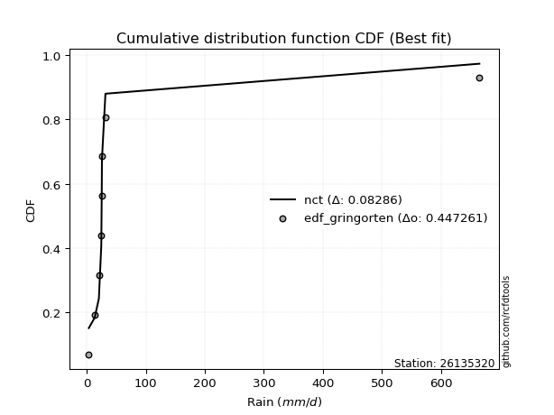</img>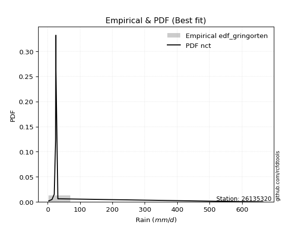</img>

</div>


### 9. EDF Filliben (1975)

The specific values of the constants (0.3175) (often denoted as $alpha$) and (0.365) are derived from a method proposed by James J. Filliben in a 1975 paper. This particular formula is the mean value of the $i$-th order statistic of the normal distribution and is considered a robust and effective plotting position formula for the normal probability plot correlation coefficient test for normality.

<div align="center">


$P=(m-0.3175)/(n+0.365)$


</div>


**9.1. Empirical values**

<div align="center">

|                | 0                   | 1                   | 2                   | 3            | 4                  | 5                  | 6                  |
|:---------------|:--------------------|:--------------------|:--------------------|:-------------|:-------------------|:-------------------|:-------------------|
| date           | 2016                | 2017                | 2018                | 2020         | 2022               | 2019               | 2021               |
| x              | 3.7                 | 13.6                | 20.7                | 24.8         | 25.6               | 25.9               | 664.7              |
| m              | 1                   | 2                   | 3                   | 4            | 5                  | 6                  | 7                  |
| empirical_dist | edf_filliben        | edf_filliben        | edf_filliben        | edf_filliben | edf_filliben       | edf_filliben       | edf_filliben       |
| empirical      | 0.09266802443991853 | 0.22844534962661237 | 0.36422267481330617 | 0.5          | 0.6357773251866938 | 0.7715546503733877 | 0.9073319755600815 |
| empirical_tr   | 1.1021324354657687  | 1.2960844698636163  | 1.5728777362520021  | 2.0          | 2.7455731593662627 | 4.377414561664191  | 10.791208791208794 |

</div>


**9.2. Kolmogorov-Smirnov fit test (sorted by Δ)**


<div align="center">

|                | 0                   | 1                   | 2                   | 3                   | 4                   | 5                   | 6                   | 7                   | 8                   | 9                   | 10                  | 11                  | 12                  | 13                  | 14                  | 15                  | 16                  | 17                  | 18                  | 19                  | 20                  | 21                  | 22                  | 23                  | 24                  | 25                  | 26                  | 27                  | 28                  | 29                  | 30                  | 31                  | 32                  | 33                  | 34                  | 35                  | 36                  | 37                  | 38                  | 39                  | 40                  | 41                  | 42                  | 43                  | 44                  | 45                  | 46                  | 47                    | 48                  | 49                  | 50                  | 51                  | 52                  | 53                  | 54                  | 55                  | 56                  | 57                  | 58                  | 59                  | 60                  | 61                  | 62                  | 63                  | 64                  | 65                  | 66                  | 67                  | 68                  | 69                  | 70                  | 71                  | 72                  | 73                  | 74                  | 75                  | 76                  | 77                  | 78                  | 79                  | 80                  | 81                  | 82                  | 83                  | 84                  | 85                  | 86                  | 87                  |
|:---------------|:--------------------|:--------------------|:--------------------|:--------------------|:--------------------|:--------------------|:--------------------|:--------------------|:--------------------|:--------------------|:--------------------|:--------------------|:--------------------|:--------------------|:--------------------|:--------------------|:--------------------|:--------------------|:--------------------|:--------------------|:--------------------|:--------------------|:--------------------|:--------------------|:--------------------|:--------------------|:--------------------|:--------------------|:--------------------|:--------------------|:--------------------|:--------------------|:--------------------|:--------------------|:--------------------|:--------------------|:--------------------|:--------------------|:--------------------|:--------------------|:--------------------|:--------------------|:--------------------|:--------------------|:--------------------|:--------------------|:--------------------|:----------------------|:--------------------|:--------------------|:--------------------|:--------------------|:--------------------|:--------------------|:--------------------|:--------------------|:--------------------|:--------------------|:--------------------|:--------------------|:--------------------|:--------------------|:--------------------|:--------------------|:--------------------|:--------------------|:--------------------|:--------------------|:--------------------|:--------------------|:--------------------|:--------------------|:--------------------|:--------------------|:--------------------|:--------------------|:--------------------|:--------------------|:--------------------|:--------------------|:--------------------|:--------------------|:--------------------|:--------------------|:--------------------|:--------------------|:--------------------|:--------------------|
| station        | 26135320            | 26135320            | 26135320            | 26135320            | 26135320            | 26135320            | 26135320            | 26135320            | 26135320            | 26135320            | 26135320            | 26135320            | 26135320            | 26135320            | 26135320            | 26135320            | 26135320            | 26135320            | 26135320            | 26135320            | 26135320            | 26135320            | 26135320            | 26135320            | 26135320            | 26135320            | 26135320            | 26135320            | 26135320            | 26135320            | 26135320            | 26135320            | 26135320            | 26135320            | 26135320            | 26135320            | 26135320            | 26135320            | 26135320            | 26135320            | 26135320            | 26135320            | 26135320            | 26135320            | 26135320            | 26135320            | 26135320            | 26135320              | 26135320            | 26135320            | 26135320            | 26135320            | 26135320            | 26135320            | 26135320            | 26135320            | 26135320            | 26135320            | 26135320            | 26135320            | 26135320            | 26135320            | 26135320            | 26135320            | 26135320            | 26135320            | 26135320            | 26135320            | 26135320            | 26135320            | 26135320            | 26135320            | 26135320            | 26135320            | 26135320            | 26135320            | 26135320            | 26135320            | 26135320            | 26135320            | 26135320            | 26135320            | 26135320            | 26135320            | 26135320            | 26135320            | 26135320            | 26135320            |
| empirical_dist | edf_filliben        | edf_filliben        | edf_filliben        | edf_filliben        | edf_filliben        | edf_filliben        | edf_filliben        | edf_filliben        | edf_filliben        | edf_filliben        | edf_filliben        | edf_filliben        | edf_filliben        | edf_filliben        | edf_filliben        | edf_filliben        | edf_filliben        | edf_filliben        | edf_filliben        | edf_filliben        | edf_filliben        | edf_filliben        | edf_filliben        | edf_filliben        | edf_filliben        | edf_filliben        | edf_filliben        | edf_filliben        | edf_filliben        | edf_filliben        | edf_filliben        | edf_filliben        | edf_filliben        | edf_filliben        | edf_filliben        | edf_filliben        | edf_filliben        | edf_filliben        | edf_filliben        | edf_filliben        | edf_filliben        | edf_filliben        | edf_filliben        | edf_filliben        | edf_filliben        | edf_filliben        | edf_filliben        | edf_filliben          | edf_filliben        | edf_filliben        | edf_filliben        | edf_filliben        | edf_filliben        | edf_filliben        | edf_filliben        | edf_filliben        | edf_filliben        | edf_filliben        | edf_filliben        | edf_filliben        | edf_filliben        | edf_filliben        | edf_filliben        | edf_filliben        | edf_filliben        | edf_filliben        | edf_filliben        | edf_filliben        | edf_filliben        | edf_filliben        | edf_filliben        | edf_filliben        | edf_filliben        | edf_filliben        | edf_filliben        | edf_filliben        | edf_filliben        | edf_filliben        | edf_filliben        | edf_filliben        | edf_filliben        | edf_filliben        | edf_filliben        | edf_filliben        | edf_filliben        | edf_filliben        | edf_filliben        | edf_filliben        |
| p_dist         | logjohnsonsu        | johnsonsu           | lognct              | loghalflogistic     | logmoyal            | f                   | betaprime           | t                   | alpha               | logt                | logfisk             | logweibull_min      | loghalfnorm         | loggenexpon         | logpearson3         | logalpha            | logexponnorm        | logncf              | logbetaprime        | loginvgamma         | loginvweibull       | logwald             | logf                | loggumbel_r         | loggamma            | loggamma            | logerlang           | gamma               | mielke              | loginvgauss         | logfatiguelife      | loggibrat           | invweibull          | loggenlogistic      | invgamma            | ncf                 | fisk                | nct                 | logkstwobign        | logtruncnorm        | loggompertz         | invgauss            | logmielke           | lograyleigh         | logexpon            | logmaxwell          | logrice             | loglaplace_asymmetric | logloggamma         | lognorm             | lognorm             | logcrystalball      | loglogistic         | loghypsecant        | loglaplace          | wald                | lognakagami         | pearson3            | fatiguelife         | halflogistic        | halfnorm            | weibull_min         | erlang              | gibrat              | moyal               | nakagami            | loggumbel_l         | logchi2             | gumbel_r            | rayleigh            | maxwell             | loglognorm          | norm                | crystalball         | genlogistic         | logistic            | hypsecant           | chi2                | laplace             | gumbel_l            | kstwobign           | rice                | exponnorm           | laplace_asymmetric  | expon               | genexpon            | gompertz            | truncnorm           |
| delta          | 0.07907503112842401 | 0.13070950420023086 | 0.15734042194204811 | 0.1855700712251508  | 0.19064041827030287 | 0.19872391020830438 | 0.19880600901119436 | 0.20089976707136376 | 0.20203857025925942 | 0.2020884687802908  | 0.20445501952185585 | 0.2065431691632389  | 0.2095420149355972  | 0.2101878273808997  | 0.21115852386593303 | 0.21253922478397547 | 0.21316187269754994 | 0.21407363206289642 | 0.2141757256716943  | 0.2148074905805859  | 0.21521029300499905 | 0.21521333635828788 | 0.21567196715851789 | 0.21651933964381576 | 0.21661386112211334 | 0.21661386112211334 | 0.21661448882625378 | 0.21691718252510375 | 0.21807222211602384 | 0.21826512808379106 | 0.21869820170464616 | 0.21945706644978924 | 0.220121046452031   | 0.22092917174630844 | 0.2210073218565115  | 0.222165574889844   | 0.22232682119928301 | 0.22409728823958563 | 0.22997121331311532 | 0.2370556800144875  | 0.2376479848301143  | 0.23817217376194255 | 0.24045880913210657 | 0.24140786293507965 | 0.2500294552283234  | 0.25272285394272387 | 0.25577318788401016 | 0.2751756560604022    | 0.2849359476803202  | 0.2863005690331826  | 0.2863005690331826  | 0.286300581110793   | 0.2883128457199679  | 0.2900297471383685  | 0.2970253959524922  | 0.3087324808644441  | 0.31220003912968636 | 0.3166616559626326  | 0.3281360876317489  | 0.3315411423687059  | 0.34010384888801853 | 0.34241195548245695 | 0.3439687543357036  | 0.34433473680359483 | 0.3513278299875401  | 0.35245354894307357 | 0.35695574542258746 | 0.36206500753064985 | 0.36959570978341216 | 0.3745345437884535  | 0.3866326756146021  | 0.4163434336500753  | 0.4187363292474947  | 0.41873633206346716 | 0.43199143740759194 | 0.436433580905196   | 0.45022042380108723 | 0.4569293058287471  | 0.4784799260372556  | 0.47915214114702437 | 0.4833288958631159  | 0.4895393623800665  | 0.5823275386765775  | 0.5851022320407224  | 0.5851052953055882  | 0.5851053833026756  | 0.5879881995335434  | 0.5900583977595366  |
| deltao         | 0.48442053926100004 | 0.48442053926100004 | 0.48442053926100004 | 0.48442053926100004 | 0.48442053926100004 | 0.48442053926100004 | 0.48442053926100004 | 0.48442053926100004 | 0.48442053926100004 | 0.48442053926100004 | 0.48442053926100004 | 0.48442053926100004 | 0.48442053926100004 | 0.48442053926100004 | 0.48442053926100004 | 0.48442053926100004 | 0.48442053926100004 | 0.48442053926100004 | 0.48442053926100004 | 0.48442053926100004 | 0.48442053926100004 | 0.48442053926100004 | 0.48442053926100004 | 0.48442053926100004 | 0.48442053926100004 | 0.48442053926100004 | 0.48442053926100004 | 0.48442053926100004 | 0.48442053926100004 | 0.48442053926100004 | 0.48442053926100004 | 0.48442053926100004 | 0.48442053926100004 | 0.48442053926100004 | 0.48442053926100004 | 0.48442053926100004 | 0.48442053926100004 | 0.48442053926100004 | 0.48442053926100004 | 0.48442053926100004 | 0.48442053926100004 | 0.48442053926100004 | 0.48442053926100004 | 0.48442053926100004 | 0.48442053926100004 | 0.48442053926100004 | 0.48442053926100004 | 0.48442053926100004   | 0.48442053926100004 | 0.48442053926100004 | 0.48442053926100004 | 0.48442053926100004 | 0.48442053926100004 | 0.48442053926100004 | 0.48442053926100004 | 0.48442053926100004 | 0.48442053926100004 | 0.48442053926100004 | 0.48442053926100004 | 0.48442053926100004 | 0.48442053926100004 | 0.48442053926100004 | 0.48442053926100004 | 0.48442053926100004 | 0.48442053926100004 | 0.48442053926100004 | 0.48442053926100004 | 0.48442053926100004 | 0.48442053926100004 | 0.48442053926100004 | 0.48442053926100004 | 0.48442053926100004 | 0.48442053926100004 | 0.48442053926100004 | 0.48442053926100004 | 0.48442053926100004 | 0.48442053926100004 | 0.48442053926100004 | 0.48442053926100004 | 0.48442053926100004 | 0.48442053926100004 | 0.48442053926100004 | 0.48442053926100004 | 0.48442053926100004 | 0.48442053926100004 | 0.48442053926100004 | 0.48442053926100004 | 0.48442053926100004 |
| eval           | Δo > Δ              | Δo > Δ              | Δo > Δ              | Δo > Δ              | Δo > Δ              | Δo > Δ              | Δo > Δ              | Δo > Δ              | Δo > Δ              | Δo > Δ              | Δo > Δ              | Δo > Δ              | Δo > Δ              | Δo > Δ              | Δo > Δ              | Δo > Δ              | Δo > Δ              | Δo > Δ              | Δo > Δ              | Δo > Δ              | Δo > Δ              | Δo > Δ              | Δo > Δ              | Δo > Δ              | Δo > Δ              | Δo > Δ              | Δo > Δ              | Δo > Δ              | Δo > Δ              | Δo > Δ              | Δo > Δ              | Δo > Δ              | Δo > Δ              | Δo > Δ              | Δo > Δ              | Δo > Δ              | Δo > Δ              | Δo > Δ              | Δo > Δ              | Δo > Δ              | Δo > Δ              | Δo > Δ              | Δo > Δ              | Δo > Δ              | Δo > Δ              | Δo > Δ              | Δo > Δ              | Δo > Δ                | Δo > Δ              | Δo > Δ              | Δo > Δ              | Δo > Δ              | Δo > Δ              | Δo > Δ              | Δo > Δ              | Δo > Δ              | Δo > Δ              | Δo > Δ              | Δo > Δ              | Δo > Δ              | Δo > Δ              | Δo > Δ              | Δo > Δ              | Δo > Δ              | Δo > Δ              | Δo > Δ              | Δo > Δ              | Δo > Δ              | Δo > Δ              | Δo > Δ              | Δo > Δ              | Δo > Δ              | Δo > Δ              | Δo > Δ              | Δo > Δ              | Δo > Δ              | Δo > Δ              | Δo > Δ              | Δo > Δ              | Δo > Δ              | Δo > Δ              | Δo <= Δ             | Δo <= Δ             | Δo <= Δ             | Δo <= Δ             | Δo <= Δ             | Δo <= Δ             | Δo <= Δ             |
| fit            | 1                   | 1                   | 1                   | 1                   | 1                   | 1                   | 1                   | 1                   | 1                   | 1                   | 1                   | 1                   | 1                   | 1                   | 1                   | 1                   | 1                   | 1                   | 1                   | 1                   | 1                   | 1                   | 1                   | 1                   | 1                   | 1                   | 1                   | 1                   | 1                   | 1                   | 1                   | 1                   | 1                   | 1                   | 1                   | 1                   | 1                   | 1                   | 1                   | 1                   | 1                   | 1                   | 1                   | 1                   | 1                   | 1                   | 1                   | 1                     | 1                   | 1                   | 1                   | 1                   | 1                   | 1                   | 1                   | 1                   | 1                   | 1                   | 1                   | 1                   | 1                   | 1                   | 1                   | 1                   | 1                   | 1                   | 1                   | 1                   | 1                   | 1                   | 1                   | 1                   | 1                   | 1                   | 1                   | 1                   | 1                   | 1                   | 1                   | 1                   | 1                   | 0                   | 0                   | 0                   | 0                   | 0                   | 0                   | 0                   |
| n              | 7                   | 7                   | 7                   | 7                   | 7                   | 7                   | 7                   | 7                   | 7                   | 7                   | 7                   | 7                   | 7                   | 7                   | 7                   | 7                   | 7                   | 7                   | 7                   | 7                   | 7                   | 7                   | 7                   | 7                   | 7                   | 7                   | 7                   | 7                   | 7                   | 7                   | 7                   | 7                   | 7                   | 7                   | 7                   | 7                   | 7                   | 7                   | 7                   | 7                   | 7                   | 7                   | 7                   | 7                   | 7                   | 7                   | 7                   | 7                     | 7                   | 7                   | 7                   | 7                   | 7                   | 7                   | 7                   | 7                   | 7                   | 7                   | 7                   | 7                   | 7                   | 7                   | 7                   | 7                   | 7                   | 7                   | 7                   | 7                   | 7                   | 7                   | 7                   | 7                   | 7                   | 7                   | 7                   | 7                   | 7                   | 7                   | 7                   | 7                   | 7                   | 7                   | 7                   | 7                   | 7                   | 7                   | 7                   | 7                   |
| best_fit       | 1                   | 0                   | 0                   | 0                   | 0                   | 0                   | 0                   | 0                   | 0                   | 0                   | 0                   | 0                   | 0                   | 0                   | 0                   | 0                   | 0                   | 0                   | 0                   | 0                   | 0                   | 0                   | 0                   | 0                   | 0                   | 0                   | 0                   | 0                   | 0                   | 0                   | 0                   | 0                   | 0                   | 0                   | 0                   | 0                   | 0                   | 0                   | 0                   | 0                   | 0                   | 0                   | 0                   | 0                   | 0                   | 0                   | 0                   | 0                     | 0                   | 0                   | 0                   | 0                   | 0                   | 0                   | 0                   | 0                   | 0                   | 0                   | 0                   | 0                   | 0                   | 0                   | 0                   | 0                   | 0                   | 0                   | 0                   | 0                   | 0                   | 0                   | 0                   | 0                   | 0                   | 0                   | 0                   | 0                   | 0                   | 0                   | 0                   | 0                   | 0                   | 0                   | 0                   | 0                   | 0                   | 0                   | 0                   | 0                   |
| best_fit_sort  | 1                   | 2                   | 3                   | 4                   | 5                   | 6                   | 7                   | 8                   | 9                   | 10                  | 11                  | 12                  | 13                  | 14                  | 15                  | 16                  | 17                  | 18                  | 19                  | 20                  | 21                  | 22                  | 23                  | 24                  | 25                  | 26                  | 27                  | 28                  | 29                  | 30                  | 31                  | 32                  | 33                  | 34                  | 35                  | 36                  | 37                  | 38                  | 39                  | 40                  | 41                  | 42                  | 43                  | 44                  | 45                  | 46                  | 47                  | 48                    | 49                  | 50                  | 51                  | 52                  | 53                  | 54                  | 55                  | 56                  | 57                  | 58                  | 59                  | 60                  | 61                  | 62                  | 63                  | 64                  | 65                  | 66                  | 67                  | 68                  | 69                  | 70                  | 71                  | 72                  | 73                  | 74                  | 75                  | 76                  | 77                  | 78                  | 79                  | 80                  | 81                  | 82                  | 83                  | 84                  | 85                  | 86                  | 87                  | 88                  |

</div>


**9.3. Best fit**

<div align="center">

|   id |   station | empirical_dist   | p_dist       |    delta |   deltao | eval   |   fit |   n |   best_fit |   best_fit_sort |
|-----:|----------:|:-----------------|:-------------|---------:|---------:|:-------|------:|----:|-----------:|----------------:|
|    0 |  26135320 | edf_filliben     | logjohnsonsu | 0.079075 | 0.484421 | Δo > Δ |     1 |   7 |          1 |               1 |

</div>


<div align="center">

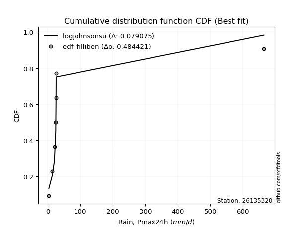</img></img>

</div>


### 10. EDF Jenkinson (1977)

The Jenkinson formula in hydrology is an empirical plotting position formula used to estimate the non-exceedance probability _(P)_ or return period _(T)_ of a given ordered observation within a sample. It is a widely used method in the frequency analysis of extreme events such as floods and rainfall, as it provides a distribution-free way to plot data. _a≈0.31_ and _b≈0.38_ are constants derived to approximate the median of the probability distribution for the given rank.

<div align="center">


$P=(m-a)/(n+b)$


</div>


**10.1. Empirical values**

<div align="center">

|                | 0                   | 1                   | 2                   | 3             | 4                  | 5                  | 6                  |
|:---------------|:--------------------|:--------------------|:--------------------|:--------------|:-------------------|:-------------------|:-------------------|
| date           | 2016                | 2017                | 2018                | 2020          | 2022               | 2019               | 2021               |
| x              | 3.7                 | 13.6                | 20.7                | 24.8          | 25.6               | 25.9               | 664.7              |
| m              | 1                   | 2                   | 3                   | 4             | 5                  | 6                  | 7                  |
| empirical_dist | edf_jenkinson       | edf_jenkinson       | edf_jenkinson       | edf_jenkinson | edf_jenkinson      | edf_jenkinson      | edf_jenkinson      |
| empirical      | 0.09349593495934959 | 0.22899728997289973 | 0.36449864498644985 | 0.5           | 0.6355013550135502 | 0.7710027100271003 | 0.9065040650406505 |
| empirical_tr   | 1.1031390134529149  | 1.29701230228471    | 1.5735607675906182  | 2.0           | 2.743494423791822  | 4.366863905325444  | 10.695652173913055 |

</div>


**10.2. Kolmogorov-Smirnov fit test (sorted by Δ)**


<div align="center">

|                | 0                   | 1                   | 2                   | 3                   | 4                   | 5                   | 6                   | 7                   | 8                   | 9                   | 10                  | 11                  | 12                  | 13                  | 14                  | 15                  | 16                  | 17                  | 18                  | 19                  | 20                  | 21                  | 22                  | 23                  | 24                  | 25                  | 26                  | 27                  | 28                  | 29                  | 30                  | 31                  | 32                  | 33                  | 34                  | 35                  | 36                  | 37                  | 38                  | 39                  | 40                  | 41                  | 42                  | 43                  | 44                  | 45                  | 46                  | 47                    | 48                  | 49                  | 50                  | 51                  | 52                  | 53                  | 54                  | 55                  | 56                  | 57                  | 58                  | 59                  | 60                  | 61                  | 62                  | 63                  | 64                  | 65                  | 66                  | 67                  | 68                  | 69                  | 70                  | 71                  | 72                  | 73                  | 74                  | 75                  | 76                  | 77                  | 78                  | 79                  | 80                  | 81                  | 82                  | 83                  | 84                  | 85                  | 86                  | 87                  |
|:---------------|:--------------------|:--------------------|:--------------------|:--------------------|:--------------------|:--------------------|:--------------------|:--------------------|:--------------------|:--------------------|:--------------------|:--------------------|:--------------------|:--------------------|:--------------------|:--------------------|:--------------------|:--------------------|:--------------------|:--------------------|:--------------------|:--------------------|:--------------------|:--------------------|:--------------------|:--------------------|:--------------------|:--------------------|:--------------------|:--------------------|:--------------------|:--------------------|:--------------------|:--------------------|:--------------------|:--------------------|:--------------------|:--------------------|:--------------------|:--------------------|:--------------------|:--------------------|:--------------------|:--------------------|:--------------------|:--------------------|:--------------------|:----------------------|:--------------------|:--------------------|:--------------------|:--------------------|:--------------------|:--------------------|:--------------------|:--------------------|:--------------------|:--------------------|:--------------------|:--------------------|:--------------------|:--------------------|:--------------------|:--------------------|:--------------------|:--------------------|:--------------------|:--------------------|:--------------------|:--------------------|:--------------------|:--------------------|:--------------------|:--------------------|:--------------------|:--------------------|:--------------------|:--------------------|:--------------------|:--------------------|:--------------------|:--------------------|:--------------------|:--------------------|:--------------------|:--------------------|:--------------------|:--------------------|
| station        | 26135320            | 26135320            | 26135320            | 26135320            | 26135320            | 26135320            | 26135320            | 26135320            | 26135320            | 26135320            | 26135320            | 26135320            | 26135320            | 26135320            | 26135320            | 26135320            | 26135320            | 26135320            | 26135320            | 26135320            | 26135320            | 26135320            | 26135320            | 26135320            | 26135320            | 26135320            | 26135320            | 26135320            | 26135320            | 26135320            | 26135320            | 26135320            | 26135320            | 26135320            | 26135320            | 26135320            | 26135320            | 26135320            | 26135320            | 26135320            | 26135320            | 26135320            | 26135320            | 26135320            | 26135320            | 26135320            | 26135320            | 26135320              | 26135320            | 26135320            | 26135320            | 26135320            | 26135320            | 26135320            | 26135320            | 26135320            | 26135320            | 26135320            | 26135320            | 26135320            | 26135320            | 26135320            | 26135320            | 26135320            | 26135320            | 26135320            | 26135320            | 26135320            | 26135320            | 26135320            | 26135320            | 26135320            | 26135320            | 26135320            | 26135320            | 26135320            | 26135320            | 26135320            | 26135320            | 26135320            | 26135320            | 26135320            | 26135320            | 26135320            | 26135320            | 26135320            | 26135320            | 26135320            |
| empirical_dist | edf_jenkinson       | edf_jenkinson       | edf_jenkinson       | edf_jenkinson       | edf_jenkinson       | edf_jenkinson       | edf_jenkinson       | edf_jenkinson       | edf_jenkinson       | edf_jenkinson       | edf_jenkinson       | edf_jenkinson       | edf_jenkinson       | edf_jenkinson       | edf_jenkinson       | edf_jenkinson       | edf_jenkinson       | edf_jenkinson       | edf_jenkinson       | edf_jenkinson       | edf_jenkinson       | edf_jenkinson       | edf_jenkinson       | edf_jenkinson       | edf_jenkinson       | edf_jenkinson       | edf_jenkinson       | edf_jenkinson       | edf_jenkinson       | edf_jenkinson       | edf_jenkinson       | edf_jenkinson       | edf_jenkinson       | edf_jenkinson       | edf_jenkinson       | edf_jenkinson       | edf_jenkinson       | edf_jenkinson       | edf_jenkinson       | edf_jenkinson       | edf_jenkinson       | edf_jenkinson       | edf_jenkinson       | edf_jenkinson       | edf_jenkinson       | edf_jenkinson       | edf_jenkinson       | edf_jenkinson         | edf_jenkinson       | edf_jenkinson       | edf_jenkinson       | edf_jenkinson       | edf_jenkinson       | edf_jenkinson       | edf_jenkinson       | edf_jenkinson       | edf_jenkinson       | edf_jenkinson       | edf_jenkinson       | edf_jenkinson       | edf_jenkinson       | edf_jenkinson       | edf_jenkinson       | edf_jenkinson       | edf_jenkinson       | edf_jenkinson       | edf_jenkinson       | edf_jenkinson       | edf_jenkinson       | edf_jenkinson       | edf_jenkinson       | edf_jenkinson       | edf_jenkinson       | edf_jenkinson       | edf_jenkinson       | edf_jenkinson       | edf_jenkinson       | edf_jenkinson       | edf_jenkinson       | edf_jenkinson       | edf_jenkinson       | edf_jenkinson       | edf_jenkinson       | edf_jenkinson       | edf_jenkinson       | edf_jenkinson       | edf_jenkinson       | edf_jenkinson       |
| p_dist         | logjohnsonsu        | johnsonsu           | lognct              | loghalflogistic     | logmoyal            | f                   | betaprime           | t                   | alpha               | logt                | logfisk             | logweibull_min      | loghalfnorm         | loggenexpon         | logpearson3         | logalpha            | logexponnorm        | logncf              | logbetaprime        | loginvgamma         | loginvweibull       | logwald             | logf                | loggumbel_r         | loggamma            | loggamma            | logerlang           | gamma               | mielke              | loginvgauss         | logfatiguelife      | loggibrat           | invweibull          | loggenlogistic      | invgamma            | ncf                 | fisk                | nct                 | logkstwobign        | logtruncnorm        | loggompertz         | invgauss            | logmielke           | lograyleigh         | logexpon            | logmaxwell          | logrice             | loglaplace_asymmetric | logloggamma         | lognorm             | lognorm             | logcrystalball      | loglogistic         | loghypsecant        | loglaplace          | wald                | lognakagami         | pearson3            | fatiguelife         | halflogistic        | halfnorm            | weibull_min         | erlang              | gibrat              | moyal               | nakagami            | loggumbel_l         | logchi2             | gumbel_r            | rayleigh            | maxwell             | loglognorm          | norm                | crystalball         | genlogistic         | logistic            | hypsecant           | chi2                | laplace             | gumbel_l            | kstwobign           | rice                | exponnorm           | laplace_asymmetric  | expon               | genexpon            | gompertz            | truncnorm           |
| delta          | 0.07935100130156769 | 0.13070950420023086 | 0.1576163921151918  | 0.18501813087886343 | 0.1900884779240155  | 0.19817196986201702 | 0.198254068664907   | 0.20089976707136376 | 0.20148662991297206 | 0.2020884687802908  | 0.2039030791755685  | 0.20599122881695153 | 0.20899007458930985 | 0.20963588703461233 | 0.21060658351964567 | 0.2119872844376881  | 0.21260993235126258 | 0.21352169171660906 | 0.21362378532540693 | 0.21425555023429854 | 0.2146583526587117  | 0.2149373661851442  | 0.21512002681223052 | 0.2159673992975284  | 0.21606192077582598 | 0.21606192077582598 | 0.21606254847996642 | 0.2163652421788164  | 0.21752028176973648 | 0.2177131877375037  | 0.2181462613583588  | 0.21918109627664556 | 0.21956910610574365 | 0.22037723140002108 | 0.22045538151022415 | 0.22161363454355665 | 0.22177488085299565 | 0.22354534789329827 | 0.22941927296682796 | 0.23650373966820015 | 0.23709604448382693 | 0.2376202334156552  | 0.2399068687858192  | 0.2408559225887923  | 0.24947751488203604 | 0.2521709135964365  | 0.2552212475377228  | 0.2746237157141148    | 0.28438400733403285 | 0.2857486286868952  | 0.2857486286868952  | 0.2857486407645056  | 0.28776090537368054 | 0.2894778067920811  | 0.29647345560620486 | 0.30818054051815674 | 0.311648098783399   | 0.31583374544320153 | 0.32758414728546154 | 0.33098920202241855 | 0.3395519085417312  | 0.3418600151361696  | 0.34341681398941626 | 0.34378279645730747 | 0.3507758896412527  | 0.3519016085967862  | 0.3564038050763001  | 0.3615130671843625  | 0.3690437694371248  | 0.37398260344216616 | 0.3860807352683147  | 0.41579149330378795 | 0.41818438890120735 | 0.4181843917171798  | 0.4314394970613046  | 0.43588164055890866 | 0.44966848345479987 | 0.4563773654824597  | 0.4779279856909682  | 0.478600200800737   | 0.48277695551682853 | 0.48898742203377915 | 0.5817755983302901  | 0.5845502916944351  | 0.5845533549593008  | 0.5845534429563883  | 0.5874362591872562  | 0.5895064574132494  |
| deltao         | 0.48442053926100004 | 0.48442053926100004 | 0.48442053926100004 | 0.48442053926100004 | 0.48442053926100004 | 0.48442053926100004 | 0.48442053926100004 | 0.48442053926100004 | 0.48442053926100004 | 0.48442053926100004 | 0.48442053926100004 | 0.48442053926100004 | 0.48442053926100004 | 0.48442053926100004 | 0.48442053926100004 | 0.48442053926100004 | 0.48442053926100004 | 0.48442053926100004 | 0.48442053926100004 | 0.48442053926100004 | 0.48442053926100004 | 0.48442053926100004 | 0.48442053926100004 | 0.48442053926100004 | 0.48442053926100004 | 0.48442053926100004 | 0.48442053926100004 | 0.48442053926100004 | 0.48442053926100004 | 0.48442053926100004 | 0.48442053926100004 | 0.48442053926100004 | 0.48442053926100004 | 0.48442053926100004 | 0.48442053926100004 | 0.48442053926100004 | 0.48442053926100004 | 0.48442053926100004 | 0.48442053926100004 | 0.48442053926100004 | 0.48442053926100004 | 0.48442053926100004 | 0.48442053926100004 | 0.48442053926100004 | 0.48442053926100004 | 0.48442053926100004 | 0.48442053926100004 | 0.48442053926100004   | 0.48442053926100004 | 0.48442053926100004 | 0.48442053926100004 | 0.48442053926100004 | 0.48442053926100004 | 0.48442053926100004 | 0.48442053926100004 | 0.48442053926100004 | 0.48442053926100004 | 0.48442053926100004 | 0.48442053926100004 | 0.48442053926100004 | 0.48442053926100004 | 0.48442053926100004 | 0.48442053926100004 | 0.48442053926100004 | 0.48442053926100004 | 0.48442053926100004 | 0.48442053926100004 | 0.48442053926100004 | 0.48442053926100004 | 0.48442053926100004 | 0.48442053926100004 | 0.48442053926100004 | 0.48442053926100004 | 0.48442053926100004 | 0.48442053926100004 | 0.48442053926100004 | 0.48442053926100004 | 0.48442053926100004 | 0.48442053926100004 | 0.48442053926100004 | 0.48442053926100004 | 0.48442053926100004 | 0.48442053926100004 | 0.48442053926100004 | 0.48442053926100004 | 0.48442053926100004 | 0.48442053926100004 | 0.48442053926100004 |
| eval           | Δo > Δ              | Δo > Δ              | Δo > Δ              | Δo > Δ              | Δo > Δ              | Δo > Δ              | Δo > Δ              | Δo > Δ              | Δo > Δ              | Δo > Δ              | Δo > Δ              | Δo > Δ              | Δo > Δ              | Δo > Δ              | Δo > Δ              | Δo > Δ              | Δo > Δ              | Δo > Δ              | Δo > Δ              | Δo > Δ              | Δo > Δ              | Δo > Δ              | Δo > Δ              | Δo > Δ              | Δo > Δ              | Δo > Δ              | Δo > Δ              | Δo > Δ              | Δo > Δ              | Δo > Δ              | Δo > Δ              | Δo > Δ              | Δo > Δ              | Δo > Δ              | Δo > Δ              | Δo > Δ              | Δo > Δ              | Δo > Δ              | Δo > Δ              | Δo > Δ              | Δo > Δ              | Δo > Δ              | Δo > Δ              | Δo > Δ              | Δo > Δ              | Δo > Δ              | Δo > Δ              | Δo > Δ                | Δo > Δ              | Δo > Δ              | Δo > Δ              | Δo > Δ              | Δo > Δ              | Δo > Δ              | Δo > Δ              | Δo > Δ              | Δo > Δ              | Δo > Δ              | Δo > Δ              | Δo > Δ              | Δo > Δ              | Δo > Δ              | Δo > Δ              | Δo > Δ              | Δo > Δ              | Δo > Δ              | Δo > Δ              | Δo > Δ              | Δo > Δ              | Δo > Δ              | Δo > Δ              | Δo > Δ              | Δo > Δ              | Δo > Δ              | Δo > Δ              | Δo > Δ              | Δo > Δ              | Δo > Δ              | Δo > Δ              | Δo > Δ              | Δo > Δ              | Δo <= Δ             | Δo <= Δ             | Δo <= Δ             | Δo <= Δ             | Δo <= Δ             | Δo <= Δ             | Δo <= Δ             |
| fit            | 1                   | 1                   | 1                   | 1                   | 1                   | 1                   | 1                   | 1                   | 1                   | 1                   | 1                   | 1                   | 1                   | 1                   | 1                   | 1                   | 1                   | 1                   | 1                   | 1                   | 1                   | 1                   | 1                   | 1                   | 1                   | 1                   | 1                   | 1                   | 1                   | 1                   | 1                   | 1                   | 1                   | 1                   | 1                   | 1                   | 1                   | 1                   | 1                   | 1                   | 1                   | 1                   | 1                   | 1                   | 1                   | 1                   | 1                   | 1                     | 1                   | 1                   | 1                   | 1                   | 1                   | 1                   | 1                   | 1                   | 1                   | 1                   | 1                   | 1                   | 1                   | 1                   | 1                   | 1                   | 1                   | 1                   | 1                   | 1                   | 1                   | 1                   | 1                   | 1                   | 1                   | 1                   | 1                   | 1                   | 1                   | 1                   | 1                   | 1                   | 1                   | 0                   | 0                   | 0                   | 0                   | 0                   | 0                   | 0                   |
| n              | 7                   | 7                   | 7                   | 7                   | 7                   | 7                   | 7                   | 7                   | 7                   | 7                   | 7                   | 7                   | 7                   | 7                   | 7                   | 7                   | 7                   | 7                   | 7                   | 7                   | 7                   | 7                   | 7                   | 7                   | 7                   | 7                   | 7                   | 7                   | 7                   | 7                   | 7                   | 7                   | 7                   | 7                   | 7                   | 7                   | 7                   | 7                   | 7                   | 7                   | 7                   | 7                   | 7                   | 7                   | 7                   | 7                   | 7                   | 7                     | 7                   | 7                   | 7                   | 7                   | 7                   | 7                   | 7                   | 7                   | 7                   | 7                   | 7                   | 7                   | 7                   | 7                   | 7                   | 7                   | 7                   | 7                   | 7                   | 7                   | 7                   | 7                   | 7                   | 7                   | 7                   | 7                   | 7                   | 7                   | 7                   | 7                   | 7                   | 7                   | 7                   | 7                   | 7                   | 7                   | 7                   | 7                   | 7                   | 7                   |
| best_fit       | 1                   | 0                   | 0                   | 0                   | 0                   | 0                   | 0                   | 0                   | 0                   | 0                   | 0                   | 0                   | 0                   | 0                   | 0                   | 0                   | 0                   | 0                   | 0                   | 0                   | 0                   | 0                   | 0                   | 0                   | 0                   | 0                   | 0                   | 0                   | 0                   | 0                   | 0                   | 0                   | 0                   | 0                   | 0                   | 0                   | 0                   | 0                   | 0                   | 0                   | 0                   | 0                   | 0                   | 0                   | 0                   | 0                   | 0                   | 0                     | 0                   | 0                   | 0                   | 0                   | 0                   | 0                   | 0                   | 0                   | 0                   | 0                   | 0                   | 0                   | 0                   | 0                   | 0                   | 0                   | 0                   | 0                   | 0                   | 0                   | 0                   | 0                   | 0                   | 0                   | 0                   | 0                   | 0                   | 0                   | 0                   | 0                   | 0                   | 0                   | 0                   | 0                   | 0                   | 0                   | 0                   | 0                   | 0                   | 0                   |
| best_fit_sort  | 1                   | 2                   | 3                   | 4                   | 5                   | 6                   | 7                   | 8                   | 9                   | 10                  | 11                  | 12                  | 13                  | 14                  | 15                  | 16                  | 17                  | 18                  | 19                  | 20                  | 21                  | 22                  | 23                  | 24                  | 25                  | 26                  | 27                  | 28                  | 29                  | 30                  | 31                  | 32                  | 33                  | 34                  | 35                  | 36                  | 37                  | 38                  | 39                  | 40                  | 41                  | 42                  | 43                  | 44                  | 45                  | 46                  | 47                  | 48                    | 49                  | 50                  | 51                  | 52                  | 53                  | 54                  | 55                  | 56                  | 57                  | 58                  | 59                  | 60                  | 61                  | 62                  | 63                  | 64                  | 65                  | 66                  | 67                  | 68                  | 69                  | 70                  | 71                  | 72                  | 73                  | 74                  | 75                  | 76                  | 77                  | 78                  | 79                  | 80                  | 81                  | 82                  | 83                  | 84                  | 85                  | 86                  | 87                  | 88                  |

</div>


**10.3. Best fit**

<div align="center">

|   id |   station | empirical_dist   | p_dist       |    delta |   deltao | eval   |   fit |   n |   best_fit |   best_fit_sort |
|-----:|----------:|:-----------------|:-------------|---------:|---------:|:-------|------:|----:|-----------:|----------------:|
|    0 |  26135320 | edf_jenkinson    | logjohnsonsu | 0.079351 | 0.484421 | Δo > Δ |     1 |   7 |          1 |               1 |

</div>


<div align="center">

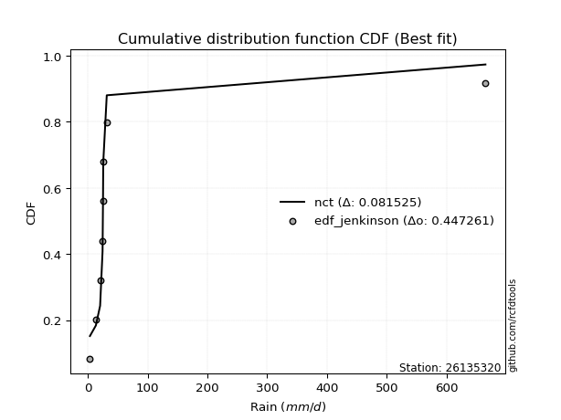</img>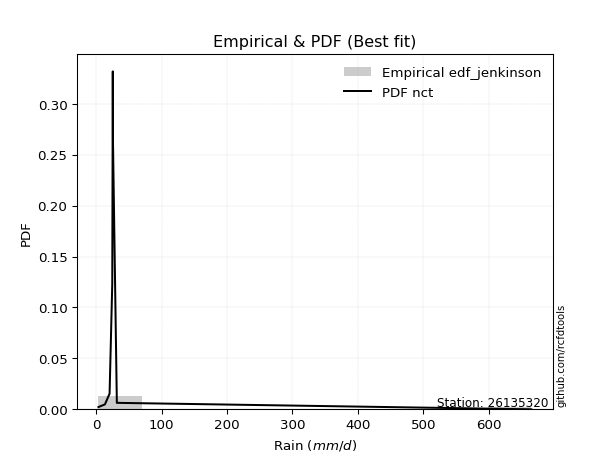</img>

</div>


### 11. EDF Cunnane (1978)

Cunnane´s work in statistical hydrology has focused on the performance and evaluation of different probability distributions (such as GEV, Gumbel, Lognormal) for flood frequency estimation. _b_ is a constant, typically set to 0.4.

<div align="center">


$P=(m-b)/(n+1-2b)$


</div>


**11.1. Empirical values**

<div align="center">

|                | 0                   | 1                   | 2                  | 3           | 4                  | 5                  | 6                  |
|:---------------|:--------------------|:--------------------|:-------------------|:------------|:-------------------|:-------------------|:-------------------|
| date           | 2016                | 2017                | 2018               | 2020        | 2022               | 2019               | 2021               |
| x              | 3.7                 | 13.6                | 20.7               | 24.8        | 25.6               | 25.9               | 664.7              |
| m              | 1                   | 2                   | 3                  | 4           | 5                  | 6                  | 7                  |
| empirical_dist | edf_cunnane         | edf_cunnane         | edf_cunnane        | edf_cunnane | edf_cunnane        | edf_cunnane        | edf_cunnane        |
| empirical      | 0.08333333333333333 | 0.22222222222222224 | 0.3611111111111111 | 0.5         | 0.6388888888888888 | 0.7777777777777777 | 0.9166666666666666 |
| empirical_tr   | 1.090909090909091   | 1.2857142857142856  | 1.565217391304348  | 2.0         | 2.7692307692307687 | 4.499999999999998  | 11.999999999999995 |

</div>


**11.2. Kolmogorov-Smirnov fit test (sorted by Δ)**


<div align="center">

|                | 0                   | 1                   | 2                   | 3                   | 4                   | 5                   | 6                   | 7                   | 8                   | 9                   | 10                  | 11                  | 12                  | 13                  | 14                  | 15                  | 16                  | 17                  | 18                  | 19                  | 20                  | 21                  | 22                  | 23                  | 24                  | 25                  | 26                  | 27                  | 28                  | 29                  | 30                  | 31                  | 32                  | 33                  | 34                  | 35                  | 36                  | 37                  | 38                  | 39                  | 40                  | 41                  | 42                  | 43                  | 44                  | 45                  | 46                  | 47                    | 48                  | 49                  | 50                  | 51                  | 52                  | 53                  | 54                  | 55                  | 56                  | 57                  | 58                  | 59                  | 60                  | 61                  | 62                  | 63                  | 64                  | 65                  | 66                  | 67                  | 68                  | 69                  | 70                  | 71                  | 72                  | 73                  | 74                  | 75                  | 76                  | 77                  | 78                  | 79                  | 80                  | 81                  | 82                  | 83                  | 84                  | 85                  | 86                  | 87                  |
|:---------------|:--------------------|:--------------------|:--------------------|:--------------------|:--------------------|:--------------------|:--------------------|:--------------------|:--------------------|:--------------------|:--------------------|:--------------------|:--------------------|:--------------------|:--------------------|:--------------------|:--------------------|:--------------------|:--------------------|:--------------------|:--------------------|:--------------------|:--------------------|:--------------------|:--------------------|:--------------------|:--------------------|:--------------------|:--------------------|:--------------------|:--------------------|:--------------------|:--------------------|:--------------------|:--------------------|:--------------------|:--------------------|:--------------------|:--------------------|:--------------------|:--------------------|:--------------------|:--------------------|:--------------------|:--------------------|:--------------------|:--------------------|:----------------------|:--------------------|:--------------------|:--------------------|:--------------------|:--------------------|:--------------------|:--------------------|:--------------------|:--------------------|:--------------------|:--------------------|:--------------------|:--------------------|:--------------------|:--------------------|:--------------------|:--------------------|:--------------------|:--------------------|:--------------------|:--------------------|:--------------------|:--------------------|:--------------------|:--------------------|:--------------------|:--------------------|:--------------------|:--------------------|:--------------------|:--------------------|:--------------------|:--------------------|:--------------------|:--------------------|:--------------------|:--------------------|:--------------------|:--------------------|:--------------------|
| station        | 26135320            | 26135320            | 26135320            | 26135320            | 26135320            | 26135320            | 26135320            | 26135320            | 26135320            | 26135320            | 26135320            | 26135320            | 26135320            | 26135320            | 26135320            | 26135320            | 26135320            | 26135320            | 26135320            | 26135320            | 26135320            | 26135320            | 26135320            | 26135320            | 26135320            | 26135320            | 26135320            | 26135320            | 26135320            | 26135320            | 26135320            | 26135320            | 26135320            | 26135320            | 26135320            | 26135320            | 26135320            | 26135320            | 26135320            | 26135320            | 26135320            | 26135320            | 26135320            | 26135320            | 26135320            | 26135320            | 26135320            | 26135320              | 26135320            | 26135320            | 26135320            | 26135320            | 26135320            | 26135320            | 26135320            | 26135320            | 26135320            | 26135320            | 26135320            | 26135320            | 26135320            | 26135320            | 26135320            | 26135320            | 26135320            | 26135320            | 26135320            | 26135320            | 26135320            | 26135320            | 26135320            | 26135320            | 26135320            | 26135320            | 26135320            | 26135320            | 26135320            | 26135320            | 26135320            | 26135320            | 26135320            | 26135320            | 26135320            | 26135320            | 26135320            | 26135320            | 26135320            | 26135320            |
| empirical_dist | edf_cunnane         | edf_cunnane         | edf_cunnane         | edf_cunnane         | edf_cunnane         | edf_cunnane         | edf_cunnane         | edf_cunnane         | edf_cunnane         | edf_cunnane         | edf_cunnane         | edf_cunnane         | edf_cunnane         | edf_cunnane         | edf_cunnane         | edf_cunnane         | edf_cunnane         | edf_cunnane         | edf_cunnane         | edf_cunnane         | edf_cunnane         | edf_cunnane         | edf_cunnane         | edf_cunnane         | edf_cunnane         | edf_cunnane         | edf_cunnane         | edf_cunnane         | edf_cunnane         | edf_cunnane         | edf_cunnane         | edf_cunnane         | edf_cunnane         | edf_cunnane         | edf_cunnane         | edf_cunnane         | edf_cunnane         | edf_cunnane         | edf_cunnane         | edf_cunnane         | edf_cunnane         | edf_cunnane         | edf_cunnane         | edf_cunnane         | edf_cunnane         | edf_cunnane         | edf_cunnane         | edf_cunnane           | edf_cunnane         | edf_cunnane         | edf_cunnane         | edf_cunnane         | edf_cunnane         | edf_cunnane         | edf_cunnane         | edf_cunnane         | edf_cunnane         | edf_cunnane         | edf_cunnane         | edf_cunnane         | edf_cunnane         | edf_cunnane         | edf_cunnane         | edf_cunnane         | edf_cunnane         | edf_cunnane         | edf_cunnane         | edf_cunnane         | edf_cunnane         | edf_cunnane         | edf_cunnane         | edf_cunnane         | edf_cunnane         | edf_cunnane         | edf_cunnane         | edf_cunnane         | edf_cunnane         | edf_cunnane         | edf_cunnane         | edf_cunnane         | edf_cunnane         | edf_cunnane         | edf_cunnane         | edf_cunnane         | edf_cunnane         | edf_cunnane         | edf_cunnane         | edf_cunnane         |
| p_dist         | logjohnsonsu        | johnsonsu           | lognct              | loghalflogistic     | logmoyal            | t                   | logt                | f                   | betaprime           | alpha               | logfisk             | logweibull_min      | loghalfnorm         | loggenexpon         | logpearson3         | logwald             | logalpha            | logexponnorm        | logncf              | logbetaprime        | loginvgamma         | loginvweibull       | logf                | loggibrat           | loggumbel_r         | loggamma            | loggamma            | logerlang           | gamma               | mielke              | loginvgauss         | logfatiguelife      | invweibull          | loggenlogistic      | invgamma            | ncf                 | fisk                | nct                 | logkstwobign        | logtruncnorm        | loggompertz         | invgauss            | logmielke           | lograyleigh         | logexpon            | logmaxwell          | logrice             | loglaplace_asymmetric | logloggamma         | lognorm             | lognorm             | logcrystalball      | loglogistic         | loghypsecant        | loglaplace          | wald                | lognakagami         | pearson3            | fatiguelife         | halflogistic        | halfnorm            | weibull_min         | erlang              | gibrat              | moyal               | nakagami            | loggumbel_l         | logchi2             | gumbel_r            | rayleigh            | maxwell             | loglognorm          | norm                | crystalball         | genlogistic         | logistic            | hypsecant           | chi2                | laplace             | gumbel_l            | kstwobign           | rice                | exponnorm           | laplace_asymmetric  | expon               | genexpon            | gompertz            | truncnorm           |
| delta          | 0.07596346742622895 | 0.13070950420023086 | 0.15422885823985305 | 0.1917931986295408  | 0.19686354567469289 | 0.20089976707136376 | 0.2020884687802908  | 0.2049470376126944  | 0.20502913641558448 | 0.20826169766364944 | 0.21067814692624587 | 0.2127662965676289  | 0.21576514233998723 | 0.2164109547852897  | 0.21738165127032305 | 0.21832490006048294 | 0.21876235218836548 | 0.21938500010193995 | 0.22029675946728644 | 0.2203988530760843  | 0.22103061798497592 | 0.22143342040938907 | 0.2218950945629079  | 0.2225686301519843  | 0.22274246704820577 | 0.22283698852650335 | 0.22283698852650335 | 0.2228376162306438  | 0.22314030992949388 | 0.22429534952041386 | 0.22448825548818108 | 0.22492132910903617 | 0.22634417385642103 | 0.22715229915069846 | 0.22723044926090152 | 0.22838870229423403 | 0.22854994860367314 | 0.23032041564397565 | 0.23619434071750534 | 0.24327880741887753 | 0.2438711122345043  | 0.24439530116633257 | 0.2466819365364967  | 0.24763099033946967 | 0.25625258263271355 | 0.2589459813471139  | 0.2619963152884002  | 0.2813987834647922    | 0.29115907508471023 | 0.2925236964375726  | 0.2925236964375726  | 0.292523708515183   | 0.2945359731243579  | 0.2962528745427585  | 0.30324852335688224 | 0.3149556082688341  | 0.3184231665340764  | 0.3259963470692178  | 0.3343592150361389  | 0.3377642697730959  | 0.34632697629240855 | 0.34863508288684697 | 0.35019188174009364 | 0.35055786420798485 | 0.3575509573919301  | 0.3586766763474636  | 0.3631788728269775  | 0.36828813493504    | 0.3758188371878022  | 0.38075767119284354 | 0.3928558030189921  | 0.42256656105446544 | 0.4249594566518847  | 0.4249594594678572  | 0.43821456481198195 | 0.44265670830958603 | 0.45644355120547725 | 0.4631524332331371  | 0.4847030534416456  | 0.4853752685514144  | 0.4895520232675059  | 0.49576248978445653 | 0.5885506660809675  | 0.5913253594451124  | 0.5913284227099782  | 0.5913285107070656  | 0.5942113269379334  | 0.5962815251639266  |
| deltao         | 0.48442053926100004 | 0.48442053926100004 | 0.48442053926100004 | 0.48442053926100004 | 0.48442053926100004 | 0.48442053926100004 | 0.48442053926100004 | 0.48442053926100004 | 0.48442053926100004 | 0.48442053926100004 | 0.48442053926100004 | 0.48442053926100004 | 0.48442053926100004 | 0.48442053926100004 | 0.48442053926100004 | 0.48442053926100004 | 0.48442053926100004 | 0.48442053926100004 | 0.48442053926100004 | 0.48442053926100004 | 0.48442053926100004 | 0.48442053926100004 | 0.48442053926100004 | 0.48442053926100004 | 0.48442053926100004 | 0.48442053926100004 | 0.48442053926100004 | 0.48442053926100004 | 0.48442053926100004 | 0.48442053926100004 | 0.48442053926100004 | 0.48442053926100004 | 0.48442053926100004 | 0.48442053926100004 | 0.48442053926100004 | 0.48442053926100004 | 0.48442053926100004 | 0.48442053926100004 | 0.48442053926100004 | 0.48442053926100004 | 0.48442053926100004 | 0.48442053926100004 | 0.48442053926100004 | 0.48442053926100004 | 0.48442053926100004 | 0.48442053926100004 | 0.48442053926100004 | 0.48442053926100004   | 0.48442053926100004 | 0.48442053926100004 | 0.48442053926100004 | 0.48442053926100004 | 0.48442053926100004 | 0.48442053926100004 | 0.48442053926100004 | 0.48442053926100004 | 0.48442053926100004 | 0.48442053926100004 | 0.48442053926100004 | 0.48442053926100004 | 0.48442053926100004 | 0.48442053926100004 | 0.48442053926100004 | 0.48442053926100004 | 0.48442053926100004 | 0.48442053926100004 | 0.48442053926100004 | 0.48442053926100004 | 0.48442053926100004 | 0.48442053926100004 | 0.48442053926100004 | 0.48442053926100004 | 0.48442053926100004 | 0.48442053926100004 | 0.48442053926100004 | 0.48442053926100004 | 0.48442053926100004 | 0.48442053926100004 | 0.48442053926100004 | 0.48442053926100004 | 0.48442053926100004 | 0.48442053926100004 | 0.48442053926100004 | 0.48442053926100004 | 0.48442053926100004 | 0.48442053926100004 | 0.48442053926100004 | 0.48442053926100004 |
| eval           | Δo > Δ              | Δo > Δ              | Δo > Δ              | Δo > Δ              | Δo > Δ              | Δo > Δ              | Δo > Δ              | Δo > Δ              | Δo > Δ              | Δo > Δ              | Δo > Δ              | Δo > Δ              | Δo > Δ              | Δo > Δ              | Δo > Δ              | Δo > Δ              | Δo > Δ              | Δo > Δ              | Δo > Δ              | Δo > Δ              | Δo > Δ              | Δo > Δ              | Δo > Δ              | Δo > Δ              | Δo > Δ              | Δo > Δ              | Δo > Δ              | Δo > Δ              | Δo > Δ              | Δo > Δ              | Δo > Δ              | Δo > Δ              | Δo > Δ              | Δo > Δ              | Δo > Δ              | Δo > Δ              | Δo > Δ              | Δo > Δ              | Δo > Δ              | Δo > Δ              | Δo > Δ              | Δo > Δ              | Δo > Δ              | Δo > Δ              | Δo > Δ              | Δo > Δ              | Δo > Δ              | Δo > Δ                | Δo > Δ              | Δo > Δ              | Δo > Δ              | Δo > Δ              | Δo > Δ              | Δo > Δ              | Δo > Δ              | Δo > Δ              | Δo > Δ              | Δo > Δ              | Δo > Δ              | Δo > Δ              | Δo > Δ              | Δo > Δ              | Δo > Δ              | Δo > Δ              | Δo > Δ              | Δo > Δ              | Δo > Δ              | Δo > Δ              | Δo > Δ              | Δo > Δ              | Δo > Δ              | Δo > Δ              | Δo > Δ              | Δo > Δ              | Δo > Δ              | Δo > Δ              | Δo > Δ              | Δo > Δ              | Δo <= Δ             | Δo <= Δ             | Δo <= Δ             | Δo <= Δ             | Δo <= Δ             | Δo <= Δ             | Δo <= Δ             | Δo <= Δ             | Δo <= Δ             | Δo <= Δ             |
| fit            | 1                   | 1                   | 1                   | 1                   | 1                   | 1                   | 1                   | 1                   | 1                   | 1                   | 1                   | 1                   | 1                   | 1                   | 1                   | 1                   | 1                   | 1                   | 1                   | 1                   | 1                   | 1                   | 1                   | 1                   | 1                   | 1                   | 1                   | 1                   | 1                   | 1                   | 1                   | 1                   | 1                   | 1                   | 1                   | 1                   | 1                   | 1                   | 1                   | 1                   | 1                   | 1                   | 1                   | 1                   | 1                   | 1                   | 1                   | 1                     | 1                   | 1                   | 1                   | 1                   | 1                   | 1                   | 1                   | 1                   | 1                   | 1                   | 1                   | 1                   | 1                   | 1                   | 1                   | 1                   | 1                   | 1                   | 1                   | 1                   | 1                   | 1                   | 1                   | 1                   | 1                   | 1                   | 1                   | 1                   | 1                   | 1                   | 0                   | 0                   | 0                   | 0                   | 0                   | 0                   | 0                   | 0                   | 0                   | 0                   |
| n              | 7                   | 7                   | 7                   | 7                   | 7                   | 7                   | 7                   | 7                   | 7                   | 7                   | 7                   | 7                   | 7                   | 7                   | 7                   | 7                   | 7                   | 7                   | 7                   | 7                   | 7                   | 7                   | 7                   | 7                   | 7                   | 7                   | 7                   | 7                   | 7                   | 7                   | 7                   | 7                   | 7                   | 7                   | 7                   | 7                   | 7                   | 7                   | 7                   | 7                   | 7                   | 7                   | 7                   | 7                   | 7                   | 7                   | 7                   | 7                     | 7                   | 7                   | 7                   | 7                   | 7                   | 7                   | 7                   | 7                   | 7                   | 7                   | 7                   | 7                   | 7                   | 7                   | 7                   | 7                   | 7                   | 7                   | 7                   | 7                   | 7                   | 7                   | 7                   | 7                   | 7                   | 7                   | 7                   | 7                   | 7                   | 7                   | 7                   | 7                   | 7                   | 7                   | 7                   | 7                   | 7                   | 7                   | 7                   | 7                   |
| best_fit       | 1                   | 0                   | 0                   | 0                   | 0                   | 0                   | 0                   | 0                   | 0                   | 0                   | 0                   | 0                   | 0                   | 0                   | 0                   | 0                   | 0                   | 0                   | 0                   | 0                   | 0                   | 0                   | 0                   | 0                   | 0                   | 0                   | 0                   | 0                   | 0                   | 0                   | 0                   | 0                   | 0                   | 0                   | 0                   | 0                   | 0                   | 0                   | 0                   | 0                   | 0                   | 0                   | 0                   | 0                   | 0                   | 0                   | 0                   | 0                     | 0                   | 0                   | 0                   | 0                   | 0                   | 0                   | 0                   | 0                   | 0                   | 0                   | 0                   | 0                   | 0                   | 0                   | 0                   | 0                   | 0                   | 0                   | 0                   | 0                   | 0                   | 0                   | 0                   | 0                   | 0                   | 0                   | 0                   | 0                   | 0                   | 0                   | 0                   | 0                   | 0                   | 0                   | 0                   | 0                   | 0                   | 0                   | 0                   | 0                   |
| best_fit_sort  | 1                   | 2                   | 3                   | 4                   | 5                   | 6                   | 7                   | 8                   | 9                   | 10                  | 11                  | 12                  | 13                  | 14                  | 15                  | 16                  | 17                  | 18                  | 19                  | 20                  | 21                  | 22                  | 23                  | 24                  | 25                  | 26                  | 27                  | 28                  | 29                  | 30                  | 31                  | 32                  | 33                  | 34                  | 35                  | 36                  | 37                  | 38                  | 39                  | 40                  | 41                  | 42                  | 43                  | 44                  | 45                  | 46                  | 47                  | 48                    | 49                  | 50                  | 51                  | 52                  | 53                  | 54                  | 55                  | 56                  | 57                  | 58                  | 59                  | 60                  | 61                  | 62                  | 63                  | 64                  | 65                  | 66                  | 67                  | 68                  | 69                  | 70                  | 71                  | 72                  | 73                  | 74                  | 75                  | 76                  | 77                  | 78                  | 79                  | 80                  | 81                  | 82                  | 83                  | 84                  | 85                  | 86                  | 87                  | 88                  |

</div>


**11.3. Best fit**

<div align="center">

|   id |   station | empirical_dist   | p_dist       |     delta |   deltao | eval   |   fit |   n |   best_fit |   best_fit_sort |
|-----:|----------:|:-----------------|:-------------|----------:|---------:|:-------|------:|----:|-----------:|----------------:|
|    0 |  26135320 | edf_cunnane      | logjohnsonsu | 0.0759635 | 0.484421 | Δo > Δ |     1 |   7 |          1 |               1 |

</div>


<div align="center">

</img>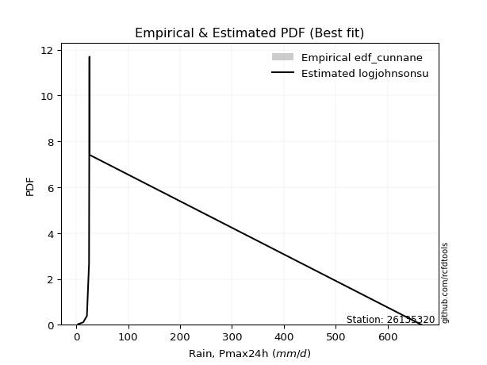</img>

</div>


### 12. EDF Adamowski (1981)

The Adamowski formula in hydrology refers to a specific plotting position formula used for estimating the non-parametric empirical distribution of hydrological events (like flood peaks) to calculate their return periods. This formula provides an alternative to traditional parametric methods (like the Gumbel or Log Pearson Type III distributions). 

<div align="center">


$P=(m-0.25)/(n+0.5)$


</div>


**12.1. Empirical values**

<div align="center">

|                | 0                  | 1                   | 2                   | 3             | 4                  | 5                  | 6                  |
|:---------------|:-------------------|:--------------------|:--------------------|:--------------|:-------------------|:-------------------|:-------------------|
| date           | 2016               | 2017                | 2018                | 2020          | 2022               | 2019               | 2021               |
| x              | 3.7                | 13.6                | 20.7                | 24.8          | 25.6               | 25.9               | 664.7              |
| m              | 1                  | 2                   | 3                   | 4             | 5                  | 6                  | 7                  |
| empirical_dist | edf_adamowski      | edf_adamowski       | edf_adamowski       | edf_adamowski | edf_adamowski      | edf_adamowski      | edf_adamowski      |
| empirical      | 0.1                | 0.23333333333333334 | 0.36666666666666664 | 0.5           | 0.6333333333333333 | 0.7666666666666667 | 0.9                |
| empirical_tr   | 1.1111111111111112 | 1.3043478260869565  | 1.5789473684210527  | 2.0           | 2.727272727272727  | 4.2857142857142865 | 10.000000000000002 |

</div>


**12.2. Kolmogorov-Smirnov fit test (sorted by Δ)**


<div align="center">

|                | 0                   | 1                   | 2                   | 3                   | 4                   | 5                   | 6                   | 7                   | 8                   | 9                   | 10                  | 11                  | 12                  | 13                  | 14                  | 15                  | 16                  | 17                  | 18                  | 19                  | 20                  | 21                  | 22                  | 23                  | 24                  | 25                  | 26                  | 27                  | 28                  | 29                  | 30                  | 31                  | 32                  | 33                  | 34                  | 35                  | 36                  | 37                  | 38                  | 39                  | 40                  | 41                  | 42                  | 43                  | 44                  | 45                  | 46                  | 47                    | 48                  | 49                  | 50                  | 51                  | 52                  | 53                  | 54                  | 55                  | 56                  | 57                  | 58                  | 59                  | 60                  | 61                  | 62                  | 63                  | 64                  | 65                  | 66                  | 67                  | 68                  | 69                  | 70                  | 71                  | 72                  | 73                  | 74                  | 75                  | 76                  | 77                  | 78                  | 79                  | 80                  | 81                  | 82                  | 83                  | 84                  | 85                  | 86                  | 87                  |
|:---------------|:--------------------|:--------------------|:--------------------|:--------------------|:--------------------|:--------------------|:--------------------|:--------------------|:--------------------|:--------------------|:--------------------|:--------------------|:--------------------|:--------------------|:--------------------|:--------------------|:--------------------|:--------------------|:--------------------|:--------------------|:--------------------|:--------------------|:--------------------|:--------------------|:--------------------|:--------------------|:--------------------|:--------------------|:--------------------|:--------------------|:--------------------|:--------------------|:--------------------|:--------------------|:--------------------|:--------------------|:--------------------|:--------------------|:--------------------|:--------------------|:--------------------|:--------------------|:--------------------|:--------------------|:--------------------|:--------------------|:--------------------|:----------------------|:--------------------|:--------------------|:--------------------|:--------------------|:--------------------|:--------------------|:--------------------|:--------------------|:--------------------|:--------------------|:--------------------|:--------------------|:--------------------|:--------------------|:--------------------|:--------------------|:--------------------|:--------------------|:--------------------|:--------------------|:--------------------|:--------------------|:--------------------|:--------------------|:--------------------|:--------------------|:--------------------|:--------------------|:--------------------|:--------------------|:--------------------|:--------------------|:--------------------|:--------------------|:--------------------|:--------------------|:--------------------|:--------------------|:--------------------|:--------------------|
| station        | 26135320            | 26135320            | 26135320            | 26135320            | 26135320            | 26135320            | 26135320            | 26135320            | 26135320            | 26135320            | 26135320            | 26135320            | 26135320            | 26135320            | 26135320            | 26135320            | 26135320            | 26135320            | 26135320            | 26135320            | 26135320            | 26135320            | 26135320            | 26135320            | 26135320            | 26135320            | 26135320            | 26135320            | 26135320            | 26135320            | 26135320            | 26135320            | 26135320            | 26135320            | 26135320            | 26135320            | 26135320            | 26135320            | 26135320            | 26135320            | 26135320            | 26135320            | 26135320            | 26135320            | 26135320            | 26135320            | 26135320            | 26135320              | 26135320            | 26135320            | 26135320            | 26135320            | 26135320            | 26135320            | 26135320            | 26135320            | 26135320            | 26135320            | 26135320            | 26135320            | 26135320            | 26135320            | 26135320            | 26135320            | 26135320            | 26135320            | 26135320            | 26135320            | 26135320            | 26135320            | 26135320            | 26135320            | 26135320            | 26135320            | 26135320            | 26135320            | 26135320            | 26135320            | 26135320            | 26135320            | 26135320            | 26135320            | 26135320            | 26135320            | 26135320            | 26135320            | 26135320            | 26135320            |
| empirical_dist | edf_adamowski       | edf_adamowski       | edf_adamowski       | edf_adamowski       | edf_adamowski       | edf_adamowski       | edf_adamowski       | edf_adamowski       | edf_adamowski       | edf_adamowski       | edf_adamowski       | edf_adamowski       | edf_adamowski       | edf_adamowski       | edf_adamowski       | edf_adamowski       | edf_adamowski       | edf_adamowski       | edf_adamowski       | edf_adamowski       | edf_adamowski       | edf_adamowski       | edf_adamowski       | edf_adamowski       | edf_adamowski       | edf_adamowski       | edf_adamowski       | edf_adamowski       | edf_adamowski       | edf_adamowski       | edf_adamowski       | edf_adamowski       | edf_adamowski       | edf_adamowski       | edf_adamowski       | edf_adamowski       | edf_adamowski       | edf_adamowski       | edf_adamowski       | edf_adamowski       | edf_adamowski       | edf_adamowski       | edf_adamowski       | edf_adamowski       | edf_adamowski       | edf_adamowski       | edf_adamowski       | edf_adamowski         | edf_adamowski       | edf_adamowski       | edf_adamowski       | edf_adamowski       | edf_adamowski       | edf_adamowski       | edf_adamowski       | edf_adamowski       | edf_adamowski       | edf_adamowski       | edf_adamowski       | edf_adamowski       | edf_adamowski       | edf_adamowski       | edf_adamowski       | edf_adamowski       | edf_adamowski       | edf_adamowski       | edf_adamowski       | edf_adamowski       | edf_adamowski       | edf_adamowski       | edf_adamowski       | edf_adamowski       | edf_adamowski       | edf_adamowski       | edf_adamowski       | edf_adamowski       | edf_adamowski       | edf_adamowski       | edf_adamowski       | edf_adamowski       | edf_adamowski       | edf_adamowski       | edf_adamowski       | edf_adamowski       | edf_adamowski       | edf_adamowski       | edf_adamowski       | edf_adamowski       |
| p_dist         | logjohnsonsu        | johnsonsu           | lognct              | loghalflogistic     | logmoyal            | f                   | betaprime           | alpha               | logfisk             | t                   | logweibull_min      | logt                | loghalfnorm         | loggenexpon         | logpearson3         | logalpha            | logexponnorm        | logncf              | logbetaprime        | loginvgamma         | loginvweibull       | logf                | loggumbel_r         | loggamma            | loggamma            | logerlang           | gamma               | logwald             | mielke              | loginvgauss         | logfatiguelife      | invweibull          | loggenlogistic      | invgamma            | loggibrat           | ncf                 | fisk                | nct                 | logkstwobign        | logtruncnorm        | loggompertz         | invgauss            | logmielke           | lograyleigh         | logexpon            | logmaxwell          | logrice             | loglaplace_asymmetric | logloggamma         | lognorm             | lognorm             | logcrystalball      | loglogistic         | loghypsecant        | loglaplace          | wald                | lognakagami         | pearson3            | fatiguelife         | halflogistic        | halfnorm            | weibull_min         | erlang              | gibrat              | moyal               | nakagami            | loggumbel_l         | logchi2             | gumbel_r            | rayleigh            | maxwell             | loglognorm          | norm                | crystalball         | genlogistic         | logistic            | hypsecant           | chi2                | laplace             | gumbel_l            | kstwobign           | rice                | exponnorm           | laplace_asymmetric  | expon               | genexpon            | gompertz            | truncnorm           |
| delta          | 0.08285191683189552 | 0.13070950420023086 | 0.1597844137954086  | 0.18068208751842985 | 0.18575243456358193 | 0.19383592650158343 | 0.19391802530447338 | 0.19715058655253848 | 0.1995670358151349  | 0.20089976707136376 | 0.20165518545651795 | 0.2020884687802908  | 0.20465403122887627 | 0.20529984367417875 | 0.2062705401592121  | 0.20765124107725452 | 0.208273888990829   | 0.20918564835617548 | 0.20928774196497335 | 0.20991950687386496 | 0.2103223092982781  | 0.21078398345179694 | 0.2116313559370948  | 0.2117258774153924  | 0.2117258774153924  | 0.21172650511953284 | 0.21202919881838278 | 0.2127693445049274  | 0.2131842384093029  | 0.21337714437707012 | 0.2138102179979252  | 0.21523306274531007 | 0.2160411880395875  | 0.21611933814979056 | 0.21701307459642877 | 0.21727759118312306 | 0.21743883749256204 | 0.2192093045328647  | 0.22508322960639437 | 0.23216769630776657 | 0.23276000112339335 | 0.2332841900552216  | 0.2355708254253856  | 0.2365198792283587  | 0.24514147152160243 | 0.24783487023600292 | 0.2508852041772892  | 0.27028767235368123   | 0.28004796397359927 | 0.28141258532646163 | 0.28141258532646163 | 0.28141259740407204 | 0.28342486201324696 | 0.28514176343164754 | 0.2921374122457713  | 0.30384449715772316 | 0.3073120554229654  | 0.30932968040255115 | 0.32324810392502795 | 0.32665315866198497 | 0.3352158651812976  | 0.337523971775736   | 0.3390807706289827  | 0.3394467530968739  | 0.34643984628081914 | 0.3475655652363526  | 0.3520677617158665  | 0.35717702382392885 | 0.3647077260766912  | 0.3696465600817326  | 0.38174469190788113 | 0.4114554499433543  | 0.41384834554077377 | 0.4138483483567462  | 0.427103453700871   | 0.4315455971984751  | 0.4453324400943663  | 0.45204132212202613 | 0.47359194233053464 | 0.4742641574403034  | 0.47844091215639495 | 0.48465137867334557 | 0.5774395549698565  | 0.5802142483340015  | 0.5802173115988672  | 0.5802173995959548  | 0.5831002158268226  | 0.5851704140528158  |
| deltao         | 0.48442053926100004 | 0.48442053926100004 | 0.48442053926100004 | 0.48442053926100004 | 0.48442053926100004 | 0.48442053926100004 | 0.48442053926100004 | 0.48442053926100004 | 0.48442053926100004 | 0.48442053926100004 | 0.48442053926100004 | 0.48442053926100004 | 0.48442053926100004 | 0.48442053926100004 | 0.48442053926100004 | 0.48442053926100004 | 0.48442053926100004 | 0.48442053926100004 | 0.48442053926100004 | 0.48442053926100004 | 0.48442053926100004 | 0.48442053926100004 | 0.48442053926100004 | 0.48442053926100004 | 0.48442053926100004 | 0.48442053926100004 | 0.48442053926100004 | 0.48442053926100004 | 0.48442053926100004 | 0.48442053926100004 | 0.48442053926100004 | 0.48442053926100004 | 0.48442053926100004 | 0.48442053926100004 | 0.48442053926100004 | 0.48442053926100004 | 0.48442053926100004 | 0.48442053926100004 | 0.48442053926100004 | 0.48442053926100004 | 0.48442053926100004 | 0.48442053926100004 | 0.48442053926100004 | 0.48442053926100004 | 0.48442053926100004 | 0.48442053926100004 | 0.48442053926100004 | 0.48442053926100004   | 0.48442053926100004 | 0.48442053926100004 | 0.48442053926100004 | 0.48442053926100004 | 0.48442053926100004 | 0.48442053926100004 | 0.48442053926100004 | 0.48442053926100004 | 0.48442053926100004 | 0.48442053926100004 | 0.48442053926100004 | 0.48442053926100004 | 0.48442053926100004 | 0.48442053926100004 | 0.48442053926100004 | 0.48442053926100004 | 0.48442053926100004 | 0.48442053926100004 | 0.48442053926100004 | 0.48442053926100004 | 0.48442053926100004 | 0.48442053926100004 | 0.48442053926100004 | 0.48442053926100004 | 0.48442053926100004 | 0.48442053926100004 | 0.48442053926100004 | 0.48442053926100004 | 0.48442053926100004 | 0.48442053926100004 | 0.48442053926100004 | 0.48442053926100004 | 0.48442053926100004 | 0.48442053926100004 | 0.48442053926100004 | 0.48442053926100004 | 0.48442053926100004 | 0.48442053926100004 | 0.48442053926100004 | 0.48442053926100004 |
| eval           | Δo > Δ              | Δo > Δ              | Δo > Δ              | Δo > Δ              | Δo > Δ              | Δo > Δ              | Δo > Δ              | Δo > Δ              | Δo > Δ              | Δo > Δ              | Δo > Δ              | Δo > Δ              | Δo > Δ              | Δo > Δ              | Δo > Δ              | Δo > Δ              | Δo > Δ              | Δo > Δ              | Δo > Δ              | Δo > Δ              | Δo > Δ              | Δo > Δ              | Δo > Δ              | Δo > Δ              | Δo > Δ              | Δo > Δ              | Δo > Δ              | Δo > Δ              | Δo > Δ              | Δo > Δ              | Δo > Δ              | Δo > Δ              | Δo > Δ              | Δo > Δ              | Δo > Δ              | Δo > Δ              | Δo > Δ              | Δo > Δ              | Δo > Δ              | Δo > Δ              | Δo > Δ              | Δo > Δ              | Δo > Δ              | Δo > Δ              | Δo > Δ              | Δo > Δ              | Δo > Δ              | Δo > Δ                | Δo > Δ              | Δo > Δ              | Δo > Δ              | Δo > Δ              | Δo > Δ              | Δo > Δ              | Δo > Δ              | Δo > Δ              | Δo > Δ              | Δo > Δ              | Δo > Δ              | Δo > Δ              | Δo > Δ              | Δo > Δ              | Δo > Δ              | Δo > Δ              | Δo > Δ              | Δo > Δ              | Δo > Δ              | Δo > Δ              | Δo > Δ              | Δo > Δ              | Δo > Δ              | Δo > Δ              | Δo > Δ              | Δo > Δ              | Δo > Δ              | Δo > Δ              | Δo > Δ              | Δo > Δ              | Δo > Δ              | Δo > Δ              | Δo > Δ              | Δo <= Δ             | Δo <= Δ             | Δo <= Δ             | Δo <= Δ             | Δo <= Δ             | Δo <= Δ             | Δo <= Δ             |
| fit            | 1                   | 1                   | 1                   | 1                   | 1                   | 1                   | 1                   | 1                   | 1                   | 1                   | 1                   | 1                   | 1                   | 1                   | 1                   | 1                   | 1                   | 1                   | 1                   | 1                   | 1                   | 1                   | 1                   | 1                   | 1                   | 1                   | 1                   | 1                   | 1                   | 1                   | 1                   | 1                   | 1                   | 1                   | 1                   | 1                   | 1                   | 1                   | 1                   | 1                   | 1                   | 1                   | 1                   | 1                   | 1                   | 1                   | 1                   | 1                     | 1                   | 1                   | 1                   | 1                   | 1                   | 1                   | 1                   | 1                   | 1                   | 1                   | 1                   | 1                   | 1                   | 1                   | 1                   | 1                   | 1                   | 1                   | 1                   | 1                   | 1                   | 1                   | 1                   | 1                   | 1                   | 1                   | 1                   | 1                   | 1                   | 1                   | 1                   | 1                   | 1                   | 0                   | 0                   | 0                   | 0                   | 0                   | 0                   | 0                   |
| n              | 7                   | 7                   | 7                   | 7                   | 7                   | 7                   | 7                   | 7                   | 7                   | 7                   | 7                   | 7                   | 7                   | 7                   | 7                   | 7                   | 7                   | 7                   | 7                   | 7                   | 7                   | 7                   | 7                   | 7                   | 7                   | 7                   | 7                   | 7                   | 7                   | 7                   | 7                   | 7                   | 7                   | 7                   | 7                   | 7                   | 7                   | 7                   | 7                   | 7                   | 7                   | 7                   | 7                   | 7                   | 7                   | 7                   | 7                   | 7                     | 7                   | 7                   | 7                   | 7                   | 7                   | 7                   | 7                   | 7                   | 7                   | 7                   | 7                   | 7                   | 7                   | 7                   | 7                   | 7                   | 7                   | 7                   | 7                   | 7                   | 7                   | 7                   | 7                   | 7                   | 7                   | 7                   | 7                   | 7                   | 7                   | 7                   | 7                   | 7                   | 7                   | 7                   | 7                   | 7                   | 7                   | 7                   | 7                   | 7                   |
| best_fit       | 1                   | 0                   | 0                   | 0                   | 0                   | 0                   | 0                   | 0                   | 0                   | 0                   | 0                   | 0                   | 0                   | 0                   | 0                   | 0                   | 0                   | 0                   | 0                   | 0                   | 0                   | 0                   | 0                   | 0                   | 0                   | 0                   | 0                   | 0                   | 0                   | 0                   | 0                   | 0                   | 0                   | 0                   | 0                   | 0                   | 0                   | 0                   | 0                   | 0                   | 0                   | 0                   | 0                   | 0                   | 0                   | 0                   | 0                   | 0                     | 0                   | 0                   | 0                   | 0                   | 0                   | 0                   | 0                   | 0                   | 0                   | 0                   | 0                   | 0                   | 0                   | 0                   | 0                   | 0                   | 0                   | 0                   | 0                   | 0                   | 0                   | 0                   | 0                   | 0                   | 0                   | 0                   | 0                   | 0                   | 0                   | 0                   | 0                   | 0                   | 0                   | 0                   | 0                   | 0                   | 0                   | 0                   | 0                   | 0                   |
| best_fit_sort  | 1                   | 2                   | 3                   | 4                   | 5                   | 6                   | 7                   | 8                   | 9                   | 10                  | 11                  | 12                  | 13                  | 14                  | 15                  | 16                  | 17                  | 18                  | 19                  | 20                  | 21                  | 22                  | 23                  | 24                  | 25                  | 26                  | 27                  | 28                  | 29                  | 30                  | 31                  | 32                  | 33                  | 34                  | 35                  | 36                  | 37                  | 38                  | 39                  | 40                  | 41                  | 42                  | 43                  | 44                  | 45                  | 46                  | 47                  | 48                    | 49                  | 50                  | 51                  | 52                  | 53                  | 54                  | 55                  | 56                  | 57                  | 58                  | 59                  | 60                  | 61                  | 62                  | 63                  | 64                  | 65                  | 66                  | 67                  | 68                  | 69                  | 70                  | 71                  | 72                  | 73                  | 74                  | 75                  | 76                  | 77                  | 78                  | 79                  | 80                  | 81                  | 82                  | 83                  | 84                  | 85                  | 86                  | 87                  | 88                  |

</div>


**12.3. Best fit**

<div align="center">

|   id |   station | empirical_dist   | p_dist       |     delta |   deltao | eval   |   fit |   n |   best_fit |   best_fit_sort |
|-----:|----------:|:-----------------|:-------------|----------:|---------:|:-------|------:|----:|-----------:|----------------:|
|    0 |  26135320 | edf_adamowski    | logjohnsonsu | 0.0828519 | 0.484421 | Δo > Δ |     1 |   7 |          1 |               1 |

</div>


<div align="center">

</img>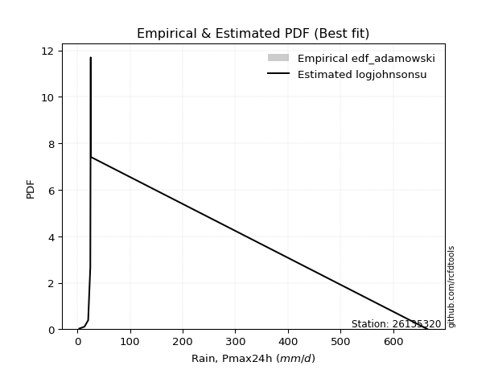</img>

</div>


## C. Best fit & Estimate extreme values for specific return periods - Tr

Best fit in probability distribution analysis means finding the theoretical distribution (like Normal, Poisson, Exponential) that most accurately mirrors your real-world data´s patterns (shape, center, spread) for better predictions, using methods like visual checks (Q-Q plots), goodness-of-fit tests (Kolmogorov-Smirnov, Chi-Squared), and information criteria (AIC) to score and select the simplest, most representative model.


### 1. Best fit (ordered by delta Δ)

<div align="center">

|   id |   station | empirical_dist   | p_dist       |     delta |   deltao | eval   |   fit |   n |   best_fit |   best_fit_sort |
|-----:|----------:|:-----------------|:-------------|----------:|---------:|:-------|------:|----:|-----------:|----------------:|
|    0 |  26135320 | edf_hazen        | logjohnsonsu | 0.0719952 | 0.484421 | Δo > Δ |     1 |   7 |          1 |               1 |
|    1 |  26135320 | edf_gringorten   | logjohnsonsu | 0.0744029 | 0.484421 | Δo > Δ |     1 |   7 |          1 |               2 |
|    2 |  26135320 | edf_cunnane      | logjohnsonsu | 0.0759635 | 0.484421 | Δo > Δ |     1 |   7 |          1 |               3 |
|    3 |  26135320 | edf_blom         | logjohnsonsu | 0.0769213 | 0.484421 | Δo > Δ |     1 |   7 |          1 |               4 |
|    4 |  26135320 | edf_tukey        | logjohnsonsu | 0.0784887 | 0.484421 | Δo > Δ |     1 |   7 |          1 |               5 |
|    5 |  26135320 | edf_filliben     | logjohnsonsu | 0.079075  | 0.484421 | Δo > Δ |     1 |   7 |          1 |               6 |
|    6 |  26135320 | edf_beard        | logjohnsonsu | 0.079351  | 0.484421 | Δo > Δ |     1 |   7 |          1 |               7 |
|    7 |  26135320 | edf_jenkinson    | logjohnsonsu | 0.079351  | 0.484421 | Δo > Δ |     1 |   7 |          1 |               8 |
|    8 |  26135320 | edf_chegodayev   | logjohnsonsu | 0.0797172 | 0.484421 | Δo > Δ |     1 |   7 |          1 |               9 |
|    9 |  26135320 | edf_adamowski    | logjohnsonsu | 0.0828519 | 0.484421 | Δo > Δ |     1 |   7 |          1 |              10 |
|   10 |  26135320 | edf_weibull      | logjohnsonsu | 0.107852  | 0.484421 | Δo > Δ |     1 |   7 |          1 |              11 |
|   11 |  26135320 | edf_california   | logjohnsonsu | 0.143424  | 0.484421 | Δo > Δ |     1 |   7 |          1 |              12 |

</div>

:file_folder:Tables: [bestfit_26135320.csv](table/bestfit_26135320.csv) | [extreme_26135320.csv](table/extreme_26135320.csv)


### 2. Extreme values

In hydrology, a return period (or recurrence interval $Tr$) is the statistical average time between extreme events like floods or droughts of a specific magnitude, indicating how rare an event is, with a 100-year flood, for example, having a 1% chance of occurring in any given year, not that it happens exactly every century. It is a key tool for infrastructure design (like bridges or dams) and risk assessment, calculated from historical data to determine the probability of future events, although it is important to remember it is statistical average, and events can cluster or be missed.

> risk_rate: assuming the return period as the project useful life.

|   id |      tr |   prob_l |     prob_g |     alpha |   betaprime |      chi2 |   crystalball |    erlang |    expon |   exponnorm |          f |   fatiguelife |        fisk |    gamma |   genexpon |   genlogistic |    gibrat |   gompertz |   gumbel_l |   gumbel_r |   halflogistic |   halfnorm |   hypsecant |   invgamma |   invgauss |   invweibull |   johnsonsu |   kstwobign |   laplace |   laplace_asymmetric |   loggamma |   logistic |   lognorm |   maxwell |     mielke |     moyal |   nakagami |        ncf |        nct |    norm |   pearson3 |   rayleigh |    rice |                t |   truncnorm |      wald |   weibull_min |    logalpha |   logbetaprime |      logchi2 |   logcrystalball |   logerlang |         logexpon |   logexponnorm |       logf |   logfatiguelife |     logfisk |   loggenexpon |   loggenlogistic |        loggibrat |   loggompertz |   loggumbel_l |   loggumbel_r |   loghalflogistic |   loghalfnorm |   loghypsecant |   loginvgamma |   loginvgauss |   loginvweibull |    logjohnsonsu |   logkstwobign |   loglaplace |   loglaplace_asymmetric |   logloggamma |   loglogistic |     loglognorm |   logmaxwell |        logmielke |   logmoyal |   lognakagami |     logncf |          lognct |   logpearson3 |   lograyleigh |   logrice |           logt |   logtruncnorm |          logwald |   logweibull_min |   station |   n |   risk_rate |
|-----:|--------:|---------:|-----------:|----------:|------------:|----------:|--------------:|----------:|---------:|------------:|-----------:|--------------:|------------:|---------:|-----------:|--------------:|----------:|-----------:|-----------:|-----------:|---------------:|-----------:|------------:|-----------:|-----------:|-------------:|------------:|------------:|----------:|---------------------:|-----------:|-----------:|----------:|----------:|-----------:|----------:|-----------:|-----------:|-----------:|--------:|-----------:|-----------:|--------:|-----------------:|------------:|----------:|--------------:|------------:|---------------:|-------------:|-----------------:|------------:|-----------------:|---------------:|-----------:|-----------------:|------------:|--------------:|-----------------:|-----------------:|--------------:|--------------:|--------------:|------------------:|--------------:|---------------:|--------------:|--------------:|----------------:|----------------:|---------------:|-------------:|------------------------:|--------------:|--------------:|---------------:|-------------:|-----------------:|-----------:|--------------:|-----------:|----------------:|--------------:|--------------:|----------:|---------------:|---------------:|-----------------:|-----------------:|----------:|----:|------------:|
|    0 |    2    | 0.5      | 0.5        |   21.7075 |     17.5585 |   72.7877 |       111.286 |   39.5833 |  78.2727 |     77.3481 |    18.936  |       35.3754 |     16.9869 |  17.6555 |    78.2728 |       67.09   |   43.4316 |    79.5745 |    148.423 |    74.1486 |        55.6859 |    65.0126 |     111.286 |    22.0077 |    22.7544 |      21.9758 |     25.4866 |     102.728 |   111.286 |              78.2714 |    21.3489 |    111.286 |   27.3287 |   91.9521 |    21.823  |   62.1595 |    51.0353 |    22.0989 |    22.4405 | 111.286 |    40.926  |    85.0951 | 123.032 |     25.6334      |     79.8682 |   38.0083 |       34.3461 |     21.3745 |        21.3992 |      9.89648 |          27.3287 |     21.3489 |     14.7959      |        21.7707 |    21.5098 |          21.6204 |     21.4502 |       20.457  |          22.0562 |     17.6726      |       22.5269 |       34.6926 |       21.5278 |           19.1198 |       20.3007 |        27.3287 |       21.4559 |       21.5956 |         21.5083 |    25.1722      |        22.3432 |      27.3287 |                 26.0706 |       27.2202 |       27.3287 |   3.74062      |      24.1365 |     15.0277      |    19.9319 |       29.7162 |    21.3702 |   25.2113       |       20.9279 |       23.0963 |   24.488  |   25.6333      |        22.3032 |     17.0669      |          20.2408 |  26135320 |   7 |    0.75     |
|    1 |    2.33 | 0.570815 | 0.429185   |   25.9886 |     22.9604 |  101.734  |       151.625 |   58.3781 |  94.7033 |     93.6028 |    25.6693 |       52.7096 |     24.0186 |  24.6527 |    94.7034 |       86.7829 |   63.866  |    96.292  |    183.519 |   111.528  |        94.1175 |   108.549  |     143.569 |    27.7202 |    30.1438 |      27.6209 |     25.5982 |     130.792 |   135.697 |              94.7017 |    27.4517 |    146.828 |   35.4137 |  133.862  |    27.4368 |   97.5435 |    87.3473 |    27.8216 |    27.8752 | 151.625 |    75.1817 |   127.625  | 155.978 |     25.7985      |     96.4046 |   64.4594 |       45.1729 |     26.9577 |        27.1353 |     12.6132  |          35.4137 |     27.4517 |     20.0802      |        26.9187 |    27.2747 |          27.6088 |     26.1827 |       26.8999 |          27.6809 |     20.1518      |       30.3034 |       43.467  |       27.3712 |           24.4745 |       26.8525 |        33.6275 |       27.1907 |       27.5635 |         27.2217 |    25.4664      |        28.8541 |      31.9691 |                 29.9575 |       35.453  |       34.3388 |   4.12474      |      31.5944 |     19.0617      |    25.0193 |       39.3259 |    27.1326 |   25.4289       |       26.9148 |       30.3534 |   31.6505 |   25.8077      |        30.4967 |     20.2283      |          26.503  |  26135320 |   7 |    0.729209 |
|    2 |    5    | 0.8      | 0.2        |   56.0382 |     74.3498 |  283.856  |       301.538 |  191.002  | 176.853  |    174.873  |    89.4068 |      195.046  |    108.451  |  72.8498 |   176.853  |      172.333  |  181.512  |   179.875  |    296.898 |   273.919  |       268.013  |   292.661  |     273.067 |    75.2017 |   100.545  |      73.802  |     26.7088 |     250.004 |   257.75  |             176.849  |    80.8219 |    284.06  |   92.7792 |  298.816  |    73.1552 |  261.446  |   374.163  |    75.1354 |    72.1959 | 301.538 |   247.609  |   297.891  | 287.872 |     29.0489      |    177.821  |  212.533  |      113.911  |     74.1319 |        76.0544 |     44.0938  |          92.7791 |     80.8224 |     92.4409      |        69.7086 |    76.3952 |          78.9859 |     62.8351 |       85.803  |          73.2127 |     42.9099      |       99.5473 |       90.0548 |       77.6946 |           74.8015 |       87.6365 |        77.2702 |       76.0049 |       78.7896 |         76.049  |    26.1407      |        85.5018 |      70.0286 |                 60.015  |       94.3764 |       82.9248 |   7.27677e+241 |      91.1713 |     51.7516      |    71.7113 |      163.639  |    76.5151 |   26.1078       |       80.2926 |       90.6308 |   88.4049 |   29.0031      |       105.896  |     52.3737      |          84.6    |  26135320 |   7 |    0.67232  |
|    3 |   10    | 0.9      | 0.1        |  106.909  |    194.372  |  481.192  |       400.986 |  346.338  | 251.425  |    248.647  |   233.157  |      372.063  |    354.221  | 128.406  |   251.425  |      242.01   |  315.616  |   255.75   |    360.023 |   406.185  |       412.425  |   428.899  |     376.474 |   169.445  |   241.826  |     163.248  |     35.937  |     340.768 |   368.545 |             251.421  |   188.899  |    385.126 |  175.762  |  414.903  |   161.045  |  404.148  |   677.808  |   168.358  |   159.639  | 400.986 |   405.035  |   419.294  | 381.916 |     62.791       |    250      |  369.673  |      193.609  |    171.421  |       175.936  |    141.6     |         175.762  |    188.9    |    369.662       |       159.733  |   176.713  |         181.811  |    135.376  |      205.932  |         160.171  |    101.558       |      223.728  |      135.094  |      181.732  |          189.168  |      210.286  |       150.153  |      175.639  |      181.617  |        176.421  |    28.6018      |       195.509  |     142.696  |                112.767  |      180.231  |      158.736  | inf            |     192.202  |    117.349       |   179.37   |      531.522  |   177.935  |   28.0813       |      191.583  |      197.701  |  183.887  |   82.027       |       225.208  |    143.736       |         207.49   |  26135320 |   7 |    0.651322 |
|    4 |   15    | 0.933333 | 0.0666667  |  156.214  |    335.012  |  604.916  |       450.612 |  446.484  | 295.048  |    291.803  |   396.606  |      486.749  |    680.588  | 164.021  |   295.048  |      281.321  |  408.114  |   300.133  |    388.611 |   480.808  |       494.15   |   499.797  |     435.488 |   268.132  |   372.679  |     255.18   |     57.2977 |     388.953 |   433.357 |             295.042  |   300.703  |    440.192 |  241.764  |  474.465  |   250.871  |  486.966  |   849.207  |   265.467  |   251.313  | 450.612 |   497.347  |   481.847  | 430.371 |    175.6         |    291.503  |  470.582  |      246.68   |    278.109  |       282.776  |    282.333   |         241.764  |    300.706  |    831.606       |       259.217  |   284.147  |         288.121  |    216.331  |      327.606  |         248.677  |    183.99        |      333.158  |      162.33   |      293.523  |          319.796  |      331.61   |       219.377  |      282.351  |      288.306  |        284.153  |    33.4225      |       303.287  |     216.394  |                163.087  |      248.719  |      226.109  | inf            |     281.803  |    192.014       |   305.368  |      996.639  |   286.83   |   32.5483       |      309.319  |      295.488  |  268.187  | 1913.19        |       306.67   |    274.867       |         336.067  |  26135320 |   7 |    0.644736 |
|    5 |   20    | 0.95     | 0.05       |  205.019  |    490.955  |  695.383  |       483.111 |  520.553  | 325.998  |    322.422  |   574.221  |      571.476  |   1070.43   | 190.303  |   325.998  |      308.845  |  480.672  |   331.624  |    406.405 |   533.057  |       551.409  |   547.066  |     477.119 |   369.865  |   490.376  |     348.778  |     91.6623 |     421.412 |   479.341 |             325.992  |   413.974  |    478.251 |  297.899  |  513.995  |   341.992  |  545.619  |   965.93   |   365.23   |   345.958  | 483.111 |   562.916  |   523.423  | 462.578 |    429.203       |    320.641  |  545.779  |      286.962  |    392.773  |       394.732  |    461.813   |         297.899  |    413.977  |   1478.24        |       365.463  |   396.866  |         396.098  |    306.036  |      448.103  |         338.226  |    293.249       |      430.772  |      181.99   |      410.606  |          461.992  |      449.277  |       286.649  |      394.344  |      396.982  |        397.047  |    41.2419      |       407.668  |     290.77   |                211.889  |      307.04   |      288.742  | inf            |     363.278  |    276.803       |   445.118  |     1519.77   |   401.202  |   41.3567       |      430.409  |      385.963  |  344.642  |    1.42747e+06 |       363.634  |    445.592       |         466.313  |  26135320 |   7 |    0.641514 |
|    6 |   25    | 0.96     | 0.04       |  253.597  |    659.365  |  766.828  |       507.035 |  579.436  | 350.005  |    346.172  |   763.155  |      638.731  |   1514.37   | 211.169  |   350.005  |      330.046  |  541.16   |   356.049  |    419.068 |   573.302  |       595.524  |   582.235  |     509.339 |   473.93   |   596.518  |     443.634  |    139.043  |     445.725 |   515.009 |             349.999  |   527.905  |    507.367 |  347.393  |  543.341  |   434.084  |  591.081  |  1053.53   |   467.025  |   442.9    | 507.035 |   613.81   |   554.314  | 486.507 |    895.38        |    343.071  |  606.01   |      319.632  |    514.599  |       510.879  |    677.229   |         347.393  |    527.909  |   2309.55        |       477.042  |   513.94   |         505.049  |    404.436  |      566.832  |         428.559  |    432.517       |      519.296  |      197.414  |      531.761  |          613.371  |      563.173  |       352.572  |      510.7    |      506.906  |        513.986  |    53.2762      |       508.772  |     365.653  |                259.592  |      358.494  |      348.134  | inf            |     438.652  |    372.187       |   596.103  |     2082.04   |   520.051  |   58.3583       |      553.602  |      470.691  |  415.242  |    1.47895e+11 |       405.292  |    656.136       |         596.882  |  26135320 |   7 |    0.639603 |
|    7 |   50    | 0.98     | 0.02       |  495.353  |   1639.75   |  994.485  |       575.544 |  768.765  | 424.578  |    419.946  |  1830.21   |      854.295  |   4377.67   | 278.141  |   424.578  |      395.355  |  754.383  |   431.923  |    453.442 |   697.28   |       731.449  |   684.46   |     609.232 |  1017.97   |  1009.5    |     930.409  |    559.345  |     517.12  |   625.805 |             424.57   |  1098.94   |    596.324 |  539.474  |  628.452  |   904.157  |  732.214  |  1309.91   |   996.55   |   951.081  | 575.544 |   772.054  |   643.984  | 555.969 |   9471.84        |    411.82   |  802.664  |      428.591  |   1216.3    |      1139.22   |   2236.16    |         539.474  |   1098.95   |   9235.65        |      1091.43   |  1149.18   |        1056.19   |   1024.65   |     1133.77   |         887.985  |   1701.81        |      876.294  |      246.199  |     1179.32   |         1468.85   |     1086.09   |       669.831  |     1142.61   |     1065.99   |       1141.28   |   318.195       |       975.127  |     745.085  |                487.771  |      558.32   |      616.523  | inf            |     757.866  |   1020.17        |  1476.07   |     5207.86   |  1164.99   | 2242.74         |     1185.3    |      837.394  |  713.242  |    1.2866e+93  |       511.955  |   2321.13        |        1242.07   |  26135320 |   7 |    0.63583  |
|    8 |   75    | 0.986667 | 0.0133333  |  736.553  |   2788.31   | 1130.89   |       612.303 |  883.134  | 468.2    |    463.102  |  3042.01   |      984.025  |   8086.09   | 318.534  |   468.2    |      433.315  |  898.394  |   476.306  |    470.824 |   769.341  |       810.463  |   740.107  |     667.609 |  1588.2    |  1307.46   |    1430.69   |   1250.87   |     556.402 |   690.616 |             468.192  |  1666.36   |    647.702 |  683.18   |  674.725  |  1384.56   |  814.747  |  1449.74   |  1548.68   |  1485.29   | 612.303 |   864.709  |   692.768  | 593.76  |  38149.7         |    451.411  |  923.677  |      497.272  |   2052.2    |      1827.66   |   4510.9     |         683.18   |   1666.38   |  20776.9         |      1771.14   |  1847.88   |        1610.96   |   1857.66   |     1664.34   |        1355.73   |   4292.54        |     1151.19   |      275.286  |     1873.67   |         2440.27   |     1552.85   |       974.644  |     1838.52   |     1632.41   |       1817.65   |  3420.75        |      1394.8    |    1129.9    |                705.426  |      707.864  |      857.634  | inf            |    1020.24   |   1985.77        |  2508.32   |     8579.64   |  1873.78   |    4.4458e+06   |     1828.6    |     1145.63   |  957.306  |  inf           |       556.602  |   5050.67        |        1868.61   |  26135320 |   7 |    0.634587 |
|    9 |  100    | 0.99     | 0.01       |  977.601  |   4061.81   | 1228.85   |       637.166 |  965.586  | 499.151  |    493.721  |  4358.55   |     1077.34   |  12472.1    | 347.631  |   499.151  |      460.182  | 1009.95   |   507.796  |    482.193 |   820.342  |       866.386  |   778.015  |     709.018 |  2176.14   |  1542.4    |    1939.93   |   2175.06   |     583.315 |   736.6   |             499.141  |  2228.61   |    683.976 |  801.504  |  706.244  |  1871.77   |  873.3    |  1544.89   |  2116.02   |  2037.17   | 637.166 |   930.482  |   726.004  | 619.505 | 102620           |    479.233  | 1011.91   |      548.095  |   3007.86   |      2562.9    |   7429.67    |         801.504  |   2228.64   |  36932.4         |      2497.08   |  2596.34   |        2166.33   |   2907.48   |     2167.64   |        1828.95   |   8789.71        |     1379.96   |      296.147  |     2600.13   |         3495.23   |     1981.07   |      1271.7    |     2584.76   |     2202.1    |       2528.71   | 54935.8         |      1782.46   |    1518.25   |                916.516  |      830.983  |     1082.71   | inf            |    1249.23   |   3317.36        |  3653.89   |    12052.3    |  2632.16   |    1.01428e+12  |     2476.48   |     1418.33   | 1169.84   |  inf           |       581.076  |   8902.81        |        2477.4    |  26135320 |   7 |    0.633968 |
|   10 |  200    | 0.995    | 0.005      | 1941.4    |  10045.5    | 1468.18   |       693.562 | 1167.93   | 573.723  |    567.495  | 10349.2    |     1305.71   |  35276.3    | 418.98   |   573.724  |      524.772  | 1313.47   |   583.669  |    506.905 |   942.955  |      1000.83   |   864.717  |     808.778 |  4641.74   |  2181.24   |    4033.27   |   7717.36   |     645.304 |   847.396 |             573.713  |  4430.75   |    770.991 | 1151.49   |  778.354  |  3863.26   | 1014.37   |  1761.85   |  4482.76   |  4358.53   | 693.562 |  1089.05   |   802.05   | 678.413 |      1.11429e+06 |    545.383  | 1231.68   |      677.344  |   7908.78   |      5858.85   |  24800.4     |        1151.49   |   4430.8    | 147689           |      5713.09   |  5970.65   |        4382.04   |   9435.49   |     4000      |        3755.97   |  61772.8         |     2061      |      347.103  |     5716.17   |         8291.04   |     3457.88   |      2413.97   |     5955.66   |     4492.9    |       5607.46   |     4.38581e+10 |      3135.7    |    3093.71   |               1722.12   |     1194.98   |     1893.64   | inf            |    1985.37   |  13423.1         |  9044.24   |    26191.5    |  6041.21   |    1.91263e+59  |     5079.07   |     2311.84   | 1850.84   |  inf           |       620.833  |  36536.8         |        4776.05   |  26135320 |   7 |    0.633042 |
|   11 |  250    | 0.996    | 0.004      | 2423.22   |  13443.2    | 1546.08   |       710.797 | 1234.03   | 597.73   |    591.245  | 13667.1    |     1380.13   |  49256.3    | 442.269  |   597.731  |      545.537  | 1422.37   |   608.095  |    514.176 |   982.374  |      1044.06   |   891.39   |     840.892 |  5922.19   |  2406.77   |    5103.16   |  11381.8    |     664.488 |   883.064 |             597.719  |  5508.56   |    798.926 | 1286.31   |  800.551  |  4876.48   | 1059.79   |  1828.36   |  5706.72   |  5566.99   | 710.797 |  1140.12   |   825.459  | 696.547 |      2.4014e+06  |    566.422  | 1304.38   |      720.917  |  10967      |      7678.59   |  36587.9     |        1286.31   |   5508.62   | 230744           |      7457.34   |  7843.1    |        5484.75   |  14231.8    |     4841.15   |        4733.44   | 124348           |     2323.29   |      363.702  |     7363.57   |        10944.9    |     4104.23   |      2967.11   |     7829.56   |     5640.78   |       7249.39   |     1.04168e+14 |      3734.67   |    3890.45   |               2109.83   |     1335.12   |     2265.91   | inf            |    2289.68   |  22238.6         | 12108.4    |    33242.5    |  7927.24   |    2.35677e+101 |     6379.59   |     2687.03   | 2131.57   |  inf           |       629.26   |  58290.1         |        5863.23   |  26135320 |   7 |    0.632858 |
|   12 |  500    | 0.998    | 0.002      | 4832.2    |  33222.3    | 1790.29   |       761.906 | 1441.76   | 672.303  |    665.02   | 32404.9    |     1613.53   | 138709      | 515.432  |   672.303  |      609.987  | 1798.73   |   683.967  |    535.02  |  1104.72   |      1178.21   |   970.917  |     940.645 | 12616.7    |  3161.02   |   10591.9    |  36085.4    |     721.979 |   993.86  |             672.291  | 10734.6    |    885.563 | 1786.28   |  866.788  | 10046.8    | 1200.86   |  2025.9    | 12074.1    | 11903.2    | 761.906 |  1298.82   |   895.304  | 750.651 |      2.60811e+07 |    631.006  | 1535.56   |      862.088  |  32070.7    |     18070.6    | 122697       |        1786.28   |  10734.7    | 922721           |     17061.7    | 18613.6    |       10949.8    |  56995.2    |     8610.24   |        9703.79   |      1.39544e+06 |     3288.88   |      415.818  |    16160.5    |        25913.8    |     6841.06   |      5631.95   |    18636.2    |    11379.1    |      16127.1    |     1.50519e+33 |      6306.17   |    7927.51   |               3964.35   |     1854.31   |     3953.42   | inf            |    3504.19   | 130209           | 29970.5    |    67583.4    | 18722.3    |  inf            |    12841.7    |     4208.72   | 3248.57   |  inf           |       646.624  | 257418           |       10900.7    |  26135320 |   7 |    0.632489 |
|   13 |  750    | 0.998667 | 0.00133333 | 7241.1    |  56394.2    | 1934.48   |       790.297 | 1564.76   | 715.925  |    708.175  | 53684      |     1751.42   | 253986      | 558.728  |   715.926  |      647.664  | 2047.63   |   728.35   |    546.16  |  1176.24   |      1256.64   |  1015.34   |     998.996 | 19633.6    |  3635.68   |   16231.8    |  68538.7    |     754.275 |  1058.67  |             715.912  | 15769.3    |    936.18  | 2143.71   |  903.835  | 15329.6    | 1283.38   |  2135.74   | 18713.4    | 18564.5    | 790.297 |  1391.69   |   934.361  | 780.906 |      1.05261e+08 |    668.265  | 1674.18   |      948.606  |  62900.4    |     30175.7    | 249341       |        2143.71   |  15769.5    |      2.07579e+06 |     27687.2    | 31265.4    |       16350      | 139664      |    11930.3    |       14763.4    |      6.90496e+06 |     3969.72   |      446.668  |    25586.8    |        42890.2    |     9100.9    |      8193.45   |    31368.7    |    17104.8    |      25781.7    |     3.09592e+54 |      8464.01   |   12021.8    |               5733.34   |     2225.02   |     5472.69   | inf            |    4445.85   | 428791           | 50925.8    |   100373      | 31324.1    |  inf            |    19233.3    |     5409.09   | 4111.69   |  inf           |       652.569  | 627180           |       15499.8    |  26135320 |   7 |    0.632366 |
|   14 | 1000    | 0.999    | 0.001      | 9649.99   |  82086.8    | 2037.31   |       809.845 | 1652.6    | 746.876  |    738.794  | 76802      |     1849.78   | 390044      | 589.642  |   746.876  |      674.39   | 2238.1    |   759.84   |    553.658 |  1226.98   |      1312.27   |  1046.03   |    1040.4   | 26868.4    |  3985.64   |   21971.9    | 106610      |     776.65  |  1104.66  |             746.862  | 20670.4    |    972.075 | 2430.56   |  929.441  | 20686.8    | 1341.93   |  2211.38   | 25535.8    | 25446.1    | 809.845 |  1457.6    |   961.351  | 801.814 |      2.83263e+08 |    694.476  | 1773.88   |     1011.69   | 103845      |     43673.8    | 412584       |        2430.56   |  20670.6    |      3.68987e+06 |     39035.5    | 45460      |       21700.6    | 274927      |    14972.2    |       19881.7    |      2.34742e+07 |     4509.65   |      468.71   |    35446.4    |        61317      |    11083.9    |     10690.1    |    45685.7    |    22816      |      35990.1    |     9.90454e+76 |     10378.2    |   16153.8    |               7448.98   |     2522.25   |     6892.14   | inf            |    5240.8    |      1.08225e+06 | 74182.1    |   131852      | 45394.4    |  inf            |    25563.2    |     6433.26   | 4838.75   |  inf           |       655.571  |      1.19013e+06 |       19810.5    |  26135320 |   7 |    0.632305 |

<div align="center">

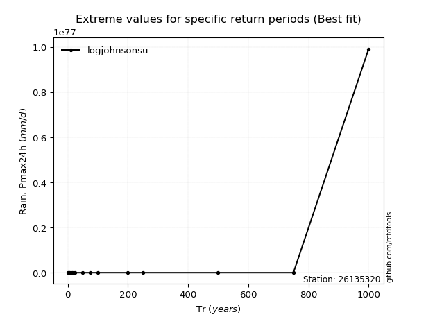</img>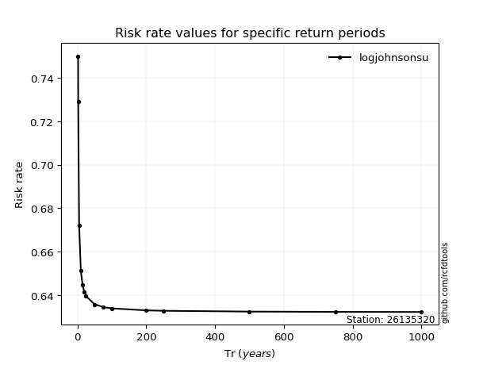</img>

</div>


<sub>**APP DISCLAIMER**: NO WARRANTY - This software is provided by [github.com/rcfdtools](https://github.com/rcfdtools) "as is", without any express or implied warranty, including warranties of merchantability, fitness for a particular purpose, or non-infringement. There is no guarantee that the software will be error-free or operate without interruption. LIMITATION OF LIABILITY - Neither the authors nor copyright holders will be liable for claims or damages arising from the software or its use. You are responsible for determining if the software is appropriate for your use and assume all associated risks, including errors, legal compliance, and data loss. NO PROFESSIONAL ADVICE - The software provides general information and does not offer professional advice. It should not replace consultation with professional advisors.</sub>