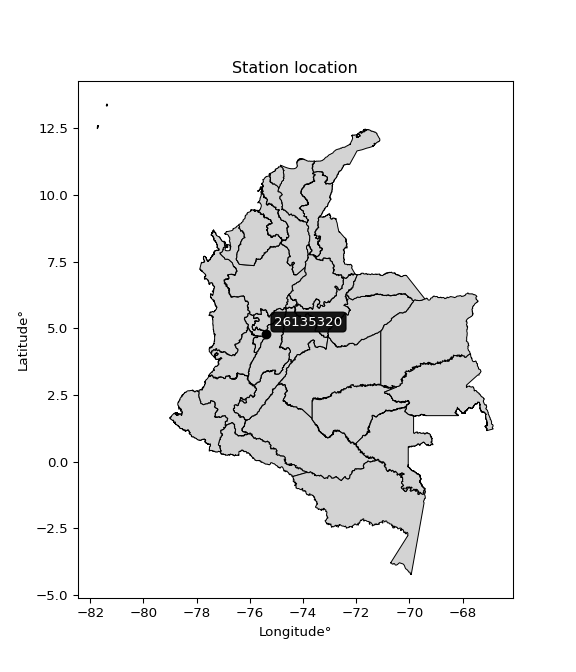

<div align="center">


</div>

# PMP Station (Rain, Pmax24h): 26135320

Probable Maximum Precipitation (PMP) is the greatest amount of rainfall for a specific duration that is meteorologically possible for a given location, acting as a "worst-case" scenario for extreme storms, crucial for designing safety-critical infrastructure like bridges, river deviations, dams, spillways, and nuclear plants to prevent catastrophic failure. PMP is calculated by hydrologists using meteorological data to determine the upper limit of extreme rainfall, often leading to the Probable Maximum Flood (PMF) for flood control design, and is increasingly being studied for climate change impacts. Probable Maximum Precipitation (PMP) is the theoretical upper limit of rainfall, a deterministic estimate for extreme events, while probability distributions (like GEV, Gumbel) describe the likelihood and frequency of various precipitation amounts, including rare ones, showing how often events occur, with PMP representing the extreme end of these distributions, used for critical infrastructure design to ensure safety against the worst conceivable weather, unlike standard statistical forecasts which cover typical probabilities.

The most common probability distributions in hydrology, used for analyzing floods, rainfall, and streamflow, include the Normal, Log-Normal, Gumbel, Gamma (including Log-Pearson Type III), and Generalized Extreme Value (GEV) distributions, often chosen based on the data´s skewness and whether modeling extremes or general conditions, with Gumbel and GEV popular for extreme events like floods, while the Normal distribution serves as a baseline, though often requiring transformations for skewed hydrological data. These distributions help in designing water infrastructure, managing water resources, and forecasting hydrologic events.

> Hydrological data often isn´t perfectly normal (it´s skewed), so different distributions are needed for different applications, such as: **Flood Frequency Analysis**: Using Gumbel, GEV, or Log-Pearson Type III for predicting extreme flood magnitudes and their return periods, **Rainfall Analysis**: Normal for annual totals, but Log-Normal, Weibull, or GEV for intensity or extreme daily rainfall, **Streamflow Modeling**: Gamma and Log-Normal for maximum flows, GEV for minimum flows, and Kappa for daily flows.

<div align="center">

</img>

</div>


## A. General information


### 1. General running parameters

• app_version: _v20260113_. • runtime: _2026-01-17 18:24:04.630693_. • Python version: _3.14.0_. • SciPy version: _1.16.3_. • Pandas version: _2.3.3_. • NumPy version: _2.3.5_. • Stations dataset (station_dataset_file): _dataset/pmax24h_in/automatic_colombia_2003_2025.csv_. • Stations catalog (station_catalog_file): _dataset/CNE.xls_. • Minimum year to eval til year_max (date_min): _1900_. • Maximum year to eval since year_min (date_max): _2025_. • Creates, save and include plots into reports (create_plot): _False_. • Plot only fit distributions with Δo > Δ (plot_only_fit): _True_. • Plot only simple graphs avoiding multiple CDFs and multiple Extreme values plots (plot_only_simple): _True_. • Eval low extreme values, if False, evaluates high extreme values (low_extreme): _False_. • Eval every SciPy distribution as logarithmic (pdist_logarithmic_on): _True_. • Standard deviation normalized (ddof): _1.0_. • Return periods to eval in years (Tr): _[2, 2.33, 5, 10, 15, 20, 25, 50, 75, 100, 200, 250, 500, 750, 1000]_. • Minimum data sample per station, 0 means any (minimum_sample): _5_. • Z-Score maximum threshold to adjust a value, 0 means disable (zscore_max): _3.5_. • Z-Score minimum threshold to adjust a value, 0 means disable (zscore_min): _-2.5_. • Avoid zeros, e.g. rain = 0 (avoid_zeros): _True_. • Avoid null values (avoid_nans): _True_. 

:file_folder:Table: [dataset.csv](../../dataset/pmax24h_in/automatic_colombia_2003_2025.csv)

> Delta Degrees of Freedom (DDOF): is a parameter used in the formulas for calculating variance and standard deviation. When ddof=0, the divisor is $N$ (the total number of observations) and this is used when your data set is the entire population. When ddof=1, the divisor is $N-1$ and this is used when your data set is a sample drawn from a larger population. Using $N-1$ provides an unbiased estimate of the population variance (known as Bessel´s correction).


### 2. Station info and location

|   id |   CODIGO | NOMBRE                                | CATEGORIA               | TECNOLOGIA                | ESTADO           | FECHA_INSTALACION   |   FECHA_SUSPENSION |   ALTITUD |   LATITUD |   LONGITUD | DEPARTAMENTO   | MUNICIPIO   | AREA_OPERATIVA                         | ENTIDAD                                                     | AREA_HIDROGRAFICA   | ZONA_HIDROGRAFICA   | SUBZONA_HIDROGRAFICA               |   CORRIENTE | Catalogo   |   Version |
|-----:|---------:|:--------------------------------------|:------------------------|:--------------------------|:-----------------|:--------------------|-------------------:|----------:|----------:|-----------:|:---------------|:------------|:---------------------------------------|:------------------------------------------------------------|:--------------------|:--------------------|:-----------------------------------|------------:|:-----------|----------:|
|    0 | 26135320 | NEVADO SANTA ISABEL  - AUT [26135320] | Climatológica Principal | Automática con Telemetría | En Mantenimiento | 17/10/2005          |                nan |      4757 |   4.80261 |   -75.3805 | Caldas         | Villamaria  | Area Operativa 09 - Cauca-Valle-Caldas | INSTITUTO DE HIDROLOGIA METEOROLOGIA Y ESTUDIOS AMBIENTALES | Magdalena Cauca     | Cauca               | Río Otún y otros directos al Cauca |         nan | CNE_IDEAM  |  20251226 |

<div align="center">

Dynamic map: [:earth_americas:Google](http://maps.google.com/maps?q=4.802611111,-75.380472222) [:earth_americas:OSM](https://www.openstreetmap.org/#map=18/4.802611111/-75.380472222&layers=P) [:earth_americas:Bing](https://www.bing.com/maps?cp=4.802611111~-75.380472222&lvl=18) [:earth_americas:Apple](https://maps.apple.com/frame?center=4.802611111%2C-75.380472222&span=0.003%2C0.006)

</div>


<div align="center">

```geojson
{
  "type": "Feature",
  "geometry": {
    "type": "Point", 
    "coordinates": [-75.380472222, 4.802611111]
  }, 
  "properties": {
    "Name": "26135320"
  }
}
```

</div>


### 3. Discrete values table and plot

<div align="center">

|               |           0 |           1 |           2 |          3 |           4 |          5 |           6 |          7 |
|:--------------|------------:|------------:|------------:|-----------:|------------:|-----------:|------------:|-----------:|
| Date          | 2016        | 2017        | 2018        | 2019       | 2020        | 2021       | 2022        | 2025       |
| Value         |    3.7      |   13.6      |   20.7      |   25.9     |   24.8      |  664.7     |   25.6      |   31.8     |
| Value_initial |    3.7      |   13.6      |   20.7      |   25.9     |   24.8      |  664.7     |   25.6      |   31.8     |
| count         |    8        |    8        |    8        |    8       |    8        |    8       |    8        |    8       |
| mean          |  101.35     |  101.35     |  101.35     |  101.35    |  101.35     |  101.35    |  101.35     |  101.35    |
| std           |  227.794    |  227.794    |  227.794    |  227.794   |  227.794    |  227.794   |  227.794    |  227.794   |
| zscore        |   -0.428677 |   -0.385216 |   -0.354048 |   -0.33122 |   -0.336049 |    2.47307 |   -0.332537 |   -0.30532 |


</div>


> The initial value (value_initial) correspond to the initial obtained or null completed value, and value (value) is adjusted only when the initial value is outside the valid range (outlier) definite through the Z-Score value. If Z-Score is active, values out of range or outliers are replaced with the station mean value. A Z-Score (or standard score) measures how many standard deviations a data point is from the mean of a dataset, indicating its relative position; positive scores mean above the mean, negative mean below, and a score of zero is exactly at the mean, allowing for comparison of values from different distributions. It´s calculated using the formula $z=(x–μ)/σ$, where $x$ is the data point, $μ$ is the mean, and $σ$ is the standard deviation, helping identify outliers and understand probability.
>
> <sub>**Note**: In this study, "completing" (filling gaps in) and "extending" (forecasting or lengthening the historical record) rainfall data series are avoided for certain critical analyses because they introduce artificial bias and uncertainty, which can distort the statistics of rare events (extremes), alter day-to-day variability, and compromise the integrity and homogeneity of the original data. Some reasons against Completing/Extending rainfall data are: **Distortion of Extremes and Variability**: The primary issue is that most gap-filling or extension methods rely on averaging or regression with nearby stations, which inherently smooths the data. Rainfall is highly variable in space and time, with a large percentage of zero values and occasional large storms. Infilling methods often underestimate the highest values and overestimate the lowest (zero) values, which severely distorts analyses focused on flood frequency, drought severity, and intensity-duration-frequency (IDF) curves, **Loss of Data Homogeneity**: Infilled or extended data are synthetic estimates, not actual measurements. Combining these estimates with observed data can violate the assumption of data homogeneity, which requires that the data properties do not change over time. Inhomogeneity can lead to incorrect conclusions about long-term trends or changes in climate patterns, **Propagation of Errors**: Errors and biases from the original data (e.g., wind-induced undercatch, instrument errors, site changes) or the data used for imputation can propagate through the analysis, leading to unreliable hydrological models and inaccurate predictions, **Compromised Statistical Integrity**: For statistical analyses, especially those involving the frequency of events, using artificial data can introduce time bias or autocorrelation that doesn´t exist in reality, making it difficult to assess the true probability of events, **Difficulty in Validation**: It is difficult to accurately validate the quality of filled or extended data, especially for past periods where ground-truth measurements are unavailable. The reliability of imputation techniques heavily depends on the density of the surrounding station network and the complexity of the local topography.</sub>


### 4. Active continuous probability distributions from SciPy (80 of 104 available)

A Probability Density Function (PDF) describes the relative likelihood of a continuous random variable falling within a specific range, where the total area under its curve equals 1, and the area over any interval gives the actual probability for that range. Unlike discrete probabilities (like rolling a die), a PDF shows density, not direct probability for a single point (which is zero), with higher points indicating higher likelihood, often visualized as a bell curve for normal distributions.

A log of a probability density function (log-PDF) is simply the logarithm of the PDF´s value, denoted as $log(f(x))$, useful for converting multiplication of probabilities into addition, improving numerical stability with tiny numbers, and connecting to information theory concepts like entropy. Instead of dealing with very small probabilities (e.g., 0.000001), log-PDFs use negative numbers (e.g., $log(0.00001) ≈ -11.51$ that are easier for computers to handle, preventing underflow errors and simplifying complex calculations. In this study, each active probability distribution from SciPy is also evaluated in the $log$ form.

[scipy.stats](https://docs.scipy.org/doc/scipy/reference/stats.html) is a Python´s powerful submodule within the SciPy library for comprehensive statistical analysis, offering over 130 probability distributions (like Normal, Poisson), functions for descriptive stats (mean, variance), hypothesis testing (t-tests, chi-square), random variable generation, and statistical tests, making it essential for data science, modeling, and research. It provides tools to explore, model, and draw conclusions from data efficiently, working seamlessly with NumPy.

<div align="center">

|   id | p_dist           |   n_parameter | fit_method   | label                                                                       | active   | ref                                                                                                      |
|-----:|:-----------------|--------------:|:-------------|:----------------------------------------------------------------------------|:---------|:---------------------------------------------------------------------------------------------------------|
|    0 | alpha            |             3 | MLE          | Alpha                                                                       | True     | [:mortar_board:](https://docs.scipy.org/doc/scipy/reference/generated/scipy.stats.alpha.html)            |
|    1 | anglit           |             2 | MM           | Anglit                                                                      | True     | [:mortar_board:](https://docs.scipy.org/doc/scipy/reference/generated/scipy.stats.anglit.html)           |
|    2 | arcsine          |             2 | MM           | Arcsine                                                                     | True     | [:mortar_board:](https://docs.scipy.org/doc/scipy/reference/generated/scipy.stats.arcsine.html)          |
|    3 | argus            |             3 | MLE          | Argus                                                                       | True     | [:mortar_board:](https://docs.scipy.org/doc/scipy/reference/generated/scipy.stats.argus.html)            |
|    4 | beta             |             4 | MLE          | Beta                                                                        | True     | [:mortar_board:](https://docs.scipy.org/doc/scipy/reference/generated/scipy.stats.beta.html)             |
|    5 | betaprime        |             4 | MLE          | Beta prime                                                                  | True     | [:mortar_board:](https://docs.scipy.org/doc/scipy/reference/generated/scipy.stats.betaprime.html)        |
|    6 | bradford         |             3 | MLE          | Bradford                                                                    | True     | [:mortar_board:](https://docs.scipy.org/doc/scipy/reference/generated/scipy.stats.bradford.html)         |
|    7 | burr             |             4 | MLE          | Burr (Type III)                                                             | True     | [:mortar_board:](https://docs.scipy.org/doc/scipy/reference/generated/scipy.stats.burr.html)             |
|    8 | burr12           |             4 | MLE          | Burr (Type III) 12                                                          | True     | [:mortar_board:](https://docs.scipy.org/doc/scipy/reference/generated/scipy.stats.burr12.html)           |
|    9 | cosine           |             2 | MLE          | Cosine                                                                      | True     | [:mortar_board:](https://docs.scipy.org/doc/scipy/reference/generated/scipy.stats.cosine.html)           |
|   10 | crystalball      |             4 | MLE          | Crystalball                                                                 | True     | [:mortar_board:](https://docs.scipy.org/doc/scipy/reference/generated/scipy.stats.crystalball.html)      |
|   11 | dgamma           |             3 | MLE          | Double gamma                                                                | True     | [:mortar_board:](https://docs.scipy.org/doc/scipy/reference/generated/scipy.stats.dgamma.html)           |
|   12 | dweibull         |             3 | MLE          | Double Weibull                                                              | True     | [:mortar_board:](https://docs.scipy.org/doc/scipy/reference/generated/scipy.stats.dweibull.html)         |
|   13 | erlang           |             3 | MLE          | Erlang                                                                      | True     | [:mortar_board:](https://docs.scipy.org/doc/scipy/reference/generated/scipy.stats.erlang.html)           |
|   14 | exponnorm        |             3 | MLE          | Exponentially modified Normal                                               | True     | [:mortar_board:](https://docs.scipy.org/doc/scipy/reference/generated/scipy.stats.exponnorm.html)        |
|   15 | exponpow         |             3 | MLE          | Exponential power                                                           | True     | [:mortar_board:](https://docs.scipy.org/doc/scipy/reference/generated/scipy.stats.exponpow.html)         |
|   16 | exponweib        |             4 | MLE          | Exponentiated Weibull                                                       | True     | [:mortar_board:](https://docs.scipy.org/doc/scipy/reference/generated/scipy.stats.exponweib.html)        |
|   17 | f                |             4 | MLE          | F                                                                           | True     | [:mortar_board:](https://docs.scipy.org/doc/scipy/reference/generated/scipy.stats.f.html)                |
|   18 | fatiguelife      |             3 | MLE          | Fatigue-life (Birnbaum-Saunders)                                            | True     | [:mortar_board:](https://docs.scipy.org/doc/scipy/reference/generated/scipy.stats.fatiguelife.html)      |
|   19 | foldnorm         |             3 | MM           | Fold Normal                                                                 | True     | [:mortar_board:](https://docs.scipy.org/doc/scipy/reference/generated/scipy.stats.foldnorm.html)         |
|   20 | gamma            |             3 | MLE          | Gamma                                                                       | True     | [:mortar_board:](https://docs.scipy.org/doc/scipy/reference/generated/scipy.stats.gamma.html)            |
|   21 | gausshyper       |             6 | MLE          | Gauss hypergeometric                                                        | True     | [:mortar_board:](https://docs.scipy.org/doc/scipy/reference/generated/scipy.stats.gausshyper.html)       |
|   22 | genexpon         |             5 | MLE          | Generalized exponential                                                     | True     | [:mortar_board:](https://docs.scipy.org/doc/scipy/reference/generated/scipy.stats.genexpon.html)         |
|   23 | genextreme       |             3 | MLE          | Generalized exponential                                                     | True     | [:mortar_board:](https://docs.scipy.org/doc/scipy/reference/generated/scipy.stats.genextreme.html)       |
|   24 | gengamma         |             4 | MLE          | Generalized gamma                                                           | True     | [:mortar_board:](https://docs.scipy.org/doc/scipy/reference/generated/scipy.stats.gengamma.html)         |
|   25 | genhalflogistic  |             3 | MLE          | Generalized half-logistic                                                   | True     | [:mortar_board:](https://docs.scipy.org/doc/scipy/reference/generated/scipy.stats.genhalflogistic.html)  |
|   26 | genlogistic      |             3 | MLE          | Generalized logistic                                                        | True     | [:mortar_board:](https://docs.scipy.org/doc/scipy/reference/generated/scipy.stats.genlogistic.html)      |
|   27 | gennorm          |             3 | MLE          | Generalized Normal                                                          | True     | [:mortar_board:](https://docs.scipy.org/doc/scipy/reference/generated/scipy.stats.gennorm.html)          |
|   28 | genpareto        |             3 | MLE          | Generalized Pareto                                                          | True     | [:mortar_board:](https://docs.scipy.org/doc/scipy/reference/generated/scipy.stats.genpareto.html)        |
|   29 | gompertz         |             3 | MLE          | Gompertz (or truncated Gumbel)                                              | True     | [:mortar_board:](https://docs.scipy.org/doc/scipy/reference/generated/scipy.stats.gompertz.html)         |
|   30 | gumbel_l         |             2 | MM           | Gumbel Left Skew                                                            | True     | [:mortar_board:](https://docs.scipy.org/doc/scipy/reference/generated/scipy.stats.gumbel_l.html)         |
|   31 | gumbel_r         |             2 | MM           | Gumbel Right Skew                                                           | True     | [:mortar_board:](https://docs.scipy.org/doc/scipy/reference/generated/scipy.stats.gumbel_r.html)         |
|   32 | halfgennorm      |             3 | MLE          | Upper half of a generalized normal                                          | True     | [:mortar_board:](https://docs.scipy.org/doc/scipy/reference/generated/scipy.stats.halfgennorm.html)      |
|   33 | halflogistic     |             2 | MM           | Half-logistic                                                               | True     | [:mortar_board:](https://docs.scipy.org/doc/scipy/reference/generated/scipy.stats.halflogistic.html)     |
|   34 | halfnorm         |             2 | MM           | Half Normal                                                                 | True     | [:mortar_board:](https://docs.scipy.org/doc/scipy/reference/generated/scipy.stats.halfnorm.html)         |
|   35 | hypsecant        |             2 | MM           | hyperbolic secant                                                           | True     | [:mortar_board:](https://docs.scipy.org/doc/scipy/reference/generated/scipy.stats.hypsecant.html)        |
|   36 | invgamma         |             3 | MLE          | Inverted gamma                                                              | True     | [:mortar_board:](https://docs.scipy.org/doc/scipy/reference/generated/scipy.stats.invgamma.html)         |
|   37 | invgauss         |             3 | MLE          | Inverse Gaussian                                                            | True     | [:mortar_board:](https://docs.scipy.org/doc/scipy/reference/generated/scipy.stats.invgauss.html)         |
|   38 | invweibull       |             3 | MLE          | Inverted Weibull                                                            | True     | [:mortar_board:](https://docs.scipy.org/doc/scipy/reference/generated/scipy.stats.invweibull.html)       |
|   39 | johnsonsb        |             4 | MLE          | Johnson SB                                                                  | True     | [:mortar_board:](https://docs.scipy.org/doc/scipy/reference/generated/scipy.stats.johnsonsb.html)        |
|   40 | johnsonsu        |             4 | MLE          | Johnson Su                                                                  | True     | [:mortar_board:](https://docs.scipy.org/doc/scipy/reference/generated/scipy.stats.johnsonsu.html)        |
|   41 | kappa3           |             3 | MLE          | Kappa 3                                                                     | True     | [:mortar_board:](https://docs.scipy.org/doc/scipy/reference/generated/scipy.stats.kappa3.html)           |
|   42 | kappa4           |             4 | MLE          | Kappa 4                                                                     | True     | [:mortar_board:](https://docs.scipy.org/doc/scipy/reference/generated/scipy.stats.kappa4.html)           |
|   43 | ksone            |             3 | MLE          | Kolmogorov-Smirnov one-sided test statistic distribution                    | True     | [:mortar_board:](https://docs.scipy.org/doc/scipy/reference/generated/scipy.stats.ksone.html)            |
|   44 | kstwobign        |             2 | MLE          | Limiting distribution of scaled Kolmogorov-Smirnov two-sided test statistic | True     | [:mortar_board:](https://docs.scipy.org/doc/scipy/reference/generated/scipy.stats.kstwobign.html)        |
|   45 | laplace          |             2 | MM           | Laplace                                                                     | True     | [:mortar_board:](https://docs.scipy.org/doc/scipy/reference/generated/scipy.stats.laplace.html)          |
|   46 | levy_l           |             2 | MLE          | Left-skewed Levy                                                            | True     | [:mortar_board:](https://docs.scipy.org/doc/scipy/reference/generated/scipy.stats.levy_l.html)           |
|   47 | loggamma         |             3 | MLE          | Log gamma                                                                   | True     | [:mortar_board:](https://docs.scipy.org/doc/scipy/reference/generated/scipy.stats.loggamma.html)         |
|   48 | logistic         |             2 | MM           | Logistic (or Sech-squared)                                                  | True     | [:mortar_board:](https://docs.scipy.org/doc/scipy/reference/generated/scipy.stats.logistic.html)         |
|   49 | loglaplace       |             3 | MLE          | Log-Laplace                                                                 | True     | [:mortar_board:](https://docs.scipy.org/doc/scipy/reference/generated/scipy.stats.loglaplace.html)       |
|   50 | lomax            |             3 | MLE          | Lomax (Pareto of the second kind)                                           | True     | [:mortar_board:](https://docs.scipy.org/doc/scipy/reference/generated/scipy.stats.lomax.html)            |
|   51 | maxwell          |             2 | MM           | Maxwell                                                                     | True     | [:mortar_board:](https://docs.scipy.org/doc/scipy/reference/generated/scipy.stats.maxwell.html)          |
|   52 | mielke           |             4 | MLE          | Mielke Beta-Kappa / Dagum                                                   | True     | [:mortar_board:](https://docs.scipy.org/doc/scipy/reference/generated/scipy.stats.mielke.html)           |
|   53 | moyal            |             2 | MM           | Moyal                                                                       | True     | [:mortar_board:](https://docs.scipy.org/doc/scipy/reference/generated/scipy.stats.moyal.html)            |
|   54 | nakagami         |             3 | MLE          | Nakagami                                                                    | True     | [:mortar_board:](https://docs.scipy.org/doc/scipy/reference/generated/scipy.stats.nakagami.html)         |
|   55 | ncf              |             5 | MLE          | Non-central F distribution                                                  | True     | [:mortar_board:](https://docs.scipy.org/doc/scipy/reference/generated/scipy.stats.ncf.html)              |
|   56 | nct              |             4 | MLE          | Non-central Student’s t                                                     | True     | [:mortar_board:](https://docs.scipy.org/doc/scipy/reference/generated/scipy.stats.nct.html)              |
|   57 | norm             |             2 | MM           | Normal                                                                      | True     | [:mortar_board:](https://docs.scipy.org/doc/scipy/reference/generated/scipy.stats.norm.html)             |
|   58 | pearson3         |             3 | MM           | Pearson type III                                                            | True     | [:mortar_board:](https://docs.scipy.org/doc/scipy/reference/generated/scipy.stats.pearson3.html)         |
|   59 | powerlaw         |             3 | MLE          | Power-function                                                              | True     | [:mortar_board:](https://docs.scipy.org/doc/scipy/reference/generated/scipy.stats.powerlaw.html)         |
|   60 | rayleigh         |             2 | MM           | Rayleigh                                                                    | True     | [:mortar_board:](https://docs.scipy.org/doc/scipy/reference/generated/scipy.stats.rayleigh.html)         |
|   61 | rdist            |             3 | MLE          | R-distributed (symmetric beta)                                              | True     | [:mortar_board:](https://docs.scipy.org/doc/scipy/reference/generated/scipy.stats.rdist.html)            |
|   62 | rice             |             3 | MLE          | Rice                                                                        | True     | [:mortar_board:](https://docs.scipy.org/doc/scipy/reference/generated/scipy.stats.rice.html)             |
|   63 | semicircular     |             2 | MM           | Semicircular                                                                | True     | [:mortar_board:](https://docs.scipy.org/doc/scipy/reference/generated/scipy.stats.semicircular.html)     |
|   64 | skewnorm         |             3 | MLE          | Skew normal                                                                 | True     | [:mortar_board:](https://docs.scipy.org/doc/scipy/reference/generated/scipy.stats.skewnorm.html)         |
|   65 | t                |             3 | MLE          | Student’s t                                                                 | True     | [:mortar_board:](https://docs.scipy.org/doc/scipy/reference/generated/scipy.stats.t.html)                |
|   66 | trapezoid        |             4 | MLE          | Trapezoid                                                                   | True     | [:mortar_board:](https://docs.scipy.org/doc/scipy/reference/generated/scipy.stats.trapezoid.html)        |
|   67 | triang           |             3 | MLE          | Triangular                                                                  | True     | [:mortar_board:](https://docs.scipy.org/doc/scipy/reference/generated/scipy.stats.triang.html)           |
|   68 | truncexpon       |             3 | MLE          | Truncated exponential                                                       | True     | [:mortar_board:](https://docs.scipy.org/doc/scipy/reference/generated/scipy.stats.truncexpon.html)       |
|   69 | truncnorm        |             4 | MLE          | Truncated normal                                                            | True     | [:mortar_board:](https://docs.scipy.org/doc/scipy/reference/generated/scipy.stats.truncnorm.html)        |
|   70 | truncpareto      |             4 | MLE          | Upper truncated Pareto                                                      | True     | [:mortar_board:](https://docs.scipy.org/doc/scipy/reference/generated/scipy.stats.truncpareto.html)      |
|   71 | truncweibull_min |             5 | MLE          | Doubly truncated Weibull minimum                                            | True     | [:mortar_board:](https://docs.scipy.org/doc/scipy/reference/generated/scipy.stats.truncweibull_min.html) |
|   72 | tukeylambda      |             3 | MLE          | Tukey-Lamdba                                                                | True     | [:mortar_board:](https://docs.scipy.org/doc/scipy/reference/generated/scipy.stats.tukeylambda.html)      |
|   73 | uniform          |             2 | MLE          | Uniform                                                                     | True     | [:mortar_board:](https://docs.scipy.org/doc/scipy/reference/generated/scipy.stats.uniform.html)          |
|   74 | vonmises         |             3 | MLE          | Von Mises                                                                   | True     | [:mortar_board:](https://docs.scipy.org/doc/scipy/reference/generated/scipy.stats.vonmises.html)         |
|   75 | vonmises_line    |             3 | MLE          | Von Mises line                                                              | True     | [:mortar_board:](https://docs.scipy.org/doc/scipy/reference/generated/scipy.stats.vonmises_line.html)    |
|   76 | wald             |             2 | MM           | Wald                                                                        | True     | [:mortar_board:](https://docs.scipy.org/doc/scipy/reference/generated/scipy.stats.wald.html)             |
|   77 | weibull_max      |             3 | MLE          | Weibull maximum                                                             | True     | [:mortar_board:](https://docs.scipy.org/doc/scipy/reference/generated/scipy.stats.weibull_max.html)      |
|   78 | weibull_min      |             3 | MLE          | Weibull minimum                                                             | True     | [:mortar_board:](https://docs.scipy.org/doc/scipy/reference/generated/scipy.stats.weibull_min.html)      |
|   79 | wrapcauchy       |             3 | MLE          | Wrapped  Cauchy                                                             | True     | [:mortar_board:](https://docs.scipy.org/doc/scipy/reference/generated/scipy.stats.wrapcauchy.html)       |

</div>

> **n_parameter:** # arguments & localization & scale.
>
> **Fit methods:** (MLE) maximum likelihood, (MM) L-moments.
>
>**Inactive** (With the only purpose of prevent loops, zero divisions, infinite values, over high estimated values or horizontal trending for recurrence intervals estimations, the follow distributions were disabled.)**:** lognorm, norminvgauss, powernorm, powerlognorm, cauchy, halfcauchy, foldcauchy, skewcauchy, chi2, expon, fisk, genhyperbolic, geninvgauss, gibrat, kstwo, laplace_asymmetric, levy, levy_stable, ncx2, pareto, rel_breitwigner, recipinvgauss, studentized_range, loguniform, 


## B. Probability (PDF) vs. Empirical (EDF) distributions functions

A continuous probability distribution (CPD) describes probabilities for variables that can take any value within a range (like rain any time), unlike discrete variables with specific outcomes (like temperature). It uses a Probability Density Function (PDF), a curve where the total area under it equals 1, and the probability of the variable falling within an interval (a to b) is found by calculating the area under the curve between those points. A key feature is that the probability of hitting any single exact value is zero, so probabilities are always expressed for ranges, e.g., $P(a ≤ X ≤ b)$.

<div align="center">

Distributions parameters from station values
|     |   station | p_dist              |   n |              loc |          scale | shape                  | shape1                 | shape2               | shape3             |
|----:|----------:|:--------------------|----:|-----------------:|---------------:|:-----------------------|:-----------------------|:---------------------|:-------------------|
|   0 |  26135320 | alpha               |   8 |     -0.0218167   |    9.68336     | 2.7109208083131786e-11 |                        |                      |                    |
|   1 |  26135320 | anglit              |   8 |    101.35        |  623.35        |                        |                        |                      |                    |
|   2 |  26135320 | arcsine             |   8 |   -199.993       |  602.687       |                        |                        |                      |                    |
|   3 |  26135320 | argus               |   8 |   -434.885       | 1136.48        | 1.396958320161646e-07  |                        |                      |                    |
|   4 |  26135320 | beta                |   8 |      3.7         |  661.331       | 0.002581329767182817   | 0.017104302328740634   |                      |                    |
|   5 |  26135320 | betaprime           |   8 |      3.69966     |   18.2449      | 0.7495163356649444     | 1.0304272821711071     |                      |                    |
|   6 |  26135320 | bradford            |   8 |      3.69991     |  661           | 2.5962859715737263     |                        |                      |                    |
|   7 |  26135320 | burr                |   8 |     -0.0206711   |    7.762       | 1.1714864963288067     | 2.905626348570813      |                      |                    |
|   8 |  26135320 | burr12              |   8 |     -0.945379    |   14.5146      | 2.511721882754758      | 0.42223682699716897    |                      |                    |
|   9 |  26135320 | cosine              |   8 |    166.943       |  207.352       |                        |                        |                      |                    |
|  10 |  26135320 | crystalball         |   8 |    101.35        |  213.082       | 6913.9832126623205     | 8227.524404976995      |                      |                    |
|  11 |  26135320 | dgamma              |   8 |     25.9         |  207.031       | 0.5793464391277424     |                        |                      |                    |
|  12 |  26135320 | dweibull            |   8 |     25.6         |  206.75        | 0.33538553256716935    |                        |                      |                    |
|  13 |  26135320 | erlang              |   8 |      3.7         |  294.94        | 0.35608602367588893    |                        |                      |                    |
|  14 |  26135320 | exponnorm           |   8 |      3.5841      |    0.0354612   | 2748.708878406902      |                        |                      |                    |
|  15 |  26135320 | exponpow            |   8 |      3.7         |  137.37        | 0.2757975309723484     |                        |                      |                    |
|  16 |  26135320 | exponweib           |   8 |      3.7         |   22.6979      | 1.5808292432731066     | 0.4969303768896267     |                      |                    |
|  17 |  26135320 | f                   |   8 |      3.7         |   20.4866      | 1.4066118008189787     | 2.4213134785756534     |                      |                    |
|  18 |  26135320 | fatiguelife         |   8 |      1.64529     |   36.41        | 2.074840408513573      |                        |                      |                    |
|  19 |  26135320 | foldnorm            |   8 |   -203.992       |  386.074       | 0.0010944343310581562  |                        |                      |                    |
|  20 |  26135320 | gamma               |   8 |      3.7         |  206.839       | 0.3886060568335227     |                        |                      |                    |
|  21 |  26135320 | gausshyper          |   8 |      3.7         |  977.611       | 0.2904359059642164     | 1.5865309255141962     | 0.9602985582641188   | 1.4607894968715431 |
|  22 |  26135320 | genexpon            |   8 |      3.7         |  207.552       | 2.1254665941548554     | 1.4318886471790797e-12 | 1.1308945988644252   |                    |
|  23 |  26135320 | genextreme          |   8 |     16.4548      |   16.8214      | -0.8895544407637567    |                        |                      |                    |
|  24 |  26135320 | gengamma            |   8 |      3.7         |   30.2245      | 1.186692401087067      | 0.46442087480697025    |                      |                    |
|  25 |  26135320 | genhalflogistic     |   8 |    -64.3532      |  764.459       | 1.0485640010675044     |                        |                      |                    |
|  26 |  26135320 | genlogistic         |   8 |   -605.35        |   81.3364      | 2499.520756223227      |                        |                      |                    |
|  27 |  26135320 | gennorm             |   8 |     25.6         |    0.41199     | 0.33302072887179845    |                        |                      |                    |
|  28 |  26135320 | genpareto           |   8 |      3.7         |   19.1212      | 0.9511223200323922     |                        |                      |                    |
|  29 |  26135320 | gompertz            |   8 |      3.7         |  501.996       | 2.199478628577276      |                        |                      |                    |
|  30 |  26135320 | gumbel_l            |   8 |    197.248       |  166.139       |                        |                        |                      |                    |
|  31 |  26135320 | gumbel_r            |   8 |      5.45182     |  166.139       |                        |                        |                      |                    |
|  32 |  26135320 | halfgennorm         |   8 |      3.7         |   11.034       | 0.5177233833199895     |                        |                      |                    |
|  33 |  26135320 | halflogistic        |   8 |   -151.202       |  182.177       |                        |                        |                      |                    |
|  34 |  26135320 | halfnorm            |   8 |   -180.687       |  353.481       |                        |                        |                      |                    |
|  35 |  26135320 | hypsecant           |   8 |    101.35        |  135.652       |                        |                        |                      |                    |
|  36 |  26135320 | invgamma            |   8 |     -1.61416     |   19.6738      | 1.084753760076055      |                        |                      |                    |
|  37 |  26135320 | invgauss            |   8 |      0.656875    |   15.0643      | 6.684227871202985      |                        |                      |                    |
|  38 |  26135320 | invweibull          |   8 |      3.21321     |    4.50037     | 0.5321605164221828     |                        |                      |                    |
|  39 |  26135320 | johnsonsb           |   8 |      3.7         | 1694           | 1.2720061975716335     | 0.14237010783591414    |                      |                    |
|  40 |  26135320 | johnsonsu           |   8 |     25.6552      |    0.213477    | 0.06968302868705956    | 0.22211888095446403    |                      |                    |
|  41 |  26135320 | kappa3              |   8 |      3.7         |   19.9858      | 1.17542156481122       |                        |                      |                    |
|  42 |  26135320 | kappa4              |   8 |    -60.7302      |  740.761       | 1.095346755065244      | 1.0176345410309748     |                      |                    |
|  43 |  26135320 | ksone               |   8 |    -62.4         |  793.2         | 1.0                    |                        |                      |                    |
|  44 |  26135320 | kstwobign           |   8 |   -363.81        |  555.605       |                        |                        |                      |                    |
|  45 |  26135320 | laplace             |   8 |    101.35        |  150.672       |                        |                        |                      |                    |
|  46 |  26135320 | levy_l              |   8 |    734.773       |  332.259       |                        |                        |                      |                    |
|  47 |  26135320 | loggamma            |   8 | -73752.4         | 9802.01        | 1871.8897147175567     |                        |                      |                    |
|  48 |  26135320 | logistic            |   8 |    101.35        |  117.478       |                        |                        |                      |                    |
|  49 |  26135320 | loglaplace          |   8 |      3.7         |   21.3592      | 0.832720217690577      |                        |                      |                    |
|  50 |  26135320 | lomax               |   8 |      3.7         |   20.1042      | 1.0514142849731805     |                        |                      |                    |
|  51 |  26135320 | maxwell             |   8 |   -403.565       |  316.408       |                        |                        |                      |                    |
|  52 |  26135320 | mielke              |   8 |      3.69957     |   17.2838      | 0.876512688016601      | 1.0699322298842724     |                      |                    |
|  53 |  26135320 | moyal               |   8 |    -20.5039      |   95.9205      |                        |                        |                      |                    |
|  54 |  26135320 | nakagami            |   8 |      3.7         |  344.593       | 0.15439598123312434    |                        |                      |                    |
|  55 |  26135320 | ncf                 |   8 |     -0.191099    |    9.00128     | 9.4933945450293        | 2.169921614102374      | 9.57942672178082     |                    |
|  56 |  26135320 | nct                 |   8 |     25.7503      |    0.686987    | 0.3205041081080746     | -0.3353465046392945    |                      |                    |
|  57 |  26135320 | norm                |   8 |    101.35        |  213.082       |                        |                        |                      |                    |
|  58 |  26135320 | pearson3            |   8 |    101.35        |  213.082       | 2.261118288753325      |                        |                      |                    |
|  59 |  26135320 | powerlaw            |   8 |      3.7         |  661           | 0.12676397328782266    |                        |                      |                    |
|  60 |  26135320 | rayleigh            |   8 |   -306.288       |  325.248       |                        |                        |                      |                    |
|  61 |  26135320 | rdist               |   8 |    -69.9549      |  101.755       | 1.403411444962586      |                        |                      |                    |
|  62 |  26135320 | rice                |   8 |   -179.722       |  249.404       | 0.00033273685960473107 |                        |                      |                    |
|  63 |  26135320 | semicircular        |   8 |    101.35        |  426.164       |                        |                        |                      |                    |
|  64 |  26135320 | skewnorm            |   8 |      3.69997     |  234.41        | 37227237.625909574     |                        |                      |                    |
|  65 |  26135320 | t                   |   8 |     25.5371      |    0.929825    | 0.34692987921129165    |                        |                      |                    |
|  66 |  26135320 | trapezoid           |   8 |    -65.52        |  793.2         | 1.0                    | 1.0                    |                      |                    |
|  67 |  26135320 | triang              |   8 |      3.69996     | 1501.86        | 7.497536959585272e-09  |                        |                      |                    |
|  68 |  26135320 | truncexpon          |   8 |    -15.6336      |  428.929       | 1.586121935385406      |                        |                      |                    |
|  69 |  26135320 | truncnorm           |   8 |  -2790.39        |  571.51        | 4.888952533625954      | 1138.2960543610434     |                      |                    |
|  70 |  26135320 | truncpareto         |   8 |    -16.4073      |   20.1073      | 0.9064794843999379     | 33.87358463648179      |                      |                    |
|  71 |  26135320 | truncweibull_min    |   8 |     -0.228134    |  339.875       | 0.00846169386286366    | 0.011557594095174935   | 1.9563921155170059   |                    |
|  72 |  26135320 | tukeylambda         |   8 |    -70.5152      |  141.93        | 1.3871842641493086     |                        |                      |                    |
|  73 |  26135320 | uniform             |   8 |      3.7         |  661           |                        |                        |                      |                    |
|  74 |  26135320 | vonmises            |   8 |      0.451675    |    1           | 0.9650851660131663     |                        |                      |                    |
|  75 |  26135320 | vonmises_line       |   8 |     17.5992      |    4.52026     | 9.870139708053623e-06  |                        |                      |                    |
|  76 |  26135320 | wald                |   8 |   -111.732       |  213.082       |                        |                        |                      |                    |
|  77 |  26135320 | weibull_max         |   8 |    664.7         |    1.72719     | 0.14664652614304205    |                        |                      |                    |
|  78 |  26135320 | weibull_min         |   8 |      3.7         |  239.96        | 0.5202768606837989     |                        |                      |                    |
|  79 |  26135320 | wrapcauchy          |   8 |      3.7         |  105.213       | 0.8816849238758397     |                        |                      |                    |
|  80 |  26135320 | logalpha            |   8 |     -4.80921     |   52.2592      | 6.585156641665705      |                        |                      |                    |
|  81 |  26135320 | loganglit           |   8 |      3.32688     |    3.97686     |                        |                        |                      |                    |
|  82 |  26135320 | logarcsine          |   8 |      1.40435     |    3.84504     |                        |                        |                      |                    |
|  83 |  26135320 | logargus            |   8 |     -0.110873    |    6.8393      | 3.0758016537255255e-05 |                        |                      |                    |
|  84 |  26135320 | logbeta             |   8 |      1.30833     |    8.15153     | 0.835971964110148      | 2.936636965538293      |                      |                    |
|  85 |  26135320 | logbetaprime        |   8 |     -0.927107    |    3.98118     | 22.332041377042216     | 21.90834885758123      |                      |                    |
|  86 |  26135320 | logbradford         |   8 |      1.30832     |    5.19102     | 0.6866440710008199     |                        |                      |                    |
|  87 |  26135320 | logburr             |   8 |      0.194149    |    3.28908     | 5.55461852731197       | 0.6337418913171513     |                      |                    |
|  88 |  26135320 | logburr12           |   8 |     -7.06358     |    9.82812     | 20.964733020272874     | 0.5760671884454165     |                      |                    |
|  89 |  26135320 | logcosine           |   8 |      3.56607     |    1.26614     |                        |                        |                      |                    |
|  90 |  26135320 | logcrystalball      |   8 |      3.32688     |    1.35943     | 114.87425010893104     | 4.865055460375395      |                      |                    |
|  91 |  26135320 | logdgamma           |   8 |      3.24259     |    1.29208     | 0.4183158294838364     |                        |                      |                    |
|  92 |  26135320 | logdweibull         |   8 |      3.24259     |    1.21408     | 0.4958393473163233     |                        |                      |                    |
|  93 |  26135320 | logerlang           |   8 |      0.154712    |    0.554176    | 5.72411745589986       |                        |                      |                    |
|  94 |  26135320 | logexponnorm        |   8 |      2.25204     |    0.706679    | 1.5209552339303645     |                        |                      |                    |
|  95 |  26135320 | logexponpow         |   8 |      1.30833     |    3.42014     | 0.8882030131456542     |                        |                      |                    |
|  96 |  26135320 | logexponweib        |   8 |     -3.75391     |    1.99846     | 101.30220408239444     | 1.2981982554288476     |                      |                    |
|  97 |  26135320 | logf                |   8 |     -2.13452     |    5.1858      | 543.9059167244718      | 40.103467871528665     |                      |                    |
|  98 |  26135320 | logfatiguelife      |   8 |     -1.17254     |    4.31625     | 0.29136858409270094    |                        |                      |                    |
|  99 |  26135320 | logfoldnorm         |   8 |      1.50094     |    2.24788     | 0.17763744606571719    |                        |                      |                    |
| 100 |  26135320 | loggamma            |   8 |      0.154695    |    0.554172    | 5.724182456455026      |                        |                      |                    |
| 101 |  26135320 | loggausshyper       |   8 |      1.27026     |    5.22908     | 0.9152592424201149     | 0.8472941155260101     | 1.0655936793855516   | 0.9516015170357732 |
| 102 |  26135320 | loggenexpon         |   8 |      1.30833     |    0.594289    | 0.12718487724283767    | 1.8016451561175604     | 0.040879524996710354 |                    |
| 103 |  26135320 | loggenextreme       |   8 |      2.74119     |    1.07847     | 0.029658643589180918   |                        |                      |                    |
| 104 |  26135320 | loggengamma         |   8 |     -0.163143    |    0.0947987   | 13.329114588831331     | 0.7225441334931038     |                      |                    |
| 105 |  26135320 | loggenhalflogistic  |   8 |      0.844482    |    5.73942     | 1.0149536730688489     |                        |                      |                    |
| 106 |  26135320 | loggenlogistic      |   8 |      2.05802     |    0.853349    | 2.8774065063512007     |                        |                      |                    |
| 107 |  26135320 | loggennorm          |   8 |      3.24259     |    0.000676944 | 0.2461918885557931     |                        |                      |                    |
| 108 |  26135320 | loggenpareto        |   8 |     -0.00788744  |    9.7398      | -1.4967674974748166    |                        |                      |                    |
| 109 |  26135320 | loggompertz         |   8 |      1.30833     |    3.46378     | 1.04298832864832       |                        |                      |                    |
| 110 |  26135320 | loggumbel_l         |   8 |      3.93869     |    1.05994     |                        |                        |                      |                    |
| 111 |  26135320 | loggumbel_r         |   8 |      2.71506     |    1.05994     |                        |                        |                      |                    |
| 112 |  26135320 | loghalfgennorm      |   8 |      1.30833     |    3.69784     | 2.3321126399116068     |                        |                      |                    |
| 113 |  26135320 | loghalflogistic     |   8 |      1.71566     |    1.16225     |                        |                        |                      |                    |
| 114 |  26135320 | loghalfnorm         |   8 |      1.52748     |    2.2552      |                        |                        |                      |                    |
| 115 |  26135320 | loghypsecant        |   8 |      3.32688     |    0.865437    |                        |                        |                      |                    |
| 116 |  26135320 | loginvgamma         |   8 |     -2.3057      |  106.694       | 19.950893702982512     |                        |                      |                    |
| 117 |  26135320 | loginvgauss         |   8 |     -1.20326     |   53.0618      | 0.08537466914946945    |                        |                      |                    |
| 118 |  26135320 | loginvweibull       |   8 |     -5.89834e+07 |    5.89834e+07 | 54981390.78819133      |                        |                      |                    |
| 119 |  26135320 | logjohnsonsb        |   8 |     -0.962196    |  238.656       | 13.105931929790295     | 3.237897557442576      |                      |                    |
| 120 |  26135320 | logjohnsonsu        |   8 |      3.24564     |    0.0107917   | 0.17963295533878193    | 0.25236394888575464    |                      |                    |
| 121 |  26135320 | logkappa3           |   8 |      1.30833     |    2.18994     | 4.087213915114244      |                        |                      |                    |
| 122 |  26135320 | logkappa4           |   8 |      0.805277    |    5.75233     | 1.0958762719225725     | 1.0090281466783804     |                      |                    |
| 123 |  26135320 | logksone            |   8 |      0.789233    |    6.2292      | 1.0                    |                        |                      |                    |
| 124 |  26135320 | logkstwobign        |   8 |     -1.25708     |    5.3058      |                        |                        |                      |                    |
| 125 |  26135320 | loglaplace          |   8 |      3.32688     |    0.961259    |                        |                        |                      |                    |
| 126 |  26135320 | loglevy_l           |   8 |      6.88457     |    1.82533     |                        |                        |                      |                    |
| 127 |  26135320 | logloggamma         |   8 |   -486.124       |   63.929       | 2114.0863147768814     |                        |                      |                    |
| 128 |  26135320 | loglogistic         |   8 |      3.32688     |    0.749491    |                        |                        |                      |                    |
| 129 |  26135320 | logloglaplace       |   8 |     -1.034       |    4.2573      | 5.56000984712266       |                        |                      |                    |
| 130 |  26135320 | loglomax            |   8 |      1.30833     |  157.223       | 77.90145028003829      |                        |                      |                    |
| 131 |  26135320 | logmaxwell          |   8 |      0.105609    |    2.01863     |                        |                        |                      |                    |
| 132 |  26135320 | logmielke           |   8 |     -0.0262349   |    3.45748     | 3.9654676888046825     | 5.8320437956146876     |                      |                    |
| 133 |  26135320 | logmoyal            |   8 |      2.54947     |    0.611957    |                        |                        |                      |                    |
| 134 |  26135320 | lognakagami         |   8 |      2.61007     |    1.56752     | 0.16247020792152622    |                        |                      |                    |
| 135 |  26135320 | logncf              |   8 |     -0.677219    |    0.784609    | 14.472924644468925     | 39.22341680405485      | 55.50522122347721    |                    |
| 136 |  26135320 | lognct              |   8 |      3.24879     |    0.0307106   | 0.3501000089715851     | -0.34030718507896585   |                      |                    |
| 137 |  26135320 | lognorm             |   8 |      3.32688     |    1.35943     |                        |                        |                      |                    |
| 138 |  26135320 | logpearson3         |   8 |      3.32688     |    1.35943     | 1.159838705787851      |                        |                      |                    |
| 139 |  26135320 | logpowerlaw         |   8 |      1.30833     |    5.191       | 0.18169245125410224    |                        |                      |                    |
| 140 |  26135320 | lograyleigh         |   8 |      0.726216    |    2.07503     |                        |                        |                      |                    |
| 141 |  26135320 | logrdist            |   8 |      2.06902     |    1.39044     | 1.3600716467904        |                        |                      |                    |
| 142 |  26135320 | logrice             |   8 |      0.837035    |    2.00591     | 0.0003647823257375972  |                        |                      |                    |
| 143 |  26135320 | logsemicircular     |   8 |      3.32688     |    2.71885     |                        |                        |                      |                    |
| 144 |  26135320 | logskewnorm         |   8 |      1.30833     |    2.43353     | 24371325.2520124       |                        |                      |                    |
| 145 |  26135320 | logt                |   8 |      3.23964     |    0.0411388   | 0.38035538633321664    |                        |                      |                    |
| 146 |  26135320 | logtrapezoid        |   8 |      0.789233    |    6.2292      | 1.0                    | 1.0                    |                      |                    |
| 147 |  26135320 | logtriang           |   8 |     -0.664951    |    7.16429     | 0.9999999941138547     |                        |                      |                    |
| 148 |  26135320 | logtruncexpon       |   8 |      1.05189     |    4.3726      | 1.245812775258198      |                        |                      |                    |
| 149 |  26135320 | logtruncnorm        |   8 |      0.211357    |    2.85261     | 0.38455153548222776    | 34.4333243784341       |                      |                    |
| 150 |  26135320 | logtruncpareto      |   8 |      1.30761     |    0.000720917 | 0.14327649781340934    | 7201.554700966138      |                      |                    |
| 151 |  26135320 | logtruncweibull_min |   8 |      0.981041    |    5.08183     | 1.305362488021276      | 8.060163643450698e-05  | 1.0858872495395944   |                    |
| 152 |  26135320 | logtukeylambda      |   8 |      2.38099     |    1.49462     | 1.3858708747454722     |                        |                      |                    |
| 153 |  26135320 | loguniform          |   8 |      1.30833     |    5.191       |                        |                        |                      |                    |
| 154 |  26135320 | logvonmises         |   8 |      2.88336     |    1           | 1.4714416702936894     |                        |                      |                    |
| 155 |  26135320 | logvonmises_line    |   8 |      3.15936     |    1.06315     | 1.4246579752840476     |                        |                      |                    |
| 156 |  26135320 | logwald             |   8 |      1.96743     |    1.35944     |                        |                        |                      |                    |
| 157 |  26135320 | logweibull_max      |   8 |      6.49934     |    1.92949     | 0.222301656102986      |                        |                      |                    |
| 158 |  26135320 | logweibull_min      |   8 |      2.61007     |    0.900039    | 0.7893374056708713     |                        |                      |                    |
| 159 |  26135320 | logwrapcauchy       |   8 |      1.30829     |    0.840443    | 0.001826502279226515   |                        |                      |                    |

</div>

> **loc** (Location parameter): This shifts the distribution along the x-axis. For many common distributions, like the normal (Gaussian) distribution, loc represents the mean $μ$. For others, like the uniform distribution, it might represent the minimum value, or for the beta distribution, the left end of the support interval.
>
> **scale** (Scale parameter): This determines the width or spread of the distribution. For the normal distribution, scale represents the standard deviation $σ$. For a uniform distribution, it defines the length of the interval (from $loc$ to $loc + scale$).
>
> **shape** (Shape parameters): Refers to parameters that define the specific form of a probability distribution, distinct from its location (loc) and scale (scale). These parameters are required arguments for most distribution functions. For example, a normal (Gaussian) distribution is fully defined by its location (mean) and scale (standard deviation), so it has no specific shape parameters beyond loc and scale. However, other distributions have intrinsic properties that need specification, as Gamma distribution that takes a shape parameter, often named $a$ or $alpha$.


### 0. Cumulative distribution values - CDF (160 evaluated)

Cumulative Distribution Function (CDF), denoted as $F$<sub>$X$</sub>$(x)$, is a function that gives the probability that a random variable $X$ will take a value less than or equal to a specific value, $x$ (i.e., $(P(X≥x)$. It essentially "accumulates" probabilities from a given point up to the far right (positive infinity), providing a complete picture of the distribution´s probabilities for both discrete (like rain) and continuous (like temperature) variables, helping to find probabilities over ranges or above certain values. Each station is evaluated separately ordering the $x$ values ascending, calculating the CDF and PDF values for the activated distributions and their logarithmic forms.

<div align="center">

CDF ordered by x ascending and calculating $log(f(x))$ separately
|   id |   Station |   date |     x |   count |   mean |     std |    zscore |   Value_initial |   station |   m |      alpha |   alpha_pdf |   anglit |   anglit_pdf |   arcsine |   arcsine_pdf |    argus |   argus_pdf |     beta |    beta_pdf |   betaprime |   betaprime_pdf |    bradford |   bradford_pdf |      burr |    burr_pdf |    burr12 |   burr12_pdf |   cosine |   cosine_pdf |   crystalball |   crystalball_pdf |   dgamma |     dgamma_pdf |   dweibull |   dweibull_pdf |     erlang |   erlang_pdf |   exponnorm |   exponnorm_pdf |    exponpow |   exponpow_pdf |   exponweib |   exponweib_pdf |           f |         f_pdf |   fatiguelife |   fatiguelife_pdf |   foldnorm |   foldnorm_pdf |       gamma |   gamma_pdf |   gausshyper |   gausshyper_pdf |    genexpon |   genexpon_pdf |   genextreme |   genextreme_pdf |    gengamma |     gengamma_pdf |   genhalflogistic |   genhalflogistic_pdf |   genlogistic |   genlogistic_pdf |   gennorm |   gennorm_pdf |   genpareto |   genpareto_pdf |    gompertz |   gompertz_pdf |   gumbel_l |   gumbel_l_pdf |   gumbel_r |   gumbel_r_pdf |   halfgennorm |   halfgennorm_pdf |   halflogistic |   halflogistic_pdf |   halfnorm |   halfnorm_pdf |   hypsecant |   hypsecant_pdf |   invgamma |   invgamma_pdf |   invgauss |   invgauss_pdf |   invweibull |   invweibull_pdf |   johnsonsb |   johnsonsb_pdf |   johnsonsu |   johnsonsu_pdf |      kappa3 |   kappa3_pdf |      kappa4 |   kappa4_pdf |     ksone |   ksone_pdf |   kstwobign |   kstwobign_pdf |   laplace |   laplace_pdf |   levy_l |   levy_l_pdf |   loggamma |   loggamma_pdf |   logistic |   logistic_pdf |   loglaplace |   loglaplace_pdf |       lomax |   lomax_pdf |   maxwell |   maxwell_pdf |      mielke |   mielke_pdf |    moyal |   moyal_pdf |    nakagami |   nakagami_pdf |       ncf |     ncf_pdf |      nct |     nct_pdf |     norm |    norm_pdf |   pearson3 |   pearson3_pdf |   powerlaw |   powerlaw_pdf |   rayleigh |   rayleigh_pdf |    rdist |    rdist_pdf |     rice |    rice_pdf |   semicircular |   semicircular_pdf |   skewnorm |   skewnorm_pdf |        t |      t_pdf |   trapezoid |   trapezoid_pdf |      triang |   triang_pdf |   truncexpon |   truncexpon_pdf |   truncnorm |   truncnorm_pdf |   truncpareto |   truncpareto_pdf |   truncweibull_min |   truncweibull_min_pdf |   tukeylambda |   tukeylambda_pdf |   uniform |   uniform_pdf |   vonmises |   vonmises_pdf |   vonmises_line |   vonmises_line_pdf |     wald |    wald_pdf |   weibull_max |   weibull_max_pdf |   weibull_min |   weibull_min_pdf |   wrapcauchy |   wrapcauchy_pdf |   logalpha |   logalpha_pdf |   loganglit |   loganglit_pdf |   logarcsine |   logarcsine_pdf |   logargus |   logargus_pdf |    logbeta |   logbeta_pdf |   logbetaprime |   logbetaprime_pdf |   logbradford |   logbradford_pdf |   logburr |   logburr_pdf |   logburr12 |   logburr12_pdf |   logcosine |   logcosine_pdf |   logcrystalball |   logcrystalball_pdf |   logdgamma |   logdgamma_pdf |   logdweibull |   logdweibull_pdf |   logerlang |   logerlang_pdf |   logexponnorm |   logexponnorm_pdf |   logexponpow |   logexponpow_pdf |   logexponweib |   logexponweib_pdf |      logf |   logf_pdf |   logfatiguelife |   logfatiguelife_pdf |   logfoldnorm |   logfoldnorm_pdf |   loggausshyper |   loggausshyper_pdf |   loggenexpon |   loggenexpon_pdf |   loggenextreme |   loggenextreme_pdf |   loggengamma |   loggengamma_pdf |   loggenhalflogistic |   loggenhalflogistic_pdf |   loggenlogistic |   loggenlogistic_pdf |   loggennorm |   loggennorm_pdf |   loggenpareto |   loggenpareto_pdf |   loggompertz |   loggompertz_pdf |   loggumbel_l |   loggumbel_l_pdf |   loggumbel_r |   loggumbel_r_pdf |   loghalfgennorm |   loghalfgennorm_pdf |   loghalflogistic |   loghalflogistic_pdf |   loghalfnorm |   loghalfnorm_pdf |   loghypsecant |   loghypsecant_pdf |   loginvgamma |   loginvgamma_pdf |   loginvgauss |   loginvgauss_pdf |   loginvweibull |   loginvweibull_pdf |   logjohnsonsb |   logjohnsonsb_pdf |   logjohnsonsu |   logjohnsonsu_pdf |   logkappa3 |   logkappa3_pdf |   logkappa4 |   logkappa4_pdf |   logksone |   logksone_pdf |   logkstwobign |   logkstwobign_pdf |   loglevy_l |   loglevy_l_pdf |   logloggamma |   logloggamma_pdf |   loglogistic |   loglogistic_pdf |   logloglaplace |   logloglaplace_pdf |   loglomax |   loglomax_pdf |   logmaxwell |   logmaxwell_pdf |   logmielke |   logmielke_pdf |   logmoyal |   logmoyal_pdf |   lognakagami |   lognakagami_pdf |    logncf |   logncf_pdf |   lognct |   lognct_pdf |   lognorm |   lognorm_pdf |   logpearson3 |   logpearson3_pdf |   logpowerlaw |   logpowerlaw_pdf |   lograyleigh |   lograyleigh_pdf |   logrdist |   logrdist_pdf |   logrice |   logrice_pdf |   logsemicircular |   logsemicircular_pdf |   logskewnorm |   logskewnorm_pdf |      logt |   logt_pdf |   logtrapezoid |   logtrapezoid_pdf |   logtriang |   logtriang_pdf |   logtruncexpon |   logtruncexpon_pdf |   logtruncnorm |   logtruncnorm_pdf |   logtruncpareto |   logtruncpareto_pdf |   logtruncweibull_min |   logtruncweibull_min_pdf |   logtukeylambda |   logtukeylambda_pdf |   loguniform |   loguniform_pdf |   logvonmises |   logvonmises_pdf |   logvonmises_line |   logvonmises_line_pdf |   logwald |   logwald_pdf |   logweibull_max |   logweibull_max_pdf |   logweibull_min |   logweibull_min_pdf |   logwrapcauchy |   logwrapcauchy_pdf |
|-----:|----------:|-------:|------:|--------:|-------:|--------:|----------:|----------------:|----------:|----:|-----------:|------------:|---------:|-------------:|----------:|--------------:|---------:|------------:|---------:|------------:|------------:|----------------:|------------:|---------------:|----------:|------------:|----------:|-------------:|---------:|-------------:|--------------:|------------------:|---------:|---------------:|-----------:|---------------:|-----------:|-------------:|------------:|----------------:|------------:|---------------:|------------:|----------------:|------------:|--------------:|--------------:|------------------:|-----------:|---------------:|------------:|------------:|-------------:|-----------------:|------------:|---------------:|-------------:|-----------------:|------------:|-----------------:|------------------:|----------------------:|--------------:|------------------:|----------:|--------------:|------------:|----------------:|------------:|---------------:|-----------:|---------------:|-----------:|---------------:|--------------:|------------------:|---------------:|-------------------:|-----------:|---------------:|------------:|----------------:|-----------:|---------------:|-----------:|---------------:|-------------:|-----------------:|------------:|----------------:|------------:|----------------:|------------:|-------------:|------------:|-------------:|----------:|------------:|------------:|----------------:|----------:|--------------:|---------:|-------------:|-----------:|---------------:|-----------:|---------------:|-------------:|-----------------:|------------:|------------:|----------:|--------------:|------------:|-------------:|---------:|------------:|------------:|---------------:|----------:|------------:|---------:|------------:|---------:|------------:|-----------:|---------------:|-----------:|---------------:|-----------:|---------------:|---------:|-------------:|---------:|------------:|---------------:|-------------------:|-----------:|---------------:|---------:|-----------:|------------:|----------------:|------------:|-------------:|-------------:|-----------------:|------------:|----------------:|--------------:|------------------:|-------------------:|-----------------------:|--------------:|------------------:|----------:|--------------:|-----------:|---------------:|----------------:|--------------------:|---------:|------------:|--------------:|------------------:|--------------:|------------------:|-------------:|-----------------:|-----------:|---------------:|------------:|----------------:|-------------:|-----------------:|-----------:|---------------:|-----------:|--------------:|---------------:|-------------------:|--------------:|------------------:|----------:|--------------:|------------:|----------------:|------------:|----------------:|-----------------:|---------------------:|------------:|----------------:|--------------:|------------------:|------------:|----------------:|---------------:|-------------------:|--------------:|------------------:|---------------:|-------------------:|----------:|-----------:|-----------------:|---------------------:|--------------:|------------------:|----------------:|--------------------:|--------------:|------------------:|----------------:|--------------------:|--------------:|------------------:|---------------------:|-------------------------:|-----------------:|---------------------:|-------------:|-----------------:|---------------:|-------------------:|--------------:|------------------:|--------------:|------------------:|--------------:|------------------:|-----------------:|---------------------:|------------------:|----------------------:|--------------:|------------------:|---------------:|-------------------:|--------------:|------------------:|--------------:|------------------:|----------------:|--------------------:|---------------:|-------------------:|---------------:|-------------------:|------------:|----------------:|------------:|----------------:|-----------:|---------------:|---------------:|-------------------:|------------:|----------------:|--------------:|------------------:|--------------:|------------------:|----------------:|--------------------:|-----------:|---------------:|-------------:|-----------------:|------------:|----------------:|-----------:|---------------:|--------------:|------------------:|----------:|-------------:|---------:|-------------:|----------:|--------------:|--------------:|------------------:|--------------:|------------------:|--------------:|------------------:|-----------:|---------------:|----------:|--------------:|------------------:|----------------------:|--------------:|------------------:|----------:|-----------:|---------------:|-------------------:|------------:|----------------:|----------------:|--------------------:|---------------:|-------------------:|-----------------:|---------------------:|----------------------:|--------------------------:|-----------------:|---------------------:|-------------:|-----------------:|--------------:|------------------:|-------------------:|-----------------------:|----------:|--------------:|-----------------:|---------------------:|-----------------:|---------------------:|----------------:|--------------------:|
|    0 |  26135320 |   2016 |   3.7 |       8 | 101.35 | 227.794 | -0.428677 |             3.7 |  26135320 |   1 | 0.00927401 |  0.0189028  | 0.345897 |   0.00152614 |  0.394956 |    0.00111655 | 0.214861 | 0.000939803 | 0.779968 | 4.53367e+12 | 0.000293768 |     0.643125    | 2.65177e-07 |    0.00306884  | 0.0293897 | 0.0189008   | 0.0232048 |  0.0120615   | 0.261951 |  0.00130929  |      0.323378 |       0.00168562  | 0.351995 |     0.00360705 |   0.312196 |    0.00225178  | 5.0592e-07 |  4.05664e+08 |  0.00118835 |     0.0102416   | 1.50032e-05 |    9.31762e+09 | 7.48901e-14 |   132.475       | 2.52046e-09 | 104.589       |     0.0277874 |       0.0332988   |   0.409395 |    0.00178825  | 1.53342e-07 | 1.34184e+08 |  6.50337e-06 |      4.25323e+09 | 4.11236e-12 |    0.0102407   |    0.0292574 |      0.0188713   | 4.83057e-10 | 599485           |         0.0466932 |           0.000719823 |      0.246918 |       0.00424493  |  0.138369 |   0.00471501  | 4.08183e-12 |     0.0522979   | 4.55114e-14 |    0.00438147  |   0.267967 |    0.00137441  |   0.364    |     0.00221416 |      0        |       0.0482249   |       0.401251 |        0.00230269  |   0.398073 |    0.0019701   |    0.288421 |     0.00184695  |  0.0293293 |    0.020052    |   0.030243 |    0.0284417   |    0.0381588 |      0.136241    | 7.20135e-07 |     1.15709e+09 |    0.132766 |     0.00217143  | 2.22808e-11 |  0.0436074   | 2.71776e-15 |   0.0330994  | 0.0833333 |  0.00126072 |    0.225947 |      0.00285233 |  0.26152  |   0.00173569  | 0.499785 |  0.000293102 |  0.0272148 |      0.0952162 |   0.303388 |    0.001799    |    0.0612346 |        0.0637025 | 2.58235e-12 | 0.0522982   |  0.353409 |   0.0018247   | 9.24255e-05 |  0.187702    | 0.378064 | 0.00248591  | 2.40581e-06 |    1.67285e+09 | 0.0295149 | 0.0204253   | 0.151826 | 0.00220631  | 0.323378 | 0.00168562  |   0.42894  |    0.0029719   | 0.00496995 |    1.41866e+12 |   0.365033 |    0.00186066  | 0.808837 |   0.00490166 | 0.236952 | 0.00225006  |       0.355413 |         0.00145409 |  0         |    0.0034038   | 0.113866 | 0.00180835 |  0.00761549 |     0.000220037 | 4.23722e-08 |  0.00133168  |    0.0554187 |      0.00280232  | 1.53598e-05 |      0.00888713 |   6.26018e-09 |        0.0470114  |        1.47376e-12 |            0.0495852   |      0.849571 |        0.00496496 | 0         |    0.00151286 |    1.0052  |      0.0488981 |       0.0106199 |           0.0352089 | 0.400501 | 0.00386822  |     0.0914434 |       4.85278e-05 |   5.94433e-10 |  696414           |  5.49301e-10 |       0.0240579  |  0.0251529 |      0.0820307 |   0.0752213 |        0.132641 |     0        |         0        |  0.0638887 |      0.0890401 | 3.6298e-14 |   136.658     |      0.0249766 |          0.0846956 |   3.77861e-06 |          0.253041 | 0.0221015 |     0.0696577 |    0.01944  |       0.0473928 |   0.0606216 |       0.0992065 |        0.0687916 |            0.0974523 |   0.0327526 |     0.0323204   |      0.141859 |       0.0458117   |   0.0272143 |       0.0952155 |      0.0217702 |          0.06429   |   4.18911e-15 |        16.7569    |      0.0260604 |          0.082949  | 0.0260811 |  0.0853577 |        0.0271155 |            0.0898768 |      0        |         0         |       0.0138415 |            0.331669 |    1.1038e-10 |         0.214012  |       0.0252061 |           0.0827635 |      0.027303 |         0.0928633 |            0.0421382 |                0.0947329 |        0.0293782 |            0.0699877 |    0.0406532 |       0.0232864  |       0.140137 |           0.110668 |   1.08772e-10 |          0.301113 |     0.0802087 |         0.0725535 |      0.023043 |         0.081968  |      5.46305e-07 |            0.305199  |          0        |             0         |      0        |         0         |      0.0615991 |          0.0707334 |     0.0259094 |         0.0850534 |     0.0270059 |         0.0896474 |       0.0237184 |           0.0827213 |      0.0264607 |          0.0882423 |      0.0959239 |         0.0221743  | 3.14686e-10 |        0.323573 | 2.76216e-15 |        4.32867  |  0.0833333 |       0.160534 |      0.0264769 |          0.0986062 |    0.432771 |       0.0347527 |      0.073996 |         0.0997071 |     0.0633745 |         0.0791981 |       0.0180394 |           0.0428203 | 4.4558e-14 |      0.495485  |    0.0506252 |        0.117494  |   0.0228801 |       0.067722  | 0.00583688 |      0.040205  |   0           |       0           | 0.0248034 |    0.0850531 | 0.107316 |   0.0193608  | 0.0687917 |     0.0974523 |    0.00915433 |         0.0750929 |    0.00106148 |       8.68575e+11 |     0.0385856 |         0.129979  |   0.277945 |       0.315584 | 0.0272244 |     0.113942  |         0.0753556 |              0.156864 |      0        |         0.327871  | 0.0774679 |  0.0152551 |     0.00694444 |          0.0267557 |   0.0758636 |       0.0768907 |       0.0799682 |           0.302783  |    2.37796e-10 |          0.370795  |         0        |          276.071     |             0.0409239 |                  0.160982 |        0.0035962 |             0.601351 |     0        |         0.192641 |     0.0669976 |         0.0976894 |          0.0556046 |              0.0746359 |  0        |     0         |         0.287629 |          0.0153487   |      0           |            0         |     8.60712e-06 |            0.190063 |
|    1 |  26135320 |   2017 |  13.6 |       8 | 101.35 | 227.794 | -0.385216 |            13.6 |  26135320 |   2 | 0.477164   |  0.0323417  | 0.361081 |   0.00154107 |  0.405947 |    0.00110415 | 0.224251 | 0.000957171 | 0.859594 | 0.00022747  | 0.465975    |     0.0226862   | 0.029806    |    0.00295397  | 0.297662  | 0.0253672   | 0.254572  |  0.0272478   | 0.27504  |  0.00133462  |      0.340238 |       0.00172004  | 0.393053 |     0.0048506  |   0.340251 |    0.00366048  | 0.332374   |  0.0116621   |  0.097653   |     0.00925746  | 0.463546    |    0.0117413   | 0.317785    |     0.0177827   | 0.391275    |   0.0210265   |     0.286055  |       0.0158927   |   0.426975 |    0.00176317  | 0.341099    | 0.0129343   |  0.362472    |      0.0104696   | 0.0964126   |    0.00925332  |    0.300596  |      0.0252986   | 0.362706    |      0.0151659   |         0.0538708 |           0.000730239 |      0.289834 |       0.00441198  |  0.203787 |   0.00932329  | 0.343604    |     0.0230013   | 0.0428614   |    0.0042772   |   0.281854 |    0.00143112  |   0.385915 |     0.00221167 |      0.262961 |       0.0187365   |       0.423796 |        0.00225164  |   0.417433 |    0.00194077  |    0.307113 |     0.00192871  |  0.305648  |    0.0248908   |   0.324235 |    0.0213741   |    0.526887  |      0.0172974   | 0.705653    |     0.00498595  |    0.163479 |     0.00454565  | 0.329753    |  0.0242673   | 0.021178    |   0.00195323 | 0.0958144 |  0.00126072 |    0.254604 |      0.0029328  |  0.27928  |   0.00185357  | 0.502712 |  0.000298226 |  0.328118  |      0.322346  |   0.321487 |    0.0018568   |    0.237202  |        0.246762  | 0.343607    | 0.0230015   |  0.371542 |   0.00183802  | 0.428313    |  0.0244497   | 0.402517 | 0.00245255  | 0.268804    |    0.00838337  | 0.306535  | 0.0248071   | 0.183766 | 0.00484382  | 0.340238 | 0.00172004  |   0.45744  |    0.00278874  | 0.587098   |    0.00751746  |   0.383475 |    0.00186432  | 0.859973 |   0.00548907 | 0.25949  | 0.00230146  |       0.369848 |         0.00146183 |  0.0336877 |    0.00340076  | 0.140387 | 0.00407516 |  0.00994963 |     0.000251507 | 0.0131402   |  0.0013229   |    0.0828439 |      0.00273838  | 0.0843712   |      0.00816425 |   0.31738     |        0.0219138  |        0.245179    |            0.0140904   |      0.899525 |        0.00514056 | 0.0149773 |    0.00151286 |    2.68505 |      0.285875  |       0.35919   |           0.0352094 | 0.437424 | 0.0035932   |     0.0919282 |       4.94173e-05 |   0.173375    |       0.00827148  |  0.204587    |       0.015449   |  0.323281  |      0.340951  |   0.323633  |        0.235292 |     0.378382 |         0.178436 |  0.227756  |      0.160104  | 0.477623   |     0.252867  |      0.324465  |          0.335997  |   0.303924    |          0.215871 | 0.303895  |     0.375195  |    0.267686 |       0.381911  |   0.270758  |       0.217241  |        0.298997  |            0.255376  |   0.134275  |     0.169585    |      0.242464 |       0.137564    |   0.328117  |       0.322346  |      0.30232   |          0.364222  |   0.410266    |         0.260719  |      0.321827  |          0.33668   | 0.324522  |  0.335451  |        0.325177  |            0.327346  |      0.372817 |         0.310539  |       0.329133  |            0.204657 |    0.362444   |         0.301992  |       0.323345  |           0.337288  |      0.328546 |         0.32657   |            0.182328  |                0.122454  |        0.297688  |            0.34498   |    0.111926  |       0.12828    |       0.290978 |           0.121797 |   0.378604    |          0.272466 |     0.248367  |         0.202461  |      0.3315   |         0.34532   |      0.387108    |            0.279598  |          0.366847 |             0.372305  |      0.368801 |         0.315294  |      0.262179  |          0.269834  |     0.324255  |         0.335628  |     0.325325  |         0.327864  |       0.328932  |           0.340925  |      0.326244  |          0.331701  |      0.152946  |         0.0937707  | 0.418252    |        0.31219  | 0.280695    |        0.197032 |  0.292307  |       0.160534 |      0.337182  |          0.317786  |    0.486549 |       0.0492635 |      0.30253  |         0.250059  |     0.277601  |         0.267567  |       0.210572  |           0.321285  | 0.473938   |      0.258516  |    0.326763  |        0.281806  |   0.300454  |       0.374838  | 0.341253   |      0.394468  |   7.10652e-06 |       5.19985e+09 | 0.327206  |    0.338177  | 0.158335 |   0.0867358  | 0.298997  |     0.255376  |    0.346985   |         0.344746  |    0.777772   |       0.108559    |     0.337751  |         0.289748  |   0.655001 |       0.296828 | 0.323379  |     0.298153  |         0.334123  |              0.225866 |      0.407292 |         0.284164  | 0.118635  |  0.0716057 |     0.0854431  |          0.0938504 |   0.208969  |       0.127614  |       0.420856  |           0.224823  |    0.428446    |          0.280353  |         0.914744 |            0.0521805 |             0.301755  |                  0.215457 |        0.600294  |             0.43924  |     0.250768 |         0.192641 |     0.385095  |         0.40539   |          0.295907  |              0.327915  |  0.340514 |     0.672868  |         0.310795 |          0.0207598   |      8.27518e-13 |         1470.85      |     0.2471      |            0.189384 |
|    2 |  26135320 |   2018 |  20.7 |       8 | 101.35 | 227.794 | -0.354048 |            20.7 |  26135320 |   3 | 0.640283   |  0.0161321  | 0.372057 |   0.00155083 |  0.413758 |    0.0010963  | 0.231091 | 0.000969458 | 0.860818 | 0.000134089 | 0.588989    |     0.0132756   | 0.0505026   |    0.00287675  | 0.449738  | 0.0177639   | 0.426314  |  0.0205698   | 0.284578 |  0.001352    |      0.352532 |       0.00174283  | 0.434241 |     0.00721061 |   0.37599  |    0.00733566  | 0.400438   |  0.00803753  |  0.161044   |     0.00860711  | 0.529595    |    0.00752337  | 0.422058    |     0.0122608   | 0.510783    |   0.0135437   |     0.375407  |       0.0101018   |   0.439429 |    0.00174469  | 0.416907    | 0.00897991  |  0.422748    |      0.00703238  | 0.15978     |    0.0086044   |    0.450957  |      0.0174356   | 0.449617    |      0.0100379   |         0.0590825 |           0.000737854 |      0.321438 |       0.00448426  |  0.300903 |   0.0205981   | 0.474971    |     0.0148774   | 0.0729618   |    0.0042017   |   0.292161 |    0.00147217  |   0.401597 |     0.00220525 |      0.376841 |       0.0138057   |       0.43965  |        0.00221407  |   0.431136 |    0.00191907  |    0.321008 |     0.0019852   |  0.452306  |    0.0169031   |   0.445074 |    0.0135593   |    0.615305  |      0.00909358  | 0.731813    |     0.00278769  |    0.216852 |     0.0131507   | 0.471209    |  0.0162722   | 0.0346973   |   0.00186377 | 0.104766  |  0.00126072 |    0.275586 |      0.00297565 |  0.292756 |   0.001943    | 0.504843 |  0.000301992 |  0.464048  |      0.318522  |   0.33481  |    0.00189577  |    0.367199  |        0.381998  | 0.474974    | 0.0148775   |  0.384619 |   0.00184523  | 0.562639    |  0.0146326   | 0.419829 | 0.00242327  | 0.317636    |    0.00576774  | 0.452652  | 0.0168412   | 0.243341 | 0.0153767   | 0.352532 | 0.00174283  |   0.476806 |    0.0026679   | 0.628748   |    0.00468839  |   0.396714 |    0.00186477  | 0.901472 |   0.00629052 | 0.275944 | 0.00233296  |       0.380245 |         0.00146684 |  0.057814  |    0.00339486  | 0.191854 | 0.01366    |  0.0118155  |     0.000274077 | 0.0225105   |  0.00131661  |    0.102126  |      0.00269343  | 0.140605    |      0.00768089 |   0.444412    |        0.0146177  |        0.325923    |            0.00931093  |      0.936686 |        0.00534366 | 0.0257186 |    0.00151286 |    3.86255 |      0.150586  |       0.609178  |           0.0352095 | 0.462264 | 0.0034052   |     0.0922814 |       5.00735e-05 |   0.222955    |       0.00599895  |  0.289817    |       0.00911019 |  0.467676  |      0.338131  |   0.425658  |        0.24866  |     0.450672 |         0.167577 |  0.299057  |      0.178948  | 0.575338   |     0.213669  |      0.466429  |          0.3322    |   0.39252     |          0.206102 | 0.471234  |     0.406485  |    0.441521 |       0.42514   |   0.367259  |       0.240308  |        0.413603  |            0.286555  |   0.247186  |     0.442775    |      0.328074 |       0.322627    |   0.464047  |       0.318522  |      0.460542  |          0.375895  |   0.514297    |         0.23455   |      0.464476  |          0.334382  | 0.466421  |  0.332365  |        0.463538  |            0.32446   |      0.496924 |         0.279246  |       0.412111  |            0.190971 |    0.48611    |         0.283986  |       0.465728  |           0.332636  |      0.466271 |         0.322449  |            0.236153  |                0.134083  |        0.449761  |            0.36772   |    0.211597  |       0.45623    |       0.343105 |           0.126506 |   0.489113    |          0.252893 |     0.34581   |         0.261912  |      0.475753 |         0.33343   |      0.500229    |            0.25795   |          0.512037 |             0.317409  |      0.494784 |         0.283367  |      0.392935  |          0.347192  |     0.466233  |         0.332547  |     0.46387   |         0.324781  |       0.471589  |           0.330418  |      0.466312  |          0.327885  |      0.226301  |         0.351909   | 0.545314    |        0.290148 | 0.362449    |        0.192458 |  0.359741  |       0.160534 |      0.468858  |          0.30393   |    0.508649 |       0.056209  |      0.414555 |         0.279865  |     0.402291  |         0.320822  |       0.386226  |           0.528384  | 0.571939   |      0.2098    |    0.44787   |        0.290472  |   0.46821   |       0.408481  | 0.49954    |      0.350453  |   0.521444    |       0.399333    | 0.469715  |    0.332566  | 0.230263 |   0.366814   | 0.413603  |     0.286555  |    0.487395   |         0.318344  |    0.818315   |       0.0863524   |     0.460111  |         0.288884  |   0.788103 |       0.346714 | 0.44991   |     0.299826  |         0.430655  |              0.232752 |      0.520764 |         0.255269  | 0.180029  |  0.324091  |     0.129414   |          0.115502  |   0.266013  |       0.143982  |       0.510901  |           0.20423   |    0.538826    |          0.24503   |         0.933367 |            0.0379065 |             0.392016  |                  0.213522 |        0.787822  |             0.457677 |     0.331689 |         0.192641 |     0.562511  |         0.421422  |          0.449142  |              0.390803  |  0.564637 |     0.411849  |         0.320042 |          0.0233646   |      0.421889    |            0.595293  |     0.326582    |            0.189051 |
|    3 |  26135320 |   2020 |  24.8 |       8 | 101.35 | 227.794 | -0.336049 |            24.8 |  26135320 |   4 | 0.696451   |  0.0116212  | 0.378427 |   0.00155609 |  0.418244 |    0.00109213 | 0.23508  | 0.000976488 | 0.861312 | 0.000108775 | 0.637015    |     0.0103391   | 0.0622092   |    0.00283397  | 0.515427  | 0.0144164   | 0.502231  |  0.0165755   | 0.290141 |  0.00136172  |      0.359703 |       0.00175525  | 0.473068 |     0.0141368  |   0.428116 |    0.0278578   | 0.430917   |  0.00689707  |  0.195601   |     0.00825257  | 0.557692    |    0.00626177  | 0.468223    |     0.0103571   | 0.560799    |   0.0109932   |     0.412926  |       0.00831386  |   0.44656  |    0.00173384  | 0.450984    | 0.00771426  |  0.449299    |      0.00598339  | 0.194327    |    0.00825061  |    0.51529   |      0.0140916   | 0.487227    |      0.008403    |         0.0621168 |           0.000742308 |      0.339878 |       0.00450852  |  0.434741 |   0.0579017   | 0.529754    |     0.0119992   | 0.0900989   |    0.00415784  |   0.298245 |    0.00149598  |   0.410628 |     0.00219988 |      0.429387 |       0.011906    |       0.448683 |        0.00219205  |   0.438978 |    0.0019063   |    0.329213 |     0.00201678  |  0.514603  |    0.0136358   |   0.494898 |    0.010899    |    0.647821  |      0.0069333   | 0.741965    |     0.00220755  |    0.346087 |     0.0929579   | 0.531344    |  0.0132067   | 0.0422651   |   0.00182924 | 0.109934  |  0.00126072 |    0.287827 |      0.00299494 |  0.300831 |   0.0019966   | 0.506086 |  0.000304203 |  0.520607  |      0.306599  |   0.342627 |    0.00191724  |    0.443146  |        0.461005  | 0.529757    | 0.0119993   |  0.392191 |   0.00184851  | 0.615662    |  0.0114276   | 0.429727 | 0.00240455  | 0.339542    |    0.00496659  | 0.514731  | 0.0135911   | 0.408448 | 0.123213    | 0.359703 | 0.00175525  |   0.487608 |    0.00260167  | 0.646207   |    0.00388226  |   0.404359 |    0.00186423  | 0.928887 |   0.00717267 | 0.285543 | 0.00234913  |       0.386265 |         0.00146954 |  0.0717234 |    0.00339004  | 0.352502 | 0.129156   |  0.0129659  |     0.00028711  | 0.0279011   |  0.00131297  |    0.113117  |      0.0026678   | 0.171547    |      0.00741439 |   0.498642    |        0.0119703  |        0.360786    |            0.00778592  |      0.958947 |        0.00552877 | 0.0319213 |    0.00151286 |    4.26036 |      0.252755  |       0.753536  |           0.0352092 | 0.476009 | 0.00330061  |     0.0924875 |       5.04596e-05 |   0.245929    |       0.0052484   |  0.322202    |       0.00682559 |  0.527542  |      0.323356  |   0.470839  |        0.251026 |     0.480777 |         0.165871 |  0.33206   |      0.186226  | 0.6126     |     0.198909  |      0.52528   |          0.318141  |   0.429407    |          0.202166 | 0.54361   |     0.391889  |    0.517012 |       0.407226  |   0.411279  |       0.246486  |        0.465989  |            0.292397  |   0.38118   |     1.53862     |      0.424294 |       1.08794     |   0.520605  |       0.306599  |      0.527079  |          0.358657  |   0.555655    |         0.223162  |      0.523725  |          0.32032   | 0.525317  |  0.31846   |        0.521122  |            0.311933  |      0.546023 |         0.264011  |       0.446165  |            0.186008 |    0.536349   |         0.271648  |       0.524598  |           0.317911  |      0.523478 |         0.309803  |            0.260877  |                0.13961   |        0.515453  |            0.357546  |    0.375785  |       2.126      |       0.366168 |           0.128772 |   0.533937    |          0.24306  |     0.395432  |         0.287038  |      0.534505 |         0.315887  |      0.545853    |            0.246827  |          0.567093 |             0.29185   |      0.544595 |         0.267774  |      0.45745   |          0.364521  |     0.525161  |         0.318621  |     0.5215    |         0.312123  |       0.52987   |           0.313699  |      0.524436  |          0.31446   |      0.383379  |         2.64443    | 0.596478    |        0.275583 | 0.397082    |        0.190873 |  0.388751  |       0.160534 |      0.522577  |          0.290021  |    0.519118 |       0.0597075 |      0.465724 |         0.285672  |     0.461373  |         0.331569  |       0.491916  |           0.644325  | 0.608201   |      0.191809  |    0.500067  |        0.286495  |   0.540984  |       0.394229  | 0.56021    |      0.320494  |   0.584745    |       0.309839    | 0.528562  |    0.317749  | 0.414236 |   3.28986    | 0.46599   |     0.292397  |    0.543233   |         0.299115  |    0.833289   |       0.0795803   |     0.511725  |         0.281759  |   0.855195 |       0.403269 | 0.503527  |     0.292899  |         0.472838  |              0.233937 |      0.565662 |         0.241537  | 0.358784  |  3.40791   |     0.151128   |          0.124816  |   0.292668  |       0.151024  |       0.547056  |           0.195961  |    0.58172     |          0.229701  |         0.939835 |            0.0338204 |             0.430423  |                  0.211433 |        0.872135  |             0.477641 |     0.366502 |         0.192641 |     0.636628  |         0.395936  |          0.52032   |              0.394273  |  0.631753 |     0.334148  |         0.324381 |          0.0246875   |      0.51656     |            0.461664  |     0.360734    |            0.188928 |
|    4 |  26135320 |   2022 |  25.6 |       8 | 101.35 | 227.794 | -0.332537 |            25.6 |  26135320 |   5 | 0.705479   |  0.010958   | 0.379672 |   0.00155709 |  0.419117 |    0.00109135 | 0.235861 | 0.000977854 | 0.861398 | 0.00010494  | 0.645102    |     0.00988271  | 0.064473    |    0.00282577  | 0.526734  | 0.0138551   | 0.515212  |  0.0158819   | 0.291231 |  0.00136359  |      0.361109 |       0.0017576   | 0.487295 |     0.0245127  |   0.499999 |    1.12526e+08 | 0.436362   |  0.00671553  |  0.202177   |     0.00818512  | 0.562621    |    0.00606454  | 0.476384    |     0.0100473   | 0.569427    |   0.0105831   |     0.419464  |       0.00803544  |   0.447946 |    0.00173171  | 0.457073    | 0.00751161  |  0.454019    |      0.00581813  | 0.200901    |    0.0081833   |    0.526339  |      0.0135359   | 0.493844    |      0.00814278  |         0.062711  |           0.000743182 |      0.343486 |       0.0045118   |  0.5      |   0.201457    | 0.539165    |     0.0115351   | 0.0934218   |    0.00414927  |   0.299444 |    0.00150064  |   0.412387 |     0.00219869 |      0.438783 |       0.0115864   |       0.450435 |        0.00218773  |   0.440502 |    0.00190379  |    0.330828 |     0.00202285  |  0.525294  |    0.0130971   |   0.503447 |    0.010477    |    0.653237  |      0.00661215  | 0.743696    |     0.00212049  |    0.505152 |     0.40186     | 0.541705    |  0.0127023   | 0.0437262   |   0.00182336 | 0.110943  |  0.00126072 |    0.290224 |      0.00299826 |  0.302433 |   0.00200723  | 0.506329 |  0.000304637 |  0.5303    |      0.304015  |   0.344162 |    0.00192133  |    0.458026  |        0.476486  | 0.539169    | 0.0115351   |  0.39367  |   0.00184907  | 0.624601    |  0.0109245   | 0.431649 | 0.00240075  | 0.343464    |    0.00484026  | 0.525388  | 0.0130552   | 0.581339 | 0.331785    | 0.361109 | 0.0017576   |   0.489684 |    0.00258902  | 0.649262   |    0.00375813  |   0.40585  |    0.00186405  | 0.934725 |   0.00742808 | 0.287424 | 0.00235211  |       0.38744  |         0.00147005 |  0.074435  |    0.00338897  | 0.516242 | 0.256821   |  0.0131966  |     0.000289653 | 0.0289512   |  0.00131226  |    0.115249  |      0.00266283  | 0.177458    |      0.00736344 |   0.508044    |        0.0115395  |        0.366917    |            0.0075448   |      0.963389 |        0.00557618 | 0.0331316 |    0.00151286 |    4.50522 |      0.335057  |       0.781703  |           0.0352091 | 0.478642 | 0.00328055  |     0.0925279 |       5.05356e-05 |   0.250079    |       0.00512717  |  0.327518    |       0.00646886 |  0.537758  |      0.320137  |   0.478812  |        0.251229 |     0.486041 |         0.165728 |  0.337992  |      0.187447  | 0.618876   |     0.196422  |      0.535333  |          0.315098  |   0.435815    |          0.201489 | 0.555988  |     0.387764  |    0.529864 |       0.402293  |   0.419118  |       0.247321  |        0.475281  |            0.2929    |   0.5       |     1.80553e+08 |      0.5      |       1.23788e+07 |   0.530299  |       0.304014  |      0.538402  |          0.354565  |   0.562708    |         0.221151  |      0.533847  |          0.317247  | 0.53538   |  0.315433  |        0.530982  |            0.3092    |      0.554361 |         0.261252  |       0.452058  |            0.185185 |    0.544935   |         0.269257  |       0.534641  |           0.314752  |      0.533271 |         0.307069  |            0.265325  |                0.140617  |        0.526761  |            0.35471   |    0.5       |      27.9887     |       0.370263 |           0.129188 |   0.541625    |          0.241252 |     0.404612  |         0.291275  |      0.544477 |         0.312285  |      0.553657    |            0.244774  |          0.576287 |             0.287327  |      0.553052 |         0.264948  |      0.469049  |          0.366065  |     0.535229  |         0.31559   |     0.531366  |         0.309365  |       0.539776  |           0.310244  |      0.534374  |          0.311554  |      0.54349   |         8.92421    | 0.605182    |        0.272706 | 0.403138    |        0.190613 |  0.393848  |       0.160534 |      0.531741  |          0.287243  |    0.521024 |       0.0603591 |      0.474803 |         0.286206  |     0.471916  |         0.332507  |       0.512409  |           0.63392   | 0.614243   |      0.188814  |    0.509145  |        0.285359  |   0.553436  |       0.390129  | 0.570298   |      0.314978  |   0.5944      |       0.29848     | 0.5386    |    0.314583  | 0.585706 |   7.69348    | 0.475281  |     0.2929    |    0.552671   |         0.295444  |    0.835799   |       0.0785098   |     0.520646  |         0.280146  |   0.86825  |       0.419612 | 0.512801  |     0.291272  |         0.480267  |              0.234038 |      0.573291 |         0.239065  | 0.517754  |  5.97839   |     0.155116   |          0.126452  |   0.297483  |       0.152261  |       0.553255  |           0.194544  |    0.58897     |          0.227014  |         0.940898 |            0.0331867 |             0.437129  |                  0.211003 |        0.887381  |             0.4829   |     0.372618 |         0.192641 |     0.649101  |         0.389758  |          0.532822  |              0.393213  |  0.642174 |     0.322369  |         0.325169 |          0.0249348   |      0.53092     |            0.443118  |     0.366732    |            0.188908 |
|    5 |  26135320 |   2019 |  25.9 |       8 | 101.35 | 227.794 | -0.33122  |            25.9 |  26135320 |   6 | 0.708731   |  0.0107234  | 0.380139 |   0.00155746 |  0.419445 |    0.00109106 | 0.236155 | 0.000978365 | 0.861429 | 0.000103573 | 0.648042    |     0.00971943  | 0.0653203   |    0.00282271  | 0.53086   | 0.0136516   | 0.519939  |  0.0156296   | 0.29164  |  0.00136429  |      0.361636 |       0.00175848  | 0.5      | 17712.4        |   0.552845 |    0.0558403   | 0.438367   |  0.00665018  |  0.204628   |     0.00815997  | 0.56443     |    0.00599381  | 0.479381    |     0.00993533  | 0.57258     |   0.0104354   |     0.42186   |       0.00793575  |   0.448465 |    0.00173091  | 0.459316    | 0.00743859  |  0.455755    |      0.00575877  | 0.203352    |    0.00815819  |    0.53037   |      0.0133348   | 0.496273    |      0.00804915  |         0.062934  |           0.00074351  |      0.34484  |       0.00451291  |  0.531282 |   0.0819671   | 0.542601    |     0.0113679   | 0.0946661   |    0.00414605  |   0.299895 |    0.00150238  |   0.413047 |     0.00219824 |      0.442241 |       0.0114702   |       0.451091 |        0.0021861   |   0.441073 |    0.00190285  |    0.331436 |     0.00202511  |  0.529194  |    0.0129024   |   0.506567 |    0.0103255   |    0.655204  |      0.00649815  | 0.744327    |     0.00208952  |    0.613213 |     0.261729    | 0.545489    |  0.01252     | 0.0442729   |   0.00182122 | 0.111321  |  0.00126072 |    0.291124 |      0.00299946 |  0.303036 |   0.00201123  | 0.506421 |  0.000304801 |  0.533836  |      0.303033  |   0.344739 |    0.00192286  |    0.463611  |        0.482296  | 0.542605    | 0.0113679   |  0.394225 |   0.00184928  | 0.627851    |  0.0107443   | 0.432369 | 0.00239931  | 0.344909    |    0.00479487  | 0.529275  | 0.0128616   | 0.675557 | 0.263125    | 0.361636 | 0.00175848  |   0.49046  |    0.00258431  | 0.650383   |    0.00371374  |   0.406409 |    0.00186398  | 0.936969 |   0.00753537 | 0.288129 | 0.00235321  |       0.387881 |         0.00147024 |  0.0754516 |    0.00338857  | 0.586359 | 0.202774   |  0.0132836  |     0.000290607 | 0.0293449   |  0.001312    |    0.116048  |      0.00266097  | 0.179664    |      0.00734442 |   0.511483    |        0.011384   |        0.369167    |            0.00745819  |      0.965065 |        0.00559536 | 0.0335855 |    0.00151286 |    4.60409 |      0.3195    |       0.792266  |           0.0352091 | 0.479625 | 0.00327306  |     0.092543  |       5.05641e-05 |   0.25161     |       0.00508341  |  0.329439    |       0.00634145 |  0.541481  |      0.318915  |   0.481739  |        0.251287 |     0.487972 |         0.165687 |  0.340178  |      0.187891  | 0.621159   |     0.195517  |      0.538997  |          0.313944  |   0.438161    |          0.201243 | 0.560496  |     0.386145  |    0.53454  |       0.40037   |   0.422002  |       0.247608  |        0.478694  |            0.293045  |   0.578478  |     2.79988     |      0.547524 |       1.92324     |   0.533835  |       0.303033  |      0.542524  |          0.352995  |   0.56528     |         0.220412  |      0.537536  |          0.316081  | 0.539048  |  0.314285  |        0.534579  |            0.308162  |      0.557399 |         0.260235  |       0.454214  |            0.184887 |    0.548067   |         0.268365  |       0.538301  |           0.313556  |      0.536842 |         0.306032  |            0.266966  |                0.140989  |        0.530887  |            0.353599  |    0.568795  |       3.73692    |       0.371769 |           0.129341 |   0.544432    |          0.240582 |     0.408015  |         0.292811  |      0.548108 |         0.310931  |      0.556505    |            0.244013  |          0.579625 |             0.285667  |      0.556133 |         0.263906  |      0.473316  |          0.366511  |     0.538899  |         0.31444   |     0.534965  |         0.308318  |       0.543382  |           0.308944  |      0.537997  |          0.310451  |      0.642047  |         6.82813    | 0.608353    |        0.271627 | 0.405358    |        0.190518 |  0.395718  |       0.160534 |      0.535082  |          0.286202  |    0.521728 |       0.0606011 |      0.478138 |         0.286365  |     0.475791  |         0.332778  |       0.519729  |           0.622706  | 0.616437   |      0.187726  |    0.512467  |        0.284911  |   0.557972  |       0.388517  | 0.573956   |      0.312943  |   0.597854    |       0.294535    | 0.542259  |    0.313384  | 0.671038 |   6.37986    | 0.478695  |     0.293045  |    0.556105   |         0.294079  |    0.836711   |       0.078125    |     0.523906  |         0.279529  |   0.873178 |       0.426473 | 0.516191  |     0.290647  |         0.482994  |              0.234067 |      0.576071 |         0.238155  | 0.58233   |  4.95286   |     0.156593   |          0.127053  |   0.299259  |       0.152715  |       0.555518  |           0.194026  |    0.591609    |          0.226029  |         0.941284 |            0.0329597 |             0.439586  |                  0.21084  |        0.893019  |             0.48504  |     0.374862 |         0.192641 |     0.653628  |         0.38738   |          0.537401  |              0.392699  |  0.645905 |     0.318173  |         0.32546  |          0.0250268   |      0.536044    |            0.436595  |     0.368933    |            0.188901 |
|    6 |  26135320 |   2025 |  31.8 |       8 | 101.35 | 227.794 | -0.30532  |            31.8 |  26135320 |   7 | 0.7609     |  0.00728465 | 0.389349 |   0.00156446 |  0.425866 |    0.00108561 | 0.241957 | 0.000988377 | 0.861974 | 8.26262e-05 | 0.697358    |     0.00719021  | 0.0817993   |    0.0027638   | 0.601021  | 0.0103335   | 0.599205  |  0.0114918   | 0.29973  |  0.00137778  |      0.372061 |       0.00177513  | 0.570664 |     0.00681446 |   0.632709 |    0.00612848  | 0.474311   |  0.00560066  |  0.251344   |     0.0076807   | 0.596275    |    0.00487809  | 0.532298    |     0.00811018  | 0.626717    |   0.00807052  |     0.463752  |       0.00637821  |   0.458631 |    0.00171503  | 0.49951     | 0.00625928  |  0.486762    |      0.00481484  | 0.25006     |    0.00767987  |    0.598832  |      0.010077    | 0.539056    |      0.00655056  |         0.0673398 |           0.000750008 |      0.371504 |       0.00452182  |  0.723473 |   0.0171033   | 0.601269    |     0.00869684  | 0.118941    |    0.00408258  |   0.30886  |    0.00153676  |   0.425987 |     0.00218801 |      0.503874 |       0.00951989  |       0.463894 |        0.00215395  |   0.452245 |    0.00188411  |    0.343513 |     0.00206862  |  0.595465  |    0.00976346  |   0.559949 |    0.00793835  |    0.688067  |      0.00478881  | 0.755155    |     0.00161906  |    0.833975 |     0.0090035   | 0.610098    |  0.00956528  | 0.0549051   |   0.00178451 | 0.118759  |  0.00126072 |    0.308882 |      0.00301904 |  0.315137 |   0.00209155  | 0.508229 |  0.000308039 |  0.594072  |      0.283267  |   0.35617  |    0.00195196  |    0.564421  |        0.453133  | 0.601274    | 0.00869689  |  0.405146 |   0.00185262  | 0.682341    |  0.00793564  | 0.446439 | 0.00236982  | 0.370927    |    0.0040725   | 0.595357  | 0.00973884  | 0.879854 | 0.00635339  | 0.372061 | 0.00177513  |   0.505439 |    0.00249401  | 0.670106   |    0.00302297  |   0.417401 |    0.00186196  | 1        | 121.329      | 0.302074 | 0.00237332  |       0.396567 |         0.00147381 |  0.0954182 |    0.00337943  | 0.824502 | 0.00967926 |  0.0150535  |     0.000309362 | 0.0370702   |  0.00130677  |    0.13164   |      0.00262462  | 0.221912    |      0.00697976 |   0.570781    |        0.00887567 |        0.408844    |            0.00608451  |      1        |        0.00704566 | 0.0425113 |    0.00151286 |    5.47736 |      0.334358  |       0.999999  |           0.0352089 | 0.498508 | 0.00312908  |     0.092843  |       5.11313e-05 |   0.279378    |       0.00437153  |  0.360655    |       0.00440133 |  0.604502  |      0.294408  |   0.533315  |        0.250896 |     0.521971 |         0.165964 |  0.379512  |      0.195307  | 0.659693   |     0.180201  |      0.601137  |          0.290841  |   0.479021    |          0.19699  | 0.636247  |     0.349861  |    0.61266  |       0.358862  |   0.473216  |       0.250956  |        0.538848  |            0.292071  |   0.754754  |     0.436017    |      0.67334  |       0.317923    |   0.594071  |       0.283267  |      0.61177   |          0.320486  |   0.609173    |         0.207326  |      0.600083  |          0.292641  | 0.601264  |  0.291221  |        0.595751  |            0.287219  |      0.608937 |         0.241911  |       0.491638  |            0.179924 |    0.601445   |         0.251483  |       0.60029   |           0.289786  |      0.597586 |         0.285205  |            0.296591  |                0.147802  |        0.601053  |            0.328635  |    0.790396  |       0.446792   |       0.3986   |           0.132177 |   0.59256     |          0.2283   |     0.47074   |         0.317711  |      0.609302 |         0.284802  |      0.605166    |            0.230047  |          0.635259 |             0.256591  |      0.608378 |         0.245127  |      0.548577  |          0.363528  |     0.601143  |         0.291344  |     0.596154  |         0.287227  |       0.604265  |           0.283741  |      0.59952   |          0.288342  |      0.866149  |         0.254428   | 0.662011    |        0.250729 | 0.444294    |        0.188961 |  0.428664  |       0.160534 |      0.591823  |          0.266329  |    0.534621 |       0.0651399 |      0.536963 |         0.285869  |     0.544111  |         0.330964  |       0.629655  |           0.458249  | 0.653069   |      0.169579  |    0.569943  |        0.274436  |   0.634211  |       0.352201  | 0.634473   |      0.276822  |   0.652246    |       0.239472    | 0.604211  |    0.289599  | 0.880298 |   0.198259   | 0.538849  |     0.292071  |    0.613903   |         0.26887   |    0.852094   |       0.0719709   |     0.58001   |         0.266607  |   1        |   18434.5      | 0.57454   |     0.277293  |         0.531033  |              0.233872 |      0.623279 |         0.221834  | 0.823207  |  0.30356   |     0.183753   |          0.13763   |   0.33142   |       0.160711  |       0.594417  |           0.18513   |    0.636222    |          0.208791  |         0.947669 |            0.0293912 |             0.482536  |                  0.207619 |        1         |             0.669017 |     0.414396 |         0.192641 |     0.728248  |         0.337629  |          0.616324  |              0.373281  |  0.704328 |     0.254121  |         0.33077  |          0.0267608   |      0.61531     |            0.341516  |     0.407688    |            0.188793 |
|    7 |  26135320 |   2021 | 664.7 |       8 | 101.35 | 227.794 |  2.47307  |           664.7 |  26135320 |   8 | 0.988377   |  1.7484e-05 | 1        |   0          |  1        |    0          | 0.983859 | 0.00064546  | 0.884845 | 0.00594583  | 0.981999    |     2.74002e-05 | 1           |    0.000853336 | 0.984349  | 2.72921e-05 | 0.982703  |  2.75562e-05 | 0.989498 |  0.000201285 |      0.995901 |       5.68266e-05 | 0.991666 |     4.4664e-05 |   0.883892 |    8.89643e-05 | 0.979285   |  8.57393e-05 |  0.998867   |     1.16272e-05 | 0.974663    |    7.62333e-05 | 0.992436    |     3.03293e-05 | 0.981618    |   3.21883e-05 |     0.97404   |       9.86882e-05 |   0.975555 |    0.000164398 | 0.992379    | 4.2571e-05  |  0.976176    |      0.000144646 | 0.998851    |    1.17641e-05 |    0.981954  |      3.01311e-05 | 0.977716    |      6.31888e-05 |         1         |           0.014342    |      0.999587 |       5.08139e-06 |  0.999616 |   1.94316e-06 | 0.975371    |     3.80184e-05 | 0.997539    |    4.02275e-05 |   1        |    5.77762e-09 |   0.981267 |     0.00011169 |      0.998002 |       1.17217e-05 |       0.977556 |        0.000121814 |   0.983225 |    0.000129283 |    0.989994 |     7.37503e-05 |  0.979234  |    3.33297e-05 |   0.970689 |    6.34452e-05 |    0.932158  |      5.26834e-05 | 0.886561    |     6.78942e-05 |    0.977332 |     1.87089e-05 | 0.983919    |  2.80961e-05 | 0.996218    |   0.00149003 | 0.916667  |  0.00126072 |    0.997889 |      2.8139e-05 |  0.98811  |   7.89122e-05 | 0.970559 |  0.00115796  |  0.977537  |      0.0255919 |   0.9918   |    6.92298e-05 |    0.981564  |        0.0191788 | 0.975373    | 3.80166e-05 |  0.990247 |   9.62321e-05 | 0.983698    |  2.59101e-05 | 0.977577 | 0.000116855 | 0.91899     |    0.000260373 | 0.97917   | 3.34316e-05 | 0.973009 | 1.35391e-05 | 0.995901 | 5.68266e-05 |   0.972462 |    0.000120678 | 1          |    0.000191776 |   0.988394 |    0.000106528 | 1        |   0          | 0.996758 | 4.40071e-05 |       1        |         0          |  0.995195  |    6.38724e-05 | 0.964708 | 1.9156e-05 |  0.847505   |     0.00232123  | 0.686535    |  0.000745581 |    1         |      0.000600136 | 0.998531    |      1.5943e-05 |   1           |        5.6958e-05 |        1           |            0.000293131 |      1        |        0          | 1         |    0.00151286 |  106.09    |      0.10553   |       1         |           0         | 0.972337 | 0.000103154 |     0.988401  |       1.48749e+10 |   0.816247    |       0.000245032 |  0.998235    |       0.0240571  |  0.975232  |      0.0236976 |   1         |        0        |     1        |         0        |  0.983094  |      0.108807  | 0.960819   |     0.0397029 |      0.976187  |          0.024389  |   1           |          0.150027 | 0.983304  |     0.0143931 |    0.979567 |       0.0181732 |   0.985609  |       0.0403962 |        0.990194  |            0.0192736 |   0.990611  |     0.00857721  |      0.902144 |       0.0243012   |   0.977536  |       0.0255922 |      0.976138  |          0.0222008 |   0.961503    |         0.0406221 |      0.976446  |          0.0246232 | 0.976136  |  0.0243037 |        0.977324  |            0.0250903 |      0.97145  |         0.0318187 |       1         |           26.4976   |    0.973056   |         0.0302939 |       0.975049  |           0.025478  |      0.977442 |         0.0250378 |            1         |                0.598724  |        0.984366  |            0.0181274 |    0.978443  |       0.00882112 |       1        |       20261.7      |   0.973353    |          0.035912 |     0.999986  |         0.0001446 |      0.972244 |         0.0258193 |      0.971664    |            0.0336281 |          0.9679   |             0.0271754 |      0.972519 |         0.0311421 |      0.983715  |          0.0188085 |     0.976093  |         0.0243201 |     0.977171  |         0.0251032 |       0.970814  |           0.0268045 |      0.976628  |          0.0247407 |      0.963693  |         0.00617608 | 0.972637    |        0.020087 | 0.998733    |        0.184657 |  0.916667  |       0.160534 |      0.972153  |          0.0306901 |    0.970501 |       0.21091   |      0.989217 |         0.0208114 |     0.985696  |         0.0188118 |       0.979063  |           0.0154524 | 0.920382   |      0.0381887 |    0.981705  |        0.0262919 |   0.983603  |       0.0143586 | 0.968359   |      0.0258389 |   0.958692    |       0.0330786   | 0.975672  |    0.0243823 | 0.954047 |   0.00494931 | 0.990194  |     0.0192736 |    0.97123    |         0.0276236 |    1          |       0.0350014   |     0.979148  |         0.0279587 |   1        |       0        | 0.981391  |     0.0261871 |         1         |              0        |      0.967085 |         0.0337012 | 0.936516  |  0.0074073 |     0.840278   |          0.294313  |   1         |       0.279162  |       1         |           0.0923744 |    0.96074     |          0.0351683 |         1        |            0.0107378 |             1         |                  0.128799 |        1         |             0        |     1        |         0.192641 |     1.01132   |         0.0265508 |          1         |              0.0228602 |  0.964493 |     0.0213026 |         0.999611 |          9.74643e+10 |      0.958195    |            0.0269359 |     0.982968    |            0.190059 |


</div>

An Empirical Distribution Function (EDF) is a step-function estimate of a true cumulative distribution function (CDF) based on observed sample data, representing the proportion of data points less than or equal to a given value. It is calculated by ordering your data and jumping up by $1/n$ (where $n$ is sample size) at each unique data point, allowing analysis without assuming an underlying population distribution, and it gets closer to the true CDF as the sample size grows. For the empirical probability calculations, the parameter $m$ correspond to the order number which means the position of the $x$ values in an ascending order list.

The Kolmogorov-Smirnov (K-S) test is a non-parametric statistical test used to determine if a sample data set comes from a specific theoretical distribution (one-sample) or if two different samples come from the same underlying distribution (two-sample), by comparing their cumulative distribution functions (CDFs). It calculates the maximum vertical difference (D statistic) between these functions, with a small p-value indicating a significant difference and rejection of the null hypothesis (that the data/samples match).


### 1. EDF California (1923)

California´s estimates the true probability distribution of water-related data (like rainfall, streamflow) using observed samples, crucial for risk assessment.

<div align="center">


$P=m/n$


</div>


**1.1. Empirical values**

<div align="center">

|                | 0                  | 1                  | 2              | 3              | 4                  | 5              | 6              | 7              |
|:---------------|:-------------------|:-------------------|:---------------|:---------------|:-------------------|:---------------|:---------------|:---------------|
| date           | 2016               | 2017               | 2018           | 2020           | 2022               | 2019           | 2025           | 2021           |
| x              | 3.7                | 13.6               | 20.7           | 24.8           | 25.6               | 25.9           | 31.8           | 664.7          |
| m              | 1                  | 2                  | 3              | 4              | 5                  | 6              | 7              | 8              |
| empirical_dist | edf_california     | edf_california     | edf_california | edf_california | edf_california     | edf_california | edf_california | edf_california |
| empirical      | 0.125              | 0.25               | 0.375          | 0.5            | 0.625              | 0.75           | 0.875          | 1.0            |
| empirical_tr   | 1.1428571428571428 | 1.3333333333333333 | 1.6            | 2.0            | 2.6666666666666665 | 4.0            | 8.0            | inf            |

</div>


**1.2. Kolmogorov-Smirnov fit test (sorted by Δ)**


<div align="center">

|                | 0                   | 1                   | 2                   | 3                   | 4                   | 5                   | 6                   | 7                   | 8                   | 9                   | 10                  | 11                  | 12                 | 13                 | 14                  | 15                  | 16                  | 17                 | 18                  | 19                  | 20                 | 21                 | 22                  | 23                 | 24                  | 25                  | 26                 | 27                 | 28                 | 29                 | 30                 | 31                  | 32                  | 33                  | 34                 | 35                  | 36                 | 37                 | 38                 | 39                 | 40                 | 41                  | 42                 | 43                 | 44                 | 45                  | 46                  | 47                 | 48                 | 49                  | 50                  | 51                 | 52                 | 53                  | 54                  | 55                 | 56                 | 57                  | 58                  | 59                  | 60                 | 61                 | 62                 | 63                 | 64                  | 65                  | 66                  | 67                 | 68                  | 69                 | 70                  | 71                 | 72                 | 73                  | 74                 | 75                 | 76                  | 77                  | 78                 | 79                 | 80                  | 81                  | 82                 | 83                 | 84                 | 85                  | 86                 | 87                 | 88                 | 89                  | 90                 | 91                  | 92                  | 93                 | 94                 | 95                 | 96                  | 97                 | 98                  | 99                 | 100                | 101                 | 102                | 103                | 104                 | 105                 | 106                | 107                | 108                | 109                 | 110                | 111                | 112                | 113                | 114                 | 115                 | 116                 | 117                 | 118                 | 119                 | 120                 | 121                | 122                | 123                | 124                | 125                | 126                | 127                | 128                | 129                | 130                | 131                | 132                | 133                | 134                | 135                | 136                | 137                | 138                | 139                | 140                | 141                | 142                | 143                | 144                | 145                | 146                | 147                | 148                | 149                | 150                | 151                | 152                | 153                | 154                | 155                | 156                | 157                | 158                | 159                |
|:---------------|:--------------------|:--------------------|:--------------------|:--------------------|:--------------------|:--------------------|:--------------------|:--------------------|:--------------------|:--------------------|:--------------------|:--------------------|:-------------------|:-------------------|:--------------------|:--------------------|:--------------------|:-------------------|:--------------------|:--------------------|:-------------------|:-------------------|:--------------------|:-------------------|:--------------------|:--------------------|:-------------------|:-------------------|:-------------------|:-------------------|:-------------------|:--------------------|:--------------------|:--------------------|:-------------------|:--------------------|:-------------------|:-------------------|:-------------------|:-------------------|:-------------------|:--------------------|:-------------------|:-------------------|:-------------------|:--------------------|:--------------------|:-------------------|:-------------------|:--------------------|:--------------------|:-------------------|:-------------------|:--------------------|:--------------------|:-------------------|:-------------------|:--------------------|:--------------------|:--------------------|:-------------------|:-------------------|:-------------------|:-------------------|:--------------------|:--------------------|:--------------------|:-------------------|:--------------------|:-------------------|:--------------------|:-------------------|:-------------------|:--------------------|:-------------------|:-------------------|:--------------------|:--------------------|:-------------------|:-------------------|:--------------------|:--------------------|:-------------------|:-------------------|:-------------------|:--------------------|:-------------------|:-------------------|:-------------------|:--------------------|:-------------------|:--------------------|:--------------------|:-------------------|:-------------------|:-------------------|:--------------------|:-------------------|:--------------------|:-------------------|:-------------------|:--------------------|:-------------------|:-------------------|:--------------------|:--------------------|:-------------------|:-------------------|:-------------------|:--------------------|:-------------------|:-------------------|:-------------------|:-------------------|:--------------------|:--------------------|:--------------------|:--------------------|:--------------------|:--------------------|:--------------------|:-------------------|:-------------------|:-------------------|:-------------------|:-------------------|:-------------------|:-------------------|:-------------------|:-------------------|:-------------------|:-------------------|:-------------------|:-------------------|:-------------------|:-------------------|:-------------------|:-------------------|:-------------------|:-------------------|:-------------------|:-------------------|:-------------------|:-------------------|:-------------------|:-------------------|:-------------------|:-------------------|:-------------------|:-------------------|:-------------------|:-------------------|:-------------------|:-------------------|:-------------------|:-------------------|:-------------------|:-------------------|:-------------------|:-------------------|
| station        | 26135320            | 26135320            | 26135320            | 26135320            | 26135320            | 26135320            | 26135320            | 26135320            | 26135320            | 26135320            | 26135320            | 26135320            | 26135320           | 26135320           | 26135320            | 26135320            | 26135320            | 26135320           | 26135320            | 26135320            | 26135320           | 26135320           | 26135320            | 26135320           | 26135320            | 26135320            | 26135320           | 26135320           | 26135320           | 26135320           | 26135320           | 26135320            | 26135320            | 26135320            | 26135320           | 26135320            | 26135320           | 26135320           | 26135320           | 26135320           | 26135320           | 26135320            | 26135320           | 26135320           | 26135320           | 26135320            | 26135320            | 26135320           | 26135320           | 26135320            | 26135320            | 26135320           | 26135320           | 26135320            | 26135320            | 26135320           | 26135320           | 26135320            | 26135320            | 26135320            | 26135320           | 26135320           | 26135320           | 26135320           | 26135320            | 26135320            | 26135320            | 26135320           | 26135320            | 26135320           | 26135320            | 26135320           | 26135320           | 26135320            | 26135320           | 26135320           | 26135320            | 26135320            | 26135320           | 26135320           | 26135320            | 26135320            | 26135320           | 26135320           | 26135320           | 26135320            | 26135320           | 26135320           | 26135320           | 26135320            | 26135320           | 26135320            | 26135320            | 26135320           | 26135320           | 26135320           | 26135320            | 26135320           | 26135320            | 26135320           | 26135320           | 26135320            | 26135320           | 26135320           | 26135320            | 26135320            | 26135320           | 26135320           | 26135320           | 26135320            | 26135320           | 26135320           | 26135320           | 26135320           | 26135320            | 26135320            | 26135320            | 26135320            | 26135320            | 26135320            | 26135320            | 26135320           | 26135320           | 26135320           | 26135320           | 26135320           | 26135320           | 26135320           | 26135320           | 26135320           | 26135320           | 26135320           | 26135320           | 26135320           | 26135320           | 26135320           | 26135320           | 26135320           | 26135320           | 26135320           | 26135320           | 26135320           | 26135320           | 26135320           | 26135320           | 26135320           | 26135320           | 26135320           | 26135320           | 26135320           | 26135320           | 26135320           | 26135320           | 26135320           | 26135320           | 26135320           | 26135320           | 26135320           | 26135320           | 26135320           |
| empirical_dist | edf_california      | edf_california      | edf_california      | edf_california      | edf_california      | edf_california      | edf_california      | edf_california      | edf_california      | edf_california      | edf_california      | edf_california      | edf_california     | edf_california     | edf_california      | edf_california      | edf_california      | edf_california     | edf_california      | edf_california      | edf_california     | edf_california     | edf_california      | edf_california     | edf_california      | edf_california      | edf_california     | edf_california     | edf_california     | edf_california     | edf_california     | edf_california      | edf_california      | edf_california      | edf_california     | edf_california      | edf_california     | edf_california     | edf_california     | edf_california     | edf_california     | edf_california      | edf_california     | edf_california     | edf_california     | edf_california      | edf_california      | edf_california     | edf_california     | edf_california      | edf_california      | edf_california     | edf_california     | edf_california      | edf_california      | edf_california     | edf_california     | edf_california      | edf_california      | edf_california      | edf_california     | edf_california     | edf_california     | edf_california     | edf_california      | edf_california      | edf_california      | edf_california     | edf_california      | edf_california     | edf_california      | edf_california     | edf_california     | edf_california      | edf_california     | edf_california     | edf_california      | edf_california      | edf_california     | edf_california     | edf_california      | edf_california      | edf_california     | edf_california     | edf_california     | edf_california      | edf_california     | edf_california     | edf_california     | edf_california      | edf_california     | edf_california      | edf_california      | edf_california     | edf_california     | edf_california     | edf_california      | edf_california     | edf_california      | edf_california     | edf_california     | edf_california      | edf_california     | edf_california     | edf_california      | edf_california      | edf_california     | edf_california     | edf_california     | edf_california      | edf_california     | edf_california     | edf_california     | edf_california     | edf_california      | edf_california      | edf_california      | edf_california      | edf_california      | edf_california      | edf_california      | edf_california     | edf_california     | edf_california     | edf_california     | edf_california     | edf_california     | edf_california     | edf_california     | edf_california     | edf_california     | edf_california     | edf_california     | edf_california     | edf_california     | edf_california     | edf_california     | edf_california     | edf_california     | edf_california     | edf_california     | edf_california     | edf_california     | edf_california     | edf_california     | edf_california     | edf_california     | edf_california     | edf_california     | edf_california     | edf_california     | edf_california     | edf_california     | edf_california     | edf_california     | edf_california     | edf_california     | edf_california     | edf_california     | edf_california     |
| p_dist         | nct                 | lognct              | logjohnsonsu        | johnsonsu           | logdgamma           | loggennorm          | t                   | logvonmises         | logwald             | mielke              | logt                | logdweibull         | logkappa3          | betaprime          | gennorm             | loglomax            | logbeta             | logburr            | logtruncnorm        | loghalflogistic     | logmoyal           | logmielke          | dweibull            | logloglaplace      | f                   | lognakagami         | logskewnorm        | vonmises_line      | logvonmises_line   | logweibull_min     | logpearson3        | logburr12           | logexponnorm        | kappa3              | alpha              | loggumbel_r         | logexponpow        | logfoldnorm        | loghalfnorm        | loghalfgennorm     | logalpha           | loginvweibull       | logncf             | loggenexpon        | lomax              | genpareto           | logf                | loginvgamma        | logbetaprime       | loggenlogistic      | burr                | loggenextreme      | logexponweib       | logjohnsonsb        | burr12              | genextreme         | invweibull         | loggengamma         | exponpow            | loginvgauss         | logfatiguelife     | invgamma           | ncf                | logtruncexpon      | loggamma            | loggamma            | logerlang           | loggompertz        | logkstwobign        | lograyleigh        | logrice             | truncpareto        | dgamma             | logmaxwell          | loglaplace         | loglaplace         | invgauss            | loghypsecant        | loglogistic        | gengamma           | lognorm             | logcrystalball      | powerlaw           | logloggamma        | loglevy_l          | loganglit           | exponweib          | logsemicircular    | logarcsine         | pearson3            | halfgennorm        | levy_l              | gamma               | wald               | loggausshyper      | gausshyper         | logtruncweibull_min | logbradford        | erlang              | logcosine          | loggumbel_l        | halflogistic        | fatiguelife        | logtukeylambda     | logrdist            | foldnorm            | halfnorm           | moyal              | logkappa4          | logksone            | gumbel_r           | arcsine            | johnsonsb          | rayleigh           | loguniform          | truncweibull_min    | logwrapcauchy       | maxwell             | loggenpareto        | semicircular        | anglit              | logargus           | norm               | crystalball        | genlogistic        | nakagami           | wrapcauchy         | logistic           | logpowerlaw        | hypsecant          | logtriang          | logweibull_max     | laplace            | kstwobign          | gumbel_l           | rice               | cosine             | loggenhalflogistic | weibull_min        | exponnorm          | genexpon           | argus              | truncnorm          | beta               | logtruncpareto     | rdist              | logtrapezoid       | tukeylambda        | truncexpon         | gompertz           | ksone              | skewnorm           | weibull_max        | bradford           | genhalflogistic    | kappa4             | uniform            | triang             | trapezoid          | vonmises           |
| delta          | 0.13165857675200557 | 0.14473668093575215 | 0.14869870845211092 | 0.15814763277709354 | 0.17152221529481826 | 0.18120488519284073 | 0.18314591020384688 | 0.18751139819794305 | 0.18963680901993607 | 0.19265888504654538 | 0.19497104661846515 | 0.20247638389640343 | 0.2129886844339196 | 0.2159752454435217 | 0.21871790862759466 | 0.22393760923666706 | 0.22762306389365727 | 0.2387528403873761 | 0.23877756052286614 | 0.23974056180622916 | 0.240526963937435  | 0.2407885783188598 | 0.24229110507014306 | 0.2453452302145782 | 0.24828282013779301 | 0.24999289348111647 | 0.2517206746098344 | 0.2535361026062325 | 0.2586756022762544 | 0.2596901646064014 | 0.2610972847579711 | 0.26233963284151895 | 0.26322957055926577 | 0.26490159111371525 | 0.2652831954759638 | 0.26569790844918806 | 0.2658265772768289 | 0.2660633985242038 | 0.2666222358752176 | 0.2698335069034862 | 0.2704975758637992 | 0.27073488069953144 | 0.2707894647987297 | 0.2735550168620051 | 0.2737263781936181 | 0.27373078481259383 | 0.27373574164875825 | 0.2738569510639365 | 0.2738627538037093 | 0.27394654844289146 | 0.27397859044202044 | 0.2747097179959813 | 0.2749167561253001 | 0.27547974417717125 | 0.27579450016742224 | 0.2761682020694314 | 0.2768869696787407 | 0.27741365494292425 | 0.27872541685247654 | 0.27884643961463385 | 0.2792488052121561 | 0.2795352262271664 | 0.2796428535468074 | 0.2805832522960776 | 0.28092777020577897 | 0.28092777020577897 | 0.28092894215612474 | 0.2824398082540007 | 0.28317709242251254 | 0.2949904562864223 | 0.30045977553933856 | 0.3042186430536479 | 0.30433612714143   | 0.30505663983695996 | 0.3105786412818152 | 0.3105786412818152 | 0.31505142442616973 | 0.32642307216264754 | 0.3308885776201115 | 0.3359439344817199 | 0.33615149426348323 | 0.33615184850000757 | 0.3370981754926611 | 0.3380369528148648 | 0.340378501257395  | 0.34168533803844736 | 0.3427021127052281 | 0.3439673118705209 | 0.3530293437554185 | 0.36956115374699194 | 0.3711255839906068 | 0.37478541983783886 | 0.37548952240160594 | 0.376491904933864  | 0.3833618353537327 | 0.3882378867170219 | 0.392463898174446   | 0.3959791746608589 | 0.40068929624538474 | 0.4017842694293242 | 0.4042602802145808 | 0.41110588142542304 | 0.4112478815439091 | 0.4128220088224239 | 0.41310311775318065 | 0.41636913737106995 | 0.4227553503569361 | 0.4285611940000128 | 0.4307057678121032 | 0.44633625015871087 | 0.4490125300972995 | 0.4491342772766312 | 0.45565268413031   | 0.457598722519749  | 0.46060350019045315 | 0.46615614429851526 | 0.46731169644400206 | 0.46985351569997297 | 0.47640022716482344 | 0.47843341477368306 | 0.48565096431422905 | 0.4954875861249671 | 0.5029392633638164 | 0.5029392721431943 | 0.5034957443659871 | 0.5040733138370191 | 0.5143447157969231 | 0.5188295814883455 | 0.5277719027527437 | 0.5314868455636993 | 0.5435795516421613 | 0.5442298003711357 | 0.5598627375700862 | 0.5661175206475754 | 0.5661400020796175 | 0.5729257477435601 | 0.5752704541035036 | 0.5784092407981325 | 0.5956220498270804 | 0.6236560223694323 | 0.624939842557863  | 0.633043132471053  | 0.6530882215600743 | 0.6549678850632582 | 0.6647443571771514 | 0.6838374282909931 | 0.6912473895720047 | 0.7245710989226879 | 0.7433600501071018 | 0.7560592825454094 | 0.7562405446293494 | 0.7795817671141629 | 0.7821569700414374 | 0.7932007184066151 | 0.8076601511005113 | 0.8200949037014786 | 0.8324886535552194 | 0.8379297699760694 | 0.8599464548511058 | 105.09049904326743 |
| deltao         | 0.4472608134160001  | 0.4472608134160001  | 0.4472608134160001  | 0.4472608134160001  | 0.4472608134160001  | 0.4472608134160001  | 0.4472608134160001  | 0.4472608134160001  | 0.4472608134160001  | 0.4472608134160001  | 0.4472608134160001  | 0.4472608134160001  | 0.4472608134160001 | 0.4472608134160001 | 0.4472608134160001  | 0.4472608134160001  | 0.4472608134160001  | 0.4472608134160001 | 0.4472608134160001  | 0.4472608134160001  | 0.4472608134160001 | 0.4472608134160001 | 0.4472608134160001  | 0.4472608134160001 | 0.4472608134160001  | 0.4472608134160001  | 0.4472608134160001 | 0.4472608134160001 | 0.4472608134160001 | 0.4472608134160001 | 0.4472608134160001 | 0.4472608134160001  | 0.4472608134160001  | 0.4472608134160001  | 0.4472608134160001 | 0.4472608134160001  | 0.4472608134160001 | 0.4472608134160001 | 0.4472608134160001 | 0.4472608134160001 | 0.4472608134160001 | 0.4472608134160001  | 0.4472608134160001 | 0.4472608134160001 | 0.4472608134160001 | 0.4472608134160001  | 0.4472608134160001  | 0.4472608134160001 | 0.4472608134160001 | 0.4472608134160001  | 0.4472608134160001  | 0.4472608134160001 | 0.4472608134160001 | 0.4472608134160001  | 0.4472608134160001  | 0.4472608134160001 | 0.4472608134160001 | 0.4472608134160001  | 0.4472608134160001  | 0.4472608134160001  | 0.4472608134160001 | 0.4472608134160001 | 0.4472608134160001 | 0.4472608134160001 | 0.4472608134160001  | 0.4472608134160001  | 0.4472608134160001  | 0.4472608134160001 | 0.4472608134160001  | 0.4472608134160001 | 0.4472608134160001  | 0.4472608134160001 | 0.4472608134160001 | 0.4472608134160001  | 0.4472608134160001 | 0.4472608134160001 | 0.4472608134160001  | 0.4472608134160001  | 0.4472608134160001 | 0.4472608134160001 | 0.4472608134160001  | 0.4472608134160001  | 0.4472608134160001 | 0.4472608134160001 | 0.4472608134160001 | 0.4472608134160001  | 0.4472608134160001 | 0.4472608134160001 | 0.4472608134160001 | 0.4472608134160001  | 0.4472608134160001 | 0.4472608134160001  | 0.4472608134160001  | 0.4472608134160001 | 0.4472608134160001 | 0.4472608134160001 | 0.4472608134160001  | 0.4472608134160001 | 0.4472608134160001  | 0.4472608134160001 | 0.4472608134160001 | 0.4472608134160001  | 0.4472608134160001 | 0.4472608134160001 | 0.4472608134160001  | 0.4472608134160001  | 0.4472608134160001 | 0.4472608134160001 | 0.4472608134160001 | 0.4472608134160001  | 0.4472608134160001 | 0.4472608134160001 | 0.4472608134160001 | 0.4472608134160001 | 0.4472608134160001  | 0.4472608134160001  | 0.4472608134160001  | 0.4472608134160001  | 0.4472608134160001  | 0.4472608134160001  | 0.4472608134160001  | 0.4472608134160001 | 0.4472608134160001 | 0.4472608134160001 | 0.4472608134160001 | 0.4472608134160001 | 0.4472608134160001 | 0.4472608134160001 | 0.4472608134160001 | 0.4472608134160001 | 0.4472608134160001 | 0.4472608134160001 | 0.4472608134160001 | 0.4472608134160001 | 0.4472608134160001 | 0.4472608134160001 | 0.4472608134160001 | 0.4472608134160001 | 0.4472608134160001 | 0.4472608134160001 | 0.4472608134160001 | 0.4472608134160001 | 0.4472608134160001 | 0.4472608134160001 | 0.4472608134160001 | 0.4472608134160001 | 0.4472608134160001 | 0.4472608134160001 | 0.4472608134160001 | 0.4472608134160001 | 0.4472608134160001 | 0.4472608134160001 | 0.4472608134160001 | 0.4472608134160001 | 0.4472608134160001 | 0.4472608134160001 | 0.4472608134160001 | 0.4472608134160001 | 0.4472608134160001 | 0.4472608134160001 |
| eval           | Δo > Δ              | Δo > Δ              | Δo > Δ              | Δo > Δ              | Δo > Δ              | Δo > Δ              | Δo > Δ              | Δo > Δ              | Δo > Δ              | Δo > Δ              | Δo > Δ              | Δo > Δ              | Δo > Δ             | Δo > Δ             | Δo > Δ              | Δo > Δ              | Δo > Δ              | Δo > Δ             | Δo > Δ              | Δo > Δ              | Δo > Δ             | Δo > Δ             | Δo > Δ              | Δo > Δ             | Δo > Δ              | Δo > Δ              | Δo > Δ             | Δo > Δ             | Δo > Δ             | Δo > Δ             | Δo > Δ             | Δo > Δ              | Δo > Δ              | Δo > Δ              | Δo > Δ             | Δo > Δ              | Δo > Δ             | Δo > Δ             | Δo > Δ             | Δo > Δ             | Δo > Δ             | Δo > Δ              | Δo > Δ             | Δo > Δ             | Δo > Δ             | Δo > Δ              | Δo > Δ              | Δo > Δ             | Δo > Δ             | Δo > Δ              | Δo > Δ              | Δo > Δ             | Δo > Δ             | Δo > Δ              | Δo > Δ              | Δo > Δ             | Δo > Δ             | Δo > Δ              | Δo > Δ              | Δo > Δ              | Δo > Δ             | Δo > Δ             | Δo > Δ             | Δo > Δ             | Δo > Δ              | Δo > Δ              | Δo > Δ              | Δo > Δ             | Δo > Δ              | Δo > Δ             | Δo > Δ              | Δo > Δ             | Δo > Δ             | Δo > Δ              | Δo > Δ             | Δo > Δ             | Δo > Δ              | Δo > Δ              | Δo > Δ             | Δo > Δ             | Δo > Δ              | Δo > Δ              | Δo > Δ             | Δo > Δ             | Δo > Δ             | Δo > Δ              | Δo > Δ             | Δo > Δ             | Δo > Δ             | Δo > Δ              | Δo > Δ             | Δo > Δ              | Δo > Δ              | Δo > Δ             | Δo > Δ             | Δo > Δ             | Δo > Δ              | Δo > Δ             | Δo > Δ              | Δo > Δ             | Δo > Δ             | Δo > Δ              | Δo > Δ             | Δo > Δ             | Δo > Δ              | Δo > Δ              | Δo > Δ             | Δo > Δ             | Δo > Δ             | Δo > Δ              | Δo <= Δ            | Δo <= Δ            | Δo <= Δ            | Δo <= Δ            | Δo <= Δ             | Δo <= Δ             | Δo <= Δ             | Δo <= Δ             | Δo <= Δ             | Δo <= Δ             | Δo <= Δ             | Δo <= Δ            | Δo <= Δ            | Δo <= Δ            | Δo <= Δ            | Δo <= Δ            | Δo <= Δ            | Δo <= Δ            | Δo <= Δ            | Δo <= Δ            | Δo <= Δ            | Δo <= Δ            | Δo <= Δ            | Δo <= Δ            | Δo <= Δ            | Δo <= Δ            | Δo <= Δ            | Δo <= Δ            | Δo <= Δ            | Δo <= Δ            | Δo <= Δ            | Δo <= Δ            | Δo <= Δ            | Δo <= Δ            | Δo <= Δ            | Δo <= Δ            | Δo <= Δ            | Δo <= Δ            | Δo <= Δ            | Δo <= Δ            | Δo <= Δ            | Δo <= Δ            | Δo <= Δ            | Δo <= Δ            | Δo <= Δ            | Δo <= Δ            | Δo <= Δ            | Δo <= Δ            | Δo <= Δ            | Δo <= Δ            |
| fit            | 1                   | 1                   | 1                   | 1                   | 1                   | 1                   | 1                   | 1                   | 1                   | 1                   | 1                   | 1                   | 1                  | 1                  | 1                   | 1                   | 1                   | 1                  | 1                   | 1                   | 1                  | 1                  | 1                   | 1                  | 1                   | 1                   | 1                  | 1                  | 1                  | 1                  | 1                  | 1                   | 1                   | 1                   | 1                  | 1                   | 1                  | 1                  | 1                  | 1                  | 1                  | 1                   | 1                  | 1                  | 1                  | 1                   | 1                   | 1                  | 1                  | 1                   | 1                   | 1                  | 1                  | 1                   | 1                   | 1                  | 1                  | 1                   | 1                   | 1                   | 1                  | 1                  | 1                  | 1                  | 1                   | 1                   | 1                   | 1                  | 1                   | 1                  | 1                   | 1                  | 1                  | 1                   | 1                  | 1                  | 1                   | 1                   | 1                  | 1                  | 1                   | 1                   | 1                  | 1                  | 1                  | 1                   | 1                  | 1                  | 1                  | 1                   | 1                  | 1                   | 1                   | 1                  | 1                  | 1                  | 1                   | 1                  | 1                   | 1                  | 1                  | 1                   | 1                  | 1                  | 1                   | 1                   | 1                  | 1                  | 1                  | 1                   | 0                  | 0                  | 0                  | 0                  | 0                   | 0                   | 0                   | 0                   | 0                   | 0                   | 0                   | 0                  | 0                  | 0                  | 0                  | 0                  | 0                  | 0                  | 0                  | 0                  | 0                  | 0                  | 0                  | 0                  | 0                  | 0                  | 0                  | 0                  | 0                  | 0                  | 0                  | 0                  | 0                  | 0                  | 0                  | 0                  | 0                  | 0                  | 0                  | 0                  | 0                  | 0                  | 0                  | 0                  | 0                  | 0                  | 0                  | 0                  | 0                  | 0                  |
| n              | 8                   | 8                   | 8                   | 8                   | 8                   | 8                   | 8                   | 8                   | 8                   | 8                   | 8                   | 8                   | 8                  | 8                  | 8                   | 8                   | 8                   | 8                  | 8                   | 8                   | 8                  | 8                  | 8                   | 8                  | 8                   | 8                   | 8                  | 8                  | 8                  | 8                  | 8                  | 8                   | 8                   | 8                   | 8                  | 8                   | 8                  | 8                  | 8                  | 8                  | 8                  | 8                   | 8                  | 8                  | 8                  | 8                   | 8                   | 8                  | 8                  | 8                   | 8                   | 8                  | 8                  | 8                   | 8                   | 8                  | 8                  | 8                   | 8                   | 8                   | 8                  | 8                  | 8                  | 8                  | 8                   | 8                   | 8                   | 8                  | 8                   | 8                  | 8                   | 8                  | 8                  | 8                   | 8                  | 8                  | 8                   | 8                   | 8                  | 8                  | 8                   | 8                   | 8                  | 8                  | 8                  | 8                   | 8                  | 8                  | 8                  | 8                   | 8                  | 8                   | 8                   | 8                  | 8                  | 8                  | 8                   | 8                  | 8                   | 8                  | 8                  | 8                   | 8                  | 8                  | 8                   | 8                   | 8                  | 8                  | 8                  | 8                   | 8                  | 8                  | 8                  | 8                  | 8                   | 8                   | 8                   | 8                   | 8                   | 8                   | 8                   | 8                  | 8                  | 8                  | 8                  | 8                  | 8                  | 8                  | 8                  | 8                  | 8                  | 8                  | 8                  | 8                  | 8                  | 8                  | 8                  | 8                  | 8                  | 8                  | 8                  | 8                  | 8                  | 8                  | 8                  | 8                  | 8                  | 8                  | 8                  | 8                  | 8                  | 8                  | 8                  | 8                  | 8                  | 8                  | 8                  | 8                  | 8                  | 8                  |
| best_fit       | 1                   | 0                   | 0                   | 0                   | 0                   | 0                   | 0                   | 0                   | 0                   | 0                   | 0                   | 0                   | 0                  | 0                  | 0                   | 0                   | 0                   | 0                  | 0                   | 0                   | 0                  | 0                  | 0                   | 0                  | 0                   | 0                   | 0                  | 0                  | 0                  | 0                  | 0                  | 0                   | 0                   | 0                   | 0                  | 0                   | 0                  | 0                  | 0                  | 0                  | 0                  | 0                   | 0                  | 0                  | 0                  | 0                   | 0                   | 0                  | 0                  | 0                   | 0                   | 0                  | 0                  | 0                   | 0                   | 0                  | 0                  | 0                   | 0                   | 0                   | 0                  | 0                  | 0                  | 0                  | 0                   | 0                   | 0                   | 0                  | 0                   | 0                  | 0                   | 0                  | 0                  | 0                   | 0                  | 0                  | 0                   | 0                   | 0                  | 0                  | 0                   | 0                   | 0                  | 0                  | 0                  | 0                   | 0                  | 0                  | 0                  | 0                   | 0                  | 0                   | 0                   | 0                  | 0                  | 0                  | 0                   | 0                  | 0                   | 0                  | 0                  | 0                   | 0                  | 0                  | 0                   | 0                   | 0                  | 0                  | 0                  | 0                   | 0                  | 0                  | 0                  | 0                  | 0                   | 0                   | 0                   | 0                   | 0                   | 0                   | 0                   | 0                  | 0                  | 0                  | 0                  | 0                  | 0                  | 0                  | 0                  | 0                  | 0                  | 0                  | 0                  | 0                  | 0                  | 0                  | 0                  | 0                  | 0                  | 0                  | 0                  | 0                  | 0                  | 0                  | 0                  | 0                  | 0                  | 0                  | 0                  | 0                  | 0                  | 0                  | 0                  | 0                  | 0                  | 0                  | 0                  | 0                  | 0                  | 0                  |
| best_fit_sort  | 1                   | 2                   | 3                   | 4                   | 5                   | 6                   | 7                   | 8                   | 9                   | 10                  | 11                  | 12                  | 13                 | 14                 | 15                  | 16                  | 17                  | 18                 | 19                  | 20                  | 21                 | 22                 | 23                  | 24                 | 25                  | 26                  | 27                 | 28                 | 29                 | 30                 | 31                 | 32                  | 33                  | 34                  | 35                 | 36                  | 37                 | 38                 | 39                 | 40                 | 41                 | 42                  | 43                 | 44                 | 45                 | 46                  | 47                  | 48                 | 49                 | 50                  | 51                  | 52                 | 53                 | 54                  | 55                  | 56                 | 57                 | 58                  | 59                  | 60                  | 61                 | 62                 | 63                 | 64                 | 65                  | 66                  | 67                  | 68                 | 69                  | 70                 | 71                  | 72                 | 73                 | 74                  | 75                 | 76                 | 77                  | 78                  | 79                 | 80                 | 81                  | 82                  | 83                 | 84                 | 85                 | 86                  | 87                 | 88                 | 89                 | 90                  | 91                 | 92                  | 93                  | 94                 | 95                 | 96                 | 97                  | 98                 | 99                  | 100                | 101                | 102                 | 103                | 104                | 105                 | 106                 | 107                | 108                | 109                | 110                 | 111                | 112                | 113                | 114                | 115                 | 116                 | 117                 | 118                 | 119                 | 120                 | 121                 | 122                | 123                | 124                | 125                | 126                | 127                | 128                | 129                | 130                | 131                | 132                | 133                | 134                | 135                | 136                | 137                | 138                | 139                | 140                | 141                | 142                | 143                | 144                | 145                | 146                | 147                | 148                | 149                | 150                | 151                | 152                | 153                | 154                | 155                | 156                | 157                | 158                | 159                | 160                |

</div>


**1.3. Best fit**

<div align="center">

|   id |   station | empirical_dist   | p_dist   |    delta |   deltao | eval   |   fit |   n |   best_fit |   best_fit_sort |
|-----:|----------:|:-----------------|:---------|---------:|---------:|:-------|------:|----:|-----------:|----------------:|
|    0 |  26135320 | edf_california   | nct      | 0.131659 | 0.447261 | Δo > Δ |     1 |   8 |          1 |               1 |

</div>


### 2. EDF Hazen (1930)

Hazen method for plotting positions is a formula used to estimate the empirical cumulative probability distribution of flood events or other hydrological data. This formula often results in biased estimations, particularly when extrapolating to extreme events (high return periods).

<div align="center">


$P=(m-0.5)/n$


</div>


**2.1. Empirical values**

<div align="center">

|                | 0                  | 1                  | 2                  | 3                  | 4                  | 5         | 6                 | 7         |
|:---------------|:-------------------|:-------------------|:-------------------|:-------------------|:-------------------|:----------|:------------------|:----------|
| date           | 2016               | 2017               | 2018               | 2020               | 2022               | 2019      | 2025              | 2021      |
| x              | 3.7                | 13.6               | 20.7               | 24.8               | 25.6               | 25.9      | 31.8              | 664.7     |
| m              | 1                  | 2                  | 3                  | 4                  | 5                  | 6         | 7                 | 8         |
| empirical_dist | edf_hazen          | edf_hazen          | edf_hazen          | edf_hazen          | edf_hazen          | edf_hazen | edf_hazen         | edf_hazen |
| empirical      | 0.0625             | 0.1875             | 0.3125             | 0.4375             | 0.5625             | 0.6875    | 0.8125            | 0.9375    |
| empirical_tr   | 1.0666666666666667 | 1.2307692307692308 | 1.4545454545454546 | 1.7777777777777777 | 2.2857142857142856 | 3.2       | 5.333333333333333 | 16.0      |

</div>


**2.2. Kolmogorov-Smirnov fit test (sorted by Δ)**


<div align="center">

|                | 0                   | 1                   | 2                   | 3                   | 4                   | 5                   | 6                   | 7                   | 8                   | 9                   | 10                 | 11                 | 12                 | 13                 | 14                 | 15                  | 16                  | 17                  | 18                  | 19                  | 20                  | 21                  | 22                 | 23                 | 24                 | 25                  | 26                 | 27                  | 28                  | 29                  | 30                  | 31                  | 32                  | 33                  | 34                  | 35                  | 36                  | 37                  | 38                  | 39                 | 40                  | 41                  | 42                  | 43                  | 44                  | 45                  | 46                  | 47                 | 48                  | 49                  | 50                  | 51                  | 52                  | 53                  | 54                 | 55                 | 56                 | 57                  | 58                  | 59                  | 60                  | 61                  | 62                  | 63                  | 64                  | 65                  | 66                  | 67                  | 68                  | 69                  | 70                 | 71                 | 72                  | 73                  | 74                 | 75                  | 76                 | 77                  | 78                 | 79                 | 80                  | 81                  | 82                 | 83                 | 84                 | 85                  | 86                 | 87                 | 88                 | 89                 | 90                  | 91                 | 92                 | 93                  | 94                 | 95                 | 96                 | 97                  | 98                 | 99                  | 100                | 101                | 102                | 103                | 104                | 105                 | 106                | 107                | 108                | 109                 | 110                | 111                 | 112                 | 113                 | 114                 | 115                 | 116                 | 117                | 118                 | 119                 | 120                 | 121                 | 122                 | 123                | 124                 | 125                | 126                | 127                 | 128                 | 129                 | 130                | 131                | 132                | 133                | 134                | 135                | 136                | 137                | 138                | 139                | 140                | 141                | 142                | 143                | 144                | 145                | 146                | 147                | 148                | 149                | 150                | 151                | 152                | 153                | 154                | 155                | 156                | 157                | 158                | 159                |
|:---------------|:--------------------|:--------------------|:--------------------|:--------------------|:--------------------|:--------------------|:--------------------|:--------------------|:--------------------|:--------------------|:-------------------|:-------------------|:-------------------|:-------------------|:-------------------|:--------------------|:--------------------|:--------------------|:--------------------|:--------------------|:--------------------|:--------------------|:-------------------|:-------------------|:-------------------|:--------------------|:-------------------|:--------------------|:--------------------|:--------------------|:--------------------|:--------------------|:--------------------|:--------------------|:--------------------|:--------------------|:--------------------|:--------------------|:--------------------|:-------------------|:--------------------|:--------------------|:--------------------|:--------------------|:--------------------|:--------------------|:--------------------|:-------------------|:--------------------|:--------------------|:--------------------|:--------------------|:--------------------|:--------------------|:-------------------|:-------------------|:-------------------|:--------------------|:--------------------|:--------------------|:--------------------|:--------------------|:--------------------|:--------------------|:--------------------|:--------------------|:--------------------|:--------------------|:--------------------|:--------------------|:-------------------|:-------------------|:--------------------|:--------------------|:-------------------|:--------------------|:-------------------|:--------------------|:-------------------|:-------------------|:--------------------|:--------------------|:-------------------|:-------------------|:-------------------|:--------------------|:-------------------|:-------------------|:-------------------|:-------------------|:--------------------|:-------------------|:-------------------|:--------------------|:-------------------|:-------------------|:-------------------|:--------------------|:-------------------|:--------------------|:-------------------|:-------------------|:-------------------|:-------------------|:-------------------|:--------------------|:-------------------|:-------------------|:-------------------|:--------------------|:-------------------|:--------------------|:--------------------|:--------------------|:--------------------|:--------------------|:--------------------|:-------------------|:--------------------|:--------------------|:--------------------|:--------------------|:--------------------|:-------------------|:--------------------|:-------------------|:-------------------|:--------------------|:--------------------|:--------------------|:-------------------|:-------------------|:-------------------|:-------------------|:-------------------|:-------------------|:-------------------|:-------------------|:-------------------|:-------------------|:-------------------|:-------------------|:-------------------|:-------------------|:-------------------|:-------------------|:-------------------|:-------------------|:-------------------|:-------------------|:-------------------|:-------------------|:-------------------|:-------------------|:-------------------|:-------------------|:-------------------|:-------------------|:-------------------|:-------------------|
| station        | 26135320            | 26135320            | 26135320            | 26135320            | 26135320            | 26135320            | 26135320            | 26135320            | 26135320            | 26135320            | 26135320           | 26135320           | 26135320           | 26135320           | 26135320           | 26135320            | 26135320            | 26135320            | 26135320            | 26135320            | 26135320            | 26135320            | 26135320           | 26135320           | 26135320           | 26135320            | 26135320           | 26135320            | 26135320            | 26135320            | 26135320            | 26135320            | 26135320            | 26135320            | 26135320            | 26135320            | 26135320            | 26135320            | 26135320            | 26135320           | 26135320            | 26135320            | 26135320            | 26135320            | 26135320            | 26135320            | 26135320            | 26135320           | 26135320            | 26135320            | 26135320            | 26135320            | 26135320            | 26135320            | 26135320           | 26135320           | 26135320           | 26135320            | 26135320            | 26135320            | 26135320            | 26135320            | 26135320            | 26135320            | 26135320            | 26135320            | 26135320            | 26135320            | 26135320            | 26135320            | 26135320           | 26135320           | 26135320            | 26135320            | 26135320           | 26135320            | 26135320           | 26135320            | 26135320           | 26135320           | 26135320            | 26135320            | 26135320           | 26135320           | 26135320           | 26135320            | 26135320           | 26135320           | 26135320           | 26135320           | 26135320            | 26135320           | 26135320           | 26135320            | 26135320           | 26135320           | 26135320           | 26135320            | 26135320           | 26135320            | 26135320           | 26135320           | 26135320           | 26135320           | 26135320           | 26135320            | 26135320           | 26135320           | 26135320           | 26135320            | 26135320           | 26135320            | 26135320            | 26135320            | 26135320            | 26135320            | 26135320            | 26135320           | 26135320            | 26135320            | 26135320            | 26135320            | 26135320            | 26135320           | 26135320            | 26135320           | 26135320           | 26135320            | 26135320            | 26135320            | 26135320           | 26135320           | 26135320           | 26135320           | 26135320           | 26135320           | 26135320           | 26135320           | 26135320           | 26135320           | 26135320           | 26135320           | 26135320           | 26135320           | 26135320           | 26135320           | 26135320           | 26135320           | 26135320           | 26135320           | 26135320           | 26135320           | 26135320           | 26135320           | 26135320           | 26135320           | 26135320           | 26135320           | 26135320           | 26135320           |
| empirical_dist | edf_hazen           | edf_hazen           | edf_hazen           | edf_hazen           | edf_hazen           | edf_hazen           | edf_hazen           | edf_hazen           | edf_hazen           | edf_hazen           | edf_hazen          | edf_hazen          | edf_hazen          | edf_hazen          | edf_hazen          | edf_hazen           | edf_hazen           | edf_hazen           | edf_hazen           | edf_hazen           | edf_hazen           | edf_hazen           | edf_hazen          | edf_hazen          | edf_hazen          | edf_hazen           | edf_hazen          | edf_hazen           | edf_hazen           | edf_hazen           | edf_hazen           | edf_hazen           | edf_hazen           | edf_hazen           | edf_hazen           | edf_hazen           | edf_hazen           | edf_hazen           | edf_hazen           | edf_hazen          | edf_hazen           | edf_hazen           | edf_hazen           | edf_hazen           | edf_hazen           | edf_hazen           | edf_hazen           | edf_hazen          | edf_hazen           | edf_hazen           | edf_hazen           | edf_hazen           | edf_hazen           | edf_hazen           | edf_hazen          | edf_hazen          | edf_hazen          | edf_hazen           | edf_hazen           | edf_hazen           | edf_hazen           | edf_hazen           | edf_hazen           | edf_hazen           | edf_hazen           | edf_hazen           | edf_hazen           | edf_hazen           | edf_hazen           | edf_hazen           | edf_hazen          | edf_hazen          | edf_hazen           | edf_hazen           | edf_hazen          | edf_hazen           | edf_hazen          | edf_hazen           | edf_hazen          | edf_hazen          | edf_hazen           | edf_hazen           | edf_hazen          | edf_hazen          | edf_hazen          | edf_hazen           | edf_hazen          | edf_hazen          | edf_hazen          | edf_hazen          | edf_hazen           | edf_hazen          | edf_hazen          | edf_hazen           | edf_hazen          | edf_hazen          | edf_hazen          | edf_hazen           | edf_hazen          | edf_hazen           | edf_hazen          | edf_hazen          | edf_hazen          | edf_hazen          | edf_hazen          | edf_hazen           | edf_hazen          | edf_hazen          | edf_hazen          | edf_hazen           | edf_hazen          | edf_hazen           | edf_hazen           | edf_hazen           | edf_hazen           | edf_hazen           | edf_hazen           | edf_hazen          | edf_hazen           | edf_hazen           | edf_hazen           | edf_hazen           | edf_hazen           | edf_hazen          | edf_hazen           | edf_hazen          | edf_hazen          | edf_hazen           | edf_hazen           | edf_hazen           | edf_hazen          | edf_hazen          | edf_hazen          | edf_hazen          | edf_hazen          | edf_hazen          | edf_hazen          | edf_hazen          | edf_hazen          | edf_hazen          | edf_hazen          | edf_hazen          | edf_hazen          | edf_hazen          | edf_hazen          | edf_hazen          | edf_hazen          | edf_hazen          | edf_hazen          | edf_hazen          | edf_hazen          | edf_hazen          | edf_hazen          | edf_hazen          | edf_hazen          | edf_hazen          | edf_hazen          | edf_hazen          | edf_hazen          | edf_hazen          |
| p_dist         | lognct              | logjohnsonsu        | nct                 | johnsonsu           | logdgamma           | loggennorm          | t                   | logt                | logdweibull         | gennorm             | logburr            | logmielke          | logloglaplace      | logmoyal           | logvonmises_line   | logweibull_min      | logpearson3         | loghalflogistic     | logburr12           | logexponnorm        | kappa3              | loggumbel_r         | logfoldnorm        | f                  | loghalfnorm        | loghalfgennorm      | logalpha           | loginvweibull       | logncf              | lognakagami         | loggenexpon         | lomax               | genpareto           | logf                | loginvgamma         | logbetaprime        | loggenlogistic      | burr                | loggenextreme       | logexponweib       | logjohnsonsb        | burr12              | genextreme          | loggengamma         | loginvgauss         | logfatiguelife      | invgamma            | ncf                | loggamma            | loggamma            | logerlang           | logskewnorm         | loggompertz         | logkstwobign        | logexponpow        | lograyleigh        | logkappa3          | logtruncexpon       | logrice             | logtruncnorm        | truncpareto         | logmaxwell          | loglaplace          | loglaplace          | dweibull            | logvonmises         | mielke              | logwald             | invgauss            | loghypsecant        | loglogistic        | gengamma           | lognorm             | logcrystalball      | logloggamma        | exponpow            | betaprime          | loganglit           | exponweib          | logsemicircular    | loglomax            | dgamma              | logbeta            | logarcsine         | halfgennorm        | gamma               | vonmises_line      | loggausshyper      | gausshyper         | alpha              | logtruncweibull_min | logbradford        | wald               | erlang              | logcosine          | invweibull         | loggumbel_l        | halflogistic        | fatiguelife        | foldnorm            | halfnorm           | moyal              | pearson3           | logkappa4          | loglevy_l          | logksone            | gumbel_r           | arcsine            | rayleigh           | loguniform          | powerlaw           | truncweibull_min    | logwrapcauchy       | maxwell             | loggenpareto        | semicircular        | anglit              | logargus           | levy_l              | norm                | crystalball         | genlogistic         | nakagami            | wrapcauchy         | logistic            | hypsecant          | logtukeylambda     | logrdist            | logtriang           | logweibull_max      | laplace            | kstwobign          | gumbel_l           | rice               | cosine             | loggenhalflogistic | johnsonsb          | weibull_min        | exponnorm          | genexpon           | argus              | logpowerlaw        | truncnorm          | logtrapezoid       | truncexpon         | gompertz           | ksone              | skewnorm           | beta               | weibull_max        | logtruncpareto     | bradford           | genhalflogistic    | rdist              | kappa4             | uniform            | triang             | tukeylambda        | trapezoid          | vonmises           |
| delta          | 0.08223668093575215 | 0.08619870845211092 | 0.08932596145697938 | 0.09564763277709354 | 0.10902221529481826 | 0.11870488519284073 | 0.12064591020384688 | 0.13247104661846515 | 0.13997638389640343 | 0.15621790862759466 | 0.1762528403873761 | 0.1782885783188598 | 0.1828452302145782 | 0.1870403083746882 | 0.1961756022762544 | 0.19719016460640137 | 0.19859728475797112 | 0.19953687641664675 | 0.19983963284151895 | 0.20072957055926577 | 0.20240159111371525 | 0.20319790844918806 | 0.2035633985242038 | 0.2037746208551261 | 0.2041222358752176 | 0.20733350690348618 | 0.2079975758637992 | 0.20823488069953144 | 0.20828946479872967 | 0.20894404281274248 | 0.21105501686200512 | 0.21122637819361811 | 0.21123078481259383 | 0.21123574164875825 | 0.21135695106393648 | 0.21136275380370928 | 0.21144654844289146 | 0.21147859044202044 | 0.21220971799598132 | 0.2124167561253001 | 0.21297974417717125 | 0.21329450016742224 | 0.21366820206943138 | 0.21491365494292425 | 0.21634643961463385 | 0.21674880521215611 | 0.21703522622716642 | 0.2171428535468074 | 0.21842777020577897 | 0.21842777020577897 | 0.21842894215612474 | 0.21979236877192077 | 0.21993980825400072 | 0.22067709242251254 | 0.222766242195505  | 0.2324904562864223 | 0.2328140242626936 | 0.23335598757656117 | 0.23795977553933856 | 0.24094611574658786 | 0.24171864305364787 | 0.24255663983695996 | 0.24807864128181523 | 0.24807864128181523 | 0.24969642158421623 | 0.25001139819794305 | 0.25013856529258127 | 0.25213680901993607 | 0.25255142442616973 | 0.26392307216264754 | 0.2683885776201115 | 0.2734439344817199 | 0.27365149426348323 | 0.27365184850000757 | 0.2755369528148648 | 0.27604602621145746 | 0.2784752454435217 | 0.27918533803844736 | 0.2802021127052281 | 0.2814673118705209 | 0.28643760923666706 | 0.28949486959532345 | 0.2901230638936573 | 0.2905293437554185 | 0.3086255839906068 | 0.31298952240160594 | 0.3160361026062325 | 0.3208618353537327 | 0.3257378867170219 | 0.3277831954759638 | 0.329963898174446   | 0.3334791746608589 | 0.3380012880098041 | 0.33818929624538474 | 0.3392842694293242 | 0.3393869696787407 | 0.3417602802145808 | 0.34860588142542304 | 0.3487478815439091 | 0.35386913737106995 | 0.3602553503569361 | 0.3660611940000128 | 0.3664397393924916 | 0.3682057678121032 | 0.3702712213627095 | 0.38383625015871087 | 0.3865125300972995 | 0.3866342772766312 | 0.395098722519749  | 0.39810350019045315 | 0.3995981754926611 | 0.40365614429851526 | 0.40481169644400206 | 0.40735351569997297 | 0.41390022716482344 | 0.41593341477368306 | 0.42315096431422905 | 0.4329875861249671 | 0.43728541983783886 | 0.44043926336381645 | 0.44043927214319434 | 0.44099574436598715 | 0.44157331383701914 | 0.4518447157969231 | 0.45632958148834546 | 0.4689868455636993 | 0.4753220088224239 | 0.47560311775318065 | 0.48107955164216126 | 0.48172980037113566 | 0.4973627375700862 | 0.5036175206475754 | 0.5036400020796175 | 0.5104257477435601 | 0.5127704541035036 | 0.5159092407981325 | 0.51815268413031   | 0.5331220498270804 | 0.5611560223694323 | 0.562439842557863  | 0.570543132471053  | 0.5902719027527437 | 0.5905882215600743 | 0.6287473895720047 | 0.6808600501071018 | 0.6935592825454094 | 0.6937405446293494 | 0.7170817671141629 | 0.7174678850632582 | 0.7196569700414374 | 0.7272443571771514 | 0.7307007184066151 | 0.7451601511005113 | 0.7463374282909931 | 0.7575949037014786 | 0.7699886535552194 | 0.7754297699760694 | 0.7870710989226879 | 0.7974464548511058 | 105.15299904326743 |
| deltao         | 0.4472608134160001  | 0.4472608134160001  | 0.4472608134160001  | 0.4472608134160001  | 0.4472608134160001  | 0.4472608134160001  | 0.4472608134160001  | 0.4472608134160001  | 0.4472608134160001  | 0.4472608134160001  | 0.4472608134160001 | 0.4472608134160001 | 0.4472608134160001 | 0.4472608134160001 | 0.4472608134160001 | 0.4472608134160001  | 0.4472608134160001  | 0.4472608134160001  | 0.4472608134160001  | 0.4472608134160001  | 0.4472608134160001  | 0.4472608134160001  | 0.4472608134160001 | 0.4472608134160001 | 0.4472608134160001 | 0.4472608134160001  | 0.4472608134160001 | 0.4472608134160001  | 0.4472608134160001  | 0.4472608134160001  | 0.4472608134160001  | 0.4472608134160001  | 0.4472608134160001  | 0.4472608134160001  | 0.4472608134160001  | 0.4472608134160001  | 0.4472608134160001  | 0.4472608134160001  | 0.4472608134160001  | 0.4472608134160001 | 0.4472608134160001  | 0.4472608134160001  | 0.4472608134160001  | 0.4472608134160001  | 0.4472608134160001  | 0.4472608134160001  | 0.4472608134160001  | 0.4472608134160001 | 0.4472608134160001  | 0.4472608134160001  | 0.4472608134160001  | 0.4472608134160001  | 0.4472608134160001  | 0.4472608134160001  | 0.4472608134160001 | 0.4472608134160001 | 0.4472608134160001 | 0.4472608134160001  | 0.4472608134160001  | 0.4472608134160001  | 0.4472608134160001  | 0.4472608134160001  | 0.4472608134160001  | 0.4472608134160001  | 0.4472608134160001  | 0.4472608134160001  | 0.4472608134160001  | 0.4472608134160001  | 0.4472608134160001  | 0.4472608134160001  | 0.4472608134160001 | 0.4472608134160001 | 0.4472608134160001  | 0.4472608134160001  | 0.4472608134160001 | 0.4472608134160001  | 0.4472608134160001 | 0.4472608134160001  | 0.4472608134160001 | 0.4472608134160001 | 0.4472608134160001  | 0.4472608134160001  | 0.4472608134160001 | 0.4472608134160001 | 0.4472608134160001 | 0.4472608134160001  | 0.4472608134160001 | 0.4472608134160001 | 0.4472608134160001 | 0.4472608134160001 | 0.4472608134160001  | 0.4472608134160001 | 0.4472608134160001 | 0.4472608134160001  | 0.4472608134160001 | 0.4472608134160001 | 0.4472608134160001 | 0.4472608134160001  | 0.4472608134160001 | 0.4472608134160001  | 0.4472608134160001 | 0.4472608134160001 | 0.4472608134160001 | 0.4472608134160001 | 0.4472608134160001 | 0.4472608134160001  | 0.4472608134160001 | 0.4472608134160001 | 0.4472608134160001 | 0.4472608134160001  | 0.4472608134160001 | 0.4472608134160001  | 0.4472608134160001  | 0.4472608134160001  | 0.4472608134160001  | 0.4472608134160001  | 0.4472608134160001  | 0.4472608134160001 | 0.4472608134160001  | 0.4472608134160001  | 0.4472608134160001  | 0.4472608134160001  | 0.4472608134160001  | 0.4472608134160001 | 0.4472608134160001  | 0.4472608134160001 | 0.4472608134160001 | 0.4472608134160001  | 0.4472608134160001  | 0.4472608134160001  | 0.4472608134160001 | 0.4472608134160001 | 0.4472608134160001 | 0.4472608134160001 | 0.4472608134160001 | 0.4472608134160001 | 0.4472608134160001 | 0.4472608134160001 | 0.4472608134160001 | 0.4472608134160001 | 0.4472608134160001 | 0.4472608134160001 | 0.4472608134160001 | 0.4472608134160001 | 0.4472608134160001 | 0.4472608134160001 | 0.4472608134160001 | 0.4472608134160001 | 0.4472608134160001 | 0.4472608134160001 | 0.4472608134160001 | 0.4472608134160001 | 0.4472608134160001 | 0.4472608134160001 | 0.4472608134160001 | 0.4472608134160001 | 0.4472608134160001 | 0.4472608134160001 | 0.4472608134160001 | 0.4472608134160001 |
| eval           | Δo > Δ              | Δo > Δ              | Δo > Δ              | Δo > Δ              | Δo > Δ              | Δo > Δ              | Δo > Δ              | Δo > Δ              | Δo > Δ              | Δo > Δ              | Δo > Δ             | Δo > Δ             | Δo > Δ             | Δo > Δ             | Δo > Δ             | Δo > Δ              | Δo > Δ              | Δo > Δ              | Δo > Δ              | Δo > Δ              | Δo > Δ              | Δo > Δ              | Δo > Δ             | Δo > Δ             | Δo > Δ             | Δo > Δ              | Δo > Δ             | Δo > Δ              | Δo > Δ              | Δo > Δ              | Δo > Δ              | Δo > Δ              | Δo > Δ              | Δo > Δ              | Δo > Δ              | Δo > Δ              | Δo > Δ              | Δo > Δ              | Δo > Δ              | Δo > Δ             | Δo > Δ              | Δo > Δ              | Δo > Δ              | Δo > Δ              | Δo > Δ              | Δo > Δ              | Δo > Δ              | Δo > Δ             | Δo > Δ              | Δo > Δ              | Δo > Δ              | Δo > Δ              | Δo > Δ              | Δo > Δ              | Δo > Δ             | Δo > Δ             | Δo > Δ             | Δo > Δ              | Δo > Δ              | Δo > Δ              | Δo > Δ              | Δo > Δ              | Δo > Δ              | Δo > Δ              | Δo > Δ              | Δo > Δ              | Δo > Δ              | Δo > Δ              | Δo > Δ              | Δo > Δ              | Δo > Δ             | Δo > Δ             | Δo > Δ              | Δo > Δ              | Δo > Δ             | Δo > Δ              | Δo > Δ             | Δo > Δ              | Δo > Δ             | Δo > Δ             | Δo > Δ              | Δo > Δ              | Δo > Δ             | Δo > Δ             | Δo > Δ             | Δo > Δ              | Δo > Δ             | Δo > Δ             | Δo > Δ             | Δo > Δ             | Δo > Δ              | Δo > Δ             | Δo > Δ             | Δo > Δ              | Δo > Δ             | Δo > Δ             | Δo > Δ             | Δo > Δ              | Δo > Δ             | Δo > Δ              | Δo > Δ             | Δo > Δ             | Δo > Δ             | Δo > Δ             | Δo > Δ             | Δo > Δ              | Δo > Δ             | Δo > Δ             | Δo > Δ             | Δo > Δ              | Δo > Δ             | Δo > Δ              | Δo > Δ              | Δo > Δ              | Δo > Δ              | Δo > Δ              | Δo > Δ              | Δo > Δ             | Δo > Δ              | Δo > Δ              | Δo > Δ              | Δo > Δ              | Δo > Δ              | Δo <= Δ            | Δo <= Δ             | Δo <= Δ            | Δo <= Δ            | Δo <= Δ             | Δo <= Δ             | Δo <= Δ             | Δo <= Δ            | Δo <= Δ            | Δo <= Δ            | Δo <= Δ            | Δo <= Δ            | Δo <= Δ            | Δo <= Δ            | Δo <= Δ            | Δo <= Δ            | Δo <= Δ            | Δo <= Δ            | Δo <= Δ            | Δo <= Δ            | Δo <= Δ            | Δo <= Δ            | Δo <= Δ            | Δo <= Δ            | Δo <= Δ            | Δo <= Δ            | Δo <= Δ            | Δo <= Δ            | Δo <= Δ            | Δo <= Δ            | Δo <= Δ            | Δo <= Δ            | Δo <= Δ            | Δo <= Δ            | Δo <= Δ            | Δo <= Δ            | Δo <= Δ            |
| fit            | 1                   | 1                   | 1                   | 1                   | 1                   | 1                   | 1                   | 1                   | 1                   | 1                   | 1                  | 1                  | 1                  | 1                  | 1                  | 1                   | 1                   | 1                   | 1                   | 1                   | 1                   | 1                   | 1                  | 1                  | 1                  | 1                   | 1                  | 1                   | 1                   | 1                   | 1                   | 1                   | 1                   | 1                   | 1                   | 1                   | 1                   | 1                   | 1                   | 1                  | 1                   | 1                   | 1                   | 1                   | 1                   | 1                   | 1                   | 1                  | 1                   | 1                   | 1                   | 1                   | 1                   | 1                   | 1                  | 1                  | 1                  | 1                   | 1                   | 1                   | 1                   | 1                   | 1                   | 1                   | 1                   | 1                   | 1                   | 1                   | 1                   | 1                   | 1                  | 1                  | 1                   | 1                   | 1                  | 1                   | 1                  | 1                   | 1                  | 1                  | 1                   | 1                   | 1                  | 1                  | 1                  | 1                   | 1                  | 1                  | 1                  | 1                  | 1                   | 1                  | 1                  | 1                   | 1                  | 1                  | 1                  | 1                   | 1                  | 1                   | 1                  | 1                  | 1                  | 1                  | 1                  | 1                   | 1                  | 1                  | 1                  | 1                   | 1                  | 1                   | 1                   | 1                   | 1                   | 1                   | 1                   | 1                  | 1                   | 1                   | 1                   | 1                   | 1                   | 0                  | 0                   | 0                  | 0                  | 0                   | 0                   | 0                   | 0                  | 0                  | 0                  | 0                  | 0                  | 0                  | 0                  | 0                  | 0                  | 0                  | 0                  | 0                  | 0                  | 0                  | 0                  | 0                  | 0                  | 0                  | 0                  | 0                  | 0                  | 0                  | 0                  | 0                  | 0                  | 0                  | 0                  | 0                  | 0                  | 0                  |
| n              | 8                   | 8                   | 8                   | 8                   | 8                   | 8                   | 8                   | 8                   | 8                   | 8                   | 8                  | 8                  | 8                  | 8                  | 8                  | 8                   | 8                   | 8                   | 8                   | 8                   | 8                   | 8                   | 8                  | 8                  | 8                  | 8                   | 8                  | 8                   | 8                   | 8                   | 8                   | 8                   | 8                   | 8                   | 8                   | 8                   | 8                   | 8                   | 8                   | 8                  | 8                   | 8                   | 8                   | 8                   | 8                   | 8                   | 8                   | 8                  | 8                   | 8                   | 8                   | 8                   | 8                   | 8                   | 8                  | 8                  | 8                  | 8                   | 8                   | 8                   | 8                   | 8                   | 8                   | 8                   | 8                   | 8                   | 8                   | 8                   | 8                   | 8                   | 8                  | 8                  | 8                   | 8                   | 8                  | 8                   | 8                  | 8                   | 8                  | 8                  | 8                   | 8                   | 8                  | 8                  | 8                  | 8                   | 8                  | 8                  | 8                  | 8                  | 8                   | 8                  | 8                  | 8                   | 8                  | 8                  | 8                  | 8                   | 8                  | 8                   | 8                  | 8                  | 8                  | 8                  | 8                  | 8                   | 8                  | 8                  | 8                  | 8                   | 8                  | 8                   | 8                   | 8                   | 8                   | 8                   | 8                   | 8                  | 8                   | 8                   | 8                   | 8                   | 8                   | 8                  | 8                   | 8                  | 8                  | 8                   | 8                   | 8                   | 8                  | 8                  | 8                  | 8                  | 8                  | 8                  | 8                  | 8                  | 8                  | 8                  | 8                  | 8                  | 8                  | 8                  | 8                  | 8                  | 8                  | 8                  | 8                  | 8                  | 8                  | 8                  | 8                  | 8                  | 8                  | 8                  | 8                  | 8                  | 8                  | 8                  |
| best_fit       | 1                   | 0                   | 0                   | 0                   | 0                   | 0                   | 0                   | 0                   | 0                   | 0                   | 0                  | 0                  | 0                  | 0                  | 0                  | 0                   | 0                   | 0                   | 0                   | 0                   | 0                   | 0                   | 0                  | 0                  | 0                  | 0                   | 0                  | 0                   | 0                   | 0                   | 0                   | 0                   | 0                   | 0                   | 0                   | 0                   | 0                   | 0                   | 0                   | 0                  | 0                   | 0                   | 0                   | 0                   | 0                   | 0                   | 0                   | 0                  | 0                   | 0                   | 0                   | 0                   | 0                   | 0                   | 0                  | 0                  | 0                  | 0                   | 0                   | 0                   | 0                   | 0                   | 0                   | 0                   | 0                   | 0                   | 0                   | 0                   | 0                   | 0                   | 0                  | 0                  | 0                   | 0                   | 0                  | 0                   | 0                  | 0                   | 0                  | 0                  | 0                   | 0                   | 0                  | 0                  | 0                  | 0                   | 0                  | 0                  | 0                  | 0                  | 0                   | 0                  | 0                  | 0                   | 0                  | 0                  | 0                  | 0                   | 0                  | 0                   | 0                  | 0                  | 0                  | 0                  | 0                  | 0                   | 0                  | 0                  | 0                  | 0                   | 0                  | 0                   | 0                   | 0                   | 0                   | 0                   | 0                   | 0                  | 0                   | 0                   | 0                   | 0                   | 0                   | 0                  | 0                   | 0                  | 0                  | 0                   | 0                   | 0                   | 0                  | 0                  | 0                  | 0                  | 0                  | 0                  | 0                  | 0                  | 0                  | 0                  | 0                  | 0                  | 0                  | 0                  | 0                  | 0                  | 0                  | 0                  | 0                  | 0                  | 0                  | 0                  | 0                  | 0                  | 0                  | 0                  | 0                  | 0                  | 0                  | 0                  |
| best_fit_sort  | 1                   | 2                   | 3                   | 4                   | 5                   | 6                   | 7                   | 8                   | 9                   | 10                  | 11                 | 12                 | 13                 | 14                 | 15                 | 16                  | 17                  | 18                  | 19                  | 20                  | 21                  | 22                  | 23                 | 24                 | 25                 | 26                  | 27                 | 28                  | 29                  | 30                  | 31                  | 32                  | 33                  | 34                  | 35                  | 36                  | 37                  | 38                  | 39                  | 40                 | 41                  | 42                  | 43                  | 44                  | 45                  | 46                  | 47                  | 48                 | 49                  | 50                  | 51                  | 52                  | 53                  | 54                  | 55                 | 56                 | 57                 | 58                  | 59                  | 60                  | 61                  | 62                  | 63                  | 64                  | 65                  | 66                  | 67                  | 68                  | 69                  | 70                  | 71                 | 72                 | 73                  | 74                  | 75                 | 76                  | 77                 | 78                  | 79                 | 80                 | 81                  | 82                  | 83                 | 84                 | 85                 | 86                  | 87                 | 88                 | 89                 | 90                 | 91                  | 92                 | 93                 | 94                  | 95                 | 96                 | 97                 | 98                  | 99                 | 100                 | 101                | 102                | 103                | 104                | 105                | 106                 | 107                | 108                | 109                | 110                 | 111                | 112                 | 113                 | 114                 | 115                 | 116                 | 117                 | 118                | 119                 | 120                 | 121                 | 122                 | 123                 | 124                | 125                 | 126                | 127                | 128                 | 129                 | 130                 | 131                | 132                | 133                | 134                | 135                | 136                | 137                | 138                | 139                | 140                | 141                | 142                | 143                | 144                | 145                | 146                | 147                | 148                | 149                | 150                | 151                | 152                | 153                | 154                | 155                | 156                | 157                | 158                | 159                | 160                |

</div>


**2.3. Best fit**

<div align="center">

|   id |   station | empirical_dist   | p_dist   |     delta |   deltao | eval   |   fit |   n |   best_fit |   best_fit_sort |
|-----:|----------:|:-----------------|:---------|----------:|---------:|:-------|------:|----:|-----------:|----------------:|
|    0 |  26135320 | edf_hazen        | lognct   | 0.0822367 | 0.447261 | Δo > Δ |     1 |   8 |          1 |               1 |

</div>


### 3. EDF Weibull (1939)

Weibull plotting position formula is an empirical method used to estimate the non-exceedance probability or plotting position for a set of observed data, is often recommended or widely used in practice, particularly in flood frequency analysis.

<div align="center">


$P=m/(n+1)$


</div>


**3.1. Empirical values**

<div align="center">

|                | 0                  | 1                  | 2                  | 3                  | 4                  | 5                  | 6                  | 7                  |
|:---------------|:-------------------|:-------------------|:-------------------|:-------------------|:-------------------|:-------------------|:-------------------|:-------------------|
| date           | 2016               | 2017               | 2018               | 2020               | 2022               | 2019               | 2025               | 2021               |
| x              | 3.7                | 13.6               | 20.7               | 24.8               | 25.6               | 25.9               | 31.8               | 664.7              |
| m              | 1                  | 2                  | 3                  | 4                  | 5                  | 6                  | 7                  | 8                  |
| empirical_dist | edf_weibull        | edf_weibull        | edf_weibull        | edf_weibull        | edf_weibull        | edf_weibull        | edf_weibull        | edf_weibull        |
| empirical      | 0.1111111111111111 | 0.2222222222222222 | 0.3333333333333333 | 0.4444444444444444 | 0.5555555555555556 | 0.6666666666666666 | 0.7777777777777778 | 0.8888888888888888 |
| empirical_tr   | 1.125              | 1.2857142857142856 | 1.4999999999999998 | 1.7999999999999998 | 2.25               | 2.9999999999999996 | 4.5                | 8.999999999999996  |

</div>


**3.2. Kolmogorov-Smirnov fit test (sorted by Δ)**


<div align="center">

|                | 0                   | 1                   | 2                   | 3                   | 4                   | 5                   | 6                   | 7                  | 8                  | 9                  | 10                 | 11                 | 12                  | 13                 | 14                 | 15                  | 16                  | 17                 | 18                  | 19                  | 20                 | 21                 | 22                  | 23                  | 24                  | 25                  | 26                 | 27                 | 28                  | 29                  | 30                  | 31                  | 32                  | 33                  | 34                  | 35                 | 36                  | 37                  | 38                  | 39                  | 40                  | 41                  | 42                  | 43                 | 44                 | 45                 | 46                  | 47                  | 48                  | 49                 | 50                  | 51                  | 52                 | 53                  | 54                  | 55                  | 56                  | 57                  | 58                  | 59                  | 60                  | 61                  | 62                  | 63                  | 64                  | 65                 | 66                  | 67                  | 68                  | 69                  | 70                  | 71                  | 72                  | 73                  | 74                  | 75                  | 76                  | 77                  | 78                 | 79                  | 80                  | 81                  | 82                  | 83                 | 84                 | 85                 | 86                 | 87                 | 88                 | 89                  | 90                 | 91                  | 92                 | 93                 | 94                 | 95                 | 96                 | 97                 | 98                 | 99                 | 100                 | 101                | 102                | 103                | 104                 | 105                 | 106                | 107                | 108                 | 109                 | 110                 | 111                 | 112                 | 113                 | 114                 | 115                 | 116                 | 117                 | 118                | 119                 | 120                 | 121                 | 122                 | 123                | 124                 | 125                | 126                 | 127                 | 128                | 129                 | 130                | 131                 | 132                 | 133                | 134                 | 135                 | 136                | 137                 | 138                | 139                | 140                | 141                | 142                | 143                | 144                | 145                | 146                | 147                | 148                | 149                | 150                | 151                | 152                | 153                | 154                | 155                | 156                | 157                | 158                | 159                |
|:---------------|:--------------------|:--------------------|:--------------------|:--------------------|:--------------------|:--------------------|:--------------------|:-------------------|:-------------------|:-------------------|:-------------------|:-------------------|:--------------------|:-------------------|:-------------------|:--------------------|:--------------------|:-------------------|:--------------------|:--------------------|:-------------------|:-------------------|:--------------------|:--------------------|:--------------------|:--------------------|:-------------------|:-------------------|:--------------------|:--------------------|:--------------------|:--------------------|:--------------------|:--------------------|:--------------------|:-------------------|:--------------------|:--------------------|:--------------------|:--------------------|:--------------------|:--------------------|:--------------------|:-------------------|:-------------------|:-------------------|:--------------------|:--------------------|:--------------------|:-------------------|:--------------------|:--------------------|:-------------------|:--------------------|:--------------------|:--------------------|:--------------------|:--------------------|:--------------------|:--------------------|:--------------------|:--------------------|:--------------------|:--------------------|:--------------------|:-------------------|:--------------------|:--------------------|:--------------------|:--------------------|:--------------------|:--------------------|:--------------------|:--------------------|:--------------------|:--------------------|:--------------------|:--------------------|:-------------------|:--------------------|:--------------------|:--------------------|:--------------------|:-------------------|:-------------------|:-------------------|:-------------------|:-------------------|:-------------------|:--------------------|:-------------------|:--------------------|:-------------------|:-------------------|:-------------------|:-------------------|:-------------------|:-------------------|:-------------------|:-------------------|:--------------------|:-------------------|:-------------------|:-------------------|:--------------------|:--------------------|:-------------------|:-------------------|:--------------------|:--------------------|:--------------------|:--------------------|:--------------------|:--------------------|:--------------------|:--------------------|:--------------------|:--------------------|:-------------------|:--------------------|:--------------------|:--------------------|:--------------------|:-------------------|:--------------------|:-------------------|:--------------------|:--------------------|:-------------------|:--------------------|:-------------------|:--------------------|:--------------------|:-------------------|:--------------------|:--------------------|:-------------------|:--------------------|:-------------------|:-------------------|:-------------------|:-------------------|:-------------------|:-------------------|:-------------------|:-------------------|:-------------------|:-------------------|:-------------------|:-------------------|:-------------------|:-------------------|:-------------------|:-------------------|:-------------------|:-------------------|:-------------------|:-------------------|:-------------------|:-------------------|
| station        | 26135320            | 26135320            | 26135320            | 26135320            | 26135320            | 26135320            | 26135320            | 26135320           | 26135320           | 26135320           | 26135320           | 26135320           | 26135320            | 26135320           | 26135320           | 26135320            | 26135320            | 26135320           | 26135320            | 26135320            | 26135320           | 26135320           | 26135320            | 26135320            | 26135320            | 26135320            | 26135320           | 26135320           | 26135320            | 26135320            | 26135320            | 26135320            | 26135320            | 26135320            | 26135320            | 26135320           | 26135320            | 26135320            | 26135320            | 26135320            | 26135320            | 26135320            | 26135320            | 26135320           | 26135320           | 26135320           | 26135320            | 26135320            | 26135320            | 26135320           | 26135320            | 26135320            | 26135320           | 26135320            | 26135320            | 26135320            | 26135320            | 26135320            | 26135320            | 26135320            | 26135320            | 26135320            | 26135320            | 26135320            | 26135320            | 26135320           | 26135320            | 26135320            | 26135320            | 26135320            | 26135320            | 26135320            | 26135320            | 26135320            | 26135320            | 26135320            | 26135320            | 26135320            | 26135320           | 26135320            | 26135320            | 26135320            | 26135320            | 26135320           | 26135320           | 26135320           | 26135320           | 26135320           | 26135320           | 26135320            | 26135320           | 26135320            | 26135320           | 26135320           | 26135320           | 26135320           | 26135320           | 26135320           | 26135320           | 26135320           | 26135320            | 26135320           | 26135320           | 26135320           | 26135320            | 26135320            | 26135320           | 26135320           | 26135320            | 26135320            | 26135320            | 26135320            | 26135320            | 26135320            | 26135320            | 26135320            | 26135320            | 26135320            | 26135320           | 26135320            | 26135320            | 26135320            | 26135320            | 26135320           | 26135320            | 26135320           | 26135320            | 26135320            | 26135320           | 26135320            | 26135320           | 26135320            | 26135320            | 26135320           | 26135320            | 26135320            | 26135320           | 26135320            | 26135320           | 26135320           | 26135320           | 26135320           | 26135320           | 26135320           | 26135320           | 26135320           | 26135320           | 26135320           | 26135320           | 26135320           | 26135320           | 26135320           | 26135320           | 26135320           | 26135320           | 26135320           | 26135320           | 26135320           | 26135320           | 26135320           |
| empirical_dist | edf_weibull         | edf_weibull         | edf_weibull         | edf_weibull         | edf_weibull         | edf_weibull         | edf_weibull         | edf_weibull        | edf_weibull        | edf_weibull        | edf_weibull        | edf_weibull        | edf_weibull         | edf_weibull        | edf_weibull        | edf_weibull         | edf_weibull         | edf_weibull        | edf_weibull         | edf_weibull         | edf_weibull        | edf_weibull        | edf_weibull         | edf_weibull         | edf_weibull         | edf_weibull         | edf_weibull        | edf_weibull        | edf_weibull         | edf_weibull         | edf_weibull         | edf_weibull         | edf_weibull         | edf_weibull         | edf_weibull         | edf_weibull        | edf_weibull         | edf_weibull         | edf_weibull         | edf_weibull         | edf_weibull         | edf_weibull         | edf_weibull         | edf_weibull        | edf_weibull        | edf_weibull        | edf_weibull         | edf_weibull         | edf_weibull         | edf_weibull        | edf_weibull         | edf_weibull         | edf_weibull        | edf_weibull         | edf_weibull         | edf_weibull         | edf_weibull         | edf_weibull         | edf_weibull         | edf_weibull         | edf_weibull         | edf_weibull         | edf_weibull         | edf_weibull         | edf_weibull         | edf_weibull        | edf_weibull         | edf_weibull         | edf_weibull         | edf_weibull         | edf_weibull         | edf_weibull         | edf_weibull         | edf_weibull         | edf_weibull         | edf_weibull         | edf_weibull         | edf_weibull         | edf_weibull        | edf_weibull         | edf_weibull         | edf_weibull         | edf_weibull         | edf_weibull        | edf_weibull        | edf_weibull        | edf_weibull        | edf_weibull        | edf_weibull        | edf_weibull         | edf_weibull        | edf_weibull         | edf_weibull        | edf_weibull        | edf_weibull        | edf_weibull        | edf_weibull        | edf_weibull        | edf_weibull        | edf_weibull        | edf_weibull         | edf_weibull        | edf_weibull        | edf_weibull        | edf_weibull         | edf_weibull         | edf_weibull        | edf_weibull        | edf_weibull         | edf_weibull         | edf_weibull         | edf_weibull         | edf_weibull         | edf_weibull         | edf_weibull         | edf_weibull         | edf_weibull         | edf_weibull         | edf_weibull        | edf_weibull         | edf_weibull         | edf_weibull         | edf_weibull         | edf_weibull        | edf_weibull         | edf_weibull        | edf_weibull         | edf_weibull         | edf_weibull        | edf_weibull         | edf_weibull        | edf_weibull         | edf_weibull         | edf_weibull        | edf_weibull         | edf_weibull         | edf_weibull        | edf_weibull         | edf_weibull        | edf_weibull        | edf_weibull        | edf_weibull        | edf_weibull        | edf_weibull        | edf_weibull        | edf_weibull        | edf_weibull        | edf_weibull        | edf_weibull        | edf_weibull        | edf_weibull        | edf_weibull        | edf_weibull        | edf_weibull        | edf_weibull        | edf_weibull        | edf_weibull        | edf_weibull        | edf_weibull        | edf_weibull        |
| p_dist         | logdgamma           | nct                 | lognct              | logjohnsonsu        | johnsonsu           | logdweibull         | loggennorm          | gennorm            | t                  | logburr            | logmielke          | logloglaplace      | logt                | logvonmises_line   | logpearson3        | logburr12           | logexponnorm        | logmoyal           | kappa3              | loggumbel_r         | logfoldnorm        | loghalfnorm        | loghalfgennorm      | logalpha            | loginvweibull       | logncf              | loggenexpon        | lomax              | genpareto           | logf                | loginvgamma         | logbetaprime        | loggenlogistic      | burr                | f                   | loggenextreme      | logexponweib        | logjohnsonsb        | burr12              | loghalflogistic     | genextreme          | loggengamma         | loginvgauss         | logfatiguelife     | invgamma           | ncf                | loggamma            | loggamma            | logerlang           | loggompertz        | logkstwobign        | logskewnorm         | logexponpow        | lograyleigh         | logtruncexpon       | dweibull            | logrice             | logtruncnorm        | truncpareto         | logmaxwell          | logkappa3           | loglaplace          | loglaplace          | invgauss            | lognakagami         | logweibull_min     | logvonmises         | loghypsecant        | mielke              | logwald             | loglogistic         | gengamma            | lognorm             | logcrystalball      | logloggamma         | dgamma              | exponpow            | loganglit           | exponweib          | logsemicircular     | loglomax            | logbeta             | betaprime           | logarcsine         | halfgennorm        | gamma              | loggausshyper      | wald               | gausshyper         | logtruncweibull_min | logbradford        | erlang              | logcosine          | invweibull         | alpha              | loggumbel_l        | vonmises_line      | halflogistic       | fatiguelife        | pearson3           | foldnorm            | loglevy_l          | halfnorm           | moyal              | logkappa4           | logksone            | gumbel_r           | arcsine            | rayleigh            | loguniform          | powerlaw            | truncweibull_min    | logwrapcauchy       | maxwell             | loggenpareto        | semicircular        | anglit              | levy_l              | logargus           | norm                | crystalball         | genlogistic         | nakagami            | wrapcauchy         | logistic            | hypsecant          | logtriang           | logweibull_max      | logtukeylambda     | logrdist            | laplace            | kstwobign           | gumbel_l            | rice               | cosine              | loggenhalflogistic  | johnsonsb          | weibull_min         | exponnorm          | genexpon           | argus              | logpowerlaw        | truncnorm          | logtrapezoid       | truncexpon         | gompertz           | ksone              | beta               | skewnorm           | weibull_max        | logtruncpareto     | bradford           | rdist              | genhalflogistic    | kappa4             | uniform            | tukeylambda        | triang             | trapezoid          | vonmises           |
| delta          | 0.10172238447635551 | 0.10207632815229073 | 0.10307001426908546 | 0.10703204178544423 | 0.11648096611042685 | 0.11914305056307006 | 0.12173623305247705 | 0.1353845752942613 | 0.1414792435371802 | 0.1415306181651539 | 0.1435663560966376 | 0.148123007992356  | 0.15330437995179846 | 0.1614533800540322 | 0.1638750625357489 | 0.16511741061929675 | 0.16600734833704356 | 0.1662069750413549 | 0.16767936889149304 | 0.16847568622696585 | 0.1688411763019816 | 0.1694000136529954 | 0.17261128468126397 | 0.17327535364157698 | 0.17351265847730923 | 0.17356724257650746 | 0.1763327946397829 | 0.1765041559713959 | 0.17650856259037162 | 0.17651351942653604 | 0.17663472884171427 | 0.17664053158148707 | 0.17672432622066925 | 0.17675636821979823 | 0.17744962427454275 | 0.1774874957737591 | 0.17769453390307788 | 0.17825752195494904 | 0.17857227794520003 | 0.17870354308331343 | 0.17894597984720917 | 0.18019143272070204 | 0.18162421739241164 | 0.1820265829899339 | 0.1823130040049442 | 0.1824206313245852 | 0.18370554798355676 | 0.18370554798355676 | 0.18370671993390253 | 0.1852175860317785 | 0.18595487020029033 | 0.18743023753527693 | 0.1880440199732828 | 0.19776823406420008 | 0.19863376535433896 | 0.20108531047310513 | 0.20323755331711635 | 0.20622389352436565 | 0.20699642083142566 | 0.20783441761473775 | 0.21198069092936028 | 0.21335641905959302 | 0.21335641905959302 | 0.21782920220394753 | 0.22221511570333868 | 0.2222222222213947 | 0.22917806486460973 | 0.22920084994042533 | 0.22930523195924796 | 0.23130347568660276 | 0.23366635539788927 | 0.23872171225949768 | 0.23892927204126102 | 0.23892962627778536 | 0.24081473059264258 | 0.24088375848421234 | 0.24132380398923525 | 0.24446311581622515 | 0.2454798904830059 | 0.24674508964829867 | 0.25171538701444485 | 0.25540084167143506 | 0.25565545537912887 | 0.2558071215331963 | 0.2739033617683846 | 0.2782673001793837 | 0.2861396131315105 | 0.289390176898693  | 0.2910156644947997 | 0.2952416759522238  | 0.2987569524386367 | 0.30346707402316253 | 0.304562047207102  | 0.3046647474565185 | 0.3069498621426305 | 0.3070380579923586 | 0.3090916581617881 | 0.3138836592032008 | 0.3140256593216869 | 0.3178286282813805 | 0.31914691514884774 | 0.3216601102515984 | 0.3255331281347139 | 0.3313389717777906 | 0.33348354558988097 | 0.34911402793648866 | 0.3517903078750773 | 0.351912055054409  | 0.36037650029752677 | 0.36338127796823094 | 0.36487595327043887 | 0.36893392207629305 | 0.37008947422177985 | 0.37263129347775076 | 0.37917800494260123 | 0.38121119255146085 | 0.38842874209200684 | 0.38867430872672776 | 0.3982653639027449 | 0.40571704114159424 | 0.40571704992097213 | 0.40627352214376494 | 0.40685109161479693 | 0.4171224935747009 | 0.42160735926612325 | 0.4342646233414771 | 0.44635732941993905 | 0.44700757814891345 | 0.4544886754890906 | 0.45476978441984733 | 0.462640515347864  | 0.46889529842535316 | 0.46891777985739524 | 0.4757035255213378 | 0.47804823188128137 | 0.48118701857591034 | 0.4834304619080878 | 0.49839982760485824 | 0.5264338001472101 | 0.5277176203356407 | 0.5358209102488308 | 0.5555496805305215 | 0.5558659993378521 | 0.5940251673497825 | 0.6461378278848796 | 0.6588370603231872 | 0.6590183224071273 | 0.6688567739521472 | 0.6823595448919407 | 0.6849347478192152 | 0.6925221349549292 | 0.6959784961843929 | 0.697726317179882  | 0.710437928878289  | 0.7228726814792565 | 0.7352664313329972 | 0.7384599878115767 | 0.7407075477538472 | 0.7627242326288836 | 105.20161015437854 |
| deltao         | 0.4472608134160001  | 0.4472608134160001  | 0.4472608134160001  | 0.4472608134160001  | 0.4472608134160001  | 0.4472608134160001  | 0.4472608134160001  | 0.4472608134160001 | 0.4472608134160001 | 0.4472608134160001 | 0.4472608134160001 | 0.4472608134160001 | 0.4472608134160001  | 0.4472608134160001 | 0.4472608134160001 | 0.4472608134160001  | 0.4472608134160001  | 0.4472608134160001 | 0.4472608134160001  | 0.4472608134160001  | 0.4472608134160001 | 0.4472608134160001 | 0.4472608134160001  | 0.4472608134160001  | 0.4472608134160001  | 0.4472608134160001  | 0.4472608134160001 | 0.4472608134160001 | 0.4472608134160001  | 0.4472608134160001  | 0.4472608134160001  | 0.4472608134160001  | 0.4472608134160001  | 0.4472608134160001  | 0.4472608134160001  | 0.4472608134160001 | 0.4472608134160001  | 0.4472608134160001  | 0.4472608134160001  | 0.4472608134160001  | 0.4472608134160001  | 0.4472608134160001  | 0.4472608134160001  | 0.4472608134160001 | 0.4472608134160001 | 0.4472608134160001 | 0.4472608134160001  | 0.4472608134160001  | 0.4472608134160001  | 0.4472608134160001 | 0.4472608134160001  | 0.4472608134160001  | 0.4472608134160001 | 0.4472608134160001  | 0.4472608134160001  | 0.4472608134160001  | 0.4472608134160001  | 0.4472608134160001  | 0.4472608134160001  | 0.4472608134160001  | 0.4472608134160001  | 0.4472608134160001  | 0.4472608134160001  | 0.4472608134160001  | 0.4472608134160001  | 0.4472608134160001 | 0.4472608134160001  | 0.4472608134160001  | 0.4472608134160001  | 0.4472608134160001  | 0.4472608134160001  | 0.4472608134160001  | 0.4472608134160001  | 0.4472608134160001  | 0.4472608134160001  | 0.4472608134160001  | 0.4472608134160001  | 0.4472608134160001  | 0.4472608134160001 | 0.4472608134160001  | 0.4472608134160001  | 0.4472608134160001  | 0.4472608134160001  | 0.4472608134160001 | 0.4472608134160001 | 0.4472608134160001 | 0.4472608134160001 | 0.4472608134160001 | 0.4472608134160001 | 0.4472608134160001  | 0.4472608134160001 | 0.4472608134160001  | 0.4472608134160001 | 0.4472608134160001 | 0.4472608134160001 | 0.4472608134160001 | 0.4472608134160001 | 0.4472608134160001 | 0.4472608134160001 | 0.4472608134160001 | 0.4472608134160001  | 0.4472608134160001 | 0.4472608134160001 | 0.4472608134160001 | 0.4472608134160001  | 0.4472608134160001  | 0.4472608134160001 | 0.4472608134160001 | 0.4472608134160001  | 0.4472608134160001  | 0.4472608134160001  | 0.4472608134160001  | 0.4472608134160001  | 0.4472608134160001  | 0.4472608134160001  | 0.4472608134160001  | 0.4472608134160001  | 0.4472608134160001  | 0.4472608134160001 | 0.4472608134160001  | 0.4472608134160001  | 0.4472608134160001  | 0.4472608134160001  | 0.4472608134160001 | 0.4472608134160001  | 0.4472608134160001 | 0.4472608134160001  | 0.4472608134160001  | 0.4472608134160001 | 0.4472608134160001  | 0.4472608134160001 | 0.4472608134160001  | 0.4472608134160001  | 0.4472608134160001 | 0.4472608134160001  | 0.4472608134160001  | 0.4472608134160001 | 0.4472608134160001  | 0.4472608134160001 | 0.4472608134160001 | 0.4472608134160001 | 0.4472608134160001 | 0.4472608134160001 | 0.4472608134160001 | 0.4472608134160001 | 0.4472608134160001 | 0.4472608134160001 | 0.4472608134160001 | 0.4472608134160001 | 0.4472608134160001 | 0.4472608134160001 | 0.4472608134160001 | 0.4472608134160001 | 0.4472608134160001 | 0.4472608134160001 | 0.4472608134160001 | 0.4472608134160001 | 0.4472608134160001 | 0.4472608134160001 | 0.4472608134160001 |
| eval           | Δo > Δ              | Δo > Δ              | Δo > Δ              | Δo > Δ              | Δo > Δ              | Δo > Δ              | Δo > Δ              | Δo > Δ             | Δo > Δ             | Δo > Δ             | Δo > Δ             | Δo > Δ             | Δo > Δ              | Δo > Δ             | Δo > Δ             | Δo > Δ              | Δo > Δ              | Δo > Δ             | Δo > Δ              | Δo > Δ              | Δo > Δ             | Δo > Δ             | Δo > Δ              | Δo > Δ              | Δo > Δ              | Δo > Δ              | Δo > Δ             | Δo > Δ             | Δo > Δ              | Δo > Δ              | Δo > Δ              | Δo > Δ              | Δo > Δ              | Δo > Δ              | Δo > Δ              | Δo > Δ             | Δo > Δ              | Δo > Δ              | Δo > Δ              | Δo > Δ              | Δo > Δ              | Δo > Δ              | Δo > Δ              | Δo > Δ             | Δo > Δ             | Δo > Δ             | Δo > Δ              | Δo > Δ              | Δo > Δ              | Δo > Δ             | Δo > Δ              | Δo > Δ              | Δo > Δ             | Δo > Δ              | Δo > Δ              | Δo > Δ              | Δo > Δ              | Δo > Δ              | Δo > Δ              | Δo > Δ              | Δo > Δ              | Δo > Δ              | Δo > Δ              | Δo > Δ              | Δo > Δ              | Δo > Δ             | Δo > Δ              | Δo > Δ              | Δo > Δ              | Δo > Δ              | Δo > Δ              | Δo > Δ              | Δo > Δ              | Δo > Δ              | Δo > Δ              | Δo > Δ              | Δo > Δ              | Δo > Δ              | Δo > Δ             | Δo > Δ              | Δo > Δ              | Δo > Δ              | Δo > Δ              | Δo > Δ             | Δo > Δ             | Δo > Δ             | Δo > Δ             | Δo > Δ             | Δo > Δ             | Δo > Δ              | Δo > Δ             | Δo > Δ              | Δo > Δ             | Δo > Δ             | Δo > Δ             | Δo > Δ             | Δo > Δ             | Δo > Δ             | Δo > Δ             | Δo > Δ             | Δo > Δ              | Δo > Δ             | Δo > Δ             | Δo > Δ             | Δo > Δ              | Δo > Δ              | Δo > Δ             | Δo > Δ             | Δo > Δ              | Δo > Δ              | Δo > Δ              | Δo > Δ              | Δo > Δ              | Δo > Δ              | Δo > Δ              | Δo > Δ              | Δo > Δ              | Δo > Δ              | Δo > Δ             | Δo > Δ              | Δo > Δ              | Δo > Δ              | Δo > Δ              | Δo > Δ             | Δo > Δ              | Δo > Δ             | Δo > Δ              | Δo > Δ              | Δo <= Δ            | Δo <= Δ             | Δo <= Δ            | Δo <= Δ             | Δo <= Δ             | Δo <= Δ            | Δo <= Δ             | Δo <= Δ             | Δo <= Δ            | Δo <= Δ             | Δo <= Δ            | Δo <= Δ            | Δo <= Δ            | Δo <= Δ            | Δo <= Δ            | Δo <= Δ            | Δo <= Δ            | Δo <= Δ            | Δo <= Δ            | Δo <= Δ            | Δo <= Δ            | Δo <= Δ            | Δo <= Δ            | Δo <= Δ            | Δo <= Δ            | Δo <= Δ            | Δo <= Δ            | Δo <= Δ            | Δo <= Δ            | Δo <= Δ            | Δo <= Δ            | Δo <= Δ            |
| fit            | 1                   | 1                   | 1                   | 1                   | 1                   | 1                   | 1                   | 1                  | 1                  | 1                  | 1                  | 1                  | 1                   | 1                  | 1                  | 1                   | 1                   | 1                  | 1                   | 1                   | 1                  | 1                  | 1                   | 1                   | 1                   | 1                   | 1                  | 1                  | 1                   | 1                   | 1                   | 1                   | 1                   | 1                   | 1                   | 1                  | 1                   | 1                   | 1                   | 1                   | 1                   | 1                   | 1                   | 1                  | 1                  | 1                  | 1                   | 1                   | 1                   | 1                  | 1                   | 1                   | 1                  | 1                   | 1                   | 1                   | 1                   | 1                   | 1                   | 1                   | 1                   | 1                   | 1                   | 1                   | 1                   | 1                  | 1                   | 1                   | 1                   | 1                   | 1                   | 1                   | 1                   | 1                   | 1                   | 1                   | 1                   | 1                   | 1                  | 1                   | 1                   | 1                   | 1                   | 1                  | 1                  | 1                  | 1                  | 1                  | 1                  | 1                   | 1                  | 1                   | 1                  | 1                  | 1                  | 1                  | 1                  | 1                  | 1                  | 1                  | 1                   | 1                  | 1                  | 1                  | 1                   | 1                   | 1                  | 1                  | 1                   | 1                   | 1                   | 1                   | 1                   | 1                   | 1                   | 1                   | 1                   | 1                   | 1                  | 1                   | 1                   | 1                   | 1                   | 1                  | 1                   | 1                  | 1                   | 1                   | 0                  | 0                   | 0                  | 0                   | 0                   | 0                  | 0                   | 0                   | 0                  | 0                   | 0                  | 0                  | 0                  | 0                  | 0                  | 0                  | 0                  | 0                  | 0                  | 0                  | 0                  | 0                  | 0                  | 0                  | 0                  | 0                  | 0                  | 0                  | 0                  | 0                  | 0                  | 0                  |
| n              | 8                   | 8                   | 8                   | 8                   | 8                   | 8                   | 8                   | 8                  | 8                  | 8                  | 8                  | 8                  | 8                   | 8                  | 8                  | 8                   | 8                   | 8                  | 8                   | 8                   | 8                  | 8                  | 8                   | 8                   | 8                   | 8                   | 8                  | 8                  | 8                   | 8                   | 8                   | 8                   | 8                   | 8                   | 8                   | 8                  | 8                   | 8                   | 8                   | 8                   | 8                   | 8                   | 8                   | 8                  | 8                  | 8                  | 8                   | 8                   | 8                   | 8                  | 8                   | 8                   | 8                  | 8                   | 8                   | 8                   | 8                   | 8                   | 8                   | 8                   | 8                   | 8                   | 8                   | 8                   | 8                   | 8                  | 8                   | 8                   | 8                   | 8                   | 8                   | 8                   | 8                   | 8                   | 8                   | 8                   | 8                   | 8                   | 8                  | 8                   | 8                   | 8                   | 8                   | 8                  | 8                  | 8                  | 8                  | 8                  | 8                  | 8                   | 8                  | 8                   | 8                  | 8                  | 8                  | 8                  | 8                  | 8                  | 8                  | 8                  | 8                   | 8                  | 8                  | 8                  | 8                   | 8                   | 8                  | 8                  | 8                   | 8                   | 8                   | 8                   | 8                   | 8                   | 8                   | 8                   | 8                   | 8                   | 8                  | 8                   | 8                   | 8                   | 8                   | 8                  | 8                   | 8                  | 8                   | 8                   | 8                  | 8                   | 8                  | 8                   | 8                   | 8                  | 8                   | 8                   | 8                  | 8                   | 8                  | 8                  | 8                  | 8                  | 8                  | 8                  | 8                  | 8                  | 8                  | 8                  | 8                  | 8                  | 8                  | 8                  | 8                  | 8                  | 8                  | 8                  | 8                  | 8                  | 8                  | 8                  |
| best_fit       | 1                   | 0                   | 0                   | 0                   | 0                   | 0                   | 0                   | 0                  | 0                  | 0                  | 0                  | 0                  | 0                   | 0                  | 0                  | 0                   | 0                   | 0                  | 0                   | 0                   | 0                  | 0                  | 0                   | 0                   | 0                   | 0                   | 0                  | 0                  | 0                   | 0                   | 0                   | 0                   | 0                   | 0                   | 0                   | 0                  | 0                   | 0                   | 0                   | 0                   | 0                   | 0                   | 0                   | 0                  | 0                  | 0                  | 0                   | 0                   | 0                   | 0                  | 0                   | 0                   | 0                  | 0                   | 0                   | 0                   | 0                   | 0                   | 0                   | 0                   | 0                   | 0                   | 0                   | 0                   | 0                   | 0                  | 0                   | 0                   | 0                   | 0                   | 0                   | 0                   | 0                   | 0                   | 0                   | 0                   | 0                   | 0                   | 0                  | 0                   | 0                   | 0                   | 0                   | 0                  | 0                  | 0                  | 0                  | 0                  | 0                  | 0                   | 0                  | 0                   | 0                  | 0                  | 0                  | 0                  | 0                  | 0                  | 0                  | 0                  | 0                   | 0                  | 0                  | 0                  | 0                   | 0                   | 0                  | 0                  | 0                   | 0                   | 0                   | 0                   | 0                   | 0                   | 0                   | 0                   | 0                   | 0                   | 0                  | 0                   | 0                   | 0                   | 0                   | 0                  | 0                   | 0                  | 0                   | 0                   | 0                  | 0                   | 0                  | 0                   | 0                   | 0                  | 0                   | 0                   | 0                  | 0                   | 0                  | 0                  | 0                  | 0                  | 0                  | 0                  | 0                  | 0                  | 0                  | 0                  | 0                  | 0                  | 0                  | 0                  | 0                  | 0                  | 0                  | 0                  | 0                  | 0                  | 0                  | 0                  |
| best_fit_sort  | 1                   | 2                   | 3                   | 4                   | 5                   | 6                   | 7                   | 8                  | 9                  | 10                 | 11                 | 12                 | 13                  | 14                 | 15                 | 16                  | 17                  | 18                 | 19                  | 20                  | 21                 | 22                 | 23                  | 24                  | 25                  | 26                  | 27                 | 28                 | 29                  | 30                  | 31                  | 32                  | 33                  | 34                  | 35                  | 36                 | 37                  | 38                  | 39                  | 40                  | 41                  | 42                  | 43                  | 44                 | 45                 | 46                 | 47                  | 48                  | 49                  | 50                 | 51                  | 52                  | 53                 | 54                  | 55                  | 56                  | 57                  | 58                  | 59                  | 60                  | 61                  | 62                  | 63                  | 64                  | 65                  | 66                 | 67                  | 68                  | 69                  | 70                  | 71                  | 72                  | 73                  | 74                  | 75                  | 76                  | 77                  | 78                  | 79                 | 80                  | 81                  | 82                  | 83                  | 84                 | 85                 | 86                 | 87                 | 88                 | 89                 | 90                  | 91                 | 92                  | 93                 | 94                 | 95                 | 96                 | 97                 | 98                 | 99                 | 100                | 101                 | 102                | 103                | 104                | 105                 | 106                 | 107                | 108                | 109                 | 110                 | 111                 | 112                 | 113                 | 114                 | 115                 | 116                 | 117                 | 118                 | 119                | 120                 | 121                 | 122                 | 123                 | 124                | 125                 | 126                | 127                 | 128                 | 129                | 130                 | 131                | 132                 | 133                 | 134                | 135                 | 136                 | 137                | 138                 | 139                | 140                | 141                | 142                | 143                | 144                | 145                | 146                | 147                | 148                | 149                | 150                | 151                | 152                | 153                | 154                | 155                | 156                | 157                | 158                | 159                | 160                |

</div>


**3.3. Best fit**

<div align="center">

|   id |   station | empirical_dist   | p_dist    |    delta |   deltao | eval   |   fit |   n |   best_fit |   best_fit_sort |
|-----:|----------:|:-----------------|:----------|---------:|---------:|:-------|------:|----:|-----------:|----------------:|
|    0 |  26135320 | edf_weibull      | logdgamma | 0.101722 | 0.447261 | Δo > Δ |     1 |   8 |          1 |               1 |

</div>


### 4. EDF Beard (1943)

The Beard formula (or Beard´s plotting position formula) in hydrology is used to estimate the empirical non-exceedance probability _(P)_ of a flood event (or other extreme hydrological data point) within a given dataset.

<div align="center">


$P=(m-0.31)/(n+0.38)$


</div>


**4.1. Empirical values**

<div align="center">

|                | 0                   | 1                   | 2                  | 3                   | 4                  | 5                  | 6                  | 7                  |
|:---------------|:--------------------|:--------------------|:-------------------|:--------------------|:-------------------|:-------------------|:-------------------|:-------------------|
| date           | 2016                | 2017                | 2018               | 2020                | 2022               | 2019               | 2025               | 2021               |
| x              | 3.7                 | 13.6                | 20.7               | 24.8                | 25.6               | 25.9               | 31.8               | 664.7              |
| m              | 1                   | 2                   | 3                  | 4                   | 5                  | 6                  | 7                  | 8                  |
| empirical_dist | edf_beard           | edf_beard           | edf_beard          | edf_beard           | edf_beard          | edf_beard          | edf_beard          | edf_beard          |
| empirical      | 0.08233890214797135 | 0.20167064439140808 | 0.3210023866348448 | 0.44033412887828155 | 0.5596658711217184 | 0.6789976133651551 | 0.7983293556085919 | 0.9176610978520287 |
| empirical_tr   | 1.0897269180754225  | 1.2526158445440956  | 1.4727592267135323 | 1.7867803837953091  | 2.2710027100271004 | 3.115241635687732  | 4.958579881656804  | 12.144927536231886 |

</div>


**4.2. Kolmogorov-Smirnov fit test (sorted by Δ)**


<div align="center">

|                | 0                   | 1                   | 2                   | 3                   | 4                   | 5                  | 6                  | 7                  | 8                   | 9                   | 10                  | 11                  | 12                  | 13                 | 14                  | 15                  | 16                  | 17                  | 18                 | 19                  | 20                  | 21                  | 22                  | 23                  | 24                  | 25                  | 26                 | 27                  | 28                  | 29                  | 30                 | 31                 | 32                  | 33                  | 34                  | 35                 | 36                  | 37                  | 38                 | 39                 | 40                  | 41                 | 42                  | 43                  | 44                 | 45                  | 46                  | 47                  | 48                  | 49                  | 50                 | 51                  | 52                  | 53                 | 54                  | 55                  | 56                 | 57                  | 58                  | 59                  | 60                  | 61                  | 62                  | 63                 | 64                 | 65                 | 66                  | 67                  | 68                  | 69                 | 70                  | 71                  | 72                 | 73                  | 74                  | 75                 | 76                 | 77                  | 78                  | 79                  | 80                 | 81                 | 82                 | 83                  | 84                  | 85                 | 86                  | 87                 | 88                  | 89                  | 90                  | 91                 | 92                 | 93                 | 94                 | 95                  | 96                 | 97                 | 98                 | 99                 | 100                | 101                 | 102                 | 103                 | 104                 | 105                 | 106                | 107                 | 108                 | 109                | 110                | 111                | 112                | 113                 | 114                | 115                | 116                | 117                | 118                | 119                | 120                | 121                | 122                | 123                 | 124                | 125                 | 126                | 127                | 128                 | 129                | 130                 | 131                 | 132                | 133                | 134                 | 135                | 136                | 137                | 138                | 139                | 140                | 141                | 142                | 143                | 144                | 145                | 146                | 147                | 148                | 149                | 150                | 151                | 152                | 153                | 154                | 155                | 156                | 157                | 158                | 159                |
|:---------------|:--------------------|:--------------------|:--------------------|:--------------------|:--------------------|:-------------------|:-------------------|:-------------------|:--------------------|:--------------------|:--------------------|:--------------------|:--------------------|:-------------------|:--------------------|:--------------------|:--------------------|:--------------------|:-------------------|:--------------------|:--------------------|:--------------------|:--------------------|:--------------------|:--------------------|:--------------------|:-------------------|:--------------------|:--------------------|:--------------------|:-------------------|:-------------------|:--------------------|:--------------------|:--------------------|:-------------------|:--------------------|:--------------------|:-------------------|:-------------------|:--------------------|:-------------------|:--------------------|:--------------------|:-------------------|:--------------------|:--------------------|:--------------------|:--------------------|:--------------------|:-------------------|:--------------------|:--------------------|:-------------------|:--------------------|:--------------------|:-------------------|:--------------------|:--------------------|:--------------------|:--------------------|:--------------------|:--------------------|:-------------------|:-------------------|:-------------------|:--------------------|:--------------------|:--------------------|:-------------------|:--------------------|:--------------------|:-------------------|:--------------------|:--------------------|:-------------------|:-------------------|:--------------------|:--------------------|:--------------------|:-------------------|:-------------------|:-------------------|:--------------------|:--------------------|:-------------------|:--------------------|:-------------------|:--------------------|:--------------------|:--------------------|:-------------------|:-------------------|:-------------------|:-------------------|:--------------------|:-------------------|:-------------------|:-------------------|:-------------------|:-------------------|:--------------------|:--------------------|:--------------------|:--------------------|:--------------------|:-------------------|:--------------------|:--------------------|:-------------------|:-------------------|:-------------------|:-------------------|:--------------------|:-------------------|:-------------------|:-------------------|:-------------------|:-------------------|:-------------------|:-------------------|:-------------------|:-------------------|:--------------------|:-------------------|:--------------------|:-------------------|:-------------------|:--------------------|:-------------------|:--------------------|:--------------------|:-------------------|:-------------------|:--------------------|:-------------------|:-------------------|:-------------------|:-------------------|:-------------------|:-------------------|:-------------------|:-------------------|:-------------------|:-------------------|:-------------------|:-------------------|:-------------------|:-------------------|:-------------------|:-------------------|:-------------------|:-------------------|:-------------------|:-------------------|:-------------------|:-------------------|:-------------------|:-------------------|:-------------------|
| station        | 26135320            | 26135320            | 26135320            | 26135320            | 26135320            | 26135320           | 26135320           | 26135320           | 26135320            | 26135320            | 26135320            | 26135320            | 26135320            | 26135320           | 26135320            | 26135320            | 26135320            | 26135320            | 26135320           | 26135320            | 26135320            | 26135320            | 26135320            | 26135320            | 26135320            | 26135320            | 26135320           | 26135320            | 26135320            | 26135320            | 26135320           | 26135320           | 26135320            | 26135320            | 26135320            | 26135320           | 26135320            | 26135320            | 26135320           | 26135320           | 26135320            | 26135320           | 26135320            | 26135320            | 26135320           | 26135320            | 26135320            | 26135320            | 26135320            | 26135320            | 26135320           | 26135320            | 26135320            | 26135320           | 26135320            | 26135320            | 26135320           | 26135320            | 26135320            | 26135320            | 26135320            | 26135320            | 26135320            | 26135320           | 26135320           | 26135320           | 26135320            | 26135320            | 26135320            | 26135320           | 26135320            | 26135320            | 26135320           | 26135320            | 26135320            | 26135320           | 26135320           | 26135320            | 26135320            | 26135320            | 26135320           | 26135320           | 26135320           | 26135320            | 26135320            | 26135320           | 26135320            | 26135320           | 26135320            | 26135320            | 26135320            | 26135320           | 26135320           | 26135320           | 26135320           | 26135320            | 26135320           | 26135320           | 26135320           | 26135320           | 26135320           | 26135320            | 26135320            | 26135320            | 26135320            | 26135320            | 26135320           | 26135320            | 26135320            | 26135320           | 26135320           | 26135320           | 26135320           | 26135320            | 26135320           | 26135320           | 26135320           | 26135320           | 26135320           | 26135320           | 26135320           | 26135320           | 26135320           | 26135320            | 26135320           | 26135320            | 26135320           | 26135320           | 26135320            | 26135320           | 26135320            | 26135320            | 26135320           | 26135320           | 26135320            | 26135320           | 26135320           | 26135320           | 26135320           | 26135320           | 26135320           | 26135320           | 26135320           | 26135320           | 26135320           | 26135320           | 26135320           | 26135320           | 26135320           | 26135320           | 26135320           | 26135320           | 26135320           | 26135320           | 26135320           | 26135320           | 26135320           | 26135320           | 26135320           | 26135320           |
| empirical_dist | edf_beard           | edf_beard           | edf_beard           | edf_beard           | edf_beard           | edf_beard          | edf_beard          | edf_beard          | edf_beard           | edf_beard           | edf_beard           | edf_beard           | edf_beard           | edf_beard          | edf_beard           | edf_beard           | edf_beard           | edf_beard           | edf_beard          | edf_beard           | edf_beard           | edf_beard           | edf_beard           | edf_beard           | edf_beard           | edf_beard           | edf_beard          | edf_beard           | edf_beard           | edf_beard           | edf_beard          | edf_beard          | edf_beard           | edf_beard           | edf_beard           | edf_beard          | edf_beard           | edf_beard           | edf_beard          | edf_beard          | edf_beard           | edf_beard          | edf_beard           | edf_beard           | edf_beard          | edf_beard           | edf_beard           | edf_beard           | edf_beard           | edf_beard           | edf_beard          | edf_beard           | edf_beard           | edf_beard          | edf_beard           | edf_beard           | edf_beard          | edf_beard           | edf_beard           | edf_beard           | edf_beard           | edf_beard           | edf_beard           | edf_beard          | edf_beard          | edf_beard          | edf_beard           | edf_beard           | edf_beard           | edf_beard          | edf_beard           | edf_beard           | edf_beard          | edf_beard           | edf_beard           | edf_beard          | edf_beard          | edf_beard           | edf_beard           | edf_beard           | edf_beard          | edf_beard          | edf_beard          | edf_beard           | edf_beard           | edf_beard          | edf_beard           | edf_beard          | edf_beard           | edf_beard           | edf_beard           | edf_beard          | edf_beard          | edf_beard          | edf_beard          | edf_beard           | edf_beard          | edf_beard          | edf_beard          | edf_beard          | edf_beard          | edf_beard           | edf_beard           | edf_beard           | edf_beard           | edf_beard           | edf_beard          | edf_beard           | edf_beard           | edf_beard          | edf_beard          | edf_beard          | edf_beard          | edf_beard           | edf_beard          | edf_beard          | edf_beard          | edf_beard          | edf_beard          | edf_beard          | edf_beard          | edf_beard          | edf_beard          | edf_beard           | edf_beard          | edf_beard           | edf_beard          | edf_beard          | edf_beard           | edf_beard          | edf_beard           | edf_beard           | edf_beard          | edf_beard          | edf_beard           | edf_beard          | edf_beard          | edf_beard          | edf_beard          | edf_beard          | edf_beard          | edf_beard          | edf_beard          | edf_beard          | edf_beard          | edf_beard          | edf_beard          | edf_beard          | edf_beard          | edf_beard          | edf_beard          | edf_beard          | edf_beard          | edf_beard          | edf_beard          | edf_beard          | edf_beard          | edf_beard          | edf_beard          | edf_beard          |
| p_dist         | nct                 | lognct              | logjohnsonsu        | logdgamma           | johnsonsu           | loggennorm         | t                  | logdweibull        | logt                | gennorm             | logburr             | logmielke           | logloglaplace       | logmoyal           | logvonmises_line    | logpearson3         | logburr12           | logexponnorm        | kappa3             | loggumbel_r         | logfoldnorm         | f                   | loghalfnorm         | loghalflogistic     | loghalfgennorm      | logalpha            | loginvweibull      | logncf              | loggenexpon         | lomax               | genpareto          | logf               | loginvgamma         | logbetaprime        | loggenlogistic      | burr               | loggenextreme       | logexponweib        | logjohnsonsb       | burr12             | genextreme          | loggengamma        | lognakagami         | logweibull_min      | loginvgauss        | logfatiguelife      | invgamma            | ncf                 | loggamma            | loggamma            | logerlang          | logskewnorm         | loggompertz         | logkstwobign       | logexponpow         | lograyleigh         | logtruncexpon      | logrice             | logkappa3           | logtruncnorm        | truncpareto         | logmaxwell          | dweibull            | loglaplace         | loglaplace         | invgauss           | logvonmises         | mielke              | logwald             | loghypsecant       | loglogistic         | gengamma            | lognorm            | logcrystalball      | logloggamma         | exponpow           | loganglit          | exponweib           | logsemicircular     | betaprime           | dgamma             | loglomax           | logbeta            | logarcsine          | halfgennorm         | gamma              | loggausshyper       | gausshyper         | vonmises_line       | logtruncweibull_min | wald                | alpha              | logbradford        | erlang             | logcosine          | invweibull          | loggumbel_l        | halflogistic       | fatiguelife        | foldnorm           | halfnorm           | pearson3            | loglevy_l           | moyal               | logkappa4           | logksone            | gumbel_r           | arcsine             | rayleigh            | loguniform         | powerlaw           | truncweibull_min   | logwrapcauchy      | maxwell             | loggenpareto       | semicircular       | anglit             | levy_l             | logargus           | norm               | crystalball        | genlogistic        | nakagami           | wrapcauchy          | logistic           | hypsecant           | logtukeylambda     | logtriang          | logrdist            | logweibull_max     | laplace             | kstwobign           | gumbel_l           | rice               | cosine              | loggenhalflogistic | johnsonsb          | weibull_min        | exponnorm          | genexpon           | argus              | logpowerlaw        | truncnorm          | logtrapezoid       | truncexpon         | gompertz           | ksone              | beta               | skewnorm           | weibull_max        | logtruncpareto     | bradford           | rdist              | genhalflogistic    | kappa4             | uniform            | triang             | tukeylambda        | trapezoid          | vonmises           |
| delta          | 0.08152475032147666 | 0.09073906757059697 | 0.09470109508695573 | 0.10051982865997333 | 0.10415001941193835 | 0.1102024985579958 | 0.1291482968386917 | 0.1314739972615585 | 0.14097343325330997 | 0.14771552199274973 | 0.16208219599596796 | 0.16411793392745166 | 0.16867458582317008 | 0.1785379217398434 | 0.18200495788484627 | 0.18442664036656298 | 0.18566898845011082 | 0.18655892616785763 | 0.1882309467223071 | 0.18902726405777992 | 0.18939275413279566 | 0.18978057097303125 | 0.18995159148380947 | 0.19103448978180193 | 0.19316286251207804 | 0.19382693147239105 | 0.1940642363081233 | 0.19411882040732154 | 0.19688437247059698 | 0.19705573380220998 | 0.1970601404211857 | 0.1970650972573501 | 0.19718630667252834 | 0.19719210941230114 | 0.19727590405148332 | 0.1973079460506123 | 0.19803907360457318 | 0.19824611173389195 | 0.1988090997857631 | 0.1991238557760141 | 0.19949755767802324 | 0.2007430105515161 | 0.20166353787252456 | 0.20167064439058058 | 0.2021757952232257 | 0.20257816082074798 | 0.20286458183575828 | 0.20297220915539926 | 0.20425712581437083 | 0.20425712581437083 | 0.2042582977647166 | 0.20562172438051268 | 0.20576916386259259 | 0.2065064480311044 | 0.20859559780409692 | 0.21831981189501415 | 0.2191853431851531 | 0.22378913114793042 | 0.22431163762784878 | 0.22677547135517978 | 0.22754799866223974 | 0.22838599544555183 | 0.22985751943624488 | 0.2339079968904071 | 0.2339079968904071 | 0.2383807800347616 | 0.24150901156309823 | 0.24163617865773646 | 0.24363442238509125 | 0.2497524277712394 | 0.25421793322870334 | 0.25927329009031175 | 0.2594808498720751 | 0.25948120410859943 | 0.26136630842345665 | 0.2618753818200494 | 0.2650146936470392 | 0.26603146831381996 | 0.26729666747911274 | 0.26798640207761737 | 0.2696559674473521 | 0.272266964845259  | 0.2759524195022492 | 0.27635869936401036 | 0.29445493959919866 | 0.2988188780101978 | 0.30669119096232456 | 0.3115672423256138 | 0.31320197372795094 | 0.31579325378303785 | 0.31816238586183276 | 0.319280808841119  | 0.3193085302694508 | 0.3240186518539766 | 0.3251136250379161 | 0.32521632528733263 | 0.3275896358231727 | 0.3344352370340149 | 0.334577237152501  | 0.3396984929796618 | 0.346084705965528  | 0.34660083724452023 | 0.35043231921473816 | 0.35189054960860466 | 0.35403512342069504 | 0.36966560576730273 | 0.3723418857058914 | 0.37246363288522305 | 0.38092807812834084 | 0.383932855799045  | 0.385427531101253  | 0.3894854999071071 | 0.3906410520525939 | 0.39318287130856483 | 0.3997295827734153 | 0.4017627703822749 | 0.4089803199228209 | 0.4174465176898675 | 0.418816941733559  | 0.4262686189724083 | 0.4262686277517862 | 0.426825099974579  | 0.427402669445611  | 0.43767407140551495 | 0.4421589370969373 | 0.45481620117229116 | 0.4668196221875791 | 0.4669089072507531 | 0.46710073111833583 | 0.4675591559797275 | 0.48319209317867806 | 0.48944687625616723 | 0.4894693576882093 | 0.4962551033521519 | 0.49859980971209544 | 0.5017385964067245 | 0.5039820397389019 | 0.5189514054356723 | 0.5469853779780242 | 0.5482691981664548 | 0.5563724880796449 | 0.5761012583613356 | 0.5764175771686662 | 0.6145767451805966 | 0.6666894057156937 | 0.6793886381540013 | 0.6795699002379414 | 0.6976289829152869 | 0.7029111227227548 | 0.7054863256500292 | 0.7130737127857434 | 0.716530074015207  | 0.7264985261430218 | 0.7309895067091031 | 0.7434242593100706 | 0.7558180091638113 | 0.7612591255846612 | 0.7672321967747165 | 0.7832758104596976 | 105.1728379454154  |
| deltao         | 0.4472608134160001  | 0.4472608134160001  | 0.4472608134160001  | 0.4472608134160001  | 0.4472608134160001  | 0.4472608134160001 | 0.4472608134160001 | 0.4472608134160001 | 0.4472608134160001  | 0.4472608134160001  | 0.4472608134160001  | 0.4472608134160001  | 0.4472608134160001  | 0.4472608134160001 | 0.4472608134160001  | 0.4472608134160001  | 0.4472608134160001  | 0.4472608134160001  | 0.4472608134160001 | 0.4472608134160001  | 0.4472608134160001  | 0.4472608134160001  | 0.4472608134160001  | 0.4472608134160001  | 0.4472608134160001  | 0.4472608134160001  | 0.4472608134160001 | 0.4472608134160001  | 0.4472608134160001  | 0.4472608134160001  | 0.4472608134160001 | 0.4472608134160001 | 0.4472608134160001  | 0.4472608134160001  | 0.4472608134160001  | 0.4472608134160001 | 0.4472608134160001  | 0.4472608134160001  | 0.4472608134160001 | 0.4472608134160001 | 0.4472608134160001  | 0.4472608134160001 | 0.4472608134160001  | 0.4472608134160001  | 0.4472608134160001 | 0.4472608134160001  | 0.4472608134160001  | 0.4472608134160001  | 0.4472608134160001  | 0.4472608134160001  | 0.4472608134160001 | 0.4472608134160001  | 0.4472608134160001  | 0.4472608134160001 | 0.4472608134160001  | 0.4472608134160001  | 0.4472608134160001 | 0.4472608134160001  | 0.4472608134160001  | 0.4472608134160001  | 0.4472608134160001  | 0.4472608134160001  | 0.4472608134160001  | 0.4472608134160001 | 0.4472608134160001 | 0.4472608134160001 | 0.4472608134160001  | 0.4472608134160001  | 0.4472608134160001  | 0.4472608134160001 | 0.4472608134160001  | 0.4472608134160001  | 0.4472608134160001 | 0.4472608134160001  | 0.4472608134160001  | 0.4472608134160001 | 0.4472608134160001 | 0.4472608134160001  | 0.4472608134160001  | 0.4472608134160001  | 0.4472608134160001 | 0.4472608134160001 | 0.4472608134160001 | 0.4472608134160001  | 0.4472608134160001  | 0.4472608134160001 | 0.4472608134160001  | 0.4472608134160001 | 0.4472608134160001  | 0.4472608134160001  | 0.4472608134160001  | 0.4472608134160001 | 0.4472608134160001 | 0.4472608134160001 | 0.4472608134160001 | 0.4472608134160001  | 0.4472608134160001 | 0.4472608134160001 | 0.4472608134160001 | 0.4472608134160001 | 0.4472608134160001 | 0.4472608134160001  | 0.4472608134160001  | 0.4472608134160001  | 0.4472608134160001  | 0.4472608134160001  | 0.4472608134160001 | 0.4472608134160001  | 0.4472608134160001  | 0.4472608134160001 | 0.4472608134160001 | 0.4472608134160001 | 0.4472608134160001 | 0.4472608134160001  | 0.4472608134160001 | 0.4472608134160001 | 0.4472608134160001 | 0.4472608134160001 | 0.4472608134160001 | 0.4472608134160001 | 0.4472608134160001 | 0.4472608134160001 | 0.4472608134160001 | 0.4472608134160001  | 0.4472608134160001 | 0.4472608134160001  | 0.4472608134160001 | 0.4472608134160001 | 0.4472608134160001  | 0.4472608134160001 | 0.4472608134160001  | 0.4472608134160001  | 0.4472608134160001 | 0.4472608134160001 | 0.4472608134160001  | 0.4472608134160001 | 0.4472608134160001 | 0.4472608134160001 | 0.4472608134160001 | 0.4472608134160001 | 0.4472608134160001 | 0.4472608134160001 | 0.4472608134160001 | 0.4472608134160001 | 0.4472608134160001 | 0.4472608134160001 | 0.4472608134160001 | 0.4472608134160001 | 0.4472608134160001 | 0.4472608134160001 | 0.4472608134160001 | 0.4472608134160001 | 0.4472608134160001 | 0.4472608134160001 | 0.4472608134160001 | 0.4472608134160001 | 0.4472608134160001 | 0.4472608134160001 | 0.4472608134160001 | 0.4472608134160001 |
| eval           | Δo > Δ              | Δo > Δ              | Δo > Δ              | Δo > Δ              | Δo > Δ              | Δo > Δ             | Δo > Δ             | Δo > Δ             | Δo > Δ              | Δo > Δ              | Δo > Δ              | Δo > Δ              | Δo > Δ              | Δo > Δ             | Δo > Δ              | Δo > Δ              | Δo > Δ              | Δo > Δ              | Δo > Δ             | Δo > Δ              | Δo > Δ              | Δo > Δ              | Δo > Δ              | Δo > Δ              | Δo > Δ              | Δo > Δ              | Δo > Δ             | Δo > Δ              | Δo > Δ              | Δo > Δ              | Δo > Δ             | Δo > Δ             | Δo > Δ              | Δo > Δ              | Δo > Δ              | Δo > Δ             | Δo > Δ              | Δo > Δ              | Δo > Δ             | Δo > Δ             | Δo > Δ              | Δo > Δ             | Δo > Δ              | Δo > Δ              | Δo > Δ             | Δo > Δ              | Δo > Δ              | Δo > Δ              | Δo > Δ              | Δo > Δ              | Δo > Δ             | Δo > Δ              | Δo > Δ              | Δo > Δ             | Δo > Δ              | Δo > Δ              | Δo > Δ             | Δo > Δ              | Δo > Δ              | Δo > Δ              | Δo > Δ              | Δo > Δ              | Δo > Δ              | Δo > Δ             | Δo > Δ             | Δo > Δ             | Δo > Δ              | Δo > Δ              | Δo > Δ              | Δo > Δ             | Δo > Δ              | Δo > Δ              | Δo > Δ             | Δo > Δ              | Δo > Δ              | Δo > Δ             | Δo > Δ             | Δo > Δ              | Δo > Δ              | Δo > Δ              | Δo > Δ             | Δo > Δ             | Δo > Δ             | Δo > Δ              | Δo > Δ              | Δo > Δ             | Δo > Δ              | Δo > Δ             | Δo > Δ              | Δo > Δ              | Δo > Δ              | Δo > Δ             | Δo > Δ             | Δo > Δ             | Δo > Δ             | Δo > Δ              | Δo > Δ             | Δo > Δ             | Δo > Δ             | Δo > Δ             | Δo > Δ             | Δo > Δ              | Δo > Δ              | Δo > Δ              | Δo > Δ              | Δo > Δ              | Δo > Δ             | Δo > Δ              | Δo > Δ              | Δo > Δ             | Δo > Δ             | Δo > Δ             | Δo > Δ             | Δo > Δ              | Δo > Δ             | Δo > Δ             | Δo > Δ             | Δo > Δ             | Δo > Δ             | Δo > Δ             | Δo > Δ             | Δo > Δ             | Δo > Δ             | Δo > Δ              | Δo > Δ             | Δo <= Δ             | Δo <= Δ            | Δo <= Δ            | Δo <= Δ             | Δo <= Δ            | Δo <= Δ             | Δo <= Δ             | Δo <= Δ            | Δo <= Δ            | Δo <= Δ             | Δo <= Δ            | Δo <= Δ            | Δo <= Δ            | Δo <= Δ            | Δo <= Δ            | Δo <= Δ            | Δo <= Δ            | Δo <= Δ            | Δo <= Δ            | Δo <= Δ            | Δo <= Δ            | Δo <= Δ            | Δo <= Δ            | Δo <= Δ            | Δo <= Δ            | Δo <= Δ            | Δo <= Δ            | Δo <= Δ            | Δo <= Δ            | Δo <= Δ            | Δo <= Δ            | Δo <= Δ            | Δo <= Δ            | Δo <= Δ            | Δo <= Δ            |
| fit            | 1                   | 1                   | 1                   | 1                   | 1                   | 1                  | 1                  | 1                  | 1                   | 1                   | 1                   | 1                   | 1                   | 1                  | 1                   | 1                   | 1                   | 1                   | 1                  | 1                   | 1                   | 1                   | 1                   | 1                   | 1                   | 1                   | 1                  | 1                   | 1                   | 1                   | 1                  | 1                  | 1                   | 1                   | 1                   | 1                  | 1                   | 1                   | 1                  | 1                  | 1                   | 1                  | 1                   | 1                   | 1                  | 1                   | 1                   | 1                   | 1                   | 1                   | 1                  | 1                   | 1                   | 1                  | 1                   | 1                   | 1                  | 1                   | 1                   | 1                   | 1                   | 1                   | 1                   | 1                  | 1                  | 1                  | 1                   | 1                   | 1                   | 1                  | 1                   | 1                   | 1                  | 1                   | 1                   | 1                  | 1                  | 1                   | 1                   | 1                   | 1                  | 1                  | 1                  | 1                   | 1                   | 1                  | 1                   | 1                  | 1                   | 1                   | 1                   | 1                  | 1                  | 1                  | 1                  | 1                   | 1                  | 1                  | 1                  | 1                  | 1                  | 1                   | 1                   | 1                   | 1                   | 1                   | 1                  | 1                   | 1                   | 1                  | 1                  | 1                  | 1                  | 1                   | 1                  | 1                  | 1                  | 1                  | 1                  | 1                  | 1                  | 1                  | 1                  | 1                   | 1                  | 0                   | 0                  | 0                  | 0                   | 0                  | 0                   | 0                   | 0                  | 0                  | 0                   | 0                  | 0                  | 0                  | 0                  | 0                  | 0                  | 0                  | 0                  | 0                  | 0                  | 0                  | 0                  | 0                  | 0                  | 0                  | 0                  | 0                  | 0                  | 0                  | 0                  | 0                  | 0                  | 0                  | 0                  | 0                  |
| n              | 8                   | 8                   | 8                   | 8                   | 8                   | 8                  | 8                  | 8                  | 8                   | 8                   | 8                   | 8                   | 8                   | 8                  | 8                   | 8                   | 8                   | 8                   | 8                  | 8                   | 8                   | 8                   | 8                   | 8                   | 8                   | 8                   | 8                  | 8                   | 8                   | 8                   | 8                  | 8                  | 8                   | 8                   | 8                   | 8                  | 8                   | 8                   | 8                  | 8                  | 8                   | 8                  | 8                   | 8                   | 8                  | 8                   | 8                   | 8                   | 8                   | 8                   | 8                  | 8                   | 8                   | 8                  | 8                   | 8                   | 8                  | 8                   | 8                   | 8                   | 8                   | 8                   | 8                   | 8                  | 8                  | 8                  | 8                   | 8                   | 8                   | 8                  | 8                   | 8                   | 8                  | 8                   | 8                   | 8                  | 8                  | 8                   | 8                   | 8                   | 8                  | 8                  | 8                  | 8                   | 8                   | 8                  | 8                   | 8                  | 8                   | 8                   | 8                   | 8                  | 8                  | 8                  | 8                  | 8                   | 8                  | 8                  | 8                  | 8                  | 8                  | 8                   | 8                   | 8                   | 8                   | 8                   | 8                  | 8                   | 8                   | 8                  | 8                  | 8                  | 8                  | 8                   | 8                  | 8                  | 8                  | 8                  | 8                  | 8                  | 8                  | 8                  | 8                  | 8                   | 8                  | 8                   | 8                  | 8                  | 8                   | 8                  | 8                   | 8                   | 8                  | 8                  | 8                   | 8                  | 8                  | 8                  | 8                  | 8                  | 8                  | 8                  | 8                  | 8                  | 8                  | 8                  | 8                  | 8                  | 8                  | 8                  | 8                  | 8                  | 8                  | 8                  | 8                  | 8                  | 8                  | 8                  | 8                  | 8                  |
| best_fit       | 1                   | 0                   | 0                   | 0                   | 0                   | 0                  | 0                  | 0                  | 0                   | 0                   | 0                   | 0                   | 0                   | 0                  | 0                   | 0                   | 0                   | 0                   | 0                  | 0                   | 0                   | 0                   | 0                   | 0                   | 0                   | 0                   | 0                  | 0                   | 0                   | 0                   | 0                  | 0                  | 0                   | 0                   | 0                   | 0                  | 0                   | 0                   | 0                  | 0                  | 0                   | 0                  | 0                   | 0                   | 0                  | 0                   | 0                   | 0                   | 0                   | 0                   | 0                  | 0                   | 0                   | 0                  | 0                   | 0                   | 0                  | 0                   | 0                   | 0                   | 0                   | 0                   | 0                   | 0                  | 0                  | 0                  | 0                   | 0                   | 0                   | 0                  | 0                   | 0                   | 0                  | 0                   | 0                   | 0                  | 0                  | 0                   | 0                   | 0                   | 0                  | 0                  | 0                  | 0                   | 0                   | 0                  | 0                   | 0                  | 0                   | 0                   | 0                   | 0                  | 0                  | 0                  | 0                  | 0                   | 0                  | 0                  | 0                  | 0                  | 0                  | 0                   | 0                   | 0                   | 0                   | 0                   | 0                  | 0                   | 0                   | 0                  | 0                  | 0                  | 0                  | 0                   | 0                  | 0                  | 0                  | 0                  | 0                  | 0                  | 0                  | 0                  | 0                  | 0                   | 0                  | 0                   | 0                  | 0                  | 0                   | 0                  | 0                   | 0                   | 0                  | 0                  | 0                   | 0                  | 0                  | 0                  | 0                  | 0                  | 0                  | 0                  | 0                  | 0                  | 0                  | 0                  | 0                  | 0                  | 0                  | 0                  | 0                  | 0                  | 0                  | 0                  | 0                  | 0                  | 0                  | 0                  | 0                  | 0                  |
| best_fit_sort  | 1                   | 2                   | 3                   | 4                   | 5                   | 6                  | 7                  | 8                  | 9                   | 10                  | 11                  | 12                  | 13                  | 14                 | 15                  | 16                  | 17                  | 18                  | 19                 | 20                  | 21                  | 22                  | 23                  | 24                  | 25                  | 26                  | 27                 | 28                  | 29                  | 30                  | 31                 | 32                 | 33                  | 34                  | 35                  | 36                 | 37                  | 38                  | 39                 | 40                 | 41                  | 42                 | 43                  | 44                  | 45                 | 46                  | 47                  | 48                  | 49                  | 50                  | 51                 | 52                  | 53                  | 54                 | 55                  | 56                  | 57                 | 58                  | 59                  | 60                  | 61                  | 62                  | 63                  | 64                 | 65                 | 66                 | 67                  | 68                  | 69                  | 70                 | 71                  | 72                  | 73                 | 74                  | 75                  | 76                 | 77                 | 78                  | 79                  | 80                  | 81                 | 82                 | 83                 | 84                  | 85                  | 86                 | 87                  | 88                 | 89                  | 90                  | 91                  | 92                 | 93                 | 94                 | 95                 | 96                  | 97                 | 98                 | 99                 | 100                | 101                | 102                 | 103                 | 104                 | 105                 | 106                 | 107                | 108                 | 109                 | 110                | 111                | 112                | 113                | 114                 | 115                | 116                | 117                | 118                | 119                | 120                | 121                | 122                | 123                | 124                 | 125                | 126                 | 127                | 128                | 129                 | 130                | 131                 | 132                 | 133                | 134                | 135                 | 136                | 137                | 138                | 139                | 140                | 141                | 142                | 143                | 144                | 145                | 146                | 147                | 148                | 149                | 150                | 151                | 152                | 153                | 154                | 155                | 156                | 157                | 158                | 159                | 160                |

</div>


**4.3. Best fit**

<div align="center">

|   id |   station | empirical_dist   | p_dist   |     delta |   deltao | eval   |   fit |   n |   best_fit |   best_fit_sort |
|-----:|----------:|:-----------------|:---------|----------:|---------:|:-------|------:|----:|-----------:|----------------:|
|    0 |  26135320 | edf_beard        | nct      | 0.0815248 | 0.447261 | Δo > Δ |     1 |   8 |          1 |               1 |

</div>


### 5. EDF Chegodayev (1955)

The Chegodayev formula is an empirical plotting position formula used in hydrological frequency analysis to estimate the exceedance probability or return period of a specific event from a set of observed data. It is primarily used for plotting observed data points on probability paper to fit a theoretical distribution, particularly for analyzing extreme events like maximum flood flows or rainfall intensities. The constant _b_ value in the generalized plotting position formula is 0.3.

<div align="center">


$P=(m-b)/(n+1-2b)$


</div>


**5.1. Empirical values**

<div align="center">

|                | 0                   | 1                   | 2                   | 3                   | 4                  | 5                  | 6                  | 7                  |
|:---------------|:--------------------|:--------------------|:--------------------|:--------------------|:-------------------|:-------------------|:-------------------|:-------------------|
| date           | 2016                | 2017                | 2018                | 2020                | 2022               | 2019               | 2025               | 2021               |
| x              | 3.7                 | 13.6                | 20.7                | 24.8                | 25.6               | 25.9               | 31.8               | 664.7              |
| m              | 1                   | 2                   | 3                   | 4                   | 5                  | 6                  | 7                  | 8                  |
| empirical_dist | edf_chegodayev      | edf_chegodayev      | edf_chegodayev      | edf_chegodayev      | edf_chegodayev     | edf_chegodayev     | edf_chegodayev     | edf_chegodayev     |
| empirical      | 0.08333333333333333 | 0.20238095238095236 | 0.32142857142857145 | 0.44047619047619047 | 0.5595238095238095 | 0.6785714285714286 | 0.7976190476190476 | 0.9166666666666666 |
| empirical_tr   | 1.090909090909091   | 1.253731343283582   | 1.4736842105263157  | 1.7872340425531914  | 2.27027027027027   | 3.1111111111111116 | 4.941176470588234  | 11.999999999999995 |

</div>


**5.2. Kolmogorov-Smirnov fit test (sorted by Δ)**


<div align="center">

|                | 0                   | 1                  | 2                   | 3                   | 4                   | 5                   | 6                   | 7                   | 8                  | 9                   | 10                  | 11                  | 12                  | 13                  | 14                  | 15                  | 16                  | 17                  | 18                 | 19                  | 20                  | 21                  | 22                 | 23                 | 24                  | 25                  | 26                 | 27                  | 28                  | 29                  | 30                 | 31                 | 32                  | 33                  | 34                  | 35                 | 36                  | 37                  | 38                 | 39                 | 40                  | 41                 | 42                 | 43                  | 44                  | 45                  | 46                  | 47                  | 48                  | 49                  | 50                 | 51                 | 52                  | 53                 | 54                  | 55                  | 56                  | 57                  | 58                  | 59                 | 60                  | 61                  | 62                  | 63                 | 64                 | 65                 | 66                 | 67                  | 68                  | 69                 | 70                  | 71                  | 72                 | 73                 | 74                  | 75                  | 76                 | 77                  | 78                  | 79                  | 80                  | 81                  | 82                  | 83                  | 84                  | 85                 | 86                  | 87                 | 88                  | 89                  | 90                 | 91                 | 92                  | 93                 | 94                 | 95                 | 96                 | 97                 | 98                 | 99                 | 100                | 101                 | 102                | 103                 | 104                 | 105                 | 106                | 107                 | 108                 | 109                | 110                 | 111                | 112                | 113                 | 114                | 115                | 116                | 117                 | 118                | 119                | 120                | 121                | 122                | 123                 | 124                | 125                 | 126                | 127                | 128                | 129                | 130                 | 131                 | 132                | 133                | 134                 | 135                | 136                | 137                | 138                | 139                | 140                | 141                | 142                | 143                | 144                | 145                | 146                | 147                | 148                | 149                | 150                | 151                | 152                | 153                | 154                | 155                | 156                | 157                | 158                | 159                |
|:---------------|:--------------------|:-------------------|:--------------------|:--------------------|:--------------------|:--------------------|:--------------------|:--------------------|:-------------------|:--------------------|:--------------------|:--------------------|:--------------------|:--------------------|:--------------------|:--------------------|:--------------------|:--------------------|:-------------------|:--------------------|:--------------------|:--------------------|:-------------------|:-------------------|:--------------------|:--------------------|:-------------------|:--------------------|:--------------------|:--------------------|:-------------------|:-------------------|:--------------------|:--------------------|:--------------------|:-------------------|:--------------------|:--------------------|:-------------------|:-------------------|:--------------------|:-------------------|:-------------------|:--------------------|:--------------------|:--------------------|:--------------------|:--------------------|:--------------------|:--------------------|:-------------------|:-------------------|:--------------------|:-------------------|:--------------------|:--------------------|:--------------------|:--------------------|:--------------------|:-------------------|:--------------------|:--------------------|:--------------------|:-------------------|:-------------------|:-------------------|:-------------------|:--------------------|:--------------------|:-------------------|:--------------------|:--------------------|:-------------------|:-------------------|:--------------------|:--------------------|:-------------------|:--------------------|:--------------------|:--------------------|:--------------------|:--------------------|:--------------------|:--------------------|:--------------------|:-------------------|:--------------------|:-------------------|:--------------------|:--------------------|:-------------------|:-------------------|:--------------------|:-------------------|:-------------------|:-------------------|:-------------------|:-------------------|:-------------------|:-------------------|:-------------------|:--------------------|:-------------------|:--------------------|:--------------------|:--------------------|:-------------------|:--------------------|:--------------------|:-------------------|:--------------------|:-------------------|:-------------------|:--------------------|:-------------------|:-------------------|:-------------------|:--------------------|:-------------------|:-------------------|:-------------------|:-------------------|:-------------------|:--------------------|:-------------------|:--------------------|:-------------------|:-------------------|:-------------------|:-------------------|:--------------------|:--------------------|:-------------------|:-------------------|:--------------------|:-------------------|:-------------------|:-------------------|:-------------------|:-------------------|:-------------------|:-------------------|:-------------------|:-------------------|:-------------------|:-------------------|:-------------------|:-------------------|:-------------------|:-------------------|:-------------------|:-------------------|:-------------------|:-------------------|:-------------------|:-------------------|:-------------------|:-------------------|:-------------------|:-------------------|
| station        | 26135320            | 26135320           | 26135320            | 26135320            | 26135320            | 26135320            | 26135320            | 26135320            | 26135320           | 26135320            | 26135320            | 26135320            | 26135320            | 26135320            | 26135320            | 26135320            | 26135320            | 26135320            | 26135320           | 26135320            | 26135320            | 26135320            | 26135320           | 26135320           | 26135320            | 26135320            | 26135320           | 26135320            | 26135320            | 26135320            | 26135320           | 26135320           | 26135320            | 26135320            | 26135320            | 26135320           | 26135320            | 26135320            | 26135320           | 26135320           | 26135320            | 26135320           | 26135320           | 26135320            | 26135320            | 26135320            | 26135320            | 26135320            | 26135320            | 26135320            | 26135320           | 26135320           | 26135320            | 26135320           | 26135320            | 26135320            | 26135320            | 26135320            | 26135320            | 26135320           | 26135320            | 26135320            | 26135320            | 26135320           | 26135320           | 26135320           | 26135320           | 26135320            | 26135320            | 26135320           | 26135320            | 26135320            | 26135320           | 26135320           | 26135320            | 26135320            | 26135320           | 26135320            | 26135320            | 26135320            | 26135320            | 26135320            | 26135320            | 26135320            | 26135320            | 26135320           | 26135320            | 26135320           | 26135320            | 26135320            | 26135320           | 26135320           | 26135320            | 26135320           | 26135320           | 26135320           | 26135320           | 26135320           | 26135320           | 26135320           | 26135320           | 26135320            | 26135320           | 26135320            | 26135320            | 26135320            | 26135320           | 26135320            | 26135320            | 26135320           | 26135320            | 26135320           | 26135320           | 26135320            | 26135320           | 26135320           | 26135320           | 26135320            | 26135320           | 26135320           | 26135320           | 26135320           | 26135320           | 26135320            | 26135320           | 26135320            | 26135320           | 26135320           | 26135320           | 26135320           | 26135320            | 26135320            | 26135320           | 26135320           | 26135320            | 26135320           | 26135320           | 26135320           | 26135320           | 26135320           | 26135320           | 26135320           | 26135320           | 26135320           | 26135320           | 26135320           | 26135320           | 26135320           | 26135320           | 26135320           | 26135320           | 26135320           | 26135320           | 26135320           | 26135320           | 26135320           | 26135320           | 26135320           | 26135320           | 26135320           |
| empirical_dist | edf_chegodayev      | edf_chegodayev     | edf_chegodayev      | edf_chegodayev      | edf_chegodayev      | edf_chegodayev      | edf_chegodayev      | edf_chegodayev      | edf_chegodayev     | edf_chegodayev      | edf_chegodayev      | edf_chegodayev      | edf_chegodayev      | edf_chegodayev      | edf_chegodayev      | edf_chegodayev      | edf_chegodayev      | edf_chegodayev      | edf_chegodayev     | edf_chegodayev      | edf_chegodayev      | edf_chegodayev      | edf_chegodayev     | edf_chegodayev     | edf_chegodayev      | edf_chegodayev      | edf_chegodayev     | edf_chegodayev      | edf_chegodayev      | edf_chegodayev      | edf_chegodayev     | edf_chegodayev     | edf_chegodayev      | edf_chegodayev      | edf_chegodayev      | edf_chegodayev     | edf_chegodayev      | edf_chegodayev      | edf_chegodayev     | edf_chegodayev     | edf_chegodayev      | edf_chegodayev     | edf_chegodayev     | edf_chegodayev      | edf_chegodayev      | edf_chegodayev      | edf_chegodayev      | edf_chegodayev      | edf_chegodayev      | edf_chegodayev      | edf_chegodayev     | edf_chegodayev     | edf_chegodayev      | edf_chegodayev     | edf_chegodayev      | edf_chegodayev      | edf_chegodayev      | edf_chegodayev      | edf_chegodayev      | edf_chegodayev     | edf_chegodayev      | edf_chegodayev      | edf_chegodayev      | edf_chegodayev     | edf_chegodayev     | edf_chegodayev     | edf_chegodayev     | edf_chegodayev      | edf_chegodayev      | edf_chegodayev     | edf_chegodayev      | edf_chegodayev      | edf_chegodayev     | edf_chegodayev     | edf_chegodayev      | edf_chegodayev      | edf_chegodayev     | edf_chegodayev      | edf_chegodayev      | edf_chegodayev      | edf_chegodayev      | edf_chegodayev      | edf_chegodayev      | edf_chegodayev      | edf_chegodayev      | edf_chegodayev     | edf_chegodayev      | edf_chegodayev     | edf_chegodayev      | edf_chegodayev      | edf_chegodayev     | edf_chegodayev     | edf_chegodayev      | edf_chegodayev     | edf_chegodayev     | edf_chegodayev     | edf_chegodayev     | edf_chegodayev     | edf_chegodayev     | edf_chegodayev     | edf_chegodayev     | edf_chegodayev      | edf_chegodayev     | edf_chegodayev      | edf_chegodayev      | edf_chegodayev      | edf_chegodayev     | edf_chegodayev      | edf_chegodayev      | edf_chegodayev     | edf_chegodayev      | edf_chegodayev     | edf_chegodayev     | edf_chegodayev      | edf_chegodayev     | edf_chegodayev     | edf_chegodayev     | edf_chegodayev      | edf_chegodayev     | edf_chegodayev     | edf_chegodayev     | edf_chegodayev     | edf_chegodayev     | edf_chegodayev      | edf_chegodayev     | edf_chegodayev      | edf_chegodayev     | edf_chegodayev     | edf_chegodayev     | edf_chegodayev     | edf_chegodayev      | edf_chegodayev      | edf_chegodayev     | edf_chegodayev     | edf_chegodayev      | edf_chegodayev     | edf_chegodayev     | edf_chegodayev     | edf_chegodayev     | edf_chegodayev     | edf_chegodayev     | edf_chegodayev     | edf_chegodayev     | edf_chegodayev     | edf_chegodayev     | edf_chegodayev     | edf_chegodayev     | edf_chegodayev     | edf_chegodayev     | edf_chegodayev     | edf_chegodayev     | edf_chegodayev     | edf_chegodayev     | edf_chegodayev     | edf_chegodayev     | edf_chegodayev     | edf_chegodayev     | edf_chegodayev     | edf_chegodayev     | edf_chegodayev     |
| p_dist         | nct                 | lognct             | logjohnsonsu        | logdgamma           | johnsonsu           | loggennorm          | t                   | logdweibull         | logt               | gennorm             | logburr             | logmielke           | logloglaplace       | logmoyal            | logvonmises_line    | logpearson3         | logburr12           | logexponnorm        | kappa3             | loggumbel_r         | logfoldnorm         | loghalfnorm         | f                  | loghalflogistic    | loghalfgennorm      | logalpha            | loginvweibull      | logncf              | loggenexpon         | lomax               | genpareto          | logf               | loginvgamma         | logbetaprime        | loggenlogistic      | burr               | loggenextreme       | logexponweib        | logjohnsonsb       | burr12             | genextreme          | loggengamma        | loginvgauss        | logfatiguelife      | invgamma            | ncf                 | lognakagami         | logweibull_min      | loggamma            | loggamma            | logerlang          | logskewnorm        | loggompertz         | logkstwobign       | logexponpow         | lograyleigh         | logtruncexpon       | logrice             | logkappa3           | logtruncnorm       | truncpareto         | logmaxwell          | dweibull            | loglaplace         | loglaplace         | invgauss           | logvonmises        | mielke              | logwald             | loghypsecant       | loglogistic         | gengamma            | lognorm            | logcrystalball     | logloggamma         | exponpow            | loganglit          | exponweib           | logsemicircular     | betaprime           | dgamma              | loglomax            | logbeta             | logarcsine          | halfgennorm         | gamma              | loggausshyper       | gausshyper         | vonmises_line       | logtruncweibull_min | wald               | logbradford        | alpha               | erlang             | logcosine          | invweibull         | loggumbel_l        | halflogistic       | fatiguelife        | foldnorm           | halfnorm           | pearson3            | loglevy_l          | moyal               | logkappa4           | logksone            | gumbel_r           | arcsine             | rayleigh            | loguniform         | powerlaw            | truncweibull_min   | logwrapcauchy      | maxwell             | loggenpareto       | semicircular       | anglit             | levy_l              | logargus           | norm               | crystalball        | genlogistic        | nakagami           | wrapcauchy          | logistic           | hypsecant           | logtriang          | logtukeylambda     | logrdist           | logweibull_max     | laplace             | kstwobign           | gumbel_l           | rice               | cosine              | loggenhalflogistic | johnsonsb          | weibull_min        | exponnorm          | genexpon           | argus              | logpowerlaw        | truncnorm          | logtrapezoid       | truncexpon         | gompertz           | ksone              | beta               | skewnorm           | weibull_max        | logtruncpareto     | bradford           | rdist              | genhalflogistic    | kappa4             | uniform            | triang             | tukeylambda        | trapezoid          | vonmises           |
| delta          | 0.08223505831102096 | 0.0911652523643236 | 0.09512727988068237 | 0.10009364386624686 | 0.10457620420566499 | 0.10983147114771519 | 0.12957448163241833 | 0.13104781246783204 | 0.1413996180470366 | 0.14728933719902326 | 0.16137188800642366 | 0.16340762593790736 | 0.16796427783362577 | 0.17811173694611676 | 0.18129464989530197 | 0.18371633237701868 | 0.18495868046056652 | 0.18584861817831333 | 0.1875206387327628 | 0.18831695606823562 | 0.18868244614325136 | 0.18924128349426517 | 0.1893543861793046 | 0.1906083049880753 | 0.19245255452253374 | 0.19311662348284675 | 0.193353928318579  | 0.19340851241777723 | 0.19617406448105268 | 0.19634542581266567 | 0.1963498324316414 | 0.1963547892678058 | 0.19647599868298404 | 0.19648180142275684 | 0.19656559606193902 | 0.196597638061068  | 0.19732876561502888 | 0.19753580374434765 | 0.1980987917962188 | 0.1984135477864698 | 0.19878724968847894 | 0.2000327025619718 | 0.2014654872336814 | 0.20186785283120368 | 0.20215427384621398 | 0.20226190116585496 | 0.20237384586206883 | 0.20238095238012485 | 0.20354681782482653 | 0.20354681782482653 | 0.2035479897751723 | 0.2049114163909684 | 0.20505885587304828 | 0.2057961400415601 | 0.20788528981455265 | 0.21760950390546985 | 0.21847503519560882 | 0.22307882315838612 | 0.22388545283412215 | 0.2260651633656355 | 0.22683769067269544 | 0.22767568745600753 | 0.22886308825088292 | 0.2331976889008628 | 0.2331976889008628 | 0.2376704720452173 | 0.2410828267693716 | 0.24120999386400982 | 0.24320823759136462 | 0.2490421197816951 | 0.25350762523915904 | 0.25856298210076745 | 0.2587705418825308 | 0.2587708961190551 | 0.26065600043391235 | 0.26116507383050513 | 0.2643043856574949 | 0.26532116032427566 | 0.26658635948956844 | 0.26756021728389073 | 0.26866153626199013 | 0.27155665685571473 | 0.27524211151270495 | 0.27564839137446606 | 0.29374463160965436 | 0.2981085700206535 | 0.30598088297278025 | 0.3108569343360695 | 0.31305991213004203 | 0.31508294579349355 | 0.3171679546764708 | 0.3185982222799065 | 0.31885462404739234 | 0.3233083438644323 | 0.3244033170483718 | 0.3245060172977884 | 0.3268793278336284 | 0.3337249290444706 | 0.3338669291629567 | 0.3389881849901175 | 0.3453743979759837 | 0.34560640605915827 | 0.3494378880293762 | 0.35118024161906036 | 0.35332481543115074 | 0.36895529777775843 | 0.3716315777163471 | 0.37175332489567875 | 0.38021777013879654 | 0.3832225478095007 | 0.38471722311170875 | 0.3887751919175628 | 0.3899307440630496 | 0.39247256331902053 | 0.399019274783871  | 0.4010524623927306 | 0.4082700119332766 | 0.41645208650450555 | 0.4181066337440147 | 0.425558310982864  | 0.4255583197622419 | 0.4261147919850347 | 0.4266923614560667 | 0.43696376341597065 | 0.441448629107393  | 0.45410589318274686 | 0.4661985992612088 | 0.4663934373938525 | 0.4666745463246092 | 0.4668488479901832 | 0.48248178518913376 | 0.48873656826662293 | 0.488759049698665  | 0.4955447953626076 | 0.49788950172255114 | 0.5010282884171802 | 0.5032717317493577 | 0.518241097446128  | 0.5462750699884799 | 0.5475588901769105 | 0.5556621800901006 | 0.5753909503717913 | 0.5757072691791218 | 0.6138664371910523 | 0.6659790977261494 | 0.678678330164457  | 0.6788595922483971 | 0.6966345517299248 | 0.7022008147332105 | 0.7047760176604849 | 0.7123634047961991 | 0.7158197660256627 | 0.7255040949576598 | 0.7302791987195588 | 0.7427139513205263 | 0.755107701174267  | 0.7605488175951169 | 0.7662377655893545 | 0.7825655024701533 | 105.17383237660076 |
| deltao         | 0.4472608134160001  | 0.4472608134160001 | 0.4472608134160001  | 0.4472608134160001  | 0.4472608134160001  | 0.4472608134160001  | 0.4472608134160001  | 0.4472608134160001  | 0.4472608134160001 | 0.4472608134160001  | 0.4472608134160001  | 0.4472608134160001  | 0.4472608134160001  | 0.4472608134160001  | 0.4472608134160001  | 0.4472608134160001  | 0.4472608134160001  | 0.4472608134160001  | 0.4472608134160001 | 0.4472608134160001  | 0.4472608134160001  | 0.4472608134160001  | 0.4472608134160001 | 0.4472608134160001 | 0.4472608134160001  | 0.4472608134160001  | 0.4472608134160001 | 0.4472608134160001  | 0.4472608134160001  | 0.4472608134160001  | 0.4472608134160001 | 0.4472608134160001 | 0.4472608134160001  | 0.4472608134160001  | 0.4472608134160001  | 0.4472608134160001 | 0.4472608134160001  | 0.4472608134160001  | 0.4472608134160001 | 0.4472608134160001 | 0.4472608134160001  | 0.4472608134160001 | 0.4472608134160001 | 0.4472608134160001  | 0.4472608134160001  | 0.4472608134160001  | 0.4472608134160001  | 0.4472608134160001  | 0.4472608134160001  | 0.4472608134160001  | 0.4472608134160001 | 0.4472608134160001 | 0.4472608134160001  | 0.4472608134160001 | 0.4472608134160001  | 0.4472608134160001  | 0.4472608134160001  | 0.4472608134160001  | 0.4472608134160001  | 0.4472608134160001 | 0.4472608134160001  | 0.4472608134160001  | 0.4472608134160001  | 0.4472608134160001 | 0.4472608134160001 | 0.4472608134160001 | 0.4472608134160001 | 0.4472608134160001  | 0.4472608134160001  | 0.4472608134160001 | 0.4472608134160001  | 0.4472608134160001  | 0.4472608134160001 | 0.4472608134160001 | 0.4472608134160001  | 0.4472608134160001  | 0.4472608134160001 | 0.4472608134160001  | 0.4472608134160001  | 0.4472608134160001  | 0.4472608134160001  | 0.4472608134160001  | 0.4472608134160001  | 0.4472608134160001  | 0.4472608134160001  | 0.4472608134160001 | 0.4472608134160001  | 0.4472608134160001 | 0.4472608134160001  | 0.4472608134160001  | 0.4472608134160001 | 0.4472608134160001 | 0.4472608134160001  | 0.4472608134160001 | 0.4472608134160001 | 0.4472608134160001 | 0.4472608134160001 | 0.4472608134160001 | 0.4472608134160001 | 0.4472608134160001 | 0.4472608134160001 | 0.4472608134160001  | 0.4472608134160001 | 0.4472608134160001  | 0.4472608134160001  | 0.4472608134160001  | 0.4472608134160001 | 0.4472608134160001  | 0.4472608134160001  | 0.4472608134160001 | 0.4472608134160001  | 0.4472608134160001 | 0.4472608134160001 | 0.4472608134160001  | 0.4472608134160001 | 0.4472608134160001 | 0.4472608134160001 | 0.4472608134160001  | 0.4472608134160001 | 0.4472608134160001 | 0.4472608134160001 | 0.4472608134160001 | 0.4472608134160001 | 0.4472608134160001  | 0.4472608134160001 | 0.4472608134160001  | 0.4472608134160001 | 0.4472608134160001 | 0.4472608134160001 | 0.4472608134160001 | 0.4472608134160001  | 0.4472608134160001  | 0.4472608134160001 | 0.4472608134160001 | 0.4472608134160001  | 0.4472608134160001 | 0.4472608134160001 | 0.4472608134160001 | 0.4472608134160001 | 0.4472608134160001 | 0.4472608134160001 | 0.4472608134160001 | 0.4472608134160001 | 0.4472608134160001 | 0.4472608134160001 | 0.4472608134160001 | 0.4472608134160001 | 0.4472608134160001 | 0.4472608134160001 | 0.4472608134160001 | 0.4472608134160001 | 0.4472608134160001 | 0.4472608134160001 | 0.4472608134160001 | 0.4472608134160001 | 0.4472608134160001 | 0.4472608134160001 | 0.4472608134160001 | 0.4472608134160001 | 0.4472608134160001 |
| eval           | Δo > Δ              | Δo > Δ             | Δo > Δ              | Δo > Δ              | Δo > Δ              | Δo > Δ              | Δo > Δ              | Δo > Δ              | Δo > Δ             | Δo > Δ              | Δo > Δ              | Δo > Δ              | Δo > Δ              | Δo > Δ              | Δo > Δ              | Δo > Δ              | Δo > Δ              | Δo > Δ              | Δo > Δ             | Δo > Δ              | Δo > Δ              | Δo > Δ              | Δo > Δ             | Δo > Δ             | Δo > Δ              | Δo > Δ              | Δo > Δ             | Δo > Δ              | Δo > Δ              | Δo > Δ              | Δo > Δ             | Δo > Δ             | Δo > Δ              | Δo > Δ              | Δo > Δ              | Δo > Δ             | Δo > Δ              | Δo > Δ              | Δo > Δ             | Δo > Δ             | Δo > Δ              | Δo > Δ             | Δo > Δ             | Δo > Δ              | Δo > Δ              | Δo > Δ              | Δo > Δ              | Δo > Δ              | Δo > Δ              | Δo > Δ              | Δo > Δ             | Δo > Δ             | Δo > Δ              | Δo > Δ             | Δo > Δ              | Δo > Δ              | Δo > Δ              | Δo > Δ              | Δo > Δ              | Δo > Δ             | Δo > Δ              | Δo > Δ              | Δo > Δ              | Δo > Δ             | Δo > Δ             | Δo > Δ             | Δo > Δ             | Δo > Δ              | Δo > Δ              | Δo > Δ             | Δo > Δ              | Δo > Δ              | Δo > Δ             | Δo > Δ             | Δo > Δ              | Δo > Δ              | Δo > Δ             | Δo > Δ              | Δo > Δ              | Δo > Δ              | Δo > Δ              | Δo > Δ              | Δo > Δ              | Δo > Δ              | Δo > Δ              | Δo > Δ             | Δo > Δ              | Δo > Δ             | Δo > Δ              | Δo > Δ              | Δo > Δ             | Δo > Δ             | Δo > Δ              | Δo > Δ             | Δo > Δ             | Δo > Δ             | Δo > Δ             | Δo > Δ             | Δo > Δ             | Δo > Δ             | Δo > Δ             | Δo > Δ              | Δo > Δ             | Δo > Δ              | Δo > Δ              | Δo > Δ              | Δo > Δ             | Δo > Δ              | Δo > Δ              | Δo > Δ             | Δo > Δ              | Δo > Δ             | Δo > Δ             | Δo > Δ              | Δo > Δ             | Δo > Δ             | Δo > Δ             | Δo > Δ              | Δo > Δ             | Δo > Δ             | Δo > Δ             | Δo > Δ             | Δo > Δ             | Δo > Δ              | Δo > Δ             | Δo <= Δ             | Δo <= Δ            | Δo <= Δ            | Δo <= Δ            | Δo <= Δ            | Δo <= Δ             | Δo <= Δ             | Δo <= Δ            | Δo <= Δ            | Δo <= Δ             | Δo <= Δ            | Δo <= Δ            | Δo <= Δ            | Δo <= Δ            | Δo <= Δ            | Δo <= Δ            | Δo <= Δ            | Δo <= Δ            | Δo <= Δ            | Δo <= Δ            | Δo <= Δ            | Δo <= Δ            | Δo <= Δ            | Δo <= Δ            | Δo <= Δ            | Δo <= Δ            | Δo <= Δ            | Δo <= Δ            | Δo <= Δ            | Δo <= Δ            | Δo <= Δ            | Δo <= Δ            | Δo <= Δ            | Δo <= Δ            | Δo <= Δ            |
| fit            | 1                   | 1                  | 1                   | 1                   | 1                   | 1                   | 1                   | 1                   | 1                  | 1                   | 1                   | 1                   | 1                   | 1                   | 1                   | 1                   | 1                   | 1                   | 1                  | 1                   | 1                   | 1                   | 1                  | 1                  | 1                   | 1                   | 1                  | 1                   | 1                   | 1                   | 1                  | 1                  | 1                   | 1                   | 1                   | 1                  | 1                   | 1                   | 1                  | 1                  | 1                   | 1                  | 1                  | 1                   | 1                   | 1                   | 1                   | 1                   | 1                   | 1                   | 1                  | 1                  | 1                   | 1                  | 1                   | 1                   | 1                   | 1                   | 1                   | 1                  | 1                   | 1                   | 1                   | 1                  | 1                  | 1                  | 1                  | 1                   | 1                   | 1                  | 1                   | 1                   | 1                  | 1                  | 1                   | 1                   | 1                  | 1                   | 1                   | 1                   | 1                   | 1                   | 1                   | 1                   | 1                   | 1                  | 1                   | 1                  | 1                   | 1                   | 1                  | 1                  | 1                   | 1                  | 1                  | 1                  | 1                  | 1                  | 1                  | 1                  | 1                  | 1                   | 1                  | 1                   | 1                   | 1                   | 1                  | 1                   | 1                   | 1                  | 1                   | 1                  | 1                  | 1                   | 1                  | 1                  | 1                  | 1                   | 1                  | 1                  | 1                  | 1                  | 1                  | 1                   | 1                  | 0                   | 0                  | 0                  | 0                  | 0                  | 0                   | 0                   | 0                  | 0                  | 0                   | 0                  | 0                  | 0                  | 0                  | 0                  | 0                  | 0                  | 0                  | 0                  | 0                  | 0                  | 0                  | 0                  | 0                  | 0                  | 0                  | 0                  | 0                  | 0                  | 0                  | 0                  | 0                  | 0                  | 0                  | 0                  |
| n              | 8                   | 8                  | 8                   | 8                   | 8                   | 8                   | 8                   | 8                   | 8                  | 8                   | 8                   | 8                   | 8                   | 8                   | 8                   | 8                   | 8                   | 8                   | 8                  | 8                   | 8                   | 8                   | 8                  | 8                  | 8                   | 8                   | 8                  | 8                   | 8                   | 8                   | 8                  | 8                  | 8                   | 8                   | 8                   | 8                  | 8                   | 8                   | 8                  | 8                  | 8                   | 8                  | 8                  | 8                   | 8                   | 8                   | 8                   | 8                   | 8                   | 8                   | 8                  | 8                  | 8                   | 8                  | 8                   | 8                   | 8                   | 8                   | 8                   | 8                  | 8                   | 8                   | 8                   | 8                  | 8                  | 8                  | 8                  | 8                   | 8                   | 8                  | 8                   | 8                   | 8                  | 8                  | 8                   | 8                   | 8                  | 8                   | 8                   | 8                   | 8                   | 8                   | 8                   | 8                   | 8                   | 8                  | 8                   | 8                  | 8                   | 8                   | 8                  | 8                  | 8                   | 8                  | 8                  | 8                  | 8                  | 8                  | 8                  | 8                  | 8                  | 8                   | 8                  | 8                   | 8                   | 8                   | 8                  | 8                   | 8                   | 8                  | 8                   | 8                  | 8                  | 8                   | 8                  | 8                  | 8                  | 8                   | 8                  | 8                  | 8                  | 8                  | 8                  | 8                   | 8                  | 8                   | 8                  | 8                  | 8                  | 8                  | 8                   | 8                   | 8                  | 8                  | 8                   | 8                  | 8                  | 8                  | 8                  | 8                  | 8                  | 8                  | 8                  | 8                  | 8                  | 8                  | 8                  | 8                  | 8                  | 8                  | 8                  | 8                  | 8                  | 8                  | 8                  | 8                  | 8                  | 8                  | 8                  | 8                  |
| best_fit       | 1                   | 0                  | 0                   | 0                   | 0                   | 0                   | 0                   | 0                   | 0                  | 0                   | 0                   | 0                   | 0                   | 0                   | 0                   | 0                   | 0                   | 0                   | 0                  | 0                   | 0                   | 0                   | 0                  | 0                  | 0                   | 0                   | 0                  | 0                   | 0                   | 0                   | 0                  | 0                  | 0                   | 0                   | 0                   | 0                  | 0                   | 0                   | 0                  | 0                  | 0                   | 0                  | 0                  | 0                   | 0                   | 0                   | 0                   | 0                   | 0                   | 0                   | 0                  | 0                  | 0                   | 0                  | 0                   | 0                   | 0                   | 0                   | 0                   | 0                  | 0                   | 0                   | 0                   | 0                  | 0                  | 0                  | 0                  | 0                   | 0                   | 0                  | 0                   | 0                   | 0                  | 0                  | 0                   | 0                   | 0                  | 0                   | 0                   | 0                   | 0                   | 0                   | 0                   | 0                   | 0                   | 0                  | 0                   | 0                  | 0                   | 0                   | 0                  | 0                  | 0                   | 0                  | 0                  | 0                  | 0                  | 0                  | 0                  | 0                  | 0                  | 0                   | 0                  | 0                   | 0                   | 0                   | 0                  | 0                   | 0                   | 0                  | 0                   | 0                  | 0                  | 0                   | 0                  | 0                  | 0                  | 0                   | 0                  | 0                  | 0                  | 0                  | 0                  | 0                   | 0                  | 0                   | 0                  | 0                  | 0                  | 0                  | 0                   | 0                   | 0                  | 0                  | 0                   | 0                  | 0                  | 0                  | 0                  | 0                  | 0                  | 0                  | 0                  | 0                  | 0                  | 0                  | 0                  | 0                  | 0                  | 0                  | 0                  | 0                  | 0                  | 0                  | 0                  | 0                  | 0                  | 0                  | 0                  | 0                  |
| best_fit_sort  | 1                   | 2                  | 3                   | 4                   | 5                   | 6                   | 7                   | 8                   | 9                  | 10                  | 11                  | 12                  | 13                  | 14                  | 15                  | 16                  | 17                  | 18                  | 19                 | 20                  | 21                  | 22                  | 23                 | 24                 | 25                  | 26                  | 27                 | 28                  | 29                  | 30                  | 31                 | 32                 | 33                  | 34                  | 35                  | 36                 | 37                  | 38                  | 39                 | 40                 | 41                  | 42                 | 43                 | 44                  | 45                  | 46                  | 47                  | 48                  | 49                  | 50                  | 51                 | 52                 | 53                  | 54                 | 55                  | 56                  | 57                  | 58                  | 59                  | 60                 | 61                  | 62                  | 63                  | 64                 | 65                 | 66                 | 67                 | 68                  | 69                  | 70                 | 71                  | 72                  | 73                 | 74                 | 75                  | 76                  | 77                 | 78                  | 79                  | 80                  | 81                  | 82                  | 83                  | 84                  | 85                  | 86                 | 87                  | 88                 | 89                  | 90                  | 91                 | 92                 | 93                  | 94                 | 95                 | 96                 | 97                 | 98                 | 99                 | 100                | 101                | 102                 | 103                | 104                 | 105                 | 106                 | 107                | 108                 | 109                 | 110                | 111                 | 112                | 113                | 114                 | 115                | 116                | 117                | 118                 | 119                | 120                | 121                | 122                | 123                | 124                 | 125                | 126                 | 127                | 128                | 129                | 130                | 131                 | 132                 | 133                | 134                | 135                 | 136                | 137                | 138                | 139                | 140                | 141                | 142                | 143                | 144                | 145                | 146                | 147                | 148                | 149                | 150                | 151                | 152                | 153                | 154                | 155                | 156                | 157                | 158                | 159                | 160                |

</div>


**5.3. Best fit**

<div align="center">

|   id |   station | empirical_dist   | p_dist   |     delta |   deltao | eval   |   fit |   n |   best_fit |   best_fit_sort |
|-----:|----------:|:-----------------|:---------|----------:|---------:|:-------|------:|----:|-----------:|----------------:|
|    0 |  26135320 | edf_chegodayev   | nct      | 0.0822351 | 0.447261 | Δo > Δ |     1 |   8 |          1 |               1 |

</div>


### 6. EDF Blom (1958)

The Blom formula is a specific "plotting position" formula used in hydrology and statistical analysis to estimate the empirical cumulative probability (or non-exceedance probability) of a data series. It is particularly recommended for data that are approximately normally distributed. The constant _a_ is set to 0.375 (or 3/8).

<div align="center">


$P=(m-a)/(n+1-2a)$


</div>


**6.1. Empirical values**

<div align="center">

|                | 0                   | 1                   | 2                  | 3                  | 4                  | 5                  | 6                 | 7                  |
|:---------------|:--------------------|:--------------------|:-------------------|:-------------------|:-------------------|:-------------------|:------------------|:-------------------|
| date           | 2016                | 2017                | 2018               | 2020               | 2022               | 2019               | 2025              | 2021               |
| x              | 3.7                 | 13.6                | 20.7               | 24.8               | 25.6               | 25.9               | 31.8              | 664.7              |
| m              | 1                   | 2                   | 3                  | 4                  | 5                  | 6                  | 7                 | 8                  |
| empirical_dist | edf_blom            | edf_blom            | edf_blom           | edf_blom           | edf_blom           | edf_blom           | edf_blom          | edf_blom           |
| empirical      | 0.07575757575757576 | 0.19696969696969696 | 0.3181818181818182 | 0.4393939393939394 | 0.5606060606060606 | 0.6818181818181818 | 0.803030303030303 | 0.9242424242424242 |
| empirical_tr   | 1.0819672131147542  | 1.2452830188679247  | 1.4666666666666666 | 1.783783783783784  | 2.275862068965517  | 3.1428571428571423 | 5.076923076923076 | 13.199999999999992 |

</div>


**6.2. Kolmogorov-Smirnov fit test (sorted by Δ)**


<div align="center">

|                | 0                   | 1                   | 2                  | 3                   | 4                   | 5                  | 6                   | 7                  | 8                   | 9                   | 10                  | 11                  | 12                 | 13                  | 14                 | 15                 | 16                  | 17                  | 18                  | 19                  | 20                  | 21                  | 22                  | 23                 | 24                  | 25                  | 26                  | 27                  | 28                  | 29                 | 30                 | 31                 | 32                  | 33                  | 34                  | 35                  | 36                  | 37                 | 38                  | 39                 | 40                  | 41                  | 42                  | 43                  | 44                  | 45                 | 46                 | 47                  | 48                  | 49                  | 50                  | 51                 | 52                 | 53                  | 54                  | 55                  | 56                 | 57                  | 58                  | 59                 | 60                  | 61                  | 62                 | 63                 | 64                 | 65                  | 66                  | 67                 | 68                 | 69                 | 70                  | 71                  | 72                 | 73                  | 74                  | 75                 | 76                  | 77                 | 78                 | 79                  | 80                 | 81                 | 82                 | 83                 | 84                 | 85                 | 86                 | 87                 | 88                 | 89                  | 90                 | 91                 | 92                  | 93                 | 94                 | 95                  | 96                 | 97                 | 98                 | 99                  | 100                | 101                 | 102                | 103                 | 104                 | 105                 | 106                | 107                 | 108                 | 109                 | 110                | 111                 | 112                 | 113                 | 114                | 115                 | 116                 | 117                | 118                | 119                 | 120                | 121                 | 122                | 123                | 124                 | 125                | 126                 | 127                 | 128                 | 129                 | 130                | 131                 | 132                 | 133                | 134                | 135                | 136                | 137                | 138                | 139                | 140                | 141                | 142                | 143                | 144                | 145                | 146                | 147                | 148                | 149                | 150                | 151                | 152                | 153                | 154                | 155                | 156                | 157                | 158                | 159                |
|:---------------|:--------------------|:--------------------|:-------------------|:--------------------|:--------------------|:-------------------|:--------------------|:-------------------|:--------------------|:--------------------|:--------------------|:--------------------|:-------------------|:--------------------|:-------------------|:-------------------|:--------------------|:--------------------|:--------------------|:--------------------|:--------------------|:--------------------|:--------------------|:-------------------|:--------------------|:--------------------|:--------------------|:--------------------|:--------------------|:-------------------|:-------------------|:-------------------|:--------------------|:--------------------|:--------------------|:--------------------|:--------------------|:-------------------|:--------------------|:-------------------|:--------------------|:--------------------|:--------------------|:--------------------|:--------------------|:-------------------|:-------------------|:--------------------|:--------------------|:--------------------|:--------------------|:-------------------|:-------------------|:--------------------|:--------------------|:--------------------|:-------------------|:--------------------|:--------------------|:-------------------|:--------------------|:--------------------|:-------------------|:-------------------|:-------------------|:--------------------|:--------------------|:-------------------|:-------------------|:-------------------|:--------------------|:--------------------|:-------------------|:--------------------|:--------------------|:-------------------|:--------------------|:-------------------|:-------------------|:--------------------|:-------------------|:-------------------|:-------------------|:-------------------|:-------------------|:-------------------|:-------------------|:-------------------|:-------------------|:--------------------|:-------------------|:-------------------|:--------------------|:-------------------|:-------------------|:--------------------|:-------------------|:-------------------|:-------------------|:--------------------|:-------------------|:--------------------|:-------------------|:--------------------|:--------------------|:--------------------|:-------------------|:--------------------|:--------------------|:--------------------|:-------------------|:--------------------|:--------------------|:--------------------|:-------------------|:--------------------|:--------------------|:-------------------|:-------------------|:--------------------|:-------------------|:--------------------|:-------------------|:-------------------|:--------------------|:-------------------|:--------------------|:--------------------|:--------------------|:--------------------|:-------------------|:--------------------|:--------------------|:-------------------|:-------------------|:-------------------|:-------------------|:-------------------|:-------------------|:-------------------|:-------------------|:-------------------|:-------------------|:-------------------|:-------------------|:-------------------|:-------------------|:-------------------|:-------------------|:-------------------|:-------------------|:-------------------|:-------------------|:-------------------|:-------------------|:-------------------|:-------------------|:-------------------|:-------------------|:-------------------|
| station        | 26135320            | 26135320            | 26135320           | 26135320            | 26135320            | 26135320           | 26135320            | 26135320           | 26135320            | 26135320            | 26135320            | 26135320            | 26135320           | 26135320            | 26135320           | 26135320           | 26135320            | 26135320            | 26135320            | 26135320            | 26135320            | 26135320            | 26135320            | 26135320           | 26135320            | 26135320            | 26135320            | 26135320            | 26135320            | 26135320           | 26135320           | 26135320           | 26135320            | 26135320            | 26135320            | 26135320            | 26135320            | 26135320           | 26135320            | 26135320           | 26135320            | 26135320            | 26135320            | 26135320            | 26135320            | 26135320           | 26135320           | 26135320            | 26135320            | 26135320            | 26135320            | 26135320           | 26135320           | 26135320            | 26135320            | 26135320            | 26135320           | 26135320            | 26135320            | 26135320           | 26135320            | 26135320            | 26135320           | 26135320           | 26135320           | 26135320            | 26135320            | 26135320           | 26135320           | 26135320           | 26135320            | 26135320            | 26135320           | 26135320            | 26135320            | 26135320           | 26135320            | 26135320           | 26135320           | 26135320            | 26135320           | 26135320           | 26135320           | 26135320           | 26135320           | 26135320           | 26135320           | 26135320           | 26135320           | 26135320            | 26135320           | 26135320           | 26135320            | 26135320           | 26135320           | 26135320            | 26135320           | 26135320           | 26135320           | 26135320            | 26135320           | 26135320            | 26135320           | 26135320            | 26135320            | 26135320            | 26135320           | 26135320            | 26135320            | 26135320            | 26135320           | 26135320            | 26135320            | 26135320            | 26135320           | 26135320            | 26135320            | 26135320           | 26135320           | 26135320            | 26135320           | 26135320            | 26135320           | 26135320           | 26135320            | 26135320           | 26135320            | 26135320            | 26135320            | 26135320            | 26135320           | 26135320            | 26135320            | 26135320           | 26135320           | 26135320           | 26135320           | 26135320           | 26135320           | 26135320           | 26135320           | 26135320           | 26135320           | 26135320           | 26135320           | 26135320           | 26135320           | 26135320           | 26135320           | 26135320           | 26135320           | 26135320           | 26135320           | 26135320           | 26135320           | 26135320           | 26135320           | 26135320           | 26135320           | 26135320           |
| empirical_dist | edf_blom            | edf_blom            | edf_blom           | edf_blom            | edf_blom            | edf_blom           | edf_blom            | edf_blom           | edf_blom            | edf_blom            | edf_blom            | edf_blom            | edf_blom           | edf_blom            | edf_blom           | edf_blom           | edf_blom            | edf_blom            | edf_blom            | edf_blom            | edf_blom            | edf_blom            | edf_blom            | edf_blom           | edf_blom            | edf_blom            | edf_blom            | edf_blom            | edf_blom            | edf_blom           | edf_blom           | edf_blom           | edf_blom            | edf_blom            | edf_blom            | edf_blom            | edf_blom            | edf_blom           | edf_blom            | edf_blom           | edf_blom            | edf_blom            | edf_blom            | edf_blom            | edf_blom            | edf_blom           | edf_blom           | edf_blom            | edf_blom            | edf_blom            | edf_blom            | edf_blom           | edf_blom           | edf_blom            | edf_blom            | edf_blom            | edf_blom           | edf_blom            | edf_blom            | edf_blom           | edf_blom            | edf_blom            | edf_blom           | edf_blom           | edf_blom           | edf_blom            | edf_blom            | edf_blom           | edf_blom           | edf_blom           | edf_blom            | edf_blom            | edf_blom           | edf_blom            | edf_blom            | edf_blom           | edf_blom            | edf_blom           | edf_blom           | edf_blom            | edf_blom           | edf_blom           | edf_blom           | edf_blom           | edf_blom           | edf_blom           | edf_blom           | edf_blom           | edf_blom           | edf_blom            | edf_blom           | edf_blom           | edf_blom            | edf_blom           | edf_blom           | edf_blom            | edf_blom           | edf_blom           | edf_blom           | edf_blom            | edf_blom           | edf_blom            | edf_blom           | edf_blom            | edf_blom            | edf_blom            | edf_blom           | edf_blom            | edf_blom            | edf_blom            | edf_blom           | edf_blom            | edf_blom            | edf_blom            | edf_blom           | edf_blom            | edf_blom            | edf_blom           | edf_blom           | edf_blom            | edf_blom           | edf_blom            | edf_blom           | edf_blom           | edf_blom            | edf_blom           | edf_blom            | edf_blom            | edf_blom            | edf_blom            | edf_blom           | edf_blom            | edf_blom            | edf_blom           | edf_blom           | edf_blom           | edf_blom           | edf_blom           | edf_blom           | edf_blom           | edf_blom           | edf_blom           | edf_blom           | edf_blom           | edf_blom           | edf_blom           | edf_blom           | edf_blom           | edf_blom           | edf_blom           | edf_blom           | edf_blom           | edf_blom           | edf_blom           | edf_blom           | edf_blom           | edf_blom           | edf_blom           | edf_blom           | edf_blom           |
| p_dist         | nct                 | lognct              | logjohnsonsu       | johnsonsu           | logdgamma           | loggennorm         | t                   | logdweibull        | logt                | gennorm             | logburr             | logmielke           | logloglaplace      | logmoyal            | logvonmises_line   | logpearson3        | logburr12           | logexponnorm        | kappa3              | loggumbel_r         | loghalflogistic     | logfoldnorm         | f                   | loghalfnorm        | logweibull_min      | loghalfgennorm      | logalpha            | loginvweibull       | logncf              | loggenexpon        | lomax              | genpareto          | logf                | loginvgamma         | logbetaprime        | loggenlogistic      | burr                | loggenextreme      | logexponweib        | lognakagami        | logjohnsonsb        | burr12              | genextreme          | loggengamma         | loginvgauss         | logfatiguelife     | invgamma           | ncf                 | loggamma            | loggamma            | logerlang           | logskewnorm        | loggompertz        | logkstwobign        | logexponpow         | lograyleigh         | logtruncexpon      | logkappa3           | logrice             | logtruncnorm       | truncpareto         | logmaxwell          | dweibull           | loglaplace         | loglaplace         | invgauss            | logvonmises         | mielke             | logwald            | loghypsecant       | loglogistic         | gengamma            | lognorm            | logcrystalball      | logloggamma         | exponpow           | loganglit           | exponweib          | betaprime          | logsemicircular     | dgamma             | loglomax           | logbeta            | logarcsine         | halfgennorm        | gamma              | loggausshyper      | vonmises_line      | gausshyper         | logtruncweibull_min | alpha              | logbradford        | wald                | erlang             | logcosine          | invweibull          | loggumbel_l        | halflogistic       | fatiguelife        | foldnorm            | halfnorm           | pearson3            | moyal              | loglevy_l           | logkappa4           | logksone            | gumbel_r           | arcsine             | rayleigh            | loguniform          | powerlaw           | truncweibull_min    | logwrapcauchy       | maxwell             | loggenpareto       | semicircular        | anglit              | logargus           | levy_l             | norm                | crystalball        | genlogistic         | nakagami           | wrapcauchy         | logistic            | hypsecant          | logtukeylambda      | logrdist            | logtriang           | logweibull_max      | laplace            | kstwobign           | gumbel_l            | rice               | cosine             | loggenhalflogistic | johnsonsb          | weibull_min        | exponnorm          | genexpon           | argus              | logpowerlaw        | truncnorm          | logtrapezoid       | truncexpon         | gompertz           | ksone              | beta               | skewnorm           | weibull_max        | logtruncpareto     | bradford           | rdist              | genhalflogistic    | kappa4             | uniform            | triang             | tukeylambda        | trapezoid          | vonmises           |
| delta          | 0.07682380289976554 | 0.08791849911757033 | 0.0918805266339291 | 0.10132945095891172 | 0.10334039711300003 | 0.1130230670110225 | 0.12632772838566506 | 0.1342945657145852 | 0.13815286480028333 | 0.15053609044577643 | 0.16678314341767908 | 0.16881888134916279 | 0.1733755332448812 | 0.18135849019287004 | 0.1867059053065574 | 0.1891275877882741 | 0.19036993587182194 | 0.19125987358956875 | 0.19293189414401823 | 0.19372821147949104 | 0.19385505823482857 | 0.19409370155450678 | 0.19430492388542914 | 0.1946525389055206 | 0.19696969696886946 | 0.19786380993378916 | 0.19852787889410217 | 0.19876518372983443 | 0.19881976782903266 | 0.2015853198923081 | 0.2017566812239211 | 0.2017610878428968 | 0.20176604467906123 | 0.20188725409423947 | 0.20189305683401226 | 0.20197685147319444 | 0.20200889347232343 | 0.2027400210262843 | 0.20294705915560307 | 0.2032622246309243 | 0.20351004720747423 | 0.20382480319772522 | 0.20419850509973436 | 0.20544395797322723 | 0.20687674264493683 | 0.2072791082424591 | 0.2075655292574694 | 0.20767315657711038 | 0.20895807323608195 | 0.20895807323608195 | 0.20895924518642772 | 0.2103226718022238 | 0.2104701112843037 | 0.21120739545281553 | 0.21329654522580804 | 0.22302075931672527 | 0.2238862906068642 | 0.22713220608087542 | 0.22849007856964154 | 0.2314764187768909 | 0.23224894608395086 | 0.23308694286726295 | 0.2364388458266405 | 0.2386089443121182 | 0.2386089443121182 | 0.24308172745647272 | 0.24432958001612487 | 0.2444567471107631 | 0.2464549908381179 | 0.2544533751929505 | 0.25891888065041446 | 0.26397423751202287 | 0.2641817972937862 | 0.26418215153031055 | 0.26606725584516777 | 0.2665763292417605 | 0.26971564106875034 | 0.2707324157355311 | 0.270806970530644  | 0.27199761490082386 | 0.2762372938377477 | 0.2769679122669701 | 0.2806533669239603 | 0.2810596467857215 | 0.2991558870209098 | 0.3035198254319089 | 0.3113921383840357 | 0.3141421632122931 | 0.3162681897473249 | 0.320494201204749   | 0.3221013772941456 | 0.3240094776911619 | 0.32474371225222837 | 0.3287195992756877 | 0.3298145724596272 | 0.32991727270904375 | 0.3322905832448838 | 0.339136184455726  | 0.3392781845742121 | 0.34439944040137294 | 0.3507856533872391 | 0.35318216363491584 | 0.3565914970303158 | 0.35701364560513377 | 0.35873607084240616 | 0.37436655318901385 | 0.3770428331276025 | 0.37716458030693417 | 0.38562902555005196 | 0.38863380322075614 | 0.3901284785229641 | 0.39418644732881825 | 0.39534199947430504 | 0.39788381873027595 | 0.4044305301951264 | 0.40646371780398605 | 0.41368126734453203 | 0.4235178891552701 | 0.4240278440802631 | 0.43096956639411943 | 0.4309695751734973 | 0.43152604739629014 | 0.4321036168673221 | 0.4423750188272261 | 0.44685988451864844 | 0.4595171485940023 | 0.46964019064060575 | 0.46992129957136247 | 0.47160985467246425 | 0.47226010340143865 | 0.4878930406003892 | 0.49414782367787835 | 0.49417030510992044 | 0.5009560507738631 | 0.5033007571338066 | 0.5064395438284355 | 0.5086829871606131 | 0.5236523528573834 | 0.5516863253997353 | 0.5529701455881659 | 0.561073435501356  | 0.5808022057830466 | 0.5811185245903773 | 0.6192776926023077 | 0.6713903531374048 | 0.6840895855757124 | 0.6842708476596524 | 0.7042103093056824 | 0.7076120701444659 | 0.7101872730717403 | 0.7177746602074544 | 0.7212310214369181 | 0.7330798525334173 | 0.7356904541308142 | 0.7481252067317816 | 0.7605189565855224 | 0.7659600730063724 | 0.7738135231651121 | 0.7879767578814088 | 105.166256619025   |
| deltao         | 0.4472608134160001  | 0.4472608134160001  | 0.4472608134160001 | 0.4472608134160001  | 0.4472608134160001  | 0.4472608134160001 | 0.4472608134160001  | 0.4472608134160001 | 0.4472608134160001  | 0.4472608134160001  | 0.4472608134160001  | 0.4472608134160001  | 0.4472608134160001 | 0.4472608134160001  | 0.4472608134160001 | 0.4472608134160001 | 0.4472608134160001  | 0.4472608134160001  | 0.4472608134160001  | 0.4472608134160001  | 0.4472608134160001  | 0.4472608134160001  | 0.4472608134160001  | 0.4472608134160001 | 0.4472608134160001  | 0.4472608134160001  | 0.4472608134160001  | 0.4472608134160001  | 0.4472608134160001  | 0.4472608134160001 | 0.4472608134160001 | 0.4472608134160001 | 0.4472608134160001  | 0.4472608134160001  | 0.4472608134160001  | 0.4472608134160001  | 0.4472608134160001  | 0.4472608134160001 | 0.4472608134160001  | 0.4472608134160001 | 0.4472608134160001  | 0.4472608134160001  | 0.4472608134160001  | 0.4472608134160001  | 0.4472608134160001  | 0.4472608134160001 | 0.4472608134160001 | 0.4472608134160001  | 0.4472608134160001  | 0.4472608134160001  | 0.4472608134160001  | 0.4472608134160001 | 0.4472608134160001 | 0.4472608134160001  | 0.4472608134160001  | 0.4472608134160001  | 0.4472608134160001 | 0.4472608134160001  | 0.4472608134160001  | 0.4472608134160001 | 0.4472608134160001  | 0.4472608134160001  | 0.4472608134160001 | 0.4472608134160001 | 0.4472608134160001 | 0.4472608134160001  | 0.4472608134160001  | 0.4472608134160001 | 0.4472608134160001 | 0.4472608134160001 | 0.4472608134160001  | 0.4472608134160001  | 0.4472608134160001 | 0.4472608134160001  | 0.4472608134160001  | 0.4472608134160001 | 0.4472608134160001  | 0.4472608134160001 | 0.4472608134160001 | 0.4472608134160001  | 0.4472608134160001 | 0.4472608134160001 | 0.4472608134160001 | 0.4472608134160001 | 0.4472608134160001 | 0.4472608134160001 | 0.4472608134160001 | 0.4472608134160001 | 0.4472608134160001 | 0.4472608134160001  | 0.4472608134160001 | 0.4472608134160001 | 0.4472608134160001  | 0.4472608134160001 | 0.4472608134160001 | 0.4472608134160001  | 0.4472608134160001 | 0.4472608134160001 | 0.4472608134160001 | 0.4472608134160001  | 0.4472608134160001 | 0.4472608134160001  | 0.4472608134160001 | 0.4472608134160001  | 0.4472608134160001  | 0.4472608134160001  | 0.4472608134160001 | 0.4472608134160001  | 0.4472608134160001  | 0.4472608134160001  | 0.4472608134160001 | 0.4472608134160001  | 0.4472608134160001  | 0.4472608134160001  | 0.4472608134160001 | 0.4472608134160001  | 0.4472608134160001  | 0.4472608134160001 | 0.4472608134160001 | 0.4472608134160001  | 0.4472608134160001 | 0.4472608134160001  | 0.4472608134160001 | 0.4472608134160001 | 0.4472608134160001  | 0.4472608134160001 | 0.4472608134160001  | 0.4472608134160001  | 0.4472608134160001  | 0.4472608134160001  | 0.4472608134160001 | 0.4472608134160001  | 0.4472608134160001  | 0.4472608134160001 | 0.4472608134160001 | 0.4472608134160001 | 0.4472608134160001 | 0.4472608134160001 | 0.4472608134160001 | 0.4472608134160001 | 0.4472608134160001 | 0.4472608134160001 | 0.4472608134160001 | 0.4472608134160001 | 0.4472608134160001 | 0.4472608134160001 | 0.4472608134160001 | 0.4472608134160001 | 0.4472608134160001 | 0.4472608134160001 | 0.4472608134160001 | 0.4472608134160001 | 0.4472608134160001 | 0.4472608134160001 | 0.4472608134160001 | 0.4472608134160001 | 0.4472608134160001 | 0.4472608134160001 | 0.4472608134160001 | 0.4472608134160001 |
| eval           | Δo > Δ              | Δo > Δ              | Δo > Δ             | Δo > Δ              | Δo > Δ              | Δo > Δ             | Δo > Δ              | Δo > Δ             | Δo > Δ              | Δo > Δ              | Δo > Δ              | Δo > Δ              | Δo > Δ             | Δo > Δ              | Δo > Δ             | Δo > Δ             | Δo > Δ              | Δo > Δ              | Δo > Δ              | Δo > Δ              | Δo > Δ              | Δo > Δ              | Δo > Δ              | Δo > Δ             | Δo > Δ              | Δo > Δ              | Δo > Δ              | Δo > Δ              | Δo > Δ              | Δo > Δ             | Δo > Δ             | Δo > Δ             | Δo > Δ              | Δo > Δ              | Δo > Δ              | Δo > Δ              | Δo > Δ              | Δo > Δ             | Δo > Δ              | Δo > Δ             | Δo > Δ              | Δo > Δ              | Δo > Δ              | Δo > Δ              | Δo > Δ              | Δo > Δ             | Δo > Δ             | Δo > Δ              | Δo > Δ              | Δo > Δ              | Δo > Δ              | Δo > Δ             | Δo > Δ             | Δo > Δ              | Δo > Δ              | Δo > Δ              | Δo > Δ             | Δo > Δ              | Δo > Δ              | Δo > Δ             | Δo > Δ              | Δo > Δ              | Δo > Δ             | Δo > Δ             | Δo > Δ             | Δo > Δ              | Δo > Δ              | Δo > Δ             | Δo > Δ             | Δo > Δ             | Δo > Δ              | Δo > Δ              | Δo > Δ             | Δo > Δ              | Δo > Δ              | Δo > Δ             | Δo > Δ              | Δo > Δ             | Δo > Δ             | Δo > Δ              | Δo > Δ             | Δo > Δ             | Δo > Δ             | Δo > Δ             | Δo > Δ             | Δo > Δ             | Δo > Δ             | Δo > Δ             | Δo > Δ             | Δo > Δ              | Δo > Δ             | Δo > Δ             | Δo > Δ              | Δo > Δ             | Δo > Δ             | Δo > Δ              | Δo > Δ             | Δo > Δ             | Δo > Δ             | Δo > Δ              | Δo > Δ             | Δo > Δ              | Δo > Δ             | Δo > Δ              | Δo > Δ              | Δo > Δ              | Δo > Δ             | Δo > Δ              | Δo > Δ              | Δo > Δ              | Δo > Δ             | Δo > Δ              | Δo > Δ              | Δo > Δ              | Δo > Δ             | Δo > Δ              | Δo > Δ              | Δo > Δ             | Δo > Δ             | Δo > Δ              | Δo > Δ             | Δo > Δ              | Δo > Δ             | Δo > Δ             | Δo > Δ              | Δo <= Δ            | Δo <= Δ             | Δo <= Δ             | Δo <= Δ             | Δo <= Δ             | Δo <= Δ            | Δo <= Δ             | Δo <= Δ             | Δo <= Δ            | Δo <= Δ            | Δo <= Δ            | Δo <= Δ            | Δo <= Δ            | Δo <= Δ            | Δo <= Δ            | Δo <= Δ            | Δo <= Δ            | Δo <= Δ            | Δo <= Δ            | Δo <= Δ            | Δo <= Δ            | Δo <= Δ            | Δo <= Δ            | Δo <= Δ            | Δo <= Δ            | Δo <= Δ            | Δo <= Δ            | Δo <= Δ            | Δo <= Δ            | Δo <= Δ            | Δo <= Δ            | Δo <= Δ            | Δo <= Δ            | Δo <= Δ            | Δo <= Δ            |
| fit            | 1                   | 1                   | 1                  | 1                   | 1                   | 1                  | 1                   | 1                  | 1                   | 1                   | 1                   | 1                   | 1                  | 1                   | 1                  | 1                  | 1                   | 1                   | 1                   | 1                   | 1                   | 1                   | 1                   | 1                  | 1                   | 1                   | 1                   | 1                   | 1                   | 1                  | 1                  | 1                  | 1                   | 1                   | 1                   | 1                   | 1                   | 1                  | 1                   | 1                  | 1                   | 1                   | 1                   | 1                   | 1                   | 1                  | 1                  | 1                   | 1                   | 1                   | 1                   | 1                  | 1                  | 1                   | 1                   | 1                   | 1                  | 1                   | 1                   | 1                  | 1                   | 1                   | 1                  | 1                  | 1                  | 1                   | 1                   | 1                  | 1                  | 1                  | 1                   | 1                   | 1                  | 1                   | 1                   | 1                  | 1                   | 1                  | 1                  | 1                   | 1                  | 1                  | 1                  | 1                  | 1                  | 1                  | 1                  | 1                  | 1                  | 1                   | 1                  | 1                  | 1                   | 1                  | 1                  | 1                   | 1                  | 1                  | 1                  | 1                   | 1                  | 1                   | 1                  | 1                   | 1                   | 1                   | 1                  | 1                   | 1                   | 1                   | 1                  | 1                   | 1                   | 1                   | 1                  | 1                   | 1                   | 1                  | 1                  | 1                   | 1                  | 1                   | 1                  | 1                  | 1                   | 0                  | 0                   | 0                   | 0                   | 0                   | 0                  | 0                   | 0                   | 0                  | 0                  | 0                  | 0                  | 0                  | 0                  | 0                  | 0                  | 0                  | 0                  | 0                  | 0                  | 0                  | 0                  | 0                  | 0                  | 0                  | 0                  | 0                  | 0                  | 0                  | 0                  | 0                  | 0                  | 0                  | 0                  | 0                  |
| n              | 8                   | 8                   | 8                  | 8                   | 8                   | 8                  | 8                   | 8                  | 8                   | 8                   | 8                   | 8                   | 8                  | 8                   | 8                  | 8                  | 8                   | 8                   | 8                   | 8                   | 8                   | 8                   | 8                   | 8                  | 8                   | 8                   | 8                   | 8                   | 8                   | 8                  | 8                  | 8                  | 8                   | 8                   | 8                   | 8                   | 8                   | 8                  | 8                   | 8                  | 8                   | 8                   | 8                   | 8                   | 8                   | 8                  | 8                  | 8                   | 8                   | 8                   | 8                   | 8                  | 8                  | 8                   | 8                   | 8                   | 8                  | 8                   | 8                   | 8                  | 8                   | 8                   | 8                  | 8                  | 8                  | 8                   | 8                   | 8                  | 8                  | 8                  | 8                   | 8                   | 8                  | 8                   | 8                   | 8                  | 8                   | 8                  | 8                  | 8                   | 8                  | 8                  | 8                  | 8                  | 8                  | 8                  | 8                  | 8                  | 8                  | 8                   | 8                  | 8                  | 8                   | 8                  | 8                  | 8                   | 8                  | 8                  | 8                  | 8                   | 8                  | 8                   | 8                  | 8                   | 8                   | 8                   | 8                  | 8                   | 8                   | 8                   | 8                  | 8                   | 8                   | 8                   | 8                  | 8                   | 8                   | 8                  | 8                  | 8                   | 8                  | 8                   | 8                  | 8                  | 8                   | 8                  | 8                   | 8                   | 8                   | 8                   | 8                  | 8                   | 8                   | 8                  | 8                  | 8                  | 8                  | 8                  | 8                  | 8                  | 8                  | 8                  | 8                  | 8                  | 8                  | 8                  | 8                  | 8                  | 8                  | 8                  | 8                  | 8                  | 8                  | 8                  | 8                  | 8                  | 8                  | 8                  | 8                  | 8                  |
| best_fit       | 1                   | 0                   | 0                  | 0                   | 0                   | 0                  | 0                   | 0                  | 0                   | 0                   | 0                   | 0                   | 0                  | 0                   | 0                  | 0                  | 0                   | 0                   | 0                   | 0                   | 0                   | 0                   | 0                   | 0                  | 0                   | 0                   | 0                   | 0                   | 0                   | 0                  | 0                  | 0                  | 0                   | 0                   | 0                   | 0                   | 0                   | 0                  | 0                   | 0                  | 0                   | 0                   | 0                   | 0                   | 0                   | 0                  | 0                  | 0                   | 0                   | 0                   | 0                   | 0                  | 0                  | 0                   | 0                   | 0                   | 0                  | 0                   | 0                   | 0                  | 0                   | 0                   | 0                  | 0                  | 0                  | 0                   | 0                   | 0                  | 0                  | 0                  | 0                   | 0                   | 0                  | 0                   | 0                   | 0                  | 0                   | 0                  | 0                  | 0                   | 0                  | 0                  | 0                  | 0                  | 0                  | 0                  | 0                  | 0                  | 0                  | 0                   | 0                  | 0                  | 0                   | 0                  | 0                  | 0                   | 0                  | 0                  | 0                  | 0                   | 0                  | 0                   | 0                  | 0                   | 0                   | 0                   | 0                  | 0                   | 0                   | 0                   | 0                  | 0                   | 0                   | 0                   | 0                  | 0                   | 0                   | 0                  | 0                  | 0                   | 0                  | 0                   | 0                  | 0                  | 0                   | 0                  | 0                   | 0                   | 0                   | 0                   | 0                  | 0                   | 0                   | 0                  | 0                  | 0                  | 0                  | 0                  | 0                  | 0                  | 0                  | 0                  | 0                  | 0                  | 0                  | 0                  | 0                  | 0                  | 0                  | 0                  | 0                  | 0                  | 0                  | 0                  | 0                  | 0                  | 0                  | 0                  | 0                  | 0                  |
| best_fit_sort  | 1                   | 2                   | 3                  | 4                   | 5                   | 6                  | 7                   | 8                  | 9                   | 10                  | 11                  | 12                  | 13                 | 14                  | 15                 | 16                 | 17                  | 18                  | 19                  | 20                  | 21                  | 22                  | 23                  | 24                 | 25                  | 26                  | 27                  | 28                  | 29                  | 30                 | 31                 | 32                 | 33                  | 34                  | 35                  | 36                  | 37                  | 38                 | 39                  | 40                 | 41                  | 42                  | 43                  | 44                  | 45                  | 46                 | 47                 | 48                  | 49                  | 50                  | 51                  | 52                 | 53                 | 54                  | 55                  | 56                  | 57                 | 58                  | 59                  | 60                 | 61                  | 62                  | 63                 | 64                 | 65                 | 66                  | 67                  | 68                 | 69                 | 70                 | 71                  | 72                  | 73                 | 74                  | 75                  | 76                 | 77                  | 78                 | 79                 | 80                  | 81                 | 82                 | 83                 | 84                 | 85                 | 86                 | 87                 | 88                 | 89                 | 90                  | 91                 | 92                 | 93                  | 94                 | 95                 | 96                  | 97                 | 98                 | 99                 | 100                 | 101                | 102                 | 103                | 104                 | 105                 | 106                 | 107                | 108                 | 109                 | 110                 | 111                | 112                 | 113                 | 114                 | 115                | 116                 | 117                 | 118                | 119                | 120                 | 121                | 122                 | 123                | 124                | 125                 | 126                | 127                 | 128                 | 129                 | 130                 | 131                | 132                 | 133                 | 134                | 135                | 136                | 137                | 138                | 139                | 140                | 141                | 142                | 143                | 144                | 145                | 146                | 147                | 148                | 149                | 150                | 151                | 152                | 153                | 154                | 155                | 156                | 157                | 158                | 159                | 160                |

</div>


**6.3. Best fit**

<div align="center">

|   id |   station | empirical_dist   | p_dist   |     delta |   deltao | eval   |   fit |   n |   best_fit |   best_fit_sort |
|-----:|----------:|:-----------------|:---------|----------:|---------:|:-------|------:|----:|-----------:|----------------:|
|    0 |  26135320 | edf_blom         | nct      | 0.0768238 | 0.447261 | Δo > Δ |     1 |   8 |          1 |               1 |

</div>


### 7. EDF Tukey (1962)

In hydrology, the Tukey formula is used as a plotting position formula to estimate the empirical probability or frequency of a flood event (or other hydrological data). The formula parameter is given as _c=0.333_ (or 1/3).

<div align="center">


$P=(m-c)/(n+1-2c)$


</div>


**7.1. Empirical values**

<div align="center">

|                | 0                  | 1         | 2                  | 3                  | 4                 | 5                  | 6                 | 7                  |
|:---------------|:-------------------|:----------|:-------------------|:-------------------|:------------------|:-------------------|:------------------|:-------------------|
| date           | 2016               | 2017      | 2018               | 2020               | 2022              | 2019               | 2025              | 2021               |
| x              | 3.7                | 13.6      | 20.7               | 24.8               | 25.6              | 25.9               | 31.8              | 664.7              |
| m              | 1                  | 2         | 3                  | 4                  | 5                 | 6                  | 7                 | 8                  |
| empirical_dist | edf_tukey          | edf_tukey | edf_tukey          | edf_tukey          | edf_tukey         | edf_tukey          | edf_tukey         | edf_tukey          |
| empirical      | 0.08               | 0.2       | 0.32               | 0.44               | 0.56              | 0.68               | 0.8               | 0.92               |
| empirical_tr   | 1.0869565217391304 | 1.25      | 1.4705882352941178 | 1.7857142857142856 | 2.272727272727273 | 3.1250000000000004 | 5.000000000000001 | 12.500000000000007 |

</div>


**7.2. Kolmogorov-Smirnov fit test (sorted by Δ)**


<div align="center">

|                | 0                   | 1                   | 2                   | 3                   | 4                   | 5                   | 6                   | 7                   | 8                   | 9                  | 10                  | 11                  | 12                  | 13                 | 14                  | 15                  | 16                 | 17                 | 18                 | 19                 | 20                  | 21                 | 22                  | 23                  | 24                  | 25                  | 26                 | 27                  | 28                  | 29                  | 30                  | 31                 | 32                  | 33                  | 34                 | 35                 | 36                  | 37                  | 38                 | 39                 | 40                  | 41                  | 42                  | 43                 | 44                 | 45                  | 46                  | 47                  | 48                  | 49                  | 50                  | 51                  | 52                  | 53                 | 54                 | 55                  | 56                  | 57                 | 58                 | 59                  | 60                  | 61                 | 62                  | 63                  | 64                  | 65                  | 66                  | 67                  | 68                  | 69                 | 70                 | 71                  | 72                 | 73                 | 74                  | 75                  | 76                 | 77                  | 78                 | 79                 | 80                  | 81                  | 82                  | 83                  | 84                  | 85                 | 86                  | 87                  | 88                 | 89                  | 90                 | 91                 | 92                  | 93                 | 94                  | 95                 | 96                  | 97                 | 98                  | 99                 | 100                 | 101                 | 102                | 103                 | 104                | 105                | 106                 | 107                 | 108                | 109                | 110                 | 111                | 112                | 113                | 114                | 115                | 116                | 117                 | 118                 | 119                | 120                | 121                | 122                | 123                 | 124                | 125                 | 126                | 127                 | 128                | 129                | 130                 | 131                | 132                | 133                | 134                | 135                | 136                | 137                | 138                | 139                | 140                | 141                | 142                | 143                | 144                | 145                | 146                | 147                | 148                | 149                | 150                | 151                | 152                | 153                | 154                | 155                | 156                | 157                | 158                | 159                |
|:---------------|:--------------------|:--------------------|:--------------------|:--------------------|:--------------------|:--------------------|:--------------------|:--------------------|:--------------------|:-------------------|:--------------------|:--------------------|:--------------------|:-------------------|:--------------------|:--------------------|:-------------------|:-------------------|:-------------------|:-------------------|:--------------------|:-------------------|:--------------------|:--------------------|:--------------------|:--------------------|:-------------------|:--------------------|:--------------------|:--------------------|:--------------------|:-------------------|:--------------------|:--------------------|:-------------------|:-------------------|:--------------------|:--------------------|:-------------------|:-------------------|:--------------------|:--------------------|:--------------------|:-------------------|:-------------------|:--------------------|:--------------------|:--------------------|:--------------------|:--------------------|:--------------------|:--------------------|:--------------------|:-------------------|:-------------------|:--------------------|:--------------------|:-------------------|:-------------------|:--------------------|:--------------------|:-------------------|:--------------------|:--------------------|:--------------------|:--------------------|:--------------------|:--------------------|:--------------------|:-------------------|:-------------------|:--------------------|:-------------------|:-------------------|:--------------------|:--------------------|:-------------------|:--------------------|:-------------------|:-------------------|:--------------------|:--------------------|:--------------------|:--------------------|:--------------------|:-------------------|:--------------------|:--------------------|:-------------------|:--------------------|:-------------------|:-------------------|:--------------------|:-------------------|:--------------------|:-------------------|:--------------------|:-------------------|:--------------------|:-------------------|:--------------------|:--------------------|:-------------------|:--------------------|:-------------------|:-------------------|:--------------------|:--------------------|:-------------------|:-------------------|:--------------------|:-------------------|:-------------------|:-------------------|:-------------------|:-------------------|:-------------------|:--------------------|:--------------------|:-------------------|:-------------------|:-------------------|:-------------------|:--------------------|:-------------------|:--------------------|:-------------------|:--------------------|:-------------------|:-------------------|:--------------------|:-------------------|:-------------------|:-------------------|:-------------------|:-------------------|:-------------------|:-------------------|:-------------------|:-------------------|:-------------------|:-------------------|:-------------------|:-------------------|:-------------------|:-------------------|:-------------------|:-------------------|:-------------------|:-------------------|:-------------------|:-------------------|:-------------------|:-------------------|:-------------------|:-------------------|:-------------------|:-------------------|:-------------------|:-------------------|
| station        | 26135320            | 26135320            | 26135320            | 26135320            | 26135320            | 26135320            | 26135320            | 26135320            | 26135320            | 26135320           | 26135320            | 26135320            | 26135320            | 26135320           | 26135320            | 26135320            | 26135320           | 26135320           | 26135320           | 26135320           | 26135320            | 26135320           | 26135320            | 26135320            | 26135320            | 26135320            | 26135320           | 26135320            | 26135320            | 26135320            | 26135320            | 26135320           | 26135320            | 26135320            | 26135320           | 26135320           | 26135320            | 26135320            | 26135320           | 26135320           | 26135320            | 26135320            | 26135320            | 26135320           | 26135320           | 26135320            | 26135320            | 26135320            | 26135320            | 26135320            | 26135320            | 26135320            | 26135320            | 26135320           | 26135320           | 26135320            | 26135320            | 26135320           | 26135320           | 26135320            | 26135320            | 26135320           | 26135320            | 26135320            | 26135320            | 26135320            | 26135320            | 26135320            | 26135320            | 26135320           | 26135320           | 26135320            | 26135320           | 26135320           | 26135320            | 26135320            | 26135320           | 26135320            | 26135320           | 26135320           | 26135320            | 26135320            | 26135320            | 26135320            | 26135320            | 26135320           | 26135320            | 26135320            | 26135320           | 26135320            | 26135320           | 26135320           | 26135320            | 26135320           | 26135320            | 26135320           | 26135320            | 26135320           | 26135320            | 26135320           | 26135320            | 26135320            | 26135320           | 26135320            | 26135320           | 26135320           | 26135320            | 26135320            | 26135320           | 26135320           | 26135320            | 26135320           | 26135320           | 26135320           | 26135320           | 26135320           | 26135320           | 26135320            | 26135320            | 26135320           | 26135320           | 26135320           | 26135320           | 26135320            | 26135320           | 26135320            | 26135320           | 26135320            | 26135320           | 26135320           | 26135320            | 26135320           | 26135320           | 26135320           | 26135320           | 26135320           | 26135320           | 26135320           | 26135320           | 26135320           | 26135320           | 26135320           | 26135320           | 26135320           | 26135320           | 26135320           | 26135320           | 26135320           | 26135320           | 26135320           | 26135320           | 26135320           | 26135320           | 26135320           | 26135320           | 26135320           | 26135320           | 26135320           | 26135320           | 26135320           |
| empirical_dist | edf_tukey           | edf_tukey           | edf_tukey           | edf_tukey           | edf_tukey           | edf_tukey           | edf_tukey           | edf_tukey           | edf_tukey           | edf_tukey          | edf_tukey           | edf_tukey           | edf_tukey           | edf_tukey          | edf_tukey           | edf_tukey           | edf_tukey          | edf_tukey          | edf_tukey          | edf_tukey          | edf_tukey           | edf_tukey          | edf_tukey           | edf_tukey           | edf_tukey           | edf_tukey           | edf_tukey          | edf_tukey           | edf_tukey           | edf_tukey           | edf_tukey           | edf_tukey          | edf_tukey           | edf_tukey           | edf_tukey          | edf_tukey          | edf_tukey           | edf_tukey           | edf_tukey          | edf_tukey          | edf_tukey           | edf_tukey           | edf_tukey           | edf_tukey          | edf_tukey          | edf_tukey           | edf_tukey           | edf_tukey           | edf_tukey           | edf_tukey           | edf_tukey           | edf_tukey           | edf_tukey           | edf_tukey          | edf_tukey          | edf_tukey           | edf_tukey           | edf_tukey          | edf_tukey          | edf_tukey           | edf_tukey           | edf_tukey          | edf_tukey           | edf_tukey           | edf_tukey           | edf_tukey           | edf_tukey           | edf_tukey           | edf_tukey           | edf_tukey          | edf_tukey          | edf_tukey           | edf_tukey          | edf_tukey          | edf_tukey           | edf_tukey           | edf_tukey          | edf_tukey           | edf_tukey          | edf_tukey          | edf_tukey           | edf_tukey           | edf_tukey           | edf_tukey           | edf_tukey           | edf_tukey          | edf_tukey           | edf_tukey           | edf_tukey          | edf_tukey           | edf_tukey          | edf_tukey          | edf_tukey           | edf_tukey          | edf_tukey           | edf_tukey          | edf_tukey           | edf_tukey          | edf_tukey           | edf_tukey          | edf_tukey           | edf_tukey           | edf_tukey          | edf_tukey           | edf_tukey          | edf_tukey          | edf_tukey           | edf_tukey           | edf_tukey          | edf_tukey          | edf_tukey           | edf_tukey          | edf_tukey          | edf_tukey          | edf_tukey          | edf_tukey          | edf_tukey          | edf_tukey           | edf_tukey           | edf_tukey          | edf_tukey          | edf_tukey          | edf_tukey          | edf_tukey           | edf_tukey          | edf_tukey           | edf_tukey          | edf_tukey           | edf_tukey          | edf_tukey          | edf_tukey           | edf_tukey          | edf_tukey          | edf_tukey          | edf_tukey          | edf_tukey          | edf_tukey          | edf_tukey          | edf_tukey          | edf_tukey          | edf_tukey          | edf_tukey          | edf_tukey          | edf_tukey          | edf_tukey          | edf_tukey          | edf_tukey          | edf_tukey          | edf_tukey          | edf_tukey          | edf_tukey          | edf_tukey          | edf_tukey          | edf_tukey          | edf_tukey          | edf_tukey          | edf_tukey          | edf_tukey          | edf_tukey          | edf_tukey          |
| p_dist         | nct                 | lognct              | logjohnsonsu        | logdgamma           | johnsonsu           | loggennorm          | t                   | logdweibull         | logt                | gennorm            | logburr             | logmielke           | logloglaplace       | logmoyal           | logvonmises_line    | logpearson3         | logburr12          | logexponnorm       | kappa3             | loggumbel_r        | logfoldnorm         | f                  | loghalfnorm         | loghalflogistic     | loghalfgennorm      | logalpha            | loginvweibull      | logncf              | loggenexpon         | lomax               | genpareto           | logf               | loginvgamma         | logbetaprime        | loggenlogistic     | burr               | loggenextreme       | logexponweib        | logweibull_min     | logjohnsonsb       | burr12              | genextreme          | lognakagami         | loggengamma        | loginvgauss        | logfatiguelife      | invgamma            | ncf                 | loggamma            | loggamma            | logerlang           | logskewnorm         | loggompertz         | logkstwobign       | logexponpow        | lograyleigh         | logtruncexpon       | logkappa3          | logrice            | logtruncnorm        | truncpareto         | logmaxwell         | dweibull            | loglaplace          | loglaplace          | invgauss            | logvonmises         | mielke              | logwald             | loghypsecant       | loglogistic        | gengamma            | lognorm            | logcrystalball     | logloggamma         | exponpow            | loganglit          | exponweib           | logsemicircular    | betaprime          | dgamma              | loglomax            | logbeta             | logarcsine          | halfgennorm         | gamma              | loggausshyper       | gausshyper          | vonmises_line      | logtruncweibull_min | alpha              | wald               | logbradford         | erlang             | logcosine           | invweibull         | loggumbel_l         | halflogistic       | fatiguelife         | foldnorm           | halfnorm            | pearson3            | loglevy_l          | moyal               | logkappa4          | logksone           | gumbel_r            | arcsine             | rayleigh           | loguniform         | powerlaw            | truncweibull_min   | logwrapcauchy      | maxwell            | loggenpareto       | semicircular       | anglit             | levy_l              | logargus            | norm               | crystalball        | genlogistic        | nakagami           | wrapcauchy          | logistic           | hypsecant           | logtukeylambda     | logrdist            | logtriang          | logweibull_max     | laplace             | kstwobign          | gumbel_l           | rice               | cosine             | loggenhalflogistic | johnsonsb          | weibull_min        | exponnorm          | genexpon           | argus              | logpowerlaw        | truncnorm          | logtrapezoid       | truncexpon         | gompertz           | ksone              | beta               | skewnorm           | weibull_max        | logtruncpareto     | bradford           | rdist              | genhalflogistic    | kappa4             | uniform            | triang             | tukeylambda        | trapezoid          | vonmises           |
| delta          | 0.07985410593006848 | 0.08973668093575216 | 0.09369870845211092 | 0.10152221529481831 | 0.10314763277709355 | 0.11120488519284077 | 0.12814591020384689 | 0.13247638389640348 | 0.13997104661846516 | 0.1487179086275947 | 0.16375284038737614 | 0.16578857831885985 | 0.17034523021457826 | 0.1795403083746882 | 0.18367560227625446 | 0.18609728475797116 | 0.187339632841519  | 0.1882295705592658 | 0.1899015911137153 | 0.1906979084491881 | 0.19106339852420384 | 0.1912746208551261 | 0.19162223587521765 | 0.19203687641664674 | 0.19483350690348622 | 0.19549757586379923 | 0.1957348806995315 | 0.19578946479872972 | 0.19855501686200516 | 0.19872637819361816 | 0.19873078481259387 | 0.1987357416487583 | 0.19885695106393653 | 0.19886275380370932 | 0.1989465484428915 | 0.1989785904420205 | 0.19970971799598136 | 0.19991675612530013 | 0.1999999999991725 | 0.2004797441771713 | 0.20079450016742229 | 0.20116820206943142 | 0.20144404281274247 | 0.2024136549429243 | 0.2038464396146339 | 0.20424880521215616 | 0.20453522622716647 | 0.20464285354680745 | 0.20592777020577901 | 0.20592777020577901 | 0.20592894215612478 | 0.20729236877192075 | 0.20743980825400077 | 0.2081770924225126 | 0.210266242195505  | 0.21999045628642233 | 0.22085598757656116 | 0.2253140242626936 | 0.2254597755393386 | 0.22844611574658785 | 0.22921864305364792 | 0.23005663983696   | 0.23219642158421622 | 0.23557864128181527 | 0.23557864128181527 | 0.24005142442616978 | 0.24251139819794304 | 0.24263856529258127 | 0.24463680901993606 | 0.2514230721626476 | 0.2558885776201115 | 0.26094393448171993 | 0.2611514942634833 | 0.2611518485000076 | 0.26303695281486483 | 0.26354602621145745 | 0.2666853380384474 | 0.26770211270522815 | 0.2689673118705209 | 0.2689887887124622 | 0.27199486959532343 | 0.27393760923666705 | 0.27762306389365726 | 0.27802934375541855 | 0.29612558399060684 | 0.300489522401606  | 0.30836183535373274 | 0.31323788671702196 | 0.3135361026062325 | 0.31746389817444604 | 0.3202831954759638 | 0.3205012880098041 | 0.32097917466085896 | 0.3256892962453848 | 0.32678426942932426 | 0.3268869696787407 | 0.32926028021458087 | 0.3361058814254231 | 0.33624788154390917 | 0.34136913737107   | 0.34775535035693617 | 0.34893973939249157 | 0.3527712213627095 | 0.35356119400001285 | 0.3557057678121032 | 0.3713362501587109 | 0.37401253009729957 | 0.37413427727663123 | 0.382598722519749  | 0.3856035001904532 | 0.38709817549266107 | 0.3911561442985153 | 0.3923116964440021 | 0.394853515699973  | 0.4014002271648235 | 0.4034334147736831 | 0.4106509643142291 | 0.41978541983783885 | 0.42048758612496717 | 0.4279392633638165 | 0.4279392721431944 | 0.4284957443659872 | 0.4290733138370192 | 0.43934471579692314 | 0.4438295814883455 | 0.45648684556369934 | 0.4678220088224239 | 0.46810311775318064 | 0.4685795516421613 | 0.4692298003711357 | 0.48486273757008624 | 0.4911175206475754 | 0.4911400020796175 | 0.4979257477435601 | 0.5002704541035037 | 0.5034092407981325 | 0.50565268413031   | 0.5206220498270805 | 0.5486560223694323 | 0.549939842557863  | 0.5580431324710531 | 0.5777719027527437 | 0.5780882215600743 | 0.6162473895720048 | 0.6683600501071019 | 0.6810592825454095 | 0.6812405446293495 | 0.6999678850632582 | 0.704581767114163  | 0.7071569700414374 | 0.7147443571771515 | 0.7182007184066151 | 0.7288374282909932 | 0.7326601511005113 | 0.7450949037014787 | 0.7574886535552194 | 0.7629297699760694 | 0.7695710989226879 | 0.7849464548511058 | 105.17049904326743 |
| deltao         | 0.4472608134160001  | 0.4472608134160001  | 0.4472608134160001  | 0.4472608134160001  | 0.4472608134160001  | 0.4472608134160001  | 0.4472608134160001  | 0.4472608134160001  | 0.4472608134160001  | 0.4472608134160001 | 0.4472608134160001  | 0.4472608134160001  | 0.4472608134160001  | 0.4472608134160001 | 0.4472608134160001  | 0.4472608134160001  | 0.4472608134160001 | 0.4472608134160001 | 0.4472608134160001 | 0.4472608134160001 | 0.4472608134160001  | 0.4472608134160001 | 0.4472608134160001  | 0.4472608134160001  | 0.4472608134160001  | 0.4472608134160001  | 0.4472608134160001 | 0.4472608134160001  | 0.4472608134160001  | 0.4472608134160001  | 0.4472608134160001  | 0.4472608134160001 | 0.4472608134160001  | 0.4472608134160001  | 0.4472608134160001 | 0.4472608134160001 | 0.4472608134160001  | 0.4472608134160001  | 0.4472608134160001 | 0.4472608134160001 | 0.4472608134160001  | 0.4472608134160001  | 0.4472608134160001  | 0.4472608134160001 | 0.4472608134160001 | 0.4472608134160001  | 0.4472608134160001  | 0.4472608134160001  | 0.4472608134160001  | 0.4472608134160001  | 0.4472608134160001  | 0.4472608134160001  | 0.4472608134160001  | 0.4472608134160001 | 0.4472608134160001 | 0.4472608134160001  | 0.4472608134160001  | 0.4472608134160001 | 0.4472608134160001 | 0.4472608134160001  | 0.4472608134160001  | 0.4472608134160001 | 0.4472608134160001  | 0.4472608134160001  | 0.4472608134160001  | 0.4472608134160001  | 0.4472608134160001  | 0.4472608134160001  | 0.4472608134160001  | 0.4472608134160001 | 0.4472608134160001 | 0.4472608134160001  | 0.4472608134160001 | 0.4472608134160001 | 0.4472608134160001  | 0.4472608134160001  | 0.4472608134160001 | 0.4472608134160001  | 0.4472608134160001 | 0.4472608134160001 | 0.4472608134160001  | 0.4472608134160001  | 0.4472608134160001  | 0.4472608134160001  | 0.4472608134160001  | 0.4472608134160001 | 0.4472608134160001  | 0.4472608134160001  | 0.4472608134160001 | 0.4472608134160001  | 0.4472608134160001 | 0.4472608134160001 | 0.4472608134160001  | 0.4472608134160001 | 0.4472608134160001  | 0.4472608134160001 | 0.4472608134160001  | 0.4472608134160001 | 0.4472608134160001  | 0.4472608134160001 | 0.4472608134160001  | 0.4472608134160001  | 0.4472608134160001 | 0.4472608134160001  | 0.4472608134160001 | 0.4472608134160001 | 0.4472608134160001  | 0.4472608134160001  | 0.4472608134160001 | 0.4472608134160001 | 0.4472608134160001  | 0.4472608134160001 | 0.4472608134160001 | 0.4472608134160001 | 0.4472608134160001 | 0.4472608134160001 | 0.4472608134160001 | 0.4472608134160001  | 0.4472608134160001  | 0.4472608134160001 | 0.4472608134160001 | 0.4472608134160001 | 0.4472608134160001 | 0.4472608134160001  | 0.4472608134160001 | 0.4472608134160001  | 0.4472608134160001 | 0.4472608134160001  | 0.4472608134160001 | 0.4472608134160001 | 0.4472608134160001  | 0.4472608134160001 | 0.4472608134160001 | 0.4472608134160001 | 0.4472608134160001 | 0.4472608134160001 | 0.4472608134160001 | 0.4472608134160001 | 0.4472608134160001 | 0.4472608134160001 | 0.4472608134160001 | 0.4472608134160001 | 0.4472608134160001 | 0.4472608134160001 | 0.4472608134160001 | 0.4472608134160001 | 0.4472608134160001 | 0.4472608134160001 | 0.4472608134160001 | 0.4472608134160001 | 0.4472608134160001 | 0.4472608134160001 | 0.4472608134160001 | 0.4472608134160001 | 0.4472608134160001 | 0.4472608134160001 | 0.4472608134160001 | 0.4472608134160001 | 0.4472608134160001 | 0.4472608134160001 |
| eval           | Δo > Δ              | Δo > Δ              | Δo > Δ              | Δo > Δ              | Δo > Δ              | Δo > Δ              | Δo > Δ              | Δo > Δ              | Δo > Δ              | Δo > Δ             | Δo > Δ              | Δo > Δ              | Δo > Δ              | Δo > Δ             | Δo > Δ              | Δo > Δ              | Δo > Δ             | Δo > Δ             | Δo > Δ             | Δo > Δ             | Δo > Δ              | Δo > Δ             | Δo > Δ              | Δo > Δ              | Δo > Δ              | Δo > Δ              | Δo > Δ             | Δo > Δ              | Δo > Δ              | Δo > Δ              | Δo > Δ              | Δo > Δ             | Δo > Δ              | Δo > Δ              | Δo > Δ             | Δo > Δ             | Δo > Δ              | Δo > Δ              | Δo > Δ             | Δo > Δ             | Δo > Δ              | Δo > Δ              | Δo > Δ              | Δo > Δ             | Δo > Δ             | Δo > Δ              | Δo > Δ              | Δo > Δ              | Δo > Δ              | Δo > Δ              | Δo > Δ              | Δo > Δ              | Δo > Δ              | Δo > Δ             | Δo > Δ             | Δo > Δ              | Δo > Δ              | Δo > Δ             | Δo > Δ             | Δo > Δ              | Δo > Δ              | Δo > Δ             | Δo > Δ              | Δo > Δ              | Δo > Δ              | Δo > Δ              | Δo > Δ              | Δo > Δ              | Δo > Δ              | Δo > Δ             | Δo > Δ             | Δo > Δ              | Δo > Δ             | Δo > Δ             | Δo > Δ              | Δo > Δ              | Δo > Δ             | Δo > Δ              | Δo > Δ             | Δo > Δ             | Δo > Δ              | Δo > Δ              | Δo > Δ              | Δo > Δ              | Δo > Δ              | Δo > Δ             | Δo > Δ              | Δo > Δ              | Δo > Δ             | Δo > Δ              | Δo > Δ             | Δo > Δ             | Δo > Δ              | Δo > Δ             | Δo > Δ              | Δo > Δ             | Δo > Δ              | Δo > Δ             | Δo > Δ              | Δo > Δ             | Δo > Δ              | Δo > Δ              | Δo > Δ             | Δo > Δ              | Δo > Δ             | Δo > Δ             | Δo > Δ              | Δo > Δ              | Δo > Δ             | Δo > Δ             | Δo > Δ              | Δo > Δ             | Δo > Δ             | Δo > Δ             | Δo > Δ             | Δo > Δ             | Δo > Δ             | Δo > Δ              | Δo > Δ              | Δo > Δ             | Δo > Δ             | Δo > Δ             | Δo > Δ             | Δo > Δ              | Δo > Δ             | Δo <= Δ             | Δo <= Δ            | Δo <= Δ             | Δo <= Δ            | Δo <= Δ            | Δo <= Δ             | Δo <= Δ            | Δo <= Δ            | Δo <= Δ            | Δo <= Δ            | Δo <= Δ            | Δo <= Δ            | Δo <= Δ            | Δo <= Δ            | Δo <= Δ            | Δo <= Δ            | Δo <= Δ            | Δo <= Δ            | Δo <= Δ            | Δo <= Δ            | Δo <= Δ            | Δo <= Δ            | Δo <= Δ            | Δo <= Δ            | Δo <= Δ            | Δo <= Δ            | Δo <= Δ            | Δo <= Δ            | Δo <= Δ            | Δo <= Δ            | Δo <= Δ            | Δo <= Δ            | Δo <= Δ            | Δo <= Δ            | Δo <= Δ            |
| fit            | 1                   | 1                   | 1                   | 1                   | 1                   | 1                   | 1                   | 1                   | 1                   | 1                  | 1                   | 1                   | 1                   | 1                  | 1                   | 1                   | 1                  | 1                  | 1                  | 1                  | 1                   | 1                  | 1                   | 1                   | 1                   | 1                   | 1                  | 1                   | 1                   | 1                   | 1                   | 1                  | 1                   | 1                   | 1                  | 1                  | 1                   | 1                   | 1                  | 1                  | 1                   | 1                   | 1                   | 1                  | 1                  | 1                   | 1                   | 1                   | 1                   | 1                   | 1                   | 1                   | 1                   | 1                  | 1                  | 1                   | 1                   | 1                  | 1                  | 1                   | 1                   | 1                  | 1                   | 1                   | 1                   | 1                   | 1                   | 1                   | 1                   | 1                  | 1                  | 1                   | 1                  | 1                  | 1                   | 1                   | 1                  | 1                   | 1                  | 1                  | 1                   | 1                   | 1                   | 1                   | 1                   | 1                  | 1                   | 1                   | 1                  | 1                   | 1                  | 1                  | 1                   | 1                  | 1                   | 1                  | 1                   | 1                  | 1                   | 1                  | 1                   | 1                   | 1                  | 1                   | 1                  | 1                  | 1                   | 1                   | 1                  | 1                  | 1                   | 1                  | 1                  | 1                  | 1                  | 1                  | 1                  | 1                   | 1                   | 1                  | 1                  | 1                  | 1                  | 1                   | 1                  | 0                   | 0                  | 0                   | 0                  | 0                  | 0                   | 0                  | 0                  | 0                  | 0                  | 0                  | 0                  | 0                  | 0                  | 0                  | 0                  | 0                  | 0                  | 0                  | 0                  | 0                  | 0                  | 0                  | 0                  | 0                  | 0                  | 0                  | 0                  | 0                  | 0                  | 0                  | 0                  | 0                  | 0                  | 0                  |
| n              | 8                   | 8                   | 8                   | 8                   | 8                   | 8                   | 8                   | 8                   | 8                   | 8                  | 8                   | 8                   | 8                   | 8                  | 8                   | 8                   | 8                  | 8                  | 8                  | 8                  | 8                   | 8                  | 8                   | 8                   | 8                   | 8                   | 8                  | 8                   | 8                   | 8                   | 8                   | 8                  | 8                   | 8                   | 8                  | 8                  | 8                   | 8                   | 8                  | 8                  | 8                   | 8                   | 8                   | 8                  | 8                  | 8                   | 8                   | 8                   | 8                   | 8                   | 8                   | 8                   | 8                   | 8                  | 8                  | 8                   | 8                   | 8                  | 8                  | 8                   | 8                   | 8                  | 8                   | 8                   | 8                   | 8                   | 8                   | 8                   | 8                   | 8                  | 8                  | 8                   | 8                  | 8                  | 8                   | 8                   | 8                  | 8                   | 8                  | 8                  | 8                   | 8                   | 8                   | 8                   | 8                   | 8                  | 8                   | 8                   | 8                  | 8                   | 8                  | 8                  | 8                   | 8                  | 8                   | 8                  | 8                   | 8                  | 8                   | 8                  | 8                   | 8                   | 8                  | 8                   | 8                  | 8                  | 8                   | 8                   | 8                  | 8                  | 8                   | 8                  | 8                  | 8                  | 8                  | 8                  | 8                  | 8                   | 8                   | 8                  | 8                  | 8                  | 8                  | 8                   | 8                  | 8                   | 8                  | 8                   | 8                  | 8                  | 8                   | 8                  | 8                  | 8                  | 8                  | 8                  | 8                  | 8                  | 8                  | 8                  | 8                  | 8                  | 8                  | 8                  | 8                  | 8                  | 8                  | 8                  | 8                  | 8                  | 8                  | 8                  | 8                  | 8                  | 8                  | 8                  | 8                  | 8                  | 8                  | 8                  |
| best_fit       | 1                   | 0                   | 0                   | 0                   | 0                   | 0                   | 0                   | 0                   | 0                   | 0                  | 0                   | 0                   | 0                   | 0                  | 0                   | 0                   | 0                  | 0                  | 0                  | 0                  | 0                   | 0                  | 0                   | 0                   | 0                   | 0                   | 0                  | 0                   | 0                   | 0                   | 0                   | 0                  | 0                   | 0                   | 0                  | 0                  | 0                   | 0                   | 0                  | 0                  | 0                   | 0                   | 0                   | 0                  | 0                  | 0                   | 0                   | 0                   | 0                   | 0                   | 0                   | 0                   | 0                   | 0                  | 0                  | 0                   | 0                   | 0                  | 0                  | 0                   | 0                   | 0                  | 0                   | 0                   | 0                   | 0                   | 0                   | 0                   | 0                   | 0                  | 0                  | 0                   | 0                  | 0                  | 0                   | 0                   | 0                  | 0                   | 0                  | 0                  | 0                   | 0                   | 0                   | 0                   | 0                   | 0                  | 0                   | 0                   | 0                  | 0                   | 0                  | 0                  | 0                   | 0                  | 0                   | 0                  | 0                   | 0                  | 0                   | 0                  | 0                   | 0                   | 0                  | 0                   | 0                  | 0                  | 0                   | 0                   | 0                  | 0                  | 0                   | 0                  | 0                  | 0                  | 0                  | 0                  | 0                  | 0                   | 0                   | 0                  | 0                  | 0                  | 0                  | 0                   | 0                  | 0                   | 0                  | 0                   | 0                  | 0                  | 0                   | 0                  | 0                  | 0                  | 0                  | 0                  | 0                  | 0                  | 0                  | 0                  | 0                  | 0                  | 0                  | 0                  | 0                  | 0                  | 0                  | 0                  | 0                  | 0                  | 0                  | 0                  | 0                  | 0                  | 0                  | 0                  | 0                  | 0                  | 0                  | 0                  |
| best_fit_sort  | 1                   | 2                   | 3                   | 4                   | 5                   | 6                   | 7                   | 8                   | 9                   | 10                 | 11                  | 12                  | 13                  | 14                 | 15                  | 16                  | 17                 | 18                 | 19                 | 20                 | 21                  | 22                 | 23                  | 24                  | 25                  | 26                  | 27                 | 28                  | 29                  | 30                  | 31                  | 32                 | 33                  | 34                  | 35                 | 36                 | 37                  | 38                  | 39                 | 40                 | 41                  | 42                  | 43                  | 44                 | 45                 | 46                  | 47                  | 48                  | 49                  | 50                  | 51                  | 52                  | 53                  | 54                 | 55                 | 56                  | 57                  | 58                 | 59                 | 60                  | 61                  | 62                 | 63                  | 64                  | 65                  | 66                  | 67                  | 68                  | 69                  | 70                 | 71                 | 72                  | 73                 | 74                 | 75                  | 76                  | 77                 | 78                  | 79                 | 80                 | 81                  | 82                  | 83                  | 84                  | 85                  | 86                 | 87                  | 88                  | 89                 | 90                  | 91                 | 92                 | 93                  | 94                 | 95                  | 96                 | 97                  | 98                 | 99                  | 100                | 101                 | 102                 | 103                | 104                 | 105                | 106                | 107                 | 108                 | 109                | 110                | 111                 | 112                | 113                | 114                | 115                | 116                | 117                | 118                 | 119                 | 120                | 121                | 122                | 123                | 124                 | 125                | 126                 | 127                | 128                 | 129                | 130                | 131                 | 132                | 133                | 134                | 135                | 136                | 137                | 138                | 139                | 140                | 141                | 142                | 143                | 144                | 145                | 146                | 147                | 148                | 149                | 150                | 151                | 152                | 153                | 154                | 155                | 156                | 157                | 158                | 159                | 160                |

</div>


**7.3. Best fit**

<div align="center">

|   id |   station | empirical_dist   | p_dist   |     delta |   deltao | eval   |   fit |   n |   best_fit |   best_fit_sort |
|-----:|----------:|:-----------------|:---------|----------:|---------:|:-------|------:|----:|-----------:|----------------:|
|    0 |  26135320 | edf_tukey        | nct      | 0.0798541 | 0.447261 | Δo > Δ |     1 |   8 |          1 |               1 |

</div>


### 8. EDF Gringorten (1963)

Gringorten plotting position formula is essential for estimating the probability and return periods of extreme events like floods and heavy rainfall. The constant _a=0.44_.

<div align="center">


$P=(m-a)/(n+1-2a)$


</div>


**8.1. Empirical values**

<div align="center">

|                | 0                   | 1                   | 2                  | 3                  | 4                  | 5                  | 6                  | 7                  |
|:---------------|:--------------------|:--------------------|:-------------------|:-------------------|:-------------------|:-------------------|:-------------------|:-------------------|
| date           | 2016                | 2017                | 2018               | 2020               | 2022               | 2019               | 2025               | 2021               |
| x              | 3.7                 | 13.6                | 20.7               | 24.8               | 25.6               | 25.9               | 31.8               | 664.7              |
| m              | 1                   | 2                   | 3                  | 4                  | 5                  | 6                  | 7                  | 8                  |
| empirical_dist | edf_gringorten      | edf_gringorten      | edf_gringorten     | edf_gringorten     | edf_gringorten     | edf_gringorten     | edf_gringorten     | edf_gringorten     |
| empirical      | 0.06896551724137932 | 0.19211822660098524 | 0.3152709359605912 | 0.4384236453201971 | 0.5615763546798029 | 0.6847290640394089 | 0.8078817733990148 | 0.9310344827586208 |
| empirical_tr   | 1.0740740740740742  | 1.2378048780487805  | 1.460431654676259  | 1.780701754385965  | 2.2808988764044944 | 3.1718750000000004 | 5.205128205128205  | 14.500000000000018 |

</div>


**8.2. Kolmogorov-Smirnov fit test (sorted by Δ)**


<div align="center">

|                | 0                   | 1                   | 2                   | 3                   | 4                   | 5                   | 6                   | 7                   | 8                   | 9                   | 10                 | 11                 | 12                 | 13                  | 14                 | 15                  | 16                 | 17                  | 18                  | 19                  | 20                  | 21                  | 22                 | 23                  | 24                 | 25                  | 26                  | 27                  | 28                  | 29                 | 30                 | 31                 | 32                  | 33                  | 34                  | 35                  | 36                  | 37                  | 38                 | 39                  | 40                  | 41                  | 42                  | 43                  | 44                  | 45                 | 46                 | 47                 | 48                  | 49                  | 50                  | 51                  | 52                  | 53                  | 54                  | 55                  | 56                  | 57                 | 58                  | 59                  | 60                  | 61                  | 62                 | 63                  | 64                  | 65                  | 66                  | 67                  | 68                  | 69                  | 70                  | 71                 | 72                 | 73                  | 74                 | 75                  | 76                  | 77                  | 78                 | 79                  | 80                  | 81                 | 82                  | 83                 | 84                 | 85                 | 86                 | 87                 | 88                 | 89                 | 90                  | 91                 | 92                 | 93                  | 94                 | 95                 | 96                 | 97                 | 98                 | 99                  | 100                | 101                 | 102                | 103                 | 104                | 105                 | 106                | 107                | 108                 | 109                 | 110                 | 111                 | 112                 | 113                 | 114                 | 115                 | 116                 | 117                | 118                | 119                 | 120                 | 121                 | 122                 | 123                | 124                 | 125                | 126                 | 127                 | 128                 | 129                 | 130                | 131                 | 132                 | 133                | 134                | 135                | 136                | 137                | 138                | 139                | 140                | 141                | 142                | 143                | 144                | 145                | 146                | 147                | 148                | 149                | 150                | 151                | 152                | 153                | 154                | 155                | 156                | 157                | 158                | 159                |
|:---------------|:--------------------|:--------------------|:--------------------|:--------------------|:--------------------|:--------------------|:--------------------|:--------------------|:--------------------|:--------------------|:-------------------|:-------------------|:-------------------|:--------------------|:-------------------|:--------------------|:-------------------|:--------------------|:--------------------|:--------------------|:--------------------|:--------------------|:-------------------|:--------------------|:-------------------|:--------------------|:--------------------|:--------------------|:--------------------|:-------------------|:-------------------|:-------------------|:--------------------|:--------------------|:--------------------|:--------------------|:--------------------|:--------------------|:-------------------|:--------------------|:--------------------|:--------------------|:--------------------|:--------------------|:--------------------|:-------------------|:-------------------|:-------------------|:--------------------|:--------------------|:--------------------|:--------------------|:--------------------|:--------------------|:--------------------|:--------------------|:--------------------|:-------------------|:--------------------|:--------------------|:--------------------|:--------------------|:-------------------|:--------------------|:--------------------|:--------------------|:--------------------|:--------------------|:--------------------|:--------------------|:--------------------|:-------------------|:-------------------|:--------------------|:-------------------|:--------------------|:--------------------|:--------------------|:-------------------|:--------------------|:--------------------|:-------------------|:--------------------|:-------------------|:-------------------|:-------------------|:-------------------|:-------------------|:-------------------|:-------------------|:--------------------|:-------------------|:-------------------|:--------------------|:-------------------|:-------------------|:-------------------|:-------------------|:-------------------|:--------------------|:-------------------|:--------------------|:-------------------|:--------------------|:-------------------|:--------------------|:-------------------|:-------------------|:--------------------|:--------------------|:--------------------|:--------------------|:--------------------|:--------------------|:--------------------|:--------------------|:--------------------|:-------------------|:-------------------|:--------------------|:--------------------|:--------------------|:--------------------|:-------------------|:--------------------|:-------------------|:--------------------|:--------------------|:--------------------|:--------------------|:-------------------|:--------------------|:--------------------|:-------------------|:-------------------|:-------------------|:-------------------|:-------------------|:-------------------|:-------------------|:-------------------|:-------------------|:-------------------|:-------------------|:-------------------|:-------------------|:-------------------|:-------------------|:-------------------|:-------------------|:-------------------|:-------------------|:-------------------|:-------------------|:-------------------|:-------------------|:-------------------|:-------------------|:-------------------|:-------------------|
| station        | 26135320            | 26135320            | 26135320            | 26135320            | 26135320            | 26135320            | 26135320            | 26135320            | 26135320            | 26135320            | 26135320           | 26135320           | 26135320           | 26135320            | 26135320           | 26135320            | 26135320           | 26135320            | 26135320            | 26135320            | 26135320            | 26135320            | 26135320           | 26135320            | 26135320           | 26135320            | 26135320            | 26135320            | 26135320            | 26135320           | 26135320           | 26135320           | 26135320            | 26135320            | 26135320            | 26135320            | 26135320            | 26135320            | 26135320           | 26135320            | 26135320            | 26135320            | 26135320            | 26135320            | 26135320            | 26135320           | 26135320           | 26135320           | 26135320            | 26135320            | 26135320            | 26135320            | 26135320            | 26135320            | 26135320            | 26135320            | 26135320            | 26135320           | 26135320            | 26135320            | 26135320            | 26135320            | 26135320           | 26135320            | 26135320            | 26135320            | 26135320            | 26135320            | 26135320            | 26135320            | 26135320            | 26135320           | 26135320           | 26135320            | 26135320           | 26135320            | 26135320            | 26135320            | 26135320           | 26135320            | 26135320            | 26135320           | 26135320            | 26135320           | 26135320           | 26135320           | 26135320           | 26135320           | 26135320           | 26135320           | 26135320            | 26135320           | 26135320           | 26135320            | 26135320           | 26135320           | 26135320           | 26135320           | 26135320           | 26135320            | 26135320           | 26135320            | 26135320           | 26135320            | 26135320           | 26135320            | 26135320           | 26135320           | 26135320            | 26135320            | 26135320            | 26135320            | 26135320            | 26135320            | 26135320            | 26135320            | 26135320            | 26135320           | 26135320           | 26135320            | 26135320            | 26135320            | 26135320            | 26135320           | 26135320            | 26135320           | 26135320            | 26135320            | 26135320            | 26135320            | 26135320           | 26135320            | 26135320            | 26135320           | 26135320           | 26135320           | 26135320           | 26135320           | 26135320           | 26135320           | 26135320           | 26135320           | 26135320           | 26135320           | 26135320           | 26135320           | 26135320           | 26135320           | 26135320           | 26135320           | 26135320           | 26135320           | 26135320           | 26135320           | 26135320           | 26135320           | 26135320           | 26135320           | 26135320           | 26135320           |
| empirical_dist | edf_gringorten      | edf_gringorten      | edf_gringorten      | edf_gringorten      | edf_gringorten      | edf_gringorten      | edf_gringorten      | edf_gringorten      | edf_gringorten      | edf_gringorten      | edf_gringorten     | edf_gringorten     | edf_gringorten     | edf_gringorten      | edf_gringorten     | edf_gringorten      | edf_gringorten     | edf_gringorten      | edf_gringorten      | edf_gringorten      | edf_gringorten      | edf_gringorten      | edf_gringorten     | edf_gringorten      | edf_gringorten     | edf_gringorten      | edf_gringorten      | edf_gringorten      | edf_gringorten      | edf_gringorten     | edf_gringorten     | edf_gringorten     | edf_gringorten      | edf_gringorten      | edf_gringorten      | edf_gringorten      | edf_gringorten      | edf_gringorten      | edf_gringorten     | edf_gringorten      | edf_gringorten      | edf_gringorten      | edf_gringorten      | edf_gringorten      | edf_gringorten      | edf_gringorten     | edf_gringorten     | edf_gringorten     | edf_gringorten      | edf_gringorten      | edf_gringorten      | edf_gringorten      | edf_gringorten      | edf_gringorten      | edf_gringorten      | edf_gringorten      | edf_gringorten      | edf_gringorten     | edf_gringorten      | edf_gringorten      | edf_gringorten      | edf_gringorten      | edf_gringorten     | edf_gringorten      | edf_gringorten      | edf_gringorten      | edf_gringorten      | edf_gringorten      | edf_gringorten      | edf_gringorten      | edf_gringorten      | edf_gringorten     | edf_gringorten     | edf_gringorten      | edf_gringorten     | edf_gringorten      | edf_gringorten      | edf_gringorten      | edf_gringorten     | edf_gringorten      | edf_gringorten      | edf_gringorten     | edf_gringorten      | edf_gringorten     | edf_gringorten     | edf_gringorten     | edf_gringorten     | edf_gringorten     | edf_gringorten     | edf_gringorten     | edf_gringorten      | edf_gringorten     | edf_gringorten     | edf_gringorten      | edf_gringorten     | edf_gringorten     | edf_gringorten     | edf_gringorten     | edf_gringorten     | edf_gringorten      | edf_gringorten     | edf_gringorten      | edf_gringorten     | edf_gringorten      | edf_gringorten     | edf_gringorten      | edf_gringorten     | edf_gringorten     | edf_gringorten      | edf_gringorten      | edf_gringorten      | edf_gringorten      | edf_gringorten      | edf_gringorten      | edf_gringorten      | edf_gringorten      | edf_gringorten      | edf_gringorten     | edf_gringorten     | edf_gringorten      | edf_gringorten      | edf_gringorten      | edf_gringorten      | edf_gringorten     | edf_gringorten      | edf_gringorten     | edf_gringorten      | edf_gringorten      | edf_gringorten      | edf_gringorten      | edf_gringorten     | edf_gringorten      | edf_gringorten      | edf_gringorten     | edf_gringorten     | edf_gringorten     | edf_gringorten     | edf_gringorten     | edf_gringorten     | edf_gringorten     | edf_gringorten     | edf_gringorten     | edf_gringorten     | edf_gringorten     | edf_gringorten     | edf_gringorten     | edf_gringorten     | edf_gringorten     | edf_gringorten     | edf_gringorten     | edf_gringorten     | edf_gringorten     | edf_gringorten     | edf_gringorten     | edf_gringorten     | edf_gringorten     | edf_gringorten     | edf_gringorten     | edf_gringorten     | edf_gringorten     |
| p_dist         | nct                 | lognct              | logjohnsonsu        | johnsonsu           | logdgamma           | loggennorm          | t                   | logt                | logdweibull         | gennorm             | logburr            | logmielke          | logloglaplace      | logmoyal            | logvonmises_line   | logweibull_min      | logpearson3        | logburr12           | logexponnorm        | loghalflogistic     | kappa3              | loggumbel_r         | logfoldnorm        | f                   | loghalfnorm        | loghalfgennorm      | logalpha            | loginvweibull       | logncf              | lognakagami        | loggenexpon        | lomax              | genpareto           | logf                | loginvgamma         | logbetaprime        | loggenlogistic      | burr                | loggenextreme      | logexponweib        | logjohnsonsb        | burr12              | genextreme          | loggengamma         | loginvgauss         | logfatiguelife     | invgamma           | ncf                | loggamma            | loggamma            | logerlang           | logskewnorm         | loggompertz         | logkstwobign        | logexponpow         | lograyleigh         | logtruncexpon       | logkappa3          | logrice             | logtruncnorm        | truncpareto         | logmaxwell          | dweibull           | loglaplace          | loglaplace          | logvonmises         | mielke              | invgauss            | logwald             | loghypsecant        | loglogistic         | gengamma           | lognorm            | logcrystalball      | logloggamma        | exponpow            | betaprime           | loganglit           | exponweib          | logsemicircular     | loglomax            | dgamma             | logbeta             | logarcsine         | halfgennorm        | gamma              | vonmises_line      | loggausshyper      | gausshyper         | alpha              | logtruncweibull_min | logbradford        | wald               | erlang              | logcosine          | invweibull         | loggumbel_l        | halflogistic       | fatiguelife        | foldnorm            | halfnorm           | pearson3            | moyal              | logkappa4           | loglevy_l          | logksone            | gumbel_r           | arcsine            | rayleigh            | loguniform          | powerlaw            | truncweibull_min    | logwrapcauchy       | maxwell             | loggenpareto        | semicircular        | anglit              | logargus           | levy_l             | norm                | crystalball         | genlogistic         | nakagami            | wrapcauchy         | logistic            | hypsecant          | logtukeylambda      | logrdist            | logtriang           | logweibull_max      | laplace            | kstwobign           | gumbel_l            | rice               | cosine             | loggenhalflogistic | johnsonsb          | weibull_min        | exponnorm          | genexpon           | argus              | logpowerlaw        | truncnorm          | logtrapezoid       | truncexpon         | gompertz           | ksone              | beta               | skewnorm           | weibull_max        | logtruncpareto     | bradford           | rdist              | genhalflogistic    | kappa4             | uniform            | triang             | tukeylambda        | trapezoid          | vonmises           |
| delta          | 0.08286044421560006 | 0.08500761689634334 | 0.08896964441270211 | 0.09841856873768473 | 0.10625127933422718 | 0.11593394923224964 | 0.12341684616443807 | 0.13524198257905634 | 0.13720544793581235 | 0.15344697266700358 | 0.1716346137863909 | 0.1736703517178746 | 0.178227003613593  | 0.18426937241409702 | 0.1915573756752692 | 0.19257193800541617 | 0.1939790581569859 | 0.19522140624053375 | 0.19611134395828056 | 0.19676594045605555 | 0.19778336451273004 | 0.19857968184820285 | 0.1989451719232186 | 0.19915639425414086 | 0.1995040092742324 | 0.20271528030250097 | 0.20337934926281398 | 0.20361665409854623 | 0.20367123819774446 | 0.2061731068521513 | 0.2064367902610199 | 0.2066081515926329 | 0.20661255821160862 | 0.20661751504777304 | 0.20673872446295127 | 0.20674452720272407 | 0.20682832184190625 | 0.20686036384103523 | 0.2075914913949961 | 0.20779852952431488 | 0.20836151757618604 | 0.20867627356643703 | 0.20904997546844617 | 0.21029542834193904 | 0.21172821301364864 | 0.2121305786111709 | 0.2124169996261812 | 0.2125246269458222 | 0.21380954360479376 | 0.21380954360479376 | 0.21381071555513953 | 0.21517414217093553 | 0.21532158165301551 | 0.21605886582152733 | 0.21814801559451977 | 0.22787222968543708 | 0.22873776097557594 | 0.2300430883021024 | 0.23334154893835335 | 0.23632788914560263 | 0.23710041645266267 | 0.23793841323597476 | 0.2432309043428369 | 0.24346041468083002 | 0.24346041468083002 | 0.24724046223735185 | 0.24736762933199008 | 0.24793319782518453 | 0.24936587305934488 | 0.25930484556166233 | 0.26377035101912627 | 0.2688257078807347 | 0.269033267662498  | 0.26903362189902236 | 0.2709187262138796 | 0.27142779961047225 | 0.27385701884253644 | 0.27456711143746215 | 0.2755838861042429 | 0.27684908526953567 | 0.28181938263568185 | 0.2830293523539441 | 0.28550483729267206 | 0.2859111171544333 | 0.3040073573896216 | 0.3083712958006207 | 0.3151124572860354 | 0.3162436087527475 | 0.3211196601160367 | 0.3250122595153726 | 0.3253456715734608  | 0.3288609480598737 | 0.3315357707684248 | 0.33357106964439953 | 0.334666042828339  | 0.3347687430777555 | 0.3371420536135956 | 0.3439876548244378 | 0.3441296549429239 | 0.34925091077008474 | 0.3556371237559509 | 0.35997422215111224 | 0.3614429673990276 | 0.36358754121111797 | 0.3638057041213302 | 0.37921802355772566 | 0.3818943034963143 | 0.382016050675646  | 0.39048049591876377 | 0.39348527358946794 | 0.39497994889167587 | 0.39903791769753005 | 0.40019346984301685 | 0.40273528909898776 | 0.40928200056383823 | 0.41131518817269785 | 0.41853273771324384 | 0.4283693595239819 | 0.4308199025964595 | 0.43582103676283124 | 0.43582104554220913 | 0.43637751776500194 | 0.43695508723603393 | 0.4472264891959379 | 0.45171135488736025 | 0.4643686189627141 | 0.47255107286183273 | 0.47283218179258946 | 0.47646132504117605 | 0.47711157377015045 | 0.492744510969101  | 0.49899929404659016 | 0.49902177547863225 | 0.5058075211425748 | 0.5081522275025183 | 0.5112910141971474 | 0.5135344575293248 | 0.5285038232260952 | 0.5565377957684471 | 0.5578216159568777 | 0.5659249058700678 | 0.5856536761517585 | 0.5859699949590891 | 0.6241291629710195 | 0.6762418235061166 | 0.6889410559444242 | 0.6891223180283643 | 0.7110023678218789 | 0.7124635405131777 | 0.7150387434404522 | 0.7226261305761662 | 0.7260824918056299 | 0.7398719110496138 | 0.740541924499526  | 0.7529766771004935 | 0.7653704269542342 | 0.7708115433750842 | 0.7806055816813086 | 0.7928282282501206 | 105.15946456050881 |
| deltao         | 0.4472608134160001  | 0.4472608134160001  | 0.4472608134160001  | 0.4472608134160001  | 0.4472608134160001  | 0.4472608134160001  | 0.4472608134160001  | 0.4472608134160001  | 0.4472608134160001  | 0.4472608134160001  | 0.4472608134160001 | 0.4472608134160001 | 0.4472608134160001 | 0.4472608134160001  | 0.4472608134160001 | 0.4472608134160001  | 0.4472608134160001 | 0.4472608134160001  | 0.4472608134160001  | 0.4472608134160001  | 0.4472608134160001  | 0.4472608134160001  | 0.4472608134160001 | 0.4472608134160001  | 0.4472608134160001 | 0.4472608134160001  | 0.4472608134160001  | 0.4472608134160001  | 0.4472608134160001  | 0.4472608134160001 | 0.4472608134160001 | 0.4472608134160001 | 0.4472608134160001  | 0.4472608134160001  | 0.4472608134160001  | 0.4472608134160001  | 0.4472608134160001  | 0.4472608134160001  | 0.4472608134160001 | 0.4472608134160001  | 0.4472608134160001  | 0.4472608134160001  | 0.4472608134160001  | 0.4472608134160001  | 0.4472608134160001  | 0.4472608134160001 | 0.4472608134160001 | 0.4472608134160001 | 0.4472608134160001  | 0.4472608134160001  | 0.4472608134160001  | 0.4472608134160001  | 0.4472608134160001  | 0.4472608134160001  | 0.4472608134160001  | 0.4472608134160001  | 0.4472608134160001  | 0.4472608134160001 | 0.4472608134160001  | 0.4472608134160001  | 0.4472608134160001  | 0.4472608134160001  | 0.4472608134160001 | 0.4472608134160001  | 0.4472608134160001  | 0.4472608134160001  | 0.4472608134160001  | 0.4472608134160001  | 0.4472608134160001  | 0.4472608134160001  | 0.4472608134160001  | 0.4472608134160001 | 0.4472608134160001 | 0.4472608134160001  | 0.4472608134160001 | 0.4472608134160001  | 0.4472608134160001  | 0.4472608134160001  | 0.4472608134160001 | 0.4472608134160001  | 0.4472608134160001  | 0.4472608134160001 | 0.4472608134160001  | 0.4472608134160001 | 0.4472608134160001 | 0.4472608134160001 | 0.4472608134160001 | 0.4472608134160001 | 0.4472608134160001 | 0.4472608134160001 | 0.4472608134160001  | 0.4472608134160001 | 0.4472608134160001 | 0.4472608134160001  | 0.4472608134160001 | 0.4472608134160001 | 0.4472608134160001 | 0.4472608134160001 | 0.4472608134160001 | 0.4472608134160001  | 0.4472608134160001 | 0.4472608134160001  | 0.4472608134160001 | 0.4472608134160001  | 0.4472608134160001 | 0.4472608134160001  | 0.4472608134160001 | 0.4472608134160001 | 0.4472608134160001  | 0.4472608134160001  | 0.4472608134160001  | 0.4472608134160001  | 0.4472608134160001  | 0.4472608134160001  | 0.4472608134160001  | 0.4472608134160001  | 0.4472608134160001  | 0.4472608134160001 | 0.4472608134160001 | 0.4472608134160001  | 0.4472608134160001  | 0.4472608134160001  | 0.4472608134160001  | 0.4472608134160001 | 0.4472608134160001  | 0.4472608134160001 | 0.4472608134160001  | 0.4472608134160001  | 0.4472608134160001  | 0.4472608134160001  | 0.4472608134160001 | 0.4472608134160001  | 0.4472608134160001  | 0.4472608134160001 | 0.4472608134160001 | 0.4472608134160001 | 0.4472608134160001 | 0.4472608134160001 | 0.4472608134160001 | 0.4472608134160001 | 0.4472608134160001 | 0.4472608134160001 | 0.4472608134160001 | 0.4472608134160001 | 0.4472608134160001 | 0.4472608134160001 | 0.4472608134160001 | 0.4472608134160001 | 0.4472608134160001 | 0.4472608134160001 | 0.4472608134160001 | 0.4472608134160001 | 0.4472608134160001 | 0.4472608134160001 | 0.4472608134160001 | 0.4472608134160001 | 0.4472608134160001 | 0.4472608134160001 | 0.4472608134160001 | 0.4472608134160001 |
| eval           | Δo > Δ              | Δo > Δ              | Δo > Δ              | Δo > Δ              | Δo > Δ              | Δo > Δ              | Δo > Δ              | Δo > Δ              | Δo > Δ              | Δo > Δ              | Δo > Δ             | Δo > Δ             | Δo > Δ             | Δo > Δ              | Δo > Δ             | Δo > Δ              | Δo > Δ             | Δo > Δ              | Δo > Δ              | Δo > Δ              | Δo > Δ              | Δo > Δ              | Δo > Δ             | Δo > Δ              | Δo > Δ             | Δo > Δ              | Δo > Δ              | Δo > Δ              | Δo > Δ              | Δo > Δ             | Δo > Δ             | Δo > Δ             | Δo > Δ              | Δo > Δ              | Δo > Δ              | Δo > Δ              | Δo > Δ              | Δo > Δ              | Δo > Δ             | Δo > Δ              | Δo > Δ              | Δo > Δ              | Δo > Δ              | Δo > Δ              | Δo > Δ              | Δo > Δ             | Δo > Δ             | Δo > Δ             | Δo > Δ              | Δo > Δ              | Δo > Δ              | Δo > Δ              | Δo > Δ              | Δo > Δ              | Δo > Δ              | Δo > Δ              | Δo > Δ              | Δo > Δ             | Δo > Δ              | Δo > Δ              | Δo > Δ              | Δo > Δ              | Δo > Δ             | Δo > Δ              | Δo > Δ              | Δo > Δ              | Δo > Δ              | Δo > Δ              | Δo > Δ              | Δo > Δ              | Δo > Δ              | Δo > Δ             | Δo > Δ             | Δo > Δ              | Δo > Δ             | Δo > Δ              | Δo > Δ              | Δo > Δ              | Δo > Δ             | Δo > Δ              | Δo > Δ              | Δo > Δ             | Δo > Δ              | Δo > Δ             | Δo > Δ             | Δo > Δ             | Δo > Δ             | Δo > Δ             | Δo > Δ             | Δo > Δ             | Δo > Δ              | Δo > Δ             | Δo > Δ             | Δo > Δ              | Δo > Δ             | Δo > Δ             | Δo > Δ             | Δo > Δ             | Δo > Δ             | Δo > Δ              | Δo > Δ             | Δo > Δ              | Δo > Δ             | Δo > Δ              | Δo > Δ             | Δo > Δ              | Δo > Δ             | Δo > Δ             | Δo > Δ              | Δo > Δ              | Δo > Δ              | Δo > Δ              | Δo > Δ              | Δo > Δ              | Δo > Δ              | Δo > Δ              | Δo > Δ              | Δo > Δ             | Δo > Δ             | Δo > Δ              | Δo > Δ              | Δo > Δ              | Δo > Δ              | Δo > Δ             | Δo <= Δ             | Δo <= Δ            | Δo <= Δ             | Δo <= Δ             | Δo <= Δ             | Δo <= Δ             | Δo <= Δ            | Δo <= Δ             | Δo <= Δ             | Δo <= Δ            | Δo <= Δ            | Δo <= Δ            | Δo <= Δ            | Δo <= Δ            | Δo <= Δ            | Δo <= Δ            | Δo <= Δ            | Δo <= Δ            | Δo <= Δ            | Δo <= Δ            | Δo <= Δ            | Δo <= Δ            | Δo <= Δ            | Δo <= Δ            | Δo <= Δ            | Δo <= Δ            | Δo <= Δ            | Δo <= Δ            | Δo <= Δ            | Δo <= Δ            | Δo <= Δ            | Δo <= Δ            | Δo <= Δ            | Δo <= Δ            | Δo <= Δ            | Δo <= Δ            |
| fit            | 1                   | 1                   | 1                   | 1                   | 1                   | 1                   | 1                   | 1                   | 1                   | 1                   | 1                  | 1                  | 1                  | 1                   | 1                  | 1                   | 1                  | 1                   | 1                   | 1                   | 1                   | 1                   | 1                  | 1                   | 1                  | 1                   | 1                   | 1                   | 1                   | 1                  | 1                  | 1                  | 1                   | 1                   | 1                   | 1                   | 1                   | 1                   | 1                  | 1                   | 1                   | 1                   | 1                   | 1                   | 1                   | 1                  | 1                  | 1                  | 1                   | 1                   | 1                   | 1                   | 1                   | 1                   | 1                   | 1                   | 1                   | 1                  | 1                   | 1                   | 1                   | 1                   | 1                  | 1                   | 1                   | 1                   | 1                   | 1                   | 1                   | 1                   | 1                   | 1                  | 1                  | 1                   | 1                  | 1                   | 1                   | 1                   | 1                  | 1                   | 1                   | 1                  | 1                   | 1                  | 1                  | 1                  | 1                  | 1                  | 1                  | 1                  | 1                   | 1                  | 1                  | 1                   | 1                  | 1                  | 1                  | 1                  | 1                  | 1                   | 1                  | 1                   | 1                  | 1                   | 1                  | 1                   | 1                  | 1                  | 1                   | 1                   | 1                   | 1                   | 1                   | 1                   | 1                   | 1                   | 1                   | 1                  | 1                  | 1                   | 1                   | 1                   | 1                   | 1                  | 0                   | 0                  | 0                   | 0                   | 0                   | 0                   | 0                  | 0                   | 0                   | 0                  | 0                  | 0                  | 0                  | 0                  | 0                  | 0                  | 0                  | 0                  | 0                  | 0                  | 0                  | 0                  | 0                  | 0                  | 0                  | 0                  | 0                  | 0                  | 0                  | 0                  | 0                  | 0                  | 0                  | 0                  | 0                  | 0                  |
| n              | 8                   | 8                   | 8                   | 8                   | 8                   | 8                   | 8                   | 8                   | 8                   | 8                   | 8                  | 8                  | 8                  | 8                   | 8                  | 8                   | 8                  | 8                   | 8                   | 8                   | 8                   | 8                   | 8                  | 8                   | 8                  | 8                   | 8                   | 8                   | 8                   | 8                  | 8                  | 8                  | 8                   | 8                   | 8                   | 8                   | 8                   | 8                   | 8                  | 8                   | 8                   | 8                   | 8                   | 8                   | 8                   | 8                  | 8                  | 8                  | 8                   | 8                   | 8                   | 8                   | 8                   | 8                   | 8                   | 8                   | 8                   | 8                  | 8                   | 8                   | 8                   | 8                   | 8                  | 8                   | 8                   | 8                   | 8                   | 8                   | 8                   | 8                   | 8                   | 8                  | 8                  | 8                   | 8                  | 8                   | 8                   | 8                   | 8                  | 8                   | 8                   | 8                  | 8                   | 8                  | 8                  | 8                  | 8                  | 8                  | 8                  | 8                  | 8                   | 8                  | 8                  | 8                   | 8                  | 8                  | 8                  | 8                  | 8                  | 8                   | 8                  | 8                   | 8                  | 8                   | 8                  | 8                   | 8                  | 8                  | 8                   | 8                   | 8                   | 8                   | 8                   | 8                   | 8                   | 8                   | 8                   | 8                  | 8                  | 8                   | 8                   | 8                   | 8                   | 8                  | 8                   | 8                  | 8                   | 8                   | 8                   | 8                   | 8                  | 8                   | 8                   | 8                  | 8                  | 8                  | 8                  | 8                  | 8                  | 8                  | 8                  | 8                  | 8                  | 8                  | 8                  | 8                  | 8                  | 8                  | 8                  | 8                  | 8                  | 8                  | 8                  | 8                  | 8                  | 8                  | 8                  | 8                  | 8                  | 8                  |
| best_fit       | 1                   | 0                   | 0                   | 0                   | 0                   | 0                   | 0                   | 0                   | 0                   | 0                   | 0                  | 0                  | 0                  | 0                   | 0                  | 0                   | 0                  | 0                   | 0                   | 0                   | 0                   | 0                   | 0                  | 0                   | 0                  | 0                   | 0                   | 0                   | 0                   | 0                  | 0                  | 0                  | 0                   | 0                   | 0                   | 0                   | 0                   | 0                   | 0                  | 0                   | 0                   | 0                   | 0                   | 0                   | 0                   | 0                  | 0                  | 0                  | 0                   | 0                   | 0                   | 0                   | 0                   | 0                   | 0                   | 0                   | 0                   | 0                  | 0                   | 0                   | 0                   | 0                   | 0                  | 0                   | 0                   | 0                   | 0                   | 0                   | 0                   | 0                   | 0                   | 0                  | 0                  | 0                   | 0                  | 0                   | 0                   | 0                   | 0                  | 0                   | 0                   | 0                  | 0                   | 0                  | 0                  | 0                  | 0                  | 0                  | 0                  | 0                  | 0                   | 0                  | 0                  | 0                   | 0                  | 0                  | 0                  | 0                  | 0                  | 0                   | 0                  | 0                   | 0                  | 0                   | 0                  | 0                   | 0                  | 0                  | 0                   | 0                   | 0                   | 0                   | 0                   | 0                   | 0                   | 0                   | 0                   | 0                  | 0                  | 0                   | 0                   | 0                   | 0                   | 0                  | 0                   | 0                  | 0                   | 0                   | 0                   | 0                   | 0                  | 0                   | 0                   | 0                  | 0                  | 0                  | 0                  | 0                  | 0                  | 0                  | 0                  | 0                  | 0                  | 0                  | 0                  | 0                  | 0                  | 0                  | 0                  | 0                  | 0                  | 0                  | 0                  | 0                  | 0                  | 0                  | 0                  | 0                  | 0                  | 0                  |
| best_fit_sort  | 1                   | 2                   | 3                   | 4                   | 5                   | 6                   | 7                   | 8                   | 9                   | 10                  | 11                 | 12                 | 13                 | 14                  | 15                 | 16                  | 17                 | 18                  | 19                  | 20                  | 21                  | 22                  | 23                 | 24                  | 25                 | 26                  | 27                  | 28                  | 29                  | 30                 | 31                 | 32                 | 33                  | 34                  | 35                  | 36                  | 37                  | 38                  | 39                 | 40                  | 41                  | 42                  | 43                  | 44                  | 45                  | 46                 | 47                 | 48                 | 49                  | 50                  | 51                  | 52                  | 53                  | 54                  | 55                  | 56                  | 57                  | 58                 | 59                  | 60                  | 61                  | 62                  | 63                 | 64                  | 65                  | 66                  | 67                  | 68                  | 69                  | 70                  | 71                  | 72                 | 73                 | 74                  | 75                 | 76                  | 77                  | 78                  | 79                 | 80                  | 81                  | 82                 | 83                  | 84                 | 85                 | 86                 | 87                 | 88                 | 89                 | 90                 | 91                  | 92                 | 93                 | 94                  | 95                 | 96                 | 97                 | 98                 | 99                 | 100                 | 101                | 102                 | 103                | 104                 | 105                | 106                 | 107                | 108                | 109                 | 110                 | 111                 | 112                 | 113                 | 114                 | 115                 | 116                 | 117                 | 118                | 119                | 120                 | 121                 | 122                 | 123                 | 124                | 125                 | 126                | 127                 | 128                 | 129                 | 130                 | 131                | 132                 | 133                 | 134                | 135                | 136                | 137                | 138                | 139                | 140                | 141                | 142                | 143                | 144                | 145                | 146                | 147                | 148                | 149                | 150                | 151                | 152                | 153                | 154                | 155                | 156                | 157                | 158                | 159                | 160                |

</div>


**8.3. Best fit**

<div align="center">

|   id |   station | empirical_dist   | p_dist   |     delta |   deltao | eval   |   fit |   n |   best_fit |   best_fit_sort |
|-----:|----------:|:-----------------|:---------|----------:|---------:|:-------|------:|----:|-----------:|----------------:|
|    0 |  26135320 | edf_gringorten   | nct      | 0.0828604 | 0.447261 | Δo > Δ |     1 |   8 |          1 |               1 |

</div>


### 9. EDF Filliben (1975)

The specific values of the constants (0.3175) (often denoted as $alpha$) and (0.365) are derived from a method proposed by James J. Filliben in a 1975 paper. This particular formula is the mean value of the $i$-th order statistic of the normal distribution and is considered a robust and effective plotting position formula for the normal probability plot correlation coefficient test for normality.

<div align="center">


$P=(m-0.3175)/(n+0.365)$


</div>


**9.1. Empirical values**

<div align="center">

|                | 0                  | 1                   | 2                  | 3                   | 4                  | 5                  | 6                  | 7                  |
|:---------------|:-------------------|:--------------------|:-------------------|:--------------------|:-------------------|:-------------------|:-------------------|:-------------------|
| date           | 2016               | 2017                | 2018               | 2020                | 2022               | 2019               | 2025               | 2021               |
| x              | 3.7                | 13.6                | 20.7               | 24.8                | 25.6               | 25.9               | 31.8               | 664.7              |
| m              | 1                  | 2                   | 3                  | 4                   | 5                  | 6                  | 7                  | 8                  |
| empirical_dist | edf_filliben       | edf_filliben        | edf_filliben       | edf_filliben        | edf_filliben       | edf_filliben       | edf_filliben       | edf_filliben       |
| empirical      | 0.0815899581589958 | 0.20113568439928273 | 0.3206814106395696 | 0.44022713687985654 | 0.5597728631201434 | 0.6793185893604303 | 0.7988643156007172 | 0.9184100418410042 |
| empirical_tr   | 1.0888382687927107 | 1.2517770295548074  | 1.4720633523977125 | 1.7864388681260008  | 2.271554650373387  | 3.118359739049394  | 4.971768202080237  | 12.256410256410254 |

</div>


**9.2. Kolmogorov-Smirnov fit test (sorted by Δ)**


<div align="center">

|                | 0                   | 1                   | 2                   | 3                   | 4                   | 5                   | 6                  | 7                   | 8                   | 9                   | 10                  | 11                  | 12                  | 13                 | 14                  | 15                  | 16                 | 17                 | 18                 | 19                 | 20                  | 21                  | 22                  | 23                  | 24                  | 25                  | 26                 | 27                  | 28                  | 29                  | 30                  | 31                 | 32                  | 33                  | 34                 | 35                 | 36                  | 37                  | 38                 | 39                  | 40                  | 41                 | 42                  | 43                 | 44                 | 45                  | 46                  | 47                  | 48                  | 49                  | 50                  | 51                  | 52                  | 53                 | 54                  | 55                  | 56                  | 57                 | 58                  | 59                  | 60                  | 61                 | 62                  | 63                  | 64                  | 65                  | 66                  | 67                  | 68                  | 69                 | 70                 | 71                  | 72                 | 73                 | 74                  | 75                 | 76                 | 77                  | 78                 | 79                  | 80                 | 81                 | 82                 | 83                  | 84                  | 85                 | 86                  | 87                  | 88                  | 89                  | 90                 | 91                 | 92                  | 93                 | 94                  | 95                  | 96                  | 97                 | 98                  | 99                 | 100                 | 101                | 102                | 103                 | 104                | 105                | 106                 | 107                 | 108                | 109                | 110                | 111                | 112                | 113                | 114                | 115                | 116                | 117                 | 118                | 119                | 120                | 121                | 122                | 123                 | 124                | 125                 | 126                | 127                 | 128                | 129                | 130                 | 131                | 132                | 133                | 134                | 135                | 136                | 137                | 138                | 139                | 140                | 141                | 142                | 143                | 144                | 145                | 146                | 147                | 148                | 149                | 150                | 151                | 152                | 153                | 154                | 155                | 156                | 157                | 158                | 159                |
|:---------------|:--------------------|:--------------------|:--------------------|:--------------------|:--------------------|:--------------------|:-------------------|:--------------------|:--------------------|:--------------------|:--------------------|:--------------------|:--------------------|:-------------------|:--------------------|:--------------------|:-------------------|:-------------------|:-------------------|:-------------------|:--------------------|:--------------------|:--------------------|:--------------------|:--------------------|:--------------------|:-------------------|:--------------------|:--------------------|:--------------------|:--------------------|:-------------------|:--------------------|:--------------------|:-------------------|:-------------------|:--------------------|:--------------------|:-------------------|:--------------------|:--------------------|:-------------------|:--------------------|:-------------------|:-------------------|:--------------------|:--------------------|:--------------------|:--------------------|:--------------------|:--------------------|:--------------------|:--------------------|:-------------------|:--------------------|:--------------------|:--------------------|:-------------------|:--------------------|:--------------------|:--------------------|:-------------------|:--------------------|:--------------------|:--------------------|:--------------------|:--------------------|:--------------------|:--------------------|:-------------------|:-------------------|:--------------------|:-------------------|:-------------------|:--------------------|:-------------------|:-------------------|:--------------------|:-------------------|:--------------------|:-------------------|:-------------------|:-------------------|:--------------------|:--------------------|:-------------------|:--------------------|:--------------------|:--------------------|:--------------------|:-------------------|:-------------------|:--------------------|:-------------------|:--------------------|:--------------------|:--------------------|:-------------------|:--------------------|:-------------------|:--------------------|:-------------------|:-------------------|:--------------------|:-------------------|:-------------------|:--------------------|:--------------------|:-------------------|:-------------------|:-------------------|:-------------------|:-------------------|:-------------------|:-------------------|:-------------------|:-------------------|:--------------------|:-------------------|:-------------------|:-------------------|:-------------------|:-------------------|:--------------------|:-------------------|:--------------------|:-------------------|:--------------------|:-------------------|:-------------------|:--------------------|:-------------------|:-------------------|:-------------------|:-------------------|:-------------------|:-------------------|:-------------------|:-------------------|:-------------------|:-------------------|:-------------------|:-------------------|:-------------------|:-------------------|:-------------------|:-------------------|:-------------------|:-------------------|:-------------------|:-------------------|:-------------------|:-------------------|:-------------------|:-------------------|:-------------------|:-------------------|:-------------------|:-------------------|:-------------------|
| station        | 26135320            | 26135320            | 26135320            | 26135320            | 26135320            | 26135320            | 26135320           | 26135320            | 26135320            | 26135320            | 26135320            | 26135320            | 26135320            | 26135320           | 26135320            | 26135320            | 26135320           | 26135320           | 26135320           | 26135320           | 26135320            | 26135320            | 26135320            | 26135320            | 26135320            | 26135320            | 26135320           | 26135320            | 26135320            | 26135320            | 26135320            | 26135320           | 26135320            | 26135320            | 26135320           | 26135320           | 26135320            | 26135320            | 26135320           | 26135320            | 26135320            | 26135320           | 26135320            | 26135320           | 26135320           | 26135320            | 26135320            | 26135320            | 26135320            | 26135320            | 26135320            | 26135320            | 26135320            | 26135320           | 26135320            | 26135320            | 26135320            | 26135320           | 26135320            | 26135320            | 26135320            | 26135320           | 26135320            | 26135320            | 26135320            | 26135320            | 26135320            | 26135320            | 26135320            | 26135320           | 26135320           | 26135320            | 26135320           | 26135320           | 26135320            | 26135320           | 26135320           | 26135320            | 26135320           | 26135320            | 26135320           | 26135320           | 26135320           | 26135320            | 26135320            | 26135320           | 26135320            | 26135320            | 26135320            | 26135320            | 26135320           | 26135320           | 26135320            | 26135320           | 26135320            | 26135320            | 26135320            | 26135320           | 26135320            | 26135320           | 26135320            | 26135320           | 26135320           | 26135320            | 26135320           | 26135320           | 26135320            | 26135320            | 26135320           | 26135320           | 26135320           | 26135320           | 26135320           | 26135320           | 26135320           | 26135320           | 26135320           | 26135320            | 26135320           | 26135320           | 26135320           | 26135320           | 26135320           | 26135320            | 26135320           | 26135320            | 26135320           | 26135320            | 26135320           | 26135320           | 26135320            | 26135320           | 26135320           | 26135320           | 26135320           | 26135320           | 26135320           | 26135320           | 26135320           | 26135320           | 26135320           | 26135320           | 26135320           | 26135320           | 26135320           | 26135320           | 26135320           | 26135320           | 26135320           | 26135320           | 26135320           | 26135320           | 26135320           | 26135320           | 26135320           | 26135320           | 26135320           | 26135320           | 26135320           | 26135320           |
| empirical_dist | edf_filliben        | edf_filliben        | edf_filliben        | edf_filliben        | edf_filliben        | edf_filliben        | edf_filliben       | edf_filliben        | edf_filliben        | edf_filliben        | edf_filliben        | edf_filliben        | edf_filliben        | edf_filliben       | edf_filliben        | edf_filliben        | edf_filliben       | edf_filliben       | edf_filliben       | edf_filliben       | edf_filliben        | edf_filliben        | edf_filliben        | edf_filliben        | edf_filliben        | edf_filliben        | edf_filliben       | edf_filliben        | edf_filliben        | edf_filliben        | edf_filliben        | edf_filliben       | edf_filliben        | edf_filliben        | edf_filliben       | edf_filliben       | edf_filliben        | edf_filliben        | edf_filliben       | edf_filliben        | edf_filliben        | edf_filliben       | edf_filliben        | edf_filliben       | edf_filliben       | edf_filliben        | edf_filliben        | edf_filliben        | edf_filliben        | edf_filliben        | edf_filliben        | edf_filliben        | edf_filliben        | edf_filliben       | edf_filliben        | edf_filliben        | edf_filliben        | edf_filliben       | edf_filliben        | edf_filliben        | edf_filliben        | edf_filliben       | edf_filliben        | edf_filliben        | edf_filliben        | edf_filliben        | edf_filliben        | edf_filliben        | edf_filliben        | edf_filliben       | edf_filliben       | edf_filliben        | edf_filliben       | edf_filliben       | edf_filliben        | edf_filliben       | edf_filliben       | edf_filliben        | edf_filliben       | edf_filliben        | edf_filliben       | edf_filliben       | edf_filliben       | edf_filliben        | edf_filliben        | edf_filliben       | edf_filliben        | edf_filliben        | edf_filliben        | edf_filliben        | edf_filliben       | edf_filliben       | edf_filliben        | edf_filliben       | edf_filliben        | edf_filliben        | edf_filliben        | edf_filliben       | edf_filliben        | edf_filliben       | edf_filliben        | edf_filliben       | edf_filliben       | edf_filliben        | edf_filliben       | edf_filliben       | edf_filliben        | edf_filliben        | edf_filliben       | edf_filliben       | edf_filliben       | edf_filliben       | edf_filliben       | edf_filliben       | edf_filliben       | edf_filliben       | edf_filliben       | edf_filliben        | edf_filliben       | edf_filliben       | edf_filliben       | edf_filliben       | edf_filliben       | edf_filliben        | edf_filliben       | edf_filliben        | edf_filliben       | edf_filliben        | edf_filliben       | edf_filliben       | edf_filliben        | edf_filliben       | edf_filliben       | edf_filliben       | edf_filliben       | edf_filliben       | edf_filliben       | edf_filliben       | edf_filliben       | edf_filliben       | edf_filliben       | edf_filliben       | edf_filliben       | edf_filliben       | edf_filliben       | edf_filliben       | edf_filliben       | edf_filliben       | edf_filliben       | edf_filliben       | edf_filliben       | edf_filliben       | edf_filliben       | edf_filliben       | edf_filliben       | edf_filliben       | edf_filliben       | edf_filliben       | edf_filliben       | edf_filliben       |
| p_dist         | nct                 | lognct              | logjohnsonsu        | logdgamma           | johnsonsu           | loggennorm          | t                  | logdweibull         | logt                | gennorm             | logburr             | logmielke           | logloglaplace       | logmoyal           | logvonmises_line    | logpearson3         | logburr12          | logexponnorm       | kappa3             | loggumbel_r        | logfoldnorm         | f                   | loghalfnorm         | loghalflogistic     | loghalfgennorm      | logalpha            | loginvweibull      | logncf              | loggenexpon         | lomax               | genpareto           | logf               | loginvgamma         | logbetaprime        | loggenlogistic     | burr               | loggenextreme       | logexponweib        | logjohnsonsb       | burr12              | genextreme          | lognakagami        | logweibull_min      | loggengamma        | loginvgauss        | logfatiguelife      | invgamma            | ncf                 | loggamma            | loggamma            | logerlang           | logskewnorm         | loggompertz         | logkstwobign       | logexponpow         | lograyleigh         | logtruncexpon       | logrice            | logkappa3           | logtruncnorm        | truncpareto         | logmaxwell         | dweibull            | loglaplace          | loglaplace          | invgauss            | logvonmises         | mielke              | logwald             | loghypsecant       | loglogistic        | gengamma            | lognorm            | logcrystalball     | logloggamma         | exponpow           | loganglit          | exponweib           | logsemicircular    | betaprime           | dgamma             | loglomax           | logbeta            | logarcsine          | halfgennorm         | gamma              | loggausshyper       | gausshyper          | vonmises_line       | logtruncweibull_min | wald               | alpha              | logbradford         | erlang             | logcosine           | invweibull          | loggumbel_l         | halflogistic       | fatiguelife         | foldnorm           | halfnorm            | pearson3           | loglevy_l          | moyal               | logkappa4          | logksone           | gumbel_r            | arcsine             | rayleigh           | loguniform         | powerlaw           | truncweibull_min   | logwrapcauchy      | maxwell            | loggenpareto       | semicircular       | anglit             | levy_l              | logargus           | norm               | crystalball        | genlogistic        | nakagami           | wrapcauchy          | logistic           | hypsecant           | logtukeylambda     | logrdist            | logtriang          | logweibull_max     | laplace             | kstwobign          | gumbel_l           | rice               | cosine             | loggenhalflogistic | johnsonsb          | weibull_min        | exponnorm          | genexpon           | argus              | logpowerlaw        | truncnorm          | logtrapezoid       | truncexpon         | gompertz           | ksone              | beta               | skewnorm           | weibull_max        | logtruncpareto     | bradford           | rdist              | genhalflogistic    | kappa4             | uniform            | triang             | tukeylambda        | trapezoid          | vonmises           |
| delta          | 0.08098979032935127 | 0.09041809157532177 | 0.09438011909168054 | 0.10084080465524858 | 0.10382904341666316 | 0.11052347455327105 | 0.1288273208434165 | 0.13179497325683376 | 0.14065245725803477 | 0.14803649798802498 | 0.16261715598809334 | 0.16465289391957705 | 0.16920954581529546 | 0.1788588977351186 | 0.18253991787697166 | 0.18496160035868836 | 0.1862039484422362 | 0.187093886159983  | 0.1887659067144325 | 0.1895622240499053 | 0.18992771412492104 | 0.19013893645584337 | 0.19048655147593485 | 0.19135546577707713 | 0.19369782250420342 | 0.19436189146451643 | 0.1945991963002487 | 0.19465378039944692 | 0.19741933246272236 | 0.19759069379433536 | 0.19759510041331108 | 0.1976000572494755 | 0.19772126666465373 | 0.19772706940442653 | 0.1978108640436087 | 0.1978429060427377 | 0.19857403359669856 | 0.19878107172601733 | 0.1993440597778885 | 0.19965881576813949 | 0.20003251767014862 | 0.2011285778803992 | 0.20113568439845522 | 0.2012779705436415 | 0.2027107552153511 | 0.20311312081287336 | 0.20339954182788367 | 0.20350716914752465 | 0.20479208580649622 | 0.20479208580649622 | 0.20479325775684198 | 0.20615668437263804 | 0.20630412385471797 | 0.2070414080232298 | 0.20913055779622228 | 0.21885477188713953 | 0.21972030317727845 | 0.2243240911400558 | 0.22463261362312398 | 0.22731043134730514 | 0.22808295865436512 | 0.2289209554376772 | 0.23060646342522043 | 0.23444295688253247 | 0.23444295688253247 | 0.23891574002688698 | 0.24182998755837343 | 0.24195715465301165 | 0.24395539838036645 | 0.2502873877633648 | 0.2547528932208287 | 0.25980825008243713 | 0.2600158098642005 | 0.2600161641007248 | 0.26190126841558203 | 0.2624103418121747 | 0.2655496536391646 | 0.26656642830594535 | 0.2678316274712381 | 0.26830737807289257 | 0.2704049114363276 | 0.2728019248373843 | 0.2764873794943745 | 0.27689365935613575 | 0.29498989959132405 | 0.2993538380023232 | 0.30722615095444994 | 0.31210220231773916 | 0.31330896572637595 | 0.31632821377516324 | 0.3189113298508083 | 0.3196017848363942 | 0.31984349026157616 | 0.324553611846102  | 0.32564858503004146 | 0.32575128527945796 | 0.32812459581529807 | 0.3349701970261403 | 0.33511219714462637 | 0.3402334529717872 | 0.34661966595765337 | 0.3473497812334958 | 0.3511812632037137 | 0.35242550960073005 | 0.3545700834128204 | 0.3702005657594281 | 0.37287684569801677 | 0.37299859287734843 | 0.3814630381204662 | 0.3844678157911704 | 0.3859624910933783 | 0.3900204598992325 | 0.3911760120447193 | 0.3937178313006902 | 0.4002645427655407 | 0.4022977303744003 | 0.4095152799149463 | 0.41819546167884303 | 0.4193519017256844 | 0.4268035789645337 | 0.4268035877439116 | 0.4273600599667044 | 0.4279376294377364 | 0.43820903139764034 | 0.4426938970890627 | 0.45535116116441654 | 0.4671405981828543 | 0.46742170711361103 | 0.4674438672428785 | 0.4680941159718529 | 0.48372705317080344 | 0.4899818362482926 | 0.4900043176803347 | 0.4967900633442773 | 0.4991347697042208 | 0.5022735563988499 | 0.5045169997310273 | 0.5194863654277977 | 0.5475203379701495 | 0.5488041581585802 | 0.5569074480717703 | 0.5766362183534609 | 0.5769525371607915 | 0.615111705172722  | 0.6672243657078191 | 0.6799235981461267 | 0.6801048602300668 | 0.6983779269042624 | 0.7034460827148802 | 0.7060212856421546 | 0.7136086727778687 | 0.7170650340073323 | 0.7272474701319973 | 0.7315244667012285 | 0.743959219302196  | 0.7563529691559366 | 0.7617940855767866 | 0.7679811407636921 | 0.783810770451823  | 105.17208900142643 |
| deltao         | 0.4472608134160001  | 0.4472608134160001  | 0.4472608134160001  | 0.4472608134160001  | 0.4472608134160001  | 0.4472608134160001  | 0.4472608134160001 | 0.4472608134160001  | 0.4472608134160001  | 0.4472608134160001  | 0.4472608134160001  | 0.4472608134160001  | 0.4472608134160001  | 0.4472608134160001 | 0.4472608134160001  | 0.4472608134160001  | 0.4472608134160001 | 0.4472608134160001 | 0.4472608134160001 | 0.4472608134160001 | 0.4472608134160001  | 0.4472608134160001  | 0.4472608134160001  | 0.4472608134160001  | 0.4472608134160001  | 0.4472608134160001  | 0.4472608134160001 | 0.4472608134160001  | 0.4472608134160001  | 0.4472608134160001  | 0.4472608134160001  | 0.4472608134160001 | 0.4472608134160001  | 0.4472608134160001  | 0.4472608134160001 | 0.4472608134160001 | 0.4472608134160001  | 0.4472608134160001  | 0.4472608134160001 | 0.4472608134160001  | 0.4472608134160001  | 0.4472608134160001 | 0.4472608134160001  | 0.4472608134160001 | 0.4472608134160001 | 0.4472608134160001  | 0.4472608134160001  | 0.4472608134160001  | 0.4472608134160001  | 0.4472608134160001  | 0.4472608134160001  | 0.4472608134160001  | 0.4472608134160001  | 0.4472608134160001 | 0.4472608134160001  | 0.4472608134160001  | 0.4472608134160001  | 0.4472608134160001 | 0.4472608134160001  | 0.4472608134160001  | 0.4472608134160001  | 0.4472608134160001 | 0.4472608134160001  | 0.4472608134160001  | 0.4472608134160001  | 0.4472608134160001  | 0.4472608134160001  | 0.4472608134160001  | 0.4472608134160001  | 0.4472608134160001 | 0.4472608134160001 | 0.4472608134160001  | 0.4472608134160001 | 0.4472608134160001 | 0.4472608134160001  | 0.4472608134160001 | 0.4472608134160001 | 0.4472608134160001  | 0.4472608134160001 | 0.4472608134160001  | 0.4472608134160001 | 0.4472608134160001 | 0.4472608134160001 | 0.4472608134160001  | 0.4472608134160001  | 0.4472608134160001 | 0.4472608134160001  | 0.4472608134160001  | 0.4472608134160001  | 0.4472608134160001  | 0.4472608134160001 | 0.4472608134160001 | 0.4472608134160001  | 0.4472608134160001 | 0.4472608134160001  | 0.4472608134160001  | 0.4472608134160001  | 0.4472608134160001 | 0.4472608134160001  | 0.4472608134160001 | 0.4472608134160001  | 0.4472608134160001 | 0.4472608134160001 | 0.4472608134160001  | 0.4472608134160001 | 0.4472608134160001 | 0.4472608134160001  | 0.4472608134160001  | 0.4472608134160001 | 0.4472608134160001 | 0.4472608134160001 | 0.4472608134160001 | 0.4472608134160001 | 0.4472608134160001 | 0.4472608134160001 | 0.4472608134160001 | 0.4472608134160001 | 0.4472608134160001  | 0.4472608134160001 | 0.4472608134160001 | 0.4472608134160001 | 0.4472608134160001 | 0.4472608134160001 | 0.4472608134160001  | 0.4472608134160001 | 0.4472608134160001  | 0.4472608134160001 | 0.4472608134160001  | 0.4472608134160001 | 0.4472608134160001 | 0.4472608134160001  | 0.4472608134160001 | 0.4472608134160001 | 0.4472608134160001 | 0.4472608134160001 | 0.4472608134160001 | 0.4472608134160001 | 0.4472608134160001 | 0.4472608134160001 | 0.4472608134160001 | 0.4472608134160001 | 0.4472608134160001 | 0.4472608134160001 | 0.4472608134160001 | 0.4472608134160001 | 0.4472608134160001 | 0.4472608134160001 | 0.4472608134160001 | 0.4472608134160001 | 0.4472608134160001 | 0.4472608134160001 | 0.4472608134160001 | 0.4472608134160001 | 0.4472608134160001 | 0.4472608134160001 | 0.4472608134160001 | 0.4472608134160001 | 0.4472608134160001 | 0.4472608134160001 | 0.4472608134160001 |
| eval           | Δo > Δ              | Δo > Δ              | Δo > Δ              | Δo > Δ              | Δo > Δ              | Δo > Δ              | Δo > Δ             | Δo > Δ              | Δo > Δ              | Δo > Δ              | Δo > Δ              | Δo > Δ              | Δo > Δ              | Δo > Δ             | Δo > Δ              | Δo > Δ              | Δo > Δ             | Δo > Δ             | Δo > Δ             | Δo > Δ             | Δo > Δ              | Δo > Δ              | Δo > Δ              | Δo > Δ              | Δo > Δ              | Δo > Δ              | Δo > Δ             | Δo > Δ              | Δo > Δ              | Δo > Δ              | Δo > Δ              | Δo > Δ             | Δo > Δ              | Δo > Δ              | Δo > Δ             | Δo > Δ             | Δo > Δ              | Δo > Δ              | Δo > Δ             | Δo > Δ              | Δo > Δ              | Δo > Δ             | Δo > Δ              | Δo > Δ             | Δo > Δ             | Δo > Δ              | Δo > Δ              | Δo > Δ              | Δo > Δ              | Δo > Δ              | Δo > Δ              | Δo > Δ              | Δo > Δ              | Δo > Δ             | Δo > Δ              | Δo > Δ              | Δo > Δ              | Δo > Δ             | Δo > Δ              | Δo > Δ              | Δo > Δ              | Δo > Δ             | Δo > Δ              | Δo > Δ              | Δo > Δ              | Δo > Δ              | Δo > Δ              | Δo > Δ              | Δo > Δ              | Δo > Δ             | Δo > Δ             | Δo > Δ              | Δo > Δ             | Δo > Δ             | Δo > Δ              | Δo > Δ             | Δo > Δ             | Δo > Δ              | Δo > Δ             | Δo > Δ              | Δo > Δ             | Δo > Δ             | Δo > Δ             | Δo > Δ              | Δo > Δ              | Δo > Δ             | Δo > Δ              | Δo > Δ              | Δo > Δ              | Δo > Δ              | Δo > Δ             | Δo > Δ             | Δo > Δ              | Δo > Δ             | Δo > Δ              | Δo > Δ              | Δo > Δ              | Δo > Δ             | Δo > Δ              | Δo > Δ             | Δo > Δ              | Δo > Δ             | Δo > Δ             | Δo > Δ              | Δo > Δ             | Δo > Δ             | Δo > Δ              | Δo > Δ              | Δo > Δ             | Δo > Δ             | Δo > Δ             | Δo > Δ             | Δo > Δ             | Δo > Δ             | Δo > Δ             | Δo > Δ             | Δo > Δ             | Δo > Δ              | Δo > Δ             | Δo > Δ             | Δo > Δ             | Δo > Δ             | Δo > Δ             | Δo > Δ              | Δo > Δ             | Δo <= Δ             | Δo <= Δ            | Δo <= Δ             | Δo <= Δ            | Δo <= Δ            | Δo <= Δ             | Δo <= Δ            | Δo <= Δ            | Δo <= Δ            | Δo <= Δ            | Δo <= Δ            | Δo <= Δ            | Δo <= Δ            | Δo <= Δ            | Δo <= Δ            | Δo <= Δ            | Δo <= Δ            | Δo <= Δ            | Δo <= Δ            | Δo <= Δ            | Δo <= Δ            | Δo <= Δ            | Δo <= Δ            | Δo <= Δ            | Δo <= Δ            | Δo <= Δ            | Δo <= Δ            | Δo <= Δ            | Δo <= Δ            | Δo <= Δ            | Δo <= Δ            | Δo <= Δ            | Δo <= Δ            | Δo <= Δ            | Δo <= Δ            |
| fit            | 1                   | 1                   | 1                   | 1                   | 1                   | 1                   | 1                  | 1                   | 1                   | 1                   | 1                   | 1                   | 1                   | 1                  | 1                   | 1                   | 1                  | 1                  | 1                  | 1                  | 1                   | 1                   | 1                   | 1                   | 1                   | 1                   | 1                  | 1                   | 1                   | 1                   | 1                   | 1                  | 1                   | 1                   | 1                  | 1                  | 1                   | 1                   | 1                  | 1                   | 1                   | 1                  | 1                   | 1                  | 1                  | 1                   | 1                   | 1                   | 1                   | 1                   | 1                   | 1                   | 1                   | 1                  | 1                   | 1                   | 1                   | 1                  | 1                   | 1                   | 1                   | 1                  | 1                   | 1                   | 1                   | 1                   | 1                   | 1                   | 1                   | 1                  | 1                  | 1                   | 1                  | 1                  | 1                   | 1                  | 1                  | 1                   | 1                  | 1                   | 1                  | 1                  | 1                  | 1                   | 1                   | 1                  | 1                   | 1                   | 1                   | 1                   | 1                  | 1                  | 1                   | 1                  | 1                   | 1                   | 1                   | 1                  | 1                   | 1                  | 1                   | 1                  | 1                  | 1                   | 1                  | 1                  | 1                   | 1                   | 1                  | 1                  | 1                  | 1                  | 1                  | 1                  | 1                  | 1                  | 1                  | 1                   | 1                  | 1                  | 1                  | 1                  | 1                  | 1                   | 1                  | 0                   | 0                  | 0                   | 0                  | 0                  | 0                   | 0                  | 0                  | 0                  | 0                  | 0                  | 0                  | 0                  | 0                  | 0                  | 0                  | 0                  | 0                  | 0                  | 0                  | 0                  | 0                  | 0                  | 0                  | 0                  | 0                  | 0                  | 0                  | 0                  | 0                  | 0                  | 0                  | 0                  | 0                  | 0                  |
| n              | 8                   | 8                   | 8                   | 8                   | 8                   | 8                   | 8                  | 8                   | 8                   | 8                   | 8                   | 8                   | 8                   | 8                  | 8                   | 8                   | 8                  | 8                  | 8                  | 8                  | 8                   | 8                   | 8                   | 8                   | 8                   | 8                   | 8                  | 8                   | 8                   | 8                   | 8                   | 8                  | 8                   | 8                   | 8                  | 8                  | 8                   | 8                   | 8                  | 8                   | 8                   | 8                  | 8                   | 8                  | 8                  | 8                   | 8                   | 8                   | 8                   | 8                   | 8                   | 8                   | 8                   | 8                  | 8                   | 8                   | 8                   | 8                  | 8                   | 8                   | 8                   | 8                  | 8                   | 8                   | 8                   | 8                   | 8                   | 8                   | 8                   | 8                  | 8                  | 8                   | 8                  | 8                  | 8                   | 8                  | 8                  | 8                   | 8                  | 8                   | 8                  | 8                  | 8                  | 8                   | 8                   | 8                  | 8                   | 8                   | 8                   | 8                   | 8                  | 8                  | 8                   | 8                  | 8                   | 8                   | 8                   | 8                  | 8                   | 8                  | 8                   | 8                  | 8                  | 8                   | 8                  | 8                  | 8                   | 8                   | 8                  | 8                  | 8                  | 8                  | 8                  | 8                  | 8                  | 8                  | 8                  | 8                   | 8                  | 8                  | 8                  | 8                  | 8                  | 8                   | 8                  | 8                   | 8                  | 8                   | 8                  | 8                  | 8                   | 8                  | 8                  | 8                  | 8                  | 8                  | 8                  | 8                  | 8                  | 8                  | 8                  | 8                  | 8                  | 8                  | 8                  | 8                  | 8                  | 8                  | 8                  | 8                  | 8                  | 8                  | 8                  | 8                  | 8                  | 8                  | 8                  | 8                  | 8                  | 8                  |
| best_fit       | 1                   | 0                   | 0                   | 0                   | 0                   | 0                   | 0                  | 0                   | 0                   | 0                   | 0                   | 0                   | 0                   | 0                  | 0                   | 0                   | 0                  | 0                  | 0                  | 0                  | 0                   | 0                   | 0                   | 0                   | 0                   | 0                   | 0                  | 0                   | 0                   | 0                   | 0                   | 0                  | 0                   | 0                   | 0                  | 0                  | 0                   | 0                   | 0                  | 0                   | 0                   | 0                  | 0                   | 0                  | 0                  | 0                   | 0                   | 0                   | 0                   | 0                   | 0                   | 0                   | 0                   | 0                  | 0                   | 0                   | 0                   | 0                  | 0                   | 0                   | 0                   | 0                  | 0                   | 0                   | 0                   | 0                   | 0                   | 0                   | 0                   | 0                  | 0                  | 0                   | 0                  | 0                  | 0                   | 0                  | 0                  | 0                   | 0                  | 0                   | 0                  | 0                  | 0                  | 0                   | 0                   | 0                  | 0                   | 0                   | 0                   | 0                   | 0                  | 0                  | 0                   | 0                  | 0                   | 0                   | 0                   | 0                  | 0                   | 0                  | 0                   | 0                  | 0                  | 0                   | 0                  | 0                  | 0                   | 0                   | 0                  | 0                  | 0                  | 0                  | 0                  | 0                  | 0                  | 0                  | 0                  | 0                   | 0                  | 0                  | 0                  | 0                  | 0                  | 0                   | 0                  | 0                   | 0                  | 0                   | 0                  | 0                  | 0                   | 0                  | 0                  | 0                  | 0                  | 0                  | 0                  | 0                  | 0                  | 0                  | 0                  | 0                  | 0                  | 0                  | 0                  | 0                  | 0                  | 0                  | 0                  | 0                  | 0                  | 0                  | 0                  | 0                  | 0                  | 0                  | 0                  | 0                  | 0                  | 0                  |
| best_fit_sort  | 1                   | 2                   | 3                   | 4                   | 5                   | 6                   | 7                  | 8                   | 9                   | 10                  | 11                  | 12                  | 13                  | 14                 | 15                  | 16                  | 17                 | 18                 | 19                 | 20                 | 21                  | 22                  | 23                  | 24                  | 25                  | 26                  | 27                 | 28                  | 29                  | 30                  | 31                  | 32                 | 33                  | 34                  | 35                 | 36                 | 37                  | 38                  | 39                 | 40                  | 41                  | 42                 | 43                  | 44                 | 45                 | 46                  | 47                  | 48                  | 49                  | 50                  | 51                  | 52                  | 53                  | 54                 | 55                  | 56                  | 57                  | 58                 | 59                  | 60                  | 61                  | 62                 | 63                  | 64                  | 65                  | 66                  | 67                  | 68                  | 69                  | 70                 | 71                 | 72                  | 73                 | 74                 | 75                  | 76                 | 77                 | 78                  | 79                 | 80                  | 81                 | 82                 | 83                 | 84                  | 85                  | 86                 | 87                  | 88                  | 89                  | 90                  | 91                 | 92                 | 93                  | 94                 | 95                  | 96                  | 97                  | 98                 | 99                  | 100                | 101                 | 102                | 103                | 104                 | 105                | 106                | 107                 | 108                 | 109                | 110                | 111                | 112                | 113                | 114                | 115                | 116                | 117                | 118                 | 119                | 120                | 121                | 122                | 123                | 124                 | 125                | 126                 | 127                | 128                 | 129                | 130                | 131                 | 132                | 133                | 134                | 135                | 136                | 137                | 138                | 139                | 140                | 141                | 142                | 143                | 144                | 145                | 146                | 147                | 148                | 149                | 150                | 151                | 152                | 153                | 154                | 155                | 156                | 157                | 158                | 159                | 160                |

</div>


**9.3. Best fit**

<div align="center">

|   id |   station | empirical_dist   | p_dist   |     delta |   deltao | eval   |   fit |   n |   best_fit |   best_fit_sort |
|-----:|----------:|:-----------------|:---------|----------:|---------:|:-------|------:|----:|-----------:|----------------:|
|    0 |  26135320 | edf_filliben     | nct      | 0.0809898 | 0.447261 | Δo > Δ |     1 |   8 |          1 |               1 |

</div>


### 10. EDF Jenkinson (1977)

The Jenkinson formula in hydrology is an empirical plotting position formula used to estimate the non-exceedance probability _(P)_ or return period _(T)_ of a given ordered observation within a sample. It is a widely used method in the frequency analysis of extreme events such as floods and rainfall, as it provides a distribution-free way to plot data. _a≈0.31_ and _b≈0.38_ are constants derived to approximate the median of the probability distribution for the given rank.

<div align="center">


$P=(m-a)/(n+b)$


</div>


**10.1. Empirical values**

<div align="center">

|                | 0                   | 1                   | 2                  | 3                   | 4                  | 5                  | 6                  | 7                  |
|:---------------|:--------------------|:--------------------|:-------------------|:--------------------|:-------------------|:-------------------|:-------------------|:-------------------|
| date           | 2016                | 2017                | 2018               | 2020                | 2022               | 2019               | 2025               | 2021               |
| x              | 3.7                 | 13.6                | 20.7               | 24.8                | 25.6               | 25.9               | 31.8               | 664.7              |
| m              | 1                   | 2                   | 3                  | 4                   | 5                  | 6                  | 7                  | 8                  |
| empirical_dist | edf_jenkinson       | edf_jenkinson       | edf_jenkinson      | edf_jenkinson       | edf_jenkinson      | edf_jenkinson      | edf_jenkinson      | edf_jenkinson      |
| empirical      | 0.08233890214797135 | 0.20167064439140808 | 0.3210023866348448 | 0.44033412887828155 | 0.5596658711217184 | 0.6789976133651551 | 0.7983293556085919 | 0.9176610978520287 |
| empirical_tr   | 1.0897269180754225  | 1.2526158445440956  | 1.4727592267135323 | 1.7867803837953091  | 2.2710027100271004 | 3.115241635687732  | 4.958579881656804  | 12.144927536231886 |

</div>


**10.2. Kolmogorov-Smirnov fit test (sorted by Δ)**


<div align="center">

|                | 0                   | 1                   | 2                   | 3                   | 4                   | 5                  | 6                  | 7                  | 8                   | 9                   | 10                  | 11                  | 12                  | 13                 | 14                  | 15                  | 16                  | 17                  | 18                 | 19                  | 20                  | 21                  | 22                  | 23                  | 24                  | 25                  | 26                 | 27                  | 28                  | 29                  | 30                 | 31                 | 32                  | 33                  | 34                  | 35                 | 36                  | 37                  | 38                 | 39                 | 40                  | 41                 | 42                  | 43                  | 44                 | 45                  | 46                  | 47                  | 48                  | 49                  | 50                 | 51                  | 52                  | 53                 | 54                  | 55                  | 56                 | 57                  | 58                  | 59                  | 60                  | 61                  | 62                  | 63                 | 64                 | 65                 | 66                  | 67                  | 68                  | 69                 | 70                  | 71                  | 72                 | 73                  | 74                  | 75                 | 76                 | 77                  | 78                  | 79                  | 80                 | 81                 | 82                 | 83                  | 84                  | 85                 | 86                  | 87                 | 88                  | 89                  | 90                  | 91                 | 92                 | 93                 | 94                 | 95                  | 96                 | 97                 | 98                 | 99                 | 100                | 101                 | 102                 | 103                 | 104                 | 105                 | 106                | 107                 | 108                 | 109                | 110                | 111                | 112                | 113                 | 114                | 115                | 116                | 117                | 118                | 119                | 120                | 121                | 122                | 123                 | 124                | 125                 | 126                | 127                | 128                 | 129                | 130                 | 131                 | 132                | 133                | 134                 | 135                | 136                | 137                | 138                | 139                | 140                | 141                | 142                | 143                | 144                | 145                | 146                | 147                | 148                | 149                | 150                | 151                | 152                | 153                | 154                | 155                | 156                | 157                | 158                | 159                |
|:---------------|:--------------------|:--------------------|:--------------------|:--------------------|:--------------------|:-------------------|:-------------------|:-------------------|:--------------------|:--------------------|:--------------------|:--------------------|:--------------------|:-------------------|:--------------------|:--------------------|:--------------------|:--------------------|:-------------------|:--------------------|:--------------------|:--------------------|:--------------------|:--------------------|:--------------------|:--------------------|:-------------------|:--------------------|:--------------------|:--------------------|:-------------------|:-------------------|:--------------------|:--------------------|:--------------------|:-------------------|:--------------------|:--------------------|:-------------------|:-------------------|:--------------------|:-------------------|:--------------------|:--------------------|:-------------------|:--------------------|:--------------------|:--------------------|:--------------------|:--------------------|:-------------------|:--------------------|:--------------------|:-------------------|:--------------------|:--------------------|:-------------------|:--------------------|:--------------------|:--------------------|:--------------------|:--------------------|:--------------------|:-------------------|:-------------------|:-------------------|:--------------------|:--------------------|:--------------------|:-------------------|:--------------------|:--------------------|:-------------------|:--------------------|:--------------------|:-------------------|:-------------------|:--------------------|:--------------------|:--------------------|:-------------------|:-------------------|:-------------------|:--------------------|:--------------------|:-------------------|:--------------------|:-------------------|:--------------------|:--------------------|:--------------------|:-------------------|:-------------------|:-------------------|:-------------------|:--------------------|:-------------------|:-------------------|:-------------------|:-------------------|:-------------------|:--------------------|:--------------------|:--------------------|:--------------------|:--------------------|:-------------------|:--------------------|:--------------------|:-------------------|:-------------------|:-------------------|:-------------------|:--------------------|:-------------------|:-------------------|:-------------------|:-------------------|:-------------------|:-------------------|:-------------------|:-------------------|:-------------------|:--------------------|:-------------------|:--------------------|:-------------------|:-------------------|:--------------------|:-------------------|:--------------------|:--------------------|:-------------------|:-------------------|:--------------------|:-------------------|:-------------------|:-------------------|:-------------------|:-------------------|:-------------------|:-------------------|:-------------------|:-------------------|:-------------------|:-------------------|:-------------------|:-------------------|:-------------------|:-------------------|:-------------------|:-------------------|:-------------------|:-------------------|:-------------------|:-------------------|:-------------------|:-------------------|:-------------------|:-------------------|
| station        | 26135320            | 26135320            | 26135320            | 26135320            | 26135320            | 26135320           | 26135320           | 26135320           | 26135320            | 26135320            | 26135320            | 26135320            | 26135320            | 26135320           | 26135320            | 26135320            | 26135320            | 26135320            | 26135320           | 26135320            | 26135320            | 26135320            | 26135320            | 26135320            | 26135320            | 26135320            | 26135320           | 26135320            | 26135320            | 26135320            | 26135320           | 26135320           | 26135320            | 26135320            | 26135320            | 26135320           | 26135320            | 26135320            | 26135320           | 26135320           | 26135320            | 26135320           | 26135320            | 26135320            | 26135320           | 26135320            | 26135320            | 26135320            | 26135320            | 26135320            | 26135320           | 26135320            | 26135320            | 26135320           | 26135320            | 26135320            | 26135320           | 26135320            | 26135320            | 26135320            | 26135320            | 26135320            | 26135320            | 26135320           | 26135320           | 26135320           | 26135320            | 26135320            | 26135320            | 26135320           | 26135320            | 26135320            | 26135320           | 26135320            | 26135320            | 26135320           | 26135320           | 26135320            | 26135320            | 26135320            | 26135320           | 26135320           | 26135320           | 26135320            | 26135320            | 26135320           | 26135320            | 26135320           | 26135320            | 26135320            | 26135320            | 26135320           | 26135320           | 26135320           | 26135320           | 26135320            | 26135320           | 26135320           | 26135320           | 26135320           | 26135320           | 26135320            | 26135320            | 26135320            | 26135320            | 26135320            | 26135320           | 26135320            | 26135320            | 26135320           | 26135320           | 26135320           | 26135320           | 26135320            | 26135320           | 26135320           | 26135320           | 26135320           | 26135320           | 26135320           | 26135320           | 26135320           | 26135320           | 26135320            | 26135320           | 26135320            | 26135320           | 26135320           | 26135320            | 26135320           | 26135320            | 26135320            | 26135320           | 26135320           | 26135320            | 26135320           | 26135320           | 26135320           | 26135320           | 26135320           | 26135320           | 26135320           | 26135320           | 26135320           | 26135320           | 26135320           | 26135320           | 26135320           | 26135320           | 26135320           | 26135320           | 26135320           | 26135320           | 26135320           | 26135320           | 26135320           | 26135320           | 26135320           | 26135320           | 26135320           |
| empirical_dist | edf_jenkinson       | edf_jenkinson       | edf_jenkinson       | edf_jenkinson       | edf_jenkinson       | edf_jenkinson      | edf_jenkinson      | edf_jenkinson      | edf_jenkinson       | edf_jenkinson       | edf_jenkinson       | edf_jenkinson       | edf_jenkinson       | edf_jenkinson      | edf_jenkinson       | edf_jenkinson       | edf_jenkinson       | edf_jenkinson       | edf_jenkinson      | edf_jenkinson       | edf_jenkinson       | edf_jenkinson       | edf_jenkinson       | edf_jenkinson       | edf_jenkinson       | edf_jenkinson       | edf_jenkinson      | edf_jenkinson       | edf_jenkinson       | edf_jenkinson       | edf_jenkinson      | edf_jenkinson      | edf_jenkinson       | edf_jenkinson       | edf_jenkinson       | edf_jenkinson      | edf_jenkinson       | edf_jenkinson       | edf_jenkinson      | edf_jenkinson      | edf_jenkinson       | edf_jenkinson      | edf_jenkinson       | edf_jenkinson       | edf_jenkinson      | edf_jenkinson       | edf_jenkinson       | edf_jenkinson       | edf_jenkinson       | edf_jenkinson       | edf_jenkinson      | edf_jenkinson       | edf_jenkinson       | edf_jenkinson      | edf_jenkinson       | edf_jenkinson       | edf_jenkinson      | edf_jenkinson       | edf_jenkinson       | edf_jenkinson       | edf_jenkinson       | edf_jenkinson       | edf_jenkinson       | edf_jenkinson      | edf_jenkinson      | edf_jenkinson      | edf_jenkinson       | edf_jenkinson       | edf_jenkinson       | edf_jenkinson      | edf_jenkinson       | edf_jenkinson       | edf_jenkinson      | edf_jenkinson       | edf_jenkinson       | edf_jenkinson      | edf_jenkinson      | edf_jenkinson       | edf_jenkinson       | edf_jenkinson       | edf_jenkinson      | edf_jenkinson      | edf_jenkinson      | edf_jenkinson       | edf_jenkinson       | edf_jenkinson      | edf_jenkinson       | edf_jenkinson      | edf_jenkinson       | edf_jenkinson       | edf_jenkinson       | edf_jenkinson      | edf_jenkinson      | edf_jenkinson      | edf_jenkinson      | edf_jenkinson       | edf_jenkinson      | edf_jenkinson      | edf_jenkinson      | edf_jenkinson      | edf_jenkinson      | edf_jenkinson       | edf_jenkinson       | edf_jenkinson       | edf_jenkinson       | edf_jenkinson       | edf_jenkinson      | edf_jenkinson       | edf_jenkinson       | edf_jenkinson      | edf_jenkinson      | edf_jenkinson      | edf_jenkinson      | edf_jenkinson       | edf_jenkinson      | edf_jenkinson      | edf_jenkinson      | edf_jenkinson      | edf_jenkinson      | edf_jenkinson      | edf_jenkinson      | edf_jenkinson      | edf_jenkinson      | edf_jenkinson       | edf_jenkinson      | edf_jenkinson       | edf_jenkinson      | edf_jenkinson      | edf_jenkinson       | edf_jenkinson      | edf_jenkinson       | edf_jenkinson       | edf_jenkinson      | edf_jenkinson      | edf_jenkinson       | edf_jenkinson      | edf_jenkinson      | edf_jenkinson      | edf_jenkinson      | edf_jenkinson      | edf_jenkinson      | edf_jenkinson      | edf_jenkinson      | edf_jenkinson      | edf_jenkinson      | edf_jenkinson      | edf_jenkinson      | edf_jenkinson      | edf_jenkinson      | edf_jenkinson      | edf_jenkinson      | edf_jenkinson      | edf_jenkinson      | edf_jenkinson      | edf_jenkinson      | edf_jenkinson      | edf_jenkinson      | edf_jenkinson      | edf_jenkinson      | edf_jenkinson      |
| p_dist         | nct                 | lognct              | logjohnsonsu        | logdgamma           | johnsonsu           | loggennorm         | t                  | logdweibull        | logt                | gennorm             | logburr             | logmielke           | logloglaplace       | logmoyal           | logvonmises_line    | logpearson3         | logburr12           | logexponnorm        | kappa3             | loggumbel_r         | logfoldnorm         | f                   | loghalfnorm         | loghalflogistic     | loghalfgennorm      | logalpha            | loginvweibull      | logncf              | loggenexpon         | lomax               | genpareto          | logf               | loginvgamma         | logbetaprime        | loggenlogistic      | burr               | loggenextreme       | logexponweib        | logjohnsonsb       | burr12             | genextreme          | loggengamma        | lognakagami         | logweibull_min      | loginvgauss        | logfatiguelife      | invgamma            | ncf                 | loggamma            | loggamma            | logerlang          | logskewnorm         | loggompertz         | logkstwobign       | logexponpow         | lograyleigh         | logtruncexpon      | logrice             | logkappa3           | logtruncnorm        | truncpareto         | logmaxwell          | dweibull            | loglaplace         | loglaplace         | invgauss           | logvonmises         | mielke              | logwald             | loghypsecant       | loglogistic         | gengamma            | lognorm            | logcrystalball      | logloggamma         | exponpow           | loganglit          | exponweib           | logsemicircular     | betaprime           | dgamma             | loglomax           | logbeta            | logarcsine          | halfgennorm         | gamma              | loggausshyper       | gausshyper         | vonmises_line       | logtruncweibull_min | wald                | alpha              | logbradford        | erlang             | logcosine          | invweibull          | loggumbel_l        | halflogistic       | fatiguelife        | foldnorm           | halfnorm           | pearson3            | loglevy_l           | moyal               | logkappa4           | logksone            | gumbel_r           | arcsine             | rayleigh            | loguniform         | powerlaw           | truncweibull_min   | logwrapcauchy      | maxwell             | loggenpareto       | semicircular       | anglit             | levy_l             | logargus           | norm               | crystalball        | genlogistic        | nakagami           | wrapcauchy          | logistic           | hypsecant           | logtukeylambda     | logtriang          | logrdist            | logweibull_max     | laplace             | kstwobign           | gumbel_l           | rice               | cosine              | loggenhalflogistic | johnsonsb          | weibull_min        | exponnorm          | genexpon           | argus              | logpowerlaw        | truncnorm          | logtrapezoid       | truncexpon         | gompertz           | ksone              | beta               | skewnorm           | weibull_max        | logtruncpareto     | bradford           | rdist              | genhalflogistic    | kappa4             | uniform            | triang             | tukeylambda        | trapezoid          | vonmises           |
| delta          | 0.08152475032147666 | 0.09073906757059697 | 0.09470109508695573 | 0.10051982865997333 | 0.10415001941193835 | 0.1102024985579958 | 0.1291482968386917 | 0.1314739972615585 | 0.14097343325330997 | 0.14771552199274973 | 0.16208219599596796 | 0.16411793392745166 | 0.16867458582317008 | 0.1785379217398434 | 0.18200495788484627 | 0.18442664036656298 | 0.18566898845011082 | 0.18655892616785763 | 0.1882309467223071 | 0.18902726405777992 | 0.18939275413279566 | 0.18978057097303125 | 0.18995159148380947 | 0.19103448978180193 | 0.19316286251207804 | 0.19382693147239105 | 0.1940642363081233 | 0.19411882040732154 | 0.19688437247059698 | 0.19705573380220998 | 0.1970601404211857 | 0.1970650972573501 | 0.19718630667252834 | 0.19719210941230114 | 0.19727590405148332 | 0.1973079460506123 | 0.19803907360457318 | 0.19824611173389195 | 0.1988090997857631 | 0.1991238557760141 | 0.19949755767802324 | 0.2007430105515161 | 0.20166353787252456 | 0.20167064439058058 | 0.2021757952232257 | 0.20257816082074798 | 0.20286458183575828 | 0.20297220915539926 | 0.20425712581437083 | 0.20425712581437083 | 0.2042582977647166 | 0.20562172438051268 | 0.20576916386259259 | 0.2065064480311044 | 0.20859559780409692 | 0.21831981189501415 | 0.2191853431851531 | 0.22378913114793042 | 0.22431163762784878 | 0.22677547135517978 | 0.22754799866223974 | 0.22838599544555183 | 0.22985751943624488 | 0.2339079968904071 | 0.2339079968904071 | 0.2383807800347616 | 0.24150901156309823 | 0.24163617865773646 | 0.24363442238509125 | 0.2497524277712394 | 0.25421793322870334 | 0.25927329009031175 | 0.2594808498720751 | 0.25948120410859943 | 0.26136630842345665 | 0.2618753818200494 | 0.2650146936470392 | 0.26603146831381996 | 0.26729666747911274 | 0.26798640207761737 | 0.2696559674473521 | 0.272266964845259  | 0.2759524195022492 | 0.27635869936401036 | 0.29445493959919866 | 0.2988188780101978 | 0.30669119096232456 | 0.3115672423256138 | 0.31320197372795094 | 0.31579325378303785 | 0.31816238586183276 | 0.319280808841119  | 0.3193085302694508 | 0.3240186518539766 | 0.3251136250379161 | 0.32521632528733263 | 0.3275896358231727 | 0.3344352370340149 | 0.334577237152501  | 0.3396984929796618 | 0.346084705965528  | 0.34660083724452023 | 0.35043231921473816 | 0.35189054960860466 | 0.35403512342069504 | 0.36966560576730273 | 0.3723418857058914 | 0.37246363288522305 | 0.38092807812834084 | 0.383932855799045  | 0.385427531101253  | 0.3894854999071071 | 0.3906410520525939 | 0.39318287130856483 | 0.3997295827734153 | 0.4017627703822749 | 0.4089803199228209 | 0.4174465176898675 | 0.418816941733559  | 0.4262686189724083 | 0.4262686277517862 | 0.426825099974579  | 0.427402669445611  | 0.43767407140551495 | 0.4421589370969373 | 0.45481620117229116 | 0.4668196221875791 | 0.4669089072507531 | 0.46710073111833583 | 0.4675591559797275 | 0.48319209317867806 | 0.48944687625616723 | 0.4894693576882093 | 0.4962551033521519 | 0.49859980971209544 | 0.5017385964067245 | 0.5039820397389019 | 0.5189514054356723 | 0.5469853779780242 | 0.5482691981664548 | 0.5563724880796449 | 0.5761012583613356 | 0.5764175771686662 | 0.6145767451805966 | 0.6666894057156937 | 0.6793886381540013 | 0.6795699002379414 | 0.6976289829152869 | 0.7029111227227548 | 0.7054863256500292 | 0.7130737127857434 | 0.716530074015207  | 0.7264985261430218 | 0.7309895067091031 | 0.7434242593100706 | 0.7558180091638113 | 0.7612591255846612 | 0.7672321967747165 | 0.7832758104596976 | 105.1728379454154  |
| deltao         | 0.4472608134160001  | 0.4472608134160001  | 0.4472608134160001  | 0.4472608134160001  | 0.4472608134160001  | 0.4472608134160001 | 0.4472608134160001 | 0.4472608134160001 | 0.4472608134160001  | 0.4472608134160001  | 0.4472608134160001  | 0.4472608134160001  | 0.4472608134160001  | 0.4472608134160001 | 0.4472608134160001  | 0.4472608134160001  | 0.4472608134160001  | 0.4472608134160001  | 0.4472608134160001 | 0.4472608134160001  | 0.4472608134160001  | 0.4472608134160001  | 0.4472608134160001  | 0.4472608134160001  | 0.4472608134160001  | 0.4472608134160001  | 0.4472608134160001 | 0.4472608134160001  | 0.4472608134160001  | 0.4472608134160001  | 0.4472608134160001 | 0.4472608134160001 | 0.4472608134160001  | 0.4472608134160001  | 0.4472608134160001  | 0.4472608134160001 | 0.4472608134160001  | 0.4472608134160001  | 0.4472608134160001 | 0.4472608134160001 | 0.4472608134160001  | 0.4472608134160001 | 0.4472608134160001  | 0.4472608134160001  | 0.4472608134160001 | 0.4472608134160001  | 0.4472608134160001  | 0.4472608134160001  | 0.4472608134160001  | 0.4472608134160001  | 0.4472608134160001 | 0.4472608134160001  | 0.4472608134160001  | 0.4472608134160001 | 0.4472608134160001  | 0.4472608134160001  | 0.4472608134160001 | 0.4472608134160001  | 0.4472608134160001  | 0.4472608134160001  | 0.4472608134160001  | 0.4472608134160001  | 0.4472608134160001  | 0.4472608134160001 | 0.4472608134160001 | 0.4472608134160001 | 0.4472608134160001  | 0.4472608134160001  | 0.4472608134160001  | 0.4472608134160001 | 0.4472608134160001  | 0.4472608134160001  | 0.4472608134160001 | 0.4472608134160001  | 0.4472608134160001  | 0.4472608134160001 | 0.4472608134160001 | 0.4472608134160001  | 0.4472608134160001  | 0.4472608134160001  | 0.4472608134160001 | 0.4472608134160001 | 0.4472608134160001 | 0.4472608134160001  | 0.4472608134160001  | 0.4472608134160001 | 0.4472608134160001  | 0.4472608134160001 | 0.4472608134160001  | 0.4472608134160001  | 0.4472608134160001  | 0.4472608134160001 | 0.4472608134160001 | 0.4472608134160001 | 0.4472608134160001 | 0.4472608134160001  | 0.4472608134160001 | 0.4472608134160001 | 0.4472608134160001 | 0.4472608134160001 | 0.4472608134160001 | 0.4472608134160001  | 0.4472608134160001  | 0.4472608134160001  | 0.4472608134160001  | 0.4472608134160001  | 0.4472608134160001 | 0.4472608134160001  | 0.4472608134160001  | 0.4472608134160001 | 0.4472608134160001 | 0.4472608134160001 | 0.4472608134160001 | 0.4472608134160001  | 0.4472608134160001 | 0.4472608134160001 | 0.4472608134160001 | 0.4472608134160001 | 0.4472608134160001 | 0.4472608134160001 | 0.4472608134160001 | 0.4472608134160001 | 0.4472608134160001 | 0.4472608134160001  | 0.4472608134160001 | 0.4472608134160001  | 0.4472608134160001 | 0.4472608134160001 | 0.4472608134160001  | 0.4472608134160001 | 0.4472608134160001  | 0.4472608134160001  | 0.4472608134160001 | 0.4472608134160001 | 0.4472608134160001  | 0.4472608134160001 | 0.4472608134160001 | 0.4472608134160001 | 0.4472608134160001 | 0.4472608134160001 | 0.4472608134160001 | 0.4472608134160001 | 0.4472608134160001 | 0.4472608134160001 | 0.4472608134160001 | 0.4472608134160001 | 0.4472608134160001 | 0.4472608134160001 | 0.4472608134160001 | 0.4472608134160001 | 0.4472608134160001 | 0.4472608134160001 | 0.4472608134160001 | 0.4472608134160001 | 0.4472608134160001 | 0.4472608134160001 | 0.4472608134160001 | 0.4472608134160001 | 0.4472608134160001 | 0.4472608134160001 |
| eval           | Δo > Δ              | Δo > Δ              | Δo > Δ              | Δo > Δ              | Δo > Δ              | Δo > Δ             | Δo > Δ             | Δo > Δ             | Δo > Δ              | Δo > Δ              | Δo > Δ              | Δo > Δ              | Δo > Δ              | Δo > Δ             | Δo > Δ              | Δo > Δ              | Δo > Δ              | Δo > Δ              | Δo > Δ             | Δo > Δ              | Δo > Δ              | Δo > Δ              | Δo > Δ              | Δo > Δ              | Δo > Δ              | Δo > Δ              | Δo > Δ             | Δo > Δ              | Δo > Δ              | Δo > Δ              | Δo > Δ             | Δo > Δ             | Δo > Δ              | Δo > Δ              | Δo > Δ              | Δo > Δ             | Δo > Δ              | Δo > Δ              | Δo > Δ             | Δo > Δ             | Δo > Δ              | Δo > Δ             | Δo > Δ              | Δo > Δ              | Δo > Δ             | Δo > Δ              | Δo > Δ              | Δo > Δ              | Δo > Δ              | Δo > Δ              | Δo > Δ             | Δo > Δ              | Δo > Δ              | Δo > Δ             | Δo > Δ              | Δo > Δ              | Δo > Δ             | Δo > Δ              | Δo > Δ              | Δo > Δ              | Δo > Δ              | Δo > Δ              | Δo > Δ              | Δo > Δ             | Δo > Δ             | Δo > Δ             | Δo > Δ              | Δo > Δ              | Δo > Δ              | Δo > Δ             | Δo > Δ              | Δo > Δ              | Δo > Δ             | Δo > Δ              | Δo > Δ              | Δo > Δ             | Δo > Δ             | Δo > Δ              | Δo > Δ              | Δo > Δ              | Δo > Δ             | Δo > Δ             | Δo > Δ             | Δo > Δ              | Δo > Δ              | Δo > Δ             | Δo > Δ              | Δo > Δ             | Δo > Δ              | Δo > Δ              | Δo > Δ              | Δo > Δ             | Δo > Δ             | Δo > Δ             | Δo > Δ             | Δo > Δ              | Δo > Δ             | Δo > Δ             | Δo > Δ             | Δo > Δ             | Δo > Δ             | Δo > Δ              | Δo > Δ              | Δo > Δ              | Δo > Δ              | Δo > Δ              | Δo > Δ             | Δo > Δ              | Δo > Δ              | Δo > Δ             | Δo > Δ             | Δo > Δ             | Δo > Δ             | Δo > Δ              | Δo > Δ             | Δo > Δ             | Δo > Δ             | Δo > Δ             | Δo > Δ             | Δo > Δ             | Δo > Δ             | Δo > Δ             | Δo > Δ             | Δo > Δ              | Δo > Δ             | Δo <= Δ             | Δo <= Δ            | Δo <= Δ            | Δo <= Δ             | Δo <= Δ            | Δo <= Δ             | Δo <= Δ             | Δo <= Δ            | Δo <= Δ            | Δo <= Δ             | Δo <= Δ            | Δo <= Δ            | Δo <= Δ            | Δo <= Δ            | Δo <= Δ            | Δo <= Δ            | Δo <= Δ            | Δo <= Δ            | Δo <= Δ            | Δo <= Δ            | Δo <= Δ            | Δo <= Δ            | Δo <= Δ            | Δo <= Δ            | Δo <= Δ            | Δo <= Δ            | Δo <= Δ            | Δo <= Δ            | Δo <= Δ            | Δo <= Δ            | Δo <= Δ            | Δo <= Δ            | Δo <= Δ            | Δo <= Δ            | Δo <= Δ            |
| fit            | 1                   | 1                   | 1                   | 1                   | 1                   | 1                  | 1                  | 1                  | 1                   | 1                   | 1                   | 1                   | 1                   | 1                  | 1                   | 1                   | 1                   | 1                   | 1                  | 1                   | 1                   | 1                   | 1                   | 1                   | 1                   | 1                   | 1                  | 1                   | 1                   | 1                   | 1                  | 1                  | 1                   | 1                   | 1                   | 1                  | 1                   | 1                   | 1                  | 1                  | 1                   | 1                  | 1                   | 1                   | 1                  | 1                   | 1                   | 1                   | 1                   | 1                   | 1                  | 1                   | 1                   | 1                  | 1                   | 1                   | 1                  | 1                   | 1                   | 1                   | 1                   | 1                   | 1                   | 1                  | 1                  | 1                  | 1                   | 1                   | 1                   | 1                  | 1                   | 1                   | 1                  | 1                   | 1                   | 1                  | 1                  | 1                   | 1                   | 1                   | 1                  | 1                  | 1                  | 1                   | 1                   | 1                  | 1                   | 1                  | 1                   | 1                   | 1                   | 1                  | 1                  | 1                  | 1                  | 1                   | 1                  | 1                  | 1                  | 1                  | 1                  | 1                   | 1                   | 1                   | 1                   | 1                   | 1                  | 1                   | 1                   | 1                  | 1                  | 1                  | 1                  | 1                   | 1                  | 1                  | 1                  | 1                  | 1                  | 1                  | 1                  | 1                  | 1                  | 1                   | 1                  | 0                   | 0                  | 0                  | 0                   | 0                  | 0                   | 0                   | 0                  | 0                  | 0                   | 0                  | 0                  | 0                  | 0                  | 0                  | 0                  | 0                  | 0                  | 0                  | 0                  | 0                  | 0                  | 0                  | 0                  | 0                  | 0                  | 0                  | 0                  | 0                  | 0                  | 0                  | 0                  | 0                  | 0                  | 0                  |
| n              | 8                   | 8                   | 8                   | 8                   | 8                   | 8                  | 8                  | 8                  | 8                   | 8                   | 8                   | 8                   | 8                   | 8                  | 8                   | 8                   | 8                   | 8                   | 8                  | 8                   | 8                   | 8                   | 8                   | 8                   | 8                   | 8                   | 8                  | 8                   | 8                   | 8                   | 8                  | 8                  | 8                   | 8                   | 8                   | 8                  | 8                   | 8                   | 8                  | 8                  | 8                   | 8                  | 8                   | 8                   | 8                  | 8                   | 8                   | 8                   | 8                   | 8                   | 8                  | 8                   | 8                   | 8                  | 8                   | 8                   | 8                  | 8                   | 8                   | 8                   | 8                   | 8                   | 8                   | 8                  | 8                  | 8                  | 8                   | 8                   | 8                   | 8                  | 8                   | 8                   | 8                  | 8                   | 8                   | 8                  | 8                  | 8                   | 8                   | 8                   | 8                  | 8                  | 8                  | 8                   | 8                   | 8                  | 8                   | 8                  | 8                   | 8                   | 8                   | 8                  | 8                  | 8                  | 8                  | 8                   | 8                  | 8                  | 8                  | 8                  | 8                  | 8                   | 8                   | 8                   | 8                   | 8                   | 8                  | 8                   | 8                   | 8                  | 8                  | 8                  | 8                  | 8                   | 8                  | 8                  | 8                  | 8                  | 8                  | 8                  | 8                  | 8                  | 8                  | 8                   | 8                  | 8                   | 8                  | 8                  | 8                   | 8                  | 8                   | 8                   | 8                  | 8                  | 8                   | 8                  | 8                  | 8                  | 8                  | 8                  | 8                  | 8                  | 8                  | 8                  | 8                  | 8                  | 8                  | 8                  | 8                  | 8                  | 8                  | 8                  | 8                  | 8                  | 8                  | 8                  | 8                  | 8                  | 8                  | 8                  |
| best_fit       | 1                   | 0                   | 0                   | 0                   | 0                   | 0                  | 0                  | 0                  | 0                   | 0                   | 0                   | 0                   | 0                   | 0                  | 0                   | 0                   | 0                   | 0                   | 0                  | 0                   | 0                   | 0                   | 0                   | 0                   | 0                   | 0                   | 0                  | 0                   | 0                   | 0                   | 0                  | 0                  | 0                   | 0                   | 0                   | 0                  | 0                   | 0                   | 0                  | 0                  | 0                   | 0                  | 0                   | 0                   | 0                  | 0                   | 0                   | 0                   | 0                   | 0                   | 0                  | 0                   | 0                   | 0                  | 0                   | 0                   | 0                  | 0                   | 0                   | 0                   | 0                   | 0                   | 0                   | 0                  | 0                  | 0                  | 0                   | 0                   | 0                   | 0                  | 0                   | 0                   | 0                  | 0                   | 0                   | 0                  | 0                  | 0                   | 0                   | 0                   | 0                  | 0                  | 0                  | 0                   | 0                   | 0                  | 0                   | 0                  | 0                   | 0                   | 0                   | 0                  | 0                  | 0                  | 0                  | 0                   | 0                  | 0                  | 0                  | 0                  | 0                  | 0                   | 0                   | 0                   | 0                   | 0                   | 0                  | 0                   | 0                   | 0                  | 0                  | 0                  | 0                  | 0                   | 0                  | 0                  | 0                  | 0                  | 0                  | 0                  | 0                  | 0                  | 0                  | 0                   | 0                  | 0                   | 0                  | 0                  | 0                   | 0                  | 0                   | 0                   | 0                  | 0                  | 0                   | 0                  | 0                  | 0                  | 0                  | 0                  | 0                  | 0                  | 0                  | 0                  | 0                  | 0                  | 0                  | 0                  | 0                  | 0                  | 0                  | 0                  | 0                  | 0                  | 0                  | 0                  | 0                  | 0                  | 0                  | 0                  |
| best_fit_sort  | 1                   | 2                   | 3                   | 4                   | 5                   | 6                  | 7                  | 8                  | 9                   | 10                  | 11                  | 12                  | 13                  | 14                 | 15                  | 16                  | 17                  | 18                  | 19                 | 20                  | 21                  | 22                  | 23                  | 24                  | 25                  | 26                  | 27                 | 28                  | 29                  | 30                  | 31                 | 32                 | 33                  | 34                  | 35                  | 36                 | 37                  | 38                  | 39                 | 40                 | 41                  | 42                 | 43                  | 44                  | 45                 | 46                  | 47                  | 48                  | 49                  | 50                  | 51                 | 52                  | 53                  | 54                 | 55                  | 56                  | 57                 | 58                  | 59                  | 60                  | 61                  | 62                  | 63                  | 64                 | 65                 | 66                 | 67                  | 68                  | 69                  | 70                 | 71                  | 72                  | 73                 | 74                  | 75                  | 76                 | 77                 | 78                  | 79                  | 80                  | 81                 | 82                 | 83                 | 84                  | 85                  | 86                 | 87                  | 88                 | 89                  | 90                  | 91                  | 92                 | 93                 | 94                 | 95                 | 96                  | 97                 | 98                 | 99                 | 100                | 101                | 102                 | 103                 | 104                 | 105                 | 106                 | 107                | 108                 | 109                 | 110                | 111                | 112                | 113                | 114                 | 115                | 116                | 117                | 118                | 119                | 120                | 121                | 122                | 123                | 124                 | 125                | 126                 | 127                | 128                | 129                 | 130                | 131                 | 132                 | 133                | 134                | 135                 | 136                | 137                | 138                | 139                | 140                | 141                | 142                | 143                | 144                | 145                | 146                | 147                | 148                | 149                | 150                | 151                | 152                | 153                | 154                | 155                | 156                | 157                | 158                | 159                | 160                |

</div>


**10.3. Best fit**

<div align="center">

|   id |   station | empirical_dist   | p_dist   |     delta |   deltao | eval   |   fit |   n |   best_fit |   best_fit_sort |
|-----:|----------:|:-----------------|:---------|----------:|---------:|:-------|------:|----:|-----------:|----------------:|
|    0 |  26135320 | edf_jenkinson    | nct      | 0.0815248 | 0.447261 | Δo > Δ |     1 |   8 |          1 |               1 |

</div>


### 11. EDF Cunnane (1978)

Cunnane´s work in statistical hydrology has focused on the performance and evaluation of different probability distributions (such as GEV, Gumbel, Lognormal) for flood frequency estimation. _b_ is a constant, typically set to 0.4.

<div align="center">


$P=(m-b)/(n+1-2b)$


</div>


**11.1. Empirical values**

<div align="center">

|                | 0                   | 1                   | 2                  | 3                  | 4                  | 5                  | 6                  | 7                  |
|:---------------|:--------------------|:--------------------|:-------------------|:-------------------|:-------------------|:-------------------|:-------------------|:-------------------|
| date           | 2016                | 2017                | 2018               | 2020               | 2022               | 2019               | 2025               | 2021               |
| x              | 3.7                 | 13.6                | 20.7               | 24.8               | 25.6               | 25.9               | 31.8               | 664.7              |
| m              | 1                   | 2                   | 3                  | 4                  | 5                  | 6                  | 7                  | 8                  |
| empirical_dist | edf_cunnane         | edf_cunnane         | edf_cunnane        | edf_cunnane        | edf_cunnane        | edf_cunnane        | edf_cunnane        | edf_cunnane        |
| empirical      | 0.07317073170731708 | 0.19512195121951223 | 0.3170731707317074 | 0.4390243902439025 | 0.5609756097560976 | 0.6829268292682927 | 0.8048780487804879 | 0.926829268292683  |
| empirical_tr   | 1.0789473684210527  | 1.2424242424242424  | 1.4642857142857144 | 1.782608695652174  | 2.277777777777778  | 3.153846153846154  | 5.125000000000001  | 13.666666666666675 |

</div>


**11.2. Kolmogorov-Smirnov fit test (sorted by Δ)**


<div align="center">

|                | 0                  | 1                   | 2                  | 3                   | 4                  | 5                   | 6                   | 7                   | 8                   | 9                  | 10                  | 11                  | 12                  | 13                  | 14                  | 15                  | 16                 | 17                  | 18                 | 19                  | 20                  | 21                 | 22                  | 23                  | 24                  | 25                  | 26                  | 27                 | 28                  | 29                  | 30                  | 31                  | 32                 | 33                  | 34                  | 35                 | 36                 | 37                 | 38                  | 39                  | 40                 | 41                 | 42                  | 43                 | 44                 | 45                  | 46                  | 47                  | 48                  | 49                  | 50                 | 51                  | 52                  | 53                 | 54                  | 55                  | 56                  | 57                  | 58                 | 59                  | 60                  | 61                  | 62                  | 63                  | 64                  | 65                 | 66                  | 67                 | 68                 | 69                 | 70                  | 71                  | 72                 | 73                 | 74                  | 75                 | 76                 | 77                 | 78                  | 79                  | 80                 | 81                  | 82                 | 83                  | 84                  | 85                 | 86                  | 87                 | 88                  | 89                  | 90                 | 91                  | 92                  | 93                 | 94                  | 95                  | 96                 | 97                 | 98                 | 99                 | 100                | 101                | 102                 | 103                 | 104                 | 105                | 106                | 107                 | 108                 | 109                | 110                | 111                | 112                | 113                | 114                | 115                | 116                | 117                | 118                | 119                | 120                | 121                | 122                | 123                 | 124                | 125                 | 126                 | 127                 | 128                | 129                | 130                 | 131                | 132                | 133                | 134                | 135                | 136                | 137                | 138                | 139                | 140                | 141                | 142                | 143                | 144                | 145                | 146                | 147                | 148                | 149                | 150                | 151                | 152                | 153                | 154                | 155                | 156                | 157                | 158                | 159                |
|:---------------|:-------------------|:--------------------|:-------------------|:--------------------|:-------------------|:--------------------|:--------------------|:--------------------|:--------------------|:-------------------|:--------------------|:--------------------|:--------------------|:--------------------|:--------------------|:--------------------|:-------------------|:--------------------|:-------------------|:--------------------|:--------------------|:-------------------|:--------------------|:--------------------|:--------------------|:--------------------|:--------------------|:-------------------|:--------------------|:--------------------|:--------------------|:--------------------|:-------------------|:--------------------|:--------------------|:-------------------|:-------------------|:-------------------|:--------------------|:--------------------|:-------------------|:-------------------|:--------------------|:-------------------|:-------------------|:--------------------|:--------------------|:--------------------|:--------------------|:--------------------|:-------------------|:--------------------|:--------------------|:-------------------|:--------------------|:--------------------|:--------------------|:--------------------|:-------------------|:--------------------|:--------------------|:--------------------|:--------------------|:--------------------|:--------------------|:-------------------|:--------------------|:-------------------|:-------------------|:-------------------|:--------------------|:--------------------|:-------------------|:-------------------|:--------------------|:-------------------|:-------------------|:-------------------|:--------------------|:--------------------|:-------------------|:--------------------|:-------------------|:--------------------|:--------------------|:-------------------|:--------------------|:-------------------|:--------------------|:--------------------|:-------------------|:--------------------|:--------------------|:-------------------|:--------------------|:--------------------|:-------------------|:-------------------|:-------------------|:-------------------|:-------------------|:-------------------|:--------------------|:--------------------|:--------------------|:-------------------|:-------------------|:--------------------|:--------------------|:-------------------|:-------------------|:-------------------|:-------------------|:-------------------|:-------------------|:-------------------|:-------------------|:-------------------|:-------------------|:-------------------|:-------------------|:-------------------|:-------------------|:--------------------|:-------------------|:--------------------|:--------------------|:--------------------|:-------------------|:-------------------|:--------------------|:-------------------|:-------------------|:-------------------|:-------------------|:-------------------|:-------------------|:-------------------|:-------------------|:-------------------|:-------------------|:-------------------|:-------------------|:-------------------|:-------------------|:-------------------|:-------------------|:-------------------|:-------------------|:-------------------|:-------------------|:-------------------|:-------------------|:-------------------|:-------------------|:-------------------|:-------------------|:-------------------|:-------------------|:-------------------|
| station        | 26135320           | 26135320            | 26135320           | 26135320            | 26135320           | 26135320            | 26135320            | 26135320            | 26135320            | 26135320           | 26135320            | 26135320            | 26135320            | 26135320            | 26135320            | 26135320            | 26135320           | 26135320            | 26135320           | 26135320            | 26135320            | 26135320           | 26135320            | 26135320            | 26135320            | 26135320            | 26135320            | 26135320           | 26135320            | 26135320            | 26135320            | 26135320            | 26135320           | 26135320            | 26135320            | 26135320           | 26135320           | 26135320           | 26135320            | 26135320            | 26135320           | 26135320           | 26135320            | 26135320           | 26135320           | 26135320            | 26135320            | 26135320            | 26135320            | 26135320            | 26135320           | 26135320            | 26135320            | 26135320           | 26135320            | 26135320            | 26135320            | 26135320            | 26135320           | 26135320            | 26135320            | 26135320            | 26135320            | 26135320            | 26135320            | 26135320           | 26135320            | 26135320           | 26135320           | 26135320           | 26135320            | 26135320            | 26135320           | 26135320           | 26135320            | 26135320           | 26135320           | 26135320           | 26135320            | 26135320            | 26135320           | 26135320            | 26135320           | 26135320            | 26135320            | 26135320           | 26135320            | 26135320           | 26135320            | 26135320            | 26135320           | 26135320            | 26135320            | 26135320           | 26135320            | 26135320            | 26135320           | 26135320           | 26135320           | 26135320           | 26135320           | 26135320           | 26135320            | 26135320            | 26135320            | 26135320           | 26135320           | 26135320            | 26135320            | 26135320           | 26135320           | 26135320           | 26135320           | 26135320           | 26135320           | 26135320           | 26135320           | 26135320           | 26135320           | 26135320           | 26135320           | 26135320           | 26135320           | 26135320            | 26135320           | 26135320            | 26135320            | 26135320            | 26135320           | 26135320           | 26135320            | 26135320           | 26135320           | 26135320           | 26135320           | 26135320           | 26135320           | 26135320           | 26135320           | 26135320           | 26135320           | 26135320           | 26135320           | 26135320           | 26135320           | 26135320           | 26135320           | 26135320           | 26135320           | 26135320           | 26135320           | 26135320           | 26135320           | 26135320           | 26135320           | 26135320           | 26135320           | 26135320           | 26135320           | 26135320           |
| empirical_dist | edf_cunnane        | edf_cunnane         | edf_cunnane        | edf_cunnane         | edf_cunnane        | edf_cunnane         | edf_cunnane         | edf_cunnane         | edf_cunnane         | edf_cunnane        | edf_cunnane         | edf_cunnane         | edf_cunnane         | edf_cunnane         | edf_cunnane         | edf_cunnane         | edf_cunnane        | edf_cunnane         | edf_cunnane        | edf_cunnane         | edf_cunnane         | edf_cunnane        | edf_cunnane         | edf_cunnane         | edf_cunnane         | edf_cunnane         | edf_cunnane         | edf_cunnane        | edf_cunnane         | edf_cunnane         | edf_cunnane         | edf_cunnane         | edf_cunnane        | edf_cunnane         | edf_cunnane         | edf_cunnane        | edf_cunnane        | edf_cunnane        | edf_cunnane         | edf_cunnane         | edf_cunnane        | edf_cunnane        | edf_cunnane         | edf_cunnane        | edf_cunnane        | edf_cunnane         | edf_cunnane         | edf_cunnane         | edf_cunnane         | edf_cunnane         | edf_cunnane        | edf_cunnane         | edf_cunnane         | edf_cunnane        | edf_cunnane         | edf_cunnane         | edf_cunnane         | edf_cunnane         | edf_cunnane        | edf_cunnane         | edf_cunnane         | edf_cunnane         | edf_cunnane         | edf_cunnane         | edf_cunnane         | edf_cunnane        | edf_cunnane         | edf_cunnane        | edf_cunnane        | edf_cunnane        | edf_cunnane         | edf_cunnane         | edf_cunnane        | edf_cunnane        | edf_cunnane         | edf_cunnane        | edf_cunnane        | edf_cunnane        | edf_cunnane         | edf_cunnane         | edf_cunnane        | edf_cunnane         | edf_cunnane        | edf_cunnane         | edf_cunnane         | edf_cunnane        | edf_cunnane         | edf_cunnane        | edf_cunnane         | edf_cunnane         | edf_cunnane        | edf_cunnane         | edf_cunnane         | edf_cunnane        | edf_cunnane         | edf_cunnane         | edf_cunnane        | edf_cunnane        | edf_cunnane        | edf_cunnane        | edf_cunnane        | edf_cunnane        | edf_cunnane         | edf_cunnane         | edf_cunnane         | edf_cunnane        | edf_cunnane        | edf_cunnane         | edf_cunnane         | edf_cunnane        | edf_cunnane        | edf_cunnane        | edf_cunnane        | edf_cunnane        | edf_cunnane        | edf_cunnane        | edf_cunnane        | edf_cunnane        | edf_cunnane        | edf_cunnane        | edf_cunnane        | edf_cunnane        | edf_cunnane        | edf_cunnane         | edf_cunnane        | edf_cunnane         | edf_cunnane         | edf_cunnane         | edf_cunnane        | edf_cunnane        | edf_cunnane         | edf_cunnane        | edf_cunnane        | edf_cunnane        | edf_cunnane        | edf_cunnane        | edf_cunnane        | edf_cunnane        | edf_cunnane        | edf_cunnane        | edf_cunnane        | edf_cunnane        | edf_cunnane        | edf_cunnane        | edf_cunnane        | edf_cunnane        | edf_cunnane        | edf_cunnane        | edf_cunnane        | edf_cunnane        | edf_cunnane        | edf_cunnane        | edf_cunnane        | edf_cunnane        | edf_cunnane        | edf_cunnane        | edf_cunnane        | edf_cunnane        | edf_cunnane        | edf_cunnane        |
| p_dist         | nct                | lognct              | logjohnsonsu       | johnsonsu           | logdgamma          | loggennorm          | t                   | logdweibull         | logt                | gennorm            | logburr             | logmielke           | logloglaplace       | logmoyal            | logvonmises_line    | logpearson3         | logburr12          | logexponnorm        | kappa3             | loghalflogistic     | logweibull_min      | loggumbel_r        | logfoldnorm         | f                   | loghalfnorm         | loghalfgennorm      | logalpha            | loginvweibull      | logncf              | loggenexpon         | lomax               | genpareto           | logf               | loginvgamma         | logbetaprime        | loggenlogistic     | burr               | lognakagami        | loggenextreme       | logexponweib        | logjohnsonsb       | burr12             | genextreme          | loggengamma        | loginvgauss        | logfatiguelife      | invgamma            | ncf                 | loggamma            | loggamma            | logerlang          | logskewnorm         | loggompertz         | logkstwobign       | logexponpow         | lograyleigh         | logtruncexpon       | logkappa3           | logrice            | logtruncnorm        | truncpareto         | logmaxwell          | dweibull            | loglaplace          | loglaplace          | invgauss           | logvonmises         | mielke             | logwald            | loghypsecant       | loglogistic         | gengamma            | lognorm            | logcrystalball     | logloggamma         | exponpow           | loganglit          | betaprime          | exponweib           | logsemicircular     | loglomax           | dgamma              | logbeta            | logarcsine          | halfgennorm         | gamma              | loggausshyper       | vonmises_line      | gausshyper          | logtruncweibull_min | alpha              | logbradford         | wald                | erlang             | logcosine           | invweibull          | loggumbel_l        | halflogistic       | fatiguelife        | foldnorm           | halfnorm           | pearson3           | moyal               | loglevy_l           | logkappa4           | logksone           | gumbel_r           | arcsine             | rayleigh            | loguniform         | powerlaw           | truncweibull_min   | logwrapcauchy      | maxwell            | loggenpareto       | semicircular       | anglit             | logargus           | levy_l             | norm               | crystalball        | genlogistic        | nakagami           | wrapcauchy          | logistic           | hypsecant           | logtukeylambda      | logrdist            | logtriang          | logweibull_max     | laplace             | kstwobign          | gumbel_l           | rice               | cosine             | loggenhalflogistic | johnsonsb          | weibull_min        | exponnorm          | genexpon           | argus              | logpowerlaw        | truncnorm          | logtrapezoid       | truncexpon         | gompertz           | ksone              | beta               | skewnorm           | weibull_max        | logtruncpareto     | bradford           | rdist              | genhalflogistic    | kappa4             | uniform            | triang             | tukeylambda        | trapezoid          | vonmises           |
| delta          | 0.0786552297496623 | 0.08680985166745953 | 0.0907718791838183 | 0.10022080350880092 | 0.104449044563111  | 0.11413171446113346 | 0.12521908093555426 | 0.13540321316469617 | 0.13704421735017253 | 0.1516447378958874 | 0.16863088916786395 | 0.17066662709934766 | 0.17522327899506607 | 0.18246713764298084 | 0.18855365105674227 | 0.19097533353845897 | 0.1922176816220068 | 0.19310761933975362 | 0.1947796398942031 | 0.19496370568493937 | 0.19512195121868472 | 0.1955759572296759 | 0.19594144730469165 | 0.19615266963561387 | 0.19650028465570546 | 0.19971155568397403 | 0.20037562464428704 | 0.2006129294800193 | 0.20066751357921753 | 0.20343306564249297 | 0.20360442697410597 | 0.20360883359308168 | 0.2036137904292461 | 0.20373499984442434 | 0.20374080258419713 | 0.2038245972233793 | 0.2038566392225083 | 0.2043708720810351 | 0.20458776677646917 | 0.20479480490578794 | 0.2053577929576591 | 0.2056725489479101 | 0.20604625084991923 | 0.2072917037234121 | 0.2087244883951217 | 0.20912685399264397 | 0.20941327500765428 | 0.20952090232729526 | 0.21080581898626682 | 0.21080581898626682 | 0.2108069909366126 | 0.21217041755240854 | 0.21231785703448858 | 0.2130551412030004 | 0.21514429097599277 | 0.22486850506691014 | 0.22573403635704894 | 0.22824085353098622 | 0.2303378243198264 | 0.23332416452707563 | 0.23409669183413573 | 0.23493468861744782 | 0.23902568987689915 | 0.24045669006230308 | 0.24045669006230308 | 0.2449294732066576 | 0.24543822746623567 | 0.2455653945608739 | 0.2475636382882287 | 0.2563011209431354 | 0.26076662640059933 | 0.26582198326220774 | 0.2660295430439711 | 0.2660298972804954 | 0.26791500159535264 | 0.2684240749919452 | 0.2715633868189352 | 0.2719156179807548 | 0.27258016148571595 | 0.27384536065100873 | 0.2788156580171548 | 0.27882413788800636 | 0.282501112674145  | 0.28290739253590635 | 0.30100363277109465 | 0.3053675711820938 | 0.31323988413422055 | 0.31451171236233   | 0.31811593549750977 | 0.32234194695493384 | 0.3232100247442564 | 0.32585722344134677 | 0.32733055630248703 | 0.3305673450258726 | 0.33166231820981207 | 0.33176501845922846 | 0.3341383289950687 | 0.3409839302059109 | 0.341125930324397  | 0.3462471861515578 | 0.352633399137424  | 0.3557690076851745 | 0.35843924278050066 | 0.35960048965539243 | 0.36058381659259103 | 0.3762142989391987 | 0.3788905788777874 | 0.37901232605711904 | 0.38747677130023683 | 0.390481548970941  | 0.3919762242731488 | 0.3960341930790031 | 0.3971897452244899 | 0.3997315644804608 | 0.4062782759453113 | 0.4083114635541709 | 0.4155290130947169 | 0.425365634905455  | 0.4266146881305218 | 0.4328173121443043 | 0.4328173209236822 | 0.433373793146475  | 0.433951362617507  | 0.44422276457741094 | 0.4487076302688333 | 0.46136489434418715 | 0.47074883809071655 | 0.47102994702147327 | 0.4734576004226491 | 0.4741078491516235 | 0.48974078635057405 | 0.4959955694280632 | 0.4960180508601053 | 0.5028037965240479 | 0.5051485028839915 | 0.5082872895786203 | 0.5105307329107978 | 0.5255000986075683 | 0.5535340711499201 | 0.5548178913383508 | 0.5629211812515409 | 0.5826499515332314 | 0.5829662703405621 | 0.6211254383524926 | 0.6732380988875897 | 0.6859373313258973 | 0.6861185934098373 | 0.7067971533559412 | 0.7094598158946508 | 0.7120350188219252 | 0.7196224059576392 | 0.723078767187103  | 0.735666696583676  | 0.7375381998809991 | 0.7499729524819665 | 0.7623667023357072 | 0.7678078187565572 | 0.7764003672153708 | 0.7898245036315936 | 105.16366977497475 |
| deltao         | 0.4472608134160001 | 0.4472608134160001  | 0.4472608134160001 | 0.4472608134160001  | 0.4472608134160001 | 0.4472608134160001  | 0.4472608134160001  | 0.4472608134160001  | 0.4472608134160001  | 0.4472608134160001 | 0.4472608134160001  | 0.4472608134160001  | 0.4472608134160001  | 0.4472608134160001  | 0.4472608134160001  | 0.4472608134160001  | 0.4472608134160001 | 0.4472608134160001  | 0.4472608134160001 | 0.4472608134160001  | 0.4472608134160001  | 0.4472608134160001 | 0.4472608134160001  | 0.4472608134160001  | 0.4472608134160001  | 0.4472608134160001  | 0.4472608134160001  | 0.4472608134160001 | 0.4472608134160001  | 0.4472608134160001  | 0.4472608134160001  | 0.4472608134160001  | 0.4472608134160001 | 0.4472608134160001  | 0.4472608134160001  | 0.4472608134160001 | 0.4472608134160001 | 0.4472608134160001 | 0.4472608134160001  | 0.4472608134160001  | 0.4472608134160001 | 0.4472608134160001 | 0.4472608134160001  | 0.4472608134160001 | 0.4472608134160001 | 0.4472608134160001  | 0.4472608134160001  | 0.4472608134160001  | 0.4472608134160001  | 0.4472608134160001  | 0.4472608134160001 | 0.4472608134160001  | 0.4472608134160001  | 0.4472608134160001 | 0.4472608134160001  | 0.4472608134160001  | 0.4472608134160001  | 0.4472608134160001  | 0.4472608134160001 | 0.4472608134160001  | 0.4472608134160001  | 0.4472608134160001  | 0.4472608134160001  | 0.4472608134160001  | 0.4472608134160001  | 0.4472608134160001 | 0.4472608134160001  | 0.4472608134160001 | 0.4472608134160001 | 0.4472608134160001 | 0.4472608134160001  | 0.4472608134160001  | 0.4472608134160001 | 0.4472608134160001 | 0.4472608134160001  | 0.4472608134160001 | 0.4472608134160001 | 0.4472608134160001 | 0.4472608134160001  | 0.4472608134160001  | 0.4472608134160001 | 0.4472608134160001  | 0.4472608134160001 | 0.4472608134160001  | 0.4472608134160001  | 0.4472608134160001 | 0.4472608134160001  | 0.4472608134160001 | 0.4472608134160001  | 0.4472608134160001  | 0.4472608134160001 | 0.4472608134160001  | 0.4472608134160001  | 0.4472608134160001 | 0.4472608134160001  | 0.4472608134160001  | 0.4472608134160001 | 0.4472608134160001 | 0.4472608134160001 | 0.4472608134160001 | 0.4472608134160001 | 0.4472608134160001 | 0.4472608134160001  | 0.4472608134160001  | 0.4472608134160001  | 0.4472608134160001 | 0.4472608134160001 | 0.4472608134160001  | 0.4472608134160001  | 0.4472608134160001 | 0.4472608134160001 | 0.4472608134160001 | 0.4472608134160001 | 0.4472608134160001 | 0.4472608134160001 | 0.4472608134160001 | 0.4472608134160001 | 0.4472608134160001 | 0.4472608134160001 | 0.4472608134160001 | 0.4472608134160001 | 0.4472608134160001 | 0.4472608134160001 | 0.4472608134160001  | 0.4472608134160001 | 0.4472608134160001  | 0.4472608134160001  | 0.4472608134160001  | 0.4472608134160001 | 0.4472608134160001 | 0.4472608134160001  | 0.4472608134160001 | 0.4472608134160001 | 0.4472608134160001 | 0.4472608134160001 | 0.4472608134160001 | 0.4472608134160001 | 0.4472608134160001 | 0.4472608134160001 | 0.4472608134160001 | 0.4472608134160001 | 0.4472608134160001 | 0.4472608134160001 | 0.4472608134160001 | 0.4472608134160001 | 0.4472608134160001 | 0.4472608134160001 | 0.4472608134160001 | 0.4472608134160001 | 0.4472608134160001 | 0.4472608134160001 | 0.4472608134160001 | 0.4472608134160001 | 0.4472608134160001 | 0.4472608134160001 | 0.4472608134160001 | 0.4472608134160001 | 0.4472608134160001 | 0.4472608134160001 | 0.4472608134160001 |
| eval           | Δo > Δ             | Δo > Δ              | Δo > Δ             | Δo > Δ              | Δo > Δ             | Δo > Δ              | Δo > Δ              | Δo > Δ              | Δo > Δ              | Δo > Δ             | Δo > Δ              | Δo > Δ              | Δo > Δ              | Δo > Δ              | Δo > Δ              | Δo > Δ              | Δo > Δ             | Δo > Δ              | Δo > Δ             | Δo > Δ              | Δo > Δ              | Δo > Δ             | Δo > Δ              | Δo > Δ              | Δo > Δ              | Δo > Δ              | Δo > Δ              | Δo > Δ             | Δo > Δ              | Δo > Δ              | Δo > Δ              | Δo > Δ              | Δo > Δ             | Δo > Δ              | Δo > Δ              | Δo > Δ             | Δo > Δ             | Δo > Δ             | Δo > Δ              | Δo > Δ              | Δo > Δ             | Δo > Δ             | Δo > Δ              | Δo > Δ             | Δo > Δ             | Δo > Δ              | Δo > Δ              | Δo > Δ              | Δo > Δ              | Δo > Δ              | Δo > Δ             | Δo > Δ              | Δo > Δ              | Δo > Δ             | Δo > Δ              | Δo > Δ              | Δo > Δ              | Δo > Δ              | Δo > Δ             | Δo > Δ              | Δo > Δ              | Δo > Δ              | Δo > Δ              | Δo > Δ              | Δo > Δ              | Δo > Δ             | Δo > Δ              | Δo > Δ             | Δo > Δ             | Δo > Δ             | Δo > Δ              | Δo > Δ              | Δo > Δ             | Δo > Δ             | Δo > Δ              | Δo > Δ             | Δo > Δ             | Δo > Δ             | Δo > Δ              | Δo > Δ              | Δo > Δ             | Δo > Δ              | Δo > Δ             | Δo > Δ              | Δo > Δ              | Δo > Δ             | Δo > Δ              | Δo > Δ             | Δo > Δ              | Δo > Δ              | Δo > Δ             | Δo > Δ              | Δo > Δ              | Δo > Δ             | Δo > Δ              | Δo > Δ              | Δo > Δ             | Δo > Δ             | Δo > Δ             | Δo > Δ             | Δo > Δ             | Δo > Δ             | Δo > Δ              | Δo > Δ              | Δo > Δ              | Δo > Δ             | Δo > Δ             | Δo > Δ              | Δo > Δ              | Δo > Δ             | Δo > Δ             | Δo > Δ             | Δo > Δ             | Δo > Δ             | Δo > Δ             | Δo > Δ             | Δo > Δ             | Δo > Δ             | Δo > Δ             | Δo > Δ             | Δo > Δ             | Δo > Δ             | Δo > Δ             | Δo > Δ              | Δo <= Δ            | Δo <= Δ             | Δo <= Δ             | Δo <= Δ             | Δo <= Δ            | Δo <= Δ            | Δo <= Δ             | Δo <= Δ            | Δo <= Δ            | Δo <= Δ            | Δo <= Δ            | Δo <= Δ            | Δo <= Δ            | Δo <= Δ            | Δo <= Δ            | Δo <= Δ            | Δo <= Δ            | Δo <= Δ            | Δo <= Δ            | Δo <= Δ            | Δo <= Δ            | Δo <= Δ            | Δo <= Δ            | Δo <= Δ            | Δo <= Δ            | Δo <= Δ            | Δo <= Δ            | Δo <= Δ            | Δo <= Δ            | Δo <= Δ            | Δo <= Δ            | Δo <= Δ            | Δo <= Δ            | Δo <= Δ            | Δo <= Δ            | Δo <= Δ            |
| fit            | 1                  | 1                   | 1                  | 1                   | 1                  | 1                   | 1                   | 1                   | 1                   | 1                  | 1                   | 1                   | 1                   | 1                   | 1                   | 1                   | 1                  | 1                   | 1                  | 1                   | 1                   | 1                  | 1                   | 1                   | 1                   | 1                   | 1                   | 1                  | 1                   | 1                   | 1                   | 1                   | 1                  | 1                   | 1                   | 1                  | 1                  | 1                  | 1                   | 1                   | 1                  | 1                  | 1                   | 1                  | 1                  | 1                   | 1                   | 1                   | 1                   | 1                   | 1                  | 1                   | 1                   | 1                  | 1                   | 1                   | 1                   | 1                   | 1                  | 1                   | 1                   | 1                   | 1                   | 1                   | 1                   | 1                  | 1                   | 1                  | 1                  | 1                  | 1                   | 1                   | 1                  | 1                  | 1                   | 1                  | 1                  | 1                  | 1                   | 1                   | 1                  | 1                   | 1                  | 1                   | 1                   | 1                  | 1                   | 1                  | 1                   | 1                   | 1                  | 1                   | 1                   | 1                  | 1                   | 1                   | 1                  | 1                  | 1                  | 1                  | 1                  | 1                  | 1                   | 1                   | 1                   | 1                  | 1                  | 1                   | 1                   | 1                  | 1                  | 1                  | 1                  | 1                  | 1                  | 1                  | 1                  | 1                  | 1                  | 1                  | 1                  | 1                  | 1                  | 1                   | 0                  | 0                   | 0                   | 0                   | 0                  | 0                  | 0                   | 0                  | 0                  | 0                  | 0                  | 0                  | 0                  | 0                  | 0                  | 0                  | 0                  | 0                  | 0                  | 0                  | 0                  | 0                  | 0                  | 0                  | 0                  | 0                  | 0                  | 0                  | 0                  | 0                  | 0                  | 0                  | 0                  | 0                  | 0                  | 0                  |
| n              | 8                  | 8                   | 8                  | 8                   | 8                  | 8                   | 8                   | 8                   | 8                   | 8                  | 8                   | 8                   | 8                   | 8                   | 8                   | 8                   | 8                  | 8                   | 8                  | 8                   | 8                   | 8                  | 8                   | 8                   | 8                   | 8                   | 8                   | 8                  | 8                   | 8                   | 8                   | 8                   | 8                  | 8                   | 8                   | 8                  | 8                  | 8                  | 8                   | 8                   | 8                  | 8                  | 8                   | 8                  | 8                  | 8                   | 8                   | 8                   | 8                   | 8                   | 8                  | 8                   | 8                   | 8                  | 8                   | 8                   | 8                   | 8                   | 8                  | 8                   | 8                   | 8                   | 8                   | 8                   | 8                   | 8                  | 8                   | 8                  | 8                  | 8                  | 8                   | 8                   | 8                  | 8                  | 8                   | 8                  | 8                  | 8                  | 8                   | 8                   | 8                  | 8                   | 8                  | 8                   | 8                   | 8                  | 8                   | 8                  | 8                   | 8                   | 8                  | 8                   | 8                   | 8                  | 8                   | 8                   | 8                  | 8                  | 8                  | 8                  | 8                  | 8                  | 8                   | 8                   | 8                   | 8                  | 8                  | 8                   | 8                   | 8                  | 8                  | 8                  | 8                  | 8                  | 8                  | 8                  | 8                  | 8                  | 8                  | 8                  | 8                  | 8                  | 8                  | 8                   | 8                  | 8                   | 8                   | 8                   | 8                  | 8                  | 8                   | 8                  | 8                  | 8                  | 8                  | 8                  | 8                  | 8                  | 8                  | 8                  | 8                  | 8                  | 8                  | 8                  | 8                  | 8                  | 8                  | 8                  | 8                  | 8                  | 8                  | 8                  | 8                  | 8                  | 8                  | 8                  | 8                  | 8                  | 8                  | 8                  |
| best_fit       | 1                  | 0                   | 0                  | 0                   | 0                  | 0                   | 0                   | 0                   | 0                   | 0                  | 0                   | 0                   | 0                   | 0                   | 0                   | 0                   | 0                  | 0                   | 0                  | 0                   | 0                   | 0                  | 0                   | 0                   | 0                   | 0                   | 0                   | 0                  | 0                   | 0                   | 0                   | 0                   | 0                  | 0                   | 0                   | 0                  | 0                  | 0                  | 0                   | 0                   | 0                  | 0                  | 0                   | 0                  | 0                  | 0                   | 0                   | 0                   | 0                   | 0                   | 0                  | 0                   | 0                   | 0                  | 0                   | 0                   | 0                   | 0                   | 0                  | 0                   | 0                   | 0                   | 0                   | 0                   | 0                   | 0                  | 0                   | 0                  | 0                  | 0                  | 0                   | 0                   | 0                  | 0                  | 0                   | 0                  | 0                  | 0                  | 0                   | 0                   | 0                  | 0                   | 0                  | 0                   | 0                   | 0                  | 0                   | 0                  | 0                   | 0                   | 0                  | 0                   | 0                   | 0                  | 0                   | 0                   | 0                  | 0                  | 0                  | 0                  | 0                  | 0                  | 0                   | 0                   | 0                   | 0                  | 0                  | 0                   | 0                   | 0                  | 0                  | 0                  | 0                  | 0                  | 0                  | 0                  | 0                  | 0                  | 0                  | 0                  | 0                  | 0                  | 0                  | 0                   | 0                  | 0                   | 0                   | 0                   | 0                  | 0                  | 0                   | 0                  | 0                  | 0                  | 0                  | 0                  | 0                  | 0                  | 0                  | 0                  | 0                  | 0                  | 0                  | 0                  | 0                  | 0                  | 0                  | 0                  | 0                  | 0                  | 0                  | 0                  | 0                  | 0                  | 0                  | 0                  | 0                  | 0                  | 0                  | 0                  |
| best_fit_sort  | 1                  | 2                   | 3                  | 4                   | 5                  | 6                   | 7                   | 8                   | 9                   | 10                 | 11                  | 12                  | 13                  | 14                  | 15                  | 16                  | 17                 | 18                  | 19                 | 20                  | 21                  | 22                 | 23                  | 24                  | 25                  | 26                  | 27                  | 28                 | 29                  | 30                  | 31                  | 32                  | 33                 | 34                  | 35                  | 36                 | 37                 | 38                 | 39                  | 40                  | 41                 | 42                 | 43                  | 44                 | 45                 | 46                  | 47                  | 48                  | 49                  | 50                  | 51                 | 52                  | 53                  | 54                 | 55                  | 56                  | 57                  | 58                  | 59                 | 60                  | 61                  | 62                  | 63                  | 64                  | 65                  | 66                 | 67                  | 68                 | 69                 | 70                 | 71                  | 72                  | 73                 | 74                 | 75                  | 76                 | 77                 | 78                 | 79                  | 80                  | 81                 | 82                  | 83                 | 84                  | 85                  | 86                 | 87                  | 88                 | 89                  | 90                  | 91                 | 92                  | 93                  | 94                 | 95                  | 96                  | 97                 | 98                 | 99                 | 100                | 101                | 102                | 103                 | 104                 | 105                 | 106                | 107                | 108                 | 109                 | 110                | 111                | 112                | 113                | 114                | 115                | 116                | 117                | 118                | 119                | 120                | 121                | 122                | 123                | 124                 | 125                | 126                 | 127                 | 128                 | 129                | 130                | 131                 | 132                | 133                | 134                | 135                | 136                | 137                | 138                | 139                | 140                | 141                | 142                | 143                | 144                | 145                | 146                | 147                | 148                | 149                | 150                | 151                | 152                | 153                | 154                | 155                | 156                | 157                | 158                | 159                | 160                |

</div>


**11.3. Best fit**

<div align="center">

|   id |   station | empirical_dist   | p_dist   |     delta |   deltao | eval   |   fit |   n |   best_fit |   best_fit_sort |
|-----:|----------:|:-----------------|:---------|----------:|---------:|:-------|------:|----:|-----------:|----------------:|
|    0 |  26135320 | edf_cunnane      | nct      | 0.0786552 | 0.447261 | Δo > Δ |     1 |   8 |          1 |               1 |

</div>


### 12. EDF Adamowski (1981)

The Adamowski formula in hydrology refers to a specific plotting position formula used for estimating the non-parametric empirical distribution of hydrological events (like flood peaks) to calculate their return periods. This formula provides an alternative to traditional parametric methods (like the Gumbel or Log Pearson Type III distributions). 

<div align="center">


$P=(m-0.25)/(n+0.5)$


</div>


**12.1. Empirical values**

<div align="center">

|                | 0                   | 1                   | 2                  | 3                  | 4                  | 5                  | 6                  | 7                  |
|:---------------|:--------------------|:--------------------|:-------------------|:-------------------|:-------------------|:-------------------|:-------------------|:-------------------|
| date           | 2016                | 2017                | 2018               | 2020               | 2022               | 2019               | 2025               | 2021               |
| x              | 3.7                 | 13.6                | 20.7               | 24.8               | 25.6               | 25.9               | 31.8               | 664.7              |
| m              | 1                   | 2                   | 3                  | 4                  | 5                  | 6                  | 7                  | 8                  |
| empirical_dist | edf_adamowski       | edf_adamowski       | edf_adamowski      | edf_adamowski      | edf_adamowski      | edf_adamowski      | edf_adamowski      | edf_adamowski      |
| empirical      | 0.08823529411764706 | 0.20588235294117646 | 0.3235294117647059 | 0.4411764705882353 | 0.5588235294117647 | 0.6764705882352942 | 0.7941176470588235 | 0.9117647058823529 |
| empirical_tr   | 1.096774193548387   | 1.259259259259259   | 1.4782608695652173 | 1.7894736842105263 | 2.2666666666666666 | 3.0909090909090913 | 4.857142857142856  | 11.33333333333333  |

</div>


**12.2. Kolmogorov-Smirnov fit test (sorted by Δ)**


<div align="center">

|                | 0                   | 1                   | 2                   | 3                   | 4                   | 5                   | 6                  | 7                   | 8                   | 9                   | 10                  | 11                 | 12                 | 13                  | 14                 | 15                 | 16                  | 17                  | 18                  | 19                  | 20                  | 21                 | 22                  | 23                  | 24                  | 25                  | 26                  | 27                  | 28                 | 29                 | 30                  | 31                  | 32                  | 33                  | 34                  | 35                  | 36                 | 37                  | 38                  | 39                  | 40                  | 41                  | 42                  | 43                 | 44                 | 45                  | 46                  | 47                  | 48                  | 49                 | 50                 | 51                  | 52                  | 53                  | 54                  | 55                  | 56                 | 57                  | 58                 | 59                 | 60                  | 61                  | 62                  | 63                 | 64                 | 65                  | 66                  | 67                  | 68                  | 69                  | 70                  | 71                  | 72                 | 73                  | 74                  | 75                 | 76                  | 77                 | 78                  | 79                  | 80                 | 81                 | 82                 | 83                 | 84                 | 85                 | 86                 | 87                 | 88                  | 89                  | 90                 | 91                 | 92                 | 93                 | 94                 | 95                  | 96                 | 97                 | 98                 | 99                  | 100                | 101                | 102                 | 103                | 104                 | 105                 | 106                | 107                | 108                 | 109                 | 110                | 111                 | 112                 | 113                 | 114                | 115                 | 116                 | 117                | 118                | 119                 | 120                | 121                 | 122                | 123                | 124                 | 125                | 126                 | 127                 | 128                | 129                 | 130                | 131                 | 132                 | 133                | 134                 | 135                 | 136                 | 137                | 138                | 139                | 140                | 141                | 142                | 143                | 144                | 145                | 146                | 147                | 148                | 149                | 150                | 151                | 152                | 153                | 154                | 155                | 156                | 157                | 158                | 159                |
|:---------------|:--------------------|:--------------------|:--------------------|:--------------------|:--------------------|:--------------------|:-------------------|:--------------------|:--------------------|:--------------------|:--------------------|:-------------------|:-------------------|:--------------------|:-------------------|:-------------------|:--------------------|:--------------------|:--------------------|:--------------------|:--------------------|:-------------------|:--------------------|:--------------------|:--------------------|:--------------------|:--------------------|:--------------------|:-------------------|:-------------------|:--------------------|:--------------------|:--------------------|:--------------------|:--------------------|:--------------------|:-------------------|:--------------------|:--------------------|:--------------------|:--------------------|:--------------------|:--------------------|:-------------------|:-------------------|:--------------------|:--------------------|:--------------------|:--------------------|:-------------------|:-------------------|:--------------------|:--------------------|:--------------------|:--------------------|:--------------------|:-------------------|:--------------------|:-------------------|:-------------------|:--------------------|:--------------------|:--------------------|:-------------------|:-------------------|:--------------------|:--------------------|:--------------------|:--------------------|:--------------------|:--------------------|:--------------------|:-------------------|:--------------------|:--------------------|:-------------------|:--------------------|:-------------------|:--------------------|:--------------------|:-------------------|:-------------------|:-------------------|:-------------------|:-------------------|:-------------------|:-------------------|:-------------------|:--------------------|:--------------------|:-------------------|:-------------------|:-------------------|:-------------------|:-------------------|:--------------------|:-------------------|:-------------------|:-------------------|:--------------------|:-------------------|:-------------------|:--------------------|:-------------------|:--------------------|:--------------------|:-------------------|:-------------------|:--------------------|:--------------------|:-------------------|:--------------------|:--------------------|:--------------------|:-------------------|:--------------------|:--------------------|:-------------------|:-------------------|:--------------------|:-------------------|:--------------------|:-------------------|:-------------------|:--------------------|:-------------------|:--------------------|:--------------------|:-------------------|:--------------------|:-------------------|:--------------------|:--------------------|:-------------------|:--------------------|:--------------------|:--------------------|:-------------------|:-------------------|:-------------------|:-------------------|:-------------------|:-------------------|:-------------------|:-------------------|:-------------------|:-------------------|:-------------------|:-------------------|:-------------------|:-------------------|:-------------------|:-------------------|:-------------------|:-------------------|:-------------------|:-------------------|:-------------------|:-------------------|:-------------------|
| station        | 26135320            | 26135320            | 26135320            | 26135320            | 26135320            | 26135320            | 26135320           | 26135320            | 26135320            | 26135320            | 26135320            | 26135320           | 26135320           | 26135320            | 26135320           | 26135320           | 26135320            | 26135320            | 26135320            | 26135320            | 26135320            | 26135320           | 26135320            | 26135320            | 26135320            | 26135320            | 26135320            | 26135320            | 26135320           | 26135320           | 26135320            | 26135320            | 26135320            | 26135320            | 26135320            | 26135320            | 26135320           | 26135320            | 26135320            | 26135320            | 26135320            | 26135320            | 26135320            | 26135320           | 26135320           | 26135320            | 26135320            | 26135320            | 26135320            | 26135320           | 26135320           | 26135320            | 26135320            | 26135320            | 26135320            | 26135320            | 26135320           | 26135320            | 26135320           | 26135320           | 26135320            | 26135320            | 26135320            | 26135320           | 26135320           | 26135320            | 26135320            | 26135320            | 26135320            | 26135320            | 26135320            | 26135320            | 26135320           | 26135320            | 26135320            | 26135320           | 26135320            | 26135320           | 26135320            | 26135320            | 26135320           | 26135320           | 26135320           | 26135320           | 26135320           | 26135320           | 26135320           | 26135320           | 26135320            | 26135320            | 26135320           | 26135320           | 26135320           | 26135320           | 26135320           | 26135320            | 26135320           | 26135320           | 26135320           | 26135320            | 26135320           | 26135320           | 26135320            | 26135320           | 26135320            | 26135320            | 26135320           | 26135320           | 26135320            | 26135320            | 26135320           | 26135320            | 26135320            | 26135320            | 26135320           | 26135320            | 26135320            | 26135320           | 26135320           | 26135320            | 26135320           | 26135320            | 26135320           | 26135320           | 26135320            | 26135320           | 26135320            | 26135320            | 26135320           | 26135320            | 26135320           | 26135320            | 26135320            | 26135320           | 26135320            | 26135320            | 26135320            | 26135320           | 26135320           | 26135320           | 26135320           | 26135320           | 26135320           | 26135320           | 26135320           | 26135320           | 26135320           | 26135320           | 26135320           | 26135320           | 26135320           | 26135320           | 26135320           | 26135320           | 26135320           | 26135320           | 26135320           | 26135320           | 26135320           | 26135320           |
| empirical_dist | edf_adamowski       | edf_adamowski       | edf_adamowski       | edf_adamowski       | edf_adamowski       | edf_adamowski       | edf_adamowski      | edf_adamowski       | edf_adamowski       | edf_adamowski       | edf_adamowski       | edf_adamowski      | edf_adamowski      | edf_adamowski       | edf_adamowski      | edf_adamowski      | edf_adamowski       | edf_adamowski       | edf_adamowski       | edf_adamowski       | edf_adamowski       | edf_adamowski      | edf_adamowski       | edf_adamowski       | edf_adamowski       | edf_adamowski       | edf_adamowski       | edf_adamowski       | edf_adamowski      | edf_adamowski      | edf_adamowski       | edf_adamowski       | edf_adamowski       | edf_adamowski       | edf_adamowski       | edf_adamowski       | edf_adamowski      | edf_adamowski       | edf_adamowski       | edf_adamowski       | edf_adamowski       | edf_adamowski       | edf_adamowski       | edf_adamowski      | edf_adamowski      | edf_adamowski       | edf_adamowski       | edf_adamowski       | edf_adamowski       | edf_adamowski      | edf_adamowski      | edf_adamowski       | edf_adamowski       | edf_adamowski       | edf_adamowski       | edf_adamowski       | edf_adamowski      | edf_adamowski       | edf_adamowski      | edf_adamowski      | edf_adamowski       | edf_adamowski       | edf_adamowski       | edf_adamowski      | edf_adamowski      | edf_adamowski       | edf_adamowski       | edf_adamowski       | edf_adamowski       | edf_adamowski       | edf_adamowski       | edf_adamowski       | edf_adamowski      | edf_adamowski       | edf_adamowski       | edf_adamowski      | edf_adamowski       | edf_adamowski      | edf_adamowski       | edf_adamowski       | edf_adamowski      | edf_adamowski      | edf_adamowski      | edf_adamowski      | edf_adamowski      | edf_adamowski      | edf_adamowski      | edf_adamowski      | edf_adamowski       | edf_adamowski       | edf_adamowski      | edf_adamowski      | edf_adamowski      | edf_adamowski      | edf_adamowski      | edf_adamowski       | edf_adamowski      | edf_adamowski      | edf_adamowski      | edf_adamowski       | edf_adamowski      | edf_adamowski      | edf_adamowski       | edf_adamowski      | edf_adamowski       | edf_adamowski       | edf_adamowski      | edf_adamowski      | edf_adamowski       | edf_adamowski       | edf_adamowski      | edf_adamowski       | edf_adamowski       | edf_adamowski       | edf_adamowski      | edf_adamowski       | edf_adamowski       | edf_adamowski      | edf_adamowski      | edf_adamowski       | edf_adamowski      | edf_adamowski       | edf_adamowski      | edf_adamowski      | edf_adamowski       | edf_adamowski      | edf_adamowski       | edf_adamowski       | edf_adamowski      | edf_adamowski       | edf_adamowski      | edf_adamowski       | edf_adamowski       | edf_adamowski      | edf_adamowski       | edf_adamowski       | edf_adamowski       | edf_adamowski      | edf_adamowski      | edf_adamowski      | edf_adamowski      | edf_adamowski      | edf_adamowski      | edf_adamowski      | edf_adamowski      | edf_adamowski      | edf_adamowski      | edf_adamowski      | edf_adamowski      | edf_adamowski      | edf_adamowski      | edf_adamowski      | edf_adamowski      | edf_adamowski      | edf_adamowski      | edf_adamowski      | edf_adamowski      | edf_adamowski      | edf_adamowski      | edf_adamowski      |
| p_dist         | nct                 | lognct              | logjohnsonsu        | logdgamma           | johnsonsu           | loggennorm          | logdweibull        | t                   | logt                | gennorm             | logburr             | logmielke          | logloglaplace      | logmoyal            | logvonmises_line   | logpearson3        | logburr12           | logexponnorm        | kappa3              | loggumbel_r         | logfoldnorm         | loghalfnorm        | f                   | loghalflogistic     | loghalfgennorm      | logalpha            | loginvweibull       | logncf              | loggenexpon        | lomax              | genpareto           | logf                | loginvgamma         | logbetaprime        | loggenlogistic      | burr                | loggenextreme      | logexponweib        | logjohnsonsb        | burr12              | genextreme          | loggengamma         | loginvgauss         | logfatiguelife     | invgamma           | ncf                 | loggamma            | loggamma            | logerlang           | logskewnorm        | loggompertz        | logkstwobign        | logexponpow         | lognakagami         | logweibull_min      | lograyleigh         | logtruncexpon      | logrice             | logkappa3          | logtruncnorm       | truncpareto         | dweibull            | logmaxwell          | loglaplace         | loglaplace         | invgauss            | logvonmises         | mielke              | logwald             | loghypsecant        | loglogistic         | gengamma            | lognorm            | logcrystalball      | logloggamma         | exponpow           | loganglit           | exponweib          | logsemicircular     | dgamma              | betaprime          | loglomax           | logbeta            | logarcsine         | halfgennorm        | gamma              | loggausshyper      | gausshyper         | logtruncweibull_min | wald                | vonmises_line      | logbradford        | alpha              | erlang             | logcosine          | invweibull          | loggumbel_l        | halflogistic       | fatiguelife        | foldnorm            | pearson3           | halfnorm           | loglevy_l           | moyal              | logkappa4           | logksone            | gumbel_r           | arcsine            | rayleigh            | loguniform          | powerlaw           | truncweibull_min    | logwrapcauchy       | maxwell             | loggenpareto       | semicircular        | anglit              | levy_l             | logargus           | norm                | crystalball        | genlogistic         | nakagami           | wrapcauchy         | logistic            | hypsecant          | logtriang           | logweibull_max      | logtukeylambda     | logrdist            | laplace            | kstwobign           | gumbel_l            | rice               | cosine              | loggenhalflogistic  | johnsonsb           | weibull_min        | exponnorm          | genexpon           | argus              | logpowerlaw        | truncnorm          | logtrapezoid       | truncexpon         | gompertz           | ksone              | beta               | skewnorm           | weibull_max        | logtruncpareto     | bradford           | rdist              | genhalflogistic    | kappa4             | uniform            | triang             | tukeylambda        | trapezoid          | vonmises           |
| delta          | 0.08573645887124504 | 0.09326609270045805 | 0.09722812021681682 | 0.09799280353011242 | 0.10667704454179944 | 0.11193231148384963 | 0.1289469721316976 | 0.13167532196855278 | 0.14350045838317105 | 0.14518849686288882 | 0.15787048744619958 | 0.1599062253776833 | 0.1644628772734017 | 0.17601089660998231 | 0.1777932493350779 | 0.1802149318167946 | 0.18145727990034244 | 0.18234721761808925 | 0.18401923817253873 | 0.18481555550801154 | 0.18518104558302728 | 0.1857398829340411 | 0.18725354584317017 | 0.18850746465194085 | 0.18895115396230966 | 0.18961522292262267 | 0.18985252775835493 | 0.18990711185755316 | 0.1926726639208286 | 0.1928440252524416 | 0.19284843187141731 | 0.19285338870758173 | 0.19297459812275997 | 0.19298040086253276 | 0.19306419550171494 | 0.19309623750084393 | 0.1938273650548048 | 0.19403440318412357 | 0.19459739123599473 | 0.19491214722624572 | 0.19528584912825486 | 0.19653130200174773 | 0.19796408667345733 | 0.1983664522709796 | 0.1986528732859899 | 0.19876050060563089 | 0.20004541726460245 | 0.20004541726460245 | 0.20004658921494822 | 0.2014100158307443 | 0.2015574553128242 | 0.20229473948133603 | 0.20438388925432854 | 0.20587524642229293 | 0.20588235294034896 | 0.21410810334524577 | 0.2149736346353847 | 0.21957742259816204 | 0.2217846124979877 | 0.2225637628054114 | 0.22333629011247136 | 0.22396112746656915 | 0.22417428689578345 | 0.2296962883406387 | 0.2296962883406387 | 0.23416907148499322 | 0.23898198643323715 | 0.23910915352787537 | 0.24110739725523017 | 0.24554071922147103 | 0.25000622467893496 | 0.25506158154054337 | 0.2552691413223067 | 0.25526949555883105 | 0.25715459987368827 | 0.257663673270281  | 0.26080298509727085 | 0.2618197597640516 | 0.26308495892934436 | 0.26375957547767637 | 0.2654593769477563 | 0.2680552562954906 | 0.2717407109524808 | 0.272146990814242  | 0.2902432310494303 | 0.2946071694604294 | 0.3024794824125562 | 0.3073555337758454 | 0.3115815452332695  | 0.31226599389215703 | 0.3123596320179972 | 0.3150968217196824 | 0.3167537837112579 | 0.3198069433042082 | 0.3209019164881477 | 0.32100461673756425 | 0.3233779272734043 | 0.3302235284842465 | 0.3303655286027326 | 0.33548678442989344 | 0.3407044452748445 | 0.3418729974157596 | 0.34453592724506243 | 0.3476788410588363 | 0.34982341487092666 | 0.36545389721753435 | 0.368130177156123  | 0.3682519243354547 | 0.37671636957857246 | 0.37972114724927664 | 0.3812158225514846 | 0.38527379135733875 | 0.38642934350282554 | 0.38897116275879645 | 0.3955178742236469 | 0.39755106183250655 | 0.40476861137305253 | 0.4115501257201918 | 0.4146052331837906 | 0.42205691042263993 | 0.4220569192020178 | 0.42261339142481064 | 0.4231909608958426 | 0.4334623628557466 | 0.43794722854716894 | 0.4506044926225228 | 0.46269719870098475 | 0.46334744742995915 | 0.464292597057718  | 0.46457370598847475 | 0.4789803846289097 | 0.48523516770639885 | 0.48525764913844094 | 0.4920433948023835 | 0.49438810116232706 | 0.49752688785695603 | 0.49977033118913355 | 0.5147396968859039 | 0.5427736694282558 | 0.5440574896166864 | 0.5521607795298765 | 0.5718895498115673 | 0.5722058686188978 | 0.6103650366308282 | 0.6624776971659253 | 0.6751769296042329 | 0.675358191688173  | 0.6917325909456111 | 0.6986994141729864 | 0.7012746171002608 | 0.708862004235975  | 0.7123183654654386 | 0.7206021341733461 | 0.7267777981593347 | 0.7392125507603022 | 0.7516063006140429 | 0.7570474170348929 | 0.7613358048050408 | 0.7790641019099293 | 105.17873433738508 |
| deltao         | 0.4472608134160001  | 0.4472608134160001  | 0.4472608134160001  | 0.4472608134160001  | 0.4472608134160001  | 0.4472608134160001  | 0.4472608134160001 | 0.4472608134160001  | 0.4472608134160001  | 0.4472608134160001  | 0.4472608134160001  | 0.4472608134160001 | 0.4472608134160001 | 0.4472608134160001  | 0.4472608134160001 | 0.4472608134160001 | 0.4472608134160001  | 0.4472608134160001  | 0.4472608134160001  | 0.4472608134160001  | 0.4472608134160001  | 0.4472608134160001 | 0.4472608134160001  | 0.4472608134160001  | 0.4472608134160001  | 0.4472608134160001  | 0.4472608134160001  | 0.4472608134160001  | 0.4472608134160001 | 0.4472608134160001 | 0.4472608134160001  | 0.4472608134160001  | 0.4472608134160001  | 0.4472608134160001  | 0.4472608134160001  | 0.4472608134160001  | 0.4472608134160001 | 0.4472608134160001  | 0.4472608134160001  | 0.4472608134160001  | 0.4472608134160001  | 0.4472608134160001  | 0.4472608134160001  | 0.4472608134160001 | 0.4472608134160001 | 0.4472608134160001  | 0.4472608134160001  | 0.4472608134160001  | 0.4472608134160001  | 0.4472608134160001 | 0.4472608134160001 | 0.4472608134160001  | 0.4472608134160001  | 0.4472608134160001  | 0.4472608134160001  | 0.4472608134160001  | 0.4472608134160001 | 0.4472608134160001  | 0.4472608134160001 | 0.4472608134160001 | 0.4472608134160001  | 0.4472608134160001  | 0.4472608134160001  | 0.4472608134160001 | 0.4472608134160001 | 0.4472608134160001  | 0.4472608134160001  | 0.4472608134160001  | 0.4472608134160001  | 0.4472608134160001  | 0.4472608134160001  | 0.4472608134160001  | 0.4472608134160001 | 0.4472608134160001  | 0.4472608134160001  | 0.4472608134160001 | 0.4472608134160001  | 0.4472608134160001 | 0.4472608134160001  | 0.4472608134160001  | 0.4472608134160001 | 0.4472608134160001 | 0.4472608134160001 | 0.4472608134160001 | 0.4472608134160001 | 0.4472608134160001 | 0.4472608134160001 | 0.4472608134160001 | 0.4472608134160001  | 0.4472608134160001  | 0.4472608134160001 | 0.4472608134160001 | 0.4472608134160001 | 0.4472608134160001 | 0.4472608134160001 | 0.4472608134160001  | 0.4472608134160001 | 0.4472608134160001 | 0.4472608134160001 | 0.4472608134160001  | 0.4472608134160001 | 0.4472608134160001 | 0.4472608134160001  | 0.4472608134160001 | 0.4472608134160001  | 0.4472608134160001  | 0.4472608134160001 | 0.4472608134160001 | 0.4472608134160001  | 0.4472608134160001  | 0.4472608134160001 | 0.4472608134160001  | 0.4472608134160001  | 0.4472608134160001  | 0.4472608134160001 | 0.4472608134160001  | 0.4472608134160001  | 0.4472608134160001 | 0.4472608134160001 | 0.4472608134160001  | 0.4472608134160001 | 0.4472608134160001  | 0.4472608134160001 | 0.4472608134160001 | 0.4472608134160001  | 0.4472608134160001 | 0.4472608134160001  | 0.4472608134160001  | 0.4472608134160001 | 0.4472608134160001  | 0.4472608134160001 | 0.4472608134160001  | 0.4472608134160001  | 0.4472608134160001 | 0.4472608134160001  | 0.4472608134160001  | 0.4472608134160001  | 0.4472608134160001 | 0.4472608134160001 | 0.4472608134160001 | 0.4472608134160001 | 0.4472608134160001 | 0.4472608134160001 | 0.4472608134160001 | 0.4472608134160001 | 0.4472608134160001 | 0.4472608134160001 | 0.4472608134160001 | 0.4472608134160001 | 0.4472608134160001 | 0.4472608134160001 | 0.4472608134160001 | 0.4472608134160001 | 0.4472608134160001 | 0.4472608134160001 | 0.4472608134160001 | 0.4472608134160001 | 0.4472608134160001 | 0.4472608134160001 | 0.4472608134160001 |
| eval           | Δo > Δ              | Δo > Δ              | Δo > Δ              | Δo > Δ              | Δo > Δ              | Δo > Δ              | Δo > Δ             | Δo > Δ              | Δo > Δ              | Δo > Δ              | Δo > Δ              | Δo > Δ             | Δo > Δ             | Δo > Δ              | Δo > Δ             | Δo > Δ             | Δo > Δ              | Δo > Δ              | Δo > Δ              | Δo > Δ              | Δo > Δ              | Δo > Δ             | Δo > Δ              | Δo > Δ              | Δo > Δ              | Δo > Δ              | Δo > Δ              | Δo > Δ              | Δo > Δ             | Δo > Δ             | Δo > Δ              | Δo > Δ              | Δo > Δ              | Δo > Δ              | Δo > Δ              | Δo > Δ              | Δo > Δ             | Δo > Δ              | Δo > Δ              | Δo > Δ              | Δo > Δ              | Δo > Δ              | Δo > Δ              | Δo > Δ             | Δo > Δ             | Δo > Δ              | Δo > Δ              | Δo > Δ              | Δo > Δ              | Δo > Δ             | Δo > Δ             | Δo > Δ              | Δo > Δ              | Δo > Δ              | Δo > Δ              | Δo > Δ              | Δo > Δ             | Δo > Δ              | Δo > Δ             | Δo > Δ             | Δo > Δ              | Δo > Δ              | Δo > Δ              | Δo > Δ             | Δo > Δ             | Δo > Δ              | Δo > Δ              | Δo > Δ              | Δo > Δ              | Δo > Δ              | Δo > Δ              | Δo > Δ              | Δo > Δ             | Δo > Δ              | Δo > Δ              | Δo > Δ             | Δo > Δ              | Δo > Δ             | Δo > Δ              | Δo > Δ              | Δo > Δ             | Δo > Δ             | Δo > Δ             | Δo > Δ             | Δo > Δ             | Δo > Δ             | Δo > Δ             | Δo > Δ             | Δo > Δ              | Δo > Δ              | Δo > Δ             | Δo > Δ             | Δo > Δ             | Δo > Δ             | Δo > Δ             | Δo > Δ              | Δo > Δ             | Δo > Δ             | Δo > Δ             | Δo > Δ              | Δo > Δ             | Δo > Δ             | Δo > Δ              | Δo > Δ             | Δo > Δ              | Δo > Δ              | Δo > Δ             | Δo > Δ             | Δo > Δ              | Δo > Δ              | Δo > Δ             | Δo > Δ              | Δo > Δ              | Δo > Δ              | Δo > Δ             | Δo > Δ              | Δo > Δ              | Δo > Δ             | Δo > Δ             | Δo > Δ              | Δo > Δ             | Δo > Δ              | Δo > Δ             | Δo > Δ             | Δo > Δ              | Δo <= Δ            | Δo <= Δ             | Δo <= Δ             | Δo <= Δ            | Δo <= Δ             | Δo <= Δ            | Δo <= Δ             | Δo <= Δ             | Δo <= Δ            | Δo <= Δ             | Δo <= Δ             | Δo <= Δ             | Δo <= Δ            | Δo <= Δ            | Δo <= Δ            | Δo <= Δ            | Δo <= Δ            | Δo <= Δ            | Δo <= Δ            | Δo <= Δ            | Δo <= Δ            | Δo <= Δ            | Δo <= Δ            | Δo <= Δ            | Δo <= Δ            | Δo <= Δ            | Δo <= Δ            | Δo <= Δ            | Δo <= Δ            | Δo <= Δ            | Δo <= Δ            | Δo <= Δ            | Δo <= Δ            | Δo <= Δ            | Δo <= Δ            |
| fit            | 1                   | 1                   | 1                   | 1                   | 1                   | 1                   | 1                  | 1                   | 1                   | 1                   | 1                   | 1                  | 1                  | 1                   | 1                  | 1                  | 1                   | 1                   | 1                   | 1                   | 1                   | 1                  | 1                   | 1                   | 1                   | 1                   | 1                   | 1                   | 1                  | 1                  | 1                   | 1                   | 1                   | 1                   | 1                   | 1                   | 1                  | 1                   | 1                   | 1                   | 1                   | 1                   | 1                   | 1                  | 1                  | 1                   | 1                   | 1                   | 1                   | 1                  | 1                  | 1                   | 1                   | 1                   | 1                   | 1                   | 1                  | 1                   | 1                  | 1                  | 1                   | 1                   | 1                   | 1                  | 1                  | 1                   | 1                   | 1                   | 1                   | 1                   | 1                   | 1                   | 1                  | 1                   | 1                   | 1                  | 1                   | 1                  | 1                   | 1                   | 1                  | 1                  | 1                  | 1                  | 1                  | 1                  | 1                  | 1                  | 1                   | 1                   | 1                  | 1                  | 1                  | 1                  | 1                  | 1                   | 1                  | 1                  | 1                  | 1                   | 1                  | 1                  | 1                   | 1                  | 1                   | 1                   | 1                  | 1                  | 1                   | 1                   | 1                  | 1                   | 1                   | 1                   | 1                  | 1                   | 1                   | 1                  | 1                  | 1                   | 1                  | 1                   | 1                  | 1                  | 1                   | 0                  | 0                   | 0                   | 0                  | 0                   | 0                  | 0                   | 0                   | 0                  | 0                   | 0                   | 0                   | 0                  | 0                  | 0                  | 0                  | 0                  | 0                  | 0                  | 0                  | 0                  | 0                  | 0                  | 0                  | 0                  | 0                  | 0                  | 0                  | 0                  | 0                  | 0                  | 0                  | 0                  | 0                  | 0                  |
| n              | 8                   | 8                   | 8                   | 8                   | 8                   | 8                   | 8                  | 8                   | 8                   | 8                   | 8                   | 8                  | 8                  | 8                   | 8                  | 8                  | 8                   | 8                   | 8                   | 8                   | 8                   | 8                  | 8                   | 8                   | 8                   | 8                   | 8                   | 8                   | 8                  | 8                  | 8                   | 8                   | 8                   | 8                   | 8                   | 8                   | 8                  | 8                   | 8                   | 8                   | 8                   | 8                   | 8                   | 8                  | 8                  | 8                   | 8                   | 8                   | 8                   | 8                  | 8                  | 8                   | 8                   | 8                   | 8                   | 8                   | 8                  | 8                   | 8                  | 8                  | 8                   | 8                   | 8                   | 8                  | 8                  | 8                   | 8                   | 8                   | 8                   | 8                   | 8                   | 8                   | 8                  | 8                   | 8                   | 8                  | 8                   | 8                  | 8                   | 8                   | 8                  | 8                  | 8                  | 8                  | 8                  | 8                  | 8                  | 8                  | 8                   | 8                   | 8                  | 8                  | 8                  | 8                  | 8                  | 8                   | 8                  | 8                  | 8                  | 8                   | 8                  | 8                  | 8                   | 8                  | 8                   | 8                   | 8                  | 8                  | 8                   | 8                   | 8                  | 8                   | 8                   | 8                   | 8                  | 8                   | 8                   | 8                  | 8                  | 8                   | 8                  | 8                   | 8                  | 8                  | 8                   | 8                  | 8                   | 8                   | 8                  | 8                   | 8                  | 8                   | 8                   | 8                  | 8                   | 8                   | 8                   | 8                  | 8                  | 8                  | 8                  | 8                  | 8                  | 8                  | 8                  | 8                  | 8                  | 8                  | 8                  | 8                  | 8                  | 8                  | 8                  | 8                  | 8                  | 8                  | 8                  | 8                  | 8                  | 8                  |
| best_fit       | 1                   | 0                   | 0                   | 0                   | 0                   | 0                   | 0                  | 0                   | 0                   | 0                   | 0                   | 0                  | 0                  | 0                   | 0                  | 0                  | 0                   | 0                   | 0                   | 0                   | 0                   | 0                  | 0                   | 0                   | 0                   | 0                   | 0                   | 0                   | 0                  | 0                  | 0                   | 0                   | 0                   | 0                   | 0                   | 0                   | 0                  | 0                   | 0                   | 0                   | 0                   | 0                   | 0                   | 0                  | 0                  | 0                   | 0                   | 0                   | 0                   | 0                  | 0                  | 0                   | 0                   | 0                   | 0                   | 0                   | 0                  | 0                   | 0                  | 0                  | 0                   | 0                   | 0                   | 0                  | 0                  | 0                   | 0                   | 0                   | 0                   | 0                   | 0                   | 0                   | 0                  | 0                   | 0                   | 0                  | 0                   | 0                  | 0                   | 0                   | 0                  | 0                  | 0                  | 0                  | 0                  | 0                  | 0                  | 0                  | 0                   | 0                   | 0                  | 0                  | 0                  | 0                  | 0                  | 0                   | 0                  | 0                  | 0                  | 0                   | 0                  | 0                  | 0                   | 0                  | 0                   | 0                   | 0                  | 0                  | 0                   | 0                   | 0                  | 0                   | 0                   | 0                   | 0                  | 0                   | 0                   | 0                  | 0                  | 0                   | 0                  | 0                   | 0                  | 0                  | 0                   | 0                  | 0                   | 0                   | 0                  | 0                   | 0                  | 0                   | 0                   | 0                  | 0                   | 0                   | 0                   | 0                  | 0                  | 0                  | 0                  | 0                  | 0                  | 0                  | 0                  | 0                  | 0                  | 0                  | 0                  | 0                  | 0                  | 0                  | 0                  | 0                  | 0                  | 0                  | 0                  | 0                  | 0                  | 0                  |
| best_fit_sort  | 1                   | 2                   | 3                   | 4                   | 5                   | 6                   | 7                  | 8                   | 9                   | 10                  | 11                  | 12                 | 13                 | 14                  | 15                 | 16                 | 17                  | 18                  | 19                  | 20                  | 21                  | 22                 | 23                  | 24                  | 25                  | 26                  | 27                  | 28                  | 29                 | 30                 | 31                  | 32                  | 33                  | 34                  | 35                  | 36                  | 37                 | 38                  | 39                  | 40                  | 41                  | 42                  | 43                  | 44                 | 45                 | 46                  | 47                  | 48                  | 49                  | 50                 | 51                 | 52                  | 53                  | 54                  | 55                  | 56                  | 57                 | 58                  | 59                 | 60                 | 61                  | 62                  | 63                  | 64                 | 65                 | 66                  | 67                  | 68                  | 69                  | 70                  | 71                  | 72                  | 73                 | 74                  | 75                  | 76                 | 77                  | 78                 | 79                  | 80                  | 81                 | 82                 | 83                 | 84                 | 85                 | 86                 | 87                 | 88                 | 89                  | 90                  | 91                 | 92                 | 93                 | 94                 | 95                 | 96                  | 97                 | 98                 | 99                 | 100                 | 101                | 102                | 103                 | 104                | 105                 | 106                 | 107                | 108                | 109                 | 110                 | 111                | 112                 | 113                 | 114                 | 115                | 116                 | 117                 | 118                | 119                | 120                 | 121                | 122                 | 123                | 124                | 125                 | 126                | 127                 | 128                 | 129                | 130                 | 131                | 132                 | 133                 | 134                | 135                 | 136                 | 137                 | 138                | 139                | 140                | 141                | 142                | 143                | 144                | 145                | 146                | 147                | 148                | 149                | 150                | 151                | 152                | 153                | 154                | 155                | 156                | 157                | 158                | 159                | 160                |

</div>


**12.3. Best fit**

<div align="center">

|   id |   station | empirical_dist   | p_dist   |     delta |   deltao | eval   |   fit |   n |   best_fit |   best_fit_sort |
|-----:|----------:|:-----------------|:---------|----------:|---------:|:-------|------:|----:|-----------:|----------------:|
|    0 |  26135320 | edf_adamowski    | nct      | 0.0857365 | 0.447261 | Δo > Δ |     1 |   8 |          1 |               1 |

</div>


## C. Best fit & Estimate extreme values for specific return periods - Tr

Best fit in probability distribution analysis means finding the theoretical distribution (like Normal, Poisson, Exponential) that most accurately mirrors your real-world data´s patterns (shape, center, spread) for better predictions, using methods like visual checks (Q-Q plots), goodness-of-fit tests (Kolmogorov-Smirnov, Chi-Squared), and information criteria (AIC) to score and select the simplest, most representative model.


### 1. Best fit (ordered by delta Δ)

:file_folder:Table: [bestfit_26135320.csv](table/bestfit_26135320.csv)

<div align="center">

|   id |   station | empirical_dist   | p_dist    |     delta |   deltao | eval   |   fit |   n |   best_fit |   best_fit_sort |
|-----:|----------:|:-----------------|:----------|----------:|---------:|:-------|------:|----:|-----------:|----------------:|
|    0 |  26135320 | edf_blom         | nct       | 0.0768238 | 0.447261 | Δo > Δ |     1 |   8 |          1 |               1 |
|    1 |  26135320 | edf_cunnane      | nct       | 0.0786552 | 0.447261 | Δo > Δ |     1 |   8 |          1 |               2 |
|    2 |  26135320 | edf_tukey        | nct       | 0.0798541 | 0.447261 | Δo > Δ |     1 |   8 |          1 |               3 |
|    3 |  26135320 | edf_filliben     | nct       | 0.0809898 | 0.447261 | Δo > Δ |     1 |   8 |          1 |               4 |
|    4 |  26135320 | edf_jenkinson    | nct       | 0.0815248 | 0.447261 | Δo > Δ |     1 |   8 |          1 |               5 |
|    5 |  26135320 | edf_beard        | nct       | 0.0815248 | 0.447261 | Δo > Δ |     1 |   8 |          1 |               6 |
|    6 |  26135320 | edf_chegodayev   | nct       | 0.0822351 | 0.447261 | Δo > Δ |     1 |   8 |          1 |               7 |
|    7 |  26135320 | edf_hazen        | lognct    | 0.0822367 | 0.447261 | Δo > Δ |     1 |   8 |          1 |               8 |
|    8 |  26135320 | edf_gringorten   | nct       | 0.0828604 | 0.447261 | Δo > Δ |     1 |   8 |          1 |               9 |
|    9 |  26135320 | edf_adamowski    | nct       | 0.0857365 | 0.447261 | Δo > Δ |     1 |   8 |          1 |              10 |
|   10 |  26135320 | edf_weibull      | logdgamma | 0.101722  | 0.447261 | Δo > Δ |     1 |   8 |          1 |              11 |
|   11 |  26135320 | edf_california   | nct       | 0.131659  | 0.447261 | Δo > Δ |     1 |   8 |          1 |              12 |

</div>


### 2. Extreme values and % difference analysis

In hydrology, a return period (or recurrence interval $Tr$) is the statistical average time between extreme events like floods or droughts of a specific magnitude, indicating how rare an event is, with a 100-year flood, for example, having a 1% chance of occurring in any given year, not that it happens exactly every century. It is a key tool for infrastructure design (like bridges or dams) and risk assessment, calculated from historical data to determine the probability of future events, although it is important to remember it is statistical average, and events can cluster or be missed.

The extreme value porcentage difference is evaluated as $pdiff = 1 - (ETrBf / ETr) * 100$, where _ETrBf_ correspond to the bestfit extreme value for a specific recurrence interval and _ETr_ correspond to the extreme value for one of the most used PDFsused in hydrology.

> risk_rate: assuming the return period as the project useful life.

:file_folder:Table: [extreme_26135320.csv](table/extreme_26135320.csv), all PDFs.  
:file_folder:Table: [extremepdiff_26135320.csv](table/extremepdiff_26135320.csv), % difference between bestfit and most used PDFs in Hydrology.

<div align="center">

Extreme values table for only best fit PDFs
|   id |      tr |   prob_l |     prob_g |     alpha |   anglit |   arcsine |   argus |    beta |   betaprime |   bradford |      burr |    burr12 |   cosine |   crystalball |    dgamma |   dweibull |    erlang |   exponnorm |   exponpow |   exponweib |         f |   fatiguelife |   foldnorm |     gamma |   gausshyper |   genexpon |   genextreme |   gengamma |   genhalflogistic |   genlogistic |   gennorm |   genpareto |   gompertz |   gumbel_l |   gumbel_r |   halfgennorm |   halflogistic |   halfnorm |   hypsecant |   invgamma |   invgauss |       invweibull |   johnsonsb |   johnsonsu |    kappa3 |   kappa4 |   ksone |   kstwobign |   laplace |    levy_l |   loggamma |   logistic |   loglaplace |      lomax |   maxwell |    mielke |     moyal |   nakagami |        ncf |              nct |    norm |   pearson3 |   powerlaw |   rayleigh |     rdist |    rice |   semicircular |   skewnorm |                t |   trapezoid |   triang |   truncexpon |   truncnorm |   truncpareto |   truncweibull_min |   tukeylambda |   uniform |   vonmises |   vonmises_line |      wald |   weibull_max |   weibull_min |   wrapcauchy |   logalpha |   loganglit |   logarcsine |   logargus |   logbeta |   logbetaprime |   logbradford |    logburr |   logburr12 |   logcosine |   logcrystalball |   logdgamma |     logdweibull |   logerlang |   logexponnorm |   logexponpow |   logexponweib |       logf |   logfatiguelife |   logfoldnorm |   loggausshyper |   loggenexpon |   loggenextreme |   loggengamma |   loggenhalflogistic |   loggenlogistic |       loggennorm |   loggenpareto |   loggompertz |   loggumbel_l |   loggumbel_r |   loghalfgennorm |   loghalflogistic |   loghalfnorm |   loghypsecant |   loginvgamma |   loginvgauss |   loginvweibull |   logjohnsonsb |      logjohnsonsu |   logkappa3 |   logkappa4 |   logksone |   logkstwobign |   loglevy_l |   logloggamma |   loglogistic |   logloglaplace |         loglomax |   logmaxwell |   logmielke |   logmoyal |   lognakagami |     logncf |          lognct |   lognorm |   logpearson3 |   logpowerlaw |   lograyleigh |   logrdist |   logrice |   logsemicircular |   logskewnorm |             logt |   logtrapezoid |   logtriang |   logtruncexpon |   logtruncnorm |   logtruncpareto |   logtruncweibull_min |   logtukeylambda |   loguniform |   logvonmises |   logvonmises_line |     logwald |   logweibull_max |   logweibull_min |   logwrapcauchy |   station |   n |   risk_rate |
|-----:|--------:|---------:|-----------:|----------:|---------:|----------:|--------:|--------:|------------:|-----------:|----------:|----------:|---------:|--------------:|----------:|-----------:|----------:|------------:|-----------:|------------:|----------:|--------------:|-----------:|----------:|-------------:|-----------:|-------------:|-----------:|------------------:|--------------:|----------:|------------:|-----------:|-----------:|-----------:|--------------:|---------------:|-----------:|------------:|-----------:|-----------:|-----------------:|------------:|------------:|----------:|---------:|--------:|------------:|----------:|----------:|-----------:|-----------:|-------------:|-----------:|----------:|----------:|----------:|-----------:|-----------:|-----------------:|--------:|-----------:|-----------:|-----------:|----------:|--------:|---------------:|-----------:|-----------------:|------------:|---------:|-------------:|------------:|--------------:|-------------------:|--------------:|----------:|-----------:|----------------:|----------:|--------------:|--------------:|-------------:|-----------:|------------:|-------------:|-----------:|----------:|---------------:|--------------:|-----------:|------------:|------------:|-----------------:|------------:|----------------:|------------:|---------------:|--------------:|---------------:|-----------:|-----------------:|--------------:|----------------:|--------------:|----------------:|--------------:|---------------------:|-----------------:|-----------------:|---------------:|--------------:|--------------:|--------------:|-----------------:|------------------:|--------------:|---------------:|--------------:|--------------:|----------------:|---------------:|------------------:|------------:|------------:|-----------:|---------------:|------------:|--------------:|--------------:|----------------:|-----------------:|-------------:|------------:|-----------:|--------------:|-----------:|----------------:|----------:|--------------:|--------------:|--------------:|-----------:|----------:|------------------:|--------------:|-----------------:|---------------:|------------:|----------------:|---------------:|-----------------:|----------------------:|-----------------:|-------------:|--------------:|-------------------:|------------:|-----------------:|-----------------:|----------------:|----------:|----:|------------:|
|    0 |    2    | 0.5      | 0.5        |   14.3348 |  101.35  |   101.35  | 256.443 |   3.7   |     15.2059 |    231.915 |   23.7576 |   24.6659 |  166.943 |       101.35  |   25.9    |    25.6    |   36.673  |     71.1468 |    17.1274 |     28.058  |   19.9206 |       38.0552 |    56.4106 |   31.8783 |      34.6544 |    71.3859 |      23.7438 |    26.3672 |           434.308 |       60.8142 |   25.6    |     22.4645 |    141.219 |    136.356 |     66.344 |       31.3955 |        48.9408 |    57.7323 |     101.35  |    23.7573 |    25.2736 |     12.1742      |     3.92318 |     25.5871 |   22.5566 |  318.138 | 334.2   |     95.9935 |   101.35  |   4.43164 |    23.2008 |    101.35  |      27.8512 |    22.4642 |   83.1259 |   16.9343 |   55.0429 |    77.8002 |    23.745  |     25.3225      | 101.35  |    29.6334 |    6.48916 |    76.6623 | -69.9549  | 113.93  |        101.35  |    161.807 |     25.5371      |     495.357 |  443.585 |      201.791 |     80.7044 |       24.9137 |            50.9015 |     -70.5152  |   334.2   |   0.451675 |         17.5992 |   32.2777 |       664.558 |       122.33  |      334.237 |    22.7985 |     27.8513 |      27.8511 |    57.3706 |   14.8827 |        22.9255 |       35.3943 |    22.2246 |     23.7924 |     35.3773 |          27.8513 |     25.6    |    25.6         |     23.2009 |        23.0174 |       19.4854 |        23.0469 |    22.9245 |          23.1898 |       20.9296 |         33.3173 |       21.7434 |         22.9732 |       23.0068 |              104.074 |          23.7559 |     25.6         |        66.2559 |       21.6148 |       34.8206 |       22.2768 |          20.6816 |           19.9359 |       21.0856 |        27.8512 |       22.9364 |       23.1632 |         22.5798 |        22.9642 |     25.4648       |     17.7552 |     42.7702 |    49.5922 |        22.9623 |     17.6774 |       27.9521 |       27.8512 |         25.111  |     15.082       |      24.7942 |     22.3831 |    20.7272 |       19.6639 |    22.6941 |   25.2845       |   27.8512 |       21.5414 |       4.14846 |       23.7926 |    7.91708 |   24.5035 |           27.8513 |       19.1007 |    25.5246       |        180.178 |     81.5295 |         19.6304 |        17.7396 |          3.75784 |               34.6011 |          10.8156 |      49.5922 |       17.8742 |            23.5556 |     17.925  |          458.657 |          23.9458 |         51.8637 |  26135320 |   8 |    0.75     |
|    1 |    2.33 | 0.570815 | 0.429185   |   17.0609 |  145.642 |   167.839 | 311.236 |   3.7   |     19.3897 |    277.72  |   29.0566 |   29.473  |  213.265 |       139.375 |   31.8223 |    26.3623 |   53.4954 |     86.0329 |    26.9877 |     36.9351 |   25.7316 |       54.261  |   101.233  |   45.0941 |      53.9881 |    86.2991 |      29.1833 |    37.0475 |           477.669 |       78.0658 |   26.4984 |     28.541  |    167.047 |    169.438 |    101.578 |       39.6538 |        85.167  |    98.7707 |     131.781 |    29.4099 |    33.2085 |     16.5617      |     4.48139 |     25.7639 |   28.0267 |  366.871 | 390.371 |    121.951  |   124.361 | 203.183   |    29.3286 |    134.852 |      32.2553 |    28.5406 |  122.631  |   21.269  |   88.3964 |   117.976  |    29.4138 |     25.568       | 139.375 |    60.2567 |   11.63    |   116.752  | -51.9837  | 144.671 |        148.854 |    189.022 |     25.8264      |     533.761 |  521.659 |      243.895 |     97.4136 |       31.8038 |            73.3036 |     -55.1573  |   381.009 |   0.664542 |         19.6105 |   57.2108 |       664.667 |       177.644 |      607.725 |    28.4384 |     36.9459 |      42.5663 |    79.7804 |   20.2683 |        28.7134 |       51.2551 |    26.6051 |     28.4108 |     46.9426 |          35.4977 |     25.834  |    26.3121      |     29.3288 |        28.099  |       26.5611 |        28.8312 |    28.705  |          29.1964 |       27.2828 |         49.9744 |       28.2216 |         28.7852 |       28.9979 |              146.055 |          29.0541 |     25.9142      |       106.134  |       28.9453 |       43.0028 |       27.8918 |          27.4774 |           25.1193 |       27.3965 |        33.819  |       28.7178 |       29.1571 |         28.3483 |        28.8417 |     25.6769       |     22.6247 |     62.5989 |    77.0888 |        29.4219 |     52.6767 |       35.8185 |       34.4882 |         28.2718 |     20.5896      |      31.9013 |     26.776  |    25.6421 |       23.7382 |    28.4128 |   25.5501       |   35.4977 |       27.2425 |       4.69031 |       30.7269 |   10.1715  |   31.3765 |           37.7107 |       25.3367 |    25.8414       |        243.603 |    115.334  |         28.0448 |        23.6599 |          3.80602 |               49.0737 |          12.7161 |      71.6245 |       21.1129 |            28.2163 |     21.0157 |          576.177 |          28.1662 |         75.482  |  26135320 |   8 |    0.729209 |
|    2 |    5    | 0.8      | 0.2        |   38.1999 |  301.913 |   345.142 | 486.996 |   3.7   |     53.3336 |    457.92  |   67.1432 |   64.6704 |  380.195 |       280.684 |  117.559  |   184.91   |  170.475  |    160.46   |   121.784  |     97.8366 |   70.0419 |      177.972  |   290.781  |  132.969  |     201.099  |   160.862  |      69.3506 |   121.514  |           591.893 |      153.011  |   38.0133 |     76.511  |    279.358 |    276.311 |    254.651 |       90.1829 |       249.083  |   272.317  |     253.847 |    72.2925 |   103.889  |     78.6085      |    82.2976  |     29.1004 |   67.586  |  527.148 | 572.16  |    232.214  |   239.409 | 532.469   |    77.9296 |    264.209 |      67.1998 |    76.509  |  278.119  |   54.8681 |  242.893  |   367.425  |    72.432  |     26.9577      | 280.684 |   221.243  |  117.387   |   277.247  |   1.88278 | 267.741 |        310.964 |    304.109 |     29.8236      |     643.94  |  833.908 |      418.109 |    179.636  |       83.9647 |           238.084  |      -6.41136 |   532.5   |   1.49872  |         26.1197 |  196.787  |       664.7   |       602.631 |      655.167 |    72.9352 |    100.127  |     131.924  |   229.751  |   81.1435 |        74.5243 |      187.46   |    56.5888 |     62.2886 |    130.092  |          87.4441 |     36.0298 |    70.8403      |     77.9301 |        67.3976 |       96.6912 |        74.6301 |    74.3935 |          76.6963 |       83.6905 |        206.142  |       83.3331 |         75.4435 |       76.4403 |              361.885 |          67.1268 |     32.5278      |       370.286  |       93.8196 |       85.0382 |       74.0625 |          87.8843 |           71.4777 |       82.9004 |        73.6837 |       74.4215 |       76.6016 |         76.1713 |        75.4067 |     27.6493       |     61.0581 |    220.083  |   321.371  |        84.3272 |    321.556  |       89.7648 |       78.7196 |         53.8409 |     98.5267      |      86.0247 |     56.8181 |    68.7101 |       73.4671 |    73.902  |   27.0036       |   87.444  |       75.9325 |      16.9192  |       85.5473 |   21.4148  |   84.4267 |          106.078  |       83.6827 |    29.9051       |        578.71  |    311.993  |        114.498  |        83.0967 |          4.92708 |              171.309  |          21.2568 |     235.364  |       40.2507 |            56.8437 |     51.2006 |          663.196 |          70.4425 |        253.594  |  26135320 |   8 |    0.67232  |
|    3 |   10    | 0.9      | 0.1        |   77.0374 |  390.365 |   387.944 | 571.75  | 665.031 |    115.997  |    554.702 |  129.673  |  126.106  |  481.048 |       374.425 |  223.591  |   880.027  |  306.17   |    228.023  |   265.535  |    176.427  |  144.155  |      327.832  |   431.043  |  231.887  |     366.694  |   228.548  |     137.526  |   244.042  |           631.441 |      214.05   |   58.0921 |    163.236  |    363.287 |    335.814 |    379.326 |      148.194  |       385.209  |   400.737  |     351.32  |   147.418  |   233.12   |    312.076       |   879.086   |     50.6472 |  132.25   |  597.648 | 651.48  |    316.165  |   343.847 | 611.966   |   164.039  |    359.476 |     130.839  |   163.229  |  387.544  |  114.301  |  377.406  |   598.217  |   147.797  |     36.4829      | 374.425 |   373.63   |  291.596   |   391.683  |  20.4653  | 355.492 |        394.145 |    389.27  |     57.29        |     686.976 | 1030.63  |      523.922 |    252.471  |      163.861  |           397.842  |      13.6924  |   598.6   |   2.13461  |         28.9598 |  344.91   |       664.7   |      1195.86  |      660.475 |   155.137  |    176.046  |     173.348  |   382.623  |  226.181  |       157.986  |      347.204  |   106.583  |    123.763  |    240.826  |         159.024  |     61.5072 |   609.499       |    164.04   |       142.467  |      241.511  |       158.183  |   157.656  |         161.446  |      191.777  |        387.626  |      185.731  |        162.217  |      161.044  |              499.962 |         129.618  |     53.4142      |       540.245  |      209.67   |      124.302  |      164.074  |         200.545  |          170.347  |      188.097  |       137.228  |      157.752  |      161.464  |        170.381  |       159.588  |     39.2733       |    134.908  |    383.97   |   599.152  |       187.993  |    497.654  |      164.717  |      144.557  |        104.852  |    413.571       |     172.906  |    106.719  |   162.076  |      204.81   |   157.646  |   36.6456       |  159.023  |      172.354  |      67.7012  |      177.533  |   27.4988  |  170.998  |          180.343  |      202.581  |    68.4806       |        811.41  |    460.212  |        252.675  |       216.801  |         10.5859  |              323.136  |          26.2744 |     395.534  |       65.6173 |            96.7769 |    131.731  |          664.649 |         181.12   |        429.527  |  26135320 |   8 |    0.651322 |
|    4 |   15    | 0.933333 | 0.0666667  |  115.736  |  428.135 |   396.108 | 603.972 | 665.031 |    177.771  |    589.816 |  187.137  |  185.467  |  526.987 |       421.204 |  290.957  |  1695.24   |  393.355  |    267.544  |   369.891  |    232.638  |  211.956  |      424.514  |   504.034  |  294.768  |     461.651  |   268.141  |     201.548  |   336.445  |           643.353 |      248.487  |   74.3993 |    247.768  |    406.577 |    362.761 |    449.667 |      187.117  |       462.244  |   467.567  |     406.948 |   219.398  |   345.635  |    687.58        |  1415.28    |     92.8056 |  191.431  |  621.082 | 677.92  |    360.733  |   404.939 | 635.981   |   244.985  |    411.382 |     193.199  |   247.756  |  443.688  |  171.498  |  455.472  |   724.506  |   220.001  |     63.7906      | 421.204 |   464.332  |  387.258   |   450.646  |  25.4119  | 400.705 |        426.583 |    433.588 |    127.722       |     700.784 | 1117.78  |      565.915 |    294.328  |      225.294  |           472.086  |      20.0713  |   620.633 |   2.47434  |         29.9066 |  440.028  |       664.7   |      1631.97  |      661.961 |   237.411  |    224.015  |     182.615  |   464.498  |  375.162  |       239.589  |      429.502  |   155.854  |    186.712  |    318.809  |         214.325  |     88.5323 |  3751.31        |    244.988  |       220.308  |      382.078  |       239.688  |   239.2    |         242.003  |      295.231  |        473.779  |      282.958  |        247.991  |      241.354  |              552.203 |         187.037  |     83.9762      |       593.68   |      311.617  |      147.619  |      257.001  |         304.997  |          278.468  |      288.106  |       195.691  |      239.405  |      242.331  |        268.335  |       240.933  |     70.8024       |    215.87   |    462.422  |   737.419  |       287.726  |    567.84   |      222.835  |      201.306  |        161.214  |    962.847       |     247.383  |    155.637  |   266.697  |      358.047  |   240.329  |   79.183        |  214.325  |      271.023  |     128.926   |      258.611  |   29.3427  |  245.991  |          221.807  |      320.931  |   448.497        |        904.349 |    521.343  |        340.821  |       359.643  |         20.6816  |              406.37   |          28.1019 |     470.252  |       86.6413 |           130.987  |    241.678  |          664.692 |         326.942  |        511.911  |  26135320 |   8 |    0.644736 |
|    5 |   20    | 0.95     | 0.05       |  154.401  |  450.354 |   398.983 | 621.658 | 665.031 |    238.945  |    607.942 |  241.658  |  243.635  |  555.239 |       451.839 |  340.301  |  2511.27   |  457.75   |    295.585  |   451.439  |    277.119  |  275.898  |      495.859  |   552.699  |  341.009  |     524.778  |   296.233  |     263.104  |   411.441  |           649.053 |      272.599  |   88.1449 |    330.907  |    435.174 |    379.534 |    498.918 |      216.888  |       516.217  |   512.123  |     446.19  |   289.459  |   443.407  |   1197.79        |  1582.62    |    153.932  |  247.456  |  632.756 | 691.14  |    390.756  |   448.284 | 648.28    |   322.073  |    447.257 |     254.744  |   330.889  |  480.95   |  227.342  |  510.759  |   809.819  |   290.277  |    119.091       | 451.839 |   529.191  |  444.732   |   489.837  |  27.5525  | 430.757 |        444.575 |    463.135 |    259.699       |     707.596 | 1169.73  |      588.561 |    323.704  |      273.605  |           514.25   |      23.169   |   631.65  |   2.69195  |         30.3799 |  510.91   |       664.7   |      1980.68  |      662.678 |   320.192  |    258.13   |     185.996  |   516.664  |  517.499  |       319.94   |      478.369  |   206.056  |    251.659  |    378.837  |         260.587  |    116.396  | 17505.5         |    322.077  |       300.139  |      515.098  |       319.596  |   319.634  |         319.44   |      393.609  |        521.51   |      375.393  |        332.763  |      318.468  |              579.444 |         241.51   |    126.05        |       617.621  |      402.514  |      164.292  |      351.881  |         401.978  |          392.933  |      382.832  |       251.363  |      319.974  |      320.214  |        368.801  |       320.204  |    154.25         |    305.219  |    507.44   |   818.093  |       383.259  |    607.531  |      271.531  |      253.08   |        223.085  |   1758.39        |     313.769  |    205.244  |   379.493  |      521.959  |   322.343  |  331.288        |  260.586  |      370.458  |     185.409   |      332.074  |   30.165   |  313.248  |          248.786  |      436.144  | 11456.2          |        954.043 |    554.425  |        399.028  |       505.094  |         34.4838  |              457.512  |          29.0347 |     512.749  |      105.558  |           162.301  |    379.869  |          664.698 |         504.534  |        558.84   |  26135320 |   8 |    0.641514 |
|    6 |   25    | 0.96     | 0.04       |  193.052  |  465.411 |   400.317 | 633.063 | 665.031 |    299.671  |    619.005 |  294.123  |  300.952  |  575.052 |       474.389 |  379.275  |  3300.66   |  508.902  |    317.336  |   518.476  |    314.258  |  337.105  |      552.462  |   588.906  |  377.649  |     570.556  |   318.023  |     322.913  |   475.059  |           652.384 |      291.171  |  100.103  |    413.025  |    456.285 |    391.47  |    536.854 |      241.187  |       557.8    |   545.274  |     476.561 |   358.137  |   529.627  |   1837.9         |  1640.96    |    232.23   |  301.288  |  639.738 | 699.072 |    413.244  |   481.906 | 655.999   |   396.132  |    474.702 |     315.689  |   413.001  |  508.612  |  282.22   |  553.612  |   873.637  |   359.164  |    213.009       | 474.389 |   579.738  |  482.71    |   518.955  |  28.7064  | 453.085 |        456.247 |    485.12  |    471.043       |     711.654 | 1205.19  |      602.746 |    346.312  |      312.479  |           541.334  |      24.9902  |   638.26  |   2.84245  |         30.6639 |  567.684  |       664.7   |      2273.42  |      663.102 |   403.627  |    284.157  |     187.585  |   553.371  |  651.23   |       399.369  |      510.549  |   257.663  |    318.612  |    427.556  |         300.909  |    144.917  | 66767.3         |    396.136  |       381.491  |      640.918  |       398.191  |   399.272  |         394.424  |      487.515  |        551.278  |      463.788  |        416.614  |      393.073  |              596.128 |         293.923  |    182.229       |       630.639  |      484.932  |      177.291  |      448.235  |         492.823  |          512.311  |      473.002  |       305.105  |      399.77   |      395.746  |        471.169  |       397.858  |    392.563        |    403.361  |    536.5    |   870.674  |       475.069  |    633.848  |      314.015  |      301.509  |        290.422  |   2809.7         |     374.331  |    256.024  |   498.814  |      691.881  |   403.896  | 3229.55         |  300.908  |      470.151  |     233.872   |      399.864  |   30.6125  |  374.869  |          268.02   |      547.959  |     1.49761e+06  |        984.94  |    575.125  |        439.852  |       650.961  |         50.9066  |              491.904  |          29.5975 |     540.068  |      122.977  |           191.391  |    545.686  |          664.699 |         711.92   |        589.034  |  26135320 |   8 |    0.639603 |
|    7 |   50    | 0.98     | 0.02       |  386.248  |  502.476 |   402.099 | 658.921 | 665.031 |    598.938  |    641.56  |  537.807  |  579.515  |  626.931 |       538.967 |  503.346  |  6774.6    |  673.196  |    384.898  |   744.661  |    444.372  |  618.168  |      733.78   |   694.15   |  494.932  |     692.516  |   385.709  |     605.848  |   703.401  |           658.809 |      348.384  |  144.85   |    813.844  |    516.716 |    423.871 |    653.717 |      323.258  |       685.926  |   641.632  |     570.721 |   688.516  |   853.852  |   6883.52        |  1690.75    |    834.073  |  550.733  |  653.62  | 714.936 |    479.279  |   586.343 | 673.378   |   735.747  |    558.554 |     614.649  |   813.785  |  588.839  |  547.594  |  686.647  |  1059.89   |   690.514  |   1653.85        | 538.967 |   737.833  |  567.321   |   603.48   |  30.646   | 517.9   |        482.912 |    549.019 |   3310.65        |     719.708 | 1293.17  |      632.605 |    415.578  |      429.772  |           599.855  |      28.5225  |   651.48  |   3.19251  |         31.232  |  753.054  |       664.7   |      3305.61  |      663.941 |   831.681  |    359.961  |     189.73   |   646.546  | 1206.45   |       787.975  |      582.147  |   540.72   |    680.912  |    586.911  |         454.318  |    294.911  |     9.54124e+06 |    735.757  |       803.599  |     1188.08   |       776.89   |   790.447  |         744.309  |      907.891  |        611.691  |      862.653  |        824.65   |      740.568  |              630.182 |         537.34   |    801.06        |       652.425  |      817.275  |      218.003  |      944.716  |         884.356  |         1160.19   |      874.687  |       556.344  |      791.979  |      749.352  |       1002.07   |       769.791  | 221445            |   1032.59   |    599.551  |   986.193  |       892.542  |    697.35   |      475.845  |      514.791  |        707.406  |  12152.4         |     624.513  |    531.626  |  1165.57   |     1574.39   |   808.044  |    4.03241e+16  |  454.318  |      967.48   |     384.934   |      685.657  |   31.3656  |  631.354  |          317.721  |     1063.78   |     8.0704e+30   |       1049.25  |    618.521  |        538.084  |      1366.68   |        143.557   |              570.49   |          30.7203 |     599.152  |      192.483  |           307.672  |   1780.56   |          664.7   |        2158.66   |        654.401  |  26135320 |   8 |    0.63583  |
|    8 |   75    | 0.986667 | 0.0133333  |  579.417  |  518.788 |   402.429 | 669.177 | 665.031 |    893.626  |    649.208 |  763.189  |  849.843  |  651.706 |       573.617 |  577.556  |  9638.8    |  772.348  |    424.42   |   887.535  |    530.869  |  874.708  |      842.855  |   751.44   |  565.496  |     749.456  |   425.303  |     872.666  |   858.792  |           660.863 |      381.638  |  176.656  |   1204.53   |    548.962 |    440.256 |    721.642 |      375.796  |       760.405  |   694.086  |     625.748 |  1005.61   |  1080.74   |  14837.5         |  1695.48    |   1706.72   |  780.932  |  658.206 | 720.224 |    515.612  |   647.435 | 680.52    |  1042.58   |    606.984 |     907.604  |  1204.43   |  632.457  |  803.818  |  764.443  |  1161.37   |  1008.51   |   5794.75        | 573.617 |   830.927  |  598.285   |   649.464  |  31.1522  | 553.162 |        493.564 |    583.804 |  10596.6         |     722.374 | 1332.14  |      643.039 |    455.449  |      488.579  |           620.735  |      29.6561  |   655.887 |   3.32231  |         31.4213 |  867.122  |       664.7   |      3994.74  |      664.219 |  1277.57   |    399.441  |     190.13   |   687.707  | 1629.92   |      1168.44   |      608.365  |   867.039  |   1083.24   |    682.769  |         566.717  |    454.15   |     3.05968e+08 |   1042.59   |      1242.53   |     1644.03   |      1139.05   |  1175.42   |        1067.16   |     1273.52   |        631.269  |     1214.14   |       1218.45   |     1060.59   |              641.699 |         762.441  |   2483.22        |       657.981  |     1073.21   |      242.024  |     1457.15   |        1210.5    |         1865.91   |     1222.34   |       790.329  |     1178.27   |     1076.9    |       1553.75   |      1124.24   |      8.05719e+08  |   1907.72   |    622.085  |  1028.01   |      1262.73   |    725.255  |      594.513  |      701.159  |       1256.66   |  28795.8         |     824.887  |    845.057  |  1914.66   |     2463.98   |  1209.75   |    6.17683e+49  |  566.716  |     1459.97   |     459.28    |      919.428  |   31.5598  |  838.378  |          340.063  |     1526.44   |     1.171e+87    |       1071.45  |    633.597  |        576.703  |      2051.24   |        223.935   |              599.988  |          31.0895 |     620.25   |      239.057  |           384.538  |   3686.48   |          664.7   |        4236.88   |        677.762  |  26135320 |   8 |    0.634587 |
|    9 |  100    | 0.99     | 0.01       |  772.579  |  528.488 |   402.545 | 674.902 | 665.031 |   1185.37   |    653.056 |  977.515  | 1114.97   |  667.235 |       597.053 |  630.78   | 12097.5    |  843.796  |    452.461  |   992.836  |    596.907  | 1116.5    |      921.303  |   790.468  |  616.269  |     783.844  |   453.395  |    1129.58   |   978.931  |           661.867 |      405.174  |  201.882  |   1588.78   |    570.647 |    450.973 |    769.717 |      415.065  |       813.119  |   729.819  |     664.782 |  1314.39   |  1256.97   |  25554.6         |  1696.68    |   2783.89   |  999.562  |  660.486 | 722.868 |    540.505  |   690.781 | 684.695   |  1328.43   |    641.176 |    1196.73   |  1588.64   |  662.166  | 1054.32   |  819.636  |  1230.43   |  1318.15   |  14181.1         | 597.053 |   897.202  |  614.317   |   680.793  |  31.37    | 577.184 |        499.529 |    607.5   |  24249.6         |     723.704 | 1355.37  |      648.353 |    483.459  |      523.863  |           631.446  |      30.2114  |   658.09  |   3.38901  |         31.516  |  950.288  |       664.7   |      4521.55  |      664.358 |  1739.99   |    424.94   |     190.27   |   711.813  | 1971.58   |      1544.39   |      621.949  |  1236.2    |   1520.19   |    750.678  |         658.113  |    620.414  |     4.61728e+09 |   1328.45   |      1692.76   |     2042.15   |      1489.72   |  1557.34   |        1372.47   |     1603.66   |        640.696  |     1535.01   |       1601.63   |     1362.88   |              647.476 |         976.481  |   6331.17        |       660.324  |     1286.25   |      259.151  |     1980.18   |        1496.69   |         2611.84   |     1535.33   |      1013.81   |     1561.71   |     1387.52   |       2119.33   |      1467.46   |      1.00244e+13  |   3051.07   |    633.636  |  1049.58   |      1601.59   |    742.081  |      691.033  |      872.076  |       1939.29   |  53253.3         |     997.038  |   1195.82   |  2722.8    |     3342.16   |  1610.99   |    2.79107e+111 |  658.112  |     1947.3    |     502.699   |     1122.85   |   31.6424  | 1017.07   |          353.254  |     1952.18   |     8.08917e+183 |       1082.7   |    641.253  |        597.288  |      2707.1    |        286.186   |              615.426  |          31.2721 |     631.076  |      270.728  |           436.162  |   6266.81   |          664.7   |        6908.4    |        689.754  |  26135320 |   8 |    0.633968 |
|   10 |  200    | 0.995    | 0.005      | 1545.21   |  546.813 |   402.656 | 684.852 | 665.031 |   2334.5    |    658.859 | 1771.52   | 2144.31   |  698.808 |       650.213 |  760.596  | 19659.6    | 1019.05   |    520.024  |  1257.77   |    771.978  | 1999.98   |     1113.25   |   879.73   |  740.603  |     848.852  |   521.081  |    2099.45   |  1302.49   |           663.334 |      461.757  |  272.198  |   3087.02   |    619.342 |    474.267 |    885.294 |      516.368  |       939.852  |   811.546  |     758.817 |  2500.11   |  1728.24   |  94440.5         |  1697.53    |   8506.23   | 1808.08   |  663.88  | 726.834 |    597.841  |   795.219 | 692.605   |  2347.54   |    723.198 |    2330.04   |  3086.7    |  730.138  | 2022.4    |  952.614  |  1388      |  2507.07   | 123098           | 650.213 |  1057.52   |  639.073   |   752.475  |  31.6398  | 632.151 |        509.928 |    661.697 | 178651           |     725.695 | 1399.36  |      656.448 |    550.032  |      586.537  |           647.86   |      31.0253  |   661.395 |   3.49063  |         31.658  | 1157.45   |       664.7   |      5918.91  |      664.565 |  3733.83   |    477.641  |     190.406  |   755.737  | 2912.86   |      3026.65   |      642.942  |  3132.07   |   3557.55   |    910.3    |         923.83   |   1336.08   |     7.59723e+12 |   2347.59   |      3565.74   |     3309.56   |      2818.21   |  3074.05   |        2488.2    |     2716.64   |        653.985  |     2638.26   |       3061.43   |     2465.66   |              656.142 |        1769.31   | 100101           |       663.146  |     1920.69   |      300.673  |     4139.4    |        2420.5    |         5862.54   |     2586.11   |      1847.16   |     3085.88   |     2527.66   |       4470.05   |      2773.15   |      3.63633e+32  |  10822.3    |    651.299  |  1082.78   |      2769.12   |    775.038  |      971.659  |     1471.68   |       6078.09   | 236465           |    1538.31   |   2959.59   |  6360.07   |     6701.04   |  3221.99   |  inf            |  923.828  |     3854.2    |     577.139   |     1773.91   |   31.743   | 1582.51   |          377.486  |     3426.67   |   inf            |       1099.76  |    652.886  |        629.887  |      5117.07   |        426.954   |              639.49   |          31.5414 |     647.67   |      332.287  |           535.266  |  23498.1    |          664.7   |       23192.4    |        708.14   |  26135320 |   8 |    0.633042 |
|   11 |  250    | 0.996    | 0.004      | 1931.52   |  551.477 |   402.669 | 687.18  | 665.031 |   2901.93   |    660.025 | 2144.47   | 2646.69   |  707.464 |       666.458 |  802.788  | 22634.6    | 1076.27   |    541.774  |  1345.96   |    833.149  | 2410.19   |     1175.79   |   907.191  |  781.146  |     865.178  |   542.871  |    2562.11   |  1416.99   |           663.619 |      479.948  |  297.825  |   3820.79   |    634.064 |    481.121 |    922.45  |      550.968  |       980.595  |   836.688  |     789.088 |  3073.65   |  1892.62   | 143770           |  1697.6     |  11979.1    | 2187.33   |  664.553 | 727.627 |    615.584  |   828.84  | 694.663   |  2809.14   |    749.53  |    2887.48   |  3820.38   |  751.062  | 2493.14   |  995.422  |  1436.35   |  3082.12   | 246929           | 666.458 |  1109.3    |  644.127   |   774.54   |  31.6835  | 649.072 |        512.368 |    678.37  | 339870           |     726.092 | 1410.57  |      658.086 |    571.198  |      600.766  |           651.193  |      31.1845  |   662.056 |   3.5111   |         31.6864 | 1225.98   |       664.7   |      6407.03  |      664.607 |  4807.13   |    492.067  |     190.422  |   766.402  | 3243.86   |      3761.52   |      647.232  |  4330.12   |   4727.07   |    959.706  |        1024.72   |   1717.04   |     1.07004e+14 |   2809.2    |      4532.22   |     3825.72   |      3451.63   |  3830.95   |        3004.7    |     3194.81   |        656.448  |     3121.24   |       3759.69   |     2975.54   |              657.871 |        2141.67   | 287402           |       663.587  |     2165.12   |      314.112  |     5246.71   |        2802.81   |         7602.78   |     3036.07   |      2240.66   |     3847.13   |     3057.53   |       5682.12   |      3399.82   |      3.52998e+43  |  17025.9    |    654.875  |  1089.55   |      3280.44   |    783.852  |     1078.19   |     1740.9    |       9059.44   | 383194           |    1757.99   |   4053.54   |  8357.42   |     8295.64   |  4033.44   |  inf            | 1024.71   |     4787.46   |     593.525   |     2042.06   |   31.759   | 1813.21   |          383.407  |     4074.23   |   inf            |       1103.19  |    655.234  |        636.667  |      6227.73   |        464.816   |              644.439  |          31.5944 |     651.04   |      346.907  |           558.619  |  36385.1    |          664.7   |       34573.3    |        711.876  |  26135320 |   8 |    0.632858 |
|   12 |  500    | 0.998    | 0.002      | 3863.08   |  563.041 |   402.687 | 692.534 | 665.031 |   5698.07   |    662.359 | 3879.6    | 5088.89   |  730.498 |       714.634 |  934.856  | 33753.3    | 1256.06   |    609.337  |  1627.21   |   1038.14   | 4293.39   |     1371.93   |   989.066  |  908.41   |     904.651  |   610.557  |    4752.9    |  1805.2    |           664.178 |      536.407  |  387.225  |   7402.33   |    677.221 |    500.768 |   1037.78  |      664.536  |      1107.05   |   911.651  |     883.116 |  5833.14   |  2437.3    | 529853           |  1697.68    |  33105      | 3949.08   |  665.89  | 729.214 |    668.759  |   933.278 | 699.979   |  4857.5    |    831.196 |    5621.94   |  7401.43   |  813.498  | 4771.96   | 1128.4    |  1580.09   |  5848.6    |      2.1467e+06  | 714.634 |  1270.57   |  654.343   |   840.377  |  31.7566  | 699.556 |        517.985 |    728.082 |      2.506e+06   |     726.886 | 1438.4   |      661.38  |    636.153  |      631.232  |           657.912  |      31.4978  |   663.378 |   3.55215  |         31.7432 | 1443.9    |       664.7   |      8041.22  |      664.69  | 10810.2    |    529.743  |     190.444  |   791.497  | 4323.67   |      7420.62   |      655.904  | 12896.9    |  11827.4    |   1104.64   |        1393.43   |   3779.83   |     8.92218e+17 |   4857.6    |      9546.97   |     5836.49   |      6434.8    |  7633.3    |        5358.19   |     5180.22   |        661.044  |     5174.45   |       7052.74   |     5296.15   |              661.315 |        3873.8    |      1.3526e+07  |       664.305  |     3065.37   |      356.06   |    10950.2    |        4325.93   |        17035.3    |     4897.99   |      4082.28   |     7675.3    |     5483.42   |      11965.2    |      6389.14   |      4.24995e+104 |  81942.8    |    662.06   |  1103.21   |      5450.87   |    807.083  |     1467.33   |     2931.2    |      34842.6    |      1.7318e+06  |    2618.24   |  11649.9    | 19521.3    |    15650      |  8156.74   |  inf            | 1393.43   |     9316.73   |     627.945   |     3108.03   |   31.7852  | 2721.37   |          397.397  |     6826.17   |   inf            |       1110.1   |    659.953  |        650.498  |     11201.3    |        553.82    |              654.475  |          31.6989 |     657.835  |      378.608  |           609.103  | 146122      |          664.7   |      122777      |        719.406  |  26135320 |   8 |    0.632489 |
|   13 |  750    | 0.998667 | 0.00133333 | 5794.63   |  568.161 |   402.691 | 694.686 | 665.031 |   8451.3    |    663.139 | 5486.15   | 7459.12   |  741.659 |       741.397 | 1012.72   | 41688.4    | 1362.49   |    648.859  |  1796.1    |   1168.57   | 6012.05   |     1487.8    |  1034.81   |  983.663  |     921.406  |   650.15   |    6820.23   |  2055.28   |           664.359 |      569.413  |  446.68   |  10893.3    |    700.847 |    511.269 |   1105.2   |      735.196  |      1180.98   |   953.529  |     938.119 |  8481.88   |  2777.14   |      1.13586e+06 |  1697.7     |  58253.1    | 5577.72   |  666.331 | 729.742 |    698.632  |   994.37  | 702.501   |  6650.57   |    878.908 |    8301.48   | 10891.9    |  848.419  | 6973.86   | 1206.18   |  1660.1    |  8503.81   |      7.60653e+06 | 741.397 |  1365.17   |  657.779   |   877.193  |  31.7756  | 727.787 |        520.246 |    755.853 |      8.06397e+06 |     727.151 | 1450.72  |      662.484 |    673.612  |      642.034  |           660.167  |      31.6003  |   663.819 |   3.56585  |         31.7622 | 1574.55   |       664.7   |      9079.41  |      664.718 | 17723.2    |    547.331  |     190.448  |   801.812  | 4971.22   |     11084.6    |      658.822  | 26064.2    |  20734.6    |   1182.56   |        1652.87   |   6032.42   |     3.10381e+20 |   6650.73   |     14761.6    |     7344.25   |      9221.99   | 11480.8    |        7481.8    |     6785.6    |        662.432  |     6882.34   |      10127.2    |     7388.06   |              662.456 |        5477.36   |      1.99699e+08 |       664.485  |     3700.51   |      380.73   |    16835.4    |        5501.8    |        27301.2    |     6398.15   |      5798.29   |    11553.6    |     7684.24   |      18492      |      9234.61   |      1.56543e+171 | 233713      |    664.46   |  1107.8    |      7250.31   |    818.342  |     1740.94   |     3974.13   |      83117.5    |      4.21121e+06 |    3271.65   |  22936.5    | 32064.9    |    22284.5    | 12382.3    |  inf            | 1652.86   |    13687.7    |     639.928   |     3930.89   |   31.7918  | 3415.04   |          403.17   |     9107.29   |   inf            |       1112.41  |    661.532  |        655.19   |     15561.1    |        588.069   |              657.862  |          31.7332 |     660.115  |      389.912  |           627.066  | 336305      |          664.7   |      262345      |        721.934  |  26135320 |   8 |    0.632366 |
|   14 | 1000    | 0.999    | 0.001      | 7726.18   |  571.212 |   402.692 | 695.894 | 665.031 |  11177      |    663.529 | 7014.57   | 9783.79   |  748.701 |       759.823 | 1068.2    | 48012.5    | 1438.48   |    676.9    |  1917.56   |   1265.84   | 7631.88   |     1570.45   |  1066.39   | 1037.37   |     931.085  |   678.243  |    8811.27   |  2243.11   |           664.448 |      592.826  |  492.203  |  14326.8    |    716.96  |    518.336 |   1153.02  |      787.205  |      1233.42   |   982.451  |     977.144 | 11061.2    |  3026.62   |      1.95091e+06 |  1697.7     |  85967.4    | 7125.59   |  666.55  | 730.007 |    719.327  |  1037.72  | 704.086   |  8291.04   |    912.743 |   10946      | 14324.8    |  872.555  | 9127.28   | 1261.37   |  1715.24   | 11089.2    |      1.8664e+07  | 759.823 |  1432.39   |  659.504   |   902.634  |  31.7838  | 747.295 |        521.516 |    775.033 |      1.84788e+07 |     727.283 | 1458.07  |      663.037 |    699.957  |      647.564  |           661.297  |      31.651   |   664.039 |   3.57271  |         31.7716 | 1668.54   |       664.7   |      9852.62  |      664.732 | 25429.6    |    558.09   |     190.449  |   807.663  | 5428.95   |     14766.5    |      660.287  | 44325.7    |  31239.7    |   1234.51   |        1859.05   |   8423.88   |     2.54755e+22 |   8291.24   |     20110.4    |     8585.72   |     11882.3    | 15376.4    |        9464.93   |     8176.1    |        663.084  |     8390.79   |      13055.8    |     9340.75   |              663.024 |        7002.79   |      1.67042e+09 |       664.56   |     4204.37   |      398.289  |    22841.6    |        6490.45   |        38148.3    |     7694.68   |      7437.49   |    15483.5    |     9747.01   |      25182.2    |     11992.6    |      3.82499e+240 | 524583      |    665.66   |  1110.1    |      8834.59   |    825.499  |     1958.25   |     4931.63   |     160247      |      7.93294e+06 |    3816.29   |  38187.1    | 45597.8    |    28430.7    | 16697.5    |  inf            | 1859.05   |    17949.4    |     646.02    |     4623.61   |   31.7947  | 3995.19   |          406.45   |    11113.8    |   inf            |       1113.56  |    662.323  |        657.552  |     19533.2    |        606.166   |              659.563  |          31.7501 |     661.258  |      395.702  |           636.261  | 612553      |          664.7   |      453054      |        723.201  |  26135320 |   8 |    0.632305 |


</div>


<sub>**APP DISCLAIMER**: NO WARRANTY - This software is provided by [github.com/rcfdtools](https://github.com/rcfdtools) "as is", without any express or implied warranty, including warranties of merchantability, fitness for a particular purpose, or non-infringement. There is no guarantee that the software will be error-free or operate without interruption. LIMITATION OF LIABILITY - Neither the authors nor copyright holders will be liable for claims or damages arising from the software or its use. You are responsible for determining if the software is appropriate for your use and assume all associated risks, including errors, legal compliance, and data loss. NO PROFESSIONAL ADVICE - The software provides general information and does not offer professional advice. It should not replace consultation with professional advisors.</sub>